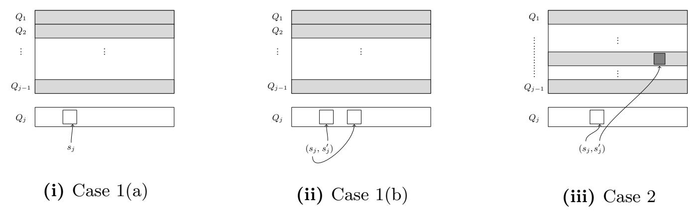
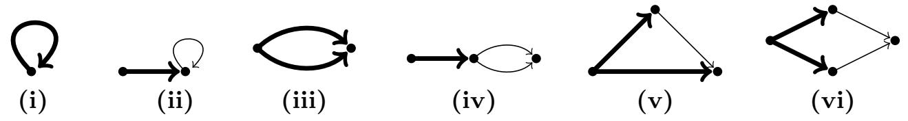
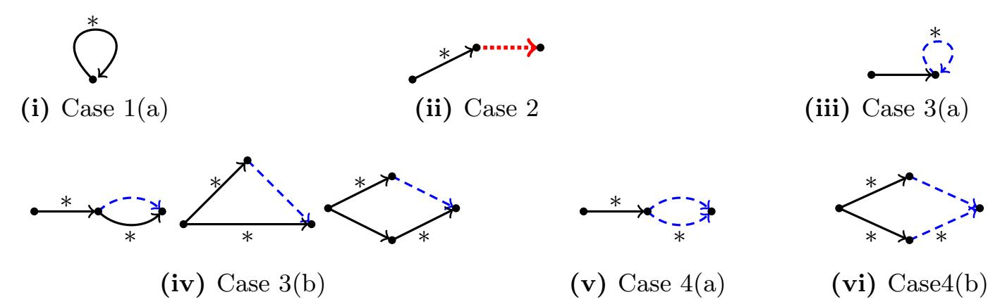
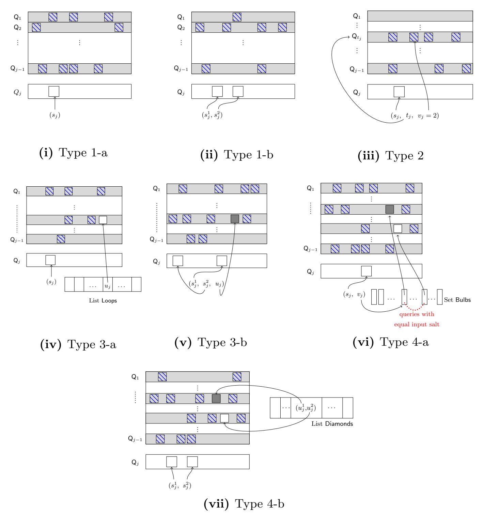

{0}------------------------------------------------

## <span id="page-0-0"></span>Time-Space Tradeoffs and Short Collisions in Merkle-Damg˚ard Hash Functions

Akshima<sup>1</sup> , David Cash<sup>1</sup> , Andrew Drucker<sup>1</sup> , and Hoeteck Wee2,<sup>3</sup>

<sup>1</sup> University of Chicago, akshima@uchicago.edu, davidcash@uchicago.edu, andy.drucker@gmail.com <sup>2</sup> CNRS, ENS and PSL wee@di.ens.fr <sup>3</sup> NTT Research

Abstract. We study collision-finding against Merkle-Damg˚ard hashing in the random-oracle model by adversaries with an arbitrary S-bit auxiliary advice input about the random oracle and T queries. Recent work showed that such adversaries can find collisions (with respect to a random IV) with advantage Ω(ST <sup>2</sup> /2 n ), where n is the output length, beating the birthday bound by a factor of S. These attacks were shown to be optimal.

We observe that the collisions produced are very long, on the order of T blocks, which would limit their practical relevance. We prove several results related to improving these attacks to find shorter collisions. We first exhibit a simple attack for finding B-block-long collisions achieving advantage Ω˜(ST B/2 n ). We then study if this attack is optimal. We show that the prior technique based on the bit-fixing model (used for the ST <sup>2</sup> /2 <sup>n</sup> bound) provably cannot reach this bound, and towards a general result we prove there are qualitative jumps in the optimal attacks for finding length 1, length 2, and unbounded-length collisions. Namely, the optimal attacks achieve (up to logarithmic factors) on the order of (S + T)/2 n , ST /2 n and ST <sup>2</sup> /2 n advantage. We also give an upper bound on the advantage of a restricted class of short-collision finding attacks via a new analysis on the growth of trees in random functional graphs that may be of independent interest.

## 1 Introduction

This work considers the security of random-oracle-based hash functions against preprocessing adversaries which have a bounded amount of arbitrary auxiliary information on the random oracle to help them. Attacks in this model were first considered by Hellman [\[11\]](#page-32-0), who gave a heuristic time-space tradeoff for inverting cryptographic functions. We would like to understand the power of these attacks in the context of finding collisions in hash functions, and in particular, salted hash functions based on the widely used Merkle-Damg˚ard paradigm.

Finding short collisions. In this work, we focus on understanding the best attacks for finding short collisions, as motivated by real-world applications. Concretely, we put forth and study the following conjecture:

{1}------------------------------------------------

STB conjecture: The best attack with time T and space S for finding collisions of length B in salted MD hash functions built from hash functions with n-bit outputs achieves success probability Θ((ST B + T 2 )/2 <sup>n</sup>).

The birthday attack achieves O(T <sup>2</sup>/2 <sup>n</sup>), and we will describe an attack that achieves O(ST B/2 <sup>n</sup>). Short of proving circuit lower bounds, we cannot hope to rule out better attacks, except in idealized models, where we treat the underlying hash function as a random oracle.

The AI-RO model. We use the auxiliary-input random oracle (AI-RO) model introduced by Unruh [\[15\]](#page-32-1), which was originally motivated by dealing with the non-uniformity of adversaries that is necessary for some applications of the random-oracle model [\[1\]](#page-31-0). In the AI-RO model, two parameters S, T are fixed, and adversaries are divided into two stages (A1, A2): The first has unbounded access to a random function h, and computes an S-bit auxiliary input (or advice string) σ for A2. Then the second stage accepts σ as input, and gets T queries to an oracle computing h, and attempts to accomplish some goal involving the function h. We think of the adversaries as information-theoretic and ignore runtime.

Salted-collision resistance of MD hash functions at the AI-RO model was first studied by Coretti, Dodis, Guo and Steinberger (CDGS) [\[3\]](#page-31-1). They proved the STB conjecture in the setting B = T, showing an attack with success probability ST2/2 <sup>n</sup> and proving its optimality.

Our results in a nutshell. We study the STB conjecture in the AI-RO model, studying both upper bounds (better attacks) and lower bounds (ruling out better attacks). Our contributions are as follows:

- Upper bounds. We present an attack with success probability O(ST B/2 <sup>n</sup>). The attack exploits the existence of expanding depth-B trees of size O(B) in random functional graphs defined by h.
- Limitations of prior lower bounds. We show that the CDGS [\[3\]](#page-31-1) techniques cannot rule out attacks with success probability ST2/N, even for B = 2. In particular, the crux of the CDGS technique is a O(ST /N) bound in an intermediate idealized model (that translates to an AI-RO bound with a multiplicative loss of T), and we provide a matching attack with B = 2 in this intermediate model.
- A lower bound for B = 2. We present new techniques to prove the STB conjecture for B = 2 in the AI-RO model. That is, the optimal attack achieves success probability Θ((ST + T 2 )/N) for B = 2. This is the main technical contribution of this work. Interestingly, this means that for B = 2, if the space S ≤ T, then there is no better attack than the birthday attack!
- Bounding low-depth trees. We rule out the existence of expanding depth-B trees of size O˜(B<sup>2</sup> ) in random functional graphs, which shows that simple extensions of our attack cannot achieve success probability better than ST B/N.

{2}------------------------------------------------

#### 1.1 Prior works

Collision-resistance in the AI-RO. We consider salted collision resistance following Dodis, Guo and Katz [\[6\]](#page-31-2), in order to rule out trivial attacks where the adversary hardwires a collision on h. Assume, as we shall for the rest of the paper, that the function has the form h : [N]×[M] → [N], where [N] = [2n] and [M] = [2m], which we identify with {0, 1} <sup>n</sup> and {0, 1} <sup>m</sup> respectively. In salted collision-resistance in the AI-RO model, the second-stage adversary gets as input a random "salt" a ∈ [N] (along with σ), and must find α 6= α <sup>0</sup> ∈ [M] such that h(a, α) = h(a, α<sup>0</sup> ). The prior work obtained a bound of O(S/N + T <sup>2</sup>/N) on the success probability of any adversary, which is optimal (their result actually covers a wider parameter range and different forms of h that are not relevant for our results here). These results were interestingly proven via compression arguments [\[10](#page-32-2)[,9\]](#page-32-3), where it is shown that an adversary that is successful too often can be used to compress uniformly random strings, which is impossible (cf. [\[14\]](#page-32-4) for other applications of encoding arguments in computer science and combinatorics).

In order to better model in-use hash functions, the aforementioned work of Coretti, Dodis, Guo and Steinberger examined salted-collision-finding against an MD hash function built from a random oracle h [\[3\]](#page-31-1). In their setting the first stage adversary works as before, but the second adversary only needs to find a collision in the iterated MD function built from h, starting at a random salt; We give precise definitions in the next section. That work showed that finding these collisions is substantially easier, giving an attack and matching lower bound of O(ST2/N). This was surprising in a sense, as it shows there exists an S = T ≈ 2 <sup>60</sup> attack against a hash function with 180-bit output, well below the birthday attack with T ≈ 2 90 .

A closer look at this attack reveals that the collisions it finds are very long (on the order of T blocks), so in our example the colliding messages each consist of 2<sup>60</sup> blocks. While technically violating collision-resistance, this adversary is not damaging in any widely-used application we are aware of, as the colliding messages are several petabytes long. Addressing whether or not this attack, or the lower bound, can be improved to find shorter collisions is the starting point for our work.

The results of [\[3\]](#page-31-1) did not use compression. Instead they applied a tightening of the remarkable and powerful bit-fixing (or presampling) method of Unruh [\[15\]](#page-32-1), which we briefly recall here. In the bit-fixing random oracle (BF-RO) model, the adversary no longer receives an advice string. Instead the first stage adversary can fix, a priori, some bits P of the table of h. Then the rest of h is sampled, and the second stage attempts to find a salted collision as before. Building on Unruh's results, Coretti et al. showed (very roughly) that a bound of O((T +P)T /N) on the advantage of any adversary in the BF-RO implies a bound of O(ST<sup>2</sup>/N) in the AI-RO. Moreover, the BF-RO bound was very easily proved, resulting in a simple and short proof.

{3}------------------------------------------------

#### 1.2 This work

Motivated by real-world hash functions like SHA-256, where N = 2<sup>n</sup> = 2<sup>256</sup> , M = 2512, we are interested in parameter settings with B T, such as S = 2<sup>70</sup> , T = 2<sup>95</sup> and B = 218, which corresponds to computing a 256-bit digest of a 16MB message using SHA-256. Here, (ignoring constants) the CDG bound is meaningless, since ST2/N > 1, whereas the corresponding attack achieves constant advantage when T = B ≈ 2 <sup>93</sup>, collisions which are several yottabytes (= 10<sup>24</sup> bytes) long.

We first observe that Hellman's attack (or an easy modification of the attack in [\[3\]](#page-31-1)) can find length-B collisions with success probability roughly ST B/N. We make this formal in Section [3.](#page-8-0)

While the attack was easy to modify for short collisions, proving that it is optimal is an entirely different matter with significant technical challenges. In order to explain them, we recall the approach of [\[3\]](#page-31-1) used to prove the O(ST2/N) bound for salted MD. They used a technical approach (with tighter parameters) first developed by Unruh [\[15\]](#page-32-1), which connects the AI-RO model to the bit-fixing random oracle (BF-RO) model (we defer the definition to the next section). Their work transfers lower bounds in the BF-RO model to lower bounds in the AI-RO model.

We show that the BF-to-AI template inherently cannot give a lower bound for finding short collisions, because finding short collisions in the BF-RO model is relatively easy. That is, the lower bound of the form we would need for BF-RO model simply does not hold. In the notation introduced above, we would need to show that no adversary finding length-2 collisions can do better than O((P + T)/N) advantage, but we give a simple attack in BF-RO model that finds length-2 collisions with advantage Ω(P T /N). Thus another approach is required.

Our lower bound technique. Given that the BF-to-AI technique cannot distinguish between short and long collision finding, we must find another approach. There are two options from the literature: The previously-mentioned compression arguments, and another lesser-known but elegant method of Impagliazzo using concentration inequalities.

Compression arguments which were previously observed [\[3\]](#page-31-1) to be difficult (or "intractable") to apply to the setting of salted MD collision finding despite working in the original non-MD setting [\[6\]](#page-31-2). Given that compression was already difficult in this setting, it does not seem promising to extend it to the harder problem of short collisions.

To address these difficulties, we introduce a new technique that first applies a variant of the "constructive" Chernoff bound of Impagliazzo and Kabanets [\[13\]](#page-32-5) to prove time-space tradeoff lower bounds. The concentration-based approach to time-space tradeoff lower bounds was, to our knowledge, first introduced by Impagliazzo in an unpublished work, and then later elucidated in an appendix [\[12\]](#page-32-6) (there an older work of Zimand [\[17\]](#page-32-7) is also credited). The high-level idea is to first prove that any adversary (with no advice) can succeed on any fixed U ∈ [N] 

{4}------------------------------------------------

of Ω(S) of inputs with probability ε Ω(S) . (In some sense bounding every sufficiently large "moment of the adversary"). The argument continues by applying a concentration bound to the random variable that counts the number of winning inputs for this adversary, showing that it wins on a O(ε)-fraction of inputs except with probability 2−Ω(S) . In a final elegant step, one shows that every advice string is likely to be bad via a union bound over all possible 2<sup>S</sup> advice strings, to get a final bound of ε.

The technique of Impagliazzo gives a direct and simple proof for the optimal bound on inverting a random permutation. There are two issues in applying it to short MD collisions however. First, as we formally show later, it provably fails for salted MD hashing. The issue is that the adversary may simply succeed with probability greater than ε <sup>S</sup> on some subsets U (see section [7\)](#page-24-0), so the first step cannot be carried out.

We salvage the technique by showing it is sufficient to bound the adversary's average advantage for random subsets U rather than all subsets. In the language of probability, we use a concentration bound that only needs average of the moments to be bounded by ε Ω(S) , rather than all of the moments; see Theorem [1.](#page-7-0)

So far we have been able to reduce the problem of proving a lower bound in AI-RO model to the problem of bounding the probability that an adversary with no advice can succeed on every element of a random subset of inputs. For the problems we considered, even this appeared to be complicated. To tame the complexity of these bounds, we apply compression arguments; Note that we are only proving the simpler bound needed for the Impagliazzo technique, but using compression, when previously compression was used for the problem directly. Our variation has the interesting twist that we can not only compress the random function (as other work did), but also the random subset U on which the adversary is being run. This turns out to vastly simplify such arguments.

Applications of our technique. We first apply our technique to reprove the O(ST2/N) bound for (non-short) collision finding against salted MD hash functions. We then turn to the question of short collisions. Proving a general bound (perhaps O(ST B/N)) for finding length-B collisions appears to be very difficult, so we start by examining the first new case of B = 2.

We show that there are qualitative gaps between finding length-1 collisions, length-2 collisions, and arbitrary-length collisions. Specifically, while for length-1 collisions we have ε = O((S + T 2 )/N), we show that length-2 collisions are easier when S > T, as the optimal bound is O((ST + T 2 )/N). For arbitrarylength collisions there is another gap, where the optimal bound is O(ST<sup>2</sup>/N). Our bound for length-2 collisions uses our new compression approach used above.

It appears that we could, in principle, obtain similar bounds for other small length bounds like 3 and 4, but these proofs would be too long and complex for us to write down; Going to arbitrary length bounds seems to be out of reach, but there is no inherent obstruction in applying our technique to the general case with new ideas.

Bound for a restricted class of attacks. Given the difficulty of proving the general case, we instead consider ruling out the class of attacks that gives 

{5}------------------------------------------------

optimal attacks in the known cases. Roughly speaking, these attacks use auxiliary information consisting of S collisions at well-chosen points in the functional graph. In the online phase, the attack repeatedly tries to "walk" to these points by taking one "randomizing" step followed by several steps with zero-blocks.

For this class of attacks, we show that the best choice of collision points will result in ε = O(ST B/N). This result requires carefully analyzing the size of large, low-depth trees in random functional graphs, a result that may be of independent interest.

#### 1.3 Discussion

On the non-existence of non-uniform attacks. A common argument against studying lower bounds for non-uniform attacks[4](#page-0-0) is that we have no nontrivial examples of better-than-generic non-uniform attacks on real-world hash functions like SHA,-1 and that the complexity of the non-uniform advice may anyway be prohibitive. Our STB conjecture, if true, would explain the nonexistence of these attacks: for small B, S where SB ≤ T, non-uniform attacks do not achieve any advantage over the birthday attack!

Other related work. In addition to Hellman's seminal work, we mention that time-space trade-offs and lower bounds for other problems, including inverting random functions and permutations and problems in the generic-group model, and other models have been investigated [\[7,](#page-32-8)[16,](#page-32-9)[5,](#page-31-3)[4,](#page-31-4)[2\]](#page-31-5).

Acknowledgements. We thank an anonymous reviewer at CRYPTO 2020 for suggesting an improvement to Theorem [8.](#page-27-0) Previously the theorem only gave a bound of O(ST B2/N). The first two authors were supported in part by NSF CNS-1453132.

## 2 Preliminaries

Notation. For non-negative integers N, k we write [N] for {1, 2, . . . , N} and [N] k for the collection of size-k subsets of [N]. For a set X, we write X<sup>+</sup> for tuples of 1 or more elements of X. Random variables will be written in bold, and we write x \$← X to indicate that x is a uniform random variable on X.

Merkle-Damg˚ard (MD) hashing. We consider an abstraction of plain MD hashing, where a variable-length hash function is constructed from a fixed-length compression function that is modeled as a random oracle. For integers N, M and a function h : [N] × [M] → [N], Merkle-Damg˚ard hashing is defined MD<sup>h</sup> : [N] × [M] <sup>+</sup> → [N] recursively by MDh(a, α) = h(a, α) for α ∈ [M], and

$$\mathrm{MD}_h(a,(\alpha_1,\ldots,\alpha_B)) = h(MD_h(a,(\alpha_1,\ldots,\alpha_{B-1})),\alpha_B)$$

for α1, . . . , α<sup>B</sup> ∈ [M]. We refer to elements of [M] as blocks.

<sup>4</sup>An AI-adversary with S bits of advice and T queries can be compiled into a circuit of size roughly O(S + T).

{6}------------------------------------------------

```
Game Al-CR<sub>h,a</sub>(\mathcal{A})
\sigma \leftarrow \mathcal{A}_{1}(h)
\alpha, \alpha' \leftarrow \mathcal{A}_{2}^{h}(\sigma, a)
If \alpha \neq \alpha' and MD<sub>h</sub>(a, \alpha) = MD<sub>h</sub>(a, \alpha')
Then Return 1
Else Return 0

Game BF-CR<sub>h,a</sub>(\mathcal{B}, \mathcal{L})
\alpha, \alpha' \leftarrow \mathcal{B}^{h_{\mathcal{L}}}(a)
If \alpha \neq \alpha' and MD<sub>h<sub>\mathcarceleft</sub>(a, \alpha')
Then Return 1
Else Return 0</sub>
```

**Fig. 1:** Games Al-CR<sub>h,a</sub>( $\mathcal{A}$ ) and BF-CR<sub>h,a</sub>( $\mathcal{B}$ ,  $\mathcal{L}$ ).

#### 2.1 Collision Resistance Definitions

We recall definitions for collision resistance against preprocessing and against bit-fixing.

AUXILIARY-INPUT SECURITY. We formalize auxiliary-input security [15] for salted MD hashing as follows.

**Definition 1.** For a pair of algorithms  $\mathcal{A} = (\mathcal{A}_1, \mathcal{A}_2)$ , a function  $h : [N] \times [M] \to [N]$ , and  $a \in [N]$  we define game Al-CR<sub>h,a</sub>( $\mathcal{A}$ ) in Figure 1. We define the auxiliary-input collision-resistance advantage of  $\mathcal{A}$  against Merkle-Damgård as

$$\mathbf{Adv}_{\mathrm{MD}}^{\mathrm{ai-cr}}(\mathcal{A}) = \Pr[\mathsf{AI-CR}_{\mathbf{h},\mathbf{a}}(\mathcal{A}) = 1],$$

where  $\mathbf{h} \stackrel{\$}{\leftarrow} \mathsf{Func}([N] \times [M], [N]), \ \mathbf{a} \stackrel{\$}{\leftarrow} [N] \ are \ independent.$ 

We say  $\mathcal{A} = (\mathcal{A}_1, \mathcal{A}_2)$  is an (S, T)-AI adversary if  $\mathcal{A}_1$  outputs S bits and  $\mathcal{A}_2$  issues T queries to its oracle (for any inputs and oracles). We define the (S, T)-auxiliary-input collision resistance of Merkle-Damgård, denoted  $\mathbf{Adv}_{\mathrm{MD}}^{\mathrm{ai-cr}}(S, T)$ , as the maximum of  $\mathbf{Adv}_{\mathrm{MD}}^{\mathrm{ai-cr}}(\mathcal{A})$  taken over all (S, T)-AI adversaries  $\mathcal{A}$ .

We note that in our formalization, the games in the figures are not randomized, but just defined for any h and a. In the definition we use the games to define random variables by applying the game as a function to random variables  $\mathbf{h}$  and  $\mathbf{a}$ . This has the advantage of being explicit about sample spaces when applying compression arguments.

We also consider bounded-length collisions as follows.

**Definition 2.** We say a pair of algorithms  $\mathcal{A} = (\mathcal{A}_1, \mathcal{A}_2)$  is an (S, T, B)-AI adversary if  $\mathcal{A}_1$  outputs S bits,  $\mathcal{A}_2$  issues T queries to its oracle, and the outputs of  $\mathcal{A}_2$  each consist of B or fewer blocks.

We define the (S, T, B)-auxiliary-input collision resistance of MD, denoted  $\mathbf{Adv}_{\mathrm{MD}}^{\mathrm{ai\text{-}cr}}(S, T, B)$ , as the maximum of  $\mathbf{Adv}_{\mathrm{MD}}^{\mathrm{ai\text{-}cr}}(A)$  taken over all (S, T, B)-AI adversaries A.

BIT-FIXING SECURITY. We recall the bit-fixing model of Unruh [15]. When  $f: X \to Y$  is a function on some domain and range, and  $\mathcal{L}$  is a list  $(x_i, y_i)_{i=1}^{|\mathcal{L}|}$  where  $x_i \in X$  and  $y_i \in Y$  for all  $i \in 1, ..., |\mathcal{L}|$  and all the  $x_i$  are distinct, we define  $f_{\mathcal{L}}$ 

{7}------------------------------------------------

as follows:

$$f_{\mathcal{L}}(x) = \begin{cases} y_i & \text{if } \exists (x_i, y_i) \in \mathcal{L} \text{ such that } x = x_i \\ f(x) & \text{otherwise.} \end{cases}$$

In other words,  $\mathcal{L}$  is a list of input/output pairs, and  $f_{\mathcal{L}}$  is just f, but with outputs overwritten by the tuples in  $\mathcal{L}$ .

**Definition 3.** Let  $h:[N] \times [M] \to [N]$ , and  $a \in [N]$ . For an adversary  $\mathcal{B}$  and a list  $\mathcal{L}$  of input/output pairs for h we define BF-CR<sub>h,a</sub>( $\mathcal{B},\mathcal{L}$ ) in Figure 1. We define the bit-fixing collision-resistance advantage of ( $\mathcal{B},\mathcal{L}$ ) against Merkle-Damgård as

$$\mathbf{Adv}_{\mathrm{MD}}^{\mathrm{bf\text{-}cr}}(\mathcal{B}, \mathcal{L}) = \Pr[\mathsf{BF\text{-}CR}_{\mathbf{h}, \mathbf{a}}(\mathcal{B}, \mathcal{L}) = 1],$$

where  $\mathbf{h} \stackrel{\$}{\leftarrow} \mathsf{Func}([N] \times [M], [N]), \ \mathbf{a} \stackrel{\$}{\leftarrow} [N] \ are \ independent.$ 

We say  $(\mathcal{B}, \mathcal{L})$  is an (P, T)-BF adversary if  $\mathcal{L}$  has at most P entries and  $\mathcal{B}$  issues T queries to its oracle (for any inputs and oracles). We define the (P, T)-bit-fixing collision resistance of MD, denoted  $\mathbf{Adv}_{\mathrm{MD}}^{\mathrm{bf}\text{-}\mathrm{cr}}(P, T)$ , as the maximum of  $\mathbf{Adv}_{\mathrm{MD}}^{\mathrm{bf}\text{-}\mathrm{cr}}(\mathcal{B}, \mathcal{L})$  taken over all (P, T)-BF adversaries  $(\mathcal{B}, \mathcal{L})$ .

As with AI security, we also consider bounded-length collision resistance against BF adversaries.

**Definition 4.** We say  $(\mathcal{B}, \mathcal{L})$  is an (P, T, B)-BF adversary if  $\mathcal{L}$  has at most P entries,  $\mathcal{B}$  issues T queries to its oracle (for any inputs and oracles) and the outputs of  $\mathcal{B}$  each consist of B or fewer blocks. We define the (P, T, B)-bit-fixing collision resistance of MD, denoted  $\mathbf{Adv}_{\mathrm{MD}}^{\mathrm{bf-cr}}(P, T, B)$ , as the maximum of  $\mathbf{Adv}_{\mathrm{MD}}^{\mathrm{bf-cr}}(\mathcal{B}, \mathcal{L})$  taken over all (P, T, B)-BF adversaries  $(\mathcal{B}, \mathcal{L})$ .

CHERNOFF BOUNDS. We will use the following variant of the Chernoff-type bound proved by Impagliazzo and Kabanets [13]. It essentially says that if the  $u^{\text{th}}$  moments of a sum are bounded on average, then we can conclude the sum is tightly concentrated, up to some dependence on u. Note that  $\mathbf{X}_1, \ldots, \mathbf{X}_N$  are not assumed independent.

**Theorem 1.** Let  $0 < \delta < 1$  and let  $\mathbf{X}_1, \dots, \mathbf{X}_N$  be 0/1 random variables,  $\mathbf{X} = \mathbf{X}_1 + \dots \mathbf{X}_N$ , and let  $\mathbf{U}$  be an independent random subset of [N] of size u. Assume

<span id="page-7-0"></span>
$$\Pr[\bigwedge_{i \in \mathbf{U}} \mathbf{X}_i] \le \delta^u.$$

Then

$$\Pr[\mathbf{X} \ge \max\{6\delta N, u\}] \le 2^{-u}.$$

In their original version, instead of a random set  $\mathbf{U}$  it was required that the first inequality hold for all sets U of size u (so all  $u^{\text{th}}$  moments must be bounded). It is easy to show that our weaker condition is still sufficient, and the proof of this version is almost identical and given in the appendix (Section 9) only for completeness.

We will also apply the following standard multiplicative Chernoff bound in Section 8.

{8}------------------------------------------------

**Theorem 2.** Let  $0 < \delta < 1$  and let  $\mathbf{X}_1, \dots, \mathbf{X}_N$  be independent 0/1 random variables and put  $\mathbf{X} = \mathbf{X}_1 + \dots + \mathbf{X}_N$ . Then

$$\Pr[\mathbf{X} \ge (1+\delta) \cdot E[\mathbf{X}]] \le \exp\left(\frac{-\delta^2 \cdot E[\mathbf{X}]}{2+\delta}\right).$$

## <span id="page-8-0"></span>3 Bounded-Length Auxiliary-Input Attack

Coretti et al [2] gave an  $\Omega(ST^2)$  attack where the adversary gets S-bit advice and T oracle queries to find (unbounded length) collisions against  $\mathrm{MD}^h$ . It is easy to adapt the attack to find length B collisions with advantage  $\Omega(STB)$ . We describe this attack and its analysis in the appendix (Section 10).

**Theorem 3.** For any positive integers S, T, B such that  $B \le T < N/4$ ,  $STB \le N/2$  and  $M \ge N$ ,

<span id="page-8-2"></span>
$$\mathbf{Adv}_{\mathrm{MD}}^{\mathrm{ai-cr}}(S, T, B) \ge \frac{STB - 96S}{48N \log N}.$$

# 4 Length 2 Collisions are Relatively Easy in the BF Model

Unruh in [15] proved a remarkable general relationship between the AI-RO and BF-RO models that was sharpened by Coretti et al. [2]. We recall their theorem now, and then show that this method, when applied to salted MD hashing, is insensitive to the length of collisions found and hence cannot give the improved bound we seek in the AI-RO model. We note that the second part of this theorem was not stated there, but follows exactly from their proof.

**Theorem 4.** For any positive integers S, T, P and  $\gamma > 0$  such that  $P \geq (S + \log \gamma^{-1})T$ ,

<span id="page-8-1"></span>
$$\mathbf{Adv}_{\mathrm{MD}}^{\mathrm{ai-cr}}(S,T) \leq 2\mathbf{Adv}_{\mathrm{MD}}^{\mathrm{bf-cr}}(P,T) + \gamma.$$

Moreover, for any positive integer B,

$$\mathbf{Adv}^{\mathrm{ai\text{-}cr}}_{\mathrm{MD}}(S,T,B) \leq 2\mathbf{Adv}^{\mathrm{bf\text{-}cr}}_{\mathrm{MD}}(P,T,B) + \gamma.$$

The following is a simple extension of an attack of [3], which shows that finding even just length-2 collisions in the BF model is much easier than finding length-1 collisions, and in fact is as easy as finding general length collisions.

**Theorem 5.** For all positive integers P, T such that  $PT \leq 2N$ , there exists a (P, T, 2)-BF adversary  $(\mathcal{B}, \mathcal{L})$  such that

$$\mathbf{Adv}^{\mathrm{bf\text{-}cr}}_{\mathrm{MD}}(\mathcal{B},\mathcal{L}) \geq \left(1 - \frac{1}{e}\right) \frac{PT}{2N}.$$

{9}------------------------------------------------

*Proof.* We construct a (P, T, 2)-BF adversary  $(\mathcal{B}, \mathcal{L})$  to prove the theorem. We assume P is even for simplicity of notation. To define the list  $\mathcal{L}$ , let  $\alpha, \alpha' \in [M], a_1, \ldots, a_{P/2}, y \in [N]$  be some arbitrary points, and let  $\mathcal{L}$  consist of the P entries

$$((a_1,\alpha),y), ((a_1,\alpha'),y), \dots ((a_{P/2},\alpha),y), ((a_{P/2},\alpha'),y)$$

Adversary  $\mathcal{B}$  does the following on input a and oracle  $h_{\mathcal{L}}$ : Let  $\alpha_1, \dots, \alpha_T \in [M]$  be arbitrary distinct points. For  $j = 1, \dots, T$ , query  $(a, \alpha_j)$  to the oracle  $h_{\mathcal{L}}$ . If the output is an element of  $\{a_1, \dots, a_{P/2}\}$ , then output colliding messages  $\alpha_j \| \alpha$  and  $\alpha_j \| \alpha'$ .

We lower bound  $\mathbf{Adv_{\mathrm{MD}}^{\mathrm{bf-cr}}}(\mathcal{B},\mathcal{L})$ . Let E be the event that the output of some query made by  $\mathcal{B}$  is in the set  $\{a_1,\ldots,a_{P/2}\}$ . Clearly, when E happens, our adversary wins the game. Thus

$$\mathbf{Adv}_{\mathrm{MD}}^{\mathrm{bf-cr}}(\mathcal{B},\mathcal{L}) \geq 1 - \Pr[\neg E] \geq 1 - \left(1 - \frac{P}{2N}\right)^T \geq 1 - e^{-PT/2N} \geq \left(1 - \frac{1}{e}\right) \frac{PT}{2N}$$

where the last inequality holds because  $0 \le \frac{PT}{2N} \le 1$ .

This adversary shows that applying Theorem 4 can at best give  $\mathbf{Adv_{\mathrm{MD}}^{\mathrm{ai\text{-}cr}}}(S,T,2) = O(ST^2/N)$ , which we show to be suboptimal in Section 6, where using compression techniques we prove a bound of  $\tilde{O}(ST/N)$ .

## 5 Unbounded Length Collision AI Bound

In this section we give a different proof of the  $O(ST^2)$  bound of Coretti et al.[2], formalized as follows.

**Theorem 6.** For any positive integers S, T,

<span id="page-9-0"></span>
$$\mathbf{Adv}_{\mathrm{MD}}^{\mathrm{ai\text{-}cr}}(S,T) \leq \frac{192e(S + \log N)T^2 + 1}{N}.$$

Following Impagliazzo [13], we proceed by analyzing an adversary without auxilliary input "locally."

**Definition 5.** For a pair of algorithms  $A = (A_1, A_2)$  and positive integer u we define

$$\mathbf{Adv}_{\mathrm{MD}}^{u\text{-ai-cr}}(\mathcal{A}) = \Pr[\forall a \in \mathbf{U} : \mathsf{AI-CR}_{\mathbf{h},a}(\mathcal{A}) = 1],$$

where  $\mathbf{h} \stackrel{\$}{\leftarrow} \mathsf{Func}([N] \times [M], [N])$ , and  $\mathbf{U} \stackrel{\$}{\leftarrow} \binom{[N]}{u}$  are independent.

<span id="page-9-1"></span>**Lemma 1.** For any positive integers S, T, u, and  $\hat{\sigma} \in \{0, 1\}^S$ , let  $\mathcal{A} = (\mathcal{A}_1, \mathcal{A}_2)$  be an adversary where  $\mathcal{A}_1$  always outputs  $\hat{\sigma}$ , and  $\mathcal{A}_2$  issues T queries to its oracle. Then

$$\mathbf{Adv}_{\mathrm{MD}}^{u\text{-ai-cr}}(\mathcal{A}) \leq \left(\frac{32euT^2}{N}\right)^u.$$

{10}------------------------------------------------

This lemma is proved below. We first prove the theorem using the lemma.

Proof of Theorem 6. Let  $\mathcal{A} = (\mathcal{A}_1, \mathcal{A}_2)$  be an (S, T)-AI adversary. We need to bound  $\mathbf{Adv}_{\mathrm{MD}}^{\mathrm{ai-cr}}(\mathcal{A})$  as in the theorem. Call h easy for adversary  $\mathcal{A}$  if

$$\Pr[\mathsf{AI-CR}_{h,\mathbf{a}}(\mathcal{A}) = 1] \ge \frac{192e(S + \log N)T^2}{N}.$$

We will first show that h is unlikely to be easy for  $\mathcal{A}$ , no matter how  $\mathcal{A}_1$  computes its S advice bits. Below, for each  $\hat{\sigma} \in \{0,1\}^S$  let  $\mathcal{A}_{\hat{\sigma}}$  be  $\mathcal{A}$ , except with  $\mathcal{A}_1$  replaced by an algorithm that always outputs  $\hat{\sigma}$ .

Fix some  $\hat{\sigma} \in \{0,1\}^S$ . For each  $a \in [N]$  let  $\mathbf{X}_a$  be an indicator random variable for the event that  $\mathsf{AI-CR}_{\mathbf{h},a}(\mathcal{A}_{\hat{\sigma}}) = 1$ . By Lemma 1 we have  $\Pr[\bigwedge_{a \in \mathbf{U}} \mathbf{X}_a] \leq \delta^u$  for any u and  $\delta = 32euT^2/N$ . Then by Theorem 1 with  $u = S + \log N$ , we have

$$\Pr[\mathbf{h} \text{ is easy for } \mathcal{A}_{\hat{\sigma}}] = \Pr[\sum_{a=1}^{N} \mathbf{X}_a \ge 192 euT^2] \le 2^{-(S + \log N)}.$$

Let E be the event that there exists  $\hat{\sigma} \in \{0,1\}^S$  such that  $\mathbf{h}$  is easy for  $\mathcal{A}_{\hat{\sigma}}$ . By a union bound over  $\hat{\sigma} \in \{0,1\}^S$ ,

$$\Pr[E] \le 2^S 2^{-(S + \log N)} = 1/N.$$

Finally we have

$$\begin{split} \Pr[\mathsf{AI\text{-}CR}_{\mathbf{h},\mathbf{a}}(\mathcal{A}) = 1] &\leq \Pr[\mathsf{AI\text{-}CR}_{\mathbf{h},\mathbf{a}}(\mathcal{A}) = 1 | \neg E] + \Pr[E] \\ &\leq \frac{192e(S + \log N)T^2}{N} + \frac{1}{N}. \end{split}$$

The last inequality holds because for each  $h \notin E$ ,

$$\Pr[\mathsf{AI-CR}_{h,\mathbf{a}}(\mathcal{A}) = 1] \le \max_{\hat{\sigma} \in \{0,1\}^S} \Pr[\mathsf{AI-CR}_{h,\mathbf{a}}(\mathcal{A}_{\hat{\sigma}}) = 1] \le \frac{192e(S + \log N)T^2}{N}.$$

Since this holds for any (S,T)-AI adversary  $\mathcal{A}$ , we obtain the lemma.  $\square$ 

### 5.1 Proof of Lemma 1

COLLIDING CHAINS. We start with some useful definitions and a simplifying lemma.

**Definition 6.** Let  $h:[N] \times [M] \to [N]$ . A list of elements  $(x_0, \alpha_0), \ldots, (x_\ell, \alpha_\ell)$  from  $[N] \times [M]$  is called an MD-chain (for h) when  $h(x_i, \alpha_i) = x_{i+1}$  for  $i = 0, \ldots, \ell - 1$ . We say two chains  $(x_0, \alpha_0), \ldots, (x_\ell, \alpha_\ell)$  and  $(x'_0, \alpha'_0), \ldots, (x'_{\ell'}, \alpha'_{\ell'})$  collide (for h) if  $h(x_\ell, \alpha_\ell) = h(x'_{\ell'}, \alpha'_{\ell'})$ .

<span id="page-10-0"></span>We will treat chains as strings (over  $[N] \times [M]$ ) and speak of prefixes and suffixes with their usual meaning.

{11}------------------------------------------------

**Lemma 2.** Let C, C' be distinct non-empty colliding chains for h. Then C, C' contain prefixes  $\tilde{C}, \tilde{C}'$  respectively,  $\tilde{C} = (x_0, \alpha_0), \dots (x_\ell, \alpha_\ell)$  and  $\tilde{C}' = (x_0', \alpha_0'), \dots (x_{\ell'}', \alpha_{\ell'}')$ , such that either  $(x_\ell, \alpha_\ell) \neq (x_{\ell'}', \alpha_{\ell'}')$  or one of  $\tilde{C}, \tilde{C}'$  is a strict suffix of the other.

*Proof.* Induction on the maximum length of C, C'. For length 1 this is obvious. For the inductive step, suppose neither is a strict suffix of the other, and that the final entries are equal. Then we can remove the final entries from both chains to get two non-empty shorter chains and apply the inductive hypothesis.  $\Box$ 

PROOF OF LEMMA 1. We prove the lemma by compression. Let  $\mathbf{U} \stackrel{\$}{\leftarrow} \binom{[N]}{u}$  and  $\mathbf{h} \stackrel{\$}{\leftarrow} \operatorname{Func}([N] \times [M], [N])$  be independent. Let  $\mathcal{A} = (\mathcal{A}_1, \mathcal{A}_2)$  be an (S, T)-AI adversary where  $\mathcal{A}_1$  always outputs some fixed string  $\hat{\sigma}$ . Observe that if, for all  $a \in \mathbf{U}$ ,  $\mathcal{A}_2$  never queries a point of  $\mathbf{h}$  with input salt  $a' \in \mathbf{U}$ ,  $a \neq a'$  among the T queries it makes for input a, and also that the chains produced for each a are disjoint from the chains for a', then it is relatively simple to carry out a compression argument, by storing two pointers [T] to compress an entry in [N] (which would translate to a bound of  $(T^2/N)^u$ ). But of course  $\mathcal{A}$  might "cross up" queries for the different salts. If we tried to prove a version of the lemma for all  $U \subseteq {[N] \choose u}$  (as was done in the original context of the appendix in [12]) rather than a random  $\mathbf{U}$ , then the adversary could be specialized for the set U; In Section 7 we give an attack that finds collisions of B = 2 for a fixed subset with greater probability than the upper bound on the advantage of attacking a random subset of same size.

Also, when we choose **U** at random, a fixed  $\mathcal{A}$  can't be specialized for the set, and the "crossed up" queries between salts are unlikely. Formally, if  $\mathcal{A}$  queries a salt  $a' \in \mathbf{U}$  while attacking  $a \in \mathbf{U}$ , we take advantage of this by compressing an entry of the random set **U** when a crossed-up query occurs. Very roughly, this requires a pointer in [T] and saves a factor N/S (because we are omitting one entry from an (unordered) set of size about S). The net compression is then about ST/N per crossed-up query. The details are a bit more complicated, as this compression actually experiences a smooth trade-off as more such queries are compressed and the set shrinks. We handle the case when the chains for  $a \neq a'$  intersect via a simpler strategy that also results in ST/N factors.

Once the crossed-up queries are handled, the proof effectively reduces to the simpler case without crossed-up queries.

*Proof.* For the rest of the proof we fix some  $\mathcal{A} = (\mathcal{A}_1, \mathcal{A}_2)$ , where  $\mathcal{A}_1$  always outputs some fixed  $\hat{\sigma}$ . Let

$$\mathcal{G} = \{(U, h) \mid \forall a \in U : \mathsf{AI-CR}_{h, a}(\mathcal{A}) = 1\} \subseteq \binom{[N]}{u} \times \mathcal{H}.$$

Let

$$\varepsilon = \mathbf{Adv}^{u\text{-ai-cr}}_{\mathrm{MD}}(\mathcal{A}).$$

{12}------------------------------------------------

So  $|\mathcal{G}| = \varepsilon \binom{N}{n} N^{MN}$ . We define an injection

$$f:\mathcal{G}\to\{0,1\}^L$$

with L satisfying

$$\frac{2^L}{\binom{N}{u}N^{MN}} \le \left(\frac{32euT^2}{N}\right)^u.$$

Pigeonhole then immediately gives the bound on  $\varepsilon$ .

For  $(U, h) \in \mathcal{G}$ , f(U, h) outputs an L-bit encoding, where L will be determined below, of

$$(F, U_{\mathsf{Fresh}}, \mathsf{Pred}, \mathsf{Cases}, \mathsf{Coll}, \tilde{h}),$$

where the first output F is an integer between 1 and u,  $U_{\mathsf{Fresh}}$  is a subset of U of size F,  $\mathsf{Pred}$  is a set of pointers,  $\mathsf{Cases}$  is a list of elements in  $\{\mathsf{1a},\mathsf{1b},\mathsf{2}\}$ , and  $\mathsf{Coll}$  is a list of pairs of pointers, and the last output  $\tilde{h}$  is h but rearranged and with some entries deleted. We now define these outputs in order.

FRESH SALTS AND PREDICTION QUERIES. Fix some  $(U, h) \in \mathcal{G}$ , and let  $U = \{a_1, \ldots, a_u\}$ , where the  $a_i$  are in lexicographic order. Let  $\mathsf{Qrs}(a_i) \in ([N] \times [M])^T$  denote the queries  $\mathcal{A}_2$  makes to its oracle when run on input  $(\hat{\sigma}, a_i)$ . Let us abuse notation by writing  $a_i \notin \mathsf{Qrs}(a_j)$  to mean that  $a_i$  is not the first component of any entry in  $\mathsf{Qrs}(a_j)$  (in other words, the salt  $a_i$  is not queried when  $\mathcal{A}_2$  runs on  $a_i$ ).

We define  $U_{\mathsf{Fresh}} \subseteq U$  inductively by

$$a_i \in U_{\mathsf{Fresh}} \iff \forall 1 \leq j < i : a_j \in U_{\mathsf{Fresh}} \implies a_i \notin \mathsf{Qrs}(a_j).$$

The set  $U_{\mathsf{Fresh}}$  trivially contains  $a_1$ . For i > 1,  $a_i \in U_{\mathsf{Fresh}}$  if no prior salt in  $U_{\mathsf{Fresh}}$  causes  $\mathcal{A}_2$  to query  $a_i$ . Conversely, for any  $a_i \in U \setminus U_{\mathsf{Fresh}}$ , there is a prior salt  $a_j \in U_{\mathsf{Fresh}}$  such that  $a_i \in \mathsf{Qrs}(a_j)$ .

Let us denote the size of  $U_{\mathsf{Fresh}}$  by F, and let us write  $U_{\mathsf{Fresh}} = \{a'_1, \ldots, a'_F\}$  where the  $a'_j$  are in lexicographic order. From now on we will only need to deal with the queries issued when the adversary is run on fresh salts. Let  $\mathsf{Q}_j = \mathsf{Qrs}(a'_j)$  for  $j = 1, \ldots, F$  and

$$\mathsf{Q}_{\mathsf{Fresh}} = \mathsf{Q}_1 \| \cdots \| \mathsf{Q}_F \in ([N] \times [M])^{FT}.$$

Going forward, we will sometimes use indices from [FT] to point to queries in  $Q_{Fresh}$  and sometimes indices from [T] to point to queries in  $Q_j$  for some j.

For each  $a \in U \setminus U_{\mathsf{Fresh}}$ , there exists a minimum  $t_a \in [FT]$  such that  $\mathsf{Q}_{\mathsf{Fresh}}[t_a]$  is a query with input salt a. We define  $\mathsf{Pred} \subseteq [FT]$ , the prediction queries, to be

$$\mathsf{Pred} = \{t_a \mid a \in U \setminus U_{\mathsf{Fresh}}\} \subseteq [FT].$$

We have  $|\mathsf{Pred}| = u - F$ .

NEW AND OLD QUERIES. Call an index  $r \in [FT]$  new if  $Q_{\mathsf{Fresh}}[r]$  does not appear earlier in  $Q_{\mathsf{Fresh}}$  (more precisely, if s < r implies  $Q_{\mathsf{Fresh}}[s] \neq Q_{\mathsf{Fresh}}[r]$ ). For  $j \in [F]$ 

{13}------------------------------------------------

we will speak of an index  $t \in [T]$  being new in  $Q_j$ , technically meaning that  $(j-1)T + t \in [FT]$  is new. Since we assume that the queries in  $Q_j$  are distinct,  $Q_j[t]$  being new is equivalent to  $Q_j[t]$  not appearing in  $Q_1 \| \cdots \| Q_{j-1}$ . When a query is not new, we say it is old.

Claim. Let  $Q_{\mathsf{Fresh}} = Q_1 \| \cdots \| Q_F \in ([N] \times [M])^{FT}$  be defined as above. Then for each j, at least one of the following cases holds:

- <span id="page-13-3"></span><span id="page-13-2"></span>1. (a) There exists  $s_j \in [T]$  such that  $s_j$  is new in  $Q_j$  and  $h(Q_j[s_j]) = a'_j$ , (b) There exists  $s'_j < s_j \in [T]$  such that  $s_j$  and  $s'_j$  are new in  $Q_j$  and  $h(Q_j[s_j]) = h(Q_j[s'_j])$
- <span id="page-13-1"></span>2. There exists  $s_j \in [T]$  and  $s'_j \in [FT]$  such that  $s_j$  is new in  $Q_j$ ,  $s'_j$  points to query in  $Q_1 || \dots || Q_{j-1}$ , and  $h(Q_j[s_j])$  equals the input salt of  $Q_{\mathsf{Fresh}}[s'_j]$ .

These cases are depicted in Figure 2.

<span id="page-13-0"></span>

Fig. 2: Cases from claim 5.1. Box denotes an index. White box denotes query at the index is new.

*Proof of claim.* For each j,  $Q_j$  contains a pair of colliding chains that both start from  $a'_j$ . Either some query in the chains is old, or else all the queries in both chains are new.

Suppose first that some query is old, and focus on the chain containing the old query. Since  $a'_j$  is fresh, this old query cannot be the first query of the chain. Thus, starting from the beginning of this chain, we eventually reach a query that is new but the next query is old. Because these queries form a chain, this new query will output the old query's input salt. So we take  $s_j$  to point to this new query in  $Q_j$ , and  $s'_j$  to point to the earlier query in  $Q_1 \| \cdots \| Q_{j-1}$ , and Case 2 of the claim holds.

Now suppose that all queries in the chains are new. By Lemma 2, we can assume without loss of generality that either the last queries of the chains are distinct, or that one chain is a strict suffix of the other. If the chains have distinct final queries, then we can take  $s_j, s'_j$  to point to these distinct (new) queries in  $Q_j$  and Case 1b of the claim holds. If one chain is a strict suffix of the other, then the longer chain must contain a (new) query that outputs  $a'_j$ , since both chains start with salt  $a'_j$ . Then Case 1a of the claim holds.

{14}------------------------------------------------

DEFINITION OF f. On input (U, h), f(U, h) first computes  $U_{\mathsf{Fresh}}$  and  $\mathsf{Pred}$  as defined above. It then computes  $\mathsf{Q}_{\mathsf{Fresh}}$ , and  $\mathsf{Q}_j$  for each  $j = 1, \ldots, F$ . It initializes: (1) Array Cases and Coll, each of size F, the latter of which will hold entries from domains depending on cases, (2)  $\tilde{h}$  to be the table of h, but sorted to contain the responses for  $\mathsf{Q}_{\mathsf{Fresh}}$ , followed by the rest of the table in lexicographic order.

For j = 1, ..., F, f examines  $Q_j$  and determines which of the cases in the claim occurs. It sets  $Cases[j] \in \{1a, 1b, 2\}$  and performs one of the following:

Case 1a: Set  $Coll[j] \leftarrow s_j \in [T]$  and delete the entry corresponding to  $Q_j[s_j]$  from  $\tilde{h}$ .

Case 1b: Set  $Coll[j] \leftarrow (s_j, s'_j) \in [T] \times [T]$  and delete the entry corresponding to query  $Q_j[s_j]$  from  $\tilde{h}$ .

Case 2: Set  $Coll[j] \leftarrow (s_j, s_j') \in [T] \times [FT]$  and delete the entry corresponding to query  $Q_j[s_j]$  from  $\tilde{h}$ .

This completes the description of f. After this process,  $\tilde{h}$  consists of the responses to the queries of  $\mathcal{A}_2$  when it is run on the salts in  $U_{\mathsf{Fresh}}$ , except for the deleted queries, followed by the remaining outputs of h in lexicographic order. Since at least one case always holds by the claim, and we delete exactly one new query from each  $Q_j$ , we have  $\tilde{h} \in [N]^{MN-F}$ .

ANALYSIS OF f. We first argue that the output length of f is not too long, and later that is it injective. Let the number of salts in  $U_{\mathsf{Fresh}}$  having compression type 1a, 1b and 2 be  $\delta_1$ ,  $\delta_1'$  and  $\delta_2$ , respectively. Then  $F = \delta_1 + \delta_1' + \delta_2$ . We set the output length L to the maximum of the following expression, over  $1 \leq F \leq u$ , and  $\delta_1 + \delta_1' + \delta_2 = F$ , rounded to the next integer:

$$\log\left(u\cdot 2^{2F}\binom{N}{F}\binom{FT}{u-F}T^{\delta_1}T^{2\delta_1'}(FT^2)^{\delta_2}N^{MN-F}\right).$$

This formula is explained by considering the outputs of f in turn:

- F and  $U_{\mathsf{Fresh}}$  account for  $\log u + \log {N \choose F}$  bits together,
- Pred needs  $\log {FT \choose u-F}$  bits,
- Cases is an array of size F, storing a ternary value in each entry, and thus less than 2F bits total,
- Coll stores  $\delta_1 \log T + \delta_1' \log T^2 + \delta_2 \log FT^2$  bits,
- -h stores  $(MN-F)\log N$  bits.

We have

$$\frac{2^L}{\binom{N}{u}N^{MN}} \le \max_{F=\delta_1+\delta_1'+\delta_2} u \cdot 2^{2F} \cdot \frac{\binom{N}{F}\binom{FT}{u-F}}{\binom{N}{u}} \cdot \left(\frac{T^{\delta_1} \cdot (T^2)^{\delta_1'} \cdot (FT^2)^{\delta_2}}{N^F}\right).$$

We bound the middle term by

$$\frac{\binom{N}{F}\binom{FT}{u-F}}{\binom{N}{u}} \le \left(\frac{eN}{F}\right)^F \left(\frac{u}{N}\right)^u \left(\frac{eFT}{u-F}\right)^{u-F} = \left(\frac{eu}{F}\right)^F \left(\frac{euFT}{N(u-F)}\right)^{u-F} \\
\le \left(e2^{u/F}\right)^F \left(\frac{e2^{u/(u-F)}FT}{N}\right)^{u-F} \le (4e)^u \left(\frac{FT}{N}\right)^{u-F}.$$

{15}------------------------------------------------

Assuming f is injective, by pigeonhole we have  $2^L \geq \varepsilon \binom{N}{u} N^{MN}$ . Plugging this in and using  $F \leq u \leq 2^u$ , we obtain

$$\varepsilon \leq \max_{F=\delta_1+\delta_1'+\delta_2} (32e)^u \left(\frac{FT}{N}\right)^{u-F} \left(\frac{T}{N}\right)^{\delta_1} \left(\frac{T^2}{N}\right)^{\delta_1'} \left(\frac{FT^2}{N}\right)^{\delta_2} \leq \left(\frac{32euT^2}{N}\right)^u.$$

It remains to show that f is injective, i.e. that (U,h) is determined by  $f(U,h)=(F,U_{\mathsf{Fresh}},\mathsf{Pred},\mathsf{Cases},\mathsf{Coll},\tilde{h}).$  The inversion algorithm works as follows:

- 1. Decode the binary input by reading off F from the first  $\log u$  bits. The size of  $U_{\mathsf{Fresh}}$ ,  $\mathsf{Pred}$ , and  $\mathsf{Cases}$  are determined by F. Then  $\mathsf{Coll}$  can be parsed out using  $\mathsf{Cases}$ , and finally  $\tilde{h}$  can be parsed out easily.
- 2. Initialize h and  $Q_{Fresh}$  to be empty tables.
- 3. For each  $a'_j \in U_{\mathsf{Fresh}}$  (in lexicographic order) the j-th entry of Cases indicates the type of tuple of pointers stored in the j-th entry of Coll. Run  $\mathcal{A}_2$  on  $a'_j$ . Respond to queries using the entries of  $\tilde{h}$  in order (except if the query is a repeat) and populating the entries of h and  $\mathsf{Q}_{\mathsf{Fresh}}$  except when one of the following happens:
  - (a) For Cases[j] = 1a, when  $Q_j[s_j]$  is queried, respond to the query with  $a'_j$ .
  - (b) For Cases[j] = 1b, when  $Q_j[s_j]$  is queried, respond with  $h(Q_j[s'_j])$  (using the partial table for h).
  - (c) For  $\mathsf{Cases}[j] = 2$ , when  $\mathsf{Q}_j[s_j]$  is queried, respond with the input salt of query  $\mathsf{Q}_{\mathsf{Fresh}}[s_j']$ .

After responding, continue running  $A_2$  on  $a'_j$  and populating the tables.

- 4. After running  $A_2$  on all of the salts in  $U_{\mathsf{Fresh}}$ , populate the rest of h using the remaining entries of  $\tilde{h}$  in order.
- 5. Finally, examine the queries  $Q_{\mathsf{Fresh}}$ , and form U by adding the salts pointed to by the indices of  $\mathsf{Pred}$  to  $U_{\mathsf{Fresh}}$ . (More formally, output  $U = U_{\mathsf{Fresh}} \cup \{\mathsf{input} \; \mathsf{salt} \; \mathsf{of} \; \mathsf{Q}_{\mathsf{Fresh}}[t] : t \in \mathsf{Pred}\}$ .)

We first argue inversion replies to the queries issued by  $\mathcal{A}_2$  on  $a'_j$  correctly, for each  $a'_j \in U_{\mathsf{Fresh}}$ . For queries that are not deleted from  $\tilde{h}$ , these are simply copied from  $\tilde{h}$ . By construction and Claim 5.1, the queries that were deleted will be copied correctly. Finally, once  $\mathsf{Q}_{\mathsf{Fresh}}$  is correctly computed, we have that U is correctly recovered.

#### <span id="page-15-0"></span>6 Length 2 Collision AI Bound

We next prove an upper bound on the advantage of an adversary producing collisions of length at most 2.

**Theorem 7.** For any positive integers S, T,

<span id="page-15-1"></span>
$$\mathbf{Adv}_{\mathrm{MD}}^{\mathrm{ai\text{-}cr}}(S,T,2) \leq 6 \cdot (2^9 e^3) \max \left\{ \left( \frac{(S + \log N)T}{N} \right), \left( \frac{T^2}{N} \right) \right\} + \frac{1}{N}.$$

{16}------------------------------------------------

We prove this theorem in exactly the same fashion as Theorem [6,](#page-9-0) where an adversary is analyzed without auxiliary input "locally," as in the lemma below. Proving the theorem from this lemma is similar to before, and details are given in the appendix (Section [11\)](#page-34-0).

Lemma 3. For any positive integers S, T, u, and σˆ ∈ {0, 1} <sup>S</sup>, let A = (A1, A2) be an adversary where A<sup>1</sup> always outputs σˆ, and A<sup>2</sup> issues T queries to its oracle and attempts to output a collision of length at most 2. Then

<span id="page-16-0"></span>
$$\mathbf{Adv}_{\mathrm{MD}}^{u\text{-ai-cr}}(\mathcal{A}) \leq (2^9 e^3)^u \max \left\{ \left(\frac{uT}{N}\right)^u, \left(\frac{T^2}{N}\right)^u \right\}.$$

#### 6.1 Proof for Lemma [3](#page-16-0)

Intuition. At a high level this proof is similar to that of Lemma [1.](#page-9-1) The primary difference is that we must avoid the ST<sup>2</sup> factors that come from chains hitting old edges. This turns out to be quite subtle, as the adversary may have generated some structures involving collisions in early queries and later hit them. But if we try to compress these structures preemptively, we find they are not profitable (i.e. the required pointers are bigger than the savings). In our proof, however, this strategy is actually a gambit: We make some losing moves up front, and then later are able to compress multiple edges and eventually profit. Looking forward, this happens for either version of Case 4 in Figure [4,](#page-18-0) where the early edges are blue. There it is not profitable to compress the second blue edge on its own, but we later get a super-profit by compressing one or two black edges, resulting in a net compression.

We now proceed with the formal compression proof. Let A = (A1, A2) be an adversary as specified in the lemma. Let

$$\mathcal{G} = \{(U, h) \mid \forall a \in U : \mathsf{AI-CR}_{h, a}(\mathcal{A}) = 1\} \subseteq \binom{[N]}{u} \times \mathcal{H}.$$

and <sup>ε</sup> <sup>=</sup> Advu-ai-cr MD (A), so |G| = ε N u NMN . We define an injection

$$f:\mathcal{G}\to\{0,1\}^L$$

with L satisfying

$$\frac{|\{0,1\}^L|}{\binom{N}{u}N^{MN}} \le (2^9e^3)^u \left(\frac{\max\left\{T^2, uT\right\}}{N}\right)^u.$$

Pigeonhole again immediately gives the bound on ε.

For (U, h) ∈ G, f(U, h) outputs an L-bit encoding, where L will be determined below, of

(F, UFresh, Pred, Cases, Coll, Loops, Bulbs, Diamonds, h˜),

{17}------------------------------------------------

<span id="page-17-0"></span>

**Fig. 3:** Types of queries *used* to obtain colliding chains for B = 2. Bold arrows indicate that the query is necessarily new.

which we define below. The first, second and third outputs F,  $U_{\mathsf{Fresh}}$  and  $\mathsf{Pred}$  are computed exactly as in the proof of Lemma 1, and in particular  $U_{\mathsf{Fresh}} \subseteq U$  and  $\mathsf{Pred} \subseteq [FT]$ ,  $|\mathsf{Pred}| = u - F$ , where  $|U_{\mathsf{Fresh}}| = F$ .

In order to describe the remaining outputs of f, we need some definitions. Write  $U_{\mathsf{Fresh}} = \{a'_1, \dots, a'_F\}$  and let  $\mathsf{Q}_{\mathsf{Fresh}}$  and  $\mathsf{Q}_j$  be defined exactly as in the proof of Lemma 1. Without loss of generality, for each  $j \in [F]$ , we assume that an adversary makes distinct queries in  $\mathsf{Q}_j$ . In other words, for each fresh salt  $a'_j$ ,  $\mathsf{Qrs}(a'_j)$  contains distinct queries.

USED QUERIES AND THEIR ARRANGEMENTS. For  $j = 1, ..., F Q_j$  contains a pair of colliding chains of length at most 2, so their union is formed from at most 4 "used" entries of  $Q_j$ . Note that one entry of  $Q_j$  could appear multiple times in the colliding chains (for instance, if there is a self loop, or both chains start with the same edge).

For any pair of colliding chains, we can always find a subset of queries corresponding to one of the arrangements in Figure 3 (ignore colors and dashed versus solid lines for now). This subset will be strict sometimes. For instance, in case (iii), the adversary may have opted to add the same query to the end of both chains, or even to add another pair of colliding queries; In these cases we only consider the queries shown in the diagram, and if two such cases are possible we choose one arbitrarily.

We define the *used* queries in  $Q_j$ , denoted  $\mathsf{Used}_j$ , to be the subset of [T] that are indices of the queries corresponding to our chosen pair of colliding chains. We have that  $1 \leq |\mathsf{Used}_j| \leq 4$ .

NEW, REUSED, AND UNUSED-OLD QUERIES. For any  $j \in [F]$ , a query in  $Q_j$  is said to be *new* if it does not appear in  $Q_1||\cdots||Q_{j-1}$ . If query is not new, it is said to be *old*. If a query in  $Q_j$  is old, and that query appears amongst the queries pointed to by  $\mathsf{Used}_k$  for some k < j (i.e. the query equals  $Q_k[s]$  for some  $s \in \mathsf{Used}_k$ ), then we say the query is *reused* and otherwise it is *unused-old*.

Claim. Let  $Q_{\mathsf{Fresh}}$ ,  $Q_j$ , and  $\mathsf{Used}_j$  be  $j = 1, \ldots, F$  be defined as above. Then for each j, at least one of the following cases (which are depicted in Figure 4) holds:

#### 1. [Used i contains only new queries.]

- (a) There exists  $s_j \in [T]$  such that  $Q_j[s_j]$  is new and  $h(Q_j[s_j]) = a'_j$ ,
- (b) There exists  $s_j^1 \neq s_j^2 \in [T]$  such that  $Q_j[s_j^1]$  and  $Q_j[s_j^2]$  are new, and  $h(Q_j[s_j^1]) = h(Q_j[s_j^2])$

{18}------------------------------------------------

<span id="page-18-0"></span>

**Fig. 4:** Cases in Claim 6.1. Red dotted arrow represents a *reused* old query. Blue dashed arrow represents an *unused-old* query. '\*' marks the queries that will be compressed by f.

- 2. [Used<sub>j</sub> contains at least one reused query.] There exists  $s_j \in [T]$  and  $t_j \in [F]$  such that  $Q_j[s_j]$  is new and  $h(Q_j[s_j])$  equals input salt of some query in  $Q_{t_j}$  pointed to by Used<sub>t<sub>j</sub></sub>.
- 3. [Used<sub>j</sub> contains exactly 1 unused old query.]
  - (a) There exists  $s_j \in [T]$  and  $u_j \in [FT]$  such that  $Q_j[s_j]$  is new,  $u_j$  is new (in its respective  $Q_k$ , k < j) and  $h(Q_j[s_j])$  and  $h(Q_{\mathsf{Fresh}}[u_j])$  both equal the input salt of query  $Q_{\mathsf{Fresh}}[u_j]$ ,
  - (b) There exists  $s_j^1 \neq s_j^2 \in [T]$  and  $u_j \in [FT]$  such that  $Q_j[s_j^1], Q_j[s_j^2]$  are new, and  $h(Q_j[s_j^1])$  equals the input salt of  $Q_{\mathsf{Fresh}}[u_j]$ , and  $h(Q_j[s_j^2]) = h(Q_{\mathsf{Fresh}}[u_j])$ .
- 4. [Used<sub>i</sub> contains exactly 2 unused old queries.]
  - (a) There exists  $s_j \in [T]$  and  $u_j^1 < u_j^2 \in [FT]$  such that  $Q_j[s_j]$  is new,  $u_j^2$  is new (in its respective  $Q_k, k < j$ )<sup>5</sup>, the input salt of queries  $Q_{\mathsf{Fresh}}[u_j^1]$  and  $Q_{\mathsf{Fresh}}[u_j^2]$  are equal,  $h(Q_j[s_j])$  equals their common input salt, and  $h(Q_{\mathsf{Fresh}}[u_j^2]) = h(Q_{\mathsf{Fresh}}[u_j^1])$ ,
  - (b) There exists  $s_j^1 \neq s_j^1 \in [T]$ ,  $u_j^1 < u_j^2 \in [FT]$  such that  $Q_j[s_j^1]$ ,  $Q_j[s_j^2]$  are new,  $u_j^2$  is new (in its respective  $Q_k, k < j$ ),  $h(Q_j[s_j^1])$  equals the input salt of query  $Q_{\mathsf{Fresh}}[u_j^1]$ ,  $h(Q_j[s_j^2])$  equals the input salt of query  $Q_{\mathsf{Fresh}}[u_j^2]$ , and  $h(Q_{\mathsf{Fresh}}[u_j^2]) = h(Q_{\mathsf{Fresh}}[u_j^1])$ .

Proof of claim. Fix  $j \in [F]$  and consider  $\mathsf{Used}_j$ . The queries in  $\mathsf{Q}_j$  corresponding to  $\mathsf{Used}_j$  fall into one of the cases in Figure 3. Since  $a'_j$  is fresh, the queries with input salt  $a'_j$  must be new (otherwise  $a'_j$  would be predicted). Thus the bold edges in the figure must be new queries. The other queries can be new, reused or unused-old.

Suppose all of the queries of  $Q_j$  in  $\mathsf{Used}_j$  are new. For cases (ii)–(vi) in Fig. 3 there are 2 distinct queries that have the same output, so we take  $s_j^1, s_j^2$  to point to these queries in  $Q_j$  and case 1(b) holds. In the remaining case (i), the output of the query is  $a_j'$ , so we take  $s_j$  to point at the relevant query in  $Q_j$  and case 1(a) of the claim holds.

<sup>&</sup>lt;sup>5</sup>Query at  $u_i^1$  is not compressed, so it does not matter whether it is new or not.

{19}------------------------------------------------

From now on we assume that not all queries are new. Next, suppose an edge in  $\mathsf{Used}_j$  is reused, say appearing in the used queries for  $\mathsf{Q}_k$ , k < j. Since  $a'_j$  is fresh, the reused query cannot be the first query in the chain, so it is the second edge of one of the chains. As these queries form a chain, the output of the new query will be the input of the reused query. So we take  $t_j = k$  (i.e. to point to the  $k^{th}$ -salt  $a'_k$  in  $U_{\mathsf{Fresh}}$  from which the query is being reused), and  $s_j \in [T]$  to point to the new query in  $\mathsf{Q}_j$  that outputs the input salt of some query in  $\mathsf{Used}_k$ , and thus case 2 of the claim holds.

We have dealt with the case where the old query is a reused query. What remains is if the old query is unused-old. There are either 1 or 2 unused-old queries and we handle these separately.

Suppose there exists exactly one query in the colliding chains that is unusedold. Again this query has to be the last edge of the chain. Since the chain has length 2, we are in case (ii) or (iv)-(vi) of Figure 3. In case (ii), we have that case 3(a) of the claim holds as we can take  $u_j \in [FT]$  to point to the loop. Otherwise we can find queries pointed to by  $s_j, s'_j$  in  $Q_j$  and  $u_j \in [FT]$  such that case 3(b) holds.

Finally suppose are exactly two unused-old queries in the colliding chains. Then we must be in case (iv) or (vi) of Figure 3. By inspection we can find the required pointers, and either case 4(a) or (b) holds.

DEFINITION OF f. On input (U,h), f(U,h) first computes  $U_{\mathsf{Fresh}}$  and  $\mathsf{Pred}$  (and F) as before. It then computes  $\mathsf{Q}_{\mathsf{Fresh}}$ , and  $\mathsf{Q}_j$  and  $\mathsf{Used}_j$  for each  $j=1,\ldots,F$ . It initializes: (1) Array Cases and Coll, each of size F, which will hold entries from domains depending on cases, (2) A list Loops which will hold elements of [FT] (i.e. "large pointers") (3) A set Bulbs which will hold elements of [FT] (i.e. "large pointers") (4) A list Diamonds which will hold elements of  $[FT] \times [FT]$ , (i.e. pairs of "large pointers") (5)  $\tilde{h}$  to be the table of h, but sorted to contain the responses for  $\mathsf{Q}_{\mathsf{Fresh}}$ , followed by the rest of the table in lexicographic order.

The computation of f next populates the sets Loops, Bulbs, and Diamonds. Specifically, for j = 1, ..., F, it checks which case holds; If case 3a, 4a, or 4b holds, then it does the following:

Case 3a: Add  $u_j$  to Loops and delete the entry corresponding to  $Q_{\mathsf{Fresh}}[u_j]$  from  $\tilde{h}$ ,

Case 4a: Add  $u_j^1$  and  $u_j^2$  to Bulbs, and delete the entry corresponding to  $Q_{\mathsf{Fresh}}[u_j^2]$  from  $\tilde{h}$ ,

Case 4b: Add the pair  $(u_j^1, u_j^2)$  to Diamonds and delete the entry corresponding to  $Q_{\mathsf{Fresh}}[u_j^2]$  from  $\tilde{h}$ .

There is a subtlety in Case 4a: It may be that two bulbs are hanging off of the same vertex, when the adversary produces two Case-(iv) (from Figure 3) collisions with the same intermediate node. In this case our algorithm will put the second collision into Case 2 and not 4a, even though strictly speaking there was no reused edge - only a reused node (which Case 2 allows). This ensures

{20}------------------------------------------------

that the queries in Bulbs will be partitioned into pairs with the same input salts, which our inversion algorithm will leverage.

We have now defined all of the outputs of f except for Cases, Coll and  $\tilde{h}$ , which we define now. For  $j=1,\ldots,F,\,f$  examines  $Q_j$  and determines which of the cases above occurs for  $\mathsf{Used}_j$ . It sets  $\mathsf{Cases}[j] \in \{\mathsf{1a},\mathsf{1b},\mathsf{2},\mathsf{3a},\mathsf{3b},\mathsf{4a},\mathsf{4b}\}$  and performs one of the following (see Figure 5):

Case 1a: Set  $Coll[j] \leftarrow s_j \in [T]$  and delete the entry corresponding to  $Q_j[s_j]$  from  $\tilde{h}$ .

Case 1b: Set  $Coll[j] \leftarrow (s_j^1, s_j^2) \in [T] \times [T]$  and delete the entry corresponding to query  $Q_j[s_j^2]$  from  $\tilde{h}$ .

Case 2: Compute  $v_j \in [4]$  to point to which of the (at most) four used queries in  $Q_{t_j}$  is reused, and then set  $Coll[j] \leftarrow (s_j, t_j, v_j) \in [T] \times [F] \times [4]$  and delete the entry corresponding to  $Q_j[s_j]$  from  $\tilde{h}$ .

Case 3b: Set  $Coll[j] \leftarrow (s_j^1, s_j^2, u_j)$  and delete entries corresponding to queries  $Q_j[s_j^1]$  and  $Q_j[s_j^2]$  from  $\tilde{h}$ .

Case 4a: Compute  $v_j$ , index of  $u_j^1$  in Bulbs. Set  $Coll[j] \leftarrow (s_j, v_j) \in [T] \times [|Bulbs|]$  and delete the entry corresponding to query  $Q_j[s_j]$  from  $\tilde{h}$ .

Case 4b: Set  $Coll[j] \leftarrow (s_j^1, s_j^2) \in [T] \times [T]$ , and delete the entries corresponding to queries  $Q_j[s_j^1]$  and  $Q_j[s_j^2]$  from  $\tilde{h}$ .

Thus,  $\tilde{h}$  consists of the query responses for  $\mathcal{A}_2$  when run on the salts in  $U_{\mathsf{Fresh}}$ , except for the queries indicated to be deleted by compressor, followed by the remaining outputs of h in lexicographic order. This completes the description of f.

ANALYSIS OF f. We first argue the output length of f is not too long, and later that it is injective. Let the number of salts in  $U_{\mathsf{Fresh}}$  having compression type 1(a) and 1(b) be  $\delta_1$  and  $\delta_1'$  respectively, compression type 2 be  $\delta_2$ , compression type 3(b) to be  $\delta_3$  and compression type 4(a) be  $\delta_4 = |\mathsf{Bulbs}|/2$ . Let  $|\mathsf{Bulbs}| = n_b$ ,  $|\mathsf{Loops}| = n_\ell$  and  $|\mathsf{Diamonds}| = n_d$ . Then  $F = \delta_1 + \delta_1' + \delta_2 + n_\ell + \delta_3 + \delta_4 + n_d$ .

Claim. The number of entries deleted from  $\tilde{h}$  by f is equal to  $\delta_1 + \delta'_1 + \delta_2 + n_\ell + 2\delta_3 + \frac{n_b}{2} + \delta_4 + 3n_d$ .

*Proof.* Observe that f does the following:

- deletes 1 entry from  $\tilde{h}$  for each index added to Loops. So,  $n_{\ell}$  entries deleted from  $\tilde{h}$  when f populates Loops.
- deletes 1 entry from  $\tilde{h}$  for each pair of indices added to Bulbs. So,  $n_b/2$  entries deleted from  $\tilde{h}$  when f populates Bulbs.
- deletes 1 entry from  $\tilde{h}$  for each pair of indices added to Diamonds. So,  $n_d$  entries deleted from  $\tilde{h}$  when f populates Diamonds.
- for every fresh salt of type 1a, 1b, 2 and 4a one entry corresponding to a new query among the queries of the salt is deleted from  $\tilde{h}$ . Thus,  $\delta_1$ ,  $\delta'_1$ ,  $\delta_2$  and  $\delta_4$  entries will be deleted by f from  $\tilde{h}$  due to fresh salts belonging to Case 1a, 1b, 2 and 4a, respectively.

{21}------------------------------------------------

<span id="page-21-0"></span>

**Fig. 5:** Compression of different cases for B = 2 by f. Boxes denote an index. Boxes with blue stripes denote used queries in  $Q_j$ . White box denotes query at the index is new (and gets compressed).

– for every salt of type 3b and 4b, entries corresponding to two queries that are new in Qrs of salt are deleted from  $\tilde{h}$ , thus  $2\delta_3$  and  $2n_d$  entries are deleted by f from  $\tilde{h}$  for fresh salts undergoing compression of type 3b and 4b, respectively.

This totals to  $\delta_1 + \delta'_1 + \delta_2 + n_\ell + 2\delta_3 + \frac{n_b}{2} + \delta_4 + 3n_d$  entries being deleted. Therefore, to prove the claim, we need to show that f deletes the entry of any query exactly once from  $\tilde{h}$ . To this end, we proceed in 3 steps as follows:

Claim. Any query belongs to at most one of Loops, Bulbs or Diamonds.

{22}------------------------------------------------

*Proof.* We prove the above claim by contradiction. Let's assume there exists a query q that belongs in both Loops and Bulbs. Without loss of generality, we can assume that the query's first occurrence is at index  $i \in [FT]$ , it is added in Loops for some fresh salt  $a'_j$  of type 3a and added to Bulbs for some fresh salt  $a'_k$  of type 4a such that  $j, k \in [F]$  and j < k. However, as index i is added to Loops, query q becomes a used query in  $Q_j$ . When q is used in  $Q_k$ , it will be a reused query and hence  $a'_k$  should be of type 2 instead of type 4a and q would not be added to Bulbs, contradicting our assumption.

We can similarly show that no query can simultaneously be in Loops and Diamonds or Bulbs and Diamonds, thus proving the claim.

For every  $j \in [F]$  and for any value of  $\mathsf{Cases}[j]$ , f deletes an entry corresponding to a new query in  $\mathsf{Q}_j$  from  $\tilde{h}$  while populating  $\mathsf{Cases}[j]$  and  $\mathsf{Coll}[j]$ . Lets assume there exists  $j, k \in [F]$  such that j < k and f deletes some query q while populating  $\mathsf{Cases}$  and  $\mathsf{Coll}$  for both  $a'_j$  and  $a'_k$ . Then q should be a new query both in queries of  $a'_j$  and queries of  $a'_k$  for it to be deleted. However, this is not possible by the definition of new queries.

Claim. If f adds a query to one of Loops, Bulbs and Diamonds, then it never deletes its entry from  $\tilde{h}$  while populating Cases and Coll.

Proof. Lets assume otherwise that f adds some query q to Loops for some salt  $a'_j$  of type 3a and for some  $k \in [F]$ , it deletes the entry corresponding to q from  $\tilde{h}$  while populating Cases[k] and Coll[k]. This means, q should be a used query in both  $Q_j$  and  $Q_k$ . However, it can be a new query in at most one of  $Q_j$  and  $Q_k$  and has to be an old query in the queries of the other salt depending on whether j < k or j > k. Thus, q would be a reused query in one of  $Q_j$  or  $Q_k$ . If j < k, then q is a reused query among the used queries of  $a'_k$ . This means  $a'_k$  would be of type 2 (as it is not a new query and not the first query in the chain). This means, q would not be deleted while processing Cases[k] and Coll[k]. This contradicts our assumption. When j > k, then q would be a reused query among the queries for  $a'_j$  and then  $a'_j$  should not be of type 3a, again contradicting our assumption. Similarly, we can prove when  $a'_j$  is of type 4a or 4b. This proves the above claim.

We set the output length of L via the following equation, where the maximum is taken over  $1 \le F \le u$  and the  $\delta_i, \delta'_1, n_\ell, n_b, n_d$  summing to F:

$$2^{L} = \max \binom{N}{u} N^{MN} \cdot u \cdot 2^{3F} \cdot \frac{\binom{N}{F} \binom{FT}{u-F}}{\binom{N}{u}} \cdot \left(\frac{T}{N}\right)^{\delta_{1}} \cdot \left(\frac{T^{2}}{N}\right)^{\delta'_{1}} \cdot \left(\frac{4FT}{N}\right)^{\delta_{2}}$$
$$\cdot \left(\frac{FT}{N}\right)^{n_{\ell}} \cdot \left(\frac{FT \cdot T^{2}}{N^{2}}\right)^{\delta_{3}} \cdot \frac{\binom{FT}{n_{b}} (T \cdot n_{b})^{\delta_{4}}}{N^{n_{b}/2 + \delta_{4}}} \cdot \left(\frac{(FT)^{2}T^{2}}{N^{3}}\right)^{n_{d}}$$

{23}------------------------------------------------

Then using Stirling's approximation, we bound  $\frac{\binom{N}{F}\binom{FT}{u-F}}{\binom{N}{u}} \leq (4e)^u \left(\frac{FT}{N}\right)^{u-F}$  exactly as before. Next, using  $n_b/2 = \delta_4 \leq F$  and  $T^2 \leq N$  we simplify,

$$\frac{\binom{FT}{n_b} \cdot (T \cdot n_b)^{\delta_4}}{N^{n_b/2 + \delta_4}} \le \left(\frac{eFT}{n_b \cdot N}\right)^{n_b} \cdot (T \cdot n_b)^{n_b/2} = \left(\frac{2e^2F^2T^2 \cdot T \cdot n_b}{2n_b^2N^2}\right)^{n_b/2} \\
\le \left(\frac{e^22^{2F/n_b}FT^2 \cdot T}{2N^2}\right)^{n_b/2} \le (2e^2)^F \left(\frac{FT}{N}\right)^{n_b/2} \left(\frac{T^2}{N}\right)^{n_b/2} \\
\le (2e^2)^u \left(\frac{FT}{N}\right)^{\delta_4} \cdot \left(\frac{T^2}{N}\right)^{n_b/2}$$

Thus, putting everything together and simplifying using  $F \leq u \leq 2^u$ , and assuming f is injective, we obtain:

$$\frac{2^{L}}{\binom{N}{l}N^{MN}} \leq 2^{4u} \cdot (4e)^{u} \cdot (2e^{2})^{u} \cdot \left(\frac{FT}{N}\right)^{u-F} \cdot \left(\frac{T^{2}}{N}\right)^{\delta_{1}+\delta'_{1}} \cdot \left(\frac{4FT}{N}\right)^{\delta_{2}} \cdot \left(\frac{FT}{N}\right)^{n_{\ell}} \cdot \left(\frac{FT}{N}\right)^{n_{\ell}} \cdot \left(\frac{FT}{N}\right)^{n_{\ell}/2} \cdot \left(\frac{FT}{N}\right)^{n_{\ell}/2} \cdot \left(\frac{FT}{N}\right)^{n_{\ell}/2} \cdot \left(\frac{FT}{N}\right)^{n_{\ell}/2} \cdot \left(\frac{FT}{N}\right)^{n_{\ell}/2} \cdot \left(\frac{FT}{N}\right)^{n_{\ell}/2} \cdot \left(\frac{FT}{N}\right)^{n_{\ell}/2} \cdot \left(\frac{FT}{N}\right)^{n_{\ell}/2} \cdot \left(\frac{FT}{N}\right)^{n_{\ell}/2} \cdot \left(\frac{FT}{N}\right)^{n_{\ell}/2} \cdot \left(\frac{FT}{N}\right)^{n_{\ell}/2} \cdot \left(\frac{FT}{N}\right)^{n_{\ell}/2} \cdot \left(\frac{FT}{N}\right)^{n_{\ell}/2} \cdot \left(\frac{FT}{N}\right)^{n_{\ell}/2} \cdot \left(\frac{FT}{N}\right)^{n_{\ell}/2} \cdot \left(\frac{FT}{N}\right)^{n_{\ell}/2} \cdot \left(\frac{FT}{N}\right)^{n_{\ell}/2} \cdot \left(\frac{FT}{N}\right)^{n_{\ell}/2} \cdot \left(\frac{FT}{N}\right)^{n_{\ell}/2} \cdot \left(\frac{FT}{N}\right)^{n_{\ell}/2} \cdot \left(\frac{FT}{N}\right)^{n_{\ell}/2} \cdot \left(\frac{FT}{N}\right)^{n_{\ell}/2} \cdot \left(\frac{FT}{N}\right)^{n_{\ell}/2} \cdot \left(\frac{FT}{N}\right)^{n_{\ell}/2} \cdot \left(\frac{FT}{N}\right)^{n_{\ell}/2} \cdot \left(\frac{FT}{N}\right)^{n_{\ell}/2} \cdot \left(\frac{FT}{N}\right)^{n_{\ell}/2} \cdot \left(\frac{FT}{N}\right)^{n_{\ell}/2} \cdot \left(\frac{FT}{N}\right)^{n_{\ell}/2} \cdot \left(\frac{FT}{N}\right)^{n_{\ell}/2} \cdot \left(\frac{FT}{N}\right)^{n_{\ell}/2} \cdot \left(\frac{FT}{N}\right)^{n_{\ell}/2} \cdot \left(\frac{FT}{N}\right)^{n_{\ell}/2} \cdot \left(\frac{FT}{N}\right)^{n_{\ell}/2} \cdot \left(\frac{FT}{N}\right)^{n_{\ell}/2} \cdot \left(\frac{FT}{N}\right)^{n_{\ell}/2} \cdot \left(\frac{FT}{N}\right)^{n_{\ell}/2} \cdot \left(\frac{FT}{N}\right)^{n_{\ell}/2} \cdot \left(\frac{FT}{N}\right)^{n_{\ell}/2} \cdot \left(\frac{FT}{N}\right)^{n_{\ell}/2} \cdot \left(\frac{FT}{N}\right)^{n_{\ell}/2} \cdot \left(\frac{FT}{N}\right)^{n_{\ell}/2} \cdot \left(\frac{FT}{N}\right)^{n_{\ell}/2} \cdot \left(\frac{FT}{N}\right)^{n_{\ell}/2} \cdot \left(\frac{FT}{N}\right)^{n_{\ell}/2} \cdot \left(\frac{FT}{N}\right)^{n_{\ell}/2} \cdot \left(\frac{FT}{N}\right)^{n_{\ell}/2} \cdot \left(\frac{FT}{N}\right)^{n_{\ell}/2} \cdot \left(\frac{FT}{N}\right)^{n_{\ell}/2} \cdot \left(\frac{FT}{N}\right)^{n_{\ell}/2} \cdot \left(\frac{FT}{N}\right)^{n_{\ell}/2} \cdot \left(\frac{FT}{N}\right)^{n_{\ell}/2} \cdot \left(\frac{FT}{N}\right)^{n_{\ell}/2} \cdot \left(\frac{FT}{N}\right)^{n_{\ell}/2} \cdot \left(\frac{FT}{N}\right)^{n_{\ell}/2} \cdot \left(\frac{FT}{N}\right)^{n_{\ell}/2} \cdot \left(\frac{FT}{N}\right)^{n_{\ell}/2} \cdot \left(\frac{FT}{N}\right)^{n_{\ell}/2} \cdot \left(\frac{FT}{N}\right)^{n_{\ell}/2} \cdot \left(\frac{FT}{N}\right)^{n_{\ell}/2} \cdot \left(\frac{FT}{N}\right)^{n_{\ell}/2} \cdot \left(\frac{FT}{N}\right)^{n_{\ell}/2} \cdot \left(\frac{FT}{N}\right)^{n_{\ell}/2} \cdot \left(\frac{FT}{N}\right)^{n_{\ell}/2} \cdot \left(\frac{FT}{N}\right)^{n_{\ell}/2} \cdot \left(\frac{FT}{N}\right)^{n_{\ell}/2} \cdot \left(\frac{FT}{N}\right)^{n_{\ell}/2} \cdot \left(\frac{FT}{N}\right)^{n_{\ell}/2} \cdot \left(\frac{FT}{N}\right)^{n_{\ell}/2} \cdot \left(\frac{FT}{N}\right)^{n_{\ell}/2} \cdot \left(\frac{FT}{N}\right)^{n_{\ell}/2} \cdot \left(\frac{FT}{N}\right)^{n_{\ell}/2} \cdot \left(\frac{FT}{N}\right)^{n_{\ell}/2} \cdot \left(\frac{FT}{N}\right)^{n_{\ell}/2} \cdot \left(\frac{FT}{$$

Next, we need to prove the assumption that f is injective. In other words, it needs to be shown that given  $f(U,h)=(F,U_{\mathsf{Fresh}},\mathsf{Pred},\mathsf{Cases},\mathsf{Coll},\mathsf{Loops},\mathsf{Bulbs},\mathsf{Diamonds},\tilde{h}),$  (U,h) can be uniquely determined. The inversion algorithm works as follows:

- 1. Parse the inputs, starting with F, as with the previous proof.
- 2. Initialize h and  $Q_{Fresh}$  to be empty tables and array  $U = U_{Fresh}$ .
- 3. For each  $a'_j \in U_{\mathsf{Fresh}}$  (in lexicographic order), the j-th entry of Cases indicates the type of tuple of pointers stored in the j-th entry of Coll. Run  $\mathcal{A}_2$  on  $a'_j$  and respond to queries using the entries of  $\tilde{h}$  in order (except if the query is a repeat) and populating the entries of h and  $\mathsf{Q}_{\mathsf{Fresh}}$  except when one of the following happens:
  - (a) For Cases[j] = 1a, when  $Q_j[s_j]$  is queried, respond to the query with  $a'_j$ . If Cases[j] = 1b continue until it reaches query at index  $s_j^2$  in  $Q_j$ . To respond to this query, return the output of the query  $Q_j[s_j^1]$ .
  - (b) For  $\mathsf{Cases}[j] = 2$ , when  $\mathsf{Q}_j[s_j]$  is queried, return the input salt of query  $\mathsf{Q}_{t_j}[\mathsf{Used}_{t_j}[v_j]]$ .
  - (c) For Cases[j] = 3b, if query pointed by  $s_j^1$  in  $Q_j$  is made, return the input salt of the query pointed by  $u_j$ . If query pointed by  $s_j^2$  in  $Q_j$  is made, return the output of the query pointed by  $u_j$ .

{24}------------------------------------------------

- (d) For  $\mathsf{Cases}[j] = 4a$ , when  $\mathsf{Q}_j[s_j]$  is queried, return the input salt of the query at index  $v_j$  in the set  $\mathsf{Bulbs}$ .
- (e) For  $\mathsf{Cases}[j] = 4b$ , when  $\mathsf{Q}_j[s_j^1]$  or  $\mathsf{Q}_j[s_j^2]$  is queried, return the input salt of first and second query in the first unused element of list Diamonds, respectively.
- (f) The query is in Loops, then respond to the query with the input salt of the query.
- (g) The query is in Bulbs and there is a prior query with the same input salt in Bulbs, then respond to the query with the output of this prior query.
- (h) The second query of an element in Diamonds, then respond to the query with the output of the first query of the same element in Diamonds.

After responding, continue running  $A_2$  on  $a'_j$  and populating the tables.

- 4. After running  $A_2$  on all of the salts in  $U_{\mathsf{Fresh}}$ , populate the rest of h using the remaining entries of  $\tilde{h}$  in order.
- 5. Finally, examine the queries  $Q_{\mathsf{Fresh}}$ , and form U by adding the salts of queries in  $Q_{\mathsf{Fresh}}$  indexed by the elements of  $\mathsf{Pred}$  to  $U_{\mathsf{Fresh}}$ .

We first argue inversion replies to the queries issued by  $\mathcal{A}_2$  on  $a'_j$  correctly, for each  $a'_j \in U_{\mathsf{Fresh}}$ . For queries that are not deleted from  $\tilde{h}$ , these are simply copied from  $\tilde{h}$ . By construction, the queries that were deleted will be copied correctly. Finally, once  $\mathsf{Q}_{\mathsf{Fresh}}$  and  $\mathsf{Q}$  are correctly computed, we have that U is correctly recovered.

## <span id="page-24-0"></span>7 Modification of Impagliazzo and Kabanets' result is necessary

Here we show that the approach of [12] provably cannot work for the problem of short MD collisions. This modification is necessary because we can show that there exists an adversary that can achieve a better advantage on a fixed set U as compared to the bound we prove for a random set U. We start with a definition for this case and then state and prove our counterexample attack.

**Definition 7.** For a pair of algorithms  $A = (A_1, A_2)$  and set  $U \subseteq [N]$  we define

$$\mathbf{Adv}_{\mathrm{MD}}^{U\text{-ai-cr}}(\mathcal{A}) = \Pr[\forall a \in U : \mathsf{AI-CR}_{\mathbf{h},a}(\mathcal{A}) = 1],$$

where  $\mathbf{h} \overset{\hspace{0.1em}\mathsf{\scriptscriptstyle\$}}{\leftarrow} \mathsf{Func}([N] \times [M], [N])$ .

**Lemma 4.** For any positive integers S, T, u such that  $uT^2 = \theta(N)$ , any set U of size u and  $\hat{\sigma} \in \{0,1\}^S$ , there exists adversary  $\mathcal{A} = (\mathcal{A}_1, \mathcal{A}_2)$  such that  $\mathcal{A}_1$  always outputs  $\hat{\sigma}$ , and  $\mathcal{A}_2$  issues T queries to its oracle and always outputs collision of length at most 2. Then

$$\mathbf{Adv}_{\mathrm{MD}}^{U\text{-ai-cr}}(\mathcal{A}) = \left(\Omega\left(\frac{T^2}{N}\right)\right)^{c \cdot u}$$

where c is a constant smaller than 1.

{25}------------------------------------------------

*Proof.* We construct such an adversary  $\mathcal{A} = (\mathcal{A}_1, \mathcal{A}_2)$  to prove the lemma. When  $\mathcal{A}_2$  makes x queries to its oracle on input  $(a, \hat{\sigma})$ , we denote the queries as  $\mathsf{Qrs}(a) \in ([N] \times [M])^x$ . For every  $i \in [x], \mathsf{Qrs}(a)[i]$  denotes the  $i^{\mathrm{th}}$  query and satisfies  $\mathsf{Qrs}(a)[i] = (a, \cdot)$ .

Our proposed  $A_2$  tries to reduce the size of set of salts for which it needs to find collisions.  $A_2$  does that by finding pairs of salts in the given set that have the same output after hashing with 1 block messages. We formally describe the  $A_2$  next.

- Given: a fixed set  $U = \{a_1, \ldots, a_u\}$ ,  $A_2$  makes t distinct, arbitrary queries on every  $a_i \in U$ , denoted  $Qrs(a_i)$ .
- $\text{ Set } U' = \emptyset$
- for j in 2 to u:
  - 1. for i in 1 to j 1:
    - (a) If  $\{h(\mathsf{Qrs}(a_i)[1]), \ldots, h(\mathsf{Qrs}(a_i)[t])\} \cap \{h(\mathsf{Qrs}(a_j)[1]), \ldots, h(\mathsf{Qrs}(a_j)[t])\} \neq \emptyset$  and  $a_i$  is not already merged:
      - mark  $a_i$  and  $a_j$  as merged
      - insert some element from  $\{h(\mathsf{Qrs}(a_i)[1]), \ldots, h(\mathsf{Qrs}(a_i)[t])\} \cap \{h(\mathsf{Qrs}(a_j)[1]), \ldots, h(\mathsf{Qrs}(a_j)[t])\}$  in U'
      - break
- Insert non-merged salts from U in U'.
- for every node in U': find collisions using t queries

Next we analyze this adversary  $\mathcal{A}$  for the case where  $uT^2 = \theta(N)$ . Observe  $\mathcal{A}$  makes a total of uT = ut + u't queries. This implies  $t = \frac{uT}{u+u'} \geq \frac{T}{2}$ . Thus,  $ut^2 = \theta(N)$  holds true in that case.

Let  $E_{i,j}$  be an indicator variable that

$$\{h(\mathsf{Qrs}(a_i)[1]),\ldots,h(\mathsf{Qrs}(a_i)[t])\}\cap\{h(\mathsf{Qrs}(a_i)[1]),\ldots,h(\mathsf{Qrs}(a_i)[t])\}\neq\emptyset.$$

In words,  $E_{i,j}$  indicates that there is a repeated output in queries for  $a_i$  and  $a_j$ . Then

$$\Pr\left[a_{i}, a_{j} \text{ can be merged}\right] \geq \Pr\left[E_{i, j} \cap \overline{E}_{1, i} \cap \dots \cap \overline{E}_{i, j-1}\right]$$

$$= \Pr\left[E_{i, j} | \overline{E}_{1, i} \cap \dots \cap \overline{E}_{i, j-1}\right] \cdot \Pr\left[\overline{E}_{1, i} \cap \dots \cap \overline{E}_{i, j-1}\right]$$

$$= \frac{t^{2}}{N} \times \left(1 - \frac{t^{2}}{N}\right)^{j-1} \geq \frac{t^{2}}{N} \cdot \left(1 - \frac{(j-1)t^{2}}{N}\right)$$

$$\geq \frac{t^{2}}{N} \cdot \left(1 - \frac{ut^{2}}{N}\right) = \Omega\left(\frac{t^{2}}{N}\right)$$

Then, the expected number of merged nodes is:

$$\sum_{j=2}^{u} \sum_{i=1}^{j-1} \Pr\left[a_i, a_j \text{ can be merged}\right] = \sum_{j=2}^{u} \sum_{i=1}^{j-1} \Omega\left(\frac{t^2}{N}\right) = \Omega\left(\frac{u^2 t^2}{N}\right) = \Omega(u)$$

{26}------------------------------------------------

using that ut<sup>2</sup> = θ(N). Thus, we can say E[|U<sup>0</sup> |] = c<sup>1</sup> · u for some constant c<sup>1</sup> < 1. This implies, by Markov's inequality we can get

$$\Pr[|\mathbf{U}'| \ge c_2 \cdot c_1 u] \le \frac{c_1 u}{c_2 \cdot c_1 u} = \frac{1}{c_2}$$

for some constant c<sup>2</sup> > 1 that satisfies c<sup>2</sup> · c<sup>1</sup> < 1. Then, the probability that adversary can find collisions of length 2 for every salt in U is Ω T 2 N <sup>c</sup>2·c1·<sup>u</sup> .

This probability is strictly greater than that for finding collisions on every salt in a random set of size u, O uT +T 2 N <sup>u</sup> (bound shown in lemma [3\)](#page-16-0) for t ≥ u. To be able to prove theorem [7](#page-15-1) without modifying Impagliazzo and Kabanets' technique, we need the bound O uT +T 2 N <sup>u</sup> on the advantage of finding collisions on fixed u-sized set to hold true, which does not.

## <span id="page-26-0"></span>8 Impossibility of Improving Zero-Walk AI Attacks

The attack in Section [3](#page-8-0) and the attack of Corretti et al. follow the same template: The first unbounded phase can find collisions for some salts a1, . . . , as, and then the second phase tries to "walk" to these salts by querying a fixed message repeatedly. The bounded-length version needs to restart the walk to obey the length bound.

A obvious improvement to these attacks would be to examine the functional graph[6](#page-0-0) for the function h0(·) := h(·, 0) and select a1, . . . , a<sup>s</sup> that are especially likely to be reached by the random walking stage. It is tempting to conjecture such an attack is optimal for the bounded case, as it was for the unbounded case, and we are not aware of a better attack.

In this section we formalize the approach in these attacks and show that these "zero walk" attacks cannot do much better than the basic attack in Section [3.](#page-8-0) Concretely, we will show that these attacks can do no better (up to logarithmic factors) than O(ST B/N) advantage. The bound of known attacks and our bound matches up to logarithmic factors.

At the heart of this bound is a delicate concentration inequality for the size of bounded-depth trees in random functional graphs, which may be of independent interest: Essentially, we show that with high probability, in the functional graph for a random f : [N] → [N], all of the directed depth-D trees will have at most O˜(D<sup>2</sup> ) nodes. Typical results in this area (cf. [\[8\]](#page-32-11)) only give asymptotic expectations.

Below we formalize the notion of zero-walk adversaries and then state and prove our bound.

Definition 8. An (S, T, B)-AI adversary A = (A1, A2) is said to be a zero-walk adversary if it has the following form:

<sup>6</sup>The functional graph for f : [N] → [N] is defined to have vertex set [N] and edges directed from a to f(a) for all a ∈ [N].

{27}------------------------------------------------

- 1. The first stage  $A_1$  always produces a bit-encoded output of the form  $\sigma = \{(a_1, \alpha_1, \alpha'_1), \ldots, (a_s, \alpha_s, \alpha'_s)\}$  where  $s = S/\lceil (\log N + 2 \log M) \rceil$ ,  $a_i \in [N]$ ,  $\alpha_i, \alpha'_i \in [M]$ .
- 2. The second stage  $A_2$ , on input a and  $\sigma = \{(a_1, \alpha_1, \alpha'_1), \ldots, (a_s, \alpha_s, \alpha'_s)\}$  and given oracle h, does the following:

If  $a \in \{a_1, \ldots, a_s\}$ , say  $a = a_k$ , then output  $\alpha_k$  and  $\alpha'_k$ . Else: For i in  $1, \ldots, \lfloor T/B \rfloor$ :

- (a) Choose  $\hat{\alpha}_i \stackrel{\$}{\leftarrow} [M]$ . Query  $c_0 \leftarrow h(a, \hat{\alpha}_i)$ .
- (b) For j in 1, ..., B-1: If  $c_{j-1} \in \{a_1, ..., a_s\}$ , say  $c_j = a_k$ , then output  $\hat{\alpha}_i || 0^{j-1} || \alpha_k$  and  $\hat{\alpha}_i || 0^{j-1} || \alpha'_k$ . Else: Query  $c_j \leftarrow h(c_{j-1}, 0)$ .

<span id="page-27-0"></span>**Theorem 8.** For any positive integers S, T, B such that  $B \leq T$ ,  $SB \geq T$  and any zero-walk (S, T, B)-AI adversary A,

$$\mathbf{Adv}_{\mathrm{MD}}^{\mathrm{ai-cr}}(\mathcal{A}) = O\left(\frac{STB\ln(NB)}{N}\right).$$

This theorem follows easily from Lemma 5 which we state now, but the proof of that lemma is technical. For a function  $f \in \operatorname{Func}([N], [N])$ , an element  $a \in [N]$ , and non-negative integer g, we define  $f^{-g}(a) = \bigcup_{i=0}^g \{a' \in [N] : f^i(a') = a\}$ , where we define  $f^0$  to be the identity function. Note that  $f^{-g}(a)$  includes all of the elements that iterate to a in g or fewer steps, so we have in particular that  $a \in f^{-g}(a)$  for any  $g \geq 0$ . We say that an element  $a \in [N]$  is (r, B')-rich for f if  $|f^{-B'}(a)| \geq r$ .

<span id="page-27-1"></span>**Lemma 5.** Let  $\mathbf{f} \stackrel{\$}{\leftarrow} \operatorname{Func}([N], [N])$ . Define  $r = \lceil 1000(B')^2 \ln(NB') \rceil + 1$  and let  $\varepsilon$  be the probability that there exists  $a \in [N]$  that is (r, B')-rich for  $\mathbf{f}$ . Then

$$\varepsilon < 1/N$$
.

We remark that lemma is easier to prove if we settle for a weaker result with r proportional to  $\tilde{\Omega}(B'^3)$ .

Proof of Theorem 8. Let C be a constant to be fixed later. Let  $\mathcal{A}$  be zero-walk adversary, and write  $\mathbf{h}_0(\cdot)$  for  $\mathbf{h}(0,\cdot)$ . Let E be the event that there exist  $a_1, \ldots, a_s$  such that  $\bigcup_{i=1}^s \mathbf{h}_0^{-(B-2)}(a_i)$  has size at least  $CSB^2 \ln(NB)$ . Then

 $\Pr[\mathsf{AI-CR}_{\mathbf{h},\mathbf{a}}(\mathcal{A}) = 1] \le \Pr[\mathsf{AI-CR}_{\mathbf{h},\mathbf{a}}(\mathcal{A}) = 1 | \neg E] + \Pr[E]$ 

$$\leq \left(\sum_{i\in[|T/B|]} \frac{CSB^2 \ln(NB)}{N}\right) + \frac{1}{N} = O\left(\frac{STB \ln(NB)}{N}\right).$$

The first probability bound holds because for a fixed h, we have that  $\mathcal{A}$  wins only if one of its T chosen  $c_0$  values lies in  $\bigcup_{i=0}^{s} \mathbf{h}_0^{-(B-2)}(a_i)$ , which has size at most  $CSB^2 \ln(NB)$  when E does not hold; We simply apply a union bound over the  $\lfloor T/B \rfloor$  choices of  $c_0$ . The second probability bound is by Lemma 5, with B' = B - 2 and the constant C set appropriately.

{28}------------------------------------------------

#### 8.1 Proof of Lemma 5

*Proof.* In this section we dispense with writing random variables in bold.

Let  $f \in \mathsf{Func}([N], [N])$  be uniformly random, and fix  $a \in [N]$ . Define generations  $G_j$  (random variables),  $j = 0, \ldots, B'$ , by  $G_0 = \{a\}$  and for j > 0

$$G_j = f^{-1}(G_{j-1}) \setminus (\bigcup_{l < j} G_l).$$

Thus,  $G_j$  consists of elements  $a' \in [N]$  such that  $f^j(a') = a$  but for all l < j,  $f^l(a') \neq a$ . Define the  $j^{\text{th}}$  population as  $P_j = |G_j|$ . Then a being (r, B')-rich is equivalent to  $\sum_{j=0}^{B'} P_j \geq r$ .

We are going to analyze the probability that any individual  $P_j$  is exceptionally large, but this is complicated by the fact that they will typically grow to a reasonable size.

We define  $P_i$  to be:

```
"small" if P_j < 100B' \ln(NB'),

"big" if P_j \ge 100B' \ln(NB'),

"really big" if P_j \ge 200B' \ln(NB'),

"huge" if P_j \ge 1000B' \ln(NB').
```

We will show that with probability at least 1 - 1/N, there are no huge values  $P_j$ . Then Theorem 8 follows by summing  $P_j$  over  $j = 0, \ldots, B'$ .

Claim. For any subsets  $g_0, \ldots, g_j \subseteq [N]$  such that  $\Pr[G_0 = g_0, \ldots, G_j = g_j] \neq 0$ , the distribution of  $P_{j+1}$ , conditioned on  $G_0 = g_0, \ldots, G_j = g_j$ , is stochastically dominated by a binomial sum of  $n_{j+1} = N - \sum_{i=0}^{j} |g_i|$  i.i.d. 0/1 random variables with expectation  $p_{j+1} \cdot n_{j+1} \leq |g_j|$ .

Proof of claim. Condition on some  $g_0, \ldots, g_j$ . We know that none of the elements of these previous generations can appear in  $G_{j+1}$ , so for any  $a' \notin \bigcup_{i=0}^j g_i$ , the conditional distribution of f(a') is uniform over  $[N] \setminus \bigcup_{i'=0}^{j-1} g_{i'}$ . Moreover, for these a', f(a') is independent of any other value of f(a'') under our conditioning. Thus

$$\Pr[a' \in G_{j+1} | G_0 = g_0, \dots, G_j = g_j] = p_{j+1} \quad \text{where} \quad p_{j+1} = \frac{|g_j|}{N - \sum_{i'=0}^{j-1} |g_{i'}|}.$$

The random variable  $P_{j+1}$ , conditioned upon  $g_0, \ldots, g_j$ , is equal to the sum over a' of indicator random variables for the event  $a' \in G_{j+1}$ , which gives the claim.

We first bound the probability that either there is ever a jump from small directly to really big (or huge). Once that possibility has been dealt with, the only other way a huge generation can come about is if there is a consecutive series of generations that are all big or really big that immediately precede a huge generation. This plan is formalized in the next two claims.

{29}------------------------------------------------

Claim. The probability that there exists j = 0, ..., B' - 1 such that  $P_j$  is small and  $P_{j+1}$  is really big is at most  $N^{-30}$ .

Proof of claim. Fix some j and condition on any  $g_0, \ldots, g_j$  that occur with non-zero probability and assume  $|g_j| < 100B' \ln(NB')$ . Then by the first claim  $P_{j+1}$  is stochastically dominated by a binomial random variable X with expectation at most  $100B' \ln(NB')$ . By the multiplicative Chernoff bound we have that  $X \leq 200B' \ln(NB')$  except with probability

$$\exp\left(\frac{-1 \cdot 100B' \ln(NB')}{2+1}\right) < (NB')^{-33B'}$$

Since this holds conditioned on any  $g_0, \ldots, g_j$ , it holds without the conditioning. Finally taking a union bound over  $j = 0, \ldots, B' - 1$  gives the claim (with a lot of slack to spare).

OBTAINING A CUBIC BOUND. A variant of the previous claim is already enough to prove the aforementioned weaker version of the lemma, where r is cubic in B'. We sketch how now. Instead of focusing on a jump from small to really big, we simply bound the probability that, say,  $P_j \geq 100jB' \ln(NB')$ . Conditioned on the previous generations not violating this bound, a simple application of Chernoff shows that  $P_j$  is very unlikely to violate this bound. Taking a union bound, we can show that for all j,  $P_j < 100jB' \ln(NB')$  with high probability. Finally summing these bounds up to j = B' gives the cubic bound.

We now return to obtaining the tighter quadratic bound. This will depend on the next claim.

Claim. The probability that for some  $\ell'$  and  $\ell$ ,  $P_{\ell'}$  is big but not really big,  $P_{\ell'}, \ldots, P_{\ell-1}$  are big or really big, and  $P_{\ell}$  is huge, is at most  $N^{-4.2}$ .

The proof of this claim is longer and more delicate. We observe that the proof of the lemma will be complete using these two claims and a union bound over  $a \in [N]$ ; The key is that both claims sum to a bound below  $N^{-2}$ .

*Proof of claim.* Define random variables  $\delta_i$  by

<span id="page-29-0"></span>
$$P_j = (1 + \delta_j) P_{j-1}.$$

We have  $\delta_j \geq -1$ . If we condition on some  $(g_0, \ldots, g_j)$ , we have the expected value of  $\delta_j \leq 0$  by the first claim. Moreover, we have for any  $0 < \delta < 1$ 

$$\Pr[\delta_{j+1} \ge \delta \mid g_0, \dots, g_j] = \Pr[P_{j+1} \ge |g_j|(1+\delta) \mid g_0, \dots, g_j].$$

By the first claim and the multiplicative Chernoff bound,

$$\Pr[\delta_{j+1} \ge \delta \mid g_0, \dots, g_j] \le \exp\left(\frac{-\delta^2 \cdot 100B' \ln(NB')}{3}\right) < (NB')^{-33\delta^2 B'}.$$
 (1)

On the other hand, if  $P_{\ell}$  is huge and  $P_{\ell'}$  is not really big, we have  $P_{\ell} \geq 5P_{\ell'}$ . In terms of the  $\delta_j$  this means  $\prod_{j=\ell'+1}^{\ell} (1+\delta_j) \geq 5$ . By  $1+x \leq e^x$ , if this inequality

{30}------------------------------------------------

holds then  $\sum_{j=\ell'+1}^{\ell} \delta_j \geq 1.6$ . We let  $Q = \sum_{j=\ell+1}^{\ell} \delta_j$  and now aim to bound  $\Pr[Q \geq 1.6] \leq N^{-4.2}$ , which is small enough to allow us to take a final union bound over all  $a \in [N]$ .

To streamline what follows, we actually consider random variables

<span id="page-30-1"></span>
$$\delta'_j := \begin{cases} \delta_j & \text{if } P_{j-1} \text{ is big,} \\ -N^{100} & \text{otherwise} \end{cases}.$$

Note that  $\delta'_j \leq \delta_j$  and for the event  $\{Q \geq 5\} \cap \{P_{l'}, \dots, P_l \text{ big}\}$  to hold it is necessary and sufficient that  $Q' := \sum_{l' < j < l} \delta'_j > 1.6$ .

Bounding this probability is a delicate operation as the summands of Q' are only quasi-independent, and yet we still want to apply a Chernoff bound to this sum. Our plan is to apply a version of the "exponential method" usually used for Chernoff-like bounds. Namely, let  $u(x) = x^3$ , so by Markov's inequality

$$\Pr[Q' \ge 1.6] \le \Pr[u(Q') \ge N^{4.5}] \le \frac{E[u(Q')]}{N^{4.5}} = \frac{E\left[\prod_{j=\ell'+1}^{\ell} N^{3\delta'_j}\right]}{N^{4.5}}.$$
 (2)

Thus we need to bound this expectation. We will do this by showing, for any of the relevant j, and any  $g_0, \ldots, g_{j-1}$ , that  $E[N^{\delta'_j}|g_0, \ldots, g_{j-1}]$  is not too large. Since this conditioning is arbitrary, we will get that the expectation of the product of  $N^{\delta'_j}$  is bounded by the product of the bounds.

We now bound  $E[N^{\delta'_j}|g_0,\ldots,g_{j-1}]$ . If the condition puts  $g_{j-1}$  as small, then  $\delta'_j = -N^{100}$  and we easily have  $E[N^{\delta'_j}|g_0,\ldots,g_{j-1}] < 2^{1/B'}$ .

Next suppose the condition puts  $g_{j-1}$  as big. Recall that for any non-negative random variable X,  $E[X] = \int_0^\infty P[X \ge x]$ . Apply this to  $X = N^{3\delta'_j}$  and splitting the sum, we have

$$E[N^{3\delta'_{j}}|g_{0},\dots,g_{j-1}] \leq \Pr[\delta'_{j} \leq 0.2/B'] \cdot N^{0.2/B'} + \int_{N^{0.2/B'}}^{\leq N^{3}} \Pr[N^{3\delta'_{j}} \geq c] dc$$

$$+ \int_{\mathbb{R}^{N^{3}}} \Pr[N^{3\delta'_{j}} \geq c] dc \leq N^{0.2/B'} + I_{1} + I_{2},$$
(3)

using  $I_1, I_2$  to denote the two integrals above.

The probability appearing in  $I_1$  is  $\Pr[\delta'_j \geq \delta]$  where  $\delta := \frac{\ln c}{3 \ln N}$ , a value in  $\left(\frac{0.06}{B'}, 1\right)$ . By Eq. (1),

<span id="page-30-0"></span>
$$\Pr[\delta'_j \ge \delta] \le (NB')^{-33\delta^2 \cdot B'} \le (NB')^{-33(0.06/B')\delta \cdot B'} < (NB')^{-1.8\delta}$$
$$= \exp\left(\frac{-1.8\ln(NB')\ln(c)}{3\ln N}\right) \le c^{-0.6\ln(NB')}.$$

Then,

$$I_1 \le \int_{N^{0.2/B'} \le c \le N^3} c^{-0.6 \ln(NB')} dc < \frac{N^{-0.12 \ln(NB')/B' + 0.2/B'}}{0.6 \ln(NB') - 1}$$

{31}------------------------------------------------

Bounding I<sup>2</sup> is similar. Applying Chernoff with δ = ln c 3 ln <sup>N</sup> ≥ 1, we have

$$\Pr[\delta'_j \ge \delta] \le (NB')^{-33\delta^2 B'/(1+\delta)} \le (NB')^{-15B'\delta} \le \exp\left(\frac{-15B'\ln(NB')\ln(c)}{3\ln N}\right) \le c^{-5B'},$$

and then

$$I_2 \le \int_{c > N^3} c^{-5B'} \ dc < N^{-B'}.$$

Combining our three terms in [\(3\)](#page-30-0), and the easy case where Pj−<sup>1</sup> was small, we have under any conditioning that

$$E[N^{3\delta'_j}|g_0,\ldots,g_{j-1}] \le N^{.3/B'}$$

since the first of the three segments in the split integral dominates. We can now apply this bound and get

$$E[u(Q')] \le (N^{.3/B'})^{\ell - \ell'} \le N^{.3}$$

since ` − ` <sup>0</sup> ≤ B<sup>0</sup> . By [\(2\)](#page-30-1) this proves Pr[Q<sup>0</sup> ≥ 1.6] < N.3−4.<sup>5</sup> = N <sup>−</sup>4.<sup>2</sup> and establishes the third claim.

## References

- <span id="page-31-0"></span>1. M. Bellare and P. Rogaway. Random oracles are practical: A paradigm for designing efficient protocols. In D. E. Denning, R. Pyle, R. Ganesan, R. S. Sandhu, and V. Ashby, editors, ACM CCS 93: 1st Conference on Computer and Communications Security, pages 62–73, Fairfax, Virginia, USA, Nov. 3–5, 1993. ACM Press.
- <span id="page-31-5"></span>2. S. Coretti, Y. Dodis, and S. Guo. Non-uniform bounds in the random-permutation, ideal-cipher, and generic-group models. In H. Shacham and A. Boldyreva, editors, Advances in Cryptology – CRYPTO 2018, Part I, volume 10991 of Lecture Notes in Computer Science, pages 693–721, Santa Barbara, CA, USA, Aug. 19–23, 2018. Springer, Heidelberg, Germany.
- <span id="page-31-1"></span>3. S. Coretti, Y. Dodis, S. Guo, and J. P. Steinberger. Random oracles and nonuniformity. In J. B. Nielsen and V. Rijmen, editors, Advances in Cryptology – EUROCRYPT 2018, Part I, volume 10820 of Lecture Notes in Computer Science, pages 227–258, Tel Aviv, Israel, Apr. 29 – May 3, 2018. Springer, Heidelberg, Germany.
- <span id="page-31-4"></span>4. H. Corrigan-Gibbs and D. Kogan. The discrete-logarithm problem with preprocessing. In J. B. Nielsen and V. Rijmen, editors, Advances in Cryptology – EURO-CRYPT 2018, Part II, volume 10821 of Lecture Notes in Computer Science, pages 415–447, Tel Aviv, Israel, Apr. 29 – May 3, 2018. Springer, Heidelberg, Germany.
- <span id="page-31-3"></span>5. A. De, L. Trevisan, and M. Tulsiani. Time space tradeoffs for attacks against one-way functions and PRGs. In T. Rabin, editor, Advances in Cryptology – CRYPTO 2010, volume 6223 of Lecture Notes in Computer Science, pages 649–665, Santa Barbara, CA, USA, Aug. 15–19, 2010. Springer, Heidelberg, Germany.
- <span id="page-31-2"></span>6. Y. Dodis, S. Guo, and J. Katz. Fixing cracks in the concrete: Random oracles with auxiliary input, revisited. In J. Coron and J. B. Nielsen, editors, Advances in Cryptology – EUROCRYPT 2017, Part II, volume 10211 of Lecture Notes in Computer Science, pages 473–495, Paris, France, Apr. 30 – May 4, 2017. Springer, Heidelberg, Germany.

{32}------------------------------------------------

- <span id="page-32-8"></span>7. A. Fiat and M. Naor. Rigorous time/space tradeoffs for inverting functions. In 23rd Annual ACM Symposium on Theory of Computing, pages 534–541, New Orleans, LA, USA, May 6–8, 1991. ACM Press.
- <span id="page-32-11"></span>8. P. Flajolet and A. M. Odlyzko. Random mapping statistics. In J.-J. Quisquater and J. Vandewalle, editors, Advances in Cryptology – EUROCRYPT'89, volume 434 of Lecture Notes in Computer Science, pages 329–354, Houthalen, Belgium, Apr. 10–13, 1990. Springer, Heidelberg, Germany.
- <span id="page-32-3"></span>9. R. Gennaro, Y. Gertner, J. Katz, and L. Trevisan. Bounds on the efficiency of generic cryptographic constructions. SIAM J. Comput., 35(1):217–246, July 2005.
- <span id="page-32-2"></span>10. R. Gennaro and L. Trevisan. Lower bounds on the efficiency of generic cryptographic constructions. In 41st Annual Symposium on Foundations of Computer Science, pages 305–313, Redondo Beach, CA, USA, Nov. 12–14, 2000. IEEE Computer Society Press.
- <span id="page-32-0"></span>11. M. Hellman. A cryptanalytic time-memory trade-off. IEEE Trans. Inf. Theor., 26(4):401–406, July 1980.
- <span id="page-32-6"></span>12. R. Impagliazzo. Relativized separations of worst-case and average-case complexities for np. In Proceedings of the 2011 IEEE 26th Annual Conference on Computational Complexity, CCC '11, pages 104–114. IEEE Computer Society, 2011.
- <span id="page-32-5"></span>13. R. Impagliazzo and V. Kabanets. Constructive proofs of concentration bounds. In Approximation, Randomization, and Combinatorial Optimization. Algorithms and Techniques, 13th International Workshop, APPROX 2010, and 14th International Workshop, RANDOM 2010, Barcelona, Spain, September 1-3, 2010. Proceedings, pages 617–631, 2010.
- <span id="page-32-4"></span>14. P. Morin, W. Mulzer, and T. Reddad. Encoding arguments. ACM Comput. Surv., 50(3):46:1–46:36, July 2017.
- <span id="page-32-1"></span>15. D. Unruh. Random oracles and auxiliary input. In A. Menezes, editor, Advances in Cryptology – CRYPTO 2007, volume 4622 of Lecture Notes in Computer Science, pages 205–223, Santa Barbara, CA, USA, Aug. 19–23, 2007. Springer, Heidelberg, Germany.
- <span id="page-32-9"></span>16. A. C.-C. Yao. Coherent functions and program checkers (extended abstract). In 22nd Annual ACM Symposium on Theory of Computing, pages 84–94, Baltimore, MD, USA, May 14–16, 1990. ACM Press.
- <span id="page-32-7"></span>17. M. Zimand. How to privatize random bits. Technical report, University of Rochester, 04 1996.

## <span id="page-32-10"></span>9 Proof of Theorem [1](#page-7-0)

Proof. Define the r.v. Z by

$$\mathbf{Z} = |\{U \subseteq [N] : |U| = u, \sum_{i \in U} \mathbf{X}_i = u\}|.$$

Then

$$\mathbb{E}\left[\mathbf{Z}\right] \le \binom{N}{u} \delta^u \le \left(\frac{e\delta N}{u}\right)^u.$$

{33}------------------------------------------------

We first handle the case where  $6\delta N \geq u$ . Observe that if  $\sum_{i=1}^{N} \mathbf{X}_i \geq 6\delta N$ , then  $\mathbf{Z} \geq \binom{6\delta N}{u}$ , and by Markov's inequality we have

$$\Pr\left[\sum_{i=1}^{N} \mathbf{X}_{i} \geq 6\delta N\right] \leq \Pr\left[\mathbf{Z} \geq \binom{6\delta N}{u}\right] \leq \left(\frac{e\delta N}{u}\right)^{u} \cdot \binom{6\delta N}{u}^{-1}$$
$$\leq \left(\frac{e\delta N}{u}\right)^{u} \cdot \left(\frac{u}{6\delta N}\right)^{u} = (e/6)^{u} < 2^{-u}.$$

In the other case, where  $u > 6\delta N$ , we have  $\mathbb{E}[\mathbf{Z}] \leq 2^{-u}$ , and Markov's gives

$$\Pr[\sum_{i=1}^{N} \mathbf{X}_i \ge u] \le \Pr[\mathbf{Z} \ge 1] \le 2^{-u}.$$

## <span id="page-33-0"></span>10 Proof of Theorem 3

We construct an (S, T, B)-AI adversary  $\mathcal{A} = (\mathcal{A}_1, \mathcal{A}_2)$  with the required advantage for the case M = N. This attack easily extends to the case where M > N, since given  $h : [N] \times [M] \to [N]$ , we can run the attack on for the function  $h' : [N] \times [N] \to [N]$  that coincides with h on all its inputs.

Below we write  $h_0(\cdot) = h(\cdot, 0)$ . The adversary  $\mathcal{A} = (\mathcal{A}_1, \mathcal{A}_2)$  works as follows:

- $\mathcal{A}_1(h)$ : For  $i = 1, \ldots, S/(3\lceil \log N \rceil)$ , do the following:
  - 1. Pick  $a_i \stackrel{*}{\leftarrow} [N]$ .
  - 2. Compute  $y_i \leftarrow h_0^{B'}(a_i)$ , where  $B' = \lfloor B/2 \rfloor 1$ .
  - 3. If there exist  $\alpha, \alpha' \in [M]$  such that  $\alpha \neq \alpha'$  and  $h(y_i, \alpha) = h(y_i, \alpha')$ , then set  $(\alpha_i, \alpha_i') = (\alpha, \alpha')$ . If not, then set  $(\alpha_i, \alpha_i') = (\bot, \bot)$ .

Output the triples  $(y_i, \alpha_i, \alpha'_i)$  for  $i = 1, \dots, S/3 \lceil \log N \rceil$ .

- $\mathcal{A}_2^h(\sigma, a)$ : If  $a = y_i$  for some i, return  $(\alpha_i, \alpha_i')$ . Otherwise, for  $j = 1, \ldots, \lfloor T/B \rfloor$  do the following:
  - 1. Compute  $\hat{a}_0 = h(a, j)$ .
  - 2. For k = 1, ..., B 1:
    - (a) If  $\hat{a}_{k-1} = y_i$  for some *i*, return  $j||0^{k-1}||\alpha_i$  and  $j||0^{k-1}||\alpha_i'$ .
    - (b) If  $\hat{a}_{k-1} = \hat{a}_j$  for some j < k-1, return  $j||0^j$  and  $j||0^{k-1}$ .
    - (c) Compute  $\hat{a}_k = h_0(\hat{a}_{k-1})$ .

If no collision is found, output  $\perp$  to indicate failure.

Next, we analyze the advantage of  $\mathcal{A}$ . This proof is very similar to the proof of Lemma 5 in [2], but we include it for completeness.

We first bound the probability that  $A_1$  ever fails to find a collision in step 3 (i.e. that some  $(\alpha_i, \alpha'_i)$  is set to  $(\bot, \bot)$ ) by

$$\frac{S}{3\log N} \frac{N!}{N^N} \le \frac{S}{3\log N} \cdot e^{-(N-1)/2} \le \frac{2S}{N\log N}.$$

{34}------------------------------------------------

The attack succeeds if ˆa ∈ G during an iteration with k ≤ B/2, because after that there will be enough steps left to reach the end of the chain. Let R be the event that ˆa repeats at some point during the algorithm. Let F<sup>t</sup> be the event that ˆa ∈ G for the first time on the (t + 1)th iteration of the next loop in A<sup>2</sup> (1 ≤ t ≤ T). Then for any A ⊆ [N],

$$\Pr[F_t|\neg R, \mathcal{G} = A] = \frac{|A|}{N-t+1} \prod_{i=1}^t \left(1 - \frac{|A|}{N-i+1}\right)$$

$$\geq \frac{|A|}{N} \left(1 - \frac{2|A|}{N}\right)^t$$

$$\geq \frac{|A|}{N} \left(1 - \frac{2t|A|}{N}\right)$$

$$\geq \frac{|A|}{2N}.$$

The F<sup>t</sup> are disjoint, so the probability that F<sup>t</sup> occurs for some t within B/2 steps of a start point, conditioned on not-R and G = A, is at least

$$\frac{T|A|}{4N}.$$

Putting this together we have

$$\mathbf{Adv}_{\mathrm{MD}}^{\mathrm{ai\text{-}cr}}(\mathcal{A}) \geq \mathbb{E}\left[\frac{T|\mathcal{G}|}{4N}\right] - \Pr[R] + \Pr[R] - \frac{2S}{N\lceil \log N \rceil}.$$

Finally we bound E[|G|] ≥ SB/12 log N in exactly the same manner as [\[2\]](#page-31-5).

## <span id="page-34-0"></span>11 Proof of Theorem [7](#page-15-1)

Let <sup>A</sup> = (A1, <sup>A</sup>2) be an (S, T, 2)-AI adversary. We need to bound Advai-cr MD (A) as in the theorem. Call h easy for adversary A if

$$\Pr[\mathsf{AI-CR}_{h,\mathbf{a}}(\mathcal{A}) = 1] \ge \frac{6(2^9 e^3) \max\{(S + \log N)T, T^2\}}{N}.$$

We will first show that h is unlikely to be easy for A, no matter how A<sup>1</sup> computes its S advice bits. Below, for each ˆσ ∈ {0, 1} <sup>S</sup> let Aσ<sup>ˆ</sup> be A, except with A<sup>1</sup> replaced by an algorithm that always outputs ˆσ.

Fix some ˆσ ∈ {0, 1} <sup>S</sup>. For each a ∈ [N] let X<sup>a</sup> be an indicator random variable for the event that AI-CRh,a(Aσˆ) = 1. By Lemma [3](#page-16-0) we have Pr[V <sup>a</sup>∈<sup>U</sup> Xa] ≤ δ u for any u and δ = (2<sup>9</sup> e 3 ) max n uT N , T 2 N o. Then by Lemma [1](#page-7-0) with u = S + log N, we have

$$\Pr[\mathbf{h} \text{ is easy for } \mathcal{A}_{\hat{\sigma}}] = \Pr[\sum_{a=1}^{N} \mathbf{X}_a \ge 6(2^9 e^3) \max\{(S + \log N)T, T^2\}] \le 2^{-(S + \log N)}.$$

{35}------------------------------------------------

Let E be the event that there exists ˆσ ∈ {0, 1} <sup>S</sup> such that h is easy for Aσˆ. By a union bound over ˆσ ∈ {0, 1} S,

$$\Pr[E] \le 2^S 2^{-(S + \log N)} = 1/N.$$

Finally we have

$$\begin{split} \Pr[\mathsf{AI\text{-}CR}_{\mathbf{h},\mathbf{a}}(\mathcal{A}) = 1] &\leq \Pr[\mathsf{AI\text{-}CR}_{\mathbf{h},\mathbf{a}}(\mathcal{A}) = 1 | \neg E] + \Pr[E] \\ &\leq \frac{6 \cdot (2^9 e^3) \max\{(S + \log N)T, T^2\}}{N} + \frac{1}{N}. \end{split}$$

The last inequality holds because for each h /∈ E,

$$\begin{split} \Pr[\mathsf{AI\text{-}CR}_{h,\mathbf{a}}(\mathcal{A}) = 1] &\leq \max_{\hat{\sigma} \in \{0,1\}^S} \Pr[\mathsf{AI\text{-}CR}_{h,\mathbf{a}}(\mathcal{A}_{\hat{\sigma}}) = 1] \\ &\leq \frac{6 \cdot (2^9 e^3) \max\{(S + \log N)T, T^2\}}{N}. \end{split}$$

Since this holds for any (S, T, 2)-AI adversary A, we obtain the lemma.