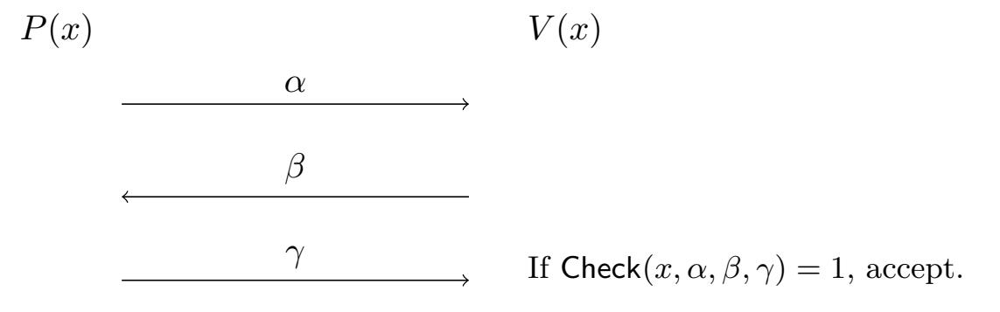

{0}------------------------------------------------

# **Fiat-Shamir for Repeated Squaring with Applications to PPAD-Hardness and VDFs**

Alex Lombardi∗ Vinod Vaikuntanathan†

June 25, 2020

#### **Abstract**

The Fiat-Shamir transform is a methodology for compiling a (public-coin) interactive proof system for a language *L* into a *non-interactive* argument system for *L*. Proving security of the Fiat-Shamir transform in the standard model, especially in the context of *succinct* arguments, is largely an unsolved problem. The work of Canetti et al. (STOC 2019) proved the security of the Fiat-Shamir transform applied to the Goldwasser-Kalai-Rothblum (STOC 2008) succinct interactive proof system under a very strong "optimal learning with errors" assumption. Achieving a similar result under standard assumptions remains an important open question.

In this work, we consider the problem of compiling a different succinct interactive proof system: Pietrzak's proof system (ITCS 2019) for the iterated squaring problem. We construct a hash function family (with evaluation time roughly 2 *λ* ) that guarantees the soundness of Fiat-Shamir for this protocol assuming the sub-exponential (2 −*n* 1− )-hardness of the *n*-dimensional learning with errors problem. (The latter follows from the worst-case 2 *n* 1− hardness of lattice problems.) More generally, we extend the "bad-challenge function" methodology of Canetti et al. for proving the soundness of Fiat-Shamir to a class of protocols whose bad-challenge functions are *not* efficiently computable.

As a corollary (following Choudhuri et al., ePrint 2019 and Ephraim et al., EUROCRYPT 2020), we construct hard-on-average problems in the complexity class **CLS** ⊂ **PPAD** under the 2 *λ* -hardness of the repeated squaring problem and the 2 −*n* 1− -hardness of the learning with errors problem. Under the additional assumption that the repeated squaring problem is "inherently sequential", we also obtain a Verifiable Delay Function (Boneh et al., EUROCRYPT 2018) in the standard model. Finally, we give additional PPAD-hardness and VDF instantiations demonstrating a broader tradeoff between the strength of the repeated squaring assumption and the strength of the lattice assumption.

∗MIT. Email: alexjl@mit.edu. Research supported in part by an NDSEG fellowship. Research supported in part by NSF Grants CNS-1350619 and CNS-1414119, and by the Defense Advanced Research Projects Agency (DARPA) and the U.S. Army Research Office under contracts W911NF-15-C-0226 and W911NF-15-C-0236.

†MIT. Email: vindov@mit.edu. Research supported in part by NSF Grants CNS-1350619 and CNS-1414119, and by the Defense Advanced Research Projects Agency (DARPA) and the U.S. Army Research Office under contracts W911NF-15-C-0226 and W911NF-15-C-0236.

{1}------------------------------------------------

## **Contents**

| 1 |                                                              | Introduction                                                                | 1  |
|---|--------------------------------------------------------------|-----------------------------------------------------------------------------|----|
|   | 1.1                                                          | Our Results                                                              | 4  |
|   | 1.2                                                          | Comparison with Prior Work                                               | 7  |
|   | 1.3                                                          | Additional Related Work                                                  | 8  |
|   | 1.4                                                          | Technical Overview                                                       | 8  |
| 2 | Preliminaries                                                |                                                                             | 13 |
|   | 2.1                                                          | Repeated Squaring modulo a Composite                                     | 13 |
|   | 2.2                                                          | Learning with Errors                                                     | 13 |
|   | 2.3                                                          | Correlation Intractable Hash Families                                    | 14 |
|   | 2.4                                                          | Interactive Proofs and Arguments                                         | 16 |
|   | 2.5                                                          | Non-trivial Preprocessing Algorithms for the Discrete Logarithm Problem  | 18 |
| 3 | Correlation Intractability for Special Inefficient Functions |                                                                             | 19 |
|   | 3.1                                                          | A Self-Reduction for Correlation Intractability                          | 19 |
|   | 3.2                                                          | CI for Efficient Functions Relative to Discrete-Log                      | 20 |
| 4 |                                                              | Round-by-Round (Unambiguous) Soundness and Fiat-Shamir                      | 21 |
| 5 |                                                              | Fiat-Shamir for the Repeated Squaring Protocol                              | 22 |
|   | 5.1                                                          | Our Variant of the Repeated Squaring Protocol                            | 22 |
|   | 5.2                                                          | Unambiguous Round-by-Round Soundness and Bad-Challenge Function          | 23 |
| 6 | Applications to PPAD-Hardness and VDFs                    |                                                                             | 25 |
|   | 6.1                                                          | Hardness in PPAD and CLS                                        | 26 |
|   | 6.2                                                          | Verifiable Delay Functions                                               | 27 |

{2}------------------------------------------------

## **1 Introduction**

The Fiat-Shamir transform [\[FS86\]](#page-32-0) is a methodology for compiling a public-coin interactive proof (or argument) system for a language *L* into a non-interactive argument system for *L*. While originally developed in order to convert 3-message identification schemes into signature schemes, the methodology readily generalized [\[BR93\]](#page-31-0) to apply to a broad, expressive class of interactive protocols, with applications including non-interactive zero knowledge for **NP** [\[BR93\]](#page-31-0), succinct non-interactive arguments for **NP** [\[Mic00,](#page-34-0) [BCS16\]](#page-30-0), and widely used/practically efficient signature schemes [\[Sch89\]](#page-34-1).

However, these constructions and results come with a big caveat: the security of the Fiat-Shamir transformation is typically *heuristic*. While the transformation has been proved secure (in high generality) in the random oracle model [\[BR93,](#page-31-0) [PS96,](#page-34-2) [Mic00,](#page-34-0) [BCS16\]](#page-30-0), it is known that some properties that hold in the random oracle model – including the soundness of Fiat-Shamir for certain contrived interactive arguments – cannot be instantiated at all in the standard model [\[CGH04,](#page-31-1)[DNRS99,](#page-32-1)[Bar01,](#page-30-1)[GK03,](#page-32-2)[BBH](#page-30-2)+19].

Given these negative results, security in the random oracle model is by no means the end of the story. Indeed, the question of whether Fiat-Shamir can be instantiated for any given interactive argument system (and under what computational assumptions this can be done) has been a major research direction over the last twenty years [\[DNRS99,](#page-32-1)[Bar01,](#page-30-1)[GK03,](#page-32-2)[BLV06,](#page-31-2)[CCR16,](#page-31-3)[KRR17,](#page-33-0) [CCRR18,](#page-31-4) [HL18,](#page-33-1) [CCH](#page-31-5)+19, [PS19,](#page-34-3) [BBH](#page-30-2)+19, [BFJ](#page-30-3)+19, [JJ19,](#page-33-2) [LVW19\]](#page-34-4). After much recent work, some positive results are known, falling into three categories (in the decreasing order of strength of assumptions required):

- 1. We can compile *arbitrary* (constant-round, public-coin) interactive proofs under extremely strong assumptions [\[KRR17,](#page-33-0)[CCRR18\]](#page-31-4) that are *non-falsifiable* in the sense of [\[Nao03\]](#page-34-5).
- 2. We can compile certain succinct interactive proofs [\[LFKN92,](#page-33-3)[GKR08\]](#page-32-3) and variants of other interactive proofs not captured in item (3) below, such as [\[GMW91\]](#page-33-4) – under extremely strong but *falsifiable* assumptions [\[CCH](#page-31-5)+19].
- 3. We can compile variants of some classical 3-message zero knowledge proof systems [\[GMR85,](#page-32-4) [Blu86,](#page-31-6)[FLS99\]](#page-32-5) under *standard* cryptographic assumptions [\[CCH](#page-31-5)+19,[PS19\]](#page-34-3).

Elaborating on item (2) above, what is currently known is that the sumcheck protocol [\[LFKN92\]](#page-33-3) and the related Goldwasser-Kalai-Rothblum (GKR) [\[GKR08\]](#page-32-3) interactive proof system can be compiled under an "optimal security assumption" related to (secret-key) Regev encryption. Roughly speaking, an optimal hardness assumption is the assumption that some search problem cannot be solved with probability significantly better than repeatedly guessing a solution at random. This is an extremely strong assumption that (in the context of Regev encryption) requires careful parameter settings to avoid being trivially false.

In this work, we focus on improving item (2); in particular, we ask:

*Under what computational assumptions can we instantiate Fiat-Shamir for an interesting* succinct *interactive proof?*

Instead of considering the [\[LFKN92,](#page-33-3)[GKR08\]](#page-32-3) protocols, we work on compiling a protocol of Pietrzak [\[Pie18\]](#page-34-6) for the "repeated-squaring language" [\[RSW96\]](#page-34-7). At a high level, Pietrzak constructs a 

{3}------------------------------------------------

"sumcheck-like" succinct interactive proof system for the computation *fN,g*(*T*) = *g* 2 *T* (mod *N*) over an RSA modulus *N* = *pq*. Compiling this protocol turns out to have applications related to verifiable delay functions (VDFs) [\[BBBF18\]](#page-30-4) and hardness in the complexity class **PPAD** [\[CHK](#page-31-7)+19a[,CHK](#page-32-6)+19b,[EFKP19\]](#page-32-7), which we elaborate on below.

**Applications.** We consider two apparently different questions: the first is that of establishing the hardness of the complexity class **PPAD** ("polynomial parity arguments on directed graphs") [\[Pap94\]](#page-34-8) that captures the hardness of finding Nash equilibria in bimatrix games [\[DGP09,](#page-32-8)[CDT09\]](#page-31-8); the second is that of constructing verifiable delay functions (VDFs), a recently introduced cryptographic primitive [\[BBBF18\]](#page-30-4) which gives us a way to introduce delays in decentralized applications such as blockchains.

**The Hardness of PPAD.** Establishing the hardness of **PPAD** [\[Pap94\]](#page-34-8), possibly under cryptographic assumptions, is a long-standing question in the foundations of cryptography and computational game theory. After two decades of little progress on the question, a recent sequence of works [\[BPR15,](#page-31-9)[HY17,](#page-33-5)[CHK](#page-31-7)+19a,[CHK](#page-32-6)+19b[,EFKP19\]](#page-32-7) has managed to prove that there are problems in **PPAD** (and indeed a smaller complexity class, **CLS** [\[DP11\]](#page-32-9)) that are hard (even *on average*) under *strong* cryptographic assumptions. The results so far fall roughly into two categories, depending on the techniques used.

- 1. **Program Obfuscation.** Bitansky, Paneth and Rosen [\[BPR15\]](#page-31-9), inspired by an approach outlined in [\[AKV04\]](#page-30-5), showed that **PPAD** is hard assuming the existence of subexponentially secure indistinguishability obfuscation (IO) [\[BGI](#page-30-6)+01[,GGH](#page-32-10)+13] and one-way functions. This was later improved [\[GPS16,](#page-33-6)[HY17\]](#page-33-5) to rely on polynomially-secure functional encryption and to give hardness in **CLS** ⊂ **PPAD**.
- 2. **Unambiguously Sound Incrementally Verifiable Computation.** The recent beautiful work [\[CHK](#page-31-7)+19a] constructs a hard-on-average **CLS** instance assuming the existence of a special kind of incrementally verifiable computation (IVC) [\[Val08\]](#page-35-0). Instantiating this approach, they show that **CLS** ⊂ **PPAD** is hard-on-average if there exists a hash function family that soundly instantiates the Fiat-Shamir heuristic [\[FS86\]](#page-32-0) for the sumcheck interactive proof system for #P [\[LFKN92\]](#page-33-3). Two follow-up works [\[CHK](#page-32-6)+19b,[EFKP19\]](#page-32-7) show the same conclusion if Fiat-Shamir for Pietrzak's interactive proof system [\[Pie18\]](#page-34-6) can be soundly instantiated (and if the underlying "repeated squaring language" is hard).

Regarding the first approach [\[BPR15,](#page-31-9) [GPS16,](#page-33-6) [HY17\]](#page-33-5), secure indistinguishability obfuscators have recently been constructed based on the veracity of a number of non-standard assumptions (see, e.g., [\[AJL](#page-30-7)+19, [BDGM20\]](#page-30-8)). Regarding the second approach [\[CHK](#page-31-7)+19a, [CHK](#page-32-6)+19b, [EFKP19\]](#page-32-7), the hash function can be instantiated in the random oracle model, or under "optimal KDM-security" assumptions [\[CCRR18,](#page-31-4)[CCH](#page-31-5)+19].

In summary, despite substantial effort, there are no known constructions of hard **PPAD** instances from standard cryptographic assumptions (although see Section [1.3](#page-9-0) for a recent independent work [\[KPY20\]](#page-33-7) that shows such a result under a new assumption on bilinear groups).

**Verifiable Delay Functions.** A Verifiable Delay Function (VDF) [\[BBBF18\]](#page-30-4) is a function *f* with the following properties:

{4}------------------------------------------------

- *f* can be evaluated in some (moderately large) time *T*.
- Computing *f* (on average) requires time close to *T*, *even given a large amount of parallelism*.
- There is a time *T* +*o*(*T*) procedure that computes *y* = *f*(*x*) on an input *x* along with a proof *π* that *y* = *f*(*x*) is computed correctly. This proof (argument) system should be verifiable in time *T* (ideally poly(*λ,* log *T*))) and satisfy standard (computational) soundness.

Since their introduction [\[BBBF18\]](#page-30-4), there have been a few proposed candidate VDF constructions [\[BBBF18,](#page-30-4)[Pie18,](#page-34-6)[Wes19,](#page-35-1) [dFMPS19,](#page-32-11)[EFKP19\]](#page-32-7). There are currently no constructions based on standard cryptographic assumptions, but this is somewhat inherent to the primitive: a secure VDF implies the existence of a problem which can be solved in time *T* and also requires (sequential) time close to *T*. Nonetheless, one can ask[1](#page-4-0) whether VDFs can be constructed from "more standardlooking" assumptions, a question partially answered by [\[Pie18,](#page-34-6)[Wes19\]](#page-35-1). In particular, each of their constructions relies on two assumptions:

- (1) The *T*-repeated squaring problem [\[RSW96\]](#page-34-7) requires sequential time close to *T*.
- (2) The Fiat-Shamir heuristic for some specific public-coin interactive proof/argument[2](#page-4-1) can be soundly instantiated.

The techniques used in both the construction of hard **PPAD** instances and the construction of VDFs are similar, and so are the underlying assumptions (this is due to the connection between **PPAD** and incrementally verifiable computation [\[Val08,](#page-35-0) [CHK](#page-31-7)+19a]). In particular, the works of [\[CHK](#page-32-6)+19b,[EFKP19\]](#page-32-7) construct hard **PPAD** (and even **CLS**) instances under two assumptions:

- (10 ) The *T*-repeated squaring problem [\[RSW96\]](#page-34-7) requires super-polynomial (standard) time for some *T* = *λ ω*(1) .
- (20 ) The Fiat-Shamir heuristic for a variant of the [\[Pie18\]](#page-34-6) interactive proof system can be soundly instantiated.

The assumption (1) (and its weakening, assumption (10 )) is the foundation of the Rivest-Shamir-Wagner time-lock puzzle [\[RSW96\]](#page-34-7) and has been around for over 20 years. In particular, breaking the RSW assumption has received renewed cryptanalytic interest recently [\[Riv99,](#page-34-9)[Fab19\]](#page-32-12).

On the other hand, as previously discussed, the assumptions (2*,* 2 0 ) are not well understood. Indeed, our main question about Fiat-Shamir for succinct arguments (if specialized to the [\[Pie18\]](#page-34-6) protocol) is intimately related to the following question.

*Can we construct hard* **PPAD** *instances and VDFs under more well-studied assumptions?*

1 [\[BBBF18\]](#page-30-4) explicitly suggested this.

2The two works [\[Pie18,](#page-34-6) [Wes19\]](#page-35-1) consider qualitatively different interactive argument systems. In this work, we focus on the [\[Pie18\]](#page-34-6) protocol since (1) it has unconditional soundness and therefore is more conducive to provable Fiat-Shamir compilation, and (2) it is more closely related to **PPAD**-hardness.

{5}------------------------------------------------

#### 1.1 Our Results

We show how to instantiate the Fiat-Shamir heuristic for the [Pie18] protocol under a quantitatively strong (but relatively standard) variant of the Learning with Errors (LWE) assumption [Reg09]. We give a family of constructions of hash functions that run in subexponential (or even quasi-polynomial or polynomial) time, and prove that they soundly instantiate Fiat-Shamir for this protocol under a sufficiently strong LWE assumption.

More generally, we extend the "bad-challenge function" methodology of [CCH+19] for proving the soundness of Fiat-Shamir to a class of protocols whose bad-challenge functions are not efficiently computable. We elaborate on this below in the technical overview (Section 1.4).

As a consequence, we obtain **CLS**-hardness and VDFs from a pair of quantitatively related assumptions on the [RSW96] repeated squaring problem and on the learning with errors (LWE) problem [Reg09]; the latter can in turn be based on the worst-case hardness of the (approximate) shortest vector problem (GapSVP) on lattices. In particular, we can base the hardness of **CLS**  $\subset$  **PPAD**, as well as the security of a VDF, on the hardness of two relatively well-studied problems.

Fiat-Shamir for Pietrzak's Protocol. For our main result, we show that for any  $\epsilon > 0$ , an LWE assumption of quantitative strength  $2^{n^{1-\epsilon}}$  allows for a Fiat-Shamir instantiation with verification runtime  $2^{\tilde{O}(n^{\epsilon})}$  on a repeated squaring instance with security parameter  $\lambda = O(n \log n)$ . Such a result is meaningful as long as the verification runtime is smaller than the time it takes to solve the repeated squaring problem; the current best known algorithms for repeated squaring run in heuristic time  $2^{\tilde{O}(\lambda^{1/3})} = 2^{\tilde{O}(n^{1/3})}$  [LLMP90].

Here and throughout the paper, we will use  $(t, \delta)$ -hardness to denote that a cryptographic problem is hard for t-time algorithms to solve with  $\delta$  probability (or distinguishing advantage).

**Theorem 1.1.** Let  $\epsilon > 0$  be arbitrary. Assume that (decision) LWE is  $\left(2^{\tilde{O}(n^{1/2})}, 2^{-n^{1-\epsilon}}\right)$ -hard (or alternatively,  $\left(2^{\tilde{O}(n^{\epsilon})}, 2^{-n^{1-\epsilon}}\right)$ -hard for non-uniform algorithms). Then, there exists a hash family  $\mathcal{H}$  that soundly instantiates the Fiat-Shamir heuristic for Pietrzak's interactive proof system [Pie18]. When the proof system is instantiated for repeated squaring over groups of size  $2^{O(\lambda)}$  with  $\lambda = O(n \log n)$ , the hash function h from the family  $\mathcal{H}$  can be evaluated in time  $2^{\tilde{O}(\lambda^{\epsilon})}$ .

Under the assumption that (decision) LWE is  $\left(2^{\tilde{O}(n^{1/2})}, 2^{-\frac{n}{\log^c n}}\right)$ -hard for some constant c>0 (or alternatively,  $\left(\operatorname{quasipoly}(n), 2^{-\frac{n}{\log^c n}}\right)$ -hard for non-uniform algorithms), there exists such a hash family  $\mathcal{H}$  with quasi-polynomial evaluation time.

Moreover, the LWE assumption that we make falls into the parameter regime where we know worst-case to average-case reductions [Reg09,BLP+13,PRS17], so we obtain the following corollary.

Corollary 1.2. The conclusions of Theorem 1.1 (with parameter  $\epsilon < \frac{1}{2}$ ) follow from the assumption that the worst case problem  $\operatorname{poly}(n)$ -GapSVP for rank n lattices requires time  $2^{\omega(n^{1-\epsilon})}$ . Similarly, the protocol with quasi-polynomial verification time is sound under the assumption that  $\operatorname{poly}(n)$ -GapSVP requires time  $2^{\frac{n}{\log(n)^c}}$  for some c > 0.

The Shortest Vector Problem (SVP) on integer lattices is a well-studied problem (see discussion in [Pei16, ADRS15]); despite a substantial effort, all known poly(n)-approximation algorithms for the problem have exponential run-time  $2^{\Omega(n)}$ . As a result, our current understanding of the approximate-SVP landscape is consistent with the following conjecture.

{6}------------------------------------------------

Conjecture 1 (Exponential Time Hypothesis for GapSVP). For any fixed  $\gamma(n) = \text{poly}(n)$ , the  $\gamma(n)$ -GapSVP problem cannot be solved in time  $2^{o(n)}$ .

Assuming Conjecture 1, the conclusion of Theorem 1.1 holds for every  $\epsilon > 0$ ; moreover, the variant of the Theorem 1.1 protocol with quasi-polynomial time evaluation is sound as well.

What about polynomial-time verification? Given a non-interactive protocol for repeated squaring with  $2^{\tilde{O}(\lambda^{\epsilon})}$  verification time (or quasi-polynomial evaluation time), one can always define a new security parameter  $\kappa = 2^{\tilde{O}(\lambda^{\epsilon})}$  (or  $\kappa = 2^{\log(\lambda)^c}$ ) to obtain a protocol with polynomial-time verification. However, this makes use of complexity leveraging [CGGM00], so (i) this requires making the assumption that repeated squaring (on instances with security parameter  $\lambda$ ) is hard for poly( $\kappa(\lambda)$ )-time adversaries, and (ii) the resulting protocol cannot have security subexponential in  $\kappa$ .

If one does not wish to use complexity leveraging, we give an alternative construction that has (natively) polynomial-time verification, at the cost of a stronger LWE assumption.

**Theorem 1.3.** Let  $\delta > 0$  be arbitrary and  $q(n) = \operatorname{poly}(n)$  be a fixed (sufficiently large) polynomial in n. Assume that (decision) LWE is  $\left(\operatorname{poly}(n), q^{-\delta n}\right)$ -hard for non-uniform distinguishers (or  $\left(2^{\tilde{O}(n^{1/2})}, q^{-\delta n}\right)$ -hard for uniform distinguishers). Then, there exists a hash family  $\mathcal{H}$  that soundly instantiates the Fiat-Shamir heuristic for Pietrzak's interactive proof system [Pie18] with  $\operatorname{poly}(\lambda) = \operatorname{poly}(n \log n)$ -time verification. More specifically, the verification time is  $\lambda^{O(1/\delta)}$ .

Moreover, this strong LWE assumption still falls into the parameter regime with a meaningful worst-case to average-case reduction:

Corollary 1.4. The conclusion of Theorem 1.3 follows from the assumption that worst-case  $\gamma(n)$ -GapSVP (for a fixed  $\gamma(n) = \text{poly}(n)$ ) cannot be solved in time  $n^{o(n)}$  with poly(n) space and poly(n) bits of nonuniform advice (independent of the lattice).

Polynomial-space algorithms for GapSVP have themselves been an object of study for over 25 years [Kan83, KF16, BLS16, ABF+20], but the current best (poly-space) algorithms for this problem run in time  $n^{\Omega(\epsilon n)}$  for approximation factor  $n^{1/\epsilon}$ . Therefore, under a sufficiently strong (and plausible) worst-case assumption about GapSVP, we have a polynomial-time Fiat-Shamir compiler without complexity leveraging.

By combining Theorems 1.1 and 1.3 with the results of [CHK+19b, EFKP19], we obtain the following construction of hard-on-average **CLS** instances.

**Theorem 1.5.** For a constant  $\epsilon > 0$ , suppose that

- $\bullet$  n-dimensional LWE (with polynomial modulus) is  $\left(2^{\tilde{O}(n^{1/2})},2^{-n^{1-\epsilon}}\right)$ -hard, and
- The repeated squaring problem on an instance of size  $2^{\lambda}$  requires  $2^{\lambda^{\epsilon} \log(\lambda)^{\omega(1)}}$  time.

Then, there is a hard-on-average problem in  $\mathbf{CLS} \subset \mathbf{PPAD}$ . The same conclusion holds if for some c > 0,

• LWE is 
$$(2^{\tilde{O}(n^{1/2})}, 2^{-\frac{n}{\log(n)^c}})$$
-hard, and

{7}------------------------------------------------

• *The repeated squaring problem is hard for quasi-polynomial time algorithms.*

*The same conclusion also holds if for some δ >* 0*,*

- LWE *is* poly(*n*)*, q*−*δn -hard for non-uniform distinguishers, and*
- *The repeated squaring problem is hard for polynomial time algorithms.*

We obtain Theorem [1.5](#page-6-1) by plugging our standard model Fiat-Shamir instantiation into the complexity-theoretic reduction of [\[CHK](#page-32-6)+19b].[3](#page-7-0) For use in this reduction, our non-interactive protocol must satisfy a stronger security notion called *(adaptive) unambiguous soundness* [\[RRR16,](#page-34-14) [CHK](#page-31-7)+19a], which we show is indeed the case.

Note that the two hardness assumptions in the theorem statement are in opposition to each other. As becomes smaller, the repeated squaring assumption becomes weaker, but the LWE assumption becomes stronger. In particular, we cannot set ≥ 1*/*3 as there are known algorithms [\[LLMP90\]](#page-34-11) solving repeated squaring in (heuristic) time 2 *O*e(*λ* 1*/*3 ) .

Additionally, as a direct consequence of Theorem [1.1,](#page-5-1) we obtain VDFs in the standard model as long as the underlying repeated squaring problem is sufficiently (sequentially) hard. Recall that the repeated squaring problem [\[RSW96\]](#page-34-7) is the computation of the function *fN,g*(*T*) = *g* 2 *T* (mod *N*), for the appropriate distribution on *N* = *pq* and *g*.

**Theorem 1.6.** *For a constant >* 0*, suppose that*

- LWE *is* 2 *O*˜(*n* 1*/*2 ) *,* 2 −*n* 1− *-hard, and*
- *The repeated squaring problem [\[RSW96\]](#page-34-7) over groups of size* 2 *O*(*λ*) *requires T*(1−*o*(1)) *sequential time for T* 2 *O*˜(*λ* ) *.*

*Then, the repeated squaring function fN,g can be made into a VDF with verification time* 2 *O*˜(*λ* ) *on groups of size* 2 *O*(*λ*) *(with λ* = *O*(*n* log *n*)*). Similarly, if for some c >* 0*,*

- LWE *is* 2 *O*˜(*n* 1*/*2 ) *,* 2 − *n* log(*n*) *c -hard, and*
- *The repeated squaring problem requires T*(1 − *o*(1)) *sequential time for T* 2 *O*˜(log(*λ*) *c*+1) *,*

*Then, fN,g can be made into a VDF with verification time* 2 *O*˜(log(*λ*) *c*+1) *. Finally, if for some δ >* 0*,*

- LWE *(with modulus q) is* poly(*n*)*, q*−*δn -hard for non-uniform distinguishers, and*
- *The repeated squaring problem requires T*(1 − *o*(1)) *sequential time for all T* = poly(*λ*)*.*

*Then, fN,g can be made into a VDF with λ O*(1*/δ*) *-time verification.*

Theorem [1.6](#page-7-1) follows immediately from Theorem [1.1](#page-5-1) along with the construction of Pietrzak [\[Pie18\]](#page-34-6). While many of the VDFs in Theorem [1.6](#page-7-1) have super-polynomial verification time (and therefore do not fit the standard definition), they can be converted into (standard) VDFs with polynomial verification time via complexity leveraging; however, the leveraged VDFs will only support quasi-polynomial (respectively, 2 2 poly log log *κ* ) time computation (and soundness of the VDF will only hold against adversaries running in time quasi-polynomial in the new security parameter *κ*). Because of this, we consider the formulation in terms of super-polynomial time verification to be more informative.

3Our protocol differs very slightly from the formulation in [\[CHK](#page-32-6)+19b], but the difference is irrelevant to the reduction.

{8}------------------------------------------------

#### 1.2 Comparison with Prior Work

Cryptographic Hardness of PPAD. As described in the introduction, prior works on the cryptographic hardness of PPAD fall into two categories – those based on obfuscation and ones based on incrementally verifiable computation (IVC). The obfuscation-based constructions all make cryptographic assumptions related to the existence of indistinguishability obfuscation or closely related primitives that we currently do not know how to instantiate based on well-studied assumptions. (For the latest in obfuscation technology, we refer the reader to [JLMS19, JLS19].) We therefore focus on comparing to the previous IVC-based constructions.

• [CHK+19a] constructs hard problems in **CLS** under the polynomial hardness of #SAT with poly-logarithmically many variables along with the assumption that Fiat-Shamir can be soundly instantiated for the sumcheck protocol [LFKN92]. The latter follows either in the random oracle model or under the assumption that a LWE-based fully homomorphic encryption scheme is "optimally circular-secure" [CCH+18, CCH+19] for quasi-polynomial time adversaries.

While the hardness of #SAT (with this parameter regime) is a weaker assumption than the subexponential hardness of repeated squaring, the [CHK+19a] (standard model) result has the drawback of relying on an optimal hardness assumption. Roughly speaking, an optimal hardness assumption is the assumption that some search problem cannot be solved with probability significantly better than repeatedly guessing a solution at random. This is an extremely strong assumption that requires careful parameter settings to avoid being trivially false.

In contrast, our main LWE assumption is *subexponential* (concerning distinguishing advantage  $2^{-n^{1-\epsilon}}$ ) and follows from the worst-case hardness of poly(n)-GapSVP for time  $2^{n^{1-\epsilon}}$  algorithms. Even our most optimistic LWE assumption (as in Theorem 1.3) follows from a form of worst-case hardness quantitatively far from the corresponding best known algorithms.

• [CHK+19b, EFKP19] construct hard problems in **CLS** assuming the polynomial hardness of repeated squaring along with a generic assumption that the Fiat-Shamir heuristic can be instantiated for round-by-round sound (see [CCH+18, CCH+19]) public-coin interactive proofs. The latter can be instantiated either in the random oracle model, or under the assumption that Regev encryption (or ElGamal encryption) is "optimally KDM-secure" for unbounded KDM functions [CCRR18].

The [CCRR18] assumption is (up to minor technical details) stronger than the optimal security assumption used in [CHK+19a] (because the security game additionally involves an unbounded function), so the [CHK+19b, EFKP19] are mostly framed in the random oracle model. In this work, we give a new Fiat-Shamir instantiation to plug into the [CHK+19b, EFKP19] framework.

**VDFs.** We compare our construction of VDFs to previous constructions [BBBF18, Pie18, Wes19, dFMPS19, EFKP19].

• [BBBF18] and [dFMPS19] give constructions of VDFs from new cryptographic assumptions related to permutation polynomials and isogenies over supersingular elliptic curves, respectively. These assumptions are certainly incomparable to ours, but we rely on the hardness of older, more well-studied problems.

{9}------------------------------------------------

- [\[Pie18,](#page-34-6)[EFKP19\]](#page-32-7) have the same basic VDF construction as ours; the main difference is that they use a random oracle to instantiate their hash function, while we use a hash function in the standard model and prove its security under a quantitatively strong variant of LWE.
- [\[Wes19\]](#page-35-1) also builds a VDF based on the hardness of repeated squaring, but by building a different interactive argument for computing the function and assuming that Fiat-Shamir can be instantiated for this argument. Again, this assumption holds in the random oracle model, but we know of no instantiation of this VDF in the standard model.

On the negative side, our main VDF (for the natural choice of security parameter) has verification time 2 *O*˜(*λ* ) ; this can be thought of as polynomial-time via complexity leveraging, but this results in a VDF that is only quasi-polynomially secure. Alternatively, based on our optimistic LWE assumption, we only obtain a VDF with large polynomial (i.e. *λ* 1*/δ* for small *δ*) verification time. As a result, we consider our VDF construction to be a proof-of-concept regarding whether VDFs can be built based on "more standard-looking assumptions", in particular, without invoking the random oracle model.

## **1.3 Additional Related Work**

[\[BG20\]](#page-30-11) constructs hard instances in the complexity class **PLS** – which contains **CLS** and is incomparable to **PPAD** – under a falsifiable assumption on bilinear maps introduced in [\[KPY19\]](#page-33-12) (along with the randomized exponential time hypothesis (ETH)).

In recent independent work, [\[KPY20\]](#page-33-7) constructs hard-on-average **CLS** instances under the (quasi-polynomial) [\[KPY19\]](#page-33-12) assumption. In fact, they give a protocol for unambiguous and incrementally verifiable computation for all languages decidable in space-bounded and slightly superpolynomial time.

## **1.4 Technical Overview**

We now discuss the ideas behind our main result, Theorem [1.1,](#page-5-1) which is an instantiation of the Fiat-Shamir heuristic for the [\[Pie18\]](#page-34-6) repeated squaring protocol. In obtaining this result, we also broaden the class of interactive proofs for which we have Fiat-Shamir instantiations under standard assumptions.

The main tool used by our construction is a hash function family H that is correlation intractable [\[CGH04\]](#page-31-1) for *efficiently computable functions* [\[CLW18,](#page-32-13) [CCH](#page-31-5)+19]. Recall that a hash family H is correlation intractable for *t*-time computable functions if for every function *f* computable time *t*, the following computational problem is hard: given a description of a hash function *h*, find an input *x* such that *h*(*x*) = *f*(*x*). We now know [\[PS19\]](#page-34-3) that such hash families can be constructed under the LWE assumption.

**Correlation Intractability and Fiat-Shamir.** In order to describe our result, we first sketch the [\[CCH](#page-31-5)+19] paradigm for using such a hash family H to instantiate the Fiat-Shamir heuristic.

For simplicity, consider a three-message (public-coin) interactive proof system (Σ-protocol) as well as its corresponding Fiat-Shamir round-reduced protocol ΠFS*,*H for a hash family H.

{10}------------------------------------------------

Figure 1: A  $\Sigma$ -protocol  $\Pi$ .

$$P_{\mathrm{FS}}(x,h) \qquad V_{\mathrm{FS}}(x,h) \\ \frac{\alpha,\beta := h(\alpha),\gamma}{\qquad} \qquad \text{If } \beta = h(\alpha) \\ \text{and } \mathsf{Check}(x,\alpha,\beta,\gamma) = 1, \, \mathsf{accept}.$$

Figure 2: The Protocol  $\Pi_{FS,\mathcal{H}}$ .

Moreover, suppose that this protocol  $\Pi$  satisfies the following soundness property (sometimes referred to as "special soundness"): for every  $x \notin L$  and every prover message  $\alpha$ , there exists at most one verifier message  $\beta^*(x,\alpha)$  allowing the prover to cheat.4

It then follows that if a hash family  $\mathcal{H}$  is correlation intractable for the function family  $f_x(\alpha) = \beta^*(x,\alpha)$ , then  $\mathcal{H}$  instantiates the Fiat-Shamir heuristic for  $\Pi$ .5 This is because a cheating prover  $P_{\text{FS}}^*$  breaking the soundness of  $\Pi_{\text{FS},\mathcal{H}}$  must find a first message  $\alpha$  such that its corresponding challenge  $h(x,\alpha)$  is equal to the bad challenge  $f_x(\alpha)$  (or else it has no hope of successfully cheating).

Therefore, using the hash family of [PS19], we can (under the LWE assumption) do Fiat-Shamir for any protocol  $\Pi$  whose "bad-challenge function"  $f_x(\alpha)$  is computable in polynomial time; this has the important caveat that the complexity of computing the hash function h is at least the complexity of computing  $f_x(\alpha)$ .

This paradigm seems to run into the following roadblock: intuitively, for protocols  $\Pi$  of interest, computing  $f_x(\alpha)$  appears to be hard rather than easy. For example,

- 1. For a standard construction of zero-knowledge proofs for **NP** such as [Blu86], computing  $f_x(\alpha)$  involves breaking a cryptographically secure commitment scheme.
- 2. For (unconditional) statistical zero knowledge protocols such as the [GMR85] Quadratic Residuosity protocol, computing  $f_x(\alpha)$  involves deciding the underlying hard language L.
- 3. For doubly efficient interactive proofs such as the [GKR08] interactive proof for logspace-uniform NC, computing  $f_x(\alpha)$  again involves deciding the underlying language L; in this case, L is in P, but this Fiat-Shamir compiler would result in a non-interactive argument whose verifier runs in time longer than it takes to decide L.

The work [CCH+19] resolves issues (1) and (2) in the following way: in both cases, we can arrange for  $f_x(\alpha)$  to be efficiently computable given an appropriate trapdoor: in the case of [Blu86], the commitment scheme can have a trapdoor allowing for efficient extraction, while in the case

The prover can cheat on a pair  $(\alpha, \beta)$  if and only if there exists a third message  $\gamma$  such that  $(x, \alpha, \beta, \gamma)$  is accepted by the verifier.

&lt;sup>5To obtain adaptive soundness, we modify the protocol to set  $\beta = h(x, \alpha)$  and instead consider the function  $f(x, \alpha) = \beta^*(x, \alpha)$ .

{11}------------------------------------------------

of [GMR85],  $f_x(\alpha)$  is efficient given an appropriate **NP**-witness for the complement language  $\overline{L}$ . However, we have no analogous resolution to (3), which is the setting of interest to us.6

The bad-challenge function of the [Pie18] protocol. With this context in mind, we now consider the [Pie18] protocol.7 This protocol (like the [GKR08] protocol and the related sumcheck protocol [LFKN92]) is not a constant-round protocol, but is instead composed of up to polynomially many "reduction steps" of the following form.

$$P(N = pq, T, g, h = g^T)$$

$$Compute \ u = g^{2^{T/2}}$$

$$\vdots$$

$$r$$

$$Compute \ g' = u \cdot g^r, h' = h \cdot u^r$$

$$\vdots$$

$$Recurse on the statement \ (N, T/2, g', h').$$

Figure 3: One reduction step of the [Pie18] protocol.

That is, the prover sends u, the (supposed) "halfway point" of the computation, yielding two derivative claims:  $u = g^{2^{T/2}}$  and  $h = u^{2^{T/2}}$ . The verifier then challenges the prover to prove a random linear combination of the two statements:  $h \cdot u^r = (u \cdot g^r)^{2^{T/2}}$ .

Soundness can then be analyzed in a "round-by-round" fashion [CCH+19]: if you start with a false statement (or if you start with a true statement but send an incorrect value  $\tilde{u} \neq u$ ), there is at most one8 bad challenge  $r^*$  resulting in a recursive call on a true statement.

To invoke the [CCH+19] paradigm, we ask: how efficiently can we compute the function  $f(N,T,g,h,u)=r^*$ ? To answer this question, let  $\tilde{g}$  denote a fixed group element of order  $\phi(N)/2$  such that  $g,h,u\in \langle \tilde{g}\rangle$ . Letting  $\gamma,\eta,\omega$  denote the discrete logs of g,h, and u in base  $\tilde{g}$ , we see that (for corresponding challenge r) the statement (N,T/2,g',h') is true if and only if

$$\eta + r \cdot \omega \equiv 2^{T/2}(\omega + r \cdot \gamma) \pmod{\phi(N)/2}.$$

As a result, we see that r can be efficiently computed from the following information:

- The discrete logarithms  $\eta, \omega, \gamma$ , and
- The factorization of N.

While the factorization of N can be known a priori in the security reduction (similar to prior work), the discrete logarithms depend on the prover message u and (adaptively chosen) statement (g, h). We conclude that the "bottleneck" for computing f is the problem computing a constant number of discrete logarithms in  $\mathbb{Z}_p^{\times}$ .

Since computing discrete logarithms over  $\mathbb{Z}_p^{\times}$  is believed to be hard, and is not known to have a trapdoor, it appears unlikely that this approach would allow us to rely on the polynomial hardness

&lt;sup>6The only current known Fiat-Shamir instantiation for the [GKR08] protocol utilizes a *compact* correlation intractable hash family (in the sense that the hash evaluation time is independent of the time to compute the correlation function/relation) which we only know how to build from an optimal security assumption [CCH+19].

&lt;sup>7For this overview, we ignore the details of working over the group  $\mathbb{QR}_N \subset \mathbb{Z}_N^{\times}$  and the corresponding technical challenges.

&lt;sup>8To guarantee this property, r is selected from a range smaller than either of the prime factors of N.

{12}------------------------------------------------

of the [PS19] hash family. However, it is plausible that we could use a variant of the [PS19] hash family supporting super-polynomial time computation (proven secure under a super-polynomial variant of LWE) to capture the complexity of computing discrete logarithms.

Unfortunately, the naive version of this approach fails: the best known runtime bounds9 for computing discrete logarithms over  $\mathbb{Z}_p^{\times}$  for  $p=2^{O(\lambda)}$  are of the form  $2^{\tilde{O}(\lambda^{1/2})}$  [Adl79,Pom87], and the best known heuristic algorithms (plausibly) run in time  $2^{\tilde{O}(\lambda^{1/3})}$  [LLMP90]. If we were to instantiate the [PS19] hash family to support functions of this complexity, we could prove the soundness of Fiat-Shamir for the [Pie18] protocol, but the resulting non-interactive protocol would run in time  $2^{\tilde{O}(\lambda^{1/2})}$  (or in time  $2^{\tilde{O}(\lambda^{1/3})}$  with a heuristic security proof); these are the same runtime bounds for the best known algorithms for solving the repeated squaring problem [Dix81, Pom87, LLMP90] (via factoring the modulus N). In other words, the verifier would run in enough time to be able to solve the repeated squaring problem itself. This is a very similar problem to issue (3) regarding the [LFKN92, GKR08] protocols, so we appear to be stuck.

Computing bad-challenge functions with low probability. We overcome the above problem with the following idea:

What if we give up on computing the bad-challenge function *exactly*, and instead compute it using a *faster* randomized algorithm with *low success probability*?

In other words, we consider a new variant of the [CCH+19] framework for instantiating Fiat-Shamir in the standard model, where:

- An interactive protocol  $\Pi$  is characterized by some bad-challenge function f,
- f can be computed by a time t algorithm (or size s circuit) with some small but non-trivial probability  $\delta$ .
- The hash function  $\mathcal{H}$  is assumed to be correlation intractable with sufficiently strong quantitative security against adversaries running in time t (or with size s).

Then, it turns out that the resulting non-interactive protocol is sound! Informally, this is because if f is "approximated" by a time t-computable randomized function  $g_r$  (in the sense that  $g_r(x)$  and f(x) agree with probability  $\delta$  on a worst-case input), then an adversary breaking the protocol  $\Pi_{FS,\mathcal{H}}$  will break the correlation intractability of  $\mathcal{H}$  with respect to g (rather than f) with probability  $\delta$ . More formally, a cheating prover  $P_{FS}^*$  yields an algorithm that breaks the correlation intractability of  $\mathcal{H}$  with respect to f, which in turn breaks the correlation intractability of  $\mathcal{H}$  with respect to  $g_r$  (for hard-coded randomness r) with probability  $\delta \cdot \frac{1}{\text{poly}(\lambda)}$  (since  $g_r$  and f agree on an arbitrary input with probability at least  $\delta$ ). Therefore, if  $\mathcal{H}$  is  $(t, \delta \cdot \lambda^{-\omega(1)})$ -secure, we conclude that  $\Pi_{FS,\mathcal{H}}$  is sound.

This modification allows us to instantiate Fiat-Shamir for the [Pie18] protocol. In particular, we make use of folklore10 [CCRR18] preprocessing algorithms for the discrete logarithm problem

&lt;sup>9See [JOP14] for a detailed discussion of the state-of-the-art on discrete logarithm algorithms.

&lt;sup>10We are not aware of prior work considering this particular time-probability trade-off, but the necessary smooth number bounds appear in [CEP83, Gra08]. Quite curiously, [CCRR18] considers the poly( $\lambda$ )-time variant of this algorithm to give evidence against the optimal hardness of computing discrete logarithms over  $\mathbb{Z}_p^{\times}$ . That was bad for them, but for us, the non-optimal hardness is a feature!

{13}------------------------------------------------

over  $\mathbb{Z}_p^{\times}$  that run in time  $2^{\lambda^{\epsilon}}$  and have success probability  $2^{-\lambda^{1-\epsilon}}$ . More specifically, we consider a computation of the bad challenge function f(N,T,g,h,u) in the following model:

- Hard-code (1) the factorization N = pq, (2) an appropriately chosen group element  $\tilde{g}$  of high order, and (3)  $2^{\tilde{O}(\lambda^{\epsilon})}$  discrete logarithms (of fixed numbers modulo p and modulo q, respectively) in base  $\tilde{g}$ .
- Compute a (constant-size) collection of worst-case discrete logarithms by the standard index calculus algorithm [Adl79] in time  $2^{\tilde{O}(\lambda^{\epsilon})}$  with success probability  $2^{-\lambda^{1-\epsilon}}$ .

This can be thought of as either a non-uniform  $2^{\tilde{O}(\lambda^{\epsilon})}$ -time algorithm, or a  $2^{\tilde{O}(\lambda^{\epsilon})}$ -time algorithm with  $2^{\tilde{O}(\lambda^{1/2})}$ -time preprocessing. By using this algorithm for the computation of the bad-challenge function f(N,T,g,h,u), we obtain a Fiat-Shamir instantiation with verification time  $2^{\tilde{O}(\lambda^{\epsilon})}$  – a meaningful result as long as this runtime does not allow for solving the repeated squaring problem. Finally, the required assumption is that the [PS19] hash function is correlation intractable for adversaries that succeed with probability  $2^{-\lambda^{1-\epsilon}}$ , which holds under the claimed LWE assumption with parameters (n,q) for  $\lambda=n\log q$ .

**Generalizations.** In this overview, we focused specifically on the [Pie18] protocol, but our techniques give general blueprints for obtaining Fiat-Shamir instantiations. We believe these blueprints may be useful in future work, so we state them (as "meta-theorems") explicitly here:

- Fiat-Shamir for protocols with low success probability bad-challenge functions. Our approach shows that if an interactive protocol  $\Pi$  is governed by a bad-challenge function f that is computable by an efficient randomized algorithm that is only correct with (potentially very) low probability, it is still possible to instantiate Fiat-Shamir for  $\Pi$  under a sufficiently strong LWE assumption.
- Fiat-Shamir for discrete-log based bad-challenge functions. Our approach also shows that if a protocol  $\Pi$  is governed by a bad-challenge function f that is efficiently computable given  $\operatorname{oracle\ access}^{12}$  to a  $\operatorname{discrete\ log\ solver}$  (over  $\mathbb{Z}_p^{\times}$  for  $p \leq 2^{O(\lambda)}$ ), then it is possible to instantiate Fiat-Shamir for  $\Pi$  under a sufficiently strong LWE assumption.

We formalize both of these "meta-theorems" in the language of correlation intractability (rather than Fiat-Shamir) in Section 3.

**Organization.** The rest of the paper is organized as follows. Section 2 consists of the relevant preliminaries to describe and prove our results. In Section 3, we state and prove our results about low-success probability bad-challenge functions (and discrete-log based bad-challenge functions in particular) through the lens of correlation intractability. In Section 4, we formalize the round-by-round soundness property necessary to conclude the "adaptive unambiguous soundness" [CHK+19a] of the round-reduced [Pie18] protocol that suffices for **CLS**-hardness. In Section 5, we describe and analyze (our variant of) the [Pie18] protocol within the outlined framework and prove Theorem 1.1. Finally, in Section 6, we apply Theorem 1.1 to obtain Theorem 1.5 and Theorem 1.6.

&lt;sup>11This second variant allows for an invocation of correlation intractability against uniform adversaries in the security proof.

&lt;sup>12Crucially, we must also bound the number of calls that can be made to the oracle to be at most poly  $\log(\lambda)$  to get a meaningful result.

{14}------------------------------------------------

## 2 Preliminaries

#### 2.1 Repeated Squaring modulo a Composite

Following [Pie18, CHK+19b], we consider the following formulation of the RSW time-lock puzzle [RSW96]. For an integer N=pq, recall that  $\mathbb{Z}_N^{\times}$  is defined to be the group of units mod N,  $\mathbb{QR}_N$  is defined to be the group of quadratic residues mod N, and  $\mathbb{QR}_N^+$  is defined to be the set  $\left\{x:0\leq x\leq \frac{N}{2} \text{ and } \left(\frac{x}{N}\right)=1\right\}$ , where  $\left(\frac{\cdot}{N}\right)$  is defined to be the Jacobi symbol.

We now define (our variant of the) RSW moderately hard function.

- Setup(1 $^{\lambda}$ ): On input the security parameter, sample an integer N = pq along with a group element  $\tilde{g} \in \mathbb{Z}_N^{\times}$  such that p, q are uniformly random safe primes in the range  $[2^{\lambda}, 2^{\lambda+1}]$  and  $\tilde{g}$  has order  $\phi(N)/2$  in  $\mathbb{Z}_N^{\times}$  (for example,  $\tilde{g}$  can be the CRT lift of any generator for  $\mathbb{Z}_p^{\times}$  and any generator for  $\mathbb{Z}_q^{\times}$ ). Let  $p' = \frac{p-1}{2}, q' = \frac{q-1}{2}$  (primes by construction), and note that  $g := \tilde{g}^2$  generates  $\mathbb{QR}_N$ . Output (N, g).
- Function evaluation. Define the function

$$f_{N,g}(T) = g^{2^T} \pmod{N}.$$

We note that for any (N, g), the function  $f_{N,g}(T)$  can be computed in time T.13 We now consider two hardness assumptions related to the RSW moderately hard function.

**Definition 2.1**  $(t(\lambda)\text{-RSW Hardness Assumption})$ . For some efficiently computable function  $T(\cdot)$ , computing  $f_{N,g}(T(\lambda))$  for  $(N,g) \leftarrow \mathsf{Setup}(1^{\lambda})$  requires time  $t(\lambda)$ .

For our main result on PPAD-hardness, we will assume the  $2^{\lambda^{\epsilon}}$ -RSW hardness assumption for some constant  $\epsilon > 0$ .

**Definition 2.2**  $((\sigma, p)$ -RSW Sequentiality Assumption). For some efficiently computable function  $T(\cdot)$ , computing  $f_{N,g}(T(\lambda))$  for  $(N,g) \leftarrow \mathsf{Setup}(1^{\lambda})$  requires  $\sigma(T)$  sequential time for algorithms with  $p(\lambda, T)$  parallel processors.

For our main VDF construction, we assume the  $(\sigma, p)$ -RSW sequentiality assumption for some large parallelism function  $p(\lambda, T) = \lambda^{\omega(1)}$  and sequentiality parameter  $\sigma(T) = T(1 - o(1))$  to obtain a VDF with verification time  $2^{\lambda^{\epsilon}}$ . By redefining the security parameter, this leads to a VDF with poly-time verification that can evaluate up to quasi-polynomial time computation. As discussed in the introduction, other parameter settings are possible (under different hardness assumptions).

## 2.2 Learning with Errors

The following preliminaries about the Learning with Errors (LWE) problem are based on [Pei16].

**Definition 2.3** (LWE Distribution). For any  $\mathbf{s} \in \mathbb{Z}_q^n$  and any distribution  $\chi \subseteq \mathbb{Z}_q$ , the LWE distribution  $A_{\mathbf{s},\chi} \in \mathbb{Z}_q^n \times \mathbb{Z}_q$  is sampled by choosing  $\mathbf{a} \in \mathbb{Z}_q^n$  uniformly at random, sampling  $e \leftarrow \chi$ , and outputting  $(\mathbf{a}, b = \langle \mathbf{s}, \mathbf{a} \rangle + e)$ .

&lt;sup>13As in prior work, we measure time complexity in terms of group operations.

{15}------------------------------------------------

**Definition 2.4** (Decision LWE). Let  $m = m(n) \ge 1$ ,  $q = q(n) \ge 2$  be integers, and let  $\chi(n)$  be a probability distribution on  $\mathbb{Z}_{q(n)}$ . The **Decision-LWE** $n,m,q,\chi$  problem, parameterized by n, is to distinguish whether m(n) independent samples are drawn from  $A_{\mathbf{s},\chi}$  (for  $\mathbf{s}$  that is sampled uniformly at random) or are drawn from the uniform distribution.

For the rest of this paper, we will write LWE in place of **Decision-LWE**. Next, we consider quantitative hardness assumptions related to LWE.

**Definition 2.5**  $((T, \delta)$ -LWE assumption). Any T(n)-time algorithm  $\mathcal{A}$  solves  $\mathsf{LWE}_{n,m,q,\chi}$  with distinguishing advantage at most  $O(\delta(n))$ .

The discrete Gaussian distribution with mean c and standard deviation parameter s is a distribution supported over  $\mathbb{Z}$  and assigns probability mass  $\rho_{c,s}(x) \propto e^{-\pi(x-c)^2/s^2}$  to a number  $c \in \mathbb{Z}$ .

Worst-Case to Average-Case Reduction. When the LWE error distribution is instantiated with a discrete Gaussian distribution, we obtain a beautiful worst-case to average-case reduction which says that solving LWE gives us a *worst-case* algorithm for an approximate decisional version of the lattice shortest vector problem. The connection is stated formally below, with the most general version due to Brakerski et al. [BLP+13].

**Theorem 2.6.** [Reg09, BLP+13, PRS17] Let  $n, m, q, \chi$  be parameters that define the LWE problem as above, where  $\chi$  is the discrete Gaussian distribution over  $\mathbb{Z}$  with parameter  $\alpha q$  for some  $\alpha = \alpha(n)$ . If the  $(T(n), \delta(n))$ -LWE assumption is false, then there is a T'(n)-time algorithm for the worst-case  $\tilde{O}(n/\alpha)$ -approximate GapSVP problem on n-dimensional lattices where  $T' = \text{poly}(n, m, \log q, T, 1/\delta)$ .

 $Moreover, \ the \ space \ complexity \ of \ this \ worst-case \ algorithm \ is \ bounded \ by \ \mathrm{poly}\Big(n,m,q,T,\log(1/\delta)\Big).$ 

#### 2.3 Correlation Intractable Hash Families

**Definition 2.7.** For a pair of efficiently computable functions  $(n(\cdot), m(\cdot))$ , a hash family with input length n and output length m is a collection  $\mathcal{H} = \{h_{\lambda} : \{0,1\}^{s(\lambda)} \times \{0,1\}^{n(\lambda)} \to \{0,1\}^{m(\lambda)}\}_{\lambda \in \mathbb{N}}$  of keyed hash functions, along with a pair of p.p.t. algorithms:

- $\mathcal{H}.\mathsf{Gen}(1^{\lambda})$  outputs a hash key  $k \in \{0,1\}^{s(\lambda)}$ .
- $\mathcal{H}$ . Hash(k, x) computes the function  $h_{\lambda}(k, x)$ . We may use the notation h(k, x) to denote hash evaluation when the hash family is clear from context.

As in prior works [CCH+19, PS19] we consider the security notion of correlation intractability [CGH04] for single-input relations and its restriction to (single-input) functions.

**Definition 2.8** (Correlation Intractability). For a given relation ensemble  $R = \{R_{\lambda} \subseteq \{0,1\}^{n(\lambda)} \times \{0,1\}^{m(\lambda)}\}$ , a hash family  $\mathcal{H} = \{h_{\lambda} : \{0,1\}^{s(\lambda)} \times \{0,1\}^{n(\lambda)} \to \{0,1\}^{m(\lambda)}\}$  is said to be R-correlation intractable with security  $(s,\delta)$  if for every s-size  $\mathcal{A} = \{\mathcal{A}_{\lambda}\}$ ,

$$\Pr_{\substack{k \leftarrow \mathcal{H}.\mathsf{Gen}(1^{\lambda}) \\ x \leftarrow \mathcal{A}(k)}} \left[ \left( x, h(k, x) \right) \in R \right] = O(\delta(\lambda)).$$

{16}------------------------------------------------

*We say that* H *is R*-correlation intractable with security *δ if it is* (*λ c , δ*)*-correlation intractable for all c >* 1*. Finally, we say that* H *is R*-correlation intractable *if it is* (*λ c ,* 1 *λc* )*-correlation intractable for all c >* 1*.*

To allow for a uniform security reduction in our results, we also consider the following modified definition.[14](#page-16-0)

**Definition 2.9** (Correlation Intractability against Uniform Adversaries)**.** *Let* R *denote a collection of relation ensembles with input length function n*(·) *and output length function m*(·)*. A hash family* H *is said to be* R-correlation intractable with security (*T, δ*) against uniform adversaries *if every T-time adversary* A *wins the following game with probability at most O*(*δ*(*λ*))*:*

- *1.* A(1*λ* ) *outputs the description of a relation R* ∈ R *and sends it to a challenger.*
- *2. The challenger samples a hash key k* ← H*.*Gen(1*λ* ) *and sends k to* A*.*
- *3.* A*, given k, returns an input x* ∈ {0*,* 1} *n*(*λ*) *.* A *wins if* (*x, hk*(*x*)) ∈ *R.*

**Definition 2.10** (Correlation Intractability for Functions)**.** *For a given function ensemble* F = {*fλ* : {0*,* 1} *n*(*λ*) → {0*,* 1} *m*(*λ*)}*, a hash family* H = {*hλ* : {0*,* 1} *s*(*λ*) × {0*,* 1} *n*(*λ*) → {0*,* 1} *m*(*λ*)} *is said to be f*-correlation intractable with security (*s, δ*) *if for every s-size* A = {A*λ*}*,*

$$\Pr_{\substack{k \leftarrow \mathcal{H}. \mathsf{Gen}(1^{\lambda}) \\ x \leftarrow \mathcal{A}(k)}} \left[ h(k,x) = f(x) \right] = O(\delta(\lambda)).$$

*We say that* H *is f*-correlation intractable with security *δ if it is* (*λ c , δ*)*-correlation intractable for all c >* 1*. Finally, we say that* H *is f*-correlation intractable *if it is* (*λ c ,* 1 *λc* )*-correlation intractable for all c >* 1*.*

**Remark 2.1.** We can define correlation intractability for functions against uniform adversaries similarly to Definition [2.9.](#page-16-1)

We note that syntactically, correlation intractability for functions implies correlation intractability for relations that are implicitly described by (partial) functions.

**Definition 2.11** (Unique Output Relation)**.** *We say that a relation R is a* unique output relation *if for every input x, there exists at most one output y such that* (*x, y*) ∈ *R.*

**Lemma 2.12.** *Suppose that* R *is a class of unique output relations. Let* F *denote a class of functions such that for all R* ∈ R*, there exists a function f* ∈ F *"explaining R" in the sense that for all* (*x, y*) ∈ {0*,* 1} ∗ × {0*,* 1} ∗ *, if R*(*x, y*) = 1 *then f*(*x*) = *y. Then, if a hash family* H *is correlation intractable for* F*, then it is correlation intractable for* R *with the same parameters.*

In our constructions, we will make use of the correlation intractable hash family of [\[PS19\]](#page-34-3); in particular, we make use of the fact that it inherits strong quantitative security from the underlying LWE assumption.

14This was implicit in prior works, but we make the distinction explicit here.

{17}------------------------------------------------

**Theorem 2.13** ( [PS19], slightly modified). Assume the  $(T \cdot n^{\omega(1)}, \delta)$ -hardness of LWEn,m+1,q,\chi for sufficiently large q = poly(n, m) and  $m = n \lceil \log q \rceil$ ). Then, for every polynomial function  $\ell(n)$ , there is a hash family  $\mathcal{H} = \{h_{\lambda} : \{0,1\}^s \times \{0,1\}^\ell \to \{0,1\}^m\}$  that is  $(T \cdot n^{\omega(1)}, \delta)$ -correlation intractable for all T-time computable functions  $f : \{0,1\}^\ell \to \{0,1\}^m$ .

Proof (sketch). The [PS19] construction (making use of a polynomial modulus q) consists of two parts: a hash family for branching programs, followed by a "bootstrapping step" via levelled FHE. The security of the bootstrapping step follows from a comparatively weaker LWE security invocation (as a larger security parameter for the FHE scheme can be chosen without affecting the output length of the overall hash function), so we focus on the branching program step. Their hash function for branching programs is constructed to have output length  $n\lceil \log q\rceil$  and has a security proof consisting of two steps: a "leftover hash lemma" argument for the (statistically hiding) fully homomorphic commitments, and a direct invocation of LWEn,m+1,q,\chi. By choosing large enough public parameters for the fully homomorphic commitment scheme (which does not effect the output length of the hash function), the leftover hash lemma can be made to guarantee  $q^{-n}$ -statistical indistinguishability of this step in the security proof. Finally, the security reduction from LWEn,m+1,q,\chi runs in time  $T \cdot \text{poly}(n, \log q)$ . This completes the proof of Theorem 2.13.

Remark 2.2. In our later constructions, we will consider functions f computed in an "online-offline" model, where  $f \in \mathsf{Size}(S)$  is computable by a size S circuit C, but the circuit requires time  $T \gg S$  to construct. Theorem 2.13 above then says that correlation intractability for f can be built from a non-uniform LWE assumption for size  $S \cdot n^{\omega(1)}$ -size adversaries, but the same argument shows that one can instead rely on a uniform LWE assumption for time  $T \cdot n^{\omega(1)}$  adversaries.

## 2.4 Interactive Proofs and Arguments

We being by recalling the definitions of interactive proofs and arguments.

**Definition 2.14.** An interactive proof (resp., interactive argument) for a promise problem  $\mathcal{L} = (\mathcal{L}_{yes}, \mathcal{L}_{no})$  is a pair (P, V) of interactive algorithms satisfying:

- Completeness. For any  $x \in \mathcal{L}_{yes}$ , when P and V interact on common input x, the verifier V outputs 1 with probability 1.
- Soundness. For any  $x \in \mathcal{L}_{no} \cap \{0,1\}^n$  and any unbounded (resp., polynomial-time) interactive  $P^*$ , when  $P^*$  and V(x) interact, the probability that V outputs 1 is a negligible function of n.

The protocol is public coin if each of V's messages is an independent uniformly random string of some length (and the verifier's decision to accept or reject does not use any secret state). In this setting, we will denote prover messages by  $(\alpha_1, \ldots, \alpha_\ell)$  and verifier messages by  $(\beta_1, \ldots, \beta_{\ell-1})$  in a  $2\ell-1$ -round protocol.

**Definition 2.15.** A non-interactive argument scheme (in the CRS model) is for a promise problem  $\mathcal{L} = (\mathcal{L}_{\mathsf{ves}}, \mathcal{L}_{\mathsf{no}})$  is a triple (Setup, P, V) of non-interactive algorithms with the following properties:

- Setup $(1^n)$  outputs a common reference string crs.
- P(crs, x) outputs a proof  $\pi$ .

{18}------------------------------------------------

• *V* (crs*, x, π*) *outputs a bit b* ∈ {0*,* 1}

*It satisfies the notions of completeness and (computational) soundness as above.*

**Remark 2.3.** Given an argument system Π, we consider three important complexity measures of Π:

- The runtime of the prover *P* on an instance of size *n*.
- The quantitative soundness of Π; that is, how long a cheating prover *P* ∗ can run with the guarantee that soundness is unbroken.
- The runtime of the verifier *V* on an instance of size *n*. For a nontrivial argument system, this quantity should be smaller than the previous two.

In this paper, we will sometimes consider non-interactive protocols with a crs whose length is superpolynomial in the instance size *n* or security parameter *λ*. In this situation, we will still parameterize prover efficiency, verifier efficiency, and quantative soundness as functions of (*n, λ*) rather than the Prover/Verifier input length (which is at least the length of the crs).

**Definition 2.16** (Fiat-Shamir Transform)**.** *Let* Π *denote a public coin interactive proof (or argument) system* Π *that has ` prover messages and `* − 1 *verifier messages of length m* = *m*(*λ*)*. Then, for a hash family* H = {{*hk* : {0*,* 1} ∗ → {0*,* 1} *m*(*λ*)}*k*∈{0*,*1} *λ* }*λ, we define the Fiat-Shamir non-interactive protocol* ΠFS*,*H = (Setup*, P*FS*, V*FS) *as follows:*

- Setup(1*λ* )*: sample a hash key k* ← H*.*Gen(1*λ* )*.*
- *P*FS(*x*)*: for i* ∈ {1*, . . . , `*}*, recursively compute the following pairs* (*αi , βr*)*:*
  - **–** *Compute αi* = *P*(*τi for τi* = (*x, α*1*, β*1*, . . . , αi*−1*, βi*−1)*.*
  - **–** *Compute βi* = *hk*(*τi*−1*, αi*)*.*

*Then, P*FS(*x*) *outputs π* = (*α*1*, β*1*, . . . , α`*)*.*

• *V*FS(crs*, x, π*) *parses π* = (*α*1*, β*1*, . . . , α`*) *and verifies that:*

$$-\beta_i = h_k(\tau_{i-1}, \alpha_i) \text{ for all } 1 \leq i \leq \ell - 1, \text{ and}$$

$$-V(x,\pi)=1.$$

*We note the following facts about* ΠFS*,*H

- *The honest prover complexity of* ΠFS*,*H *is equal to the honest prover complexity of* Π *with an additive overhead of computing `* − 1 *hash values.*
- *The verifier complexity of* ΠFS*,*H *is equal to the verifier complexity of* Π *with the same hashing additive overhead.*
- *The protocol* ΠFS*,*H *is not necessarily sound, even if* Π *is sound and* H *is a "strong cryptographic hash function."*

{19}------------------------------------------------

Finally, we define the notion of unambiguous soundness [RRR16], which is crucial for our PPAD-hardness result. For non-interactive arguments, the soundness notion we consider is adaptive in that we allow the prover  $P^*$  to adaptively choose the statement x after seeing the crs.

**Definition 2.17** (Unambiguous Soundness [RRR16, CHK+19a]). A public-coin interactive proof system  $\Pi$  is unambiguously sound if (1) it is sound, and (2) for every  $x \in L$  and every (complete) collection of verifier messages  $(\beta_1, \ldots, \beta_{\ell-1})$ , there exists a distinguished proof  $\pi^*(x, \beta_1, \ldots, \beta_{\ell-1})$  such that the following soundness condition holds: For all  $x \in L$  and all cheating provers  $P^*$ , the probability that the transcript  $\langle P^*(x), V(x) \rangle$  contains a proof  $\pi$  such that  $V(x, \pi) = 1$  and  $\pi \neq \pi^*(x, \beta_1, \ldots, \beta_{\ell-1})$  is negligible.

**Definition 2.18** (Adaptive Unambiguous Soundness). A non-interactive argument system  $\Pi = (\mathsf{Setup}, P, V)$  is adaptively unambiguously sound against (uniform or nonuniform) time T adversaries if for all instances  $x \in L$  and all common reference strings  $\mathsf{crs}$ , there exists a "distinguished proof"  $\pi^*(\mathsf{crs}, x)$  such that the following soundness condition holds: For all time T cheating provers  $P^*$ , the probability that  $P^*(\mathsf{crs}) = (x, \pi)$  where  $V(x, \pi) = 1$  and either  $x \notin L$  or  $\pi \neq \pi^*(\mathsf{crs}, x)$  is negligible.

#### 2.5 Non-trivial Preprocessing Algorithms for the Discrete Logarithm Problem

In this section, we describe a family of randomized algorithms for solving the (worst-case) discrete logarithm problem over  $\mathbb{Z}_p^{\times}$  for a prime p. This will be necessary for the analysis of our variant of Pietrzak's interactive proof system of repeated squaring, and for its associated Fiat-Shamir hash function.

The algorithm is a simple variant of the index calculus algorithm, as presented in [CCRR18], but with different parameter choices. We present the algorithm, analyze its runtime, and state (with citation) its success probability.

Given an arbitrary generator g for  $\mathbb{Z}_p^{\times}$  for  $p=2^{O(\lambda)}$  and a time bound t, we consider the following preprocessing algorithm for discrete logarithms with base g.

- Offline Phase: for all  $1 \le k \le t$ , compute the discrete logarithm of k in base g, and store the answer  $\alpha_k$ .
- Online Phase: given challenge h, define  $h' = h \cdot g^{-r}$  for a uniformly random r, and check if  $h' \in \mathbb{Z}$  factors into a product of elements of the set  $\{2, \ldots, t\}$ . If such a factorization  $h' = k_1 \cdot \ldots \cdot k_\ell$  is found, then output the discrete logarithm  $r + k_1 + k_2 + \ldots + k_\ell$ . Otherwise, output  $\perp$ .

For a runtime analysis, note that each discrete logarithm in the offline phase can be computed in time  $2^{\tilde{O}(\lambda^{1/2})}$  via the algorithm of [Adl79, Pom87], so the entire offline phase can be computed in time  $t \cdot 2^{\tilde{O}(\lambda^{1/2})}$ .

The online phase can be computed in time  $t \cdot \text{poly}(\lambda)$ , with the most expensive step being the attempted factorization of h' via trial division.

Finally, since h' is a uniformly random element of  $\{1, \ldots, p-1\}$ , the success probability of one iteration of the online phase is simply the probability that a random element of  $\{1, \ldots, p-1\}$  has no prime factor larger than t. Based on smooth number estimates (such as those following from [CEP83]; see [Gra08] for a survey of results), we note the following special cases.

{20}------------------------------------------------

**Theorem 2.19** (Follows from [CEP83]). The following probability bounds hold:

- For  $t = \lambda^A$ , the algorithm has success probability at least  $2^{\frac{-\lambda}{A}(1-o(1))}$ .
- For  $t = 2^{\log(\lambda)^c}$ , the algorithm has success probability at least  $2^{\frac{-\lambda}{\log(\lambda)^{c-1}}(1-o(1))}$ .
- For sufficiently large  $t = 2^{\tilde{O}(\lambda^{\epsilon})}$ , the algorithm has success probability at least  $2^{\frac{-\lambda^{1-\epsilon}(1-o(1))}{\log^2(\lambda)}}$ .

We note that this algorithm, in the regime  $t = \text{poly}(\lambda)$ , was considered in [CCRR18] as evidence against the optimal security of discrete log over  $\mathbb{Z}_p^{\times}$ ; a simple application of Rankin's method [Ran38] sufficed for their calculations, but we are interested in analyzing larger values of t.

## 3 Correlation Intractability for Special Inefficient Functions

In this section, we show how to construct correlation-intractable hash families that support certain functions f that are not necessarily efficiently computable. Specifically, we handle functions that can be computed by a randomized algorithm that is only correct with low probability (Section 3.1). As a special case (by appealing to Section 2.5), this implies that we can handle functions f that are efficient given a small number of calls to a discrete log oracle (Section 3.2).

#### 3.1 A Self-Reduction for Correlation Intractability

We first show the following simple self-reduction for correlation-intractable hash families.

**Theorem 3.1.** If a hash family  $\mathcal{H}$  is  $(s, \delta)$ -correlation intractable for all non-uniform time t-computable functions, then it is  $(s, \frac{\delta}{\epsilon})$ -correlation intractable for all functions f that are computable in the following preprocessing model:

- **Preprocessing Phase:** In unbounded time, output the description of a randomized function  $g_r$  running in time t.
- Online Phase: Given an input x, compute  $g_r(x)$ .
- Correctness Guarantee: For all inputs x, we have that  $\Pr[g_r(x) = f(x)] \ge \epsilon$ .

Proof. Given a function f computable in the above preprocessing model, suppose that an adversary  $\mathcal{A}$  breaks the  $(s, \frac{\delta}{\epsilon})$ -correlation intractability of  $\mathcal{H}$ . Then,  $\mathcal{A}(k)$  finds an input x such that  $h_k(x) = f(x)$  with probability at least  $\frac{\delta}{\epsilon}$ . But for a uniformly random r, we are guaranteed that (for any fixed x),  $f(x) = g_r(x)$  with probability at least  $\epsilon$ . From this, we conclude that for a random r, the exact same adversary  $\mathcal{A}(k)$  finds an input x such that  $h_k(x) = g_r(x)$  with probability at least  $\delta$ , breaking the  $(s, \delta)$ -correlation intractability of  $\mathcal{H}$ .

**Remark 3.1.** If the preprocessing phase of this online-offline algorithm can be implemented in some (uniform) time T, then correlation intractability against uniform adversaries (with the appropriate parameters) is also preserved.

{21}------------------------------------------------

### **3.2 CI for Efficient Functions Relative to Discrete-Log**

By combining Theorem [3.1](#page-20-2) with the non-trivial discrete log algorithms in Section [2.5](#page-19-0) as well as the construction of correlation-intractable hash families due to [\[PS19\]](#page-34-3) (Theorem [2.13\)](#page-16-2), we obtain a CI construction for a class of functions that are efficient relative to a discrete log oracle. We formalize the result as follows.

**Definition 3.2.** *We say that a function f is* (*T, q, `*)-computable given a discrete log oracle *if f is computable by an oracle algorithm A*O(·) *, where*

- *A runs in time T,*
- *A makes at most q queries to* O*,*
- *Every query* (*g, h, p*) *to* O *has length at most `, and*
- O(*g, h, p*) *computes the discrete logarithm of h with respect to g in the group* Z × *p .*

**Theorem 3.3.** *Let >* 0 *be arbitrary. Assume that (decision)* LWE *is* 2 *O*˜(*n* 1*/*2 ) *,* 2 −*n* 1− *-hard (or alternatively,* 2 *O*˜(*n* ) *,* 2 −*n* 1− *-hard for non-uniform algorithms) for some q* = poly(*n*)*. Then, for m* = *n* log *q and every polynomial function `*(*n*)*, there exists a hash family* H *mapping* {0*,* 1} *`*(*n*) → {0*,* 1} *m such that*

- H *is correlation intractable for all functions f that are* (2*n ,* poly log *n, O*˜(*m*))*-computable given a discrete log oracle, and*
- *A hash function h from* H *can be evaluated in time* 2 *O*˜(*n* ) *.*

*Under the assumption that (decision)* LWE *is* 2 *O*˜(*n* 1*/*2 ) *,* 2 − *n* log*c n -hard for some constant c >* 0 *(or alternatively,* quasipoly(*n*)*,* 2 − *n* log*c n -hard for non-uniform algorithms), there exists such a hash family* H *where*

- H *is correlation intractable for all functions f that are* (quasipoly(*n*)*,* poly log *n, O*˜(*m*))*-computable given a discrete log oracle, and*
- *A hash function h from* H *can be evaluated in time* quasipoly(*n*)*.*

*Finally, under the assumption that (decision)* LWE *is* poly(*n*)*, q*−*δn -hard for non-uniform distinguishers (or* 2 *O*˜(*n* 1*/*2 ) *, q*−*δn -hard for uniform distinguishers) for a fixed δ >* 0*, there exists such a hash family* H *where*

- H *is correlation intractable for all functions f that are* (*n* 1*/δ, O*(1)*, O*(*m*))*-computable given a discrete log oracle, and*
- *A hash function h from* H *can be evaluated in time n O*(1*/δ*) *.*

**Remark 3.2.** Looking ahead, Theorem [3.3](#page-21-1) is not directly used in this work to obtain our main theorem (Theorem [1.1\)](#page-5-1). The reason for this is due to technicalities about preprocessing and nonuniformity when describing the [\[Pie18\]](#page-34-6) protocol and its bad challenge function. A more complicated version of Theorem [3.3](#page-21-1) could be directly used to prove Theorem [1.1,](#page-5-1) but we prefer to state a simpler version of Theorem [3.3](#page-21-1) and then directly analyze the [\[Pie18\]](#page-34-6) protocol in Section [5.1.](#page-23-1)

{22}------------------------------------------------

## **4 Round-by-Round (Unambiguous) Soundness and Fiat-Shamir**

Following [\[CCH](#page-31-13)+18, [CCH](#page-31-5)+19], we consider the notion of round-by-round soundness to capture a particular kind of soundness analysis for super-constant round interactive proofs. Since we are interested in *unambiguous* soundness for our protocol, we define an analogous notion of "unambiguous round-by-round soundness" and note (as in [\[CCH](#page-31-13)+18]) that correlation intractability for an appropriate relation suffices for a hash family to instantiate the Fiat-Shamir heuristic for unambiguously round-by-round sound interactive proofs.

**Definition 4.1** (Unambiguous Round-by-Round Soundness, adapted from [\[CCH](#page-31-13)+18])**.** *Let* Π = (*P, V* ) *be a* 2*`* − 1*-message public coin interactive proof system for a language L.*

*We say that* Π *has* unambiguous round-by-round soundness error (·) *if there exist functions* (State*,* NextMsg) *with the following syntax.*

- State *is a deterministic (not necessarily efficiently computable) function that takes as input an instance x and a transcript prefix τ and outputs either* acc *or* rej*.*
- NextMsg *is a deterministic (not necessarily efficiently computable) function that takes as input an instance x and a transcript prefix τ and outputs a (possibly aborting) prover message α* ∈ {0*,* 1} ∗ ∪ {⊥}*.*

*We additionally require that the following properties hold.*

- *1. If x* 6∈ *L, then* State(*x,* ∅) = rej*, where* ∅ *denotes the empty transcript.*
- *2. If* State(*x, τ* ) = rej *for a transcript prefix τ , then* NextMsg(*x, τ* ) = ⊥*. That is,* NextMsg(*x, τ* ) *is only defined on accepting states.*
- *3. For every input x and partial transcript τ* = *τi, then for every potential prover message αi*+1 6= NextMsg(*x, τ* )*, it holds that*

$$\Pr_{\beta_{i+1}} \left[ \mathsf{State}(x, \tau | \alpha_{i+1} | \beta_{i+1}) = \mathsf{acc} \right] \le \epsilon(n)$$

*4. For any* full[15](#page-22-1) *transcript τ , if* State(*x, τ* ) = rej *then V* (*x, τ* ) = 0*.*

*We say that* Π *is* unambiguously round-by-round sound *if it has unambiguous round-by-round soundness error for some* (*n*) = negl(*n*)*.*

**Remark 4.1.** Note that a proof system that satisfies unambiguous round-by-round soundness also satisfies standard unambiguous soundness. Indeed, if a proof system Π satisfies unambiguous roundby-round soundness, every statement *x* ∈ *L* and collection of verifier messages (*β*1*, . . . , β`*−1) has an associated "distinguished proof" defined by iterating the NextMsg function on the appropriate partial transcripts. It is (statistically) hard for a cheating prover *P* ∗ to find any proof *π*˜ other than *π* ∗ = *π* ∗ (*x, β*1*, . . . , β`*−1) because finding such a proof violates unambiguous round-by-round soundness at whichever round *π*˜ first deviates from *π* ∗ .

With this definitional framework, a direct adaptation of ( [\[CCH](#page-31-13)+18], Theorem 5.8) yields the following result.

15By a full transcript, we mean a transcript for which the verifier halts.

{23}------------------------------------------------

**Theorem 4.2.** *Suppose that* Π = (*P, V* ) *is a* 2*`*−1*-message public-coin interactive proof for a language L with perfect completeness and unambiguous round-by-round soundness with corresponding functions* (State*,* NextMsg)*. Let Xn denote the set of partial transcripts (including the input and all messages sent) and let Yn denote the set of verifier messages when* Π *is executed on an input of length n.*

*Finally, define the relation ensemble R* = *R*State*,*NextMsg *as follows:*

$$R_{\mathsf{State},\mathsf{NextMsg}}^{(n)} \stackrel{\mathsf{def}}{=} \left\{ \begin{pmatrix} x \in \{0,1\}^n, & \alpha \neq \mathsf{NextMsg}(x,\tau) \\ (x,\tau|\alpha),\beta \end{pmatrix} : \begin{array}{c} x \in \{0,1\}^n, & \alpha \neq \mathsf{NextMsg}(x,\tau) \\ and & \alpha \neq \mathsf{NextMsg}(x,\tau) \\ & \alpha \neq \mathsf{NextMsg}(x,\tau) \\ & \alpha \neq \mathsf{NextMsg}(x,\tau) \\ & \alpha \neq \mathsf{NextMsg}(x,\tau) \\ & \alpha \neq \mathsf{NextMsg}(x,\tau) \\ & \alpha \neq \mathsf{NextMsg}(x,\tau) \\ & \alpha \neq \mathsf{NextMsg}(x,\tau) \\ & \alpha \neq \mathsf{NextMsg}(x,\tau) \\ & \alpha \neq \mathsf{NextMsg}(x,\tau) \\ & \alpha \neq \mathsf{NextMsg}(x,\tau) \\ & \alpha \neq \mathsf{NextMsg}(x,\tau) \\ & \alpha \neq \mathsf{NextMsg}(x,\tau) \\ & \alpha \neq \mathsf{NextMsg}(x,\tau) \\ & \alpha \neq \mathsf{NextMsg}(x,\tau) \\ & \alpha \neq \mathsf{NextMsg}(x,\tau) \\ & \alpha \neq \mathsf{NextMsg}(x,\tau) \\ & \alpha \neq \mathsf{NextMsg}(x,\tau) \\ & \alpha \neq \mathsf{NextMsg}(x,\tau) \\ & \alpha \neq \mathsf{NextMsg}(x,\tau) \\ & \alpha \neq \mathsf{NextMsg}(x,\tau) \\ & \alpha \neq \mathsf{NextMsg}(x,\tau) \\ & \alpha \neq \mathsf{NextMsg}(x,\tau) \\ & \alpha \neq \mathsf{NextMsg}(x,\tau) \\ & \alpha \neq \mathsf{NextMsg}(x,\tau) \\ & \alpha \neq \mathsf{NextMsg}(x,\tau) \\ & \alpha \neq \mathsf{NextMsg}(x,\tau) \\ & \alpha \neq \mathsf{NextMsg}(x,\tau) \\ & \alpha \neq \mathsf{NextMsg}(x,\tau) \\ & \alpha \neq \mathsf{NextMsg}(x,\tau) \\ & \alpha \neq \mathsf{NextMsg}(x,\tau) \\ & \alpha \neq \mathsf{NextMsg}(x,\tau) \\ & \alpha \neq \mathsf{NextMsg}(x,\tau) \\ & \alpha \neq \mathsf{NextMsg}(x,\tau) \\ & \alpha \neq \mathsf{NextMsg}(x,\tau) \\ & \alpha \neq \mathsf{NextMsg}(x,\tau) \\ & \alpha \neq \mathsf{NextMsg}(x,\tau) \\ & \alpha \neq \mathsf{NextMsg}(x,\tau) \\ & \alpha \neq \mathsf{NextMsg}(x,\tau) \\ & \alpha \neq \mathsf{NextMsg}(x,\tau) \\ & \alpha \neq \mathsf{NextMsg}(x,\tau) \\ & \alpha \neq \mathsf{NextMsg}(x,\tau) \\ & \alpha \neq \mathsf{NextMsg}(x,\tau) \\ & \alpha \neq \mathsf{NextMsg}(x,\tau) \\ & \alpha \neq \mathsf{NextMsg}(x,\tau) \\ & \alpha \neq \mathsf{NextMsg}(x,\tau) \\ & \alpha \neq \mathsf{NextMsg}(x,\tau) \\ & \alpha \neq \mathsf{NextMsg}(x,\tau) \\ & \alpha \neq \mathsf{NextMsg}(x,\tau) \\ & \alpha \neq \mathsf{NextMsg}(x,\tau) \\ & \alpha \neq \mathsf{NextMsg}(x,\tau) \\ & \alpha \neq \mathsf{NextMsg}(x,\tau) \\ & \alpha \neq \mathsf{NextMsg}(x,\tau) \\ & \alpha \neq \mathsf{NextMsg}(x,\tau) \\ & \alpha \neq \mathsf{NextMsg}(x,\tau) \\ & \alpha \neq \mathsf{NextMsg}(x,\tau) \\ & \alpha \neq \mathsf{NextMsg}(x,\tau) \\ & \alpha \neq \mathsf{NextMsg}(x,\tau) \\ & \alpha \neq \mathsf{NextMsg}(x,\tau) \\ & \alpha \neq \mathsf{NextMsg}(x,\tau) \\ & \alpha \neq \mathsf{NextMsg}(x,\tau) \\ & \alpha \neq \mathsf{NextMsg}(x,\tau) \\ & \alpha \neq \mathsf{NextMsg}(x,\tau) \\ & \alpha \neq \mathsf{NextMsg}(x,\tau) \\ & \alpha \neq \mathsf{NextMsg}(x,\tau) \\ & \alpha \neq \mathsf{NextMsg}(x,\tau) \\ & \alpha \neq \mathsf{NextMsg}(x,\tau) \\ & \alpha \neq \mathsf{NextMsg}(x,\tau) \\ & \alpha \neq \mathsf{NextMsg}(x,\tau) \\ & \alpha \neq \mathsf{NextMsg}(x,\tau) \\ & \alpha \neq \mathsf{NextMsg}(x,\tau) \\ & \alpha \neq \mathsf{NextMsg}(x,\tau) \\ & \alpha \neq \mathsf{NextMsg}(x,\tau) \\ & \alpha \neq \mathsf{NextMsg}(x,\tau) \\ & \alpha \neq \mathsf{NextMsg}(x,\tau) \\ & \alpha \neq \mathsf{NextMsg}(x,\tau) \\ & \alpha \neq \mathsf{NextMsg}(x,\tau) \\ & \alpha \neq \mathsf{NextMsg}(x,\tau) \\ & \alpha \neq \mathsf{NextMsg}(x,\tau) \\ & \alpha \neq \mathsf{NextMsg}(x,\tau) \\ & \alpha$$

*If a hash family* H = {H*n* : *Xn* → *Yn*} *is T* · *λ ω*(1)*-correlation intractable for R, then the roundreduced protocol* ΠFS*,*H *is an adaptively unambiguously sound argument system (against time T* ·*λ ω*(1) *cheating provers) for L.*

Finally, we consider the special case where the relation *R*State*,*NextMsg associated to a protocol Π is a unique output relation (Definition [2.11\)](#page-16-3).

**Definition 4.3** (Bad Challenge Function)**.** *Let* Π *denote a public-coin interactive proof system satisfying unambiguous round-by-round soundness with associated functions* (State*,* NextMsg)*. Suppose that the relation R*State*,*NextMsg *as defined above is a unique output relation.*

*We say that a function f*State*,*NextMsg *is a* bad challenge function *for* Π *if for all partial transcripts* (*x, τ* )*, and all verifier messages β, if* (*x*|*τ, β*) ∈ *R*State*,*NextMsg*, then β* = *f*State*,*NextMsg(*x, τ* )

Invoking Lemma [2.12](#page-16-4) and Theorem [4.2,](#page-22-2) we obtain the following corollary.

**Corollary 4.4.** *In the setting of Theorem [4.2,](#page-22-2) if f is a bad challenge function for* Π *and* H *is T* · *λ ω*(1)*-correlation intractable for f, then* ΠFS*,*H *is an adaptively unambiguously sound noninteractive argument system against T* · *λ ω*(1)*-time cheating provers.*

# **5 Fiat-Shamir for the Repeated Squaring Protocol**

In this section, we describe our variant of the [\[Pie18\]](#page-34-6) repeated squaring protocol, analyze its roundby-round unambiguous soundness (Definition [4.1\)](#page-22-3), and show that the protocol has an associated bad-challenge function (Definition [4.3\)](#page-23-2) that allows for the desired Fiat-Shamir instantiation (Theorem [1.1\)](#page-5-1).

## **5.1 Our Variant of the Repeated Squaring Protocol**

For ease of notation and analysis, we adopt the following variant of Pietrzak's protocol [\[Pie18\]](#page-34-6). While it is essential for us to use a protocol with unambiguous soundness, our deviation from the variant of [\[CHK](#page-32-6)+19b] is voluntary. For simplicity, we only consider *T* = 2*t* to be a power of 2.

- **Setup**: Sample (*N, g*) ← Setup(1*λ* ) for the RSW function (Section [2.1\)](#page-14-1).
- **Initial Claim:** On input *T*, the prover outputs *h* = *g* 2 *T* = *fN,g*(*T*). The implicit claim is that *h* is indeed equal to *fN,g*(*T*).

{24}------------------------------------------------

- Round-by-Round Reduction given a claim  $(N, T, g_i, h_i)$ , the prover and verifier execute a 2-round reduction step that outputs a new claim:
  - With  $\frac{T}{2} + O(1)$  group operations, the prover computes  $u_i = g_i^{2^{\frac{T}{2}}}$  along with the unique square root  $v_i$  of  $u_i$  such that  $v_i \in \mathbb{QR}_N^+$ . In particular, this  $v_i$  is equal to one of  $\pm g_i^{2^{T/2-1}}$ . The prover outputs  $(u_i, v_i)$ .
  - The verifier checks that  $v_i \in \mathbb{QR}_N^+$  and that  $v_i^2 = u_i$ ; if a check fails, the verifier aborts. Otherwise, the verifier samples a random string  $r_i \leftarrow \{0,1\}^{\lambda}$ .
  - The prover and verifier recurse on the new claim  $(N, T/2, g_{i+1} = u_i \cdot g_i^r, h_{i+1} = h_i \cdot u_i^r)$ .
- Base Case: On the final claim  $(N, 1, g_t, h_t)$ , the verifier accepts if and only if  $h_t = g_t^2$ .

We denote this main interactive protocol by  $\Pi$ . We now proceed to analyze its soundness properties.

#### 5.2 Unambiguous Round-by-Round Soundness and Bad-Challenge Function

We show that  $\Pi$  satisfies unambiguous round-by-round soundness and has an associated bad challenge function  $f: \mathbb{Z}_N \times \mathbb{Z}_N \to \{0,1\}^{\lambda}$  that has a non-trivial preprocessing algorithm.

We begin by defining the functions (State, NextMsg), using the fact that every partial transcript  $(x, \tau)$  has an associated "current claim".

- State $(x, \tau)$  is defined to be acc if and only if all prover messages (u, v) pass the verifier's local check (that  $v^2 = u$  and  $v \in \mathbb{QR}_N^+$ ) and the "current claim" of the form  $h_i = g_i^{T_i}$  is true.
- NextMsg $(x, \tau)$  is defined (for accepting states) to be  $(u_i, v_i)$  for  $u_i = g_i^{T_i/2}$  and  $v_i \in \pm g_i^{T_i/2-1}$  the appropriately chosen square root in  $\mathbb{QR}_N^+$ . For rejecting states, NextMsg $(x, \tau) = \bot$  by definition.

**Theorem 5.1.** The protocol  $\Pi$  satisfies unambiguous round-by-round soundness with associated functions (State, NextMsg). Moreover,  $\Pi$  has a bad challenge function f.

*Proof.* Properties (1), (2), and (4) of unambiguous round-by-round soundness follow immediately from the definitions of (State, NextMsg). What remains is to verify property (3), which follows from two facts that we will prove:

- At each step i of the round-by-round reduction, if Claim i is false, then for every prover message  $(u_i, v_i)$ , there is at most one challenge  $r^*$  such that Claim i + 1 is true.
- At each step i, if Claim i is true, then for every prover message  $(u_i, v_i)$  that deviates from the correct messages, there is at most one challenge  $r^*$  such that Claim i + 1 is true.

To prove this, we consider the reduction step for an arbitrary verifier message  $r_i$ :

$$h_{i+1} := h_i \cdot u_i^r, g_{i+1} = u_i \cdot g_i^r$$

Let  $(\eta, \omega, \gamma)$  denote the discrete logarithms of  $(h_i, g_i, u_i)$ , respectively, in base g. We then see that Claim i + 1 is true if and only if

$$\eta + r \cdot \omega \equiv 2^{T_i/2}(\omega + r \cdot \gamma) \pmod{p'q'},$$

{25}------------------------------------------------

which is true if and only if

$$r(\omega - 2^{T_i/2}\gamma) \equiv 2^{T_i/2}\omega - \eta \pmod{p'q'}.$$

We then have two cases to analyze:

- Case 1: If  $\omega = 2^{T_i/2}\gamma$ , then the equality above holds if and only if  $\eta = 2^{T_i/2}\omega$  as well, which is exactly the case that Claim *i* was true and  $u_i$  is the correct prover message.  $v_i$  must additionally be the correct prover message because of the verifier's local check.
- Case 2: If  $\omega \neq 2^{T_i/2}\gamma$ , then either the verifier rejects some pair (u,v) (if the local check on (u,v) fails) or we are guaranteed that  $\omega 2^{T_i/2}\gamma \notin \{0,p'q'\}$  (because we are guaranteed that  $g_i$  and  $u_i$  are both in  $\mathbb{QR}_N$ ). This implies that  $\omega 2^{T_i/2}$  has additive order at least  $\min(p',q')$ , and hence there is at most one choice of r satisfying the above equation in the range  $\{0,1,\ldots,2^{\lambda}-1\}$ .

This completes the analysis. In fact, the analysis above shows that for every step of the round-by-round reduction, there is a bad challenge function  $f_i(N, g, T_i, g_i, h_i, u_i)$  governing the soundness of the *i*th reduction, so we also conclude the existence of a bad challenge function f.

Having showed that  $\Pi$  has a bad challenge function f, we now describe and analyze an algorithm for computing it.

First, we note that the function  $f_i$  can be computed exactly as follows:

- 1. Given  $(N, g, T_i, g_i, h_i, u_i)$ , compute the three discrete logarithms  $\eta, \omega, \gamma$  as above as well as the factorization N = pq = (2p' + 1)(2q' + 1).
- 2. Solve the linear equation

$$r(\omega - 2^{T_i/2}\gamma) \equiv 2^{T_i/2}\omega - \eta \pmod{p'q'}.$$

for r, and output the unique solution  $r^*$  (if one exists) in the range  $[2^{\lambda}]$ . This second step is efficient: first compute  $2^{T_i/2} \pmod{p'q'}$ , and then solve the linear equation via a GCD computation.

Since step (1) of this computation is extremely inefficient to compute exactly, this description is insufficient for our purposes. However, by invoking Theorem 2.19, we can show the following efficiency property of f.

**Theorem 5.2.** The bad challenge function f can be computed by a preprocessing algorithm with any one of the three following efficiency guarantees:

- Offline time  $2^{\tilde{O}(\lambda^{1/2})}$ , online time  $2^{\tilde{O}(\lambda^{\epsilon})}$ , and success probability  $2^{-\Omega\left(\frac{\lambda^{1-\epsilon}}{\log^2(\lambda)}\right)}$
- $\bullet \ \ \textit{Offline time } 2^{\tilde{O}(\lambda^{1/2})}, \ online \ time \ 2^{\log(\lambda)^c} \cdot \operatorname{poly}(\lambda), \ and \ success \ probability \ 2^{\frac{-\Omega(\lambda)}{\log(\lambda)^{c-1}}(\frac{1}{6}-o(1))}$
- Offline time  $2^{\tilde{O}(\lambda^{1/2})}$ , online time  $\lambda^{1/\delta} \cdot \operatorname{poly}(\lambda)$ , and success probability  $2^{-\delta\lambda(\frac{1}{6}-o(1))}$ .

*Proof.* The algorithm is as follows.

{26}------------------------------------------------

- Offline phase: factor N in time  $2^{\tilde{O}(\lambda^{1/2})}$  using Dixon's factorization method [Dix81, Pom87]. Also, compute  $\tilde{g}$ , a square root of g that has order  $\phi(N)/2$ .
- Compute the discrete logarithms of  $g_i, h_i, u_i$  (in base  $\tilde{g}$ ) modulo p and the discrete logarithms of  $g_i, h_i, u_i$  (in base  $\tilde{g}$ ) modulo q using the preprocessing algorithm from Section 2.5.16 With the appropriate parameter choice, this contributes  $2^{\tilde{O}(\lambda^{1/2})}$  offline time,  $2^{\tilde{O}(\lambda^{\epsilon})}$  online time, and has success probability  $2^{\frac{-\lambda^{1-\epsilon}}{\log^2(\lambda)}}$ .
- Compute  $\eta, \omega$ , and  $\gamma$  by halving the six discrete logarithms above and using the Chinese remainder theorem.

• Finish the computation of  $r^*$  as above.

The claimed efficiency follows directly from Theorem 2.19.

**Remark 5.1.** In order to match the preprocessing model defined in Section 3.1, we note that the modulus N = pq is not considered part of the "input" to the protocol, but is instead considered a global public parameter.

Finally, by combining Theorem 5.1 (the existence of a bad-challenge function f for  $\Pi$ ), Theorem 5.2 (the low-probability preprocessing algorithm for f), Corollary 4.4 (hash families that are correlation intractable for a function f suffice to compile interactive protocols with bad-challenge function f), Theorem 3.1 (relating CI for efficient deterministic functions to CI for functions computable via low-probability preprocessing algorithms), and Theorem 2.13 (CI for efficient functions exist under LWE), we obtain Theorem 1.1, which we restate here for convenience. We note that the LWE security parameter n is related to the repeated squaring security parameter  $\lambda$  via the relation  $\lambda = n \log(q) = O(n \log n)$ .

**Theorem 5.3** (Theorems 1.1 and 1.3, restated). Let  $\epsilon > 0$  be arbitrary. Assume that (decision) LWE is  $\left(2^{\tilde{O}(n^{1/2})}, 2^{-n^{1-\epsilon}}\right)$ -hard (or alternatively,  $\left(2^{\tilde{O}(n^{\epsilon})}, 2^{-n^{1-\epsilon}}\right)$ -hard for non-uniform algorithms). Then, there exists a hash family  $\mathcal{H}$  that soundly instantiates the Fiat-Shamir heuristic for the [Pie18] interactive proof system. A hash function h from the family  $\mathcal{H}$  can be evaluated in time  $2^{\tilde{O}(\lambda^{\epsilon})}$  for repeated squaring over groups of size  $2^{O(\lambda)}$  with  $\lambda = O(n \log n)$ .

time  $2^{\tilde{O}(\lambda^{\epsilon})}$  for repeated squaring over groups of size  $2^{O(\lambda)}$  with  $\lambda = O(n \log n)$ .

Under the assumption that (decision) LWE is  $\left(2^{\tilde{O}(n^{1/2})}, 2^{-\frac{n}{\log^c n}}\right)$ -hard for some constant c > 0 (or alternatively,  $\left(\operatorname{quasipoly}(n), 2^{-\frac{n}{\log^c n}}\right)$ -hard for non-uniform algorithms), there exists such a hash family  $\mathcal{H}$  with quasi-polynomial evaluation time.

Finally, under the assumption that (decision) LWE is  $(poly(n), q^{-\delta n})$ -hard for non-uniform distinguishers (or  $(2^{\tilde{O}(n^{1/2})}, q^{-\delta n})$ -hard for uniform distinguishers) for a fixed  $\delta > 0$ , there exists such a hash family  $\mathcal{H}$  with evaluation time  $\lambda^{O(1/\delta)}$ .

# 6 Applications to PPAD-Hardness and VDFs

Having proved Theorem 1.1, we now conclude our main applications, Theorem 1.5 and Theorem 1.6. Theorem 1.5 follows directly from Theorems 1.1 and 1.3 along with the work of [CHK+19b,EFKP19,

&lt;sup>16Note that  $\tilde{g}$  generates  $\mathbb{Z}_p^{\times}$  and  $\mathbb{Z}_q^{\times}$  when reduced modulo p and q respectively, so the hypotheses of the algorithm are satisfied.

{27}------------------------------------------------

[CHK](#page-31-7)+19a], while Theorem [1.6](#page-7-1) follows from Theorems [1.1](#page-5-1) and [1.3](#page-6-0) as an instantiation of the [\[Pie18\]](#page-34-6) protocol in the standard model.

For each of the two applications, we state the relevant definitions and re-state the main theorems.

## **6.1 Hardness in PPAD and CLS**

The following preliminaries are taken from [\[CHK](#page-32-6)+19b]. We first recall the definition of **PPAD**.

**Definition 6.1** (End-of-Line Problem)**.** *An instance of the End-of-Line (search) problem consists of a pair* (S*,* P) *of circuits computing functions from* {0*,* 1} *m* → {0*,* 1} *m. We assume without loss of generality that P*(0*m*) = 0*m and S*(0*m*) 6= 0*m (as this can be checked efficiently). A solution to the search problem is a vertex v* ∈ {0*,* 1} *m such that* P(S(*v*)) 6= *v or* S((*P*(*v*)) 6= *v* 6= 0*m.*

**Definition 6.2** (**PPAD**)**.** *The complexity class* **PPAD** *is the subclass of* **TFNP** *(search problems with efficient verification such that every instance is guaranteed to have a solution) consisting of all problems that are polynomial-time reducible to End-of-Line.*

To obtain hardness for **PPAD** (and indeed the subclass **CLS** [\[DP11\]](#page-32-9)), we construct a hard instance of the "relaxed sink-of-verifiable-line problem" [\[CHK](#page-31-7)+19a].

**Definition 6.3** (rSVL)**.** *An instance of the relaxed sink-of-verifiable-line (rSVL) (promise) problem consists of two circuits* (S*,* V)*, a distance L* ∈ [2*m*]*, and a "source vertex" v*0 ∈ {0*,* 1} *m. We are promised that for every pair* (*v, i*) ∈ {0*,* 1} *m* × [*L*] *such that v* = S *i* (*v*0)*, it holds that* V(*v, i*) = 1*. A solution to the problem is one of the following two types:*

- *The sink: a vertex v* ∈ 0*,* 1 *m such that* V(*v, L*) = 1*, or*
- *False positive: a pair* (*v, i*) ∈ {0*,* 1} *m* × [*L*] *such that v* 6= S *i* (*v*0) *but* V(*v, i*) = 1*.*

We note that rSVL is itself not a total search problem, but it is known [\[CHK](#page-31-7)+19a] that rSVL *reduces* to some total search problems (indeed, even problems in **CLS**).

Our **CLS**-hardness result relies on the following theorem implicit in [\[CHK](#page-32-6)+19b].

**Theorem 6.4** (Implicit in [\[CHK](#page-32-6)+19b])**.** *Suppose that Fiat-Shamir for the [\[Pie18\]](#page-34-6) interactive proof system (as defined in Section [5.1\)](#page-23-1) can be instantiated using some efficiently computable hash family* H *so that the resulting non-interactive argument system is adaptively unambiguously sound (Definition [2.18\)](#page-19-2). Then, there is an efficient construction of a hard-on-average rSVL problem.*

We note two differences between our setting and the setting of [\[CHK](#page-32-6)+19b]. First, our variant of the [\[Pie18\]](#page-34-6) is not identical to theirs; however, the differences are insubstantial to their hardness reduction.[17](#page-27-1) Second, the verification procedure in (one variant of) our non-interactive protocol takes time 2 *O*˜(*λ* ) rather than poly(*λ*); this is resolved by redefining the security parameter *κ* = 2*O*˜(*λ* ) and then running their reduction to produce rSVL instances where the circuits (S*,* V) are poly(*κ*)-size and the problem is hard for poly(*κ*)-time algorithms.

With the two modifications above, by combining Theorem [6.4](#page-27-2) with Theorems [1.1](#page-5-1) and [1.3,](#page-6-0) we obtain our main **PPAD**-hardness result, Theorem [1.5.](#page-6-1)

17What is important is that our protocol satisfies adaptive unambiguous soundness and has a similarly efficient merging procedure (see Section 4.4, Property 3 in [\[CHK](#page-32-6)+19b]. This allows for their construction of "unambiguously sound incrementally verifiable computation" [\[CHK](#page-31-7)+19a] to go through.

{28}------------------------------------------------

**Theorem 6.5** (Theorem [1.5,](#page-6-1) restated)**.** *For a constant >* 0*, suppose that*

- *n-dimensional* LWE *(with polynomial modulus) is* 2 *O*˜(*n* 1*/*2 ) *,* 2 −*n* 1− *-hard, and*
- *The repeated squaring problem on an instance of size* 2 *λ requires* 2 *λ* log(*λ*) *ω*(1) *time.*

*Then, there is a hard-on-average problem in* **CLS** ⊂ **PPAD***. The same conclusion holds if for some c >* 0*,*

- LWE *is* 2 *O*˜(*n* 1*/*2 ) *,* 2 − *n* log(*n*) *c -hard, and*
- *The repeated squaring problem is hard for quasi-polynomial time algorithms.*

*The same conclusion also holds if for some δ >* 0*,*

- LWE *is* poly(*n*)*, q*−*δn -hard for non-uniform distinguishers, and*
- *The repeated squaring problem is hard for polynomial time algorithms.*

### **6.2 Verifiable Delay Functions**

The following definition is taken from [\[BBBF18\]](#page-30-4).

**Definition 6.6** (Verifiable Delay Function)**.** *A verifiable delay function (VDF) is a triple of algorithms* (Setup*,* Eval*,* Verify) *with the following syntax.*

- Setup(1*λ , t*) *is a randomized algorithm that takes as input the security parameter* 1 *λ along with a time bound t. It outputs public parameters* pp*.*
- Eval(pp*, x*) *takes an input x (along with the public parameters* pp*) and returns an output y along with a proof π.*
- Verify(pp*, x, y, π*) *takes as input the public parameters* pp*, and input x, an output y, and a proof π. It outputs a bit b* ∈ {0*,* 1}*.*

*The scheme must satisfy the following properties.*

- *Correctness: For all* pp *in the support of the distribution* Setup(1*λ , t*)*, we have that* Verify(pp*, x, y, π*) = 1 *for y* = Eval(pp*, x*)*.*
- *Soundness: Suppose that a* poly(*t, λ*)*-time algorithm* A(pp) *is given the public parameters as input (for* pp ← Setup(1*λ , t*) *and outputs a triple* (*x, y, π*)*. Then, the probability that y* 6= Eval(pp*, x*) and Verify(pp*, x, y, π*) = 1 *is negligible.*
- (*σ, p*)*-Sequentiality: suppose that a σ*(*t*) *parallel time algorithm* A(pp*, x*) *(with p*(*λ, t*) *parallelism) is given public parameters* pp ← Setup(1*λ , t*) *and a uniformly random input x. Then, the probability that* A(pp*, x*) = Eval(pp*, x*) *is negligible.*
- *Efficiency: The algorithms* Setup *and* Verify *runs in time* poly(*λ,* log *t*) [18](#page-28-1)*. The algorithm* Eval(pp*, x*) *runs in parallel time t* poly(log *t, λ*)*-wise parallelism.*

18We can achieve this efficiency via complexity leveraging, but more generally allow for sub-exponential time setup and verification.

{29}------------------------------------------------

The parameter regime of interest is when *σ*(*t*) = *t*(1 − *o*(1)) is very close to *t*, and *p*(*λ, t*) is relatively large. Combining our Fiat-Shamir result (Theorems [1.1](#page-5-1) and [1.3\)](#page-6-0) with the construction of Pietrzak [\[Pie18\]](#page-34-6), we immediately obtain our VDF result (Theorem [1.6\)](#page-7-1).

**Theorem 6.7** (Theorem [1.6,](#page-7-1) in more detail.)**.** *For a constant >* 0*, suppose that*

- LWE *is* 2 *O*˜(*n* 1*/*2 ) *,* 2 −*n* 1− *-hard, and*
- *The repeated squaring problem [\[RSW96\]](#page-34-7) over groups of size* 2 *O*(*λ*) *requires* (*σ*(*t*)*, p*(*λ, t*)) *sequential time for t* 2 *O*˜(*λ* ) *.*

*Then, the repeated squaring function fN,g can be made into a VDF with* (*σ*(*t*)*, p*(*λ, t*))*-sequentiality. The algorithms* (Setup*,* Verify) *of this scheme run in time* 2 *O*˜(*λ* ) *on groups of size* 2 *O*(*λ*) *(with λ* = *O*(*n* log *n*)*). Similarly, if for some c >* 0*,*

- LWE *is* 2 *O*˜(*n* 1*/*2 ) *,* 2 − *n* log(*n*) *c -hard, and*
- *The repeated squaring problem requires* (*σ*(*t*)*, p*(*λ, t*)) *sequential time for t* 2 *O*˜(log(*λ*) *c*+1) *,*

*Then, fN,g can be made into a VDF with* (*σ*(*t*)*, p*(*λ, t*))*-sequentiality. The algorithms* (Setup*,* Verify) *of this scheme run in time* 2 *O*˜(log(*λ*) *c*+1) *. Finally, if for some δ >* 0*,*

- LWE *is* poly(*n*)*, q*−*δn -hard for non-uniform distinguishers, and*
- *The repeated squaring problem requires* (*σ*(*t*)*, p*(*λ, t*)) *sequential time for all t* = poly(*n*)*.*

*Then, fN,g can be made into a VDF with* (*σ*(*t*)*, p*(*λ, t*))*-sequentiality. The algorithms* (Setup*,* Verify) *of this scheme run in time λ O*(1*/δ*) *.*

{30}------------------------------------------------

## **References**

- [ABF+20] Martin Albrecht, Shi Bai, Pierre-Alain Fouque, Paul Kirchner, Damien Stehlé, and Weiqiang Wen. Faster enumeration-based lattice reduction: Root hermite factor *k* 1*/*(2*k*) in time *k k/*8+*o*(*k*) . In *CRYPTO*, 2020.
- [Adl79] Leonard Adleman. A subexponential algorithm for the discrete logarithm problem with applications to cryptography. In *20th Annual Symposium on Foundations of Computer Science (SFCS 1979)*, pages 55–60. IEEE, 1979.
- [ADRS15] Divesh Aggarwal, Daniel Dadush, Oded Regev, and Noah Stephens-Davidowitz. Solving the shortest vector problem in 2n time using discrete gaussian sampling. In *STOC 2015*, pages 733–742, 2015.
- [AJL+19] Prabhanjan Ananth, Aayush Jain, Huijia Lin, Christian Matt, and Amit Sahai. Indistinguishability obfuscation without multilinear maps: New paradigms via low degree weak pseudorandomness and security amplification. In *CRYPTO*, 2019.
- [AKV04] Tim Abbot, Daniel Kane, and Paul Valiant. On algorithms for nash equilibria. *Unpublished manuscript*, page 1, 2004.
- [Bar01] Boaz Barak. How to go beyond the black-box simulation barrier. In *Proceedings 42nd IEEE Symposium on Foundations of Computer Science*, pages 106–115. IEEE, 2001.
- [BBBF18] Dan Boneh, Joseph Bonneau, Benedikt Bünz, and Ben Fisch. Verifiable delay functions. In *Annual International Cryptology Conference (EUROCRYPT 2018)*, pages 757–788. Springer, 2018.
- [BBH+19] James Bartusek, Liron Bronfman, Justin Holmgren, Fermi Ma, and Ron D Rothblum. On the (in) security of kilian-based snargs. In *TCC*, pages 522–551. Springer, 2019.
- [BCS16] Eli Ben-Sasson, Alessandro Chiesa, and Nicholas Spooner. Interactive oracle proofs. In *Theory of Cryptography Conference*, pages 31–60. Springer, 2016.
- [BDGM20] Zvika Brakerski, Nico Döttling, Sanjam Garg, and Giulio Malavolta. Candidate io from homomorphic encryption schemes. In *EUROCRYPT 2020*, pages 79–109. Springer, 2020.
- [BFJ+19] Saikrishna Badrinarayan, Rex Fernando, Aayush Jain, Dakshita Khurana, and Amit Sahai. Statistical zap arguments. In *EUROCRYPT 2020*, 2019.
- [BG20] Nir Bitansky and Idan Gerichter. On the cryptographic hardness of local search. In *11th Innovations in Theoretical Computer Science Conference (ITCS 2020)*. Schloss Dagstuhl-Leibniz-Zentrum für Informatik, 2020.
- [BGI+01] Boaz Barak, Oded Goldreich, Rusell Impagliazzo, Steven Rudich, Amit Sahai, Salil Vadhan, and Ke Yang. On the (im) possibility of obfuscating programs. In *Annual International Cryptology Conference – CRYPTO 2001*, pages 1–18. Springer, 2001. Journal version appears in JACM 2012.

{31}------------------------------------------------

- [BLP+13] Zvika Brakerski, Adeline Langlois, Chris Peikert, Oded Regev, and Damien Stehlé. Classical hardness of learning with errors. In *STOC 2013*, pages 575–584. ACM, 2013.
- [BLS16] Shi Bai, Thijs Laarhoven, and Damien Stehlé. Tuple lattice sieving. *LMS Journal of Computation and Mathematics*, 19(A):146–162, 2016.
- [Blu86] Manuel Blum. How to prove a theorem so no one else can claim it. In *Proceedings of the International Congress of Mathematicians*, volume 1, page 2. Citeseer, 1986.
- [BLV06] Boaz Barak, Yehuda Lindell, and Salil Vadhan. Lower bounds for non-black-box zero knowledge. *Journal of Computer and System Sciences*, 72(2):321–391, 2006.
- [BPR15] Nir Bitansky, Omer Paneth, and Alon Rosen. On the cryptographic hardness of finding a nash equilibrium. In *FOCS 2015*. IEEE, 2015.
- [BR93] Mihir Bellare and Phillip Rogaway. Random oracles are practical: A paradigm for designing efficient protocols. In *Proceedings of the 1st ACM conference on Computer and communications security*, pages 62–73. ACM, 1993.
- [CCH+18] Ran Canetti, Yilei Chen, Justin Holmgren, Alex Lombardi, Guy N. Rothblum, and Ron D. Rothblum. Fiat-shamir from simpler assumptions. IACR Cryptology ePrint Archive, 2018: 1004, 2018.
- [CCH+19] Ran Canetti, Yilei Chen, Justin Holmgren, Alex Lombardi, Guy N. Rothblum, Ron D. Rothblum, and Daniel Wichs. Fiat-shamir: From practice to theory. In *STOC 2019*. ACM, 2019. Merge of [\[CCH](#page-31-13)+18] and [\[CLW18\]](#page-32-13).
- [CCR16] Ran Canetti, Yilei Chen, and Leonid Reyzin. On the correlation intractability of obfuscated pseudorandom functions. In *Theory of Cryptography Conference*, pages 389–415. Springer, 2016.
- [CCRR18] Ran Canetti, Yilei Chen, Leonid Reyzin, and Ron D Rothblum. Fiat-Shamir and correlation intractability from strong KDM-secure encryption. In *EUROCRYPT 2018*, pages 91–122. Springer, 2018.
- [CDT09] Xi Chen, Xiaotie Deng, and Shang-Hua Teng. Settling the complexity of computing two-player nash equilibria. *Journal of the ACM (JACM)*, 56(3):1–57, 2009.
- [CEP83] E Rodney Canfield, Paul Erdös, and Carl Pomerance. On a problem of oppenheim concerning "factorisatio numerorum". *Journal of Number Theory*, 17(1):1–28, 1983.
- [CGGM00] Ran Canetti, Oded Goldreich, Shafi Goldwasser, and Silvio Micali. Resettable zeroknowledge. In *STOC 2000*, pages 235–244, 2000.
- [CGH04] Ran Canetti, Oded Goldreich, and Shai Halevi. The random oracle methodology, revisited. *Journal of the ACM (JACM)*, 51(4):557–594, 2004.
- [CHK+19a] Arka Rai Choudhuri, Pavel Hubáček, Chethan Kamath, Krzysztof Pietrzak, Alon Rosen, and Guy N Rothblum. Finding a nash equilibrium is no easier than breaking fiat-shamir. In *STOC 2019*, 2019.

{32}------------------------------------------------

- [CHK+19b] Arka Rai Choudhuri, Pavel Hubácek, Chethan Kamath, Krzysztof Pietrzak, Alon Rosen, and Guy N Rothblum. Ppad-hardness via iterated squaring modulo a composite. Cryptology ePrint Archive, Report 2019/667, 2019., 2019.
- [CLW18] Ran Canetti, Alex Lombardi, and Daniel Wichs. Fiat-shamir: From practice to theory, part ii (non-interactive zero knowledge and correlation intractability from circularsecure fhe). IACR Cryptology ePrint Archive, 2018: 1248, 2018.
- [dFMPS19] Luca de Feo, Simon Masson, Christophe Petit, and Antonio Sanso. Verifiable delay functions from supersingular isogenies and pairings. In *International Conference on the Theory and Application of Cryptology and Information Security*, pages 248–277. Springer, 2019.
- [DGP09] Constantinos Daskalakis, Paul W Goldberg, and Christos H Papadimitriou. The complexity of computing a nash equilibrium. *SIAM Journal on Computing*, 39(1):195–259, 2009.
- [Dix81] John D Dixon. Asymptotically fast factorization of integers. *Mathematics of computation*, 36(153):255–260, 1981.
- [DNRS99] Cynthia Dwork, Moni Naor, Omer Reingold, and Larry Stockmeyer. Magic functions. In *FOCS*, 1999.
- [DP11] Constantinos Daskalakis and Christos Papadimitriou. Continuous local search. In *SODA 2011*, pages 790–804. SIAM, 2011.
- [EFKP19] Naomi Ephraim, Cody Freitag, Ilan Komargodski, and Rafael Pass. Continuous verifiable delay functions. In *EUROCRYPT 2020*, 2019.
- [Fab19] After 20 years, someone finally solved this mit puzzle, 2019.
- [FLS99] Uriel Feige, Dror Lapidot, and Adi Shamir. Multiple noninteractive zero knowledge proofs under general assumptions. *SIAM Journal on Computing*, 29(1):1–28, 1999.
- [FS86] Amos Fiat and Adi Shamir. How to prove yourself: Practical solutions to identification and signature problems. In *CRYPTO 1986*, pages 186–194. Springer, 1986.
- [GGH+13] Sanjam Garg, Craig Gentry, Shai Halevi, Mariana Raykova, Amit Sahai, and Brent Waters. Candidate Indistinguishability Obfuscation and Functional Encryption for all Circuits. In *FOCS 2013*, 2013.
- [GK03] Shafi Goldwasser and Yael Tauman Kalai. On the (in) security of the Fiat-Shamir paradigm. In *FOCS 2003*, pages 102–113. IEEE, 2003.
- [GKR08] Shafi Goldwasser, Yael Tauman Kalai, and Guy N. Rothblum. Delegating computation: interactive proofs for muggles. In *STOC 2008*, pages 113–122. ACM, 2008.
- [GMR85] S Goldwasser, S Micali, and C Rackoff. The knowledge complexity of interactive proof-systems. In *STOC 1985*, pages 291–304. ACM, 1985.

{33}------------------------------------------------

- [GMW91] Oded Goldreich, Silvio Micali, and Avi Wigderson. Proofs that yield nothing but their validity or all languages in NP have zero-knowledge proof systems. *Journal of the ACM (JACM)*, 38(3):690–728, 1991.
- [GPS16] Sanjam Garg, Omkant Pandey, and Akshayaram Srinivasan. Revisiting the cryptographic hardness of finding a nash equilibrium. In *CRYPTO*, pages 579–604. Springer, 2016.
- [Gra08] Andrew Granville. Smooth numbers: computational number theory and beyond. *Algorithmic number theory: lattices, number fields, curves and cryptography*, 44:267–323, 2008.
- [HL18] Justin Holmgren and Alex Lombardi. Cryptographic hashing from strong one-way functions. In *FOCS 2018*, 2018.
- [HY17] Pavel Hubáček and Eylon Yogev. Hardness of continuous local search: Query complexity and cryptographic lower bounds. In *SODA 2017*, pages 1352–1371. SIAM, 2017.
- [JJ19] Abhishek Jain and Zhengzhong Jin. Statistical zap arguments from quasi-polynomial lwe. In *EUROCRYPT 2020*, 2019.
- [JLMS19] Aayush Jain, Huijia Lin, Christian Matt, and Amit Sahai. How to leverage hardness of constant-degree expanding polynomials over r to build io. In *Proceedings of EUROCRYPT 2019*, 2019.
- [JLS19] Aayush Jain, Huijia Lin, and Amit Sahai. Simplifying constructions and assumptions for *i*O. Cryptology ePrint Archive, Report 2019/1252, 2019. [https://eprint.iacr.](https://eprint.iacr.org/2019/1252) [org/2019/1252](https://eprint.iacr.org/2019/1252).
- [JOP14] Antoine Joux, Andrew Odlyzko, and Cécile Pierrot. The past, evolving present, and future of the discrete logarithm. In *Open Problems in Mathematics and Computational Science*, pages 5–36. Springer, 2014.
- [Kan83] Ravi Kannan. Improved algorithms for integer programming and related lattice problems. In *STOC 1983*, pages 193–206, 1983.
- [KF16] Paul Kirchner and Pierre-Alain Fouque. Time-memory trade-off for lattice enumeration in a ball. *IACR Cryptology ePrint Archive*, 2016:222, 2016.
- [KPY19] Yael Tauman Kalai, Omer Paneth, and Lisa Yang. How to delegate computations publicly. In *STOC 2019*, pages 1115–1124, 2019.
- [KPY20] Yael Kalai, Omer Paneth, and Lisa Yang. Ppad-hardness and delegation with unambiguous and updatable proofs. In *CRYPTO 2020*, 2020.
- [KRR17] Yael Tauman Kalai, Guy N. Rothblum, and Ron D. Rothblum. From obfuscation to the security of fiat-shamir for proofs. In *CRYPTO*, pages 224–251. Springer, 2017.
- [LFKN92] Carsten Lund, Lance Fortnow, Howard J. Karloff, and Noam Nisan. Algebraic methods for interactive proof systems. *J. ACM*, 39(4):859–868, 1992.

{34}------------------------------------------------

- [LLMP90] Arjen K Lenstra, Hendrik W Lenstra Jr, Mark S Manasse, and John M Pollard. The number field sieve. In *STOC 1990*, pages 564–572, 1990.
- [LVW19] Alex Lombardi, Vinod Vaikuntanathan, and Daniel Wichs. 2-message publicly verifiable wi from (subexponential) lwe. Cryptology ePrint Archive, Report 2019/808, 2019.
- [Mic00] Silvio Micali. Computationally sound proofs. *SIAM Journal on Computing*, 30(4):1253–1298, 2000.
- [Nao03] Moni Naor. On cryptographic assumptions and challenges. In *Annual International Cryptology Conference – CRYPTO 2003*, pages 96–109. Springer, 2003.
- [Pap94] Christos H Papadimitriou. On the complexity of the parity argument and other inefficient proofs of existence. *Journal of Computer and system Sciences*, 48(3):498–532, 1994.
- [Pei16] Chris Peikert. A decade of lattice cryptography. *Foundations and Trends in Theoretical Computer Science*, 10(4):283–424, 2016.
- [Pie18] Krzysztof Pietrzak. Simple verifiable delay functions. In *ITCS 2019*, 2018.
- [Pom87] Carl Pomerance. Fast, rigorous factorization and discrete logarithm algorithms. In *Discrete algorithms and complexity*, pages 119–143. Elsevier, 1987.
- [PRS17] Chris Peikert, Oded Regev, and Noah Stephens-Davidowitz. Pseudorandomness of ring-lwe for any ring and modulus. In *STOC 2017*, pages 461–473. ACM, 2017.
- [PS96] David Pointcheval and Jacques Stern. Security proofs for signature schemes. In *EU-ROCRYPT*, pages 387–398. Springer, 1996.
- [PS19] Chris Peikert and Sina Shiehian. Noninteractive zero knowledge for np from (plain) learning with errors. In *CRYPTO 2019*, 2019.
- [Ran38] Robert Alexander Rankin. The difference between consecutive prime numbers. *Journal of the London Mathematical Society*, 1(4):242–247, 1938.
- [Reg09] Oded Regev. On lattices, learning with errors, random linear codes, and cryptography. *Journal of the ACM (JACM)*, 56(6):34, 2009.
- [Riv99] Description of the lcs35 time capsule crypto-puzzle, 1999.
- [RRR16] Omer Reingold, Guy N Rothblum, and Ron D Rothblum. Constant-round interactive proofs for delegating computation. *SIAM Journal on Computing*, (0):STOC16–255, 2016.
- [RSW96] Ronald L Rivest, Adi Shamir, and David A Wagner. Time-lock puzzles and timedrelease crypto. 1996.
- [Sch89] Claus-Peter Schnorr. Efficient identification and signatures for smart cards. In *CRYPTO 1989*, pages 239–252. Springer, 1989.

{35}------------------------------------------------

- [Val08] Paul Valiant. Incrementally verifiable computation or proofs of knowledge imply time/space efficiency. In *TCC*, pages 1–18. Springer, 2008.
- [Wes19] Benjamin Wesolowski. Efficient verifiable delay functions. In *EUROCRYPT 2019*, pages 379–407. Springer, 2019.