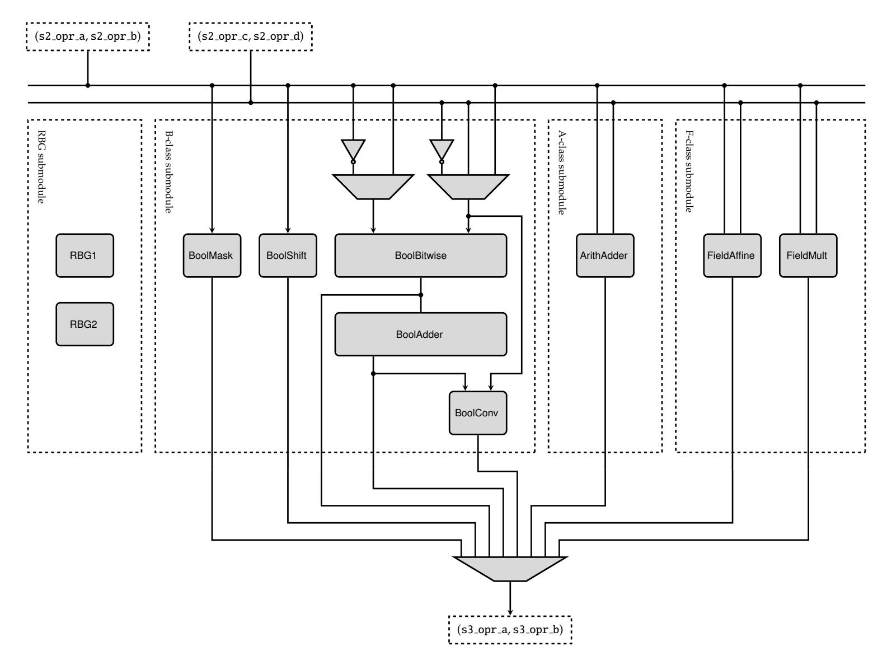
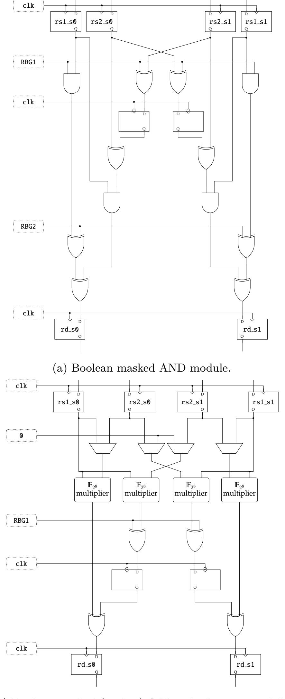
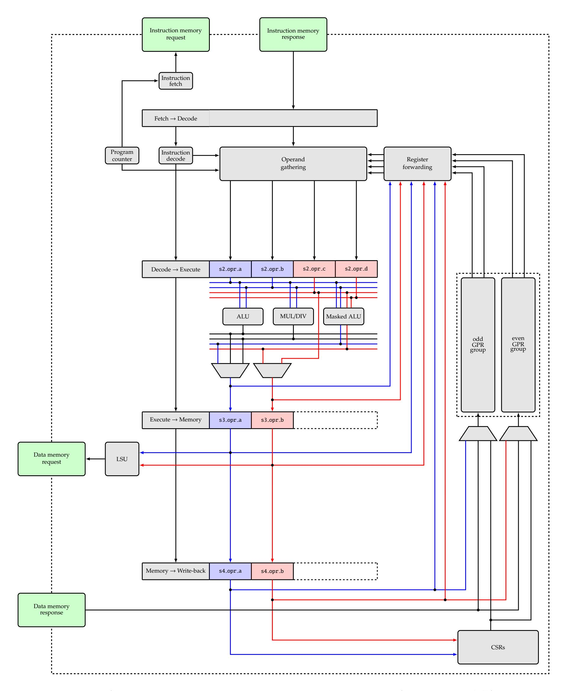
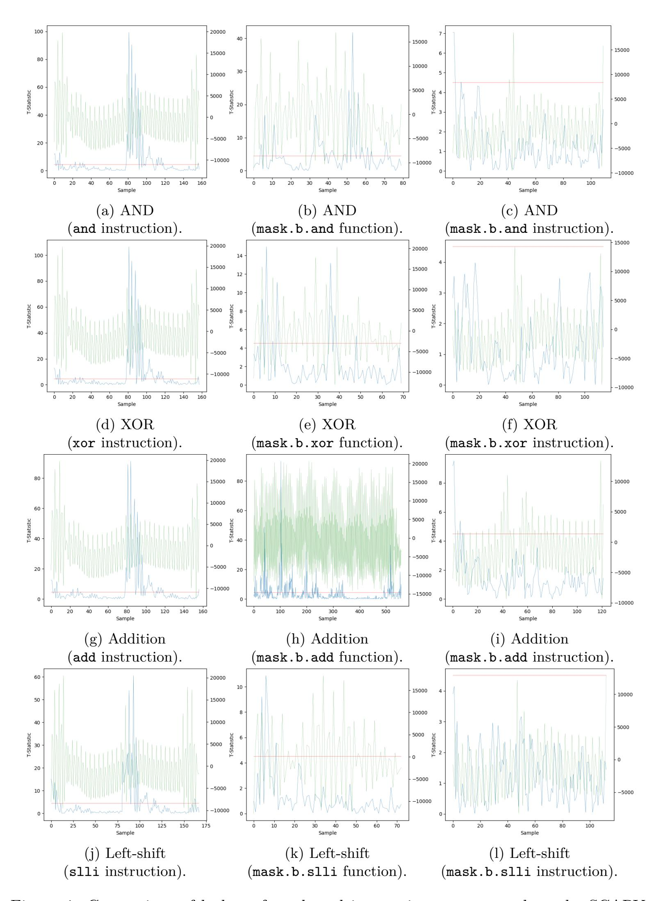
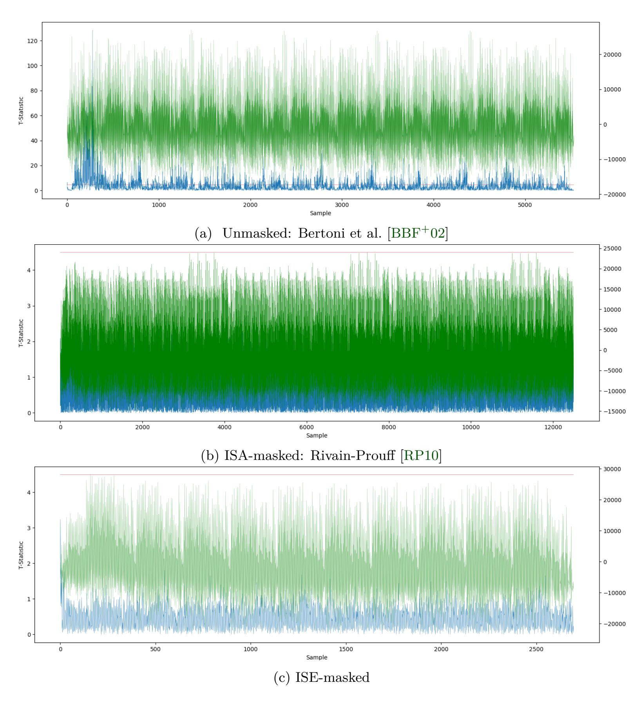

{0}------------------------------------------------

# **An Instruction Set Extension to Support Software-Based Masking**

Si Gao<sup>1</sup> , Johann Großschädl<sup>2</sup> , Ben Marshall<sup>3</sup>*,*<sup>6</sup> , Dan Page<sup>3</sup> , Thinh Pham<sup>3</sup> and Francesco Regazzoni<sup>4</sup>*,*<sup>5</sup>

```
1 Alpen-Adria Universität Klagenfurt.
                      si.gao@aau.at
2 Department of Computer Science, University of Luxembourg.
               johann.groszschaedl@uni.lu
  3 Department of Computer Science, University of Bristol.
  {ben.marshall,daniel.page,th.pham}@bristol.ac.uk
                4 University of Amsterdam,
                   f.regazzoni@uva.nl
             5 Università della Svizzera italiana,
               francesco.regazzoni@usi.ch
                6 PQShield Ltd, Oxford, UK.
               ben.marshall@pqshield.com
```

**Abstract.** In both hardware and software, masking can represent an effective means of hardening an implementation against side-channel attack vectors such as Differential Power Analysis (DPA). Focusing on software, however, the use of masking can present various challenges: specifically, it often 1) requires significant effort to translate any theoretical security properties into practice, and, even then, 2) imposes a significant overhead in terms of efficiency. To address both challenges, this paper explores the use of an Instruction Set Extension (ISE) to support masking in software-based implementations of a range of (symmetric) cryptographic kernels including AES: we design, implement, and evaluate such an ISE, using RISC-V as the base ISA. Our ISE-supported first-order masked implementation of AES, for example, is an order of magnitude more efficient than a software-only alternative with respect to both execution latency and memory footprint; this renders it comparable to an unmasked implementation using the same metrics, but also first-order secure.

**Keywords:** side-channel attack, masking, RISC-V, ISE

# **1 Introduction**

**The threat of implementation attacks.** Evolution of the technology landscape, for example improvement in storage, computational, and communication capability, has produced a corresponding evolution in user-facing platforms and applications that we now routinely depend on. Many such cases are now deemed security-critical, as a result of trends such increased connectivity (cf. IoT), outsourced computation (cf. cloud computing), and use of identity-, location-, and finance-related data. Within this setting, cryptography often represents a transparent enabler: cryptographic solutions are routinely tasked with ensuring the secrecy, robustness, and provenience of our data (when communicated and/or while stored), plus the authenticity of interacting parties. While mature theoretical foundations often underpin such solutions, their secure realisation in practice can remain difficult. Cryptographic implementations represent an important component of the attack surface; 

{1}------------------------------------------------

in an attack landscape of increasing breadth and complexity (where "attacks only get better"), the threat of implementation attacks is particularly acute.

The premise of an implementation attack is that by considering a concrete implementation, versus an abstract specification say, theoretical security properties (however strong) can potentially be bypassed. At a high level, they are often divided into active (e.g., fault injection) or passive (i.e., side-channel) classes. Differential Power Analysis (DPA) [KJJ99, MOP07] is a concrete example<sup>1</sup> of a side-channel attack with particular relevance to embedded devices. Following an optional profiling phase, a typical DPA attack performs an initial, online acquisition phase: (passive) monitoring by the attacker yields traces of power consumption during computation of some target operation by the target device. The underlying assumption is that both operations (e.g., addition versus multiplication) and the operands they process (e.g., higher versus lower Hamming weight) contribute to features, or leak information, then evident in the traces. Such features are harnessed by a subsequent, offline analysis phase, which attempts to recover security-critical information (e.g., key material) they relate to.

Challenges in realisation of countermeasures. Techniques for mitigating implementation attacks are becoming increasingly well understood. At a high level, examples pertinent to DPA are often classified as based on hiding [MOP07, Chapter 7] and/or masking [MOP07, Chapter 10]. The latter, which is our focus, can be viewed as a lower-level analogy of the more typically higher level "computing on encrypted data" concept. For a target operation normally invoked as r = f(x), application of a given masking scheme demands that 1) x is masked (resp. encrypted) to yield  $\tilde{x}$ , 2) alternative computation is applied to  $\tilde{x}$ , i.e.,  $\tilde{r} = \tilde{f}(\tilde{x})$ , such that it acts on the underlying x in a manner compatible with f, then 3)  $\tilde{r}$  is unmasked (resp. decrypted) to yield r; any leakage stemming from the computation of  $\tilde{f}$  will now relate to  $\tilde{x}$  rather than x, so the latter cannot be directly recovered as would likely be the case using f.

In common with other countermeasures, masking can be utilised at various levels in either hardware and/or software: for example, algorithm-level (e.g., to a block cipher such as AES [Mes01]), system-level (e.g., across the datapath of a processor core [GJM<sup>+</sup>16, MGH19]), and gate-level (e.g., in secure logic style such as MDPL [PM05]) techniques are all viable. For a concrete implementation that uses such techniques, however, at least two significant challenges must be addressed. First, it must translate theoretically modelled security properties into practice. This challenge is neatly illustrated by the contrast between a theoretically, *provably* secure masking scheme proposed by Rivain and Prouff [RP10], versus attacks on a practical implementation thereof by Balasch et al. [BGG<sup>+</sup>14]. Second, it must do so while satisfying other quality metrics such as demand for high-volume, low-latency, high-throughput, low-footprint, and/or low-power.

An ISE-assisted approach to masking. Instruction Set Extensions (ISEs) [GB11, BGM09, RI16] have proved to be an effective implementation technique within the context of cryptography. The idea is to identify, e.g., through benchmarking, a set of additional instructions that allow the target operation to leverage special-purpose, domain-specific functionality in the resulting ISE, versus general-purpose functionality in the base Instruction Set Architecture (ISA), and thereby deliver improvement with respect to pertinent quality metrics. ISEs are particularly effective for embedded devices, because they afford a compromise improving footprint and latency versus a software-only option while also improving area and flexibility versus a hardware-only option.

There is an increasingly accepted argument (see, e.g., [RKL<sup>+</sup>04, RRKH04, BMT16]) that security should be considered as a first-class metric at design-time, rather than a

<span id="page-1-0"></span><sup>&</sup>lt;sup>1</sup>Although our focus is specifically on DPA, we note that associated attack and countermeasure techniques apply more generally, e.g., to classes such as EM.

{2}------------------------------------------------

problem to be addressed in a reactive, post hoc manner. In line with such an argument, this paper explores use of an ISE as a means of supporting masking in software-based implementations of cryptography: we design, implement, and evaluate such an ISE using RISC-V as the base ISA. We suggest there are (at least) three reasons an ISE-based approach may be attractive versus alternatives (e.g., a dedicated IP module). First, use of masking in software-only implementations will impose a significant overhead, e.g., with respect to execution latency and demand for high-quality randomness; our ISE can help mitigate this problem. Second, an ISE is well positioned to act as an interface with respect to security properties. For example, there is increased evidence (see, e.g., [\[CGD18,](#page-29-3) [GMPO19\]](#page-30-2)) that secure use of masking in software-only implementations is complicated by the lack of guarantees regarding leakage that stems from the underlying micro-architecture; our ISE can help mitigate this problem, e.g., by adopting an approach similar to the augmented ISA (or aISA) of Ge et al. [\[GYH18\]](#page-30-3) and constraining the micro-architecture to meet properties demanded by the ISA. Third, the design of masking schemes is a relatively fast-paced field, with novel designs and techniques appearing regularly. Our ISE mitigates this problem by following a RISC-like ethos: it provides a suite of general-purpose "building block" operations, that can be used to support a wide range of cryptographic constructions (e.g., block ciphers) and higher-level masking schemes.

We note that, concurrently with our work, Kiaei and Schaumont [\[KS20\]](#page-31-4) published a proposal that is similar in some respects. We detail the differences between their and our work in Section [2.3,](#page-5-0) but, in short, we a) enrich the ISE with a wider set of operations, b) provide an implementation of the ISE within an existing RISC-V compliant microarchitecture, and c) evaluate it, with respect to efficiency and security properties, using a suite of representative kernels.

**Organisation.** Section [2](#page-2-0) surveys related work. Section [3](#page-6-0) introduces the ISE design. Section [4](#page-9-0) looks at the ISE from a hardware perspective, outlining and then evaluating an implementation of the ISE set within the context of an existing RISC-V compliant micro-architecture. Section [5](#page-20-0) looks at the ISE from a software perspective, focusing on how it is utilised: we evaluate the ISE when used to implement a range of (symmetric) cryptographic kernels including AES. Finally, Section [6](#page-27-0) concludes our work presenting potential directions for future work.

# <span id="page-2-0"></span>**2 Background**

## **2.1 RISC-V**

RISC-V (see, e.g., [\[AP14,](#page-29-4) [Wat16\]](#page-32-5)) is an open ISA specification. It adopts *strongly* RISCoriented design principles (so is similar to MIPS) and can be implemented, modified, or extended by anyone with neither licence nor royalty requirements (as opposite to MIPS, ARM, and x86). A central tenet of the ISA is modularity: a general-purpose base ISA can be augmented with some set of special-purpose, standard or non-standard (i.e., custom) extensions. As a result of these features, coupled with the surrounding community and availability of supporting infrastructure such as compilation tool-chains, a range of (typically open-source) RISC-V implementations exist.

We focus without loss of generality on extending RV32I [\[RV:19,](#page-32-6) Section 2], i.e., the 32-bit integer RISC-V base ISA. Let GPR[*i*], for 0 ≤ *i <* 32, denote the *i*-th entry of the general-purpose register file. RISC-V uses XLEN to denote the word size; we adopt the same approach, but by focusing on RV32I assume a focus on XLEN = 32.

{3}------------------------------------------------

## <span id="page-3-0"></span>**2.2 Masking**

Masking is based on the concept of secret-sharing. In 1999, Chari et al. [\[CJRR99\]](#page-30-4) leveraged this concept as a countermeasure against side-channel attacks. However, use of the term masking first appeared in 2000 when Messerges [\[Mes01\]](#page-31-2) described the use of a "random mask to obscure the calculation made by the fundamental operations" of AES candidates.

A given masking scheme specifies a non-standard *representation* of data, where each variable *x* is represented by (or split into) *n* separate shares, and a non-standard *implementation* of functions, which operate on said representations. The shares representing some *x* must fulfil two properties: 1) they must be uniformly distributed, and 2) every subset of shares has to be statistically independent from *x*. An implementation of such a scheme is said to resist a *t*-th order attack (e.g., under the probing model of Ishai, Sahai, and Wagner [\[ISW03\]](#page-31-5)), if knowledge of *t < n* shares cannot be used to recover *x*.

### **2.2.1 Representation**

A masking scheme can be classified as Boolean (or additive) or arithmetic (or multiplicative). If *x<sup>i</sup>* denotes the *i*-th share for 0 ≤ *i < n*, the shares representing *x* satisfy *x*0⊕*x*1⊕· · ·⊕*xn*−<sup>1</sup> under Boolean masking, and *x*<sup>0</sup> + *x*<sup>1</sup> + · · · + *xn*−<sup>1</sup> (mod 2 *<sup>w</sup>*) under arithmetic masking. Consider the specific case of *n* = 2, and let *x*ˆ = (*x*0*, x*1) denote the representation of some *x* under Boolean masking, i.e., as two shares *x*<sup>0</sup> and *x*1: this demands *x* = *x*<sup>0</sup> ⊕ *x*1. Likewise, let *x*¯ = (*x*0*, x*1) denote the representation of some *x* under arithmetic masking: this demands *x* = *x*<sup>0</sup> + *x*<sup>1</sup> (mod 2 *<sup>w</sup>*), noting that, without loss of generality, we set *w* = XLEN = 32*.*

### **2.2.2 Hardware-oriented implementation**

**Classical.** Goubin and Patarin [\[GP99\]](#page-30-5) formalised the idea of replacing each intermediate variable of the computation that is dependent of the inputs or outputs (thus potentially exploitable by an attacker), by a combination of sub-variables. The recovery of the original variable would be possible only when all the sub-variables are combined together. This approach is secure if the function selected for implementing the combination operation allows one to perform computation with the sub-variables without computing the original variable. The two functions analysed are XOR (cf. additive masking) and modular multiplication (cf. multiplicative masking).

**Threshold Implementation (TI).** Threshold Implementation (TI), presented by Nikova et al. [\[NRR06\]](#page-31-6), is a countermeasure that is provable secure against first-order attacks (even in the presence of glitches). TI requires use of shares with three properties: correctness, incompleteness, and uniformity. Correctness means that the computation performed on the shares should be correct, i.e., composition of the results of the operations carried out on each shares has to be equal to the shared representation of the original result. Incompleteness means that the computation performed is independent of at least one share (for first-order security). To guarantee the security of the scheme, masks must be uniformly distributed. Uniformity is usually the most difficult property to guarantee, but can be relaxed by using non-uniform functions *if* their randomness is refreshed frequently.

**Domain-Oriented Masking (DOM).** Domain-Oriented Masking (DOM) is presented by Gross et al. [\[GMK16\]](#page-30-6). The main objective of their work was to guarantee security against *t*-th order attacks using *n* = *t* + 1 shares, reaching the same level of security of TI, but incurring in less area overhead (when implemented in hardware) and requiring less randomness. To achieve this, the authors concentrate their effort in the design of the DOM-dep multiplier, that is a dedicated masked multiplier implementing the proposed

{4}------------------------------------------------

scheme in an efficient and secure way. The approach is evaluated using the AES algorithm as a case of study, which is analysed upto a 15-th order security level.

### **2.2.3 Software-oriented implementation**

Although masking can be applied to more general classes of computation, consider application to block ciphers specifically. The main challenge when applying masking in software is to implement the round functions in such a way that the shares can be processed independently from each other, while it still must be possible to recombine them at the end of the execution to get the correct result. This is fairly easy for all linear operations, but can introduce massive overheads for the non-linear parts of a block cipher, e.g., S-boxes or modular additions/subtractions. Furthermore, all round transformations need to be executed twice (namely for *x*<sup>0</sup> and *x*1, where *x* = *x*<sup>0</sup> ⊕ *x*1), which imposes additional overhead. Another problem is that a basic 2-share masking scheme is vulnerable to a so-called second-order attack where an attacker combines information from two leakage points. Such a second-order attack can, in turn, be thwarted by second-order masking, in which each sensitive variable is concealed with two random masks and, consequently, represented by three shares.

Depending on the algorithmic properties of a block cipher, a masking scheme can have to protect Boolean operations (e.g., XOR, shift) or arithmetic operations (e.g., modular addition). When a block cipher involves both Boolean and arithmetic operations, it is necessary to convert the masks from one form to the other to obtain the correct ciphertext (or plaintext). Examples of symmetric algorithms that involve arithmetic as well as Boolean operations include the widely-used hash functions SHA-2, Blake, and Skein, and any ARX-based block cipher (e.g., Speck). In essence, the basic operations performed by common block ciphers can be divided into three categories depending on how costly they are to mask in software: 1) linear operations (e.g., XOR, NOT, shift, rotation), 2) non-linear Boolean operations (e.g., AND, OR), and 3) non-linear arithmetic operations (e.g., modular addition, and inversion in F<sup>2</sup> <sup>8</sup> ).

As mentioned before, linear operations like XOR and rotation are fairly easy to mask in software since one just has to apply the operation to each pair of shares individually. The XOR of a constant to a set of shares can be performed by XOR'ing it to a single share. Similarly, the logical NOT operation is masked by applying NOT to one of the shares. Computing a non-linear Boolean function on the shares assuring all variables processed are independent of sensitive variables is more complicated and introduces higher computational overheads. The simplest non-linear Boolean operations is the logical AND, which can be masked in different ways, whereby the different approaches proposed in the literature differ by the amount or randomness and the number of underlying basic operations. The first proposal for a first-order masked AND gate came from Trichina and was published more than 15 years ago [\[Tri03\]](#page-32-7). This so-called "Trichina AND-gate" consists of four basic AND operations, four XORs, and requires additional fresh randomness to ensure that the shares are statistically independent of any sensitive variable. Biryukov et al. introduced an improved expression for masked AND in [\[BDCU17\]](#page-29-5), that consists of only seven basic operations and does not require an additional random variable since the shares are inherently refreshed. Furthermore, on ARM micro-controllers, the masked AND can be performed using only six basic instructions. Biryukov et al. also presented a masked OR operation, which consists of only six basic operations (and six basic instructions on ARM) and does not require fresh randomness.

Highly non-linear arithmetic operations, such as modular addition or inversion in a binary field, are the most costly operations when it comes to masking in software. There are two basic options for implementing a masked addition (or subtraction) in software; the first consists of converting the Boolean shares to arithmetic shares, then performing the addition on the arithmetic shares, and finally converting the arithmetic shares of

{5}------------------------------------------------

the sum back to Boolean shares. The second option is to perform the modular addition directly on Boolean shares without conversion. Both options have in common that a straightforward software implementation has a complexity that increases linearly with the length of the operands to be added. Coron et al. presented in [\[CGTV15\]](#page-30-7) a recursive formula for arithmetic addition on Boolean shares with logarithmic complexity. This approach is based on the Kogge-Stone adder (a special variant of a carry-lookahead adder) and uses masked AND, masked XOR, and masked shift as sub-operations. Biryukov et al. presented an improved Kogge-Stone adder that uses the more efficient masked operations from [\[BDCU17\]](#page-29-5) and is able to perform a 32-bit addition on Boolean shares between 14% and 19% faster than the Kogge-Stone adder of Coron et al.

## <span id="page-5-0"></span>**2.3 Related work**

Gross et al. [\[GJM](#page-30-0)<sup>+</sup>16] propose a SCA-protected processor design based on the open-source V-scale RISC-V processor. The starting point is the experience gained with the study of DOM (introduced in the previous section) which is leveraged to modify the CPU to make it resistant against side-channel attacks. The authors split the processor in a protected and an unprotected part, and realise an ALU protected using the domain oriented approach to carry the needed basic operations. Experimental results show an increased resistance against side-channel attacks and a scale of the system almost linear with the order of protection.

Protection against power analysis attacks for the RISC-V processor have been also proposed by De Mulder et al. [\[MGH19\]](#page-31-3). The proposed solution aims at protecting against first-order power and electromagnetic attacks. The protection is achieved using a combination of known masking techniques and a masked access to memory. The second mask for accessing the memory is generated on the fly within the boundary of the CPU, and thus, at least in principle, robust. The leakage reduction is demonstrated by a number of practical experiments.

The use of instruction set extensions to increase the resistance of a processor against power analysis attacks has been explored also in the past. Tillich and Großschädl [\[TG07\]](#page-32-8) evaluated the resistance against side-channel attacks of a processor extended with custom instructions for AES and proposed to implement the most security-critical operation of masking using a DPA-resistant logic style. A design flow for automatically implementing an instruction set extension using a protected logic style was presented by Regazzoni et al. [\[RCS](#page-32-9)<sup>+</sup>09] and evaluated on OpenRISC. The selection of the instructions was driven by a security metric and the protected logic style used was a MOS transistor-based current mode logic.

The most relevant work to our own is probably that of Kiaei and Schaumont [\[KS20\]](#page-31-4). They propose to extend the RISC-V processor with dedicated instructions to mitigate side-channel attacks, focusing in particular on DOM. Our paper shares the core idea of extending the instruction set of a processor to achieve side-channel resistance, but provides novel contributions. Firstly, our instructions are not limited to the case of DOM, but are suitable for implementing masking countermeasures in general and can protect a wide range of algorithms. Secondly, our instructions are integrated in the core allowing us to provide a quantitative analysis of the achieved robustness and of the performance overhead. Lastly, we show that it is possible to achieve security of masking using dedicated instructions without the need of duplicating the datapath to strongly separate the secure and insecure zone. To the best or our knowledge, previous works on instruction set extension for accelerating masking and for side-channel security in general, have always proposed to have such strong differentiation.

{6}------------------------------------------------

# <span id="page-6-0"></span>3 A design perspective

**Concept.** Focusing without loss of generality on use of Boolean masking, the ISE targets inclusion of instructions to support 1) binary masked operations, i.e.,  $\hat{r} = \hat{x} \oplus \hat{y}$  for some set of  $\ominus$ , 2) unary masked operations, i.e.,  $\hat{r} = \bigcirc \hat{x}$  for some set of  $\bigcirc$ , and 3) various auxiliary operations, such as conversion into, from, and between masked representations. The set of supported operations should be general-purpose in the sense they are useful for a range of cryptographic constructions and masking schemes; they often have an equivalent in, and so represent close to a "drop in" replacement for instructions in the base ISA by including, e.g.,  $\ominus \in \{\land, \lor, \oplus, +, -\}$  and  $\bigcirc \in \{\neg\}$  to mirror the unmasked Boolean operations already available. Doing so is complicated, however, by the fact that for n = 2 shares we have

$$\hat{r} = \hat{x} \ominus \hat{y} \implies (r_0, r_1) = (x_0, x_1) \ominus (y_0, y_1),$$

for example. That is, doing so increases the number of register indexes required, and, therefore, pressure on instruction encoding: an unmasked binary (resp. unary) operation requires 3 (resp. 2) register indexes, whereas a masked equivalent requires 6 (resp. 4). The same scenario is articulated by Lee et al. [LYS04], who describe and use the term Multi-word Operand, Multi-word Result (MOMR) to characterise and thereby distinguish cryptographic operations from the general case. There are various ways to satisfy this requirement: we use an implied approach, where two indexes are encoded as one, i.e.,  $(i, i+1) \mapsto i$ . For example, the even-odd index pair (2,3) is encoded as the first, even index 2; the second, odd index 3 is then implicit rather than explicit. This is a limited instance of the Register File Extension for Multi-word and Long-word Operation (RFEMLO) approach proposed by Lee and Choi [LC08].

The ISE itself constitutes 22 additional instructions, which can be divided into 4 feature classes. Table 1 offers a high-level summary of these instructions, with the underlying operations captured in an algorithmic format by Appendix B to avoid repetition inline; we discuss their design in detail below.

**Notation.** The RISC-V naming convention [RV:19, Section 27] for ISEs uses a string of single-character identifiers to specify features realised in an implementation. We adopt a variant of this approach, where, for example, ISE[CBA] denotes a concrete implementation of the ISE that supports the C, B, and A feature classes but not the F feature class.

We attempt to describe a given software implementation as precisely and clearly as possible, through consistent use of the following terminology. An *unmasked* implementation of some functionality represents an insecure (in the sense it includes no masking-based countermeasures) baseline, as realised using the base ISA only. In contrast, an *ISA-masked* or *ISE-masked* implementation will secure the associated unmasked baseline via masking, as realised using either the base ISA only or base ISA plus ISE respectively.

**Conversion (C-class).** The ISE includes a suite of instructions that support conversion of operands under Boolean masking to/from arithmetic masking. For example, the instruction

uses the input  $\hat{x} = (x_0, x_1) = (\mathsf{GPR[rs1]}, \mathsf{GPR[rs2]})$  so  $x = x_0 \oplus x_1$ ; it computes the output  $\bar{r} = (r_0, r_1) = (\mathsf{GPR[rd1]}, \mathsf{GPR[rd2]}) = \mathsf{BOOL2ARITH}((x_0, x_1))$  so  $r = r_0 + r_1 \pmod{2^w} = x$ .

**Operations under Boolean masking (B-class).** The ISE includes a suite of instructions that support Boolean masking. They allow masking, unmasking, remasking, and application

{7}------------------------------------------------

<span id="page-7-0"></span>

Table 1: A summary of additional instructions that constitute the ISE, and their mapping onto underlying operations.

{8}------------------------------------------------

of operations to (masked) operands: these operations include NOT, AND, OR, XOR, left-and right-shift, right-rotate, addition, and subtraction. For example, the instruction

```
mask.b.add (rd1,rd2), (rs1,rs2), (rs3,rs4)
```

```
uses the inputs \hat{x} = (x_0, x_1) = (\mathsf{GPR[rs1]}, \mathsf{GPR[rs2]}) and \hat{y} = (y_0, y_1) = (\mathsf{GPR[rs3]}, \mathsf{GPR[rs4]}) so x = x_0 \oplus x_1 and y = y_0 \oplus y_1; it computes \hat{r} = (r_0, r_1) = (\mathsf{GPR[rd1]}, \mathsf{GPR[rd2]}) = \mathsf{BOOLAdd}((x_0, x_1), (y_0, y_1)) so r = r_0 \oplus r_1 = x + y.
```

**Operations under arithmetic masking (A-class).** The ISE includes a suite of instructions that support arithmetic masking. They allow masking, unmasking, remasking, and application of operations to (masked) operands: these operations include addition and subtraction. For example, the instruction

```
mask.a.sub (rd1,rd2), (rs1,rs2), (rs3,rs4)
```

```
uses the inputs \bar{x} = (x_0, x_1) = (\mathsf{GPR[rs1]}, \mathsf{GPR[rs2]}) and \bar{y} = (y_0, y_1) = (\mathsf{GPR[rs3]}, \mathsf{GPR[rs4]}) so x = x_0 + x_1 \pmod{2^w} and y = y_0 + y_1 \pmod{2^w}; it computes \bar{r} = (r_0, r_1) = (\mathsf{GPR[rd1]}, \mathsf{GPR[rd2]}) = \mathsf{ARITHSUB}((x_0, x_1), (y_0, y_1)) so r = r_0 + r_1 \pmod{2^w} = x - y.
```

Operations for field arithmetic (F-class). Arithmetic operations in the finite field  $\mathbb{F}_{2^8}$  play an essential role in many symmetric cryptosystems, most notable the AES [DR02]. For example, the SubBytes transformation of the AES performs an inversion of an element of  $\mathbb{F}_{2^8}$ , followed by an affine transformation. The MixColumns transformation can be interpreted as multiplications of polynomials whose coefficients are elements of  $\mathbb{F}_{2^8}$ . Besides the AES, many other symmetric cryptosystems involve arithmetic operations in  $\mathbb{F}_{2^8}$ ; these include the block ciphers SM4 and Camellia, the hash function Grøstl, the authenticated encryption algorithms COMET and Saturnin (which made it into the second round of the current NIST lightweight cryptography standardisation project), and many more.

When it comes to masking of the AES (and AES-like or AES-inspired designs), two basic approaches received particular attention in the recent literature. The first approach uses a bit-sliced implementation as starting point and applies masking to the underlying logical operations |SS16|. Such masked bit-sliced implementations are attractive because they can reach relatively high throughput; for example, Schwabe and Stoffelen |SS16| report an encryption time of 7422.6 cycles per block for first-order masked AES on a Cortex-M4 micro-controller when encrypting 256 consecutive blocks. However, the main disadvantage of bit-slicing is that it can only be applied to non-feedback modes of operation like counter mode. In addition, bit-slicing introduces a disproportionately high overhead when the amount of data to be encrypted is small, as is often the case for applications that run on constrained devices. An alternative approach is the well-known masking technique of Rivain and Prouff [RP10], which is provably secure in the probing model and can be straightforwardly extended to higher orders. The Rivain-Prouff masking technique requires performing the inversion in  $\mathbb{F}_{2^8}$  through a sequence of multiplication and squarings along with mask refreshings to inject independent randomness. When properly implemented, the Rivain-Prouff masking can meet the strong theoretical security promises in practice, but introduces a massive penalty in execution time. For example, a first-order masked implementation of AES-128 on an ARM Cortex-M3 micro-controller is between 40 and 60 times slower than unprotected reference implementation [GR17].

The B-class instructions described above, most notably mask.b.xor and mask.b.and, can be applied for Boolean masking of bit-sliced implementations of any symmetric cryptosystem, including the AES. However, given the mentioned limitations of bit-slicing (most notably the restriction to non-feedback modes of operation), which carry over to masked bit-slicing, it makes sense to define an ISE to support the masking of non-bitsliced implementations of the AES. The SubBytes transformation deserves particular

{9}------------------------------------------------

attention since it includes inversion in  $\mathbb{F}_{2^8}$ , which is non-linear and, therefore, extremely costly to mask. Rivain and Prouff [RP10] proposed to mask SubBytes by performing a sequence of masked multiplications and squarings in  $\mathbb{F}_{2^8}$ , followed by a masked affine transformation. The masked multiplication and squaring are, in turn, composed of "ordinary" multiplications and squarings in  $\mathbb{F}_{2^8}$ , which are usually implemented using look-up tables (cf. [GR17, Section 3]). However, look-up tables add to the memory footprint and may enable cache attacks when executed on devices with a data cache. Said problems can be easily overcome by defining instructions for multiplication, squaring, and affine transformation in  $\mathbb{F}_{2^8}$ . These operations are ubiquitous in symmetric cryptography (cf. SM4, Camellia, Grøstl, etc.), which means ISEs for masked multiplication, masked squaring, and masked affine transformation are in line with the general design concept described at the beginning of this section, namely to support operations that are general-purpose and useful for a wide range of cryptographic constructions. For example, the instruction

executes a masked 4-way SIMD Within a Register (SWAR) multiplication in  $\mathbb{F}_{2^8}$ , interpreting the operand in each source register as four elements of  $\mathbb{F}_{2^8}$ . This instruction is basically a "packed" version of the masked  $\mathbb{F}_{2^8}$  multiplication described by Rivain and Prouff [RP10]; a more formal specification of mask.f.mul can be found in Appendix B. Also the mask.f.sqr and mask.f.aff instruction execute a masked squaring and masked affine transformation in a 4-way SWAR-parallel fashion, which means they operate on four bytes in parallel, whereby each byte is interpreted as an element of  $\mathbb{F}_{2^8}$ . In essence, mask.f.mul and mask.f.aff can be seen as 32-bit versions of the x86 instructions GF2P8MULB [X8618, Pages 3-447–3-448] and GF2P8AFFINEQB [X8618, Pages 3-445–3-446]. Both mask.f.mul and mask.f.sqr use the irreducible polynomial of the AES, namely  $p(x) = x^8 + x^4 + x^3 + x + 1$ . Nonetheless, these instructions can still be used for e.g., SM4 and other cryptosystems that use a different irreducible polynomial, since the corresponding field-representations are isomorphic.

# <span id="page-9-0"></span>4 A hardware perspective: ISE realisation

In this section we consider the ISE from a hardware perspective, i.e., how the ISE is realised. Section 4.1 outlines the implementation of a masked ALU module, and integration of said module into an existing RISC-V compliant micro-architecture. Section 4.2 then presents synthesis results, including area, plus analysis of per-instruction (versus whole kernel) execution properties including execution latency, memory footprint, and leakage.

In common with the ISA, our ISE defines an interface; this implies a degree of flexibility with respect to any implementation of it. As a result, we stress that ours is an implementation rather than the (only possible) implementation: alternative approaches that yield incremental improvements may be viable, and in fact may be necessary to support integration with different micro-architectures.

## <span id="page-9-1"></span>4.1 Implementation

#### <span id="page-9-2"></span>4.1.1 Implementation of a masking-specific ALU

Each operation underlying an ISE instruction is evaluated using a masked ALU module, an illustrative block diagram of which is shown in Figure 1: it accepts two 2-share inputs (s2\_opr\_a, s2\_opr\_b) and (s2\_opr\_c, s2\_opr\_d) and produces one 2-share output (s3\_opr\_a, s3\_opr\_b), where, for both input and output, only 1 share may be used in specific cases such as masking and unmasking. Internally, the ALU can be viewed as a collection of submodules which cater for four cases, namely 1) support for random bit

{10}------------------------------------------------

<span id="page-10-0"></span>

Figure 1: A block diagram illustrating submodules of the masked ALU module, and their internal organisation. Note that, for clarity, we use 2-share connections (i.e., each connection communicates two, 32-bit shares) throughout and omit all connections stemming from the two RBG instances: these are used by almost all other components.

generation, 2) support for B-class instructions, 3) support for A-class instructions, and 4) support for F-class instructions, which we expand upon below.

**High-level implementation strategy.** The masked ALU supports a variety of operations, each of which could be classified as either linear or non-linear. Whereas linear operations (e.g., masked XOR) can operate independently on the shares involved, the same is not true of non-linear operations (e.g., masked AND): because they involve operations which allow interaction between shares, their leakage-free implementation demands care with respect to glitches, i.e., transient changes to the state of a signal before it finally becomes stable. Per Section [2.2,](#page-3-0) various implementation strategies, such as TI [\[NRR06\]](#page-31-6) and DOM [\[GMK16\]](#page-30-6), can be used to address this challenge. We opt for a DOM-based strategy, which, at a high level, requires the application of two principles: 1) separation of a given module into domains, each of which operates on associated shares and is therefore inherently robust against glitches, and 2) insertion of latching and remasking steps, which cater for cross-domain operations by preventing glitches and therefore associated leakage. Based on these principles, we apply several general strategies throughout the implementation of given operation:

1. By default, insertion of an additional latching step within a given module would imply an additional clock cycle of latency; this would then be reflected in the latency of instruction execution, and thus instruction throughput overall. To avoid this overhead, we use double-pumped clocking. As a result of the short critical paths involved, we can make use of both positive (for input and output registers) *and*

{11}------------------------------------------------



<span id="page-11-1"></span><span id="page-11-0"></span>(b) Boolean masked (packed) field multiplication module.

Figure 2: Two circuit diagrams which capture the DOM-based implementation of selected operations: note 1) the inclusion of remasking steps, and 2) double-pumped approach to clocking, whereby the input and output (resp. latching step) registers are enabled by positive (resp. negative) clock edges.

{12}------------------------------------------------

negative (for registers associated with the additional latching step) clock edges and thus avoid additional latency.

- 2. Although remasking steps are only *required* if/where cross-domain operations exist, the relative abundance of randomness (versus in software) means we are able to insert additional remasking steps elsewhere: this is a conservative decision with respect to leakage, and allows the ALU to be more modular by removing various assumptions about use of and interaction between modules.
- 3. The general DOM-based strategy includes more specific variants termed DOM-indep and DOM-dep, which cater for cases where the inputs are known to be independent or dependent respectively. We carefully select between these variants depending on the context, and so avoid leakage but *also* optimise the implementation where possible.

Although it is possible to apply tools such REBECCA [\[BGI](#page-29-6)<sup>+</sup>18], maskVerif [\[BBC](#page-29-7)<sup>+</sup>19], and SILVER [\[KSM20\]](#page-31-9) to formally verify properties of some smaller, isolated modules within the masked ALU, we faced various challenges when doing so in general: these included 1) the general complexity, e.g., total number of gates, and 2) the use of an iterative rather than combinatorial architecture for the Kogge-Stone [\[KS73\]](#page-31-10) adder supporting Boolean masked addition and subtraction. Our strategy is therefore most fairly described as "glitch free by construction then empirical validation", rather than as "glitch free by formal verification" for example.

**RBG submodule.** The RBG submodule generates random masks for (re)masking operations: at most two such masks are required by the ALU for any given operation, so it includes two instances. Each instance uses a hybrid design, motivated by the trade-off between area, throughput, and randomness quality, which includes both pseudo- and true-random components.

The basis for this design is a 32-bit Linear Feedback Shift Register (LFSR), which uses a feedback function selected [\[GA\]](#page-30-10) to generate a maximal length pseudo-random sequence of 2 <sup>32</sup> − 1 outputs. The LFSR is free-running in the sense it is updated every clock cycle, rather, for example, than per use of the masked ALU. The LFSR state in some *i*-th clock cycle is used as is to form the output and hence a 32-bit mask; the state is not architecturally visible, and therefore cannot be read from or written to by software.

In principle at least, the inherently deterministic behaviour of such an LFSR could be exploited in an attack. To address this fact we add selected non-determinism by injecting a single true-random bit into the feedback function. This bit is generated by an implementation of the ES-TRNG design due to Yang et al.[\[YRG](#page-32-12)<sup>+</sup>18], which relies on the timing jitter of a ring oscillator; we employ a third-order parity filter to post-process the raw output. As well as enhancing the security characteristics of the LFSR, doing so also acts as a way to seed it: one simply stalls for some *n* clock cycles, after which *n* true-random bits have been injected into and so act to seed the LFSR state.

**B-class submodule.** The B-class submodule is realised by a set of fairly independent modules which collectively provide functionality in support of the B-class instructions. The internal organisation of said modules is area-optimised, in the sense that, if and where appropriate, 1) common functionality is reused between operations, and 2) functionality supporting a given operation can be iterative (or multi-cycle) versus combinatorial (or single-cycle). The BoolMask module computes Boolean masking and remasking. The BoolShift module computes Boolean masked left-shift, right-shift, and right-rotate. The BoolBitwise module computes bitwise operations, including Boolean masked NOT, XOR, and AND; Boolean masked OR is computed using the Boolean masked AND module by

{13}------------------------------------------------

applying De Morgan's law. Boolean masked addition and subtraction are computed by the BoolBitwise and BoolAdder modules, which are combined to form an iterative Kogge-Stone [KS73] adder. The former realises the pre-processing step, while the latter realises the iteration, and post-processing steps. A set of registers is used to latch the output of each i-th step of iteration ready for use in the subsequent, (i + 1)-th step. Finally, the BoolConv module reuses Boolean masked addition and subtraction to allow conversion between Boolean and arithmetic masking.

The Boolean masked AND operations in the BoolBitwise and BoolAdder modules are supported by DOM-dep and DOM-indep implementations respectively. The former case must be pessimistic because the inputs are externally generated (so may be dependent); the latter case can be optimistic because the inputs are internally generated (so can be guaranteed independent), and, as a result, is more efficient. Figure 2a describes the former, i.e., a DOM-dep, Boolean masked AND module: this clearly demonstrates points in our high-level implementation strategy, namely the use of 1) two domains (essentially the left-and right-hand side of the circuit), 2) one latching step (driven by the negative edge of clk), 3) two remasking steps (one at the input to the latching step using RBG1, one at the module output using RBG2).

**A-class submodule.** The A-class submodule is realised by a set of fairly independent modules which collectively provide functionality in support of the A-class instructions. The ArithAdder module computes arithmetic masked addition and subtraction.

**F-class submodule.** The F-class submodule is realised by a set of fairly independent modules which collectively provide functionality in support of the F-class instructions. The FieldAffine module computes a (packed) masked field transform (or matrix-vector product). The FieldMult module computes a (packed) masked field multiplication.

Both Boolean masked (packed) masked field multiplication and squaring operations in the FieldMult module are supported by a DOM-indep implementation. Figure 2b describes the implementation, which follows that described by Rivain and Prouff [RP10, Section 3.1], using instances an optimised design [fSN] for the constituent (unmasked) multiplications in  $\mathbb{F}_{2^8}$ ; the multiplexers before the  $\mathbb{F}_{2^8}$  multipliers are controlled to allow either multiplication or squaring.

Although DOM-indep assumes the inputs are independent, the major reason for dependency would be where the inputs are equal: this is allowed via a separate controlpath, i.e., a Boolean masked (packed) masked field squaring operation. Table 4 captures this assumption, which then forms part of the hardware/software interface: responsibility for 1) correct selection between multiplication and squaring, and 2) satisfaction of the independence assumption for multiplication lies with software. We stress that it is possible to opt for a DOM-dep implementation instead, which then shifts the trade-off toward usability (by removing said assumption) at the cost of efficiency.

### 4.1.2 Integration of the masked ALU into a RISC-V compliant micro-architecture

The masked ALU described in Section 4.1.1 was integrated into the SCARV<sup>2</sup> core, a micro-controller class 5-stage pipelined micro-architecture that implements RV32IMCB, i.e., the RV32I base ISA plus the M(ultiply) [RV:19, Chapter 7], C(ompressed) [RV:19, Chapter 16] and (draft) B(it manipulation) [RV:19, Chapter 17]<sup>3</sup> standard extensions. We supplement this baseline core with an instruction

$$\texttt{rbgsamp rd} \ \mapsto \ \mathsf{GPR}[\texttt{rd}] \xleftarrow{\$} \{0,1\}^{\mathrm{XLEN}},$$

<span id="page-13-0"></span><sup>&</sup>lt;sup>2</sup>https://github.com/scarv/scarv-cpu

<span id="page-13-1"></span><sup>&</sup>lt;sup>3</sup>See also https://github.com/riscv/riscv-bitmanip

{14}------------------------------------------------

<span id="page-14-0"></span>

Figure 3: A block diagram illustrating integration of the masked ALU into the SCARV core. Note that registers and wires are coloured blue (resp. red) to reflect their relationship with the 0-th (resp. 1-st) share of intermediate, in-flight values; green modules represent the memory interface, careful use of which is important to ensure leakage-free transfer of shares between general-purpose registers and memory.

{15}------------------------------------------------

which samples XLEN bits from an underlying Random Bit Generator (RBG)[4](#page-15-0) and stores the result into a general-purpose register. This is important, because it allows efficient generation of masks in software which uses the base ISA, i.e., it does not artificially penalise the base ISA versus the ISE with respect to generation of randomness.

A block diagram of the core is show in Figure [3.](#page-14-0) Note that the core is interfaced with a 64 kB RAM (left) and a 1 kB ROM (top); both have single-cycle access latencies.

**Support for paired register file access.** Per Section [3,](#page-6-0) the masked ISE design demands a general-purpose register file which can support paired read (resp. write) access: for masked operands, an index *i* implies a need to read from (resp. write to) both GPR[*i*] (i.e., the 0-th share) *and* GPR[*i* + 1] (i.e., the 1-st share).

Due to the indexing scheme, restructuring the register file to support such access was fairly straightforward. Specifically, the odd and even registers were split into two groups (or sub-files), each one using a dedicated 16-to-1 multiplexer tree to support read access. This approach means a) both elements of a pair can be accessed in parallel, b) there is no interaction between elements within the multiplexer tree, and c) an underlying implementation based on either flip-flops or latches *or* SRAM is feasible. For single-register reads, an additional 2-to-1 multiplexer in the decode stage selects between either the odd or even group based on the least-significant bit of the index. For base ISA instructions rs1 is stored in s2\_opr\_a and rs2 is stored in s2\_opr\_b. For ISE instructions the 0-th (resp. 1-st) share of rs1 is stored in s2\_opr\_a (resp. s2\_opr\_c), whereas the 0-th (resp. 1-st) share of rs2 is stored in s2\_opr\_b (resp. s2\_opr\_d); for the SCARV core at least, this meant adding an additional pipeline register, i.e., s2\_opr\_d.

**Mitigating the impact of accidental share combination.** We found that although implementation of a leakage-free masked ALU was straightforward in isolation, integration with the core presented some more subtle challenges from a leakage perspective. In particular, given the masked representation of some *<sup>x</sup>*, i.e., *<sup>x</sup>*<sup>e</sup> = (*x*0*, x*1)*,* potential sources for accidentally share combination, i.e., interaction between *x*<sup>0</sup> and *x*1, occur *throughout* the execution pipeline. One way to address this challenge (see, e.g., [\[KS20,](#page-31-4) Figure 1]), is by executing base ISA and ISE instructions using separate insecure and secure datapaths. We instead opted to address it in an integrated datapath, employing two mechanisms.

At an int*ra*-component level, note that the interleaved mapping of shares to pipeline registers is an intentional design decision: the mapping acts to prevent both shares of either rs1 or rs2 entering a functional unit other than the masked ALU, and so eliminates the potential for accidental share combination within such components. At an int*er*-component level, we adopt a representation where the 1-st share is bit-reversed; this is applied to both the register file and pipeline registers. As a result, any accidental share combination, e.g., switching between shares in the forwarding network, will cause non-corresponding bits of those shares to interact: the 0-th bit of the 0-th share will interact with the (XLEN − 1) th bit of the 1-st share rather than the 0-th bit of the 1-st share, for example. The representation is managed dynamically and automatically in hardware, so is transparent to software. Instructions from the base ISA unreverse their operands before being stored in the s2\_opr\_a and s2\_opr\_b pipeline registers. Instructions from the ISE unreverse their operands before entering the execute stage, immediately before the masked ALU; the 1-st share is rereversed immediately after the masked ALU, before entering the multiplexer tree that selects the next value stored in the s3\_opr\_b pipeline register. This mechanism is inexpensive to realise in hardware: it requires 1) a 1-bit flag per general-purpose and pipeline register to track reversed'ness, and 2) a 2-to-1 multiplexer per pipeline register to realise (un)reversal where required.

<span id="page-15-0"></span><sup>4</sup>Note that this mechanism is distinct from the random bit generator(s) used by the masked ALU, although uses the same design.

{16}------------------------------------------------

<span id="page-16-2"></span>Table 2: Synthesis results for the ISE, as integrated into the SCARV core: the rows capture 1) the baseline core with no ISE, 2) the baseline core plus ISE with C, B, and A classes, and 3) the baseline core plus ISE with C, B, A, and F classes. Note that timing slack is quoted for a frequency of *f* = 50 MHz*.* for FPGA, while the ASIC designs have been all synthesized imposing a clock of 4ns.

|                        |              | ASIC         |              |               |
|------------------------|--------------|--------------|--------------|---------------|
| Implementation         | LUTs         | FFs          | Timing slack | GE            |
| SCARV core             | 4229 (1.0×)  | 2141 (1.0×)  | 3.417 ns     | 35887 (1.0×)  |
| SCARV core + ISE[CBA]  | 6602 (1.56×) | 2606 (1.24×) | 1.012 ns     | 46152 (1.29×) |
| SCARV core + ISE[CBAF] | 7676 (1.82×) | 2670 (1.25×) | 1.833 ns     | 52016 (1.45×) |

We prevent the accidental unreversing of shares in the decode stage by gating the unreverse enable control signal with a negative edge triggered flip-flop. The flip-flop prevents glitches in the control signal, and is updated if and only if an unreversed representation is required.

Overall, these mechanisms allow selective sharing of datapath components in a leakageconsiderate manner: they reduce area versus the alternative, while also avoiding leakage *plus* added latency that may stem from forwarding between base ISA and ISE instructions.

**Verifying functional correctness.** Functional correctness of some Design Under Test (DUT), in our case the baseline core plus ISE, is a property which captures whether execution of instructions complies with their specification. There are essentially two options for checking this property: 1) given known input, check whether a specific output is produced, and 2) given known input, check whether a relationship holds between said input and the output produced.

The first option offers the strongest assurance that instruction execution matches the associated specification, and enables co-simulation of the DUT with a golden reference model (e.g., QEMU or OVPSim) or formal specification. However, the nature of masking and thus ISE support for it *demands* that input and output shares are randomised: a relationship between the input and output shares is specified, but their concrete values are not. As a result, use of co-simulation based verification requires auxiliary input (or "hints") to ensure the model and DUT are synchronised: this becomes complex to maintain, even for simple DUTs. We therefore employed the second option, specifically Bounded Model Checking (BMC), to *prove* relationships between input and output shares are *always* correct without a need to know their value. For example, for the instruction

mask.b.xor (rd1,rd2), (rs1,rs2), (rs3,rs4)

we prove the relationship *r* = *x* ⊕ *y* holds for *x* = BoolUnmask((GPR[rs1]*,* GPR[rs2])), *y* = BoolUnmask((GPR[rs3]*,* GPR[rs4])), and *r* = BoolUnmask((GPR[rd1]*,* GPR[rd2])). The baseline core was already formally verified using the riscv-formal[5](#page-16-1) framework, which we extended to support paired register file access. This enabled verification of the base ISA instructions, ISE instructions, *and* interaction between them (having included checks for access consistency).

## <span id="page-16-0"></span>**4.2 Evaluation**

<span id="page-16-3"></span>**Experimental platform.** The augmented SCARV core was implemented on a SASEBO-GIII [\[HKSS12\]](#page-31-11) side-channel analysis platform, which houses two FPGAs: a Xilinx Kintex-7 (model xc7k160tfbg676) target FPGA, and a Xilinx Spartan-6 (model xc6slx45) support FPGA. We use the former exclusively, synthesising stand-alone designs for it using Xilinx Vivado 2019*.*2; default synthesis settings are used, with no effort invested in synthesis or

<span id="page-16-1"></span><sup>5</sup><https://github.com/SymbioticEDA/riscv-formal>

{17}------------------------------------------------

<span id="page-17-0"></span>

Figure 4: Comparison of leakage for selected instructions as executed on the SCARV core, for unmasked (left), ISA-masked (middle), and ISE-masked (right) cases. Each case relates to a set of 100*,* 000 power consumption traces: the green plot shows the average of said traces, whereas the blue plot shows the (absolute) t-statistic stemming application of TVLA-based leakage detection to them.

{18}------------------------------------------------

<span id="page-18-1"></span>Table 3: Comparison of a) cycle count (i.e., execution latency), b) instruction count (i.e., number of instructions executed), and c) instruction footprint (measured in bytes), for both unmasked (using the base ISA) and masked (using the base ISA and ISE) variants of individual, underlying operations. Entries marked — are not applicable, e.g., because there is no need for mask or unmask operations in the unmasked variant. Note for cycle counts, we count entire rising-edge to rising-edge clock cycles: this means operations such as Booland which use double-pumped clocking take one cycle, despite a need for additional latching steps.

|             | Cycle    |                     |                      | Instruction |                      |                     | Instruction |                      |            |  |
|-------------|----------|---------------------|----------------------|-------------|----------------------|---------------------|-------------|----------------------|------------|--|
| Operation   | count    |                     | c                    | count       |                      |                     | footprint   |                      |            |  |
|             | pə       | ISA-masked          | $_{\rm ISE-masked}$  | pa          | ISA-masked           | $_{\rm ISE-masked}$ | eq          | ISA-masked           | red        |  |
|             | Unmasked | $\operatorname{as}$ | $\operatorname{ask}$ | Unmasked    | $\operatorname{asl}$ | ask                 | Unmasked    | $\operatorname{asl}$ | ISE-masked |  |
|             | ma       | -m                  | Ĥ                    | ma          | -m                   | Ü                   | ma          | -m                   | ·m·        |  |
|             | Jm       | À.                  | Ä                    | Jn          | Ą.                   | Ä                   | Jni         | Ā.                   | 戶          |  |
|             | 1        | <u>1</u>            | <u>1</u>             |             | <u> </u>             | <u>1</u>            |             | <u> </u>             | 31         |  |
| Bool2Arith  | _        | 249                 | 6                    | _           | 205                  | 1                   | _           | 380                  | 4          |  |
| Arith2Bool  |          | 268                 | 6                    | _           | 220                  | 1                   |             | 440                  | 4          |  |
| BoolMask    | _        | 3                   | 1                    |             | 3                    | 1                   |             | 12                   | 4          |  |
| BoolUnmask  | _        | 1                   | 1                    | -           | 1                    | 1                   | -           | 4                    | 4          |  |
| BoolRemask  | _        | 3                   | 1                    | -           | 3                    | 1                   | -           | 12                   | 4          |  |
| BOOLNOT     | 1        | 1                   | 1                    | 1           | 1                    | 1                   | 4           | 4                    | 4          |  |
| BOOLAND     | 1        | 7                   | 1                    | 1           | 7                    | 1                   | 4           | 28                   | 4          |  |
| BOOLIOR     | 1        | 6                   | 1                    | 1           | 6                    | 1                   | 4           | 24                   | 4          |  |
| BOOLXOR     | 1        | 3                   | 1                    | 1           | 3                    | 1                   | 4           | 12                   | 4          |  |
| BOOLSLL     | 1        | 5                   | 1                    | 1           | 5                    | 1                   | 4           | 20                   | 4          |  |
| BOOLSRL     | 1        | 5                   | 1                    | 1           | 5                    | 1                   | 4           | 20                   | 4          |  |
| BOOLROR     | 1        | 8                   | 1                    | 1           | 8                    | 1                   | 4           | 32                   | 4          |  |
| BOOLADD     | 1        | 225                 | 6                    | 1           | 193                  | 1                   | 4           | 336                  | 4          |  |
| BOOLSUB     | 1        | 244                 | 6                    | 1           | 211                  | 1                   | 4           | 408                  | 4          |  |
| ARITHMASK   | _        | 3                   | 1                    | _           | 3                    | 1                   | _           | 12                   | 4          |  |
| ArithUnmask | _        | 1                   | 1                    | _           | 1                    | 1                   | _           | 4                    | 4          |  |
| ArithRemask | _        | 3                   | 1                    | _           | 3                    | 1                   | _           | 12                   | 4          |  |
| ArithAdd    | 1        | 2                   | 1                    | 1           | 2                    | 1                   | 4           | 8                    | 4          |  |
| ArithSub    | 1        | 2                   | 1                    | 1           | 2                    | 1                   | 4           | 8                    | 4          |  |
| FIELDSQR    | 284      | 229                 | 1                    | 115         | 185                  | 1                   | 52          | 604                  | 4          |  |
| FieldMul    | 261      | 393                 | 1                    | 121         | 339                  | 1                   | 54          | 1180                 | 4          |  |
| FIELDAFF    | 28       | 704                 | 1                    | 21          | 144                  | 1                   | 50          | 400                  | 4          |  |

<span id="page-18-0"></span>Table 4: For each masked underlying operation as implemented using the ISE, a description of a) the number of fresh masks used, and b) whether dependent inputs are allowed  $(\checkmark)$ , i.e., the ALU will apply any remasking required, disallowed  $(\checkmark)$ , i.e., the user must apply any remasking required, or not applicable (-), i.e., either 0 or 1 masked input(s) is used.

| Operation   | Randomness | Constraints |
|-------------|------------|-------------|
| BOOL2ARITH  | 13         | _           |
| Arith2Bool  | 13         | _           |
| BOOLMASK    | 1          | _           |
| BOOLUNMASK  | 0          | _           |
| BOOLREMASK  | 1          | _           |
| BOOLNOT     | 1          | _           |
| BOOLAND     | 2          | ✓           |
| Boolior     | 2          | ✓           |
| BOOLXOR     | 1          | ✓           |
| BOOLSLL     | 1          | _           |
| Boolsrl     | 1          | _           |
| BOOLROR     | 1          | _           |
| BOOLADD     | 12         | ✓           |
| BOOLSUB     | 12         | ✓           |
| ARITHMASK   | 1          | _           |
| ARITHUNMASK | 0          | _           |
| ArithRemask | 1          | _           |
| ARITHADD    | 0          | ✓           |
| ArithSub    | 0          | ✓           |
| FIELDSQR    | 1          | _           |
| FIELDMUL    | 1          | Х           |
| FIELDAFF    | 1          | _           |

{19}------------------------------------------------

post-implementation optimisation. The FPGA uses a 200 MHz differential external clock source, which is transformed into a 25 MHz internal clock signal for use by the core itself.

A standard pipeline of components is attached to the SASEBO-GIII, allowing acquisition of power consumption traces. These components include a MiniCircuits BLK+89 D/C blocker, a MiniCircuits SLP-30+ 32 MHz low-pass filter, an Agilent 8447D amplifier (with a 100 kHz to 1.3 GHz range, and 25 dB gain), and a PicoScope 5000 series oscilloscope; the latter is configured to use a 250 MHz sample frequency, and 12-bit sampling resolution. Coordination of the acquisition process is managed by a workstation connected to each component: it is tasked with 1) configuration of the FPGA with a synthesised bit-stream, 2) upload of software, as generated by a RISC-V capable instance of the GNU tool-chain<sup>6</sup> including GCC 8.2.0, to the core via a simple boot-loader, 3) communication of input and output to and from the core via a UART-based connection, and 4) configuration and download of traces from the oscilloscope.

Initial experiments with the baseline core highlighted some noise inherent in the acquisition pipeline. This noise was removed post-acquisition using a software-based filter. Specifically, a Butterworth [But30] low-pass filter with 5 taps and a 8 MHz cut-off frequency was used; the 8 MHz cut-off was selected so as to maximise detectable leakage during execution of base ISA instructions.

Synthesis results. Table 2 summarises hardware implementation cost, with cases for 1) the baseline core with no ISE, 2) the baseline core plus ISE with C, B, and A classes, and 3) the baseline core plus ISE with C, B, A, and F classes. We consider two implementation targets: the first is FPGA-based, specifically the target outlined in Section 4.2, the second is ASIC. The ASIC design have been synthesized with Synopsys Design Compiler using as target technological library the Nangate 45 nm library. All the ASIC designs have been synthesized imposing a clock of 4ns and setting the optimization effort to "high".

Without support for F-class instructions, the area overhead of the ISE is fairly modest for the ASIC target (i.e., 1.29× cells) but significantly higher for the FPGA target (e.g., 1.56× LUTs). With support for F-class instructions, this overhead further increases. Although motivated by a sensible use-case and hence trade-off, support for the (packed) finite field operations is clearly costly with respect to area; where support for F-class instructions is required, however, this cost can be reduced by adopting multi- versus single-cycle implementations of said operations (i.e., via a different time-area trade-off). The area overhead differs significantly between ASIC target and FPGA target. Also, the masked ALU does not appear on the critical path, but including it still results in a reduction in timing slack for FPGA. We believe this is due to routing of the additional signal, rather than the ALU implying any additional depth.

**Execution results.** Primarily, Table 3 captures 1) the execution latency and 2) the memory footprint<sup>7</sup>, of instruction sequences which realise the underlying operations in Table 1 or unmasked analogies thereof. For example, the row for Booland includes ISA-masked and ISE-masked implementations of that exact operation; the associated unmasked implementation relates to a standard Boolean AND operation, which we deem a suitable unmasked analogue and therefore include for comparison.

There are two clear conclusions: one could argue that both are obvious, up to a point, because both stem from a "shift" of functionality from software into hardware. First, in the majority of cases an ISE-masked implementation is *close to* the associated unmasked implementation e.g., use of masking with support from an ISE does not significantly increase

<span id="page-19-1"></span><span id="page-19-0"></span><sup>&</sup>lt;sup>6</sup>See, e.g., https://github.com/riscv/riscv-gnu-toolchain

<sup>&</sup>lt;sup>7</sup>We use the standard term "footprint" to mean "amount of memory required". As such, "data footprint" and "instruction footprint" capture the amount of memory required to house data-related (i.e., the ELF .data and .bss segments) and instruction-related (i.e., the ELF .text segment) resources respectively, with "memory footprint" then a catch-all for *all* such resources.

{20}------------------------------------------------

execution latency or memory footprint versus an unmasked case. Several exceptions exist, of course: for example the multi-cycle Kogge-Stone adder means BoolAdd and BoolSub require 6 cycles versus 1. Second, in the majority of cases an ISE-masked implementation is *significantly lower* than the associated ISA-masked implementation, e.g., use of masking with support from the ISE significantly reduces execution latency and memory footprint versus use of the ISA alone. For certain operations, e.g., BoolAdd and BoolSub, the former is two orders of magnitude lower than the latter.

**Leakage results.** Using our FPGA-based target, we were able to perform a (preliminary) leakage evaluation. For each underlying operation, we constructed 1) a masked leakage micro-benchmark using the ISE, and 2) an unmasked leakage micro-benchmark using the base ISA, where, in both cases, the implementation was wrapped in an isolating prelude (resp. epilogue) formed from NOPs plus instructions required to write input (resp. read output). Using randomised input, we then generated 100*,* 000 power consumption traces using each micro-benchmark; these traces were used for T-test and Hamming weight based correlation analysis on the unmasked inputs and outputs. Selected results are captured in Figure [4.](#page-17-0) In essence, these result helped us gain confidence that an ISA-masked implementation does not leak *in isolation*, versus an unmasked implementation which leaks strongly.

For our purposes this was enough to begin evaluating larger specific kernels, which is the focus later in Section [5.](#page-20-0) However it is important to note that a rigorous, general verification exercise (aligned with standard practice for functional correctness versus leakage) would need to consider interaction between adjacent and non-adjacent (for pipeline forwarding) ISE and base ISA instructions. The number of such instructions and their resulting interactions is large; this suggests the verification effort may be intractable, and, either way, much higher than for a dedicated accelerator. Note that the problem is not *necessarily* solved by adopting an implementation with separate insecure and secure datapaths, because the interaction between ISE and base ISA instructions forms the bulk of the verification problem space. The problem could, nonetheless, be interpreted as an implicit argument for such separate datapaths, or against general-purpose support for masking altogether.

# <span id="page-20-0"></span>**5 A software perspective: ISE utilisation**

In this section we consider the ISE from a software perspective, i.e., how the ISE is utilised. Section [5.1](#page-21-0) outlines various implementation challenges with respect to use of the ISE, which collectively inform and explain our implementation strategy. Section [5.2](#page-22-0) then harnesses that strategy to evaluate the ISE using a range of (symmetric) cryptographic kernels, all implemented using assembly language: due to the importance of AES we focus on it specifically, but also demonstrate the generality of the ISE using other kernels selected to span different operations, structures, etc.

We stress that *all* such implementation challenges were addressed manually. Estimating the effort of doing so for different cases, e.g., for a masked implementation using the ISA verses the ISE, is difficult; our non-empirical impression is that a) producing a functioning masked implementation using the ISE is less effort than using the ISA, and b) securing such an implementing, i.e., eliminating residual leakage, involves a similar process in each case but is easier using the ISE because the implementation is shorter. Either way, it is clear that some level of automation would be valuable in all cases and thus represents an important future direction.

{21}------------------------------------------------

### <span id="page-21-0"></span>5.1 Implementation

Inlining and unrolling. In general terms, the use of function inlining (and loop unrolling) involves a trade-off between execution latency (e.g., overhead with respect to the calling convention) and instruction footprint. This issue is particularly acute in the specific case of software-based masking, because a masking scheme is often (necessarily) presented in terms of underlying operations (or "gadgets") which are naturally realised as functions: aggressive inlining can cause the instruction footprint to exceed the available memory, for example, whereas the opposite increases the execution latency.

Table 3 already illustrates that use of the ISE is an effective solution to this problem, in that the footprint of each underlying operation is limited to 1 instruction (having been "inlined into hardware"). Where the ISE is not used, however, we adopted a consistent strategy by 1) favouring execution latency over instruction footprint by allowing use of entire available memory, but 2) focusing any inlining (or unrolling) on the functions with small footprint and/or execution latency (e.g., the implementation of BOOLAND but not BOOLADD).

**Register pressure.** Use of general-purpose registers to store shares inevitably increases register *pressure*, whether or not the ISE is used. However, the fact that a stricter even-odd indexing requirement is enforced when using the ISE renders the register *allocation* problem more complex. In theory, this could be viewed as a burden on the register allocator used by a compiler. However, we note that leakage free software must usually be written in assembly language anyway: as such, we did not encounter the problem in practice. Use of RISC-V as the base ISA reduced the problem further in fact, versus ARM for example, due to the larger general-purpose register: in the majority of kernels, we were able to minimise or even avoid spilling entirely.

Register access scheduling. The transfer of shares between memory and general-purpose registers requires careful scheduling of memory access, e.g., 1w and sw, instructions. For example, it was necessary to re-order instruction sequences such that given the masked representation of some x, i.e.,  $\tilde{x} = (x_0, x_1)$ , a load of  $x_0$  was not directly followed by a load of  $x_0$ : doing so prevents accidental share combination, and thus Hamming distance leakage, in the memory interface. Where this was not possible, or not fully effective, we attempted to use fence-like instructions (see, e.g., [SSB+19]) to load or store "dummy" random value to flush residual state; we note that a dedicated mechanism such as FENL [GMPP20] could serve the same purpose with potentially less overhead.

Implicit register access. Before implementing the reversed representation detailed in Section 4.1, we found storing loop-counters or pointers in even-indexed registers could remove some instances of leakage. We believe this is because all ISE instruction encodings include even register indexes, so only explicitly accessing even-numbered registers using the base ISA can remove the possibility of glitching between odd and even register. We also found that enabling the use of compressed [RV:19, Chapter 16] instruction encoding could introduce some instances of leakage. We believe this is due to a race condition when decoding mixed sequences of 32- and 16-bit instructions: the register index produced by the decoder can glitch, as the correct location in the instruction buffer is disambiguated. We resolved the problem by disabling compressed instruction encoding, and aligning all functions to a 4-byte boundary.

We note that both observations are related to the neighbour leakage effect detailed by Papagiannopoulos and Veshchikov [PV17], and suggest implicit register access as a more general, descriptive term for this class of micro-architectural leakage.

{22}------------------------------------------------

**Speculative execution.** Despite being micro-controller class, the SCARV core still implements some degree of speculative execution. It has no branch-predictor and resolves[8](#page-22-1) decisions re. control-flow late in the pipeline: instructions immediately following a taken branch will be partially executed, therefore, before being squashed. In some cases (e.g., a mask.b.unmask instruction immediately following a loop), this resulted in accidental share combination; we resolved the problem by either reordering or padding instruction sequences to avoid speculatively executing the leakage source.

## <span id="page-22-0"></span>**5.2 Evaluation**

### **5.2.1 AES**

**Unmasked.** By design, AES (Rijndael) is suited to be implemented on various hardware/software platforms. As the minimal operation unit is one byte, in an 8-bit processor, one can opt for a byte-oriented implementation [\[DR02\]](#page-30-8). If the target platform has a 32-bit processor, Bertoni et al.'s proposal helps to "pack" the 16 bytes of the state into four 32-bit words [\[BBF](#page-29-9)<sup>+</sup>02]. Instead of the standard column-based indexing, they proposed [\[BBF](#page-29-9)<sup>+</sup>02, Section 3.1] to store each word as one row in the state matrix. The benefit of such transposition is that both ShiftRows and MixColumns can be executed in parallel, making the most of the 32-bit datapath. The only drawback of their approach is from the KeySchedule: the KeySchedule is designed to work efficiently with the column-based indexing, so it is not straightforward to see how it works with the row-based indexing. In their original proposal, Bertoni et al. found a workaround that can directly work on the transposed key state matrix: the four S-boxes still have to execute sequentially, but the following linear transformation can be as parallel as possible (although less trivial to interpret). For unmasked implementations, we found that this approach is slightly better than executing the KeySchedule in a column-based matrix then converted to a row-based matrix each round. Further optimisation is possible if the target device provided a larger memory. Specifically, the T-table based approach [\[DR02\]](#page-30-8) performs the whole AES encryption round as a few table look-ups and XORs, which leads to much more efficient implementations (Table [5a\)](#page-24-0). AES encryption can be even more efficient with dedicated support from an ISE. The x86, ARM, MIPS, POWER, and SPARC architectures all have dedicated instructions for accelerating AES, most of which re-use SIMD or Vector register files to accommodate the entire 128-block size. The standardisation process for RISC-V AES-specific acceleration instructions is ongoing at the time of writing, with the current proposals outlined in [\[MNSW21\]](#page-31-12).

**ISA-masked.** Meanwhile, not all implementations above are easy to mask: for instance, each T-table usually takes 1 kB memory. A 2-share masked T-table has 2 2·8 entries: depending on the specific platform, such memory cost might be infeasible. On the other hand, the T-tables are specific to AES: considering the potential usage in other cryptographic applications, masking the finite field operations seems to be a better option. For easier comparison with the ISE version, we implement the ISA-based masked S-box in a byte-wise manner, rather than a masked T-table. Considering the register pressure (Section [5.1\)](#page-21-0), the word-oriented approach [\[BBF](#page-29-9)<sup>+</sup>02] is preferred, as we can store the entire AES state in registers. The AES function takes 15 additional stack load/store operations; afterwards, only the S-box takes 2 inner-loop stack load/store operations. Avoiding further stack access not only improves the efficiency of our implementation but also alleviates the pain of "leakage debugging", which often turns out to be quite demanding, even for professional side-channel researchers.

We have faithfully implemented the Rivain-Prouff scheme [\[RP10\]](#page-32-1) using the base ISA. Since the base ISA does not provide any instruction for finite field multiplication or

<span id="page-22-1"></span><sup>8</sup>One could describe this as an "assume always not-taken" branch prediction strategy.

{23}------------------------------------------------



Figure 5: Comparison of leakage for unmasked, ISA-masked, and ISE-masked implementations of (the Encrypt kernel of) AES as executed on the SCARV core. Each case relates to a set of 100*,* 000 power consumption traces: the green plot shows the average of said traces, whereas the blue plot shows the (absolute) t-statistic stemming application of TVLA-based leakage detection to them.

{24}------------------------------------------------

<span id="page-24-1"></span>Table 5: Comparison of a) cycle count (i.e., execution latency), b) instruction count (i.e., number of instructions executed), c) instruction footprint (measured in bytes), and d) data footprint (measured in bytes), for unmasked, ISA-masked, and ISE-masked implementations of various cryptographic kernels as executed on the SCARV core. Instruction and data footprint entries with only *one* value represent the *total* size for Encrypt, Decrypt, and KeySchedule.

|                                        |             | Instruction | Cycle | Instruction | Data      |
|----------------------------------------|-------------|-------------|-------|-------------|-----------|
| Implementation                         | Kernel      | count       | count | footprint   | footprint |
|                                        | KeySchedule | 668         | 842   |             |           |
| Unmasked: Bertoni et al. [BBF+02]      | Encrypt     | 1932        | 2427  | 2148        | 524       |
|                                        | Decrypt     | 2265        | 2761  |             |           |
|                                        | KeySchedule | 430         | 515   |             |           |
| Unmasked: T-tables [DR02, Section 4.2] | Encrypt     | 938         | 1016  | 1936        | 5120      |
|                                        | Decrypt     | 938         | 1037  |             |           |
|                                        | KeySchedule | 219         | 312   |             |           |
| Unmasked: V3 ISE [MNSW21]              | Encrypt     | 238         | 291   | 730         | 10        |
|                                        | Decrypt     | 239         | 286   |             |           |
|                                        | KeySchedule | 18319       | 22509 |             |           |
| ISA-masked: Rivain-Prouff [RP10]       | Encrypt     | 59823       | 64200 | 14416       | 1356      |
|                                        | Decrypt     | 61459       | 65811 |             |           |
|                                        | KeySchedule | 1389        | 1528  | 756         |           |
| ISE-masked:                            | Encrypt     | 1012        | 1113  | 968         | 84        |
|                                        | Decrypt     | 1229        | 1690  | 1100        |           |

### <span id="page-24-0"></span>(a) AES cases.

| Kernel            | Instruction<br>count |            | Cycle<br>count |          |            | Instruction<br>footprint |          |            | Data<br>footprint |          |            |            |
|-------------------|----------------------|------------|----------------|----------|------------|--------------------------|----------|------------|-------------------|----------|------------|------------|
|                   | Unmasked             | ISA-masked | ISE-masked     | Unmasked | ISA-masked | ISE-masked               | Unmasked | ISA-masked | ISE-masked        | Unmasked | ISA-masked | ISE-masked |
| SM4 Encrypt       | 1570                 | 46727      | 1863           | 2367     | 50919      | 2825                     | 192      | 6040       | 536               | 398      | 1446       | 164        |
| Sparx KeySchedule | 444                  | 14366      | 694            | 608      | 15465      | 1178                     | 120      | 2176       | 246               | 0        | 0          | 0          |
| Sparx Encrypt     | 718                  | 12810      | 945            | 875      | 13677      | 1283                     | 352      | 4196       | 608               | 0        | 0          | 0          |
| Sparx Decrypt     | 717                  | 13681      | 938            | 828      | 14502      | 1350                     | 360      | 4632       | 580               | 0        | 0          | 0          |
| Speck KeySchedule | 208                  | 5777       | 256            | 265      | 6229       | 446                      | 658      | 12748      | 952               | 0        | 0          | 0          |
| Speck Encrypt     | 185                  | 6020       | 249            | 256      | 6489       | 453                      | 612      | 13316      | 924               | 0        | 0          | 0          |
| Speck Decrypt     | 185                  | 6506       | 249            | 242      | 6975       | 462                      | 666      | 15260      | 924               | 0        | 0          | 0          |
| ChaCha20 Round    | 1268                 | 72439      | 1793           | 1583     | 77823      | 3882                     | 476      | 37224      | 1777              | 0        | 0          | 0          |

<span id="page-24-2"></span>(b) Non-AES cases (i.e., SM4, Sparx, Speck, and ChaCha20).

{25}------------------------------------------------

inversion, we compute the field inversion as the 254-th power, which takes 4 masked multiplications, 3 squares, 1 power-by-16, and 2 mask refreshing gadgets. Each (byte-wise) multiplication can be efficiently implemented as 2 table look-ups on the logarithm table and one table look-up on the extended exponential table ([\[GR17,](#page-30-9) Section 3.2]). As Rivain and Prouff stated, since we are operating on a field of characteristic 2, both square and power-by-16 are linear operations that can be carried out on each share separately [\[RP10\]](#page-32-1). In our ISA-based implementation, we simply use 2 additional 256B tables for square and power-by-16. The affine transformation in the S-box, on the other hand, can be implemented as *x* ⊕ (*x* ≪ 1) ⊕ (*x* ≪ 2) ⊕ (*x* ≪ 3) ⊕ (*x* ≪ 4) ⊕ 63(16). Although this is suboptimal since there is not an instruction designed for "rotation shift within one byte", we can implement this specific transformation using ∼ 30 ALU instructions without any additional memory cost. In summary, the ISA-based implementation uses five 256 B look-up tables, while the randomness cost is the same as the original Rivain-Prouff scheme [\[RP10\]](#page-32-1) (6 bytes per S-box). As a comparison, Goudarzi and Rivain implemented the same scheme on the ARM architecture: for a 2-share masking scheme, their AES encryption takes around 62 kilo-cycles (versus 64 kilo-cycles in Table [5\)](#page-24-1). Considering their implementation relies heavily on the "free shift" (i.e., the "flexible second operand") in ARM instructions [\[GR17\]](#page-30-9), we believe our ISA-based implementation is efficient enough as a comparison reference.

**ISE-masked.** With our extended instructions (i.e., mask.f.mul and mask.f.sqr), one can easily replicate the Rivain-Prouff inversion. Since the mask.f.sqr already combines a mask refreshing procedure, there is no need to do additional refreshing. As a consequence, our implementation does use more randomness than the original Rivain-Prouff scheme: however, considering the randomness is generated each cycle on the hardware anyway, one can argue such cost does not count as "extra". Besides, for engineers who do not necessarily have a deep understanding in masking proofs, our mask.f.sqr reduces the risk caused by ignoring the independent assumption, which might be worthwhile when implementing anything other than Rivain-Prouff AES. Alternatively, one can also implement all linear transformations with mask.f.aff. Although this is a general approach, using mask.f.aff takes extra memory accesses to load the affine matrix, which becomes suboptimal compared with mask.f.sqr in the AES context. For usages other than AES, mask.f.aff might be the only option. Note that in this case, it is essential to perform mask refreshing (with mask.b.remask) as the security proof required, since mask.f.aff does not perform refreshing by itself.

As expected, the extended instructions bring significant performance boost: as we can see in Table [5,](#page-24-1) the ISE version is even faster than the unprotected ISA version. This is because all table accesses in the ISA version have to be executed in sequence, whereas with the extension, those operations can be executed in parallel. Decryption takes slightly longer, as we compute the inverse MixColumns based on the existing MixColumns [\[DR02\]](#page-30-8). Again, we are aware of various existing implementation trade-off options and the fact that our choice is unlikely to be the best in every aspect. Nonetheless, for this paper, our purpose is simply demonstrating the potential of such instruction extensions, instead of setting up a speed record for masked implementations on RISC-V.

### **5.2.2 SM4**

SM4 is a block cipher designed by Shu-Wang Lu that is mandated in the Chinese national standard for wireless LAN WAPI (Wired Authentication and Privacy Infrastructure) [\[LJH](#page-31-13)<sup>+</sup>07]. It has also been standardised by the International Organisation for Standardisation (ISO) in 2017. SM4 is a 32-round unbalanced Feistel network with a block size and key size of 128 bits. The structure of SM4 shows certain similarities with the AES; most notably, it uses an 8-bit S-box that can be algebraically expressed through

{26}------------------------------------------------

an affine transformation, an inversion in F<sup>2</sup> <sup>8</sup> , followed by another affine transformation. However, the irreducible polynomial of SM4 is *p*(*x*) = *x* <sup>8</sup> + *x* <sup>7</sup> + *x* <sup>6</sup> + *x* <sup>5</sup> + *x* <sup>4</sup> + *x* <sup>2</sup> + 1, which differs from the irreducible polynomial of the AES. This 8-bit S-box is the only non-linear component of SM4.

Despite these differences, SM4 can follow the same (or very similar) approaches for implementation and optimisation as described above for the AES. An unmasked implementation for a 32-bit platform usually holds the 16-byte state in four 32-bit words and performs the S-box operation through a simple table look-up. Similar to the AES, it is possible to speed up SM4 by using a T-table, which comes at the expense increased memory requirements. A masked implementation can use the Rivain-Prouff technique for inversion in F<sup>2</sup> <sup>8</sup> , exactly as already described for the AES. The main difference is that the SM4 S-box performs an affine transformation *before* and after the inversion. Finally, an ISE-masked masked implementation can use the two F-class instructions mask.f.mul and mask.f.sqr described in Section [3](#page-6-0) perform a 4-way multiplication and squaring of elements of F<sup>2</sup> <sup>8</sup> , despite the fact that SM4 uses a different irreducible polynomial.

The two F-class instructions mask.f.mul and mask.f.sqr are based on the irreducible polynomial of the AES, which is *p*(*x*) = *x* <sup>8</sup> + *x* <sup>4</sup> + *x* <sup>3</sup> + *x* + 1. Nonetheless, it is possible to these instructions for a masked implementation of SM4 (and any other cipher with an alternative irreducible polynomial, e.g., Camellia) since polynomial basis representations of F<sup>2</sup> <sup>8</sup> with different irreducible polynomials are isomorphic to each other. Consequently, there exists a one-to-one mapping of field elements between these field-representations, and converting an element from one representation of F<sup>2</sup> <sup>8</sup> to another one requires just the computation of a vector-matrix product *vM*, i.e., an (8×8)-bit change-of-basis matrix *M* is left-multiplied by an 8-bit vector *v* that represents an element of F<sup>2</sup> <sup>8</sup> . [\[IEE00,](#page-31-14) Section A.7] describes in detail how this change-of-basis matrix *M* can be computed given two irreducible polynomials *p*1(*x*) and *p*2(*x*) as input. A Magma implementation of this computation can be found in Section [C.](#page-40-0) In short, the first step is to find a root *r*(*x*) of *p*1(*x*) with respect to *p*2(*x*); i.e., this root *r*(*x*) is an element of F<sup>2</sup> <sup>8</sup> with the property *p*1(*r*) ≡ 0 mod *p*2. Then, the rows of the change-of-basis matrix *M* are simply the coefficients of the polynomials *r*(*x*) *<sup>i</sup>* mod *p*2(*x*) for 0 ≤ *i* ≤ 7. For example, the change-of-basis matrix for converting elements of the SM4-field to the corresponding elements of the AES-field is as follows:

$$\begin{pmatrix}
1 & 1 & 1 & 1 & 1 & 1 & 0 & 1 \\
0 & 1 & 1 & 0 & 0 & 1 & 1 & 1 \\
1 & 1 & 1 & 1 & 1 & 0 & 1 & 0 \\
1 & 0 & 0 & 0 & 0 & 1 & 1 & 0 \\
0 & 0 & 1 & 1 & 0 & 1 & 0 & 0 \\
0 & 1 & 1 & 0 & 1 & 0 & 0 & 1 \\
0 & 0 & 1 & 0 & 0 & 0 & 1 & 1 \\
0 & 0 & 0 & 0 & 0 & 0 & 0 & 1
\end{pmatrix}$$
(1)

The change-of-basis matrix for conversion in the opposite direction (i.e., from AES to SM4 representation) is the inverse of the above matrix. It is not necessary to perform these conversions before and after each execution of mask.f.mul and mask.f.sqr; instead, it is more efficient to convert the plaintext/ciphertext block at the beginning of an encryption/decryption, then perform all arithmetic operations in F<sup>2</sup> <sup>8</sup> with the AES representation (using mask.f.mul and mask.f.sqr), and finally convert the resulting ciphertext/plaintext back to the SM4 representation.

The execution times of unmasked and masked implementation (with and without ISE) are summarised in Table [5.](#page-24-1) Similar to the AES, the ISE-masked version of SM4 is significantly faster than the ISA-masked implementation and has a similar execution time as the unmasked implementation.

{27}------------------------------------------------

### **5.2.3 Other cases**

To demonstrate the generality and effectiveness of the ISE, we implemented the Speck [\[BSS](#page-29-10)<sup>+</sup>13] and Sparx [\[DPU](#page-30-13)<sup>+</sup>16] block ciphers, plus the ChaCha20 [\[Ber08\]](#page-29-11) stream cipher. These were chosen because their ARX nature made them good candidates to evaluate the complete set of proposed masking ISE instructions. For Speck and Sparx, the KeySchedule, Encrypt, and Decrypt functions were all realised in unmasked, ISA-masked, and ISE-masked implementations. For ChaCha20, we focus on only the round function.

As can be seen in Table [5b,](#page-24-2) the base ISA masked implementations suffer enormous increased latency. We found that masked add/subtract operations cause the most dominant part of the performance overhead. Moreover, the masked add/subtract operations require a number of intermediate variables that amplifies the register pressure discussed in Section [5.1.](#page-21-0) With Boolean masked instruction extension including mask.b.add and mask.b.sub, the ISE masked implementations, as expected, gain more than one order of magnitude overhead reduction in terms of instruction count and cycle count in comparison to the base ISA alternatives.

# <span id="page-27-0"></span>**6 Conclusion**

**Summary.** In this paper, we presented the design, implementation, and evaluation of an ISE to support software-based masking. In the same way as other instruction set extensions, ours represents an intermediate point of the design space between software-only and hardware-only solutions. Software only solutions are by nature flexible, but they often incur in a too high overhead in terms of efficiency. Hardware only solutions are generally fast, but they are not flexible and their performance improvement could be overshadowed by the overhead caused by the data transfer to and from the co-processor.

Accepting the inherent overhead caused by our instructions, which is anyway smaller than the one of a complete co-processor, our evaluation suggests the ISE can support efficient, secure first-order masked implementations of various kernels. Our ISE-supported first-order masked implementation of AES, for example, is an order of magnitude more efficient than a software-only alternative with respect to *both* execution latency and memory footprint.

In contrast to a hardware co-processor, our ISE allows one to maintain the flexibility typical of software and avoid any requirement to communicate data between the processor and accelerator (since the additional instructions are integrated in the processor itself). Furthermore, our instructions are designed to suit several cryptographic algorithms. Achieving the same design goals with a hardware co-processor would have not been possible.

That said, however, implementing the ISE highlighted various challenges which demand care. For example, compared with whole-core masking [\[GJM](#page-30-0)<sup>+</sup>16, [MGH19\]](#page-31-3) or segregated secure and insecure datapaths [\[KS20\]](#page-31-4), it is challenging to ensure non-interaction between shares: even if the masked ALU is modular and so physically separate, the unmasked datapath may require some changes to ensure this property. It is challenging to both a) identify when and where change is required, and b) implement such change, because the ISE becomes more invasive as a result. Likewise, utilising the ISE is not as straightforward as one may expect intuitively. For example, one must contend with increased register pressure while simultaneously considering the security properties of loading/storing shares from/to memory; doing so is not trivial.

**Future work.** Beyond any incremental improvements, such as increasing the number and diversity of kernels we evaluate, various higher-level directions represent either important and/or interesting future work:

{28}------------------------------------------------

- Our ISE directly supports masked operations for *n* = 2 shares. The question remains, however, how such support generalises: for example, 1) how to bootstrap higherorder masking schemes using an ISE, such as ours, that includes first-order oriented building blocks, and/or 2) how such an ISE can be altered to enhance generality with respect to said order.
- It is plausible to consider extending the ISE to assist with various challenges with respect to utilisation. For example, one can imagine enforcing secure register access scheduling via ISE-supported, and so "share aware" memory access instructions.
- Belaïd et al. [\[BDM](#page-29-12)<sup>+</sup>20] present Tornado, a tool capable of deriving secure masked implementations from a high-level description. [\[BDM](#page-29-12)<sup>+</sup>20, Section 3.1] states the model of computation assumed, which includes a number of masked "gadgets" whose form implies that Tornado could be retargeted to an ISE-enabled platform.
- Instructions such as mask.b.add and mask.a.add perform arithmetic with an assumed word size of XLEN. However, consider a case where XLEN = 32 but we implement a kernel which demands masked arithmetic modulo 2 *<sup>w</sup>* for some *w* 6= 32, e.g., *w* = 16 or *w* = 64. Doing so may be problematic, because the masked operation lacks any direct support for, e.g., management of carries.
- Alkim et al. [\[AEL](#page-28-0)<sup>+</sup>20] propose an ISE for finite field arithmetic, specifically arithmetic modulo *q* for some small *q*, to support post-quantum designs such as Kyber and NewHope. One could imagine realising a masked variant of *their* ISE (i.e., masked arithmetic in F*q*) as an additional class of instructions within *ours*, motivated by the long-term importance of post-quantum cryptography.
- Ge et al. [\[GYH18\]](#page-30-3) pitch their aISA as "a new hardware-software contract", and, as a result, weaken the abstraction afforded by an ISA of some associated microarchitecture. To meet the required security properties, our ISE demands care with respect to implementation (in hardware) *and* utilisation (in software). Per the aISA, one could therefore question how much the ISE can (or if it even *should*) dictate details of an associated micro-architectural implementation. Exploration of this question, e.g., suitable requirements and how to specify them, seems an interesting challenge.

# **Acknowledgements**

We would like to thank various anonymous reviewers for their helpful and constructive comments. Gao was funded in part by the ERC via the SEAL project (grant no. 725042). Marshall, Page, and Pham were funded in part by EPSRC via grant EP/R012288/1 under the RISE (<http://www.ukrise.org>) programme. Regazzoni was funded in part by the European Union Horizon 2020 research and innovation program under the CPSoSAware project (grant no. 871738).

# **References**

<span id="page-28-0"></span>[AEL<sup>+</sup>20] E. Alkim, H. Evkan, N. Lahr, R. Niederhagen, and R. Petri. ISA extensions for finite field arithmetic: Accelerating Kyber and NewHope on RISC-V. *IACR Transactions on Cryptographic Hardware and Embedded Systems (TCHES)*, 2020(3):219–242, 2020. [https://doi.org/10.13154/tches.v2020.](https://doi.org/10.13154/tches.v2020.i3.219-242) [i3.219-242](https://doi.org/10.13154/tches.v2020.i3.219-242).

{29}------------------------------------------------

- <span id="page-29-4"></span>[AP14] K. Asanović and D.A. Patterson. Instruction sets should be free: The case for RISC-V. Technical Report UCB/EECS-2014-146, 2014.
- <span id="page-29-7"></span>[BBC<sup>+</sup>19] G. Barthe, S. Belaïd, G. Cassiers, P.-A. Fouque, B. Grégoire, and F.-X. Standaert. maskVerif: Automated verification of higher-order masking in presence of physical defaults. In *European Symposium on Research in Computer Security (ESORICS)*, LNCS 11735, pages 300–318. Springer-Verlag, 2019.
- <span id="page-29-9"></span>[BBF<sup>+</sup>02] G. Bertoni, L. Breveglieri, P. Fragneto, M. Macchetti, and S. Marchesin. Efficient software implementation of AES on 32-bit platforms. In *Cryptographic Hardware and Embedded Systems (CHES)*, LNCS 2523, pages 159–171. Springer-Verlag, 2002.
- <span id="page-29-5"></span>[BDCU17] A. Biryukov, D. Dinu, Y. Le Corre, and A. Udovenko. Optimal first-order Boolean masking for embedded IoT devices. In *Smart Card Research and Advanced Applications (CARDIS)*, LNCS 10728, pages 22–41. Springer-Verlag, 2017.
- <span id="page-29-12"></span>[BDM<sup>+</sup>20] S. Belaïd, P.-É. Dagand, D. Mercadier, M. Rivain, and R. Wintersdorff. Tornado: Automatic generation of probing-secure masked bitsliced implementations. In *Advances in Cryptology (EUROCRYPT)*, LNCS 12107, pages 311–341. Springer-Verlag, 2020.
- <span id="page-29-11"></span>[Ber08] D.J. Bernstein. ChaCha, a variant of Salsa20. 2008. [https://cr.yp.to/](https://cr.yp.to/chacha/chacha-20080120.pdf) [chacha/chacha-20080120.pdf](https://cr.yp.to/chacha/chacha-20080120.pdf).
- <span id="page-29-0"></span>[BGG<sup>+</sup>14] J. Balasch, B. Gierlichs, V. Grosso, O. Reparaz, and F.-X. Standaert. On the cost of lazy engineering for masked software implementations. In *Smart Card Research and Advanced Applications (CARDIS)*, LNCS 8968, pages 64–81. Springer-Verlag, 2014.
- <span id="page-29-6"></span>[BGI<sup>+</sup>18] R. Bloem, H. Gross, R. Iusupov, B. Könighofer, S. Mangard, and J. Winter. Formal verification of masked hardware implementations in the presence of glitches. In *Advances in Cryptology (EUROCRYPT)*, LNCS 10821, pages 321–353. Springer-Verlag, 2018.
- <span id="page-29-1"></span>[BGM09] S. Bartolini, R. Giorgi, and E. Martinelli. Instruction set extensions for cryptographic applications. In Ç.K. Koç, editor, *Cryptographic Engineering*, chapter 9, pages 191–233. Springer, 2009.
- <span id="page-29-2"></span>[BMT16] W. Burleson, O. Mutlu, and M. Tiwari. Who is the major threat to tomorrow's security? You, the hardware designer. In *Design Automation Conference (DAC)*, pages 145:1–145:5, 2016.
- <span id="page-29-10"></span>[BSS<sup>+</sup>13] R. Beaulieu, D. Shors, J. Smith, S. Treatman-Clark, B. Weeks, and L. Wingers. The SIMON and SPECK families of lightweight block ciphers. Cryptology ePrint Archive, Report 2013/404, 2013. [https://eprint.iacr.org/2013/](https://eprint.iacr.org/2013/404) [404](https://eprint.iacr.org/2013/404).
- <span id="page-29-8"></span>[But30] S. Butterworth. On the theory of filter amplifiers. *Experimental Wireless and the Wireless Engineer*, 7:536–541, 1930.
- <span id="page-29-3"></span>[CGD18] Y. Le Corre, J. Großschädl, and D. Dinu. Micro-architectural power simulator for leakage assessment of cryptographic software on ARM Cortex-M3 processors. In *Constructive Side-Channel Analysis and Secure Design (COSADE)*, LNCS 10815, pages 82–98. Springer-Verlag, 2018.

{30}------------------------------------------------

- <span id="page-30-7"></span>[CGTV15] J.-S. Coron, J. Großschädl, M. Tibouchi, and P.K. Vadnala. Conversion from arithmetic to Boolean masking with logarithmic complexity. In *Fast Software Encryption (FSE)*, LNCS 9054, pages 130–149. Springer-Verlag, 2015.
- <span id="page-30-4"></span>[CJRR99] S. Chari, C.S. Jutla, J.R. Rao, and P. Rohatgi. Towards sound approaches to counteract power-analysis attacks. In *Advances in Cryptology (CRYPTO)*, LNCS 1666, pages 398–412. Springer-Verlag, 1999.
- <span id="page-30-13"></span>[DPU<sup>+</sup>16] D. Dinu, L. Perrin, A. Udovenko, V. Velichkov, J. Großschädl, and A. Biryukov. Design strategies for ARX with provable bounds: Sparx and LAX. In *Advances in Cryptology (ASIACRYPT)*, LNCS 10031, pages 484–513. Springer-Verlag, 2016.
- <span id="page-30-8"></span>[DR02] J. Daemen and V. Rijmen. *The Design of Rijndael*. Springer, 2002.
- <span id="page-30-11"></span>[fSN] National Institute for Science and Technology (NIST). Circuit complexity. [https://csrc.nist.gov/Projects/circuit-complexity/](https://csrc.nist.gov/Projects/circuit-complexity/list-of-circuits) [list-of-circuits](https://csrc.nist.gov/Projects/circuit-complexity/list-of-circuits).
- <span id="page-30-10"></span>[GA] M. George and P. Alfke. Linear Feedback Shift Registers in Virtex Devices. [https://www.xilinx.com/support/documentation/application\\_](https://www.xilinx.com/support/documentation/application_notes/xapp210.pdf) [notes/xapp210.pdf](https://www.xilinx.com/support/documentation/application_notes/xapp210.pdf).
- <span id="page-30-1"></span>[GB11] C. Galuzzi and K. Bertels. The instruction-set extension problem: A survey. *ACM Transactions on Reconfigurable Technology and Systems*, 4(2):18:1–18:28, 2011.
- <span id="page-30-0"></span>[GJM<sup>+</sup>16] H. Gross, M. Jelinek, S. Mangard, T. Unterluggauer, and M. Werner. Concealing secrets in embedded processors designs. In *Smart Card Research and Advanced Applications (CARDIS)*, LNCS 10146, pages 89–104. Springer-Verlag, 2016.
- <span id="page-30-6"></span>[GMK16] H. Gross, S. Mangard, and T. Korak. Domain-Oriented Masking: Compact masked hardware implementations with arbitrary protection order. In *Theory of Implementation Security (TIS)*, page 3, 2016.
- <span id="page-30-2"></span>[GMPO19] S. Gao, B. Marshall, D. Page, and E. Oswald. Share slicing: friend or foe? *IACR Transactions on Cryptographic Hardware and Embedded Systems (TCHES)*, 2020(1):152–174, 2019.
- <span id="page-30-12"></span>[GMPP20] S. Gao, B. Marshall, D. Page, and T. Pham. FENL: an ISE to mitigate analogue micro-architectural leakage. *IACR Transactions on Cryptographic Hardware and Embedded Systems (TCHES)*, 2020(2):73–98, 2020.
- <span id="page-30-5"></span>[GP99] L. Goubin and J. Patarin. DES and differential power analysis the duplication method. In *Cryptographic Hardware and Embedded Systems (CHES)*, LNCS 1717, pages 158–172. Springer-Verlag, 1999.
- <span id="page-30-9"></span>[GR17] D. Goudarzi and M. Rivain. How fast can higher-order masking be in software? In *Advances in Cryptology (EUROCRYPT)*, LNCS 10210, pages 567–597. Springer-Verlag, 2017.
- <span id="page-30-3"></span>[GYH18] Q. Ge, Y. Yarom, and G. Heiser. No security without time protection: we need a new hardware-software contract. In *Asia-Pacific Workshop on Systems (APSys)*, 2018.

{31}------------------------------------------------

- <span id="page-31-11"></span>[HKSS12] Y. Hori, T. Katashita, A. Sasaki, and A. Satoh. SASEBO-GIII: A hardware security evaluation board equipped with a 28-nm FPGA. In *IEEE Global Conference on Consumer Electronics*, pages 657–660, 2012.
- <span id="page-31-14"></span>[IEE00] IEEE. IEEE P1363: Standard Specifications for Public Key Cryptography, Annex A (Number-Theoretic Background), 2000. [https://standards.ieee.](https://standards.ieee.org/standard/1363-2000.html) [org/standard/1363-2000.html](https://standards.ieee.org/standard/1363-2000.html).
- <span id="page-31-5"></span>[ISW03] Y. Ishai, A. Sahai, and D. Wagner. Private circuits: Securing hardware against probing attacks. In *Advances in Cryptology (CRYPTO)*, LNCS 2729, pages 463–481. Springer-Verlag, 2003.
- <span id="page-31-0"></span>[KJJ99] P.C. Kocher, J. Jaffe, and B. Jun. Differential power analysis. In *Advances in Cryptology (CRYPTO)*, LNCS 1666, pages 388–397. Springer-Verlag, 1999.
- <span id="page-31-10"></span>[KS73] P.M. Kogge and H.S. Stone. A parallel algorithm for the efficient solution of a general class of recurrence equations. *IEEE Transactions on Computers*, C-22(8):786–793, 1973.
- <span id="page-31-4"></span>[KS20] P. Kiaei and P. Schaumont. Domain-oriented masked instruction set architecture for RISC-V. Cryptology ePrint Archive, Report 2020/465, 2020. <https://eprint.iacr.org/2020/465>.
- <span id="page-31-9"></span>[KSM20] D. Knichel, P. Sasdrich, and A. Moradi. SILVER – Statistical Independence and Leakage Verification. In *Advances in Cryptology (ASIACRYPT)*, LNCS 12491, pages 787–816. Springer-Verlag, 2020.
- <span id="page-31-8"></span>[LC08] S.H. Lee and L. Choi. Accelerating symmetric and asymmetric ciphers with register file extension for multi-word and long-word operation. In *International Conference on Information Science and Security (ICISS)*, pages 102–107, 2008.
- <span id="page-31-13"></span>[LJH<sup>+</sup>07] F. Liu, W. Ji, L. Hu, J. Ding, S. Lv, A. Pyshkin, and R.-P. Weinmann. Analysis of the SMS4 block cipher. In *Information Security and Privacy ACISP*, LNCS 4586, pages 158–170. Springer-Verlag, 2007.
- <span id="page-31-7"></span>[LYS04] R.B. Lee, X. Yang, and Z. Shi. Validating word-oriented processors for bit and multi-word operations. In *Annual Computer Security Applications Conference (ACSAC)*, pages 473–488, 2004.
- <span id="page-31-2"></span>[Mes01] T.S. Messerges. Securing the AES finalists against power analysis attacks. In *Fast Software Encryption (FSE)*, LNCS 1978, pages 150–164. Springer-Verlag, 2001.
- <span id="page-31-3"></span>[MGH19] E. De Mulder, S. Gummalla, and M. Hutter. Protecting RISC-V against sidechannel attacks. In *Design Automation Conference (DAC)*, pages 45:1–45:4, 2019.
- <span id="page-31-12"></span>[MNSW21] B. Marshall, G.R. Newell, D. Page M.-J.O. Saarinen, and C. Wolf. The design of scalar AES instruction set extensions for RISC-V. *IACR Transactions on Cryptographic Hardware and Embedded Systems (TCHES)*, 2021(1):109–136, 2021.
- <span id="page-31-1"></span>[MOP07] S. Mangard, E. Oswald, and T. Popp. *Power Analysis Attacks: Revealing the Secrets of Smart Cards*. Springer, 2007.
- <span id="page-31-6"></span>[NRR06] S. Nikova, C. Rechberger, and V. Rijmen. Threshold implementations against side-channel attacks and glitches. In *Information and Communications Security (ICICS)*, LNCS 4307, pages 529–545. Springer-Verlag, 2006.

{32}------------------------------------------------

- <span id="page-32-0"></span>[PM05] T. Popp and S. Mangard. Masked dual-rail pre-charge logic: DPA-resistance without routing constraints. In *Cryptographic Hardware and Embedded Systems (CHES)*, LNCS 3659, pages 172–186. Springer-Verlag, 2005.
- <span id="page-32-14"></span>[PV17] K. Papagiannopoulos and N. Veshchikov. Mind the gap: towards secure 1storder masking in software. In *Constructive Side-Channel Analysis and Secure Design (COSADE)*, LNCS 10348, pages 282–297. Springer-Verlag, 2017.
- <span id="page-32-9"></span>[RCS<sup>+</sup>09] F. Regazzoni, A. Cevrero, F.-X. Standaert, S. Badel, T. Kluter, P. Brisk, Y. Leblebici, and P. Ienne. A design flow and evaluation framework for DPAresistant instruction set extensions. In *Cryptographic Hardware and Embedded Systems (CHES)*, pages 205–219. Springer-Verlag, 2009.
- <span id="page-32-2"></span>[RI16] F. Regazzoni and P. Ienne. Instruction set extensions for secure applications. In *Design, Automation, and Test in Europe (DATE)*, pages 1529–1534, 2016.
- <span id="page-32-3"></span>[RKL<sup>+</sup>04] S. Ravi, P.C. Kocher, R.B. Lee, G. McGraw, and A. Raghunathan. Security as a new dimension in embedded system design. In *Design Automation Conference (DAC)*, pages 753–760, 2004.
- <span id="page-32-1"></span>[RP10] M. Rivain and E. Prouff. Provably secure higher-order masking of AES. In *Cryptographic Hardware and Embedded Systems (CHES)*, LNCS 6225, pages 413–427. Springer-Verlag, 2010.
- <span id="page-32-4"></span>[RRKH04] S. Ravi, A. Raghunathan, P.C. Kocher, and S. Hattangady. Security in embedded systems: Design challenges. *ACM Transactions on Embedded Computer Systems*, 3(3):461–491, 2004.
- <span id="page-32-6"></span>[RV:19] The RISC-V instruction set manual. Technical Report Volume I: User-Level ISA (Version 20191213), 2019. <http://riscv.org/specifications>.
- <span id="page-32-10"></span>[SS16] P. Schwabe and K. Stoffelen. All the AES you need on Cortex-M3 and M4. In *Selected Areas in Cryptography (SAC)*, LNCS 10532, pages 180–194. Springer-Verlag, 2016.
- <span id="page-32-13"></span>[SSB<sup>+</sup>19] M.A. Shelton, N. Samwel, L. Batina, F. Regazzoni, M. Wagner, and Y. Yarom. Rosita: Towards automatic elimination of power-analysis leakage in ciphers, 2019.
- <span id="page-32-8"></span>[TG07] S. Tillich and J. Großschädl. Power analysis resistant AES implementation with instruction set extensions. In *Cryptographic Hardware and Embedded Systems (CHES)*, pages 303–319. Springer-Verlag, 2007.
- <span id="page-32-7"></span>[Tri03] E. Trichina. Combinational logic design for AES SubByte transformation on masked data. Cryptology ePrint Archive, Report 2003/236, 2003. [https:](https://eprint.iacr.org/2003/236) [//eprint.iacr.org/2003/236](https://eprint.iacr.org/2003/236).
- <span id="page-32-5"></span>[Wat16] A. Waterman. *Design of the RISC-V Instruction Set Architecture*. PhD thesis, University of California at Berkeley, 2016.
- <span id="page-32-11"></span>[X8618] Intel 64 and IA-32 architectures – software developer's manual (volume 2: Instruction set reference a-z). Technical Report 325383-067US, Intel Corp., 2018. <http://software.intel.com/en-us/articles/intel-sdm>.
- <span id="page-32-12"></span>[YRG<sup>+</sup>18] B. Yang, V. Rožic, M. Grujic, N. Mentens, and I. Verbauwhede. ES-TRNG: A high-throughput, low-area true random number generator based on edge sampling. *IACR Transactions on Cryptographic Hardware and Embedded Systems (TCHES)*, 2018(3):267–292, 2018.

{33}------------------------------------------------

# **A Instruction encodings**

Table 6: Instruction encodings (C-class: conversion).

| 0000000 | 0000 | 0 | rsm1 | 0 | 000 | rdm | 0 | 10110 | 11 | mask.b2a |
|---------|------|---|------|---|-----|-----|---|-------|----|----------|
| 0000000 | 0000 | 0 | rsm1 | 1 | 000 | rdm | 0 | 10110 | 11 | mask.a2b |

Table 7: Instruction encodings (B-class: operations under Boolean masking).

| 0000000 | 0001  | 0 | rs1  |   | 000 | rdm | 0 | 10110 | 11 | mask.b.mask   |
|---------|-------|---|------|---|-----|-----|---|-------|----|---------------|
| 0000000 | 0001  | 1 | rsm1 | 0 | 000 | rd  |   | 10110 | 11 | mask.b.unmask |
| 0000000 | 0001  | 1 | rsm1 | 1 | 000 | rdm | 0 | 10110 | 11 | mask.b.remask |
| 1000000 | 0000  | 0 | rsm1 | 0 | 010 | rdm | 0 | 10110 | 11 | mask.b.not    |
| 1000000 | rsm2  | 0 | rsm1 | 0 | 111 | rdm | 0 | 10110 | 11 | mask.b.and    |
| 1000000 | rsm2  | 0 | rsm1 | 0 | 110 | rdm | 0 | 10110 | 11 | mask.b.ior    |
| 1000000 | rsm2  | 0 | rsm1 | 0 | 100 | rdm | 0 | 10110 | 11 | mask.b.xor    |
| 1000000 | rsm2  | 0 | rsm1 | 0 | 000 | rdm | 0 | 10110 | 11 | mask.b.add    |
| 1000000 | rsm2  | 0 | rsm1 | 0 | 001 | rdm | 0 | 10110 | 11 | mask.b.sub    |
| 110000  | shamt |   | rsm1 | 0 | 000 | rdm | 0 | 10110 | 11 | mask.b.slli   |
| 110000  | shamt |   | rsm1 | 0 | 001 | rdm | 0 | 10110 | 11 | mask.b.srli   |
| 110000  | shamt |   | rsm1 | 0 | 010 | rdm | 0 | 10110 | 11 | mask.b.rori   |

Table 8: Instruction encodings (A-class: operations under arithmetic masking).

| 0000000 | 0010 | 0 | rs1  |   | 000 | rdm | 0 | 10110 | 11 | mask.a.mask   |
|---------|------|---|------|---|-----|-----|---|-------|----|---------------|
| 0000000 | 0010 | 1 | rsm1 | 0 | 000 | rd  |   | 10110 | 11 | mask.a.unmask |
| 0000000 | 0010 | 1 | rsm1 | 1 | 000 | rdm | 0 | 10110 | 11 | mask.a.remask |
| 0100000 | rsm2 | 0 | rsm1 | 0 | 000 | rdm | 0 | 10110 | 11 | mask.a.add    |
| 0100000 | rsm2 | 0 | rsm1 | 0 | 001 | rdm | 0 | 10110 | 11 | mask.a.sub    |

Table 9: Instruction encodings (F-class: operations for field arithmetic).

|  | 1000000 | 0001 | 0 | rs1  | 0 | 010 | rdm | 0 | 10110 | 11 | mask.f.sqr |
|--|---------|------|---|------|---|-----|-----|---|-------|----|------------|
|  | 1110000 | rsm2 | 0 | rsm1 | 0 | 000 | rdm | 0 | 10110 | 11 | mask.f.mul |
|  | 1110000 | rsm2 | 0 | rsm1 | 0 | 010 | rdm | 0 | 10110 | 11 | mask.f.aff |

{34}------------------------------------------------

#### <span id="page-34-0"></span>В **Additional algorithms**

```
Data: The masked value \hat{x} = (x_0, x_1).
Result: The masked value \bar{r} = (r_0, r_1) such that r = r_0 + r_1 \pmod{2^w} = x.
function Bool2Arith((x_0, x_1)) begin
  t \stackrel{\$}{\leftarrow} \{0,1\}^w
(s_0, s_1) \leftarrow \text{BoolAdd}((x_0, x_1), (t, 0))
r_1 \leftarrow t
r_0 \leftarrow s_0 \oplus s_1
\mathbf{return}(r_0, r_1)
end
```

Algorithm 1: BOOL2ARITH: convert from Boolean to arithmetic masking.

```
Data: The masked value \bar{x} = (x_0, x_1).
Result: The masked value \hat{r} = (r_0, r_1) such that r = r_0 \oplus r_1 = x.
function ARITH2BOOL((x_0, x_1)) begin
  t \stackrel{\$}{\leftarrow} \{0,1\}^w
x_1 \leftarrow x_1 \oplus t
(r_0, r_1) \leftarrow \text{BoolSub}((x_0, 0), (t, x_1))
\mathbf{return}(r_0, r_1)
end
```

**Algorithm 2:** Arith2Bool: convert from arithmetic to Boolean masking.

```
Data: The value x.
Result: The masked value \hat{r} = (r_0, r_1) such that r = r_0 \oplus r_1 = x.
function BOOLMASK((x_0, x_1)) begin
    \begin{vmatrix} t \stackrel{\$}{\leftarrow} \{0,1\}^w \\ r_1 \leftarrow t \\ r_0 \leftarrow x \oplus t \\ \mathbf{return}(r_0, r_1) \end{vmatrix} 
end
```

**Algorithm 3:** Boolmask: apply mask operation (under Boolean masking).

{35}------------------------------------------------

```
Data: The masked value xˆ = (x0, x1).
Result: The value r = r0 ⊕ r1 = x.
function BoolUnmask((x0, x1)) begin
   r ← x0 ⊕ x1
   return r
end
 Algorithm 4: BoolUnmask: apply unmask operation (under Boolean masking).
Data: The masked value xˆ = (x0, x1).
Result: The masked value rˆ = (r0, r1) such that r = r0 ⊕ r1 = x.
function BoolRemask((x0, x1)) begin
   t
    $←− {0, 1}
             w
   r1 ← x1 ⊕ t
   r0 ← x0 ⊕ t
   return(r0, r1)
end
 Algorithm 5: BoolRemask: apply remask operation (under Boolean masking).
Data: The masked value xˆ = (x0, x1).
Result: The masked value rˆ = (r0, r1) such that r = r0 ⊕ r1 = ¬x.
function BoolNOT((x0, x1)) begin
   r1 ← ¬x1
   r0 ← x0
   return(r0, r1)
end
    Algorithm 6: BoolNOT: apply NOT operation (under Boolean masking).
Data: The masked values xˆ = (x0, x1) and yˆ = (y0, y1).
Result: The masked value rˆ = (r0, r1) such that r = r0 ⊕ r1 = x ∧ y.
function BoolAND((x0, x1),(y0, y1)) begin
   r1 ← (x1 ∧ y1) ⊕ (x1 ∨ ¬y0)
   r0 ← (x0 ∧ y1) ⊕ (x0 ∨ ¬y0)
   return(r0, r1)
end
    Algorithm 7: BoolAND: apply AND operation (under Boolean masking).
Data: The masked values xˆ = (x0, x1) and yˆ = (y0, y1).
Result: The masked value rˆ = (r0, r1) such that r = r0 ⊕ r1 = x ∨ y.
function BoolIOR((x0, x1),(y0, y1)) begin
   r1 ← (x1 ∧ y1) ⊕ (x1 ∨ y0)
   r0 ← (x0 ∨ y1) ⊕ (x0 ∧ y0)
   return(r0, r1)
end
```

**Algorithm 8:** BoolIOR: apply OR operation (under Boolean masking).

{36}------------------------------------------------

**Data:** The masked values  $\hat{x} = (x_0, x_1)$  and  $\hat{y} = (y_0, y_1)$ .

function  $BOOLXOR((x_0, x_1), (y_0, y_1))$  begin

 $t \stackrel{\$}{\leftarrow} \{0,1\}^w$  $r_0 \leftarrow t \oplus x_0 \oplus y_0$ 

**Result:** The masked value  $\hat{r} = (r_0, r_1)$  such that  $r = r_0 \oplus r_1 = x \oplus y$ .

```
r_1 \leftarrow t \oplus x_1 \oplus y_1
    \mathbf{return}(r_0, r_1)
end
      Algorithm 9: Boolxor: apply XOR operation (under Boolean masking).
Data: The masked values \hat{x} = (x_0, x_1) and \hat{y} = (y_0, y_1)
Result: The masked value \hat{r} = (r_0, r_1) such that r = r_0 \oplus r_1 = x + y.
function BOOLADD((x_0, x_1), (y_0, y_1)) begin
     (a_0, a_1) \leftarrow \text{BOOLXOR}((x_0, x_1), (y_0, y_1))
    (p_0,p_1) \leftarrow (a_0,a_1)
    (g_0, g_1) \leftarrow \text{BOOLAND}((x_0, x_1), (y_0, y_1))
    for i = 1 upto \log_2 w do
         (h_0, h_1) \leftarrow \text{BoolSLL}((g_0, g_1), 2^{i-1})
         (u_0, u_1) \leftarrow \text{BoolSLL}((p_0, p_1), 2^{i-1})
        (h_0, h_1) \leftarrow \text{BOOLAND}((p_0, p_1), (h_0, h_1))
        (g_0, g_1) \leftarrow \text{BOOLXOR}((g_0, g_1), (h_0, h_1))
        (p_0, p_1) \leftarrow \text{BoolAND}((p_0, p_1), (u_0, u_1))
    end
    (h_0, h_1) \leftarrow \text{BoolSLL}((g_0, g_1), 1)
    (r_0, r_1) \leftarrow \text{BOOLXOR}((a_0, a_1), (h_0, h_1))
    \mathbf{return}(r_0, r_1)
end
   Algorithm 10: Booland apply addition operation (under Boolean masking).
Data: The masked values \hat{x} = (x_0, x_1) and \hat{y} = (y_0, y_1)
Result: The masked value \hat{r} = (r_0, r_1) such that r = r_0 \oplus r_1 = x - y
function BOOLSUB((x_0, x_1), (y_0, y_1)) begin
    (a_0, a_1) \leftarrow \text{BOOLXOR}((x_0, x_1), (y_0, y_1))
    (p_0, p_1) \leftarrow (a_0, a_1)
    (g_0, g_1) \leftarrow \text{BOOLAND}((x_0, x_1), (y_0, y_1))
    (u_0, u_1) \leftarrow \text{BOOLAND}((p_0, p_1), (0, 1))
    (g_0, g_1) \leftarrow \text{BOOLXOR}((g_0, g_1), (u_0, u_1))
    for i = 1 upto \log_2 w do
         (h_0, h_1) \leftarrow \text{BOOLSLL}((g_0, g_1), 2^{i-1})
         (u_0, u_1) \leftarrow \text{BoolSLL}((p_0, p_1), 2^{i-1})
         (h_0, h_1) \leftarrow \text{BOOLAND}((p_0, p_1), (h_0, h_1))
         (g_0, g_1) \leftarrow \text{BOOLXOR}((g_0, g_1), (h_0, h_1))
         (p_0, p_1) \leftarrow \text{BOOLAND}((p_0, p_1), (u_0, u_1))
    end
    (h_0, h_1) \leftarrow ((g_0 \ll 1) \parallel 0, (g_1 \ll 1) \parallel 1)
    (r_0, r_1) \leftarrow \text{BOOLXOR}((a_0, a_1), (h_0, h_1))
    \mathbf{return}(r_0, r_1)
end
 Algorithm 11: Boolean masking).
```

{37}------------------------------------------------

end

```
Data: The masked value \hat{x} = (x_0, x_1), and an integer 0 \le i < w.
Result: The masked value \hat{r} = (r_0, r_1) such that r = r_0 \oplus r_1 = x \ll i.
function BoolSLL((x_0, x_1), i) begin
    t \stackrel{\$}{\leftarrow} \{0,1\}^i
  r_1 \leftarrow (x_1 \ll i) \parallel t
r_0 \leftarrow (x_0 \ll i) \parallel t
\mathbf{return}(r_0, r_1)
end
   Algorithm 12: BoolSLL: apply left-shift operation (under Boolean masking).
Data: The masked value \hat{x} = (x_0, x_1), and an integer 0 \le i < w.
Result: The masked value \hat{r} = (r_0, r_1) such that r = r_0 \oplus r_1 = x \gg i.
function BoolSRL((x_0, x_1), i) begin
   \begin{vmatrix} t \stackrel{\$}{\leftarrow} \{0,1\}^i \\ r_1 \leftarrow t \parallel (x_1 \gg i) \\ r_0 \leftarrow t \parallel (x_0 \gg i) \\ \mathbf{return}(r_0, r_1) \end{vmatrix} 
end
  Algorithm 13: BOOLSRL: apply right-shift operation (under Boolean masking).
Data: The masked value \hat{x} = (x_0, x_1), and an integer 0 \le i < w.
Result: The masked value \hat{r} = (r_0, r_1) such that r = r_0 \oplus r_1 = x \gg i.
function BOOLROR((x_0, x_1), i) begin
    r_1 \leftarrow x_1 \ggg i
    r_0 \leftarrow x_0 \ggg i
    \mathbf{return}(r_0, r_1)
end
Algorithm 14: BOOLROR: apply right-rotate operation (under Boolean masking).
Data: The value x.
Result: The masked value \bar{r} = (r_0, r_1) such that r = r_0 + r_1 \pmod{2^w} = x.
function ARITHMASK((x_0, x_1)) begin
    t \xleftarrow{\$} \{0,1\}^w
    r_1 \leftarrow t
    r_0 \leftarrow r_0 + t \pmod{2^w}
    \mathbf{return}(r_0, r_1)
end
  Algorithm 15: ArithMask: apply mask operation (under arithmetic masking).
Data: The masked value \bar{x} = (x_0, x_1).
Result: The value r = r_0 + r_1 \pmod{2^w} = x.
function ARITHUNMASK((x_0, x_1)) begin
    r \leftarrow x_0 - x_1 \pmod{2^w}
    returnr
```

Algorithm 16: ArithUnmask: apply unmask operation (under arithmetic masking).

{38}------------------------------------------------

```
Data: The masked value \bar{x} = (x_0, x_1).
Result: The masked value \bar{r} = (r_0, r_1) such that r = r_0 + r_1 \pmod{2^w} = x.
function ARITHREMASK((x_0, x_1)) begin
    t \stackrel{\$}{\leftarrow} \{0,1\}^w
  r_1 \leftarrow x_1 + t \pmod{2^w}

r_0 \leftarrow x_0 + t \pmod{2^w}

\mathbf{return}(r_0, r_1)
end
Algorithm 17: ArithRemask: apply remask operation (under arithmetic masking).
Data: The masked values \bar{x} = (x_0, x_1) and \bar{y} = (y_0, y_1).
Result: The masked value \bar{r} = (r_0, r_1) such that r = r_0 + r_1 \pmod{2^w} = x + y.
function ARITHADD((x_0, x_1), (y_0, y_1)) begin
     r_1 \leftarrow x_1 + y_1 \pmod{2^w}
   r_0 \leftarrow x_0 + y_0 \pmod{2^w}

\mathbf{return}(r_0, r_1)
end
 Algorithm 18: ARITHADD: apply addition operation (under arithmetic masking).
Data: The masked values \bar{x} = (x_0, x_1) and \bar{y} = (y_0, y_1).
Result: The masked value \bar{r} = (r_0, r_1) such that r = r_0 + r_1 \pmod{2^w} = x - y.
function ARITHSUB((x_0, x_1), (y_0, y_1)) begin
    r_1 \leftarrow x_1 + y_1 \pmod{2^w}
    r_0 \leftarrow x_0 + y_0 \pmod{2^w}
    \mathbf{return}(r_0, r_1)
end
Algorithm 19: ARITHSUB: apply subtraction operation (under arithmetic masking).
Data: The masked value \hat{x} = (x_0, x_1).
Result: The masked value \hat{r} = (r_0, r_1) such that r = r_0 \oplus r_1 = x^2.
function FIELDSQR((x_0, x_1)) begin
     r_0 \leftarrow 0
    r_1 \leftarrow 0
    for i \leftarrow 0 to \frac{w}{8} - 1 do
xi_0 \leftarrow (x_0 \gg 8 \cdot i) \land FF_{(16)}
          xi_1 \leftarrow (x_1 \gg 8 \cdot i) \wedge FF_{(16)}^{(16)}
        ti \stackrel{\$}{\leftarrow} \{0,1\}^{8}
ri_{1} \leftarrow t \oplus (xi_{1} \otimes xi_{1})
ri_{0} \leftarrow t \oplus (xi_{0} \otimes xi_{0})
r_{0} \leftarrow r_{0} \oplus (ri_{0} \ll 8 \cdot i)
r_{1} \leftarrow r_{1} \oplus (ri_{1} \ll 8 \cdot i)
     end
     \mathbf{return}(r_0, r_1)
```

**Algorithm 20:** FIELDSQR: apply packed  $\mathbb{F}_{2^8}$  squaring operation (under Boolean masking).

end

{39}------------------------------------------------

```
Data: The masked values \hat{x} = (x_0, x_1) and \hat{y} = (y_0, y_1). Result: The masked value \hat{r} = (r_0, r_1) such that r = r_0 \oplus r_1 = x \otimes y. function FIELDMUL((x_0, x_1), (y_0, y_1)) begin
```

**Algorithm 21:** FIELDMUL: apply packed  $\mathbb{F}_{2^8}$  multiplication operation (under Boolean masking).

```
Data: The masked values \hat{x} = (x_0, x_1) and a pair M = (M_0, M_1) which combine to specify the (8 \times 8)-element transformation matrix. Result: The masked value \hat{r} = (r_0, r_1) such that r = r_0 \oplus r_1 = Mx. function FIELDAFF((x_0, x_1), (M_0, M_1)) begin
```

**Algorithm 22:** FIELDAFF: apply packed  $\mathbb{F}_{2^8}$  affine transform operation (under Boolean masking).

```
Data: A 32-bit value x and a 64-bit matrix M.

Result: A 32-bit value r.

function FIELDAFF'(x,M) begin
```

**Algorithm 23:** FIELDAFF': apply packed  $\mathbb{F}_{2^8}$  affine transform step.

{40}------------------------------------------------

# <span id="page-40-0"></span>**C Magma example for basis conversion**

The following Magma code shows how one can compute a change-of-basis matrix and demonstrates the conversion of field elements between the SM4 representation (which uses the irreducible polynomial *p*(*x*) = *x* <sup>8</sup> + *x* <sup>7</sup> + *x* <sup>6</sup> + *x* <sup>5</sup> + *x* <sup>4</sup> + *x* <sup>2</sup> + 1) and the AES representation (irreducible polynomial *p*(*x*) = *x* <sup>8</sup> + *x* <sup>4</sup> + *x* <sup>3</sup> + *x* + 1).

```
///////////////////////////////////////////////////////////////////////////////
// Convert an integer to a binary polynomial (i.e. a polynomial over GF(2)). //
///////////////////////////////////////////////////////////////////////////////
function IntToPoly(a)
  P<x> := PolynomialRing(GF(2));
  s := Intseq(a, 2);
  r := 0;
  for i := 1 to #s by 1 do
    r := r + s[i]*x^(i-1);
  end for;
  return P!r;
end function;
///////////////////////////////////////////////////////////////////////////////
// Convert a binary polynomial to a vector (i.e. a sequence of coefficients //
// in GF(2)) of a given length. When the degree of polynomial 'a' is larger //
// than 'len' then the vector contains only the first 'len' coefficients. //
///////////////////////////////////////////////////////////////////////////////
function PolyToVector(a, len)
  s := [ ];
  for i := 0 to len-1 by 1 do
    s := [ Coefficient(a, i) ] cat s;
  end for;
  r := Vector(GF(2), len, s);
  return r;
end function;
///////////////////////////////////////////////////////////////////////////////
// Convert a vector (i.e. a sequence of coefficients in GF(2)) to a binary //
// polynomial of a given degree. When the length of sequence 'a' is larger //
// than 'deg' then the polynomial contains only the first 'deg' elements. //
///////////////////////////////////////////////////////////////////////////////
function VectorToPoly(a, deg)
  P<x> := PolynomialRing(GF(2));
  d := Min(deg, Ncols(a));
  r := 0;
  for i := 0 to d-1 by 1 do
    r := r + a[d-i]*x^i;
  end for;
  return P!r;
end function;
///////////////////////////////////////////////////////////////////////////////
// Compute a root for basis conversion, i.e. for the conversion of elements //
// of GF(2^n) with irreducible polynomial 'f1' to elements of GF(2^n) with //
```

// irreducible polynomial 'f2'. The root r(x) is an element of GF(2^n) with //

{41}------------------------------------------------

```
// the property that f1(r) mod f2 = 0 (see Section A.7.3 of IEEE P1363). //
///////////////////////////////////////////////////////////////////////////////
function BasisConvRoot(f1, f2)
  P<x> := PolynomialRing(GF(2));
  d := Degree(f1);
  if (Degree(f2) ne d) then
    printf "BasisConvRoot: f1(x) and f2(x) must have same degree!";
    return P!0;
  end if;
  i := 0; s := P!1;
  while ((s ne P!0) and (i le 2^d - 1)) do
    i := i + 1;
    r := P!IntToPoly(i);
    s := (Evaluate(f1, r)) mod f2;
  end while;
  return r;
end function;
///////////////////////////////////////////////////////////////////////////////
// Compute a change-of-basis matrix as described in Section A.7.3 of IEEE //
// P1363. The first parameter 'r' is a root for basis conversion; the second //
// parameter 'f' is the irreducible polynomial of the target field (e.g. //
// when converting field-elements from SM4 to AES then 'f' has to be the //
// irreducible polynomial of the AES). //
///////////////////////////////////////////////////////////////////////////////
function BasisConvMatrix(r, f)
  P<x> := PolynomialRing(GF(2));
  d := Degree(f);
  M := ZeroMatrix(GF(2), d, d);
  for i := 0 to d-1 by 1 do
    s := r^i mod f;
    M[d-i] := PolyToVector(s, d);
  end for;
  return M;
end function;
///////////////////////////////////////////////////////////////////////////////
// Compute vector-matrix product v*M, i.e. the matrix 'M' is left-multiplied //
// by the vector 'v'. The length of vector 'v' must match the number of rows //
// of matrix 'M'. Note that the vector-matrix product is the same as the //
// matrix-vector product using the transposed matrix. //
///////////////////////////////////////////////////////////////////////////////
function VectorMatrixProd(v, M)
  s := [ ];
  for i := 1 to Ncols(M) by 1 do
    si := GF(2)!0;
    for j := 1 to Nrows(M) by 1 do
      si := si + v[j]*M[j,i];
    end for;
    s := s cat [ si ];
  end for;
  r := Vector(GF(2), Ncols(M), s);
  return r;
end function;
```

{42}------------------------------------------------

```
///////////////////////////////////////////////////////////////////////////////
// Basis conversion by computation of the vector-matrix product (see Section //
// A.7.1 of IEEE P1363 for a detailed description). //
///////////////////////////////////////////////////////////////////////////////
function BasisConv(a, M)
  d := Nrows(M);
  v := PolyToVector(a, d);
  r := VectorMatrixProd(v, M);
  r := VectorToPoly(r, d);
  return r;
end function;
///////////////////////////////////////////////////////////////////////////////
// Example to demonstrate the conversion of elements from the SM4-field to //
// the corresponding elements from the AES-field. First, a multiplication in //
// the SM4-field is performed. Thereafter, the operands are converted to the //
// AES-field, then multiplied using the irreducible polynomial of the AES, //
// and finally the result is converted back to the SM4-field. //
///////////////////////////////////////////////////////////////////////////////
procedure ExampleConvSM4AES()
  P<x> := PolynomialRing(GF(2));
  SM4Poly := P!(x^8 + x^7 + x^6 + x^5 + x^4 + x^2 + 1);
  AESPoly := P!(x^8 + x^4 + x^3 + x + 1);
  print "Example conversion SM4 -> AES and vice versa";
  print "--------------------------------------------";
  print "Operands in SM4-field:";
  a := IntToPoly(0x57);
  b := IntToPoly(0x83);
  print "a(x) =", a;
  print "b(x) =", b;
  print "Product c(x) = a(x)*b(x) mod", SM4Poly;
  c := a*b mod SM4Poly;
  print "c(x) =", c;
  r := BasisConvRoot(SM4Poly, AESPoly);
  M := BasisConvMatrix(r, AESPoly);
  // print "Matrix:", M;
  I := M^(-1);
  print "Converted operands in AES-field:";
  ac := BasisConv(a, M);
  bc := BasisConv(b, M);
  print "a(x) =", ac;
  print "b(x) =", bc;
  print "Product c(x) = a(x)*b(x) mod", AESPoly;
  cc := ac*bc mod AESPoly;
  print "c(x) =", cc;
  print "Product c(x) re-converted to SM4-field";
  c := BasisConv(cc, I);
  print "c(x) =", c;
end procedure;
///////////////////////////////////////////////////////////////////////////////
// Execute the example for basis conversion. //
///////////////////////////////////////////////////////////////////////////////
```

ExampleConvSM4AES();