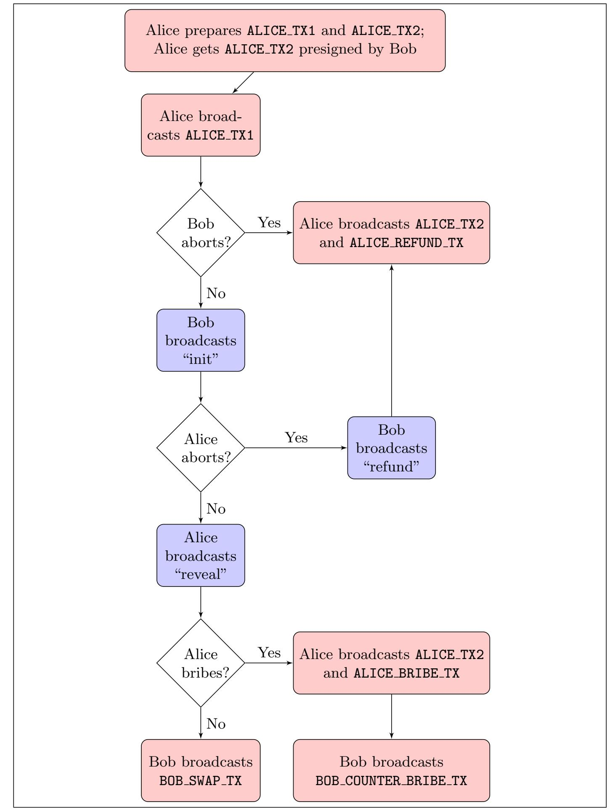

{0}------------------------------------------------

# Timelocked Bribing

Abstract. A Hashed Time Lock Contract (HTLC) is a central concept in cryptocurrencies where some value can be spent either with the preimage of a public hash by one party (Bob) or after a timelock expires by another party (Alice). We present a bribery attack on HTLC's where Bob's hash-protected transaction is censored by Alice's timelocked transaction. Alice incentivizes miners to censor Bob's transaction by leaving almost all her value to miners in general. Miners follow (or refuse) this bribe if their expected payoff is better (or worse). We explore conditions under which this attack is possible, and how HTLC participants can protect themselves against the attack. Applications like Lightning Network payment channels and Cross-Chain Atomic Swaps use HTLC's as building blocks and are vulnerable to this attack. Our proposed solution uses the hashpower share of the weakest known miner to derive parameters that make these applications robust against this bribing attack.

Keywords: Bitcoin · HTLC · Bribe · Miner Extractable Value

# 1 Introduction

Bitcoin started the modern cryptocurrency revolution by removing trusted intermediaries and replacing them with a dynamic set of miners. These miners validate transactions and are paid by the system in the form of block rewards and also by transaction participants in the form of fees. Rational miners will always choose higher-fee transactions than lower-fee ones, and this behavior will get reinforced over time as block rewards decrease to zero [\[1\]](#page-15-0). This setup has often raised ([\[2\]](#page-15-1) [\[3\]](#page-15-2) [\[4\]](#page-15-3)) the possibility of miners being bribed by transaction participants to favor one participant over the other. Typical bribing attacks envision the paying party (Alice) cheating the paid party (Bob) by Alice double-spending the same value in a separate transaction paying back to Alice. Miners are bribed by Alice to include the double-spending transaction in the blockchain by forking it and orphaning the block with the first transaction, thereby cheating Bob of the payment from the first transaction. These bribery attacks, however, operate at a block level because, to be cheated, Bob needs to be convinced that the first transaction is buried in the blockchain by k blocks (in Bitcoin, k = 6). Before this happens, Bob should ideally not honor the first transaction, but monitor the public Bitcoin blockchain. If a transaction where Alice double-spends the same bitcoins back to herself is seen, and Bob's transaction is abandoned in an orphaned block, Bob should not honor Alice's first transaction by not giving Alice the goods and services that were promised.

A more sophisticated concept of transactions exists where Bob does want Alice to pay the transaction value back to herself, but only after some time has elapsed. During this time, Bob reserves the option of getting paid himself from the same payment source. This complex transaction structure is the building block for financial contracts like escrows, payment channels, atomic swaps, etc. 

{1}------------------------------------------------

The required time delay is implemented using a blockchain artefact called timelocks. A rudimentary version of timelocks (nLocktime) was in the first Bitcoin implementation by Satoshi Nakamoto in 2009 [\[5\]](#page-15-4). More sophisticated timelocks that lock transactions, specific bitcoins, or specific script execution paths were added later [\[6\]](#page-15-5) [\[7\]](#page-15-6) [\[8\]](#page-15-7). Bitcoin script allows for timelocks to be combined with hashlocks in an OR condition to create a new kind of transaction called Hash Timelocked Transactions (HTLC). As we will see later, HTLC's open the possibility of transaction level bribing of miners where miners do not have to orphan mined blocks, but just have to ignore a currently valid transaction and wait for the timelocked bribe to become valid. Additionally, in this attack, the bribe is endogenous to the transactions and does not have to be implemented externally through public bulletin boards or other third party smart contracts. Bribery attacks that operate at a transaction level are far more insidious compared to block orphaning bribery attacks. Block orphaning attacks undermine the native cryptocurrency's trust with the larger community and could be detrimental to the briber's financial position in general. Transaction level bribery, on the other hand, targets specific contracts on the blockchain and could go unnoticed as the larger cryptocurrency system hums along. This sort of an attack, where a miner has visibility into the pool of transactions that are waiting for confirmation (mempool) and can include or not include a transaction in their mined block is discussed in a more general setting in [\[9\]](#page-15-8) under the umbrella term "Miner Extractable Value".

#### 1.1 HTLC

HTLC's are a type of smart contract that use preimage resistance of cryptographic hash functions, along with timelocks, to enable an escrow service. Say we have a buyer who has some bitcoin and wants to buy some goods/services from a seller. The buyer commits their bitcoin into a contract which is locked by an OR condition of:

- Preimage to a cryptographic hash. This is the payment path. The buyer creates a random secret preimage and cryptographically hashes it to get a digest. This digest is used to lock the payment path. The buyer will reveal the preimage to the seller once the buyer has possession of the goods/services. The seller can use this preimage and their own signature to send the funds to an address they control. The exchange of the preimage for the goods/services can be implemented in a variety of ways, leading to different applications.
- A timelock. This is the refund path. The buyer sets a timelock after which the funds are refunded back. This path is to ensure that the funds do not get locked in the contract if the seller aborts.

This transaction (HTLC TXN) is broadcast and is confirmed on the Bitcoin blockchain to a sufficient depth to be considered finalized. The seller then exchanges their goods and services for the preimage of the hash from the buyer. This exchange process is independent of the transaction itself. Each application that uses HTLC's has its own way of doing this exchange. For example, 

{2}------------------------------------------------

Atomic Swaps rely on another public blockchain to reveal the secret preimage. After the exchange is done, the seller will attempt to move the UTXO created in HTLC TXN's payment path to an address that the seller controls with a simpler unencumbered transaction (SELLER TXN) that uses the seller's signature and the preimage received from the buyer. If the exchange is not done, the buyer waits for the timelock to expire, and uses the REFUND TXN to send the funds back to themselves.

### 1.2 Bribing Attack

The attack can begin after the HTLC TXN is confirmed and the buyer already has the goods/services for which the buyer committed the funds for. If the buyer acts in good faith and does nothing, there is no attack. If the buyer acts in bad faith, the buyer will try to censor SELLER TXN from being included in any future block. The buyer broadcasts the REFUND TXN (which sends the funds back to the buyer) and chains it with a BRIBE TXN, which sends the funds from the buyer to any miner who mines it by leaving the output field empty. Note that in the BRIBE TXN, the buyer can send an amount to themselves. This makes the bribe not just a griefing attack (where the attacker does not profit), but marginally profitable. Also note that SELLER TXN and the pair [REFUND TXN, BRIBE TXN] spend the same UTXO and are inherently incompatible. If one of them is confirmed on the blockchain, the other becomes invalid. In the rest of this paper, we will use BRIBE TXN and the pair [REFUND TXN, BRIBE TXN] interchangeably. Pseudo-code for these transactions are in Appendix [A.](#page-16-0)

Bitcoin's consensus rules govern what transactions can be included in a block by miners, but does not say anything about what transactions miners can or cannot ignore. It gives the benefit of the doubt to miners, allowing the possibility that miners have not seen a specific transaction because of network delays/failures. Miners could be (or not be) interested in a transaction because its fees are high (or low). In our attack scenario, miners see SELLER TXN and BRIBE TXN at the same time. But as per the consensus rules, miners cannot include BRIBE TXN immediately because it is timelocked. But crucially, there is no obligation to include the SELLER TXN immediately either. As blocks go by, BRIBE TXN becomes valid and can be included in the blockchain and SELLER TXN is censored, with the sale proceeds going to the miners and the buyer, but not to the seller. The seller could increase their fees to compete with the timelocked bribe, but that would come out of their own pocket, as they have already handed out the goods and services to the buyer.

In the following sections, we show how the two main applications of HTLC's: Lightning Payment Channels and Atomic Swaps, are both vulnerable to this bribing attack.

### 1.3 Payment Channels

Payment channels [\[10\]](#page-15-9), [\[11\]](#page-15-10) are a promising solution to the scalability problem in cryptocurrencies like Bitcoin and Ethereum, which have low transaction 

{3}------------------------------------------------

throughputs. Lightning Network's [\[11\]](#page-15-10) payment channels rely on HTLC's to enforce the revocation of older commitment transactions. In our attack scenario, Alice and Bob have a payment channel that they have updated over time using many commitment transactions. Both Alice and Bob keep their own copy of the commitment transaction, where their copy can be broadcast by them, and will lock their side of the channel balance with an HTLC and the counterparty's side with a regular payment. This means that in the case of a channel closure, the broadcaster has to wait for his payment, but the counterparty can withdraw funds immediately. Without loss of generality, we can assume that in one such update (u1), the entire channel balance was in Bob's favor, and Alice has zero balance in her favor. In a subsequent update (u2), Alice delivers some goods/services to Bob, and after u2, the entire channel balance is in Alice's favor and Bob has zero balance on his side of the channel. As a part of the Lightning Protocol, during u2's negotiation, Bob gives Alice the preimage (p1) of a hash that lets her punish him if u<sup>1</sup> ever makes it to the blockchain.

The briber (in our case, Bob) broadcasts an outdated commitment transaction u<sup>1</sup> (called Revoked Commitment Transaction in Lightning). This has one output which is an HTLC. He then follows it up by broadcasting the bribing transaction: BRIBE TXN. Note that the BRIBE TXN is timelocked and should be invalid till the timelock expires. The victim (Alice in our case), sees u<sup>1</sup> on the blockchain, and using her knowledge of the revocation preimage, sends the corresponding SELLER TXN (called Breach Remedy Transaction in Lightning) to the pool of transactions to be included in the blockchain, Note that SELLER TXN should be valid immediately as it has no timelock on it. But if all miners wait for the BRIBE TXN's timelock to expire, and during that time ignore the SELLER TXN, the bribing attack is successful. The amount that goes from the BRIBE TXN to the miner does not matter to Bob because he already has the equivalent goods/services from Alice for that value. Therefore, he is bribing with what he has already spent.

Lightning Network uses HTLC's to also implement payment hops from, say, Alice to Bob through Carol - where Alice and Bob do not have a direct payment channel between each other, but both have a channel to Carol. HTLC's are used here to ensure that Carol can use her channels to send funds from Alice to Bob without Carol's own funds being put at risk. Either the entire payment goes through from Alice to Bob through Carol (who gets the routing fees), or the entire payment is aborted, and all parties retain their own pre-payment balances. Using a series of messages [\[12\]](#page-15-11), Alice, Bob, and Carol communicate using an offchain protocol and negotiate a series of commitment transactions that each have an additional HTLC that sends the new payment from Alice to Bob through Carol. These HTLC's have a different payment specific secret preimage and its associated hash that locks the hashlock arm of the HTLC. They also have a lower timeout value (compared to the channel's timeout value) that refunds this particular payment back to the source in case any other node along the payment route aborts the payment. These hops do not affect the bribing attack model: 

{4}------------------------------------------------

an outdated commitment transaction can still be broadcast by the briber and the victim has to respond.

### 1.4 Atomic Swaps

Atomic Swaps are a way to exchange cryptocurrencies between two separate public blockchain systems (say, between Bitcoin and Litecoin) without involving a trusted third party [\[13\]](#page-15-12), [\[14\]](#page-15-13). TierNolan's classic Atomic Swap construction [\[15\]](#page-15-14) relies on two HTLC TXN's to get around the trusted third party. Alice and Bob have their own HTLC TXN's in the blockchains whose assets they have. These HTLC TXN's will enable corresponding SELLER TXN's to the other party and REFUND TXN's to themselves. Alice initiates her side of the swap by publishing an HTLC on her blockchain which has a timelock of 2 ·t and hash of a secret preimage that only she knows. Bob accepts the swap by publishing his own HTLC on his blockchain with a timelock of 1 ·t and the same hash whose preimage he does not know. Alice then redeems Bob's HTLC by revealing her secret through a SELLER TXN on Bob's blockchain. Bob's knowledge of this secret (by monitoring Bob's public blockchain) enables Bob to publish his own SELLER TXN on Alice's blockchain, thereby completing the swap.

In the atomic swap described above, Alice can try to censor Bob's SELLER TXN with her own BRIBE TXN on her blockchain that lets her keep assets on Bob's blockchain, and leave most of her bribing profits on her own blockchain to miners. This way, Alice only profits if her attack succeeds, and has no possibility of a loss. Ideally, this should not be possible because Bob's SELLER TXN is valid from the moment he gets to know of Alice's secret preimage, and Alice's BRIBE TXN is invalid at that time. But if all miners are made aware of Alice's BRIBE TXN, the bribing attack might succeed.

# 2 Analysis

In this section, we analyze the parameters under which this bribing attack is successful. As Alice and Bob both have to agree on the HTLC for it to be valid, they can control these parameters to avoid the attack. The HTLC parameters are:

- T: denotes the number of blocks needed until the BRIBE TXN becomes valid. This is the HTLC's timelock expressed in terms of number of blocks.
- f: fee offered by Alice to miners to confirm her SELLER TXN.
- b: bribe offered by Bob to miners to confirm his BRIBE TXN. Note that b is not explicitly called out in the transaction because all unclaimed outputs of a transaction go to the miner who confirms it. Typically, b > f.

There are parameters of the network that Alice and Bob do not control. These are the percentages of the total hashpower that identifiable miners control. Unidentifiable miners are grouped in a catch-all group. Miners are identified based on their coinbase transaction indicators (see section [3.1](#page-10-0) for more details). Let there be n miners M<sup>j</sup> , 1 ≤ j ≤ n, each with a fraction p<sup>j</sup> of the total hashpower.

{5}------------------------------------------------

### 2.1 Assumptions

- Miners are rational and choose the most profitable strategy on what transactions to include in their blocks while conforming to the consensus rules of Bitcoin. Their goal is to maximize expected payoff, and not mine altruistically.
- Miners are also rational in the sense that they will not choose a dominated strategy when they can choose one that is not. A strategy s is dominated by strategy s 0 if the payoff for playing strategy s is strictly greater than the payoff for playing s 0 , independent of other players' strategies.
- Miners do not create forks. If a transaction is included in a valid block, miners build the blockchain on top of that block.
- Relative hashpowers of miners is common knowledge. Currently, almost all Bitcoin blocks are mined by mining pools, and almost all of these blocks have an identifiable signature in the coinbase transaction that allows them to identify this relative share of hashpowers.
- Relative hashpowers of miners stay constant over the duration of the bribing attack.
- The attacker and the victim of the bribery attack have no hashpower of their own.
- Timelocks are expressed in number of blocks, and we are thus operating in a setting where block generation is equivalent to clock ticks.
- Block rewards and fees generated by transactions external to our setting are constant and have no bearing on the attack itself.
- All miners can see timelocked transactions that are valid in the future. Currently, the most popular Bitcoin implementation, Bitcoin Core, does not allow timelocked transactions that are "valid in the future" to enter its pool. Consequently, it does not forward such transactions through the peer to peer network. This is not a consensus rule, but rather an efficiency gain whereby allowing only valid transactions to enter the pool and propagate across the peer to peer network reduces network and memory load. We assume that SELLER TXN and BRIBE TXN are visible to all miners immediately after they are broadcast by their respective parties. Also, some mining pools run "transaction accelerator" services where they cooperate with other mining pools to get visibility to transactions that pay an extra fee (on top of the blockchain fee). We assume that malicious buyers have access to such services.

### 2.2 Setting

We analyze this attack by modeling the sequence of blocks being mined as a (Markov) game, called the bribing game. A bribing game has n miners, and runs in T +1 sequential stages. Stages represent periods between two mined blocks. In each stage, every miner has two possible actions: follow or refuse (corresponding to a miner excluding the SELLER TXN from the miner's block template or not). After all miners play their action, a single miner is randomly selected as the leader of the stage. In other words, after all the miners have decided on their 

{6}------------------------------------------------

block template, a single miner wins the proof of work lottery and this miner's block extends the blockchain.

Let B1, B2, . . . , B<sup>T</sup> be all the blocks that can include SELLER TXN. Let B<sup>T</sup> +1 be the block that includes BRIBE TXN. Note that BRIBE TXN cannot be included in B1, B2, . . . , B<sup>T</sup> as it's not valid then. Let Ei,j denote the event that miner j is selected as the leader of stage i. The events Ei,j are independent of each other and the actions taken by miners. Ei,j represents block B<sup>i</sup> being mined by miner M<sup>j</sup> . In addition, the selection probability of miner j for block i is given by:

$$\forall i, j \quad Pr(\mathcal{E}_{i,j}) = p_j,$$

which corresponds to the hashpower of miner M<sup>j</sup> . Each stage is in either of two states: active or inactive. The game starts in an active stage (i.e., the first stage is active). Stage i, i > 1, becomes inactive if the leader of stage i − 1 plays the action refuse (corresponds to including SELLER TXN), or if stage i − 1 is already inactive. Therefore, if one stage becomes inactive, all the following stages become inactive. This intuitively makes sense because once SELLER TXN is confirmed, it stays confirmed in subsequent blocks and more importantly, BRIBE TXN is invalid after that. The payoffs for each stage i are determined by whether 1 ≤ i ≤ T or if i = T + 1.

- 1 ≤ i ≤ T: If the leader plays refuse, the payoff is f > 0. If the leader plays follow, the payoff is 0. Non-leaders' payoff is always 0.
- i = T + 1: Leader's payoff is b > 0. Non-Leaders' payoff is 0.

Let us call a miner M<sup>j</sup> strong if p<sup>j</sup> ≥ f b ; otherwise we call M<sup>j</sup> weak. Note that the bribing attack is successful if all miners follow the bribe (i.e., they always ignore SELLER TXN). This corresponds to the strategy profile in which all miners play the action follow in all stages. Without loss of generality, there are two possible distributions of hashpowers among miners:

- All miners are strong; i.e., p<sup>j</sup> ≥ f b for 1 ≤ j ≤ n.
- At least one miner is weak; i.e, ∃p<sup>j</sup> s.t. p<sup>j</sup> < f b for 1 ≤ j ≤ n.

In the next sections, we analyze both of these distributions.

#### <span id="page-6-1"></span>2.3 All miners are strong

<span id="page-6-0"></span>Lemma 1. If all miners are strong (i.e., p<sup>j</sup> ≥ f b for 1 ≤ j ≤ n), then the strategy profile in which every miner plays follow in all stages is an equilibrium.

Proof. Consider Miner j (M<sup>j</sup> ), and assume that all other miners follow the bribe in all stages. We show that following the bribe in all stages is the best response for M<sup>j</sup> as well. If M<sup>j</sup> follows the bribe in all stages, they will earn p<sup>j</sup> · b in expectation. This is because, when all miners play follow in all stages, stage T + 1 will be active, and its leader, which is M<sup>j</sup> with probability p<sup>j</sup> , earns b.

If M<sup>j</sup> plays refuse with non-zero probability in at least one stage. Let x > 0 be the probability that stage T +1 becomes inactive as the result of M<sup>j</sup> 's actions. 

{7}------------------------------------------------

In other words, x is the probability that M<sup>j</sup> plays refuse in a Stage 1 ≤ i ≤ T in which they are selected as the leader. Note that other miners cannot make stage T +1 inactive as they always play follow and only M<sup>j</sup> is including SELLER TXN in their block template. The expected payoff of M<sup>j</sup> is, therefore, x·f + (1−x)·p<sup>j</sup> ·b, which is not more than p<sup>j</sup> · b, because p<sup>j</sup> ≥ f b and x > 0.

Note that when all miners are strong, the equilibrium shown in Lemma [1](#page-6-0) (which favours bribery) exists no matter how large T is. As of this writing, the average fees for Bitcoin transactions since the beginning of 2019 is around 0.00003 BTC (author's own analysis of the Bitcoin blockchain). The average balance held by a lightning channel is 0.026 BTC [\[16\]](#page-15-15). If we use these values, we get the equilibrium stated in Lemma [1](#page-6-0) exists if each miner has over 0.115% of the total hash power of the entire Bitcoin network. Due to the permissionless and anonymous nature of Bitcoin, however, we can never be sure that the weakest miner has a hash power above 0.115% of the total hash power. However, we can inspect the Bitcoin blockchain to guesstimate the distribution of hashpowers among known mining pools, and recommend channel parameters based on that. We treat this in more detail in section [3.](#page-9-0) Next, we consider the case where at least one miner is weak. We show that, in this case, the value of T matters.

#### <span id="page-7-1"></span>2.4 One miner is weak

Recall that when a stage becomes inactive, all its followup stages become inactive as well. Moreover, all miners receive zero payoff in an inactive stage, irrespective of what they play. Note that, for every miner (weak or strong), playing follow at state T + 1 is the strictly dominant strategy if stage T + 1 is active. This is because the expected payoff of a miner in an active stage T + 1 is p<sup>j</sup> b if they play follow, and pjf (which is smaller than p<sup>j</sup> b) if they play refuse. In the next lemma, we show that in active stages other than stage T + 1, playing refuse is the strictly dominant strategy for weak miners.

<span id="page-7-0"></span>Lemma 2. In any active stage i, 1 ≤ i ≤ T, playing refuse is the strictly dominant strategy for any weak miner.

Proof. A miner earns b if stage T + 1 is active and this miner is selected as the leader of stage T + 1. Therefore, the probability that a Miner j (M<sup>j</sup> ) earns b is at most p<sup>j</sup> . From the definition of weakness, for M<sup>j</sup> , we have p<sup>j</sup> · b < f. So, if stage T + 1 is active, the weak miner gets an expected payoff less than f. Additionally, in stages < T, the probability that a miner earns f is strictly less than one, because, no matter how large T is, there is always a non-zero chance that the miner never gets selected as a leader. Therefore, across all stages up to and including stage T + 1, the expected payoff of a weak miner is always strictly less than f.

Assume M<sup>j</sup> is weak (i.e., p<sup>j</sup> < f b ), and plays follow in an active stage i, 1 ≤ i ≤ T. We now show that playing refuse in stage i will improve her payoff. Suppose M<sup>j</sup> plays refuse instead of follow in the active stage i. If M<sup>j</sup> is not 

{8}------------------------------------------------

selected as the leader of stage i, then the game remains the same as the case where  $M_j$  played follow. If  $M_j$  is selected as the leader, however, they will earn f. This is an improvement over the expected payoff of  $M_j$  from the previous paragraph, which is strictly less than f.

#### <span id="page-8-1"></span>2.5 The elimination of dominated strategies

By Lemma 2, playing *refuse* is the strictly dominant strategy for every weak miner; any other strategy is strictly dominated. Hence, we can simplify the analysis of the bribing game by eliminating strictly dominated strategies. Let us call a bribing game *safe* if after eliminating strictly dominated strategies, the only action left for each miner (strong or weak) in stage one is to play *refuse*. If every miner plays *refuse* in stage one, the game is effectively over as other stages become inactive immediately after, with SELLER\_TXN confirmed and BRIBE\_TXN becoming invalid.

Recollect that, if all the miners are strong, the bribing game is not safe no matter how large T is (Lemma 1). By the next theorem, however, the game is safe if there is at least one weak miner, and T is large enough.

<span id="page-8-2"></span>**Theorem 1.** Suppose there is at least one weak miner, and

<span id="page-8-0"></span>
$$T > \frac{\log \frac{f}{b}}{\log(1 - p_w)} \tag{1}$$

where  $p_w$  is the sum of the selection probabilities of weak miners. Then, the bribing game is safe.

*Proof.* By Lemma 2, playing refuse is the strictly dominant strategy for every weak miner in each stage  $i, 1 \le i \le T$ . By eliminating the dominated strategies of weak miners, we get a smaller game in which weak miners play refuse in every stage  $i, 1 \le i \le T$ .

Consider a strong miner M, who plays follow in stage 1. Their reward for playing follow is only possible at stage T + 1. Let  $\alpha$  be the probability that stage T + 1 will be active. Since weak miners only play refuse in the first T stages, we get

$$\alpha \le (1 - p_w)^T$$

$$\le (1 - p_w)^{\frac{\log \frac{f}{b}}{\log(1 - p_w)}}$$

$$\le \frac{f}{b(1 - p_w)}$$

where  $(1 - p_w)^T$  is the probability that no weak miner is selected as a leader in the first T stages. Thus, the expected payoff of M at stage T + 1 is less than

$$\frac{f}{b(1-p_w)} \cdot (1-p_w).b = f$$

{9}------------------------------------------------

where <sup>f</sup> b(1−pw) is an upper bound on the probability that stage T + 1 is active, and (1−pw) is an upper bound on the probability that M is selected as the leader of stage T + 1. Note that the probability that M earns f prior to stage T + 1 is strictly less than one. Therefore, at the beginning of stage 1, the expected payoff of M is strictly less than f. Now, if M plays refuse (instead of follow) in the first stage, we will have two possibilities. First possibility is that M is selected as the leader of stage 1, in which case M earns f, which is strictly more than its expected payoff. In the second possibility where M is not selected as the leader of stage 1, the game remains identical to the original case where M plays follow. This implies that M is better off playing refuse in the first stage, which concludes the proof. We remark that this result does not imply that M is better off playing refuse in every stage. In fact, as the game proceeds to new stages, the expected payoff of M can change, and M may choose to play follow.

### 2.6 The elimination of dominated strategies of strong miners

A bribing game with parameters f and b may be safe for a significantly smaller T than what is given in Theorem [1.](#page-8-0) In its proof, we eliminated only strictly dominated strategies of weak miners. In principle, we can continue the process by eliminating strictly dominated strategies of strong miners as well. To do so, we can first sort the strong miners according to their selection probabilities. Starting with the strong miner with the smallest selection probability, and an upper bound of T from Theorem [1,](#page-8-0) we can calculate the minimum number of initial stages in which the miner is strictly better off playing refuse. We then eliminate the strictly dominated strategies of that miner, and move to the next strong miner. At the end of this iterated elimination process, if all miners play refuse in the first stage, then the game is proven to be safe. As we iterate from time period 0 to time period T, the value of t where all miners play refuse for the last time shows us that if we had begun the game at this point, the game would have been safe in the first stage itself. This new starting point of the game results in the new ending point being at Tnew = Told − t. In this new setting, the game is safe in the first stage. The actual algorithm to find t and an accompanying worked example are presented in Appendix [1.](#page-18-0) Tnew is lower than T, and now, with just one weak miner, and elimination of dominated strategies of all miners, the game is safe for lower values of T. This lower value of T makes the usage of HTLC's more practical and convenient.

# <span id="page-9-0"></span>3 Solutions

In the introduction, we pointed out that the two main applications of HTLC's: Lightning Channels and Atomic Swaps, are both vulnerable to this bribing attack. In this section, we first analyze the Bitcoin blockchain to get an estimate of the hashpower share of known mining pools. This lets us find parameters that can harden the HTLC constructions in each of these applications such that they are not vulnerable to the bribing attack. In the case of Atomic Swaps, to use these parameters, we propose a modification to the classic atomic swap protocol.

{10}------------------------------------------------

#### <span id="page-10-0"></span>3.1 Mining Pools and their Hashpower Shares

We try to find the weakest known miners in the Bitcoin ecosystem by analyzing the miners of the 16000 blocks from Block #625000. We know the coinbase transaction indicators of larger mining pools. Using these, we can attribute mined blocks to known mining pools. Looking at these blocks, we can estimate each of these mining pools' share of the total hashpower based on how many blocks they have mined. Mining pools and their hashpower shares are shown in Table [1.](#page-10-1) We see that the weakest known pools are under 1% of the total hashpower, and this leads to our proposed fixes for both Lightning Channels and Atomic Swaps.

<span id="page-10-1"></span>

|                    |          | Mining Pool Hashpower Mining Pool | Hashpower |
|--------------------|----------|-----------------------------------|-----------|
| F2Pool             | 15.7937% | BTCTOP                            | 2.6313%   |
| PoolIn             | 15.5563% | NovaBlock                         | 0.9500%   |
| BTC.com            | 12.2688% | SpiderPool                        | 0.6125%   |
| AntPool            | 12.1625% | Bitcoin.com                       | 0.1938%   |
| Huobi              | 6.5875%  | UkrPool                           | 0.0938%   |
| 58COIN             | 6.3000%  | SigmaPool                         | 0.0750%   |
| ViaBTC             | 5.7875%  | OkKong                            | 0.0688%   |
| OKEX               | 5.6437%  | NCKPool                           | 0.0625%   |
| Unknown            | 4.0687%  | MiningCity                        | 0.0500%   |
| SlushPool          | 3.8188%  | KanoPool                          | 0.0250%   |
| Lubian.com 3.6938% |          | MiningDutch 0.0187%               |           |
| Binance            | 3.5375%  |                                   |           |

Table 1. Hashpower of 16000 blocks from block #625000

#### 3.2 Lightning

In the Lightning Network specifications (specifically, from Bolt 2 [\[17\]](#page-15-16)), we have the following parameters:

- channel reserve satoshis: Each side of a channel maintains this reserve so it always has something to lose if it were to try to broadcast an old, revoked commitment transaction. Currently, this is recommended to be 1% of the total value of the channel. This is the amount that the cheated party can utilize as extra fees without dipping into their own side of the channel.
- to self delay: This is the number of blocks that the counterparty's self outputs must be delayed in case a channel closes unilaterally from the counterparty's side. In one popular Lightning client: c-lightning [\[18\]](#page-15-17), this is set by default to 144 blocks (approximately 1 day). In another popular Lightning client: LND [\[19\]](#page-15-18), it is scaled in a range from 1 day to 14 days based on the channel value.

We do not find any documented reasons on why these important parameters are set the way they are. Based on the analysis from Sections [2.4](#page-7-1) and [2.5,](#page-8-1) and 

{11}------------------------------------------------

the distribution of hashpowers, we can formulate what these values ought to be. First, we note that *channel\_reserve\_satoshis* on the victim's side of this bribing attack can be used by the victim to increase their fees to thwart the attack. We posit that *channel\_reserve\_satoshis* being at 1% is reasonable, given that there are many known miners whose hashpower is less than 1% of the total hashpower of all miners. If it were lower than, say, 0.03%, as per Section 2.3, the channel would be always vulnerable to this bribing attack.

We then set  $\frac{f}{b}$  to be 0.01, and calculate the total weak hashpower to be 0.0215 (from Table 1). Based on Theorem 1, we get T > 212 blocks. This is larger than the suggested default of to\_self\_delay at 144 blocks. So, if the channel operator is paranoid, they can set to\_self\_delay to this higher value of 212. We can plug in the hashpowers from Table 1 into Algorithm 1, with f = 1 and b = 100 and we get a value of T = 54 blocks. If the channel operator is #reckless and believes that miners eliminate strictly dominated strategies of other miners (a stronger assumption than just assuming that weak miners exist), they can open channels with this much lower timelock value. Note that these values do not actually impact the usage of the Lightning Network, but are merely security parameters that ensure that both parties are adequately protected in case the other party decides to bribe miners.

#### 3.3 Atomic Swaps

Atomic Swaps that have Bitcoin on one side need to take Bitcoin's block time of 10 minutes into account. Even if the other blockchain in question (say Litecoin) has faster block generation, till Bitcoin's transactions are not confirmed, the atomic swap in question cannot be considered executed. Commercial platforms like Komodo [20] use 15,600 seconds (26 blocks) as the HTLC's timelock value when they setup swaps between Bitcoin-like currencies or ERC-20 style tokens. Other works [14], [21], [22] have suggested that a timelock period of 1 day (144 blocks) is a good default.

Based on Theorem 1, we get  $\frac{f}{b} = 0.68$  at T = 26 blocks and  $\frac{f}{b} = 0.122$  at T = 144 blocks. A fee to bribe ratio of 0.68 (for T = 26 blocks) is quite high. This suggests that T = 26 blocks does not provide enough security for reasonable values of fee to bribe ratios. At 144 blocks, we have a reasonable fee to bribe ratio of 0.122.

Unlike Lightning channel's *channel\_reserve\_satoshis*, due to its inherently asymmetric nature, there is no simple way to encode this extra fee in the atomic swap itself. Alice has to convince Bob upfront that she will not attempt the bribing attack when it is Bob's turn to redeem his side of the swap. One way of achieving this is for Bob to offer a lower value than what Alice wants. This way, if Alice attempts the bribery attack, Bob can increase his SELLER\_TXN fees to the amount dictated by Theorem 1 or Algorithm 1. But if Alice does not attempt to bribe, this atomic swap setup is unfair to her as she is getting a lower value from Bob than what she is offering to Bob.

{12}------------------------------------------------

To solve this, we present an extension to the classic Atomic Swap protocol that allows a way for Alice to include extra fees in the swap for Bob to use to "counter-bribe" only if Alice attempts to bribe.

Risk Free Atomic Swap: Here, as with the classic protocol, Alice creates a (random) secret preimage and hashes it to get her "locking string". Alice creates a transaction that commits her swap amount such that Bob can claim this amount only if he knows the preimage. The "refund" part of this transaction, instead of sending the amount back to Alice after a timelock, sends it to a multisig controlled by both Alice and Bob. Alice also creates a second transaction that uses this multisig controlled output as its first input, and another unrelated input from Alice which adds the extra fees required to make the swap risk-free. The total output of this second transaction is sent to Bob only if he has the secret preimage, or to Alice after a timelock. This pair of transactions is created by Alice; the second transaction is pre-signed by Bob and needs to be held by Alice before she broadcasts the first transaction. These transactions, and the accompanying flowchart are listed in detail in Appendix [C.](#page-20-0) Based on whether Alice or Bob abort the swap, or Alice bribes miners, or Alice and Bob complete a normal swap, a combination of these transactions will be broadcast on the both blockchains by Alice and/or Bob as depicted by the flow chart.

# 4 Related Work

There are two major strands of censorship attacks in blockchains. Ignore attacks (that incentivize miners to ignore certain transactions) and fork attacks (that incentivize miners to orphan blocks with certain transactions by forking the blockchain).

#### 4.1 Ignore Attacks

Ignore Attacks are presented in [\[23\]](#page-16-4), [\[24\]](#page-16-5), and [\[25\]](#page-16-6). In [\[23\]](#page-16-4), smart contracts in a "funding blockchain" are used to censor transactions in a "target blockchain". Funding blockchains need to support powerful smart contract primitives to be able to program these attacks – typically Ethereum is used. Two such attack smart contracts presented in [\[23\]](#page-16-4) are Pay-per-Miner and Pay-per-Block. In Payper-Miner, every miner gets a bribe at the end of the bribing period if the bribing attack succeeds, even if the miner followed the bribe or not. A weak miner could refuse the bribe, and attempt to mine with the SELLER TXN, but not succeed in mining a block. This miner would still be eligible for the bribe at the end. This contract does not consider a weak miner's lower probability of mining the final block with the bribe and hence, overpays. In Pay-Per-Block, every miner is paid incrementally per block during the bribing period. This attack also bribes weak miners who go against the bribe, and thus have a higher expected reward at the end of the bribing period. Both these attacks would get better if miners could cryptographically prove to the smart contract that they are following the bribe.

{13}------------------------------------------------

Concurrent to our work, a similar timelocked bribing attack is presented in [\[25\]](#page-16-6). They consider the situation where all miners are strong (i.e., p<sup>j</sup> ≥ f b for all miners 1 ≤ j ≤ n), and like us, they conclude that the bribing attack will be successful and is independent of the bribing period T. To alleviate this situation where all miners are strong and bribing attacks could happen, they propose a modified construction of the HTLC called MAD-HTLC (Mutually Assured Destruction HTLC). MAD-HTLC adds a second transaction chained to the HTLC with a collateral from the bribing counterparty to ensure that they have something to lose if they attempt to bribe. However, [\[25\]](#page-16-6) does not consider weak miners, or elimination of dominated strategies - which we show lead to HTLC parameters that can be adjusted to safeguard against this bribing attack with any distribution of miner hashpowers and values of f and b. Our approach also doesn't need a modification to the HTLC construction and the associated collateral and extra transaction costs.

Transaction Pinning [\[26\]](#page-16-7) tries to make a transaction inherently unprofitable to mine, independent of any future bribe. The attacker, who can validly spend one of the target transaction's outputs broadcasts multiple low fee-rate transactions that spends their path of the target transaction. This makes the entire transaction package unprofitable to mine, thereby censoring the first transaction, which the victim can spend through another path. To remedy this, the victim can use CPFP carve-outs [\[27\]](#page-16-8) to bump up the fee-rate of the censored transaction and still get it confirmed by a miner. To enable this, Lightning Channels will allow "anchor outputs" [\[28\]](#page-16-9) to let either party bump up their fees without being blocked by the counterparty.

These types of Ignore Attacks rely on being able to setup and communicate incentives (in the present, or in the future) to miners such that the most profitable strategy for each miner is to wait for the incentive. Whether these incentives succeed or not, depends on the current value available to miners, the future value promised to miners, and the ability of miners to be able to extract these values. Unlike previous research, our work takes into account all these parameters.

#### 4.2 Fork Attacks

Fork Attacks go back a long way, with the earliest one discussed on bitcointalk.org being feather forking [\[2\]](#page-15-1). In this attack, a miner wants to censor a specific transaction and announces on some public bulletin board that they will not add blocks on top of any block that contains this specific transaction. If this miner has a reasonable chance of getting a block, other rational miners will follow them instead of mining "normally" and hence forgo the fees of the censored transaction. Feather forking is also analyzed under the Pay-per-Commit contract in [\[23\]](#page-16-4). Feather forking relies on a miner committing to the attack, and this being common knowledge among all miners. This attack relies on both a funding cryptocurrency blockchain to set up the attack and a way to communicate with all miners that the attack is going to happen.

{14}------------------------------------------------

Miners can be also incentivized to fork the Bitcoin blockchain with "Whale Transactions" [\[3\]](#page-15-2). Here, the attacker waits for a target transaction to be confirmed to a sufficient depth to get the corresponding goods and services from their victim. After that, the attacker tries to fork the blockchain by successively broadcasting transactions that have high fees (whale transactions) and also reverse the target transaction. These whale transactions are then included in blocks of the blockchain fork that rational miners might follow. The authors evaluate the relationship between confirmation depth, the attacker's secret mining lead, the attacker's hashpower, the whale transaction fees and whether these attacks are profitable. External smart contracts on platforms like Ethereum can be used [\[4\]](#page-15-3), [\[24\]](#page-16-5) to incentivize Bitcoin miners to abandon the honest blockchain suffix and mine on top of a briber's fork. In [\[24\]](#page-16-5), the attacker chooses the set of transactions to be mined for each block, and hands it out to miners through the smart contract. This is similar to how mining pools operate. Miners get rewarded in the "funding cryptocurrency" (Ether, in this case). Incentivizing every Bitcoin miner with Ether given the relative size of the two systems seems far fetched to us.

Fork Attacks rely on attackers being able to incentivize rational miners to orphan a reasonable length suffix of the blockchain. The attack succeeds if it is conducted after the primary transaction has been thought confirmed by the victim. Given that most proof-of-work cryptocurrencies have a probabilistic notion of finality, these attacks are feasible. On the other hand, Bitcoin has seen fewer and fewer orphan blocks over time [\[29\]](#page-16-10), and the possibility of this kind of attack is considerably lower now than they were in, say, 2015.

# 5 Conclusion

In this work, we observe that HTLC's are vulnerable to an "in-band" bribing attack where the HTLC initiator (buyer, in our case) can receive goods and services offline and then prevent the seller from getting their due share by bribing miners. This bribe can only work if the "time value" of waiting for the bribe is worthwhile for all miners. A rather self-evident observation is that when the timelock on the bribe expires and the bribe transaction is still valid, it will be claimed in the immediate next block as the fee on it is considerably higher than normal transaction fees. Additionally, stronger miners are likely to mine any specific block - and therefore more likely to mine the block in which the bribe is valid and available. Therefore, we posit that weaker miners will ignore the bribe altogether and will attempt to mine the seller's transaction while the timelock holds and the fee on the seller's transaction is good enough. This leads us to the relationship between the fee to bribe ratio and the distribution of miners' hashpowers. Based on this analysis, we propose Lightning Channel parameters that make them resistant to this kind of bribing attack. In Atomic Swaps, our analysis also proposes a fee for the victim to safeguard themselves. To enable that, we propose a modification to the classic Atomic Swap protocol that can bring in this fee into the swap and still keep it fair for both parties.

{15}------------------------------------------------

# References

- <span id="page-15-0"></span>1. Bonneau, J., Miller, A., Clark, J., Narayanan, A., Kroll, J.A., Felten, E.W.: SOK: Research Perspectives and Challenges for Bitcoin and Cryptocurrencies. In: 2015 IEEE Symposium on Security and Privacy. pp. 104–121. IEEE
- <span id="page-15-1"></span>2. Miller, A.: Feather-forks: enforcing a blacklist with sub-50% hash power. [https:](https://bitcointalk.org/index.php?topic=312668.0) [//bitcointalk.org/index.php?topic=312668.0](https://bitcointalk.org/index.php?topic=312668.0), [Accessed: 2020-05-07]
- <span id="page-15-2"></span>3. Liao, K., Katz, J.: Incentivizing Blockchain Forks via Whale Transactions. In: International Conference on Financial Cryptography and Data Security
- <span id="page-15-3"></span>4. McCorry, P., Hicks, A., Meiklejohn, S.: Smart Contracts for Bribing Miners. Cryptology ePrint Archive, Report 2018/581, <https://eprint.iacr.org/2018/581>
- <span id="page-15-4"></span>5. Nakamoto, S.: bitcoin core source code, version 0.1.0. [https://bitcointalk.org/](https://bitcointalk.org/index.php?topic=68121.0) [index.php?topic=68121.0](https://bitcointalk.org/index.php?topic=68121.0), [Accessed: 2020-05-07]
- <span id="page-15-5"></span>6. Friedenbach, M., BtcDrak, Dorier, N., kinoshitajona: BIP68: Relative lock-time using consensus-enforced sequence numbers. [https://github.com/bitcoin/bips/](https://github.com/bitcoin/bips/blob/master/bip-0068.mediawiki) [blob/master/bip-0068.mediawiki](https://github.com/bitcoin/bips/blob/master/bip-0068.mediawiki), [Accessed: 2020-05-07]
- <span id="page-15-6"></span>7. Todd, P.: BIP68: CHECKLOCKTIMEVERIFY. url: [https://github.com/](https://github.com/bitcoin/bips/blob/master/bip-0065.mediawiki) [bitcoin/bips/blob/master/bip-0065.mediawiki](https://github.com/bitcoin/bips/blob/master/bip-0065.mediawiki), [Accessed: 2020-05-07]
- <span id="page-15-7"></span>8. BtcDrak, Friedenbach, M., Lombrozo, E.: BIP112: Checksequenceverify. url: <https://github.com/bitcoin/bips/blob/master/bip-0112.mediawiki>, [Accessed: 2020-05-07]
- <span id="page-15-8"></span>9. Daian, P., Goldfeder, S., Kell, T., Li, Y., Zhao, X., Bentov, I., Breidenbach, L., Juels, A.: Flash boys 2.0: Frontrunning in decentralized exchanges, miner extractable value, and consensus instability. In: 2020 IEEE Symposium on Security and Privacy (SP). pp. 910–927. IEEE (2020)
- <span id="page-15-9"></span>10. Decker, C., Wattenhofer, R.: A Fast and Scalable Payment Network with Bitcoin Duplex Micropayment Channels. In: Symposium on Self-Stabilizing Systems. pp. 3–18. Springer
- <span id="page-15-10"></span>11. Poon, J., Dryja, T.: The Bitcoin Lightning Network: Scalable Off-Chain Instant Payments
- <span id="page-15-11"></span>12. BOLT Authors: Lightning Network Specifications, Bolt 3. [https://github.](https://github.com/lightningnetwork/lightning-rfc/blob/master/03-transactions.md) [com/lightningnetwork/lightning-rfc/blob/master/03-transactions.md](https://github.com/lightningnetwork/lightning-rfc/blob/master/03-transactions.md), [Accessed: 2020-05-07]
- <span id="page-15-12"></span>13. Herlihy, M.: Atomic Cross-Chain Swaps. In: Proceedings of the 2018 ACM Symposium on Principles of Distributed Computing. pp. 245–254. ACM
- <span id="page-15-13"></span>14. Han, R., Lin, H., Yu, J.: On the Optionality and Fairness of Atomic Swaps. In: Proceedings of the 1st ACM Conference on Advances in Financial Technologies. pp. 62–75. AFT '19, Association for Computing Machinery. <https://doi.org/10.1145/3318041.3355460>
- <span id="page-15-14"></span>15. Atomic Swaps. [https://bitcointalk.org/index.php?topic=193281.](https://bitcointalk.org/index.php?topic=193281.msg2224949) [msg2224949](https://bitcointalk.org/index.php?topic=193281.msg2224949), [Accessed: 2020-05-07]
- <span id="page-15-15"></span>16. 1ML. <https://1ml.com/>, [Accessed: 2020-05-07]
- <span id="page-15-16"></span>17. BOLT Authors: Lightning Network Specifications, Bolt 2. [https://github.](https://github.com/lightningnetwork/lightning-rfc/blob/master/02-peer-protocol.md) [com/lightningnetwork/lightning-rfc/blob/master/02-peer-protocol.md](https://github.com/lightningnetwork/lightning-rfc/blob/master/02-peer-protocol.md), [Accessed: 2020-05-07]
- <span id="page-15-17"></span>18. C-Lightning Authors: c-lightning - a Lightning Network implementation in C. <https://github.com/ElementsProject/lightning>, [Accessed: 2020-05-07]
- <span id="page-15-18"></span>19. LND Authors: LND: The Lightning Network Daemon. [https://github.com/](https://github.com/lightningnetwork/lnd) [lightningnetwork/lnd](https://github.com/lightningnetwork/lnd), [Accessed: 2020-05-07]

{16}------------------------------------------------

- <span id="page-16-1"></span>20. Atomic Swaps Explained: The Ultimate Beginner's Guide. [https:](https://komodoplatform.com/atomic-swaps/) [//komodoplatform.com/atomic-swaps/](https://komodoplatform.com/atomic-swaps/), [Accessed: 2020-05-07]
- <span id="page-16-2"></span>21. BitMEX Research: Atomic Swaps and Distributed Exchanges: The Inadvertent Call Option. [https://blog.bitmex.com/](https://blog.bitmex.com/atomic-swaps-and-distributed-exchanges-the-inadvertent-call-option/) [atomic-swaps-and-distributed-exchanges-the-inadvertent-call-option/](https://blog.bitmex.com/atomic-swaps-and-distributed-exchanges-the-inadvertent-call-option/), [Accessed: 2020-05-07]
- <span id="page-16-3"></span>22. Robinson, D.: HTLCs Considered Harmful. [https://cyber.stanford.edu/sites/](https://cyber.stanford.edu/sites/g/files/sbiybj9936/f/htlcs_considered_harmful.pdf) [g/files/sbiybj9936/f/htlcs\\_considered\\_harmful.pdf](https://cyber.stanford.edu/sites/g/files/sbiybj9936/f/htlcs_considered_harmful.pdf), [Accessed: 2020-05-07]
- <span id="page-16-4"></span>23. Winzer, F., Herd, B., Faust, S.: Temporary Censorship Attacks in the Presence of Rational Miners. In: IEEE Security & Privacy on the Blockchain (IEEE S & B). <https://eprint.iacr.org/2019/748>
- <span id="page-16-5"></span>24. Judmayer, A., Stifter, N., Zamyatin, A., Tsabary, I., Eyal, I., Gazi, P., Meiklejohn, S., Weippl, E.: Pay-To-Win: Incentive Attacks on Proof-of-Work Cryptocurrencies. Cryptology ePrint Archive, Report 2019/775, [https://eprint.iacr.org/2019/](https://eprint.iacr.org/2019/775) [775](https://eprint.iacr.org/2019/775)
- <span id="page-16-6"></span>25. Tsabary, I., Yechieli, M., Eyal, I.: MAD-HTLC: Because HTLC is Crazy-Cheap to Attack (2020)
- <span id="page-16-7"></span>26. Transaction Pinning. [https://bitcoinops.org/en/topics/](https://bitcoinops.org/en/topics/transaction-pinning/) [transaction-pinning/](https://bitcoinops.org/en/topics/transaction-pinning/), [Accessed: 2020-05-07]
- <span id="page-16-8"></span>27. CPFP Carve-out. <https://bitcoinops.org/en/topics/cpfp-carve-out/>, [Accessed: 2020-05-07]
- <span id="page-16-9"></span>28. Anchor Outputs. [https://github.com/lightningnetwork/lightning-rfc/pull/](https://github.com/lightningnetwork/lightning-rfc/pull/688) [688](https://github.com/lightningnetwork/lightning-rfc/pull/688), [Accessed: 2020-05-07]
- <span id="page-16-10"></span>29. An orphan block on the bitcoin (btc) blockchain. [https://en.cryptonomist.ch/](https://en.cryptonomist.ch/2019/05/28/orphan-block-bitcoin-btc-blockchain/) [2019/05/28/orphan-block-bitcoin-btc-blockchain/](https://en.cryptonomist.ch/2019/05/28/orphan-block-bitcoin-btc-blockchain/), [Accessed: 2020-05-07]

# <span id="page-16-0"></span>Appendix A Transactions in pseudo Bitcoin Script

HTLC Transaction:

```
HTLC_TXN : {
  txid : HTLC_TXN_TXID
  vin : [{
    txid : SOURCE_TXN_ID that pays the buyer .
    scriptSig : < buyer 's sig for SOURCE_TXN_ID >
  }]
  vout : [{
    value : < value >
    scriptPubKey : IF
                       OP_HASH160 < digest > OP_EQUALVERIFY
                       < seller_pubkey_1 >
                    OP_ELSE
                       < delay > OP_CSV OP_DROP < buyer_pubkey_1 >
                    OP_ENDIF
                    OP_CHECKSIG
  }]
}
```

Seller Transaction, spending from the hashlocked path:

{17}------------------------------------------------

```
SELLER_TXN : {
  txid : SELLER_TXN_TXID
  vin : [{
    txid : HTLC_TXN_TXID
    scriptSig : < seller_sig_1 > < preimage > OP_TRUE
  }]
  vout : [{
    value : < value >
    scriptPubKey : < seller_pubkey_2 > OP_CHECKSIG
  }]
}
```

Refund Transaction, spending from the timelocked path: REFUND TXN:

```
REFUND_TXN : {
  txid : REFUND_TXN_TXID
  vin : [{
    txid : HTLC_TXN_TXID
    scriptSig : < buyer_sig_1 > OP_FALSE
    sequence : < delay > }]
  vout : [{
    scriptPubKey : < buyer_pubkey_2 > OP_CHECKSIG
  }]
}
```

Bribe Transaction, which leaves the output values to miners: BRIBE TXN:

```
BRIBE_TXN : {
  txid : BRIBE_TXN_TXID
  vin : [{
    txid : REFUND_TXN_TXID
    scriptSig : < buyer_sig_2 >
  vout : [{
    // Empty output . Entire amount goes to the miner
  }]
}
```

# Appendix B Iterated Removal of Dominated Strategies

The FIND T procedure receives as input a list of mining hashpowers (leader selection probabilities), and the values of parameters f and b. As output, it returns the lowest value of T such that all miners refuse the bribe in the first stage of the game. It uses the inner procedure CALCULATE BRIBERY MATRIX to determine the behavior of more strong miners at each block when less strong miners' strategies get dominated.

Example (Table [2\)](#page-19-0): Let's take the case of 4 miners with hashpower shares P = [0.1, 0.2, 0.3, 0.4], f = 11, b = 100. Applying Theorem [1,](#page-8-2) we get an upper

{18}------------------------------------------------

```
1: procedure CALCULATE_BRIBERY_MATRIX(\mathbb{P}, f, b, T)
          \mathbb{B} \leftarrow [][] \triangleright \text{ Bribery Matrix where B[j][i] represents whether } miner_j \text{ follows the}
 2:
     bribe at block_i
          for j \leftarrow 0 to length(\mathbb{P}) do
 3:
 4:
               if \mathbb{P}[j] < f/b then
                    \mathbb{B}[j] \leftarrow \underbrace{[1,1,...1]}_T
 5:
 6:
               else
                    \mathbb{B}[j] \leftarrow \underbrace{[0,0,...0]}_{T}
for t_x \leftarrow 1 to T do
 7:
 8:
9:
                         P_h \leftarrow 1
                          for t_y \leftarrow 1 to t_x do
10:
                               sum \leftarrow 0
11:
                               for k \leftarrow 0 to j do
12:
                                   sum \leftarrow sum + \mathbb{B}[k][t_y] \cdot \mathbb{P}[k]
13:
                              P_h \leftarrow P_h * (1 - sum)
14:
                          expected\_bribe = P_h * \mathbb{P}[j] * b
15:
                          if f > expected\_bribe then
16:
                               \mathbb{B}[j][t_x] = 1
17:
18:
          return B
19: procedure FIND_T(\mathbb{P}, f, b)
                                                                    ▶ P is the array of miners' hashpowers
          assert(at least 1 value in \mathbb{P} > f/b)
20:
21:
          \mathbb{P} = sorted(\mathbb{P})
                                                                                                           ▶ Ascending
          T = \left\lceil \frac{\log \frac{f}{b}}{\log(1 - p_w)} \right\rceil
22:
                                                                                                 ▶ From Theorem 1
23:
          \mathbb{B} = \text{CALCULATE\_BRIBERY\_MATRIX}(\mathbb{P}, f, b, T)
24:
          for i \leftarrow 1 to T do
25:
               for j \leftarrow 0 to length(\mathbb{P}) do
                    if \mathbb{B}[j][i] == 0 then
26:
                          return T-(i-1)
27:
28:
          return T
```

Fig. 1: Iterated Removal of Dominated Strategies

{19}------------------------------------------------

bound of T to be 21. Running the procedure CALCULATE\_BRIBERY\_MATRIX returns the matrix shown in Table 2, with "1" standing for refuse and "0" standing for follow. Note that this matrix shows the conservative scenario of T=21 blocks (as given by Theorem 1. The aim of this algorithm is to find a more aggressive (lower) value of T which we get if we eliminate dominated strategies of strong miners. We now go through the actions of each miner.

Table 2. Bribery Matrix, Worked Example

<span id="page-19-0"></span>

| Blocks    | 0.1 | 0.2 | 0.3 | 0.4 |
|-----------|-----|-----|-----|-----|
| Block #1  | 1   | 1   | 1   | 1   |
| Block #2  | 1   | 1   | 1   | 1   |
| Block #3  | 1   | 1   | 1   | 1   |
| Block #4  | 1   | 1   | 1   | 1   |
| Block #5  | 1   | 1   | 1   | 1   |
| Block #6  | 1   | 1   | 1   | 1   |
| Block #7  | 1   | 1   | 1   | 1   |
| Block #8  | 1   | 1   | 1   | 1   |
| Block #9  | 1   | 1   | 1   | 1   |
| Block #10 | 1   | 1   | 1   | 1   |
| Block #11 | 1   | 1   | 1   | 1   |
| Block #12 | 1   | 1   | 1   | 1   |
| Block #13 | 1   | 1   | 1   | 1   |
| Block #14 | 1   | 1   | 1   | 1   |
| Block #15 | 1   | 1   | 1   | 1   |
| Block #16 | 1   | 1   | 0   | 0   |
| Block #17 | 1   | 0   | 0   | 0   |
| Block #18 | 1   | 0   | 0   | 0   |
| Block #19 | 1   | 0   | 0   | 0   |
| Block #20 | 1   | 0   | 0   | 0   |
| Block #21 | 1   | 0   | 0   | 0   |

The miner with hashpower 0.1  $(p_0)$  will play refuse at every block because we have  $T > \frac{\log \frac{f}{b}}{\log(1-p_w)}$ . The miner with hashpower 0.2  $(p_1)$  will play refuse as long as the expected bribe (payable at T+1) calculated at a particular block is lower than the fees that they would earn if they mine that block. In this case,  $(1-p_w)^t \cdot p_1 \cdot b < f$  till t=6 for values of  $f=11, b=100, p_w=0.1$ . This means that  $p_1$  will start playing follow as we get closer to t=T (specifically when we are 5 blocks away from T). The miner with hashpower 0.3  $(p_3)$  will play refuse along similar lines, by looking at the actions of miners  $p_0$  and  $p_1$  over the different blocks. One thing to notice is that at block #16,  $p_2$  will act assuming that  $p_0$  and  $p_1$  will both play refuse. At block #17,  $p_2$  will act assuming that  $p_0$  will play refuse and  $p_1$  will play follow. This is implemented in the algorithm by using the 0's and 1's in the bribery matrix and using them as factors in line

{20}------------------------------------------------

#13 of the CALCULATE BRIBERY MATRIX procedure. This way, on line #13, we only use miners who play refuse at each block to calculate the expected bribe.

In the main procedure FIND T, we then find the last block in which all miners play refuse and return that as the result. In the real world, we can give a 5-6 block cushion on top of this, and it will still be significantly lower than the upper bound of T.

# <span id="page-20-0"></span>Appendix C Risk Free Atomic Swaps

The classic atomic swap of 4 transactions is changed to the Risk Free Atomic Swap with 6 transactions: ALICE TX1 (sets up the swap), ALICE TX2 (brings in the extra fee to enable risk-free-ness), ALICE REFUND TX, ALICE BRIBE TX, BOB SWAP TX, BOB COUNTER BRIBE TX (uses fee from Alice, instead of losing his own funds).

```
ALICE_TX1 : {
  txid : ALICE_TX1_TXID ,
  vin : [{
    txid : PREV_TX1_TXID // Pays amount X to Alice
    scriptSig : < Alice 's sig >
  }]
  vout : [{
    value : X
    scriptPubKey :
      IF
         OP_HASH160 < digest > OP_EQUALVERIFY
         < bob_pubkey_first_exit > OP_CHECKSIG
      OP_ELSE
         2 < alice_pubkey_1 > < bob_pubkey_1 > 2
         OP_CHECKMULTISIG
      OP_ENDIF
  }]
}
```

```
ALICE_TX2 : {
  txid : ALICE_TX2_TXID ,
  vin : [{
    txid : ALICE_TX1_TXID
    scriptSig : 0 < alice_sig_1 > < bob_sig_1 > OP_FALSE
  } , {
    txid : PREV_TX2_TXID // Pays F to Alice
    scriptSig : < Alice 's sig >
  }]
  vout : [{
    value : X + F
    scriptPubKey :
      IF
         OP_HASH160 < digest > OP_EQUALVERIFY
```

{21}------------------------------------------------

```
< bob_pubkey_second_exit >
       OP_ELSE
         `to_alice_delay `
         OP_CSV
         OP_DROP
         < alice_pubkey_2 >
       OP_ENDIF
       OP_CHECKSIG
  }]
}
```

```
ALICE_BRIBE_TX : {
  txid : ALICE_BRIBE_TXID
  vin : [{
    txid : ALICE_TX2_TXID
    scriptSig : < alice_sig_2 > OP_FALSE
    sequence : `to_alice_delay `
  }]
  vout : [{
    value : 0 // Leaves X + F as bribe to miners .
  }]
}
```

```
ALICE_REFUND_TX : {
  txid : ALICE_REFUND_TXID
  vin : [{
    txid : ALICE_TX2_TXID
    scriptSig : < alice_sig_2 > OP_FALSE
    sequence : `to_alice_delay `
  }]
  vout : [{
    value : X + F // Refund to Alice
    scriptPubKey : < alice_pubkey_refund > OP_CHECKSIG
  }]
}
```

```
BOB_SWAP_TX : {
  txid : BOB_SWAP_TXID
  vin : [{
    txid : ALICE_TX1_TXID
    scriptSig : < bob_sig_first_exit > < preimage > OP_TRUE
  }]
  vout : [{
    value : X // No extra fees for Bob
    scriptPubKey : < bob_pubkey_swap > OP_CHECKSIG
  }]
}
```

{22}------------------------------------------------

```
BOB_COUNTER_BRIBE_TX : {
  txid : BOB_COUNTER_BRIBE_TXID
  vin : [{
    txid : ALICE_TX2_TXID
    scriptSig : < bob_sig_second_exit > < preimage > OP_TRUE
  }]
  vout : [{
    value : X // Leaves F to the miners
    scriptPubKey : < bob_pubkey_swap > OP_CHECKSIG
  }]
}
```

Note that the second blockchain transactions are unchanged from the classic Atomic Swap protocol. This is because, unlike Lightning channels, in an Atomic Swap, only the swap initiator (in this case, Alice) can attempt to cheat by bribing the first blockchain's miners after she claims her side of the swap on the second blockchain. So, the modification to the classic swap that brings in the "counter bribe fees" is done only on Alice's side of the swap as shown above with the intermediate multisig.

{23}------------------------------------------------



Fig. 2: Risk Free Atomic Swap; red = first blockchain; blue = second blockchain;