{0}------------------------------------------------

# Improved Differential-Linear Attacks with Applications to ARX Ciphers?

Christof Beierle<sup>1</sup> , Gregor Leander<sup>1</sup> , and Yosuke Todo2,<sup>1</sup>

<sup>1</sup> Ruhr University Bochum, Bochum, Germany {[christof.beierle,](mailto:christof.beierle@rub.de) [gregor.leander](mailto:gregor.leander@rub.de)}@rub.de <sup>2</sup> NTT Secure Platform Laboratories, Tokyo, Japan [yosuke.todo.xt@hco.ntt.co.jp](mailto:yosuke.todo.xt@hco.ntt.co.jp)

Abstract. We present several improvements to the framework of differential-linear attacks with a special focus on ARX ciphers. As a demonstration of their impact, we apply them to Chaskey and ChaCha and we are able to significantly improve upon the best attacks published so far.

Keywords: Symmetric Cryptanalysis · ARX · Chaskey · ChaCha

## 1 Introduction

Symmetric cryptographic primitives play major roles in virtually any cryptographic scheme and any security-related application. The main reason for this massive deployment of symmetric primitives, i.e. (tweakable) block ciphers, stream ciphers, hash functions, or cryptographic permutations, is their significant performance advantage. Symmetric primitives usually outperform other cryptographic schemes by order(s) of magnitude.

One class of design of symmetric primitives that is inherently motivated by (software) efficiency is an ARX-based design. ARX is short for addition (modulo a power of two), word-wise rotation and XOR. Indeed, ciphers following this framework are composed of those operations and avoid the computation of smaller S-boxes through look-up tables. As most CPUs have hardware support for all those operations, in particular an addition unit and a barrel shifter implemented directly in hardware, executing them on such CPUs based on a suitable register size is inherently fast.

The block cipher FEAL [\[27\]](#page-30-0) was probably the first ARX cipher presented in the literature and by now there are several state-of-the-art ciphers that follow this approach. One of the most important (family) of ARX ciphers is certainly the one formed by Salsa20, ChaCha and their variants (see [\[7](#page-29-0)[,6\]](#page-29-1)). Designed by Bernstein, those ciphers are now the default replacement for RC4 in TLS due to the high efficiency and simplicity of their implementations and are thus one of the most widely-used ciphers in practice. Besides being used in TLS, ChaCha

<sup>?</sup> c IACR 2020. This article is an extended version of the paper to appear at CRYPTO 2020, which was submitted by the authors to the IACR and to Springer Verlag on June 19, 2020.

{1}------------------------------------------------

is also deployed in several other products and in particular used as a building block in the popular hash functions Blake and Blake2 [\[2,](#page-28-0)[3\]](#page-29-2).

Clearly, the ARX-based design approach is not restricted to only streamciphers, but also allows the design of efficient block ciphers (e.g., Sparx [\[15\]](#page-29-3)), cryptographic permutations (e.g., Sparkle [\[5\]](#page-29-4)), and message authentication codes (MACs). For the latter, Chaskey [\[24\]](#page-30-1) is among the most prominent examples.

Besides the advantage of having efficent implementations, there are also good reasons for ARX-based designs when it comes to security. The algebraic degree of ARX ciphers is usually high after only a very few rounds, as the carry bit within one modular addition already reaches almost maximal degree. Structural attacks like integral [\[18\]](#page-29-5) or invariant attacks [\[28\]](#page-30-2) are less of a concern and rotational cryptanalysis [\[17\]](#page-29-6), originally invented for ARX ciphers, is in most cases very efficiently prevented by the XOR of constants.

When it comes to differential [\[9\]](#page-29-7) and linear attacks [\[23\]](#page-30-3), ARX-based designs often show a peculiar behaviour. For a small number of rounds, i.e., only very few modular additions, the differential probabilities (resp., absolute linear correlations) are very high. In particular for a single modular addition, those are equal to 1 due to the linear behaviour of the most and least significant bits. Moreover, for a single modular addition, the differential probabilities and linear correlations are well understood and we have at hand nice and efficient formulas for their computation [\[21,](#page-30-4)[29\]](#page-30-5). In the case of (dependent) chains of modular additions and XORs, the situation is different and often checking the probabilities experimentally is the best way to evaluate the behaviour.

Thus, while a few rounds are very weak, for a well-crafted ARX scheme, the probabilities of differentials and the absolute correlations of linear approximations decrease very quickly with increasing the number of rounds. Indeed, this property led to the long-trail strategy for designing ARX-based ciphers [\[15\]](#page-29-3).

Now, for symmetric primitives, the existence of strong differentials and linear approximations for a few rounds with a rapid decrease of probabilities (resp. absolute correlations) is exactly the situation in which considering differentiallinear attacks [\[19\]](#page-29-8) is promising. In a nutshell, differential-linear attacks combine a differential with probability p for the first r rounds of the cipher and a linear approximation with correlation q for the next t rounds into a linear approximation for r +t rounds with correlation pq<sup>2</sup> that can be turned into an attack with data complexity of roughly p −2 q −4 .

Indeed, that said, it is not surprising that the best attacks against many ARX constructions, including ChaCha and Chaskey, are differential-linear attacks [\[20](#page-29-9)[,11,](#page-29-10)[14\]](#page-29-11). Our work builds upon those ideas and improves differentiallinear attacks on ARX ciphers along several dimensions.

#### 1.1 Our Contribution

In this paper we present the best known attacks on ChaCha and Chaskey. Our improvements over prior work are based on improvements in the differential, as well as the linear part and the key-recovery part of differential-linear attacks.

{2}------------------------------------------------

Table 1. (Partial) Key-Recovery Attacks on Chaskey and ChaCha.

<span id="page-2-0"></span>

|         | Key size | Rounds | Time                                                                         | Data                                                        | Ref.                                             |
|---------|----------|--------|------------------------------------------------------------------------------|-------------------------------------------------------------|--------------------------------------------------|
| Chaskey | 128      | 6      | 228.6                                                                        | 25<br>2                                                     | [20]                                             |
|         |          | 7      | 267<br>51.21<br>2                                                            | 48<br>2<br>40.21<br>2                                       | [20]<br>Sect. 5.3                                |
| ChaCha  | 256      | 6      | 2139<br>136<br>2<br>116<br>2<br>77.4<br>2                                    | 30<br>2<br>28<br>2<br>116<br>2<br>58<br>2                   | [1]<br>[26]<br>[11]<br>Sect. 6.3                 |
|         |          | 7      | 2248<br>246.5<br>2<br>238.9<br>2<br>237.7<br>2<br>235.22<br>2<br>230.86<br>2 | 27<br>2<br>27<br>2<br>96<br>2<br>96<br>2<br>–<br>48.83<br>2 | [1]<br>[26]<br>[22]<br>[11]<br>[14]<br>Sect. 6.4 |

Differential Part. For the differential part, our observation is both simple and effective. Recall that for a differential-linear attack, one needs many (roughly q −4 ) pairs to fulfill the difference in the first part of the cipher, that is many right pairs for the differential. Now, imagine that an attacker could construct many right pairs with probability (close to) one, given only a single right pair. This would immediately reduce the data complexity of the attack by a factor of p −1 . As we will see, this situation is rather likely to occur for a few rounds of many ARX ciphers and in particular occurs for ChaCha and Chaskey. The details of those improvements are presented in Sect. [3.](#page-6-0)

Linear Part. For the linear part, our first observation is that often it is beneficial to not restrict to a single mask but rather consider multiple linear approximations. As we detail in Sect. [4,](#page-9-0) this nicely combines with an improved version of the partitioning technique for ARX ciphers [\[8,](#page-29-12)[20\]](#page-29-9), that splits the space of ciphertexts into subsets in order to increase the correlation of linear approximations. The starting point of our attacks is a new way of partitioning the ciphertexts, summarized in Lemma [3.](#page-6-1) Note that, although we use multiple linear masks in the attack, because of partitioning the ciphertexts, we use only a single linear mask for each ciphertext. In this way we avoid possible dependencies that would be hard to analyze otherwise.

Key Recovery. Related to the improvement in the linear part, we present a significant speed-up in the key recovery part. Here, the main observation is that after considering multiple masks and the partitioning technique, several key bits actually appear only linearly in the approximations. In particular, their value does not affect the absolute value of the correlation but rather the sign only. This 

{3}------------------------------------------------

observation allows us to, instead of guessing those keys as done in previous attacks, recover them by applying the Fast Walsh-Hadamard Transform (FWHT). Similar ideas have already been described in [12]. Details of this approach are given in Sect. 4.

Putting those improvements into one framework and applying the framework to round-reduced variants of ChaCha and Chaskey results in significantly reduced attack complexities. Our attacks with the corresponding complexities are summarized in Table 1, together with a comparison to the best attacks published so far. In particular for ChaCha it is important to add that, as those attacks are on round-reduced variants of the ciphers only, they do not pose any threat on the full-round version of the ciphers. Rather, those attacks strengthen our trust in the design. We expect that our improvements have applications to other ciphers as well, especially ARX-based designs.

## 2 Preliminaries

By  $\oplus$  we denote the XOR operation, i.e., addition in  $\mathbb{F}_2^n$  and by + we either denote the addition in  $\mathbb{Z}$ , or the modular addition  $\mod 2^n$  for elements in  $\mathbb{F}_2^n$ , depending on the context. For  $x \in \mathbb{F}_2^n$ , we denote by  $\bar{x}$  the bitwise complement of x. Given a set  $S \subseteq \mathbb{F}_2^n$  and a Boolean function  $f: \mathbb{F}_2^n \to \mathbb{F}_2$ , we define

$$\mathbf{Cor}_{x \in \mathcal{S}} [f(x)] := \frac{1}{|\mathcal{S}|} \sum_{x \in \mathcal{S}} (-1)^{f(x)}.$$

We denote the *i*-th unit vector of a binary vector space by [i] and the sum of unit vectors  $[i_1] \oplus [i_2] \oplus \cdots \oplus [i_t]$  by  $[i_1, i_2, \ldots, i_t]$ . Given a vector  $x \in \mathbb{F}_2^n$ , x[i] denotes the *i*-th bit of x, and  $x[i_1, i_2, \ldots, i_t]$  denotes  $\bigoplus_{j=1}^t x[i_j]$ . For  $\gamma, x \in \mathbb{F}_2^n$ , we define the inner product by  $\langle \gamma, x \rangle = \bigoplus_{i=0}^{n-1} \gamma[i]x[i] \mod 2$ . In particular,  $x[i_1, i_2, \ldots, i_t] = \langle x, [i_1, i_2, \ldots, i_t] \rangle$ .

In the remainder of this paper we assume that, when  $S \subseteq \mathbb{F}_2^n$  is a (sufficiently large) subset of  $\mathbb{F}_2^n$  of random samples,  $\mathbf{Cor}_{x \in S}[f(x)]$  is a good approximation for  $\mathbf{Cor}_{x \in \mathbb{F}_2^n}[f(x)]$ . In other words, we assume that the empirical correlations obtained by sampling for a sufficiently large number of messages closely match the actual correlations.

We denote by  $\mathcal{N}(\mu, \sigma^2)$  the normal distribution with mean  $\mu$  and variance  $\sigma^2$ . By  $\Phi$  we denote the cumulative distribution function of the standard normal distribution  $\mathcal{N}(0,1)$ . Thus if  $X \sim \mathcal{N}(\mu, \sigma^2)$ , it holds that

$$\mathbf{Pr}(X \le \Theta) = \Phi\left(\frac{\Theta - \mu}{\sigma}\right) .$$

{4}------------------------------------------------

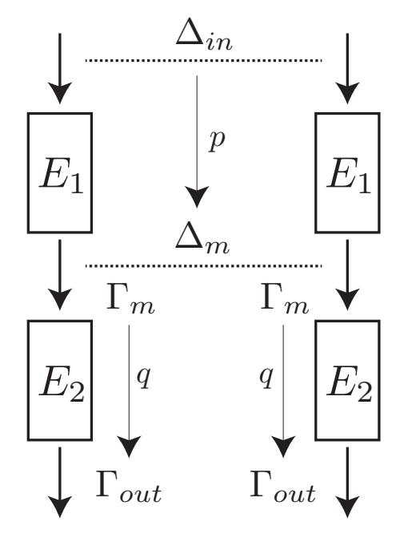

<span id="page-4-2"></span>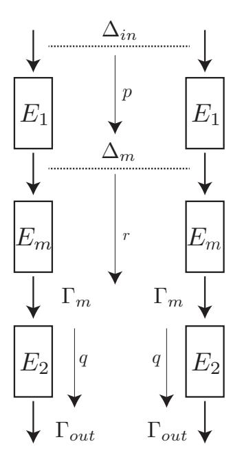

<span id="page-4-0"></span>differential-linear distinguisher.

Fig. 1. The structure of a classical Fig. 2. A differential-linear distinguisher with experimental evaluation of the correlation r.

#### <span id="page-4-3"></span>2.1 Differential-Linear Attacks

We first recall the basic variant of differential-linear cryptanalysis as introduced by Langford and Hellman [19]. Fig. 1 shows the overview of the distinguisher. An entire cipher E is divided into two sub ciphers  $E_1$  and  $E_2$ , such that  $E = E_2 \circ E_1$ , and a differential distinguisher and a linear distinguisher are applied to the first and second parts, respectively.

In particular, assume that the differential  $\Delta_{\text{in}} \stackrel{E_1}{\to} \Delta_m$  holds with probability

$$\mathbf{Pr}_{x \in \mathbb{F}_2^n} \left[ E_1(x) \oplus E_1(x \oplus \Delta_{\mathrm{in}}) = \Delta_m \right] = p$$
.

Let us further assume that the linear approximation  $\Gamma_m \stackrel{E_2}{\to} \Gamma_{\text{out}}$  is satisfied with correlation  $\mathbf{Cor}_{x\in\mathbb{F}_2^n}\left[\langle \Gamma_m, x\rangle \oplus \langle \Gamma_{\mathrm{out}}, E_2(x)\rangle\right] = q$ . The differential-linear distinguisher exploits the fact that, under the assumption that  $E_1(x)$  and E(x)are independent random variables, we have

<span id="page-4-1"></span>
$$\mathbf{Cor}_{x \in \mathbb{F}_2^n} \left[ \langle \Gamma_{\mathrm{out}}, E(x) \rangle \oplus \langle \Gamma_{\mathrm{out}}, E(x \oplus \Delta_{\mathrm{in}}) \rangle \right] = pq^2 . \tag{1}$$

Therefore, by preparing  $\epsilon p^{-2}q^{-4}$  pairs of chosen plaintexts  $(x, \tilde{x})$ , for  $\tilde{x} = x \oplus \Delta_{\text{in}}$ , where  $\epsilon \in \mathbb{N}$  is a small constant, one can distinguish the cipher from a PRP.

In practice, there might be a problem with the assumption that  $E_1(x)$  and E(x) are independent, resulting in wrong estimates for the correlation. To provide a better justification of this independence assumption (and in order to

After the submission of this paper, the authors of [13] independently found the same distinguisher without applying the technique for improving over the differential part, and the presented attack complexities are very close to ours.

{5}------------------------------------------------

improve attack complexities), adding a middle part is a simple solution and usually done in recent attacks (as well as in ours). Here, the cipher E is divided into three sub ciphers  $E_1, E_m$  and  $E_2$  such that  $E = E_2 \circ E_m \circ E_1$  and the middle part  $E_m$  is experimentally evaluated. In particular, let

$$r = \mathbf{Cor}_{x \in \mathcal{S}} \left[ \langle \Gamma_m, E_m(x) \rangle \oplus \langle \Gamma_m, E_m(x \oplus \Delta_m) \rangle \right],$$

where S denotes the set of samples over which the correlation is computed. Then, the total correlation in Equation 1 can be estimated as  $prq^2$ . Recently, as a theoretical support for this approach the Differential-Linear Connectivity Table (DLCT) [4] has been introduced. The overall attack framework is depicted in Fig. 2 and we will use this description in the remainder of the paper.

#### <span id="page-5-3"></span>2.2 Partitioning Technique for ARX-based Designs

Partitioning allows to increase the correlation of the differential-linear distinguisher by deriving linear equations that hold conditioned on ciphertext and key bits. We first recall the partitioning technique as used in [20]. Let  $a, b \in \mathbb{F}_2^m$  and let s = a + b. When i = 0 (lsb), the modular addition for bit i becomes linear, i.e.,  $s[0] = a[0] \oplus b[0]$ . Of course, for i > 0, computing the i-th output bit of modular addition is not linear. Still, by restricting (a, b) to be in a specific subset, we might obtain other linear relations. In previous work, the following formula on s[i] was derived.

<span id="page-5-0"></span>**Lemma 1** ([20]). Let  $a, b \in \mathbb{F}_2^m$  and s = a + b. For  $i \geq 2$ , we have

$$s[i] = \begin{cases} a[i] \oplus b[i] \oplus a[i-1] & \text{if } a[i-1] = b[i-1] \\ a[i] \oplus b[i] \oplus a[i-2] & \text{if } a[i-1] \neq b[i-1] \text{ and } a[i-2] = b[i-2] \end{cases}.$$

Let us now consider two m-bit words  $z_0$  and  $z_1$  and a modular addition operation

$$F \colon \mathbb{F}_2^{2m} \to \mathbb{F}_2^{2m}, \quad (z_1, z_0) \mapsto (y_1, y_0) = (z_1, z_0 + z_1)$$

as depicted in Fig. 5. F might correspond to a single branch of a wider ARX-based design. In the attacks we present later, we are interested in the value  $z_0[i]$ . For this, we cannot apply Lemma 1 directly since  $z_0[i]$  is obtained by modular subtraction. However, for that case the following formula can be derived.

<span id="page-5-2"></span>**Lemma 2.** Let  $i \geq 2$  and let  $S_1 := \{(x_1, x_0) \in \mathbb{F}_2^{2m} \mid x_0[i-1] \neq x_1[i-1]\}$  and  $S_2 := \{(x_1, x_0) \in \mathbb{F}_2^{2m} \mid x_0[i-1] = x_1[i-1] \text{ and } x_0[i-2] \neq x_1[i-2]\}.$  Then,

<span id="page-5-1"></span>
$$z_0[i] = \begin{cases} y_0[i] \oplus y_1[i] \oplus y_0[i-1] \oplus 1 & \text{if } (y_1, y_0) \in \mathcal{S}_1 ,\\ y_0[i] \oplus y_1[i] \oplus y_0[i-2] \oplus 1 & \text{if } (y_1, y_0) \in \mathcal{S}_2 . \end{cases}$$
 (2)

Clearly,  $S_1$  and  $S_2$  are disjoint sets. Note that Equation 2 only holds for  $\frac{3}{4}$  of the data, since  $|S_1| = 2^{-1}2^{2m}$  and  $|S_2| = 2^{-2}2^{2m}$ .

{6}------------------------------------------------

<span id="page-6-2"></span>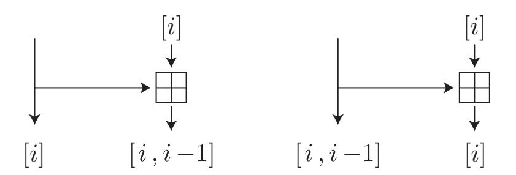

**Fig. 3.** Two linear trails with correlation  $2^{-1}$ .

Due to the propagation rules for linear trails over modular addition, we may end up with multiple linear trails that are closely related to each other. As an example, Fig. 3 shows two possible trails, where |i| and |i-1,i| denote the corresponding linear masks. The partitioning technique described above evaluates  $z_0[i]$ , but we can expect that there is a highly-biased linear trail in which  $z_0[i-1] \oplus z_0[i]$  needs to be evaluated instead of  $z_0[i]$ . In the trivial method, we apply the partitioning technique of Lemma 2 for  $z_0[i]$  and  $z_0[i-1]$  separately, which requires the knowledge of 3 bits of information from y in total. Our new partitioning method allows us to determine the partition only by knowing the same 2 bits of information as needed for evaluating the case of  $z_0[i]$ , namely  $(y_0[i-1] \oplus y_1[i-1])$  and  $(y_0[i-2] \oplus y_1[i-2])$ . This is especially helpful if y consists of the ciphertext XORed with the key, so we need to guess less key bits to evaluate the partition. In particular, the following relation holds, which is straightforward to proof. The intuition is that  $z_0|i-1|$  corresponds to the carry bit c[i-1] in the case of  $(y_1, y_0) \in \mathcal{S}_3$  and  $(y_1[i-2], y_1[i-1]) = (c[i-2], c[i-1])$  for  $(y_1, y_0) \in \mathcal{S}_4$ . For completeness, the proof is given in Supplementary Material A.

<span id="page-6-1"></span>**Lemma 3.** Let  $i \geq 2$  and let  $S_3 = \{(x_1, x_0) \in \mathbb{F}_2^{2m} \mid x_0[i-1] = x_1[i-1]\}$  and  $S_4 = \{(x_1, x_0) \in \mathbb{F}_2^{2m} \mid x_0[i-1] \neq x_1[i-1] \text{ and } x_0[i-2] \neq x_1[i-2]\}$ . Then,

$$z_0[i] \oplus z_0[i-1] = \begin{cases} y_0[i] \oplus y_1[i] & \text{if } (y_1, y_0) \in \mathcal{S}_3 \ , \\ y_0[i] \oplus y_1[i] \oplus y_0[i-1] \oplus y_0[i-2] \oplus 1 & \text{if } (y_1, y_0) \in \mathcal{S}_4 \ . \end{cases}$$

Again,  $S_3$  and  $S_4$  are disjoint and the equation above holds for  $\frac{3}{4}$  of the data.

## <span id="page-6-0"></span>3 The Differential Part – Finding Many Right Pairs

Let us be given a permutation  $E_1: \mathbb{F}_2^n \to \mathbb{F}_2^n$  and a differential  $\Delta_{\text{in}} \stackrel{E_1}{\to} \Delta_m$  that holds with probability p. In other words,

$$|\{x \in \mathbb{F}_2^n \mid E_1(x) \oplus E_1(x \oplus \Delta_{\mathrm{in}}) = \Delta_m\}| = p \cdot 2^n.$$

In a usual differential-linear attack on a permutation  $E = E_2 \circ E_m \circ E_1$  as explained in Sect. 2.1, the internal structure of  $E_1$  could be in general arbitrary

{7}------------------------------------------------

and we would consider randomly chosen  $x \in \mathbb{F}_2^n$  to observe the ciphertexts of the plaintext pairs  $(x, x \oplus \Delta_{\text{in}})$ . For each of those pairs, the differential over  $E_1$  is fulfilled with probability p, which results in a data complexity of roughly  $\epsilon p^{-2}r^{-2}q^{-4}$  for the differential-linear attack. In other words, we did not exploit the particular structure of  $E_1$ . In particular, it would be helpful to know something about the distribution of right pairs  $(x, x \oplus \Delta_{\text{in}}) \in \mathbb{F}_2^n \times \mathbb{F}_2^n$  that fulfill the above differential.

Let us denote by  $\mathcal{X}$  the set of all values that define right pairs for the differential, i.e.,

$$\mathcal{X} = \{ x \in \mathbb{F}_2^n \mid E_1(x) \oplus E_1(x \oplus \Delta_{\mathrm{in}}) = \Delta_m \} .$$

To amplify the correlation of a differential-linear distinguisher, instead of choosing random plaintexts from  $\mathbb{F}_2^n$ , we would consider only those that are in  $\mathcal{X}$ . In particular, we have<sup>2</sup>

$$\mathbf{Cor}_{x \in \mathcal{X}} \left[ \langle \Gamma_{\text{out}}, E(x) \rangle \oplus \langle \Gamma_{\text{out}}, E(x \oplus \Delta_{\text{in}}) \rangle \right] = rq^2$$
.

Since the set  $\mathcal{X}$  might have a rather complicated structure, and is moreover key-dependent, we cannot use this directly for an arbitrary permutation  $E_1$ . However, if  $\mathcal{X}$  employs a special structure such that, given one element  $x \in \mathcal{X}$ , we can generate many other elements in  $\mathcal{X}$  for free,<sup>3</sup> independently of the secret key, we can use this to reduce the data complexity in a differential-linear attack. For example, if  $\mathcal{X}$  contains a large affine subspace  $\mathcal{A} = \mathcal{U} \oplus a$ , given  $x \in \mathcal{A}$ , we can generate (roughly)  $2^{|\dim \mathcal{U}|}$  elements in  $\mathcal{X}$  for free, namely all elements  $x \oplus u$ , for  $u \in \mathcal{U}$ . In order to obtain an effective distinguisher, we must be able to generate enough plaintext pairs to observe the correlation of the differential-linear approximation. In particular, we need to require  $|\mathcal{U}| > \epsilon r^{-2}q^{-4}$ .

This will be exactly the situation we find in ChaCha. Here the number of rounds covered in the differential part is so small that it can be described by the independent application of two functions (see Sect. 3.1).

If  $|\mathcal{U}|$  is smaller than the threshold of  $\epsilon r^{-2}q^{-4}$ , we can't generate enough right pairs for free to obtain a distinguisher by this method and we might use a probabilistic approach, see Sect. 3.2.

#### <span id="page-7-0"></span>3.1 Fully Independent Parts

Let  $E_1: \mathbb{F}_2^n \to \mathbb{F}_2^n$  with n = 2m be a parallel application of two block ciphers  $E_1^{(i)}: \mathbb{F}_2^m \to \mathbb{F}_2^m$ ,  $i \in \{0,1\}$  (for a fixed key), i.e.,

$$E_1: (x^{(1)}, x^{(0)}) \mapsto (E_1^{(1)}(x^{(1)}), E_1^{(0)}(x^{(0)})).$$

Suppose that,  $E_1^{(0)}$  employs a differential  $\alpha \stackrel{E_1^{(0)}}{\to} \beta$  with probability p. We consider the differential  $\Delta_{\text{in}} \stackrel{E_1}{\to} \Delta_m$  with  $\Delta_{\text{in}} = (0, \alpha)$  and  $\Delta_m = (0, \beta)$ , which also holds

under the assumption that the sets  $\{\langle \Gamma_{\text{out}}, E(x) \rangle \oplus \langle \Gamma_{\text{out}}, E(x \oplus \Delta_{\text{in}}) \rangle \mid x \in \mathcal{X}\}$  and  $\{\langle \Gamma_{\text{out}}, E(x) \rangle \oplus \langle \Gamma_{\text{out}}, E(x \oplus \Delta_{\text{in}}) \rangle \mid x \in \mathcal{S}\}$  are indistinguishable, where  $\mathcal{S}$  denotes a set of uniformly chosen samples of the same size as  $\mathcal{X}$ .

<sup>&</sup>lt;sup>3</sup> Or at least with a cost much lower than  $p^{-1}$ , see Sect. 3.2.

{8}------------------------------------------------

with probability p. Given one element  $(x^{(1)}, x^{(0)}) \in \mathcal{X}$ , any  $(x^{(1)} \oplus u, x^{(0)})$  for  $u \in \mathbb{F}_2^m$  is also contained in  $\mathcal{X}$ , thus we can generate  $2^m$  right pairs for free.

If  $2^m > \epsilon r^{-2}q^{-4}$ , a differential-linear distinguisher on  $E = E_2 \circ E_m \circ E_1$  would work as follows:

- 1. Choose  $a = (a^{(1)}, a^{(0)}) \in \mathbb{F}_2^n$  uniformly at random.
- 2. Empirically compute

$$\operatorname{Cor}_{x \in a \oplus (\mathbb{F}_2^m \times \{0\})} \left[ \langle \Gamma_{\operatorname{out}}, E(x) \rangle \oplus \langle \Gamma_{\operatorname{out}}, E(x \oplus \Delta_{\operatorname{in}}) \rangle \right] .$$

3. If we observe a correlation of  $rq^2$  using  $\epsilon r^{-2}q^{-4}$  many x, the distinguisher succeeded. If not, start over with Step 1.

With probability p, we choose an element  $a \in \mathcal{X}$  in Step 1. In that case, the distinguisher succeeds in Step 3. Therefore, the data complexity of the distinguisher is  $\epsilon p^{-1}r^{-2}q^{-4}$ , compared to  $\epsilon p^{-2}r^{-2}q^{-4}$  as in the classical differential-linear attack.

#### <span id="page-8-0"></span>3.2 Probabilistic Independent Parts

We are also interested in the situations in which the differential part cannot be simply written as the parallel application of two functions. Again, the goal is, given one element  $x \in \mathcal{X}$ , to be able to generate  $\epsilon r^{-2}q^{-4}$  other elements in  $\mathcal{X}$ , each one with a much lower cost than  $p^{-1}$ . Suppose that  $\mathcal{U} \subseteq \mathbb{F}_2^n$  is a subspace with  $|\mathcal{U}| > \epsilon r^{-2}q^{-4}$  and suppose that  $\mathbf{Pr}_{u\in\mathcal{U}}(x \oplus u \in \mathcal{X} \mid x \in \mathcal{X}) = p_1$ , where  $p_1$  is much larger than p. The data complexity of the improved differential-linear distinguisher would then be  $\epsilon p^{-1}p_1^{-2}r^{-2}q^{-4}$ . Note that the probability  $p_1$  also depend on x. In particular, there might be  $x \in \mathcal{X}' \subseteq \mathcal{X}$  for which  $p_1$  is (almost) 1, but the probability to draw such an initial element x from  $\mathbb{F}_2^n$  is p', which is smaller than p. Then, the data complexity would be  $\epsilon p'^{-1}p_1^{-2}r^{-2}q^{-4}$ . For instance, this will be the case for the attack on Chaskey (Sect. 5), where we have  $p_1 \approx 1$  and  $p' = p \times 222/256$ .

In such situations, we propose an algorithmic way to experimentally detect suitable structures in the set of right pairs. This idea of the algorithm, see Algorithm 1 for the pseudo code, is to detect canonical basis vectors within the subspace  $\mathcal{U}$ . Running this algorithm for enough samples will return estimates of the probability  $\gamma_j$  that a right pair  $x \in \mathcal{X}$  stays a right pair when the j-th bit is flipped, i.e.,

$$\gamma_i = \mathbf{Pr} (x \oplus [i] \in \mathcal{X} \mid x \in \mathcal{X})$$
.

When applied to a few rounds of ARX ciphers it can be expected that there are some bits that will always turn a right pair into a right pair, i.e.  $\gamma_i = 1$ . Moreover, due to the property of the modular addition that the influence of bits on distant bits degrades quickly, high values of  $\gamma_j \neq 1$  can also be expected. As we will detail in Sect. 5 this will be the case for the application to Chaskey.

{9}------------------------------------------------

#### <span id="page-9-1"></span>Algorithm 1 Computing probabilistic independent bits

```
Require: Number of samples T, input difference \Delta_{in}, output difference \Delta_{m}
Ensure: Probabilities \gamma_0, \gamma_1, \dots, \gamma_{n-1}
 1: Let s = 0 and c_j = 0 for j \in \{0, ..., n-1\}.
 2: for i = 1 to T do
 3:
        Pick a random X and compute E_1(X) and E_1(X \oplus \Delta_{in})
 4:
        if E_1(X) \oplus E_1(X \oplus \Delta_{in}) = \Delta_m then
            Increment s
 5:
            for j \in \{0, ..., n-1\} do
 6:
                 Prepare X where the j-th bit of X is flipped.
 7:
                 if E_1(X) \oplus E_1(X \oplus \Delta_{in}) = \Delta_m then
 8:
 9:
                     Increment c_i
10:
                 end if
11:
             end for
12:
         end if
13: end for
14: for j \in \{0, \ldots, n-1\} do
         \gamma_i = c_i/s
15:
16: end for
```

# <span id="page-9-0"></span>4 The Linear Part – Advanced Partitioning and WHT-based Key-Recovery

In this section, we describe our improvements over the linear part of the attack which consists in exploiting multiple linear approximations and an advanced key-recovery technique using the partitioning technique and the fast Walsh-Hadamard transform. The overall structure of the advanced differential-linear attack is depicted in Fig. 4. Here F corresponds to the part of the cipher that we are going to cover using our improved key-guessing. Our aim is to recover parts of the last whitening key k by using a differential-linear distinguisher given by s (multiple) linear approximations  $\langle \Gamma_{\text{out}}^{(p_i)}, z \rangle \oplus \langle \Gamma_{\text{out}}^{(p_j)}, \tilde{z} \rangle$ . In the following, we assume that the ciphertext space  $\mathbb{F}_2^n$  is split into a direct sum  $\mathcal{P} \oplus \mathcal{R}$  with  $n_{\mathcal{P}} := \dim \mathcal{P}$  and  $n_{\mathcal{R}} := \dim \mathcal{R} = n - n_{\mathcal{P}}$ . Therefore, we can uniquely express intermediate states z as  $z_{\mathcal{P}} \oplus z_{\mathcal{R}}$ , where  $z_{\mathcal{P}} \in \mathcal{P}$  and  $z_{\mathcal{R}} \in \mathcal{R}$ . The precise definition of  $\mathcal{P}$  and  $\mathcal{R}$  depends on the particular application of the attack.

#### 4.1 Multiple Linear Approximations and Partitioning

The idea is to identify several tuples  $(\mathcal{T}_{p_i}, \Gamma_{\text{out}}^{(p_i)}, \gamma^{(p_i)})$ ,  $i \in \{1, \ldots, s\}$ , where  $\mathcal{T}_{p_i} = \mathcal{R} \oplus p_i$  is a coset of  $\mathcal{R} \subseteq \mathbb{F}_2^n$ ,  $\Gamma_{\text{out}}^{(p_i)} \in \mathbb{F}_2^n$  and  $\gamma^{(p_i)} \in \mathcal{R}$ , for which we can observe a high absolute correlation

$$\varepsilon_i := \mathbf{Cor}_{y \in \mathcal{T}_{p_i}} \left[ \langle \Gamma_{\mathrm{out}}^{(p_i)}, z \rangle \oplus \langle \gamma^{(p_i)}, y \rangle \right] .$$

In the simplest case, we would have  $\varepsilon_i = 1$ , i.e.,

$$y \in \mathcal{T}_{p_i} \quad \Rightarrow \quad \left( \langle \Gamma_{\text{out}}^{(p_i)}, z \rangle = \langle \gamma^{(p_i)}, y \rangle = \langle \gamma^{(p_i)}, c \rangle \oplus \langle \gamma^{(p_i)}, k \rangle \right) .$$

{10}------------------------------------------------

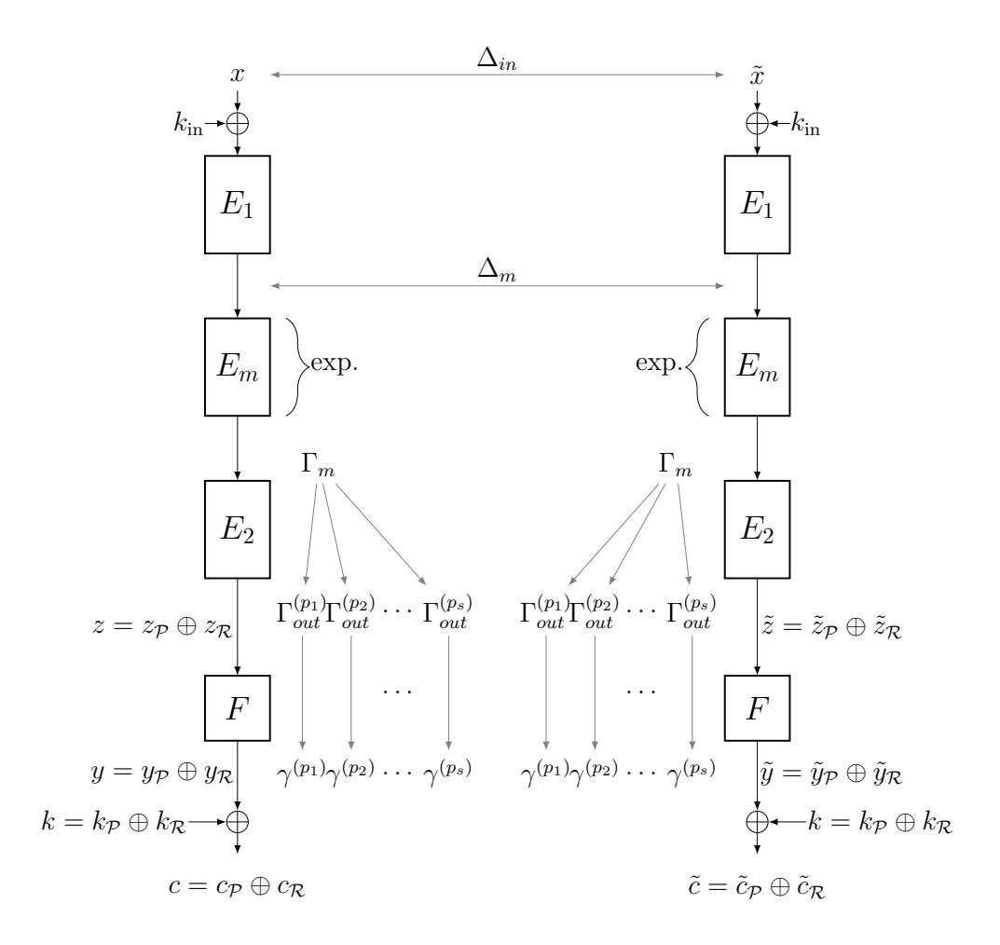

<span id="page-10-0"></span>Fig. 4. The general structure of the attack.

In other words, by considering only a specific subset of the ciphertexts (defined by  $\mathcal{T}_{p_i}$ ) we obtain *linear relations* in the key with a high correlation.

Note that  $y \in \mathcal{T}_{p_i} \Leftrightarrow c \in \mathcal{T}_{p_i} \oplus k_{\mathcal{P}}$ , so we need to guess  $n_{\mathcal{P}}$  bits of k to partition the ciphertexts into the corresponding  $\mathcal{T}_{p_i}$ . Note that there might be ciphertexts that are discarded,<sup>4</sup> i.e., there might be y which do not belong to any  $\mathcal{T}_{p_i}$ , for  $i \in \{1, \ldots, s\}$ . Note also that, since we require  $\gamma^{(p_i)} \in \mathcal{R}$ , we obtain linear relations only on  $k_{\mathcal{R}}$ .

By defining<sup>5</sup>

$$q_{i,j} := \mathbf{Cor}_{\substack{x \in \mathcal{X} \text{ such that} \\ (c,\tilde{c}) \in \mathcal{T}_{p_i} \times \mathcal{T}_{p_j} \oplus (k_{\mathcal{P}}, k_{\mathcal{P}})}} \left[ \langle \Gamma_{\text{out}}^{(p_i)}, z \rangle \oplus \langle \Gamma_{\text{out}}^{(p_j)}, \tilde{z} \rangle \right] ,$$

<sup>&</sup>lt;sup>4</sup> Of course, the discarded data has to be considered in the data complexity of the attack.

<sup>&</sup>lt;sup>5</sup> If  $|q_{i,j}|$  is not too small and if the number s of approximations is not too huge, we can empirically compute  $q_{i,j}$  for all i,j. In other cases, we estimate  $q_{i,j} = \mathbf{Cor}_{x \in \mathcal{X}} \left[ \langle \Gamma_{\text{out}}^{(p_i)}, z \rangle \oplus \langle \Gamma_{\text{out}}^{(p_j)}, \tilde{z} \rangle \right]$  by assuming indistinguishability of the sets  $\{ \langle \Gamma_{\text{out}}^{(p_i)}, z \rangle \oplus \langle \Gamma_{\text{out}}^{(p_j)}, \tilde{z} \rangle \mid x \in \mathcal{X} \text{ s.t. } (y, \tilde{y}) \in \mathcal{T}_{p_i} \times \mathcal{T}_{p_j} \}$  and  $\{ \langle \Gamma_{\text{out}}^{(p_i)}, z \rangle \oplus \langle \Gamma_{\text{out}}^{(p_j)}, \tilde{z} \rangle \mid x \in \mathcal{S} \}$ , where  $\mathcal{S}$  is a set of uniformly random samples of  $\mathcal{X}$  of suitable size.

{11}------------------------------------------------

we obtain

$$\mathbf{Cor}_{\substack{x \in \mathcal{X} \text{ such that} \\ (c,\tilde{c}) \in \mathcal{T}_{p_i} \times \mathcal{T}_{p_j} \oplus (k_{\mathcal{P}}, k_{\mathcal{P}})}} \left[ \langle \gamma^{(p_i)}, c \rangle \oplus \langle \gamma^{(p_j)}, \tilde{c} \rangle \oplus \langle \gamma^{(p_i)} \oplus \gamma^{(p_j)}, k \rangle \right] \\
= \mathbf{Cor}_{\substack{x \in \mathcal{X} \text{ such that} \\ (c,\tilde{c}) \in \mathcal{T}_{p_i} \times \mathcal{T}_{p_j} \oplus (k_{\mathcal{P}}, k_{\mathcal{P}})}} \left[ \langle \gamma^{(p_i)}, y \rangle \oplus \langle \gamma^{(p_j)}, \tilde{y} \rangle \right] = \varepsilon_i \varepsilon_j q_{i,j} .$$

For <sup>r</sup> <sup>∈</sup> <sup>R</sup>, let us define sgn(r) = ( 0 if r ≥ 0 1 if r < 0 . If we define

$$h_{i,j} := (-1)^{\operatorname{sgn}(\varepsilon_i \varepsilon_j q_{i,j})} \mathbf{Cor} \underset{(c,\tilde{c}) \in \mathcal{T}_{p_i} \times \mathcal{T}_{p_j} \oplus (k_{\mathcal{P}}, k_{\mathcal{P}})}{\underset{i \in \mathcal{X}}{x \text{ such that}}} \left[ \langle \gamma^{(p_i)}, c \rangle \oplus \langle \gamma^{(p_j)}, \tilde{c} \rangle \right] ,$$

we have <sup>h</sup>i,j = (−1)h<sup>γ</sup> (pi )⊕γ (pj ) ,ki |εiε<sup>j</sup> qi,j | . Let us further assume that

$$\{x \in \mathcal{X} \mid (c, \tilde{c}) \in \mathcal{T}_{p_i} \times \mathcal{T}_{p_j} \oplus (k_{\mathcal{P}}, k_{\mathcal{P}})\}$$

is of equal size σ for all (i, j) and consider the scaled version of hi,j , i.e.,

$$\alpha_{i,j} \coloneqq \sigma \cdot h_{i,j} = (-1)^{\operatorname{sgn}(\varepsilon_i \varepsilon_j q_{i,j})} \sum_{\substack{x \in \mathcal{X} \text{ such that} \\ (c,\tilde{c}) \in \mathcal{T}_{p_i} \times \mathcal{T}_{p_j} \oplus (k_{\mathcal{P}}, k_{\mathcal{P}})}} (-1)^{\langle \gamma^{(p_i)}, c \rangle \oplus \langle \gamma^{(p_j)}, \tilde{c} \rangle}$$

.

For each γ ∈ W := Span{γ (pi) <sup>⊕</sup> <sup>γ</sup> (p<sup>j</sup> ) | i, j ∈ {1, . . . , s}}, we define

$$\beta(\gamma) \coloneqq \sum_{\substack{(i,j) \text{ such that} \\ \gamma^{(p_i)} \oplus \gamma^{(p_j)} = \gamma}} \alpha_{i,j} .$$

This function β now allows to efficiently recover dim W bits of information on kR. In other words, k<sup>R</sup> can be uniquely expressed as k<sup>L</sup> ⊕ kR<sup>0</sup> , where k<sup>L</sup> is the part of the key that can be obtained from β. Finally, using the Fast Walsh-Hadamard transform on β, we compute for each tuple (k<sup>P</sup> , kL) a cumulative counter

$$\mathcal{C}(k_{\mathcal{P}}, k_{\mathcal{L}}) := \sum_{\gamma \in W} (-1)^{\langle \gamma, k_{\mathcal{L}} \rangle} \beta(\gamma) .$$

Whenever this counter C is larger than some threshold Θ, we store the tuple (k<sup>P</sup> , kL) in the list of key candidates. Note that the idea of applying the Fast Walsh-Hadamard transform to gain a speed-up in the key-recovery phase of linear cryptanalysis has already been used before, see [\[12\]](#page-29-13).

The attack is presented in Algorithm [2.](#page-12-0) Note that the actual correlations are approximated by sampling over N pairs of plaintexts, resp., ciphertexts.

A note on the Walsh-Hadamard transform. Given a real-valued function f : F n <sup>2</sup> → R, the Walsh-Hadamard transform evaluates the function

$$\widehat{f} \colon \mathbb{F}_2^n \to \mathbb{R}, \quad \alpha \mapsto \sum_{y \in \mathbb{F}_2^n} (-1)^{\langle \alpha, y \rangle} f(y) \ .$$

{12}------------------------------------------------

#### <span id="page-12-0"></span>Algorithm 2 Key-recovery

```
Require: Cipher E, sample size N, threshold \Theta.
Ensure: List of key candidates (k'_{\mathcal{P}}, k_{\mathcal{L}}) for n_P + \dim W bit of information on k.
 1: for (i,j) \in \{1,\ldots,s\} \times \{1,\ldots,s\} do
            for k_{\mathcal{P}}' \in \mathcal{P} do
 2:
                   \alpha_{i,j}^{(k_{\mathcal{P}}')} \leftarrow 0
 3:
             end for
 4:
 5: end for
 6: Choose a \stackrel{\$}{\leftarrow} \mathbb{F}_2^n
 7: for \ell \in \{1, ..., N\} do
             x \stackrel{\$}{\leftarrow} U \oplus a
 8:
             (c, \tilde{c}) \leftarrow (E(x), E(x \oplus \Delta_{\mathrm{in}}))
 9:
             for k_{\mathcal{P}}' \in \mathcal{P} do
10:
                   Identify \mathcal{T}_i \times \mathcal{T}_j for (c \oplus k_{\mathcal{P}}', \tilde{c} \oplus k_{\mathcal{P}}') and get corresponding \gamma^{(p_i)} and \gamma^{(p_j)}
11:
                   \alpha_{i,j}^{(k_{\mathcal{P}}')} \leftarrow \alpha_{i,j}^{(k_{\mathcal{P}}')} + (-1)^{\langle \gamma^{(p_i)}, c \rangle \oplus \langle \gamma^{(p_j)}, \tilde{c} \rangle} (where i, j are computed in line 11)
12:
             end for
13:
14: end for
15: for k_{\mathcal{P}}' \in \mathcal{P} do
             Compute C(k'_{\mathcal{P}}, k_{\mathcal{L}}) using the Fast Walsh-Hadamard Transform
16:
             if C(k'_{\mathcal{P}}, k_{\mathcal{L}}) > \Theta then
17:
                   Save (k'_{\mathcal{P}}, k_{\mathcal{L}}) as a key candidate
18:
19:
             end if
20: end for
```

A naive computation needs  $\mathcal{O}(2^{2n})$  steps (additions and evaluations of f), i.e., for each  $\alpha \in \mathbb{F}_2^n$ , we compute  $(-1)^{\langle \alpha, y \rangle} f(y)$  for each  $y \in \mathbb{F}_2^n$ . The Fast Walsh-Hadamard transform is a well-known recursive divide-and-conquer algorithm that evaluates the Walsh-Hadamard transform in  $\mathcal{O}(n2^n)$  steps. We refer to e.g., [10, Section 2.2] for the details.

Running time and data complexity of Algorithm 2. Clearly, Algorithm 2 needs 2N queries to E as the data complexity. For the running time, the dominant part is the loop over the key guesses for  $k_{\mathcal{P}}$ , the collection of N data samples, and the Walsh-Hadamard transform. The overall running time can be estimated as  $2^{n_{\mathcal{P}}}(2N + \dim W \cdot 2^{\dim W})$ .

Success probability of Algorithm 2. Two questions remain to be discussed here: (i) what is the probability that the right key is among the candidates and (ii) what is the expected size of the list of candidates? To answer those questions, we have to first establish a statistical model for the counter values  $C(k_P, k_L)$ .

For a key guess  $k'_{\mathcal{L}}$ , we first note that

$$C(k_{\mathcal{P}}, k'_{\mathcal{L}}) = \sum_{\gamma \in W} (-1)^{\langle \gamma, k'_{\mathcal{L}} \rangle} \beta(\gamma)$$

{13}------------------------------------------------

$$= \sum_{\gamma \in W} \sum_{\substack{(i,j) \text{ s. t.} \\ \gamma^{(p_i)} \oplus \gamma^{(p_j)} = \gamma}} (-1)^{\langle \gamma, k'_{\mathcal{L}} \rangle} (-1)^{\operatorname{Sgn}(\varepsilon_i \varepsilon_j q_{i,j})} \sum_{\substack{x \in \mathcal{X} \text{ such that} \\ (c,\tilde{c}) \in \mathcal{T}_{p_i} \times \mathcal{T}_{p_j} \oplus (k_{\mathcal{P}}, k_{\mathcal{P}})}} (-1)^{\langle \gamma^{(p_i)}, c \rangle \oplus \langle \gamma^{(p_j)}, \tilde{c} \rangle}$$

$$= \sum_{\gamma \in W} \sum_{\substack{(i,j) \text{ s. t.} \\ \gamma^{(p_i)} \oplus \gamma^{(p_j)} = \gamma}} (-1)^{\langle \gamma, k'_{\mathcal{L}} \rangle} (-1)^{\operatorname{Sgn}(\varepsilon_i \varepsilon_j q_{i,j})} \sum_{\substack{x \in \mathcal{X} \text{ such that} \\ (c,\tilde{c}) \in \mathcal{T}_{p_i} \times \mathcal{T}_{p_j} \oplus (k_{\mathcal{P}}, k_{\mathcal{P}})}} (-1)^{\langle \gamma^{(p_i)}, y \oplus k_{\mathcal{R}} \rangle \oplus \langle \gamma^{(p_j)}, \tilde{y} \oplus k_{\mathcal{R}} \rangle}$$

$$= \sum_{\gamma \in W} \sum_{\substack{(i,j) \text{ s. t.} \\ \gamma^{(p_i)} \oplus \gamma^{(p_j)} = \gamma}} (-1)^{\langle \gamma, k_{\mathcal{L}} \oplus k'_{\mathcal{L}} \rangle} (-1)^{\operatorname{Sgn}(\varepsilon_i \varepsilon_j q_{i,j})} \sum_{\substack{x \in \mathcal{X} \text{ such that} \\ (c,\tilde{c}) \in \mathcal{T}_{p_i} \times \mathcal{T}_{p_j} \oplus (k_{\mathcal{P}}, k_{\mathcal{P}})}} (-1)^{\langle \gamma^{(p_i)}, y \rangle \oplus \langle \gamma^{(p_j)}, \tilde{y} \rangle}$$

$$= \sum_{\gamma \in W} \sum_{\substack{(i,j) \text{ s. t.} \\ \gamma^{(p_i)} \oplus \gamma^{(p_j)} = \gamma}} (-1)^{\langle \gamma, k_{\mathcal{L}} \oplus k'_{\mathcal{L}} \rangle} |\varepsilon_i \varepsilon_j q_{i,j}| \cdot \sigma,$$

$$\gamma^{(p_i)} \oplus \gamma^{(p_j)} = \gamma} (-1)^{\langle \gamma, k_{\mathcal{L}} \oplus k'_{\mathcal{L}} \rangle} |\varepsilon_i \varepsilon_j q_{i,j}| \cdot \sigma,$$

which implies that if  $k'_{\mathcal{L}} = k_{\mathcal{L}}$  the partial counters add up, while if  $k_{\mathcal{L}} \neq k'_{\mathcal{L}}$ , the partial counters can be expected to cancel each other partially.

In the following, we assume that the distributions involved can be well estimated by normal approximations. This significantly simplifies the analysis. Note that we opted for a rather simple statistical model ignoring in particular the effect of the wrong key distribution and the way we sample our plain-texts (i.e. known vs. chosen vs. distinct plaintext). Those effects might have major impact on the performance of attacks when the data complexity is close to the full codebook and the success probability and the gain are limited. However, none of this is the case for our parameters. In our concrete applications, we have verified the behaviour experimentally wherever possible.

For the statistical model for the right key, this implies that the counter can be expected to approximately follow a normal distribution with parameters

$$\mathcal{C}(k_{\mathcal{P}}, k_{\mathcal{L}}) \sim \mathcal{N}(N^*h, N^*)$$

where

$$h = \frac{1}{s^2} \sum_{i,j} h_{i,j}$$

is the average correlation over all partitions and  $N^*$  is the effective data complexity, i.e. the data complexity N reduced by the invalid partitions. The wrong key counters (under the simple randomization hypothesis) is approximately normal distributed with parameters

<span id="page-13-0"></span>
$$\mathcal{C}(k_{\mathcal{D}}', k_{\mathcal{L}}') \sim \mathcal{N}(0, N^*)$$
.

With this we can deduce the following proposition.

**Proposition 1.** After running Algorithm 2 for  $p^{-1}$ -times, the probability that the correct key is among the key candidates is

$$p_{\text{success}} \ge \frac{1}{2} \Pr(\mathcal{C}(k_{\mathcal{P}}, k_{\mathcal{L}}) \ge \Theta) = \frac{1}{2} \left( 1 - \Phi\left(\frac{\Theta - N^*h}{\sqrt{N^*}}\right) \right).$$

The expected number of wrong keys is  $\frac{2^n}{p} \times \left(1 - \Phi\left(\frac{\Theta}{\sqrt{N^*}}\right)\right)$ .

{14}------------------------------------------------

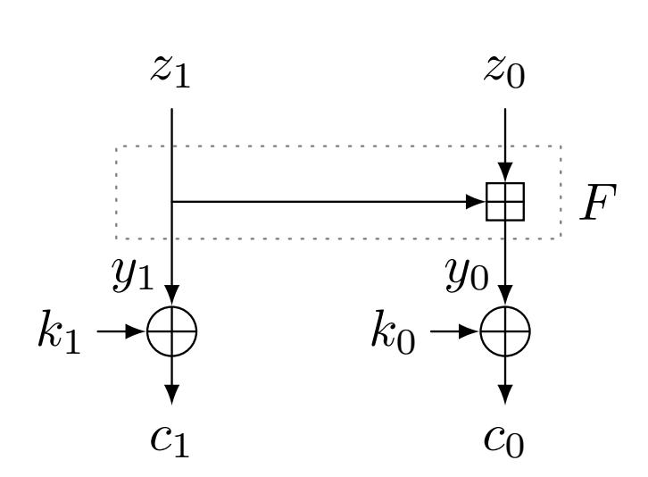

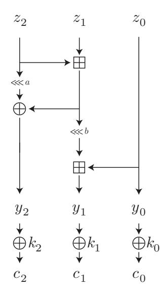

<span id="page-14-0"></span>Fig. 5. A simple toy example.

<span id="page-14-1"></span>Fig. 6. A consecutive case.

#### 4.2 A Simple Toy Example

We transfer the above terminology on the simple toy example given in Fig. 5 and already discussed earlier in Sect. 2.2. In this example, for a fixed  $i \geq 2$ , we want to evaluate  $z_0[i]$  or  $z_0[i] \oplus z_0[i-1]$  by using the partitioning rules as expressed in Lemma 2 and Lemma 3. For this, we say that  $(z_0[i], z_0[i] \oplus z_0[i-1])$  defines a partition point  $\zeta$ . This partition point gives rise to a 2-dimensional subspace  $\mathcal{P}$  which can be defined by two parity check equations, i.e.,  $\mathcal{P}$  is a complement space of the space

$$\mathcal{R} = \{(x_1, x_0) \in \mathbb{F}_2^{2m} \mid x_0[i-1] \oplus x_1[i-1] = 0 \text{ and } x_0[i-2] \oplus x_1[i-2] = 0\}$$
.

For example,  $\mathcal{P}$  can be chosen as  $\{([],[]),([i-1],[]),([i-2],[]),([i-2,i-1],[])\}.$ 

To demonstrate the attack from the previous section, we split  $\mathbb{F}_2^{2m}$  into the direct sum  $\mathcal{P} \oplus \mathcal{R}$ . By the isomorphism between  $\mathcal{P}$  and  $\mathbb{F}_2^2$ , we can identify the elements  $p \in \mathcal{P}$  by two-bit values  $p \cong b_0 b_1$ , where  $b_0$  indicates the parity of  $\bar{x}_0[i-1] \oplus x_1[i-1]$  and  $b_1$  indicates the parity of  $\bar{x}_0[i-2] \oplus x_1[i-2]$ . We then consider the following four tuples  $(\mathcal{T}_{b_0 b_1}, \mathcal{\Gamma}_{\text{out}}^{(b_0 b_1)}, \gamma^{(b_0 b_1)})$  and corresponding  $\varepsilon_{b_0 b_1}$ , whose definition come from the properties presented in Lemma 2 and Lemma 3:

$$\mathcal{T}_{00} = \mathcal{R} \oplus 00 = \mathcal{S}_{4} \qquad \Gamma_{\text{out}}^{(00)} = ([], [i, i-1]) \qquad \gamma^{(00)} = ([i], [i, i-1, i-2]) \qquad \varepsilon_{00} = -1 \\
\mathcal{T}_{01} = \mathcal{R} \oplus 01 = \mathcal{S}_{1} \setminus \mathcal{S}_{4} \qquad \Gamma_{\text{out}}^{(01)} = ([], [i]) \qquad \gamma^{(01)} = ([i], [i, i-1]) \qquad \varepsilon_{01} = -1 \\
\mathcal{T}_{10} = \mathcal{R} \oplus 10 = \mathcal{S}_{2} \qquad \Gamma_{\text{out}}^{(10)} = ([], [i]) \qquad \gamma^{(10)} = ([i], [i, i-2]) \qquad \varepsilon_{10} = -1 \\
\mathcal{T}_{11} = \mathcal{R} \oplus 11 = \mathcal{S}_{3} \setminus \mathcal{S}_{2} \qquad \Gamma_{\text{out}}^{(11)} = ([], [i, i-1]) \qquad \gamma^{(11)} = ([i], [i]) \qquad \varepsilon_{11} = 1 .$$

{15}------------------------------------------------

For example, to give an intuition for the choice of the first tuple,<sup>6</sup> when  $(y_1, y_0) \in \mathcal{S}_4$ , Lemma 3 tells us that  $\langle \Gamma_{\text{out}}^{(00)}, (z_1, z_0) \rangle = \langle \gamma^{(00)}, (y_1, y_0) \rangle \oplus 1$ , i.e.,  $\varepsilon_{00} = \mathbf{Cor}_{y \in \mathcal{T}_{00}} \left[ \langle \Gamma_{\text{out}}^{(00)}, z \rangle \oplus \langle \gamma^{(00)}, y \rangle \right] = -1$ .

We further have

$$W = \operatorname{Span}\{\gamma^{(a)} \oplus \gamma^{(b)} | a, b \in \mathbb{F}_2^2\} = \{([], []), ([], [i-1]), ([], [i-2]), ([], [i-1, i-2])\}$$

and we could recover the two bits  $k_0[i-1]$  and  $k_0[i-2]$  by the last step using the fast Walsh-Hadamard transform.

#### 4.3 Another Toy Example using Multiple Partition Points

Let us now look at another example which consists of two branches of the structure depiced in Fig. 5 in parallel, i.e.,  $(y_3, y_2, y_1, y_0) = (F(z_3, z_2), F(z_1, z_0))$  and  $c_i = y_i \oplus k_i$ . By using a single partition point as done in the above example, we can only evaluate the parity of at most two (consecutive) bits of  $z = (z_3, z_2, z_1, z_0)$ . Instead of just one single partition point, we can also consider multiple partition points. For example, if we want to evaluate the parity involving three non-consecutive bits of  $z = (z_3, z_2, z_1, z_0)$ , we can use three partition points, i.e.

$$\zeta_1 = (z_0[i], z_0[i] \oplus z_0[i-1]),$$

$$\zeta_2 = (z_0[j], z_0[j] \oplus z_0[j-1]),$$

$$\zeta_3 = (z_2[\ell], z_2[\ell] \oplus z_2[\ell-1]),$$

where  $i, j, \ell \geq 2$ . In a specific attack, the choice of the partition points depends on the definition of the linear trail. Those partition points give rise to three subspaces  $\mathcal{P}_1$ ,  $\mathcal{P}_2$ , and  $\mathcal{P}_3$ , defined by two parity-check equations each, i.e.,  $\mathcal{P}_i$  is a complement space of  $\mathcal{R}_i$ , where

$$\mathcal{R}_{1} = \{(x_{3}, x_{2}, x_{1}, x_{0}) \in \mathbb{F}_{2}^{4m} | x_{0}[i-1] \oplus x_{1}[i-1] = 0, x_{0}[i-2] \oplus x_{1}[i-2] = 0\}$$

$$\mathcal{R}_{2} = \{(x_{3}, x_{2}, x_{1}, x_{0}) \in \mathbb{F}_{2}^{4m} | x_{0}[j-1] \oplus x_{1}[j-1] = 0, x_{0}[j-2] \oplus x_{1}[j-2] = 0\}$$

$$\mathcal{R}_{3} = \{(x_{3}, x_{2}, x_{1}, x_{0}) \in \mathbb{F}_{2}^{4m} | x_{2}[\ell-1] \oplus x_{3}[\ell-1] = 0, x_{2}[\ell-2] \oplus x_{3}[\ell-2] = 0\}.$$

By defining<sup>7</sup>  $\mathcal{P} = \mathcal{P}_1 \oplus \mathcal{P}_2 \oplus \mathcal{P}_3$  and  $\mathcal{R}$  to be a complement space of  $\mathcal{P}$ , we split  $\mathbb{F}_2^{4m}$  into the direct sum  $\mathcal{P} \oplus \mathcal{R}$ .

We can identify the elements  $p \in \mathcal{P}$  by  $n_{\mathcal{P}}$ -bit values  $p \cong b_0 b_1 \dots b_{n_{\mathcal{P}}-1}$ . We can then again define tuples

<span id="page-15-0"></span>
$$(\mathcal{T}_{b_0b_1...b_{n_{\mathcal{P}}-1}}, \Gamma_{\text{out}}^{(b_0b_1...b_{n_{\mathcal{P}}-1})}, \gamma^{(b_0b_1...b_{n_{\mathcal{P}}-1})})$$
 (3)

$$\Gamma_{\text{out}}^{(00)} = ([], [i]) \quad \gamma^{(00)} = ([i], [i, i-1]) \quad \varepsilon_{00} = -1 ,$$

which is obtained from Lemma 2. To verify, note that  $S_4 \subseteq S_1$ .

<sup>&</sup>lt;sup>6</sup> Note that we might choose different  $(\Gamma_{\text{out}}^{(b_0b_1)}, \gamma^{(b_0b_1)})$  for  $\mathcal{T}_{b_0b_1}$ . For example, for  $\mathcal{T}_{00} = \mathcal{S}_4$ , we might alternatively choose

<sup>&</sup>lt;sup>7</sup> Note that  $\mathcal{P}$  is not necessarily a *direct* sum of  $\mathcal{P}_1$ ,  $\mathcal{P}_2$ , and  $\mathcal{P}_3$ . In other words, the dimension of  $\mathcal{P}$  might be smaller than 6, for instance if i = j, i.e.,  $\zeta_1 = \zeta_2$ .

{16}------------------------------------------------

by using the properties presented in Lemma 2 and Lemma 3. For example, if  $n_{\mathcal{P}} = 6$ , we can define

$$\mathcal{T}_{010101} = \{(x_3, x_2, x_1, x_0) \in \mathbb{F}_2^{4m} \mid x_0[i-1] \neq x_1[i-1], x_0[i-2] = x_1[i-2], \\ x_0[j-1] \neq x_1[j-1], x_0[j-2] = x_1[j-2], \\ x_2[\ell-1] \neq x_3[\ell-1], x_2[\ell-2] = x_3[\ell-2] \},$$

$$\begin{split} &\Gamma_{\text{out}}^{(\texttt{010101})} = ([],[\ell],[],[i,j]), \quad \gamma^{(\texttt{010101})} = ([\ell],[\ell-1,\ell],[i,j],[i-1,i,j-1,j]), \text{ and} \\ &\varepsilon_{\texttt{010101}} = -1 \text{ by using the first case of Lemma 2.} \end{split}$$

We can also use the three partition points to compute the parity of more than three bits of z. For example, if  $n_{\mathcal{P}} = 6$ , by using Lemma 2 and 3, we can define

$$\mathcal{T}_{001011} = \{(x_3, x_2, x_1, x_0) \in \mathbb{F}_2^{4m} \mid x_0[i-1] \neq x_1[i-1], x_0[i-2] \neq x_1[i-2],$$

$$x_0[j-1] = x_1[j-1], x_0[j-2] \neq x_1[j-2],$$

$$x_2[\ell-1] = x_3[\ell-1], x_2[\ell-2] = x_3[\ell-2] \},$$

and

$$\begin{split} &\Gamma_{\text{out}}^{(001011)} = ([], [\ell-1,\ell], [], [i-1,i,j]) \\ &\gamma^{(001011)} = ([\ell], [\ell], [i,j], [i-2,i-1,i,j-2,j]) \;, \quad \varepsilon_{001011} = 1 \;, \end{split}$$

which evaluates the parity of five bits of z. Again, several choices for the definition of the tuples in Equation 3 are possible.

#### 4.4 Analysis for Two Consecutive Modular Additions

To avoid the usage of long linear trails and to reduce the data complexity, we may use the partition technique for the more complicated structure of two consecutive modular additions. Inspired by the round function of Chaskey, we consider the case depicted in Fig. 6.

Suppose that we have the partition point  $\zeta = (z_1[i], z_1[i] \oplus z_1[i-1])$ , i.e., we want to compute the parity  $z_1[i]$  and  $z_1[i, i-1]$  from  $c_2$ ,  $c_1$ , and  $c_0$  (see Fig. 6). This partition point gives rise to a 5-dimensional subspace  $\mathcal{P}$  which can be defined by five parity check equations, i.e.,  $\mathcal{P}$  is a complement space of the space

$$\mathcal{R} = \{(x_2, x_1, x_0) \in \mathbb{F}_2^{3m} \mid x_2[i_a - 1] \oplus x_1[i_b - 2] \oplus x_1[i_c - 2] = 0, x_0[i_b - 1] \oplus x_1[i_b - 1] = 0, \ x_0[i_b - 2] \oplus x_1[i_b - 2] = 0, x_0[i_c - 1] \oplus x_1[i_c - 1] = 0, \ x_0[i_c - 2] \oplus x_1[i_c - 2] = 0\},$$

where  $i_a = i + a$ ,  $i_b = i + b$ , and  $i_c = i + a + b$ . Then, if  $n_{\mathcal{P}} = 5$ , we can identify the elements  $p_i \in \mathcal{P}$  by five-bit values  $p_i \cong b_0 b_1 b_2 b_3 b_4$ , where  $(b_0 b_1 b_2 b_3 b_4) =$  $(y_2[i_a - 1] \oplus y_1[i_b - 2] \oplus y_1[i_c - 2], s[i_b - 1], s[i_b - 2], s[i_c - 1], s[i_c - 2])$  with  $s = \bar{y}_0 \oplus y_1$ . The whole  $\mathbb{F}_2^{3m}$  is partitioned into  $2^5$  cosets  $\mathcal{T}_{p_i} = \mathcal{R} \oplus p_i$  and these

{17}------------------------------------------------

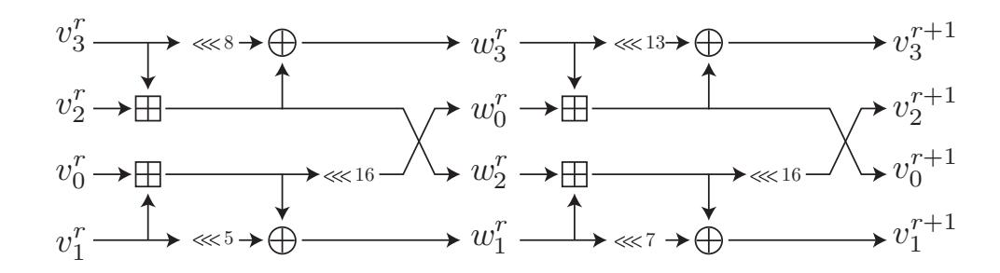

<span id="page-17-1"></span>Fig. 7. The round function of Chaskey.

partitions can be constructed by guessing 5 bit of key information. The tuples as in Equation 3 can be defined by  $\Gamma_{\text{out}}^{(p_i)} \in \{([],[i],[]),([],[i,i-1],[])\}$ , and the corresponding linear mask  $\gamma^{(p_i)}$  involves the bits

$$y_2[i_a], y_0[i_b], y_1[i_b], y_1[i_b-1], y_1[i_b-2], y_0[i_c], y_1[i_c], y_1[i_c-1], y_1[i_c-2]$$
.

When  $i_a - 2$ ,  $i_b - 2$ , and  $i_c - 2$  is not extremely close to 0, for each possible choice of  $\Gamma \in \{([],[i],[]),([],[i,i-1],[])\}$ , we have 4 tuples corresponding to correlation  $\varepsilon = \pm 1$ , 8 tuples corresponding to correlation  $\varepsilon = \pm 2^{-1}$ , and 12 tuples corresponding to correlation  $\varepsilon = \pm 2^{-0.263}$ . In other words, a fraction of 24/32 = 3/4 tuples with non-zero correlation is available, and the average absolute correlation is  $(4 \times 1) + (8 \times 2^{-1}) + (12 \times 2^{-0.263}) \approx 2^{-0.415}$ . The choice of the tuples with the corresponding correlations is summarized in Supplementary Matrial B and was obtained experimentally.

#### <span id="page-17-0"></span>5 Application to Chaskey

Chaskey [24] is a lightweight MAC algorithm whose underlying primitive is an ARX-based permutation in an Even-Mansour construction, i.e., Chaskey-EM. The permutation operates on four 32-bit words and employs 12 rounds of the form as depicted in Fig. 7. The designers' claim security up to  $2^{80}$  computations as long as the data is limited to  $2^{48}$  blocks.

#### <span id="page-17-2"></span>5.1 Overview of Our Attack

We first show the high-level overview of our attack. Similarly to the previous differential-linear attack from [20], we first divide the cipher into three sub ciphers, i.e,  $E_1$  covering 1.5 rounds,  $E_m$  covering 4 rounds, and  $E_2$  covering 0.5 rounds. The key-recovery is done over 1 round, thus the function F is covering 1 round to attack 7 rounds in total. The differential characteristic and the linear trail are applied to  $E_1$  and  $E_2$ , respectively, while the experimental differential-linear distinguisher is applied to the middle part  $E_m$ . Note that, since the differential-linear distinguisher over  $E_m$  is constructed experimentally, its correlation must be high enough to be detectable by using a relatively small

{18}------------------------------------------------

sampling space. Moreover, since it is practically infeasible to check *all* input difference and *all* output linear mask, we restricted ourselves to the case of an input difference of Hamming weight 1 and linear masks of the form [i] or [i, i+1], i.e., 1-bit or consecutive 2-bit linear masks. As a result, when there is a non-zero difference *only* in the 31st bit (msb) of  $w_0^1$ , i.e.,

$$\Delta_m = (([]), ([]), ([31]), ([])),$$

we observed the following two differential-linear distinguishers with correlations  $2^{-5.1}$ :

$$\mathbf{Cor}_{w^1 \in \mathcal{S}} \left[ w_2^5[20] \oplus \tilde{w}_2^5[20] \right] \approx 2^{-5.1} ,$$
 (4)

$$\mathbf{Cor}_{w^1 \in \mathcal{S}} \left[ w_2^5[20] \oplus w_2^5[19] \oplus \tilde{w}_2^5[20] \oplus \tilde{w}_2^5[19] \right] \approx 2^{-5.1}$$
. (5)

These correlations<sup>8</sup> are estimated using a set S consisting of  $2^{26}$  random samples of  $w^1$ . This is significant enough since the standard deviation assuming a normal distribution is  $2^{13}$ . For simplicity, only the first differential-linear distinguisher is exploited in our 7-round attack. That is

$$\Gamma_m = (([]), ([20]), ([]), ([]))$$
.

Note that we do not focus on the theoretical justification of this 4-round experimental differential-linear distinguisher in this paper and we start the analysis for  $E_1$  and  $E_2$  from the following subsection.

#### 5.2 Differential Part

We need to construct a differential distinguisher  $\Delta_{\rm in} \to \Delta_m$  over  $E_1$ , where the output difference is equal to the 1-bit difference  $\Delta_m = (([]), ([]), ([31]), ([]))$ . We have 1.5-round differential characteristic of highest probability under this restriction and its probability is  $2^{-17}$ , where

$$\Delta_{\text{in}} = (([8, 13, 21, 26, 30]), ([8, 18, 21, 30]), ([3, 21, 26]), ([21, 26, 27]))$$
.

If this differential characteristic is directly used in the differential-linear attack, the impact on the data complexity is  $p^{-2}=2^{34}$ , which is quite huge given the restriction on the data complexity for Chaskey. In order to reduce the data complexity, we employ the new technique described in Sect. 3. Note that the previous analysis shown in [20] also employs the same differential characteristic, but the technique for reducing the data complexity is completely different. We will compare our technique to the previous technique at the end of this subsection.

<sup>&</sup>lt;sup>8</sup> The first case is the exactly same as the one shown in [20], but its correlation was reported as  $2^{-6.1}$ . We are not sure the reason of this gap, but we think that  $2^{-6.1}$  refers to the bias instead of the correlation.

{19}------------------------------------------------

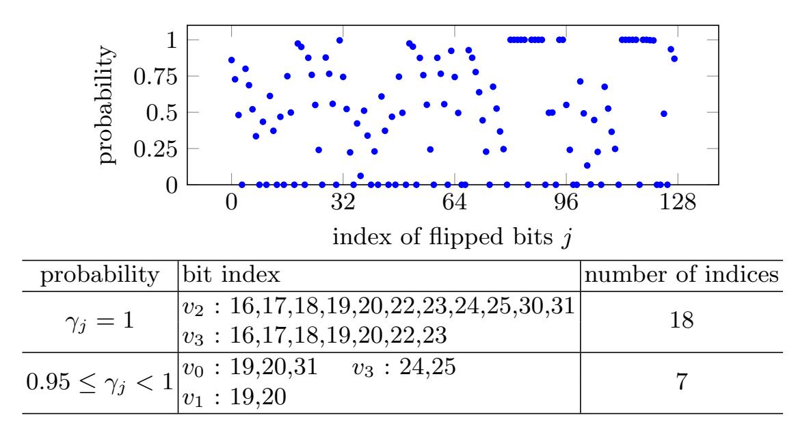

<span id="page-19-0"></span>**Fig. 8.** Probability that flipping  $v_{j/32}^0[j \mod 32]$  affects the output difference.

**Detecting an Appropriate Subspace**  $\mathcal{U}$ . As described in Sect. 3, we want to detect a subspace  $\mathcal{U}$  of the input space such that  $E_1(v^0 \oplus u) \oplus E_1(v^0 \oplus u \oplus \Delta_{in}) = \Delta_m$  for all  $u \in \mathcal{U}$  if  $E_1(v^0) \oplus E_1(v^0 \oplus \Delta_{in}) = \Delta_m$ . Then, for our attack to be effective, the condition is that  $2^{|\dim \mathcal{U}|} > \epsilon r^{-2}q^{-4}$ , where r and q denote the correlation of the differential-linear distinguisher over  $E_m$  and the linear distinguisher over  $E_2$ , respectively. If this condition is satisfied, we can reduce the total data complexity from  $\epsilon p^{-2}r^{-2}q^{-4}$  to  $\epsilon p^{-1}r^{-2}q^{-4}$ .

Since the four branches are properly mixed with each other within 1.5 rounds, there is no trivial subspace as in the simple example in Sect. 3.1. However, the diffusion obtained by the modular addition, XOR and rotation is heavily biased. For example, let us focus on  $v_2^0[31]$ . This bit is independent of the 1.5-round differential trail. Thus, we will experimentally detect bits that do not, or only very rarely, effect the differential trail, as explained in Sect. 3 in Algorithm 1. We used this algorithm with a sampling parameter  $T = 2^{32}$ . Due to the differential probability of  $2^{-17}$ , we find on average  $2^{32} \times 2^{-17} = 2^{15}$  values of X such that  $E_1(X) \oplus E_1(X \oplus \Delta_{in}) = \Delta_m$ .

Fig. 8 summarizes the result of the search. When the basis of the linear subspace  $\mathcal{U}$  is chosen from the 18 indices i corresponding to a probability  $\gamma_i = 1$ , we are exactly in the setting as explained in Sect. 3 and the factor on the data complexity corresponding to the differential part would be  $p^{-1}$ . Unfortunately, 18 indices are not always sufficient to attack 7-round Chaskey. Therefore, we additionally add 7 indices, i.e.,  $v_0[19], v_0[20], v_0[31], v_1[19], v_1[20], v_3[24],$  and  $v_3[25]$  to define the basis of  $\mathcal{U}$ . We then randomly picked 256 pairs  $(X, X \oplus \Delta_{in})$  that result in the output difference  $\Delta_m$  after  $E_1$  and checked for how many of those pairs, the equation  $E_1(X \oplus u) \oplus E_1(X \oplus u \oplus \Delta_{in}) = \Delta_m$  is satisfied for all  $u \in \mathcal{U}$ . As a result, this holds for 222 out of 256 pairs  $(X, X \oplus \Delta_{in})$ . In other words, we can estimate the factor on the data complexity corresponding to the differential part to be  $(p \times 222/256)^{-1}$ .

{20}------------------------------------------------

Comparison with the Technique of Leurent. In [20], Leurent applied the partitioning technique to the same 1.5-round differential characteristic. For applying the partitioning technique, 14 bit of key information need to be guessed and the impact on the data complexity from the differential part was estimated as  $\left(\frac{17496}{2^{23}} \times 2^{10} \times 2^{-2\times 11}\right)^{-1} \approx 2^{20.9}$  in [20]. In contrast, our technique does not need to guess any key bit and the impact on the data complexity from the differential part is estimated as  $(p \times \frac{222}{256})^{-1} \approx 2^{17.2}$  when the size of  $\mathcal{U}$  is  $2^{25}$ .

#### <span id="page-20-0"></span>5.3 Linear Part

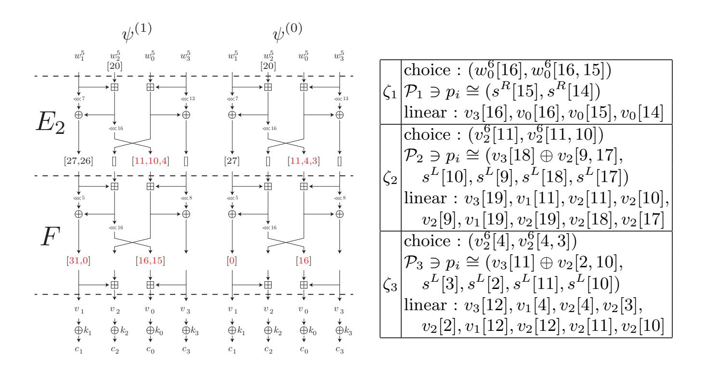

<span id="page-20-1"></span>Fig. 9. Two 0.5-round linear trails and corresponding partition points.

In order to attack 7-round Chaskey, we consider as  $E_2$  0.5-rounds of Chaskey and as F 1.5-rounds of Chaskey. For  $E_2$  we consider two trails for the mask  $\Gamma_m = (([]), ([20]), ([]), ([]))$ , namely

$$\psi^{(1)} = v_2^6[11, 10, 4] \oplus w_1^6[31, 0] \oplus w_0^6[16, 15],$$
  
$$\psi^{(0)} = v_2^6[11, 4, 3] \oplus w_1^6[0] \oplus w_0^6[16].$$

That is computing  $\langle \Gamma_{out}^{p_i}, z \rangle$  corresponds to either  $\psi^{(1)}$  or  $\psi^{(0)}$ 

Similarly, we denote by  $\tilde{\psi}^{(1)}$  and  $\tilde{\psi}^{(0)}$  the corresponding parity bits for  $\tilde{c}$ . As discussed in Sect. 4, our attack uses only one of them (with highest absolute correlation) for each partition. For example, let us assume that  $\psi^{(1)}$  is preferable for the partition belonging to c and  $\psi^{(0)}$  is preferable for the partition belonging to  $\tilde{c}$ . Then, we compute  $\psi^{(1)}$  and  $\tilde{\psi}^{(0)}$  from c and  $\tilde{c}$ , respectively, and evaluate the probability satisfying  $\psi^{(1)} = \tilde{\psi}^{(0)}$ . We experimentally evaluated the correlations

{21}------------------------------------------------

of any combination, i.e., the correlation of  $2 \times 2$  differential-linear distinguishers. Similarly to the experiments in Sect. 5.1, we computed those correlations over a set  $\mathcal{S}$  consisting of random samples of  $w^1$ , but the size of  $\mathcal{S}$  had to be increased to  $2^{28}$  because of the lower correlation. As a result, these empirical correlations are  $\approx \pm 2^{-6.4}$ .

For Chaskey, we use three partition points as shown in the right table of Fig. 9. The dimension of W for the FWHT is increased by 1 but it does not affect the size of partitions. As already presented in Sect. 4 and also summarized in Supplementary Material B, the corresponding subspaces  $\mathcal{P}_1$  can be defined by the bits summarized in Fig. 9, where  $s^L := \bar{v}_1 \oplus v_2$  and  $s^R := \bar{v}_3 \oplus v_0$ . The same table also summarizes the linear bits that can be involved to a linear combination in the corresponding  $\gamma^{(p_1)}$ .

For  $\zeta_2$  and  $\zeta_3$ , the situation is different since we have to evaluate two consecutive modular additions instead of just one. Partitioning rules for that case are summarized in Supplementary Material B. The major difference is that the corresponding subspace is now of dimension 5, i.e., the condition is defined by a 5-bit value. Further, the corresponding  $\varepsilon_i$  are not always  $\pm 1$ .

Note that because there is a 1-bit interception in the defining bits for  $\mathcal{P}_2$  and  $\mathcal{P}_3$ , we have  $n_{\mathcal{P}} = \dim \mathcal{P} = \dim (\mathcal{P}_1 \oplus \mathcal{P}_2 \oplus \mathcal{P}_3) = 2 + 5 + 5 - 1 = 11$ . Namely, the index  $p_i$  of the partition  $\mathcal{T}_{p_i}$  is defined by the 11-bit value

$$(s^{R}[15], s^{R}[14], v_{3}[18] \oplus v_{2}[9, 17], s^{L}[10], s^{L}[9], s^{L}[18], s^{L}[17],$$
  
 $v_{3}[11] \oplus v_{2}[2, 10], s^{L}[3], s^{L}[2], s^{L}[11])$ .

It is difficult to evaluate the actual correlations of all  $q_{i,j}, i, j \in \{1, \dots, 2^{11}\}$  experimentally with a high significance. Therefore, we simply assume that these correlations are common for each partition, i.e.,  $q_{i,j} = 2^{-6.4}$  for all i and j.

Since we have two choices  $\psi^{(0)}$  or  $\psi^{(1)}$  for the linear mask  $\Gamma_{\text{out}}^{(p_i)}$  that we use in each partition, we evaluated every correlation of possible  $\Gamma_{\text{out}}^{(p_i)}$  and took the one with the highest absolute correlation. More precisely, we evaluated each subspace  $\mathcal{P}_i$  step by step. We start our analysis from  $\mathcal{P}_1$ . For this, the condition is based on  $s^R[15]$  and  $s^R[14]$  and the available linear masks can be immediately determined as follows.

$$\begin{cases} \psi^{(1)}, \psi^{(0)} & \text{if } (s^R[15], s^R[14]) = (0, 0) ,\\ \psi^{(0)} & \text{if } (s^R[15], s^R[14]) = (0, 1) ,\\ \psi^{(1)}, \psi^{(0)} & \text{if } (s^R[15], s^R[14]) = (1, 0) ,\\ \psi^{(1)}, & \text{if } (s^R[15], s^R[14]) = (1, 1) . \end{cases}$$

In other words, the number of available linear masks decreases from 2 to 1 for  $2^{10}$  partitions, and the number is preserved for the other  $2^{10}$  partitions. We next focus on  $\mathcal{P}_2$ , but it is more complicated because the index bit  $s^L[10]$  also appears in the index for  $\mathcal{P}_3$ . Since  $\dim(\mathcal{P}_2 \oplus \mathcal{P}_3) = 9$  is not large, we exhaustively evaluated the correlation of each partition. As a result, 1472 out of  $2^{11}$  partitions show a significant correlation and the average of the absolute value of those

{22}------------------------------------------------

correlations is  $2^{-0.779}$ . In the differential-linear attack, this partition analysis must be executed for both texts in each pair. Thus, when N pairs are used, the number of available pairs is  $N^* = N \times (\frac{1472}{2048})^2 \approx N \times 2^{-0.953}$  and the correlation is  $h = 2^{-6.4 - 0.779 \times 2} = 2^{-7.958}$ .

We also need to evaluate the dimension of  $W := \operatorname{Span}\{\gamma^{(p_i)} \oplus \gamma^{(p_j)} \mid i, j \in \{1, \dots, s\}\}$  to evaluate the time complexity for the FWHT. Note that  $\gamma \in W$  is always generated by XORing two linear masks. Therefore, bits that are always set to 1 in the linear masks  $\gamma^{(p_i)}$  and  $\gamma^{(p_j)}$  do not increase the dimension of W. For example, since both  $\psi^{(1)}$  and  $\psi^{(0)}$  involves  $v_1[0]$ , it does not increase the dimension of W. On the other hand, since  $v_1[31]$  is involved only in  $\psi^{(1)}$ , it increases the dimension of W by 1. The same analysis can be applied to each partition point. For example, partition point  $\zeta_1$  involves four bits  $v_3[16]$ ,  $v_0[16]$ ,  $v_0[15]$ , and  $v_0[14]$  in the key mask  $\gamma^{(p_i)}$ , but both  $v_3[16]$  and  $v_0[16]$  are always involved. As a result, the 10 bits

$$v_1[31], v_0[15], v_0[14], v_2[10], v_2[9], v_2[18], v_2[17], v_2[3], v_2[2], v_2[11]$$
 are enough to construct any  $\gamma \in W$ , i.e.,  $\dim(W) \leq 10$ .

Experimental Reports. To verify our technique, we implemented the attack and estimated the experimental correlation if the linear masks are appropriately chosen for each partition. Then, for a right pair  $(X, X \oplus \Delta_{in})$ , we used  $2^{28}$  pairs  $(X \oplus u, X \oplus u \oplus \Delta_{in})$  for  $u \in \mathcal{U}$ . As a result, the number of available pairs is  $2^{27.047}$ , and the number well fits our theoretical estimation. On the other hand, there is a small (but important) gap between our theoretical analysis and experimental analysis. While this correlation was estimated as  $2^{-7.958}$  in our theoretical analysis, the experimental correlation is  $2^{-7.37}$ , which is much higher than our theoretical estimation. We expect that this gap comes from linear-hull effect between  $q_{i,j}$  and  $(\epsilon_i, \epsilon_j)$ . The linear masks  $\lambda^{(0)}$  and  $\lambda^{(1)}$  are fixed in our theoretical estimation, but it allows to use multiple linear masks similarly to the conventional linear-hull effect. Moreover, as a consecutive modular addition causes much higher absolute correlation, we expect that our case also causes much higher absolute correlation. However, its detailed theoretical understanding is left as a open question in this paper.

Data and Time Complexities and Success Probability. We use the formula in Proposition 1 to estimate the data complexity and corresponding success probability. To find a right pair, we repeat Algorithm 2 for  $(p \times 222/256)^{-1} = 2^{17.206}$  times, and we expect to find a right pair with probability 1/2. For each iteration of Algorithm 2, we use  $N = 2^{22}$  pairs, and  $N^* = 2^{21.047}$ . By using the threshold  $\Theta = \sqrt{N^*} \times \Phi^{-1}(1 - \frac{p \times 222/256}{2^n})$ , the expected number of wrong keys is 1, while  $p_{\text{success}} = 0.489$ , where correlation  $p_{\text{success}} = 0.489$ , where correlation  $p_{\text{success}} = 0.489$  and the time complexity is  $p_{\text{success}} = 2^{40.206}$  and the time complexity is  $p_{\text{success}} = 2^{40.206} \times 2^{11} \times (2 \times 2^{22} + 10 \times 2^{10}) \approx 2^{51.208}$ .

<sup>&</sup>lt;sup>9</sup> It means that the success probability is  $0.489 \times 2 = 0.978$  under the condition that the right pair is successfully obtained during  $2^{17.206}$  iterations.

{23}------------------------------------------------

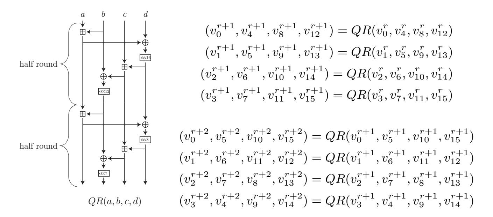

<span id="page-23-0"></span>Fig. 10. The odd and even round functions of ChaCha.

## 6 Application to ChaCha

The internal state of ChaCha is represented by a  $4 \times 4$  matrix whose elements are 32-bit vectors. In this section, the input state for the r-th round function is represented as

$$\begin{pmatrix} v_0^r & v_1^r & v_2^r & v_3^r \\ v_4^r & v_5^r & v_6^r & v_7^r \\ v_8^r & v_9^r & v_{10}^r & v_{11}^r \\ v_{12}^r & v_{13}^r & v_{14}^r & v_{15}^r \end{pmatrix}.$$

In odd and even rounds, the QR function is applied on every column and diagonal, respectively. We also introduce the notion of a *half round*, in which the QR function is divided into two sub function depicted in Fig. 10. Let  $w^r$  be the internal state after the application of a half round on  $v^r$ . Moreover, we use the term *branches* for a, b, c and d, as shown in Fig. 10.

In the initial state of ChaCha, a 128-bit constant is loaded into the first row, a 128- or 256-bit secret key is loaded into the second and third rows, and a 64-bit counter and 64-bit nonce are loaded into the fourth row. In other words, the first three rows in  $v^0$  are fixed. For r-round ChaCha, the odd and even round functions are iteratively applied, and the feed-forward values  $v_i^0 \boxplus v_i^r$  is given as the key stream for all i. Note that we can compute  $v_i^r$  for  $i \in \{0, 1, 2, 3, 12, 13, 14, 15\}$  because corresponding  $v_i^0$  is known.

## 6.1 Overview of Our Attack

We use the same attack strategy as for Chaskey. The cipher is divided into the sub ciphers  $E_1$  covering 1 round,  $E_m$  covering 2.5 rounds, and  $E_2$  covering 1.5 (resp. 2.5) rounds to attack 6 (resp., 7) rounds, and F the key recovery is applied to the last one round. One difference to Chaskey is the domain space

{24}------------------------------------------------

that can be controlled by the attacker. In particular, we cannot control branches a, b, and c because fixed constants and the fixed secret key is loaded into these states. Thus, only branch d can be varied. It implies that active bit positions for input differences are limited to branch d and a difference  $\Delta_m$  after  $E_1$  with Hamming weight is 1 will not be available due to the property of the round function. Therefore, we first need to generate consistent  $\Delta_m$  whose Hamming weight is minimized. The following shows such differential characteristics over one QR function.

$$\Delta_{in} = (([]), ([]), ([]), ([i])) \rightarrow \Delta_m = (([i+28]), ([i+31, i+23, i+11, i+3]), ([i+24, i+16, i+4]), ([i+24, i+4]))$$

The probability that pairs with input difference  $\Delta_{\rm in}$  satisfy this characteristic is  $2^{-5}$  on average. We discuss the properties of this differential characteristic in Sect. 6.2 in more detail.

We next evaluate an experimental differential-linear distinguisher for the middle part  $E_m$ . When the Hamming weight of  $\Gamma_m$  is 1 and the active bit is in the lsb, it allows the correlation of linear trails for  $E_2$  to be lower. For i = 6, i.e.,  $\Delta_m = (([2]), ([5, 29, 17, 9]), ([30, 22, 10]), ([30, 10]))$ , we find the following four differential-linear distinguishers.

$$\Delta(v_j^1, v_{j+4}^1, v_{j+8}^1, v_{j+12}^1) = \Delta_m \to \mathbf{Cor}[w_{(j+1) \bmod 4}^3[0] \oplus \tilde{w}_{(j+1) \bmod 4}^3[0]] = 2^{-8.3},$$

for  $j \in \{0, 1, 2, 3\}$ . When this experimental distinguisher is combined with the differential characteristic for  $E_1$ , it covers 3.5 rounds with a 1-bit output linear mask  $\Gamma_m$ . This differential-linear distinguisher is improved by 0.5 rounds from the previous distinguisher with 1-bit output linear mask (see [1,11]).

#### <span id="page-24-0"></span>6.2 Differential Part

The QR function is independently applied to each column in the first round. Therefore, when the output difference of one QR function is restricted by  $\Delta_m$ , the input of other three QR functions are trivially independent of the output difference. It implies that we have 96 independent bits, and we can easily amplify the probability of the differential-linear distinguisher. On the other hand, we face a different problem, namely that the probability of the differential characteristic  $(\Delta_{in}, \Delta_m)$  highly depends on the value of the secret key. For example, for  $\Delta v_{12}^0[6] = 1$ , we expect that there is a pair  $(v_{12}^0, v_{12}^0 \oplus 0x00000020)$  satisfying  $\Delta(v_0^1, v_4^1, v_8^1, v_{12}^1) = \Delta_m$ , but it depends on the constant  $v_0^0$  and the key values  $v_4^0$  and  $v_8^0$ . In our experiments, we cannot find such a pair for 292 out of 1024 randomly generated keys. On the other hand, when we can find it, i.e., on 732 out of 1024 keys, the average probability satisfying  $\Delta(v_0^1, v_4^1, v_8^1, v_{12}^1) = \Delta_m$  is  $2^{-4.5}$ . This experiment implies the existence of "strong keys" against our attack. However, note that we can vary the columns in which we put a difference, which involve different key values. Since the fraction of "strong keys" is not so high, i.e., 292/1024, we can assume that there is at least one column in which no "strong key" is chosen with very high probability.

{25}------------------------------------------------

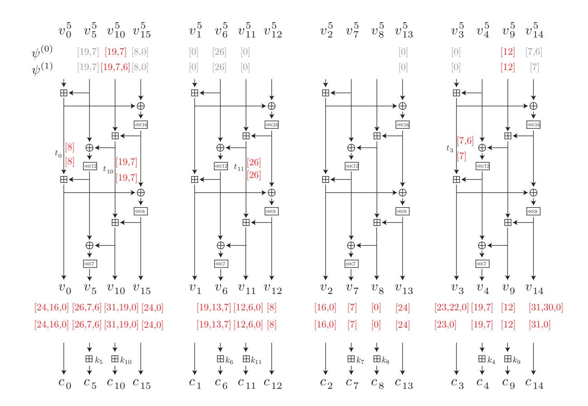

<span id="page-25-1"></span>Fig. 11. Key recovery for 6-round ChaCha.

To determine the factor p, for 1024 randomly generated keys, we evaluated  $p^{-1}$  randomly chosen iv and counter, where the branch that we induce the difference is also randomly chosen. As a result, we can find a right pair on 587 keys with  $p^{-1} = 2^5$  iterations. Therefore, with  $p = 2^{-5}$ , we assume that we can find a right pair with probability 1/2 in this stage of the attack.

In the following, we explain our attack for the case that  $v_{12}^0$  is active and  $\Delta(v_0^1, v_4^1, v_8^1, v_{12}^1) = \Delta_m$ . Note that the analysis for the other three cases follows the same argument.

#### <span id="page-25-0"></span>6.3 Linear Part for 6-Round Attack

To attack 6-round ChaCha, we first construct a 5-round differential-linear distinguisher, where 1.5-round linear trails are appended (i.e. the  $E_2$  part) to the 3.5-round experimental differential-linear distinguisher from the previous section. We have two 1.5-round linear trails given by

$$\begin{aligned} \mathbf{Cor}[w_1^3[0] \oplus \psi^{(1)}] &= 2^{-1} \;, \qquad \mathbf{Cor}[w_1^3[0] \oplus \psi^{(0)}] = -2^{-1} \;, \\ \text{where } \psi^{(1)} &= \psi \oplus v_{10}^5[6] \text{ and } \psi^{(0)} &= \psi \oplus v_{14}^5[6], \text{ and} \\ \psi &= (v_5^5[19,7] \oplus v_{10}^5[19,7] \oplus v_{15}^5[8,0]) \oplus (v_1^5[0] \oplus v_6^5[26] \oplus v_{11}^5[0]) \\ &\oplus (v_{13}^5[0]) \oplus (v_3^5[0] \oplus v_9^5[12] \oplus v_{14}^5[7]) \;. \end{aligned}$$

Figure 14 shows the two 1.5-round linear trails. Since their correlations are  $\pm 2^{-1}$ , we have  $2 \times 2$  differential-linear distinguishers on 5 rounds whose correlations

{26}------------------------------------------------

are  $\pm 2^{-10.3}$ . Note that the sign of each correlation is deterministic according to the output linear mask.

Our 6-round attack uses these 5-round differential-linear distinguishers, and the 1-round key recovery is shown in Fig. 11. Let  $\mathbf{c} = (c_0, \dots, c_{15})$  be the corresponding output, and let  $\mathbf{v} = (v_0, \dots, v_{15})$  be the sixteen 32-bit values before the secret key is added. Note that the secret key is only added with half of the state and public values are added with the other state. Therefore, we simply regard  $v_i = c_i$  for  $i \in \{0, 15, 1, 12, 2, 13, 3, 14\}$ .

First, we partially extend two linear masks for the last round so that it can be linearly computed. Fig. 11 summarizes the extended linear masks, where we need to compute the bits labeled by a red color. Moreover, for simplicity, we introduce  $t_0$ ,  $t_{10}$ ,  $t_{11}$ , and  $t_3$  as depicted in Fig. 11.

Each bit in v in which the secret key is not added can be computed for free. For the other bits, we need to guess some key bits first. We first explain the simple case, i.e., we compute  $v_i[j]$  from  $c_i$ . As an example, we focus on  $v_7[7]$ , which involves  $k_7$  nonlinearly. We apply the partition technique to compute this bit, where (3/4) data is available by guessing  $k_7[6]$  and  $k_7[5]$  (remember that  $k_7[7]$  cancels out in the differential-linear approximation). Since  $v_i[0]$  is linearly computed by  $c_i[0]$ , there are 13 simple partition points in which we need to guess key bits. In total, we need to guess a 26-bit key and  $(3/4)^{13}$  data is available.

Computing bits in  $v^5$  and t is a bit more complicated than the simple case above. For example, let us consider  $v_9^5[12]$ , and this bit can be computed as

$$v_9^5[12] = (c_9 \boxminus k_9 \boxminus c_{14} \boxminus (c_3 \oplus (v_{14} \ggg 8)))[12]$$
  
=  $((c_9 \boxminus c_{14} \boxminus (c_3 \oplus (v_{14} \ggg 8))) \boxminus k_9)[12].$ 

Since we can compute  $(c_9 \boxminus c_{14} \boxminus (c_3 \oplus (v_{14} \ggg 8)))$  for free, this case is equivalent to the simple case. We also use this equivalent transformation for  $t_{10}$ ,  $t_{11}$ , and  $v_{10}[19]$ . In total, we have 6 such partition points, and some partition points can share the same key, e.g., 2-bit key  $k_{10}[18]$  and  $k_{10}[17]$  is already guessed to compute  $v_{10}[19]$ . Guessing 4 bits of additional key is enough to compute each bit. Since we have two linear masks  $\psi^{(0)}$  and  $\psi^{(1)}$ , the number of available partitions does not decrease for  $v_{10}^5[7]/v_{10}^5[7,6]$ . Therefore,  $(3/4)^5$  data is available.

We cannot use the equivalent transformation to compute bits in  $t_0$  and  $t_3$ . Then, we further extend this linear mask with correlation  $2^{-1}$ . For example, we have the following approximations

$$t_0[8] \approx v_0[8,7] \oplus v_5[15] \oplus v_{10}[8] \oplus 1, \quad t_0[8] \approx v_0[8] \oplus v_5[15,14] \oplus v_{10}[8,7],$$

for  $t_0[8]$  with correlation  $2^{-1}$ , and we can use preferable approximations depending on the data. Namely, we first guess  $k_{10}[7]$  and determine which linear approximations are available. Then, we guess  $k_5[14]$  and  $k_5[13]$  and compute  $v_5[15]$  (resp.  $v_5[15,14]$ ) with the fraction of available partitions 3/4. In order words, we guess 3-bit key and 3/4 data is available. We also use the same technique for  $t_0[7]/t_0[7,6]$ . Therefore, 6-bit additional key is required,  $(3/4)^2$  data is available, but the correlation is  $\pm 2^{-10.3-2\times2} = \pm 2^{-14.3}$ .

{27}------------------------------------------------

In summary, the fraction of available partitions is  $(3/4)^{13+5+2} \approx 2^{-8.3}$ . We need to guess 36-bit key in total.

We finally estimate the data and time complexities. When we use N pairs, the number of available pairs is  $N^* = N \times 2^{2 \times -8.3} \approx N2^{-16.6}$ , and the average correlation is  $\pm 2^{-14.3}$ . Note that unlike Chaskey, once these key bits are correctly guessed, all linearly involved bits are either determined or cancelled out by XORing another text. It implies  $\dim(W) = 0$  and we do not need to proceed with the FWHT.

Data and Time Complexities and Success Probability. We use the formula in Proposition 1 to estimate the data complexity and corresponding success probability. To find a right pair, we repeat Algorithm 2 for  $2^5$  times. For each pair, we use  $N=2^{52}$  pairs, and  $N^*=2^{35.4}$ . For the threshold  $\Theta=\sqrt{N^*}\times \Phi^{-1}(1-\frac{2^{-5}}{2^{36}})$ , the expected number of wrong keys is 1, but  $p_{\text{success}}=0.499$ . For this success probability, the data complexity is  $2^{1+52+5}=2^{58}$ .

If we guess  $2^{36}$  keys for each texts, the required time complexity is  $2^{58+36} = 2^{94}$ . However, note that once we get a pair, we can immediately compute those  $k_{\mathcal{P}}$  values that correspond to valid partitions. Consequently, we only iterate through those  $k_{\mathcal{P}}$  values for every pair. The time complexity is estimated as  $1/p \times (2N + 2N^* \times 2^{n_{\mathcal{P}}}) \approx 2^{77.4}$ .

#### <span id="page-27-0"></span>6.4 The 7-Round Attack

Unfortunately, 7-round ChaCha is too complicated to apply our technique for the linear part. On the other hand, thanks to our other contribution for the differential part, we find a new differential-linear distinguisher which is improved by 0.5 rounds. Therefore, to confirm the effect of our contribution for the differential part, we use the known technique, i.e., the probabilistic neutral bits (PNB) approach, for the key-recovery attack against 7-round ChaCha. The PNB-based key recovery is a fully experimental approach. We refer to [1] for the details and simply summarize the technique as follows:

- Let the correlation in the forward direction (a.k.a, differential-linear distinguisher) after r rounds be  $\epsilon_d$ .
- Let n be the number of PNBs given by a correlation  $\gamma$ . Namely, even if we flip one bit in PNBs, we still observe correlation  $\gamma$ .
- Let the correlation in the backward direction, where all PNB bits are fixed to 0 and non-PNB bits are fixed to the correct ones, is  $\epsilon_a$ .

Then, the time complexity of the attack is estimated as  $2^{256-n}N+2^{256-\alpha}$ , where the data complexity N is given as

$$N = \left(\frac{\sqrt{\alpha \log(4)} + 3\sqrt{1 - \epsilon_a^2 \epsilon_d^2}}{\epsilon_a \epsilon_d}\right)^2$$

Note that it means that the success probability is  $0.499 \times 2 = 0.999$  under the condition that the right pair is successfully obtained during  $2^7$  iterations.

{28}------------------------------------------------

where  $\alpha$  is a parameter that the attacker can choose.

In our case, we use a 4-round differential-linear distinguisher with correlation  $\epsilon_d = 2^{-8.3}$ . Under pairs generated by the technique shown in 6.2, we experimentally estimated the PNBs. With  $\gamma = 0.35$ , we found 74 PNBs, and its correlation  $\epsilon_a = 2^{-10.6769}$ . Then, with  $\alpha = 36$ , we have  $N = 2^{43.83}$  and the time complexity is  $2^{225.86}$ . Again, since we need to repeat this procedure  $p^{-1}$  times, the data and time complexity is  $2^{48.83}$  and  $2^{230.86}$ , respectively.

#### 7 Conclusion and Future Work

We presented new ideas for differential-linear attacks and in particular the best attacks on ChaCha, one of the most important ciphers in practice. We hope that our framework finds more applications. In particular, we think that it is a promising future work to investigate other ARX designs with respect to our ideas.

Besides the plain application of our framework to more primitives, our work raises several more fundamental questions. As explained in the experimental verification, we sometimes observe absolute correlations that are higher than expected, which in turn make the attacks more efficient than estimated. Explaining those deviations from theory, likely to be caused by linear-hull effects, is an interesting question to tackle. Related to this, we feel that – despite interesting results initiated by [25] – the impact of dependent chains of modular additions on the correlations is not understood sufficiently well and requires further study.

Finally, we see some possible improvements to our framework. First, it might be beneficial to use multiple linear mask per partition, while we used only one in our applications. This of course rises the question of independence, but maybe a multidimensional approach along the lines of [16] might be possible. Second, one might improve the results further if the estimated values for  $\beta(\gamma)$  are replaced by a weighted sum, where partitions and masks with higher correlations are given more weight than partitions and masks with a comparable low correlation.

Acknowledgments. We thank the anonymous reviewers for their detailed and helpful comments. We further thank Lukas Stennes for checking the application of our framework to ChaCha in a first version of this paper. This work was funded by *Deutsche Forschungsgemeinschaft (DFG)*, project number 411879806 and by DFG under Germany's Excellence Strategy - EXC 2092 CASA - 390781972.

#### References

- <span id="page-28-1"></span>1. Aumasson, J., Fischer, S., Khazaei, S., Meier, W., Rechberger, C.: New features of latin dances: Analysis of Salsa, ChaCha, and Rumba. In: Nyberg, K. (ed.) FSE 2008, Revised Selected Papers. LNCS, vol. 5086, pp. 470–488. Springer (2008)
- <span id="page-28-0"></span>2. Aumasson, J.P., Henzen, L., Meier, W., Phan, R.C.W.: SHA-3 proposal Blake. Submission to NIST (2008)

{29}------------------------------------------------

- <span id="page-29-2"></span>3. Aumasson, J., Neves, S., Wilcox-O'Hearn, Z., Winnerlein, C.: BLAKE2: simpler, smaller, fast as MD5. In: Jr., M.J.J., Locasto, M.E., Mohassel, P., Safavi-Naini, R. (eds.) ACNS 2013, Proceedings. LNCS, vol. 7954, pp. 119–135. Springer (2013)
- <span id="page-29-15"></span>4. Bar-On, A., Dunkelman, O., Keller, N., Weizman, A.: DLCT: A new tool for differential-linear cryptanalysis. In: Ishai, Y., Rijmen, V. (eds.) EUROCRYPT 2019, Proceedings, Part I. LNCS, vol. 11476, pp. 313–342. Springer (2019)
- <span id="page-29-4"></span>5. Beierle, C., Biryukov, A., dos Santos, L.C., Großsch¨adl, J., Perrin, L., Udovenko, A., Velichkov, V., Wang, Q.: Schwaemm and Esch: Lightweight authenticated encryption and hashing using the Sparkle permutation family. Submission to NIST Lightweight Cryptography Standardization Process, Round 2 Candidate (2019)
- <span id="page-29-1"></span>6. Bernstein, D.J.: ChaCha, a variant of Salsa20 (2008), [http://cr.yp.to/chacha.](http://cr.yp.to/chacha.html) [html](http://cr.yp.to/chacha.html)
- <span id="page-29-0"></span>7. Bernstein, D.J.: The Salsa20 family of stream ciphers. In: Robshaw, M.J.B., Billet, O. (eds.) New Stream Cipher Designs - The eSTREAM Finalists, LNCS, vol. 4986, pp. 84–97. Springer (2008)
- <span id="page-29-12"></span>8. Biham, E., Carmeli, Y.: An improvement of linear cryptanalysis with addition operations with applications to FEAL-8X. In: Joux, A., Youssef, A.M. (eds.) SAC 2014, Revised Selected Papers. LNCS, vol. 8781, pp. 59–76. Springer (2014)
- <span id="page-29-7"></span>9. Biham, E., Shamir, A.: Differential cryptanalysis of des-like cryptosystems. In: Menezes, A., Vanstone, S.A. (eds.) CRYPTO '90, Proceedings. LNCS, vol. 537, pp. 2–21. Springer (1990)
- <span id="page-29-16"></span>10. Carlet, C.: Boolean Functions for Cryptography and Error Correcting Codes. In: Crama, Y., Hammer, P. (eds.) Boolean Methods and Models. Cambridge University Press (2007)
- <span id="page-29-10"></span>11. Choudhuri, A.R., Maitra, S.: Significantly improved multi-bit differentials for reduced round Salsa and ChaCha. IACR Trans. Symmetric Cryptol. 2016(2), 261– 287 (2016)
- <span id="page-29-13"></span>12. Collard, B., Standaert, F., Quisquater, J.: Improving the time complexity of matsui's linear cryptanalysis. In: Nam, K., Rhee, G. (eds.) ICISC 2007, Proceedings. LNCS, vol. 4817, pp. 77–88. Springer (2007)
- <span id="page-29-14"></span>13. Coutinho, M., Neto, T.C.S.: New multi-bit differentials to improve attacks against chacha. IACR Cryptol. ePrint Arch. 2020, 350 (2020), [https://eprint.iacr.](https://eprint.iacr.org/2020/350) [org/2020/350](https://eprint.iacr.org/2020/350)
- <span id="page-29-11"></span>14. Dey, S., Sarkar, S.: Improved analysis for reduced round Salsa and Chacha. Discrete Applied Mathematics 227, 58–69 (2017)
- <span id="page-29-3"></span>15. Dinu, D., Perrin, L., Udovenko, A., Velichkov, V., Großsch¨adl, J., Biryukov, A.: Design strategies for ARX with provable bounds: Sparx and LAX. In: Cheon, J.H., Takagi, T. (eds.) ASIACRYPT 2016, Proceedings, Part I. LNCS, vol. 10031, pp. 484–513 (2016)
- <span id="page-29-17"></span>16. Hermelin, M., Cho, J.Y., Nyberg, K.: Multidimensional linear cryptanalysis. J. Cryptology 32(1), 1–34 (2019)
- <span id="page-29-6"></span>17. Khovratovich, D., Nikolic, I.: Rotational cryptanalysis of ARX. In: Hong, S., Iwata, T. (eds.) FSE 2010, Revised Selected Papers. LNCS, vol. 6147, pp. 333– 346. Springer (2010)
- <span id="page-29-5"></span>18. Knudsen, L.R., Wagner, D.A.: Integral cryptanalysis. In: Daemen, J., Rijmen, V. (eds.) FSE 2002, Revised Papers. LNCS, vol. 2365, pp. 112–127. Springer (2002)
- <span id="page-29-8"></span>19. Langford, S.K., Hellman, M.E.: Differential-linear cryptanalysis. In: Desmedt, Y. (ed.) CRYPTO '94, Proceedings. LNCS, vol. 839, pp. 17–25. Springer (1994)
- <span id="page-29-9"></span>20. Leurent, G.: Improved differential-linear cryptanalysis of 7-round chaskey with partitioning. In: Fischlin, M., Coron, J. (eds.) EUROCRYPT 2016, Proceedings, Part I. LNCS, vol. 9665, pp. 344–371. Springer (2016)

{30}------------------------------------------------

- <span id="page-30-4"></span>21. Lipmaa, H., Moriai, S.: Efficient algorithms for computing differential properties of addition. In: Matsui, M. (ed.) FSE 2001, Revised Papers. LNCS, vol. 2355, pp. 336–350. Springer (2001)
- <span id="page-30-7"></span>22. Maitra, S.: Chosen IV cryptanalysis on reduced round chacha and salsa. Discrete Applied Mathematics 208, 88–97 (2016)
- <span id="page-30-3"></span>23. Matsui, M.: Linear cryptanalysis method for DES cipher. In: Helleseth, T. (ed.) EUROCRYPT '93, Proceedings. LNCS, vol. 765, pp. 386–397. Springer (1993)
- <span id="page-30-1"></span>24. Mouha, N., Mennink, B., Herrewege, A.V., Watanabe, D., Preneel, B., Verbauwhede, I.: Chaskey: An efficient MAC algorithm for 32-bit microcontrollers. In: Joux, A., Youssef, A.M. (eds.) SAC 2014, Revised Selected Papers. LNCS, vol. 8781, pp. 306–323. Springer (2014)
- <span id="page-30-8"></span>25. Nyberg, K., Wall´en, J.: Improved linear distinguishers for SNOW 2.0. In: Robshaw, M.J.B. (ed.) FSE 2006, Revised Selected Papers. LNCS, vol. 4047, pp. 144–162. Springer (2006)
- <span id="page-30-6"></span>26. Shi, Z., Zhang, B., Feng, D., Wu, W.: Improved key recovery attacks on reducedround Salsa20 and ChaCha. In: Kwon, T., Lee, M., Kwon, D. (eds.) ICISC 2012, Revised Selected Papers. LNCS, vol. 7839, pp. 337–351. Springer (2012)
- <span id="page-30-0"></span>27. Shimizu, A., Miyaguchi, S.: Fast data encipherment algorithm FEAL. In: Chaum, D., Price, W.L. (eds.) EUROCRYPT '87, Proceedings. LNCS, vol. 304, pp. 267– 278. Springer (1987)
- <span id="page-30-2"></span>28. Todo, Y., Leander, G., Sasaki, Y.: Nonlinear invariant attack - practical attack on full SCREAM, iSCREAM, and Midori64. In: Cheon, J.H., Takagi, T. (eds.) ASIACRYPT 2016, Proceedings, Part II. LNCS, vol. 10032, pp. 3–33 (2016)
- <span id="page-30-5"></span>29. Wall´en, J.: Linear approximations of addition modulo 2n. In: Johansson, T. (ed.) FSE 2003, Revised Papers. LNCS, vol. 2887, pp. 261–273. Springer (2003)

{31}------------------------------------------------

## Supplementary Material

## <span id="page-31-0"></span>A Proof of Lemma

Below, we restate Lemma 3 and provide the proof for completeness.

**Lemma 3.** Let  $i \geq 2$  and let  $S_3 = \{(x_1, x_0) \in \mathbb{F}_2^{2m} \mid x_0[i-1] = x_1[i-1]\}$  and  $S_4 = \{(x_1, x_0) \in \mathbb{F}_2^{2m} \mid x_0[i-1] \neq x_1[i-1] \text{ and } x_0[i-2] \neq x_1[i-2]\}.$  Then,

$$z_0[i] \oplus z_0[i-1] = \begin{cases} y_0[i] \oplus y_1[i] & \text{if } (y_1, y_0) \in \mathcal{S}_3 ,\\ y_0[i] \oplus y_1[i] \oplus y_0[i-1] \oplus y_0[i-2] \oplus 1 & \text{if } (y_1, y_0) \in \mathcal{S}_4 . \end{cases}$$

*Proof.* By evaluating the modular addition  $y_0 = z_0 + y_1$ , we have

$$z_0[i] \oplus z_0[i-1] = y_0[i] \oplus y_1[i] \oplus y_0[i-1] \oplus y_1[i-1] \oplus c[i-1] \oplus c[i-2]$$
,

where c[i-1], resp., c[i-2] denotes the carry occurring at bit position i-1, resp. i-2. Let us first assume that  $(y_1, y_0) \in \mathcal{S}_3$ , i.e.,  $y_0[i-1] = y_1[i-1]$ . Then, clearly

$$z_0[i] \oplus z_0[i-1] = y_0[i] \oplus y_1[i] \oplus c[i-1] \oplus c[i-2]$$
.

From  $y_0[i-1] = y_1[i-1]$  it futher follows that c[i-1] = c[i-2] and we obtain the first equality. Let us now assume that  $y_0[i-1] \neq y_1[i-1]$ . Then,

$$z_0[i] \oplus z_0[i-1] = y_0[i] \oplus y_1[i] \oplus 1 \oplus c[i-1] \oplus c[i-2]$$
.

For the carry bit at position i-1 it holds that  $c[i-1]=y_1[i-1]$  because of the condition  $y_0[i-1] \neq y_1[i-1]$ . If we further assume  $y_0[i-2] \neq y_1[i-2]$ , we similarly obtain  $c[i-2]=y_1[i-2]$ . Thus, we finally obtain

$$z_{0}[i] \oplus z_{0}[i-1] = y_{0}[i] \oplus y_{1}[i] \oplus 1 \oplus y_{1}[i-1] \oplus y_{1}[i-2]$$
$$= y_{0}[i] \oplus y_{1}[i] \oplus 1 \oplus y_{0}[i-1] \oplus 1 \oplus y_{0}[i-2] \oplus 1$$
$$= y_{0}[i] \oplus y_{1}[i] \oplus y_{0}[i-1] \oplus y_{0}[i-2] \oplus 1.$$

{32}------------------------------------------------

## <span id="page-32-0"></span>B Summary of Partitioning

We summarize various partition rules for modular addition. Note that we can verify the correlation of each case experimentally because they have very high correlation.

#### **B.1** Single Modular Addition

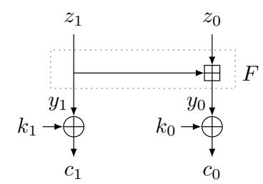

| p  |               | $z_0[i]$                  | $z_0[i,i-1]$  |                           |  |
|----|---------------|---------------------------|---------------|---------------------------|--|
|    | $\max \gamma$ | correlation $\varepsilon$ | mask $\gamma$ | correlation $\varepsilon$ |  |
| 00 | 1110          | -1                        | 1111          | -1                        |  |
| 01 | 1110          | -1                        | _             | 0                         |  |
| 10 | 1101          | -1                        | 1100          | 1                         |  |
| 11 | _             | 0                         | 1100          | 1                         |  |

<span id="page-32-1"></span>Fig. 12. Partitions for a single modular addition.

Let us consider the most simple case of a single modular addition. We want to compute the parity  $z_0[i]$  and  $z_0[i, i-1]$  from  $c_0$  and  $c_1$  (see Fig. 12). Then, we can identify the elements  $p_i \in \mathcal{P}$  by two-bit values  $p_i \cong b_0 b_1$ , and the whole set is divided into 4 subset as

$$\mathcal{T}_{p_i} = \{ (y_1, y_0) \in (\mathbb{F}_2^n)^2 \mid p_i \cong s[i-1] | | | s[i-2] \},$$

where  $s = \bar{y}_1 \oplus y_0$ . In other words, these partition can be constructed by guessing two bit of key information, i.e.,  $(\bar{k}_1 \oplus k_0)[i-1]$  and  $(\bar{k}_1 \oplus k_0)[i-2]$ . Finally, both parities can be computed as

$$z_0[i] \approx \langle \gamma, y_1[i] || y_0[i] || y_0[i-1] || y_0[i-2] \rangle,$$
  
$$z_0[i] \oplus z_0[i-1] \approx \langle \gamma, y_1[i] || y_0[i] || y_0[i-1] || y_0[i-2] \rangle,$$

where  $\gamma$  and the corresponding correlations are summarized in Fig. 12.

#### **B.2** Two Consecutive Modular Additions

We want to compute the parity  $z_1[i]$  and  $z_1[i, i-1]$  from  $c_2$ ,  $c_1$ , and  $c_0$  (see Fig. 13). Then, we can identify the elements  $p_i \in \mathcal{P}$  by five-bit values  $p_i \cong b_0b_1b_2b_3b_4$ , and the whole set is partitioned into  $2^5$  cosets as

$$\mathcal{T}_{p_i} = \{ (y_2, y_1, y_0) \in (\mathbb{F}_2^n)^3 \mid p_i \cong (y_2[i_a - 1] \oplus y_1[i_b - 2] \oplus y_1[i_c - 2]) \| s[i_b - 1] \| s[i_b - 2] \| s[i_c - 1] \| s[i_c - 2] \} ,$$

{33}------------------------------------------------

where s = ¯y<sup>0</sup> ⊕ y<sup>1</sup> and i<sup>a</sup> = i + a, i<sup>b</sup> = i + b, and i<sup>c</sup> = i + a + b. Both parities can be computed as

```
z1[i] ≈
hγ, y2[ia]ky0[ib]ky1[ib]ky1[ib − 1]ky1[ib − 2]ky0[ic]ky1[ic]ky1[ic − 1]ky1[ic − 2]i ,
z1[i] ⊕ z1[i − 1] ≈
hγ, y2[ia]ky0[ib]ky1[ib]ky1[ib − 1]ky1[ib − 2]ky0[ic]ky1[ic]ky1[ic − 1]ky1[ic − 2]i ,
```

where γ and the corresponding correlations are summarized in Fig. [13.](#page-34-0)

{34}------------------------------------------------

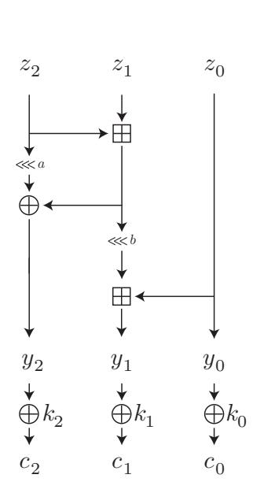

|       |                 | z1[i]         | z1[i, i − 1] |               |  |
|-------|-----------------|---------------|--------------|---------------|--|
| p     | mask γ          | correlation ε | mask γ       | correlation ε |  |
| 00000 | -               | 0             | 111101110    | 1             |  |
|       | 00001 111111110 | −1<br>−2      | 111101110    | −1<br>2       |  |
|       | 00010 111111101 | −1            | -            | 0             |  |
|       | 00011 111111101 | −1<br>−2      | 111101101    | −1<br>−2      |  |
|       | 00100 111111110 | −0.263<br>2   | 111101110    | −0.263<br>2   |  |
| 00101 | -               | 0             | 111101110    | −0.263<br>2   |  |
|       | 00110 111111101 | −0.263<br>−2  | 111101101    | −0.263<br>2   |  |
|       | 00111 111111101 | −0.263<br>−2  | -            | 0             |  |
|       | 01000 111001110 | 1             | -            | 0             |  |
|       | 01001 111001110 | −1<br>2       | 111011110    | −1<br>2       |  |
| 01010 | -               | 0             | 111011101    | 1             |  |
|       | 01011 111001101 | −1<br>−2      | 111011101    | −1<br>2       |  |
|       | 01100 111001110 | −0.263<br>2   | 111011110    | −0.263<br>−2  |  |
|       | 01101 111001110 | −0.263<br>2   | -            | 0             |  |
|       | 01110 111001101 | −0.263<br>2   | 111011101    | −0.263<br>2   |  |
| 01111 | -               | 0             | 111011101    | −0.263<br>2   |  |
|       | 10000 111111110 | −1            | -            | 0             |  |
|       | 10001 111111110 | −1<br>−2      | 111101110    | −1<br>2       |  |
| 10010 | -               | 0             | 111101101    | 1             |  |
|       | 10011 111111101 | −1<br>2       | 111101101    | −1<br>2       |  |
|       | 10100 111111110 | −0.263<br>−2  | 111101110    | −0.263<br>2   |  |
| 10101 | -               | 0             | 111101110    | −0.263<br>2   |  |
|       | 10110 111111101 | −0.263<br>2   | 111101101    | −0.263<br>2   |  |
|       | 10111 111111101 | −0.263<br>2   | -            | 0             |  |
| 11000 | -               | 0             | 111011110    | 1             |  |
|       | 11001 111001110 | −1<br>2       | 111011110    | −1<br>2       |  |
|       | 11010 111001101 | 1             | -            | 0             |  |
|       | 11011 111001101 | −1<br>2       | 111011101    | −1<br>−2      |  |
|       | 11100 111001110 | −0.263<br>2   | 111011110    | −0.263<br>2   |  |
|       | 11101 111001110 | −0.263<br>2   | -            | 0             |  |
|       | 11110 111001101 | −0.263<br>2   | 111011101    | −0.263<br>−2  |  |
| 11111 | -               | 0             | 111011101    | −0.263<br>−2  |  |

<span id="page-34-0"></span>Fig. 13. Partition for two consecutive modular addition.

{35}------------------------------------------------

## C Figures of Linear Trails for ChaCha

## C.1 Two Linear Trails for 1.5-Round ChaCha

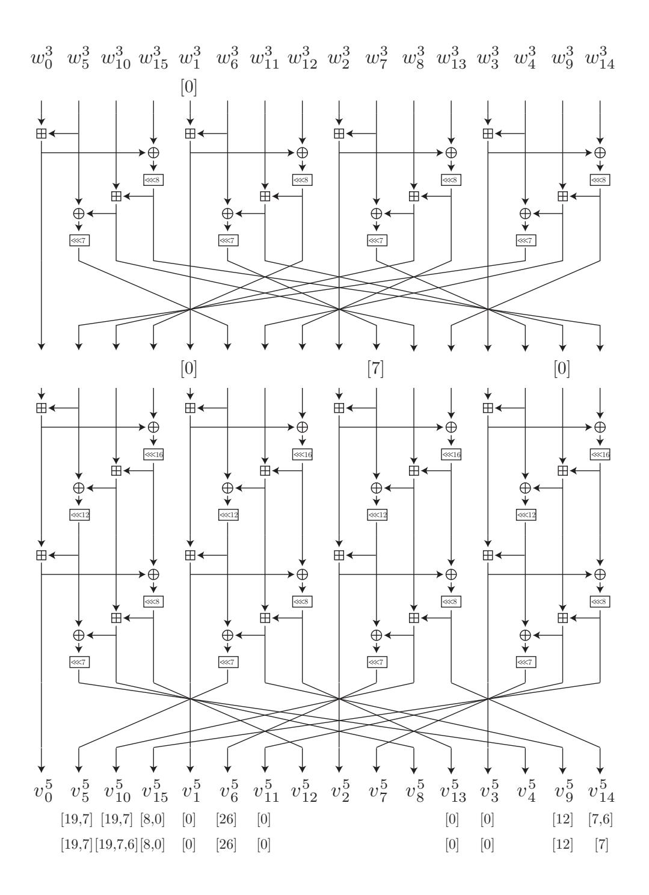

<span id="page-35-0"></span>Fig. 14. Two linear trails for 1.5-round ChaCha.