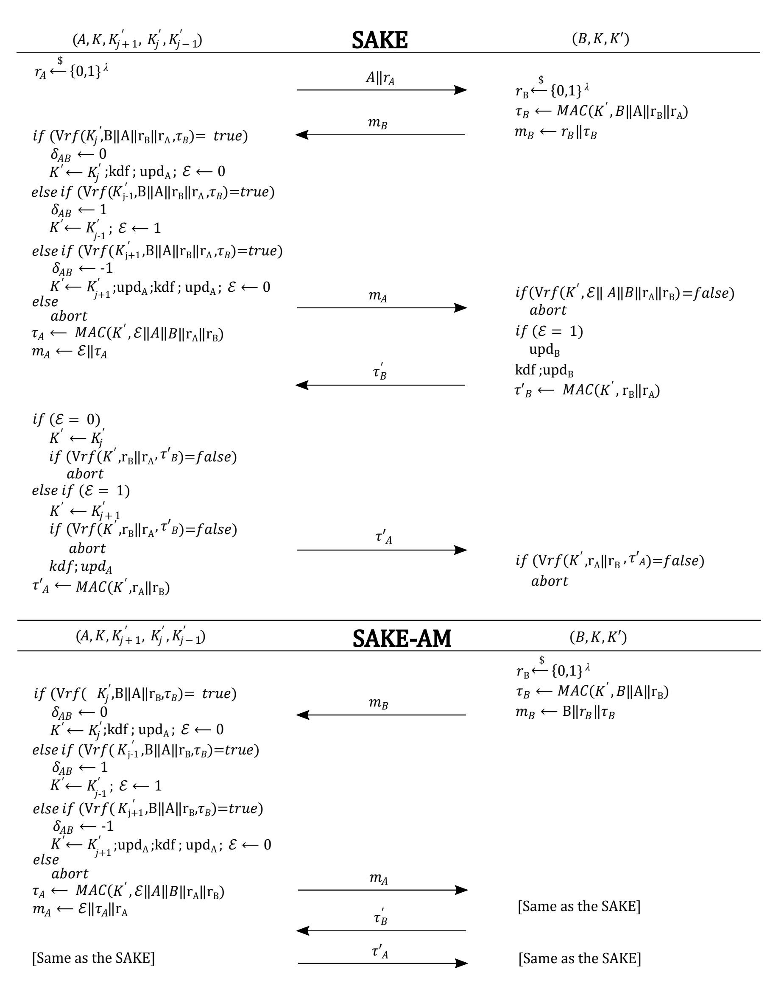
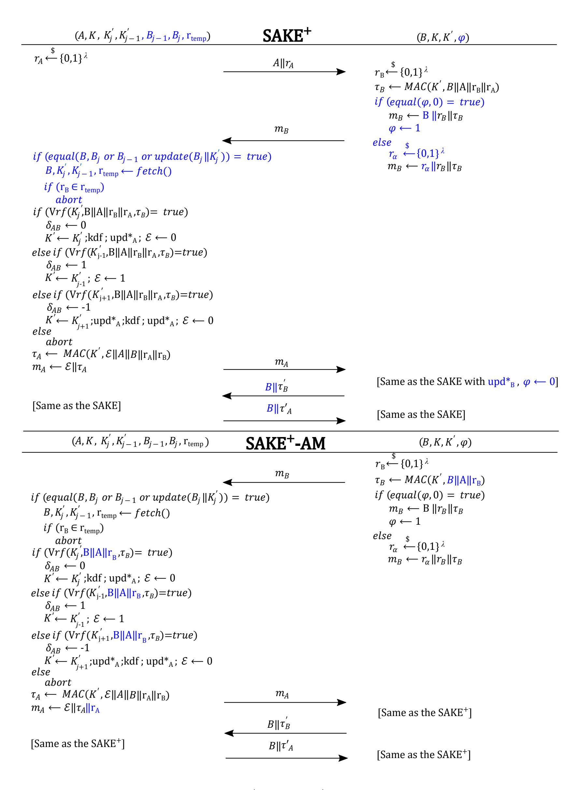

{0}------------------------------------------------

# <span id="page-0-0"></span>SAKE<sup>+</sup>: Strengthened Symmetric-Key Authenticated Key Exchange with Perfect Forward Secrecy for IoT

Seyed Farhad Aghili<sup>1</sup> , Amirhossein Adavoudi Jolfaei<sup>2</sup> and Aysajan Abidin<sup>1</sup>

Abstract. Lightweight authenticated key exchange (AKE) protocols based on symmetrickey cryptography are important in securing the Internet of Things (IoT). However, achieving perfect forward secrecy (PFS) is not trivial for AKE based on symmetric-key cryptography, as opposed to AKE based on public-key cryptography. The most recent proposals that provide PFS are SAKE and SAKE-AM. In this paper, we first take a closer look at these protocols and observe that they have some limitations, specially when deployed in the context of (industrial) IoT. Specifically, we show that if SAKE is used to establish parallel sessions between a server and multiple IoT nodes, then SAKE is susceptible to timeful attack. As for SAKE-AM, we show that an adversary can disrupt the availability by replaying messages from previous protocol sessions. We then propose SAKE<sup>+</sup> that mitigates the timeful attack and that allows for concurrent execution of the protocol. Since traceability is a barrier for an AKE scheme in (industrial) IoT applications and SAKE-AM does not provide untraceability property, we improve upon SAKE-AM and propose SAKE<sup>+</sup>-AM that offers untraceability in addition to mitigating the replay attack. Finally, we prove the security and soundness of our schemes, and verify using a formal verification tool ProVerif.

Keywords: Authenticated key exchange, Forward secrecy, IoT, Symmetric-key crypto.

# 1 Introduction

Key Exchange (KE) is a cryptographic building block that enables two parties to negotiate a shared key securely over an insecure channel. KE protocols are widely used in secure communication protocols, including IPSec, SSH, SSL/TLS, etc., where two parties aim to share a key to securely communicate with each other. The resulted shared key may further be used to provide some cryptographic goals such as authentication, integrity, and confidentiality [\[10\]](#page-19-0). For instance, the shared key could be used in symmetric cryptographic algorithms such as AES, 3DES, etc., (which are embedded in the mentioned protocols, i.e., IPSec, SSH etc.,) to provide confidentiality [\[38\]](#page-20-0). Authenticated key exchange (AKE) schemes are a wide selection of KE protocols in which a user and server authenticate each other and establish a session key that is used for transmitting data securely [\[10,](#page-19-0) [38\]](#page-20-0). The Needham-Schroeder protocol is one of the AKE schemes designed in the earliest publications [\[31\]](#page-20-1). TLS handshake is also the most widely-used

<sup>1</sup> imec-COSIC KU Leuven, Kasteelpark Arenberg 10-bus 2452, 3001 Heverlee, Belgium {seyedfarhad.aghili, aysajan}@kuleuven.be

<sup>2</sup> Department of Computer Engineering, University of Isfahan, Isfahan, Iran a adavoudi@eng.ui.ac.ir

{1}------------------------------------------------

protocol on the Internet, which is an example of AKE protocol [\[5,](#page-19-1) [31\]](#page-20-1). In [\[9\]](#page-19-2), Blake-Wilson, Johnson, and Menezes have identified several major security attributes of an AKE protocol as below.

- known session keys: If an adversary learns the previous session keys, s/he will not compromise the security of the protocol.
- (perfect) forward secrecy (P F S): PFS attribute prevents an adversary who has obtained the current long-term secret key from learning the previous session keys.
- unknown key-share (UKS): Considering this attack, the party A believes that he has shared a key K with the party B, while the party B mistakenly believes that he has shared the key K with another party C; see also [\[10\]](#page-19-0).
- key-compromise impersonation: Let's assume that the adversary ξ has compromised the party A's long-term key (K). It is trivial that ξ can easily impersonate the party A to any other parties using the key K. However, it is not sensible that the adversary ξ masquerades as another party, say B, to establish a valid session with the corrupted party A; see also [\[35\]](#page-20-2).
- loss of information: Comprising any information that is usually not available to an adversary should not impact the security of the protocol.
- message independence: The flows of a protocol run between two honest parties need to be independent of each other per session.

AKE protocols could be designed in various settings, including a two-party, threeparty, asymmetric, symmetric, group key exchange, and password-based settings. The work [\[3\]](#page-19-3), for example, made use of two-party and symmetric settings, while the research paper [\[2\]](#page-19-4) used three-party and symmetric settings. Several studies attempt to achieve PFS among the attributes mentioned above. Researchers tend to take advantage of Diffie-Hellman key agreement (DHKA) schemes to provide PFS, e.g., [\[16,](#page-20-3) [17,](#page-20-4) [36,](#page-20-5) [37\]](#page-20-6); however, these protocols are not suitable for use in lightweight applications. In fact, DHKA schemes use two heavy modular exponentiation operations (or elliptic curve operations), which makes it too heavy for resource-limited devices such as the Internet of Things (IoT), the Industrial Internet of Things (IIoT), the Internet of Medical Things (IoMT), etc. Hence, a few proposed schemes [\[1,](#page-19-5) [3,](#page-19-3) [8,](#page-19-6) [13,](#page-19-7) [20,](#page-20-7) [34\]](#page-20-8) aim at achieving PFS by employing symmetric key settings in which long-term keys (from which the session keys are derived) are modified regularly [\[20\]](#page-20-7). Such schemes based on the regular update of the long-term keys are Key-Evolving Schemes [\[20,](#page-20-7) [21\]](#page-20-9).

In [\[20\]](#page-20-7) the authors state that the symmetric key based AKE protocols are designed in ad hoc fashion, and such protocols are susceptible to several attacks such as desynchronization. Therefore, design of symmetric key based protocols in a systematic way to ensure the security and privacy issues is crucial. Recently, Avoine, Canard, and Ferreira presented two symmetric key based AKE schemes, namely, SAKE and SAKE-AM, to achieve PFS in [\[3\]](#page-19-3). Unlike most of the previous ad hoc designs, SAKE and SAKE-AM are designed in a systematic manner.

{2}------------------------------------------------

Contributions. In this paper we observe that although the SAKE and SAKE-AM offer several key security features, these schemes have some limitations. We then propose improvements to both protocols. Our specific contributions are as follows.

- We demonstrate that although SAKE and SAKE-AM offer several key security features, SAKE is vulnerable to timeful attack in some real world scenarios, and SAKE-AM is to replay attacks that can cause unavailability.
- We propose SAKE+, which not only does inherit the merits of SAKE, including the PFS and mutual authentication, but also mitigates the timeful attack.
- We present SAKE+-AM which mitigates replay attack as well as offers an important privacy feature, i.e., untraceability.
- Our proposed scheme SAKE<sup>+</sup> supports concurrent/parallel protocol execution, while SAKE only allows sequential execution. The concurrency of our scheme makes it more appropriate for IoT applications.
- In addition to formally proving security, we demonstrate the properties, such as, soundness, secrecy, and mutual authentication, of our schemes using ProVerif [\[12\]](#page-19-8).

### 1.1 Related work

Here we discuss the related work concerning the symmetric key based protocols that ensure PFS. Various research studies have used different terms for PFS [\[3,](#page-19-3)[20\]](#page-20-7), including forward security [\[8,](#page-19-6) [13,](#page-19-7) [20,](#page-20-7) [34\]](#page-20-8) and forward secrecy [\[3,](#page-19-3) [13\]](#page-19-7). In [\[3\]](#page-19-3), the authors claim that symmetric key based protocols generally do not ensure security as much as asymmetric key-based protocols do. Particularly, they do not ensure forward secrecy. So far, a few research studies have been conducted with regard to symmetric key based protocols which are discussed in the following. Authors of [\[20\]](#page-20-7) introduced a definition and model for AKE protocols. They presented an algorithm for their model/definition that can be used by automatic verification tools. They proved that their protocol named FOR-SAKES is secure within the model. FORSAKES is unconditionally secure in the random oracle model. The notion of FORSAKES is based on the key-evolving scheme in which the long-term keys of the protocol get updated. The proposed scheme assumes a universal clock that is shared between the parties; however, making such an assumption is strong given that achieving perfect time synchronization, in any context, is complicated in practice. Additionally, the presented scheme has not considered an adversary with the capability to desynchronize the long-term keys between two parties [\[3\]](#page-19-3). The authors left the side channel attack resistance of their protocol as a future work. The presented scheme in [\[8\]](#page-19-6) made use of pseudo-random bit generators as the main cryptographic building block to ensure forward security. A pseudo-random generator is secure if its output is computationally indistinguishable from a random string with the same size. Their scheme provides forward-secure symmetric encryption and forward-secure message authentication. Forward-secure message authentication prevents an adversary, who obtained the key used for message authentication, from compromising future uses of the key and from making the previously authenticated data untrustworthy. However, their scheme has not considered the issue of de-synchronization between two parties [\[3\]](#page-19-3). The 

{3}------------------------------------------------

work [\[34\]](#page-20-8) extended a previous framework for RFID protocols that supports anonymity, authenticity, and availability. This extension attempts to provide forward security when the long-term keys are compromised by an adversary. The new proposed protocols benefited from a pseudo-random bit generator to address the resource-constraint issues by providing a lightweight mechanism. The schemes have been designed in the Universal Composability framework [\[15\]](#page-20-10). To ensure forward security, they assumed that the adversary is able to compromise the activated tag, getting access to keys and memory parameters that are persistent. On the contrary, the server is assumed to be incorruptible. Considering the strong security model where the adversary is capable of corrupting either a tag or a server, the proposed scheme is inherently insecure [\[3\]](#page-19-3). The proposed scheme also did not consider attacks that exploit side-channel vulnerabilities of the tags. Authors of [\[1\]](#page-19-5) posed questions regarding "re-keying" and attempted to answer them. Forward security is one of the benefits gained by re-keying. The authors separated the re-keying process that is dealt with producing sub-keys from the associated application which makes use of these sub-keys. They analyzed different methods of re-keying and their respective applications and demonstrated that re-keying increases the life-time of the master key. However, they did not consider the de-synchronization issue that arises from key-evolving [\[3\]](#page-19-3). Recently, authors of [\[3\]](#page-19-3) proposed a symmetric key based AKE protocol named SAKE that provides PFS for resource-constrained devices. In this protocol, first, an initiator and a server attempt to authenticate each other mutually, and afterward, a session key will be established between them. This protocol makes use of the symmetric-key setting to ensure PFS, whereas many existing schemes use the asymmetric-key setting to do so. However, the resource-constrained devices such as IoT, WSNs, passive RFID tags, and smart cards cannot exploit such schemes since they are too heavy in terms of computation. The authors made several major contributions which makes their scheme distinguishable from their counterparts. In the case of de-synchronization, the parties involved in the protocol can be resynchronized without using a clock or any extra resynchronizing mechanism. The protocol, in fact, benefits from the second chain of master keys to provide synchronization. These master keys provide the tracking the internal state of the protocol and allow resynchronization in case the parties are desynchronized. Moreover, this scheme uses bandwidth efficiently in the sense that it prevents from sending additional data such as large counters. The authors also presented a second scheme called SAKE-AM which is derived from the SAKE protocol. In SAKE-AM, a resource constrained device can be an initiator or a responder. In this case, the end-device does less computation compared to the server.

### 1.2 Relevance

The authors of [\[3\]](#page-19-3) made use of the security model which is based on the model presented in [\[14\]](#page-20-11). This security model [\[14\]](#page-20-11) is considered for the authenticated key exchange protocols that work using the asymmetric methods (e.g., protocols designed based on the DH scheme with signature). Considering this model, the parties can participate in multiple executions of the protocol either sequentially or concurrently/parallelly; however, the designers of the SAKE in [\[3\]](#page-19-3) presented a security model that does not support 

{4}------------------------------------------------

the concurrent/parallel executions in the context of (industrial) IoT. More precisely, their presented model conflicts with the way IoT devices act in the real world environment. For example, the research study [\[34\]](#page-20-8) - discussed in the related work section of the reference [\[3\]](#page-19-3) - states that almost all the RFID systems operate in a concurrent environment. The article [\[34\]](#page-20-8), more precisely, discusses that a tag reader in a commercialized RFID system should be able to simultaneously identify several tag devices. The work [\[30\]](#page-20-12) explains that in an IoT application, hundred or thousands of IoT devices send simultaneously their collected data every few seconds to a server. Hence, a symmetric key based AKE scheme that is resistant to timeful and replay attacks and untraceable, and that allows for concurrent protocol executions is highly relevant.

Outline. We discuss the security of building blocks used in this paper and also list some notation used in the paper's body in Section [2.](#page-4-0) In Section [3,](#page-7-0) we explain the security model used in our proposed protocol. We provide a brief description of the SAKE and SAKE-AM protocols and their security analysis in Sections [4](#page-9-0) and [5,](#page-11-0) respectively. In Section [6](#page-13-0) we present our proposed SAKE<sup>+</sup> and SAKE+-AM protocols. We evaluate the soundness and security of the proposed SAKE<sup>+</sup> protocol in Sections [7](#page-17-0) and [8,](#page-18-0) respectively. Finally, we conclude the paper and discuss future work in Section [9.](#page-19-9)

# <span id="page-4-0"></span>2 Security definitions of building blocks

In this section we review the security definition of the building blocks used in this paper. Our definition is based on the research paper [\[3\]](#page-19-3). We will further make use of the notations explained in this section in our results. The definition of a negligible function, secure pseudo-random function (PRF), strong unforgeability under chosenmessage attacks (SUF-CMA), and matching conversations are discussed as follows:

Definition 1 (Negligible function): A function : N → N is said to be a negligible function of k if for every positive polynomial p(.) we have (k) < 1 p(k) for all sufficiently large k which is a security parameter of a cryptographic building block.

PRF: A PRF F : {0, 1} <sup>λ</sup> × {0, 1} ∗ 7→ {0, 1} γ , where λ, γ are positive integers, is a family of functions that takes one input of length λ and another input of arbitrary length, and returns an output of length γ. For any k \$← {0, 1} λ , one can define f<sup>k</sup> : {0, 1} ∗ 7→ {0, 1} <sup>γ</sup> by fk(x) = f(k, x). Then, f<sup>k</sup> is an instance of F.

We describe the security of F using an experiment between an Adversary A and a challenger below. Note that x \$ ← X denotes sampling x uniformly at random from X.

- Let f<sup>k</sup> is an instance of the PRF family function F, and the challenger samples the following values uniformly at random: K \$← {0, 1} λ , G \$ ← F, and b \$← {0, 1};
- The adversary adaptively sends the values x to the oracles O-P RF(·) and O-T est(·). The responses are as follows: the oracle O-T est(·) either returns y = f(k, x) for b = 0, or returns y = G(x) for b = 1; the oracle O-P RF(·) returns f(k, x) if x /∈ X;
- Finally, the adversary makes a guess b <sup>0</sup> ∈ {0, 1} of b.

{5}------------------------------------------------

The experiment between the adversary and the challenger described above is summarized as the following pseudo codes.

```
O\text{-}Test(x):
EXP PRF:
                                                                     O-PRF(x):
                                                                                                                      if (c = 1) \lor (x \in X):
   K \stackrel{\$}{\leftarrow} KeyGen(1^{\lambda})
                                                                        if x \in X:
                                                                                                                          {\bf return} \perp
  b \stackrel{\$}{\leftarrow} \{0, 1\}
                                                                           return \perp
                                                                                                                      c \leftarrow 1; X \leftarrow X \cup \{x\}
                                                                        else:
   X = \emptyset; c \leftarrow 0
                                                                                                                      if (b=0): y \leftarrow f(k,x)
                                                                             X \leftarrow X \cup \{x\}
   b' \stackrel{\$}{\leftarrow} \mathcal{A}^{O-Test(\cdot),O-PRF(\cdot)}
                                                                                                                      else: y \stackrel{\$}{\leftarrow} G(x)
                                                                             return f(k,x)
   return b = b'
                                                                                                                      return y
```

Based on the experiment **EXP PRF**, we have the advantage of A as

$$adv_{f_k}^{PRF}(\mathcal{A}) = |Pr[b = b'] - \frac{1}{2}|.$$

**Definition 2 (Secure** PRF) If for all probabilistic polynomial time (PPT) adversary  $\mathcal{A}$ ,  $adv_{f_k}^{PRF}(\mathcal{A})$  is a negligible in  $\lambda$ , then  $f_k : \{0,1\}^* \mapsto \{0,1\}^{\gamma}$  is a secure PRF.

Secure Message authentication code (MAC): It consists of three different algorithms named  $KeyGen,\ MAC(\cdot,\cdot)$  and  $Vrf(\cdot,\cdot,\cdot)$  [23]. These algorithms are described as follows:

- KeyGen: This randomized algorithm generates a k-bit key K that is used as a parameter in the algorithms  $MAC(\cdot, \cdot)$  and  $Vrf(\cdot, \cdot, \cdot)$ .
- $MAC(\cdot, \cdot)$ : This algorithm (tagging) takes as input a key  $K \in \{0, 1\}^k$  and a message  $m \in \{0, 1\}^*$  and returns an output named tag  $\tau \in \{0, 1\}^{\gamma}$ .
- $Vrf(\cdot,\cdot,\cdot)$ : This verification algorithm takes as input a key K, a message m, and a corresponding tag  $\tau$ , and outputs 1 if a tag on message m is valid, otherwise 0.

#### Strong unforgeability under chosen-message attacks (SUF-CMA)

We define the notion of SUF-CMA for a  $MACG = (KeyGen, MAC(\cdot, \cdot), Vrf(\cdot, \cdot, \cdot))$  with the help of the experiment between a challenger and an adversary  $\mathcal{A}$  as follows:

- The challenger sets  $S \leftarrow \emptyset$  and then samples  $K \stackrel{\$}{\leftarrow} \{0,1\}^k$ .
- The adversary may send values m to the challenger, and it sends back the respective values  $\tau = MAC(K, m)$  and then saves  $(m, \tau) : S \leftarrow S \cup \{(m, \tau)\}$ . The adversary, additionally, may send the values  $(m', \tau')$  to the challenger, and it returns the respective values  $Vrf(K, m', \tau')$  to the challenger.
- At the end, A sends to the challenger the pair  $(m^*, \tau^*)$ .

The experiment between the adversary and the challenger described above is summarized as the following pseudo codes.

```
\begin{array}{c|ccccccccccccccccccccccccccccccccccc
```

The advantage of  $\mathcal{A}$  is as  $adv_G^{suf-cma}(\mathcal{A}) = Pr[Vrf(K, m^*, \tau^*) = 1 \land (m^*, \tau^*) \notin S].$ 

{6}------------------------------------------------

**Definition 3 (SUF-CMA):** If for all PPT adversary  $\mathcal{A}$ ,  $adv_G^{suf-cma}(\mathcal{A})$  is a negligible function in k, then  $G = (KeyGen, MAC(\cdot, \cdot), Vrf(\cdot, \cdot, \cdot))$  with  $MAC : \{0,1\}^k \times \{0,1\}^* \to \{0,1\}^{\gamma}$  is secure against SUF-CMA.

**Sessions and Instances:** Before explaining the matching conversation, we discuss the session as follows. A session refers to one run of the protocol, and each party can create at most q sessions. We associate an instance  $\pi_i^s$  to the party  $P_i$ 's sth session, which has access to the master keys K and K'.

**Definition 4 (Matching Conversations):** The authors of [4] discussed the definition of matching conversations proposed by [6, 25]. We assume that  $T_{i,s}$  is the the sequence of all messages in chronological order which are sent and received by an instance  $\pi_i^s$ . Considering two transcripts  $T_{j,t}$  and  $T_{i,s}$ , if  $T_{i,s}$  includes one message at least, and the messages in  $T_{i,s}$  are the same as the first  $|T_{i,s}|$  messages of  $T_{j,t}$  then we say that  $T_{i,s}$  is a prefix of  $T_{j,t}$ . The instance  $\pi_i^s$  has a matching conversation to  $\pi_j^t$ , if  $[T_{j,t}]$  is a prefix of  $T_{i,s}$ , and  $\pi_i^s$  has sent all protocol messages], or  $[T_{i,s} = T_{j,t}]$ , and  $\pi_j^t$  has sent all protocol messages].

#### 2.1 Preliminaries

In this section the notations (Table 1) and preliminaries used in the paper are described.

Notation Description A, BIdentities of an initiator and a responder, respectively. KThe master key used for authentication purpose. K'The master key used for session key generation.  $K'_{j-1}, K'_{j}, K'_{j+1}$  These values refer to the protocol states j-1, j and j+1, respectively. Random numbers generated by the entities A and B, respectively  $r_A, r_B$  $kdf(\cdot,\cdot)$ This function updates the session key sk such that  $sk \leftarrow kdf(K, g(r_A, r_B))$  the function g(., .)can be the bit string concatenation.  $upd_i(\cdot), upd_i^{\star}(\cdot)$ These functions are used for updating the master keys of entity i.  $Vrf(K, m, \tau)$ This function returns true if the tag  $\tau$  on message m is true, otherwise it returns false. Concatenation operation

<span id="page-6-0"></span>Table 1. Notations

These master keys  $K, K', K'_{j-1}, K'_{j}$  and  $K'_{j+1}$  are initialized such that K and K' are random values,  $K'_{j-1} \leftarrow \bot, K'_{j} \leftarrow K'$ , and  $K'_{j+1} \leftarrow update(K')$ .

The initiator A and the responser B update their master keys using, respectively,  $upd_A(\cdot)$  and  $upd_B(\cdot)$  functions as follows:

$$\begin{array}{c|c} upd_A(\cdot) \colon & upd_B(\cdot) \colon \\ \hline K \leftarrow update(K) & K \leftarrow update(K) \\ K'_{j-1} \leftarrow K'_{j} & K' \leftarrow update(K') \\ K'_{j} \leftarrow K'_{j+1} & \\ K'_{j+1} \leftarrow update(K'_{j+1}) & \end{array}$$

**Session Key generation:** It is based on the key-evolving method. Using this method, both the initiator and responder update the master key K regularly per session. This protects against computing the past session keys by an adversary who has

{7}------------------------------------------------

corrupted either the initiator or responder, and gained the current session key sk. Considering the session key generation process, the key point is that the session key must be computed after the mutual authentication, not during the session. In fact, if the session key sk is computed in the session, this can cause a de-synchronization problem.

### <span id="page-7-0"></span>3 Security model

We profit from the model explained in [3] which itself is based on the work [14]. The adversary in this model has a full control over the channel in that s/he is capable of forwarding, altering, dropping any messages sent by honest parties, or even s/he is able to create new messages. We later discuss in detail the concurrent approach versus of sequential approach in the Section 3.2.

**Parties:** We assume that all the parties in our protocol constitute the set  $\mathcal{P} = \{P_0, P_1, \ldots, P_{n-1}\}$ . Each party has its own unique master keys K, K'. The key K is used for the purpose of session key creation, while the key K' is used for the authentication purpose. Each party in our scheme can take part in multiple concurrent executions of the protocol. Each instance  $\pi_i^s$  comprises the following states:

Table 2. The States of an Instance

| States Description |                                                                                                                                                                                            |  |  |  |
|--------------------|--------------------------------------------------------------------------------------------------------------------------------------------------------------------------------------------|--|--|--|
| $\rho$             | This state denotes the role of the session that belongs to the set $\rho \in \{init, resp\}$ . The <i>init</i> and $resp$ values refer to the roles initiator and responder, respectively. |  |  |  |
| pid                | This identity is associated with the intended communication partner of $\pi_i^s$ , and $pid \in \mathcal{P}$ .                                                                             |  |  |  |
| $\alpha$           | It shows the state of the instance which could be one of the following elements $\{\bot, running, accepted, rejected\}$ .                                                                  |  |  |  |
| sk                 | It denotes the session key that is derived by $\pi_i^s$ .                                                                                                                                  |  |  |  |
| $\kappa$           | It indicates the status of the session key $\pi_i^s \cdot sk$ , and $\kappa \in \{\bot, revealed\}$ .                                                                                      |  |  |  |
| sid                | It refers to the the identifier of the session.                                                                                                                                            |  |  |  |
| b                  | It indicates a random bit $b \in \{0,1\}$ that is sampled at initialization of $\pi_i^s$ .                                                                                                 |  |  |  |

Below we define two correctness requirements with the help of variables  $\alpha, sk, sid,$  and pid as follows:

$$(\pi_i^s \cdot \alpha = accepted) \Rightarrow (\pi_i^s \cdot sk \neq \bot \land \pi_i^s \cdot sid \neq \bot)$$
 (1)

$$(\pi_{i}^{s} \cdot \alpha = \pi_{j}^{t} \cdot \alpha = accepted \wedge \pi_{i}^{s} \cdot sid = \pi_{j}^{t} \cdot sid) \Rightarrow \begin{cases} \pi_{i}^{s} \cdot sk = \pi_{j}^{t} \cdot sk \\ \pi_{i}^{s} \cdot pid = P_{j} \\ \pi_{j}^{t} \cdot pid = P_{i} \end{cases}$$
(2)

**Adversarial Queries:** The adversary interacts with the instances by means of the following queries:

-  $NewSession(P_i, \rho, pid)$ : This query creates an instance  $\pi_i^s$  with the role  $\rho$  and the intended partner pid.

{8}------------------------------------------------

- $Send(\pi_i^s, m)$ : Using this query, the adversary can send a message m to the instance  $\pi_i^s$  and the instance responds as follows: it returns  $\bot$ , if  $\pi_i^s \cdot \alpha \neq running$ ; otherwise,  $\pi_i^s$  responds according to the protocol specification.
- $Corrupt(P_i)$ : The adversary, using this query, can obtain the long-term key  $P_i \cdot ltk$  of  $P_i$ . We say that  $P_i$  is v-corrupted if  $Corrupt(P_i)$  is the v-th query sent by the adversary. If  $v = +\infty$ , it means that the party has not been corrupted.
- $Reveal(\pi_i^s)$ : It returns the session key  $\pi_i^s \cdot sk$ , and then the value revealed will be assigned to  $\pi_i^s \cdot \kappa$ .
- $Test(\pi_i^s)$ : Through the game, this query can be called only once. This query returns  $\bot$  if  $\pi_i^s \cdot \alpha \neq accepted$ . Otherwise, it creates an independent key  $sk_0 \stackrel{\$}{\leftarrow} \kappa$ , and returns  $sk_b$  (Test-challenge), where  $sk_1 = \pi_i^s \cdot sk$ .

**Definition 5 (Partnership):** If  $\pi_i^s \cdot sid = \pi_j^t \cdot sid$ , we say that these two instances are partners.

**Definition 6 (Freshness):** An instance  $\pi_i^s$  is fresh with intended partner  $P_j$ , if

- $-\pi_i^s \cdot \alpha = accepted$  and  $\pi_i^s \cdot pid = P_j$  when the adversary sends its  $v_0$ -th query,
- $-\pi_i^s \cdot \kappa \neq revealed$  and  $P_i$  is uncorrupted (resp. v-corrupted with  $v_0 < v$ ), and
- for any partner instance  $\pi_j^t$  of  $\pi_i^s$ , we have that  $\pi_j^t \cdot \kappa \neq revealed$  and  $P_j$  is v' corrupted with  $v_0 < v'$ .

An AKE protocol satisfies the two aforementioned correctness requirements (1) and (2), and its security is defined using the AKE experiment that is played between a challenger and an adversary  $\mathcal{A}$ . Following definitions 7 and 8,  $\mathcal{A}$  can win this experiment.

**Definition 7 (Entity Authentication (EA)):** The adversary can win the AKE experiment by making an instance accepts maliciously. An instance  $\pi_i^s$  of a protocol  $\Pi$  accepts maliciously with intended partner  $P_j$ , if

- $-\pi_i^s \cdot \alpha = accepted$  and  $\pi_i^s \cdot pid = P_j$  when the adversary  $\mathcal{A}$  sends its  $v_0$ -th query,
- $P_i$  and  $P_j$  are uncorrupted (resp. v- and v'- corrupted with  $v_0 < v, v'$ ), and
- there is no unique instance  $\pi_j^t$  such that  $\pi_i^s$  and  $\pi_j^t$  are partners.

The adversary's advantage is defined as  $adv_{II}^{ent-auth}(\mathcal{A}) = Pr[\mathcal{A} \ wins \ the \ EA \ game].$ 

**Definition 8 (Key Indistinguishability)**: An adversary  $\mathcal{A}$  can win the AKE experiment by guessing the secret bit of the Test-instance. The adversary  $\mathcal{A}$  sends the Test-query to the instance  $\pi_i^s$  during this experiment and answers the Test-challenge correctly if the output b' and the instance  $\pi_i^s$  are as follows:

```
-\pi_i^s is fresh with some intended partner P_j, and
```

 $- \pi_i^s \cdot b = b'.$ 

The adversary's advantage is defined as  $adv_{II}^{key-ind}(\mathcal{A}) = |Pr[\pi_i^s \cdot b = b'] - \frac{1}{2}|$ .

It is worth mentioning that an adversary can make use of the definitions 7 and 8 in order to corrupt an instance involved in the experiment.

**Definition 9 (AKE Security)**: A two-party AKE protocol  $\Pi$  is secure if it meets the correctness requirements (1) and (2), and the advantages  $adv_{\Pi}^{ent-auth}(\mathcal{A})$  and  $adv_{\Pi}^{key-ind}(\mathcal{A})$  are negligible.

{9}------------------------------------------------

#### <span id="page-9-2"></span>3.1 Data search operation

Our proposed protocols SAKE<sup>+</sup> and SAKE-AM<sup>+</sup> benefit from a technique named content-addressable memory (CAM, associative memory or associative storage) [29]. The merit of this technique is that we can find the desired data in a CAM memory just in a single clock cycle compared to traditional memories. The function fetch() used in our schemes makes use of this technique. In fact, the initiator (resp. responder) uses the fetch() to search the digest of a respoder's (initiator's) identity against all the digests stored in the database and obtain the corresponding address. This search takes constant time; that is, with the complexity O(1) which makes our protocol independent of the number of the responders involved. By means of this method, not only the initiator can search within a constant time and independent of number of end devices involved in the protocol, but also this technique prevents from the timeful attack in that the server spends the same amount of time to look for all responders' data and authentication at every execution of the protocol (see Section 5 for details).

#### <span id="page-9-1"></span>3.2 Concurrent vs. sequential

Let  $\mathcal{P} = \{P_1, P_2, \dots, P_n\}$  denote a set of parties participating in a two-party protocol. In a sequential approach, two parties, e.g.,  $P_1$  and  $P_2$  each one executes just one instance of a protocol. Considering the concurrent approach, there are two different scenarios. In the first scenario, the initiator simultaneously communicates with a set of parties. For instance, in an IoT application, hundred or thousands of parties (IoT nodes) send simultaneously their collected data every few seconds to an initiator [30]. Our proposed SAKE<sup>+</sup> and SAKE<sup>+</sup>-AM protocols support this approach. The second concurrent scenario is that two parties run parallel executions of the protocol [3, 14]. Regarding this scenario, the AKE protocols that operate based on the DH scheme support unlimited number of concurrent executions between two parties, whereas the AKE symmetric-based protocols do not allow this in the sense that the shared master keys that evolves regularly cause abortion problem to some sessions [3]. However, we overcome this problem using separate master keys associated with parties' identity.

# <span id="page-9-0"></span>4 Description of the SAKE and the SAKE-AM protocols

In this section, a brief review of the SAKE and its variant SAKE-AM is presented. In these schemes, with the help of two type of pre-shared master keys K and K', both parties, the end device and back end device, not only mutually authenticate each other but also establish a session key to support confidentiality. More precisely, the key K' along with two other pseudo-random values  $r_A$ , and  $r_B$  are used in  $MAC(\cdot, \cdot)$  as  $MAC(K', B||A||r_B||r_A)$  (on the responder's side) and  $MAC(K', A||B||r_A||r_B)$  (on the initiator's side) for mutual authentication purpose, whereas the master key K together with  $r_A$ , and  $r_B$  values are utilized in the pseudo-random generator  $kdf(\cdot, \cdot)$  as  $kdf(K, g(r_A, r_B))$  for the session key generation purpose.

{10}------------------------------------------------



<span id="page-10-0"></span>Fig. 1. SAKE and SAKE-AM Protocols.

{11}------------------------------------------------

#### 4.1 SAKE protocol

As depicted in Figure 1, the SAKE protocol starts with initiator A sending the fresh random value  $r_A$  along with its identity A. In response, the responder B sends the message  $m_B = r_B||\tau_B$  in which  $r_B$  is the new random value generated by B and  $\tau_B$  generated using the MAC function to inform the A about the current state of the B securely. Using the DRSP (see Section 6.1), A distinguishes in which state the party B is and generates the session key in the case of  $\epsilon = 0$ . Then, A responds with the message  $m_A$  that includes the current state of the party B. At this point, B syncs itself and generates the session key after the verification and informs A by sending the message  $\tau_B'$ . After receiving the message, A verifies the message and generates the session key in the case  $\epsilon = 1$ . Then, A sends the confirmation message  $\tau_A'$  to B. Finally, B finishes the session if and only if the received message is valid.

### 4.2 SAKE-AM protocol

The authors of [3], presented a variant of the SAKE scheme named SAKE-AM in which the end device can be an initiator (see Figure 1). Due to this variant, the authors claim that SAKE-AM is suitable for IoT applications where a resource-constrained end device establishes a connection with a central server. The SAKE and the SAKE-AM protocols differ as follows: the initiator A in the SAKE has the master keys  $(K, K'_{j+1}, K'_j, K'_{j-1})$ , whereas B in the SAKE-AM scheme has those master keys. The initiator A in the SAKE does most of the operation, while the initiator A in the SAKE-AM does the lease calculations.

# <span id="page-11-0"></span>5 Security analysis of SAKE and SAKE-AM

Although SAKE and SAKE-AM do offer some nice security properties, they have some limitations that may hinder their usability in (industrial) IoT. Below, we analyse those limitations.

#### 5.1 Exhaustive search problem

Let's consider an application scenario for SAKE where many IoT nodes are responding to an initiator's message to establish a secure session. In this scenario, the initiator must perform a complete search in its database upon receiving a message  $m_B$  from a responder. This is due to the fact that the responder does not send its identity along with  $m_B$ , therefore the initiator does not know which end device has sent the  $m_B$  message. The initiator, hence, has to check all the conditional if statements (four if statements) against all the different identities exist in the database until it finds the identity associated with the message  $m_B$ . For example, if there are n number of end devices in a real scenario, the initiator must at least execute 4n/2 number of if statements on average along with the computation of  $\tau_A$  and  $m_A$ , (In case of  $\delta_{AB} = 0$  and  $\delta_{AB} = -1$ , the PRF function is executed at least twice within the if statements) to find the identity

{12}------------------------------------------------

corresponding to the message  $m_B$ . To address this problem, in our scheme SAKE<sup>+</sup> the responder sends its identity, which is random, along with the message  $m_B$  to the initiator. The initiator, then, benefits from an efficient search technique called CAM to find the corresponding responder's information in its database.

### 5.2 Timeful attack

Timeful attack is an attack where an adversary identifies which responder has just been authenticated by an initiator by observing the amount of time required to authenticate the responder [4, 22, 24]. This attack can be performed against an AKE protocol in which the initiator must perform exhaustive search to find the responder's identity. The adversary then exploits the fact that it takes the same amount of time for the initiator to authenticate and accordingly respond to a particular responder in every execution of the protocol. This allows the adversary to detect which responder has been authenticated by the initiator. The SAKE protocol is vulnerable to this attack as the initiator does exhaustive search to authenticate a responder in the scenario described before. In our scheme SAKE<sup>+</sup>, we mitigate timeful attack by including the identity of the responder in its messages (cf. Section 6.2).

#### 5.3 Unavailability

An adversary can cause unavailability by replaying the message  $m_B = B||r_B||\tau_B$  sent by the initiator B in the SAKE-AM protocol. To do so, the attacker first captures the valid message  $m_B$  related to the last session between the initiator and the responder A. Then, the adversary resends the captured message  $m_B$  to A, repeatedly. After receiving the message  $m_B$  by A, it will use the  $Vrf(\cdot,\cdot,\cdot)$  function to check the validity of the value  $\tau_B$  attached to  $m_B$ . Whatever the master key K' is (it could be either  $(K'_{j+1})$  or  $K'_j$  or  $K'_{j-1}$ ), the value  $\tau_B$  computed by one of the if statements will equal true. This is due to the assumption that the captured message  $m_B$  by the adversary is valid. After the verification of  $\tau_B$ , A will compute  $\tau_A = MAC(K', \epsilon||A||B||r_A||r_B)$  and create the message  $m_A = \epsilon||\tau_A||r_A$ . Now, A sends the created message to the initiator B. Hence, the adversary succeeded in forcing the party A to perform unnecessary calculations, i.e., all the if blocks. In SAKE+-AM (cf. Section 6.3), we mitigate this attack by checking the freshness of the received messages.

#### 5.4 Traceability

Traceability is a privacy obstacle for an AKE scheme to be applicable in (industrial) IoT context [18, 26]. In SAKE-AM, an adversary can easily relate all the messages  $m_B$  that has been captured from valid sessions between B and A. This is because the initiator B attaches its fixed identity, B, to  $m_B$  in plaintext; hence, the adversary is able to eavesdrop this identity and track B. Based on the privacy model presented in [28], untraceability is formally defined by the following queries. The untraceability (UNT) is the fact that an adversary  $\mathcal{A}$  cannot distinguish two responders.

{13}------------------------------------------------

- Execute(A, B, j) query. The adversary  $\mathcal{A}$  requests for access to the messages of the j-the session between A and B.
- $Test(B_0, B_1, j + 1)$  query. For a random  $b \in \{0, 1\}$ ,  $\mathcal{A}$  is challenged by the messages exchanged between  $B_b$  and A in their j + 1-th session, and has to guess b.

Following the above queries, A can trace a target responder B as follows.

- In round j,  $\mathcal{A}$  sends an  $Execute(A, B_0, j)$  query and obtains  $B_{0,j}$ ;
- The attacker  $\mathcal{A}$  selects two responders  $B_0$  and  $B_1$ , sends a  $Test(B_1, B_0, j+1)$  query, and obtains  $B_b$ , where  $b \stackrel{\$}{\leftarrow} \{0, 1\}$ ;
- Then,  $\mathcal{A}$  sends an  $Execute(A, B_b, j+1)$  query and obtains  $B_{b,j+1}$ ;
- $\mathcal{A}$  learns that b = 0 if  $B_{0,j} = B_{b,j+1}$ , otherwise b = 1;
- Since the value of B in the message  $m_B$  is constant (i.e., the responder's identity is fixed),  $B_{b,j+1} = B_{0,j}$  implies that  $B_b = B_0$ .

As a result,  $Adv_{\mathcal{A}}^{UNT}(k) = (\Pr[\mathcal{A} \text{ guesses } b \text{ correctly}] - 1/2) = 1 - 1/2 = 1/2$ . In our scheme SAKE<sup>+</sup>-AM, we achieve untraceability by updating the parties' identities in each session.

# <span id="page-13-0"></span>6 Description of our proposed protocols SAKE<sup>+</sup> and SAKE<sup>+</sup>-AM

This section presents our enhanced protocols SAKE<sup>+</sup> and SAKE<sup>+</sup>-AM, addressing the aforementioned security and privacy issues associated with SAKE and SAKE-AM. We begin by describing the intended security properties of our improved protocols.

#### <span id="page-13-1"></span>6.1 Intended properties of our protocols

To enhance the SAKE protocol the (PFSP), (SP) and (DRSP) solutions are inherited from SAKE and the rest are proposed in the current article.

**Perfect forward secrecy property (PFSP):** Considering that the SAKE scheme guarantees the synchronization of the master key K and benefits from the key-evolving technique, it ensures the perfect forward secrecy, which is the goal of SAKE<sup>+</sup> protocol.

Synchronization property (SS): The SAKE<sup>+</sup> scheme takes advantage of K' used for mutual authentication to prevent from synchronization problem. The initiator makes use of three keys, namely  $update(K'_j), K'_j, K'_{j-1}$  to track the session key. This tracking is guaranteed by ensuring that the master keys, K and K', will be updated simultaneously. It is the initiator, in fact, that makes the responder (with the help of  $\epsilon$ ) how to behave. This behaviour is discussed as follows: if  $\epsilon = 0$ , it means that the initiator and responder are synchronized, so B will update its session key sk along with its master keys (K, K') (using  $upd_B^*(\cdot)$ ), and if  $\epsilon = 1$ , it means that the initiator and responder are not synchronized and B must first update its master keys (K, K') and then update its session key sk together with the master keys (K, K') for the second time.

Distinguishing the responder's state property (DRSP): The initiator (A) uses the message  $m_B$ , sent by the responder (B), to distinguish in which state the party

{14}------------------------------------------------

B is. The value K' which is used in  $m_B$  indicates the state of the party B. The party A makes use of the parameters  $update(K'_j), K'_j, K'_{j-1}$  and the message  $m_B$  to compute the value  $\delta_{AB}$ . The value  $\delta_{AB}$  is interpreted as follows:

- $-\delta_{AB}=0$ : This means that A and B both are synchronized, thus updating their session key sk using  $kdf(\cdot,\cdot)$  function as well as updating their corresponding master keys with the help of  $upd_A^{\star}(\cdot)$  and  $upd_B^{\star}(\cdot)$  functions, respectively.
- $-\delta_{AB}=1$ : This means that A is one step further, and, therefore, B needs first to resynchronize its master keys (K,K'). Then B behaves just the same as the case where  $\delta_{AB}=0$ , i.e., to compute the new session key sk and its master keys (K,K').
- $-\delta_{AB} = -1$ : This means that A is one step behind; hence, A must resynchronize its master keys  $(K, update(K'_j), K'_j, K'_{j-1})$ . Then, A follows the protocol to update the session key sk and its master keys  $(K, update(K'_j), K'_j, K'_{j-1})$ .

Tracking resistance (TR): The identity of a responder B is updated per session on both initiator and responder sides. This update is intended to prevent a traceability issue. It is noteworthy that our architecture includes several responders communicating concurrently with one initiator. So, employing the fixed identity for the typical responder makes it vulnerable to following issue. An adversary creates a message  $A|r_A$ , sends it continually to B, and receives a response containing the responder's identity (B) for each message. By linking the identities in the responses, the adversary can successfully trace the target responder. To overcome this privacy threat, the responder B saves a one-bit flag  $\varphi$  in it's memory. This flag is used to prevent this privacy threat. Let us say that in SAKE<sup>+</sup>, the user has set the flag  $\varphi$  to one at the beginning of the protocol, and the value of the flag has reset to zero (after updating the identity B), then, the responder can easily recognize whether the adversary is trying to track:

- $-\varphi = 1$ : This means that B has received the message  $A||r_A$ , responded with the message  $m_B$  and is waiting to receive the corresponding message  $m_A$ .
- $-\varphi = 0$ : This means that B has received the message  $m_A$ , verified this message and successfully executed the  $upd_B^{\star}(\cdot)$  and  $kdf(\cdot,\cdot)$  functions.

Security Against Replay Attack: The entity A stores  $(K, K'_{j-1}, K'_j, B_{j-1}, B_j, r_{temp})$  in which  $B_j$  and  $B_{j-1}$  are the identity of the entity B in a current and a previous sessions, respectively. Using an identity B in the responder's messages makes it possible for A to search with O(1) (we refer the reader to the subsection 3.1). The  $r_{temp}$  is the temporary set that includes  $[r_{B_{j-2}}, r_{B_{j-1}}]$ . The elements of the  $r_{temp}$  are initialized with a random number and stored on A's side to protect the protocol against the replay attack. The following comparisons are made by A using the  $equal(\cdot, \cdot)$  function. Note that by equal(a, b or c) we mean equal(a, b) or equal(a, c).

- $-r_{B_{i-1}}=r_{B_i}$ : This means that the attacker is trying to replay the message  $m_B$ .
- $-r_{B_{j-1}} \neq r_{B_j}$ : This means that A has received the fresh message  $m_B$ . In this case, A starts to verify this message.

Moreover, A does not need to store  $K'_{j+1}$ ; it can compute this value using  $K'_j$ . However, A retains the value  $K'_j$  although it can compute the value  $K'_j$  using  $K'_{j-1}$ ; in 

{15}------------------------------------------------

fact, it needs to run  $upd_A(\cdot)$  function per session, and thus causing the computation overhead. The same logic applies to the B value (i.e., A does not need to store  $B_{i+1}$ ).

It is worth mentioning that in SAKE<sup>+</sup>, there are some changes with regard to  $upd_A(\cdot)$  and  $upd_B(\cdot)$  functions as follows (the new changes are shown in blue). The new functions are named  $upd_A^{\star}(\cdot)$  and  $upd_B^{\star}(\cdot)$ .

$$\begin{array}{c|c} upd_A^{\star}(\cdot) \colon & upd_B^{\star}(\cdot) \colon \\ \hline K \leftarrow update(K) & K \leftarrow update(K) \\ B_{j-1} \leftarrow B_j & B \leftarrow update(B||K') \\ B_{j} \leftarrow update(B_{j}||K'_{j}) & K' \leftarrow update(K') \\ K'_{j-1} \leftarrow K'_{j} & K'_{j} \leftarrow update(K'_{j}) & \end{array}$$

# <span id="page-15-0"></span>6.2 Description of the SAKE<sup>+</sup> protocol

In this subsection, we propose our solutions to overcome the drawbacks of the SAKE protocol. To enhance this protocol, we just made several changes illustrated in Figure 2 with blue color. Considering the intended properties discussed in Section 6.1, the protocol runs as below. The initiator A generates a random number  $r_A$  and starts the new session by broadcasting a challenge  $A||r_A|$  to all the responders<sup>3</sup>. Upon receiving the message, the responder B generates a random number  $r_B$  and computes  $\tau_B$ . At this point, the responder runs the  $equal(\cdot, \cdot)$  function<sup>4</sup>. In case of  $\varphi$  equal to 0, the responder learns that the protocol is well done in the last session and computes  $m_B$  as  $B||r_B||\tau_B$ and sets  $\varphi = 1$ . Conversely, if the value of the bit  $\varphi$  equals to 1, the responder concludes that the attacker may be trying to execute the tracking attack. Then, it generates the random number  $r_{\alpha}$  and computes  $m_B$  as  $r_{\alpha}||r_B||\tau_B$ . Finally, the responder sends the message  $m_B$  to the initiator. Once the initiator receives the message  $m_B$ , it runs the fetch() function to obtain the corresponding values related to one of the identities  $B_{j-1}$ ,  $B_j$  or  $update(B|K'_j)$  i.e.,  $(K, K'_{j-1}, K'_j, r_{temp})$ . Then, if A cannot find  $r_B$  in the set  $r_{temp}$ , it will run the next three if - else conditions as the same as the SAKE protocol does to distinguish the responder's state and to set the  $\delta_{AB}$  value. In the case that the if  $(equal(B, B_j \text{ or } B_{j-1} \text{ or } update(B_j || k'_j))$  statement returns false, A will find the responder's identity with the help of the if - else statements. In this case, if the fetched associated set  $r_{temp}$  includes  $r_B$ , the initiator aborts the protocol. It is worth mentioning that this case only occurs when A receives  $r_{\alpha}$  instead of responder's identity. Finally, A updates  $r_{temp}$  as  $[r_{B_{j-2}}, r_{B_{j-1}}] \leftarrow [r_{B_{j-1}}, r_B]$  and sends  $m_A$  to the responder. At this point, the responder B authenticates the initiator A by verification of the received message  $m_A$  and runs the  $kdf(\cdot,\cdot)$  and  $upd_B^{\star}(\cdot)$  functions based on the  $\epsilon$  value. Finally, B resets the value of the  $\varphi$  to '0' and sends the message  $B||\tau_B'|$  to the initiator. By resetting the value of the  $\varphi$ , B indicates for the next session that the message  $m_A$  was received successfully in the last session and it was valid. The rest flows and computations of the protocol are the same as those in the SAKE protocol. The

<sup>&</sup>lt;sup>3</sup> As we discussed in subsection 3.2, the SAKE<sup>+</sup> is a concurrent protocol. For the sake of simplification, when explaining a protocol, we only consider one responder.

<sup>&</sup>lt;sup>4</sup> This function takes two inputs and performs as follows: if the given inputs are equal to each other, it returns true, otherwise it returns false.

{16}------------------------------------------------



<span id="page-16-0"></span>Fig. 2. SAKE<sup>+</sup> and SAKE<sup>+</sup>-AM Protocols.

{17}------------------------------------------------

only difference is with regard to the identity of B. It is concatenated with the protocol messages in order to preserve the concurrency property.

# <span id="page-17-1"></span>6.3 Description of the SAKE<sup>+</sup>-AM protocol

In this subsection, we describe our proposed protocol SAKE<sup>+</sup>-AM. The SAKE<sup>+</sup>-AM is based on the SAKE<sup>+</sup> with some modifications. These modifications are shown in Figure 2 (in blue color). These changes are related to the message  $m_A$ , input of the  $MAC(\cdot, \cdot)$ , and  $Vrf(\cdot, \cdot, \cdot)$  functions because of the absence of the party A's random number  $r_A$ . The SAKE<sup>+</sup>-AM renders it possible that a party involved in the protocol becomes either an initiator or a responder. The SAKE<sup>+</sup>-AM scheme is resistant against the vulnerabilities of SAKE-AM discussed in Section 5. It is appropriate for IoT applications in that it is a lightweight protocol in terms of computation and communication; additionally, using the SAKE<sup>+</sup>-AM scheme, resource-constrained devices establishing a connection to a server perform the least computation as the initiator, in this scheme, does lightweight calculations compared to the responder.

# <span id="page-17-0"></span>7 Soundness of SAKE<sup>+</sup>

In this section we discuss that our proposed scheme is sound, which means once a correct session is finished, both parties have shared the same new session key and the same new identities, updated their respective internal states, and are synchronized successfully. For showing the soundness of our scheme, we make use of the similar notions used in [3]. We first define a lemma and then try to prove the corresponding items. We use the following notations in our proof:

- $c_A, c_B$ : These are the monotonically increasing counters that are initialized with 0. The  $c_A$  follows the master keys  $K, K'_j, K'_{j-1}, B_j, B_{j-1}$ , while  $c_B$  follows the master keys K, K', B.
- $\delta_{AB}$ : As we mentioned earlier, the  $\delta_{AB}$  denotes the gap between A and B, and it is computed as  $\delta_{AB} = c_A c_B$ .
- $-(i_A, i_B)$ : This notation means that the last valid message received by A is the value  $i_A$ , and similarly the last valid message received by B is  $i_B$  (we assume that the session is completed).
- $-(i_A, i_B)$ -session: This is a session where the last message received by A is  $i_A$ , and the last message received by B is  $i_B$ .
- $-i_A=0$ : It means that A has received no message.
- A and B send back and forth the messages which are numbered from 1 to 5.

We consider that by default the value (4,5) is set for  $(i_A, i_B)$ , and the only possible valid values for  $(i_A, i_B)$  are as follows: (0,1), (2,1), (2,3), (4,3), (4,5).

**Lemma 1:** We assume that the initiator A and the responder B are participating in a session of the SAKE<sup>+</sup> protocol. Considering this assumption, we can conclude that  $\delta_{AB} \in \{-1, 0, 1\}$ , and after termination of the session between A and B, independent

{18}------------------------------------------------

of the value of  $\delta_{AB}$ , the following conditions holds: A and B have updated their master keys at least once, A and B are synchronized which means  $\delta_{AB}$  is set to 0, A and B share the same session key K, and finally A and B share the same identity.

The proof of this lemma is given in Appendix A.

# <span id="page-18-0"></span>8 Security of SAKE<sup>+</sup>

We make use of the security model described earlier in Section 3 and the sequence of games [7,33] approach to prove the security of the SAKE<sup>+</sup> protocol. With the help of matching conversations, we define the partnering between two instances. Additionally, we use the ProVerif tool [12] to automatically analyze the security of our proposed scheme.

# 8.1 Security of SAKE<sup>+</sup> using the sequence of games

We use the sequence of games approach in which an attack game is played between an adversary and a challenger, and the security is linked to an event S. Security means that considering every efficient adversary, the probability that event S happens is very close to some specified target probability. The target probability is either  $0, \frac{1}{2}$ , or the probability of some event T in some other game [33]. To prove using this approach, one builds a sequence of games, i.e., Game 0, Game  $1, \ldots$ , Game n, where Game 0 is the original attack game regarding a cryptographic primitive and a given adversary [33]. We use the notations presented in Table 3 in our proof.

<span id="page-18-1"></span>**Table 3.** Notations for sequence of games

| Notation        | Description                                            | Notation        | Description                                                 |
|-----------------|--------------------------------------------------------|-----------------|-------------------------------------------------------------|
| $\overline{n}$  | a number of parties                                    | $E_i$           | an event that $\mathcal{A}$ wins experiment in Game $i$     |
| $\lambda$       | the size of values $(r_A, r_B)$                        | $ \mathcal{B} $ | an adversary against $PRF$ -security of $update(\cdot)$     |
| q               | a maximum number of instances per party                | C               | an adversary against SUF-CMA-security                       |
| $\pi$           | an instance that is targeted by $\mathcal{A}$          | $ \mathcal{D} $ | an adversary against $PRF$ -security of $kdf(\cdot, \cdot)$ |
| $update(\cdot)$ | $K \leftarrow f(k, x)$ , for some (constant) value $x$ |                 |                                                             |

**Theorem 1:** The protocol SAKE<sup>+</sup> is a secure AKE protocol, and for any PPT adversary  $\mathcal{A}$  in the AKE security experiment against protocol SAKE<sup>+</sup>, the following conditions hold:

$$adv_{SAKE^{+}}^{ent-auth}(\mathcal{A}) \leq nq((nq-1)2^{-\lambda} + (q+1)adv_{update}^{PRF}(\mathcal{B}) + 2adv_{MAC}^{suf-cma}(\mathcal{C}))$$

$$adv_{SAKE^{+}}^{key-ind}(\mathcal{A}) \leq nq((q-1)adv_{update}^{PRF}(\mathcal{B}) + adv_{kdf}^{PRF}(\mathcal{D})) + adv_{SAKE^{+}}^{ent-auth}(\mathcal{A})$$

The proof can be found in Appendix B.

{19}------------------------------------------------

#### 8.2 Formal verification using ProVerif

We verify that SAKE<sup>+</sup> is robust and that it ensures forward secrecy, synchronisation, and mutual authentication using ProVerif tool [\[12\]](#page-19-8), which is an automated formal verification tool. The source code and its description are presented in Appendix [C.](#page-25-0)

# <span id="page-19-9"></span>9 Conclusion

In this paper we reviewed the symmetric-based AKE protocols, namely, SAKE and SAKE-AM, that offer perfect forward secrecy. We have shown that, in some scenarios, SAKE has exhaustive search problem and thus is vulnerable to timeful attack, while SAKE-AM is susceptible to unavailability by accepting replayed messages from previous sessions. We then proposed improvements to both protocols. In SAKE+, we improved upon SAKE to mitigate timeful attack and to make concurrent executions of the protocol possible. In SAKE+-AM, not only did we mitigate replay attack by introducing freshness checks, but also offered untraceability, which is a key property required for an AKE scheme to be applicable in IoT. Finally, we formally proved the security of our protocols, and also used a formal verification tool Proverif to verify their security and soundness. Implementation of our proposed protocols in a real world context is an interesting future work.

# References

- <span id="page-19-5"></span>1. M. Abdalla and M. Bellare. Increasing the lifetime of a key: a comparative analysis of the security of re-keying techniques. In ASIACRYPT, pages 546–559. Springer, 2000.
- <span id="page-19-4"></span>2. G. Avoine, S. Canard, and L. Ferreira. IoT-friendly AKE: forward secrecy and session resumption meet symmetric-key cryptography. In ESORICS, pages 463–483. Springer, 2019.
- <span id="page-19-3"></span>3. G. Avoine, S. Canard, and L. Ferreira. Symmetric-key authenticated key exchange (SAKE) with perfect forward secrecy. In CT-RSA, pages 199–224. Springer, 2020.
- <span id="page-19-10"></span>4. G. Avoine, I. Coisel, and T. Martin. Time measurement threatens privacy-friendly RFID authentication protocols. In RFIDSec, pages 138–157. Springer, 2010.
- <span id="page-19-1"></span>5. C. Bader, D. Hofheinz, T. Jager, E. Kiltz, and Y. Li. Tightly-secure authenticated key exchange. In TCC, pages 629–658. Springer, 2015.
- <span id="page-19-11"></span>6. M. Bellare and P. Rogaway. Entity authentication and key distribution. In CRYPTO, pages 232–249. Springer, 1993.
- <span id="page-19-12"></span>7. M. Bellare and P. Rogaway. The security of triple encryption and a framework for code-based game-playing proofs. In EUROCRYPT, pages 409–426. Springer, 2006.
- <span id="page-19-6"></span>8. M. Bellare and B. Yee. Forward-security in private-key cryptography. In CT-RSA, pages 1–18. Springer, 2003.
- <span id="page-19-2"></span>9. S. Blake-Wilson, D. Johnson, and A. Menezes. Key agreement protocols and their security analysis. In IMA International Conference on Cryptography and Coding, pages 30–45. Springer, 1997.
- <span id="page-19-0"></span>10. S. Blake-Wilson and A. Menezes. Unknown key-share attacks on the station-to-station (STS) protocol. In PKC, pages 154–170. Springer, 1999.
- <span id="page-19-13"></span>11. B. Blanchet. Automatic verification of correspondences for security protocols. Journal of Computer Security, 17(4):363–434, 2009.
- <span id="page-19-8"></span>12. B. Blanchet, B. Smyth, V. Cheval, and M. Sylvestre. ProVerif 2.00: automatic cryptographic protocol verifier, user manual and tutorial, 2018.
- <span id="page-19-7"></span>13. E. Brier and T. Peyrin. A forward-secure symmetric-key derivation protocol. In ASIACRYPT, pages 250–267. Springer, 2010.

{20}------------------------------------------------

- <span id="page-20-11"></span>14. C. Brzuska, H. Jacobsen, and D. Stebila. Safely exporting keys from secure channels. In EURO-CRYPT, pages 670–698. Springer, 2016.
- <span id="page-20-10"></span>15. R. Canetti. Universally composable security: A new paradigm for cryptographic protocols. In FOCS, pages 136–145, 2001.
- <span id="page-20-3"></span>16. C.-C. Chang and H.-D. Le. A provably secure, efficient, and flexible authentication scheme for ad hoc wireless sensor networks. IEEE Transactions on Wireless Communications, 15(1):357–366, 2015.
- <span id="page-20-4"></span>17. A. K. Das, S. Kumari, V. Odelu, X. Li, F. Wu, and X. Huang. Provably secure user authentication and key agreement scheme for wireless sensor networks. SCN, 9(16):3670–3687, 2016.
- <span id="page-20-18"></span>18. A. K. Das, M. Wazid, N. Kumar, A. V. Vasilakos, and J. J. Rodrigues. Biometrics-based privacypreserving user authentication scheme for cloud-based industrial Internet of Things deployment. IEEE Internet of Things Journal, 5(6):4900–4913, 2018.
- <span id="page-20-22"></span>19. D. Dolev and A. Yao. On the security of public key protocols. IEEE Transactions on Information Theory, 29(2):198–208, 1983.
- <span id="page-20-7"></span>20. M. S. Dousti and R. Jalili. Forsakes: A forward-secure authenticated key exchange protocol based on symmetric key-evolving schemes. Advances in Mathematics of Communications, 9(4):471–514, 2015.
- <span id="page-20-9"></span>21. M. Franklin. A survey of key evolving cryptosystems. International Journal of Security and Networks, 1(1-2):46–53, 2006.
- <span id="page-20-16"></span>22. V. Gholami and M. R. Alagheband. Provably privacy analysis and improvements of the lightweight RFID authentication protocols. Wireless Networks, pages 1–17, 2019.
- <span id="page-20-13"></span>23. H. Handschuh and B. Preneel. Key-recovery attacks on universal hash function based MAC algorithms. In CRYPTO, pages 144–161. Springer, 2008.
- <span id="page-20-17"></span>24. A. Ibrahim and G. Dalkılıc. Review of different classes of RFID authentication protocols. Wireless Networks, 25(3):961–974, 2019.
- <span id="page-20-14"></span>25. T. Jager, F. Kohlar, S. Sch¨age, and J. Schwenk. On the security of TLS-DHE in the standard model. In CRYPTO, pages 273–293. Springer, 2012.
- <span id="page-20-19"></span>26. X. Li, J. Peng, J. Niu, F. Wu, J. Liao, and K.-K. R. Choo. A robust and energy efficient authentication protocol for industrial internet of things. IEEE Internet of Things Journal, 5(3):1606–1615, 2017.
- <span id="page-20-24"></span>27. G. Lowe. A hierarchy of authentication specifications. In CSF, pages 31–43. IEEE, 1997.
- <span id="page-20-20"></span>28. K. Ouafi and R. C.-W. Phan. Privacy of recent RFID authentication protocols. In ISPEC, pages 263–277. Springer, 2008.
- <span id="page-20-15"></span>29. K. Pagiamtzis and A. Sheikholeslami. Content-addressable memory (CAM) circuits and architectures: A tutorial and survey. IEEE Journal of Solid-State Circuits, 41(3):712–727, 2006.
- <span id="page-20-12"></span>30. N. Pathak and A. Bhandari. Understanding the Internet of Things and Azure IoT Suite. In IoT, AI, and Blockchain for. NET, pages 25–51. Springer, 2018.
- <span id="page-20-1"></span>31. E. Rescorla and T. Dierks. The transport layer security (TLS) protocol version 1.3. 2018.
- <span id="page-20-23"></span>32. M. D. Ryan and B. Smyth. Applied pi calculus. 2011.
- <span id="page-20-21"></span>33. V. Shoup. Sequences of games: a tool for taming complexity in security proofs. IACR ePrint, 2004:332, 2004.
- <span id="page-20-8"></span>34. T. Van Le, M. Burmester, and B. De Medeiros. Universally composable and forward-secure RFID authentication and authenticated key exchange. In AsiaCCS, pages 242–252, 2007.
- <span id="page-20-2"></span>35. S. Wang, Z. Cao, M. A. Strangio, and L. Wang. Cryptanalysis and improvement of an elliptic curve Diffie-Hellman key agreement protocol. IEEE Communications Letters, 12(2):149–151, 2008.
- <span id="page-20-5"></span>36. F. Wu, L. Xu, S. Kumari, and X. Li. A new and secure authentication scheme for wireless sensor networks with formal proof. Peer-to-Peer Networking and Applications, 10(1):16–30, 2017.
- <span id="page-20-6"></span>37. Z. Yang, J. He, Y. Tian, and J. Zhou. Faster Authenticated Key Agreement with Perfect Forward Secrecy for Industrial Internet-of-Things. IEEE Transactions on Industrial Informatics, 2019.
- <span id="page-20-0"></span>38. J. Zhang, Z. Zhang, J. Ding, M. Snook, and O. Dagdelen. Authenticated key exchange from ideal ¨ lattices. In EUROCRYPT, pages 719–751. Springer, 2015.

{21}------------------------------------------------

# <span id="page-21-0"></span>A Proof of Lemma 1

Proof of Lemma 1 (item1) We first prove the item 1 of Lemma 1 and consider the following three different cases:

- when A and B both are synchronized, i.e., δAB = c<sup>A</sup> − c<sup>B</sup> = 0. After all valid (iA, iB)-sessions, the values for (cA, cB) and δAB are as follows:
  - After a (0, 1)−session ⇒ (cA, cB) = (i, i) and δAB = 0
  - After a (2, 1)−session ⇒ (cA, cB) = (i + 1, i) and δAB = 1
  - After a (2, 3)−session ⇒ (cA, cB) = (i + 1, i + 1) and δAB = 0
  - After a (4, 3)−session ⇒ (cA, cB) = (i + 1, i + 1) and δAB = 0
  - After a (4, 5)−session ⇒ (cA, cB) = (i + 1, i + 1) and δAB = 0

It is obvious that, in this case, the possible values for δAB are 0 and 1.

- When A is one step further, i.e., δAB = c<sup>A</sup> −c<sup>B</sup> = 1. After all valid (iA, iB)-sessions, the values for (cA, cB) and δAB are as follows:
  - After a (0, 1)−session ⇒ (cA, cB) = (i + 1, i) and δAB = 1
  - After a (2, 1)−session ⇒ (cA, cB) = (i + 1, i) and δAB = 1
  - After a (2, 3)−session ⇒ (cA, cB) = (i + 1, i + 2) and δAB = −1
  - After a (4, 3)−session ⇒ (cA, cB) = (i + 2, i + 2) and δAB = 0
  - After a (4, 5)−session ⇒ (cA, cB) = (i + 2, i + 2) and δAB = 0

We see that all possible values for δAB are 0, 1, and -1.

- When A is one step behind, i.e., δAB = cA−c<sup>B</sup> = −1. After all valid (iA, iB)-sessions, the values for (cA, cB) and δAB are as follows:
  - After a (0, 1)−session ⇒ (cA, cB) = (i, i + 1) and δAB = −1
  - After a (2, 1)−session ⇒ (cA, cB) = (i + 2, i + 1) and δAB = 1
  - After a (2, 3)−session ⇒ (cA, cB) = (i + 2, i + 2) and δAB = 0
  - After a (4, 3)−session ⇒ (cA, cB) = (i + 2, i + 2) and δAB = 0
  - After a (4, 5)−session ⇒ (cA, cB) = (i + 2, i + 2) and δAB = 0

Similar to the previous case, the only possible values for δAB are 0, 1, and -1.

Based on the discussed cases, we can conclude that the only possible values for δAB are 0, 1, and -1, i.e., δAB ∈ {0, 1, −1}.

Proof of Lemma 1 (item2) As we can see, the item 2 of Lemma 1 has four different cases. We discuss each case as follows:

- A and B have updated their master keys at least once: Whatever the value of δAB at the beginning of each session, after the (4, 5)−session, the value of the tuple (cA, cB) is incremented at least by one (shown in bold). This means that A and B have updated their internal states at least once.
- A and B are synchronized: Whatever the value of δAB at the beginning of each session, after the (4, 5)−session, the value of δAB equals 0 (shown in bold). This means that when the session is completed, the initiator A and responder B will eventually be synchronized.

{22}------------------------------------------------

- A and B share the same session key K: Considering that the master keys K and K' are updated simultaneously on the B side (resp K,  $K'_{j-1}$ , and  $K'_{j}$  on the A side), and the function  $kdf(K, g(r_A, r_B))$  updates the session key immediately after K has been updated, we can guarantee that A and B share the same session key sk. More precisely, after a correct and complete session ((4,5)-session), and using the same values  $r_A$  and  $r_B$ , the initiator and responder share the same session key sk.
- A and B share the same identity value: Considering that the master keys K',  $B_{j-1}$ , and  $B_j$  are updated simultaneously on the A side within  $upd_A^*(\cdot)$ , and the master keys K' and B are updated together on the B side within  $upd_B^*(\cdot)$ , we claim that A and B share the same identity B after a correct and complete session ((4,5)-session).

### <span id="page-22-0"></span>B Proof of Theorem 1

Before starting our proof, we discuss the following notes that could be helpful during the proof of the security of SAKE<sup>+</sup>. **Note:** An initiator instance  $\pi_i^s$  at some party  $P_i$  accepts, if two valid messages  $m_B$  and  $\tau_B'$  (valid MAC tags) are received by  $\pi_i^s$ . We can reduce the security of the MAC function to the ability to forge a valid output. We assume that the value K', used during the first session between the initiator and the responder, is uniformly chosen at random. Considering that K' is random, we can rely on the pseudo-randomness of the function  $update(\cdot) = PRF(\cdot, \cdot)$ . On the other hand, since  $f(k', \cdot)$  can be replaced with a truly random function, the updated K' accordingly is random. Hence, we can conclude that we can rely on the pseudo-randomness of the function  $update(\cdot)$  with the new updated key K', and so forth. Each update of K' means a loss  $(adv_{update}^{PRF}(\mathcal{B}))$  that corresponds to the ability of an adversary  $\mathcal{B}$  to distinguish between the  $update(\cdot)$  function and a random function.

**Note:**  $P_i$  updates its keys at most once per session on average. This is due to the following facts:

- $-\delta_{AB}=0$ : In this case  $P_i$  updates its master keys only once.
- $-\delta_{AB} = 1$ :  $P_i$  updates its keys at most once.
- $-\delta_{AB} = -1$ :  $P_i$  updates its keys twice.

**Note:**  $P_i$  updates its keys at most once per session on average. Where, in the case  $\delta_{AB} = 0$ ,  $P_i$  updates its master keys only once; in the case  $\delta_{AB} = 1$ ,  $P_i$  updates its keys at most once; and in the case  $\delta_{AB} = -1$ ,  $P_i$  updates its keys twice.

We conclude that when  $P_i$  starts the *u*-session, it has updated its keys at most u-1 times on average, and  $P_i$  updates its keys at most two times upon receiving the message  $\tau'_B$ .

**Note:** The previous note also applies to the responder. It means that it updates its keys at most once per session on average. This is due to the following facts:

- $-\epsilon = 0$ : In this case (upon reception of the message  $m_A$ ), the responders updates its keys only once.
- $-\epsilon = 1$ : Upon reception of the message  $m_A$ , the responders updates its keys twice.

{23}------------------------------------------------

**Note:** The previous note also applies to the responder, meaning that it updates its keys at most once per session on average. Where, in the case  $\epsilon = 0$ , the responder updates its keys only once, and in the case  $\epsilon = 1$ , the responder updates its keys twice.

The responder  $P_j$  has updated its keys at most u-1 times on average, when it starts the u-session. It updates its keys twice when receiving the message  $m_A$ .

**Proof of entity authentication**: In our proof, each consecutive game aims at reducing the challenger's dependency on the functions  $MAC(\cdot, \cdot)$ ,  $update(\cdot)$  and  $kdf(\cdot, \cdot)$ .

- Game 0: This game is associated with the experiment between the adversary and the challenger defined in definition 7 (Entity Authentication). The probability that the adversary wins the entity authentication is:

$$Pr[E_0] = adv_{SAKE^+}^{ent-auth}(\mathcal{A}).$$

- Game 1: There is at most  $n \times q$  random values  $r_A$  or  $r_B$  chosen uniformly at random in  $\{0,1\}^{\lambda}$ . Hence, the probability that at least two random values be equal is at most  $\frac{nq(nq-1)}{2^{\lambda}}$ . If there exists any instance that chooses a random value  $r_A$  or  $r_B$  that is not unique, then the challenger will abort. Therefore

$$Pr[E_0] \le Pr[E_1] + \frac{nq(nq-1)}{2^{\lambda}}.$$

- Game 2: The challenger tries to guess which instance will be the first to accept maliciously. The game is aborted if the guess is wrong. The number of instances is at most nq. Hence

$$Pr[E_2] = Pr[E_1] \times \frac{1}{nq}.$$

- Game 3: We define an abort rule as follows: If  $\pi$  receives a valid message  $m_B$  (resp.  $m_A$ ), the challenger aborts the experiment. We reduce the probability of this event to the security of the function  $MAC(\cdot, \cdot)$  and  $update(\cdot)$ .

$$Pr[E_2] \le Pr[E_3] + (q-1)adv_{update}^{PRF}(\mathcal{B}) + adv_{MAC}^{suf-cma}(\mathcal{C})$$

- Game 4: In this game, we reduce the probability of the adversary to win the game to the security of the  $MAC(\cdot, \cdot)$  function (for  $\tau'_B(resp.\tau'_A)$  computation). In fact, we must rely on the randomness of the  $MAC(\cdot, \cdot)$  key and accordingly to the security of the function  $update(\cdot)$  which is used for updating K' (i.e., used as an input for the function  $MAC(\cdot, \cdot)$ ). Considering that the master keys are updated at most twice between the message  $m_B$  (resp.  $m_A$ ) being received by  $\pi$  and the message  $\tau'_B$  (resp.  $\tau'_A$ ) being received by  $\pi$ , we conclude that

$$Pr[E_3] \le Pr[E_4] + 2adv_{update}^{PRF}(\mathcal{B}) + adv_{MAC}^{suf-cma}(\mathcal{C}).$$

{24}------------------------------------------------

By adding up all the probabilities from Game 0 to 4, we reach the mentioned bound

$$adv_{SAKE^{+}}^{ent-auth}(\mathcal{A}) \leq nq((nq-1)2^{-\lambda} + (q+1)adv_{update}^{PRF}(\mathcal{B}) + 2adv_{MAC}^{suf-cma}(\mathcal{C})).$$

**Proof of the key indistinguishability security**: We assume that  $E'_i$  is an event that an adversary wins the key indistinguishability experiment in Game i, and

$$adv_i = Pr[E_i'] - \frac{1}{2}.$$

- Game 0: This game is concerned with the experiment between the adversary and the challenger defined in definition 8 (Key Indistinguishability). The probability that the adversary wins the key indistinguishability experiment is computed as

$$Pr[E'_0] = \frac{1}{2} + adv_{SAKE^+}^{key-ind}(\mathcal{A}) = \frac{1}{2} + adv_0.$$

- Game 1: If there exists an instance that accepts maliciously, the challenger aborts the experiment and chooses  $b' \in \{0,1\}$  uniformly at random. Hence

$$adv_0 \leq adv_1 + adv_{SAKE^+}^{ent-auth}(\mathcal{A}).$$

- Game 2: The challenger tries to guess which instance is targeted by the adversary. If the guess is wrong, the game is aborted. Hence

$$adv_2 = adv_1 \times \frac{1}{nq}.$$

- Game 3: We reduce the advantage of the adversary to win this game to the security of the pseudo-random function  $kdf(\cdot,\cdot)$ . By assumption, the value of K used by this function is uniformly chosen. On average, the key K is updated at most once per session as discussed earlier. Hence, K has been updated at most u-1 times when the u-th session starts. We must, therefore, consider the successive losses caused by the key update using the  $update(\cdot)$  function. This loss is at most  $(q-1)adv_{update}^{PRF}(\mathcal{B})$  as there is at most q sessions per party. Therefore, we consider truly random functions  $G_0^{update}$ , ...,  $G_{q-2}^{update}$  instead of each function update(K) = f(k, x). Additionally, to key update, if an instance uses the same key  $K = K_i$ ,  $0 \le i \le q-1$ , then we use  $G_i^{update}$  instead of the  $update(\cdot)$ . Hence, we reduce the ability of  $\mathcal{A}$  to win the security of the function  $kdf(\cdot, \cdot)$  as

$$adv_2 \le adv_3 + (q-1)adv_{update}^{PRF}(\mathcal{B}) + adv_{kdf}^{PRF}(\mathcal{D}).$$

The value of  $adv_3$  is zero as to that point the session key is random. Indeed, the adversary has no advantage in guessing whether  $\pi \cdot b = b'$ .

By summation of all the probabilities from Game 0 to 3, we reach the mentioned bound

$$adv_{SAKE^{+}}^{key-ind}(\mathcal{A}) \leq nq((q-1)adv_{update}^{PRF}(\mathcal{B}) + adv_{kdf}^{PRF}(\mathcal{D})) + adv_{SAKE^{+}}^{ent-auth}(\mathcal{A}).$$

{25}------------------------------------------------

# <span id="page-25-0"></span>C Security verification of the SAKE<sup>+</sup> with ProVerif

We use the ProVerif tool [\[12\]](#page-19-8) to formally prove the SAKE<sup>+</sup> protocol. The ProVerif enables us to verify the concurrent execution of our protocol and to make sure whether our protocol achieves the desired security objectives or not. Parties involved in the protocol use a channel to communicate with each other. This channel is assumed to be controlled by an adversary that is able to read, change, delete, and create messages, and the model in which the attacker operates is called "Dolev-Yao" [\[19\]](#page-20-22). The attacker is capable of the modification of the protocol's messages in that s/he can decrypt messages (if s/he gets access to the related keys) and can even compute the ith element of a tuple. We can encode our desired protocol and its objectives using the ProVerif's input language formally, enabling the ProVerif tool to verify our claimed security properties. The cryptographic primitives used in ProVerif is assumed to be perfect, i.e., the adversary is not able to make use of any polynomial-time algorithm and s/he can only makes use of the cryptographic primitives defined by the user. With the help of rewrite rules and/or an equational theory, the cryptographic primitives are associated with each other.

A protocol that is written in the ProVerif tool's input language (the typed pi calculus [\[32\]](#page-20-23)) includes the following components: the declarations, the processmacros and the mainprocess. These components are discussed as follows:

- Declarations: The declarations consists of the user types, the functions describing the cryptographic primitives, and the security properties as well.
- Process macros: The process macros include sub-process definitions; each subprocess is a sequence of events.
- Main process: It is defined with the help of macros. In our particular SAKE<sup>+</sup> protocol, the main process is defined as the parallel composition (denoted by |) of the unbounded replication (denoted by !) of two process macros representing the processInitiator, and processResponder nodes.

ProVerif can prove both reachability property and correspondence assertions [\[11\]](#page-19-13). The Reachability property allows us to check which information an attacker can access, i.e. secrecy. Correspondence property is of the form "if some event is executed, then another event has been executed previously", and could be used for checking various types of authentication [\[27\]](#page-20-24). We encoded the SAKE<sup>+</sup> AKE protocol in the ProVerif language. In general, a protocol model can be divided into three different parts: the declarations (lines 1-49), the process macros (lines 49-255), and the main process (lines 256-264).

```
1 (* - SAKE + channel -*)
2 free c : channel .
3 (* - SAKE + types -*)
4 type key .
5 type nonce .
6 type host .
7 (* - SAKE + keys -*)
```

{26}------------------------------------------------

```
8 free SKa , SKb ,K , Kj0 , Kj1 , Kj2 : bitstring [ private ].
9 free Bj0 , Bj1 , Bj2 , Rb0 , Rb1 , B : bitstring .
10 free A : host .
11 (* - SAKE + constants -*)
12 const f0 , f1 , Dhel0 , Dhel1 , DhelN , Epsi0 , Epsi1 , X : bitstring .
13 table TA ( host , key , bitstring , bitstring , bitstring , bitstring , nonce , nonce ) .
14 table TB ( bitstring , key , bitstring , bitstring ) .
15 (* - SAKE + functions -*)
16 fun nonce_to_bitstring ( nonce ) : bitstring [ data , typeConverter ].
17 fun bitstring_to_key ( bitstring ) : key [ data , typeConverter ].
18 fun host_to_bitstring ( host ) : bitstring [ data , typeConverter ].
19 fun bitstring_to_nonce ( bitstring ) : nonce [ data , typeConverter ].
20 fun mac ( bitstring , key ) : bitstring .
21 reduc forall m : bitstring , k : key ; get_message ( mac (m , k ) ) = m .
22 fun PRF ( bitstring , key ) : bitstring .
23 fun con ( bitstring , bitstring ) : bitstring .
24 (* - SAKE + events -*)
25 event beginAparam ( host , nonce ) .
26 event endAAuth ( host , nonce ) .
27 event beginBparam ( bitstring , nonce ) .
28 event endBAuth ( bitstring , nonce ) .
29 event beginsyncBkey ( bitstring , host , nonce , key ) .
30 event endsyncBkey ( bitstring , host , nonce , key ) .
31 (* - SAKE + queries -*)
32 query attacker ( SKa ) .
33 query attacker ( SKb ) .
34 query attacker ( K ) .
35 query attacker ( Kj0 ) .
36 query attacker ( Kj1 ) .
37 query attacker ( Kj2 ) .
38 query x : host , y : nonce ; inj - event ( endAAuth (x , y ) ) == > inj - event (
       beginAparam (x , y ) ) .
39 query x : bitstring , y : nonce ; inj - event ( endBAuth (x , y ) ) == > inj - event (
       beginBparam (x , y ) ) .
40 query x : bitstring , y : host , z : nonce , t : key ; inj - event ( endsyncBkey (x ,y
       ,z , t ) ) == > inj - event ( beginsyncBkey (x ,y ,z , t ) ) .
```

#### C.1 Declarations

The declarations include the user types, the functions that describe the cryptographic primitives, and the security properties. Additional user types can be declared as in lines 4-6 apart from the built-in types: channel and bitstring. Free names are defined as in lines 2 and 8-10 where the channel with names c is declared. By default, the free names are accessible to the attacker unless qualified by [Private]. Finally, constant values are declared by const. The language supports tables for persistent storage. In lines 13 and 14, tables that model the subscribers database is declared.

Constructors are functions used to build terms. A constructor is declared by defining its names, the types of its arguments and the return value (see lines 16-20, 22-23). Functions, by default, are one-way; i.e., the attacker cannot infer the arguments from the return value, unless qualified by [data]. Destructors (line 21) are special functions 

{27}------------------------------------------------

that are used to manipulate terms. Constructors and destructors jointly are used to capture the relationship between cryptographic primitives.

Message authentication codes (MAC) can be declared by a constructor (with no associated destructor or equation), much like a keyed hash function as follow:

type key.

#### fun mac (bitstring,key):bitstring.

This model is strong in the sense that it considers the MAC as a random oracle. If the MAC is considered to be a pseudo-random function (PRF), it is probably the best possible model (in line 22, it is presented as fun PRF (bitstring,key):bitstring.).

Considering that the MAC is unforgeable (UF-CMA), one can declare a destructor which leaks the MACed message as follow:

reduc for all m:bitstring, k: key; getmessage (mac(m,k)) = m.

A sequences of events presented in lines 25-30, are defined as follows:

- The beginAparam event declares that the initiator A starts the authentication protocol with its identity A and a fresh nonce.
- The endAAuth event declares that the initiator A will authenticated with the responder that received the fresh nonce generated by A.
- The events beginBparam and endBAuth for the entity B are the same as beginAparam and endAAuth events for the entity A, respectively.
- The eginsyncBkey and endsyncBkey events declare that the responder B is in the synchronize state with the initiator A.

We model correspondence assertions of the form: "if an event end has been executed, then event begin has been previously executed." with the queries presented in lines 38-40 that the first two queries (lines 38 and 39) are for the mutual authentication and the last one is for the synchronization. The rest of the queries which are presented in lines 32-37 is base on a built-in predicate attacker used to check which terms are compromised.

### C.2 Process macros

The process macros consist of sub-process definitions that are a sequence of events. Messages are represented by terms, i.e., a name, a variable, a tuple of terms, a constructor or destructor application. The language, additionally, supports some common Boolean functions (=, &&, ||, <>) with the infix notation.

There are term evaluation, restriction, communication and condition events defined as follows:

- The pattern x : t matches any term of type t and binds it to x.
- the let x = M in binds the term M to x.
- The name restriction event new declares a fresh name of a specific type and binds it inside the events. For instance, line 43 binds the type nonce to the fresh name Ra.
- The communication event in (c,(x:host,y:nonce)) listen from a channel c and binds the received terms to x and y where the first one has type host and the second one has type nonce.

{28}------------------------------------------------

- The communication event textbfout (c,(x:host,y:nonce)), sends the terms x and y on channel c.
- The conditional if M else P then Q continues as the process P if the term M evaluates to true, continues as the process Q if M evaluates to another value.

```
41 (* Role of the initiator *)
42 let processInitiator =
43 new Ra : nonce ;
44 new aDhel : bitstring ;
45 new aEpsi : bitstring ;
46 new akj : bitstring ;
47 get TA ( aA , aK , aKj0 , aKj1 , aBj0 , aBj1 , aRb0 , aRb1 ) in
48 let A = aA in
49 let m0 = (A , Ra ) in
50 event beginAparam (A , Ra ) ;
51 (* ---->A || r_A *)
52 out (c , m0 ) ;
53 (* m_B < - - - - *)
54 in (c ,( aB : bitstring , aRb : nonce , aTb : bitstring ) ) ;
55 let aBj2 = PRF (X , bitstring_to_key ( aBj1 ) ) in
56 if aB = aBj0 then let B = aBj0 in
57 if aB = aBj1 then let B = aBj1 in
58 if aB = aBj2 then let B = aBj2 in
59 if aB <> aBj0 && aB <> aBj1 && aB <> aBj2 then let B = aBj1 in
60 if aRb0 <> aRb && aRb1 <> aRb then
61 (
62 let Tbin = con (B , con ( host_to_bitstring ( A ) , con ( nonce_to_bitstring ( aRb ) ,
      nonce_to_bitstring ( Ra ) ) ) ) in
63 let Tb = mac ( Tbin , bitstring_to_key ( aKj1 ) ) in
64 if Tb = aTb then
65 (
66 let aDhel = Dhel0 in
67 let akj = aKj1 in
68 let SKa = PRF ( con ( nonce_to_bitstring ( Ra ) , nonce_to_bitstring ( aRb ) ) , aK )
       in
69 let aK = PRF (X , aK ) in
70 let aBj1 = PRF (X , bitstring_to_key ( con ( aBj1 , aKj1 ) ) ) in
71 let aKj0 = aKj1 in
72 let aKj1 = PRF (X , bitstring_to_key ( aKj1 ) ) in
73 let aBj0 = aBj1 in
74 let aEpsi = Epsi0 in
75 let aRb0 = aRb1 in let aRb1 = aRb in
76 insert TA (A , bitstring_to_key ( aK ) , aKj0 , aKj1 , aBj0 , aBj1 , aRb0 , aRb1 ) ;
77 let Tain = con ( aEpsi , con ( host_to_bitstring ( A ) , con (B ,(
      nonce_to_bitstring ( Ra ) , nonce_to_bitstring ( aRb ) ) ) ) ) in
78 let Ta = mac ( Tain , bitstring_to_key ( akj ) ) in
79 let ma = (B , aEpsi , Ta ) in
80 out (c , ma )
81 (* ----> m_A *)
82 )
83 else
84 let Tbin = con (B , con ( host_to_bitstring ( A ) , con ( nonce_to_bitstring ( aRb ) ,
      nonce_to_bitstring ( Ra ) ) ) ) in
```

{29}------------------------------------------------

```
85 let Tb = mac ( Tbin , bitstring_to_key ( aKj0 ) ) in
86 if Tb = aTb then
87 (
88 let aDhel = Dhel1 in
89 let akj = aKj0 in
90 let aEpsi = Epsi1 in
91 let aRb0 = aRb1 in let aRb1 = aRb in
92 insert TA (A , aK , aKj0 , aKj1 , aBj0 , aBj1 , aRb0 , aRb1 ) ;
93 let Tain = con ( aEpsi , con ( host_to_bitstring ( A ) , con (B ,(
       nonce_to_bitstring ( Ra ) , nonce_to_bitstring ( aRb ) ) ) ) ) in
94 let Ta = mac ( Tain , bitstring_to_key ( akj ) ) in
95 let ma = (B , aEpsi , Ta ) in
96 out (c , ma )
97 (* ----> m_A *)
98 )
99 else
100 let Tbin = con (B , con ( host_to_bitstring ( A ) , con ( nonce_to_bitstring ( aRb ) ,
       nonce_to_bitstring ( Ra ) ) ) ) in
101 let Tb = mac ( Tbin , bitstring_to_key ( PRF (X , bitstring_to_key ( aKj1 ) ) ) )
       in
102 if Tb = aTb then
103 (
104 let aDhel = DhelN in
105 let akj = PRF (X , bitstring_to_key ( aKj1 ) ) in
106 let aK = PRF (X , aK ) in
107 let aBj1 = PRF (X , bitstring_to_key ( con ( aBj1 , aKj1 ) ) ) in
108 let aKj0 = aKj1 in
109 let aKj1 = PRF (X , bitstring_to_key ( aKj1 ) ) in
110 let aBj0 = aBj1 in
111 let SKa = PRF ( con ( nonce_to_bitstring ( Ra ) , nonce_to_bitstring ( aRb ) ) ,
       bitstring_to_key ( aK ) ) in
112 let aK = PRF (X , bitstring_to_key ( aK ) ) in
113 let aBj1 = PRF (X , bitstring_to_key ( con ( aBj1 , aKj1 ) ) ) in
114 let aKj0 = aKj1 in
115 let aKj1 = PRF (X , bitstring_to_key ( aKj1 ) ) in
116 let aBj0 = aBj1 in
117 let aEpsi = Epsi0 in
118 let aRb0 = aRb1 in let aRb1 = aRb in
119 insert TA (A , bitstring_to_key ( aK ) , aKj0 , aKj1 , aBj0 , aBj1 , aRb0 , aRb1 ) ;
120 let Tain = con ( aEpsi , con ( host_to_bitstring ( A ) , con (B ,(
       nonce_to_bitstring ( Ra ) , nonce_to_bitstring ( aRb ) ) ) ) ) in
121 let Ta = mac ( Tain , bitstring_to_key ( akj ) ) in
122 let ma = (B , aEpsi , Ta ) in
123 out (c , ma )
124 (* ----> m_A *)
125 )
126 else
127 yield
128 )
129 else
130 (* B || T ^ P_B < - - - - *)
131 in (c ,( aB : bitstring , aTpb : bitstring ) ) ;
132 let B = aB in
```

{30}------------------------------------------------

```
133 if aEpsi = Epsi0 then
134 (
135 let akj = aKj1 in
136 let Tpbin = con ( nonce_to_bitstring ( aRb ) , nonce_to_bitstring ( Ra ) ) in
137 let Tpb = mac ( Tpbin , bitstring_to_key ( akj ) ) in
138 if Tpb = aTpb then
139 (
140 let Tpain = con ( nonce_to_bitstring ( Ra ) , nonce_to_bitstring ( aRb ) ) in
141 let Tpa = mac ( Tpain , bitstring_to_key ( akj ) ) in
142 let m3 = (B , Tpa ) in
143 event beginsyncBkey (B , A , aRb , bitstring_to_key ( akj ) ) ;
144 out (c , m3 )
145 (* ---->B || T ^ p_A *)
146 )
147 else
148 yield
149 )
150 else
151 if aEpsi = Epsi1 then
152 (
153 let akj = PRF (X , bitstring_to_key ( aKj1 ) ) in
154 let Tpbin = con ( nonce_to_bitstring ( aRb ) , nonce_to_bitstring ( Ra ) ) in
155 let Tpb = mac ( Tpbin , bitstring_to_key ( akj ) ) in
156 if Tpb = aTpb then
157 (
158 let SKa = PRF ( con ( nonce_to_bitstring ( Ra ) , nonce_to_bitstring ( aRb ) ) ,
       aK ) in
159 let aK = PRF (X , aK ) in
160 let aBj1 = PRF (X , bitstring_to_key ( con ( aBj1 , aKj1 ) ) ) in
161 let aKj0 = aKj1 in
162 let aKj1 = PRF (X , bitstring_to_key ( aKj1 ) ) in
163 let aBj0 = aBj1 in
164 let Tpain = con ( nonce_to_bitstring ( Ra ) , nonce_to_bitstring ( aRb ) ) in
165 let Tpa = mac ( Tpain , bitstring_to_key ( akj ) ) in
166 let m3 = (B , Tpa ) in
167 event beginsyncBkey (B , A , aRb , bitstring_to_key ( akj ) ) ;
168 event endBAuth (B , aRb ) ;
169 out (c , m3 )
170 (* ---->B || T ^ p_A *)
171 )
172 else
173 yield
174 )
175 else
176 0.
177 (* Role of the responder *)
178 let processResponder =
179 (* A || r_A < - - - - *)
180 in (c ,( bA : host , bRa : nonce ) ) ;
181 get TB ( bB , bK , bKj , bf ) in
182 new Rb : nonce ;
183 let bTbin = con ( bB , con ( host_to_bitstring ( bA ) , con ( nonce_to_bitstring ( Rb ) ,
       nonce_to_bitstring ( bRa ) ) ) ) in
```

{31}------------------------------------------------

```
184 let bTb = mac ( bTbin , bitstring_to_key ( bKj ) ) in
185 new Ralfa : nonce ;
186 let mb = ( if bf = f1 then ( nonce_to_bitstring ( Ralfa ) ,Rb , bTb ) else ( bB , Rb ,
       bTb ) ) in
187 let bf = f1 in
188 event beginBparam ( bB , Rb ) ;
189 (* ----> m_B *)
190 out (c ,( mb ) ) ;
191 (* m_A < - - - - *)
192 in (c ,( bBp : bitstring , bEpsi : bitstring , bTa : bitstring ) ) ;
193 let Tapin = con ( bEpsi , con ( host_to_bitstring ( bA ) , con ( bB , con (
       nonce_to_bitstring ( bRa ) , nonce_to_bitstring ( Rb ) ) ) ) ) in
194 let Tap = mac ( Tapin , bitstring_to_key ( bKj ) ) in
195 if Tap = bTa then
196 if bEpsi = Epsi1 then
197 (
198 let bK = PRF (X , bK ) in
199 let bB = PRF (X , bitstring_to_key ( con ( bB , bKj ) ) ) in
200 let bKj = PRF (X , bitstring_to_key ( bKj ) ) in
201 let SKb = PRF ( con ( nonce_to_bitstring ( bRa ) , nonce_to_bitstring ( Rb ) ) ,
       bitstring_to_key ( bK ) ) in
202 let bK = PRF (X , bitstring_to_key ( bK ) ) in
203 let bB = PRF (X , bitstring_to_key ( con ( bB , bKj ) ) ) in
204 let bKj = PRF (X , bitstring_to_key ( bKj ) ) in
205 let bf = f0 in
206 insert TB ( bB , bitstring_to_key ( bK ) ,bKj , bf ) ;
207 let Tpbpin = con ( nonce_to_bitstring ( Rb ) , nonce_to_bitstring ( bRa ) ) in
208 let Tpbp = mac ( Tpbpin , bitstring_to_key ( bKj ) ) in
209 let m2 = ( bB , Tpbp ) in
210 (* ---->B || T ^ p_B *)
211 out (c , m2 )
212 )
213 else
214 let SKb = PRF ( con ( nonce_to_bitstring ( bRa ) , nonce_to_bitstring ( Rb ) ) , bK )
       in
215 let bK = PRF (X , bK ) in
216 let bB = PRF (X , bitstring_to_key ( con ( bB , bKj ) ) ) in
217 let bKj = PRF (X , bitstring_to_key ( bKj ) ) in
218 let bf = f0 in
219 insert TB ( bB , bitstring_to_key ( bK ) ,bKj , bf ) ;
220 let Tpbpin = con ( nonce_to_bitstring ( Rb ) , nonce_to_bitstring ( bRa ) ) in
221 let Tpbp = mac ( Tpbpin , bitstring_to_key ( bKj ) ) in
222 let m2 = ( bB , Tpbp ) in
223 (* ---->B || T ^ p_B *)
224 out (c , m2 ) ;
225 (* B || T ^ p_A < - - - - *)
226 in (c ,( bBpp : bitstring , bTpa : bitstring ) ) ;
227 let bTpapin = con ( nonce_to_bitstring ( bRa ) , nonce_to_bitstring ( Rb ) ) in
228 let bTpap = mac ( bTpapin , bitstring_to_key ( bKj ) ) in
229 if bTpap = bTpa then
230 (
231 event endsyncBkey ( bBpp , bA , Rb , bitstring_to_key ( bKj ) ) ;
232 event endAAuth ( bA , bRa )
```

{32}------------------------------------------------

```
233 )
234 else
235 0.
```

#### C.3 Main process

Finally, the main process is defined by means of two process macros that represent the processInitiator (line 242) and processInitiator (line 243) nodes. The initialization phase of the scheme is presented in lines 237-240 for an initiator A and a responder B in line 237, and lines 238-240, respectively. Finally, in lines 240-243, the parallel compositions of processInitiator and processResponder denoted by | with the unbounded replication (denoted by !).

```
236 process
237 insert TA (A , bitstring_to_key ( K ) ,Kj0 , Kj1 , Bj0 , Bj1 , bitstring_to_nonce ( Rb0
       ) , bitstring_to_nonce ( Rb1 ) ) ;
238 new f : bitstring ;
239 let f = f0 in
240 insert TB (B , bitstring_to_key ( K ) ,Kj0 , f ) ;
241 (
242 (! processInitiator ) |
243 (! processResponder )
244 )
```

### C.4 Security properties

Security properties are declared with the keyword. In our example of SAKE+, the goal is to establish the shared session key SK<sup>a</sup> = SK<sup>b</sup> between A and B after mutual authentication by preserving the forward secrecy. The protocol should be robust against the traceability and de-synchronization attacks. In order to check this, we consider the following queries.

```
31 (* - SAKE + queries -*)
32 query attacker ( SKa ) .
33 query attacker ( SKb ) .
34 query attacker ( K ) .
35 query attacker ( Kj0 ) .
36 query attacker ( Kj1 ) .
37 query attacker ( Kj2 ) .
38 query x : host , y : nonce ; inj - event ( endAAuth (x , y ) ) == > inj - event (
       beginAparam (x , y ) ) .
39 query x : bitstring , y : nonce ; inj - event ( endBAuth (x , y ) ) == > inj - event (
       beginBparam (x , y ) ) .
40 query x : bitstring , y : host , z : nonce , t : key ; inj - event ( endsyncBkey (x ,y
       ,z , t ) ) == > inj - event ( beginsyncBkey (x ,y ,z , t ) ) .
```

– The first six queries presented in lines 32-37 is base on a built-in predicate attacker used to check which terms are compromised.

{33}------------------------------------------------

- The query presented in line 38 proves that B successfully authenticates A, if ProVerif returns **true**. The event beginAparam is called in line 50 on the new nonce  $R_a$  generated by the initiator A and the event endAAuth is called by the responder B in line 23 after successful authentication of the initiator and establishing the session key.
- The query presented in line 39 proves that A successfully authenticates B, if ProVerif returns **true**. The events of this query are presented as beginBparam and endBAuth in lines 188 and 168, respectively.
- The query presented in line 40 proves that the responder B will be successful in the synchronization state using the events eginsyncBkey and endsyncBkey on the master key K' (see lines 143,167 and 231) in case that **true** is resulted from ProVerif.

The results are illustrated bellow and show that all the events result in **true**, which prove that the  $SAKE^+$  can preserve all the mentioned security queries.

```
1 Verification summary:
2 Query not attacker(SKa[]) is true.
3 Query not attacker(SKb[]) is true.
4 Query not attacker(K[]) is true.
5 Query not attacker(Kj0[]) is true.
6 Query not attacker(Kj1[]) is true.
7 Query not attacker(Kj2[]) is true.
8 Query inj-event(endAAuth(x,y)) ==> inj-event(beginAparam(x,y)) is true.
9 Query inj-event(endBAuth(x,y)) ==> inj-event(beginBparam(x,y)) is true.
10 Query inj-event(endsyncBkey(x,y,z,t)) ==> inj-event(beginsyncBkey(x,y,z,t)) is true.
```

#### C.5 Analysis and discussion

As mentioned earlier, all the queries are solved as expected, that is, the correspondence and secrecy ones are proved. We encode our security goals using the ProVerif queries as follows:

**Secrecy** for a message, such as  $m_2$ , encoded using MAC function that asks the adversary to guess the value of  $K'_j$ ; if the adversary succeeds, the ProVerif issues false to the query query attacker(Kj0). We have the same discussion for the other terms free X:bitstring [private]. in our scheme. For all of these queries, we received the result true from ProVerif, which means that the protocol satisfies secrecy.

**Forward secrecy** for a master key  $K'_{j-1}$ , we use the free **Kj1:bitstring**. instead of free **Kj1:bitstring** [private]., which gives the attacker knowledge of the current master key  $K'_{j}$  and asks the adversary to guess the value of  $K'_{j-1}$  using the query query attacker(**Kj0**).; if the adversary succeeds, the ProVerif issues false to the query. We received the result true from ProVerif meaning that the protocol satisfies forward secrecy.

{34}------------------------------------------------

Authentication Considering the query presented in line 38, if ProVerif returns true, it proves that B successfully authenticates A and considering the query presented in line 39, if ProVerif returns true, it proves that A successfully authenticates B. By satisfying these two queries, we can ensure that our scheme provides mutual authentication successfully.

Replay The events beginAparam, endAAuth, beginBparam and endBAuth used for the authentication are based on the fresh nonces R<sup>a</sup> and Rb. With regard to the result true from both queries presented in lines 38 and 39, it proves that the scheme is secure against the replay attack.

Synchronization The query presented in line 40 proves that the responder B will be successful in the synchronization state using the events eginsyncBkey and endsyncBkey on the master key K<sup>0</sup> (see lines 143,167 and 231) in case that ProVerif shows the true results.

In addition to the above queries, our scripts also include built-in predicate attacker used to check which terms are compromised (presented in lines 32-37).