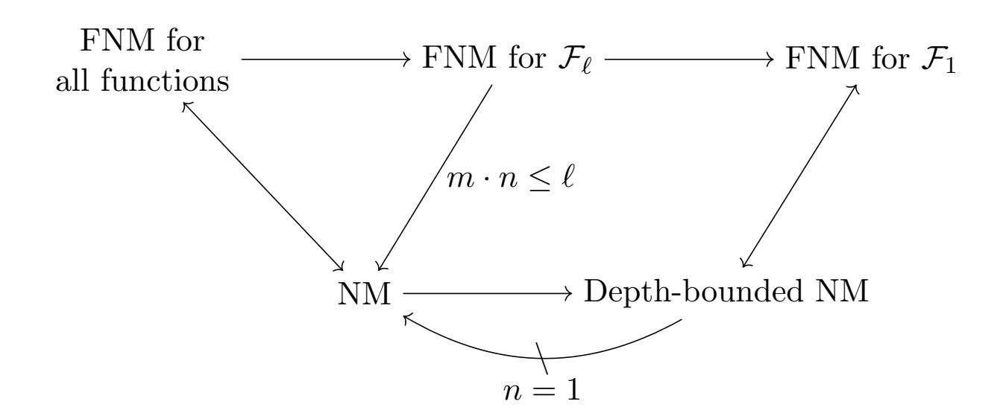

{0}------------------------------------------------

# Non-Malleable Time-Lock Puzzles and Applications<sup>∗</sup>

Cody Freitag† Ilan Komargodski‡ Rafael Pass§ Naomi Sirkin¶

#### Abstract

Time-lock puzzles are a mechanism for sending messages "to the future", by allowing a sender to quickly generate a puzzle with an underlying message that remains hidden until a receiver spends a moderately large amount of time solving it. We introduce and construct a variant of a time-lock puzzle which is non-malleable, which roughly guarantees that it is impossible to "maul" a puzzle into one for a related message without solving it.

Using non-malleable time-lock puzzles, we achieve the following applications:

- The first fair non-interactive multi-party protocols for coin flipping and auctions in the plain model without setup.
- Practically efficient fair multi-party protocols for coin flipping and auctions proven secure in the (auxiliary-input) random oracle model.

As a key step towards proving the security of our protocols, we introduce the notion of functional non-malleability, which protects against tampering attacks that affect a specific function of the related messages. To support an unbounded number of participants in our protocols, our time-lock puzzles satisfy functional non-malleability in the fully concurrent setting. We additionally show that standard (non-functional) non-malleability is impossible to achieve in the concurrent setting (even in the random oracle model).

<sup>∗</sup>A preliminary version of this work was published in the proceedings of TCC 2021.

<sup>†</sup>Cornell Tech, cfreitag@cs.cornell.edu

<sup>‡</sup>Hebrew University and NTT Research, ilank@cs.huji.ac.il

<sup>§</sup>Cornell Tech, rafael@cs.cornell.edu

<sup>¶</sup>Cornell Tech, nephraim@cs.cornell.edu

{1}------------------------------------------------

## Contents

| 1 | Introduction                                                                                                                                        | 1        |
|---|-----------------------------------------------------------------------------------------------------------------------------------------------------|----------|
|   | 1.1<br>Our Results<br><br>1.1.1<br>Non-Malleable Time-Lock Puzzles<br>                                                                              | 2<br>2   |
|   | 1.1.2<br>Publicly Verifiable Time-Lock Puzzles<br>                                                                                                  | 4        |
|   | 1.1.3<br>Fair Multi-Party Auctions and Coin Flipping<br>                                                                                            | 5        |
|   | 1.2<br>Related Work<br><br>1.3<br>Concurrent Work<br>                                                                                               | 7<br>8   |
| 2 | Technical Overview                                                                                                                                  | 9        |
|   | 2.1<br>Non-Malleability for Time-Lock Puzzles<br>                                                                                                   | 10       |
|   | 2.2<br>Publicly Verifiable Time-Lock Puzzles<br><br>2.3<br>Fair Multi-Party Protocols<br>                                                           | 13<br>15 |
| 3 | Preliminaries                                                                                                                                       | 17       |
|   | 3.1<br>Time-Lock Puzzles<br>                                                                                                                        | 17       |
|   | 3.2<br>Non-Malleable Time-Lock Puzzles<br><br>3.3<br>Time-Lock Puzzles in the Auxiliary-Input Random Oracle Model<br>                               | 18<br>19 |
| 4 | Non-Malleable Time-Lock Puzzles                                                                                                                     | 21       |
|   | 4.1<br>Functional Non-Malleable Time-Lock Puzzles<br>                                                                                               | 21       |
|   | 4.2<br>Non-Malleable Time-Lock Puzzle Construction<br>                                                                                              | 22       |
|   | 4.3<br>Proof of Concurrent Functional Non-Malleability<br><br>4.4<br>Impossibility of Fully Concurrent Non-malleability<br>                         | 23<br>37 |
| 5 | Publicly Verifiable Non-Malleable Time-Lock Puzzles                                                                                                 | 37       |
|   | 5.1<br>Strong Trapdoor VDFs<br>                                                                                                                     | 39       |
|   | 5.2<br>One-sided PV TLPs from Strong Trapdoor VDFs<br><br>5.3<br>Non-Malleable PV TLP from One-sided PV TLPs<br>                                    | 45<br>45 |
| 6 | Applications to Multi-Party Coin Flipping and Auctions                                                                                              | 48       |
|   | References                                                                                                                                          | 53       |
| A | Non-Malleable TLPs in the Plain Model                                                                                                               | 57       |
| B | Simulation-Based Fairness                                                                                                                           | 64       |
| C | Non-malleability Against Depth-Bounded Distinguishers                                                                                               | 67       |
|   | C.1<br>Equivalence to Functional Non-malleability with One Bit Output<br><br>C.2<br>Separating Depth-Bounded Distinguishers from Unbounded Ones<br> | 68<br>69 |
| D | Discussion of Non-Malleable Definitions                                                                                                             | 75       |
| E | One-Many Non-Malleability                                                                                                                           | 76       |
| F | Proofs from Section<br>5                                                                                                                            | 78       |

{2}------------------------------------------------

## <span id="page-2-0"></span>1 Introduction

Time-lock puzzles (TLPs), introduced by Rivest, Shamir, and Wagner [\[RSW96\]](#page-58-1), are a cryptographic mechanism for committing to a message, where a sender can (quickly) generate a puzzle with a solution that remains hidden until the receiver spends a moderately large amount of time solving it (even in the presence of parallel processors). Rivest et al. [\[RSW96\]](#page-58-1) gave a very efficient construction of TLPs where security relies on the repeated squaring assumption. This assumption postulates, roughly, that it is impossible to significantly speed up repeated modular exponentiations in a group of unknown order, even when using many parallel processors. This construction and assumption have proven extremely useful in various (and sometimes unexpected) applications [\[BN00,](#page-55-0) [LPS17,](#page-57-0) [Pie19,](#page-57-1) [Wes19,](#page-58-2) [EFKP19,](#page-56-0) [MT19,](#page-57-2) [DKP21\]](#page-56-1), some of which have already been implemented and deployed in existing systems.

Non-malleability. In a Man-In-the-Middle (MIM) attack, an eavesdropper tries to actively maul intermediate messages to compromise the integrity of the underlying values. To address such attacks, Dolev, Dwork and Naor [\[DDN91\]](#page-56-2) introduced the general concept of non-malleability in the context of cryptographic commitments. Roughly speaking, non-malleable commitments are an extension of plain cryptographic commitments (that guarantee binding and hiding) with the additional property that no adversary can maul a commitment for a given value into a commitment to a "related" value. As this is a fundamental concept with many applications, there has been a tremendous amount of research on this topic [\[Bar02,](#page-54-1) [PR05b,](#page-57-3) [PR05a,](#page-57-4) [LPV08,](#page-57-5) [PPV08,](#page-57-6) [LP09,](#page-57-7) [PW10,](#page-58-3) [Wee10,](#page-58-4) [Goy11,](#page-56-3) [LP11,](#page-57-8) [GLOV12,](#page-56-4) [GPR16,](#page-56-5) [COSV16,](#page-55-1) [COSV17,](#page-55-2) [Khu17,](#page-56-6) [LPS17,](#page-57-0) [KS17,](#page-57-9) [KK19\]](#page-57-10).

Non-malleable TLPs and applications. To date, non-malleability has not been considered in the context of TLPs (or other timed primitives).[1](#page-2-1) Indeed, the construction of TLPs of [\[RSW96\]](#page-58-1) is malleable. [2](#page-2-2) This fact actually has negative consequences in various settings where TLPs could be useful. For instance, consider a scenario where n parties perform an auction by posting bids on a public bulletin board. To implement this fairly, a natural approach is to use a commit-and-reveal style protocol, where each party commits to its bid on the board, and once all bids are posted each party publishes its opening. Clearly, one has to use non-malleable commitments to guarantee that bids are independent (otherwise, a malicious party can potentially bid for the maximal other bid plus 1). However, non-malleability is not enough since there is a fairness issue: a malicious party may refuse to open after seeing all other bids and so other parties will never know what the unopened bid was.

Using non-malleable TLPs to "commit" to the bids solves this problem. Indeed, the puzzle of a party who refuses to reveal its bid can be recovered after some moderately large amount of time by all honest parties. This style of protocol can also be used for fair multi-party collective coin flipping where n parties wish to agree on a common unbiased coin. There, each party encodes a random bit via a TLP and all parties will eventually agree on the parity of those bits.[3](#page-2-3) This

<span id="page-2-1"></span><sup>1</sup>The concurrent works of [\[KLX20,](#page-57-11) [BDD](#page-55-3)<sup>+</sup>20, [BDD](#page-55-4)<sup>+</sup>21] consider similar notions of non-malleability for time-lock puzzles. See Section [1.3](#page-9-0) for a detailed comparison.

<span id="page-2-2"></span><sup>2</sup>The puzzle of [\[RSW96\]](#page-58-1) for a message s and difficulty T is a tuple (g, N, T, s ⊕ g 2 T mod N), where N is an RSA group modulus and g is a random element from Z<sup>N</sup> . The puzzle is trivially malleable since the message is one-time padded.

<span id="page-2-3"></span><sup>3</sup> In the context of coin flipping, if a malicious party aborts prematurely, this can bias the output [\[Cle86\]](#page-55-5) causing the fairness issue mentioned above. Boneh and Naor [\[BN00\]](#page-55-0) used timed primitives and interaction to circumvent the issue in the two-party case, but we care about the multi-party case and prefer to avoid interaction as much as possible.

{3}------------------------------------------------

gives a highly desirable collective coin flipping protocol with an important property that we refer to as *optimistic efficiency*: when all parties are honest and publish their "openings" immediately after seeing all puzzles, the protocol terminates and all parties agree on an unbiased bit. As we will see, no other known protocol for this (highly important) task has this property. Even ignoring optimistic efficiency, such a protocol yields a fully non-interactive coin flipping protocol where each participant solves all published puzzles.

#### <span id="page-3-0"></span>1.1 Our Results

To present our results, we start with a high level definition of a non-malleable TLP. Recall that for some secret s and difficulty t, a time-lock puzzle enables sampling a puzzle z which can be solved in time t to recover s, but guarantees that s remains hidden to any adversary running in time less than t.

For non-malleability, we require that any man-in-the-middle (MIM) attacker  $\mathcal{A}$  that receives a puzzle z "on the left" cannot output a different puzzle  $\widetilde{z}$  "on the right" to a related value. Formally, we consider the (inefficient) distribution  $\min_{\mathcal{A}}(t,s)$  that samples a puzzle z to s, gets  $\widetilde{z} \leftarrow \mathcal{A}(z)$ , and outputs the value  $\widetilde{s}$  computed by solving  $\widetilde{z}$ . However, if  $z=\widetilde{z}$ , then  $\widetilde{s}=\bot$  (since simply forwarding the commitment does not count as a valid mauling attack). Then, non-malleability requires that for any solution s and MIM attacker with depth much less than t (so it cannot break hiding), the distribution for a value s given by  $\min_{\mathcal{A}}(t,s)$  is indistinguishable from the distribution  $\min_{\mathcal{A}}(t,0)$  for an unrelated value, 0. We emphasize that indistinguishability should hold even against arbitrary polynomial time or even unbounded distinguishers that, in particular, can solve the TLP. We also consider the natural extension to the bounded concurrent setting [PR08], where the MIM attacker  $\mathcal{A}$  receives  $n_{\text{left}}$  concurrent puzzles on the left and attempts to generate  $n_{\text{right}}$  puzzles on the right to related values. In this setting, the distinguisher receives the solutions to all  $n_{\text{right}}$  puzzles. We refer to this as  $(n_{\text{left}}, n_{\text{right}})$ -concurrency.

We next give our main results. In Section 1.1.1, we present our results on non-malleable time-lock puzzles, and we discuss the various notions of non-malleability that we consider in this setting. In Section 1.1.2, we show how to additionally satisfy a strong public verifiability property using a specific time-lock puzzle based on repeated squaring. Finally, in Section 1.1.3, we discuss the applications of our constructions for fair multi-party protocols.

### <span id="page-3-1"></span>1.1.1 Non-Malleable Time-Lock Puzzles

We give two different constructions of non-malleable TLPs. We emphasize that, as explained above, this primitive is not only natural on its own right, but also has important applications to the design of secure protocols for various basic tasks. Our first construction is practically efficient, relies on the existence of any given TLP [RSW96, BGJ<sup>+</sup>16], and is proven secure in the (auxiliary-input) random oracle model [Unr07].

<span id="page-3-2"></span>**Theorem 1.1** (Informal; See Theorem 4.2 and Corollary 4.3). For every  $n_{\text{left}}$ ,  $n_{\text{right}}$ ,  $L \in \text{poly}(\lambda)$ , assuming that there is a TLP (supporting 1-bit messages) that is secure for attackers of size  $2^{3n_{\text{right}} \cdot L} \cdot \text{poly}(\lambda)$ , there exists an  $(n_{\text{left}}, n_{\text{right}})$ -concurrent non-malleable TLP supporting messages of length L. The scheme is proven secure in the auxiliary-input random oracle model.

In terms of security, our reduction is depth preserving: if the given TLP is secure against attackers of depth  $T(\lambda)/\alpha(\lambda)$ , where T is the time required to solve the puzzle and  $\alpha(\cdot)$  is a fixed polynomial independent of T denoting the advantage of an attacker, then the resulting non-malleable TLP is secure against attackers of depth  $T(\lambda)/\alpha'(\lambda)$  for a related fixed polynomial  $\alpha'(\cdot)$ .

{4}------------------------------------------------

In particular, the dependence on T in hardness is preserved. Additionally, note that if nright · L ∈ O(log λ), then the underlying TLP only needs to be polynomially secure.

Instantiating the TLP with the construction of [\[RSW96\]](#page-58-1), our scheme is extremely efficient: encoding a message requires a single invocation of a random oracle and few (modular) exponentiations. Additionally, our construction is very simple to describe: to generate a puzzle for a solution s with randomness r, we sample a puzzle for (s, r) using randomness which itself depends (via the random oracle) on s and r. [4](#page-4-0) Nevertheless, the proof of security turns out to be somewhat tricky and non-trivial; see Section [2](#page-10-0) for details.

We prove that our scheme is non-malleable against all polynomial-size attackers that cannot solve the puzzles (and this is inherent as the latter ones can easily maul any puzzle). We even allow the attacker's description to depend arbitrarily on the random oracle. We formalize this notion by showing that our TLP is non-malleable in the auxiliary-input random oracle model, a model that was introduced by Unruh [\[Unr07\]](#page-58-6) (see also [\[CDGS18\]](#page-55-7)) in order to capture preprocessing attacks, where a non-uniform attacker obtains an advice string that depends arbitrarily on the random oracle. Thus, in a sense, our construction does not require any form of attacker-independent setup.

Our second construction is proven secure in the plain model (without any form of setup) and is based on the non-malleable code for bounded polynomial depth tampering functions due to [\[DKP21\]](#page-56-1). This construction relies on a variety of assumptions (including keyless hash functions and non-interactive witness indistinguishable proofs) and is less practically efficient. While the main technical ideas for the construction and proof are given in [\[DKP21\]](#page-56-1), the threat model they consider is weaker than what we require for non-malleable TLPs; for example, they only consider plain (non-concurrent) non-malleability and do not require security against re-randomization attacks (mauling a code word for m into a different code word for m). We show how to extend their construction to our setting, thereby proving the following theorem.

Theorem 1.2 (Informal; See Theorem [A.1](#page-60-0) and Corollary [A.2\)](#page-60-1). Assume a time-lock puzzle, a keyless multi-collision resistant hash function, a non-interactive witness indistinguishable proof for NP, and injective one-way functions, all sub-exponentially secure. Then, there exists a bounded concurrent non-malleable time-lock puzzle secure against polynomial size adversaries.

We emphasize that both of our constructions only achieve bounded concurrency, where the number of instances the attacker participates in is a priori bounded (and the scheme may depend on this bound). We show that the stronger notion of full concurrency, which does not place such limitations and is achievable in all other standard settings of non-malleability, is actually impossible to achieve for TLPs. Therefore, our result is best possible in this sense.

<span id="page-4-1"></span>Theorem 1.3 (Informal; See Theorem [4.16\)](#page-38-2). There is no fully concurrent non-malleable TLP (even in the random oracle model).

In a nutshell, the impossibility from Theorem [1.3](#page-4-1) is proven by the following generic MIM attack. Given a puzzle z, if the number of "sessions" the attacker can participate in is at least as large as |z|, they can essentially generate |z| puzzles encoding the bits of z. Since the distinguisher of the MIM game (which is now given those bits) can run in arbitrary polynomial time, it can simply solve the original puzzle and recover the original solution in full. We emphasize that this attack only requires a polynomial-time distinguisher. This attack is circumvented in the bounded concurrency

<span id="page-4-0"></span><sup>4</sup>We note that our construction is conceptually similar to the Fujisaki-Okamoto (FO) transformation [\[FO13\]](#page-56-7) used to generically transform any CPA-secure public-key encryption scheme into a CCA-secure one using a random oracle. However, since our setting and required guarantees are different, the actual proof turns out to be much more delicate and challenging.

{5}------------------------------------------------

setting (Theorem [1.1\)](#page-3-2) by setting the length of the puzzle to be longer than the concurrency bound. Specifically, to support n concurrent puzzles on the right, we can set the message length to L · n, which is what results in exponential security loss 2L·<sup>n</sup> in our construction discussed above.

Functional non-malleability. We note that the attack on fully concurrent non-malleable timelock puzzles crucially relies on the fact that the distinguisher in the MIM game can solve the underlying puzzles. However, it is easy to see that if the distinguisher is restricted to bounded depth, this attack fails. One could define a weaker notion of non-malleability where the MIM distinguisher is depth-bounded, but this results in a weaker security guarantee. In particular, we show in Appendix [C](#page-68-0) that there exists a natural TLP construction that satisfies this (weaker) definition yet has a valid mauling attack.[5](#page-5-1)

In light of this observation, we introduce a new definition of non-malleability that generalizes the standard definition considered in Theorem [1.1.](#page-3-2) We call the notion functional non-malleability and, as the name suggests, the security notion is parameterized by a class of functions F. Denote by L the bit-length of the messages we want to support and by n the number of sessions that the MIM attacker participates in on the right. We think of f ∈ F as some bounded depth function of the form f : ({0, 1} L) <sup>n</sup> → {0, 1} <sup>m</sup>, which is the target function of the input messages that the MIM adversary is trying to bias. Specifically, the distinguisher of the MIM game now receives the output of the function f when applied to the values underlying the puzzles given by the MIM adversary. When F includes all identity functions (which are bounded depth and have output length m = n · L), functional non-malleability implies the standard definition of concurrent non-malleability (as the distinguisher just gets all the messages from the n mauled puzzles).

Naturally, it makes sense to ask what guarantees can we get if we a priori restrict f, say in its output length, without limiting the number of sessions n. This turns out to particularly useful when the application at hand only requires non-malleability against a specific form of tampering functions (this indeed will be the case for us below). Concretely, let F<sup>m</sup> be the class of all functions whose output length is at most m bits and which can be computed in depth polynomial in the security parameter λ and in log(n ·L) (using the notation given above). Then, we have the following result.

<span id="page-5-2"></span>Theorem 1.4 (Informal; See Theorem [4.2\)](#page-23-1). Assuming that there exists a TLP, then for every m ∈ poly(λ) there exists a fully concurrent functional non-malleable TLP for the class of functions Fm. The scheme is proven secure in the auxiliary-input random oracle model assuming the given TLP is secure for all attackers of size at most 2 <sup>3</sup><sup>m</sup> · poly(λ).

The above construction is depth preserving in the same way as the construction from Theorem [1.1.](#page-3-2) Further, note that as long as m ∈ O(log λ), we only require standard polynomial hardness from the given TLP. We remark that Theorem [1.4](#page-5-2) will turn out to be instrumental for our applications we discuss below. We also believe that the abstraction of functional non-malleability is important on its own right and view it as an independent contribution. We also show how to achieve fully concurrent functional non-malleability for our plain model construction.

#### <span id="page-5-0"></span>1.1.2 Publicly Verifiable Time-Lock Puzzles

In addition to non-malleability, we construct TLPs that also have a public verifiability property: after a party solves the puzzle, they can publish the underlying solution together with a proof which can be later used by anyone to quickly verify the correctness of the solution. We emphasize that this must hold even if the solver determines that the puzzle has no valid solution. We believe this primitive is of independent interest.

<span id="page-5-1"></span><sup>5</sup>As we discuss in the Section [1.3,](#page-9-0) concurrent works allow the distinguisher to be bounded depth.

{6}------------------------------------------------

We build our non-malleable, publicly verifiable TLP assuming a very weak form of (partially) trusted setup. The setup of our TLP consists of a set of many public parameters where we only assume that at least one of them was generated honestly. We call this model the All-But-Onestring (ABO-string) model.<sup>6</sup> We design this to fit into our multi-party protocol application (see Theorem 1.7 below) in such a way where the parties themselves will generate this setup in the puzzle generation phase. Indeed, as we discuss below, publicly verifiable TLPs in the ABO-string model will imply coin flipping without setup.

**Theorem 1.5** (Informal; See Corollary 5.10). Assuming the repeated squaring assumption, there exists a publicly verifiable non-malleable TLP in the ABO-string model. The construction is proven secure in the auxiliary-input random oracle model.

Our construction is depth preserving and has security which depends on the message length. In particular, the security of the resulting TLP is the same as in the constructions in Theorem 1.1 and Theorem 1.4, depending on the type of non-malleability desired for the resulting TLP.

To construct our publicly verifiable TLP, we use a *strong trapdoor VDF* (formalized in Definition 5.3), which is why our construction is not generic from any time-lock puzzle. Somewhat surprisingly, we need to leverage specific properties of the trapdoor VDF of Pietrzak's [Pie19] using the group of signed quadratic residues  $QR_N^+$  where N is a product of safe primes.<sup>7</sup> For an overview of our construction, see Section 2.2, or Section 5 for full details.

#### <span id="page-6-0"></span>1.1.3 Fair Multi-Party Auctions and Coin Flipping

As we mentioned above, an appealing application of non-malleable TLPs is for tasks such as fair multi-party auctions or coin flipping. Our protocols (for both tasks) are extremely efficient and consist of just two phases: first each party "commits" to their bid/randomness using some puzzle, and then after all puzzles are made public, each party publishes its solution. If some party refuses to open their puzzle, a force-opening phase is performed. Alternatively, we can instantiate our protocols in the fully non-interactive setting where all parties solve every other puzzle.

In what follows, we focus on the task of fair multi-party coin flipping, which is a core building block in recent proof-of-stake blockchain designs; see below. The application to auctions follows in a similar manner. It is convenient to consider our protocol in a setting where there is a public bulletin board. Any party can publish a puzzle to the bulletin board during the commit phase and then publish its solution after some pre-specified amount of time has elapsed.

Relying only our concurrent, functional non-malleable (not necessarily publicly verifiable) TLP constructions, all of our protocols (both non-interactive and two-phase) satisfy fairness, informally defined as follows:

• Fairness: No malicious adversary (controlling all but one party) can bias the output of the protocol, even by aborting early. Namely, as long as there is at least one honest participating party, the output will be a (nearly) uniformly random value.

Our two-phase "commit-and-reveal" style protocols have the additional efficiency guarantee:

• Optimistic Efficiency: If all participating parties are honest, then the protocol terminates within two message rounds (without the need to wait the pre-specified amount of time for the second phase), and all parties can efficiently verify the output of the protocol.

<span id="page-6-1"></span><sup>&</sup>lt;sup>6</sup>Our ABO-string model is a variant of the multi-string model of Groth and Ostrovsky [GO14], where it is assumed that a majority of the public parameters are honestly generated.

<span id="page-6-2"></span><sup>&</sup>lt;sup>7</sup>For this, we assume that sampling uniformly random safe primes can be done efficiently; this is a pretty common assumption, see [VZGS13] for more details.

{7}------------------------------------------------

Using our construction of a publicly verifiable non-malleable TLP, we satisfy the following public verifiability property:

• Public Verifiability: In the case that any participating party is dishonest and does not publish their solution, any party can break the puzzle in a moderate amount of time and provide a publicly verifiable proof of the solution. We even require that an honest party can prove that a published puzzle has no valid solution.

We focus on two main results from the above discussion, although we get a variety of different protocols depending on what TLP we start with and how we instantiate the protocol. First, we construct fully non-interactive protocols in the plain model without any setup.

<span id="page-7-1"></span>Theorem 1.6 (Informal; see Theorem [6.3\)](#page-50-0). Assume a time-lock puzzle, a keyless multi-collision resistant hash function, a non-interactive witness indistinguishable proof for NP, and injective oneway functions, all sub-exponentially secure. Then, there exist fully non-interactive, fair multi-party coin flipping and auction protocols. The protocols support an unbounded number of participants and require no setup.

Next, we achieve efficient, publicly verifiable two-phase protocols in the auxiliary input random oracle model.

<span id="page-7-0"></span>Theorem 1.7 (Informal; See Theorem [6.1\)](#page-50-1). Assuming the repeated squaring assumption, there exist two-phase fair multi-party coin flipping and auction protocols that satisfy optimistic efficiency and public verifiability. The protocols support an unbounded number of participants and require no trusted setup. Security is proven in the auxiliary-input random oracle.

The differences between the protocols achieved in these two theorems is that the first is noninteractive and has no setup, while the second is two rounds and is in the random oracle model, yet leverages this to achieve public verifiability and better concrete efficiency. We emphasize that both of the protocols support polynomial-length outputs, relying on sub-exponential security of the underlying time-lock puzzle.

We also emphasize that our protocols support an a priori unbounded number of participants. This may seems strange in light of our impossibility from Theorem [1.3.](#page-4-1) We bypass this lower bound (as mentioned above) by observing that for most natural applications (including coin flipping and auctions), the notion of functional non-malleability from Theorem [1.4](#page-5-2) suffices. The key insight is that we only need indistinguishability with respect to specific depth-bounded functions with a priori bounded output lengths (e.g., parity for coin flipping, or taking the maximum for auctions). Since the output length in both cases is known, we can actually support full concurrency which translates into having an unbounded number of participants.

For auctions, we note that our protocols are the first multi-party protocols under any assumption that satisfy fairness against malicious adversaries and requires no adversary-independent setup using the timed commitments of [\[BN00\]](#page-55-0) works only in the two-party setting and additionally relies on trusted setup, and using the homomorphic time-lock puzzles of [\[MT19\]](#page-57-2) does not satisfy fairness in the presence of malicious adversaries. For coin flipping, our two-round protocol is the first multiparty protocol that is fair against malicious adversaries while satisfying optimistic efficiency. Next, we provide a more in depth comparison of our non-interactive coin flipping protocol with existing solutions.

Non-interactive coin flipping. We emphasize that our non-interactive coin flipping protocol of Theorem [1.6](#page-7-1) is the first such protocol without any form of setup in the plain model. Specifically, 

{8}------------------------------------------------

we mean that there is no common random string or any assumed common function. Still, our practically efficient protocol of Theorem [1.7](#page-7-0) as a non-interactive protocol still enjoys some benefits over existing schemes.

In the non-interactive setting, Boneh et al. [\[BBBF18\]](#page-54-2) proposed a VDF-based protocol. Specifically, each party publishes a random string r<sup>i</sup> and then the agreed upon coin is defined by running a VDF on the seed H(r1k . . . krn), where H is a random oracle. As the VDF must be evaluated to obtain the output, this type of protocol does not satisfy optimistic efficiency. Nevertheless, the VDF-based protocol has the advantage that only a single slow computation needs to be computed, whereas our non-interactive protocol requires n such computations for n participants (which can be done in parallel). Malavolta and Thyagarajan [\[MT19\]](#page-57-2) address this inefficiency in the context of time-lock puzzles (which do allow for the option of optimistic efficiency) by constructing homomorphic time-lock puzzles, where many separate puzzles can be combined into a single puzzle to be solved. However, their TLP scheme is malleable and so cannot be directly used to obtain a fair protocol against malicious adversaries.[8](#page-8-1) In the two-phase setting, however, our publicly verifiable protocol has the property that only a single honest party needs to solve each puzzle, and this computation can easily be delegated to an external server.

The VDF-based scheme of [\[BBBF18\]](#page-54-2) can be based on repeated squaring in a group of unknown order based on the publicly verifiable proofs of [\[Wes19,](#page-58-2) [Pie19\]](#page-57-1). In this setting, the protocols can either be instantiated using RSA groups that require attacker-independent trusted setup, or based on class groups that rely only on a common random string. As we do in this work, the common random string can be implemented in the ABO-string model using a random oracle (which the attacker may depend on arbitrarily). Therefore, when restricting our attention to protocols without attacker-independent setup, the previous VDF-based protocols are based on less standard assumptions on class groups, whereas we give a protocol that can be instantiated from more standard assumptions on RSA groups with better concrete efficiency.

Simulation-based fairness in the ROM. As mentioned above, we show that our protocols are fair in the sense that no malicious adversary can bias the output of the protocol. This suffices for applications which only use the output of the protocol. To capture applications that additionally depend on the protocol transcript, we show that our protocol satisfies simulation-based security with full fairness in the programmable random oracle model. This guarantees that the protocol execution in the presence of a malicious adversary (even one aborting early) can be simulated by a uniformly random output in an ideal model where every honest party receives the output (regardless of whether any malicious party aborts early).

### <span id="page-8-0"></span>1.2 Related Work

Timed commitments. Boneh and Naor [\[BN00\]](#page-55-0) introduced timed commitments, which can be viewed as a publicly verifiable and interactive TLP. They additionally require that the puzzle (which is an interactive commitment) convinces the receiver that if they brute-force the solution, they will succeed. Because of this additional property, their commitment scheme is interactive and relies on a less standard assumption called the generalized Blum-Blum-Shub assumption. Their scheme is additionally malleable.

<span id="page-8-1"></span><sup>8</sup> It is possible to make this protocol maliciously secure using concurrent non-malleable zero-knowledge proofs [\[BPS06,](#page-55-8) [OPV10,](#page-57-12) [LPTV10,](#page-57-13) [LP11\]](#page-57-8), proving that each party acted honestly, but this (1) makes the construction significantly less efficient, and (2) requires either trusted setup and additional hardness assumptions, or additional rounds of interaction.

{9}------------------------------------------------

Fair coin flipping in blockchains. Generating unbiased bits is one of the largest bottlenecks in modern proof-of-stake crypto-currency designs [\[BPS16,](#page-55-9) [DPS19,](#page-56-9) [DGKR18\]](#page-56-10). Recall that in a proofof-stake blockchains, the idea is, very roughly speaking, to enforce "one vote per unit of stake". This is usually implemented by choosing random small committees at every epoch and letting that committee decide on the next block. The main question is how to obtain "pure" randomness so that the chosen committee is really "random".

One option is to use the hash of an old-enough block as the randomness. Unfortunately, it is known that the hash of a block is not completely unbiased: an attacker can essentially fully control about logarithmically many of its bits. In existing systems, this is mitigated by "blowing up" parameters to compensate for the (small yet meaningful) advantage the attacker has, making those systems much less efficient. Using a mechanism that generates unbiased bits, we could make proof-of-stake crypto-currencies much more efficient.

## <span id="page-9-0"></span>1.3 Concurrent Work

Several related papers [\[BDD](#page-55-4)+21, [BDD](#page-55-3)+20, [KLX20\]](#page-57-11) have been developed concurrently and independently to this work.[9](#page-9-1) The works of Baum et al. [\[BDD](#page-55-4)+21, [BDD](#page-55-3)+20] formalize and construct various (publicly verifiable) time-based primitives, including TLPs, under the Universal Composability (UC) framework [\[Can01\]](#page-55-10). Katz et al. [\[KLX20\]](#page-57-11) (among other results, less related to ours) introduce and construct non-malleable non-interactive timed commitments. While the notions that are introduced and studied are related, the results are all incomparable as each paper has a somewhat different motivation which leads to different definitions and results.

Comparison with [\[KLX20\]](#page-57-11). Let us start by comparing definitions. Katz et al. consider a CCA-style definition adapted to the depth-bounded setting. In the classical setting of unbounded polynomial-time attackers, CCA security is usually stronger than "only" non-malleability, but this is not generally true in the depth-bounded setting.

In more detail, they consider a depth-bounded version of CCA security, where the attacker (who is also the distinguisher) is bounded to run in time less than the hardness of the timed primitive. We, on the other hand, allow the distinguisher of the MIM game to be unbounded (while only the attacker is bounded). We believe this is an important distinction and we provide more insights into the differences between the bounded and unbounded distinguisher settings in Appendix [C.](#page-68-0) Specifically, we show that non-malleability with a depth-bounded distinguisher is (essentially) equivalent to our definition of functional non-malleability with output length 1. (In particular, our construction of Theorem [1.4](#page-5-2) immediately gives a concurrent non-malleable time-lock puzzle against depth-bounded distinguishers assuming only polynomially secure TLPs in the auxiliary-input random oracle model.) Next, we give a construction separating the definitions of non-malleability with an unbounded vs. depth-bounded distinguisher, showing that non-malleability in the bounded distinguisher setting gives a strictly weaker security guarantee. We additionally give a discussion comparing these definitions to different settings of functional non-malleability in Appendix [D.](#page-76-0)

Regarding the primitives constructed, recall that timed commitments [\[BN00\]](#page-55-0) (ignoring nonmalleability for now) allow one to commit to a message m in such a way that the commitment hides m up to some time T, yet the verifier can be sure that it can be force opened to some value after roughly T time. In contrast, plain TLPs are not necessarily guaranteed to contain valid messages. In this context, our notion of publicly-verifiable TLPs is in between these two notions: we treat puzzles without a solution as invalid (say encoding ⊥) but we additionally provide a way

<span id="page-9-1"></span><sup>9</sup>We emphasize that only Section [1.3,](#page-9-0) Appendix [C,](#page-68-0) and Appendix [D](#page-76-0) were added based on these works. All other definitions and results that appear are completely independent of these works.

{10}------------------------------------------------

to publicly verify that this is the case after it has been solved. Nevertheless, we note that the construction of Katz et al. does not imply a TLP since their commitment procedure takes T time (while TLP generation should take time essentially independent of T).

Additionally, their constructions achieve non-malleability through the use of NIZKs following the Naor-Yung [\[NY90\]](#page-57-14) paradigm for CCA-secure encryption. Known (even interactive) zeroknowledge proofs for correctness of time-lock puzzles are quite expensive (see, e.g., Boneh-Naor [\[BN00\]](#page-55-0) which requires parallel repetition). Using generic NIZKs (even in the random oracle model) would be even worse.

Regarding assumptions, their construction is proven secure in the algebraic group model [\[FKL18\]](#page-56-11) and relies on trusted setup, while ours is proven secure in the (auxiliary-input) random oracle model and hence requires no trusted setup independent of the adversary. Both constructions rely on repeated squaring as the source of depth-hardness, and theirs additionally makes use of NIZKs (which require setup).

Comparison with [\[BDD](#page-55-4)+21, [BDD](#page-55-3)+20]. Baum et al consider a UC-style definition, which is generally stronger than non-malleability. In this setting, the environment takes the place of the distinguisher in the MIM game. Their definition is closer to ours as the environment may run for an arbitrary polynomial number of rounds and thus does not restrict the depth of the distinguisher. In terms of modeling, the construction of a UC-secure TLP in [\[BDD](#page-55-4)+21] relies on a programmable random oracle, whereas our construction relies on a non-programmable (auxiliaryinput) random oracle. In fact, they prove that their notion of UC security cannot be achieved in the non-programmable random oracle model.

In a follow-up work [\[BDD](#page-55-3)+20], they show that their time-lock puzzle construction satisfies a notion of public verifiability. However, they achieve public verifiability only for honestly generated puzzles, that is, one can prove that a puzzle has a solution s, but cannot prove that a puzzle has no solution. In our terminology, we refer to this as one-sided public verifiability (see Definition [5.2\)](#page-40-1). In contrast, our construction achieves full verifiability. This property is crucial for our efficient coin flipping protocol since it allows only one honest party to (attempt to) solve any invalid puzzle. With only one-sided public verifiability, every participant would need to solve all invalid puzzles, and the output of the coin-flip can only be efficiently verified (in time less than T) in the case that all puzzles are honestly generated.

## <span id="page-10-0"></span>2 Technical Overview

In Section [2.1,](#page-11-0) we give an overview of our non-malleable time-lock puzzle construction (in the random oracle model) and its proof of security. Then in Section [2.2,](#page-14-0) we overview our construction of publicly verifiable (and non-malleable) time-lock puzzles from repeated squaring. Finally in Section [2.3,](#page-16-0) we discuss how our non-malleable time-lock puzzle constructions can be used for fair multi-party coin flipping with various desirable properties. The corresponding full constructions and proofs are provided in Sections [4,](#page-22-0) [5,](#page-38-1) and [6,](#page-49-0) respectively.

We start by recalling the definition of TLPs, as necessary to give an overview of our techniques. A TLP consists of two algorithms (Gen, Sol). Gen is a probabilistic procedure that takes as input an embedded solution s and a time parameter t, and outputs a puzzle z. Sol is a deterministic procedure that on input a puzzle z for time bound t, outputs a solution in depth (or parallel time) roughly t. We note that TLPs can be thought of as a fine-grained analogue to commitments where "hardness" of the puzzle means that the puzzles are hiding against distinguishers of depth less than t. On the other hand, hiding can be broken in depth t (using Sol). Additionally, we require that Sol 

{11}------------------------------------------------

always finds the correct underlying solution s for a puzzle z. This corresponds to perfect binding in the language of commitments.

#### <span id="page-11-0"></span>2.1 Non-Malleability for Time-Lock Puzzles

In this section, we overview our non-malleable time-lock puzzle construction in the random oracle model (for the plain model construction, we refer the reader to the overview in [DKP21], as the main ideas are the same). Our construction relies on any time-lock puzzle TLP and a common random oracle  $\mathcal{O}$ . We construct our non-malleable TLP, denoted nmTLP, as follows. In order to generate a puzzle for a solution s that can be broken in time t, nmTLP.Gen uses randomness r and feeds s||r into the random oracle to get a string  $r_{\mathsf{tlp}}$ . It then uses TLP.Gen to create a puzzle with difficulty t for s||r using randomness  $r_{\mathsf{tlp}}$ . That is,

$$\mathsf{nmTLP}.\mathsf{Gen}(t,s;r) := \mathsf{TLP}.\mathsf{Gen}(t,s\|r;\mathcal{O}(s\|r)).$$

Note that in order to solve the puzzle output by nmTLP.Gen, it suffices to just solve the puzzle generated using TLP.Gen, which takes time t. In other words, nmTLP.Sol(t,z) simply computes s||r = TLP.Sol(t,z) and outputs s. In fact, the solver can even check to make sure that the solutions s is valid by checking that z = nmTLP.Gen(t,s;r).

We note that our construction is conceptually similar to the Fujisaki-Okamoto (FO) transformation [FO13] for transforming CPA-secure encryption to CCA-secure encryption using a random oracle. However, as we will see below, our proof is substantially different. In particular, the FO transformation achieves unbounded CCA security, which we show is impossible in our setting!

**Hardness.** To show the hardness of nmTLP relative to a random oracle, we rely on the hardness of TLP in the plain model, against attackers of depth much less than t. At a high level, we show that breaking the hardness of nmTLP requires either guessing the randomness r used to generate the randomness  $r_{\text{tlp}} = \mathcal{O}(s||r)$  for the underlying puzzle, or directly breaking the hardness of TLP, both of which are infeasible for bounded attackers. To formalize this, we consider any depth-bounded distinguisher  $\mathcal{D}^{\mathcal{O}}$ , who receives as input a nmTLP puzzle z corresponding to solution  $s_0$  or  $s_1$  and distinguishes the two cases with non-negligible probability. By construction, z actually corresponds to a TLP puzzle for  $s_0||r_0$  or  $s_1||r_1$ , so we would like to use  $\mathcal{D}$  to construct a distinguisher against the hardness of TLP.

We first note that if  $\mathcal{D}$  never makes a query to  $\mathcal{O}$  containing the randomness  $r_b$  underlying z, then we can simulate  $\mathcal{O}$  by lazily sampling it in the plain model, and hence use  $\mathcal{D}$  as a distinguisher for the hardness of TLP. If  $\mathcal{D}$  does make a query containing  $r_b$ , then with overwhelming probability it must have received a puzzle corresponding to  $s_b||r_b$  (since in this case,  $r_{1-b}$  is independent of  $\mathcal{D}$  and its input z). Moreover, all of its queries up until that point have uniformly random answers independent of z, so we can simulate them as well, up until receiving this query. Therefore, in both cases, we can carry out this attack in the plain model and rely on the hardness of TLP.

**Non-malleability.** To show non-malleability of nmTLP, we want to argue that any depth-bounded man-in-the-middle (MIM) attacker  $\mathcal{A}$  cannot maul a puzzle z for s (received on the left) to a puzzle  $\widetilde{z}$  (output on the right) for a related value  $\widetilde{s} \neq s$ . At a high level, whenever  $\mathcal{A}$  changes the underlying value s to  $\widetilde{s}$ , then the output of the random oracle on  $\widetilde{s}$  is now uniformly random and independent of z. Indeed, we show that for any fixed puzzle  $\widetilde{z}$  and a value  $\widetilde{s}$ , a randomly generated puzzle for  $\widetilde{s}$  will not be equal to  $\widetilde{z}$  with high probability (otherwise we show how to break the hardness of TLP). So, intuitively, the only way to generate a valid puzzle  $\widetilde{z}$  for  $\widetilde{s}$  is to "know" the

{12}------------------------------------------------

underlying value  $\tilde{s}$ , but hardness intuitively implies that no depth-bounded adversary can "know"  $\tilde{s}$  since it is related to s.

We formalize this intuition by a hybrid argument to show that the MIM distribution  $\tilde{s} \leftarrow \min_{\mathcal{A}}(t,s)$  is indistinguishable from  $\min_{\mathcal{A}}(t,0)$ . At a high level, we first replace the inefficient distribution  $\min_{\mathcal{A}}(t,s)$  by a low-depth circuit  $\mathcal{B}$ . We then show how to use the hiding property of the puzzle to indistinguishably swap the puzzle to one for 0, so the hybrid is now unrelated to s. We describe the key ideas for these hybrids below.

For the first hybrid, the key insight is that we can compute  $\min_{\mathcal{A}}(t,s)$  in low depth using an algorithm  $\mathcal{B}$  by simply looking at the oracle queries made by  $\mathcal{A}$ . In this sense, we are relying on the extractability property of random oracles to say that  $\mathcal{A}$  must know any valid value  $\tilde{s}$  it generates a puzzle for. Specifically, let  $\tilde{z}$  be the output of  $\mathcal{A}$ . For every query  $(s_i||r_i)$  that  $\mathcal{A}$  makes to  $\mathcal{O}$ ,  $\mathcal{B}$  outputs  $s_i$  if  $\tilde{z} = \mathsf{nmTLP}(t, s_i||r_i; \mathcal{O}(s_i||r_i))$ . If there are no such queries,  $\mathcal{B}$  outputs  $\perp$ .  $\mathcal{B}$  requires depth comparable to the depth of  $\mathcal{A}$  since all of these checks can be done in parallel. Furthermore, the output of  $\mathcal{B}$  is indistinguishable from the true output given the above observation that  $\mathcal{A}$  cannot output a valid puzzle for a value it does not query.

For the next hybrid, we would like to indistinguishably replace the underlying puzzle for s with a puzzle for 0, which would suffice to show non-malleability. Because  $\mathcal B$  is low-depth, it seems that we should be able to use the hiding property of nmTLP to say that the output of  $\mathcal B$  does not depend on the underlying value s. Specifically, we want to conclude that if the output of  $\mathcal B$  (who outputs many bits) is statistically far when the underlying value is s versus 0, then there exists a distinguisher (who outputs a single bit) that can distinguish puzzles for s and 0. Towards this claim, we show how to "flatten" any (possibly unbounded) distinguisher  $\mathcal D$  who distinguishes between the output of  $\mathcal B$  in the case where the underlying value is s versus 0. Specifically, we encode the truth table of  $\mathcal D$  as a low-depth distinguishing circuit of size roughly  $2^{|s|}$  to make this reduction go through. As a result, we need to rely on a sub-exponentially security of the underlying TLP when  $|s| = \lambda$ . Namely, the underlying TLP cannot be broken by sub-exponential sized circuits with depth much less than t. However, when  $|s| \in O(\log \lambda)$ , we only need to rely on polynomial security of the underlying TLP.

Impossibility of fully concurrent non-malleability. Ideally, we would like to achieve fully concurrent non-malleability, meaning that any MIM attacker that receives any polynomial n number of puzzles on the left cannot maul them to n puzzles for related values. However, we show that this is impossible to achieve.

Consider an arbitrary TLP for a polynomial time bound t. We construct a MIM attacker  $\mathcal{A}$  that receives only a single puzzle z on the left with solution s where the length of z is L. Then,  $\mathcal{A}$  can split z into L bits and output a puzzle on the right for each bit of the puzzle z. Then, the values underlying the puzzles output by  $\mathcal{A}$  when viewed together yield z, which is related to the value s! More formally, there exists a polynomial time distinguisher that solves the puzzle z in polynomial time t and can distinguish  $\mathcal{A}$ 's output in the case when it receives a puzzle for s or an unrelated value, say 0.

This implies that for any n which is greater than the size of a puzzle, the TLP cannot be non-malleable against MIM attackers who output at most n puzzles on the right. At a high level, the impossibility follows from the fact that hardness does not hold against arbitrary polynomial-time distinguishers (which usually is the case for hiding of standard commitments).

Despite this impossibility, we show that we actually *can* achieve concurrent non-malleability against a *specific class of distinguishers* in the non-malleability game. We refer to this notion as concurrent *functional* non-malleability.

{13}------------------------------------------------

Achieving concurrent functional non-malleability. In many applications, we only need a form of non-malleability to hold with respect to certain classes of functions. For example, in our application to coin flipping, we only need that a puzzle z with solution s cannot be mauled to a set of puzzles  $\tilde{z_1}, \ldots, \tilde{z_n}$  with underlying values  $\tilde{s_1}, \ldots, \tilde{s_n}$  such that  $\bigoplus_{i \in [n]} \tilde{s_i}$  "depends on" s. With this in mind, we define a concurrent functional non-malleability with respect to a class of functions  $\mathcal{F}$ . We say that a TLP satisfies functional non-malleability for a class  $\mathcal{F}$  if the output of  $f(\min_{\mathcal{A}}(t,s))$  is indistinguishable from  $f(\min_{\mathcal{A}}(t,0))$  for any  $f \in \mathcal{F}$ , which also naturally generalizes to the concurrent setting. We note that functional non-malleability for a class  $\mathcal{F}$  actually implies standard non-malleability whenever the class  $\mathcal{F}$  contains the identity function, so functional non-malleability generalizes the standard notion of non-malleability.

Going back to the proof of standard (non-concurrent) non-malleability for our construction  $\mathsf{nmTLP}$ , we observe that the security we need for the underlying time-lock puzzle we use depends on  $2^{|s|}$  where |s| is the size of the puzzle solutions. Specifically, given any distinguisher in the non-malleability that had input of size |s|, we were able to construct a distinguisher for hardness of size  $2^{|s|}$ . In fact, this exact same proof works in the context of concurrent functional non-malleability for functions f that have low depth and bounded output length m. We require f to be low depth so the reduction constitutes a valid attack against hardness, and then we only require security proportional to  $2^{m}$ !

We briefly discuss how our nmTLP construction works for concurrent functional non-malleability for the class  $\mathcal{F}_m$  of function with low depth and output length m. Specifically, for every m, we define a scheme nmTLP<sub>m</sub> assuming that TLP is secure against attackers of size roughly  $2^m$ . Because TLP requires security against  $2^m$  size attackers, our construction nmTLP<sub>m</sub> also only achieves security against  $2^m$  size attackers. As such, our nmTLP.Gen algorithm needs to use at least  $\Omega(m+\lambda)$  bits of randomness (otherwise an attacker could cycle through all choices of randomness to break security). Recall that nmTLP<sub>m</sub>.Gen with randomness r outputs a puzzle using TLP.Gen with solution s|r. As a result, if we want to support solutions of size |s| in nmTLP<sub>m</sub>, we need our underlying TLP to support solutions of size  $O(|s| + m + \lambda)$ . By correctness, this implies that our schemes outputs puzzles of size roughly  $O(|s| + m + \lambda)$ .

Bounded concurrent non-malleability. Our construction of time-lock puzzles for concurrent functional non-malleability can also be seen as a construction for bounded concurrent (plain) non-malleability. Specifically, consider the case where the MIM attacker outputs at most n puzzles on the right. We can think of this as functional non-malleability where the low depth function is simply identity on  $n \cdot |s|$  bits. From the above discussion, this implies a protocol assuming a TLP with security against size  $2^{n \cdot |s|}$  attackers, with puzzles of size roughly  $O(n \cdot |s| + \lambda)$ .

Security in the auxiliary-input random oracle model. Finally, we note that the most of our constructions and formal proofs are in the auxiliary-input random oracle model (AI-ROM) introduced by Unruh [Unr07]. In this model, the non-uniform attacker is allowed to depend arbitrarily on the random oracle, so there is no attacker-independent non-uniform advice. At a high level, we use the result from [Unr07] (restated in Lemma 3.6)to conclude that the view of any bounded-size MIM attacker  $\mathcal{A}$  with oracle access to  $\mathcal{O}$  (where  $\mathcal{A}$  may depend arbitrarily on  $\mathcal{O}$ ) is indistinguishable the view of  $\mathcal{A}$  with access to a "lazily sampled" oracle  $\mathcal{P}$  that is fixed at a set of points F (which depend on  $\mathcal{A}$ ). Formally, in the non-malleability analysis, we switch to an intermediate hybrid where the MIM attacker has access to a partially fixed, lazily sampled oracle  $\mathcal{P}$ . Then, because the MIM attacker  $\mathcal{A}$  must maul honestly generated puzzles that have high entropy, we show that it is necessary for  $\mathcal{A}$  to query the oracle  $\mathcal{P}$  outside the fixed set of points F. From

{14}------------------------------------------------

this, we carefully show that a similar analysis follows as discussed above for the ROM.

### <span id="page-14-0"></span>2.2 Publicly Verifiable Time-Lock Puzzles

We observe that the non-malleable time-lock puzzle construction nmTLP we described above has a very natural—yet incomplete—public verifiability property. Solving a puzzle yields both the solution s and the randomness r use to generate that puzzle. As such, anyone who solves a valid puzzle can send the opening r to another party, and convince them that s is the unique valid solution to the puzzle. However, we emphasize that this only works for valid puzzles and solutions.

Consider the following problematic scenario for our nmTLP construction. Suppose a party "commits" to a value via a puzzle z and refuses to open the commitment. As we said before, if z is a valid puzzle, any party can solve the puzzle, get the solution s and an opening r that proves that s is the unique solution. What if the puzzle corresponds to no solution? We refer to this scenario by saying that the puzzle corresponds to the solution ⊥. In this case (by definition), there is no solution s and opening r for any such that z = Gen(t, s; r). Anyone who solve the invalid puzzle—which requires a lot of computational power—will be able to conclude that the puzzle is malformed, but they will not be able to convince anyone else that this is the case. Ideally, we would have a time-lock puzzle where Sol additionally outputs a publicly verifiable proof π that the solution it computes is correct, even if the solution may be ⊥! We refer to such a time-lock puzzle as a publicly verifiable time-lock puzzle. We next discuss the definition and our construction of publicly verifiable time-lock puzzles.

Defining public verifiability. More formally, a publicly verifiable time-lock puzzle consists of algorithms (Gen, Sol, Verify). As with normal time-lock puzzles, Gen(t, s) outputs a puzzle z. The algorithm Sol(t, z) outputs the solution s as well as a proof π that it computed s correctly. Finally Verify(t, z,(s, π)) checks that s is indeed the correct solution for the puzzle z (corresponding to Sol(t, z)), using the proof π. In addition to (Gen, Sol) being a valid time-lock puzzle, we require that Sol and Verify constitute a sound non-interactive argument. In fact, we require a very strong notion of soundness. We need it to be the case that even for maliciously chosen puzzles that have no solution, the time-lock puzzle is still sound—even against the adversary that generated the malformed puzzle. In other words, we require that no attacker can compute a puzzle z, a value s 0 , and a proof π 0 such that Verify(t, z,(s 0 , π<sup>0</sup> )) accepts yet s 0 is not the value s computed by Sol(t, z), which may be ⊥.

Ideally, we would want a publicly verifiable time-lock puzzle that requires no setup. We instead consider a weak form of setup which we refer to as the All-But-One-string (ABO-string) model. In this model, Sol and Verify additionally take as input a string mcrs = (crs1, . . . , crsn) ∈ ({0, 1} λ ) n , and we require that soundness holds as long as one of the values of crs<sup>i</sup> is sampled uniformly (without necessarily knowing which one); this is why we refer to it as the all-but-one string model. We note that in multi-party protocols, the ABO-string model is realistic as each participant i ∈ [n] can post a value for crs<sup>i</sup> . Then, we require soundness to hold as long as one participant is honest, which is a reasonable assumption in this multi-party setting.

Constructing publicly verifiable time-lock puzzles. Our construction of a publicly verifiable time-lock puzzle follows the blueprint of Rivest, Shamir, and Wagner [\[RSW96\]](#page-58-1) for constructing time-lock puzzles from repeated squaring. Namely, we use the output of a sequential function (repeated squaring in a suitable group) essentially as one-time pad to mask the value underlying the time-lock puzzle. As in [\[RSW96\]](#page-58-1), we require that the sequential function has a trapdoor so that puzzles can be generated efficiently. Unlike [\[RSW96\]](#page-58-1), we additionally require that the sequential 

{15}------------------------------------------------

function is publicly verifiable to enable publicly verifiability for the time-lock puzzle. Finally, we apply the non-malleability transformation described above to achieve full public verifiability. In what follows, we describe each of these steps in more detail.

For the underlying sequential function, we use what we call a strong trapdoor verifiable delay function (VDF). A VDF (introduced by Boneh et al. |BBBF18|) is a publicly verifiable sequential function that can be computed in time t but not much faster, even with lots of parallelism. A trapdoor VDF (formalized by Wesolowski | Wes19|) additionally has a trapdoor for quick evaluation. We require a trapdoor VDF in the ABO-string model that satisfies additional properties required by our application. While the properties we define—and achieve—are heavily tailored towards our application, we believe some of the techniques may be of independent interest. More specifically, a strong trapdoor VDF comes with a Sample algorithm to generate inputs for an evaluation algorithm Eval. We emphasize that, even in the ABO-string model, Sample is independent of any form of setup. Previous definitions of VDFs require the proof to be sound with probability over an honestly sampled input. In contrast, we require that the proof is sound for any maliciously chosen input that is in the support of the Sample algorithm. We note that this property is satisfied by a variant of Pietrzak's VDF [Pie19] based on repeated squaring. At a high level, this is because Pietrzak's VDF is sound (at least in the random oracle model) for any group of unknown order where no adversary can find a group of low order (see e.g. [BBF18] for further discussion), so by using any RSA group with no low order elements (as in [Pie19]), the proof is sound even if the group is maliciously chosen (yet still a valid RSA group), which gives the strong property we need. We note that the proof of soundness for our strong trapdoor VDF in the ABO-string and auxiliary-input random oracle model follows by a similar argument to that of Pie19 in the (plain) random oracle model after applying Unruh's Lemma [Unr07] (stated in Lemma 3.6).

Next, we construct what we refer to as a one-sided publicly verifiable time-lock puzzle in the ABO-string model by using the strong trapdoor VDF in the RSW-style construction described above. By one-sided, we mean that completeness and soundness hold only for puzzles in the support of Gen (again, we emphasize that this is in contrast to a randomly sampled puzzle). Then, our full construction applies our non-malleability transformation to a one-sided publicly verifiable time-lock puzzle. We already argued that the non-malleability transformation provides a form of public verifiability for puzzles z in the support of Gen. Namely, anyone can prove to another party that a valid puzzle z has a solution s, but the proof may not be sound when trying to prove that a puzzle has no solution. However, we next show that if the underlying puzzle satisfies one-sided public verifiability, then the resulting (non-malleable) publicly verifiable TLP is sound for any  $z \in \{0,1\}^*$  (possibly not in the support of Gen).

**Proof of full public verifiability.** Let (Gen, Sol, Verify) be the TLP resulting from applying our non-malleability transformation to a one-sided PV TLP (Gen<sub>tlp</sub>, Sol<sub>tlp</sub>, Verify<sub>tlp</sub>). Consider any puzzle  $z \in \{0,1\}^*$ . If z is in the support of Gen, we want to ensure that no one can prove that  $s' = \bot$  is a valid solution. At the same time, if z is not in the support of Gen, we want to ensure that no one can prove that  $s' \neq \bot$  is a valid solution.

When we run  $\mathsf{Sol}(t,z)$ , we first run  $\mathsf{Sol}_{\mathsf{tlp}}(t,z)$  and get a solution  $s_{\mathsf{tlp}} = \hat{s} \| \hat{r}$  with a proof  $\pi_{\mathsf{tlp}}$ . If  $\hat{r}$  is a valid opening for the proposed solution  $\hat{s}$ , then  $\mathsf{Sol}$  can simply output the solution  $s = \hat{s}$  and the proof  $\pi = \hat{r}$ . If  $\hat{r}$  is not a valid opening for  $\hat{s}$ ,  $\mathsf{Sol}$  must output  $\bot$  and a proof  $\pi$  that this is the case. We set  $\pi = (s_{\mathsf{tlp}}, \pi_{\mathsf{tlp}})$ , which intuitively gives anyone else a way to "shortcut" the computation of  $\mathsf{Sol}_{\mathsf{tlp}}$ .

Now suppose that an adversary tries to falsely convince you that a puzzle z with no solution has a solution  $s' \neq \bot$  using a proof  $\pi' = r'$ . To do so, it must be the case that r' is a valid opening

{16}------------------------------------------------

for s' with respect to Gen. But if that were the case, then z would have a solution, in contradiction.

On the other hand, suppose that an adversary tries to falsely convince you that a puzzle z with solution s has no solution, i.e.  $s' = \bot$ , using a proof  $\pi' = (s'_{\mathsf{tlp}}, \pi'_{\mathsf{tlp}})$ . Since z has a solution, it means that z is in the support of  $\mathsf{Gen}_{\mathsf{tlp}}$ . By one-sided public verifiability, this means that  $\pi'_{\mathsf{tlp}}$  is a valid proof that  $s'_{\mathsf{tlp}} = \hat{s} \| \hat{r}$  is the correct solution to z with respect to  $\mathsf{Gen}_{\mathsf{tlp}}$ . So if  $\hat{r}$  is not a valid opening for  $\hat{s}$  with respect to  $\mathsf{Gen}$ , we know the adversary must be lying. In other words, the only way the adversary can cheat is by cheating in the underlying one-sided PV TLP on a puzzle z in the support of  $\mathsf{Gen}_{\mathsf{tlp}}$ .

Discussion of our non-malleable PV TLP. We note that the publicly verifiable time-lock puzzle we described above can be made to satisfy the same non-malleability guarantees as we discuss in Section 2.1 (as we construct it using the same transformation but with a specific underlying time-lock puzzle). Thus, assuming the repeated squaring assumption, we get a publicly verifiable time-lock puzzle that satisfies concurrent function non-malleability for any class of low depth functions  $\mathcal{F}_m$  with output length m. Our construction is in the ABO-string model, and we prove security in the auxiliary-input random oracle model (which is needed for soundness of the strong trapdoor VDF in the ABO-string model in addition to the non-malleability transformation). This model is reasonable for our practical applications to multi-party protocols, as we will see below. Due to the fact that this is a non-black box construction, we note that it does not apply to our non-malleable TLP construction in the plain model.

We also note that our explicit repeated squaring assumption states that repeated squaring in RSA groups for n-bit integers cannot be sped up even by adversaries of size roughly  $2^m$ . The repeated squaring assumption is closely related to the assumption on factoring (which has recently been formalized in different generic models by the works of [RS20, KLX20]). The current best known algorithms for factoring run in time at least  $2^{n^{1/3}}$ . In the case where  $m \in O(\log \lambda)$ , for example, we only require that polynomial-size attackers cannot speed up repeated squaring, which is a relatively mild assumption. In the case where m is larger, say  $m = \lambda$ , then we need to choose n to be at least  $\lambda^3$  (based on known algorithms for factoring). This gives an example of the various trade-offs we get for the security and efficiency of our construction depending on the class of low depth functions  $\mathcal{F}_m$  that we want non-malleability for.

#### <span id="page-16-0"></span>2.3 Fair Multi-Party Protocols

We will focus on coin flipping for concreteness, and note that for auctions the ideas are similar. We give a protocol in auxiliary-input random oracle model, and one in the plain model, depending on which non-malleable TLP construction we use to instantiate it (which result in different guarantees). Here, we describe our random oracle protocol, which captures the main ideas and various properties we can achieve.

At a high level, the coin flipping protocol is very simple. Each party chooses a random bit and publishes a time-lock puzzle that encodes the chosen bit. After all puzzles are published, each party opens their puzzle by revealing the bit that they used as well as the randomness used to generate the puzzle. Any puzzle that is not opened can be "solved" after a moderately large amount of time t. Once all puzzles have been opened, the agreed upon bit (i.e., the output of the protocol) is the XOR of all revealed bits. The above protocol template is appealing because it naturally satisfies optimistic efficiency: if all parties are honest and open their puzzles, the protocol terminates immediately. When using time-lock puzzles which are both non-malleable (as discussed in Section 2.1) and publicly verifiable (as discussed in Section 2.2), we achieve the following highly desirable properties:

{17}------------------------------------------------

• Fairness: No malicious party can bias the output of the protocol.

This crucially relies on non-malleability for the underlying time-lock puzzle. For a protocol with n participants, we need the time-lock puzzle to satisfy n-concurrent non-malleability. This guarantees that as long as one party is honest, the output of the protocol will be (at least statistically close to) a uniformly random bit.

• Unbounded participants: Anyone can participate in the protocol.

This property might come as a surprise since we show fully concurrent non-malleability is impossible to achieve. However, we emphasize that our time-lock puzzle achieves fully concurrent functional non-malleability for the XOR function. This allows us to deal with any a priori unbounded number of participants, which is important in many decentralized and distributed settings.

• Public verifiability: Only one party needs to solve each unopened puzzle, and can provide a publicly verifiable proof that it solved it correctly.

This follows immediately by the public verifiability property we achieve for the underlying time-lock puzzle. Without this property, any unopened puzzles may need to be solved by every party that want to know the output of the protocol, which is prohibitively expensive. However, public verifiability instead opens up the application to any party, not even involved in the protocol. Furthermore, this work can even be delegated to an external server since trust is guaranteed by the attached proof.

We note that our non-malleable and publicly verifiable time-lock puzzle is defined in the All-But-One-string (ABO-string) model, which is required for public verifiability. To implement this model, we have each participant i publish a fresh random string crs<sup>i</sup> ← {0, 1} λ in addition to its puzzle zi . Then, whenever some party tries to solve (or verify) a puzzle, it puts all of the random strings together as a multi-common random string mcrs = (crs1, . . . , crsn) from all n participants, and uses this for the publicly verifiable proof. As long as a single party is honest and publishes a random string crs<sup>i</sup> independent of all other participants, then the publicly verifiable proof system will be sound. Putting everything together, this results in a multiparty coin-flipping protocol satisfying the above three properties in the auxiliary-input random oracle, without any other form of setup. We remark that the fairness notion we achieve is a game-based notion stating that no adversary controlling all but one party can bias the output of the protocol. Next, we discuss an extension to a stronger fairness definition.

Simulation-based fairness in the ROM. As an alternative construction, we briefly discuss how fairness in the above protocol can be strengthened to achieve a simulation-based definition of security; this, however, will come at the cost of the protocol/analysis being in the programmable random oracle model. Consider running our protocol to get a value s, where s is the XOR of bits underlying the adversary's and honest players' time-lock puzzles. In our simulation-based secure protocol (given in Appendix [B\)](#page-65-0), we will set the output to O(s) where O is a programmable random oracle. This enables a simulator running in polynomial time to solve the adversary's puzzles and program O(s) to the desired output value. It then suffices to show that the adversary A does not detect this change in the oracle, meaning that A does not query s before publishing its time-lock puzzles. We observe that if A does indeed query s, it implies an adversary against the game-based fairness of our protocol, that runs A to get s and outputs a TLP to s along with A's puzzles, thus biasing the output to s ⊕ s = 0|s<sup>|</sup> . As a caveat, this argument requires |s| to be sufficiently large (specifically, ω(log λ) for security parameter λ), as otherwise we do not get a protocol that 

{18}------------------------------------------------

is noticeably biased. Hence, when combining this with our non-malleable TLP construction, this result requires sub-exponential security from the underlying TLP, but nevertheless achieves the strong notion of simulation-based fairness.

## <span id="page-18-0"></span>3 Preliminaries

We denote by  $x \leftarrow X$  the process of sampling a value x from the distribution X. For a set  $\mathcal{X}$ , we denote by  $x \leftarrow \mathcal{X}$  the process of sampling a value x from the uniform distribution on  $\mathcal{X}$ . We let  $\mathrm{Supp}(X)$  denote the support of the distribution X. For an integer  $n \in \mathbb{N}$  we denote by [n] the set  $\{1, 2, \ldots, n\}$ . We use PPT as an acronym for probabilistic polynomial time. A function negl:  $\mathbb{N} \to \mathbb{R}$  is negligible if it is asymptotically smaller than any inverse-polynomial function, namely, for every constant c > 0 there exists an integer  $N_c$  such that  $\mathsf{negl}(\lambda) \le \lambda^{-c}$  for all  $\lambda > N_c$ .

A non-uniform algorithm  $\mathcal{A} = \{\mathcal{A}_{\lambda}\}_{{\lambda} \in \mathbb{N}}$  is a sequence of circuits for all  ${\lambda} \in \mathbb{N}$ . We assume that  $\mathcal{A}_{\lambda}$  always implicitly receives  $1^{\lambda}$  as its first input. We define  $\operatorname{size}(\mathcal{A}_{\lambda})$  to be the size of the circuit (corresponding to total time) and  $\operatorname{depth}(\mathcal{A}_{\lambda})$  to be the depth of the circuit (corresponding to parallel time).

For two ensembles of random variables  $\mathcal{X} = \{X_{\lambda}\}_{{\lambda} \in \mathbb{N}}$  and  $\mathcal{Y} = \{Y_{\lambda}\}_{{\lambda} \in \mathbb{N}}$ , we say that  $\mathcal{X}$  is computationally indistinguishable from  $\mathcal{Y}$ , denoted  $\mathcal{X} \approx \mathcal{Y}$ , if for all non-uniform PPT  $\mathcal{D} = \{\mathcal{D}_{\lambda}\}_{{\lambda} \in \mathbb{N}}$  there exists a negligible function negl such that for all  ${\lambda} \in \mathbb{N}$ , it holds that  $|\Pr[\mathcal{D}_{\lambda}(\mathcal{X}_{\lambda}) = 1] - \Pr[\mathcal{D}_{\lambda}(\mathcal{Y}_{\lambda}) = 1]| \leq \mathsf{negl}({\lambda})$ .

For  $a, b \in \mathbb{N}$ , we let  $\mathsf{RF}_a^b$  denote the set of all functions  $f : \{0, 1\}^a \to \{0, 1\}^b$ . A partial assignment to  $\{0, 1\}^a$  is a function  $F : S \to \{0, 1\}^b$  where  $S \subseteq \{0, 1\}^a$ . We let  $\mathsf{RF}_a^b[F]$  denote the set of functions f consistent with F, namely functions  $f \in \mathsf{RF}_a^b$  where f(x) = F(x) for all  $x \in S$ .

#### <span id="page-18-1"></span>3.1 Time-Lock Puzzles

<span id="page-18-2"></span>We first define time-lock puzzles without any additional properties.

**Definition 3.1.** Let  $B: \mathbb{N} \to \mathbb{N}$ . A B-hard time-lock puzzle (TLP) is a tuple (Gen, Sol) with the following syntax:

- $z \leftarrow \text{Gen}(1^{\lambda}, t, s)$ : A PPT algorithm that on input a security parameter  $\lambda \in \mathbb{N}$ , a difficulty parameter  $t \in \mathbb{N}$ , and a solution  $s \in \{0, 1\}^{\lambda}$ , outputs a puzzle  $z \in \{0, 1\}^*$ .
- $s = \mathsf{Sol}(1^{\lambda}, t, z)$ : A deterministic algorithm that on input a security parameter  $\lambda \in \mathbb{N}$ , a difficulty parameter  $t \in \mathbb{N}$ , and a puzzle  $z \in \{0, 1\}^*$ , outputs a solution  $s \in (\{0, 1\}^{\lambda} \cup \{\bot\})$ .

We require (Gen, Sol) to satisfy the following properties.

- Correctness: For every  $\lambda, t \in \mathbb{N}$ , solution  $s \in \{0,1\}^{\lambda}$ , and  $z \in \text{Supp}(\text{Gen}(1^{\lambda}, t, s))$ , it holds that  $\text{Sol}(1^{\lambda}, t, z) = s$ .
- Efficiency: There exist a polynomial p such that for all  $\lambda, t \in \mathbb{N}$ ,  $Sol(1^{\lambda}, t, \cdot)$  is computable in time  $t \cdot p(\lambda, \log t)$ .
- B-Hardness: There exists a positive polynomial function  $\alpha$  such that for all functions T and non-uniform distinguishers  $\mathcal{A} = \{\mathcal{A}_{\lambda}\}_{\lambda \in \mathbb{N}}$  satisfying  $\alpha(\lambda) \leq T(\lambda) \in B(\lambda) \cdot \operatorname{poly}(\lambda)$ , size $(\mathcal{A}_{\lambda}) \in B(\lambda) \cdot \operatorname{poly}(\lambda)$ , and depth $(\mathcal{A}_{\lambda}) \leq T(\lambda)/\alpha(\lambda)$  for all  $\lambda \in \mathbb{N}$ , there exists a negligible function negl such that for all  $\lambda \in \mathbb{N}$ , and  $s, s' \in \{0, 1\}^{\lambda}$ ,

$$\left|\Pr\left[\mathcal{A}_{\lambda}(\mathsf{Gen}(1^{\lambda},T(\lambda),s))=1\right]-\Pr\left[\mathcal{A}_{\lambda}(\mathsf{Gen}(1^{\lambda},T(\lambda),s'))=1\right]\right|\leq \mathsf{negl}(\lambda),$$

{19}------------------------------------------------

where the probabilities are over the randomness of Gen and  $A_{\lambda}$ .

When  $B(\lambda) \in \text{poly}(\lambda)$ , we say that the TLP is polynomially-hard.

In the above definition, we assume for simplicity that the solutions s are  $\lambda$ -bits long. We can naturally generalize this to consider the case where solutions have some specified length  $L(\lambda)$ . We emphasize that the notion of B-hardness above suffices to capture both polynomial security and sub-exponential security, as it captures hardness against adversaries of size  $B(\lambda)$ , up to polynomial factors.

Comparison with the definition of [BGJ<sup>+</sup>16]. We discuss the definition of B-hardness in comparison with the definition given by Bitansky et al. [BGJ<sup>+</sup>16]. First, they consider only polynomial B, whereas we expand this notion to possibly allow for possibly super-polynomial functions B. Second, their definition only requires that the depth of  $\mathcal{A}$  is bounded by  $T^{\epsilon}$  for a constant  $\epsilon \in (0,1)$ . In other words, the adversary has an advantage which depends on T over the running time of the honest evaluator. We instead have a stronger requirement where adversary's advantage  $\alpha$  only depends on  $\lambda$  and is independent of T. We remark that one could relax our definition to theirs by allowing  $\alpha$  to be a function of T and  $\lambda$ .

#### <span id="page-19-0"></span>3.2 Non-Malleable Time-Lock Puzzles

To formalize non-malleability in the context of time-lock puzzles, we introduce a Man-In-the-Middle (MIM) adversary. Because time-lock puzzles are designed to be broken in some depth t, we restrict our MIM adversary to have at most depth  $t/\alpha(\lambda)$  for a function  $\alpha$  denoting the advantage of the adversary. Furthermore, we allow for concurrent MIM adversaries that possibly interact with many senders and receivers at the same time.

**Definition 3.2** (MIM Adversaries). Let  $n_L, n_R, B_{\mathsf{nm}}, \alpha, T \colon \mathbb{N} \to \mathbb{N}$ . An  $(n_L, n_R, B_{\mathsf{nm}}, \alpha, T)$ -Man-In-the-Middle (MIM) adversary is a non-uniform algorithm  $\mathcal{A} = \{\mathcal{A}_{\lambda}\}_{\lambda \in \mathbb{N}}$  satisfying  $\mathsf{depth}(\mathcal{A}_{\lambda}) \leq T(\lambda)/\alpha(\lambda)$  and  $\mathsf{size}(\mathcal{A}_{\lambda}) \in B_{\mathsf{nm}}(\lambda) \cdot \mathsf{poly}(\lambda)$  for all  $\lambda \in \mathbb{N}$  that receives  $n_L(\lambda)$  puzzles on the left and outputs  $n_R(\lambda)$  puzzles on the right.

We next define the MIM distribution, which corresponds to the values underlying the puzzles output by the MIM adversary. To capture adversaries that simply forward one of the puzzles on the left to a receiver on the right, we set the value for any forwarded puzzle to be  $\perp$ .

**Definition 3.3** (MIM Distribution). Let  $n_L, n_R, B_{\mathsf{nm}}, \alpha, T \colon \mathbb{N} \to \mathbb{N}$ . Let  $\mathcal{A} = \{\mathcal{A}_{\lambda}\}_{{\lambda} \in \mathbb{N}}$  be an  $(n_L, n_R, B_{\mathsf{nm}}, \alpha, T)$ -MIM adversary. For any  $\lambda \in \mathbb{N}$  and  $\vec{s} = (s_1, \dots, s_{n_L(\lambda)}) \in (\{0, 1\}^{\lambda})^{n_L(\lambda)}$ , we define the distribution

$$(\widetilde{s}_1, \dots, \widetilde{s}_{n_R(\lambda)}) \leftarrow \min_{\mathcal{A}}(1^{\lambda}, T(\lambda), \vec{s})$$

as follows.  $A_{\lambda}$  receives puzzles  $z_i \leftarrow \text{Gen}(1^{\lambda}, T(\lambda), s_i)$  for all  $i \in [n_L(\lambda)]$  and outputs puzzles  $(\widetilde{z}_1, \ldots, \widetilde{z}_{n_R(\lambda)})$ . Then for each  $i \in [n_R(\lambda)]$ , we define

$$\widetilde{s}_i = \begin{cases} \bot & \text{if there exists a } j \in [n_L(\lambda]) \text{ such that } \widetilde{z}_i = z_j, \\ \operatorname{Sol}(1^{\lambda}, T(\lambda), \widetilde{z}_i) & \text{otherwise.} \end{cases}$$

<span id="page-19-1"></span>Intuitively, a time-lock puzzle is non-malleable if the MIM distribution of a bounded depth attacker does not depend on the solutions underlying the puzzles it receives on the left. We formalize this definition below.

{20}------------------------------------------------

**Definition 3.4** (Concurrent Non-malleable). Let  $n_L, n_R, B_{\mathsf{nm}} \colon \mathbb{N} \to \mathbb{N}$ . A time-lock puzzle is  $(n_L, n_R)$ -concurrent non-malleable against adversaries of size  $B_{\mathsf{nm}}$  if there exists a positive polynomial  $\alpha$  such that for every function T with  $\alpha(\lambda) \leq T(\lambda) \in B_{\mathsf{nm}}(\lambda) \cdot \mathsf{poly}(\lambda)$  for all  $\lambda \in \mathbb{N}$ , and every  $(n_L, n_R, B_{\mathsf{nm}}, \alpha, T)$ -MIM adversary  $\mathcal{A} = \{\mathcal{A}_{\lambda}\}_{\lambda \in \mathbb{N}}$ , the following holds.

For any distinguisher  $\mathcal{D}$ , there exists a negligible function negl such that for all  $\lambda \in \mathbb{N}$  and  $\vec{s} = (s_1, \ldots, s_{n_L(\lambda)}) \in (\{0, 1\}^{\lambda})^{n_L(\lambda)}$ ,

$$\left| \Pr \left[ \mathcal{D}(\mathsf{mim}_{\mathcal{A}}(1^{\lambda}, T(\lambda), \vec{s})) = 1 \right] - \Pr \left[ \mathcal{D}(\mathsf{mim}_{\mathcal{A}}(1^{\lambda}, T(\lambda), (0^{\lambda})^{n_{L}(\lambda)})) = 1 \right] \right| \leq \mathsf{negl}(\lambda).$$

When  $B_{nm}(\lambda) = 1$ , we say the TLP is  $(n_L, n_R)$ -concurrent non-malleable. When this only holds against non-uniform PPT distinguishers  $\mathcal{D}$ , we say that the time-lock puzzle is computationally  $(n_L, n_R)$ -concurrent non-malleable.

Relation to non-malleable commitments. When defining non-malleability for TLPs, a natural approach is to view TLPs as commitments, and give a definition analogous to non-malleable commitments. This is usually formalized as either non-malleability with respect to commitment, or non-malleability with respect to extraction. The former notion requires that no man-in-the-middle adversary can maul a commitment z to s into a commitment  $\tilde{z}$  whose unique underlying value is related to s, whereas the latter notion requires that  $\mathcal{E}(\tilde{z})$  is unrelated to s, where  $\mathcal{E}$  is a given extractor. When  $\mathcal{E}$  has the guarantee that it outputs the committed value on valid commitments and  $\perp$  on invalid ones, these notions are equivalent. However, when considering extractors that may output arbitrary values when given invalid commitments, these notions are incomparable in general. In the context of time-lock puzzles, we observe that Sol is the natural extractor for Gen, and moreover that non-malleability should capture adversaries that maul a puzzle into one that solves to a related value. Therefore, our definition above is analogous to non-malleability with respect to extraction, where Sol is the extractor. Lastly, we note that when the TLP satisfies full correctness (Definition 5.1) instead of standard correctness above, the two notions are equivalent.

Next, we consider standard variants for the definition of non-malleable above.

<span id="page-20-1"></span>**Definition 3.5.** We say the a TLP satisfies the following non-malleability properties when Definition 3.4 holds against  $(n_L, n_R, B_{nm}, \alpha, T)$ -MIM adversaries for the following settings of  $n_L$  and  $n_R$ :

- fully concurrent non-malleable if the definition holds against any  $n_L, n_R \in \text{poly}(\lambda)$ ,
- one-many non-malleable if the definition holds for any  $n_R(\lambda) \in \text{poly}(\lambda)$  and  $n_L = 1$ ,
- n-concurrent non-malleable if the definition holds for  $n_L = n_R = n$ ,
- one-n non-malleable for  $n_L(\lambda) = 1$  and  $n_R = n$ ,
- and simply non-malleable (not concurrent) for  $n_L(\lambda) = n_R(\lambda) = 1$ .

#### <span id="page-20-0"></span>3.3 Time-Lock Puzzles in the Auxiliary-Input Random Oracle Model

In the random oracle model [BR93], security is proven in the case where all relevant parties have oracle access to a common random function. For security in the (plain) random oracle model, it is assumed that a fixed adversary is independent of the common random function and must break security with probability over the choice of the random function. Security in the auxiliary-input

{21}------------------------------------------------

random oracle model, introduced by [Unr07], is proven assuming that the attacker may depend arbitrarily on the random oracle, as long as the attacker is of polynomial (or bounded) size.

One of the main benefits of proving security in the random oracle model is that you can argue security when the random oracle is sampled "lazily." The following lemma, adapted from Unruh [Unr07], shows how we can use similar lazy sampling techniques in the auxiliary-input random oracle model without significant loss in security. At a high level, it says that for any computationally bounded adversary  $\mathcal{A}$  in the AI-ROM model, we can "switch" a random  $\mathcal{O}$  (that the attacker may depend arbitrarily on) with an oracle  $\mathcal{P}$  that is lazily sampled on almost all points. In other words,  $\mathcal{A}$  cannot distinguish the output of  $\mathcal{O}$  from  $\mathcal{P}$  on a random query.

<span id="page-21-0"></span>**Lemma 3.6** (Unruh [Unr07]). For any functions  $p, f, \lambda \in \mathbb{N}$ , and unbounded algorithm Z that on input a random oracle  $\mathcal{O} \in \mathsf{RF}^{\lambda}_{\lambda}$  outputs  $p(\lambda)$ -size oracle machines, there is an (inefficient) algorithm  $\mathsf{Sam}$  that outputs a partial assignment F to  $\{0,1\}^{\lambda}$  on  $f(\lambda)$  points, such that for any  $\lambda \in \mathbb{N}$  and unbounded distinguisher  $\mathcal{D}$ ,

$$\left| \Pr \left[ \begin{array}{l} \mathcal{O} \leftarrow \mathsf{RF}^{\lambda}_{\lambda} \\ \mathcal{A} = Z(\mathcal{O}) \\ y \leftarrow \mathcal{A}^{\mathcal{O}} \end{array} : \mathcal{D}(y) = 1 \right] - \Pr \left[ \begin{array}{l} \mathcal{O} \leftarrow \mathsf{RF}^{\lambda}_{\lambda} \\ \mathcal{A} = Z(\mathcal{O}) \\ F = \mathsf{Sam}(\mathcal{A}) \\ \mathcal{P} \leftarrow \mathsf{RF}^{\lambda}_{\lambda}[F] \\ y \leftarrow \mathcal{A}^{\mathcal{P}} \end{array} \right] \leq \sqrt{\frac{(p(\lambda))^2}{f(\lambda)}}.$$

We note that the above lemma also holds in the case where the random oracle has input and output length are fixed polynomials in  $\lambda$ .

We now formalize non-malleable time-lock puzzles in the auxiliary-input random oracle model. As the AI-ROM only affects the security properties against computationally bounded adversaries, the syntax, correctness, efficiency, and completeness properties are left relatively unchanged. As a result, we focus on the definitions of hardness and non-malleability. In the AI-ROM, we model computationally bounded adversaries that are allowed to depend arbitrarily on the random oracle. To formalize this, we consider inefficient algorithms Z that, for any  $\lambda \in \mathbb{N}$ , take as input a random oracle  $\mathcal{O} \in \mathsf{RF}^{\lambda}_{\lambda}$  (of exponential size) and output circuits of bounded size. Additionally, we consider a MIM distribution for a  $(n, n, B_{\mathsf{nm}}, \alpha, T)$ -oracle adversary  $\mathcal{A}$ ,  $\mathsf{mim}_{\mathcal{A}}^{\mathcal{O}}$ , where  $\mathcal{A}$  and the distribution have oracle access to the same oracle  $\mathcal{O}$ .

**Definition 3.7.** Let  $B, n: \mathbb{N} \to \mathbb{N}$ . A B-hard n-concurrent non-malleable time-lock puzzle in the AI-ROM is a tuple of oracle algorithms (Gen, Sol) that satisfy correctness, efficiency, and completeness relative to any  $\mathcal{O} \in \mathsf{RF}^{\lambda}_{\lambda}$ , and the following:

• B-Hardness: There exists a polynomial  $\alpha$  such that for any function T with  $\alpha(\lambda) \leq T(\lambda) \in B(\lambda) \cdot \operatorname{poly}(\lambda)$  for all  $\lambda \in \mathbb{N}$  and unbounded algorithm Z that on input  $\mathcal{O} \in \mathsf{RF}^{\lambda}_{\lambda}$  outputs circuits of size  $B(\lambda) \cdot \operatorname{poly}(\lambda)$  and depth at most  $T(\lambda)/\alpha(\lambda)$ , there exists a negligible function negl such that for all  $\lambda \in \mathbb{N}$  and values  $s_0, s_1 \in \{0, 1\}^{\lambda}$ ,

$$\begin{vmatrix} \Pr \begin{bmatrix} \mathcal{O} \leftarrow \mathsf{RF}^{\lambda}_{\lambda} \\ \mathcal{A} \leftarrow Z(\mathcal{O}) \\ z \leftarrow \mathsf{Gen}^{\mathcal{O}}(1^{\lambda}, T(\lambda), s_{0}) \end{vmatrix} : \mathcal{A}^{\mathcal{O}}(z) = 1 \\ -\Pr \begin{bmatrix} \mathcal{O} \leftarrow \mathsf{RF}^{\lambda}_{\lambda} \\ \mathcal{A} = Z(\mathcal{O}) \\ z \leftarrow \mathsf{Gen}^{\mathcal{O}}(1^{\lambda}, T(\lambda), s_{1}) \end{vmatrix} \leq \mathsf{negl}(\lambda).$$

{22}------------------------------------------------

• Concurrent Non-malleable against  $B_{\mathsf{nm}}$ -size adversaries: There exist a positive polynomial  $\alpha$  such that for every function T with  $\alpha(\lambda) \leq T(\lambda) \in B_{\mathsf{nm}}(\lambda) \cdot \mathsf{poly}(\lambda)$  for all  $\lambda \in \mathbb{N}$ , polynomials  $n_L, n_R$ , and unbounded algorithm Z that on input  $\mathcal{O} \in \mathsf{RF}^{\lambda}_{\lambda}$  outputs an  $(n_L, n_R, B_{\mathsf{nm}}, \alpha, T)$ -MIM adversary, the following holds.

For any distinguisher  $\mathcal{D}$ , there exists a negligible function negl such that for all  $\lambda \in \mathbb{N}$  and  $\vec{s} = (s_1, \ldots, s_{n(\lambda)}) \in (\{0, 1\}^{\lambda})^{n_L(\lambda)}$ ,

$$\begin{vmatrix} \Pr \left[ \begin{array}{c} \mathcal{O} \leftarrow \mathsf{RF}^{\lambda}_{\lambda} \\ \mathcal{A} = Z(\mathcal{O}) \\ \vec{\tilde{s}} \leftarrow \mathsf{mim}^{\mathcal{O}}_{\mathcal{A}}(1^{\lambda}, T(\lambda), \vec{s}) \end{array} \right] : \mathcal{D}(\vec{\tilde{s}}) = 1 \\ - \Pr \left[ \begin{array}{c} \mathcal{O} \leftarrow \mathsf{RF}^{\lambda}_{\lambda} \\ \mathcal{A} \leftarrow Z(\mathcal{O}) \\ \vec{\tilde{s}} \leftarrow \mathsf{mim}^{\mathcal{O}}_{\mathcal{A}}(1^{\lambda}, T(\lambda), (0^{\lambda})^{n(\lambda)}) \end{array} \right] \le \mathsf{negl}(\lambda). \end{aligned}$$

When  $B_{nm} = 1$ , we say that the TLP is concurrent non-malleable. When this only holds against non-uniform PPT distinguishers  $\mathcal{D}$ , we say that the TLP is computationally concurrent non-malleable.

We note that the above definitions can also be naturally extended to hold relative to random oracles with input and output length that are fixed polynomials in  $\lambda$ .

## <span id="page-22-0"></span>4 Non-Malleable Time-Lock Puzzles

In this section, we give our results on concurrent functional non-malleable time-lock puzzles in the auxiliary-input random oracle model. We start by defining the notion of concurrent functional non-malleability for a class of functions  $\mathcal{F}$  in Section 4.1. Then, in Section 4.2, we give a transformation from any time-lock puzzle to one that satisfies concurrent functional non-malleable for depth-bounded functions  $\mathcal{F}$ , in the auxiliary-input random oracle model. We then discuss how this general result for concurrent functional non-malleability implies our result for bounded concurrent (standard) non-malleability. The proofs for our construction are given in Section 4.3. In Section 4.4, we show that no time-lock puzzle satisfies fully concurrent (standard) non-malleability.

#### <span id="page-22-1"></span>4.1 Functional Non-Malleable Time-Lock Puzzles

We next formally define concurrent *functional* non-mall eability. For simplicity, we define it in the case of unbounded concurrency, but we note that it can be defined for restricted cases as in Definition 3.5.

<span id="page-22-2"></span>**Definition 4.1** (Concurrent Functional Non-malleable). Let  $B_{nm}$ ,  $L: \mathbb{N} \to \mathbb{N}$ , and (Gen, Sol) be a time-lock puzzle for messages of length  $L(\lambda)$ . Let  $\mathcal{F}$  be a class of functions of the form  $f: (\{0,1\}^{L(\lambda)})^* \to \{0,1\}^*$ . We say that (Gen, Sol) is concurrent functional non-malleable for  $\mathcal{F}$  against  $B_{nm}$ -size adversaries if for any function  $f \in \mathcal{F}$  and polynomial n, there exists a polynomial  $\alpha$  such that for every function T with  $\alpha(\lambda) \leq T(\lambda) \in B_{nm}(\lambda) \cdot \operatorname{poly}(\lambda)$  for all  $\lambda \in \mathbb{N}$ , every  $(n, n, B_{nm}, \alpha, T)$ -MIM adversary  $\mathcal{A} = \{\mathcal{A}_{\lambda}\}_{\lambda \in \mathbb{N}}$ , the following holds.

For any distinguisher  $\mathcal{D}$ , there exists a negligible function negl such that for all  $\lambda \in \mathbb{N}$  and  $\vec{s} = (s_1, \ldots, s_{n(\lambda)}) \in (\{0, 1\}^{L(\lambda)})^{n(\lambda)}$ ,

$$\begin{split} \left| \Pr \left[ \overrightarrow{\tilde{s}} \leftarrow \mathsf{mim}_{\mathcal{A}}(1^{\lambda}, T(\lambda), \overrightarrow{s}) : \mathcal{D}(f(\overrightarrow{\tilde{s}})) = 1 \right] \\ - \Pr \left[ \overrightarrow{\tilde{s}} \leftarrow \mathsf{mim}_{\mathcal{A}}(1^{\lambda}, T(\lambda), (0^{L(\lambda)})^{n(\lambda)}) : \mathcal{D}(f(\overrightarrow{\tilde{s}})) = 1 \right] \right| \leq \mathsf{negl}(\lambda). \end{split}$$

{23}------------------------------------------------

When  $B_{nm}(\lambda) = 1$ , we say the TLP is concurrent functional non-malleable for  $\mathcal{F}$ . When the above only holds against non-uniform PPT distinguishers  $\mathcal{D}$ , we say the TLP is computationally functional non-malleable for  $\mathcal{F}$ .

We note that functional non-malleability for a class  $\mathcal{F}$  that contains the identity function id implies standard non-malleability as  $\mathcal{D}(\mathsf{id}(\vec{s})) = \mathcal{D}(\vec{s})$ .

### <span id="page-23-0"></span>4.2 Non-Malleable Time-Lock Puzzle Construction

In this section, we give our construction of a fully concurrent functional non-malleable time-lock puzzle for functions with bounded depth and output length. We rely on the following building blocks and parameters.

- A function m denoting the output length for our function non-malleability. We require  $m(\lambda) \in \text{poly}(\lambda)$ . Throughout this section, where  $\lambda$  is clear from context, we let  $m = m(\lambda)$ .
- A  $B_{\mathsf{tlp}}$ -hard time-lock puzzle  $\mathsf{TLP} = (\mathsf{Gen}_{\mathsf{tlp}}, \mathsf{Sol}_{\mathsf{tlp}})$  for  $B_{\mathsf{tlp}}(\lambda) = 2^{3m}$ . We let  $\lambda_{\mathsf{tlp}} = \lambda_{\mathsf{tlp}}(\lambda) \in \mathsf{poly}(\lambda, m)$  be the bits of randomness needed for  $\mathsf{TLP}$  on security parameter  $\lambda$ , for solutions of length  $2m + 2\lambda$ .
- A class of functions  $\mathcal{F}_m$  of the form  $f: (\{0,1\}^{\lambda})^* \to \{0,1\}^{m(\lambda)}$ . We assume that there exists a polynomial d such that for every polynomial n, every function  $f \in \mathcal{F}_m$  can be computed in depth  $d(\lambda, \log n(\lambda))$  and polynomial size on inputs of length at most  $\lambda \cdot n(\lambda)$ .
- A random oracle  $\mathcal{O} \in \mathsf{RF}^{\lambda_{\mathsf{tlp}}}_{2\lambda+2m}$ , where  $\mathcal{O}$  on input  $(s,r) \in \{0,1\}^{\lambda+(2m+\lambda)}$  outputs a random value  $r' \in \{0,1\}^{\lambda_{\mathsf{tlp}}}$ .

Our construction  $nmTLP_m = (Gen, Sol)$  in the random oracle model:

- $z = \operatorname{Gen}^{\mathcal{O}}(1^{\lambda}, t, s; r)$ :
  - 1. Get  $r' = \mathcal{O}(s, r)$ .
  - 2. Output  $z = \mathsf{Gen}_{\mathsf{tlp}}(1^{\lambda}, t, (s||r); r')$ .
- $s = \mathsf{Sol}^{\mathcal{O}}(1^{\lambda}, t, z)$ :
  - 1. Compute  $s' = \mathsf{Sol}_{\mathsf{tlp}}(1^{\lambda}, t, z)$  and parse s' = s||r|.
  - 2. If  $z = \mathsf{Gen}^{\mathcal{O}}(1^{\lambda}, t, s; r)$ , output s.
  - 3. If not, output  $\perp$ .

<span id="page-23-1"></span>**Theorem 4.2** (Fully Concurrent Functional Non-Malleable TLPs). Let  $m(\lambda) \in \text{poly}(\lambda)$ ,  $B_{\mathsf{hard}}(\lambda) = 2^{m(\lambda)}$ , and  $B_{\mathsf{tlp}}(\lambda) = 2^{3m(\lambda)}$ . Assuming TLP is a  $B_{\mathsf{tlp}}$ -hard time-lock puzzle, then  $\mathsf{nmTLP}_m$  is a  $B_{\mathsf{hard}}$ -hard fully concurrent functional non-malleable time-lock puzzle in the AI-ROM for the class of functions  $\mathcal{F}_m$ .

We observe the following corollaries to the above theorem:

- If  $m(\lambda) \in O(\log(\lambda))$  then we can simply assume a polynomially-hard TLP.
- For any  $m(\lambda) \in \text{poly}(\lambda)$ , our theorem follows by assuming a sub-exponentially secure TLP. Specifically, it suffices that there exists a constant  $\gamma \in (0,1)$  such that  $B_{\mathsf{tlp}}(\lambda) = 2^{\lambda^{\gamma}}$ , and we can instantiate this with  $\lambda_{\mathsf{tlp}} = (\lambda + 3m(\lambda))^{1/\gamma}$  bits of randomness.

{24}------------------------------------------------

We also observe that the above theorem can be used to get n-bounded concurrency for any polynomial n, simply by setting the output length m of the functions in  $\mathcal{F}_m$  to  $\lambda \cdot n(\lambda)$ . Specifically, let  $f_{\mathsf{id}}$  be the identity function with input and output length  $\lambda \cdot n(\lambda)$ . Since  $f_{\mathsf{id}} \in \mathcal{F}_{\lambda \cdot n(\lambda)}$ , a fully concurrent functional non-malleable TLP for  $\mathcal{F}_{\lambda \cdot n(\lambda)}$  implies an n-concurrent non-malleable TLP, which gives the following corollary.

<span id="page-24-1"></span>Corollary 4.3 (n-Concurrent Non-Malleable TLPs). Let  $n(\lambda) \in \text{poly}(\lambda)$ ,  $B_{\mathsf{hard}}(\lambda) = 2^{\lambda \cdot n(\lambda)}$ , and  $B_{\mathsf{tlp}}(\lambda) = 2^{3\lambda \cdot n(\lambda)}$ . Assuming TLP is a  $B_{\mathsf{tlp}}$ -hard time-lock puzzle, then  $\mathsf{nmTLP}_{\lambda \cdot n(\lambda)}$  is a  $B_{\mathsf{hard}}$ -hard n-concurrent non-malleable time-lock puzzle in the AI-ROM.

#### <span id="page-24-0"></span>4.3 Proof of Concurrent Functional Non-Malleability

We prove Theorem 4.2 by showing correctness in Lemma 4.4, efficiency in Lemma 4.5, hardness in Lemma 4.6, and non-malleability in Lemma 4.11.

<span id="page-24-2"></span>**Lemma 4.4** (Correctness). Assuming (Gen<sub>tlp</sub>, Sol<sub>tlp</sub>) satisfies correctness, then (Gen, Sol) satisfies correctness.

*Proof.* Fix any  $\lambda, t \in \mathbb{N}$  and  $\mathcal{O}$  in  $\mathsf{RF}^{\lambda_{\mathsf{tlp}}}_{2\lambda+2m}$ . We want to show that for every  $z = \mathsf{Gen}^{\mathcal{O}}(1^{\lambda}, t, s; r)$  for some  $s \in \{0, 1\}^{\lambda}$  and  $r \in \{0, 1\}^{2m+\lambda}$ , it holds that  $\mathsf{Sol}^{\mathcal{O}}(1^{\lambda}, t, z) = s$ .

This follows from correctness of TLP. Recall that the algorithm  $\mathsf{Sol}^{\mathcal{O}}(1^{\lambda},t,z)$  computes  $\widehat{s}||\widehat{r}| = \mathsf{Sol}_{\mathsf{tlp}}(1^{\lambda},t,z)$  and outputs  $\widehat{s}$  if  $z = \mathsf{Gen}^{\mathcal{O}}(1^{\lambda},t,\widehat{s};\widehat{r})$ . Since we assumed z was in the support of  $\mathsf{Gen}^{\mathcal{O}}$ , it follows by definition of  $\mathsf{Gen}^{\mathcal{O}}$  that  $z = \mathsf{Gen}_{\mathsf{tlp}}(1^{\lambda},t,(s||r);\mathcal{O}(s,r))$  for some s,r. By correctness of TLP, this implies that  $\mathsf{Sol}_{\mathsf{tlp}}(1^{\lambda},t,z) = s||r|$  so  $s||r|=\widehat{s}||\widehat{r}|$  and  $\mathsf{Sol}$  outputs the correct solution.  $\square$ 

<span id="page-24-3"></span>**Lemma 4.5** (Efficiency). Assuming that (Gen<sub>tlp</sub>, Sol<sub>tlp</sub>) satisfies efficiency, then (Gen, Sol) satisfies efficiency.

*Proof.* Fix any  $\lambda, t \in \mathbb{N}$  and  $\mathcal{O} \in \mathsf{RF}^{\lambda_{\mathsf{tlp}}}_{2\lambda+2m}$ . First, we show that  $\mathsf{Gen}^{\mathcal{O}}$  is PPT. We have that  $\mathsf{Gen}^{\mathcal{O}}(1^{\lambda}, t, \cdot)$  makes a single oracle call to  $\mathcal{O}$ , which takes time  $\mathsf{poly}(\lambda, m)$  to read the output, and evaluates  $\mathsf{Gen}_{\mathsf{tlp}}(1^{\lambda}, t, \cdot)$ , which takes time  $\mathsf{poly}(\lambda, \log t)$ . It follows that there exists a polynomial  $p_1$  such that  $\mathsf{Gen}^{\mathcal{O}}(1^{\lambda}, t, \cdot)$  can be computed in time  $p_1(\lambda, \log t)$ .

For  $\mathsf{Sol}^{\mathcal{O}}$ , recall that  $\mathsf{Sol}^{\mathcal{O}}(1^{\lambda}, t, \cdot)$  runs  $\mathsf{Sol}_{\mathsf{tlp}}(1^{\lambda}, t, \cdot)$  and  $\mathsf{Gen}^{\mathcal{O}}(1^{\lambda}, t, \cdot)$ . By the above,  $\mathsf{Gen}^{\mathcal{O}}$  can be run in time  $p_1(\lambda, \log t)$ . For  $\mathsf{Sol}_{\mathsf{tlp}}$ , recall that by the efficiency of TLP there exists a polynomial  $p_2$  such that for all  $\lambda, t \in \mathbb{N}$ ,  $\mathsf{Sol}_{\mathsf{tlp}}(1^{\lambda}, t, \cdot)$  can be computed in time  $t \cdot p_2(\lambda, \log t)$ . Putting these together, we have that  $\mathsf{Sol}^{\mathcal{O}}(1^{\lambda}, t, \cdot)$  can be computed in time  $p_1(\lambda, \log t) + t \cdot p_2(\lambda, \log t)$ .

<span id="page-24-4"></span>**Lemma 4.6** (Hardness). Assuming that ( $Gen_{tlp}$ ,  $Sol_{tlp}$ ) satisfies  $B_{tlp}$ -hardness, then (Gen, Sol) satisfies  $B_{hard}$ -hardness in the AI-ROM.

*Proof.* To show hardness, suppose for contradiction that for all polynomials  $\alpha$ , there exists a function T with  $\alpha(\lambda) \leq T(\lambda) \in B_{\mathsf{hard}}(\lambda) \cdot \mathrm{poly}(\lambda)$  for all  $\lambda \in \mathbb{N}$ , an unbounded algorithm Z that outputs circuits of size  $B_{\mathsf{hard}}(\lambda) \cdot \mathrm{poly}(\lambda)$  and depth at most  $T(\lambda)/\alpha(\lambda)$ , and a polynomial q such that for infinitely many  $\lambda \in \mathbb{N}$ , there exist values  $s_0, s_1 \in \{0, 1\}^{\lambda}$  such that

<span id="page-24-5"></span>
$$\left| \Pr \left[ \begin{array}{l} \mathcal{O} \leftarrow \mathsf{RF}_{2\lambda+2m}^{\lambda_{\mathsf{tlp}}} \\ \mathcal{D} = Z(\mathcal{O}) \\ z \leftarrow \mathsf{Gen}^{\mathcal{O}}(1^{\lambda}, T(\lambda), s_{0}) \end{array} \right] \right| \\ - \Pr \left[ \begin{array}{l} \mathcal{O} \leftarrow \mathsf{RF}_{2\lambda+2m}^{\lambda_{\mathsf{tlp}}} \\ \mathcal{D} = Z(\mathcal{O}) \\ z \leftarrow \mathsf{Gen}^{\mathcal{O}}(1^{\lambda}, T(\lambda), s_{1}) \end{array} \right] \right| \geq \frac{1}{q(\lambda)}. \tag{4.1}$$

{25}------------------------------------------------

As the above holds for all  $\alpha$  by assumption, we will give a specific polynomial  $\alpha$  and use it to reach a contradiction. Specifically, let  $\alpha_{\mathsf{tlp}}$  be the polynomial guaranteed by the hardness of TLP. We will show a contradiction for  $\alpha(\lambda) = \alpha_{\mathsf{tlp}}(\lambda) \cdot p(\lambda)$ , where p is a fixed polynomial specified in the proof of Claim 4.10. To derive a contradiction, we will define a sequence of hybrid experiments, and we will use the fact that the statistical distance between the above probabilities is noticeable to construct an adversary that breaks the hardness of TLP. For any  $\lambda \in \mathbb{N}$  and  $s \in \{0,1\}^{\lambda}$ , we define the following sequence of hybrid experiments. Throughout these hybrids, we let  $t = T(\lambda)$ .

•  $\mathsf{Hyb}_0^s(\lambda)$ : This hybrid is equivalent to the terms in the probabilities above for a puzzle generated with solution  $s \in \{0,1\}^{\lambda}$ , where  $\mathsf{Gen}^{\mathcal{O}}$  is written out explicitly.

$$\mathsf{Hyb}_0^s(\lambda) = \left\{ \begin{array}{l} \mathcal{O} \leftarrow \mathsf{RF}_{2\lambda + 2m}^{\lambda_{\mathsf{tlp}}}; \quad \mathcal{D} = Z(\mathcal{O}) \\ r \leftarrow \{0,1\}^{2m + \lambda}; \quad r' = \mathcal{O}(s,r) \ : \ \mathcal{D}^{\mathcal{O}}(z) = 1 \\ z = \mathsf{Gen}_{\mathsf{tlp}}(1^{\lambda}, t, (s\|r); r') \end{array} \right\}$$

- $\mathsf{Hyb}_1^s(\lambda)$ : Let Z' be the algorithm such that for any  $\mathcal{O} \in \mathsf{RF}_{2\lambda+2m}^{\lambda_{\mathsf{tlp}}}$  and  $\mathcal{D} = Z(\mathcal{O})$ , the algorithm  $Z'(\mathcal{D})$  outputs an oracle algorithm  $\mathcal{A}^{\mathcal{O}}$  which does the following:
  - 1. Sample  $r \leftarrow \{0,1\}^{2m+\lambda}$  and query  $r' = \mathcal{O}(s,r)$ .
  - 2. Compute  $z = \mathsf{Gen}_{\mathsf{tlp}}(1^{\lambda}, t, (s||r); r')$ .
  - 3. Output  $\mathcal{D}^{\mathcal{O}}(z)$ .

This hybrid uses A to determine the output of the experiment.

$$\mathsf{Hyb}_1^s(\lambda) = \left\{ \begin{array}{ll} \mathcal{O} \leftarrow \mathsf{RF}_{2\lambda + 2m}^{\lambda_{\mathsf{tlp}}}; & \mathcal{D} = Z(\mathcal{O}); & \mathcal{A} = Z'(\mathcal{D}) \end{array} \right. : \mathcal{A}^{\mathcal{O}} = 1 \left. \right\}$$

Note that  $\mathsf{size}(\mathcal{A}) \in 2^m \cdot \mathsf{poly}(\lambda)$ , which holds by the efficiency of  $\mathsf{Gen}$ , because  $\lambda_{\mathsf{tlp}} \in \mathsf{poly}(\lambda, m)$ , and because  $\mathsf{size}(\mathcal{D}) \in B_{\mathsf{hard}}(\lambda) \cdot \mathsf{poly}(\lambda) = 2^m \cdot \mathsf{poly}(\lambda)$ .

•  $\mathsf{Hyb}_2^s(\lambda)$ : Let  $q_{\mathcal{A}}$  be the polynomial such that  $\mathsf{size}(\mathcal{A}) = 2^m \cdot q_{\mathcal{A}}(\lambda)$ . Let  $f_{\mathsf{hard}}(\lambda) = (2^m \cdot q_{\mathcal{A}}(\lambda) \cdot 4q(\lambda))^2$ , and let  $\mathsf{Sam}$  be the inefficient algorithm from Lemma 3.6 that on input an adversary  $\mathcal{A}$  outputs a partial assignment F on  $f_{\mathsf{hard}}(\lambda)$  points. This hybrid swaps  $\mathcal{O}$  with a random function  $\mathcal{P}$  fixed at the set of points F determined by  $\mathsf{Sam}$ .

$$\mathsf{Hyb}_2^s(\lambda) = \left\{ \begin{array}{ll} \mathcal{O} \leftarrow \mathsf{RF}_{2\lambda + 2m}^{\lambda_{\mathsf{tlp}}}; & \mathcal{D} = Z(\mathcal{O}); & \mathcal{A} = Z'(\mathcal{D}) \\ F \leftarrow \mathsf{Sam}(\mathcal{A}); & \mathcal{P} \leftarrow \mathsf{RF}_{2\lambda + 2m}^{\lambda_{\mathsf{tlp}}}[F] \end{array} \right. : \ \mathcal{A}^{\mathcal{P}} = 1 \ \left. \right\}$$

•  $\mathsf{Hyb}_3^s(\lambda)$ : This hybrid samples r' uniformly randomly from  $\{0,1\}^{\lambda_{\mathsf{tlp}}}$ , rather than using the oracle  $\mathcal P$  to compute it. It also gives  $\mathcal D$  oracle access to a modified version of  $\mathcal P$ , where on input (s,r) it outputs r', and agrees with  $\mathcal P$  on all other inputs. We denote this oracle by  $\mathcal P[(s,r)\to r']$ . In this hybrid, we additionally write out  $\mathcal A$ 's actions explicitly.

$$\mathsf{Hyb}_3^s(\lambda) = \left\{ \begin{array}{ll} \mathcal{O} \leftarrow \mathsf{RF}_{2\lambda + 2m}^{\lambda_{\mathsf{tlp}}}; & \mathcal{D} = Z(\mathcal{O}); & \mathcal{A} = Z'(\mathcal{D}) \\ F \leftarrow \mathsf{Sam}(\mathcal{A}); & \mathcal{P} \leftarrow \mathsf{RF}_{2\lambda + 2m}^{\lambda_{\mathsf{tlp}}}[F] \\ r \leftarrow \{0,1\}^{2m + \lambda}; & r' \leftarrow \{0,1\}^{\lambda_{\mathsf{tlp}}} \\ z = \mathsf{Gen}_{\mathsf{tlp}}(1^{\lambda}, t, (s || r); r') \end{array} \right. : & \mathcal{D}^{\mathcal{P}[(s,r) \rightarrow r']}(z) = 1 \ \left. \right\}$$

{26}------------------------------------------------

To conclude the proof, fix any  $\lambda \in \mathbb{N}$  and values  $s_0, s_1 \in \{0,1\}^{\lambda}$  for which Equation 4.1 holds. Since  $\mathsf{Hyb}_0^{s_b}(\lambda)$  is equal to the probability in Equation 4.1 for value  $s_b$ , we get that  $|\mathsf{Hyb}_0^{s_0}(\lambda) - \mathsf{Hyb}_0^{s_1}(\lambda)| \geq \frac{1}{q(\lambda)}$ . In the following claims, we bound the distance between each pair of consecutive hybrids for every  $s \in \{0,1\}^{\lambda}$ . Specifically, we show in Claim 4.7 that  $\Pr[\mathsf{Hyb}_0^s(\lambda)] = \Pr[\mathsf{Hyb}_1^s(\lambda)]$ . Then, in Claim 4.8, we bound the statistical distance between  $\mathsf{Hyb}_1^s(\lambda)$  and  $\mathsf{Hyb}_2^s(\lambda)$  by  $\frac{1}{4q(\lambda)}$ . Then, we show in Claim 4.9 that there exists a negligible function negl such that  $|\Pr[\mathsf{Hyb}_3^s(\lambda)] - \Pr[\mathsf{Hyb}_3^s(\lambda)]| \leq \mathsf{negl}(\lambda)$ . Combining these claims with the above,  $|\Pr[\mathsf{Hyb}_3^{s_0}(\lambda)] - \Pr[\mathsf{Hyb}_3^{s_1}(\lambda)]| \geq \frac{1}{4q(\lambda)}$  for infinitely many  $\lambda \in \mathbb{N}$ . To conclude the proof, we show in Claim 4.10 that this implies that there exists an adversary that breaks the hardness of TLP with probability  $1/(8q(\lambda))$ , in contradiction.

<span id="page-26-0"></span>Claim 4.7. For all  $s \in \{0,1\}^{\lambda}$ ,  $\Pr[\mathsf{Hyb}_0^s(\lambda)] = \Pr[\mathsf{Hyb}_1^s(\lambda)]$ .

*Proof.* This follows immediately from the definition of  $\mathcal{A}$ . Specifically, in  $\mathsf{Hyb}_1^s(\lambda)$ , the algorithm  $\mathcal{A}$  samples r, r', and z exactly as done in  $\mathsf{Hyb}_0^s(\lambda)$ , and then outputs 1 exactly in the event that  $\mathsf{Hyb}_0^s(\lambda)$  holds.

<span id="page-26-1"></span>Claim 4.8. For all  $s \in \{0,1\}^{\lambda}$ ,  $|\Pr[\mathsf{Hyb}_{1}^{s}(\lambda)] - \Pr[\mathsf{Hyb}_{2}^{s}(\lambda)]| \le 1/(4q(\lambda))$ .

Proof. Recall that  $\operatorname{size}(\mathcal{A}) = 2^m \cdot q_{\mathcal{A}}(\lambda)$ . We can therefore apply Lemma 3.6 (by viewing Z and Z' as a single sampling algorithm outputting  $\mathcal{A}$  based on  $\mathcal{O}$ ), and partially fixing a set F of  $f_{\mathsf{hard}}(\lambda) = (2^m \cdot q_{\mathcal{A}}(\lambda) \cdot 4q(\lambda))^2$  points. Note that  $f_{\mathsf{hard}}(\lambda) \in 2^{2m} \cdot \operatorname{poly}(\lambda)$ , and so this is well-defined for sufficiently large  $\lambda$  since the domain of the oracle contains  $2^{2\lambda+2m}$  points. Therefore, the statistical distance between the output of  $\mathcal{A}^{\mathcal{O}}$  and  $\mathcal{A}^{\mathcal{P}}$  is at most

$$\sqrt{\frac{(2^m \cdot q_{\mathcal{A}}(\lambda))^2}{f_{\mathsf{hard}}(\lambda)}} = \sqrt{\frac{(2^m \cdot q_{\mathcal{A}}(\lambda))^2}{(2^m \cdot q_{\mathcal{A}}(\lambda) \cdot 4q(\lambda))^2}} = \frac{1}{4q(\lambda)},$$

which implies the claim.

<span id="page-26-2"></span>Claim 4.9. There exists a negligible function negl such that for all  $s \in \{0,1\}^{\lambda}$ ,

$$\left|\Pr\left[\mathsf{Hyb}_2^s(\lambda)\right] - \Pr\left[\mathsf{Hyb}_3^s(\lambda)\right]\right| \leq \mathsf{negl}_2(\lambda).$$

*Proof.* We start by using the definition of  $\mathcal{A}$  to rewrite  $\mathsf{Hyb}_2^s(\lambda)$  as

$$\mathsf{Hyb}_2^s(\lambda) = \left\{ \begin{array}{ll} \mathcal{O} \leftarrow \mathsf{RF}_{2\lambda + 2m}^{\lambda_{\mathsf{tlp}}}; & \mathcal{D} = Z(\mathcal{O}); & \mathcal{A} = Z'(\mathcal{D}) \\ F \leftarrow \mathsf{Sam}(\mathcal{A}); & \mathcal{P} \leftarrow \mathsf{RF}_{2\lambda + 2m}^{\lambda_{\mathsf{tlp}}}[F] \\ r \leftarrow \{0,1\}^{2m + \lambda}; & r' = \mathcal{P}(s,r) \\ z = \mathsf{Gen}(1^{\lambda}, t, (s||r); r') \end{array} \right. : \mathcal{D}^{\mathcal{P}}(z) = 1 \ \, \right\}.$$

The difference between this and  $\mathsf{Hyb}_3^s(\lambda)$  is that r' is sampled uniformly at random in  $\mathsf{Hyb}_3^s(\lambda)$ , and  $\mathcal{D}$  has oracle access to  $\mathcal{P}[(s,r)\to r']$  rather than  $\mathcal{P}$ . Let us denote this oracle by  $\mathcal{P}'$ . We will show that the events in these hybrids occur with the same probability, except in the case that the query to  $\mathcal{P}$  in  $\mathsf{Hyb}_2^s(\lambda)$  (which results in r') appears in F, where we recall that F is the partial assignment on  $f_{\mathsf{hard}}(\lambda)$  points given by  $\mathsf{Sam}(\mathcal{A})$ .

To show this, let E be the event that  $(s,r) \notin F$ . When E holds, then the distribution of  $(\mathcal{P},r,r')$  in  $\mathsf{Hyb}_3^s(\lambda)$  is identical to that of  $(\mathcal{P}',r,r')$  in  $\mathsf{Hyb}_3^s(\lambda)$ . Namely, in both hybrids r is

{27}------------------------------------------------

uniformly sampled from  $\{0,1\}^{2m+\lambda}$ . For the oracles, in  $\mathsf{Hyb}_2^s(\lambda)$ ,  $\mathcal{P}$  is sampled uniformly from  $\mathsf{RF}_{2\lambda+2m}^{\lambda_{\mathsf{tlp}}}[F]$  and  $r' = \mathcal{P}(s,r)$ , whereas in  $\mathsf{Hyb}_3^s(\lambda)$ ,  $\mathcal{P}'$  can be sampled according to  $\mathsf{RF}_{2\lambda+2m}^{\lambda_{\mathsf{tlp}}}[F]$  for all points except r, and then lazily evaluated it on r to obtain r'. As long as  $\mathsf{E}$  holds, these are the same distribution, as otherwise  $\mathcal{P}$  on input r would be determined by F. As  $\mathcal{D}$ 's view consists of oracle access to either  $\mathcal{P}$  or  $\mathcal{P}'$ , and contains its input z which is fully determined by r, r', it follows that for all  $\lambda \in \mathbb{N}$ ,

$$\Pr\left[\mathsf{Hyb}_1^s(\lambda) \mid \mathsf{E}\right] = \Pr\left[\mathsf{Hyb}_2^s(\lambda) \mid \mathsf{E}\right].$$

Furthermore, since  $r \leftarrow \{0,1\}^{2m+\lambda}$ , the probability that E fails to hold, i.e. that  $(s,r) \in F$ , is at most

$$\frac{f_{\mathsf{hard}}(\lambda)}{2^{2m+\lambda}} = \frac{(2^m \cdot q_{\mathcal{A}}(\lambda) \cdot 4q(\lambda))^2}{2^{2m+\lambda}} \in \frac{2^{2m} \cdot \mathrm{poly}(\lambda)}{2^{2m+\lambda}} = \mathsf{negl}(\lambda),$$

which is negligible. So, it holds that for all  $\lambda \in \mathbb{N}$ ,  $\Pr[\neg \mathsf{E}] = \mathsf{negl}(\lambda)$ . Putting these together, we conclude that for all  $\lambda \in \mathbb{N}$ ,

$$\begin{split} &|\operatorname{Pr}\left[\mathsf{Hyb}_{1}^{s}(\lambda)\right] - \operatorname{Pr}\left[\mathsf{Hyb}_{2}^{s}(\lambda)\right]| \\ &= |\operatorname{Pr}\left[\mathsf{E}\right] \cdot \left(\operatorname{Pr}\left[\mathsf{Hyb}_{1}^{s}(\lambda) \mid \mathsf{E}\right] - \operatorname{Pr}\left[\mathsf{Hyb}_{2}^{s}(\lambda) \mid \mathsf{E}\right]\right) \\ &+ \operatorname{Pr}\left[\neg\mathsf{E}\right] \cdot \left(\operatorname{Pr}\left[\mathsf{Hyb}_{1}^{s}(\lambda) \mid \neg\mathsf{E}\right] - \operatorname{Pr}\left[\mathsf{Hyb}_{2}^{s}(\lambda) \mid \neg\mathsf{E}\right]\right)| \\ &\leq 1 \cdot 0 + \mathsf{negl}(\lambda) \cdot 1 = \mathsf{negl}(\lambda), \end{split}$$

so the claim follows.

<span id="page-27-0"></span>Claim 4.10. If there exists function  $\mu$  such that for infinitely many  $\lambda \in \mathbb{N}$  and values  $s_0, s_1 \in \{0,1\}^{\lambda}$ , it holds that

<span id="page-27-1"></span>

$$|\Pr\left[\mathsf{Hyb}_3^{s_0}(\lambda)\right] - \Pr\left[\mathsf{Hyb}_3^{s_1}(\lambda)\right]| \ge \mu(\lambda),$$

then there exists an adversary that breaks the hardness of TLP with probability  $\mu(\lambda)/2$ .

*Proof.* We first note that by an averaging argument, the inequality in the statement of the claim implies that for infinitely many  $\lambda \in \mathbb{N}$  there exists an  $\mathcal{O} \in \mathsf{RF}_{2\lambda+2m}^{\lambda_{\mathsf{tlp}}}$  and  $F \in \mathrm{Supp}(\mathsf{Sam}(\mathcal{A}))$ , where  $\mathcal{D} = Z(\mathcal{O}), \ \mathcal{A} = Z'(\mathcal{D})$  such that

$$\begin{vmatrix} \Pr \left[ \begin{array}{l} \mathcal{P} \leftarrow \mathsf{RF}_{2\lambda + 2m}^{\lambda_{\mathsf{tlp}}}[F] \\ r_0 \leftarrow \{0, 1\}^{2m + \lambda}, r_0' \leftarrow \{0, 1\}^{\lambda_{\mathsf{tlp}}} : \mathcal{D}^{\mathcal{P}[(s_0, r_0) \to r_0']}(z_0) = 1 \\ z_0 = \mathsf{Gen}_{\mathsf{tlp}}(1^{\lambda}, t, (s_0 || r_0); r_0') \\ - \Pr \left[ \begin{array}{l} \mathcal{P} \leftarrow \mathsf{RF}_{2\lambda + 2m}^{\lambda_{\mathsf{tlp}}}[F] \\ r_1 \leftarrow \{0, 1\}^{2m + \lambda}, r_1' \leftarrow \{0, 1\}^{\lambda_{\mathsf{tlp}}} : \mathcal{D}^{\mathcal{P}[(s_1, r_1) \to r_1']}(z_1) = 1 \\ z_1 = \mathsf{Gen}_{\mathsf{tlp}}(1^{\lambda}, t, (s_1 || r_1); r_1') \\ \end{array} \right] \ge \mu(\lambda).$$

The above implies that

$$\Pr\left[\begin{array}{l} \mathcal{P} \leftarrow \mathsf{RF}_{2\lambda+2m}^{\lambda_{\mathsf{tlp}}}[F] \\ b \leftarrow \{0,1\} \\ r_b \leftarrow \{0,1\}^{2m+\lambda}, r_b' \leftarrow \{0,1\}^{\lambda_{\mathsf{tlp}}} \\ z_b = \mathsf{Gen}_{\mathsf{tlp}}(1^{\lambda}, t, (s_b || r_b); r_b') \end{array}\right] \geq \frac{1}{2} + \frac{\mu(\lambda)}{2}. \tag{4.2}$$

Note that  $\mathcal{D}$ 's success at guessing b may depend on it's ability to "hit" the randomness  $r_b$  in one of its oracle queries, since in this case, it can trivially check if  $z_b$  corresponds to a puzzle for

{28}------------------------------------------------

 $s_b||r_b$ . Looking ahead, we will be fixing values of  $r_0, r_1$  and using  $\mathcal{D}$  to try to distinguish a puzzle corresponding to  $s_0||r_0$  from a puzzle corresponding to  $s_1||r_1$ , based on which values of  $r_b$  he queries. Therefore, it will also be important to consider the event that  $\mathcal{D}(z_b)$  makes a query corresponding to  $r_{1-b}$ . Next, we formally define these two events:

- Let hit = hit( $\mathcal{D}, \mathcal{P}, z$ ) denote the event that  $\mathcal{D}$  on input a puzzle corresponding to (s||r) queries (s, r). Note that in the case that hit does not occur, then the answers to the oracle queries made by  $\mathcal{D}$  are distributed according to  $\mathcal{P}$ .
- Let bad = bad( $\mathcal{D}, F, \mathcal{P}, z_b, r_b, r_{1-b}$ ) denote the event that either  $\mathcal{D}(z_b)$  queries  $(s_{1-b}, r_{1-b})$  or that  $(s_{1-b}, r_{1-b}) \in F$ , where  $z_b$  is generated using  $r_b$ .

To bound the probability that bad occurs, where the probability is over  $\mathcal{P}$ , b,  $r_0$ ,  $r_1$ ,  $r'_b$ , and the randomness of  $\mathcal{D}$ , we note that the event bad occurs either when  $(s_{1-b}, r_{1-b})$  is in F, or when  $(s_{1-b}, r_{1-b})$  is not in F yet  $\mathcal{D}$  makes the query to the oracle. We therefore have

$$\begin{split} &\Pr\left[\mathsf{bad}\right] \leq \frac{|F|}{2^{|r_{1-b}|}} + \frac{\mathsf{size}(\mathcal{B})}{2^{|r_{1-b}|}} \\ &\leq \frac{(2^m \cdot q_{\mathcal{A}}(\lambda) \cdot 4q(\lambda))^2}{2^{|r_{1-b}|}} + \frac{B_{\mathsf{hard}}(\lambda) \cdot \mathsf{poly}(\lambda)}{2^{|r_{1-b}|}} \\ &\leq \frac{2^{2m} \cdot \mathsf{poly}(\lambda)}{2^{2m+\lambda}} + \frac{2^m \cdot \mathsf{poly}(\lambda)}{2^{2m+\lambda}} \leq \mathsf{negl}(\lambda), \end{split}$$

for all  $\lambda \in \mathbb{N}$ . In particular, the bound on the second event above (that  $\mathcal{D}$  queries  $(s_{1-b}, r_{1-b})$  without it being in F) holds because  $\mathcal{D}$  has size  $B_{\mathsf{hard}}(\lambda) \cdot \mathsf{poly}(\lambda)$ , and  $r_{1-b}$  is independent of F and the answers to  $\mathcal{D}$ 's queries. Combining this with Equation 4.2, we get the following, where all probabilities are over the choice of  $\mathcal{P} \leftarrow \mathsf{RF}^{\lambda_{\mathsf{tlp}}}_{2\lambda+2m}[F]$ ,  $b \leftarrow \{0,1\}$ ,  $r_0, r_1 \leftarrow \{0,1\}^{2m+\lambda}$ , and  $z_b \leftarrow \mathsf{Gen}_{\mathsf{tlp}}(1^{\lambda}, t, (s_b||r_b))$ :

$$\begin{split} \frac{1}{2} + \frac{\mu(\lambda)}{2} &\leq \Pr\left[\mathcal{D}^{\mathcal{P}[(s_b,r_b)\to r_b']}(z_b) = b\right] \\ &\leq \Pr\left[\mathcal{D}^{\mathcal{P}[(s_b,r_b)\to r_b']}(z_b) = b \ \land \ \overline{\mathsf{bad}}\right] + \Pr\left[\mathsf{bad}\right] \\ &\leq \Pr\left[\mathcal{D}^{\mathcal{P}[(s_b,r_b)\to r_b']}(z_b) = b \ \land \ \overline{\mathsf{hit}} \ \land \ \overline{\mathsf{bad}}\right] + \Pr\left[\mathsf{hit} \ \land \ \overline{\mathsf{bad}}\right] + \mathsf{negl}(\lambda) \\ &= \Pr\left[\mathcal{D}^{\mathcal{P}}(z_b) = b \ \land \ \overline{\mathsf{hit}} \ \land \ \overline{\mathsf{bad}}\right] + \Pr\left[\mathsf{hit} \ \land \ \overline{\mathsf{bad}}\right] + \mathsf{negl}(\lambda), \end{split}$$

where in the last line we used the fact that when hit occurs, the answers to  $\mathcal{D}$ 's queries are distributed according to  $\mathcal{P}$ .

By an averaging argument, there exist fixed values  $r_0, r_1$  such that the above holds for those fixed values, namely,

<span id="page-28-0"></span>
$$\Pr\left[\mathcal{D}^{\mathcal{P}}(z_b) = b \wedge \overline{\mathsf{hit}} \wedge \overline{\mathsf{bad}}\right] + \Pr\left[\mathsf{hit} \wedge \overline{\mathsf{bad}}\right] + \mathsf{negl}(\lambda) \ge \frac{1}{2} + \frac{\mu(\lambda)}{2} \tag{4.3}$$

where the probability is only over  $\mathcal{P} \leftarrow \mathsf{RF}_{2\lambda+2m}^{\lambda_{\mathsf{tlp}}}[F], \ b \leftarrow \{0,1\}, \ \mathrm{and} \ z_b \leftarrow \mathsf{Gen}_{\mathsf{tlp}}(1^{\lambda}, t, (s_b||r_b)).$ 

We will use this to construct an adversary  $\mathcal{B}$  that breaks the hardness of TLP. The adversary  $\mathcal{B}$  has  $s_0, s_1, r_0, r_1, F$ , and  $\mathcal{D}$  hardcoded, and receives as input a TLP puzzle z corresponding to either  $s_0||r_0$  or  $s_1||r_1$ . It does the following:

1. Run  $\mathcal{D}^{(\cdot)}(z)$ . For each query q made by  $\mathcal{D}$ , if  $q \in F$ , give the corresponding answer; otherwise, if q has been asked previously, give the same answer as before; otherwise, give a uniformly random answer sampled from  $\{0,1\}^{\lambda_{\mathsf{tlp}}}$ .

{29}------------------------------------------------

2. If there exists unique bit b such that  $\mathcal{D}$  queries  $(s_b, r_b)$  but not  $(s_{1-b}, r_{1-b})$ , output b. Otherwise, output the bit output by  $\mathcal{D}$ .

To analyze the success probability of  $\mathcal{B}$ , we can look at whether hit or bad occur. By definition of  $\mathcal{B}$ , we have the following, where all probabilities are over  $\mathcal{P} \leftarrow \mathsf{RF}_{2\lambda+2m}^{\lambda_{\mathsf{tlp}}}[F], \ b \leftarrow \{0,1\}, \ \mathsf{and}$  $z_b \leftarrow \mathsf{Gen}_{\mathsf{tlp}}(1^{\lambda}, t, (s_b||r_b))$ :

- $\Pr\left[\mathcal{B}(z_b) = b \land \mathsf{hit} \land \overline{\mathsf{bad}}\right] = \Pr\left[\mathsf{hit} \land \overline{\mathsf{bad}}\right]$ , since when  $\mathsf{hit}$  and  $\overline{\mathsf{bad}}$  occur, then  $B(z_b)$ always outputs b.
- $\Pr\left[\mathcal{B}(z_b) = b \land \overline{\mathsf{hit}} \land \overline{\mathsf{bad}}\right] = \Pr\left[\mathcal{D}^{\mathcal{P}}(z_b) = b \land \overline{\mathsf{hit}} \land \overline{\mathsf{bad}}\right]$ , since when neither hit nor bad occur, then the query answers that  $\mathcal{B}$  gives to  $\mathcal{D}$  are distributed identically to  $\mathcal{P}$  (by lazy sampling), and  $\mathcal{B}$  simply outputs what  $\mathcal{D}$  outputs.

We therefore get that

$$\Pr\left[\mathcal{B}(z_b) = b\right] = \Pr\left[\mathcal{B}(z_b) = b \ \land \ \mathsf{hit} \ \land \ \overline{\mathsf{bad}}\right] + \Pr\left[\mathcal{B}(z_b) = b \ \land \ \overline{\mathsf{hit}} \ \land \ \overline{\mathsf{bad}}\right] + \Pr\left[\mathcal{B}(z_b) = b \ \land \ \mathsf{bad}\right]$$

$$\geq \Pr\left[\mathsf{hit} \ \land \ \overline{\mathsf{bad}}\right] + \Pr\left[\mathcal{D}^{\mathcal{P}}(z_b) = b \ \land \ \overline{\mathsf{hit}} \ \land \ \overline{\mathsf{bad}}\right]$$

$$\geq \frac{1}{2} + \frac{\mu(\lambda)}{2} - \mathsf{negl}(\lambda) \geq \frac{1}{2} + \frac{\mu(\lambda)}{4}$$

for infinitely many  $\lambda \in \mathbb{N}$ , where the last line uses Equation 4.3, and where the probabilities are over  $\mathcal{P} \leftarrow \mathsf{RF}_{2\lambda+2m}^{\lambda_{\mathsf{tlp}}}[F], \ b \leftarrow \{0,1\}, \ \mathrm{and} \ z_b \leftarrow \mathsf{Gen}_{\mathsf{tlp}}(1^{\lambda}, t, (s_b||r_b)).$ To put everything together and letting  $s = s_0||r_0 \ \mathrm{and} \ s' = s_1||r_1$ , the above implies that

$$\left| \Pr \left[ z \leftarrow \mathsf{Gen}_{\mathsf{tlp}}(1^{\lambda}, t, s) : \mathcal{B}(z) = 1 \right] - \Pr \left[ z = \mathsf{Gen}_{\mathsf{tlp}}(1^{\lambda}, t, s') : \mathcal{B}(z) = 1 \right] \right| > \frac{\mu(\lambda)}{2}.$$

To complete the proof, we discuss the bounds on T and the efficiency of  $\mathcal{B}$ , and show that these suffice to contradict the hardness of TLP for T. To bound T, we want to show that  $\alpha_{\mathsf{tlp}}(\lambda) \leq T(\lambda) \in$  $B_{\mathsf{tlp}}(\lambda) \cdot \mathrm{poly}(\lambda)$ , where we recall that  $\alpha_{\mathsf{tlp}}$  is the polynomial guaranteed to exist by the hardness of TLP. For the upper bound, by assumption we have  $T(\lambda) \in B_{\mathsf{hard}}(\lambda) \cdot \mathrm{poly}(\lambda) = 2^m \cdot \mathrm{poly}(\lambda) \le$  $2^{3m} \cdot \text{poly}(\lambda) = B_{\mathsf{tlp}}(\lambda) \cdot \text{poly}(\lambda)$ . For the lower bound, by assumption  $T(\lambda) \geq \alpha(\lambda) = \alpha_{\mathsf{tlp}}(\lambda) \cdot p(\lambda)$ for a polynomial  $p(\lambda) \geq 1$  defined below, so the bounds on T suffice to break hardness of TLP.

For the size and depth of  $\mathcal{B}$ , we have that  $\mathcal{B}$  needs to run  $\mathcal{D}$ , and needs to be able to answer  $\mathcal{D}$ 's oracle queries consistently with F and with each other. One way to implement this is for  $\mathcal{B}$ to keep track of a set Q of the queries asked so far, initialized to F. At any point during the emulation of  $\mathcal{B}$ , the set  $\mathcal{Q}$  contains at most  $\operatorname{size}(\mathcal{D}) + f_{\mathsf{hard}}(\lambda)$  queries. For each query made by  $\mathcal{B}$ , checking if it appears in  $\mathcal{Q}$  and adding it to  $\mathcal{Q}$  if necessary can be done in size  $O(|\mathcal{Q}| \cdot \log(|\mathcal{Q}|))$ , and so in total results in adding  $size(\mathcal{D}) \cdot O(|\mathcal{Q}| \cdot \log(|\mathcal{Q}|))$  to the size of  $\mathcal{B}$  to account for all the queries. For the depth, each query can be checked in  $poly(\lambda, \log |\mathcal{Q}|)$  depth and added to  $\mathcal{Q}$  (while keeping  $\mathcal{Q}$  sorted) with an additional poly( $\lambda, \log |\mathcal{Q}|$ ) depth. Finally, for queries made in parallel, we can answer them in parallel. Overall, this results in an extra additive depth of  $depth(\mathcal{D}) \cdot poly(\lambda, \log f_{hard}(\lambda), \log B_{hard}(\lambda)).$ 

<span id="page-29-0"></span>In more detail, when given n parallel queries, we can check membership in  $\mathcal{Q}$  in parallel, and then sort the new queries in  $O(\log n)$  depth, remove duplicates from the sorted list in parallel, and then add them to  $\mathcal{Q}$  along with corresponding answers.

{30}------------------------------------------------

To put everything together, recall that  $size(\mathcal{D}) \in B_{\mathsf{hard}}(\lambda) \cdot \operatorname{poly}(\lambda)$ ,  $f_{\mathsf{hard}}(\lambda) = (2^m \cdot q_{\mathcal{A}}(\lambda) \cdot 4q(\lambda))^2$ ,  $B_{\mathsf{tlp}}(\lambda) \in 2^{3m} \cdot \operatorname{poly}(\lambda)$ , and  $B_{\mathsf{hard}}(\lambda) \in 2^m \cdot \operatorname{poly}(\lambda)$ . Therefore, we get that

$$\begin{split} \operatorname{size}(\mathcal{B}) &\in O(\operatorname{size}(\mathcal{D}) \cdot |\mathcal{Q}| \cdot \log |\mathcal{Q}|) \\ &\in O(\operatorname{size}(\mathcal{D}) \cdot (\operatorname{size}(\mathcal{D}) + f_{\mathsf{hard}}(\lambda)) \cdot \log(\operatorname{size}(\mathcal{D}) + f_{\mathsf{hard}}(\lambda))) \\ &\in 2^{3m} \cdot \operatorname{poly}(\lambda, m) \in 2^{3m} \cdot \operatorname{poly}(\lambda) = B_{\mathsf{tlp}}(\lambda) \cdot \operatorname{poly}(\lambda) \end{split}$$

and

$$\begin{aligned} \operatorname{depth}(\mathcal{B}) &\leq \operatorname{depth}(\mathcal{D}) + \operatorname{depth}(\mathcal{D}) \cdot \operatorname{poly}(\lambda, \log f_{\mathsf{hard}}(\lambda), \log B_{\mathsf{hard}}(\lambda)) \\ &\in \operatorname{depth}(\mathcal{D}) \cdot \operatorname{poly}(\lambda, m) \in \operatorname{depth}(\mathcal{D}) \cdot p(\lambda) \end{aligned}$$

for a fixed polynomial p, depending only on m and on  $\log f_{\mathsf{hard}}(\lambda)$ . Note that  $\log f_{\mathsf{hard}}(\lambda)$  is in  $\operatorname{poly}(\lambda, m, \log(q(\lambda)))$ . Since q was assumed to be a polynomial, this can be upper bounded by a fixed polynomial in  $\lambda$ , which is independent of q, for sufficiently large  $\lambda$ . It follows that we can assume p is independent of q.

Recall that  $depth(\mathcal{D}) \leq T(\lambda)/\alpha(\lambda)$  where  $\alpha(\lambda) = \alpha_{tlp} \cdot p(\lambda)$ . We can therefore upper bound  $depth(\mathcal{D})$  in the above to get that

$$\mathsf{depth}(\mathcal{B}) \leq T(\lambda)/(\alpha(\lambda)) \cdot p(\lambda) = T(\lambda)/(\alpha_{\mathsf{tlp}}(\lambda) \cdot p(\lambda)) \cdot p(\lambda) = T(\lambda)/(\alpha_{\mathsf{tlp}}(\lambda)).$$

Therefore,  $\mathcal{B}$  breaks the hardness of TLP with probability  $\mu(\lambda)/2$  for infinitely many  $\lambda$ .

This completes the proof of Lemma 4.6.

<span id="page-30-0"></span>**Lemma 4.11** (Functional non-malleability). Assuming that (Gen, Sol) is a correct and  $B_{\mathsf{hard}}$ -hard TLP, and that (Gen<sub>tlp</sub>, Sol<sub>tlp</sub>) is a  $B_{\mathsf{tlp}}$ -hard TLP, then (Gen, Sol) is fully concurrent functional non-malleable for  $\mathcal{F}_m$ .

*Proof.* We will show that (Gen, Sol) satisfies one-many functional non-malleability for  $\mathcal{F}_m$  against polynomial size adversaries, which suffices for fully concurrent functional non-malleability for  $\mathcal{F}_m$  by Lemma E.1.

To show one-many functional non-malleability, suppose for contradiction that there exists an  $f \in \mathcal{F}_m$  such that for all polynomials  $\alpha$ , there exists a function T satisfying  $\alpha(\lambda) \leq T(\lambda) \in \text{poly}(\lambda)$  for all  $\lambda \in \mathbb{N}$ , an unbounded algorithm Z, and polynomial n such that Z outputs  $(1, n, 1, \alpha, T)$ -MIM adversaries, an unbounded distinguisher  $\mathcal{D}$ , and a polynomial q, such that for infinitely many  $\lambda \in \mathbb{N}$  and  $s \in \{0, 1\}^{\lambda}$ , it holds that

$$\Pr \left[ \begin{array}{l} \mathcal{O} \leftarrow \mathsf{RF}_{2\lambda + 2m}^{\lambda_{\mathsf{tlp}}} \\ \mathcal{A} = Z(\mathcal{O}) \\ \vec{\tilde{s}} \leftarrow \mathsf{mim}_{\mathcal{A}}^{\mathcal{O}}(1^{\lambda}, T(\lambda), s) \end{array} \right]$$

$$(4.4)$$

<span id="page-30-1"></span>

$$-\Pr\left[\begin{array}{ccc} \mathcal{O} \leftarrow \mathsf{RF}^{\lambda_{\mathsf{tlp}}}_{2\lambda + 2m} \\ \mathcal{A} = Z(\mathcal{O}) & : \ \mathcal{D}(f(\vec{\widetilde{s}})) = 1 \end{array}\right] > \frac{1}{q(\lambda)}. \tag{4.5}$$

Let  $\alpha_{\mathsf{hard}}$  and  $\alpha_{\mathsf{tlp}}$  be the positive polynomials from the hardness properties of  $\mathsf{nmTLP}_m$  (given by 4.6) and  $\mathsf{TLP}$ , respectively. We will derive a contradiction to the above for  $\alpha$  given by  $\alpha(\lambda) = \alpha_{\mathsf{hard}} \cdot p_1(\lambda) + \alpha_{\mathsf{tlp}} \cdot p_2(\lambda)$ , where  $p_1$  is a fixed polynomial specified in the proof of Claim 4.15, and  $p_2$  is a fixed polynomial specified in the proof of Subclaim 4.14.

{31}------------------------------------------------

In order to show a contradiction, we will give a sequence of hybrid experiments starting with the event in the first probability above and ending with the second, and we will show that each consecutive pair either has large statistical distance, or can be used to break hardness of  $nmTLP_m$  or of TLP. Before giving the formal description of the hybrids, we give a short overview. At a high level, our strategy will be to change the way that  $\tilde{\vec{s}}$  is computed, so as to make it independent of s. Specifically, we start with a hybrid corresponding to the first probability above, where  $\tilde{\vec{s}}$  is computed using the sampler  $mim_{\mathcal{A}}$ . Since  $mim_{\mathcal{A}}$  consists of sampling puzzles, running  $\mathcal{A}$ , and then solving the resulting puzzles in polynomial time  $T(\lambda)$ , it has polynomial size. This implies we can transition from the random oracle  $\mathcal{O}$  to an oracle  $\mathcal{P}$  that is lazily sampled on most points using Lemma 3.6, so that the MIM adversary  $\mathcal{A}$  only depends on a small fraction of points in the oracle (rather than the whole oracle). This enables us to then switch to sampling  $\tilde{\vec{s}}$  using a depth-bounded, but sub-expenential size sampler. Once we have done so, we can apply the hardness of our time-lock puzzle to switch the initial puzzle for s to a puzzle for s, thereby making the experiment independent of s. The hybrids are formalized next.

For any  $\lambda \in \mathbb{N}$  and value  $s \in \{0,1\}^{\lambda}$ , we consider the following sequence of hybrid experiments. Throughout these hybrids, we let  $t = T(\lambda)$ .

•  $\mathsf{Hyb}_1^s(\lambda)$ : This hybrid is equivalent to the terms in the probabilities above for  $s \in \{0,1\}^{\lambda}$ .

$$\mathsf{Hyb}_1^s(\lambda) = \left\{ \begin{array}{l} \mathcal{O} \leftarrow \mathsf{RF}_{2\lambda + 2m}^{\lambda_{\mathsf{tlp}}}; \quad \mathcal{A} = Z(\mathcal{O}) \\ \vec{\widetilde{s}} \leftarrow \mathsf{mim}_{\mathcal{A}}^{\mathcal{O}}(1^{\lambda}, t, s) \end{array} \right. : \quad \mathcal{D}(f(\vec{\widetilde{s}})) = 1 \quad \left. \right\}$$

•  $\mathsf{Hyb}_2^s(\lambda)$ : In this hybrid, we switch the random oracle  $\mathcal{O}$  with a random function  $\mathcal{P}$  fixed on a set of points F. To describe this, we start with some notation.

Let  $\min[\mathcal{A}, 1^{\lambda}, t, s]$  be the oracle algorithm that computes  $\min_{\mathcal{A}}$  on hardcoded input  $(1^{\lambda}, t, s)$ . Note that this algorithm has polynomial size, which follows by the efficiency of Gen, Sol, and because  $\operatorname{size}(\mathcal{A}), t \in \operatorname{poly}(\lambda)$ . Therefore, let  $q_{\min}$  be the polynomial such that  $\min[\mathcal{A}, 1^{\lambda}, t, s]$  can be computed in size  $q_{\min}(\lambda)$ .

Let  $f_{nm}(\lambda) = (q_{mim}(\lambda) \cdot 2q(\lambda))^2$  and let Sam be the inefficient algorithm given in Lemma 3.6 that on input an adversary, outputs a partial assignment F on  $f_{nm}(\lambda)$  points. The hybrid is defined as follows:

$$\mathsf{Hyb}_2^s(\lambda) = \left\{ \begin{array}{l} \mathcal{O} \leftarrow \mathsf{RF}_{2\lambda + 2m}^{\lambda_{\mathsf{tlp}}}; \quad \mathcal{A} = Z(\mathcal{O}); \\ F \leftarrow \mathsf{Sam}(\mathsf{mim}[\mathcal{A}, 1^\lambda, t, s]); \\ \mathcal{P} \leftarrow \mathsf{RF}_{2\lambda + 2m}^{\lambda_{\mathsf{tlp}}}[F] \\ \tilde{\widetilde{s}} \leftarrow \mathsf{mim}_{\mathcal{A}}^{\mathcal{P}}(1^\lambda, t, s) \end{array} \right. : \quad \mathcal{D}(f(\tilde{\widetilde{s}})) = 1 \quad \left. \right\}$$

•  $\mathsf{Hyb}_3^s(\lambda)$ : In this hybrid, we change the experiment so that  $\vec{\tilde{s}}$  can be computed in depth less than t (given  $\mathcal{A}$  and F). Specifically, we define the distribution bmim (standing for "bounded MIM") and replace mim with this distribution, defined as follows.

$$\underline{\mathsf{bmim}_{\mathcal{A},F}^{\mathcal{P}}(1^{\lambda},t,s)} :$$

- 1. Sample  $z \leftarrow \mathsf{Gen}^{\mathcal{P}}(1^{\lambda}, t, s)$
- 2. Run  $\vec{\tilde{z}} \leftarrow \mathcal{A}^{(\cdot)}(z)$  by forwarding all of  $\mathcal{A}$ 's queries to the oracle  $\mathcal{P}$ .
- 3. Let  $\mathcal{Q}$  be the set containing all oracle queries made by  $\mathcal{A}$  and all points in the partial assignment F, where the jth query is denoted  $Q_j = (s_j, r_j)$  for each  $j \in [|\mathcal{Q}|]$ .

{32}------------------------------------------------

- 4. Next, we form the output vector  $\vec{\tilde{s}}$ . For each  $i \in [n(\lambda)]$ , if  $\tilde{z}_i = z$ , set  $\tilde{s}_i = \bot$ . Otherwise, check if there exists a query  $Q_j \in \mathcal{Q}$  with  $\tilde{z}_i = \mathsf{Gen}^{\mathcal{P}}(1^{\lambda}, t, s_j; r_j)$ , and if so set  $\tilde{s}_i = s_j$ . Otherwise, set  $\tilde{s}_i = \bot$ . Note that this check can be done in parallel for each pair (i, j).
- 5. Output  $\vec{\tilde{s}}$ .

We define this hybrid experiment from the previous one by using bmim instead of mim to compute  $\vec{\tilde{s}}$ , as follows. Note that the set F is still based on the algorithm  $\min_{\mathcal{A}}[1^{\lambda}, t, s]$ .

$$\mathsf{Hyb}_3^s(\lambda) = \left\{ \begin{array}{l} \mathcal{O} \leftarrow \mathsf{RF}_{2\lambda + 2m}^{\lambda_{\mathsf{tlp}}}; \quad \mathcal{A} = Z(\mathcal{O}); \\ F \leftarrow \mathsf{Sam}(\mathsf{mim}[\mathcal{A}, 1^\lambda, t, s]) \\ \mathcal{P} \leftarrow \mathsf{RF}_{2\lambda + 2m}^{\lambda_{\mathsf{tlp}}}[F] \\ \vec{\widetilde{s}} \leftarrow \mathsf{bmim}_{\mathcal{A}, F}^{\mathcal{P}}(1^\lambda, t, s) \end{array} \right. : \mathcal{D}(f(\vec{\widetilde{s}})) = 1 \right\}$$

To complete the proof, we show that for each consecutive pair of hybrids, either the statistical distance between them is bounded, or that a noticeable gap in the statistical distance can be used to break security of TLP or nmTLP<sub>m</sub>. Specifically, we show in Claim 4.12 that  $|\Pr[\mathsf{Hyb}_1^s(\lambda)] - \Pr[\mathsf{Hyb}_2^s(\lambda)]| \le 1/(2q(\lambda))$ , for all  $\lambda \in \mathbb{N}$  and  $s \in \{0,1\}^{\lambda}$ . Combining this with Equation 4.4, we get that for infinitely many  $\lambda \in \mathbb{N}$ , there exists a value  $s \in \{0,1\}^{\lambda}$  such that  $|\Pr[\mathsf{Hyb}_2^s(\lambda)] - \Pr[\mathsf{Hyb}_2^{0\lambda}(\lambda)]| \ge 1/(2q(\lambda))$ . It follows that for infinitely many  $\lambda \in \mathbb{N}$ , there exists a value  $s \in \{0,1\}^{\lambda}$  and a pair of consecutive hybrids in the sequence  $\mathsf{Hyb}_2^s(\lambda)$ ,  $\mathsf{Hyb}_3^s(\lambda)$ ,  $\mathsf{Hyb}_3^{0\lambda}(\lambda)$ ,  $\mathsf{Hyb}_2^{0\lambda}(\lambda)$  whose statistical distance is at least  $1/(6q(\lambda))$ .

In the first case where the statistical distance between  $\mathsf{Hyb}_2^s(\lambda)$  and  $\mathsf{Hyb}_3^s(\lambda)$  is at least  $1/(6q(\lambda))$ , we show in Claim 4.13 that this implies an adversary that breaks the hardness of TLP with probability  $1/(6q(\lambda) \cdot n(\lambda))$  which is a contradiction, since n is a polynomial. In the second case where the statistical distance between  $\mathsf{Hyb}_3^s(\lambda)$  and  $\mathsf{Hyb}_3^{0^{\lambda}}(\lambda)$  is at least  $1/(6q(\lambda))$ , we show in Claim 4.15 that this implies an adversary that breaks the hardness of  $\mathsf{nmTLP}_m$  with probability  $1/(12q(\lambda))$ , which contradicts the hardness of  $\mathsf{nmTLP}_m$ . The third case follows identically to the first one, which concludes the proof.

<span id="page-32-0"></span>**Claim 4.12.** For all 
$$s \in \{0,1\}^{\lambda}$$
,  $|\Pr[\mathsf{Hyb}_{1}^{s}(\lambda)] - \Pr[\mathsf{Hyb}_{2}^{s}(\lambda)]| \le 1/(2q(\lambda))$ .

*Proof.* This follows immediately from Lemma 3.6, relative to the algorithm  $\min[\mathcal{A}, 1^{\lambda}, t, s]$  which can be sampled directly based on  $\mathcal{O}$ . Note that  $|F| = f_{nm}(\lambda) = (q_{mim}(\lambda) \cdot 2q(\lambda))^2 \in \text{poly}(\lambda)$ , and so is smaller than the domain size  $2^{2\lambda+2m}$  of  $\mathcal{O}$  for sufficiently large  $\lambda$ . It therefore holds by Lemma 3.6 the statistical distance between these hybrids is at most

$$\sqrt{\frac{q_{\min}(\lambda)^2}{f_{\mathrm{nm}}(\lambda)}} = \sqrt{\frac{q_{\min}(\lambda)^2}{(q_{\min}(\lambda) \cdot 2q(\lambda))^2}} = \frac{1}{2q(\lambda)}$$

where we recall that  $\min_{\mathcal{A}}$  can be computed in size  $q_{\min}(\lambda)$ .

<span id="page-32-1"></span>Claim 4.13. If there exists a function  $\mu$  such that for infinitely many  $\lambda \in \mathbb{N}$  there exists a value  $s \in \{0,1\}^{\lambda}$  with

$$|\Pr[\mathsf{Hyb}_2^s(\lambda)] - \Pr[\mathsf{Hyb}_3^s(\lambda)]| \ge \mu(\lambda),$$

then there exists an adversary that breaks the hardness of TLP with probability  $\mu(\lambda)/n(\lambda)$  for infinitely many  $\lambda \in \mathbb{N}$ .

{33}------------------------------------------------

*Proof.* The difference between these two hybrids is that in  $\mathsf{Hyb}_2^s(\lambda)$ , the values  $\tilde{s}$  are sampled from  $\mathsf{mim}_{\mathcal{A}}^{\mathcal{P}}(1^{\lambda},t,s)$ , while in  $\mathsf{Hyb}_3^s(\lambda)$  they are sampled by  $\mathsf{bmim}_{\mathcal{A},F}^{\mathcal{P}}(1^{\lambda},t,s)$ . We will show that if these two distributions are far, then we can construct an adversary that breaks the hardness of TLP with probability roughly the statistical distance between the two hybrids.

In more detail, in each hybrid  $\vec{\tilde{s}}$  is sampled as follows. Both  $\min_{\mathcal{A}}^{\mathcal{P}}(1^{\lambda}, t, s)$  and  $\mathsf{bmim}_{\mathcal{A},F}^{\mathcal{P}}(1^{\lambda}, t, s)$  first sample a puzzle z for s, and then run  $\vec{\tilde{z}} \leftarrow \mathcal{A}(z)$ . They then calculate  $\vec{\tilde{s}}$  as follows. For ease of understanding, denote this vector as computed by  $\mathsf{mim}$  in  $\mathsf{Hyb}_2^s(\lambda)$  as  $\tilde{s}^{(2)}$ , and denote the vector as computed by  $\mathsf{bmim}$  in  $\mathsf{Hyb}_3^s(\lambda)$  as  $\tilde{s}^{(3)}$ . Then, we have that for each output element i,  $\mathsf{mim}_{\mathcal{A}}^{\mathcal{P}}(1^{\lambda}, t, s)$  computes it as

$$\widetilde{s}_{i}^{(2)} = \begin{cases} \bot & \text{if } \widetilde{z}_{i} = z \\ s' & \text{otherwise, where } s' = \mathsf{Sol}^{\mathcal{P}}(1^{\lambda}, t, \widetilde{z}_{i}) \end{cases}$$

while  $\mathsf{bmim}_{\mathcal{A},F}^{\mathcal{P}}(1^{\lambda},t,s)$  computes it as

$$\widetilde{s}_{i}^{(3)} = \begin{cases} \bot & \text{if } \widetilde{z}_{i} = z \\ v_{j} & \text{if there exists a } Q_{j} = (s_{j}, r_{j}) \in \mathcal{Q} \text{ with } \widetilde{z}_{i} = \mathsf{Gen}^{\mathcal{P}}(1^{\lambda}, t, s_{j}; r_{j}) \\ \bot & \text{otherwise,} \end{cases}$$

where we recall that  $\mathcal{Q}$  consists of all queries made by  $\mathcal{A}$  and all elements of the partial assignment F. Unless otherwise stated, note that all following probabilities are over  $\mathcal{O} \leftarrow \mathsf{RF}^{\lambda_{\mathsf{tlp}}}_{2\lambda+2m}, \, \mathcal{A} = Z(\mathcal{O}),$   $F = \mathsf{Sam}(\mathsf{mim}_{\mathcal{A}}[1^{\lambda}, t, s]), \, \mathcal{P} \leftarrow \mathsf{RF}^{\lambda_{\mathsf{tlp}}}_{2\lambda+2m}[F], \, \vec{\tilde{s}}^{(2)} \leftarrow \mathsf{mim}^{\mathcal{P}}_{\mathcal{A}}(1^{\lambda}, t, s), \, \vec{\tilde{s}}^{(3)} \leftarrow \mathsf{bmim}^{\mathcal{P}}_{\mathcal{A},F}(1^{\lambda}, t, s).$  By assumption, we have that

$$\begin{split} \mu(\lambda) &\leq |\operatorname{Pr}\left[\mathsf{Hyb}_2^s(\lambda)\right] - \operatorname{Pr}\left[\mathsf{Hyb}_3^s(\lambda)\right]| \leq \operatorname{Pr}\left[\widetilde{s}^{(2)} \neq \widetilde{s}^{(3)}\right] \\ &= \operatorname{Pr}\left[\exists i \in [n(\lambda)] : \widetilde{s}_i^{(2)} \neq \widetilde{s}_i^{(3)}\right] \leq \sum_{i \in [n(\lambda)]} \operatorname{Pr}\left[\widetilde{s}_i^{(2)} \neq \widetilde{s}_i^{(3)}\right] \end{split}$$

by a union bound. Therefore, there exists some  $i \in [n(\lambda)]$  such that

<span id="page-33-1"></span>
$$\Pr\left[\widetilde{s}_i^{(2)} \neq \widetilde{s}_i^{(3)}\right] \ge \mu(\lambda)/n(\lambda). \tag{4.6}$$

Fix this index i. We will continue by expanding this probability.

Let E be the event that there exists a  $Q_j = (s_j, r_j) \in \mathcal{Q}$  such that  $\widetilde{z}_i = \mathsf{Gen}^{\mathcal{P}}(1^{\lambda}, t, s_j; r_j)$ . We have that

$$\Pr\left[\widetilde{s}_{i}^{(2)} \neq \widetilde{s}_{i}^{(3)}\right] = \Pr\left[\widetilde{s}_{i}^{(2)} \neq \widetilde{s}_{i}^{(3)} \land \mathsf{E}\right] + \Pr\left[\widetilde{s}_{i}^{(2)} \neq \widetilde{s}_{i}^{(3)} \land \neg\mathsf{E}\right]$$

$$\leq \Pr\left[\widetilde{s}_{i}^{(2)} \neq \widetilde{s}_{i}^{(3)} \mid \mathsf{E}\right] + \Pr\left[\widetilde{s}_{i}^{(2)} \neq \widetilde{s}_{i}^{(3)} \mid \neg\mathsf{E}\right], \tag{4.7}$$

We continue by bounding each term in Equation 4.7 separately. For the first term, we have that

<span id="page-33-0"></span>
$$\Pr\left[\widetilde{s}_i^{(2)} \neq \widetilde{s}_i^{(3)} \mid \mathsf{E}\right] = 0.$$

To see this, note that conditioning on E implies  $\widetilde{s}_i^{(3)} = s_j$ , where  $Q_j = (s_j, r_j) \in \mathcal{Q}$  is the query such that  $\widetilde{z}_i = \operatorname{Gen}^{\mathcal{P}}(1^{\lambda}, t, s_j; r_j)$  (note that correctness implies that if there is more than one such query, it must correspond to the same value of  $s_j$ ). By the correctness of  $\operatorname{nmTLP}_m$ , this implies that  $\operatorname{Sol}^{\mathcal{P}}(1^{\lambda}, t, \widetilde{z}_i)$  outputs  $s_j$ , so  $\widetilde{s}_i^{(2)} = s_j$ .

{34}------------------------------------------------

To bound the second term of Equation 4.7, conditioning on  $\neg \mathsf{E}$  implies  $\widetilde{s}_i^{(3)} = \bot$ , and so

$$\Pr\left[\widetilde{s}_i^{(2)} \neq \widetilde{s}_i^{(3)} \mid \neg \mathsf{E}\right] = \Pr\left[\widetilde{s}_i^{(2)} \neq \bot \mid \neg \mathsf{E}\right].$$

Recall that  $\widetilde{s}_i^{(2)}$  is sampled as  $\mathsf{Sol}^{\mathcal{P}}(1^{\lambda}, t, \widetilde{z}_i)$ . By definition of  $\mathsf{Sol}$ , it holds that its output is not  $\bot$  when  $\widetilde{z}_i = \mathsf{Gen}^{\mathcal{P}}(1^{\lambda}, s', t; r)$  for  $s'||r = \mathsf{Sol}_{\mathsf{tlp}}(1^{\lambda}, t, \widetilde{z}_i)$ , when additionally  $s' \ne \bot$ . Therefore, the above is equal to

$$\Pr\left[\mathsf{Sol}^{\mathcal{P}}(1^{\lambda}, t, \widetilde{z}_{i}) \neq \bot \mid \neg \mathsf{E}\right] = \Pr\left[\widetilde{z}_{i} = \mathsf{Gen}^{\mathcal{P}}(1^{\lambda}, s', t; r) \land s' \neq \bot \mid \neg \mathsf{E}\right]$$

$$\leq \Pr\left[\widetilde{z}_{i} = \mathsf{Gen}^{\mathcal{P}}(1^{\lambda}, s', t; r) \mid \neg \mathsf{E}\right]$$

$$= \Pr\left[\widetilde{z}_{i} = \mathsf{Gen}_{\mathsf{tlp}}\left(1^{\lambda}, t, (s'||r); \ \mathcal{P}(s', r)\right) \mid \neg \mathsf{E}\right]$$

where the above probabilities are over the choice of  $\mathcal{O}, \mathcal{A}, F, \mathcal{P}$  and the randomness used by  $\mathcal{A}$  to produce  $\widetilde{z}_i$ . Since we are conditioning on  $\neg \mathsf{E}$ , it follows that  $\mathcal{P}(s', r)$  is uniformly random and independent from F and hence from  $\mathcal{A}$  and  $\widetilde{z}_i$ , so it suffices to bound the following probability, relative to any  $\widetilde{z}_i$ . Therefore, by combining this with equations 4.7 and 4.6, we get the following, where the probability is only over  $r' \leftarrow \{0,1\}^{\lambda_{\mathsf{tlp}}}$ :

$$\Pr\left[r' \leftarrow \{0,1\}^{\lambda_{\mathsf{tlp}}} : \mathsf{Gen}_{\mathsf{tlp}}(1^{\lambda}, t, (s'||r); r') = \widetilde{z}_i\right] \ge \mu(\lambda)/n(\lambda).$$

In the following sub-claim, we show that this implies we can break the hardness of TLP with the same probability, which completes the claim. Note that the following sub-claim is general, so the notation is independent from the above.

<span id="page-34-0"></span>**Subclaim 4.14.** If for infinitely many  $\lambda \in \mathbb{N}$  there exist values  $z^* \in \{0,1\}^*$  and  $v \in \{0,1\}^{2\lambda+2m}$  with

$$\Pr\left[r \leftarrow \{0,1\}^{\lambda_{\mathsf{tlp}}} : \mathsf{Gen}_{\mathsf{tlp}}(1^{\lambda}, T(\lambda), v; r) = z^{\star}\right] \geq \mu'(\lambda),$$

then there exists an adversary that breaks the hardness of TLP with probability  $\mu'(\lambda)$ .

*Proof.* We will show that there exists a depth-bounded distinguisher  $\mathcal{D}' = \{\mathcal{D}'_{\lambda}\}_{{\lambda} \in \mathbb{N}}$  that breaks the hardness of the time-lock puzzle with respect to T and inputs v, v' for any input  $v' \neq v$ . For any  ${\lambda} \in \mathbb{N}$ , we define  $\mathcal{D}'_{\lambda}$  on input z to simply output 1 if  $z = z^*$  and 0 otherwise.

To show that  $\mathcal{D}'_{\lambda}$  contradicts the hardness of TLP, we start by bounding the distinguishing probabilities. Let  $\Lambda$  be the infinitely large set of  $\lambda \in \mathbb{N}$  such that the statement of the claim holds. It follows that for all  $\lambda \in \Lambda$ ,

$$\Pr\left[\mathcal{D}_{\lambda}'(\mathsf{Gen}_{\mathsf{tlp}}(1^{\lambda}, T(\lambda), v)) = 1\right] = \Pr\left[\mathsf{Gen}_{\mathsf{tlp}}(1^{\lambda}, T(\lambda), v) = z^{\star}\right] \geq \mu'(\lambda).$$

In particular, it holds that  $z^*$  is in the support of  $\mathsf{Gen}_{\mathsf{tlp}}(1^\lambda, T(\lambda), v)$  for all  $\lambda \in \Lambda$ . By correctness of TLP, this implies that  $\mathsf{Sol}_{\mathsf{tlp}}(1^\lambda, T(\lambda), z^*) = v$ . Correctness also implies that  $z^*$  is not in the support of  $\mathsf{Gen}_{\mathsf{tlp}}(1^\lambda, T(\lambda), v')$  for any  $\lambda \in \Lambda$ . As a result, for all  $\lambda \in \Lambda$ ,

$$\Pr\left[\mathcal{D}_{\lambda}'(\mathsf{Gen}_{\mathsf{tlp}}(1^{\lambda},T(\lambda),v'))=1\right]=\Pr\left[\mathsf{Gen}_{\mathsf{tlp}}(1^{\lambda},T(\lambda),v')=z^{\star}\right]=0$$

and therefore  $\mathcal{D}'_{\lambda}$  distinguishes puzzles corresponding to s from s' with probability  $\mu'(\lambda)$ .

{35}------------------------------------------------

To complete the proof, we discuss the bounds on T and the efficiency of  $\mathcal{D}'$ . For the bounds on T, we want to show that  $\alpha_{\mathsf{tlp}}(\lambda) \leq T(\lambda) \in B_{\mathsf{tlp}}(\lambda) \cdot \mathsf{poly}(\lambda)$ , where we recall that  $\alpha_{\mathsf{tlp}}$  is the positive polynomial given by the hardness of TLP. For the upper bound, by assumption  $T(\lambda) \in \mathsf{poly}(\lambda) \in B_{\mathsf{tlp}}(\lambda) \cdot \mathsf{poly}(\lambda)$  and for the lower bound, by assumption  $T(\lambda) \geq \alpha(\lambda) = \alpha_{\mathsf{tlp}}(\lambda) \cdot p_1(\lambda)$ , for a polynomial  $p_1(\lambda) \geq 1$  specified below.

It remains to bound the size and depth of  $\mathcal{D}'$ . For each  $\lambda \in \mathbb{N}$ , the size of  $\mathcal{D}'_{\lambda}$  depends on the hardcoded value  $z^*$  for that security parameter. When  $\lambda \in \Lambda$  then  $z^*$  is in the support of Gen, so the efficiency of TLP implies that  $|z^*| \in \operatorname{poly}(\lambda, \log T(\lambda)) \in \operatorname{poly}(\lambda)$  by the above bounds on T. For the cases where  $\lambda \notin \Lambda$ , then we can assume  $\mathcal{D}_{\lambda}$  simply has  $\bot$  encoded instead of a value for  $z^*$ , and compares its input, which also has length  $\operatorname{poly}(\lambda, \log T(\lambda)) \in \operatorname{poly}(\lambda)$ , to the hardcoded value. Putting everything together, for every  $\lambda \in \mathbb{N}$  the size and depth of  $\mathcal{D}'_{\lambda}$  can be bounded by a fixed polynomial  $p_1$ . Therefore

$$size(\mathcal{D}'_{\lambda}) \leq p_1(\lambda)$$

which suffices as the security of TLP holds against polynomial-size adversaries. For the depth, recalling that  $\alpha(\lambda) \geq \alpha_{\mathsf{tlp}}(\lambda) \cdot p_1(\lambda)$  and  $T(\lambda) \geq \alpha(\lambda)$ , we have

$$\operatorname{depth}(\mathcal{D}'_{\lambda}) \leq p_1(\lambda) \leq \frac{\alpha(\lambda)}{\alpha_{\mathsf{tlp}}(\lambda)} \leq \frac{T(\lambda)}{\alpha_{\mathsf{tlp}}(\lambda)},$$

which completes the proof of the subclaim.

This completes the proof of Claim 4.13.

<span id="page-35-0"></span>Claim 4.15. If there exists a function  $\mu$  such that for infinitely many  $\lambda \in \mathbb{N}$  there exists a value  $s \in \{0,1\}^{\lambda}$  with

$$\left| \Pr\left[ \mathsf{Hyb}_3^s(\lambda) \right] - \Pr\left[ \mathsf{Hyb}_3^{0^{\lambda}}(\lambda) \right] \right| \ge \mu(\lambda),$$

then there exists an adversary that breaks the hardness of nmTLP<sub>m</sub> with probability  $\mu(\lambda)/2$  for infinitely many  $\lambda \in \mathbb{N}$ .

*Proof.* By an averaging argument, the inequality in the statement of the claim implies that for infinitely many  $\lambda \in \mathbb{N}$ , there exists an  $\mathcal{O} \in \mathsf{RF}^{\lambda_{\mathsf{tlp}}}_{2\lambda+2m}$ , such that for  $\mathcal{A} = Z(\mathcal{O})$  and  $F = \mathsf{Sam}(\mathsf{mim}[\mathcal{A}, 1^{\lambda}, t, s])$ , it holds that

$$\begin{split} & \left| \Pr \left[ \begin{array}{l} \mathcal{P} \leftarrow \mathsf{RF}^{\lambda_{\mathsf{tlp}}}_{2\lambda + 2m}[F] \\ \vec{\tilde{s}} \leftarrow \mathsf{bmim}^{\mathcal{P}}_{\mathcal{A},F}(1^{\lambda},t,s) \end{array} \right] : \mathcal{D}(f(\vec{\tilde{s}})) = 1 \right] \\ & - \Pr \left[ \begin{array}{l} \mathcal{P} \leftarrow \mathsf{RF}^{\lambda_{\mathsf{tlp}}}_{2\lambda + 2m}[F] \\ \vec{\tilde{s}} \leftarrow \mathsf{bmim}^{\mathcal{P}}_{\mathcal{A},F}(1^{\lambda},t,0^{\lambda}) \end{array} \right] : \mathcal{D}(f(\vec{\tilde{s}})) = 1 \right] \middle| \geq \mu(\lambda). \end{split}$$

In order to complete the proof of the claim, our goal is to use bmim and  $\mathcal{D}$  to construct an adversary against the hardness of  $\mathsf{nmTLP}_m$ , for which we need the probability to be over the choice of a random oracle  $\mathcal{O}'$  rather than a partially fixed on  $\mathcal{P}$ . Toward that goal, for any oracle  $\mathcal{O}'$ , let  $\mathsf{bmim}_{\mathcal{A},F}^{\mathcal{O}'}(1^{\lambda},t,s)$  be the same as  $\mathsf{bmim}$ , except that whenever any internal algorithm (such as  $\mathcal{A}$  or  $\mathsf{Gen}$ ) makes an oracle query Q,  $\mathsf{bmim}$  first checks if  $Q \in F$ . If so, it returns the corresponding point as given by F, and otherwise it forwards the query to its oracle  $\mathcal{O}'$ .

{36}------------------------------------------------

We observe that sampling  $\mathcal{P} \leftarrow \mathsf{RF}^{\lambda_{\mathsf{tlp}}}_{2\lambda+2m}[F]$  and  $\vec{\tilde{s}} \leftarrow \mathsf{bmim}^{\mathcal{P}}_{\mathcal{A},F}(1^{\lambda},t,s)$  has the same distribution as sampling a fully-defined oracle  $\mathcal{O}' \leftarrow \mathsf{RF}^{\lambda_{\mathsf{tlp}}}_{2\lambda+2m}$  and then  $\vec{\tilde{s}} \leftarrow \widetilde{\mathsf{bmim}}^{\mathcal{O}'}_{\mathcal{A},F}(1^{\lambda},t,s)$ . Therefore, we have that

<span id="page-36-1"></span>
$$\left| \Pr \left[ \begin{array}{c} \mathcal{O}' \leftarrow \mathsf{RF}_{2\lambda + 2m}^{\lambda_{\mathsf{tlp}}} \\ \vec{\tilde{s}} \leftarrow \mathsf{bmim}_{\mathcal{A},F}^{\mathcal{O}'}(1^{\lambda}, t, s) \end{array} \right] : \mathcal{D}(f(\vec{\tilde{s}})) = 1 \right]$$

$$- \Pr \left[ \begin{array}{c} \mathcal{O}' \leftarrow \mathsf{RF}_{2\lambda + 2m}^{\lambda_{\mathsf{tlp}}} \\ \vec{\tilde{s}} \leftarrow \mathsf{bmim}_{\mathcal{A},F}^{\mathcal{O}'}(1^{\lambda}, t, 0^{\lambda}) \end{array} \right] : \mathcal{D}(f(\vec{\tilde{s}})) = 1 \right] \ge \mu(\lambda).$$

$$(4.8)$$

We will use this to break the hiding of  $\mathsf{nmTLP}_m$  by constructing an algorithm  $\mathcal{D}'$  that receives a puzzle z either to s or  $0^{\lambda}$ , behaves exactly as  $\mathsf{bmim}$  does to obtain  $\vec{s}$ , computes  $f(\vec{s})$ , and finally uses  $\mathcal{D}$  to distinguish between the two cases. Specifically, let  $\mathcal{D}'^{\mathcal{O}'}$  be the oracle algorithm with F hardcoded that on input a puzzle z, does the following:

- 1. Run  $\vec{\tilde{z}} \leftarrow \mathcal{A}^{(\cdot)}(z)$ , where for each query Q made by  $\mathcal{A}$ , if  $Q \in F$  then answer with the corresponding image given by F, and otherwise forward Q to  $\mathcal{O}'$ . Let  $\mathcal{Q}$  be the set containing all queries and answers made by  $\mathcal{A}$  as well as all points in F.
- 2. In parallel, for each  $i \in [n(\lambda)]$  and  $j \in [|\mathcal{Q}|]$ , compute  $\widetilde{s}_i$  as done by  $\widetilde{\mathsf{bmim}}_{\mathcal{A},F}^{(\cdot)}(1^{\lambda},t,\cdot)$  by checking if  $\widetilde{z}_i$  is the result of generating a puzzle using  $Q_j \in \mathcal{Q}$ .
- 3. Compute  $y = f(\vec{\tilde{s}})$ .
- 4. Let  $\mathsf{tt}_{\mathcal{D}}$  be the circuit with width  $2^m$  and depth O(m) corresponding to the truth table of  $\mathcal{D}$ . Run  $\mathsf{tt}_{\mathcal{D}}(y)$  to get  $b = \mathcal{D}(y)$ , and output  $b.^{11}$

To analyze the success probability of  $\mathcal{D}'$  in breaking the hardness of TLP, we observe that the only difference between running  $\mathcal{D}'^{\mathcal{O}'}$  and running  $\mathcal{D}$  on the output of  $\mathsf{bmim}_{\mathcal{A},F}^{\mathcal{O}'}$  is that the puzzle z given to  $\mathcal{D}'$  is sampled using  $\mathcal{O}'$ , while the puzzle that bmim uses is sampled using  $\mathcal{O}'$ , but replacing any queries to F with the image given in F. Specifically, let z be the puzzle given as input to  $\mathcal{D}'$  and let r be randomness sampled for running Gen. In the first case, where z is a puzzle for s, then  $z = \mathsf{Gen}_{\mathsf{tlp}}(1^{\lambda}, t, (s||r); \mathcal{O}'(s, r))$ . Whenever  $(s, r) \notin F$ , it follows that the output of  $\mathcal{D}'$  is distributed as in the first probability in Equation 4.8. By the same argument, when z is a puzzle for  $0^{\lambda}$  then the output of  $\mathcal{D}'$  is distributed according to the second probability in Equation 4.8, so long as  $(0^{\lambda}, r) \notin F$ . As r is chosen uniformly at random from  $\{0, 1\}^{2m+\lambda}$ , it follows that the probability that this occurs is at most

$$\frac{f_{\mathsf{nm}}(\lambda)}{2^{2m+\lambda}} = \frac{(q_{\mathsf{mim}}(\lambda) \cdot 2q(\lambda))^2}{2^{2m+\lambda}} \in \frac{\mathsf{poly}(\lambda)}{2^{2m+\lambda}} \le \mathsf{negl}'(\lambda)$$

which is negligible. Therefore

$$\begin{vmatrix} \Pr \left[ \begin{array}{c} \mathcal{O}' \leftarrow \mathsf{RF}_{2\lambda + 2m}^{\lambda_{\mathsf{tlp}}} \\ z \leftarrow \mathsf{Gen}^{\mathcal{O}'}(1^{\lambda}, t, s) \end{array} : \mathcal{D}'^{\mathcal{O}'}(z) = 1 \right] \\ - \Pr \left[ \begin{array}{c} \mathcal{O}' \leftarrow \mathsf{RF}_{2\lambda + 2m}^{\lambda_{\mathsf{tlp}}} \\ z \leftarrow \mathsf{Gen}^{\mathcal{O}'}(1^{\lambda}, t, 0^{\lambda}) \end{array} : \mathcal{D}'^{\mathcal{O}'}(z) = 1 \right] \middle| \geq \mu(\lambda) - \mathsf{negl}'(\lambda) \geq \frac{\mu(\lambda)}{2} \end{aligned}$$

<span id="page-36-0"></span><sup>&</sup>lt;sup>11</sup>This trick, of "flattening"  $\mathcal{D}$  using its truth table, was used in this context by [DKP21].

{37}------------------------------------------------

for infinitely many  $\lambda \in \mathbb{N}$ . It will follow that  $\mathcal{D}'$  succeeds at breaking the hardness of  $\mathsf{nmTLP}_m$  for T as long as its size is in  $B_{\mathsf{hard}}(\lambda) \cdot \mathsf{poly}(\lambda)$ , its depth is bounded by  $T(\lambda)/(\alpha_{\mathsf{hard}}(\lambda))$ , and  $\alpha_{\mathsf{hard}}(\lambda) \leq T(\lambda) \in B_{\mathsf{hard}}(\lambda) \cdot \mathsf{poly}(\lambda)$  for all  $\lambda \in \mathbb{N}$ , where  $\alpha_{\mathsf{hard}}$  is the positive polynomial guaranteed by the hardness of  $\mathsf{nmTLP}_m$ . We bound the size and depth required for each step of  $\mathcal{D}'$  next, and then bound T. For the size and depth of  $\mathcal{D}'$ , we have that:

- 1. The first step requires running  $\mathcal{A}$  and checking if each of its queries appears in F, and if so returning the correct answer, and so requires size  $O(\operatorname{size}(\mathcal{A}) \cdot |F| \cdot \log |F|)$  and can be done in depth  $\operatorname{depth}(\mathcal{A}) \cdot \operatorname{poly}(\lambda, \log |F|)$  since for each of  $\mathcal{A}$ 's queries, it takes depth  $\operatorname{poly}(\lambda, \log |F|)$  to check in parallel if the query appears in F and output the answer.
- 2. The second step can be done with size  $|\mathcal{Q}| \cdot \operatorname{poly}(\lambda, m, \log t, n(\lambda))$  and depth  $\operatorname{poly}(\lambda, m, \log t)$  since it requires generating a puzzle in parallel for each  $i \in [n(\lambda)]$  and  $j \in [|\mathcal{Q}|]$ .
- 3. The third step requires computing  $y = f(\tilde{s})$ . Since the input length is  $n(\lambda)$ , this can be done in depth poly $(\lambda, \log n(\lambda))$  and polynomial size poly $(\lambda, n(\lambda))$  by assumption on  $f \in \mathcal{F}_m$ .
- 4. The third step requires running  $\mathsf{tt}_{\mathcal{D}'}(y)$ , which can be done with size  $2^m \cdot \mathsf{poly}(\lambda, m)$  and depth  $\mathsf{poly}(\lambda, m)$ .

Putting everything together, we have that

```
\begin{aligned} \operatorname{size}(\mathcal{D}') &\in O(\operatorname{size}(\mathcal{A}) \cdot f_{\mathsf{nm}}(\lambda) \cdot \log(f_{\mathsf{nm}}(\lambda)) + \operatorname{size}(\mathcal{A}) \cdot \operatorname{poly}(\lambda, m, \log t, n(\lambda)) + \operatorname{poly}(\lambda, n(\lambda)) \\ &\quad + 2^m \cdot \operatorname{poly}(\lambda, m) \\ &\in (f_{\mathsf{nm}}(\lambda) + 2^m) \cdot \operatorname{poly}(\lambda, m, \log t, n(\lambda)) \\ &\in 2^m \cdot \operatorname{poly}(\lambda, m, \log t, n(\lambda)) \in 2^m \cdot \operatorname{poly}(\lambda) = B_{\mathsf{hard}}(\lambda) \cdot \operatorname{poly}(\lambda), \end{aligned}
```

where we used the fact that  $n(\lambda) \in \text{poly}(\lambda)$ ,  $\text{size}(A) \in \text{poly}(\lambda)$ , and  $|F| = f_{nm}(\lambda) = (q_{mim}(\lambda) \cdot 2q(\lambda))^2$ . For the depth,

$$depth(\mathcal{D}') \leq depth(\mathcal{A}) \cdot poly(\lambda, \log |F|) + poly(\lambda, m, \log n(\lambda), \log T(\lambda))$$
  
$$\leq depth(\mathcal{A}) \cdot poly(\lambda, m, \log n(\lambda)) \leq depth(\mathcal{A}) \cdot p_2(\lambda)$$

for a fixed polynomial  $p_2$  (which depends only on m,  $\log n$ , and  $\log f_{\mathsf{hard}}(\lambda)$ ), where we used the fact that  $m(\lambda) \in \operatorname{poly}(\lambda)$  and  $T(\lambda) \in \operatorname{poly}(\lambda)$ . Note that  $\log(n(\lambda))$  can be bounded by  $\lambda$  for sufficiently large  $\lambda$ . Similarly,  $\log f_{\mathsf{hard}}(\lambda)$  can be bounded by a fixed polynomial in  $\lambda$  which depends on  $\log q(\lambda)$ . As q is a polynomial, this can also be bounded by a fixed polynomial in  $\lambda$  independently of q, for sufficiently large  $\lambda$ . Moreover, we can simply have  $\mathcal{D}'$  output  $\perp$  on security parameters which are not sufficiently large. Therefore,  $\operatorname{depth}(\mathcal{D}') \leq \operatorname{depth}(\mathcal{A}) \cdot p_2(\lambda)$  for all  $\lambda \in \mathbb{N}$ . Recall that  $\operatorname{depth}(\mathcal{A}) \leq T(\lambda)/\alpha(\lambda)$ , where we set  $\alpha(\lambda) \geq \alpha_{\mathsf{hard}} \cdot p_2(\lambda)$ . Therefore, the above is bounded by  $T(\lambda)/(\alpha_{\mathsf{hard}}(\lambda))$ .

Finally, to bound T, we have that  $T(\lambda) \geq \alpha(\lambda) \geq \alpha_{\mathsf{hard}}(\lambda) \cdot p_2(\lambda) \geq \alpha_{\mathsf{hard}}(\lambda)$  since we can set  $p_2(\lambda) \geq 1$ , and  $T(\lambda) \in \mathsf{poly}(\lambda) \in B_{\mathsf{hard}}(\lambda) \cdot \mathsf{poly}(\lambda)$  by assumption. It follows that  $\mathcal{D}'$  breaks the hardness of  $\mathsf{nmTLP}_m$  with probability  $\mu(\lambda) - \mathsf{negl}'(\lambda)$ , which completes the claim.

This completes the proof of Lemma 4.11.

{38}------------------------------------------------

#### <span id="page-38-0"></span>4.4 Impossibility of Fully Concurrent Non-malleability

In the following theorem, we show that there does not exist a fully concurrent non-malleable time-lock puzzle. Specifically, consider a time-lock puzzle with message length L that has puzzles of length at most L'. We give an explicit attack that violates n-concurrent non-malleability for  $n = \lceil L'/L \rceil$ . As L, L' are polynomial, this is an explicit polynomial for which non-malleability cannot hold. Furthermore, this attack works even in the random oracle model. This means that for a time-lock puzzle to satisfy n-concurrent non-malleability, the puzzles must be sufficiently long.

<span id="page-38-2"></span>**Theorem 4.16.** Let  $B, L, L' \colon \mathbb{N} \to \mathbb{N}$  where  $B(\lambda) \in 2^{\text{poly}(\lambda)}$  and  $L \in \text{poly}(\lambda)$ . Suppose that (Gen, Sol) is a B-hard time-lock puzzle for messages of length  $L(\lambda)$  with puzzles of length at most  $L'(\lambda)$ . Then, (Gen, Sol) does not satisfy  $n(\lambda)$ -concurrent non-malleability for  $n(\lambda) = \lceil L'(\lambda)/L(\lambda) \rceil$ .

*Proof.* We note that as n-concurrent non-malleability implies one-n non-malleability, it suffices to break one-n non-malleability.

For any  $\lambda \in \mathbb{N}$ , let  $L = L(\lambda)$ ,  $L' = L'(\lambda)$ , and  $n = n(\lambda) = \lceil L'/L \rceil$ . Note that, since Gen is a PPT algorithm, L' is at most poly $(\lambda, L(\lambda), \log T(\lambda))$  for any T. This implies that L' and n are both bounded by polynomials.

Let  $\alpha$  be any positive polynomial and T be any function with  $\alpha(\lambda) \leq T(\lambda) \in \text{poly}(\lambda)$ . For a polynomial  $B_{\mathsf{nm}}$  specified below, we define a  $(1, n, B_{\mathsf{nm}}, \alpha, T)$ -MIM adversary  $\mathcal{A} = \{\mathcal{A}_{\lambda}\}_{\lambda \in \mathbb{N}}$  as follows. On input a puzzle  $z \in \{0, 1\}^{L'}$ ,  $\mathcal{A}_{\lambda}$  splits z into n parts  $z_1, \ldots, z_n \in \{0, 1\}^L$ , padding the last part with zeroes if necessary.  $\mathcal{A}_{\lambda}$  outputs  $\widetilde{z}^{(1)}, \ldots, \widetilde{z}^{(n)}$  where  $\widetilde{z}^{(i)} \leftarrow \mathsf{Gen}(1^{\lambda}, T(\lambda), z_i)$  for all  $i \in [n]$ . Note that the size (and depth) of  $\mathcal{A}_{\lambda}$  is at most  $n \cdot \mathsf{poly}(\lambda, \log T(\lambda)) \in n \cdot q(\lambda)$  for some polynomial q since  $\mathsf{Gen}$  is a PPT algorithm and  $T(\lambda) \in \mathsf{poly}(\lambda)$ . Thus,  $\mathcal{A}$  is a valid  $(1, n, B_{\mathsf{nm}}, \alpha, T)$ -MIM adversary for any T such that  $n \cdot q(\lambda) \leq T(\lambda)/\alpha(\lambda)$ . In particular, this is true for  $T(\lambda) = n \cdot q(\lambda) \cdot \alpha(\lambda)$ . We show for this function T,  $\mathcal{A}$  violates one-n non-malleability.

For any  $\lambda \in \mathbb{N}$  and message  $s \in \{0,1\}^{\lambda}$ , consider the following distinguisher  $\mathcal{D}$  for the MIM distribution of  $\mathcal{A}_{\lambda}$ .  $\mathcal{D}$  gets as input values  $\widetilde{s}^{(1)}, \ldots, \widetilde{s}^{(n)}$  corresponding to  $(\widetilde{z}^{(1)}, \ldots, \widetilde{z}^{(n)})$ .  $\mathcal{D}$  computes  $\hat{z}$  to be the first L' bits of  $\widetilde{s}^{(1)} \| \ldots \| \widetilde{s}^{(n)}$  and then computes  $s' = \mathsf{Sol}(1^{\lambda}, T(\lambda), \hat{z})$ .  $\mathcal{D}$  outputs 1 if s = s' and 0 otherwise. By correctness of (Gen, Sol), it holds that  $\mathcal{D}$  outputs 1 only on input  $\mathsf{mim}_{\mathcal{A}}(1^{\lambda}, T(\lambda), s)$ , which contradicts one-n non-malleability of (Gen, Sol), as required. Furthermore, we note that  $\mathcal{D}$  only needs to run in depth  $T(\lambda) \cdot \mathsf{poly}(\lambda, \log T(\lambda))$ .

## <span id="page-38-1"></span>5 Publicly Verifiable Non-Malleable Time-Lock Puzzles

In this section, we define and construct a publicly verifiable time-lock puzzle (PV TLP) that is additionally non-malleable as in Section 4. At a high level, a PV TLP is one where the Sol function additionally outputs a succinct proof of correctness that can be checked by a Verify function.

In order for the proof to be sound, we use a weak form of setup independent of a cheating prover's advice. Specifically, we rely on what we call the all-but-one (ABO) string model. In this model, the Sol and Verify algorithms take as input a multi-common random string,  $mcrs \in (\{0,1\}^{\lambda})^n$  for some  $n \in \mathbb{N}$ , and we require soundness to hold as long as a single random string is honest. In the case that n = 1, this corresponds to the standard common random string model. The ABO-string model is also very related to the multi-string model of [GO14], except that the ABO-string model requires that only one string—as opposed to a majority of strings—is honestly generated.

While the ABO-string model is a weak form of setup, we prove security in the relatively strong auxiliary-input random oracle model (AI-ROM). At a high level, we do this to ensure that the puzzles generated by Gen are independent of *any* setup, while also being able to prove a meaningful

{39}------------------------------------------------

notion of security in essentially the "plain" random oracle model. Furthermore, the combination is realistic for our application in Section 6.

We define a publicly verifiable time-lock puzzle in the ABO-string model as follows. We note that we don't explicitly define the functions and properties with respect a random oracle, and defer such a treatment to the proofs of security.

<span id="page-39-0"></span>**Definition 5.1** (Publicly Verifiable Time-Lock Puzzle). *A tuple* (Gen, Sol, Verify) *is a B*-hard publicly-verifiable time-lock puzzle in the ABO-string model *if* (Gen, Sol, Verify) *have the following syntax:* 

- $z \leftarrow \mathsf{Gen}(1^{\lambda}, t, s)$ : A PPT algorithm that on input a security parameter  $\lambda \in \mathbb{N}$ , a difficulty parameter  $t \in \mathbb{N}$ , and a solution  $s \in \{0, 1\}^{\lambda}$ , outputs a puzzle  $z \in \{0, 1\}^*$ .
- $(s,\pi) \leftarrow \mathsf{Sol}(1^{\lambda},\mathsf{mcrs},t,z)$ : A randomized algorithm that on input the security parameter  $\lambda \in \mathbb{N}$ , a multi-common random string  $\mathsf{mcrs} \in (\{0,1\}^{\lambda})^*$ , a difficulty parameter  $t \in \mathbb{N}$ , and a puzzle z, outputs a solution  $s \in (\{0,1\}^{\lambda} \cup \{\bot\})$  and a proof  $\pi \in \{0,1\}^*$ . We denote  $\mathsf{Sol}_1$  and  $\mathsf{Sol}_2$  as the first and second outputs of  $\mathsf{Sol}$ , respectively.
- $b = \mathsf{Verify}(1^{\lambda}, \mathsf{mcrs}, t, z, (s, \pi))$ : A deterministic algorithm that on input a security parameter  $\lambda \in \mathbb{N}$ , a multi-common random string  $\mathsf{mcrs} \in (\{0,1\}^{\lambda})^*$ , a difficulty parameter  $t \in \mathbb{N}$ , a puzzle z, a possible solution  $s \in (\{0,1\}^{\lambda} \cup \{\bot\})$ , and a proof  $\pi$ , outputs a bit b indicating whether to accept or reject.

We require that (Gen, Sol, Verify) satisfy the following properties.

- Full correctness: For every  $\lambda, t, n \in \mathbb{N}$ , mcrs  $\in (\{0,1\}^{\lambda})^n$ , and  $z \in \{0,1\}^*$ , the following hold:
  - If  $z \in \text{Supp}\left(\text{Gen}(1^{\lambda}, t, s)\right)$  for some  $s \in \{0, 1\}^{\lambda}$ , then  $\text{Sol}_1(1^{\lambda}, \text{mcrs}, t, z) = s$ .
  - If  $z \notin \operatorname{Supp}\left(\operatorname{Gen}(1^{\lambda}, t, s)\right)$  for any  $s \in \{0, 1\}^{\lambda}$ , then  $\operatorname{Sol}_1(1^{\lambda}, \operatorname{mcrs}, t, z) = \bot$ .
- Efficiency: There exist a polynomial p such that for all  $\lambda, t, n \in \mathbb{N}$ , and  $\mathsf{mcrs} \in (\{0,1\}^{\lambda})^n$ , it holds that  $\mathsf{Sol}(1^{\lambda}, \mathsf{mcrs}, t, \cdot)$  is computable in time  $t \cdot p(\lambda, \log t, n)$ .
- B-Hardness: The same as for time-lock puzzles as in Definition 3.1.
- Completeness: For any  $\lambda, t, n \in \mathbb{N}$ ,  $z \in \{0,1\}^*$ ,  $\mathsf{mcrs} \in (\{0,1\}^{\lambda})^n$ , it holds that

$$\mathsf{Verify}(1^\lambda,\mathsf{mcrs},t,z,\mathsf{Sol}(1^\lambda,\mathsf{mcrs},t,z)) = 1.$$

• Soundness: For all non-uniform probabilistic polynomial-time adversaries  $\mathcal{A} = \{\mathcal{A}_{\lambda}\}_{{\lambda} \in \mathbb{N}}$  and polynomials T, there exists a negligible function negl such that for all  ${\lambda}, n \in \mathbb{N}$  and  $i \in [n]$ , it holds that

$$\Pr \left[ \begin{array}{l} \operatorname{crs}_i \leftarrow \{0,1\}^{\lambda} \\ (z,s',\pi,\operatorname{mcrs}_{-i}) \leftarrow \mathcal{A}_{\lambda}(1^{\lambda},\operatorname{crs}_i,T(\lambda)) \\ \operatorname{mcrs} = (\operatorname{crs}_1,\ldots,\operatorname{crs}_n) \\ s = \operatorname{Sol}_1(1^{\lambda},\operatorname{mcrs},T(\lambda),z) \end{array} \right] : \begin{array}{l} \operatorname{Verify}(1^{\lambda},\operatorname{mcrs},T(\lambda),z,(s',\pi)) = 1 \\ \wedge s \neq s' \end{array} \right]$$
 
$$\leq \operatorname{negl}(\lambda),$$

where  $\mathsf{mcrs}_{-i}$  is a tuple of n-1 common random strings  $(\mathsf{crs}_1, \dots, \mathsf{crs}_{i-1}, \mathsf{crs}_{i+1}, \dots, \mathsf{crs}_n)$ .

{40}------------------------------------------------

We note that the above notion of full correctness is stronger than the standard definition of correctness for TLPs given in Definition 3.1. Also, the soundness notion is strong in the sense that the adversary can try to break soundness even for invalid puzzles. We emphasize that puzzles can be generated independently of the setup mcrs, as the setup is only used for soundness of the proof given by Sol.

Towards achieving this strong definition, we define a notion of a one-sided publicly verifiable time-lock puzzle in which correctness holds only for z in the support of Gen (as in the standard definition of TLPs) and soundness only holds against adversaries that cheat on puzzles in the support of Gen. We formalize this as follows.

<span id="page-40-1"></span>**Definition 5.2** (One-sided PV TLP). A tuple (Gen, Sol, Verify) is a B-hard one-sided publicly-verifiable time-lock puzzle in the ABO-string model if correctness holds only for z in the support of  $Gen(1^{\lambda}, t, \cdot)$  and the soundness property is replaced with the following:

• One-sided Soundness: For all non-uniform probabilistic polynomial-time adversaries  $\mathcal{A} = \{\mathcal{A}_{\lambda}\}_{{\lambda}\in\mathbb{N}}$  and polynomials T, there exists a negligible function negl such that for all  $\lambda, n \in \mathbb{N}$  and  $i \in [n]$ , it holds that

$$\Pr \begin{bmatrix} \operatorname{crs}_i \leftarrow \{0,1\}^{\lambda} \\ (z,s',\pi,\operatorname{mcrs}_{-i}) \leftarrow \mathcal{A}_{\lambda}(1^{\lambda},\operatorname{crs}_i,T(\lambda)) \\ \operatorname{mcrs} = (\operatorname{crs}_1,\ldots,\operatorname{crs}_n) \\ s = \operatorname{Sol}_1(1^{\lambda},\operatorname{mcrs},T(\lambda),z) \\ \leq \operatorname{negl}(\lambda). \end{bmatrix} \quad \begin{array}{l} \operatorname{Verify}(1^{\lambda},\operatorname{mcrs},T(\lambda),z,(s',\pi)) = 1 \\ : \wedge s \neq s' \\ \wedge z \in \operatorname{Supp}\left(\operatorname{Gen}(1^{\lambda},T(\lambda),\cdot)\right) \\ \end{array} \end{bmatrix}$$

In Section 5.1, we formalize the notion of a strong trapdoor verifiable delay function (VDF), which satisfies the requirements needed for our one-sided PV TLP construction. We then give a construction of a strong trapdoor VDF based on the repeated squaring assumption. We note that it may be possible to give a construction that satisfies the necessary properties based on randomized encodings as in [BGJ<sup>+</sup>16], but we instead focus on a more practical construction.

In Section 5.2, we formalize the construction of a one-sided PV TLP given a strong trapdoor VDF. Finally in Section 5.3, we construct a full PV TLP by applying our non-malleability transformation of Section 4.

#### <span id="page-40-0"></span>5.1 Strong Trapdoor VDFs

A trapdoor VDF provides a way to generate inputs to a function that takes a long time to compute. At the same time, the function can be computed efficiently using a trapdoor, and even without the trapdoor, can be efficiently verified given a proof. Trapdoor VDFs were first defined by Wesolowski [Wes19] as an extension of standard VDFs [BBBF18, Pie19, Wes19, FMPS19].

We define a strong notion of a trapdoor VDF in the ABO-string model. While the formal definition is highly tailored towards our definition of PV TLPs and application to multi-party coinflipping, we believe that some of the stronger requirements we define—and achieve—may be of independent interest. Conceptually, we require the following additional properties over previous definitions of VDFs (or trapdoor VDFs):

- 1. We have no setup algorithm, and instead are in the ABO-string model. In particular, this means that sampling inputs for the VDF can be done completely independently of any trusted setup.
- 2. We allow the sampling procedure to specify the domain  $\mathcal{X}$  of the evaluation function.

{41}------------------------------------------------

- 3. We require completeness to hold for all inputs  $x \in \{0,1\}^*$  and domains  $\mathcal{X} \in \{0,1\}^*$  rather than only honestly generated inputs.
- 4. We require soundness to hold for any adversarially chosen—yet in the support of the Sample algorithm—input x and domain  $\mathcal{X}$ , rather than with high probability over randomly sampled x and  $\mathcal{X}$ .
- 5. We require a natural encoding property for elements in the domain  $\mathcal{X}$  to binary strings, and additionally require that  $\mathcal{X}$  defines a natural bijection that is amenable to being used as a one-time pad (e.g.,  $\oplus$  for strings or + for rings).

We formally define the requirements of a strong trapdoor VDF in the ABO-string model as follows.

<span id="page-41-0"></span>**Definition 5.3.** Let  $B: \mathbb{N} \to \mathbb{N}$ . A B-sequential strong trapdoor verifiable delay function in the ABO-string model is a tuple (Sample, Eval, TDEval, Verify) with the following syntax:

- $(x, \mathcal{X}, \mathsf{td}) \leftarrow \mathsf{Sample}(1^{\lambda}, t)$ : A PPT algorithm that on input a security parameter  $\lambda \in \mathbb{N}$ , a difficulty parameter  $t \in \mathbb{N}$ , outputs a value x in a specified domain  $\mathcal{X}$ , and a trapdoor  $\mathsf{td} \in \{0, 1\}^*$ .
- $(y,\pi) \leftarrow \text{Eval}(1^{\lambda}, \text{mcrs}, t, (x, \mathcal{X}))$ : An algorithm that on input a security parameter  $\lambda \in \mathbb{N}$ , a difficulty parameter  $t \in \mathbb{N}$ , and a value x in a specified domain  $\mathcal{X}$ , outputs a value  $y \in \mathcal{X}$  and a proof  $\pi \in \{0,1\}^*$ . We denote  $\text{Eval}_1$  and  $\text{Eval}_2$  as the first and second outputs of Eval, respectively, and require that  $\text{Eval}_1$  can be implemented as a deterministic function.
- $y = \mathsf{TDEval}(1^{\lambda}, t, (x, \mathcal{X}), \mathsf{td})$ : A polynomial-time algorithm that on input a security parameter  $\lambda \in \mathbb{N}$ , a difficulty parameter  $t \in \mathbb{N}$ , a value x in a specified domain  $\mathcal{X}$ , and a trapdoor  $\mathsf{td} \in \{0,1\}^*$ , outputs a value  $y \in \mathcal{X}$ .
- $b = \mathsf{Verify}(1^{\lambda}, \mathsf{mcrs}, t, (x, \mathcal{X}), (y, \pi))$ : A polynomial-time algorithm that on input a security parameter  $\lambda \in \mathbb{N}$ , a difficulty parameter  $t \in \mathbb{N}$ , values x, y in a specified domain  $\mathcal{X}$ , and a proof  $\pi \in \{0, 1\}^*$ , outputs a bit b indicating whether to accept or reject.

We require that (Sample, Eval, TDEval, Verify) satisfy the following properties.

• Completeness: For every  $\lambda, t, n \in \mathbb{N}$ ,  $x, \mathcal{X} \in \{0,1\}^*$ ,  $\mathsf{mcrs} \in (\{0,1\}^{\lambda})^n$ , it holds that

Verify
$$(1^{\lambda}, \mathsf{mcrs}, t, (x, \mathcal{X}), \mathsf{Eval}(1^{\lambda}, \mathsf{mcrs}, t, (x, \mathcal{X}))) = 1.$$

• Soundness: For all non-uniform PPT adversaries  $\mathcal{A} = \{\mathcal{A}_{\lambda}\}_{{\lambda} \in \mathbb{N}}$  and polynomials T, there exists a negligible function negl such that for all  $\lambda, n \in \mathbb{N}$ ,  $i \in [n]$ , it holds that

$$\Pr \begin{bmatrix} \operatorname{crs}_i \leftarrow \{0,1\}^\lambda \\ (x,\mathcal{X},y',\pi,\operatorname{mcrs}_{-i}) & \operatorname{Verify}(1^\lambda,\operatorname{mcrs},T(\lambda),(x,\mathcal{X}),(y',\pi)) = 1 \\ \leftarrow \mathcal{A}_\lambda(1^\lambda,\operatorname{crs}_i,T(\lambda),n) & : \ \land \ y \neq y' \\ \operatorname{mcrs} = (\operatorname{crs}_1,\ldots,\operatorname{crs}_n) & \land \ (x,\mathcal{X},*) \in \operatorname{Supp}\left(\operatorname{Sample}(1^\lambda,T(\lambda))\right) \\ y = \operatorname{Eval}_1(1^\lambda,\operatorname{mcrs},T(\lambda),(x,\mathcal{X})) & \leq \operatorname{negl}(\lambda). \end{bmatrix}$$

• Trapdoor Evaluation: For every  $\lambda, t, n \in \mathbb{N}$ ,  $(x, \mathcal{X}, \mathsf{td}) \in \mathrm{Supp}(\mathsf{Sample}(1^{\lambda}, t))$ , and  $\mathsf{mcrs} \in (\{0, 1\}^{\lambda})^n$ , it holds that

$$\mathsf{Eval}_1(1^\lambda,\mathsf{mcrs},t,(x,\mathcal{X})) = \mathsf{TDEval}(1^\lambda,t,(x,\mathcal{X}),\mathsf{td}).$$

{42}------------------------------------------------

- Honest Evaluation: There exists a polynomial p such that for all  $\lambda, t, n \in \mathbb{N}$ , and  $\operatorname{mcrs} \in (\{0,1\}^{\lambda})^n$ ,  $\operatorname{Eval}(1^{\lambda}, \operatorname{mcrs}, t, \cdot)$  is computable in time  $t \cdot p(\lambda, \log t, n)$ .
- B-Sequentiality: There exists a positive polynomial function  $\alpha$  such that for all functions T and non-uniform adversaries  $\mathcal{A} = \{\mathcal{A}_{\lambda}\}_{\lambda \in \mathbb{N}}$  satisfying  $\alpha(\lambda) \leq T(\lambda) \in B(\lambda) \cdot \operatorname{poly}(\lambda)$ ,  $\operatorname{size}(\mathcal{A}_{\lambda}) \in B(\lambda) \cdot \operatorname{poly}(\lambda)$ , and  $\operatorname{depth}(\mathcal{A}_{\lambda}) \leq T(\lambda)/\alpha(\lambda)$  for all  $\lambda \in \mathbb{N}$ , there exists a negligible function negl such that for all  $\lambda \in \mathbb{N}$ ,  $n \in \mathbb{N}$ ,  $\operatorname{mcrs} \in (\{0,1\}^{\lambda})^n$ ,

$$\left| \Pr \left[ \begin{array}{l} (x, \mathcal{X}, \mathsf{td}) \leftarrow \mathsf{Sample}(1^{\lambda}, T(\lambda)) \\ y = \mathsf{Eval}_1(1^{\lambda}, \mathsf{mcrs}, T(\lambda), (x, \mathcal{X})) \end{array} \right. : \mathcal{A}_{\lambda}(x, \mathcal{X}, y) = 1 \right]$$
 
$$- \Pr \left[ \begin{array}{l} (x, \mathcal{X}, \mathsf{td}) \leftarrow \mathsf{Sample}(1^{\lambda}, T(\lambda)) \\ r \leftarrow \mathcal{X} \end{array} \right. : \mathcal{A}_{\lambda}(x, \mathcal{X}, r) = 1 \right] \left| \leq \mathsf{negl}(\lambda). \right.$$

• Encoding: For  $\lambda, t \in \mathbb{N}$ , and any domain  $\mathcal{X}$  output by  $\mathsf{Sample}(1^{\lambda}, t)$ , it holds that strings in  $\{0,1\}^{\lambda}$  can be uniquely encoded as elements in  $\mathcal{X}$ , and elements in  $\mathcal{X}$  can be uniquely decoded to elements in  $\{0,1\}^*$ . Additionally, for any element  $x \in \mathcal{X}$ , there is an efficiently computable bijective map  $f_x \colon \mathcal{X} \to \mathcal{X}$ , written as  $f_x(y) = x \oplus y$ .

In the above definition, we note that only Eval and Verify receive as input the multi-common random string mcrs, as they require it for public verifiability. In particular, TDEval can be computed without access to mcrs since we do not require it to output a proof of correctness (in fact, the trapdoor itself can be thought of as a *privately verifiable* proof). By trapdoor evaluation, this implies that the output y of the function is actually independent of mcrs. Lastly, we note that we have adapted the notion of sequentiality for VDFs to fit with our notion of hardness for time-lock puzzles.

Candidate strong trapdoor VDF. Our candidate strong trapdoor VDF is based on repeated squaring with a publicly verifiable proof of correctness from Pietrzak [Pie19]. As in [Pie19], we use the group  $\mathbb{G} = \mathrm{QR}_N^+$  of signed quadratic residues mod N, where N is the product of safe primes p,q such that (p-1)/2 and (q-1)/2 are  $\lambda$ -bit primes. We note that  $\mathrm{QR}_N^+$  has size  $|\mathrm{QR}_N^+| = (p-1) \cdot (q-1)/4$  and has the property that it only subgroups are of size (p-1)/2 and (q-1)/2 which are both at least  $2^{\lambda}$  by construction. Elements in this group can be encoded as integers in [0, (N-1)/2]. For any two elements  $a, b \in \mathrm{QR}_N^+$ , we can define multiplication (and similarly addition) by computing  $x = a \cdot b \mod N$  and taking the smaller of x and N - x, which is in [0, (N-1)/2]. For further discussion of the group, we refer the reader to [Pie19].

To generate such a group, we can sample random numbers in  $[2^{\lambda+1}, 2^{\lambda+2})$  until we find two safe primes p and q and output  $QR_N^+$  where  $N=p\cdot q$ . As discussed in [Pie19], it is conjectured (in [VZGS13]) that for some constant c, there are  $c\cdot 2^{\lambda}/\lambda^2$  safe  $\lambda$ -bit primes. Under this conjecture, it takes expected polynomial time to sample N which is a product of two safe primes. Rather than doing this, we define a group generator algorithm RSWGen( $1^{\lambda}$ ) that samples a number in  $[2^{\lambda+1}, 2^{\lambda+2})$ , checks if it is a safe prime, and repeats this process for some fixed polynomial time until it fails to halt with probability at most  $2^{-\lambda}$ . Specifically, suppose it takes expected  $p(\lambda)$  time to find two safe primes. If we run for  $2 \cdot \lambda \cdot p(\lambda)$  time, we will halt with probability at least  $1-2^{-\lambda}$ . When this failure event occurs, RSWGen( $1^{\lambda}$ ) deterministically searches for safe primes starting with  $2^{\lambda+1}, 2^{\lambda+1} + 1, \ldots$  until finding the first two safe primes (alternatively, we could hard code these safe primes with preprocessing). Assuming that the safe primes are evenly spread out, this will only need to search through  $O(\lambda^2)$  numbers. We additionally define RSWGen( $1^{\lambda}$ ) to output a random group element and the size of the group to be used as a trapdoor. In summary, we have the following:

{43}------------------------------------------------

•  $(g, \mathbb{G}, |\mathbb{G}|) \leftarrow \mathsf{RSWGen}(1^{\lambda})$ : An algorithm that outputs  $(g, \mathbb{G}, |\mathbb{G}|)$  where  $\mathbb{G} = \mathrm{QR}_N^+$  such that N is the product of two safe primes p and q,  $g \leftarrow \mathbb{G}$  is a random element in the group, and  $|\mathbb{G}| = (p-1) \cdot (q-1)/4$  is the size of the group. It holds that with probability at least  $1 - 2^{-\lambda}$ , p and q are uniformly random safe primes in  $[2^{\lambda+1}, 2^{\lambda+2})$ .

We next formalize the repeated squaring assumption we make for RSWGen.

<span id="page-43-1"></span>**Assumption 5.4** (Repeated Squaring Assumption for RSWGen). Let  $B: \mathbb{N} \to \mathbb{N}$ . We say that the B-repeated squaring assumption for RSWGen holds if there exists a PPT algorithm implementing RSWGen and there exists a positive polynomial function  $\alpha$  such that for all functions T and non-uniform distinguishers  $\mathcal{A} = \{\mathcal{A}_{\lambda}\}_{{\lambda} \in \mathbb{N}}$  satisfying  $\alpha(\lambda) \leq T(\lambda) \in B(\lambda) \cdot \operatorname{poly}(\lambda)$ ,  $\operatorname{size}(\mathcal{A}_{\lambda}) \in B(\lambda) \cdot \operatorname{poly}(\lambda)$ , and  $\operatorname{depth}(\mathcal{A}_{\lambda}) \leq T(\lambda)/\alpha(\lambda)$  for all  $\lambda \in \mathbb{N}$ , there exists a negligible function negl such that for all  $\lambda \in \mathbb{N}$ ,

$$\begin{split} & \left| \Pr \left[ \begin{array}{l} (g, \mathbb{G}, |\mathbb{G}|) \leftarrow \mathsf{RSWGen}(1^{\lambda}) \\ y = g^{2^{T(\lambda)}} \end{array} \right. : \mathcal{A}_{\lambda}(g, \mathbb{G}, y) = 1 \right] \\ & - \Pr \left[ \begin{array}{l} (g, \mathbb{G}, |\mathbb{G}|) \leftarrow \mathsf{RSWGen}(1^{\lambda}) \\ r \leftarrow \mathbb{G} \end{array} \right. : \mathcal{A}_{\lambda}(g, \mathbb{G}, r) = 1 \right] \bigg| \leq \mathsf{negl}(\lambda). \end{split}$$

We emphasize again that the assumption that RSWGen can be implemented by a PPT algorithm follows from a conjecture of [VZGS13] about the density of safe primes. As discussed in [Pie19], the hardness assumption for repeated squaring in  $\mathbb{QR}_N^+$  is implied by the more standard hardness assumption for repeated squaring in  $\mathbb{Z}_N^*$  with at most a factor of 8 loss in advantage. Recent works [RS20, KLX20] show that generically speeding-up repeated squaring is equivalent to factoring. Rotem and Segev [RS20] show this in a generic-ring model relative to an RSA modulus. Katz et al. [KLX20] show this within a strengthened version of the algebraic group model model [FKL18] relative to the group of quadratic residues.

**Remark 1** (Choice of Group). As pointed out by Boneh et al. [BBF18], it is possible to instantiate Pietrzak's proof of repeated squaring [Pie19] with any group that does not have low order elements while still maintaining statistical soundness. As done in [Pie19] and is common in this line of work, we use the group  $QR_N^+$  where N is a product of two  $(\lambda + 1)$ -bit safe primes because its smallest subgroups have size at least  $2^{\lambda}$ . However, it is unknown whether a random such group can be sampled in fixed polynomial time.

**Proof of repeated squaring.** We next discuss the publicly verifiable proof of repeated squaring for the group  $QR_N^+$  given in Pietrzak [Pie19]. We use a slightly modified version of this protocol, which is in the ABO-string model and where we explicitly assume access to a random oracle  $\mathcal{O}: \{0,1\}^* \to [2^{\lambda}].$ 

We first describe the interactive protocol of [Pie19]. In order to prove the claim that  $x^{2^T} = y$  in  $QR_N^{+12}$ , the interactive protocol does the following. If T = 1, the verifier directly checks that  $x^2 = y$ . Otherwise, the prover sends to the verifier the value  $\mu = x^{2^{T/2}}$  and the verifier replies with  $r \leftarrow [2^{\lambda}]$ . The prover and verifier recursively engage in a protocol to prove that  $(x^r \mu)^{T/2} = \mu^r y$ . This interactive proof consists of  $2 \cdot \log T$  rounds of communication, where the prover sends a single group element and the verifier responds with a  $\lambda$ -bit challenge. The proof has soundness error at most  $3 \cdot \log T/2^{\lambda}$  even against unbounded cheating provers. In particular, [Pie19] shows that at

<span id="page-43-0"></span> $<sup>\</sup>overline{\ }^{12}$ We assume for simplicity that T is a power of 2, which can be easily dealt with as in [Pie19] if this is not the case.

{44}------------------------------------------------

there are at most 3 "bad challenges" that the verifier might send in each round of the protocol, in the sense that a bad challenge might cause the verifier to wrongly accept a proof of a false statement.

In order to make the above protocol non-interactive via the Fiat-Shamir heuristic, the prover uses the random oracle  $\mathcal{O}$  on the transcript so far to generate the random challenges of the verifier itself. The verifier then accepts the proof if all challenges are consistent with  $\mathcal{O}$  and if the interactive verifier would have accepted. We emphasize that in our version of the protocol, the oracle  $\mathcal{O}$  is indexed with mcrs, which is assumed to have at least  $\lambda$  bits of entropy independent of any possible adversary. Following the above idea, we formalize the algorithms RSWProve and RSWVerify that we use:

- $\pi = \mathsf{RSWProve}^{\mathcal{O}}(1^{\lambda}, \mathsf{mcrs}, t, (g, \mathbb{G}), y)$ :
  - 1. Let  $x_0 = g$ ,  $y_0 = y$ .
  - 2. For  $i = 1, ..., \log t$ ,
    - (a) Compute  $\pi_i = x_{i-1}^{2^{t/2^i}}$ .
    - (b) Let  $r_i = \mathcal{O}(1^{\lambda}, \mathsf{mcrs}, t, (g, \mathbb{G}), y, \pi_1, \dots, \pi_i)$ .
    - (c) Compute  $x_i = x_{i-1}^{r_i} \cdot \pi_i$  and  $y_i = \pi_i^{r_i} \cdot y_{i-1}$ .
  - 3. Output  $\pi = (\pi_1, ..., \pi_{\log t})$ .
- $b = \mathsf{RSWVerify}^{\mathcal{O}}(1^{\lambda}, \mathsf{mcrs}, t, (g, \mathbb{G}), y, \pi)$ :
  - 1. Let  $x_0 = g$ ,  $y_0 = y$ .
  - 2. For  $i = 1, ..., \log t$ ,
    - (a) Let  $r_i = \mathcal{O}(1^{\lambda}, \mathsf{mcrs}, t, (g, \mathbb{G}), y, \pi_1, \dots, \pi_i)$ .
    - (b) Compute  $x_i = x_{i-1}^{r_i} \cdot \pi_i$  and  $y_i = \pi_i^{r_i} \cdot y_{i-1}$ .
  - 3. Output 1 if and only if  $x_{\log t}^2 = y_{\log t}$ .

We note that RSWProve can be computed in time  $t \cdot \operatorname{poly}(\lambda, \log t, n)$  and RSWVerify can be computed in time  $\operatorname{poly}(\lambda, \log t, n)$ . We also note that [Pie19] shows how to compute RSWProve in time  $t + \sqrt{t}$  when using  $\sqrt{t}$  memory from computing  $y = g^{2^t}$  (ignoring  $\operatorname{poly}(\lambda, n)$  factors).

In the following lemmas, we show that these algorithms satisfy the following completeness and soundness properties. We let  $\ell_{in} = \ell_{in}(\lambda, n, t)$  denote the input length of  $\mathcal{O}$ , where  $\ell_{in}(\lambda, n, t) = \lambda + n \cdot \lambda + \log t + (3 + \log t) * (2\lambda + 2)$ .

<span id="page-44-1"></span>**Lemma 5.5** (Completeness). For any  $\lambda, t, n \in \mathbb{N}$ ,  $\mathbb{G}$  which is a valid representation of  $QR_N^+$  for some  $N, g \in \mathbb{G}$ , and  $\mathsf{mcrs} \in (\{0,1\}^{\lambda})^n$ , and  $\mathcal{O} \in \mathsf{RF}^{\lambda}_{\ell_{\mathsf{in}}}$ , let  $y = g^{2^t}$  and  $\pi = \mathsf{RSWProve}^{\mathcal{O}}(1^{\lambda}, \mathsf{mcrs}, t, (g, \mathbb{G}), y)$ . Then, it holds that

$$\mathsf{RSWVerify}^{\mathcal{O}}(1^{\lambda},\mathsf{mcrs},t,(g,\mathbb{G}),y,\pi) = 1.$$

Completeness follows immediately from [Pie19].

<span id="page-44-0"></span>**Lemma 5.6** (Soundness). For any polynomial T and unbounded algorithm Z that on input a random oracle  $\mathcal{O}$  outputs polynomial-size circuits, there exists a negligible function negl such that

{45}------------------------------------------------

for all  $\lambda, n \in \mathbb{N}$ ,  $i \in [n]$ , it holds that

$$\Pr \begin{bmatrix} \mathcal{O} \leftarrow \mathsf{RF}^{\lambda}_{\ell_{\mathsf{in}}} \\ \mathcal{A} = Z(\mathcal{O}) \\ \mathsf{crs}_i \leftarrow \{0,1\}^{\lambda} \\ (g, \mathbb{G}, y', \pi, \mathsf{mcrs}_{-i}) \\ \leftarrow \mathcal{A}^{\mathcal{O}}(1^{\lambda}, \mathsf{crs}_i, T(\lambda), n) \\ \mathsf{mcrs} = (\mathsf{crs}_1, \dots, \mathsf{crs}_n) \end{bmatrix} \leq \mathsf{negl}(\lambda).$$

At a high level, the proof follows by a simple application of Lemma 3.6 of Unruh [Unr07] followed by an analysis of Pietrzak's VDF [Pie19] in the (plain) random oracle model. We give the proof in Appendix F.

**Strong trapdoor VDF construction.** We are now ready to state our strong trapdoor VDF construction VDF = (Sample<sub>vdf</sub>, Eval<sub>vdf</sub>, TDEval<sub>vdf</sub>, Verify<sub>vdf</sub>) in the ABO-string model. We give Eval<sub>vdf</sub> and Verify<sub>vdf</sub> access to an oracle function  $\mathcal{O}$ . We note that we can efficiently check if  $\mathbb{G}$  is a valid representation of  $QR_N^+$  for some N, and we can efficiently check membership in  $\mathbb{G} = QR_N^+$ . In particular, we say that  $(g,\mathbb{G})$  are valid if  $\mathbb{G}$  can be parsed as a valid representation of  $QR_N^+$  and  $g \in \mathbb{G}$ .

- $(g, \mathbb{G}, |\mathbb{G}|) \leftarrow \mathsf{Sample}_{\mathsf{vdf}}(1^{\lambda}, t)$ :
  - 1. Output  $(g, \mathbb{G}, |\mathbb{G}|) \leftarrow \mathsf{RSWGen}(1^{\lambda})$ .
- $(y,\pi) \leftarrow \mathsf{Eval}^{\mathcal{O}}_{\mathsf{vdf}}(1^{\lambda},\mathsf{mcrs},t,(g,\mathbb{G}))$ :
  - 1. If  $(g, \mathbb{G})$  are invalid, output  $y = \pi = \bot$ .
  - 2. Otherwise, compute  $y = g^{2^t}$  in  $\mathbb{G}$  and  $\pi = \mathsf{RSWProve}^{\mathcal{O}}(1^{\lambda}, \mathsf{mcrs}, t, (g, \mathbb{G}), y)$ .
- $y = \mathsf{TDEval}_{\mathsf{vdf}}(1^{\lambda}, \mathsf{mcrs}, t, (g, \mathbb{G}), |\mathbb{G}|)$ :
  - 1. If  $(g, \mathbb{G})$  are invalid, output  $y = \bot$ .
  - 2. Otherwise, output  $y = g^{(2^t \mod |\mathbb{G}|)}$ .
- $b = \mathsf{Verify}^{\mathcal{O}}_{\mathsf{vdf}}(1^{\lambda}, \mathsf{mcrs}, t, (g, \mathbb{G}), (y, \pi))$ :
  - 1. If  $(g, \mathbb{G})$  are invalid, output 1 if and only if  $y = \pi = \bot$ .
  - 2. Otherwise, output 1 if and only if RSWVerify  $(1^{\lambda}, \text{mcrs}, t, (g, \mathbb{G}), y, \pi) = 1$ .

<span id="page-45-0"></span>**Theorem 5.7.** Let  $B: \mathbb{N} \to \mathbb{N}$ . Assuming the B-repeated squaring assumption for RSWGen holds, then there exists a B-sequential strong trapdoor VDF in the ABO-string model. Soundness holds in the auxiliary-input random oracle model.

Each of the required properties follow almost directly from the definition of a strong trapdoor VDF. We provide the full proof in Appendix F.

{46}------------------------------------------------

### <span id="page-46-0"></span>5.2 One-sided PV TLPs from Strong Trapdoor VDFs

Let VDF = (Samplevdf, Evalvdf,TDEvalvdf, Verifyvdf) be any strong trapdoor VDF. Our construction is given by the tuple TLP = (Gentlp, Soltlp, Verifytlp) defined as follows.

- z ← Gentlp(1<sup>λ</sup> , t, s):
  - 1. Compute (x, X ,td) ← Samplevdf(1<sup>λ</sup> , t) and y = TDEvalvdf(1<sup>λ</sup> , t,(x, X ),td).
  - 2. Encode s as an element x<sup>s</sup> ∈ X and compute c = x<sup>s</sup> ⊕ y.
  - 3. Output z = (x, X , c).
- (s, π) ← Soltlp(1<sup>λ</sup> , mcrs, t, z):
  - 1. Parse z as (x, X , c). If z cannot be parsed this way, output (⊥, ⊥).
  - 2. Compute (y, πvdf) ← Evalvdf(1<sup>λ</sup> , mcrs, t,(x, X )).
  - 3. Let x<sup>s</sup> = y ⊕ c, and let s be the string encoding of xs.
  - 4. Output (s,(y, πvdf)).
- b = Verifytlp(1<sup>λ</sup> , mcrs, t, z,(s, π)):
  - 1. Parse z as (x, X , c) and π as (y, πvdf). If z cannot be parsed this way, output 1 if and only if s = π = ⊥.
  - 2. Otherwise, output 1 if and only if Verifyvdf(1<sup>λ</sup> , mcrs, t,(x, X ),(y, πvdf)) = 1 and c⊕y = x<sup>s</sup> where x<sup>s</sup> is the encoding of s in X .

In the following theorem, we show that TLP is a one-sided publicly verifiable time-lock puzzle in the ABO-string model, assuming that VDF is any strong trapdoor VDF. However, we emphasize that for our explicit construction of VDF, soundness holds in the auxiliary-input random oracle model, so we achieve the same soundness for our explicit TLP construction.

<span id="page-46-2"></span>Theorem 5.8. Let B : N → N. Suppose there exists a B-sequential strong trapdoor VDF. Then, there exists a B-hard one-sided publicly verifiable time-lock puzzle.

We provide a full proof of this theorem in Appendix [F.](#page-79-0)

### <span id="page-46-1"></span>5.3 Non-Malleable PV TLP from One-sided PV TLPs

By applying a similar transformation as in Section [4](#page-22-0) to any one-sided PV TLP, we achieve a publicly verifiable time-lock puzzle (with full correctness and soundness) that is additionally nonmalleable. For completeness, we restate the transformation with the syntax of publicly verifiable time-lock puzzles, and note that we assume the same parameters as in Section [4.](#page-22-0) Let m be a polynomial representing the output length for our function non-malleability, and let TLPos = (Genos, Solos, Verifyos) be a one-sided PV TLP that uses λos bits of randomness on messages of length 2m+ 2λ with security parameter λ. We construct a non-malleable PV TLP (Gen, Sol, Verify) in the ABO-string model, where all algorithms have oracle access to a function O ∈ RFλos <sup>2</sup>λ+2m.

- z = GenO(1<sup>λ</sup> , t, s; r):
  - 1. Get ros = O(s, r).
  - 2. Output z ← Genos(1<sup>λ</sup> , t,(s||r); ros).

{47}------------------------------------------------

- $(s,\pi) \leftarrow \mathsf{Sol}^{\mathcal{O}}(1^{\lambda},\mathsf{mcrs},t,z)$ :
  - 1. Compute  $(s_{os}, \pi_{os}) = Sol_{os}(1^{\lambda}, mcrs, t, z)$  and parse  $s_{os} = s||r|$ .
  - 2. If  $z = \mathsf{Gen}^{\mathcal{O}}(1^{\lambda}, t, s; r)$ , output (s, r).
  - 3. Otherwise, output  $(\bot, (s_{os}, \pi_{os}))$ .
- $b = \mathsf{Verify}^{\mathcal{O}}(1^{\lambda}, \mathsf{mcrs}, t, z, (s, \pi))$ :
  - 1. If  $s \neq \bot$ , parse  $\pi = r$ . Output 1 if and only if  $z = \mathsf{Gen}^{\mathcal{O}}(1^{\lambda}, t, s; r)$ .
  - 2. If  $s = \bot$ , parse  $\pi = (s_{os}, \pi_{os})$  and  $s_{os} = s||r|$ . Output 1 if and only if  $z \ne \text{Gen}^{\mathcal{O}}(1^{\lambda}, t, s; r)$  and  $\text{Verify}_{os}(1^{\lambda}, \text{mcrs}, t, z, (s_{os}, \pi_{os})) = 1$ .

Recall the class of depth-bounded functions  $\mathcal{F}_m$  with  $m(\lambda)$ -bit outputs defined in Section 4. We get the following theorem.

<span id="page-47-1"></span>**Theorem 5.9** (Non-malleable PV TLP from one-sided PV TLP). Let  $m(\lambda) \in \text{poly}(\lambda)$ ,  $B(\lambda) = 2^{m(\lambda)}$ , and  $B_{\mathsf{tlp}}(\lambda) = 2^{3m(\lambda)}$ . Assuming the existence of a  $B_{\mathsf{tlp}}$ -hard one-sided publicly verifiable time-lock puzzle in the ABO-string model, then there exists a B-hard publicly verifiable time-lock puzzle in the ABO-string model. Soundness holds in the auxiliary-input random oracle model. Furthermore, the construction satisfies fully concurrent functional non-malleability for the class of functions  $\mathcal{F}_m$ .

Before proving the above theorem, we state the following corollary by combining Theorems 5.7, 5.8, and 5.9. We emphasize that the resulting construction is proven secure in the auxiliary-input random oracle model.

<span id="page-47-0"></span>Corollary 5.10 (NM PV TLP from Repeated Squaring). Let  $m(\lambda) \in \text{poly}(\lambda)$ ,  $B \in 2^{m(\lambda)}$ , and  $B_{\mathsf{tlp}}(\lambda) \in 2^{3m(\lambda)}$ . Assuming the  $B_{\mathsf{tlp}}$ -repeated squaring assumption for RSWGen holds, then there exists a B-hard publicly verifiable time-lock puzzle in the ABO-string model. Soundness holds in the auxiliary-input random oracle model. Furthermore, the construction satisfies concurrent functional non-malleability for the class of functions  $\mathcal{F}_m$ .

The proof of Theorem 5.9 follows by considering the construction (Gen, Sol, Verify) assuming ( $Gen_{os}, Sol_{os}, Verify_{os}$ ) is a  $2^{3m}$ -hard one-sided publicly verifiable time-lock puzzle. The proofs of efficiency, hardness, and concurrent functional non-malleability follow immediately from Theorem 4.2. We provide proofs of full correctness and completeness in Appendix F. We proceed to prove that the construction satisfies the full notion of soundness in the auxiliary-input random oracle model assuming the underlying TLP satisfies only one-sided soundness.

**Lemma 5.11** (Soundness). Let  $B: \mathbb{N} \to \mathbb{N}$ . Assuming (Gen<sub>os</sub>, Sol<sub>os</sub>, Verify<sub>os</sub>) is a B-hard one-sided publicly verifiable time-lock puzzle, then the construction (Gen, Sol, Verify) satisfies the soundness property in the auxiliary-input random oracle model for publicly verifiable time-lock puzzles in the ABO-string model.

*Proof.* Suppose by way of contradiction that (Gen, Sol, Verify) does not satisfy soundness. Namely, there exists a polynomial T, unbounded algorithm Z that outputs polynomial-size circuits, a polynomial q, and integers  $n \in \mathbb{N}$ ,  $i \in [n]$  such that for infinitely many  $\lambda \in \mathbb{N}$ , it holds that

$$\Pr\left[\begin{array}{l} \mathcal{O} \leftarrow \mathsf{RF}_{2\lambda+2m}^{\lambda_{\mathsf{os}}} \\ \mathcal{A} = Z(\mathcal{O}) \\ \mathsf{crs}_i \leftarrow \{0,1\}^{\lambda} \\ (z,s',\pi',\mathsf{mcrs}_{-i}) \leftarrow \mathcal{A}^{\mathcal{O}}(1^{\lambda},\mathsf{crs}_i,T(\lambda)) \\ \mathsf{mcrs} = (\mathsf{crs}_1,\ldots,\mathsf{crs}_n) \\ s = \mathsf{Sol}_1^{\mathcal{O}}(1^{\lambda},\mathsf{mcrs},T(\lambda),z) \end{array}\right] > \mathsf{Verify}^{\mathcal{O}}(1^{\lambda},\mathsf{mcrs},T(\lambda),z,(s',\pi')) = 1$$

{48}------------------------------------------------

Fix any  $\lambda$  for which this holds. Throughout the proof, we let  $t = T(\lambda)$ . Additionally, it will be helpful to define  $(s, \pi) = \mathsf{Sol}^{\mathcal{O}}(1^{\lambda}, \mathsf{mcrs}, t, z)$  to be the output of  $\mathsf{Sol}$  for the values given by  $\mathcal{A}$ . Furthermore, by completeness, we know that  $\mathsf{Verify}^{\mathcal{O}}(1^{\lambda}, \mathsf{mcrs}, t, z, (s, \pi)) = 1$ .

We consider three possible events that may occur when  $\mathcal{A}$  succeeds in the above experiment. Either (1)  $s \neq \bot$  and  $s' \neq \bot$ , (2)  $s = \bot$  and  $s' \neq \bot$ , or (3)  $s \neq \bot$  and  $s' = \bot$ . As  $s \neq s'$  when  $\mathcal{A}$  succeeds, this covers all of the possible cases. We show that (1) and (2) cannot occur, and then proceed to bound the probability that (3) occurs.

For (1), suppose that it is the case that neither s nor s' are equal to  $\bot$ . We know that  $\mathsf{Verify}^{\mathcal{O}}(1^{\lambda},\mathsf{mcrs},t,z,(s,\pi))=1$  and  $\mathsf{Verify}^{\mathcal{O}}(1^{\lambda},\mathsf{mcrs},t,z,(s',\pi'))=1$ . This implies, by definition of  $\mathsf{Verify}$ , that z is both in the support of  $\mathsf{Gen}^{\mathcal{O}}(1^{\lambda},t,s)$  and the support of  $\mathsf{Gen}^{\mathcal{O}}(1^{\lambda},t,s')$ , but this contradicts correctness since it means that  $\mathsf{Sol}_1^{\mathcal{O}}(1^{\lambda},\mathsf{mcrs},t,z)$  must be equal to both s and s'.

For (2), suppose that  $s = \bot$  and  $s' \neq \bot$ . Becuase  $\mathsf{Verify}^{\mathcal{O}}(1^{\lambda}, \mathsf{mcrs}, t, z, (s', \pi')) = 1$  and  $s' \neq \bot$ , this means that  $z = \mathsf{Gen}^{\mathcal{O}}(1^{\lambda}, t, s'; r')$  where  $r' = \pi'$ . Then by correctness, it holds that  $\mathsf{Sol}_1^{\mathcal{O}}(1^{\lambda}, \mathsf{mcrs}, t, z) = s'$ , which contradicts the fact that  $s' \neq s$ .

As a result, we know that (3) occurs with probability at least  $1/q(\lambda)$ , meaning that when  $\mathcal{A}$  wins,  $s \neq \bot$  and  $s' = \bot$ . We show that this can be used to break the one-sided soundness of  $(\mathsf{Gen}_{\mathsf{os}}, \mathsf{Sol}_{\mathsf{os}}, \mathsf{Verify}_{\mathsf{os}})$ .

We define a non-uniform algorithm  $\mathcal{B} = \{\mathcal{B}_{\lambda}\}_{{\lambda} \in \mathbb{N}}$  as follows. In order for  $\mathcal{B}_{\lambda}$  to use  $\mathcal{A}$  in the reduction,  $\mathcal{B}_{\lambda}$  needs to simulate the oracle calls that  $\mathcal{A}$  makes to  $\mathcal{O}$ . To do so, we need to make use of Lemma 3.6 of Unruh [Unr07]. Specifically, let  $p(\lambda)$  be an upper bound on the size of the algorithm  $\mathcal{A}'$  that runs  $\mathcal{A}$ ,  $\mathsf{Sol}_1$ , and  $\mathsf{Verify}$ , all on their respective inputs given in the above probability, where  $\mathcal{A}$  is the adversary output by Z. Note that p is polynomially bounded by definition of Z and since T is polynomially bounded. For the polynomial function  $f(\lambda) = 4 \cdot (p(\lambda))^2 \cdot (q(\lambda))^2$ , we consider the inefficient algorithm  $\mathsf{Sam}$  that on input  $\mathcal{A}'$  outputs a partial assignment F of size  $f(\lambda)$ . By Lemma 3.6, it holds that the output distribution of  $\mathcal{A}'$  with access to  $\mathcal{P} \leftarrow \mathsf{RF}_{2\lambda+2m}^{\lambda_{\mathsf{os}}}[F]$  has statistical distance at most  $\sqrt{p(\lambda)^2/f(\lambda)} = 1/(2 \cdot q(\lambda))$  from before. Thus, it holds that

$$\Pr\left[\begin{array}{l} \mathcal{O} \leftarrow \mathsf{RF}_{2\lambda+2m}^{\lambda_{\mathrm{os}}}; \quad \mathcal{A} = Z(\mathcal{O}) \\ F = \mathsf{Sam}(\mathcal{A}'); \quad \mathcal{P} \leftarrow \mathsf{RF}_{2\lambda+2m}^{\lambda_{\mathrm{os}}}[F] \\ \mathsf{crs}_i \leftarrow \{0,1\}^{\lambda} \\ (z,s',\pi',\mathsf{mcrs}_{-i}) \leftarrow \mathcal{A}^{\mathcal{P}}(1^{\lambda},\mathsf{crs}_i,T(\lambda)) \\ \mathsf{mcrs} = (\mathsf{crs}_1,\ldots,\mathsf{crs}_n) \\ s = \mathsf{Sol}_1^{\mathcal{P}}(1^{\lambda},\mathsf{mcrs},T(\lambda),z) \end{array}\right] > \frac{1}{2 \cdot q(\lambda)}.$$

Now, for each  $\lambda \in \mathbb{N}$ , Z wins with at least  $1/(2 \cdot q(\lambda))$  probability over a random  $\mathcal{O} \leftarrow \mathsf{RF}_{2\lambda+2m}^{\lambda_{os}}$ . By a simple averaging argument, there must exist a fixed oracle  $\mathcal{O}$  such that Z wins with at least  $1/(2 \cdot q(\lambda))$  probability on that oracle. Let  $\mathcal{A}$  be the output of Z on such an  $\mathcal{O}$  and let  $F = \mathsf{Sam}(\mathcal{A}')$  for  $\mathcal{A}'$  defined based on  $\mathcal{A}$  as above. We give  $\mathcal{B}_{\lambda}$  the description of  $\mathcal{A}$  hardcoded as non-uniform advice as well as the set of points F. As |F| and  $\mathcal{A}$  are polynomial-size, it holds that  $\mathcal{B}_{\lambda}$  is also be polynomial-size.

We are now ready to define the behavior of  $\mathcal{B}_{\lambda}$ . On input  $(1^{\lambda}, \operatorname{crs}_i, t)$ ,  $\mathcal{B}_{\lambda}$  computes  $(z, s', \pi', \operatorname{mcrs}_{-i}) \leftarrow \mathcal{A}^{\mathcal{P}}(1^{\lambda}, \operatorname{crs}_i, t)$ . Whenever  $\mathcal{A}$  queries the oracle  $\mathcal{P}$ ,  $\mathcal{B}_{\lambda}$  responds using F if possible, and otherwise responds with a uniformly random value (responding consistently if the same query is made multiple times).  $\mathcal{B}_{\lambda}$  then parses  $\pi'$  as  $(s'_{os}, \pi'_{os})$  and outputs  $(z, s'_{os}, \pi'_{os}, \operatorname{mcrs}_{-i})$  if possible.

For correctness, we have already shown that when  $\mathcal{A}$  wins, it must be the case that  $s' = \bot$  and  $s \neq \bot$ . Since  $s' = \bot$  and  $\mathsf{Verify}^{\mathcal{P}}(1^{\lambda}, \mathsf{mcrs}, t, z, (s', \pi')) = 1$ , it holds that  $\pi' = (s'_{\mathsf{os}}, \pi'_{\mathsf{os}})$  and both (A)  $\mathsf{Verify}_{\mathsf{os}}(1^{\lambda}, \mathsf{mcrs}, t, z, (s'_{\mathsf{os}}, \pi'_{\mathsf{os}})) = 1$  and (B)  $z \neq \mathsf{Gen}^{\mathcal{P}}(1^{\lambda}, t, s''_{\mathsf{os}}; r''_{\mathsf{os}})$  where  $s'_{\mathsf{os}} = s''_{\mathsf{os}}||r''_{\mathsf{os}}$ . However, because  $s \neq \bot$  and  $\mathsf{Verify}^{\mathcal{P}}(1^{\lambda}, \mathsf{mcrs}, t, z, (s, \pi)) = 1$ , it must be the case that (C)  $z = \mathsf{Gen}^{\mathcal{P}}(1^{\lambda}, t, s; r)$ 

{49}------------------------------------------------

for  $\pi = r$ . This implies that that z is in the support of  $\mathsf{Gen}_{\mathsf{os}}(1^{\lambda}, t, s_{\mathsf{os}})$  where  $s_{\mathsf{os}} = s \| r$ . By correctness of the underlying TLP,  $s_{\mathsf{os}} = \mathsf{Sol}_{\mathsf{os},1}(1^{\lambda}, \mathsf{mcrs}, t, z)$ . Finally, by (B) and (C), it holds that that  $s \| r \neq s''_{\mathsf{os}} \| r''_{\mathsf{os}}$ , so  $s_{\mathsf{os}} \neq s'_{\mathsf{os}}$ . Putting everything together, this implies that  $\mathcal{B}_{\lambda}$  wins whenever  $\mathcal{A}$  wins as  $s'_{\mathsf{os}} \neq s_{\mathsf{os}}$ ,  $\mathsf{Verify}_{\mathsf{os}}(1^{\lambda}, \mathsf{mcrs}, t, z, (s'_{\mathsf{os}}, \pi'_{\mathsf{os}})) = 1$  by (A), and  $z \in \mathsf{Supp}(\mathsf{Gen}_{\mathsf{os}}(1^{\lambda}, t, \cdot))$ . More precisely,  $\mathcal{B}_{\lambda}$  satisfies the following for infinitely many  $\lambda \in \mathbb{N}$ :

$$\Pr \left[ \begin{array}{ll} \operatorname{crs}_i \leftarrow \{0,1\}^\lambda \\ (z,s'_{\mathsf{os}},\pi'_{\mathsf{os}},\operatorname{mcrs}_{-i}) & \operatorname{Verify}_{\mathsf{os}}(1^\lambda,\operatorname{mcrs},T(\lambda),z,(s'_{\mathsf{os}},\pi'_{\mathsf{os}})) = 1 \\ \leftarrow \mathcal{B}_\lambda(1^\lambda,\operatorname{crs}_i,T(\lambda)) & : \ \land s'_{\mathsf{os}} \neq s_{\mathsf{os}} \\ \operatorname{mcrs} = (\operatorname{crs}_1,\ldots,\operatorname{crs}_n) & \land z \in \operatorname{Supp}\left(\operatorname{Gen}_{\mathsf{os}}(1^\lambda,t,\cdot)\right) \\ s_{\mathsf{os}} = \operatorname{Sol}_{\mathsf{os},1}(1^\lambda,\operatorname{mcrs},T(\lambda),z) & \end{array} \right] > 1/(2 \cdot q(\lambda)),$$

which contradicts one-sided soundness of the underlying TLP.

## <span id="page-49-0"></span>6 Applications to Multi-Party Coin Flipping and Auctions

In this section, we discuss our fair multi-party protocols. We focus on the case of multi-party coin flipping and address auctions in Remark 2 below. We note that this section focuses on game-based fairness, and the extension to simulation-based fairness is given in Section B.

Our multi-party coin flipping protocol is based generically on any time-lock puzzle. Fairness follows when the time-lock puzzle satisfies concurrent functional non-malleability for the XOR function  $f_{\oplus}$ . Specifically, in order to produce L bits of randomness, we need concurrent functional non-malleability for the function  $f_{\oplus} \colon (\{0,1\}^L)^* \to \{0,1\}^L$  that on input  $(r_1,\ldots,r_n)$  outputs  $\bigoplus_{r_i\neq \perp} r_i$ . Our protocol satisfies various additional properties, depending on the time-lock puzzle:

- Given a publicly verifiable time-lock puzzle, the resulting protocol is publicly verifiable. In this setting, our protocol can either be made interactive, or non-interactive.
- If the time-lock puzzle is not publicly verifiable, the resulting protocol is non-interactive, and does not achieve public verifiability.

In what follows, we present our results in the public verifiability setting, and discuss differences with the non-publicly verifiable setting when relevant.

We describe our protocol in a public bulletin board model, where any party may "publish" a message that all other parties will see within some fixed time. Our protocol consists four phases: a commit phase, open phase, force open phase, and output phase. The commit and open phases consist of a single synchronous round of communication where all participating parties publish a message on the bulletin board. The force open phase can be computed by any party, and only needs to be computed by a single (honest) party if the underlying time-lock puzzle is publicly verifiable. Once all puzzles have been opened (or force opened), any party can run the output phase to get the output of the protocol. In the non-interactive version of the protocol, the open phase is omitted and every party runs the force open phase themselves, and uses the resulting values to compute the output of the protocol locally. When we refer to an *honest* participant, we mean a party that runs the protocol as specified, independent of all other participants.

For any  $L: \mathbb{N} \to \mathbb{N}$ , let (Gen, Sol, Verify) be a publicly verifiable time-lock puzzle (in the ABO string model) with message length  $L(\lambda)$  that satisfies concurrent functional non-malleability for the function  $f_{\oplus}$  (which has output length  $L(\lambda)$ ). We additionally let  $\alpha(\lambda)$  be the advantage of any attacker guaranteed by the functional non-malleability of the time-lock puzzle. The protocol takes as common input a security parameter  $\lambda$  and a polynomial time bound  $t = T(\lambda)$  that satisfies the

{50}------------------------------------------------

following requirements. First, we require that the commit phase takes time less than  $T(\lambda)/\alpha(\lambda)$  such that functional non-malleability (and hence hardness) are preserved during the protocol. At the same time, the commit phase needs to be long enough so that all participants can generate and publish their puzzles.

- Commit phase: Each participant i samples  $s_i \leftarrow \{0,1\}^{L(\lambda)}$  and  $r_i, \operatorname{crs}_i \leftarrow \{0,1\}^{\lambda}$ , computes  $z_i = \operatorname{Gen}(1^{\lambda}, t, s_i; r_i)$ , and publishes  $z_i$  and  $\operatorname{crs}_i$ . Let  $\operatorname{mcrs} = (\operatorname{crs}_1, \dots, \operatorname{crs}_n)$ . Any puzzle that is a copy of a previously posted puzzle is ignored.
- Open phase: Each participant i that published in the commit phase publishes the solution  $s_i$  and with an opening  $r_i$ .
- Force open phase: For each puzzle  $z_j$ , if either (a) there is no published solution  $s_j$  and opening  $r_j$  or (b) if  $z_j \neq \text{Gen}(1^{\lambda}, t, s_j; r_j)$ , compute and publish  $(s_j, \pi_j) \leftarrow \text{Sol}(1^{\lambda}, \text{mcrs}, t, z_j)$  (where  $s_j$  might be  $\perp$ ).
- Output phase: If for every puzzle  $z_j$  and solution  $s_j$ , either (a) there is a published opening  $r_j$  such that  $z_j = \text{Gen}(1^{\lambda}, t, s_j; r_j)$  or (b) a published proof  $\pi_j$  such that  $\text{Verify}(1^{\lambda}, \text{mcrs}, t, z_j, (s_j, \pi_j)) = 1$ , then output  $s = \bigoplus_{s_j \neq \perp} s_j$ .

We note that the protocol above does not assume an a priori bound on the number of participants. Furthermore, there is no external setup needed by the protocol. All participants, however, do publish a random string  $\operatorname{crs}_i \leftarrow \{0,1\}^{\lambda}$  that can be used to implement the ABO-string model for (Gen, Sol, Verify).

<span id="page-50-1"></span>**Theorem 6.1.** Let  $L(\lambda) \in \text{poly}(\lambda)$ . Assume the existence of a publicly verifiable time-lock puzzle for  $L(\lambda)$  bit messages in the ABO-string model that satisfies concurrent function non-malleability for  $f_{\oplus}$  with  $L(\lambda)$  bit output. Then, there exists a multi-party coin flipping protocol that outputs  $L(\lambda)$  bits and satisfies optimistic efficiency, fairness, and public verifiability. The protocol supports an unbounded number of participants and requires no adversary-independent trusted setup.

We note the following result by plugging Corollary 5.10 into Theorem 6.1.

Corollary 6.2. Let  $B, L: \mathbb{N} \to \mathbb{N}$  where  $B(\lambda) = 2^{3L(\lambda)}$ . Assuming the B-repeated squaring assumption for RSWGen, there exists a multi-party coin flipping protocol that outputs  $L(\lambda)$  bits and satisfies optimistic efficiency, fairness, and public verifiability. The protocol supports an unbounded number of participants and requires no adversary-independent trusted setup. Security is proven in the auxiliary-input random oracle model.

Finally, we note that if we instead start with our non-malleable time-lock puzzle in the plain model (which is not publicly verifiable) the non-interactive variant of our protocol gives non-interactive coin flipping in the plain model. In particular, we obtain the following theorem based on our construction of Theorem A.1.

<span id="page-50-0"></span>**Theorem 6.3.** Let  $L: \mathbb{N} \to \mathbb{N}$  and  $S(\lambda) = 2^{\lambda + L(\lambda)}$ . Assume a time-lock puzzle, a keyless multicollision resistant hash function, a non-interactive witness indistinguishable proof for NP, and injective one-way functions, all sub-exponentially secure, where in particular the time-lock puzzle is secure against polynomial-depth adversaries of size S. Then, there exist fully non-interactive fair multi-party coin flipping protocol that outputs  $L(\lambda)$  bits, where fairness holds against non-uniform polynomial time distinguishers. The protocol supports an unbounded number of participants and requires no setup. 

{51}------------------------------------------------

We note that if we only consider protocols that output  $L(\lambda) \in O(\log \lambda)$  bits, then fairness against polynomial time distinguishers implies statistical fairness. This is because if there is an unbounded distinguisher for  $O(\log \lambda)$  bits, we can construct a polynomial time distinguisher that simply hard codes the truth table of the unbounded distinguisher.

We remark how we can adapt our protocol to deal with auctions.

<span id="page-51-0"></span>Remark 2 (Multi-Party Auctions). For our application to auctions, we consider a standard second-price, sealed-bid auction, in which the auctioned item is assigned to the highest bidder who pays the second highest bid for the item. We assume some form of authenticated channels so we can know the bidders' identities in order to distribute the auctioned items. We leave these as external implementation details for the protocol. The main protocol proceeds as follows.

In the commit phase, each participant computes a time-lock puzzle to their bid. The open and force open phases are identical to the case of coin flipping. Then in the output phase, we need to determine the identity of the highest bidder and the value of the second highest bid.

The function that computes the output consists of finding the top two values in a set. This can be computed in low depth (doing a tree of comparisons in parallel) and has output length  $\log n + \log M$  where n is the number of participants and M is a bound on the largest valid bid. Thus, using our publicly verifiable time-lock puzzle that satisfies concurrent functional non-malleability for this function, the resulting protocol is secure assuming  $n \cdot M \cdot \operatorname{poly}(\lambda)$  security for the repeated squaring assumption. Assuming n and M are polynomially bounded, we only need polynomial security assumptions.

In the remainder of this section, we discuss the various properties satisfied by our construction of Theorem 6.1.

Complexity. We discuss the efficiency of each phase in the our coin-flipping protocol. As mentioned above, the commit and open phase consist of a single round of synchronous communication. For the commit phase, each participating party requires at most  $\operatorname{poly}(\lambda, \log t)$  local computation time by the efficiency of Gen, and we require that all messages be posted within a specified time at most  $t/\alpha(\lambda)$ . After this specified time, all participating parties can publish their solutions and openings as part of the open phase, and if needed, unopened puzzles can be force opened. By the efficiency of Sol, force open requires time  $t \cdot \operatorname{poly}(\lambda, \log t)$  per unopened puzzle and can be computed by a single party. The output phase can be computed by anyone and requires at most  $n \cdot \operatorname{poly}(\lambda, \log t)$  time by the efficiency of Gen and Verify, where n is the number of puzzles submitted during the commit phase.

**Optimistic efficiency.** If all parties that publish a puzzle in the commit phase also publish a valid solution and opening in the open phase, then the output phase can be run immediately without running the force open phase.

**Public verifiability.** Let  $z_j$  be any puzzle which was not opened, or was opened incorrectly during the open phase. Suppose an honest party runs the force open phase for puzzle  $z_j$  and publishes  $(s_j, \pi_j) \leftarrow \mathsf{Sol}(1^\lambda, \mathsf{mcrs}, t, z_j)$ . By completeness of (Gen, Sol, Verify), it follows that  $\mathsf{Verify}(1^\lambda, \mathsf{mcrs}, t, z_j, (s_j, \pi_j)) = 1$  for any  $z_j \in \{0, 1\}^*$ , so that check in the output phase will pass. Thus, if a single honest party runs the entire force open phase, then any party can run the output phase and all checks will pass.

{52}------------------------------------------------

Fairness. We formalize and prove fairness in the following lemma. At a high level, we show that as long as there is a single honest participant (who only needs to publish an honestly sampled puzzle independent of all other participants), the output of the protocol is statistically close to a uniformly random distribution over L(λ) bits. We note that we use a game-based definition of fairness for simplicity, and show an extension to a simulation-style definition in Section [B.](#page-65-0)

We first prove fairness for our interactive protocol in the publicly verifiable setting, and then discuss fairness of the non-interactive protocol (which will capture the non-publicly verifiable setting).

Lemma 6.4 (Fairness). For any distinguisher D, there exists a negligible function negl such that for all λ ∈ N, the following holds. Suppose that at most n(λ) ∈ poly(λ) parties participate for the commit phase, and at least one honest party runs the commit phase. Let s be the output of the open phase at the end of the protocol for security parameter λ, and let r ← {0, 1} L(λ) . It holds that

$$|\Pr[\mathcal{D}(s) = 1] - \Pr[D(r) = 1]| \le \mathsf{negl}(\lambda).$$

Proof. Suppose by way of contradiction that there exists a distinguisher D and polynomial q such that for infinitely many λ ∈ N,

$$|\Pr[\mathcal{D}(s) = 1] - \Pr[\mathcal{D}(r) = 1]| > 1/q(\lambda).$$

Fix any λ ∈ N for which the above holds, and let n = n(λ), L = L(λ), and t = T(λ). Let z1, . . . , z<sup>n</sup> be the (unique) puzzles published in the commit phase and let mcrs = (crs1, . . . , crsn). Without loss of generality, suppose that participant "1" is honest, so z<sup>1</sup> and crs<sup>1</sup> are generated honestly and published to the bulletin board. More specifically, s<sup>1</sup> ← {0, 1} <sup>L</sup>, r1, crs<sup>1</sup> ← {0, 1} λ , z<sup>1</sup> ← Gen(1<sup>λ</sup> , t, s1; r1), and only z<sup>1</sup> and crs<sup>1</sup> are published before the open phase begins. Note that since z<sup>1</sup> is generated honestly and independently of all other parties, it will be unique with all but negligible probability, so will be successfully published to the bulletin board.

Let A = {A<sup>λ</sup> }λ∈<sup>N</sup> be a non-uniform algorithm with crs<sup>1</sup> hardcoded where A<sup>λ</sup> consists of the actions of all parties in the protocol other than participant 1, and outputs puzzles z2, . . . , z<sup>n</sup> during the commit phase. By definition of the protocol and α, A<sup>λ</sup> has polynomial size and depth bounded by T(λ)/α(λ). Thus, A is a valid (1, n, 1, α, T)-MIM adversary, and we can consider the corresponding distribution mimA(1<sup>λ</sup> , t, v) for any v ∈ {0, 1} L.

Let B = {B<sup>λ</sup> }λ∈<sup>N</sup> be a non-uniform algorithm with z<sup>1</sup> hardcoded where B<sup>λ</sup> receives as input (1<sup>λ</sup> , crs1, t), where crs<sup>1</sup> is the random string output by the honest party, and then simulates the actions of all parties in the protocol and eventually computes the output s. In particular, we assume that B<sup>λ</sup> publishes all of the relevant values on the public bulletin board.

We consider the following hybrid distributions:

$$\begin{split} \operatorname{Hyb}_0(\lambda) &= s, \\ \operatorname{Hyb}_1(\lambda) &= \mathcal{B}_\lambda(1^\lambda, \operatorname{crs}_1, t), \\ \operatorname{Hyb}_2(\lambda) &= f_\oplus(s_1, \operatorname{mim}_\mathcal{A}(1^\lambda, t, s_1)), \\ \operatorname{Hyb}_3(\lambda) &= f_\oplus(s_1, \operatorname{mim}_\mathcal{A}(1^\lambda, t, 0^L)), \\ \operatorname{Hyb}_4(\lambda) &= r. \end{split}$$

By assumption, we have that

$$|\Pr\left[\mathcal{D}(\mathsf{Hyb}_0(\lambda)) = 1\right] - \Pr\left[\mathcal{D}(\mathsf{Hyb}_4(\lambda)) = 1\right]| > 1/q(\lambda).$$

Towards a contradiction, we will show that for each i ∈ {1, 2, 3, 4} that |Pr -D(Hybi−<sup>1</sup> (λ)) = 1 − Pr [D(Hyb<sup>i</sup> (λ)) = 1] | ≤ 1/(4 · q(λ)).

{53}------------------------------------------------

 $\bullet \ |\Pr\left[\mathcal{D}(\mathsf{Hyb}_0(\lambda)) = 1\right] - \Pr\left[\mathcal{D}(\mathsf{Hyb}_1(\lambda)) = 1\right]| \leq 1/(4 \cdot q(\lambda))$ 

By definition of  $\mathcal{B}$ ,  $\mathsf{Hyb}_0(\lambda)$  and  $\mathsf{Hyb}_1(\lambda)$  are identically distributed, so it holds that

$$|\Pr[\mathcal{D}(\mathsf{Hyb}_0(\lambda)) = 1] - \Pr[\mathcal{D}(\mathsf{Hyb}_1(\lambda)) = 1]| = 0.$$

 $\bullet \ |\Pr\left[\mathcal{D}(\mathsf{Hyb}_1(\lambda)) = 1\right] - \Pr\left[\mathcal{D}(\mathsf{Hyb}_2(\lambda)) = 1\right]| \leq 1/(4 \cdot q(\lambda))$ 

Assume by way of contradiction that  $|\Pr[\mathcal{D}(\mathsf{Hyb}_1(\lambda)) = 1] - \Pr[\mathcal{D}(\mathsf{Hyb}_2(\lambda)) = 1]| > 1/(4 \cdot q(\lambda))$ . Under this assumption, we show how to break soundness of (Gen, Sol, Verify).

Consider a non-uniform algorithm  $C = \{C_{\lambda}\}_{{\lambda} \in \mathbb{N}}$  defined as follows.  $C_{\lambda}$  on input  $(1^{\lambda}, \mathsf{crs}_1, t)$  simulates  $\mathcal{B}_{\lambda}(1^{\lambda}, \mathsf{crs}_1, t)$ . For  $i \in [2, n]$ , let  $\mathsf{crs}_i$  be the random string posted, and  $s'_i$  be the solution published on the bulletin board for puzzle  $z_i$  with valid opening  $r'_i$  or proof  $\pi'_1$ . If  $z_i$  is equal to a puzzle  $z_j$  for j < i, set  $s_i = \bot$ , and otherwise let  $(s_i, \pi_i) = \mathsf{Sol}(1^{\lambda}, \mathsf{mcrs}, t, z_i)$ . If there exists an  $i \in [n]$  with  $s_i \neq s'_i$ ,  $C_{\lambda}$  outputs  $(z_i, s'_i, \pi'_i, \mathsf{crs}_{-1})$ , and outputs  $\bot$  otherwise. Since there are a polynomial n number of participants, each of which is polynomial time, and since t is polynomially bounded,  $\mathcal{B}_{\lambda}$  and hence  $C_{\lambda}$  runs in polynomial time. We proceed to argue that  $C_{\lambda}$  breaks soundness with  $1/(4 \cdot q(\lambda))$  probability.

Recall that  $s_i$  is the solution given by Sol. It follows that  $(s_2, \ldots, s_n)$  is the output of  $\min_{\mathcal{A}}(1^{\lambda}, t, s_1)$  (as we can assume without loss of generality that duplicate puzzles are ignored by  $\mathcal{B}_{\lambda}$ ). Thus, in the event where  $s_i = s_i'$  for all  $i \in [n]$ , it follows that  $\mathsf{Hyb}_1(\lambda) = \mathsf{Hyb}_2(\lambda)$  and hence  $\mathcal{D}(\mathsf{Hyb}_1(\lambda))$  is identically distributed to  $\mathcal{D}(\mathsf{Hyb}_2(\lambda))$ . However, we assumed that these differ with at least  $1/(4 \cdot q(\lambda))$  probability, so it follows that there exists an  $i \in [n]$  such that  $s_i \neq s_i'$  with the same probability.

Whenever  $s_i \neq s_i'$ , we claim that  $\mathcal{C}_{\lambda}$  breaks soundness. We have that  $\mathcal{B}_{\lambda}$  outputs  $f_{\oplus}(s_1', \ldots, s_n')$ . We know that the checks in the output phase pass for  $s_i'$ , so either (a)  $z_i = \text{Gen}(1^{\lambda}, t, s_i'; r_i')$  or (b) Verify $(1^{\lambda}, \text{mcrs}, t, z_i, (s_i', \pi_i')) = 1$ . We have that (a) is impossible since if  $z_i$  is in the support of  $\text{Gen}(1^{\lambda}, t, s_i')$ , this means that  $s_i = s_i'$  by correctness. Thus, it must be the case that (b) holds with at least  $1/(4 \cdot q(\lambda))$  probability. This implies that for infinitely many  $\lambda \in \mathbb{N}$ ,

$$\Pr\left[\begin{array}{l} \operatorname{crs}_1 \leftarrow \{0,1\}^{\lambda} \\ (z,s_i',\pi_i',\operatorname{crs}_{-1}) \leftarrow \mathcal{C}_{\lambda}(1^{\lambda},\operatorname{crs}_1,t) \\ \operatorname{mcrs} = (\operatorname{crs}_1,\ldots,\operatorname{crs}_n) \\ s_i = \operatorname{Sol}_1(1^{\lambda},\operatorname{mcrs},t,z_i) \end{array} \right] > 1/(4 \cdot q(\lambda)),$$

which contradicts soundness.

 $\bullet \ \ \underline{|\Pr\left[\mathcal{D}(\mathsf{Hyb}_2(\lambda)) = 1\right] - \Pr\left[\mathcal{D}(\mathsf{Hyb}_3(\lambda)) = 1\right]| \leq 1/(4 \cdot q(\lambda))}$ 

Assume by way of contradiction that  $|\Pr[\mathcal{D}(\mathsf{Hyb}_2(\lambda)) = 1] - \Pr[\mathcal{D}(\mathsf{Hyb}_3(\lambda)) = 1]| > 1/(4 \cdot q(\lambda))$ . Under this assumption, we show how to break concurrent functional non-malleability of (Gen, Sol, Verify) for the function  $f_{\oplus}$ .

We already mentioned that  $\mathcal{A}$  is a valid  $(1, n, 1, \alpha, T)$ -MIM adversary. Thus, it suffices to come up with a distinguisher  $\mathcal{D}_{nm}$  for non-malleability that can distinguish  $f_{\oplus}(\min_{\mathcal{A}}(1^{\lambda}, t, v))$  for  $v = s_1$  or  $v = 0^L$ .

 $\mathcal{D}_{\mathsf{nm}}$  on input  $f_{\oplus}(\mathsf{mim}_{\mathcal{A}}(1^{\lambda}, t, v))$  has  $s_1$  hardcoded and simply outputs  $\mathcal{D}(s_1 \oplus f_{\oplus}(\mathsf{mim}_{\mathcal{A}}(1^{\lambda}, t, v)))$ . By definition of  $f_{\oplus}$ , it holds that

$$s_1 \oplus f_{\oplus}(\min_{\mathcal{A}}(1^{\lambda}, t, v)) = f_{\oplus}(s_1, \min_{\mathcal{A}}(1^{\lambda}, t, v)).$$

{54}------------------------------------------------

Thus,  $\mathcal{D}_{nm}$  distinguishes  $v = s_1$  and  $v = 0^L$  with the same probability as  $\mathcal{D}$ , so it holds that

$$|\Pr\left[D_{\mathsf{nm}}(f_{\oplus}(\mathsf{mim}_{\mathcal{A}}(1^{\lambda},t,s_{1})))=1\right]-\Pr\left[D_{\mathsf{nm}}(f_{\oplus}(\mathsf{mim}_{\mathcal{A}}(1^{\lambda},t,0^{L})))=1\right]|>1/(4\cdot q(\lambda)),$$

in contradiction.

 $\bullet \ |\Pr\left[\mathcal{D}(\mathsf{Hyb}_3(\lambda)) = 1\right] - \Pr\left[\mathcal{D}(\mathsf{Hyb}_4(\lambda)) = 1\right]| \leq 1/(4 \cdot q(\lambda))$ 

By assumption that participant 1 is honest, it holds that  $\min_{\mathcal{A}}(1^{\lambda}, t, 0^{L})$  is independent of  $s_1$ . Since  $s_1 \leftarrow \{0, 1\}^{\lambda}$ , this implies that  $f_{\oplus}(s_1, \min_{\mathcal{A}}(1^{\lambda}, t, 0^{L}))$  is uniformly random. Thus, it is identically distributed to  $r \leftarrow \{0, 1\}^{\lambda}$ . It follows that

$$|\Pr[\mathcal{D}(\mathsf{Hyb}_3(\lambda)) = 1] - \Pr[\mathcal{D}(\mathsf{Hyb}_4(\lambda)) = 1]| = 0.$$

This completes the proof of the lemma for the interactive, publicly verifiable setting.  $\Box$ 

Lastly, we discuss changes to the above proof in the non-interactive setting using our non-malleable TLP construction in the plain model. As this TLP only satisfies non-malleability with respect to non-uniform (a priori unbounded) polynomial time distinguishers, we restrict the distinguisher  $\mathcal{D}$  to be non-uniform PPT. Relative to the non-interactive protocol, the adversary  $\mathcal{A}$  would be the same as above. The adversary  $\mathcal{B}$  would run the force open phase to solve each published puzzle  $z_i$  and obtain a solution  $s_i$ , and then it would compute the output s as  $s = f_{\oplus}(s_1, \ldots, s_n)$ . It follows that the output of  $\mathcal{B}_{\lambda}$  is identically distributed to  $f_{\oplus}(s_1, \min_{\mathcal{A}}(1^{\lambda}, t, s_1)$ , regardless of whether the time-lock puzzle is publicly verifiable, which implies that  $\mathsf{Hyb}_1(\lambda) \equiv \mathsf{Hyb}_2(\lambda)$ . The proof of indistinguishability between the other adjacent hybrids is identical, relying on computational non-malleability.

<span id="page-54-0"></span>Acknowledgements. This work was supported in part by NSF Award SATC-1704788, NSF Award RI-1703846, NSF Award DGE-1650441, AFOSR Award FA9550-18-1-0267, DARPA Award HR00110C0086, and a JP Morgan Faculty Award. Ilan Komargodski is supported in part by an Alon Young Faculty Fellowship and by an ISF grant (No. 1774/20). This research is based upon work supported in part by the Office of the Director of National Intelligence (ODNI), Intelligence Advanced Research Projects Activity (IARPA), via 2019-19-020700006. The views and conclusions contained herein are those of the authors and should not be interpreted as necessarily representing the official policies, either expressed or implied, of ODNI, IARPA, DARPA, or the U.S. Government. The U.S. Government is authorized to reproduce and distribute reprints for governmental purposes notwithstanding any copyright annotation therein.

### References

- <span id="page-54-1"></span>[Bar02] Boaz Barak. Constant-round coin-tossing with a man in the middle or realizing the shared random string model. In 43rd Symposium on Foundations of Computer Science FOCS, pages 345–355, 2002.
- <span id="page-54-2"></span>[BBBF18] Dan Boneh, Joseph Bonneau, Benedikt Bünz, and Ben Fisch. Verifiable delay functions. In Advances in Cryptology - CRYPTO, pages 757–788, 2018.
- <span id="page-54-3"></span>[BBF18] Dan Boneh, Benedikt Bünz, and Ben Fisch. A survey of two verifiable delay functions. IACR Cryptol. ePrint Arch., 2018:712, 2018.

{55}------------------------------------------------

- <span id="page-55-3"></span>[BDD+20] Carsten Baum, Bernardo David, Rafael Dowsley, Jesper Buus Nielsen, and Sabine Oechsner. Craft: Composable randomness and almost fairness from time. Cryptology ePrint Archive, Report 2020/784, 2020. <https://eprint.iacr.org/2020/784>.
- <span id="page-55-4"></span>[BDD+21] Carsten Baum, Bernardo David, Rafael Dowsley, Jesper Buus Nielsen, and Sabine Oechsner. TARDIS: A foundation of time-lock puzzles in UC. In EUROCRYPT (3), volume 12698 of Lecture Notes in Computer Science, pages 429–459. Springer, 2021.
- <span id="page-55-6"></span>[BGJ+16] Nir Bitansky, Shafi Goldwasser, Abhishek Jain, Omer Paneth, Vinod Vaikuntanathan, and Brent Waters. Time-lock puzzles from randomized encodings. In ITCS, 2016.
- <span id="page-55-13"></span>[BL18] Nir Bitansky and Huijia Lin. One-message zero knowledge and non-malleable commitments. In Theory of Cryptography - 16th International Conference, TCC, pages 209–234, 2018.
- <span id="page-55-0"></span>[BN00] Dan Boneh and Moni Naor. Timed commitments. In Advances in Cryptology - CRYPTO, pages 236–254, 2000.
- <span id="page-55-12"></span>[BP04] Boaz Barak and Rafael Pass. On the possibility of one-message weak zero-knowledge. In Theory of Cryptography, First Theory of Cryptography Conference, TCC 2004, pages 121–132, 2004.
- <span id="page-55-8"></span>[BPS06] Boaz Barak, Manoj Prabhakaran, and Amit Sahai. Concurrent non-malleable zero knowledge. In 47th Annual IEEE Symposium on Foundations of Computer Science (FOCS, pages 345–354, 2006.
- <span id="page-55-9"></span>[BPS16] Iddo Bentov, Rafael Pass, and Elaine Shi. Snow white: Provably secure proofs of stake. IACR Cryptology ePrint Archive, 2016:919, 2016.
- <span id="page-55-11"></span>[BR93] Mihir Bellare and Phillip Rogaway. Random oracles are practical: A paradigm for designing efficient protocols. In ACM Conference on Computer and Communications Security, pages 62–73. ACM, 1993.
- <span id="page-55-14"></span>[Can00] Ran Canetti. Security and composition of multiparty cryptographic protocols. J. Cryptol., 13(1):143–202, 2000.
- <span id="page-55-10"></span>[Can01] Ran Canetti. Universally composable security: A new paradigm for cryptographic protocols. In FOCS, pages 136–145. IEEE Computer Society, 2001.
- <span id="page-55-7"></span>[CDGS18] Sandro Coretti, Yevgeniy Dodis, Siyao Guo, and John P. Steinberger. Random oracles and non-uniformity. In Advances in Cryptology - EUROCRYPT, pages 227–258, 2018.
- <span id="page-55-5"></span>[Cle86] Richard Cleve. Limits on the security of coin flips when half the processors are faulty (extended abstract). In Proceedings of the 18th Annual ACM Symposium on Theory of Computing, STOC, pages 364–369, 1986.
- <span id="page-55-1"></span>[COSV16] Michele Ciampi, Rafail Ostrovsky, Luisa Siniscalchi, and Ivan Visconti. Concurrent nonmalleable commitments (and more) in 3 rounds. In Advances in Cryptology - CRYPTO, pages 270–299, 2016.
- <span id="page-55-2"></span>[COSV17] Michele Ciampi, Rafail Ostrovsky, Luisa Siniscalchi, and Ivan Visconti. Four-round concurrent non-malleable commitments from one-way functions. In Advances in Cryptology - CRYPTO, pages 127–157, 2017.

{56}------------------------------------------------

- <span id="page-56-2"></span>[DDN91] Danny Dolev, Cynthia Dwork, and Moni Naor. Non-malleable cryptography (extended abstract). In Proceedings of the 23rd Annual ACM Symposium on Theory of Computing, STOC, pages 542–552, 1991.
- <span id="page-56-10"></span>[DGKR18] Bernardo David, Peter Gazi, Aggelos Kiayias, and Alexander Russell. Ouroboros praos: An adaptively-secure, semi-synchronous proof-of-stake blockchain. In Advances in Cryptology - EUROCRYPT, pages 66–98, 2018.
- <span id="page-56-1"></span>[DKP21] Dana Dachman-Soled, Ilan Komargodski, and Rafael Pass. Non-malleable codes for bounded parallel-time tampering. In CRYPTO (3), volume 12827 of Lecture Notes in Computer Science, pages 535–565. Springer, 2021.
- <span id="page-56-9"></span>[DPS19] Phil Daian, Rafael Pass, and Elaine Shi. Snow white: Robustly reconfigurable consensus and applications to provably secure proof of stake. In Financial Cryptography and Data Security - 23rd International Conference, FC, pages 23–41, 2019.
- <span id="page-56-0"></span>[EFKP19] Naomi Ephraim, Cody Freitag, Ilan Komargodski, and Rafael Pass. Continuous verifiable delay functions. IACR Cryptology ePrint Archive, 2019:619, 2019.
- <span id="page-56-11"></span>[FKL18] Georg Fuchsbauer, Eike Kiltz, and Julian Loss. The algebraic group model and its applications. In Hovav Shacham and Alexandra Boldyreva, editors, Advances in Cryptology - CRYPTO 2018, pages 33–62. Springer, 2018.
- <span id="page-56-12"></span>[FMPS19] Luca De Feo, Simon Masson, Christophe Petit, and Antonio Sanso. Verifiable delay functions from supersingular isogenies and pairings. In Advances in Cryptology - ASI-ACRYPT, pages 248–277, 2019.
- <span id="page-56-7"></span>[FO13] Eiichiro Fujisaki and Tatsuaki Okamoto. Secure integration of asymmetric and symmetric encryption schemes. J. Cryptology, 26(1):80–101, 2013.
- <span id="page-56-4"></span>[GLOV12] Vipul Goyal, Chen-Kuei Lee, Rafail Ostrovsky, and Ivan Visconti. Constructing nonmalleable commitments: A black-box approach. In 53rd Annual IEEE Symposium on Foundations of Computer Science, FOCS, pages 51–60, 2012.
- <span id="page-56-8"></span>[GO14] Jens Groth and Rafail Ostrovsky. Cryptography in the multi-string model. J. Cryptology, 27(3):506–543, 2014.
- <span id="page-56-13"></span>[Gol04] Oded Goldreich. The Foundations of Cryptography - Volume 2: Basic Applications. Cambridge University Press, 2004.
- <span id="page-56-3"></span>[Goy11] Vipul Goyal. Constant round non-malleable protocols using one way functions. In Lance Fortnow and Salil P. Vadhan, editors, Proceedings of the 43rd ACM Symposium on Theory of Computing, STOC, pages 695–704, 2011.
- <span id="page-56-5"></span>[GPR16] Vipul Goyal, Omkant Pandey, and Silas Richelson. Textbook non-malleable commitments. In Proceedings of the 48th Annual ACM SIGACT Symposium on Theory of Computing, STOC, pages 1128–1141, 2016.
- <span id="page-56-6"></span>[Khu17] Dakshita Khurana. Round optimal concurrent non-malleability from polynomial hardness. In Theory of Cryptography - 15th International Conference, TCC, pages 139–171, 2017.

{57}------------------------------------------------

- <span id="page-57-10"></span>[KK19] Yael Tauman Kalai and Dakshita Khurana. Non-interactive non-malleability from quantum supremacy. In Advances in Cryptology - CRYPTO, pages 552–582, 2019.
- <span id="page-57-11"></span>[KLX20] Jonathan Katz, Julian Loss, and Jiayu Xu. On the security of time-lock puzzles and timed commitments. In TCC (3), volume 12552 of Lecture Notes in Computer Science, pages 390–413. Springer, 2020.
- <span id="page-57-9"></span>[KS17] Dakshita Khurana and Amit Sahai. How to achieve non-malleability in one or two rounds. In 58th IEEE Annual Symposium on Foundations of Computer Science, FOCS, pages 564–575, 2017.
- <span id="page-57-7"></span>[LP09] Huijia Lin and Rafael Pass. Non-malleability amplification. In Proceedings of the 41st Annual ACM Symposium on Theory of Computing, STOC, pages 189–198, 2009.
- <span id="page-57-8"></span>[LP11] Huijia Lin and Rafael Pass. Constant-round non-malleable commitments from any oneway function. In Proceedings of the 43rd ACM Symposium on Theory of Computing, STOC, pages 705–714, 2011.
- <span id="page-57-0"></span>[LPS17] Huijia Lin, Rafael Pass, and Pratik Soni. Two-round and non-interactive concurrent non-malleable commitments from time-lock puzzles. In 58th IEEE Annual Symposium on Foundations of Computer Science, FOCS, pages 576–587. IEEE Computer Society, 2017.
- <span id="page-57-13"></span>[LPTV10] Huijia Lin, Rafael Pass, Wei-Lung Dustin Tseng, and Muthuramakrishnan Venkitasubramaniam. Concurrent non-malleable zero knowledge proofs. In Advances in Cryptology - CRYPTO, 2010.
- <span id="page-57-5"></span>[LPV08] Huijia Lin, Rafael Pass, and Muthuramakrishnan Venkitasubramaniam. Concurrent non-malleable commitments from any one-way function. In Theory of Cryptography, Fifth Theory of Cryptography Conference, TCC, pages 571–588, 2008.
- <span id="page-57-2"></span>[MT19] Giulio Malavolta and Sri Aravinda Krishnan Thyagarajan. Homomorphic time-lock puzzles and applications. In Advances in Cryptology - CRYPTO, volume 11692 of Lecture Notes in Computer Science, pages 620–649. Springer, 2019.
- <span id="page-57-14"></span>[NY90] Moni Naor and Moti Yung. Public-key cryptosystems provably secure against chosen ciphertext attacks. In STOC, pages 427–437. ACM, 1990.
- <span id="page-57-12"></span>[OPV10] Rafail Ostrovsky, Omkant Pandey, and Ivan Visconti. Efficiency preserving transformations for concurrent non-malleable zero knowledge. In Theory of Cryptography, 7th Theory of Cryptography Conference, TCC, pages 535–552, 2010.
- <span id="page-57-1"></span>[Pie19] Krzysztof Pietrzak. Simple verifiable delay functions. In 10th Innovations in Theoretical Computer Science Conference, ITCS, pages 60:1–60:15, 2019.
- <span id="page-57-6"></span>[PPV08] Omkant Pandey, Rafael Pass, and Vinod Vaikuntanathan. Adaptive one-way functions and applications. In Advances in Cryptology - CRYPTO, pages 57–74, 2008.
- <span id="page-57-4"></span>[PR05a] Rafael Pass and Alon Rosen. Concurrent non-malleable commitments. In 46th Annual IEEE Symposium on Foundations of Computer Science (FOCS, pages 563–572, 2005.
- <span id="page-57-3"></span>[PR05b] Rafael Pass and Alon Rosen. New and improved constructions of non-malleable cryptographic protocols. In Proceedings of the 37th Annual ACM Symposium on Theory of Computing, STOC, pages 533–542, 2005.

{58}------------------------------------------------

- <span id="page-58-5"></span>[PR08] Rafael Pass and Alon Rosen. Concurrent nonmalleable commitments. SIAM J. Comput., 37(6):1891–1925, 2008.
- <span id="page-58-3"></span>[PW10] Rafael Pass and Hoeteck Wee. Constant-round non-malleable commitments from subexponential one-way functions. In Advances in Cryptology - EUROCRYPT, 2010.
- <span id="page-58-8"></span>[RS20] Lior Rotem and Gil Segev. Generically speeding-up repeated squaring is equivalent to factoring: Sharp thresholds for all generic-ring delay functions. In CRYPTO (3), volume 12172 of Lecture Notes in Computer Science, pages 481–509. Springer, 2020.
- <span id="page-58-1"></span>[RSW96] R. L. Rivest, A. Shamir, and D. A. Wagner. Time-lock puzzles and timed-release crypto, 1996. Technical report, Massachusetts Institute of Technology, Cambridge, MA, USA.
- <span id="page-58-6"></span>[Unr07] Dominique Unruh. Random oracles and auxiliary input. In Advances in Cryptology - CRYPTO 2007, 27th Annual International Cryptology Conference, Santa Barbara, CA, USA, August 19-23, 2007, Proceedings, pages 205–223, 2007.
- <span id="page-58-7"></span>[VZGS13] Joachim Von Zur Gathen and Igor E Shparlinski. Generating safe primes. Journal of Mathematical Cryptology, 7(4):333–365, 2013.
- <span id="page-58-4"></span>[Wee10] Hoeteck Wee. Black-box, round-efficient secure computation via non-malleability amplification. In FOCS, 2010.
- <span id="page-58-2"></span>[Wes19] Benjamin Wesolowski. Efficient verifiable delay functions. In Advances in Cryptology - EUROCRYPT, pages 379–407, 2019.

## <span id="page-58-0"></span>A Non-Malleable TLPs in the Plain Model

In this section, we give a construction of a fully concurrent functional non-malleable time-lock puzzle for functions with bounded depth and output length in the plain model. This construction is adapted from that of [\[DKP21\]](#page-56-1), who construct non-malleable codes based on time-lock puzzles, zero-knowledge arguments, and non-malleable commitments.

At a high level, the differences between our setting and that of [\[DKP21\]](#page-56-1) is that we require a slightly different notion of non-malleability, and we focus on concurrency. Specifically, the timelock puzzle setting requires non-malleability even against re-randomization attacks (mauling a puzzle for a message m into a different puzzle for m), which they do not explicitly consider for their non-malleable codes. Nevertheless, we show that their construction actually satisfies this stronger definition. Additionally, we extend their construction and proof to capture concurrent functional non-malleability, whereas [\[DKP21\]](#page-56-1) focus on plain one-one non-malleability. To upgrade their construction to this setting, we show that it suffices to rely on a concurrent functional nonmalleable commitment for the underlying commitment.

Construction. The construction relies on the following building blocks and parameters. Since this section is largely based on [\[DKP21\]](#page-56-1), we refer to their paper for the formal definitions for onemessage SPS zero-knowledge and one-message non-malleable commitments, as well as a discussion of the choices of parameters.

– A function m(λ) ∈ poly(λ) denoting the output length for our functional non-malleability. When λ is clear from context, we let m = m(λ).

{59}------------------------------------------------

- A class of functions  $\mathcal{F}_m$  of the form  $f: (\{0,1\}^{\lambda})^* \to \{0,1\}^{m(\lambda)}$ . We assume that there exists a polynomial d such that for every polynomial n, every function  $f \in \mathcal{F}_m$  can be computed in depth  $d(\lambda, \log n(\lambda))$  and polynomial size on inputs of length at most  $\lambda \cdot n(\lambda)$ .
- A time-lock puzzle TLP = (TLP.Gen, TLP.Sol) which is hard against exponential size adversaries of size  $S^{\mathsf{TLP}}(\lambda) = 2^{\lambda+m}$ .
- A one-message tag-based commitment scheme NMC = (NMC.Com, NMC.Open) which is fully concurrent functional non-malleable for the class  $\mathcal{F}_1$  against quasi-polynomial-size adversaries and extractable in quasi-polynomial size.

Specifically, it is hiding and non-malleable against adversaries of size  $S^{\mathsf{NMC}}(\lambda) = 2^{\log^2(\lambda)}$ , and extractable with NMC.Ext in size  $S^{\mathsf{NMC}}_{\mathsf{Ext}}(\lambda) = 2^{\log^3(\lambda)}$ .

– A one-message SPS zero-knowledge argument system  $\mathsf{ZK} = (\mathsf{ZK}.\mathsf{Prove}, \mathsf{ZK}.\mathsf{Ver})$  which is weakly sound with respect to all non-uniform polynomial-size attackers and zero knowledge with respect to sub-exponential size adversaries.

Specifically, it is  $(S_P^{\mathsf{ZK}}, K^{\mathsf{ZK}})$ -weakly sound for all polynomials  $S_P^{\mathsf{ZK}}$  and for a fixed polynomial  $K^{\mathsf{ZK}}$  and is zero knowledge against distinguishers of size  $S_D^{\mathsf{ZK}}(\lambda) = 2^{\lambda^{\eta}}$  for  $\eta \in (0,1)$ .

Following [DKP21], we use the scheme for a language whose instances x are given as two parts  $(x_1, x_2)$ , and we require the scheme to satisfy the notion of  $S_D^{\mathsf{ZK}}$ -tuned zero knowledge relative to the first part  $x_1$ , which modifies the weak soundness and simulation efficiency. Weak soundness in this setting means that for every PPT adversary  $\mathcal{A}$ , there is a polynomial-size set  $\mathcal{Z}$  of values  $x_1$  such that  $\mathcal{A}$  only succeeds at cheating on false statements whose first part is in  $\mathcal{Z}$ . For the zero-knowledge property, there exists a super-polynomial time simulator ZK.Sim that can be decomposed into two algorithms (ZK.Sim<sup>Pre</sup>, ZK.Sim<sup>Post</sup>), where ZK.Sim<sup>Pre</sup>( $1^{\lambda}, x_1$ ) receives only the first part of the statement and runs in sub-exponential size and fixed polynomial depth to output a trapdoor td, and ZK.Sim<sup>Post</sup>(td,  $(x_1, x_2)$ ) receives the trapdoor and full statement and outputs the simulated proof in polynomial time.

We will use the scheme for the relation  $\mathcal{R}_{\lambda}$ , where a statement  $(\mathsf{vk}, z, c)$  with witness  $(s, r_{\mathsf{TLP}}, r_{\mathsf{NMC}})$  is in  $\mathcal{R}_{\lambda}$  if  $z = \mathsf{TLP}.\mathsf{Gen}(1^{\lambda}, t, s; r_{\mathsf{TLP}})$  and  $\mathsf{NMC}.\mathsf{Open}(c, s, r_{\mathsf{NMC}}, \mathsf{vk}) = 1$ , and the tuned zero-knowledge property will hold with respect to the puzzle z in the statement.

- A one-time signature scheme Sig = (Sig.Gen, Sig.Sign, Sig.Ver) which is unforgeable for polynomial-size attackers.

Our construction nmTLP = (Gen, Sol):

- puzz  $\leftarrow \mathsf{Gen}(1^{\lambda}, t, s)$ :
  - 1. Sample  $(vk, sk) \leftarrow Sig.Gen(1^{\lambda})$ .
  - 2. Compute a TLP  $z \leftarrow \mathsf{TLP}.\mathsf{Gen}(1^{\lambda}, t, s; r_{\mathsf{TLP}})$  using uniform randomness  $r_{\mathsf{TLP}}$ .
  - 3. Compute a commitment  $(c, r_{\mathsf{NMC}}) \leftarrow \mathsf{NMC}.\mathsf{Com}(1^{\lambda}, s, \mathsf{vk})$  using  $\mathsf{vk}$  as the tag.
  - 4. Compute a proof  $\pi \leftarrow \mathsf{ZK}.\mathsf{Prove}(1^{\lambda},(\mathsf{vk},z,c),(s,r_{\mathsf{TLP}},r_{\mathsf{NMC}}))$  for the relation  $\mathcal{R}_{\lambda}$ .
  - 5. Compute a signature  $\sigma \leftarrow \mathsf{Sig.Sign}(\mathsf{sk},(z,c,\pi))$ .
  - 6. Output  $puzz = (vk, z, c, \pi, \sigma)$ .
- $s = \operatorname{Sol}(1^{\lambda}, t, \operatorname{puzz})$ :

{60}------------------------------------------------

- 1. Parse puzz = (vk, z, c, π, σ).
- 2. Check that Sig.Ver(vk,(z, c, π), σ) = 1 and ZK.Ver(1<sup>λ</sup> ,(vk, z, c), π) = 1.
- 3. If both of these hold, output s = TLP.Sol(1<sup>λ</sup> , t, z), and otherwise output ⊥.

We show the following theorem. For the formal parameters, see the description above.

<span id="page-60-0"></span>Theorem A.1. Let m(λ) ∈ poly(λ). Assume that there exists

- A time-lock puzzle secure against 2 λ+m(λ) -size adversaries with polynomial depth.
- A one-message weakly-sound SPS zero-knowledge argument, where weak soundness holds against polynomial-size adversaries and zero-knowledge holds against sub-exponential-size distinguishers.
- A one-message non-malleable commitment scheme which is fully concurrent functional nonmalleable for efficient functions with one-bit outputs, hiding against quasi-polynomial-size attackers, and extractable in quasi-polynomial time.
- A one-time signature scheme.

Then, there exists a fully concurrent functional non-malleable TLP for F<sup>m</sup> where non-malleability holds against polynomial size adversaries and computationally bounded distinguishers.

We can instantiate the primitives in this theorem following [\[DKP21\]](#page-56-1) (in the non-uniform setting). As noted in [\[DKP21\]](#page-56-1), the time-lock puzzle can be instantiated based on the repeated squaring assumption [\[RSW96\]](#page-58-1), the one-message SPS zero-knowledge argument follows by instantiating the scheme of [\[BP04\]](#page-55-12) with keyless multi-collision resistant hash functions following [\[BL18\]](#page-55-13), and the nonmalleable commitment scheme follows from [\[BL18\]](#page-55-13), which is in turn based on [\[LPS17\]](#page-57-0). We note that we additionally require the commitment scheme to be fully concurrent functional non-malleable. Since [\[BL18\]](#page-55-13) is fully concurrent, this implies concurrent functional non-malleability. Finally, the one-time signature scheme can be instantiated with Lamport's signature scheme. Putting everything together, we get the following corollary.

<span id="page-60-1"></span>Corollary A.2. Let m(λ) ∈ poly(λ). Assume the repeated squaring assumption, a keyless multicollision resistant hash function, a NIWI for NP, and an injective one-way function, all subexponentially secure. Then, there exists a fully concurrent functional non-malleable time-lock puzzle for F<sup>m</sup> where non-malleability holds against polynomial size adversaries and computationally bounded distinguishers.

In the remainder of this section, we prove Theorem [A.1](#page-60-0) by showing that nmTLP is a fully concurrent functional non-malleable TLP against polynomial-size adversaries and computationallybounded distinguishers. Correctness follows immediately from the correctness of TLP and Sig, and completeness of ZK. Efficiency follows directly from the efficiency of the underlying time-lock puzzle. Below, we prove concurrent functional non-malleability of our scheme. Since non-malleability implies hardness, this will complete the proof.

<span id="page-60-2"></span>Lemma A.3 (Non-malleability). Suppose TLP, ZK, Com, and Sig are secure with the parameters specified above, and in particular that TLP is hard for size S TLP(λ) = 2λ+<sup>m</sup> attackers. Then, the construction nmTLP fully concurrent functional non-malleable for the class of functions F<sup>m</sup> against computationally-bounded distinguishers.

{61}------------------------------------------------

*Proof.* We will show that (Gen, Sol) satisfies one-many functional non-malleability for  $\mathcal{F}_m$  against polynomial-size adversaries and computationally-bounded distinguishers, which suffices to show fully concurrent functional non-malleability for  $\mathcal{F}_m$  by Lemma E.1.

To show one-many functional non-malleability, fix any function  $f \in \mathcal{F}_m$ , and let  $\alpha(\lambda) = \alpha_{\mathsf{TLP}}(\lambda) \cdot q(\lambda)$ , where  $\alpha_{\mathsf{TLP}}$  is the polynomial guaranteed by the hardness of  $\mathsf{TLP}$  and q is a fixed polynomial specified below in the proof of Claim A.6. Fix any function T satisfying  $\alpha(\lambda) \leq T(\lambda) \in \mathsf{poly}(\lambda)$  for all  $\lambda \in \mathbb{N}$ , polynomial n,  $(1, n, 1, \alpha, T)$ -MIM adversary  $\mathcal{A} = \{\mathcal{A}_{\lambda}\}_{\lambda \in \mathbb{N}}$ , and  $s \in \{0, 1\}^{\lambda}$ . We will show that  $f(\mathsf{mim}_{\mathcal{A}}(1^{\lambda}, T(\lambda), s))$  is computationally indistinguishable from  $f(\mathsf{mim}_{\mathcal{A}}(1^{\lambda}, T(\lambda), 0^{\lambda}))$ .

For any  $\lambda \in \mathbb{N}$ , we consider the following sequence of hybrid distributions. In each hybrid, we will slowly change either the way that the puzzle **puzz** is generated in the MIM experiment or the way that the output values  $\tilde{s}$  are computed based on the mauled puzzles given by the adversary, and show that the hybrids are computationally indistinguishable. Since the first hybrid is the real MIM experiment corresponding to s and the last hybrid is independent of s, this will complete the proof. Throughout these hybrids, we let  $t = T(\lambda)$  and  $n = n(\lambda)$ .

- $\mathsf{Hyb}_1(\lambda)$ : This is the real MIM experiment corresponding to s. We can write this hybrid as
  - 1. Sample puzz =  $(vk, z, c, \pi, \sigma) \leftarrow Gen(1^{\lambda}, t, s)$ .
  - 2. Let  $\widetilde{\mathsf{puzz}} \leftarrow \mathcal{A}_{\lambda}(\mathsf{puzz})$ . Throughout this proof we denote the *i*th puzzle in  $\widetilde{\mathsf{puzz}}$  by  $\widetilde{\mathsf{puzz}}_i = (\mathsf{vk}_i, z_i, c_i, \pi_i, \sigma_i)$  for  $i \in [n]$ .
  - 3. For each  $i \in [n]$ , if  $\widetilde{\mathsf{puzz}}_i = \mathsf{puzz}$ , set  $\widetilde{s}_i = \bot$ . Otherwise, let  $\widetilde{s}_i = \mathsf{Sol}(1^\lambda, t, \widetilde{\mathsf{puzz}}_i)$ .
  - 4. Output  $f(\vec{\tilde{s}})$ .
- $\mathsf{Hyb}_2(\lambda)$ : This hybrid is identical to the previous one, except that we use the ZK simulator to compute the proof  $\pi$  as  $\mathsf{ZK}.\mathsf{Sim}(1^\lambda,(\mathsf{vk},z,c))$ .
- $\mathsf{Hyb}_3(\lambda)$ : In this hybrid, we change c to be a commitment to  $0^{\lambda}$  rather than s, by computing it as  $c \leftarrow \mathsf{NMC.Com}(1^{\lambda}, 0^{\lambda}, \mathsf{vk})$ .
- $\mathsf{Hyb}_4(\lambda)$ : In this hybrid, we compute each output value  $\widetilde{s}_i$  by extracting from the commitment  $c_i$  instead of solving the puzzle  $z_i$ . To formalize this, we will need to define the adversary we intend to use in the reduction later on, so that we can break weak soundness relative to this adversary. Let  $\mathcal{B} = \{\mathcal{B}_{\lambda}\}_{\lambda \in \mathbb{N}}$  be the algorithm such that  $\mathcal{B}_{\lambda}$  does the following:
  - 1. Sample  $puzz \leftarrow Gen(1^{\lambda}, t, s)$  and  $\overrightarrow{puzz} \leftarrow \mathcal{A}_{\lambda}(puzz)$ .
  - 2. Sample  $i \leftarrow [n]$  and output  $(vk_i, z_i, c_i, \pi_i)$  from  $\widetilde{puzz}_i$ .

Let  $\mathcal{Z}$  be the set of puzzles z for which weak soundness holds against  $\mathcal{B}_{\lambda}$ . In this hybrid, we compute  $\widetilde{s}_i$  from  $\widetilde{\mathsf{puzz}}_i$  as follows:

- 1. Check that Sig.Ver( $vk_i$ ,  $(z_i, c_i, \pi_i)$ ,  $\sigma_i$ ) = 1, ZK.Ver( $1^{\lambda}$ ,  $(vk_i, z_i, c_i)$ ,  $\pi_i$ ) = 1, and  $\widetilde{puzz}_i \neq puzz$ . If any of these does not hold, output  $\perp$ .
- 2. If  $z_i \in \mathcal{Z}$ , set  $\widetilde{s}_i = \mathsf{TLP.Sol}(1^{\lambda}, t, z_i)$ .
- 3. Otherwise, set  $\widetilde{s}_i \leftarrow \mathsf{NMC}.\mathsf{Ext}(c_i)$ .
- $\mathsf{Hyb}_5(\lambda)$ : In this hybrid, we change the way we extract from the commitment when computing  $\widetilde{s}_i$  for each i so that we can extract in small depth. Specifically, instead of extracting from the commitment with NMC.Ext, we brute-force solve the commitment by trying all options in parallel, which can be done (for example) in size  $2^{\lambda}$  and fixed polynomial depth. Let NMC.Ext' be this parallelized brute-force algorithm. Then, each  $\widetilde{s}_i$  is computed as NMC.Ext' $(c_i)$ .

{62}------------------------------------------------

•  $\mathsf{Hyb}_6(\lambda)$ : In this hybrid, we change z to a TLP for  $0^{\lambda}$  instead of s, by computing it as  $z \leftarrow \mathsf{TLP}.\mathsf{Gen}(1^{\lambda},t,0^{\lambda})$ .

Next, we show computational indistinguishability between the hybrids. We note that the main ideas in the proof are from [DKP21], but we give the formal proofs here due to emphasize the difference between the two settings.

Claim A.4. It holds that 
$$\{\mathsf{Hyb}_1(\lambda)\}_{\lambda\in\mathbb{N}}\approx \{\mathsf{Hyb}_2(\lambda)\}_{\lambda\in\mathbb{N}}$$
.

Proof. The difference between these two hybrids is in the way they generate the proof  $\pi$ , either as an honest proof using ZK.Prove or as a simulated proof. Aside from generating this proof, sampling from each hybrid distribution requires generating the other elements of puzz, running  $\mathcal{A}_{\lambda}$ , solving each resulting puzzle using Sol to obtain  $\vec{s}$ , and computing  $f(\vec{s})$ . Since this can all be done in polynomial size, the zero-knowledge property of ZK implies that the two distributions are computationally indistinguishable.

Claim A.5. It holds that 
$$\{\mathsf{Hyb}_2(\lambda)\}_{\lambda\in\mathbb{N}}\approx \{\mathsf{Hyb}_3(\lambda)\}_{\lambda\in\mathbb{N}}$$
.

*Proof.* The difference between these two hybrids is in the way they generate the commitment c in the puzzle puzz, either as a commitment to s or to  $0^{\lambda}$ . We will show that any PPT distinguisher that distinguishes the two distributions with noticeable probability can be used to break the hiding of the commitment scheme.

Toward that goal, suppose for contradiction that there exists a non-uniform PPT distinguisher  $\mathcal{D} = \{\mathcal{D}_{\lambda}\}_{\lambda \in \mathbb{N}}$  that distinguishes between these two distributions with probability  $1/p(\lambda)$  for a polynomial p and infinitely many  $\lambda \in \mathbb{N}$ . In both of these hybrids, the puzzle puzz on the left contains a TLP z to s. It follows by an averaging argument that there exists some fixed  $z^*$  in the support of TLP.Gen $(1^{\lambda}, t, s)$  such that  $\mathcal{D}_{\lambda}$  succeeds at distinguishing with noticeable probability when the puzzle is fixed to  $z^*$ .

Given  $z^*$ , we observe that the rest of the values in each hybrid can be sampled efficiently when additionally given access to a trapdoor  $\mathsf{td} \leftarrow \mathsf{ZK}.\mathsf{Sim}^\mathsf{Pre}(1^\lambda, z^*)$ , which enables computing the simulated proof  $\pi$  in puzz efficiently. Specifically, a non-uniform algorithm that has  $z^*$  and  $\mathsf{td}$  hardcoded can compute the values in each hybrid and run  $\mathcal{D}_\lambda$  in time that depends on  $\mathsf{ZK}.\mathsf{Sim}^\mathsf{Post}$ ,  $\mathcal{A}_\lambda$ ,  $\mathsf{Sol}$ , f, and  $\mathcal{D}_\lambda$ , all of which can be done in polynomial time. Since the hiding of the commitment holds against adversaries of quasi-polynomial size, it follows that the two hybrids are computationally indistinguishable.

<span id="page-62-0"></span>Claim A.6. It holds that 
$$\{\mathsf{Hyb}_3(\lambda)\}_{\lambda\in\mathbb{N}}\approx \{\mathsf{Hyb}_4(\lambda)\}_{\lambda\in\mathbb{N}}$$
.

Proof. The difference between these hybrids is that in the first hybrid, each value  $\tilde{s}_i$  is computed by solving the puzzle  $\tilde{\mathsf{puzz}}_i$ , and in the second hybrid, it is computed by extracting from the corresponding commitment using NMC.Ext. To show the claim, we start by introducing some notation. Let  $\mathsf{Val}^3(\mathsf{puzz}, \check{\mathsf{puzz}})$  be the algorithm which computes  $\tilde{s}$  in  $\mathsf{Hyb}_3(\lambda)$ , and let  $\mathsf{Val}^4$  denote the corresponding algorithm from  $\mathsf{Hyb}_4(\lambda)$ . It then suffices to bound

$$\Pr\left[\mathsf{Val}^3(\mathsf{puzz},\mathcal{A}_\lambda(\mathsf{puzz})) \neq \mathsf{Val}^4(\mathsf{puzz},\mathcal{A}_\lambda(\mathsf{puzz}))\right].$$

To bound this, it will be helpful to define the more general value

$$P^{j} \triangleq \Pr\left[\mathsf{Val}^{3}(\mathsf{puzz}^{j}, \mathcal{A}_{\lambda}(\mathsf{puzz}^{j})) \neq \mathsf{Val}^{4}(\mathsf{puzz}^{j}, \mathcal{A}_{\lambda}(\mathsf{puzz}^{j}))\right],$$

{63}------------------------------------------------

for  $j \in \{1, 2, 3\}$ , where  $puzz^j$  is sampled according to  $\mathsf{Hyb}_j(\lambda)$ . Using this notation, the value we want to bound is  $P_3$ . We bound this over a sequence of claims.

Subclaim A.7. There exists a negligible function negl such that  $P_1 \leq \text{negl}(\lambda)$ .

Proof. Suppose for contradiction that there exists a polynomial p such that for infinitely many  $\lambda \in \mathbb{N}$  it holds that  $P_1 > 1/p(\lambda)$ . It follows that there exists some  $i^*$  for which the values of  $\widetilde{s}_{i^*}$  are not equal (when solving  $\widetilde{\mathsf{puz}}_{i^*}$  via the two decoding methods) with probability at least  $1/p(\lambda)$ . When this event occurs, it must be the case that the puzzle  $z_{i^*}$  and commitment  $c_{i^*}$  in  $\widetilde{\mathsf{puzz}}_{i^*}$  correspond to different underlying values and  $z_{i^*} \notin \mathcal{Z}$ , yet the proof  $\pi$  is accepting. Let  $\mathsf{E}$  be the event that this occurs.

Recall that  $\mathcal{Z}$  is the set of puzzles corresponding to statements on which  $\mathcal{B}_{\lambda}$  can produce false proofs, where we defined the  $\mathcal{B}_{\lambda}$  as the algorithm that samples puzz according to  $\mathsf{Hyb}_1(\lambda)$ , then computes  $\widetilde{\mathsf{puzz}} \leftarrow \mathcal{A}_{\lambda}(\mathsf{puzz})$  outputs  $(\mathsf{vk}_i, z_i, c_i, \pi_i)$  from  $\widetilde{\mathsf{puzz}}_i$  for a uniformly random i. Combining this with the observations above, it follows that  $\mathcal{B}_{\lambda}$  breaks the weak soundness of  $\mathsf{ZK}$  whenever it samples  $i = i^*$  and when  $\mathsf{E}$  occurs, which together occur with probability at least  $1/(n \cdot p(\lambda))$ . Since  $\mathcal{B}_{\lambda}$  has polynomial size, this is a contradiction to weak soundness.

## **Subclaim A.8.** There exists a negligible function negl such that $|P_1 - P_2| \leq \text{negl}(\lambda)$ .

Proof. The difference between  $P_1$  and  $P_2$  is that one starts with a puzzle containing an honest proof  $\pi$ , whereas the other contains a simulated proof. Computing the values in these probabilities other than the proof  $\pi$  is dominated by running Gen,  $\mathcal{A}_{\lambda}$ , Sol, NMC.Ext, and checking membership in the set  $\mathcal{Z}$ . Since NMC.Ext runs in size  $S_{\mathsf{Ext}}^{\mathsf{NMC}}(\lambda) = 2^{\log^3(\lambda)}$ ,  $\mathcal{Z}$  has fixed polynomial size, and the other algorithms run in polynomial time, it follows that this can be done in size  $S_D^{\mathsf{ZK}}(\lambda) = 2^{\lambda^{\eta}}$ . Therefore, if the difference  $|P_1 - P_2|$  is noticeable, it would contradict the zero-knowledge property of  $\mathsf{ZK}$ .

## **Subclaim A.9.** There exists a negligible function negl such that $|P_2 - P_3| \leq \text{negl}(\lambda)$ .

Proof. Suppose for contradiction that  $|P_2 - P_3| \ge 1/p(\lambda)$  for a polynomial p and infinitely many  $\lambda \in \mathbb{N}$ . We show that this can be used to break functional non-malleability of the commitment scheme NMC for the function f' such that f'(x,y) = 1 if  $x \ne y$ , and 0 otherwise, where  $x,y \in \{0,1\}^{n\lambda}$ . We note that f' is low depth and has a one bit output, so  $f' \in \mathcal{F}_1$ .

We first note that both  $puzz^2$  and  $puzz^3$  contain a TLP to s, and so it follows by averaging that there exists a puzzle  $z^*$  such that the difference  $|P_2 - P_3|$  is at least  $1/p(\lambda)$  even when  $puzz^2$  and  $puzz^3$  both contain the TLP  $z^*$ . Let td be a trapdoor given by ZK.Sim<sup>Pre</sup> $(1^{\lambda}, z^*)$  for the puzzle  $z^*$ . Henceforth, our attacker will have  $z^*$  and td hardcoded in order to be able to sample each hybrid efficiently.

Next, we show how to break functional non-malleability of NMC. To do so, we specify a distinguisher  $\mathcal{D}_{\lambda}$  and a MIM attacker  $\mathcal{A}'_{\lambda}$  (with  $z^{\star}$  and td hardcoded) that receives one commitment, and outputs 2n commitments, as follows. The MIM attacker  $\mathcal{A}'_{\lambda}$  samples  $(\mathsf{vk}, \mathsf{sk}) \leftarrow \mathsf{Sig}.\mathsf{Gen}(1^{\lambda})$  and sets the tag for the left interaction to  $\mathsf{vk}$ . It then receives a commitment c (either to  $0^{\lambda}$  or to s). Next, it samples  $\pi$  and  $\sigma$  as in the hybrids, where  $\pi$  is a simulated proof (computed using  $\mathsf{ZK}.\mathsf{Sim}$  and td) of the statement  $(\mathsf{vk},z,c)$  and  $\sigma$  is a signature using  $\mathsf{sk}$  for  $(z,c,\pi)$ . It sets  $\mathsf{puzz} = (\mathsf{vk},z,c,\pi,\sigma)$  and computes  $\widetilde{\mathsf{puzz}} \leftarrow \mathcal{A}_{\lambda}(\mathsf{puzz})$ . Next, it forms its output  $\overrightarrow{c'}$  consisting of 2n commitments. For each  $i \in [n]$ , it does the following:

{64}------------------------------------------------

- 1. Check that  $\widetilde{\mathsf{puzz}}_i \neq \mathsf{puzz}$ , that the proof  $\pi_i$  and signature  $\sigma_i$  in  $\widetilde{\mathsf{puzz}}_i$  verify, and that  $z_i \notin \mathcal{Z}$ . If any of these do not hold, set  $c_i' = c_{2i}' = \bot$ .
- 2. If the above checks pass, solve the TLP  $z_i$  in  $\widetilde{\mathsf{puzz}}_i$  to get an underlying value  $s_i'$ . Set  $c_i' = c_i$  and  $c_{2i}' = \mathsf{NMC.Com}(1^\lambda, s_i', \mathsf{vk}_i)$ .

Define the distinguisher  $\mathcal{D}_{\lambda}$ , on input a bit b, to simply output b.

To show that  $\mathcal{A}'_{\lambda}$  and  $\mathcal{D}_{\lambda}$  succeed at breaking non-malleability, we first analyze the input given to  $\mathcal{D}_{\lambda}$ . Recall that in the functional non-malleability game, the distinguisher  $\mathcal{D}_{\lambda}$  receives  $b = f'(\vec{s'})$ , where  $\vec{s'}$  consists of the unique values underlying each commitment in c', unless any of the commitments in  $\vec{c'}$  reuse the tag vk used on the left. For each  $i \in [n]$ , the tag used in  $c'_i$  and  $c'_{2i}$  (when they are not set to  $\bot$ ) is  $\mathsf{vk}_i$ . Note  $\mathcal{A}'_{\lambda}$  already checked that the signature under  $\mathsf{vk}_i$  verified and that  $\widetilde{\mathsf{puzz}}_i \neq \mathsf{puzz}$ , which implies that  $\mathsf{vk}_i \neq \mathsf{vk}$  except with negligible probability, by the unforgability of the signature scheme.

Therefore,  $\mathcal{D}_{\lambda}$  receives  $f'(\vec{s'})$  where each entry in  $\vec{s'}$  is the value underlying the corresponding commitment in  $\vec{c'}$ . Specifically, for each  $i \in [n]$ , either  $c'_i = c'_{2i} = \bot$  if the checks done by  $\mathcal{A}'_{\lambda}$  don't pass, and otherwise  $s'_i$  corresponds to the value underlying the commitment  $c_i$ , and  $s'_{2i}$  corresponds to the value underlying the puzzle  $z_i$ . It follows that  $f'(\vec{s'})$  outputs 1 if and only if there exists some i such that the signature  $\sigma_i$  and proof  $\pi_i$  verify,  $z_i \notin \mathcal{Z}$ , and  $z_i$  and  $c_i$  correspond to different underlying values. These are the same conditions which make the events in  $P_2$  and  $P_3$  occur, and so it follows that  $\mathcal{D}_{\lambda}$  outputs 1 with probability  $P_2$  in the case that the commitment c on the left is a commitment to s, and outputs 1 with probability  $P_3$  in the case that c is a commitment to  $0^{\lambda}$ , and so  $\mathcal{D}_{\lambda}$  succeeds at distinguishing with noticeable probability.

Lastly, we discuss the efficiency of  $\mathcal{A}'_{\lambda}$ . The running time of  $\mathcal{A}'_{\lambda}$  is dominated by running ZK.Sim<sup>Post</sup>,  $\mathcal{A}_{\lambda}$ , and TLP.Sol, and checking membership in  $\mathcal{Z}$ , which are all polynomial. Since the functional non-malleability of NMC holds against adversaries of size  $S^{\mathsf{NMC}}(\lambda) = 2^{\log^2(\lambda)}$ , this contradicts the functional non-malleability of NMC.

This completes the proof of Claim A.6.

Claim A.10. It holds that  $\{\mathsf{Hyb}_4(\lambda)\}_{\lambda\in\mathbb{N}} \equiv \{\mathsf{Hyb}_5(\lambda)\}_{\lambda\in\mathbb{N}}$ .

*Proof.* The difference between these hybrids is that we switch from extracting using NMC.Ext to NMC.Ext' when computing  $\tilde{s}_i$  for each  $i \in [n]$ . Since both extraction procedures have the same functionality, these hybrids are identically distributed.

Claim A.11. It holds that  $\{\mathsf{Hyb}_5(\lambda)\}_{\lambda\in\mathbb{N}}\approx \{\mathsf{Hyb}_6(\lambda)\}_{\lambda\in\mathbb{N}}$ .

*Proof.* The difference between these hybrids is that we switch the time-lock puzzle z from a puzzle for s to one for  $0^{\lambda}$ . Suppose for contradiction that there is a PPT distinguisher  $\mathcal{D} = \{\mathcal{D}_{\lambda}\}_{\lambda \in \mathbb{N}}$  that distinguishes these two distributions with noticeable probability for infinitely many  $\lambda \in \mathbb{N}$ . We will use  $\mathcal{D}$  to construct an adversary  $\mathcal{A}' = \{\mathcal{A}'_{\lambda}\}_{\lambda \in \mathbb{N}}$  against the hardness of TLP.

Let  $\mathcal{A}'_{\lambda}$  be the adversary that on input a time-lock puzzle  $z^*$  (either to s or  $0^{\lambda}$ ), samples a signature key pair  $\mathsf{sk}, \mathsf{vk}$ , a commitment c, a simulated proof  $\pi$ , and signature  $\sigma$  as in the hybrids, and forms the puzzle  $\mathsf{puzz} = (\mathsf{vk}, z^*, c, \pi, \sigma)$ . It then runs  $\mathsf{puzz} \leftarrow \mathcal{A}_{\lambda}(\mathsf{puzz})$  and decodes each resulting puzzle as in the hybrids using NMC.Ext' to obtain  $\tilde{s}$  and then computes  $y = f(\tilde{s})$ . Lastly, it needs to run the distinguisher  $\mathcal{D}_{\lambda}$ , which in general has arbitrary polynomial depth. Let  $\mathsf{tt}_{\mathcal{D}}$  be

{65}------------------------------------------------

the circuit of width  $2^m$  and depth O(m) that has the same truth table as  $\mathcal{D}$ . Then,  $\mathcal{A}'_{\lambda}$  computes and outputs  $b = \operatorname{tt}_{\mathcal{D}}(y)$ .

Since  $\mathcal{A}'_{\lambda}$  uses the challenge puzzle  $z^{\star}$  when forming puzz, the values it computes are distributed either according to  $\mathsf{Hyb}_5(\lambda)$  or  $\mathsf{Hyb}_6(\lambda)$ . To show that  $\mathcal{A}'_{\lambda}$  contradicts the hardness of TLP, it remains to analyze its efficiency. Specifically, we need to show that the size of  $\mathcal{A}'_{\lambda}$  is bounded by  $S^{\mathsf{TLP}}(\lambda) \cdot \mathrm{poly}(\lambda) = 2^{\lambda+m} \cdot \mathrm{poly}(\lambda)$ , its depth is bounded by  $T(\lambda)/\alpha_{\mathsf{TLP}}(\lambda)$ , and  $\alpha_{\mathsf{TLP}}(\lambda) \leq T(\lambda) \in S^{\mathsf{TLP}}(\lambda) \cdot \mathrm{poly}(\lambda)$  where  $\alpha_{\mathsf{TLP}}$  is the polynomial guaranteed by the hardness of TLP.

The efficiency of  $\mathcal{A}'_{\lambda}$  is dominated by running Gen, ZK.Sim, NMC.Ext',  $\mathcal{A}_{\lambda}$ , tt<sub> $\mathcal{D}$ </sub>, and f, and checking membership in  $\mathcal{Z}$ , where we recall that  $|\mathcal{Z}| = K^{\mathsf{ZK}}(|\mathcal{B}|)$ . Note that ZK.Sim can be run in subexponential time, and NMC.Ext' can be run in time  $2^{\lambda} \cdot \mathsf{poly}(\lambda)$ . Putting everything together, we can bound its size by

$$\begin{split} S_{\mathsf{Sim}}^{\mathsf{ZK}} + |\mathsf{NMC}.\mathsf{Ext}'| + |\mathsf{tt}_{\mathcal{D}}| + K^{\mathsf{ZK}}(|\mathcal{B}|) + \mathrm{poly}(\lambda) \\ &\leq 2^{\lambda} + 2^{\lambda} \cdot \mathrm{poly}(\lambda) + 2^{m} + \mathrm{poly}(\lambda) + \mathrm{poly}(\lambda) \leq 2^{\lambda + m} \cdot \mathrm{poly}(\lambda) = S^{\mathsf{TLP}}(\lambda) \cdot \mathrm{poly}(\lambda) \end{split}$$

for sufficiently large  $\lambda$ .

For the depth, we have that the depth of NMC.Ext' is a priori bounded,  $\operatorname{tt}_{\mathcal{D}}$  has depth O(m) which is an a priori fixed polynomial in  $\lambda$ , checking membership in  $\mathcal{Z}$  can be done in  $O(\log K^{\mathsf{ZK}}(|\mathcal{B}|))$  depth which can be bounded by a fixed polynomial in  $\lambda$ , and f can be computed in fixed depth  $\operatorname{poly}(\lambda, \log n)$  which can be bounded by a fixed polynomial in  $\lambda$ . For  $\mathsf{ZK}.\mathsf{Sim}$ , we recall that  $\mathsf{ZK}.\mathsf{Sim}^\mathsf{Pre}$  can be computed in fixed polynomial depth with sub-exponential size, and  $\mathsf{ZK}.\mathsf{Sim}^\mathsf{Post}$  is a PPT algorithm. Therefore, we can bound the depth of  $\mathcal{A}'_{\lambda}$  by

$$\begin{aligned} & \mathsf{depth}(\mathsf{ZK}.\mathsf{Sim}) + \mathsf{depth}(\mathsf{NMC}.\mathsf{Ext}') + \mathsf{depth}(\mathcal{A}_{\lambda}) + \mathrm{poly}(\lambda) \\ & \leq \mathsf{depth}(\mathcal{A}_{\lambda}) + \mathrm{poly}(\lambda) \leq \mathsf{depth}(\mathcal{A}_{\lambda}) \cdot q(\lambda) \end{aligned}$$

for a fixed polynomial q (which is independent of  $\mathcal{D}$  and its distinguishing advantage). Recall that  $\operatorname{depth}(\mathcal{A}_{\lambda}) \leq T(\lambda)/(\alpha(\lambda))$  by assumption, where we set  $\alpha(\lambda) \geq \alpha_{\mathsf{TLP}}(\lambda) \cdot q(\lambda)$ . Therefore, the depth of  $\mathcal{A}'_{\lambda}$  is bounded by  $T(\lambda)/\alpha_{\mathsf{TLP}}(\lambda)$ . Lastly, to bound T, we have that  $T(\lambda) \geq \alpha(\lambda) \geq \alpha_{\mathsf{TLP}}(\lambda) \cdot q(\lambda) \geq \alpha_{\mathsf{TLP}}(\lambda)$ , and  $T(\lambda)$  is properly upper bounded by assumption. Therefore,  $\mathcal{A}'$  contradicts the hardness of  $\mathsf{TLP}$ .

This completes the proof of Lemma A.3.

## <span id="page-65-0"></span>B Simulation-Based Fairness

Recall that in Section 6, we showed that our coin-flipping protocol satisfies a game-based definition of fairness, which says that no malicious adversary controlling all but one party can noticeably bias the output of the protocol. This definition suffices for many applications that only use the *output* of the coin toss, but where the transcript of the protocol is independent of the application. In this section, we show how to modify our protocol to achieve a stronger simulation-based definition of fairness in the programmable random oracle model, following the real vs. ideal paradigm [Can00, Gol04].

At a high level, we will be feeding the output of our previous protocol into the random oracle. This will enable a simulator than runs in polynomial time to break the time-lock puzzles given by the adversary in order to properly program the random oracle to the desired output. Even though this requires a stronger model than the (non-programmable) random oracle model used for our other results, it nonetheless gives evidence that our protocol achieves a strong notion of fairness.

{66}------------------------------------------------

As in Section [6,](#page-49-0) we consider PPT malicious adversaries which may behave arbitrarily in the protocol, and which may statically corrupt all but one party. We give a simulation-based definition of full fairness below using the real versus ideal paradigm, and then give a proof sketch showing how to achieve this definition with our protocol. For simplicity, we focus on computing functionalities that do not receive any inputs from the parties, only take as input the security parameter, and output the same value to all parties, as will be the case in our setting.

Real model. Let Π be an n-party protocol computing a (possibly randomized), no-input function f, and let A be an adversary controlling a set of at most n − 1 parties. We let realΠ,A,C(λ) be the random variable denoting the output of the honest parties and the view of A in a random execution of Π. Since our protocol is time-based, we will restrict A to have bounded depth, analogous to the adversary in our game-based definition.

Ideal model. We consider an ideal model that captures complete fairness, where all players receive the output even if the adversary aborts before the protocol is complete. The ideal-model adversary, denoted Sim, may run in arbitrary polynomial time rather than bounded depth. Given a protocol Π computing a function f, a PPT simulator Sim, and a subset C of corrupted parties, the ideal model experiment is as follows:

- 1. The trusted party computes y ← f(1<sup>λ</sup> ) (using uniform randomness in the case that f is randomized).
- 2. The trusted party sends y to all parties. The honest parties output y.

We let idealf,Sim,C(λ) denote the output of the honest players as well as the view of Sim in the ideal model experiment. We emphasize that even if Sim aborts, all parties still receive the output y.

<span id="page-66-0"></span>Definition B.1. Let n ∈ N, L(λ) ∈ poly(λ) and let f be a (possibly randomized) no-input functionality. A n-party protocol Π satisfies simulation-based fairness for f if for every C ( [n] and every non-uniform PPT real-model adversary A, there exists non-uniform PPT adversary Sim and a negligible function negl such that for all λ ∈ N, ∆(realΠ,A,C(λ), idealf,Sim,C(λ)) ≤ negl(λ).

As we are concerned with time-based protocols, we will restrict to real-model adversaries A with depth less than a bound κ(λ) included in the description of Π (in Section [6,](#page-49-0) this corresponds to T(λ)/α(λ) which bounds the time of the commit phase). Specifically, we say that Π satisfies depth-bounded simulation-based fairness for f if the above definition holds relative to any nonuniform PPT real-model adversary A = {A<sup>λ</sup> }λ∈<sup>N</sup> satisfying depth(Aλ) ≤ κ(λ), where Π on security parameter λ has time parameter κ(λ).

The above definition can naturally be extended to the programmable random oracle model, where parties in both the real and ideal models have access to a random oracle, and the simulator has the additional ability to program input-output pairs. We note that this oracle will only be used to lift our game-based fairness to simulation-based fairness, and hence is independent of the other random oracles used in this work (such as the one used to implement the underlying TLP).

Simulation-based fair coin-flipping. Next, we present our protocol. We focus on the interactive version, but we note that the result for the non-interactive version follows similarly. We use the following building blocks and parameters:

• Let Π<sup>λ</sup> denote the protocol from Section [6](#page-49-0) for producing λ bits of randomness and let κ(λ) be the bound on the running time of the commit phase.

{67}------------------------------------------------

- Let L be the function specifying the output length of the protocol, so that we produce L(λ) bits of randomness on security parameter λ.
- Let O = {O<sup>λ</sup> }λ∈<sup>N</sup> be a programmable random oracle where O<sup>λ</sup> : {0, 1} <sup>λ</sup> → {0, 1} L(λ) for λ ∈ N.

Our protocol is the following: on security parameter λ, all parties run Π<sup>λ</sup> to get a value v, and then set their outputs to s = O(v).

To show that this is a fair coin-flipping protocol, let fcf be the function that on input 1<sup>λ</sup> samples and outputs a uniformly random value {0, 1} L(λ) . We show the following theorem, stating that our protocol fairly computes fcf relative to depth-bounded adversaries in the sense of Definition [B.1](#page-66-0) above.

<span id="page-67-0"></span>Theorem B.2. Let L(λ) ∈ poly(λ), let f<sup>⊕</sup> be the function that computes the XOR of its inputs, and let fcf be the function such on input 1 <sup>λ</sup> outputs a uniformly random value in {0, 1} L(λ) . Assuming the existence of a fully concurrent functional non-malleable TLP for f<sup>⊕</sup> with λ-bit outputs, there exists a multi-party coin-flipping protocol for L(λ)-bit output that satisfies optimistic efficiency, public verifiability, and depth-bounded simulation-based fairness in the programmable random oracle model.

As a corollary, the TLP in the above theorem can be instantiated from the B-repeated squaring assumption with B(λ) = 23<sup>λ</sup> (where the TLP construction is also in the ROM), by following our non-malleable TLP construction in the auxiliary-input random oracle model, or from our plain model construction.

Next, we prove Theorem [B.2.](#page-67-0) The properties other than simulation-based fairness follow from those of our protocol given in Section [6.](#page-49-0) We prove simulation-based fairness below.

Proof of simulation-based fairness. Consider a real-model adversary A = {A<sup>λ</sup> }λ∈<sup>N</sup> controlling all but one party (the case where less than n − 1 parties are corrupted follows similarly) with depth bounded by κ(λ). We define the ideal-model adversary Sim as follows. On input 1<sup>λ</sup> and s ← fcf(1<sup>λ</sup> ), Sim will emulate A<sup>λ</sup> internally (using uniformly sampled randomness for Aλ), and eventually output Aλ's view from the interaction. Specifically, Sim(1<sup>λ</sup> , s) does the following:

- 1. Sample a TLP z<sup>1</sup> to a uniformly random string s<sup>1</sup> ← {0, 1} λ , as well as crs<sup>1</sup> ← {0, 1} λ . Send (z1, crs1) to A<sup>λ</sup> to simulate the message from the honest party.
- 2. Let z2, . . . , z<sup>n</sup> denote the n − 1 puzzles given in response by A<sup>λ</sup> (where any number may be set to ⊥ corresponding to corrupted parties that abort early). If A<sup>λ</sup> makes any oracle queries before giving its response, answer them honestly.
- 3. Solve the puzzles to obtain values s2, . . . , s<sup>n</sup> (setting s<sup>i</sup> to ⊥ if z<sup>i</sup> = ⊥ for i ∈ {2, . . . , n}), and compute v = f⊕(s1, . . . , sn). Program the random oracle to output s on input v.
- 4. Simulate any further messages from the honest party for Aλ, and answer Aλ's oracle queries using the programmed oracle. Upon receiving Aλ's output, output the view of A in the interaction.

It remains to show that the real experiment is indistinguishable from the ideal one. We do this in two steps. First, we switch from the real experiment to an intermediate hybrid corresponding to a standard commit-and-reveal protocol, relying on soundness of the underlying TLP. We then show that this is statistically close to the ideal experiment, relying on the game-based fairness of the standard commit-and-reveal protocol.

{68}------------------------------------------------

For the first step, recall that our protocol runs  $\Pi_{\lambda}$  and then feeds the result into a random oracle. We could alternatively consider a standard commit-and-reveal protocol in place of  $\Pi$ . Specifically, let  $\Pi_{\lambda}^{\mathsf{Com}}$  be the protocol where each party posts a puzzle in the commit phase, force opens every puzzle in the reveal phase, and outputs the XOR of the solutions. The difference between these protocols in that in  $\Pi_{\lambda}$ , each puzzle  $z_i$  has a posted solution  $s'_i$ , which the honest parties verify and then use to compute the output  $f_{\oplus}(s'_1, \ldots, s'_n)$ , whereas in  $\Pi_{\lambda}^{\mathsf{Com}}$ , each party instead solves  $z_i$  to get a value  $s_i$  to use in place of  $s'_i$  when computing the output.

In the real experiment, we observe that the view of the adversary when  $\Pi$  is used is statistically close to its view when  $\Pi_{\lambda}^{\sf Com}$  is used. In particular, a noticeable difference would directly imply an adversary against the soundness of the underlying TLP. The formal proof of this is immediate from the proof showing that  $\mathsf{Hyb}_1(\lambda)$  is statistically close to  $\mathsf{Hyb}_2(\lambda)$  in Section 6.

Next, we discuss the second step, which requires bounding the statistical distance between the real experiment using  $\Pi_{\lambda}^{\mathsf{Com}}$  and the ideal experiment. To do so, we consider the commit phase and reveal phase separately. In the real model, the adversary's view in the commit phase consists of a time-lock puzzle  $z_1$  to a uniformly sampled value  $s_1$ , the CRS  $\mathsf{crs}_1$  given by the honest party, and any query-answer pairs from  $\mathcal{O}$ . These are identically distributed in the commit phase of the ideal protocol. In the reveal phase, the difference is that  $\mathsf{Sim}$  computes the value v and programs the random oracle to output s on input v. As s is uniformly distributed, this oracle has the same distribution as the real oracle and is consistent with the one from the commit phase unless  $\mathcal{A}_{\lambda}$  made a query to v in the commit phase.

To bound the probability of this bad event, suppose for contradiction that there exists some polynomial q such that

$$\Pr \left[ \begin{array}{l} s_1 \leftarrow \{0,1\}^{\lambda} \\ z_1 \leftarrow \mathsf{TLP}.\mathsf{Gen}(1^{\lambda},t,s_1) \\ z_2,\ldots,z_n \leftarrow \mathcal{A}_{\lambda}^{\mathcal{O}}(1^{\lambda},t,z_1) \\ s_i = \mathsf{Sol}(1^{\lambda},t,z_i) \ \forall i \in \{2,\ldots,n\} \end{array} \right] : \mathcal{A}_{\lambda} \text{ queries } v \text{ where } v = f_{\oplus}(s_1,\ldots,s_n) \right] \geq \frac{1}{q(\lambda)}.$$

Since  $\mathcal{A}_{\lambda}$  is a PPT algorithm, there exists some polynomial p such that  $\mathcal{A}_{\lambda}$  makes at most  $p(\lambda)$  queries. It follows by averaging that there exists an index j such that the jth query satisfies the event above with probability at least  $1/(q(\lambda) \cdot p(\lambda))$ , namely that  $v_j = f_{\oplus}(s_1, \ldots, s_n)$ , where  $v_j$  is the jth query made by  $\mathcal{A}_{\lambda}$ .

We can use this to break the game-based fairness of an (n+1)-party version of the commit-andreveal protocol  $\Pi_{\lambda}^{\mathsf{Com}}$  (which indeed was shown to satisfy game-based fairness in Section 6). To do so, we will construct an adversary  $\mathcal{B}_{\lambda}$  based on  $\mathcal{A}_{\lambda}$  as follows.  $\mathcal{B}_{\lambda}$  has j hardcoded, receives the TLP  $z_1$  from the honest party, and then runs  $\mathcal{A}_{\lambda}$  by using  $z_1$  to simulate the honest party's message. It answers any oracle queries using lazy sampling. When  $\mathcal{A}_{\lambda}$  makes it's jth query  $v_j$ ,  $\mathcal{B}_{\lambda}$  creates a commitment  $z^*$  to  $v_j$ , and continues running  $\mathcal{A}_{\lambda}$ . Upon receiving all of  $\mathcal{A}_{\lambda}$ 's puzzles  $z_2, \ldots, z_n$ , it outputs these along with  $z^*$ . It then acts exactly as  $\mathcal{A}$  does in the reveal phase, forwarding any messages from the honest party, and additionally posts  $v_j$  as the opening to  $z^*$ .

Since  $\mathcal{A}_{\lambda}$  succeeds at querying the value  $v_j = f_{\oplus}(s_1, \ldots, s_n)$  with probability  $1/(q(\lambda) \cdot p(\lambda))$ , it follows that the output of  $\Pi_{\lambda}^{\mathsf{Com}}$  in the presence of  $\mathcal{B}_{\lambda}$  is  $f_{\oplus}(s_1, \ldots, s_n, v_j) = v_j \oplus v_j = 0^{\lambda}$  with the same probability. As q, p are polynomial, this is noticeably larger than  $1/2^{\lambda}$ , and hence the protocol is noticeably biased, which is a contradiction to game-based fairness.

## <span id="page-68-0"></span>C Non-malleability Against Depth-Bounded Distinguishers

In this section we consider the notion of non-malleability with a depth-bounded MIM attacker as well as a depth-bounded distinguisher. This section was added after posting the initial version and

{69}------------------------------------------------

was motivated by the (concurrent and independent) works of [BDD<sup>+</sup>21, KLX20, BDD<sup>+</sup>20] who studied similar strenghtenings of plain timed primitives to ours yet their definitions are different. The definition of [BDD<sup>+</sup>21, BDD<sup>+</sup>20] is a UC-style definition and the definition of [KLX20] is a CCA-style one, where in both the attacker/distinguisher/environment are depth-bounded and cannot brute-force solve any puzzle. Here, we show that such a modification for our non-malleability definition gives a strictly weaker security guarantees which, in particular, may be insufficient for some applications.

We first define the notion of non-malleability where the distinguisher runs in bounded depth.

<span id="page-69-1"></span>**Definition C.1** (Depth-Bounded Distinguisher Non-malleability). Let  $n_L, n_R, B_{nm} : \mathbb{N} \to \mathbb{N}$ . A time-lock puzzle (Gen, Sol) is  $(n_L, n_R)$ -concurrent non-malleable against depth-bounded distinguishers and size  $B_{nm}$  adversaries if there exists a positive polynomial  $\alpha$  such that for every function T with  $\alpha(\lambda) \leq T(\lambda) \in B_{nm}(\lambda) \cdot \operatorname{poly}(\lambda)$  for all  $\lambda \in \mathbb{N}$  and every  $(n_L, n_R, B_{nm}, \alpha, T)$ -MIM adversary  $A = \{A_{\lambda}\}_{\lambda \in \mathbb{N}}$ , the following holds.

For any non-uniform distinguisher  $\mathcal{D} = \{\mathcal{D}_{\lambda}\}_{\lambda \in \mathbb{N}}$  satisfying  $\operatorname{depth}(\mathcal{D}_{\lambda}) \leq T(\lambda)/\alpha(\lambda)$  and  $\operatorname{size}(\mathcal{D}_{\lambda}) \in B_{\mathsf{nm}}(\lambda) \cdot \operatorname{poly}(\lambda)$  for all  $\lambda \in \mathbb{N}$ , there exists a negligible function negl such that for all  $\lambda \in \mathbb{N}$  and  $\vec{s} = (s_1, \ldots, s_{n_L(\lambda)}) \in (\{0, 1\}^{\lambda})^{n_L(\lambda)}$ ,

$$\begin{split} &|\Pr\left[\mathcal{D}_{\lambda}(\mathsf{mim}_{\mathcal{A}}(1^{\lambda},T(\lambda),\vec{s}))=1\right]\\ &-\Pr\left[\mathcal{D}_{\lambda}(\mathsf{mim}_{\mathcal{A}}(1^{\lambda},T(\lambda),(0^{\lambda})^{n_{L}(\lambda)}))=1\right]|\leq \mathsf{negl}(\lambda). \end{split}$$

When  $B_{nm}(\lambda) = 1$ , we say that the TLP is  $(n_L, n_R)$ -concurrent non-malleable against depth-bounded distinguishers.

We note that the definition of non-malleability given in Definition 3.4 corresponds to when the distinguisher  $\mathcal{D}$  is unbounded. We can also consider an in between notion of non-malleability where the distinguisher  $\mathcal{D}_{\lambda}$  may run in polynomial time that depends on T, e.g. poly $(\lambda, T(\lambda))$ . When T is restricted to a polynomial, this corresponds to a more standard notion of computational non-malleability. As in Definition 3.5, we can similarly define the relevant extensions of non-malleability specifying the number of left and right puzzles in the MIM experiment.

#### <span id="page-69-0"></span>C.1 Equivalence to Functional Non-malleability with One Bit Output

Recall that, at a high level, we defined  $\mathcal{F}_m$  as the class of functions  $f: (\{0,1\}^{\lambda})^* \to \{0,1\}^m$  computable in polynomial size and "low depth" which depends only polynomially on  $\lambda$  and polylogarithmically on the number of inputs it receives. We could have instead explicitly allowed the class of functions  $\mathcal{F}_m$  to be low depth in a way that depends on the time bound T. Specifically, for  $T, \alpha$  from the definition of non-malleability, we could consider the class of functions  $\mathcal{D}_{\alpha,T,m}$  of the form  $f: (\{0,1\}^{\lambda})^* \to \{0,1\}^m$  computable in polynomial size and depth  $T(\lambda)/(\alpha(\lambda))$ . When the output length is 1, functional non-malleability with respect to this class  $\mathcal{D}_{\alpha,T,1}$  is definitionally equivalent to depth-bounded distinguisher non-malleability.

We briefly argue why the two notions are equivalent. We focus on the case of plain (non-concurrent) non-malleability, but the intuition extends to general concurrent setting as well. To see this, note that the functional non-malleability intuitively says that no depth-bounded MIM attacker  $\mathcal{A}$  can statistically influence the distribution of  $f(\min_{\mathcal{A}}(s))$  for any  $f \in \mathcal{D}_{\alpha,T,1}$  and  $s \in \{0,1\}^{\lambda}$ . More specifically, for any  $s \in \{0,1\}^{\lambda}$ ,

$$f(\min_{\mathcal{A}}(s)) \approx f(\min_{\mathcal{A}}(0^{\lambda})).$$

{70}------------------------------------------------

On the other hand, depth-bounded distinguisher non-malleability says that no polynomial-size, depth-bounded distinguisher D can distinguish mimA(s) from mimA(0<sup>λ</sup> ), meaning that the output is statistically close. Because both f and D have output length 1, the definitions are equivalent.

As a consequence, it suffices to show that our construction nmTLP<sup>1</sup> given in Section [4](#page-22-0) actually satisfies functional non-malleability for Dα,T,<sup>1</sup> in addition to F1. The proof only requires slight modification where we use the fact that the function f is computable in low depth. Therefore, combining this with the above, nmTLP<sup>1</sup> actually satisfies concurrent non-malleability against depthbounded distinguishers and only relies on polynomial security.

<span id="page-70-1"></span>Lemma C.2. Assuming the existence of a polynomially secure time-lock puzzle, there exists a polynomially secure time-lock puzzle that is concurrent non-malleable against depth-bounded distinguishers. Security is proven in the auxiliary-input random oracle model.

## <span id="page-70-0"></span>C.2 Separating Depth-Bounded Distinguishers from Unbounded Ones

We next give our construction separating non-malleability with a depth-bounded distinguisher from non-malleability with a non-uniform poly(λ, T(λ))-size distinguisher.

We first give a high-level overview of the separation. Our construction TLP? will be for messages of length m(λ) and will rely on an underlying non-malleable time-lock puzzle TLPshort for shorter messages whose output length is m(λ). The main idea is that TLP? will split up a message s ∈ {0, 1} <sup>m</sup> into two parts s<sup>L</sup> and s<sup>R</sup> and generate puzzles z<sup>L</sup> and z<sup>R</sup> for each of them. This leads to the following very natural MIM attack with an unbounded distinguisher. Let A be a MIM attacker that on input z = zLkz<sup>R</sup> simply outputs a puzzle ˜z for TLP? with solution zL, which has the right length m by assumption. An unbounded distinguisher receives as input zL, can solve the puzzle, and check if the solution corresponds to sL. It remains to show how to generate the puzzles z<sup>L</sup> and z<sup>R</sup> such that TLP? does satisfy non-malleability against depth-bounded distinguishers.

If the solutions underlying the TLPshort puzzles z<sup>L</sup> and z<sup>R</sup> are simply s<sup>L</sup> and sR, respectively, this will clearly not satisfy non-malleability as it allows for a "mix-and-match" style attack. Specifically, on input z = zLkzR, a MIM attacker can output ˜z = zRkz<sup>L</sup> or ˜z = zLkz ? where z ? is any valid TLPshort puzzle (other than zR). The underlying solution in these attacks are clearly related to s = sLks<sup>R</sup> in a way that can be easily checked in bounded depth. To prevent such attacks, we make two key modifications. First, we add a bit at the beginning of each solution indicating whether that part of the puzzle is intended to correspond to the left or right half of the solution s. This prevents the attack that "swaps" z<sup>L</sup> and zR. Second, we append a random string r ← {0, 1} λ to the solutions and require that both parts for any valid puzzle for TLP? end in the same string. This prevents the attacker from replacing one of the puzzles with a new value, possibly unrelated to s. If it could do so, it would intuitively need to know what the underlying value for r is. With these two modifications, we can prove that no other MIM attacks succeed with a bounded distinguisher (assuming TLPshort is concurrent non-malleable against depth-bounded distinguishers). We next formalize our construction.

Let m: N → N be a function with even output, and TLPshort = (Genshort, Solshort) be a (1, 2) concurrent non-malleable TLP for 1 + m(λ)/2 + λ bit messages with output length m(λ). We will construct a time-lock puzzle TLP? = (Gen? , Sol? ) for m(λ) bit messages. For simplicity, we write m = m(λ) when the context is clear. For a string s ∈ {0, 1} <sup>m</sup>, we use s[a : b] to denote the substring of length b − a starting at the ath character in s.

- Gen? (1<sup>λ</sup> , t, s):
  - 1. Sample r ← {0, 1} λ .

{71}------------------------------------------------

- 2. Compute  $z_L \leftarrow \mathsf{Gen}_{\mathsf{short}}(1^{\lambda}, t, 0 || s[0:m/2] || r)$ .
- 3. Compute  $z_R \leftarrow \mathsf{Gen}_{\mathsf{short}}(1^{\lambda}, t, 1 || s[m/2 + 1 : m] || r)$ .
- 4. Output  $z = z_L || z_R$ .
- Sol\* $(1^{\lambda}, t, z)$ :
  - 1. Parse  $z = z_L || z_R$ .
  - 2. Compute  $b_L ||s_L|| r_L = \mathsf{Sol}_{\mathsf{short}}(1^\lambda, t, z_L)$ .
  - 3. Compute  $b_R ||s_R|| r_R = \mathsf{Sol}_{\mathsf{short}}(1^\lambda, t, z_R)$ .
  - 4. If  $b_L = 0$ ,  $b_R = 1$ , and  $r_L = r_R$ , output  $s_L || s_R$ .
  - 5. Otherwise, output  $\perp$ .

<span id="page-71-0"></span>**Theorem C.3.** Let  $m: \mathbb{N} \to \mathbb{N}$  where  $m(\lambda)$  is at least  $4\lambda + 2$  and is even for all  $\lambda \in \mathbb{N}$ . Assuming the existence of a time-lock puzzle that is (1,2)-concurrent non-malleable against depth-bounded distinguishers for messages of length  $1 + m(\lambda)/2 + \lambda$  and output length  $m(\lambda)$ , there exists a time-lock puzzle for messages of length  $m(\lambda)$  that satisfies non-malleability against depth-bounded distinguishers but does not satisfy non-malleability against distinguishers with size and depth  $t \cdot \operatorname{poly}(\lambda, \log t)$ .

We note that, in order for  $\mathsf{TLP}_{\mathsf{short}}$  to provide at least  $\lambda$  bits of security, it must be the case that its output length is at least  $\lambda$  bits longer than its input length. This implies that  $m \geq 1 + m/2 + 2\lambda$ , or  $m \geq 4\lambda + 2$ . Additionally, we note that by Lemma C.2, our construction  $\mathsf{nmTLP}_1$  of Section 4 when instantiated for messages of length  $1 + m/2 + \lambda$  gives a candidate for  $\mathsf{TLP}_{\mathsf{short}}$  in the auxiliary-input random oracle model assuming any polynomially-hard TLP.

The proof of the theorem follows by considering the construction  $\mathsf{TLP}^\star$  based on  $\mathsf{TLP}_{\mathrm{short}}$ . Correctness, efficiency, and hardness of  $\mathsf{TLP}^\star$  are straightforward to show from the corresponding properties of  $\mathsf{TLP}_{\mathrm{short}}$ , so we focus on the relevant notions of non-malleability below.

**Lemma C.4.** Assuming TLP<sub>short</sub> is a correct time-lock puzzle, TLP\* is not (1,1)-concurrent non-malleable against distinguishers with size and depth  $t \cdot \operatorname{poly}(\lambda, \log t)$ .

Proof. Let  $\beta(\lambda)$  be a bound on the running time  $\mathsf{Gen}^{\star}(1^{\lambda}, T(\lambda), \cdot)$  for any  $T(\lambda) \in \mathsf{poly}(\lambda)$ , which is a polynomial by efficiency of  $\mathsf{Gen}^{\star}$ . Let  $\alpha$  be any positive polynomial, and consider the function  $T(\lambda) = \alpha(\lambda) \cdot \beta(\lambda)$ . We construct a MIM adversary  $\mathcal{A} = \{\mathcal{A}_{\lambda}\}_{\lambda \in \mathbb{N}}$  that on input  $z = z_L || z_R \leftarrow \mathsf{Gen}^{\star}(1^{\lambda}, T(\lambda), s)$  outputs  $\tilde{z} \leftarrow \mathsf{Gen}^{\star}(1^{\lambda}, t, z_L)$ . By efficiency of  $\mathsf{Gen}^{\star}$ ,  $\mathcal{A}_{\lambda}$  runs in time  $\beta(\lambda) = T(\lambda)/\alpha(\lambda)$  so is a valid  $(1, 1, \beta, \alpha, T)$ -MIM adversary.

Let  $\mathcal{D}$  be the distinguishing algorithm that on input  $\tilde{s}$  computes  $\tilde{b}_L \| \tilde{s}_L \| \tilde{r}_L = \mathsf{Sol}_{\mathsf{short}}(1^\lambda, T(\lambda), \tilde{s})$  and outputs  $\tilde{s}_L[0]$ . Since  $\tilde{z}$  is in the support of  $\mathsf{Gen}^\star(1^\lambda, t, z_L)$ , it follows that  $\tilde{s} = z_L$  as long as  $z_L$  is not equal to z (which is the case with high probability over the randomness of  $\mathsf{Gen}^\star$  used to generate  $z = z_L \| z_R$ ). By correctness of  $\mathsf{TLP}_{\mathsf{short}}$ , it holds that  $\tilde{s}_L = s[0:m/2]$ , so  $\mathcal{D}$  outputs s[0] with high probability. This violates (1,1)-concurrent non-malleability by considering the string  $s = 1^m$ , which differs from  $0^m$  in the first bit. Furthermore,  $\mathcal{D}$  runs in time  $t \cdot \mathsf{poly}(\lambda, \log t)$  by efficiency of  $\mathsf{Sol}_{\mathsf{short}}$ .

**Lemma C.5.** Assuming that  $\mathsf{TLP}_{\mathsf{short}}$  is a (1,2)-concurrent non- malleable time-lock puzzle against depth-bounded distinguishers, then  $\mathsf{TLP}^{\star}$  is (1,1)-concurrent non-malleable against depth-bounded distinguishers.

{72}------------------------------------------------

*Proof.* Suppose that  $\mathsf{TLP}^{\star}$  is not non-malleable against depth-bounded distinguishers. Then, for any positive polynomial  $\alpha$ , there is a function T with  $\alpha(\lambda) \leq T(\lambda) \in \mathsf{poly}(\lambda)$  for all  $\lambda \in \mathbb{N}$ , a  $(1,1,1,\alpha,T)$ -MIM adversary  $\mathcal{A} = \{\mathcal{A}_{\lambda}\}_{\lambda \in \mathbb{N}}$ , a polynomial-size distinguisher  $\mathcal{D} = \{\mathcal{D}_{\lambda}\}_{\lambda \in \mathbb{N}}$  satisfying  $\mathsf{depth}(\mathcal{D}_{\lambda}) \leq T(\lambda)/(\alpha(\lambda))$ , a polynomial q, and a string  $s \in \{0,1\}^m$  such that for infinitely many  $\lambda \in \mathbb{N}$  it holds that

$$\left| \Pr \left[ \mathcal{D}_{\lambda}(\mathsf{mim}_{\mathcal{A}}(1^{\lambda}, T(\lambda), s)) = 1 \right] - \Pr \left[ \mathcal{D}_{\lambda}(\mathsf{mim}_{\mathcal{A}}(1^{\lambda}, T(\lambda), 0^{m})) = 1 \right] \right| > 1/q(\lambda).$$

We show, by a hybrid argument, that this implies we can break (2,2)-concurrent non-malleability of TLP<sub>short</sub> against a depth-bounded distinguisher. As (1,2)-concurrent non-malleability implies (2,2)-concurrent non-malleability (see Lemma E.1), this suffices to reach a contradiction. Since the above holds for any  $\alpha$ , we will show it for the case where  $\alpha(\lambda) = \alpha_{\text{short}}(\lambda) \cdot (1 + \beta_1(\lambda) + \beta_2(\lambda))$ , where  $\alpha_{\text{short}}$  is the polynomial specified for the (2,2)-concurrent non-malleability of TLP<sub>short</sub> and  $\beta_1, \beta_2$  are fixed polynomials, greater than 1, specified in the proofs of Claim C.6 and Claim C.7, respectively.

Throughout the proof, let  $t = T(\lambda)$ . For any  $s \in \{0,1\}^m$  and each  $\lambda \in \mathbb{N}$ , we define the following hybrid experiments.

•  $\mathsf{Hyb}_0^s(\lambda)$ : The first hybrid is identical to  $\mathsf{mim}_{\mathcal{A}}(1^{\lambda},t,s)$  with  $\mathsf{Gen}^{\star}$  written out explicitly.

$$\mathsf{Hyb}_0^s(\lambda) = \left\{ \begin{array}{l} r \leftarrow \{0,1\}^\lambda \\ z_L \leftarrow \mathsf{Gen}_{\mathrm{short}}(1^\lambda,t,0\|s[0:m/2]\|r) \\ z_R \leftarrow \mathsf{Gen}_{\mathrm{short}}(1^\lambda,t,1\|s[m/2+1:m]\|r) \\ z = z_L\|z_R \\ \tilde{z} \leftarrow \mathcal{A}_\lambda(z) \\ \tilde{s} = \begin{cases} \bot \text{ if } \tilde{z} = z \\ \mathsf{Sol}^\star(1^\lambda,t,\tilde{z}) \text{ otherwise} \end{cases} \right. : \tilde{s} \right\}$$

•  $\mathsf{Hyb}_1^s(\lambda)$ : The next hybrid sets  $\tilde{s} = \bot$  if either  $\tilde{z}_L$  or  $\tilde{z}_R$  are copied, instead of only if both are copied.

$$\mathsf{Hyb}_1^s(\lambda) = \left\{ \begin{array}{l} r \leftarrow \{0,1\}^\lambda \\ z_L \leftarrow \mathsf{Gen}_{\mathrm{short}}(1^\lambda,t,0\|s[0:m/2]\|r) \\ z_R \leftarrow \mathsf{Gen}_{\mathrm{short}}(1^\lambda,t,1\|s[m/2+1:m]\|r) \\ z = z_L\|z_R \\ \tilde{z} = \tilde{z}_L\|\tilde{z}_R \leftarrow \mathcal{A}_\lambda(z) \\ \tilde{s} = \left\{ \begin{array}{l} \bot \text{ if } \tilde{z}_L \text{ or } \tilde{z}_R \text{ equal } z_L \text{ or } z_R \\ \mathsf{Sol}^\star(1^\lambda,t,\tilde{z}) \text{ otherwise} \end{array} \right\} \end{array} \right.$$

• Hyb<sub>2</sub><sup>s</sup>( $\lambda$ ): The next hybrid computes  $z_L$  and  $z_R$  using  $0^{m/2}$  in place of s[0:m/2] and s[m/2+1:m].

$$\mathsf{Hyb}_2^s(\lambda) = \left\{ \begin{array}{l} r \leftarrow \{0,1\}^{\lambda} \\ z_L \leftarrow \mathsf{Gen}_{\mathrm{short}}(1^{\lambda},t,0\|0^{m/2}\|r) \\ z_R \leftarrow \mathsf{Gen}_{\mathrm{short}}(1^{\lambda},t,1\|0^{m/2}\|r) \\ z = z_L\|z_R \\ \tilde{z} \leftarrow \mathcal{A}_{\lambda}(z) \\ \tilde{s} = \left\{ \begin{array}{l} \bot \text{ if } \tilde{z}_L \text{ or } \tilde{z}_R \text{ equal } z_L \text{ or } z_R \\ \mathsf{Sol}^{\star}(1^{\lambda},t,\tilde{z}) \text{ otherwise} \end{array} \right\} \right\}$$

{73}------------------------------------------------

• Hyb<sub>3</sub><sup>s</sup>( $\lambda$ ): The final hybrid set  $\tilde{s}$  to  $\perp$  only if  $\tilde{z}$  is invalid or  $\tilde{z}=z$  (equivalently,  $\tilde{z}_L=z_L$  and  $\tilde{z}_R=z_R$ ). Note that this hybrid is identical to  $\min_{\mathcal{A}}(1^{\lambda},t,0^m)$ .

$$\mathsf{Hyb}_3^s(\lambda) = \left\{ \begin{array}{l} r \leftarrow \{0,1\}^\lambda \\ z_L \leftarrow \mathsf{Gen}_{\mathrm{short}}(1^\lambda,t,0\|0^{m/2}\|r) \\ z_R \leftarrow \mathsf{Gen}_{\mathrm{short}}(1^\lambda,t,1\|0^{m/2}\|r) \\ z = z_L\|z_R \\ \tilde{z} \leftarrow \mathcal{A}_\lambda(z) \\ \tilde{s} = \begin{cases} \bot \text{ if } \tilde{z} = z \\ \mathsf{Sol}^\star(1^\lambda,t,\tilde{z}) \text{ otherwise} \end{cases} \right\}$$

It follows that, for infinitely many  $\lambda \in \mathbb{N}$ ,  $\mathcal{D}_{\lambda}$  distinguishes at least one pair of consecutive hybrids with at least  $1/(3 \cdot q(\lambda))$  probability. We show that, if this is true for any pair of consecutive hybrids,  $\mathcal{D}_{\lambda}$  can be used to violate (2,2)-concurrent non-malleability of  $\mathsf{TLP}_{\mathsf{short}}$  with a depth-bounded distinguisher. At a high level, we show in the first claim that if  $\mathcal{D}_{\lambda}$  distinguishes either  $\mathsf{Hyb}_0^s(\lambda)$  from  $\mathsf{Hyb}_1^s(\lambda)$  or  $\mathsf{Hyb}_2^s(\lambda)$  from  $\mathsf{Hyb}_3^s(\lambda)$ , then it can be used to generate a new puzzle that depends on the randomness r. In the next claim, we make use of the fact that  $\mathsf{Hyb}_1^s(\lambda)$  and  $\mathsf{Hyb}_2^s(\lambda)$  now set  $\tilde{s}$  to be  $\bot$  as the MIM distribution would for (2,2)-concurrent non-malleability of  $\mathsf{TLP}_{\mathsf{short}}$ .

<span id="page-73-0"></span>Claim C.6. Let  $s \in \{0,1\}^m$  and for any  $\lambda \in \mathbb{N}$ , define  $\rho(\lambda)$  as

$$\rho(\lambda) = |\Pr\left[\mathcal{D}_{\lambda}(\mathsf{Hyb}_0^s(\lambda)) = 1\right] - \Pr\left[\mathcal{D}_{\lambda}(\mathsf{Hyb}_1^s(\lambda)) = 1\right]|.$$

Then, there exists a reduction that violates (2,2)-concurrent non-malleability against depth-bounded distinguishers for TLP<sub>short</sub> with probability at least  $\rho(\lambda) - 2^{-\lambda}$ .

*Proof.* Fix any value of s. Throughout the proof, we denote by  $s_L$  the first m/2 bits of s, and by  $s_R$  the second m/2 bits.

We start by noting that  $\mathsf{Hyb}_0^s(\lambda)$  sets  $\tilde{s} = \bot$  if and only if either  $\tilde{z}$  solves to  $\bot$ , or  $\tilde{z}_L = z_L$  and  $\tilde{z}_R = z_R$ . The difference between this and  $\mathsf{Hyb}_1^s(\lambda)$  is that in the latter, the value of  $\tilde{s}$  might additionally be set to  $\bot$  if neither of the above cases occur (so  $\tilde{z}$  solves to a non- $\bot$  value and  $(\tilde{z}_L || \tilde{z}_R) \neq (z_L || z_R)$ ), yet  $\tilde{z}_L$  or  $\tilde{z}_R$  are equal to either  $z_L$  or  $z_R$ .

We have the following observations about this event. First, because  $\tilde{z}$  solves to a non- $\perp$  value using  $\mathsf{Sol}^*$ , then  $\tilde{z}_L$  has the solution  $0\|\tilde{s}_L\|\tilde{r}$  and  $\tilde{z}_R$  has the solution  $1\|\tilde{s}_R\|\tilde{r}$  for some values of  $\tilde{s}_L, \tilde{s}_R, \tilde{r}$ , when solving using  $\mathsf{Sol}_{\mathsf{short}}$ . Moreover, since one of the puzzles is copied, then  $\tilde{r} = r$ . Therefore, whenever the output of the hybrids differs, then the following event, denoted  $\mathsf{E}$ , occurs:

At least one of  $\tilde{z}_L$ ,  $\tilde{z}_R$  is not copied from  $z_L$  or  $z_R$ , and solves to  $\tilde{b} \|\tilde{s}\| r$  for some  $\tilde{b} \in \{0,1\}$  and  $\tilde{s} \in \{0,1\}^{m/2}$ .

It follows that E occurs with probability at least  $\rho(\lambda)$  when  $r, z_L, z_R, \tilde{z}_L, \tilde{z}_R$  are sampled as in the hybrid distributions. Formally, we have that

$$\Pr \left[ \begin{array}{l} r \leftarrow \{0,1\}^{\lambda} \\ z_{L} \leftarrow \mathsf{Gen}_{\mathrm{short}}(1^{\lambda}, t, 0 \|s_{L}\|r) \\ z_{R} \leftarrow \mathsf{Gen}_{\mathrm{short}}(1^{\lambda}, t, 1 \|s_{R}\|r) \\ \tilde{z}_{L} \|\tilde{z}_{R} \leftarrow \mathcal{A}_{\lambda}(z_{L}\|z_{R}) \end{array} \right] \geq \rho(\lambda).$$

Looking ahead, we want to use this to break the (2,2)-concurrent non-malleability of  $\mathsf{TLP}_{\mathsf{short}}$ , where we receive puzzles  $(z_L, z_R)$  either corresponding to solutions  $(0\|s_L\|r, 1\|s_R\|r)$  or  $(0^{m/2+\lambda+1}, 1)$ 

{74}------------------------------------------------

 $0^{m/2+\lambda+1}$ ). To do so, it will be helpful to consider the probability that E occurs when  $z_L$  and  $z_R$  are generated as puzzles for  $0^{m/2+\lambda+1}$ . Because r is chosen uniformly from  $\{0,1\}^{\lambda}$  and  $z_L$  and  $z_R$  are independent of r, it follows that in this case E occurs with at most  $2^{-\lambda}$  probability over r. Namely,

$$\Pr \begin{bmatrix} r \leftarrow \{0,1\}^{\lambda} \\ z_{L} \leftarrow \mathsf{Gen}_{\mathsf{short}}(1^{\lambda}, t, 0^{m/2 + \lambda + 1}) \\ z_{R} \leftarrow \mathsf{Gen}_{\mathsf{short}}(1^{\lambda}, t, 0^{m/2 + \lambda + 1}) \\ \tilde{z}_{L} \| \tilde{z}_{R} \leftarrow \mathcal{A}_{\lambda}(z_{L} \| z_{R}) \end{bmatrix} \leq 2^{-\lambda}.$$

It follows that there exists a fixed value of r, denoted  $r^*$ , such that the difference in the above two probabilities relative to  $r^*$  is at least  $\rho(\lambda) - 2^{-\lambda}$ . We will use  $r^*$  to give an adversary and distinguisher against the non-malleability of  $\mathsf{TLP}_{\mathsf{short}}$ .

Consider the MIM adversary  $\mathcal{A}_{\text{short}}$  against the (2,2)-non-malleability of  $\mathsf{TLP}_{\text{short}}$  that on input  $(z_L, z_R)$ , computes  $\tilde{z}_L \| \tilde{z}_R \leftarrow \mathcal{A}_{\lambda}(z_L \| z_R)$  and outputs  $(\tilde{z}_L, \tilde{z}_R)$ . Let  $\mathcal{D}_{\text{short}}$  be the distinguisher that has  $r^*$  hardcoded and receives two solutions as input. If at least one of them can be parsed as  $\tilde{b} \| \tilde{s} \| r^*$  for some  $\tilde{b}$ ,  $\tilde{s}$ , then  $\mathcal{D}_{\text{short}}$  outputs 1. Otherwise,  $\mathcal{D}_{\text{short}}$  outputs a random bit.

We observe that  $\mathcal{D}_{short}$  outputs 1 (rather than a random bit) if and only if E occurs, which follows by definition of E and  $\mathcal{D}_{short}$ . It therefore follows that

$$\left| \Pr \left[ \mathcal{D}_{\text{short}}(\min_{\mathcal{A}_{\text{short}}} (1^{\lambda}, t, (0 \| s_1 \| r, 1 \| s_2 \| r)) = 1 \right] - \Pr \left[ \mathcal{D}_{\text{short}}(\min_{\mathcal{A}_{\text{short}}} (1^{\lambda}, t, (0^{m/2 + \lambda + 1}, 0^{m/2 + \lambda + 1})) = 1 \right] \right| \ge \rho(\lambda) - 2^{-\lambda}.$$

To complete the reduction, we discuss the efficiency of  $\mathcal{A}_{short}$  and  $\mathcal{D}_{short}$  and the parameters used in the reduction. For  $\mathcal{A}_{short}$ , it only runs  $\mathcal{A}_{\lambda}$  while formatting the inputs and outputs appropriately. For  $\mathcal{D}_{short}$ , it simply checks if its input can be parsed correctly based on  $r^*$ , which takes time polynomial in its input length  $m+2\lambda+1$ , which is a fixed polynomial in  $\lambda$ . Let  $\beta_1$  be a polynomial in  $\lambda$  upper bounding the overheads for each algorithm, so both algorithms have size  $\operatorname{poly}(\lambda)$  and depth at most  $T(\lambda)/\alpha(\lambda) + \beta_1(\lambda)$ . Recall that we set  $\alpha(\lambda) \geq \alpha_{\operatorname{short}}(1+\beta_1(\lambda))$  where  $\alpha_{\operatorname{short}}$  is the polynomial given by the (2,2)-non-malleability of  $\mathsf{TLP}_{\operatorname{short}}$  against depth-bounded distinguishers. We can therefore bound  $\mathsf{depth}(\mathcal{A}_{\operatorname{short}})$  and  $\mathsf{depth}(\mathcal{D}_{\operatorname{short}})$  by

$$\frac{T(\lambda)}{\alpha(\lambda)} + \beta_1(\lambda) = \frac{T(\lambda) + \alpha(\lambda) \cdot \beta_1(\lambda)}{\alpha(\lambda)} \le \frac{T(\lambda) + T(\lambda) \cdot \beta_1(\lambda)}{\alpha(\lambda)} 
\le \frac{T(\lambda) + T(\lambda) \cdot \beta_1(\lambda)}{\alpha_{\text{short}}(\lambda) \cdot (1 + \beta_1(\lambda))} = \frac{T(\lambda)}{\alpha_{\text{short}}(\lambda)},$$

where we used the fact that  $\alpha(\lambda) \leq T(\lambda)$ . Therefore,  $\mathcal{A}_{short}$  is a valid  $(2, 2, 1, \alpha_{short}, T)$ -MIM adversary and  $\mathcal{D}_{short}$  has bounded depth, as required. Finally, we note that that since  $\alpha(\lambda)$  is greater than  $\alpha_{short}(\lambda)$ , it follows that T satisfies  $\alpha_{short}(\lambda) \leq T(\lambda) \in poly(\lambda)$ , which completes the proof.

<span id="page-74-0"></span>Claim C.7. Let  $s \in \{0,1\}^m$  and for any  $\lambda \in \mathbb{N}$ , define  $\rho(\lambda)$  as

$$\rho(\lambda) = \left| \Pr \left[ \mathcal{D}_{\lambda}(\mathsf{Hyb}_1^s(\lambda)) = 1 \right] - \Pr \left[ \mathcal{D}_{\lambda}(\mathsf{Hyb}_2^s(\lambda)) = 1 \right] \right|.$$

Then, there exists a reduction that violates (2,2)-concurrent non-malleability against depth-bounded distinguishers for  $\mathsf{TLP}_{\mathsf{short}}$  with probability at least  $\rho(\lambda)$ .

{75}------------------------------------------------

*Proof.* Let T,  $\mathcal{D}$ ,  $\mathcal{A}$ , and s be as above. As

$$\rho(\lambda) = |\Pr\left[\mathcal{D}_{\lambda}(\mathsf{Hyb}_{1}^{s}(\lambda)) = 1\right] - \Pr\left[\mathcal{D}_{\lambda}(\mathsf{Hyb}_{2}^{s}(\lambda)) = 1\right]|,$$

it follows by an averaging argument there exists a fixed choice of r in the experiment such that the distinguishing probability is at least  $\rho(\lambda)$  with respect to r. We refer to the hybrid experiments above in this setting as  $\mathsf{Hyb}_1^{\mathrm{fixed}}(\lambda)$  and  $\mathsf{Hyb}_2^{\mathrm{fixed}}(\lambda)$ .

We construct an adversary  $\mathcal{A}_{\text{short}}$  and a distinguisher  $\mathcal{D}_{\text{short}}$  that violates (2, 2)-concurrent non-malleability of  $\mathsf{TLP}_{\text{short}}$  for  $s_L$  and  $s_R$  equal to either (1)  $0\|s[0:m/2]\|r$  and  $0\|s[m/2+1:m]\|r$  or (2)  $0\|0^{m/2}\|r$  and  $0\|0^{m/2}\|r$ , corresponding to hybrids 1 and 2, as follows.  $\mathcal{A}_{\text{short}}$  on input  $z_L \leftarrow \mathsf{Gen}_{\text{short}}(1^\lambda, t, s_L)$  and  $z_R \leftarrow \mathsf{Gen}_{\text{short}}(1^\lambda, t, s_R)$  runs  $\mathcal{A}_{\lambda}(z_L\|z_R)$  to obtain  $\tilde{z} = \tilde{z}_L\|\tilde{z}_R$  and outputs the puzzles  $\tilde{z}_L$  and  $\tilde{z}_R$ . The distinguisher  $\mathcal{D}_{\text{short}}$  receives as input the solutions  $\tilde{b}_L\|\tilde{s}_L\|\tilde{r}_L$  and  $\tilde{b}_R\|\tilde{s}_R\|\tilde{r}_R$  corresponding to solving the puzzles  $\tilde{z}_L$  and  $\tilde{z}_R$ , respectively (unless either puzzle is copied, in which case it receives  $\perp$  in place of the solution for that puzzle, which we deal with separately). If it holds that  $\tilde{b}_L = 0$ ,  $\tilde{b}_R = 1$ , and  $\tilde{r}_L = \tilde{r}_R$ ,  $\mathcal{D}_{\text{short}}$  outputs  $\mathcal{D}_{\lambda}(\tilde{s}_L\|\tilde{s}_R)$ . Otherwise (or if either input is  $\perp$ ),  $\mathcal{D}_{\text{short}}$  outputs  $\mathcal{D}_{\lambda}(\perp)$ .

To prove the claim, we show that in case (1), the output of  $\mathcal{D}_{short}$ , when given as input the solution underlying the output of  $\mathcal{A}_{short}(z)$ , is distributed identically to  $\mathcal{D}_{\lambda}(\mathsf{Hyb}_1^{fixed}(\lambda))$ . The proof that the output of  $\mathcal{D}_{short}$  is distributed according to  $\mathcal{D}_{\lambda}(\mathsf{Hyb}_1^{fixed}(\lambda))$  in case (2) follows similarly. We note that the input to  $\mathcal{A}_{\lambda}$  in  $\mathsf{Hyb}_1^{fixed}(\lambda)$  is identically distributed to its input when run by  $\mathcal{A}_{short}$ , since both  $z_L$  and  $z_R$  are generated identically. Therefore, the output  $\tilde{z}$  of  $\mathcal{A}_{\lambda}(z_L||z_R)$  is identically distributed in both cases.

We next argue that the input to  $\mathcal{D}_{\lambda}$  is identically distributed in each case. In particular, we want to show that  $\mathsf{Hyb}_1^{\mathrm{fixed}}$  sets the input to  $\bot$  if and only if  $\mathsf{mim}_{\mathcal{A}_{\mathrm{short}}}$  or  $\mathcal{D}_{\mathrm{short}}$  cause the input of  $\mathcal{D}_{\lambda}$  to be  $\bot$ . In the forward direction,  $\mathsf{Hyb}_1^{\mathrm{fixed}}$  sets the input to  $\bot$  if (a)  $\tilde{z}_L$  or  $\tilde{z}_R$  are copied or (b)  $\tilde{z}$  solves to  $\bot$ , meaning either  $\tilde{z}_L$  or  $\tilde{z}_R$  solve to  $\bot$  or  $\tilde{b}_L \neq 0$ ,  $\tilde{b}_R \neq 1$ , or  $\tilde{r}_L \neq \tilde{r}_R$ . In case (a) where either are copied,  $\mathcal{D}_{\mathrm{short}}$  receives  $\bot$  for the corresponding value and outputs  $\mathcal{D}_{\lambda}(\bot)$ . In case (b),  $\mathcal{D}_{\mathrm{short}}$  directly checks that both solutions are non- $\bot$  values, that  $\tilde{b}_L = 1$ ,  $\tilde{b}_R = 1$ , and  $\tilde{r}_L = \tilde{r}_R$ . For the reverse direction  $\mathcal{D}_{\mathrm{short}}(\lambda)$  outputs  $\mathcal{D}_{\lambda}(\bot)$  if either input it receives is  $\bot$  or if the checks it makes don't pass.  $\mathcal{D}_{\mathrm{short}}$  receives an input of  $\bot$  if either  $\tilde{z}_L$  or  $\tilde{z}_R$  are invalid or copied, in which case  $\mathsf{Hyb}_1^{\mathrm{fixed}}$  sets  $\tilde{s}$  to  $\bot$ . Similarly, the checks  $\mathcal{D}_{\mathrm{short}}$  make exactly correspond to checking whether  $\tilde{z}$  solves to  $\bot$  under  $\mathsf{Sol}^{\star}$ , in which case  $\mathsf{Hyb}_1^{\mathrm{fixed}}$  also sets  $\tilde{s}$  to  $\bot$ . Thus, the output of  $\mathcal{D}_{\mathrm{short}}$  is identically distributed to the output of  $\mathcal{D}_{\lambda}(\mathsf{Hyb}_1^{\mathrm{fixed}}(\lambda))$ .

Finally, we remark on the efficiency of  $\mathcal{A}_{short}$  and  $\mathcal{D}_{short}$  and the corresponding parameters used in the full reduction.  $\mathcal{A}_{short}$  simply runs  $\mathcal{A}_{\lambda}$  while formatting the inputs and outputs appropriately.  $\mathcal{D}_{short}$  runs  $\mathcal{D}_{\lambda}$  after making the necessary equality checks. Let  $\beta_2$  be a polynomial in  $\lambda$  upper bounding the overhead for each algorithm, so both algorithms have size  $\operatorname{poly}(\lambda)$  and depth at most  $T(\lambda)/\alpha(\lambda) + \beta_2(\lambda)$ , where we recall that  $\alpha(\lambda) \geq \alpha_{short}(\lambda)(1 + \beta_2(\lambda))$ . It follows that  $\operatorname{depth}(\mathcal{A}_{short})$  and  $\operatorname{depth}(\mathcal{D}_{short})$  are bounded by

$$\frac{T(\lambda)}{\alpha(\lambda)} + \beta_2(\lambda) = \frac{T(\lambda) + \alpha(\lambda) \cdot \beta_2(\lambda)}{\alpha(\lambda)} \le \frac{T(\lambda) + T(\lambda) \cdot \beta_2(\lambda)}{\alpha(\lambda)} 
\le \frac{T(\lambda) + T(\lambda) \cdot \beta_2(\lambda)}{\alpha_{\text{short}}(\lambda) \cdot (1 + \beta_2(\lambda))} = \frac{T(\lambda)}{\alpha_{\text{short}}(\lambda)},$$

where we used the fact that  $\alpha(\lambda) \leq T(\lambda)$ . This means that  $\mathcal{A}_{short}$  is a valid  $(2, 2, 1, \alpha, T)$ -MIM adversary and  $\mathcal{D}_{short}$  satisfies the necessary properties of depth-bounded distinguisher non-malleability. Finally, we note that that since  $\alpha(\lambda)$  is greater than  $\alpha_{short}(\lambda)$ , it follows that T satisfies  $\alpha_{short}(\lambda) \leq T(\lambda) \in poly(\lambda)$ , which completes the proof.

{76}------------------------------------------------

## <span id="page-76-0"></span>D Discussion of Non-Malleable Definitions

We briefly discuss the different notions of non-malleability studied in this work. Specifically, we compare standard non-malleability (Definition [3.4\)](#page-19-1), non- malleability against depth-bounded distinguishers (Definition [C.1\)](#page-69-1),and functional non-malleability (Definition [4.1\)](#page-22-2). In section [1.3,](#page-9-0) we also discuss the definitions considered in the concurrent works of [\[KLX20,](#page-57-11) [BDD](#page-55-3)+20, [BDD](#page-55-4)+21].

Common to all of our definitions, there is a depth-bounded man-in-the-middle (MIM) attacker, which we call A, that on input a puzzle z with solution s tries to output a different puzzle ˜z to a related value ˜s. Here, A is depth-bounded relative to the difficulty of the puzzle, so it should not be able to solve the puzzle. The definitions vary in what it means for ˜s to be "related" to s. For our standard notion of non-malleability, we require that no unbounded distinguisher D on input ˜s can tell if it came from the experiment starting with s or the all-zero string. In the definition of non-malleability against depth-bounded distinguishers, D is restricted to be depth-bounded in the same way as A. In the case of functional non-malleability, the (unbounded) distinguisher D receives instead as input f(˜s) where f is a low-depth function. We parameterize functional non-malleability by an output length m. When m = |s|, this captures plain non-malleability by considering f to be the identity function. When m = 1, this captures depth-bounded distinguisher non-malleability as f essentially plays the role of the depth-bounded distinguisher D. In Theorem [4.2,](#page-23-1) we show how to construct a time-lock puzzle satisfying functional non-malleability for any output length m assuming a time-lock puzzle that is 2<sup>m</sup> · poly(λ) secure.

When considering concurrent non-malleability, the MIM attacker A receives possibly multiple puzzles z1, . . . , zn<sup>L</sup> that have solutions s1, . . . , sn<sup>L</sup> as input and tries to output multiple puzzles z˜1, . . . , z˜n<sup>R</sup> (different from its inputs) corresponding to ˜s1, . . . , s˜n<sup>R</sup> . In the most general form, we can consider some distinguisher D that receives as input f(˜s1, . . . , s˜n<sup>R</sup> ) and tries to tell if it came from the experiment starting with s1, . . . , sn<sup>L</sup> or with n<sup>L</sup> all-zero strings. We show in Theorem [4.16t](#page-38-2)hat if the MIM attacker can encode a time-lock puzzle into the value f(˜s1, . . . , s˜n<sup>R</sup> ) (where f may be the identity), then the construction cannot be secure against an unbounded distinguisher. In particular, if the function's output length m is greater than the output length of the time-lock puzzle, the scheme may not be secure. On the other hand, our construction of Theorem [4.2](#page-23-1) works for functional non-malleability even in the fully concurrent setting, as the output length of f is bounded. So, as long as the output length of the function f is sufficiently small, we can support unbounded concurrency.

Finally, our separation in Appendix [C.2](#page-70-0) gives a construction that satisfies plain (non-concurrent) non-malleability against depth-bounded distinguishers yet does not satisfy non-malleability against unbounded distinguishers. We remark that in the setting where the message length for the puzzle is 1 bit, these notions are equivalent by simply considering the depth-bounded distinguisher that outputs the bit it gets as input. Moreover, it can be shown that they are equivalent as long as the message length is in O(log λ). Therefore, this separation necessarily relies on the fact that the message length for the puzzle is in ω(log λ).

We summarize the various relationships between the definitions in Figure [1.](#page-77-2) Specifically, an arrow from definition A to definition B indicates that any construction satisfying A also satisfies B. We let F` be class of depth-bounded functions with `-bit output. We denote by m the message length of the TLP scheme, and by n the concurrency. Unless otherwise specified, the arrows hold for all concurrency bounds n. First, the implications going from left to right for the top and bottoms rows hold directly since they only restrict the power of the distinguisher. Next, we note

{77}------------------------------------------------



Figure 1: Relationship between notions of non-malleability. An arrow from A to B indicates that any construction satisfying A also satisfies B. Here, m is the message length, n is the concurrency, and F` is class of depth-bounded functions with `-bit output.

<span id="page-77-2"></span>that functional NM for all functions f is equivalent to NM with an unbounded distinguisher D. From FNM to NM, we can let f be the identity (as long as the output length ` ≥ m · n), and in the other direction, we can construct a new distinguisher D<sup>0</sup> that simply runs (D ◦ f) for any f. We argued in Appendix [C.1](#page-69-0) that FNM for depth-bounded functions with output length 1 is equivalent to depth-bounded NM since both f and D are depth-bounded and have output length 1. Finally, the negative arrow from depth-bounded NM to NM follows in the setting of n = 1 by Theorem [C.3.](#page-71-0)

## <span id="page-77-0"></span>E One-Many Non-Malleability

We show that one-m functional non-malleable time-lock puzzles for any class of functions F are in fact m-concurrent functional non-malleable for F. We note that this captures standard non-malleability whenever F contains the identity function. The structure of the proof follows from [\[LPV08\]](#page-57-5), who show the claim for standard non-malleable commitments. We note that their proof requires relying on a definition of non-malleable commitments where the distinguisher also gets the view of the attacker. Similar to the setting of non-malleable codes, we cannot achieve such a notion for time-lock puzzles since a (even polynomial-time) distinguisher can trivially distinguish when receiving the view as input. However, because time-lock puzzles are non-interactive, we can still show the following composition theorem.

<span id="page-77-1"></span>Lemma E.1 (One-many to concurrent). If (Gen, Sol) is a time-lock puzzle that is one-many functional non-malleable for a class of functions F, then it is also fully concurrent function nonmalleable for F.

Proof. Let (Gen, Sol) be a one-many functional non-malleable time-lock puzzle for a class of functions F.

To show the claim, suppose for contradiction that the time-lock puzzle is not fully-concurrent non-malleable, meaning that there exists a function f ∈ F such that for every positive polynomial α, there exists a function T with α(λ) ≤ T(λ) ∈ poly(λ) and polynomial n such that the following holds. Fix a probabilistic polynomial-time (n, n, 1, α, T)-MIM adversary A = {A<sup>λ</sup> }λ∈<sup>N</sup> , and suppose there exists a distinguisher D = {D<sup>λ</sup> }λ∈<sup>N</sup> , a polynomial q, and a vector ~s = (s1, . . . , sn(λ) ) 

{78}------------------------------------------------

such that for infinitely many  $\lambda \in \mathbb{N}$  it holds that

$$|\Pr\left[\mathcal{D}_{\lambda}(f(\mathsf{mim}_{\mathcal{A}}(1^{\lambda}, T(\lambda), \vec{s})) = 1\right] - \Pr\left[\mathcal{D}_{\lambda}(f(\mathsf{mim}_{\mathcal{A}}(1^{\lambda}, T(\lambda), (0^{\lambda})^{m(\lambda)})) = 1\right]| \ge \frac{1}{q(\lambda)}.$$

Looking ahead, let  $\alpha_{\mathsf{tlp}}$  be the positive polynomial associated with the functional non-malleability of (Gen, Sol) for f. We will show that this implies a  $(1, n, 1, \alpha_{\mathsf{tlp}}, T)$ -MIM adversary  $\mathcal{B}$  such that for infinitely many  $\lambda \in \mathbb{N}$ , there exists a value  $s \in \{0, 1\}^{\lambda}$  such that  $\mathcal{D}_{\lambda}$  can be used to distinguish the output of  $f(\min_{\mathcal{B}}(1^{\lambda}, T(\lambda), s))$  from  $f(\min_{\mathcal{B}}(1^{\lambda}, T(\lambda), 0^{\lambda}))$ , which will contradict the one-many functional non-malleability of the time-lock puzzle. As the above holds for any  $\alpha$ , we will show a contradiction when  $\alpha(\lambda) = \alpha_{\mathsf{tlp}}(\lambda)(1 + 2\beta(\lambda))$ , for a polynomial  $\beta$  specified below.

To so do, fix any  $\lambda$  for which  $\mathcal{D}_{\lambda}$  succeeds at distinguishing above, and for  $i \in \{0, \ldots, n(\lambda)\}$  define  $\vec{v}^{(i)}$  to be the vector where the first i entries are  $(s_1, \ldots, s_i)$  and the remaining  $n(\lambda) - i$  entries are set to  $0^{\lambda}$ . As  $\vec{v}^{(n(\lambda))} = \vec{s}$  and  $\vec{v}^{(0)} = (0^{\lambda})^{n(\lambda)}$ , it follows by a hybrid argument that there exists an  $i \in [n(\lambda)]$  such that

<span id="page-78-0"></span>
$$\left| \Pr \left[ \mathcal{D}_{\lambda}(f(\mathsf{mim}_{\mathcal{A}}(1^{\lambda}, T(\lambda), \vec{v}^{(i-1)})) = 1 \right] - \Pr \left[ \mathcal{D}_{\lambda}(f(\mathsf{mim}_{\mathcal{A}}(1^{\lambda}, T(\lambda), \vec{v}^{(i)})) = 1 \right] \right| \ge \frac{1}{n(\lambda) \cdot p(\lambda)}$$
 (E.1)

We can now define the  $(1, n, B'_{nm}, \alpha_{tlp}, T)$ -MIM adversary  $\mathcal{B}_{\lambda}$ , which we will use to contradict the one-many non-malleability of the time-lock puzzle relative to the value  $s_i$ . The adversary  $\mathcal{B}_{\lambda}$ has  $\vec{v}^{(i)}$  hardcoded, and receives as input a puzzle  $z^*$  either to  $s_i$  or  $0^{\lambda}$ . It then does the following:

- 1. Sample puzzles  $z_j \leftarrow \mathsf{Gen}(1^{\lambda}, T(\lambda), \vec{v}_j^{(i)})$  in parallel for  $j \in [n(\lambda)] \setminus \{i\}$ .
- 2. Let  $\vec{z} = (z_1, \dots, z_{i-1}, z^*, z_{i+1}, \dots, z_{n(\lambda)})$ , and run  $\vec{\tilde{z}} \leftarrow \mathcal{A}_{\lambda}(\vec{z})$ .
- 3. In parallel, check if any of the puzzles in  $\vec{z}$  are equal to any puzzles in  $\vec{z}$ . If so, replace the matching puzzles with  $\perp$ , and output the resulting vector.

We will show that  $\mathcal{B}_{\lambda}$  succeeds at breaking the one-n functional non-malleability of the time-lock puzzle, which suffices to break one-many functional non-malleability. We first analyze its success probability, and then its efficiency. To analyze its success probability, we claim that when  $\mathcal{B}_{\lambda}$  receives a puzzle for  $s_i$ , then

$$\min_{\mathcal{B}}(1^{\lambda}, T(\lambda), s_i) \equiv \min_{\mathcal{A}}(1^{\lambda}, T(\lambda), \vec{v}^{(i)})$$

and when  $\mathcal{B}_{\lambda}$  receives a puzzle for 0, it holds that

$$\min_{\mathcal{B}}(1^{\lambda}, T(\lambda), 0^{\lambda}) \equiv \min_{\mathcal{A}}(1^{\lambda}, T(\lambda), \vec{v}^{(i-1)}).$$

To see this, recall that for any vector  $\vec{s}$ , the distribution  $\min_{\mathcal{A}}(1^{\lambda}, T(\lambda), \vec{s})$  is given by (a) sampling a vector of puzzles for  $\vec{s}$ , (b) running  $\mathcal{A}_{\lambda}$  on that vector to obtain its output vector, (c) replacing any puzzle that appear in both vectors with  $\bot$ , and (d) finding the unique solutions to the resulting puzzles (or  $\bot$ ). Next, we compare this to the output of  $\min_{\mathcal{B}}$ , both on input 0 and  $s_i$ :

{79}------------------------------------------------

- The distribution  $\min_{\mathcal{B}}$  first samples the puzzle  $z^*$ , either to  $0^{\lambda}$  or to  $s_i$ , and proceeds to run  $\mathcal{B}_{\lambda}(z^*)$ , who computes the vector  $\vec{z}$ . When  $\mathcal{B}_{\lambda}$  receives a puzzle for  $s_i$ , then it sets  $\vec{z}$  to be a puzzle vector to  $\vec{v}^{(i)}$ , and when  $\mathcal{B}_{\lambda}$  receives a puzzle for  $0^{\lambda}$ , it sets the puzzle vector to correspond to  $\vec{v}^{(i-1)}$ . Therefore,  $\vec{z}$  as computed by  $\min_{\mathcal{B}}(1^{\lambda}, T(\lambda), s_i)$  has the same distribution as the input to  $\mathcal{A}$  computed by  $\min_{\mathcal{B}}(1^{\lambda}, T(\lambda), \vec{v}^{(i)})$ , and  $\vec{z}$  as computed by  $\min_{\mathcal{B}}(1^{\lambda}, T(\lambda), \vec{v}^{(i-1)})$ .
- Next,  $\mathcal{B}_{\lambda}$  computes  $\vec{\tilde{z}} \leftarrow \mathcal{A}_{\lambda}(\vec{z})$ , exactly as done in step (b) of  $\min_{\mathcal{A}}$ .
- $\mathcal{B}_{\lambda}$  then replaces any puzzles in  $\vec{z}$  that have been copied from  $\vec{z}$  with  $\perp$ , exactly as in step (c) of  $\min_{\mathcal{A}}$ . Note that at this point  $\mathcal{B}_{\lambda}$  outputs  $\vec{z}$ , so  $\min_{\mathcal{B}}$  is done running  $\mathcal{B}_{\lambda}$ .
- Finally,  $\min_{\mathcal{B}}$  compares the puzzles in  $\vec{z}$  with  $z^*$  and replaces any that have been copied, but since  $z^*$  is part of  $\vec{z}$ , this has already been done by  $\mathcal{B}_{\lambda}$  and so doesn't change  $\vec{z}$ . Lastly,  $\min_{\mathcal{B}}$  uniquely solves these puzzles, exactly as in step (d) of  $\min_{\mathcal{A}}$ .

We conclude that  $\min_{\mathcal{B}}(1^{\lambda}, T(\lambda), s_i) \equiv \min_{\mathcal{A}}(1^{\lambda}, T(\lambda)), \vec{v}^{(i)})$  and  $\min_{\mathcal{B}}(1^{\lambda}, T(\lambda), 0^{\lambda}) \equiv \min_{\mathcal{A}}(1^{\lambda}, T(\lambda), \vec{v}^{(i-1)})$ . When coupling this with Equation E.1, it implies that for infinitely many  $\lambda \in \mathbb{N}$ , the distinguisher  $\mathcal{D}_{\lambda}$  can distinguish  $f(\min_{\mathcal{B}}(1^{\lambda}, T(\lambda), s_i))$  and  $f(\min_{\mathcal{B}}(1^{\lambda}, T(\lambda), 0^{\lambda}))$  with inverse polynomial probability.

We next analyze the efficiency of  $\mathcal{B}_{\lambda}$ . Recall that  $\mathcal{B}_{\lambda}$  samples  $n(\lambda) - 1$  puzzles to form the vector  $\vec{z}$ , runs  $\mathcal{A}_{\lambda}(\vec{z})$ , and then compares the resulting puzzles given by  $\mathcal{A}_{\lambda}$  to those in  $\vec{z}$ . As  $\mathsf{Gen}(1^{\lambda}, T(\lambda), \cdot)$  runs in  $\mathsf{poly}(\lambda, \log T(\lambda))$  time,  $T(\lambda) \in \mathsf{poly}(\lambda)$ , and  $\mathsf{size}(\mathcal{A}_{\lambda}) \in \mathsf{poly}(\lambda)$ , it follows that

$$size(\mathcal{B}_{\lambda}) \in poly(\lambda, n(\lambda), \log T(\lambda)) \in poly(\lambda).$$

To analyze its depth, since the puzzles are sampled in parallel, this can be done in fixed polynomial depth in  $\lambda$  and  $\log T(\lambda)$  by the efficiency of Gen. As  $T(\lambda) \in \text{poly}(\lambda)$ , this is bounded by a fixed polynomial  $\beta(\lambda)$  (independent of n). Running  $\mathcal{A}_{\lambda}$  requires at most  $T(\lambda)/(\alpha(\lambda))$  depth since it is an  $(n, n, 1, \alpha, T)$ -MIM adversary. Finally, comparing the resulting puzzles to the original also requires  $\beta(\lambda)$  depth, by comparing each of the  $(n(\lambda))^2$  pairs in parallel, since the length of each puzzle is a priori bounded by  $\beta(\lambda)$ . Putting everything together, we have that

$$\begin{split} \operatorname{depth}(\mathcal{B}_{\lambda}) &= \frac{T(\lambda)}{\alpha(\lambda)} + 2\beta(\lambda) = \frac{T(\lambda) + 2 \cdot \alpha(\lambda) \cdot \beta(\lambda)}{\alpha(\lambda)} \\ &\leq \frac{T(\lambda) + 2 \cdot T(\lambda) \cdot \beta(\lambda)}{\alpha(\lambda)} = \frac{T(\lambda) + 2 \cdot T(\lambda) \cdot \beta(\lambda)}{\alpha_{\mathsf{tlp}}(\lambda) \cdot (1 + 2\beta(\lambda))} = \frac{T(\lambda)}{\alpha_{\mathsf{tlp}}(\lambda)} \end{split}$$

where we used the fact that  $\alpha(\lambda) \leq T(\lambda)$ . Lastly, we need to show that  $\alpha_{\mathsf{tlp}}(\lambda) \leq T(\lambda) \in \mathsf{poly}(\lambda)$ . We are given that  $\alpha(\lambda) \leq T(\lambda) \in \mathsf{poly}(\lambda)$  and  $\alpha(\lambda) \geq \alpha_{\mathsf{tlp}}(\lambda)$ . Therefore, this gives the desired bound on T, which gives the contradiction.

## <span id="page-79-0"></span>F Proofs from Section 5

In this section, we state and prove the remaining theorems for our construction of publicly verifiable, non-malleable time-lock puzzles of Section 5.

**Lemma F.1** (Soundness, Restatement of Lemma 5.6). For any polynomial T and unbounded algorithm Z that on input a random oracle  $\mathcal{O}$  outputs polynomial-size circuits, there exists a negligible

{80}------------------------------------------------

function negl such that for all  $\lambda, n \in \mathbb{N}$ ,  $i \in [n]$ , it holds that

$$\Pr \begin{bmatrix} \mathcal{O} \leftarrow \mathsf{RF}^{\lambda}_{\ell_{\mathsf{in}}} \\ \mathcal{A} = Z(\mathcal{O}) \\ \mathsf{crs}_i \leftarrow \{0,1\}^{\lambda} \\ (g, \mathbb{G}, y', \pi, \mathsf{mcrs}_{-i}) \\ \leftarrow \mathcal{A}^{\mathcal{O}}(1^{\lambda}, \mathsf{crs}_i, T(\lambda), n) \\ \mathsf{mcrs} = (\mathsf{crs}_1, \dots, \mathsf{crs}_n) \end{bmatrix} \leq \mathsf{negl}(\lambda).$$

*Proof.* Let C be a checking algorithm that has hardcoded  $\lambda, T(\lambda), n, i$  and on input  $(g, \mathbb{G}, y', \pi, \mathsf{mcrs})$  outputs 1 if and only if the event in the experiment of the lemma statement holds. Then, we can rephrase what we want to show as  $\Pr[\mathsf{Hyb}_0(\lambda))] \leq \mathsf{negl}(\lambda)$  where  $\mathsf{Hyb}_0(\lambda)$  is defined as follows:

$$\mathsf{Hyb}_0(\lambda) = \left\{ \begin{array}{l} \mathcal{O} \leftarrow \mathsf{RF}^\lambda_{\ell_{\mathsf{in}}}; \quad \mathcal{A} = Z(\mathcal{O}) \\ \operatorname{crs}_i \leftarrow \left\{0,1\right\}^\lambda \\ (g,\mathbb{G},y',\pi,\operatorname{mcrs}_{-i}) \leftarrow \mathcal{A}^{\mathcal{O}}(1^\lambda,\operatorname{crs}_i,T(\lambda),n) \end{array} \right. : \quad C(g,\mathbb{G},y',\pi,\operatorname{mcrs}) = 1 \\ \operatorname{mcrs} = (\operatorname{crs}_1,\ldots,\operatorname{crs}_n) \end{array} \right\}.$$

Let  $f(\lambda) = 2^{\lambda/2}$  and let Sam be the inefficient algorithm given in Lemma 3.6 that on input an adversary, outputs a partial assignment F on  $f(\lambda)$  points. Consider the hybrid distribution  $\mathsf{Hyb}_1(\lambda)$ , defined as follows:

$$\mathsf{Hyb}_1(\lambda) = \left\{ \begin{array}{ll} \mathcal{O} \leftarrow \mathsf{RF}^{\lambda}_{\ell_{\mathsf{in}}}; & \mathcal{A} = Z(\mathcal{O}) \\ F \leftarrow \mathsf{Sam}(\mathcal{A}); & \mathcal{P} \leftarrow \mathsf{RF}^{\lambda}_{\ell_{\mathsf{in}}}[F] \\ \mathsf{crs}_i \leftarrow \{0,1\}^{\lambda} & : & C(g,\mathbb{G},y',\pi,\mathsf{mcrs}) = 1 \\ (g,\mathbb{G},y',\pi,\mathsf{mcrs}_{-i}) \leftarrow \mathcal{A}^{\mathcal{P}}(1^{\lambda},\mathsf{crs}_i,T(\lambda),n) \\ \mathsf{mcrs} = (\mathsf{crs}_1,\ldots,\mathsf{crs}_n) \end{array} \right\}.$$

By Lemma 3.6, it follows that there exists a negligible function  $\mathsf{negl}_1(\lambda) \in \sqrt{\mathsf{poly}(\lambda)/2^{\lambda/2}}$  such that  $|\Pr\left[\mathsf{Hyb}_1(\lambda)\right] - \Pr\left[\mathsf{Hyb}_0(\lambda)\right]| \leq \mathsf{negl}_1(\lambda)$ .

Next, we define an inefficient checking algorithm C' that additionally receives F as input and outputs 1 if and only if  $C(g, \mathbb{G}, y', \pi, \mathsf{mcrs}) = 1$  and F does not contain an assignment for any inputs to  $\mathcal{O}$  that contain  $\mathsf{crs}_i$ . We next consider the hybrid  $\mathsf{Hyb}_2(\lambda)$  defined as follows:

$$\mathsf{Hyb}_2(\lambda) = \left\{ \begin{array}{l} \mathcal{O} \leftarrow \mathsf{RF}^{\lambda}_{\ell_{\mathsf{in}}}; \quad \mathcal{A} = Z(\mathcal{O}) \\ F \leftarrow \mathsf{Sam}(\mathcal{A}); \quad \mathcal{P} \leftarrow \mathsf{RF}^{\lambda}_{\ell_{\mathsf{in}}}[F] \\ \mathsf{crs}_i \leftarrow \{0,1\}^{\lambda} \\ (g, \mathbb{G}, y', \pi, \mathsf{mcrs}_{-i}) \leftarrow \mathcal{A}^{\mathcal{P}}(1^{\lambda}, \mathsf{crs}_i, T(\lambda), n) \\ \mathsf{mcrs} = (\mathsf{crs}_1, \dots, \mathsf{crs}_n) \end{array} \right\}.$$

Since  $|F|=2^{\lambda/2}$  and  $\mathsf{crs}_i$  is uniform over  $2^\lambda$  different values, this implies that  $|\Pr[\mathsf{Hyb}_2(\lambda)] - \Pr[\mathsf{Hyb}_1(\lambda)]| \le \mathsf{negl}_2(\lambda)$  for negligible function  $\mathsf{negl}_2(\lambda) = 2^{\lambda/2}/2^\lambda = 2^{-\lambda/2}$ .

Finally, we have that  $\Pr[\mathsf{Hyb}_2(\lambda)]$  is bounded by the probability that a non-uniform PPT algorithm can break the soundness of Pietrzak's VDF in the plain random oracle model for any group  $\mathrm{QR}_N^+$  where N is the product of two safe primes (which is the case since  $\mathbb G$  is in the support of RSWGen). This relies on the fact that soundness of Pietrzak's VDF holds for any choice of N and F does not contain an assignment for any inputs that contain  $\mathrm{crs}_i$ . Thus, by the analysis in [Pie19], it follows that any adversary that makes at most Q queries to the random oracle can break soundness with probability at most  $Q \cdot (3/2^{\lambda}) \leq \mathsf{negl}_3(\lambda)$ , which is negligible when Q is bounded by a polynomial.

{81}------------------------------------------------

Finally, we conclude that there exists a negligible function  $\mathsf{negl}(\lambda) = \mathsf{negl}_1(\lambda) + \mathsf{negl}_2(\lambda) + \mathsf{negl}_3(\lambda)$  such that  $\Pr\left[\mathsf{Hyb}_0(\lambda)\right] \leq \mathsf{negl}(\lambda)$ , as required.

**Theorem F.2** (Restatement of Theorem 5.7). Let  $B: \mathbb{N} \to \mathbb{N}$ . Assuming the B-repeated squaring assumption holds for RSWGen, then there exists a B-sequential strong trapdoor VDF in the ABO-string model. Soundness holds in the auxiliary-input random oracle model.

*Proof.* Let RSWGen, RSWProve, RSWVerify be defined as above. The theorem follows by considering  $VDF = (Sample_{vdf}, Eval_{vdf}, TDEval_{vdf}, Verify_{vdf})$ . In what follows, we separately argue completeness, soundness, trapdoor evaluation, honest evaluation, and sequentiality.

**Completeness.** Let  $\lambda, t, n \in \mathbb{N}$ ,  $g, \mathbb{G} \in \{0,1\}^*$ ,  $\mathsf{mcrs} \in (\{0,1\}^{\lambda})^n$ , and  $\mathcal{O} \in \mathsf{RF}^{\lambda}_{\ell_{\mathsf{in}}}$ . If  $(g, \mathbb{G})$  is invalid, then  $\mathsf{Eval}_{\mathsf{vdf}}$  outputs  $y = \pi = \bot$ . In this case,  $\mathsf{Verify}_{\mathsf{vdf}}$  outputs 1 as required. Otherwise, it must be the case that  $g \in \mathbb{G}$  and  $\mathbb{G} = \mathsf{QR}^+_N$  for some N. In this case,  $\mathsf{Eval}^{\mathcal{O}}_{\mathsf{vdf}}$  computes  $y = g^{2^t}$  and  $\pi = \mathsf{RSWProve}^{\mathcal{O}}(1^{\lambda}, \mathsf{mcrs}, t, (g, \mathbb{G}), y)$ .  $\mathsf{Verify}^{\mathcal{O}}_{\mathsf{vdf}}$  outputs 1 if  $\mathsf{RSWVerify}^{\mathcal{O}}(1^{\lambda}, \mathsf{mcrs}, t, (g, \mathbb{G}), y, \pi) = 1$ , which holds by completeness of  $(\mathsf{RSWProve}, \mathsf{RSWVerify})$ , given in Lemma 5.5.

**Soundness.** Let  $\mathcal{A} = \{\mathcal{A}_{\lambda}\}_{{\lambda} \in \mathbb{N}}$  be a non-uniform PPT adversary and T be a polynomial. We note that we only require soundness to hold for valid  $(g, \mathbb{G})$  which are in the support of  $\mathsf{Sample}_{\mathsf{vdf}}(1^{\lambda}, T(\lambda))$ . By definition of  $\mathsf{Sample}_{\mathsf{vdf}}$ , this implies that  $(g, \mathbb{G})$  are in the support of  $\mathsf{RSWGen}(1^{\lambda}, T(\lambda))$ . It follows by definition of  $\mathsf{Eval}_{\mathsf{vdf}}$  and  $\mathsf{Verify}_{\mathsf{vdf}}$  that if  $\mathcal{A}$  violates soundness of  $\mathsf{VDF}$ , then it also violates soundness for the proof of repeated squaring. By Lemma 5.6, this can happen with at most negligible probability in the auxiliary-input random oracle model.

**Trapdoor evaluation.** Let  $\lambda, t, n \in \mathbb{N}$ ,  $(g, \mathbb{G}, |\mathbb{G}|) \in \operatorname{Supp}\left(\operatorname{Sample}_{\mathsf{vdf}}(1^{\lambda}, t)\right)$ , mcrs  $\in (\{0, 1\}^{\lambda})^n$ , and  $\mathcal{O} \in \mathsf{RF}^{\lambda}_{\ell_{\mathsf{in}}}$ . Since  $(g, \mathbb{G})$  are in the support of  $\operatorname{Sample}_{\mathsf{vdf}}$ , they must be valid. In this case,  $\mathsf{TDEval}_{\mathsf{vdf}}$  outputs  $y = g^{2^t \mod |\mathbb{G}|}$  and  $\mathsf{Eval}^{\mathcal{O}}_{\mathsf{vdf}}$  outputs  $y' = g^{2^t}$ . Since  $|\mathbb{G}|$  is the order of the group, y = y' by definition.

**Honest evaluation.** Computing  $y=g^{2^t}$  takes time  $t \cdot \operatorname{poly}(\lambda)$  to compute t sequential squares in  $\mathbb{G}$ . As discussed above, RSWProve takes time  $t \cdot \operatorname{poly}(\lambda, \log t, n)$  to compute. It follows that there exists a polynomial p such that for all  $\lambda, t, n \in \mathbb{N}$ ,  $\operatorname{mcrs} \in (\{0,1\}^{\lambda})^n$ , and  $\mathcal{O} \in \mathsf{RF}^{\lambda}_{\ell_{\mathsf{in}}}$ ,  $\mathsf{Eval}^{\mathcal{O}}_{\mathsf{vdf}}(1^{\lambda}, \mathsf{mcrs}, t, \cdot)$  can be computed in time  $t \cdot p(\lambda, \log t, n)$ , as required.

**Sequentiality.** B-Sequentiality of VDF follows immediately from the B-repeated squaring assumption for RSWGen stated in Assumption 5.4. Namely,  $\mathsf{Sample}_{\mathsf{vdf}}$  simply outputs  $(g, \mathbb{G})$  given by RSWGen, and  $\mathsf{Eval}_1$  simply computes  $g^{2^{T(\lambda)}}$ . So sequentiality follows syntactically.

**Encoding.** The group  $\mathbb{G} = \mathrm{QR}_N^+$  is a ring. The group can be encoded by the integer N represented by a string in  $\{0,1\}^*$ . Elements can be encoded by the string representation of integers in [0,(N-1)/2]. The natural bijective function  $f_x(y)$  is simply addition x+y in this group.

**Theorem F.3** (Restatement of Theorem 5.8). Let  $B: \mathbb{N} \to \mathbb{N}$ . Suppose there exists a B-sequential strong trapdoor VDF. Then, there exists a B-hard one-sided publicly verifiable time-lock puzzle.

*Proof.* Let  $VDF = (Gen_{vdf}, Eval_{vdf}, TDEval_{vdf}, Verify_{vdf})$  be any strong trapdoor VDF. The theorem follows by considering the construction  $TLP = (Gen_{tlp}, Sol_{tlp}, Verify_{tlp})$  given in Section 5.2. In what follows, we separately argue correctness, efficiency, hardness, completeness, and soundness for this transformation.

{82}------------------------------------------------

Correctness. Let  $\lambda, t \in \mathbb{N}$ ,  $s \in \{0,1\}^{\lambda}$ ,  $z = (x, \mathcal{X}, c) \in \text{Supp}(\mathsf{Gen}_{\mathsf{tlp}}(1^{\lambda}, t, s))$ , and  $s' = \mathsf{Sol}_{\mathsf{tlp},1}(1^{\lambda}, \mathsf{mcrs}, t, z)$  for any  $n \in \mathbb{N}$  and  $\mathsf{mcrs} \in (\{0,1\}^{\lambda})^n$ . We need to show that s' = s. By definition of  $\mathsf{Gen}_{\mathsf{tlp}}$ , it holds that  $(x, \mathcal{X}, \mathsf{td}) \in \mathsf{Supp}(\mathsf{Gen}_{\mathsf{vdf}}(1^{\lambda}, t))$ ,  $y = \mathsf{TDEval}_{\mathsf{vdf}}(1^{\lambda}, t, (x, \mathcal{X}), \mathsf{td})$ , and  $c = y \oplus x_s$  where  $x_s$  is the encoding of s. In particular, this implies that  $x_s = y \oplus c$  since  $\oplus$  is a bijection over  $\mathcal{X}$  by the encoding property of VDF. By definition of  $\mathsf{Sol}_{\mathsf{tlp}}$ , it also holds that  $y' = \mathsf{Eval}_{\mathsf{vdf},1}(1^{\lambda}, \mathsf{mcrs}, t, (x, \mathcal{X}))$  and  $x_{s'} = y' \oplus c$  where  $x_{s'}$  is the encoding of s'. By the trapdoor evaluation property of VDF, it holds that y' = y, so  $x_{s'} = x_s$ . Since the string encodings are unique, this implies that s' = s, as required.

**Efficiency.** We note that by the honest evaluation property of VDF, there exists a polynomial  $p_{\text{vdf}}$  such that  $\text{Eval}_{\text{vdf}}(1^{\lambda}, \text{mcrs}, t, \cdot)$  is computable in time  $t \cdot p_{\text{vdf}}(\lambda, \log t, n)$ . Computing  $y \oplus c$  and encoding s as  $x_s$  takes fixed polynomial time  $\beta(\lambda)$  independent of t. This implies that there exists a polynomial  $p_{\text{tlp}}(\lambda, \log t) \geq p_{\text{vdf}}(\lambda, \log t, n) + \beta(\lambda)/t$  such that  $\text{Sol}_{\text{tlp}}(1^{\lambda}, \text{mcrs}, t, \cdot)$  can be computed in time  $t \cdot p_{\text{vdf}}(\lambda, \log t, n) + \beta(\lambda) \leq t \cdot p_{\text{tlp}}(\lambda, \log t, n)$ , as required.

**Hardness.** We show that *B*-hardness of TLP follows from the *B*-sequentiality of VDF. Suppose by way of contradiction that *B*-hardness of TLP does not hold. Specifically, for any positive polynomial  $\alpha_{\mathsf{tlp}}$  there exists a function  $T(\lambda) \in B(\lambda) \cdot \mathrm{poly}(\lambda)$  with  $\alpha_{\mathsf{tlp}}(\lambda) \leq T(\lambda)$  for all  $\lambda \in \mathbb{N}$ , a non-uniform adversary  $\mathcal{A} = \{\mathcal{A}_{\lambda}\}_{\lambda \in \mathbb{N}}$  where  $\mathsf{size}(\mathcal{A}_{\lambda}) \in B(\lambda) \cdot \mathrm{poly}(\lambda)$  and  $\mathsf{depth}(\mathcal{A}_{\lambda}) \leq T(\lambda)/\alpha(\lambda)$  for all  $\lambda \in \mathbb{N}$ , a polynomial q, and strings  $s, s' \in \{0, 1\}^{\lambda}$  such that for infinitely many  $\lambda$ , it holds that

$$\left| \Pr \left[ \mathcal{A}_{\lambda}(\mathsf{Gen}_{\mathsf{tlp}}(1^{\lambda}, T(\lambda), s)) = 1 \right] - \Pr \left[ \mathcal{A}_{\lambda}(\mathsf{Gen}_{\mathsf{tlp}}(1^{\lambda}, T(\lambda), s')) = 1 \right] \right| > 1/q(\lambda),$$

where the probabilities are over the randomness of  $\mathsf{Gen}_{\mathsf{tlp}}$  and  $\mathcal{A}_{\lambda}$ .

For any value  $v \in \{0,1\}^{\lambda}$ , let  $\mathsf{Hyb}_v(\lambda)$  be the distribution  $\mathsf{Gen}_{\mathsf{tlp}}(1^{\lambda}, T(\lambda), v)$ . By assumption, it holds that

$$|\Pr\left[\mathcal{A}_{\lambda}(\mathsf{Hyb}_{s}(\lambda)) = 1\right] - \Pr\left[\mathcal{A}_{\lambda}(\mathsf{Hyb}_{s'}(\lambda))\right]| > 1/q(\lambda).$$

Let  $\mathsf{Hyb}_v^{\mathsf{rand}}(\lambda)$  be the distribution that outputs  $z = (x, \mathcal{X}, c)$  where  $(x, \mathcal{X}, \mathsf{td}) \leftarrow \mathsf{Sample}_{\mathsf{vdf}}(1^{\lambda}, T(\lambda))$  and  $c = r \oplus x_s$  where  $x_s$  is the encoding of s and  $r \leftarrow \mathcal{X}$  is uniformly sampled.

We note that  $\mathsf{Hyb}^{\mathsf{rand}}_s(\lambda)$  and  $\mathsf{Hyb}^{\mathsf{rand}}_{s'}(\lambda)$  are identically distributed. This is because the random element  $r \leftarrow \mathcal{X}$  is uniformly random and, by the encoding property of  $\mathsf{VDF}$ ,  $\oplus$  is a bijective function on  $\mathcal{X}$ . It follows that c is uniformly distributed over  $\mathcal{X}$  in both  $\mathsf{Hyb}^{\mathsf{rand}}_s(\lambda)$  and  $\mathsf{Hyb}^{\mathsf{rand}}_{s'}(\lambda)$ .

As a result, it must be the case that

$$|\Pr\left[\mathcal{A}_{\lambda}(\mathsf{Hyb}_{s}(\lambda)) = 1\right] - \Pr\left[\mathcal{A}_{\lambda}(\mathsf{Hyb}_{s}^{\mathsf{rand}}(\lambda))\right]| > 1/(2 \cdot q(\lambda))$$

for either s or s'. Assume that this holds for s without loss of generality. We show that this breaks the B-sequentiality of VDF.

We first define a reduction from adversaries against hardness of TLP to adversaries against sequentiality of VDF. Given any adversary  $\mathcal{A} = \{\mathcal{A}_{\lambda}\}_{\lambda \in \mathbb{N}}$  for TLP and string  $s \in \{0,1\}^{\lambda}$ , we construct an adversary  $\mathcal{B} = \{\mathcal{B}_{\lambda}\}_{\lambda \in \mathbb{N}}$  against the sequentiality of the strong trapdoor VDF as follows.  $\mathcal{B}_{\lambda}$  on input  $(x, \mathcal{X}, a)$  computes  $c = a \oplus x_s$  where  $x_s$  is the encoding of s and outputs  $\mathcal{A}_{\lambda}(x, \mathcal{X}, c)$ . Whenever a is equal to  $y = \mathsf{TDEval}_{\mathsf{vdf}}(1^{\lambda}, t, x)$ , we note that the distribution output by  $\mathcal{B}_{\lambda}$  is indentically distributed to  $\mathcal{A}_{\lambda}(\mathsf{Hyb}_{s}(\lambda))$ . Whenever a is a random element  $r \leftarrow \mathcal{X}$ , it holds that the output of  $\mathcal{B}_{\lambda}$  is indentically distributed to  $\mathcal{A}_{\lambda}(\mathsf{Hyb}_{s}^{\mathsf{rand}}(\lambda))$ . Thus, for any adversary  $\mathcal{A}$  and string s, it holds that

$$\begin{aligned} &|\Pr\left[\mathcal{B}_{\lambda}(x,y)=1\right] - \Pr\left[\mathcal{B}_{\lambda}(x,r)=1\right]| \\ &= \left|\Pr\left[\mathcal{A}_{\lambda}(\mathsf{Hyb}_{s}(\lambda))=1\right] - \Pr\left[\mathcal{A}_{\lambda}(\mathsf{Hyb}_{s}^{\mathsf{rand}}(\lambda))=1\right]\right| \end{aligned}$$

{83}------------------------------------------------

We next argue that this reduction can be used to break the B-sequentiality of VDF. Let  $\alpha_{\text{vdf}}$  be any positive polynomial, and let  $p(\lambda)$  be the polynomial function representing the time to do an encoding and compute  $\oplus$  for any domain  $\mathcal{X}$  specified by VDF.

Consider the polynomial  $\alpha_{\mathsf{tlp}}(\lambda) = \alpha_{\mathsf{vdf}}(\lambda) \cdot (1 + p(\lambda))$ . Note that  $\alpha_{\mathsf{tlp}}$  is positive, polynomially bounded, and greater than  $\alpha_{\mathsf{vdf}}$  as  $\alpha_{\mathsf{vdf}}, p$  are polynomials and  $1 + p(\lambda)$  is greater than 1. Thus, by assumption, there exists a function  $T \in B(\lambda) \cdot \mathsf{poly}(\lambda)$  with  $\alpha_{\mathsf{tlp}}(\lambda) \leq T(\lambda)$ , an adversary  $\mathcal{A} = \{\mathcal{A}_{\lambda}\}_{\lambda \in \mathbb{N}}$  with  $\mathsf{size}(\mathcal{A}_{\lambda}) \in B(\lambda) \cdot \mathsf{poly}(\lambda)$  and  $\mathsf{depth}(\mathcal{A}_{\lambda}) \leq T(\lambda)/\alpha_{\mathsf{tlp}}(\lambda)$ , a polynomial q, and a string s satisfying

$$|\Pr\left[\mathcal{A}_{\lambda}(\mathsf{Hyb}_s(\lambda)) = 1\right] - \Pr\left[\mathcal{A}_{\lambda}(\mathsf{Hyb}_s^{\mathsf{rand}}(\lambda))\right]| > 1/(2 \cdot q(\lambda))$$

for infinitely many  $\lambda \in \mathbb{N}$ , as defined above.

For the same function T, consider an adversary  $\mathcal{B} = \{\mathcal{B}_{\lambda}\}_{{\lambda} \in \mathbb{N}}$  based on  $\mathcal{A}$  and s given by the reduction above. Since  $\alpha_{\mathsf{tlp}}(\lambda) \geq \alpha_{\mathsf{vdf}}(\lambda)$ , it holds that T satisfies  $\alpha_{\mathsf{vdf}}(\lambda) \leq T(\lambda)$  for all  $\lambda \in \mathbb{N}$ . Next, we note that  $\mathsf{size}(\mathcal{B}_{\lambda}) \leq \mathsf{size}(\mathcal{A}_{\lambda}) + p(\lambda) \in B(\lambda) \cdot \mathsf{poly}(\lambda)$ . Also,  $\mathsf{depth}(\mathcal{B}_{\lambda}) \leq \mathsf{depth}(\mathcal{A}_{\lambda}) + p(\lambda) \leq T(\lambda)/\alpha_{\mathsf{tlp}}(\lambda) + p(\lambda)$ . Given that  $\alpha_{\mathsf{tlp}}(\lambda) = \alpha_{\mathsf{vdf}}(\lambda) \cdot (1 + p(\lambda))$  and  $T(\lambda) \geq \alpha_{\mathsf{tlp}}(\lambda)$ , it holds that

$$p(\lambda) = \frac{\alpha_{\mathsf{tlp}}(\lambda)}{\alpha_{\mathsf{vdf}}(\lambda)} - 1 = \alpha_{\mathsf{tlp}}(\lambda) \cdot \left(\frac{1}{\alpha_{\mathsf{vdf}}(\lambda)} - \frac{1}{\alpha_{\mathsf{tlp}}(\lambda)}\right) \leq T(\lambda) \cdot \left(\frac{1}{\alpha_{\mathsf{vdf}}(\lambda)} - \frac{1}{\alpha_{\mathsf{tlp}}(\lambda)}\right).$$

This implies that

$$\begin{split} \operatorname{depth}(\mathcal{B}_{\lambda}) & \leq \frac{T(\lambda)}{\alpha_{\mathsf{tlp}}(\lambda)} + p(\lambda) \leq \frac{T(\lambda)}{\alpha_{\mathsf{tlp}}(\lambda)} + T(\lambda) \cdot \left(\frac{1}{\alpha_{\mathsf{vdf}}(\lambda)} - \frac{1}{\alpha_{\mathsf{tlp}}(\lambda)}\right) \\ & = \frac{T(\lambda)}{\alpha_{\mathsf{vdf}}(\lambda)}, \end{split}$$

as required. Finally, we recall that, for  $x \leftarrow \mathsf{Gen}_{\mathsf{vdf}}(1^{\lambda}, t), \ y = \mathsf{TDEval}_{\mathsf{vdf}}(1^{\lambda}, t, x) \ \text{and} \ r \leftarrow \{0, 1\}^{\lambda},$ 

$$\begin{split} &|\Pr\left[\mathcal{B}_{\lambda}(x,y)=1\right] - \Pr\left[\mathcal{B}_{\lambda}(x,r)=1\right]| \\ &= \left|\Pr\left[\mathcal{A}_{\lambda}(\mathsf{Hyb}_{s}(\lambda))=1\right] - \Pr\left[\mathcal{A}_{\lambda}(\mathsf{Hyb}_{s}^{\mathsf{rand}}(\lambda))=1\right]\right| \\ &> 1/(2\cdot q(\lambda)), \end{split}$$

for infinitely many  $\lambda \in \mathbb{N}$  by assumption, in contradiction.

**Completeness.** Let  $\lambda, t, n \in \mathbb{N}$ ,  $z \in \{0,1\}^*$ , and  $\mathsf{mcrs} \in (\{0,1\}^{\lambda})^n$ . If z cannot be parsed as  $(x, \mathcal{X}, c)$ ,  $\mathsf{Sol}_{\mathsf{tlp}}$  outputs  $(s, \pi) = (\bot, \bot)$ . As  $\mathsf{Verify}_{\mathsf{tlp}}$  can also check if z is parsed this way, it outputs 1 in this case, as required. Otherwise, z can be parsed as  $(x, \mathcal{X}, c)$ . Let  $(y, \pi_{\mathsf{vdf}}) = \mathsf{Eval}_{\mathsf{vdf}}(1^{\lambda}, \mathsf{mcrs}, t, (x, \mathcal{X}))$  and  $x_s = y \oplus c$  with string encoding s as computed by  $\mathsf{Sol}_{\mathsf{tlp}}$ . As  $x, \mathcal{X} \in \{0,1\}^*$ , it follows by completeness of  $\mathsf{VDF}$  that  $\mathsf{Verify}_{\mathsf{vdf}}(1^{\lambda}, \mathsf{mcrs}, t, (x, \mathcal{X}), (y, \pi_{\mathsf{vdf}})) = 1$ . Since  $x_s = y \oplus c$  by definition, it follows that  $\mathsf{Verify}_{\mathsf{tlp}}$  outputs 1, as required.

**One-sided soundness.** Suppose there is a non-uniform PPT adversary  $\mathcal{A} = \{\mathcal{A}_{\lambda}\}_{{\lambda} \in \mathbb{N}}$  that breaks one-sided soundness of TLP. Specifically, suppose there exist polynomials T, q, integers  $n \in \mathbb{N}$  and  $i \in [n]$  such that for infinitely many  $\lambda \in \mathbb{N}$ , it holds that

$$\Pr \begin{bmatrix} \operatorname{crs}_i \leftarrow \{0,1\}^{\lambda} \\ (z,s',\pi,\operatorname{mcrs}_{-i}) \leftarrow \mathcal{A}_{\lambda}(1^{\lambda},\operatorname{crs}_i,T(\lambda),n) \\ \operatorname{mcrs} = (\operatorname{crs}_1,\ldots,\operatorname{crs}_n) \\ s = \operatorname{Sol}_1(1^{\lambda},\operatorname{mcrs},T(\lambda),z) \\ > 1/q(\lambda). \end{bmatrix} \quad \begin{array}{l} \operatorname{Verify}(1^{\lambda},\operatorname{mcrs},T(\lambda),z,(s',\pi)) = 1 \\ : \wedge s \neq s' \\ \wedge z \in \operatorname{Supp}\left(\operatorname{Gen}(1^{\lambda},T(\lambda),\cdot)\right) \\ \end{bmatrix}$$

{84}------------------------------------------------

We construct an adversary  $\mathcal{B} = \{\mathcal{B}_{\lambda}\}_{{\lambda} \in \mathbb{N}}$  such that for the polynomial T, integers  $n \in \mathbb{N}$  and  $i \in [n]$ ,  $\mathcal{B}$  breaks the soundness of VDF with probability  $1/q(\lambda)$  for infinitely many  $\lambda \in \mathbb{N}$ .  $\mathcal{B}_{\lambda}$  on input  $(1^{\lambda}, \mathsf{crs}_i, T(\lambda), n)$  computes  $(z, s', \pi, \mathsf{mcrs}_{-i}) = \mathcal{A}_{\lambda}(1^{\lambda}, \mathsf{crs}_i, T(\lambda), n)$ , parses  $z = (x, \mathcal{X}, c)$ ,  $\pi = (y', \pi_{\mathsf{vdf}})$ , and outputs  $(x, \mathcal{X}, y', \pi_{\mathsf{vdf}}, \mathsf{mcrs}_{-i})$ . Note that since  $\mathcal{A}_{\lambda}$  runs in polynomial time, so does  $\mathcal{B}_{\lambda}$ .

We next analyze the success probability of  $\mathcal{B}$  for security parameter  $\lambda$ . First we note that when  $\mathcal{A}_{\lambda}$  succeeds, the puzzle  $z=(x,\mathcal{X},c)$  output by  $\mathcal{A}_{\lambda}$  is in the support of  $\mathsf{Gen}(1^{\lambda},T(\lambda),\cdot)$ , so it also holds that  $(x,\mathcal{X},*)\in\mathsf{Supp}\left(\mathsf{Sample}_{\mathsf{vdf}}(1^{\lambda},T(\lambda))\right)$ . Next, whenever  $\mathsf{Verify}_{\mathsf{tlp}}(1^{\lambda},\mathsf{mcrs},T(\lambda),z,(s',\pi))$  outputs 1, it holds that  $x_{s'}=c\oplus y'$  and  $\mathsf{Verify}_{\mathsf{vdf}}(1^{\lambda},\mathsf{mcrs},T(\lambda),(x,\mathcal{X}),(y',\pi_{\mathsf{vdf}}))=1$ . Next, by completeness of TLP, it holds that  $x_s=c\oplus y$ , where  $y=\mathsf{Eval}_{\mathsf{vdf},1}(1^{\lambda},\mathsf{mcrs},T(\lambda),(x,\mathcal{X}))$  as computed by  $\mathsf{Sol}_{\mathsf{TLP}}(1^{\lambda},\mathsf{mcrs},T(\lambda),z)$ . However, since  $s\neq s'$ , it holds that  $x_s\neq x_{s'}$  so  $y\neq y'$ . It follows that for the polynomial T, integers  $n\in\mathbb{N}$  and  $i\in[n]$ , for infinitely many  $\lambda\in\mathbb{N}$ , it holds that

$$\Pr \begin{bmatrix} \operatorname{crs}_i \leftarrow \{0,1\}^\lambda \\ (x,\mathcal{X},y',\pi_{\operatorname{vdf}},\operatorname{mcrs}_{-i}) & \operatorname{Verify}_{\operatorname{vdf}}(1^\lambda,\operatorname{mcrs},T(\lambda),(x,\mathcal{X}),(y',\pi_{\operatorname{vdf}})) = 1 \\ \leftarrow \mathcal{B}_\lambda(1^\lambda,\operatorname{crs}_i,T(\lambda),n) & : \ \land y \neq y' \\ \operatorname{mcrs} = (\operatorname{crs}_1,\ldots,\operatorname{crs}_n) & \land (x,\mathcal{X},*) \in \operatorname{Supp}\left(\operatorname{Sample}_{\operatorname{vdf}}(1^\lambda,T(\lambda))\right) \\ y = \operatorname{Eval}_{\operatorname{vdf},1}(1^\lambda,\operatorname{mcrs},T(\lambda),(x,\mathcal{X})) & > 1/q(\lambda), \end{cases}$$

in contradiction.  $\Box$ 

**Lemma F.4** (Correctness and completeness proofs for Theorem 5.9). Let (Gen, Sol, Verify) be the construction of a publicly verifiable time-lock puzzle from any one-sided publicly verifiable time-lock puzzle from Section 5.3. Then, (Gen, Sol, Verify) satisfies full correctness and completeness.

*Proof.* We separately prove full correctness and completeness.

Full correctness. Let  $\lambda, t \in \mathbb{N}$ ,  $z \in \{0,1\}^*$ , and  $s' = \mathsf{Sol}_{\mathsf{tlp},1}(1^{\lambda}, \mathsf{mcrs}, t, z)$  for any  $n \in \mathbb{N}$  and  $\mathsf{mcrs} \in (\{0,1\}^{\lambda})^n$ .

In the case that  $z \in \operatorname{Supp}(\operatorname{\mathsf{Gen}}^{\mathcal{O}}(1^{\lambda},t,s))$  for some  $s \in \{0,1\}^{\lambda}$ , we need to show that s' = s. Let r be a value such that  $z = \operatorname{\mathsf{Gen}}^{\mathcal{O}}(1^{\lambda},t,s;r)$ . First note that  $z \in \operatorname{\mathsf{Supp}}(\operatorname{\mathsf{Gen}}_{\mathsf{os}}(1^{\lambda},t,(s||r)))$ . Next, Sol computes  $(\hat{s}_{\mathsf{os}},\pi_{\mathsf{os}}) = \operatorname{\mathsf{Sol}}_{\mathsf{os}}(1^{\lambda},\operatorname{\mathsf{mcrs}},t,z)$  and parses  $\hat{s}_{\mathsf{os}} = \hat{s}||\hat{r}|$ . By correctness of  $\operatorname{\mathsf{Sol}}_{\mathsf{os}}$ , it holds that  $\hat{s} = s$  and  $\hat{r} = r$ . Then, by assumption, it holds that  $z = \operatorname{\mathsf{Gen}}^{\mathcal{O}}(1^{\lambda},t,s;r)$ , so  $\operatorname{\mathsf{Sol}}$  outputs s' = s, as required.

In the case that  $z \notin \operatorname{Supp}(\operatorname{\mathsf{Gen}}^{\mathcal{O}}(1^{\lambda},t,s))$  for any  $s \in \{0,1\}^{\lambda}$ , we need to show that  $s' = \bot$ . Note that Sol only outputs a value  $s' \neq \bot$  if  $z = \operatorname{\mathsf{Gen}}^{\mathcal{O}}(1^{\lambda},t,s;r)$  for some s. By definition, this can only be the case for  $z \in \operatorname{\mathsf{Supp}}(\operatorname{\mathsf{Gen}}(1^{\lambda},t,s))$  for some s. Thus, s' must be equal to  $\bot$  in this case.

**Completeness.** Let  $\lambda, t, n \in \mathbb{N}$ ,  $z \in \{0, 1\}^*$ ,  $\mathsf{mcrs} \in (\{0, 1\}^{\lambda})^n$ . Let  $(s, \pi) = \mathsf{Sol}^{\mathcal{O}}(1^{\lambda}, \mathsf{mcrs}, t, z)$ . We need to show that  $\mathsf{Verify}^{\mathcal{O}}(1^{\lambda}, \mathsf{mcrs}, t, z, (s, \pi)) = 1$ .

First, we consider the case where  $z \in \operatorname{Supp}(\operatorname{\mathsf{Gen}}^{\mathcal{O}}(1^{\lambda},t,s))$  for some  $s \in \{0,1\}^{\lambda}$ . This means that  $z = \operatorname{\mathsf{Gen}}^{\mathcal{O}}(1^{\lambda},t,s;r)$  for some  $r \in \{0,1\}^*$ . In the proof of correctness above, we showed that  $\operatorname{\mathsf{Sol}}^{\mathcal{O}}(1^{\lambda},\operatorname{\mathsf{mcrs}},t,z)$  output (s,r) in this case. Since  $s \neq \bot$ ,  $\operatorname{\mathsf{Verify}}^{\mathcal{O}}(1^{\lambda},\operatorname{\mathsf{mcrs}},t,z,(s,r))$  outputs 1 if any only if  $z = \operatorname{\mathsf{Gen}}^{\mathcal{O}}(1^{\lambda},t,s;r)$ , which holds by assumption.

Next, we consider the case where  $z \notin \operatorname{Supp} \left( \operatorname{\mathsf{Gen}}^{\mathcal{O}}(1^{\lambda}, t, s) \right)$  for any  $s \in \{0, 1\}^{\lambda}$ . In this case, we argued in correctness that  $s = \bot$ , so it must be the case that  $\pi = (s_{\mathsf{os}}, \pi_{\mathsf{os}}) = \operatorname{\mathsf{Sol}}_{\mathsf{os}}(1^{\lambda}, \mathsf{mcrs}, t, z)$ . By completeness of the underlying TLP, we know that  $\operatorname{\mathsf{Verify}}_{\mathsf{os}}(1^{\lambda}, \mathsf{mcrs}, t, z, (s_{\mathsf{os}}, \pi_{\mathsf{os}})) = 1$ . Thus,

{85}------------------------------------------------

VerifyO(1<sup>λ</sup> , mcrs, t, z,(s, π)) outputs 1 as long as z 6= GenO(1<sup>λ</sup> , t, s; r), but this must be the case as z 6∈ Supp GenO(1<sup>λ</sup> , t, ·) by assumption.