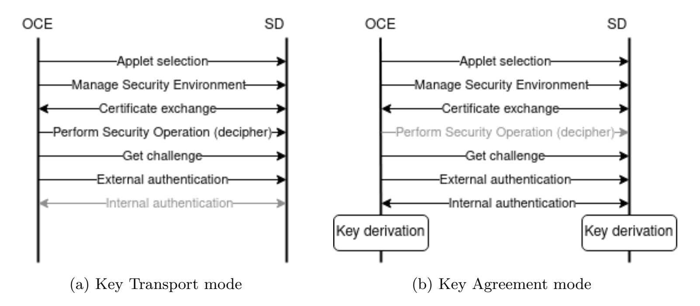
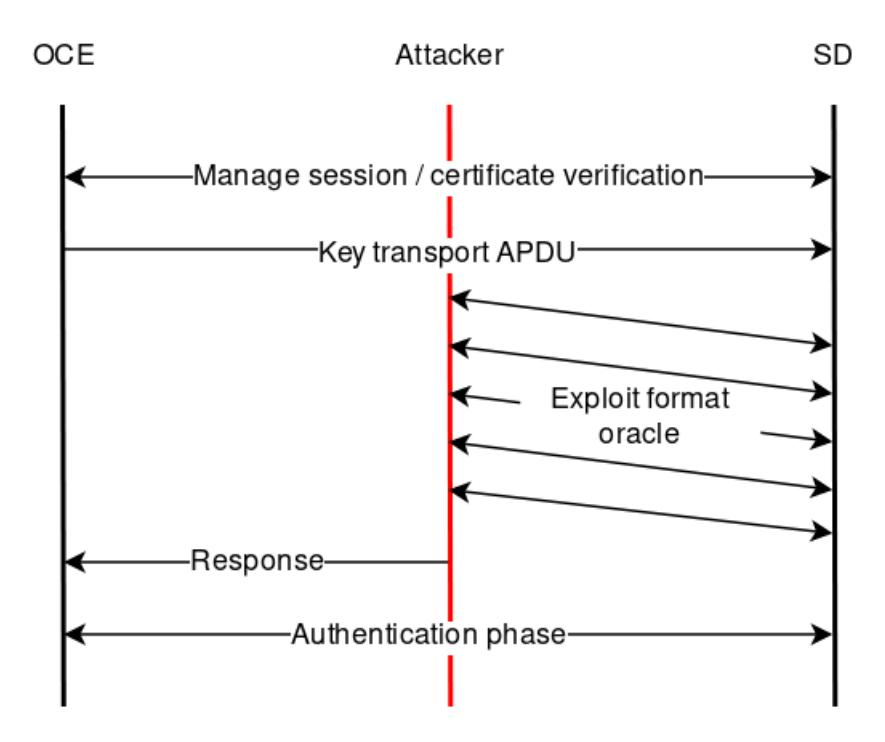
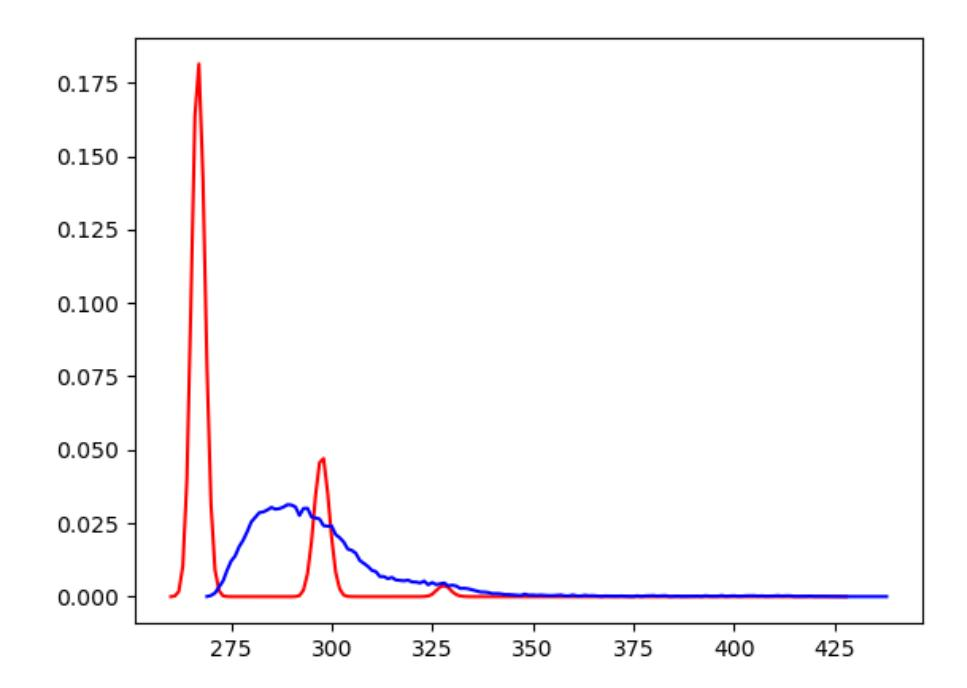

{0}------------------------------------------------

# **The Long and Winding Path to Secure Implementation of GlobalPlatform SCP10**

Daniel De Almeida Braga, Pierre-Alain Fouque and Mohamed Sabt

Univ Rennes, CNRS, IRISA, Rennes, France, [first-name.last-name@irisa.fr](mailto:first-name.last-name@irisa.fr)

**Abstract.** GlobalPlatform (GP) card specifications are defined for smart cards regarding rigorous security requirements. The increasingly more powerful cards within an open ecosystem of multiple players stipulate that asymmetric-key protocols become necessary. In this paper, we analyze SCP10, which is the Secure Channel Protocol (SCP) that relies on RSA for key exchange and authentication. Our findings are twofold. First, we demonstrate several flaws in the design of SCP10. We discuss the scope of the identified flaws by presenting several attack scenarios in which a malicious attacker can recover all the messages protected by SCP10. We provide a full implementation of these attacks. For instance, an attacker can get the freshly generated session keys in less than three hours. Second, we propose a secure implementation of SCP10 and discuss how it can mitigate the discovered flaws. Finally, we measure the overhead incurred by the implemented countermeasures.

**Keywords:** SCP10 · Java card · Bleichenbacher · Coppersmith

# **1 Introduction**

Smart cards are increasingly used to provide secure services: in communication as SIM cards [1](#page-0-0) , in banking as payment cards and in authentication systems as hardware tokens. This is due to the fact that they are highly certified (a Common Criteria 4+ and above certification). Nevertheless, smart cards are not resilient to attacks. In particular, a popular attack vector is their communication system.

Smart cards communicate with external entities via a logical channel called Application Protocol Data Unit (APDU), which is equivalent to the TCP/IP protocol for the Internet. Similar to TCP/IP, the APDUs were not intended to be a secure protocol in the beginning despite its applications in a security-centric ecosystem. Subsequent standards for smart cards amend this misstep by proposing the Secure Channel Protocol (SCP) [\[Tec18\]](#page-22-0). As its name indicates, SCP channels prevent communication with the card from being observed or tampered. SCP01, SCP02, and SCP03 (which are respectively version 1, 2 and 3 of SCP) are symmetric keyed ciphering mechanisms using DES (in SCP01), TDES with two keys (in SCP02) and AES (in SCP03). Despite its recent deprecation, many cards still use by default SCP02 with TDES-based CBC block ciphering mode.

As the related ecosystem evolves, multiple parties are being increasingly involved, and thus symmetric ciphers requiring shared secrets are becoming less relevant. Therefore, the GlobalPlatform organization defines two SCP channels relying on asymmetric-key cryptography: SCP10 and SCP11. Asymmetric cryptography usually leverages on wrapping symmetric session keys with asymmetric encryption or key negotiation. There are two main advantages of using SCP10/SCP11 over SCP03: (1) keys management is more straightforward, since no secret keys are ever shared, and (2) Forward Secrecy is more

<span id="page-0-0"></span><sup>1</sup> reaching 5.6 billion shipped cards in 2018 according to SIMalliance [\[SIM19\]](#page-22-1)

{1}------------------------------------------------

easily enforced. More importantly, SCP02 and SCP03 ensure the generation of new session keys by maintaining a counter within the key derivation process. For instance, the counter is only 2-byte long. This means that after 2 <sup>16</sup> sessions, the long-term secret key must be changed. In SCP10, no counter is required, as the process of key generation/derivation only uses freshly generated random bytes without maintaining any stateful information.

Despite its advantages, SCP10 has not yet been publicly deployed in the market. This is mainly due to technical reasons regarding RSA. Indeed, for a long time, RSA has not been available on all smart cards [\[JCA19\]](#page-21-0). In addition, it is slower compared to faster symmetric-key ciphers. However, the trend is changing and RSA is finding more support, benefiting from an overhead reduction brought by cryptographic co-processors that cards already possess. We believed that the current absence of public implementation of SCP10 is because smart cards are slow to develop any modification: SCP03 required almost 8 years for its first implementation despite its similarities to the widely deployed SCP02.

In spite of the existence of an elliptic curve based variant (SCP11), we argue that SCP10 may find adoption within the near future. Indeed, in the last version of the specification [\[Tec18\]](#page-22-0), GlobalPlatform revised the family of secure channel protocols: the document removes the deprecated SCP01 and deprecates SCP02 after successful attacks caused by padding attacks and CBC-encryption with constant IV. However, no modification was made to SCP10, and SCP11 is still defined only as an Amendment. Besides, some patents using SCP10 have been filled by both Huawei and the China Construction Bank in 2018, reflecting its foreseeable adoption.

# **Our Contribution**

In this paper, we scrutinize the specifications of SCP10. The interest of our study is that SCP10 is becoming more relevant than ever because of an ecosystem increasingly open, but not yet implemented. The stringent requirements of smart cards about security make them so slow to change. In addition, many of their systems cannot be updated once they are deployed. This explains why, notwithstanding its deprecation, SCP02 is still widely used in the wild. Much to our surprise, we find that SCP10 is vulnerable to well-known security flaws caused by deterministic padding for RSA encryption.

Indeed, we first note that SCP10 encrypts the random data used for the process of key derivation using RSA without any random padding. Although the specifications claim the use of PKCS#1 v1.5 for data encryption, the underlying technical details mandate a constant padding concatenated after the 0x0002 string. Then, we exploit this observation by two means. First, the rigid messages format of GlobalPlatform SCP makes the major part of the encrypted message constant in a discernible way: a big known part and a much smaller unknown part. Here, we apply the Coppersmith attack that solves univariate modular equations to decrypt the whole message. Second, we apply the Bleichenbacher attack that leverages a format oracle to compute modular exponentiation of an arbitrary value over the private exponent without any knowledge of the private key. Attackers can take advantage of this attack in twofold ways: decryption of sensitive messages and signatures forgery to impersonate smart cards.

Our contributions can be summarized as follows:

- We identify various design flaws in the SCP10 specifications that allow attackers to mount practical attacks.
- We implement SCP10 with JavaCard and evaluate the complexity of our attacks on real smart cards.
- We propose a secure implementation of SCP10 and evaluate its overhead. Our implementation complies with the latest NIST recommendation in terms of Key Agreement [\[BCR](#page-20-0)<sup>+</sup>19].

{2}------------------------------------------------

The goal of our work is to provide pertinent analysis to the GP community, so that their Crypto Sub-Task force can take informed decisions when deciding how to fix the identified problems with SCP10. Of independent interest, our work underlines the fact that security in standards undergone rigorous verification is still vulnerable to well-known attacks. It is worth mentioning that SCP10 still complies with the NIST recommendations with respect to RSA: PKCS#1 v1.5 is disallowed starting from 2024, and the defined key-transport and key-agreement are disallowed starting from 2021 [\[BR19\]](#page-20-1). We encourage the adoption of provable secure cryptosystems that we propose in our amendments, such as RSA OAEP, that make SCP10 more resilient to such attacks.

**Attack Scenario.** Smart cards are embedded into connected devices, such as smartphones. Service providers transmit some sensitive data to clients smart cards. Very often, this communication occurs remotely over-the-internet or another non-secure channel. We suppose that there are some attackers who can intercept and manipulate the exchanged messages between the service provider and the smart card; otherwise there is no need to the SCP standards. The goal of the attackers is to put their hands on the transmitted sensitive data. This includes PIN codes, proprietary applications or personal identification credentials.

Leveraging the vulnerabilities described in this paper, attackers can accomplish their goal in two ways. First, they can recover the freshly generated session keys by decrypting the messages wrapping them. Here, Coppersmith and Bleichenbacher attacks apply. Second, attackers can forge a certificate allowing them to impersonate valid smart cards. Thus, service providers might successfully initiate an SCP10 channel with an attacker who will receive all the messages intended to valid cards. Here, Bleichenbacher alongside key reuse make this attack practical. Our evaluation shows that recovering session keys is much faster than forging certificates. Nevertheless, the former compromises only one session, while the latter would still work across multiple sessions.

**Responsible Disclosure.** Our findings have been timely reported to GlobalPlatform following their responsible disclosure process. The GlobalPlatform Security Task Force was quite responsive and acknowledged our results. They also organized several meetings in order to present the identified vulnerabilities to their concerned industrial partners. We have shared a draft of this paper as well as our PoC code with the interested partners. We also provide our support, so that most of our countermeasures are taken into account in a fix of SCP10 to be rolled out.

# **Related Work**

**GlobalPlatform Secure Channel Protocol.** The family of SCP protocols is mainly deployed on smart cards, most of which are a subject of rigorous certification defined by Common Criteria (CC). A popular certification process for smart cards is EAL4+, which is a high certification level required for sensitive applications. Despite their importance, the SCP protocols have been overlooked in the literature for a long time. To the best of our knowledge, Sabt *et al.* in [\[ST16\]](#page-22-2) provided the first cryptanalysis for both SCP02 and SCP03. In their work, they showed a theoretical attack against SCP02 due to misuse of Initialization Vector (IV) in CBC mode. More importantly, they highlighted the limit of the enterprise of certification compared to using provably-secure cryptographic schemes, since SCP02 is the most widely deployed within the SCP family. In addition, they proved that SCP03 provides stronger security guarantees by preventing Algorithm Substitution Attack (ASA) [\[BJK15\]](#page-20-2). In [\[AF18\]](#page-20-3), Avoine *et al.* showed more practical attack against SCP02 in which they exploit CBC padding oracles in order to recover some secret data. Consequently, SCP02 was officially deprecated by GlobalPlatform.

{3}------------------------------------------------

**Coppersmith Short Pad Attack.** In order to avoid the problems related to deterministic encryption, some random padding is often appended to the message before encryption. Coppersmith pointed out the danger of such approach of padding by improving the Franklin-Reiter Related Message Attack [\[CFPR96\]](#page-20-4). Indeed, an attacker can decrypt the message if the constant unknown part of the message is big enough with regard to the random part. However, we only recover the constant part and we do not get the random padding. This attack is not applicable in the context of SCP10 due to its special padding. Indeed, SCP10 uses some constant string for padding to encrypt some random data, namely the session keys. Loosely speaking, this is equivalent to the previous case. Nevertheless, the difference here is that we also require to recover the random data. Therefore, we implement the Coppersmith's Algorithm in [\[Cop97\]](#page-21-1) that allows us to recover the whole encrypted message. In ACM CCS 2017, Nemec *et al.* in [\[NSS](#page-21-2)<sup>+</sup>17] discovered a critical vulnerability in deployed smart cards by recovering their RSA private keys using an optimized version of the Coppersmith's method in [\[Cop96\]](#page-20-5). This work is out of scope of our paper, since we do not focus on the generation of the RSA keys.

**Bleichenbacher Attack and Key Reuse.** Strangely, the seminal work of Daniel Bleichenbacher in [\[Ble98\]](#page-20-6) has not discouraged implementers and protocols designers to continue using RSA with PKCS#1 v1.5 padding. Indeed, even NIST does not strongly inhibit it in their latest recommendation [\[BR19\]](#page-20-1): PKCS#1 v1.5 is *disallowed* only starting from 2021. Thus, Bleichenbacher attack is still unfortunately applicable to various applications and deployed systems: myriad of cryptographic libraties (OpenSSL, BoringSSL, etc.) [\[RGG](#page-21-3)<sup>+</sup>19], TLS 1.3 and QUIC [\[JSS15\]](#page-21-4), JSSE (Java Secure Socket Extension) [\[MSW](#page-21-5)<sup>+</sup>14], XML encryption [\[JSS12\]](#page-21-6), and many web servers including Facebook and PayPal [\[BSY18\]](#page-20-7). To the best of our knowledge, our paper is the first work to apply the Bleichenbacher attack in the context of smart cards and GlobalPlatform protocols. Moreover, we demonstrate that key reuse across multiple usage extends the attack by allowing attackers to forge signatures. Similar approaches can be found in [\[FGS](#page-21-7)<sup>+</sup>18, [DLP](#page-21-8)<sup>+</sup>12].

# **2 Background**

In this section, we briefly introduce some basic notions of the RSA cryptosystem. In addition, we also present both Coppersmith and Bleichenbacher attacks. For more details, please refer to [\[Cop97,](#page-21-1) [Ble98\]](#page-20-6). Further background is presented in Appendix [A.](#page-22-3)

All byte values are written as 5B. 5B*<sup>i</sup>* denotes the string made of *i* bytes of value 5B. The symbol || denotes concatenation. Unless specified otherwise, (*n, e*) corresponds to an RSA-1024 public key, and *d* to the corresponding private key. This key can be used to produce a ciphertext *c* corresponding to a padded message *m*.

# **2.1 The RSA Cryptosystem**

**The Size of the Public Exponent** *e***.** For efficiency reasons, *e* is chosen to be small, which leads to fast encryption and fast signature verification. The NIST recommends the use of 2 <sup>16</sup> *< e <* 2 <sup>256</sup> [\[Nat13\]](#page-21-9). However, the European Payment Council only warns about *e* = 3 if the encrypted message is shared among at least three users and sees no objection otherwise [\[Eur18\]](#page-21-10). This means that protocols between two parties can use smaller exponents, which is the case of most card protocols and their related payment systems.

**Padding.** The naive RSA, also called Textbook RSA, is not secure due to two undesirable properties: malleability and determinism. Thus, a very common practice for encrypting or signing a message *m* is to first apply an encoding scheme *x* = *µ*(*m*) during encryption/signing and to apply a decoding scheme after decryption/verification. Very often, this

{4}------------------------------------------------

process of encoding is called *padding*. The PKCS#1 standard incorporates several padding schemes. In smart cards, the most widely supported one is PKCS#1 v1.5 for encryption and signing. Indeed, according to [\[JCA19\]](#page-21-0), 97% of the tested cards supports it, while only 23% supports OAEP for encryption and 29% supports PSS for signing. Moreover, SCP10 relies on (a variant of) PKCS#1 v1.5 padding. Given a message *m*, we briefly describe the padding scheme (encoding) as follows:

```
Encryption: EM(m) = 0x00 || 0x02 || PS || 0x00 || m
   Signing: EM(m) = 0x00 || 0x01 || 0xFF...FF || 0x00 || m,
```

where PS is a random string of length at least 8 bytes.

After decryption/verification, the padding is verified. For decryption, for instance, the result is verified to start with 0x00 0x02, followed by at least 8 non-null bytes that ends with 0x00. If the decoding does not comply, the decryption function fails.

# <span id="page-4-0"></span>**2.2 Coppersmith's Attack**

In his groundbreaking work, Coppersmith [\[Cop97\]](#page-21-1) proposed a method to find small solutions of univariate modular equations with modulus having an unknown factorization. This method allows a passive attacker intercepting an RSA ciphertext to decrypt it providing the size of the secret data is small enough. Indeed, let *m* be a message consisting of two parts: a known part *k* and a secret one *s*: *m* = *k* + *s*. Each part must be consecutive. Suppose *c* = (*k* + *s*) *<sup>e</sup>* mod *n*, the attacker can build the modular polynomial equation *f*(*x*) = (*k* + *s*) *<sup>e</sup>* − *c* mod *n* and recover *s* as long as |*s*| *< n*1*/e* .

The main idea of the algorithm is to find a polynomial *h* with small norm having the same roots as *f*. The polynomial *h* can be constructed by looking for an integer linear combination of the polynomials *gu,v*(*x*) = *n <sup>m</sup>*−*vx <sup>u</sup>f*(*x*) *v* , for some integer *m* and varying values for *u* and *v*. The short vectors of the Lattice *L* spanned by *gu,v* yield the small roots we are looking for. The LLL algorithm [\[LLL82\]](#page-21-11) is used to find such short vectors. A simplified approach is given by Howgrave-Graham in [\[HG97\]](#page-21-12).

# <span id="page-4-1"></span>**2.3 Bleichenbacher's Attack**

Bad padding causes decryption failure. In practice, numerous systems prefer to report such an error to the user. Bleichenbacher [\[Ble98\]](#page-20-6) showed that this error message has severe consequences against PKCS#1 v1.5: chosen-ciphertext attackers can decrypt an arbitrary ciphertext. The attack is not limited to decryption; forging signatures is possible. Indeed, the Bleichenbacher's attack allows computing modular exponentiation of an arbitrary value over the private exponent without any knowledge of the private key. There are two steps: Blinding and range reducing. We note that Blinding is the most time-consuming step. We also note that Bardou et al. [\[BFK](#page-20-8)<sup>+</sup>12] described performance improvements. The optimization is applicable in our case, and we will describe them later in Section [4.3.3.](#page-10-0)

The broad range of attack exploiting this vulnerability shows the diversity in which such an oracle occurs, from error code ([\[BSY18\]](#page-20-7)) to subtle side-channel leakage ([\[RGG](#page-21-3)<sup>+</sup>19]). In Appendix [A,](#page-22-3) we give an overview of the original attack [\[Ble98\]](#page-20-6).

# **3 SCP10 (Secure Channel Protocol 10)**

GlobalPlatform card specification [\[Tec18\]](#page-22-0) defines a set of standards relating to the deployment and management of applications on smart cards. Within the GP architecture, the security domain (SD) is the entity that supports various cryptographic operations, including secure communication with an off-card entity (OCE) that might be the card issuer or an application provider. GP defines a family of protocols called *secure channel*

{5}------------------------------------------------

*protocol* (SCPs) to provide secure communication. Here, we are solely interested in SCP10, as the security analysis of SCP02 and SCP03 has been done in [\[ST16,](#page-22-2) [AF18\]](#page-20-3).

Similar to many secure communication channels, SCP10 executes two steps whenever a secure session is required: (1) **initialization** involving key exchange and entities authentication; and (2) **secure transmission** in which data are protected during communication using the generated sessions keys. The security of the first step is crucial, since compromising the sessions keys undermines the security of any subsequent communication in the established session. The particularity of SCP10 is that it leverages asymmetric cryptography. Indeed, unlike SCP02 and SCP03, it relies on RSA for the initialization step. In follows, we summarize the fundamentals of SCP10 that are relevant to our paper.

# **3.1 Keys Management**

We recall that any SCP is established between an OCE and an SD. Each entity stores its own RSA key pair. In addition, any OCE is expected to store the public key of the security domain. In case an OCE does not know the SD's public key, it can issue the Get Data [certificate] command. As for the SD, it holds the public keys of all the previously validated OCEs, sent by the command Perform Security Operation [verify certificate]. This command supplies a chain of certificates for verification. Only one public key is active at a time. As a result, before starting an SCP10 connection, the communicating OCE shall ensure that the SD would use the proper key. Otherwise, it asks the use of a different public key with the Manage Security Environment command. This command, noted MSE, can be sent by anyone in order to indicate the setup configurations of SCP10.

# <span id="page-5-0"></span>**3.2 Initialization**

The purpose of this step is to establish a secure authenticated channel by generating session keys and authenticating the communicating entities (i.e. the OCE and the SD). To this end, SCP10 leverages on wrapping symmetric sessions keys with RSA encryption. The specifications define two modes (chosen by the MSE command): (1) **Key Transport** in which the OCE forces the keys onto the SD, or (2) **Key Agreement** where both sides work together to come out with half of the random bytes and perform some operations on the random bytes to derive session keys. If Key Agreement shines as the best mode in terms of security, Key Transport allows better performance for the card. Given the long history of efficiency/security trade-off in the the smart card industry, it is fair to assume that Key Transport would be implemented and used in some cases.

Figure [1](#page-6-0) summarizes the SCP10 flow. Optional APDUs are represented in grey, and double arrows indicate that SD has to perform some computation instead of simply processing the input and return an error code. As mentioned in the specification [\[Tec18\]](#page-22-0) (Appendix F, chapter 1.4), one of the firsts commands, called Perform Security Operation [decipher], contains the key material to be used in the subsequent communication. Confidentiality is protected by encrypting the data with the SD's public key. This command can be ignored in Key Agreement. Then, the OCE issues the External Authenticate command in order to prove its identity to the SD. Here, the OCE computes the hash of some data concatenated to the card challenge obtained by the Get Challenge command. A signature is computed over the hash using the OCE's private key. In Key Agreement, the signature is performed over the hash and the random bytes used to derive the session keys. Therefore, only in this mode, the signature is encrypted with SD's public key. Finally, the Internal Authenticate command is sent to verify the SD. It works as follows: the OCE sends a challenge to the SD that computes a hash of the challenge and the exchanged session keys. This hash is then signed by the SD's private key. In Key Agreement, the signature is performed over the hash and the other half of the random bytes used to derive the keys. Therefore, the signature is also encrypted with the OCE's public key.

{6}------------------------------------------------

<span id="page-6-0"></span>

Figure 1: SCP10 initialization flow in both key exchange mode

It is important to note that SCP10 uses the same set of RSA keys for both modes and for encryption/signing. Highly relevant to our paper, we describe, for each mode, the message formats and the used paddings.

### <span id="page-6-1"></span>**3.2.1 Key Transport Padding**

We note (pubKOCE*,* privKOCE) (resp. (pubKSD*,* privKSD)) the OCE's (resp. SD's) RSA key pair. We refer by params all values whose confidentiality is not needed, including the security level and some algorithms ID (e.g. hash functions). Out of scope of this paper, we do not detail the data used to compute the hash values.

```
• Perform Security Operation [decipher] (encrypted by pubKSD):
```

```
0x0002 || 0xFF..FF || 0x00 || params || session keys.
• External Authenticate (signed by privKOCE):
```

```
0x0001 || 0xFF..FF || 0x00 || params || hash(data).
```

**•** Internal Authenticate (signed by privKSD):

```
0x0001 || 0xFF..FF || 0x00 || params || hash(data).
```

### **3.2.2 Key Agreement Padding**

We use the same notations as in the previous subsection. In addition, we refer by PS random padding bytes of a certain length.

```
• External Authenticate (signed by privKOCE, then encrypted by pubKSD):
```

```
0x6A || PS || params || OCE Secret || hash(data) || 0xBC.
```

**•** Internal Authenticate (signed by privKSD, then encrypted by pubKOCE):

```
0x6A || PS || Card Secret || hash(data) || 0xBC.
```

# **3.3 Secure Transmission**

Once the channel is established, confidentiality is ensured using 3DES in CBC mode. As for integrity, it is protected through DES Retail MAC. If both are mandated, data is first encrypted, and then the MAC is calculated over the ciphertext (Encrypt-then-MAC).

We underline that the specifications instruct to always set the encryption IV (Initialization Vector) to zero for encryption. This raises a known vulnerability described in [\[ST16\]](#page-22-2). Since we do not focus on this part, we skip the details that can be found in [\[Tec18\]](#page-22-0).

{7}------------------------------------------------

# <span id="page-7-0"></span>4 Design flaws

In this section, we scrutinize the specifications of SCP10 looking for exploitable flaws. We find that SCP10 is vulnerable to various security flaws mainly caused by its underlying cryptographic mechanisms. We first note that SCP10 encrypts the exchanged keys session using PKCS#1 v1.5 RSA with no random padding. In addition, the same RSA key pair is used for both confidentiality and authentication purposes in the two defined modes. This results in attackers recovering session keys and forging certificates to impersonate cards.

One may argue about the interest to study SCP10 for which there is no public implementation. We claim that SCP10 is becoming more relevant because of the ecosystem that is getting increasingly open. Moreover, smart cards cannot update their running system once they are deployed; they are so slow to integrate fixes, and therefore security analysis should be anticipated. For instance, SCP02 is still widely used in the wild despite its deprecation. Our purpose of this paper is to avoid the deployment of a security protocol with a compromised design that can lead to broken implementations. Furthermore, SCP10 relies on cryptographic schemes that will be disallowed soon enough, so that they shall not be implemented in smart cards: key establishment in 2021 and PKCS#1 v1.5 in 2024.

Below, we outline the identified flaws, present related attack scenario, and define practical realization.

### 4.1 Threat Model

In order to leverage the identified design flaws, the attacker requires three capabilities:

- Initiate an SCP10 channel with an SD. This does not mean that the triggered initialization will end successfully.
- Intercept, read and modify plaintext messages that are transmitted between a legitimate OCE and the card.
- Measure the time needed by the card to perform several operations.

A concrete attack scenario we consider in this work is recovering the exchanged session keys despite being encrypted by an 1024-bit key. To this end, the attacker does not require to have a physical access to the smart card (i.e. no physical side-channel capabilities). Instead, remote attacks are possible if the attacker obtains a network man-in-the-middle position. However, we stress that she cannot break the used cryptographic protection (e.g. directly decrypting messages or forging signatures).

### <span id="page-7-1"></span>4.2 Deterministic RSA Encryption Padding

As mentioned previously, in Key Transport mode, the message meant to transmit session keys is encrypted using the SD's public key. The keys are embedded into a data structure called Control Reference Template (CRT), and the padding in Section 3.2 is applied.

Strangely, this padding is once referred as "PKCS#1 v1.5 padding" in [Tec18] section B.3.1.2, but it does not correspond to any padding described in the aforementioned standard. In fact, it seems to be a mix of both encryption (the two leading bytes) and signature paddings (the constant string 0xFF | | ··· | | 0xFF). This implies that the encryption is deterministic, and therefore if an OCE sends the same message twice, the resulting ciphertext will be the same. Such a property is unfortunate and can be exploited to mount dictionary or Meet-in-the-Middle attacks to recover the encrypted message (extending the method described in [BJN00] to a deterministic padding).

Nevertheless, in this particular context, determinism is only a theoretical vulnerability since it would be unlikely that the same session keys (the variable data within Perform Security Operation [decipher]) would be sent more than once. Moreover, the outcome

{8}------------------------------------------------

would be limited: the attacker would only recognize previously session keys. This is because a dictionary attack would have a tremendous memory complexity, as for a Meetin-the-Middle attack due to the high number of unknown bits (even if the latter is a far better alternative). These options are not discussed in further details through this paper.

A more important consequence of this particular padding is the known structure of the message. Indeed, the biggest part of the messages is constant and publicly known. This allows adversaries to recover the unknown part (i.e. the session keys) by performing the Coppersmith attack as described in [\[Cop97\]](#page-21-1) and reminded in Section [2.2.](#page-4-0)

### **4.2.1 Exacerbating Specifications**

Deterministic RSA encryption is a bad practice, and we think it shall be mended independently from any attack scenario. However, we go further and show how an attacker can take an advantage of it. Once again, SCP10 is yet to be deployed, and therefore we only highlight the part in the specifications that can result in practical attacks. We note that all the future implementations are not necessarily vulnerable, but the lax specifications do not rule out the implementation choices that we present below.

**Small public exponent.** The specifications do not exclude that SD might use small public exponent. In addition, the European Payment Council in its last report in 2018 [\[Eur18\]](#page-21-10) does not proscribe that use neither in the context of two-party communication.

**Small amount of unknown data.** Enough bits of the encrypted message of Perform Security Operation [decipher] must be known to the attacker. For instance, for a 1024-bit modulus and *e* = 3, the unknown part must be at most l log<sup>2</sup> (*n* 1 3 ) m = 341 bits long. This holds if at most 42 bytes need to be sent (prior to padding). Given the format of a CRT (described in [\[Tec18\]](#page-22-0), section F.3.1.2), this corresponds to the transmission of a single CRT. A naive way to proceed, which complies to the specification, would be to encrypt each CRT independently, and to transmit them in different APDU packets.

We noted that in order to reduce the size of the unknown part of the message, an attacker can generate all possible CRT headers and apply the attack to each candidate, reducing the unknown part to the trailing couple formed by the key and the IV. Doing so, the bound allowing the attack would be met for the transmission of two CRTs if no IV are added. This generation can be pre-computed once and for all, and stored in memory.

### **4.2.2 Attack Description**

Given an encrypted Perform Security Operation [decipher] message (intercepted by any means), the attacker can recover the session keys using the pseudo-code given in Algorithm [1.](#page-9-0) The function CoppersmithAttack corresponds to the original attack presented in [\[Cop97\]](#page-21-1). An overview of the concept is described in Section [2.2.](#page-4-0) No queries are needed. Thus the attacker can just intercept the messages of a secure session, and then recover the session keys offline in order to be able to read the exchanged messages.

We noted that using the bivariate modular form of Coppersmith's attack ([\[Cop97\]](#page-21-1)), an attacker could recover up to two sessions keys by considering the following polynomial :

$$f(x,y) = (p+x+2^k y)^e - c \mod n,$$

with *x* and *y* the unknown sessions keys (and potential IV), *k* the size of a CRT header and *x* in bits, and *p* the known bytes of the padding and CRTs headers. However, due to the complexity of this variant and the small size of a CRT header, combining the univariate form with some exhaustive search of the remaining bits yield better results in practice.

{9}------------------------------------------------

### <span id="page-9-0"></span>Algorithm 1 Coppersmith attack over Perform Security Operation [decipher]

```
Input:
    headers: Possible CRT headers
    (n,e): SD's RSA public key
Output:
    r: The decrypted CRT containing the session key
 1: procedure Attack(n, e, headers)
       c \leftarrow \text{InterceptAPDU}(\text{Perform Security Operation [decipher]})
 2:
       for h in headers do
 3:
           found, m \leftarrow \texttt{CoppersmithAttack}(n, e, c, h)
 4:
           if found then
 5:
              return m
 6:
```

# <span id="page-9-1"></span>4.3 Padding Oracle on Key Transport

Considering the protocol specification and the struggle of developers to get a PKCS#1 v1.5 padding verification right ([MSW<sup>+</sup>14] [BSY18] [RGG<sup>+</sup>19]), it is fair to assume that Key Transport may give access to a format oracle. However, the specification alone does not provide a distinct error for the padding. Indeed, it only allows three types of return code:

- Generic error codes, corresponding to errors occurring in the message header.
- An error code corresponding to a problem when processing the transmitted payload. This error can occur during decryption, padding checking, or data parsing (extraction of the cryptographic material).
- A generic success code if no error occurred.

We do not try to alter the message header, and thus the first error is not relevant in our context. One may argue that the second error is enough to mount Bleichenbacher attack. This supposes that a forged ciphertext decrypts to a valid message both in terms of padding and data structure. We recall that the attack complexity depends on how easy it is to find forged ciphertexts that pass the defined oracle. The probability of forging a perfectly valid ciphertext is very low, which might substantially increase the attack complexity. Therefore, we require to distinguish the case of a padding error from that of a parsing error. To this end, we require to target a difference on card processing time to distinguish valid from invalid ciphertext, and so to build a padding oracle  $\mathcal{O}$ .

### 4.3.1 Oracle Characterization

Based on the notation of Bardou *et al.* [BFK<sup>+</sup>12], we define different tests that a message needs to pass before being considered valid by the oracle. We assume that every oracle checks that the decrypted data begins with 00 02. The following list enumerates the different checks, from the most basic to the most sophisticated:

- 1. Check if there is a 00 somewhere after the first ten bytes.
- 2. Check that there is no 00 bytes in PS (i.e. check that PS is at least eight bytes long).
- 3. Check that PS contains only FF bytes.
- 4. Check that PS is immediately followed by 00.
- 5. Check specific tag and value (defined by the GP specification) in the message.

{10}------------------------------------------------

Given this list, we can define oracles strength using a five-character code, each position corresponding to a check. For instance, a **TTTTT** oracle will only check if the decrypted message begins with 00 02, whereas an **FFFFF** oracle will perform all the checks in the list (which makes it very hard to exploit). A more common oracle would be **FFTFT**, that checks if there is a null byte after the ten first, and if there is no null bytes in the first ten bytes (it corresponds to the "classic" PKCS#1 v1.5 encryption padding).

Exploiting a format oracle using different oracle strength yields distinct results, since tests would to pass with a different probability. Namely, considering the third check (i.e. that PS contains only FF) drastically increases the query complexity, because the probability of a valid forged ciphertext with many FF bytes in a specific location is low.

### <span id="page-10-1"></span>**4.3.2 Exacerbating Specifications**

Once again, padding attacks are important on their own. Furthermore, the lax specifications might allow practical attacks if care is not taken during the implementation.

**Time leakage.** The specifications do not mention whether a message with an invalid padding must still be parsed. Considering an invalid padding, the resulting data would most likely not be format-compliant, hence the parsing would fail. However, trying to parse invalid data implies to instantiate objects and may behave unexpectedly (overflow for instance). Consequently, we build our oracle by measuring the difference in execution time between messages with invalid padding and those with valid ones, since valid padding means that the card would attempt to parse the message (and most likely fail).

**Relaxed oracle.** Since a strong oracle would need numerous queries to be exploited on a smart card, we focused on a relaxed oracle. Our relaxation perfectly corresponds to how a classic PKCS#1 v1.5 decryption shall be implemented: checking that at least 8 bytes are non null within the padding without looking at their specific values (since they are assumed to be random in the origin PKCS#1 v1.5). This holds, for example, if the developers just use the existing JavaCard RSA implementation without any adaptation to the constant padding string in SCP10. Therefore, we consider an **FFTFT** oracle: only ignoring the fact that PS is supposed to only contain FF bytes.

### <span id="page-10-0"></span>**4.3.3 Attack Description**

**Optimizations.** In 2012, Bardou *et al.* published a significant improvement to the original Bleichenbacher algorithm, allowing to target more constrained devices [\[BFK](#page-20-8)<sup>+</sup>12]. Their work was mainly based on the fact that the biggest overhead occurs during the firsts range reductions. The improvement is to put in a few thousand queries in order to trim the initial interval after the blinding step, and so to skip impossible values of *s<sup>i</sup>* during the first range reduction. By doing so, and considering different oracle strength, they were able to reduce the queries to an average of 9374 for an ideal oracle.

Taking into account the targeted constrained environment, we went further and tweaked the variable used by Bardou *et al.* in order to reduce the number of queries needed for the initial trimming. Namely, we set up a threshold from which we stop looking for potential trimmers. Empirical measures tend to show that five candidates are enough to significantly reduce the initial interval, reducing the queries to an average of 3962 for an ideal oracle.

On constrained devices, such as java cards, the bottleneck of this attack is the number of query we need to make to perform the attack. In order to reduce this number, hence the attack duration, we can stop to reduce the range once there are only a few possible values left for *m*0. Indeed, brute-forcing the remaining values may be quicker than continuing to query the oracle.

{11}------------------------------------------------

The pseudo-code in Algorithm 2 illustrates the attack implementation. The function Blinding is needed only if the data we are working with does not have the right format (signature forgery for instance). The function Trim is described in [BFK<sup>+</sup>12] and consists in finding the aforementioned trimmers to reduce the initial interval. The function Bleichenbacher is an optimized version of the original attack (described in [Ble98] and Section 2.3), using the optimizations proposed by Bardou *et al.* that skips some values of  $s_i$  during the first range reduction.

### <span id="page-11-0"></span>Algorithm 2 Optimized Bleichenbacher attack

```
Input:
     c: Ciphertext or payload to sign
     (n,e): SD's RSA public key
    l: Byte length of n
Output:
     m = c^d \mod n
 1: procedure Attack(c, n, e, l)
         B \leftarrow 2^{8(l-2)}
 2:
         initial\_range \leftarrow [2B, 3B]
 3:
         c_0, s_0 \leftarrow \mathtt{Blinding}(c)
 4:
         range \leftarrow \mathtt{Trim}(c_0, 2B, 3B)
 5:
         m \leftarrow \texttt{Bleichenbacher}(c_0, s_0, range)
 6:
 7:
         return m
```

**Handling errors.** Oracles based on time leakage are often less precise than ideal ones. Thus, we may encounter some false negatives and false positives. If the former does not make the attack fail (only makes it more complex), the latter could compromise the result. In order to avoid that, we introduced a rollback mechanism allowing to keep the last interval and carry on the search if the interval comes up empty after a range reduction.

**Attack workflow.** The attacker first requires to validate the first steps of the protocol. This is easily done since no authentication is performed before the targeted operation: an attacker can define the session parameters, including skipping certificate verification on the card side, using MSE (see Figure 2).

A major overhead of this procedure stems from the card terminating the connection for each error. This means that for each unsuccessful query (which occurs most of the time), the whole procedure must be performed from scratch.

Algorithm 3 represents the procedure an attacker has to go through for each query to the oracle. The function GetTime is a generic function we use to measure the response time of the card. The function SendAPDU is used to communicate with the card. We first need to select the proper applet, using its AID (SELECT APPLET). Then, we set up the session to avoid useless operation (such as certificate verification on the card) and choose Key transport mode (using MSE APDU). Finally, TimeToValidity is the function we use to distinguish valid padding from invalid padding, given the processing time of the card. More details on that last function are given later in Section 5.4.

# <span id="page-11-1"></span>4.4 RSA Key Reuse

Each theoretical definition of cryptographic primitives indicates that freshly generated keys should be used if the security proof shall remain valid. In practice, this is difficult to achieve, especially for constrained devices where storage is limited. Thus, attacks have been shown against secure protocols if the same key is used for multiple purposes [JSS15, FGS<sup>+</sup>18].

{12}------------------------------------------------

<span id="page-12-0"></span>

Figure 2: Protocol workflow for an attacker exploiting Perform Security Operation [decipher] APDU in Key Transport mode

#### <span id="page-12-1"></span>Algorithm 3 Oracle query

### Input:

c: Value to send to the oracle

AID: Applet ID on the card

#### **Output:**

Format validity

- 1: **procedure** QUERYORACLE(c, AID)
- 2: SendAPDU(SELECT APPLET, AID)
- 3: SendAPDU(MSE)
- 4:  $start \leftarrow \texttt{GetTime}()$
- 5: SendAPDU(PERFORM SECURITY OPERATION [decipher], c)
- 6:  $t \leftarrow \texttt{GetTime}() start$
- 7: return TimeToValidity(t)

### 4.4.1 Exacerbating Specifications

The specifications do not take into account the danger of key reuse. Indeed, SCP10 mandates that the same RSA key would be used for both Key Transport and Key Agreement modes. Moreover, in each mode, the same public key performs encryption and signature verification, and the same private key performs decryption and signature. We assume that such a design choice allows the card to store fewer certificates: only one key pair for each entity instead of four. This brings benefits in terms of reducing implementation complexity as well as storage and processing costs.

#### 4.4.2 Attack description

Equipped with a padding oracle, an attacker can exploit key reuse in order to forge signature, allowing her to impersonate the SD in all subsequent communications. The idea of using Bleichenbacher attack to forge signatures in the RSA setting was briefly mentioned in the origin work [Ble98], and examined in more detail in [FGS<sup>+</sup>18, DLP<sup>+</sup>12]. Here, we describe this attack in the context of SCP10.

**Attack Description.** To forge a signature, an attacker may exploit the oracle described in Section 4.3. Since the SD uses the same key to decrypt the message it receives in the

{13}------------------------------------------------

Perform Security Operation [decipher] and to verify the certificate signature, the outcoming signature would be successfully verified by the OCE if appended at the end of SD's certification chain.

However, the payload an attacker needs to sign does not comply with the oracle she queries. Thus, the blinding step described in Algorithm [2](#page-11-0) line [4](#page-11-0) would be necessary to find the first compliant candidate. This additional step induces a major overhead. Considering the relaxed oracle described in Section [4.3.2,](#page-10-1) an approximation of the average query needed to perform the blinding step can be computed with the same method used in [\[RGG](#page-21-3)<sup>+</sup>19]. Assuming the decrypted message is a random string of 128 bytes, the probability that a candidate is compliant can be expressed as:

$$\Pr[\mathcal{O}(c) = 1] = 2^{-16} \times \left(\frac{255}{256}\right)^8 \times \left(1 - \left(\frac{255}{256}\right)^{118}\right) \approx 5.47 \cdot 10^{-6}.$$

Thus, the expected number of query is (*P*[O(*c*) = 1])−<sup>1</sup> which is about 183000 queries.

The attack workflow is similar to the one described in Figure [2,](#page-12-0) since the same oracle would be used to forge a signature. The only difference is the initial data sent to the oracle (the hash of the certificate being forged in this case). Once the signature is forged, the attacker can intercept incoming APDU and impersonate the SD by presenting a certificate containing a valid signature, issued by the SD.

**Attack Benefits.** With a forged certificate, the attacker is able to impersonate the targeted SD, independently of the key exchange mode. Thus, given that the attacker controls the network, she can perform a man-in-the-middle attack between an OCE and the SD for all future sessions. Furthermore, the smart card industry expects an ecosystem in which the card issuers distribute the certificates for all their cards. Consequently, a single forgery might allow impersonating on a large scale. Thus, the attack is valuable even if it takes several days.

# **5 Experimental results**

To validate that the identified vulnerabilities can indeed be exploited, we conduct several practical evaluation on real smart cards. Note that we were not able to evaluate the feasibility of attacks on deployed versions of SCP10, since, to the best of our knowledge, there is no smart card that currently implements it. In addition, official reference implementations are not yet available. Therefore, we provide our own implementation of SCP10 that is compliant with the GP specifications. In this section, we describe our setup and give more details about our implementation. Then, we present and discuss the experimental results that we have obtained during our evaluation. Our implementation is open-source [2](#page-13-0) .

# <span id="page-13-4"></span>**5.1 Setup**

All our experiments have been performed on a Dell XPS13 7390 running on Fedora 31 with an Intel(R) Core(TM) i7-10510U and 16 GB of RAM. We use a SmartCafe Expert 3.2 72K smart card supporting JavaCard 2.1.2 [3](#page-13-1) . The communication with the card is managed by a contact reader (Omnikey 3121) through a Python v3.7.5 script with Pyscard v1.9.9 [4](#page-13-2) . Our Python script simulates both the legitimate OCE and the attacker, following the attack workflow described in the previous section. Some computation needed to perform the attacks have been performed using SageMath [5](#page-13-3) v8.8 for the sake of simplicity.

<span id="page-13-0"></span><sup>2</sup>https://github.com/ddealmei/SCP10-attack

<span id="page-13-1"></span><sup>3</sup>https://github.com/martinpaljak/oracle\_javacard\_sdks/tree/master/jc212\_kit

<span id="page-13-2"></span><sup>4</sup>https://pypi.org/project/pyscard/

<span id="page-13-3"></span><sup>5</sup>https://www.sagemath.org/

{14}------------------------------------------------

The protocol has been implemented and installed as an applet, since we are not able to deploy it at the JCVM level. We converted it to a CAP file using Maven v3.5.4 and the antrun [6](#page-14-0) v.1.8 plugin. We used GlobalPlatformPro [7](#page-14-1) v.19.06.16 to deploy the applet.

# **5.2 Implementation**

We provide two implementations of SCP10: the first one is GP-compliant and contains the identified design flaws, while the second one includes the countermeasures defined in Section [6,](#page-18-0) but is not GP-compliant. Therefore, both shall not be used in production. Here, we focus on our vulnerable implementation.

We underline that we do not provide a full SCP10: we only implement the Initialization part (no protected communications). In addition, some technical details have been left, since they were not concerned by the attacks. For instance, in Key Agreement mode, the process of derivation of session keys has not been provided. Moreover, the role of card issuer has been ignored, as we hard-code all the SD's keys directly inside the applet.

As noted previously, GP mandates several design flaws: deterministic RSA encryption, PKCS#1 v1.5 padding without random string for encryption and key reuse for encryption/signature. In order to demonstrate their danger in terms of security, we also implement the identified sections of GP specifications that make them relevant to mount very practical attacks. We stress that these parts are not required by GP, but the specifications do not prohibit them neither. We did not explore other implementation choices, since we claim that they would just make the attacks harder or more technical.

# **5.3 Deterministic RSA Encryption Padding**

Our first experiments concern the session keys recovery caused by the constant string used for RSA padding. We implemented the Coppersmith algorithm that finds small solutions of univariate modular equations [\[Cop97\]](#page-21-1). Our evaluation works as follows: we generate a valid message for the command Perform Security. As described in Section [3.2.1,](#page-6-1) the message is split into two adjacent parts: known (padding and tags values) and unknown (the secret key and a potential IV). If only one CRT is included, the length of the unknown part is at most 34 bytes if an IV is included in the transmitted CRT. Then, we encrypt the message with the SD 1024-bit RSA public key. Now, by intercepting this encrypted message the attacker can run Coppersmith attack.

**Optimization.** The complexity of Coppersmith's attack is bounded by the complexity of the underlying LLL reduction. Some significant optimizations are described in [\[BCF](#page-20-10)<sup>+</sup>14], allowing to perform the reduction on a truncated bases, and to get closer to the theoretical bound while keeping a reasonable reduction time.

Furthermore, we were able to reduce the size of the unknown part by enumerating every possible variation in the CRT header (key usage, cryptographic algorithm, tag, key and IV length). Doing so, we can reduce the unknown part of the first CRT to at most 34 bytes instead of 44 bytes (if a 24-byte key and a 8-byte IV are transmitted, we need to consider the two bytes of the IV header). Once these prefixes are generated, we can efficiently go through all possible case by launching parallel instances of Coppersmith attack.

**Consequences.** In average, considering one CRT per APDU, with a 128-bit key, our Coppersmith implementation takes 0.35 seconds to recover the session key. If two 128-bit keys are embedded in a single APDU, the average time to perform the attack is 0.68 seconds per tested header (in practice, only very few variant are likely to be used).

<span id="page-14-0"></span><sup>6</sup>https://maven.apache.org/plugins/maven-antrun-plugin/

<span id="page-14-1"></span><sup>7</sup>https://github.com/martinpaljak/GlobalPlatformPro

{15}------------------------------------------------

The main advantage of this attack is that it does not require to interact with the card, and is fast enough to recover the key by the end of the Key Exchange step. This allows the attacker to completely undermine the established secure channel, and thus read or change any message on-the-fly.

**Limits.** The attack only works for the Key Transport mode, and it is not applicable to the Key Agreement mode. Indeed, key material is generated by both party, and therefore the attacker needs to break into both side to derive the session key. Moreover, the padding is random, and there is no known part, since encryption is performed on the resulted RSA signature. Thus, Coppersmith attack cannot be applied.

# <span id="page-15-0"></span>**5.4 Padding oracle on Key Transport**

### **5.4.1 Time Leakage**

The GP specifications partially cover the risk of padding attacks: no special error code for invalid padding. However, the process itself of decrypting and decoding can leak some information. Our Code Sample [1](#page-15-1) shows a GP-compliant implementation, where a message is first decrypted and then parsed. We can see that any error occurring during the process is thrown as a Java exception inside the corresponding try/catch clause. We note that parsing nested structures such as TLV (Tag-Value-Length) can be hard to perform in constant time. Thus, we will show how to build a padding oracle based on the observed execution time.

```
1 private void decipher(byte[] buffer) {
2 try {
3 // Decrypt and check the padding using SD's private key
4 sdKey.DecryptPKCS1(buffer, _0, in_received);
5
6 // Check for SCP10-specific tag in the recovered data and parse CRTs
7 short offset = TLVParser.getElement(buffer, SECURITY_LVL_TAG, sessionSecurityLvl);
8 while (offset < (short) (bLen - 1) && nbCrts < 5) {
9 offset = parseCRT(buffer, offset, crts, crtSize);
10 nbCrts++;
11 }
12 }
13 catch (ISOException e) {
14 ISOException.throwIt(SW_INCORRECT_VALUES);
15 }
16 }
```

Code sample 1: Simplified example of specification compliant decryption procedure

### **5.4.2 Timing-based Padding Oracle**

Considering our Code Sample [1,](#page-15-1) the attacker sends their queries as Perform Security messages in the Key Transport mode. Then, she measures the execution time of the card. The attack goal is to build an **FFTFT** oracle by distinguishing the case when the card stops because of a padding or of a parsing error. It turns out that the attacker can observe the difference between the two cases with sufficiently high probability.

Figure [3](#page-16-0) represents our experimental data, expressing the frequency with which a payload is processed in a particular time (communication time included), based on 445000 measures of invalid padding, and 35000 measures of valid padding. The processing time for valid padding is more spread since an error can occur at different time during the parsing.

We define our distinguisher through several thresholds. The first is at 270 ms, under which the padding is most likely not valid, the second is at 332 ms upon which it is most

{16}------------------------------------------------

<span id="page-16-0"></span>

<span id="page-16-1"></span>Figure 3: Approximated distribution of the processing time for invalid padding (red) and valid padding but invalid CRT (blue) in case of an FFTFT oracle

Table 1: Average results of the attack targeting an FFTFT oracle

| Operation  | Time (min) | Query |
|------------|------------|-------|
| Decryption | 167.22     | 27992 |
| Signature  | 435.46     | 74838 |

likely valid. Both of these thresholds, allow to get a quick conclusion, without the need to proceed to further measurements. Due to the partial overlapping of the minor red peaks and the blue curve, some false negative are likely to happen during the attack. This will not compromise the attack, although it increases the number of queries. However, false positive might compromise the attack. Hence, we define other thresholds to guess the validity of a candidate. Namely, if most part of the measured samples lays in the range [273*,* 292] ∪ [303*,* 332], it is probably valid. Otherwise, we assume it is invalid. All this process fits in the TimeToValidity function used in Algorithm [3.](#page-12-1)

Defining these bounds around the red peaks leads to slightly higher false negative rate, but circumvents most false positive. Combining this technique alongside the rollback one of Section [4.3.3,](#page-10-0) false positive rate becomes negligible since remaining occurrences will likely be ignored. Empirical observation tends to show that measuring three samples for each candidate is enough to correctly guess the distribution with less than 15% false negative.

# **5.4.3 Results**

Our padding oracle allows us to perform Bleichenbacher attacks to do both decryption and signatures forging. For messages decryption, the concerned messages are the ones encrypted with the SD's public key, carrying the session keys. For signature forgery, an attacker may want to sign a SHA-1 digest of a certificate in order to impersonate the SD. Our results in terms of attack complexity (geometric mean of time and query) are summed up in Table [1.](#page-16-1)

The meaningful difference between decryption and forgery is due to the Blinding step that is not needed in the former case since the attacker starts with a valid ciphertext.

{17}------------------------------------------------

### **5.4.4 Communication Overhead**

Smart cards have a slow communication protocol, which makes communication overhead for the Bleichenbacher attack far from negligible. Indeed, we estimate the communication overhead to 67 ms per query. This means that it represents around 19% of the attack time in Table [1.](#page-16-1) To perform our estimation, we designed an empty applet that manages command chaining. Then, we measured the time that it takes to follow the workflow: Applet selection → MSE Command → Send ciphertext, as illustrated in Algorithm [3.](#page-12-1)

This overhead is a worst-case scenario, since smart cards with JavaCard 2.2.1 (and above) support applet multiselection. This reduces the communication time to 51 ms by query (improving the results of Table [1](#page-16-1) by 4%), due to the fact that reselection of the applet has an additional overhead because of the allocation of the underlying memory segment allocation. It can be leveraged in a real scenario where an attacker starts communication on a logical channel, and holds it after the MSE command to keep it open. Starting new communication on different channels to perform the attack, the card would not need to re-allocate the memory block to the applet since it is already selected on another channel.

Furthermore, we might assume that SCP10 would be implemented natively and not as an applet (as it is already done with the other SCP protocols). Therefore, time communication could even be smaller due to this low level integration. However, we did not evaluate the potential improvement, since this can be done only by extrapolation on the existing SCPs.

### **5.4.5 Discussion**

**Improvements.** Depending on the capacity of the attacker, brute-forcing the last possible values can significantly reduce the number of query. During our experiments, due to memory constraints, we started to brute-force only when less than 2 <sup>25</sup> values remain. However, this step can be parallelized and distributed, making a powerful attacker able to stop the oracle earlier, and finish the attack offline, significantly reducing the queries and time complexity estimated in Table [1.](#page-16-1)

**Consequences.** The Bleichenbacher attack leads to two main attack scenarios.

- Recovering the session keys encrypted by the command Perform Security. The attack succeeds in nearly 2.78 hours in average. This concerns the communication of one single session.
- Forging arbitrary certificates to impersonate the Security Domain. The attack succeeds in nearly 7.25 hours in average, which is very reasonable because a forged certificate can be exploited for all subsequent communications, independently of the key exchange mode.

**Limits.** Our experimentation shows that the described attacks require a large number of queries. Such a performance bottleneck makes it impractical to conduct in real time within a user-to-card interaction, since any user would quickly notice a problem with their session. However, the attacker may just get the encrypted session keys and all the encrypted messages during the protected communication. Then, the attacker proceeds offline with the attack. As for the context of machine-to-card, given the absence of session time-out, attackers might pause the channel establishment to perform an active MitM attack (see Figure [2\)](#page-12-0). Note that in this scenario we assume that the targeted smart card supports multiple parallel logical channels; which was introduced with JavaCard 2.2.

Another limitation of the scenario of keys decryption is that a new key is used for each session (otherwise, the deterministic RSA encryption would yield the same ciphertext). Thus, an attacker must start the oracle from the beginning each time a new session

{18}------------------------------------------------

is established. We also stress that the strongest padding oracle (namely if the oracle checks that there are at least eight bytes of value FF) makes the attack much harder to execute. However, our assumption is reasonable, since the PKCS#1 v1.5 decryption that is implemented in JavaCard does not check the padding values. Furthermore, the decryption attack only applies if we target a Key Transport session.

# <span id="page-18-0"></span>**6 Secure implementation**

All the issues and vulnerabilities discussed previously can be avoided by redefining some parts of the specification to avoid blurs and cryptographic misuses. Here we suggest some mitigations and evaluate their potential overhead by comparing our secure implementation to the vulnerable one.

# **6.1 Mitigation**

SCP10 mandates a 1024-bit modulus for RSA. Although this is quite low for current security recommendations [\[BR19\]](#page-20-1), we argue that just increasing the size of the RSA modulus would not be enough to secure SCP10. Indeed, beside increasing the complexity of operations and the memory needed to store both keys and certificates, it would make the attacks described in Section [4](#page-7-0) easier:

- Recovering data using Coppersmith attacks is possible only if the size of the data to recover is small enough. The bound is proportional to the modulus size and inversely proportional to the public exponent, implying that a larger modulus with the same public exponent (and padding) permits to recover more data. Namely, a 2048-bit modulus allows the recovery of 85 bytes (extending the attack to more CRTs).
- If the modulus is bigger, so is the padded message, meaning we have a better probability for a candidate to have a valid padding. Hence, fewer queries are required to perform the oracle attack described in Section [4.3.](#page-9-1)

Instead of bigger RSA modulus, we recommend well-known provably-secure cryptographic schemes, in order to fix the design errors we previously outlined.

**Key isolation.** We recommend the use of separate keys for signature and encryption in order to avoid the attack scenario discussed in Section [4.4.](#page-11-1) This recommendation incurs bigger storage requirement, which can be a problem for older card models. Moreover, additional certificates need to be transmitted and verified during the initialization.

**Sufficiently big public exponent.** The specification shall explicitly mandate a public exponent big enough to avoid decryption attacks, as discussed in Section [4.2.](#page-7-1)

**RSA padding.** The unconventional padding used for RSA encryption during Key Transport makes the aforementioned attack easier. We do not recommend switching to "real" PKCS#1 v1.5 neither, but to OAEP, as described in [\[MKJR16\]](#page-21-13). This padding can result in slightly higher computation time (due to the mask generation function). However, our experiments show that such an overhead is quite reasonable.

**Random IV for 3DES encryption.** The specification is rather unclear on certain points: the OCE can transmit a key and an IV to be used, but the IV seems to be used only for DES Retail MAC to ensure integrity. Usage of a null IV is fixed for encryption specification. We recommend the use of random IV for each encryption, transmitted along with the session key in Key Transport mode, and derived from the secret in Key Agreement mode.

{19}------------------------------------------------

|                                               |                           | Original | Secure | Diff. |
|-----------------------------------------------|---------------------------|----------|--------|-------|
| Key Transport, (mutual authentication)        | Cert. verification (card) | 0.92     | 2.06   | +124% |
|                                               | Cert. verification (OCE)  | 0.15     | 0.24   | +60%  |
|                                               | PSO (decipher)            | 0.15     | 0.16   | +6%   |
|                                               | External authentication   | 0.68     | 0.8    | +18%  |
|                                               | Internal authentication   | 0.73     | 0.71   | -3%   |
|                                               | Total                     | 2.76     | 4.11   | +49%  |
| Key Transport, (external authentication only) | Cert. verification (card) | 1.13     | 2.44   | +116% |
|                                               | Cert. verification (OCE)  | 0.15     | 0.24   | +60%  |
|                                               | PSO (decipher)            | 0.15     | 0.16   | +6%   |
|                                               | External authentication   | 0.72     | 0.82   | +14%  |
|                                               | Total                     | 2.31     | 3.81   | +65%  |
| Key Agreement                                 | Cert. verification (card) | 1.18     | 2.12   | +80%  |
|                                               | Cert. verification (OCE)  | 0.15     | 0.24   | +60%  |
|                                               | PSO (decipher)            | 0.15     | 0.16   | +6%   |
|                                               | External authentication   | 1.61     | 1.43   | -11%  |
|                                               | Internal authentication   | 0.85     | 0.80   | -6%   |
|                                               | Total                     | 4.09     | 4.90   | +20%  |

<span id="page-19-1"></span>Table 2: Average time (in seconds) of each APDU exchanged during the Initialization phase of SCP10 for both the GP-compliant (original) and secure applets

### 6.2 Overhead of the Secure Implementation

**Experimental setup.** To evaluate our suggested recommendations, we installed our vulnerable and secure applets, using the same setup described in Section 5.1. However, we used an NXP J3H145 JCOP3 JavaCard 3.0.4 <sup>8</sup> that supports RSA OAEP. Since we aim to measure the design mitigation, we only consider RSA-1024 modulus in both cases, thereby avoiding an additional overhead.

**Results.** As expected, our secure implementation increases the time needed for a key exchange. Table 2 represents the time of 100 key exchanges on the same card for both the vulnerable and the secure SCP10 applet. We considered various scenarios and estimated the duration of all steps of the Initialization phase. Some APDU (namely Select and MSE) are not represented in the table because they are not concerned by the mitigation. Nevertheless, they are still part of the total time.

Discussion. The major overhead occurs during the certificate verification on the card. Indeed, key isolation implies to double all workload associated with certificate transmission and verification. However, this step is not executed every time, since a certificate can be added to the card, and selected using the Manage Security Environment APDU to avoid this particular inconvenience. The second important overhead also concerned certificate verification, but on the OCE side. It stems from the transmission of a second certificate, instead of the unique certificate used in the standard. However, we stress that it represents less than 7% of the total exchange.

Switching to a more secure RSA padding (OAEP) for encryption only results in a negligible overhead (0.01s). Finally, no significant overhead has been noted during either internal or external authentication. This was expected since no change (other than using a different RSA key) was applied to this part of the implementation.

<span id="page-19-0"></span><sup>&</sup>lt;sup>8</sup>https://github.com/martinpaljak/oracle\_javacard\_sdks/tree/master/jc304\_kit

{20}------------------------------------------------

**Acknowledgments.** Daniel De Almeida Braga is funded by the Direction Générale de l'Armement (Pôle de Recherche CYBER). We would like to thank Gil Bernabeu, the Technical Director of GlobalPlatform, for his responsiveness regarding the identified vulnerabilities.

# **References**

- <span id="page-20-3"></span>[AF18] Gildas Avoine and Loïc Ferreira. Attacking GlobalPlatform SCP02-compliant Smart Cards Using a Padding Oracle Attack. *IACR Transactions on Cryptographic Hardware and Embedded Systems*, 2018(2):149–170, May 2018.
- <span id="page-20-10"></span>[BCF<sup>+</sup>14] Jingguo Bi, Jean-Sébastien Coron, Jean-Charles Faugère, Phong Q. Nguyen, Guénaël Renault, and Rina Zeitoun. Rounding and Chaining LLL: Finding Faster Small Roots of Univariate Polynomial Congruences. In *17th International Conference on Practice and Theory in Public-Key Cryptography*, pages 185–202, 2014.
- <span id="page-20-0"></span>[BCR<sup>+</sup>19] Elaine Barker, Lily Chen, Allen Roginsky, Apostol Vassilev, Richard Davis, and Scott Simon. Recommendation for Pair-Wise Key Establishment Using Integer Factorization Cryptography. Technical report, NIST, March 2019. 800-56B Rev. 2.
- <span id="page-20-8"></span>[BFK<sup>+</sup>12] Romain Bardou, Riccardo Focardi, Yusuke Kawamoto, Lorenzo Simionato, Graham Steel, and Joe-Kai Tsay. Efficient padding oracle attacks on cryptographic hardware. In *Annual Cryptology Conference*, pages 608–625. Springer, 2012.
- <span id="page-20-2"></span>[BJK15] Mihir Bellare, Joseph Jaeger, and Daniel Kane. Mass-surveillance without the State: Strongly Undetectable Algorithm-Substitution Attacks. In *ACM Conference on Computer and Communications Security*, pages 1431–1440. ACM, 2015.
- <span id="page-20-9"></span>[BJN00] Dan Boneh, Antoine Joux, and Phong Q. Nguyen. Why Textbook ElGamal and RSA Encryption Are Insecure. In *ASIACRYPT*, volume 1976 of *Lecture Notes in Computer Science*, pages 30–43. Springer, 2000.
- <span id="page-20-6"></span>[Ble98] Daniel Bleichenbacher. Chosen ciphertext attacks against protocols based on the RSA encryption standard PKCS# 1. In *Annual International Cryptology Conference*, pages 1–12. Springer, 1998.
- <span id="page-20-1"></span>[BR19] Elaine B. Barker and Allen L. Roginsky. Transitioning the Use of Cryptographic Algorithms and Key Lengths. Technical report, NIST, March 2019. 800-131A Rev. 2.
- <span id="page-20-7"></span>[BSY18] Hanno Böck, Juraj Somorovsky, and Craig Young. Return Of Bleichenbacher's Oracle Threat (ROBOT). In *27th USENIX Security Symposium*, pages 817–849, 2018.
- <span id="page-20-4"></span>[CFPR96] Don Coppersmith, Matthew K. Franklin, Jacques Patarin, and Michael K. Reiter. Low-Exponent RSA with Related Messages. In *EUROCRYPT*, volume 1070 of *Lecture Notes in Computer Science*, pages 1–9. Springer, 1996.
- <span id="page-20-5"></span>[Cop96] Don Coppersmith. Finding a Small Root of a Bivariate Integer Equation; Factoring with High Bits Known. In *EUROCRYPT*, volume 1070 of *Lecture Notes in Computer Science*, pages 178–189. Springer, 1996.

{21}------------------------------------------------

- <span id="page-21-1"></span>[Cop97] Don Coppersmith. Small solutions to polynomial equations, and low exponent RSA vulnerabilities. *Journal of Cryptology*, 10(4):233–260, 1997.
- <span id="page-21-8"></span>[DLP<sup>+</sup>12] Jean Paul Degabriele, Anja Lehmann, Kenneth G. Paterson, Nigel P. Smart, and Mario Strefler. On the Joint Security of Encryption and Signature in EMV. In *CT-RSA*, volume 7178 of *Lecture Notes in Computer Science*, pages 116–135. Springer, 2012.
- <span id="page-21-10"></span>[Eur18] European Payments Council. Guidelines on Cryptographic Algorithms Usage and Key Management. EPC342-08, 2018. <https://bit.ly/2QtyECF>.
- <span id="page-21-7"></span>[FGS<sup>+</sup>18] Dennis Felsch, Martin Grothe, Jörg Schwenk, Adam Czubak, and Marcin Szymanek. The Dangers of Key Reuse: Practical Attacks on IPsec IKE. In *USENIX Security Symposium*, pages 567–583, 2018.
- <span id="page-21-12"></span>[HG97] Nicholas Howgrave-Graham. Finding small roots of univariate modular equations revisited. In *Crytography and Coding*, pages 131–142. Springer Berlin Heidelberg, 1997.
- <span id="page-21-0"></span>[JCA19] JCAlgTest. List of supported JavaCard algorithms, 2019. [https://www.fi.](https://www.fi.muni.cz/~xsvenda/jcalgtest/table.html) [muni.cz/~xsvenda/jcalgtest/table.html](https://www.fi.muni.cz/~xsvenda/jcalgtest/table.html).
- <span id="page-21-6"></span>[JSS12] Tibor Jager, Sebastian Schinzel, and Juraj Somorovsky. Bleichenbacher's Attack Strikes again: Breaking PKCS#1 v1.5 in XML Encryption. In *ESORICS*, volume 7459 of *Lecture Notes in Computer Science*, pages 752–769. Springer, 2012.
- <span id="page-21-4"></span>[JSS15] Tibor Jager, Jörg Schwenk, and Juraj Somorovsky. On the security of TLS 1.3 and QUIC against weaknesses in PKCS# 1 v1. 5 encryption. In *Proceedings of the 22nd ACM SIGSAC Conference on Computer and Communications Security*, pages 1185–1196. ACM, 2015.
- <span id="page-21-11"></span>[LLL82] Hendrik Willem Lenstra, Arjen K Lenstra, and Laszlo Lovász. Factoring polynomials with rational coefficients. *MATH. ANN*, 261:515–534, 1982.
- <span id="page-21-13"></span>[MKJR16] Kathleen Moriarty, Burt Kaliski, Jakob Jonsson, and Andreas Rusch. PKCS #1: RSA Cryptography Specifications Version 2.2, 2016.
- <span id="page-21-5"></span>[MSW<sup>+</sup>14] Christopher Meyer, Juraj Somorovsky, Eugen Weiss, Jörg Schwenk, Sebastian Schinzel, and Erik Tews. Revisiting SSL/TLS Implementations: New Bleichenbacher Side Channels and Attacks. In *USENIX Security Symposium*, pages 733–748, 2014.
- <span id="page-21-9"></span>[Nat13] National Institute of Standards and Technology. Digital Signature Standard (DSS). FIPS PUB 186-4, 2013. [https://doi.org/10.6028/NIST.FIPS.](https://doi.org/10.6028/NIST.FIPS.186-4) [186-4](https://doi.org/10.6028/NIST.FIPS.186-4).
- <span id="page-21-2"></span>[NSS<sup>+</sup>17] Matús Nemec, Marek Sýs, Petr Svenda, Dusan Klinec, and Vashek Matyas. The Return of Coppersmith's Attack: Practical Factorization of Widely Used RSA Moduli. In *Proceedings of the 2017 ACM SIGSAC Conference on Computer and Communications Security, CCS*, pages 1631–1648, 2017.
- <span id="page-21-3"></span>[RGG<sup>+</sup>19] Eyal Ronen, Robert Gillham, Daniel Genkin, Adi Shamir, David Wong, and Yuval Yarom. The 9 Lives of Bleichenbacher's CAT: New Cache ATtacks on TLS Implementations. In *2019 IEEE Symposium on Security and Privacy (SP)*, pages 435–452. IEEE, 2019.

{22}------------------------------------------------

<span id="page-22-4"></span>[RSA83] Ronald L. Rivest, Adi Shamir, and Leonard M. Adleman. A Method for Obtaining Digital Signatures and Public-Key Cryptosystems. *Commun. ACM*, 26(1):96–99, 1983.

<span id="page-22-1"></span>[SIM19] SIMalliance. SIMalliance Reports Continued Strength of Global SIM Market in 2018 with Estimated 5.6 Billion Shipments and Gives First View of eSIM Volumes, 2019. https://frama.link/Luexkuyu.

<span id="page-22-2"></span>[ST16] Mohamed Sabt and Jacques Traoré. Cryptanalysis of globalplatform secure channel protocols. In *International Conference on Research in Security Standardisation*, pages 62–91. Springer, 2016.

<span id="page-22-0"></span>[Tec18] GlobalPlatform Technology. Card Specification Version 2.3.1, Mar 2018.

# <span id="page-22-3"></span>A Bleichenbacher Refresh

**RSA Background.** The RSA cryptosystem has been discovered in 1978 [RSA83]. An RSA public key is a pair of large integers (n, e), where p and q are primes and n = pq. The corresponding RSA private key is the pair (n, d) with  $ed = 1 \mod (p - 1)(q - 1)$ , implying that p and q must be kept secret. Loosely speaking, the security of RSA relies on the difficulty of factorizing the modulus n (thereby preventing from computing d given (n, e)).

In RSA, encryption and decryption are described as follows, where x is the plaintext, y is the ciphertext, (n, e) is the public key and d is the private key. Signing and verifying messages are also defined (omitted for brevity).

RSA Encryption:  $y = x^e \mod n$ , RSA Decryption:  $x = y^d \mod n$ .

# A.1 Bleichenbacher's Attack

**Attack prerequisite.** For the attack execution, a padding oracle is required: it tells whether a submitted ciphertext is PKCS#1 v1.5 valid. More formally, this oracle takes as input a ciphertext c and responds as follows

$$\mathcal{O}(c) = \begin{cases} 1 & \text{if } c^d \mod n \text{ has a valid padding,} \\ 0 & \text{otherwise.} \end{cases}$$

**Original attack.** Let (n, e) be an RSA public key, and d the associated private key. Let  $|n| = \ell$ . Given c, the goal of the attacker is to compute  $m = c^d \mod n$ . The intuition of the attack works as follows: given a valid  $c_0$  (i.e.  $\mathcal{O}(c_0) = 1$ ), subsequent valid ciphertexts  $c_i$  of the form  $c_i = c_0 \cdot s_i^e \mod n$  with different integer values  $s_i$  allow the attacker to reduce the range of the possible values of m. Indeed,  $\mathcal{O}(c_i) = 1$  implies that the most significant bytes of  $(c_0 \cdot s_i^e)^d \mod n = m_0 \cdot s_i$  are 00–02. Two main steps are necessary to perform the attack.

- Blinding: The attacker starts with a small integer value  $s_0$ . The attacker computes  $c_0 = c \cdot s_0^e \mod n$  and submits it to the oracle. She increments the value of  $s_0$  until  $\mathcal{O}(c_0) = 1$ . A successful  $c_0$  means that  $c_0^d \mod n$  has a valid padding. Thus, the attacker learns that, for some value r,  $2B \leq m \cdot s_0 r \cdot n < 3B$ , where  $B = 2^{8(\ell-2)}$ . This is equivalent to  $\frac{2B+rn}{s_0} \leq m < \frac{2B+rn}{s_0}$ . Note that if c is an intercepted ciphertext, this step is not needed and  $c_0 = c$ .
- Reducing range: Once the attacker has this initial bounds for m, they can try to find different values  $s_i$ , so that  $\mathcal{O}(c_i) = 1$  for  $c_i = c \cdot s_i^e \mod n$ . For each  $s_i$ , the attacker reduces the interval of possible values of m, until only one candidate remains.