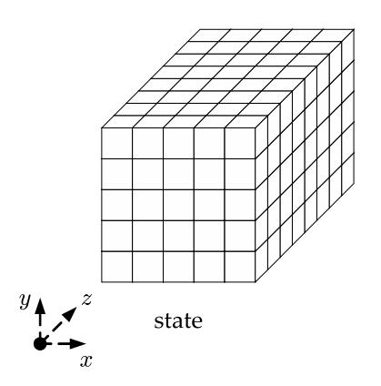
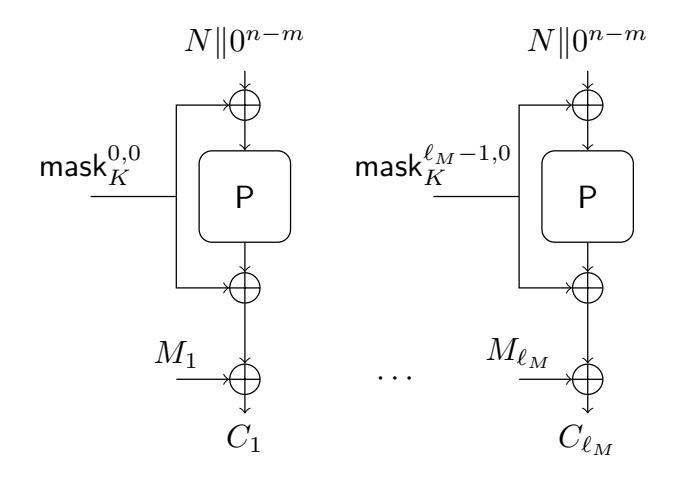
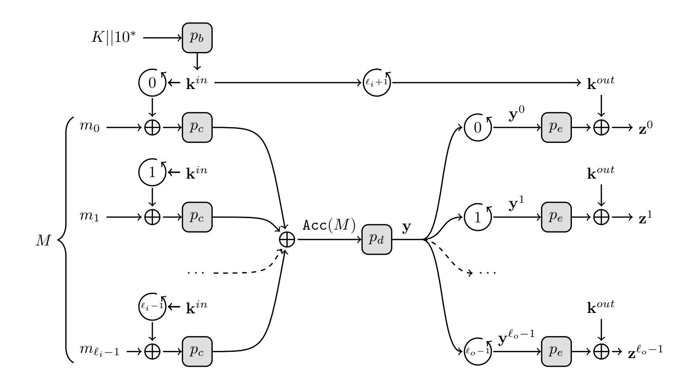
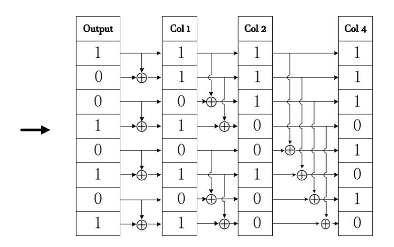
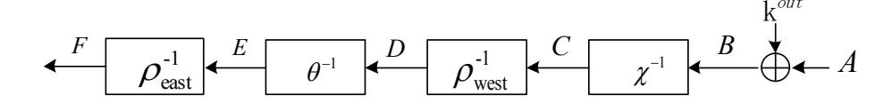

{0}------------------------------------------------

# Interpolation Attacks on Round-Reduced Elephant, Kravatte and Xoofff

Haibo Zhou1 , Rui Zong3 , Xiaoyang Dong3 , Keting Jia∗4 and Willi Meier5

1 Key Laboratory of Cryptologic Technology and Information Security, Ministry of Education, Shandong University, China

2 School of Cyber Science and Technology, Shandong University, Qingdao 266237, China 3 Institute for Advanced Study, Tsinghua University, China

4 Department of Computer Science and Technology, Tsinghua University, China 5FHNW, Switzerland

Email: Corresponding author: ktjia@tsinghua.edu.cn

We introduce an interpolation attack using the Moebius Transform. This can reduce the time complexity to get a linear system of equations for specified intermediate state bits, which is general to cryptanalysis of some ciphers with update function of low algebraic degree. Along this line, we perform an interpolation attack against Elephant-Delirium, a round 2 submission of the ongoing NIST lightweight cryptography project. This is the first third-party cryptanalysis on this cipher. Moreover, we promote the interpolation attack by applying it to the Farfalle pseudo-random constructions Kravatte and Xoofff. Our attacks turn out to be the most efficient method for these ciphers thus far.

Keywords: Interpolation Attack, Moebius Transform, Elephant, Kravatte, Xoofff

# 1. INTRODUCTION

Authenticated encryption (AE) can provide confidentiality, integrity and authenticity for messages simultaneously. Recently, NIST [1] has initiated a process to solicit, evaluate, and standardize lightweight authenticated encryption algorithms with associated data (AEAD) and hashing algorithms, that are suitable for use in constrained environments where the performance of current NIST cryptographic standards is not acceptable. Until September 10, 2019, there are 32 out of 56 candidates selected to Round 2.

Elephant [2] is a family of lightweight authenticated encryption schemes which has reached the 2nd round of NIST lightweight cryptography project. The mode of Elephant is a nonce-based encrypt-then-MAC construction, where encryption is performed using counter mode and internally uses a cryptographic permutation masked using LFSRs. The mode is permutation-based and only evaluates the permutation in the forward direction. As such, there is no need to implement multiple primitives or the inverse of the primitive. This allows it to rely and build on the sponge-based lightweight hashing. Moreover, Elephant is parallelizable by design, easy to implement due to the use of LFSRs for masking (no need for finite field multiplication). Because of the parallelism property, there is no need to instantiate Elephant with a large permutation. Thus, the original three instantiations all use a state of no more than 200 bits.

Kravatte [3] and Xoofff [4] are both based on the Farfalle construction. Farfalle [3] is an efficiently parallelizable permutation based construction of a pseudorandom function (PRF), which is first introduced in ToSC 2018. It takes as input a key and a (sequence of) string(s), and produces an arbitrary-length output. Moreover, when instantiated with a secret key, those output bits look like independent uniformly-drawn random bits. It is efficient because its permutation calls can be performed in parallel as soon as the input masks have been generated. Such a PRF is a powerful primitive that can readily be used as a message authentication code (MAC), a stream cipher or a key derivation function.

Our Contribution. In this paper, we utilize the optimized interpolation attack which was first introduced by Dinur et al. [10], and give a method called improved interpolation attack to analyze the Farfalle constructions. For Elephant-Delirium encryption algorithm, we give a 8 out of 18 rounds attack and this is the first third party attack. For Kravatte updated version 

{1}------------------------------------------------

Kravatte Achouffe, our attacks have less time complexities when compared to the attacks of Chaigneau et al. [5] on its simple version Kravatte 6644. Similarly, we apply this method to Xooffff, which is another **Farfalle** construction cipher. The results of our attacks are summarized in Table 1. Moreover, our improved method is not only used for cryptanalysis of the above three ciphers, but also with a broad applicability in some other ciphers whose intermediate state bit's ANF can be expressed as a function  $F_K(C)$  with low degrees.

In the next sections, we discuss our attacks in more details. Section 2 gives the notations and the brief description of the ciphers. Section 3 describes methods and tools used in our attack. Section 4 presents the method of our attack and we apply it in Section 5. We conclude in Section 6.

#### 2. PRELIMINARIES

#### 2.1. Notation

Some notational conventions of state are shown in the following.

| lowing.       |                                                 |
|---------------|-------------------------------------------------|
| (i,j,k)       | index of a bit,                                 |
| (*,j,k)       | index of a row,                                 |
| (i,*,k)       | index of a column,                              |
| (i,j,*)       | index of a lane,                                |
| (*, j, *)     | index of a plane,                               |
| $A_{i,j,k}$   | the bit indexed by $(i, j, k)$ of state $A$ ,   |
| $A_{i,j}$     | the lane indexed by $(i, j, *)$ of state $A$ ,  |
| $A_j$         | the plane indexed by $(*, j, *)$ of state $A$ , |
| $S_i^{\cdot}$ | a plaintext subspace,                           |
| $C_{S_i}$     | a ciphertext subspace obtained by               |
| -             | encrypting the plaintexts of $S_i$ ,            |
| $P_S$         | the plaintext super structure,                  |
| $C_S$         | the ciphertext space obtained by                |
|               |                                                 |

encrypting the plaintexts of  $P_S$ .

#### 2.2. The Keccak-p permutation

The permutation Keccak-p is derived from Keccak-f [6] with a variable number of rounds, which is mainly defined by two parameters: the width  $b=25\times 2^l$  and the number of rounds  $n_r$ , where  $b\in\{25,50,100,200,400,800,1600\}$ . The permutation Keccak-p is denoted as Keccak- $p[b,n_r]$ . The round function of Keccak-p consists of five operations, denoted as  $\iota\circ\chi\circ\pi\circ\rho\circ\theta$ , and the details are as follows:

$$\theta: A_{x,y} = A_{x,y} + \sum_{j=0}^{4} (A_{x-1,j} + (A_{x+1,j} \ll 1)).$$

$$\rho: A_{x,y} = A_{x,y} \ll \rho[x,y].$$

$$\pi: A_{y,2x+3y} = A_{x,y}.$$

$$\chi: A_{x,y} = A_{x,y} + ((\neg A_{x+1,y}) \land A_{x+2,y}.$$

$$\iota: A_{0,0} = A_{0,0} + RC.$$

Here, we use A to represent the state of the permutation Keccak-p with the size of b bits, which is also expressed by  $5 \times 5$   $\frac{b}{25}$ -bit lanes, as shown in Fig.

| 0,0  | 1,0  | 2,0  | 3, 0 | 4,0  |
|------|------|------|------|------|
| 0, 1 | 1, 1 | 2, 1 | 3, 1 | 4, 1 |
| 0, 2 | 1, 2 | 2, 2 | 3, 2 | 4, 2 |
| 0, 3 | 1, 3 | 2, 3 | 3, 3 | 4, 3 |
| 0, 4 | 1, 4 | 2, 4 | 3, 4 | 4, 4 |

**FIGURE 1.** (a) The Keccak State [6], (b) State A In 2-dimension

1. The lane is denoted by  $A_{i,j}$  with i for the column index and j for the row index, where i and j are in the set  $\{0, 1, 2, 3, 4\}$  and they are working modulo 5 without other specification.

### 2.3. The Xoodoo permutation

Daemen et al. [4] introduced a 384-bit permutation XOODOO at ToSC 2019, which is similar to Keccak-p. We use the three-dimensional matrix A[4][3][32] as the state. The round function of XOODOO includes five operations, denoted as  $R = \rho_{east} \circ \chi \circ \iota \circ \rho_{west} \circ \theta$ , which are listed in the following.

$$\theta : A_{x,y,z} = A_{x,y,z} + \sum_{j=0}^{2} (A_{x-1,j,z-5} + A_{x-1,j,z-14}).$$

$$\rho_{west} : A_{x,1,z} = A_{x-1,1,z}, \ A_{x,2,z} = A_{x,2,z-11}.$$

$$\iota : A_{0,0} = A_{0,0} + RC_{i}.$$

$$\chi : A_{x,y,z} = A_{x,y,z} + ((A_{x,y+1,z} + 1) \wedge A_{x,y+2,z}).$$

$$\rho_{east} : A_{x,1,z} = A_{x,1,z-1}, \ A_{x,2,z} = A_{x-2,2,z-8}.$$

XOODOO could be applied as an AE scheme in Ketje style, which is shown in [7].

### 2.4. Elephant

ELEPHANT is a family of lightweight AE schemes, which has been submitted to the NIST lightweight cryptography project [1], and it has reached the second round. As a lightweight cryptographic algorithm, it has many advantages in practical applications. The underlying mode is permutation-based and inverse-free with a small state size, and allows for a high degree of parallelism. The authors provide three instantiations Dumbo, Jumbo and Delirium, which use different round functions. But in this paper, we only discuss the Elephant-Delirium encryption scheme which uses a 18-round Keccak-f[200] permutation.

{2}------------------------------------------------

| Rounds |                                                          | T(op.)                                                                                                                                  | M(bit)                                                                                             | D(block)                                                                                                                                                                                                   | Source                                                                                                                                                                                                                                                                            |
|--------|----------------------------------------------------------|-----------------------------------------------------------------------------------------------------------------------------------------|----------------------------------------------------------------------------------------------------|------------------------------------------------------------------------------------------------------------------------------------------------------------------------------------------------------------|-----------------------------------------------------------------------------------------------------------------------------------------------------------------------------------------------------------------------------------------------------------------------------------|
| 8/18   |                                                          | $2^{98.3}$                                                                                                                              | $2^{70}$                                                                                           | $2^{70}$                                                                                                                                                                                                   | 5.1                                                                                                                                                                                                                                                                               |
| $n_d$  | $n_e$                                                    | T(op.)                                                                                                                                  | M(bit)                                                                                             | D(block)                                                                                                                                                                                                   | Source                                                                                                                                                                                                                                                                            |
| 4/4    | 4/4                                                      | _                                                                                                                                       | $2^{62.3}$                                                                                         | $2^{74.7}$                                                                                                                                                                                                 | [5]                                                                                                                                                                                                                                                                               |
| 4/6    | 4/6                                                      | $2^{106.2}$                                                                                                                             | $2^{72}$                                                                                           | $2^{78.3}$                                                                                                                                                                                                 | 5.2                                                                                                                                                                                                                                                                               |
| 4/6    | 4/6                                                      | $2^{90.4}$                                                                                                                              | $2^{69}$                                                                                           | $2^{75.2}$                                                                                                                                                                                                 | 5.3.2                                                                                                                                                                                                                                                                             |
| 6/6    | 2/6                                                      | $2^{90.4}$                                                                                                                              | $2^{68}$                                                                                           | $2^{74.2}$                                                                                                                                                                                                 | 5.3.3                                                                                                                                                                                                                                                                             |
|        | $ \begin{array}{r}                                     $ | $ \begin{array}{c cccc}  & 8/18 \\ \hline  & n_d & n_e \\  & 4/4 & 4/4 \\  & 4/6 & 4/6 \\  & 4/6 & 4/6 \\  & 6/6 & 2/6 \\ \end{array} $ | $n_d$ $n_e$ $T(\text{op.})$ $4/4$ $4/4$ $2^{112.2}$ $4/6$ $4/6$ $2^{106.2}$ $4/6$ $4/6$ $2^{90.4}$ | $8/18$ $2^{98.3}$ $2^{70}$ $n_d$ $n_e$ $T(\text{op.})$ $M(\text{bit})$ $4/4$ $4/4$ $2^{112.2}$ $2^{62.3}$ $4/6$ $4/6$ $2^{106.2}$ $2^{72}$ $4/6$ $4/6$ $2^{90.4}$ $2^{69}$ $6/6$ $2/6$ $2^{90.4}$ $2^{68}$ | $8/18$ $2^{98.3}$ $2^{70}$ $2^{70}$ $n_d$ $n_e$ $T(\text{op.})$ $M(\text{bit})$ $D(\text{block})$ $4/4$ $4/4$ $2^{112.2}$ $2^{62.3}$ $2^{74.7}$ $4/6$ $4/6$ $2^{106.2}$ $2^{72}$ $2^{78.3}$ $4/6$ $4/6$ $2^{90.4}$ $2^{69}$ $2^{75.2}$ $6/6$ $2/6$ $2^{90.4}$ $2^{68}$ $2^{74.2}$ |

**TABLE 1.** Summary of Key-recovery Attacks

†: Kravatte 6644 uses linear rolling function.

FIGURE 2. Encryption of ELEPHANT [2]

The generic Elephant encryption mode is presented in Fig. 2. For Elephant-Delirium, the state size n is 200 bits, the size of the master key is 128 bits and the size of the nonce N is 96 bits. And the  $\mathbf{mask}_K$  is generated by the function  $\mathbf{mask}$ . Moreover, the  $\mathbf{mask}_K$  is independent of nonce value, and hence does not effect the dimension of the input space.

### 2.5. Kravatte and Xoofff

KRAVATTE and XOOFFF are both **Farfalle** pseudorandom constructions. We give an introduction about **Farfalle** in the following.

First of all, **Farfalle** is permutation-based with variable input and output length. Although the input and output lengths are tunable, inside the construction, strings of bits are processed in chunks of b bits, where b is the size of the underlying permutation. The **Farfalle** construction can be used to build a pseudorandom function from parallel applications of fixed permutations, and returns a string of arbitrary blocks of output.

The **Farfalle** construction is divided into three parts: mask derivation, compression layer and expansion layer. More specifically, it includes four cryptographic permutations (possibly identical or related), and each of them operates on a *b*-bit block and they are used as follows:

 $p_b$  derive the initial mask from the master key,

 $p_c$  used in the compression layer,

 $p_d$  used between the compression and expansion layer,

 $p_e$  used in the expansion layer.

Besides these four permutation functions, its

instantiation requires the definition of two so-called *rolling functions*, represented by  $\circlearrowleft$  in Fig. 3, operating on a *b*-bit block. They are denoted by  $roll_c$ ,  $roll_e$  and applied as follows:

 $roll_c$  for generating masks added to the input blocks in the compression layer,

 $roll_e$  to update the internal state during the expansion layer.

 $roll^{i}(k)$  represents the result after applying the rolling function i times. In particular,  $roll^{0}(k)$  means you do not apply the rolling function on it.

The **Farfalle** construction takes a master key K and a message M as input. The details are listed as below:

**Mask derivation** This layer takes the padded master key K as input and generates  $\mathbf{k}^{in}$  by  $p_b$ ,  $\mathbf{k}^{in} = p_b(K \parallel 10^*)$ . Then  $roll_c$  updates  $\mathbf{k}^{in} l_i - 1$  times to get the masks  $\mathbf{k}^{in}_{l_i-1}$ . Specially,  $\mathbf{k}^{in}_0 = \mathbf{k}^{in}$ . Besides,  $\mathbf{k}^{out} = roll_c^{l_i+1}(\mathbf{k}^{in})$ .

Compression layer This layer takes the padded message as input. Firstly,  $M \parallel 10^*$  is padded into  $l_i$  blocks  $m_i$ . Then the permutation  $p_c$  takes  $m_i + \mathbf{k}_i^{in}$  as input. Finally, XOR all the results after  $p_c$  together and get the a b-bit block accumulator value:  $\mathbf{Acc}(M) = \sum_{i=0}^{l_i-1} p_c(m_i + \mathbf{k}_i^{in})$ .

**Expansion layer** This layer takes the result of compression layer as input. Firstly, apply the permutation  $p_d$  on the accumulator result to get  $\mathbf{y} = p_d(\mathbf{Acc}(M))$ . Secondly, apply  $roll_e$ ,  $p_e$  on  $\mathbf{y}$  and XOR a key mask to the result to get the output:  $z^j = p_e(roll_e^j(\mathbf{y})) + \mathbf{k}^{out}$  for  $j = 0, ..., l_o - 1$ .

## 2.5.1. Kravatte

In this part, we introduce the **Farfalle** original instantiation Kravatte Achouffe which is based on the permutation Keccak-p[1600, 6]. The **Farfalle** and Kravatte are both designed by Bertoni et al. [3].

DEFINITION 2.1. (KRAVATTE ACHOUFFE [3]) KRA-VATTE ACHOUFFE is  $Farfalle[p_b, p_c, p_d, p_e, roll_c, roll_e]$  with the following parameters:

•  $p_b = p_c = p_d = p_e = \text{Keccak-}p[1600, n_r = 6],$ 

•  $roll_c$  as specified below,

•  $roll_e$  as specified below.

The rolling function  $roll_c$  applies a linear transfor-

{3}------------------------------------------------

FIGURE 3. The Farfalle construction [3]

mation to the five lanes of the plane y=4 of the Keccak-p state and leaves the other 20 lanes unchanged.

For Keccak-p[1600], with arithmetic on z taken modulo 64,  $roll_c$  can be expressed as follows:

$$\begin{array}{lll} A_{x,4} & \leftarrow A_{x+1,4} & \forall x \neq 4, \\ A_{4,4,z} & \leftarrow A_{0,4,z-7} + A_{1,4,z} + A_{1,4,z+3} & \forall z \leq 60, \\ A_{4,4,z} & \leftarrow A_{0,4,z-7} + A_{1,4,z} & \forall z > 60. \end{array}$$

The rolling function  $roll_e$  has been changed by the authors in the updated version. It applies a **non-linear** transformation to the ten lanes of the planes y=4 and y=3 of the Keccak-p state and leaves the other 15 lanes unchanged.

Similarly,  $roll_e$  can be expressed as follows:

$$\begin{array}{lll} A_{x,3} & \leftarrow A_{x+1,3} & \forall x \neq 4, \\ A_{4,3} & \leftarrow A_{0,4}, & \\ A_{x,4} & \leftarrow A_{x+1,4} & \forall x \neq 4, \\ A_{4,4,z} & \leftarrow A_{0,3,z-7} + A_{1,3,z-18} + A_{2,3,z} \cdot A_{1,3,z+1} & \\ & & \forall z \leq 62, \\ A_{4,4,z} & \leftarrow A_{0,3,z-7} + A_{1,3,z-18} & z = 63. \end{array}$$

# 2.5.2. Xoofff

XOOFFF [4] is obtained by using the 6-round XOODOO as the cryptographic permutations in **Farfalle** construction.

DEFINITION 2.2. (XOOFFF [4]). XOOFFF is  $Farfalle[p_b, p_c, p_d, p_e, roll_c, roll_e]$  with the following parameters:

- $p_b = p_c = p_d = p_e = XOODOO[6],$
- $roll_c = roll_{X_c}$  and
- $roll_e = roll_{X_e}$ .

As for the two rolling functions:  $roll_{X_c}$  for rolling the input masks and  $roll_{X_e}$  for rolling the state, we specify them with operations on the lanes of the state.

The input mask rolling function  $roll_{X_c}$  updates a state A in the following way:

$$\begin{array}{ll} B_{3,0} & \leftarrow A_{0,0} + (A_{0,0} \ll 13) + (A_{0,1} \lll 3), \\ B_{x,0} & \leftarrow A_{x+1,0} & \forall x \neq 3, \\ A_0 & \leftarrow A_1, \\ A_1 & \leftarrow A_2, \\ A_2 & \leftarrow B_0. \end{array}$$

Note that  $B_0$  is an auxiliary variable that has the shape of a plane, and  $B_{x,0}$  is the lane indexed by (x,0,\*) of plane  $B_0$ .

The state rolling function  $roll_{X_c}$  updates a state A in the following way:

$$B_{3,0} \leftarrow A_{0,1} \cdot A_{0,2} + (A_{0,0} \ll 5) + (A_{0,1} \ll 13) + 0x00000007,$$

$$B_{x,0} \leftarrow A_{x+1,0} \quad \forall x \neq 3,$$

$$A_0 \leftarrow A_1,$$

$$A_1 \leftarrow A_2,$$

$$A_2 \leftarrow B_0.$$

# 3. RELATED WORK

#### 3.1. Interpolation Attacks

The interpolation attack was first introduced by Jakobsen and Knudsen on block ciphers with low algebraic degree in 1997 [8], which is related to high-order differential cryptanalysis proposed by Lai [9].

The interpolation attack considers the intermediate target bit a, whose ANF can be represented by the ciphertext C and the secret key K, i.e.  $a = F_K(C)$ , as shown in Equation (1).

$$F_K(C) = F_K(c_1, ..., c_n) = \sum_{u = (u_1, ..., u_n) \in GF(2^n)} \alpha_u M_u,$$
(1)

where  $\alpha_u \in \{0,1\}$  is the coefficient of monomial  $M_u =$ 

{4}------------------------------------------------

 $\prod_{i=1}^n c_i^{u_i}$ . Denote the number of non-zero  $\alpha_u$  as  $N_{\alpha_u}$ . Then, we want to recover the coefficients  $\alpha_u$ , which only depend on the secret key bits. Suppose the algebraic degree of  $F_K(C)$  is less than d. To deduce the coefficients of  $F_K(C)$ , we regard the coefficients as the variables, and recover them by solving a linear system of equations. We use the chosen plaintext interpolation attack over GF(2). Since  $deg(F_K(C)) \leq d$ , the sum of a over a (d+1)-dimension plaintext subspace  $S_i$  is zero. That is to say, the sum of the values of the polynomial  $F_K(C)$  over ciphertexts  $C_{S_i} = \{C_1, ..., C_{2^{d+1}}\}$  (obtained by encrypting the plaintext subspace  $S_i$ ) is zero. As the secret key is an unknown constant, we express this result as Equation (2).

$$\sum_{t=1}^{2^{d+1}} F_K(C_t) = \sum_{u=(u_1,\dots,u_n)\in GF(2^n)} \alpha_u \times \left(\sum_{C\in C_{S_i}} M_u\right) = 0$$
(2)

This is a linear equation with the coefficients  $\alpha_u$ , and  $\alpha_u$  are functions of secret key bits. The subspace  $S_i$  provides one linear equation. We can construct more such subspaces to get  $N_{\alpha_u}$  linear independent equations to recover the secret keys. That needs about  $N_{\alpha_u} \times N_{\alpha_u} \times 2^{d+1}$  XOR operations.

Moreover, we know from the high-order difference cryptanalysis that we can get the value of  $\sum_{C \in C_{S_i}} M_u$  in

Equation (2) without any loss if we had the expression of  $M_u$  as a function of the plaintext, F(P).

# 3.2. Moebius Transform

Firstly, we give a brief definition of Moebius Transform. For more details, please refer to [11].

DEFINITION 3.1. The MOEBIUS TRANSFORM is a classic algorithm that transforms the truth table of function F to its ANF efficiently.

We give a simple example to show the MOEBIUS TRANSFORM. The input variables of the function  $F: GF(2^3) \to GF(2)$  are  $x_1, x_2, x_3$ . The truth table of F is shown in the Table 2.

An Example of Moebius Transform

| mon.        | $x_1$ | $x_2$ | $x_3$ | Output |
|-------------|-------|-------|-------|--------|
| 1           | 0     | 0     | 0     | 1      |
| $x_1$       | 1     | 0     | 0     | 0      |
| $x_2$       | 0     | 1     | 0     | 0      |
| $x_1x_2$    | 1     | 1     | 0     | 1      |
| $x_3$       | 0     | 0     | 1     | 0      |
| $x_2x_3$    | 0     | 1     | 1     | 1      |
| $x_1x_3$    | 1     | 0     | 1     | 0      |
| $x_1x_2x_3$ | 1     | 1     | 1     | 1      |

TABLE 2. Truth Table

FIGURE 4. The Process of Moebius Transform

The Moebius Transform works as Fig. 4. The values in **Col 4** are coefficients of the monomials  $X_v$ , which are listed in the first column of Table 2. The 1st value of the **Col 4** is the constant when  $x_1, x_2, x_3$  are all set to 0. The 4th value is the coefficient of the monomial  $X_v = x_1x_2$ , which is got by XOR-ing all the four output values when  $x_3$  is set to 0. The last value is the coefficient of the monomial  $X_v = x_1x_2x_3$ .

Finally, the Moebius Transform transforms the truth table Table 2 to its ANF as below

$$F(x_1, x_2, x_3) = 1 + x_1 + x_2 + x_3 + x_1x_3$$

It is obvious that the time complexity of the MOEBIUS TRANSFORM is  $\frac{n}{2}log_2n$  XOR operations, where n is the length of the column **Output**.

Moreover, we use the Moebius Transform to get  $M_u$ 's plaintext expression: F(P).

For an arbitrary  $M_u = \prod_{i=1}^n c_i^{u_i}$ , each  $c_i$  can be expressed in plaintext bits p. If we get each  $c_i$ 's ANF and calculate the result, we can get the F(P) of  $M_u$ , i.e.  $M_u = F(P) = \sum_{v=(v_1,\ldots,v_n)\in GF(2^n)} \beta_v X_v$ , where  $\beta_v \in$ 

 $\{0,1\}$  is the coefficient of the monomial  $X_v = \prod_{i=1}^n p_i^{v_i}$ . However, ciphers' iteration are usually too complicated to calculate the expression. But it is easy to get the values of the truth table of  $M_u$  because  $M_u = \prod_{i=1}^n c_i^{u_i}$  and the values of  $c_i$  are known. Thus, the MOEBIUS TRANSFORM can be used to get the F(P) of  $M_u$ .

#### 3.3. Optimized Interpolation Attack

In this part, we introduce the idea of the optimized interpolation attack which was first introduced by Dinur et al. [10]. It can reduce the time complexity using the MOEBIUS TRANSFORM.

The Equation (2) shows that one (d+1)-dimension subspace gives one equation on  $\alpha_u$ . Summing over  $N_{\alpha_u}$  such subspaces will get  $N_{\alpha_u}$  linear independent equations and recover the secret keys. This can be done efficiently using the Moebius Transform. As shown in [10], we can view the input as evaluating a (d+1+e)-variable polynomial over GF(2), and the summation over a (d+1)-dimension subspace is 

{5}------------------------------------------------

equal to the coefficient of its corresponding (d+1)degree monomial which is called *maxterm*. Thus,
the optimized interpolation attack uses the Moebius
Transform to build the equation system and the
complexity of this process is about  $(d+1+e) \cdot 2^{d+e}$ XOR operations.

# 3.4. Construction of Affine Spaces in the Accumulator

In this paper, we mainly focus on the algorithms with the **Farfalle** construction, which has  $l_i$  input blocks and  $l_o$  output blocks. In order to apply the MOEBIUS TRANSFORM to such structures, we need to construct an affine space of dimension n in the accumulator block. We use a property of **Farfalle**, which is already identified in [3].

PROPERTY 1. Given an n-block padded message  $M=(m_0,...m_{n-1})$ , let the associated accumulator value be  $\mathbf{Acc}(M)=\sum_{i=0}^{n-1}p_c(m_i+k_i^{in})$ . Let  $M^0=(m_0^0,...,m_{n-1}^0)$  and  $M^1=(m_0^1,...,m_{n-1}^1)$  denote an arbitrary pair of padded messages such that  $m_i^0\neq m_i^1$  for all i. These messages can build the structure of  $2^n$  n-block input messages  $S=\{(m_0^{\epsilon_0},...,m_{n-1}^{\epsilon_{n-1}}),(\epsilon_0,...,\epsilon_{n-1})\in\{0,1\}^n\}$ . Denote the one-block difference by  $\delta_i=p_c(m_i^0+k_i^{in})+p_c(m_i^1+k_i^{in})$ . If  $n\ll b$  (b is the state size), the  $\delta_i$  are linearly independent with overwhelming probability. Then  $\mathbf{Acc}(S)$  is the n-dimensional affine subspace  $\mathbf{Acc}(M_0)+\langle \delta_0,...,\delta_{n-1}\rangle$ .

Based on Property 1, we can easily build structures of  $2^n$  n-block messages that are transformed by the compression layer into an affine space of one-block accumulator values of dimension n. Moreover, there are only two possible values  $m_i^0$  or  $m_i^1$  for each input block. Thus, we give a new definition.

DEFINITION 3.2. For  $2^n$  n-block input messages  $S = \{(m_0^{\epsilon_0}, ..., m_{n-1}^{\epsilon_{n-1}}), (\epsilon_0, ..., \epsilon_{n-1}) \in \{0, 1\}^n\}$ , we use a bit 0 (resp. 1) to represent the value of the block  $m_i^0$  (resp.  $m_i^1$ ). So we define the vector  $P_S = (\epsilon_0, ..., \epsilon_{n-1}) \in \{0, 1\}^n$  to represent the input structure S.

It is obvious that Property 1 does not depend on the number of rounds in  $p_c$ . Hence, we can regard the compression layer as a affine transformation and the dimension of the affine space  $\mathbf{Acc}(P_S)$  is equal to  $P_S$ . It helps us to apply the MOEBIUS TRANSFORM on the **Farfalle** constructions.

# 3.5. Properties of Keccak-p

In [5], Chaigneau et al. introduce a property of Keccak- $p^{-1}$  to reduce the variables of its output. It suits for that each input variable of Keccak- $p^{-1}$  is  $A \bigoplus \mathbf{k}^{out}$ . It should be pointed out that the structure of Keccak- $p^{-1}$  is public, so we don't need a decryption oracle. Suppose the state size is b and the notations are as shown in

Fig. 5.

$$\begin{array}{c|ccccccccccccccccccccccccccccccccccc$$

**FIGURE 5.** Some Notations of Keccak- $p^{-1}$ 

The inverse Sbox in  $\chi^{-1}$  layer has algebraic degree three, and the input of the  $\chi^{-1}$  is  $B = A + \mathbf{k}^{out}$ , where '+' stands for ' $\bigoplus$ ' in the following. The output bit of the inverse Sbox can be expressed as below

$$C_{x} = \overline{B_{x+1}B_{x+3}}B_{x+4} + \overline{B_{x+1}}B_{x+2} + B_{x}$$

$$= (\mathbf{k}_{x+1}^{out} + A_{x+1} + 1)(\mathbf{k}_{x+3}^{out} + A_{x+3} + 1)(\mathbf{k}_{x+4}^{out} + A_{x+4})$$

$$+ (\mathbf{k}_{x+1}^{out} + A_{x+1} + 1)(\mathbf{k}_{x+2}^{out} + A_{x+2}) + (\mathbf{k}_{x}^{out} + A_{x})$$

By introducing the new variables  $w_x = \mathbf{k}_{x+1}^{out}\mathbf{k}_{x+3}^{out}\mathbf{k}_{x+4}^{out} + \mathbf{k}_{x+1}^{out}\mathbf{k}_{x+2}^{out} + \mathbf{k}_{x}^{out}, \quad u_x = \mathbf{k}_{x+3}^{out}\mathbf{k}_{x+4}^{out} + \mathbf{k}_{x+2}^{out}, \quad \text{and} \quad v_x = \mathbf{k}_{x}^{out}\mathbf{k}_{x+2}^{out}, \quad C_x \text{ can be rewritten as } w_x + P_x(A), \text{ where } P_x(A) \text{ is an affine combination of } u_x, v_{x+1}, v_{x+4}, \mathbf{k}_{x+1}^{out}, \mathbf{k}_{x+3}^{out}, \mathbf{k}_{x+4}^{out}, \text{ with coefficients determined by } A.$ 

PROPERTY 2. (Property of  $\chi^{-1}$  in Keccak- $p^{-1}$ ) For each Sbox in  $\chi^{-1}$  with input  $(k_x, \ldots, k_{x+4}) \oplus (A_x, \ldots, A_{x+4})$ , there are 15 new variables in key bits for the output expressions: 10 variables u, v of algebraic degree two and 5 variables w of algebraic degree three.

The Sbox in  $\chi^{-1}$  generates new variables and the inverse affine layer spreads them to almost every bit. First of all, we use  $\sigma(x, y, z)$  to denote the state bit moved to (x, y, z) by the permutation  $(\pi \circ \rho)^{-1}$ , i.e.  $D_{x,y,z} = C_{\sigma(x,y,z)}$ . Moreover, the high diffusion layer  $\theta^{-1}$  has the following property.

For each column  $D_{x,z}$  of the state, there is a set of bit positions  $S_{x,z}$  such that each bit after  $\theta^{-1}$  is given in the following.

$$E_{x,y,z} = D_{x,y,z} + \sum_{(x',y',z') \in S_{x,z}} D_{x',y',z'}$$

$$= C_{\sigma(x,y,z)} + \sum_{(x',y',z') \in S_{x,z}} C_{\sigma(x',y',z')}$$

$$= w_{\sigma(x,y,z)} + P_{\sigma(x,y,z)}(A)$$

$$+ \sum_{(x',y',z') \in S_{x,z}} (w_{\sigma(x',y',z')} + P_{\sigma(x',y',z')}(A))$$

$$= w'_{x,y,z} + P_{\sigma(x,y,z)}(A) + Q_{x,z}(A)$$

where  $w'_{x,y,z}$  is a new variable defined as the linear combination of all the w variables involved in the expression of  $E_{x,y,z}$ ,  $Q_{x,z}(A)$  is the sum of the P over position set  $S_{x,z}$ . Because there are 6 variables for  $P_{\sigma(x,y,z)}(A)$ , we deduce that the output of  $\theta^{-1}$  can be expressed as

$$E_{x,y,z} = P'_{x,y,z}(A) + Q_{x,z}(A),$$

{6}------------------------------------------------

and  $P'_{x,y,z}(A)$  contains 7 potentially nonzero variables at most, where  $P'_{x,y,z}(A) = w'_{x,y,z} + P_{\sigma(x,y,z)}(A)$ .

In a conclusion, we get the following property:

PROPERTY 3. (Property of Keccak- $p^{-1}$ )

Let the input of Keccak- $p^{-1}$  be  $A + \mathbf{k}^{out}$ , then the output can be expressed as  $E_{x,y,z} = P'_{x,y,z}(A) + Q_{x,z}(A)$ . Moreover  $P'_{x,y,z}$  has 7 potentially nonzero variables at most;  $Q_{x,z}$  is considered as a linear function of all the 3b variables  $(u, v, and \mathbf{k}^{out})$ .

### 3.6. Properties of Xoodoo

For XOODOO-1, we give some properties which are suitable for the situations when the input is  $B = A + \mathbf{k}^{out}$ . The notations are shown in Fig. 6.

FIGURE 6. Some Notations of X00D00-1

Similarly, we investigate the Sbox in  $\chi^{-1}$  layer. The algebraic degree of the Sbox is two, and the input of  $\chi^{-1}$  is  $B_x = A_x + \mathbf{k}_x^{out}$ . The output bit of the Sbox can be expressed as below:

$$C_x = \overline{B_{x+1}} B_{x+2} + B_x$$
  
=  $(\mathbf{k}_{x+1}^{out} + A_{x+1} + 1)(\mathbf{k}_{x+2}^{out} + A_{x+2}) + (\mathbf{k}_x^{out} + A_x).$ 

Here we introduce the new variables  $w_x = \mathbf{k}_{x+1}^{out} \mathbf{k}_{x+2}^{out} + \mathbf{k}_x^{out}$ , so that  $C_x$  can be written as  $C_x = w_x + \mathbf{k}_{x+1}^{out} A_{x+2} + \mathbf{k}_{x+2}^{out} (A_{x+1} + 1) + ((A_{x+1} + 1)A_{x+2} + A_x)$ . It is a linear equation in  $w_x$ ,  $\mathbf{k}_{x+1}^{out}$  and  $\mathbf{k}_{x+2}^{out}$ .

PROPERTY 4. (Property of  $\chi^{-1}$  in XOODOO-1) For each Sbox in  $\chi^{-1}$  with input  $(\mathbf{k}_x, \mathbf{k}_{x+1}, \mathbf{k}_{x+2}) \oplus (A_x, A_{x+1}, A_{x+2})$ , there are 3 new variables in key bits in the corresponding output expression.

The state size of XOODOO is 384, and there are potentially 384 w and 384  $\mathbf{k}^{out}$  variables after  $\chi^{-1}$ . The analysis of the affine layer is similar to that of KECCAK- $p^{-1}$ , so we get the following property.

PROPERTY 5. (Property of  $XOODOO^{-1}$ )

Let the input of XOODOO-1 be  $A + \mathbf{k}^{out}$ , then the output of  $\theta^{-1}$  can be expressed as  $E_{x,y,z} = w'_{x,y,z} + Q_{x,z}(A)$ , where  $w'_{x,y,z}$  is considered as a new variable containing all the w involved in  $E_{x,y,z}$  and  $Q_{x,z}(A)$  is linear in all the 384  $\mathbf{k}^{out}$  bits. Obviously,  $w'_{x,y,z}$  is independent on the state A. In total,  $E_{x,y,z}$  contains 385 nonzero variables.

Notice that there is a rotation layer  $\rho_{east}^{-1}$  after  $\theta^{-1}$ , i.e.  $F = \rho_{east}^{-1}(E)$ . It changes the properties of the  $\theta^{-1}$  but does not generate new variables.

#### 4. THE INTERPOLATION ATTACK

In this part, we introduce how to extend the optimized interpolation attack to the **Farfalle** constructions.

At first, we give a method to reduce the size of the equation system. We reconstruct  $F_K(C)$  as  $F'_K(C)$  basing on Chaigneau et al.'s work [5] to reduce the variables of  $F_K(C)$ .

$$a = F_K'(C) = \sum_{t=1}^{N_{eq}} k_t' c_t', \tag{3}$$

where  $k'_t \in GF(2)$  is the equivalent key,  $c'_t \in GF(2)$  is the sum of some  $M_u$  which are multiplied by  $k'_t$ , and  $N_{eq}$  is the quantity of  $k'_t$ .  $c'_t$  is no longer a monomial, and we call it *sum-monomial* in the following.  $F_K(C)$ and  $F'_K(C)$  are essentially the same polynomial, and Equation (2) still holds for  $F'_K(C)$ .

We give an example to explain it. For the equation  $F_K(C) = (k_0 + k_1 k_2) c_0 + (k_0 + k_1 k_2) c_0 c_1 + (k_0 + k_1 k_2) c_0 c_1 c_2$ , we rebuild it as  $F'_K(C) = k'_0 * c'_0$ , where  $k'_0 = k_0 + k_1 k_2$  and  $c'_0 = c_0 + c_0 c_1 + c_0 c_1 c_2$ . It is obvious that  $N_{eq} < N_{\alpha_u}$ . Hence it needs fewer equations to get the unknown key bits.

We have rebuilt the expression as Equation (3). However, the **Farfalle** construction has several input blocks, so the interpolation attack cannot be applied on this structure. Chaigneau et al. have given a method which can construct an affine space in the compression layer like shown in Sect. 3.4, so that we can take one input block as one variable. By Definition 3.2, we use  $P_S = (\epsilon_0, ..., \epsilon_{n-1}) \in \{0,1\}^n$  to denote the  $2^n$  n-block input structure S. If the dimension of the input structure  $P_S$  is n, we will get a n-dimension space after  $\mathbf{Acc}$ .

We mainly utilize some ideas of Chaigneau et al. in [5] above. Then we combine them with the ideas in the optimised interpolation attack to improve the results.

In order to recover the secret key bit  $k'_t$ , we need  $N_{eq}$  linear independent equations. So we choose  $N_{eq}$  different (d+1)-dimension input subspaces  $\{S_i\}$  from a (d+1+e)-dimension input super structure. By Definition 3.2,  $P_S$  represents the (d+1+e)-dimension input super structure and  $C_S$  denotes the corresponding ciphertext space. Each ciphertext subspace  $C_{S_i}$  gives one equation as follows

$$\sum_{C \in C_{S_i}} F_K'(C) = \sum_{t=1}^{N_{eq}} k_t' \left( \sum_{C \in C_{S_i}} c_t' \right) = 0, \quad (4)$$

so the e has to satisfy  $\binom{d+1+e}{d+1} \ge N_{eq}$ .

Thus, the steps of setting up equation system are similar with the optimized interpolation attack as follows.

1. For a (d + 1 + e)-dimension plaintext super structure  $P_S$ , query the encryption oracle to get the corresponding ciphertexts  $C_S$ . Initialize a 

{7}------------------------------------------------

 $N_{eq} \times N_{eq}$  matrix, in which each row represents a linear equation.

- 2. Update the matrix column by column. For each  $c'_t$  of the equation (3):
  - Evaluate  $c'_t$  for all the  $2^{d+1+e}$  ciphertexts and get a bit vector.
  - Apply the Moebius Transform on this bit vector to get the F(P) of  $c'_t$ . Extract the coefficients of maxterms of the input subspaces  $\{S_i\}$  from F(P) and copy them to a column of the matrix.
- 3. The matrix obtained above represents the coefficients of  $k'_t$  in the  $N_{eq}$  linear independent equations. Solve the system of linear equations to get all the  $k'_t$  and derive the key bits.

We need  $2^{d+1+e}$  input messages and encryptions in Step 1. Step 2 needs  $N_{eq} \times 2^{d+e} \times (d+1+e)$  XOR operations and  $2^{d+1+e}$  bits memory to store the bit vector. It also needs  $N_{eq}^2$  bits memory to store the matrix, but it is usually smaller. The time complexity of Step 3 is about  $N_{eq}^3/logN_{eq}$  XOR operations [13].

In Sect. 3.1, the traditional interpolation attack needs  $N_{\alpha_u} \times N_{\alpha_u} \times 2^{d+1}$  XOR operations, but for our method, it needs about  $N_{eq} \times 2^{d+e} \times (d+1+e)$  XOR operations. If we set  $N_{\alpha_u} = N_{eq}$ ,  $2^e \times (d+1+e)$  is smaller than  $N_{\alpha_u} \times 2$  in our attack, where e is usually a small number.

# 5. APPLICATIONS AGAINST ELEPHANT, KRAVATTE AND XOOFFF

#### 5.1. Interpolation Attack against Elephant

In this section, based on the optimized interpolation attack [10], we give an attack against the Elephant-Delirium in nonce-respecting setting.

The Elephant-Delirium uses the Keccak sponge permutation. The state size is 200-bit and the algebraic degree of one round is 2. Moreover, the nonce occupies 96 of 200 bits and the degree after 6 rounds is not more than 64.

To analyze 8-round Elephant-Delirium by interpolation attack, the main work is to linearize the last two rounds and get the ANF of the intermediate target bit a which is also the output of the 6 rounds Kecca-K-p. Furthermore, we have to minimize the number of variables in the ANF of a. Obviously, fewer variables require fewer linear equations and lead to lower complexity.

# 5.1.1. Linearize the Keccak- $p^{-2}$ .

We use A to denote  $M \oplus C$  in the ELEPHANT-DELIRIUM seen in Fig. 2, and there are 40 Sboxes in the  $\chi^{-1}$ . Prop. 3 shows that the output of Keccak- $p^{-1}$  can be expressed as  $E_{x,y,z} = P'_{x,y,z}(A) + Q_{x,z}(A)$ , where  $Q_{x,z}(A)$  potentially contains  $3 \times 200 = 600$  variables  $(u, v \text{ and } \mathbf{k}^{out})$  in this place.

As for the second  $\chi^{-1}$  layer, we denote its output as  $F = \chi^{-1}(E)$ . The  $F_{x,*}$  omitting index z can be expressed as:

$$F_{0,*} = (\overline{P'_{1,*}} + Q_1)(\overline{P'_{3,*}} + Q_3)(P'_{4,*} + Q_4) + (\overline{P'_{1,*}} + Q_1)(P'_{2,*} + Q_2) + (P'_{0,*} + Q_0)$$

It is easy to see that the item  $Q_1Q_3Q_4$  generates most of the variables. And  $F_{0,0} + F_{0,1}$  will cancel it out as well as the items  $Q_1Q_2$  and  $Q_0$ . Specially, if we cancel out the  $Q_1Q_3Q_4$ , there will not be cubic items.

$$F_{0,0} + F_{0,1}$$

$$= (P'_{1,0} + P'_{1,1})Q_3Q_4 + (P'_{3,0} + P'_{3,1})Q_1Q_4$$

$$+ (P'_{4,0} + P'_{4,1})Q_1Q_3 + (\overline{P'_{1,0}P'_{3,0}} + \overline{P'_{1,1}P'_{3,1}})Q_4$$

$$+ (\overline{P'_{1,0}P'_{4,0}} + \overline{P'_{1,1}P'_{4,1}})Q_3 + (P'_{1,0} + P'_{1,1})Q_2$$

$$+ (P'_{2,0} + \overline{P'_{3,0}P'_{4,0}} + P'_{2,1} + \overline{P'_{3,1}P'_{4,1}})Q_1$$

$$+ P'_{0,0} + \overline{P'_{1,0}P'_{2,0}} + \overline{P'_{1,0}P'_{3,0}P'_{4,0}}$$

$$+ P'_{0,1} + \overline{P'_{1,1}P'_{2,1}} + \overline{P'_{1,1}P'_{3,1}P'_{4,1}}.$$

All the Q polynomials are affine combinations of the same set of the 600 variables, and each P' polynomial is an affine combination of 7 variables. Taking into account the constant coefficients of these polynomials, the number of variables required to linearize the expression of  $F_{0,0} + F_{0,1}$  is:

$$3 \times 2 \times 8 \times {601 \choose 2} + (3 \times 2 \times 8^2 + 2 \times 2 \times 8) \times 601 + 2 \times (8 + 8^2 + 8^3).$$

That gives approximately  $2^{23.1}$  variables (i.e.  $k'_t c'_t$ ).

Moreover, we have run experiments to support the conclusion  $N_{eq} < N_{\alpha_u}$  in Sect. 4. For this application, the traditional method gives approximately  $2^{26.1}$  variables which is bigger than  $2^{23.1}$ . The test code is given in:

https://github.com/alicebobb/testcode.

### 5.1.2. The Complexity of the Attack

Since we have got all the variables of the expression, we set up the linear equation system and solve it to get the key.

Firstly, construct the input messages structure. The expression has  $2^{23.1}$  variables. Thus setting up  $2^{23.1}$  linear independent equations can recover the  $k'_t$ . One 65-dimension subspace gives one linear independent equation, and  $\binom{65+5}{65} > 2^{23.1}$ , so we choose a 70-dimension input structure  $P_S$ . Query the encryption oracle to get the corresponding ciphertext space.

Secondly, construct the linear equation system and solve it. We have shown the process in Sect. 4, and in this attack, the number of linear equation is  $N_{eq} = 2^{23.1}$  and the dimension of input structure is 70. So we can get that the data complexity is  $2^{70}$  blocks, the memory complexity, which is mainly used to store the MOEBIUS TRANSFORM bit vector, is  $2^{70}$  and the time complexity is about  $2^{98.3}$  XOR operations

{8}------------------------------------------------

# 5.2. Interpolation Attack against Kravatte Achouffe

In this section, we show how to perform the interpolation attack on a **Farfalle** cipher KRAVATTE ACHOUFFE like shown in Sect. 4.

The properties of **Farfalle** in Sect. 3.4 show that no matter how many rounds  $p_c$  may have, we can get the n-dimension affine space after **Acc** by appropriately choosing messages. Thus, the influence of compression layer can be omitted in the attack, i.e. Kravatte- $\{n_d, n_e\}$  represents Kravatte- $\{n_c, n_d, n_e\}$ .

Firstly, we analyze the functions after the  $\mathbf{Acc}$ , i.e.  $p_d$ ,  $roll_e$  and  $p_e$ . Among them,  $p_d$  and  $p_e$  are both Keccak-p permutations.  $roll_e$  is a non-linear rolling function, but we only use the first limb (i.e.  $z_0$  in Fig. 3) as output, which is not rolled and the affect of  $roll_e$  can be omitted. The function after the  $\mathbf{Acc}$  can be seen as an Keccak-p permutation.

Secondly, the function before the  $\mathbf{Acc}$  is the compression layer. Using the method in Sect. 4, we can construct a n-dimension space after  $\mathbf{Acc}$ .

# 5.2.1. Analysis of the Attack against Kravatte- $\{6,4,4\}$

For Kravatte- $\{6,4,4\}$ , we build a *n*-dimension space after **Acc**, and the items in this space are regarded as inputs of 8 rounds Keccak-*p* permutation. Then, we analyze it as Sect. 4.

The first step is to linearize and minimize the number of variables for the Keccak- $p^{-2}(\mathbf{k}^{out}+\mathbf{c})$ . Chaigneau et al. have given the algebraic expression of Keccak- $p^{-2}(\mathbf{k}^{out}+\mathbf{c})$  of Kravatte in their paper [5], and there are  $2^{29}$  variables in the expression  $F_{0,0} + F_{0,1}$ .

The second step is to build the super structure  $P_S$ . As the expression has  $2^{29}$  variables, we need  $2^{29}$  linear independent equations to solve the equations system. In [5], they used different output limbs to get more than one equation from one subspace. However, in the Kravatte Achouffe, they have updated the rolling function  $roll_{X_e}$ , which is a non-linear function now. Thus, the algebraic degree of output limbs are different from each other. We can only use the first limb to set up the equation because it is not rolled by  $roll_e$ . As we have introduced before, each subspace of dimension 65 gives one equation on key bits. The super structure must include  $2^{29}$  different subspaces of dimension 65. That is to say,  $\binom{65+e}{65} > 2^{29}$  and e is at least 7, thus the data complexity is  $2^{72}(72+1) = 2^{78.3}$  blocks.

By Definition 3.2, we construct the input messages super structure  $P_S = (\epsilon_0, ..., \epsilon_i, ..., \epsilon_{71}) \in \{0, 1\}^{72}$ . Then query the encryption oracle with all of the  $2^{72}$  plaintexts of  $P_S$  to get the ciphertexts  $C_S$  and choose  $2^{29}$  subspaces  $\{S_i\}$  of dimension 65 from  $P_S$ . The process is just like the method shown in Sect. 4.

Initialize a  $2^{29} \times 2^{29}$  matrix. For each of the  $2^{29}$   $k_t'c_t'$  in  $F_{0,0} + F_{0,1}$ :

• Evaluate the  $c'_t$  for each ciphertext of the first limb

to get a bit vector. 
$$(M = 2^{72}, T = 2^{29} \cdot 2^{72})$$

• Apply the Moebius Transform to this bit vector. After that, extract the  $2^{29}$  bits that correspond to the coefficients of maxterms of subspaces  $\{S_i\}$  and copy them to a column of the matrix.

$$(M = 2^{29}, T = 2^{29} \cdot 2^{71} log_2 2^{72})$$

Solve the equations system and derive the key bits. In total, the process of the attack needs  $2^{78.3}$  blocks data,  $2^{72}$  bits memory and  $2^{106.2}$  XOR operations.

# 5.3. Interpolation Attack against Xoofff

In this section, we consider another **Farfalle** construction algorithm XOOFFF. The XOOFFF is a deck function obtained by applying the **Farfalle** construction on 6-round XOODOO. The process of analyzing XOOFFF is similar to the attack against KRAVATTE ACHOUFFE above.

# 5.3.1. Linearize the $XOODOO^{-2}$

The first step is still linearizing the polynomial expression to get the equation (3). We have shown in Sect. 3.6, that the  $E_{x,y,z}$  of XOODOO-1 potentially has 385 nonzero variables. The  $\rho_{east}^{-1}$  destroys the property of  $\theta^{-1}$ , but it dose not generate new variables. There are still 385 nonzero variables for each bit expression of the state F.

We use G to denote the state of output of the second  $\chi^{-1}$ , i.e.  $G = \chi^{-1}(F)$ . The expression of  $G_{x,y,z}$  is as follows:

$$G_{x,y,z} = \overline{F_{x,y+1,z}} F_{x,y+2,z} + F_{x,y,z}$$

$$= \overline{E_{\rho(x,y+1,z)}} E_{\rho(x,y+2,z)} + E_{\rho(x,y,z)}$$

$$= w_{\rho(x,y+1,z)} w_{\rho(x,y+2,z)} + w_{\rho(x,y+1,z)} Q_{\rho(x,y+2,z)}(A)$$

$$+ w_{\rho(x,y+2,z)} Q_{\rho(x,y+1,z)}(A) + w_{\rho(x,y,z)}$$

$$+ Q_{\rho(x,y+2,z)}(A) Q_{\rho(x,y+1,z)}(A) + Q_{\rho(x,y,z)}(A)$$

In the expression,  $\rho(x, y, z)$  denotes the state bit moved to (x, y, z) by the permutation  $\rho_{east}^{-1}$ . As shown in Property 5, all Q polynomials are considered to involve all the 384  $\mathbf{k}^{out}$  and each w is considered as one variable. Thus, taking into account the constants, the number of potential variables in the expression  $G_{x,y,z}$  is

$$1 + 385 + 385 + \binom{385}{2} + 1 + 385,$$

which is approximately  $2^{16.2}$ .

5.3.2. The Analysis of the Attack against XOOFFF- $\{6,4,4\}$ 

For XOOFFF-{6,4,4}, we use the first limb as output. The affect of the non-linear rotation layer can be omitted. We only focus on the 8 rounds XOODOO

{9}------------------------------------------------

after the **Acc**. We linearize the last two rounds to get the expression of  $G_{x,y,z}$  and its algebraic degree is not more than 64. Since there are  $2^{16.2}$  variables in  $G_{x,y,z}$  and one 65-dimension input messages subspace gives one linear equation about key bits, we need  $2^{16.2}$  such subspaces in the super structure. That is to say,  $\binom{65+e}{65} > 2^{16.2}$  and e is at least 4, thus we construct a 69-dimension input super structure. The data complexity is  $2^{69}(69+1) = 2^{75.2}$  blocks.

By Definition 3.2, we denote the plaintext super structure as  $P_S = (\epsilon_0, ..., \epsilon_i, ..., \epsilon_{68}) \in \{0, 1\}^{69}$  and choose  $2^{16.2}$  subspaces  $\{S_i\}$  of dimension 65 from it. Then we query the encryption oracle with all of the  $2^{69}$  plaintexts to get the ciphertexts  $C_S$ .

The next step is using the Moebius Transform to set up the equations system.

Initialize a  $2^{16.2} \times 2^{16.2}$  matrix. For each of the  $2^{16.2}$   $k'_t c'_t$  in  $G_{x,y,z}$ , we do the following steps.

- Evaluate the  $c_t'$  for each of the  $2^{69}$  ciphertexts and get a bit vector.  $(M = 2^{69}, T = 2^{16.2} \cdot 2^{69})$
- Apply the Moebius Transform to this bit vector. Extract the  $2^{16.2}$  bits that correspond to the coefficients of the maxterms of subspaces  $\{S_i\}$  and fill in the matrix as a column.  $(M = 2^{16.2 \times 2}, T = 2^{16.2} \cdot 2^{68} log_2 2^{69})$

As we have got all the coefficients of the unknowns  $k'_t$  (i.e. the  $2^{16.2} \times 2^{16.2}$  matrix), we can solve the system to recover  $k'_t$  and derive key bits.  $(T = (2^{16.2})^3/log_2 2^{16.2})$ 

Thus, in total, the process of the attack needs  $2^{75.2}$  blocks data,  $2^{69}$  bits memory and  $2^{90.4}$  XOR operations.

5.3.3. Analysis of the Attack against Xoofff- $\{6,6,2\}$  Observing the structure of Xoofff, We notice that the non-linear rotation layer increases only a few bits' algebraic degree. After that, the Xoodoo permutation has a good diffusion and amplifies the impact. However, if we perform the attack to the Xoofff- $\{6,6,2\}$ , we can linearize the last two rounds of Xoodoo till  $roll_{Xe}$  to avoid the diffusion. Then perform the attack on a bit which does not increase the degree by the  $roll_{Xe}$ . In this way, we carry out the attack on a bit from any limb as long as its degree is not changed.

Although the output has different limbs, the expressions of the same bit position of all the limbs are the same for Xoodoo-2 and the expression has  $2^{16.2}$  variables. We can choose two output limbs to construct equations because  $2 \times \binom{68}{65} > 2^{16.2}$ . That is to say, the input message is 68 blocks and the output message is 2 blocks, and using this structure, we can get more than  $2^{16.2}$  independent linear equations. The total data complexity is  $2^{68}(68+2) = 2^{74.2}$  blocks.

The attack process is similar to the attack on  $XOOFFF-\{6,4,4\}$  version.

Firstly, construct the input messages super structure  $P_S = (\epsilon_0, ..., \epsilon_i, ..., \epsilon_{67}) \in \{0, 1\}^{68}$  and query the

encryption oracle to get the ciphertext space  $C_S$ . Then choose  $2^{15.2}$  subspaces  $\{S_i\}$  of dimension 65 from  $P_S$ .

Initialize a  $2^{16.2} \times 2^{16.2}$  matrix. For each of the  $2^{16.2}$   $k'_t c'_t$  in  $G_{x,y,z}$ , update one column by using two limbs. Do the following steps for each of the two limbs.

- Evaluate  $c_t'$  for each of the  $2^{68}$  ciphertexts of this limb to get a  $2^{68}$  bit vector.  $(M = 2^{68}, T = 2 \times 2^{16.2} \cdot 2^{68})$
- Apply the MOEBIUS TRANSFORM to this bit vector. Extract the  $2^{15.2}$  bits that correspond to the coefficients of the maxterm of subspaces  $\{S_i\}$  and fill in the matrix as half of the column.  $(M = 2^{68}, T = 2 \times 2^{16.2} \cdot 2^{67} log_2 2^{68})$

Finally, solve the system to recover the unknowns and derive key bits. In total, the process of the attack needs  $2^{74.2}$  blocks data,  $2^{68}$  bits memory and  $2^{90.4}$  XOR operations.

#### 6. CONCLUSION

In this paper, we extend the optimized interpolation attack and apply it to the cryptanalysis of the 2 ciphers Kravatte Achouffe and Xoofff with **Farfalle** construction and to Elephant-Delirium, which is a round 2 submission of the ongoing NIST lightweight cryptography project. All the results turn out to be the most efficient method for these ciphers thus far.

More importantly, compared with the optimized method [10], the improved interpolation attack does not need particularly stringent conditions on the algorithm structure, and it is taken as a general method to analyse some other ciphers.

# REFERENCES

- [1] NIST (2015): solicit, evaluate, and standardize lightweight cryptographic algorithm. https://csrc.nist.gov/projects/lightweight-cryptography.
- [2] Beyne, T., Chen, Y., Dobraunig, C. and Mennink, B. (2019) ELEPHANT v1. In NIST Lightweight Cryptography Project, https://www.esat.kuleuven.be/cosic/elephant/
- [3] Bertoni, G., Daemen, J., Hoffert, S., Peeters, M., Assche, G. V. and Keer, R. V. (2018) Farfalle: Parallel Permutation-based Cryptography. In *FSE* 2018, Bruges, Belgium, March 5-7, pp. 1-38. IACR Transactions on Symmetric Cryptology.
- [4] Daemen, J., Hoffert, S., Assche, G. V. and Keer, R. V. (2019) The Design of Xoodoo And Xoofff. In *FSE* 2019, Paris, France, March 25-28, vol. 4 pp. 1-28. IACR Transactions on Symmetric Cryptology.
- [5] Chaigneau, C., Gilbert, H., Guo, J., Jean, J., Reinhard, J. and Song, L. (2018) Key-Recovery Attacks on Full Kravatte. In FSE 2018, Bruges, Belgium, March 5-7, vol. 1 pp. 5-28. IACR Transactions on Symmetric Cryptology.
- [6] Bertoni, G., Daemen, J. and Peeters, M. (2009) Keccak Sponge Function Family Main Document. Submission to NIST (Round 2).

{10}------------------------------------------------

- [7] Daemen, J., Bertoni, G., Hoffert, S., Peeters, M., Assche, G. V. and Keer, R. V. (2017) Innovations in Permutation-based Crypto. In 21st Workshop on Elliptic Curve Cryptography, Nijmegen, The Netherlands, available via https://ecc2017.cs.ru. nl/slides/ecc2017-daemen.pdf.
- [8] Jakobsen, T. and Knudsen, L. R. (1997) The Interpolation Attack on Block Ciphers. In FSE 1997, Haifa, Israel, pp. 28-40. Springer, Berlin, Heidelberg.
- [9] Lai X. (1994) Higher Order Derivatives And Differential Cryptanalysis. Communications and Cryptography, pp. 227-233.
- [10] Dinur, I., Liu, Y., Meier, W. and Wang, Q. (2015) Optimized Interpolation Attacks on LowMC. In ASIACRYPT 2015, Auckland, New Zealand, November 29 to December 3, pp. 535-560. Springer, Berlin, Heidelberg.
- [11] Joux A. (2009) Algorithmic Cryptanalysis. Chapman and Hall/CRC.
- [12] Dinur, I. and Shamir, A. (2009) Cube Attacks on Tweakable Bblack Bbox Polynomials. In EUROCRYPT 2009, Cologne, Germany, April 26-30, pp. 278-299. Springer, Berlin, Heidelberg.
- [13] Bard, G. V. (2007) Algorithms for Solving Linear And Polynomial Systems of Equations over Finite Fields with Applications to Cryptanalysis. PhD thesis, University of Maryland, College Park, MD, USA.