{0}------------------------------------------------

# **A Love Affair Between Bias Amplifiers and Broken Noise Sources**

George Teşeleanu<sup>1</sup>*,*<sup>2</sup>

<sup>1</sup> Advanced Technologies Institute 10 Dinu Vintilă, Bucharest, Romania tgeorge@dcti.ro <sup>2</sup> Simion Stoilow Institute of Mathematics of the Romanian Academy 21 Calea Grivitei, Bucharest, Romania

**Abstract.** In this paper, we extend the concept of bias amplifiers and show how they can be used to detect badly broken noise sources both in the design and production phases of a true random number generator. We also develop a theoretical framework that supports the experimental results obtained in this paper.

**Keywords:** bias amplifiers, cryptographic random number generators, health test

## **1 Introduction**

Based on the mathematical Trojan horse described in [\[12\]](#page-11-0), the author of [\[9\]](#page-11-1) introduces the concept of bias amplifiers as well as two new classes of digital filters: greedy bias amplifiers and Von Neumann bias amplifiers. The main role of these filters is to boost health tests[3](#page-0-0) implemented in a random number generator (RNG). Thus, they allow users to have an early detection mechanism for RNG failure.

Usually, digital filters are applied to RNGs to correct biases[4](#page-0-1) , but the filters described in [\[9,](#page-11-1) [12\]](#page-11-0) have an opposite purpose. When applied to a stream of unbiased bits the filters are benign. On the other hand, if applied to a stream of biased bits the filters amplify their bias. Thereby, making the RNG worse.

When designing bias amplifiers, a couple of rules must be respected. The first one states that if the input bits are unbiased or have a maximum bias (*i.e.* the probability of obtaining 1 is either 0 or 1) the filter must maintain the original bias. For unbiased bits this rule keeps the amplifiers transparent to a user, as long as the noise source functions according to the original design parameters. For maximum bias the rule is a functional one. Since the RNG is already totally broken, changing the bias does not make sense (from a designing point of view). The second rule states that the filter should amplify the bias in the direction that it already is. This rule helps the designer amplify the bias in an easier manner.

Based on bias amplifiers, the author of [\[9\]](#page-11-1) introduces a generic architecture for implementing health tests. More precisely, using a lightweight test on the amplified bits the architecture can detect deviations from the uniform distribution. Unfortunately, the architecture's instantiations are devised only for RNGs that generate uniform, independent and identically distributed (u.i.i.d.) bits. Also, it can only detect deviation from the initial parameters of the source. In this paper we extend the initial results to noise sources that have a Bernoulli distribution and show that the architecture can detect, starting from the design phase, badly broken sources. To support our results we develop a theoretical model and provide the reader with simulations based on our model.

When manufacturing noise sources one must evaluate the statistical properties of each source. But this requires specialized expertize and increases production time. If the noise source has a Bernoulli distribution and the designer implements the generic architecture from [\[9\]](#page-11-1), our results indicate that the manufacturer can automatically detect large deviations from the uniform distribution. Hence, broken noise sources can be discarded without consulting an expert and, thus, decreasing production time.

<span id="page-0-0"></span><sup>3</sup> According to recent standards [\[7,](#page-11-2) [10\]](#page-11-3) health tests are mandatory.

<span id="page-0-1"></span><sup>4</sup> They are called randomness extractors [\[5\]](#page-11-4).

{1}------------------------------------------------

The author of [9] states that for an u.i.i.d. source, its architecture can detect deviation from the initial parameters, but does not provide a theoretical argument. Our theoretical model fills this gap and is in accordance with their experimental claims.

In time, noise sources can become biased (e.g. due to ageing or malfunctioning). To automatically detect this type of anomaly, the RNG designer can use our theoretical estimates, implement a long term testing methodology (i.e. internally compute the percent of failing samples) and signal the operator if the percent is lower than the selected threshold.

Structure of the paper. Notations and definitions are presented in Section 2. In Section 3 we apply greedy and Von Neumann amplifiers to broken Bernoulli noise sources and present some experimental results. The theoretical model is provided in Section 4. We conclude in Section 5. Additional results are given in Appendix A.

#### <span id="page-1-0"></span>**Preliminaries** 2

Throughout the paper, we consider binary strings of length m composed of independent bits that follow a Bernoulli distribution  $B(\tilde{p})$ , where  $\tilde{p}$  is the probability of obtaining a 1. The probability of obtaining a 0 is denoted by  $\tilde{q} = 1 - \tilde{p}$ . We will refer to  $\varepsilon = \tilde{p} - 0.5$  as bias and to Pr[X] as the probability of event X. Let  $P_a$ be the probability of a random string being a. Then for any  $A \subseteq \mathbb{Z}_2^n$  we denote by  $Pr[A] = \sum_{a \in A} P_a$ . Note that n denotes the number of bits mapped into one bit by an amplifier.

To ease description, we use the notation  $C_k^n$  to denote binomial coefficients and [s,t] to denote the subset  $\{s,\ldots,t\}\in\mathbb{N}$ . When s and t are real numbers by [s,t] we understand the set of real numbers lying between s and t. We further state a lemma from |4|.

<span id="page-1-4"></span>**Lemma 1.** Let  $s_i$ ,  $i \in [1, b]$  be integers such that  $s = s_1 + \ldots + s_b \le a$ . Then, the number of integer solutions of the equation  $x_1 + \ldots + x_b = a$  with the restrictions  $x_i \ge s_i$  is  $C_{b-1}^{b+a-s-1}$ .

#### <span id="page-1-3"></span>2.1Bias Amplification

In this paper, we consider a digital filter to be a mapping from  $\mathbb{Z}_2^n$  to  $\mathbb{Z}_2$ . A bias amplifier is a digital filter that increases the bias of the input data.

Let  $n=2k+1\geq 3$  be an odd integer and w(u) the Hamming weight of an element  $u\in\mathbb{Z}_2^n$ . Define the sets

$$S_0^n = \{ u \in \mathbb{Z}_2^n \mid 0 \le w(u) \le k \} \text{ and } S_1^n = \{ u \in \mathbb{Z}_2^n \mid k+1 \le w(u) \le n \}.$$

If  $D_g$  is a digital filter that maps  $S_0^n$  and  $S_1^n$  to 0 and 1, then according to [9]  $D_g$  is a greedy bias amplifier (see Lemma 2). A visual representation of the relation between n and  $D_g$ 's bias amplification performance can be found in Figure 1a.

<span id="page-1-1"></span>**Lemma 2.** Let  $k \geq 0$ . Then the following hold

```
1. Pr[S_0^n] = \sum_{i=0}^k C_i^n \cdot \tilde{p}^i \cdot \tilde{q}^{n-i} \text{ and } Pr[S_1^n] = \sum_{i=0}^k C_i^n \cdot \tilde{p}^{n-i} \cdot \tilde{q}^i.

2. Pr[S_0^n] > Pr[S_0^{n+2}] \text{ and } Pr[S_1^n] < Pr[S_1^{n+2}].

3. Pr[S_1^n] - Pr[S_0^n] < Pr[S_1^{n+2}] - Pr[S_0^{n+2}].

4. Pr[S_0^n] - Pr[S_0^{n+2}] > Pr[S_0^{n+2}] - Pr[S_0^{n+4}] \text{ and } Pr[S_1^{n+2}] - Pr[S_1^n] > Pr[S_1^{n+4}] - Pr[S_1^{n+2}].
```

4. 
$$Pr[S_0^n] - Pr[S_0^{n+2}] > Pr[S_0^{n+2}] - Pr[S_0^{n+4}]$$
 and  $Pr[S_1^{n+2}] - Pr[S_1^n] > Pr[S_1^{n+4}] - Pr[S_1^{n+2}]$ .

Let  $n = 2k \ge 4$  be an even integer and x an integer such that  $\sum_{i=1}^{x} C_i^n < C_k^n/2 < \sum_{i=1}^{x+1} C_i^n$ . Define  $y = C_k^n/2 - \sum_i^x C_i^n$  and the sets

$$W_0^n \subset \{u \in \mathbb{Z}_2^n \mid w(u) = x+1\} \quad \text{and} \quad W_1^n \subset \{u \in \mathbb{Z}_2^n \mid w(u) = n-x-1\},$$

$$V_0^n = \{u \mid 1 \le w(u) \le x\} \cup W_0^n \quad \text{and} \quad V_1^n = \{u \mid n-x \le w(u) \le n-1\} \cup W_1^n,$$

<span id="page-1-2"></span>such that  $|W_0| = |W_1| = y$ . If  $D_v$  is a digital filter that maps  $V_0^n$  and  $V_1^n$  to 0 and 1, then according to [9]  $D_v$  is a greedy bias amplifier (see Lemma 3). A visual representation of the relation between n and  $D_v$ 's bias amplification performance can be found in Figure 1b.

{2}------------------------------------------------

<span id="page-2-0"></span>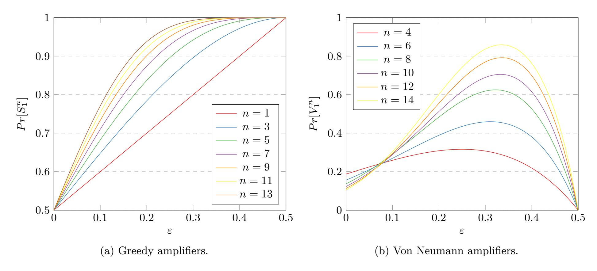

Fig. 1: Probability of obtaining 1 after amplification.

**Lemma 3.** Let  $k \geq 0$ . Then the following hold

1. 
$$Pr[V_0^n] = \sum_{i=1}^x C_i^n \tilde{p}^i \tilde{q}^{n-i} + y \tilde{p}^{x+1} \tilde{q}^{n-x-1} \text{ and } Pr[V_1^n] = \sum_{i=1}^x C_i^n \tilde{p}^{n-i} \tilde{q}^i + y \tilde{p}^{n-x-1} \tilde{q}^{x+1}.$$
  
2.  $Pr[V_0^n] > Pr[V_0^{n+2}] \text{ and and } Pr[V_1^n] < Pr[V_1^{n+2}].$ 

Due to the nature of x and y, the relation between greedy and Von Neumann amplifiers is found through heuristically methods (see Figure 2). The observations are formally stated in [9] as a conjecture (see Conjecture 1). Remark that in the case of greedy amplifiers the metric  $(Pr[S_1^{n-1}] - Pr[S_0^{n-1}])/(Pr[S_1^{n-1}] + Pr[S_0^{n-1}])$  is equal to  $Pr[S_1^{n-1}] - Pr[S_0^{n-1}]$ . Note that in Figure 2 the y-axis represents the values  $P(S_1^{n-1}) - P(S_0^{n-1})$  (interrupted line) and  $M^n$  (continuous line).

<span id="page-2-1"></span>Conjecture 1 Let n be even. Denote by  $M^n = (Pr[V_1^n] - Pr[V_0^n])/(Pr[V_1^n] + Pr[V_0^n])$ . Then  $M^n < M^{n+2}$  and  $Pr[S_1^{n-1}] - Pr[S_0^{n-1}] < M^n$ .

Remark that in the case of greedy amplifiers the metric equivalent to  $M_n$ ,  $(Pr[S_1^{n-1}] - Pr[S_0^{n-1}])/(Pr[S_1^{n-1}] + Pr[S_0^{n-1}])$ , is equal to  $Pr[S_1^{n-1}] - Pr[S_0^{n-1}]$ . Note that in Figure 2 the y-axis represents the values  $P(S_1^{n-1}) - P(S_0^{n-1})$  (interrupted line) and  $M^n$  (continuous line).

Informally, Conjecture 1 states that the Von Neumann amplifier for a given n is better at amplifying  $\varepsilon$  than its greedy counterpart. But, a downside is that they require more data than greedy amplifiers. Another disadvantage is that Von Neumann amplifiers require a variable number of input bits, compared to a constant number for greedy ones.

### 2.2 Generic Architecture for Implementing Health Tests

RNG standards [7,10] require manufactures to implement some early detection mechanism for entropy failure. Health tests represent one such method for detecting major failures. There are two categories of health tests: startup tests and continuous tests. The former are one time tests conducted before the RNG starts producing outputs, while the latter are tests performed in the background during normal operation.

In [9], a generic architecture for implementing continuous health tests (see Figure 3) is proposed<sup>5</sup>. The data D (obtained from the noise source) is stored in a buffer, then a greedy bias amplifier is applied to it

<span id="page-2-2"></span> $<sup>\</sup>overline{\phantom{a}^{5}}$  Note that when n=1 we obtain Intel's testing architecture.

{3}------------------------------------------------

<span id="page-3-0"></span>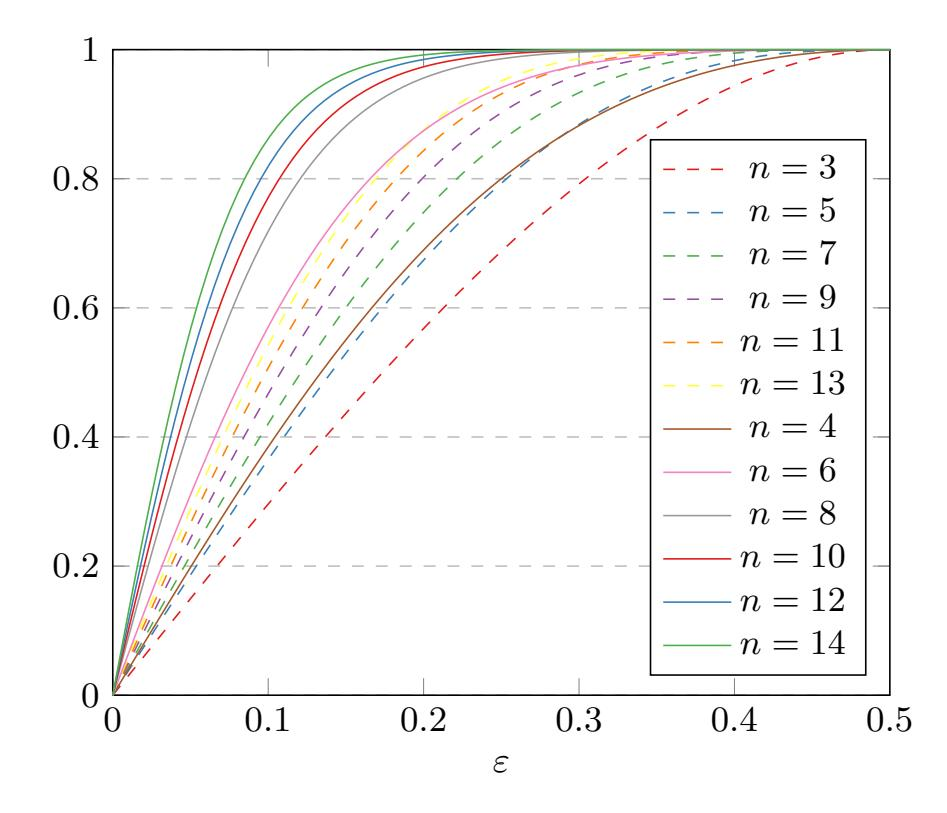

Fig. 2: Greedy (interrupted line) vs Von Neumann (continuous line) amplifiers.

and data *D<sup>a</sup>* is obtained. Next, some lightweight tests are applied on *Da*. If the tests are passed, the RNG outputs *D*, otherwise *D* is discarded. Note that the greedy bias amplifier can be implemented as a lookup table, thus obtaining no processing overhead at the expense of O(2*<sup>n</sup>*) memory.

<span id="page-3-1"></span>If we replace the greedy amplifier with a Von Neumann one, the generic architecture becomes suited for devising a startup test. Thus, before entering normal operation, the amplified data can then be tested using the lightweight tests and if the tests pass the RNG will discard the data and enter normal operation. Note that the first buffer from Figure [3](#page-3-1) is not necessary in this case and that the Von Neumann module can be instantiated using a conversion table. Because Von Neumann amplifiers require *n >* 2, the speed of the RNG will drop. This can also be acceptable as a continuous test if the data speed needed for raw data permits it, the RNG generates data much faster than the connecting cables are able to transmit or the raw data is further used by a pseudo-random number generator (PRNG).

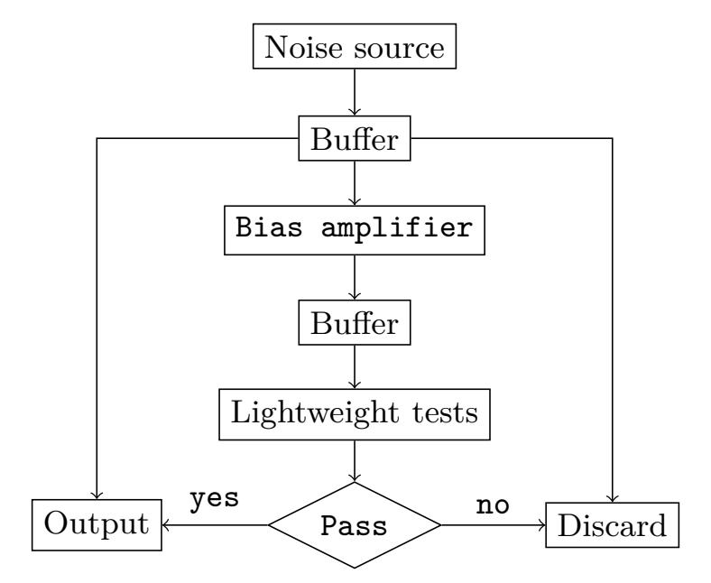

Fig. 3: Generic architecture for implementing health tests.

The architecture's instantiations presented in [\[9\]](#page-11-1) employ the health tests implemented in Intel's processors [\[6\]](#page-11-7). Intel's health tests (denoted by *Hi*) use a sliding window and count how many times each of the six different bit patterns (1, 01, 010, 0110, 101 and 1001) appear in a 256 bit sample. If the number of patterns

{4}------------------------------------------------

belongs to some given intervals then the sample is marked  $pass^6$ . In the case of bias amplification, if a 256 bit buffer  $b_a$  from  $D_a$  passes  $H_i$ , all the input buffers that where used to produce  $b_a$  are considered marked pass.

### <span id="page-4-0"></span>3 Empirical Investigation

In order to implement Intel's health tests, we experimentally computed the initial thresholds used in  $H_i$ .<sup>7</sup> The results are presented in Table 1 and were computed using  $10^6$  256 bit samples generated based on the Bernoulli distribution instantiated with the Mersenne Twister engine (mt19937) found in the C++ random library [1]. When the data used to generate the thresholds follows a  $B(\tilde{p})$  distribution, we denote by  $H_i(\tilde{p})$  the resulting health test.

<span id="page-4-3"></span>Note that  $\varepsilon$  might be different for each individual noise source (e.g. due to manufacturing variations) and since our scope is to automatically detect large deviations, we had to experimentally determine the initial bounds. A similar process needs to be carried out internally by each RNG during a setup phase. Remark that since the bias is unknown, using theoretical estimates increases design complexity.

| Bit     | Allowable number of occurrences per sample |         |                   |                   |                   |  |  |  |
|---------|--------------------------------------------|---------|-------------------|-------------------|-------------------|--|--|--|
| pattern | $\tilde{p} = 0.1$ $\tilde{p} = 0.2$        |         | $\tilde{p} = 0.3$ | $\tilde{p} = 0.4$ | $\tilde{p} = 0.5$ |  |  |  |
| 1       | 5 - 50                                     | 24 - 87 | 45 - 115          | 67 - 138          | 92 - 167          |  |  |  |
| 01      | 5 - 44                                     | 20 - 64 | 32 - 75           | 42 - 80           | 45 - 83           |  |  |  |
| 010     | 3 - 43                                     | 13 - 57 | 14 - 64           | 12 - 66           | 10 - 58           |  |  |  |
| 0110    | 0 - 12                                     | 0 - 21  | 0 - 27            | 2 - 32            | 1 - 35            |  |  |  |
| 101     | 0 - 14                                     | 0 - 27  | 1 - 39            | 5 - 50            | 9 - 61            |  |  |  |
| 1001    | 0 - 15                                     | 0 - 23  | 0 - 31            | 1 - 34            | 2 - 35            |  |  |  |

Table 1: Health bounds for  $H_i(\tilde{p})$ .

When the architecture presented in Figure 3 is instantiated with  $H_i(\tilde{p})$  we denote it by  $A_t(\tilde{p})$ . To analyze the behavior of  $A_t(\tilde{p})$  we conducted a series of experiments. Thus, we generated 450450 256 bit samples using the Bernoulli distribution  $B(\hat{p})^8$  instantiated with mt19937. Then, we applied the greedy bias amplifying filters from Section 2.1 with amplifying factors n = 1, 3, 5, 7, 9, 11, 13 and counted how many samples are marked pass. The probability  $P_{pass}$  of a sequence to be marked pass is derived by dividing the counter with 450450. The results are presented in Figure 10. Note that for  $\tilde{p} \in [0.5, 1.0]$  the resulting plots are mirrored version of the plots obtained for  $\tilde{p} \in [0.0, 0.5]$  and thus are omitted. We further consider  $\tilde{p} \leq 0.5$ .

<span id="page-4-6"></span>Remark 1. Let n = 9, 11, 13. We can easily see that the number of samples that are marked pass is close to zero for  $\tilde{p} \leq 0.3$  and is considerably lower  $(P_{pass} < 0.60)$  when  $0.3 \leq \tilde{p} \leq 0.4$ . We can also observe that when  $\tilde{p} \leq 0.3$ ,  $\hat{p}$  needs to drift at least 0.05 to have  $P_{pass} < 0.40$ . When  $\tilde{p} = 0.4$ ,  $\hat{p}$  needs to drift at least 0.01 to have  $P_{pass} < 0.85$ . Thus, if we instantiate  $A_t(\tilde{p})$  with greedy amplifiers with n = 9, 11, 13 the architecture can detect catastrophic RNG failure (i.e.  $\tilde{p} \leq 0.4$ ).

Remark 2. Let  $\tilde{p} = 0.5$ . We can easily see that when n = 9, 11, 13 and  $\hat{p} \notin (0.46, 0.54)$  we have  $P_{pass} < 0.97$ . Thus, the architecture enables us to detect when a good source deviates with more than 0.04 from 0.5.

We also conducted a series of experiments to test the performance of  $A_t(\tilde{p})$  instantiated with the Von Neumann bias amplifying filters from Section 2.1 with amplifying factors n = 1, 4, 6, 8, 10, 12, 14. So, we

<span id="page-4-1"></span><sup>&</sup>lt;sup>6</sup> The terminology used by Intel is that the sample is "healthy".

<span id="page-4-2"></span><sup>&</sup>lt;sup>7</sup> Intel also experimentally generated, using their noise source, the initial thresholds.

<span id="page-4-4"></span><sup>&</sup>lt;sup>8</sup> Note that in our experiments  $\tilde{p}$  is fixed, while  $\hat{p}$  drifts from 0.01 to 0.99.

<span id="page-4-5"></span><sup>&</sup>lt;sup>9</sup> The deviation might be an effect of components' ageing or malfunctioning.

{5}------------------------------------------------

generated data with *B*(*p*ˆ) until we obtained 10000 256-bit samples[10](#page-5-1), then we applied the Von Neumann bias amplifying filters and counted how many of these samples pass the *Hi*(*p*˜) test. The results are presented in Figure [11.](#page-15-0) Note that in this case *Ppass* is obtained by dividing the counter with 10000. Another metric that we computed is the number of input bits required to generate one output bit. The results are presented in Figure [4.](#page-5-2)

*Remark 3.* Let *n* ≥ 6. We can easily see that the number of samples that are marked pass is close to zero for *p*˜ ≤ 0*.*4. We can also observe that when *p*˜ ≤ 0*.*3, *p*ˆ needs to drift at least 0*.*08 to have *Ppass <* 0*.*42. When *p*˜ = 0*.*4, *p*ˆ needs to drift at least 0*.*03 to have *Ppass <* 0*.*84. Thus, if we instantiate *At*(*p*˜) with Von Neumann amplifiers with *n* = 6*,* 8*,* 10*,* 12*,* 14 the architecture can detect catastrophic RNG failure. Also, remark that the drift for Von Neumann amplifiers is larger than in the case of greedy amplifiers.

*Remark 4.* Let *p*˜ = 0*.*5. We can easily see that when *n* = 6 and *p*ˆ 6∈ (0*.*47*,* 0*.*53) we have *Ppass <* 0*.*975, while for *n* ≥ 8 and *p*ˆ 6∈ (0*.*48*,* 0*.*52) we have *Ppass <* 0*.*985. Thus, the architecture enables us to detect when a good source deviates with more than 0*.*03 and, respectively, 0*.*02 from 0*.*5. Hence, Von Neumann amplifiers provide us with a better detection method than the greedy counterparts.

<span id="page-5-3"></span><span id="page-5-2"></span>*Remark 5.* Although, Von Neumann amplifiers are better suited to detect deviations than greedy amplifiers, we can observe that the data requirements fluctuate and even in the uniform case efficiency can get to as low 0*.*01495 *bitsout/bitsin*. This translates into longer testing times that in the case of greedy amplifiers where the data requirements are fixed. Thus, when choosing between greedy and Von Neumman amplifiers one need to consider what is more important: faster testing times or better detection of source deviations.

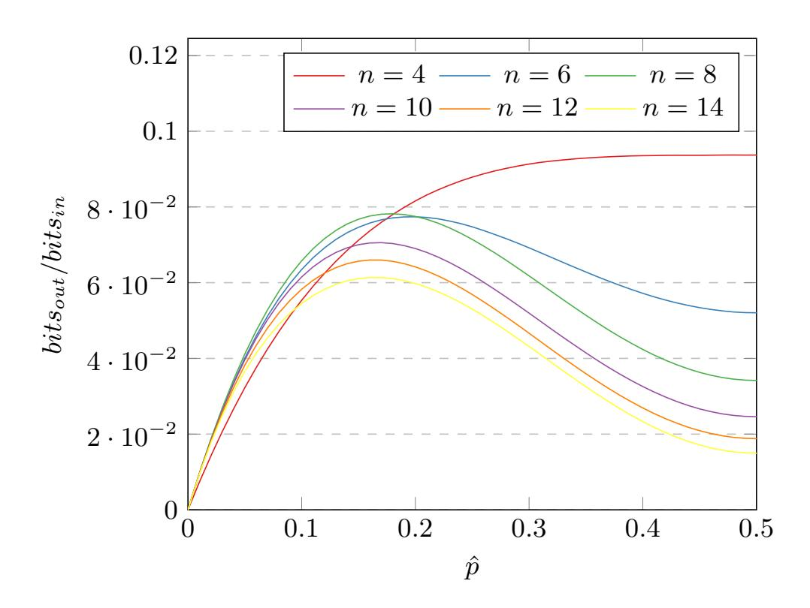

Fig. 4: Bit requirements for Von Neumann amplifiers.

## <span id="page-5-0"></span>**4 Theoretical Model**

In this section we develop the theoretical framework that supports the findings presented in Section [3.](#page-4-0) First we derive a series of lemmas that are later used for estimating *Ppass*. Then, we provide the reader with a series of simulations.

<span id="page-5-1"></span><sup>10</sup> We generated less data than the greedy counterpart due to the amplifier's high bit requirements (see Figure [4\)](#page-5-2).

{6}------------------------------------------------

#### 4.1 Description

We first state a known result regarding the number of 1s (denoted by  $c_1$ ) in a sequence of length m. Then, we determine the number of overlapping 01s (denoted by  $c_{01}$ ), 010s (denoted by  $c_{010}$ ), 101s (denoted by  $c_{101}$ ), 0110s (denoted by  $c_{0110}$ ) and 1001s (denoted by  $c_{1001}$ ) in a sequence of length m. Note that we assume that all the sequences are generated by a Bernoulli noise source B(p).

**Lemma 4.** Let k a positive integer. Then

$$Pr[c_1 = k] = C_k^m \cdot p^k \cdot q^{m-k}.$$

Remark 6. Note that when the Hamming weight  $\omega$  of a sequence is either 0 or m, we have  $c_{01} = c_{010} = c_{101} = c_{0110} = c_{1001} = 0$ . Thus, when computing the probability P of k occurrences of a pattern, the cases  $\omega = 0$  and  $\omega = m$  add to P a term  $q^m + p^m$  only when k = 0. For uniformity, we further consider the term  $q^m + p^m$  as being implicit.

<span id="page-6-2"></span>**Lemma 5.** Let k be a positive integer. Then

$$Pr[c_{01} = k] = \sum_{\omega=1}^{m-1} C_k^{\omega} \cdot C_k^{m-\omega} \cdot p^{\omega} \cdot q^{m-\omega}.$$

*Proof.* First we form a sequence  $\Gamma$  of k concatenated 01s. Thus, for a given Hamming weight  $\omega$  we are left with  $\omega - k$  1s and  $m - \omega - k$  0s that are unused. When inserting the m - 2k bits into  $\Gamma$ , for ease of description, we always insert 0s and 1s before a 0 and, respectively, a 1 that is already in  $\Gamma$ . Remark that we can insert a number of 1s and 0s at the beginning and, respectively, the end of  $\Gamma$  without changing the number of 01 patterns.

After inserting in  $\Gamma$  the m-2k bits we obtain the sequence

$$\underbrace{1\dots 1}_{y_0}\underbrace{0\dots 0}_{x_1}\underbrace{0\underbrace{1\dots 1}}_{y_1}\underbrace{1\dots \underbrace{0\dots 0}}_{x_k}\underbrace{0\underbrace{1\dots 1}}_{y_k}\underbrace{1\underbrace{0\dots 0}}_{x_{k+1}}$$

with the restrictions

$$x_1 + \ldots + x_{k+1} = m - \omega - k, x_i \ge 0, i \in [1, k+1],$$
 (1)

<span id="page-6-1"></span><span id="page-6-0"></span>
$$y_0 + \ldots + y_k = \omega - k, y_i \ge 0, i \in [0, k].$$
 (2)

According to Lemma 1, the number of solutions that satisfy Equation (1) and Equation (2) is  $C_k^{m-\omega}$  and, respectively,  $C_k^{\omega}$ . Using the number of solutions and the law of total probability we obtain the desired result.

**Lemma 6.** Let k a positive integer. Then

$$Pr[c_{010} = k] = \sum_{\omega=1}^{m-1} \sum_{r=k}^{\omega} C_r^{m-\omega} \cdot C_k^r \cdot C_{r-k}^{\omega-r} \cdot p^{\omega} \cdot q^{m-\omega}.$$

*Proof.* Let r be the maximum number of 01 patterns. Using a similar reasoning to the proof of Lemma 5 we obtain the sequence

$$\underbrace{1\dots1}_{y_0}\underbrace{0\dots0}_{x_1}\underbrace{0\dots1}_{y_1}\underbrace{1\dots0}_{x_r}\underbrace{0\dots0}_{y_r}\underbrace{0\dots1}_{y_r}\underbrace{1\dots1}_{x_{r+1}}\underbrace{0\dots0}_{x_{r+1}}$$

with the restrictions

$$x_1 + \ldots + x_{r+1} = m - \omega - r, x_i \ge 0, i \in [1, r+1],$$
 (3)

<span id="page-6-4"></span><span id="page-6-3"></span>
$$y_0 + \ldots + y_r = \omega - r, y_0 \ge 0.$$
 (4)

{7}------------------------------------------------

According to Lemma 1 the number of solutions that satisfy Equation (3) is  $C_r^{m-\omega}$ .

To ensure that there are exactly k 010 patterns Equation (4) that have to satisfy the following condition: exactly k out of r  $y_1, \ldots, y_r$  must be 0. We further assume that  $y_1 = \ldots = y_k = 0$  and  $y_{k+1}, \ldots, y_r \ge 1$ . Note that the number of solutions obtained under this assumption must be multiplied with a factor of  $C_k^r$ . Equation (4) now becomes

<span id="page-7-0"></span>
$$y_0 + y_{k+1} + \ldots + y_r = \omega - r, y_0 \ge 0, y_i \ge 1, i \in [k+1, r]$$
 (5)

According to Lemma 1 the number of solutions for Equation (5) is  $C_{r-k}^{\omega-r}$ . By adding everything together and using the law of total probability we obtain the desired result.

<span id="page-7-4"></span>**Lemma 7.** Let k be a positive integer. Then

$$Pr[c_{101} = k] = \sum_{\omega=1}^{m-1} \sum_{r=k}^{m-\omega} C_r^{\omega} \cdot C_k^r \cdot C_{r-k}^{m-\omega-r} \cdot p^{\omega} \cdot q^{m-\omega}.$$

*Proof.* In this case, we consider r as the maximum number of 10 patterns and  $\Gamma$  as the sequence composed of k concatenated 10s. Remark that we can insert a number of 0s and 1s at the beginning and, respectively, the end of  $\Gamma$  without affecting r. Thus, after inserting in  $\Gamma$  the m-2k bits, we obtain the sequence

$$\underbrace{0\ldots 0}_{x_0}\underbrace{1\ldots 1}_{y_1}\underbrace{1}\underbrace{0\ldots 0}_{x_1}\underbrace{0\ldots 1}_{y_r}\underbrace{1}\underbrace{0\ldots 0}_{x_r}\underbrace{0\underbrace{1\ldots 1}_{y_{r+1}}}$$

with the restrictions

<span id="page-7-2"></span><span id="page-7-1"></span>
$$x_0 + \ldots + x_r = m - \omega - r, x_0 \ge 0,$$
 (6)

$$y_1 + \ldots + y_{r+1} = \omega - r, y_i \ge 0, i \in [1, r+1].$$
 (7)

According to Lemma 1 the number of solutions that satisfy Equation (7) is  $C_r^{\omega}$ .

To ensure that there are exactly k 101 patterns Equation (6) that have to satisfy the following condition: exactly k out of r  $x_1, \ldots, x_r$  must be 0. We further assume that  $x_1 = \ldots = x_k = 0$  and  $x_{k+1}, \ldots, x_r \geq 1$ . Note that the number of solutions obtained under this assumption must be multiplied with a factor of  $C_k^r$ . Equation (6) now becomes

<span id="page-7-3"></span>
$$x_0 + x_{k+1} + \ldots + x_r = m - \omega - r,$$
  
 $x_0 \ge 0, x_i \ge 1, i \in [k+1, r]$  (8)

According to Lemma 1 the number of solutions for Equation (8) is  $C_{r-k}^{m-\omega-r}$ . By adding everything together and using the law of total probability we obtain the desired result.

Remark 7. In [8], an analysis for  $Pr[c_{0110} = k]$  is presented. But, the authors consider bits that have a B(0.5) distribution and that are arranged in a circle. Thus, in our case, we need to reanalyze  $Pr[c_{0110} = k]$ .

**Lemma 8.** Let k be a positive integer. Then

$$Pr[c_{0110} = k] = \sum_{\omega=1}^{m-1} \sum_{r=k}^{\omega} \sum_{s=t}^{r-k} C_r^{m-\omega} \cdot C_k^r \cdot C_s^{r-k} \cdot C_{r-k-s}^{\omega-2r+s} \cdot p^{\omega} \cdot q^{m-\omega},$$

where  $t = 2r - \omega$ .

*Proof.* Let r be the maximum number of 01 patterns. Using a similar reasoning to the proof of Lemma 5 we obtain the sequence

$$\underbrace{1\dots 1}_{y_0}\underbrace{0\dots 0}_{x_1}\underbrace{0\underbrace{1\dots 1}}_{y_1}\underbrace{1\dots \underbrace{0\dots 0}}_{x_r}\underbrace{0\underbrace{1\dots 1}}_{y_r}\underbrace{1\underbrace{0\dots 0}}_{x_{r+1}}$$

{8}------------------------------------------------

with the restrictions presented in Equations (3) and (4). According to Lemma 1 the number of solutions that satisfy Equation (3) is  $C_r^{m-\omega}$ .

To ensure that there are exactly k 0110 patterns Equation (4) that have to satisfy the following condition: exactly k out of r  $y_1, \ldots, y_r$  must be 1. We further assume that  $y_1 = \ldots = y_k = 1$  and  $y_{k+1}, \ldots, y_r \neq 1$ . Note that the number of solutions obtained under this assumption must be multiplied with a factor of  $C_k^r$ .

Let s be the number of  $y_i$ ,  $i \in [k+1,r]$  that are 0. We assume that  $y_{k+1} = \ldots = y_{k+s}$ . Thus,  $y_i \ge 2$  for  $i \in [k+s+1,r]$ . Note that the number of solutions obtained under this assumption must be multiplied with a factor of  $C_s^{r-k}$ .

Equation (4) now becomes

<span id="page-8-0"></span>
$$y_0 + y_{k+s+1} + \dots + y_r = \omega - r - k,$$
  
 $y_0 \ge 0, y_i \ge 2, i \in [k+s+1, r]$  (9)

According to Lemma 1 the number of solutions for Equation (9) is  $C_{r-k-s}^{\omega-2r+s}$ . By adding everything together and using the law of total probability we obtain the desired result.

**Lemma 9.** Let k a positive integer. Then

$$Pr[c_{1001} = k] = \sum_{\omega=1}^{m-1} \sum_{r=k}^{m-\omega} \sum_{s=t}^{r-k} C_r^{\omega} \cdot C_k^{r} \cdot C_s^{r-k} \cdot C_{r-k-s}^{m-\omega-2r+s} \cdot p^{\omega} \cdot q^{m-\omega},$$

where  $t = 2r - m + \omega$ .

*Proof.* As in Lemma 7, r is the maximum number of 10 patterns and we obtain the sequence

$$\underbrace{0\ldots 0}_{x_0}\underbrace{1\ldots 1}_{y_1}\underbrace{1}\underbrace{0\ldots 0}_{x_1}\underbrace{0\ldots 1}_{y_r}\underbrace{1}\underbrace{0\ldots 0}_{x_r}\underbrace{0}\underbrace{1\ldots 1}_{y_{r+1}}$$

with the restrictions presented in Equations (6) and (7). According to Lemma 1 the number of solutions that satisfy Equation (6) is  $C_r^{\omega}$ .

To ensure that there are exactly k 1001 patterns Equation (6) that have to satisfy the following condition: exactly k out of r  $x_1, \ldots, x_r$  must be 1. We further assume that  $x_1 = \ldots = x_k = 1$  and  $x_{k+1}, \ldots, x_r \neq 1$ . Note that the number of solutions obtained under this assumption must be multiplied with a factor of  $C_k^r$ .

Let s be the number of  $x_i$ ,  $i \in [k+1,r]$  that are 0. We assume that  $x_{k+1} = \ldots = x_{k+s}$ . Thus,  $x_i \ge 2$  for  $i \in [k+s+1,r]$ . Note that the number of solutions obtained under this assumption must be multiplied with a factor of  $C_s^{r-k}$ .

Equation (6) now becomes

<span id="page-8-1"></span>
$$x_0 + x_{k+s+1} + \dots + x_r = m - \omega - r - k,$$
  

$$x_0 \ge 0, x_i \ge 2, i \in [k+s+1, r]$$
(10)

According to Lemma 1 the number of solutions for Equation (10) is  $C_{r-k-s}^{m-\omega-2r+s}$ . By adding everything together and using the law of total probability we obtain the desired result.

To compute the probability  $P_{pass}$  that a sequence of length m is marked pass, we further assume that the 6 statistical tests are independent. Note that this is a standard assumption [2,11] and offers us an estimate for the real probability. To derive the estimates for the bias amplifiers we use the probabilities from Lemmas 2 and 3.

<span id="page-8-2"></span>**Lemma 10.** For a greedy amplifier with an amplification factor n = 2k + 1 and a Bernoulli noise source  $B(\tilde{p})$  we have that

$$P_{pass} \simeq \prod_{i=1}^{6} \left( \sum_{\ell=a_i}^{b_i} Pr[c_i = \ell] \right),$$

<span id="page-8-3"></span>where  $a_i$ ,  $b_i$  are the lower and upper limits for  $c_i \in \{c_1, c_{01}, c_{010}, c_{101}, c_{0110}, c_{1001}\}$  and  $p = \sum_{j=0}^k C_j^n \cdot \tilde{p}^{n-j} \tilde{q}^j$ .

{9}------------------------------------------------

<span id="page-9-0"></span>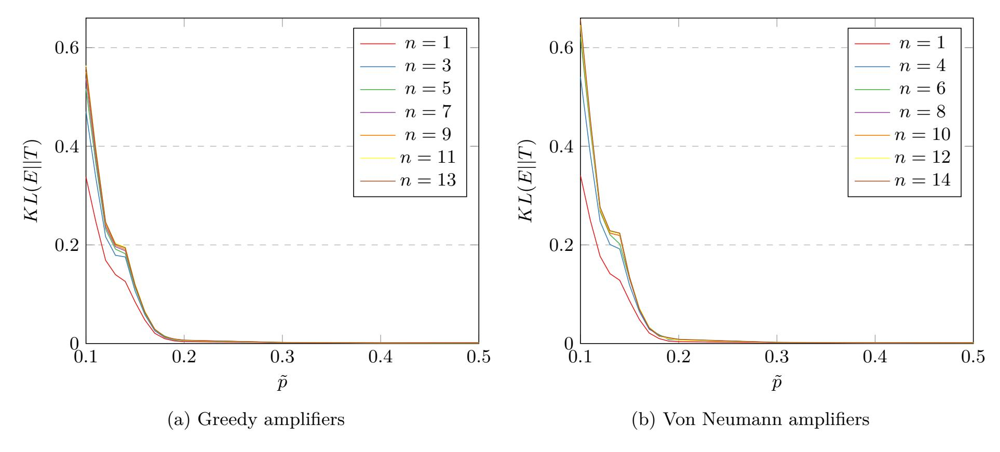

Fig. 5: Kullback-Leibler divergence

**Lemma 11.** For a Von Neumann amplifier with an amplification factor n = 2k and a Bernoulli noise source  $B(\tilde{p})$  we have that

$$P_{pass} \simeq \prod_{i=1}^{6} \left( \sum_{\ell=a_i}^{b_i} Pr[c_i = \ell] \right),$$

where  $a_i$ ,  $b_i$  are the lower and upper limits for  $c_i \in \{c_1, c_{01}, c_{010}, c_{101}, c_{0110}, c_{1001}\}$ ,  $p = \sum_{j=1}^{x} C_j^n \tilde{p}^{n-j} \tilde{q}^j + y \tilde{p}^{n-x-1} \tilde{q}^{x+1}$ , x is an integer such that  $\sum_{j=1}^{x} C_j^n < C_k^n/2 < \sum_{j=1}^{x+1} C_j^n$  and  $y = C_k^n/2 - \sum_{j=1}^{x} C_j^n$ .

#### 4.2 Results

To test our model we implemented Lemmas 10 and 11 using the GMP library [3]. The results are presented in Figure 12 and, respectively, Figure 13. We can easily remark that for  $p \neq 0.1$  the theoretical estimates are close to the experimental results obtained in Section 3.

Let  $\mathcal{P} = \{0.01, 0.02, \dots, 0.99\}$ . To measure the exact distance between the experimental  $E_{n,\tilde{p}}$  and theoretical  $T_{n,\tilde{p}}$  distributions, we computed the Kullback-Leibler divergence

$$KL(E_{n,\tilde{p}}||T_{n,\tilde{p}}) = \sum_{\hat{p}\in\mathcal{P}} E_{n,\tilde{p}}(\hat{p})\log(E_{n,\tilde{p}}(\hat{p})/T_{n,\hat{p}}(\hat{p}))$$

and the total variation distance

$$\delta(E_{n,\tilde{p}}, T_{n,\tilde{p}}) = \sum_{\hat{p} \in \mathcal{P}} |E_{n,\tilde{p}}(\hat{p}) - T_{n,\tilde{p}}(\hat{p})|/2.$$

Roughly speaking,  $KL(E_{n,\tilde{p}}||T_{n,\tilde{p}})$  represents the amount of information lost when  $T_{n,\tilde{p}}$  is used to approximate  $E_{n,\tilde{p}}$  and  $\delta(E_{n,\tilde{p}},T_{n,\tilde{p}})$  represents the largest possible difference between the probabilities that the two probability distributions can assign to the same event [13]. The results for  $\tilde{p} \in \{0.1,0.11,\ldots,0.2,0.3,0.4,0.5\}$  are presented in Figures 5 and 6. We remark that for  $\tilde{p} \geq 0.20$  we have  $KL(E_{n,\tilde{p}}||T_{n,\tilde{p}}) \simeq 0.01$  and  $\delta(E_{n,\tilde{p}},T_{n,\tilde{p}}) \simeq 0.02$ . Thus, the theoretical model is a good estimate for the real probability when  $\tilde{p} \geq 0.2$ . Also, note that Remarks 1 to 5 remain true for the theoretical estimates.

{10}------------------------------------------------

<span id="page-10-0"></span>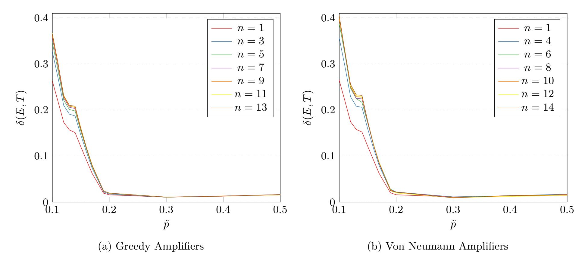

Fig. 6: Total variance distance

<span id="page-10-1"></span>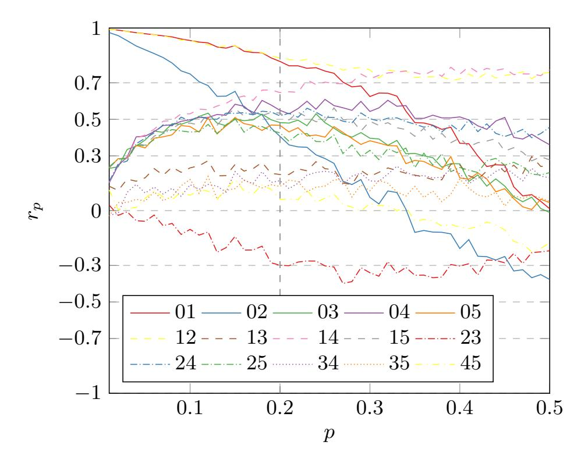

Fig. 7: Tests correlation

When *p <*˜ 0*.*2 the model starts to distance himself from the real probability, due to the high correlations between the statistical tests. More precisely, the assumption made for Lemmas [10](#page-8-2) and [11](#page-8-3) starts to fail. To see how the tests are correlated, we computed the Pearson correlation coefficient

$$r_p(T_1, T_2) = \frac{\sum_{i=1}^{1000} (t_{1i} - \bar{t}_1)(t_{2i} - \bar{t}_2)}{\sqrt{\sum_{i=1}^{1000} (t_{1i} - \bar{t}_1)^2} \sqrt{\sum_{i=1}^{1000} (t_{2i} - \bar{t}_2)^2}},$$

where *t*1*<sup>i</sup>* and *t*2*<sup>i</sup>* represent the number of samples that pass test *T*<sup>1</sup> and, respectively, *T*<sup>2</sup> in experiment *i*, while *t*¯<sup>1</sup> and *t*¯<sup>2</sup> represent the associated expected values. The results for *p* ∈ P are presented in Figure [7.](#page-10-1) Note that in Figure [7](#page-10-1) the correlation between testing for the allowable number of occurrences per sample for 1 and 01 patterns is denoted by 01, for 1 and 010 patterns is denoted by 02 and so on.

{11}------------------------------------------------

## <span id="page-11-5"></span>**5 Conclusions**

In our paper we extended the architecture introduced in [\[9\]](#page-11-1) to Bernoulli noise sources and provided the reader with both experimental and theoretical performance metrics. As a practical application, we showed that the architecture can detect catastrophic failures of a noise source. Another possible application would be a detection mechanism for large deviations from the original parameters of a good noise source.

*Future Work.* Bias is not the only way for a RNG to go wrong. Another important feature that can deviate is correlation. Thus, an interesting question is the following: can bias amplifiers detect when random data becomes correlated or other classes of amplifiers need to be developed?

The theoretical model presented in this paper is devised only for Intel's health tests. But the architecture presented in Figure [3](#page-3-1) can be applied to any health test. Thus, an important step into understanding the behavior of bias amplifiers would be to model the architecture's behavior when it is instantiated with other health tests and compare the results with our initial findings.

## **Acknowledgments**

The author would like to thank Mariana Costiuc for asking him what happens if we apply bias amplifiers to broken sources.

## **References**

- <span id="page-11-8"></span>1. C++ Random Library. <https://www.cplusplus.com/reference/random/>
- <span id="page-11-10"></span>2. NIST SP 800-22: Download Documentation and Software. [https://csrc.nist.gov/Projects/](https://csrc.nist.gov/Projects/Random-Bit-Generation/Documentation-and-Software) [Random-Bit-Generation/Documentation-and-Software](https://csrc.nist.gov/Projects/Random-Bit-Generation/Documentation-and-Software)
- <span id="page-11-12"></span>3. The GNU Multiple Precision Arithmetic Library. <https://gmplib.org/>
- <span id="page-11-6"></span>4. Charalambides, C.A.: Enumerative Combinatorics. Chapman and Hall/CRC (2002)
- <span id="page-11-4"></span>5. Dodis, Y., Gennaro, R., Håstad, J., Krawczyk, H., Rabin, T.: Randomness Extraction and Key Derivation Using the CBC, Cascade and HMAC Modes. In: CRYPTO 2004. Lecture Notes in Computer Science, vol. 3152, pp. 494–510. Springer (2004)
- <span id="page-11-7"></span>6. Hamburg, M., Kocher, P., Marson, M.E.: Analysis of Intel's Ivy Bridge Digital Random Number Generator. Tech. rep. (2012)
- <span id="page-11-2"></span>7. Killmann, W., Schindler, W.: A Proposal for: Functionality Classes for Random Number Generators, version 2.0. Tech. rep. (2011)
- <span id="page-11-9"></span>8. Sulak, F.: New Statistical Randomness Tests: 4-bit Template Matching Tests. Turkish Journal of Mathematics **41**(1), 80–95 (2017)
- <span id="page-11-1"></span>9. Teşeleanu, G.: Random Number Generators Can Be Fooled to Behave Badly. In: ICICS 2018. Lecture Notes in Computer Science, vol. 11149, pp. 124–141. Springer (2018)
- <span id="page-11-3"></span>10. Turan, M.S., Barker, E., Kelsey, J., McKay, K., Baish, M., Boyle, M.: NIST Special Publication 800-90B: Recommendation for the Entropy Sources Used for Random Bit Generation. Tech. rep. (2018)
- <span id="page-11-11"></span>11. Yamaguchi, A., Seo, T., Yoshikawa, K.: On the Pass Rate of NIST Statistical Test Suite for Randomness. JSIAM Letters **2**, 123–126 (2010)
- <span id="page-11-0"></span>12. Young, A., Yung, M.: Malicious Cryptography: Exposing Cryptovirology. John Wiley & Sons (2004)
- <span id="page-11-13"></span>13. Zhu, S., Ma, Y., Lin, J., Zhuang, J., Jing, J.: More Powerful and Reliable Second-Level Statistical Randomness Tests for NIST SP 800-22. In: ASIACRYPT 2016. Lecture Notes in Computer Science, vol. 10031, pp. 307–329. Springer (2016)

{12}------------------------------------------------

### <span id="page-12-0"></span>A Finer measurements

In this section we provide the reader with theoretical data for greedy amplifiers when  $\tilde{p} \in [0.41, 0.46]$  and for Von Neumann amplifiers when  $\tilde{p} \in [0.43, 0.48]$ . According to the Kullback-Leibler divergence and total variance distance presented in Figures 8 and 9 and this suffices.

In the case of greedy amplifiers, for  $\tilde{p} \geq 0.46$  we cannot reliably detect the drift from 0.5  $(P_{pass} > 0.99)$ . Let n = 11, 13. For  $\tilde{p} \in [0.44, 0.45]$ , according to Table 3a, we can detect the drift from 0.5 as long as the source is stable (i.e.  $\hat{p} \leq 0.45$ ). When  $\tilde{p} \in [0.41, 0.44)$ ,  $\hat{p}$  can drift with 0.01 and we still have  $P_{pass} \leq 0.97$ . Thus, if we use n = 11, 13  $A_t(\tilde{p})$  enables us to have an early detection mechanism for catastrophic RNG failure (i.e.  $\tilde{p} \leq 0.45$ ).

In the case of Von Neumann amplifiers, for  $\tilde{p}=0.49$  we cannot reliably detect the drift from 0.5  $(P_{pass}>0.99)$ , while for  $\tilde{p}\in[0.41,0.42]$  and  $n\geq 8$  we have  $P_{pass}\simeq 0.00$ . When  $\tilde{p}=0.48$  and n>8, according to Table 3b, we can detect the drift from 0.5 as long as the source is stable. In the case  $\tilde{p}=0.47$  we can detect the drift from 0.5 when the source is stable and n=8,10, while for n=12,14  $\hat{p}$  can drift with 0.01 and we still have  $P_{pass}\leq 0.97$ . Let n=8,10,12,14. For  $\tilde{p}\in[0.43,0.46]$ ,  $\hat{p}$  can drift with 0.01 and we still have  $P_{pass}\leq 0.97$ . Thus, if we use n=10,12,14  $A_t(\tilde{p})$  enables us to have an early detection mechanism for catastrophic RNG failure (i.e.  $\tilde{p}\leq 0.48$ ). Note that although Von Neumann amplifiers have a larger range for detecting deviations from 0.5, greedy amplifiers have faster testing times.

| Bit     | Allowable number of occurrences per sample |                    |                    |                    |                    |                    |                    |                    |  |
|---------|--------------------------------------------|--------------------|--------------------|--------------------|--------------------|--------------------|--------------------|--------------------|--|
| pattern | $\tilde{p} = 0.41$                         | $\tilde{p} = 0.42$ | $\tilde{p} = 0.43$ | $\tilde{p} = 0.44$ | $\tilde{p} = 0.45$ | $\tilde{p} = 0.46$ | $\tilde{p} = 0.47$ | $\tilde{p} = 0.48$ |  |
| 1       | 70 - 141                                   | 72 - 144           | 74 - 147           | 76 - 149           | 79 - 151           | 81 - 154           | 85 - 157           | 87 - 161           |  |
| 01      | 43 - 82                                    | 43 - 81            | 44 - 81            | 44 - 82            | 44 - 83            | 44 - 84            | 44 - 84            | 45 - 84            |  |
| 010     | 13 - 68                                    | 13 - 66            | 13 - 66            | 13 - 62            | 13 - 61            | 12 - 61            | 10 - 60            | 10 - 60            |  |
| 0110    | 1 - 33                                     | 1 - 34             | 1 - 33             | 1 - 33             | 1 - 33             | 1 - 33             | 1 - 33             | 1 - 34             |  |
| 101     | 5 - 51                                     | 5 - 55             | 7 - 55             | 8 - 55             | 8 - 55             | 8 - 56             | 9 - 57             | 7 - 60             |  |
| 1001    | 1 - 34                                     | 1 - 34             | 1 - 36             | 1 - 36             | 2 - 36             | 2 - 35             | 1 - 34             | 1 - 36             |  |

Table 2: Health bounds for  $H_i(\tilde{p})$ .

<span id="page-12-1"></span>

|        | $\tilde{p} = 0.41$ |                  | $\tilde{p} = 0.42$ |                  | $\tilde{p} =$    | 0.43             | $\tilde{p} = 0.44$ |                  | $\tilde{p} = 0.45$ |                  |
|--------|--------------------|------------------|--------------------|------------------|------------------|------------------|--------------------|------------------|--------------------|------------------|
|        | $\hat{p} = 0.41$   | $\hat{p} = 0.42$ | $\hat{p} = 0.42$   | $\hat{p} = 0.43$ | $\hat{p} = 0.43$ | $\hat{p} = 0.44$ | $\hat{p} = 0.44$   | $\hat{p} = 0.45$ | $\hat{p} = 0.45$   | $\hat{p} = 0.46$ |
| n = 11 | 0.44               | 0.76             | 0.67               | 0.90             | 0.83             | 0.97             | 0.94               | 0.99             | 0.98               | 0.99             |
| n = 13 | 0.21               | 0.56             | 0.45               | 0.78             | 0.69             | 0.92             | 0.87               | 0.98             | 0.95               | 0.99             |

(a) Greedy amplifiers

|        | $\tilde{p} = 0.43$ |                  | $\tilde{p} = 0.44$ |                  | $\tilde{p} = 0.45$ |                  | $\tilde{p} = 0.46$ |                  | $\tilde{p} = 0.47$ |                  | $ \tilde{p} = 0.48 $ |
|--------|--------------------|------------------|--------------------|------------------|--------------------|------------------|--------------------|------------------|--------------------|------------------|----------------------|
|        | $\hat{p} = 0.43$   | $\hat{p} = 0.44$ | $\hat{p} = 0.44$   | $\hat{p} = 0.45$ | $\hat{p} = 0.45$   | $\hat{p} = 0.46$ | $\hat{p} = 0.46$   | $\hat{p} = 0.47$ | $\hat{p} = 0.47$   | $\hat{p} = 0.48$ | $\hat{p} = 0.48$     |
| n=8    | 0.00               | 0.09             | 0.05               | 0.41             | 0.27               | 0.77             | 0.68               | 0.97             | 0.90               | 0.99             | 0.99                 |
| n = 10 | 0.00               | 0.00             | 0.00               | 0.14             | 0.07               | 0.52             | 0.41               | 0.90             | 0.78               | 0.99             | 0.98                 |
| n = 12 | 0.00               | 0.00             | 0.00               | 0.02             | 0.01               | 0.23             | 0.16               | 0.76             | 0.57               | 0.97             | 0.95                 |
| n = 14 | 0.00               | 0.00             | 0.00               | 0.00             | 0.00               | 0.05             | 0.03               | 0.52             | 0.32               | 0.93             | 0.89                 |

(b) Von Neumann amplifiers.

Table 3: Approximate theoretical values for  $P_{pass}$ .

{13}------------------------------------------------

<span id="page-13-0"></span>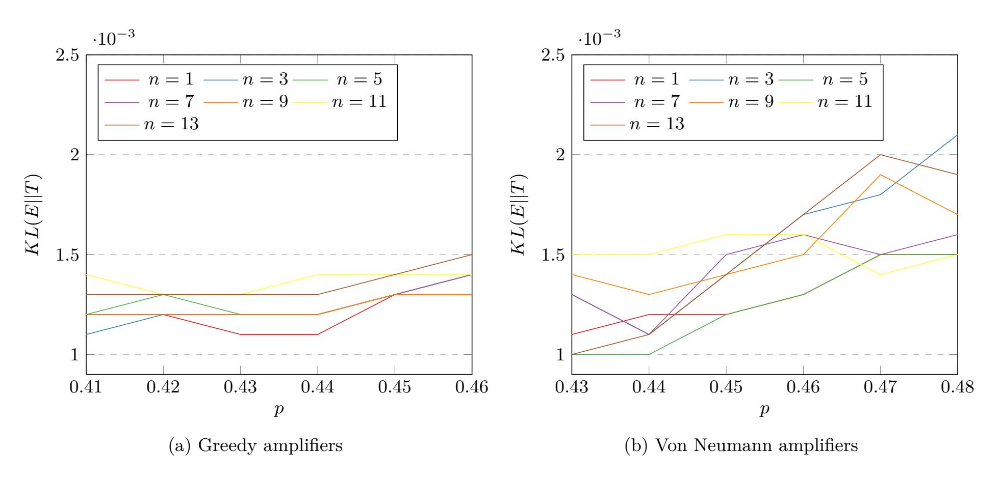

Fig. 8: Kullback-Leibler divergence

<span id="page-13-1"></span>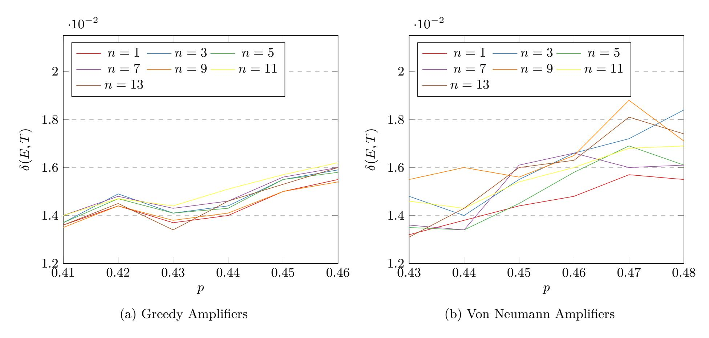

Fig. 9: Total variance distance

{14}------------------------------------------------

<span id="page-14-0"></span>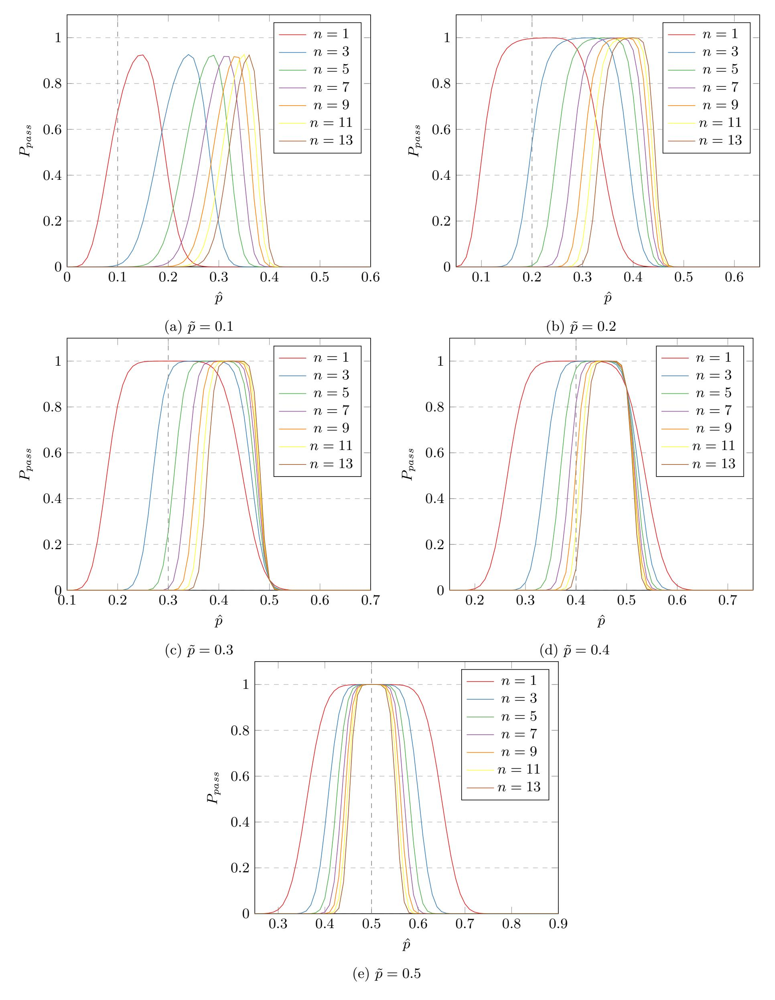

Fig. 10: Experimental results for greedy amplifiers.

{15}------------------------------------------------

<span id="page-15-0"></span>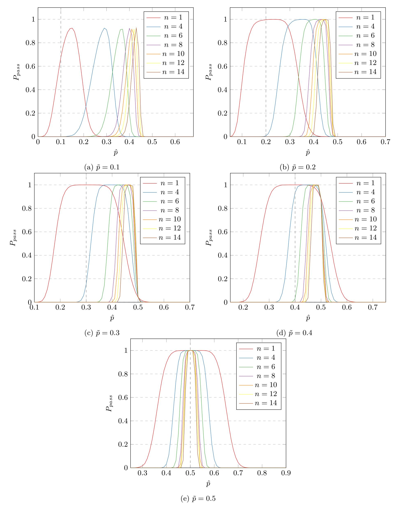

Fig. 11: Experimental results for Von Neumann amplifiers.

{16}------------------------------------------------

<span id="page-16-0"></span>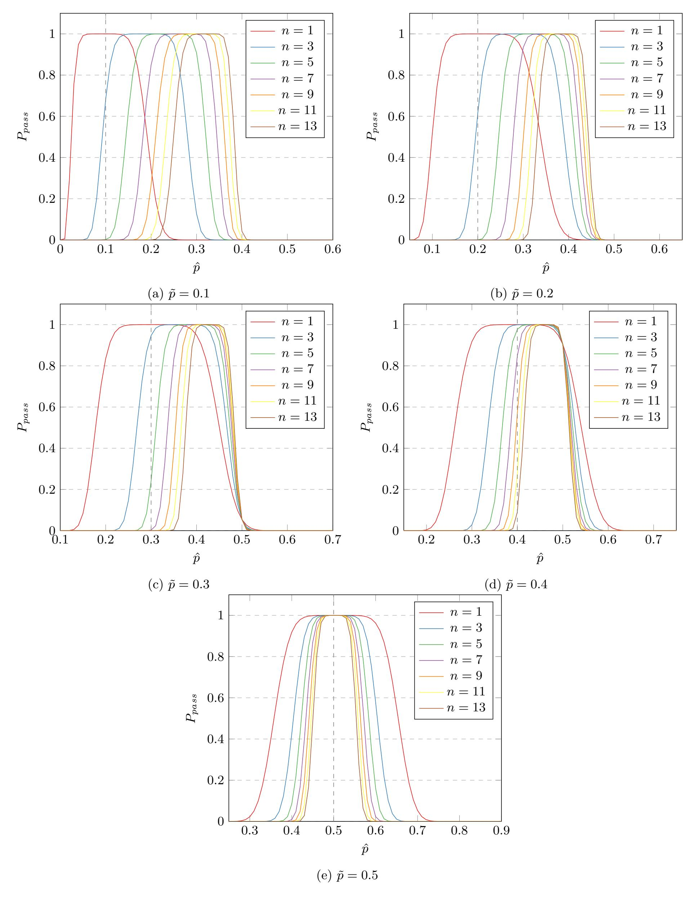

Fig. 12: Theoretical estimates for greedy amplifiers.

{17}------------------------------------------------

<span id="page-17-0"></span>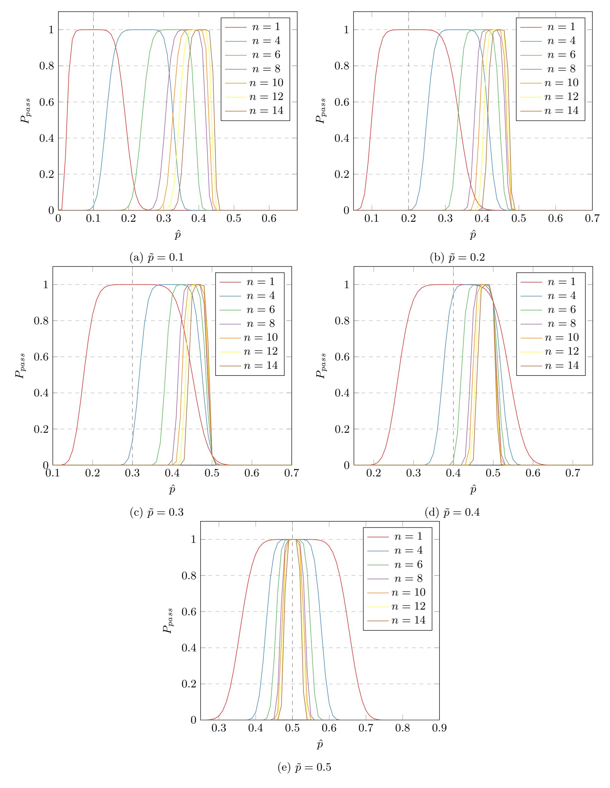

Fig. 13: Theoretical estimates for Von Neumann amplifiers.

{18}------------------------------------------------

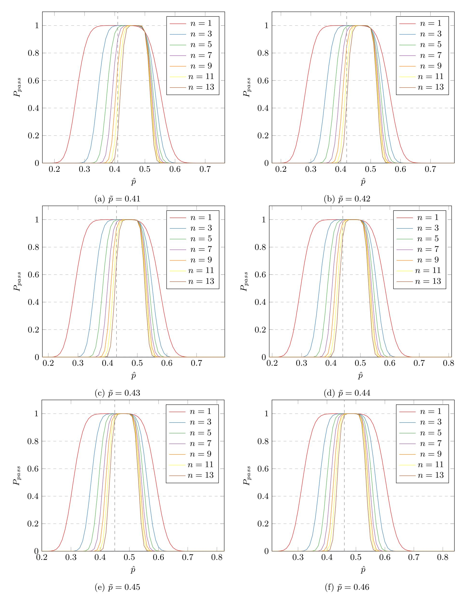

Fig. 14: More theoretical estimates for greedy amplifiers.

{19}------------------------------------------------

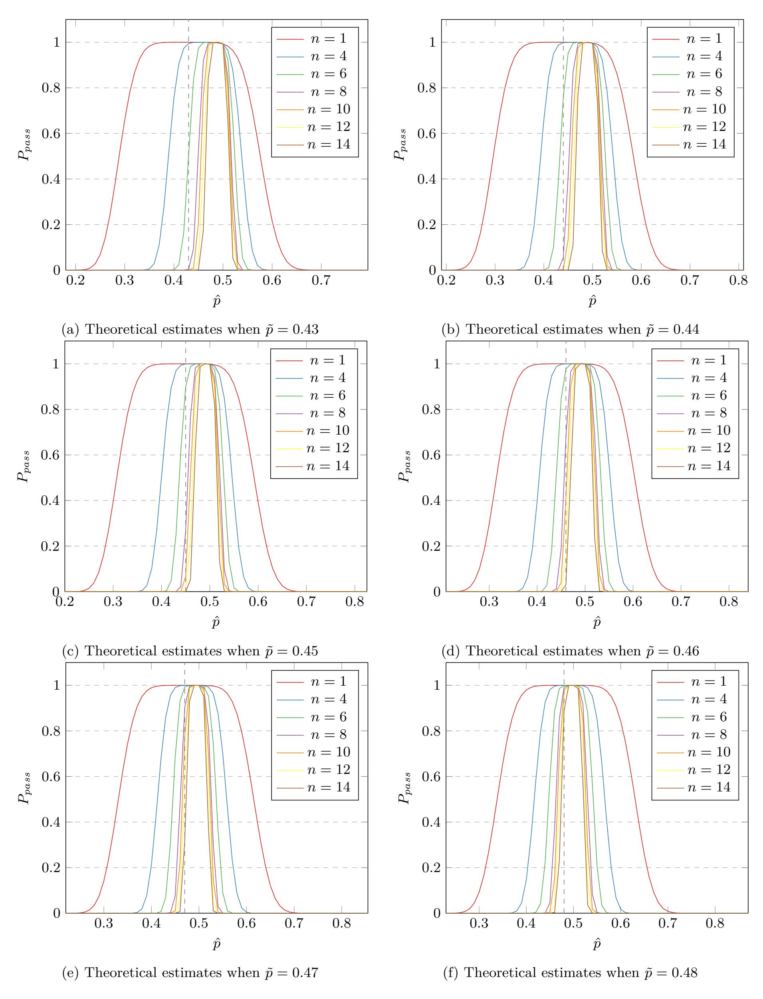

Fig. 15: More theoretical estimates for Von Neumann amplifiers.