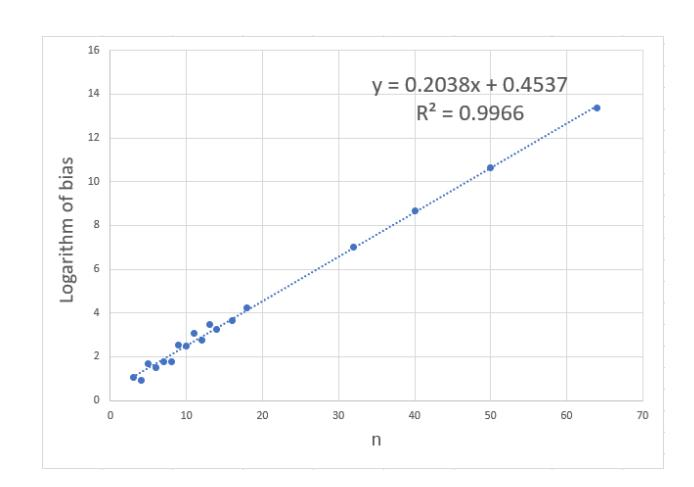
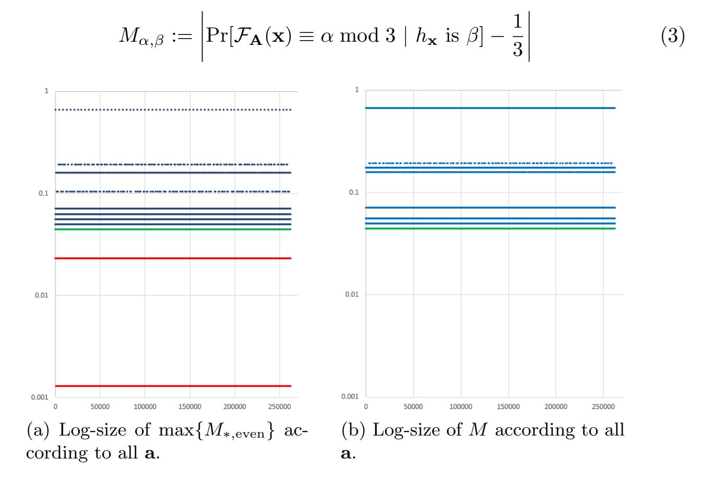
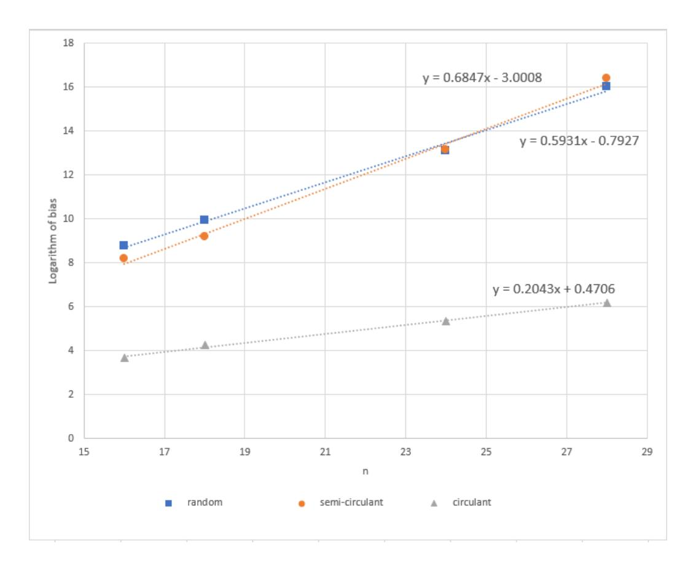

{0}------------------------------------------------

# Adventures in Crypto Dark Matter: Attacks and Fixes for Weak Pseudorandom Functions

Jung Hee Cheon1,2 , Wonhee Cho1 , Jeong Han Kim3 , and Jiseung Kim3

> 1 Seoul National University, Republic of Korea. {jhcheon,wony0404}@snu.ac.kr

2 Crypto Lab Inc., Seoul, Republic of Korea.

3 School of Computational Sciences, Korea Institute for Advanced Study, Seoul, Republic of Korea.

{jhkim,jiseungkim}@kias.re.kr

Abstract. A weak pseudorandom function (weak PRF) is one of the most important cryptographic primitives for its efficiency although it has lower security than a standard PRF.

Recently, Boneh et al. (TCC'18) introduced two types of new weak PRF candidates, which are called a basic Mod-2/Mod-3 and alternative Mod-2/Mod-3 weak PRF. Both use the mixture of linear computations defined on different small moduli to satisfy conceptual simplicity, low complexity (depth-2 ACC0 ) and MPC friendliness. In fact, the new candidates are conjectured to be exponentially secure against any adversary that allows exponentially many samples, and a basic Mod-2/Mod-3 weak PRF is the only candidate that satisfies all features above. However, none of the direct attacks which focus on basic and alternative Mod-2/Mod-3 weak PRFs use their own structures.

In this paper, we investigate weak PRFs from two perspectives; attacks, fixes. We first propose direct attacks for an alternative Mod-2/Mod-3 weak PRF and a basic Mod-2/Mod-3 weak PRF when a circulant matrix is used as a secret key.

For an alternative Mod-2/Mod-3 weak PRF, we prove that the adversary's advantage is at least 2−0.105n , where n is the size of the input space of the weak PRF. Similarly, we show that the advantage of our heuristic attack to the weak PRF with a circulant matrix key is larger than 2−0.21n , which is contrary to the previous expectation that 'structured secret key' does not affect the security of a weak PRF. Thus, for an optimistic parameter choice n = 2λ for the security parameter λ, parameters should be increased to preserve λ-bit security when an adversary obtains exponentially many samples.

Next, we suggest a simple method for repairing two weak PRFs affected by our attack while preserving the parameters.

Keywords: Cryptanalysis, weak PRF

# 1 Introduction

A pseudorandom function (PRF) proposed by Goldreich, Goldwasser and Micali [\[GGM86\]](#page-19-0) is a keyed function which looks like a true random function. PRFs 

{1}------------------------------------------------

have been widely used as building blocks to construct several cryptographic primitives such as HMAC, digital signature and indistinguishability obfuscation [Gol86, BCK96, App14, Bel15, ABSV15, BR17].

Weak PRFs, which satisfy weaker security and higher efficiency than PRFs, are keyed functions whose input-output behaviors are indistinguishable from those of random functions when adversaries are limited to observing outputs mapped by randomly sampled inputs. Many cryptographic primitives and applications are built from weak PRFs because of its efficiency [DN02, MS07, Pie09, DKPW12, LM13, ASA17, BHI+20].

To construct more efficient weak PRFs, simple constructions are emphasized to minimize the circuit complexity and depth. Akavia *et al.* proposed a simple construction of weak PRFs which satisfies depth-3 ACC0 circuit complexity with quasi-polynomial security [ABG+14].

As a line of work, Boneh et al. (TCC'18) proposed simple weak PRF candidates by mixing linear computations on different moduli [BIP+18]. Inspired by a paper [ABG+14], they provided a weak PRF which satisfies the following properties: conceptually simple structure, low complexity (depth-2 ACC0 circuit complexity) and MPC-friendliness. In particular, the new candidates are the unique depth-2 weak PRFs conjectured to satisfy the exponential hardness beyond the polynomial hardness. Moreover, they provided two types of parameters: optimistic and conservative. A conservative parameter is set to be secure against the attacks for LPN problem, but it does not seem to be applicable to weak PRFs. Thus, an optimistic choice was additionally proposed.

We now briefly describe the construction of Mod-2/Mod-3 weak PRFs in [BIP+18]. For each Mod-2/Mod-3 weak PRF, a function  $\mathcal{F}: \mathbb{Z}_2^n \times \mathbb{Z}_2^{m \times n} \to \mathbb{Z}_3$  with an input  $\mathbf{x} \in \{0,1\}^n$  is defined as follows. (For details, see the construction 3.1)

- Basic Mod-2/Mod-3:
  - For a "random" secret key  $\mathbf{A} \in \mathbb{Z}_2^{m \times n}$ ,  $\mathcal{F}(\mathbf{x}, \mathbf{A}) = \mathsf{map}(\mathbf{A} \cdot \mathbf{x})$ , where  $\mathsf{map}$  is a function from  $\{0, 1\}^m$  to  $\mathbb{Z}_3$  mapping a binary vector  $\mathbf{y} = (y_j)$  to an integer  $\sum_{j=1}^m y_j \mod 3$ .
- Circulant Mod-2/Mod-3:2 Take m = n. Then, it is exactly the same as a basic Mod-2/Mod-3 except **A** is a circulant matrix.
- Alternative Mod-2/Mod-3: Set m = 1.  $\mathcal{F}(\mathbf{x}, \mathbf{k}) = (\langle \mathbf{k}, \mathbf{x} \rangle \mod 2 + \langle \mathbf{k}, \mathbf{x} \rangle \mod 3) \mod 2$  for a random secret key  $\mathbf{k} \in \{0, 1\}^n$ .

 $^1$  For well-definedness,  $\mathbf{A} \cdot \mathbf{x}$  is interpreted as a binary vector.

&lt;sup>2 In the original paper [BIP+18], they used a Toeplitz matrix or a block-circulant matrix as a secret key of weak PRF for its efficiency. However, in this paper, we only deal with the case that a secret key of weak PRF is a circulant matrix which is the same as block-circulant matrix in the original paper. Indeed, they said that block-circulant matrix can be represented by a single vector'.

{2}------------------------------------------------

However, there is no direct or concrete attack for weak PRFs on their own structures. Therefore, further cryptanalyses or security proofs are required to break or support their conjectures and concrete security.

#### 1.1 This work

In this paper, we investigate Mod-2/Mod-3 weak PRFs in two perspectives; attacks and fixes.

Attacks. Our concrete attacks mainly concentrate on two weak PRFs; an alternative and a circulant Mod-2/Mod-3 weak PRFs. As a result, we show that the advantage of an alternative Mod-2/Mod-3 weak PRF is  $2^{-0.105n}$  with the size of input space n. It is computed as the conditional probability of input vectors given that the outputs are 'zero'. Similarly, we provide a heuristic attack with an advantage  $2^{-0.21n}$  and experimental results of a circulant weak PRF. This result is contrary to the previous prediction that the parameters will not be much affected by the structure of a key. Our attacks are the first attacks using the structure of Mod-2/Mod-3 weak PRFs. Indeed, we first observe interesting features of certain secret keys of weak PRFs and statistically attack them using these features. As an example, a circulant matrix always preserves the number of nonzero entries h in each column, so (1, ..., 1) is a left-eigenvector of a circulant matrix with an eigenvalue h.

As a result, we introduce new concrete parameters of weak PRFs in Table 1. As described in [BIP+18], we use two categories; optimistic and conservative parameters. The optimistic parameter is chosen by the fact that the authors of the paper speculate that the most efficient algorithm for solving LPN is not applicable to attack weak PRF candidates. The conservative one is the same as a parameter that is secure against LPN attacks, especially BKW attack [BKW03]. Moreover, we use two types of concrete parameter estimation;  $\lambda = \log_2(T/\epsilon^2)$  and  $\lambda = \log_2(T/\epsilon)$ . The latter one is traditionally used to measure the concrete security of symmetric cryptography primitives [DS09], and the former one is proposed by Micciancio and Walter [MW18] for measuring the concrete security of decision primitives.

Our attacks mainly exploit the conditional probabilities based on structures of weak PRFs to distinguish weak PRF samples from uniform samples. More specifically, an adversary model to attack an alternative Mod-2/Mod-3 weak PRF computes  $\Pr[x_i = 0 \mid \mathcal{F}_{\mathbf{k}}(\mathbf{x}) = 0 \mod 2]$  for input  $\mathbf{x} = (x_j) \in \{0,1\}^n$ . If the probability for some  $x_i$  is far from 1/2 by  $\frac{1}{2^{0.105n}}$ , we conclude that pairs of inputs and outputs follow a distribution of an alternative weak PRF, not a uniform distribution. As a result, this simple attack satisfies the following interesting features:

- Support a full parallel computing: when  $\delta$  processors are given, the total time complexity decreases from  $T_{total}$  to  $T_{total}/\delta + O(\delta)$
- Require only O(n) memory space because calculating an average does not need to store samples.

{3}------------------------------------------------

| Mod-2/Mod-3 weak PRFs |                                    |             |               |
|-----------------------|------------------------------------|-------------|---------------|
| Parameter Choices     |                                    | Alternative | Circulant Key |
| [BIP + 18] | Optimistic                         | -           | 256           |
|                       | Conservative                       | 384         | 384           |
| Ours                  | $\log(T/\epsilon^2)$ -bit security | 610         | 305           |
|                       | $\log(T/\epsilon)$ -bit security   | 1220        | 610           |

Table 1: Changes of concrete parameters for 128-bit security to prevent our attacks with m=n.  $\ddagger$ 

- ‡ We take concrete parameters according to the guidance of a paper [MW18]. For decision primitives, they recommended  $\lambda = \log_2(T/\epsilon^2)$  rather than  $\lambda = \log_2(T/\epsilon)$ , with a cost T and an advantage  $\epsilon$ . The latter is also widely used in crypto community. We include both results in table 1. However, we mainly deal with the measure  $\lambda = \log_2(T/\epsilon^2)$  in this paper.
- Simply extend to Mod-p/Mod-q weak PRFs for any primes p and q: For an alternative Mod-p/Mod-q, we show that the bigger pq is, the more powerful our attack is. For example, an alternative and a circulant Mod-3/Mod-5 weak PRFs should be set as n=4000 and n=2000, respectively, for 128-bit security under the measure  $T/\epsilon^2$ .

For more details, we refer Sections 4.1 and 4.2.

**Fixes.** We suggest simple variants of weak PRFs to be secure against our attacks while preserving a depth of original weak PRFs and circuit class complexity  $ACC^0$ .

For an alternative case, our attack heavily relies on the number of nonzero entries in the secret key  $\mathbf{k}$ , so we easily present a new alternative candidate to force the hamming weights of  $\mathbf{k}$ . For instance, if we use the secret key with 310 nonzero entries, then it is secure against the statistical attack. Moreover, an adversary cannot search  $\mathbf{k}$  by brute-force attack since  $\binom{384}{310} \gg 2^{256}$ .

On the other hand, for repairing a circulant Mod-2/Mod-3 weak PRF, we use two different vectors  $\mathbf{a}$  and  $\mathbf{b}$  to construct a secure circulant Mod-2/Mod-3 weak PRF. By the exploiting two secret vectors, we generate a new secret key  $\mathbf{B}$  such that for  $1 \leq i \leq n/2$ , i-th row of  $\mathbf{B}$  is rotation of the vector  $\mathbf{a}$ , and for  $n/2 < j \leq n$ , j-th row vector is rotation of the vector  $\mathbf{b}$ . Then, the fixed Mod-2/Mod-3 weak PRF with the secret key  $\mathbf{B}$  is secure against our attack since a combination of two vectors can remove the structured weakness of circulant matrix that the number of nonzero entries in column vector is always the same. In other words, the vector of ones  $(1, \dots, 1)$  is not a left-eigenvector of  $\mathbf{B}$  anymore. Moreover, we heuristically confirm that combining the two vector strategy is an appropriate approach for small n. Indeed, the experimental results show that the advantage of a fixed candidate is larger than  $2^{-0.5n}$ , which means that it achieves 128-bit security against all known attacks without a parameter blow-up. The size of PRF key of the fixed candidate is still smaller than that of random

{4}------------------------------------------------

key, and it preserves depth-2  $ACC^0$  circuits and current parameter n. For more details, we refer Section 5.

**Discussion and Open Questions.** Both attacks that we propose require exponentially many samples. However, any of applications such as a secure multiparty computation only requires a polynomial number of samples of weak PRFs. Thus, they might be hard to affect any of the real world applications.

To overcome this situation, we discuss a few further works. Is there an application for requiring an exponential number of samples? If it exists, the application must consider parameters to be secure against our attacks. Moreover, it would be also interesting to extend our attack given a polynomial/sub-exponential number of samples? Or is there an application to be possible to amplify the number of samples?

One of the interesting approaches is to use the algebraic property of weak PRFs since our attack only uses a statistical weakness of weak PRFs. Thus, it still remains as an open problem that new algebraic or hybrid attacks against these candidates.

Moreover, a direct attack as asymptotic and concrete perspectives for a basic Mod-2/Mod-3 remains as an open question. Similarly, it would be interesting to prove or disprove the exponential hardness of circular Mod-2/Mod-3 weak PRF although the alternative one fails the exponential hardness due to the BKW algorithm.

**Organization.** We describe preliminaries about definitions of PRF and weak PRF, and some circuit complexities and results of k-xor problem in Section 2. We explicitly describe the construction of weak PRF candidates in Section 3, and provide cryptanalyses of an alternative Mod-2/Mod-3 weak PRF and a circulant weak PRF in Section 4, respectively. In Section 5, we suggest a method to fix the alternative and circulant Mod-2/Mod-3 weak PRFs.

## 2 Preliminaries

#### 2.1 Notations

Matrices and vectors are written as bold capital letters, and bold lower-case letters respectively. Moreover, we assume that the vectors are column form in this paper, and *i*-th component of  $\mathbf{x}$  will be denoted by  $x_i$ . The transpose of a matrix or vector is denoted by  $\mathbf{A}^T$  or  $\mathbf{x}^T$ . Moreover, we denote an inner product between two vectors  $\mathbf{x}$  and  $\mathbf{y}$  by  $\langle \mathbf{x}, \mathbf{y} \rangle$ .

A square matrix **A** is called a circulant matrix which has a structure such that (i,j) entry of **A**,  $\mathbf{A}_{i,j}$  is given by  $\mathbf{A}_{i,j} = a_{j-i \mod n}$  with a dimension n. Thus, the circulant matrix is generated by a single vector  $(a_1, a_2, \dots a_n)$ .

 $\mathbf{I}_n$  is the *n*-dimensional identity matrix. Also, we denote the *n*-dimensional vector that all entries are zero by  $\mathbf{0}^n$ , and similarly,  $\mathbf{1}^n$  is a vector that all entries are one. For the convenience of notation, we sometimes omit the subscript if it does not lead to any confusion.

{5}------------------------------------------------

For any positive integer n, [n] is denoted by the set of integers  $\{1, 2, \dots, n\}$ . All elements in  $\mathbb{Z}_q$  are represented by integers in range [0, q) for any positive integer q. For a vector  $\mathbf{x}$ , we use a notation  $[\mathbf{x}]_q$  to denote an "entrywise" modulo q. i.e,  $[\mathbf{x}]_q = ([x_i]_q)$  for  $\mathbf{x} = (x_i)$ . Let S be a finite set. Then,  $s \stackrel{\$}{\leftarrow} S$  is denoted that an element s is uniformly sampled from the set S.

Definition 2.1 (Pseudorandom function (PRF) in [BIP+18]) Let  $\lambda$  be the security parameter. A  $(t(\lambda), \epsilon(\lambda))$ -pseudorandom function family (PRF) is a collection of functions  $\mathcal{F}_{\lambda} : \mathcal{X}_{\lambda} \times \mathcal{K}_{\lambda} \to \mathcal{Y}_{\lambda}$  with a domain  $\mathcal{X}_{\lambda}$ , a key space  $\mathcal{K}_{\lambda}$  and an output space  $\mathcal{Y}_{\lambda}$  such that for any adversary running time in  $t(\lambda)$ , it holds that

$$\left| \Pr[\mathcal{A}^{\mathcal{F}_{\lambda}(\cdot,k)}(1^{\lambda}) = 1] - \Pr[\mathcal{A}^{f_{\lambda}(\cdot)}(1^{\lambda}) = 1] \right| \le \epsilon(\lambda),$$

where  $k \stackrel{\$}{\leftarrow} \mathcal{K}_{\lambda}$ , and  $f_{\lambda} \stackrel{\$}{\leftarrow} \mathsf{Funs}[\mathcal{X}_{\lambda}, \mathcal{Y}_{\lambda}]$ .

In this paper, PRF is sometimes called strong PRF to be distinguished from the weak PRF in the below. The main difference between strong PRF and weak PRF is that an adversary is limited to obtaining randomly chosen input vectors.

**Definition 2.2 (Weak PRF)** Let  $\lambda$  be the security parameter. A function  $\mathcal{F}_{\lambda}$ :  $\mathcal{X}_{\lambda} \times \mathcal{K}_{\lambda} \to \mathcal{Y}_{\lambda}$  with a domain  $\mathcal{X}_{\lambda}$ , a key space  $\mathcal{K}_{\lambda}$  and an output space  $\mathcal{Y}_{\lambda}$  is called  $(\ell, t, \epsilon)$ -weak PRF for any adversary running time in  $t(\lambda)$ , it holds that

$$\{(\mathbf{x}_i, \mathcal{F}_{\lambda}(\mathbf{x}_i, k))\}_{i \in [\ell]} \approx_{\epsilon} \{(\mathbf{x}_i, y_i)\}_{i \in [\ell]}$$

where a key  $k \stackrel{\$}{\leftarrow} \mathcal{K}_{\lambda}$ ,  $\mathbf{x}_{i} \stackrel{\$}{\leftarrow} \mathcal{X}_{\lambda}$ , and  $y_{i} \stackrel{\$}{\leftarrow} \mathcal{Y}_{\lambda}$ . We denote  $\approx_{\epsilon}$  by the advantage of any adversary is smaller than  $\epsilon$ .

# 3 Construction of weak PRF Candidates

In this section, we briefly review how to construct weak PRF candidates proposed by Boneh *et al.* [BIP+18]. All constructions consist of linear computations on different moduli, which are deemed to be simple and efficient.

#### 3.1 Mod-2/Mod-3 weak PRF Candidate

In this section, we provide a basic construction of Mod-2/Mod-3 weak PRF candidate. Mod-2/Mod-3 weak PRFs are easily extended to Mod-p/Mod-q constructions for arbitrary primes p and q.

Construction 3.1 (A basic Mod-2/Mod-3 weak PRF) For the security parameter  $\lambda$ , a weak PRF candidate is a collection of functions  $\mathcal{F}_{\lambda}: \{0,1\}^n \times \{0,1\}^{m\times n} \to \mathbb{Z}_3$  with a domain  $\{0,1\}^n$ , a key space  $\{0,1\}^{m\times n}$  and an output space  $\mathbb{Z}_3$ . For a fixed key  $\mathbf{A} \in \{0,1\}^{m\times n}$ , we use a notation  $\mathcal{F}_{\mathbf{A}}: \{0,1\}^n \to \mathbb{Z}_3$  which defines as follows.

{6}------------------------------------------------

- 1. Computes  $\mathbf{y} = [\mathbf{A} \cdot \mathbf{x}]_2$
- 2. Outputs  $\mathsf{map}(\mathbf{y})$ , where  $\mathsf{map}$  is a function from  $\{0,1\}^m$  to  $\mathbb{Z}_3$  which maps a binary vector  $\mathbf{y} = (y_j)$  to an integer  $\sum_{j=1}^m y_j \mod 3$ .

Thus, we summarize  $\mathcal{F}_{\mathbf{A}}(\mathbf{x}) = \mathsf{map}([\mathbf{A} \cdot \mathbf{x}]_2)$ . This simple construction induced by mixed linear computations on different moduli might be secure against previous attacks. Moreover, the authors showed that a low-degree polynomial (rational function) approximation of map is hard, and standard learning algorithms cannot break these constructions. Furthermore, conjecture 3.2 is proposed.

Conjecture 3.2 (Exponential Hardness of Mod-2/Mod-3 weak PRF) Let  $\lambda$  be the security parameter. Then, there exist constants  $c_1, c_2, c_3, c_4 > 0$  such that for  $n = c_1 \lambda$ ,  $m = c_2 \lambda$ ,  $\ell = 2^{c_3 \lambda}$ , and  $\ell = 2^{\lambda}$ , a function family  $\{\mathcal{F}_{\lambda}\}$  defined as Mod-2/Mod-3 construction is an  $(\ell, t, \epsilon)$ -weak PRF for  $\epsilon = 2^{-c_4 \lambda}$ .

**Remark 3.3** For the improved efficiency of Mod-2/Mod-3 weak PRFs in real applications, a structured key  $\mathbf{A}$  is used, not a random key from  $\{0,1\}^{m\times n}$ . Thus we expect the key size can be reduced when  $\mathbf{A}$  is a block-circulant matrix or Toeplitz matrix. 3 Roughly speaking, a random key  $\mathbf{A}$  requires mn key size, but the key size of a structured key  $\mathbf{A}$  is m+n, much smaller than mn. A basic Mod-2/Mod-3 weak PRF with a circulant secret key  $\mathbf{A}$  is called a circulant Mod-2/Mod-3 weak PRF.

Concrete Parameters. They proposed two types of parameters; optimized and conservative choices. The conservative choice, m=n=384, is set to be robust against the BKW attack for LPN problem. However, the BKW attack does not seem to be applicable to this candidate, the optimized parameter,  $m=n=2\lambda=256$ , is also suggested to obtain 128-bit security.

#### 3.2 Alternative Mod-2/Mod-3 Weak PRF Candidate

An alternative weak PRF is additionally proposed to obtain higher efficiency in a two-party secure computation setting.

Construction 3.4 (Alternative Mod-2/Mod-3 weak PRF) For a secret key  $\mathbf{k} \in \{0,1\}^n$ , an alternative Mod-2/Mod-3 weak PRF is defined that for any input  $\mathbf{x} \in \{0,1\}^n$ ,

$$\mathcal{F}(\mathbf{k}, \mathbf{x}) = \langle \mathbf{k}, \mathbf{x} \rangle \mod 2 + \langle \mathbf{k}, \mathbf{x} \rangle \mod 3 \mod 2.$$

For simplicity, we use a notation  $\mathcal{F}_{\mathbf{k}}(\mathbf{x})$  instead of  $\mathcal{F}(\mathbf{k}, \mathbf{x})$  on a key  $\mathbf{k} \in \{0, 1\}^n$ .

Concrete Parameters. Similar to a basic Mod-2/Mod-3 weak PRF, they consider all known attacks to claim the security of the alternative candidate. Moreover, it resembles an LPN instance with a deterministic noise rate 1/3, so the parameters are set as m = n = 384. For more details, see the original paper [BIP+18] or later section.

&lt;sup>3 In the original paper, the authors mentioned that a 'block-circulant matrix' can be represented by a single vector. Thus, a block-circulant matrix is the same as a circulant matrix in this paper.

{7}------------------------------------------------

### 4 Cryptanalysis of weak PRF candidates

We now introduce our analysis on two weak PRF candidates; the alternative Mod-2/Mod-3 and circulant Mod-2/Mod-3 weak PRFs. These attacks are also applicable to an alternative and a circulant Mod-p/Mod-q weak PRF for arbitrary primes p and q.

#### 4.1 Cryptanalysis of an alternative Mod-2/Mod-3 weak PRF

We briefly recall the construction of the alternative Mod-2/Mod-3 weak PRF with the secret key  $\mathbf{k} \in \{0,1\}^n$ 

$$\mathcal{F}_{\mathbf{k}}(\mathbf{x}) = (\langle \mathbf{k}, \mathbf{x} \rangle \mod 2 + \langle \mathbf{k}, \mathbf{x} \rangle \mod 3) \mod 2.$$

We simply observe that  $\mathcal{F}_{\mathbf{k}}(\mathbf{x}) = 0 \mod 2$  if and only if  $\langle \mathbf{k}, \mathbf{x} \rangle = 0, 1, 2 \mod 6$ . In other words, one can understand that  $\mathcal{F}_{\mathbf{k}}(\mathbf{x})$  is an operation on the  $\mathbb{Z}_6$  space.

On the other hand, since the secret key  $\mathbf{k}$  and input vector  $\mathbf{x}$  are made up of only 0 and 1, we conjecture that  $\mathcal{F}_{\mathbf{k}}(\mathbf{x})$  would not cover the whole uniformly. Thus, we can present the statistical attack for the alternative alternative Mod-2/Mod-3 weak PRF.

Based on the intuition, we obtain the following theorem.

**Theorem 1.** Let  $\mathbf{k} \in \{0,1\}^n$  be the secret key of the alternative Mod-2/Mod-3 weak PRF and  $\mathcal{F}_{\mathbf{k}}$  a function as defined above. If h is the hamming weight of  $\mathbf{k}$ , then we can show that there exists  $j \in [n]$  such that

$$\left| \Pr[x_j = 0 \mid k_j = 1 \text{ and } \mathcal{F}_{\mathbf{k}}(\mathbf{x}) = 0 \text{ mod } 2] - \frac{1}{2} \right| \approx \frac{1}{2^{0.21h}}$$

Therefore, if the number of samples,  $\ell$ , is  $O(2^{0.21h})$ , one can distinguish  $\{(\mathbf{x}_i, \mathcal{F}_{\lambda}(\mathbf{x}_i, \mathbf{k}))\}_{i \in [\ell]}$  from the uniform samples  $\{(\mathbf{x}_i, y_i)\}_{i \in [\ell]}$ .

Then, our attack for alternative Mod-2/Mod-3 weak PRF is very simple. After an adversary collects  $\ell = c_1 \cdot 2^{0.21n}$  samples whose output is 0 for some constant  $c_1$ , the distinguishing attack computes a conditional probability  $\Pr[x_j = 0 \mid \mathcal{F}_{\mathbf{k}}(\mathbf{x}) = 0 \mod 2]$  for each index  $j \in [n]$ . If there exists an index j such that it is apart from 1/2 by  $\frac{1}{2^{0.105n}}$ , we conclude that an adversary has alternative Mod-2/Mod-3 weak PRF samples.

To compute the conditional probability, we exploit a simple lemma.

**Lemma 4.1** Let n be a positive integer. For all  $0 \le a \le 5$ , the following equation holds.

$$\sum_{a+6k \le n} \binom{n}{a+6k} = \frac{1}{6} \left( \sum_{j=0}^{5} (w^j)^{6-a} \cdot (1+w^j)^n \right).$$

where w is 6-th root of unity,  $\frac{1+\sqrt{3}i}{2}$ .

{8}------------------------------------------------

*Proof.* Since w is 6-th root of unity, the following equations hold.

$$(1+w^j)^n = \sum_{a=0}^n \binom{n}{a} (w^j)^a, \ 1+w+w^2+w^3+w^4+w^5=0.$$

Then, the equations imply that  $\sum_{j=0}^{5} (w^j)^{6-a} \cdot (1+w^j)^n$  can be rewritten as follows.

$$\sum_{j=0}^{5} (w^{j})^{6-a} \cdot (1+w^{j})^{n} = \sum_{j=0}^{5} \sum_{k=0}^{n} \binom{n}{k} (w^{j})^{k} (w^{j})^{6-a}$$

$$= \sum_{k=0}^{n} \binom{n}{k} \{ \sum_{j=0}^{5} (w^{j})^{6-a+k} \}$$

$$= \sum_{k\equiv a \pmod{6}} \binom{n}{k} \cdot 6$$

$$= \sum_{a+6k \le n} \binom{n}{a+6k} \cdot 6$$

For the sake of explanation, suppose that the first h elements of  $\mathbf{k}$  are all 1, and the others are zero. Then, we observe that

$$\langle \mathbf{k}, \mathbf{x} \rangle = x_1 + \dots + x_h$$
.

Note that a value  $x_i$  with i > h has no effect on the result  $\langle \mathbf{k}, \mathbf{x} \rangle$  since  $k_i$  is zero. Therefore, we only consider  $x_i$  for  $i \in [h]$ . For all  $j \in [h]$ , the conditional probability of  $x_j$  given by  $\mathcal{F}_{\mathbf{k}}(\mathbf{x}) = 0 \mod 2$  is that

$$\Pr[x_j = 0 \mid \mathcal{F}_{\mathbf{k}}(\mathbf{x}) = 0 \text{ mod } 2] = \frac{\sum_{k=0}^{\lfloor \frac{h-1}{6} \rfloor} {\binom{h-1}{6k}} + {\binom{h-1}{6k+1}} + {\binom{h-1}{6k+2}}}{\sum_{k=0}^{\lfloor \frac{h}{6} \rfloor} {\binom{h}{6k}} + {\binom{h}{6k+1}} + {\binom{h}{6k+2}}}.$$
 (1)

For events  $A: [\mathcal{F}_{\mathbf{k}}(\mathbf{x}) = 0 \mod 2]$ , and  $B: [x_j = 0]$ , the left-hand side of the equation (1) equals to  $\frac{\Pr[A \cap B]}{\Pr[A]}$ . As we mentioned, it holds that  $\mathcal{F}_{\mathbf{k}}(\mathbf{x}) = 0 \mod 2$  if and only if  $\langle \mathbf{k}, \mathbf{x} \rangle = 0, 1, 2 \mod 6$ . Moreover, for every  $k \in \{0, \dots, \lfloor \frac{h-1}{6} \rfloor\}$  and  $a \in \{0, \dots, 5\}$ ,  $\binom{h}{6k+a}$  if and only if  $\langle \mathbf{k}, \mathbf{x} \rangle = a \mod 6$  because of  $\langle \mathbf{k}, \mathbf{x} \rangle = \sum_{i=1}^h x_i$ . Thus,  $\Pr[A]$  equals to the denominator of the right-hand side of the equation (1).

On the other hand, for some j,  $A \cap B : [x_j = 0 \& \mathcal{F}_{\mathbf{k}}(\mathbf{x}) = 0 \mod 2]$ . Hence, it holds that  $\langle \mathbf{k}, \mathbf{x} \rangle = \sum_{i=1, i \neq j}^h x_i$  to satisfy the event  $A \cap B$ . Similarly, we also show that  $\Pr[A \cap B]$  is the same as the numerator of the right-hand side of the equation (1) since the number of possible variables is h-1 because of  $x_j = 0$ .

{9}------------------------------------------------

As a result, with the Lemma 4.1 and the properties of 6-th root of unity w, we can calculate the conditional probability that we desired.

$$\Pr[x_{j} = 0 \mid \mathcal{F}_{\mathbf{k}}(\mathbf{x}) = 0 \bmod 2] = \frac{\sum_{k=0}^{\lfloor \frac{h-1}{6} \rfloor} {\binom{h-1}{6k}} + {\binom{h-1}{6k+1}} + {\binom{h-1}{6k+2}}}{\sum_{k=0}^{\lfloor \frac{h}{6} \rfloor} {\binom{h}{6k}} + {\binom{h}{6k+1}} + {\binom{h}{6k+2}}}$$

$$= \frac{\sum_{j=0}^{5} (1 + (w^{j})^{5} + (w^{j})^{4}) \cdot (1 + w^{j})^{h-1}}{\sum_{j=0}^{5} (1 + (w^{j})^{5} + (w^{j})^{4}) \cdot (1 + w^{j})^{h}}$$

$$= \frac{3 \cdot 2^{h-1} + 2w^{5} \cdot (1 + w)^{h-1} + 2w \cdot (1 + w^{5})^{h-1}}{3 \cdot 2^{h} + 2w^{5} \cdot (1 + w)^{h} + 2w \cdot (1 + w^{5})^{h}}$$

$$= \frac{3 \cdot 2^{h-1} + 2w^{5} \cdot (w^{5}i\sqrt{3})^{h-1} + 2w \cdot (-wi\sqrt{3})^{h-1}}{3 \cdot 2^{h} + 2w^{5} \cdot (w^{5}i\sqrt{3})^{h} + 2w \cdot (-wi\sqrt{3})^{h}}$$

$$= \frac{1}{2} + \frac{(w^{5}i\sqrt{3})^{h-1} \cdot w^{4} + (-wi\sqrt{3})^{h-1} \cdot w^{2}}{3 \cdot 2^{h} + 2w^{5} \cdot (w^{5}i\sqrt{3})^{h} + 2w \cdot (-wi\sqrt{3})^{h}}$$

where w is 6-th root of unity,  $\frac{1+\sqrt{3}i}{2}$ . Thus, we can obtain the following lemma.

**Lemma 4.2** Let h be the hamming weight of the secret key k. For all  $i \in [h]$ ,

$$\Pr[x_{i} = 0 \mid \mathcal{F}_{\mathbf{k}}(\mathbf{x}) = 0 \bmod 2] = \begin{cases} \frac{1}{2} - \frac{(i\sqrt{3})^{h}}{3\cdot2^{h} + 2\cdot(i\sqrt{3})^{h}} & h = 6k\\ \frac{1}{2} - \frac{(i\sqrt{3})^{h-1}}{3\cdot2^{h} + 6\cdot(i\sqrt{3})^{h-1}} & h = 6k + 1\\ \frac{1}{2} & h = 6k + 2\\ \frac{1}{2} + \frac{3(i\sqrt{3})^{h-3}}{3\cdot2^{h} + 18\cdot(i\sqrt{3})^{h-3}} & h = 6k + 3\\ \frac{1}{2} + \frac{9(i\sqrt{3})^{h-4}}{3\cdot2^{h} + 18\cdot(i\sqrt{3})^{h-4}} & h = 6k + 4\\ \frac{1}{2} + \frac{18(i\sqrt{3})^{h-5}}{3\cdot2^{h}} & h = 6k + 5 \end{cases}$$

*Proof (of Lemma 4.2).* The proof only requires straightforward (but tedious) computations, so we only deal with a case of h = 6k. Computations of the others are almost the same as the case h = 6k.

$$\Pr[x_i = 0 \mid \mathcal{F}_{\mathbf{k}}(\mathbf{x}) = 0 \bmod 2] = \frac{1}{2} + \frac{(w^5 i \sqrt{3})^{6k-1} \cdot w^4 + (-w i \sqrt{3})^{6k-1} \cdot w^2}{3 \cdot 2^{6k} + 2w^5 \cdot (w^5 i \sqrt{3})^{6k} + 2w \cdot (-w i \sqrt{3})^{6k}}$$

$$= \frac{1}{2} + \frac{(w^5 - w) \cdot (i \sqrt{3})^{6k-1}}{3 \cdot 2^{6k} + 2(w^5 + w) \cdot (i \sqrt{3})^{6k}}$$

$$= \frac{1}{2} + \frac{-(i \sqrt{3})^{6k}}{3 \cdot 2^{6k} + 2(i \sqrt{3})^{6k}}$$

$$= \frac{1}{2} - \frac{(i \sqrt{3})^h}{3 \cdot 2^h + 2 \cdot (i \sqrt{3})^h}$$

{10}------------------------------------------------

Since the simple attack does not work if  $h \equiv 2 \mod 6$ , another adversary is required. A new adversary computes a conditional probability of  $x_i = x_j = 0$  with  $i \neq j$  given by  $\mathcal{F}_{\mathbf{k}}(\mathbf{x}) = 0$ . Then, through similar computations from Lemma 4.2, we obtain the below lemma.

**Lemma 4.3** Let h be the hamming weight of the secret key  $\mathbf{k}$ . If  $i \neq j \in [h]$  and  $h \equiv 2 \mod 6$ ,

$$\Pr[x_i = 0, x_j = 0 \mid \mathcal{F}_{\mathbf{k}}(\mathbf{x}) = 0 \text{ mod } 2] = \frac{\sum_{k=0}^{\lfloor \frac{h-2}{6} \rfloor} {\binom{h-2}{6k}} + {\binom{h-2}{6k+1}} + {\binom{h-2}{6k+2}}}{\sum_{k=0}^{\lfloor \frac{h}{6} \rfloor} {\binom{h}{6k}} + {\binom{h}{6k+1}} + {\binom{h}{6k+2}}}$$
$$= \frac{1}{4} - \frac{(i\sqrt{3})^{h-2}}{3 \cdot 2^h + 12(i\sqrt{3})^{h-2}}$$

According to lemmas 4.2, 4.3, the advantage of an alternative Mod-2/Mod-3 weak PRF is larger than  $c_h \cdot \left(\frac{\sqrt{3}}{2}\right)^h \approx \frac{1}{2^{0.21h}}$ . Moreover, since **k** is chosen uniformly from the set  $\{0,1\}^n$ , we assume that h is  $\frac{n}{2}$  without loss of generality. Thus, the advantage is larger than  $\frac{1}{2^{0.105n}}$ . As a result, to preserve 128-bit security, a parameter n should increase from 384 to 610 or 1220 under the measure  $\log \frac{T}{\epsilon^2}$  or  $\log \frac{T}{\epsilon}$  with a cost T and an advantage  $\epsilon$ .

The theorem 1 is proved by Lemma 4.2 and Lemma 4.3.

Compare to BKW algorithm. The construction of the alternative Mod-2/Mod-3 weak PRF is quite similar to LPN problem with a noise rate 1/3. Thus, one expects that the algorithm proposed by Blum, Kalai, and Wasserman [BKW03], one of the current best attacks for LPN with a constant noise rate, can be applicable to alternative Mod-2/Mod-3 weak PRF.

The difference between conventional LPN instances and pseudo-LPN instances from alternative Mod-2/Mod-3 weak PRF is that the error terms of pseudo-LPN instances are of the form  $\sum_{i} \mathbf{k}_{i} x_{i} \mod 3 \mod 2$ , which means that the error terms are always correlated to the input  $\mathbf{x}$ , and the secret key  $\mathbf{k}$ . However, the error terms of conventional LPN instances are independent to the input, and the independence has implicitly used to analyze the BKW algorithm.

On the other hand, Bogos, Tramèr and Vaudenay [BTV16] mentioned that BKW algorithm heuristically works in spite of dependence of the error term. Therefore, BKW attack can be heuristically applied to analyze the alternative Mod-2/Mod-3 weak PRF. Therefore, it cannot achieve the exponential hardness conjecture like the basic Mod-2/Mod-3 weak PRF since the time complexity of BKW is sub-exponential in a dimension n. However, the BKW attack cannot impact on the concrete parameter since the alternative candidate already sets parameters to be secure against the BKW attack. The original paper already mentioned that a parameter n=384 captures 128-bits security.

Unlike the BKW attack, our attack which exploits statistical properties takes exponential time in a dimension n, but when exponentially many samples are allowed, our attack can affect the concrete parameters. To be secure against our attack, the parameter n should be set at least 610 as in table 1.

{11}------------------------------------------------

**Remark 4.4** Our attack is easily extended to an alternative Mod-p/Mod-qweak PRF for arbitrary primes p and q. Following our proof, the adversary's advantage of an alternative Mod-p/Mod-q is larger than  $c_h \cdot \left| \frac{w_{pq}+1}{2} \right|^h \approx \left( \cos \left( \frac{\pi}{pq} \right) \right)^h$ where  $w_{pq}$  is pq-th root of unity. Therefore, our attach is getting more powerful as pq gets bigger. For example, the advantage of an alternative Mod-3/Mod-5 weak PRF is larger than  $\left(\cos\left(\frac{\pi}{15}\right)\right)^h \approx \frac{1}{2^{0.032h}}$ , so n should be increased to 4000 for the 128-bit security under a measure  $T/\epsilon^2$  if h=n/2.

Remark 4.5 Since our attack just computes conditional probabilities, there exist interesting features.

- Full parallel computations are allowed. Hence, if there are  $\delta$  processors, total time complexity is reduced from  $O(2^{0.21n})$  to  $O(2^{0.21n}/\delta) + O(\delta)$ .
- An adversary does not need to store many weak PRF samples. Thus, Our attack is a space efficient algorithm. It requires only O(n) space even though our attack needs a lot of samples.

**Remark 4.6** An alternative construction can be reinterpreted by operations on mod 6 space. However, an input space of this construction is only  $\{0,1\}^n$ , not a full space  $\mathbb{Z}_6^n$ . This might be a statistical weakness of the alternative weak PRF.

#### 4.2Cryptanalysis of A Circulant Mod-2/Mod-3 Weak PRF

As stated in Remark 3.3, structured keys are widely used to provide higher efficiency. In this section, we provide a heuristic analysis of a circulant Mod-2/Mod-3 weak PRF candidate. We briefly recall a circulant Mod-2/Mod-3 weak PRF. For a circulant matrix  $\mathbf{A} \in \mathbb{Z}_2^{n \times n}$  with generated by a vector  $\mathbf{a} \in \mathbb{Z}_2^n$ ,

$$\mathcal{F}_{\mathbf{A}}(\mathbf{x}) = \mathsf{map}(\mathbf{A} \cdot \mathbf{x}),$$

where map is a function from  $\{0,1\}^n$  to  $\mathbb{Z}_3$  mapping a binary vector  $\mathbf{y}=(y_i)$  to an integer  $\sum_{j=1}^{m} y_j \mod 3$ .

We first present several observations of a circulant Mod-2/Mod-3 weak PRF under the secret key A.

- $\mathbf{1}^T \cdot \mathbf{A} = h(1, \dots, 1)$   $\mathbf{1}^T \cdot \mathbf{A} \cdot \mathbf{x} = h \cdot h_{\mathbf{x}}$  where  $h_{\mathbf{x}}$  is the number of 1's in an input  $\mathbf{x}$
- $\mathbf{1}^T \cdot [\mathbf{A} \cdot \mathbf{x}]_2 \equiv h \cdot h_{\mathbf{x}} \mod 2$
- If  $h_{\mathbf{x}}$  is even, then the number of 1's in  $[\mathbf{A} \cdot \mathbf{x}]_2$  is also even.

The key ingredient of the attack for a circulant weak PRF is that  $[\mathbf{A} \cdot \mathbf{x}]_2$  preserves the parity of x if  $h_x$  is even. If  $\mathcal{F}_{\mathbf{A}}(\mathbf{x})$  truly behaves a random element, it never keeps the parity even if  $h_{\mathbf{x}}$  is even. Similar to Section 4.1, by limiting the parity of  $[\mathbf{A} \cdot \mathbf{x}]_2$ , we could distinguish a circulant Mod-2/Mod-3 weak PRF from

&lt;sup>4 As stated in Section 1, a circulant matrix is exactly the same a block-circulant in [BIP+18]

{12}------------------------------------------------

uniform. Indeed, it might be conjectured that  $\Pr[\mathcal{F}_{\mathbf{A}}(\mathbf{x}) \equiv 0 \mod 3 \mid h_{\mathbf{x}} \text{ is even}]$  or  $\Pr[\mathcal{F}_{\mathbf{A}}(\mathbf{x}) \equiv 2 \mod 3 \mid h_{\mathbf{x}} \text{ is even}]$  is apart from 1/2.

With the intuition, if  $[\mathbf{A} \cdot \mathbf{x}]_2$  is component-wise independent, then we can directly compute values  $\Pr[\mathcal{F}_{\mathbf{A}}(\mathbf{x}) \equiv 0 \mod 3 \mid h_{\mathbf{x}} \text{ is even}]$  and  $\Pr[\mathcal{F}_{\mathbf{A}}(\mathbf{x}) \equiv 2 \mod 3 \mid h_{\mathbf{x}} \text{ is even}]$ . Then, we obtain that an adversary's advantage is larger than  $c_n \cdot \left(\frac{\sqrt{3}}{2}\right)^n \approx \frac{1}{2^{0.21n}}$  for some very small constant  $c_n$ .

Unfortunately, no one could be sure whether the components of  $[\mathbf{A} \cdot \mathbf{x}]_2$  behave independently since  $\mathbf{A}$  is a circulant matrix. Therefore, we will give experimental results to support that the above conditional probabilities are almost the same as the results of Lemmas 4.7 and 4.8, where the lemmas are assumed to be independent of each component. (See experimental results 4.9.) As a result, we obtain the following theorem.

**Theorem 2.** Let  $\mathbf{A} \in \{0,1\}^{n \times n}$  be a circulant matrix used in a Mod-2/Mod-3 weak PRF as a secret key and  $h_{\mathbf{x}}$  be the hamming weights of a vector  $\mathbf{x}$ . Then, we can heuristically show that

$$\begin{vmatrix} \Pr[\mathcal{F}_{\mathbf{A}}(\mathbf{x}) \equiv 0 \mod 3 \mid h_{\mathbf{x}} \text{ is } even] - \frac{1}{3} \end{vmatrix} \approx \frac{1}{2^{0.21n}} \text{ if } n \neq 3 \mod 6$$
$$\left| \Pr[\mathcal{F}_{\mathbf{A}}(\mathbf{x}) \equiv 2 \mod 3 \mid h_{\mathbf{x}} \text{ is } even] - \frac{1}{3} \right| \approx \frac{1}{2^{0.21n}} \text{ if } n = 3 \mod 6$$

Therefore, if the number of samples,  $\ell = O(2^{0.42n})$ , one can distinguish  $\{(\mathbf{x}_i, \mathcal{F}_{\mathbf{A}}(\mathbf{x}_i))\}_{i \in [\ell]}$  from the uniform samples  $\{(\mathbf{x}_i, y_i)\}_{i \in [\ell]}$ .

Now, we give an analysis under the assumption that a vector is componentwise independent. For the avoidance of confusion, we newly define a random variable Y as follows. Let Y be a multivariate random variable that follows a distribution on  $\{0,1\}^n$  that each entry is independently and uniformly sampled from  $\{0,1\}$ . Then, the conditional probability of  $\mathbf{1}^T \cdot \mathbf{y} = 0 \mod 3$  given that  $\mathbf{y}$ is uniformly sampled from Y and  $h_{\mathbf{y}}$  is even is

$$\Pr[\mathbf{1}^T \cdot \mathbf{y} = 0 \bmod 3 | \mathbf{y} \stackrel{\$}{\leftarrow} Y, h_{\mathbf{y}} \text{ is even}] = \frac{\sum_{k=0}^{\lfloor \frac{n}{6} \rfloor} \binom{n}{6k}}{\sum_{k=0}^{\lfloor \frac{n}{6} \rfloor} \binom{n}{6k} + \binom{n}{2+6k} + \binom{n}{4+6k}}$$
(2)

We first note that  $h_{\mathbf{y}} = \mathbf{1}^T \cdot \mathbf{y} = \langle \mathbf{1}, \mathbf{y} \rangle$  since  $\mathbf{y} \in \{0, 1\}^n$ , and will gain use the fact that  $\binom{n}{6k+a}$  if and only if  $\langle \mathbf{1}, \mathbf{y} \rangle = a \mod 6$  for every  $k \in \{0, \dots, \lfloor \frac{n-1}{6} \rfloor \}$  and  $a \in \{0, \dots, 5\}$ . For events  $A : [\mathbf{y} \stackrel{\$}{\leftarrow} Y \& h_{\mathbf{y}} \text{ is even}]$ , and  $B : [\mathbf{1}^T \cdot \mathbf{y} = 0 \mod 3]$ , we easily observe that  $\Pr[A]$  equals to the denominator of the right-hand side of the equation (2). Moreover, we easily verify that the probability  $\Pr[A \cap B]$  equals to the numerator of the right-hand side of the equation (2). Therefore, with the Lemma 4.1 and the properties of 6-th root of unity w, we obtain the following.

$$\Pr[\mathbf{1}^T \cdot \mathbf{y} = 0 \bmod 3 | \mathbf{y} \overset{\$}{\leftarrow} Y, h_{\mathbf{y}} \text{ is even}] = \frac{\sum_{k=0}^{\lfloor \frac{n}{6} \rfloor} \binom{n}{6k}}{\sum_{k=0}^{\lfloor \frac{n}{6} \rfloor} \binom{n}{6k} + \binom{n}{2+6k} + \binom{n}{4+6k}}$$

{13}------------------------------------------------

$$= \frac{\sum_{k=0}^{5} (1+w^k)^n}{6 \cdot 2^{n-1}} = \frac{1}{3} + \frac{w^{2n}((-i\sqrt{3})^n + (-1)^n) + w^{4n}((i\sqrt{3})^n + (-1)^n)}{6 \cdot 2^{n-1}}$$

where w is 6-th root of unity,  $\frac{1+i\sqrt{3}}{2}$ . Similar to the above section, a straightforward computation leads us the following lemmas.

**Lemma 4.7** Let Y be a multivariate random variable that follows a distribution on  $\{0,1\}^n$  that each entry is independently and uniformly sampled from  $\{0,1\}$ . Then, the conditional probability of  $\mathbf{1}^T \cdot \mathbf{y} = 0 \mod 3$  given that  $\mathbf{y}$  is uniformly sampled from Y and  $h_{\mathbf{y}}$  is even is that

$$\Pr[\mathbf{1}^{T} \cdot \mathbf{y} = 0 \bmod 3 | \mathbf{y} \overset{\$}{\leftarrow} Y, h_{\mathbf{y}} \text{ is even}] = \begin{cases} \frac{1}{3} + \frac{2(i\sqrt{3})^{n} + 2}{6 \cdot 2^{n-1}} & n = 6k \\ \frac{1}{3} + \frac{3(i\sqrt{3})^{n-1} + 1}{6 \cdot 2^{n-1}} & n = 6k + 1 \\ \frac{1}{3} - \frac{(i\sqrt{3})^{n} + 1}{6 \cdot 2^{n-1}} & n = 6k + 2 \\ \frac{1}{3} + \frac{-2}{6 \cdot 2^{n-1}} & n = 6k + 3 \\ \frac{1}{3} - \frac{(i\sqrt{3})^{n} + 1}{6 \cdot 2^{n-1}} & n = 6k + 4 \\ \frac{1}{3} - \frac{3(i\sqrt{3})^{n-1} - 1}{6 \cdot 2^{n-1}} & n = 6k + 5 \end{cases}$$

*Proof* (of Lemma 4.7). Repetitive computations are required to prove this lemma. Similar to the proof of Lemma 4.2, we only leave a proof of a case n = 6k for readability.

$$\Pr[\mathbf{1}^{T} \cdot \mathbf{y} = 0 \bmod 3 \mid \mathbf{y} \stackrel{\$}{\leftarrow} Y, h_{\mathbf{y}} \text{ is even}] = \frac{\sum_{k=0}^{\lfloor \frac{n}{6} \rfloor} \binom{n}{6k}}{\sum_{k=0}^{\lfloor \frac{n}{6} \rfloor} \binom{n}{6k} + \binom{n}{6k+2} + \binom{n}{6k+4}}$$

$$= \frac{2^{n} + (1+w)^{n} + (1+w^{2})^{n} + (1+w^{4})^{n} + (1+w^{5})^{n}}{3 \cdot 2^{n}}$$

$$= \frac{2^{n} + (w^{5}i\sqrt{3})^{n} + (-w^{4})^{n} + (-w^{2})^{n} + (-wi\sqrt{3})^{n}}{3 \cdot 2^{n}}$$

$$= \frac{2^{n} + 2(i\sqrt{3})^{n} + 2}{3 \cdot 2^{n}} = \frac{1}{3} + \frac{2(i\sqrt{3})^{n} + 2}{6 \cdot 2^{n-1}}$$

If  $n \equiv 3 \mod 6$ , we require an extra analysis to point out a weakness of circulant Mod-2/Mod-3 weak PRF. However, we easily overcome this situation by computing a new conditional probability. Indeed, through similar computations of Lemma 4.7, we obtain the below lemma.

**Lemma 4.8** Let Y be a random variable defined on Lemma 4.7. If n is 6k + 3, then we have that

$$\Pr[\mathbf{1}^{T} \cdot \mathbf{y} = 2 \mod 3 | \mathbf{y} \stackrel{\$}{\leftarrow} Y, h_{\mathbf{y}} \text{ is even}] = \frac{\sum_{k=0}^{\lfloor \frac{n}{6} \rfloor} \binom{n}{6k+2}}{\sum_{k=0}^{\lfloor \frac{n}{6} \rfloor} \binom{n}{6k} + \binom{n}{2+6k} + \binom{n}{4+6k}}$$
$$= \frac{1}{3} + \frac{w^{2n+4}((-i\sqrt{3})^{n} + (-1)^{n}) + w^{4n+2}((i\sqrt{3})^{n} + (-1)^{n})}{6 \cdot 2^{n-1}}$$

{14}------------------------------------------------

$$= \frac{1}{3} - \frac{3(-i\sqrt{3})^{n-1} + (-1)^n}{6 \cdot 2^{n-1}}$$

Experiments 4.9 To support our expectation, we implement experiments in accordance with

- 1. Sample a random vector a from {0, 1} n.
- 2. Construct a circulant matrix A using the sampled vector a. [5](#page-14-1)
- 3. Compute FA(x) for sufficiently many x's.
- 4. Compute a conditional probability as done in the above two lemmas.
- 5. Go to 1 again.

Then, we can provide experimental results to support that Pr[FA(x) ≡ 0 mod 3 | hx is even] and Pr[FA(x) ≡ 2 mod 3 | hx is even] are almost the same as results of Lemmas [4.7](#page-13-0) and [4.8.](#page-13-1)

In figure [1,](#page-14-2) we first regard (logarithms of) the averages of the above conditional probabilities for several n, as blue points. Then, we draw a trend line from them. The (logarithm) trend line is 0.2038n + 0.4537 similar to 2−0.21n induced by our computations.

We also conducted several experiments for a fixed n. For case n ≤ 18, we ran experiments for all possible base vectors to demonstrate that our experiments are not lucky cases. For the same reason, 128 random base vectors were used to support our heuristic assumptions for n = 32, 40 and 50.

Fig. 1: Averages of (logarithm) biases according to n and its trend line.

During experiments, we observed some irregularities outside of our expectations. For example, under the case n = 218, there are 3.2% = (8422/2 18) base vectors that our assumption is invalid even though the analysis does not depend on the form of A. Indeed, the value of red points drawn along the irregular cases in figure [2a](#page-15-1) is much smaller than that of the green points that follow our prediction. However, for these cases, we gathered x's with odd hx. Then, we observe that the maximum value M of {Mα,β}α∈{0,2},β∈{odd, even}, where Mα,β

5 We call a a base vector.

{15}------------------------------------------------

is defined as (3), is far from 1/3 by at least  $\frac{1}{2^{0.21n}}$  in figure 2b, which supports that our attacks succeed regardless of the base vector **a**.

Fig. 2: Experimental results of all base vectors in  $\{0,1\}^n$  with  $n=2^{18}$ .

The x-axis is the decimal representation of the all base vectors. Note that every binary vector with the length n can be represented by an integer  $\leq 2^n$ .

The theorem 2 is proved by Lemma 4.7, Lemma 4.8 and experimental results 4.9.

Remark 4.10 The above mentioned remarks 4.4 and 4.5 are also satisfied with a circulant Mod-p/Mod-q weak PRF. As an example, we observe that the advantage of a circulant Mod-3/Mod-5 weak PRF is larger than  $\left(\cos\left(\frac{\pi}{15}\right)\right)^n \approx \frac{1}{2^{0.032n}}$  from the same computation, so n should be increased to 2000 for the 128-bit security under a measure  $T/\epsilon^2 = 2^{\lambda}$ .

# 5 How to Fix a Weakness of Mod-2/Mod-3 Weak PRFs

In this section, we suggest modified weak PRF candidates to prevent statistical attacks while preserving low depth and its circuit complexity. Thus, we think that fixed weak PRFs are still MPC friendly. Since our attacks use the biases of conditional probabilities, if the bias of the probability becomes smaller, our attacks become weaker.

An alternative Mod-2/Mod-3 weak PRF. We are easily able to fix an alternative Mod-2/Mod-3 weak PRF since our attack heavily depends on the

{16}------------------------------------------------

hamming weights of the secret key **k**. More specifically, under the current parameter n=384, when we set the hamming weights h=310 that is larger than n/2, it is secure against our statistical attacks. Moreover, this simple variant is secure against all known attacks presented by the original paper since they do not consider the hamming weights of the secret vector. Also, it is robust against brute-force attacks for finding the secret key because of  $\log_2\binom{384}{310}\gg 200$ . Thus, the fixed scheme preserves the depth-2 ACC0 circuit complexity and current parameters.

**A circulant Mod-2/Mod-3 weak PRF.** Our strategy is to break a weak structure of a circulant Mod-2/Mod-3 weak PRF that preserves a parity of  $[\mathbf{A}\mathbf{x}]_2$  if  $h_{\mathbf{x}}$  is even for any circulant matrix  $\mathbf{A}$ . To avoid a weakness, we inject an extra secret vector and generate a new secret key  $\mathbf{B}$  with two secret vectors. We name  $\mathbf{B}$  a semi-circulant key. Previously, a circulant secret key is generated by a single vector. For explanation, let  $\mathbf{a}$  and  $\mathbf{b}$  be secret vectors. Then, we construct a secret matrix  $\mathbf{B}$  as follows. For simplicity's sake, assume that n is even.

- Set initial vectors such that the first row of **B** is **a** and n/2-th row of **B** is **b**.
- For each  $2 \le i \le n/2$ , *i*-th row of **B** is  $\rho_i(\mathbf{a})$ , where  $\rho_i(\mathbf{a})$  shifts one element to the right relative to the  $\rho_{i-1}(\mathbf{a})$  with  $\rho_1(\mathbf{a}) = \mathbf{a}$  and  $\rho_{n+1}(\mathbf{a}) = \mathbf{a}$ .
- Similarly, for each  $n/2 < j \le n$ , j-th row of **B** is  $\rho_j(\mathbf{b})$ .

Then, we observe that each column of a matrix **B** does not preserve hamming weights, so vectors of ones  $(1, \dots, 1)$  is not a left-eigenvector of **B**. Thus, we can easily fix a circulant Mod-2/Mod-3 weak PRF against all known attacks including our statistical attack. Moreover, the size of PRF key is still smaller than that of random key, and it preserves the current parameter n and depth-2  $ACC^0$  circuits.

To support that the simple modification to a semi-circulant key **B** is reasonable, we conducted experiments for several n and types of secret key; random **A** and semi-circulant **B**. To construct a semi-circulant key **B**, we randomly choose two vectors from  $\{0,1\}^n$ . For n=16,18, we experimented with 128 different secret keys to compute (average of) logarithm biases of the statistical attack. Similarly, for n=24,28, we provided experimental results for 20 different secret keys. Moreover, for each case,  $2^n$  samples were used to compute accurate  $M=\max_{\alpha,\beta}\{M_{\alpha,\beta}\}_{\alpha\in\{0,2\},\beta\in\{\text{odd, even}\}}$ .

According to the above graph, we observe that a semi-circulant weak PRF with **B**, behaves Mod-2/Mod-3 weak PRF with random secret key **A**. Moreover, the fixed candidate is secure against all known attacks under the current parameters n = m = 256 since its advantage is already larger than  $2^{-0.5n}$ .

The fixed candidate would be also interesting since it almost preserves the advantage of a circulant Mod-2/Mod-3 weak PRF: a quasi-linear multiplication time. Since the semi-circulant matrix consists of two secret vectors with their rotations, by computing two circulant matrix-vector multiplications, we easily obtain outputs of the semi-circulant Mod-2/Mod-3 weak PRFs. Thus, the fixed candidate still allows a quasi-linear multiplication time although its real time is twice slower than the circulant Mod-2/Mod-3 weak PRF.

{17}------------------------------------------------

Fig. 3: Averages of (logarithm) biases according to n and types of secret keys and their trend lines.

Remark 5.1 We observe that the weakness of a circulant Mod-2/Mod-3 weak PRF might come from a structured property of A. Indeed, we observe that if we break down the property using two secret vectors, then a Mod-2/Mod-3 weak PRF with secret key B is secure against our attack although a circulant with key A is vulnerable to our attack. Thus, we can make a hypothesis that a structured chaos of the secret key implies the security of weak PRF candidates.

Remark 5.2 The main idea of our revision of weak PRF candidates is to change the way secret keys are sampled (a single vector with high hamming weights, or a semi-circulant key) while preserving the parameters. Thus, it is more efficient than the basic revision that increases the key size.

Acknowledgments We thank anonymous reviewers of PKC 2021 for insightful and helpful comments. In particular, we thank Venkata Koppula to shepherd our paper. Also, we would like to thank Minki Hhan for helpful discussions. The authors of Seoul National University were supported by Institute for Information & communication Technology Promotion (IITP) grant funded by the Korea government (MSIT) (No. 2016-6-00598, The mathematical structure of functional encryption and its analysis). Jeong Han Kim was partially supported by National Research Foundation of Korea (NRF) Grants funded by the Korean Government (MSIP) (NRF-2012R1A2A2A01018585 & 2017R1E1A1A03070701) and by a KIAS Individual Grant(CG046001) at Korea Institute of Advanced Study. Jiseung Kim was supported by a KIAS Individual Grant CG078201 at Korea Institute for Advanced Study.

{18}------------------------------------------------

# References

- ABG+14. Adi Akavia, Andrej Bogdanov, Siyao Guo, Akshay Kamath, and Alon Rosen. Candidate weak pseudorandom functions in ac0○ mod2. In Proceedings of the 5th conference on Innovations in theoretical computer science, pages 251–260, 2014.
- ABSV15. Prabhanjan Ananth, Zvika Brakerski, Gil Segev, and Vinod Vaikuntanathan. From selective to adaptive security in functional encryption. In Annual Cryptology Conference, pages 657–677. Springer, 2015.
- App14. Benny Applebaum. Bootstrapping obfuscators via fast pseudorandom functions. In International Conference on the Theory and Application of Cryptology and Information Security, pages 162–172. Springer, 2014.
- ASA17. Jacob Alperin-Sheriff and Daniel Apon. Weak is better: Tightly secure short signatures from weak prfs. IACR Cryptol. ePrint Arch., 2017.
- BCK96. Mihir Bellare, Ran Canetti, and Hugo Krawczyk. Keying hash functions for message authentication. In Annual international cryptology conference, pages 1–15. Springer, 1996.
- Bel15. Mihir Bellare. New proofs for nmac and hmac: security without collision resistance. Journal of Cryptology, 28(4):844–878, 2015.
- BHI+20. Marshall Ball, Justin Holmgren, Yuval Ishai, Tianren Liu, and Tal Malkin. On the complexity of decomposable randomized encodings, or: How friendly can a garbling-friendly prf be? In 11th Innovations in Theoretical Computer Science Conference (ITCS 2020). Schloss Dagstuhl-Leibniz-Zentrum f¨ur Informatik, 2020.
- BIP+18. Dan Boneh, Yuval Ishai, Alain Passel`egue, Amit Sahai, and David J Wu. Exploring crypto dark matter. In Theory of Cryptography Conference, pages 699–729. Springer, 2018.
- BKW03. Avrim Blum, Adam Kalai, and Hal Wasserman. Noise-tolerant learning, the parity problem, and the statistical query model. Journal of the ACM (JACM), 50(4):506–519, 2003.
- BR17. Andrej Bogdanov and Alon Rosen. Pseudorandom functions: Three decades later. In Tutorials on the Foundations of Cryptography, pages 79–158. Springer, 2017.
- BTV16. Sonia Bogos, Florian Tramer, and Serge Vaudenay. On solving lpn using bkw and variants. Cryptography and Communications, 8(3):331–369, 2016.
- CHVW19. Yilei Chen, Minki Hhan, Vinod Vaikuntanathan, and Hoeteck Wee. Matrix prfs: Constructions, attacks, and applications to obfuscation. In Theory of Cryptography Conference, pages 55–80. Springer, 2019.
- CVW18. Yilei Chen, Vinod Vaikuntanathan, and Hoeteck Wee. GGH15 beyond permutation branching programs: Proofs, attacks, and candidates. In CRYPTO 2018, Part II, pages 577–607, 2018.
- DKPW12. Yevgeniy Dodis, Eike Kiltz, Krzysztof Pietrzak, and Daniel Wichs. Message authentication, revisited. In Annual International Conference on the Theory and Applications of Cryptographic Techniques, pages 355–374. Springer, 2012.
- DN02. Ivan Damg˚aard and Jesper Buus Nielsen. Expanding pseudorandom functions; or: From known-plaintext security to chosen-plaintext security. In Annual International Cryptology Conference, pages 449–464. Springer, 2002.

{19}------------------------------------------------

- DS09. Yevgeniy Dodis and John Steinberger. Message authentication codes from unpredictable block ciphers. In *Annual International Cryptology Conference*, pages 267–285. Springer, 2009.
- GGM86. Oded Goldreich, Shafi Goldwasser, and Silvio Micali. How to construct random functions. *Journal of the ACM (JACM)*, 33(4):792–807, 1986.
- Gol86. Oded Goldreich. Two remarks concerning the goldwasser-micali-rivest signature scheme. In Conference on the Theory and Application of Cryptographic Techniques, pages 104–110. Springer, 1986.
- LM13. Vadim Lyubashevsky and Daniel Masny. Man-in-the-middle secure authentication schemes from lpn and weak prfs. In *Annual Cryptology Conference*, pages 308–325. Springer, 2013.
- MS07. Ueli Maurer and Johan Sjödin. A fast and key-efficient reduction of chosenciphertext to known-plaintext security. In *Annual International Conference* on the Theory and Applications of Cryptographic Techniques, pages 498– 516. Springer, 2007.
- MW18. Daniele Micciancio and Michael Walter. On the bit security of cryptographic primitives. In Annual International Conference on the Theory and Applications of Cryptographic Techniques, pages 3–28. Springer, 2018.
- Pie09. Krzysztof Pietrzak. A leakage-resilient mode of operation. In Annual International Conference on the Theory and Applications of Cryptographic Techniques, pages 462–482. Springer, 2009.

#### A Definitions about Circuit Class

In this section, we deal with definitions about the circuit class in [BIP+18].

**Definition A.1 (in [BIP+18])** For any integer m, the  $MOD_m$  gate outputs 1 if m divides the sum of its inputs, and 0 otherwise.

**Definition A.2 (Circuit Class**  $\mathsf{ACC}^0$  **in** [ $\mathsf{BIP}^+\mathbf{18}$ ]) For integers  $m_1, \dots, m_k > 1$ ,  $\mathsf{ACC}^0[m_1, \dots, m_k]$  is the set of languages  $\mathcal{L}$  decided by some circuit family  $\{C_n\}_{n\in\mathbb{N}}$  with constant depth, polynomial size, and consisting of unbounded fanin AND,  $\mathsf{OR}$ ,  $\mathsf{NOT}$  and  $\mathsf{MOD}_{m_1}, \dots, \mathsf{MOD}_{m_k}$  gates. Moreover,  $\mathsf{ACC}^0$  is denoted by the class of all languages that is in  $\mathsf{ACC}^0[m_1, \dots, m_k]$  for some  $k \geq 0$  and integers  $m_1, \dots, m_k > 1$ .

#### B Simple Non-Adaptive Attack

In this section, we provide a simple non-adaptive attack of a basic Mod-2/Mod-3 weak PRF, which runs in polynomial time n. The attack is motivated by rank attack [CVW18, CHVW19].

Assume that adversary has exponentially many samples  $(\mathbf{z}_i, v_i)$ . The goal is to determine whether  $v_i$  is uniformly sampled from  $\mathbb{Z}_3$  or sampled from a Mod-2/Mod-3weak PRF.

Let s be an integer  $> \max\{m, n\}$ . Then, our attack is:

1. Find  $s^2$  pairs of vectors  $\{(\mathbf{x}_i, \mathbf{y}_j)\}_{i,j \in [s]}$  such that  $\mathbf{z}_{i,j} = \mathbf{x}_i + \mathbf{y}_j$  for some  $\mathbf{z}_{i,j}$  in a list of samples.

{20}------------------------------------------------

- 2. Construct a matrix  $\mathbf{M} = (v_{i,j})$ , where  $v_{i,j}$  is a sample corresponding to a vector  $\mathbf{z}_{i,j}$ .
- 3. Compute a rank of M.

For an analysis, we borrow a polynomial representation of  $\mathcal{F}_{\mathbf{A}}(\mathbf{x})$  in [BIP+18].

$$\mathcal{F}_{\mathbf{A}}(\mathbf{x}) = \sum_{i=1}^{m} \left( \prod_{j=1}^{n} (1 + x_j)^{a_{i,j}} - 1 \right),$$

where a matrix  $\mathbf{A} = (a_{i,j}) \in \{0.1\}^{m \times n}$  and a vector  $\mathbf{x} = (x_i) \in \{0,1\}^n$ . Note that since  $a_{i,j}$  is 0 or 1, the following lemma is trivial.

**Lemma B.1** Mod-2/Mod-3 weak PRF is interpreted as a product of matrices. More precisely, for a key  $\mathbf{A} = (a_{i,j}) \in \{0,1\}^{m \times n}$  and a vector  $\mathbf{x} = (x_i) \in \{0,1\}^n$ ,

$$\mathcal{F}_{\mathbf{A}}(\mathbf{x}) + n = \sum_{i=1}^n f_i(\mathbf{x}) = \mathbf{1}^T \cdot \prod_{i=1}^n (\mathbf{I} + \mathsf{diag}(x_i \mathbf{A}_i)) \cdot \mathbf{1}$$

where  $\mathbf{A}_i$  is the i-th column of  $\mathbf{A}$ , and  $f_i(\mathbf{x}) = \prod_{j=1}^n (1 + a_{i,j}x_j)$ , and  $\operatorname{diag}(x_i\mathbf{A}_i)$  is a diagonal matrix whose j-th diagonal entry is the same as j-th component of a vector  $x_i\mathbf{A}_i$ .

Based on the above lemma, we complete the non-adaptive attack. When  $v_{i,j}$ 's are truly random, a rank of  $\mathbf{M}$  is s with high probability. However, if it is of the form  $\mathsf{map}(\mathbf{A} \cdot ([\mathbf{x}_i + \mathbf{y}_j)]_2)$ , then a matrix  $\mathbf{M}$  is divided into a product of two matrices using Lemma B.1.

$$\mathbf{M} = \begin{pmatrix} \mathbf{1}^T \cdot \mathbf{H}(\mathbf{x}_1) \ \mathbf{1}^T \cdot \mathbf{H}(\mathbf{x}_2) \ \mathbf{1}^T \cdot \mathbf{H}(\mathbf{x}_3) \ \vdots \ \mathbf{1}^T \cdot \mathbf{H}(\mathbf{x}_o) \end{pmatrix} \cdot \left( \mathbf{H}(\mathbf{y}_1) \cdot \mathbf{1}, \, \mathbf{H}(\mathbf{y}_2) \cdot \mathbf{1}, \, \mathbf{H}(\mathbf{y}_3) \cdot \mathbf{1}, \, \cdots, \, \mathbf{H}(\mathbf{y}_\rho) \cdot \mathbf{1} \right)$$

Hence, a rank of  $\mathbf{M}$  is bounded by  $\min(m, n)$  with high probability. The attack runs in O(n) time and space.

The rank attack only succeeds when an adversary is possible to use an oracle access to input queries. However, in the setting of weak PRF, inputs are selected randomly from  $\{0,1\}^n$ , our attack does not work anymore.