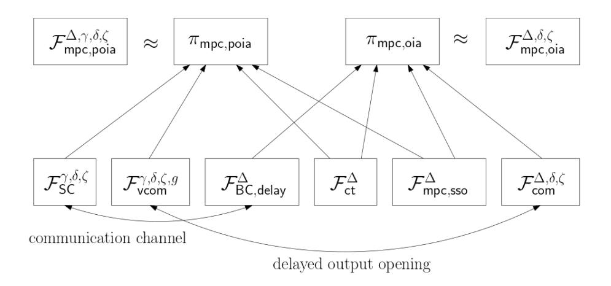

{0}------------------------------------------------

# CRAFT: Composable Randomness Beacons and Output-Independent Abort MPC From Time

Carsten Baum1,2 ⋆ , Bernardo David3 ⋆⋆, Rafael Dowsley4 ⋆ ⋆ ⋆ , Ravi Kishore3 † , Jesper Buus Nielsen2 ‡ , and Sabine Oechsner5 §

> 1 Technical University of Denmark, Denmark cabau@dtu.dk 2 Aarhus University, Denmark {cbaum,jbn}@cs.au.dk 3 IT University of Copenhagen, Denmark bernardo@bmdavid.com,rava@itu.dk 4 Monash University, Australia rafael@dowsley.net 5 University of Edinburgh, United Kingdom s.oechsner@ed.ac.uk

Abstract. Recently, time-based primitives such as time-lock puzzles (TLPs) and verifiable delay functions (VDFs) have received a lot of attention due to their power as building blocks for cryptographic protocols. However, even though exciting improvements on their efficiency and security (e.g. achieving non-malleability) have been made, most of the existing constructions do not offer general composability guarantees and thus have limited applicability. Baum et al. (EUROCRYPT 2021) presented in TARDIS the first (im)possibility results on constructing TLPs with Universally Composable (UC) security and an application to secure two-party computation with output-independent abort (OIA-2PC), where an adversary has to decide to abort before learning the output.

⋆ Funded by the European Research Council (ERC) under the European Unions' Horizon 2020 program under grant agreement No 669255 (MPCPRO).

⋆⋆ Supported by the Concordium Foundation and the Independent Research Fund Denmark grants number 9040-00399B (TrA2C), 9131-00075B (PUMA) and 0165-00079B (P2DP).

⋆ ⋆ ⋆ Partially done while Rafael Dowsley was with Bar-Ilan University and supported by the BIU Center for Research in Applied Cryptography and Cyber Security in conjunction with the Israel National Cyber Bureau in the Prime Minister's Office.

† Supported by the Independent Research Fund Denmark grant number 9131-00075B (PUMA)

‡ Partially funded by The Concordium Foundation; The Danish Independent Research Council under Grant-ID DFF-8021-00366B (BETHE); The Carlsberg Foundation under the Semper Ardens Research Project CF18-112 (BCM).

§ Supported by Input Output (iohk.io) through their funding of the Edinburgh Blockchain Technology Lab. Partially done while Sabine Oechsner was with Aarhus University and supported by the Danish Independent Research Council under Grant-ID DFF-8021-00366B (BETHE) and Concordium Foundation.

{1}------------------------------------------------

While these results establish the feasibility of UC-secure TLPs and applications, they are limited to the two-party scenario and suffer from complexity overheads. In this paper, we introduce the first UC constructions of VDFs and of the related notion of publicly verifiable TLPs (PV-TLPs). We use our new UC VDF to prove a folklore result on VDF-based randomness beacons used in industry and build an improved randomness beacon from our new UC PV-TLPs. We moreover construct the first multiparty computation protocol with punishable output-independent aborts (POIA-MPC), i.e. MPC with OIA and financial punishment for cheating. Our novel POIA-MPC both establishes the feasibility of (nonpunishable) OIA-MPC and significantly improves on the efficiency of state-of-the-art OIA-2PC and (non-OIA) MPC with punishable aborts.

# 1 Introduction

Time has always been an important, although sometimes overlooked, resource in cryptography. Recently, there has been a renewed interest in time-based primitives such as Time-Lock Puzzles (TLPs) [\[40\]](#page-35-0) and Verifiable Delay Functions (VDFs) [\[11\]](#page-33-0). TLPs allow a sender to commit to a message in such a way that it can be obtained by a receiver only after a certain amount of time, during which the receiver must perform a sequence of computation steps. On the other hand, a VDF works as a pseudorandom function that is evaluated by performing a certain number of computation steps (which take time), after which it generates both an output and a proof that this number of steps has been performed to obtain the output. A VDF guarantees that evaluating a certain number of steps takes at least a certain amount of time and that the proof obtained with the output can be verified in time essentially independent of the number of steps.

Both TLPs and VDFs have been investigated extensively in recent work which focusses on improving their efficiency [\[10,](#page-33-1)[39](#page-35-1)[,44\]](#page-35-2), obtaining new properties [\[26\]](#page-34-0) and achieving stronger security guarantees [\[23,](#page-34-1)[32,](#page-34-2)[27\]](#page-34-3). These works are motivated by the many applications of TLPs and VDFs, such as randomness beacons [\[11](#page-33-0)[,12\]](#page-33-2), partially fair secure computation [\[21\]](#page-34-4) and auctions [\[12\]](#page-33-2). In particular, all these applications use TLPs and VDFs concurrently composed with other cryptographic primitives and sub-protocols. However, most of current constructions of TLPs [\[40,](#page-35-0)[12,](#page-33-2)[10,](#page-33-1)[32,](#page-34-2)[27\]](#page-34-3) and all known constructions of VDFs [\[11](#page-33-0)[,39,](#page-35-1)[44,](#page-35-2)[23](#page-34-1)[,26\]](#page-34-0) do not offer general composability guarantees, meaning it is not possible to easily and securely use those in more complex protocols.

The current default tool for proving security of cryptographic constructions under general composability is the Universal Composability (UC) framework [\[14\]](#page-34-5). However, the UC framework is inherently asynchronous and does not capture time, meaning that a notion of passing time has to be added in order to analyze time-based constructions in UC. Recently, TARDIS [\[5\]](#page-33-3) introduced a suitable time model and the first UC construction of TLPs, proven secure under the iterated squaring assumption of [\[40\]](#page-35-0) using a programmable random oracle. 

{2}------------------------------------------------

[\[5\]](#page-33-3) also shows that a programmable random oracle is necessary for realizing such time-based primitives in the UC framework.

Besides analyzing the (im)possibility of constructing UC TLPs, TARDIS [\[5\]](#page-33-3) showed that UC TLPs can be used to construct UC-secure Two-Party Computation with Output-Independent Abort (OIA-2PC), where the adversary must decide whether to cause an abort before learning the output of the computation. OIA-2PC itself implies fair coin tossing, an important task used in randomness beacons. However, while these results showcase the power of UC TLPs, they are restricted to the two-party setting and incur a high concrete complexity. Moreover, their results do not extend to VDFs. This leaves an important gap, since many TLP applications (e.g. auctions [\[12\]](#page-33-2)) are intrinsically multiparty and VDFs are used in practice for building randomness beacons [\[11](#page-33-0)[,43\]](#page-35-3). The TARDIS TLP formalization and its applications also give adversaries exactly as much power in breaking the time-based assumption as the honest parties, which appears very restrictive and unrealistic.

# 1.1 Our Contributions

In this work, we present the first UC-secure constructions of VDFs and introduce the related notion of Publicly Verifiable TLPs, which we also construct. Using these primitives as building blocks, we construct a new more efficient randomness beacon and Multiparty Computation with Output-Independent Abort (OIA-MPC) and Punishable Abort. Our constructions are both practical and proven secure under general composition, and support adversaries who can break the timing assumptions faster than honest parties.

UC Verifiable Delay Functions. We introduce the first UC definition of VDFs [\[11\]](#page-33-0), which is a delicate task and a contribution on its own. We also present a matching construction that consists in compiling a trapdoor VDF [\[44\]](#page-35-2) into a UC-secure VDF in the random oracle model while only increasing the proof size by a small constant. Even though we manage to construct a very simple and efficient compiler, the security proof for this construction is highly detailed and complex. Based on our UC VDF, we give the first security proof of a folklore randomness beacon construction [\[11\]](#page-33-0).

UC Publicly Verifiable Time-Lock Puzzles (PV-TLP). We introduce publicly verifiable TLPs (PV-TLP), presenting an ideal functionality and a UCsecure construction for this primitive. A party who solves a PV-TLP (or its creator) can prove to any third party that a certain message was contained in the PV-TLP (or that it was invalid) in way that verifying the proof takes constant time. We show that the TLP of [\[5\]](#page-33-3) allows for proving that a message was contained in a valid TLP. Next, we introduce a new UC-secure PV-TLP scheme based on trapdoor VDFs that allows for a solver to prove that a puzzle is invalid, similarly to the construction of [\[27\]](#page-34-3), which does not achieve UC security. 

{3}------------------------------------------------

Efficient UC Randomness Beacon from PV-TLP. Building on our new notion (and construction) of PV-TLPs, we introduce a new provably secure randomness beacon protocol. Our construction achieves far better best case scenario efficiency than the folklore VDF-based construction [\[11\]](#page-33-0). Our novel PV-TLPbased construction requires only O(n) broadcasts (as does [\[11\]](#page-33-0)) to generate a uniformly random output, where n is the number of parties. Differently from the VDF-based construction [\[11\]](#page-33-0), whose execution time is at least the worst case communication channel delay, our protocol outputs a random value as soon as all messages are delivered, achieving in the optimistic case an execution as fast as 2 round trip times in the communication channel. This construction and its proof require not only a simple application of UC PV-TLPs but also a careful analysis of the relative delays between PV-TLPs broadcast channels/public ledgers and PV-TLPs. We not only present this new protocol but also provide a full security proof in the partially synchronous model (where the communication delay is unknown), characterizing the protocol's worst case execution time in terms of the communication delay upper bound. In comparison, no security proof for the construction of [\[11\]](#page-33-0) is presented in their work.

UC Multiparty Computation (MPC) with Output Independent Abort (OIA-MPC). We construct the first UC-secure protocol for Multiparty Computation with Output Independent Abort (OIA-MPC), which is a stronger notion of MPC where aborts by cheaters must be made before they know the output. This notion is a generalization of the limited OIA-2PC result from [\[5\]](#page-33-3). As our central challenge, we identify the necessity of synchronizing honest parties so that their views allow them to agree on the same set of cheaters. We design a protocol that only requires that honest parties are not too much out of sync when the protocol starts and carefully analyze its security.

UC MPC with Punishable Output Independent Abort (POIA-MPC) from PV-TLP. We construct the first protocol for Multiparty Computation with Punishable Output Independent Abort (POIA-MPC), generalizing OIA-MPC to a setting where i) outputs can be publicly verified; and ii) cheaters in the output stage can be identified and financially punished. Our construction employs our new publicly verifiable TLPs to construct a commitment scheme with delayed opening. To use this simple commitment scheme, we improve the currently best [\[4\]](#page-33-4) techniques for publicly verifiable MPC with cheater identification in the output stage. We achieve this by eliminating the need for homomorphic commitments, which makes our construction highly efficient. We do not punish cheating that occurs before the output phase (i.e. before the output can be known), as this requires expensive MPC with publicly verifiable identifiable abort [\[31](#page-34-6)[,35,](#page-34-7)[7\]](#page-33-5). Our approach is also taken in other previous works [\[1,](#page-33-6)[9,](#page-33-7)[36,](#page-35-4)[4\]](#page-33-4).

{4}------------------------------------------------

## 1.2 Our Techniques

All our constructions use a slack parameter  $0 < \epsilon \le 1$  that allows the adversary to break an assumption in time  $\epsilon \delta$  when honest parties are assumed to need time  $\delta$ . It is assumed that  $\epsilon$  (or an upper-bound on it) is known.

Verifiable Delay Functions. We depart from a generic stand alone trapdoor VDF [44] (or rather, a weaker notion of a trapdoor verifiable sequential computation) to obtain a UC-secure continuous VDF in the global random oracle model (which is necessary for realizing UC-secure time-based primitives as proven in [5]). We capture the stand alone continuous VDF in UC following a similar approach to the one of [5] for capturing the iterated squaring assumption: the intermediate states leaked to the adversary by the functionality are not concrete representations of actual intermediate states but generic random labels assigned to states (similarly to the generic group model treatment given to the RSW assumption in [5]). Learning these intermediate generic states does not allow the environment (or the adversary) any advantage in computing the next states before they are revealed by the functionality, as these states are sampled uniformly at random. Hence, it is not necessary to restrict the UC environment in any way and the UC composition theorem still holds.

Interestingly, our construction is very simple and efficient: we evaluate the input in for a number  $\Gamma$  of steps with the stand alone VDF and then compute the UC VDF output and proof as  $out = H(sid|in|\Gamma|st_{\Gamma}|\pi')$  and  $\Pi = (st_{\Gamma}, \pi')$  where  $st_{\Gamma}$  and  $\pi'$  are the output and proof obtained from the stand alone VDF and H is a global random oracle. Verification is done by checking that out is computed according to the values in  $\Pi$  and that  $\pi'$  is valid for the input and  $st_{\Gamma}$ . Even though this construction is simple, defining and analyzing its security is our main contribution in this area, as it requires a complex simulator keeping track of both honest and adversarial VDF evaluations.

Publicly Verifiable TLPs (PV-TLPs). We define the notion of UC publicly verifiable TLPs, which allow for a prover who solves a PV-TLP to convince any verifier that either a certain message was contained in the PV-TLP or that it was invalid, while only requiring the verifier to perform a constant number of computational steps. We show that the TLP construction of [5] can realize a weaker notion of public verifiability allowing a solver to prove a message was inside a valid TLP, since the solver obtains a trapdoor upon solving the puzzle that can be used by a verifier to solve the puzzle instantly. We present a new UC-secure PV-TLP protocol based on a generalization of trapdoor VDFs that also allows the solver to prove that a PV-TLP is invalid (similarly to [27], which does not achieve UC security).

In our new protocol, a puzzle creator uses a trapdoor to evaluate the VDF on a random input  $\mathtt{st}_0$  for a number of steps  $\Gamma$ , obtaining an output  $\mathtt{st}_\Gamma$  and proof  $\pi'$ , which it uses to create a puzzle  $(\mathtt{st}, \Gamma, \mathtt{tag}_1 = H_1(\mathtt{st}_0|\Gamma|\mathtt{st}_\Gamma|\pi') \oplus m, \mathtt{tag}_2 = H_2(\mathtt{st}_0|\Gamma|\mathtt{st}_\Gamma|\pi'|\mathtt{tag}_1|m))$  containing message m that can be solved in  $\Gamma$  steps,

{5}------------------------------------------------

where H1, H2 are random oracles. The solver simply evaluates Γ steps of the VDF on input st0 to obtain stΓ , π′ , which serve both to obtain m and as proof of this solution.

Composable Randomness Beacons. We realize a guaranteed output delivery (G.O.D.) coin tossing functionality that works like a randomness beacon from PV-TLPs and semi-synchronous delayed multiparty communication (through either a delayed broadcast or a public ledger), where there is a finite but unknown communication delay. We consider an honest majority and build on the standard commit-then-reveal coin tossing approach but substitute the commitments with PV-TLPs: 1. each party broadcasts (or posts on the public ledger) a PV-TLP containing a random value as input that can be solved in δ ticks (i.e. computational steps), 2. after commitments from half of the parties have been received (meaning at least one commitment is from an honest party), each party reveals the random value in its PV-TLP and stops considering new TLPs received after this point, 3. if any party fails to reveal this value, the other parties can solve this party's PV-TLP by themselves and retrieve the value, 4. the output is obtained by XORing all random values from the valid PV-TLPs.

An adversary cannot make this protocol abort because any party can solve all valid PV-TLPs. Even without knowing the maximum communication delay, our protocol dynamically adjusts δ to ensure that the adversary cannot solve honest parties' PV-TLPs before sending its own, meaning it cannot bias the output. If all parties cooperate in sending and opening their PV-TLPs as soon as possible, the output can be obtained as fast as the communication channel delay allows. In our protocol description and proof, we explicitly characterize the worst case execution time for this protocol in terms of the (unknown) communication delay upper bound.

MPC with (Punishable) Output-Independent Abort. For MPC with Output-Independent Abort we generalize the idea from previous two-party works such as [\[5,](#page-33-3)[21\]](#page-34-4) and let each participant in an MPC protocol commit to its output message using a commitment with delayed non-interactive opening, which can be constructed from a TLP. An honest party Pi only considers output shares of other parties to be relevant if the TLPs which contain these arrived before Pi 's own TLP could have been opened by the adversary. For the abort to be unanimous or to achieve identifiable abort, we additionally use a synchronized broadcast channel [\[5\]](#page-33-3). Such broadcast can be implemented if all honest parties are not too much out of sync in the beginning of the protocol. It appears that, at least for this construction of OIA-MPC, such a broadcast channel is necessary: assume that two honest parties Pi ,Pj send TLPs which expire both at time t. Without a broadcast that guarantees delivery at the same time, an adversarial party may follow the protocol but will send a (well-formed) TLP with its output share to Pi such that the TLP opens at time t. It then sends the same TLP to Pj so that it opens for Pj at time t + 1. Pi will accept the opening of the TLP of the adversary, while Pj does not.

{6}------------------------------------------------

We then achieve punishable output-independent abort by using publicly verifiable primitives and a smart contract in a way similar to [\[4\]](#page-33-4): the parties again commit to their output shares using a commitment with delayed non-interactive opening. In comparison to OIA-MPC, we now require these commitments to be publicly verifiable, and parties must prove that their committed shares are consistent with the output of the MPC scheme. Such a consistency check can be done cheaply using a universal hash function that is chosen by all MPC parties, as was done in [\[4\]](#page-33-4).

While we depart from [\[4](#page-33-4)[,5\]](#page-33-3), extra care must be taken in the definition and proof since no ideal functionalities have previously been designed for such composable timed primitives with public verification. Moreover, we significantly modify and improve the output share consistency check of [\[4\]](#page-33-4) by using weaker, non-homomorphic commitments, which dramatically improves efficiency. Our observation is that there is no loss in security if the consistency check on the committed shares is only done once the commitment is opened, due to the binding property. In comparison [\[4\]](#page-33-4) performed this check using homomorphic properties of commitments simultaneously on both commitments and MPC shares.

## 1.3 Related Work

The recent work of Baum et al. [\[5\]](#page-33-3) introduced the first construction of a composable TLP, while previous constructions such as [\[40,](#page-35-0)[12,](#page-33-2)[10\]](#page-33-1) were only proven to be stand-alone secure. As an intermediate step towards composable TLPs, nonmalleable TLPs were constructed in [\[32](#page-34-2)[,27\]](#page-34-3). The related notion of VDFs has been investigated in [\[11](#page-33-0)[,39,](#page-35-1)[44,](#page-35-2)[23](#page-34-1)[,26\]](#page-34-0). Also for these constructions, composability guarantees have so far not been shown. Hence, issues arise when using these primitives as building blocks in more complex protocols, since their security is not guaranteed when they are composed with other primitives.

Randomness beacons that resist adversarial bias have been constructed based on publicly verifiable secret sharing (PVSS) [\[34,](#page-34-8)[17\]](#page-34-9) and on VDFs [\[11\]](#page-33-0), although neither of these constructions is composable. The best UC-secure randomness beacons based on PVSS [\[18\]](#page-34-10) still require O(n 2 ) communication where n is the number of parties even if only one single value is needed. UC-secure randomness beacons based on verifiable random functions [\[22,](#page-34-11)[2\]](#page-33-8) can be biased by adversaries.

Fair secure computation (where honest parties always obtain the output if the adversary learns it) is known to be impossible in the standard communication model and with dishonest majority [\[19\]](#page-34-12), which includes the 2-party setting. Couteau et al. [\[21\]](#page-34-4) presented a secure two-party fair exchange protocol for the "best possible" alternative, meaning where an adversary can decide to withhold the output from an honest party but must make this decision independently of the protocol output. Baum et al. [\[5\]](#page-33-3) showed how to construct a secure 2-party computation protocol with output-independent abort and composition guarantees. Neither of these works considers the important multiparty setting.

Another work which considers fairness is that of Garay et al. [\[28\]](#page-34-13), which introduced the notion of resource-fairness for protocols in UC. Their work is 

{7}------------------------------------------------

able to construct fair MPC in a modified UC framework, while we obtain OIA-MPC which can be used to obtain partially fair secure computation (as defined in [\[29\]](#page-34-14)). The key difference is that their resource-fairness framework needs to modify the UC framework in such a way that environments, adversaries and simulators must have an a priori bounded running time. Being based on the TARDIS model of [\[5\]](#page-33-3), our work uses the standard UC framework without such stringent (and arguably unrealistic) modifications/restrictions.

An alternative, recently popularized idea is to circumvent the impossibility result of [\[19\]](#page-34-12) by imposing financial penalties. In this model, cheating behavior is punished using cryptocurrencies and smart contracts, which incentivizes rational adversaries to act honestly. Works that achieve fair output delivery with penalties such as [\[1](#page-33-6)[,9,](#page-33-7)[36,](#page-35-4)[4\]](#page-33-4) allow the adversary to make the abort decision after he sees the output. Therefore financial incentives must be chosen according to the adversary's worst-case gain. Our POIA-MPC construction forces the adversary to decide before seeing the output and incentives can be based on the expected gain of cheating in the computation instead. All these mentioned works as well as ours focus on penalizing cheating during the output phase only, as current MPC protocols with publicly verifiable cheater identification are costly [\[31,](#page-34-6)[6,](#page-33-9)[35,](#page-34-7)[7,](#page-33-5)[16\]](#page-34-15). A more detailed complexity analysis in comparison with the existing results is as follows.

The TARDIS construction requires the use of UC-secure additively homomorphic delayed commitments during the output phase, which must be constructed from additively homomorphic commitments that require extra overhead for generation. Our construction does not require any homomorphism and can be instantiated from TLPs + ROs, which is substantially cheaper. The best construction of such UC-secure additively homomorphic commitments (by Cascudo et al. in Asiacrypt'19 [\[16\]](#page-34-15)) requires about 400 times as much computation and communication as the canonical RO commitments we use in our construction. Whereas, our construction only requires one plain MPC evaluation plus an additive computation as well as broadcast communication overhead that scales in the output size and number of parties for the output phase. All existing constructions for MPC with public cheater identification [\[31,](#page-34-6)[6,](#page-33-9)[35](#page-34-7)[,7\]](#page-33-5) require to send all messages of the entire MPC protocol via the broadcast channel, which is not necessary for us. In addition, [\[35\]](#page-34-7) requires UC-NIZK proofs of correct evaluation of every protocol step by every party which are non-black box in the protocol, [\[31\]](#page-34-6) also performs NIZKs plus requires adaptive OT to preprocess these, [\[6\]](#page-33-9) requires a non-standard expensive verifiable lattice-based preprocessing while [\[7\]](#page-33-5) suffers from the use of linearly homomorphic commitments for every circuit gate during the preprocessing. Even previous works achieving public cheater identification in the output phase of [\[4\]](#page-33-4) requires expensive publicly verifiable additively homomorphic commitment schemes, again incurring an overhead of about 400 times in computational and communication complexities in relation to the canonical RO commitments we use.

{8}------------------------------------------------

# 2 Preliminaries

We use the (Global) Universal Composability or (G)UC model [\[14,](#page-34-5)[15\]](#page-34-16) for analyzing security and refer interested readers to the original works for more details.

In UC protocols are run by interactive Turing Machines (iTMs) called parties. A protocol π will have n parties which we denote as P = {P1, . . . ,Pn}. The adversary A, which is also an iTM, can corrupt a subset I ⊂ P as defined by the security model and gains control over these parties. The parties can exchange messages via resources, called ideal functionalities (which themselves are iTMs) and which are denoted by F.

As usual, we define security with respect to an iTM Z called environment. The environment provides inputs to and receives outputs from the parties P. To define security, let π F1,... ◦ A be the distribution of the output of an arbitrary Z when interacting with A in a real protocol instance π using resources F1, . . . . Furthermore, let S denote an ideal world adversary and F ◦S be the distribution of the output of Z when interacting with parties which run with F instead of π and where S takes care of adversarial behavior.

Definition 1. We say that F UC-securely implements π if for every iTM A there exists an iTM S (with black-box access to A) such that no environment Z can distinguish π F1,... ◦ A from F ◦ S with non-negligible probability.

In the security experiment Z may arbitrarily activate parties or A, though only one iTM (including Z) is active at each point of time. We denote with λ the statistical and τ the computational security parameter.

Public Verifiability in UC. We model the public verification of protocol outputs, for simplicity, by having a static set of verifiers V. These parties exist during the protocol execution (observing the public protocol transcript) but only act when they receive an input to be publicly verified. Converting our approach to dynamic sets of verifiers (as in e.g. [\[3\]](#page-33-10)) is possible using standard techniques.

## 2.1 The TARDIS [\[5\]](#page-33-3) Composable Time Model

The TARDIS [\[5\]](#page-33-3) model expresses time within the GUC framework in such a way that protocols can be made oblivious to clock ticks. To achieve this, TARDIS provides a global ticker functionality Gticker as depicted in Fig. [1.](#page-9-0) This global ticker provides "ticks" to ideal functionalities in the name of the environment. A tick represents a discrete unit of time which can only be advanced, and moreover only by one unit at a time. Parties observe events triggered by elapsed time, but not the time as it elapses in Gticker. Ticked functionalities can freely interpret ticks and perform arbitrary internal state changes. To ensure that all honest parties can observe all relevant timing-related events, Gticker only progresses if all honest parties have signaled to it that they have been activated (in arbitrary order). An

{9}------------------------------------------------

## Functionality Gticker

Initialize a set of registered parties Pa = ∅, a set of registered functionalities Fu = ∅, a set of activated parties LPa = ∅, and a set of functionalities LFu = ∅ that have been informed about the current tick.

Party registration: Upon receiving (register, pid) from honest party P with pid pid, add pid to Pa and send (registered) to P.

Functionality registration: Upon receiving (register) from functionality F, add F to Fu and send (registered) to F.

Tick: Upon receiving (tick) from the environment, do the following:

- 1. If Pa = LPa, reset LPa = ∅ and LFu = ∅, and send (ticked) to the adversary S.
- 2. Else, send (notticked) to the environment.

Ticked request: Upon receiving (ticked?) from functionality F ∈ Fu: If F ∈/ LFu, add F to LFu and send (ticked) to F. Otherwise send (notticked) to F.

Record party activation: Upon receiving (activated) from party P with pid pid ∈ Pa, add pid to LPa and send (recorded) to P.

Fig. 1: Global ticker functionality Gticker(from [\[5\]](#page-33-3)).

honest party may contact an arbitrary number of functionalities before asking Gticker to proceed. We refer to [\[5\]](#page-33-3) for more details.

How we use the TARDIS [\[5\]](#page-33-3) model. To control the observable side effects of ticks, the protocols and ideal functionalities presented in this work are restricted to interact in the[6](#page-9-1) "pull model". This precludes functionalities from implicitly providing communication channels between parties. Parties have to actively query functionalities in order to obtain new messages, and they obtain the activation token back upon completion. Ticks to ideal functionalities are modeled as follows: upon each activation, a functionality first checks with Gticker if a tick has happened and if so, may act accordingly. For this, it will execute code in a special Tick interface.

In comparison to [\[5\]](#page-33-3), after every tick, each ticked functionality F that we define (unless mentioned otherwise) allows A to provide an optional (Schedule,sid, D) message parameterized by a queue D. This queue contains commands to F which specify if the adversary wants to abort F or how it will schedule message delivery to individual parties in P. The reason for this approach is that it simplifies the specification of a correct F. This is because it makes it easier to avoid edge cases where an adversary could influence the output message buffer of F such that certain conditions supposedly guaranteed by F break. As mentioned above, an adversary does not have to send (Schedule,sid, D) - each F can take care of guaranteed delivery itself. On the other hand, D can depend on information that the adversary learns when being activated after a tick event.

6 The pull model, a standard approach in networking, has been used in previous works before such as [\[33\]](#page-34-17).

{10}------------------------------------------------

Modeling Start (De)synchronization. In the 2-party setting considered in TARDIS [\[5\]](#page-33-3) there is no need to capture the fact that parties receive inputs and start executing protocols at different points in time, since parties can adopt the default behavior of waiting for a message from the other before progressing. However, in the multiparty setting (and specially in applications sensitive to time), start synchronization is an important issue that has been observed before in the literature (e.g. [\[37](#page-35-5)[,33\]](#page-34-17)) although it is often overlooked. In the spirit of the original TARDIS model, we flesh out this issue by ensuring that time progresses regardless of honest parties having received their inputs (meaning that protocols may be insecure if a fraction of the parties receive inputs "too late"). Formally, we require that every (honest) party sends (activated) to Gticker during every activation regardless of having received its input. We explicitly address the start synchronization conditions required for our protocols to be secure.

Ticked Functionalities. We explicitly mention when a functionality F is "ticked". Each such F internally has two lists M, Q which are initially empty. The functionality will use these to store messages that the parties ought to obtain. Q contains messages to parties that are currently buffered. Actions by honest parties can add new messages to Q, while actions of the adversary can change the content of Q in certain restricted ways or move messages from Q to M. M contains all the "output-ready" messages that can be read by the parties directly. The content of M cannot be changed by A and he cannot prevent parties from reading it. "Messages" from F may e.g. be messages that have been sent between parties or delayed responses from F to a request from a party.

We assume that each ticked functionality F has two special interfaces. One, as mentioned above, is called Tick and is activated internally, as outlined before, upon activation of F if a tick event just happened on Gticker. The second is called Fetch Messages. This latter interface allows parties to obtain entries of M. The interface works identically for all ticked functionalities as follows:

Fetch Message: Upon receiving (Fetch,sid) by Pi ∈ P retrieve the set L of all entries (Pi ,sid, ·) in M, remove L from M and send (Fetch,sid, L) to Pi .

Macros. A recurring pattern in ticked functionalities in [\[5\]](#page-33-3) is that the functionality F, upon receiving a request (Request,sid, m) by party Pi must first internally generate unique message IDs mid to balance message delivery with the adversarial option to delay messages. F then internally stores the message to be delivered together with the mid in Q and finally hands out i, mid to the ideal adversary S as well as potentially also m. This allows S to influence delivery of m by F at will by referring to each unique mid. We now define macros that simplify the aforementioned process. When using the macros we will sometimes leave out certain options if their choice is clear from the context.

{11}------------------------------------------------

**Macro** "Notify the parties  $T \subseteq \mathcal{P}$  about a message with prefix Request from  $\mathcal{P}_i$  via  $\mathcal{Q}$  with delay  $\Delta$ " expands to

- 1. Let  $T = \{\mathcal{P}_{i_1}, \dots, \mathcal{P}_{i_k}\}$ . Sample unused message IDs  $\mathsf{mid}_{i_1}, \dots, \mathsf{mid}_{i_k}$ .
- 2. Add  $(\Delta, \mathsf{mid}_{i_j}, \mathsf{sid}, \mathcal{P}_{i_j}, (\mathsf{Request}, i))$  to  $\mathcal{Q}$  for each  $\mathcal{P}_{i_j} \in T$ .

**Macro** "Send message m with prefix Request received from party  $\mathcal{P}_i$  to the parties  $T \subseteq \mathcal{P}$  via  $\mathcal{Q}$  with delay  $\Delta$ " expands to

- 1. Let  $T = \{\mathcal{P}_{i_1}, \dots, \mathcal{P}_{i_k}\}$ . Sample unused message IDs  $\mathsf{mid}_{i_1}, \dots, \mathsf{mid}_{i_k}$ .
- 2. Add  $(\Delta, \mathsf{mid}_{i_j}, \mathsf{sid}, \mathcal{P}_{i_j}, (\mathsf{Request}, i, m))$  to  $\mathcal{Q}$  for each  $\mathcal{P}_{i_j} \in T$ .

**Macro** "Notify S about a message with prefix Request" expands to "Send (Request, sid, i, mid $i_1$ , ..., mid $i_k$ ) to S." Finally, the **Macro** "Send m with prefix Request and the IDs to S" expands to "Send (Request, sid, i, m, mid $i_k$ ) to S."

If honest parties send messages via simultaneous broadcast (ensuring simultaneous arrival), then we will only choose *one* mid for all messages. As the adversary can influence delivery on mid-basis, this ensures simultaneous delivery. We indicate this by using the prefix "simultaneously" in the first two macros.

### 2.2 Trapdoor Verifiable Sequential Computation

Functionality  $\mathcal{F}_{psc}$  is presented in Figure 2 and captures the notion of a generic stand alone trapdoor verifiable sequential computation scheme (a generalization of a trapdoor VDF) in a similar way as the iterated squaring assumption from [40] is captured in [5]. More concretely,  $\mathcal{F}_{psc}$  allows the evaluation of  $\Gamma$  computational steps taking as input an initial state el and outputting a final state el $_{\Gamma}$  along with a proof  $\pi$ . A verifier can use  $\pi$  to check that a state el $_{\Gamma}'$  was indeed obtained after  $\Gamma$  computational steps starting from el. Each computational step takes a tick to happen, and parties who are currently performing a computation must activate  $\mathcal{F}_{psc}$  in order for their computation to advance when the next tick happens. The proof  $\pi'$  can be verified with respect to el, el $_{\Gamma}$ ,  $\Gamma$  in time essentially independent of  $\Gamma$ . Since current techniques (e.g. [39,44,26]) for verifying such a proof require non-constant computational time, we model the number of ticks necessary for each by function  $g(\Gamma)$ . We discuss the implementation of  $\mathcal{F}_{psc}$  in Appendix A.2.

 $\mathcal{F}_{psc}$  must be used to capture a stand alone verifiable sequential computation because, as observed in [5], exposing the actual states from a concrete computational problem would allow the environment to perform several computational steps without activating other parties (and essentially breaking the hardness assumption). However, notice that  $\mathcal{F}_{psc}$  does not guarantee that the states it outputs are uniformly random or non-malleable, as it allows the adversary to choose the representation of each state, which is crucial in our proof. What  $\mathcal{F}_{psc}$  does guarantee is that proofs are only generated and successfully verified if the claimed number of computational steps is indeed correct, also guaranteeing that the transition between states el and nxt is injective.

{12}------------------------------------------------

#### Functionality $\mathcal{F}_{\mathsf{psc}}$

 $\mathcal{F}_{psc}$  interacts with a set of parties  $\mathcal{P} = \{\mathcal{P}_i, \dots, \mathcal{P}_n\}$ , an owner  $\mathcal{P}_o \in \mathcal{P}$  (if  $\mathcal{P}_o = \perp$ , no  $\mathcal{P}_i \in \mathcal{P}$  can access **Trapdoor Solve**) and an adversary  $\mathcal{S}$ . It is parameterized by an adversarial slack parameter  $0 \le \epsilon \le 1$ , state space  $\mathcal{ST}$ , a proof space  $\mathcal{PROOF}$  and a function  $g : \{0,1\}^* \mapsto \mathbb{N}$  determining the number of ticks for verifying proofs.  $\mathcal{F}_{psc}$  has initially empty lists prf, L and  $\mathcal{Q}_{\mathsf{v}}$  (proofs being verified); and flags  $f_i$  for  $i = 1, \dots, n$  that are initially set to zero.

**Trapdoor Solve:** Upon receiving (TdSolve, sid,  $el_0$ ,  $\Gamma$ ) from  $\mathcal{P}_o$  where  $\Gamma \in \mathbb{N}^+$  and  $el_0 \in \mathcal{ST}$ , sample  $\Gamma$  random distinct states  $el_j \stackrel{\$}{\leftarrow} \mathcal{ST}$  for  $j \in \{1, \ldots, \Gamma\}$  and add  $(el_{j-1}, el_j)$  to steps. Also sample proof  $\pi \stackrel{\$}{\leftarrow} \mathcal{PROOF}$ . Add  $(el_0, \Gamma, el_{\Gamma}, \pi)$  to prf and output  $(sid, el_0, \Gamma, el_{\Gamma}, \pi)$  to  $\mathcal{P}_o$ .

**Solve:** Upon receiving (Solve, sid,  $el_0$ ,  $\Gamma$ ) from  $\mathcal{P}_i \in \mathcal{P}$  where  $el_0 \in \mathcal{ST}$ , append  $(\mathcal{P}_i, sid, el_0, \Gamma, el_0, 0)$  to L and send (Solve, sid,  $el_0, \Gamma$ ) to  $\mathcal{S}$ .

Advance State: Upon receiving (AdvanceState, sid) from  $\mathcal{P}_i \in \mathcal{P}$ , set  $f_i = 1$ . Tick:

- For each  $(\mathcal{P}_i, \mathsf{sid}, \mathsf{el}_0, \Gamma, \mathsf{el}_c, c) \in L$ , if  $f_i = 1$  proceed as follows:
  - 1. If there is no  $el_{c+1}$  such that  $(el_c, el_{c+1}) \in steps$  then sample  $el_{c+1} \stackrel{\$}{\leftarrow} \mathcal{ST}$ , and append  $(el_c, el_{c+1})$  to steps.
  - 2. Output  $(el_c, el_{c+1})$  to S and update  $(P_i, sid, el_0, \Gamma, el_c, c)$  by setting c = c + 1.
  - 3. If  $c \geq \epsilon \Gamma$  and  $(\mathsf{el}_0, \Gamma, \mathsf{el}_\Gamma, \pi) \in \mathsf{prf}$ , output  $(\mathsf{GetEsPf}, \mathsf{el}_0, \Gamma, \mathsf{el}_c, \mathsf{el}_{c+1}, \dots, \mathsf{el}_\Gamma, \pi)$  to  $\mathcal{S}$ .
  - 4. Else If  $c \geq \epsilon \Gamma$  but  $(\mathsf{el}_0, \Gamma, \mathsf{el}_\Gamma, \pi) \notin \mathsf{prf}$ , then for  $j \in \{c+1, \ldots, \Gamma\}$  sample state  $\mathsf{el}_j \stackrel{\$}{\leftarrow} \mathcal{ST}$  and add  $(\mathsf{el}_{j-1}, \mathsf{el}_j)$  to steps. Also sample proof  $\pi \stackrel{\$}{\leftarrow} \mathcal{PROOF}$ , and add  $(\mathsf{el}_0, \Gamma, \mathsf{el}_\Gamma, \pi)$  to  $\mathsf{prf}$ . Finally, output  $(\mathsf{GetEsPf}, \mathsf{el}_0, \Gamma, \mathsf{el}_c, \mathsf{el}_{c+1}, \ldots, \mathsf{el}_\Gamma, \pi)$  to  $\mathcal{S}$ .
  - 5. If  $c = \Gamma$ , output  $(\mathsf{GetPf}, \mathsf{sid}, \mathsf{el}_0, \Gamma, \mathsf{el}_\Gamma, \pi)$  to  $\mathcal{P}_i$ , and remove  $(\mathcal{P}_i, \mathsf{sid}, \mathsf{el}_0, \Gamma, \mathsf{el}_\Gamma, \Gamma)$  from L.
- For each  $(\mathcal{P}_i, \mathsf{sid}, c, \mathsf{el}_I, \Gamma, \mathsf{el}_O, \pi) \in \mathcal{Q}_{\mathsf{v}}$ , if  $f_i = 1$  proceed as follows:
  - 1. If c = 0: remove  $(\mathcal{P}_i, \operatorname{sid}, 0, \operatorname{el}_I, \Gamma, \operatorname{el}_O, \pi)$  from  $\mathcal{Q}_v$  and set b = 1 if  $(\operatorname{el}_I, \Gamma, \operatorname{el}_O, \pi) \in \operatorname{prf}$ , otherwise set b = 0, and output  $(\operatorname{Verified}, \operatorname{sid}, \operatorname{el}_I, \Gamma, \operatorname{el}_O, \pi, b)$  to  $\mathcal{P}_i$ .
- 2. Else, if c > 0: update  $(\mathcal{P}_i, \operatorname{sid}, c, \operatorname{el}_I, \Gamma, \operatorname{el}_O, \pi)$  by setting c = c 1. Set flag  $f_i = 0$  for  $i = 1, \ldots, n$ .

**Verify:** Upon receiving (Verify, sid,  $el_I$ ,  $\Gamma$ ,  $el_O$ ,  $\pi$ ) from  $\mathcal{P}_i \in \mathcal{P}$  where  $\pi \in \mathcal{PROOF}$ , add  $(\mathcal{P}_i, sid, g(\Gamma), el_I, \Gamma, el_O, \pi)$  to  $\mathcal{Q}_v$ .

Fig. 2: Ticked Functionality  $\mathcal{F}_{psc}$  for trapdoor provable sequential computations.

#### 2.3 Multi-Party Message Delivery

**Ticked Authenticated Broadcast** In Fig. 3 we describe a ticked functionality  $\mathcal{F}_{\mathsf{BC},\mathsf{delay}}^{\Gamma,\Delta}$  for delayed authenticated simultaneous broadcast.  $\mathcal{F}_{\mathsf{BC},\mathsf{delay}}^{\Gamma,\Delta}$  allows each party  $\mathcal{P}_i \in \mathcal{P}$  to broadcast one message  $m_i$  in such a way that each  $m_i$ 

{13}------------------------------------------------

# Functionality $\mathcal{F}_{\mathsf{BC},\mathsf{delay}}^{\varGamma,\Delta}$

The ticked functionality  $\mathcal{F}_{\mathsf{BC},\mathsf{delay}}^{\Gamma,\Delta}$  is parameterized by maximal input desynchronization  $\Gamma$ , parties  $\mathcal{P} = \{\mathcal{P}_1, \dots, \mathcal{P}_n\}$  and adversary  $\mathcal{S}$ .  $\mathcal{S}$  may corrupt a strict subset  $I \subset \mathcal{P}$ . The functionality uses the identifier ssid to distinguish different instances per sid.  $\mathcal{F}_{\mathsf{BC},\mathsf{delay}}^{\Gamma,\Delta}$  for each ssid has internal states  $\mathsf{st}_{\mathsf{ssid}}$ ,  $\mathsf{done}_{\mathsf{ssid}}$  that are initially  $\bot$ .

**Init:** In the beginning of the execution,  $\mathcal{F}_{\mathsf{BC},\mathsf{delay}}^{\Gamma,\Delta}$  waits for input ( $\mathsf{Delay}, \Delta$ ) from  $\mathcal{S}$ . Upon receiving ( $\mathsf{Delay}, \Delta$ ) from  $\mathcal{S}$  where  $\Delta \in \mathbb{N}$  and  $\Delta \geq \Gamma$ ,  $\mathcal{F}_{\mathsf{BC},\mathsf{delay}}^{\Gamma,\Delta}$  proceeds to the next steps using  $\Delta$  as its internal (unknown to honest parties) delay parameter.

**Send:** Upon receiving an input (Send, sid, ssid,  $m_i$ ) from an honest party  $\mathcal{P}_i$ :

- 1. If  $\mathtt{st}_{\mathsf{ssid}} = \bot$  then set  $\mathtt{st}_{\mathsf{ssid}} = \varGamma$ . If either  $\mathtt{st}_{\mathsf{ssid}} = \top$  or  $\mathcal{P}_i$  sent (Send, sid, ssid, ·) before then go to **Total Breakdown**.
- 2. For all  $\mathcal{P}_j \in \mathcal{P}$ , add  $(\Delta, \operatorname{sid}, \mathcal{P}_j, (\mathcal{P}_i, m_i, \operatorname{ssid}))$  to  $\mathcal{Q}$ .
- 3. If all honest parties sent (Send, sid, ssid,  $\cdot$ ) then set donessid =  $\top$ .
- 4. Send (Send, sid, ssid,  $\mathcal{P}_i$ ,  $m_i$ ) to  $\mathcal{S}$ .

**Total Breakdown:** Doing a total breakdown means the ideal functionality from now on relays all inputs to  $\mathcal{S}$ , otherwise ignores the input and lets  $\mathcal{S}$  determine all outputs from then on. The ideal functionality becomes a proxy for  $\mathcal{S}$ .

#### Tick:

- 1. If  $\mathsf{st}_{\mathsf{ssid}} = a$  for  $a \geq 0$ :
  - (a) If a > 0 then set  $st_{ssid} = a 1$ .
  - (b) If a = 0 and if there is  $\mathcal{P}_i \in \mathcal{P} \setminus I$  that did not send (Send, sid, ssid, ·) then go to **Total Breakdown**, otherwise set  $\mathtt{st}_{\mathsf{ssid}} = \top$ .
  - (c) If donessid =  $\top$  then wait for  $m_i$  from S for each  $P_i \in I$  and, if S sends it, then add  $(a, \operatorname{sid}, P_j, (P_i, m_i, \operatorname{ssid}))$  to Q for all  $P_j \in P$ , and set  $\operatorname{\mathfrak{st}}_{\operatorname{ssid}} = \top$ .
- 2. Remove each  $(0, \operatorname{sid}, \mathcal{P}_i, M)$  from  $\mathcal{Q}$  and add  $(\operatorname{sid}, \mathcal{P}_i, M)$  to  $\mathcal{M}$ .
- 3. Replace each  $(\mathtt{cnt}, \mathsf{sid}, \mathcal{P}_i, M)$  in  $\mathcal{Q}$  with  $(\mathtt{cnt} 1, \mathsf{sid}, \mathcal{P}_i, M)$ . Upon receiving (Schedule,  $\mathsf{sid}, \mathsf{ssid}, \mathcal{D}$ ) from  $\mathcal{S}$ :
- If (Deliver, sid, ssid)  $\in \mathcal{D}$  and donessid =  $\top$  then, for all  $\mathcal{P}_i \in \mathcal{P}$ , remove (cnt, sid,  $\mathcal{P}_j$ , ( $\mathcal{P}_i$ ,  $m_i$ , ssid)) from  $\mathcal{Q}$  and add (sid,  $\mathcal{P}_j$ , ( $\mathcal{P}_i$ ,  $m_i$ , ssid)) to  $\mathcal{M}$ .

Fig. 3: Ticked ideal functionality  $\mathcal{F}_{\mathsf{BC},\mathsf{delay}}^{\Gamma,\Delta}$  for synchronized authenticated broadcast with maximal message delay  $\Delta$ .

is delivered to all parties at the same tick (although different messages  $m_i, m_j$  may be delivered at different ticks). This functionality guarantees messages to be delivered at most  $\Delta$  ticks after they were input. Moreover, it requires that all parties  $\mathcal{P}_i \in \mathcal{P}$  must provide inputs  $m_i$  within a period of  $\Gamma$  ticks, modeling a start synchronization requirement. If this loose start synchronization condition is not fulfilled, the functionality no longer provides any guarantees, allowing the adversary to freely manipulate message delivery (specified in **Total Break-down**).

{14}------------------------------------------------

In comparison to the two-party secure channel functionality  $\mathcal{F}_{\mathsf{smt},\mathsf{delay}}^{\Delta}$  of [5], our broadcast functionality  $\mathcal{F}_{\mathsf{BC},\mathsf{delay}}^{\Gamma,\Delta}$  uses a scheduling-based approach and explicitly captures start synchronization requirements. Using scheduling makes formalizing the multiparty case much easier while requiring start synchronization allows us to realize the functionality as discussed below. This also means that  $\mathcal{F}_{\mathsf{BC},\mathsf{delay}}^{\Gamma,\Delta}$  is not a simple generalization of the ticked channels of [5].

We briefly discuss how to implement  $\mathcal{F}_{\mathsf{BC,delay}}^{\Gamma,\Gamma,\Delta}$ . We could start from a synchronous broadcast protocol like [25] or the one in [24] with early stopping. These protocols require all parties to start in the same round and that they terminate within some known upper bound. For t < n/3 corruptions we could use [20] to first synchronize the parties before running such a broadcast. If  $t \ge n/3$  we can get rid of the requirement that they start in the same round using the round stretching techniques of [38]. This will maintain that the parties terminate within some known upper bound. Then use n instances of such a broadcast channel to let each party broadcast a value. When starting the protocols at time t a party  $\mathcal{P}_i$  knows that all protocol instances terminate before time  $t + \Delta$  so it can wait until time  $t + \Delta$  and collect the set of outputs. Notice that by doing so the original desynchronization  $\Gamma$  is maintained. When using protocols with early stopping [24], the parties might terminate down to one round apart in time. But this will be one of the stretched rounds, so it will increase the original desynchronization by a constant factor.

We stress that other broadcast channels than the one in  $\mathcal{F}_{\mathsf{BC},\mathsf{delay}}^{\Gamma,\Delta}$  may also be modeled using [5], although these may not be applicable to instantiate OIA-MPC as we do in Section 6.

**Ticked Public Ledger** In order to define a ledger functionality  $\mathcal{F}_{\mathsf{Ledger}}$ , we adapt ideas from Badertscher et al. [3]. The ledger functionality  $\mathcal{F}_{\mathsf{Ledger}}$  is presented in Fig. 4; also we describe it in more detail in the Supplementary Material B.

The original ledger functionality of Badertscher et al. [3] keeps track of many relevant times and interacts with a global clock in order to take actions at the appropriate time. Our ledger functionality  $\mathcal{F}_{Ledger}$ , on the other hand, only keeps track of a few counters. The counters are updated during the ticks, and the appropriate actions are done if some of them reach zero. We also enforce liveness and chain quality properties, and our ledger functionality can be realized by the same protocols as [3].

{15}------------------------------------------------

## Functionality FLedger

FLedger is parameterized by the algorithms Validate, ExtendPolicy and the parameters slackWindow, qualityWindow, delaySync, maxTXDelay, maxEmpty ∈ N. It manages variables state, nextBlock, buffer, emptyBlocks, which are initially set to ⊥, ⊥, ∅, and maxEmpty respectively. The functionality maintains a list recentQuality that keeps track of the quality (i.e., generated using the honest procedures or not) of the last qualityWindow blocks proposed by S that were used to extend the state state. The functionality maintains the set of registered parties P, and the subsets of synchronized honest parties H and of de-synchronized honest parties D. Each party Pi has a current-state view statei that is initially set to ⊥. Whenever an honest party Pi is registered during the execution, it is added to the subset D, an entry (Pi, delaySync) is added to the delayed entry table DE and the de-synchronized state state′ i is set to ⊥.

Tick: 1. For each entry (Pi, cnt) ∈ DE, if cnt = 1, set H ← H ∪ Pi, D ← D \ Pi and remove (Pi, cnt) from DE; otherwise decrease the counter value cnt by 1.

- 2. For each entry transaction BTX = (tx,txid, Pi, cnt) ∈ buffer, decrease the counter value cnt by 1. Remove from buffer all transaction with counter value equal 0, and create a list mandatoryInclusion with them.
- 3. Set state ← ExtendPolicy(state, nextBlock, buffer, mandatoryInclusion, recentQuality, emptyBlocks). If nextBlock = (hFlag, listTX) was used to extend state, then update the list recentQuality using hFlag. If a block was added to state, set emptyBlocks ← maxEmpty; else decrease emptyBlocks by 1.
- 4. Remove from buffer all transactions that were added into state. Set nextBlock ← ⊥. For each entry transaction BTX ∈ buffer, if Validate(BTX,state, buffer) = 0, then remove BTX from buffer.

Read: Upon receiving (Read,sid) from Pi ∈ P: if Pi ∈ D, return (Read,sid,state′ i); otherwise return (Read,sid,statei).

Read Buffer: Upon receiving (ReadBuffer,sid) from S, return (ReadBuffer,sid, buffer).

Submit a Transaction: Upon receiving (Submit,sid,tx) from Pi, choose a unique transaction ID txid and set BTX ← (tx,txid, Pi, maxTXDelay). If Validate(BTX,state, buffer) = 1, then set buffer ← buffer ∪ {BTX}. Send (Submit,sid, BTX) to S.

Propose a Block: Upon receiving (Propose,sid, hFlag,(txid1, . . . ,txidℓ)) from S, create the list of transactions listTX by concatenating the eventual transactions contained in buffer that have transaction IDs txid1, . . . ,txidℓ. Then set nextBlock ← (hFlag, listTX) and return (Propose,sid, ok) to S.

Set State-Slackness: Upon receiving (SetSlack,sid, Pi, t) from S, proceed as follows: if t ≥ |state| − slackWindow and t > |statei|, then set statei to contain the first t blocks of state and return (SetSlack,sid, ok); otherwise, set statei ← state and return (SetSlack,sid, f ail).

Set State of De-synchronized Parties: Upon receiving (DeSyncState,sid, Pi, s) from S for Pi ∈ D, set state′ i ← s and return (DeSyncState,sid, ok).

Fig. 4: Ledger Functionality FLedger.

{16}------------------------------------------------

# 3 Publicly Verifiable Time-Lock Puzzles

In this section, we describe an ideal functionality  $\mathcal{F}_{\mathsf{TLP}}$  for publicly verifiable TLPs. Intuitively, a publicly verifiable TLP allows a prover who performs all computational steps needed for solving a PV- TLP to later convince a verifier that the PV-TLP contained a certain message or that it was invalid. The verifier only needs constant time to verify this claim. The ideal functionality  $\mathcal{F}_{\mathsf{TLP}}$  as presented in Figure 5 models exactly that behavior:  $\mathcal{F}_{\mathsf{TLP}}$  has an extra interface for any verifier to check whether a certain solution to a given PV-TLP is correct. Moreover,  $\mathcal{F}_{\mathsf{TLP}}$  allows the adversary to obtain the message from a PV-TLP with  $\Gamma$  steps in just  $\epsilon\Gamma$  steps for  $0 < \epsilon \le 1$ , modeling the slack between concrete computational complexities for honest parties and for the adversary is sequential computation assumptions.

Functionality  $\mathcal{F}_{\mathsf{TLP}}$  allows the owner to create a new TLP containing message m to be solved in  $\Gamma$  steps by activating it with (CreatePuzzle, sid,  $\Gamma$ , m). Other parties can request the solution of a TLP puz generated by the owner of  $\mathcal{F}_{\mathsf{TLP}}$  by activating it with message (Solve, sid, puz). After every tick when a party activates  $\mathcal{F}_{\mathsf{TLP}}$  with message (AdvanceState, sid), one step of this party's previosly requested puzzle solutions is evaluated. When  $\epsilon\Gamma$  steps have been computed,  $\mathcal{F}_{\mathsf{TLP}}$  leaks message m contained in the puzzle puz to the adversary  $\mathcal{S}$ . When all  $\Gamma$  steps of a puzzle solution requested by a party are evaluated,  $\mathcal{F}_{\mathsf{TLP}}$  outputs m and a proof  $\pi$  that m was indeed contained in puz to that party. Finally, a party who has a proof  $\pi$  that a message m was contained in puz can verify this proof by activating  $\mathcal{F}_{\mathsf{TLP}}$  with message (Verify, sid, puz, m,  $\pi$ ).

In Supplementary Material C, we show that the TLP from [5] realizes a slightly weaker version of  $\mathcal{F}_{\mathsf{TLP}}$  and the Protocol  $\pi_{\mathsf{tlp}}$  presented in Figure 6 realizes  $\mathcal{F}_{\mathsf{TLP}}$  (i.e. proving Theorem 1). Protocol  $\pi_{\mathsf{tlp}}$  is constructed from a standalone trapdoor VDF modeled by  $\mathcal{F}_{\mathsf{psc}}$ . A puzzle owner  $\mathcal{P}_o$  uses the trapdoor to compute the VDF on a random input  $\mathsf{st}_0$  for the number of steps  $\Gamma$  required by the PV-TLP, obtaining the corresponding output  $\mathsf{st}_{\Gamma}$  and proof  $\pi$ . The owner then computes  $\mathsf{tag}_1 = H_1(\mathsf{st}_0, \Gamma, \mathsf{st}_{\Gamma}, \pi) \oplus m$ ,  $\mathsf{tag}_2 = H_2(\mathsf{st}_0, \Gamma, \mathsf{st}_{\Gamma}, \pi, \mathsf{tag}_1, m)$  and  $\mathsf{tag} = (\mathsf{tag}_1, \mathsf{tag}_2)$ , where m is the message in the puzzle, using random oracles  $H_1$  and  $H_2$ . The final puzzle is  $\mathsf{puz} = (\mathsf{st}_0, \Gamma, \mathsf{tag})$ . A solver computes  $\Gamma$  steps of the trapdoor VDF with input  $\mathsf{st}_0$  to get a proof of PV-TLP solution  $\pi' = (\mathsf{st}_{\Gamma}, \pi)$ , which can be used to check the consistency of  $\mathsf{tag}$  and retrieve m. If  $\mathsf{tag}$  is not consistent,  $\pi'$  can also be used to verify this fact.

Theorem 1. Protocol  $\pi_{\mathsf{tlp}}$  (G)UC-realizes  $\mathcal{F}_{\mathsf{TLP}}$  in the  $\mathcal{G}_{\mathsf{ticker}}$ ,  $\mathcal{G}_{\mathsf{rpoRO}}$ ,  $\mathcal{F}_{\mathsf{psc}}$ -hybrid model with computational security against a static adversary. For every static adversary  $\mathcal{A}$  and environment  $\mathcal{Z}$ , there exists a simulator  $\mathcal{S}$  s.t.  $\mathcal{Z}$  cannot distinguish  $\pi_{\mathsf{tlp}}$  composed with  $\mathcal{G}_{\mathsf{ticker}}$ ,  $\mathcal{G}_{\mathsf{rpoRO}}$ ,  $\mathcal{F}_{\mathsf{psc}}$  and  $\mathcal{A}$  from  $\mathcal{S}$  composed with  $\mathcal{F}_{\mathsf{TLP}}$ .

{17}------------------------------------------------

### Functionality FTLP

FTLP is parameterized by a computational security parameter τ , a message space {0, 1} τ , a state space ST , a tag space T AG, a proof space PROOF, a slack parameter 0 < ϵ ≤ 1 and a function g : {0, 1} ⋆ 7→ N (determining how many ticks it takes to verify a proof). FTLP interacts with a set of parties P = {P1, . . . , Pn}, an owner Po ∈ P and an adversary S. FTLP maintains flags fi for i = 1, . . . , n that are initially set to 0 and initially empty lists steps (honest state transitions), omsg (output messages and proofs), Qv (proofs being verified), L (puzzles being solved). Create puzzle: Upon receiving the first message (CreatePuzzle,sid, Γ, m) from Po where Γ ∈ N + and m ∈ {0, 1} τ , proceed as follows:

- 1. If Po is honest, sample tag \$← T AG, st0 \$← ST , and proof π \$← PROOF. If Po is corrupted, let S provide values tag, st0, and the proof π.
- 2. If (tag, st0, π) ∈ T AG × ST × PROOF / or there exists (st′ 0, Γ′ , tag′ , m′ , π) ∈ omsg then FTLP halts. Otherwise, append (puz = (st0, Γ, tag), m, π) to omsg, and output (CreatedPuzzle,sid, puz, π) to Po and (CreatedPuzzle,sid, puz) to S.

Solve: Upon receiving (Solve,sid, puz = (st0, Γ, tag)) from Pi ∈ P, add (Pi,sid, puz, st0, 0) to L and send (Solve,sid, puz) to S.

Advance State: Upon receiving (AdvanceState,sid) from Pi ∈ P, set fi = 1.

Tick: – For all (Pi,sid, puz = (st0, Γ, tag), stc, c) ∈ L, if fi = 1 proceed as follows: 1. If there is no stc+1 such that (stc, stc+1) ∈ steps:

- (a) If Po is honest, sample stc+1 \$← ST , and append (stc, stc+1) to steps.
- (b) If Po is corrupted, send (sid, adv, stc) to S and wait for (sid, adv, stc, stc+1). If stc+1 ∈ ST / then halt. Otherwise, append (stc, stc+1) to steps.
- 2. Output (stc, stc+1) to S and update (Pi,sid, puz, stc, c) ∈ L by setting c = c+1.
- 3. If c ≥ ϵΓ and there is no (stc, stc+1),(stc+1, stc+2), . . . ,(stΓ −1, stΓ ) ∈ steps:
- (a) If Po is honest, sample stj \$← ST for j = c + 1, c + 2, . . . , Γ, and output (stj−1, stj ) to S and append (stj−1, stj ) to steps. If (st0, Γ, tag, m, π) ∈/ omsg, set m = ⊥, sample π \$← PROOF and append (st0, Γ, tag, ⊥, π) ∈ omsg. Finally, output (Solved,sid, puz, m, π) to S.
- (b) Else (if Po is corrupted), send (GetSts,sid, puz) to S, wait for S to answer with (GetSts,sid, puz, stc, stc+1, . . . , stΓ ). For j = c+ 1, . . . , Γ, if stj ∈ ST / or (stj−1, st′ j ) ∈ steps, then FTLP halts, else, append (stj−1, stj ) to steps.
- 4. Else If c ≥ ϵΓ and there exist (stc, stc+1), . . . ,(stΓ −1, stΓ ) ∈ steps, or if (puz′ = (st0, Γ, tag′ ), m′ , π′ ) ∈ omsg s.t. tag′ ̸= tag (i.e. a puzzle with same st0, Γ has been solved) or Po is corrupted and (puz, m, π) ∈/ omsg, send (GetMsg,sid, puz) to S, wait for S to answer with (GetMsg,sid, puz, m, π). If π /∈ PROOF or (st′ 0, Γ′ , tag′ , m′ , π) ∈ omsg, FTLP halts, else, append (st0, Γ, tag, m, π) to omsg.
- 5. If c = Γ, remove (Pi,sid, puz, stc, c) ∈ L and send (Solved,sid, puz, m, π) to Pi.
- For each (Pi,sid, c, st, Γ, tag, m, π) ∈ Qv, if fi = 1 proceed as follows: 1. If c = 0, remove (Pi,sid, 0, st, Γ, tag, m, π) from Qv, set b = 1 if (st, Γ, tag, m, π) ∈ omsg, otherwise set b = 0 and output (Verified,sid, puz = (st, Γ, tag), m, π, b) to Pi; 2. Else, if c > 0: update (Pi,sid, c, st, Γ, tag, m, π) ∈ Qv by setting c = c − 1. Set fi = 0 for i = 1, . . . , n.

Public Verification: Upon receiving (Verify,sid, puz = (st, Γ, tag), m, π) from a party Pi ∈ P, add (Pi,sid, g(Γ), st, Γ, tag, m, π) to Qv.

Fig. 5: Ticked Functionality FTLP for publicly verifiable time-lock puzzles.

{18}------------------------------------------------

#### Protocol $\pi_{\mathsf{tlp}}$

Protocol  $\pi_{\mathsf{tlp}}$  is parameterized by a security parameter  $\tau$  and is executed by a set of parties  $\mathcal{P} = \{\mathcal{P}_1, \dots, \mathcal{P}_n\}$  and an owner  $\mathcal{P}_o \in \mathcal{P}$  interacting with functionalities  $\mathcal{F}_{\mathsf{psc}}$  (whose owner is  $\mathcal{P}_o$ , state space is  $\mathcal{ST}$ , and proof space is  $\mathcal{PROOF}$ ),  $\mathcal{G}_{\mathsf{rpoRO}}$  (an instance of  $\mathcal{G}_{\mathsf{rpoRO}}$  with output space  $\{0,1\}^{\tau}$ ), and  $\mathcal{G}_{\mathsf{rpoRO2}}$  (an instance of  $\mathcal{G}_{\mathsf{rpoRO}}$  with output space  $\{0,1\}^{\tau}$ ). All parties locally keep initially empty lists L and  $\mathcal{Q}_{\mathsf{v}}$ .

Create Puzzle: Upon receiving input (CreatePuzzle, sid,  $\Gamma$ , m) for  $m \in \{0, 1\}^{\tau}$ ,  $\mathcal{P}_o$  proceeds as follows:

- 1. Sample  $el_0 \stackrel{\$}{\leftarrow} \mathcal{ST}$  and send  $(\mathsf{TdSolve}, \mathsf{sid}, el_0, \Gamma)$  to  $\mathcal{F}_{\mathsf{psc}}$ , receiving  $(\mathsf{sid}, el_0, \Gamma, el_{\Gamma}, \pi)$ , and set  $\Pi = (el_{\Gamma}, \pi)$ .
- 2. Send (HASH-QUERY, ( $el_0|\Gamma|el_\Gamma|\pi$ )) to  $\mathcal{G}_{rpoRO1}$ , receiving (HASH-CONFIRM,  $h_1$ ), and set  $tag_1 = h_1 \oplus m$ . Send (HASH-QUERY, ( $el_0|\Gamma|el_\Gamma|\pi|tag_1|m$ )) to  $\mathcal{G}_{rpoRO2}$ , receiving (HASH-CONFIRM,  $h_2$ ), set  $tag_2 = h_2$  and  $tag = (tag_1, tag_2)$ .
- 3. Set  $puz = (el_0, \Gamma, tag)$  and output (CreatedPuzzle, sid,  $puz, \Pi$ ).

Solve: Upon receiving input (Solve, sid, puz),  $\mathcal{P}_i$  parses puz = (el0,  $\Gamma$ , tag), sends (Solve, sid, el0,  $\Gamma$ ) to  $\mathcal{F}_{psc}$ , and adds (sid, puz) to L.

Advance State: Upon receiving input (AdvanceState, sid),  $\mathcal{P}_i$  sends (AdvanceState, sid) to  $\mathcal{F}_{psc}$ .

**Tick:**  $\mathcal{P}_i$  processes puzzles being solved or verified as follows:

- Upon receiving (GetPf, sid, el0,  $\Gamma$ , el $\Gamma$ ,  $\pi$ ) from  $\mathcal{F}_{psc}$  s.t. there is (sid, puz = (el0,  $\Gamma$ , tag))  $\in L$ , parse tag = (tag1, tag2) and do:
  - 1. Check tag by sending (Hash-Query,  $(el_0|\Gamma|el_\Gamma|\pi)$ ) to  $\mathcal{G}_{rpoRO1}$ , receiving (Hash-Confirm,  $h_1$ ), computing  $m'=h_1\oplus tag_1$  and sending (Hash-Query,  $(el_0|\Gamma|el_\Gamma|\pi|tag_1|m')$ ) to  $\mathcal{G}_{rpoRO2}$  to receive (Hash-Confirm,  $h_2$ ).
  - 2. If  $tag_2 = h_2$ , set m = m', otherwise set  $m = \bot$ . Set  $\Pi = (el_{\Gamma}, \pi)$ , output (Solved, sid, puz,  $m, \Pi$ ) and remove (sid, puz) from L.
- Upon receiving (Verified, sid,  $el_0$ ,  $\Gamma$ ,  $el_\Gamma$ ,  $\pi$ , b) from  $\mathcal{F}_{psc}$  s.t. there is  $(\mathcal{P}_i, \operatorname{sid}, \operatorname{puz} = (el_0, \Gamma, \operatorname{tag}), m, \Pi = (el_\Gamma, \pi)) \in \mathcal{Q}_{\mathsf{v}}$ , parse  $\operatorname{tag} = (\operatorname{tag}_1, \operatorname{tag}_2)$  and do:
  - 1. Check tag by sending (Hash-Query,  $(el_0|\Gamma|el_\Gamma|\pi)$ ) to  $\mathcal{G}_{rpoRO1}$ , receiving (Hash-Confirm,  $h_1$ ), computing  $m' = h_1 \oplus tag_1$  and sending (Hash-Query,  $(el_0|\Gamma|el_\Gamma|\pi|tag_1|m')$ ) to  $\mathcal{G}_{rpoRO2}$  to receive (Hash-Confirm,  $h_2$ ).
  - 2. If b = 0 or  $m \neq m'$  or  $h_2 \neq \mathsf{tag}_2$ , set b' = 0, otherwise set b' = 1. Output (Verified, sid, puz,  $m, \Pi, b'$ ) and remove  $(\mathcal{P}_i, \mathsf{sid}, \mathsf{puz}, m, \Pi)$  from  $\mathcal{Q}_{\mathsf{v}}$ .

**Public Verification:** Upon receiving input (Verify, sid, puz,  $m, \Pi$ ),  $\mathcal{P}_i$  parses puz = (el0,  $\Gamma$ , tag),  $\Pi$  = (el $\Gamma$ ,  $\pi$ ), sends (Verify, sid, el0,  $\Gamma$ , el $\Gamma$ ,  $\pi$ ) to  $\mathcal{F}_{psc}$ , and adds ( $\mathcal{P}_i$ , sid, puz,  $m, \Pi$ ) to  $\mathcal{Q}_{v}$ .

Fig. 6: Protocol  $\pi_{\mathsf{tlp}}$  realizing publicly verifiable time-lock puzzle functionality  $\mathcal{F}_{\mathsf{TLP}}$  in the  $\mathcal{F}_{\mathsf{psc}}$ ,  $\mathcal{G}_{\mathsf{rpoRO}}$ -hybrid model.

{19}------------------------------------------------

# 4 Universally Composable Verifiable Delay Functions

#### Functionality $\mathcal{F}_{VDF}$

 $\mathcal{F}_{VDF}$  is parameterized by a computational security parameter  $\tau$ , a state space  $\mathcal{ST}$ , a proof space  $\mathcal{PROOF}$ , a slack parameter  $0 < \epsilon \le 1$  and a function  $g : \{0,1\}^* \mapsto \mathbb{N}$  (determining how many ticks it takes to verify a proof).  $\mathcal{F}_{VDF}$  interacts with a set of parties  $\mathcal{P} = \{\mathcal{P}_1, \dots, \mathcal{P}_n\}$ , and an adversary  $\mathcal{S}$ .  $\mathcal{F}_{VDF}$  maintains flags  $f_i$  for  $i = 1, \dots, n$  that are initially set to 0 and initially empty lists steps (state transitions),  $\mathcal{Q}_{V}$  (proofs being verified), L (proofs being computed), and OUT (outputs).

**Solve:** Upon receiving (Solve, sid, in,  $\Gamma$ ) from  $\mathcal{P}_i \in \mathcal{P}$  where  $in \in \mathcal{ST}$  and  $\Gamma \in \mathbb{N}$ , add  $(\mathcal{P}_i, \text{sid}, in, \Gamma, in, 0)$  to L and send (Solve, sid, in,  $\Gamma$ ) to  $\mathcal{S}$ .

Advance State: Upon receiving (AdvanceState, sid) from  $\mathcal{P}_i \in \mathcal{P}$ , set  $f_i = 1$ .

**Tick:** – For each  $(\mathcal{P}_i, \mathsf{sid}, in, \Gamma, \mathsf{st}_c, c) \in L$ , if  $f_i = 1$  proceed as follows:

- 1. If there is no  $\mathtt{st}_{c+1}$  such that  $(\mathtt{st}_c, \mathtt{st}_{c+1}) \in \mathtt{steps}$ , send  $(\mathtt{sid}, \mathtt{adv}, \mathtt{st}_c)$  to  $\mathcal{S}$  and wait for  $(\mathtt{sid}, \mathtt{adv}, \mathtt{st}_c, \mathtt{st}_{c+1})$ . If  $\mathtt{st}_{c+1} \notin \mathcal{ST}$  or  $(\mathtt{st}_c, \mathtt{st}'_{c+1}) \in \mathtt{steps}$  for some  $\mathtt{st}'_{c+1} \in \mathcal{ST}$  then halt. Otherwise, append  $(\mathtt{st}_c, \mathtt{st}_{c+1})$  to  $\mathtt{steps}$ . Finally update  $(\mathcal{P}_i, \mathtt{sid}, in, \Gamma, \mathtt{st}_c, c) \in L$  by setting c = c + 1.
- 2. If  $c \geq \epsilon \Gamma$  and there is no  $(\operatorname{st}_c, \operatorname{st}_{c+1}), (\operatorname{st}_{c+1}, \operatorname{st}_{c+2}), \ldots, (\operatorname{st}_{\Gamma-1}, out) \in \operatorname{steps}$ , sample  $out \stackrel{\$}{\leftarrow} \mathcal{ST}$ , send  $(\operatorname{GetStsPf}, \operatorname{sid}, in, \Gamma, \operatorname{st}_c, out)$  to  $\mathcal{S}$ , wait for  $\mathcal{S}$  to answer with  $(\operatorname{GetStsPf}, \operatorname{sid}, \operatorname{st}_{c+1}, \ldots, \operatorname{st}_{\Gamma-1}, \Pi)$ . If  $\operatorname{st}_j \notin \mathcal{ST}$  or  $(\operatorname{st}_{j-1}, \operatorname{st}'_j) \in \operatorname{steps}$ , for  $j \in \{c+1, \ldots, \Gamma-1\}$ , or  $\Pi \notin \mathcal{PROOF}$ , or there exists  $(in', \Gamma', out', \Pi) \in \operatorname{OUT}$ ,  $\mathcal{F}_{\mathsf{VDF}}$  halts. Otherwise, append  $(\operatorname{st}_{j-1}, \operatorname{st}_j)$  to steps, for  $j \in \{c+1, \ldots, \Gamma-1\}$ , append  $(\operatorname{st}_{\Gamma-1}, out)$  to steps and  $(in, \Gamma, out, \Pi)$  to  $\operatorname{OUT}$ .
- 3. If  $c = \Gamma$ , remove  $(\mathcal{P}_i, \mathsf{sid}, in, \Gamma, out, \Gamma) \in L$ , send  $(\mathsf{Proof}, \mathsf{sid}, in, \Gamma, out, \Pi)$  to  $\mathcal{P}_i$ .
- For each  $(\mathcal{P}_i, \mathsf{sid}, c, in, \Gamma, out, \Pi) \in \mathcal{Q}_{\mathsf{v}}$ , if  $f_i = 1$  proceed as follows: 1. If c = 0, remove  $(\mathcal{P}_i, \mathsf{sid}, 0, in, \Gamma, out, \Pi)$  from  $\mathcal{Q}_{\mathsf{v}}$ , set b = 1 if  $(in, \Gamma, out, \Pi) \in \mathsf{OUT}$ , otherwise set b = 0 and output (Verified,  $\mathsf{sid}, in, \Gamma, out, \Pi, b$ ) to  $\mathcal{P}_i$ ; 2. If c > 0, update  $(\mathcal{P}_i, \mathsf{sid}, c, in, \Gamma, out, \Pi) \in \mathcal{Q}_{\mathsf{v}}$  by setting c = c 1.

Set  $f_i = 0$  for i = 1, ..., n.

**Verification:** Upon receiving (Verify, sid, in,  $\Gamma$ , out,  $\Pi$ ) from a party  $\mathcal{P}_i \in \mathcal{P}$ , add  $(\mathcal{P}_i, \text{sid}, g(\Gamma), in, \Gamma, out, \Pi)$  to  $\mathcal{Q}_{\mathsf{v}}$ .

Fig. 7: Ticked Functionality  $\mathcal{F}_{VDF}$  for Verifiable Delay Functions.

We present a generic UC construction of VDFs as modeled in functionality  $\mathcal{F}_{VDF}$  (Figure 7) from a generic verifiable sequential computation scheme modeled in functionality  $\mathcal{F}_{psc}$  (Figure 2) and a global random oracle  $\mathcal{G}_{rpoRO}$ . Our construction is presented in protocol  $\pi_{VDF}$  (Figure 8).

Verifiable Delay Functions We model the UC VDF in Functionality  $\mathcal{F}_{VDF}$ . It ensures that each computational step of the VDF evaluation takes at least a fixed amount of time (one tick) and guarantees that the output obtained after a number of steps is uniformly random and unpredictable even to the

{20}------------------------------------------------

adversary. However, it allows that the adversary obtains the output of evaluating a VDF for  $\Gamma$  steps in only  $\epsilon\Gamma$  steps for  $0 < \epsilon \le 1$ , modeling the slack between concrete computational complexities for honest parties and for the adversary in sequential computation assumptions. Naturally,  $\mathcal{F}_{\text{VDF}}$  also provides a proof that each output has been correctly obtained by computing a certain number of steps on a given input. As it is the case with  $\mathcal{F}_{\text{psc}}$ , the time required to verify such proofs is variable and modeled as a function  $g(\Gamma)$ . Moreover,  $\mathcal{F}_{\text{VDF}}$  allows the ideal adversary to choose the representation of intermediate computational steps involved in evaluating the VDF, even though the output is guaranteed to be random. Another particularity of  $\mathcal{F}_{\text{VDF}}$  used in the proof is a leakage of each evaluation performed by an honest party at the tick when the result is returned to the original caller. This leakage neither affects the soundness of the VDF nor the randomness of its output, but is necessary for simulation.

Functionality  $\mathcal{F}_{VDF}$  allows for a party to start evaluating the VDF for  $\Gamma$  steps on an input in by activating it with message (Solve, sid, in,  $\Gamma$ ). After this initial request, the party needs to activate  $\mathcal{F}_{VDF}$  with message (AdvanceState, sid) on  $\Gamma$ different ticks in order to receive the result of the VDF evaluation. This is taken care of by the Tick interface of  $\mathcal{F}_{VDF}$ , whose instructions are executed after every new tick, causing  $\mathcal{F}_{\mathsf{VDF}}$  to iterate over every pending VDF evaluation request from parties who have activated  $\mathcal{F}_{VDF}$  in the previous tick. Each evaluation is performed by asking the adversary for a representation of the next intermediate state  $\mathsf{st}_{c+1}$ . When  $\epsilon\Gamma$  steps have been evaluated,  $\mathcal{F}_{\mathsf{VDF}}$  leaks the output out to the adversary  $\mathcal{S}$ . When all  $\Gamma$  steps have been evaluated by  $\mathcal{F}_{VDF}$ , it outputs out and a proof  $\Pi$  that this output was obtained from in after  $\Gamma$  steps. Moreover, parties who have an input in and a potential proof  $\Pi$  that out was obtained as output after evaluating the VDF for  $\Gamma$  steps on this input can activate  $\mathcal{F}_{\mathsf{VDF}}$ with message (Verify, sid, in,  $\Gamma$ , out,  $\Pi$ ) to verify the proof. Once a proof verification request has been made, the party needs to activate  $\mathcal{F}_{VDF}$  with message (AdvanceState, sid) on  $g(\Gamma)$  different ticks to receive the result of the verification.

Construction Our protocol  $\pi_{\text{VDF}}$  realizing  $\mathcal{F}_{\text{VDF}}$  in the  $\mathcal{F}_{\text{psc}}$ ,  $\mathcal{G}_{\text{rpoRO}}$ -hybrid model is described in Figure 8. We use an instance of  $\mathcal{F}_{\text{psc}}$  where  $\mathcal{P}_o = \bot$ , meaning that no party in  $\mathcal{P}$  has access to the trapdoor evaluation interface. Departing from  $\mathcal{F}_{\text{psc}}$ ,  $\mathcal{G}_{\text{rpoRO}}$  this protocol works by letting the state  $el_1$  be the VDF input in. Once all the  $\Gamma$  solution steps are computed and the final state and proof  $el_{\Gamma}$ ,  $\pi$  are obtained, the output is defined as  $out = H(\text{sid}|\Gamma|el_{\Gamma}|\pi)$  where H is an instance of  $\mathcal{G}_{\text{rpoRO}}$  and the VDF proof is defined as  $\Pi = (el_{\Gamma}, \pi)$ . Verification of an output out obtained from input in with proof  $\Pi$  consists of again setting the initial state  $el'_1 = in$  and the output  $out' = H(sid|\Gamma|el_{\Gamma}|\pi)$ , then checking that out = out' and verifying with  $\mathcal{F}_{\text{psc}}$  that  $\pi$  is valid with respect to  $\Gamma$ ,  $el'_1$ ,  $el_{\Gamma}$ . The security of Protocol  $\pi_{\text{VDF}}$  is formally stated in Theorem 2, which is proven in Supplementary Material D.

**Theorem 2.** Protocol  $\pi_{VDF}$  (G) UC-realizes  $\mathcal{F}_{VDF}$  in the  $\mathcal{G}_{ticker}$ ,  $\mathcal{G}_{rpoRO}$ ,  $\mathcal{F}_{psc}$ -hybrid model with computational security against a static adversary: there exists a sim-

{21}------------------------------------------------

#### Protocol $\pi_{VDF}$

Protocol  $\pi_{VDF}$  is parameterized by a security parameter  $\tau$  and is executed by a set of parties  $\mathcal{P} = \{\mathcal{P}_1, \dots, \mathcal{P}_n\}$  interacting with functionalities  $\mathcal{G}_{ticker}, \mathcal{G}_{rpoRO}, \mathcal{F}_{psc}$  (whose state space is  $\mathcal{ST}$ , proof space is  $\mathcal{PROOF}$  and  $\mathcal{P}_o = \perp$ , *i.e.* no  $\mathcal{P}_i \in \mathcal{P}$  can access the trapdoor solve interface). All parties locally keep initially empty lists L and  $\mathcal{Q}_v$ .

**Solve:** Upon receiving input (Solve, sid, in,  $\Gamma$ ) where  $in \in \mathcal{ST}$  and  $\Gamma \in \mathbb{N}$ ,  $\mathcal{P}_i$  sends (Solve, sid, in,  $\Gamma$ ) to  $\mathcal{F}_{psc}$ , and adds (sid, in,  $\Gamma$ ) to L.

Advance State: Upon receiving input (AdvanceState, sid),  $\mathcal{P}_i$  sends (AdvanceState, sid) to  $\mathcal{F}_{psc}$ .

**Tick:**  $\mathcal{P}_i$  processes proofs being computed or verified as follows:

- 1. Upon receiving (GetPf, sid, in,  $\Gamma$ , el $_{\Gamma}$ ,  $\pi$ ) from  $\mathcal{F}_{psc}$  s.t. there is (sid, in,  $\Gamma$ )  $\in L$ :
  - (a) Send (HASH-QUERY,  $(in|\Gamma|\mathbf{el}_{\Gamma}|\pi)$ ) to  $\mathcal{G}_{\mathsf{rpoRO}}$ , getting (HASH-CONFIRM, h).
  - (b) Set out = h and  $\Pi = (el_{\Gamma}, \pi)$ ; output (Proof, sid,  $in, \Gamma, out, \Pi$ ) and remove  $(sid, in, \Gamma)$  from L.
- 2. Upon receiving (Verified, sid, in,  $\Gamma$ ,  $el_{\Gamma}$ ,  $\pi$ , b) from  $\mathcal{F}_{psc}$  s.t. there is  $(\mathcal{P}_i, \operatorname{sid}, in, \Gamma, out, \Pi = (el_{\Gamma}, \pi)) \in \mathcal{Q}_{v}$ :
  - (a) Send (HASH-QUERY,  $(in|\Gamma|\mathbf{el}_{\Gamma}|\pi)$ ) to  $\mathcal{G}_{\mathsf{rpoRO}}$ , getting (HASH-CONFIRM, h).
  - (b) Set b' = 0 if b = 0 or  $h \neq out$ , otherwise set b' = 1. Output (Verified, sid, in,  $\Gamma$ , out,  $\Pi$ , b') and remove ( $\mathcal{P}_i$ , sid, in,  $\Gamma$ , out,  $\Pi$ ) from  $\mathcal{Q}_{\vee}$ .

**Verification:** Upon receiving input (Verify, sid, in,  $\Gamma$ , out,  $\Pi$ ),  $\mathcal{P}_i$  parses  $\Pi = (el_{\Gamma}, \pi)$ , and sends (Verify, sid, in,  $\Gamma$ ,  $el_{\Gamma}$ ,  $\pi$ ) to  $\mathcal{F}_{psc}$ , and adds ( $\mathcal{P}_i$ , sid, in,  $\Gamma$ , out,  $\Pi$ ) to  $\mathcal{Q}_{v}$ .

Fig. 8: Protocol  $\pi_{VDF}$  realizing Verifiable Delay Functions functionality  $\mathcal{F}_{VDF}$  in the  $\mathcal{F}_{psc}$ ,  $\mathcal{G}_{rpoRO}$ -hybrid model.

ulator S such that for every static adversary A no environment Z can distinguish  $\pi_{VDF}$  composed with  $\mathcal{G}_{rpoRO}$ ,  $\mathcal{F}_{psc}$  and A from S composed with  $\mathcal{F}_{VDF}$ .

## 5 UC-secure Semi-Synchronous Randomness Beacons

We model a randomness beacon as a publicly verifiable coin tossing functionality  $\mathcal{F}_{\mathsf{RB}}^{\Delta_{\mathsf{TLP-RB}}}$  presented in Figure 9. Even though this functionality does not periodically produce new random values as in some notions of randomness beacons, it can be periodically queried by the parties when they need new randomness.

## 5.1 Randomness Beacons from TLPs

In order to construct a UC-secure randomness beacon from TLPs and a semisynchronous broadcast channel  $\mathcal{F}_{\mathsf{BC},\mathsf{delay}}^{\Gamma,\Delta}$  (with finite but unknown delay  $\Delta$ ), we depart from a simple commit-then-open protocol for n parties with honest majority where commitments are substituted by publicly verifiable TLPs as captured in  $\mathcal{F}_{\mathsf{TLP}}$ . Such a protocol involves each party  $\mathcal{P}_i$  posting a TLP containing a random value  $r_i$ , waiting for a set of at least 1 + n/2 TLPs to be received and

{22}------------------------------------------------

# Functionality $\mathcal{F}_{\mathsf{RB}}{}^{\Delta_{\mathsf{TLP}-\mathsf{RB}}}$

 $\mathcal{F}_{RB}^{\Delta_{TLP-RB}}$  is parameterized by delay  $\Delta_{TLP-RB}$  and interacts with parties  $\mathcal{P} = \{\mathcal{P}_1, \dots, \mathcal{P}_n\}$ , verifiers  $\mathcal{V}$  and an adversary  $\mathcal{S}$  through the following interfaces:

**Toss:** Upon receiving (Toss, sid) from all honest parties in  $\mathcal{P}$ , sample  $x \stackrel{\$}{\leftarrow} \{0,1\}^{\tau}$  and send (Tossed, sid, x) to all parties in  $\mathcal{P}$  via  $\mathcal{Q}$  with delay  $\Delta_{\mathsf{TLP-RB}}$ .

**Verify:** Upon receiving (Verify, sid, x) from  $V_j \in V$ , if (Tossed, sid, x) has been sent to all parties in P set f = 1, else set f = 0. Send (Verify, sid, x, f) to  $V_j$ .

#### Tick:

- 1. Remove each  $(0, \mathsf{mid}, \mathsf{sid}, \mathcal{P}_i, m)$  from  $\mathcal{Q}$  and instead add  $(\mathcal{P}_i, \mathsf{sid}, m)$  to  $\mathcal{M}$ .
- 2. Replace each  $(cnt, mid, sid, \mathcal{P}_i, m)$  in  $\mathcal{Q}$  with  $(cnt 1, mid, sid, \mathcal{P}_i, m)$ .

Fig. 9: Ticked Functionality  $\mathcal{F}_{\mathsf{RB}}^{\Delta_{\mathsf{TLP-RB}}}$  for Randomness Beacons.

then opening their TLPs, which can be publicly verified. The output is defined as  $r = r_{j_1} \oplus \cdots \oplus r_{j_{1+n/2}}$ , where values  $r_j$  are valid TLP openings. If an adversary tries to bias the output by refusing to reveal the opening of its TLP, the honest parties can recover by solving the TLP themselves.

To ensure the adversary cannot bias/abort this protocol, we must ensure two conditions: 1. At least 1 + n/2 TLPs are broadcast and at least 1 is generated by an honest party (i.e. it contains an uniformly random  $r_i$ ); 2. The adversary must broadcast its TLPs before the honest TLPs open, so it does not learn any of the honest parties'  $r_i$  and cannot choose its own  $r_i$ s in any way that biases the output. While condition 1 is trivially guaranteed by honest majority, we ensure condition 2 by dynamically adjusting the number of steps  $\delta$  needed to solve the TLPs without prior knowledge of the maximum broadcast delay  $\Delta$ . Every honest party checks that at least 1+n/2 TLPs have been received from distinct parties before a timeout of  $\epsilon\delta$  ticks (i.e. the amount of ticks needed for the adversary to solve honest party TLPs) counted from the moment they broadcast their own TLPs. If this is not the case, the honest parties increase  $\delta$  and repeat the protocol from the beginning until they receive at least 1+n/2 TLPs from distinct parties before the timeout. In the optimistic scenario where all parties follow the protocol (i.e. revealing TLP openings) and where the protocol is not repeated, this protocol terminates as fast as all publicly verifiable openings to the TLPs are revealed with computational and broadcast complexities of O(n). Otherwise, the honest parties only have to solve the TLPs provided by corrupted parties (who do not post a valid opening after the commitment phase).

We design and prove security of our protocol with an honest majority in the semi-synchronous model where  $\mathcal{F}_{\mathsf{BC},\mathsf{delay}}^{\Gamma,\Delta}$  has a finite but unknown maximum delay  $\Delta$ . However, if we were in a synchronous setting with a known broadcast delay  $\Delta$ , we could achieve security with a dishonest majority by proceeding to the **Opening Phase** after a delay of  $\delta > \Delta$ , since there would be a guarantee that all honest party TLPs have been received.

We describe protocol  $\pi_{\mathsf{TLP}-\mathsf{RB}}$  in Figure 10 and state its security in Theorem 3, which is proven in Supplementary Material F.

{23}------------------------------------------------

### Protocol $\pi_{\mathsf{TLP-RB}}$

The protocol is executed by parties  $\mathcal{P} = \{\mathcal{P}_1, \dots, \mathcal{P}_n\}$  out of which t < n/2 are corrupted and verifiers  $\mathcal{V}$ , who interact with  $\mathcal{F}_{\mathsf{BC},\mathsf{delay}}^{\Gamma,\Delta}$  and instances  $\mathcal{F}_{\mathsf{TLP}}^i$  of  $\mathcal{F}_{\mathsf{TLP}}$ with slack parameter  $\epsilon$  for which  $\mathcal{P}_i$  acts as  $\mathcal{P}_o$ . The initial delay parameter is  $\delta$ .

**Toss:** On input (Toss, sid), all parties in  $\mathcal{P}$  proceed as follows:

- 1. Commitment Phase: For  $i \in \{1, ..., n\}$ , party  $\mathcal{P}_i$  proceeds as follows:
- (a) Sample  $r_i \stackrel{\$}{\leftarrow} \{0,1\}^{\tau}$  and send (CreatePuzzle, sid,  $\delta, r_i$ ) to  $\mathcal{F}_{\mathsf{TLP}}^i$ , receiving (CreatedPuzzle, sid, puzi,  $\pi_i$ ) in response. (b) Send (Send, sid, ssid, puzi) to  $\mathcal{F}_{\mathsf{BC},\mathsf{delay}}^{\Gamma,\Delta}$  and send (activated) to  $\mathcal{G}_{\mathsf{ticker}}$ .
- (c) Wait for  $\mathcal{P}_j \in \mathcal{P}$  to broadcast their TLPs within  $\epsilon \delta$  ticks (i.e. before the adversary solves  $puz_i$ ) by sending (Solve, sid,  $puz' = (st', \epsilon \delta, tag')$ ) to  $\mathcal{F}_{\mathsf{TLP}}$  (i.e. solving a dummy TLP with  $\epsilon\delta$  steps to count the ticks) and proceeding as follows when activated: i. Send (Fetch, sid) to  $\mathcal{F}_{\mathsf{BC},\mathsf{delay}}^{\Gamma,\Delta}$ , receiving (Fetch, sid, L); ii. Check that there exist 1 + n/2 messages  $(\mathcal{P}_i, \mathsf{sid}, (\mathcal{P}_j, \mathsf{puz}_i, \mathsf{ssid}))$  in L from different  $\mathcal{P}_j$  and, if yes, let  $\mathcal{C} = \{\mathcal{P}_j\}_{1 \leq j \leq 1+n/2}$  and proceed to the **Open**ing Phase, else, send (activated) to  $\mathcal{G}_{\mathsf{ticker}}$ ; iii. If (Solved, sid, puz',  $\perp$ ,  $\pi'$ ) is received from  $\mathcal{F}_{\mathsf{TLP}}$ ,  $\epsilon\delta$  ticks have passed, so increment  $\delta$  and go to Step 1(a).
- 2. Opening Phase: All parties  $\mathcal{P}_i \in \mathcal{C}$  proceed as follows:
- (a) Send (Send, sid, ssid',  $r_i$ ,  $\pi_i$ ) to  $\mathcal{F}_{\mathsf{BC},\mathsf{delay}}^{\Gamma,\Delta}$ .
- (b) Wait  $\delta$  ticks for all  $\mathcal{P}_j \in \mathcal{C}$  to broadcast their TLP solutions by sending (Solve, sid, puzi) to  $\mathcal{F}_{\mathsf{TLP}}$  and only proceeding to Step 2(c) when (Solved,  $\operatorname{sid}$ ,  $\operatorname{puz}_i$ ,  $r_i$ ,  $\pi_i$ ) is received from  $\mathcal{F}_{\mathsf{TLP}}$ , sending (activated) to  $\mathcal{G}_{\mathsf{ticker}}$  otherwise;
- (c) Send (Fetch, sid) to  $\mathcal{F}_{\mathsf{BC},\mathsf{delay}}^{\Gamma,\Delta}$ , receiving (Fetch, sid, L). Check that every message of the form  $(\mathcal{P}_i, \operatorname{sid}, (\mathcal{P}_j, r_j, \pi_j, \operatorname{ssid}'))$  from  $\mathcal{P}_j \in \mathcal{C}$  is a valid solution to  $\operatorname{\mathtt{puz}}_i$  by sending (Verify, sid, puzj,  $r_j$ ,  $\pi_j$ ) to  $\mathcal{F}_{\mathsf{TLP}}^j$  and checking that the answer received later is (Verified, sid, puzj,  $r_j$ ,  $\pi_j$ , 1). Send (activated) to  $\mathcal{G}_{ticker}$ . If this check passes for all  $puz_i$  from  $\mathcal{P}_i \in \mathcal{C}$ , compute  $r = \bigoplus_{r_i \in \mathcal{V}} r_i$ , output (Tossed), sid, r) and skip **Recovery Phase**. Otherwise, proceed.
- 3. Recovery Phase: For  $i \in \{1, ..., n\}$ , party  $\mathcal{P}_i$  proceeds as follows:
- (a) For each j such that  $\mathcal{P}_j \in \mathcal{C}$  did not send a valid solution of  $puz_j$ , send (Solve, sid, puzj) to  $\mathcal{F}_{\mathsf{TLP}}$ . When activated, if (Solved, sid, puzj,  $r_j$ ,  $\pi_j$ ) is received from  $\mathcal{F}_{\mathsf{TLP}}$ , send (Send, sid, ssid",  $(r_j, \pi_j)$ ) to  $\mathcal{F}_{\mathsf{BC},\mathsf{delay}}^{\Gamma,\Delta}$  and (activated) to  $\mathcal{G}_{\mathsf{ticker}}$ .
- (b) Let  $\mathcal{G}$  be the set of all solutions  $r_j \neq \perp$  of  $\operatorname{\mathtt{puz}}_i$  such that  $\mathcal{P}_j \in \mathcal{C}$  (i.e.  $\mathcal{G}$  is the set of solutions  $r_j$  from valid TLPs posted in the commitment phase). Compute  $r = \bigoplus_{r_j \in \mathcal{G}} r_j$ , output (Tossed, sid, r) and send (activated) to  $\mathcal{G}_{\mathsf{ticker}}$ .
- 4. **Verify:** On input (Verify, sid, x),  $V_j \in V$  proceeds as follows: (a) Send (Fetch, sid) to  $\mathcal{F}_{\mathsf{BC},\mathsf{delay}}^{\Gamma,\Delta}$ , receiving (Fetch, sid, L) and determining  $\mathcal{C}$  by looking for the first 1 + n/2 messages of the form  $(\mathcal{P}_i, \mathsf{sid}, (\mathcal{P}_j, \mathsf{puz}_i, \mathsf{ssid}))$ ;
- (b) Check that each message of the form  $(\mathcal{P}_i, \mathsf{sid}, (\mathcal{P}_h, r_j, \pi_j, \mathsf{ssid}'))$  in L for  $\mathcal{P}_j \in \mathcal{C}$ and  $\mathcal{P}_h \in \mathcal{P}$  (i.e. solutions to a puzzle  $\operatorname{\mathtt{puz}}_j$  from a party  $\mathcal{P}_j \in \mathcal{C}$  sent by  $\mathcal{P}_j$ or by any party  $\mathcal{P}_h \in \mathcal{P}$  who solved an unopened  $puz_i$  in the recovery phase) contains a valid solution to  $puz_i$  by sending (Verify, sid,  $puz_i$ ,  $r_j$ ,  $\pi_j$ ) to  $\mathcal{F}_{\mathsf{TLP}}^{\jmath}$ and checking that the answer is (Verified, sid,  $puz_j$ ,  $r_j$ ,  $\pi_j$ , 1);
- (c) Let  $\mathcal{G}$  be the set of all  $r_j$  such that  $\mathcal{P}_j \in \mathcal{C}$ ,  $r_j$  is a valid solution of  $puz_j$  and  $r_j \neq \perp$ . If  $x = \bigoplus_{r_j \in \mathcal{G}} r_j$ , set f = 1, else set f = 0, output (Verify, sid, x, f).

Fig. 10: Protocol  $\pi_{\mathsf{TLP-RB}}$  for a randomness beacon based on PV-TLPs.

{24}------------------------------------------------

Theorem 3. If  $\Delta$  is finite (though unknown) and all  $\mathcal{P}_i \in \mathcal{P}$  receive inputs within a delay of  $\delta$  ticks of each other, Protocol  $\pi_{\mathsf{TLP-RB}}$  UC-realizes  $\mathcal{F}_{\mathsf{RB}}^{\Delta_{\mathsf{TLP-RB}}}$  in the  $\mathcal{F}_{\mathsf{TLP}}$ ,  $\mathcal{F}_{\mathsf{BC},\mathsf{delay}}^{\Gamma,\Delta}$ -hybrid model with computational security against static adversaries corrupting  $t < \frac{n}{2}$  parties in  $\mathcal{P}$  for  $\Delta_{\mathsf{TLP-RB}} = 3(\epsilon^{-1}\Delta + 1) + \sum_{i=1}^{\epsilon^{-1}\Delta} i$ , where  $\epsilon$  is  $\mathcal{F}_{\mathsf{TLP}}$ 's slack parameter. There exists a simulator  $\mathcal{S}$  such that for every static adversary  $\mathcal{A}$ , and any environment  $\mathcal{Z}$ , the environment cannot distinguish an execution of  $\pi_{\mathsf{TLP-RB}}$  by  $\mathcal{A}$  composed with  $\mathcal{F}_{\mathsf{TLP}}$ ,  $\mathcal{F}_{\mathsf{BC},\mathsf{delay}}^{\Gamma,\Delta}$  from an ideal execution with  $\mathcal{S}$  and  $\mathcal{F}_{\mathsf{RB}}^{\Delta_{\mathsf{TLP-RB}}}$ .

## 5.2 Using a Public Ledger $\mathcal{F}_{Ledger}$ with $\pi_{TLP-RB}$

Instead of using a delayed broadcast  $\mathcal{F}_{\mathsf{BC},\mathsf{delay}}^{\Gamma,\Delta}$ , we can instantiate Protocol  $\pi_{\mathsf{TLP-RB}}$  using a public ledger  $\mathcal{F}_{\mathsf{Ledger}}$  for communication. In this case, we must parameterize the TLPs with a delay  $\delta$  that is large enough to guarantee that all honest parties (including desynchronized ones) agree on the set of the first t+1 TLPs that are posted on the ledger before proceeding to the **Opening Phase**. We describe an alternative Protocol  $\pi_{\mathsf{TLP-RB-LEDGER}}$  that behaves exactly as Protocol  $\pi_{\mathsf{TLP-RB}}$  but leverages  $\mathcal{F}_{\mathsf{Ledger}}$  for communication.

**Protocol**  $\pi_{\mathsf{TLP-RB-LEDGER}}$ : This protocol is exactly the same as  $\pi_{\mathsf{TLP-RB}}$  except for using  $\mathcal{F}_{\mathsf{Ledger}}$  for communication instead of  $\mathcal{F}_{\mathsf{BC},\mathsf{delay}}^{\Gamma,\Delta}$  in the following way:

- At every point of  $\pi_{\mathsf{TLP}-\mathsf{RB}}$  where parties send (Send, sid, ssid, m) to  $\mathcal{F}_{\mathsf{BC},\mathsf{delay}}^{\Gamma,\Delta}$ , instead they send (Submit, sid, m) to  $\mathcal{F}_{\mathsf{Ledger}}$ .
- At every point of  $\pi_{\mathsf{TLP-RB}}$  where parties send (Fetch, sid) to  $\mathcal{F}_{\mathsf{BC},\mathsf{delay}}^{\Gamma,\Delta}$  and check for messages in (Fetch, sid, L), instead they send (Read, sid) to  $\mathcal{F}_{\mathsf{Ledger}}$  and check for messages in (Read, sid, statei).

Theorem 4. If  $\Delta = \max TXDelay + emptyBlocks \cdot slackWindow (computed from \mathcal{F}_{Ledger}$ 's parameters) is finite (though unknown), Protocol  $\pi_{TLP-RB-LEDGER}$  UCrealizes  $\mathcal{F}_{RB}^{\Delta_{TLP-RB}}$  in the  $\mathcal{F}_{TLP}$ ,  $\mathcal{F}_{Ledger}$ -hybrid model with computational security against a static adversary corrupting  $t < \frac{n}{2}$  parties in  $\mathcal{P}$  for  $\Delta_{TLP-RB} = 3(\epsilon^{-1}\Delta + 1) + \sum_{i=1}^{\epsilon^{-1}\Delta} i$ , where  $\epsilon$  is  $\mathcal{F}_{TLP}$ 's slack parameter. Formally, there exists a simulator  $\mathcal{S}$  such that for every static adversary  $\mathcal{A}$ , and any environment  $\mathcal{Z}$ , the environment cannot distinguish an execution of  $\pi_{TLP-RB-LEDGER}$  by  $\mathcal{A}$  composed with  $\mathcal{F}_{TLP}$ ,  $\mathcal{F}_{Ledger}$  from an ideal execution with  $\mathcal{S}$  and  $\mathcal{F}_{RB}^{\Delta_{TLP-RB}}$ .

**Proof.** This theorem is proven in Supplementary Material F.

### 5.3 Randomness Beacons from VDFs

It has been suggested that VDFs can be used to obtain a randomness beacon [11] via a simple protocol where parties post plaintext values  $r_1, \ldots, r_n$  on a public ledger and then evaluate a VDF on input  $H(r_1|\ldots|r_n)$ , where H() is a cryptographic hash function, in order to obtain a random output r. However, despite

{25}------------------------------------------------

being used in industry [43], the security of this protocol was never formally proven due to the lack of composability guarantees for VDFs. Our work settles this question by formalizing Protocol  $\pi_{VDF-RB}$  and proving Theorem 5 (in Supplementary Material E), which characterizes the worst case execution time.

Theorem 5. If  $\Delta = \max \mathsf{TXDelay} + \operatorname{emptyBlocks} \cdot \operatorname{slackWindow}$  (computed from  $\mathcal{F}_{\mathsf{Ledger}}$  's parameters) is finite (but unknown), Protocol  $\pi_{\mathsf{VDF-RB}}$  UC-realizes  $\mathcal{F}_{\mathsf{RB}}$  in the  $\mathcal{F}_{\mathsf{VDF}}$ ,  $\mathcal{F}_{\mathsf{Ledger}}$ -hybrid model with computational security against static adversaries corrupting t < n/2 parties for  $\Delta_{\mathsf{TLP-RB}} = 2(\epsilon^{-1}\Delta + 1) + \sum_{i=1}^{\epsilon^{-1}\Delta} i$ , where  $\epsilon$  is  $\mathcal{F}_{\mathsf{VDF}}$ 's slack parameter. There is a simulator  $\mathcal{S}$  s.t. for every static adversary  $\mathcal{A}$ , and any environment  $\mathcal{Z}$ ,  $\mathcal{Z}$  cannot distinguish an execution of  $\pi_{\mathsf{VDF-RB}}$  by  $\mathcal{A}$  composed with  $\mathcal{F}_{\mathsf{VDF}}$ ,  $\mathcal{F}_{\mathsf{Ledger}}$  from an ideal execution with  $\mathcal{S}$  and  $\mathcal{F}_{\mathsf{RB}}$ 

# 6 MPC with (Punishable) Output-Independent Abort

In this section we will describe how to construct a protocol that achieves MPC with output-independent abort. The starting point of this construction will be MPC with secret-shared output7, which is a strictly weaker primitive, as well as the broadcast as modeled in  $\mathcal{F}_{\mathsf{BC},\mathsf{delay}}^{\Gamma,\Delta}$  and Commitments with Delayed Openings  $\mathcal{F}_{\mathsf{com}}^{\Delta,\delta,\zeta}$ . In Appendix G we subsequently show how to financially penalize cheating behavior in the protocol (POIA-MPC).

Fig. 11: How MPC with (Punishable) Output-Independent Abort is constructed.

#### 6.1 Functionalities for Output-Independent Abort

We begin by mentioning the functionalities that are used in our construction and which have not appeared in previous work (when modeled with respect to time). These functionalities are:

&lt;sup>7 For the sake of efficiency we focus on an output phase that uses additive secret sharing. However, the core MPC computation could use any secret sharing scheme, while only the output phase is restricted to additive secret sharing. This approach can be generalized by using a generic MPC protocol that computes an additive secret sharing of the output as part of the evaluated circuit, although at an efficiency cost. We remark that efficient MPC protocols matching our requirements do exist, e.g. [30].

{26}------------------------------------------------

- 1.  $\mathcal{F}^{\Delta}_{\mathsf{mpc},\mathsf{sso}}$  (Fig. 12 and Fig. 13) for secure MPC with secret-shared output.
- 2.  $\mathcal{F}_{\mathsf{mpc},\mathsf{oia}}^{\Delta,\delta,\zeta}$  (Fig. 14 and Fig. 15) for OIA-MPC. In Supplementary Material G, we also introduce the following functionalities:
- \$\mathcal{F}\_{ct}^{\Delta}\$ (Fig. 19) for coin-flipping with abort.
   \$\mathcal{F}\_{com}^{\Delta,\delta,\delta,\delta}\$ (Fig. 25 and Fig. 26) for commitments with delayed non-interactive openings.
- 3.  $\mathcal{F}_{\mathsf{vcom}}^{\gamma,\delta,\zeta,g}$  (Fig. 27 and Fig. 28) for commitments with verifiable delayed noninteractive openings.
- 4.  $\mathcal{F}_{SC}^{\gamma,\delta,\zeta}$  (Fig. 30 and Fig. 31) which is an abstraction of a smart contract. 5.  $\mathcal{F}_{mpc,poia}^{\Delta,\gamma,\delta,\zeta}$  (Fig. 32 and Fig. 33) for POIA-MPC.

Before formally introducing all functionalities and explaining them in more detail, we show how they are related in our construction in Figure 11. As can be seen there our approach is twofold. First, we will realize  $\mathcal{F}_{\mathsf{mpc},\mathsf{oia}}^{\Delta,\delta,\zeta}$  via the protocol  $\pi_{\mathsf{mpc},\mathsf{oia}}$  relying on  $\mathcal{F}^{\Gamma,\Delta}_{\mathsf{BC},\mathsf{delay}}, \mathcal{F}^{\Delta}_{\mathsf{ct}}, \mathcal{F}^{\Delta}_{\mathsf{mpc},\mathsf{sso}}$  and  $\mathcal{F}^{\Delta,\delta,\zeta}_{\mathsf{com}}$ . Then, we will show how to implement  $\mathcal{F}^{\Delta,\gamma,\delta,\zeta}_{\mathsf{mpc},\mathsf{poia}}$  via the protocol  $\pi_{\mathsf{mpc},\mathsf{poia}}$  (a generalization of  $\pi_{\mathsf{mpc},\mathsf{oia}}$ ) which uses  $\mathcal{F}^{\gamma,\delta,\zeta}_{\mathsf{SC}}, \mathcal{F}^{\Delta}_{\mathsf{ct}}, \mathcal{F}^{\Delta}_{\mathsf{mpc},\mathsf{sso}}$  as well as  $\mathcal{F}^{\gamma,\delta,\zeta,g}_{\mathsf{vcom}}$ . As mentioned in Fig. 11,  $\mathcal{F}^{\gamma,\delta,\zeta,g}_{\mathsf{vcom}}$  and  $\mathcal{F}^{\gamma,\delta,\zeta}_{\mathsf{SC}}$  are modifications of  $\mathcal{F}^{\Delta,\delta,\zeta}_{\mathsf{com}}$  and  $\mathcal{F}^{\Gamma,\Delta}_{\mathsf{BC},\mathsf{delay}}$ . We now describe the functionalities required to build  $\pi_{\mathsf{mpc},\mathsf{oia}}$  in more detail.

MPC with Secret-Shared Output. The functionality  $\mathcal{F}^{\Delta}_{\mathsf{mpc},\mathsf{sso}}$  is formally introduced in Fig. 12 and Fig. 13. It directly translates an MPC protocol with secret-shared output into the TARDIS model, but does not make use of any tickrelated properties beyond scheduling of message transmission. The functionality supports computations on secret input where the output of the computation is additively secret-shared among the participants. Additionally, it allows parties to sample random values, compute linear combinations of outputs and those random values and allows to reliably but unfairly open secret-shared values.  $\mathcal{F}_{\mathsf{mpc},\mathsf{sso}}^{\Delta}$  can be instantiated from many different MPC protocols, such as those based on secret-sharing [8] or multiparty BMR [30].

Commitments with Delayed Openings. In Fig. 25 & Fig. 26 in Supplementary Material G we describe the functionality  $\mathcal{F}_{\mathsf{com}}^{\Delta,\delta,\zeta}$  for commitments with delayed non-interactive openings. The functionality distinguishes between a sender  $\mathcal{P}_{\mathsf{Send}}$ , which can make commitments, and a set of receivers, which obtain the openings. Compared to regular commitments with a normal **Open** that immediately reveals the output to all parties,  $\mathcal{P}_{\mathsf{Send}}$  is also allowed to perform a **Delayed Open**, where there is a delay between the choice of a sender to open a commitment (or not) and the actual opening towards receivers and the adversary.

While both Commit and Open directly resemble their counterparts in a normal commitment functionality, the **Delayed Open** logic is not as straightforward. What happens during such a delayed open is that first all honest parties will simultaneously learn that indeed an opening will happen in the future - for which they obtain a message DOpen. Additionally,  $\mathcal{F}_{\mathsf{com}}^{\Delta,\delta,\zeta}$  stores the openings

{27}------------------------------------------------

# Functionality $\mathcal{F}^{\Delta}_{\mathsf{mpc},\mathsf{sso}}$ (Computation, Message Handling)

The ticked functionality interacts with n parties  $\mathcal{P} = \{\mathcal{P}_1, \dots, \mathcal{P}_n\}$  and an adversary  $\mathcal{S}$  which may corrupt a strict subset  $I \subset \mathcal{P}$ .

**Init:** On first input (Init, sid, C) by  $\mathcal{P}_i \in \mathcal{P}$ :

- 1. Send message C to the parties  $\mathcal{P} \setminus \{\mathcal{P}_i\}$  via  $\mathcal{Q}$  with delay  $\Delta$ .
- 2. If each party sent (Init, sid, C) then store C. Send C and the IDs to S.

**Input:** On first input (Input, sid,  $i, x_i$ ) by  $\mathcal{P}_i \in \mathcal{P}$ :

- 1. Notify parties  $\mathcal{P} \setminus \{\mathcal{P}_i\}$  via  $\mathcal{Q}$  with delay  $\Delta$ . Then accept  $x_i$  as input for  $\mathcal{P}_i$ .
- 2. Send m and the IDs to S if  $P_i \in I$ , otherwise notify S about a message with prefix Input.

**Computation:** On first input (Compute, sid) by  $\mathcal{P}_i \in \mathcal{P}$  and if  $x_1, \ldots, x_n$  were accepted:

- 1. Notify parties  $\mathcal{P} \setminus \{\mathcal{P}_i\}$  via  $\mathcal{Q}$  with delay  $\Delta$ . If all parties sent (Compute, sid) compute and store  $(y_1, \ldots, y_m) \leftarrow C(x_1, \ldots, x_n)$ .
- 2. Notify S about a message with prefix Compute.

#### Tick:

- 1. Remove each  $(0, \mathsf{mid}, \mathsf{sid}, \mathcal{P}_i, m)$  from  $\mathcal{Q}$  and instead add  $(\mathcal{P}_i, \mathsf{sid}, m)$  to  $\mathcal{M}$ .
- 2. Replace each (cnt, mid, sid,  $\mathcal{P}_i$ , m) in  $\mathcal{Q}$  with (cnt -1, mid, sid,  $\mathcal{P}_i$ , m). Upon receiving (Schedule, sid,  $\mathcal{D}$ ) from  $\mathcal{S}$ :
- If (Deliver, sid, mid)  $\in \mathcal{D}$  then remove each (cnt, mid, sid,  $\mathcal{P}_i$ , m) from  $\mathcal{Q}$  and add  $(\mathcal{P}_i, \text{sid}, m)$  to  $\mathcal{M}$ .
- If (Abort, sid)  $\in \mathcal{D}$  then add ( $\mathcal{P}_i$ , sid, Abort) to  $\mathcal{M}$  for each  $i \in [n]$  and ignore all further messages with this sid except to **Fetch Message**.

Fig. 12: Ticked Functionality  $\mathcal{F}_{\mathsf{mpc},\mathsf{sso}}^{\Delta}$  for MPC with Secret-Shared Output and Linear Secret Share Operations.

in an internal queue  $\mathcal{O}$ . These openings can not be rescheduled by the adversary, and therefore it will take  $\delta$  ticks before honest parties learn the opening of the commitment. This means that for honest parties, it may take up to  $\Delta + \delta$  ticks depending on when DOpen is obtained. The simulator will already learn the opening after  $\zeta \leq \delta$  ticks, similar to how it might solve  $\mathcal{F}_{\mathsf{TLP}}$  faster.  $\mathcal{F}_{\mathsf{com}}^{\Delta,\delta,\zeta}$  ensures that all honest parties will learn the delayed opening simultaneously.

In Supplementary Material G we provide a secure instantiation of a publicly verifiable8 version of  $\mathcal{F}_{com}^{\Delta,\delta,\zeta}$ . Since we do not require homomorphic operations, this means that it can be realized with a much simpler protocol than the respective two-party functionality in [5].

MPC with Output-Independent Abort. In Fig. 14 and Fig. 15 we describe the functionality  $\mathcal{F}_{\mathsf{mpc},\mathsf{oia}}^{\Delta,\delta,\zeta}$  for MPC with output-independent abort.

In terms of the actual secure computation, our functionality is identical with  $\mathcal{F}^{\Delta}_{\mathsf{mpc},\mathsf{sso}}$ , although it does not reveal the concrete shares to the parties and the

&lt;sup>8 See Theorem 7 for more details.

{28}------------------------------------------------

# Functionality $\mathcal{F}^{\Delta}_{\mathsf{mpc},\mathsf{sso}}$ (Computation on Outputs)

Share Output: Upon first input (ShareOutput, sid,  $\mathcal{T}$ ) by  $\mathcal{P}_i \in \mathcal{P}$  for fresh identifiers  $\mathcal{T} = \{ \operatorname{cid}_1, \ldots, \operatorname{cid}_m \}$  and if Computation was finished:

- 1. Notify parties  $\mathcal{P} \setminus \{\mathcal{P}_i\}$  via  $\mathcal{Q}$  with delay  $\Delta$ .
- 2. If all parties sent ShareOutput:
  - (a) Send (RequestShares, sid,  $\mathcal{T}$ ) to  $\mathcal{S}$ , which replies with (OutputShares, sid,  $\{s_{j,\mathsf{cid}}\}_{\mathsf{cid}\in\mathcal{T},\mathcal{P}_j\in I}$ ). Then for each  $\mathcal{P}_j\in\mathcal{P}\setminus I, h\in[m]$  sample  $s_{j,\mathsf{cid}_h}\leftarrow\mathbb{F}$  uniformly random conditioned on  $y_h=\bigoplus_{k\in[n]}s_{k,\mathsf{cid}_h}$ .
  - (b) For cid  $\in \mathcal{T}$  store (cid,  $s_{1,\text{cid}}, \ldots, s_{n,\text{cid}}$ ) and for each  $\mathcal{P}_j \in \mathcal{P} \setminus I$  send  $s_{j,\text{cid}}$  with prefix OutputShares to party  $\mathcal{P}_j$  via  $\mathcal{Q}$  with delay  $\Delta$ . Finally notify  $\mathcal{S}$  about the message with prefix OutputShares.
- 3. Notify S about a message with the prefix ShareOutput.

Share Random Value: Upon input (ShareRandom, sid,  $\mathcal{T}$ ) by all parties with fresh identifiers  $\mathcal{T}$ :

- 1. Notify parties  $\mathcal{P} \setminus \{\mathcal{P}_i\}$  via  $\mathcal{Q}$  with delay  $\Delta$ .
- 2. If all parties sent ShareRandom:
  - (a) Send (RequestShares, sid,  $\mathcal{T}$ ) to  $\mathcal{S}$ , which replies with (RandomShares, sid,  $\{s_{j,\text{cid}}\}_{\text{cid}\in\mathcal{T},\mathcal{P}_j\in I}$ ). Then for each  $\mathcal{P}_j\in\mathcal{P}\setminus I$ , cid  $\in\mathcal{T}$  sample  $s_{j,\text{cid}}\leftarrow\mathbb{F}$  uniformly at random.
  - (b) For cid  $\in \mathcal{T}$  store (cid,  $s_{1,\text{cid}}, \ldots, s_{n,\text{cid}}$ ) and for each  $\mathcal{P}_j \in \mathcal{P} \setminus I$  send  $s_{j,\text{cid}}$  with prefix RandomShares to party  $\mathcal{P}_j$  via  $\mathcal{Q}$  with delay  $\Delta$ . Finally notify  $\mathcal{S}$  about the message with prefix RandomShares.
- 3. Notify S about a message with the prefix ShareRandom.

**Linear Combination:** Upon input (Linear, sid,  $\{(\operatorname{cid}, \alpha_{\operatorname{cid}})\}_{\operatorname{cid} \in \mathcal{T}}$ , cid') from all parties: If all  $\alpha_{\operatorname{cid}} \in \mathbb{F}$ , all  $(\operatorname{cid}, s_{1,\operatorname{cid}}, \ldots, s_{n,\operatorname{cid}})$  have been stored and cid' is unused, set  $s'_i \leftarrow \sum_{\operatorname{cid} \in \mathcal{T}} \alpha_{\operatorname{cid}} \cdot s_{i,\operatorname{cid}}$  and record  $(\operatorname{cid}', s'_1, \ldots, s'_n)$ .

**Reveal:** Upon input (Reveal, sid,  $\mathcal{T}$ ) by  $\mathcal{P}_i \in \mathcal{P}$  for identifiers  $\mathcal{T}$  and if  $(\operatorname{cid}, s_1, \ldots, s_n)$  is stored for each  $\operatorname{cid} \in \mathcal{T}$ :

- 1. Notify the parties  $\mathcal{P} \setminus \{\mathcal{P}_i\}$  via  $\mathcal{Q}$  with delay  $\Delta$ . Then notify  $\mathcal{S}$  about a message with prefix Reveal.
- 2. If all parties sent (Reveal, sid,  $\mathcal{T}$ ) then send (Reveal, sid,  $\{(\text{cid}, s_{1,\text{cid}}, \dots, s_{n,\text{cid}})\}_{\text{cid} \in \mathcal{T}}$ ) to  $\mathcal{S}$ .
- 3. If S sends (DeliverReveal, sid, T) then send message  $\{(\text{cid}, s_{1,\text{cid}}, \dots, s_{n,\text{cid}})\}_{\text{cid} \in T}$  with prefix DeliverReveal to parties P via Q with delay  $\Delta$  and notify S about a message with prefix DeliverReveal.

Fig. 13: Ticked Functionality  $\mathcal{F}^{\Delta}_{\mathsf{mpc},\mathsf{sso}}$  for MPC with Secret-Shared Output and Linear Secret Share Operations, Part 2.

adversary during the sharing. The output-independent abort property of our functionality is then achieved as follows: in order to reveal the output of the computation, each party will have to send Reveal to  $\mathcal{F}_{\mathsf{mpc},\mathsf{oia}}^{\Delta,\delta,\zeta}$ . Once all honest parties and the verifiers thus learn that the parties indeed are synchronized by seeing that the first synchronization message arrives at all parties (st = sync

{29}------------------------------------------------

# Functionality $\mathcal{F}_{\mathsf{mpc},\mathsf{oia}}^{\Delta,\delta,\zeta}$ (Computation, Sharing)

The ticked functionality runs with n parties  $\mathcal{P} = \{\mathcal{P}_1, \dots, \mathcal{P}_n\}$  and an adversary  $\mathcal{S}$  who may corrupt a strict subset  $I \subset \mathcal{P}$ .  $\mathcal{F}_{\mathsf{mpc},\mathsf{oia}}^{\Delta,\delta,\zeta}$  is parameterized by  $\Delta, \delta, \zeta \in \mathbb{N}^+, \zeta \leq \delta$ , has an initially empty list  $\mathcal{O}$  and set J as well as a state st initially  $\bot$ .

Init: On first input (Init, sid, C) by  $\mathcal{P}_i \in \mathcal{P}$ :

- 1. Send message C to the parties  $\mathcal{P} \setminus \{\mathcal{P}_i\}$  via  $\mathcal{Q}$  with delay  $\Delta$ .
- 2. If each party sent (Init, sid, C) then store C locally. Send C and the IDs to S.

**Input:** On first input (Input, sid,  $i, x_i$ ) by  $\mathcal{P}_i \in \mathcal{P}$ :

- 1. Notify parties  $\mathcal{P} \setminus \{\mathcal{P}_i\}$  via  $\mathcal{Q}$  with delay  $\Delta$ . Then accept  $x_i$  as input for  $\mathcal{P}_i$ .
- 2. Send  $x_i$  and the IDs to S if  $P_i \in I$ , otherwise notify S about a message with prefix Input.

**Computation:** On first input (Compute, sid) by  $\mathcal{P}_i \in \mathcal{P}$  and if all  $\{x_i\}_{i \in [n]}$  were accepted:

- 1. Notify parties  $\mathcal{P} \setminus \{\mathcal{P}_i\}$  via  $\mathcal{Q}$  with delay  $\Delta$ .
- 2. If each party sent (Compute, sid) compute  $y = C(x_1, \ldots, x_n)$  and store y.
- 3. Notify S about a message with prefix Compute.

**Share:** On first input (Share, sid) by party  $\mathcal{P}_i$ , if y has been stored and if  $st = \bot$ :

- 1. Notify parties  $\mathcal{P} \setminus \{\mathcal{P}_i\}$  via  $\mathcal{Q}$  with delay  $\Delta$ .
- 2. If all parties sent Share then:
  - (a) Send (Shares?, sid) to S.
  - (b) Upon (DeliverShares, sid) from S send a message with prefix DeliverShares to each  $\mathcal{P}_j \in \mathcal{P} \setminus I$  via  $\mathcal{Q}$  with delay  $\Delta$ . Then notify S about messages with prefix DeliverShares and the IDs.
  - (c) Otherwise, if S sends (Abort, sid) then send Abort to all parties
- 3. Notify S about a message with prefix Share.

**Reveal:** Upon first message (Reveal, sid, i) by each party  $\mathcal{P}_i \in \mathcal{P}$ , if **Share** has finished, if no DeliverShare message is in  $\mathcal{Q}$  and if  $st = \bot$  or st = sync:

- 1. Simultaneously send a message i with prefix Reveal to parties  $\mathcal{P} \setminus \{\mathcal{P}_i\}$  via  $\mathcal{Q}$  with delay  $\Delta$ .
- 2. Set st = sync and notify S about a message with prefix Reveal.

Fig. 14: Ticked  $\mathcal{F}_{\mathsf{mpc},\mathsf{oia}}^{\Delta,\delta,\zeta}$  Functionality for MPC with Output-Independent Abort.

and  $\mathbf{f} = \top$ ), the internal state of the functionality changes. From this point on, the adversary can, within an additional time-frame of  $\zeta$  ticks, decide whether to reveal its shares or not. Then, once these  $\zeta$  ticks passed,  $\mathcal{S}$  will obtain the output y of the computation after having provided the set of aborting parties J. If  $J = \emptyset$  then  $\mathcal{F}^{\Delta,\delta,\zeta}_{\mathsf{mpc,oia}}$  will, within  $\delta$  additional ticks, simultaneously output y to all honest parties, while it otherwise outputs the set J.

The additional up to  $\delta$  ticks between the adversary learning y and the honest parties learning y or J is due to our protocol and will be more clear later.

{30}------------------------------------------------

# Functionality $\mathcal{F}_{\mathsf{mpc},\mathsf{oia}}^{\Delta,\delta,\zeta}$ (Timing)

#### Tick:

- 1. Set  $f \leftarrow \bot$ , remove each  $(0, \mathsf{mid}, \mathsf{sid}, \mathcal{P}_i, m)$  from  $\mathcal{Q}$  and instead add  $(\mathcal{P}_i, \mathsf{sid}, m)$  to  $\mathcal{M}$ . If  $m = (\mathsf{Reveal}, i)$  then set  $f \leftarrow \top$ .
- 2. Replace each (cnt, mid, sid,  $\mathcal{P}_i$ , m) in  $\mathcal{Q}$  with (cnt -1, mid, sid,  $\mathcal{P}_i$ , m).
- 3. If  $st = wait(x) \& x \ge 0$ : If  $x \ge 0$ : Set st = wait(x - 1).

**If** x = 0:

- (a) Send (Abort?, sid) to S and wait for response (Abort, sid, J) with  $J \subseteq I$ .
- (b) If  $J = \emptyset$  then send message y with prefix Output to each party  $\mathcal{P} \setminus I$  via  $\mathcal{Q}$  with delay  $\delta$ . If  $J \neq \emptyset$  then send message J with prefix Abort to each party  $\mathcal{P} \setminus I$  via  $\mathcal{Q}$  with delay  $\delta$ .
- (c) Send (Output, sid, y) and the IDs to S.
- 4. If st = sync and f = T then set  $st = wait(\zeta)$  and send (RevealStart, sid) to S. Upon receiving (Schedule, sid, D) from S:
- If (Deliver, sid, mid)  $\in \mathcal{D}$  then remove each (cnt, mid, sid,  $\mathcal{P}_i$ , m) from  $\mathcal{Q}$  and add  $(\mathcal{P}_i, \text{sid}, m)$  to  $\mathcal{M}$ .
- If (Abort, sid)  $\in \mathcal{D}$  and st =  $\bot$  then add ( $\mathcal{P}_i$ , sid, Abort) to  $\mathcal{M}$  for each  $\mathcal{P}_i \in \mathcal{P}$  and ignore all further messages with this sid except to **Fetch Message**.

Fig. 15: Ticked  $\mathcal{F}_{\mathsf{mpc},\mathsf{oia}}^{\Delta,\delta,\zeta}$  Functionality for MPC with Output-Independent Abort.

Coin Tossing.  $\pi_{\mathsf{mpc},\mathsf{oia}}$  additionally requires a functionality for coin tossing  $\mathcal{F}_{\mathsf{ct}}^{\Delta}$  as depicted in Fig. 19 in Supplementary Material A. Note that  $\mathcal{F}_{\mathsf{ct}}^{\Delta}$  can easily be realized in the  $\mathcal{F}_{\mathsf{BC},\mathsf{delay}}^{\Gamma,\Delta}$ ,  $\mathcal{F}_{\mathsf{com}}^{\Delta,\delta,\zeta}$ -hybrid model.

## 6.2 Building MPC with Output-Independent Abort

We will now describe how to construct an MPC protocol that guarantees outputindependent abort. Although this might appear like a natural generalization of [5], constructing the protocol is far from trivial as we must take care that all honest parties agree on the same set of cheaters. Our protocol works as follows:

- 1. The parties begin by sending a message beat (i.e. a heartbeat) to the functionality  $\mathcal{F}_{\mathsf{BC},\mathsf{delay}}^{\Gamma,\Delta}$ . Throughout the protocol, they do the following in parallel to running the MPC protocol, unless mentioned otherwise:
  - All parties wait for a broadcast message beat from all parties on  $\mathcal{F}_{\mathsf{BC},\mathsf{delay}}^{\Gamma,\Delta}$ . If some parties did not send their message to  $\mathcal{F}_{\mathsf{BC},\mathsf{delay}}^{\Gamma,\Delta}$  in one iteration then all parties abort. Otherwise, they send beat in another iteration to  $\mathcal{F}_{\mathsf{BC},\mathsf{delay}}^{\Gamma,\Delta}$ .

The purpose of the heartbeat is to ensure that honest parties are synchronized throughout the protocol, allowing them to later achieve agreement on the corrupt parties.

{31}------------------------------------------------

- 2. The parties provide inputs  $x_i$  to  $\mathcal{F}_{\mathsf{mpc},\mathsf{sso}}^{\Delta}$ , perform the computation using  $\mathcal{F}_{\mathsf{mpc},\mathsf{sso}}^{\Delta}$  and obtain secret shares  $y_1, \ldots, y_n$  of the output y. They also sample a blinding value  $r_i \in \mathbb{F}^{\lambda}$  for each  $\mathcal{P}_i$  inside  $\mathcal{F}_{\mathsf{mpc},\mathsf{sso}}^{\Delta}$ .  $y_i, r_i$  is opened to  $\mathcal{P}_i$ .
- a blinding value  $r_i \in \mathbb{F}^{\lambda}$  for each  $\mathcal{P}_i$  inside  $\mathcal{F}^{\Delta}_{\mathsf{mpc},\mathsf{sso}}$ .  $y_i, r_i$  is opened to  $\mathcal{P}_i$ .

  3. Next, the parties commit to both  $y_i, r_i$  using  $\mathcal{F}^{\Delta,\delta,\zeta}_{\mathsf{com}}$  towards all parties. Dishonest parties may commit to a different value than the one they obtained from  $\mathcal{F}^{\Delta}_{\mathsf{mpc},\mathsf{sso}}$  and consistency must therefore be checked.
- 4. All parties use the coin-flipping functionality to sample a uniformly random matrix  $\mathbf{A} \in \mathbb{F}^{\lambda \times m}$ . This matrix is used to perform the consistency check.
- 5. For each  $i \in [n]$  the parties compute and open  $\mathbf{t}_i = \mathbf{r}_i + \mathbf{A}\mathbf{y}_i$  using  $\mathcal{F}^{\Delta}_{\mathsf{mpc},\mathsf{sso}}$ . Due to the blinding value  $\mathbf{r}_i$  opening  $\mathbf{t}_i$  will not leak any information about  $\mathbf{y}_i$  of  $\mathcal{P}_i \in \mathcal{P} \setminus I$  to the adversary.
- 6. Each party that obtained  $t_i$  changes the next beat message to ready. Once parties receive ready from all other parties and are thus synchronized, they simultaneously perform a delayed open of  $y_i, r_i$  using their commitments (and ignore  $\mathcal{F}_{\mathsf{BC},\mathsf{delay}}^{\Gamma,\Delta}$  from now on). Parties which don't open commitments in time or whose opened values do not yield  $t_i$  are considered as cheaters.

Intuitively, our construction has output-independent abort because of the timing of the opening: Until Step 6, the adversary may abort at any time but no such abort will provide it with information about the output. Once the opening phase begins, parties can easily verify if an opening by an adversary is valid or not - because he committed to its shares before **A** was chosen and the probability of a collision with  $t_i$  for different choices of  $y_i', r_i'$  can be shown to be negligible in  $\lambda$  as this is exactly the same as finding a collision to a universal hash function. The decision to initiate its opening, on the other hand, will arrive at each honest party before the honest party's delayed opening result is available to the adversary which will be ensured by the appropriate choice of  $\zeta > \Delta$ . In turn, an adversary must thus send its opening message before learning the shares of an honest party, which is exactly the property of output-independent abort. At the same time, honest parties have their DOpen message delivered after  $\Delta$  steps already and will never be identified as cheaters.

Concerning agreement on the output of the honest parties, we see that if all honest parties initially start almost synchronized (i.e. at most  $\Gamma$  ticks apart) then if they do not abort during the protocol they will simultaneously open their commitments. Therefore, using  $\mathcal{F}_{\mathsf{BC},\mathsf{delay}}^{\Gamma,\Delta}$  guarantees that they all have the same view of all adversarial messages during the **Reveal** phase.

Interestingly, our construction does not need homomorphic commitments as was necessary in [5,4] to achieve their verifiable or output-independent abort in UC. Clearly, our solution can also be used to improve these protocols and to simplify their constructions. The full protocol can be found in Fig. 16 and Fig. 17. We now prove the following Theorem:

**Theorem 6.** Let  $\lambda$  be the statistical security parameter and  $\zeta > \Delta$ . Assume that all honest parties obtain their inputs at most  $\Gamma$  ticks apart. Then the protocol  $\pi_{\mathsf{mpc},\mathsf{oia}}$  GUC-securely implements the ticked functionality  $\mathcal{F}^{\Delta,\delta,\zeta}_{\mathsf{mpc},\mathsf{oia}}$  in the  $\mathcal{F}^{\Delta}_{\mathsf{mpc},\mathsf{sso}}$ ,  $\mathcal{F}^{\Delta,\delta,\zeta}_{\mathsf{com}}$ ,  $\mathcal{F}^{\Delta}_{\mathsf{ct}}$ ,  $\mathcal{F}^{E,\Delta}_{\mathsf{BC},\mathsf{delay}}$ -hybrid model against any static adversary corrupting up to n-1 parties in  $\mathcal{P}$ . The transcripts are statistically indistinguishable.

{32}------------------------------------------------

## Protocol $\pi_{mpc,oia}$ (Computation, Share)

All parties  $\mathcal{P}$  have access to one instance of the functionalities  $\mathcal{F}^{\Delta}_{\mathsf{mpc,sso}}$ ,  $\mathcal{F}^{\Delta}_{\mathsf{ct}}$  and  $\mathcal{F}^{\Gamma,\Delta}_{\mathsf{BC,delay}}$ . Furthermore, each  $\mathcal{P}_i \in \mathcal{P}$  has it's own  $\mathcal{F}^{\Delta,\delta,\zeta,i}_{\mathsf{com}}$  where it acts as the dedicated sender and all other parties of  $\mathcal{P}$  are receivers.

Throughout the protocol, we say " $\mathcal{P}_i$  ticks" when we mean that it sends (activated) to  $\mathcal{G}_{\text{ticker}}$ . We say that " $\mathcal{P}_i$  waits" when we mean that it, upon each activation, first checks if the event happened and if not, sends (activated) to  $\mathcal{G}_{\text{ticker}}$ .

Upon every activation: Let c be a counter that is initially 0.  $\mathcal{P}_i$  sends (Send, sid, c, beat) to the functionality  $\mathcal{F}_{\mathsf{BC},\mathsf{delay}}^{\Gamma,\Delta}$  (with c as ssid). Throughout  $\pi_{\mathsf{mpc},\mathsf{oia}}$ , each  $\mathcal{P}_i$  waits for  $\mathcal{F}_{\mathsf{BC},\mathsf{delay}}^{\Gamma,\Delta}$  to return  $(\mathcal{P}_j, c, beat)$  for all other  $\mathcal{P}_j \in \mathcal{P}$ . If it does, then each  $\mathcal{P}_i$  increases c by 1 and sends (Send, sid, c, beat) to  $\mathcal{F}_{\mathsf{BC},\mathsf{delay}}^{\Gamma,\Delta}$ . Otherwise the parties abort.

Init: Each  $\mathcal{P}_i \in \mathcal{P}$  sends (Init, sid, C) to  $\mathcal{F}^{\Delta}_{\mathsf{mpc},\mathsf{sso}}$  and ticks. It waits until it obtains messages C with prefix Init from  $\mathcal{F}^{\Delta}_{\mathsf{mpc},\mathsf{sso}}$  for every other party  $\mathcal{P} \setminus \{\mathcal{P}_i\}$ .

**Input:** Each  $\mathcal{P}_i \in \mathcal{P}$  sends (Input, sid,  $i, x_i$ ) to  $\mathcal{F}_{\mathsf{mpc},\mathsf{sso}}^{\Delta}$  and ticks. It waits until it obtains messages j with prefix Input from  $\mathcal{F}_{\mathsf{mpc},\mathsf{sso}}^{\Delta}$  for every  $\mathcal{P}_j \in \mathcal{P} \setminus \{\mathcal{P}_i\}$ .

**Computation:** Each  $\mathcal{P}_i \in \mathcal{P}$  sends (Computation, sid) to  $\mathcal{F}_{\mathsf{mpc},\mathsf{sso}}^{\Delta}$  and ticks. It waits until it obtains messages with prefix Computation from  $\mathcal{F}_{\mathsf{mpc},\mathsf{sso}}^{\Delta}$  for every  $\mathcal{P} \setminus \{\mathcal{P}_i\}$ .

## Share:

- 1. Set  $\mathcal{T}_y = \{\operatorname{cid}_{y,j}\}_{j \in [m]}, \ \mathcal{T}_r = \{\operatorname{cid}_{r,k}\}_{k \in [\lambda]} \text{ and } \mathcal{T}_t = \{\operatorname{cid}_{t,k}\}_{k \in [\lambda]}.$
- 2. Each  $\mathcal{P}_i \in \mathcal{P}$  sends (ShareOutput, sid,  $\mathcal{T}_y$ ) to  $\mathcal{F}_{\mathsf{mpc},\mathsf{sso}}^{\Delta}$  and ticks. Then it waits until it obtains a message  $\{y_{i,\mathsf{cid}}\}_{\mathsf{cid}\in\mathcal{T}_y}$  with prefix OutputShares from  $\mathcal{F}_{\mathsf{mpc},\mathsf{sso}}^{\Delta}$ .
- 3. Each  $\mathcal{P}_i \in \mathcal{P}$  sends (ShareRandom, sid,  $\mathcal{T}_r$ ) to  $\mathcal{F}_{\mathsf{mpc},\mathsf{sso}}^{\Delta}$  and ticks. It then waits until it obtains a message  $\{r_{i,\mathsf{cid}}\}_{\mathsf{cid}\in\mathcal{T}_r}$  with prefix RandomShares from  $\mathcal{F}_{\mathsf{mpc},\mathsf{sso}}^{\Delta}$ . Set  $\boldsymbol{y}_i = (y_{i,\mathsf{cid}_{y,1}}, \ldots, y_{i,\mathsf{cid}_{y,m}})$  and equivalently define  $\boldsymbol{r}_i$ .
- 4. Each  $\mathcal{P}_i \in \mathcal{P}$  sends (Commit, sid, cidi,  $(\boldsymbol{y}_i, \boldsymbol{r}_i)$ ) to  $\mathcal{F}_{com}^{\Delta, \delta, \zeta, i}$  and ticks. It then waits for messages (Commit, sid, cidj) from  $\mathcal{F}_{com}^{\Delta, \delta, \zeta, j}$  of all other  $\mathcal{P}_j \in \mathcal{P} \setminus \{\mathcal{P}_i\}$ .
- 5. Each  $\mathcal{P}_i \in \mathcal{P}$  sends  $(\mathsf{Toss}, \mathsf{sid}, m \cdot \lambda)$  to  $\mathcal{F}_{\mathsf{ct}}^{\Delta}$  and ticks. It then waits for the message  $(\mathsf{Coins}, \mathsf{sid}, \mathbf{A})$  where  $\mathbf{A} \in \mathbb{F}^{\lambda \times m}$ .
- 6. Each  $\mathcal{P}_i \in \mathcal{P}$  for  $k \in [\lambda]$  sends  $(\mathsf{Linear}, \mathsf{sid}, \{(\mathsf{cid}_{v,j}, \mathbf{A}[k,j])\}_{j \in [m]} \cup \{(\mathsf{cid}_{r,k}, 1)\}, \mathsf{cid}_{t,k})$  to  $\mathcal{F}^{\Delta}_{\mathsf{mpc},\mathsf{sso}}$ .
- 7. Each  $\mathcal{P}_i \in \mathcal{P}$  sends (Reveal, sid,  $\mathcal{T}_t$ ) to  $\mathcal{F}_{\mathsf{mpc},\mathsf{sso}}^{\Delta}$  and ticks. It then waits for the message  $\{(\mathsf{cid}, t_{1,\mathsf{cid}}, \dots, t_{n,\mathsf{cid}})\}_{\mathsf{cid} \in \mathcal{T}_t}$  with prefix DeliverReveal from  $\mathcal{F}_{\mathsf{mpc},\mathsf{sso}}^{\Delta}$ . Set  $t_j = (t_{j,\mathsf{cid}_{t,1}}, \dots, t_{j,\mathsf{cid}_{t,\lambda}})$  for each  $j \in [n]$ .

Fig. 16: Protocol  $\pi_{\mathsf{mpc},\mathsf{oia}}$  for MPC with Output-Independent Abort.

To prove security, we will construct a PPT simulator  $\mathcal{S}$  and then argue indistinguishability of the transcripts of  $\pi_{\mathsf{mpc},\mathsf{oia}} \circ \mathcal{A}$  and  $\mathcal{F}^{\Delta,\delta,\zeta}_{\mathsf{mpc},\mathsf{oia}} \circ \mathcal{S}$ . The proof can be found in Supplementary Material G.

{33}------------------------------------------------

#### Protocol $\pi_{mpc,oia}$ (Reveal)

#### Reveal: If Share completed successfully:

- 1. Each party changes the messages to  $\mathcal{F}_{\mathsf{BC},\mathsf{delay}}^{\Gamma,\Delta}$  to (Send, sid, c, ready). Upon receiving the first  $(\mathcal{P}_j, ready, c)$  for all  $\mathcal{P}_j \in \mathcal{P}$  from  $\mathcal{F}_{\mathsf{BC},\mathsf{delay}}^{\Gamma,\Delta}$ , each  $\mathcal{P}_i$  sends (DOpen, sid, cidj) to  $\mathcal{F}_{\mathsf{com}}^{\Delta,\delta,\zeta,j}$  for each  $\mathcal{P}_j \in \mathcal{P}$  and ticks. It also stops sending beat to  $\mathcal{F}_{\mathsf{BC},\mathsf{delay}}^{\Gamma,\Delta}$ .
- 2. Each  $\mathcal{P}_i \in \mathcal{P}$  waits until  $\mathcal{F}_{\mathsf{com}}^{\Delta,\delta,\zeta,i}$  returns (DAdvOpened, sid, cidi). Then  $\mathcal{P}_i$  checks if it obtained a message with prefix DOpen from all other  $\mathcal{F}_{\mathsf{com}}^{\Delta,\delta,\zeta,j}$ . Let  $J_1 \subset \mathcal{P}$  be the set of parties such that  $\mathcal{P}_i$  did not obtain DOpen before it received DAdvOpened.
- 3. Each  $\mathcal{P}_i \in \mathcal{P}$  waits until it obtains (DOpened, sid,  $(\operatorname{cid}_j, (\boldsymbol{y}_j, \boldsymbol{r}_j))$  for each  $\mathcal{P}_j \in \mathcal{P} \setminus (J_1 \cup \{\mathcal{P}_i\})$  from the respective instance of  $\mathcal{F}_{\mathsf{com}}^{\Delta,\delta,\zeta,j}$ . It then defines  $J_2$  as the set of all parties  $\mathcal{P}_j$  such that  $\boldsymbol{t}_j \neq \boldsymbol{r}_j + \mathbf{A}\boldsymbol{y}_j$ .
- 4. If  $J_1 \cup J_2 = \emptyset$  then each  $\mathcal{P}_i \in \mathcal{P}$  outputs (Output, sid,  $\mathbf{y} = \bigoplus_{j \in [n]} \mathbf{y}_j$ ) and terminates. Otherwise it outputs (Abort, sid,  $J_1 \cup J_2$ ).

Fig. 17: Protocol  $\pi_{\mathsf{mpc,oia}}$  for MPC with Output-Independent Abort.

# References

- 1. M. Andrychowicz, S. Dziembowski, D. Malinowski, and L. Mazurek. Fair two-party computations via bitcoin deposits. In FC 2014 Workshops, Mar. 2014.
- 2. C. Badertscher, P. Gazi, A. Kiayias, A. Russell, and V. Zikas. Ouroboros genesis: Composable proof-of-stake blockchains with dynamic availability. In *ACM CCS* 2018, Oct. 2018.
- 3. C. Badertscher, U. Maurer, D. Tschudi, and V. Zikas. Bitcoin as a transaction ledger: A composable treatment. In *CRYPTO 2017, Part I*, Aug. 2017.
- 4. C. Baum, B. David, and R. Dowsley. Insured MPC: Efficient secure computation with financial penalties. In FC 2020, Feb. 2020.
- 5. C. Baum, B. David, R. Dowsley, J. B. Nielsen, and S. Oechsner. TARDIS: A foundation of time-lock puzzles in UC. In *EUROCRYPT 2021, Part III*, Oct. 2021.
- 6. C. Baum, E. Orsini, and P. Scholl. Efficient secure multiparty computation with identifiable abort. In *TCC 2016-B*, *Part I*, Oct. / Nov. 2016.
- 7. C. Baum, E. Orsini, P. Scholl, and E. Soria-Vazquez. Efficient constant-round MPC with identifiable abort and public verifiability. In *CRYPTO 2020*, *Part II*, Aug. 2020.
- 8. R. Bendlin, I. Damgård, C. Orlandi, and S. Zakarias. Semi-homomorphic encryption and multiparty computation. In *EUROCRYPT 2011*, May 2011.
- 9. I. Bentov and R. Kumaresan. How to use bitcoin to design fair protocols. In CRYPTO 2014, Part II, Aug. 2014.
- 10. N. Bitansky, S. Goldwasser, A. Jain, O. Paneth, V. Vaikuntanathan, and B. Waters. Time-lock puzzles from randomized encodings. In *ITCS 2016*, Jan. 2016.
- 11. D. Boneh, J. Bonneau, B. Bünz, and B. Fisch. Verifiable delay functions. In *CRYPTO 2018, Part I*, Aug. 2018.
- 12. D. Boneh and M. Naor. Timed commitments. In CRYPTO 2000, Aug. 2000.

{34}------------------------------------------------

- 13. J. Camenisch, M. Drijvers, T. Gagliardoni, A. Lehmann, and G. Neven. The wonderful world of global random oracles. In EUROCRYPT 2018, Part I, Apr. / May 2018.
- 14. R. Canetti. Universally composable security: A new paradigm for cryptographic protocols. In 42nd FOCS, Oct. 2001.
- 15. R. Canetti, Y. Dodis, R. Pass, and S. Walfish. Universally composable security with global setup. In TCC 2007, Feb. 2007.
- 16. I. Cascudo, I. Damgård, B. David, N. Döttling, R. Dowsley, and I. Giacomelli. Efficient UC commitment extension with homomorphism for free (and applications). In ASIACRYPT 2019, Part II, Dec. 2019.
- 17. I. Cascudo and B. David. SCRAPE: Scalable randomness attested by public entities. In ACNS 17, July 2017.
- 18. I. Cascudo and B. David. ALBATROSS: Publicly AttestabLe BATched Randomness based On Secret Sharing. In ASIACRYPT 2020, Part III, Dec. 2020.
- 19. R. Cleve. Limits on the security of coin flips when half the processors are faulty (extended abstract). In 18th ACM STOC, May 1986.
- 20. B. A. Coan, D. Dolev, C. Dwork, and L. J. Stockmeyer. The distributed firing squad problem. SIAM J. Comput., 18(5):990–1012, 1989.
- 21. G. Couteau, A. W. Roscoe, and P. Y. A. Ryan. Partially-fair computation from timed-release encryption and oblivious transfer. In ACISP 21, Dec. 2021.
- 22. B. David, P. Gazi, A. Kiayias, and A. Russell. Ouroboros praos: An adaptivelysecure, semi-synchronous proof-of-stake blockchain. In EUROCRYPT 2018, Part II, Apr. / May 2018.
- 23. L. De Feo, S. Masson, C. Petit, and A. Sanso. Verifiable delay functions from supersingular isogenies and pairings. In ASIACRYPT 2019, Part I, Dec. 2019.
- 24. D. Dolev, R. Reischuk, and H. R. Strong. Early stopping in byzantine agreement. J. ACM, 37(4):720–741, 1990.
- 25. D. Dolev and H. R. Strong. Polynomial algorithms for multiple processor agreement. In Proceedings of the 14th Annual ACM Symposium on Theory of Computing, pages 401–407. ACM, 1982.
- 26. N. Ephraim, C. Freitag, I. Komargodski, and R. Pass. Continuous verifiable delay functions. In EUROCRYPT 2020, Part III, May 2020.
- 27. C. Freitag, I. Komargodski, R. Pass, and N. Sirkin. Non-malleable time-lock puzzles and applications. In TCC 2021, Part III, Nov. 2021.
- 28. J. A. Garay, P. D. MacKenzie, M. Prabhakaran, and K. Yang. Resource fairness and composability of cryptographic protocols. In TCC 2006, Mar. 2006.
- 29. S. D. Gordon and J. Katz. Partial fairness in secure two-party computation. Journal of Cryptology, (1), Jan. 2012.
- 30. C. Hazay, P. Scholl, and E. Soria-Vazquez. Low cost constant round MPC combining BMR and oblivious transfer. In ASIACRYPT 2017, Part I, Dec. 2017.
- 31. Y. Ishai, R. Ostrovsky, and V. Zikas. Secure multi-party computation with identifiable abort. In CRYPTO 2014, Part II, Aug. 2014.
- 32. J. Katz, J. Loss, and J. Xu. On the security of time-lock puzzles and timed commitments. In TCC 2020, Part III, Nov. 2020.
- 33. J. Katz, U. Maurer, B. Tackmann, and V. Zikas. Universally composable synchronous computation. In TCC 2013, Mar. 2013.
- 34. A. Kiayias, A. Russell, B. David, and R. Oliynykov. Ouroboros: A provably secure proof-of-stake blockchain protocol. In CRYPTO 2017, Part I, Aug. 2017.
- 35. A. Kiayias, H.-S. Zhou, and V. Zikas. Fair and robust multi-party computation using a global transaction ledger. In EUROCRYPT 2016, Part II, May 2016.

{35}------------------------------------------------

- 36. R. Kumaresan and I. Bentov. How to use bitcoin to incentivize correct computations. In *ACM CCS 2014*, Nov. 2014.
- 37. E. Kushilevitz, Y. Lindell, and T. Rabin. Information-theoretically secure protocols and security under composition. In 38th ACM STOC, May 2006.
- 38. Y. Lindell, A. Lysyanskaya, and T. Rabin. Sequential composition of protocols without simultaneous termination. In A. Ricciardi, editor, *PODC 2002*, 2002.
- 39. K. Pietrzak. Simple verifiable delay functions. In ITCS 2019, Jan. 2019.
- 40. R. L. Rivest, A. Shamir, and D. A. Wagner. Time-lock puzzles and timed-release crypto, 1996.
- 41. L. Rotem, G. Segev, and I. Shahaf. Generic-group delay functions require hidden-order groups. In *EUROCRYPT 2020*, *Part III*, May 2020.
- 42. V. Shoup. Lower bounds for discrete logarithms and related problems. In EURO-CRYPT'97, May 1997.
- 43. VDF Alliance Team. Vdf alliance, 2020. https://www.vdfalliance.org/what-we-do.
- 44. B. Wesolowski. Efficient verifiable delay functions. In *EUROCRYPT 2019*, Part III, May 2019.

# Supplementary Material

# A Additional Functionalities

We use two additional functionalities which we deferred to this Supplementary Material, namely one for coin tossing and for a restricted observable and programmable random oracle. Those are given in Fig. 19 and Fig. 18.

Using Global Random Oracles: Our protocols use one or more instances of a global random oracle functionality  $\mathcal{G}_{rpoRO}$ . Notice that this functionality allows an adversary to program random oracle, *i.e.*, arbitrarily choose the output (Hash-Confirm, h) of a query (Hash-Query, m) via the **Program** interface. However, it also allows honest parties to verify whether the output of a certain query (Hash-Query, m) has been programmed via the **IsProgrammed** interface. In our protocols, we do a number of equality checks with the help of  $\mathcal{G}_{rpoRO}$ , checking that a value corresponds to the output of  $\mathcal{G}_{rpoRO}$  when receiving a certain query. Whenever an honest party does such a check and sends a query (Hash-Query, m) to an instance of  $\mathcal{G}_{rpoRO}$ , we implicitly require the honest party to also send (IsProgrammed, m) to the same instance in order to verify whether the output for this query has been programmed. If the instance of  $\mathcal{G}_{rpoRO}$  answers with (IsProgrammed, 1), the honest party acts as if the checks that are being performed with the help of  $\mathcal{G}_{rpoRO}$  have failed.

#### A.1 Modeling Rivest et al.'s Time-Lock Assumption [40]

We describe in Fig. 20 the ideal functionality  $\mathcal{F}_{rsw}$  from [5] that captures the hardness assumption used by Rivest et al. [40] to build a time-lock puzzle protocol. Later on, we will use this functionality as setup for realizing UC-secure

{36}------------------------------------------------

### Functionality GrpoRO

GrpoRO is parameterized by an output size function ℓ and a security parameter τ , and keeps initially empty lists ListH,prog.

Query: On input (Hash-Query, m) from party (P,sid) or S, parse m as (s, m′ ) and proceed as follows:

- 1. Look up h such that (m, h) ∈ ListH. If no such h exists, sample h \$← {0, 1} ℓ(τ) and set ListH = ListH ∪ {(m, h)}.
- 2. If this query is made by S, or if s ̸= sid, then add (s, m′ , h) to the (initially empty) list of illegitimate queries Qs.
- 3. Send (Hash-Confirm, h) to the caller.

Observe: On input (Observe,sid) from S, if Qsid does not exist yet, set Qsid = ∅. Output (List-Observe, Qsid) to S.

Program: On input (Program-RO, m, h) with h ∈ {0, 1} ℓ(τ) from S, ignore the input if there exists h ′ ∈ {0, 1} ℓ(τ) where (m, h′ ) ∈ ListH and h ̸= h ′ . Otherwise, set ListH = ListH ∪ {(m, h)}, prog = prog ∪ {m} and send (Program-Confirm) to S.

IsProgrammed: On input (IsProgrammed, m) from a party P or S, if the input was given by (P,sid) then parse m as (s, m′ ) and, if s ̸= sid, ignore this input. Set b = 1 if m ∈ prog and b = 0 otherwise. Then send (IsProgrammed, b) to the caller.

Fig. 18: Restricted observable and programmable global random oracle functionality GrpoRO from [\[13\]](#page-34-22).

publicly verifiable TLPs. Essentially, this functionality treats group (Z/NZ) × as in the generic group model [\[42\]](#page-35-8), giving unique handles to the group elements (but not their descriptions) to all parties. In order to perform group operations, the parties interact with the functionality but only receive the result of the operation (i.e. the handle of the resulting group element) after the next computational tick occurs. As pointed out in [\[5\]](#page-33-3), this definition of Frsw is corroborated by a recent result [\[41\]](#page-35-9) showing that delay functions (such as a TLP) based on cyclic groups that do not exploit any particular property of the underlying group cannot be constructed if the order is known. Moreover, we cannot reveal the group structure to the environment, since it could use it across multiple sessions to solve TLPs quicker than the regular parties.

# A.2 Instantiating Fpsc from Frsw

Functionality Fpsc can be instantiated from the UC formulation of the iterated squaring on a group of unknown order problem from [\[5\]](#page-33-3) (i.e. Frsw) and the soundness of Fiat-Shamir using the techniques from [\[44,](#page-35-2)[39\]](#page-35-1) in the global random oracle model, which is anyway necessary for obtaining such UC-secure timebased primitives as shown in [\[5\]](#page-33-3). Notice that the constructions from [\[44,](#page-35-2)[39\]](#page-35-1) can be instantiated from iterated squaring on a group of unknown order without relying on the representation of the group. Hence, they can be instantiated based on the generic representation of this problem given by Frsw.

{37}------------------------------------------------

# Functionality $\mathcal{F}^{\varDelta}_{\mathsf{ct}}$

The ticked functionality  $\mathcal{F}_{\mathsf{ct}}^{\Delta}$  interacts with the *n* parties  $\mathcal{P} = \{\mathcal{P}_1, \dots, \mathcal{P}_n\}$  and an adversary  $\mathcal{S}$ . It is parameterized by the output domain  $\mathbb{F}$ .

**Toss:** Upon receiving (Toss, sid, m) from  $\mathcal{P}_i \in \mathcal{P}$  where  $m \in \mathbb{N}$ :

- 1. Send m with prefix Toss to the parties  $\mathcal{P} \setminus \{\mathcal{P}_i\}$  via  $\mathcal{Q}$  with delay  $\Delta$ .
- 2. Send m and the IDs to S.
- 3. If all parties sent (Toss, sid, m):
  - (a) Uniformly sample m random elements  $x_1, \ldots, x_m \stackrel{\$}{\leftarrow} \mathbb{F}$  and send (Tossed, sid,  $m, \mathbb{F}, x_1, \ldots, x_m$ ) to  $\mathcal{S}$ .
  - (b) If S sends (DeliverCoins, sid) then send the message  $x_1, \ldots, x_m$  with prefix Coins to the parties P via Q with delay  $\Delta$ . Otherwise send the message  $\bot$  with prefix Coins to the parties P via Q with delay  $\Delta$ .
  - (c) Notify S about the message with prefix Coins.

#### Tick:

- 1. For each query  $(0, \mathsf{mid}, \mathsf{sid}, \mathcal{P}_i, m) \in \mathcal{Q}$ :
  - (a) Remove  $(0, \mathsf{mid}, \mathsf{sid}, \mathcal{P}_i, m)$  from  $\mathcal{Q}$ .
  - (b) Add  $(\mathcal{P}_i, \mathsf{sid}, m)$  to  $\mathcal{M}$ .
- 2. Replace each  $(\mathsf{cnt}, \mathsf{mid}, \mathsf{sid}, \mathcal{P}, m)$  in  $\mathcal{Q}$  with  $(\mathsf{cnt} 1, \mathsf{mid}, \mathsf{sid}, \mathcal{P}_i, m)$ . Upon receiving  $(\mathsf{Schedule}, \mathsf{sid}, \mathcal{D})$  from  $\mathcal{S}$ :
- If (Deliver, sid, mid)  $\in \mathcal{D}$  then remove each (cnt, mid, sid,  $\mathcal{P}_i$ , m) from  $\mathcal{Q}$  and add ( $\mathcal{P}_i$ , sid, m) to  $\mathcal{M}$ .
- If (Abort, sid)  $\in \mathcal{D}$  then add ( $\mathcal{P}_i$ , sid, Abort) to  $\mathcal{M}$  for each  $i \in [n]$  and ignore all further messages with this sid except to **Fetch Message**.

Fig. 19: Functionality  $\mathcal{F}_{\mathsf{ct}}^{\Delta}$  for Multiparty Coin Tossing.

{38}------------------------------------------------

## Functionality $\mathcal{F}_{\mathsf{rsw}}$

 $\mathcal{F}_{rsw}$  is parameterized by a set of parties  $\mathcal{P}$ , an owner  $\mathcal{P}_o \in \mathcal{P}$ , an adversary  $\mathcal{S}$  and a computational security parameter  $\tau$  and a parameter  $N \in \mathbb{N}^+$ .  $\mathcal{F}_{rsw}$  contains a map group which maps strings  $el \in \{0,1\}^{\tau}$  to  $\mathbb{N}$  as well as maps in and out associating parties in  $\mathcal{P}$  to a list of entries from  $(\{0,1\}^{\tau})^2$  or  $(\{0,1\}^{\tau})^3$ . The functionality maintains the group of primitive residues modulo N with order  $\phi(N)$  denoted as  $(\mathbb{Z}/N\mathbb{Z})^{\times}$ .

Create Group: Upon receiving the first message (Create, sid) from  $\mathcal{P}_o$ :

- 1. If  $\mathcal{P}_i$  is corrupted then wait for message (Group, sid,  $N, \phi(N)$ ) from  $\mathcal{S}$  with  $N \in \mathbb{N}^+, N < 2^{\tau}$  and store  $N, \phi(N)$ .
- 2. If  $\mathcal{P}_o$  is honest then sample two random distinct prime numbers p, q of length approximately  $\tau/2$  bits according to the RSA key generation procedure. Set N = pq and  $\phi(N) = (p-1)(q-1)$ .
- 3. Set  $td = \phi(N)$  and output (Created, sid, td) to  $\mathcal{P}_o$ .

**Random:** Upon receiving (Rand, sid, td') from  $\mathcal{P}_i \in \mathcal{P}$ , if td'  $\neq$  td, send (Rand, sid, Invalid) to  $\mathcal{P}_i$ . Otherwise, sample el  $\stackrel{\$}{\leftarrow} \{0,1\}^{\tau}$  and  $g \stackrel{\$}{\leftarrow} (\mathbb{Z}/N\mathbb{Z})^{\times}$ , add (el, g) to group and output (Rand, sid, el) to  $\mathcal{P}_i$ .

**GetElement:** Upon receiving (GetElement, sid, td', g) from  $\mathcal{P}_i \in \mathcal{P}$ , if  $g \notin (\mathbb{Z}/N\mathbb{Z})^{\times}$  or td'  $\neq$  td, send (GetElement, sid, td', g, Invalid) to  $\mathcal{P}_i$ . Otherwise, if there is a el such that (el, g)  $\in$  group then retrieve el, else sample a random string el and add (el, g) to group. Output (GetElement, sid, td', g, el) to  $\mathcal{P}_i$ .

**Power:** Upon receiving (Pow, sid, td', el, x) from  $\mathcal{P}_i \in \mathcal{P}$  with  $x \in \mathbb{Z}$ , if td'  $\neq$  td or there is no a such that (el, a)  $\in$  group, output (Pow, sid, td', el, x, Invalid) to  $\mathcal{P}_i$ . Otherwise, proceed:

- 1. Convert  $x \in \mathbb{Z}$  into a representation  $\overline{x} \in \mathbb{Z}_{\varphi(N)}$  by reducing  $\mod \varphi(N)$ .
- 2. Compute  $y \leftarrow a^{\overline{x}} \mod N$ . If there is no el' such that  $(el', y) \in group$ , pick  $el' \stackrel{\$}{\leftarrow} \{0, 1\}^{\tau}$  different from all group entries and add (el', y) to group.
- 3. Output (Pow, sid, td, el, x, el') to  $\mathcal{P}_i$ .

**Multiply:** Upon receiving (Mult, sid, el1, el2) from  $\mathcal{P}_i \in \mathcal{P}$ :

- 1. If there is no a, b such that  $(el_1, a), (el_2, b) \in group$ , then output (Invalid, sid) to  $\mathcal{P}_i$ .
- 2. Compute  $c \leftarrow ab \mod N$ . If there is no  $el_3$  such that  $(el_3, c) \in group$ , pick  $el_3 \stackrel{\$}{\leftarrow} \{0,1\}^{\tau}$  different from all group entries and add  $(el_3, c)$  to group.
- 3. Add  $(\mathcal{P}_i, (el_1, el_2, el_3))$  to in and return (Mult, sid,  $el_1, el_2$ ) to  $\mathcal{P}_i$ .

**Invert:** Upon receiving (Inv, sid, e1) from some party  $\mathcal{P}_i \in \mathcal{P}$ :

- 1. If there is no a such that  $(el, a) \in group$ , output (Invalid, sid) to  $\mathcal{P}_i$ .
- 2. Compute  $y \leftarrow a^{-1} \mod N$ . If there is no el' such that  $(el', y) \in group$ , sample  $el' \stackrel{\$}{\leftarrow} \{0, 1\}^{\tau}$  different from all group entries and add (el', y) to group.
- 3. Add  $(\mathcal{P}_i, (el, el'))$  to in and return (Inv, sid, el) to  $\mathcal{P}_i$ .

**Output:** Upon receiving (Output, sid) by  $\mathcal{P}_i \in \mathcal{P}$ , retrieve the set  $L_i$  of all entries  $(\mathcal{P}_i, \cdot)$  in out, remove  $L_i$  from out and output (Complete, sid,  $L_i$ ) to  $\mathcal{P}_i$ .

**Tick:** Set out  $\leftarrow$  in and in  $= \emptyset$ .

Fig. 20: Functionality  $\mathcal{F}_{rsw}$  from [5] capturing the time-lock assumption of [40].

{39}------------------------------------------------

# B The Ticked Public Ledger

In order to define the ledger functionality FLedgerpresented in Fig. [4,](#page-15-0) we adapt ideas from Badertscher et al. [\[3\]](#page-33-10). It is parameterized by the algorithms Validate, ExtendPolicy and the parameters namely slackWindow, qualityWindow,delaySync, maxTXDelay, maxEmpty ∈ N. These parameters can depend on the protocol used to realize the ledger. At any point the ledger has a stable state, which is eventually received by all honest parties (but there is no guarantee that they will receive it immediately, or even at the same time). The parameter slackWindow is an upper bound on the number of the most recent blocks in the current stable state that are still not received by all honest parties.

Any party can submit a transaction, which will be added to the buffer if it is valid. Validate is used to validate the transactions, and should at least guarantee that no transaction waiting in the buffer contradicts the stable state of the ledger (the validity of the transactions waiting in the buffer needs to be tested again once a new block is added to the stable state). The adversary is responsible for proposing the potential next blocks. It can choose such blocks using the procedures of an honest miner or not, but the functionality keeps track of that. It can also propose to have no new block in the next tick. Whenever the functionality is ticked, it runs the algorithm ExtendPolicy to decide if a block will be added, and what its content would be. ExtendPolicy normally accepts the block proposed by the adversary, but it also enforces liveness and chain quality properties. maxTXDelay defines the maximum number of ticks that a valid transaction will stay in the buffer. After maxTXDelay ticks without inclusion, ExtendPolicy will force the inclusion of the valid transaction in the next block. maxEmpty defines the maximum number of consecutive suggestions of not adding a new block by the adversary that can be accepted by ExtendPolicy. After that many ticks without adding a new block, a new block insertion is forced. ExtendPolicy also analyzes how many of the last qualityWindow blocks were honestly generated, and force an honest behavior if the number of honest blocks do not meet the chain quality properties.

Note that a good simulator acts in such way that it never forces an action from ExtendPolicy, as a forced action may lead to a distinguishing advantage for the environment. As the set of parties registered in the ledger is dynamic, the ledger functionality FLedger includes registration interfaces similar to those for public verifiers described in Section [2,](#page-8-0) and these are omitted for conciseness. delaySync defines how long it takes for honest parties that just joined to become synchronized (until that point, the adversary can arbitrarily set the state that the de-synchronized parties view).

The ledger functionality of Badertscher et al. [\[3\]](#page-33-10) keeps track of many relevant times and interacts with a global clock in order to take actions at the appropriate time. Our ledger functionality, on the other hand, only keeps track of a few counters. The counters are updated during the ticks, and the appropriate actions are done if some of them reach zero. However, our algorithm ExtendPolicy also enforces liveness and chain quality properties, and our ledger functionality can also be realized by the same protocols as in [\[3\]](#page-33-10).

{40}------------------------------------------------

# C Publicly Verifiable Time-Lock Puzzles, continued

## C.1 Public Verifiability for the TARDIS [5] TLP

In the construction of [5], a claimed puzzle solution m' for a TLP puz can be publicly verified using as "proof" the final element  $el_T$  obtained when solving the TLP. In a nutshell, the verification procedure consists in repeating the steps of the **Get Message** interface to obtain m from puz using  $el'_{\Gamma}$  and checking that m=m'. This procedure can be executed in constant time because each puzzle  $puz = (el_0, \Gamma, tag)$  encodes in its tag both the final state  $el_\Gamma$  obtained after  $\Gamma$ computational steps as well as the trapdoor td for functionality  $\mathcal{F}_{rsw}$ , which can be used to compute  $el_{\Gamma}$  from  $el_0$  in constant time via  $\mathcal{F}_{rsw}$ 's RandomAccess interface. Given a candidate solution  $el'_T$ , m' for puz, the verifier can confirm that tag does encode  $el'_{\Gamma}$ , recover td and m from tag (using  $el'_{\Gamma}$ ) and use td to have  $\mathcal{F}_{rsw}$  instantly compute  $\Gamma$  squarings departing from  $el_0$ , finally checking that the output of  $\mathcal{F}_{rsw}$  is  $el_{\mathcal{F}}'$  and that m=m'. If all these checks succeed, the verify outputs 1, otherwise it outputs 0. Notice that these steps are the same as those of the **Get Message** procedure of the TLP protocol of [5]. Hence, if the verifier outputs 1, it means that all other parties solving puz will obtain the same message m (checked to be m = m') obtained by the verifier in its verification procedure with proof  $el_T'$ . However, if the TLP is invalid, this procedure cannot be used to convince a verifier of this fact, since purposefully providing invalid (e.g. random) "proofs"  $el'_{\Gamma}$  or messages m' trivially makes this verification procedure fail regardless of the puzzle being valid or not. On the other hand, our new  $\pi_{\mathsf{tlp}}$  allows a solver to either convince a verifier that a certain message was contained in a valid TLP or that the solved TLP is invalid.

#### C.2 Protocol $\pi_{\mathsf{tlp}}$

We formally state security of Protocol  $\pi_{\mathsf{tlp}}$  (presented in Figure 6) in Theorem 1, which we recall below for the sake of clarity.

Theorem 1 Protocol  $\pi_{\mathsf{tlp}}$  (G)UC-realizes  $\mathcal{F}_{\mathsf{TLP}}$  in the  $\mathcal{G}_{\mathsf{ticker}}$ ,  $\mathcal{G}_{\mathsf{rpoRO}}$ ,  $\mathcal{F}_{\mathsf{psc}}$ -hybrid model with computational security against a static adversary. For every static adversary  $\mathcal{A}$  and environment  $\mathcal{Z}$ , there exists a simulator  $\mathcal{S}$  s.t.  $\mathcal{Z}$  cannot distinguish  $\pi_{\mathsf{tlp}}$  composed with  $\mathcal{G}_{\mathsf{ticker}}$ ,  $\mathcal{G}_{\mathsf{rpoRO}}$ ,  $\mathcal{F}_{\mathsf{psc}}$  and  $\mathcal{A}$  from  $\mathcal{S}$  composed with  $\mathcal{F}_{\mathsf{TLP}}$ .

**Proof.** In order to prove this theorem, we construct a simulator  $\mathcal{S}$  that interacts with an internal copy  $\mathcal{A}$  of the adversary forwarding messages between  $\mathcal{A}$  and  $\mathcal{G}_{\mathsf{rpoRO1}}$ ,  $\mathcal{G}_{\mathsf{rpoRO2}}$ ,  $\mathcal{F}_{\mathsf{psc}}$  unless otherwise stated.  $\mathcal{S}$  is presented in Figure 21 (Corrupted  $\mathcal{P}_o$ ) and in Figure 22 (Honest  $\mathcal{P}_o$ ). It forwards messages from  $\mathcal{A}$  and simulated hybrid functionalities to  $\mathcal{G}_{\mathsf{ticker}}$ . For any environment  $\mathcal{Z}$ , we argue that an execution with  $\mathcal{S}$  and  $\mathcal{F}_{\mathsf{TLP}}$  is indistinguishable from an execution with  $\mathcal{A}$  in the  $\mathcal{G}_{\mathsf{ticker}}$ ,  $\mathcal{G}_{\mathsf{rpoRO}}$ ,  $\mathcal{F}_{\mathsf{psc}}$ -hybrid model. In the case of a corrupted  $\mathcal{P}_o$ , we focus on the steps necessary for dealing with an adversary  $\mathcal{A}$  who corrupts  $\mathcal{P}_o$  and leave the steps necessary for dealing with an  $\mathcal{A}$  who also corrupts parties in  $\mathcal{P}$  to the case of an honest  $\mathcal{P}_o$ .

{41}------------------------------------------------

In the case of a corrupted  $\mathcal{P}_o$ , the simulator  $\mathcal{S}$  must extract the message m from a puzzle  $puz = (el_0, \Gamma, tag' = (tag'_1, tag'_2))$  created by the A and deliver it to  $\mathcal{F}_{\mathsf{TLP}}$  if puz is valid. In order to do this,  $\mathcal{S}$  observes the queries to  $\mathcal{G}_{\mathsf{rpoRO1}}$  and finds a query (Hash-Query,  $(\mathsf{el}_0|\Gamma|\mathsf{el}_\Gamma'|\pi')$ ) from  $\mathcal{A}$  to  $\mathcal{G}_{\mathsf{rpoRO1}}$ for which the response was (HASH-CONFIRM,  $h_1$ ). Then,  $\mathcal{S}$  verifies with  $\mathcal{F}_{psc}$  if the sequence of steps computed correctly and the corresponding proof  $\pi$  is valid by sending (Verify, sid, el0,  $\Gamma$ , el $\Gamma$ ,  $\pi'$ ) to  $\mathcal{F}_{psc}$  and checking if the response from  $\mathcal{F}_{\mathsf{psc}}$  is (Verified, sid,  $\mathsf{el}_0$ ,  $\Gamma$ ,  $\mathsf{el}'_{\Gamma}$ ,  $\pi'$ , 1). Upon this verification pass with  $\mathcal{F}_{\mathsf{psc}}$ ,  $\mathcal{S}$ Computes  $m = h_1 \oplus \mathsf{tag}'_1$  and observes the queries to  $\mathcal{G}_{\mathsf{rpoRO2}}$  and finds a query (HASH-QUERY,  $(el_0|\Gamma|el_\Gamma'|\pi'|tag_1'|m)$ ) to  $\mathcal{G}_{rpoRO2}$ , for which the response was (HASH-CONFIRM, tag'2). If these checks pass, S sends (CreatePuzzle, sid,  $\Gamma$ , m) to  $\mathcal{F}_{\mathsf{TLP}}$  and provides  $\mathtt{el}_0, \mathtt{tag}', \Pi' = (\mathtt{el}_{\varGamma}, \pi')$ . This procedure works because  $\mathcal{S}$ has access to observe the queries to  $\mathcal{G}_{rpoRO1}$ , and  $\mathcal{G}_{rpoRO2}$  as soon as it receives  $puz = (el_0, \Gamma, tag' = (tag'_1, tag'_2))$  from the A, without waiting for all ticks to happen. Thus,  $\mathcal{S}$  performs all the steps as discussed before which guarantees that the  $\mathcal{A}$  (or any party) gets the correct solution to this puz if all the necessary steps are computed correctly.

In the case of a corrupted  $\mathcal{P}_o$ , if any party starts solving a puzzle puz =  $(\mathtt{st}_0, \Gamma, \mathtt{tag}), \mathcal{S} \text{ receives } (\mathsf{Solve}, \mathsf{sid}, \mathsf{puz} = (\mathtt{st}_0, \Gamma, \mathtt{tag})) \text{ from } \mathcal{F}_\mathsf{TLP}. \text{ Upon receiv-}$ ing,  $\mathcal{S}$  immediately starts solving the puz by sending (Solve, sid, st0,  $\Gamma$ ) to  $\mathcal{F}_{psc}$ . To make sure that  $\mathcal{S}$  is ready with next step(s) and/or proof, at every tick  $\mathcal{S}$  sends (AdvanceState, sid) to  $\mathcal{F}_{psc}$  and  $\mathcal{F}_{TLP}$ . This helps  $\mathcal{S}$  to handle outputs from  $\mathcal{F}_{TLP}$ by providing states and proof received from  $\mathcal{F}_{psc}$ . If  $\mathcal{F}_{TLP}$  sends (sid, adv, stc) to S and expects to receive the next state, S waits to receive  $(st_c, st_{c+1})$ from  $\mathcal{F}_{psc}$  (S is guaranteed to receive due to having sent (AdvanceState, sid) to  $\mathcal{F}_{\mathsf{psc}}$ ) and sends (sid, adv,  $\mathsf{st}_c$ ,  $\mathsf{st}_{c+1}$ ) to  $\mathcal{F}_{\mathsf{TLP}}$ . If  $\mathcal{F}_{\mathsf{TLP}}$  sends (GetSts, sid,  $\mathsf{puz} =$  $(\mathsf{st}_0, \Gamma, \mathsf{tag}))$  to  $\mathcal S$  and expects to receive the remaining states,  $\mathcal S$  waits to receive (GetEsPf,  $\operatorname{st}_0, \Gamma, \operatorname{st}_c, \operatorname{st}_{c+1}, \ldots, \operatorname{st}_{\Gamma}, \pi$ ) from  $\mathcal{F}_{\operatorname{psc}}$  (again  $\mathcal{S}$  is guaranteed to receive this due to having sent (AdvanceState, sid) to  $\mathcal{F}_{psc}$ ) and sends  $(\mathsf{GetSts}, \mathsf{sid}, \mathsf{puz}, \mathsf{st}_c, \mathsf{st}_{c+1}, \dots, \mathsf{st}_{\varGamma}) \text{ to } \mathcal{F}_\mathsf{TLP}. \text{ If } \mathcal{F}_\mathsf{TLP} \text{ sends } (\mathsf{GetMsg}, \mathsf{sid}, \mathsf{puz})$ to  $\mathcal S$  and expects the message and the corresponding proof,  $\mathcal S$  extracts the message and the proof  $\Pi$  by observing the queries to  $\mathcal{G}_{rpoRO1}$  and  $\mathcal{G}_{rpoRO2}$  as follows.  $\mathcal{S}$  parses  $puz = (st_0, \Gamma, tag = (tag_1, tag_2))$ , determines  $st_{\Gamma}, \pi$  (as it is already received (GetEsPf,  $st_0, \Gamma, st_c, st_{c+1}, \ldots, st_{\Gamma}, \pi$ ) from  $\mathcal{F}_{psc}$  by now) and checks that there exists a request (Hash-Query,  $(\mathfrak{st}_0|\Gamma|\mathfrak{st}_{\Gamma}|\pi)$ ) to  $\mathcal{G}_{\mathsf{rpoRO1}}$  for which there was a response (Hash-Confirm,  $h_1$ ). Then S computes  $m' = h_1 \oplus \mathsf{tag}_1$ and checks that there exists a request (HASH-QUERY,  $(\mathfrak{st}_0|\Gamma|\mathfrak{st}_\Gamma|\pi|\mathfrak{tag}_1|m')$ ) to  $\mathcal{G}_{\mathsf{rpoRO2}}$  for which there was a response (HASH-CONFIRM,  $\mathsf{tag}_2$ ). If these checks are successful,  $\mathcal{S}$  sets  $\Pi = (\mathfrak{st}_{\Gamma}, \pi)$  and sends (GetMsg, sid, puz =  $(\mathfrak{st}_0, \Gamma, \mathfrak{tag})$ ,  $m',\Pi)$  to  $\mathcal{F}_{\mathsf{TLP}},$  otherwise it sends (GetMsg, sid, puz =  $(\mathtt{st}_0,\varGamma,\mathtt{tag}),\bot,\Pi)$  to  $\mathcal{F}_{\mathsf{TLP}}.$ 

The main point of these steps is to let S extract the correct message m and it's corresponding proof  $\Pi$  of the puzzle puz (if it is a valid puzzle) and provide these values m and  $\Pi$  to  $\mathcal{F}_{\mathsf{TLP}}$ . By performing the necessary steps correctly as described, we ensure that the message and proof provided to  $\mathcal{F}_{\mathsf{TLP}}$  are valid

{42}------------------------------------------------

and consistent with the view of the internal adversary if it tries to solve the puzzle later. Thus, an execution with the simulator  $\mathcal{S}$  and an internal copy of the adversary  $\mathcal{A}$  and  $\mathcal{F}_{\mathsf{TLP}}$  is indistinguishable from the real world execution.

In the case of an honest  $\mathcal{P}_o$ , there is no need to extract the message from a puzzle. Instead, in this case we focus on dealing with an adversary A that corrupts parties in  $\mathcal{P}$ .  $\mathcal{S}$  starts with maintaining a list L (initially empty) of valid puzs (created by  $\mathcal{P}_o$ ) by appending each puz to L as soon as it receives (CreatedPuzzle, sid, puz =  $(st_0, \Gamma, tag')$ ) from  $\mathcal{F}_{TLP}$ . On behalf of a corrupted party, if  $\mathcal{A}$  starts solving a puzzle puz by querying (Solve, sid, el0,  $\Gamma$ ) to  $\mathcal{F}_{psc}$ ,  $\mathcal{S}$ also starts solving a valid  $\mathtt{puz} = (\mathtt{el}_0, \varGamma, \mathtt{tag} = (\mathtt{tag}_1, \mathtt{tag}_2)$  in L corresponding to  $el_0$  and  $\Gamma$  by sending (Solve, sid, puz) to  $\mathcal{F}_{\mathsf{TLP}}$ . When  $\mathcal{A}$  makes a query (AdvanceState, sid) to  $\mathcal{F}_{psc}$  on behalf of  $\mathcal{P}_i \in \mathcal{P} \setminus \mathcal{P}_o$ ,  $\mathcal{S}$  sends (AdvanceState, sid) to  $\mathcal{F}_{\mathsf{TLP}}$ , so that S is ready with the correct message (solution to the puz) and the corresponding proof  $\Pi$  when required. Upon  $\mathcal{S}$  receiving (Solved, sid, puz =  $(el_0, \Gamma, tag = (tag_1, tag_2)), m, \Pi = (el_{\Gamma}, \pi))$  from  $\mathcal{F}_{\mathsf{TLP}}$  (S is guaranteed to receive this due to having sent (AdvanceState, sid) to  $\mathcal{F}_{\mathsf{TLP}}$ ) for a valid puz =  $(el_0, \Gamma, tag = (tag_1, tag_2))$  in L, S computes  $h_1 = m \oplus tag_1$  and programs  $\mathcal{G}_{\mathsf{rpoRO1}}$  on  $(\mathsf{el}_0|\Gamma|\mathsf{el}_\Gamma|\pi)$  so that it outputs  $h_1$  and programs  $\mathcal{G}_{\mathsf{rpoRO2}}$  on  $(\mathsf{el}_0|\Gamma|$  $\operatorname{el}_{\Gamma}|\pi|\operatorname{tag}_{1}|m)$  so that it outputs  $\operatorname{tag}_{2}$ . This makes sure that when the adversary  $\mathcal{A}$  solves all the necessary steps it receives the valid message along with the proof.

The main point to be observed in this case, is that  $\mathcal{S}$  learns the message m, and the corresponding proof  $\Pi = (\mathsf{el}_{\varGamma}, \pi)$  before/at-the-same-tick  $\mathcal{A}$  does, and the states and proof of  $\mathcal{F}_{\mathsf{psc}}$  and  $\mathcal{F}_{\mathsf{TLP}}$  are consistent. This is because  $\mathcal{S}$  sends (AdvanceState, sid) to  $\mathcal{F}_{\mathsf{TLP}}$  at the same tick when  $\mathcal{A}$  sends (AdvanceState, sid) to  $\mathcal{F}_{\mathsf{psc}}$ . Therefore,  $\mathcal{S}$  receiving m,  $\Pi$  before/at-the-same-tick  $\mathcal{A}$  does allows  $\mathcal{S}$  to program  $\mathcal{G}_{\mathsf{rpoRO1}}$  and  $\mathcal{G}_{\mathsf{rpoRO2}}$  as described. Programming  $\mathcal{G}_{\mathsf{rpoRO1}}$  or  $\mathcal{G}_{\mathsf{rpoRO2}}$  on respective values fails only when  $\mathcal{G}_{\mathsf{rpoRO1}}$  (or  $\mathcal{G}_{\mathsf{rpoRO2}}$ ) has already been queried on  $(\mathsf{el}_0|\varGamma|\mathsf{el}_{\varGamma}|\pi)$  (or  $(\mathsf{el}_0|\varGamma|\mathsf{el}_{\varGamma}|\pi|\mathsf{tag}_1|m)$ ). However, this is possible only with negligible probability without knowing the respective value(s). Thus, the view of the adversary  $\mathcal{A}$  in real world is indistinguishable with the view of  $\mathcal{S}$  composted with  $\mathcal{F}_{\mathsf{TLP}}$ .

Public Verification works because we made sure that states of  $\mathcal{F}_{psc}$  and random oracle queries compatible with the corresponding  $\mathcal{F}_{TLP}$  steps.

43

{43}------------------------------------------------

## Simulator S for a corrupted $P_o$ in $\pi_{\mathsf{tlp}}$

Simulator S interacts with environment Z, functionalities  $\mathcal{F}_{\mathsf{TLP}}$ ,  $\mathcal{G}_{\mathsf{rpoRO1}}$ ,  $\mathcal{G}_{\mathsf{rpoRO2}}$ ,  $\mathcal{F}_{\mathsf{psc}}$ ,  $\mathcal{G}_{\mathsf{ticker}}$  and an internal copy of an adversary  $\mathcal{A}$  corrupting  $\mathcal{P}_o$ . S forwards all messages between  $\mathcal{A}$  and  $\mathcal{Z}$ . Moreover, S forwards all queries to  $\mathcal{G}_{\mathsf{ticker}}$ ,  $\mathcal{F}_{\mathsf{psc}}$ ,  $\mathcal{G}_{\mathsf{rpoRO1}}$  and  $\mathcal{G}_{\mathsf{rpoRO2}}$  unless explicitly stated. S keeps lists of all requests to  $\mathcal{G}_{\mathsf{rpoRO1}}$  and  $\mathcal{G}_{\mathsf{rpoRO2}}$ , which are always updated before being used by appending the  $\mathcal{Q}_s$  set of requests obtained by sending (OBSERVE, sid) to  $\mathcal{G}_{\mathsf{rpoRO1}}$  and  $\mathcal{G}_{\mathsf{rpoRO2}}$ . All queries to  $\mathcal{G}_{\mathsf{rpoRO1}}$  and  $\mathcal{G}_{\mathsf{rpoRO2}}$  made by S go through dummy honest parties so that the queries are not marked as illegitimate.

Create Puzzle: Upon receiving a puz =  $(el_0, \Gamma, tag')$  from  $\mathcal{A}$ ,  $\mathcal{S}$  parse the  $tag' = (tag'_1, tag'_2)$  and proceeds as follows to check if the tag' is valid with respect to the puzzle and extracts the message m:

- 1. Check that there exists a request (Hash-Query,  $(el_0|\Gamma|el'_{\Gamma}|\pi')$ ) from  $\mathcal{A}$  to  $\mathcal{G}_{rpoRO1}$  for which there was a response (Hash-Confirm,  $h_1$ ).
- 2. Check that upon sending (Verify, sid,  $el_0$ ,  $\Gamma$ ,  $el'_{\Gamma}$ ,  $\pi'$ ) to  $\mathcal{F}_{psc}$  there was a response (Verified, sid,  $el_0$ ,  $\Gamma$ ,  $el'_{\Gamma}$ ,  $\pi'$ , 1).
- 3. Compute  $m = h_1 \oplus \mathsf{tag}'_1$ .
- 4. Check that there exists a request (HASH-QUERY,  $(el_0|\Gamma|el'_{\Gamma}|\pi'|tag'_1|m)$ ) to  $\mathcal{G}_{rpoRO2}$ , for which there was a response (HASH-CONFIRM,  $h_2$ ).
- 5. Check that  $tag_2' = h_2$ .

If any of the above checks fails, it means that verifying the opening of this puzzle will always fail, so  $\mathcal{S}$  sets  $m = \bot$ . Then,  $\mathcal{S}$  proceeds to simulate the creation of a puzzle with message m by sending (CreatePuzzle, sid,  $\Gamma$ , m) to  $\mathcal{F}_{\mathsf{TLP}}$  and providing  $el_0$ , tag',  $\Pi' = (el'_{\Gamma}, \pi')$ .

**Solve:** Upon S receiving (Solve, sid, puz =  $(st_0, \Gamma, tag)$ ) from  $\mathcal{F}_{TLP}$ , S sends (Solve, sid,  $st_0, \Gamma$ ) to  $\mathcal{F}_{psc}$ .

Advance State: At every tick,  $\mathcal{S}$  sends (AdvanceState, sid) to  $\mathcal{F}_{psc}$  and  $\mathcal{F}_{TLP}$ .

**Tick:** S handles outputs from  $\mathcal{F}_{TLP}$  by providing states and proof received from  $\mathcal{F}_{psc}$ , which are guaranteed to be obtained due to having sent (AdvanceState, sid):

- 1. Upon S receiving  $(\mathsf{sid}, \mathsf{adv}, \mathsf{st}_c)$  from  $\mathcal{F}_{\mathsf{TLP}}$ , S waits to receive  $(\mathsf{st}_c, \mathsf{st}_{c+1})$  from  $\mathcal{F}_{\mathsf{psc}}$  and sends  $(\mathsf{sid}, \mathsf{adv}, \mathsf{st}_c, \mathsf{st}_{c+1})$  to  $\mathcal{F}_{\mathsf{TLP}}$ .
- 2. Upon  $\mathcal{S}$  receiving (GetSts, sid, puz =  $(\mathsf{st}_0, \Gamma, \mathsf{tag})$ ) from  $\mathcal{F}_{\mathsf{TLP}}$ ,  $\mathcal{S}$  waits to receive (GetEsPf,  $\mathsf{st}_0, \Gamma, \mathsf{st}_c, \mathsf{st}_{c+1}, \ldots, \mathsf{st}_{\Gamma}, \pi$ ) from  $\mathcal{F}_{\mathsf{psc}}$  and sends (GetSts, sid, puz,  $\mathsf{st}_c, \mathsf{st}_{c+1}, \ldots, \mathsf{st}_{\Gamma}$ ) to  $\mathcal{F}_{\mathsf{TLP}}$ .
- 3. Upon S receiving (GetMsg, sid, puz) from  $\mathcal{F}_{\mathsf{TLP}}$ , S parses puz = (st0,  $\Gamma$ , tag = (tag1, tag2)), determines st\(\Gamma\),  $\pi$  from a previously received (GetEsPf, st0,  $\Gamma$ , st\(c\), st\(c\), st\(c\),  $\pi$ ) from  $\mathcal{F}_{\mathsf{psc}}$  and proceeds as follows:
- (a) Check that there exists a request (HASH-QUERY,  $(\mathfrak{st}_0|\Gamma|\mathfrak{st}_\Gamma|\pi)$ ) to  $\mathcal{G}_{\mathsf{rpoRO1}}$  for which there was a response (HASH-CONFIRM,  $h_1$ ).
- (b) Compute  $m' = h_1 \oplus \mathsf{tag}_1$ .
- (c) Check that there exists a request (Hash-Query,  $(\mathfrak{st}_0|\Gamma|\mathfrak{st}_\Gamma|\pi|\mathfrak{tag}_1|m')$ ) to  $\mathcal{G}_{\mathsf{rpoRO2}}$  for which there was a response (Hash-Confirm,  $\mathfrak{tag}_2$ ).
- (d) If all the above checks are successful,  $\mathcal{S}$  sets  $\overline{m}=m'$ , otherwise sets  $\overline{m}=\bot$ . Also,  $\mathcal{S}$  sets  $\Pi=(\mathtt{st}_{\Gamma},\pi)$  and sends (GetMsg, sid, puz =  $(\mathtt{st}_{0},\Gamma,\mathtt{tag}),\overline{m},\Pi$ ) to  $\mathcal{F}_{\mathsf{TLP}}$ .

Fig. 21: Simulator  $\mathcal{S}$  for the case of a corrupted  $\mathcal{P}_o$  in  $\pi_{\mathsf{tlp}}$ .

{44}------------------------------------------------

#### Simulator S for an honest $\mathcal{P}_o$ in $\pi_{\mathsf{tlp}}$

Simulator S interacts with environment Z, functionalities  $\mathcal{F}_{\mathsf{TLP}}$ ,  $\mathcal{G}_{\mathsf{rpoRO1}}$ ,  $\mathcal{G}_{\mathsf{rpoRO2}}$ ,  $\mathcal{F}_{\mathsf{psc}}$ ,  $\mathcal{G}_{\mathsf{ticker}}$  and an internal copy of an adversary  $\mathcal{A}$  corrupting one or more parties  $\mathcal{P}_i \in \mathcal{P} \setminus \mathcal{P}_o$ . S forwards all messages between  $\mathcal{A}$  and  $\mathcal{Z}$ . Moreover,  $\mathcal{S}$  forwards all queries to  $\mathcal{G}_{\mathsf{ticker}}$ ,  $\mathcal{F}_{\mathsf{psc}}$ ,  $\mathcal{G}_{\mathsf{rpoRO1}}$  and  $\mathcal{G}_{\mathsf{rpoRO2}}$  unless explicitly stated.  $\mathcal{S}$  keeps lists of all requests to  $\mathcal{G}_{\mathsf{rpoRO1}}$  and  $\mathcal{G}_{\mathsf{rpoRO2}}$ , which are always updated before being used by appending the  $\mathcal{Q}_s$  set of requests obtained by sending (Observe, sid) to  $\mathcal{G}_{\mathsf{rpoRO1}}$  and  $\mathcal{G}_{\mathsf{rpoRO2}}$ . However, for every query (IsProgrammed, m) to  $\mathcal{G}_{\mathsf{rpoRO1}}$  or  $\mathcal{G}_{\mathsf{rpoRO2}}$ ,  $\mathcal{S}$  answers with (IsProgrammed, m) if m has been programmed by  $\mathcal{S}$  itself. All queries to  $\mathcal{G}_{\mathsf{rpoRO1}}$  and  $\mathcal{G}_{\mathsf{rpoRO2}}$  made by  $\mathcal{S}$  go through dummy honest parties so that the queries are not marked as illegitimate.  $\mathcal{S}$  keeps initially an empty list L.

Create Puzzle: Upon receiving (CreatedPuzzle, sid, puz =  $(st_0, \Gamma, tag')$ ) from  $\mathcal{F}_{\mathsf{TLP}}$ ,  $\mathcal{S}$  appends puz =  $(st_0, \Gamma, tag')$  to the list L.

**Solve:** If  $\mathcal{A}$  makes a query (Solve, sid,  $el_0$ ,  $\Gamma$ ) to  $\mathcal{F}_{psc}$  on behalf of  $\mathcal{P}_i \in \mathcal{P} \setminus \mathcal{P}_o$  such that  $puz = (el_0, \Gamma, tag = (tag_1, tag_2)) \in L$ , then  $\mathcal{S}$  sends (Solve, sid,  $puz = (el_0, \Gamma, tag = (tag_1, tag_2))$ ) to  $\mathcal{F}_{TLP}$ .

Advance State: If  $\mathcal{A}$  makes a query (AdvanceState, sid) to  $\mathcal{F}_{psc}$  on behalf of  $\mathcal{P}_i \in \mathcal{P} \setminus \mathcal{P}_o$ ,  $\mathcal{S}$  sends (AdvanceState, sid) to  $\mathcal{F}_{TLP}$ .

**Tick:** 1. Upon S receiving (Solved, sid, puz = (el0,  $\Gamma$ , tag = (tag1, tag2)),  $m, \Pi$  = (el $\Gamma$ ,  $\pi$ )) from  $\mathcal{F}_{\mathsf{TLP}}$  such that puz  $\in L$ , proceeds as follows:

- (a) computes  $h_1 = m \oplus \mathsf{tag}_1$  and send (PROGRAM-RO,  $(\mathsf{el}_0|\Gamma|\mathsf{el}_\Gamma|\pi)$ ,  $h_1$ ) to  $\mathcal{G}_{\mathsf{rpoRO1}}$ .
- (b) sends (PROGRAM-RO,  $(el_0|\Gamma|el_\Gamma|\pi|tag_1|m)$ ,  $tag_2$ ) to  $\mathcal{G}_{rpoRO2}$ .

Fig. 22: Simulator S for the case of an honest  $P_o$  in  $\pi_{\mathsf{tlp}}$ .

{45}------------------------------------------------

# D Security Analysis of Protocol πVDF

In this appendix we recall Theorem [2](#page-20-0) and present a simulator for πVDF along with the security proof. Moreover, we argue how the functionality Fpsc can be instantiated.

## D.1 Proof

We recall Theorem [2](#page-20-0) and present a proof.

Theorem [2](#page-20-0) Protocol πVDF (G)UC-realizes FVDF in the Gticker, GrpoRO, Fpsc-hybrid model with computational security against a static adversary: there exists a simulator S such that for every static adversary A no environment Z can distinguish πVDF composed with GrpoRO, Fpsc and A from S composed with FVDF.

Proof. In order to prove this theorem, we construct a simulator S that interacts with an internal copy A of the adversary forwarding messages between A and GrpoRO, Fpsc unless otherwise stated. It forwards messages from A and simulated hybrid functionalities to Gticker. For any environment Z, we show that an execution with S and FVDF is indistinguishable from an execution of πVDF with A in the Gticker, GrpoRO, Fpsc-hybrid model.

We describe simulator S in Figure [23.](#page-46-0) The main idea of this simulator is that S observes the adversary A's queries to Fpsc in order to simulate matching queries to FVDF. When A queries Fpsc on (Solve,sid, in, Γ), S immediately starts computing by querying FVDF with (Solve,sid, in, Γ). Also, at every tick, S sends (AdvanceState,sid) to Fpsc and FVDF, so that S is ready with the next step(s)/proof when required. Later on, when FVDF sends (sid, adv, stc) to S and expects to receive the next state, S waits to receive (stc, stc+1) from Fpsc (S is guaranteed to receive this as (AdvanceState,sid) is sent to Fpsc) and sends (sid, adv, stc, stc+1) to FVDF. When FVDF sends (GetStsPf,sid, in, Γ, stc, out) to S and expects to receive the remaining states and proof, S waits to receive (GetEsPf, st0, Γ, stc, stc+1, . . . , stΓ , π) from Fpsc (S is guaranteed to receive this as (AdvanceState,sid) is sent to Fpsc). Upon receiving the same, S also programs GrpoRO on (in|Γ|stΓ |π) so that it answers with out when A computes the VDF output. Also, S sets Π = (stΓ , π) and sends (GetStsPf,sid, stc+1, . . . , stΓ −1, Π) to FVDF. The verification procedure is simulated by simply allowing A to make the necessary queries to Fpsc and GrpoRO, since by that point the answers to verification queries are already set up in such a way that verification succeeds if and only if it would have succeeded with FVDF.

The crux of this strategy is that S essentially only deviates from the protocol in the equivocation step using GrpoRO. Other than that, queries to Fpsc are simulated towards the adversary exactly as they should, keeping the correspondence between states of Fpsc and states of FVDF. The simulation fails if a query on (in|Γ|stΓ |π) including the last Fpsc state stΓ and the corresponding proof π is issued to GrpoRO before S obtains the final output from FVDF. However, this only happens if A manages to obtain stΓ , π in less than ϵΓ ticks, where Γ is the 

{46}------------------------------------------------

number of steps it takes to evaluate the input in corresponding to  $\mathfrak{st}_1$  with  $\mathcal{F}_{\mathsf{VDF}}$ .  $\mathcal{A}$  can only do so by guessing  $\mathfrak{st}_{\Gamma}$  (or an intermediate step) and  $\pi$ , which only happens with probability negligible in the computational security parameter  $\tau$ . Hence, we conclude that the execution with  $\mathcal{S}$  and  $\mathcal{F}_{\mathsf{VDF}}$  is indistinguishable from the execution of  $\pi_{\mathsf{VDF}}$  with  $\mathcal{A}$  in the  $\mathcal{G}_{\mathsf{ticker}}$ ,  $\mathcal{G}_{\mathsf{rpoRO}}$ ,  $\mathcal{F}_{\mathsf{psc}}$ -hybrid model.

#### Simulator S for $\pi_{VDF}$

Simulator S interacts with environment Z, functionalities  $\mathcal{F}_{VDF}$ ,  $\mathcal{G}_{rpoRO}$ ,  $\mathcal{F}_{psc}$ ,  $\mathcal{G}_{ticker}$  and an internal copy of an adversary A corrupting one or more parties  $\mathcal{P}_i \in \mathcal{P}$ . S forwards all messages between A and Z. Moreover, S forwards all queries to  $\mathcal{G}_{ticker}$ ,  $\mathcal{F}_{psc}$ , and  $\mathcal{G}_{rpoRO}$  unless explicitly stated. S keeps lists of all requests to  $\mathcal{G}_{rpoRO}$ , which are always updated before being used by appending the  $\mathcal{Q}_s$  set of requests obtained by sending (OBSERVE, sid) to  $\mathcal{G}_{rpoRO}$ . However, for every query (IsPROGRAMMED, m) to  $\mathcal{G}_{rpoRO}$ , S answers with (IsPROGRAMMED, 0) if m has been programmed by S itself. All queries to  $\mathcal{G}_{rpoRO}$  made by S go through dummy honest parties so that the queries are not marked as illegitimate. S keeps initially an empty list L.

**Solve:** S handles VDF evaluations as follows:

- Upon  $\mathcal{S}$  receiving (Solve, sid, in,  $\Gamma$ ) from  $\mathcal{F}_{VDF}$ ,  $\mathcal{S}$  sends (Solve, sid, in,  $\Gamma$ ) to  $\mathcal{F}_{psc}$ .
- If  $\mathcal{A}$  makes a query (Solve, sid, in,  $\Gamma$ ) to  $\mathcal{F}_{psc}$  on behalf of  $\mathcal{P}_i \in \mathcal{P}$ , then  $\mathcal{S}$  sends (Solve, sid, in,  $\Gamma$ ) to  $\mathcal{F}_{VDF}$ .

Advance State: At every tick,  $\mathcal{S}$  sends (AdvanceState, sid) to  $\mathcal{F}_{psc}$  and  $\mathcal{F}_{VDF}$ .

**Tick:** S handles outputs from  $\mathcal{F}_{VDF}$  by providing states and proofs received from  $\mathcal{F}_{psc}$ , which are guaranteed to be obtained due to having sent (AdvanceState, sid):

- 1. Upon  $\mathcal{S}$  receiving (sid, adv, stc) from  $\mathcal{F}_{VDF}$ ,  $\mathcal{S}$  waits to receive (stc, stc+1) from  $\mathcal{F}_{psc}$  and sends (sid, adv, stc, stc+1) to  $\mathcal{F}_{VDF}$ .
- 2. Upon S receiving (GetStsPf, sid, in,  $\Gamma$ ,  $\operatorname{st}_c$ , out) from  $\mathcal{F}_{VDF}$ , S waits to receive (GetEsPf,  $\operatorname{st}_0$ ,  $\Gamma$ ,  $\operatorname{st}_c$ ,  $\operatorname{st}_{c+1}$ , ...,  $\operatorname{st}_{\Gamma}$ ,  $\pi$ ) from  $\mathcal{F}_{psc}$ . Upon receiving the same, S sends (Program-RO,  $(in|\Gamma|\operatorname{st}_{\Gamma}|\pi)$ , out) to  $\mathcal{G}_{rpoRO}$  and sets  $\Pi = (\operatorname{st}_{\Gamma}, \pi)$ . Finally, S sends (GetStsPf, sid,  $\operatorname{st}_{c+1}$ , ...,  $\operatorname{st}_{\Gamma-1}$ ,  $\Pi$ ) to  $\mathcal{F}_{VDF}$ .

**Verification:** S simulates this step exactly as in  $\pi_{VDF}$ , forwarding all messages between A and  $G_{rpoRO}$  and  $F_{psc}$  from A on behalf of corrupted parties  $P_i \in P$  and as described above. Notice that the queries to  $G_{rpoRO}$  and  $F_{psc}$  are already adjusted such that verification succeeds if and only if  $(in, \Gamma, out, \Pi)$  has been computed correctly.

Fig. 23: Simulator  $\mathcal{S}$  for  $\pi_{VDF}$ .

{47}------------------------------------------------

#### Protocol $\pi_{VDF-RB}$

Protocol  $\pi_{VDF-RB}$  is parameterized by an initial delay  $\delta$  and is executed between a set of parties  $\mathcal{P} = \{\mathcal{P}_1, \dots, \mathcal{P}_n\}$  out of which t < n/2 are corrupted and a set of verifiers  $\mathcal{V}$  who interact with  $\mathcal{F}_{Ledger}$  and  $\mathcal{F}_{VDF}$  with slack parameter  $\epsilon$ :

**Toss:** On input (Toss, sid), all parties in  $\mathcal{P}$  proceed as follows:

- 1. Input Phase:  $\mathcal{P}_i$  proceeds as follows:
- (a) Sample  $r_i \stackrel{\$}{\leftarrow} \{0,1\}^{\tau}$ , send (Submit, sid,  $r_i$ ) to  $\mathcal{F}_{Ledger}$  and send (activated) to  $\mathcal{G}_{ticker}$ .
- (b) Wait  $\epsilon \delta$  ticks for  $\mathcal{P}_j \in \mathcal{P}$  to broadcast their  $r_j$  by sending (Solve, sid,  $in', \epsilon \delta$ ) to  $\mathcal{F}_{VDF}$  (i.e. evaluating a dummy input in' toc count  $\epsilon \delta$  ticks) and proceeding as follows: i. Send (Read, sid) to  $\mathcal{F}_{Ledger}$ , receiving (Read, sid, statei); ii. Check that 1 + n/2 messages of the form ( $\mathcal{P}_j$ , sid,  $r_j$ ) from different parties are in statei (we call the set of such parties  $\mathcal{C}$ ) and, if yes, proceed to **Output Phase**; iii. If (Proof, sid, in',  $\epsilon \delta$ , out',  $\Pi'$ ) is received from  $\mathcal{F}_{VDF}$ , increment  $\delta$  and go back to Step 1(a). iv. Send (activated) to  $\mathcal{G}_{ticker}$ ;
- 2. Output Phase:  $\mathcal{P}_i$  proceeds as follows:
- (a) Retrieve set  $\{r_j\}_{\mathcal{P}_j \in \mathcal{C}}$  from(Read, sid, statei) obtained in the last step from  $\mathcal{F}_{Ledger}$  and send (Hash Query,  $\{r_j\}_{\mathcal{P}_j \in \mathcal{C}}$ ) to  $\mathcal{G}_{rpoRO}$ , obtaining (Hash-Confirm, in). Send (IsProgrammed,  $\{r_j\}_{\mathcal{P}_j \in \mathcal{C}}$ ) to  $\mathcal{G}_{rpoRO}$ , obtaining (IsProgrammed, b). If b = 1, output  $\bot$  and ignore the next steps.
- (b) Send (Solve, sid, in,  $\delta$ ) to  $\mathcal{F}_{VDF}$  and, when activated, if (Proof, sid, in,  $\delta$ , out,  $\Pi$ ) is received from  $\mathcal{F}_{VDF}$ , proceed to the next step, else, send (activated) to  $\mathcal{G}_{ticker}$ .
- (c) Save  $(in, \delta, out, \Pi)$  for future public verification, output (Tossed, sid, out) and send (Submit, sid,  $(in, \delta, out, \Pi)$ ) to  $\mathcal{F}_{Ledger}$  in order to allow verifiers to publicly verify the output at any point. Send (activated) to  $\mathcal{G}_{ticker}$ .

**Verification:** On input (Verify, sid, x),  $V_i$  proceeds as follows:

- 1. Send (Read, sid) to  $\mathcal{F}_{Ledger}$ , receiving (Read, sid, statei) and determining  $\mathcal{C}$  for sid.
- 2. Send (Hash Query,  $\{r_j\}_{\mathcal{P}_j \in \mathcal{C}}$ ) to  $\mathcal{G}_{\mathsf{rpoRO}}$ , obtaining (Hash-Confirm, in). Send (IsProgrammed,  $\{r_j\}_{\mathcal{P}_j \in \mathcal{C}}$ ) to  $\mathcal{G}_{\mathsf{rpoRO}}$ , obtaining (IsProgrammed, b). If b = 1, output (Verify, sid, x, 0) and ignore the next steps.
- 3. Obtain  $(in, \delta, out, \Pi)$  for sid from L, send  $(\text{Verify}, \text{sid}, in, \delta, out, \Pi)$  to  $\mathcal{F}_{\text{VDF}}$  and, when activated, if  $(\text{Verified}, \text{sid}, in, \delta, out, \Pi, b')$  is received from  $\mathcal{F}_{\text{VDF}}$ , proceed to the next step, else, send (activated) to  $\mathcal{G}_{\text{ticker}}$ .
- 4. Output (Verify, sid, x, b)

Fig. 24: Protocol  $\pi_{VDF-RB}$ 

# E Randomness Beacon from VDFs

In Figure 24, we present  $\pi_{\text{VDF-RB}}$  which realizes  $\mathcal{F}_{\text{RB}}^{\Delta_{\text{TLP-RB}}}$  from  $\mathcal{F}_{\text{VDF}}$ ,  $\mathcal{F}_{\text{Ledger}}$  and  $\mathcal{G}_{\text{rpoRO}}$ . Protocol  $\pi_{\text{VDF-RB}}$  formalizes the folklore randomness beacon based on VDFs proposed in [11]. Even though the original protocol is not fully described (nor proven), we formalize the following informal construction using a semi-synchronous broadcast channel (where there is a finite but unknown delay):

1. All parties  $\mathcal{P}_i \in_{\mathcal{P}}$  sample a random  $r_i \stackrel{\$}{\leftarrow} \{0,1\}^{\lambda}$  and broadcast it.

{48}------------------------------------------------

- 2. Once 1 + n/2 values  $r_{j_1}, ..., r_{j_{1+n/2}}$  are received, every  $\mathcal{P}_i$  computes  $in = H(r_{j_1}, ..., r_{j_{1+n/2}})$  and computes a VDF with  $\delta$  steps on input in.
- 3. Output whatever the VDF outputs.

As in the TLP based beacon, the main idea to prevent an adversary from biasing/aborting this protocol is to guarantee two conditions: 1. At least 1+n/2 values  $r_j$  are received and at least 1  $r_j$  is sampled uniformly at random by an honest party; 2. The adversary cannot compute an output of the VDF with  $\delta$  steps before 1+n/2 values  $r_j$  are received, so it cannot choose its own value in a way that biases the output. While the first condition follows from honest majority, the second condition is guaranteed by dynamically adjusting the number of steps  $\delta$  needed to compute the VDF without prior knowledge of the maximum broadcast delay  $\Delta$  (as in our TLP based beacon). In order to do so, every party  $\mathcal{P}_i$  checks that at least 1+n/2 values  $r_j$  are received before  $\delta$  ticks. If this is not the case, they increment  $\delta$  and repeat the protocol from the beginning.

We design and analyse this protocol in the semi-synchronous model with an honest majority. However, as in the case of our TLP based beacon, in a synchronous scenario where the broadcast delay  $\Delta$  is known, we could achieve security with a dishonest majority by proceeding to the **Opening Phase** after a delay of  $\delta > \Delta$ , since there would be a guarantee that all honest party values  $r_i$  have been received.

The security of Protocol  $\pi_{VDF-RB}$  is formally stated in Theorem 5, which we recall below for the sake of clarity.

Theorem 5 If  $\Delta = \max TXDelay + emptyBlocks \cdot slackWindow (computed from <math>\mathcal{F}_{Ledger}$ 's parameters) is finite (but unknown), Protocol  $\pi_{VDF-RB}$  UC-realizes  $\mathcal{F}_{RB}$  in the  $\mathcal{F}_{VDF}$ ,  $\mathcal{F}_{Ledger}$ -hybrid model with computational security against static adversaries corrupting t < n/2 parties for  $\Delta_{TLP-RB} = 2(\epsilon^{-1}\Delta + 1) + \sum_{i=1}^{\epsilon^{-1}\Delta} i$ , where  $\epsilon$  is  $\mathcal{F}_{VDF}$ 's slack parameter. There is a simulator  $\mathcal{S}$  s.t. for every static adversary  $\mathcal{A}$ , and any environment  $\mathcal{Z}$ ,  $\mathcal{Z}$  cannot distinguish an execution of  $\pi_{VDF-RB}$  by  $\mathcal{A}$  composed with  $\mathcal{F}_{VDF}$ ,  $\mathcal{F}_{Ledger}$  from an ideal execution with  $\mathcal{S}$  and  $\mathcal{F}_{RB}$   $\mathcal{F}_{LED-RB}$ .

**Proof.** We construct a simulator S that operates with an internal copy of the adversary A, towards which it simulates an execution of  $\pi_{\text{VDF}-\text{RB}}$  as well as  $\mathcal{F}_{\text{VDF}}$ ,  $\mathcal{G}_{\text{rpoRO}}$  and  $\mathcal{F}_{\text{Ledger}}$ . Essentially S executes the protocol  $\pi_{\text{VDF}-\text{RB}}$  exactly as an honest party would, forwarding all messages between A and Z up to the point where the protocol proceeds to the output phase. At this point S sends (Toss, sid) to  $\mathcal{F}_{\text{RB}}^{\ \Delta_{\text{TLP}-\text{RB}}}$  on behalf of the corrupted parties in C who sent inputs  $r_j$  within the current delay  $\delta$ , obtaining (Tossed, sid, x) from  $\mathcal{F}_{\text{RB}}^{\ \Delta_{\text{TLP}-\text{RB}}}$ . Next, S simulates the output of  $\mathcal{F}_{\text{VDF}}$  towards its internal copy of A as  $(in, x, \delta, \Pi)$ . There is no need to observe or program  $\mathcal{G}_{\text{rpoRO}}$ , which serves only as an ideal hash function. Since neither the environment nor any other parties obtain the output x from  $\mathcal{F}_{\text{RB}}^{\ \Delta_{\text{TLP}-\text{RB}}}$  before delay  $\delta$ , S can obtain this output and program the simulated  $\mathcal{F}_{\text{VDF}}$  accordingly. Moreover, by following the instructions of an honest party in the input phase, S guarantees that the adversary cannot compute the VDF before 1 + n/2 inputs are given (containing at least one honestly generated uniformly random  $r_i$ ). Additionally, it is guaranteed that at a maximum delay

{49}------------------------------------------------

 $\delta = \Delta_{\mathsf{TLP-RB}} = 2(\epsilon^{-1}\Delta + 1) + \sum_{i=1}^{\epsilon\Delta} i$  for  $\Delta = \mathsf{maxTXDelay} + \mathsf{emptyBlocks} \cdot \mathsf{slackWindow}$  the simulator will proceed to the Output phase, since this accounts for iterating from initial delay  $\delta = 1$  until  $\epsilon^{-1}(\delta = \mathsf{maxTXDelay} + \mathsf{emptyBlocks} \cdot \mathsf{slackWindow}) + 1$ , at which point all honest parties are guaranteed to agree on their (at least) 1 + n/2 inputs. Notice that we increase  $\delta$  if at least 1 + n/2 inputs are not agreed upon within  $\epsilon\delta$  ticks but we are guaranteed that, when  $\delta = \epsilon^{-1}\Delta$ , we will receive sufficient inputs within delay  $\epsilon\delta = \Delta$ , since we have 1 + n/2 honest parties and their messages are guaranteed to be agreed upon within  $\Delta$  ticks. Since the protocol terminates and  $\Delta$  cannot predict (nor bias) x, the simulation with  $\Delta$  and  $\mathcal{F}_{\mathsf{RB}}$  as parameterized in the Theorem is indistinguishable from a real world execution of  $\pi_{\mathsf{VDF-RB}}$  with  $\Delta$ .

# F Proofs for Theorems 3 and 4 for Composable Randomness Beacons

We present the proofs for Theorems 3 and 4 from Section 5 below. For the sake of clarity we repeat both theorems.

### F.1 Proof for Theorem 3

**Theorem 3** If  $\Delta$  is finite (though unknown) and all  $\mathcal{P}_i \in \mathcal{P}$  receive inputs within a delay of  $\delta$  ticks of each other, Protocol  $\pi_{\mathsf{TLP-RB}}$  UC-realizes  $\mathcal{F}_{\mathsf{RB}}^{\Delta_{\mathsf{TLP-RB}}}$  in the  $\mathcal{F}_{\mathsf{TLP}}$ ,  $\mathcal{F}_{\mathsf{BC},\mathsf{delay}}^{\Gamma,\Delta}$ -hybrid model with computational security against static adversaries corrupting  $t < \frac{n}{2}$  parties in  $\mathcal{P}$  for  $\Delta_{\mathsf{TLP-RB}} = 3(\epsilon^{-1}\Delta + 1) + \sum_{i=1}^{\epsilon^{-1}\Delta} i$ , where  $\epsilon$  is  $\mathcal{F}_{\mathsf{TLP}}$ 's slack parameter. There exists a simulator  $\mathcal{S}$  such that for every static adversary  $\mathcal{A}$ , and any environment  $\mathcal{Z}$ , the environment cannot distinguish an execution of  $\pi_{\mathsf{TLP-RB}}$  by  $\mathcal{A}$  composed with  $\mathcal{F}_{\mathsf{TLP}}$ ,  $\mathcal{F}_{\mathsf{BC},\mathsf{delay}}^{\Gamma,\Delta}$  from an ideal execution with  $\mathcal{S}$  and  $\mathcal{F}_{\mathsf{RB}}^{\Delta_{\mathsf{TLP-RB}}}$ .

In order to prove this theorem, we construct a simulator  $\mathcal{S}$  that interacts with an internal copy  $\mathcal{A}$  of the adversary simulating  $\mathcal{F}_{\mathsf{TLP}}$  and  $\mathcal{F}_{\mathsf{BC},\mathsf{delay}}^{\varGamma, \Delta}$  towards  $\mathcal{A}$ . For any environment  $\mathcal{Z}$ , we show that an execution with  $\mathcal{S}$  and  $\mathcal{F}_{\mathsf{RB}}^{\Delta_{\mathsf{TLP}-\mathsf{RB}}}$  is indistinguishable from an execution with  $\mathcal{A}$  in the  $\mathcal{F}_{\mathsf{TLP}}$ ,  $\mathcal{F}_{\mathsf{BC},\mathsf{delay}}^{\varGamma, \Delta}$ -hybrid model.

First of all, we observe that, since all honest parties receive inputs within a delay of  $\Gamma$  ticks and consequently start executing  $\pi_{\mathsf{TLP}-\mathsf{RB}}$ , we are guaranteed that  $\mathcal{F}_{\mathsf{BC},\mathsf{delay}}^{\Gamma,\Delta}$  never goes into a **TotalBreakdown**. Notice that, as soon as honest parties receive their inputs, they generate a TLP and broadcast it through  $\mathcal{F}_{\mathsf{BC},\mathsf{delay}}^{\Gamma,\Delta}$ , which means that they all give an input to  $\mathcal{F}_{\mathsf{BC},\mathsf{delay}}^{\Gamma,\Delta}$  within  $\Gamma$  ticks (one of the conditions for avoiding a **TotalBreakdown**). Moreover, by following the instructions of  $\pi_{\mathsf{TLP}-\mathsf{RB}}$ , honest parties never provide inputs to the same instance of  $\mathcal{F}_{\mathsf{BC},\mathsf{delay}}^{\Gamma,\Delta}$  (or rather an input with the same ssid) twice, which is the second condition for avoiding a  $\mathcal{F}_{\mathsf{BC},\mathsf{delay}}^{\Gamma,\Delta}$  **TotalBreakdown**. Hence, by following the instructions of an honest party in the simulated execution with  $\mathcal{A}$ , we ensure that

{50}------------------------------------------------

 $\mathcal{F}_{\mathsf{BC},\mathsf{delay}}^{\Gamma,\Delta}$  provides all of its guarantees (as is the case in a real world execution of  $\pi_{\mathsf{TLP}-\mathsf{RB}}$  with  $\mathcal{A}$  where honest parties receive inputs within a delay of  $\Gamma$  ticks).

Next, we observe that, since  $\Delta$  is finite, the slack parameter of  $\mathcal{F}_{\mathsf{TLP}}$  is  $0 \leq \epsilon \leq 1$  and we have an honest majority, there exists a delay  $\delta > \Delta$  such that the **Commitment Phase** will succeed and the parties will advance to the **Opening Phase**. Moreover, notice that we increase  $\delta$  if at least n/2 TLPs are not received within  $\epsilon \delta$  ticks but we are guaranteed that, when  $\delta = \epsilon^{-1} \Delta$ , we will receive sufficient TLPs within delay  $\epsilon \delta = \Delta$ , since we have 1 + n/2 honest parties and their messages are guaranteed to be delivered within  $\Delta$  ticks. Hence, in the worst case, where we start with the smallest initial delay  $\delta = 1$ , we are guaranteed that the **Commitment Phase** will succeed after  $\Delta_{\mathsf{TLP-RB}} = 3(\epsilon^{-1} \Delta + 1) + \sum_{i=1}^{\epsilon^{-1} \Delta} i$  ticks, which accounts for the total time spent iterating through all possible delays  $\delta$  until arriving at  $\delta = \epsilon^{-1} \Delta + 1$ . Thus, it is guaranteed that all honest parties proceed to the **Opening Phase** within a maximum delay of  $\Delta_{\mathsf{TLP-RB}} = 3(\epsilon^{-1} \Delta + 1) + \sum_{i=1}^{\epsilon^{-1} \Delta} i$ .

Without loss of generality, in the remainder of this proof we assume that the parties in  $\mathcal{P}$  receive their (Toss, sid) inputs and start the **Commitment Phase** at the same time (*i.e.* at the same tick). However, notice that, if this is not the case and there's a delay of  $\delta_{act}$  ticks between the first party in  $\mathcal{P}$  receiving (Toss, sid) and the last party in  $\mathcal{P}$  receiving this input, we can adjust for that by increasing the delay parameter  $\delta$  by  $\delta_{act}$  ticks, which makes sure that the last party's message ( $\mathcal{P}_j$ , sid,  $\mathtt{puz}_j$ ) is received by all the other parties in  $\mathcal{P}$  before the first party's TLP is solved.

We focus on constructing S for the worst case where t < n/2 of the parties are corrupted by A. In this case, S proceeds in the **Commitment Phase** by executing the exact instructions of an honest party in  $\pi_{\mathsf{TLP-RB}}$ . Notice that this will ensure that a simulated honest party is in the set C of parties who provide the at least first 1 + n/2 TLPs. Moreover, executing the steps of an honest party guarantees that the protocol proceeds to the **Opening Phase**, since only 1+n/2 TLPs must be received before proceeding and we are guaranteed that this happens because at least 1 + n/2 parties are not corrupted and because we will eventually reach a  $\delta$  that guarantees that all honest party messages are received (as argued above). We denote one simulated honest party in C by  $\mathcal{P}_h$  and S will use it to force the output of the protocol to be equal to that of  $\mathcal{F}_{\mathsf{RB}}$   $^{\Delta_{\mathsf{TLP-RB}}}$ . After the **Commitment Phase** is complete, S waits for  $(\mathcal{P}_i, \mathsf{sid}, x)$  from  $\mathcal{F}_{\mathsf{RB}}$   $^{\Delta_{\mathsf{TLP-RB}}}$ . S executes the rest of the steps of an honest party in  $\pi_{\mathsf{TLP-RB}}$  for the simulated parties in C with the following exceptions:

- For each  $\mathcal{P}_j \in \mathcal{C}$ ,  $\mathcal{S}$  checks that the TLP  $\operatorname{puz}_j$  in  $(\mathcal{P}_j, \operatorname{sid}, \operatorname{puz}_j)$  broadcast by  $\mathcal{P}_j$  is valid according to  $\mathcal{F}_{\mathsf{TLP}}$  and extracts all  $r_j$  values from the valid  $\operatorname{puz}_j$ , obtaining a set  $\mathcal{G}$  of parties  $\mathcal{P}_j$  that broadcast a valid  $r_j$ , which will be either opened in the **Opening Phase** or recovered in the **Recovery Phase**.
- $\mathcal{S}$  sends (Toss, sid) to  $\mathcal{F}_{RB}^{\Delta_{\mathsf{TLP-RB}}}$  on behalf of each corrupted party  $\mathcal{P}_j \in \mathcal{G}$  that broadcast a valid TLP.
- S equivocates the opening of  $\operatorname{puz}_h$  from  $\mathcal{P}_h$  in the **Opening Phase** so that it opens to a value r' such that  $r' \oplus r_{\{j|\mathcal{P}_i \in \mathcal{G} \setminus \mathcal{P}_h\}} = x$ .

{51}------------------------------------------------

After the simulated execution of  $\pi_{\mathsf{TLP-RB}}$  is complete and an r=x is obtained,  $\mathcal{S}$  outputs whatever  $\mathcal{A}$  outputs and halts.

Notice that the simulated opening of  $\operatorname{puz}_h$  to r' is distributed exactly as in a real world execution of  $\pi_{\mathsf{TLP-RB}}$  and that  $\mathcal{A}$  obtains the same output x given by  $\mathcal{F}_{\mathsf{RB}}^{\Delta_{\mathsf{TLP-RB}}}$ . This holds since only the valid TLPs  $\operatorname{puz}_j$  sent before the first honest TLPs open are considered in computing the final output, the adversary does not learn the honest parties' values  $r_i$  before  $\mathcal{S}$  does, and r' is computed by  $\mathcal{S}$  based on the extracted  $r_j$  from the valid TLPs. Moreover,  $\mathcal{S}$  sends (Toss, sid) to  $\mathcal{F}_{\mathsf{RB}}^{\Delta_{\mathsf{TLP-RB}}}$  for each of the corrupted parties that participated in the simulated execution correctly.

Hence, an execution with  $\mathcal{S}$  and  $\mathcal{F}_{\mathsf{RB}}^{\Delta_{\mathsf{TLP}-\mathsf{RB}}}$  is indistinguishable from an execution with  $\mathcal{A}$  in the  $\mathcal{F}_{\mathsf{TLP}}$ ,  $\mathcal{F}_{\mathsf{BC},\mathsf{delay}}^{\Gamma,\Delta}$ -hybrid model.

## F.2 Proof for Theorem 4

Theorem 4 If  $\Delta = \max TXDelay + emptyBlocks \cdot slackWindow (computed from \mathcal{F}_{Ledger}$ 's parameters) is finite (though unknown), Protocol  $\pi_{TLP-RB-LEDGER}$  UCrealizes  $\mathcal{F}_{RB}^{\Delta_{TLP-RB}}$  in the  $\mathcal{F}_{TLP}$ ,  $\mathcal{F}_{Ledger}$ -hybrid model with computational security against a static adversary corrupting  $t < \frac{n}{2}$  parties in  $\mathcal{P}$  for  $\Delta_{TLP-RB} = 3(\epsilon^{-1}\Delta + 1) + \sum_{i=1}^{\epsilon^{-1}\Delta} i$ , where  $\epsilon$  is  $\mathcal{F}_{TLP}$ 's slack parameter. Formally, there exists a simulator  $\mathcal{S}$  such that for every static adversary  $\mathcal{A}$ , and any environment  $\mathcal{Z}$ , the environment cannot distinguish an execution of  $\pi_{TLP-RB-LEDGER}$  by  $\mathcal{A}$  composed with  $\mathcal{F}_{TLP}$ ,  $\mathcal{F}_{Ledger}$  from an ideal execution with  $\mathcal{S}$  and  $\mathcal{F}_{RB}^{\Delta_{TLP-RB}}$ .

The proof of this theorem follows from the proof of Theorem 3 by observing the our choice of  $\delta$  ensures that similar conditions to those of  $\pi_{\mathsf{TLP-RB}}$  are also maintained in the end of the Commitment Phase in  $\pi_{\mathsf{TLP-RB-LEDGER}}$ , allowing us to use the same simulation strategy. We observe that there exists such  $\delta > \mathsf{maxTXDelay} + \mathsf{emptyBlocks} \cdot \mathsf{slackWindow} \ \mathrm{since} \ \mathsf{maxTXDelay}, \mathsf{emptyBlocks},$ slackWindow are finite, leaving us to upper bound  $\delta$ . As in the case of our TLP based beacon, in the case of the smallest initial delay  $\delta = 1$  we are guaranteed that the Commitment Phase will succeed after  $\Delta_{\mathsf{TLP-RB}} = 3(\epsilon^{-1}\Delta +$ 1) +  $\sum_{i=1}^{\epsilon^{-1}\Delta} i$  ticks for  $\Delta = \max TXDelay + emptyBlocks \cdot slackWindow, which ac$ counts for the time of iterating through all possible delays  $\delta$  until arriving at  $\delta = \epsilon^{-1} \Delta + 1$ , at which point it is guaranteed that at all honest parties' TLPs will be agreed upon by all other honest parties (i.e. it is guaranteed that all honest parties proceed to the **Opening Phase**). Without loss of generality, in the remainder of this proof we assume that the parties in  $\mathcal{P}$  are already registered to  $\mathcal{F}_{\mathsf{Ledger}}$  and synchronized with respect to  $\mathcal{F}_{\mathsf{Ledger}}$  when they receive their (Toss, sid) inputs and that they start the Commitment Phase at the same time (i.e. at the same tick). However, notice that, if this is not the case and there's a delay of  $\delta_{act}$  ticks between the first party in  $\mathcal{P}$  receiving (Toss, sid) and the last party in  $\mathcal{P}$  receiving this input, we can adjust for that by increasing the delay parameter  $\delta$  by  $\delta_{act}$  ticks, which makes sure that the last party's message  $(\mathcal{P}_j, \mathsf{sid}, \mathsf{puz}_j)$  is received by all the other parties in  $\mathcal{P}$  before the first 

{52}------------------------------------------------

party's TLP is solved. Since we guarantee this condition, we can use the same simulator  $\mathcal{S}$  as before with the difference that it simulates  $\mathcal{F}_{Ledger}$  towards an internal copy  $\mathcal{A}$  of the adversary by following the exact instructions of  $\mathcal{F}_{Ledger}$  and executing all the queries to  $\mathcal{F}_{Ledger}$  by  $\mathcal{A}$ . Hence, we argue that an execution with  $\mathcal{S}$  and  $\mathcal{F}_{RB}^{\Delta_{TLP-RB}}$  is indistinguishable from an execution of  $\pi_{TLP-RB-LEDGER}$  by  $\mathcal{A}$  composed with  $\mathcal{F}_{TLP}$ ,  $\mathcal{F}_{Ledger}$ .

# G MPC with (Punishable) Output-Independent Abort, continued

In this Supplementary Material Section, we will first provide the full description of the functionality  $\mathcal{F}_{\text{com}}^{\Delta,\delta,\zeta}$  as well as a proof of Theorem 6. This completes the description of  $\pi_{\text{mpc,oia}}$ . Then, we show how to extend  $\pi_{\text{mpc,oia}}$  from Section 6 to financially punish cheaters. This will be done using a smart contract functionality  $\mathcal{F}_{\text{SC}}^{\gamma,\delta,\zeta}$  as well as a multi-party publicly verifiable delayed commitment  $\mathcal{F}_{\text{vcom}}^{\gamma,\delta,\zeta,g}$ , both of which are introduced here. The protocol then implements a modification of the previous functionality, which we call  $\mathcal{F}_{\text{mpc,poia}}^{\Delta,\gamma,\delta,\zeta}$ .

# G.1 The Functionality $\mathcal{F}_{\mathsf{com}}^{\Delta,\delta,\zeta}$ for Commitments with Delayed Openings

In Fig. 25 and Fig. 26 the functionality  $\mathcal{F}_{\mathsf{com}}^{\Delta,\delta,\zeta}$  for commitments with verifiable delayed non-interactive openings is fully presented as it is used in  $\pi_{\mathsf{mpc,oia}}$ .

The functionality is a version of the respective two-party functionality from [5]. In comparison to [5] we do not require any homomorphism, and additionally support that the adversary already learns the opening after  $\zeta \leq \delta$  ticks, while honest parties have to wait  $\Delta + \delta$  ticks. We will realize a version of this functionality below, and the construction can be adapted to work for  $\mathcal{F}_{\mathsf{com}}^{\Delta,\delta,\zeta}$  as well.

## G.2 Proof of Theorem 6

**Theorem 6** Let  $\lambda$  be the statistical security parameter and  $\zeta > \Delta$ . Assume that all honest parties obtain their inputs at most  $\Gamma$  ticks apart. Then the protocol  $\pi_{\mathsf{mpc},\mathsf{oia}}$  GUC-securely implements the ticked functionality  $\mathcal{F}^{\Delta,\delta,\zeta}_{\mathsf{mpc},\mathsf{oia}}$  in the  $\mathcal{F}^{\Delta}_{\mathsf{mpc},\mathsf{sso}}$ ,  $\mathcal{F}^{\Delta,\delta,\zeta}_{\mathsf{com}}$ ,  $\mathcal{F}^{\Delta}_{\mathsf{ct}}$ ,  $\mathcal{F}^{\Gamma,\Delta}_{\mathsf{BC},\mathsf{delay}}$ -hybrid model against any static adversary corrupting up to n-1 parties in  $\mathcal{P}$ . The transcripts are statistically indistinguishable.

**Proof.** The simulator will, towards the dishonest parties I that are corrupted by  $\mathcal{A}$ , simulate honest parties while additionally interacting with  $\mathcal{F}_{\mathsf{mpc},\mathsf{oia}}^{\mathcal{\Delta},\delta,\zeta}$ .  $\mathcal{S}$  will furthermore simulate the hybrid functionalities  $\mathcal{F}_{\mathsf{mpc},\mathsf{sso}}^{\mathcal{\Delta}}$ ,  $\mathcal{F}_{\mathsf{com}}^{\mathcal{\Delta},\delta,\zeta,i}$ ,  $\mathcal{F}_{\mathsf{ct}}^{\mathcal{\Delta}}$  and  $\mathcal{F}_{\mathsf{BC},\mathsf{delay}}^{\Gamma,\mathcal{\Delta}}$  towards  $\mathcal{A}$ .  $\mathcal{S}$  forwards the messages from the hybrid functionalities and  $\mathcal{A}$  to  $\mathcal{G}_{\mathsf{ticker}}$  honestly. It ticks  $\mathcal{G}_{\mathsf{ticker}}$  whenever honest parties would tick  $\mathcal{G}_{\mathsf{ticker}}$  and performs interactions of the simulated functionalities with  $\mathcal{G}_{\mathsf{ticker}}$  honestly.

{53}------------------------------------------------

# Functionality $\mathcal{F}_{\mathsf{com}}^{\Delta,\delta,\zeta}$ (Commit, Opening)

The ticked functionality is parameterized by  $\Delta, \delta, \zeta \in \mathbb{N}$  where  $\zeta \leq \delta$ . It interacts with a set of n parties  $\mathcal{P} = \{\mathcal{P}_1, \dots, \mathcal{P}_n\}$  where  $\mathcal{P}_{\mathsf{Send}} \in \mathcal{P}$  is a special party called "the sender" and  $\mathcal{P}_{\mathsf{Rec}} = \mathcal{P} \setminus \{\mathcal{P}_{\mathsf{Send}}\}$  are the receivers. An adversary  $\mathcal{S}$  may corrupt a strict subset  $I \subset \mathcal{P}$  of parties. The functionality internally has an initially empty list  $\mathcal{O}$  and a map commits.

**Commit:** Upon receiving (Commit, sid, cid, x) from  $\mathcal{P}_{Send}$  where cid is an unused identifier and x is a bit-string proceed as follows:

- 1. Set commits[cid] = x.
- 2. Send a message cid with prefix Commit to  $\mathcal{P}_{Rec}$  via  $\mathcal{Q}$  with delay  $\Delta$ .
- 3. Send cid and the IDs to S.

**Open:** Upon receiving (Open, sid, cid) from  $\mathcal{P}_{\mathsf{Send}}$ , if commits[cid] =  $x \neq \perp$  then proceed as follows:

- 1. Send message (cid, x) with prefix Open to  $\mathcal{P}_{Rec}$  via  $\mathcal{Q}$  with delay  $\Delta$ .
- 2. Send (cid, x) and the IDs to S.

**Delayed Open:** Upon receiving (DOpen, sid, cid) from each  $\mathcal{P}_i \in \mathcal{P} \setminus I$  within the same tick, then wait for (DOpen, sid, cid) from  $\mathcal{P}_{\mathsf{Send}}$ . Upon receiving it and if  $\mathsf{commits}[\mathsf{cid}] = x \neq \bot$  then proceed as follows:

- 1. Simultaneously send message cid with prefix DOpen to all parties in  $\mathcal{P}_{Rec}$  via  $\mathcal{Q}$  with delay  $\Delta$ .
- 2. Add  $(\delta, \operatorname{sid}, \mathcal{P}_j, (\operatorname{cid}, x))$  for each  $\mathcal{P}_j \in \mathcal{P}_{\mathsf{Rec}}$  and  $(\zeta, \operatorname{sid}, \mathcal{S}, (\operatorname{cid}, x))$  to  $\mathcal{O}$ .
- 3. Send cid and the ID to  $\mathcal{S}$ .

If any of the honest parties do not send the message within the same tick, then the functionality enters a **Total Breakdown** like  $\mathcal{F}_{\mathsf{BC},\mathsf{delay}}^{\Gamma,\Delta}$ .

Fig. 25: Ticked Functionality  $\mathcal{F}_{\mathsf{com}}^{\Delta,\delta,\zeta}$  For Commitments with Delayed Opening (Part 1).

**Heartbeat:** S will simulate the behavior of honest parties as in  $\pi_{\mathsf{mpc},\mathsf{oia}}$  towards  $\mathcal{F}_{\mathsf{BC},\mathsf{delay}}^{\Gamma,\Delta}$ , but  $\mathcal{F}_{\mathsf{BC},\mathsf{delay}}^{\Gamma,\Delta}$  will never make a **Total Breakdown** due to behavior of the simulated honest parties (only when induced by A). In case honest parties would abort because dishonest parties did not send beat to  $\mathcal{F}_{\mathsf{BC},\mathsf{delay}}^{\Gamma,\Delta}$ , then S makes  $\mathcal{F}_{\mathsf{mpc},\mathsf{oia}}^{\Delta,\delta,\zeta}$  abort as in the protocol. As in  $\pi_{\mathsf{mpc},\mathsf{oia}}$ , S will change to sending ready using  $\mathcal{F}_{\mathsf{BC},\mathsf{delay}}^{\Gamma,\Delta}$  during **Reveal** and stop with this once it opened  $\mathcal{F}_{\mathsf{com}}^{\Delta,\delta,\zeta}$ .

Init: If an honest party sends (Init, sid, C) to  $\mathcal{F}_{\mathsf{mpc},\mathsf{oia}}^{\Delta,\delta,\zeta}$  then  $\mathcal{S}$  gets informed by the functionality. It will then simulate sending the same message to  $\mathcal{F}_{\mathsf{mpc},\mathsf{sso}}^{\Delta}$ . Similarly, if a dishonest party inputs such a message into  $\mathcal{F}_{\mathsf{mpc},\mathsf{sso}}^{\Delta}$  then  $\mathcal{S}$  will forward this to  $\mathcal{F}_{\mathsf{mpc},\mathsf{oia}}^{\Delta,\delta,\zeta}$ . If  $\mathcal{A}$  decides to reschedule the arrival of such a message to any of the honest parties in  $\mathcal{F}_{\mathsf{mpc},\mathsf{sso}}^{\Delta}$ , then  $\mathcal{S}$  will forward this to  $\mathcal{F}_{\mathsf{mpc},\mathsf{oia}}^{\Delta,\delta,\zeta}$ .

{54}------------------------------------------------

# Functionality $\mathcal{F}_{\mathsf{com}}^{\Delta,\delta,\zeta}$ (Ticks)

#### Tick:

- 1. Remove each  $(0, \mathsf{mid}, \mathsf{sid}, \mathcal{P}_i, m)$  from  $\mathcal{Q}$  and instead add  $(\mathcal{P}_i, \mathsf{sid}, m)$  to  $\mathcal{M}$ .
- 2. Replace each  $(\overline{\mathtt{cnt}}, \mathsf{mid}, \mathsf{sid}, \mathcal{P}_i, m)$  in  $\mathcal{Q}$  with  $(\mathtt{cnt} 1, \mathsf{mid}, \mathsf{sid}, \mathcal{P}_i, m)$ .
- 3. For each entry  $(\mathsf{cnt}, \mathsf{sid}, \mathcal{P}_j, (\mathsf{cid}, x) \in \mathcal{O} \text{ with } \mathcal{P}_j \in \mathcal{P}_{\mathsf{Rec}}$ , if there is no entry  $(\mathsf{cnt}, \mathsf{sid}, \mathsf{mid}, \mathsf{sid}, \mathcal{P}_j, (\mathsf{DOpen}, \mathsf{cid})) \in \mathcal{Q}$ , proceed as follows:
  - If cnt = 0, append  $(\mathcal{P}_j, sid, (\mathsf{DOpened}, (cid, x)))$  to  $\mathcal{M}$ .
  - If cnt > 0, replace (cnt, sid,  $\mathcal{P}_j$ , (cid, x)) with (cnt 1, sid,  $\mathcal{P}_j$ , (cid, x)) in  $\mathcal{O}$ .
- 4. For each entry  $(\mathsf{cnt}, \mathsf{sid}, \mathcal{S}, (\mathsf{cid}, x)) \in \mathcal{O}$ , proceed as follows:
  - If cnt = 0, append  $(\mathcal{P}_{Send}, sid, (DAdvOpened, cid))$  to  $\mathcal{M}$  and output  $(DOpen, sid, \mathcal{S}, (cid, x))$  to  $\mathcal{S}$ .
- If cnt > 0, replace (cnt, sid, S, (cid, x)) with (cnt 1, sid, S, (cid, x)) in O. Upon receiving (Schedule, sid, D) from S:
- If (Deliver, sid, mid)  $\in \mathcal{D}$  then remove each (cnt, mid, sid,  $\mathcal{P}_i$ , m) from  $\mathcal{Q}$  and add  $(\mathcal{P}_i, \text{sid}, m)$  to  $\mathcal{M}$ .
- If  $(\mathsf{Abort}, \mathsf{sid}) \in \mathcal{D}$  then add  $(\mathcal{P}_i, \mathsf{sid}, \mathsf{Abort})$  to  $\mathcal{M}$  for each  $i \in [n]$  and ignore all further messages with this  $\mathsf{sid}$  except to  $\mathsf{Tick}$  and  $\mathsf{Fetch}$  Message.

Fig. 26: Ticked Functionality  $\mathcal{F}_{\mathsf{com}}^{\Delta,\delta,\zeta}$  For Commitments with Delayed Opening (Part 2).

**Input:** The simulator behaves as during **Init**. For any honest party that provides an input into  $\mathcal{F}_{\mathsf{mpc},\mathsf{oia}}^{\Delta,\delta,\zeta}$  it inputs a dummy value into  $\mathcal{F}_{\mathsf{mpc},\mathsf{sso}}^{\Delta}$ . For every dishonest party  $\mathcal{P}_i$  that provides an input to  $\mathcal{F}_{\mathsf{mpc},\mathsf{sso}}^{\Delta}$  it observes that value  $x_i$  as  $\mathcal{S}$  simulates the functionality and then sends  $x_i$  in the name of  $\mathcal{P}_i$  to  $\mathcal{F}_{\mathsf{mpc},\mathsf{oia}}^{\Delta,\delta,\zeta}$ .

Computation: S will follow the same strategy as during Init.

**Share:** S simulates the protocol  $\pi_{mpc,oia}$  as follows:

- 1. For each correct message ShareOutput by a dishonest party, send (Share, sid) to  $\mathcal{F}_{\mathsf{mpc},\mathsf{oia}}^{\Delta,\delta,\zeta}$  in the name of that party. For each message (Share, sid) by an honest party through  $\mathcal{F}_{\mathsf{mpc},\mathsf{oia}}^{\Delta,\delta,\zeta}$  let that party follow the protocol  $\pi_{\mathsf{mpc},\mathsf{oia}}$ .
- 2. In Step 4 the simulated honest parties commit to  $\mathbf{y}_i, \mathbf{r}_i$  using  $\mathcal{F}_{\mathsf{com}}^{\Delta,\delta,\zeta,i}$  that were obtained from  $\mathcal{F}_{\mathsf{mpc,sso}}^{\Delta}$ . For each dishonest party  $\mathcal{P}_j$ , observe which values  $\mathbf{y}_j, \mathbf{r}_j$  it commits to using  $\mathcal{F}_{\mathsf{com}}^{\Delta,\delta,\zeta,j}$ . Set  $J_2$  as the set of parties where  $\mathbf{y}_j, \mathbf{r}_j$  are inconsistent with the outputs that the respective parties receive from  $\mathcal{F}_{\mathsf{mpc,sso}}^{\Delta}$ .
- 3. If the revealing of shares in Step 7 of the protocol succeeds, then  $\mathcal{S}$  sends DeliverShares to  $\mathcal{F}^{\Delta,\delta,\zeta}_{\mathsf{mpc,oia}}$ , otherwise it sends Abort. Observe that if  $\mathcal{S}$  sends DeliverShares to  $\mathcal{F}^{\Delta,\delta,\zeta}_{\mathsf{mpc,oia}}$  then message delivery to the honest parties in  $\mathcal{F}^{\Delta,\delta,\zeta}_{\mathsf{mpc,oia}}$  will be synchronized with how the adversary delays the DeliverShares message in  $\mathcal{F}^{\Delta}_{\mathsf{mpc,sso}}$ . Abort will also be sent if  $\mathcal{A}$  aborts  $\mathcal{F}^{\Delta}_{\mathsf{mpc,sso}}$  or  $\mathcal{F}^{\Delta}_{\mathsf{ct}}$ .

{55}------------------------------------------------

**Reveal:** S simulates the protocol  $\pi_{\mathsf{mpc},\mathsf{oia}}$  as follows:

- 1. If an honest party  $\mathcal{P}_i$  in  $\mathcal{F}_{\mathsf{mpc},\mathsf{oia}}^{\Delta,\delta,\zeta}$  sends Reveal then start broadcasting the ready message instead of the beat message for the simulated honest party on  $\mathcal{F}_{\mathsf{BC},\mathsf{delay}}^{\Gamma,\Delta}$ . Conversely, if a dishonest party  $\mathcal{P}_j$  starts broadcasting ready on  $\mathcal{F}_{\mathsf{BC},\mathsf{delay}}^{\Gamma,\Delta}$  then send a Reveal-message in the name of  $\mathcal{P}_j$  to  $\mathcal{F}_{\mathsf{mpc},\mathsf{oia}}^{\Delta,\delta,\zeta}$  once this broadcast round is finished.
- 2. Once  $\mathcal{F}_{\mathsf{BC},\mathsf{delay}}^{\Gamma,\Delta}$  makes the first broadcast of only ready messages, then each simulated honest party  $\mathcal{P}_i$  sends  $\mathsf{DOpen}$  to all instances  $\mathcal{F}_{\mathsf{com}}^{\Delta,\delta,\zeta,j}$  for  $\mathcal{P}_j \in \mathcal{P}$ .
- 3. S now waits for  $\zeta$  ticks. It checks from which parties  $\mathcal{P}_j \in \mathcal{P}$  the honest parties did not yet obtain DOpen from  $\mathcal{F}_{\mathsf{com}}^{\Delta,\delta,\zeta,j}$  or for which commitments they already received an opened value. Let  $J_1$  be that set. Then it sets  $J = J_1 \cup J_2$  and responds with the appropriate (Abort, sid, J) to  $\mathcal{F}_{\mathsf{mpc},\mathsf{oia}}^{\Delta,\delta,\zeta}$ .
- 4. Upon obtaining the output  $\boldsymbol{y}$  from  $\mathcal{F}_{\mathsf{mpc},\mathsf{oia}}^{\Delta,\delta,\zeta}$  after  $\zeta$  ticks  $\mathcal{S}$  picks one simulated honest party  $\mathcal{P}_i$  uniformly at random. It then reprograms  $\mathcal{F}_{\mathsf{com}}^{\Delta,\delta,\zeta,i}$  to output  $\boldsymbol{y}_i', \boldsymbol{r}_i'$  such that  $\boldsymbol{y}_i' = \boldsymbol{y} \sum_{j \in [n] \setminus \{i\}} \boldsymbol{y}_j$  (where the  $\boldsymbol{y}_j$  where committed by all other parties in  $\mathcal{F}_{\mathsf{com}}^{\Delta,\delta,\zeta,j}$ ) and  $\boldsymbol{r}_i' = \boldsymbol{t}_i \mathbf{A}\boldsymbol{y}_i'$ .
- 5. When the last  $\mathcal{F}_{\mathsf{com}}^{\Delta,\delta,\zeta,j}$  of a party  $\mathcal{P}_j \in I$  opens,  $\mathcal{S}$  lets  $\mathcal{F}_{\mathsf{mpc},\mathsf{oia}}^{\Delta,\delta,\zeta}$  deliver the output to the honest parties.

First let us consider the **Heartbeat** mechanism. Here the difference between the real and the ideal world lies in the total breakdown of  $\mathcal{F}_{\mathsf{BC},\mathsf{delay}}^{\Gamma,\Delta}$  due to behavior of honest parties. This will only occur in  $\pi_{\mathsf{mpc},\mathsf{oia}}$  but not in  $\mathcal{S}$ , and it will happen if any honest party needs more than  $\Gamma$  ticks longer than the first honest party to submit a message for a respective c. If  $\mathcal{F}_{\mathsf{BC},\mathsf{delay}}^{\Gamma,\Delta}$  does not break down, then all honest parties obtain the message beat in the same round and a total breakdown due to honest parties cannot happen for any future call to  $\mathcal{F}_{\mathsf{BC},\mathsf{delay}}^{\Gamma,\Delta}$ , as all honest parties from now on act synchronized when sending messages to  $\mathcal{F}_{\mathsf{BC},\mathsf{delay}}^{\Gamma,\Delta}$ . Therefore, this difference in behavior can only occur when c=0. But by assumption, all honest parties obtain input within  $\leq \Gamma$  ticks and they then immediately send beat to  $\mathcal{F}_{\mathsf{BC},\mathsf{delay}}^{\Gamma,\Delta}$ . Therefore, honest parties never trigger a total breakdown in  $\pi_{\mathsf{mpc},\mathsf{oia}}$  either and this is indistinguishable between protocol and simulation.

The honest parties react upon their inputs from  $\mathcal{Z}$  or send outputs to it at the same points of time both during the real protocol and the simulation. For the **Init**, **Input**, **Computation** phase that is clear, and aborts are also carried to  $\mathcal{F}_{\mathsf{mpc},\mathsf{oia}}^{\Delta,\delta,\zeta}$  during **Share** at the same time. Similarly, actions that honest parties take towards  $\mathcal{F}_{\mathsf{mpc},\mathsf{oia}}^{\Delta,\delta,\zeta}$  lead to equivalent actions in the simulation that can be observed by  $\mathcal{A}$  in **Init**, **Input**, **Computation**, **Share**. In **Reveal** they do not have any input from  $\mathcal{Z}$ , so we have to consider the output that they obtain in both cases.

Both in  $\mathcal{S}$  and in the real protocol,  $\mathcal{A}$  will always get the correct output of the computation. It will also always get messages from the (simulated) honest parties with the same distribution: we only reprogram one commitment  $\mathcal{F}_{\mathsf{com}}^{\Delta,\delta,\zeta,i}$ 

{56}------------------------------------------------

in S but this is indistinguishable due to the random choice of  $r_i$  that hides the committed share perfectly.

The simulated honest parties in the simulation will always abort if they would get the wrong output of the computation, due to the choice of J:  $J_1$  is determined identically in both the simulation and the real protocol, but  $J_2$  is computed differently and it is computed in the simulation according to incorrect output shares  $y_i$  of dishonest parties.

Due to the choice of  $\mathbf{A} \in \mathbb{F}^{\lambda \times m}$  we know that  $f_{\mathbf{A}}(\boldsymbol{y}, \boldsymbol{r}) := \boldsymbol{r} + \mathbf{A}\boldsymbol{y}$  is a universal hash function, which implies that  $J_2$  differs between  $\mathcal{S}$  and  $\pi_{\mathsf{mpc},\mathsf{oia}}$  only when  $\mathcal{A}$  in the real protocol commits to values  $\boldsymbol{y}_j', \boldsymbol{r}_j'$  such that  $f_{\mathbf{A}}(\boldsymbol{y}_j, \boldsymbol{r}_j) = \boldsymbol{t}_j = f_{\mathbf{A}}(\boldsymbol{y}_j', \boldsymbol{r}_j')$ , which it has to do before  $\mathbf{A}$  is known. By the properties of a universal hash function, we then have that  $\boldsymbol{t}_j \neq f_{\mathbf{A}}(\boldsymbol{y}_j', \boldsymbol{r}_j')$  except with probability that is negligible in  $\lambda$ .

Now if the honest parties do not output y then they output the set J. Honest parties in the protocol will simply output J while those in the ideal setting only output J to  $\mathcal{Z}$  that does not contain any honest parties. We need to argue that parties in the protocol agree on J and identify the same cheaters as in the simulation: First, all honest parties in the protocol start in the same "tick" round when opening their commitments. This is because, as argued before, they are synchronized in sending beat and are therefore also synchronized in sending ready. Therefore and because  $\mathcal{F}_{\mathsf{com}}^{\Delta,\delta,\zeta}$  opens in a broadcast, they will always agree on the parties they identify as cheaters. Because  $\zeta > \Delta$  all honest messages  $\mathbf{DOpen}$  will always arrive before  $\mathbf{DOpened}$  occurs at an honest party, so  $J_1$  never contains an honest party in either the simulation or real protocol.  $J_2$  can by definition never contain an honest party.

## G.3 Penalizing Cheaters

We will now explain how the idea behind the protocol  $\pi_{\mathsf{mpc},\mathsf{oia}}$  can be modified in order to construct MPC with punishable output-independent abort.

In order to manage monetary contributions of parties, we will use a smart contract functionality  $\mathcal{F}_{\mathsf{SC}}^{\gamma,\delta,\zeta}$  that accepts deposits of parties and distributes these to parties that do not cheat. As this smart contract will have to act upon messages sent by all parties, we will let  $\mathcal{F}_{\mathsf{SC}}^{\gamma,\delta,\zeta}$  replace the broadcast functionality  $\mathcal{F}_{\mathsf{BC},\mathsf{delay}}^{\Gamma,\Delta}$  for synchronization. This has the additional advantage that it easily synchronizes honest parties and  $\mathcal{F}_{\mathsf{SC}}^{\gamma,\delta,\zeta}$  concerning the abort condition that no DOpen message can be accepted anymore. This is important, as we require that both the honest parties and  $\mathcal{F}_{\mathsf{SC}}^{\gamma,\delta,\zeta}$  identify the same set of cheaters  $J_1$  during the opening phase, which  $\mathcal{F}_{\mathsf{SC}}^{\gamma,\delta,\zeta}$  can then punish.

In order to identify the set  $J_2$  of parties that open in time but with incorrect output shares,  $\mathcal{F}_{SC}^{\gamma,\delta,\zeta}$  must be able to check openings of  $\mathcal{F}_{com}^{\Delta,\delta,\zeta}$ . For this reason we will enhance this functionality to  $\mathcal{F}_{vcom}^{\gamma,\delta,\zeta,g}$  which has verifiability for opened values. Moreover, we ask that the opened values of  $\mathcal{F}_{vcom}^{\gamma,\delta,\zeta,g}$  have to be transferable: if any party  $\mathcal{P}_i$  has found the opening, then by sending it to  $\mathcal{F}_{SC}^{\gamma,\delta,\zeta}$  the

{57}------------------------------------------------

smart contract can verify the opening without running the delayed opening step which involves solving a TLP.

In the protocol, parties will then first compute on their inputs and generate shares of the outputs as in  $\pi_{\mathsf{mpc},\mathsf{oia}}$ , although using the aforementioned different functionalities. Then, before starting the opening phase, each party will send a deposit to  $\mathcal{F}^{\gamma,\delta,\zeta}_{\mathsf{SC}}$ . Here all these deposits have to arrive within a  $\gamma$  tick time span. Then, parties start the delayed openings as before, although the output time using  $\mathcal{F}^{\gamma,\delta,\zeta}_{\mathsf{SC}}$  is now longer  $(\zeta + \delta + \gamma)$  than without punishments. This is because we now require that honest parties, once they find an opening to (possibly adversarial) commitments, post these to  $\mathcal{F}^{\gamma,\delta,\zeta}_{\mathsf{SC}}$ , which may take additional  $\gamma$  time to complete. Due to the length of the time span, all commitments from parties in  $\mathcal{P} \setminus J_1$  will have been posted at that time, so that the set  $J_2$  is identical for honest parties and  $\mathcal{F}^{\gamma,\delta,\zeta}_{\mathsf{SC}}$ . At the same time, as  $\mathcal{F}^{\gamma,\delta,\zeta,g}_{\mathsf{vcom}}$  has verifiable openings the adversary cannot send "incorrect" openings for commitments of honest parties to  $\mathcal{F}^{\gamma,\delta,\zeta}_{\mathsf{SC}}$  and frame these.

In the following, we will now introduce the individual building blocks as well as the overall protocol.

# G.4 Commitments with Publicly Verifiable Delayed Openings

In Fig. 27 and Fig. 28 we describe the functionality  $\mathcal{F}_{\text{vcom}}^{\gamma,\delta,\zeta,g}$  for commitments with publicly verifiable delayed non-interactive openings. The functionality distinguishes between a sender, which is allowed to make commitments, a set of receivers, which will obtain the openings, and a set of verifiers, which will be able to verify that a claimed opening is indeed correct. For **Public Verification** any verifier  $\mathcal{V}_i \in \mathcal{V}$  (which does not have to be part of  $\mathcal{P}_{\text{Rec}}$ ) can check whether a certain opening for a commitment cid is indeed valid. This allows parties from  $\mathcal{P}_{\text{Rec}}$  to "verifiably transfer" openings to other parties. The string vt which is part of the verification token makes it computationally infeasible for any  $\mathcal{V}_i \in \mathcal{V}$  to simply brute-force the committed value in advance.

We construct a protocol  $\pi_{\mathsf{vcom}}$  realizing  $\mathcal{F}_{\mathsf{vcom}}^{\gamma,\delta,\zeta,g}$  by combining a standard random oracle-based commitment with a TLP. The core of the protocol is having the sender commit to a message m by sampling some randomness r and broadcasting the commitment c obtained from the random oracle being queried on (m|r), which is revealed later in the opening phase so that the receivers can repeat the query to verify that the output matches the previously received c. This basic scheme can be augmented with a delayed opening procedure by simply generating a TLP containing (m|r) that can be solved in  $\delta$  steps, so that receivers only learn the message (and verification information) for the commitment after the desired delay  $\delta$  (where we allow  $\mathcal{A}$  to already learn it after  $\zeta = \epsilon \cdot \delta$  steps). In order to make this scheme publicly verifiable, we use a bulletin board incorporated into the smart contract functionality  $\mathcal{F}_{\mathsf{SC}}^{\gamma,\delta,\zeta}$  and a global random oracle  $\mathcal{G}_{\mathsf{rpoRO}}$ , so that any verifier who joins the protocol execution at any point can retrieve commitments, openings and delayed openings from the bulletin board and verify them while obtaining the same results as the parties who participated in the execution so far.

{58}------------------------------------------------

# Functionality $\mathcal{F}_{\mathsf{vcom}}^{\gamma,\delta,\zeta,g}$ (Commit, Opening)

The ticked functionality is parameterized by  $\gamma, \delta, \zeta \in \mathbb{N}$  where  $\zeta \leq \delta$  and interacts with a set of verifiers  $\mathcal{V}$  and a set of n parties  $\mathcal{P} = \{\mathcal{P}_1, \dots, \mathcal{P}_n\}$  where  $\mathcal{P}_{\mathsf{Send}} \in \mathcal{P}$  is a special party called "the sender" and  $\mathcal{P}_{\mathsf{Rec}} = \mathcal{P} \setminus \{\mathcal{P}_{\mathsf{Send}}\}$  are the receivers. An adversary  $\mathcal{S}$  may corrupt a strict subset  $I \subset \mathcal{P}$  of parties. The functionality internally has an initially empty list  $\mathcal{O}$  and a map commits. The functionality has a public function  $g : \{0,1\}^* \mapsto \mathbb{N}$  which describes how many ticks it takes to verify an opening.

**Commit:** Upon receiving (Commit, sid, cid, x) from  $\mathcal{P}_{Send}$  where cid is an unused identifier and x is a bit-string proceed as follows:

- 1. If  $\mathcal{P}_{\mathsf{Send}}$  is honest then set  $\mathsf{vt} \overset{\$}{\leftarrow} \{0,1\}^{\tau}$ , otherwise wait for (Verifier, sid, cid, vt) from  $\mathcal{S}$  where  $\mathsf{vt} \in \{0,1\}^{\tau}$ .
- 2. Set commits[cid] = (x, vt).
- 3. Send a message cid with prefix Commit to  $\mathcal{P}_{\mathsf{Rec}} \cup \mathcal{V}$  via  $\mathcal{Q}$  with delay  $\gamma$ .
- 4. Send cid and the IDs to S.

**Open:** Upon receiving (Open, sid, cid) from  $\mathcal{P}_{\mathsf{Send}}$ , if commits[cid] =  $(x, \mathsf{vt}) \neq \perp$  then proceed as follows:

- 1. Send message (cid, x, vt) with prefix Open to  $\mathcal{P}_{Rec}$  via  $\mathcal{Q}$  with delay  $\gamma$ .
- 2. Send (cid, x, vt) and the IDs to S.

**Delayed Open:** Upon receiving (DOpen, sid, cid) from  $\mathcal{P}_{\mathsf{Send}}$ , if commits[cid] =  $(x, \mathsf{vt}) \neq \bot$  then proceed as follows:

- 1. Simultaneously send message cid with prefix DOpen to all parties in  $\mathcal{P}_{Rec}$  via  $\mathcal{Q}$  with delay  $\gamma$ .
- 2. Add  $(\delta, \operatorname{sid}, \mathcal{P}_j, (\operatorname{cid}, x, \operatorname{vt}))$  for each  $\mathcal{P}_j \in \mathcal{P}_{\mathsf{Rec}}$  and  $(\zeta, \operatorname{sid}, \mathcal{S}, (\operatorname{cid}, x, \operatorname{vt}))$  to  $\mathcal{O}$ .
- 3. Send cid and the ID to S.

**Public Verification:** Upon receiving (Verify, sid, (cid, x, vt)) from  $V_i \in V$ , if commits[cid] = (x, vt), set b = 1, else set b = 0. Add  $(g(\delta), sid, V_i, (cid, m, vt, b))$  to O.

Fig. 27: Ticked Functionality  $\mathcal{F}_{\mathsf{vcom}}^{\gamma,\delta,\zeta,g}$  For Multiparty Commitments with Verifiable Delayed Opening.

**Theorem 7.** Protocol  $\pi_{\text{vcom}}$  GUC-realizes  $\mathcal{F}_{\text{vcom}}^{\gamma,\delta,\zeta,g}$  in the  $\mathcal{G}_{\text{rpoRO}}$ ,  $\mathcal{F}_{\text{SC}}^{\gamma,\delta,\zeta}$ ,  $\mathcal{F}_{\text{TLP}}$  hybrid model.

**Proof.** [Sketch] The fact that the **Commit** and **Open** steps of  $\pi_{\text{vcom}}$  realize the corresponding interfaces of the standard commitment functionality in the  $\mathcal{G}_{\text{rpoRO}}$  and  $\mathcal{F}_{\text{Auth}}$ -hybrid model ( $\mathcal{F}_{\text{Auth}}$  is the functionality for authenticated channels) is proven in [13]. In our case  $\mathcal{F}_{\text{Auth}}$  is substituted by the authenticated bulletin board embedded in  $\mathcal{F}_{\text{SC}}^{\gamma,\delta,\zeta}$  through which messages are sent among parties. We can further extend the simulator  $\mathcal{S}$  from [13] to capture the delayed opening and public verification. The delayed opening can be simulated by equivocating the message contained in the simulated TLP with the one received from  $\mathcal{F}_{\text{vcom}}^{\gamma,\delta,\zeta,g}$  in case  $\mathcal{A}$  corrupts parties in  $\mathcal{P}$  but not  $\mathcal{P}_{\text{Send}}$ . Since the functionality reveals the output to the simulator when  $\mathcal{F}_{\text{TLP}}$  opens early for the adversary (at time  $\zeta$ ) this simulation is consistent. In case  $\mathcal{A}$  corrupts  $\mathcal{P}_{\text{Send}}$ , the delayed opening can

{59}------------------------------------------------

# Functionality $\mathcal{F}_{\mathsf{vcom}}^{\gamma,\delta,\zeta,g}$ (Message Handling)

#### Tick:

- 1. Remove each  $(0, \mathsf{mid}, \mathsf{sid}, \mathcal{P}_i, m)$  from  $\mathcal{Q}$  and instead add  $(\mathcal{P}_i, \mathsf{sid}, m)$  to  $\mathcal{M}$ .
- 2. Replace each  $(\overline{\mathtt{cnt}}, \mathsf{mid}, \mathsf{sid}, \mathcal{P}_i, m)$  in  $\mathcal{Q}$  with  $(\mathtt{cnt} 1, \mathsf{mid}, \mathsf{sid}, \mathcal{P}_i, m)$ .
- 3. For each entry  $(\mathtt{cnt}, \mathsf{sid}, \mathcal{P}_j, (\mathtt{cid}, x, \mathsf{vt}) \in \mathcal{O} \text{ with } \mathcal{P}_j \in \mathcal{P}_{\mathsf{Rec}}, \text{ if there is no entry } (\mathtt{cnt}, \mathtt{sid}, \mathsf{mid}, \mathsf{sid}, \mathcal{P}_j, (\mathsf{DOpen}, \mathsf{cid})) \in \mathcal{Q}, \text{ proceed as follows:}$ 
  - If cnt = 0, append  $(\mathcal{P}_j, sid, (\mathsf{DOpened}, (cid, x, vt)))$  to  $\mathcal{M}$ .
  - If cnt > 0, replace  $(cnt, sid, \mathcal{P}_j, (cid, x, vt))$  with  $(cnt 1, sid, \mathcal{P}_j, (cid, x, vt))$  in  $\mathcal{O}$ .
- 4. For each entry  $(\mathtt{cnt}, \mathtt{sid}, \mathcal{S}, (\mathtt{cid}, x, \mathtt{vt})) \in \mathcal{O}$ , proceed as follows:
  - If cnt = 0 append  $(\mathcal{P}_{Send}, sid, (DAdvOpened, cid))$  to  $\mathcal{M}$  and output  $(DOpen, sid, \mathcal{S}, (cid, x, vt))$  to  $\mathcal{S}$ .
  - If cnt > 0, replace  $(cnt, sid, \mathcal{S}, (cid, x, vt))$  with  $(cnt 1, sid, \mathcal{S}, (cid, x, vt))$  in  $\mathcal{O}$ .
- 5. For each entry  $(\mathsf{cnt}, \mathsf{sid}, \mathcal{V}_i, (\mathsf{cid}, x, \mathsf{vt}, b)) \in \mathcal{O}$  with  $\mathcal{V}_i \in \mathcal{V}$ , proceed as follows:
  - If cnt = 0, append  $(\mathcal{V}_i, sid, (Verified, cid, x, vt, b))$  to  $\mathcal{M}$ .
  - If cnt > 0, replace (cnt, sid,  $V_i$ , (cid, x, vt, b)) with (cnt 1, sid,  $V_i$ , (cid, x, vt, b)) in  $\mathcal{O}$ .

Upon receiving (Schedule, sid,  $\mathcal{D}$ ) from  $\mathcal{S}$ :

- If (Deliver, sid, mid)  $\in \mathcal{D}$  then remove each (cnt, mid, sid,  $\mathcal{P}_i$ , m) from  $\mathcal{Q}$  and add ( $\mathcal{P}_i$ , sid, m) to  $\mathcal{M}$ .
- If (Abort, sid)  $\in \mathcal{D}$  then add ( $\mathcal{P}_i$ , sid, Abort) to  $\mathcal{M}$  for each  $i \in [n]$  and ignore all further messages with this sid except to **Tick** and **Fetch Message**.

Fig. 28: Ticked Functionality  $\mathcal{F}_{\mathsf{vcom}}^{\gamma,\delta,\zeta,g}$  For Multiparty Commitments with Verifiable Delayed Opening.

be simulated by extracting (x,r) from its TLP and checking that these values represent a valid opening, in which case S instructs  $\mathcal{F}_{\mathsf{vcom}}^{\gamma,\delta,\zeta,g}$  to start a delayed opening. S can do this since it simulates  $\mathcal{F}_{\mathsf{TLP}}$  towards A, similarly to the strategy of the delayed homomorphic commitment of [5].  $\mathcal{S}$  makes puz' open when  $\mathcal{F}_{\mathsf{vcom}}^{\gamma,\delta,\zeta,g}$ sends DAdvOpened (or delays it according to  $\mathcal{A}$ 's queries to  $\mathcal{F}_{\mathsf{TLP}}$ ). This coincides with the protocol due to the choice of parameters for puz'. Public verification follows in a straightforward manner since verifiers  $\mathcal{V}$  receive the same messages as parties  $\mathcal{P}$  and perform the exact same procedures of an honest receiver to verify the validity of such messages.  $\mathcal{S}$  simulates public verification towards  $\mathcal{A}$ by also following the exact steps of honest parties. Notice that this would only fail if it was possible to find alternative openings x', r' for a commitment (cid, c), which only happens with negligible probability. Hence, since  $\mathcal{G}_{\mathsf{rpoRO}}$  is global the output obtained by  $\mathcal{V}$  in the public verification procedure is 1 if and only if the output x was really obtained from a valid opening of the commitment identified by cid. The delay for the public verification is the same in the protocol and the ideal functionality due to the delay of the verification using  $\mathcal{F}_{\mathsf{TLP}}$ . 

Remark 1. By replacing  $\mathcal{F}_{\mathsf{SC}}^{\gamma,\delta,\zeta}$  with  $\mathcal{F}_{\mathsf{BC},\mathsf{delay}}^{\Gamma,\Delta}$  we can construct  $\mathcal{F}_{\mathsf{com}}^{\Delta,\delta,\zeta}$  in a similar fashion. The proof is identical to Theorem 7, except that we now additionally

{60}------------------------------------------------

#### Protocol $\pi_{\mathsf{vcom}}$

Protocol  $\pi_{\text{vcom}}$  is parameterized by an opening delay  $\delta$  and operates with parties  $\mathcal{P} = \{\mathcal{P}_1, \dots, \mathcal{P}_n\}$  and verifiers  $\mathcal{V}$  that interact with each other and with  $\mathcal{G}_{\text{rpoRO}}$ ,  $\mathcal{F}_{\text{SC}}^{\gamma,\delta,\zeta}$ ,  $\mathcal{F}_{\text{TLP}}$  and  $\mathcal{G}_{\text{ticker}}$  as follows:

**Commit:** On input (Commit, sid, cid, x),  $\mathcal{P}_{Send}$  uniformly samples  $r \stackrel{\$}{\leftarrow} \{0,1\}^{\tau}$  and queries  $\mathcal{G}_{rpoRO}$  on (cid, x|r) to obtain c.  $\mathcal{P}_{Send}$  sends (Broadcast, sid, (cid, c)) to  $\mathcal{F}_{SC}^{\gamma,\delta,\zeta}$ . All parties  $\mathcal{P}_j \in \mathcal{P}$  for  $j \neq i$  output (Committed, sid,  $\mathcal{P}_{Send}$ , cid) upon receiving this message from  $\mathcal{F}_{SC}^{\gamma,\delta,\zeta}$ .

**Open:** On input (Open, sid, cid),  $\mathcal{P}_{\mathsf{Send}}$  sends (Broadcast, sid, (cid, x, r)) to  $\mathcal{F}_{\mathsf{SC}}^{\gamma, \delta, \zeta}$ . Upon receiving (cid, x, r) from  $\mathcal{F}_{\mathsf{SC}}^{\gamma, \delta, \zeta}$ , each party  $\mathcal{P}_j$  queries  $\mathcal{G}_{\mathsf{rpoRO}}$  on (cid, x|r) and checks that the answer is equal to c and that this output is not programmed by sending (IsProgrammed, cid, x|r) to  $\mathcal{G}_{\mathsf{rpoRO}}$ , aborting if the answer is (IsProgrammed, 1). Output (Open, sid,  $\mathcal{P}_{\mathsf{Send}}$ , cid, m).

**Delayed Open:** On input (DOpen, sid, cid),  $\mathcal{P}_{Send}$  sends (CreatePuzzle, sid,  $\delta$ , (x, r)) and (CreatePuzzle, sid,  $\epsilon \cdot \delta$ ,  $(\top)$ ) to  $\mathcal{F}_{TLP}$ , receiving (CreatedPuzzle, sid, puz,  $\pi$ ) and (CreatedPuzzle, sid, puz',  $\pi'$ ).  $\mathcal{P}_{Send}$  sends (Broadcast, sid, (cid, puz)) to  $\mathcal{F}_{SC}^{\gamma,\delta,\zeta}$  and (Solve, sid, puz') to  $\mathcal{F}_{TLP}$ . Upon receiving (cid, puz) from  $\mathcal{F}_{SC}^{\gamma,\delta,\zeta}$  all parties  $\mathcal{P}_i \in \mathcal{P}$  solve both puz by sending (Solve, sid, puz) to  $\mathcal{F}_{TLP}$  and performing one iteration of the following loop at every activation:

- 1. Send (AdvanceState, sid) to  $\mathcal{F}_{\mathsf{TLP}}$ .
- 2.  $(\mathcal{P}_{\mathsf{Send}} \text{ only}) \text{ If } \mathcal{F}_{\mathsf{TLP}} \text{ sends } (\mathsf{Solved}, \mathsf{sid}, \mathsf{puz'}, \top, \pi') \text{ output } (\mathsf{DAdvOpened}, \mathsf{sid}, \mathsf{cid}).$
- 3. If  $\mathcal{F}_{\mathsf{TLP}}$  sends (Solved, sid, puz,  $(x, r), \pi$ ) then  $\mathcal{P}_i$  queries  $\mathcal{G}_{\mathsf{rpoRO}}$  on  $(\mathsf{cid}, x | r)$  and checks that the answer is equal to c and that the output is not programmed by sending (IsProgrammed, cid, x | r) to  $\mathcal{G}_{\mathsf{rpoRO}}$ . If any of these checks fail,  $\mathcal{P}_i$  aborts. Otherwise, it sends (Broadcast, sid,  $(\mathsf{cid}, x, r, \pi)$ ) to  $\mathcal{F}_{\mathsf{SC}}^{\gamma, \delta, \zeta}$ , outputs (DOpened, sid,  $(\mathsf{cid}, x, r)$ ) and exits the loop.
- 4. Send (activated) to  $\mathcal{G}_{ticker}$ .

Verify: On input (Verify, sid, (cid, x, r)),  $V_j \in V$  sends (Fetch – BB, sid) to  $\mathcal{F}_{SC}^{\gamma,\delta,\zeta}$ , receives (Return – BB, sid,  $\mathcal{B}$ ) and checks that there exists (cid, c) in  $\mathcal{B}$ .  $V_j$  queries  $\mathcal{G}_{rpoRO}$  on (cid, x|r) and checks that the answer is equal to c and that this output is not programmed by sending (IsProgrammed, cid, x|r) to  $\mathcal{G}_{rpoRO}$ , checking that the answer is (IsProgrammed, 0). If any check fails set b=0, otherwise set b=1. If there is (cid, puz)  $\in \mathcal{B}$ ,  $V_j$  checks that there exist (cid,  $x', r', \pi'$ )  $\in \mathcal{B}$  with respect to  $\mathcal{F}_{TLP}$  such that (x', r') = (x, r). If so, then it sends (Verify, sid, puz,  $(x, r), \pi'$ ) to  $\mathcal{F}_{TLP}$  for each such entry in  $\mathcal{B}$ , and queries (AdvanceState, sid) on  $\mathcal{F}_{TLP}$  and (activated) on  $\mathcal{G}_{ticker}$  until all  $\pi'$  are verified. If for any of the  $\pi'$   $\mathcal{F}_{TLP}$  outputs (Verified, sid, puz,  $(x, r), \pi, 1$ ) and b has not been set to 0, then set b=1. Output (Verified, sid, (cid, x, r), b).

**Fetching Messages:** At every activation, all parties  $\mathcal{P}$  and in  $\mathcal{V}$  send (Fetch, sid) to  $\mathcal{F}_{SC}^{\gamma,\delta,\zeta}$ , receiving (Fetch, sid, L) and parsing L according to the steps above.

Fig. 29: Protocol for Multiparty Commitments with Verifiable Delayed Opening.

&lt;sup>a If not, then run a dummy TLP with delay  $g(\delta)$  and wait until it opens.

{61}------------------------------------------------

require that all honest parties participate in the same tick when the delayed opening happens, or otherwise the functionality breaks down. This is a strong requirement, but it actually holds in the MPC protocol where the functionality is used. It stems from the use of  $\mathcal{F}_{\mathsf{BC},\mathsf{delay}}^{\Gamma,\Delta}$ , so we could relax this strong synchronization requirement to  $\Gamma$  desynchronization at the expense of making the functionality more complicated. Again, we choose  $\zeta = \epsilon \cdot \delta$ .

## G.5 The Smart Contract Functionality

# Functionality $\mathcal{F}_{\mathsf{SC}}^{\gamma,\delta,\zeta}$ (Contract Code, Bulletin Board)

The ticked functionality runs with n parties  $\mathcal{P} = \{\mathcal{P}_1, \dots, \mathcal{P}_n\}$  and an adversary  $\mathcal{S}$ .  $\mathcal{F}_{SC}^{\gamma,\delta,\zeta}$  is parameterized by the compensation amount q, the security deposit d = (n-1)q and has a state st initially set to  $\bot$  as well as a list  $\mathcal{B}$ .

**Register:** On first input (Register, sid,  $\{\mathcal{F}_{\mathsf{vcom}}^{\gamma,\delta,\zeta,g,j}\}_{j\in[n]}$ ) by  $\mathcal{P}_i\in\mathcal{P}$ :

- 1. Notify the parties  $\mathcal{P} \setminus \{\mathcal{P}_i\}$  via  $\mathcal{Q}$  with delay 0.
- 2. If each party sent (Register, sid,  $\{\mathcal{F}_{\mathsf{vcom}}^{\gamma,\delta,\zeta,g,j}\}_{j\in[n]}$ ) with the same functionalities then set  $\mathsf{st} = \mathsf{ready}$ , register to all functionalities as verifier and store references to all these functionalities.
- 3. Send (Register, sid,  $\mathcal{P}_i$ ,  $\{\mathcal{F}_{\mathsf{vcom}}^{\gamma,\delta,\zeta,g,j}\}_{j\in[n]}$ ) to  $\mathcal{S}$ .

**Broadcast:** Upon receiving an input (Broadcast, sid, m) from a party  $\mathcal{P}_i \in \mathcal{P}$ :

- 1. Simultaneously send message (m, i) to the parties  $\mathcal{P}$  via  $\mathcal{Q}$  with delay  $\gamma$ .
- 2. Send (m, i) and the ID to  $\mathcal{S}$ .

**Fetch Bulletin Board:** Upon receiving an input (Fetch – BB, sid) from a party in  $\mathcal{P}$  or  $\mathcal{V}$ , output (Return – BB, sid,  $\mathcal{B}$ ) to that party.

**Deposit:** On input (Deposit, sid, coins(d)) by  $\mathcal{P}_i \in \mathcal{P}$ , if for each  $\mathcal{P}_j \in \mathcal{P}$  there is the same (sid, (Broadcast,  $(\mathbf{A}, \mathbf{t}_1, \dots, \mathbf{t}_n, j)$ ))  $\in \mathcal{B}$  and if st  $\in \{\text{ready}, \text{dep}(x)\}$ :

- 1. Simultaneously send a message ("coins(d)", i) with prefix Deposit to the parties  $\mathcal{P} \setminus \{\mathcal{P}_i\}$  via  $\mathcal{Q}$  with delay 0.
- 2. If st = ready then  $set st = dep(\gamma)$ .
- 3. Send (Deposit, sid, "coins(d)", i) to S.

Fig. 30: Ticked Functionality  $\mathcal{F}_{\mathsf{SC}}^{\gamma,\delta,\zeta}$  for Smart Contracts.

The smart contract functionality  $\mathcal{F}_{SC}^{\gamma,\delta,\zeta}$  is depicted in Fig. 30 and Fig. 31. It realizes the coin-handling parts of our protocol. At the same time, it serves in the protocol as a bulletin board (and therefore also broadcast) functionality and is a verifier to  $\mathcal{F}_{vcom}^{\gamma,\delta,\zeta,g}$ . Therefore, our construction requires  $\mathcal{F}_{vcom}^{\gamma,\delta,\zeta,g}$  to be a global functionality. This hides details of the commitment verification from the smart contract.

At any point the parties will be able to use the bulletin board property of  $\mathcal{F}_{SC}^{\gamma,\delta,\zeta}$ , where  $\mathcal{F}_{SC}^{\gamma,\delta,\zeta}$  also keeps track about all messages that have been broadcast in an internal list  $\mathcal{B}$ . All such sent messages can at any point be retrieved using **Fetch Bulletin Board**.

{62}------------------------------------------------

# Functionality $\mathcal{F}_{\mathsf{SC}}^{\gamma,\delta,\zeta}$ (Ticks)

#### Tick:

- 1. Remove each  $(0, \mathsf{mid}, \mathsf{sid}, \mathcal{P}_i, m)$  from  $\mathcal{Q}$  and instead add  $(\mathcal{P}_i, \mathsf{sid}, m)$  to  $\mathcal{M}$  and, if there is no other  $(\mathsf{cnt}, \mathsf{mid}, \mathsf{sid}, \mathcal{P}_j, m) \in \mathcal{Q}$ , add  $(\mathsf{sid}, m)$  to  $\mathcal{B}$ .
- 2. Replace each  $(cnt, mid, sid, \mathcal{P}_i, m)$  in  $\mathcal{Q}$  with  $(cnt 1, mid, sid, \mathcal{P}_i, m)$ .
- 3. If st = wait(x) and  $x \ge 0$ :
  - (a) Set st = wait(x-1).
  - (b) If x = 0:
    - i. Let  $L \subseteq L'$  be the set of parties such that for each  $i \in L$  there exists  $(\mathsf{cid}_i, \boldsymbol{y}_i, \boldsymbol{r}_i, \mathsf{vt}_i)$  in  $\mathcal{B}$  such that public verification on  $\mathcal{F}_{\mathsf{vcom}}^{\gamma, \delta, \zeta, g, i}$  output 1 after the initiated verification. Set  $J_2$  as the set of all parties  $\mathcal{P}_i \in L$  such that  $\boldsymbol{t}_i \neq \boldsymbol{r}_i + \mathbf{A}\boldsymbol{y}_i$ . Set  $J \leftarrow J_1 \cup J_2$ . If  $J = \emptyset$  then set  $e_1, \ldots, e_n \leftarrow d$ .
    - ii. If instead  $J \neq \emptyset$  then set  $e_i \leftarrow d + |J| \cdot q$  for each party  $\mathcal{P}_i \in \mathcal{P} \setminus J$  and  $e_i \leftarrow d q \cdot (n |J|)$  for each  $\mathcal{P}_i \in J$ .
    - iii. Send message  $coins(e_i)$  to each party  $\mathcal{P}_i \in \mathcal{P}$  via  $\mathcal{M}$ .
    - iv. Set  $st = \bot$  and send (Coins, sid,  $\{e_i\}_{P_i \in P}$ ) to S.
  - (c) If  $x = g(\delta)$ : Let  $L' \subset \mathcal{P} \setminus J_1$  be the set of parties such that for  $i \in L$  there exists  $(\mathsf{cid}_i, \boldsymbol{y}_i, \boldsymbol{r}_i, \mathsf{vt}_i)$  in  $\mathcal{B}$ . Send  $(\mathsf{Verify}, \mathsf{sid}, (\mathsf{cid}_i, (\boldsymbol{y}_i, \boldsymbol{r}_i), \mathsf{vt}_i))$  to  $\mathcal{F}^{\gamma, \delta, \zeta, g, i}_{\mathsf{vcom}}$ .
  - (d) If  $x = \delta + g(\delta) + \gamma$ : Set  $J_1$  as the set of parties  $\mathcal{P}_j$  such that  $\mathcal{F}_{\mathsf{vcom}}^{\gamma,\delta,\zeta,g,j}$  did not send DOpen to  $\mathcal{F}_{\mathsf{SC}}^{\gamma,\delta,\zeta}$ .
- 4. If st = dep(x):
  - If x > 0: Set st = dep(x 1).
  - If x = 0: If all parties in  $\mathcal{P}$  sent (Deposit, sid, coins(d)) then set  $\mathtt{st} = \mathtt{wait}(\zeta + \delta + g(\delta) + \gamma)$  and send a message AllDeposited to  $\mathcal{P}$  and  $\mathcal{S}$  via  $\mathcal{M}$ . Otherwise send a message  $\mathtt{coins}(d)$  with prefix Coins to each party that sent the deposit via  $\mathcal{M}$ , set  $\mathtt{st} = \mathtt{ready}$  and send a message Reimbursed to  $\mathcal{P}$  and  $\mathcal{S}$  via  $\mathcal{M}$ .

Fig. 31: Ticked Functionality  $\mathcal{F}_{\mathsf{SC}}^{\gamma,\delta,\zeta}$  for Smart Contracts.

Before being able to use  $\mathcal{F}_{\mathsf{SC}}^{\gamma,\delta,\zeta}$  with respect to coins, the parties will have to register the instances of  $\mathcal{F}_{\mathsf{vcom}}^{\gamma,\delta,\zeta,g}$  that they want to use. Once this is finished, they can then deposit coins to the functionality if the protocol has actually shared the output to all parties which is indicated by  $\mathcal{F}_{\mathsf{SC}}^{\gamma,\delta,\zeta}$  having obtained **A**. This way we avoid that the adversary can activate **Deposit** of  $\mathcal{F}_{\mathsf{SC}}^{\gamma,\delta,\zeta}$  prematurely. All parties then, once **Deposit** is activated, have time  $\gamma$  to deposit their coins as well, otherwise these will automatically be returned by  $\mathcal{F}_{\mathsf{SC}}^{\gamma,\delta,\zeta}$ . If all parties indeed deposited their coins then  $\mathcal{F}_{\mathsf{SC}}^{\gamma,\delta,\zeta}$  will notify both the parties and  $\mathcal{S}$  about this state change, which will allow them to react to this event by opening their instances of  $\mathcal{F}_{\mathsf{vcom}}^{\gamma,\delta,\zeta,g}$ . After this, no more coins can be deposited by any party.

Once the coins are locked,  $\mathcal{F}_{SC}^{\gamma,\delta,\zeta}$  will similarly to  $\pi_{mpc,oia}$  wait for the parties to initialize the opening of their commitments for  $\delta$  ticks. Afterwards it will wait  $\delta + \gamma$  ticks where parties in the protocol first obtain the committed values for each commitment (which takes  $\delta$  ticks) which they then broadcast via  $\mathcal{F}_{SC}^{\gamma,\delta,\zeta}$  (which takes another  $\gamma$  ticks to succeed).  $\mathcal{F}_{SC}^{\gamma,\delta,\zeta}$  can then verify these openings

{63}------------------------------------------------

using the respective instances of  $\mathcal{F}_{\mathsf{vcom}}^{\gamma,\delta,\zeta,g}$ . Honest parties will always succeed in doing this in the respective amount of time.

None of the actions done by  $\mathcal{F}_{SC}^{\gamma,\delta,\zeta}$  rely on any secret information or secret state and all messages that are provided by  $\mathcal{F}_{SC}^{\gamma,\delta,\zeta}$  are provided immediately. In an implementation, this can be implemented with a non-private smart contract.

## G.6 MPC with Punishable Output-Independent Abort

Finally, we now describe the functionality  $\mathcal{F}_{\mathsf{mpc},\mathsf{poia}}^{\Delta,\gamma,\delta,\zeta}$  which provides MPC with punishable output-independent abort as described in Fig. 32 and Fig. 33.

 $\mathcal{F}_{\mathsf{mpc},\mathsf{poia}}^{\Delta,\gamma,\delta,\zeta}$  contains, as previous MPC functionalities, the MPC capabilities for input sharing, computation and output sharing. Any party can, after the output sharing is finished, deposit coins to  $\mathcal{F}_{\mathsf{mpc},\mathsf{poia}}^{\Delta,\gamma,\delta,\zeta}$  which will then also immediately notify all other parties and  $\mathcal{S}$  about this event, which if it happens the first time will lead to an internal state-change. Unless all parties then deposit coins within  $\gamma$ , they will be reimbursed by  $\mathcal{F}_{\mathsf{mpc},\mathsf{poia}}^{\Delta,\gamma,\delta,\zeta}$ , otherwise it switches to a waiting state wait.

Similar to  $\mathcal{F}_{\mathsf{mpc},\mathsf{oia}}^{\Delta,\delta,\zeta}$ , the functionality  $\mathcal{F}_{\mathsf{mpc},\mathsf{poia}}^{\Delta,\gamma,\delta,\zeta}$  will first remain in the waiting state for  $\delta$  ticks. Then it asks  $\mathcal{S}$  to provide the set J of cheating parties to it. After obtaining J, the functionality will then return the output of the computation y to  $\mathcal{S}$ . Ultimately, the functionality will wait for another  $\delta + \gamma$  ticks during which it either reveals the output y to all honest parties (if  $J = \emptyset$ ) or the set J exactly as  $\mathcal{F}_{\mathsf{mpc},\mathsf{oia}}^{\Delta,\delta,\zeta}$ . In addition, after these  $\delta + \gamma$  ticks the functionality will either reimburse all parties with  $\mathsf{coins}(d)$  if  $J = \emptyset$  or share all coins among the noncheating parties  $\mathcal{P} \setminus J$  otherwise. The strategy for calculating this reimbursement is identical to  $\mathcal{F}_{\mathsf{SC}}^{\gamma,\delta,\zeta}$ .

The Protocol. The full protocol  $\pi_{\mathsf{mpc},\mathsf{poia}}$  is depicted in Fig. 34 and Fig. 35. It uses a similar approach as  $\pi_{\mathsf{mpc},\mathsf{oia}}$ , although the broadcast of  $\mathbf{A}, t_1, \ldots, t_n$  as well as the inherent broadcasts in  $\mathcal{F}_{\mathsf{vcom}}^{\gamma,\delta,\zeta,g}$  must now be done via  $\mathcal{F}_{\mathsf{SC}}^{\gamma,\delta,\zeta}$ . In comparison to  $\pi_{\mathsf{mpc},\mathsf{oia}}$  we do not have to externally synchronize the honest parties using a heartbeat, as the AllDeposited message from  $\mathcal{F}_{\mathsf{SC}}^{\gamma,\delta,\zeta}$  now serves as synchronization point within the protocol.

Afterwards, honest parties will now open their commitments  $\mathcal{F}_{\text{vcom}}^{\gamma,\delta,\zeta,g}$  as before and wait for DOpen messages from other parties' commitment functionalities  $\mathcal{F}_{\text{vcom}}^{\gamma,\delta,\zeta,g,g,j}$ . Once they obtain a solution by  $\mathcal{F}_{\text{vcom}}^{\gamma,\delta,\zeta,g,g,j}$ , however, they post it on  $\mathcal{F}_{\text{SC}}^{\gamma,\delta,\zeta}$  to allow  $\mathcal{F}_{\text{SC}}^{\gamma,\delta,\zeta}$  to verify it. Then, those parties who started the opening at the right time, got their openings on  $\mathcal{F}_{\text{SC}}^{\gamma,\delta,\zeta}$  and whose openings are correct will then be reimbursed. Here, observe that honest parties will be able to solve the TLPs and solve the solutions within the time-frame given by  $\mathcal{F}_{\text{SC}}^{\gamma,\delta,\zeta}$ , so the set  $J_2$  identified by  $\mathcal{F}_{\text{SC}}^{\gamma,\delta,\zeta}$  will be identical with the set determined by each honest party.

For the correctness of the protocol, we see that honest parties can never be framed as cheaters as long as  $\delta > \gamma$  i.e. as long as the TLPs do not time out

{64}------------------------------------------------

# Functionality $\mathcal{F}_{\mathsf{mpc},\mathsf{poia}}^{\Delta,\gamma,\delta,\zeta}$ (MPC)

The ticked functionality runs with n parties  $\mathcal{P} = \{\mathcal{P}_1, \dots, \mathcal{P}_n\}$  and an adversary  $\mathcal{S}$  who may corrupt a strict subset  $I \subset \mathcal{P}$ .  $\mathcal{F}_{\mathsf{mpc},\mathsf{poia}}^{\Delta,\gamma,\delta,\zeta}$  is parameterized by  $\Delta,\gamma,\delta,\zeta \in \mathbb{N}^+,\zeta \leq \delta$ , the compensation amount q and the security deposit d=(n-1)q. The computed circuit is defined over  $\mathbb{F}$ . The functionality has a state  $\mathsf{st}$  that is initially  $\bot$  as well as an initially empty set J. The functionality has a public function  $g:\{0,1\}^* \mapsto \mathbb{N}$ .

**Init:** On first input (Init, sid, C) by  $\mathcal{P}_i \in \mathcal{P}$ :

- 1. Send message C to the parties  $\mathcal{P} \setminus \{\mathcal{P}_i\}$  via  $\mathcal{Q}$  with delay  $\Delta$ .
- 2. If each party sent (Init, sid, C) then store C locally.
- 3. Send C and the IDs to S.

**Input:** On first input (Input, sid,  $i, x_i$ ) by  $\mathcal{P}_i \in \mathcal{P}$ :

- 1. Notify parties  $\mathcal{P} \setminus \{\mathcal{P}_i\}$  via  $\mathcal{Q}$  with delay  $\Delta$ .
- 2. Accept  $x_i$  as input for  $\mathcal{P}_i$ .
- 3. Send m and the IDs to S if  $P_i \in I$ , otherwise notify S about a message with prefix Input.

**Computation:** On first input (Compute, sid) by  $\mathcal{P}_i \in \mathcal{P}$  and if all  $x_1, \ldots, x_n$  were accepted:

- 1. Notify parties  $\mathcal{P} \setminus \{\mathcal{P}_i\}$  via  $\mathcal{Q}$  with delay  $\Delta$ .
- 2. If each party sent (Compute, sid) compute  $y = C(x_1, \ldots, x_n)$  and store y.
- 3. Notify S about a message with prefix Compute.

**Share:** On first input (Share, sid) by party  $\mathcal{P}_i$ , if y has been stored and if  $st = \bot$ :

- 1. Notify parties  $\mathcal{P} \setminus \{\mathcal{P}_i\}$  via  $\mathcal{Q}$  with delay  $\Delta$ .
- 2. If all parties sent Share then:
  - (a) Send (Shares?, sid) to S.
  - (b) Upon (DeliverShares, sid) from S simultaneously send a message with prefix DeliverShares to each  $\mathcal{P}_j \in (\mathcal{P} \cup \mathcal{V}) \setminus I$  via Q with delay  $\Delta$ . Then notify S about messages with prefix DeliverShares and the ID.
  - (c) Otherwise, if S sends (Abort, sid) then send Abort to all parties
- 3. Notify S about a message with prefix Share.

**Deposit:** On first input (Deposit, sid, coins(d)) by  $\mathcal{P}_i \in \mathcal{P}$ , if **Share** finished, if no DeliverShare message is in  $\mathcal{Q}$  and if  $\mathsf{st} \in \{\mathsf{dep}, \bot\}$ :

- 1. Simultaneously send a message (i, "coins(d)") to the parties  $\mathcal{P} \setminus \{\mathcal{P}_i\}$  via  $\mathcal{Q}$  with delay 0.
- 2. If  $st = \bot$  then set  $st = dep(\gamma)$ .
- 3. Notify S about the message.

Fig. 32: Ticked Functionality  $\mathcal{F}_{\mathsf{mpc},\mathsf{poia}}^{\Delta,\gamma,\delta,\zeta}$  for Secure Multiparty Computation with Punishable Output-Independent Abort.

before they succeeded at sending their TLPs to the bulletin board. To achieve output-independent abort, we require  $\zeta > \gamma$ .

Overall, this leads to the following

**Theorem 8.** Let  $\lambda$  be the statistical security parameter and  $\zeta > \gamma$ . Then the protocol  $\pi_{\mathsf{mpc},\mathsf{poia}}$  GUC-securely implements the ticked functionality  $\mathcal{F}^{\Delta,\gamma,\delta,\zeta}_{\mathsf{mpc},\mathsf{poia}}$  in the  $\mathcal{F}^{\Delta}_{\mathsf{mpc},\mathsf{sso}}$ ,  $\mathcal{F}^{\gamma,\delta,\zeta,g}_{\mathsf{vcom}}$ ,  $\mathcal{F}^{\Delta}_{\mathsf{ct}}$ ,  $\mathcal{F}^{\gamma,\delta,\zeta}_{\mathsf{SC}}$ -hybrid model against any static adversary cor-

{65}------------------------------------------------

# Functionality $\mathcal{F}_{\mathsf{mpc},\mathsf{poia}}^{\Delta,\gamma,\delta,\zeta}$ (Message Scheduling)

#### Tick:

- 1. Remove each  $(0, \mathsf{mid}, \mathsf{sid}, \mathcal{P}_i, m)$  from  $\mathcal{Q}$  and instead add  $(\mathcal{P}_i, \mathsf{sid}, m)$  to  $\mathcal{M}$ .
- 2. Replace each (cnt, mid, sid,  $\mathcal{P}_i$ , m) in  $\mathcal{Q}$  with (cnt -1, mid, sid,  $\mathcal{P}_i$ , m).
- 3. If  $st = wait(x) \& x \ge 0$ :

If  $x \ge 0$ : Set st = wait(x - 1).

If  $x = \delta + g(\delta) + \gamma$ :

- (a) Send (Abort?, sid) to S and wait for (Abort, sid, J) with  $J \subseteq I$ .
- (b) If  $J = \emptyset$  then send message y with prefix Output to each party  $\mathcal{P} \setminus I$  via  $\mathcal{Q}$  with delay  $\delta$ .
- (c) If  $J \neq \emptyset$  then send message J with prefix Abort to each party  $\mathcal{P} \setminus I$  via  $\mathcal{Q}$  with delay  $\delta$ .
- (d) Send (Output, sid, y) and the IDs to S.

#### If x = 0:

- (a) If  $J = \emptyset$  then set  $e_1, \ldots, e_n \leftarrow d$ .
- (b) If  $J \neq \emptyset$  set  $e_i \leftarrow d + |J| \cdot q$  for each party  $\mathcal{P}_i \in \mathcal{P} \setminus J$  and  $e_i \leftarrow d q \cdot (n |J|)$  for each  $\mathcal{P}_i \in J$ .
- (c) Send message  $coins(e_i)$  with prefix Coins to each party  $P \setminus I$  via  $\mathcal{M}$  with delay 0.
- (d) Send (Coins, sid,  $\{coins(e_i)\}_{\mathcal{P}_i \in I}$ ) to  $\mathcal{S}$ .
- 4. If st = dep(x):
  - (a) Set st = dep(x-1).
  - (b) If x = 0: If all parties in  $\mathcal{P}$  sent (Deposit, sid, coins(d)) then set  $\mathtt{st} = \mathtt{wait}(\zeta + \delta + g(\delta) + \gamma)$  and send a message AllDeposited to  $\mathcal{P}$  and  $\mathcal{S}$  via  $\mathcal{M}$ . Otherwise send a message  $\mathtt{coins}(d)$  with prefix Coins to each party that sent the deposit via  $\mathcal{M}$ , set  $\mathtt{st} \leftarrow \bot$  and send a message Reimbursed to  $\mathcal{P}$  and  $\mathcal{S}$  via  $\mathcal{M}$ .

Upon receiving (Schedule, sid,  $\mathcal{D}$ ) from  $\mathcal{S}$ :

- If (Deliver, sid, mid)  $\in \mathcal{D}$  then remove each (cnt, mid, sid,  $\mathcal{P}_i$ , m) from  $\mathcal{Q}$  and add ( $\mathcal{P}_i$ , sid, m) to  $\mathcal{M}$ .
- If (Abort, sid)  $\in \mathcal{D}$  and st =  $\bot$  then add ( $\mathcal{P}_i$ , sid, Abort) to  $\mathcal{M}$  for each  $i \in [n]$  and ignore all further messages with this sid except to **Fetch Message**.

Fig. 33: Ticked Functionality  $\mathcal{F}_{\mathsf{mpc},\mathsf{poia}}^{\Delta,\gamma,\delta,\zeta}$  for Secure Multiparty Computation with Punishable Output-Independent Abort.

rupting up to n-1 of the n parties in  $\mathcal{P}$ . The transcripts are statistically indistinguishable.

Achieving Partial Fairness. Gordon and Katz [29] introduced the concept of partially fair two-party computation, where correctness and privacy of the secure protocol always holds but fairness may not hold with probability  $1/|poly(\lambda)|$ . This notion, generalized to the multiparty-setting, can also be achieved by extending  $\pi_{\mathsf{mpc,oia}}$ . There, the parties would sample a secret bit b fairly in MPC. If b=1 then the reconstructed output would be the actual output of the computation together with the bit b, while if b=0 then the output phase would only reveal a "dummy output" and b. Over multiple output rounds, this process will

{66}------------------------------------------------

## Protocol $\pi_{mpc,poia}$ (Computation, Sharing)

All parties  $\mathcal{P}$  have access to one instance of the functionalities  $\mathcal{F}^{\Delta}_{\mathsf{mpc},\mathsf{sso}}$ ,  $\mathcal{F}^{\Delta}_{\mathsf{ct}}$  and  $\mathcal{F}^{\gamma,\delta,\zeta}_{\mathsf{SC}}$ . Furthermore, each  $\mathcal{P}_i \in \mathcal{P}$  has it's own  $\mathcal{F}^{\gamma,\delta,\zeta,g,i}_{\mathsf{vcom}}$  where it acts as the dedicated sender and all other parties of  $\mathcal{P}$  are receivers.

Throughout the protocol, we say " $\mathcal{P}_i$  ticks" when we mean that it sends (activated) to  $\mathcal{G}_{\text{ticker}}$ . We say that " $\mathcal{P}_i$  waits" when we mean that  $\mathcal{P}_i$ , upon each activation, first checks if the event happened and if not, sends (activated) to  $\mathcal{G}_{\text{ticker}}$ .

#### Init:

- Each Pi sends (Register, sid, {Fγ,δ,ζ,g,jj∈[n]) to Fγ,δ,ζSC and ticks. Then it waits until it receives Register from Fγ,δ,ζSC for each P \ {Pi}.
   Each Pi ∈ P sends (Init, sid, C) to FΔmpc,sso and ticks. Then it waits until
- 2. Each  $\mathcal{P}_i \in \mathcal{P}$  sends (Init, sid, C) to  $\mathcal{F}^{\Delta}_{\mathsf{mpc},\mathsf{sso}}$  and ticks. Then it waits until it obtains messages C with prefix Init from  $\mathcal{F}^{\Delta}_{\mathsf{mpc},\mathsf{sso}}$  for every other party  $\mathcal{P} \setminus \{\mathcal{P}_i\}$ .

Input: Each  $\mathcal{P}_i \in \mathcal{P}$  sends (Input, sid,  $i, x_i$ ) to  $\mathcal{F}^{\Delta}_{\mathsf{mpc},\mathsf{sso}}$  and ticks. Then it waits until it obtains messages j with prefix Input from  $\mathcal{F}^{\Delta}_{\mathsf{mpc},\mathsf{sso}}$  for every other party  $\mathcal{P}_j \in \mathcal{P} \setminus \{\mathcal{P}_i\}$ .

**Computation:** Each  $\mathcal{P}_i \in \mathcal{P}$  sends (Computation, sid) to  $\mathcal{F}_{\mathsf{mpc},\mathsf{sso}}^{\Delta}$  and ticks. Then it waits until it obtains messages with prefix Computation from  $\mathcal{F}_{\mathsf{mpc},\mathsf{sso}}^{\Delta}$  for every other party  $\mathcal{P} \setminus \{\mathcal{P}_i\}$ .

#### Share:

- 1. Set  $\mathcal{T}_y = \{ \operatorname{cid}_{y,j} \}_{j \in [m]}, \ \mathcal{T}_r = \{ \operatorname{cid}_{r,k} \}_{k \in [\lambda]} \text{ and } \mathcal{T}_t = \{ \operatorname{cid}_{t,k} \}_{k \in [\lambda]}.$
- 2. Each  $\mathcal{P}_i \in \mathcal{P}$  sends (ShareOutput, sid,  $\mathcal{T}_y$ ) to  $\mathcal{F}_{\mathsf{mpc},\mathsf{sso}}^{\Delta}$  and ticks. Then it waits until it obtains a message  $\{y_{i,\mathsf{cid}}\}_{\mathsf{cid}\in\mathcal{T}_y}$  with prefix OutputShares from  $\mathcal{F}_{\mathsf{mpc},\mathsf{sso}}^{\Delta}$ .
- 3. Each  $\mathcal{P}_i \in \mathcal{P}$  sends (ShareRandom, sid,  $\mathcal{T}_r$ ) to  $\mathcal{F}_{\mathsf{mpc},\mathsf{sso}}^{\Delta}$  and ticks. Then it waits until it obtains a message  $\{r_{i,\mathsf{cid}}\}_{\mathsf{cid}\in\mathcal{T}_r}$  with prefix RandomShares from  $\mathcal{F}_{\mathsf{mpc},\mathsf{sso}}^{\Delta}$ . Set  $\boldsymbol{y}_i = (y_{i,\mathsf{cid}_{y,1}}, \ldots, y_{i,\mathsf{cid}_{y,m}})$  and equivalently define  $\boldsymbol{r}_i$ .
- 4. Each  $\mathcal{P}_i \in \mathcal{P}$  sends (Commit, sid, cidi,  $(\boldsymbol{y}_i, \boldsymbol{r}_i)$ ) to  $\mathcal{F}_{\text{vcom}}^{\gamma, \delta, \zeta, g, i}$  and ticks. Then it waits for messages (Commit, sid, cidj) from the  $\mathcal{F}_{\text{vcom}}^{\gamma, \delta, \zeta, g, j}$ -instances of all other parties  $\mathcal{P}_j \in \mathcal{P} \setminus \{\mathcal{P}_i\}$ .
- 5. Each  $\mathcal{P}_i \in \mathcal{P}$  sends (Toss, sid,  $m \cdot \lambda$ ) to  $\mathcal{F}_{\mathsf{ct}}^{\Delta}$  and ticks. It then waits for the message (Coins, sid,  $\mathbf{A}$ ) where  $\mathbf{A} \in \mathbb{F}^{\lambda \times m}$ .
- 6. Each  $\mathcal{P}_i \in \mathcal{P}$  for  $k \in [\lambda]$  sends (Linear, sid,  $\{(\operatorname{cid}_{v,j}, \mathbf{A}[k,j])\}_{j \in [m]} \cup \{(\operatorname{cid}_{r,k}, 1)\}, \operatorname{cid}_{t,k}\}$  to  $\mathcal{F}^{\Delta}_{\mathsf{mpc},\mathsf{sso}}$ .
- 7. Each  $\mathcal{P}_i \in \mathcal{P}$  sends (Reveal, sid,  $\mathcal{T}_t$ ) to  $\mathcal{F}_{\mathsf{mpc},\mathsf{sso}}^{\Delta}$  and ticks. It then waits for the message  $\{(\mathsf{cid}, t_{1,\mathsf{cid}}, \dots, t_{n,\mathsf{cid}})\}_{\mathsf{cid} \in \mathcal{T}_t}$  with prefix DeliverReveal from  $\mathcal{F}_{\mathsf{mpc},\mathsf{sso}}^{\Delta}$ . Set  $\boldsymbol{t}_j = (t_{j,\mathsf{cid}_{t,1}}, \dots, t_{j,\mathsf{cid}_{t,\lambda}})$  for each  $j \in [n]$ .
- 8. Each  $\mathcal{P}_i \in \mathcal{P}$  sends (Broadcast, sid,  $(\mathbf{A}, \mathbf{t}_1, \dots, \mathbf{t}_n)$ ) to  $\mathcal{F}_{SC}^{\gamma, \delta, \zeta}$  and ticks.
- 9. Each  $\mathcal{P}_i \in \mathcal{P}$  waits until it received n identical broadcasts (Broadcast, sid,  $(\mathbf{A}, \mathbf{t}_1, \dots, \mathbf{t}_n)$ ), one from each  $\mathcal{P}_i \in \mathcal{P}$ .

Fig. 34: Protocol  $\pi_{\mathsf{mpc},\mathsf{poia}}$  for MPC with Punishable Output-Independent Abort.

be repeated until b = 1. Partial fairness of the approach follows as the adversary has to decide if or not it will reveal the output before learning the value of b for the respective round. This idea can also be combined with financial incentives to strengthen the guarantees of  $\pi_{mpc,poia}$ .

{67}------------------------------------------------

## Protocol $\pi_{mpc,poia}$ (Deposit)

#### Deposit:

- 1. If  $\mathcal{P}_i$  finished **Share**, then it sends (Deposit, sid, coins(d)) to  $\mathcal{F}_{SC}^{\gamma,\delta,\zeta}$  and ticks.
- 2. Upon having received (AllDeposited, sid) from  $\mathcal{F}_{SC}^{\gamma,\delta,\zeta}$   $\mathcal{P}_i$  sends (DOpen, sid, cidi) to  $\mathcal{F}_{vcom}^{\gamma,\delta,\zeta,g,i}$  and ticks. If the party instead obtains (Coins, sid, coins(d)) then it aborts and outputs (Reimbursed, sid, coins(d)).
- 3. Each  $\mathcal{P}_i \in \mathcal{P}$  waits for a message (DAdvOpened, sid, cid) from  $\mathcal{F}_{\mathsf{vcom}}^{\gamma,\delta,\zeta,g,i}$ . It then checks if it obtained a message with prefix DOpen from all other  $\mathcal{F}_{\mathsf{vcom}}^{\gamma,\delta,\zeta,g,j}$ . Let  $J_1 \subset \mathcal{P}$  be the set of parties such that  $\mathcal{P}_i$  did not obtain DOpen before  $\mathcal{F}_{\mathsf{vcom}}^{\gamma,\delta,\zeta,g,i}$  released (DAdvOpened, sid, cid).
- 4. Each  $\mathcal{P}_i \in \mathcal{P}$  waits until it obtains (DOpened, sid,  $(\operatorname{cid}_j, (\boldsymbol{y}_j, \boldsymbol{r}_j))$  for each  $\mathcal{P}_j \in \mathcal{P} \setminus (J_1 \cup \{\mathcal{P}_i\})$  from the respective instance of  $\mathcal{F}_{\mathsf{vcom}}^{\gamma,\delta,\zeta,g,j}$ .  $\mathcal{P}_i$  then sends (Broadcast, sid,  $(\operatorname{cid}_j, \boldsymbol{y}_j, \boldsymbol{r}_j, \operatorname{vt}_j)$ ) to  $\mathcal{F}_{\mathsf{SC}}^{\gamma,\delta,\zeta}$ , ticks and defines  $J_2$  as the set of all parties  $\mathcal{P}_j$  such that  $\boldsymbol{t}_j \neq \boldsymbol{r}_j + \mathbf{A}\boldsymbol{y}_j$ .
- 5. If  $J_1 \cup J_2 = \emptyset$  then each  $\mathcal{P}_i \in \mathcal{P}$  defines  $\boldsymbol{y} = \bigoplus_{j \in [n]} \boldsymbol{y}_j$  and outputs (Output, sid,  $\boldsymbol{y}$ ). Otherwise it outputs (Abort, sid,  $J_1 \cup J_2$ ).
- 6. Each  $\mathcal{P}_i$  waits for a message (Coins, sid, coins( $e_i$ )) from  $\mathcal{F}_{SC}^{\gamma,\delta,\zeta}$ . It then outputs (Coins, sid, coins( $e_i$ )).

Fig. 35: Protocol  $\pi_{\mathsf{mpc,poia}}$  for MPC with Punishable Output-Independent Abort.