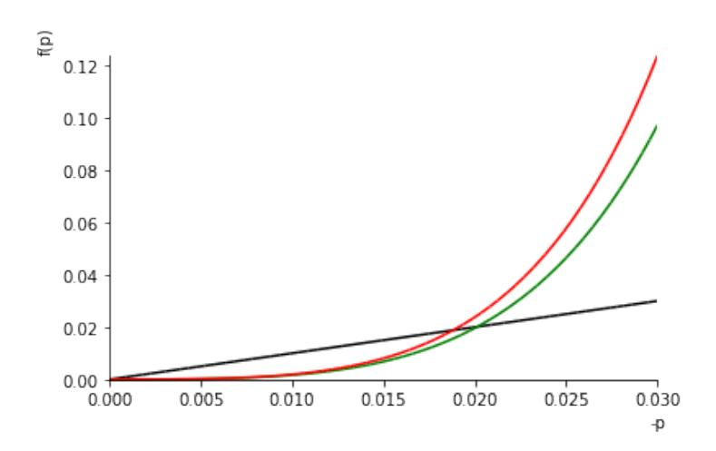
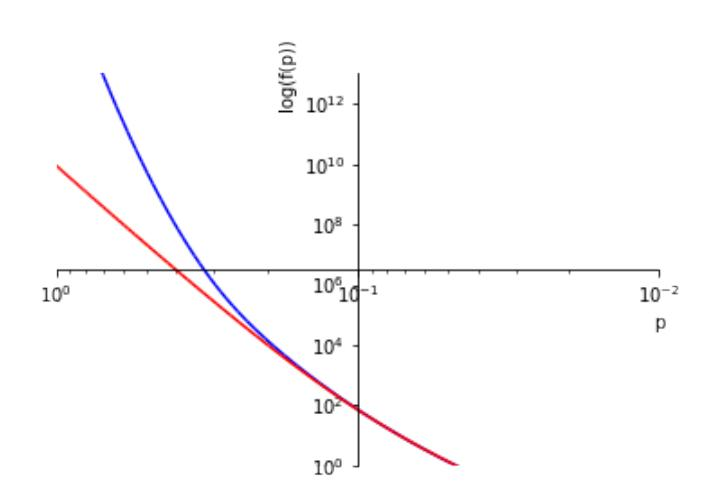
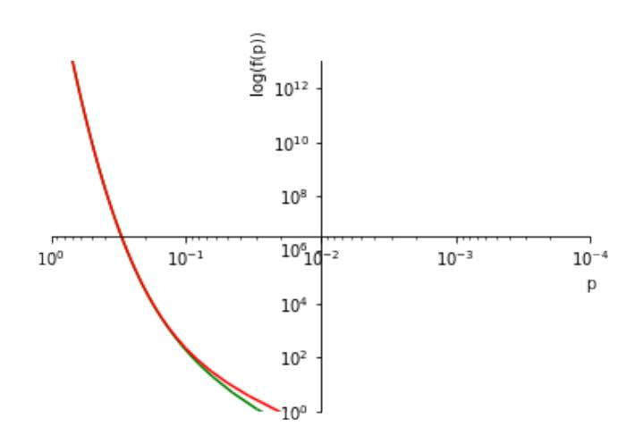
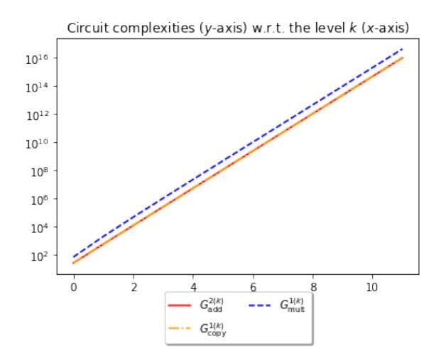
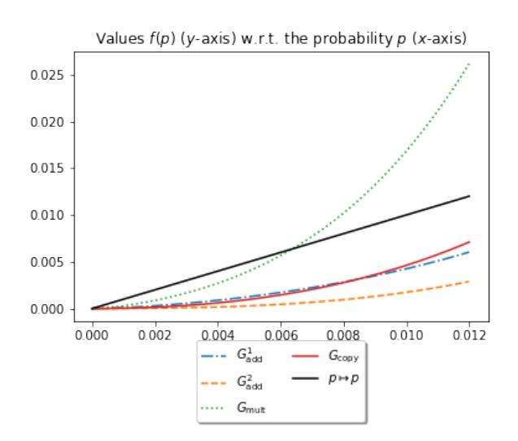
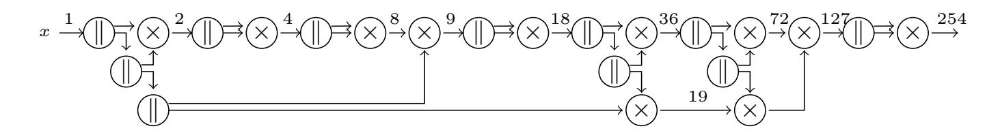
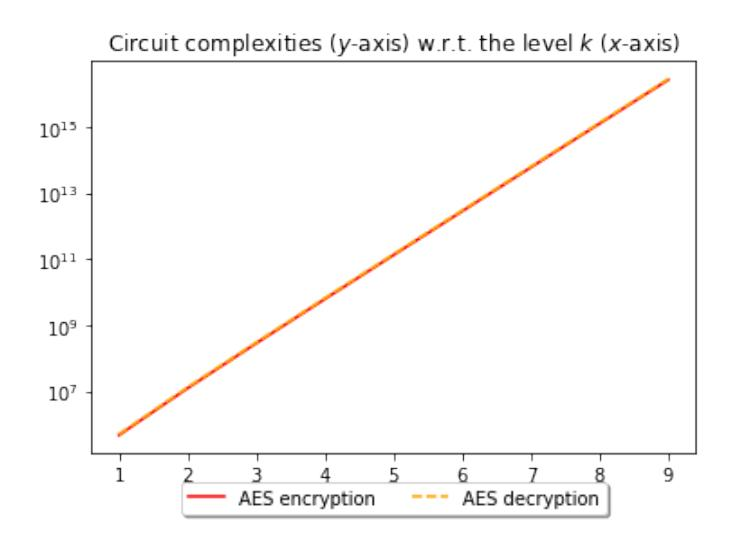
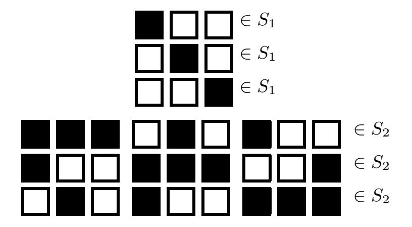

{0}------------------------------------------------

# Random Probing Security: Verification, Composition, Expansion and New Constructions

Sonia Bela¨ıd<sup>1</sup> , Jean-S´ebastien Coron<sup>2</sup> , Emmanuel Prouff3,<sup>4</sup> , Matthieu Rivain<sup>1</sup> , and Abdul Rahman Taleb<sup>1</sup>

> <sup>1</sup> CryptoExperts, France <sup>2</sup> University of Luxembourg <sup>3</sup> ANSSI, France

{sonia.belaid,matthieu.rivain,abdul.taleb}@cryptoexperts.com 5 jean-sebastien.coron@uni.lu 6 emmanuel.prouff@ssi.gouv.fr

Abstract. The masking countermeasure is among the most powerful countermeasures to counteract side-channel attacks. Leakage models have been exhibited to theoretically reason on the security of such masked implementations. So far, the most widely used leakage model is the probing model defined by Ishai, Sahai, and Wagner at (CRYPTO 2003). While it is advantageously convenient for security proofs, it does not capture an adversary exploiting full leakage traces as, e.g., in horizontal attacks. Those attacks target the multiple manipulations of the same share to reduce noise and recover the corresponding value. To capture a wider class of attacks another model was introduced and is referred to as the random probing model. From a leakage parameter p, each wire of the circuit leaks its value with probability p. While this model much better reflects the physical reality of side channels, it requires more complex security proofs and does not yet come with practical constructions.

In this paper, we define the first framework dedicated to the random probing model. We provide an automatic tool, called VRAPS, to quantify the random probing security of a circuit from its leakage probability. We also formalize a composition property for secure random probing gadgets and exhibit its relation to the strong non-interference (SNI) notion used in the context of probing security. We then revisit the expansion idea proposed by Ananth, Ishai, and Sahai (CRYPTO 2018) and introduce a compiler that builds a random probing secure circuit from small base gadgets achieving a random probing expandability property. We instantiate this compiler with small gadgets for which we verify the expected properties directly from our automatic tool. Our construction can tolerate a leakage probability up to 2<sup>−</sup><sup>8</sup> , against 2<sup>−</sup><sup>25</sup> for the previous construction, with a better asymptotic complexity.

Keywords: Compiler, Masking, Automated verification, Random probing model

## 1 Introduction

Most cryptographic algorithms are assumed to be secure against black-box attacks where the adversary is limited to the knowledge of some inputs and outputs to recover the manipulated secrets. However, as revealed in the late nineties [21], when implemented on physical devices, they become vulnerable to the more powerful side-channel attacks which additionally exploit the physical emanations such as temperature, time, power consumption, electromagnetic radiations.

As such attacks may only require cheap equipment and can be easily mounted in a short time interval, the community had to adapt quickly by looking for efficient countermeasures. The most widely deployed approach to counteract side-channel attacks was simultaneously introduced in 1999 by Chari et al. [12] and by Goubin and Patarin [18] and is now called masking. Basically, the idea is to split each sensitive variable x of the implementation into n shares such that n − 1 of them

<sup>4</sup> Sorbonne Universit´es, UPMC Univ Paris 06, POLSYS, UMR 7606, LIP6, F-75005, Paris, France

{1}------------------------------------------------

are generated uniformly at random and the last one is computed as the combination of x and all the previous shares according to some group law ∗. When ∗ is the (bitwise) addition, we talk about linear sharing (aka Boolean masking). The adversary thus needs to get information on all the shares of x to recover information on the sensitive value. This countermeasure is really simple to implement for linear operations which are simply applied on each share separately. However, things are getting trickier for non-linear operations where it is impossible to compute the result without combining shares.

To reason about the security of masked implementations, the community introduced leakage models. One of the most broadly used is the probing model, introduced by Ishai, Sahai, and Wagner [20]. In a nutshell, a circuit is claimed to be t-probing secure if the exact values of any set of t intermediate variables do not reveal any information on the secrets. As leakage traces are assumed to reveal noisy functions of the manipulated data, this model is motivated by the difficulty to recover information from the combination of t variables from their noisy functions in masking schemes (as t grows). Nevertheless, the probing model fails to capture the huge amount of information resulting from the leakage of all manipulated data, and in particular from the repeated manipulation of identical values (see horizontal attacks in [7]). Therefore, after a long sequence of works building and analyzing masking schemes with respect to their security in the probing model [25, 15, 9], the community is now looking for security in more practical models.

The noisy leakage model was originally considered by Chari et al. in [12] and was later formalized by Prouff and Rivain in [24] as a specialization of the only computation leaks model [23] in order to better capture the reality of the physical leakage. Informally, a circuit is secure in the noisy leakage model if the adversary cannot recover the secrets from a noisy function of each intermediate variable of the implementation. While realistic, this model is not convenient for security proofs, and therefore masking schemes continued to be verified in the probing model relying on the not tight reduction that was formally established by Duc, Dziembowski, and Faust [17].

The latter reduction actually came with an intermediate leakage model, called random probing model, to which the security in the noisy leakage model reduces to. In the random probing model, each intermediate variable leaks with some constant leakage probability p. A circuit is secure in this model if there is a negligible probability that these leaking wires actually reveal information on the secrets. It is worth noting that this notion advantageously captures the horizontal attacks which exploit the repeated manipulations of variables throughout the implementation. Classical probingsecure schemes are also secure in the random probing model but the tolerated leakage probability (a.k.a. leakage rate) might not be constant which is not satisfactory from a practical viewpoint. Indeed, in practice the side-channel noise might not be customizable by the implementer.

Only a few constructions [1, 3, 2] tolerate a constant leakage probability. These three constructions are conceptually involved and their practical instantiation is not straightforward. The first one from Ajtai et al. and its extension [3] are based on expander graphs. The tolerated probability is not made explicit. The third work [2] is based on multi-party computation protocols and an expansion strategy; the tolerated probability is around 2−<sup>26</sup> and for a circuit with |C| gates, the complexity is O(|C| · poly(κ)) for some parameter κ but the polynomial is not made explicit.

Following the long sequence of works relying on the probing security, formal tools have recently been built to supervise the development of masking implementations proven secure in the probing model. Namely, verification tools are now able to produce a security proof or identify potential attacks from the description of a masked implementation at up to some masking orders (i.e., < 5) [4, 14, 11]. In the same vein, compilers have been built to automatically generate masked 

{2}------------------------------------------------

implementations at any order given the high level description of a primitive [5, 11, 10]. Nevertheless, no equivalent framework has yet been proposed to verify the security of implementations in the random probing model.

Our contributions. In this paper, we aim to fill this huge gap by providing a framework to verify, compose, and build random probing secure circuits from simple gadgets. Our contributions are three-fold.

Automatic verification tool. As a first contribution, we define a verification method that we instantiate in a tool to automatically exhibit the random probing security parameters of any small circuit defined with addition and multiplication gates whose wires leak with some probability p. In a nutshell, a circuit is (p, f)-random probing secure if it leaks information on the secret with probability f(p), where f(p) is the failure probability function. From these notations, our tool named VRAPS (for Verifier of Random Probing Security), based on top of a set of rules that were previously defined to verify the probing security of implementations [4], takes as input the description of a circuit and outputs an upper bound on the failure probability function. While it is limited to small circuits by complexity, the state-of-the-art shows that verifying those circuits can be particularly useful in practice (see e.g. the maskVerif tool [4]), for instance to verify gadgets and then deduce global security through composition properties and/or low-order masked implementations. The source code of VRAPS is publicly available.<sup>7</sup>

Composition and expanding compiler. We introduce a composition security property to make gadgets composable in a global random probing secure circuit. We exhibit the relation between this new random probing composability (RPC) notion and the strong non-interference (SNI) notion which is widely used in the context of probing security [5]. Then, we revisit the modular approach of Ananth, Ishai, and Sahai [2] which uses an expansion strategy to get random probing security from a multi-party computation protocol. We introduce the expanding compiler that builds random probing secure circuits from small base gadgets. We formalize the notion of random probing expandability (RPE) and show that a base gadget satisfying this notion can be securely used in the expanding compiler to achieve arbitrary/composable random probing security. As a complementary contribution, our verification tool, VRAPS, is extended to verify the newly introduced RPC and RPE properties.

Instantiation. We instantiate the expanding compiler with new constructions of simple base gadgets that fulfill the desired RPE property, which is verified by VRAPS. For a security level κ, our instantiation achieves a complexity of O(κ 7.5 ) and tolerates a constant leakage probability p ≈ 0.0045 > 2 −8 . In comparison, and as a side contribution, we provide a precise analysis of the construction from [2] and show that it achieves an O(κ 8.2 ) complexity for a much lower tolerated leakage probability (p ≈ 2 <sup>−</sup>26). Finally, we note that our framework probably enables more efficient constructions based on different base gadgets; we leave such optimizations open for future works.

## 2 Preliminaries

Along the paper, K shall denote a finite field. For any n ∈ N, we shall denote [n] the integer set [n] = [1, n] ∩ Z. For any tuple x = (x1, . . . , xn) ∈ K<sup>n</sup> and any set I ⊆ [n], we shall denote

<sup>7</sup> See https://github.com/CryptoExperts/VRAPS

{3}------------------------------------------------

 $\mathbf{x}|_{I} = (x_i)_{i \in I}$ . Any two probability distributions  $D_1$  and  $D_2$  are said  $\varepsilon$ -close, denoted  $D_1 \approx_{\varepsilon} D_2$ , if their statistical distance is upper bounded by  $\varepsilon$ , that is

$$SD(D_1; D_2) := \frac{1}{2} \sum_{x} |p_{D_1}(x) - p_{D_2}(x)| \le \varepsilon$$
,

where  $p_{D_1}(\cdot)$  and  $p_{D_1}(\cdot)$  denote the probability mass functions of  $D_1$  and  $D_2$ .

### 2.1 Circuit Compilers

In this paper, an arithmetic circuit over a field  $\mathbb{K}$  is a labeled directed acyclic graph whose edges are wires and vertices are arithmetic gates processing operations over  $\mathbb{K}$ . We consider three types of arithmetic gate:

- an addition gate, of fan-in 2 and fan-out 1, computes an addition over  $\mathbb{K}$ ,
- a multiplication gate, of fan-in 2 and fan-out 1, computes a multiplication over  $\mathbb{K}$ ,
- a copy gate, of fan-in 1 and fan-out 2, outputs two copies of its input.

A randomized arithmetic circuit is equipped with an additional type of gate:

- a random gate, of fan-in 0 and fan-out 1, outputs a fresh uniform random value of  $\mathbb{K}$ .

A (randomized) arithmetic circuit is further formally composed of input gates of fan-in 0 and fanout 1 and output gates of fan-in 1 and fan-out 0. Evaluating an  $\ell$ -input m-output circuit C consists in writing an input  $x \in \mathbb{K}^{\ell}$  in the input gates, processing the gates from input gates to output gates, then reading the output  $y \in \mathbb{K}^m$  from the output gates. This is denoted by y = C(x). During the evaluation process, each wire in the circuit is assigned with a value on  $\mathbb{K}$ . We call the tuple of all these wire values a wire assignment of C (on input x).

**Definition 1 (Circuit Compiler).** A circuit compiler is a triplet of algorithms (CC, Enc, Dec) defined as follows:

- CC (circuit compilation) is a deterministic algorithm that takes as input an arithmetic circuit C and outputs a randomized arithmetic circuit  $\widehat{C}$ .
- Enc (input encoding) is a probabilistic algorithm that maps an input  $x \in \mathbb{K}^{\ell}$  to an encoded input  $\widehat{x} \in \mathbb{K}^{\ell'}$ .
- Dec (output decoding) is a deterministic algorithm that maps an encoded output  $\hat{y} \in \mathbb{K}^{m'}$  to a plain output  $y \in \mathbb{K}^m$ .

These three algorithms satisfy the following properties:

- Correctness: For every arithmetic circuit C of input length  $\ell$ , and for every  $\mathbf{x} \in \mathbb{K}^{\ell}$ , we have

$$\Pr\left(\mathsf{Dec}(\widehat{C}(\widehat{x})) = C(x) \mid \widehat{x} \leftarrow \mathsf{Enc}(x)\right) = 1, \text{ where } \widehat{C} = \mathsf{CC}(C).$$

- **Efficiency:** For some security parameter  $\lambda \in \mathbb{N}$ , the running time of CC(C) is  $poly(\lambda, |C|)$ , the running time of  $Enc(\boldsymbol{x})$  is  $poly(\lambda, |\boldsymbol{x}|)$  and the running time of  $Dec(\widehat{\boldsymbol{y}})$  is  $poly(\lambda, |\widehat{\boldsymbol{y}}|)$ , where  $poly(\lambda, q) = O(\lambda^{k_1} q^{k_2})$  for some constants  $k_1, k_2$ .

{4}------------------------------------------------

### 2.2 Linear Sharing and Gadgets

In the following, the *n*-linear decoding mapping, denoted LinDec, refers to the function  $\bigcup_n \mathbb{K}^n \to \mathbb{K}$  defined as

$$\mathsf{LinDec}: (x_1, \dots, x_n) \mapsto x_1 + \dots + x_n ,$$

for every  $n \in \mathbb{N}$  and  $(x_1, \ldots, x_n) \in \mathbb{K}^n$ . We shall further consider that, for every  $n, \ell \in \mathbb{N}$ , on input  $(\widehat{x}_1, \ldots, \widehat{x}_\ell) \in (\mathbb{K}^n)^\ell$  the *n*-linear decoding mapping acts as

$$\mathsf{LinDec}: (\widehat{x}_1, \dots, \widehat{x}_\ell) \mapsto (\mathsf{LinDec}(\widehat{x}_1), \dots, \mathsf{LinDec}(\widehat{x}_\ell))$$
.

Let us recall that for some tuple  $\widehat{x} = (x_1, \dots, x_n) \in \mathbb{K}^n$  and for some set  $I \subseteq [n]$ , the tuple  $(x_i)_{i \in I}$  is denoted  $\widehat{x}|_I$ .

**Definition 2 (Linear Sharing).** Let  $n, \ell \in \mathbb{N}$ . For any  $x \in \mathbb{K}$ , an n-linear sharing of x is a random vector  $\widehat{x} \in \mathbb{K}^n$  such that  $\mathsf{LinDec}(\widehat{x}) = x$ . It is said to be uniform if for any set  $I \subseteq [n]$  with |I| < n the tuple  $\widehat{x}|_I$  is uniformly distributed over  $\mathbb{K}^{|I|}$ . A n-linear encoding is a probabilistic algorithm  $\mathsf{LinEnc}$  which on input a tuple  $\mathbf{x} = (x_1, \dots, x_\ell) \in \mathbb{K}^\ell$  outputs a tuple  $\widehat{\mathbf{x}} = (\widehat{x}_1, \dots, \widehat{x}_\ell) \in (\mathbb{K}^n)^\ell$  such that  $\widehat{x}_i$  is a uniform n-sharing of  $x_i$  for every  $i \in [\ell]$ .

In the following, we shall call an  $(n\text{-}share, \ell\text{-}to\text{-}m)$  gadget, a randomized arithmetic circuit that maps an input  $\widehat{x} \in (\mathbb{K}^n)^\ell$  to an output  $\widehat{y} \in (\mathbb{K}^n)^m$  such that  $x = \mathsf{LinDec}(\widehat{x}) \in \mathbb{K}^\ell$  and  $y = \mathsf{LinDec}(\widehat{y}) \in \mathbb{K}^m$  satisfy y = g(x) for some function g. In this paper, we shall consider gadgets for three types of functions (corresponding to the three types of gates): the addition  $g: (x_1, x_2) \mapsto x_1 + x_2$ , the multiplication  $g: (x_1, x_2) \mapsto x_1 \cdot x_2$  and the copy  $g: x \mapsto (x, x)$ . We shall generally denote such gadgets  $G_{\text{add}}$ ,  $G_{\text{mult}}$  and  $G_{\text{copy}}$  respectively.

**Definition 3 (Standard Circuit Compiler).** Let  $\lambda \in \mathbb{N}$  be some security parameter and let  $n = \text{poly}(\lambda)$ . Let  $G_{add}$ ,  $G_{mult}$  and  $G_{copy}$  be n-share gadgets respectively for the addition, multiplication and copy over  $\mathbb{K}$ . The standard circuit compiler with sharing order n and base gadgets  $G_{add}$ ,  $G_{mult}$ ,  $G_{copy}$  is the circuit compiler (CC, Enc, Dec) satisfying the following:

- 1. The input encoding Enc is an n-linear encoding.
- 2. The output decoding Dec is the n-linear decoding mapping LinDec.
- 3. The circuit compilation CC consists in replacing each gate in the original circuit by an n-share gadget with corresponding functionality (either  $G_{add}$ ,  $G_{mult}$  or  $G_{copy}$ ), and each wire by a set of n wires carrying a n-linear sharing of the original wire. If the input circuit is a randomized arithmetic circuit, each of its random gates is replaced by n random gates, which duly produce a n-linear sharing of a random value.

For such a circuit compiler, the correctness and efficiency directly holds from the correctness and efficiency of the gadgets  $G_{add}$ ,  $G_{mult}$  and  $G_{copy}$ .

## 2.3 Random Probing Leakage

Let  $p \in [0,1]$  be some constant leakage probability parameter. This parameter is sometimes called leakage rate in the literature. Informally, the p-random probing model states that during the evaluation of a circuit C each wire leaks its value with probability p (and leaks nothing otherwise), where all the wire leakage events are mutually independent.

In order to formally define the random-probing leakage of a circuit, we shall consider two probabilistic algorithms:

{5}------------------------------------------------

– The leaking-wires sampler takes as input a randomized arithmetic circuit C and a probability p ∈ [0, 1], and outputs a set W, denoted as

$$\mathcal{W} \leftarrow \mathsf{LeakingWires}(C, p)$$
,

where W is constructed by including each wire label from the circuit C with probability p to W (where all the probabilities are mutually independent).

– The assign-wires sampler takes as input a randomized arithmetic circuit C, a set of wire labels W (subset of the wire labels of C), and an input x, and it outputs a |W|-tuple w ∈ (K∪{⊥}) |W| , denoted as

$$\boldsymbol{w} \leftarrow \mathsf{AssignWires}(C, \mathcal{W}, \boldsymbol{x})$$
,

where w corresponds to the assignments of the wires of C with label in W for an evaluation on input x.

We can now formally define the random probing leakage of a circuit.

Definition 4 (Random Probing Leakage). The p-random probing leakage of a randomized arithmetic circuit C on input x is the distribution Lp(C, x) obtained by composing the leaking-wires and assign-wires samplers as

$$\mathcal{L}_p(C, \boldsymbol{x}) \stackrel{id}{=} \mathsf{AssignWires}(C, \mathsf{LeakingWires}(C, p), \boldsymbol{x})$$
 .

Remark 1. By convention the output wires of C (i.e. the wires incoming output gates) are excluded by the LeakingWires sampler whereas the input wires of C (i.e. the wires connecting input gates to subsequent gates) are included. Namely the output set W of LeakingWires(C, p) does not include any output wire label of C. This is because when composing several circuits (or gadgets), the output wires of a circuit are the input wires in a next circuit. This also relates to the widely admitted only computation leaks assumption [23]: the processing of a gate leaks information on its input values (and information on the output can be captured through information on the input).

Definition 5 (Random Probing Security). A randomized arithmetic circuit C with ` · n ∈ N input gates is (p, ε)-random probing secure with respect to encoding Enc if there exists a simulator Sim such that for every x ∈ K` :

$$\operatorname{Sim}(C) \approx_{\varepsilon} \mathcal{L}_p(C, \operatorname{Enc}(\boldsymbol{x})) \ .$$
 (1)

A circuit compiler (CC, Enc, Dec) is (p, ε)-random probing secure if for every (randomized) arithmetic circuit <sup>C</sup> the compiled circuit <sup>C</sup><sup>b</sup> <sup>=</sup> CC(C) is (p, <sup>|</sup>C| · <sup>ε</sup>)-random probing secure where <sup>|</sup>C<sup>|</sup> is the size of original circuit.

As in [2] we shall consider a simulation with abort. In this approach, the simulator first calls the leaking-wires sampler to get a set W and then either aborts (or fails) with probability ε or outputs the exact distribution of the wire assignment corresponding to W. Formally, for any leakage probability p ∈ [0, 1], the simulator Sim is defined as

$$\mathsf{Sim}(\widehat{C}) = \mathsf{SimAW}(\widehat{C}, \mathsf{LeakingWires}(\widehat{C}, p)) \tag{2}$$

{6}------------------------------------------------

where SimAW, the wire assignment simulator, either returns  $\perp$  (simulation failure) or a perfect simulation of the requested wires. Formally, the experiment

$$\mathcal{W} \leftarrow \mathsf{LeakingWires}(\widehat{C}, p)$$

$$out \leftarrow \mathsf{SimAW}(\widehat{C}, \mathcal{W})$$

leads to

$$\Pr[out = \bot] = \varepsilon \quad \text{and} \quad (out \mid out \ne \bot) \stackrel{\text{id}}{=} (AssignWires(\widehat{C}, \mathcal{W}, Enc(x)) \mid out \ne \bot) .$$
 (3)

It is not hard to see that if we can construct such a simulator SimAW for a compiled circuit  $\widehat{C}$ , then this circuit is  $(p, \varepsilon)$ -random probing secure.

## 3 Formal Verification

In this section we show how to compute the simulation failure probability f(p) as a function of the leakage probability p for the base gadgets. Since even for simple gadgets this tasks would be difficult to perform by hand, we use a formal verification tool to compute f(p).

## 3.1 Simulation Failure probability

We first derive an upper bound on the simulation failure probability as a function of the leakage probability p. We consider a compiled circuit  $\widehat{C}$  composed of s wires labeled from 1 to s and a simulator SimAW as defined in previous section. For any sub-set  $\mathcal{W} \subseteq [s]$  we denote by  $\delta_{\mathcal{W}}$  the value defined as follows:

$$\delta_{\mathcal{W}} = \begin{cases} 1 & \text{if } \mathsf{SimAW}(\widehat{C}, \mathcal{W}) = \bot, \\ 0 & \text{otherwise.} \end{cases}$$

The simulation failure probability  $\varepsilon$  in (3) can then be explicitly expressed as a function of p. Namely, we have  $\varepsilon = f(p)$  with f defined for every  $p \in [0, 1]$  by:

$$f(p) = \sum_{\mathcal{W} \subseteq [s]} \delta_{\mathcal{W}} \cdot p^{|\mathcal{W}|} \cdot (1-p)^{s-|\mathcal{W}|} . \tag{4}$$

Letting  $c_i$  be the number of sub-sets  $\mathcal{W} \subseteq [s]$  of cardinality i for which  $\delta_{\mathcal{W}} = 1$ , namely for which the simulation fails, we have  $c_i = \sum_{|\mathcal{W}|=i} \delta_{\mathcal{W}}$  and hence (4) simplifies to

$$f(p) = \sum_{i=1}^{s} c_i \cdot p^i \cdot (1-p)^{s-i} .$$
 (5)

For any circuit  $\widehat{C}$  achieving t-probing security, the values  $\delta_{\mathcal{W}}$  with  $|\mathcal{W}| \leq t$  are equal to zero, and therefore the corresponding  $c_i$ 's are zero, which implies the following simplification:

$$f(p) = \sum_{i=t+1}^{s} c_i \cdot p^i \cdot (1-p)^{s-i}$$
.

{7}------------------------------------------------

Moreover, by definition, the coefficients c<sup>i</sup> satisfy:

$$c_i \leqslant \binom{s}{i} \tag{6}$$

which leads to the following upper-bound for f(p):

$$f(p) \leqslant \sum_{i=t+1}^{s} {s \choose i} \cdot p^i \cdot (1-p)^{s-i}$$
.

Example: evaluating f(p) for the 2-share ISW multiplication gadget (ISW-2). This gadget takes at input the 2-sharings (x0, x1) and (y0, y1) of x and y respectively, and outputs the 2-sharing

$$(z_0, z_1) = (x_0 \cdot y_0 + r_0, x_1 \cdot y_1 + r_0 + x_0 \cdot y_1 + x_1 \cdot y_0)$$

where r<sup>0</sup> is a random value. The processing is composed of the following intermediate results, where each variable is assigned a wire:

$$c_0 = x_0 * y_0$$
  $z_0 = c_0 + r_0$   $c_1 = x_1 * y_1$   $c_2 = c_1 + r_0$   
 $c_3 = x_0 * y_1$   $c_4 = c_2 + c_3$   $c_5 = x_1 * y_0$   $z_1 = c_4 + c_5$ 

When the same variable is involved as input of several operations, a copy gadget (with 1 input wire and 2 output wires) is applied to duplicate it. Consequently, each new use of the same variable as input of an operation adds 2 wires to the final count of overall wires. It may be checked that the circuit corresponding to ISW-2 is composed of 21 wires, excluding the 2 output wires. Since it is 1-SNI but not 2-SNI, every set with a single wire can be simulated, which is not the case for all pairs of wires. Actually, 51 among the latter pairs cannot be simulated. If we continue the test for the sets of cardinality from 3 to 21, we get the following list of coefficients c<sup>i</sup> , 1 ≤ i ≤ 21, computed with the verification tool described in the next section: 0, 51, 754, 4827, 18875, 52994, 115520, 203176, 293844, 352702, 352715, 293930, 203490, 116280, 54264, 20349, 5985, 1330, 210, 21, 1. Directly injecting these coefficients in (5) gives the expression of f(p) for ISW-2.

## 3.2 Verification method

For any compiled circuit <sup>C</sup><sup>b</sup> and any simulator defined as in Section 2.3, the computation of the function f(p) for any probability p essentially amounts to computing the values of the coefficients ci 's appearing in (5). If no assumption is made on the circuit, this task seems difficult to carry out by hand. Actually, it may be checked that an exhaustive testing of all the possible tuples of wires for a gadget with s wires has complexity lower bounded by 2<sup>s</sup> , which gives 2<sup>21</sup> for a simple gadget like the ISW multiplication gadget with two shares per input. Here, we introduce a verification tool, that we call VRAPS, enabling to automatically test the perfect simulation for any set of wires of size lower than or equal to some threshold β. The role of the latter threshold is simply to control the verification duration (which can be long if the circuit to test is complex). Our tool implicitly defines a simulator that may fail with a probability ε = f(p) satisfying (5).

{8}------------------------------------------------

The verification tool takes as input the representation of a compiled circuit  $\widehat{C}$  and a test parameter  $\beta$ , and outputs the list of coefficients  $c_1, ..., c_{\beta}$ . It is assumed that  $\widehat{C}$  takes as input the n-linear encoding  $\text{Enc}(\boldsymbol{x})$  of vector  $\boldsymbol{x}=(x_1,\ldots,x_{\ell})$  defined in  $\mathbb{K}^{\ell}$ . It is moreover assumed that  $\widehat{C}$  is composed of s wires respectively denoted by  $w_1, ..., w_s$ . In the following, we consider s-tuples in the form of  $u=(u_1,\ldots,u_s)\in\{0,1\}^s$  together with the common rule  $u'\subset u$  iff for every  $i\in[s],$   $u'_i=1\Rightarrow u_i=1$  (in this case u' will be said to be included in u). An s-tuple u for which there exists an assignment of the wires in  $\mathcal{W}=\{w_i; i\in[s], u_i=1\}$  such that the simulation fails shall be called a failure tuple. Such a tuple shall be said to be incompressible if no tuple  $t'\subset t$  is a failure tuple. The main idea of the proposed verification tool is to test the simulation failure only on incompressible failure tuples whose Hamming weight ranges from 1 to  $\beta$ . The steps are described in Algorithm 1.

### Algorithm 1 Verification tool

```
Input: a compiled circuit \widehat{C} with s wires and a threshold \beta \leqslant s
       Output: a list of \beta coefficients c_1, ..., c_{\beta}
                                                                                                                            ▶ will be used to store a list of failure tuples
 1: \ell_p \leftarrow \lfloor \rfloor
 2: \mathbf{c} \leftarrow (0, \dots, 0)
                                                                                                                          ▶ will be used to store the output coefficients
 3: for h = 1 to \beta do
            \ell_h \leftarrow \mathsf{listTuples}(s,h)
                                                                                                                                      \triangleright list of s-tuples of Hamming weight h
 4:
            (\ell_h^p, \ell_h^{f_1}) \leftarrow \mathsf{eliminateFromSmaller}(\ell_h, \ell_p)
                                                                                                         ⊳ select tuples including an incompressible failure tuple
 5:
           \begin{split} &\ell_h^{f_2} \leftarrow \mathsf{failureTest}(\widehat{C}, \ell_h^p) \\ &\ell_p \leftarrow \ell_p \cup \ell_h^{f_2} \\ &\boldsymbol{c} \leftarrow \mathsf{updateCoeffs}(\boldsymbol{c}, \ell_h^{f_1} \cup \ell_h^{f_2}) \end{split}
 6:
                                                                                                                                                      \triangleright identify failure tuples in \ell_h^p
 7:
                                                                                                                            ▶ update list of incompressible failure tuples
 8:
                                                                                                                                                                     ▶ update coefficients
 9: end for
10: return c
```

The function listTuples outputs the list of all s-tuples with Hamming weight h with  $h \in [s]$ . The function eliminateFromSmaller takes as input the list  $\ell_h$  of current tuples of Hamming weight h and the list of incompressible failure tuples  $\ell_p$ . It returns two lists:

- $-\ell_h^{f_1}$ : the elements of  $\ell_h$  which are not incompressible (*i.e.* which include at least one element from  $\ell_p$ )
- $-\ell_h^p$ : the elements of  $\ell_h$  which are incompressible (i.e.  $\ell_h \setminus \ell_h^{f_1}$ )

The function failure Test takes as input the second list  $\ell_h^p$  and checks if a perfect simulation can be achieved for each wire family  $\mathcal{W}$  corresponding to a tuple in  $\ell_h^p$ . Basically, for each wire family, a sequence of rules taken from maskVerif [4] is tested to determine whether  $\mathcal{W}$  can be perfectly simulated. It outputs  $\ell_h^{f_2}$ , the list of incompressible failure s-tuples of Hamming weight h. In a nutshell, each wire  $w_i$  in  $\mathcal{W}$  is considered together with the algebraic expression  $\varphi_i(\cdot)$  describing its assignment by  $\widehat{C}$  as a function of the circuit inputs and the random values returned by the random gates, then the three following rules are successively and repeatedly applied on all the wires families  $\mathcal{W}$  (see [4] for further details):

- **rule 1:** check whether all the expressions  $\varphi_i(\cdot)$  corresponding to wires  $w_i$  in  $\mathcal{W}$  contain all the shares of at least one of the coordinates of  $\boldsymbol{x}$ ;
- rule 2: for every  $\varphi_i(\cdot)$ , check whether a random r (i.e. an output of a random gate) additively masks a sub-expression e (which does not involve r) and appears nowhere else in the other  $\varphi_i(\cdot)$

{9}------------------------------------------------

with  $j \neq i$ ; in this case replace the sum of the so-called sub-expression and r by r, namely  $e + r \leftarrow r$ ;

rule 3: apply mathematical simplifications on the tuple.

Function updateCoeffs takes as input the current array of  $\beta$  coefficients  $c_i$  for  $1 \leq i \leq \beta$  and the concatenation of both lists of potential failure tuples  $\ell_h^{f_1}$  and  $\ell_h^{f_2}$ . For each failure tuple, these coefficients are updated.

Link with the tool maskVerif. This tool was introduced in [4] to automatically and formally verify higher-order masking implementations, and has further been improved to verify the t-NI and t-SNI security properties. Essentially, this tool verifies each property by analyzing the dependency of sets of fixed number of wires (say t) with a specific number of input shares. In our case, the size of the wires' sets which must be tested (to decide whether the corresponding coefficient  $c_i$  must be incremented or not) is a priori not bounded, or (for efficiency reasons) is bounded by a threshold  $\beta$  that is not a security parameter but an efficiency one. Moreover, our testing must take intermediate failures into account. Although maskVerif does not directly allows to answer our specific needs, we could have exploited its rules directly in our tool with dedicated add-ons. However we wanted to provide an easy-to-understand global tool and we therefore re-implemented the common parts (essentially those enabling to decided whether a given set of wires can be simulated or not).

Optimization 1 (grouping the wires). In most of the compiled circuits that we usually considered, several wires are always assigned the same value. Grouping those wires altogether allows us to significantly reduce the number of wires to be considered by the verification tool. Let us denote by  $s^*$  the number of groups, by  $\alpha_i$  the size of the *i*-th group and by  $w_i$  a representative of the *i*-th group. Then, Algorithm 1 can be almost directly applied to the shortened list of  $s^*$  wires (instead of s). The single main difference is that the updateCoeffs procedure also takes into account the weights  $\alpha_i$  when updating the coefficients  $c_i$ . For instance, considering h = 3, and the tuple (1, 1, 1, 0, ..., 0) with respective weights  $\alpha_1 = 2$  (for  $w_1$ ),  $\alpha_2 = 1$  (for  $w_2$ ) and  $\alpha_3 = 3$  (for  $w_3$ ), the function would increase  $c_3$  with 6,  $c_4$  with 6,  $c_5$  with 4 and  $c_6$  with 1. The latter evaluation is performed using a recursive function which evaluates the number of partitions of an integer j into h parts with the constraints that each part should be at least one. When this optimization is applied, it may be observed that the updateCoeffs procedure also starts to update some coefficients  $c_i$  for  $i > \beta$ . These updated coefficients can be used as lower bounds of the final  $c_i$  values. They will be called  $c_i^{\text{inf}}$  in the rest of this paper.  $c_i^{\text{sup}}$  will be used to denote the maximal possible value for  $c_i$ , namely the binomial coefficient  $\binom{s}{i}$ .

Optimization 2 (using the 'longest failure tuple'). To build all the potential failure tuples, a strategy consists in exhaustively testing all the s-tuples with Hamming weight below the Hamming weight of the longest *incompressible attack tuple*. Once this set, let say  $\mathcal{U}_{inc}$ , has been built, the set of all potential failure tuples can be deduced by executing the following procedure:

```
- for one u_{\text{inc}} \in \mathcal{U}_{\text{inc}} define \mathcal{U}_{\text{failure}} = \{u \in \{0,1\}^s; u_{\text{inc}} \subset u\}.

- for every new u_{\text{inc}} \in \mathcal{U}_{\text{inc}}, update \mathcal{U}_{\text{failure}} = \mathcal{U}_{\text{failure}} \cup \{u \in \{0,1\}^s; u_{\text{inc}} \subset u\}
```

**Implementation.** An implementation of Algorithm 1 has been developed in Python. This tool, named VRAPS, has been open sourced at:

https://github.com/CryptoExperts/VRAPS

{10}------------------------------------------------

Small examples. In order to illustrate our automatic verification of gadgets in the random probing model, we give the list of coefficients and the subsequent failure functions obtained for three known gadgets from the literature, namely the 2-share and 3-share multiplication gadgets introduced by Ishai, Sahai, and Wagner in [20] and a 3-share multiplication gadget from [8] with an optimal number of random variables to achieve security in the 2-probing model. Descriptions for these three gadgets are given below together with an approximation of the corresponding failure function f produced by our tool. Operations are performed according to the standard priority rules. Sharings x and y denote the inputs, sharings z denote the outputs, and  $r_i$  are random variables. Copy gates are implicit when variables are used more than once. Hereafter  $\mathcal{O}(p^5)$  is to be interpreted as p tends to 0.

2-share ISW multiplication gadget (ISW-2):

$$\begin{cases} z_0 = x_0 \cdot y_0 + r_0 \\ z_1 = x_1 \cdot y_1 + r_0 + x_0 \cdot y_1 + x_1 \cdot y_0 \end{cases} \Rightarrow f(p) = 51p^2 + 754p^3 + 4827p^4 + \mathcal{O}(p^5)$$

3-share multiplication gadget from [8] (EC16-3):

$$\begin{cases} z_0 = x_0 \cdot y_0 + r_0 + x_0 \cdot y_2 + x_2 \cdot y_0 \\ z_1 = x_1 \cdot y_1 + r_1 + x_0 \cdot y_1 + x_1 \cdot y_0 \\ z_2 = x_2 \cdot y_2 + r_0 + r_1 + x_1 \cdot y_2 + x_2 \cdot y_1 \end{cases} \Rightarrow f(p) = 1116p^3 + 44909p^4 + \mathcal{O}(p^5)$$

3-share ISW multiplication gadget (ISW-3):

$$\begin{cases} z_0 = x_0 \cdot y_0 + r_0 + r_1 \\ z_1 = x_1 \cdot y_0 + (x_0 \cdot y_1 + r_0) + x_1 \cdot y_1 + r_2 \\ z_2 = x_2 \cdot y_0 + (x_0 \cdot y_2 + r_1) + \\ (x_2 \cdot y_1 + (x_1 \cdot y_2 + r_2)) + x_2 \cdot y_2 \end{cases} \Rightarrow f(p) = 1219p^3 + 55756p^4 + \mathcal{O}(p^5)$$

For our three examples, our verification tool (Algorithm 1) has been launched respectively with  $\beta = s = 21$  for ISW-2, with  $\beta = 9 < s = 57$  for ISW-3 and with  $\beta = 13 < s = 52$  for EC16-3. In the two later cases, the missing coefficients  $c_i$  with  $i > \beta$  have been either set to 0 or to  $\binom{s}{i}$ . This allowed us to define a lower bound  $f_{\inf}$  and an upper bound  $f_{\sup}$  for the functions f corresponding to ISW-3 and EC16-3. The behavior of these functions is plotted in Figures 1 to 3.

## 4 Composition

This section aims to provide composition properties for random-probing secure gadgets. In a nutshell, we aim to show how to build random probing secure larger circuits from specific random probing secure building blocks.

#### 4.1 Random Probing Composability

We introduce hereafter the random probing composability notion for a gadget. In the following definition, for an n-share,  $\ell$ -to-m gadget, we denote by  $\mathbf{I}$  a collection of sets  $\mathbf{I} = (I_1, \dots, I_\ell)$  with  $I_1 \subseteq [n], \dots, I_\ell \subseteq [n]$  where  $n \in \mathbb{N}$  refers to the number of shares. For some  $\widehat{\mathbf{x}} = (\widehat{x}_1, \dots, \widehat{x}_\ell) \in (\mathbb{K}^n)^\ell$ , we then denote  $\widehat{\mathbf{x}}|_{\mathbf{I}} = (\widehat{x}_1|_{I_1}, \dots, \widehat{x}_\ell|_{I_\ell})$  where  $\widehat{x}_i|_{I_i} \in \mathbb{K}^{|I_i|}$  is the tuple composed of the coordinates of the sharing  $\widehat{x}_i$  of indexes included in  $I_i$ .

{11}------------------------------------------------



Fig. 1: Values taken by  $f_{\inf}(p)$  for ISW-3 (red) and EC16-3 (green) compared to the function  $p \mapsto p$  (black).



 $\begin{array}{c|ccccccccccccccccccccccccccccccccccc$ 

Fig. 2: Values of  $\log(f_{\inf}(p))$  (red) and  $\log(f_{\sup}(p))$  (blue) for ISW-3.

Fig. 3: For values p ranging from 1 to 0, values of  $\log(f_{\inf}(p))$  for ISW-3 (red) and EC16-3 (green) together with the values of  $\log(f(p))$  for ISW-2 (blue).

**Definition 6 (Random Probing Composability).** Let  $n, \ell, m \in \mathbb{N}$ . An n-share gadget G:  $(\mathbb{K}^n)^\ell \to (\mathbb{K}^n)^m$  is  $(t, p, \varepsilon)$ -random probing composable (RPC) for some  $t \in \mathbb{N}$  and  $p, \varepsilon \in [0, 1]$  if there exists a deterministic algorithm  $\mathsf{Sim}_1^G$  and a probabilistic algorithm  $\mathsf{Sim}_2^G$  such that for every input  $\widehat{\boldsymbol{x}} \in (\mathbb{K}^n)^\ell$  and for every set collection  $J_1 \subseteq [n], \ldots, J_m \subseteq [n]$  of cardinals  $|J_1| \leq t, \ldots, |J_m| \leq t$ , the random experiment

$$\mathcal{W} \leftarrow \mathsf{LeakingWires}(G, p)$$

$$I \leftarrow \mathsf{Sim}_1^G(\mathcal{W}, J)$$

$$out \leftarrow \mathsf{Sim}_2^G(\widehat{\boldsymbol{x}}|_{I})$$

yields

$$\Pr\left((|I_1| > t) \lor \dots \lor (|I_{\ell}| > t)\right) \le \varepsilon \tag{7}$$

and

$$out \stackrel{id}{=} \left(\mathsf{AssignWires}(G, \mathcal{W}, \widehat{\boldsymbol{x}}) \;,\; \widehat{\boldsymbol{y}}|_{\boldsymbol{J}}\right)$$

where  $\mathbf{J} = (J_1, \ldots, J_m)$  and  $\widehat{\mathbf{y}} = G(\widehat{\mathbf{x}})$ . Let  $f : \mathbb{R} \to \mathbb{R}$ . The gadget G is (t, f)-RPC if it is (t, p, f(p))-RPC for every  $p \in [0, 1]$ .

In the above definition, the first-pass simulator  $\mathsf{Sim}_1^G$  determines the necessary input shares (through the returned collection of sets I) for the second-pass simulator  $\mathsf{Sim}_2^G$  to produce a perfect simulation of the leaking wires defined by the set  $\mathcal W$  together with the output shares defined by the

{12}------------------------------------------------

collection of sets J. Note that there always exists such a collection of sets I since  $I = ([n], \ldots, [n])$  trivially allows a perfect simulation whatever W and J. However, the goal of  $\mathsf{Sim}_1^G$  is to return a collection of sets I with cardinals at most t. The idea behind this constraint is to keep the following composition invariant: for each gadget we can achieve a perfect simulation of the leaking wires plus t shares of each output sharing from t shares of each input sharing. We shall call failure event the event that at least one of the sets  $I_1, \ldots, I_\ell$  output of  $\mathsf{Sim}_1^G$  has cardinality greater than t. When  $(t, p, \varepsilon)$ -RPC is achieved, the failure event probability is upper bounded by  $\varepsilon$  according to (7). A failure event occurs whenever  $\mathsf{Sim}_2^G$  requires more than t shares of one input sharing to be able to produce a perfect simulation of the leaking wires (i.e. the wires with label in W) together with the output shares in  $\widehat{y}|_J$ . Whenever such a failure occurs, the composition invariant is broken. In the absence of failure event, the RPC notion implies that a perfect simulation can be achieved for the full circuit composed of RPC gadgets. This is formally stated in the next theorem.

### 4.2 Composition Security

**Theorem 1 (Composition).** Let  $t \in \mathbb{N}$ ,  $p, \varepsilon \in [0,1]$ , and CC be a standard circuit compiler with  $(t, p, \varepsilon)$ -RPC base gadgets. For every (randomized) arithmetic circuit C composed of |C| gadgets, the compiled circuit  $\mathsf{CC}(C)$  is  $(p, |C| \cdot \varepsilon)$ -random probing secure. Equivalently, the standard circuit compiler  $\mathsf{CC}$  is  $(p, \varepsilon)$ -random probing secure.

*Proof.* Let  $\mathcal{W}$  denote the leaking wires of the randomized circuit  $\mathsf{CC}(C)$  with probability p for each wire. We now build a simulator  $\mathsf{Sim}$  taking as inputs  $\mathsf{CC}(C)$  and  $\mathcal{W}$  and that perfectly simulates  $\mathcal{W}$  with probability at least  $(1 - |C| \cdot \varepsilon)$  from the simulators of the  $(t, p, \varepsilon)$ -RPC base gadgets.

We start with splitting set  $\mathcal{W}$  into |C| distinct subsets  $\mathcal{W}_i$  for  $i \in \{1, \ldots, |C|\}$  such that each  $\mathcal{W}_i$  stands for the output of LeakingWires when applied to the i'th gadget  $G_i$  of CC(C) with probability p. Then, we start from end gadgets whose outputs coincide with the circuit's outputs. We execute their  $\mathsf{Sim}_1^{G_i}$  with  $\mathcal{W}_i$  and  $J = \emptyset$ , to get the sets I of required inputs. Then, we target their parents, that are gadgets whose outputs are inputs of end gadgets. For each such gadget  $G_i$ , we execute  $\mathsf{Sim}_1^{G_i}$  with  $\mathcal{W}_i$  and J as defined by children sets I, to get the new sets I of required inputs. The simulation goes through the circuit from bottom to top by applying the  $\mathsf{Sim}_1^G$  simulators to get the  $\mathcal{W}_i$  and I/J sets. The simulation fails if at least one set I is of cardinal greater than t. For |C| gadgets, this happens with probability  $1 - (1 - \varepsilon)^{|C|} \leq |C| \cdot \varepsilon$ . Otherwise, the simulation runs the  $\mathsf{Sim}_2^G$  simulators from top to bottom by randomly picking the initial  $(x_i)_I$ , which completes the construction of our global simulator  $\mathsf{Sim}$ .

#### 4.3 Relation with Standard Probing Composition Notions

We first reformulate the Strong Non-Interference notion introduced in [5] with the formalism used for our definition of the Random Probing Composability.

**Definition 7 (Strong Non-Interference (SNI)).** Let n,  $\ell$  and t be positive integers. An n-share gadget  $G: (\mathbb{K}^n)^{\ell} \to \mathbb{K}^n$  is t-SNI if there exists a deterministic algorithm  $\mathsf{Sim}_1^G$  and a probabilistic algorithm  $\mathsf{Sim}_2^G$  such that for every set  $J \subseteq [n]$  and subset  $\mathcal{W}$  of wire labels from G satisfying  $|\mathcal{W}| + |J| \leqslant t$ , the following random experiment with any  $\widehat{x} \in (\mathbb{K}^n)^{\ell}$ 

$$I \leftarrow \mathsf{Sim}_1^G(\mathcal{W}, J)$$

$$out \leftarrow \mathsf{Sim}_2^G(\widehat{x}|_{I})$$

{13}------------------------------------------------

yields

$$|I_1| \leqslant |\mathcal{W}|, \dots, |I_{\ell}| \leqslant |\mathcal{W}| \tag{8}$$

and

$$out \stackrel{id}{=} (AssignWires(G, \mathcal{W}, \widehat{\boldsymbol{x}}), \widehat{\boldsymbol{y}}|_{J})$$
(9)

where  $\mathbf{I} = (I_1, \dots, I_{\ell})$  and  $\widehat{\mathbf{y}} = G(\widehat{\mathbf{x}})$ .

Then, we demonstrate that gadgets satisfying the t-SNI notion are also random probing composable for specific values that we explicit in the following proposition, whose proof is available in Appendix A.

**Proposition 1.** Let n,  $\ell$  and t be positive integers and let G be a gadget from  $(\mathbb{K}^n)^{\ell}$  to  $\mathbb{K}^n$ . If G is t-SNI, then it is also  $(t/2, p, \varepsilon)$ -RPC for any probability p and  $\varepsilon$  satisfying:

$$\varepsilon = \sum_{i=\lfloor \frac{t}{2}+1 \rfloor}^{s} {s \choose i} p^{i} (1-p)^{s-i} , \qquad (10)$$

where s is the number of wires in G.

## 4.4 Verification of Gadget Composability

Our random probing verification tool (Algorithm 1) can be easily extended to define a simulator for the  $(t, p, \varepsilon)$ -random probing composability of a gadget for some t and some p. This essentially amounts to extend Algorithm 1 inputs with a multi-set  $\mathcal{O}$  and to modify the failureTest procedure in order to test the simulation for each tuple in the input list  $\ell_n^p$  augmented with the outputs coordinates with indices in  $\mathcal{O}$ . Then, our extended algorithm is called for every set  $\mathcal{O}$  composed of at most t indices in each of the sets  $J_1, \ldots, J_m$ . The output for the call with input set  $\mathcal{O}$  is denoted by  $\mathbf{c}_{\mathcal{O}} = (c_1^{\mathcal{O}}, \ldots, c_{\beta}^{\mathcal{O}})$ . For our simulator construction, the probability  $\varepsilon$  satisfies

$$\varepsilon = \sum_{i=1}^{s} c_i \cdot p^i \cdot (1-p)^{s-i},$$

where s denotes the number of wires in the tested gadget. Moreover, the  $c_i$ 's satisfy  $c_i = \max_{\mathcal{O}} c_i^{\mathcal{O}}$ .

Example. As an illustration of the proposition, let us consider the well deployed 3-share ISW multiplication gadget  $G_{\text{ISW-3}}: (\mathbb{K}^3)^2 \to (\mathbb{K}^3)$  displayed in Section 3 and satisfying 2-SNI from [5]. Considering implicit copy gadgets that are mandatory in the circuit definition when a variable is reused, the corresponding circuit contains s = 57 wires. From Proposition 1, this gadget is also  $(1, p, \varepsilon_{\text{ISW}})$ -RPC for any probability p and  $\varepsilon_{\text{ISW}}$  such that

$$\varepsilon_{\text{ISW}} = \sum_{i=2}^{57} {s \choose i} p^i (1-p)^{57-i}.$$

Figure 4 displays for  $p \in [0, 1]$  the values taken by  $\varepsilon_{\text{ISW}}$  (in red). It also displays (in green) the values  $\varepsilon'_{\text{ISW}}$  obtained by calling our verification tool on the same gadget  $G_{\text{ISW-3}}$  with  $\beta = 5$  (see Algorithm 1) and by replacing the missing coefficients  $c_i$  with  $i > \beta$  by their upper bound  $\binom{s}{i}$  (see (6)). It may be checked for small values of p the failure probability  $\varepsilon'_{\text{ISW}}$  is smaller than  $\varepsilon_{\text{ISW}}$  which directly implies that the simulation induced by our verification tool is tighter than that deduced from Proposition 1.

{14}------------------------------------------------



Fig. 4: Values taken by  $\varepsilon_{\text{ISW}}$  and  $\varepsilon'_{\text{ISW}}$  as a function of  $p \in [0, 1]$ .

## 5 Expansion

Constructing random-probing-secure circuit compilers with a gadget expansion strategy has been proposed by Ananth, Ishai and Sahai in [2]. Such strategy was previously used in the field of multiparty computation (MPC) with different but close security goals [13, 19]. Note that such approach is called *composition* in [2] since it roughly consists in composing a base circuit compiler several times. We prefer the terminology of *expansion* here to avoid any confusion with the notion of composition for gadgets as considered in Section 4 and usual in the literature – see for instance [5, 9, 11].

We recall hereafter the general principle of the gadget expansion strategy and provide an asymptotic analysis of the so-called expanding circuit compiler. Then we propose an implementation of this strategy which relies on the new notion of gadget expandability. In contrast, the construction of [2] relies on a t-out-n secure MPC protocol in the passive security model. The advantage of our notion is that it can be achieved and/or verified by simple atomic gadgets leading to simple and efficient constructions. After introducing the gadget expandability notion, we show that it allows to achieve random-probing security with the expansion strategy. We finally explain how to adapt the verification tool described in Section 3 to this expandability notion.

### 5.1 Expansion Strategy

The basic principle of the gadget expansion strategy is as follows. Assume we have three n-share gadgets  $G_{\rm add}$ ,  $G_{\rm mult}$ ,  $G_{\rm copy}$  and denote CC the standard circuit compiler for these base gadgets. We can derive three new  $n^2$ -share gadgets by simply applying CC to each gadget:  $G_{\rm add}^{(2)} = {\rm CC}(G_{\rm add})$ ,  $G_{\rm mult}^{(2)} = {\rm CC}(G_{\rm mult})$  and  $G_{\rm copy}^{(2)} = {\rm CC}(G_{\rm copy})$ . Let us recall that this process simply consists in replacing each addition gate in the original gadget by  $G_{\rm add}$ , each multiplication gate by  $G_{\rm mult}$  and each copy gate by  $G_{\rm copy}$ , and by replacing each wire by n wires carrying a sharing of the original wire. Doing so, we obtain  $n^2$ -share gadgets for the addition, multiplication and copy on  $\mathbb{K}$ . This process can be iterated an arbitrary number of times, say k, to an input circuit C:

$$C \xrightarrow{\mathsf{CC}} \widehat{C}_1 \xrightarrow{\mathsf{CC}} \cdots \xrightarrow{\mathsf{CC}} \widehat{C}_k$$
.

The first output circuit  $\widehat{C}_1$  is the original circuit in which each gate is replaced by a base gadget  $G_{\mathrm{add}}$ ,  $G_{\mathrm{mult}}$  or  $G_{\mathrm{copy}}$ . The second output circuit  $\widehat{C}_2$  is the original circuit C in which each gate is replaced by an  $n^2$ -share gadget  $G_{\mathrm{add}}^{(2)}$ ,  $G_{\mathrm{mult}}^{(2)}$  or  $G_{\mathrm{copy}}^{(2)}$  as defined above. Equivalently,  $\widehat{C}_2$  is the circuit  $\widehat{C}_1$  in which each gate is replaced by a base gadget. In the end, the output circuit  $\widehat{C}_k$  is hence

{15}------------------------------------------------

the original circuit C in which each gate has been replaced by a k-expanded gadget and each wire as been replaced by  $n^k$  wires carrying an  $(n^k)$ -linear sharing of the original wire. The underlying compiler is called *expanding circuit compiler* which is formally defined hereafter.

**Definition 8 (Expanding Circuit Compiler).** Let CC be the standard circuit compiler with sharing order n and base gadgets  $G_{add}$ ,  $G_{mult}$ ,  $G_{copy}$ . The expanding circuit compiler with expansion level k and base compiler CC is the circuit compiler ( $CC^{(k)}$ ,  $Enc^{(k)}$ ,  $Dec^{(k)}$ ) satisfying the following:

- 1. The input encoding  $Enc^{(k)}$  is an  $(n^k)$ -linear encoding.
- 2. The output decoding Dec is the  $(n^k)$ -linear decoding mapping.
- 3. The circuit compilation is defined as

$$\mathsf{CC}^{(k)}(\cdot) = \underbrace{\mathsf{CC} \circ \mathsf{CC} \circ \cdots \circ \mathsf{CC}}_{k \ times}(\cdot)$$

The goal of the expansion strategy in the context of random probing security is to replace the leakage probability p of a wire in the original circuit by the failure event probability  $\varepsilon$  in the subsequent gadget simulation. If this simulation fails then one needs the full input sharing for the gadget simulation, which corresponds to leaking the corresponding wire value in the base case. The security is thus amplified by replacing the probability p in the base case by the probability  $\varepsilon$  (assuming that we have  $\varepsilon < p$ ). If the failure event probability  $\varepsilon$  can be upper bounded by some function of the leakage probability:  $\varepsilon < f(p)$  for every leakage probability  $p \in [0, p_{\text{max}}]$  for some  $p_{\text{max}} < 1$ , then the expanding circuit compiler with expansion level k shall result in a security amplification as

$$p = \varepsilon_0 \xrightarrow{f} \varepsilon_1 \xrightarrow{f} \cdots \xrightarrow{f} \varepsilon_k = f^{(k)}(p)$$
,

which for an adequate function f (e.g.  $f: p \mapsto p^2$ ) provides exponential security. In order to get such a security expansion, the gadgets must satisfy a stronger notion than the composability notion introduced in Section 4 which we call  $random\ probing\ expandability$ ; see Section 5.3 below.

#### 5.2 Asymptotic Analysis of the Expanding Compiler

In this section we show that the asymptotic complexity of a compiled circuit  $\widehat{C} = \mathsf{CC}^{(k)}(C)$  is  $|\widehat{C}| = \mathcal{O}(|C| \cdot \kappa^e)$  for security parameter  $\kappa$ , for some constant e that we make explicit.

Let us denote by  $\mathbf{N} = (N_a, N_c, N_m, N_r)^{\mathsf{T}}$  the column vector of gate counts for some base gadget G, where  $N_a, N_c, N_m, N_r$  stands for the number of addition gates, copy gates, multiplication gates and random gates respectively. We have three different such vectors

$$\mathbf{N}_{\text{add}} \doteq (N_{\text{add},a}, N_{\text{add},c}, N_{\text{add},m}, N_{\text{add},r})^{\mathsf{T}} \\
\mathbf{N}_{\text{mult}} \doteq (N_{\text{mult},a}, N_{\text{mult},c}, N_{\text{mult},m}, N_{\text{mult},r})^{\mathsf{T}} \\
\mathbf{N}_{\text{copy}} \doteq (N_{\text{copy},a}, N_{\text{copy},c}, N_{\text{copy},m}, N_{\text{copy},r})^{\mathsf{T}}$$

for the gate counts respectively in the base addition gadget  $G_{\text{add}}$ , in the base multiplication gadget  $G_{\text{mult}}$  and in the base copy gadgets  $G_{\text{copy}}$ . Let us define the  $4 \times 4$  square matrix M as

$$\boldsymbol{M} = (\boldsymbol{N}_{\mathrm{add}} \mid \boldsymbol{N}_{\mathrm{copy}} \mid \boldsymbol{N}_{\mathrm{mult}} \mid \boldsymbol{N}_{\mathrm{rand}}) \quad \text{with} \quad \boldsymbol{N}_{\mathrm{rand}} = (0, 0, 0, n)^{\mathsf{T}} ,$$

where the definition  $N_{\text{rand}}$  holds from the fact that the standard circuit compiler replaces each random gate by n random gates.

{16}------------------------------------------------

It can be checked that applying the standard circuit compiler with base gadgets  $G_{\text{add}}$ ,  $G_{\text{mult}}$  and  $G_{\text{copy}}$  to some circuit C with gate-count vector  $N_C$  gives a circuit  $\widehat{C}$  with gate-count vector  $N_{\widehat{C}} = M \cdot N_C$ . It follows that the kth power of the matrix M gives the gate counts for the level-k gadgets as:

$$\boldsymbol{M}^k = \underbrace{\boldsymbol{M} \cdot \boldsymbol{M} \cdot \boldsymbol{M}}_{k \text{ times}} = \big(\boldsymbol{N}_{\text{add}}^{(k)} \mid \boldsymbol{N}_{\text{copy}}^{(k)} \mid \boldsymbol{N}_{\text{mult}}^{(k)} \mid \boldsymbol{N}_{\text{rand}}^{(k)}\big) \quad \text{with} \quad \boldsymbol{N}_{\text{rand}}^{(k)} = \begin{pmatrix} 0 \\ 0 \\ 0 \\ n^k \end{pmatrix}$$

where  $N_{\text{add}}^{(k)}$ ,  $N_{\text{mult}}^{(k)}$  and  $N_{\text{copy}}^{(k)}$  are the gate-count vectors for the level-k gadgets  $G_{\text{add}}^{(k)}$ ,  $G_{\text{mult}}^{(k)}$  and  $G_{\text{copy}}^{(k)}$  respectively. Let us denote the eigen decomposition of M as  $M = Q \cdot \Lambda \cdot Q^{-1}$ , we get

$$\bm{M}^k = \bm{Q} \cdot \bm{\Lambda}^k \cdot \bm{Q}^{-1} \quad \text{with} \quad \bm{\Lambda}^k = \begin{pmatrix} \lambda_1^k & & & \ & \lambda_2^k & & \ & & \lambda_3^k & \ & & & \lambda_4^k \end{pmatrix}$$

where  $\lambda_1, \lambda_2, \lambda_3, \lambda_4$  are the eigenvalues of M. We then obtain an asymptotic complexity of

$$|\widehat{C}| = \mathcal{O}(|C| \cdot (\lambda_1^k + \lambda_2^k + \lambda_3^k + \lambda_4^k)) = \mathcal{O}(|C| \cdot \max(\lambda_1, \lambda_2, \lambda_3, \lambda_4)^k)$$

for a compiled circuit  $\widehat{C} = \mathsf{CC}^{(k)}(C)$  (where the constant in the  $\mathcal{O}(\cdot)$  depends on Q and shall be fairly small).

Interestingly, if multiplication gates are solely used in the multiplication gadget (i.e.  $N_{\text{add},m} = N_{\text{copy},m} = 0$ ) which is the case in the constructions we consider in this paper, it can be checked that (up to some permutation) the eigenvalues satisfy

$$(\lambda_1, \lambda_2) = \mathsf{eigenvalues}(\boldsymbol{M}_{ac}) \;, \;\; \lambda_3 = N^k_{\mathsf{mult},m} \quad \mathsf{and} \quad \lambda_4 = n^k$$

where  $M_{ac}$  is the top left  $2 \times 2$  block matrix of M i.e.

$$\bm{M}_{ac} = \begin{pmatrix} N_{\rm add,} a & N_{\rm copy,} a \ N_{\rm add,} c & N_{\rm copy,} c \end{pmatrix} \ .$$

We finally get

$$|\widehat{C}| = \mathcal{O}(|C| \cdot N_{\max}^k) \quad \text{with} \quad N_{\max} = \max(\text{eigenvalues}(\mathbf{M}_{ac}), N_{\text{mult},m})$$
. (11)

In order to reach some security level  $\varepsilon = 2^{-\kappa}$  for some target security parameter  $\kappa$  and assuming that we have a security expansion  $p \to f^{(k)}(p)$ , the expansion level k must be chosen so that  $f^{(k)}(p) \leq 2^{-\kappa}$ . In practice, the function f is of the form

$$f: p \mapsto \sum_{i \ge d} c_i p^i \le (c_d + \mathcal{O}(p)) p^d$$
.

where  $\mathcal{O}(p)$  is to be interpredted as p tends to 0. In the rest of this paper, we shall say that such a function has amplification order d.

{17}------------------------------------------------

The upper bound  $f(p) \le c'_d p^d$  with  $c'_d = c_d + \mathcal{O}(p)$  implies  $f^{(k)}(p) < (c'_d p)^{d^k}$ . Hence, to satisfy the required security  $f^{(k)}(p) \le 2^{-\kappa}$  while assuming  $c'_d p < 1$ , the number k of expansions must satisfy:

$$k \geqslant \log_d(\kappa) - \log_d(-\log_2(c_d' p))$$
.

We can then rewrite (11) as

$$|\widehat{C}| = \mathcal{O}(|C| \cdot \kappa^e) \quad \text{with} \quad e = \frac{\log N_{\text{max}}}{\log d} .$$
 (12)

### 5.3 Random Probing Expandability

In the evaluation of random probing composability, let us recall that the failure event in the simulation of a gadget means that more that t shares from one of its inputs are necessary to complete a perfect simulation. For a gadget to be expandable we need slightly stronger notions than random probing composability. As first requirement, a two-input gadget should have a failure probability which is independent for each input. This is because in the base case, each wire as input of a gate leaks independently. On the other hand, in case of failure event in the child gadget, the overall simulator should be able to produce a perfect simulation of the full output (that is the full input for which the failure occurs). To do so, the overall simulator is given the clear output (which is obtained from the simulation of the base case) plus any set of n-1 output shares. This means that whenever the set J is of cardinal greater than t, the gadget simulator can replace it by any set J' of cardinal n-1.

**Definition 9 (Random Probing Expandability).** Let  $f : \mathbb{R} \to \mathbb{R}$ . An n-share gadget  $G : \mathbb{K}^n \times \mathbb{K}^n \to \mathbb{K}^n$  is (t, f)-random probing expandable (RPE) if there exists a deterministic algorithm  $\mathsf{Sim}_1^G$  and a probabilistic algorithm  $\mathsf{Sim}_2^G$  such that for every input  $(\widehat{x}, \widehat{y}) \in \mathbb{K}^n \times \mathbb{K}^n$ , for every set  $J \subseteq [n]$  and for every  $p \in [0, 1]$ , the random experiment

$$\mathcal{W} \leftarrow \text{LeakingWires}(G, p)$$
  
 $(I_1, I_2, J') \leftarrow \text{Sim}_1^G(\mathcal{W}, J)$   
 $out \leftarrow \text{Sim}_2^G(\mathcal{W}, J', \widehat{x}|_{I_1}, \widehat{y}|_{I_2})$ 

ensures that

1. the failure events  $\mathcal{F}_1 \equiv (|I_1| > t)$  and  $\mathcal{F}_2 \equiv (|I_2| > t)$  verify

$$\Pr(\mathcal{F}_1) = \Pr(\mathcal{F}_2) = \varepsilon \quad and \quad \Pr(\mathcal{F}_1 \wedge \mathcal{F}_2) = \varepsilon^2$$
 (13)

with  $\varepsilon = f(p)$  (in particular  $\mathcal{F}_1$  and  $\mathcal{F}_2$  are mutually independent),

- 2. J' is such that J' = J if  $|J| \le t$  and  $J' \subseteq [n]$  with |J'| = n 1 otherwise,
- 3. the output distribution satisfies

$$out \stackrel{id}{=} (\mathsf{AssignWires}(G, \mathcal{W}, (\widehat{x}, \widehat{y})), \widehat{z}|_{J'})$$
 (14)

where  $\widehat{z} = G(\widehat{x}, \widehat{y})$ .

{18}------------------------------------------------

The RPE notion can be simply extended to gadgets with 2 outputs: the  $\mathsf{Sim}_1^G$  simulator takes two sets  $J_1 \subseteq [n]$  and  $J_2 \subseteq [n]$  as input and produces two sets  $J_1'$  and  $J_2'$  satisfying the same property as J' in the above definition (w.r.t.  $J_1$  and  $J_2$ ). The  $\mathsf{Sim}_2^G$  simulator must then produce an output including  $\widehat{z}_1|_{J_1'}$  and  $\widehat{z}_2|_{J_1'}$  where  $\widehat{z}_1$  and  $\widehat{z}_2$  are the output sharings. The RPE notion can also be simply extended to gadgets with a single input: the  $\mathsf{Sim}_1^G$  simulator produces a single set I so that the failure event (|I| > t) occurs with probability lower than  $\varepsilon$  (and the  $\mathsf{Sim}_2^G$  simulator is then simply given  $\widehat{x}|_I$  where  $\widehat{x}$  is the single input sharing). For the sake of completeness, and since we only focus in  $2 \to 1$  and  $1 \to 2$  gadgets in this paper, the RPE definition for the  $1 \to 2$  case is given in Appendix B.

It is not hard to check that the above expandability notion is stronger that the composability notion introduced in Section 4. Formally, we have the following reduction:

**Proposition 2.** Let  $f = \mathbb{R} \to \mathbb{R}$  and  $n \in \mathbb{N}$ . Let G be an n-share gadget. If G is (t, f)-RPE then G is (t, f')-RPC, with  $f'(\cdot) = 2 \cdot f(\cdot)$ .

*Proof.* We consider a (t, f)-RPE n-share gadget  $G : \mathbb{K}^n \times \mathbb{K}^n \to \mathbb{K}^n$ . The  $(t, 2 \cdot f)$ -random composability property is directly implied by the (t, f)-random probing expandability by making use of the exact same simulators and observing that

$$\Pr((|I_1| > t) \lor (|I_2| > t)) \le \Pr(|I_1| > t) + \Pr(|I_2| > t) = 2 \cdot \varepsilon.$$

The case of  $1 \rightarrow 2$  gadgets is even more direct.

### 5.4 Expansion Security

Definition 9 of random probing expandability is valid for base gadgets. For level-k gadgets  $G^{(k)} = \mathsf{CC}^{(k-1)}(G)$  where  $G \in \{G_{\mathrm{add}}, G_{\mathrm{mult}}, G_{\mathrm{copy}}\}$  is a base gadget, we provide a generalized definition of random probing expandability.

Adequate subsets of  $[n^k]$ . We first define the notion of "adequate" subsets of  $[n^k]$ , instead of only bounded subsets. For this we define recursively a family  $S_k \in \mathcal{P}([n^k])$ , where  $\mathcal{P}([n^k])$  denotes the set of all subsets of  $[n^k]$ , as follows:

$$S_1 = \{ I \in [n], |I| \le t \}$$

$$S_k = \{ (I_1, \dots, I_n) \in (S_{k-1} \cup [n^{k-1}])^n, I_j \in S_{k-1} \forall j \in [1, n] except at most t \}$$

In other words, a subset I belongs to  $S_k$  if among the n subset parts of I, at most t of them are full, while the other ones recursively belong to  $S_{k-1}$ ; see Figure 9 in Appendix C.1 for an illustration with n=3 and t=1.

Generalized definition of Random Probing Expandability. We generalize Definition 9 as follows. At level k the input sets  $I_1$  and  $I_2$  must belong to  $S_k$ , otherwise we have a failure event. As in Definition 9, the simulation is performed for an output subset J' with J' = J if  $J \in S_k$ , otherwise  $J' = [n^k] \setminus \{j^*\}$  for some  $j^* \in [n^k]$ .

{19}------------------------------------------------

**Definition 10 (Random Probing Expandability with**  $\{S_k\}_{k\in\mathbb{N}}$ ). Let  $f: \mathbb{R} \to \mathbb{R}$  and  $k \in \mathbb{N}$ . An  $n^k$ -share gadget  $G: \mathbb{K}^{n^k} \times \mathbb{K}^{n^k} \to \mathbb{K}^{n^k}$  is  $(S_k, f)$ -random probing expandable (RPE) if there exists a deterministic algorithm  $\mathsf{Sim}_1^G$  and a probabilistic algorithm  $\mathsf{Sim}_2^G$  such that for every input  $(\widehat{x}, \widehat{y}) \in \mathbb{K}^{n^k} \times \mathbb{K}^{n^k}$ , for every set  $J \in S_k \cup [n^k]$  and for every  $p \in [0, 1]$ , the random experiment

$$\mathcal{W} \leftarrow \text{LeakingWires}(G, p)$$
  
 $(I_1, I_2, J') \leftarrow \text{Sim}_1^G(\mathcal{W}, J)$   
 $out \leftarrow \text{Sim}_2^G(\mathcal{W}, J', \widehat{x}|_{I_1}, \widehat{y}|_{I_2})$ 

ensures that

1. the failure events  $\mathcal{F}_1 \equiv (I_1 \notin S_k)$  and  $\mathcal{F}_2 \equiv (I_2 \notin S_k)$  verify

$$\Pr(\mathcal{F}_1) = \Pr(\mathcal{F}_2) = \varepsilon \quad and \quad \Pr(\mathcal{F}_1 \wedge \mathcal{F}_2) = \varepsilon^2$$
 (15)

with  $\varepsilon = f(p)$  (in particular  $\mathcal{F}_1$  and  $\mathcal{F}_2$  are mutually independent),

- 2. the set J' is such that J' = J if  $J \in S_k$ , and  $J' = [n^k] \setminus \{j^*\}$  for some  $j^* \in [n^k]$  otherwise,
- 3. the output distribution satisfies

$$out \stackrel{id}{=} (AssignWires(G, \mathcal{W}, (\widehat{x}, \widehat{y})), \widehat{z}|_{J'})$$
(16)

where  $\widehat{z} = G(\widehat{x}, \widehat{y})$ .

The notion of random probing expandability from Definition 10 naturally leads to the statement of our main theorem; the proof is given in Appendix C.1.

**Theorem 2.** Let  $n \in \mathbb{N}$  and  $f : \mathbb{R} \to \mathbb{R}$ . Let  $G_{add}$ ,  $G_{mult}$ ,  $G_{copy}$  be n-share gadgets for the addition, multiplication and copy on  $\mathbb{K}$ . Let  $\mathsf{CC}$  be the standard circuit compiler with sharing order n and base gadgets  $G_{add}$ ,  $G_{mult}$ ,  $G_{copy}$ . Let  $\mathsf{CC}^{(k)}$  be the expanding circuit compiler with base compiler  $\mathsf{CC}$ . If the base gadgets  $G_{add}$ ,  $G_{mult}$  and  $G_{copy}$  are (t, f)-RPE then,  $G_{add}^{(k)} = \mathsf{CC}^{(k-1)}(G_{add})$ ,  $G_{mult}^{(k)} = \mathsf{CC}^{(k-1)}(G_{mult})$ ,  $G_{copy}^{(k)} = \mathsf{CC}^{(k-1)}(G_{copy})$  are  $(S_k, f^{(k)})$ -RPE,  $n^k$ -share gadgets for the addition, multiplication and copy on  $\mathbb{K}$ .

The random probing security of the expanding circuit compiler can then be deduced as a corollary of the above theorem together with Proposition 2 (RPE  $\Rightarrow$  RPC reduction) and Theorem 1 (composition theorem).

**Corollary 1.** Let  $n \in \mathbb{N}$  and  $f : \mathbb{R} \to \mathbb{R}$ . Let  $G_{add}$ ,  $G_{mult}$ ,  $G_{copy}$  be n-share gadgets for the addition, multiplication and copy on  $\mathbb{K}$ . Let  $\mathsf{CC}$  be the standard circuit compiler with sharing order n and base gadgets  $G_{add}$ ,  $G_{mult}$ ,  $G_{copy}$ . Let  $\mathsf{CC}^{(k)}$  be the expanding circuit compiler with base compiler  $\mathsf{CC}$ . If the base gadgets  $G_{add}$ ,  $G_{mult}$  and  $G_{copy}$  are (t, f)-RPE then  $\mathsf{CC}^{(k)}$  is  $(p, 2 \cdot f^{(k)}(p))$ -random probing secure.

## 5.5 Relaxing the Expandability Notion

The requirement of the RPE property that the failure events  $\mathcal{F}_1$  and  $\mathcal{F}_2$  are mutually independent might seem too strong. In practice it might be easier to show or verify that some gadgets satisfy a weaker notion. We say that a gadget is (t, f)-weak random probing expandable (wRPE) if the failure events verify  $\Pr(\mathcal{F}_1) \leq \varepsilon$ ,  $\Pr(\mathcal{F}_2) \leq \varepsilon$  and  $\Pr(\mathcal{F}_1 \wedge \mathcal{F}_2) \leq \varepsilon^2$  instead of (22) in Definition 9. Although being easier to achieve and to verify this notion is actually not much weaker as the original RPE. We have the following reduction of RPE to wRPE; see Appendix C.3 for the proof.

{20}------------------------------------------------

**Proposition 3.** Let  $f = \mathbb{R} \to [0, 0.14]$ . Let  $G : \mathbb{K}^n \times \mathbb{K}^n \to \mathbb{K}^n$  be an n-share gadget. If G is (t, f)-wRPE then G is (t, f')-RPE with  $f'(\cdot) = f(\cdot) + \frac{3}{2}f(\cdot)^2$ .

Assume that we can show or verify that a gadget is wRPE with the following failure event probabilities

$$\Pr(\mathcal{F}_1) = f_1(p)$$
,  $\Pr(\mathcal{F}_2) = f_2(p)$  and  $\Pr(\mathcal{F}_1 \wedge \mathcal{F}_2) = f_{12}(p)$ ,

for every  $p \in [0, 1]$ . Then the above proposition implies that the gadget is (p, f)-RPE with

$$f: p \mapsto f_{\max}(p) + \frac{3}{2} f_{\max}(p)^2$$
 with  $f_{\max} = \max(f_1, f_2, \sqrt{f_{12}})$ .

We shall base our verification of the RPE property on the above equation as we describe hereafter.

### 5.6 Verification of Gadget Expandability

We can easily adapt our automatic tool to verify the weak random probing expandability for base gadgets (Definition 9). Basically, the verification is split into two steps that we first describe for the case of addition and multiplication gadgets with fan-in 2 and fan-out 1.

In a first step, our tool computes the function f to check the (t, f)-wRPE property for output sets of shares of cardinal at most t. For 2-input gadgets, this step leads to the computation of coefficients  $c_i$  corresponding to three failure events  $\mathcal{F}_1$ ,  $\mathcal{F}_2$ , and  $\mathcal{F}_1 \wedge \mathcal{F}_2$  as defined above but restricted to output sets of shares of cardinal less than t. The process is very similar to the verification of random probing composability but requires to separate the failure events counter into failure events for the first input  $(|\mathcal{I}_1| > t)$ , for the second input  $(|\mathcal{I}_2| > t)$  or for both  $((|\mathcal{I}_1| > t) \wedge (|\mathcal{I}_2| > t))$ . In the following, we denote the three functions formed from the corresponding coefficients as  $f_1^{(1)}$ ,  $f_2^{(1)}$ , and  $f_{12}^{(1)}$ .

Then, in a second step, our tool verifies that there exists at least one set of n-1 shares for each output, such that the simulation failure is limited by f(p) for some probability  $p \in [0,1]$ . In that case, it still loops on the possible output sets of shares (of cardinal n-1) but instead of computing the maximum coefficients, it determines whether the simulation succeeds for at least one of such sets. A failure event is recorded for a given tuple if no output sets of cardinal n-1 can be simulated together with this tuple from at most t shares of each input. As for the first verification step, we record the resulting coefficients for the three failure events to obtain functions  $f_1^{(2)}$ ,  $f_2^{(2)}$ , and  $f_{12}^{(2)}$ .

From these two steps, we can deduce f such that the gadget is (t, f)-wRPE:

$$\forall p \in [0, 1], f(p) = \max(f_1(p), f_2(p), \sqrt{f_{12}(p)})$$

with

$$f_{\alpha}(p) = \max(f_{\alpha}^{(1)}(p), f_{\alpha}^{(2)}(p))$$
 for  $\alpha \in \{1, 2, 12\}$ 

The computation of f for a gadget to satisfy (t, f)-weak random probing expandability is a bit trickier for copy gadgets which produce two outputs. Instead of two verification steps considering both possible ranges of cardinals for the output set of shares J, we need to consider four scenarios for the two possible features for output sets of shares  $J_1$  and  $J_2$ . In a nutshell, the idea is to follow the first verification step described above when both  $J_1$  and  $J_2$  have cardinal equal or less than t and to follow the second verification step described above when both  $J_1$  and  $J_2$  have greater cardinals. This leads to functions  $f^{(1)}$  and  $f^{(2)}$ . Then, two extra cases are to be considered, namely

{21}------------------------------------------------

when  $(|J_1| \le t)$  and  $(|J_2| > t)$  and the reverse when  $(|J_1| > t)$  and  $(|J_2| \le t)$ . To handle these scenarios, our tool loops over the output sets of shares of cardinal equal or less than t for the first output, and it determines whether there exists a set of n-1 shares of the second output that a simulator can perfectly simulate with the leaking wires and the former set. This leads to function  $f^{(12)}$  and reversely to function  $f^{(21)}$ . From these four verification steps, we can deduce f such that the copy gadget is (t, f)-wRPE:

$$\forall p \in [0, 1], f(p) = \max(f^{(1)}(p), f^{(2)}(p), f^{(12)}(p), f^{(21)}(p)).$$

Once gadgets have been proven (t, f)-weak RPE, they are also proven to be (t, f')-RPE from Proposition 3 with  $f': p \mapsto f(p) + \frac{3}{2}f(p)^2$ . Examples of such computations for 3-share gadgets are provided in Section 6.

## 6 New Constructions

In this section, we exhibit and analyze (1, f)-wRPE gadgets for the addition, multiplication, and copy (on any base field  $\mathbb{K}$ ) to instantiate the expanding circuit compiler. These gadgets are sound in the sense that their function f has amplification order strictly greater than one. As explained in previous sections, an amplification order strictly greater than one guarantees that there exists a probability  $p_{max} \in [0,1]$  such that  $\forall p \leq p_{max}, f(p) \leq p$ , which is necessary to benefit from the expansion. For 2-input gadgets, f is defined as the maximum between  $f_1$ ,  $f_2$ , and  $\sqrt{f_{12}}$ . Therefore, the constraint on the amplification order also applies to the functions  $f_1$ ,  $f_2$ , and  $\sqrt{f_{12}}$ . For the function  $f_{12}$ , this means that the amplification order should be strictly greater than two.

We start hereafter with an impossibility result, namely there are no (2-share, 2-to-1) (1, f)-RPE gadgets such that f has an amplification order greater than one. Then, we provide concrete instantiations of addition, multiplication, and copy gadgets based on 3 shares which successfully achieve (1, f)-RPE for amplification order greater than one and can be used in the expansion compiler.

#### 6.1 About 2-Share Gadgets

Consider a gadget G with a 2-share single output  $\mathbf{z} = (z_0, z_1)$  and two 2-share inputs  $\mathbf{x} = (x_0, x_1)$  and  $\mathbf{y} = (y_0, y_1)$ . We reasonably assume that the latter are the outputs of gates with fan-in at most two (and not direct input shares). For G to be (1, f)-RPE with f of amplification order strictly greater than one, then  $f_{12}$  must be of amplification strictly greater than two. In other words, we should be able to exhibit a simulator such that one share of each input is enough to simulate anyone of the output shares and an arbitrary couple of leaking wires. But the output wire  $z_0$  and both input gates of the second output share  $z_1$  represent the full output and require the knowledge of both inputs to be simulated. Therefore,  $f_{12}$  has a non-zero coefficient in p and is thus not of amplification order strictly greater than two. We thus restrict our investigation to n-share gadgets, with  $n \geq 3$  to instantiate our compiler.

In the upcoming gadget descriptions, notice that variables  $r_i$  are fresh random values, operations are processed with the usual priority rules, and the number of implicit copy gates can be deduced from the occurrences of each intermediate variable such that n occurrences require n-1 implicit copy gates. Also, the function expression below each gadget corresponds to the function obtained from our verification tool when verifying weak random probing expandability. It implies that the gadget is (t, f)-wRPE for t usually equal to one except when defined otherwise. A more complete description of each function (with more coefficients) is available in Appendix D.1.

{22}------------------------------------------------

### 6.2 Addition Gadgets

The most classical masked addition schemes are sharewise additions which satisfy the simpler probing security property. Basically, given two input n-sharings x and y, such an addition computes the output n-sharing z as  $z_1 \leftarrow x_1 + y_1$ ,  $z_2 \leftarrow x_2 + y_2$ , ...,  $z_n \leftarrow x_n + y_n$ . Unfortunately, such elementary gadgets do not work in our setting. Namely consider an output set of shares J of cardinality t. Then, for any n, there exists sets W of leaking wires of cardinality one such that no set I of cardinality  $\leq t$  can point to input shares that are enough to simulate both the leaking wire and the output shares of indexes in J. For instance, given a set  $J = \{1, \ldots, t\}$ , if W contains  $x_{t+1}$ , then no set I of cardinal  $\leq t$  can define a set of input shares from which we can simulate both the leaking wire and  $z_1, \ldots, z_t$ . Indeed, each  $z_i$  for  $1 \leq i \leq t$  requires both input shares  $x_i$  and  $y_i$  for its simulation. Thus, a simulation set I would contain at least  $\{1, \ldots, t\}$  and t+1 for the simulation of the leaking wire. I would thus be of cardinal t+1 which represents a failure event in the random probing expandability definition. As a consequence, such a n-share addition gadget could only be (t, f)-RPE with f with a first coefficient  $c_1$  as defined in Section 3 strictly positive. In other words, f would be of amplification order one such that  $\forall p \in [0, 1], f(p) \geq p$ .

In the following, we introduce two 3-share addition gadgets. From our automatic tool, both are (1, f)-wRPE with f of amplification order strictly greater than one. Basically, in our first addition gadget  $G^1_{\text{add}}$ , both inputs are first refreshed with a circular refreshing gadget as originally introduced in [6]:

$$G_{\text{add}}^{1}: z_{0} \leftarrow x_{0} + r_{0} + r_{1} + y_{0} + r_{3} + r_{4}$$

$$z_{1} \leftarrow x_{1} + r_{1} + r_{2} + y_{1} + r_{4} + r_{5} \qquad f_{max}(p) = \sqrt{10}p^{3/2} + \mathcal{O}(p^{2})$$

$$z_{2} \leftarrow x_{2} + r_{2} + r_{0} + y_{2} + r_{5} + r_{3}$$

The second addition gadget  $G_{\text{add}}^2$  simply rearranges the order of the refreshing variables:

$$G_{\text{add}}^2: z_0 \leftarrow x_0 + r_0 + r_4 + y_0 + r_1 + r_3$$

$$z_1 \leftarrow x_1 + r_1 + r_5 + y_1 + r_2 + r_4 \qquad f_{max}(p) = \sqrt{69}p^2 + \mathcal{O}(p^3)$$

$$z_2 \leftarrow x_2 + r_2 + r_3 + y_2 + r_0 + r_5$$

In each gadget, x and y are the input sharings and z the output sharing;  $f_{max}$  additionally reports the maximum of the first non zero coefficient (as defined in Section 3) of the three functions  $f_1$ ,  $f_2$ , and  $f_{12}$ , as defined in the previous section, obtained for the random probing expandability automatic verifications. A further definition of these functions can be found in Appendix D.1. Note that both gadgets  $G_{\text{add}}^1$  and  $G_{\text{add}}^2$  are built with 15 addition gates and 6 implicit copy gates.

#### 6.3 Multiplication Gadget

We start by proving an impossibility result: no 3-share multiplication gadget composed of direct products between input shares satisfies (1, f)-RPE with amplification order strictly greater than one. Consider such a gadget G with two 3-input sharings  $\boldsymbol{x}$  and  $\boldsymbol{y}$  whose shares are directly multiplied together. Let  $(x_i \cdot y_j)$  and  $(x_k \cdot y_\ell)$  be two such products such that  $i, j, k, \ell \in [3]$  and  $i \neq k$  and  $j \neq \ell$ . If both results are leaking, then the leakage can only be simulated using the four input shares. Namely,  $\{i, k\} \subseteq I_1$  and  $\{j, \ell\} \subseteq I_2$ . This scenario represents a failure since cardinals of  $I_1$  and  $I_2$  are both strictly greater than one. As a consequence, function  $f_{12}$  which records the

{23}------------------------------------------------

failures for both inputs is defined with a coefficient c<sup>2</sup> at least equal to one. Hence f<sup>12</sup> is not of amplification greater than two and f cannot be of amplification order greater than one. Regular 3-share multiplication gadgets consequently cannot be used as base gadgets of our compiler.

To circumvent this issue, we build a 3-share multiplication gadget G<sup>1</sup> mult whose both inputs are first refreshed, before any multiplication is performed:

$$u_{0} \leftarrow x_{0} + r_{5} + r_{6}; \qquad u_{1} \leftarrow x_{1} + r_{6} + r_{7}; \qquad u_{2} \leftarrow x_{2} + r_{7} + r_{5}$$

$$v_{0} \leftarrow y_{0} + r_{8} + r_{9}; \qquad v_{1} \leftarrow y_{1} + r_{9} + r_{10}; \qquad v_{2} \leftarrow y_{2} + r_{10} + r_{8}$$

$$z_{0} \leftarrow (u_{0} \cdot v_{0} + r_{0}) + (u_{0} \cdot v_{1} + r_{1}) + (u_{0} \cdot v_{2} + r_{2})$$

$$z_{1} \leftarrow (u_{1} \cdot v_{0} + r_{1}) + (u_{1} \cdot v_{1} + r_{4}) + (u_{1} \cdot v_{2} + r_{3})$$

$$z_{2} \leftarrow (u_{2} \cdot v_{0} + r_{2}) + (u_{2} \cdot v_{1} + r_{3}) + (u_{2} \cdot v_{2} + r_{0}) + r_{4}$$

$$f_{max}(p) = \sqrt{83}p^{3/2} + \mathcal{O}(p^{2})$$

## 6.4 Copy Gadget

We exhibit a 3-share (1, f)-wRPE copy gadget G<sup>1</sup> copy with f of amplification order strictly greater than one:

$$v_0 \leftarrow u_0 + r_0 + r_1; \ w_0 \leftarrow u_0 + r_3 + r_4$$
  
 $v_1 \leftarrow u_1 + r_1 + r_2; \ w_1 \leftarrow u_1 + r_4 + r_5$   $f_{max}(p) = 33p^2 + \mathcal{O}(p^3)$   
 $v_2 \leftarrow u_2 + r_2 + r_0; \ w_2 \leftarrow u_2 + r_5 + r_3$ 

It simply relies on two calls of the circular refreshing from [6] on the input. This last gadget is made of 6 addition gates and 9 implicit copy gates.

## 6.5 Complexity and Tolerated Probability

Following the asymptotic analysis of Section 5.2, our construction yields the following instantiation of the matrix M

$$\mathbf{M} = \begin{pmatrix} 15 & 12 & 28 & 0 \\ 6 & 9 & 23 & 0 \\ 0 & 0 & 9 & 0 \\ 6 & 6 & 11 & 3 \end{pmatrix} \tag{17}$$

with

$$\mathbf{M}_{ac} = \begin{pmatrix} 15 & 12 \\ 6 & 9 \end{pmatrix}$$
 and  $N_{\text{mult},m} = 9$ .

The eigenvalues of Mac are 3 and 21, which gives Nmax = 21. We also have a random probing expandability with function f of amplification order d = 3 2 . Hence we get

$$e = \frac{\log N_{\text{max}}}{\log d} = \frac{\log 21}{\log 1.5} \approx 7.5$$

{24}------------------------------------------------

which gives a complexity of  $|\widehat{C}| = \mathcal{O}(|C| \cdot \kappa^{7.5})$ . Finally, it can be checked from the coefficients of the RPE functions given in Appendix D that our construction tolerates a leakage probability up to

$$p_{\text{max}} \approx 0.0045 > 2^{-8}$$
.

This corresponds to the maximum value p for which we have f(p) < p which is a necessary and sufficient condition for the expansion strategy to apply with (t, f)-RPE gadgets.

As explained in Sec. 5.2, we can compute the new gate count vectors for each of the compiled gadgets  $G_{\mathrm{add}}^{2(k)}$ ,  $G_{\mathrm{copy}}^{1(k)}$ ,  $G_{\mathrm{mult}}^{1(k)}$  by computing the matrix  $M^k$ . In Fig. 5, we plot the total number of gates  $(N_{\mathrm{a}}+N_{\mathrm{c}}+N_{\mathrm{m}}+N_{\mathrm{r}})$  in each of the compiled gadgets as a function of the level k. For instance, for level k=9 the number of gates in the compiled gadgets is around  $10^{12}$ . For the latter level and assuming a leakage probability of p=0.0045 (which is the maximum we can tolerate), we achieve a security of  $\varepsilon\approx 2^{-76}$ . On its right side, Fig. 6 plots the values taken by the function f such that the gadgets  $G_{\mathrm{add}}^1$ ,  $G_{\mathrm{add}}^2$ ,  $G_{\mathrm{mult}}^1$  and  $G_{\mathrm{copy}}^1$  are (t,f)-RPE.



Fig. 5: Number of gates for  $G_{\text{add}}^{2(k)}$ ,  $G_{\text{copy}}^{1(k)}$ ,  $G_{\text{mult}}^{1(k)}$  circuits with respect to the level k.



Fig. 6: Values taken by the function f for (t, f)-RPE

## 7 Comparison with Previous Constructions

In this section, we compare our scheme to previous constructions. Specifically, we first compare it to the well-known Ishai-Sahai-Wagner (ISW) construction and discuss the instantiation of our scheme from the ISW multiplication gadget. Then we exhibit the asymptotic complexity (and tolerated leakage probability) of the Ananth-Ishai-Sahai compiler and compare their results to our instantiation.

#### 7.1 Comparison with ISW

The classical ISW construction [20] is secure in the t-probing model when the adversary can learn any set of t intermediate variables in the circuit, for n = 2t + 1 shares. This can be extended to t probes per gadget, where each gadget corresponds to a AND or XOR gate in the original circuit. Using Chernoff bound, security in the t-probing model per gadget implies security in the p-random probing model, where each wire leaks with probability p, with  $p = \mathcal{O}(t/|G|)$ , where |G| is the gadget size. Since in ISW each gadget has complexity  $\mathcal{O}(t^2)$ , this gives  $p = \mathcal{O}(1/t)$ . Therefore, in

{25}------------------------------------------------

the p-random probing model, the ISW construction is only secure against a leakage probability p = O(1/n), where the number of shares n must grow linearly with the security parameter κ in order to achieve security 2−<sup>κ</sup> . This means that ISW does not achieve security under a constant leakage probability p; this explains why ISW is actually vulnerable to horizontal attacks [7], in which the adversary can combine information from a constant fraction of the wires.

ISW-based instantiation of the expanding compiler. In our instantiation, we choose to construct a new 3-share multiplication gadget instead of using the ISW multiplication gadget from [20]. In fact, ISW first performs a direct product of the secret shares before adding some randomness, while we proved in Section 6 that no such 3-share multiplication gadget made of direct products could satisfy (1, f)-RPE with amplification order strictly greater than one. Therefore the ISW gadget is not adapted for our construction with 3 shares.

Table 1 displays the output of our tool when run on the ISW gadget for up to 7 shares with different values for t. It can be seen that an amplification order strictly greater than one is only achieved for t > 1, with 4 or more shares. And an order of 3/2 is only achieved with a minimum of 4 shares for t = 2, whereas we already reached this order with our 3-share construction for t = 1. If we use the 4-share ISW gadget with appropriate 4-share addition and copy gadgets instead of our instantiation, the overall complexity of the compiler would be greater, while the amplification order would remain the same, and the tolerated leakage probability would be worse (recall that our instantiation tolerates a maximum leakage probability p ≈ 2 −8 , while 4-share ISW tolerates p ≈ 2 <sup>−</sup>9.83). Clearly, the complexity of the 4-share ISW gadget (Na, Nc, Nm, Nr) = (24, 30, 16, 6) is higher than that of our 3-share multiplication gadget (Na, Nc, Nm, Nr) = (28, 23, 9, 11). In addition, using 3-share addition and copy gadgets (as in our case) provides better complexity than 4-share gadgets. Hence to reach an amplification order of 3/2, a 4-share construction with the ISW gadget would be more complex and would offer a lower tolerated leakage probability.

For higher amplification orders, the ISW gadgets with more than 4 shares or other gadgets can be studied. This is a open construction problem as many gadgets can achieve different amplification orders and be globally compared.

## 7.2 Complexity of the Ananth-Ishai-Sahai Compiler

The work from [2] provides a construction of circuit compiler (the AIS compiler) based on the expansion strategy described in Section 5 with a (p, ε)-composable security property, analogous to our (t, f)-RPE property. To this purpose, the authors use an (m, c)-multi-party computation (MPC) protocol Π. Such a protocol allows to securely compute a functionality shared among m parties and tolerating at most c corruptions. In a nutshell, their composable circuit compiler consists of multiple layers: the bottom layer replaces each gate in the circuit by a circuit computing the (m, c)-MPC protocol for the corresponding functionality (either Boolean addition, Boolean multiplication, or copy). The next k − 1 above layers apply the same strategy recursively to each of the resulting gates. As this application can eventually have exponential complexity if applied to a whole circuit C directly, the top layer of compilation actually applies the k bottom layers to each of the gates of C independently and then stitches the inputs and outputs using the correctness of the XOR-encoding property. Hence the complexity is in

$$\mathcal{O}(|C| \cdot N_{\mathbf{g}}^k) , \qquad (18)$$

where |C| is the number of gates in the original circuit and N<sup>g</sup> is the number of gates in the circuit computing Π. The authors of [2] prove that such compiler satisfies (p, ε)-composition security

{26}------------------------------------------------

Table 1: Complexity, amplification order and maximum tolerated leakage probability of the ISW multiplication gadgets. Some leakage probabilities were not computed accurately by VRAPS for performances reasons. An interval on these probabilities is instead given by evaluating lower and upper bound functions  $f_{\text{inf}}$  and  $f_{\text{sup}}$  of f(p).

| # shares | Complexity                                  | $\mid t \mid$ | Amplification | $\log_2$ of maximum tolerated |
|----------|---------------------------------------------|---------------|---------------|-------------------------------|
|          | $(N_{\rm a},N_{\rm c},N_{\rm m},N_{\rm r})$ |               | order         | leakage probability           |
| 3        | (12, 15, 9, 3)                              | 1             | 1             | _                             |
| 4        | (24, 30, 16, 6)                             | 1             | 1             | _                             |
|          | (24, 30, 10, 0)                             | 2             | 3/2           | -9.83                         |
|          | (40, 50, 25, 10)                            | 1             | 1             | _                             |
| 5        |                                             | 2             | 3/2           | -11.00                        |
|          |                                             | 3             | 2             | -8.05                         |
| 6        | (60, 75, 36, 15)                            | 1             | 1             | _                             |
|          |                                             | 2             | 3/2           | -13.00                        |
|          |                                             | 3             | 2             | [-9.83, -7.87]                |
|          |                                             | 4             | 2             | [-9.83, -5.92]                |
| 7        | (84, 105, 49, 21)                           | 1             | 1             | _                             |
|          |                                             | 2             | 3/2           | [-16.00, -14.00]              |
|          |                                             | 3             | 2             | [-12.00, -7.87]               |
|          |                                             | 4             | 5/2           | [-12.00, -2.27]               |
|          |                                             | 5             | 2             | [-12.00, -3.12]               |

property, where p is the tolerated leakage probability and  $\varepsilon$  is the simulation failure probability. Precisely:

$$\varepsilon = N_{\rm g}^{c+1} \cdot p^{c+1} \tag{19}$$

Equations (18) and (19) can be directly plugged into our asymptotic analysis of Sec. 5.2, with  $N_g$  replacing our  $N_{\text{max}}$  and where c+1 stands for our amplification order d. The obtained asymptotic complexity for the AIS compiler is

$$\mathcal{O}(|C| \cdot \kappa^e) \quad \text{with} \quad e = \frac{\log N_g}{\log c + 1} \ .$$
 (20)

This is to be compared to  $e = \frac{\log N_{\text{max}}}{\log d}$  in our scheme. Moreover, this compiler can tolerate a leakage probability

$$p = \frac{1}{N_{\rm g}^2} \ .$$

The authors provide an instantiation of their construction using an existing MPC protocol due to Maurer [22]. From their analysis, this protocol can be implemented with a circuit of  $N_{\rm g}=(4m-c)\cdot\left(\binom{m-1}{c}^2+2m\binom{m}{c}\right)$  gates. They instantiate their compiler with this protocol for parameters m=5 parties and c=2 corruptions, from which they get  $N_{\rm g}=5712$ . From this number of gates, they claim to tolerate a leakage probability  $p=\frac{1}{5712^2}\approx 2^{-25}$  and our asymptotic analysis gives a complexity of  $\mathcal{O}(|C|\cdot\kappa^e)$  with  $e\approx 7.87$  according to (20). In Appendix E, we give a detailed analysis of the Maurer protocol [22] in the context of the AIS compiler instantiation. From our analysis, we get the following number of gates for the associated circuit:

$$N_{\rm g} = (6m - 5) \cdot \left( {m - 1 \choose c}^2 + m(2k - 2) + 2k^2 \right)$$
 where  $k = {m \choose c}$ .

{27}------------------------------------------------

Using the parameters m=5 and c=2 from the AIS compiler instantiation [2], we get  $N_{\rm g}=8150$ . This yields a tolerated leakage probability of  $p\approx 2^{-26}$  and an exponent  $e=\log 8150/\log 3\approx 8.19$  in the asymptotic complexity  $\mathcal{O}(|C|\cdot\kappa^e)$  of the AIS compiler.

These results are to be compared to the  $p \approx 2^{-8}$  and  $e \approx 7.5$  achieved by our construction. In either case ( $N_{\rm g} = 5712$ as claimed in [2] or  $N_{\rm g} = 8150$  according to our analysis), our construction achieves a slightly better complexity while tolerating a much higher leakage probability. We stress that further instantiations of the AIS scheme (based on different MPC protocols) or of our scheme (based on different gadgets) could lead to better asymptotic complexities and/or tolerated leakage probabilities. This is an interesting direction for further research.

## 8 Implementation Results

In this section, we describe and report the performances of a proof-of-concept implementation of the expanding compiler with our base gadgets as well as a protected AES implementation. The source code of these implementations are publicly available at:

### https://github.com/CryptoExperts/poc-expanding-compiler

All implementations were run on a laptop computer (Intel(R) Core(TM) i7-8550U CPU, 1.80GHz with 4 cores) using Ubuntu operating system and various C, python and sage libraries.

### 8.1 Circuit Compiler

First, we developed an implementation in python of a compiler CC, that given three n-share gadgets  $G_{\text{add}}$ ,  $G_{\text{copy}}$  and an expansion level k, outputs the compiled gadgets  $G_{\text{add}}^{(k)}$ ,  $G_{\text{copy}}^{(k)}$ ,  $G_{\text{mult}}^{(k)}$ , each as a C function. The variables' type is given as a command line argument. Table 2 shows the complexity of the compiled gadgets from Section 6 using the compiler with several expansion levels k, as well as their execution time in milliseconds when run in C on randomly generated 8-bit integers. For the generation of random variables, we consider that an efficient external random number generator is available in practice, and so we simply use the values of an incremented counter variable to simulate random gates.

Table 2: Complexity and execution time (in ms, on an Intel i7-8550U CPU) for compiled gadgets  $G_{\text{add}}^{2(k)}$ ,  $G_{\text{copy}}^{1(k)}$ ,  $G_{\text{mult}}^{1(k)}$  from Section 6 implemented in C.

| k | # shares | Gadget                                     | Complexity $(N_{\rm a}, N_{\rm c}, N_{\rm m}, N_{\rm r})$ | Execution time |
|---|----------|--------------------------------------------|-----------------------------------------------------------|----------------|
|   |          | $G_{\rm add}^{2(1)} \ G_{\rm copy}^{1(1)}$ | (15, 6, 0, 6)                                             | $1,69.10^{-4}$ |
| 1 | 3        | $G_{\rm copy}^{1(1)}$                      | (12, 9, 0, 6)                                             | $1,67.10^{-4}$ |
|   |          | $G_{\rm mult}^{1(1)}$                      | (28, 23, 9, 11)                                           | $5,67.10^{-4}$ |
|   |          | $G_{\rm add}^{2(2)} \ G_{\rm copy}^{1(2)}$ | (297, 144, 0, 144)                                        | $2,21.10^{-3}$ |
| 2 | 9        | $G_{\rm copy}^{1(2)}$                      | (288, 153, 0, 144)                                        | $2,07.10^{-3}$ |
|   |          | $G_{\rm mult}^{1(2)}$                      | (948, 582, 81, 438)                                       | $9,91.10^{-3}$ |
|   |          | $G_{\rm add}^{2(3)} \ G_{\rm copy}^{1(3)}$ | (6183, 3078, 0, 3078)                                     | $9,29.10^{-2}$ |
| 3 | 27       | $G_{\rm copy}^{1(3)}$                      | (6156, 3105, 0, 3078)                                     | $9,84.10^{-2}$ |
|   |          | $G_{\rm mult}^{1(3)}$                      | (23472, 12789, 729, 11385)                                | $3,67.10^{-1}$ |

{28}------------------------------------------------

It can be observed that both the complexity and running time grow by almost the same factor with the expansion level, with multiplication gadgets being the slowest as expected. Base gadgets with k = 1 roughly take  $10^{-4}$  ms, while these gadgets expanded 2 times (k = 3) take between  $10^{-2}$  and  $10^{-1}$  ms. The difference between the linear cost of addition and copy gadgets, and the quadratic cost of multiplication gadgets can also be observed through the gadgets' complexities.

### 8.2 AES Implementation

We describe hereafter a proof-of-concept AES implementation protected with our instantiation of the expanding compiler. We start by describing the underlying AES circuit (over  $\mathbb{K} = GF(256)$ ), followed by an analysis of the implementation in C of the complete algorithm.

**AES circuit.** We first describe the non-linear part of the AES, namely the sbox computation. For the field exponentiation  $(x \mapsto x^{254} \text{ over } GF(256))$ , we use the circuit representation of the processing proposed in [16] and presented in Fig. 7. It corresponds to the *addition chain* (1,2,4,8,9,18,19,36,55,72,127,254) and it has been chosen due to its optimality regarding the number of multiplications (11 in total). Each time an intermediate result had to be reused, a copy gate (marked with  $\parallel$ ) has been inserted.



Fig. 7: Circuit for the exponentiation  $x \mapsto x^{254}$ .

For the second part of the sbox, the affine function is implemented according to the following equation:

Affine(x) = 
$$((((((207x)^2 + 22x)^2 + 1x)^2 + 73x)^2 + 204x)^2 + 168x)^2 + 238x)^2 + 5x + 99$$

with the necessary copy gates. Similarly, the inverse of the affine function is implemented for the sbox inversion as follows:

Affine<sup>-1</sup>
$$(x) = ((((((((147x)^2 + 146x)^2 + 190x)^2 + 41x)^2 + 73x)^2 + 139x)^2 + 79x)^2 + 5x + 5$$

The rest of the operations (MixColumns, ShiftRows, AddRoundKey) are considered as in a standard AES, while adding the necessary copy gates.

Gate count: Table 3 displays the gate count vectors for AES-128 encryption/decryption procedures as well as for their building blocks. The sbox (resp. sbox inversion) gate count vector was computed as the sum of the gate count vectors of both the exponentiation and affine (resp. affine inversion) functions. We recall that  $N_{\rm a}$ ,  $N_{\rm c}$ ,  $N_{\rm m}$ ,  $N_{\rm r}$  stand for the number of addition gates, copy gates, multiplication gates, and random gates, respectively.

Using the gadgets  $G_{\text{add}}^2$ ,  $G_{\text{mult}}^1$  and  $G_{\text{copy}}^1$  proposed in Sec. 6 for the compilation of the AES algorithm, we obtain the instantiation given in Equation (17) of the matrix M introduced in Sec.

{29}------------------------------------------------

Table 3: AES operations complexity.

| AES Operation                          | Complexity $(N_a, N_c, N_m, N_r)$ |
|----------------------------------------|-----------------------------------|
| AddRoundKey (for 1 byte)               | (1,0,0,0)                         |
| SubBytes (for 1 byte)                  | (8, 25, 26, 0)                    |
| MixColumns (for all columns)           | (60, 60, 16, 0)                   |
| ShiftRows (for all rows)               | (0,0,0,0)                         |
| AES-128 encryption                     | (1996, 4540, 4304, 0)             |
| SubBytes Inversion (for 1 byte)        | (8, 25, 26, 0)                    |
| MixColumns Inversion (for all columns) | (104, 104, 36, 0)                 |
| ShiftRows Inversion (for all rows)     | (0,0,0,0)                         |
| AES-128 decryption                     | (2392, 4936, 4484, 0)             |

5.2. Applying the same complexity analysis done previously on the gate count vectors, we display in Fig. 8 the total number of gates in the AES-128 encryption/decryption procedures as functions of the level k. For instance, for the same security level of  $2^{-76}$  exhibited in Sec. 6.5 for the gadgets of Fig. 5, the AES-128 would have to be compiled at a level k = 9, and would count around  $10^{16}$  gates.



Fig. 8: Number of gates after compilation of AES-128 encryption/decryption circuits with respect to the level k.

Implementation in C: An *n*-share AES-128 implementation was developed in C from the above description. Compiled gadgets from Section 8.1 were used for basic operations (addition, multiplication, copy), as generated using our circuit compiler described in Sec. 8.1. We chose the C 8-bit unsigned integer type, and considered operations in GF(256). For the generation of random values, we assume the availability of an efficient (pseudo)random number generator, and so we simply considered the values of an incremented counter variable to simulate the cost.

Table 4 shows the AES-128 execution time on a 16-byte message with 10 pre-computed subkeys, using compiled gadgets  $G_{\text{add}}^{2(k)}$ ,  $G_{\text{copy}}^{1(k)}$ ,  $G_{\text{mult}}^{1(k)}$ , with respect to the expansion level k and sharing order  $n=3^k$ . It can be seen that the execution time increases with the expansion level with a similar growth as in Table 2. This is because the complexity of the AES circuit strongly depends on the gadgets that are used to replace each gate in the original arithmetic circuit. For example, 

{30}------------------------------------------------

with our 3-share gadgets that tolerate a leakage probability of p ≈ 2 −8 , a 27-share (k = 3) AES-128 takes almost 200 milliseconds to encrypt or decrypt a message.

Table 4: Standard and n-share AES-128 execution time (in ms, on an Intel i7-8550U CPU) using compiled gadgets G 2(k) add , G 1(k) copy, G 1(k) mult.

| AES Version           | Execution Time (in ms) |            |  |
|-----------------------|------------------------|------------|--|
|                       | Encryption             | Decryption |  |
| Standard (no sharing) | 0.06                   | 0.05       |  |
| 3-share (k = 1)       | 1.08                   | 1.07       |  |
| 9-share (k = 2)       | 11.71                  | 10.26      |  |
| 27-share (k = 3)      | 200.29                 | 197.70     |  |

Acknowledgments. This work is partly supported by the French FUI-AAP25 VeriSiCC project.

## References

- 1. Mikl´os Ajtai. Secure computation with information leaking to an adversary. In Lance Fortnow and Salil P. Vadhan, editors, 43rd Annual ACM Symposium on Theory of Computing, pages 715–724, San Jose, CA, USA, June 6–8, 2011. ACM Press.
- 2. Prabhanjan Ananth, Yuval Ishai, and Amit Sahai. Private circuits: A modular approach. In Hovav Shacham and Alexandra Boldyreva, editors, Advances in Cryptology – CRYPTO 2018, Part III, volume 10993 of Lecture Notes in Computer Science, pages 427–455, Santa Barbara, CA, USA, August 19–23, 2018. Springer, Heidelberg, Germany.
- 3. Marcin Andrychowicz, Stefan Dziembowski, and Sebastian Faust. Circuit compilers with O(1/ log(n)) leakage rate. In Marc Fischlin and Jean-S´ebastien Coron, editors, Advances in Cryptology – EUROCRYPT 2016, Part II, volume 9666 of Lecture Notes in Computer Science, pages 586–615, Vienna, Austria, May 8–12, 2016. Springer, Heidelberg, Germany.
- 4. Gilles Barthe, Sonia Bela¨ıd, Fran¸cois Dupressoir, Pierre-Alain Fouque, Benjamin Gr´egoire, and Pierre-Yves Strub. Verified proofs of higher-order masking. In Elisabeth Oswald and Marc Fischlin, editors, Advances in Cryptology – EUROCRYPT 2015, Part I, volume 9056 of Lecture Notes in Computer Science, pages 457–485, Sofia, Bulgaria, April 26–30, 2015. Springer, Heidelberg, Germany.
- 5. Gilles Barthe, Sonia Bela¨ıd, Fran¸cois Dupressoir, Pierre-Alain Fouque, Benjamin Gr´egoire, Pierre-Yves Strub, and R´ebecca Zucchini. Strong non-interference and type-directed higher-order masking. In Edgar R. Weippl, Stefan Katzenbeisser, Christopher Kruegel, Andrew C. Myers, and Shai Halevi, editors, ACM CCS 2016: 23rd Conference on Computer and Communications Security, pages 116–129, Vienna, Austria, October 24–28, 2016. ACM Press.
- 6. Gilles Barthe, Fran¸cois Dupressoir, Sebastian Faust, Benjamin Gr´egoire, Fran¸cois-Xavier Standaert, and Pierre-Yves Strub. Parallel implementations of masking schemes and the bounded moment leakage model. In Jean-S´ebastien Coron and Jesper Buus Nielsen, editors, Advances in Cryptology – EUROCRYPT 2017, Part I, volume 10210 of Lecture Notes in Computer Science, pages 535–566, Paris, France, April 30 – May 4, 2017. Springer, Heidelberg, Germany.
- 7. Alberto Battistello, Jean-S´ebastien Coron, Emmanuel Prouff, and Rina Zeitoun. Horizontal side-channel attacks and countermeasures on the ISW masking scheme. In Benedikt Gierlichs and Axel Y. Poschmann, editors, Cryptographic Hardware and Embedded Systems – CHES 2016, volume 9813 of Lecture Notes in Computer Science, pages 23–39, Santa Barbara, CA, USA, August 17–19, 2016. Springer, Heidelberg, Germany.
- 8. Sonia Bela¨ıd, Fabrice Benhamouda, Alain Passel`egue, Emmanuel Prouff, Adrian Thillard, and Damien Vergnaud. Randomness complexity of private circuits for multiplication. In Marc Fischlin and Jean-S´ebastien Coron, editors, Advances in Cryptology – EUROCRYPT 2016, Part II, volume 9666 of Lecture Notes in Computer Science, pages 616–648, Vienna, Austria, May 8–12, 2016. Springer, Heidelberg, Germany.

{31}------------------------------------------------

- 9. Sonia Bela¨ıd, Fabrice Benhamouda, Alain Passel`egue, Emmanuel Prouff, Adrian Thillard, and Damien Vergnaud. Private multiplication over finite fields. In Jonathan Katz and Hovav Shacham, editors, Advances in Cryptology – CRYPTO 2017, Part III, volume 10403 of Lecture Notes in Computer Science, pages 397–426, Santa Barbara, CA, USA, August 20–24, 2017. Springer, Heidelberg, Germany.
- 10. Sonia Bela¨ıd, Pierre-Evariste Dagand, Darius Mercadier, Matthieu Rivain, and Rapha¨el Wintersdorff. Tornado: ´ Automatic generation of probing-secure masked bitsliced implementations. In Anne Canteaut and Yuval Ishai, editors, Advances in Cryptology – EUROCRYPT 2020, Part III, volume 12107 of Lecture Notes in Computer Science, pages 311–341, Zagreb, Croatia, May 10–14, 2020. Springer, Heidelberg, Germany.
- 11. Sonia Bela¨ıd, Dahmun Goudarzi, and Matthieu Rivain. Tight private circuits: Achieving probing security with the least refreshing. In Thomas Peyrin and Steven Galbraith, editors, Advances in Cryptology – ASIACRYPT 2018, Part II, volume 11273 of Lecture Notes in Computer Science, pages 343–372, Brisbane, Queensland, Australia, December 2–6, 2018. Springer, Heidelberg, Germany.
- 12. Suresh Chari, Charanjit S. Jutla, Josyula R. Rao, and Pankaj Rohatgi. Towards sound approaches to counteract power-analysis attacks. In Michael J. Wiener, editor, Advances in Cryptology – CRYPTO'99, volume 1666 of Lecture Notes in Computer Science, pages 398–412, Santa Barbara, CA, USA, August 15–19, 1999. Springer, Heidelberg, Germany.
- 13. Gil Cohen, Ivan Bjerre Damg˚ard, Yuval Ishai, Jonas K¨olker, Peter Bro Miltersen, Ran Raz, and Ron D. Rothblum. Efficient multiparty protocols via log-depth threshold formulae - (extended abstract). In Ran Canetti and Juan A. Garay, editors, Advances in Cryptology – CRYPTO 2013, Part II, volume 8043 of Lecture Notes in Computer Science, pages 185–202, Santa Barbara, CA, USA, August 18–22, 2013. Springer, Heidelberg, Germany.
- 14. Jean-S´ebastien Coron. Formal verification of side-channel countermeasures via elementary circuit transformations. In Bart Preneel and Frederik Vercauteren, editors, ACNS 18: 16th International Conference on Applied Cryptography and Network Security, volume 10892 of Lecture Notes in Computer Science, pages 65–82, Leuven, Belgium, July 2–4, 2018. Springer, Heidelberg, Germany.
- 15. Jean-S´ebastien Coron, Emmanuel Prouff, Matthieu Rivain, and Thomas Roche. Higher-order side channel security and mask refreshing. In Shiho Moriai, editor, Fast Software Encryption – FSE 2013, volume 8424 of Lecture Notes in Computer Science, pages 410–424, Singapore, March 11–13, 2014. Springer, Heidelberg, Germany.
- 16. Ivan Damg˚ard and Marcel Keller. Secure multiparty AES. In Radu Sion, editor, FC 2010: 14th International Conference on Financial Cryptography and Data Security, volume 6052 of Lecture Notes in Computer Science, pages 367–374, Tenerife, Canary Islands, Spain, January 25–28, 2010. Springer, Heidelberg, Germany.
- 17. Alexandre Duc, Stefan Dziembowski, and Sebastian Faust. Unifying leakage models: From probing attacks to noisy leakage. In Phong Q. Nguyen and Elisabeth Oswald, editors, Advances in Cryptology – EUROCRYPT 2014, volume 8441 of Lecture Notes in Computer Science, pages 423–440, Copenhagen, Denmark, May 11–15, 2014. Springer, Heidelberg, Germany.
- 18. Louis Goubin and Jacques Patarin. DES and differential power analysis (the "duplication" method). In C¸ etin Kaya Ko¸c and Christof Paar, editors, Cryptographic Hardware and Embedded Systems – CHES'99, volume 1717 of Lecture Notes in Computer Science, pages 158–172, Worcester, Massachusetts, USA, August 12–13, 1999. Springer, Heidelberg, Germany.
- 19. Martin Hirt and Ueli M. Maurer. Player simulation and general adversary structures in perfect multiparty computation. Journal of Cryptology, 13(1):31–60, January 2000.
- 20. Yuval Ishai, Amit Sahai, and David Wagner. Private circuits: Securing hardware against probing attacks. In Dan Boneh, editor, Advances in Cryptology – CRYPTO 2003, volume 2729 of Lecture Notes in Computer Science, pages 463–481, Santa Barbara, CA, USA, August 17–21, 2003. Springer, Heidelberg, Germany.
- 21. Paul C. Kocher, Joshua Jaffe, and Benjamin Jun. Differential power analysis. In Michael J. Wiener, editor, Advances in Cryptology – CRYPTO'99, volume 1666 of Lecture Notes in Computer Science, pages 388–397, Santa Barbara, CA, USA, August 15–19, 1999. Springer, Heidelberg, Germany.
- 22. Ueli M. Maurer. Secure multi-party computation made simple (invited talk). In Stelvio Cimato, Clemente Galdi, and Giuseppe Persiano, editors, SCN 02: 3rd International Conference on Security in Communication Networks, volume 2576 of Lecture Notes in Computer Science, pages 14–28, Amalfi, Italy, September 12–13, 2003. Springer, Heidelberg, Germany.
- 23. Silvio Micali and Leonid Reyzin. Physically observable cryptography (extended abstract). In Moni Naor, editor, TCC 2004: 1st Theory of Cryptography Conference, volume 2951 of Lecture Notes in Computer Science, pages 278–296, Cambridge, MA, USA, February 19–21, 2004. Springer, Heidelberg, Germany.
- 24. Emmanuel Prouff and Matthieu Rivain. Masking against side-channel attacks: A formal security proof. In Thomas Johansson and Phong Q. Nguyen, editors, Advances in Cryptology – EUROCRYPT 2013, volume 7881 of Lecture Notes in Computer Science, pages 142–159, Athens, Greece, May 26–30, 2013. Springer, Heidelberg, Germany.

{32}------------------------------------------------

25. Matthieu Rivain and Emmanuel Prouff. Provably secure higher-order masking of AES. In Stefan Mangard and François-Xavier Standaert, editors, Cryptographic Hardware and Embedded Systems – CHES 2010, volume 6225 of Lecture Notes in Computer Science, pages 413–427, Santa Barbara, CA, USA, August 17–20, 2010. Springer, Heidelberg, Germany.

## A Proof of Proposition 1

Proof. Since G is t-SNI there exist two simulators  $\mathsf{Sim}_1^G$  and  $\mathsf{Sim}_2^G$  satisfying (8) and (9) for any  $J \subseteq [n]$  and any  $\mathcal{W}$  satisfying  $|\mathcal{W}| + |J| \leqslant t$ . This is in particular true for every  $\mathcal{W}$  and every J both of cardinality lower than or equal to  $\frac{t}{2}$ . For every set  $\mathcal{W}$  such that  $|\mathcal{W}| > \frac{t}{2}$  and every set J such that  $|J| \leqslant \frac{t}{2}$ , we modify simulator  $\mathsf{Sim}_1^G$  to return the full set of input indices  $(i.e.\ I = [n]^\ell)$ . Then, the second simulator  $\mathsf{Sim}_2^G$  is simply augmented to perfectly simulate (AssignWires $(G, \mathcal{W}, \widehat{x})$ ,  $\widehat{y}|_J)$  from the full knowledge of the gadget inputs (which is trivially possible). By construction, for any J with  $|J| \leqslant \frac{t}{2}$ , the output  $I = (I_1, \ldots, I_\ell)$  of  $\mathsf{Sim}_1^G(\mathcal{W}, J)$  contains at least one  $I_j$  with cardinality greater than  $\frac{t}{2}$  only when  $\mathcal{W}$  has cardinality strictly greater than  $\frac{t}{2}$  (and in this case all the  $I_j$ 's have full cardinality [n]). Hence, the probability  $\mathsf{Pr}\left((|I_1| > \frac{t}{2}) \vee \ldots \vee (|I_\ell| > \frac{t}{2})\right)$  when J is a given set with  $|J| \leqslant \frac{t}{2}$  and  $\mathcal{W}$  is the output of LeakingWires(G, p) satisfies (10), which concludes the proof.  $\square$ 

## B Random Probing Expandability for 1-to-2 Gadgets

We provide hereafter the formal definition of the RPE notion for gadgets with 1 input sharing and 2 output sharings.

**Definition 11 (Random Probing Expandability).** Let  $f = \mathbb{R} \to \mathbb{R}$ . An n-share gadget  $G : \mathbb{K}^n \to \mathbb{K}^n \times \mathbb{K}^n$  is (t, f)-random probing expandable (RPE) if there exists a deterministic algorithm  $\operatorname{Sim}_1^G$  and a probabilistic algorithm  $\operatorname{Sim}_2^G$  such that for every input  $\widehat{x} \in \mathbb{K}^n$ , for every pair of sets  $J_1 \subseteq [n]$  and  $J_2 \subseteq [n]$ , and for every  $p \in [0, 1]$ , the random experiment

$$\mathcal{W} \leftarrow \text{LeakingWires}(G, p)$$
  
 $(I, J_1', J_2') \leftarrow \text{Sim}_1^G(\mathcal{W}, J_1, J_2)$   
 $out \leftarrow \text{Sim}_2^G(\mathcal{W}, J_1', J_2', \widehat{x}|_I)$ 

ensures that

- 1. the failure event probability satisfies  $\Pr(|I| > t) \le \varepsilon$  with  $\varepsilon = f(p)$ ,
- 2. the set  $J_1'$  is such that  $J_1' = J_1$  if  $|J_1| \le t$  and  $J_1' \subseteq [n]$  with  $|J_1'| = n 1$  otherwise,
- 3. the set  $J_2'$  is such that  $J_2' = J_2$  if  $|J_2| \le t$  and  $J_2' \subseteq [n]$  with  $|J_2'| = n 1$  otherwise,
- 4. the output distribution satisfies

$$out \stackrel{id}{=} \left( \mathsf{AssignWires}(G, \mathcal{W}, \widehat{x}) , \ \widehat{y}|_{J'_1} , \ \widehat{z}|_{J'_2} \right) \tag{21}$$

where  $(\widehat{y}, \widehat{z}) = G(\widehat{x})$ .

{33}------------------------------------------------

## C Expandability

## C.1 Illustration of the subsets $S_k$



Fig. 9: Illustration of all elements of  $S_1$  and some elements of  $S_2$ , for n=3 and t=1.

### C.2 Proof of Theorem 2

The proof of the theorem relies on what we shall call the assignment expansion property. Throughout the proof we shall denote  $\varepsilon_k = f^{(k)}(p)$ . We call level-k gadget a gadget that has been expanded k-1 times  $G^{(k)} = \mathsf{CC}^{(k-1)}(G)$  where G is a base gadget (or a level-1 gadget) among  $G_{\mathrm{add}}$ ,  $G_{\mathrm{mult}}$ ,  $G_{\mathrm{copy}}$ .

We proceed by induction to show that the level-k gadgets are  $(S_k, f^{(k)})$ -RPE. The base case is one of the theorem hypotheses, namely the base gadgets  $G_{\text{add}}$ ,  $G_{\text{mult}}$  and  $G_{\text{copy}}$  (i.e. the level-1 gadgets) are (t, f)-RPE, which is equivalent to  $(S_1, f)$ -RPE. We must then show the induction step: assuming that the level-k gadgets are  $(S_k, f^{(k)})$ -RPE, show that the level-(k+1) gadgets are  $(S_{k+1}, f^{(k+1)})$ -RPE. For the sake of simplicity, we depict our proof by assuming that all the gadgets are 2-to-1 gadget (which is actually not the case for copy gadgets). The proof mechanism for the general case (with 2-to-1 and 1-to-2 gadgets) is strictly similar but heavier on the form.

In order to show that  $G^{(k+1)}$  is  $(S_{k+1}, f^{(k+1)})$ -RPE we must construct two simulators  $\mathsf{Sim}_1^{G^{(k+1)}}$  and  $\mathsf{Sim}_2^{G^{(k+1)}}$  that satisfy the conditions of Definition 10 for the set of subsets  $S_{k+1}$ . More precisely, we must construct two simulators  $\mathsf{Sim}_1^{G^{(k+1)}}$  and  $\mathsf{Sim}_2^{G^{(k+1)}}$  such that for every  $(\widehat{x}^*, \widehat{y}^*) \in \mathbb{K}^{n^{k+1}} \times \mathbb{K}^{n^{k+1}}$ , and for every set  $J^* \in S_{k+1} \cup [n^{k+1}]$ , the random experiment

$$\mathcal{W}^* \leftarrow \mathsf{LeakingWires}(G^{(k+1)}, p)$$

$$(I_1^*, I_2^*, J^{*\prime}) \leftarrow \mathsf{Sim}_1^G(\mathcal{W}^*, J^*)$$

$$out \leftarrow \mathsf{Sim}_2^G(\mathcal{W}^*, J^*, \widehat{x}^*|_{I_1^*}, \widehat{y}^*|_{I_2^*})$$

ensures that

1. the failure events  $\mathcal{F}_1^* \equiv (I_1^* \notin S_{k+1})$  and  $\mathcal{F}_2^* \equiv (I_2^* \notin S_{k+1})$  verify

$$\Pr(\mathcal{F}_1^*) = \Pr(\mathcal{F}_2^*) = \varepsilon_{k+1} \text{ and } \Pr(\mathcal{F}_1^* \wedge \mathcal{F}_2^*) = \varepsilon_{k+1}^2$$
 (22)

2. the set  $J^{*'}$  is such that  $J^{*'} = J^*$  if  $J^* \in S_{k+1}$  and  $J^{*'} = [n^{k+1}] \setminus \{j^*\}$  otherwise,

{34}------------------------------------------------

### 3. the output distribution satisfies

$$out \stackrel{\mathrm{id}}{=} \left( \mathsf{AssignWires}(G, \mathcal{W}, (\widehat{x}, \widehat{y})), \ \widehat{z}|_{J^{*'}} \right) \tag{23}$$

where  $\widehat{z} = G^{(k+1)}(\widehat{x}, \widehat{y})$ .

We distinguish two cases: either  $J^* \in S_{k+1}$  (normal case), or  $J^* = [n^{k+1}]$  (saturated case).

**Normal case:**  $J^* \in S_{k+1}$ . By definition of the expanding compiler, we have that a level-(k+1) gadget  $G^{(k+1)}$  is obtained by replacing each gate of the base gadget by the corresponding level-k gadget and by replacing each wire of the base gadget by  $n^k$  wires carrying a  $(n^k)$ -linear sharing of the original wire. In particular  $G^{(k+1)}$  has  $n^{k+1}$  output wires which can be split in n groups of  $n^k$  wires, each group being the output of a different  $G^{(k)}$  gadget. We split the set  $J^*$  accordingly so that  $J^* = J_1^* \cup \cdots \cup J_n^*$ , where each set  $J_i^*$  pertains to the ith group of output wires. By definition of  $S_k$ , since  $J^* \in S_{k+1}$ , we must have  $J_i^* \in S_k$  for all  $1 \le i \le n$ , except at most t of them for which  $J_i^* = [n^k]$ . We define  $J_{\text{base}}$  as the set of indexes i such that  $J_i^* \notin S_k$ . Therefore we must have  $|J_{\text{base}}| \le t$ .

We first describe the simulator  $\operatorname{Sim}_1^{G^{(k+1)}}$  that takes the leaking wires  $\mathcal{W}^*$  and the output wires  $J^* \in S_{k+1}$  to be simulated and produce the sets  $I_1^* \subseteq [n^{k+1}]$  and  $I_2^* \subseteq [n^{k+1}]$  of required inputs. The simulator  $\operatorname{Sim}_1^{G^{(k+1)}}$  starts by defining a set  $\mathcal{W}_{\text{base}}$  which is initialized to  $\emptyset$ ; this will correspond to the set of leaking wires for the base gadget. Then the simulation goes through all the level-k gadgets composing  $G^{(k+1)}$  from bottom to top i.e. starting with the level-k gadgets producing the output sharing up to the level-k gadgets processing the input sharings. Let us denote by  $\{G_j^{(k)}\}_j$  these level-k gadgets. For each  $G_j^{(k)}$ , one runs the simulator  $\operatorname{Sim}_1$  from the  $(S_k, f^{(k)})$ -RPE property on input  $\mathcal{W}_j$  and  $J_j$  defined as follows. The set of leaking wires  $\mathcal{W}_j$  is defined as the subset of  $\mathcal{W}^*$  corresponding to the wires of  $G_j^{(k)}$ . For the gadgets  $G_j^{(k)}$  on the bottom layer, the set  $J_j$  is set to one of the  $J_i^*$  (with indices scaled to range in  $[n^k]$ ). For all the other gadgets  $G_j^{(k)}$  (which are not on the bottom layer), the set J is defined as the set  $I_1$  or  $I_2$  output from  $\operatorname{Sim}_1$  for the child gadget  $G^{(k)}_{j'}$  (for which  $\operatorname{Sim}_1$  has already been run).

Whenever a failure event occurs for a  $G_j^{(k)}$  gadget, namely when the set I (either  $I_1$  or  $I_2$ ) output from  $\mathsf{Sim}_1$  is such that  $I \notin S_k$ , we add the index of the wire corresponding to this input in the base gadget G to the set  $\mathcal{W}_{\mathsf{base}}$ . Once the  $\mathsf{Sim}_1$  simulations have been run for all the  $G_j^{(k)}$  gadgets, ending with the top layers, we get the final sets I corresponding to the input shares. Each of these sets corresponds to an  $n^k$ -sharing as input of a  $G_j^{(k)}$  gadget, which corresponds to a wire as input of the base gadget among the  $2 \cdot n$  wires carrying the two input n-sharings of the base gadget. We denote by  $I_{1,1}^*, \ldots, I_{1,n}^*$  and  $I_{2,1}^*, \ldots, I_{2,n}^*$  the corresponding sets so that defining

$$I_1^* = I_{1,1}^* \cup \ldots \cup I_{1,n}^* \quad \text{and} \quad I_2^* = I_{2,1}^* \cup \ldots \cup I_{2,n}^* ,$$
 (24)

the tuple  $\hat{x}^*|_{I_1^*}$  and  $\hat{y}^*|_{I_2^*}$  contains the shares designated by the final I sets.

At the end of the  $\mathsf{Sim}_1^{G^{(k+1)}}$  simulation, the set  $\mathcal{W}_{\mathsf{base}}$  contains all the labels of wires in the base gadget G for which a failure event has occurred in the simulation of the corresponding  $G_j^{(k)}$  gadget. Thanks to the  $(S_k, f^{(k)})$ -RPE property of these gadgets, the failure events happen (mutually independently) with probability  $\varepsilon_k$  which implies

$$\mathcal{W}_{\text{base}} \stackrel{\text{id}}{=} \text{LeakingWires}(G, \varepsilon_k)$$
 (25)

{35}------------------------------------------------

Recall that  $|J_{\text{base}}| \leq t$ . We can then run  $\mathsf{Sim}_1^G$  to obtain:

$$(I_{1,\text{base}}, I_{2,\text{base}}) = \text{Sim}_1^G(\mathcal{W}_{\text{base}}, J_{\text{base}}) . \tag{26}$$

For all  $1 \le i \le n$ , if  $i \in I_{1,\text{base}}$ , we force  $I_{1,i}^* \leftarrow [n^k]$ , so that the corresponding *i*-th input wire of the base gadget can be computed from the corresponding input wires in  $I_{1,i}^*$ . The simulator  $\mathsf{Sim}_1^{G^{(k+1)}}$  then returns  $(I_1^*, I_2^*)$  as output.

The (t, f)-RPE property of the base gadget G implies that the base failure events  $|I_{1,\text{base}}| = n$  and  $|I_{2,\text{base}}| = n$  are  $\varepsilon_{k+1}$ -mutually unlikely, where  $\varepsilon_{k+1} = f(\varepsilon_k)$ . We argue that for all  $1 \le i \le n$ ,  $I_{1,i}^* \notin S_k \iff i \in I_{1,\text{base}}$ . Namely if a failure event has occurred for a set  $I_{1,i}^*$  (i.e.  $I_{1,i}^* \notin S_k$ ) then we must have  $i \in I_{1,\text{base}}$ . Indeed, if a failure event has occurred for a set  $I_{1,i}^*$  then the label of the ith input wire (for the first sharing) of the base gadget G has been added to  $\mathcal{W}_{\text{base}}$  and  $\mathsf{Sim}_1^G$  has no choice but to include this index to the set  $I_{1,\text{base}}$  so that  $\mathsf{Sim}_2^G$  can achieve a perfect simulation of the wire assignment (as required by the RPE property of G). Moreover if  $i \in I_{1,\text{base}}$  then by construction we have set  $I_{1,i}^* = [n^k]$  and therefore  $I_{1,i}^* \notin S_k$ . This implies that if  $|I_{1,\text{base}}| \le t$  then  $I_1^* \in S_{k+1}$  (and the same happens for  $I_2^*$  w.r.t.  $I_{2,\text{base}}$ ). We deduce that the failure events  $\mathcal{F}_1^*$  and  $\mathcal{F}_2^*$  are also  $\varepsilon_{k+1}$ -mutually unlikely, as required by the  $(S_{k+1}, f^{(k+1)})$ -RPE property of  $G^{(k+1)}$ .

We now describe the simulator  $\operatorname{Sim}_2^{G^{(k+1)}}$  that takes as input  $\widehat{x}^*|_{I_1^*}$  and  $\widehat{y}^*|_{I_2^*}$  and produces a perfect simulation of  $(\operatorname{AssignWires}(G^{(k+1)}, \mathcal{W}^*, (\widehat{x}^*, \widehat{y}^*)), \widehat{z}|_{J^*})$  where  $\widehat{z} = G^{(k+1)}(\widehat{x}, \widehat{y})$ . Let  $\widehat{x}^b$  and  $\widehat{y}^b$  denote the n-linear sharings obtained by applying the linear decoding to each group of  $n^k$  shares in  $\widehat{x}^*$  and  $\widehat{y}^*$ , so that the elements of  $\widehat{x}^b$  and  $\widehat{y}^b$  correspond to the input wires in the base gadget G. The assignment expansion property implies that a perfect assignment of the wires of  $G^{(k+1)}$  on input  $\widehat{x}^*$  and  $\widehat{y}^*$  can be derived from an assignment of the wires of the base gadget G on input  $\widehat{x}^b$  and  $\widehat{y}^b$ . The simulator makes use of this property by first running

$$out_{\text{base}} \leftarrow \text{Sim}_2^G(\mathcal{W}_{\text{base}}, J_{\text{base}}, \widehat{x}^b|_{I_{1,\text{base}}}, \widehat{y}^b|_{I_{2,\text{base}}}),$$
 (27)

Note that the input values  $\hat{x}^b|_{I_{1,\text{base}}}$  and  $\hat{y}^b|_{I_{2,\text{base}}}$  can be obtained from the corresponding shares in  $I_1^*$  and  $I_2^*$ . Thanks to the (t, f)-RPE property of G and by construction of  $I_{1,\text{base}}$  and  $I_{2,\text{base}}$ , this outputs a distribution satisfying

$$out_{\text{base}} \stackrel{\text{id}}{=} \left( \mathsf{AssignWires}(G, \mathcal{W}_{\text{base}}, (\widehat{x}^b, \widehat{y}^b)), \ \widehat{z}^b|_{J_{\text{base}}} \right)$$
 (28)

The simulator then goes through all the  $G_j^{(k)}$  gadgets from input to output and for each of them runs the simulator  $\operatorname{Sim}_2$  of the RPE property on inputs  $\mathcal{W}_j$ ,  $J_j$ ,  $\widehat{x}|_{I_1}$  and  $\widehat{y}|_{I_2}$  where  $\mathcal{W}_j$  and  $J_j$  are the sets from the first phase of the simulation for the gadget  $G_j^{(k)}$ ,  $I_1$  and  $I_2$  are the corresponding sets produced by the  $\operatorname{Sim}_1$  simulator for  $G_j^{(k)}$ , and  $\widehat{x}$  and  $\widehat{y}$  are the inputs of  $G_j^{(k)}$  in the evaluation of  $G^{(k+1)}(\widehat{x}^*,\widehat{y}^*)$ . Provided that the partial inputs  $\widehat{x}|_{I_1}$  and  $\widehat{y}|_{I_2}$  are perfectly simulated, this call to  $\operatorname{Sim}_2$  produces a perfect simulation of (AssignWires $(G_j^{(k)}, \mathcal{W}_j, (\widehat{x},\widehat{y}), \widehat{z}|_{J_j})$  where  $\widehat{z} = G_j^{(k)}(\widehat{x},\widehat{y})$ . In order to get perfect simulations of the partial inputs  $\widehat{x}|_{I_1}$  and  $\widehat{y}|_{I_2}$ , the simulator proceeds as follows. For the top layer of  $G^{(k)}$  gadgets (the ones processing the input shares) the shares  $\widehat{x}|_{I_1}$  and  $\widehat{y}|_{I_2}$  can directly be taken from the inputs  $\widehat{x}^*|_{I_1^*}$  and  $\widehat{y}^*|_{I_2^*}$ . For the next gadgets the shares  $\widehat{x}|_{I_1}$  and  $\widehat{y}|_{I_2}$  match the shares  $\widehat{z}|_{J}$  output from the call to  $\operatorname{Sim}_2$  for a parent gadget. The only exception occurs in case of a failure event.

{36}------------------------------------------------

In that case the simulation needs the full input  $\widehat{x}=(x_1,\ldots,x_{n^k})$  (and/or  $\widehat{y}=(y_1,\ldots,y_{n^k})$ ), while we have set  $|I_1|=n^k-1$  (and/or  $|I_2|=n^k-1$ ) to satisfy the RPE requirements of the parent gadget in the first simulation phase. Nevertheless, for such cases a perfect simulation of the plain value  $x=\operatorname{LinDec}(\widehat{x})$  (and/or  $y=\operatorname{LinDec}(\widehat{y})$ ) is included to  $\operatorname{out}_{\mathrm{base}}$  by construction of  $\mathcal{W}_{\mathrm{base}}$ . We can therefore perfectly simulate the missing share from the  $n^k-1$  other shares and the plain value x (or y). We thus get a perfect simulation of (AssignWires $(G_j^{(k)}, \mathcal{W}_j, (\widehat{x}, \widehat{y}), \widehat{z}|_{J_j})$  for all the level-k gadgets  $G_j^{(k)}$  which gives us a perfect simulation of (AssignWires $(G^{(k+1)}, \mathcal{W}^*, (\widehat{x}^*, \widehat{y}^*)), \widehat{z}|_{J^*}$ ).

Saturated case:  $J^* = [n^{k+1}]$ . The saturated case proceeds similarly. The difference is that we must simulate all  $n^{k+1}$  output shares of the level-(k+1) gadget, except for one share index  $j^*$  that can be chosen by the simulator.

The simulator  $\mathsf{Sim}_1^{G^{(k+1)}}$  is defined as previously. Since  $J^* = [n^{k+1}]$ , we must define  $J_{\text{base}} = [1, n]$ . Moreover we have  $J_i^* = [n^k]$  for all  $1 \leq i \leq n$ . This implies that for the gadgets  $G_j^{(k)}$  on the output layer, the sets  $J_j$  are all equal to  $[n^k]$  as well. The set  $\mathcal{W}_{base}$  is defined as previously, and the simulator  $\mathsf{Sim}_1^{G^{(k+1)}}$  returns  $(I_1^*, I_2^*)$  as previously. The failure events  $\mathcal{F}_1^*$  and  $\mathcal{F}_2^*$  are still  $\varepsilon_{k+1}$ -mutually unlikely, as required by the  $(S_{k+1}, f^{(k+1)})$ -RPE property of  $G^{(k+1)}$ .

The simulator  $\operatorname{Sim}_2^{G^{(k+1)}}$  is defined as previously. In particular, from the running of the base gadget simulator  $\operatorname{Sim}_2^{G^{(k+1)}}$  we obtain a perfect simulation of the output wires  $\widehat{z}^b|_{J'_{\text{base}}}$  for some  $J'_{\text{base}}$  with  $|J'_{\text{base}}| = n - 1$ . Combined with the perfect simulation of the output wires corresponding to the output sets  $J'_j$  from the gadgets  $G_j^{(k)}$  on the output layer, with  $|J'_j| = n^k - 1$ , we obtain a subset J' of output wires for our level-(k+1) gadget with  $|J'| = n^{k+1} - 1$  as required. Eventually this gives us a perfect simulation of (AssignWires $(G^{(k+1)}, \mathcal{W}^*, (\widehat{x}^*, \widehat{y}^*)), \widehat{z}|_{J'}$ ). This terminates the proof of Theorem 2.

#### C.3 Proposition 3

We give here the proof of Proposition 3.

*Proof.* Let  $\mathsf{Sim}_1^G$  be the simulator from the (t,f)-wRPE property. This simulator outputs  $I_1$  and  $I_2$  such that

$$\Pr(\mathcal{F}_1) = \varepsilon_1 \le \varepsilon$$
,  $\Pr(\mathcal{F}_2) = \varepsilon_2 \le \varepsilon$  and  $\Pr(\mathcal{F}_1 \land \mathcal{F}_2) = \varepsilon_{12} \le \varepsilon^2$ , (29)

where  $\mathcal{F}_1 \equiv (|I_1| > t)$  and  $\mathcal{F}_2 \equiv (|I_2| > t)$ . We show how to construct  $\mathsf{Sim}_1^{G'}$  which outputs  $I_1'$  and  $I_2'$  such that

$$\Pr(\mathcal{F}_1') = \Pr(\mathcal{F}_2') = \varepsilon' \text{ and } \Pr(\mathcal{F}_1' \wedge \mathcal{F}_2') = (\varepsilon')^2 \text{ with } \varepsilon' = \varepsilon + \frac{3}{2}\varepsilon^2$$
 (30)

where  $\mathcal{F}'_1 \equiv (|I'_1| > t)$  and  $\mathcal{F}'_2 \equiv (|I'_2| > t)$  and such that  $I_1 \subseteq I'_1$  and  $I_2 \subseteq I'_2$ . In particular, the latter implies that we can keep the same  $\mathsf{Sim}_2^G$  simulator since it is always given the same input shares plus additional input shares to achieve the same simulation as before.

The simulator  $\mathsf{Sim}_1^{G'}$  first calls the simulator  $\mathsf{Sim}_1^{G}$  to get  $I_1$  and  $I_2$ . Whenever  $|I_1|$  and  $|I_2|$  are both lower than t, *i.e.* no failure event occurs, which happens with probability  $p_{\mathsf{succ}} = 1 - (\varepsilon_1 + \varepsilon_2)$ 

{37}------------------------------------------------

 $\varepsilon_2 - \varepsilon_{12}$ ),  $\operatorname{Sim}_1^{G'}$  outputs

$$(I_1', I_2') = \begin{cases} ([n], I_2) & \text{with probability } p_1 = \delta_1/p_{\text{succ}} \\ (I_1, [n]) & \text{with probability } p_2 = \delta_2/p_{\text{succ}} \\ ([n], [n]) & \text{with probability } p_{12} = \delta_{12}/p_{\text{succ}} \\ (I_1, I_2) & \text{with probability } 1 - (p_1 + p_2 + p_{12}) \end{cases}$$

for some  $\delta_1, \delta_2, \delta_{12} \geq 0$  such that  $\delta_1 + \delta_2 + \delta_{12} \leq p_{\text{succ}}$ . We hence get

$$\Pr(\mathcal{F}'_1) = \varepsilon_1 + \delta_1 + \delta_{12}$$

$$\Pr(\mathcal{F}'_2) = \varepsilon_2 + \delta_2 + \delta_{12}$$

$$\Pr(\mathcal{F}'_1 \land \mathcal{F}'_2) = \varepsilon_{12} + \delta_{12}$$

We must now fix  $\delta_1, \delta_2, \delta_{12} \geq 0$  to satisfy (30), with  $\varepsilon' := \varepsilon + 3\varepsilon^2/2$  and  $\delta_1 + \delta_2 + \delta_{12} \leq p_{\text{succ}} = 1 - (\varepsilon_1 + \varepsilon_2 - \varepsilon_{12})$ . We fix  $\delta_{12} = (\varepsilon')^2 - \varepsilon_{12}$ ; this gives  $\Pr(\mathcal{F}'_1 \wedge \mathcal{F}'_2) = (\varepsilon')^2$ , and from (29) we obtain  $\delta_{12} \geq 0$  as required. We let:

$$\delta_1 := \varepsilon' - \varepsilon_1 - \delta_{12}$$

which gives  $\Pr(\mathcal{F}'_1) = \varepsilon'$  as required. Moreover we obtain using (29):

$$\delta_{1} = \varepsilon + \frac{3}{2}\varepsilon^{2} - \varepsilon_{1} - \left( (\varepsilon + \frac{3}{2}\varepsilon^{2})^{2} - \varepsilon_{12} \right) \ge \frac{3}{2}\varepsilon^{2} - \left( \varepsilon^{2} + 3\varepsilon^{3} + \frac{9}{4}\varepsilon^{4} \right)$$
$$\ge \varepsilon^{2} \cdot \left( \frac{1}{2} - 3\varepsilon - \frac{9}{4}\varepsilon^{2} \right) \ge 0 \text{ for } \varepsilon \le 0.14.$$

We obtain similar conditions for  $\delta_2 := \varepsilon' - \varepsilon_2 - \delta_{12}$ . Finally, we have

$$\delta_{1} + \delta_{2} + \delta_{12} = \varepsilon' - \varepsilon_{1} - \delta_{12} + \varepsilon' - \varepsilon_{2} - \delta_{12} + \delta_{12}$$

$$= 2\varepsilon' - \varepsilon_{1} - \varepsilon_{2} - (\varepsilon')^{2} + \varepsilon_{12} = p_{\text{succ}} + 2\varepsilon' - (\varepsilon')^{2} - 1$$

$$\leq p_{\text{succ}} + 2\varepsilon' - 1 \leq p_{\text{succ}} \quad \text{for } \varepsilon < 0.14.$$

as required.  $\Box$ 

### **D** Instantiation

### D.1 Verification functions

In this section, we give the whole set of coefficients obtained for gadgets in Section 6. When sets of coefficients are completed with ..., then a bound of the subsequent function can be obtained from the binomial coefficients as explained in Section 3. In such cases, the number of coefficients (as the number of wires in the circuit) is given in a last column.

Verification timings are also given in the tables by running the tool a laptop computer (Intel(R) Core(TM) i7-8550U CPU, 1.80GHz with 4 cores) using Ubuntu operating system.

{38}------------------------------------------------

## D.2 Addition Gadgets

Hereafter are the coefficients  $c_i$  as defined in Section 3 for addition gadgets  $G_{\text{add}}^1$  and  $G_{\text{add}}^2$  defined in Section 6.

| gadget               | function                    | coefficient computed by our automatic tool $(\beta = 5)$ | # wires | Verification<br>Time (in s) |
|----------------------|-----------------------------|----------------------------------------------------------|---------|-----------------------------|
|                      | $f_1^{(1)}$                 | $\{0, 3, 150, 3649, 53830, \dots\}$                      |         |                             |
|                      | $f_{2}^{(1)}$               | $\{0, 3, 116, 2429, 34469, \dots\}$                      |         |                             |
| $G^1_{\mathrm{add}}$ | $f_{3}^{(1)}$               | $\{0,0,10,495,10959,\dots\}$                             |         |                             |
|                      | $f_{1}^{(2)}$               | $\{0, 3, 144, 3342, 45611, \dots\}$                      | 36      | 148                         |
|                      | $f_2^{(2)}$                 | $\{0, 3, 110, 2208, 27580, \dots\}$                      |         |                             |
|                      | $f_{2}^{(2)}$ $f_{3}^{(2)}$ | $\{0,0,4,228,4933,\dots\}$                               |         |                             |
|                      | $f_1^{(1)}$                 | $\{0, 3, 118, 2457, 34998, \dots\}$                      |         |                             |
|                      | $f_2^{(1)}$                 | $\{0, 3, 106, 2035, 27812, \dots\}$                      |         |                             |
| $G_{\mathrm{add}}^2$ | $f_2^{(1)} f_3^{(1)}$       | $\{0,0,0,69,3034,\dots\}$                                | 36      | 176                         |
| add .                | $f_1^{(2)}$                 | $\{0, 3, 118, 2403, 29859, \dots\}$                      |         |                             |
|                      | $f_2^{(2)} \\ f_3^{(2)}$    | $\{0, 3, 106, 2007, 22079, \dots\}$                      |         |                             |
|                      | $f_3^{(2)}$                 | $\{0,0,0,9,600,\dots\}$                                  |         |                             |

## D.3 Multiplication Gadgets

Hereafter are the coefficients  $c_i$  as defined in Section 3 for multiplication gadget  $G_{\text{mult}}$  defined in Section 6.

| gadget         | function                                                                                                         | coefficient computed by our automatic tool $(\beta = 5)$                                                                                                                                                                                                   | # wires | verification time (in s) |
|----------------|------------------------------------------------------------------------------------------------------------------|------------------------------------------------------------------------------------------------------------------------------------------------------------------------------------------------------------------------------------------------------------|---------|--------------------------|
| $G_{\rm mult}$ | $\begin{array}{c} f_1^{(1)} \\ f_2^{(1)} \\ f_3^{(1)} \\ \hline f_1^{(2)} \\ f_2^{(2)} \\ f_3^{(2)} \end{array}$ | $ \{0, 3, 1232, 60940, 1653719, \dots \} $ $ \{0, 7, 1688, 74662, 2152987, \dots \} $ $ \{0, 0, 62, 5300, 291603, \dots \} $ $ \{0, 3, 1254, 42135, 1428624, \dots \} $ $ \{0, 11, 2135, 47322, 1437774, \dots \} $ $ \{0, 0, 83, 4248, 255461, \dots \} $ | 97      | 5228                     |

## D.4 Copy Gadgets

Hereafter are the coefficients  $c_i$  as defined in Section 3 for the copy gadget  $G_{\text{copy}}$  defined in Section 6.

| gadget         | function  | coefficient computed by our automatic tool ( $\beta = s = 33$ )                                                                                                                                                                                                                                                         | # wires | verification time (in s) |
|----------------|-----------|-------------------------------------------------------------------------------------------------------------------------------------------------------------------------------------------------------------------------------------------------------------------------------------------------------------------------|---------|--------------------------|
| $G_{\rm copy}$ | $f_{1,1}$ | $\{0, 33, 1137, 16812, 145288, 852472, 3750849, 13073855, \\ 37574146, 91573962, 192726070, 354263297, 572852089, \\ 818662608, 1037103082, 1166786707, 1166799413, \\ 1037157725, 818809139, 573166437, 354817320, 193536720, \\ 92561040, 38567100, 13884156, 4272048, 1107568, \\ 237336, 40920, 5456, 528, 33, 1\}$ | 33      | 49                       |
|                | $f_{1,2}$ |                                                                                                                                                                                                                                                                                                                         |         |                          |
|                | $f_{2,1}$ | same coefficients than $f_{1,2}$                                                                                                                                                                                                                                                                                        |         |                          |
|                | $f_{2,2}$ | $\{0, 27, 1433, 23538, 188460, 1016149, 4150387, 13760724, \\38465921, 92491608, 193496624, 354798258, 573159259, \\818807160, 1037157912, 1166803059, 1166803107, \\1037158320, 818809200, 573166440, 354817320, 193536720, \\92561040, 38567100, 13884156, 4272048, 1107568, 237336, \\40920, 5456, 528, 33, 1\}$     |         |                          |

{39}------------------------------------------------

## E Complexity of the MPC Protocol in the AIS Compiler

In the following we compute the complexity and the value of  $N_{\rm g}$  in the instantiation of the AIS compiler [2]. First, using this compiler, given a circuit C to compile, each gate G is implemented using a functionality F associated to the MPC protocol. Such a functionality F receives m shares of each input and then reconstructs them to obtain original values. This reconstruction can be done with 2(m-1) addition gates. Then after computing the gate G, m additive shares of the output are computed twice. This step consists of one gate for G, and 2(m-1) gates for the additive sharing along with 2(m-1) random gates. So each gate G to compile is replaced by 6m-5 gates, each computed jointly by the m parties in the MPC protocol. Next, we state the complexity of the protocol from [22]. Each gate in a functionality F is jointly computed by all m parties. In the beginning, each party holds one share of each input.

The first step consists in a k-secret sharing of each input share where  $k = {m \choose c}$ . For an input of m shares, each party will hold a total of  $m{m-1 \choose c}$  shares. For two inputs, this step has a complexity of m(2k-2).

The second step is either performing an addition or a multiplication, depending on the gate G associated to the functionality. An addition simply means each party locally adding all its shares, holding a complexity of  $m\binom{m-1}{c}$ . In case of a multiplication gate, each party will locally compute the sum of the product of the shares of both inputs, and then share its local result using a secret sharing scheme as in the first step. This procedure holds a complexity of  $\binom{m-1}{c}^2$  for computing the result, m(2k-2) for the secret sharing, and  $2k^2$  copy gates. Clearly, the cost of the second step is more important for the multiplication and can be upper bounded by  $^9$ 

$${\binom{m-1}{c}}^2 + m \cdot (2k-2) + 2k^2.$$

In the final step, every party broadcasts its shares to all other parties, and then adds all the shares it receives. The complexity of this step is  $\binom{m}{c}$ .

Considering the cost of replacing each gate G in the circuit to compile by 6m-5 gates, and the cost to compute each of these gates using the protocol  $\Pi$ , the total number of gates  $N_{\rm g}$  is upper bounded by

$$(6m-5)\cdot\left(\binom{m-1}{c}^2+m(2k-2)+2k^2\right).$$

<sup>&</sup>lt;sup>8</sup> In [2], the authors only consider 2(m-1) for the cost of this step, not counting the number of random gates necessary to compute the additive sharing of the output.

<sup>&</sup>lt;sup>9</sup> The authors claim in their paper a complexity of  $\binom{m-1}{c}^2 + 2mk$ , since they do not take into account the copy gates needed to compute the product of input shares.