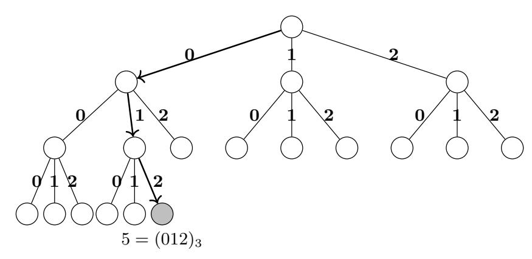
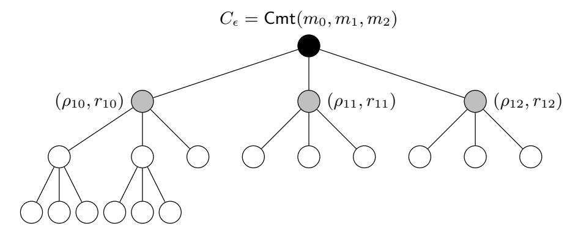
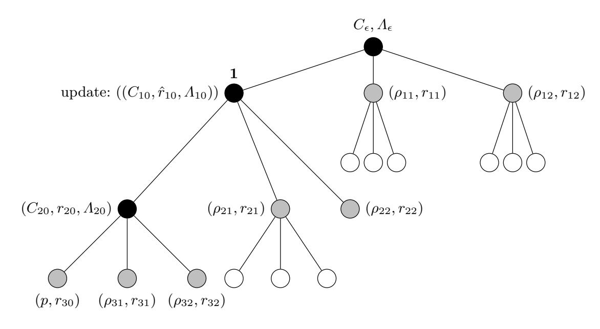
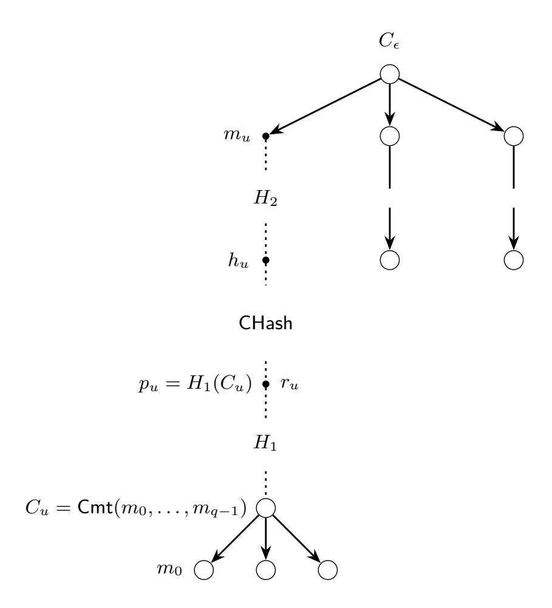

{0}------------------------------------------------

# **Double-Authentication-Preventing Signatures in the Standard Model**

Dario Catalano<sup>1</sup> , Georg Fuchsbauer<sup>2</sup> , and Azam Soleimanian<sup>3</sup>*,*<sup>4</sup>

<sup>1</sup> Dipartimento di Matematica e Informatica – Università di Catania, Italy [catalano@dmi.unict.it](mailto:catalano@dmi.unict.it)

> <sup>2</sup> TU Wien, Vienna, Austria 3 Inria de Paris, France

<sup>4</sup> École normale supérieure, CNRS, PSL University, Paris, France [{georg.fuchsbauer,azam.soleimanian}@ens.fr](mailto:georg.fuchsbauer@ens.fr,azam.soleimanian@ens.fr)

**Abstract.** A double-authentication preventing signature (DAPS) scheme is a digital signature scheme equipped with a self-enforcement mechanism. Messages consist of an address and a payload component, and a signer is penalized if she signs two messages with the same addresses but different payloads. The penalty is the disclosure of the signer's signing key. Most of the existing DAPS schemes are proved secure in the random oracle model (ROM), while the efficient ones in the standard model only support address spaces of polynomial size.

We present DAPS schemes that are efficient, secure in the standard model under standard assumptions and support large address spaces. Our main construction builds on vector commitments (VC) and double-trapdoor chameleon hash functions (DCH).We also provide a DAPS realization from Groth-Sahai (GS) proofs that builds on a generic construction by Derler et al., which they instantiate in the ROM. The GS-based construction, while less efficient than our main one, shows that a general yet efficient instantiation of DAPS in the standard model is possible. An interesting feature of our main construction is that it can be easily modified to guarantee security even in the most challenging setting where no trusted setup is provided. It seems to be the first construction achieving this in the standard model.

**Keywords:** Double-spending, digital signature, cryptocurrencies, certificate subversion.

# **1 Introduction**

*Digital signatures (DS)* are a cryptographic primitive that guarantees authenticity and integrity. Its security is defined via the notion of unforgeability, which protects the signer, and there is no notion of a signer behaving badly. There are however applications in which the signer should be restricted; for example, a certificate authority should not certify two different public keys for the same domain.

*Double-authentication-prevention signatures (DAPS)* are a natural extension of digital signatures that prevent malicious behavior of the signer by a selfenforcement strategy. A message for DAPS consists of two parts, called address

{1}------------------------------------------------

and payload i.e., *m* = (*a, p*). A signer behaves maliciously if it signs two messages with the same addresses but different payloads, that is, *m*<sup>1</sup> = (*a*1*, p*1) and *m*<sup>2</sup> = (*a*2*, p*2) with *a*<sup>1</sup> = *a*<sup>2</sup> and *p*<sup>1</sup> 6= *p*2. Such a pair (*m*1*, m*2) is called *compromising* and the signer is penalized for signing a compromising pair by having its signing key revealed. We next discuss typical applications of DAPS.

**Certificate subversion.** Consider a certificate authority (CA) issuing certificates to different severs. A certificate is of the form (*server.com,* pk*<sup>s</sup> , σs*), where *server.com* is the domain, pk*<sup>s</sup>* is the server's public key and *σ<sup>s</sup>* is a signature on (*server.com,* pk*<sup>s</sup>* ) by the CA. Entities that trust the CA's public key can now securely communicate with *server.com* by using pk*<sup>s</sup>* . Consider a national state court that has jurisdiction over the CA and compels it to issue a rogue certificate for *server.com* for a public key under the control of an intelligence agency. The latter can then impersonate *server.com* without its clients detecting the attack. Using DAPS for certification gives the CA a strong argument to deny the order, as otherwise its key is leaked. It leads to an all-or-nothing situation where if one certificate has been subverted then all have (as once the key is revealed, everything can be signed).

**Cryptocurrencies and non-equivocation contracts.** In cryptographic ecash systems (a.k.a. "Chaumian" e-cash), double-spending is prevented by revealing the identity of the misbehaving party [\[9\]](#page-19-0). This works well in systems where some central authority (e.g. a bank) can take concrete actions to penalize dishonest behaviors (such as blocking their accounts). In the setting of "cryptocurrencies", disclosing the identity of users is much harder to implement because of the decentralized nature of these systems, and indeed double-spending is typically prevented by consensus. Transactions are considered effective only after a certain amount of time. This naturally prevents double-spending but induces delays to reach agreement. Using DAPS to sign transactions could provide a strong deterrent to malicious behaviors. Double-spenders would disclose their secret signing keys, which, for the case of Bitcoin, could translate to a financial loss.

Translating to the DAPS setting, the address would be the coin and the payload the receiver when spending it. This is reminiscent to accountable assertions [\[20\]](#page-19-1) (who give a ROM instantiation). For cryptocurrencies it is natural to implement this mechanism via DAPS, as digital signatures are already needed to authenticate transactions.

Practically, one can make non-equivocation contracts (i.e. contracts that allow to penalize parties that make conflicting statements to others, by the loss of money) by combining a DAPS scheme and a deposit. To ensure that an extracted DAPS secret key is a worthy secret, it can be associated to a deposit. Each party is required to put aside a certain amount of currency in a deposit which can be securely retrieved by the owner at the end of a time-locked session if the owner has not made conflicting statements during the session. Otherwise, anyone obtaining the extracted secret key also has access to the funds.

{2}------------------------------------------------

# **1.1 Challenges in Constructing DAPS**

We next discuss some general challenges in constructing DAPS regarding their security, efficiency and functionality. Our aim is to construct a scheme that achieves a good balance among them.

*Exponentially large address space.* The address part of a message for DAPS typically refers to a user/coin identity. Only allowing a polynomial number of predefined identities [\[12,](#page-19-2) [18\]](#page-19-3) severely limits the possible applications, while an exponential number of addresses practically amounts to no restrictions, as one can use a collision-resistant hash function to map into the address space.

*Security when no trusted setup is provided.* DAPS schemes should satisfy two security notions. *Unforgeability* ensures that signatures from an honest signer (who does not sign compromising message pairs) are secure against an outside attacker. *Key extractability* requires that issuing signatures on compromising message pairs leaks the signer's signing key; the notion can be defined with respect to a trusted or untrusted setup. In the latter case, each signer generates its own key pair, while assuming a trusted setup, which generates and distributes key pairs to the signers, is arguably unrealistic.

The majority of existing DAPS constructions assumes a *trusted setup* [\[2,](#page-18-0)[12,](#page-19-2)[18,](#page-19-3) [19\]](#page-19-4). Those that do not, are in the random oracle model [\[20\]](#page-19-1) or have polynomialsize signatures (w.r.t. the length of the address) [\[4\]](#page-18-1) or only support small address spaces [\[12,](#page-19-2) [18\]](#page-19-3).

*Standard assumptions.* While giving reductionist security proofs is the preferred method of gaining trust in a cryptosystem, these guarantees are only meaningful if the underlying hardness assumptions have been well-studied. Moreover, such analyses often rely on idealizations like assuming hash functions are random functions (in the ROM). Our schemes are proven secure from very well-studied assumptions (e.g. RSA, CDH) and we do not make idealizing assumptions in our proofs, i.e., they are in the standard model.

*Efficient/concrete instantiations.* Some prior DAPS schemes [\[11\]](#page-19-5) that claim short signatures or achieve others of the above properties are black-box constructions from building blocks whose instantiation is often left open. This can be a nontrivial task and leaves the concrete efficiency of such schemes unclear.

# **1.2 Our Contribution**

In this paper we present new DAPS constructions that address all of the above challenges. Our main contributions are as follows.

**Exponentially large address spaces without random oracles.** Most of the existing DAPS schemes supporting an exponentially large address space need to rely on the RO heuristic (e.g. [\[2,](#page-18-0) [4,](#page-18-1) [19,](#page-19-4) [20\]](#page-19-1)). For some of these constructions such as the one based on ID-protocols, the need for the RO assumption is a results of the transformation of an interactive protocol to an non-interactive 

{3}------------------------------------------------

version like Poettering's scheme [\[18\]](#page-19-3). In the other schemes it is due to the fact that the simulator cannot simulate the signatures in the security reduction. The RO assumption then lets the simulator program its responses without having access to the signing key [\[20\]](#page-19-1). We circumvent many of the difficulties arising in previous works by combining vector commitments [\[7\]](#page-18-2) and double-trapdoor chameleon hash functions [\[5,](#page-18-3) [6\]](#page-18-4). Our methodology follows the authentication tree approach also adopted in a previous work [\[20\]](#page-19-1): a signature is an authenticated path from a leaf (whose position is the address part of the message) to a given root (the public key).

In previous work, the signer either had to create the whole tree in advance (thus forcing the address space to be polynomial-size) or use the random oracle to be able to deal with exponentially large address spaces. In our construction the signer creates the tree incrementally using the equivocation properties of the chameleon hash. Moreover, we prove our schemes secure by relying on the doubletrapdoor property: the simulator will be able to issue signatures by knowing *only one* of the two trapdoors. If an adversary manages to create a forgery (or if it signs a compromising pair), our reduction uses this information to extract the *other* trapdoor with non-negligible probability. We moreover use vector commitments [\[7\]](#page-18-2) to realize a "flat" authentication tree (i.e. a tree with branching degree *q >* 2). Since both vector commitments [\[7\]](#page-18-2) and double-trapdoor chameleon hash [\[5,](#page-18-3) [6\]](#page-18-4) (see also our DCH scheme in the full version) can be realized under standard assumptions, the security of our schemes relies on the same assumptions (w.r.t. the trusted setup for the VC scheme).

**Security without trusted setup.** Interestingly, our construction can be easily adapted to the setting where no trusted setup is available. This comes at the cost of slightly longer signatures and is in contrast to previous proposals that all rely on trusted setup (or random oracles). The basic intuition here is that double-trapdoor chameleon hash functions can be realized in an untrusted setup (we present one in the full version), and substituting the vector commitments with a *standard* collision-resistant hash function, the construction highlighted above still works. The downside is that the produced signatures are now longer, as more values have to be stored in the authentication chain. Very informally this is because, replacing Vector Commitments with collision resistant hash functions, leads to a *binary* (rather than "flat") authentication tree.

We remark that the DCH schemes originally suggested in [\[5,](#page-18-3) [6\]](#page-18-4) implicitly assume trusted setup. Here we present a DCH scheme that *does not need* a trusted setup. While our proposed DCH scheme was informally suggested in [\[6\]](#page-18-4) (Section 3.1 of the full version), here we present a concrete construction and prove its security for the general setting where no trusted setup is available.

**A more general definition.** We also propose a slightly more general (with respect to previous work) definition of key-extractability that, we believe, could be useful in other contexts as well. Our definition introduces a predicate Compvk(·) that indicates evidence that the signer misbehaved. Slightly more in detail, the predicate aims at formalizing the fact that, from a compromising pair of signed

{4}------------------------------------------------

messages, it may be possible to extract some sensitive information sk' (not necessarily the full signing key sk) that is compatible with the verification key, i.e.  $\mathsf{Comp}_{vk}(sk') = 1$ . In order for this formalization to be any useful we also require that producing an sk' such that  $\mathsf{Comp}_{vk}(sk') = 1$  is hard (without a compromising pair of signed messages).

A Groth-Sahai-based construction. As additional contribution of this paper we propose a DAPS construction from Groth Sahai proofs [14] (DAPS-GS), which builds upon a construction proposed by Derler et al. [11]. The scheme, which we will refer to as DAPS-DRS, supports an exponentially large address space and is based on NIZK proofs, which the authors instantiated in the random oracle model (ROM). We modify their construction so that the NIZK proof system can be instantiated with the Groth-Sahai proof system [14]. This system provides efficient NIZK proofs in the standard model and under standard assumptions for a restricted class of languages.

An interesting difference between our DAPS-GS scheme and DAPS-DRS is that the latter uses a fixed-value key-binding PRF. We assign this task to a commitment scheme and can therefore relax the requirements on the PRF to standard PRF security. The authors of DAPS-DRS instantiate their key-value binding PRF F with the block cipher LowMC [1]. They thus need to make the (arguably non-standard) assumption that this block cipher is a fixed-value key-binding PRF. The commonality of our DAPS schemes (DAPS-VC-DCH and DAPS-GS) is that they are both in the standard model and support large address spaces. In fact, we instantiate the generic construction of [11] by Groth-Sahai NIZK proof system (as DAPS-GS) to provide a standard-model scheme and compare it against our main, more efficient, DAPS-VC-DCH (DAPS-DCH).

As a final note, we remark that our solutions compare favorably to previous work not only in terms of security guarantees, but also in terms of efficiency. Our most efficient construction based on vector commitments also provides nice trade-offs between the size of its signatures and the size of its verification keys: verification keys grow with the branching degree q of the underlying authentication tree, while signatures grow with the depth h of the tree. A more precise comparison with previous works is given in Table 1.

## 1.3 Related work

Ruffing, Kate, and Schröder [20] present a DAPS scheme based on Merkle trees and chameleon hash functions in the random oracle model. Their scheme supports an exponentially large address space by using a flat-tree construction. They associate each leaf with a unique address and some values are assigned on the fly to nodes from a leaf to the root. A signature is an authentication chain. This flat-tree construction and the idea of assigning values on the fly has also been used in other constructions [8, 10].

Poettering [18] gives a DAPS scheme based on a three-move identification scheme in the ROM. The scheme only supports small address spaces, essentially because each address is associated with a verification key.

{5}------------------------------------------------

<span id="page-5-0"></span>Table 1: Comparison to prior work. Here n is the bit length of the address, written as  $n = h \cdot \log q$  for integers h and q; values  $n_0$  and  $q_0 = \text{poly}(n_0)$  are LWE parameters, and  $\ell_{\pi}(n)$  denotes the proof size in the underlying NIZK system for statements of length n. Finally,  $|\mathbb{G}|$  stands for the size of group elements,  $\lambda_H$  is the bit length of the random oracle output, and N is an RSA modulus.

| Scheme      | Signature                          | vk size               | Address | Assumption  | ROM | No trusted |
|-------------|------------------------------------|-----------------------|---------|-------------|-----|------------|
|             | size                               |                       | space   |             |     | setup      |
| [18]        | $ \mathbb{G} $                     | $O(2^n)$              | poly.   | DLog        | yes | no         |
| [20]        | $q\cdot h\cdot  \mathbb{G} $       | O(1)                  | exp.    | DLog        | yes | yes        |
| [19]        | $(\lambda_H + 1) \cdot \log N$     | O(1)                  | exp.    | Fact        | yes | no         |
| [2]         | $\log N$                           | O(1)                  | exp.    | Fact        | yes | no         |
| [4]         | $O(n_0^2 \log q_0)$                | $O(n_0^4 \log^3 q_0)$ | exp.    | LWE/SIS     | yes | yes        |
| [12]        | $\ell_{\pi}(n)$                    | $O(2^n)$              | poly.   | DLog        | yes | yes        |
| [16]        | $\log N$ or $2 \cdot  \mathbb{G} $ | O(1)                  | exp.    | Fact or CDH | yes | yes        |
| [11]        | $\ell_{\pi}(n)$                    | O(1)                  | exp.    | PRF & OWF   | yes | yes        |
| DAPS-GS     | $36n \cdot  \mathbb{G} $           | O(1)                  | exp.    | SXDH        | no  | no         |
| DAPS-VC-DCH | $3h \cdot  \mathbb{G} $            | q                     | exp.    | CDH         | no  | no         |
| DAPS-DCH    | $q \cdot h \cdot  \mathbb{G} $     | O(1)                  | exp.    | DLog        | no  | yes        |

Bellare, Poettering and Stebila [2] propose a similar solution but managed to avoid the restriction to small address spaces by introducing a trapdoor-ID scheme. Their solution still relies on random oracles and requires a trusted setup.

Poettering and Stebila [19] present a DAPS based on extractable 2-to-1 trapdoor functions (2:1-TF) in the ROM. A 2:1-TF is a trapdoor one-way function for which every element of the range has precisely two preimages and holding the trapdoor allows to efficiently invert the function. Again, the scheme requires a trusted setup and the ROM.

Other schemes in the random oracle model are those of Boneh, Kim, and Nikolaenko [4] and Gao et al. [16].

Derler, Ramacher, and Slamanig [11] present a generic DAPS construction from non-interactive zero-knowledge (NIZK) proof systems that supports an exponentially large address space. They instantiate the construction in the ROM using the Fiat-Shamir transformation [13]. NIZK proofs in the *common reference string* (CRS) model rely on a trusted setup, and so does any DAPS construction based on NIZK.

# 2 Preliminaries

**Notations.** We denote the security parameter by  $\kappa \in \mathbb{N}$  and  $x \leftarrow X$  means that element x is chosen uniformly at random from set X. If A is a probabilistic algorithm,  $y \leftarrow A(x_1, x_2, \ldots)$  denotes running A on input  $x_1, x_2, \ldots$ , and assigning its output to y. All algorithms run in probabilistic polynomial-time (p.p.t.) unless stated otherwise. We denote concatenation by || and the set  $\{1, \ldots, n\}$  by [n]. We

{6}------------------------------------------------

say  $f(\kappa)$  is negligible, and write  $f(\kappa) = \text{negl}(\kappa)$ , if for every positive polynomial  $p(\kappa)$  there exists  $\kappa_0 \in \mathbb{N}$  such that for all  $\kappa > \kappa_0$ :  $f(\kappa) < 1/p(\kappa)$ .

## 2.1 Digital Signatures

<span id="page-6-1"></span>A digital signature (DS) scheme is defined as follows.

**Definition 1 (Digital signature scheme).** A digital signature scheme  $\Sigma$  consists of the p.p.t. algorithms (KeyGen, Sign, Verif) where

- KeyGen(1<sup> $\kappa$ </sup>), on input the security parameter  $\kappa$  in unary, outputs a signing key sk and a verification key vk (which implicitly defines the message space  $\mathcal{M}$ ).
- Sign(sk, m), on input signing key sk and message  $m \in \mathcal{M}$ , outputs a signature  $\sigma$ .
- Verif(vk, m,  $\sigma$ ), on input verification key vk, message  $m \in \mathcal{M}$  and signature  $\sigma$ , outputs either 0 or 1.

**Correctness.** Signature scheme  $\Sigma$  is correct if for all  $\kappa \in \mathbb{N}$ , for all  $(\mathsf{sk}, \mathsf{vk}) \leftarrow \mathsf{KeyGen}(1^{\kappa})$ , for all  $m \in \mathcal{M}$ , and  $\sigma \leftarrow \mathsf{Sign}(\mathsf{sk}, m)$ , we have  $\mathsf{Verif}(\mathsf{vk}, m, \sigma) = 1$ .

# 2.2 Double-Authentication-Preventing Signatures

Double-authentication-preventing signature (DAPS) schemes are a subclass of digital signatures where the message to be signed is split into two parts; an address and a payload,<sup>5</sup> i.e., in Definition 1 we have  $m = (a, p) \in \mathcal{U} \times \mathcal{P}$ .

Informally, compromising messages are (signed) pairs of messages with the same addresses but different payloads.

**Definition 2 (Compromising pair of signatures [19]).** For a verification key vk, a pair  $(S_1, S_2)$  where  $S_1 = (a_1, p_1; \sigma_1)$  and  $S_2 = (a_2, p_2; \sigma_2)$ , is compromising if

$$\mathsf{Verif}(\mathsf{vk}, (a_1, p_1), \sigma_1) = 1, \quad \mathsf{Verif}(\mathsf{vk}, (a_2, p_2), \sigma_2) = 1, \quad a_1 = a_2 \quad and \quad p_1 \neq p_2.$$

A key property of DAPS schemes is key-extractability (KE). It requires that no malicious signer can produce a compromising pair of signatures which does not lead to the revelation of a signing key that is compatible with its verification key. To make the definition more general, we allow the adversary to succeed even when it manages to produce compromising messages that do not reveal sensitive information about the secret key (and not necessarily the whole secret key).

This is captured via the Comp predicate that, informally, outputs 1 if the input is compatible with the public verification key. The exact meaning of this "compatible" depends on the specific application, but clearly for any  $(sk, vk) \leftarrow KeyGen(1^{\kappa})$  it should be the case that  $1 \leftarrow Comp_{vk}(sk)$ . If  $Comp_{vk}(\cdot) = 1$  is constant, we have nothing more than an ordinary signature without any prevention. The main requirement here is that producing sk' such that  $Comp_{vk}(sk') = 1$  must be hard without a compromising pair of signed messages.

<span id="page-6-0"></span><sup>&</sup>lt;sup>5</sup> In [19] these two parts are referred as subject and message, and in [20] as context and statement. Here we are following the terminologies from [18].

{7}------------------------------------------------

```
 \begin{array}{c|c} \underline{\mathsf{KExt}^\mathsf{Tr}_\mathsf{DAPS}, \mathcal{A}(\kappa):} \\ \hline (\mathsf{sk}, \mathsf{vk}) \leftarrow \mathsf{KeyGen}(1^\kappa) \\ (S_1, S_2) \leftarrow \mathcal{A}(\mathsf{sk}, \mathsf{vk}) \\ \mathsf{sk}' \leftarrow \mathsf{Ext}(\mathsf{vk}, S_1, S_2) \\ \mathrm{Return} \ 1 \ \mathrm{iff} \\ \hline - \ (S_1, S_2) \ \mathrm{is} \ \mathrm{compromising} \\ \hline - \ 0 \leftarrow \mathsf{Comp}_{\mathsf{vk}}(\mathsf{sk}') \end{array} \qquad \begin{array}{c} \underline{\mathsf{KExt}^\mathsf{nTr}_\mathsf{DAPS}, \mathcal{A}(\kappa):} \\ \hline (\mathsf{vk}; S_1, S_2) \leftarrow \mathcal{A}(1^\kappa) \\ \mathsf{sk}' \leftarrow \mathsf{Ext}(\mathsf{vk}, S_1, S_2) \\ \mathrm{Return} \ 1 \ \mathrm{iff} \\ \hline - \ (S_1, S_2) \ \mathrm{is} \ \mathrm{compromising} \\ \hline - \ 0 \leftarrow \mathsf{Comp}_{\mathsf{vk}}(\mathsf{sk}') \end{array}
```

Fig. 1: Game for key-extractability of DAPS.

**Definition 3 (Key-extractability [19]).** A DAPS scheme is key-extractable if there exists a p.p.t. algorithm Ext as follows:

-  $\mathsf{Ext}(\mathsf{vk}, S_1, S_2)$ , on input a verification key  $\mathsf{vk}$  and a compromising pair  $(S_1, S_2)$ , outputs a signing key  $\mathsf{sk}'$ ,

 $such\ that\ \Pr[\mathsf{KExt}^{\mathsf{Tr/nTr}}_{\mathsf{DAPS},\mathcal{A}}(\kappa)=1] = \operatorname{negl}(\kappa)\ for\ all\ \mathsf{p.p.t.}\ adversaries\ \mathcal{A},\ where \\ experiment\ \mathsf{KExt}^{\mathsf{Tr/nTr}}_{\mathsf{DAPS},\mathcal{A}}(\kappa)\ is\ as\ described\ in\ Fig.\ \textit{1}.$ 

We say that a DAPS scheme is KE for trusted setups if this holds for experiment KExt<sup>Tr</sup><sub>DAPS,A</sub>, and it is KE without trusted setup if it holds for KExt<sup>nTr</sup><sub>DAPS,A</sub>.

Since DAPS schemes are a subclass of digital signatures, the standard existential unforgeability should also be satisfied for a DAPS scheme. This requires a restriction though, as the adversary could obtain the signing key if it was allowed to query compromising pairs to its signing oracle.

**Definition 4 (Unforgeability of DAPS).** A DAPS scheme  $\Sigma$  is existentially unforgeable under adaptive chosen-message attacks (EUF-CMA) if for all p.p.t. adversaries A, we have  $\Pr[\mathsf{Forg}_{\mathsf{DAPS}}^{\mathcal{A}}(\kappa) = 1] = \mathsf{negl}(\kappa)$ , where  $\mathsf{Forg}_{\mathsf{DAPS}}^{\mathcal{A}}(\kappa)$  is as described in Fig. 2.

```
 \begin{array}{ll} & \underline{\mathsf{Forg}}_{\mathsf{DAPS}}^{\mathcal{A}}(\kappa) \colon & \underline{\mathsf{Oracle Sign}(\mathsf{sk},(a,p)) \colon} \\ & (\mathsf{sk},\mathsf{vk}) \leftarrow \mathsf{KeyGen}(1^\kappa) & \underline{\mathsf{If}} \ \exists \, p' \neq p \colon (a,p') \in Q \ \mathsf{then} \\ & Q \leftarrow \emptyset & \mathrm{return} \ \bot \\ & (a^*,p^*,\sigma^*) \leftarrow \mathcal{A}^{\mathsf{Sign}(\mathsf{sk},\cdot)}(\mathsf{vk}) & \sigma \leftarrow \mathsf{Sign}(\mathsf{sk},a,p) \\ & \mathsf{Return} \ 1 \ \mathsf{iff:} & Q \leftarrow Q \cup \{(a,p)\} \\ & - \ \mathsf{Verif}(\mathsf{vk},a^*,p^*,\sigma^*) = 1 \\ & - \ (a^*,p^*) \notin Q & \\ \end{array}
```

Fig. 2: Game for EUF-CMA security of DAPS

{8}------------------------------------------------

```
\begin{split} \frac{\mathsf{PBind}_{\mathsf{VC}}^{\mathcal{A}}(\kappa):}{\mathsf{pp}} \leftarrow \mathsf{Setup}(1^{\kappa}) \\ (C, m, m', i, \Lambda, \Lambda') \leftarrow \mathcal{A}(\mathsf{pp}) \\ \mathsf{Return} \ 1 \ \mathsf{iff} \ m \neq m' \ \mathsf{and} \ \mathsf{Verif}_{\mathsf{pp}}(C, m, i, \Lambda) = 1 \\ & \qquad \qquad \mathsf{and} \ \mathsf{Verif}_{\mathsf{pp}}(C, m', i, \Lambda') = 1 \end{split}
```

Fig. 3: Game for position-binding of a VC scheme

#### 2.3 Vector Commitments

A vector commitment (VC) is a primitive allowing to commit to an ordered sequence of q values, rather than to single messages [7]. One can later open the commitment at a specific position.

**Definition 5 (Vector commitments [7]).** A VC scheme is a tuple of p.p.t. algorithms VC = (Setup, Cmt, Open, Verif) where

- Setup( $1^{\kappa}$ , q), on input the security parameter  $\kappa$  and the length q of committed vectors (with q = poly(k)), outputs public parameters pp (which defines the message space  $\mathcal{M}$ ).
- $\mathsf{Cmt}_{\mathsf{pp}}(m_0, \ldots, m_{q-1})$ , on input a sequence of q messages  $m_0, \ldots, m_{q-1} \in \mathcal{M}$ , outputs a commitment string C.
- $\mathsf{Open}_{\mathsf{pp}}(m_0,\ldots,m_{q-1},m,i)$  produces a proof  $\Lambda_i$  that m is the i-th committed message in the sequence  $m_0,\ldots,m_{q-1}$ .
- Verif<sub>pp</sub> $(C, m, i, \Lambda_i)$  outputs 1 if  $\Lambda_i$  is a valid proof that C commits to a sequence  $m_0, \ldots, m_{q-1}$  with  $m = m_i$ , and 0 otherwise

**Definition 6 (Correctness of VC).** A VC is correct if for all  $\kappa \in \mathbb{N}$  and  $q = \text{poly}(\kappa)$ , all  $pp \leftarrow \text{Setup}(1^{\kappa}, q)$  and all vectors  $(m_0, \ldots, m_{q-1}) \in \mathcal{M}^q$ , we have

$$\Pr \begin{bmatrix} C \leftarrow \mathsf{Cmt}_{\mathsf{pp}}(m_0, \dots, m_{q-1}) \\ \Lambda_i \leftarrow \mathsf{Open}_{\mathsf{pp}}(m_i, i) \end{bmatrix} : \mathsf{Verif}_{\mathsf{pp}}(C, m_i, i, \Lambda_i) = 1 \end{bmatrix} = 1.$$

The security notion for a VC scheme is called *position-binding* and requires that for any p.p.t. adversary, given pp, it should be infeasible to produce a commitment C and openings to two different messages for the same position.

**Definition 7 (Position binding).** A VC scheme VC is position-binding if for all  $i \in \{0, ..., q-1\}$  and p.p.t. adversary  $\mathcal{A}$  we have  $\Pr[\mathsf{PBind}_{\mathsf{VC}}^{\mathcal{A}}(\kappa) = 1] = \mathsf{negl}(\kappa)$ , where game  $\mathsf{PBind}_{\mathsf{VC}}^{\mathcal{A}}(\kappa)$  is as defined in Fig. 3.

Finally, a VC scheme is *concise* if the size of the commitment string C and the output of algorithm Open are both independent of q.

### 2.4 Double-Trapdoor Chameleon Hash Functions

A chameleon hash function is a (collision-resistant) hash function, where given a trapdoor one can find collisions efficiently. A double-trapdoor chameleon hash (DCH) function scheme has two independent such trapdoors.

{9}------------------------------------------------

```
\begin{array}{c} \overline{\mathsf{DTCR}^{\mathcal{A}}_{\mathsf{DCH}}(\kappa):} \\ \overline{(\mathsf{pk},\mathsf{tk}_0,\mathsf{tk}_1)} \leftarrow \mathsf{KeyGen}(1^\kappa); \ b \overset{R}{\leftarrow} \{0,1\} \\ \mathsf{tk}' \leftarrow \mathcal{A}(\mathsf{pk},\mathsf{tk}_b) \\ \mathrm{Output} \ 1 \ \mathrm{iff} \ \mathsf{tk}' = \mathsf{tk}_{1-b}. \end{array}
```

<span id="page-9-0"></span>Fig. 4: Collision-resistance game for a DCH scheme

**Definition 8 (DC hash function [6]).** A DCH scheme  $\mathcal{H}$  is a tuple of p.p.t. algorithms  $\mathcal{H} = (KeyGen, TrChos, CHash, Coll)$  where

- KeyGen(1<sup> $\kappa$ </sup>), on input the security parameter  $\kappa$ , outputs a public key pk (which implicitly defines the message space  $\mathcal{M}$ ) and private keys  $\mathsf{tk}_0$  and  $\mathsf{tk}_1$ .
- TrChos(1 $^{\kappa}$ , i), on input the security parameter  $\kappa$  and a bit i, outputs a pair of public/private keys (pk, tk<sub>i</sub>).
- CHash<sub>pk</sub>(m,r), on input the public key pk, a message  $m \in \mathcal{M}$  and one (or more) random nonce  $r \in \mathcal{R}$ , outputs a hash value.
- Coll(pk, tk<sub>i</sub>, m', m, r), on input one of the two trapdoor keys tk<sub>i</sub>, two messages m, m' and a nonce r, outputs a nonce r' such that  $\mathsf{CHash}_{\mathsf{pk}}(m,r) = \mathsf{CHash}_{\mathsf{pk}}(m',r')$ .

In the definition of algorithm Coll, the pair (m, r) and (m', r') is called a collision pair where  $\mathsf{CHash}_{\mathsf{pk}}(m, r) = \mathsf{CHash}_{\mathsf{pk}}(m', r')$ . For a DCH scheme, the following security requirements were given [6].

**Definition 9 (Security of DCH).** We require double-trapdoor chameleon hash functions to satisfy the following properties:

**Distribution of keys.** The output of  $TrChos(1^{\kappa}, i)$  is distributed like a public key pk and the i-th private key  $tk_i$  output by  $KeyGen(1^{\kappa})$ .

Double-trapdoor collision-resistance (DTCR). Let  $(pk, tk_0, tk_1)$  be output by  $KeyGen(1^{\kappa})$ . For all i=0,1, given pk and  $tk_i$  it is infeasible to find  $tk_{1-i}$ . Formally, for all p.p.t. adversary  $\mathcal{A}$ , we have  $Pr[DTCR_{DCH}^{\mathcal{A}}(\kappa) = 1] = negl(\kappa)$ , where game  $DTCR_{DCH}^{\mathcal{A}}$  is defined in Fig. 4.

**Key-extractability (KE)** (w.r.t. predicate  $Comp(\cdot)$ ). There exists a p.p.t. algorithm Ext as follows:

-  $\mathsf{Ext}(\mathsf{pk}, S_1, S_2)$ , on input the public key  $\mathsf{pk}$  and a collision pair  $(S_1, S_2)$ , outputs a (single) secret key  $\mathsf{tk}'$ ,

 $such\ that\ \Pr[\mathsf{KExt}^{\mathsf{Tr/nTr}}_{\mathsf{DCH},\mathcal{A}}(\kappa) = 1] = \operatorname{negl}(\kappa)\ for\ all\ \mathsf{p.p.t.}\ adversaries\ \mathcal{A},\ with\ game\ \mathsf{KExt}^{\mathsf{Tr/nTr}}_{\mathsf{DCH},\mathcal{A}}(\kappa)\ as\ defined\ in\ Fig.\ 5.$ 

Uniformity. For r chosen uniformly at random in  $\mathcal{R}$ , all messages m induce the same probability distribution on  $\mathsf{CHash}_{\mathsf{pk}}(m,r)$ . This implies that  $\mathsf{CHash}_{\mathsf{pk}}(m,r)$  for randomly chosen r information-theoretically hides m. As for standard chameleon hash functions [15] this can be relaxed to computational indistinguishability of the above distributions for any two messages.

{10}------------------------------------------------

```
 \begin{array}{l} \frac{\mathsf{KExt}^{\mathsf{Tr}}_{\mathsf{DCH},\mathcal{A}}(\kappa):}{(\mathsf{pk};\mathsf{tk}_0,\mathsf{tk}_1) \leftarrow \mathsf{KeyGen}(1^\kappa)} \\ (S_1,S_2) \leftarrow \mathcal{A}(\mathsf{pk},\mathsf{tk}_0,\mathsf{tk}_1) \\ \mathsf{tk}' \leftarrow \mathsf{Ext}(\mathsf{pk},S_1,S_2) \\ \mathsf{Output}\ 1\ \mathsf{iff} \\ -\ (S_1,S_2)\ \mathsf{is}\ \mathsf{a}\ \mathsf{collision}\ \mathsf{pair} \\ -\ \mathsf{tk}' \neq \mathsf{tk}_0\ \mathsf{and}\ \mathsf{tk}' \neq \mathsf{tk}_1. \end{array}
```

Fig. 5: KE game for a DCH scheme. The left game is in the trusted setup and the right game is in the untrusted setup.

**Distribution of collisions.** For every m, m', and a uniformly random r, the distributions of  $r' = \text{Coll}(\mathsf{tk}_i, m, m', r)$  are identical (uniform) for i = 0, 1, even when given  $\mathsf{CHash}_{\mathsf{pk}}(m, r)$ , m and m'.

Remark 1 (On defining Key Extractability). Our definitions above of Key Extractability implicitly assume that some appropriate predicate Comp is always associated with a DCH. This might seem surprising at first as, for DCH, Comp is formally required only for the untrusted setup setting. However, even if one only cares about the trusted setup setting, we require the underlying DCH to have an associated predicate Comp, which lets us define Key Extractability for DAPS.

We thus assume, unless otherwise stated, that every DCH has an efficiently computable predicate Comp, so that for any  $\kappa \in \mathbb{N}$  and any  $(\mathsf{pk}, \mathsf{tk}_0, \mathsf{tk}_1)$  output by  $\mathsf{KeyGen}(1^{\kappa})$  we have  $\mathsf{Comp}_{\mathsf{pk}}(\mathsf{tk}_0) = \mathsf{Comp}_{\mathsf{pk}}(\mathsf{tk}_1) = 1$  and  $\mathsf{Comp}_{\mathsf{pk}}(\mathsf{tk}') = 0$  for any  $\mathsf{tk}' \notin \{\mathsf{tk}_0, \mathsf{tk}_1\}$ .

#### 2.5 Non-interactive Zero-Knowledge Proofs

Let  $L = \{x \mid \exists w : R(x, w) = 1\}$  be a language in NP. A non-interactive zero knowledge (NIZK) proof system for L is formally defined as follows.

**Definition 10 (NIZK proof system).** A NIZK proof system  $\Pi$  for the language L consists of three p.p.t. algorithms (Setup, Prove, Verif) where

- Setup( $1^{\kappa}$ ) takes the security parameter  $\kappa$  as input and outputs a common reference string crs.
- Prove(crs, x, w), takes the crs, a statement x and a witness w as input and outputs a proof  $\pi$ .
- Verif(crs, x,  $\pi$ ) takes the crs, the statement x, and a proof  $\pi$  as input and outputs either 0 or 1.

For a proof system  $\Pi = (\mathsf{Setup}, \mathsf{Prove}, \mathsf{Verif})$ , in addition to completeness and zero-knowledge we require *simulation-sound extractability*, which is a strengthening of knowledge soundness: even after the adversary has seen simulated proofs, from any valid (fresh) proof output by the adversary, a witness can be extracted.

{11}------------------------------------------------

<span id="page-11-0"></span>

Fig. 6

# <span id="page-11-1"></span>**3 A DAPS Scheme From VC and DCH (DAPS-VC-DCH)**

## **3.1 Construction**

In this section we present our DAPS scheme based on vector commitments and double-trapdoor chameleon hash function. Our scheme will make use of a "flat" *q*-ary tree (i.e. a tree with branching degree *q*) of height *h*, which we call the signing tree. The root of the tree will be a public value *C* that will be part of the public key. Recall that in DAPS, messages are tuples of the form (*a, p*). The first component is interpreted as an integer in the range {0*, . . . , q<sup>h</sup>* − 1}. We can univocally associate each *a* to a path connecting the root with one leaf of the tree. In particular, *a* can be viewed as a number representing the labeling of the leaf in *q*-ary encoding (see the toy example in Fig. [6](#page-11-0) for *q* = 3). In what follows, path*u*→*<sup>w</sup>* denotes the ordered sequence of nodes connecting node *u* to node *w*. The root will be denoted by . Note that each node *u* has a unique position in the tree which we denote by pos*<sup>u</sup>* ; when *u* is the *i*-th node, from left-to-right, in the *j*-th level of the tree, we define pos*<sup>u</sup>* = *j*||*i*.

**Overview of the scheme.** We start with an informal description of the stateful version of our scheme where the signer needs to keep track of the produced signatures. The public key contains the public parameters for a vector commitment scheme VC and for a double-trapdoor chameleon hash function DCH. The private key is the corresponding trapdoor information. The public key also contains a value *C* which is computed as follows. The signer first computes CHash on *q* random inputs to get the output values *m*0*, . . . , mq*−1. Next, she sets *C* as a VC commitment to the vector *m*0*, . . . , mq*−1. The value *C* is assigned to the root of an, initially empty, tree.

The signature algorithm will "fill up" this tree on the fly. To sign the message (*a, p*), the signer will place *p* as the *a*-th leaf and will output an authentication chain that links *p* to the root *C*. The verifier will follow this authentication chain and if the end of the chain matches the value in the public key, accepts the signature.

We describe more in detail how the signer creates the authentication chain. Starting from the *a*-th leaf the signer produces the signature by augmenting the existing tree with the new authentication path. This is done using the following

{12}------------------------------------------------

<span id="page-12-0"></span>

Fig. 7

create-and-connect approach. First, the signer generates the possibly missing portion of the subtree containing the *a*-th leaf. Next, it connects this portion to the signing tree. Creating the missing portion of the tree essentially amounts to creating all the missing nodes. Specifically, and letting *a* = (*a*0*, . . . , ah*) be the *q*-ary encoding of *a*, the signer computes *ma<sup>h</sup>* = CHash(*ph, r*) where *p<sup>h</sup>* = *p* (for some randomness *r*) and, for *i* ∈ {0*, . . . , q* − 1} \ {*ah*}, *m<sup>i</sup>* = CHash(*ρ<sup>i</sup> , ri*) for random *ρ<sup>i</sup> , r<sup>i</sup>* . Next the signer computes *ph*−<sup>1</sup> = Cmt(*m*) with *m* = (*m*0*, . . . , mq*−1). The process is then repeated node by node moving up the path until no more nodes need to be created. This happens when the newly created *p<sup>j</sup>* needs to be inserted in a position already occupied by some other value *ρ<sup>j</sup>* 6= *p<sup>j</sup>* (i.e. for which a value CHash(*ρ<sup>j</sup> , r<sup>j</sup>* ) was previously computed). This is when the connect phase begins. The signer uses knowledge of the trapdoor key to find a "colliding" *r* such that CHash(*ρ<sup>j</sup> , r<sup>j</sup>* ) = CHash(*p<sup>j</sup> , r*).

In Fig. [7](#page-12-0) we provide a pictorial representation of the key generation phase (for the toy case with branching degree 3). Black nodes indicate values that are obtained as outputs of the (vector) commitment and will not be altered any further in the future. Gray nodes indicate the frontier of the tree, i.e., nodes that are either leaves or roots of subtrees not yet explored.

Similarly, Fig. [8](#page-13-0) pictorially describes (a toy example of) the signing procedure. To sign the message (*a* = 000*, p*), one first creates the missing part of the tree, as sketched above. This also requires the signer to store all the commitments associated to each node. Once the procedure reaches a frontier node, the signer uses knowledge of the trapdoor to find a collision for CHash. In Fig. [8](#page-13-0) this is what happens to node 1 that, once connected with the newly created subtree, becomes black. Notice that the collision finding procedure typically alters the associated randomness *r*ˆ10. This change will be done once and for all at this stage, as once the node is blackened no further modifications are allowed. To complete the procedure, the signer also produces valid openings *Λ* for all the commitments encountered in the path from the leaf *p* to the root and updates the lists of data associated to each node.

**Formal description of the scheme.** We are now ready to present a formal description of our scheme. Let VC = (VC*.*Setup*,* Cmt*,* Open*,* VC*.*Verif) be a vector commitment (VC) scheme and DCH = (DCH*.*KeyGen*,*Trapdr*,* CHash*,* Coll) be a double-trapdoor chameleon hash (DCH) function with Cmt: M*<sup>q</sup>* → Ovc and

{13}------------------------------------------------

<span id="page-13-0"></span>

Fig. 8

CHash: (P*,* R) → ODCH. Let *H*<sup>1</sup> : Ovc → P and *H*<sup>2</sup> : ODCH → M be two collisionresistant hash functions, used to map between different data types. The underlying data structure will be a tree *T* of branching degree *q* and height *h*. Messages are tuples of the form (*a, p*) with payload component *p* ∈ P and address *a* ∈ U := {0*, . . . , q<sup>h</sup>* − 1}. We use the label for the root. Also, we say that *v* is a child of *u* in position *i*, when *v* is the *i*-th child of *u* (counting from left).

We use a pseudo-random function *F* to generate the random values (*ρji, rji*) as *ρji* = *Fk*(*j*||*i,* 0) and *rji* = *Fk*(*j*||*i,* 1), where *k* is part of the signing key. This makes signing deterministic (but still stateful, see below) and minimizes the information that has to be stored by the signer. Recall that pos*<sup>u</sup>* = *j*||*i* denotes the unique position of node *u* in the tree. A complete description of the scheme is given in Fig. [9](#page-14-0) and Fig. [10](#page-15-0)

*Remark 2.* For DAPS schemes, signing is inherently stateful as the signer needs to remember the signed addresses in order not to sign a compromising pair. This is important for unforgeability rather than for correctness. Keeping track of the signed addresses can be efficiently done using a bloom filter [\[20\]](#page-19-1). In our scheme, the signer must in addition remember the payloads that it has signed in the past (but no further information, such as past signatures). This suffices to regenerate the tree during the signing of a new message.

# **3.2 Security Analysis**

We prove the security of our construction via the following two theorems, first key-extractability (Definition [3\)](#page-6-1), then unforgeability (Definition [4\)](#page-6-1). Formally, we have the following theorem where we consider the KE property of our DAPS scheme w.r.t the same extractor of DCH scheme.

**Theorem 1.** *If* VC *is position-binding,* DCH *is key-extractable and H*1*, H*<sup>2</sup> *are collision-resistant, then our construction (Fig. [9\)](#page-14-0) is key-extractable (w.r.t. the trusted setup for VC).*

{14}------------------------------------------------

```
\mathsf{KeyGen}(1^\kappa,q,h,):
    - choose k \stackrel{R}{\leftarrow} \mathcal{K}_F and hash functions H_1 and H_2
   - run pp_{VC} \leftarrow VC.Setup(1^{\kappa}) and (pk_{DCH}, tk_0, tk_1) \leftarrow DCH.KeyGen(1^{\kappa})
   - set \rho_{1i} = F_k(1||i,0) and r_{1i} = F_k(1||i,1), for i = 0, \dots, q-1
    - compute the DCH value m_i = H_2(\mathsf{CHash}(\rho_{1i}, r_{1i})), \ i = 0, \dots, q-1
    - compute the VC value C_{\epsilon} = \mathsf{Cmt}_{\mathsf{pp}_{\mathsf{VC}}}(m_0, \dots, m_{q-1})
    - return \mathsf{vk} = (H_1, H_2, \mathsf{pp}_{\mathsf{VC}}, \mathsf{pk}_{\mathsf{DCH}}, C_{\epsilon}) \text{ and } \mathsf{sk} = (\mathsf{tk}_0, \mathsf{tk}_1, k)
\mathsf{Sign}(\mathsf{vk},\mathsf{sk},(a,p)):
    -  set  \sigma = \emptyset
     • Frontier node. let u^* \in \mathsf{path}_{a \to \epsilon} be the frontier-node of the existing part of the tree
            (the first node on \mathsf{path}_{a\to\epsilon} such that a DCH value was assigned)
    • Creation phase (of the subtree rooted in u^*). for u \in \mathsf{path}_{a \to u^*} (except u^*):
               1. if u is a leaf: set r_u = F_k(\mathsf{pos}_u, 1), p_u = p, m_u = H_2(\mathsf{CHash}(p_u, r_u)) and \sigma := \sigma || r_u||_{L^2(\mathcal{C})}
                        if u is not a leaf: set C_u = \mathsf{Cmt}(m_0, \ldots, m_{q-1}) where m_i is assigned to the ith
                        child of u; set p_u = H_1(C_u), r_u = F_k(\mathsf{pos}_u, 1), m_u = H_2(\mathsf{CHash}(p_u, r_u)) and
                        \sigma = \sigma || (r_u, C_u, \Lambda_u) where \Lambda_u = \mathsf{Open}(m_v, i) such that v \in \mathsf{path}_{a \to \epsilon} is the i-th
                        child of u
               2. for each sibling v of u, set \rho_v = F_k(\mathsf{pos}_v, 0) and r_v = F_k(\mathsf{pos}_v, 1), then compute
                        m_v = H_2(\mathsf{CHash}(\rho_v, r_v))
    • Connection phase (at node u^*).
               1. if u^* is a leaf: set p_{u^*} = p, run \hat{r}_{u^*} \leftarrow \mathsf{Coll}(\mathsf{tk}_0, (\rho_{u^*}, r_{u^*}), p_{u^*}) and set \sigma || \hat{r}_{u^*} ||
                        if u^* is not a leaf: compute C_{u^*} = \mathsf{Cmt}(m_0, \ldots, m_{q-1}) and set p_{u^*} = H_1(C_{u^*});
                        run \hat{r}_{u^*} \leftarrow \text{Coll}(\mathsf{tk}_0, (\rho_{u^*}, r_{u^*}), p_{u^*}) and set \sigma||(\hat{r}_{u^*}, C_{u^*}, \Lambda_{u^*})| where \Lambda_{u^*} =
                        \mathsf{Open}(m_v,i) such that v \in \mathsf{path}_{a \to \epsilon} is the i-th child of u^*
               2. let w be the parent of u^*, update \Lambda_w as \Lambda_w \leftarrow \mathsf{Open}(m_{u^*}, i) such that u^* is the
                        i-th child of w; if w \neq \epsilon, set \sigma := \sigma || \sigma_{w \to \epsilon} where \sigma_{w \to \epsilon} is the authentication-chain
                        from w to the root (with updated \Lambda_w); else, set \sigma := \sigma || \Lambda_w
    - return \sigma
Verif(vk, (a, p), \sigma):
    - parse vk as (H_1, H_2, \mathsf{pp}_{\mathsf{VC}}, \mathsf{pk}_{\mathsf{DCH}}, C_{\epsilon}) and \sigma as (r_h, (r_{h-1}, C_{h-1}, \Lambda_{h-1}), \ldots, (r_1, C_1, \Lambda_1), \ldots, (r_1, C_1, \Lambda_1), \ldots, (r_1, C_1, \Lambda_1), \ldots, (r_1, C_1, \Lambda_1), \ldots, (r_1, C_1, \Lambda_1), \ldots, (r_1, C_1, \Lambda_1), \ldots, (r_1, C_1, \Lambda_1), \ldots, (r_1, C_1, \Lambda_1), \ldots, (r_1, C_1, \Lambda_1), \ldots, (r_1, C_1, \Lambda_1), \ldots, (r_1, C_1, \Lambda_1), \ldots, (r_1, C_1, \Lambda_1), \ldots, (r_1, C_1, \Lambda_1), \ldots, (r_1, C_1, \Lambda_1), \ldots, (r_1, C_1, \Lambda_1), \ldots, (r_1, C_1, \Lambda_1), \ldots, (r_1, C_1, \Lambda_1), \ldots, (r_1, C_1, \Lambda_1), \ldots, (r_1, C_1, \Lambda_1), \ldots, (r_1, C_1, \Lambda_1), \ldots, (r_1, C_1, \Lambda_1), \ldots, (r_1, C_1, \Lambda_1), \ldots, (r_1, C_1, \Lambda_1), \ldots, (r_1, C_1, \Lambda_1), \ldots, (r_1, C_1, \Lambda_1), \ldots, (r_1, C_1, \Lambda_1), \ldots, (r_1, C_1, \Lambda_1), \ldots, (r_1, C_1, \Lambda_1), \ldots, (r_1, C_1, \Lambda_1), \ldots, (r_1, C_1, \Lambda_1), \ldots, (r_1, C_1, \Lambda_1), \ldots, (r_1, C_1, \Lambda_1), \ldots, (r_1, C_1, \Lambda_1), \ldots, (r_1, C_1, \Lambda_1), \ldots, (r_1, C_1, \Lambda_1), \ldots, (r_1, C_1, \Lambda_1), \ldots, (r_1, C_1, \Lambda_1), \ldots, (r_1, C_1, \Lambda_1), \ldots, (r_1, C_1, \Lambda_1), \ldots, (r_1, C_1, \Lambda_1), \ldots, (r_1, C_1, \Lambda_1), \ldots, (r_1, C_1, \Lambda_1), \ldots, (r_1, C_1, \Lambda_1), \ldots, (r_1, C_1, \Lambda_1), \ldots, (r_1, C_1, \Lambda_1), \ldots, (r_1, C_1, \Lambda_1), \ldots, (r_1, C_1, \Lambda_1), \ldots, (r_1, C_1, \Lambda_1), \ldots, (r_1, C_1, \Lambda_1), \ldots, (r_1, C_1, \Lambda_1), \ldots, (r_1, C_1, \Lambda_1), \ldots, (r_1, C_1, \Lambda_1), \ldots, (r_1, C_1, \Lambda_1), \ldots, (r_1, C_1, \Lambda_1), \ldots, (r_1, C_1, \Lambda_1), \ldots, (r_1, C_1, \Lambda_1), \ldots, (r_1, C_1, \Lambda_1), \ldots, (r_1, C_1, \Lambda_1), \ldots, (r_1, C_1, \Lambda_1), \ldots, (r_1, C_1, \Lambda_1), \ldots, (r_1, C_1, \Lambda_1), \ldots, (r_1, C_1, \Lambda_1), \ldots, (r_1, C_1, \Lambda_1), \ldots, (r_1, C_1, \Lambda_1), \ldots, (r_1, C_1, \Lambda_1), \ldots, (r_1, C_1, \Lambda_1), \ldots, (r_1, C_1, \Lambda_1), \ldots, (r_1, C_1, \Lambda_1), \ldots, (r_1, C_1, \Lambda_1), \ldots, (r_1, C_1, \Lambda_1), \ldots, (r_1, C_1, \Lambda_1), \ldots, (r_1, C_1, \Lambda_1), \ldots, (r_1, C_1, \Lambda_1), \ldots, (r_1, C_1, \Lambda_1), \ldots, (r_1, C_1, \Lambda_1), \ldots, (r_1, C_1, \Lambda_1), \ldots, (r_1, C_1, \Lambda_1), \ldots, (r_1, C_1, \Lambda_1), \ldots, (r_1, C_1, \Lambda_1), \ldots, (r_1, C_1, \Lambda_1), \ldots, (r_1, C_1, \Lambda_1), \ldots, (r_1, C_1, \Lambda_1), \ldots, (r_1, C_1, \Lambda_1), \ldots, (r_1, C_1, \Lambda_1), \ldots, (r_1, C_1, \Lambda_1), \ldots, (r_1, C_1, \Lambda_1), \ldots, (r_1, C_1, \Lambda_1), \ldots, (r_1, C_1, \Lambda_1), \ldots, (r_1, C_1, \Lambda_1), \ldots, (r_1, C_1, \Lambda_1), \ldots, (r_1, C_1, \Lambda_1), \ldots, (r_1, C_1, \Lambda_1), \ldots, (r_1, C_1, \Lambda_1), \ldots, (r_1, C_1, \Lambda_1), \ldots, (r_1, C_1, \Lambda_1), \ldots, (r_1, C_1, C_1, \Lambda_1), \ldots, (r_1,
            \Lambda_{\epsilon}); then consider \mathsf{path}_{a\to\epsilon} identified by the representation a=a_0,\ldots,a_h.
    - set m_h = H_2(\mathsf{CHash}(p, r_h)) and m_j = H_2(\mathsf{CHash}(H_1(C_j), r_j)) for j = h - 1, \dots, 1
    - for j = h - 1, ..., 0: check that VC. Verif(C_j, m_{j+1}, a_{j+1}, A_j) = 1
    - if all the verifications pass, return 1, otherwise return 0
```

Fig. 9: Our DAPS-VC-DCH scheme.

*Proof sketch.* The general intuition of the proof is as follows. Assume that a malicious signer can produce two valid signatures for a compromising pair without leaking the required information on secret keys (as defined by the predicate Comp). We show that this can be used to break one of the underlying primitives.

For any compromising pair, the authentication path passes through the same nodes to the root and the commitment at the end of the chain is fixed by the verification key. This means the two valid signatures for a compromising pair have a "collision node" on the path, where at and above that node, the commitments of the authentication chains for these two signatures must be equal. Due to the security of hash functions  $H_1$  and  $H_2$  and the position-binding property of the

{15}------------------------------------------------

<span id="page-15-0"></span>

Fig. 10: Detailed figure for the construction and the security proof. Here dotted edges denote operations in a single node.

VC scheme (which only rely on public parameters over which the signer has no control), and the fact that the two payloads are different, the signer must create a DCH collision. As this DCH collision can be obtained from the signatures, and extraction did not work, this breaks key-extractability of DCH. We make this intuition formal in the full version.

**Theorem 2.** If VC is position-binding, DCH is a secure DCH scheme (Definition 9), F is pseudo-random, and  $H_1$  and  $H_2$  are collision-resistant, then our DAPS scheme is EUF-CMA secure.

Proof sketch. The first step in the proof is to replace all PRF outputs by uniformly random values, which is indistinguishable by pseudo-randomness. The rest of the proof crucially relies on various properties of the DCH scheme. First note that instead of using  $\mathsf{tk}_0$  as specified by the signing protocol, the game can choose  $b \stackrel{R}{\leftarrow} \{0,1\}$  and use  $\mathsf{tk}_b$  when answering the adversary's signing queries. By distribution of collisions (Definition 9), the game is distributed as the original game (with PRF values replaced by random).

Consider a forgery  $\sigma^* = (r_h^*, (r_{h-1}^*, C_{h-1}^*, \Lambda_{h-1}^*), \dots, (r_1^*, C_1^*, \Lambda_1^*), \Lambda_{\epsilon}^*)$  for a message  $(a^*, p^*)$  that was not signed by the game. Let i be the signing query whose address  $a_i$  shares the longest prefix with  $a^*$  and let  $\ell$  be the length of this prefix. Let  $(r_{\ell+1}, (r_{\ell}, C_{\ell}, \Lambda_{\ell}), \dots, (r_1, C_1, \Lambda_1), \Lambda_{\epsilon})$  be the part of the signature

{16}------------------------------------------------

resulting from this *i*-th signing query (note that all signatures on addresses with the same prefix end with the same elements). We consider two cases:

- $(C_{\ell}^*, \ldots, C_1^*) \neq (C_{\ell}, \ldots, C_1)$ : Let j be the smallest index so that  $C_j^* \neq C_j$ . If  $p_j^* := H_1(C_j^*) = H_1(C_j) =: p_j$  then we have found an  $H_1$  collision (see Fig. 10 for the required computations/operations in this node). Else if  $h_j^* := \mathsf{CHash}(p_j^*, r_j^*) = \mathsf{CHash}(p_j, r_j) =: h_j$  then (since  $p_j^* \neq p_j$ ), by key-extractability of DCH we can extract a trapdoor  $\mathsf{tk}^*$ . Else if  $m_j^* := H_2(h_j^*) = H_2(h_j) =: m_j$ , then (since  $h_j^* \neq h_j$ ) we have found an  $H_2$  collision. Else we have  $m_j^* \neq m_j$  and since  $C_{j-1}^* = C_{j-1}$ , this breaks position-binding of VC.
- $(C_{\ell}^*, \ldots, C_1^*) = (C_{\ell}, \ldots, C_1)$ : Let  $(\rho_{\ell+1}, r'_{\ell+1})$  be the values chosen for the  $a_{\ell+1}^*$ -th child of the node corresponding to  $C_{\ell}$  when  $C_{\ell}$  was first computed. Let  $\rho^* := p^*$  if  $\ell = h 1$ ; else let  $\rho^* := H_1(C_{\ell+1}^*)$ . If  $\rho^* = \rho_{\ell+1}$  then we abort. (\*) If  $h_j^* := \operatorname{CHash}(\rho^*, r_{\ell+1}^*) = \operatorname{CHash}(\rho_{\ell+1}, r'_{\ell+1}) =: h_j^*$  then (since  $\rho^* \neq \rho_{\ell+1}$ ) by key-extractability, we extract a trapdoor  $\operatorname{tk}^*$ . Otherwise, since  $C_{\ell}^* = C_{\ell}$ , but  $h_j^* \neq h_j$ , we either found a collision for  $H_2$  or we broke position-binding of VC.

By uniformity of hashes (Definition 9) of the chameleon hash function DCH, the adversary has no information on  $\rho_{\ell+1}$ , so the probability of aborting in line (\*) is negligible. Moreover, if we did not break CR of  $H_1$  or  $H_2$ , or position-binding of VC or key-extractability of DCH, then we have extracted a valid trapdoor  $\mathsf{tk}^*$ . Since the adversary obtains no information on the bit b (determining which trapdoor was used by the game), the probability that  $\mathsf{tk}^* = \mathsf{tk}_{1-b}$  is  $\frac{1}{2}$ . The reduction can thus return  $\mathsf{tk}^*$  and break double-trapdoor collision-resistance (Definition 9).

Finally, note that the restriction on the signing queries in the unforgeability game (Fig. 2) is crucial: if the adversary could obtain signatures on compromising pairs, then these would reveal  $\mathsf{tk}_b$ . The formal proof is given in the full version.

## 3.3 Extension to Untrusted Setup (DAPS-DCH)

We discuss a simple modification of DAPS-VC-DCH that makes it secure when there is no trusted setup. What we mean by this is that, while we might trust standardized hash functions (such as SHA3) to be collision-resistant (CR), we might not trust a malicious signer to honestly generate its public key vk.

Under a maliciously generated key, the signer might be able to produce signatures on a compromising pair from which no secret key can be extracted, unless the DAPS scheme satisfies key extractability for untrusted setups (defined via the game on the right in Fig. 2). For this to hold for our DAPS, the underlying primitives need to be secure in untrusted setups. For DCH, a candidate satisfying this was informally discussed in [6] and is explicitly formalized in the full version of this paper. Unfortunately, for VC no instantiations without a trusted setup are known.

We therefore remove the VC scheme (and  $H_1$ ) from the construction and replace it with a CR hash function  $H: \mathcal{M}^q \to \mathcal{P}$ . For each node u we include all chameleon-hash values associated with its children (except the child on the current path to the root) in the authentication chain. This modification, which we call

{17}------------------------------------------------

DAPS-DCH, has q times longer signatures. Security of the scheme is immediate, since we could view H as a VC with an opening of  $(m_0, \ldots, m_{q-1}, m, i)$  defined as  $(m_0, \ldots, m_{i-1}, m_{i+1}, \ldots, m_{q-1})$  (Definition 5), which is position-binding by CR of H.

# 4 A DAPS Scheme Based on NIZK Proofs

We start with recalling the generic DAPS construction proposed by Derler et al. [11]. Their scheme, which we will refer to as DAPS-DRS, supports an exponentially large address space and is based on (simulation-sound) NIZK proofs of knowledge, which they instantiated using the Fiat-Shamir transformation [13] in the random oracle model. We will give an instantiation without random oracles and from standard assumptions by relying on the Groth-Sahai proof system [14]. This allows us to compare a standard-model version of an existing work to our DAPS-VC-DCH.

In DAPS-DRS scheme a signature contains a value  $z := \gamma \cdot p + \mathsf{sk}_{\Sigma}$  where p is the payload of the message,  $\mathsf{sk}_{\Sigma}$  is a signing key for a digital signature scheme  $\Sigma$ , and  $\gamma$  is derived from the address part a of the message via a pseudo-random function (PRF) F as  $\gamma := F(\mathsf{sk}_{\mathsf{PRF}}, a)$ . If the values z, z' for a compromising pair (a, p), (a, p') have been correctly computed then they reveal  $\mathsf{sk}_{\Sigma} = (zp' - z'p)/(p' - p)$ .

To "commit" the signer to the values  $\mathsf{sk}_{\varSigma}$  and  $\mathsf{sk}_{\mathsf{PRF}}$ , a one-way function is used: the public key contains  $\mathsf{vk}_{\varSigma} := f(\mathsf{sk}_{\varSigma})$  and moreover values  $\beta$  and  $c := F(\mathsf{sk}_{\mathsf{PRF}}, \beta)$ . For  $(\beta, c)$  to fix  $\mathsf{sk}_{\mathsf{PRF}}$ , the PRF needs to assumed to be fixed-value key-binding, that is, it should be hard to find another key  $\mathsf{sk}'_{\mathsf{PRF}}$  with  $F(\mathsf{sk}_{\mathsf{PRF}}, \beta) = F(\mathsf{sk}'_{\mathsf{PRF}}, \beta)$ .

A DAPS signature on a message m=(a,p) under a public key  $\mathsf{pk}=(\mathsf{crs},\mathsf{vk}_{\varSigma},(\beta,c))$  then consists of the value z together with a NIZK proof under  $\mathsf{crs}$  that  $(\mathsf{vk}_{\varSigma},\beta,c,a,p,z)$  belongs to the following language:

$$L = \left\{ (\mathsf{vk}_{\varSigma}, \beta, c, a, p, z) \; \left| \begin{array}{c} \exists \, (\mathsf{sk}_{\varSigma}, \mathsf{sk}_{\mathsf{PRF}}) : c = F(\mathsf{sk}_{\mathsf{PRF}}, \beta) \\ \land \, \mathsf{vk}_{\varSigma} = f(\mathsf{sk}_{\varSigma}) \, \land \, z = F(\mathsf{sk}_{\mathsf{PRF}}, a) \cdot p + \mathsf{sk}_{\varSigma} \end{array} \right\}.$$

We instantiate the NIZK proofs using the Groth-Sahai system over asymmetric bilinear groups. While the security of this proof system relies on a standard assumption (SXDH, that is, decisional Diffie-Hellman (DDH) holds in  $\mathbb{G}_1$  and  $\mathbb{G}_2$ ), it only supports a restricted class of languages, so the signature scheme and the PRF need to be compatible.

This is the case for the variant [3] of Waters' signature scheme [21] over asymmetric bilinear groups, which is secure under a variant of the *computational Diffie-Hellman assumption*, and the Naor-Reingold PRF [17], which is pseudorandom under DDH. Waters secret keys and Naor-Reingold PRF outputs are in  $\mathbb{G}_1$ .

In order to avoid additional assumptions on the PRF, we slightly modify the DAPS-DRS construction [11] (and call it DAPS-GS): to bind the signer to the value  $\mathsf{sk}_\mathsf{PRF}$ , we simply commitment to it in the public key using a commitment

{18}------------------------------------------------

scheme C. This lets us only rely on standard assumptions, while DRS had to assume that LowMC [1] is a fixed-value key-binding PRF.

In our variant DAPS-GS the language for the proof system is as follows:

$$L = \left\{ (\mathsf{vk}_{\varSigma}, \mathsf{pp}_{\mathcal{C}}, C, a, p, z) \; \left| \begin{array}{l} \exists \, (\mathsf{sk}_{\varSigma}, \mathsf{sk}_{\mathsf{PRF}}) : C = \mathsf{Cmt}(\mathsf{pp}_{\mathcal{C}}, \mathsf{sk}_{\mathsf{PRF}}) \\ \land \, \mathsf{vk}_{\varSigma} = f(\mathsf{sk}_{\varSigma}) \, \land \, z = F(\mathsf{sk}_{\mathsf{PRF}}, a)^p \cdot \mathsf{sk}_{\varSigma} \end{array} \right\}$$

(recall that secret keys and PRF outputs are group elements, hence the multiplicative notation). Despite our efforts in optimizing the scheme, DAPS-GS is less efficient than our scheme DAPS-VC-DCH from Section 3, as shown in Table 1.

Acknowledgments. The first author is supported by the Programma ricerca di ateneo UNICT 2020-22 linea 2. The second author is supported by the Vienna Science and Technology Fund (WWTF) through project VRG18-002. The third author is supported by the European Union's Horizon 2020 Project FENTEC (Grant Agreement no. 780108).

# References

- <span id="page-18-5"></span>1. Albrecht, M.R., Rechberger, C., Schneider, T., Tiessen, T., Zohner, M.: Ciphers for MPC and FHE. In: Oswald, E., Fischlin, M. (eds.) EUROCRYPT 2015, Part I. LNCS, vol. 9056, pp. 430–454. Springer, Heidelberg (Apr 2015). https://doi.org/10.1007/978-3-662-46800-5 17
- <span id="page-18-0"></span>2. Bellare, M., Poettering, B., Stebila, D.: Deterring certificate subversion: Efficient double-authentication-preventing signatures. In: Fehr, S. (ed.) PKC 2017, Part II. LNCS, vol. 10175, pp. 121–151. Springer, Heidelberg (Mar 2017). https://doi.org/10.1007/978-3-662-54388-7\_5
- <span id="page-18-7"></span>3. Blazy, O., Fuchsbauer, G., Pointcheval, D., Vergnaud, D.: Signatures on randomizable ciphertexts. In: Catalano, D., Fazio, N., Gennaro, R., Nicolosi, A. (eds.) PKC 2011. LNCS, vol. 6571, pp. 403–422. Springer, Heidelberg (Mar 2011). https://doi.org/10.1007/978-3-642-19379-8\_25
- <span id="page-18-1"></span>4. Boneh, D., Kim, S., Nikolaenko, V.: Lattice-based DAPS and generalizations: Self-enforcement in signature schemes. In: Gollmann, D., Miyaji, A., Kikuchi, H. (eds.) ACNS 17. LNCS, vol. 10355, pp. 457–477. Springer, Heidelberg (Jul 2017). https://doi.org/10.1007/978-3-319-61204-1\_23
- <span id="page-18-3"></span>5. Bresson, E., Catalano, D., Gennaro, R.: Improved on-line/off-line threshold signatures. In: Okamoto, T., Wang, X. (eds.) PKC 2007. LNCS, vol. 4450, pp. 217–232. Springer, Heidelberg (Apr 2007). https://doi.org/10.1007/978-3-540-71677-8\_15
- <span id="page-18-4"></span>6. Catalano, D., Di Raimondo, M., Fiore, D., Gennaro, R.: Off-line/on-line signatures: Theoretical aspects and experimental results. In: Cramer, R. (ed.) PKC 2008. LNCS, vol. 4939, pp. 101–120. Springer, Heidelberg (Mar 2008). https://doi.org/10.1007/978-3-540-78440-1\_7
- <span id="page-18-2"></span>7. Catalano, D., Fiore, D.: Vector commitments and their applications. In: Kurosawa, K., Hanaoka, G. (eds.) PKC 2013. LNCS, vol. 7778, pp. 55–72. Springer, Heidelberg (Feb / Mar 2013). https://doi.org/10.1007/978-3-642-36362-7\_5
- <span id="page-18-6"></span>8. Catalano, D., Gennaro, R.: Cramer-Damgård signatures revisited: Efficient flat-tree signatures based on factoring. In: Vaudenay, S. (ed.) PKC 2005. LNCS, vol. 3386, pp. 313–327. Springer, Heidelberg (Jan 2005). https://doi.org/10.1007/978-3-540-30580-4\_22

{19}------------------------------------------------

- <span id="page-19-0"></span>9. Chaum, D., Fiat, A., Naor, M.: Untraceable electronic cash. In: Goldwasser, S. (ed.) CRYPTO'88. LNCS, vol. 403, pp. 319–327. Springer, Heidelberg (Aug 1990). [https://doi.org/10.1007/0-387-34799-2\\_25](https://doi.org/10.1007/0-387-34799-2_25)
- <span id="page-19-7"></span>10. Cramer, R., Damgård, I.: New generation of secure and practical RSA-based signatures. In: Koblitz, N. (ed.) CRYPTO'96. LNCS, vol. 1109, pp. 173–185. Springer, Heidelberg (Aug 1996). [https://doi.org/10.1007/3-540-68697-5\\_14](https://doi.org/10.1007/3-540-68697-5_14)
- <span id="page-19-5"></span>11. Derler, D., Ramacher, S., Slamanig, D.: Generic double-authentication preventing signatures and a post-quantum instantiation. In: Baek, J., Susilo, W., Kim, J. (eds.) ProvSec 2018. LNCS, vol. 11192, pp. 258–276. Springer, Heidelberg (Oct 2018). [https://doi.org/10.1007/978-3-030-01446-9\\_15](https://doi.org/10.1007/978-3-030-01446-9_15)
- <span id="page-19-2"></span>12. Derler, D., Ramacher, S., Slamanig, D.: Short double- and n-times-authenticationpreventing signatures from ECDSA and more. In: 2018 IEEE European Symposium on Security and Privacy, EuroS&P 2018, London, United Kingdom, April 24-26, 2018. pp. 273–287 (2018)
- <span id="page-19-9"></span>13. Fiat, A., Shamir, A.: How to prove yourself: Practical solutions to identification and signature problems. In: Odlyzko, A.M. (ed.) CRYPTO'86. LNCS, vol. 263, pp. 186–194. Springer, Heidelberg (Aug 1987). [https://doi.org/10.1007/3-540-47721-](https://doi.org/10.1007/3-540-47721-7_12) [7\\_12](https://doi.org/10.1007/3-540-47721-7_12)
- <span id="page-19-6"></span>14. Groth, J., Sahai, A.: Efficient non-interactive proof systems for bilinear groups. In: Smart, N.P. (ed.) EUROCRYPT 2008. LNCS, vol. 4965, pp. 415–432. Springer, Heidelberg (Apr 2008). [https://doi.org/10.1007/978-3-540-78967-3\\_24](https://doi.org/10.1007/978-3-540-78967-3_24)
- <span id="page-19-10"></span>15. Krawczyk, H., Rabin, T.: Chameleon signatures. In: NDSS 2000. The Internet Society (Feb 2000)
- <span id="page-19-8"></span>16. Li, F., Gao, W., Wang, G., Chen, K., Tang, C.: Double-authentication-preventing signatures revisited: new definition and construction from chameleon hash. Frontiers of IT & EE **20**(2), 176–186 (2019). <https://doi.org/10.1631/FITEE.1700005>
- <span id="page-19-12"></span>17. Naor, M., Reingold, O.: Number-theoretic constructions of efficient pseudo-random functions. In: 38th FOCS. pp. 458–467. IEEE Computer Society Press (Oct 1997). <https://doi.org/10.1109/SFCS.1997.646134>
- <span id="page-19-3"></span>18. Poettering, B.: Shorter double-authentication preventing signatures for small address spaces. In: Joux, A., Nitaj, A., Rachidi, T. (eds.) AFRICACRYPT 18. LNCS, vol. 10831, pp. 344–361. Springer, Heidelberg (May 2018). [https://doi.org/10.1007/978-](https://doi.org/10.1007/978-3-319-89339-6_19) [3-319-89339-6\\_19](https://doi.org/10.1007/978-3-319-89339-6_19)
- <span id="page-19-4"></span>19. Poettering, B., Stebila, D.: Double-authentication-preventing signatures. In: Kutylowski, M., Vaidya, J. (eds.) ESORICS 2014, Part I. LNCS, vol. 8712, pp. 436–453. Springer, Heidelberg (Sep 2014). [https://doi.org/10.1007/978-3-319-11203-9\\_25](https://doi.org/10.1007/978-3-319-11203-9_25)
- <span id="page-19-1"></span>20. Ruffing, T., Kate, A., Schröder, D.: Liar, liar, coins on fire!: Penalizing equivocation by loss of bitcoins. In: Ray, I., Li, N., Kruegel, C. (eds.) ACM CCS 2015. pp. 219–230. ACM Press (Oct 2015). <https://doi.org/10.1145/2810103.2813686>
- <span id="page-19-11"></span>21. Waters, B.R.: Efficient identity-based encryption without random oracles. In: Cramer, R. (ed.) EUROCRYPT 2005. LNCS, vol. 3494, pp. 114–127. Springer, Heidelberg (May 2005). [https://doi.org/10.1007/11426639\\_7](https://doi.org/10.1007/11426639_7)