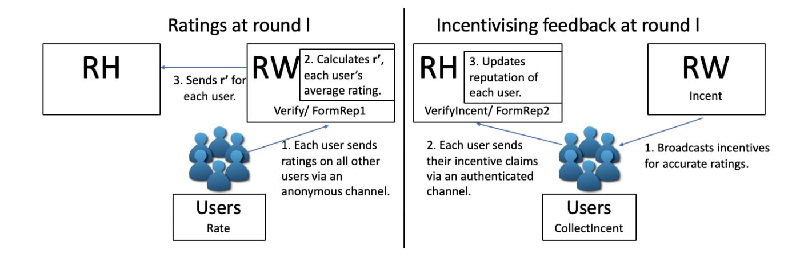
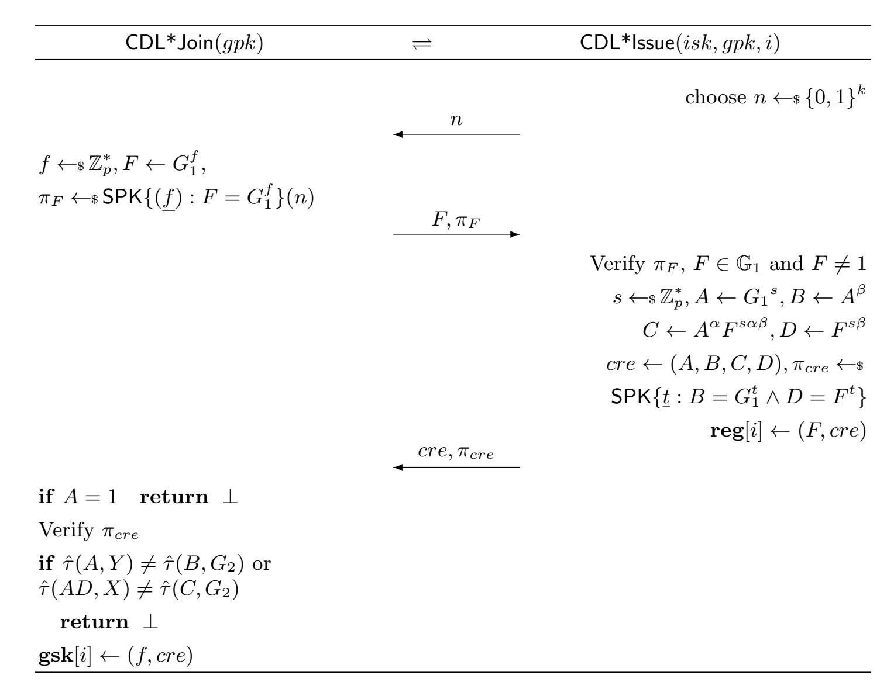

{0}------------------------------------------------

# Anonymity and Rewards in Peer Rating Systems

Lydia Garms<sup>1</sup> , Siaw–Lynn Ng<sup>1</sup> , Elizabeth A. Quaglia<sup>1</sup> , and Giulia Traverso<sup>2</sup>

> <sup>1</sup> Royal Holloway, University of London, UK {Lydia.Garms,S.Ng,Elizabeth.Quaglia}@rhul.ac.uk <sup>2</sup> Cysec, Lausanne, Switzerland giulia.traverso@cysec.systems

Abstract. When peers rate each other, they may choose to rate inaccurately in order to boost their own reputation or unfairly lower another's. This could be successfully mitigated by having a reputation server incentivise accurate ratings with a reward. However, assigning rewards becomes a challenge when ratings are anonymous, since the reputation server cannot tell which peers to reward for rating accurately. To address this, we propose an anonymous peer rating system in which users can be rewarded for accurate ratings, and we formally define its model and security requirements. In our system ratings are rewarded in batches, so that users claiming their rewards only reveal they authored one in this batch of ratings. To ensure the anonymity set of rewarded users is not reduced, we also split the reputation server into two entities, the Rewarder, who knows which ratings are rewarded, and the Reputation Holder, who knows which users were rewarded. We give a provably secure construction satisfying all the security properties required. For our construction we use a modification of a Direct Anonymous Attestation scheme to ensure that peers can prove their own reputation when rating others, and that multiple feedback on the same subject can be detected. We then use Linkable Ring Signatures to enable peers to be rewarded for their accurate ratings, while still ensuring that ratings are anonymous. Our work results in a system which allows for accurate ratings to be rewarded, whilst still providing anonymity of ratings with respect to the central entities managing the system.

## 1 Introduction

Anonymity has long been a sought-after property in many cryptographic primitives, such as public-key encryption [5] and identity-based encryption [2, 17], and a defining one in many others, such as group signatures [20] and ring signatures [52]. A plethora of more complex protocols, from broadcast encryption [41] to cryptocurrencies [38], have been enhanced by the addition of user anonymity and the privacy guarantees it provides.

An example of such protocols are rating systems, also referred to as reputation systems, in which users can be rated by providing feedback on goods or services, with the support of a reputation server. Each user has a reputation value based on these ratings, which can be used to evaluate their trustworthiness. In this context, the value of anonymity lies in the fact that users are able to give honest 

{1}------------------------------------------------

feedback without fear of repercussions. This may occur when there is a lack of trust for the reputation server, or when users are concerned about retaliation.

Anonymity has received a great amount of attention in this area and abundant existing literature covers a range of anonymous rating systems in both the centralised and distributed settings. Distributed systems, e.g., [44], have no reputation server and use local reputation values, i.e., reputation values created by users on other users. For example, a user may generate a reputation value based on feedback from querying other users. This means a user does not have a unique reputation value, but many other users hold their own reputation value for them. In this setting, privacy preserving decentralised reputation systems [49] are designed to maintain anonymity when answering queries from other users.

We focus on centralised systems, since the reputation systems used by most service providers such as Airbnb, Uber and Amazon are of this type. In the centralised setting, a central reputation server enrols users and forms reputation values on these users. In [11, 27, 10, 22, 21] anonymity of a rating is provided to all except the reputation server, and multiple ratings cannot be given on the same subject. In [57], multiple reputation servers are used so that anonymity of ratings holds, unless all reputation servers collude. Other works provide anonymity of ratings in the presence of a corrupted reputation server [53, 50, 31, 32]. In [3, 8] anonymity is achieved with a different approach. The reputation server still enrols users, but no longer forms reputations. Instead users collect tokens based on anonymous ratings from other users and prove their own reputation.

Whilst the benefits of anonymity are clear, it is also understood that this same property can provide an opportunity for malicious users to misbehave. They may "bad mouth" other users, for instance competitors, giving dishonest negative feedback to these users to decrease their reputation. Or they may collude and give each other positive feedback in order to inflate their own reputation. To avoid this, the system can provide either a mechanism to revoke the malicious user's anonymity (typically achieved through a traceability property), or incentivize good behaviour by rewarding users. The rating systems proposed so far approach this issue via user tracing. Indeed, in schemes where the reputation server can de–anonymise ratings [11, 27, 22, 21], inaccurate ratings can be punished.

We take a different approach by rewarding honest ratings in anonymous peer rating systems, where users are peers and anonymously rate each other. Examples include peer-to-peer file sharing [1], collaborative knowledge production [46, 14, 33], and shared knowledge of internet and software vulnerabilities [36, 54]. In such systems the rewarding approach works well since raters are also participating within the system and so have an interest in rating accurately to increase their reputation through rewards. The use of incentives to encourage accurate feedback has already been discussed in [48, 56], but ratings are not anonymous.

Privacy-preserving incentive schemes [45, 39, 35, 9, 12], where users can be incentivised anonymously without their transactions being linked, have also been proposed. In [45] it is described how such incentives could contribute towards a reputation value. However, these schemes do not capture the ability to reward accurate ratings. Firstly, ratings must be incentivised as they are submitted, at 

{2}------------------------------------------------

which point it is not known whether a rating is accurate. When accurate ratings are determined it is then difficult to return the incentive to the relevant user. Secondly, in [39, 35, 9, 12], a user's balance is updated each time a user receives an incentive. However, a user may have submitted k accurate rating on other users, which are unlinkable. Then their balance of n should increase by k, but instead they receive k updated tokens for a balance of n + 1. Finally, in [45, 35, 9, 12] a user would have to participate in an interactive protocol to rate others.

Therefore the challenge remains to rewards users that rate accurately, whilst preserving the anonymity of their ratings even with respect to the reputation server. This is what we address in this paper.

## 1.1 Our work

We consider an anonymous peer rating system in which, at each round of interaction, users rate each other by providing feedback to the reputation server.

Our contribution is to allow accurate ratings to be incentivised and weighted by reputation, whilst still ensuring anonymity of ratings. Achieving this is challenging for two reasons. First, the reputation used to weight feedback could be used to de-anonymise a user. We can partially mitigate this by ensuring reputation is coarse-grained as in [8] (by rounding the reputation value, for instance), which ensures that a user who has a unique reputation score does not reveal their identity. The trade off between precision of reputation and size of anonymity sets is further discussed in [51]. Second, and crucially, accurate ratings must be incentivised without being de-anonymised. We achieve this by incentivising a large set of ratings simultaneously, and rewarding the users responsible for such ratings. With this approach, however, the anonymity set can be reduced substantially. Indeed, a malicious reputation server could decide to only reward a small number of ratings it seeks to de-anonymise, and then check which users are rewarded with an increase in reputation. These users then must have authored these ratings.

A way to lessen the impact in both cases is to restrict access to reputation. A specific trusted entity, the Reputation Holder, holds the reputations of users, and the latter should only be revealed sparingly. We do not specify exactly when and how reputations should be revealed in order to allow for a flexible scheme, and because this has been discussed in the existing literature. For example, in [32, 53], users can prove their reputation and so can decide which users to reveal it to. A simpler example is that a user would have to demonstrate a good reason to learn another's reputation from the Reputation Holder.

We go further and introduce a new entity, the Rewarder, who chooses which ratings to reward, and who cannot see which users have their reputation increase. As the Reputation Holder no longer knows which ratings were rewarded, they cannot compare these ratings with the users that claim rewards and so reduce the anonymity set. We formalise this in the Anonymity of Ratings under a Corrupt Reputation Holder requirement. For completeness, we also consider the case that the Reputation Holder and the Rewarder collude or are the same entity. Clearly they learn that each user that was rewarded n times, authored n of the ratings 

{3}------------------------------------------------

rewarded, however they should learn no more than this. We formalise this in our Anonymity of Ratings under Full Corruption requirement.

Although we are aware that using reputation values and incentivising accurate ratings both inescapably reduce the anonymity sets of ratings, in this work we aim to provide the best anonymity achievable given the functionality. Furthermore, we also must ensure that users do not attempt to subvert the system by claiming rewards that they are not entitled to, by providing multiple ratings on the same user per round, by lying about their reputation, or by framing other users so that they seem to be cheating. We formalise this in our Fair Rewards, Traceability<sup>3</sup> , Unforgeability of Reputation and Non–Frameability requirements.

In this work we first provide a model and security requirements for an anonymous peer rating system APR, which formalises the necessary privacy and security properties discussed above. We use property-based definitions, which are intuitive and useful when proving security. We then give a construction that is provably secure given these security requirements. Our construction makes use of Direct Anonymous Attestation (DAA) [13], which we use to sign feedback. This ensures that, whilst signed feedback are unlinkable, multiple feedback on the same user can be detected, due to the user controlled linkability feature of DAA. We modify the DAA scheme so that when giving feedback a user can prove they have a particular reputation for that round, so that feedback can be weighted. We then make use of Linkable Ring Signatures [42] to allow to incentivise users who rate accurately. For every rating a freshly generated verification key is attached, encrypted under the Rewarder's public key. When the Rewarder rewards a rating, they publish the corresponding decrypted verification keys. The user can then sign a linkable ring signature with the corresponding secret key and claim their incentive from the Reputation Holder. The linkability of the signature scheme can be used to detect if a user tries to claim for the same incentive twice, whilst its anonymity ensures that ratings remain anonymous.

Although DAA and Linkable Ring Signature schemes are similar primitives, we note that they have subtly different properties that make them exactly suited to their particular role in building an APR scheme. As ring signature key pairs can be generated without involving any central entity, this allows a new verification key to be generated for every rating. The fact that a central entity, in our case the Reputation Holder, must authorise the creation of a new DAA key pair, prevents sybil attacks. Otherwise, users could easily create multiple identities and rate other users as many times as they wish per round. Unlike group signatures [20], DAA schemes do not allow a trusted opener to de–anonymise signatures, ensuring that anonymity of ratings holds with respect to the Rewarder.

While the main aim of our anonymous peer rating system is to ensure anonymous and honest feedback, it is also important to consider how it is affected by many other conventional attacks on rating systems. The unfair ratings attack [25] is mitigated by the detection of multiple ratings per subject per round. The incentives also encourage users to give more accurate feedback. The self–rating

<sup>3</sup> Traceability here refers to the requirement that multiple ratings cannot be given on the same subject per round.

{4}------------------------------------------------

or self–promoting attack [37] is mitigated by encouraging all users to give feedback on their own performance. Sybil attacks [26], where a user creates multiple identities to join the system to give unfair feedback, can be mitigated by making joining the system expensive, and by a robust registration process. This also mitigates against whitewashing attacks [23], where a user leaves and rejoins to shed a bad reputation. The on-off attack [55], where a user behaves honestly to increase their reputation before behaving dishonestly, can be somewhat mitigated by adjusting the weighting of the final reputation formation in our system, so that bad behaviour will cause the reputation to deteriorate quickly. Reputation lag exploitation [40], where a user exploits the interval before the latest round of ratings takes effect, cannot be prevented but, as before, we can mitigate it by making the reputation deteriorate faster on bad behaviour.

# 2 Anonymous Peer Rating Systems: Definitions and Security Models

In this section, we introduce and formally define an anonymous peer rating (APR) system, and the security and privacy properties it should satisfy. We consider a set of users U = {uidi} interacting with each other in rounds. At the end of each round they rate each other's performance, by anonymously sending a numerical feedback alongside their reputation to the Rewarder. The Rewarder collects ratings, discards multiple ratings on the same subject, and rewards accurate feedback by outputting a set of incentives. A user claims to the Reputation Holder that they were responsible for a number of these incentives. The final reputation held by the Reputation Holder on a user is based on three components: weighted feedback from other users, the number of incentives they have successfully claimed, and their previous reputation. We present an illustration of our model in Figure 1 and formally capture this as follows.



Fig. 1. Diagram illustrating our model.

Setup & Key Generation The Reputation Holder and Rewarder generate their own key pairs. The group public key gpk = (param, rwpk, rhpk) consists of the public keys of both entities.

{5}------------------------------------------------

Setup(1<sup>τ</sup> , f1, f2) → param: input a security parameter 1<sup>τ</sup> , and two generic functions f<sup>1</sup> and f<sup>2</sup> which calculate the reputations of users. The function f<sup>1</sup> is input the number of ratings a user is being rewarded for, and outputs the second component, r <sup>00</sup>, of their reputation for this round. The function f<sup>2</sup> is input the two components of a user's reputation for this round, and their reputation from the previous round, and outputs their final reputation for this round<sup>4</sup> . Setup outputs the public parameters param which include f1, f2.

RHKeyGen(param) → (rhsk, rhpk): performed by the Reputation Holder, outputs the Reputation Holder's secret key rhsk and public key rhpk.

RWKeyGen(param) → (rwsk, rwpk): performed by the Rewarder, outputs the Rewarder's secret key rwsk and public key rwpk.

Join When a user joins the system they engage in an interactive protocol with the Reputation Holder after which they are issued with secret keys used to provide anonymous ratings and to collect rewards for giving honest feedback. We assume users must join the system before a round of ratings begins.

hJoin(gpk), Issue(rhsk, gpk)i: a user uid joins the system by engaging in an interactive protocol with the Reputation Holder. The user uid and Reputation Holder perform algorithms Join and Issue respectively. These are input a state and an incoming message Min, and output an updated state, an outgoing message Mout, and a decision, either cont, accept, or reject, which denote whether the protocol is still ongoing, has ended in acceptance or has ended in rejection respectively. (States are values necessary for the next stage of the protocol.) The initial input to Join is the group public key, gpk, whereas the initial input to Issue is the Reputation Holder's secret key, rhsk, and the group public key gpk. If the user uid accepts, Join privately outputs the user's secret key gsk[uid], and Issue outputs reg[uid], which stores the user's registration and will be used to later allocate that user a reputation.

Ratings at Round l Each user uid has a reputation r[uid, l] at round l, also held by the Reputation Holder. We assume that reputation is coarse-grained, which lessens the impact on anonymity with respect to the Reputation Holder. At Round l, a user uid with reputation r forms a rating ρ with Rate on user uid<sup>0</sup> based on a numerical feedback f b, which is sent to the Rewarder via a secure anonymous channel<sup>5</sup> . For flexibility we do not specify the form of f b, in [56] this a real number between 0 and 1. The user stores a trapdoor td for each rating for later use when claiming incentives. The Rewarder can verify ratings with Verify.

After collecting the valid ratings weighted by reputation, the Rewarder calculates an intermediate value r 0 [uid, l] for each uid with FormRep1, through which

<sup>4</sup> For example, in [56], f<sup>1</sup> is simply the number of incentives received multiplied by some weight, and f<sup>2</sup> is the weighted sum of these components.

<sup>5</sup> We require a secure channel to prevent the Reputation Holder from accessing the ratings, and determining which ratings will be rewarded by following the strategy of the Rewarder. This knowledge would allow the Reputation Holder to decrease the anonymity set of the users claiming incentives, as in the case when both the Rewarder and Reputation Holder are corrupted.

{6}------------------------------------------------

it also detect multiple ratings on the same subject. This value captures the average feedback given on *uid* weighted by the reputation of the rater, and is sent to the Reputation Holder via a secure authenticated channel.

**Rate**(gsk[uid], gpk, fb, uid', l, r,  $\omega$ )  $\rightarrow$  ( $\rho$ , td): performed by the user with identifier uid, with input the user's secret key gsk[uid], the group public key gpk, a feedback fb, the user who they are rating uid', the current round l, their reputation r, and a reputation token  $\omega$  output in the previous round by AllocateRep. Outputs a rating  $\rho$  and a trapdoor td.

**Verify** $(fb, uid', l, r, \rho, gpk) \rightarrow \{0, 1\}$ : a public function that is performed by the Rewarder when receiving a rating tuple  $(fb, uid', r, \rho)$ . Outputs 1 if  $\rho$  is valid on the feedback fb for user uid' at round l for reputation r under the group public key gpk, and 0 otherwise.

FormRep1( $uid, l, (fb_1, r_1, \rho_1), \cdots (fb_k, r_k, \rho_k), gpk$ )  $\rightarrow \mathbf{r}'[uid, l]$ : performed by the Rewarder with input k valid rating tuples  $\{(fb_i, uid, r_i, \rho_i) : i \in [1, k]\}$  on user uid at round l, and the group public key gpk. Outputs  $\mathbf{r}'[uid, l] = \frac{\sum_{i=1}^k r_i fb_i}{\sum_{i=1}^k r_i}$  if all ratings originate from different users' secret keys. Otherwise outputs  $\bot$  (in practice also outputs ratings that should be discarded).

Incentivising accurate feedback The Rewarder compares each feedback on uid'. If this is close to  $\mathbf{r}'[uid', l]$  then this rating will be considered to be accurate and will be given an incentive. We define accurate as close to  $\mathbf{r}'$ . However, our model could simply be adapted to incorporate different metrics of accuracy.

The Rewarder inputs the k accurate ratings in this round to Incent, which outputs k incentives which are broadcast publicly to all users. Incent must be deterministic, to allow users to identify which incentives match their ratings.

A user collects all its incentives and can then use CollectIncent, along with the trapdoors stored earlier, to output an incentive claim  $\sigma$  for each of their incentives. They send these incentive claims to the Reputation Holder over a secure authenticated channel. Incentive claims are verified by the Reputation Holder with VerifyIncent. After gathering all the valid incentive claims, the Reputation Holder calculates the second component  $\mathbf{r}''[uid, l+1]$  of a user's reputation at round l with FormRep2, which also checks that no user has claimed the same incentive twice. This value reflects how in line the feedback of uid is with respect to other users' feedback, incentivising users to give honest feedback.

**Incent** $((fb_1, uid_1, r_1, \rho_1), \cdots, (fb_k, uid_k, r_k, \rho_k), l, rwsk, gpk) \to t_1, \cdots, t_k$ : a deterministic function performed by the Rewarder on input k rating tuples  $\{(fb_i, uid_i, r_i, \rho_i) : i \in [1, k]\}$  from round l and its secret key rwsk. Outputs k incentives  $t_1, \cdots, t_k$ .

**CollectIncent** $(uid, (fb, uid', l, r, \rho, td), t_1, \dots, t_k, gpk) \to \sigma$ : performed by the user uid who gave the rating tuple  $(fb, uid', r, \rho)$  for round l corresponding to trapdoor td, with input the incentives output by the Rewarder  $t_1, \dots, t_k$ . Outputs an incentive claim  $\sigma$  if the rating tuple  $(fb, uid', r, \rho)$  corresponds to an incentive in list  $t_1, \dots, t_k$  and  $\bot$  otherwise.

{7}------------------------------------------------

VerifyIncent(uid, σ, t1, · · · , tk, gpk) → {0, 1}: performed by the Reputation Holder when receiving an incentive claim σ from user uid on incentives t1, · · · , tk. Outputs 1 if the incentive claim is valid on uid, t1, · · ·t<sup>k</sup> and 0 otherwise.

FormRep2(uid, σ1, · · · σk<sup>1</sup> , t1, · · · , tk<sup>2</sup> , gpk) → r <sup>00</sup>[uid, l]: performed by the Reputation Holder with input a user uid, k<sup>1</sup> valid incentive claims σ1, · · · σk<sup>1</sup> and k<sup>2</sup> incentives t1, · · · , tk<sup>2</sup> . Outputs r <sup>00</sup>[uid, l] = f1(k1) if no incentive has been claimed twice, and otherwise ⊥.

Allocate reputation for next round For the first round, all users' reputations are set to an initial value. The reputation of user uid for round l+ 1, r[uid, l+ 1], is set by the Reputation Holder as f2(r 0 [uid, l], r <sup>00</sup>[uid, l], r[uid, l]) combining the user's previous reputation and the two intermediate values r 0 [uid, l], r <sup>00</sup>[uid, l]. This reputation value r[uid, l+ 1], which we refer to as r, and a reputation token ω obtained from AllocateRep are given to the user via a secure authenticated channel to allow them to prove they have this reputation in the next round.

AllocateRep(uid, r, l, rhsk, reg) → ω: performed by the Reputation Holder with input a user uid with reputation r during round l, the Reputation Holder's secret key rhsk and the registration table reg. Outputs reputation token ω.

## 2.1 Security Requirements

An APR system must satisfy Correctness, as well as the following security requirements: Anonymity of Ratings under Full Corruption, which formalises the strongest anonymity that can be achieved when the Rewarder and Reputation Holder are corrupted; Anonymity of Ratings under a Corrupt Reputation Holder, which ensures that ratings cannot be de-anonymised or linked by the Reputation Holder<sup>6</sup> ; Traceability, which ensures that multiple ratings cannot be given on the same user per round; Non–Frameability, which ensures that users cannot be impersonated when giving ratings or claiming incentives; Unforgeability of Reputation, which ensures that a user cannot lie about their reputation, and Fair Rewards, which ensures that users can only successfully claim for the number of incentives they were awarded. We focus here on the Anonymity of Ratings and Fair Rewards requirements as these are the most novel, directly relating to the problem of incentivising anonymous ratings. However, the Traceability, Non–Frameability and Unforgeability of Reputation requirements are given in full in Appendix A.

We provide definitions in the computational model of cryptography. These are typically formulated as experiments in which an adversary, having access to a certain number of oracles, is challenged to produce an output. Such output captures an instance of the system in which the security requirement does not hold. In Figure 2, we provide the oracles used in our security requirements: AddU, SndToU, SndToRH, AllocateRep, USK, Rate, TD, Incent, Collect, based on notation from [6]. We give a high level description below:

<sup>6</sup> The case of a corrupt Rewarder is captured in the Anonymity of Ratings under Full Corruption requirement.

{8}------------------------------------------------

- AddU (Add User): creates an honest user uid.
- SndToU (Send to User): creates honest users when the adversary has corrupted the Reputation Holder. The adversary impersonates the RH, and engages in a < Join, Issue > protocol with an honest user.
- SndToRH (Send to RH): creates corrupted users, when the adversary has not corrupted the Reputation Holder. The adversary impersonates a user and engages in a < Join, Issue > protocol with an honest RH.
- AllocateRep: allows an adversary to obtain outputs of AllocateRep.
- USK: allows an adversary to obtain the secret key of an honest user.
- Rate: allows an adversary to perform Rate on behalf of an honest user.
- TD: allows an adversary to obtain a trapdoor associated to a rating that has been obtained through the Rate oracle.
- Incent: allows an adversary to obtain outputs of Incent.
- Collect: allows an adversary to obtain outputs of CollectIncent for a rating that has been output by the Rate oracle and then input to the Incent oracle.

All oracles have access to the following records maintained as global state which are initially set to ∅:

- HL List of uids of honest users. New honest users can be added by queries to the AddU oracle (for an honest RH) or SndToU oracle (for a corrupt RH).
- CL List of corrupt users that have requested to join the group. New corrupt users can be added through the SndToRH oracle if the RH is honest. If the RH is corrupt, we do not keep track of corrupt users.
- AL List of all queries to the AllocateRep oracle for corrupt users.
- SL List of queries and outputs from the Rate oracle.
- TDL List of queries to the TD oracle.
- IL List of queries, and outputs of the Incent oracle.
- CLL List of queries, and outputs of the Collect oracle.

Correctness An APR system is correct, if when Rate is input an honestly generated secret key and a reputation token, it will output a valid rating. Provided all ratings input to FormRep1 originate from different users it will output the correct function. Also, if Incent and CollectIncent are performed honestly on k valid ratings, the resulting incentive claims will be valid. Provided each incentive is only claimed once, FormRep2 will output f1(k). We give the full requirement in Appendix B.

Anonymity of Ratings We now give the requirements for both corruption settings that ensure ratings cannot be de-anonymised or linked by user, provided multiple ratings on the same user per round are not given. We also must ensure that ratings cannot be linked to the corresponding incentive claim. This is crucial to ensuring ratings are anonymous, as incentive claims are sent fully authenticated and so, if linkable to the corresponding rating, they could be used to de-anonymise such ratings.

{9}------------------------------------------------

```
\mathtt{AddU}(uid):
                                                                                                     Rate(uid, uid', l, fb, r, \omega):
  if uid \in CL \cup HL return \bot
                                                                                                    if uid \notin \mathsf{HL} \text{ or } \mathbf{gsk}[uid] = \perp return \perp
 \mathsf{HL} \leftarrow \mathsf{HL} \cup \{uid\}, \mathsf{dec}^{uid} \leftarrow \mathsf{cont}, \mathbf{gsk}[uid] \leftarrow \bot
                                                                                                    (\rho, td) \leftarrow s Rate(\mathbf{gsk}[uid], gpk, fb, uid', l, r, \omega)
 \mathsf{St}_{jn}^{uid} \leftarrow (gpk), \mathsf{St}_{iss}^{uid} \leftarrow (rhsk, gpk, uid), M_{jn} \leftarrow \bot
                                                                                                    SL \leftarrow SL \cup \{uid, uid', fb, r, \rho, td, l\}, \mathbf{return} \ \rho
  (\mathsf{St}^{uid}_{jn}, M_{iss}, \mathsf{dec}^{uid}) \leftarrow \!\!\!\!\!\!\!\!\!\!\!\!\!\!\!\!\!\!\!\!\!\!\!\!\!\!\!\!\!\!\!\!\!\!\!
 While dec^{uid} = cont
                                                                                                    TD(fb, uid', l, r, \rho):
     (\mathsf{St}^{uid}_{iss}, M_{jn}, \mathsf{dec}^{uid}) \leftarrow_{\mathsf{s}} \mathsf{Issue}(\mathsf{St}^{uid}_{iss}, M_{iss})
                                                                                                    \mathbf{if}\ (\cdot, uid', fb, r, \rho, td, l) \in \mathsf{SL} \quad \mathsf{TDL} \leftarrow \mathsf{TDL} \cup \{((fb, uid', l, r, \rho)\} \quad \mathbf{return}\ td
     If dec^{uid} = accept \quad \mathbf{reg}[uid] \leftarrow \mathsf{St}^{uid}_{iss}
                                                                                                    else return
     (\mathsf{St}^{uid}_{jn}, M_{iss}, \mathsf{dec}^{uid}) \leftarrow_{\$} \mathsf{Join}(\mathsf{St}^{uid}_{jn}, M_{jn})
 \mathbf{gsk}[uid] \leftarrow \mathsf{St}^{uid}_{jn}, \mathbf{return} \ \mathbf{reg}[uid]
                                                                                                    Incent((fb_1, uid_1, r_1, \rho_1), \cdots, (fb_k, uid_k, r_k, \rho_k), l)
 SndToU(uid, M_{in}):
                                                                                                    if |\{i \in [k] : (\cdot, uid_i, fb_i, r_i, \rho_i, \cdot, l) \in \mathsf{RL}^{\dagger}\}| > 1 return \perp
                                                                                                    if |\{i \in [k] : (\cdot, uid_i, fb_i, r_i, \rho_i, \cdot, l) \in \mathsf{RL}^\dagger\}| = 1
if uid \notin HL
                                                                                                     // Check if challenge rating is input in a
non-rh game, otherwise \mathsf{RL}^\dagger = \emptyset
    \mathsf{HL} \leftarrow \mathsf{HL} \cup \{uid\}
                                                                                                        Parse \mathsf{RL}^{\dagger} = \{(uid_{b'}^*, uid'^*, fb^*, r^*, \rho_{b'}^*, td_{b'}^*, l^*) : b' \in \{0, 1\}\}
    \mathbf{gsk}[uid] \leftarrow \perp, M_{in} \leftarrow \perp, \mathsf{St}_{in}^{uid} \leftarrow gpk
                                                                                                        k \leftarrow k + 1, (fb_k, uid_k, r_k, \rho_k) \leftarrow (fb^*, uid'^*, r^*, \rho_{1-b}^*)
(\mathsf{St}^{uid}_{jn}, M_{out}, \mathsf{dec}) \leftarrow_{\$} \mathsf{Join}(\mathsf{St}^{uid}_{jn}, M_{in})
                                                                                                         # Rating from other challenged user added to the inputs
\mathbf{if} \ \mathsf{dec} = \mathsf{accept} \quad \mathbf{gsk}[uid] \leftarrow \mathsf{St}^{uid}_{in}
                                                                                                    t_1, \cdots, t_k \leftarrow
return (M_{out}, dec)
                                                                                                    \mathsf{Incent}((fb_1, uid_1, r_1, \rho_1), \cdots, (fb_k, uid_k, r_k, \rho_k), l, rwsk, gpk)
                                                                                                    \forall i \in [k] \quad \text{if } (t_i, \cdot) \notin \mathsf{IL} \quad \mathsf{IL} \leftarrow \mathsf{IL} \cup (t_i, (fb_i, uid_i, r_i, \rho_i))
 SndToRH(uid, M_{in}):
                                                                                                    choose random permutation \Pi, return t_{\Pi(1)}, \dots, t_{\Pi(k)}
if uid \in \mathsf{HL} return \bot
if uid \notin CL \quad CL \leftarrow CL \cup \{uid\}, dec^{uid} \leftarrow cont
                                                                                                    Collect((t_1, \cdots, t_k), l):
if dec^{uid} \neq cont return \bot
                                                                                                    \forall i \in [k] \quad \text{if } (t_i, (fb_i, uid'_i, r_i, \rho_i)) \notin \mathsf{IL} \quad \text{return } \perp
if \mathsf{st}^{uid}_{\mathsf{Issue}} undefined \mathsf{st}^{uid}_{\mathsf{Issue}} \leftarrow (rhsk, gpk)
                                                                                                    \forall i \in [k] \quad \text{if } (uid_i, uid_i', fb_i, r_i, \rho_i, td_i, l) \notin \mathsf{SL} \cup \mathsf{RL} \cup \mathsf{RL}^{\dagger} \quad \text{return } \perp
(\mathsf{St}^{uid}_{iss}, M_{out}, \mathsf{dec}^{uid}) \leftarrow \mathsf{sIssue}(\mathsf{St}^{uid}_{iss}, M_{in})
                                                                                                    if |\{(uid_i, uid'_i, fb_i, r_i, \rho_i, td_i, l) : i \in [k]\} \cap \mathsf{RL}| = 1
\mathbf{if} \ \mathsf{dec}^{uid} = \mathsf{accept}
                                                                                                     /\!\!/ Check if challenge rating is input in a
non-fullcorr game, otherwise \mathsf{RL} = \emptyset
    \mathbf{reg}[uid] \leftarrow \mathsf{St}^{uid}_{iss} \quad \mathbf{return} \ (M_{out}, \mathbf{reg}[uid])
                                                                                                         Parse \mathsf{RL} = \{(uid_{b'}^*, uid'^*, fb^*, r^*, \rho_{b'}^*, td_{b'}^*, l^*) : b' \in \{0, 1\}\}, k \leftarrow k + 1
 else return M_{out}
                                                                                                         (uid_k, uid'_k, fb_k, r_k, \rho_k, td_k) \leftarrow (uid^*_{1-b}, uid'^*, fb^*, r^*, \rho^*_{1-b}, td^*_{1-b})
                                                                                                         /\!\!/ Rating from other challenged user added to the inputs
 USK(uid):
                                                                                                        t_k \leftarrow \mathsf{Incent}((fb_k, uid'_k, r_k, \rho_k), l, rwsk, qpk)
if uid \notin HL return \perp else return (gsk[uid])
                                                                                                     \mathsf{CLL} \leftarrow \emptyset, \forall i \in [k]
                                                                                                         \sigma_i \leftarrow \texttt{s} \, \mathsf{CollectIncent}(uid_i, (fb_i, uid_i', l, r_i, \rho_i, td_i), t_1, \cdots t_k, gpk)
 AllocateRep(uid, r, l):
                                                                                                         \mathsf{CLL} \leftarrow \mathsf{CLL} \cup \{((fb_i, uid_i', r_i, \rho_i), uid_i, \sigma_i, t_1, \cdots t_k, l)\}
if uid \in \mathsf{CL} \quad \mathsf{AL} \leftarrow \mathsf{AL} \cup (uid, r, l)
                                                                                                    choose random permutation \Pi for j=1,\cdots,k
return \omega \leftarrow \text{AllocateRep}(uid, r, l, rhsk, reg)
                                                                                                    \textbf{return}\ \{uid_{\Pi(j)}, \sigma_{\Pi(j)}: j \in [1,k]\}
```

Fig. 2. Oracles used in our Security Requirements

Anonymity of Ratings under Full Corruption. We first formally define anonymity of ratings in the case both the Rewarder and the Reputation Holder have been corrupted. In this setting, the following attack can always be mounted: The adversary, having corrupted the Rewarder and Reputation Holder, wishes to deanonymise a specific rating and so simply only rewards this rating. The author of the rating then claims their reward from the Reputation Holder, revealing their identity. Such an attack is unavoidable when incentivising accurate feedback.

However, we can still provide some guarantee of anonymity, namely that the adversary should learn no more than the following: a user that has been rewarded n times per round is responsible for n of the rewarded ratings for that round. When n=1 the above attack still holds, but this dishonest behaviour of the Rewarder can be detected as only one incentive would be publicly broadcast. Our security requirement achieves this by allowing the challenge rating to be input to the Collect oracle, on the condition that an additional rating authored by the other challenged user is added to the inputs. By including ratings originating from both challenged users, the incentives claimed by both of these users will increase by 1, and so the adversary cannot use this to trivially win. We note

{10}------------------------------------------------

that this notion implies the anonymity requirement when just the Rewarder is corrupted, i.e., it is the strongest of the two requirements.

In the security game the Reputation Holder and Rewarder are corrupted, and so the adversary can create corrupted users. The adversary chooses two honest users, as well as a feedback, a user who is the subject of the feedback, and a reputation. The adversary must give reputation tokens for each user for this reputation. The adversary is returned with a challenge rating authored by one of these users, with this reputation, on this feedback and user (subject), and they must guess which user authored the rating. The challenge rating as well as another rating authored by the other challenged user is saved in RL, for later use in the Collect oracle. The adversary can create honest users with the SndToU oracle and obtain their ratings with the Rate oracle. However they cannot query to the Rate oracle either of the users that were challenged as well as the challenge subject/round. Otherwise the FormRep1 algorithm could be used to trivially win, due to the detection of multiple ratings on the same user/round. We also must check that both ratings computed from the challenged users are valid, to ensure that both  $\omega_0$  or  $\omega_1$  output by the adversary were correctly formed. The adversary can also reveal the trapdoor from each Rate oracle query with the TD oracle, but not for the challenge ratings as this would lead to a trivial win by detecting double claims with FormRep2. They also have access to an Incent oracle. The adversary can query incentives from the Incent oracle, that originate from the Rate oracle, to the Collect oracle. If they include the challenge rating, an additional rating from the other challenged user is added to the inputs. The adversary is returned with the incentive claims for these ratings along with the user who claims them. This captures the fact that claiming incentives should not violate the anonymity of ratings. We give the full game below:

```
Experiment: \operatorname{Exp}_{\mathcal{A},\operatorname{APR}}^{\operatorname{anon-fullcorr}}(\tau,f_1,f_2)
b \leftarrow \$\{0,1\},\operatorname{RL},\operatorname{RL}^\dagger \leftarrow \emptyset,\operatorname{param} \leftarrow \$\operatorname{Setup}(1^\tau,f_1,f_2),(rhsk,rhpk) \leftarrow \$\operatorname{RHKeyGen}(\operatorname{param})
(rwsk,rwpk) \leftarrow \$\operatorname{RWKeyGen}(\operatorname{param}),gpk \leftarrow (\operatorname{param},rwpk,rhpk)
(\operatorname{st},uid_0^*,uid_1^*,l^*,fb^*,uid'^*,r^*,\omega_0,\omega_1) \leftarrow \$\mathcal{A}^{\operatorname{SndToU,Rate},\operatorname{TD,Incent},\operatorname{Collect}}(\operatorname{choose},gpk,rhsk,rwsk)\nif uid_0^*,uid_1^* \notin \operatorname{HL} or \operatorname{gsk}[uid_0^*],\operatorname{gsk}[uid_1^*] = \bot return \bot
\forall b' \in \{0,1\} \quad (td_{b'}^*,\rho_{b'}^*) \leftarrow \$\operatorname{Rate}(\operatorname{gsk}[uid_{b'}^*],gpk,fb^*,uid'^*,l^*,r^*,\omega_{b'})
/\!\!/ Compute both ratings for use in Collect oracle and to check \omega_0,\omega_1
\operatorname{RL} \leftarrow \{(uid_{b'}^*,uid'^*,fb^*,r^*,\rho_{b'}^*,td_{b'}^*,l^*):b' \in \{0,1\}\} \quad /\!\!/ Save both ratings for use in Collect d \leftarrow \$\mathcal{A}^{\operatorname{SndToU,Rate},\operatorname{TD,Incent},\operatorname{Collect}}(\operatorname{guess},\operatorname{st},\rho_b^*)\nif \rho_0^* or \rho_1^* = \bot or \exists b' \in \{0,1\} s.t (uid_{b'}^*,uid'^*,\cdot,\cdot,\cdot,\cdot,l^*) \in \operatorname{SL}
/\!\!/ Check \omega_0,\omega_1 are both valid and FormRep1 can't be used to trivially win by detecting multiple ratings return d \leftarrow \$\{0,1\}\nif d = b return 1 else return 0
```

An APR system satisfies Anonymity of Ratings under Full Corruption if for all functions  $f_1, f_2$ , for all polynomial time adversaries  $\mathcal{A}$ , the following advantage is negligible in  $\tau$ :

$$|\Pr[\mathsf{Exp}_{\mathcal{A},\mathsf{APR}}^{anon-fullcorr}(\tau,f_1,f_2)=1]-1/2|.$$

{11}------------------------------------------------

Anonymity of Ratings under a Corrupt Reputation Holder. We next define anonymity in the setting where the Reputation Holder has been corrupted, but not the Rewarder. This means that the adversary now does not know which ratings have been rewarded. The challenge rating and a rating authored by the other challenged user are now stored in list RL<sup>†</sup>. The adversary has full access to the Collect oracle, modelling the role of the Reputation Holder. However, if the challenge rating is input to the Incent oracle, the rating authored by the other challenged user stored in RL<sup>†</sup> is also added to the inputs. The Incent oracle shuffles the outputs. This represents that the Reputation Holder no longer knows which rating is linked to each incentive.

```
Experiment: \operatorname{Exp}_{\mathcal{A},\mathsf{APR}}^{\mathsf{anon-rh}}(\tau,f_1,f_2)
b \leftarrow \$\{0,1\},\mathsf{RL},\mathsf{RL}^\dagger \leftarrow \emptyset,\mathsf{param} \leftarrow \$\mathsf{Setup}(1^\tau,f_1,f_2),(rhsk,rhpk) \leftarrow \$\mathsf{RHKeyGen}(\mathsf{param})
(rwsk,rwpk) \leftarrow \$\mathsf{RWKeyGen}(\mathsf{param}),gpk \leftarrow (\mathsf{param},rwpk,rhpk)
(\$t,uid_0^*,uid_1^*,l^*,fb^*,uid'^*,r^*,\omega_0,\omega_1) \leftarrow \$\mathcal{A}^{\mathsf{SndToU},\mathsf{Rate},\mathsf{TD},\mathsf{Incent},\mathsf{Collect}}(\mathsf{choose},gpk,rhsk)\nif uid_0^*,uid_1^* \notin \mathsf{HL} or \mathsf{gsk}[uid_0^*],\mathsf{gsk}[uid_1^*] = \bot return \bot
\forall b' \in \{0,1\} \quad (td_{b'}^*,\rho_{b'}^*) \leftarrow \$\mathsf{Rate}(\mathsf{gsk}[uid_{b'}^*],gpk,fb^*,uid'^*,l^*,r^*,\omega_{b'})
/\!\!/ Compute both ratings for use in Incent oracle and to check \omega_0,\omega_1
\mathsf{RL}^\dagger \leftarrow \{(uid_{b'}^*,uid'^*,fb^*,r^*,\rho_{b'}^*,td_{b'}^*,l^*):b' \in \{0,1\}\} \quad /\!\!/ Save both ratings for use in Incent d \leftarrow \$\mathcal{A}^{\mathsf{SndToU},\mathsf{Rate},\mathsf{TD},\mathsf{Incent},\mathsf{Collect}}(\mathsf{guess},\$t,\rho_b^*)\nif \rho_0^* or \rho_1^* = \bot or \exists b' \in \{0,1\} \$.t. (uid_{b'}^*,uid'^*,\cdot,\cdot,\cdot,\cdot,l^*) \in \mathsf{SL}
/\!\!/ Check \omega_0,\omega_1 are both valid and FormRep1 can't be used to trivially win by detecting multiple ratings return d \leftarrow \$\{0,1\}\nif d = b return 1 else return 0
```

An APR system satisfies Anonymity of Ratings under a Corrupt Reputation Holder if for all  $f_1, f_2$ , for all polynomial time adversaries  $\mathcal{A}$ , the following advantage is negligible in  $\tau$ :

$$|\Pr[\mathsf{Exp}_{\mathcal{A},\mathsf{APR}}^{anon-rh}(\tau,f_1,f_2)=1]-1/2|.$$

Fair Rewards This requirement ensures that an adversary cannot increase the number of incentives they were allocated, or steal incentives allocated to other users. In the security game the Rewarder and the Reputation Holder are corrupted, so the adversary can create corrupted users. The adversary is given the SndToU and Rate oracles to create honest users, and obtain their ratings. They have access to the Collect oracles to obtain incentive claims on incentives obtained from the Rate oracle followed by the Incent oracle. They have access to the trapdoor oracle, to obtain trapdoors associated to ratings output by Rate. The adversary must choose  $k_1$  incentives obtained from the Incent oracle, and  $k_2$  valid incentive claims, not output by the Collect oracle, corresponding to a single user identifier. If FormRep2 doesn't detect cheating, and more incentive claims are output than incentives corresponding to ratings not obtained through the Rate oracle or queried to the trapdoor oracle, then the adversary wins. We give the full game below:

{12}------------------------------------------------

```
Experiment: \operatorname{Exp}_{\mathcal{A},\mathsf{APR}}^{fair-rew}(\tau,f_1,f_2)

\mathsf{RL},\mathsf{RL}^\dagger \leftarrow \emptyset,\mathsf{param} \leftarrow \mathsf{sSetup}(1^\tau,f_1,f_2),(rhsk,rhpk) \leftarrow \mathsf{sRHKeyGen}(\mathsf{param})

(rwsk,rwpk) \leftarrow \mathsf{sRWKeyGen}(\mathsf{param}),gpk \leftarrow (\mathsf{param},rwpk,rhpk)

(uid,(\sigma_1,\cdots\sigma_{k_2}),(t_1,\cdots t_{k_1}),l) \leftarrow \mathsf{s}\,\mathcal{A}^{\mathsf{SndToU},\mathsf{Rate},\mathsf{TD},\mathsf{Incent},\mathsf{Collect}}(gpk,rwsk,rhsk)
\nif \exists i \in [k_1] \; \mathsf{s.t} \; (t_i,(fb_i,uid_i',r_i,\rho_i)) \notin \mathsf{IL} \; \; \mathbf{return} \; 0

return 1 if the following conditions hold

\forall i \in [k_2] \; \; \sigma_i \; \mathsf{not} \; \mathsf{returned} \; \mathsf{by} \; \mathsf{Collect} \; \mathsf{oracle} \; \mathsf{and} \; \; \mathsf{VerifyIncent}(uid,\sigma_i,(t_1,\cdots,t_{k_1})) = 1 \; \mathsf{and} \; \mathsf{FormRep2}(uid,\sigma_1,\cdots\sigma_{k_2},t_1,\cdots t_{k_1},gpk) \neq \perp \; \mathsf{and} \; \mathsf{k}_2 > |\{i \in [k_1] : (\cdot,uid_i',fb_i,r_i,\rho_i,\cdot,l) \notin \mathsf{SL} \; \mathsf{or} \; (fb_i,uid_i',l,r_i,\rho_i) \in \mathsf{TDL}\}|
```

An APR system satisfies Fair Rewards if for all functions  $f_1, f_2$ , for all polynomial time adversaries  $\mathcal{A}$ , the advantage  $\Pr[\mathsf{Exp}_{\mathcal{A},\mathsf{APR}}^{fair-rew}(\tau, f_1, f_2) = 1]$  is negligible in  $\tau$ .

## 3 Construction

We propose a construction for an APR system which makes use of three building blocks: Linkable Ring Signatures (LRS), a modified Direct Anonymous Attestation (DAA\*) scheme and a public–key encryption scheme.

Ring signatures [52] allow users to sign on behalf of a ring of users, without revealing their identity within the ring. There is no central entity involved, and users generate their own signing and verification keys. Linkable ring signatures [42] allow for the public linking of signatures by signer. We exploit these features to allow for incentivising accurate ratings as follows. Each rating includes a freshly generated verification key encrypted under the public key of the Rewarder, and the user who has generated the rating stores the corresponding signing key as a trapdoor. The Rewarder publishes these decrypted verification keys as incentives. Then to claim an incentive the user uses the signing key to sign a ring signature on their user identifier with respect to the ring of verification keys given as incentives. The anonymity of Linkable Ring Signatures ensures that claiming incentives will not de-anonymise ratings. The unforgeability property ensures that only users that have been rewarded can claim an incentive, and the linking function ensures that only one reward can be claimed per rating.

Direct Anonymous Attestation (DAA) [13] allows users to sign on behalf of a group, whilst remaining anonymous within the group. The user-controlled linkability feature, where two signatures on the same basename by the same user are linked, whilst all other signatures are unlinkable, can be used to detect multiple feedback on the same subject. In our setting, the basename can be set to be the user who is the subject of the feedback and the round. In our system we also wish to ensure feedback is weighted by reputation. However, this must also be balanced with anonymity of feedback. For this to be possible the reputation of users must be coarse-grained enough that they cannot be identified by their reputation. To ensure this, we bind reputation into a Direct Anonymous Attestation scheme, which we will call a DAA\* scheme. Now a user proves their reputation when signing, allowing for the weighting of feedback.

{13}------------------------------------------------

## 3.1 Public-Key Encryption Schemes

Our scheme makes use of a public–key encryption scheme, which consists of the following: EncSetup(1<sup>τ</sup> ), which is input the security parameter 1<sup>τ</sup> and outputs parameters paramEnc; EncKeyGen(paramEnc), which is input the parameters and outputs secret key sk and the public key pk; Enc(pk, m), which is input the public key pk and a message m from the message space, and outputs a ciphertext c; and Dec(sk, c), which is input the secret key sk and a ciphertext c, and outputs a message m or a decryption failure ⊥. We require the encryption scheme to be correct and satisfy indistinguishability under adaptive chosen ciphertext attacks.

## 3.2 Linkable Ring Signatures

We use the model in [4] for one-time linkable ring signatures, which gives the strongest security yet. The scheme from [4] has the shortest signatures to date. We give the security requirements: Correctness Linkability, Linkable Anonymity, Non–Frameability and Unforgeability in Appendix C.

Definition 1 (Linkable Ring Signatures.). A linkable ring signature scheme LRS is given by polynomial time algorithms (LRKeyGen, LRSign, LRVerify, LRLink):

LRKeyGen(1<sup>τ</sup> ): takes as input the security parameter 1<sup>τ</sup> and outputs a pair (vk, sk) of verification and signing keys.

LRSign(sk, m, R): takes as input a signing key sk, a message m, and a list of verification keys R = (vk1, ..., vkq), and outputs a signature Σ.

LRVerify(R, m, Σ): takes as input a ring R = (vk1, ..., vkq), a message m, and a signature Σ, and outputs either 0 or 1.

LRLink(Σ1, Σ2, m1, m2) : is input two signatures/ messages, outputs 0 or 1.

## 3.3 DAA\* Signatures

The security model of DAA\* closely follows that of pre–DAA signatures [7]. We give the security requirements for DAA\* signatures in full in Appendix D.

Definition 2 (DAA\*.). A DAA\* scheme consists of the following algorithms: DAA\*Setup(1<sup>τ</sup> ): input the security parameter τ , outputs parameters param. DAA\*KeyGen(param): input the parameters param, outputs the group public key gpk, and the issuing secret key isk.

hDAA\*Join(gpk), DAA\*Issue(isk, gpk)i: a user i joins the group by engaging in an interactive protocol with the Issuer. The user i and Issuer perform algorithms DAA\*Join and DAA\*Issue respectively. These are input a state and an incoming message respectively, and output an updated state, an outgoing message, and a decision, either cont, accept, or reject. The initial input to DAA\*Join is the group public key, whereas the initial input to DAA\*Issue is the issuer secret key, isk, and the group public key. If the issuer accepts, DAA\*Join has a private output of gsk[i], DAA\*Issue has a private output of reg[i].

DAA\*Update(r, t, isk, i, reg, gpk): input a reputation r, a time t, the issuing secret key isk, a user i, the registration list reg, gpk. Outputs a token ω.

{14}------------------------------------------------

DAA\*Sign(bsn, m, gsk[i], ω, gpk, r, t): input a basename bsn, a message m, a user secret key gsk[i], a token ω output by DAA\*Update, a group public key gpk, a reputation r and time t. It checks that ω is valid for user i, reputation r and time t and outputs a signature Ω. Otherwise it outputs ⊥.

DAA\*Verify(bsn, m, r, t, Ω, gpk): input a basename bsn, a message m, a reputation r, time t, a signature Ω, and a group public key gpk. It outputs 1 if Ω is valid for the item I, reputation r and time t, and 0 otherwise.

DAA\*Link((bsn0, m0, r0, t0, Ω0),(bsn1, m1, r1, t1, Ω1), gpk): input two signatures Ω0, Ω<sup>1</sup> each on a basename, a message, a reputation, a time, and a group public key gpk. It outputs 1 if both signatures are valid, bsn<sup>0</sup> = bsn<sup>1</sup> and the two signatures have the same author, and 0 otherwise.

DAA\*Identify<sup>T</sup> (T , gsk): outputs 1 if T corresponds to a valid transcript of < DAA\*Join, DAA\*Issue >, with output gsk to DAA\*Join, and otherwise 0.

DAA\*IdentifyS(bsn, m, r, t, Ω, gsk): outputs 1 if the signature Ω could have been produced with user secret key gsk, and 0 otherwise.

## 3.4 Our Construction

We now present our construction that securely realizes an APR system, using a PKE scheme, an LRS scheme and a DAA\* scheme. We give our construction in Figure 3, except for the < Join, Issue > protocol which is identical to the < DAA\*Join, DAA\*Issue > protocol for DAA\* signatures such that DAA\*Join is input rhpk, and DAA\*Issue is input (rhsk, rhpk).

## 3.5 Security of Our Construction

We show that our construction satisfies the security requirements for an APR system defined in Section 2. We need one further property than the security of the LRS and DAA\* building blocks. In the < Join, Issue > protocol, the RH must be sent an SPK of the user's secret key. SPK denotes a signature proof of knowledge, that is a non-interactive transformation of a proof PK. These proofs can be extended to be online-extractable [29], by verifiably encrypting the witness to a public key defined in the common reference string. We require the proof system to be simulation-sound, online–extractable and zero-knowledge. We give further details on the proof protocols used in Appendix F.

Theorem 1. The construction presented in Figure 3 is a secure APR, as defined in Section 2, if the LRS scheme, DAA\* scheme and PKE scheme used are secure, and the SPK is online extractable, simulation sound, and zero-knowledge.

The detailed proofs of Lemmata 1-6 are given in Appendix E. We give high level intuition here of proofs of Anonymity of Ratings and Fair Rewards.

Lemma 1. The construction satisfies Anonymity of Ratings under Full–Corruption if the LRS and DAA\* schemes satisfy Anonymity, and the SPK is zero-knowledge.

{15}------------------------------------------------

```
\mathsf{Setup}(1^{\tau}, f_1, f_2)
                                                                                           \mathsf{RHKeyGen}(\mathsf{param}_\mathsf{DAA^*},\mathsf{param}_\mathsf{Enc},f_1,f_2)
 return (DAA*Setup(1^{\tau}), EncSetup(1^{\tau}), f_1, f_2)
                                                                                         (rhsk, rhpk) \leftarrow_{\mathbb{S}} \mathsf{DAA*KeyGen}(\mathsf{param}_{\mathsf{DAA*}}) \quad \mathbf{return} \ (rhsk, rhpk)
\mathsf{RWKeyGen}(\mathsf{param}_\mathsf{DAA^*},\mathsf{param}_\mathsf{Enc},f_1,f_2)
(rwsk, rwpk) \leftarrow_{\$} \mathsf{EncKeyGen}(\mathsf{param}_{\mathsf{Enc}}) \quad \mathbf{return} \ (rwsk, rwpk)
                                                                                                                            \mathsf{Verify}(fb, uid', l, r, \rho = (\varOmega, \tilde{vk}), gpk)
 \mathsf{Rate}(\mathbf{gsk}[uid], gpk, fb, uid', l, r, \omega)
                                                                                                                            DAA*Verify((uid', l), (fb, \tilde{vk}), r, l, \Omega, gpk)
 (vk, td) \leftarrow_{\mathbb{S}} \mathsf{LRKeyGen}(1^{\tau}), \tilde{vk} \leftarrow_{\mathbb{S}} \mathsf{Enc}(rwpk, vk)
 \varOmega \leftarrow \operatorname{sDAA*Sign}((uid',l),(fb,\tilde{vk}),\mathbf{gsk}[uid],\omega,gpk,r,l),\rho \leftarrow (\varOmega,\tilde{vk})
FormRep1(uid, l, (fb_1, r_1, (\Omega_1, v\tilde{k}_1)), \cdots, (fb_k, r_k, (\Omega_k, v\tilde{k}_k)), gpk)
\forall (i,j) \in [k] \text{ s.t } i \neq j \quad \text{if DAA*Link}(((uid,l),(fb_i,v\tilde{k}_i),r_i,l,\Omega_i),((uid,l),(fb_j,v\tilde{k}_j),r_j,l,\Omega_j),gpk) = 1 \quad \text{return } \bot
else return \frac{\sum_{i=1}^{k} r_i f b_i}{\sum_{i=1}^{k} r_i}
\mathsf{Incent}(\{(fb_i, uid_i, r_i, (\Omega_i, v\tilde{k}_i)) : i \in [k]\}, l, rwsk, gpk)
\forall i \in [k] \quad t_i \leftarrow \mathsf{Dec}(rwsk, v\tilde{k}_i) \quad \mathbf{return} \ (t_1, \cdots, t_k)
 CollectIncent(uid, (fb, uid', l, r, \rho, td), t_1, \dots, t_k, gpk) VerifyIncent(uid, \sigma, t_1, \dots, t_k, gpk)
 return \sigma \leftarrow \text{SLRSign}(td, uid, (t_1, \dots t_k))
                                                                                                 return LRVerify((t_1, \dots t_k), uid, \sigma)
FormRep2(uid, \sigma_1, \cdots, \sigma_{k_1}, t_1, \cdots, t_{k_2}, gpk)
\forall i, j \in [k_1] \text{ s.t } i \neq j \text{ if } \mathsf{LRLink}(\sigma_i, \sigma_j, uid, uid) = 1 \text{ return } \bot \text{ else return } f_1(k_1)
AllocateRep(uid, \mathbf{r}[uid, l], l, isk, \mathbf{reg})
return DAA*Update(\mathbf{r}[uid, l], l, isk, uid, \mathbf{reg}, gpk)
```

Fig. 3. Our APR construction

Proof intuition. A distinguisher between the original game and one where the challenged user identifiers are swapped in the Collect oracle when the challenge rating is input, can break the anonymity of linkable ring signatures. A reduction can now be made to the anonymity of our DAA\* scheme.

**Lemma 2.** The construction satisfies Anonymity of Ratings under a Corrupt Reputation Holder if the DAA\* scheme satisfies Anonymity and the PKE scheme satisfies indistinguishability under adaptive chosen ciphertext attacks, and the SPK is zero-knowledge.

*Proof intuition.* A distinguisher between the original game and a game where the Collect oracle, on input an incentive from the ratings in  $\mathsf{RL}^\dagger$ , swaps the user identifiers, can break the IND–CCA2 security of the encryption scheme. A reduction can now be made to the anonymity of our DAA\* scheme.

**Lemma 3.** The construction satisfies Traceability if the DAA\* scheme satisfies both Traceability and Non-Frameability, and the SPK is online extractable and simulation sound.

**Lemma 4.** The construction satisfies Non–Frameability if the LRS and DAA\* schemes both satisfy Non–Frameability, and the SPK is zero-knowledge.

{16}------------------------------------------------

Lemma 5. The construction satisfies Unforgeability of Reputation if the DAA\* scheme satisfies Unforgeability of Reputation, and the SPK is online extractable and simulation sound.

Lemma 6. The construction satisfies Fair Rewards if the LRS scheme satisfies Linkability and Non–Frameability.

Proof intuition. An adversary breaks fair rewards either by "stealing" an incentive from an honest user, in which case we could break the non–frameability of LRS, or by expanding the incentives that were fairly allocated to corrupted users, in which case we could break the Linkability of LRS.

## 3.6 Concrete Instantiation and Efficiency

We give a DAA\* construction, and prove that it securely realizes a DAA\* scheme in Appendix F and G, assuming the LRSW assumption [43], the DCR assumption [47], the DDH assumption and the random oracle model. The < DAA\*Join, DAA\*Issue > protocol already contains an SPK of the user secret key that is online extractable, simulation-sound and zero-knowledge. A linkable ring signature scheme that securely realises the model in Section 3.2 is given in [4]. An incentive claim would have size log(l)poly(τ ), where l is the number of incentives. This is the current state of the art for linkable ring signatures, and is reasonable, albeit large. Ratings are reasonably small, and consist of 7 τ -bit elements, and an encryption of 3 commitments.

## 4 Conclusion and Future Work

We give a security model for an anonymous peer rating system APR that allows accurate ratings to be incentivised, feedback to be weighted by reputation, and multiple feedback on the same subject to be detected, whilst still ensuring ratings remain anonymous. We use Linkable Ring Signatures and a modification of DAA to build a construction that is secure under these requirements.

The DAA and Linkable Ring Signature primitives are not inherent in realising our anonymous peer ratings system. Different primitives could be used to build constructions that are more efficient or rely on different assumptions.

In a peer rating system, a high reputation score leads to a real payoff for users, corresponding to an increase in utility. When increasing one's utility is the ultimate goal, game theory helps to gain new insights. A peer rating system formalised through game theory, which also follows the strategies of weighting feedback and incentivising accurate ratings, is proposed in [56] and experimentally simulated when used in collaborative intrusion detection systems in [24]. It is shown in [56] to what extent it pays off for users to rate accurately given the size of incentives and the size of the coalition(s) of dishonest users. However, anonymity of ratings is not taken into account and a fully trusted central authority receives the ratings and issues the incentives. As future work, we want to determine game theoretically whether our scheme incentivises accurate ratings.

{17}------------------------------------------------

## References

- 1. Gnutella. https://en.wikipedia.org/wiki/Gnutella. Accessed 30 August, 2019.
- 2. M. Abdalla, M. Bellare, D. Catalano, E. Kiltz, T. Kohno, T. Lange, J. Malone-Lee, G. Neven, P. Paillier, and H. Shi. Searchable encryption revisited: Consistency properties, relation to anonymous ibe, and extensions. In CRYPTO 05, pages 205– 222. Springer-Verlag, 2005.
- 3. E. Androulaki, S. G. Choi, S. M. Bellovin, and T. Malkin. Reputation systems for anonymous networks. In International Symposium on Privacy Enhancing Technologies Symposium, pages 202–218. Springer, 2008.
- 4. M. Backes, N. D¨ottling, L. Hanzlik, K. Kluczniak, and J. Schneider. Ring signatures: Logarithmic-size, no setup - from standard assumptions. In Y. Ishai and V. Rijmen, editors, EUROCRYPT 2019, Part III, volume 11478 of LNCS, pages 281–311. Springer, Heidelberg, May 2019.
- 5. M. Bellare, A. Boldyreva, A. Desai, and D. Pointcheval. Key-privacy in public-key encryption. In C. Boyd, editor, ASIACRYPT 2001, volume 2248 of LNCS, pages 566–582. Springer, 2001.
- 6. M. Bellare, H. Shi, and C. Zhang. Foundations of group signatures: The case of dynamic groups. In A. Menezes, editor, CT-RSA 2005, volume 3376 of LNCS, pages 136–153. Springer, Heidelberg, Feb. 2005.
- 7. D. Bernhard, G. Fuchsbauer, E. M. Ghadafi, N. P. Smart, and B. Warinschi. Anonymous attestation with user-controlled linkability. Int. J. Inf. Secur., 12(3):219–249, June 2013.
- 8. J. Bethencourt, E. Shi, and D. Song. Signatures of reputation. In R. Sion, editor, FC 2010, volume 6052 of LNCS, pages 400–407. Springer, Heidelberg, Jan. 2010.
- 9. J. Bl¨omer, J. Bobolz, D. Diemert, and F. Eidens. Updatable anonymous credentials and applications to incentive systems. In ACM CCS 2019, pages 1671–1685. ACM Press, 2019.
- 10. J. Bl¨omer, F. Eidens, and J. Juhnke. Practical, anonymous, and publicly linkable universally-composable reputation systems. In N. P. Smart, editor, CT-RSA 2018, volume 10808 of LNCS, pages 470–490. Springer, Heidelberg, Apr. 2018.
- 11. J. Bl¨omer, J. Juhnke, and C. Kolb. Anonymous and publicly linkable reputation systems. In R. B¨ohme and T. Okamoto, editors, FC 2015, volume 8975 of LNCS, pages 478–488. Springer, Heidelberg, Jan. 2015.
- 12. J. Bobolz, F. Eidens, S. Krenn, D. Slamanig, and C. Striecks. Privacy-preserving incentive systems with highly efficient point-collection. In To apppear at Proceedings of the 2020 ACM Asia Conference on Computer and Communications Security, 2020.
- 13. E. F. Brickell, J. Camenisch, and L. Chen. Direct anonymous attestation. In V. Atluri, B. Pfitzmann, and P. McDaniel, editors, ACM CCS 2004, pages 132– 145. ACM Press, Oct. 2004.
- 14. A. Brinckman, E. Deelman, S. Gupta, J. Nabrzyski, S. Park, R. Ferreira da Silva, I. J. Taylor, and K. Vahi. Collaborative circuit designs using the CRAFT repository. Future Generation Computer Systems, 94:841–853, 2019.
- 15. J. Camenisch, M. Drijvers, and A. Lehmann. Universally composable direct anonymous attestation. In C.-M. Cheng, K.-M. Chung, G. Persiano, and B.-Y. Yang, editors, PKC 2016, Part II, volume 9615 of LNCS, pages 234–264. Springer, Heidelberg, Mar. 2016.
- 16. J. Camenisch, A. Kiayias, and M. Yung. On the portability of generalized Schnorr proofs. In A. Joux, editor, EUROCRYPT 2009, volume 5479 of LNCS, pages 425–442. Springer, Heidelberg, Apr. 2009.

{18}------------------------------------------------

- 17. J. Camenisch, M. Kohlweiss, A. Rial, and C. Sheedy. Blind and anonymous identity-based encryption and authorised private searches on public key encrypted data. In S. Jarecki and G. Tsudik, editors, Public Key Cryptography – PKC 2009, pages 196–214. Springer, 2009.
- 18. J. Camenisch and A. Lysyanskaya. Signature schemes and anonymous credentials from bilinear maps. In M. Franklin, editor, CRYPTO 2004, volume 3152 of LNCS, pages 56–72. Springer, Heidelberg, Aug. 2004.
- 19. J. Camenisch and V. Shoup. Practical verifiable encryption and decryption of discrete logarithms. In D. Boneh, editor, CRYPTO 2003, volume 2729 of LNCS, pages 126–144. Springer, Heidelberg, Aug. 2003.
- 20. D. Chaum and E. van Heyst. Group signatures. In D. W. Davies, editor, EU-ROCRYPT'91, volume 547 of LNCS, pages 257–265. Springer, Heidelberg, Apr. 1991.
- 21. L. Chen, Q. Li, K. M. Martin, and S.-L. Ng. A privacy-aware reputation-based announcement scheme for vanets. In Wireless Vehicular Communications (WiVeC), 2013 IEEE 5th International Symposium on, pages 1–5. IEEE, 2013.
- 22. L. Chen, Q. Li, K. M. Martin, and S.-L. Ng. Private reputation retrieval in public - a privacy-aware announcement scheme for vanets. IET Information Security, 11(4):204–210, 7 2017.
- 23. J. Chuang. Designing incentive mechanisms for peer-to-peer systems. In 1st IEEE International Workshop on Grid Economics and Business Models, 2004. GECON 2004., pages 67–81. IEEE, 2004.
- 24. C. G. Cordero, G. Traverso, M. Nojoumian, S. M. Habib, M. M¨uhlh¨auser, J. A. Buchmann, and E. Vasilomanolakis. Sphinx: a colluder-resistant trust mechanism for collaborative intrusion detection. IEEE Access, 6:72427–72438, 2018.
- 25. C. Dellarocas. Immunizing online reputation reporting systems against unfair ratings and discriminatory behavior. Proceedings of the 2nd ACM conference on Electronic commerce, 03 2001.
- 26. J. R. Douceur. The sybil attack. In P. Druschel, F. Kaashoek, and A. Rowstron, editors, Peer-to-Peer Systems, pages 251–260, Berlin, Heidelberg, 2002. Springer Berlin Heidelberg.
- 27. A. El Kaafarani, S. Katsumata, and R. Solomon. Anonymous reputation systems achieving full dynamicity from lattices. In Proceedings of the 22nd International Conference on Financial Cryptography and Data Security (FC), 2018.
- 28. A. Fiat and A. Shamir. How to prove yourself: Practical solutions to identification and signature problems. In A. M. Odlyzko, editor, CRYPTO'86, volume 263 of LNCS, pages 186–194. Springer, Heidelberg, Aug. 1987.
- 29. M. Fischlin. Communication-efficient non-interactive proofs of knowledge with online extractors. In V. Shoup, editor, CRYPTO 2005, volume 3621 of LNCS, pages 152–168. Springer, Heidelberg, Aug. 2005.
- 30. S. D. Galbraith, K. G. Paterson, and N. P. Smart. Pairings for cryptographers. Discrete Applied Mathematics, 156(16):3113–3121, 2008.
- 31. L. Garms, K. M. Martin, and S.-L. Ng. Reputation schemes for pervasive social networks with anonymity. In Proceedings of the fifteenth International Conference on Privacy, Security and Trust (PST 2017), pages 1–6. IEEE, 10 2017.
- 32. L. Garms and E. A. Quaglia. A new approach to modelling centralised reputation systems. In J. Buchmann, A. Nitaj, and T. eddine Rachidi, editors, AFRICACRYPT 19, volume 11627 of LNCS, pages 429–447. Springer, Heidelberg, July 2019.

{19}------------------------------------------------

- 33. M. Giannoulis, H. Kondylakis, and E. Marakakis. Designing and implementing a collaborative health knowledge system. Expert Systems with Applications, 126:277– 294, 2019.
- 34. S. Goldwasser, S. Micali, and R. L. Rivest. A digital signature scheme secure against adaptive chosen-message attacks. SIAM Journal on Computing, 17(2):281– 308, 1988.
- 35. G. Hartung, M. Hoffmann, M. Nagel, and A. Rupp. BBA+: Improving the security and applicability of privacy-preserving point collection. In B. M. Thuraisingham, D. Evans, T. Malkin, and D. Xu, editors, ACM CCS 2017, pages 1925–1942. ACM Press, Oct. / Nov. 2017.
- 36. M. Hawley, P. Howard, R. Koelle, and P. Saxton. Collaborative security management: Developing ideas in security management for air traffic control. In 2013 International Conference on Availability, Reliability and Security, pages 802–806, Sep. 2013.
- 37. K. Hoffman, D. Zage, and C. Nita-Rotaru. A survey of attack and defense techniques for reputation systems. ACM Computing Surveys, 42(1):1:1–1:31, Dec. 2009.
- 38. D. Hopwood, S. Bowe, T. Hornby, and N. Wilcox. Zcash protocol specification. Technical report, Zerocoin Electric Coin Company, 2016.
- 39. T. Jager and A. Rupp. Black-box accumulation: Collecting incentives in a privacypreserving way. PoPETs, 2016(3):62–82, July 2016.
- 40. A. Jøsang and J. Golbeck. Challenges for robust trust and reputation systems. In 5th International Workshop on Security and Trust Management (STM 2009), Saint Malo, 2009.
- 41. B. Libert, K. G. Paterson, and E. A. Quaglia. Anonymous broadcast encryption: Adaptive security and efficient constructions in the standard model. In M. Fischlin, J. Buchmann, and M. Manulis, editors, PKC 2012, volume 7293 of LNCS, pages 206–224. Springer, Heidelberg, May 2012.
- 42. J. K. Liu, V. K. Wei, and D. S. Wong. Linkable spontaneous anonymous group signature for ad hoc groups (extended abstract). In H. Wang, J. Pieprzyk, and V. Varadharajan, editors, ACISP 04, volume 3108 of LNCS, pages 325–335. Springer, Heidelberg, July 2004.
- 43. A. Lysyanskaya, R. L. Rivest, A. Sahai, and S. Wolf. Pseudonym systems. In H. M. Heys and C. M. Adams, editors, SAC 1999, volume 1758 of LNCS, pages 184–199. Springer, Heidelberg, Aug. 1999.
- 44. F. G. M´armol and G. M. P´erez. Security threats scenarios in trust and reputation models for distributed systems. Computers & Security, 28(7):545–556, 2009.
- 45. M. Milutinovic, I. Dacosta, A. Put, and B. D. Decker. uCentive: An efficient, anonymous and unlinkable incentives scheme. In 2015 IEEE Trustcom/BigDataSE/ISPA, volume 1, pages 588–595, 2015.
- 46. O. Nabuco, R. Bonacin, M. Fugini, and R. Martoglia. Web2touch 2016: Evolution and security of collaborative web knowledge. In 2016 IEEE 25th International Conference on Enabling Technologies: Infrastructure for Collaborative Enterprises (WETICE), pages 214–216, June 2016.
- 47. P. Paillier. Public-key cryptosystems based on composite degree residuosity classes. In J. Stern, editor, EUROCRYPT'99, volume 1592 of LNCS, pages 223–238. Springer, Heidelberg, May 1999.
- 48. T. G. Papaioannou and G. D. Stamoulis. An incentives' mechanism promoting truthful feedback in peer-to-peer systems. In CCGrid 2005. IEEE International Symposium on Cluster Computing and the Grid, 2005., volume 1, pages 275–283, May 2005.

{20}------------------------------------------------

- 49. E. Pavlov, J. S. Rosenschein, and Z. Topol. Supporting privacy in decentralized additive reputation systems. In *International Conference on Trust Management*, pages 108–119. Springer, 2004.
- 50. R. Petrlic, S. Lutters, and C. Sorge. Privacy-preserving reputation management. In *Proceedings of the 29th Annual ACM Symposium on Applied Computing*, SAC '14, pages 1712–1718, New York, NY, USA, 2014. ACM.
- 51. F. Pingel and S. Steinbrecher. Multilateral secure cross-community reputation systems for internet communities. In *International Conference on Trust, Privacy and Security in Digital Business*, pages 69–78. Springer, 2008.
- 52. R. L. Rivest, A. Shamir, and Y. Tauman. How to leak a secret. In C. Boyd, editor, *ASIACRYPT 2001*, volume 2248 of *LNCS*, pages 552–565. Springer, Heidelberg, Dec. 2001.
- 53. S. Schiffner, S. Clauß, and S. Steinbrecher. Privacy and liveliness for reputation systems. In F. Martinelli and B. Preneel, editors, *Public Key Infrastructures*, *Services and Applications*, pages 209–224, Berlin, Heidelberg, 2010. Springer Berlin Heidelberg.
- 54. C. Sillaber, C. Sauerwein, A. Mussmann, and R. Breu. Data quality challenges and future research directions in threat intelligence sharing practice. In *Proceedings of the 2016 ACM on Workshop on Information Sharing and Collaborative Security*, WISCS '16, pages 65–70, New York, NY, USA, 2016. ACM.
- 55. Y. L. Sun, Z. Han, W. Yu, and K. J. Ray Liu. Attacks on trust evaluation in distributed networks. In 2006 40th Annual Conference on Information Sciences and Systems, pages 1461–1466, 2006.
- 56. G. Traverso, D. Butin, J. A. Buchmann, and A. Palesandro. Coalition-resistant peer rating for long-term confidentiality. In 2018 16th Annual Conference on Privacy, Security and Trust (PST), pages 1–10, Aug 2018.
- 57. E. Zhai, D. I. Wolinsky, R. Chen, E. Syta, C. Teng, and B. Ford. AnonRep: towards tracking-resistant anonymous reputation. In 13th USENIX Symposium on Networked Systems Design and Implementation (NSDI 16), pages 583–596. USENIX Association, 2016.

## A Additional Security Requirements for APR

**Traceability** This requirement ensures that only registered users can give ratings, and multiple ratings on the same user and round can be detected.

In the security game the adversary has corrupted the RW, but not corrupted the RH as otherwise they would be able to arbitrarily create new user secret keys. The adversary has access to the AddU oracle to create honest users, the Rate oracle to obtain their ratings and the TD oracle to obtain the associated trapdoors. They also can create corrupted users with the SndToRH oracle. They can obtain reputation tokens with the AllocateRep oracle. The adversary must output more valid ratings on the same user, for the same round, than the number of corrupt users, without using the Rate oracle, such that FormRep1 will not detect multiple feedback. We give the full game in Figure 4.

An APR system satisfies Traceability if for all functions  $f_1, f_2$ , for all polynomial time adversaries  $\mathcal{A}$ , the advantage  $\Pr[\mathsf{Exp}^{trace}_{\mathcal{A},\mathsf{APR}}(\tau,f_1,f_2)=1]$  is negligible in  $\tau$ .

{21}------------------------------------------------

```
Experiment: \mathsf{Exp}^{\mathrm{trace}}_{\mathcal{A},\mathsf{APR}}(\tau,f_1,f_2)
param \leftarrows Setup(1^{\tau}, f_1, f_2), (rhsk, rhpk) \leftarrows RHKeyGen(param)
(rwsk, rwpk) \leftarrow \text{$\tt 8$} \text{RWKeyGen(param)}, gpk \leftarrow (param, rwpk, rhpk)
(uid', l, (fb_1, r_1, \rho_1), \cdots (fb_k, r_k, \rho_k) \leftarrow_{\$} \mathcal{A}_{\texttt{l}}^{\texttt{,AddU}, \texttt{SndToRH}, \texttt{AllocateRep}, \texttt{Rate}, \texttt{TD}}(qpk, rwsk)
return 1 if the following conditions hold
        \forall i \in [1, k] \quad (\cdot, uid', fb_i, r_i, \rho_i, \cdot, l) \notin \mathsf{SL} \text{ and } k > |\mathsf{CL}| \text{ and } l
        \forall i \in [1, k] \quad \mathsf{Verify}(fb_i, uid', l, r_i, \rho_i, gpk) = 1 \text{ and }
        FormRep1((uid', l, (fb_1, r_1, \rho_1), \cdots (fb_k, r_k, \rho_k), gpk) \neq \bot
Experiment: \mathsf{Exp}^{\mathrm{non-frame}}_{\mathcal{A},\mathsf{APR}}(\tau,f_1,f_2)
param \leftarrows Setup(1^{\tau}, f_1, f_2), (rhsk, rhpk) \leftarrows RHKeyGen(param)
(rwsk, rwpk) \leftarrow \text{$\tt 8$} \text{RWKeyGen(param)}, gpk \leftarrow (param, rwpk, rhpk)
(uid, fb, uid', l, r, \rho) \leftarrow \mathcal{A}^{\text{SndToU,Rate,TD}}(gpk, rwsk, rhsk)
return 1 if the following conditions hold
        \mathsf{Verify}(fb, uid', l, r, \rho, gpk) = 1 \text{ and } uid \in \mathsf{HL} \text{ and } (uid, uid', fb, r, \cdot, \cdot, l) \notin \mathsf{SL} \text{ and } (uid, uid', fb, r, \cdot, \cdot, l) \notin \mathsf{SL} \text{ and } (uid, uid', fb, r, \cdot, \cdot, l) \notin \mathsf{SL} \text{ and } (uid, uid', fb, r, \cdot, \cdot, l) \notin \mathsf{SL} \text{ and } (uid, uid', fb, r, \cdot, \cdot, l) \notin \mathsf{SL} \text{ and } (uid, uid', fb, r, \cdot, \cdot, l) \notin \mathsf{SL} \text{ and } (uid, uid', fb, r, \cdot, \cdot, l) \notin \mathsf{SL} \text{ and } (uid, uid', fb, r, \cdot, \cdot, l) \notin \mathsf{SL} \text{ and } (uid, uid', fb, r, \cdot, \cdot, l) \notin \mathsf{SL} \text{ and } (uid, uid', fb, r, \cdot, \cdot, l) \notin \mathsf{SL} \text{ and } (uid, uid', fb, r, \cdot, \cdot, l) \notin \mathsf{SL} \text{ and } (uid, uid', fb, r, \cdot, \cdot, l) \notin \mathsf{SL} \text{ and } (uid, uid', fb, r, \cdot, \cdot, l) \notin \mathsf{SL} \text{ and } (uid, uid', fb, r, \cdot, \cdot, l) \notin \mathsf{SL} \text{ and } (uid, uid', fb, r, \cdot, \cdot, l) \notin \mathsf{SL} \text{ and } (uid, uid', fb, r, \cdot, \cdot, l) \notin \mathsf{SL} \text{ and } (uid, uid', fb, r, \cdot, \cdot, l) \notin \mathsf{SL} \text{ and } (uid, uid', fb, r, \cdot, \cdot, l) \notin \mathsf{SL} \text{ and } (uid, uid', fb, r, \cdot, \cdot, l) \notin \mathsf{SL} \text{ and } (uid, uid', fb, r, \cdot, \cdot, l) \notin \mathsf{SL} \text{ and } (uid, uid', fb, r, \cdot, \cdot, l) \notin \mathsf{SL} \text{ and } (uid, uid', fb, r, \cdot, \cdot, l) \notin \mathsf{SL} \text{ and } (uid, uid', fb, r, \cdot, \cdot, l) \notin \mathsf{SL} \text{ and } (uid, uid', fb, r, \cdot, \cdot, l) \notin \mathsf{SL} \text{ and } (uid, uid', fb, r, \cdot, \cdot, l) \notin \mathsf{SL} \text{ and } (uid, uid', fb, r, \cdot, \cdot, l) \notin \mathsf{SL} \text{ and } (uid, uid', fb, r, \cdot, \cdot, l) \notin \mathsf{SL} \text{ and } (uid, uid', fb, r, \cdot, \cdot, l) \notin \mathsf{SL} \text{ and } (uid, uid', fb, r, \cdot, \cdot, l) \notin \mathsf{SL} \text{ and } (uid, uid', fb, r, \cdot, \cdot, l) \notin \mathsf{SL} \text{ and } (uid, uid', fb, r, \cdot, \cdot, l) \notin \mathsf{SL} \text{ and } (uid, uid', fb, r, \cdot, \cdot, l) \notin \mathsf{SL} \text{ and } (uid, uid', fb, r, \cdot, \cdot, l) \notin \mathsf{SL} \text{ and } (uid, uid', fb, r, \cdot, l) \notin \mathsf{SL} \text{ and } (uid, uid', fb, r, l) \in \mathsf{SL} \text{ and } (uid, uid', fb, r, l) \in \mathsf{SL} \text{ and } (uid, uid', fb, r, l) \in \mathsf{SL} \text{ and } (uid, uid', fb, r, l) \in \mathsf{SL} \text{ and } (uid, uid', fb, r, l) \in \mathsf{SL} \text{ and } (uid, uid', fb, r, l) \in \mathsf{SL} \text{ and } (uid, uid', fb, r, l) \in \mathsf{SL} \text{ and } (uid, uid', fb, r, l) \in \mathsf{SL} \text{ and } (uid, uid', fb, r, l) \in \mathsf{SL} \text{ and } (uid, uid', fb, r, l) \in \mathsf{SL} \text{ and } (uid, uid', fb, r, l) \in \mathsf{SL} \text{ and } (uid, uid', fb, r, l
       \exists (uid, uid', \hat{f}b, \hat{r}, \hat{\rho}, \cdot, l) \in \mathsf{SL} \text{ s.t } \mathsf{FormRep1}(uid', l, (fb, r, \rho), (\hat{f}b, \hat{r}, \hat{\rho}), gpk) = \bot
(uid, \sigma, t_1, \cdots, t_k, l) \leftarrow_{\$} \mathcal{A}^{\texttt{SndToU}, \texttt{USK}, \texttt{Rate}, \texttt{Incent}, \texttt{Collect}}(gpk, rwsk, rhsk)
if ((\cdot, \cdot, \cdot, \cdot), uid, \sigma, t_1, \cdots t_k, l) \in \mathsf{CLL} or \mathsf{VerifyIncent}(uid, \sigma, t_1, \cdots, t_k, gpk) = 0 return 0
if \exists ((fb, uid', r, \rho), uid, \hat{\sigma}, t'_1, \dots t'_{k'}, \hat{l}) \in \mathsf{CLL} \text{ s.t } (fb, uid', r, \rho) \notin \mathsf{TDL}
  and FormRep2(uid, \sigma, \hat{\sigma}, t_1, \dots t_k, gpk) =\bot
        return 1
else return 0
Experiment: \mathsf{Exp}_{\mathcal{A},\mathsf{APR}}^{uf-rep}(\tau,f_1,f_2)
param \leftarrows Setup(1^{\tau}, f_1, f_2), (rhsk, rhpk) \leftarrows RHKeyGen(param)
(rwsk, rwpk) \leftarrow $RWKeyGen(param), gpk \leftarrow (param, rwpk, rhpk)
(r, uid', l, (fb_1, \rho_1), \cdots, (fb_k, \rho_k)) \leftarrow_{\$} \mathcal{A}^{\texttt{AddU}, \texttt{SndToRH}, \texttt{AllocateRep}, \texttt{Rate}, \texttt{TD}}(qpk, rwsk)
\mathsf{AL}^* \leftarrow \emptyset, \mathbf{if} \ (uid, r, l) \in \mathsf{AL} \quad \mathsf{AL}^* \leftarrow \mathsf{AL}^* \cup \{uid\}
return 1 if the following conditions hold
        \forall i \in [1, k] \quad \mathsf{Verify}(fb_i, uid', l, r, \rho_i, gpk) = 1 \text{ and } k > |\mathsf{AL}^*| \text{ and }
       FormRep1(uid', l, (fb_1, r, \rho_1), \cdots, (fb_k, r, \rho_k), gpk) \neq \perp and
        \forall i \in [1, k] \quad (\cdot, uid', fb_i, r, \rho_i, \cdot, l) \notin \mathsf{SL}
```

**Fig. 4.** Experiments capturing our Non–Frameability, Unforgeability of Reputation and Traceability security requirements for our APR system.

Non-Frameability This requirement ensures that an adversary cannot impersonate an honest user. This requires firstly that an adversary should not be able to output a valid rating that links to the rating of an honest user under FormRep1, causing this rating to be discarded. Secondly an adversary should not

{22}------------------------------------------------

be able to produce a valid incentive claim, that links to the incentive claim of an honest user under FormRep2, and so causes this claim to be discarded.

In the first security game both the RW and RH are corrupted. The adversary is given the SndToU, Rate, TD oracles to create honest users, and obtain their ratings and trapdoors. They then must output a valid rating, not obtained through the Rate oracle, that links to the rating of an honest user *uid* under FormRep1.

In the second security game the RW and RH are again corrupted. The adversary is given the SndToU, USK, Rate, Incent, Collect oracles to create honest users, reveal their private keys, and obtain their ratings and trapdoors, as well as to obtain incentive claims from ratings from the Rate oracle. They must output a valid incentive claim, not returned by the Collect oracle, for an honest user uid, such that it links to another honestly generated incentive claim, for the same user under FormRep2. We give the full game in Figure 4.

An APR system satisfies Non–Frameability if for all functions  $f_1, f_2$ , for all polynomial time adversaries  $\mathcal{A}$ , the advantage  $\Pr[\mathsf{Exp}_{\mathcal{A},\mathsf{APR}}^{non-frame}(\tau, f_1, f_2) = 1]$  is negligible in  $\tau$ .

Unforgeability of Reputation This requirement ensures that users cannot lie about their reputation. They can only claim to have a particular reputation for a round if they were allocated this by the Reputation Holder in AllocateRep.

In the security game the RW is corrupted but not the RH, because otherwise the adversary could perform AllocateRep. The adversary is given the SndToRH oracle to create corrupted users, and the AddU, Rate and TD oracles to create honest users and obtain their ratings and trapdoors. The AllocateRep oracle provides them with reputation tokens for honest and corrupted users. The adversary then must output more valid ratings for a particular reputation, round and user (subject), than the number of queries for different corrupted users to the AllocateRep oracle for this reputation and round. These ratings must be unlinkable under FormRep1. Therefore, essentially this requirement ensures that the adversary cannot use a reputation r more times than the number of corrupted users whose allocated reputation is r. We give the full game in Figure 4.

An APR system satisfies Unforgeability of Reputation if for all functions  $f_1, f_2$ , for all polynomial time adversaries  $\mathcal{A}$ , the advantage  $\Pr[\mathsf{Exp}_{\mathcal{A},\mathsf{APR}}^{uf-rep}(\tau, f_1, f_2) = 1]$  is neglible in  $\tau$ .

## B Correctness of APR

We now give the full definition of correctness of an APR system. We give the full games in Figure 5. The first game ensures that given a user is honestly joined to the system, and AllocateRep and Rate are performed correctly, with the user private key resulting from the user's join protocol, then the rating output will be valid. It also ensures that provided FormRep1 is input valid ratings all on the same subject but originating from different users, it will correctly output the average of these feedbacks weighted by reputation.

{23}------------------------------------------------

The second game ensures that if Incent is performed correctly on a set of honestly generated ratings, and CollectIncent is performed on one of these ratings, along with the trapdoor, and the incentives output by Incent, it will output a valid incentive claim. If FormRep2 is input k valid incentive claims that all originate from different incentives it will output  $f_1(k)$ .

An APR system satisfies Correctness if for all functions  $f_1, f_2$ , for all polynomial time adversaries  $\mathcal{A}$ , the advantages  $Pr[\mathsf{Exp}^{corr-1}_{\mathcal{A},\mathsf{APR}}(\tau,f_1,f_2)=1]$  and  $Pr[\mathsf{Exp}^{corr-2}_{\mathcal{A},\mathsf{APR}}(\tau,f_1,f_2)=1]$  are negligible in  $\tau$ .

```
Experiment: \mathsf{Exp}^{\mathsf{corr-1}}_{\mathcal{A},\mathsf{APR}}(\tau,f_1,f_2)
\mathsf{param} \leftarrow_{\mathsf{s}} \mathsf{Setup}(1^{\tau}, f_1, f_2), (rhsk, rhpk) \leftarrow_{\mathsf{s}} \mathsf{RHKeyGen}(\mathsf{param})
(rwsk, rwpk) \leftarrow s \mathsf{RWKeyGen}(\mathsf{param}), gpk \leftarrow (\mathsf{param}, rwpk, rhpk)
((uid_1, fb_1, r_1), \cdots (uid_k, fb_k, r_k), uid', l) \leftarrow_{\$} \mathcal{A}^{\texttt{AddU}}(gpk)
if \exists i \in [1, k] such that uid_i \notin \mathsf{HL} or \mathsf{gsk}[uid_i] = \bot or \exists (i, j) \in [1, k]^2 such that i \neq j and uid_i = uid_j return 0
\forall i \in [1,k] \quad \omega_i \leftarrow \mathsf{AllocateRep}(uid_i,r_i,l,rhsk,\mathbf{reg}), (\rho_i,\cdot) \leftarrow \mathsf{sRate}(\mathbf{gsk}[uid_i],gpk,fb_i,uid',l,r_i,\omega_i)
if \exists i \in [1, k] such that Verify(fb_i, uid', l, r_i, \rho_i, gpk) = 0 return 1
if FormRep1(uid', l, (fb_1, r_1, \rho_1), \cdots, (fb_k, r_k, \rho_k), gpk) \neq \frac{\sum_{i=1}^k r_i fb_i}{\sum_{i=1}^k r_i} return 1 else return 0
Experiment: \mathsf{Exp}^{\mathsf{corr-2}}_{\mathcal{A},\mathsf{APR}}(\tau,f_1,f_2)
param \leftarrow s Setup(1^{\tau}, f_1, f_2), (rhsk, rhpk) \leftarrow s RHKeyGen(param)
(rwsk, rwpk) \leftarrow s RWKeyGen(param), gpk \leftarrow (param, rwpk, rhpk)
(uid,(uid_1',fb_1,r_1,\rho_1,td_1),\cdots(uid_k',fb_k,r_k,\rho_k,td_k),l) \leftarrow_{\mathbb{S}} \mathcal{A}^{\texttt{AddU},\texttt{Rate},\texttt{TD}}(gpk)
if \exists i \in [1, k] s.t (\cdot, uid'_i, fb_i, r_i, \rho_i, td_i, l) \notin \mathsf{SL} return 0
if (uid, uid'_i, fb_i, r_i, \rho_i, td_i, l) \in \mathsf{SL} \quad L \leftarrow L \cup \{i\}
t_1, \dots, t_k \leftarrow \mathsf{Incent}((fb_1, uid_1', r_1, \rho_1), \dots, (fb_k, uid_k', r_k, \rho_k), l, rwsk, gpk)
\forall i \in L \quad \sigma_i \leftarrow s \mathsf{CollectIncent}(uid, (fb_i, uid_i', l, r_i, \rho_i, td_i), t_1, \cdots, t_k, gpk)
if \exists i \in L \text{ such that VerifyIncent}(uid, \sigma_i, t_1, \dots, t_k, gpk) = 0 return 1
if FormRep2(uid, \{\sigma_i : i \in L\}, t_1, \cdots, t_k, gpk) \neq f_1(|L|) return 1 else return 0
```

Fig. 5. Experiments capturing our Correctness requirement for our APR system

## C Security Requirements of Linkable Ring Signatures

We now give the security requirements for Linkable Ring Signatures given in [4] which are Correctness, Linkability, Linkable Anonymity, Non–Frameability and Unforgeability. We give the first three explicitly as we make use of these to prove our APR construction is secure.

Correctness We say that a linkable ring signature scheme LRS = (LRKeyGen, LRSign, LRVerify, LRLink) is correct if it holds for all  $\tau \in \mathbb{Z}_p^*$ , all  $q = \mathsf{poly}(\tau)$ , all  $i^* \in [q]$ , all messages  $m, m' \in \{0, 1\}^*$  that, if for all  $i \in [q]$ ,  $(vk_i, sk_i) \leftarrow_{\$} \mathsf{LRKeyGen}(1^{\tau})$ , for all  $R, R' \subseteq \{vk_1, ..., vk_q\}, \Sigma \leftarrow_{\$} \mathsf{LRSign}(sk_{i^*}, m, R)$ ,  $\Sigma' \leftarrow_{\$} \mathsf{LRSign}(sk_{i^*}, m', R')$ , then  $\mathsf{Pr}[\mathsf{LRVerify}(R, m, \Sigma) = 1] = 1 - \mathsf{negl}(\tau)$  and  $\mathsf{Pr}[\mathsf{LRLink}(\Sigma, \Sigma', m, m') = 1] = 1 - \mathsf{negl}(\tau)$ , where the probability is taken over the random coins used by  $\mathsf{LRKeyGen}$  and  $\mathsf{LRSign}$ .

{24}------------------------------------------------

```
Experiment: \mathsf{Exp}^{link}_{\mathcal{A},\mathsf{LRS}}(\tau)
```

```
(\mathcal{VK} = \{vk_i : i \in [k]\}, (\Sigma_1, m_1, R_1), \cdots (\Sigma_{k+1}, m_{k+1}, R_{k+1})) \leftarrow \mathcal{A}(\tau)
return 1 if the following conditions hold else return 0
\forall i \in [k+1] \quad R_i \subseteq \mathcal{VK} \text{ and } \quad \forall i \in [k] \quad \mathsf{LRVerify}(R_i, m_i, \Sigma_i) = 1 \text{ and } \quad \forall i, j \in [k] \text{ s.t } i \neq j \quad \mathsf{LRLink}(\Sigma_i, \Sigma_j, m_i, m_j) = 0
```

Fig. 6. Experiment capturing the Linkability security requirement for Linkable Ring Signatures

```
 \begin{array}{c} \operatorname{AddU}(uid) & \operatorname{Chal}(uid,m,R) \\ (vk_{uid},sk_{uid}) \leftarrow \operatorname{sLRKeyGen}(1^{\tau}),\operatorname{HL} \leftarrow \operatorname{HL} \cup \{uid\} & \text{if } uid \notin \{uid_0^*,uid_1^*\} \text{ or } \{vk_{uid_0^*},vk_{uid_1^*}\} \not\subseteq R \quad \mathbf{return} \ \bot \\ \mathbf{return} \ vk_{uid} & \text{if } uid = uid_0^* \quad \varSigma^* \leftarrow \operatorname{sLRSign}(sk_{uid_b^*},m,R) \\ & \text{if } uid = uid_1^* \quad \varSigma^* \leftarrow \operatorname{sLRSign}(sk_{uid_{1-b}^*},m,R) \\ & \mathbf{return} \ \varSigma^* \\ \\ \underline{\operatorname{Experiment:}} \ \operatorname{Experiment:} \ \operatorname{Exp}_{\mathcal{A},\operatorname{LRS}}^{anon}(\tau) \\ b \leftarrow \operatorname{s} \{0,1\}, (\operatorname{st},uid_0^*,uid_1^*) \leftarrow \operatorname{s} \mathcal{A}^{\operatorname{AddU}}(\tau), \quad \text{if } uid_0^* \text{ or } uid_1^* \notin \operatorname{HL} \quad \mathbf{return} \ d \leftarrow \operatorname{s} \{0,1\} \\ b^* \leftarrow \operatorname{s} \mathcal{A}^{\operatorname{Chal}}(\operatorname{st}) \quad \text{if } b = b^* \quad \mathbf{return} \ 1 \quad \text{else return} \ 0 \\ \end{array}
```

Fig. 7. Experiment capturing Linkable Anonymity security requirement for Linkable Ring Signatures

**Linkability** This requirement ensures that signatures from the same secret key can be linked. In the game, the adversary must output k verification keys, and k+1 valid signatures, each on a message and a ring. They win if all rings are subsets of the set of verification keys, and none of the signatures are linked. We give the full game in Figure 6.

**Definition 3** (Linkability). We say that a linkable ring signature scheme LRS satisfies linkability, if for every polynomial time adversary  $\mathcal{A}$ ,  $\Pr[\mathsf{Exp}_{\mathcal{A},\mathsf{LRS}}^{link}(\tau) = 1]$  is negligible in  $\tau$ .

**Linkable Anonymity** Linkable Ring Signatures are publicly linkable, however a signature still should not be able to be traced to the signer's verification key. The security requirement given below is a simplication of the one given in [4]. The requirement given here is clearly weaker than in [4], therefore the construction from [4] will satisfy this requirement. In the game, the adversary is given access to an AddU oracle to create honest users and receive their verification keys. They return two honest users. They are then given access to an oracle, where they can submit a challenged user, a message and a ring that must contain the verification keys of both challenged users. If b = 0, they are returned with a signature signed with the secret key of the user they input. If b = 1 they are returned with a signature signed by the other challenged user. They must guess b correctly to win. We give the full game in Figure 7.

**Definition 4** (Linkable Anonymity). We say that a linkable ring signature scheme LRS satisfies linkable anonymity, if for every polynomial time adversary  $\mathcal{A}$ ,  $|\Pr[\mathsf{Exp}^{anon}_{\mathcal{A},\mathsf{LRS}}(\tau)=1]-1/2|$  is negligible in  $\tau$ .

{25}------------------------------------------------

```
 \begin{array}{lll} & & & & \\ & & & \\ & & \\ & & \\ & & \\ & & \\ & & \\ & & \\ & & \\ & & \\ & & \\ & & \\ & & \\ & & \\ & & \\ & & \\ & & \\ & & \\ & & \\ & & \\ & & \\ & & \\ & & \\ & & \\ & & \\ & & \\ & & \\ & & \\ & & \\ & & \\ & & \\ & & \\ & & \\ & & \\ & & \\ & & \\ & & \\ & & \\ & & \\ & & \\ & & \\ & & \\ & & \\ & & \\ & & \\ & & \\ & & \\ & & \\ & & \\ & & \\ & & \\ & & \\ & & \\ & & \\ & & \\ & & \\ & & \\ & & \\ & & \\ & & \\ & & \\ & & \\ & & \\ & & \\ & & \\ & & \\ & & \\ & & \\ & & \\ & & \\ & & \\ & & \\ & & \\ & & \\ & & \\ & & \\ & & \\ & & \\ & & \\ & & \\ & & \\ & & \\ & & \\ & & \\ & & \\ & & \\ & & \\ & & \\ & & \\ & & \\ & & \\ & & \\ & & \\ & & \\ & & \\ & & \\ & & \\ & & \\ & & \\ & & \\ & & \\ & & \\ & & \\ & & \\ & & \\ & & \\ & & \\ & & \\ & & \\ & & \\ & & \\ & & \\ & & \\ & & \\ & & \\ & & \\ & & \\ & & \\ & & \\ & & \\ & & \\ & & \\ & & \\ & & \\ & & \\ & & \\ & & \\ & & \\ & & \\ & & \\ & & \\ & & \\ & & \\ & & \\ & & \\ & & \\ & & \\ & & \\ & & \\ & & \\ & & \\ & & \\ & & \\ & & \\ & & \\ & & \\ & & \\ & & \\ & & \\ & & \\ & & \\ & & \\ & & \\ & & \\ & & \\ & & \\ & & \\ & & \\ & & \\ & & \\ & & \\ & & \\ & & \\ & & \\ & & \\ & & \\ & & \\ & & \\ & & \\ & & \\ & & \\ & & \\ & & \\ & & \\ & & \\ & & \\ & & \\ & & \\ & & \\ & & \\ & & \\ & & \\ & & \\ & & \\ & & \\ & & \\ & & \\ & & \\ & & \\ & & \\ & & \\ & & \\ & & \\ & & \\ & & \\ & & \\ & & \\ & & \\ & & \\ & & \\ & & \\ & & \\ & & \\ & & \\ & & \\ & & \\ & & \\ & & \\ & & \\ & & \\ & & \\ & & \\ & & \\ & & \\ & & \\ & & \\ & & \\ & & \\ & & \\ & & \\ & & \\ & & \\ & & \\ & & \\ & & \\ & & \\ & & \\ & & \\ & & \\ & & \\ & & \\ & & \\ & & \\ & & \\ & & \\ & & \\ & & \\ & & \\ & & \\ & & \\ & & \\ & & \\ & & \\ & & \\ & & \\ & & \\ & & \\ & & \\ & & \\ & & \\ & & \\ & & \\ & & \\ & & \\ & & \\ & & \\ & & \\ & & \\ & & \\ & & \\ & & \\ & & \\ & & \\ & & \\ & & \\ & & \\ & & \\ & & \\ & & \\ & & \\ & & \\ & & \\ & & \\ & & \\ & & \\ & & \\ & & \\ & & \\ & & \\ & & \\ & & \\ & & \\ & & \\ & & \\ & & \\ & & \\ & & \\ & & \\ & & \\ & & \\ & & \\ & & \\ & & \\ & & \\ & & \\ & & \\ & & \\ & & \\ & & \\ & & \\ & & \\ & & \\ & & \\ & & \\ & & \\ & & \\ & & \\ & & \\ & & \\ & & \\ & & \\ & & \\ & & \\ & & \\ & & \\ & & \\ & & \\ & & \\ & & \\ & & \\ & & \\ & & \\ & & \\ & & \\ & & \\ & & \\ & & \\ & & \\ & & \\ & & \\ & & \\ & & \\ & & \\ & & \\ & & \\ & & \\ & & \\ & & \\ &
```

Fig. 8. Experiment capturing Non–Frameability security requirement for Linkable Ring Signatures

Non-Frameability This requirement ensures that an adversary cannot frame an honest user by forging a signature which links to this user's signature. In the game we give the adversary the AddU, Sign and Corrupt oracles, to create honest users, obtain their signatures and corrupt them. The adversary must output a valid signature that was not output by the Sign oracle, on a ring that does not include any corrupted users. They then must output another valid signature that links to the first, on a ring that is a subset of users created by the AddU oracle. We give the full game in Figure 8.

Our game differs from that in [4] due to what we believe to be a typo. In their game the ring of the first instead of the second signature output should be a subset of all users created by the AddU oracle. The non-frameability proof in [4] is based on the corrected security requirement given here, therefore the construction given satisfies this requirement. The uncorrected version does not capture an attack where an adversary forges a signature linking to another honest user, but includes their own verification key in the ring.

**Definition 5** (Non–Frameability). We say that a linkable ring signature scheme LRS satisfies Non–Frameability, if for every polynomial time adversary  $\mathcal{A}$ ,  $\Pr[\mathsf{Exp}_{\mathcal{A},\mathsf{LRS}}^{non-frame}(\tau)=1]$ . is negligible in  $\tau$ .

## D Security Requirements of DAA\*

In Figure 9, we provide the oracles used in our security requirements: AddU, SndToU, SndToI, USK, GSig, Update. We give a high level decription below:

- AddU: creates an honest user i
- SndToU: creates honest users when the adversary has corrupted the issuer.
   The adversary impersonates an issuer, and engages in a
  - < DAA\*Join, DAA\*Issue > protocol with an honest user.

{26}------------------------------------------------

```
AddU(i):
                                                                                                                     SndToI(i, M_{in})
 if i \in CU or i \in HU return \perp
                                                                                                                    if i \in HU return \perp
 HU \leftarrow HU \cup \{i\}, dec^i \leftarrow \mathsf{cont}, \mathbf{gsk}[i] \leftarrow \perp, \mathsf{St}_{in}^{uid} \leftarrow (gpk)
                                                                                                                    if i \notin CU CU \leftarrow CU \cup = \cup \{i\}, \mathsf{dec}^{uid} \leftarrow \mathsf{cont}
 \mathsf{St}^{uid}_{iss} \leftarrow (isk, gpk, i), M_{jn} \leftarrow \perp
                                                                                                                    if dec^{uid} \neq cont return \perp
 (\mathsf{St}^{uid}_{jn}, M_{iss}, \mathsf{dec}^{uid}) \leftarrow \!\!\!\!\!\!\!\!\!\!\!\!\!\!\!\!\!\!\!\!\!\!\!\!\!\!\!\!\!\!\!\!\!\!\!
                                                                                                                    if undefined St_{iss}^{uid} \leftarrow (isk, gpk, i)
 While dec^{uid} = cont
                                                                                                                     (\mathsf{St}^{uid}_{iss}, M_{out}, \mathsf{dec}^{uid}) \leftarrow_{\$} \mathsf{DAA*Issue}(\mathsf{St}^{uid}_{iss}, M_{in}, \mathsf{dec}^{uid})
     (\mathsf{St}^{uid}_{iss}, M_{jn}, \mathsf{dec}^{uid}) \leftarrow_{\$} \mathsf{DAA*Issue}(\mathsf{St}^{uid}_{iss}, M_{iss}, \mathsf{dec}^{uid})
                                                                                                                     if dec^{uid} = accept \quad reg[i] \leftarrow St^{uid}_{iss} \quad return (M_{out}, reg[i])
     If \mathsf{dec}^{uid} = \mathsf{accept} \quad \mathbf{reg}[i] \leftarrow \mathsf{St}^{uid}_{iss}
                                                                                                                     else return M_{out}
     (\mathsf{St}^{uid}_{jn}, M_{iss}, \mathsf{dec}^{uid}) \leftarrow \hspace{-0.5em} \mathtt{s} \, \mathsf{DAA*Join}(\mathsf{St}^{uid}_{jn}, M_{jn})
 \mathbf{gsk}[i] \leftarrow \mathsf{St}^{uid}_{jn}, \mathbf{return} \ \mathbf{reg}[i]
                                                                                                                     \mathtt{USK}(i):
                                                                                                                    if i \notin HU return \perp else BU \leftarrow BU \cup \{i\} return (\mathbf{gsk}[i])
{\tt SndToU}(i,M_{in}):
if i \notin HU
                                                                                                                    \mathtt{GSig}(bsn, m, i, r, t, \omega):
    HU \leftarrow HU \cup \{i\}, \mathbf{gsk}[i] \leftarrow \perp, M_{in} \leftarrow \perp \mathsf{St}_{jn}^{uid} \leftarrow gpk
                                                                                                                    if i \notin HU or \mathbf{gsk}[i] = \perp return \perp
(\mathsf{St}_{in}^{uid}, M_{out}, \mathsf{dec}) \leftarrow_{\$} \mathsf{DAA*Join}(\mathsf{St}_{in}^{uid}, M_{in})
                                                                                                                     SL \leftarrow SL \cup \{i, m, r, t, bsn\}, return DAA*Sign(bsn, m, \mathbf{gsk}[i], \omega, gpk, r, t)
if dec = accept \quad \mathbf{gsk}[i] \leftarrow \mathsf{St}^{uid}_{in}
return (M_{out}, dec)
                                                                                                                    Update(i, t, r):
                                                                                                                    UL \leftarrow UL \cup (i, t, r) return \omega \leftarrow \mathsf{DAA*Update}(r, t, isk, i, reg, gpk)
```

Fig. 9. Oracles used in our Security Requirements

- SndToI: creates corrupted users when the adversary has not corrupted the issuer. The adversary impersonates a user and engages in a
  - < DAA\*Join, DAA\*Issue > protocol with the honest issuer.
- USK: allows an adversary to obtain the secret key of an honest user.
- GSig: allows an adversary to perform DAA\*Sign on behalf of an honest user.
- Update: allows an adversary to obtain outputs of DAA\*Update.

The security requirements for the DAA\* signature scheme are Correctness, Anonymity, Traceability, Non–Frameability, similarly to in [7], and the additional Unforgeability of Reputation requirement similarly to in [32], which ensures that a user cannot lie about their reputation.

#### - Correctness

In the game given in Figure 10 we give the Correctness requirement. This ensures that given a user is honestly joined to the scheme, and DAA\*Update and DAA\*Sign are performed correctly, with the user private key resulting from the user's join protocol, then the signature output will verify correctly. It also ensures that signatures generated honestly using the same user private key and basename will be linked under DAA\*Link, and that DAA\*Identify\_s and DAA\*Identify\_r correctly identify signatures to the user private key and the transcript respectively. This requirement only differs from [7], because the correctness of DAA\*Update needs to be included.

A DAA\* scheme satisfies correctness if for all polynomial time adversaries  $\mathcal{A}$ , the advantage  $\Pr[\mathsf{Exp}^{corr}_{\mathcal{A},\mathsf{DAA*}}(\tau)=1]$  is negligible in  $\tau$ .

## - Anonymity

In the security game given in Figure 10 we give the anonymity security requirement. This ensures that a user's signatures cannot be de-anonymised, and signatures with different basenames but the same signer cannot be

{27}------------------------------------------------

```
Experiment: \mathsf{Exp}^{\mathrm{corr}}_{\mathcal{A},\mathsf{DAA}^*}(\tau)
\mathsf{param} \leftarrow \mathsf{s} \, \mathsf{DAA*Setup}(1^\tau), (gpk, isk) \leftarrow \mathsf{s} \, \mathsf{DAA*KeyGen}(\mathsf{param}), HU, CU \leftarrow \emptyset
(i, m_0, r_0, t_0, m_1, r_1, t_1, bsn) \leftarrow \mathcal{A}^{\text{AddU}}(\text{param}, qpk)
if i \notin HU or \mathbf{gsk}[i] = \perp return 0
\forall b \in \{0,1\} \omega_b \leftarrow \mathsf{DAA*Update}(r_b,t_b,isk,i,\mathbf{reg},gpk), \Omega_b \leftarrow \mathsf{s} \mathsf{DAA*Sign}(bsn,m_b,\mathbf{gsk}[i],\omega_b,gpk,r_b,t_b)
\forall b \in \{0,1\} if DAA*Verify(bsn, m_b, r_b, t_b, \Omega_b, gpk) = 0 return 1
if bsn \neq \perp if DAA*Link((bsn, m_0, r_0, t_0, \Omega_0), (bsn, m_1, r_1, t_1, \Omega_1), gpk) = 0 return 1
if DAA*Identify<sub>S</sub>(bsn, m_0, r_0, t_0, \Omega_0, \mathbf{gsk}[i]) = 0 return 1
Let \mathcal{T} denote the \langle \mathsf{DAA*Join}, \mathsf{DAA*Issue} \rangle transcript for user i
if DAA*Identify<sub>T</sub>(\mathcal{T}, i, \mathbf{gsk}[i]) = 0 return 1 else return 0
Experiment: \mathsf{Exp}^{\mathrm{anon}}_{\mathcal{A},\mathsf{DAA}^*}(\tau)
b,d' \leftarrow \$ \ \{0,1\}, \mathsf{param} \leftarrow \$ \ \mathsf{DAA*Setup}(1^\tau), (gpk,isk) \leftarrow \$ \ \mathsf{DAA*KeyGen}(\mathsf{param}), HU, BU, SL \leftarrow \emptyset
(\mathrm{st}, i_0, i_1, bsn, m, r, t, \omega_0, \omega_1) \leftarrow_{\$} \mathcal{A}^{\mathtt{SndToU}, \mathtt{USK}, \mathtt{GSig}}(\mathsf{choose}, \mathsf{param}, gpk, isk)
if i_0, i_1 \notin HU or \mathbf{gsk}[i_0], \mathbf{gsk}[i_1] = \perp return \perp
\forall b \in \{0,1\} \Omega_b \leftarrow \text{SDAA*Sign}(I, \mathbf{gsk}[i_b], \omega_b, qpk, r, t)
d \leftarrow_{\$} \mathcal{A}^{\texttt{SndToU}, \texttt{USK}, \texttt{GSig}}(\texttt{guess}, \texttt{st}, \Omega_b)
if \exists b such that \Omega_b = \bot or either i_0, i_1 \in BU or (i_0, \cdot, \cdot, \cdot, bsn), (i_1, \cdot, \cdot, \cdot, bsn) \in SL
    d \leftarrow d'
if d = b return 1 else return 0
Experiment: \mathsf{Exp}^{\mathrm{trace}}_{\mathcal{A},\mathsf{DAA}^*}(\tau)
\mathsf{param} \leftarrow \$ \, \mathsf{DAA*Setup}(1^\tau), (gpk, isk) \leftarrow \$ \, \mathsf{DAA*KeyGen}(\mathsf{param}), HU, CU, UL \leftarrow \emptyset
(\varOmega, m, bsn, r, t, gsk_1, \cdots, gsk_l) \leftarrow \mathcal{A}_1^{\texttt{SndToI}, \texttt{Update}}(\texttt{param}, gpk)
Let T denote the set of all transcripts accepted from SndToI queries
If the following conditions hold return 1
   1. DAA*Verify(bsn, m, r, t, \Omega, gpk) = 1
   2. \forall \mathcal{T} \in T \quad \exists i \in [1, l] \text{ such that DAA*Identify}_{\mathcal{T}}(\mathcal{T}, gsk_i) = 1
   3. \forall i \in [1, l] DAA*Identify<sub>S</sub>(bsn, m, r, t, \Omega, gsk_i) = 0
(bsn, m_0, m_1, r_0, r_1, t_0, t_1, \Omega_0, \Omega_1, gsk) \leftarrow \mathcal{A}_2(\mathsf{param}, gpk, isk)
if bsn = \perp return 0
If the following conditions hold return 1 else return 0
   1. \forall b \in \{0,1\} DAA*Verify(bsn, m_b, r_b, t_b, \Omega_b, gpk) = 1
   2. \forall b \in \{0,1\} DAA*Identify<sub>S</sub>(bsn, m_b, r_b, t_b, \Omega_b, gsk) = 1
   3. DAA*Link((bsn, m_0, r_0, t_0, \Omega_0), (bsn, m_1, r_1, t_1, \Omega_1), gpk) = 0
```

Fig. 10. Experiments capturing our Correctness, Anonymity and Traceability security requirements for DAA\* signature schemes

linked. In the security game the adversary has corrupted the issuer. They choose two honest users and a message, basename, reputation and time, as well as providing valid update tokens for both users for the reputation and time given. They are returned with a challenge signature and they must guess which of the two users was the author. They can create honest users using the SndToU oracle and corrupt these with the USK. They can also ob-

{28}------------------------------------------------

```
\mathsf{param} \leftarrow_{\$} \mathsf{DAA*Setup}(1^{\tau}), (gpk, isk) \leftarrow_{\$} \mathsf{DAA*KeyGen}(\mathsf{param}), HU, BU, SL \leftarrow \emptyset
(bsn, m, i, r, t, \varOmega) \leftarrow_{\$} \mathcal{A}_{1}^{\texttt{SndToU}, \texttt{USK}, \texttt{GSig}}(\mathsf{param}, gpk, isk)
If the following conditions hold return 1
   1. DAA*Verify(bsn, m, r, t, \Omega, gpk) = 1
   2. i \in HU \backslash BU
   3. (i, m, r, t, bsn) \notin SL
   4. DAA*Identify<sub>S</sub>(bsn, m, r, t, \Omega, \mathbf{gsk}[i]) = 1.
(bsn_0, m_0, r_0, t_0, \Omega_0, bsn_1, m_1, r_1, t_1, \Omega_1, gsk) \leftarrow \mathcal{A}_2(\mathsf{param}, gpk, isk)
If one of the following conditions hold return 0
   1. \exists b \in \{0,1\} such that DAA*Verify(bsn_b, m_b, r_b, t_b, \Omega_b, gpk) = 0
   2. DAA*Link((bsn, m_0, r_0, t_0, \Omega_0), (bsn, m_1, r_1, t_1, \Omega_1), gpk) = 0
If one of the following conditions hold return 1 else return 0
   1. DAA*Identify<sub>S</sub>(bsn_0, m_0, r_0, t_0, \Omega_0, gsk) = 1 and DAA*Identify<sub>S</sub>(bsn_1, m_1, r_1, t_1, \Omega_1, gsk) = 0
   2. bsn_0 \neq bsn_1 or bsn_0 = \bot or bsn_1 = \bot
Experiment: \mathsf{Exp}^{unforge-rep}_{\mathcal{A},\mathsf{DAA*}}(\tau)
(param \leftarrow s DAA*Setup(1^{\tau}), (gpk, isk) \leftarrow s DAA*KeyGen(param), HU, CU, UL \leftarrow \emptyset
(bsn, m, r, t, \Omega, i^*, gsk_1, \cdots, gsk_l) \leftarrow_{\$} \mathcal{A}^{\texttt{SndToI}, \texttt{Update}}(\mathsf{param}, gpk)
Let \mathcal{T} denote the transcript corresponding to the SndToI query for user i^*
KL \leftarrow \emptyset, \forall i \in [1, l] if DAA*Identify<sub>S</sub>(bsn, m, r, t, \Omega, gsk_i) = 1 KL \leftarrow KL \cup \{gsk_i\}
If the following conditions hold return 1 else return 0
   1. DAA*Verify(bsn, m, r, t, \Omega, gpk) = 1
   2. \forall \mathcal{T}' \in T \quad \exists i \in [1, l] \text{ such that DAA*Identify}_{\mathcal{T}}(\mathcal{T}', gsk_i) = 1
   3. |KL| = 1, and letting KL = \{gsk^*\}, DAA*Identify<sub>T</sub>(\mathcal{T}, gsk^*) = 1
   4. (i^*, t, r) \notin UL
```

Fig. 11. Experiments capturing our Non–Frameability and Unforgeability of Reputation security requirements for DAA\* signature schemes

tain signatures from honest users with the GSig oracle. However they cannot corrupt either of the challenged honest users, or query one of these users, and the challenge basename to GSig as otherwise the DAA\*Link algorithm could be used to trivially win.

This requirement differs from [7] because of the tokens provided by the adversary for both users. As the adversary has corrupted the issuer we allow them to provide the update tokens for both users that are input to DAA\*Sign. However, they fail if either would output  $\bot$  under DAA\*Sign and so are invalid.

A DAA\* scheme satisfies anonymity if for all polynomial time adversaries  $\mathcal{A}$ , the advantage  $|\Pr[\mathsf{Exp}^{anon}_{\mathcal{A},\mathsf{DAA}*}(\tau) = 1] - 1/2|$  is negiglible in  $\tau$ .

## - Traceability

In the security game given in Figure 10 we give the traceability security requirement.

{29}------------------------------------------------

This requirement ensures firstly that all signatures identify under DAA\*Identifys to a secret key obtained through a < DAA\*Join, DAA\*Issue > protocol, and secondly that signatures that identify to the same secret key under DAA\*Identifys, and have the same basename are always linked under DAA\*Link. In the first security game the adversary has not corrupted the issuer as otherwise they could simply create their own unregistered users. They are given the SndToI oracle to create corrupt users, and the Update oracle, so they can obtain tokens. They then must output a secret key corresponding to every accepted SndToI query under DAA\*Identifys, and a valid signature that does not identify to any of these secret keys under DAA\*Identifys. In the second security game the adversary has corrupted the issuer. They must output a basename, user secret key, and two valid signatures on this basename. They win if the two signatures are not linked under DAA\*Link but do identify to the same secret key.

This requirement only differs from [7] in that the adversary must be given the Update oracle as they do not hold the issuer secret key.

A DAA\* scheme satisfies traceability if for all polynomial time adversaries  $\mathcal{A}$ , the advantage  $\Pr[\mathsf{Exp}_{\mathcal{A},\mathsf{DAA*}}^{trace}(\tau)=1]$  is negligible in  $\tau$ .

#### - Non-Frameability

In the security game given in Figure 11 we give the non-frameability security requirement.

This requirement ensures that an adversary cannot impersonate an honest user, by forging signatures linking to theirs. This requires firstly that an adversary should not be able to output a valid signature that identifies to the secret key of an honest user under DAA\*Identify<sub>S</sub>, and secondly that they should not be able to output two valid linked signatures, that either have different basenames or identify under DAA\*Identify<sub>S</sub> to different secret keys. In the first security game the adversary has corrupted the issuer. They are given the SndToU, USK, GSig oracles to create honest users, reveal their private keys, and obtain signatures from these honest users. They then must output a valid signature, not obtained through GSig, that identifies under DAA\*Identify<sub>S</sub> to the secret key of an honest user, that wasn't revealed under the USK oracle.

In the second security game the adversary has again corrupted the issuer. They must output two valid linked signatures and a user secret key. They win if either the basenames of the two signatures are different or only one of the signatures identifies under  $\mathsf{DAA*Identify}_S$  to the secret key.

A DAA\* scheme satisfies non-frameability if for all polynomial time adversaries  $\mathcal{A}$ , the advantage  $\Pr[\mathsf{Exp}^{non-frame}_{\mathcal{A},\mathsf{DAA}^*}(\tau)=1]$  is negligible in  $\tau$ .

#### - Unforgeability of Reputation

In the security game given in Figure 11 we give the unforgeability of reputation security requirement.

This requirement is only necessary as a DAA\* signature includes reputation, and so not included in [7]. It ensures that users cannot lie about their reputation, and can only claim to have a particular reputation at a particular time if they were allocated this by the issuer in DAA\*Update.

{30}------------------------------------------------

In the security game the adversary has not corrupted the issuer, because otherwise they could perform DAA\*Update. They are given access to the SndToI oracle to create corrupted users, and the Update oracle. They then must output a secret key corresponding to every accepted SndToI query under DAA\*Identify<sub>T</sub>, a valid signature for reputation r, time t, that only identifies to one of these secret keys  $gsk^*$  under DAA\*Identify<sub>S</sub>, and honest user  $i^*$  that identifies to  $gsk^*$  under DAA\*Identify<sub>T</sub>. The adversary wins if they have not queried  $(i^*, r, t)$  to the Update oracle.

A DAA\* scheme satisfies unforgeability of reputation if for all polynomial time adversaries  $\mathcal{A}$ , the advantage  $\Pr[\mathsf{Exp}_{\mathcal{A},\mathsf{DAA*}}^{unforge-rep}(\tau)=1]$  is negligible in  $\tau$ .

# E Proof of Security of our APR Construction

#### E.1 Correctness

The Correctness of DAA\* ensures that Correctness defined in the first game is satisfied. The correctness of the encryption scheme and LRS scheme ensures that the Correctness defined in the second game is satisfied.

#### E.2 Anonymity of Ratings under Full Corruption

Assuming the Ring Signature used satisfies Linkable Anonymity, the DAA\* scheme used also satisfies Anonymity and the SPK is zero knowledge, then the APR construction satisfies the Anonymity of Ratings under Full Corruption requirement.

We define Game 0 to be the Anonymity of Ratings under Full Corruption experiment, with b chosen randomly at the beginning, using the APR construction. Let  $S_0$  be the event that an adversary  $\mathcal{A}$  correctly guesses b after Game 0.

We define Game 1 to be identical to Game 0 except for in the Collect oracle, with probability 1/2 the user identifiers of the challenge rating and the additional rating will be swapped. We give Game 1 in Figure 12. Let  $S_1$  be the event that the adversary  $\mathcal{A}$  correctly guesses b after Game 1.

We show that Game 0 and Game 1 are indistinguishable assuming the linkable anonymity of the LRS scheme used in our construction. We give a distinguishing algorithm  $\mathcal{D}$  for functions  $f_1, f_2$  in Figure 13, and below explain why  $\mathcal{D}$  simulates inputs to  $\mathcal{A}$  that are distributed identically in Game 0 if in the linkable anonymity experiment the bit b=0 was chosen, and  $\mathcal{D}$  simulates inputs to  $\mathcal{A}$  that are distributed identically in Game 1 if in the Linkable anonymity experiment the bit b was chosen randomly.

Clearly all inputs to  $\mathcal{A}$  other than the Collect oracle and  $\rho_0^*$ ,  $\rho_1^*$  are identical in both Game 0 and 1.  $\rho_0^*$  and  $\rho_1^*$  are distributed identically in both Game 0 and Game 1 because  $v\tilde{k}_0^*$ ,  $v\tilde{k}_1^*$  are encrypted honestly generated verification keys for ring signatures, and  $\Omega_0^*$ ,  $\Omega_1^*$  are computed identically. RL is defined identically to

{31}------------------------------------------------

```
Collect((t_1,\cdots,t_k),l):
  \forall i \in [k] if (t_i, (fb_i, uid'_i, r_i, \rho_i)) \notin \mathsf{IL} return \bot
 \forall i \in [k] \quad \text{if } (uid_i, uid'_i, fb_i, r_i, \rho_i, td_i, l) \notin \mathsf{SL} \cup \mathsf{RL} \cup \mathsf{RL}^{\dagger}
                                                                                                              {\bf return} \ \bot
  if |\{(uid_i, uid'_i, fb_i, r_i, \rho_i, td_i, l) : i \in [k]\} \cap \mathsf{RL}| = 1
      k \leftarrow k + 1
      (uid_k, uid'_k, fb_k, r_k, \rho_k, td_k) \leftarrow (uid^*_{1-b+b''}, uid'^*, fb^*, r^*, \rho^*_{1-b}, td^*_{1-b})
      t_k \leftarrow \mathsf{Incent}((fb_k, uid'_k, r_k, \rho_k), l, rwsk, gpk)
  \mathsf{CLL} \leftarrow \emptyset, \forall i \in [k]
      \sigma_i \leftarrow s \text{CollectIncent}(uid_i, (fb_i, uid'_i, l, r_i, \rho_i, td_i), t_1, \cdots t_k, gpk)
      \mathsf{CLL} \leftarrow \mathsf{CLL} \cup \{((fb_i, uid_i', r_i, \rho_i), uid_i, \sigma_i, t_1, \cdots t_k, l)\}
  choose random permutation \Pi for j = 1, \dots, k
  return \{uid_{\Pi(j)}, \sigma_{\Pi(j)}: j \in [1, k]\}
 Game 1
b, b'', d' \leftarrow \$ \{0, 1\}, \mathsf{param} \leftarrow \$ \mathsf{Setup}(1^\tau, f_1, f_2), (rhsk, rhpk) \leftarrow \$ \mathsf{RHKeyGen}(\mathsf{param})
 (rwsk, rwpk) \leftarrow RWKeyGen(param), gpk \leftarrow (param, rwpk, rhpk)
(\mathrm{st}, uid_0^*, uid_1^*, l^*, fb^*, uid'^*, r^*, \omega_0, \omega_1) \leftarrow \mathcal{A}^{\mathtt{SndToU},\mathtt{Rate},\mathtt{TD},\mathtt{Incent},\mathtt{Collect}}(\mathsf{choose}, gpk, rhsk, rwsk)
if uid_0^*, uid_1^* \notin \mathsf{HL} \text{ or } \mathbf{gsk}[uid_0^*], \mathbf{gsk}[uid_1^*] = \bot return \bot
\forall b' \in \{0,1\} \quad (td_{b'}^*, \rho_{b'}^*) \leftarrow \text{Rate}(\mathbf{gsk}[uid_{b'}^*], gpk, fb^*, uid'^*, l^*, r^*, \omega_{b'})
\mathsf{RL} \leftarrow \{(uid^*_{b^{\prime\prime} + b^\prime}, uid^{\prime\,*}, fb^*, r^*, \rho^*_{b^\prime}, td^*_{b^\prime}, l^*) : b^\prime \in \{0, 1\}\}
d \leftarrow_{\$} \mathcal{A}^{\text{SndToU,Rate,TD,Incent,Collect}}(\text{guess}, \text{st}, \rho_b^*)
if \rho_0^* or \rho_1^* = \bot or \exists b' \in \{0,1\} s.t (uid_{b'}^*, uid'^*, \cdot, \cdot, \cdot, \cdot, l^*) \in \mathsf{SL}
     d \leftarrow d'
if d = b return 1 else return 0
```

**Fig. 12.** Game 1

in Game 0, except that as the trapdoor is unknown, instead this is set to  $(\bot, b')$ . If the challenge signature is queried to the Collect oracle, then these trapdoors cannot be used in CollectIncent. Therefore instead the challenge oracle is used from the linkable anonymity game for ring signatures. If b=0 was chosen in the linkable anonymity game, then this will return a correctly distributed incentive as in Game 0. If b is chosen randomly in the linkable anonymity game, then the incentive will be generated from the correct user's key, with the same probability as in Game 1.

Therefore the probability that  $\mathcal{D}$  outputs 1 given b=0 in the Linkable Anonymity game is  $\Pr[S_0]$ . The probability that  $\mathcal{D}$  outputs 1 given the bit was chosen randomly in the Linkable Anonymity game is  $\Pr[S_1]$ . Let  $s^*$  be the probability  $\mathcal{D}$  outputs 1 given b=1 in the Linkable Anonymity game. Then  $\Pr[S_1] = 1/2s^* + 1/2\Pr[S_0]$ , and so  $s^* = 2\Pr[S_1] - \Pr[S_0]$ . Therefore, the advantage of  $\mathcal{D}$  is then  $|2\Pr[S_1] - \Pr[S_0] - \Pr[S_0]| = 2|\Pr[S_0] - \Pr[S_1]|$ . Therefore

{32}------------------------------------------------

```
SndToU(uid, M_{in})
                                                          Rate(uid, uid', l, fb, r, \omega):
 As in original security game As in original security game
                                                           Incent((fb_1, uid_1, r_1, \rho_1), \cdots, (fb_k, uid_k, r_k, \rho_k), l):
 \mathtt{TD}(fb, uid', l, r, \rho):
 As in original security game As in original security game
Collect((t_1,\cdots,t_k),l):
\forall i \in [k] if (t_i, (fb_i, uid'_i, r_i, \rho_i)) \notin \mathsf{IL} return \bot
\forall i \in [k] \quad \mathbf{if} \ (uid_i, uid_i', fb_i, r_i, \rho_i, td_i, l) \notin \mathsf{SL} \cup \mathsf{RL} \cup \mathsf{RL}^{\dagger} \quad \mathbf{return} \ \perp
if |\{(uid_i, uid'_i, fb_i, r_i, \rho_i, td_i, l) : i \in [k]\} \cap \mathsf{RL}| = 1
    k \leftarrow k + 1
    (uid_k, uid_k', fb_k, r_k, \rho_k, td_k) \leftarrow (uid_{1-b}^*, uid'^*, fb^*, r^*, \rho_{1-b}^*, td_{1-b}^*)
    t_k \leftarrow \mathsf{Incent}((fb_k, uid'_k, r_k, \rho_k), l, rwsk, gpk)
\mathsf{CLL} \leftarrow \emptyset, \forall i \in [k]
    if td_i = (\bot, b') \sigma_i \leftarrow_{\$} \mathtt{Chal}(b', uid_i, t_1, \cdots, t_k)
    else \sigma_i \leftarrow s CollectIncent(uid_i, (fb_i, uid'_i, l, r_i, \rho_i, td_i), t_1, \cdots t_k, gpk)
    \mathsf{CLL} \leftarrow \mathsf{CLL} \cup \{((fb_i, uid_i', r_i, \rho_i), uid_i, \sigma_i, t_1, \cdots t_k, l)\}
choose random permutation \Pi for j = 1, \dots, k
return \{uid_{\Pi(j)}, \sigma_{\Pi(j)} : j \in [1, k]\}
\mathcal{D}^{\tt AddU_{\text{RS}}}(\tau,f_1,f_2)
b,d' \leftarrow \$ \ \{0,1\}, \mathsf{param} \leftarrow \$ \ \mathsf{Setup}(1^\tau,f_1,f_2), (rhsk,rhpk) \leftarrow \$ \ \mathsf{RHKeyGen}(\mathsf{param})
(rwsk, rwpk) \leftarrow_{\$} \mathsf{RWKeyGen}(\mathsf{param}), gpk \leftarrow (\mathsf{param}, rwpk, rhpk)
(\text{st}, uid_0^*, uid_1^*, l^*, fb^*, uid'^*, r^*, \omega_0, \omega_1) \leftarrow_{\$} \mathcal{A}^{\text{SndToU}, \text{Rate}, \text{TD}, \text{Incent}, \text{Collect}}(\text{choose}, gpk, rhsk, rwsk)
if uid_0^*, uid_1^* \notin \mathsf{HL} \text{ or } \mathbf{gsk}[uid_0^*], \mathbf{gsk}[uid_1^*] = \bot return \bot
\forall b' \in \{0,1\} \quad vk_{b'}^* \leftarrow \operatorname{AddU}_{\operatorname{RS}}(b'), v\tilde{k}_{b'}^* \leftarrow \operatorname{Enc}(rwpk, vk_{b'}^*), td_{b'}^* \leftarrow (\bot, b')
    \Omega_{b'}^* \leftarrow_{\$} \mathsf{DAA*Sign}((uid'^*, l^*), (fb^*, v\tilde{k}_{b'}^*), \mathbf{gsk}[uid_{b'}^*], \omega_{b'}, gpk, r^*, l^*)
\mathsf{RL} \leftarrow \{(uid_{b'}^*, uid'^*, fb^*, r^*, (\Omega_{b'}^*, v\tilde{k}_{b'}^*), td_{b'}^*, l^*) : b' \in \{0, 1\}\}
return (st, 0, 1)
\mathcal{D}^{\tt Chal}(\mathsf{st})
d \leftarrow_{\$} \mathcal{A}^{\texttt{SndToU},\texttt{Rate},\texttt{TD},\texttt{Incent},\texttt{Collect}}(\texttt{guess}, \mathsf{st}, (v\tilde{k}_b^*, \varOmega_b^*))
if \rho_0^* or \rho_1^* = \perp or \exists b' \in \{0,1\} s.t (uid_{b'}^*, uid'^*, \cdot, \cdot, \cdot, \cdot, \cdot, l^*) \in \mathsf{SL} d \leftarrow d'
if d = b return 1 else return 0
```

**Fig. 13.**  $\mathcal{D}$  a distinguishing algorithm that breaks the Anonymity of Linkable Ring Signatures

{33}------------------------------------------------

 $|Pr[S_0] - Pr[S_1]| = \epsilon/2$ , where  $\epsilon$  is the advantage of an adversary in the Linkable Anonymity security game. Therefore provided the linkable ring signature scheme satisfies Linkable Anonymity, Games 0 and Games 1 will be indistinguishable.

Next, we show that  $|\Pr[S_1] - 1/2| \le \epsilon_{\mathsf{DAA*,anon}}$ , where  $\epsilon_{\mathsf{DAA*,anon}}$  is the advantage in breaking anonymity for the DAA\* scheme used. We build an adversary  $\mathcal{A}'$ , that breaks Anonymity for the DAA\* scheme used, given  $\mathcal{A}$  for functions  $f_1, f_2$  that successfully guesses b in Game 1 with  $\Pr[S_1]$ . We give  $\mathcal{A}'$  in Figure 14, and below explain why the simulation input to  $\mathcal{A}$  given in Figure 14 is identically distributed to Game 1, and why  $\mathcal{A}'$  successfully breaks Anonymity for the DAA\* scheme.

(gpk, rwsk, rhsk) is identical to in Game 1, because (rhpk, rhsk) and  $(gpk_{DAA*}, isk)$  are identically distributed.

The SndToU oracles in both the Anonymity of DAA\* security requirement and the Anonymity of Ratings requirement are identical, and the < Join, Issue > protocol are identical for the DAA\* scheme and the APR construction, except for the SPK that can be simulated due to the zero knowledge property. Therefore the SndToU oracle is distributed identically in Game 1. The Rate oracle is also distributed identically in Game 1, because (vk, td) are computed identically, and GSig will output DAA\* signatures as in Rate.

The TD and Incent oracles are identical to in Game 1. We note that RL is input to Collect. For  $\rho^*$ , the entry in RL is identical to in Game 1. For the other signature,  $v\tilde{k}'$  and td' are generated identically to Rate, the only difference is the DAA\* signature is set to be  $\bot$ . However this is not used in Incent or CollectIncent, and therefore in the Collect oracle.

 $\rho^*$  is distributed identically in Game 1, because  $(vk^*, td^*)$  are chosen identically, and  $\mathcal{A}'$  is returned with a DAA\* signature as in Rate for either  $uid_0$  or  $uid_1$ .

As  $\mathcal{A}$  successfully guesses b, they output  $\omega_1, \omega_1$  so that  $\Omega_0^*$ ,  $\Omega_1^* \neq \bot$ . Therefore as  $\mathcal{A}'$  also outputs  $\omega_1, \omega_1$  then they will not fail because of this.  $\mathcal{A}'$  never queries the USK. As  $\mathcal{A}$  is successful they never query  $(uid_0^*, uid'^*, l^*, \cdot, \cdot, \cdot)$  or  $(uid_1^*, uid'^*, l^*, \cdot, \cdot, \cdot)$  to the Rate oracle, and therefore  $\mathcal{A}'$  never queries  $((uid'^*, l^*), \cdot, uid_1^*, \cdot, \cdot, \cdot)$  or  $((uid'^*, l^*), \cdot, uid_0^*, \cdot, \cdot, \cdot)$  to the GSig oracle. Therefore  $\mathcal{A}'$  successfully guesses b, because  $\mathcal{A}$  has successfully guessed b. Therefore  $\Pr[S_1] - 1/2| \leq \epsilon_{\mathsf{DAA}^*,\mathsf{anon}}$ , and so our construction satisfies Anonymity of Ratings under Full Corruption.

## E.3 Anonymity of Ratings under a Corrupt Reputation Holder

Assuming the encryption scheme used is indistinguishable under adaptive chosen ciphertext attacks, the DAA\* scheme used also satisfies Anonymity, and the SPK is zero knowledge then the APR construction satisfies the Anonymity of Ratings under a Corrupt Reputation Holder requirement.

We define Game 0 to be the Anonymity of Ratings under a Corrupt Reputation Holder experiment, with b chosen randomly at the beginning, using the

{34}------------------------------------------------

```
SndToU(uid, M_{in})
                                               TD(fb, uid', l, r, \rho):
                                                                                                             Incent((fb_1, uid_1, r_1, \rho_1), \cdots, (fb_k, uid_k, r_k, \rho_k), l):
 SndToU_{DAA*}(uid, M_{in}) As in original security game. As in original security game
Collect((t_1, \cdots, t_k), l):
\forall i \in [k] \quad \text{if } (t_i, (fb_i, uid'_i, r_i, \rho_i)) \notin \mathsf{IL} \quad \mathbf{return} \perp
\forall i \in [k] if (uid_i, uid'_i, fb_i, r_i, \rho_i, td_i, l) \notin SL \cup RL \cup RL^{\dagger}
                                                                                                                    {\bf return} \ \bot
if |\{(uid_i, uid'_i, fb_i, r_i, \rho_i, td_i, l) : i \in [k]\} \cap \mathsf{RL}| = 1
    k \leftarrow k + 1
    (uid_k, uid'_k, fb_k, r_k, \rho_k, td_k) \leftarrow (uid^*_{b''-1}, uid'^*, fb^*, r^*, (\perp, vk'), td')
    t_k \leftarrow \mathsf{Incent}((fb_k, uid'_k, r_k, \rho_k), l, rwsk, gpk)
\mathsf{CLL} \leftarrow \emptyset, \forall i \in [k]
    \sigma_i \leftarrow s \text{CollectIncent}(uid_i, (fb_i, uid'_i, l, r_i, \rho_i, td_i), t_1, \cdots t_k, gpk)
    \mathsf{CLL} \leftarrow \mathsf{CLL} \cup \{((fb_i, uid'_i, r_i, \rho_i), uid_i, \sigma_i, t_1, \cdots t_k, l)\}
choose random permutation \Pi for j = 1, \dots, k
return \{uid_{\Pi(j)}, \sigma_{\Pi(j)} : j \in [1, k]\}
Rate(uid, uid', l, fb, r, \omega):
if uid \notin \mathsf{HL} \text{ or } \mathbf{gsk}[uid] = \perp \quad \mathbf{return} \perp
(vk,td) \leftarrow \text{sLRKeyGen}(1^{\tau}), \tilde{vk} \leftarrow \text{sEnc}(rwpk,vk), \Omega \leftarrow \text{sGSig}((uid',l),(fb,\tilde{vk}),uid,r,l,\omega), \rho \leftarrow (\Omega,\tilde{vk})
\mathsf{SL} \leftarrow \mathsf{SL} \cup \{uid, uid', fb, r, \rho, td, l\}, \mathbf{return} \ \rho
\mathcal{A}'^{\texttt{SndToU}_{\texttt{DAA}*}, \texttt{USK}, \texttt{GSig}}(\texttt{choose}, \texttt{param}_{\texttt{DAA}*}, gpk_{\texttt{DAA}*}, isk, f_1, f_2)
\mathsf{param}_{\mathsf{Enc}} \leftarrow \$ \, \mathsf{EncSetup}(1^\tau), \mathsf{param} \leftarrow (\mathsf{param}_{\mathsf{DAA}^*}, \mathsf{param}_{\mathsf{Enc}}, f_1, f_2), (rhsk, rhpk) \leftarrow (isk, gpk_{\mathsf{DAA}^*}),
(rwsk, rwpk) \leftarrow _{\$} \mathsf{RWKeyGen}(\mathsf{param}), gpk \leftarrow (\mathsf{param}, rwpk, rhpk)
(\operatorname{st}_{\mathcal{A}}, uid_0^*, uid_1^*, l^*, fb^*, uid'^*, r^*, \omega_0, \omega_1) \leftarrow_{\$} \mathcal{A}^{\operatorname{SndToU}, \operatorname{Rate}, \operatorname{TD}, \operatorname{Incent}, \operatorname{Collect}}(\operatorname{choose}, gpk, rhsk, rwsk)
if uid_0^*, uid_1^* \notin \mathsf{HL} \text{ or } \mathbf{gsk}[uid_0^*], \mathbf{gsk}[uid_1^*] = \perp return \perp
(vk^*, td^*) \leftarrow_{\$} \mathsf{LRKeyGen}(1^{\tau}), \tilde{vk}^* \leftarrow_{\$} \mathsf{Enc}(rwpk, vk^*)
return (\operatorname{st}_{\mathcal{A}'}, uid_0^*, uid_1^*, (uid'^*, l^*), (fb^*, v\tilde{k}^*), r^*, l^*, \omega_0, \omega_1)
\mathcal{A}'^{\mathtt{SndToU}_{\mathsf{DAA}^*},\mathtt{USK},\mathtt{GSig}}(\mathtt{guess},\mathtt{st}_{\mathcal{A}'},\varOmega^*)
\rho^* \leftarrow (\Omega^*, v\tilde{k}^*), (vk', td') \leftarrow \text{sLRKeyGen}(1^{\tau}), v\tilde{k}' \leftarrow \text{sEnc}(rwpk, vk'), b'' \leftarrow \text{s}\{0, 1\}
\mathsf{RL} \leftarrow \{(uid^*_{b''}, uid'^*, fb^*, r^*, \rho^*, td^*, l^*), (uid^*_{b''-1}, uid'^*, fb^*, r^*, (\bot, v\tilde{k}'), td', l^*)\}
\mathbf{return}\ \mathcal{A}^{\mathtt{SndToU},\mathtt{Rate},\mathtt{TD},\mathtt{Incent},\mathtt{Collect}}(\mathtt{guess},\mathtt{st}_{\mathcal{A}},\rho^*)
```

Fig. 14.  $\mathcal{A}'$  breaks Anonymity of the DAA\* scheme using  $\mathcal{A}$ 

APR construction. Let  $S_0$  be the event that an adversary  $\mathcal{A}$  correctly guesses b after Game 0.

We define Game 1 to be identical to Game 0 except for in the Collect oracle, with probability 1/2 the user identifiers of the challenge rating and the additional rating will be swapped. We give Game 1 in Figure 15. Let  $S_1$  be the event that the adversary  $\mathcal{A}$  correctly guesses b after Game 1.

We show that Game 0 and Game 1 are indistinguishable for all functions  $f_1, f_2$ , assuming the ind-cca2 security of the encryption scheme used in our

{35}------------------------------------------------

```
Collect((t_1,\cdots,t_k),l):
\forall i \in [k] \quad \text{if } (t_i, (fb_i, uid'_i, r_i, \rho_i)) \notin \mathsf{IL} \quad \text{return } \perp
\forall i \in [k] \quad \text{if } (uid_i, uid'_i, fb_i, r_i, \rho_i, td_i, l) \notin \mathsf{SL} \cup \mathsf{RL} \cup \mathsf{RL}^{\dagger}
                                                                                                                 return \perp
\mathsf{CLL} \leftarrow \emptyset, \forall i \in [k]
    if t_i = t_{b'}^* s.t b' \in \{0,1\} \sigma_i \leftarrow \text{s CollectIncent}(uid_{b'+b''}^*, (fb_i, uid_i', l, r_i, \rho_i, td_i), t_1, \cdots t_k, gpk)
    else \sigma_i \leftarrow s CollectIncent(uid_i, (fb_i, uid'_i, l, r_i, \rho_i, td_i), t_1, \cdots t_k, gpk)
choose random permutation \Pi for j = 1, \dots, k
return \{uid_{\Pi(j)}, \sigma_{\Pi(j)} : j \in [1, k]\}
Game 1
b, b'' \leftarrow \$ \{0, 1\}, \mathsf{param} \leftarrow \$ \mathsf{Setup}(1^\tau, f_1, f_2), (rhsk, rhpk) \leftarrow \$ \mathsf{RHKeyGen}(\mathsf{param})
(rwsk, rwpk) \leftarrow RWKeyGen(param), qpk \leftarrow (param, rwpk, rhpk)
(\mathrm{st}, uid_0^*, uid_1^*, l^*, fb^*, uid'^*, r^*, \omega_0, \omega_1) \leftarrow_{\$} \mathcal{A}^{\mathtt{SndToU},\mathtt{Rate},\mathtt{TD},\mathtt{Incent},\mathtt{Collect}}(\mathsf{choose}, gpk, rhsk)
if uid_0^*, uid_1^* \notin \mathsf{HL} \text{ or } \mathbf{gsk}[uid_0^*], \mathbf{gsk}[uid_1^*] = \bot return \bot
\forall b' \in \{0,1\} \quad (td_{b'}^*, \rho_{b'}^*) \leftarrow \text{Rate}(\mathbf{gsk}[uid_{b'}^*], gpk, fb^*, uid'^*, l^*, r^*, \omega_{b'})
\mathsf{RL}^{\dagger} \leftarrow \{(uid_{b'}^*, uid'^*, fb^*, r^*, \rho_{b'}^*, td_{b'}^*, l^*) : b' \in \{0, 1\}\}
(t_0^*, t_1^*) \leftarrow \mathsf{Incent}((fb^*, uid'^*, r^*, \rho_0^*), (fb^*, uid'^*, r^*, \rho_1^*), l, rwsk, gpk)
d \leftarrow_{\$} \mathcal{A}^{\texttt{SndToU},\texttt{Rate},\texttt{TD},\texttt{Incent},\texttt{Collect}}(\texttt{guess}, \mathsf{st}, \rho_b^*)
if \rho_0^* or \rho_1^* = \perp or \exists b' \in \{0,1\} s.t (uid_{b'}^*, uid'^*, \cdot, \cdot, \cdot, \cdot, l^*) \in \mathsf{SL}
    return d \leftarrow \$ \{0, 1\}
if d = b return 1 else return 0
```

**Fig. 15.** Game 1

construction. We give a distinguishing algorithm  $\mathcal{D}$  in Figure 16, and below explain why  $\mathcal{D}$  simulates inputs to  $\mathcal{A}$  that are distributed identically in Game 0 if in the ind-cca2 experiment the bit b=0 was chosen, and  $\mathcal{D}$  simulates inputs to  $\mathcal{A}$  that are distributed identically in Game 1 if in the ind-cca2 experiment the bit b was chosen randomly.

Clearly all inputs to  $\mathcal{A}$  other than the Incent, Collect oracles and  $\rho_b^*$  are identical in both Game 0 and 1, because rwpk is a public key of the encryption scheme.  $\rho_b^*$  is distributed identically in both Game 0 and Game 1 because  $v\tilde{k}_b^*$  is an encrypted honestly generated verification key for ring signatures, and  $\Omega_b^*$  is computed identically. Only the challenge rating is included in  $\mathsf{RL}^\dagger$  and as the trapdoor is unknown, instead this is set to  $\bot$ . However, these missing entries will not be used later. If the challenge signature is queried to the Incent oracle, then the decryption oracle cannot be used in the ind–cca2 game. Therefore, instead incentives corresponding to both of the ring signature verification keys  $vk_0^*$ ,  $vk_1^*$  will be output corresponding to the challenge signature and the added extra signature of the other challenged user. All other incentives are generated using the decryption oracle. If either of the incentives  $vk_0^*$ ,  $vk_1^*$  are queried to the Collect oracle, then the corresponding trapdoors can be used in CollectIncent. The user

{36}------------------------------------------------

```
As in original security game As in original security game
  \mathtt{TD}(fb, uid', l, r, \rho):
  As in original security game
 Incent((fb_1, uid_1, r_1, \rho_1), \cdots, (fb_k, uid_k, r_k, \rho_k), l):
if |\{i \in [k] : (\cdot, uid_i, fb_i, r_i, \rho_i, \cdot, l) \in \mathsf{RL}^{\dagger}\}| > 1 return \perp
if \exists i \in [k] | \text{s.t.} (\cdot, uid_i, fb_i, r_i, \rho_i, \cdot, l) \in \mathsf{RL}^{\dagger}
    i^* \leftarrow i, t_i \leftarrow vk_0^*, t_{k+1} \leftarrow vk_1^*
\forall i \in [k] \setminus \{i^*\} \text{ parse } \rho_i = (\Omega_i, \tilde{vk_i}) \quad t_i \leftarrow \text{Decr}(\tilde{vk_i})
\forall i \in [k] \quad \text{if } (t_i, \cdot) \notin \mathsf{IL} \quad \mathsf{IL} \leftarrow \mathsf{IL} \cup (t_i, (fb_i, uid_i, r_i, \rho_i))
 choose random permutation \Pi, return t_{\Pi(1)}, \dots, t_{\Pi(k)}
Collect((t_1, \cdots, t_k), l):
\forall i \in [k] \quad \text{if } (t_i, (fb_i, uid'_i, r_i, \rho_i)) \notin \mathsf{IL} \quad \mathbf{return} \perp
\forall i \in [k] if (uid_i, uid_i', fb_i, r_i, \rho_i, td_i, l) \notin \mathsf{SL} \cup \mathsf{RL} \cup \mathsf{RL}^\dagger and t_i \neq vk_0^*, vk_1^* return \bot
\mathsf{CLL} \leftarrow \emptyset, \forall i \in [k]
    if t_i = vk_{b'}^* s.t b' \in \{0, 1\} \sigma_i \leftarrow_{\$} \mathsf{CollectIncent}(uid_{b+b'}^*, (\bot, \bot, \bot, \bot td_{b'}^*), t_1, \cdots t_k, gpk)
     else \sigma_i \leftarrow s CollectIncent(uid_i, (fb_i, uid'_i, l, r_i, \rho_i, td_i), t_1, \cdots t_k, gpk)
 choose random permutation \Pi for j = 1, \dots, k
return \{uid_{\Pi(j)}, \sigma_{\Pi(j)} : j \in [1, k]\}
 \mathcal{D}^{\mathtt{Decr}}(\mathsf{param}_{\mathsf{Enc}}, pk, f_1, f_2)
b, d' \leftarrow \$ \{0, 1\}, \mathsf{param}_{\mathsf{DAA}^*} \leftarrow \$ \, \mathsf{DAA^*Setup}(1^\tau), \mathsf{param} \leftarrow (\mathsf{param}_{\mathsf{DAA}^*}, \mathsf{param}_{\mathsf{Enc}}, f_1, f_2)
 (rhsk, rhpk) \leftarrow _{\$} \mathsf{RHKeyGen}(\mathsf{param}), rwpk \leftarrow pk, gpk \leftarrow (\mathsf{param}, rwpk, rhpk)
(\mathrm{st}, uid_0^*, uid_1^*, l^*, fb^*, uid'^*, r^*, \omega_0, \omega_1) \leftarrow_{\$} \mathcal{A}^{\mathtt{SndToU},\mathtt{Rate},\mathtt{TD},\mathtt{Incent},\mathtt{Collect}}(\mathsf{choose}, gpk, rhsk)
if uid_0^*, uid_1^* \notin \mathsf{HL} \text{ or } \mathbf{gsk}[uid_0^*], \mathbf{gsk}[uid_1^*] = \bot return \bot
\forall b' \in \{0,1\} \quad (td_{b'}^*, vk_{b'}^*) \leftarrow \text{sLRKeyGen}(1^{\tau})
return (\mathsf{st}, vk_0^*, vk_1^*)
\mathcal{D}^{\tt Decr}(\mathsf{st},c)
v\tilde{k}_b^* \leftarrow c, \Omega_b^* \leftarrow \text{s DAA*Sign}((uid'^*, l^*), (fb^*, v\tilde{k}_b^*), \mathbf{gsk}[uid_b^*], \omega_b, gpk, r^*, l^*)
\mathsf{RL}^{\dagger} \leftarrow \{(uid_b^*, uid'^*, fb^*, r^*, (\Omega_b^*, v\tilde{k}_b^*), \bot, l^*)\}
d \leftarrow_{\mathbb{S}} \mathcal{A}^{\texttt{SndToU},\texttt{Rate},\texttt{TD},\texttt{Incent},\texttt{Collect}}(\texttt{guess}, \mathsf{st}, (v\tilde{k}_b^*, \varOmega_b^*))
if \omega_0 or \omega_1 do not return valid ratings or \exists b' \in \{0,1\} s.t (uid_{b'}^*, uid'^*, \cdot, \cdot, \cdot, \cdot, \cdot, l^*) \in \mathsf{SL} d \leftarrow d'
if d = b return 1 else return 0
```

Rate(uid, uid', l, fb, r,  $\omega$ ):

 $SndToU(uid, M_{in})$ 

**Fig. 16.**  $\mathcal{D}$  a distinguishing algorithm that breaks the ind–cca2 security of the Encryption scheme

{37}------------------------------------------------

 $uid_b^*$  claims the incentive  $vk_0^*$  and the user  $uid_{1-b}^*$  claims the incentive  $vk_1^*$ . If the bit chosen in the ind–cca2 game was 0, then this is identically distributed to in Game 0, because the challenge signature contains an encryption of  $vk_0^*$ . If b is chosen randomly in the ind–cca2 game, then the user claiming the incentive will be correct with the same probability as in Game 1.

Therefore, the probability that  $\mathcal{D}$  outputs 1 given the bit is 0 in the ind-cca2 game is  $\Pr[S_0]$ . The probability that  $\mathcal{D}$  outputs 1 given the bit was chosen randomly in the ind-cca2 game is  $\Pr[S_1]$ . Let  $s^*$  be the probability  $\mathcal{D}$  outputs 1 given the bit was 1 in the ind-cca2 game. Then  $\Pr[S_1] = 1/2s^* + 1/2\Pr[S_0]$ , and so  $s^* = 2\Pr[S_1] - \Pr[S_0]$ . Therefore, the advantage of  $\mathcal{D}$  is then  $|2\Pr[S_1] - \Pr[S_0] - \Pr[S_0]| = 2|\Pr[S_0] - \Pr[S_1]|$ . Therefore  $|\Pr[S_0] - \Pr[S_1]| = \epsilon/2$ , where  $\epsilon$  is the advantage of an adversary in the ind-cca2 security game. Therefore provided the encryption scheme is ind-cca2 secure, Games 0 and Games 1 will be indistinguishable.

Next, we show that  $|\Pr[S_1] - 1/2| \le \epsilon_{\mathsf{DAA*,anon}}$ , where  $\epsilon_{\mathsf{DAA*,anon}}$  is the advantage in breaking anonymity for the DAA\* scheme used. We build an adversary  $\mathcal{A}'$ , that breaks Anonymity for the DAA\* scheme used, given  $\mathcal{A}$  for functions  $f_1, f_2$ , that successfully guesses b in Game 1 with  $\Pr[S_1]$ . We give  $\mathcal{A}'$  in Figure 17, and below explain why the simulation input to  $\mathcal{A}$  given in Figure 17 is identically distributed to Game 1, and why  $\mathcal{A}'$  successfully breaks Anonymity for the DAA\* scheme.

(gpk, rwsk, rhsk) are distributed identically to in Game 1, because (rhpk, rhsk) and

 $(gpk_{\mathsf{DAA}^*}, isk)$  are identically distributed.

The SndToU oracles in both the Anonymity of DAA\* security requirement and the Anonymity of Ratings requirement are identical, and the < Join, Issue > protocol are identical for the DAA\* scheme and the APR construction, except for the SPK that can be simulated due to the zero knowledge property. Therefore the SndToU oracle is distributed identically in Game 1. The Rate oracle is also distributed identically in Game 1, because (vk,td) are computed identically, and GSig will output DAA\* signatures as in Rate.

The TD is oracles are identical to in Game 1. The Collect oracle is distributed identically to Game 1, because the only difference is that with probability 1/2, the challenge users will be swapped in  $\mathsf{RL}^\dagger$ . This is identical to in Game 1. The Incent oracle is distributed identically as only  $v\tilde{k}'$  will be necessary for Incent, the first part of the rating is not used.

 $\rho^*$  is distributed identically in Game 1, because  $(vk^*, td^*, \tilde{vk}^*)$  are chosen identically, and  $\mathcal{A}'$  is returned with a DAA\* signature as in Rate for either  $uid_0$  or  $uid_1$ .

As  $\mathcal{A}$  successfully guesses b, they output  $\omega_1, \omega_1$  so that  $\Omega_0^*$ ,  $\Omega_1^* \neq \perp$ . Therefore as  $\mathcal{A}'$  also outputs  $\omega_1, \omega_1$  then they will not fail because of this.  $\mathcal{A}'$  never queries the USK. As  $\mathcal{A}$  is successful they never query  $(uid_0^*, uid'^*, l^*, \cdot, \cdot, \cdot)$  or  $(uid_1^*, uid'^*, l^*, \cdot, \cdot, \cdot)$  to the Rate oracle, and therefore  $\mathcal{A}'$  never queries  $((uid'^*, l^*), ..., ...)$ 

{38}------------------------------------------------

```
{\tt SndToU}(uid,M_{\sf in})
                                                 \mathtt{TD}(fb, uid', l, r, \rho):
 SndToU_{DAA*}(uid, M_{in}) As in original security game
Incent((fb_1, uid_1, r_1, \rho_1), \cdots, (fb_k, uid_k, r_k, \rho_k), l):
if |\{i \in [k] : (\cdot, uid_i, fb_i, r_i, \rho_i, \cdot, l) \in \mathsf{RL}^{\dagger}\}| > 1 return \perp
if |\{i \in [k] : (\cdot, uid_i, fb_i, r_i, \rho_i, \cdot, l) \in \mathsf{RL}^{\dagger}\}| = 1
    k \leftarrow k+1, (fb_k, uid_k, r_k, \rho_k) \leftarrow (fb^*, uid'^*, r^*, (\perp, v\tilde{k}'))
t_1, \dots, t_k \leftarrow \mathsf{Incent}((fb_1, uid_1, r_1, \rho_1), \dots, (fb_k, uid_k, r_k, \rho_k), l, rwsk, gpk)
\forall i \in [k] \quad \text{if } (t_i, \cdot) \notin \mathsf{IL} \quad \mathsf{IL} \leftarrow \mathsf{IL} \cup (t_i, (fb_i, uid_i, r_i, \rho_i))
choose random permutation \Pi, return t_{\Pi(1)}, \dots, t_{\Pi(k)}
Collect((t_1, \cdots, t_k), l):
As in original security game
Rate(uid, uid', l, fb, r, \omega):
if uid \notin \mathsf{HL} \text{ or } \mathbf{gsk}[uid] = \perp return \perp
(vk,td) \leftarrow \text{sLRKeyGen}(1^{\tau}), \tilde{vk} \leftarrow \text{sEnc}(rwpk,vk), \Omega \leftarrow \text{sGSig}((uid',l),(fb,vk),uid,r,l,\omega), \rho \leftarrow (\Omega,\tilde{vk})
\mathsf{SL} \leftarrow \mathsf{SL} \cup \{uid, uid', fb, r, \rho, td, l\}, \mathbf{return} \ \rho
\mathcal{A}'^{\texttt{SndToU}_{\mathsf{DAA*}}, \mathtt{USK}, \mathtt{GSig}}(\mathsf{choose}, \mathsf{param}_{\mathtt{DAA*}}, gpk_{\mathtt{DAA*}}, isk, f_1, f_2)
\mathsf{param}_{\mathsf{Enc}} \leftarrow \mathsf{s} \, \mathsf{EncSetup}(1^\tau), \mathsf{param} \leftarrow (\mathsf{param}_{\mathsf{DAA}^*}, \mathsf{param}_{\mathsf{Enc}}, f_1, f_2), (rhsk, rhpk) \leftarrow (isk, gpk_{\mathsf{DAA}^*}),
(rwsk, rwpk) \leftarrow _{\$} \mathsf{RWKeyGen}(\mathsf{param}), gpk \leftarrow (\mathsf{param}, rwpk, rhpk)
(\operatorname{st}_{\mathcal{A}}, uid_0^*, uid_1^*, l^*, fb^*, uid'^*, r^*, \omega_0, \omega_1) \leftarrow_{\$} \mathcal{A}^{\operatorname{SndToU}, \operatorname{Rate}, \operatorname{TD}, \operatorname{Incent}, \operatorname{Collect}}(\operatorname{choose}, gpk, rhsk)
if uid_0^*, uid_1^* \notin \mathsf{HL} \text{ or } \mathbf{gsk}[uid_0^*], \mathbf{gsk}[uid_1^*] = \bot return \bot
(vk^*, td^*) \leftarrow_{\mathbb{S}} \mathsf{LRKeyGen}(1^{\tau}), \tilde{vk}^* \leftarrow_{\mathbb{S}} \mathsf{Enc}(rwpk, vk^*)
return (\mathsf{st}_{\mathcal{A}'}, uid_0^*, uid_1^*, (uid'^*, l^*), (fb^*, v\tilde{k}^*), r^*, l^*, \omega_0, \omega_1)
\mathcal{A}'^{\mathtt{SndToU}_{\mathtt{DAA}^*},\mathtt{USK},\mathtt{GSig}}(\mathtt{guess},\mathtt{st}_{\mathcal{A}'},\varOmega^*)
\rho^* \leftarrow (\Omega^*, v\tilde{k}^*), (vk', td') \leftarrow \text{sLRKeyGen}(1^{\tau}), v\tilde{k}' \leftarrow \text{sEnc}(rwpk, vk'), b'' \leftarrow \text{s}\{0, 1\}
(td', vk') \leftarrow s \mathsf{LRKeyGen}(1^{\tau}), \tilde{vk'} \leftarrow s \mathsf{Enc}(rwpk, vk')
\mathsf{RL}^\dagger \leftarrow \{(uid^*_{b^{\prime\prime}}, uid^{\prime\,*}, fb^*, r^*, \rho^*, td^*, l^*), (uid^*_{1-b^{\prime\prime}}, uid^{\prime\,*}, fb^*, r^*, (\bot, v\tilde{k}^\prime), td^\prime, l^*)\}
\textbf{return}~\mathcal{A}^{\texttt{SndToU},\texttt{Rate},\texttt{TD},\texttt{Incent},\texttt{Collect}}(\texttt{guess}, \text{st}_{\mathcal{A}}, \rho^*)
```

Fig. 17.  $\mathcal{A}'$  breaks Anonymity of the DAA\* scheme using  $\mathcal{A}$ 

 $\cdot, uid_1^*, \cdot, \cdot, \cdot$ ) or  $((uid'^*, l^*), \cdot, uid_0^*, \cdot, \cdot, \cdot)$  to the GSig oracle. Therefore  $\mathcal{A}'$  successfully guesses b, because  $\mathcal{A}$  has successfully guessed b. Therefore  $\Pr[S_1] - 1/2| \le \epsilon_{\mathsf{DAA}^*,\mathsf{anon}}$ , and so our construction satisfies Anonymity of Ratings under a Corrupt Reputation Holder.

### E.4 Traceability

Assuming that the DAA\* scheme used satisfies the Traceability and Non Frameability requirements, and there is an SPK of the user's secret key sent in < Join,

{39}------------------------------------------------

Issue > that is online extractable and simulation sound, then the APR construction satisfies traceability.

First we show that if there exists an adversary  $\mathcal{A}$  such that  $\Pr[\mathsf{Exp}_{\mathcal{A},\mathsf{APR}}^{trace}(\tau,f_1,f_2)=1]=\epsilon$ , where  $\epsilon$  is non-negligible, then we can can build either an adversary  $\mathcal{A}'_1$ , that breaks the Non–Frameability of DAA\* signatures or an adversary  $\mathcal{A}'_2$  that breaks the Traceability of DAA\* signatures, with non-negligible probability. We give the detailed description of  $\mathcal{A}'_1, \mathcal{A}'_2$  in Figures 18 and 19, and explain here how they work.

We first describe two potential strategies that  $\mathcal{A}$  could take, firstly they could output at least one rating whose DAA signature component identifies under DAA\*Identify<sub>S</sub> to the secret key of an honest user resulting from a query to AddU. Or all ratings output could not identify to the secret key of an honest user under DAA\*Identify<sub>S</sub>. In the first case we will build an adversary  $\mathcal{A}'_1$ , which we will give in Figure 18, that breaks the Non–Frameability requirement of DAA\* signatures. In the second case we will build an adversary  $\mathcal{A}'_2$ , which we will give in Figure 19, that breaks the Traceability requirement of DAA\* signatures

We now explain why the simulation  $\mathcal{A}'_1$  gives to  $\mathcal{A}$  is identically distributed to in the Traceability experiment with the APR construction, and explain how  $\mathcal{A}'_1$  breaks Non-Frameability for DAA\* signatures, provided  $\mathcal{A}$  successfully breaks Traceability following the first strategy.

**Fig. 18.**  $\mathcal{A}'_1$  which breaks the non-frameability of DAA\* signatures, using  $\mathcal{A}$  which breaks the traceability requirement of the APR construction following the first strategy with probability  $\epsilon$ 

{40}------------------------------------------------

All inputs that  $\mathcal{A}'_1$  provides to  $\mathcal{A}$  are distributed identically in the Traceability experiment. This is because  $(\mathsf{param}_{\mathsf{DAA}^*}, gpk_{\mathsf{DAA}^*}, isk)$  are the outputs of  $\mathsf{DAA}^*\mathsf{Setup}$ ,  $\mathsf{DAA}^*\mathsf{KeyGen}$  and so  $(\mathsf{param}, gpk, rwsk, rhsk)$  are distributed identically. The  $\mathsf{SndToU}_{\mathsf{DAA}^*}$  oracle can be used to simulate the role of the honest user for  $\mathsf{AddU}$ . The  $\mathsf{SndToRH}$  and  $\mathsf{AllocateRep}$  oracles are identical to in the original security game. The  $\mathsf{Rate}$  oracle is also distributed identically to in the security game, because (vk, vk, td) are computed identically, and  $\mathsf{GSig}$  will output  $\mathsf{DAA}^*$  signatures as in  $\mathsf{Rate}$ . The  $\mathsf{TD}$  oracle is also identical.

Therefore if  $\mathcal{A}$  successful breaks Traceability, and outputs a signature that identifies with an honest user generated through AddU then  $\mathcal{A}_1'$  will be successful with probability 1/k|HU|. This is because  $\mathcal{A}_1'$  outputs a valid signature, an honest user that has not been queried to the USK oracle, or obtained through GSig (because otherwise  $\mathcal{A}$  would have submitted it to the Rate oracle ). There is a 1/k chance that  $\mathcal{A}_1'$  has chosen the signature that identifies to the honest user, and a 1/|HU| probability that  $\mathcal{A}_1'$  has chosen the correct honest user.

We now look at the case of an adversary that breaks the Traceability of an APR construction by submitting signatures that do not identify to an honest user obtained by AddU. We explain why the simulation  $\mathcal{A}_2'$  gives to  $\mathcal{A}$  is identically distributed to in the Traceability experiment with the APR construction, and explain how  $\mathcal{A}_2'$  breaks Traceability for DAA\* signatures provided  $\mathcal{A}$  successfully breaks Traceability following the second strategy above.

All inputs that  $\mathcal{A}_2'$  provides to  $\mathcal{A}$  are distributed identically in the Traceability experiment. This is because ( $\mathsf{param}_\mathsf{DAA^*}, gpk_\mathsf{DAA^*}$ ) are the outputs of  $\mathsf{DAA^*Setup}, \mathsf{DAA^*KeyGen}$  and so ( $\mathsf{param}, gpk, rwsk$ ) are distributed identically.

Simulating the AddU Oracle: The AddU oracle is identical except instead of performing Issue, instead SndToRH is used. Therefore the AddU oracle is distributed identically.

Simulating the SndToRH Oracle: In the case of SndToRH, gsk[uid] can be extracted from the online-extractable SPK. As the SndToI<sub>DAA\*</sub> oracle is identical to SndToRH and the join/ issue protocols of DAA\*/ APR are identical, SndToRH is distributed identically in the Traceability requirement.

Simulating the AllocateRep Oracle: As DAA\*Update and AllocateRep are the same, and so the AllocateRep and Update oracles are the same, AllocateRep is distributed identically in the Traceability requirement.

Simulating the Rate and TD Oracles: The Rate and TD oracles are identical to in the Traceability game, because  $\mathcal{A}_2'$  can use the secret keys of honest users.

Reduction to breaking Traceability of DAA\* signatures. Assume  $\mathcal{A}$  is successful, and follows the second strategy. Then it outputs  $k > |\mathsf{CL}|$  valid signatures that are not output by the Rate oracle, do not identify to any of the secret keys of honest users, and are unlinkable under FormRep1. Then if all signature identify

{41}------------------------------------------------

Use SndToRH oracle to simulate Issue otherwise as in original security game

```
\begin{array}{ll} & \underline{\mathsf{SndToRH}(uid,M_{in}))} \\ & \mathbf{if} \ \ \mathsf{online} \ \mathsf{extractable} \ \mathsf{SPK} \ \mathsf{sent}, \ \mathsf{extract} \ \mathit{gsk} \\ & \mathsf{out} \leftarrow \mathtt{s} \ \mathsf{SndToI}_{\mathsf{DAA}^*}(uid,M_{in}) \\ & \mathbf{if} \ \mathsf{dec}^{uid} = \mathsf{accept} \quad \mathsf{gsk}[uid] \leftarrow \mathit{gsk}, \mathbf{return} \ \mathsf{out} \\ & \underline{\mathsf{AllocateRep}(uid,r,l)} \quad \underbrace{\mathsf{Rate}(uid,uid',l,fb,r,\omega)} \quad \underline{\mathsf{TD}(fb,uid',l,r,\rho)} \\ & \mathbf{return} \ \mathsf{Update}(uid,l,r) \quad \mathsf{As} \ \mathsf{in} \ \mathsf{original} \ \mathsf{security} \ \mathsf{requirement} \\ & \underline{\mathsf{A'}}^{\mathsf{SndToI}_{\mathsf{DAA}^*},\mathsf{Update}}(\mathsf{param}_{\mathsf{DAA}^*},\mathit{gpk}_{\mathsf{DAA}^*},f_1,f_2) \\ & \underline{\mathsf{param}}_{\mathsf{Enc}} \leftarrow \mathtt{s} \ \mathsf{EncSetup}(1^{\tau}), \mathsf{param} \leftarrow (\mathsf{param}_{\mathsf{DAA}^*},\mathsf{param}_{\mathsf{Enc}},f_1,f_2), rhpk \leftarrow \mathit{gpk}_{\mathsf{DAA}^*} \\ & (\mathit{rwsk},\mathit{rwpk}) \leftarrow \mathtt{s} \ \mathsf{RWKeyGen}(\mathsf{param}), \mathit{gpk} \leftarrow (\mathsf{param},\mathit{rwpk},\mathit{rhpk}) \\ & (\mathit{uid'},l,(\mathit{fb}_1,r_1,(\Omega_1,v\tilde{k}_1)),\cdots(\mathit{fb}_k,r_k,(\Omega_k,v\tilde{k}_k)\leftarrow \mathtt{s} \mathcal{A}^{\mathsf{AddU},\mathsf{SndToRH},\mathsf{AllocateRep},\mathsf{Rate},\mathsf{TD}}(\mathit{gpk},\mathit{rwsk}) \\ & \mathbf{if} \ \exists i^* \in [k] \ \mathtt{s.t} \ \forall \mathit{uid} \in \mathsf{CL} \quad \mathsf{DAA^*Identify}_S((\mathit{uid'},l),(\mathit{fb}_{i^*},\tilde{\mathit{vk}_{i^*}}),r_{i^*},l,\Omega_{i^*},\mathsf{gsk}[\mathit{uid}^*]) = 0 \\ & \mathbf{return} \ (\Omega_{i^*},(\mathit{fb}_{i^*},\tilde{\mathit{vk}_{i^*}}),(\mathit{uid'},l),r_{i^*},l,\{\mathsf{gsk}[\mathit{uid}] : \mathit{uid} \in \mathit{HU} \cup \mathit{CU}\}) \\ & \mathbf{else} \ \mathbf{return} \ \bot
```

Fig. 19.  $\mathcal{A}'_2$  which breaks the Traceability of DAA\* signatures, using  $\mathcal{A}$  which breaks the traceability requirement of the APR construction following the second strategy with probability  $\epsilon$ 

to a corrupted user in CL, then two signatures must identify to the same user as  $k > |\mathsf{CL}|$ . This would allow  $\mathcal{A}_2'$  to break the second game in the Traceability requirement for DAA\* signatures. Therefore a signature must be found that does not identify to any corrupted users under DAA\*Identify<sub>S</sub>. Therefore  $\mathcal{A}_2'$  will be successful because it outputs secret keys corresponding to all SndToI transcripts, and a valid signature that does not identify to any of these secret keys (because it also will not identify to any honest users as we assume  $\mathcal{A}$  follows the second strategy).

Therefore, if  $\mathcal{A}$  is successful with probability  $\epsilon$  and follows the second strategy,  $\mathcal{A}'$  breaks traceability of DAA\* signatures.

#### E.5 Non-Frameability

Assuming the DAA\* scheme satisfies the Non–Frameability requirement, the Ring Signature scheme also satisfies Non–Frameability, and the SPK is zero knowledge, then the APR construction satisfies Non–Frameability.

First we show that if there exists an adversary  $\mathcal{A}$  for the first game of the Non-Frameability requirement such that  $\Pr[\mathsf{Exp}_{\mathcal{A},\mathsf{APR}}^{non-frame}(\tau,f_1,f_2)=1]=\epsilon$ , where  $\epsilon$  is non-negligible, then we can can build an adversary  $\mathcal{A}'$ , that breaks

{42}------------------------------------------------

the Non–Frameability of DAA\* signatures with non-negligible probability. We give the detailed description of A<sup>0</sup> in Figure 20, and explain here how A<sup>0</sup> works.

We explain why the simulation A<sup>0</sup> gives to A is identically distributed to in the first game of the Non–Frameability experiment with the APR construction, and explain how A<sup>0</sup> breaks Non–Frameability for DAA\* signatures provided A succesfully breaks Non-Frameability.

```
SndToU(uid, Min):
SndToUDAA*(uid, Min)
Rate(uid, uid0
              , l, fb, r, ω)
if uid /∈ HL or gsk[uid] =⊥ return ⊥
(vk, td) ←$ LRKeyGen(1τ
                          ), ˜vk ←$ Enc(rwpk, vk), Ω ←$ GSig((uid0
                                                                    , l),(fb, ˜vk), uid, r, l, ω).ρ ← (Ω, ˜vk)
SL ← SL ∪ {uid, uid0
                     , fb, r, ρ, td, l} return ρ
TD(fb, uid0
           , l, r, ρ):
As in original security game
A
 0SndToUDAA*,USK,GSig(paramDAA*, gpkDAA*, isk, f1, f2)
paramEnc ←$ EncSetup(1τ
                          ), param ← (paramDAA*, paramEnc, f1, f2),(rhsk, rhpk) ← (isk, gpkDAA*),
(rwsk, rwpk) ←$ RWKeyGen(param), gpk ← (param, rwpk, rhpk)
(uid, fb, uid0
             , l, r,(Ω, ˜vk)) ←$ A
                                 SndToU,Rate,TD(gpk, rwsk, rhsk)
return ((uid0
              , l),( ˜vk, fb), uid, r, l, Ω)
```

Fig. 20. A <sup>0</sup> which breaks the Non-Frameability of DAA\* signatures, using A which breaks the Non–Frameability requirement of the APR construction with probability

Simulating the input to A All inputs that A<sup>0</sup> provides to A are distributed identically in the Non–Frameability experiment. This is because (paramDAA\*, gpkDAA\*, isk) are the outputs of DAA\*Setup, DAA\*KeyGen and so (param, gpk, rwsk, rhsk) are distributed identically. The SndToU oracles in both the Non–Frameability of DAA\* security requirement and the APR Non–Frameability requirement are identical, and the < Join, Issue > protocol are identical for the DAA\* scheme and the APR construction, except for the SPK that can be simulated due to the zero knowledge property. Therefore the SndToU oracle is distributed identically. The Rate oracle is also distributed identically, because (vk, ˜vk, td) are computed identically, and GSig will output DAA\* signatures as in Rate. The TD oracle is identical to in the Non–Frameability requirement because the trapdoor td is computed identically in the Rate oracle.

Reduction to breaking Non–Frameability of DAA\* signatures. Assume A is successful, for A<sup>0</sup> to be successful it must satisfy four requirements: the DAA\* signa

{43}------------------------------------------------

USK, the signature must not be output by the signing oracle, and the signature must identify to the secret key of the honest user output. As  $\mathcal{A}$  is successful and does not have access to a USK oracle, the first three are clearly satisfied. As  $\mathcal{A}$  is successful, the signature links to another signature returned by the signing oracle authored by uid and with the same basename (uid', l). This signature is honestly generated and so will identify to the user uid under DAA\*Identify<sub>S</sub>. If the signature output by  $\mathcal{A}'$  does not identify to uid under DAA\*Identify<sub>S</sub>, then this would break the second game of the DAA\* Non–Frameability requirement. Otherwise  $\mathcal{A}'$  will be successful.

Next, we show that if there exists an adversary  $\mathcal{A}$  for the second game of the Non-Frameability requirement such that  $\Pr[\mathsf{Exp}_{\mathcal{A},\mathsf{APR}}^{non-frame}(\tau,f_1,f_2)=1]=\epsilon$  with n queries to the Rate, where  $\epsilon$  is non-negligible, then we can can build an adversary  $\mathcal{A}'$ , that breaks the Non-Frameability of Linkable Ring signatures with non-negligible probability. We give the detailed description of  $\mathcal{A}'$  in Figure 21, and explain here how  $\mathcal{A}'$  works.

We explain why the simulation  $\mathcal{A}'$  gives to  $\mathcal{A}$  is identically distributed to in the second game of the Non–Frameability experiment with the APR construction, and explain how  $\mathcal{A}'$  breaks Non–Frameability for Linkable Ring signatures provided  $\mathcal{A}$  successfully breaks Non-Frameability.

All inputs that  $\mathcal{A}'$  provides to  $\mathcal{A}$  are distributed identically in the Non–Frameability experiment. This is because the only difference to the Non–Frameability game is during the Rate oracle, ring signature verification keys are generated using the AddU<sub>RS</sub> oracle, which outputs verification keys identical to those generated in LRKeyGen. However the Collect oracle no longer has access to the trapdoor for these ratings, therefore the Sign<sub>RS</sub> oracle is used to generate the incentive claim.

Reduction to breaking Non-Frameability of Linkable Ring Signatures. If  $\mathcal{A}$  is successful with probability  $\epsilon$ ,  $\mathcal{A}'$  breaks Non-Frameability of Linkable Ring Signatures with probability at least  $\epsilon$ , provided  $\mathcal{A}'$  does not abort. In the second stage, as  $\mathcal{A}$  is successful then a signature will be found in CLL, and so  $\mathcal{A}'$  will output a second signature. Clearly both signatures  $\mathcal{A}'$  outputs are clearly valid and link, as  $\mathcal{A}$  is successful. As  $\mathcal{A}$  is successful, they will not return an incentive claim that has been obtained from the Collect oracle, therefore the first signature output was not returned from the Sign<sub>RS</sub> oracle. As the Corrupt oracle is not used the ring output will not contain any corrupted verification keys. The second ring output only contains verification keys generated from AddURS, because the Collect oracle only accepts incentives originating from ratings generated with the Rate oracle. Therefore all the conditions are satisfied and so  $\mathcal{A}'$  is successful.

{44}------------------------------------------------

```
SndToU(uid, Min))
As in original security game
                                  USK(uid))
                                  As in original security game
Rate(uid, uid0
               , l, fb, r, ω)
if uid /∈ HL or gsk[uid] =⊥ return ⊥
uidRS ←$ {0, 1}
                ∗
                 , vk ←$ AddURS(uidRS),
                                          ˜vk ←$ Enc(rwpk, vk)
Ω ←$ DAA*Sign((uid0
                       , l),(fb, ˜vk), gsk[uid], ω, gpk, r, l), ρ
                                                              ∗ ← (Ω, ˜vk)
SL ← SL ∪ {uid, uid0
                      , fb, r, ρ∗
                                , uidRS, l}, return ρ
Incent((fb1, uid1, r1, ρ1), · · · ,(fbk, uidk, rk, ρk), l):
As in original security game
Collect((t1, · · · , tk), l):
∀i ∈ [k] if (ti,(fbi, uid0
                          i
                           , ri, ρi)) ∈/ IL return ⊥
∀i ∈ [k] if (uidi, uid0
                       i
                        , fbi, ri, ρi, tdi, l) ∈/ SL return ⊥
CLL ← ∅, ∀i ∈ [k]
  parse tdi = uidRS σi ←$ SignRS(uidRS, uidi, t1, · · ·tk)
  CLL ← CLL ∪ {((fbi, uid0
                             i
                              , ri, ρi), uidi, σi, t1, · · ·tk, l)}
choose random permutation Π for j = 1, · · · , k return {uidΠ(j), σΠ(j) : j ∈ [1, k]}
A
  0AddURS,SignRS,Corrupt(τ, f1, f2)
(param, f1, f2) ←$ Setup(1τ
                             , f1, f2),(rwsk, rwpk) ←$ RWKeyGen(param)
(rhsk, rhpk) ←$ RHKeyGen(param), gpk ← (param, rwpk, rhpk)
(uid, σ, t1, · · · , tk, l) ←$ A
                            SndToU,USK,Rate,TD,Incent,Collect(gpk, rwsk, rhsk)
return (st,(t1, · · · , tk), uid, σ)
A
  0AddURS,SignRS,Corrupt(st)
if ∃((fb, uid0
              , r, ρ), uid, σ, t ˆ 1, · · ·tk, l) ∈ CLL s.t FormRep2(uid, σ, σ, t ˆ 1, · · ·tk, gpk) =⊥
  return (ˆσ, uid, t1, · · · , tk)else return ⊥
```

Fig. 21. A <sup>0</sup> which breaks the Non-Frameability of Linkable Ring signatures, using A which breaks the Non–Frameability requirement of the APR construction with probability

## E.6 Unforgeability of Reputation

Assuming that the DAA\* scheme used satisfies the Unforgeability of Reputation requirement, and the SPK is online extractable and simulation sound, then the APR construction satisfies Unforgeability of Reputation.

{45}------------------------------------------------

First we show that if there exists an adversary  $\mathcal{A}$  such that  $\Pr[\mathsf{Exp}_{\mathcal{A},\mathsf{APR}}^{uf-rep}(\tau,f_1,f_2)=1]=\epsilon$ , where  $\epsilon$  is non-negligible, then we can can build an adversary  $\mathcal{A}'$ , that breaks the Unforgeability of Repuation of DAA\* signatures with non-negligible probability. We give the detailed description of  $\mathcal{A}'$  in Figure 22, and explain here how  $\mathcal{A}'$  works.

We explain why the simulation  $\mathcal{A}'$  gives to  $\mathcal{A}$  is identically distributed to the Unforgeability of Reputation experiment with the APR construction, and explain how  $\mathcal{A}'$  breaks Unforgeability of Reputation for DAA\* signatures provided  $\mathcal{A}$  successfully breaks Unforgeability of Reputation.

```
AddU(uid)
 Use SndToI_{DAA*} oracle to simulate Issue, otherwise as in original security game
SndToRH(uid, M_{in})
if online extractable SPK sent, extract gsk
\mathtt{out} \leftarrow_{\$} \mathtt{SndToI}_{\mathtt{DAA} *}(uid, M_{in})
if dec^{uid} = accept \quad gsk[uid] \leftarrow gsk, return out
                                                                                                      TD(fb, uid', l, r, \rho):
AllocateRep(uid, r, l)
                                         \mathtt{Rate}(uid, uid', l, fb, r, \omega)
return Update(uid, l, r) As in original security requirement. As in original security game
\mathcal{A'}^{\texttt{SndToI}_{\texttt{DAA*}}, \texttt{Update}}(\texttt{param}_{\texttt{DAA*}}, gpk_{\texttt{DAA*}}, f_1, f_2)
\mathsf{param}_{\mathsf{Enc}} \leftarrow_{\$} \mathsf{EncSetup}(1^{\tau}), \mathsf{param} \leftarrow (\mathsf{param}_{\mathsf{DAA}*}, \mathsf{param}_{\mathsf{Enc}}, f_1, f_2), rhpk \leftarrow gpk_{\mathsf{DAA}*}
(rwsk, rwpk) \leftarrow RWKeyGen(param), gpk \leftarrow (param, rwpk, rhpk)
(r, uid', l, (fb_1, (\Omega_1, \tilde{vk_1})), \cdots, (fb_k, \Omega_k, \tilde{vk_k})) \leftarrow \mathcal{A}^{\texttt{AddU}, \texttt{SndToRH}, \texttt{Rate}, \texttt{TD}, \texttt{AllocateRep}}(gpk, rwsk)
\forall i \in [k] \quad \text{if } \exists uid \in HU \cup CU \text{ s.t DAA*Identify}_S((uid', l), (fb_i, \tilde{vk}_i), r, l, \Omega_i, \mathbf{gsk}[uid]) = 1
   uid_i \leftarrow uid
if \exists i \in [k] s.t (uid_i, l, r) \notin UL
   return ((uid', l), (fb_i, vk_i), r, l, \Omega_i, uid_i, \{gsk[uid] : uid \in HU \cup CU\})
else return \perp
```

Fig. 22.  $\mathcal{A}'$  which breaks the Unforgeability of Reputation of DAA\* signatures, using  $\mathcal{A}$  which breaks the Unforgeability of Reputation requirement of the APR construction with probability  $\epsilon$ 

All inputs that  $\mathcal{A}'$  provides to  $\mathcal{A}$  are distributed identically in the Unforgeability of Reputation experiment. This is because  $(\mathsf{param}_{\mathsf{DAA}^*}, gpk_{\mathsf{DAA}^*})$  are the outputs of  $\mathsf{DAA^*Setup}$ ,  $\mathsf{DAA^*KeyGen}$  and so  $(\mathsf{param}, gpk, rwsk)$  are distributed identically.

{46}------------------------------------------------

Simulating the AddU Oracle: The AddU oracle is identical except instead of performing Issue, SndToIDAA\* is used. Therefore the AddU oracle is distributed identically.

Simulating the SndToRH Oracle: In the case of SndToRH, gsk[uid] can be extracted due to the online-extractable SPK. We now show that answers to SndToRH queries are correctly distributed. As the SndToIDAA\* oracle is identical to SndToRH and the join/ issue protocols of DAA\*/ APR are identical, SndToRH is distributed identically in the Unforgeability of Reputation requirement.

Simulating the AllocateRep Oracle: As DAA\*Update and AllocateRep are the same, AllocateRep is distributed identically in the Unforgeability of Reputation requirement.

Simulating the Rate and TD Oracles: The Rate and TD oracles are identical to in the Unforgeability of Reputation game, because A<sup>0</sup> can use the secret keys of honest users.

Reduction to breaking Unforgeability of Reputation of DAA\* signatures. Assume A is successful, we show that A<sup>0</sup> is also successful. If a signature is output by A that does not identify to any honest or corrupt user, then A<sup>0</sup> can break Traceability defined in the first game. Therefore, if the number of different users that the signatures output by A identify to under DAA\*Identify<sup>S</sup> is strictly less than k, then there must be at least two signatures which identify to the same user. This would break Traceability of DAA\* signatures, defined in the second game. Therefore there must be at least k users that signatures identify to. As A is successful, there has been less than k queries to the Update oracle for (l, r) for different users. Therefore at least one user musn't have been queried to the Update oracle for (uid<sup>0</sup> , l). So A<sup>0</sup> will definitely find a user and signature to output.

In order for A<sup>0</sup> to be succesful the signature, user and list of secret keys must satisfy the following four conditions. The signature must be valid, which is clearly true as A was successful. For every SndToI transcript, a secret key must be output that identifies to this transcript under DAA\*Identify<sup>T</sup> , which is clearly true as all honest and corrupted user secret keys have been output by A<sup>0</sup> . The signature output must identify to the secret key that identifies with the user's transcript, which is clearly true, as the signature identifies to the user's secret key. Finally the Update oracle should also have not been queried for (uid, l, r), which was the condition for the user to have been returned.

Therefore, if A is successful with probability , A<sup>0</sup> breaks Unforgeability of Reputation of DAA\* signatures with probability at least .

## E.7 Fair Rewards

Assuming that the Linkable Ring Signature scheme used satisfies the Linkability and Non–Frameability requirements, then the APR construction satisfies Fair Rewards.

{47}------------------------------------------------

First we show that if there exists an adversary  $\mathcal{A}$  such that  $\Pr[\mathsf{Exp}_{\mathcal{A},\mathsf{APR}}^{fair-rew}(\tau,f_1,f_2)=1]=\epsilon$  making  $n_1$  queries to the Rate, where  $\epsilon$  is non-negligible, then we can can build either an adversary  $\mathcal{A}'_1$ , that breaks the Non-Frameability of Linkable Ring Signatures signatures or an adversary  $\mathcal{A}'_2$  that breaks the Linkability of Linkable Ring signatures, with non-negligible probability. We give the detailed description of  $\mathcal{A}'_1, \mathcal{A}'_2$  in Figures 23 and 24, and explain here how  $\mathcal{A}'_1, \mathcal{A}'_2$  work.

We first describe two potential strategies that A could take.

Let  $\mathcal{VK}$  be the incentives output by  $\mathcal{A}$  which correspond to ratings obtained from the Rate that have not been trapdoored, if for some rating  $(uid^*, uid'^*, fb^*, r^*, \rho^*, td^*, l) \in \mathsf{SL}$  corresponding to incentive  $t \in \mathcal{VK}$ , we have that  $\sigma = \mathsf{CollectIncent}(0, (fb^*, uid'^*, l, r^*, \rho^*, td^*), t, gpk)$  links to  $\sigma^*$  also output by the adversary, we say that  $\mathcal{A}$  adopts the first strategy. Otherwise we say  $\mathcal{A}$  adopts the second strategy. In the first case we will build an adversary  $\mathcal{A}'_1$ , which we will give in Figure 23, that breaks the Non–Frameability requirement of Linkable Ring signatures. In the second case we will build an adversary  $\mathcal{A}'_2$ , which we will give in Figure 24, that breaks the Linkability requirement of Linkable Ring Signatures.

We now explain why the simulation  $\mathcal{A}'_1$  gives to  $\mathcal{A}$  is identically distributed to in the Fair Rewards experiment with the APR construction, and explain how  $\mathcal{A}'_1$  breaks Non-Frameability for Linkable Ring Signatures signatures provided  $\mathcal{A}$  successfully breaks Fair Rewards following the first strategy.

All inputs that  $\mathcal{A}_1'$  provides to  $\mathcal{A}$  are distributed identically in the Fair Rewards experiment. This is because the only difference to in the Fair Rewards game is during the Rate oracle when one ring signature verification key is generated using the AddU<sub>RS</sub> oracle. This is identical distributed to generating them with LRKeyGen. However, the Collect oracle no longer has access to the trapdoor, therefore the Sign<sub>RS</sub> oracle is used to generate the incentive claims. If this rating is queried to the trapdoor oracle,  $\mathcal{A}_1'$  aborts.

Therefore if  $\mathcal{A}$  successfully breaks Fair Rewards and follows the first strategy, then  $\mathcal{A}'_1$  will be successful, provided they do not abort early. This is because both signatures  $\mathcal{A}'_1$  outputs are clearly valid and link, as  $\mathcal{A}$  is successful. As  $\mathcal{A}$  is successful, they will not return an incentive claim that originated from the Collect oracle, therefore the first signature output was not returned from the Sign<sub>RS</sub> oracle. As the Corrupt oracle is not used, the first ring output will not contain any corrupted verification keys. The second ring output only contains a verification key generated from AddU<sub>RS</sub>.

 $\mathcal{A}'_i$  aborts early in three cases. Firstly, the rating  $\rho^*$  is input to the trapdoor oracle. Say the number of ratings submitted to the trapdoor oracle is  $n_2$ , then the probability of this not occurring and so  $\mathcal{A}'_1$  not aborting here is  $(n_1 - n_2)/n_1$ . Secondly, the incentive associated to  $\rho^*$  is not output by  $\mathcal{A}$ , say  $\mathcal{A}$  outputs  $n_3$  incentives associated to ratings from the Rate oracle that have not been trapdoored. Then the probability of this not occurring and so  $\mathcal{A}'_1$  not aborting here is  $n_3/(n_1 - n_2)$ . Finally, no incentive claim is found that links to  $\sigma^*$ . We know that for all the incentives output by  $\mathcal{A}$  that are associated to ratings from

{48}------------------------------------------------

```
SndToU(uid, M_{in})
As in original security game
\mathtt{Rate}(uid, uid', l, fb, r, \omega)
if uid \notin \mathsf{HL} \text{ or } \mathbf{gsk}[uid] = \perp return \perp
R \leftarrow R + 1 if R \neq R^* as in original security game
else uid_{RS} \leftarrow s\{0,1\}^*, vk \leftarrow s \text{AddU}_{RS}(uid_{RS}), \tilde{vk} \leftarrow s \text{Enc}(rwpk, vk)
    \Omega \leftarrow s \mathsf{DAA*Sign}((uid', l), (fb, \tilde{vk}), \mathbf{gsk}[uid], \omega, gpk, r, l), \rho^* \leftarrow (\Omega, \tilde{vk})
    \mathsf{SL} \leftarrow \mathsf{SL} \cup \{uid, uid', fb, r, \rho^*, *, l\}, \mathbf{return} \ \rho^*
                                                                                             Incent((fb_1, uid_1, r_1, \rho_1), \cdots, (fb_k, uid_k, r_k, \rho_k), l):
 \mathtt{TD}(fb, uid', l, r, \rho):
 if (\cdot, uid', fb, r, \rho, td, l) \in SL
                                                                                             As in original security game
     if td = * \mathcal{A}'_1 aborts
     \mathsf{TDL} \leftarrow \mathsf{TDL} \cup \{((fb, uid', l, r, \rho)\} \quad \mathbf{return} \ td
 else return \perp
Collect((t_1, \cdots, t_k), l):
\forall i \in [k] \quad \text{if } (t_i, (fb_i, uid'_i, r_i, \rho_i)) \notin \mathsf{IL} \quad \text{return} \ \perp
\forall i \in [k] if (uid_i, uid'_i, fb_i, r_i, \rho_i, td_i, l) \notin \mathsf{SL} return \bot
\mathsf{CLL} \leftarrow \emptyset, \forall i \in [k]
   if td_i = * \sigma_i \leftarrow_{\$} \operatorname{Sign}_{\mathsf{RS}}(uid_{\mathsf{RS}}, uid_i, t_1, \cdots t_k)
    else \sigma_i \leftarrow s CollectIncent(uid_i, (fb_i, uid'_i, l, r_i, \rho_i, td_i), t_1, \cdots t_k, gpk)
    \mathsf{CLL} \leftarrow \mathsf{CLL} \cup \{((fb_i, uid'_i, r_i, \rho_i), uid_i, \sigma_i, t_1, \cdots t_k, l)\}
choose random permutation \Pi for j = 1, \dots, k return \{uid_{\Pi(j)}, \sigma_{\Pi(j)} : j \in [1, k]\}
{\mathcal{A}'}_1^{\texttt{AddU}_{\mathsf{RS}}, \texttt{Sign}_{\mathsf{RS}}, \texttt{Corrupt}}(\tau, f_1, f_2)
R \leftarrow 0, R^* \leftarrow s[n_1], (\mathsf{param}, f_1, f_2) \leftarrow s\mathsf{Setup}(1^\tau, f_1, f_2), (rwsk, rwpk) \leftarrow s\mathsf{RWKeyGen}(\mathsf{param})
(rhsk, rhpk) \leftarrow s RHKeyGen(param), gpk \leftarrow (param, rwpk, rhpk)
(uid, (\sigma_1, \cdots \sigma_{k_2}), (t_1, \cdots t_{k_1}), l) \leftarrow \mathcal{A}^{\texttt{SndToU}, \texttt{Rate}, \texttt{TD}, \texttt{Incent}, \texttt{Collect}}(gpk, rwsk, rhsk))
if \exists i \in [k_1] s.t (t_i, (fb_i, uid'_i, r_i, \rho_i)) \notin \mathsf{IL} return 0
if \exists i \in [1, k_1] such that Verify(fb_i, uid'_i, l, r_i, \rho_i, gpk) = 0 return 0
if \exists i \in [k_1] s.t \rho_i = \rho^* i^* \leftarrow i else return 0
\sigma^* \leftarrow \operatorname{sign}_{\mathsf{RS}}(uid_{\mathsf{RS}}, 0, \{t_{i^*}\})
if \exists j \in [k_2] s.t LRLink(\sigma^*, \sigma_j, 0, uid) return (\mathsf{st}, \sigma_j, uid, t_1, \cdots, t_{k_1})
\underline{\mathcal{A}'^{\tt AddU_{RS}, \tt Sign_{RS}, \tt Corrupt}_1}(\mathsf{st})
return (\sigma^*, 0, \{t_{i^*}\})
```

Fig. 23.  $\mathcal{A}'_1$  which breaks the Non-Frameability of Linkable Ring signatures, using  $\mathcal{A}$  which breaks the Fair Rewards requirement of the APR construction following the first strategy with probability  $\epsilon$ 

the Rate that were not trapdoored, at least one will produce a signature that

{49}------------------------------------------------

will link to some  $\sigma_j$ . Therefore, the probability that  $\mathcal{A}'_1$  does not abort here is at least  $1/n_3$ .

Putting this all together the probability  $\mathcal{A}'_1$  does not abort is  $1/n_1$ . Therefore, if  $\mathcal{A}$  is successful with probability  $\epsilon$  and follows the first strategy,  $\mathcal{A}'_1$  breaks the Non-Frameability of Linkable Ring signatures with probability at least  $\epsilon/n_1$ .

We now look at the case of an adversary that breaks the Fair Rewards of an APR construction by following the second strategy given above. We explain why the simulation  $\mathcal{A}_2'$  gives to  $\mathcal{A}$  is identically distributed to in the Fair Rewards experiment with the APR construction, and explain how  $\mathcal{A}_2'$  breaks Linkability for Ring Signatures provided  $\mathcal{A}$  successfully breaks Fair Rewards following the second strategy above.

```
\begin{array}{lll} & & & & & & & & & & & & & & & & & &
```

**Fig. 24.**  $\mathcal{A}'_2$  which breaks the Linkability of Linkable Ring Signatures, using  $\mathcal{A}$  which breaks the Fair Rewards requirement of the APR construction following the second strategy with probability  $\epsilon$ 

All inputs that  $\mathcal{A}'_2$  provides to  $\mathcal{A}$  are distributed identically in the Fair Rewards experiment, because they are computed identically.

Reduction to breaking Linkability of Linkable Ring Signatures. Assume  $\mathcal{A}$  is successful, and follows the second strategy. Then  $\mathcal{A}'_2$  will be successful. This is because clearly all ring signatures output are valid, as  $\mathcal{A}$  is successful. All rings output are also clearly a subset of the verification keys output. As  $\mathcal{A}$  is successful, the ring signatures in set  $\{((t_1, \dots t_{k_1}), uid, \sigma_i) : i \in k_2\}$  are clearly unlinkable to each other. In the second set all linkable ring signatures are signed using different secret keys, as they are all from different Rate queries, therefore they are unlinkable to each other. As  $\mathcal{A}$  follows the second strategy clearly no

{50}------------------------------------------------

signature from the first set links to the second set. Therefore all the signatures output are unlinkable. As  $\mathcal{A}$  is successful, more incentive claims are output by  $\mathcal{A}$  than the ratings they output that are not obtained from the Rate oracle or were trapdoored. Therefore  $k_2 > k_1 - |L|$ , and so  $k_2 + |L| > k_1$ . Therefore more signatures are output by  $\mathcal{A}'_2$  than verification keys, and so  $\mathcal{A}'$  is successful.

Therefore, if  $\mathcal{A}$  is successful with probability  $\epsilon$  and follows the second strategy,  $\mathcal{A}'_2$  breaks the Linkability of Linkable Ring signatures with probability at least  $\epsilon$ .

## F DAA\* Construction

The scheme CDL\*, which satisfies the security requirements for a DAA\* scheme given in App. D, consists of the algorithms given in Figure 25, and the protocol given in Figure 26.

The DAA scheme we have modified is given in [15], we will refer to it as the CDL scheme. This scheme is indistinguishable from the ideal functionality given in [15], and therefore satisfies the state of the art security definition for Direct Anonymous Attestation. We have modified this scheme so that the user is not split between a Trusted Platform Module and a host, as this is not necessary in this context. We have further modified the scheme, in CDL\*, in a analogous way to [32]. This modification binds the reputation value to the signatures visibly, using an updated secret key received during CDL\*Update. Therefore, when signing, users are forced to reveal their reputation.

The algorithm CDL\*Update provides the user with the tokens they need to prove they have a particular reputation. CDL\*Sign must now check the update tokens input are correct, and otherwise output  $\bot$ . In CDL,  $\beta$  is a secret key of the issuer,  $Y = G_2^{\beta}$  is a public key of the issuer. This modification in CDL\* involves switching to  $\beta + \gamma \mathcal{H}_2(r,t)$  instead of  $\beta$  in both CDL\*Sign and CDL\*Verify, where CDL\*Verify can be performed by switching to  $YZ^{\mathcal{H}_2(r,t)} = G_2^{\beta+\gamma\mathcal{H}_2(r,t)}$  instead of  $Y = G_2^{\beta}$ . The user is given a token in CDL\*Update that allows them to obtain a user private key for  $(X, YZ^{\mathcal{H}_2(r,t)})$  instead of (X, Y).

#### F.1 Preliminaries

Bilinear Maps and the LRSW assumption Let  $\mathbb{G}_1$ ,  $\mathbb{G}_2$ ,  $\mathbb{G}_T$  be cyclic groups of prime order p. A map  $e: \mathbb{G}_1 \times \mathbb{G}_2 \to \mathbb{G}_T$  must satisfy the following conditions: bilinearity, i.e.,  $e(g_1^x, g_2^y) = e(g_1, g_2)^{xy}$ ; non-degeneracy, i.e., for all generators  $g_1 \in \mathbb{G}_1$  and  $g_2 \in \mathbb{G}_2$ ,  $e(g_1, g_2)$  generates  $\mathbb{G}_T$ ; and efficiency, i.e., there exists an efficient algorithm  $\mathcal{G}(1^{\tau})$  that outputs a bilinear group  $(p, \mathbb{G}_1, \mathbb{G}_2, \mathbb{G}_T, e, g_1, g_2)$ , and an efficient algorithm to compute e(a, b) for all  $a \in \mathbb{G}_1$ ,  $b \in \mathbb{G}_2$ .

We use type-3 pairings [30] in this work, i.e., we do not assume  $\mathbb{G}_1 = \mathbb{G}_2$  or the existence of an isomorphism between both groups in our scheme and security proofs. The advantage of type-3 pairings is that they enjoy the most efficient curves.

{51}------------------------------------------------

**Definition 6** (LRSW Assumption). In  $(\mathbb{G}_1, \mathbb{G}_2)$  given generators  $G_1$ ,  $G_2$  of  $\mathbb{G}_1$ ,  $\mathbb{G}_2$  respectively,  $X = G_2^x$ ,  $Y = G_2^y$  for some  $x, y \in \mathbb{Z}_p^*$  and access to an oracle that when f is input, outputs  $(A, A^{\beta}, A^{\alpha}, A^{\alpha}A^{f\alpha\beta})$  where  $A = G_2^r$  for uniform  $r \in \mathbb{Z}_p^*$ . It is hard for the adversary to output (f, A, B, C) such that  $A \in \mathbb{G}_1$ ,  $B = A^{\beta}$ ,  $C = A^{\alpha}A^{f\alpha\beta}$ , and f has not been queried to the oracle.

**Proof Protocols** We follow the notation defined in [16] when referring to zero-knowledge proofs of knowledge of discrete logarithms. For example,  $\mathsf{PK}\{(a,b,c): y=g^ah^b \wedge \tilde{y}=\tilde{g}^a\tilde{h}^c\}$  denotes a zero knowledge proof of knowledge of integers a, b and c such that  $y=g^ah^b$  and  $\tilde{y}=\tilde{g}^a\tilde{h}^c$  hold. SPK denotes a signature proof of knowledge, that is a non-interactive transformation of a proof PK, e.g., using the Fiat-Shamir heuristic [28] in the random oracle. Using the Fiat-Shamir heuristic, the witness can be extracted from these proofs by rewinding the prover and programming the random oracle. Alternatively, these proofs can be extended to be online-extractable, by verifiably encrypting the witness to a public key defined in the common reference string. Clearly this requires a trusted common reference string. We underline the values that we need to be online-extractable in our proofs.

We require the proof system to be *simulation-sound* and *zero-knowledge*. The latter roughly says that there must exist a simulator that can generate simulated proofs which are indistinguishable from real proofs from the view of the adversary. The simulation-soundness is a strengthened version of normal soundness and guarantees that an adversary, even after having seen simulated proofs of false statements of his choice, cannot produce a valid proof of a false statement himself.

#### F.2 CDL\* Construction

We give the CDL\*Setup, CDL\*KeyGen, CDL\*Update, CDL\*Sign, CDL\*Verify, CDL\*Link, CDL\*Identify<sub>T</sub>, CDL\*Identify<sub>S</sub> algorithms in Figure 25, and the < CDL\*Join, CDL\*Issue > protocol in Figure 26.

## F.3 Concrete Instantiation of CDL\*

The non-interactive zero-knowledge proofs of knowledge in CDL\* are as follows:  $\pi_F$  and  $\pi_{cre}$  used in the join protocol,  $\pi$  used in CDL\*Sign, and  $\pi_U$  used in CDL\*Update. For  $\pi_F$ ,  $\pi_U$  and  $\pi_{cre}$  we need the witnesse to be online extractable. For this, we additionally encrypt the witness under a public key that needs to be added to param (and to which in security proof we will know the secret key for), and extend the proof to prove that the additional encryption contains the same witness that is used in the rest of the proof. For the verifiable encryption of the witness we use Paillier encryption [19], that is secure under the DCR assumption [47].

For transforming interactive into non-interactive zero-knowledge proofs we rely on the Fiat-Shamir heuristic that ensures security in the random oracle model.

{52}------------------------------------------------

```
\mathsf{CDL*Setup}(1^k)
(p, \mathbb{G}_1, \mathbb{G}_2, \mathbb{G}_3, \hat{\tau}, G_1, G_2) \leftarrow_{\$} \mathcal{G}(1^k), select hash functions \mathcal{H}_1 : \{0, 1\}^* \to \mathbb{G}_1, \mathcal{H}_2 : \{0, 1\}^* \to \mathbb{Z}_p
return param \leftarrow (\mathbb{G}_1, \mathbb{G}_2, \mathbb{G}_3, p, \hat{\tau}, G_1, G_2, \mathcal{H}_1, \mathcal{H}_2)
CDL*KeyGen*(param)
\alpha, \beta, \gamma \leftarrow \mathbb{Z}_p^*, X \leftarrow G_2^{\alpha} \in \mathbb{G}_2, Y = G_2^{\beta} \in \mathbb{G}_2, Z \leftarrow G_2^{\gamma}
return gpk = (X, Y, Z), isk = (\alpha, \beta, \gamma)
CDL*Update(r, t, (\alpha, \beta, \gamma), i, \mathbf{reg}, gpk)
if reg[i] = \bot return \bot else let reg[i] = (F, (A, B, C, D))
a \leftarrow \mathbb{Z}_p^*, \omega_1 \leftarrow A^a, \omega_2 \leftarrow A^{a(\gamma \mathcal{H}_2(r,t) + \beta)}, \omega_3 \leftarrow A^{\alpha a} C^{\frac{a(\gamma \mathcal{H}_2(r,t) + \beta)}{\beta}} A^{\frac{-a\alpha(\gamma \mathcal{H}_2(r,t) + \beta)}{\beta}}
\pi_U \leftarrow_{\$} \mathsf{SPK}\{\underline{a} : \omega_1 = A^a\}
return (\omega_1, \omega_2, \omega_3, \pi_U)
CDL*Sign(bsn, m, (f, (A, B, C, D), (\omega_1, \omega_2, \omega_3, \pi_U), gpk, r, t)
if \hat{\tau}(\omega_2, G_2) \neq \hat{\tau}(\omega_1, YZ^{\mathcal{H}_2(r,t)}) or \hat{\tau}(\omega_3, G_2) \neq \hat{\tau}(\omega_1 \omega_3^f, X) or \pi_U does not verify return \perp
a \leftarrow \mathbb{Z}_p^*, A' \leftarrow \omega_1^a, B' \leftarrow \omega_2^a, C' \leftarrow \omega_3^a, D' \leftarrow \omega_2^{af}
if bsn \neq \perp J \leftarrow \mathcal{H}_1(bsn)^f, \pi \leftarrow_{\$} \mathsf{SPK}\{f : D' = B'^f \land J = \mathcal{H}_1(bsn)^f\}
if bsn = \perp J \leftarrow \perp, \pi \leftarrow sSPK\{f : D' = B'^f\}
return \Omega = (A', B', C', D', J, \pi)
\mathsf{CDL*Verify}(bsn, m, r, t, \Omega, gpk)
Let \Omega = (A', B', C', D', J, c, s), \tilde{Y} \leftarrow YZ^{\mathcal{H}_2(r,t)}
Verify \pi with respect to A', B', C', D', J
if A' = 1 or J = 1 return 0
if \hat{\tau}(A', \tilde{Y}) \neq \hat{\tau}(B', G_2) or \hat{\tau}(A'D', X) \neq \hat{\tau}(C', G_2) return 0 else return 1
\mathsf{CDL*Link}((bsn_0, m_0, r_0, t_0, \Omega_0), (bsn_1, m_1, r_1, t_1, \Omega_1), gpk)
For b \in \{0, 1\}, let \Omega_b = (A'_b, B'_b, C'_b, D'_b, J_b, c_b, s_b)
if bsn_0 \neq bsn_1 or bsn_0, bsn_1 = \perp return 0
if \exists b \in \{0,1\} such that CDL*Verify(bsn_b, m_b, r_b, t_b, \Omega_b, gpk) = 0 return 0
if J_0 = J_1 return 1 else return 0
\mathsf{CDL*Identify}_T(\mathcal{T}, (f, A, B, C, D))
Let \mathcal{T} = (n, (F, \pi_f), (cre, \pi_{cre})), if F = G_1^f and cre = (A, B, C, D) return 1 else return 0
CDL*Identify<sub>S</sub>(bsn, m, r, t, \Omega, (f, A, B, C, D))
Let \Omega = (A', B', C', D', J, c, s), if CDL*Verify(bsn, m, r, t, \Omega) = 0 return 0
if D' = B'^f return 1 else return 0
```

Fig. 25. The algorithms of CDL\*:

{53}------------------------------------------------



**Fig. 26.** The < CDL\*Join, CDL\*Issue > Protocol

## G Proof of Security of DAA\* Construction

We now give proofs of security that the CDL\* scheme satisfies the security requirements for a DAA\* scheme, assuming the DDH problem is hard in  $\mathbb{G}_1$ , the Discrete Logarithm problem is hard in  $\mathbb{G}_1$  and  $\mathbb{G}_2$ , the bilinear LRSW assumption [43] is hard in  $(\mathbb{G}_1, \mathbb{G}_2)$ , the SPK are zero knowledge, simulation sound and online extractable (for the underlined values) and the random oracle model.

The proofs of Anonymity, Traceability and Non–Frameability are similar to the simulation based proof of security of CDL [15]. We have adapted it to the game based security requirements given above. As the security requirements in [15] were designed to capture the all pre-existing data security requirements it is clear that the CDL scheme satisfies the requirements given in [7]. We show that the modification to bind reputation to the scheme does not affect the security of the scheme. We also show that CDL\* satisfies the new Unforgeability of Reputation requirement.

{54}------------------------------------------------

#### G.1 Correctness

The CDL\* scheme is correct because the original CDL scheme is correct and the modification simply replaces Y with  $YZ^{\mathcal{H}_2(r,t)}$ , and  $\beta$  with  $\beta + \gamma \mathcal{H}_2(r,t)$  in both CDL\*Sign and CDL\*Verify. As  $G_2^{\beta + \gamma \mathcal{H}_2(r,t)} = YZ^{\mathcal{H}_2(r,t)}$ , signatures generated correctly with correctly generated secret keys will verify correctly. Linking follows from the original correctness of the CDL scheme. For a signatures generated honestly with secret key f, then  $D' = B'^F$ , so CDL\*Identify $_S$  will correctly identify the signature. CDL\*Identify $_T$  will output 1, because the secret key input was the same output by the protocol corresponding to  $\mathcal{T}$ .

#### G.2 Anonymity

**Theorem 2.** [Anonymity] Assuming the random oracle model, and the DDH assumption in  $\mathbb{G}_1$ , and the SPK is zero knowledge, simulation sound and online extractable (when underlined), our signature scheme CDL\* satisfies Anonymity.

Proof. We show that if an adversary  $\mathcal{A}'$  exists, such that  $Pr[\mathsf{Exp}^{anon}_{\mathcal{A}',\Pi}(k)=1]-1/2=\epsilon$ , with q different bsn queries to the  $H_1$  and  $\mathsf{GSig}$  oracles, in the choose stage, and n queries to  $\mathsf{SndToU}$ , in the choose phase, and  $\epsilon$  is non negligible in k, then we can can build an adversary  $\mathcal{A}$ , that breaks the DDH assumption, with non-negligible probability. We give  $\mathcal{A}$  in Figure 27. Below we describe why the simulation given in Figure 27 is indistinguishable to the Anonymity experiment to  $\mathcal{A}'$  if a DDH tuple is input. We then show otherwise  $\mathcal{A}'$  guesses correctly with probability 1/2, and therefore  $\mathcal{A}$  successfully distinguishes DDH tuples.

Simulating the inputs to  $\mathcal{A}'$ . Assuming  $\mathcal{A}$  is input a DDH tuple, inputs to  $\mathcal{A}'$ are distributed identically to in the Anonymity experiment. If  $\mathcal{A}$  does not abort, the USK oracle is exactly the same as in the Anonymity experiment. The SndToU oracle is distributed identically for  $i^*$  because F is chosen randomly, and  $\pi_F$  can be simulated due to the zero knowledge property. Otherwise SndToU is identical to in the experiment. Note that f is set as  $\perp$ , but this is not output to  $\mathcal{A}'$ , or used in the next stage of the protocol. The GSig oracle is also the same as in the experiment, provided  $i^*$  is not input. If  $i^*$  is input, the oracle first checks that  $(\omega_1, \omega_2, \omega_3, \pi_U)$  are distributed correctly as in CDL\*Sign, by extracting exponent of  $\omega_1$  with respect to A from the proof  $\pi_U$ , and extracting the exponent of A with respect to  $G_1$  using the proof  $\pi_{cre}$ . A', B', C' are chosen as in CDL\*Sign, D'is distributed correctly because letting  $Q_2 = Q_1^{f_1}$ , then  $D' = Q_2^{aa'(\gamma \mathcal{H}_2(r,t) + \beta)} =$  $Q_1^{f_1aa'(\gamma\mathcal{H}_2(r,t)+\beta)}=B'^{f_1}$ . Because  $\mathcal{A}$  has not aborted in  $\mathsf{GSig}$  then d'=0, and so  $\mathcal{H}_1(bsn) = Q_1^d$ , and  $J = Q_2^d = \mathcal{H}_1(bsn)^{f_1}$ . Due to the zero knowledge property,  $\pi$  can be simulated. Therefore the output of GSig is distributed identically to in the Anonymity experiment. The  $\mathcal{H}_1$  oracle is distributed identically to the random oracle model.

The (gpk, isk) input in the choosing phase are chosen exactly as in CDL\*KeyGen.  $(A', B', C', D', J, \pi)$  input in the guessing phase, is distributed identically to in the experiment, because letting  $Q_4 = Q_3^{f_2}$  then  $A' = Q_3^a$ ,  $B' = A'^{\gamma \mathcal{H}_2(r,t)+\beta}$ ,  $C' = Q_3^{f_2}$ 

{55}------------------------------------------------

```
SndToU(i, M_{in}):
if i \notin \mathsf{HUL}
   \mathsf{HUL} \leftarrow \mathsf{HUL} \cup \{i\}, l \leftarrow l+1, \mathbf{gsk}[i] \leftarrow \perp, M_\mathsf{in} \leftarrow \perp, \mathsf{St}^{uid}_{jn} \leftarrow (gpk)
   if l = k^* i^* \leftarrow i, F \leftarrow Q_2 simulate \pi_F with F, n, \mathsf{St}_{jn}^{uid} \leftarrow (\bot, F, \pi_F)
       return ((F, \pi_F), cont)
Continue from line 5 of oracle in Anonymity experiment
USK(i):
if i = i^* \mathcal{A} return b''
else perform original USK oracle
\mathtt{GSig}(bsn, m, i, r, t, (\omega_1, \omega_2, \omega_3, \pi_U)):
if i = i^*
   if \pi_U not valid, return \perp else extract \tilde{a} from \pi_U
   extract t from \pi_{cre} saved for user i^*, a' \leftarrow \tilde{a}t\beta^{-1}
   if \omega_2 \neq G_1^{a'(\gamma \mathcal{H}_2(r,t)+\beta)} or \omega_3 \neq G_1^{\alpha a'} Q_2^{a'\alpha(\beta+\gamma \mathcal{H}_2(r,t))} return \perp
   a \leftarrow \mathbb{Z}_p^*, A' \leftarrow \omega_1^a, B' \leftarrow \omega_2^a, C' \leftarrow \omega_3^a, D' \leftarrow Q_2^{aa'(\gamma \mathcal{H}_2(r,t) + \beta)}
   if bsn = \perp J \leftarrow \perp, simulate \pi return (A', B', C', D', J, \pi)
   else h \leftarrow \mathcal{H}_1(bsn) let (bsn, h, d, d') \in H_1
   if d' = 1 \mathcal{A} return b'' else J \leftarrow Q_2^d, simulate \pi, return (A', B', C', D', J, \pi)
else perform original GSig oracle
H_1(\mathsf{in}):
if \exists (\mathsf{in}, \mathsf{out}, \cdot) \in H_1 return out
j = j + 1, if j = q^* and b' = 0, d \leftarrow \mathbb{Z}_p^*, H_1 \leftarrow (\mathsf{in}, Q_3^d, d, 1) \cup H_1, return Q_3^d
else d \leftarrow \mathbb{Z}_p^*, H_1 \leftarrow (\mathsf{in}, G_1^d, d, 0) \cup H_1 return Q_1^d
\mathcal{A}(Q_1, Q_2, Q_3, Q_4)
b, b', b'' \leftarrow s\{0, 1\}, k^* \leftarrow s[1, n], q^* \leftarrow s[1, q], l, j \leftarrow 0, create empty lists H_1, set G_1 \leftarrow Q_1
Generate (param, gpk, isk) as in CDL*Setup, CDL*KeyGen
(St, i_0, i_1, bsn, m, r, t, (\omega_{0,1}, \omega_{0,2}, \omega_{0,3}, \pi_{0,U}), (\omega_{1,1}, \omega_{1,2}, \omega_{1,3}, \pi_{1,U})) \leftarrow_{\$} \mathcal{A}'^{\mathtt{SndToU}, \mathtt{USK}, \mathtt{GSig}, H_1}(choose, \mathsf{param}, gpk, isk)
if i^* \neq i_b, return 0, let gsk[i_{b-1}] = (f, (...))
if b' = 0, if (bsn, \cdot, \cdot, 1) \notin H_1 return 0, else let (bsn, h, d, 1) \in H_1
if b' = 1, if \exists (bsn, \cdot, \cdot, \cdot) \in H_1 return 0 else d \leftarrow \mathbb{Z}_p^*, h \leftarrow Q_3^d, H_1 \leftarrow (bsn, h, d, 1) \cup H_1
Check (\omega_{0,1}, \omega_{0,2}, \omega_{0,3}, \pi_{0,U}), (\omega_{1,1}, \omega_{1,2}, \omega_{1,3}, \pi_{1,U}) valid as in GSig otherwise return b''
a \leftarrow \mathbb{Z}_p^*, A' \leftarrow Q_3^a, B' \leftarrow A'^{\gamma \mathcal{H}_2(r,t)+\beta}, C' \leftarrow A'^{\alpha} Q_4^{a\alpha(\gamma \mathcal{H}_2(r,t)+\beta)}, D' \leftarrow Q_4^{a(\gamma \mathcal{H}_2(r,t)+\beta)}
J \leftarrow Q_4^d, simulate \pi
b^* \leftarrow \!\!\!\!\!\!\!\!\!\!\!\!\!\!\!\!\!\!\!\!\!\!\!\!\!\!\!\!\!\!\!\!\!\!\!
if b^* = b return 1, else return 0
```

**Fig. 27.**  $\mathcal{A}$  which distinguishes between DDH tuples in  $\mathbb{G}_1$ , using  $\mathcal{A}'$  which breaks Anonymity of CDL\* Signatures

{56}------------------------------------------------

 $A'^{\alpha}Q_4^{a\alpha(\gamma\mathcal{H}_2(r,t)+\beta)}=A'^{\alpha}A'^{(\gamma\mathcal{H}_2(r,t)+\beta)\alpha f_2}, D'=Q_4^{a(\gamma\mathcal{H}_2(r,t)+\beta)}=B'^{f_2}$ . Because  $\mathcal{H}_1(bsn)=Q_3^d, J=Q_4^d=H_1(bsn)^{f_2}$ . Again, due to the zero knowledge property  $\pi$  can be simulated. This signature is consistent with the USK, GSig and SndToU oracles, because  $\mathcal{A}$  does not abort, so  $i_b=i^*$ , and  $(Q_1,Q_2,Q_3,Q_4)$  is a DDH tuple, therefore  $f_1=f_2$ .

Reduction to the DDH problem. If  $\mathcal{A}$  was input a DDH tuple  $(Q_1, Q_2, Q_3, Q_4)$ , then we assume  $i^*$  was chosen so that  $i^* = i_b$ , which occurs with probability 1/n, therefore  $\mathcal{A}$  does not abort.

If  $\mathcal{A}'$  outputs bsn in the choosing phase that they have queried to  $H_1$  or  $\mathtt{GSig}$ , we assume b'=0, and that this was the  $q^*$ th such query, which occurs with probability 1/2q. Then, all inputs to  $\mathcal{A}'$  are distributed identically to in the Anonymity experiment, and  $\mathcal{A}$  outputs 1, with the same probability as in this experiment,  $\epsilon + 1/2$ . Therefore assuming  $\mathcal{A}'$  was successful,  $\mathcal{A}$  outputs 1 with probability at least 1/2qn.

If  $\mathcal{A}'$  outputs bsn in the choosing phase that they have not queried to  $H_1$  or GSig, we assume b'=1 is chosen, which occurs with probability 1/2. Then, all inputs to  $\mathcal{A}'$  are distributed identically to in the Anonymity experiment, and  $\mathcal{A}$  outputs 1, with the same probability as in this experiment,  $\epsilon + 1/2$ . Therefore assuming  $\mathcal{A}'$  was successful,  $\mathcal{A}$  outputs 1 with probability at least 1/2n.

If  $(Q_1, Q_2, Q_3, Q_4)$  is not a DDH tuple, then  $\mathcal{A}$  still aborts returning 0, with the same probability as above.  $\mathcal{A}'$  is now given a signature in the guess stage, that is independent of both  $f_{i_0}$  and  $f_{i_1}$ , therefore the probability  $\mathcal{A}'$  guesses correctly is 1/2. If  $\mathcal{A}'$  queries USK with  $i^*$  or GSig with  $i = i^*$  and bsn, then  $\mathcal{A}$ outputs 1 with probability 1/2. Therefore If  $\mathcal{A}'$  outputs a bsn in the choosing phase that they have queried to  $H_1$  or GSig, then the probability  $\mathcal{A}$  outputs 1 is 1/4qn. If  $\mathcal{A}'$  outputs a bsn in the choosing phase that they have not queried to  $H_1$  or GSig, then the probability  $\mathcal{A}$  outputs 1 is 1/4n.

Therefore  $\mathcal{A}$  has at least a  $\epsilon/2qn$  advantage at distinguishing between DDH tuples.

#### G.3 Traceability

We will use the security of the following signatures in our Traceability proof. Camenisch-Lysyanskaya (CL) signatures [18] are existentially unforgeable under the chosen message attack [34], under the LRSW assumption [43]. They consist of algorithms: Key Generation, Sign and Verify given below:

- Key Generation: Choose  $\alpha, \beta \leftarrow_{\$} \mathbb{Z}_p^*$ . Output secret key  $sk \leftarrow (\alpha, \beta)$ , and public key  $pk \leftarrow (X, Y) = (G_1^{\alpha}, G_2^{\beta})$ .
- Sign: On input (m, sk), where m is the message being signed, choose  $A \leftarrow_{\$} \mathbb{G}_1$ , output  $(A, A^{\beta}, A^{\alpha+m\alpha\beta})$ .
- Verify: On input (pk, m, (A, B, C)), where (A, B, C) is a signature on the message m, output 1 if  $\hat{t}(A, Y) = \hat{t}(B, G_2)$ ,  $\hat{t}(AB^m, X) = \hat{t}(C, G_2)$  and  $A \neq 1_{\mathbb{G}_1}$ , otherwise output 0.

{57}------------------------------------------------

**Theorem 3.** [Traceability] Assuming that CL signatures are existentially unforgeable under the chosen message attack, and the SPK is zero knowledge, simulation sound, and online extractable (for the underlined values), CDL\* satisfies Traceability.

#### Proof. First Traceability Game

We show that if an adversary  $\mathcal{A}'$  exists for the first Traceability game, such that  $\operatorname{Exp}_{\mathcal{A}',\Pi}^{trace}(k) = \epsilon$ , which makes polynomial queries to the SndToI and Update oracles, and  $\epsilon$  is non negligible in k, then we can can build an adversary  $\mathcal{A}$ , that breaks existential unforgeability under the chosen message attack for CL signatures. We give  $\mathcal{A}$  in Figure 28. Below we describe why the simulation given in Figure 28 is indistinguishable to the Traceability experiment to  $\mathcal{A}'$  and how  $\mathcal{A}$  works.  $\mathcal{A}$  has input parameters  $(\mathbb{G}_1, \mathbb{G}_2, \mathbb{G}_3, p, \hat{t}, G_1, G_2)$ , the public key  $(X = G_2^{\alpha}, Y = G_2^{\beta})$ , and access to a CLSIGN oracle which takes input f and outputs  $(a, a^{\beta}, a^{\alpha+f\alpha\beta})$ , for  $a \leftarrow_{\$} \mathbb{G}_1$ .

We first show that all inputs that  $\mathcal{A}$  provides to  $\mathcal{A}'$  are distributed identically to in the Traceability experiment.

Simulating (param, gpk) gpk is chosen in exactly the same way as in Setup, except  $Z = Y^{\gamma}$  instead of  $G_1^{\gamma}$ . As  $\gamma$  is chosen randomly, this is distributed identically.

Simulating the SndToI oracle.  $f_i$  can be extracted due to the online extractability of  $\pi_F$ .  $(A_i, B_i, C_i, D_i) = (A, A^{\beta}, A^{\alpha}A^{\alpha\beta f_i}, B_i^{f_i})$ , where A is chosen randomly and independently, so are distributed identically to in CDL\*Issue.  $\pi_{cre}$  can be simulated due to the zero knowledge property. The SndToI oracle is therefore distributed identically to in the Traceability experiment because due to the argument above Z is distributed identically.

Simulating the Update oracle.  $(A, B, C) = (A, A^{\beta}, A^{\alpha}A^{\alpha\beta f_i(1+\gamma\mathcal{H}_2(r,t))})$ , where A is chosen randomly and independently. Therefore  $\omega_1 = A, \omega_2 = A^{\beta(1+\gamma\mathcal{H}_2(r,t))}$ ,  $\omega_3 = A^{\alpha}A^{\alpha\beta f_i(1+\gamma\mathcal{H}_2(r,t))}$ . As  $Z = Y^{\gamma}$  this is distributed identically to in CDL\*Update.  $\pi_U$  can be simulated due to the zero knowledge property.

Reduction to Existential Unforgeability of CL signatures. We now show that the output of  $\mathcal{A}$  is a valid forgery of a CL Signature with non-negligible probability. For this to be the case,  $(f^*(1+\gamma\mathcal{H}_2(r,t)),A',B'^{1/(1+\gamma\mathcal{H}_2(r,t)},C'))$  output by  $\mathcal{A}$  should be a valid CL signature, and  $f^*(1+\gamma\mathcal{H}_2(r,t))$  should not have been queried to the CLSIGN oracle. For all potential strategies a successful  $\mathcal{A}'$  could take we show that  $\mathcal{A}$  is successful with non-negligible probability.

Assuming  $\mathcal{A}'$  is successful then  $\Omega$  is valid and so  $B' = A'^{\beta(1+\gamma\mathcal{H}_2(r,t))}$ ,  $C' = (A'D')^{\alpha}$ . We can extract  $f^*$  from  $\Omega$  due to the simulation soundness of  $\pi$ , such that  $J = \mathcal{H}_1(bsn)^{f^*}$ ,  $D' = B'^{f^*}$ .

Therefore  $(A', B', C') = (A', A'^{\beta(1+\gamma\mathcal{H}_2(r,t))}, A'^{\alpha}A'^{f^*\alpha\beta(1+\gamma\mathcal{H}_2(r,t))})$ , and so  $(A', B'^{1/(1+\gamma\mathcal{H}_2(r,t))}, C') = (A', A'^{\beta}, A'^{\alpha}A'^{f^*\alpha\beta(1+\gamma\mathcal{H}_2(r,t))})$ . Therefore  $\mathcal{A}$  outputs a valid CL signature.

We now show that  $f^*(1 + \gamma \mathcal{H}_2(r, t))$  was not queried to CLSIGN by  $\mathcal{A}$ .

{58}------------------------------------------------

```
{\tt SndToI}(i,(F,\pi_F))
if i \in HU return \perp
if i \notin CU
   CU \leftarrow CU \cup \{i\}, \mathsf{dec}^{uid} \leftarrow \mathsf{cont}
   n \leftarrow \mathbb{Z}_p^* return n
else if not the second query to SndToI for i continue from line 2 of original SndToI oracle
if \pi_F not valid, F \notin \mathbb{G}_1 or F = 1 return \perp
Extract f_i from \pi_F, (A_i, B_i, C_i) \leftarrow \text{sCLSIGN}(f_i), D_i \leftarrow B_i^{f_i}, cre \leftarrow (A_i, B_i, C_i, D_i)
Simulate \pi_{cre}, \mathbf{reg}[i] \leftarrow (F, cre)
return (((A_i, B_i, C_i, D_i), \pi_{cre}), \operatorname{reg}[i])
Update(i, t, r):
(A, B, C) \leftarrow_{\$} \mathtt{CLSIGN}(f_i(1 + \gamma \mathcal{H}_2(r, t)))
\omega_1 \leftarrow A, \omega_2 \leftarrow B^{1+\gamma \mathcal{H}_2(r,t)}, \omega_3 \leftarrow C, \text{ simulate } \pi_U
return (\omega_1, \omega_2, \omega_3, \pi_U)
\mathcal{A}^{\mathtt{CLSIGN}}((\mathbb{G}_1,\mathbb{G}_2,\mathbb{G}_3,p,\hat{t},G_1,G_2),X,Y)
param already defined, b \leftarrow \{0,1\}, create empty lists H_1, H_2, CU
\gamma \leftarrow \mathbb{Z}_p^*, gpk \leftarrow (X, Y, Y^{\gamma})
(\Omega, m, bsn, r, t, gsk_1, \cdots, gsk_l) \leftarrow_{\$} \mathcal{A}'^{\mathtt{SndToI},\mathtt{Update}}(\mathtt{param}, gpk)
Extract f^* from \pi include in \Omega
Let \Omega = (A', B', C', D', J, c, s)
return (f^*(1 + \gamma \mathcal{H}_2(r, t)), A', B'^{1/(1+\gamma \mathcal{H}_2(r, t))}, C')
```

Fig. 28.  $\mathcal{A}$  which breaks Existential Unforgeability under the Chosen Message Attack for CL signatures, using  $\mathcal{A}'$  which breaks Traceability of CDL\* Signatures

{59}------------------------------------------------

For each i successfully queried to SndToI, with transcript  $\mathcal{T} = (n_i, (G_1^{f_i}, \pi_F), ((A_i, B_i, C_i, D_i), \pi_{cre}))$ , as  $\mathcal{A}$  is successful, there must be  $k \in [1, l]$  such that CDL\*Identify $_T(\mathcal{T}, gsk_k) = 1$ . Therefore  $gsk_k = (f_i, (A_i, B_i, C_i, D_i))$ . As CDL\*Identify $_S(bsn, m, r, t, \Omega, gsk_k)) = 0$ , then  $D' \neq B'^{f_i}$ . Therefore  $f_i \neq f^*$  for all i queried to SndToRH.

Then  $f^*(1 + \gamma \mathcal{H}_2(r,t))$  was only queried before to CLSIGN if for some  $i \in CU$ ,  $f^*(1 + \gamma \mathcal{H}_2(r,t)) = f_i(1 + \gamma \mathcal{H}_2(r',t'))$  and (i,r',t') queried to Update and  $(r',t') \neq (r,t)$ , or  $f^*(1 + \gamma \mathcal{H}_2(r,t)) = f_i$ .

If  $f^*(1 + \gamma \mathcal{H}_2(r,t)) = f_i(1 + \gamma \mathcal{H}_2(r',t'))$ , then  $\gamma(\mathcal{H}_2(r,t)f^* - \mathcal{H}_2(r',t')f_i) = f_i - f^*$ , therefore  $\mathcal{H}_2(r,t)f^* - \mathcal{H}_2(r',t')f_i) \neq 0$  as  $f_i - f^* \neq 0$ . Therefore  $\gamma = \frac{f_i - f^*}{\mathcal{H}_2(r,t)f^* - \mathcal{H}_2(r',t')f_i} = \text{and } \mathcal{A} \text{ can solve the discrete logarithm problem.}$ 

If  $f^*(1 + \gamma \mathcal{H}_2(r, t)) = f_i$ , then  $\gamma = (f_i f^{*-1} - 1)/\mathcal{H}(r, t)$ , so unless  $\mathcal{H}_2(r, t)$  or  $f^* = 0$  then  $\mathcal{A}$  can solve the discrete logarithm problem. If  $f^* = 0$  then  $f_i = 0$ , which is not possible as this would have been rejected by SndToI,  $\mathcal{H}_2(r, t) = 0$  with negligible probability.

## Second Traceability Game

In the second game the adversary wins if it outputs two valid signatures, and a secret key, such that the signatures do not link, and both identify to the secret key. Let a winning adversary output  $(bsn, m_0, m_1, r_0, r_1, t_0, t_1, \Omega_0, \Omega_1, (f, A, B, C, D))$ , such that  $\Omega_0 = (A'_0, B'_0, C'_0, D'_0, J_0, c_0, s_0)$ ,  $\Omega_1 = (A'_1, B'_1, C'_1, D'_1, J_1, c_1, s_1)$ . As the two signatures identify under CDL\*Identify<sub>S</sub> to (f, A, B, C, D), then  $D'_1 = B'_1{}^f$  and  $D'_0 = B'_0{}^f$ . However the signatures are not linked so  $J_0 \neq J_1$ . As the signature is valid  $J_0 = \mathcal{H}_1(bsn)^f = J_1$ . Which is a contradiction.

#### G.4 Non-Frameability

**Theorem 4.** [Non-Frameability] Assuming the random oracle model, the DL assumption in  $\mathbb{G}_1$ , and the SPK is zero knowledge, simulation sound and online extractable (where underlined), CDL\* satisfies Non-Frameability.

Proof. We show that if an adversary  $\mathcal{A}'$  exists for the first Non-Frameability game, such that  $\mathsf{Exp}_{\mathcal{A}',\Pi}^{non-frame}(k) = \epsilon$ , with n queries to SndToU for distinct users and  $\epsilon$  is non negligible in k, then we can can build an adversary  $\mathcal{A}$ , that breaks the DL problem. We give  $\mathcal{A}$  in Figure 29. Below we describe why the simulation given in Figure 29 is indistinguishable to the first game of the Non-Frameability experiment, and how  $\mathcal{A}'$  works.

We first show that all inputs that  $\mathcal{A}$  provides to  $\mathcal{A}'$  are distributed identically to in the Non–Frameability experiment.

Simulating inputs to  $\mathcal{A}'$ . This is because (gpk, isk) are chosen in exactly the same way as in CDL\*KeyGen. Provided  $\mathcal{A}$  does not abort, the outputs of the USK, SndToU and GSig oracles are identical to in the Non–frameability experiment.

{60}------------------------------------------------

```
SndToU(i, M_{in}):
 if i \notin \mathsf{HUL}
     \mathsf{HUL} \leftarrow \mathsf{HUL} \cup \{i\}, l \leftarrow l+1, \mathbf{gsk}[i] \leftarrow \perp, M_\mathsf{in} \leftarrow \perp, \mathsf{St}^{uid}_{jn} \leftarrow (gpk)
    if l = k^* i^* \leftarrow i, F \leftarrow Q_2, simulate \pi_F with F, n, \mathsf{St}_{jn}^{uid} \leftarrow (\bot, F, \pi_F)
         return ((F, \pi_F), cont)
 Continue from line 5 of oracle in Non–Frameability experiment
USK(i):
if i = i^* \mathcal{A} aborts
else perform original USK oracle
\mathtt{GSig}(bsn, m, i, r, t, (\omega_1, \omega_2, \omega_3, \pi_U):
if i = i^*
    if \pi_U not valid, return \perp else Extract a from \pi_U
   Extract t from \pi_{cre} saved for user i^*, a' \leftarrow at\beta^{-1}
   if \omega_2 \neq G_1^{a'(\gamma \mathcal{H}_2(r,t)+\beta)} or \omega_3 \neq G_1^{\alpha a'} Q_2^{a'\alpha(\beta+\gamma \mathcal{H}_2(r,t))}
                                                                                                  return \perp
   a \leftarrow_{\$} \mathbb{Z}_p^*, A' \leftarrow \omega_1^a, B' \leftarrow \omega_2^a, C' \leftarrow \omega_3^a, D' \leftarrow Q_2^{aa'(\gamma \mathcal{H}_2(r,t) + \beta)}
   if bsn = \perp simulate \pi return (A', B', C', D', J, \pi)
    h \leftarrow \mathcal{H}_1(bsn) let (bsn, h, d) \in H_1
   J \leftarrow Q_2^d, simulate \pi
   return (A', B', C', D', J, \pi)
else perform original GSig oracle
H_1(\mathsf{in}):
if \exists (\mathsf{in}, \mathsf{out}, \cdot) \in H_1 return out
else d' \leftarrow_{\$} \mathbb{Z}_p^*, H_1 \leftarrow H_1 \cup (\mathsf{in}, Q_1^{d'}, d') return Q_1^{d'}
\mathcal{A}(Q_1,Q_2)
Create empty lists H_1, \mathsf{HUL}, l \leftarrow 0, k^* \leftarrow \mathbb{Z}_p^*, G_1 \leftarrow Q_1
Other than G_1 generate (gpk, isk) as in CDL*KeyGen
(bsn, m, i, r, t, \Omega) \leftarrow_{\$} \mathcal{A}'^{\texttt{SndToU}, \texttt{USK}, \texttt{GSig}, H_1}(\mathsf{param}, gpk, isk)
Extract f^* from \pi included in \Omega
return f^*
```

**Fig. 29.**  $\mathcal{A}$  which breaks DL problem in  $\mathbb{G}_1$ , using  $\mathcal{A}'$  which breaks Non–frameability in the first game of CDL\* signatures

{61}------------------------------------------------

If  $\mathcal{A}$  does not abort, the USK oracle is exactly the same as in the Non-frameability experiment. The SndToU oracle is distributed identically for  $i^*$  because F is chosen randomly, and  $\pi_F$  can be simulated due to the zero knowledge property. Otherwise SndToU is identical to in the experiment. Note that f is set as  $\bot$ , but this is not output to  $\mathcal{A}'$ , or used in the next stage of the protocol. The  $H_1$  oracle is distributed identically to the random oracle model.

If  $i \neq i^*$  is input then the GSig oracles is identical to in the Non-frameability experiment. If  $i = i^*$  is input, the oracle first checks that  $(\omega_1, \omega_2, \omega_3, \pi_U)$  are distributed correctly as in CDL\*Sign, by extracting the exponent of  $\omega_1$  with respect to A from the proof  $\pi_U$ , and extracting the exponent of A with respect to  $G_1$  using the proof  $\pi_{cre}$ . A', B', C' are chosen as in CDL\*Sign, D' is distributed correctly because letting  $Q_2 = Q_1^f$ , then  $D' = Q_2^{aa'}(\gamma \mathcal{H}_2(r,t)+\beta) = Q_1^{faa'}(\gamma \mathcal{H}_2(r,t)+\beta) = B'f$ . J is distributed identically because  $\mathcal{H}_1(bsn) = Q_1^d$ , and  $J = Q_2^d = \mathcal{H}_1(bsn)^f$ . Due to the zero knowledge property,  $\pi$  can be simulated. Therefore the output of GSig is distributed identically to in the Non-Frameability experiment.

Reduction to the DL problem. Assuming  $\mathcal{A}'$  was successful,  $\Omega$  was not output by GSig, therefore due to the simulation soundness property,  $f^*$  can be extracted from  $\pi$ .

We assume  $i=i^*$ , which occurs with probability 1/n, then as  $\Omega$  is valid, and identifies under CDL\*Identify<sub>S</sub> to user  $i^*$ , then  $D'=B'^f$  so  $f=f^*$ , therefore  $\mathcal A$  successfully solves the discrete logarithm problem. As  $\mathcal A'$  is successful,  $i^*$  was not queried to the USK oracle and so  $\mathcal A$  does not abort.

This means  $\mathcal{A}$  successfully finds the discrete logarithm with probability  $\epsilon/n$ .

#### Second Non-Frameability Game

We show that if an adversary  $\mathcal{A}'$  exists for the second Non–Frameability game, such that  $\mathsf{Exp}_{\mathcal{A}',\Pi}^{non-frame}(k) = \epsilon$ , with q different bsn queries to  $\mathcal{H}_1$  and  $\epsilon$  is non negligible in k, then we can can build an adversary  $\mathcal{A}$ , that breaks the DL problem. We give  $\mathcal{A}$  in Figure 30. Below we describe why the simulation given in Figure 30 is indistinguishable to the second game of the Non–Frameability experiment, and how  $\mathcal{A}'$  works.

All inputs that  $\mathcal{A}$  provides to  $\mathcal{A}'$  are distributed identically to in the Non–Frameability experiment. This is because gpk, isk are generated identically and the hash functions are in the random oracle model.

Let  $\Omega_0 = (A'_0, B'_0, C'_0, D'_0, J_0, \pi_0)$ ,  $\Omega_1 = (A'_1, B'_1, C'_1, D'_1, J_1, \pi_1)$ . We assume  $\mathcal{A}'$  is successful, As  $\Omega_0$ ,  $\Omega_1$  are valid signatures  $f_0, f_1$  can be extracted such that  $J_0 = \mathcal{H}_1(bsn_0)^{f_0}$  and  $J_1 = \mathcal{H}_1(bsn_1)^{f_1}$ . As the signatures link  $J_0 = J_1$ . If  $f_0 = f_1$  then  $bsn_0 = bsn_1$  and will both signatures identify to the same user so the adversary will not win, therefore  $f_0 \neq f_1$  and so  $bsn_0 \neq bsn_1$ . We assume  $bsn_0$  was the  $k^*$ th query made to  $\mathcal{H}_1$ , which occurs with probability 1/q. Then

 $J_0 = Q_2^{d_0'f_0}$  and  $J_1 = Q_1^{d_1'f_1}$ , and so  $Q_2 = Q_1^{\frac{d_1'f_1}{d_0'f_0}}$ . This means  $\mathcal{A}$  successfully finds the discrete logarithm with probability  $\epsilon/q$ .

{62}------------------------------------------------

```
\begin{split} & \underline{H_1(\mathsf{in})} \colon \\ & \mathbf{if} \ \exists (\mathsf{in},\mathsf{out},\cdot) \in H_1 \quad \mathbf{return} \ \mathsf{out} \\ & l \leftarrow l+1, \mathbf{if} \ l = k^* \quad d' \leftarrow_{\$} \mathbb{Z}_p^*, H_1 \leftarrow H_1 \cup (\mathsf{in}, Q_2^{d'}, d') \quad \mathbf{return} \ Q_2^{d'} \\ & \mathbf{else} \ d' \leftarrow_{\$} \mathbb{Z}_p^*, H_1 \leftarrow H_1 \cup (\mathsf{in}, Q_1^{d'}, d') \quad \mathbf{return} \ Q_1^{d'} \\ & \underline{\mathcal{A}(Q_1, Q_2)} \\ & \underline{\mathcal{A}(Q_1, Q_2)} \\ & \mathbf{Create} \ \mathsf{empty} \ \mathsf{lists} \ H_1, l \leftarrow 0, k^* \leftarrow_{\$} [1, q] \\ & \mathbf{Generate} \ (\mathsf{param}, gpk, isk) \ \mathsf{as} \ \mathsf{in} \ \mathsf{CDL*Setup}, \mathsf{CDL*KeyGen} \\ & (bsn_0, m_0, r_0, t_0, \Omega_0, bsn_1, m_1, r_1, t_1, \Omega_1, gsk) \leftarrow_{\$} \mathcal{A'}^{H_1}(\mathsf{param}, gpk, isk) \\ & \mathbf{Extract} \ f_0, f_1 \ \mathsf{from} \ \mathsf{proofs} \ \mathsf{included} \ \mathsf{in} \ \Omega_0, \Omega_1 \\ & \mathbf{Let} \ (bsn_0, Y_0, d_0'), (bsn_1, Y_1, d_1') \in H_1 \end{split}
```

**Fig. 30.**  $\mathcal{A}$  which breaks DL problem in  $\mathbb{G}_1$ , using  $\mathcal{A}'$  which breaks Non–frameability in the second game of CDL\* signatures

## G.5 Unforgeability of Reputation

return  $\frac{d'_1 f_1}{d'_0 f_0}$ 

**Theorem 5.** [Unforgeability of Reputation] Assuming that CL signatures are existentially unforgeable under the chosen message attack, and the SPK is zero knowledge, simulation sound, and online extractable (for the underlined values), CDL\* satisfies Unforgeability of Reputation.

*Proof.* We show that if an adversary  $\mathcal{A}'$  exists for the Unforgeability of Reputation game, such that  $\mathsf{Exp}_{\mathcal{A}',\Pi}^{unforge-rep}(k) = \epsilon$ , and  $\epsilon$  is non negligible in k, then we can can build an adversary  $\mathcal{A}$ , that breaks existential unforgeability under the chosen message attack for CL signatures. We give  $\mathcal{A}$  in Figure 31.

The simulation given in Figure 31 is indistinguishable to the Unforgeability of Reputation experiment, because it is identical to in the Traceability proof, and the input to the adversary in Unforgeability of Reputation and Traceability are the same.

We now show why  $\mathcal{A}$  breaks the unforgeability of CL signatures with nonnegligible probability.

Reduction to Existential Unforgeability of CL signatures. We now show that the output of  $\mathcal{A}$  is a valid forgery of a CL Signature with non-negligible probability. For this to be the case,  $(f^*(1 + \gamma \mathcal{H}_2(r,t)), A', B'^{1/(1+\gamma \mathcal{H}_2(r,t)}, C'))$  output by  $\mathcal{A}$  should be a valid CL signature, and  $f^*(1+\gamma \mathcal{H}_2(r,t))$  should not have been queried to the CLSIGN oracle.

Assuming  $\mathcal{A}'$  is successful then  $\Omega$  is valid and so  $B' = A'^{\beta(1+\gamma\mathcal{H}_2(r,t))}$ ,  $C' = (A'D')^{\alpha}$ . We can extract  $f^*$  from  $\pi$  due to the simulation soundness property, such that  $J = \mathcal{H}_1(bsn)^{f^*}$ ,  $D' = B'^{f^*}$ .

{63}------------------------------------------------

```
{\tt SndToI}(i,(F,\pi_F))
if i \in HU return \perp
if i \notin CU
    CU \leftarrow CU \cup = \cup \{i\}, \mathsf{dec}^{uid} \leftarrow \mathsf{cont}
   n \leftarrow \mathbb{Z}_p^* return n
else if not the second query to SndToI for i continue from line 2 of original SndToI oracle
if \pi_F not valid, F \notin \mathbb{G}_1 or F = 1 return \perp
Extract f_i from \pi_F, (A_i, B_i, C_i) \leftarrow \text{sCLSIGN}(f_i), D_i \leftarrow B_i^{f_i}
Simulate \pi_{cre}, \mathbf{reg}[i] \leftarrow (F, cre)
return (((A_i, B_i, C_i, D_i), \pi_{cre}), \operatorname{reg}[i])
Update(i, t, r):
(A, B, C) \leftarrow_{\$} \mathtt{CLSIGN}(f_i(1 + \gamma \mathcal{H}_2(r, t)))
\omega_1 \leftarrow A, \omega_2 \leftarrow B^{1+\gamma \mathcal{H}_2(r,t)}, \omega_3 \leftarrow C, \text{ simulate } \pi_U
return (\omega_1, \omega_2, \omega_3, \pi_U)
\mathcal{A}^{\texttt{CLSIGN}}((\mathbb{G}_1,\mathbb{G}_2,\mathbb{G}_3,p,\hat{t},G_1,G_2),X,Y)
param already defined, b \leftarrow \{0, 1\}, create empty lists H_1, CU
\gamma \leftarrow \mathbb{Z}_p^*, gpk \leftarrow (X, Y, Y^{\gamma})
(\Omega, m, bsn, r, t, gsk_1, \cdots, gsk_l) \leftarrow_{\$} \mathcal{A}'^{\mathtt{SndToI},\mathtt{Update}}(\mathsf{param}, gpk)
Let \Omega = (A', B', C', D', J, \pi)
Extract f^* from \pi
return (f^*(1+\gamma\mathcal{H}_2(r,t)), A', B'^{1/(1+\gamma\mathcal{H}_2(r,t)}, C')
```

Fig. 31.  $\mathcal{A}$  which breaks existential unforgeability under the chosen message attack for CL signatures, using  $\mathcal{A}'$  which breaks Unforgeability of Reputation of CDL\* Signatures

{64}------------------------------------------------

Therefore  $(A', B', C') = (A', A'^{\beta(1+\gamma\mathcal{H}_2(r,t))}, A'^{\alpha}A'^{f^*\alpha\beta(1+\gamma\mathcal{H}_2(r,t))})$ , and so  $(A', B'^{1/(1+\gamma\mathcal{H}_2(r,t))}, C') = (A', A'^{\beta}, A'^{\alpha}A'^{f^*\alpha\beta(1+\gamma\mathcal{H}_2(r,t))})$ . Therefore  $\mathcal{A}$  outputs a valid CL signature.

We now show that  $f^*(1 + \gamma \mathcal{H}_2(r, t))$  was not queried to CLSIGN by  $\mathcal{A}$ .

As  $\mathcal{A}'$  is successful, they have output  $i^*$  and  $gsk^*$  such that  $\Omega$  identifies to  $gsk^*$  under CDL\*Identify<sub>S</sub> and  $gsk^*$  is the secret key associated to the transcript of the SndToI query for user  $i^*$  under CDL\*Identify<sub>T</sub>. Therefore  $f^* = f_{i^*}$ . As  $(i^*, t, r) \notin UL$ ,  $f^*(1 + \gamma \mathcal{H}_2(r, t))$  was not queried to CLSIGN during a query to the Update oracle or SndToI oracle for user  $i^*$ .

For all other  $j \in CU$ , there exists gsk' associated to this user output by  $\mathcal{A}'$ , if  $f_j = f^*$  then this would identify to the signature under CDL\*Identify<sub>S</sub> meaning that |KL| > 1, which is a contradiction. Therefore  $f_j \neq f^*$ .

Then  $f^*(1 + \gamma \mathcal{H}_2(r, t))$  was only queried before to CLSIGN if for some  $j \in CU/\{i^*\}$ ,  $f^*(1 + \gamma \mathcal{H}_2(r, t)) = f_j(1 + \gamma \mathcal{H}_2(r', t'))$  where (j, r', t') was queried to Update and  $(r', t') \neq (r, t)$ , or  $f^*(1 + \gamma \mathcal{H}_2(r, t)) = f_j$ .

If  $f^*(1 + \gamma \mathcal{H}_2(r,t)) = f_j(1 + \gamma \mathcal{H}_2(r',t'))$ , then  $\gamma(\mathcal{H}_2(r,t)f^* - \mathcal{H}_2(r',t')f_j) = f_j - f^*$ , therefore  $\mathcal{H}_2(r,t)f^* - \mathcal{H}_2(r',t')f_j) \neq 0$  as  $f_j - f^* \neq 0$ . Therefore  $\gamma = \frac{f_j - f^*}{\mathcal{H}_2(r,t)f^* - \mathcal{H}_2(r',t')f_j} = \text{and } \mathcal{A} \text{ can solve the discrete logarithm problem.}$ 

If  $f^*(1+\gamma\mathcal{H}_2(r,t)) = f_j$ , then  $\gamma = (f_j f^{*-1}-1)/\mathcal{H}_2(r,t)$ , so unless  $\mathcal{H}_2(r,t) = 0$  or  $f^* = 0$  then  $\mathcal{A}$  can solve the discrete logarithm problem.  $f^* = 0$  is not possible as this would have been rejected by SndToI,  $\mathcal{H}_2(r,t) = 0$  with negligible probability.

Therefore  $\mathcal{A}$  can break the existential unforgeability under chosen message attacks of CL signature with non–negligible probability.