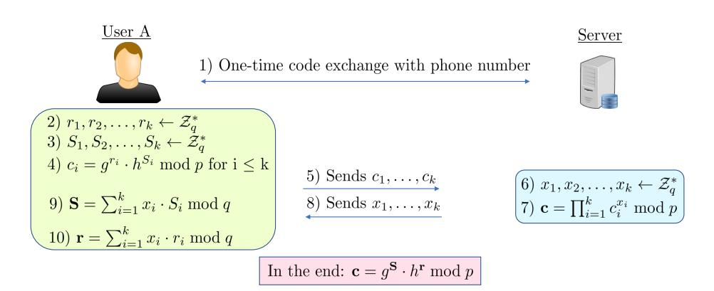
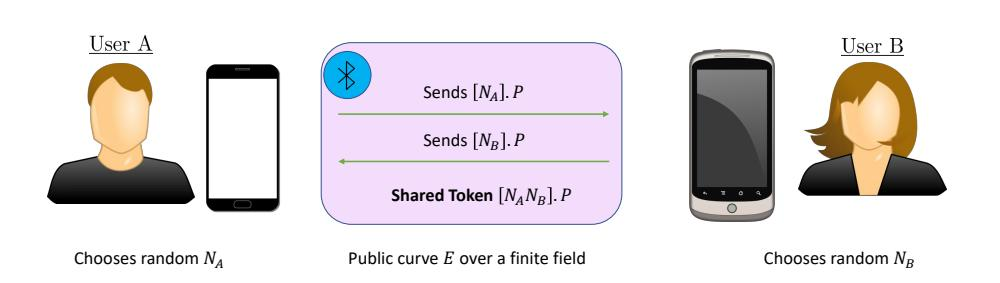
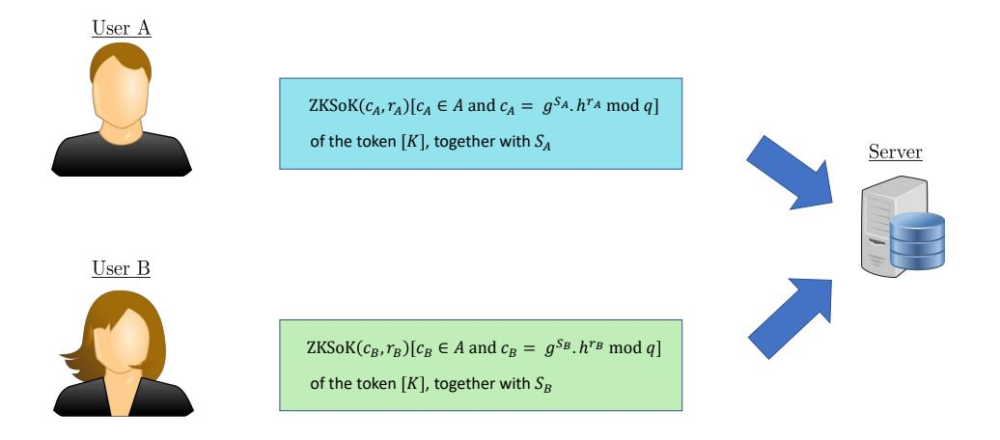
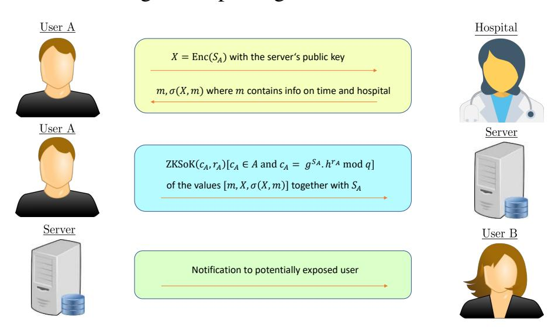

{0}------------------------------------------------

# Trace- $\Sigma$ : a privacy-preserving contact tracing app

Jean-François Biasse\*, Sriram Chellappan†, Sherzod Kariev, Noyem Khan Lynette Menezes§, Efe Seyitoglu, Charurut Somboonwit§, Attila Yavuz‡

University of South Florida 4202 E Fowler Ave, Tampa, FL 33620

§USF Health 1 Tampa General Cir Tampa, FL 33606

Corresponding authors: \*biasse@usf.edu, †sriramc@usf.edu, ‡attilaayavuz@usf.edu

Abstract—We present a privacy-preserving protocol to anonymously collect information about a social graph. The typical application of our protocol is Bluetooth-enabled "contact-tracing apps" which record information about proximity between users to infer the risk of propagation of COVID-19 among them. The main contribution of this work is to enable a central server to construct an anonymous graph of interactions between users. This graph gives the central authority insight on the propagation of the virus, and allows it to run predictive models on it while protecting the privacy of users. The main technical tool we use is an accumulator scheme due to Camenisch and Lysyanskaya [1] to keep track of the credentials of users, and prove accumulated credentials in Zero-Knowledge.

Index Terms—Exposure notification, contact tracing, Zero-Knowledge proofs,  $\Sigma$ -protocols, Accumulators, Signatures of Knowledge, COVID-19.

#### I. INTRODUCTION

Since the beginning of the SARS-Cov-2 epidemic, contact tracing has been a major stake to protect populations. Early on, the idea of leveraging mobile devices to automate certain tasks (quarantine, monitoring, contact tracing ...) became popular. In most of the proposed system, authorities had to strike a balance between users' privacy and efficacy. So-called "contacttracing apps" emerged after Singapore piloted the system TraceTogether [2] to leverage Bluetooth signals. The model of TraceTogether was adopted by Alberta's ABTraceTogether [3] and Australia's COVIDSafe [4]. The basic idea consists in having the phone of each user constantly broadcast identifiers provided by a central server. These identifiers are collected by the phones of other users who are within reach of the Bluetooth signal. When a user tests positive for COVID-19, they are invited by the central server to upload the identifiers they recently received. The corresponding users may have been infected. Once the server receives their identifiers, it contacts them to inform them they should get tested. Many systems relying on phone apps were subsequently described. The two major drives for technical improvements were privacy and reliability of the signal. Note that the efficacy of contact tracing apps is also ruled by a major non-technical aspect: the adoption rate. As of now, no contact tracing app has been adopted by the majority of a given population. The highest rate was in Iceland with around 40% of the population, followed by early

This work was supported by a USF COVID-19 Rapid Response Grant.

adopters such as Singapore and Australia where the adoption rate is around 25%. These rates are too low to guarantee that a significant proportion of interactions get recorded (a 25% adoption rate means that no more than 6.25% of interactions will be recorded on average). This paper does not deal with the issues of adoption and reliability of the signal. We consider the case of the exchange of Bluetooth signal, but our system might be compatible with WiFi and ultrasonic signals. GPS information has also been considered in the context of contact-tracing apps.

Privacy has been a major drive in the development of new protocols for contact tracing apps. Indeed, the collection of information on proximity, localization, and health have a lot of legal ramifications. Additionally, it is possible (but conjectural) that a higher privacy protection results in a higher adoption rate. TraceTogether (and its successors) use a server that needs to be trusted with information on contacts and positive tests. This highly centralized design has lead to criticisms that this information could be misused (through mass surveillance), or hacked. To counter that risk, decentralized approaches were proposed. A consortium of European researchers lead by the EPFL described a decentralized approach called DP-3T [5] which inspired Apple and Google in the design of an API [6] available to health authorities to facilitate the development of Bluetooth-based contact tracing apps. In a decentralized approach, phones broadcast random tokens that are collected by other phones in close proximity. Unlike in the centralized TraceTogether system, these tokens do not tie to the identity of the users. Once a user tests positive for COVID-19, they upload the tokens they have been recently broadcasting. Then the server makes these tokens available to the other users who can learn whether they have been in contact with a positive user by comparing the tokens sent by the server with the tokens they have recently received. It is clear that a the privacy of a user that does not notify the server of a positive test cannot be compromised in this setting. However, it has been pointed out by several authors, including Vaudenay [7] that the action of uploading the tokens recently used (and their subsequent broadcast by the central server) can lead to de-anonymisations of positive users. The typical scenario in which this could happen is when an entity records Bluetooth tokens together with information on individuals around (pictures, name, etc.

{1}------------------------------------------------

...). Then they can query the server to learn whether the people they collected information about declare a positive test within the time frame of validity of the tokens (typically 14 days). For example, such a setup can easily be implemented in a hotel lobby where clients' tokens are collected during check in. Then the hotel can learn whether its clients test positive and take appropriate measures (disinfection, reaching out to the client, etc ...). We believe that realistic de-anonymisation scenarios will be business-driven (businesses wanting to analyze whether their clients carry COVID-19, or employers wanting to know whether their employees test positive for COVID-19 to isolate them), however, more creative possibilities involving extortion schemes have also been described (see for example [7, Sec. 4]. While there is no established consensus on the superiority of centralized or decentralized approaches for contact tracing apps, it clearly seems to be a trade-off. The decentralized approaches minimize the liability of the entity running the system (at the cost of facilitating de-anonymizations carried by third parties), which could explain why this has been favored by Apple and Google.

*Our contribution:* We propose a protocol for contact tracing apps that preserves users' privacy while enabling the central server to learn useful information such as the anonymized graph of interaction between users. Our protocol relies on authentication of incoming information through ZK Signatures of Knowledge [8] (ZKSoK) of accumulated credentials in the RSA-based Camenisch and Lysyanskaya [1] accumulator. The main functionalities of our protocols are the following.

- Users are authenticated at enrollment (for ex: SMS code).
- The server learns a social graph with anonymous labels.
- Users report interactions anonymously.
- Users report positive tests anonymously.
- Health care providers provide certificates for the positive tests.

The main feature of our protocol is to allow a central server to draw an anonymous graph of interaction. This is in sharp contrast with many privacy-preserving contact-tracing app protocols (especially the decentralized ones) which strive to prevent the server from learning anything at all from the social graph. On the other hand, centralized methods such as TraceTogether learn the social graph with the personal information of users (at least their phone numbers). Our protocol proposes an in-between solution where in addition to providing an exposure-notification service to the users, the server is also able to monitor the progression of the pandemic with the anonymous graph of interactions. This information can be used to run predictive models to stay ahead of outbreaks. Note that in order to provide the central server with reliable information, users are authenticated during the enrollment phase. This means that the central server has information about users enrolled in the system (typically their phone number – or a hash thereof). Subsequent reports of interaction or positive tests are made under an anonymous ID, meaning that the server is convinced that the user presenting

the ID is legitimately enrolled, and that they are always using the same anonymous ID, but it cannot learn who they are among their registered users. We assume that communications between users and the server occur through an anonymous network. We propose to use existing solutions such as the Tor onion network [9]. Mitigation measures against network traffic analysis are a necessary condition to ensure privacy. Other solutions include the use of mixers. In the rest of the paper, we disregard privacy concerns over network traffic analysis.

#### II. PRELIMINARIES

In this section, we introduce the prior work on which we rely to define our protocol. We set the notations, and insist on the notions of accumulator schemes and of ZK proofs of accumulated values.

#### A. Notations

Our notations are displayed in the table below.

| p                                                    | Prime number                      |
|------------------------------------------------------|-----------------------------------|
|                                                      | Prime number                      |
| <i>q</i>   <i>N</i>                               |                                   |
| ·                                                    | RSA integer                       |
| PK PK                                                | Public key                        |
| sk                                                   | Secret key                        |
| $\alpha$                                             | Generator (subgroup of order q)   |
| M                                                    | Message                           |
| $\{0,1\}*$                                           | Binary values (desired length)    |
| str*                                                 | A string of arbitrary length      |
| $H: \{0,1\}^{\kappa} \to \{0,1\}^{\kappa}$           | A hash function (random oracle).  |
| Sig                                                  | Signature generation algorithm    |
| Kg                                                   | Key generation                    |
| Ver                                                  | Signature verification            |
| $\mathcal{Z}_q^*$                                    | Integers modulo $q$               |
| $\begin{array}{c} \mathcal{Z}_q^* \ S_A \end{array}$ | Anonymous ID of the user A        |
| $r_A$                                                | Private key the user A            |
| u                                                    | Quadratic residue $\neq 1 \mod N$ |
| $c_A$                                                | Public credential of the user A   |
| $c_A = K_{A,B}$                                      | Exchanged token of users A & B    |
| G                                                    | User Graph                        |
| Server                                               | Centralized server (database)     |
| ZKSok()                                              | Signature of knowledge            |
| Enc                                                  | Encryption                        |
| $\sigma_x$                                           | Signature with the secret key x   |

TABLE I: Notation Table

#### B. Digital Signature

We use a generic digital signature when reporting positive cases. A digital signature scheme has three algorithms defined as SGN = (Kg, Sig, Ver).

- $(sk, PK) \leftarrow \mathsf{SGN}.\mathsf{Kg}(1^{\kappa})$ : The key generation algorithm generates the private and public keys and the requires the security parameter as input.
- $-\sigma \leftarrow \mathsf{SGN}.\mathsf{Sig}(m,sk)$ : The signature generation algorithm generates a signature  $\sigma$  with respect to the given message and the secret key.
- $(0,1) \leftarrow \mathsf{SGN}.\mathsf{Ver}(m,\sigma,PK)$ : The signature verification algorithm, verifies a given signature given the message and the public key.

{2}------------------------------------------------

#### C. Accumulator Scheme

We use teh accumulator scheme originally presented in [1]. The public credentials of the users are accumulated in an accumulator, and we make use of the available Zero Kowledge proof protocol of an accumulated value (see Section II-E). The public credentials of the users are denoted by  $c_1, c_2, \ldots, c_n$ . The accumulator value is is  $A := u^{c_1, c_2, \ldots, c_n} \mod N$ , where u is a samplable input domain [1]. Given an accumulator  $A = u^{c_1, c_2, \ldots, c_n} \mod N$ , one can efficiently add or delete credentials from it.

**Accumulator:** 
$$u^{c_1, c_2, \dots, c_n} \mod N$$

#### D. Pederson Commitment

We use the Pedersen commitment [10] to the private key of a user as their public credential. We follow a similar approach to the Zerocoin cryptocurrency [8] for our choice of parameters. We chose public primes p,q with  $p=2^wq+1$  for  $w\geq 1$  and g,h such that  $\langle g\rangle=\langle h\rangle\subseteq\mathbb{Z}_q^*$ . Then a given user has an anonymous identity  $S\in\mathbb{Z}_q^*$  and private key  $r\in\mathbb{Z}_q^*$  such that their public credential is  $c=g^Sh^r\mod p$ . Note that Pederson commitments were used in the ConTra Corona [11] digital contact tracing protocol for a different purpose as ours. In [11], a user commits to a "warning identity" that they prove in Zero Knowledge (see Section II-E) when interacting with a medical doctor to argue they should get tested without having to disclose their credentials.

#### E. Zero-Knowledge Proofs

Our proposed scheme uses zero-knowledge proofs so that the users can interact with the server without revealing their public credentials. Some popular zero-knowledge proofs can be found in: [12]–[15]. A zero-knowledge (ZK) proof is a mechanism for the user A to prove the user B that she know a secret without revealing any information about anything else [16]. A main ingredient of ZK proofs are  $\Sigma$ -protocols, which give our system its name.

To authenticate a message from a user the the server, we use the Zero Knowledge Signature of Knowledge (ZKSoK) presented in [8]. We assume that the accumulator A contains public credentials of users, and that a user presents the anonymous ID S. The ZKSoK of the message guarantees that the signer knows two values: (i) a credential c accumulated in A, (ii) A private key r such that  $c = g^S h^r \mod p$ .

ZKSoK
$$(c.r)[c \text{ in A}, c = g^S \cdot h^r \mod p]$$

## III. PROPOSED SCHEME

The main technical point of our paper is to authenticate communications from the users to the server with similar ZKSoK as in the Zercoin protocol [8]. This allows the users to be identified by an anonymous ID on the network while offering guarantees to the server that users are real and committed to one anonymous ID. The main motivation for our scheme is the study of the social graph between anonymous IDs that can help the server run predictive models to stay ahead of outbreaks.

#### A. High Level Description

In our protocol, proximity between two users is recorded via an exchange of digital tokens through Bluetooth LE signal. When the phones of two users are paired, they create a shared secret token with the Diffie-Hellman protocol [17]. The idea of using the DH protocol was already present in the DESIRE [18] and the Pronto-C2 [19] digital tracing protocols. Then, periodically, users (under their static anonymous ID) upload all of their tokens to the central server using a ZKSoK to authenticate the information. The server searches for matching tokens between the anonymous IDs. Whenever it finds one, it updates the relevant information on the anonymous social graph. To report a positive test, a user must obtain a signature of their ZKSoK and time stamp from a medical doctor who is registered with the system. Then the user uploads this information. The server accepts it if they can verify both the ZKSoK and the doctor's digital signature. Then, the server report that information on the corresponding node of the social graph and notifies the users that are connected to it by interactions within the relevant time frame (typically 14 days). The main actors of the protocol are:

- **Server:** The central server is "honest but curious". It is assumed to run the protocol honestly, but it might try to exploit any information it receives to learn something about the users (typically their identity).
- Users: The users are potentially dishonest. They might run modified versions of the app to alter the protocol. They might also collude with other users and non-user adversaries, but we do not assume they collude with the server or the doctors. Malicious users try to deanonymize other users, learn private medical information of other users, learn information about the social graph, and disturb the system by feeding it incorrect information (false tokens, or false positive COVID-19 tests).
- Medical doctors: Certain doctors are enrolled by the system, and their public credentials are known to the server.
  These doctors are honest and will sign the credentials of a user that tests positive for COVID-19.
- General population: Since the Bluetooth LE signal can be recorded and broadcast by anyone, we consider the entire population as potential adversaries. Malicious entities have the same goals as malicious users. If an entity needs to register with the system to mount an attack, they are considered a user.

# B. Main phases of the protocol

**Phase I: Enrollment of a User.:** The first phase of the protocol is the registration of a user. It is summarized in Figure 1. The goal of this phase is to check that the user is a legitimately entity, to agree on a private/public key pair with the user, and to agree on an anonymous ID for the user. If user A downloads the app. the protocol requires a one-time code exchange to make sure the user A is actually a real person (Step 1). Then the user and the server want to create a public credential c, a private key r, and an anonymous ID S such

{3}------------------------------------------------

that  $c = g^S h^r \mod p$ . The issue here is that while S cannot be chosen (or even known) by the server, we also do not want the user to choose it. Indeed, colluding users could all decide to choose the same anonymous ID to mount Sybil attacks which would cause the server to believe that one user under this ID is connected to many others. Then if one of the malicious users using this ID tests positive for COVID-19, this would cause the system to believe many users have been exposed. To force randomness in the creation of public and private credentials, the protocol requires users to choose k different  $(S_i)_{i \leq k}$ , and  $(r_i)_{i \leq k}$  uniformly at random in  $[1, \operatorname{Ord}_p(g) - 1]$ (resp.  $[1, \operatorname{Ord}_q(h) - 1]$ , and to send  $c_1, \dots, c_k$  to the server, where  $c_i := g^{S_i} \cdot h^{r_i} \mod p$ . The server then checks that all  $c_i$  are different, and draws  $(x_i)_{i \leq k}$  uniformly at random in  $[1, p-1]^k$  and sends this vector to the user. Then the public credential of the user is  $c := \prod_i c_i^{x_i}$  and  $S := \sum_i x_i S_i$ ,  $r := \sum_i x_i r_i$ , thus ensuring that  $c = g^S h^r \mod p$  without allowing a dishonest user to induce any significant bias in the choice of S, while also preventing the server from knowing S.

**Proposition 1.** If the enrollment protocol of Figure 1 terminates without the server raising an error, then the probability that a user obtains a given S as anonymous ID is  $1/\operatorname{Ord}_p(g)$  and the probability that they obtain a given r as private key is  $1/\operatorname{Ord}_p(h)$ . Under the assumption that the discrete logarithm problem is difficult, the server does not learn any information about S, r from c.

Fig. 1: Enrollment of a User

Phase II: Exchange of Tokens: When the user A meets the user B, they create a shared secret token K over the Bluetooth LE signal. This token is only known by them and will be used to identify that they have been in contact with each other. We recommend the use of elliptic curve digital signatures as they are more compact than their RSA counterparts. To increase security, we recommend regular change of ephemeral public keys. We also recommend that the resulting token K be hashed by each user with a rounding of the GPS coordinates and of the time. The precision of such rounding is not specified in this document, but it needs to be precise enough so that users that are far apart and/or computing the token at significantly different time would end up with different tokens. On the other hand, we do not want that the imprecisions of the GPS coordinates or slight differences in

time prevent legitimate interactions to result in the same token. This procedure is summarized in Figure 2.

Fig. 2: Exchange of Tokens

Phase III: Reporting an Interaction: After the two people establish a shared token K, they need to send this token along with their respective anonymous identities. To convince the server that their anonymous identities are legitimate, each user signs this information with a ZK-SoK of the fact that they know c accumulated in the accumulator A, and that they know r such that  $c = g^S h^r \mod p$  where S is the anonymous identity they present to the server. Upon acceptance of this signature, the server saves the token, and it periodically checks for matching tokens between anonymous IDs. Note that the users also upload time information during this process to allow the server to set an expiration date on each edge of the social graph (typically 14 days). This reporting procedure is summarized in Figure 3. Note that the authors of Contra Corona [11, Sec. 4.9] briefly suggested using related methods to bridge the gap between anonymity and the need to bind accounts to phone numbers. They mentioned the possibility of using the anonymous e-token dispenser of [20] to report information to the central server anonymously. No precise protocol is described, but it seems that the main difference with our protocol is that our users are committed to a static anonymous ID under which they report information. This creates unique challenges for the creation of the ID that are solved in Phase I.

Fig. 3: Reporting an Interaction

There is unfortunately a significant hurdle to smooth establishment/revocation of privileges. Indeed, assume that the system has k users known to the system by their anonymous IDs  $S_1, \ldots, S_k$ . If a k+1-th user goes through the Phase I (enrollment) after the previous k users have been reporting information under their anonymous IDs, then it will be clear

{4}------------------------------------------------

to the server that the newest anonymous ID Sk+1 they receive corresponds to the newest public credential ck+1 that was established. This is a de-anonymization since the public credential is established during a session when the user's contact information is used. The first remedy would be to consider that we do not add or revoke privileges during the course of the use of the protocol. While this might be possible for use within a private organization where all members enroll during a short time frame, it is certainly not practical at the scale of a region or a nation where enrollment is assumed to happen continuously. The other workaround is to consider anonymity among batches of users of fixed size B that register around the same time frame. Each batch of index i has its own accumulator Ai of the B public credentials accumulated after batch number i − 1 was complete. Note that this framework includes the case of a fixed list of users (in this case, there is a unique batch whose size is the entire list of users). The drawback of such a protocol is that the users of the i-th batch need to hold off using the system until it is complete with B members. Around the release date of the app, many users typically register, but late additions to the system might have to wait longer before being able to use it.

Proposition 2. *Assuming the hardness of the discrete logarithm problem and of the strong RSA problem, the probability of the server identifying a user in a given batch is close to* 1/B*.*

Lastly, we would like to point out that in the "honest but curious" model, the server is not allowed to deviate from the protocol in order to learn the identity of the users. However, there is an obvious active attack scenario that we can thwart. Indeed, to increase performances, it is tempting to have the server compute the accumulators of each batch of users and to send them. However, in such a scenario, a malicious server actively attacking its users could send the user with public credential c and accumulator containing only the public credential c (or c and other irrelevant values). Then the ZKSoK of that user would reveal c to the server. Hence, it is preferable to have the server display the list of public credentials of each batch in order to have accountability (or to let paranoid users compute their own accumulator).

*Phase IV: Reporting a Positive Test:* To report a positive test, a user needs to secure a certificate from the medical doctor that performed the test. This assumes that a network or preapproved medical doctors is available, and that each doctor has communicated a public key to the system. Users do not want to reveal their anonymous ID to the medical doctors since the latter have their real life identification available (even if they are honest, they could be hacked, so having the anonymous ID and the real ID of a user is too much of a liability). Instead, they encrypt their anonymous ID with the server's public key and give the encryption X to the medical doctor. The doctor signs it, along with basic information about the test (the result, and a time stamp). Then the positive user sends out this data, along with the ZKSoK to authenticate themselves on the network. After the server checks the signature of the doctor, decrypts X, and checks the ZKSoK. If everything checks out, the server updates the graph and notifies the corresponding users. This process is illustrated by Figure 4.

Whenever an app user interacts with a positive tested patient, they exchange keys as can discussed in the contact section of our paper. To check if an individual has gotten into contact with someone tested positive, we go through the patients that the individual has exchanged keys with. In the future, our proposed scheme will aim to create a graph out of the individuals that have registered to the system. Every node in the graph will be denoted by a corresponding S value. Whenever one of these S values is marked as being infected, our app sends notification to every individual that may have been exposed to COVID-19.

Fig. 4: Reporting of Postive Tests

#### IV. ATTACK SCENARIOS

Contact tracing apps and exposure notification systems in general have received a lot of scrutiny from the privacy/security scientific community in a very short time span since several countries decided to roll out such tools to fight the COVID-19 pandemic. There is no clear consensus on which risks are acceptable, and which are not. In particular, privacy standards vary from one region of the world to the other. One thing that most security experts agree on is that no currently available system is perfectly private. On the other hand, not every attack scenarios are realistic, and eventually, these risks have to be weighted against the potential benefits of better monitoring pandemics.

## *A. De-anonymization*

One of the most concerning aspects of contact tracing apps is the potential de-anonymizations that can occur. Truly anonymous system want to prevent all entities from de-anonymizing users (i.e. other users, central server, hospitals, and general population). When studying this risk, one might want to keep in mind the privacy standards of *manual* contact tracing where doctors and central health authorities request that positive individuals reveal all their interactions. In this situation, the only concern is to avoid revealing information about the identity of the index case to the new patients who are being tested. De-anonymization between users of a contact tracing system (manual or digital) is always possible. Namely, each 

{5}------------------------------------------------

user that is notified of a potential exposure has a probability 1/N of guessing the identity of the index case, where N is the number of different individuals they have been in contact with during the designated time frame (typically 14 days). To keep the de-anonymization chances of a user low, we only allow them to report one batch of tokens per day. This way they cannot single out each token individually to query the server about their status. Additionally, our server has a 1/B chance of de-anonymizing a user (i.e. linking an anonymous ID with a public credential – and whatever information was used during enrollment). As information signed by the medical doctors is encrypted, they cannot de-anonymize the users. Finally, as in most of the centralized systems, other users and the general population are unable to de-anonymize users either.

## *B. Sybil attacks*

Sybil attacks are the obtention of many different anonymous IDs by the same user, while the "inverse Sybil" attacks are the situation when many users are using the same anonymous ID. The former dilutes the information about a positive test (because fewer nodes in the graph are marked at risk), while the latter artificially increase the perceived risk of a positive test (because more nodes are marked at risk than need be). Preventing (inverse-)Sybil attacks is a challenge for privacypreserving systems. Our system thwarts Sybil attacks by requesting an SMS code during enrollment. Note that a user with multiple phone can still obtain multiple IDs, but this definitely limits the impact of Sybil attacks. Inverse Sybil attacks, on the other hand, are prevented by the randomization procedure during enrollment. In this scenario, under the assumption that the DLP is hard, the probability that colluding users obtain the same anonymous ID is 1/ Ordp(g) where g is the base of the DLP.

## *C. False positives*

False positives (in conjunction with inverse-Sybil attacks or not) are a threat to digital contact tracing systems, especially the ones that preserve anonymity, since there is little accountability for sending false information to the server. Our system requires the medical doctor performing a positive test on a user to digitally sign this information. This drastically limit the potential for false declarations of positive tests by users, but it does not completely prevents it in the context of *key leakage*. The simplest such scenario is the collusion of two users. If Alice gets tested and brings Bob's phone to the doctor's office, then if the test is positive, the doctor will sign Bob's credentials in the network, thus allowing him to report the positive test. This attack is not completely straightforward to mount and definitely not scalable.

#### *D. Relay attacks*

The concept of relay and replay attacks is to bring the Bluetooth signal of a user to another user outside of the normal range (and vice-versa). This could be mounted by having sensors record Bluetooth signal in one place, and communicate them to devices in another place which broadcast them. The result is to artificially densify the graph of interactions between users, and to unnecessarily increase the response of the system to a positive test from a user. Our strategy of exchanging a secret token via the Diffie-Hellman protocol forces a relay attack to work both ways (each location must both record signals and re-emit them). Then, the fact that users hash their tokens with GPS and time information prevents such an attack between honest users (at the end of the creation of tokens, if they were either in different locations, or in the same location at a different time, they will end up with a different token). However, it does not prevent such an attack where one of the users is malicious and uses the GPS/time coordinates of the target user. This means that with the right equipment, a malicious user can artificially increase the arity of their node in the social graph. Then, if they test positive, this will notify artificially many users. This attack needs many malicious users to be effective since each individual has only a limited probability of testing positive for COVID-19 (we assume users cannot collude with medical doctors to get false certificates). To the best of our knowledge, no other digital contact tracing app can prevent this particular scenario.

## V. CONCLUSION

We have presented a contact tracing app protocol that preserves the anonymity of its users, and that provide the central server with an anonymous social graph showing the progression of the virus among the population of users. Such a graph can be a very useful tool to make decisions regarding the population of users based on the outcome of predictive methods based on machine learning and other quantitative measures.

Acknowledgment: The authors are grateful to Luca Defeo for providing insightful comments on this draft.

## REFERENCES

- [1] J. Camenisch and A. Lysyanskaya, "Dynamic accumulators and application to efficient revocation of anonymous credentials," in *Annual International Cryptology Conference*. Springer, 2002, pp. 61–76.
- [2] G. of Singapore, "Tracetogether," Online, 2020. [Online]. Available: www.tracetogether.gov.sg
- [3] G. of Alberta, "ABTracetogether," Online, 2020. [Online]. Available: https://www.alberta.ca/ab-trace-together.aspx
- [4] G. of Australia, "COVIDsafe," Online, 2020. [Online]. Available: https://www.health.gov.au/resources/apps-and-tools/covidsafe-app
- [5] C. Troncoso, M. Payer, J.-P. Hubaux, M. Salathé, J. Larus, E. Bugnion, W. Lueks, T. Stadler, A. Pyrgelis, D. Antonioli, L. Barman, S. Chatel, K. Paterson, S. Capkun, D. Basin, J. Beutel, D. Jackson, M. Roeschlin, ˇ P. Leu, B. Preneel, N. Smart, A. Abidin, S. Gürses, M. Veale, C. Cremers, M. Backes, N. O. Tippenhauer, R. Binns, C. Cattuto, A. Barrat, D. Fiore, M. Barbosa, R. Oliveira, and J. Pereira, "Decentralized privacypreserving proximity tracing," 2020.
- [6] Apple-Google, "Privacy-preserving contact tracing," Online, 2020. [Online]. Available: www.apple.com/covid19/contacttracing
- [7] S. Vaudenay, "Centralized or decentralized? the contact tracing dilemma," Cryptology ePrint Archive, Report 2020/531, 2020, https: //eprint.iacr.org/2020/531.
- [8] I. Miers, C. Garman, M. Green, and A. D. Rubin, "Zerocoin: Anonymous distributed e-cash from bitcoin," in *Proceedings of the 2013 IEEE Symposium on Security and Privacy*, ser. SP '13. USA: IEEE Computer Society, 2013, p. 397–411. [Online]. Available: https://doi.org/10.1109/SP.2013.34

{6}------------------------------------------------

- [9] R. Dingledine, N. Mathewson, and P. F. Syverson, "Tor: The secondgeneration onion router," in *Proceedings of the 13th USENIX Security Symposium, August 9-13, 2004, San Diego, CA, USA*, M. Blaze, Ed. USENIX, 2004, pp. 303–320. [Online]. Available: http://www.usenix. org/publications/library/proceedings/sec04/tech/dingledine.html
- [10] T. P. Pedersen, "Non-interactive and information-theoretic secure verifiable secret sharing," in *Annual international cryptology conference*. Springer, 1991, pp. 129–140.
- [11] W. Beskorovajnov, F. Dörre, G. Hartung, A. Koch, J. Müller-Quade, and T. Strufe, "Contra corona: Contact tracing against the coronavirus by bridging the centralized–decentralized divide for stronger privacy," Cryptology ePrint Archive, Report 2020/505, 2020, https://eprint.iacr. org/2020/505.
- [12] C. Rackoff and D. R. Simon, "Non-interactive zero-knowledge proof of knowledge and chosen ciphertext attack," in *Annual International Cryptology Conference*. Springer, 1991, pp. 433–444.
- [13] A. De Santis and G. Persiano, "Zero-knowledge proofs of knowledge without interaction," in *Proceedings., 33rd Annual Symposium on Foundations of Computer Science*. IEEE, 1992, pp. 427–436.
- [14] D. Beaver, "Secure multiparty protocols and zero-knowledge proof systems tolerating a faulty minority," *Journal of Cryptology*, vol. 4, no. 2, pp. 75–122, 1991.
- [15] M. Blum, P. Feldman, and S. Micali, "Non-interactive zero-knowledge and its applications," in *Providing Sound Foundations for Cryptography: On the Work of Shafi Goldwasser and Silvio Micali*, 2019, pp. 329–349.
- [16] U. Feige, A. Fiat, and A. Shamir, "Zero-knowledge proofs of identity," *Journal of cryptology*, vol. 1, no. 2, pp. 77–94, 1988.
- [17] W. Diffie and M. Hellman, "New directions in cryptography," *IEEE Transactions on Information Theory*, vol. IT-22, pp. 644–654, November 1976.
- [18] N. Bielova, A. Boutet, C. Castelluccia, M. Cunche, C. Lauradoux, D. Le Métayer, and V. Roca, "DESIRE: A Third Way for a European Exposure Notification System (SUMMARY - EN)," Inria, Research Report, May 2020. [Online]. Available: https://hal.inria.fr/hal-02570172
- [19] G. Avitabile, V. Botta, V. Iovino, and I. Visconti, "Towards defeating mass surveillance and sars-cov-2: The pronto-c2 fully decentralized automatic contact tracing system," Cryptology ePrint Archive, Report 2020/493, 2020, https://eprint.iacr.org/2020/493.
- [20] J. Camenisch, S. Hohenberger, M. Kohlweiss, A. Lysyanskaya, and M. Meyerovich, "How to win the clonewars: efficient periodic n-times anonymous authentication," in *Proceedings of the 13th ACM Conference on Computer and Communications Security, CCS 2006, Alexandria, VA, USA, Ioctober 30 - November 3, 2006*, A. Juels, R. N. Wright, and S. D. C. di Vimercati, Eds. ACM, 2006, pp. 201–210. [Online]. Available: https://doi.org/10.1145/1180405.1180431