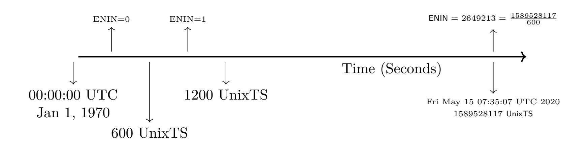

{0}------------------------------------------------

# PHyCT: Privacy preserving Hybrid Contact Tracing

Balancing centralised and decentralised models for privacy and tracing trade off

Mahabir Prasad Jhanwar<sup>1</sup> and Sumanta Sarkar<sup>2</sup>

<sup>1</sup>Ashoka University, INDIA, Mahavir.Jhawar@ashoka.edu.in <sup>2</sup>TCS Innovation Labs, Hyderabad, INDIA, Sumanta.Sarkar1@tcs.com

#### **Abstract**

Ever since COVID-19 started grasping world's geographies one by one, countries have been struggling to tackle with this emergency by stretching their healthcare infrastructure beyond the boundary. World is now also trying to find ways to "live with the virus" or coping with the "new normal". In this effort, contact tracing is thought to be a vital tool which can quickly figure out persons that have come into vicinity of an infected person. Some countries have adopted centralized contact tracing in the perception that it is the most effective and easy solution. Centralized contact tracing has been in the centre of debate as it is a potential tool for launching mass surveillance. So objecting to this, decentralized model has been introduced which gives the control fully to the citizens. However, in decentralized model, the onus is completely on the users to act accordingly if they get a risk notification for coming in close contact with a COVID-19 positive patient. Decentralize model will fail if the large mass of users do not act accordingly after receiving the risk notification. Therefore, a balance needs to strike between the centralized and decentralized models given the socio-economic impact of this pandemic.

In this article, we take a hybrid approach and propose PHyCTthat guarantees fail-safe, privacy, and security. This system acts like a decentralized one, where identities of users remain anonymous to the central authority. However, if there is a case of infection, the infected user and the central authority can *together only* reveal the identities of the users who have come in close contact. This feature enables to handle the situation if there are too many non-compliant users who do not report after getting infection exposure notification. Users who have not come into close contact of any infected person remain anonymous.

### **1 Introduction**

Contact tracing is an important mitigation tool for national health services to fight epidemics such as COVID-19 . The goal of contact tracing is to quickly identify individuals who have been in close proximity to an infected person, before they even show symptoms, so that they may be tested, quarantined, and monitored for symptoms. Successful containment of the Coronavirus pandemic rests on the ability to remove such individuals from the circulating population.

Contact tracing begins once someone is confirmed as infected with a virus. The public health staff work with a patient to help them recall everyone with whom they have had close contact during the timeframe (usually 14 days for Coronavirus) while they may have been infectious. The health staff then alert these exposed individuals (contacts) of their potential exposure as 

{1}------------------------------------------------

quickly as possible. Regular follow-up are conducted with all contacts to monitor for symptoms and test for signs of infection. The manual in-person interview to trace contacts has the obvious limitation: patients don't remember who they have had contact with, or may not know the contact details of all those persons.

There is a growing interest in technology-enabled automated contact tracing systems to alleviate some of these problems. As smartphones are pervasive, so many countries have started using smartphone-based apps for quick and efficient contact tracing as part of the effort to manage the COVID-19 pandemic and prevent resurgences of the disease after the initial outbreak. These apps typically employ a combination of location services, such as the global positioning system (GPS), and neighbour discovery - the ability to discover phones in close proximity using Bluetooth [\[5\]](#page-8-0).

There is a lack of privacy statement in the way many of these apps work. Some of these require each phone to send its current location to a central server every few seconds, and also continually send the server the numbers of the phones it had been in close proximity recently. Though, the contact tracing is rather obvious now, the system itself is clearly privacy-invasive. By continuously broadcasting the phone number of a user and her neighbours, it leaves an easy option to identify and track the person and her neighbours as well.

There are some recent initiatives to propose effective contact tracing protocols while guaranteeing privacy of personal information. There is also an ongoing debate on the underlying deployment framework of these, i.e. centralised versus decentralised. In the centralised architecture, personal data collected through the app is controlled by central authority. For the decentralised approach [\[7,](#page-8-1) [8\]](#page-8-2), the personal data is enclosed or controlled by individuals only on personal devices. The later framework put an anonymous centralised database for only the infected people who have willfully disclosed their infection. With the announcement of the Apple and Google partnership to introduce decentralised contact-tracing functionality to iOS and Android [\[4\]](#page-8-3), it seems likely that this will be adopted in many countries. On the same line a group of academics from Europe has also developed DP-3T [\[15\]](#page-8-4). A larger consortium known as Pan-European Privacy-Preserving Proximity Tracing (PEPP-PT) [\[1\]](#page-8-5) has been formed which is working on both centralized and decentralized ones. INRIA of France and AISEC of Germany jointly working on a proposal, called ROBERT [\[11\]](#page-8-6), for PEPP-PT initiative. One thing that is common among all these decentralised schemes is that central authority never learns the identity of the users infected or uninfected. Central authority only knows pseudoidentities of the contacts of an infected persons who came in the proximity in the recent past, broadcast the information to them.

After a user receives the information that she has come in a proximity of an infected person, the onus is completely on the user to test or self isolate/quarantine. However, if a large pool of users after getting the notification of a possible infection do not act accordingly, the purpose of contact tracing will fail. Perhaps, this is the reason that many countries still like to use centralized systems which gives the full control to the central authority to get the notification of possible infected users and identify them easily for faster containment of the infection spread.

Note that once a user is confirmed with infection and reports to the health department, then she willfully discloses her identity. Then it becomes an urgent task to identify the possible users who might have been infected by this user (second layer). More delay in catching infected users will cause further infection spread. Many people may hesitate to accept this disease and report accordingly in the fear of social abandonment, or simply may ignore the severity of this disease. If this class of people forms a large section of a society, then early containment of the disease will utterly fail. Thus no doubt there is a need to make a balance between privacy and protection, whereas protection comes at the cost of breaking anonymity. Ideally if the central authority gets 

{2}------------------------------------------------

to know the identities of the associated second layer of users once a user reports of infection, then it can act quickly.

In this article, we take a hybrid approach. The central server keeps all the record of every user, and updates the users that are coming into proximity. But they don't really know the actual identities of all these users. Once a user reports of getting infection, then only with the help of this user, central server can break the anonymity of these second layer of users.

### **2 Preliminaries**

In this section few basic concepts are discussed.

**Definition 1 (Exposure Notification Interval Number (ENIN)[\[4\]](#page-8-3))** *It is a unique positive integer representing a 10-minutes time-interval and is assigned to each timestamp in UNIX Epoch Time. For a UNIX "*Timestamp*", the corresponding* ENIN(Timestamp) *represents the unique 10-minute time-interval in which the* Timestamp *lies and is computed as follows:*

$$\mathsf{ENIN}(\mathsf{Timestamp}) = \lfloor \frac{\mathsf{Timestamp}}{600} \rfloor$$



**Definition 2 (Pseudo Random Function [\[6\]](#page-8-7))** *A family of functions* {*F<sup>s</sup>* : {0*,* 1} *<sup>k</sup>* → {0*,* 1} *`* | *s* ∈ {0*,* 1} *<sup>n</sup>*} *is said to be pseudorandom if it satisfies the following two properties:*

- *1. Easy to compute: The value Fs*(*x*) *is easy to compute given any s* ∈ {0*,* 1} *<sup>n</sup> and x* ∈ {0*,* 1} *k*
- *2. Pseudorandom: The function F<sup>s</sup> cannot be efficiently distinguished from a uniformly random function R* : {0*,* 1} *<sup>k</sup>* → {0*,* 1} *` , given access to pairs* (*x<sup>i</sup> , Fs*(*xi*))*, where the xi's can be adaptively chosen by any probabilistic polynomial time distinguisher.*

## **3 Automated Contact Tracing**

The existing Bluetooth-based automated contact tracing schemes are of two categories: centralized vs decentralized. A large number of systems, both centralized [\[2,](#page-8-8) [11\]](#page-8-6) and decentralized [\[7,](#page-8-1) [8,](#page-8-2) [7,](#page-8-1) [13,](#page-8-9) [4\]](#page-8-3) were proposed recently. The work in [\[16\]](#page-9-0) showed the vulnerabilities and the advantages of both solutions systematically. In the following we briefly recall one system from both categories. Further the proposal from Apple and Google also has been analysed in [\[10\]](#page-8-10).

{3}------------------------------------------------

#### **3.1 Centralized Automated Contact Tracing**

TraceTogether [\[2\]](#page-8-8), deployed in Singapore, is a centralized Bluetooth-based contact tracing solution. The protocol is discussed in [\[9\]](#page-8-11), and is presented here briefly. The system has the following components: Users holding a Bluetooth-equipped smartphone running the TraceTogether application, and a backend server acts as a repository for data to be pushed by smartphones upon authorisation by the respective users. The system works as follows:

- **Setup** Users get registered to the application and share their mobile numbers with the backend server.
- **Chirping** A user *U* generates a series of random ephemeral identifiers U*<sup>s</sup>* = {*u*0*, u*1*, . . .*}, one for each time interval. The user's smartphone broadcast (every few seconds) the ephemeral identifier chosen for the current time interval. The user *U* also uploads the latest list U*<sup>s</sup>* to the backend server.
- **Collision** At time *t*, users *U* and *V* encounter each other, exchanging *u<sup>k</sup>* and *vk*, where *t* falls in the *k*th time interval. Users keep the exchanged ephemeral identifiers with themselves. U*<sup>r</sup>* denotes the set of identifiers received by *U*. Therefore, *v<sup>k</sup>* ∈ U*r*.
- **Activate** If a user *U* is diagnosed positive, she must upload the final received list U*<sup>r</sup>* to the "exposure database" on the backend server.
- **Alert** Every time an infected user *U* uploads her encounter history U*<sup>r</sup>* to the exposure data base, the backend server must ensure that an alert is sent out to all contacts of *U* who came in her close proximity in the recent time. The server matches the membership of each identifier from U*<sup>r</sup>* to ephemeral identifier sets for all mobile numbers, and sends out an alert to the matching mobile number accordingly. For example, the identifier *v<sup>k</sup>* ∈ U*<sup>r</sup>* will be a member of *V<sup>s</sup>* registered against the mobile number of *V* , and therefore an advisory alert will be issued to *V* .

#### **3.2 Decentralized Automated Contact Tracing**

We now describe the PACT (Private Automated Contact Tracing) protocol [\[13\]](#page-8-9), a simple, decentralized approach to using smartphones for contact tracing based on Bluetooth proximity. Users of this scheme do not reveal anything about themselves, unless they volunteer to do so. The system has the following components: Users holding a Bluetooth-equipped smartphone running the application, health staff and a backend server acts as a repository for data to be pushed by smartphones upon authorisation by the health staff. The system works as follows:

- **Setup** Users get registered to the application. The application uses a pseudo random function *F*.
- **Chirping** A user *U* generates a series of random seeds U*<sup>s</sup>* = {*u*0*, u*1*, . . .*}, one for each time interval. The user's smartphone broadcast every few seconds an ephemeral identifier as follows. At time *t*, falling in the time interval say *k*, the ephemeral identifier broadcasted is *ukt* = *F*(*uk, t*).
- **Collision** At time *t*, users *U* and *V* encounter each other, exchanging *ukt* and *vkt*, where *t* falls in the *k*th time interval. Users keep the exchanged ephemeral identifiers with themselves. Let U*<sup>r</sup>* denotes the set of identifiers received by *U*. Therefore, *vkt* ∈ U*r*.

{4}------------------------------------------------

- **Activate** If a user *U* is diagnosed positive, she must upload her seeds U*<sup>s</sup>* to the "exposure database" on the backend server upon authorisation by a health staff.
- **Alert** Every time an infected user *U* uploads her seeds U*<sup>s</sup>* to the exposure data base, all contacts of *U* who came in her close proximity in the recent time will have a way to know about this. Users of the scheme periodically check the identifiers collected by their phones against the downloaded exposure data base from the backend server. A user *V* finds out if she was exposed to an infected individual in the recent time as follows.
  - 1. For every seed *s* in Exposure Database
  - 2. For every time-instance *t* in time-interval designated for the seed *s*
  - 3. If *F*(*s, t*) ∈ V*<sup>r</sup>*
  - 4. Alert: Exposed
  - 5. Alert: Safe

#### **3.3 Privacy and Security**

A reasonable framework to model privacy for automated contact tracing system must address what information about which user type should be hidden from whom [\[3,](#page-8-12) [12,](#page-8-13) [16\]](#page-9-0). These dimensions can be introduced by discussing the three typical user types, the attacker models, and the ways how privacy can be impacted.

- 1. Types of Users: In the following a distinction is made amongst the active users of an automated contact tracing system.
  - (a) Normal: This type referred to those users who have not reported positive and not identified as at-risk.
  - (b) At-risk: This type referred to those users who have been alerted by the system for being in the close vicinity of an infected individual in recent time.
  - (c) Infected: This type referred to those users who have been identified as infected with the virus.
- 2. Types of Attackers: We now consider the types of attackers against which the system must preserve the users' privacy.
  - (a) Malicious Application Users: They represent both passive and active users of the application.
  - (b) Administrator. This type of attacker has access to partial/entire data-base of users and their shared information. They represent various entities including administrators at various levels and privileged users such as health staffs and government officials.
  - (c) Third Parties: This type is referred to those attackers who can eavesdrop, modify, and suppress any message that is sent over a public network.

The goal of the attackers is to collect, process, or transmit any more data than what is necessary to achieve the purpose of supporting public health measures for the containment of the virus. The goal is also to de-anonymize user's identity by mapping the user's pseudonym to her real identity, or narrowing down on the real identity of a user without necessarily identifying her individually - such as place of living.

{5}------------------------------------------------

The security of an automated contact tracing system must make it difficult for third parties to fake "*at-risk*" notifications to normal users. Such false notifications would adversely affect normal users, and consequently overwhelm a country's healthcare system with the unnecessary quarantine measures. Fake *at-risk* notifications could easily be generated as a result of the system failing to ensure that only users who are really infected are handled by the system as such. The false reporting could also pollute data used for epidemiological research. The security for the existing systems currently assumes that the backend server is trusted to not add or remove information shared by the users and to be available.

### **4 Automated Hybrid Contact Tracing**

We now describe our hybrid contact tracing scheme. The system has the following components:

- Users holding a Bluetooth-equipped smartphone running the application,
- health staff,
- a backend server *T*<sup>E</sup> acts as a repository for exposure data to be pushed by infected user's smartphones upon authorisation by the health staff, and finally
- a central authority managed backend server *T*CA acts as a repository for encrypted data to be pushed by regular users every day.

The system works as follows:

- **Setup** Users get registered to the application. The cryptographic algorithms used by the applications are:
  - **–** Pseudo random function *F*
  - **–** 2-out-of-2 secret sharing Π = (Π*.*Share*,* Π*.*Recon) [1](#page-5-0)
  - **–** Hash function *H*
  - **–** Symmetric key encryption E = (E*.*Enc*,* E*.*Dec)
- **Chirping** The mobile application of every user broadcasts ephemeral identifiers to its peripheral devices at a regular interval. It also uploads encrypted data to a central authority once every day. The chirping details are as follows:
  - 1. Every 10 minutes, the user's mobile application generates a seed *se*, where the suffix *e* is the unique exposure notification interval number ENIN associated to the above 10 minute interval. These seeds are kept in the local storage of the mobile, and for a user U, let U*<sup>s</sup>* denote the set of all locally generated and saved seeds.
  - 2. Every few seconds, the mobile does the following. For a given Unix time stamp *t*, it computes *e<sup>t</sup>* = b *t* <sup>600</sup> c which represents the unique ENIN *e* in which *t* falls (consequently, *se<sup>t</sup>* = *se*).

Next it computes a message tuple (*m<sup>t</sup>* = (*mt*1*, mt*2)*, me<sup>t</sup>* = (*c*1*, c*2)) at time *t* as follows:

- (a) Compute (*s B et , s<sup>C</sup> et* ) ← Π*.*Share(*se<sup>t</sup>* ). (*B* represents *broadcast*, and *C* represents the *central authority*)
- (b) Compute m*t*<sup>1</sup> = *F*(*se<sup>t</sup> , t*), and *mt*<sup>2</sup> = *s B et*
- (c) Compute *c*<sup>1</sup> = E*.*Enc*set* (id*<sup>U</sup>* ), and *c*<sup>2</sup> = *s C et*

Finally,

<span id="page-5-0"></span><sup>1</sup>See [\[14\]](#page-8-14) for the details about secret sharing.

{6}------------------------------------------------

- It broadcasts  $m_t = (m_{t1}, m_{t2})$  to its peripheral devices, and
- Uploads  $m_{e_t} = (c_1, c_2, H(s_{e_t}^B))$  to the central authority C.

Note that for two different  $t_1, t_2$  falling into the same ENIN, we have  $e_{t_1} = e_{e_2}$ , therefore  $s_{e_{t_1}} = s_{e_{t_2}}$ , and consequently  $m_{e_{t_1}} = m_{e_{t_2}}$ . The user can choose to store all  $m_e$ 's for the day and uploads them to  $T_{\mathsf{CA}}$  together at the end of the day.

• Collision A collision happens when two users, say  $U_1$ ,  $U_2$ , are in a closer proximity and as a result their mobiles receive broadcasted messages from each other as follows.

- 
$$\mathsf{U}_1$$
 receives  $\mathsf{m}_{t_2}^{B_{U_2}} = (F(s_{e_{t_2}}^{U_2}, t_2), s_{e_{t_2}}^{B_{U_2}})$  from  $U_2$ 

- 
$$\mathsf{U}_2$$
 receives  $\mathsf{m}_{t_1}^{B_{U_1}} = (F(s_{e_{t_1}}^{U_1}, t_1), s_{e_{t_1}}^{B_{U_1}})$  from  $U_1$ ,

where  $t_1, t_2$  differs by a few seconds, and potentially falls into the same ENIN, and  $s_{e_{t_i}}^{U_i}$  is the seed  $U_i$  generated for the ENIN  $e_{t_i}$ . Users store the received messages in their local storages. For a user U, let  $\mathcal{U}_r$  denote the set of all collected chirps other users.

• Activate: In the activation step, a newly infected user U uploads, upon authorisation by the health staff, all her seeds to the exposure data base on the server  $T_{\mathsf{E}}$ , i.e., all pairs  $\{(e, s_e)\}$  for all unique ENIN e's falling between the window of U's registration and the current event of U being notified as a Covid positive.

U also uploads, upon authorisation by the health staff, all collected chirp-message tuples  $\{m^{V_1}, m^{V_2}, \ldots, m^{V_k}\}$  that it has received over time period which is considered its contagion period to the central authority server  $T_{CA}$ . Any such  $m^{V_i}$  represents a tuple  $(F(s_{e_t}^{V_i}, t), s_{e_t}^{B_{V_i}})$ , received from a user  $V_i$  at time instance t during a close proximity interaction.

• Alert: Every time an infected user U uploads all her seeds  $U_s$  and all collected chirps  $U_r$  to the exposure data base, all contacts of U who came in her close proximity in the recent time will have a way to know about this. Users of the system periodically check the chirps collected by their phones against the downloaded exposure data base from the backend server. A user V finds out if she was exposed to an infected individual in the recent time as follows. It must download seeds from exposure data base, uploaded by infected individuals. Assume, for a specific ENIN e, the downloaded seeds are  $\{s_e^{\mathsf{U}_1}, s_e^{\mathsf{U}_2}, \ldots, s_e^{\mathsf{U}_n}\}$ . The ENIN e defines a 10 minute window. The user V must run the following loop to check if there is a match:

```
1. For k in 1 \le k \le n
```

- 2. For t in  $1 \le t \le 600$
- 3. If  $F(s_e^{\mathsf{U}_k}, t) \in \mathcal{V}_r$
- 4. Alert: Exposed
- 5. Alert: Safe
- **Report:** If Exposed, the user complies to report to health department.
- Trace: In this step an exposed but non-compliant user can be traced by the Central Authority as follows. Assume V is a non-compliant user who recently came in contact with an infected user U. The central authority must be able to trace V's identity with the help of  $\mathcal{U}_r$  (U's collected chirps) and the data that V has shared with the central authority till date. Assume the close-proximity interaction between U and V took place during a time

{7}------------------------------------------------

stamp t and let  $e_t$  is the corresponding ENIN. The data that the central authority can use to uncover U's identity comprises of

- the broadcasted chirp  $(F(s_{e_t}, t), s_{e_t}^B)$  that U received from V, and
- the data  $(c_1 = \mathcal{E}.\mathsf{Enc}(\mathsf{id}_{\mathsf{V}}, s_{e_t}), c_2 = s_{e_t}^C, H(s_{e_t}^B))$  that  $\mathsf{V}$  shared with the central authority on that day.

The hash  $H(s_{e_t}^B)$  helps the central authority to match  $c_2 = s_{e_t}^C$  and  $s_{e_t}^B$  as shares of the seed  $s_{e_t}$ . It runs  $\Pi.\mathsf{Recon}(s_{e_t}^C, s_{e_t}^B)$  to compute  $s_{e_t}$ .

Finally, V's identity is uncovered by computing  $\mathcal{E}.\mathsf{Dec}(c_1, s_{e_t})$ .

Additionally, robustness of tracing is also guaranteed by checking if

$$F(\text{reconstructed secret}, t) \stackrel{?}{=} F(s_{e_t}, t).$$

#### 4.1 Features: Fail-safe, Privacy and Security

Our system provides an additional layer on to a typical distributed contact tracing scheme such as PACT [13]. This additional layer has helped the system become fail-safe. **Trace** is designed in such a way that the central authority will be able to trace the identity of individuals who received virus-exposure notification but are non-compliant in reporting it to the health staff. However, this is only possible once an infected user provides the shares that she has received from her contacts. This provides the privacy guarantee as explained below.

The application users, in addition to broadcast chirp messages to its peripheral devices, also shares information with the central authority. Similar to the PACT scheme, the primary component of our chirp message is an ephemeral identifier  $F(s_e,t)$  computed using the secret seed  $s_e$ . The additional chirp component is a share  $s_e^B$  of  $s_e$ . Security of a 2-out-of-2 secret sharing implies that having access to at most one share  $s_e^B$  does not reveal any information on the secret; neither the central authority nor the user can get the identities alone. Each element from the seed space remains an equally likely candidate for the secret. This means, our broadcast step does not present an additional advantage to a malicious attacker compared to the broadcast step of the PACT scheme. The users in our systems also share with the central authority their encrypted identities. In each sharing to the central authority, a user's real identity is encrypted  $\mathcal{E}.\mathsf{Enc}(\mathrm{id}_U, s_e)$  under a fresh seed  $s_e$  and the same is uploaded along with a share  $s_e^C$  of  $s_e$ . In the absence of the other share, no information is revealed on the secret seed and consequently the identity  $\mathrm{id}_U$  to the central authority. Therefore, the central authority on its own cannot uncover user identities.

#### 5 Conclusions

We have presented PHyCT which is a hybrid approach for contact tracing of COVID-19 suspects. Since this is not a typical centralized model, users feel more comfortable with this model, at the same time central authority has all the scope of knowing the identities of the contacts of a user who is confirmed with infection. So we have been able to keep the balance between the users' privacy and the necessity of early detection. We believe that this approach will be very much useful in dealing with the new normal and containing the pandemic.

{8}------------------------------------------------

### **References**

- <span id="page-8-5"></span>[1] Pan-European Privacy-Preserving Proximity Tracing. <https://www.pepp-pt.org/>.
- <span id="page-8-8"></span>[2] Singapore Government Technology Agency. TraceTogether app. [https://www.](https://www.tracetogether.gov.sg/) [tracetogether.gov.sg/](https://www.tracetogether.gov.sg/),. Released March 21, 2020.
- <span id="page-8-12"></span>[3] Fraunhofer AISEC. Pandemic contact tracing apps: Dp-3t, pepp-pt ntk, and robert from a privacy perspective. Cryptology ePrint Archive, Report 2020/489, 2020. [https://eprint.](https://eprint.iacr.org/2020/489) [iacr.org/2020/489](https://eprint.iacr.org/2020/489).
- <span id="page-8-3"></span>[4] Apple and Google. Privacy-preserving contact tracing. [https://www.apple.com/covid19/](https://www.apple.com/covid19/contacttracing) [contacttracing](https://www.apple.com/covid19/contacttracing).
- <span id="page-8-0"></span>[5] Bluetooth. Bluetooth is moving proximity solutions in the right direction. [https://www.](https://www.bluetooth.com/blog/bluetooth-proximity-solutions/) [bluetooth.com/blog/bluetooth-proximity-solutions/](https://www.bluetooth.com/blog/bluetooth-proximity-solutions/).
- <span id="page-8-7"></span>[6] Andrej Bogdanov and Alon Rosen. Pseudorandom functions: Three decades later. In Yehuda Lindell, editor, *Tutorials on the Foundations of Cryptography*, pages 79–158. Springer International Publishing, 2017.
- <span id="page-8-1"></span>[7] Ran Canetti, Ari Trachtenberg, and Mayank Varia. Anonymous collocation discovery: Taming the coronavirus while preserving privacy. *CoRR*, abs/2003.13670, 2020.
- <span id="page-8-2"></span>[8] Justin Chan, Dean P. Foster, Shyam Gollakota, Eric Horvitz, Joseph Jaeger, Sham M. Kakade, Tadayoshi Kohno, John Langford, Jonathan Larson, Sudheesh Singanamalla, Jacob E. Sunshine, and Stefano Tessaro. PACT: privacy sensitive protocols and mechanisms for mobile contact tracing. *CoRR*, abs/2004.03544, 2020.
- <span id="page-8-11"></span>[9] Hyunghoon Cho, Daphne Ippolito, and Yun William Yu. Contact tracing mobile apps for COVID-19: privacy considerations and related trade-offs. *CoRR*, abs/2003.11511, 2020.
- <span id="page-8-10"></span>[10] Yaron Gvili. Security analysis of the covid-19 contact tracing specifications by apple inc. and google inc. Cryptology ePrint Archive, Report 2020/428, 2020. [https://eprint.iacr.](https://eprint.iacr.org/2020/428) [org/2020/428](https://eprint.iacr.org/2020/428).
- <span id="page-8-6"></span>[11] France INRIA and Germany AISEC. Robert: Robust and privacy-preserving proximity tracing. [https://github.com/ROBERT-proximity-tracing/documents/blob/master/](https://github.com/ROBERT-proximity-tracing/documents/blob/master/ROBERT-summary-EN.pdf) [ROBERT-summary-EN.pdf](https://github.com/ROBERT-proximity-tracing/documents/blob/master/ROBERT-summary-EN.pdf).
- <span id="page-8-13"></span>[12] Christiane Kuhn, Martin Beck, and Thorsten Strufe. Covid notions: Towards formal definitions - and documented understanding - of privacy goals and claimed protection in proximitytracing services. <https://arxiv.org/abs/2004.07723>. *CoRR*, abs/2004.07723, 2020.
- <span id="page-8-9"></span>[13] MIT. Pact: Private automated contact tracing. <https://pact.mit.edu/>.
- <span id="page-8-14"></span>[14] A. Shamir. How to share a secret. *Communications of the ACM*, 22(11):612–613, 1979.
- <span id="page-8-4"></span>[15] Carmela Troncoso, Mathias Payer, Jean-Pierre Hubaux, Marcel Salath´e, James Larus, Edouard Bugnion, Theresa Stadler Wouter Lueks, Apostolos Pyrgelis, Sylvain Chatel Daniele Antonioli, Ludovic Barman, Kenneth Paterson, Srdjan Capkun, David Basin, Jan Beutel, Dennis Jackson, Bart Preneel, Nigel Smart, Dave Singelee, Aysajan Abidin, Seda G¨urses, Michael Veale, Cas Cremers, Michael Backes, Nils Ole Tippenhauer, Reuben Binns,

{9}------------------------------------------------

Ciro Cattuto, Alain Barrat, Giuseppe Persiano, Dario Fiore, Manuel Barbosa, and Dan Boneh. Decentralized privacy-preserving proximity tracing. [https://github.com/DP-3T/](https://github.com/DP-3T/documents/blob/master/DP3T%20White%20Paper.pdf) [documents/blob/master/DP3T%20White%20Paper.pdf](https://github.com/DP-3T/documents/blob/master/DP3T%20White%20Paper.pdf).

<span id="page-9-0"></span>[16] Serge Vaudenay. Centralized or decentralized? the contact tracing dilemma. *IACR Cryptol. ePrint Arch.*, 2020:531, 2020.