{0}------------------------------------------------

# **Implementation and Benchmarking of Round 2 Candidates in the NIST Post-Quantum Cryptography Standardization Process Using Hardware and Software/Hardware Co-design Approaches**

Viet Ba Dang<sup>1</sup> , Farnoud Farahmand<sup>1</sup> , Michal Andrzejczak<sup>2</sup> , Kamyar Mohajerani<sup>1</sup> , Duc Tri Nguyen<sup>1</sup> and Kris Gaj<sup>1</sup>

> <sup>1</sup> Cryptographic Engineering Research Group, George Mason University Fairfax, VA, U.S.A. <sup>2</sup> Military University of Technology Warsaw, Poland

**Abstract.** Performance in hardware has typically played a major role in differentiating among leading candidates in cryptographic standardization efforts. Winners of two past NIST cryptographic contests (Rijndael in case of AES and Keccak in case of SHA-3) were ranked consistently among the two fastest candidates when implemented using FPGAs and ASICs. Hardware implementations of cryptographic operations may quite easily outperform software implementations for at least a subset of major performance metrics, such as speed, power consumption, and energy usage, as well as in terms of security against physical attacks, including side-channel analysis. Using hardware also permits much higher flexibility in trading one subset of these properties for another. A large number of candidates at the early stages of the standardization process makes the accurate and fair comparison very challenging. Nevertheless, in all major past cryptographic standardization efforts, future winners were identified quite early in the evaluation process and held their lead until the standard was selected. Additionally, identifying some candidates as either inherently slow or costly in hardware helped to eliminate a subset of candidates, saving countless hours of cryptanalysis. Finally, early implementations provided a baseline for future design space explorations, paving a way to more comprehensive and fairer benchmarking at the later stages of a given cryptographic competition. In this paper, we first summarize, compare, and analyze results reported by other groups until mid-May 2020, i.e., until the end of Round 2 of the NIST PQC process. We then outline our own methodology for implementing and benchmarking PQC candidates using both hardware and software/hardware co-design approaches. We apply our hardware approach to 6 lattice-based CCA-secure Key Encapsulation Mechanisms (KEMs), representing 4 NIST PQC submissions. We then apply a software-hardware co-design approach to 12 lattice-based CCA-secure KEMs, representing 8 Round 2 submissions. We hope that, combined with results reported by other groups, our study will provide NIST with helpful information regarding the relative performance of a significant subset of Round 2 PQC candidates, assuming that at least their major operations, and possibly the entire algorithms, are off-loaded to hardware.

**Keywords:** Post-Quantum Cryptography · hardware · software/hardware co-design · FPGA · System on Chip · ASIC · Key Encapsulation Mechanism · digital signature · public-key · ARM · NEON

{1}------------------------------------------------

# <span id="page-1-0"></span>**1 Introduction**

Hardware benchmarking has played a major role in all recent cryptographic standardization efforts, such as the AES, eSTREAM, SHA-3 [\[11,](#page-57-0) [31,](#page-59-0) [44,](#page-59-1) [45\]](#page-60-0), and CAESAR contests [\[16,](#page-57-1) [17\]](#page-58-0). With the emergence of commonly-accepted hardware application programming interfaces (APIs) [\[37\]](#page-59-2), development packages [\[33,](#page-59-3) [36\]](#page-59-4), specialized optimization tools [\[30,](#page-59-5) [22\]](#page-58-1), new design methodologies based on High-Level Synthesis (HLS) [\[34,](#page-59-6) [35\]](#page-59-7), and mandatory hardware implementations in the final round of the CAESAR contest [\[16\]](#page-57-1), the percentage of initial submissions implemented in hardware grew from 27.5% in the SHA-3 contest [\[29\]](#page-58-2) to 49.1% in the CAESAR competition [\[17,](#page-58-0) [28\]](#page-58-3). In Round 2, all AES, all SHA-3, and all but one CAESAR candidates had at least one hardware implementation reported by the end of the evaluation process.

In almost all cases, candidates performing particularly well in hardware were identified quite early during the evaluation process. For example, Keccak led in terms of speed in hardware already in Round 2 of the SHA-3 contest. It outperformed 13 remaining Round 2 candidates and the old standard SHA-2. AEGIS-128 was identified as one of the three fastest authenticated ciphers in Round 2 of the CAESAR contest when implemented using high-performance FPGAs, Virtex-6, Virtex-7, Stratix IV, and Stratix V. It outperformed at least 25 other candidates and the current standard AES-GCM. At the same time, during each contest, several candidates were identified as particularly costly, slow, or cumbersome to implement in hardware. Examples included Mars during the AES contest; BMW, ECHO, and SIMD during the SHA-3 competition; HS1-SIV, POET, and OMD in the CAESAR contest. The early identification of hardware inefficiency helped to focus the effort of the cryptographic community on more promising candidates, potentially saving countless hours of cryptanalysis.

**Hardware vs. software.** Cryptographic algorithms are routinely implemented using both software and hardware. By software, we mean implementations that can be executed using processors. These processors may vary from low-cost low-power embedded processors, such as ARM Cortex-M4, to high-performance general-purpose microprocessors, such as Intel Core i7, with Haswell microarchitecture, supporting Advanced Vector Extensions 2 (AVX2) and the AES New Instructions (AES-NI). The common feature is that all of these processors are typically programmed using high-level programming languages, such as C. Code written in these languages is portable among different processor types. Software implementations can be further optimized by using assembly language programming, involving instructions specific to a given processor (or more accurately to its Instruction Set Architecture (ISA)). Assembly language programs are not easily portable among processors based on different ISAs.

By hardware, we mean implementations that can be executed using Field Programmable Gate Arrays (FPGAs), Application-Specific Integrated Circuits (ASICs), Programmable Logic (PL) of System on Chip FPGAs (SoC FPGAs), Application-Specific Standard Products (ASSPs), etc. The common feature is that most of these implementations are developed using hardware description languages (HDLs), such as VHDL and Verilog. These languages differ substantially from high-level programming languages by introducing the concepts of an entity, connectivity, concurrency, and timing. HDL source code is transformed by a synthesis tool to a netlist composed of basic logic components and connections among these components. Because of its generic nature, HDL code can be easily ported among different technologies, such as FPGAs and ASICs. ASIC implementations are faster, use less power, and require less physical area. FPGA implementations have the advantage of less expensive development tools, much shorter design cycle, and reconfigurability, understood as an ability to change the function of all internal building blocks and connections among them, even after a given integrated circuit has been deployed in actual products.

Low cost and short development cycle are decisive factors making FPGAs more suitable

{2}------------------------------------------------

for benchmarking and ranking candidates during the evaluation period. Reconfigurability supports the algorithm and parameter agility, making FPGAs more frequently used than ASICs during the early stages of deployment of PQC in real products. The relative performance of cryptographic algorithms in FPGAs has been shown correlated to their relative performance in ASICs [\[31\]](#page-59-0). At the same time, this correlation is not guaranteed to hold across multiple classes of cryptographic transformations, e.g., it is not guaranteed to work equally well for hash functions and PQC algorithms. Therefore, both FPGA and ASIC benchmarking studies are essential.

Although software implementations are likely to be dominant during the first phase of deploying PQC standards in real applications, hardware implementations will inevitably follow. They are likely to start from hardware accelerators for constrained environments, such as smart cards and Internet of Things devices. Low-cost low-power processors used in such applications may not be able to keep up with the increased demands for computational power and energy usage. Thus, these processors may need to be extended with hardware accelerators. In the medium term, high-performance security processors enhanced with new PQC standards will emerge. These processors will be optimized to process in hardware all the algorithms associated with secure communication (such as those used in the post-quantum versions of TLS, IPSec, IKE, and WTLS/WAP protocols) and secure storage. Finally, in the longer-term, support for new instructions, enabling the efficient and side-channel resistant implementations of PQC standards, is likely to be added to the most popular processor ISAs. Co-processors for such instructions are, effectively, hardware implementations of PQC. Taking into account that the new PQC standards are likely to remain in use for decades, all of the mentioned above use cases should be given considerable weight. In particular, the performance of a given algorithm in hardware may affect its long-term performance in software, on processors equipped with new specialized instructions. Even if Round 2 hardware implementations are not a final word in terms of the algorithm performance, they provide the first glimpse into each candidate's suitability for hardware acceleration. They also establish an open source-code base on which more optimized implementation and implementations protected against side-channel and fault attacks can be built in Round 3 and beyond.

**High-speed vs. lightweight.** Assuming the use of the same technology, hardware implementations outperform software implementations using at least one, and typically multiple metrics, such as speed, power consumption, energy usage, and security against physical attacks. They also allow much higher flexibility in trading one subset of these metrics for another. From the point of view of benchmarking and ranking of candidates, such flexibility may become a curse, especially taking into account that no two metrics are likely to have a simple linear dependence on each other. A practical solution to this problem is to focus during the evaluation process on two major types of implementations: high-speed and lightweight.

In high-speed implementations, the primary target is speed. For PQC schemes, this target amounts to minimizing the execution times of major operations involving the public and private key, respectively. For Key Encapsulation Mechanisms (KEMs), these operations are encapsulation and decapsulation; for digital signature schemes, signature verification and generation; for public-key encryption (PKE), encryption and decryption. The time of key generation may also play a major role in the case when a public-private key pair cannot be reused for security reasons. The resource utilization is secondary. Still, hardware designers typically aim at achieving the Pareto optimality, in which any further improvement in speed comes at the disproportionate cost in terms of resource utilization. The primary advantage of high-speed implementations is that they reveal the inherent potential of a given algorithm for parallelization. As long as the resource-utilization limit is sufficiently high, this limit does not affect the ranking of algorithms. As a result, the ranking is strongly correlated with the features of algorithms themselves and is not substantially

{3}------------------------------------------------

influenced by any additional assumptions and technology choices. Additionally, only high-speed hardware implementations may effectively compete with optimized software implementations targeting high-performance processors with vector instructions (e.g., AVX2).

In lightweight implementations, the primary targets are typically minimum resource utilization and minimum power consumption, under the assumption that the execution time does not exceed a predefined maximum. Another way of formulating the goal is to achieve minimum execution time, assuming a given maximum budget in terms of resource utilization, power consumption, or energy usage. The maximum budget on resource utilization is related to the cost of implementation; the budget on power assures correct operation without overheating or devoting additional resources to cooling. The maximum energy usage affects how long a battery-operated device can function before the next battery recharge. In the context of the standardization process for cryptographic algorithms, the mentioned above maximum budgets are very hard to select. Any change in these thresholds may favor a different subset of candidates. With new standards remaining in use for decades, timing, cost, and power requirements of new and emerging applications are very challenging to predict.

Additionally, changes in technology significantly affect which hardware architectures meet particular constraints. For example, an architecture capable of accomplishing the execution time of 0.1 seconds (or below), under a certain power or energy budget, may substantially change with the improvements in technology. As a result, the majority of current limits are selected somewhat arbitrarily by different designers, or left undefined in their reports. Consequently, the ranking of PQC candidates based on their lightweight implementations, especially those developed by different groups, is extremely challenging and assumption-dependent. These rankings have little to do with the parallelization allowed by each algorithm, as most of the operations must be executed sequentially due to the small resource budget. The primary feature of algorithms these implementations reveal is the number and complexity of its distinct elementary operations. Each major operation infers an additional functional unit, increasing resource utilization and power consumption. Additionally, lightweight hardware implementations can outperform only software implementations targeting specific low-cost low-power embedded processors, such as Cortex-M4.

In the case of FPGA implementations, resource utilization is a vector, such as (#LUTs, #flip-flops, #DSP units, #BRAMs). No single element of this vector can be expressed in terms of other elements. As a result, imposing a resource limit implies specifying the values of all components of this resource vector. One possible approach may be to choose the resources of the smallest FPGA of a given low-cost FPGA family. However, FPGA families and their resources change over time, so this limit has only a physical meaning during the limited time, covering the evaluation period, and may lose its significance just a few years after the standard is published and deployed. Finally, the same FPGA device may also need to accommodate any overhead associated with countermeasures against side-channel attacks. At the same time, this overhead or even effective countermeasures may remain unknown at the time of the candidates' evaluation.

As a result, in this paper, we focus on the development, benchmarking, and ranking of high-speed implementations. At the same time, we do our best to summarize lessons learned from the development of lightweight implementations by other groups.

**Speeding-up the development process.** Traditionally software and hardware benchmarking were conducted separately by different groups of experts, equipped with different knowledge and tools. Even the units for expressing speed were different – cycles per byte for software and megabits per second for hardware. For PQC algorithms, this approach is hard to maintain. These algorithms are simply too complex and too different from the current state-of-the-art in public-key cryptography to permit the development of optimized

{4}------------------------------------------------

pure-hardware implementations for a significant fraction of Round 2 candidates by any single group within the time frame imposed by the NIST evaluation process.

Two approaches to overcome the long development time have emerged. The first is software/hardware co-design [\[21,](#page-58-4) [77\]](#page-62-0); the second is the use of HLS [\[14,](#page-57-2) [21,](#page-58-4) [57\]](#page-60-1).

Software/hardware co-design has been used for years in the industry and studied extensively in academia, with the goal of reaching performance targets using a shorter development cycle than that typical for hardware-only implementations. To the best of our knowledge, no benchmarking of software/hardware co-designs was reported during any previous cryptographic competitions. As a result, multiple problems specific to cryptographic contests, such as the choice of the most representative platform(s) and the fairness of software/hardware partitioning schemes, have never been addressed. It should be clearly stated that software/hardware benchmarking is not intended as a replacement for purehardware benchmarking. On the contrary, applying this approach to selected Round 2 candidates and developing a library of hardware accelerators for major operations of these candidates will make it much easier to develop hardware-only implementations in subsequent rounds. Although the software/hardware co-design approach can be used to realize both high-speed and lightweight implementations, in this paper, we focus on its application to high-speed designs.

Within the proposed framework, one of the first issues to address is the choice of the appropriate platform. In particular, we need a computing platform allowing fast communication across the software/hardware boundary. We also need the suitable prototyping board, as the timing measurements had to be performed experimentally, and the computing platform had to be well-suited for attempting various software/hardware partitioning schemes. The choice of a suitable device and prototyping board is addressed in Section [4.](#page-26-0) With the preferred platform identified, our second major concern is the fairness of software/hardware benchmarking, especially in terms of deciding which operations within each evaluated scheme should be offloaded to hardware. In this paper, we propose a comprehensive approach to address this issue, aimed at achieving the best possible trade-off between the final performance and the required development time. This approach is described in detail in Section [4.](#page-26-0)

The second approach to substantially accelerating the development time is the use of High-Level Synthesis. This approach amounts to refactoring a software implementation in C or C++ in such a way that this implementation can be used as an input to a High-Level Synthesis tool, such as Vivado HLS or LegUp, capable of automatically transforming such an implementation to HDL code. The result is a pure hardware implementation obtained based on the code written in a traditional programming language (typically C and C++). This language is turned into a high-level hardware description language using synthesis directives encoded using pragmas and specific coding techniques aimed at exposing the potential for parallelization and resource utilization reduction.

This approach has been demonstrated to substantially reduce the development time of Round 2 and Round 3 CAESAR candidates. At the same time, it provided an almost identical ranking of candidates in terms of throughput and throughput to area ratio. However, taking into account significant differences between the complexity and underlying operations of secret-key authenticated ciphers and public-key PQC schemes, the use of HLS for benchmarking of PQC candidates remains controversial. The common perception is that obtained results are significantly worse in terms of both speed and resource utilization compared to manual HDL coding. However, our preliminary research indicates that, with a proper approach, the penalty in terms of the execution time in clock cycles can be made negligibly small. Only the penalty in terms of resource utilization and clock frequency remains. The former overhead affects only the secondary metric in high-speed designs; the latter can be kept in a similar range for multiple candidates. As a result, the use of high-level synthesis when applied to high-speed designs should remain an active area of

{5}------------------------------------------------

research, and should not be dismissed upfront before more case studies are performed.

**Choice of FPGA family.** One of the major concerns is the NIST recommendation to focus on hardware benchmarking using the Xilinx Artix-7 FPGA family. This recommendation appeared in several NIST presentations related to Round 2 of the NIST standardization process, e.g., during PQCrypto 2019 in May 2019 and the Second PQC Standardization Conference in August 2019. We believe that, in its current form, this recommendation is counterproductive, and it impedes rather than supports fair and comprehensive hardware and software/hardware benchmarking.

Let us start by explaining what an FPGA family is and what influence does it have on an evaluation process. FPGA family is a set of FPGA devices sharing the same internal structure and the same process technology (also known as technology node or process node), described by a number related to the size and density of transistors that can be fabricated using a given manufacturing process. With the steady improvements in process technology, described by Moore's Law, the maximum capacity and speed of FPGA devices have been steadily increasing while their prices have remained approximately the same. Every new generation of FPGA devices of a particular vendor receives a unique name, referred to as a family name. Every family consists of multiple devices with various distinct sizes to match the needs of different applications. All devices of a particular family share the same internal architecture and process technology but differ in terms of the number of resources of a particular type, such as Look-Up Tables (LUTs), flip-flops (FFs), block memories, and digital signal processing units (DSP units) or multipliers. Most vendors release both low-cost families (such as Xilinx Artix-7) and high-performance families (such as Xilinx Virtex-7). Most of them also release mid-range families, such as Xilinx Kintex-7. The maximum amount of resources available in the largest device of a low-cost family is naturally significantly smaller than the equivalent amount in the largest device of a high-performance family (e.g., over 5 times smaller for Artix-7 vs. Virtex-7).

Additionally, in recent years, FPGA vendors started releasing new types of programmable devices that enhance Programmable Logic of traditional FPGAs with the Processing System based on a hardwired embedded processor, such as ARM. Since this processor is custom designed, it takes full advantage of a given technological process and operates at a clock frequency significantly higher than Programmable Logic. With a fast processor and an efficient interface between this processor and Programmable Logic, these devices are ideal for software/hardware co-designs targeting high-speed. Although these types of devices appear under multiple commercial names, they are often collectively referred to as System on Chip FPGAs (SoC FPGAs). The first family of this type was Xilinx Zynq-7000, released in 2011, based on ARM Cortex-A9 embedded processors.

Hardware designs are described in hardware description languages. HDL code is typically identical for all FPGA families. As opposed to software, where each processor may require different optimized assembly language code, no such concepts exist for hardware. As a result, it is straightforward to synthesize the same HDL code targeting various FPGA families from various vendors, as long as the maximum capacity of the largest device of a given family is not exceeded.

Giving preference to the Xilinx Artix-7 family has several undesired consequences summarized below:

- 1. Artix-7 is a low-cost FPGA family. As such, it is not very suitable for high-speed implementations. Hardware resources of even the largest device of this family are often insufficient to demonstrate the full potential for parallelizing operations a given PQC algorithm. Thus, the use of Artix-7 makes perfect sense for benchmarking lightweight implementations but may lead to suboptimal results for high-speed implementations.
- 2. Artix-7 is a traditional FPGA, and not an SoC FPGA. As a result, the only way to develop a single-chip software/hardware implementation using Artix-7 is the use

{6}------------------------------------------------

of so-called "soft" processor cores, i.e., processors implemented using programmable logic. Soft processors compatible with Artix-7 include MicroBlaze and lightweight versions of RISC-V. All of them operate at much lower clock frequency than hardwired embedded processors of SoC FPGAs.

- 3. Artix-7 is unsuitable for HLS designs. Such designs typically take significantly more resources than designs based on writing code manually in HDL. As a result, assuming the Pareto optimization for high-speed, they are unlikely to fit in the largest Artix-7 FPGA.
- 4. Artix-7 is a relatively old FPGA family, released by Xilinx in 2010. By the time of the release of the PQC standard, this family will be at least 12 years old. While still relatively popular for low-cost applications, this family does not represent the state-of-the-art in FPGA technology.
- 5. It is not customary to base ranking of candidates in cryptographic contests on results obtained for a single family of a single vendor. Although Xilinx is the largest developer of FPGAs and SoC FPGAs, Intel comes a strong second, and other vendors, such as Microchip and Lattice Semiconductor, also develop FPGAs suitable for implementing cryptographic algorithms. During the SHA-3 competition, the results were reported for seven FPGA families from two major vendors, Xilinx and Altera. During the CAESAR contest, four Xilinx families and four Altera families were employed. For all of these families, results were generated based on the same HDL code. There was no need to purchase multiple tools or boards. Free or trial versions of tools were sufficient. The designs ended with the generation of post-place-and-route reports, which correctly described the worst-case performance of any particular instance of the given FPGA device.
- 6. Based on the authors' experiences, multiple reviewers of papers devoted to implementations of Round 2 PQC candidates treated the NIST's choice of Artix-7 as an absolute requirement. Submissions not complying with this requirement were subject to rejection or requests for major revisions. As a result, a noble goal of making the results more comparable with one another was turned into a reason for suppressing or delaying the publication of relevant results.

Taking these concerns into account, our recommendation for Round 3 is to encourage reporting results for at least the following FPGA families:

- 1. For lightweight hardware implementations and lightweight software/hardware implementations based on soft processor cores: Xilinx Artix-7 (for compatibility with Round 2 results) and Intel Cyclone 10 LP.
- 2. For lightweight software/hardware implementations based on the use of hard processor cores: Xilinx Zynq 7000-series and Intel Cyclone V SoC FPGAs.
- 3. For high-speed hardware and high-speed software/hardware implementations: Zynq Xilinx UltraScale+ and Intel Stratix 10 SoC.

One of the reasons for selecting Zynq Xilinx UltraScale+, even for pure hardware implementations that do not require SoC capabilities, is the support for these devices by the free version of the Xilinx toolset, called Vivado HL WebPACK, which is sufficient to generate all required benchmarking results. Xilinx Virtex-7 UltraScale+ FPGAs, which could be considered as a natural candidate, are not supported by the same free version of tools. The Zynq Xilinx UltraScale+ family is also recommended for high-speed software/hardware implementations based on the use of hard processor cores because of moderate cost of suitable prototyping boards and the availability of a free Benchmarking

{7}------------------------------------------------

Setup for Software/Hardware Implementations of PQC Schemes, developed at George Mason University [20].

## <span id="page-7-1"></span><span id="page-7-0"></span>2 Previous Work

**Table 1:** Reported Hardware Implementations

| Algorithms                        | High-Speed                                                          | Lightweight                           |
|-----------------------------------|---------------------------------------------------------------------|---------------------------------------|
| Lattice-b                         | pased : Encryption/Key Exchar                                       | ıge                                   |
| CRYSTALS-KYBER<br>FrodoKEM<br>LAC | [80], $[14]^H$ , CERG<br>[38], $[14]^H$ , [18]<br>[80], CERG        | [12], [13]*, [1], [26]<br>[12], [13]* |
| NewHope<br>NTRU                   | $[14]^H$ , $[27]$ , $[81]$ , $[80]$ , $[41]$ , CERG $[14]^H$ , CERG | [12], [13]*, [1], [26]                |
| NTRU Prime                        | CERG                                                                | _                                     |
| Round5                            | [18], [4], CERG                                                     | [3]                                   |
| SABER                             | $[14]^H$ , $[18]$ , $[54]$ , $[63]$                                 | [26]                                  |
| Three Bears                       | _                                                                   | _                                     |
| Isogeny-l                         | pased : Encryption/Key Exchar                                       | nge                                   |
| SIKE                              | [49], [53], [19]                                                    | [53]                                  |
| Code-ba                           | ased : Encryption/Key Exchang                                       | ge                                    |
| BIKE                              | [40], [60], [61]                                                    | _                                     |
| Classic McEliece                  | $[75], [14]^{H}$                                                    | _                                     |
| HQC                               | _                                                                   | _                                     |
| LEDAcrypt                         | $[14]^{H}$                                                          | [39]                                  |
| NTS-KEM                           | _                                                                   | _                                     |
| ROLLO                             | _                                                                   | _                                     |
| RQC                               | _                                                                   | _                                     |
| Latt                              | tice-based : Digital Signature                                      |                                       |
| CRYSTALS-DILITHIUM FALCON         | $[14]^H$                                                            | [12], [13]*<br>_                      |
| qTESLA                            | $[14]^H$                                                            | $[12], [13]^*, [76]$                  |
| Symm                              | netric-based : Digital Signature                                    |                                       |
| Picnic                            | [42]                                                                | _                                     |
| SPHINCS+                          | $[14]^H$                                                            |                                       |
| Mu                                | ltivariate : Digital Signature                                      |                                       |
| GeMSS                             | -                                                                   | _                                     |
| LUOV                              |                                                                     | _                                     |
| MQDSS                             | $[14]^H$                                                            | _                                     |
| Rainbow                           | [24]                                                                | _                                     |

 $<sup>^{</sup>H}$  design developed using the High-Level Synthesis (HLS) approach  $^{\ast}$  extended version of [12]

Hardware and software/hardware implementations of Round 2 PQC candidates reported to date are summarized in Table 1. The PQC candidates are grouped by family and a type of scheme. All Encryption and Key Exchange schemes are listed first, followed by Digital Signature schemes. The Encryption and Key Exchange schemes have candidates from three major families: lattice-based, isogeny-based, and code-based. The Digital Signature schemes have candidates representing lattice-based, symmetric-based, and multivariate families. All implementations are classified as either High-Speed or Lightweight. However, the dividing line is not always very clear, and, in multiple cases, the authors have not used these terms explicitly by themselves.

{8}------------------------------------------------

HLS-based implementations are distinguished with the superscript *<sup>H</sup>*. These implementations were reported in only one paper [\[14\]](#page-57-2). They have been shown to give substantially different results than implementations developed using traditional Register-Transfer Level (RTL) methodology, in which HDL code is developed manually. Therefore, in this section, we focus on implementations in which a hardware part of the design was developed using traditional RTL methodology. The HLS designs are discussed separately in Section [5.4.](#page-47-0) Eight out of 26 candidates (31%) do not have any high-speed implementation to date, and 13 (50%) do not have any RTL high-speed implementation. 17 out of 26 (65%) do not have any lightweight implementation. The coverage of the code-based family is the weakest, with only 3 out of 7 candidates (BIKE, Classic McEliece, and LEDAcrypt) implemented targeting high-speed (including only two using RTL-based approach), and only 1 out of 6 (LEDAcrypt) realized using a lightweight approach. Similarly, the multivariate family remains mostly unexplored. Only two out of four candidates have their implementations reported, including only one following the RTL methodology. The symmetric-based digital signatures have no lightweight implementations, and even among high-speed implementations, only one is the RTL-based implementation.

The coverage of the lattice-based and isogeny-based encryption/key exchange schemes is the most complete. Eight out of nine lattice-based KEMs have high-speed implementations reported. The only exception is Three Bears. Five out of these eight have, on top of that, at least one lightweight implementation. In terms of the number of various implementations, NewHope leads the way with 10 related publications, followed by CRYSTALS-KYBER, with 7, and FrodoKEM and Saber with 5. The only isogeny-based scheme, SIKE, has been thoroughly explored in hardware as well, especially taking into account the earlier implementations of the underlying key agreement scheme SIDH [\[47\]](#page-60-5), [\[9\]](#page-57-8), [\[48\]](#page-60-6), [\[46\]](#page-60-7), [\[50\]](#page-60-8). The coverage of lattice-based signatures is not as good as lattice-based KEMs. In particular, FALCON appears to be very difficult to implement, using either the high-speed or lightweight approach. Additionally, even in the case of CRYSTALS-DILITHIUM, somewhat surprisingly, its only high-speed implementation to date is an HLS-based design. In Tables [2](#page-9-0)[–8,](#page-17-0) we summarize major results for hardware and software/hardware implementations of KEMs. Most of the schemes are KEMs with indistinguishability under the chosen-ciphertext attack (IND-CCA). Some are PKEs with indistinguishability under the chosen-plaintext attack (IND-CPA). If an IND-CPA-secure PKE is reported, this fact is marked with a superscript *cpa*. All mentioned above tables have the same fields. The first two columns contain a reference to the publication and the name of the algorithm variant, respectively. The superscript *<sup>z</sup>* next to the publication reference indicates the implementation using Zynq-7000 SoC FPGA. The implementations targeting Artix-7 and Zynq-7000 are grouped together because the programmable logic of both families is realized using the same technological process and composed of the same basic building blocks. In the third column, the type of implementation is indicated, with HW standing for hardware, and SW/HW standing for software/hardware. Among the software/hardware implementations, we specify the embedded processors used with the following notation: *RV* represents a RISC-V processor with the RV32IM ISA, i.e., RISC-V with the base 32-bit integer ISA and the standard Integer Multiplication and Division extension. *<sup>c</sup>* represents a custom processor, and *<sup>A</sup>*<sup>9</sup> a hard processor of the Zynq-7000 SoC FPGA family, namely ARM Cortex-A9. Unlike the first two options, this processor operates with the frequency significantly higher than the maximum clock frequency of programmable logic. At the same time, the transfer of control and data between the processor and the hardware accelerator contributes a non-negligible transfer overhead to all reported execution times.

{9}------------------------------------------------

| 14                                     |   |
|----------------------------------------|---|
| ) (indicated with the superscript $^z$ |   |
| rit                                    | 4 |
| $\mathbf{c}_{\mathbf{r}}$              |   |
| $\tilde{\mathbf{v}}$                   |   |
| Ģ                                      |   |
| with the supers                        | 4 |
| $\operatorname{su}$                    |   |
| ران<br>دان                             |   |
| he                                     |   |
| <u>+</u> 2                             |   |
| h                                      |   |
| it                                     |   |
| $\geqslant$                            |   |
|                                        |   |
| $\epsilon$                             |   |
| $\mathfrak{A}\mathfrak{t}$             |   |
| Ü                                      |   |
| di                                     |   |
| Ĭ                                      |   |
| efault) and Zyng-7000 (indicated       | _ |
| 0                                      |   |
| Ŏ                                      |   |
| 7                                      |   |
| 7                                      |   |
| Ď                                      |   |
| 'n                                     |   |
| Ŋ                                      | • |
|                                        |   |
| pı                                     |   |
| λĽ                                     |   |
|                                        |   |
| <u>+</u>                               |   |
| u                                      |   |
| ್ಥದ                                    |   |
| ef                                     |   |
| (default) and Zvng-7                   |   |
|                                        |   |
| 7                                      |   |
| ×                                      |   |
| $\frac{1}{2}$                          |   |
| Ţ                                      |   |
| 4                                      |   |
| IJ                                     |   |
| 0                                      |   |
| Ś                                      |   |
| H                                      |   |
| PKE                                    |   |
| Д                                      |   |
| and P                                  |   |
| п                                      |   |
| ව                                      |   |
|                                        |   |
| KEM                                    |   |
| $\Box$                                 |   |
|                                        |   |
| 1                                      |   |
| Ι                                      |   |
| $\frac{1}{2}$                          |   |
| evel                                   |   |
| Level                                  |   |
| $\vdash$                               |   |
| .:                                     |   |
| le 2:                                  |   |
| O                                      |   |
| 9                                      |   |
| a                                      |   |
|                                        |   |
|                                        |   |

<span id="page-9-0"></span>

| Design     | Algorithm                       | Tvne                           | Target           | Max.   | T,1,T  | Ţ.      | Slice  | DSD            | BR    | Key Generation | eration   | ${\bf Encaps./Enc.}^{cpa}$ | $\mathbf{Enc.}^{cpa}$ | ${\rm Decaps./(Dec.+Enc.)}^{cpa}$ | $:+\mathrm{Enc.})^{cpa}$ |
|------------|---------------------------------|--------------------------------|------------------|--------|--------|---------|--------|----------------|-------|----------------|-----------|----------------------------|-----------------------|-----------------------------------|--------------------------|
|            | 0                               | 7                              |                  | Fred.  | 1      | ł<br>ł  |        | 1              | AM    | cycles         | $\mu s$   | cycles                     | $\mu s$               | cycles                            | $\mu s$                  |
|            |                                 |                                |                  |        |        |         | Securi | Security Level | 1 I   |                |           |                            |                       |                                   |                          |
|            | NewHope- $512^{cpa}$            | HW                             | SH               | 200    | 6,780  | 4,026   |        | 2              | 7.0   | 4,200          | 21.0      | 6,600                      | 33.0                  | 9,100                             | 45.5                     |
|            | $mceliece348864^{cpa}$          | HW                             | HS               | 106    | 81,339 | 132,190 | I      | 0              | 236.0 | 202,787        | 1,920.3   | 2,720                      | 25.8                  | 12,743                            | 120.7                    |
|            | mceliece $348864^{cpa}$         | HW                             | $\Gamma$ M       | 108    | 25,327 | 49,383  | l      | 0              | 168.0 | 1,599,882      | 14,800.0  | 2,720                      | 25.2                  | 18,358                            | 169.8                    |
| $z^{[56]}$ | Kyber-512                       | $\mathrm{SW}/\mathrm{HW}^{RV}$ | $\Gamma$ M       | I      | 23,925 | 10,844  | I      | 21             | 32.0  | 150,106        |           | $193,\!076$                |                       | 204,843                           |                          |
| ,          | Encolot/File 640                |                                |                  | 172    | 2,587  | 2,994   | 855    | 16             | 0     | 204,766        | 1,190.5   |                            | l                     | 1                                 | I                        |
| [38]       | Frodor EM-040                   | $_{\rm HM}$                    | HS               | 171    | 5,796  | 4,694   | 1,692  | 16             | 0     | l              | l         | 207,269                    | 1,212.1               | I                                 | I                        |
| 1          | 10X                             |                                |                  | 149    | 6,881  | 5,081   | 1,947  | 16             | 12.5  | 1              | l         | l                          | 1                     | 209,867                           | 1,408.5                  |
| [13]       | Kyber-512                       | $\mathrm{SW}/\mathrm{HW}^{RV}$ | $\Gamma$ M       | $25^*$ | 14,975 | 2,539   | 4,173  | 11             | 14.0  | 54,861         | 2,194.4   | 134,965                    | 5,398.6               | 146,068                           | 5,842.7                  |
| $[26]^{z}$ | NewHope-512                     | ${\rm SW/HW}^{RV}$             | $\Gamma$ M       | I      | 23,925 | 10,844  | I      | 21             | 32.0  | 123,860        | l         | 207,299                    |                       | 226,742                           |                          |
| [49]       | $\mathrm{SIKE}_{\mathrm{p}434}$ | HW                             | HS               | 132    | 21,946 | 24,328  | 8,006  | 240            | 26.5  | 530,000        | 4,009.1   | 930,000                    | 7,034.8               | 980,000                           | 7,413.0                  |
| [49]       | $\mathrm{SIKE}_{\mathrm{D}}503$ | HW                             | HS               | 130    | 24,610 | 27,759  | 9,186  | 264            | 33.5  | 640,000        | 4,926.9   | 1,140,000                  | 8,776.0               | 1,200,000                         | 9,237.9                  |
| [13]       | NewHope-512                     | $\mathrm{SW}/\mathrm{HW}^{RV}$ | $\Gamma$ M       | $25^*$ | 14,975 | 2,539   | 4,173  | 11             | 14.0  | 92,369         | 3,918.8   | 236,812                    | 9,472.5               | 258,872                           | 10,354.9                 |
| z[56]      | LightSaber                      | ${\rm SW/HW}^{RV}$             | $\Gamma$ M       | I      | 23,925 | 10,844  | I      | 21             | 32.0  | 366,837        | I         | 526, 496                   | 1                     | 657,583                           | 1                        |
| <u>.</u>   | Kyber-512                       | $\mathrm{SW}/\mathrm{HW}^{RV}$ | $\Gamma$ M       | 59     | 1,842  | 1,634   | I      | ಬ              | 34.0  | 710,000        | 11,993.2  | 971,000                    | 16,402.0              | 870,000                           | 14,695.9                 |
| Ξ          | NewHope-512                     | $\mathrm{SW}/\mathrm{HW}^{RV}$ | $\Gamma$ M       | 59     | 1,842  | 1,634   | I      | ಬ              | 34.0  | 904,000        | 15,270.3  | 1,424,000                  | 24,054.1              | 1,302,000                         | 21,993.2                 |
| [23]       | $\mathrm{SIKEp434}$             | ${\rm SW/HW}^c$                | HS               | 162    | 22,595 | 11,558  | 7,491  | 162            | 37.0  | 1,474,200      | 9100      | 2,494,800                  | 15,400.0              | 2,656,800                         | 16,400.0                 |
| [53]       | $\mathrm{SIKE_{p}503}$          | ${\rm SW/HW}^c$                | HS               | 162    | 22,595 | 11,558  | 7,491  | 162            | 37.0  | 1,733,400      | 10,700.0  | 2,932,200                  | 18,100.0              | 3,126,600                         | 19,300.0                 |
| 1          |                                 |                                |                  | 191    | 971    | 433     | 290    | Н              | 0     | 3,237,288      | 16,949.2  | l                          | l                     | I                                 |                          |
| [38]       | Frodom Eivi-040                 | $_{\rm HM}$                    | $\Gamma$ M       | 190    | 4,246  | 2,131   | 1,180  | Н              | 0     | I              | l         | 3,275,862                  | 17,241.4              | I                                 |                          |
|            | TY                              |                                |                  | 162    | 4,446  | 2,152   | 1,254  | $\vdash$       | 12.5  | l              | l         | l                          | l                     | $3,\!306,\!122$                   | 20,408.2                 |
| [53]       | ${\rm SIKEp434}$                | ${\rm SW/HW}^c$                | LW               | 143    | 10,976 | 7,115   | 3,512  | 22             | 21.0  | 2,187,902      | 15,300.0  | 3,718,004                  | 26,000.0              | 3,946,804                         | 27,600.0                 |
| [53]       | $\rm SIKEp503$                  | ${\rm SW/HW}^c$                | $\Gamma$ M       | 143    | 10,976 | 7,115   | 3,512  | 22             | 21.0  | 2,602,603      | 18,200.0  | 4,390,104                  | 30,700.0              | 4,676,105                         | 32,700.0                 |
| [61]       | BIKE Level 1                    | $_{\rm HM}$                    | $\Gamma$ M       | 121    | 10,702 | 4,940   | 3,334  | 7              | 15.0  | 2.671,000      | 21,903.0  | 153,000                    | 1,252.0               | 13,120,000                        | 107,580.0                |
| [61]       | BIKE Level 1                    | $_{\rm HM}$                    | HS               | 96     | 29,448 | 5,498   | 8,419  | 7              | 28.0  | 259,000        | 2,691.0   | 12,000                     | 127.0                 | 13,120,000                        | 136,443.0                |
| [13]       | FrodoKEM-640                    | $\mathrm{SW}/\mathrm{HW}^{RV}$ | LW               | 52*    | 14,975 | 2,539   | 4,173  | 11             | 14.0  | 11,453,942     | 458,157.7 | 11,609,668                 | 464,386.7             | 12,035,513                        | 481,420.5                |
| [40]       | BIKE-1 Level $1^{cs}$           | HW                             | HS               | 165    | 1,907  | 1,049   | 809    | 0              | 7.0   | 95,500         | 578.0     | l                          | l                     | I                                 | l                        |
| [40]       | BIKE-3 Level $1^{cs}$           | $_{\rm HW}$                    | HS               | 170    | 1,397  | 925     | 453    | 0              | 4.0   | 98,500         | 579.0     | l                          | l                     | I                                 | I                        |
| [40]       | BIKE-2 Level $1^{cs}$           | $_{\rm HM}$                    | $^{\mathrm{HS}}$ | 160    | 3,874  | 2,141   | 1,312  | 0              | 10.0  | 2,150,000      | 13,437.0  | l                          | I                     | I                                 | I                        |
|            |                                 |                                |                  |        |        |         |        |                |       |                |           |                            |                       |                                   |                          |

z Design implemented on Zynq-7000

cpa Design of a PKE variant resistant against Chosen-Plaintext Attack (CPA)

cs Designs for the variants BIKE-1, BIKE-2, and BIKE-3 consolidated by submitters to BIKE on May 3, 2020

co-design using RISC-V RV32IM

co-design using a custom processor

49

co-design using ARM Cortex-A9

\* Preliminary result

{10}------------------------------------------------

III & V KEMs and PKEs on Artix-7 (default) and Zynq-7000 (indicated with the superscript z) **Table 3:** Level

| Design         | Algorithm                   | Tvne                           | Target           | Max.     | T.11.1    | Į<br>Į | Slice    | DSP              | BR            | Key Ge     | Key Generation | Encaps.         | ${\rm Encaps./Enc.}^{cpa}$ | $\mathrm{Decaps./(Dec.+Enc.)}^{cpa}$ | $\cdot$ c.+Enc.) $^{cpa}$ |
|----------------|-----------------------------|--------------------------------|------------------|----------|-----------|--------|----------|------------------|---------------|------------|----------------|-----------------|----------------------------|--------------------------------------|---------------------------|
| C21811         |                             | J. P.                          | ang ma           | Fred.    | 1         | -<br>- |          |                  | $\mathbf{AM}$ | cycles     | $\mu s$        | cycles          | $\mu s$                    | cycles                               | $\mu s$                   |
|                |                             |                                |                  |          |           |        | Secui    | Security Level I | rel III       |            |                |                 |                            |                                      |                           |
| [22]           | mceliece $460896^{cpa}$     | HW                             | ΓM               | 107      | 38,669    | 74,858 |          | 0                | 303.0         | 5,002,044  | 46,704.4       | 3,360           | 31.4                       | 31,005                               | 289.5                     |
|                | 010                         |                                |                  | 169      | 2,869     | 3,000  | 806      | 16               | 0             | 476,05     | 2,816.9        |                 | I                          |                                      | I                         |
| [38]           | Frodok EM-976<br>$^{16-}$   | HW                             | HS               | 168      | 6,188     | 4,678  | 1782     | 16               | 0             |            |                | 479,993         | 2,857.1                    | l                                    |                           |
|                | 10X                         |                                |                  | 157      | 7,213     | 5,087  | 2042     | 16               | 19.0          | l          | l              | I               | I                          | 483,073                              | 3,076.9                   |
| $[54]^z$       | Saber                       | ${\rm SW/HW^{A9}}$             | HS               | 125      | 7,400     | 7,331  |          | 28               | 2.0           | l          | 3,273.0        | I               | 4,147.0                    |                                      | 3,844.0                   |
| [13]           | Kyber-768                   | $\mathrm{SW/HW}^{RV}$          | ΓM               | $25^{*}$ | 14,975    | 2,539  | 4,173    | 11               | 14.0          | 84,110     | 3,364.4        | 184,080         | 7,363.2                    | 198,011                              | 7,920.4                   |
| [49]           | SIKEp610                    | HW                             | HS               | 125      | 29,447    | 33,198 | 10,843   | 312              | 39.5          | 900,000    | 7,182.8        | 1,810,000       | 14,445.3                   | 1,780,000                            | 14,205.9                  |
| [23]           | SIKEp610                    | ${\rm SW/HW}^c$                | HS               | 162      | 22,595    | 11,558 | 7,491    | 162              | 37.0          | 2,916,000  | 18,000.0       | $5,\!443,\!200$ | 33,600.0                   | 5,508,000                            | 34,000.0                  |
|                | 010 1 1 1                   |                                |                  | 189      | 1,243     | 441    | 362      | $\vdash$         | 0             | 7,560,000  | 40,000.0       |                 |                            | <br>                                 |                           |
| [38]           | Frodok EM-976               | HW                             | ΓM               | 187      | $4,\!650$ | 2,118  | 1,272    | П                | 0             |            |                | 7,480,000       | 40,000.0                   | I                                    | I                         |
|                | ΙX                          |                                |                  | 162      | 4,888     | 2,153  | 1,390    | $\vdash$         | 19.0          |            |                |                 |                            | 7,714,286                            | 47,619.0                  |
| [53]           | SIKEp610                    | ${\rm SW/HW}^c$                | ΓM               | 143      | 10,976    | 7,115  | 3,512    | 57               | 21.0          | 4,347,204  | 30,400.0       | 8,108,108       | 56,700.0                   | 8,208,208                            | 57,400.0                  |
| [61]           | BIKE Level 3                | HW                             | ΓM               | 122      | 9,808     | 5,075  | 2,996    | 2                | 23.0          | 11,600,207 | 95,122.6       | 601,099         | 4,929.1                    | 37,596,111                           | 308,291.2                 |
| [61]           | BIKE Level 3                | HW                             | HS               | 96       | 28,784    | 5,553  | 8,184    | _                | 33.0          | 930,179    | 9,674.2        | 42,162          | 438.5                      | 37,596,111                           | 391,015.2                 |
| [13]           | ${\rm FrodoKEM-976}$        | $\mathrm{SW}/\mathrm{HW}^{RV}$ | $\Gamma$ M       | $25^*$   | 14,975    | 2,539  | 4,173    | 111              | 14.0          | 26,005,326 | 1,040,213.0    | 29,749,417      | 1,189,976.7                | 30,421,175                           | 1,216,847.0               |
|                |                             |                                |                  |          |           |        | Security | rity Level       | vel V         |            |                |                 |                            |                                      |                           |
| $[81]^z$       | NewHope- $1024^{cpa}$       | HM                             | HS               | 200      | 6,781     | 4,127  | 1        | 2                | 8.0           | 8,000      | 40.0           | 12,500          | 62.5                       | 17,300                               | 86.5                      |
| $[41]^z$       | NewHope-1024 <sup>cpa</sup> | HW                             | HS               | 190      | 13,244    | 8,272  | I        | 24               | 18.0          |            |                | 34,000          | 178.0                      | 30,600                               | 160.0                     |
| [13]           | Kyber-1024                  | $\mathrm{SW}/\mathrm{HW}^{RV}$ | ΓM               | $25^{*}$ | 14,975    | 2,539  | 4,173    | 11               | 14.0          | 116,841    | 4,673.6        | 236,886         | 9,475.4                    | 256,828                              | 10,273.1                  |
| [13]           | NewHope-1024                | $\mathrm{SW/HW}^{RV}$          | $\Gamma$ M       | $25^*$   | 14,975    | 2,539  | 4,173    | 11               | 14.0          | 97,969     | 3,918.8        | 236,812         | 9,472.5                    | 258,872                              | 10,354.9                  |
| $[56]^z$       | Kyber-1024                  | MH/MS                          | $\Gamma$ M       | I        | 23,925    | 10,844 | I        | 21               | 32.0          | 349,673    | l              | 405,477         | I                          | 424,682                              | I                         |
| $z_{[56]}^{z}$ | NewHope-1024                | MH/MS                          | $\Gamma$ M       | I        | 23,925    | 10,844 | I        | 21               | 32.0          | 235,420    | l              | 392,734         | l                          | 450,541                              | l                         |
| [49]           | $\rm SIKEp751$              | HW                             | HS               | 127      | 40,792    | 49,982 | 15,794   | 512              | 43.5          | 1,250,000  | 9,842.5        | 2,210,000       | 17,401.6                   | 2,340,000                            | 18,425.2                  |
| $[27]^z$       | NewHope- $1024^{cpa}$       | $_{\rm MM/MS}$                 | $^{\mathrm{HS}}$ | 25       | 26,606    | 26,303 | I        | 32               | 1.0           | 357,052    | 14,282.1       | 589,285         | 23,571.4                   | 756,932                              | 30,277.3                  |
| z[92]          | ${\rm FireSaber}$           | MH/MS                          | $\Gamma$ M       | I        | 23,925    | 10,844 | I        | 21               | 32.0          | 1,300,272  |                | 1,622,818       |                            | 1,898,051                            |                           |
| ·<br>          | Kyber-1024                  | ${\rm SW/HW}^{RV}$             | $\Gamma$ M       | 59       | 1,842     | 1,634  | I        | ಬ                | 34.0          | 2,203,000  | 37,212.8       | 2,619,000       | 44,239.9                   | 2,429,000                            | 41,030.4                  |
| [53]           | $\rm SIKEp751$              | $\rm SW/HW^c$                  | $^{\mathrm{HS}}$ | 162      | 22,595    | 11,558 | 7,491    | 162              | 37.0          | 3,742,200  | 23,100.0       | 6,188,400       | 38,200.0                   | 6,658,200                            | 41,100.0                  |
| ] = ]          | NewHope-1024                | ${\rm SW/HW}^{RV}$             | $\Gamma$ M       | 59       | 1,842     | 1,634  |          | ಬ                | 34.0          | 1,776,000  | 30,000.0       | 2,742,000       | 46,317.6                   | 2,528,000                            | 42,702.7                  |
| 53             | $\rm SIKEp751$              | ${\rm SW/HW}^c$                | $\Gamma$ M       | 143      | 10,976    | 7,115  | 3,512    | 22               | 21.0          | 7,965,108  | 55,700.0       | 13,156,013      | 92,000.0                   | 14,185,614                           | 99,200.0                  |
| [13]           | FrodoKEM-1344               | ${\rm SW/HW}^{RV}$             | $\Gamma$ M       | $25^*$   | 14,975    | 2,539  | 4,173    | 11               | 14.0          | 67,994,170 | 2,719,766.8    | 71,501,358      | 2,860,054.3                | 72,526,695                           | 2,901,067.8               |
| z Design in    | n implemented on            | n Zynq-7000                    |                  |          |           |        |          |                  |               |            |                |                 |                            |                                      |                           |

<span id="page-10-0"></span>

 $<sup>^{</sup>cpa}$  Design of a PKE variant resistant against Chosen-Plaintext Attack (CPA)  $^{RV}$  co-design using RISC-V RV32IM

 $<sup>^{</sup>c}$  co-design using a custom processor  $^{A9}$  co-design using ARM Cortex-A9

<sup>\*</sup> Preliminary result  $^{KD}$  total execution time of Key Generation and Decryption [41] only reports latency of Encapsulation and total latency of Key Generation and Decapsulation

{11}------------------------------------------------

The next column, Max. Freq., corresponds to the maximum clock frequency in MHz. The next five columns are used to report FPGA resource utilization, described as a vector (LUT, FF, Slice, DSP, BRAM), where the subsequent fields represent the number of look-up tables, flip-flops, slices, DSP units, and 36 kbit Block RAMs. For the last of these values, BRAM, 0.5 represents the use of an 18-kbit block RAM.

In the case of KEMs, the remaining 6 columns are used to show the execution time of Key Generation, Encapsulation, and Decapsulation, expressed in clock cycles and *µ*s, respectively. In the cases when only results for the IND-CPA PKE are reported, the last two columns represent the sum of the execution times of Encryption and Decryption. This convention is used because the most popular transformations between an IND-CPA-secure PKE and the corresponding IND-CCA-secure KEM involve both the Decryption and Encryption operations on the receiver's side. Additionally, these two operations dominate the total Decapsulation time. For all execution times, the value in *µ*s can be obtained by dividing the corresponding number of clock cycles by the maximum clock frequency in MHz.

In Tables [2](#page-9-0) and [3,](#page-10-0) we summarize implementations targeting Xilinx Artix-7 FPGAs and related Xilinx Zynq-7000 SoC FPGAs. For the security level 1, six candidates - Classic McEliece, CRYSTALS-Kyber, FrodoKEM, NewHope, SIKE, and Saber - have implementations of all three operations reported. The preliminary implementations of BIKE focused on key generation only [\[40,](#page-59-10) [5\]](#page-57-9). For security level 3, NewHope does not have a variant. For security level 5, the results are missing for Classic McEliece.

For most KEMs, the time of decapsulation is longer than the time of encapsulation. Table entries are ordered according to the time of decapsulation in *µ*s (and, if needed, according to the decapsulation time in clock cycles).

The ranking of candidates listed in Tables [2](#page-9-0) and [3](#page-10-0) is very challenging to determine based on available results. First, it may be unfair to compare pure hardware implementations with software/hardware implementations. Secondly, it is hard to compare lightweight implementations with high-speed implementations, as they are optimized with different primary metrics in mind. Third, software/hardware implementations based on different processors are very challenging to compare with one another. Finally, even for implementations using exactly the same type of implementation (software/hardware) and the same type of processor (RISC-V), such as those reported in [\[26\]](#page-58-6), the comparison may be unintentionally biased. In the specific case of [\[26\]](#page-58-6), significantly different hardware support was provided for algorithms that can take advantage of the Number Theoretic Transform - Kyber and NewHope - vs. the algorithm that cannot - Saber. An additional, relatively minor factor is that several results for Classic McEliece and NewHope concern their IND-CPA-secure PKEs rather than IND-CCA-secure KEMs.

Taking all these factors into account, almost the only ranking that is quite clear from Tables [2](#page-9-0) and [3](#page-10-0) is the ranking of candidates that have results available for pure hardware implementations targeting high-speed. In this specific category, the ranking for the security level 1 is: *1.* NewHope, *2.* Classic McEliece, *3.* FrodoKEM. If we assume that a software/hardware implementation of SIKE with a custom processor is almost as efficient as a pure hardware implementation, then we can also add SIKE at position *4.* At level 3, NewHope does not have a variant, and at level 5, Classic McEliece and FrodoKEM, do not have high-speed pure hardware implementations reported.

In Tables [4](#page-12-0) and [5,](#page-13-0) we summarize implementations targeting Xilinx Virtex-7 FPGAs. Unfortunately, the only conclusion that can be drawn from these tables is an advantage of Classic McEliece over SIKE in terms of all performance metrics other than the number of LUTs and flip-flops.

{12}------------------------------------------------

4: Level 1 KEMs on Virtex-7 (default) and Virtex-6 (indicated with the superscript  $^{V6}$ ) Table 4

| Design        | Algorithm                                                                                                                                                                                                                                                                                                                                                                                                                                                                                                                                                                                                                                                                                                                                                                                                                                                                                                                                                                                                                                                                                                                                                                                                                                                                                                                                                                                                                                                                                                                                                                                                                                                                                                                                                                                                                                                                                                                                                                                                                                                                                                                      | Tvpe   | Target     | Max.  | <b>L</b> (1'1 | 년<br>년 | Slice DSP      | DSP    | $\overline{\rm BR}$    | Key Generation | eration  | $\mathbf{Encap./Enc.}^{cpa}$ | $\mathbf{Enc.}^{cpa}$ | $\mathbf{Decap.}/\mathbf{Dec.}^{cpa}$ | )ec.     |
|---------------|--------------------------------------------------------------------------------------------------------------------------------------------------------------------------------------------------------------------------------------------------------------------------------------------------------------------------------------------------------------------------------------------------------------------------------------------------------------------------------------------------------------------------------------------------------------------------------------------------------------------------------------------------------------------------------------------------------------------------------------------------------------------------------------------------------------------------------------------------------------------------------------------------------------------------------------------------------------------------------------------------------------------------------------------------------------------------------------------------------------------------------------------------------------------------------------------------------------------------------------------------------------------------------------------------------------------------------------------------------------------------------------------------------------------------------------------------------------------------------------------------------------------------------------------------------------------------------------------------------------------------------------------------------------------------------------------------------------------------------------------------------------------------------------------------------------------------------------------------------------------------------------------------------------------------------------------------------------------------------------------------------------------------------------------------------------------------------------------------------------------------------|--------|------------|-------|---------------|--------|----------------|--------|------------------------|----------------|----------|------------------------------|-----------------------|---------------------------------------|----------|
| 0             | 0                                                                                                                                                                                                                                                                                                                                                                                                                                                                                                                                                                                                                                                                                                                                                                                                                                                                                                                                                                                                                                                                                                                                                                                                                                                                                                                                                                                                                                                                                                                                                                                                                                                                                                                                                                                                                                                                                                                                                                                                                                                                                                                              | )<br>H | 0          | Fred. | <br> <br>     | l<br>I | )<br>)<br>     | 1<br>2 | $\mathbf{A}\mathbf{M}$ | cycles         | $\mu s$  | cycles                       | sm                    | cycles                                | $\mu s$  |
|               |                                                                                                                                                                                                                                                                                                                                                                                                                                                                                                                                                                                                                                                                                                                                                                                                                                                                                                                                                                                                                                                                                                                                                                                                                                                                                                                                                                                                                                                                                                                                                                                                                                                                                                                                                                                                                                                                                                                                                                                                                                                                                                                                |        |            |       |               | Sec    | Security Level | evel I |                        |                |          |                              |                       |                                       |          |
| [19]          | SIKEp434                                                                                                                                                                                                                                                                                                                                                                                                                                                                                                                                                                                                                                                                                                                                                                                                                                                                                                                                                                                                                                                                                                                                                                                                                                                                                                                                                                                                                                                                                                                                                                                                                                                                                                                                                                                                                                                                                                                                                                                                                                                                                                                       | HM     | HS         | 250   | 12,818        | 18,271 | 5,527          | 195    | 32.0                   | I              |          | 1,095,000                    | 4,400.0               | 1,095,000                             | 4,400.0  |
| [19]          | $\rm SIKEp503$                                                                                                                                                                                                                                                                                                                                                                                                                                                                                                                                                                                                                                                                                                                                                                                                                                                                                                                                                                                                                                                                                                                                                                                                                                                                                                                                                                                                                                                                                                                                                                                                                                                                                                                                                                                                                                                                                                                                                                                                                                                                                                                 | HW     | HS         | 244   | 13,963        | 19,935 | 6,163          | 225    | 34.0                   |                | I        | 1,440,000                    | 5,900.0               | 1,440,000                             | 5,900.0  |
| [49]          | $\rm SIKEp434$                                                                                                                                                                                                                                                                                                                                                                                                                                                                                                                                                                                                                                                                                                                                                                                                                                                                                                                                                                                                                                                                                                                                                                                                                                                                                                                                                                                                                                                                                                                                                                                                                                                                                                                                                                                                                                                                                                                                                                                                                                                                                                                 | HW     | HS         | 168   | 21,059        | 23,819 | 8,121          | 240    | 26.5                   | 530,000        | 3,147.3  | 930,000                      | 5,522.6               | 980,000                               | 5,819.5  |
| [49]          | $\rm SIKEp503$                                                                                                                                                                                                                                                                                                                                                                                                                                                                                                                                                                                                                                                                                                                                                                                                                                                                                                                                                                                                                                                                                                                                                                                                                                                                                                                                                                                                                                                                                                                                                                                                                                                                                                                                                                                                                                                                                                                                                                                                                                                                                                                 | HW     | HS         | 166   | 23,746        | 27,609 | 8,907          | 264    | 33.5                   | 640,000        | 3,857.7  | 1,140,000                    | 6,871.6               | 1,200,000                             | 7,233.3  |
| 53            | $\mathrm{SIKEp434}$                                                                                                                                                                                                                                                                                                                                                                                                                                                                                                                                                                                                                                                                                                                                                                                                                                                                                                                                                                                                                                                                                                                                                                                                                                                                                                                                                                                                                                                                                                                                                                                                                                                                                                                                                                                                                                                                                                                                                                                                                                                                                                            | MH/MS  | HS         | 142   | 21,210        | 13,657 | 7,408          | 162    | 38.0                   | 981,180        | 6,900.0  | 1,677,960                    | 11,800.0              | 1,777,500                             | 12,500.0 |
| 53            | $\rm SIKEp503$                                                                                                                                                                                                                                                                                                                                                                                                                                                                                                                                                                                                                                                                                                                                                                                                                                                                                                                                                                                                                                                                                                                                                                                                                                                                                                                                                                                                                                                                                                                                                                                                                                                                                                                                                                                                                                                                                                                                                                                                                                                                                                                 | MH/MS  | HS         | 142   | 21,210        | 13,657 | 7,408          | 162    | 38.0                   | 1,166,040      | 8,200.0  | 1,976,580                    | 13,900.0              | 2,104,560                             | 14,800.0 |
| $\frac{1}{2}$ | 1 FFA 15.00 1900.cpg                                                                                                                                                                                                                                                                                                                                                                                                                                                                                                                                                                                                                                                                                                                                                                                                                                                                                                                                                                                                                                                                                                                                                                                                                                                                                                                                                                                                                                                                                                                                                                                                                                                                                                                                                                                                                                                                                                                                                                                                                                                                                                           | 1111   | T X X 7    | 235   | 104           | 53     | 33             | 0      | 1.0                    | l              | I        | 712,000                      | 3,029.8               | I                                     | I        |
| [86]          | LEDAKeIII-120°7°5°                                                                                                                                                                                                                                                                                                                                                                                                                                                                                                                                                                                                                                                                                                                                                                                                                                                                                                                                                                                                                                                                                                                                                                                                                                                                                                                                                                                                                                                                                                                                                                                                                                                                                                                                                                                                                                                                                                                                                                                                                                                                                                             | M II   | N<br>L     | 140   | 2,222         | 658    | 870            | 0      | 13.0                   | l              | l        | l                            | l                     | 2,620,000                             | 18,714.3 |
| 53            | SIKEp434                                                                                                                                                                                                                                                                                                                                                                                                                                                                                                                                                                                                                                                                                                                                                                                                                                                                                                                                                                                                                                                                                                                                                                                                                                                                                                                                                                                                                                                                                                                                                                                                                                                                                                                                                                                                                                                                                                                                                                                                                                                                                                                       | MH/MS  | $\Gamma$ M | 152   | 10,937        | 7,132  | 3,415          | 57     | 21.0                   | 2,191,781      | 14,400.0 | 3,713,851                    | 24,400.0              | 3,957,382                             | 26,000.0 |
| [53]          | $\rm SIKE_{\bar{p}}503$                                                                                                                                                                                                                                                                                                                                                                                                                                                                                                                                                                                                                                                                                                                                                                                                                                                                                                                                                                                                                                                                                                                                                                                                                                                                                                                                                                                                                                                                                                                                                                                                                                                                                                                                                                                                                                                                                                                                                                                                                                                                                                        | MH/MS  | LW         | 152   | 10,937        | 7,132  | 3,415          | 22     | 21.0                   | 2,602,740      | 17,100.0 | 4,383,562                    | 28,800.0              | 4,672,755                             | 30,700.0 |
|               | (ACC) Land Land Company (ACC) Land Company (ACC) Land Company (ACC) Land Company (ACC) Land Company (ACC) Land Company (ACC) Land Company (ACC) Land Company (ACC) Land Company (ACC) Land Company (ACC) Land Company (ACC) Land Company (ACC) Land Company (ACC) Land Company (ACC) Land Company (ACC) Land Company (ACC) Land Company (ACC) Land Company (ACC) Land Company (ACC) Land Company (ACC) Land Company (ACC) Land Company (ACC) Land Company (ACC) Land Company (ACC) Land Company (ACC) Land Company (ACC) Land Company (ACC) Land Company (ACC) Land Company (ACC) Land Company (ACC) Land Company (ACC) Land Company (ACC) Land Company (ACC) Land Company (ACC) Land Company (ACC) Land Company (ACC) Land Company (ACC) Land Company (ACC) Land Company (ACC) Land Company (ACC) Land Company (ACC) Land Company (ACC) Land Company (ACC) Land Company (ACC) Land Company (ACC) Land Company (ACC) Land Company (ACC) Land Company (ACC) Land Company (ACC) Land Company (ACC) Land Company (ACC) Land Company (ACC) Land Company (ACC) Land Company (ACC) Land Company (ACC) Land Company (ACC) Land Company (ACC) Land Company (ACC) Land Company (ACC) Land Company (ACC) Land Company (ACC) Land Company (ACC) Land Company (ACC) Land Company (ACC) Land Company (ACC) Land Company (ACC) Land Company (ACC) Land Company (ACC) Land Company (ACC) Land Company (ACC) Land Company (ACC) Land Company (ACC) Land Company (ACC) Land Company (ACC) Land Company (ACC) Land Company (ACC) Land Company (ACC) Land Company (ACC) Land Company (ACC) Land Company (ACC) Land Company (ACC) Land Company (ACC) Land Company (ACC) Land Company (ACC) Land Company (ACC) Land Company (ACC) Land Company (ACC) Land Company (ACC) Land Company (ACC) Land Company (ACC) Land Company (ACC) Land Company (ACC) Land Company (ACC) Land Company (ACC) Land Company (ACC) Land Company (ACC) Land Company (ACC) Land Company (ACC) Land Company (ACC) Land Company (ACC) Land Company (ACC) Land Company (ACC) Land Company (ACC) Land (ACC) Land (ACC) Land (ACC) Land (ACC) Land (ACC) Land (ACC) Land (ACC) L |        |            | 5     | .             |        | 5              |        |                        |                |          |                              |                       |                                       |          |

<span id="page-12-0"></span> $^{cpa}$  Design of a KEM variant resistant against Chosen-Plaintext Attack (CPA)  $^{V6}$  Design implemented on Virtex-6

<sup>&</sup>lt;sup>o</sup> Design for an old parameter set changed by the submitters on March 19th, 2020

{13}------------------------------------------------

**Table 5:** Level 3 & 5 KEMs and PKEs on Virtex-7

| Design     | Algorithm                | Tvpe                     | Target           | Max.  | TOT     | ਮੂਜ<br>ਸੁਸ਼             | Slice                                   | DSP     | BR            | Key Generation | eration   | ${\rm Encap./Enc.}^{cpa}$ | Enc. cpa     | $\mathrm{Decap.}/\mathrm{Dec.}^{cpa}$ | $\mathbf{ec.}^{cpa}$ |
|------------|--------------------------|--------------------------|------------------|-------|---------|-------------------------|-----------------------------------------|---------|---------------|----------------|-----------|---------------------------|--------------|---------------------------------------|----------------------|
| 0          | 0                        |                          | 0                | Fred. | <br>    | l<br>I                  |                                         | !<br>!  | $\mathbf{AM}$ | cycles         | $\mu s$   | cycles                    | $\mu s$      | cycles                                | $\mu s$              |
|            |                          |                          |                  |       |         | Se                      | Security Level                          | vel III |               |                |           |                           |              |                                       |                      |
| [75]       | mceliece $460896^{cpa}$  | HW                       | HS               | 131   | 109,484 | 168,939                 |                                         | 0       | 446.0         | 515,806        | 3,943.5   | 3,360                     | 25.7         | 17,931                                | 137.1                |
| [10]       | $\mathrm{SIKEp610}$      | HW                       | HS               | 239   | 16,226  | 26,757                  | 7,461                                   | 270     | 38.5          | l              | l         | 2,280,000                 | 9,550.0      | 2,280,000                             | 9,550.0              |
| [49]       | $\mathrm{SIKEp610}$      | $_{\rm HW}$              | HS               | 166   | 28,217  | 33,297                  | 10,675                                  | 312     | 39.5          | 900,006        | 5,428.2   | 1,810,000                 | 10,916.8     | 1,780,000                             | 10,735.8             |
| [53]       | $\mathrm{SIKEp610}$      | MH/MS                    | $^{\mathrm{HS}}$ | 142   | 21,210  | 13,657                  | 7,408                                   | 162     | 38.0          | 1,962,360      | 13,800.0  | 3,654,540                 | 25,700.0     | 3,711,420                             | 26,100.0             |
| [53]       | $\mathrm{SIKEp610}$      | MH/MS                    | LW               | 152   | 10,937  | 7,132                   | 3,415                                   | 22      | 21.0          | 4,353,120      | 28,600.0  | 8,097,412                 | 53,200.0     | 8,219,178                             | 54,000.0             |
|            |                          |                          |                  |       |         | $\mathbf{S}^{\epsilon}$ | Security Level                          | evel V  |               |                |           |                           |              |                                       |                      |
| [22]       | $mceliece6960119^{cpa}$  | $_{\rm HW}$              | $\mathrm{SH}$    | 130   | 116,928 | 188,324                 |                                         | 0       | 0.709         | 974,306        | 7,500.4   | 5,413                     | 41.7         | 25,135                                | 193.5                |
| [22]       | mceliece $6688128^{cpa}$ | HW                       | HS               | 137   | 122,624 | 186,194                 |                                         | 0       | 589.0         | 1,046,139      | 7,658.4   | 5,024                     | 36.8         | 29,754                                | 217.8                |
| [72]       | $meelieee8192128^{cpa}$  | HW                       | HS               | 130   | 123,361 | 190,707                 |                                         | 0       | 589.0         | 1,286,179      | 9,901.3   | 6,528                     | 50.3         | 32,765                                | 252.2                |
| [72]       | mceliece6960119 $^{cpa}$ | HW                       | $\Gamma$ M       | 141   | 44,154  | 88,963                  |                                         | 0       | 563.0         | 11,179,636     | 79,570.4  | 5,413                     | 38.5         | 46,141                                | 328.4                |
| [72]       | mceliece $6688128^{cpa}$ | HW                       | $\Gamma$ M       | 136   | 44,345  | 83,637                  |                                         | 0       | 446.0         | 12,389,742     | 91,034.1  | 5,024                     | 36.9         | 52,333                                | 384.5                |
| [72]       | $mceliece8192128^{cpa}$  | HW                       | $\Gamma$ M       | 134   | 45,150  | 88,154                  |                                         | 0       | 525.0         | 15,185,314     | 113,154.4 | 6,528                     | 48.6         | 55,330                                | 412.3                |
| [10]       | SIKEp751                 | $_{\rm HW}$              | $^{\mathrm{HS}}$ | 233   | 20,207  | 39,339                  | 11,136                                  | 452     | 41.5          | I              | I         | 2,965,000                 | 12,750.0     | 2,965,000                             | 12,750.0             |
| [49]       | $\rm SIKEp751$           | $\overline{\mathrm{HW}}$ | $^{\mathrm{HS}}$ | 163   | 39,953  | 50,079                  | 15,834                                  | 512     | 43.5          | 1,250,000      | 7,664.0   | 2,210,000                 | $13,\!550.0$ | 2,340,000                             | 14,347.0             |
| [53]       | $\rm SIKEp751$           | MH/MS                    | $^{\mathrm{HS}}$ | 142   | 21,210  | 13,657                  | 7,408                                   | 162     | 38.0          | 2,516,940      | 17,700.0  | 4,166,460                 | 29,300.0     | 4,479,300                             | 31,500.0             |
| [53]       | $\rm SIKEp751$           | MH/MS                    | $\Gamma$ M       | 152   | 10,937  | 7,132                   | 3,415                                   | 22      | 21.0          | 7,960,426      | 52,300.0  | 13,150,685                | 86,400.0     | 14,185,693                            | 93,200.0             |
| cpa Design | CDA)                     |                          |                  | 5     | ות      | 1 - 1 - V               | ( \ C \ C \ C \ C \ C \ C \ C \ C \ C \ |         |               |                |           |                           |              |                                       |                      |

<span id="page-13-0"></span> $^{cpa}$  Design of a PKE variant resistant against Chosen-Plaintext Attack (CPA)

{14}------------------------------------------------

In Tables [6](#page-15-0) and [7,](#page-16-0) we summarize the results for ASICs. ASIC performance studies have been reported in [\[80\]](#page-62-1), [\[12\]](#page-57-3)-[\[13\]](#page-57-4), and [\[26\]](#page-58-6). All three studies were conducted using different ASIC processes and standard-cell libraries. Therefore, the obtained results cannot be compared across any two, not to mention three, publications from this list. In all three cases, the approach was the development of a lattice-based co-processor supporting at least three different IND-CCA secure KEMs. The design presented in [\[80\]](#page-62-1) is a domain-specific vector co-processor, leveraging the extensible RISC-V architecture. This co-processor has been integrated with an open-source RISC-V microprocessor, supporting the RV32IMC ISA. The RISC-V core has been modified to recognize the custom instructions and forward them to the vector co-processor. Similarly, in [\[12\]](#page-57-3)-[\[13\]](#page-57-4), the domain-specific Sapphire cryptoprocessor is coupled with an efficient RISC-V microprocessor, supporting the RV32IM ISA. In [\[26\]](#page-58-6), the authors proposed an enhanced RISC-V architecture that embeds a set of powerful tightly coupled accelerators to speed up lattice-based PQC. These accelerators are deeply integrated into the RISC-V pipeline. RISC-V was also extended with 28 new instructions for performing packed modular arithmetic, butterfly operation, update of Twiddle factors, update/multiplication with scaling factors, bit-reversal, hash computations, and binomial sampling.

In all three co-processors, all supported lattice-based KEMs share the same resources. Therefore, only the comparison in terms of the execution time, power consumption, and energy was possible. All implementations adopted the SW/HW co-design approach. In [\[80\]](#page-62-1), the target was high-speed. In [\[12\]](#page-57-3)-[\[13\]](#page-57-4) and [\[26\]](#page-58-6) the minimum power and energy. In Table [6,](#page-15-0) we report the execution times, and in Table [7](#page-16-0) both energy and power consumption at a specific operating frequency, common for all schemes compared within each study.

Performance estimates for ThreeBears have been provided in [\[32\]](#page-59-13). The implementations are assumed to be realized in the ASIC technology, with the standard-cell library TSMC 40 LP. The target clock frequency is 100 MHz. Two accelerators, 32-bit and 64-bit, are considered. All estimates are made by using the arithmetic core from a Rambus public-key crypto accelerator and data reported in [\[12\]](#page-57-3). No actual implementation is attempted.

In the study reported in [\[12\]](#page-57-3)-[\[13\]](#page-57-4), for the TSMC 40nm library, the ranking of candidates in terms of the decapsulation time is *1.* NewHope, *2.* Kyber, *3.* Frodo-KEM for the security level 1, and *1.* Kyber, *2.* NewHope, *3.* Frodo-KEM for the security level 5. FrodoKEM lags behind the NewHope by a factor larger than 46 for the security level 1, and 280 for the security level 5. In terms of the power usage, the differences among all three candidates are very small. In terms of energy usage, NewHope and Kyber are very close to each other, and FrodoKEM lags behind by more than two orders of magnitude.

In terms of comparison with ThreeBears, the estimated performance of BabyBear is better than that reported for Kyber-512 and NewHope-512, for both 64-bit and 32-bit accelerators. Similarly, the performance of MamaBear is estimated to be better than that of Kyber-768 for both types of accelerators. For PapaBear, only the 64-bit accelerator is estimated to be faster than Kyber-1024 and NewHope-1024. The 32-bit accelerator is slightly slower. However, one should keep in mind that the processor from [\[12\]](#page-57-3) has been fully implemented, while the results in [\[32\]](#page-59-13) are based on estimates only.

One of the advantages of ThreeBears is that its hardware implementations can share resources with implementations of classical public-key schemes, such as Elliptic Curve Cryptography and RSA. This feature may be particularly important during the transition period, when hybrid schemes, based on both classical public-key cryptography (mostly ECC) and PQC, are likely to be used concurrently. However, the importance of this resource sharing will likely diminish over time, when classical schemes are gradually phased out. On top of that, no PQC digital signature scheme based on similar big-integer arithmetic is currently under consideration for a new NIST PQC standard.

{15}------------------------------------------------

<span id="page-15-0"></span>Table 6: All KEMs on ASIC

| Design       | Algorithm                    | Type                | Target           | Max.  | Area  | $\mathbf{SRAM}$ | Key              | Gen.               | Encapsulation | ılation   | Decaps              | Decapsulation       | Technology                            |
|--------------|------------------------------|---------------------|------------------|-------|-------|-----------------|------------------|--------------------|---------------|-----------|---------------------|---------------------|---------------------------------------|
| 0            | 00                           | ) L                 | 0                | Fred. | (kGE) | (kB)            | cycles           | ns                 | cycles        | sn        | cycles              | ns                  | (9)                                   |
|              |                              |                     |                  |       |       | Secu            | Security Level 1 | 1 & 2              |               |           |                     |                     |                                       |
| [80]         | Kyber-512                    | MH/MS               | HS               | 300   | 979   | 12.00           | 18,556           | 61.9               | 45,886        | 153.0     | 79,989              | 266.6               |                                       |
| [80]         | NewHope-512                  | MH/MS               | HS               | 300   | 979   | 12.00           | 18,563           | 61.9               | 44,513        | 148.4     | 84,501              | 281.7               | TSMC 28 nm                            |
| [80]         | LAC-128-v3a                  | MH/MS               | $^{\mathrm{HS}}$ | 300   | 626   | 12.00           | 107,511          | 358.4              | 189,550       | 631.8     | 281,953             | 939.8               |                                       |
| $[32]^E$     | BabyBear                     | MH/MS               | HS               | 100   | 145   | 1               | 24,300           | 243.0              | 36,900        | 369.0     | 60,800              | 608.0               |                                       |
| $[32]^E$     | BabyBear                     | MH/MS               | LW               | 100   | 120   | I               | 57,500           | 575.0              | 93,200        | 932.0     | 135,800             | 1,358.0             |                                       |
| [12]         | NewHope-512                  | MH/MS               | LW               | 72    | 106   | 40.25           | 52,063           | 723.1              | 136,077       | 1,890.0   | 142,295             | 1,976.3             | TSMC 40  nm                           |
| [13]         | Kyber-512                    | MH/MS               | LW               | 72    | 106   | 40.25           | 54,861           | 762.0              | 134,965       | 1,874.5   | 146,068             | 2,028.7             |                                       |
| [12]         | FrodoKEM-640                 | MH/MS               | LW               | 72    | 106   | 40.25           | 11,453,942       | 159,082.5          | 11,609,668    | 161,245.4 | 12,035,513          | 167,159.9           |                                       |
| [26]         | Kyber-512                    | MH/MS               | LW               | 45    | 170   | 465*            | 150,106          | 3,316.5            | 193,076       | 4,265.9   | 204,843             | 4,525.9             |                                       |
| [26]         | NewHope-512                  | MH/MS               | LW               | 45    | 170   | 465*            | 123,860          | 2,736.6            | 207,299       | 4,580.2   | 226,742             | 5,009.8             | VMC 65  nm                            |
| [26]         | ${\rm LightSaber}$           | MH/MS               | LW               | 45    | 170   | $465^{*}$       | 366,837          | 8,105.1            | 526,496       | 11,632.7  | 657,583             | 14,529.0            |                                       |
|              |                              |                     |                  |       |       | Security        | rity Level 3     | 8 & 4              |               |           |                     |                     |                                       |
| $[32]^E$     | MamaBear                     | MH/MS               | $\mathrm{SH}$    | 100   | 145   | I               | 46,000           | 460.0              | 65,200        | 652.0     | 98,300              | 983.0               |                                       |
| $[32]^E$     | MamaBear                     | MH/MS               | LW               | 100   | 120   | I               | 121,000          | 1,210.0            | 177,800       | 1,778.0   | 238,900             | 2,389.0             |                                       |
| [13]         | Kyber-768                    | MH/MS               | $\Gamma$ M       | 72    | 106   | 40.25           | 84,110           | 1,168.2            | 184,080       | 2,556.7   | 198,011             | 2,750.2             | LOIVIC 40 IIIII                       |
| [12]         | ${\rm FrodoKEM-976}$         | MH/MS               | $\Gamma$ M       | 72    | 106   | 40.25           | 26,005,326       | 361,185.1          | 29,749,417    | 413,186.3 | 30,421,175          | 422,516.3           |                                       |
|              |                              |                     |                  |       |       | Se              | Security Level   | 1 5                |               |           |                     |                     |                                       |
| [80]         | Kyber-1024                   | MH/MS               | HS               | 300   | 626   | 12.00           | 39,689           | 132.3              | 81,569        | 271.9     | 136,475             | 454.9               | TCMC 98 nm                            |
| [80]         | NewHope- $1024$              | MH/MS               | HS               | 300   | 626   | 12.00           | 36,584           | 121.9              | 85,871        | 286.2     | 161,623             | 538.7               |                                       |
| $[32]^E$     | PapaBear                     | MH/MS               | HS               | 100   | 145   | I               | 74,200           | 742.0              | 100,900       | 1,009.0   | 143,000             | 1,430.0             |                                       |
| [13]         | Kyber-1024                   | MH/MS               | $\Gamma$ M       | 72    | 106   | 40.25           | 116,841          | 1,622.8            | 236,886       | 3,290.1   | 256,828             | 3,567.1             |                                       |
| [12]         | NewHope-1024                 | MH/MS               | $\Gamma$ M       | 72    | 106   | 40.25           | 97,969           | 1,360.7            | 236,812       | 3,289.1   | 258,872             | 3,595.4             | TSMC 40  nm                           |
| $[32]^E$     | $\operatorname{PapaBear}$    | $_{\rm MM/MS}$      | LW               | 100   | 120   | I               | 206,400          | 2,064.0            | 288,400       | 2,884.0   | 368,000             | 3,680.0             |                                       |
| [12]         | FrodoKEM-1344                | SW/HW               | $\Gamma$ M       | 72    | 106   | 40.25           | 67,994,170       | 944,363.5          | 71,501,358    | 993,074.4 | 72,526,695          | 1,007,315.2         |                                       |
| [26]         | $\rm Kyber\text{-}1024$      | MH/MS               | $\Gamma$ M       | 45    | 170   | $465^{*}$       | 349,673          | 7,725.9            | 405,477       | 8,958.8   | 424,682             | 9,383.2             |                                       |
| [26]<br>[26] | NewHope- $1024$<br>FireSaber | $\rm SW/HW \ SW/HW$ | LW               | 45    | 170   | $465^{*}$       | 235,420          | 5,201.5 $28,728.9$ | 392,734       | 8,677.3   | 450,541 $1.898.051$ | 9,954.5<br>41 936 6 | V $V$ $V$ $V$ $V$ $V$ $V$ $V$ $V$ $V$ |
| [04]         | ΤΙΓΝΑΝΟΙ                     | ^ ^ TT / ^ C        | ,<br>1           | OF    | 011   | 201             | 1,000,1          | 20071,07           | 010,770,1     | 0.000,00  | 1,00,000,1          | TT,000.0            |                                       |

<sup>E</sup> The results reported in [32] were estimated using the arithmetic core from a Rambus public-key crypto accelerator and data reported in [12]. No actual implementation was attempted.

All SW/HW co-designs use RISC-V.

\* Numbers reported in kGE

{16}------------------------------------------------

**Table 7:** Power and Energy Comparison for all KEMs on ASIC

| Design | Algorithm                       | Two     | Target     | H<br>Poor | Area  | Memory           | Key Ge     | Key Generation                          | Encaps     | Encapsulation                           | Decaps     | Decapsulation                           | Tochnology              |
|--------|---------------------------------|---------|------------|-----------|-------|------------------|------------|-----------------------------------------|------------|-----------------------------------------|------------|-----------------------------------------|-------------------------|
|        |                                 | )<br>J. |            |           | (kGE) | (kB)             | Power (mW) | $\frac{\text{Energy}}{(\mu\mathbf{J})}$ | Power (mW) | $\frac{\text{Energy}}{(\mu\mathbf{J})}$ | Power (mW) | $\frac{\text{Energy}}{(\mu\mathbf{J})}$ |                         |
|        |                                 |         |            |           |       | Security 1       | Level 1    |                                         |            |                                         |            |                                         |                         |
| [80]   | Kyber-512                       | MH/MS   | HS         | 300       | 979   | 12.00            | 29.26      | 1.81                                    | 23.67      | 3.62                                    | 24.94      | 6.65                                    |                         |
| [80]   | NewHope-512                     | MH/MS   | HS         | 300       | 979   | 12.00            | 31.84      | 1.97                                    | 27.77      | 4.12                                    | 23.82      | 6.71                                    | TSMC 28  nm             |
| [80]   | LAC-128-v3a                     | MH/MS   | HS         | 300       | 979   | 12.00            | 25.90      | 9.28                                    | 24.33      | 15.37                                   | 23.74      | 22.31                                   |                         |
| [12]   | NewHope-512                     | MH/MS   | LW         | 72        | 106   | 40.25            | 5.30       | 4.37                                    | 5.30       | 10.02                                   | 5.80       | 11.46                                   |                         |
| [13]   | $\overline{\mathrm{Kyber-512}}$ | MH/MS   | LW         | 72        | 106   | 40.25            | 6.02       | 4.59                                    | 5.43       | 10.18                                   | 5.95       | 12.07                                   | TSMC 40  nm             |
| [12]   | FrodoKEM-640                    | MH/MS   | LW         | 72        | 106   | 40.25            | 6.65       | 1,057.65                                | 7.01       | 1,129.95                                | 6.88       | 1,150.83                                |                         |
| [26]   | NewHope-512                     | MH/MS   | ΓM         | 10        | 170   | $465^{*}$        | I          | I                                       |            | 1                                       | 2.42       | 135.03                                  |                         |
| [26]   | $\rm Kyber-512$                 | MH/MS   | LW         | 10        | 170   | $465^*$          | I          | l                                       | I          | l                                       | 2.58       | 141.41                                  | $\rm UMC~65~nm$         |
| [26]   | $\operatorname{LightSaber}$     | MH/MS   | LW         | 10        | 170   | $465^{*}$        | I          | I                                       | l          | I                                       | 2.78       | 431.18                                  |                         |
|        |                                 |         |            |           |       | Security Level   | Level 3    |                                         |            |                                         |            |                                         |                         |
| [13]   | Kyber-768                       | MH/MS   | LW         | 72        | 106   | 40.25            | 6.10       | 7.13                                    | 5.52       | 14.11                                   | 6.05       | 16.64                                   |                         |
| [12]   | FrodoKEM-976                    | MH/MS   | ΓM         | 72        | 106   | 40.25            | 6.70       | 2,420.97                                | 7.05       | 2,912.95                                | 6.94       | 2,932.13                                | ISMC 40 mm              |
|        |                                 |         |            |           |       | Security Level 5 | Level 5    |                                         |            |                                         |            |                                         |                         |
| [80]   | Kyber-1024                      | MH/MS   | HS         | 300       | 979   | 12.00            | 35.45      | 4.69                                    | 29.20      | 7.94                                    | 25.57      | 11.63                                   |                         |
| [80]   | NewHope-1024                    | MH/MS   | HS         | 300       | 626   | 12.00            | 29.36      | 3.58                                    | 24.53      | 7.02                                    | 23.57      | 12.70                                   |                         |
| [12]   | NewHope-1024                    | MH/MS   | LW         | 72        | 106   | 40.25            | 6.13       | 8.35                                    | 5.05       | 16.59                                   | 5.89       | 21.17                                   |                         |
| [13]   | Kyber-1024                      | MH/MS   | $\Gamma$ M | 72        | 106   | 40.25            | 6.21       | 10.08                                   | 5.65       | 18.59                                   | 6.12       | 21.83                                   | TSMC 40  nm             |
| [12]   | FrodoKEM-1344                   | MH/MS   | ΓM         | 72        | 106   | 40.25            | 6.75       | 6,374.45                                | 7.10       | 7,050.83                                | 7.00       | 7,051.21                                |                         |
| [26]   | NewHope-1024                    | MH/MS   | LW         | 10        | 170   | $465^{*}$        |            | l                                       |            | l                                       | 2.41       | 259.98                                  |                         |
| [26]   | Kyber-1024                      | MH/MS   | $\Gamma$ M | 10        | 170   | $465^{*}$        | I          | I                                       | I          | I                                       | 2.60       | 307.68                                  | ${\rm UMC}~65~{\rm nm}$ |
| [26]   | FireSaber                       | MH/MS   | LW         | 10        | 170   | 465*             | I          | I                                       | I          | I                                       | 2.77       | 1335.48                                 |                         |
|        |                                 |         |            |           |       |                  |            |                                         |            |                                         |            |                                         |                         |

<span id="page-16-0"></span>All SW/HW co-designs using RISC-V RV32IM  $^{\ast}$  Numbers reported in kGE

{17}------------------------------------------------

Table 8: All KEMs and PKEs on Zynq Ultrascale+

<span id="page-17-0"></span>

| Design | Algorithm             | Tvpe                                  | Target           | Max.  | TOT    | A<br>T  | Slice          | DSP | BRAM | Key Gen. | řen. | Encaps            | Encapsulation | Decapsulation   | lation      |
|--------|-----------------------|---------------------------------------|------------------|-------|--------|---------|----------------|-----|------|----------|------|-------------------|---------------|-----------------|-------------|
| 0      | 0                     | , , , , , , , , , , , , , , , , , , , | 0                | Fred. | <br>   |         |                |     |      | cycles   | sn   | $\mathbf{cycles}$ | sn            | cycles          | sn          |
|        |                       |                                       |                  |       |        | Securi  | Security Level | 1   |      |          |      |                   |               |                 |             |
| [18]   | R5ND_1KEM_0d          | MH/MS                                 | HS               | 260   | 55,442 | 82,341  | 10,627         | 0   | 2    |          |      |                   | 19.0          | I               | 24.0        |
| [18]   | LightSaber            | MH/MS                                 | HS               | 322   | 12,343 | 11,288  | 1,989          | 256 | 3.5  | I        | I    | I                 | 53.0          | l               | 56.0        |
| [18]   | ${\rm FrodoKEM-640}$  | MH/MS                                 | HS               | 402   | 7,213  | 6,647   | 1,186          | 32  | 13.5 | I        | I    | I                 | 1,223.0       | l               | 1,319.0     |
|        |                       |                                       |                  |       |        | Securi  | Security Level | က   |      |          |      |                   |               |                 |             |
| [63]   | Saber                 | HM                                    | HS               | 250   | 45,895 | 18,705  |                | 0   | 2    | 4,320    | 17.3 | 5,231             | 20.9          | 6,461           | 25.8        |
| [63]   | Saber                 | $_{\rm HW}$                           | HS               | 250   | 25,079 | 10,750  | I              | 0   | 2    | 5,435    | 21.8 | 6,618             | 26.5          | 8,034           | 32.1        |
| [18]   | $R5ND_3KEM_0d$        | MH/MS                                 | HS               | 249   | 73,881 | 109,211 | 14,307         | 0   | 2    | I        | I    | I                 | 24.0          |                 | 33.0        |
| [18]   | Saber                 | MH/MS                                 | HS               | 322   | 12,566 | 11,619  | 1,993          | 256 | 3.5  | I        | 1    | I                 | 0.09          |                 | 65.0        |
| [18]   | ${\rm FrodoKEM-976}$  | MH/MS                                 | $_{\rm HS}$      | 402   | 7087   | 6693    | 1190           | 32  | 17   | 1        | 1    | l                 | 1,642.0       | I               | 1,866.0     |
|        |                       |                                       |                  |       |        | Securi  | Security Level | 2   |      |          |      |                   |               |                 |             |
| [18]   | R5ND_5KEM_0d          | MH/MS                                 | HS               | 212   | 91,166 | 151,019 | 18,733         | 0   | 2    |          |      |                   | 32.0          | l               | 42.0        |
| [41]   | NewHope- $1024^{cpa}$ | $\widetilde{\mathrm{HW}}$             | HS               | 406   | 13,961 | 8,149   |                | 25  | 18   |          | I    | 34,000            | 83.0          | $30,\!600^{KD}$ | $75.0^{KD}$ |
| [18]   | ${\rm FireSaber}$     | MH/MS                                 | HS               | 322   | 12,555 | 11,881  | 2,341          | 256 | 3.5  | I        | I    | I                 | 74.0          | 1               | 80.0        |
| [18]   | FrodoKEM-1344         | MH/MS                                 | $^{\mathrm{HS}}$ | 417   | 7,015  | 6,610   | 1,215          | 32  | 17.5 | l        | l    | l                 | 2,186.0       | l               | 3,120.0     |
| 11 ATT |                       | 7                                     |                  | 7     |        |         |                |     |      |          |      |                   |               |                 |             |

All SW/HW co-designs using ARM Cortex-A53

 $<sup>^{</sup>cpa}$  Design of a PKE variant resistant against Chosen-Plaintext Attack (CPA)  $^{KD}$  total execution time of Key Generation and Decryption

{18}------------------------------------------------

<span id="page-18-0"></span>Table 9: Digital Signature Schemes on Artix-7, Kintex-7 and Virtex-7

| Type Target Max. LUT FF Slice              | Max. LUT FF SI<br>Freq. | LUT FF SI | FF SI    | $\mathbf{S}$ | Slice  | .      | DSP              | \ \ \ \ \ \ \ \ \ \ \ \ \ \ \ \ \ \ \ | Key Gen.<br>cycles | den.<br>us | Signature Verification<br>cycles us | erification<br>us | Signature Generation<br>cycles us | deneration us | Family     |
|--------------------------------------------|-------------------------|-----------|----------|--------------|--------|--------|------------------|---------------------------------------|--------------------|------------|-------------------------------------|-------------------|-----------------------------------|---------------|------------|
|                                            |                         |           |          |              |        | Secur  | Security Level 1 | 23                                    | 2                  |            |                                     |                   |                                   |               |            |
| HW HS                                      | HS                      |           | 91       | 90,535       | 23,516 | 25,160 | 0                | 52.5                                  | I                  | I          | 29,600                              | 325.6             | 31,300                            | 344.3         |            |
| SW/HW LW                                   | $\Gamma$ M              |           | $25^*$   | 14,975       | 2,539  | 4,173  | 11               | 14.0                                  | 4,846,949          | 193,878.0  | 38,922                              | 1,556.9           | 168,273                           | 6,730.9       |            |
| SW/HW LW                                   | $\Gamma$ M              |           | $25^{*}$ | 14,975       | 2,539  | 4,173  | 11               | 14.0                                  | 95,202             | 3,808.1    | 142,576                             | 5,703.0           | 376,392                           | 15,055.7      | Artix-7    |
| SW/HW LW                                   | $\Gamma$ M              |           | $25^*$   | 14,975       | 2,539  | 4,173  | 11               | 14.0                                  | 130,022            | 5,200.9    | 184,933                             | 7,397.3           | 514,246                           | 20,569.8      |            |
| SW/HW LW                                   | LW                      |           | 121      | 7,212        | 4,378  | 2,438  | 15               | 139.0                                 | 925,431            | 7,648.2    | 946,520                             | 7,822.5           | 4,165,160                         | 34,422.8      |            |
| HW HS                                      | HS                      |           | 06       | 52,895       | 32,476 | 15,112 | 0                | 67.0                                  | ı                  | I          | 1                                   | I                 | 979                               | 10.9          |            |
| HW HS 1                                    |                         | П         | 111      | 27,712       | 27,679 | 8,939  | 0                | 59.0                                  | I                  | l          | I                                   | l                 | 1,980                             | 17.8          | Kintex-7   |
| HW HS 12                                   |                         | 1;        | 125      | 90,037       | 23,105 |        | 0                | 52.5                                  | 1                  | I          | 29,600                              | 237.0             | 31,300                            | 250.0         |            |
| HW HS 16                                   |                         | 1(        | 167      | 52,721       | 32,475 | 15,976 | 0                | 67.0                                  | I                  | I          | 1                                   | I                 | 979                               | 5.9           | 17;nt or 7 |
| HW HS 181                                  |                         | 18        | 1        | 27,556       | 27,675 | 2,065  | 0                | 59.0                                  | ı                  | I          | 1                                   | I                 | 1,980                             | 10.9          | v irvex- i |
|                                            |                         |           |          |              |        | Sec    | Security Level   | evel 3                                |                    |            |                                     |                   |                                   |               |            |
| qTesla-III-speed $^{o2}$ SW/HW LW $^{25*}$ |                         | 25        | *_       | 14,975       | 2,539  | 4,173  | 11               | 14.0                                  | 11,898,241         | 475,929.6  | 67,712                              | 2,708.5           | 317,083                           | 12,683.3      |            |
| SW/HW LW                                   |                         | 25        | *_       | 14,975       | 2,539  | 4,173  | 11               | 14.0                                  | 11,479,190         | 459,167.6  | 69,154                              | 2,766.2           | 348,429                           | 13,937.2      | 7          |
| $SW/HW$ LW $25^*$                          |                         | 25        | *_       | 14,975       | 2,539  | 4,173  | 11               | 14.0                                  | 167,433            | 6,697.3    | 229,481                             | 9,179.2           | 634,763                           | 25,390.5      | Archx-1    |
| SW/HW LW 121                               |                         | 12        | $\vdash$ | 7,475        | 4,518  | 2,473  | 15               | 147.0                                 | 2,305,220          | 19,051.4   | 2,315,950                           | 19,140.1          | 7,745,088                         | 64,009.0      |            |
|                                            |                         |           |          |              |        | Secur  | Security Level 4 | 3                                     | 2                  |            |                                     |                   |                                   |               |            |
| HW HS 12                                   |                         | 15        | 125      | 167,530      | 33,164 | ı      | 0                | 98.5                                  | ı                  | ı          | 146,600                             | 1,173.0           | 154,500                           | 1,236.0       | Kintex-7   |
| SW/HW LW 2                                 |                         | 2         | 25*      | 14,975       | 2,539  | 4,173  | 11               | 14.0                                  | 223,272            | 8,930.9    | 276,221                             | 11,048.8          | 815,636                           | 32,625.4      | Artix-7    |
|                                            |                         |           |          |              |        |        |                  |                                       |                    |            |                                     |                   |                                   |               |            |

Obesign for a parameter set withdrawn at the beginning of Round 2
 Obesign for a heuristic parameter set withdrawn by the submitters on Aug. 20, 2019
 All SW/HW co-designs using RISC-V RV32IM
 \* Preliminary result

{19}------------------------------------------------

**Table 10:** Digital Signature Schemes on ASIC

<span id="page-19-0"></span>

| Design       | Algorithm                                                             | Tvne     | Target     | Max.   | Area   | $\mathbf{SRAM}$ | Key Gen          | Gen.      | Signature | Signature Verification | Signature Generation | Generation | Technology  |
|--------------|-----------------------------------------------------------------------|----------|------------|--------|--------|-----------------|------------------|-----------|-----------|------------------------|----------------------|------------|-------------|
|              |                                                                       | 7        | 0          | Fred.  | (kGE)  | (kB)            | cycles           | sn        | cycles    | sn                     | cycles               | ns         | 0           |
|              |                                                                       |          |            |        |        | Secu            | Security Level 1 | l & 2     |           |                        |                      |            |             |
| [12]         | qTESLA-I o <sup>2</sup>                                               | SW/HW    | LW         | 72     | 106    | 40.25           | 4,846,949        | 67,318.7  | 38,922    | 540.6                  | 168,273              | 2,337.1    |             |
| [12]         |                                                                       | MH/MS    | $\Gamma$ M | 72     | 106    | 40.25           | 95,202           | 1,322.3   | 142,576   | 1,980.2                | 376,392              | 5,227.7    | TSMC 40  nm |
| [12]         | Dilithium-II                                                          | MH/MS    | $\Gamma$ M | 72     | 106    | 40.25           | 130,022          | 1,805.9   | 184,933   | 2,568.5                | 514,246              | 7,142.3    |             |
|              |                                                                       |          |            |        |        | Se              | Security Level   | 13        |           |                        |                      |            |             |
| [12]         | qTesla-III-speed <sup>o2</sup>                                        | SW/HW    | LW         | 72     | 106    | 40.25           | 11,898,241       | 165,253.3 | 67,712    | 940.4                  | 317,083              | 4,403.9    |             |
| [12]         |                                                                       | MH/MS    | $\Gamma$ M | 72     | 106    | 40.25           | 11,479,190       | 159,433.2 | 69,154    | 960.5                  | 348,429              | 4,839.3    | TSMC 40  nm |
| [12]         |                                                                       | MH/MS    | $\Gamma$ M | 72     | 106    | 40.25           | 167,433          | 2,325.5   | 229,481   | 3,187.2                | 634,763              | 8,816.2    |             |
|              |                                                                       |          |            |        |        | Se              | Security Level   | 14        |           |                        |                      |            |             |
| [12]         | Dilithium-IV                                                          | MH/MS    | LW         | 72     | 106    | 40.25           | 223,272          | 3,101.0   | 276,221   | 3,836.4                | 815,636              | 11,328.3   | TSMC 40 nm  |
| $o^2$ Design | ign for a heuristic parameter set withdrawn by the submitters on Aug. | paramete | r set wit. | hdrawn | by the | ubmitter        | s on Aug.        | 20, 2019  |           |                        |                      |            |             |

{20}------------------------------------------------

**Table 11:** Power and Energy Comparison for Digital Signature Schemes on ASIC

<span id="page-20-0"></span>

| Design | Algorithm                      | Type  | Target | Max.<br>Freq. | Area<br>(kGE) | SRAM<br>(kB) | $\begin{array}{c} \text{Key Ge} \\ \text{Power} \\ \text{(mW)} \end{array}$ | Key Generation<br>Power Energy (mW) $(\mu J)$ | Signature<br>Power<br>(mW) | Signature Verification Power Energy $(mW)$ $(\mu J)$ | $\begin{array}{c} {\rm Signature} \\ {\rm Power} \\ {\rm (mW)} \end{array}$ | Signature Generation Power Energy $(mW)$ $(\mu J)$ | Technology  |
|--------|--------------------------------|-------|--------|---------------|---------------|--------------|-----------------------------------------------------------------------------|-----------------------------------------------|----------------------------|------------------------------------------------------|-----------------------------------------------------------------------------|----------------------------------------------------|-------------|
|        |                                |       |        |               |               | Securi       | Security Level                                                              | 1 & 2                                         |                            |                                                      |                                                                             |                                                    |             |
| [12]   | qTESLA-I o <sup>2</sup>        | MH/MS | LW     | 72            | 106           | 40.25        | 7.89                                                                        | 531.55                                        | 7.99                       | 4.32                                                 | 66.6                                                                        | 23.34                                              |             |
| [12]   | _Dilithium-I                   | MH/MS | LW     | 72            | 106           | 40.25        | 6.83                                                                        | 00.6                                          | 7.73                       | 15.31                                                | 6.77                                                                        | 35.41                                              | TSMC 40  nm |
| [12]   | Dilithium-II                   | MH/MS | LW     | 72            | 106           | 40.25        | 7.24                                                                        | 13.08                                         | 7.49                       | 19.23                                                | 7.68                                                                        | 54.82                                              |             |
|        |                                |       |        |               |               | Seci         | Security Level 3                                                            | el 3                                          |                            |                                                      |                                                                             |                                                    |             |
| [12]   | qTesla-III-speed <sup>o2</sup> | SW/HW | LW     | 72            | 106           | 40.25        | 7.64                                                                        | 1,262.39                                      | 7.30                       | 6.86                                                 | 9.97                                                                        | 43.91                                              |             |
| [12]   | qTesla-III-size <sup>o2</sup>  | MH/MS | LW     | 72            | 106           | 40.25        | 7.71                                                                        | 1,229.18                                      | 7.59                       | 7.27                                                 | 9.97                                                                        | 48.23                                              | TSMC 40  nm |
| [12]   | Dilithium-III                  | MH/MS | LW     | 72            | 106           | 40.25        | 7.36                                                                        | 17.11                                         | 7.41                       | 23.63                                                | 7.40                                                                        | 65.26                                              |             |
|        |                                |       |        |               |               | Secı         | Security Level 4                                                            | el 4                                          |                            |                                                      |                                                                             |                                                    |             |
| [12]   | Dilithium-IV                   | MH/MS | LW     | 72            | 106           | 40.25        | 6.89                                                                        | 21.38                                         | 7.44                       | 28.55                                                | 6.93                                                                        | 78.53                                              | TSMC 40 nm  |

 $^{o2}$  Design for a heuristic parameter set with drawn by the submitters on Aug. 20, 2019 All SW/HW co-designs using RISC-V RV32 IM

{21}------------------------------------------------

In the study reported in [\[80\]](#page-62-1), for the most advanced TSMC 28nm library, the ranking of candidates in terms of the most time-critical decapsulation time is *1.* Kyber, *2.* NewHope, *3.* LAC. The difference between positions *1* and *2* is about 6% for the security level 1, and 18% for the security level 5. LAC lags behind NewHope by a factor larger than 3. Kyber also uses less energy than NewHope for each major operation. The energy usage for decapsulation is almost identical for Kyber and NewHope. At the security level 1, Kyber uses about 1% less energy, and at the security level 5 about 7% less energy. At the same time, at the security level 1, LAC requires over 3 times more energy.

Finally, in the study reported in [\[26\]](#page-58-6), for the UMC 65nm library, the ranking of candidates in terms of the decapsulation time is: *1.* Kyber, *2.* NewHope, *3.* Saber. With very similar power consumption reported for all three candidates, the differences in terms of the execution time translate to the similar differences in energy usage. However, as explained before, this study may be unintentionally biased toward candidates that are able to take advantage of NTT. In particular, for decapsulation, the reported speed-up vs. the baseline pure software implementation running on RISC-V is 9.2, 7.4, and 2.3 for NewHope-512, Kyber-512, and LightSaber, respectively. Similarly, at level 5, the corresponding speed-ups are 9.4, 9.3, and 2.3, respectively. The speed-up for NewHope and Kyber came primarily from a dedicated NTT and Modular Arithmetic Unit. It resulted in a decrease in the decapsulation time for NewHope and Kyber by factors ranging between 2.7 and 3.6 as compared to the best Cortex-M4 software implementation reported to date. The speed-up for Saber came primarily from a half-word integer multiplication and accumulation block. It resulted in the optimized software/hardware implementations of Saber performing decapsulation in approximately the same or slightly longer execution time than the best Cortex-M4 implementations. As a result, it is reasonable to conclude that additional optimizations might be possible for Saber, bringing its execution time and energy usage to the same range as those of NewHope and Kyber. However, more work is required to demonstrate these improvements in practice. The differences between Kyber and NewHope in terms of the execution times for encapsulation and decapsulation remained at or below 10% for both security levels.

In Table [8,](#page-17-0) we compare results reported by our own group at the end of 2019 in [\[18\]](#page-58-7), with results reported by other groups for Saber and NewHope, respectively. All results were obtained using the same SoC FPGA, Zynq UltraScale+. The software/hardware implementation of Round5 was very close to the pure hardware implementation. The same was not the case for the software/hardware implementation of Saber, were a significant percentage of the execution time was devoted to functions remaining in software and to the transfer of data and control between software and hardware. As a result, the most accurate comparison between Round5 and Saber is possible at the security level 3, for which the pure hardware implementation of Saber was reported in [\[63\]](#page-61-0). Based on this implementation Saber outperforms Round5 by a small margin in terms of the execution times for encapsulation and decapsulation. At the same time, even the fastest reported implementation of Saber uses 1.6x fewer LUTs than Round5, with the same number of BRAMs and DSP units. FrodoKEM is demonstrated to be by far slower than Saber and Round5 for all security levels.

Somewhat differently, for the security level 5, the pure hardware implementation of NewHope, reported in [\[41\]](#page-59-9), is not fast enough to outperform the software/hardware implementation of Round5 from [\[18\]](#page-58-7). However, the comparison is somewhat complicated by the fact that, in [\[41\]](#page-59-9), the results are reported the IND-CPA-secure PKE (rather than the IND-CCA-secure KEM), and only the sum of the key generation and decryption (rather than the decryption itself) is reported in the paper.

In Tables [9,](#page-18-0) [10,](#page-19-0) and [11,](#page-20-0) we summarize results available for the implementations of digital signatures. The implementations targeting FPGAs are considered first in Table [9.](#page-18-0) Unfortunately, multiple results available for qTESLA concern heuristic parameter sets

{22}------------------------------------------------

that have been withdrawn by submitters on Aug. 20, 2019. Among the remaining designs, for Artix-7, the ranking of candidates for the security level 1 is *1.* Picnic, *2.* Dilithium, and *3.* qTESLA. The differences among these candidates in terms of the execution time for the signature generation (more critical) and signature verification are very significant. At the same time, only the implementation of Picnic is a high-speed and pure hardware implementation. The remaining implementations are software/hardware implementations based on RISC-V. Additionally, the number of LUTs for Picnic is approximately 6 times larger than for Dilithium, and the number of BRAMs, 3.75 times larger. At the same time, compared to Picnic, the execution time for signature generation is 12 times longer for Dilithium-I and 16 times longer for Dilithium-II.

For security level 3, no implementation of Picnic is available. The implementations of Dilithium-III and qTESLA-p-III are comparable in terms of type, target, and resource utilization. At the same time, the implementation of Dilithium is an order of magnitude more efficient. The implementations of digital signature schemes targeting Kintex-7 and Virtex-7 are summarized in the same table. For the Kintex-7 implementations, Rainbow substantially outperforms Picnic at the security level 1. For all remaining families and security levels, only one candidate with the up-to-date parameter set is reported.

In Tables [10](#page-19-0) and [11,](#page-20-0) Dilithium and qTESLA are compared from the point of view of their execution time, energy usage, and power consumption in ASICs. Unfortunately, the practical importance of the underlying study, reported in [\[12\]](#page-57-3) and performed in the first half of 2019, was diminished by the use of heuristic parameter sets of qTESLA, withdrawn by the submitters on Aug. 20, 2019.

# **3 Choice of Algorithms to Implement**

In this paper, we focus on KEMs with indistinguishability under chosen-ciphertext attack (IND-CCA). Our primary goal was to implement all lattice-based IND-CCA secure KEMs described in the specifications of Round 2 PQC candidates. Eventually, we fell short of this goal by not implementing a KEM of a single lattice-based candidate, Three Bears. Additionally, we focused on Ring Learning with Rounding (RLWR) variants of Round5, and thus, we did not attempt to implement any LWR variants of this submission.

The submission packages of four candidates – LAC, NTRU, NTRU Prime, and Round5 – describe two substantially different KEMs each. As a result, we have implemented 12 KEMs representing 8 Round 2 candidates. For each implemented KEM, we generated results for all supported security levels.

With a few exceptions, we did not generate results for the underlying public-key encryption schemes (PKE) or concurrently proposed IND-CPA secure KEMs. The reason for that was a focus on the highest-level schemes, which could be securely used to agree on shared session keys, based on the long-term public-private key pairs valid for an extended period of time. In this scenario, the time of the public-private key-pair generation is non-critical, and the design can focus entirely on minimizing the time of encapsulation and decapsulation. All implemented PQC candidates can be divided into the following major sub-families, listed below together with their Round 2 representatives:

- LWE : Learning With Errors FrodoKEM
- RLWE : Ring Learning with Errors LAC (including LAC-v3a and LAC-v3b) and NewHope
- Module-LWE: Module Learning with Errors CRYSTALS-KYBER
- RLWR : Ring Learning With Rounding Round5 (with and without an error correcting code)

{23}------------------------------------------------

**Table 12:** Features of selected NIST Round 2 PQC KEMs

| Feature                     | LAC- $(v3a/v3b)$                 | ${\bf NewHope}$           | Round5                       | Kyber                                                            | Saber                                           | FrodoKEM                                    |
|-----------------------------|----------------------------------|---------------------------|------------------------------|------------------------------------------------------------------|-------------------------------------------------|---------------------------------------------|
|                             | Ring-LWE:                        | Ring-LWE:                 | RLWR:                        | Module-LWE:                                                      | Mod-LWR:                                        | TXX/E).                                     |
| ondertying<br>problem       | Ring Learning With               | Ring Learning With        | Ring Learning With           | Module Learning with                                             | Module Learning with                            | Learning With Errors                        |
|                             | Errors                           | Errors                    | Rounding                     | Errors                                                           | Rounding                                        | 0                                           |
| Degree $n$                  | Power of 2                       | Power of 2                | $2^8 < n < 2^{11}$           | Power of 2                                                       | Power of 2                                      | $n \equiv 0 \pmod{8}$                       |
| Modulus q                   | Byte-level Prime / Power of 2    | Prime                     | Power of 2                   | Prime                                                            | Power of 2                                      | Power of 2                                  |
|                             | $^{3/,h}$ .                      |                           |                              | k: the lattice                                                   | l: number of                                    | B: number of bits,                          |
| Other major                 | $\psi_n$ . Binomial distribution | k: noise parameter,       | p, t:                        | dimension as a                                                   | polynomials per vector,                         | encoded in each                             |
| parameters                  | $[l_c, l_m, l_d]$ : BCH code     | $\gamma$ : NTT parameter  | other moduli                 | multiple of $n$ , $n$ : noise parameter                          | $p, T$ : other moduli, $\mu$ : parameter of CBD | matrix entry, $\sigma$ : standard deviation |
|                             |                                  |                           |                              | SHA3-256,                                                        |                                                 |                                             |
| Hash-based                  | SHA3-512                         | SHAKE128,                 | 1: SHAKE128                  | SHA3-512,                                                        | SHA3-256,<br>SHA3-512                           | 1: SHAKE128                                 |
| functions                   | SHAKE256                         | ${\rm SHAKE}256$          | 3, 5: SHAKE256               | $\begin{array}{c} {\rm SHAKE}128, \\ {\rm SHAKE}256 \end{array}$ | SHAKE128                                        | 3, 5: SHAKE256                              |
|                             | Integers are sampled             | Integers are sampled      | Integers from a              | Integers are sampled                                             | Integers are sampled                            | Integers are                                |
| Sampling                    | from a fixed-weight              | from a centered           | are produced by a            | from a centered                                                  | from a centered                                 | approximation of a                          |
|                             | distribution (CBD)               | CBD)                      | DRBG taking a<br>random seed | (CBD)                                                            | (CBD)                                           | rounded continuous<br>Gaussian distribution |
| Decryption failures         | Yes                              | Yes                       | Yes                          | Yes                                                              | Yes                                             | Yes                                         |
| Polynomial Polynomial       | $\mathbb{Z}_a[x]/(x^n+1)$        | $\mathbb{Z}_q[x]/(x^n+1)$ | $Z_q[x]/\Phi_{n+1}^{**}$     | $\mathbb{Z}_a[x]/(x^n+1)$                                        | $\mathbb{Z}_q[x]/(x^n+1)$                       | None                                        |
| Kings<br>//Del:1            |                                  |                           |                              |                                                                  | 1                                               |                                             |
| #Folynomial Multiplications | 2                                | 2                         | 2                            | $k^2 + k$                                                        | $l^2 + l$                                       | None                                        |
| in Encapsulation            |                                  |                           |                              |                                                                  |                                                 | Z matrix-by-matrix"                         |
| #Polynomial                 |                                  |                           |                              |                                                                  |                                                 | None                                        |
| Multiplications             | က                                | က                         | ဘ                            | $k^{2} + 2k$                                                     | $l^2 + 2l$                                      | nome<br>3 matrix-by-matrix*                 |
| in Decapsulation            |                                  |                           |                              |                                                                  |                                                 | 0 111001 1A-0y-111001 1A                    |

<span id="page-23-0"></span>\* Elements of matrices in  $Z_q$ \*\*  $\Phi_{n+1} = (x^{n+1} - 1)/(x - 1)$ 

{24}------------------------------------------------

<span id="page-24-0"></span>

| Feature                                       | NTRU-HPS                                                                                 | NTRU-HRSS                                                           | Streamlined<br>NTRU Prime                                        | NTRU<br>LPRime                                                        |
|-----------------------------------------------|------------------------------------------------------------------------------------------|---------------------------------------------------------------------|------------------------------------------------------------------|-----------------------------------------------------------------------|
| Underlying                                    | Shortest Vector                                                                          | Shortest Vector                                                     | Shortest Vector                                                  | Shortest Vector                                                       |
| problem                                       | Problem                                                                                  | Problem                                                             | Problem                                                          | Problem                                                               |
| Polynomial P                                  | $x^n - 1$                                                                                | $\Phi_n = (x^n - 1)/(x - 1)^{**}$                                   | $x^n - x - 1$ irreducible in                                     | $x^n - x - 1$ irreducible in                                          |
|                                               |                                                                                          | , , , , ,                                                           | $Z_q[x]$                                                         | $Z_q[x]$                                                              |
| Degree $n^*$                                  | Prime                                                                                    | Prime                                                               | Prime                                                            | Prime                                                                 |
| Modulus $q$                                   | power of 2 with $q/8 - 2 \le 2n/3$                                                       | power of 2 with $q > 8\sqrt{2}(n+1)$                                | Prime                                                            | Prime                                                                 |
| Other major parameters                        | w: Fixed weight for f and r                                                              | N/A                                                                 | $w$ : Fixed weight for f and r. $3w \le 2n$ $16w + 1 \le q$      | $w$ : Fixed weight for b and a. $3w \le 2n$ $16w + 2\delta + 3 \le q$ |
| Hash-based functions                          | SHA3-256                                                                                 | SHA3-256                                                            | SHA3-512                                                         | SHA3-512                                                              |
| Sampling                                      | Fixed-weight and variable -weight polynomials are sampled from a\nuniform distribution   | Variable-weight polynomials are sampled from a uniform distribution | Fixed-weight polynomials are sampled from a uniform distribution | Fixed-weight polynomials are sampled from a uniform distribution      |
| Decryption failures                           | No                                                                                       | No                                                                  | No                                                               | No                                                                    |
| Polynomial Rings                              | $R/q$ : $Z_q[x]/(x^n - 1)$ $S/q$ : $Z_q[x]/(\Phi_n)^{**}$ $S/3$ : $Z_3[x]/(\Phi_n)^{**}$ | R/q:<br>$Z_q[x]/(x^n - 1)$<br>S/3:<br>$Z_3[x](x-1)/(x^n - 1)$       | $R/q$ : $Z_q[x]/(x^n - x - 1)$ $R/3$ : $Z_3[x]/(x^n - x - 1)$    | $R/q$ : $Z_q[x]/(x^n - x - 1)$ $R/3$ : $Z_3[x]/(x^n - x - 1)$         |
| #Polynomial Multiplications\nin Encapsulation | 1 in R/q                                                                                 | 1 in R/q                                                            | 1 in R/q                                                         | 2 in R/q                                                              |
| #Polynomial Multiplications\nin Decapsulation | 1 in R/q<br>1 in S/q<br>1 in S/3                                                         | 1 in R/q<br>1 in S/q<br>1 in S/3                                    | 2 in R/q<br>1 in R/3                                             | 3 in R/q                                                              |

**Table 13:** Features of NIST Round 2 NTRU-based PQC KEMs

- Mod-LWR: Module Learning with Rounding Saber,
- NTRU-based: NTRU (including NTRU-HPS and NTRU-HRSS) and NTRU Prime (including Streamlined NTRU Prime and NTRU LPRime).

Both implemented variants of LAC were announced in the middle of Round 2, on Dec. 19, 2019. The implemented variants of the remaining algorithms have remained unchanged since the beginning of Round 2.

The following two submissions did not limit the generation of pseudorandom bits to any particular algorithm (e.g., SHAKE): LAC and NTRU. As a result, for each of them, we selected a variant of a pseudorandom number generator most efficient on our benchmarking platform. In the case of CRYSTALS-Kyber, we selected one of the variants described in the specification - a variant based on the SHA-3 functions.

Selected features of all implemented KEMs are summarized in Tables 12 and 13.

In all of these KEMs, the elementary operation is multiplication mod q. In FrodoKEM, LAC-v3b, Round5, Saber, NTRU-HPS, and NTRU-HRSS, q is a power of two, which significantly simplifies the reduction mod q. In NewHope and Kyber, q is a special prime, selected in such a way to support speeding up polynomial multiplication in  $\mathbb{Z}_q[x]/(x^n+1)$  using the Number Theoretic Transform (NTT). In LAC-v3a, q is a one-byte prime (251). In Streamlined NTRU Prime and NTRU LPRime, it is a prime smaller than  $2^{13}$ . The moduli chosen for NTRU Prime algorithms may potentially lead to a higher resistance against future attacks.

In FrodoKEM, the most time-consuming operation is a matrix-by-matrix multiplication, where each component of a matrix is an element of  $Z_q$ . In Kyber and Saber, the most

 $<sup>^*</sup>$  Denoted by p in the specification of Streamlined NTRU Prime and NTRU LPRime

<sup>\*\*</sup>  $\Phi_n = (x^n - 1)/(x - 1)$  irreducible in  $Z_q[x]$ 

{25}------------------------------------------------

<span id="page-25-0"></span>

| Table 14: Parameter sets    | of investigated algorithms. | Notation: | Sk - Secret Key, Pk - |
|-----------------------------|-----------------------------|-----------|-----------------------|
| Public key, Ct - Ciphertext |                             |           |                       |

| Algorithm      | Parameter               | Security | Degree | Modulus         | Sk Size | Pk Size | Ct Size |
|----------------|-------------------------|----------|--------|-----------------|---------|---------|---------|
|                | Set                     | Level    | n      | q               | [bytes] | [bytes] | [bytes] |
| FrodoKEM       | Frodo-640               | 1        | 640    | $2^{15}$        | 19,888  | 9,616   | 9,720   |
| Kyber          | KYBER512                | 1        | 256    | 3329            | 1,632   | 800     | 736     |
| LAC-v3a        | LAC-128                 | 1        | 512    | 251             | 1,056   | 544     | 704     |
| LAC-v3b        | LAC-128                 | 1        | 512    | 256             | 1,056   | 544     | 704     |
| NewHope        | NEWHOPE512<br>-CCA-KEM  | 1        | 512    | 12289           | 1,888   | 928     | 1,120   |
| NTRU-HPS       | ntruhps2048677          | 1*       | 77     | $2^{11}$        | 1,235   | 931     | 931     |
| NTRU-HRSS      | ntruhrss701             | 1*       | 701    | $2^{13}$        | 1,452   | 1,138   | 1,138   |
| Str NTRU Prime | kem/sntrup653           | 2        | 653    | $4621 < 2^{13}$ | 1,518   | 994     | 897     |
| NTRU LPRime    | kem/ntrulpr653          | 2        | 653    | $4621 < 2^{13}$ | 1,125   | 897     | 1,025   |
| Round5         | R5ND_CCA<br>_1KEM_0d    | 1        | 586    | $2^{13}$        | 708     | 676     | 740     |
| Round5         | R5ND_CCA<br>_1KEM_5d    | 1        | 508    | $2^{10}$        | 493     | 461     | 620     |
| Saber          | LightSaber-KEM          | 1        | 256    | $2^{13}$        | 1,568   | 672     | 736     |
| FrodoKEM       | Frodo-976               | 3        | 976    | $2^{16}$        | 31,296  | 15,632  | 15,744  |
| Kyber          | KYBER768                | 3        | 256    | 3329            | 2,400   | 1,184   | 1,088   |
| LAC-v3a        | LAC-192                 | 3        | 1024   | 251             | 2,080   | 1,056   | 1,352   |
| LAC-v3b        | LAC-192                 | 3        | 1024   | 256             | 2,080   | 1,056   | 1,352   |
| NTRU-HPS       | ntruhps4096821          | 3*       | 821    | $2^{12}$        | 1,592   | 1,230   | 1,230   |
| Str NTRU Prime | kem/sntrup761           | 3        | 761    | $4591 < 2^{13}$ | 1,763   | 1,158   | 1,039   |
| NTRU LPRime    | kem/ntrulpr761          | 3        | 761    | $4591 < 2^{13}$ | 1,294   | 1,039   | 1,167   |
| Round5         | R5ND_CCA<br>_3KEM_0d    | 3        | 852    | $2^{12}$        | 1,031   | 983     | 1,103   |
| Round5         | R5ND_CCA<br>_3KEM_5d    | 3        | 756    | $2^{12}$        | 828     | 780     | 934     |
| Saber          | Saber-KEM               | 3        | 256    | $2^{13}$        | 2,304   | 992     | 1,088   |
| Str NTRU Prime | kem/sntrup857           | 4        | 857    | $5167 < 2^{13}$ | 1,463   | 1,184   | 1,312   |
| NTRU LPRime    | kem/ntrulpr857          | 4        | 857    | $5167 < 2^{13}$ | 1,999   | 1,322   | 1,184   |
| FrodoKEM       | Frodo-1344              | 5        | 1344   | $2^{16}$        | 43,088  | 21,520  | 21,632  |
| Kyber          | KYBER1024               | 5        | 256    | 3329            | 3,168   | 1,568   | 1,568   |
| LAC-v3a        | LAC-256                 | 5        | 1024   | 251             | 2,080   | 1,056   | 1,464   |
| LAC-v3b        | LAC-256                 | 5        | 1024   | 256             | 2,080   | 1,056   | 1,464   |
| NewHope        | NEWHOPE1024<br>-CCA-KEM | 5        | 1024   | 12289           | 3,680   | 1,824   | 2,208   |
| Round5         | R5ND_CCA<br>_5KEM_0d    | 5        | 1170   | $2^{13}$        | 1,413   | 1,349   | 1,509   |
| Round5         | R5ND_CCA<br>_5KEM_5d    | 5        | 946    | $2^{11}$        | 1,042   | 978     | 1,285   |
| Saber          | FireSaber-KEM           | 5        | 256    | $2^{13}$        | 3,040   | 1,312   | 1,472   |

<sup>\*</sup> assuming non-local computational models

time-consuming operations are matrix-by-vector and vector-by-vector multiplications, where each element of a matrix or a vector is a polynomial with n coefficients in  $\mathbb{Z}_q$ , and the multiplication of such polynomials is performed modulo the reduction polynomial  $x^n+1$ . In New Hope, LAC, Round5, and all NTRU-based KEMs, the most time-consuming operation is a polynomial multiplication.

The only KEMs with no Decryption Failure in the underlying PKE are NTRU-based KEMs (NTRU-HPS, NTRU-HRSS, Streamlined NTRU Prime, and NTRU LPRime). Round5 and NTRU-based KEMs use sampling from the uniform distribution. In LAC, NewHope, Kyber, and Saber, a Centered Binomial Distribution (CBD) is used. In FrodoKEM, an approximation of a rounded continuous Gaussian distribution is required. Parameter sets of 12 investigated algorithms are summarized in Table 14. The specification of NTRU associates two different security categories with each parameter set for NTRU-

{26}------------------------------------------------

HPS and NTRU-HRSS. In this paper, we conservatively assumed the lower security level based on the so-called non-local computational models (see [\[72\]](#page-61-5), Section 5.3 Security Categories). The same computation model is implicitly assumed by the submitters of the other investigated algorithms.

In Table [14,](#page-25-0) we have divided parameter sets into three groups with security levels 1 and 2, 3 only, and 4 and 5, respectively. Only the first group contains variants of all 12 investigated algorithms (with ten at level 1 and two at level 2). The second group includes 10 variants at the security level 3. Finally, the last group includes 10 variants total (with two at level 4 and eight at level 5).

# <span id="page-26-0"></span>**4 Methodology**

### **4.1 Assumptions**

All implemented schemes are Key Encapsulation Mechanisms (KEMs). For each of them, we support two major operations: Encapsulation and Decapsulation. Whenever possible, hardware resources and software functions are shared between these two operations. All parameter sets of the given PQC scheme share the same HDL code. At the same time, the choice among parameter sets is made at the time of synthesis, so the exact amount of FPGA resources required to implement each particular parameter set can be determined and reported. The key generation is assumed to be performed in software or using a separate hardware unit.

Based on the considerations discussed in Section [1,](#page-1-0) our optimization target is high-speed for both hardware and software/hardware implementation approaches. In both cases, the primary goal is the minimum execution time for Encapsulation and Decapsulation. No explicit limits are imposed on any resources of the FPGA platform, such as Configurable Logic Block Slices, LUTs, flip-flops, BRAMs, or DSP units. The goal is to demonstrate each algorithm's inherent ability to execute multiple operations in parallel.

All implementations are required to be constant-time to make them resistant against any known timing attacks. No physical access to the device or its proximity is assumed, which means that countermeasures against power-based and electromagnetic analysis-based attacks are considered non-essential. Developing and implementing such countermeasures is beyond the scope of this study.

HDL code is required to be portable among multiple state-of-the-art FPGA families of Xilinx and Intel, assuming that a given design fits in the largest device of a given family. The code does not use any vendor or family-specific primitives or megafunctions. Each hardware unit uses only a single clock. This clock can operate at an arbitrary clock frequency lower than or equal to the maximum clock frequency determined by the critical path of a given hardware unit. All reported execution times correspond to this maximum clock frequency.

### **4.2 Choice of Benchmarking Platforms for Round 2**

**Hardware.** The submissions selected for the hardware-only implementations (CRYSTALS-KYBER, LAC, New Hope, and Round5) have moderate resource requirements, even when optimized for high-speed. As a result, we have decided to generate results for two FPGA families: Artix-7 and Virtex-7. Based on Section [2,](#page-7-1) these families were selected for benchmarking by the largest number of other groups to date.

**Software/hardware co-design.** In recent years, several hardware/software co-design platforms have emerged. The most popular in the industry are those based on integrating an ARM-based processor and FPGA fabric on a single chip. Examples include Xilinx Zynq 7000 System on Chip (SoC), Xilinx Zynq UltraScale+ MPSoC, Intel Cyclone V SoC

{27}------------------------------------------------

FPGAs, Intel Arria 10 SoC FPGAs, and Intel Agilex F-Series SoC FPGAs. These devices support software/hardware co-designs based on a traditional high-level language program running on an ARM processor, with the most time-critical computations performed on a dedicated hardware accelerator. The advantages of these platforms include the use of the most popular embedded processor family (ARM) operating at high speed (1 GHz or above), state-of-the-art commercial tools (available for free, or at a reduced price for academic use), availability of relatively inexpensive prototyping boards, and practical deployment in multiple environments.

The primary alternatives are FPGA-based systems with so-called "soft" processor cores implemented in reconfigurable logic. Examples include Xilinx MicroBlaze, Intel Nios II, and the open-source RISC-V, originally developed at the University of California, Berkeley [\[59,](#page-60-9) [78,](#page-62-3) [79\]](#page-62-4). The main advantage of these systems over "hard" processor cores is flexibility in the allocation of resources to processor cores, including the possibility of extending them with special instructions specific to PQC. Additionally, they are easy to port between different FPGA families, and even between FPGAs and ASICs. A disadvantage compared to the "hard" option is that the "soft" processors operate at much lower clock frequencies (typically 200-450 MHz).

During Round 2, NIST asked designers to focus on the ARM Cortex-M4 for embedded software implementations and the Artix-7 for FPGA implementations. However, we are not aware of any SoC FPGA that contains a Cortex-M processor and the Artix-7 FPGA fabric on a single chip. Even if such a chip existed, it would be more suitable for benchmarking of lightweight implementations (optimized for minimum cost and power consumption), rather than benchmarking of the high-speed implementations targeted by our study.

As a result, we have based our choice of a platform primarily on the projected practical importance of various platforms during the initial period of deploying new PQC standards, and the expected speed-up over pure-software implementations. These priorities led us to choose devices from the "hard" processor class, with a hard-wired ARM processor, and among them, the Zynq UltraScale+ family from Xilinx Inc., the vendor with the biggest market share in this device category. Zynq UltraScale+ and similar SoC FPGAs are likely to be used for practical deployments of PQC in the near future, wherever device speed and time-to-market are of primary concern. Implementations using these devices are even more likely than implementations using only hardware.

However, the use of soft-core processors, and in particular the free and open-source RISC-V, should be considered as a natural next step, especially in light of DARPA's recent selection of the RISC-V Instruction Set Architecture (ISA) for investigation within its cybersecurity-related programs [\[55\]](#page-60-10). Since these soft-core processors can be implemented practically on any modern FPGA family, the choice of the family should be dependent primarily on the selected type of implementation: lightweight vs. high-speed.

Based on the above discussion, we chose the Xilinx Zynq UltraScale+ MPSoC XCZU9EG-2FFVB1156E as our target device and the Xilinx ZCU102 Evaluation Kit as a prototyping board.

Our target device, Xilinx Zynq UltraScale+ MPSoC XCZU9EG-2FFVB1156E, is composed of two major parts sharing the same chip. The primary component of the Processing System (PS) is a quad-core ARM Cortex-A53 Application Processing Unit, running at 1.2 GHz. As in the software benchmarking experiments conducted by other groups, we utilize only one core in all our experiments. The Programmable Logic (PL) includes a programmable FPGA fabric similar to that of Virtex UltraScale+ FPGAs, including Configurable Logic Block (CLB) slices, Block RAMs, DSP units, etc. The frequency of operation depends on the particular logic instantiated in the reconfigurable fabric but typically does not exceed 400 MHz.

**Computer-Aided Design Tools.** The software used is Xilinx Vivado Design Suite HLx Edition, and Xilinx Software Development Kit (XSDK), all with version number 2018.2.

{28}------------------------------------------------

<span id="page-28-0"></span>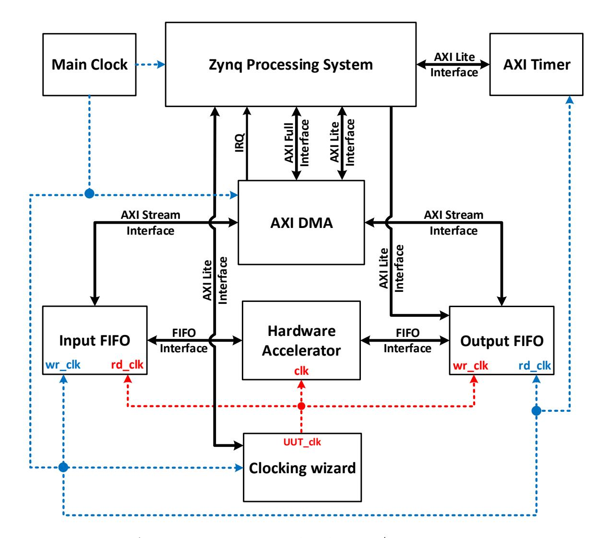

**Figure 1:** Block diagram of software/hardware co-design.

### <span id="page-28-1"></span>4.3 Benchmarking Setup for Software/Hardware Co-design

A high-level block diagram of the experimental software/hardware co-design platform is shown in Fig. 1. The Hardware Accelerator is connected, through the dual-clock Input and Output FIFOs, to the AXI DMA, supporting the high-speed communication with the Processing System. Timing measurements are performed using the popular Xilinx IP unit called AXI Timer, which is capable of measuring time in clock cycles of the 200 MHz system clock. The Hardware Accelerator can operate at a variable clock frequency, controlled from software using the Clocking wizard unit.

### <span id="page-28-2"></span>4.4 Interface and Communication Protocol

The interface of the hardware accelerator is shown in Fig. 2. This interface is assumed to be identical for both hardware and software/hardware implementations and matches the interface of the Input and Output FIFOs, shown in Fig. 3. The default width of the data bus is 64 bits. Each particular operation, such as load public key, start encapsulation, etc., is initiated by sending an appropriate header (in the form of a single 64-bit word) from a program running on the ARM processor to the data input of a hardware accelerator. When an operation requires additional data, this data is transmitted using the subsequent Input FIFO words.

After the hardware accelerator produces results or detects an error, a header word is sent in the opposite direction. If an additional output is required, this output follows the header and is arranged in 64-bit words. The detailed format of the exchanged inputs and outputs is left up to the designer of a hardware accelerator.

Compared to an earlier proposed PQC Hardware API [25], the adopted interface is significantly simpler and more flexible. Only one input port, infifo, is used in place of three separate ports, Public Data Input (PDI), Secret Data Input (SDI), and Random Data Input (RDI). Only one output port, outfifo, is used in place of two separate ports,

{29}------------------------------------------------

<span id="page-29-0"></span>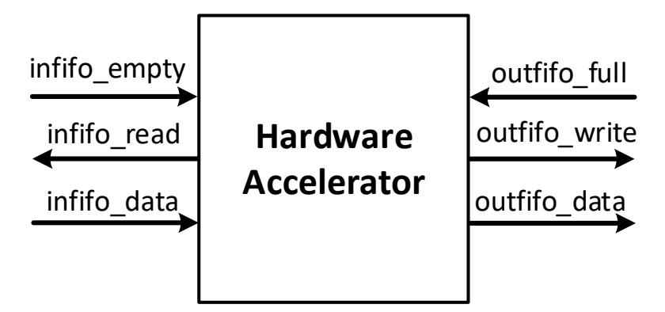

**Figure 2:** Hardware accelerator interface.

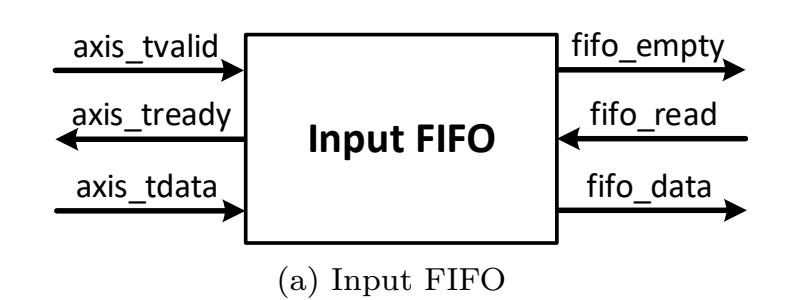

<span id="page-29-1"></span>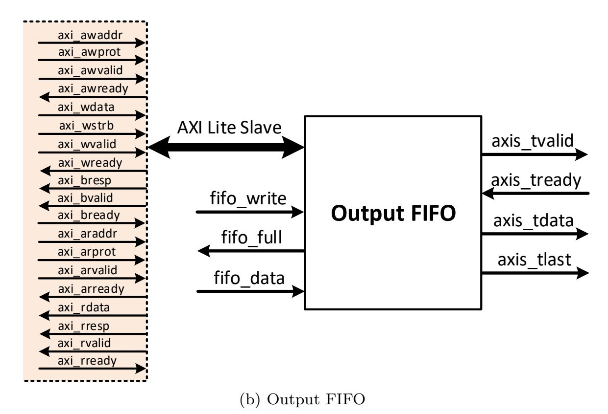

Figure 3: The Input and Output FIFO Interface.

Public Data Output (PDO) and Secret Data Output (SDO).

The proposed interface does not provide physical separation among the public, secret, and random data. Still, it appears to be sufficient at the current stage of the evaluation process for both pure hardware and software/hardware implementations. It also significantly simplifies the software/hardware partitioning and transfer of data between the processor and the hardware accelerator.

### <span id="page-29-2"></span>4.5 Porting Software Implementations to ARM Cortex-A53

To minimize overhead, we have run software in the Bare Metal mode, without any operating system. We have started from the best high-level language implementations of selected candidates available to date. In order to be run on ARM Cortex-A53 in the Bare Metal mode, these implementations had to be modified as described below.

Since no functions of Open-SSL are available in the Bare Metal mode, we have adopted for AES the Optimized ANSI C code of the Rijndael cipher based on the use of T-boxes, developed by Vincent Rijmen, Antoon Bosselaers, and Paulo Barreto [62]. Compared

{30}------------------------------------------------

to the OpenSSL implementation, the selected implementation is written entirely in C, rather than in an assembly language of a specific processor. It does not contain any countermeasures against cache-timing attacks.

For SHA-3, for all candidates other than Round5, we adopted fips202.c from SUPERCOP by Ronny Van Keer, Gilles Van Assche, Daniel J. Bernstein, and Peter Schwabe. For Round5, we used r5\_xof\_shake.c by Markku-Juhani O.Saarinen and keccak1600.c from SUPERCOP, by the same authors as fips202.c

For all investigated KEMs, the encapsulation operation uses multiple calls to the function randombytes(), which produces a sequence of random bytes with uniform distribution. Other PQC benchmarking projects use a version of this function based on operating system functions and/or functions from OpenSSL [**berns19**, [64,](#page-61-7) [43,](#page-59-14) [68\]](#page-61-8). None of these options is available in the Bare Metal mode. Therefore, in our code, we use the implementation of randombytes() proposed by Saarinen in April 2018 [\[64\]](#page-61-7), which is an improved version of the implementation developed by NIST for the generation of known-answer tests [\[58\]](#page-60-11). Since both of these implementations are based on AES in the ECB mode, from the OpenSSL library, we have replaced the code of AES by the mentioned above standalone, optimized implementation of AES in C [\[62\]](#page-61-6). As a result, the selected implementation of randombytes() is likely to have different timing characteristics than the implementations used in other benchmarking studies, such as SUPERCOP [**berns19**], pqcbench [\[64\]](#page-61-7), pqm4 [\[43\]](#page-59-14), and liboqs [\[68\]](#page-61-8).

Taking into account that the C implementations of NTRU-HPS, NTRU-HRSS, and Streamlined NTRU Prime use randombytes() to generate 3211, 1400, and 2611 bytes, respectively, we have sped up these function calls by a) limiting the number of bytes returned by randombytes() to 32, and b) generating the remaining random bytes using SHAKE128. For the three KEMs mentioned above, this change resulted in the speed-up of the relevant functions by a factor greater than 3.

No attempt at the optimization of the software implementations of KEMs by employing assembly language coding has been made.

## <span id="page-30-0"></span>**4.6 Software Profiling, C Source Code Analysis, and Software/Hardware Partitioning**

Our first step in evaluating the suitability of cryptographic algorithms for software/hardware co-design was profiling of their software implementations using one core of the ARM Cortex-A53. Profiling produced a list of the most time-consuming functions, including their absolute execution time, percentage execution time, and the number of times they are called.

We decided which functions to offload to hardware based on the highest potential for the total speed-up, as well as the fairness of comparison among investigated algorithms. The total speed-up obtained by offloading an operation to hardware depends on two major factors: the percentage of the execution time taken in software by an operation offloaded to hardware, and the speed-up for the offloaded operation itself. In order to maximize the first factor, we gave priority to operations that take the largest percentage of the execution time, preferably more than 90%. These operations may involve a single function call, several adjacent function calls, or a sequence of consecutive instructions in C. It is preferred that a given operation is executed only once, or only a few times, as each transfer of control and data between software and hardware involves a certain fixed timing overhead, independent of the size of input and output to the accelerator. In order to maximize the second factor, we gave priority to operations that have a high potential for parallelization in hardware, and a small total size of inputs and outputs (which will need to be transferred to and from the hardware accelerator, respectively)

Most of the data required to make informed decisions regarding software/hardware partitioning can be obtained by profiling software implementations, possibly extended with

{31}------------------------------------------------

some small modifications required to gather all relevant data. However, determining the potential for parallelization requires some knowledge of hardware or at least basic concepts of concurrent computing.

To assure fairness in our comparison, we offloaded to hardware all operations common to or similar across the implemented algorithms (e.g., all polynomial multiplications), and all operations that contributed significantly to the total execution time. Nevertheless, it should be understood that this heuristic procedure may need to be repeated several times because, after each round of offloading to hardware, different software operations may emerge as taking the majority of the total execution time. This process can stop when the development effort required for offloading the next most-critical operation to hardware is disproportionately high compared to the projected speed-up.

All encapsulations involve a single call to the function randombytes(), returning a seed to a pseudorandom number generator. This function could be possibly offloaded to hardware by implementing a True Random Number Generator (TRNG) in Programmable Logic. However, the correct implementation of a TRNG in FPGA fabric is a substantial project by itself. Additionally, in some cases, the seed would need to be transferred back to software, while in others it could be used directly by a hardware accelerator. To avoid these additional complications, in all the current software/hardware partitioning schemes, the seed is assumed to be generated in software.

## <span id="page-31-0"></span>**4.7 RTL Design Methodology**

The design of a hardware accelerator follows a traditional Register-Transfer Level (RTL) methodology. The entire system is divided into the Datapath and Controller. The Datapath is described using a hierarchical block diagram, and the Controller using hierarchical algorithmic state machine (ASM) charts. Multiple local controllers may be advantageous compared to a single global Controller. The RTL approach, although not novel by itself, is an important part of our methodology as it facilitates very efficient hardware accelerator designs. The block diagrams and ASM charts are very easy to translate to efficient and fully synthesizable VHDL code.

### **4.8 Potential Software Optimizations**

Our software/hardware implementations could be potentially sped up by accelerating the remaining software part using assembly language programming.

The ARM Cortex-A53 is a microarchitecture implementing the ARMv8-A 64-bit instruction set. This instruction set consists of traditional RISC instructions operating on 31 generalpurpose 64-bit registers, as well as Single-Instruction Multiple-Data (SIMD) instructions operating on 32 128-bit registers, treated as vectors composed of smaller data words. The SIMD architecture extension for the ARM Cortex-A processors, including Cortex-A53, is referred to as NEON [\[7\]](#page-57-10). The NEON 128-bit registers are considered as vectors of elements of the same data type, with NEON instructions operating on multiple elements simultaneously. Multiple data types are supported by this technology, including floatingpoint and integer operations.

A programmer can take advantage of NEON instructions using any of the following methods: a) Auto-vectorization by a compiler, b) Use of NEON-enabled libraries, c) using NEON intrinsics, and d) Using hand-coded NEON assembly language code [\[7\]](#page-57-10).

Auto-vectorization is the process by which a compiler automatically analyzes the code and identifies opportunities to optimize performance using NEON instructions and register files. NEON-enabled libraries focus on signal and image processing, computer vision, physics, and machine learning. Examples include Arm Compute Library, Ne10, Libyuv, and Skia. NEON intrinsics are function calls that the compiler replaces with an appropriate NEON instruction or sequence of NEON instructions. Intrinsics provide almost as much control

{32}------------------------------------------------

as writing assembly language but leave the allocation of registers to the compiler [\[6\]](#page-57-11). Finally, using hand-coded NEON assembly language code provides the programmer with the highest level of control, which may be used for the most aggressive and advanced optimizations.

Our implementations take advantage of only Option a) Auto-vectorization by a compiler. Regarding Option b), we are not aware of any NEON-enabled library that explicitly benefits lattice-based cryptosystems. No attempt was made to optimize software parts of our implementations using either intrinsics or hand-coded NEON assembly.

Our justification for these choices is as follows. Operations that are most suitable for a speed-up using NEON instructions are typically also excellent candidates for offloading to hardware. As a result, at the time when further offloading to hardware is judged to be either counterproductive or too labor intensive, the remaining operations executed in software are most likely sequential in nature and cannot take advantage of NEON instructions and registers.

Still, some speed up could be potentially accomplished by hand-coding these operations using scalar instructions of the ARMv8-A 64-bit instruction set. However, doing that would make the implementation much less portable. A similar effort could possibly be better spent on offloading all remaining operations to hardware. Even if the further offloaded operations cannot by themselves benefit from any substantial speed-up, moving them to hardware will eventually eliminate the entire transfer time, which remains substantial in all our software/hardware co-designs.

As a result, optimizing software implementations using NEON instructions and registers should be treated as an alternative optimization path, starting from the same starting point as our software/hardware co-designs. This starting point is a portable C implementation, that can be easily profiled and analyzed for inherent parallelism.

### **4.9 Verification and Generation of Results**

Functional verification of the hardware description language (HDL) code is performed by comparing simulation results with precomputed outputs generated by a reference software implementation.

Fully verified and independently optimized VHDL code is then combined with the *optimized* software implementation of a given PQC candidate. Functional verification of the integrated software/hardware design is performed by running the code on the prototyping board and comparing the obtained outputs with outputs generated by a functionally equivalent reference implementation, run on the same ARM Cortex-A53 processor.

Experimental timing measurements follow, with the hardware accelerator's clock set (using the Clocking wizard) to the optimal target frequency identified during the synthesis and implementation runs. The execution time is measured by using the AXI Timer module, shown in Fig. [1,](#page-28-0) in clock cycles of the AXI Timer, which operates at the default clock frequency of 200 MHz.

The encapsulation time does not include the time necessary to transfer public key to the hardware accelerator. Similarly, the decapsulation time does not include the time necessary to transfer private key to the hardware accelerator. In case a public key of the receiver is required during decapsulation, this key is assumed to be a part of the corresponding private key.

The time required for a key upload is calculated as a difference between the time necessary for transferring a concatenation of the key and the first input (e.g., the seed for encapsulation, or the ciphertext for decapsulation) minus the time required to transfer the first input itself. This convention is consistent with the fact that the transmission of the key does not need to be repeated if the same key is reused multiple times. At the same time, the key upload overhead is typically so small that it is not efficient to send the key well

{33}------------------------------------------------

before its first use. As a result, the key upload is assumed to be always combined with the transmission of the first input.

## 5 Results

## <span id="page-33-2"></span>5.1 Results for Hardware Implementations

<span id="page-33-0"></span>**Table 15:** Maximum frequency and resource utilization of hardware implementations on Artix-7.

| Algorithm  | Security Category:     | Max.  | LUT        | FF          | Slice      | DSP | $\overline{\mathrm{BR}}$ |
|------------|------------------------|-------|------------|-------------|------------|-----|--------------------------|
| Algoridiii | Parameter Set          | Freq. |            | T T         | Diffe      | DSF | $\mathbf{AM}$            |
| Kyber      | 1: KYBER512            | 210   | 11,864     | 10,348      | 3,989      | 8   | 15.0                     |
| Kyber      | 2: KYBER768            | 210   | 11,884     | 10,380      | 3,984      | 8   | 15.0                     |
| Kyber      | 5: KYBER1024           | 210   | $12,\!183$ | $12,\!441$  | $4,\!511$  | 8   | 15.0                     |
| LAC-v3a    | 1: LAC-128             | 185   | $23,\!314$ | 15,950      | 7,099      | 0   | 8.5                      |
| LAC-v3a    | 3: LAC-192             | 172   | 38,898     | $26,\!174$  | 11,700     | 0   | 11.5                     |
| LAC-v3a    | 5: LAC-256             | 167   | 42,721     | $26,\!872$  | 12,903     | 0   | 11.5                     |
| LAC-v3b    | 1: LAC-128             | 192   | 18,955     | 15,958      | $5,\!421$  | 0   | 8.5                      |
| LAC-v3b    | 3: LAC-192             | 190   | $28,\!362$ | $26,\!182$  | 7,949      | 0   | 11.5                     |
| LAC-v3b    | 5: LAC-256             | 167   | $32,\!184$ | 26,882      | 8,995      | 0   | 11.5                     |
| NewHope    | 1: NEWHOPE512-CCA-KEM  | 225   | 9,000      | 8,732       | 3,194      | 4   | 12.0                     |
| NewHope    | 5: NEWHOPE1024-CCA-KEM | 225   | 9,000      | 8,732       | 3,194      | 4   | 12.0                     |
| Round5     | 1: R5ND_CCA_1KEM_0d    | 185   | $57,\!137$ | 80,676      | 21,291     | 0   | 3.0                      |
| Round5     | 3: R5ND_CCA_3KEM_0d    | 165   | $78,\!825$ | $107,\!564$ | 29,441     | 0   | 3.0                      |
| Round5     | 5: R5ND_CCA_5KEM_0d    |       |            | Doesn'      | t fit      |     |                          |
| Round5     | 1: R5ND_CCA_1KEM_5d    | 204   | $36,\!578$ | $56,\!355$  | 14,042     | 0   | 3.0                      |
| Round5     | 3: R5ND_CCA_3KEM_5d    | 174   | 59,852     | 95,170      | 24,869     | 0   | 3.0                      |
| Round5     | 5: R5ND_CCA_5KEM_5d    | 169   | $69,\!548$ | 113,913     | $28,\!286$ | 0   | 3.0                      |

<span id="page-33-1"></span>**Table 16:** Maximum frequency and resource utilization of hardware implementations on Virtex-7.

| Algorithm | Security Category:     | Max.  | LUT        | $\mathbf{FF}$ | Slice      | DSP         | $\overline{\rm BR}$ |
|-----------|------------------------|-------|------------|---------------|------------|-------------|---------------------|
| Algorithm | Parameter Set          | Freq. | LUI        | ГГ            | Since      | <b>D</b> 51 | $\mathbf{AM}$       |
| Kyber     | 1: KYBER512            | 245   | 13,745     | 11,107        | 4,590      | 8           | 14.0                |
| Kyber     | 3: KYBER768            | 245   | 13,889     | $11,\!113$    | $4,\!500$  | 8           | 14.0                |
| Kyber     | 5: KYBER1024           | 245   | 14,163     | $13,\!179$    | $5,\!172$  | 8           | 14.0                |
| LAC-v3a   | 1: LAC-128             | 286   | $24,\!452$ | 16,097        | $7,\!320$  | 0           | 8.5                 |
| LAC-v3a   | 3: LAC-192             | 250   | $39,\!220$ | $26,\!325$    | 12,021     | 0           | 11.5                |
| LAC-v3a   | 5: LAC-256             | 208   | 44,722     | 27,033        | $13,\!659$ | 0           | 11.5                |
| LAC-v3b   | 1: LAC-128             | 294   | 18,972     | 16,061        | $5,\!300$  | 0           | 8.5                 |
| LAC-v3b   | 3: LAC-192             | 286   | 28,344     | $26,\!206$    | $7,\!654$  | 0           | 11.5                |
| LAC-v3b   | 5: LAC-256             | 213   | $32,\!177$ | 26,846        | 9,111      | 0           | 11.5                |
| NewHope   | 1: NEWHOPE512-CCA-KEM  | 295   | 11,345     | 8,838         | $3,\!572$  | 4           | 12.0                |
| NewHope   | 5: NEWHOPE1024-CCA-KEM | 295   | 11,345     | 8,838         | 3,572      | 4           | 12.0                |
| Round5    | 1: R5ND_CCA_1KEM_0d    | 238   | $62,\!407$ | 80,726        | 23,918     | 0           | 3.0                 |
| Round5    | 3: R5ND_CCA_3KEM_0d    | 208   | 78,727     | 107,631       | 28,034     | 0           | 3.0                 |
| Round5    | 5: R5ND_CCA_5KEM_0d    | 215   | 108,472    | $156,\!532$   | 39,008     | 0           | 3.0                 |
| Round5    | 1: R5ND_CCA_1KEM_5d    | 256   | 38,350     | 56,413        | 14,731     | 0           | 3.0                 |
| Round5    | 3: R5ND_CCA_3KEM_5d    | 222   | 59,824     | $95,\!270$    | $23,\!505$ | 0           | 3.0                 |
| Round5    | 5: R5ND_CCA_5KEM_5d    | 202   | 69,561     | 113,933       | 28,643     | 0           | 3.0                 |

Six CCA-secure KEMs representing four candidate - CRYSTALS-Kyber, LAC, NewHope, and Round5 - have been implemented in pure hardware. LAC is represented by two variants, v3a with q=251 and v3b with q=256. Round5 is represented by R5ND\_CCA\_KEM\_0d

{34}------------------------------------------------

- a ring variant without any error correcting code, and R5ND\_CCA\_KEM\_5d - a ring variant with the XE5 forward error correcting code used to decrease decryption failure rates during decapsulation (and thus improve bandwidth and security).

The maximum clock frequency and resource utilization of our hardware implementations of all six KEMs are summarized in Table [15](#page-33-0) for Xilinx Artix-7 FPGAs and in Table [16](#page-33-1) for Xilinx Virtex-7 FPGAs. All but one KEM fit within the largest device of the Artix-7 family. The only one that does not is the security level 5 variant of Round5 without error correction. Taking into account that we target high-speed implementations, more suitable for high-performance FPGAs, such as Virtex-7, the inability to fit the high-speed version of the highest-security variant in low-cost FPGA family should not be used against Round5. LAC-v3b, with *q*=256, clearly outperforms LAC-v3a, with *q*=251, in terms of both the maximum clock frequency and resource utilization. For example, for the security level 1 on Artix-7, the implementation of LAC-v3b has about 4% higher frequency and requires about 19% fewer LUTs. In the case of Round5, R5ND\_CCA\_KEM\_5d (with error correction) significantly outperforms R5ND\_CCA\_KEM\_0d (without error correction). For example, at the security level 1 on Artix-7, the difference is at the level of 10% in terms of clock frequency, and 36% in terms of the number of LUTs.

Taking into account the best variants of all four submissions at the security level 1, all clock frequencies are in a very small range between 192 and 210 MHz for Artix-7 and between 235 and 294 for Virtex-7. Thus, no significant advantage in terms of the maximum clock frequency is demonstrated by any candidate.

Ranking of candidates in terms of resource utilization is also very difficult because of no clear equivalence between various elements of the resource utilization vectors. For example, on Artix-7, NEWHOPE512-CCA-KEM uses about 4 times fewer LUTs than R5ND\_CCA\_1KEM\_5d, but requires 4 vs. 0 DSP units, and 4 times more BRAMs. Thus, none of these implementations can be claimed to be clearly superior vs. the other. However, an important differentiating factor is the use of either similar or significantly different amount of resources for implementing different security levels. It is generally more desirable to have an algorithm that can be implemented using the same amount of resources, independently of the security level. This feature allows an easier upgrade of a security level. It also indirectly implies that the 3-in-1 or 2-in-1 designs will have a similar resource utilization as the lowest-security variant rather than the resource utilization higher than that of the highest-security variant. Out of six investigated KEMs, this desirable property is exhibited only by Kyber and NewHope. On top of that, Kyber is slightly more flexible, due to the existence of a variant at the security level 3. On the other hand, NewHope has a small advantage in terms of all elements of the resource utilization vector (e.g., for level 1 at Artix-7, it uses 9000 vs. 11,864 LUTs, 8,732 vs. 10,348 FFs, 3,194 vs. 3,989 slices, 4 vs. 8 DSP units, and 12 vs. 15 BRAMs).

The times necessary to load a public key (required for encapsulation) and a secret (private) key (required for decapsulation) are proportional to the size of the respective key and inversely proportional to the maximum clock frequency of a given PQC unit. All transfers are assumed to be conducted using a 64-bit infifo\_data bus. The sizes of keys for all variants of all investigated algorithms are summarized in Table [14.](#page-25-0) The maximum clock frequencies are listed in Table [15](#page-33-0) for Artix-7 and Table [16](#page-33-1) for Virtex-7. In Fig. [4,](#page-36-0) we compare these key loading times for Artix-7, and in Fig. [5](#page-36-1) for Virtex-7. For both Artix-7 and Virtex-7, R5ND\_CCA\_KEM\_5d has the shortest key-loading times, and NewHope the longest. However, the differences among these times are relatively minor. They do not exceed a factor of 2 for loading a public key, and 3 for loading a private key.

The ranking of all 6 implemented KEMs in terms of the two primary performance metrics, for high-speed implementations, is shown in Fig. [6](#page-37-0) for Artix-7 and in Fig. [7](#page-37-1) for Virtex-7. The exact results and relative differences among the candidates are also summarized in Tables [17](#page-35-0) and [18.](#page-35-1) The primary metrics used for ranking are the execution times for

{35}------------------------------------------------

<span id="page-35-0"></span>**Table 17:** Ranking of hardware implementations in terms of the execution time for encapsulation. For each algorithm, the first number represent the execution time in *µ*s; the second number is the ratio of the execution time for a given algorithm and the best execution time in the given ranking.

|           |      |      | Artix-7   |         |      |           |      |      |  |  |
|-----------|------|------|-----------|---------|------|-----------|------|------|--|--|
| Level 1   |      |      | Level 3   |         |      | Level 5   |      |      |  |  |
| Round5_5d | 12.2 | 1.00 | Kyber     | 19.9    | 1.00 | Round5_5d | 27.6 | 1.00 |  |  |
| Kyber     | 14.8 | 1.21 | LAC-v3b   | 21.2    | 1.07 | LAC-v3b   | 28.1 | 1.02 |  |  |
| LAC-v3b   | 14.8 | 1.21 | Round5_5d | 21.6    | 1.09 | Kyber     | 28.4 | 1.03 |  |  |
| Round5_0d | 16.0 | 1.31 | Round5_0d | 25.6    | 1.29 | NewHope   | 30.3 | 1.10 |  |  |
| NewHope   | 16.3 | 1.34 | LAC-v3a   | 29.1    | 1.46 | LAC-v3a   | 33.9 | 1.23 |  |  |
| LAC-v3a   | 17.9 | 1.47 |           |         |      |           |      |      |  |  |
|           |      |      | Virtex-7  |         |      |           |      |      |  |  |
| Level 1   |      |      | Level 3   | Level 5 |      |           |      |      |  |  |
| LAC-v3b   | 9.6  | 1.00 | LAC-v3b   | 14.1    | 1.00 | LAC-v3b   | 22.1 | 1.00 |  |  |
| Round5_5d | 9.7  | 1.01 | Round5_5d | 16.9    | 1.20 | Round5_5d | 23.0 | 1.04 |  |  |
| LAC-v3a   | 11.5 | 1.20 | Kyber     | 17.1    | 1.21 | NewHope   | 23.1 | 1.05 |  |  |
| NewHope   | 12.4 | 1.29 | LAC-v3a   | 20.1    | 1.43 | Kyber     | 24.3 | 1.10 |  |  |
| Round5_0d | 12.5 | 1.30 | Round5_0d | 20.3    | 1.44 | Round5_0d | 26.9 | 1.22 |  |  |
| Kyber     | 12.6 | 1.31 |           |         |      | LAC-v3a   | 27.2 | 1.23 |  |  |

<span id="page-35-1"></span>**Table 18:** Ranking of hardware implementations in terms of the execution time for decapsulation. For each algorithm, the first number represent the execution time in *µ*s; the second number is the ratio of the execution time for a given algorithm and the best execution time in the given ranking.

|           |                               |      | Artix-7   |      |      |           |      |      |
|-----------|-------------------------------|------|-----------|------|------|-----------|------|------|
| Level 1   |                               |      | Level 3   |      |      | Level 5   |      |      |
| Round5_5d | 16.3                          | 1.00 | Kyber     | 27.2 | 1.00 | Kyber     | 36.2 | 1.00 |
| LAC-v3b   | 18.9                          | 1.16 | Round5_5d | 28.4 | 1.04 | Round5_5d | 36.4 | 1.01 |
| Round5_0d | 20.6                          | 1.26 | LAC-v3b   | 28.7 | 1.06 | LAC-v3b   | 37.9 | 1.05 |
| Kyber     | 21.4                          | 1.31 | Round5_0d | 33.2 | 1.22 | NewHope   | 41.5 | 1.15 |
| NewHope   | 22.0                          | 1.35 | LAC-v3a   | 37.4 | 1.38 | LAC-v3a   | 43.8 | 1.21 |
| LAC-v3a   | 22.2                          | 1.36 |           |      |      |           |      |      |
|           |                               |      | Virtex-7  |      |      |           |      |      |
|           | Level 1<br>Level 3<br>Level 5 |      |           |      |      |           |      |      |
| LAC-v3b   | 12.4                          | 1.00 | LAC-v3b   | 19.1 | 1.00 | Kyber     | 31.0 | 1.00 |
| Round5_5d | 13.3                          | 1.07 | Round5_5d | 22.7 | 1.19 | Round5_5d | 31.2 | 1.01 |
| LAC-v3a   | 14.4                          | 1.16 | Kyber     | 23.3 | 1.22 | NewHope   | 31.7 | 1.02 |
| Round5_0d | 16.0                          | 1.29 | LAC-v3a   | 25.8 | 1.35 | Round5_0d | 35.8 | 1.15 |
| NewHope   | 16.8                          | 1.35 | Round5_0d | 27.0 | 1.41 | LAC-v3b   | 37.7 | 1.22 |
| Kyber     | 18.3                          | 1.48 |           |      |      | LAC-v3a   | 43.5 | 1.40 |

{36}------------------------------------------------

<span id="page-36-0"></span>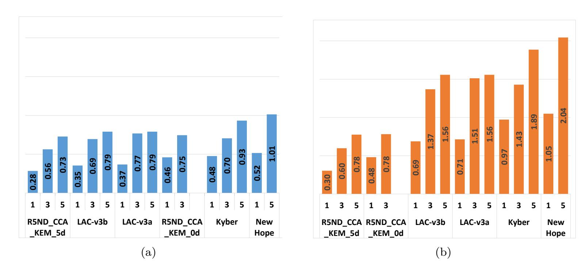

**Figure 4:** (a) Public Key and (b) Private Key transfer latency  $(\mu s)$  on Artix-7

<span id="page-36-1"></span>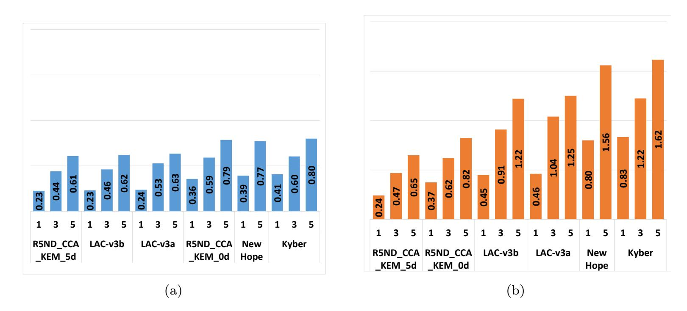

**Figure 5:** (a) Public Key and (b) Private Key transfer latency  $(\mu s)$  on Virtex-7

encapsulation and decapsulation, respectively.

LAC-v3b, with q=256, clearly outperforms LAC-v3a, with q=251, in terms of both encapsulation and decapsulation time. Similarly, R5ND\_CCA\_KEM\_5d (with error correction) outperforms R5ND\_CCA\_KEM\_0d (without error correction). The relative ranking of Kyber, LAC-v3b, NewHope, and R5ND\_CCA\_KEM\_5d, changes depending on the operation, security level, and FPGA family, but overall differences are minuscule. Thus, none of these four algorithms has a clear edge over the other in terms of hardware efficiency. Overall, the most efficient variants of all four candidates are in a virtual tie with one another.

In Table 19, we compare our hardware implementation of NewHope with the best high-speed implementation of this algorithm available to date. This implementation was described in [81], but it covered only a subset of the functionality of the IND-CCA KEM, namely the IND-CPA secure public-key encryption (PKE). Since for our own implementation, we could generate results for any subset of the complete CCA KEM design and using an arbitrary platform, the presented comparison is as fair as possible. Both sets of results concern exactly the same functionality, implemented using the same optimization target, with results generated using exactly the same platform.

{37}------------------------------------------------

<span id="page-37-0"></span>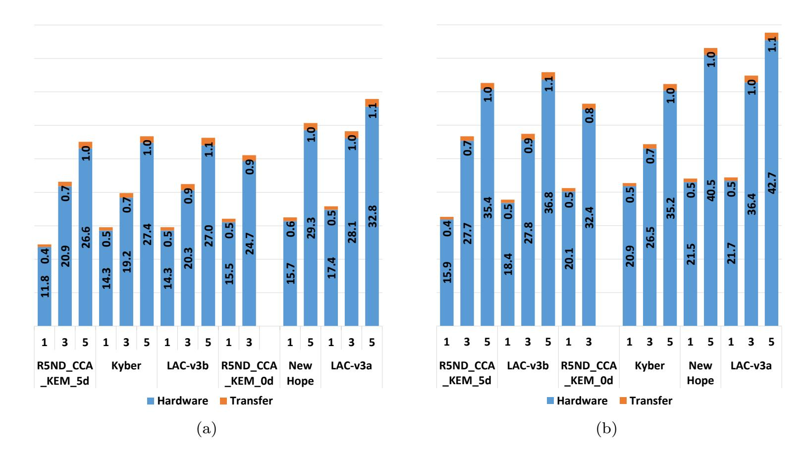

**Figure 6:** Execution Time for (a) Encapsulation and (b) Decapsulation ( $\mu s$ ) on Artix-7

<span id="page-37-1"></span>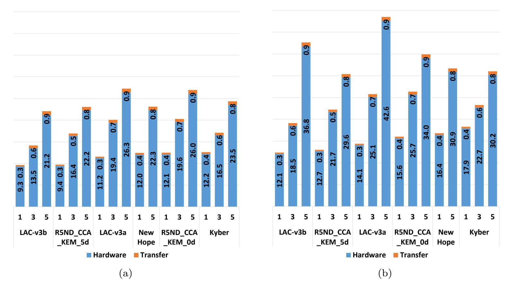

**Figure 7:** Execution Time for (a) Encapsulation and (b) Decapsulation ( $\mu s$ ) on Virtex7

Our implementation outperforms the design by Zhang et al. [81] in terms of all execution times. At security level 1, the speed-up varies between 2.2 for decryption, through 2.4 for key generation, to 2.6 for encryption. Similarly, at the security level 5, the speed-up varies between 2.0 for decryption, through 2.4 for key generation, to 2.6 for encryption. The penalty paid for this increase in speed is the increase in the number of LUTs by 33%, in flip-flops by a factor of 2.2, doubling the number of DSP units from 2 to 4, and increasing the number of BRAMs from 7-8 to 12. Overall, taking into the optimization for high-speed, our design is superior. However, the design by [81] provides an interesting example of trading the speed for a reduction in resource utilization.

{38}------------------------------------------------

<span id="page-38-0"></span>this work and the best hardware design of NewHope reported in the literature to date. All results for Zynq-7000 **Table 19:** Comparison between

|                                                                                                                                                                                                                                                                                                                                                                                                                                                                                                                                                                                                                                                                                                                                                                                                                                                                                                                                                                                                                                                                                                                                                                                                                                                                                                                                                                                                                                                                                                                                                                                                                                                                                                                                                                                                                                                                                                                                                                                                                                                                                                                                | 0.                           |                     | 6                                                                                                                                                                                                                                                                                                                                                                                                                                                                                                                                                                                                                                                                                                                                                                                                                                                                                                                                                                                                                                                                                                                                                                                                                                                                                                                                                                                                                                                                                                                                                                                                                                                                                                                                                                                                                                                                                                                                                                                                                                                                                                                                                                          |                      |                                                                                                                                                                                                                                                                                                                                                                                                                                                                                                                                                                                                                                                                                                                                                                                                                                                                                                                                                                                                                                                                                                                                                                                                                                                                                                                                                                                                                                                                                                                                                                                                                                                                                                                                                                                                                                                                                                                                                                                                                                                                                                                                                                                                                                                                                                                                                                                                                                                                |
|--------------------------------------------------------------------------------------------------------------------------------------------------------------------------------------------------------------------------------------------------------------------------------------------------------------------------------------------------------------------------------------------------------------------------------------------------------------------------------------------------------------------------------------------------------------------------------------------------------------------------------------------------------------------------------------------------------------------------------------------------------------------------------------------------------------------------------------------------------------------------------------------------------------------------------------------------------------------------------------------------------------------------------------------------------------------------------------------------------------------------------------------------------------------------------------------------------------------------------------------------------------------------------------------------------------------------------------------------------------------------------------------------------------------------------------------------------------------------------------------------------------------------------------------------------------------------------------------------------------------------------------------------------------------------------------------------------------------------------------------------------------------------------------------------------------------------------------------------------------------------------------------------------------------------------------------------------------------------------------------------------------------------------------------------------------------------------------------------------------------------------|------------------------------|---------------------|----------------------------------------------------------------------------------------------------------------------------------------------------------------------------------------------------------------------------------------------------------------------------------------------------------------------------------------------------------------------------------------------------------------------------------------------------------------------------------------------------------------------------------------------------------------------------------------------------------------------------------------------------------------------------------------------------------------------------------------------------------------------------------------------------------------------------------------------------------------------------------------------------------------------------------------------------------------------------------------------------------------------------------------------------------------------------------------------------------------------------------------------------------------------------------------------------------------------------------------------------------------------------------------------------------------------------------------------------------------------------------------------------------------------------------------------------------------------------------------------------------------------------------------------------------------------------------------------------------------------------------------------------------------------------------------------------------------------------------------------------------------------------------------------------------------------------------------------------------------------------------------------------------------------------------------------------------------------------------------------------------------------------------------------------------------------------------------------------------------------------------------------------------------------------|----------------------|----------------------------------------------------------------------------------------------------------------------------------------------------------------------------------------------------------------------------------------------------------------------------------------------------------------------------------------------------------------------------------------------------------------------------------------------------------------------------------------------------------------------------------------------------------------------------------------------------------------------------------------------------------------------------------------------------------------------------------------------------------------------------------------------------------------------------------------------------------------------------------------------------------------------------------------------------------------------------------------------------------------------------------------------------------------------------------------------------------------------------------------------------------------------------------------------------------------------------------------------------------------------------------------------------------------------------------------------------------------------------------------------------------------------------------------------------------------------------------------------------------------------------------------------------------------------------------------------------------------------------------------------------------------------------------------------------------------------------------------------------------------------------------------------------------------------------------------------------------------------------------------------------------------------------------------------------------------------------------------------------------------------------------------------------------------------------------------------------------------------------------------------------------------------------------------------------------------------------------------------------------------------------------------------------------------------------------------------------------------------------------------------------------------------------------------------------------------|
| no-71                                                                                                                                                                                                                                                                                                                                                                                                                                                                                                                                                                                                                                                                                                                                                                                                                                                                                                                                                                                                                                                                                                                                                                                                                                                                                                                                                                                                                                                                                                                                                                                                                                                                                                                                                                                                                                                                                                                                                                                                                                                                                                                          | $\frac{\mu_s}{rati}$         |                     | 1.8                                                                                                                                                                                                                                                                                                                                                                                                                                                                                                                                                                                                                                                                                                                                                                                                                                                                                                                                                                                                                                                                                                                                                                                                                                                                                                                                                                                                                                                                                                                                                                                                                                                                                                                                                                                                                                                                                                                                                                                                                                                                                                                                                                        |                      | 1.8                                                                                                                                                                                                                                                                                                                                                                                                                                                                                                                                                                                                                                                                                                                                                                                                                                                                                                                                                                                                                                                                                                                                                                                                                                                                                                                                                                                                                                                                                                                                                                                                                                                                                                                                                                                                                                                                                                                                                                                                                                                                                                                                                                                                                                                                                                                                                                                                                                                            |
| esuits for Lyfiq<br>CPA Decryption                                                                                                                                                                                                                                                                                                                                                                                                                                                                                                                                                                                                                                                                                                                                                                                                                                                                                                                                                                                                                                                                                                                                                                                                                                                                                                                                                                                                                                                                                                                                                                                                                                                                                                                                                                                                                                                                                                                                                                                                                                                                                             | $\mu s$                      |                     | $\frac{12.5}{6.6}$                                                                                                                                                                                                                                                                                                                                                                                                                                                                                                                                                                                                                                                                                                                                                                                                                                                                                                                                                                                                                                                                                                                                                                                                                                                                                                                                                                                                                                                                                                                                                                                                                                                                                                                                                                                                                                                                                                                                                                                                                                                                                                                                                         |                      | $\frac{24.6}{12.9}$                                                                                                                                                                                                                                                                                                                                                                                                                                                                                                                                                                                                                                                                                                                                                                                                                                                                                                                                                                                                                                                                                                                                                                                                                                                                                                                                                                                                                                                                                                                                                                                                                                                                                                                                                                                                                                                                                                                                                                                                                                                                                                                                                                                                                                                                                                                                                                                                                                            |
| IIUS IC                                                                                                                                                                                                                                                                                                                                                                                                                                                                                                                                                                                                                                                                                                                                                                                                                                                                                                                                                                                                                                                                                                                                                                                                                                                                                                                                                                                                                                                                                                                                                                                                                                                                                                                                                                                                                                                                                                                                                                                                                                                                                                                        | cycl.                        |                     | 1.68                                                                                                                                                                                                                                                                                                                                                                                                                                                                                                                                                                                                                                                                                                                                                                                                                                                                                                                                                                                                                                                                                                                                                                                                                                                                                                                                                                                                                                                                                                                                                                                                                                                                                                                                                                                                                                                                                                                                                                                                                                                                                                                                                                       |                      | 1.66                                                                                                                                                                                                                                                                                                                                                                                                                                                                                                                                                                                                                                                                                                                                                                                                                                                                                                                                                                                                                                                                                                                                                                                                                                                                                                                                                                                                                                                                                                                                                                                                                                                                                                                                                                                                                                                                                                                                                                                                                                                                                                                                                                                                                                                                                                                                                                                                                                                           |
| All resu                                                                                                                                                                                                                                                                                                                                                                                                                                                                                                                                                                                                                                                                                                                                                                                                                                                                                                                                                                                                                                                                                                                                                                                                                                                                                                                                                                                                                                                                                                                                                                                                                                                                                                                                                                                                                                                                                                                                                                                                                                                                                                                       | cycles                       |                     | $\frac{2,500}{1,487}$                                                                                                                                                                                                                                                                                                                                                                                                                                                                                                                                                                                                                                                                                                                                                                                                                                                                                                                                                                                                                                                                                                                                                                                                                                                                                                                                                                                                                                                                                                                                                                                                                                                                                                                                                                                                                                                                                                                                                                                                                                                                                                                                                      |                      | 4,800                                                                                                                                                                                                                                                                                                                                                                                                                                                                                                                                                                                                                                                                                                                                                                                                                                                                                                                                                                                                                                                                                                                                                                                                                                                                                                                                                                                                                                                                                                                                                                                                                                                                                                                                                                                                                                                                                                                                                                                                                                                                                                                                                                                                                                                                                                                                                                                                                                                          |
| late.                                                                                                                                                                                                                                                                                                                                                                                                                                                                                                                                                                                                                                                                                                                                                                                                                                                                                                                                                                                                                                                                                                                                                                                                                                                                                                                                                                                                                                                                                                                                                                                                                                                                                                                                                                                                                                                                                                                                                                                                                                                                                                                          | $\frac{\mu s}{\text{ratio}}$ |                     | 2.43                                                                                                                                                                                                                                                                                                                                                                                                                                                                                                                                                                                                                                                                                                                                                                                                                                                                                                                                                                                                                                                                                                                                                                                                                                                                                                                                                                                                                                                                                                                                                                                                                                                                                                                                                                                                                                                                                                                                                                                                                                                                                                                                                                       |                      | 2.45                                                                                                                                                                                                                                                                                                                                                                                                                                                                                                                                                                                                                                                                                                                                                                                                                                                                                                                                                                                                                                                                                                                                                                                                                                                                                                                                                                                                                                                                                                                                                                                                                                                                                                                                                                                                                                                                                                                                                                                                                                                                                                                                                                                                                                                                                                                                                                                                                                                           |
| yptioi                                                                                                                                                                                                                                                                                                                                                                                                                                                                                                                                                                                                                                                                                                                                                                                                                                                                                                                                                                                                                                                                                                                                                                                                                                                                                                                                                                                                                                                                                                                                                                                                                                                                                                                                                                                                                                                                                                                                                                                                                                                                                                                         | $\mu s$                      |                     | $\frac{33.0}{13.6}$                                                                                                                                                                                                                                                                                                                                                                                                                                                                                                                                                                                                                                                                                                                                                                                                                                                                                                                                                                                                                                                                                                                                                                                                                                                                                                                                                                                                                                                                                                                                                                                                                                                                                                                                                                                                                                                                                                                                                                                                                                                                                                                                                        |                      | 62.5                                                                                                                                                                                                                                                                                                                                                                                                                                                                                                                                                                                                                                                                                                                                                                                                                                                                                                                                                                                                                                                                                                                                                                                                                                                                                                                                                                                                                                                                                                                                                                                                                                                                                                                                                                                                                                                                                                                                                                                                                                                                                                                                                                                                                                                                                                                                                                                                                                                           |
| nterature to di<br>CPA Encryption                                                                                                                                                                                                                                                                                                                                                                                                                                                                                                                                                                                                                                                                                                                                                                                                                                                                                                                                                                                                                                                                                                                                                                                                                                                                                                                                                                                                                                                                                                                                                                                                                                                                                                                                                                                                                                                                                                                                                                                                                                                                                              | cycl.                        |                     | 2.16 -                                                                                                                                                                                                                                                                                                                                                                                                                                                                                                                                                                                                                                                                                                                                                                                                                                                                                                                                                                                                                                                                                                                                                                                                                                                                                                                                                                                                                                                                                                                                                                                                                                                                                                                                                                                                                                                                                                                                                                                                                                                                                                                                                                     |                      | 2.18                                                                                                                                                                                                                                                                                                                                                                                                                                                                                                                                                                                                                                                                                                                                                                                                                                                                                                                                                                                                                                                                                                                                                                                                                                                                                                                                                                                                                                                                                                                                                                                                                                                                                                                                                                                                                                                                                                                                                                                                                                                                                                                                                                                                                                                                                                                                                                                                                                                           |
| : Comparison between this work and the best nardware design of the model in the interature to date. All results for Lynq-1000 and the control of the control of the control of the control of the control of the control of the control of the control of the control of the control of the control of the control of the control of the control of the control of the control of the control of the control of the control of the control of the control of the control of the control of the control of the control of the control of the control of the control of the control of the control of the control of the control of the control of the control of the control of the control of the control of the control of the control of the control of the control of the control of the control of the control of the control of the control of the control of the control of the control of the control of the control of the control of the control of the control of the control of the control of the control of the control of the control of the control of the control of the control of the control of the control of the control of the control of the control of the control of the control of the control of the control of the control of the control of the control of the control of the control of the control of the control of the control of the control of the control of the control of the control of the control of the control of the control of the control of the control of the control of the control of the control of the control of the control of the control of the control of the control of the control of the control of the control of the control of the control of the control of the control of the control of the control of the control of the control of the control of the control of the control of the control of the control of the control of the control of the control of the control of the control of the control of the control of the control of the control of the control of the control of the control of the control of the control of the control of the control |                              |                     | $\frac{200}{225} - 0.89 - \frac{6,780}{9,009} - 0.75 - \frac{4,026}{8,768} - 0.46 - \frac{2}{4} - 0.50 - \frac{7}{12} - 0.58 - \frac{4,200}{1,946} - 2.16 - \frac{21.0}{8.6} - 2.44 - \frac{6,600}{3,061} - 2.16 - \frac{33.0}{13.6} - 2.43 - \frac{2,500}{1,487} - 1.68 - \frac{12.5}{6.6} - 1.89 - 1.89 - 1.89 - 1.89 - 1.89 - 1.89 - 1.89 - 1.89 - 1.89 - 1.89 - 1.89 - 1.89 - 1.89 - 1.89 - 1.89 - 1.89 - 1.89 - 1.89 - 1.89 - 1.89 - 1.89 - 1.89 - 1.89 - 1.89 - 1.89 - 1.89 - 1.89 - 1.89 - 1.89 - 1.89 - 1.89 - 1.89 - 1.89 - 1.89 - 1.89 - 1.89 - 1.89 - 1.89 - 1.89 - 1.89 - 1.89 - 1.89 - 1.89 - 1.89 - 1.89 - 1.89 - 1.89 - 1.89 - 1.89 - 1.89 - 1.89 - 1.89 - 1.89 - 1.89 - 1.89 - 1.89 - 1.89 - 1.89 - 1.89 - 1.89 - 1.89 - 1.89 - 1.89 - 1.89 - 1.89 - 1.89 - 1.89 - 1.89 - 1.89 - 1.89 - 1.89 - 1.89 - 1.89 - 1.89 - 1.89 - 1.89 - 1.89 - 1.89 - 1.89 - 1.89 - 1.89 - 1.89 - 1.89 - 1.89 - 1.89 - 1.89 - 1.89 - 1.89 - 1.89 - 1.89 - 1.89 - 1.89 - 1.89 - 1.89 - 1.89 - 1.89 - 1.89 - 1.89 - 1.89 - 1.89 - 1.89 - 1.89 - 1.89 - 1.89 - 1.89 - 1.89 - 1.89 - 1.89 - 1.89 - 1.89 - 1.89 - 1.89 - 1.89 - 1.89 - 1.89 - 1.89 - 1.89 - 1.89 - 1.89 - 1.89 - 1.89 - 1.89 - 1.89 - 1.89 - 1.89 - 1.89 - 1.89 - 1.89 - 1.89 - 1.89 - 1.89 - 1.89 - 1.89 - 1.89 - 1.89 - 1.89 - 1.89 - 1.89 - 1.89 - 1.89 - 1.89 - 1.89 - 1.89 - 1.89 - 1.89 - 1.89 - 1.89 - 1.89 - 1.89 - 1.89 - 1.89 - 1.89 - 1.89 - 1.89 - 1.89 - 1.89 - 1.89 - 1.89 - 1.89 - 1.89 - 1.89 - 1.89 - 1.89 - 1.89 - 1.89 - 1.89 - 1.89 - 1.89 - 1.89 - 1.89 - 1.89 - 1.89 - 1.89 - 1.89 - 1.89 - 1.89 - 1.89 - 1.89 - 1.89 - 1.89 - 1.89 - 1.89 - 1.89 - 1.89 - 1.89 - 1.89 - 1.89 - 1.89 - 1.89 - 1.89 - 1.89 - 1.89 - 1.89 - 1.89 - 1.89 - 1.89 - 1.89 - 1.89 - 1.89 - 1.89 - 1.89 - 1.89 - 1.89 - 1.89 - 1.89 - 1.89 - 1.89 - 1.89 - 1.89 - 1.89 - 1.89 - 1.89 - 1.89 - 1.89 - 1.89 - 1.89 - 1.89 - 1.89 - 1.89 - 1.89 - 1.89 - 1.89 - 1.89 - 1.89 - 1.89 - 1.89 - 1.89 - 1.89 - 1.89 - 1.89 - 1.89 - 1.89 - 1.89 - 1.89 - 1.89 - 1.89 - 1.89 - 1.89 - 1.89 - 1.89 - 1.89 - 1.89 - 1.89 - 1.89 - 1.89 - 1.89 - 1.89 - 1.89 - 1.89 - 1.89 - 1.89 - 1.89 - 1.89 - 1.89 - 1.89 - 1.89 - 1.89 - 1.89$ |                      | $\frac{200}{225} - 0.89 - \frac{6,781}{9,009} - 0.75 - \frac{4,127}{8.768} - 0.47 - \frac{2}{4.000} - 0.50 - \frac{8}{12.00} - 0.67 - \frac{8,000}{3.738} - 2.14 - \frac{40.0}{16.6} - 2.41 - \frac{12,500}{5.746} - 2.18 - \frac{62.5}{25.5} - 2.45 - \frac{4,800}{2.892} - 1.66 - \frac{24.0}{12.9} - 1.87 - \frac{12,500}{2.892} - 1.87 - \frac{12,500}{2.892} - 1.87 - \frac{12,500}{2.892} - 1.87 - \frac{12,500}{2.892} - 1.87 - \frac{12,500}{2.892} - 1.87 - \frac{12,500}{2.892} - 1.87 - \frac{12,500}{2.892} - 1.87 - \frac{12,500}{2.892} - 1.87 - \frac{12,500}{2.892} - 1.87 - \frac{12,500}{2.892} - 1.87 - \frac{12,500}{2.892} - 1.87 - \frac{12,500}{2.892} - 1.87 - \frac{12,500}{2.892} - 1.87 - \frac{12,500}{2.892} - 1.87 - \frac{12,500}{2.892} - 1.87 - \frac{12,500}{2.892} - 1.87 - \frac{12,500}{2.892} - 1.87 - \frac{12,500}{2.892} - 1.87 - \frac{12,500}{2.892} - 1.87 - \frac{12,500}{2.892} - 1.87 - \frac{12,500}{2.892} - 1.87 - \frac{12,500}{2.892} - 1.87 - \frac{12,500}{2.892} - 1.87 - \frac{12,500}{2.892} - 1.87 - \frac{12,500}{2.892} - 1.87 - \frac{12,500}{2.892} - 1.87 - \frac{12,500}{2.892} - 1.87 - \frac{12,500}{2.892} - 1.87 - \frac{12,500}{2.892} - 1.87 - \frac{12,500}{2.892} - 1.87 - \frac{12,500}{2.892} - 1.87 - \frac{12,500}{2.892} - 1.87 - \frac{12,500}{2.892} - 1.87 - \frac{12,500}{2.892} - 1.87 - \frac{12,500}{2.892} - 1.87 - \frac{12,500}{2.892} - 1.87 - \frac{12,500}{2.892} - 1.87 - \frac{12,500}{2.892} - 1.87 - \frac{12,500}{2.892} - 1.87 - \frac{12,500}{2.892} - 1.87 - \frac{12,500}{2.892} - 1.87 - \frac{12,500}{2.892} - 1.87 - \frac{12,500}{2.892} - 1.87 - \frac{12,500}{2.892} - 1.87 - \frac{12,500}{2.892} - 1.87 - \frac{12,500}{2.892} - 1.87 - \frac{12,500}{2.892} - 1.87 - \frac{12,500}{2.892} - 1.87 - \frac{12,500}{2.892} - 1.87 - \frac{12,500}{2.892} - 1.87 - \frac{12,500}{2.892} - 1.87 - \frac{12,500}{2.892} - 1.87 - \frac{12,500}{2.892} - 1.87 - \frac{12,500}{2.892} - 1.87 - \frac{12,500}{2.892} - 1.87 - \frac{12,500}{2.892} - 1.87 - \frac{12,500}{2.892} - 1.87 - \frac{12,500}{2.892} - 1.87 - \frac{12,500}{2.892} - 1.87 - \frac{12,500}{2.892} - 1.87 - \frac{12,500}{2.892} - 1.87 - \frac{12,500}{2.892} - 1.87 - \frac{12,500}{2.892} - 1.87 - \frac{12,500}{2.892} - 1.87 - \frac{12,500}{2.892} - 1.87 - \frac{12,500}{2.892} - 1.87 - \frac{12,500}{2.892} - 1.87 - \frac{12,500}{2.892} - 1.87 - \frac{12,500}{2.892} -$ |
|                                                                                                                                                                                                                                                                                                                                                                                                                                                                                                                                                                                                                                                                                                                                                                                                                                                                                                                                                                                                                                                                                                                                                                                                                                                                                                                                                                                                                                                                                                                                                                                                                                                                                                                                                                                                                                                                                                                                                                                                                                                                                                                                | $\frac{\mu s}{ratio}$        |                     | 2.44                                                                                                                                                                                                                                                                                                                                                                                                                                                                                                                                                                                                                                                                                                                                                                                                                                                                                                                                                                                                                                                                                                                                                                                                                                                                                                                                                                                                                                                                                                                                                                                                                                                                                                                                                                                                                                                                                                                                                                                                                                                                                                                                                                       |                      | 2.41                                                                                                                                                                                                                                                                                                                                                                                                                                                                                                                                                                                                                                                                                                                                                                                                                                                                                                                                                                                                                                                                                                                                                                                                                                                                                                                                                                                                                                                                                                                                                                                                                                                                                                                                                                                                                                                                                                                                                                                                                                                                                                                                                                                                                                                                                                                                                                                                                                                           |
| wnope report<br>Kev Generation                                                                                                                                                                                                                                                                                                                                                                                                                                                                                                                                                                                                                                                                                                                                                                                                                                                                                                                                                                                                                                                                                                                                                                                                                                                                                                                                                                                                                                                                                                                                                                                                                                                                                                                                                                                                                                                                                                                                                                                                                                                                                                 | $\mu s$                      |                     | 21.0                                                                                                                                                                                                                                                                                                                                                                                                                                                                                                                                                                                                                                                                                                                                                                                                                                                                                                                                                                                                                                                                                                                                                                                                                                                                                                                                                                                                                                                                                                                                                                                                                                                                                                                                                                                                                                                                                                                                                                                                                                                                                                                                                                       |                      | 40.0                                                                                                                                                                                                                                                                                                                                                                                                                                                                                                                                                                                                                                                                                                                                                                                                                                                                                                                                                                                                                                                                                                                                                                                                                                                                                                                                                                                                                                                                                                                                                                                                                                                                                                                                                                                                                                                                                                                                                                                                                                                                                                                                                                                                                                                                                                                                                                                                                                                           |
| Ope r<br>Gene                                                                                                                                                                                                                                                                                                                                                                                                                                                                                                                                                                                                                                                                                                                                                                                                                                                                                                                                                                                                                                                                                                                                                                                                                                                                                                                                                                                                                                                                                                                                                                                                                                                                                                                                                                                                                                                                                                                                                                                                                                                                                                                  | ycl.                         | 色                   | 2.16 –                                                                                                                                                                                                                                                                                                                                                                                                                                                                                                                                                                                                                                                                                                                                                                                                                                                                                                                                                                                                                                                                                                                                                                                                                                                                                                                                                                                                                                                                                                                                                                                                                                                                                                                                                                                                                                                                                                                                                                                                                                                                                                                                                                     | KE                   | 2.14                                                                                                                                                                                                                                                                                                                                                                                                                                                                                                                                                                                                                                                                                                                                                                                                                                                                                                                                                                                                                                                                                                                                                                                                                                                                                                                                                                                                                                                                                                                                                                                                                                                                                                                                                                                                                                                                                                                                                                                                                                                                                                                                                                                                                                                                                                                                                                                                                                                           |
| Kev Kev                                                                                                                                                                                                                                                                                                                                                                                                                                                                                                                                                                                                                                                                                                                                                                                                                                                                                                                                                                                                                                                                                                                                                                                                                                                                                                                                                                                                                                                                                                                                                                                                                                                                                                                                                                                                                                                                                                                                                                                                                                                                                                                        | $\frac{c}{r}$                | NewHope-512 CPA-PKE | 200<br>346 :                                                                                                                                                                                                                                                                                                                                                                                                                                                                                                                                                                                                                                                                                                                                                                                                                                                                                                                                                                                                                                                                                                                                                                                                                                                                                                                                                                                                                                                                                                                                                                                                                                                                                                                                                                                                                                                                                                                                                                                                                                                                                                                                                               | NewHope-1024 CPA-PKE | 000                                                                                                                                                                                                                                                                                                                                                                                                                                                                                                                                                                                                                                                                                                                                                                                                                                                                                                                                                                                                                                                                                                                                                                                                                                                                                                                                                                                                                                                                                                                                                                                                                                                                                                                                                                                                                                                                                                                                                                                                                                                                                                                                                                                                                                                                                                                                                                                                                                                            |
| 1 01 1                                                                                                                                                                                                                                                                                                                                                                                                                                                                                                                                                                                                                                                                                                                                                                                                                                                                                                                                                                                                                                                                                                                                                                                                                                                                                                                                                                                                                                                                                                                                                                                                                                                                                                                                                                                                                                                                                                                                                                                                                                                                                                                         | 1                            | 512 C               | $\frac{4,2}{1,9}$                                                                                                                                                                                                                                                                                                                                                                                                                                                                                                                                                                                                                                                                                                                                                                                                                                                                                                                                                                                                                                                                                                                                                                                                                                                                                                                                                                                                                                                                                                                                                                                                                                                                                                                                                                                                                                                                                                                                                                                                                                                                                                                                                          | 024 C                | 8,0                                                                                                                                                                                                                                                                                                                                                                                                                                                                                                                                                                                                                                                                                                                                                                                                                                                                                                                                                                                                                                                                                                                                                                                                                                                                                                                                                                                                                                                                                                                                                                                                                                                                                                                                                                                                                                                                                                                                                                                                                                                                                                                                                                                                                                                                                                                                                                                                                                                            |
| $\frac{\mathrm{design}}{\mathrm{3RAM}}$                                                                                                                                                                                                                                                                                                                                                                                                                                                                                                                                                                                                                                                                                                                                                                                                                                                                                                                                                                                                                                                                                                                                                                                                                                                                                                                                                                                                                                                                                                                                                                                                                                                                                                                                                                                                                                                                                                                                                                                                                                                                                        | $\mathbb{R}$ atio            | Hope-               | 0.58                                                                                                                                                                                                                                                                                                                                                                                                                                                                                                                                                                                                                                                                                                                                                                                                                                                                                                                                                                                                                                                                                                                                                                                                                                                                                                                                                                                                                                                                                                                                                                                                                                                                                                                                                                                                                                                                                                                                                                                                                                                                                                                                                                       | lope-1               | 0.67                                                                                                                                                                                                                                                                                                                                                                                                                                                                                                                                                                                                                                                                                                                                                                                                                                                                                                                                                                                                                                                                                                                                                                                                                                                                                                                                                                                                                                                                                                                                                                                                                                                                                                                                                                                                                                                                                                                                                                                                                                                                                                                                                                                                                                                                                                                                                                                                                                                           |
| ware o                                                                                                                                                                                                                                                                                                                                                                                                                                                                                                                                                                                                                                                                                                                                                                                                                                                                                                                                                                                                                                                                                                                                                                                                                                                                                                                                                                                                                                                                                                                                                                                                                                                                                                                                                                                                                                                                                                                                                                                                                                                                                                                         | M                            | New]                | 7                                                                                                                                                                                                                                                                                                                                                                                                                                                                                                                                                                                                                                                                                                                                                                                                                                                                                                                                                                                                                                                                                                                                                                                                                                                                                                                                                                                                                                                                                                                                                                                                                                                                                                                                                                                                                                                                                                                                                                                                                                                                                                                                                                          | NewF                 | 8 2 2                                                                                                                                                                                                                                                                                                                                                                                                                                                                                                                                                                                                                                                                                                                                                                                                                                                                                                                                                                                                                                                                                                                                                                                                                                                                                                                                                                                                                                                                                                                                                                                                                                                                                                                                                                                                                                                                                                                                                                                                                                                                                                                                                                                                                                                                                                                                                                                                                                                          |
| nard<br>SP I                                                                                                                                                                                                                                                                                                                                                                                                                                                                                                                                                                                                                                                                                                                                                                                                                                                                                                                                                                                                                                                                                                                                                                                                                                                                                                                                                                                                                                                                                                                                                                                                                                                                                                                                                                                                                                                                                                                                                                                                                                                                                                                   | tio 4                        |                     | 50 —                                                                                                                                                                                                                                                                                                                                                                                                                                                                                                                                                                                                                                                                                                                                                                                                                                                                                                                                                                                                                                                                                                                                                                                                                                                                                                                                                                                                                                                                                                                                                                                                                                                                                                                                                                                                                                                                                                                                                                                                                                                                                                                                                                       |                      | 50                                                                                                                                                                                                                                                                                                                                                                                                                                                                                                                                                                                                                                                                                                                                                                                                                                                                                                                                                                                                                                                                                                                                                                                                                                                                                                                                                                                                                                                                                                                                                                                                                                                                                                                                                                                                                                                                                                                                                                                                                                                                                                                                                                                                                                                                                                                                                                                                                                                             |
|                                                                                                                                                                                                                                                                                                                                                                                                                                                                                                                                                                                                                                                                                                                                                                                                                                                                                                                                                                                                                                                                                                                                                                                                                                                                                                                                                                                                                                                                                                                                                                                                                                                                                                                                                                                                                                                                                                                                                                                                                                                                                                                                | Ra                           |                     | 0.                                                                                                                                                                                                                                                                                                                                                                                                                                                                                                                                                                                                                                                                                                                                                                                                                                                                                                                                                                                                                                                                                                                                                                                                                                                                                                                                                                                                                                                                                                                                                                                                                                                                                                                                                                                                                                                                                                                                                                                                                                                                                                                                                                         |                      | 0.6                                                                                                                                                                                                                                                                                                                                                                                                                                                                                                                                                                                                                                                                                                                                                                                                                                                                                                                                                                                                                                                                                                                                                                                                                                                                                                                                                                                                                                                                                                                                                                                                                                                                                                                                                                                                                                                                                                                                                                                                                                                                                                                                                                                                                                                                                                                                                                                                                                                            |
|                                                                                                                                                                                                                                                                                                                                                                                                                                                                                                                                                                                                                                                                                                                                                                                                                                                                                                                                                                                                                                                                                                                                                                                                                                                                                                                                                                                                                                                                                                                                                                                                                                                                                                                                                                                                                                                                                                                                                                                                                                                                                                                                | DSI                          |                     | 2 4                                                                                                                                                                                                                                                                                                                                                                                                                                                                                                                                                                                                                                                                                                                                                                                                                                                                                                                                                                                                                                                                                                                                                                                                                                                                                                                                                                                                                                                                                                                                                                                                                                                                                                                                                                                                                                                                                                                                                                                                                                                                                                                                                                        |                      | $ c _4$                                                                                                                                                                                                                                                                                                                                                                                                                                                                                                                                                                                                                                                                                                                                                                                                                                                                                                                                                                                                                                                                                                                                                                                                                                                                                                                                                                                                                                                                                                                                                                                                                                                                                                                                                                                                                                                                                                                                                                                                                                                                                                                                                                                                                                                                                                                                                                                                                                                        |
| K alle                                                                                                                                                                                                                                                                                                                                                                                                                                                                                                                                                                                                                                                                                                                                                                                                                                                                                                                                                                                                                                                                                                                                                                                                                                                                                                                                                                                                                                                                                                                                                                                                                                                                                                                                                                                                                                                                                                                                                                                                                                                                                                                         | FF Ratio DSF Ratio AM Ratio  |                     | 0.46                                                                                                                                                                                                                                                                                                                                                                                                                                                                                                                                                                                                                                                                                                                                                                                                                                                                                                                                                                                                                                                                                                                                                                                                                                                                                                                                                                                                                                                                                                                                                                                                                                                                                                                                                                                                                                                                                                                                                                                                                                                                                                                                                                       |                      | 0.47                                                                                                                                                                                                                                                                                                                                                                                                                                                                                                                                                                                                                                                                                                                                                                                                                                                                                                                                                                                                                                                                                                                                                                                                                                                                                                                                                                                                                                                                                                                                                                                                                                                                                                                                                                                                                                                                                                                                                                                                                                                                                                                                                                                                                                                                                                                                                                                                                                                           |
|                                                                                                                                                                                                                                                                                                                                                                                                                                                                                                                                                                                                                                                                                                                                                                                                                                                                                                                                                                                                                                                                                                                                                                                                                                                                                                                                                                                                                                                                                                                                                                                                                                                                                                                                                                                                                                                                                                                                                                                                                                                                                                                                | <u>.</u><br><u>.</u>         |                     | 4,026 8,768                                                                                                                                                                                                                                                                                                                                                                                                                                                                                                                                                                                                                                                                                                                                                                                                                                                                                                                                                                                                                                                                                                                                                                                                                                                                                                                                                                                                                                                                                                                                                                                                                                                                                                                                                                                                                                                                                                                                                                                                                                                                                                                                                                |                      | $\frac{4,127}{8.768}$                                                                                                                                                                                                                                                                                                                                                                                                                                                                                                                                                                                                                                                                                                                                                                                                                                                                                                                                                                                                                                                                                                                                                                                                                                                                                                                                                                                                                                                                                                                                                                                                                                                                                                                                                                                                                                                                                                                                                                                                                                                                                                                                                                                                                                                                                                                                                                                                                                          |
|                                                                                                                                                                                                                                                                                                                                                                                                                                                                                                                                                                                                                                                                                                                                                                                                                                                                                                                                                                                                                                                                                                                                                                                                                                                                                                                                                                                                                                                                                                                                                                                                                                                                                                                                                                                                                                                                                                                                                                                                                                                                                                                                | atio                         |                     |                                                                                                                                                                                                                                                                                                                                                                                                                                                                                                                                                                                                                                                                                                                                                                                                                                                                                                                                                                                                                                                                                                                                                                                                                                                                                                                                                                                                                                                                                                                                                                                                                                                                                                                                                                                                                                                                                                                                                                                                                                                                                                                                                                            |                      |                                                                                                                                                                                                                                                                                                                                                                                                                                                                                                                                                                                                                                                                                                                                                                                                                                                                                                                                                                                                                                                                                                                                                                                                                                                                                                                                                                                                                                                                                                                                                                                                                                                                                                                                                                                                                                                                                                                                                                                                                                                                                                                                                                                                                                                                                                                                                                                                                                                                |
|                                                                                                                                                                                                                                                                                                                                                                                                                                                                                                                                                                                                                                                                                                                                                                                                                                                                                                                                                                                                                                                                                                                                                                                                                                                                                                                                                                                                                                                                                                                                                                                                                                                                                                                                                                                                                                                                                                                                                                                                                                                                                                                                | Freq. Ratio LUT Ratio        |                     | ) 60                                                                                                                                                                                                                                                                                                                                                                                                                                                                                                                                                                                                                                                                                                                                                                                                                                                                                                                                                                                                                                                                                                                                                                                                                                                                                                                                                                                                                                                                                                                                                                                                                                                                                                                                                                                                                                                                                                                                                                                                                                                                                                                                                                       |                      | .81<br>09 C                                                                                                                                                                                                                                                                                                                                                                                                                                                                                                                                                                                                                                                                                                                                                                                                                                                                                                                                                                                                                                                                                                                                                                                                                                                                                                                                                                                                                                                                                                                                                                                                                                                                                                                                                                                                                                                                                                                                                                                                                                                                                                                                                                                                                                                                                                                                                                                                                                                    |
|                                                                                                                                                                                                                                                                                                                                                                                                                                                                                                                                                                                                                                                                                                                                                                                                                                                                                                                                                                                                                                                                                                                                                                                                                                                                                                                                                                                                                                                                                                                                                                                                                                                                                                                                                                                                                                                                                                                                                                                                                                                                                                                                | . P. C                       |                     | $\frac{6,7}{9,0}$                                                                                                                                                                                                                                                                                                                                                                                                                                                                                                                                                                                                                                                                                                                                                                                                                                                                                                                                                                                                                                                                                                                                                                                                                                                                                                                                                                                                                                                                                                                                                                                                                                                                                                                                                                                                                                                                                                                                                                                                                                                                                                                                                          |                      | $\frac{6,7}{9.0}$                                                                                                                                                                                                                                                                                                                                                                                                                                                                                                                                                                                                                                                                                                                                                                                                                                                                                                                                                                                                                                                                                                                                                                                                                                                                                                                                                                                                                                                                                                                                                                                                                                                                                                                                                                                                                                                                                                                                                                                                                                                                                                                                                                                                                                                                                                                                                                                                                                              |
| III pari<br>Freq                                                                                                                                                                                                                                                                                                                                                                                                                                                                                                                                                                                                                                                                                                                                                                                                                                                                                                                                                                                                                                                                                                                                                                                                                                                                                                                                                                                                                                                                                                                                                                                                                                                                                                                                                                                                                                                                                                                                                                                                                                                                                                               | Rati                         |                     | 0.89                                                                                                                                                                                                                                                                                                                                                                                                                                                                                                                                                                                                                                                                                                                                                                                                                                                                                                                                                                                                                                                                                                                                                                                                                                                                                                                                                                                                                                                                                                                                                                                                                                                                                                                                                                                                                                                                                                                                                                                                                                                                                                                                                                       |                      | 0.89                                                                                                                                                                                                                                                                                                                                                                                                                                                                                                                                                                                                                                                                                                                                                                                                                                                                                                                                                                                                                                                                                                                                                                                                                                                                                                                                                                                                                                                                                                                                                                                                                                                                                                                                                                                                                                                                                                                                                                                                                                                                                                                                                                                                                                                                                                                                                                                                                                                           |
| GA. Max.                                                                                                                                                                                                                                                                                                                                                                                                                                                                                                                                                                                                                                                                                                                                                                                                                                                                                                                                                                                                                                                                                                                                                                                                                                                                                                                                                                                                                                                                                                                                                                                                                                                                                                                                                                                                                                                                                                                                                                                                                                                                                                                       | Freq.                        |                     | 200                                                                                                                                                                                                                                                                                                                                                                                                                                                                                                                                                                                                                                                                                                                                                                                                                                                                                                                                                                                                                                                                                                                                                                                                                                                                                                                                                                                                                                                                                                                                                                                                                                                                                                                                                                                                                                                                                                                                                                                                                                                                                                                                                                        |                      | 200                                                                                                                                                                                                                                                                                                                                                                                                                                                                                                                                                                                                                                                                                                                                                                                                                                                                                                                                                                                                                                                                                                                                                                                                                                                                                                                                                                                                                                                                                                                                                                                                                                                                                                                                                                                                                                                                                                                                                                                                                                                                                                                                                                                                                                                                                                                                                                                                                                                            |
| Soc FPGA.                                                                                                                                                                                                                                                                                                                                                                                                                                                                                                                                                                                                                                                                                                                                                                                                                                                                                                                                                                                                                                                                                                                                                                                                                                                                                                                                                                                                                                                                                                                                                                                                                                                                                                                                                                                                                                                                                                                                                                                                                                                                                                                      | Design                       |                     | [81] $TW$                                                                                                                                                                                                                                                                                                                                                                                                                                                                                                                                                                                                                                                                                                                                                                                                                                                                                                                                                                                                                                                                                                                                                                                                                                                                                                                                                                                                                                                                                                                                                                                                                                                                                                                                                                                                                                                                                                                                                                                                                                                                                                                                                                  |                      | [81]<br>TW                                                                                                                                                                                                                                                                                                                                                                                                                                                                                                                                                                                                                                                                                                                                                                                                                                                                                                                                                                                                                                                                                                                                                                                                                                                                                                                                                                                                                                                                                                                                                                                                                                                                                                                                                                                                                                                                                                                                                                                                                                                                                                                                                                                                                                                                                                                                                                                                                                                     |

{39}------------------------------------------------

<span id="page-39-0"></span>**Table 20:** Comparison of the execution times of major operations of the related CPA PKE and CCA KEM schemes when implemented in hardware using Artix-7. The ratio columns contain ratios of the execution times of Encapsulation/Encryption and Decapuslation/(Encryption+Decryption). All execution times are calculated without taking into account the time necessary to read inputs and offload outputs.

|              |            |      | CPA-PKE    |      | CCA-KEM |               |       |               |      |       |
|--------------|------------|------|------------|------|---------|---------------|-------|---------------|------|-------|
| Algorithms   | Encryption |      | Decryption |      |         | Encapsulation |       | Decapsulation |      |       |
|              | cycles     | us   | cycles     | us   | cycles  | us            | ratio | cycles        | us   | ratio |
| Kyber-512    | 2,602      | 12.4 | 1,608      | 7.7  | 2,995   | 14.3          | 1.15  | 4,395         | 20.9 | 1.04  |
| Kyber-768    | 3,498      | 16.7 | 1,800      | 8.6  | 4,035   | 19.2          | 1.15  | 5,555         | 26.5 | 1.05  |
| Kyber-1024   | 5,074      | 24.2 | 1,992      | 9.5  | 5,755   | 27.4          | 1.13  | 7,395         | 35.2 | 1.05  |
| LAC-128-v3a  | 3,021      | 16.3 | 864        | 4.7  | 3,215   | 17.4          | 1.07  | 4,023         | 21.7 | 1.03  |
| LAC-192-v3a  | 4,516      | 26.3 | 1,461      | 8.5  | 4,840   | 28.1          | 1.07  | 6,272         | 36.4 | 1.05  |
| LAC-256-v3a  | 5,156      | 30.9 | 1,607      | 9.6  | 5,480   | 32.8          | 1.06  | 8,499         | 42.7 | 1.05  |
| LAC-128-v3b  | 2,542      | 13.2 | 864        | 4.5  | 2,736   | 14.3          | 1.08  | 3,544         | 18.4 | 1.04  |
| LAC-192-v3b  | 3,542      | 18.6 | 1,461      | 7.7  | 3,866   | 20.3          | 1.09  | 5,297         | 27.8 | 1.06  |
| LAC-256-v3b  | 4,182      | 25.0 | 1,607      | 9.6  | 4,506   | 27.0          | 1.08  | 7,525         | 36.8 | 1.06  |
| NewHope-512  | 3,061      | 13.6 | 1,487      | 6.6  | 3,538   | 15.7          | 1.16  | 4,829         | 21.5 | 1.06  |
| NewHope-1024 | 5,746      | 25.5 | 2,892      | 12.9 | 6,583   | 29.3          | 1.15  | 9,111         | 40.5 | 1.05  |

<span id="page-39-2"></span>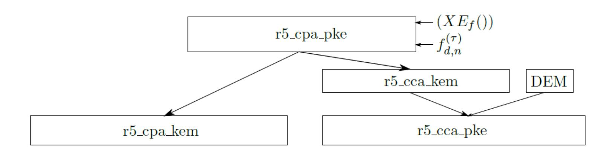

**Figure 8:** Dependencies between CPA and CCA versions of Round5 proposals [\[73\]](#page-61-9)

<span id="page-39-1"></span>**Table 21:** Comparison between CPA-KEM, CCA-KEM and CCA-PKE variants of R5ND\_5d on Artix-7

| Algorithm | Max.  | Encaps./Encrypt.<br>Decaps./Decrypt. |       |      |       |        |       |      |       |  |
|-----------|-------|--------------------------------------|-------|------|-------|--------|-------|------|-------|--|
|           | Freq. | cycles                               | ratio | us   | ratio | cycles | ratio | us   | ratio |  |
| CPA_1KEM  | 204   | 2,308                                | 1.00  | 11.3 | 1.00  | 1,137  | 1.00  | 5.6  | 1.00  |  |
| CCA_1KEM  | 204   | 2,492                                | 1.08  | 12.2 | 1.08  | 3,328  | 2.93  | 16.3 | 2.93  |  |
| CCA_1PKE  | 183   | 2,518                                | 1.09  | 13.8 | 1.22  | 3,352  | 2.95  | 18.3 | 3.29  |  |
| CPA_3KEM  | 169   | 3,582                                | 1.00  | 21.2 | 1.00  | 1,726  | 1.00  | 10.2 | 1.00  |  |
| CCA_3KEM  | 174   | 3,755                                | 1.05  | 21.6 | 1.02  | 4,932  | 2.86  | 28.3 | 2.78  |  |
| CCA_3PKE  | 163   | 3,782                                | 1.06  | 23.2 | 1.09  | 4,956  | 2.87  | 30.4 | 2.98  |  |
| CPA_5KEM  | 154   | 4,435                                | 1.00  | 28.8 | 1.00  | 2,123  | 1.00  | 13.8 | 1.00  |  |
| CCA_5KEM  | 169   | 4,655                                | 1.05  | 27.5 | 0.96  | 6,137  | 2.89  | 36.3 | 2.63  |  |
| CCA_5PKE  | 156   | 4,683                                | 1.06  | 30.0 | 1.04  | 6,161  | 2.90  | 39.5 | 2.86  |  |

In Table [20,](#page-39-0) we compare the execution times of the CCA-KEM schemes with the execution times of the underlying CPA-PKE schemes, for Kyber, LAC, and NewHope. The ratios 

{40}------------------------------------------------

of the encapsulation and encryption times vary between to 1.07 and 1.17. That means that the PKE encryption is a dominant operation, and an overhead of other operations does not exceed 17%. For all four KEMs listed in this table, decapsulation includes one call to decryption and one call to encryption. Thus, the ratio listed under Decapsulation is a ratio of the execution time of decapsulation over the sum of the execution times of encryption and decryption. This ratio varies between 1.03 and 1.06, which means that the overhead of remaining operations does not exceed 6%.

In Table 21, we compare our hardware implementations of different schemes of the Round5 proposal. The dependencies among these schemes are graphically illustrated in Fig. 8. Our comparison contains results for maximum clock frequency and the execution times of major operations in the CPA-KEM, CCA-KEM, and CCA-PKE schemes. These metrics illustrate the cost of additional security of CCA-KEM as compared to CPA-KEM. The biggest difference is in the execution time of the CCA-KEM decapsulation and the CCA-PKE decryption, as compared to the CPA-KEM decapsulation. This difference comes from the Fujisaki-Okamoto transformation, used for providing CCA security. In CCA-KEM, during decapsulation, one additional CPA-PKE encryption is performed. CCA-KEM and CCA-PKE use the same parameter set, but CCA-PKE includes CCA-KEM and performs additional symmetric-key encryption after encapsulation of the key used for it. The differences in the execution times of the CPA-KEM and CCA-KEM encapsulations and the CCA-PKE encryption are negligible.

#### <span id="page-40-0"></span>5.2 Profiling the best available software implementations in C

| Algorithm  | Software Source                             | Ref          | Opt                 |
|------------|---------------------------------------------|--------------|---------------------|
| FrodoKEM   | https://github.com/Microsoft/PQCrypto-LWEKE | <b>√</b>     | $\overline{\qquad}$ |
| Kyber      | https://github.com/pq-crystals/kyber        | $\checkmark$ |                     |
| LAC        | https://github.com/pqc-lac/lac-intel64      | $\checkmark$ | $\checkmark$        |
| NewHope    | https://github.com/newhopecrypto/newhope    | $\checkmark$ |                     |
| NTRU       | https://github.com/jschanck/ntru            | $\checkmark$ |                     |
| NTRU Prime | https://bench.cr.yp.to/supercop.html        | $\checkmark$ | $\checkmark$        |
| Round5     | https://github.com/r5embed/r5embed          | $\checkmark$ | $\checkmark$        |
| Saber      | https://github.com/KULeuven-COSIC/SABER     | $\checkmark$ |                     |

**Table 22:** Source of software implementations

We implemented 12 CCA-secure KEMs representing eight Round 2 lattice-based candidates using the software/hardware co-design approach described in detail in Section 4. In Table 22, we list the repositories containing C source code used as a starting point for our software/hardware implementations. In the case of four candidates - FrodoKEM, LAC, NTRU Prime, and Round5 - optimized implementations in C, different than reference implementations exist. For the remaining four candidates, their best portable implementations are the same (or almost the same) as their reference implementations submitted at the beginning of Round 2. We used the mentioned above implementations in C as a starting point for our first software implementation of each of the 12 implemented KEMs. ported to ARM Cortex-A53 using the procedure described in Section 4.5.

The results of profiling for the obtained pure-software implementations, running on a single core of ARM Cortex-A53, at the frequency of 1.2 GHz, are presented in the left portions of Tables 29, 30, 31, 32, 33, 34, 35, 36, 37, and 38, in Appendix A.

For each of the 12 investigated algorithms and each major operation (Encapsulation and Decapsulation), two to five most time-consuming functions are identified. For each of these functions, we provide their execution time (in microseconds) and the percentage of the total execution time. In the right portions of the same tables, we list in bold functions offloaded to hardware. For the functions combined together, they are listed in the same 

{41}------------------------------------------------

field of the table, with sub-indices, such as 1.1, 1.2, 1.3, etc. A single execution time and a single percentage of the software/hardware execution time is given for such a combined function.

It is important to note that the execution time of all functions offloaded to hardware, listed in Tables 29–38 include both the execution time in hardware as well as the time necessary to transfer control, inputs, and outputs between the processor and a hardware accelerator. It should also be mentioned that the number of functions offloaded to hardware may be misleading, as these functions may appear at different levels of hierarchy. For example, for the encapsulation in Kyber, only two functions are offloaded. However, these are function involving the majority of operations of Kyber, amounting to 99.55-99.81% of the total execution time in the software-only implementation. For all algorithms, at least the first and the second most time-consuming functions are offloaded to hardware.

The total percentage of the execution time taken by a portable software implementation to execute operations offloaded to hardware is shown in Figs. 9 and 10.

<span id="page-41-0"></span>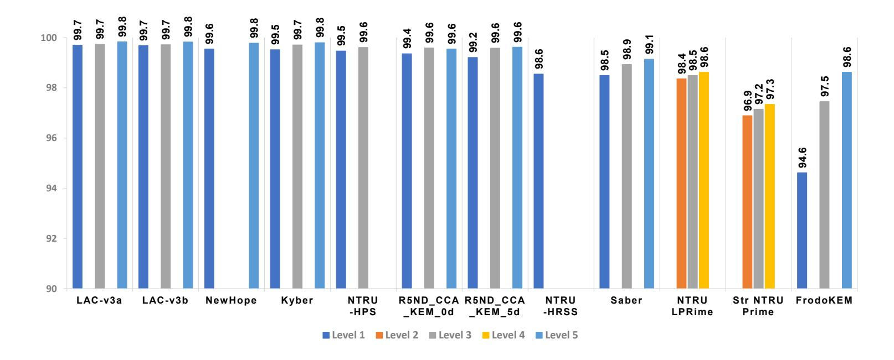

**Figure 9:** Encapsulation: The Software Part Sped Up by Hardware [%]

<span id="page-41-1"></span>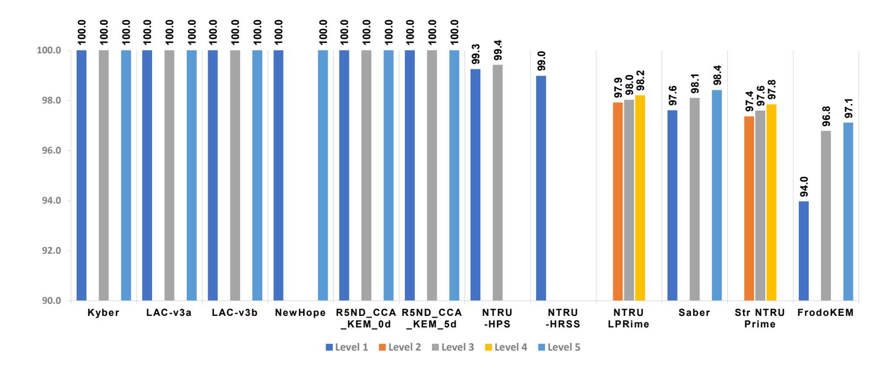

Figure 10: Decapsulation: The Software Part Sped Up by Hardware [%]

### 5.3 Results for Software/Hardware Implementations

Twelve hardware accelerators developed using the methodology described in Section 4 are characterized in Table 23 using their maximum clock frequency and resource utilization

{42}------------------------------------------------

<span id="page-42-0"></span>**Table 23:** Maximum frequency and resource utilization of hardware accelerators developed as a part of software/hardware co-designs targeting Zynq Ultrascale+

| Algorithm      | Security Category: Parameter Set | Max.<br>Freq. | LUT        | FF         | Slice      | DSP | BR<br>AM |
|----------------|----------------------------------|---------------|------------|------------|------------|-----|----------|
| FrodoKEM       | Frodo-640                        | 402           | 7,213      | 6,647      | 1,186      | 32  | 13.5     |
| FrodoKEM       | Frodo-976                        | 402           | 7,087      | 6,693      | 1,190      | 32  | 17.0     |
| FrodoKEM       | Frodo-1344                       | 417           | 7,015      | 6,610      | 1,215      | 32  | 17.5     |
| Kyber          | KYBER512                         | 410           | 12,034     | 10,532     | 2,327      | 8   | 14.0     |
| Kyber          | KYBER768                         | 405           | 12,195     | 10,461     | 2,253      | 8   | 14.0     |
| Kyber          | KYBER1024                        | 405           | 12,589     | 12,574     | 2,635      | 8   | 14.0     |
| LAC-v3a        | LAC-128                          | 385           | 25,123     | 16,005     | 3,720      | 0   | 8.5      |
| LAC-v3a        | LAC-192                          | 370           | 41,898     | 26,233     | 6,134      | 0   | 11.5     |
| LAC-v3a        | LAC-256                          | 357           | 46,756     | 26,989     | 6,774      | 0   | 11.5     |
| LAC-v3b        | LAC-128                          | 400           | 18,311     | 15,966     | 2,672      | 0   | 8.5      |
| LAC-v3b        | LAC-192                          | 385           | 27,209     | 26,193     | 4,024      | 0   | 11.5     |
| LAC-v3b        | LAC-256                          | 357           | 33,234     | $26,\!567$ | 4,889      | 0   | 11.5     |
| NewHope        | NEWHOPE512-CCA-KEM               | 490           | 9,307      | 8,928      | 1,721      | 4   | 11.0     |
| NewHope        | NEWHOPE1024-CCA-KEM              | 490           | 9,307      | 8,928      | 1,721      | 4   | 11.0     |
| NTRU-HPS       | ntruhps 2048677                  | 200           | $42,\!578$ | 22,717     | 8,235      | 677 | 8.5      |
| NTRU-HPS       | ntruhps 4096821                  | 200           | 49,735     | 30,599     | 9,924      | 821 | 8.5      |
| NTRU-HRSS      | ntruhrss 701                     | 200           | 48,773     | 25,178     | 8,110      | 701 | 2.5      |
| NTRU LPRime    | $\rm kem/ntrulpr653$             | 278           | 45,901     | $39,\!426$ | 8,938      | 0   | 8.0      |
| NTRU LPRime    | kem/ntrulpr761                   | 263           | 55,054     | $45,\!133$ | 9,769      | 0   | 8.0      |
| NTRU LPRime    | kem/ntrulpr857                   | 250           | 64,022     | 50,120     | $10,\!554$ | 0   | 8.0      |
| Str NTRU Prime | kem/sntrup653                    | 278           | 62,797     | 33,531     | 9,110      | 0   | 9.0      |
| Str NTRU Prime | kem/sntrup761                    | 263           | 70,066     | 38,144     | 10,319     | 0   | 9.0      |
| Str NTRU Prime | kem/sntrup857                    | 250           | 78,379     | 42,274     | 11,509     | 0   | 9.0      |
| Round5         | R5ND_CCA_1KEM_0d                 | 294           | $52,\!589$ | 80,875     | 10,154     | 0   | 3.0      |
| Round5         | $R5ND\_CCA\_3KEM\_0d$            | 267           | 72,870     | 107,748    | 13,360     | 0   | 3.0      |
| Round5         | R5ND_CCA_5KEM_0d                 | 250           | 99,310     | 156,732    | 18,095     | 0   | 3.0      |
| Round5         | R5ND_CCA_1KEM_5d                 | 357           | 38,116     | 56,189     | 7,538      | 0   | 3.0      |
| Round5         | $R5ND\_CCA\_3KEM\_5d$            | 294           | $54,\!532$ | 95,436     | 12,395     | 0   | 3.0      |
| Round5         | R5ND_CCA_5KEM_5d                 | 238           | 69,254     | 114,007    | 12,774     | 0   | 3.0      |
| Saber          | LightSaber-KEM                   | 322           | 12,343     | 11,288     | 1,989      | 256 | 3.5      |
| Saber          | Saber-KEM                        | 322           | $12,\!566$ | 11,619     | 1,993      | 256 | 3.5      |
| Saber          | FireSaber-KEM                    | 322           | $12,\!555$ | 11,881     | 2,341      | 256 | 3.5      |

when implemented on Xilinx Zynq UltraScale+ SoC FPGA. All results have been obtained after placing and routing.

NewHope, Kyber, and FrodoKEM are able to achieve the highest clock frequencies, above 400 MHz for all parameter sets. LAC has frequencies between 350 and 400 MHz, depending on a variant and security level. The maximum frequency of Round5 decreases significantly with the increase in the security level, especially for a version with the error-correcting code, where the frequency drops from 357 MHz for security level 1 to 238 MHz for security level 5. On the other hand, Saber has the same clock frequency, 322 MHz, for all of its parameter sets. The operating frequencies for the two variants of NTRU Prime are in the range 250-280. They are limited mainly by the reduction modulo q. To reduce numbers with the prime modulus q, we selected the conditional subtraction method, which is relatively simple but comes with a long critical path. NTRU-HPS and NTRU-HRSS have the lowest clock frequency of 200 MHz. These frequencies are affected by the logic for converting polynomials from R/q to S/q and from R/q to S/3.

The accelerators for NTRU-HPS and NTRU-HRSS involve the highest number of integer multiplications performed in parallel. These multiplications in the FPGA fabric are delegated to dedicated DSP units. The DSP units are also taken advantage of in Saber and to a lower extent in FrodoKEM, Kyber, and NewHope. LAC, Round5, NTRU LPRime,

{43}------------------------------------------------

and Streamlined NTRU Prime do not involve any integer multiplications in hardware. This is because the coefficients of one of the multiplied polynomials always belong to the set {-1, 0, 1}.

FrodoKEM is the algorithm with the highest utilization of BRAMs, which reaches 17.5 blocks. The algorithms with the lowest utilization of BRAMs (between 2.5 and 3.5) include NTRU-HRSS, Round5, and Saber. The remaining KEMs require 8–14 BRAMs.

Round5, Streamlined NTRU Prime, and NTRU LPRime use the largest number of LUT, flip-flops (FFs), and Slices. FrodoKEM, NewHope, Kyber, and Saber use the smallest number. The amount of resources used increases noticeably with the increase in the security level for 8 out of 12 KEMs. The following algorithms have a desirable property that the security levels do not substantially affect resource utilization (except for the small increase in the number of BRAMs in FrodoKEM): FrodoKEM, Kyber, NewHope, and Saber.

Because of the timing dependencies, and in particular, the bottleneck caused by SHAKE, our implementation of FrodoKEM cannot be easily sped up by trading additional resources for speed. This example clearly illustrates the potential algorithmic limits on the amount of parallelization (and thus the maximum speed-up), which is independent of the amount of hardware resources available to the designer.

The times necessary to load a public key (required for encapsulation) and a secret (private) key (required for decapsulation) are proportional to the size of the respective key and inversely proportional to the maximum clock frequency of a given PQC unit. All transfers are assumed to be conducted using a 64-bit infifo\_data bus. The sizes of keys for all variants of all investigated algorithms are summarized in Table [14.](#page-25-0) The maximum clock frequencies are listed in Table [23.](#page-42-0) In Fig. [11,](#page-44-0) we compare these key loading times for all 12 implemented KEMs. R5ND\_CCA\_KEM\_5d has the shortest key-loading times, and FrodoKEM the longest. However, the differences among these times are relatively minor for all KEMs other than FrodoKEM. They do not exceed a factor of 2 for loading a public key, and 4 for loading a private key. Except for NewHope at the security level 5 and FrodoKEM at all security levels, the public-key loading times stay below 1 *µ*s, and private-key loading times below 2 *µ*s.

Total execution times of our software/hardware implementations are summarized in Fig. [12](#page-45-0) for encapsulation, and Fig. [13](#page-45-1) for decapsulation.

Rankings can be considered separately for three groups of parameter sets listed in Table [14,](#page-25-0) with the security levels 1 and 2, 3 only, and 4 and 5, respectively. Only the first group contains all 12 investigated algorithms. In the second group, NTRU-HRSS and NewHope are missing, and in the third group, NTRU-HRSS and NTRU-HPS are not represented. In Figs. [12](#page-45-0) and [13,](#page-45-1) KEMs are arranged according to their ranking for security levels 1 and 2. Each execution time is separated into three components: the execution time in hardware (i.e., in the hardware accelerator located in programmable logic of Zynq UltarScale+ SoC FPGAs), the time required to transfer data and control between the processor and the hardware accelerator, and the execution time in software (i.e., in ARM Cortex-A53). For encapsulation, at least the function randombytes() is assumed to be executed in software to generate a seed for a deterministic random bit generator (typically based on SHAKE) implemented in hardware. For decapsulation, no internal function of KEM has to be executed in software. We treat implementation as a software/hardware implementation even if the operation of the processor is limited only to sending KEM inputs to and receiving KEM outputs from the hardware accelerator. Hence, our software/hardware implementations of LAC-v3b, R5ND\_CCA\_KEM\_5d, NewHope, Kyber, LAC-v3a, and R5ND\_CCA\_KEM\_0d, which have the shortest execution times of encapsulation and decapsulation are based on the pure hardware implementations of KEMs, described in Section [5.1.](#page-33-2) The ranking of these six KEMs is similar, but not identical to the ranking of their corresponding hardware implementations. The small changes in rankings come

{44}------------------------------------------------

<span id="page-44-0"></span>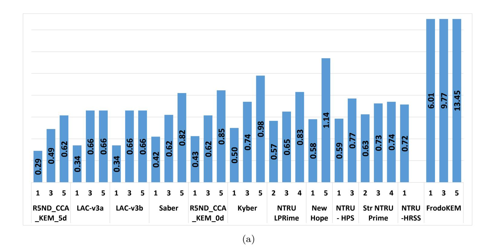

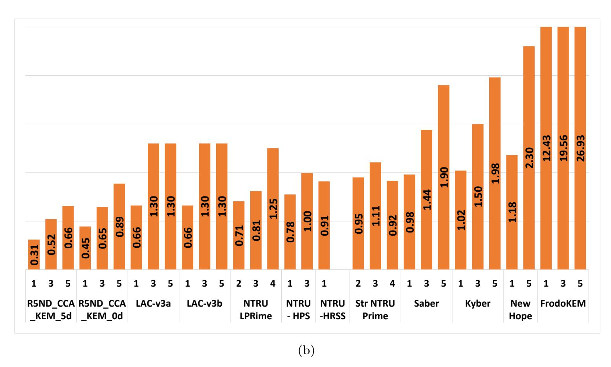

**Figure 11:** (a) Public Key and (b) Private Key transfer latency (*µs*) of SW/HW co-design on Zynq-Ultrascale+

from small differences in the transfer time and execution time in software, as well as from the different maximum clock frequency of hardware accelerators when implemented in programmable logic of Zynq UltraScale+ rather than Artix-7 or Virtex-7 (as in Figs. [6](#page-37-0) and [7\)](#page-37-1). Overall, however, not leaving any operation (other than randombytes()) in software gives these 6 KEMs enough advantage to outperform all six remaining schemes.

FrodoKEM is by far the slowest KEM, and it cannot outperform any other scheme even if 100% of its operations are moved to hardware. For encapsulation, NTRU-HPS, Streamlined NTRU Prime, and NTRU LPRime are also very unlikely to move in ranking ahead of any of the first six schemes, because even after reducing their execution time in software to zero and making the transfer time similar to the transfer time of the first six schemes (i.e., in the range of 6.2-7.0 *mu*s), their execution times would exceed the overall time for the KEM at position 6, R5ND\_CCA\_KEM\_0d.

{45}------------------------------------------------

<span id="page-45-0"></span>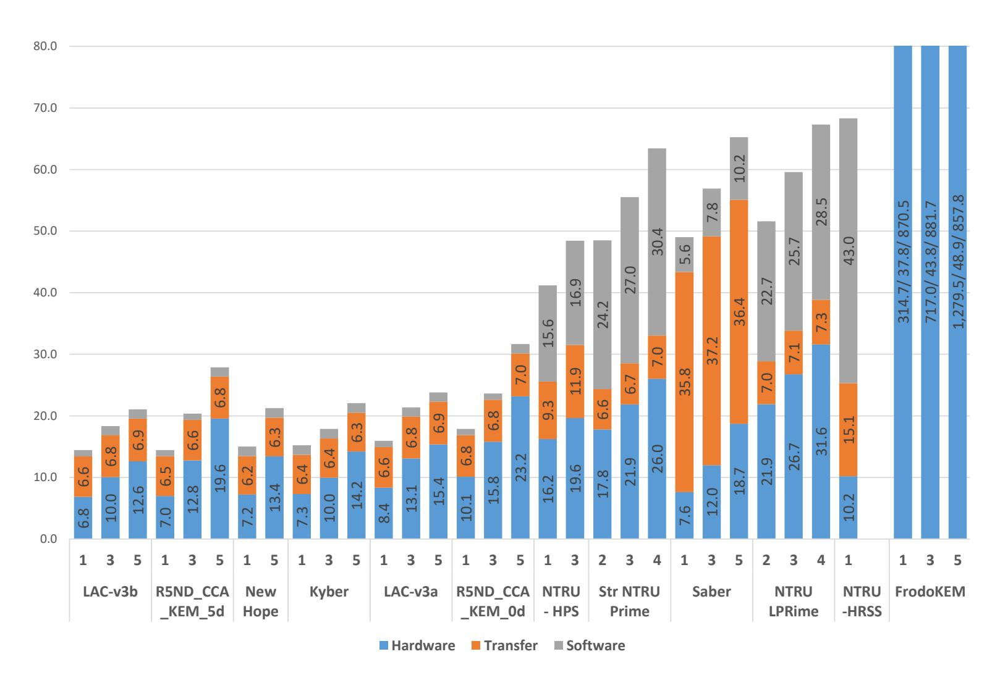

**Figure 12:** Encapsulation: Total Execution Time in Software/Hardware [*µ*s]

<span id="page-45-1"></span>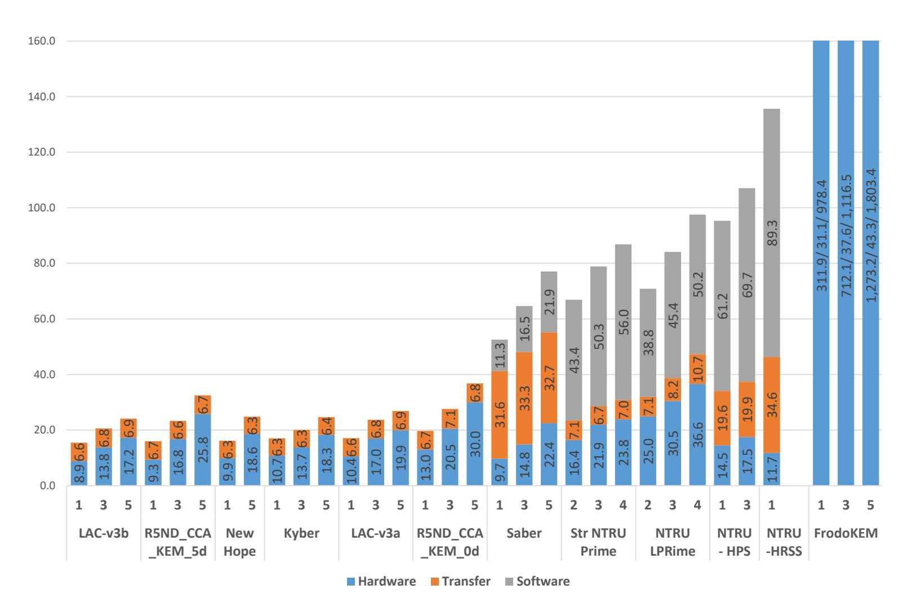

**Figure 13:** Decapsulation: Total Execution Time in Software/Hardware [*µ*s]

For Saber and NTRU-HRSS, it is too early to make such a judgment. However, the presented results at least reveal some potential weaknesses of these two algorithms (from the point of view of ease of their software/hardware partitioning), which can be observed by analyzing their profiling results, summarized in Tables [38](#page-72-0) and [34.](#page-68-0) For NTRU-HRSS, 

{46}------------------------------------------------

even after moving to hardware its four most time-consuming operations, the software still amounts to a significant percentage of the total execution time. In Saber, even after moving to hardware its five most time-consuming operations, transfer time still dominates the total execution time. This last point can be reinforced by analyzing Table 24. According to this table, our software/hardware implementation of Saber has the largest number of transfers between the processor and the accelerator (6). Disregarding FrodoKEM, which is very slow in hardware already, NTRU-HRSS is the only other algorithm that requires more than one transfer during the enacapsulation.

**Table 24:** Data Transfer Summary for SW-HW co-designs

<span id="page-46-0"></span>

| A 1                               | <b>E</b> : | ncapsulat  | ion        | Decapsulation |           |            |  |  |
|-----------------------------------|------------|------------|------------|---------------|-----------|------------|--|--|
| ${\bf Algorithms}$                | Count      | Load       | Return     | Count         | Load      | Return     |  |  |
|                                   | Count      | (bytes)    | (bytes)    | Count         | (bytes)   | (bytes)    |  |  |
| KYBER512                          | 1          | 32         | 768        | 1             | 736       | 32         |  |  |
| KYBER768                          | 1          | 32         | $1,\!120$  | 1             | 1,088     | 32         |  |  |
| KYBER1024                         | 1          | 32         | 1,600      | 1             | 1,568     | 32         |  |  |
| $R5ND_1KEM_0d$                    | 1          | 16         | 740        | 1             | 724       | 16         |  |  |
| $R5ND_3KEM_0d$                    | 1          | 24         | $1,\!103$  | 1             | 1,079     | 24         |  |  |
| $R5ND\_5KEM\_0d$                  | 1          | 32         | $1,\!509$  | 1             | $1,\!477$ | 32         |  |  |
| $R5ND_1KEM_5d$                    | 1          | 16         | 620        | 1             | 604       | 16         |  |  |
| $R5ND_3KEM_5d$                    | 1          | 24         | 934        | 1             | 910       | 24         |  |  |
| $R5ND\_5KEM\_5d$                  | 1          | 32         | $1,\!285$  | 1             | $1,\!253$ | 32         |  |  |
| LightSaber-KEM                    | 6          | 1,600      | 704        | 5             | 1,216     | 896        |  |  |
| Saber-KEM                         | 6          | $2,\!272$  | 960        | 5             | 1,216     | 1,280      |  |  |
| FireSaber-KEM                     | 6          | $2,\!976$  | 1,216      | 5             | 1,600     | 1,664      |  |  |
| Frodo-640                         | 4          | 19,400     | $22,\!032$ | 3             | 9,768     | 22,008     |  |  |
| Frodo-976                         | 4          | $31,\!472$ | 31,328     | 3             | 15,816    | 31,304     |  |  |
| Frodo-1344                        | 4          | 42,780     | 43,136     | 3             | 21,728    | $43,\!104$ |  |  |
| LAC-128-v3a                       | 1          | 16         | 736        | 1             | 704       | 32         |  |  |
| LAC-192-v3a                       | 1          | 32         | $1,\!384$  | 1             | 1,352     | 32         |  |  |
| LAC-256-v3a                       | 1          | 32         | 1,496      | 1             | 1,464     | 32         |  |  |
| LAC-128-v3b                       | 1          | 16         | 736        | 1             | 704       | 32         |  |  |
| LAC-192-v3b                       | 1          | 32         | $1,\!384$  | 1             | 1,352     | 32         |  |  |
| LAC-256-v3b                       | 1          | 32         | 1,496      | 1             | 1,464     | 32         |  |  |
| NEWHOPE512                        | 1          | 32         | 960        | 1             | 928       | 32         |  |  |
| NEWHOPE1024                       | 1          | 32         | $1,\!856$  | 1             | 1,824     | 32         |  |  |
| ntruhps 2048677                   | 1          | 720        | 1,372      | 2             | 2,318     | 1,408      |  |  |
| ntruhps 4096821                   | 1          | 864        | 1,708      | 2             | 2,906     | 1,692      |  |  |
| ntruhrss701                       | 2          | 1,024      | 1,436      | 3             | 2,854     | 1,512      |  |  |
| kem/sntrup653                     | 1          | 40         | 1,448      | 1             | 912       | 72         |  |  |
| kem/sntrup761                     | 1          | 40         | 1,664      | 1             | 1,048     | 72         |  |  |
| kem/sntrup857                     | 1          | 40         | 1,856      | 1             | 1,192     | 72         |  |  |
| $\frac{1}{\text{kem/ntrulpr}653}$ | 1          | 40         | 1,584      | 1             | 1,040     | 72         |  |  |
| kem/ntrulpr761                    | 1          | 40         | 1,800      | 1             | 1,176     | 72         |  |  |
| kem/ntrulpr857                    | 1          | 40         | 1,992      | 1             | 1,320     | 72         |  |  |

For decapsulation, the execution time in software is eliminated entirely for the first six KEMs in the ranking. The transfer time is similar for all algorithms from that group. The transfer time dominates the execution time in Saber, because, as shown in Table 24, five transfers are required, more than for any other algorithm. The transfer time is also

{47}------------------------------------------------

unusually long for NTRU-HRSS and NTRU-HPS (with 3 and 2 transfers, respectively). As a result, it might be too early to judge whether Saber, NTRU-HRSS, and NTRU-HPS can be made as efficient as the first six KEMs, after moving all their operations to hardware. On the other hand, for NTRU LPRime and Streamlined NTRU Prime there is already a strong indication that these algorithms will not be able to move ahead of any of the first six KEMs, even if implemented entirely in hardware. Finally, FrodoKEM is by far the slowest algorithm out of all 12 implemented in this study.

## <span id="page-47-0"></span>**5.4 Use of High-Level Synthesis**

A traditional approach to high-level synthesis is based on starting from the existing implementation in C, C++, or System C, and then introducing modifications aimed at:

- inferring the desired interface
- optimizing speed
- minimizing resource utilization.

In the case of PQC candidates, a starting point is naturally determined by either reference implementation or the best portable implementation written entirely in C, such as those described in Section [4.5,](#page-29-2) used as a starting point for the software/hardware co-design. Traditionally, a significant percentage of all modifications amounts to guiding the synthesis tool toward the desired outcome using the C language pragmas, ignored by traditional high-level language compilers, but treated as directives by a given synthesis tool. This approach is used, in particular, in two popular HLS tools targeting FPGAs, Vivado HLS and LegUp. For example, there are over 20 *pragma* directives in the current version of Vivado HLS. Their different combinations lead to different hardware architectures. The impact of a particular *pragma* directive is heavily dependent on the code structure and the algorithm. Some directives may have no impact at all; others may dramatically change the speed vs. cost trade-off. Exploring all possible combinations is often unrealistic. Additionally, in many cases, code refactoring may give better results than an optimal choice and placement of directives.

The first attempt at applying HLS to benchmarking PQC schemes was reported in [\[14\]](#page-57-2). Only a few directives aimed at accomplishing unrolling of loops and pipelining were applied. The authors also attempted to synthesize the C code of the entire algorithm. Taking into account the limited availability of RTL code, no comparison with the equivalent RTL code was attempted.

An outcome of this approach is quite clearly illustrated in Table [25.](#page-48-0) The differences in obtained results are huge, although probably not that surprising, taking into account the almost complete reliance on tools in [\[14\]](#page-57-2). The HLS-based designs are bigger than RTL-based designs in terms of the number of LUTs by a factor of at least 144 for Kyber, 14.5 for NewHope, and 7.5 for Classic McEliece. These factors are obtained by dividing the area of the decapsulation/decryption unit in the HLS-based approach by the area of the combined unit, capable of performing key generation, encapsulation/encryption and decapsulation/decryption in the RTL approach. Thus, if units with the same functionality were compared, the ratios could be even higher. The HLS to RTL ratios of the encapsulation/encryption times are 10.5 for Kyber, 93 for NewHope, and 700 for Classic McEliece. For decapsulation/(decryption+encryption), the corresponding ratios are 36 for Kyber, 741 for NewHope, and 551 for Classic McEliece. Overall in terms of the latency times area product, the HLS-based designs are three orders of magnitude worse. Additionally, a significant difference in specific ratios for Kyber and NewHope, combined with the almost identical performance and resource usage of RTL designs, indicates that the approach pursued in [\[14\]](#page-57-2) cannot correctly predict the relative ranking of PQC candidates unless the differences among them are truly enormous.

{48}------------------------------------------------

<span id="page-48-0"></span>**Table 25:** Comparison between HLS-based designs from [14] and the corresponding RTL-based designs. All results for Virtex-7 FPGAs. TW

| Design         Max. Freq. Freq. Freq. Ratio         LUT         Ratio Lut         Freq. Ratio         Freq. Batio Lut         Freq. Ratio Lut         Freq. Ratio Lut         Freq. Ratio Lut         Freq. Ratio Ratio Lut         Freq. Ratio Ratio Lut         Freq. Ratio Ratio Ratio Ratio Lut         Freq. Ratio Ratio Ratio Ratio Ratio Ratio Ratio Ratio Ratio Ratio Ratio Ratio Ratio Ratio Ratio Ratio Ratio Ratio Ratio Ratio Ratio Ratio Ratio Ratio Ratio Ratio Ratio Ratio Ratio Ratio Ratio Ratio Ratio Ratio Ratio Ratio Ratio Ratio Ratio Ratio Ratio Ratio Ratio Ratio Ratio Ratio Ratio Ratio Ratio Ratio Ratio Ratio Ratio Ratio Ratio Ratio Ratio Ratio Ratio Ratio Ratio Ratio Ratio Ratio Ratio Ratio Ratio Ratio Ratio Ratio Ratio Ratio Ratio Ratio Ratio Ratio Ratio Ratio Ratio Ratio Ratio Ratio Ratio Ratio Ratio Ratio Ratio Ratio Ratio Ratio Ratio Ratio Ratio Ratio Ratio Ratio Ratio Ratio Ratio Ratio Ratio Ratio Ratio Ratio Ratio Ratio Ratio Ratio Ratio Ratio Ratio Ratio Ratio Ratio Ratio Ratio Ratio Ratio Ratio Ratio Ratio Ratio Ratio Ratio Ratio Ratio Ratio Ratio Ratio Ratio Ratio Ratio Ratio Ratio Ratio Ratio Ratio Ratio Ratio Ratio Ratio Ratio Ratio Ratio Ratio Ratio Ratio Ratio Ratio Ratio Ratio Ratio Ratio Ratio Ratio Ratio Ratio Ratio Ratio Ratio Ratio Ratio Ratio Ratio Ratio Ratio Ratio Ratio Ratio Ratio Ratio Ratio Ratio Ratio Ratio Ratio Ratio Ratio Ratio Ratio Ratio Ratio Ratio Ratio Ratio Ratio Ratio Ratio Ratio Ratio Ratio Ratio Ratio Ratio Ratio Ratio Ratio Ratio Ratio Ratio Ratio Ratio Ratio Ratio Ratio Ratio Ratio Ratio Ratio Ratio Ratio Ratio Ratio Ratio Ratio Ratio Ratio Ratio Ratio Ratio Ratio Ratio Ratio Ratio Ratio Ratio Ratio Ratio Ratio Ratio Ratio Ratio Ratio Ratio Ratio Ratio Ratio Ratio Ratio Ratio Ratio Ratio Ratio Ratio Ratio Ratio Ratio Ratio Ratio Ratio Ratio Ratio Ratio Ratio Ratio Ratio Ratio Ratio Ratio Ratio Ratio Ratio Ratio Ratio Ratio Ratio Ratio Ratio                                                                                                                                   | denotes                | tenotes this work. | vork. |                    |         |                  |       |          |                        |                            |          |                        |                |          |               |            |                                                                                                                                                                                                                                                                                                                                                                                                                                                                                                                                                                                                                                                                                                                                                                                                                                                                                                                                                                                                                                                                                                                                                                                                                                                                                                                                                                                                                                                                                                                                                                                                                                                                                                                                                                                                                                                                                                                                                                                                                                                                                                                                                                                                                                                                                                                                                                                                                                                                                                                                                                                                                                                                                                                                                                                                                                                                                                                                                                                    |                          |               |
|-----------------------------------------------------------------------------------------------------------------------------------------------------------------------------------------------------------------------------------------------------------------------------------------------------------------------------------------------------------------------------------------------------------------------------------------------------------------------------------------------------------------------------------------------------------------------------------------------------------------------------------------------------------------------------------------------------------------------------------------------------------------------------------------------------------------------------------------------------------------------------------------------------------------------------------------------------------------------------------------------------------------------------------------------------------------------------------------------------------------------------------------------------------------------------------------------------------------------------------------------------------------------------------------------------------------------------------------------------------------------------------------------------------------------------------------------------------------------------------------------------------------------------------------------------------------------------------------------------------------------------------------------------------------------------------------------------------------------------------------------------------------------------------------------------------------------------------------------------------------------------------------------------------------------------------------------------------------------------------------------------------------------------------------------------------------------------------------------------------------------------|------------------------|--------------------|-------|--------------------|---------|------------------|-------|----------|------------------------|----------------------------|----------|------------------------|----------------|----------|---------------|------------|------------------------------------------------------------------------------------------------------------------------------------------------------------------------------------------------------------------------------------------------------------------------------------------------------------------------------------------------------------------------------------------------------------------------------------------------------------------------------------------------------------------------------------------------------------------------------------------------------------------------------------------------------------------------------------------------------------------------------------------------------------------------------------------------------------------------------------------------------------------------------------------------------------------------------------------------------------------------------------------------------------------------------------------------------------------------------------------------------------------------------------------------------------------------------------------------------------------------------------------------------------------------------------------------------------------------------------------------------------------------------------------------------------------------------------------------------------------------------------------------------------------------------------------------------------------------------------------------------------------------------------------------------------------------------------------------------------------------------------------------------------------------------------------------------------------------------------------------------------------------------------------------------------------------------------------------------------------------------------------------------------------------------------------------------------------------------------------------------------------------------------------------------------------------------------------------------------------------------------------------------------------------------------------------------------------------------------------------------------------------------------------------------------------------------------------------------------------------------------------------------------------------------------------------------------------------------------------------------------------------------------------------------------------------------------------------------------------------------------------------------------------------------------------------------------------------------------------------------------------------------------------------------------------------------------------------------------------------------------|--------------------------|---------------|
| Freq.   Ratio   D.1   Ratio   Freq.   Ratio   P.1   Ratio   P.1   Ratio   D.1   Ratio   D.1   Ratio   D.1   Ratio   D.1   Ratio   D.1   Ratio   D.1   Ratio   D.1   Ratio   D.1   Ratio   D.1   Ratio   D.1   Ratio   D.1   Ratio   D.1   Ratio   D.1   Ratio   D.1   Ratio   D.1   Ratio   D.1   Ratio   D.1   Ratio   D.1   Ratio   D.1   Ratio   D.1   Ratio   D.1   Ratio   D.1   Ratio   D.1   Ratio   D.1   Ratio   D.1   Ratio   D.1   Ratio   D.1   Ratio   D.1   Ratio   D.1   Ratio   D.1   Ratio   D.1   Ratio   D.1   Ratio   D.1   Ratio   D.1   Ratio   D.1   Ratio   D.1   D.1   D.1   D.1   D.1   D.1   D.1   D.1   D.1   D.1   D.1   D.1   D.1   D.1   D.1   D.1   D.1   D.1   D.1   D.1   D.1   D.1   D.1   D.1   D.1   D.1   D.1   D.1   D.1   D.1   D.1   D.1   D.1   D.1   D.1   D.1   D.1   D.1   D.1   D.1   D.1   D.1   D.1   D.1   D.1   D.1   D.1   D.1   D.1   D.1   D.1   D.1   D.1   D.1   D.1   D.1   D.1   D.1   D.1   D.1   D.1   D.1   D.1   D.1   D.1   D.1   D.1   D.1   D.1   D.1   D.1   D.1   D.1   D.1   D.1   D.1   D.1   D.1   D.1   D.1   D.1   D.1   D.1   D.1   D.1   D.1   D.1   D.1   D.1   D.1   D.1   D.1   D.1   D.1   D.1   D.1   D.1   D.1   D.1   D.1   D.1   D.1   D.1   D.1   D.1   D.1   D.1   D.1   D.1   D.1   D.1   D.1   D.1   D.1   D.1   D.1   D.1   D.1   D.1   D.1   D.1   D.1   D.1   D.1   D.1   D.1   D.1   D.1   D.1   D.1   D.1   D.1   D.1   D.1   D.1   D.1   D.1   D.1   D.1   D.1   D.1   D.1   D.1   D.1   D.1   D.1   D.1   D.1   D.1   D.1   D.1   D.1   D.1   D.1   D.1   D.1   D.1   D.1   D.1   D.1   D.1   D.1   D.1   D.1   D.1   D.1   D.1   D.1   D.1   D.1   D.1   D.1   D.1   D.1   D.1   D.1   D.1   D.1   D.1   D.1   D.1   D.1   D.1   D.1   D.1   D.1   D.1   D.1   D.1   D.1   D.1   D.1   D.1   D.1   D.1   D.1   D.1   D.1   D.1   D.1   D.1   D.1   D.1   D.1   D.1   D.1   D.1   D.1   D.1   D.1   D.1   D.1   D.1   D.1   D.1   D.1   D.1   D.1   D.1   D.1   D.1   D.1   D.1   D.1   D.1   D.1   D.1   D.1   D.1   D.1   D.1   D.1   D.1   D.1   D.1   D.1   D.1   D.1   D.1   D.1   D.1   D.1   D.1   D.1   D.1   D.1   D.1 |                        | Max.               |       |                    | LUT     | Ţ                | FF    | ספת      | BR                     | Key Gen                    | eration  |                        | Encaps.        | /Enc.    |               | Dece       | $\frac{1}{2}$ $\frac{1}{2}$ $\frac{1}{2}$ $\frac{1}{2}$ $\frac{1}{2}$ $\frac{1}{2}$ $\frac{1}{2}$ $\frac{1}{2}$ $\frac{1}{2}$ $\frac{1}{2}$ $\frac{1}{2}$ $\frac{1}{2}$ $\frac{1}{2}$ $\frac{1}{2}$ $\frac{1}{2}$ $\frac{1}{2}$ $\frac{1}{2}$ $\frac{1}{2}$ $\frac{1}{2}$ $\frac{1}{2}$ $\frac{1}{2}$ $\frac{1}{2}$ $\frac{1}{2}$ $\frac{1}{2}$ $\frac{1}{2}$ $\frac{1}{2}$ $\frac{1}{2}$ $\frac{1}{2}$ $\frac{1}{2}$ $\frac{1}{2}$ $\frac{1}{2}$ $\frac{1}{2}$ $\frac{1}{2}$ $\frac{1}{2}$ $\frac{1}{2}$ $\frac{1}{2}$ $\frac{1}{2}$ $\frac{1}{2}$ $\frac{1}{2}$ $\frac{1}{2}$ $\frac{1}{2}$ $\frac{1}{2}$ $\frac{1}{2}$ $\frac{1}{2}$ $\frac{1}{2}$ $\frac{1}{2}$ $\frac{1}{2}$ $\frac{1}{2}$ $\frac{1}{2}$ $\frac{1}{2}$ $\frac{1}{2}$ $\frac{1}{2}$ $\frac{1}{2}$ $\frac{1}{2}$ $\frac{1}{2}$ $\frac{1}{2}$ $\frac{1}{2}$ $\frac{1}{2}$ $\frac{1}{2}$ $\frac{1}{2}$ $\frac{1}{2}$ $\frac{1}{2}$ $\frac{1}{2}$ $\frac{1}{2}$ $\frac{1}{2}$ $\frac{1}{2}$ $\frac{1}{2}$ $\frac{1}{2}$ $\frac{1}{2}$ $\frac{1}{2}$ $\frac{1}{2}$ $\frac{1}{2}$ $\frac{1}{2}$ $\frac{1}{2}$ $\frac{1}{2}$ $\frac{1}{2}$ $\frac{1}{2}$ $\frac{1}{2}$ $\frac{1}{2}$ $\frac{1}{2}$ $\frac{1}{2}$ $\frac{1}{2}$ $\frac{1}{2}$ $\frac{1}{2}$ $\frac{1}{2}$ $\frac{1}{2}$ $\frac{1}{2}$ $\frac{1}{2}$ $\frac{1}{2}$ $\frac{1}{2}$ $\frac{1}{2}$ $\frac{1}{2}$ $\frac{1}{2}$ $\frac{1}{2}$ $\frac{1}{2}$ $\frac{1}{2}$ $\frac{1}{2}$ $\frac{1}{2}$ $\frac{1}{2}$ $\frac{1}{2}$ $\frac{1}{2}$ $\frac{1}{2}$ $\frac{1}{2}$ $\frac{1}{2}$ $\frac{1}{2}$ $\frac{1}{2}$ $\frac{1}{2}$ $\frac{1}{2}$ $\frac{1}{2}$ $\frac{1}{2}$ $\frac{1}{2}$ $\frac{1}{2}$ $\frac{1}{2}$ $\frac{1}{2}$ $\frac{1}{2}$ $\frac{1}{2}$ $\frac{1}{2}$ $\frac{1}{2}$ $\frac{1}{2}$ $\frac{1}{2}$ $\frac{1}{2}$ $\frac{1}{2}$ $\frac{1}{2}$ $\frac{1}{2}$ $\frac{1}{2}$ $\frac{1}{2}$ $\frac{1}{2}$ $\frac{1}{2}$ $\frac{1}{2}$ $\frac{1}{2}$ $\frac{1}{2}$ $\frac{1}{2}$ $\frac{1}{2}$ $\frac{1}{2}$ $\frac{1}{2}$ $\frac{1}{2}$ $\frac{1}{2}$ $\frac{1}{2}$ $\frac{1}{2}$ $\frac{1}{2}$ $\frac{1}{2}$ $\frac{1}{2}$ $\frac{1}{2}$ $\frac{1}{2}$ $\frac{1}{2}$ $\frac{1}{2}$ $\frac{1}{2}$ $\frac{1}{2}$ $\frac{1}{2}$ $\frac{1}{2}$ $\frac{1}{2}$ $\frac{1}{2}$ $\frac{1}{2}$ $\frac{1}{2}$ $\frac{1}{2}$ $\frac{1}{2}$ $\frac{1}{2}$ $\frac{1}{2}$ $\frac{1}{2}$ $\frac{1}{2}$ $\frac{1}{2}$ $\frac{1}{2}$ $\frac{1}{2}$ $\frac{1}{2}$ $\frac{1}{2}$ $\frac{1}{2}$ $\frac{1}{2}$ $\frac{1}{2}$ $\frac{1}{2}$ $\frac{1}{2}$ $\frac{1}{2}$ $\frac{1}{2}$ $\frac{1}{2}$ $\frac{1}{2}$ $\frac{1}{2}$ $\frac{1}{2}$ $\frac{1}{2}$ $\frac{1}{2}$ $\frac{1}{2}$ $\frac{1}{2}$ $\frac{1}{2}$ $\frac{1}{2}$ $\frac{1}{2}$ $\frac{1}{2}$ $\frac{1}{2}$ $\frac{1}{2}$ $\frac{1}{2}$ $\frac{1}{2}$ $\frac{1}{2}$ $\frac{1}{2}$ $\frac{1}{2}$ $\frac{1}{2}$ $\frac{1}{2}$ $\frac{1}{2}$ $\frac{1}{2}$ $\frac{1}{2}$ $\frac{1}{2}$ $\frac{1}{2}$ $\frac{1}{2}$ $\frac{1}{2}$ $\frac{1}{2}$ $\frac{1}{2}$ $\frac{1}{2}$ $\frac{1}{2}$ $\frac{1}$ | $2.+\mathrm{Enc.})^{ct}$ | ıa            |
| $ \begin{array}{c ccccccccccccccccccccccccccccccccccc$                                                                                                                                                                                                                                                                                                                                                                                                                                                                                                                                                                                                                                                                                                                                                                                                                                                                                                                                                                                                                                                                                                                                                                                                                                                                                                                                                                                                                                                                                                                                                                                                                                                                                                                                                                                                                                                                                                                                                                                                                                                                      | Design                 | Freq.              |       | <b>1</b>           | Ratio   | 4                | Ratio |          | $\mathbf{A}\mathbf{M}$ | cycles                     | $s\eta$  | cycles                 | cycl.<br>ratio | $\mu s$  | $\mu s$ ratio | cycles     | cycl.<br>ratio                                                                                                                                                                                                                                                                                                                                                                                                                                                                                                                                                                                                                                                                                                                                                                                                                                                                                                                                                                                                                                                                                                                                                                                                                                                                                                                                                                                                                                                                                                                                                                                                                                                                                                                                                                                                                                                                                                                                                                                                                                                                                                                                                                                                                                                                                                                                                                                                                                                                                                                                                                                                                                                                                                                                                                                                                                                                                                                                                                     | $\mu s$                  | $\mu s$ ratio |
| $ \begin{array}{c ccccccccccccccccccccccccccccccccccc$                                                                                                                                                                                                                                                                                                                                                                                                                                                                                                                                                                                                                                                                                                                                                                                                                                                                                                                                                                                                                                                                                                                                                                                                                                                                                                                                                                                                                                                                                                                                                                                                                                                                                                                                                                                                                                                                                                                                                                                                                                                                      |                        |                    |       |                    |         |                  |       |          | K                      | yber-512 (                 | CA-KEI   | N                      |                |          |               |            |                                                                                                                                                                                                                                                                                                                                                                                                                                                                                                                                                                                                                                                                                                                                                                                                                                                                                                                                                                                                                                                                                                                                                                                                                                                                                                                                                                                                                                                                                                                                                                                                                                                                                                                                                                                                                                                                                                                                                                                                                                                                                                                                                                                                                                                                                                                                                                                                                                                                                                                                                                                                                                                                                                                                                                                                                                                                                                                                                                                    |                          |               |
| $ \begin{array}{c ccccccccccccccccccccccccccccccccccc$                                                                                                                                                                                                                                                                                                                                                                                                                                                                                                                                                                                                                                                                                                                                                                                                                                                                                                                                                                                                                                                                                                                                                                                                                                                                                                                                                                                                                                                                                                                                                                                                                                                                                                                                                                                                                                                                                                                                                                                                                                                                      | [14]                   | 29                 | 0.27  | 1,307,815          |         | 11,699 194,126   | 1.05  | 1        | 1                      |                            | 1        | 31,669                 | 10.57          | 475.0    | 38.86         | 43,018     | 9.79                                                                                                                                                                                                                                                                                                                                                                                                                                                                                                                                                                                                                                                                                                                                                                                                                                                                                                                                                                                                                                                                                                                                                                                                                                                                                                                                                                                                                                                                                                                                                                                                                                                                                                                                                                                                                                                                                                                                                                                                                                                                                                                                                                                                                                                                                                                                                                                                                                                                                                                                                                                                                                                                                                                                                                                                                                                                                                                                                                               | 645.3                    | 35.97         |
| $ \begin{array}{c ccccccccccccccccccccccccccccccccccc$                                                                                                                                                                                                                                                                                                                                                                                                                                                                                                                                                                                                                                                                                                                                                                                                                                                                                                                                                                                                                                                                                                                                                                                                                                                                                                                                                                                                                                                                                                                                                                                                                                                                                                                                                                                                                                                                                                                                                                                                                                                                      | $\mathbf{T}\mathbf{W}$ | 245                |       | 13745              | ,       | 11107            | 17.48 | $\infty$ | 14                     | 2,160                      | 8.8      | 2,995                  |                | 12.2     |               | 4,395      |                                                                                                                                                                                                                                                                                                                                                                                                                                                                                                                                                                                                                                                                                                                                                                                                                                                                                                                                                                                                                                                                                                                                                                                                                                                                                                                                                                                                                                                                                                                                                                                                                                                                                                                                                                                                                                                                                                                                                                                                                                                                                                                                                                                                                                                                                                                                                                                                                                                                                                                                                                                                                                                                                                                                                                                                                                                                                                                                                                                    | 17.9                     |               |
| $ \begin{array}{c ccccccccccccccccccccccccccccccccccc$                                                                                                                                                                                                                                                                                                                                                                                                                                                                                                                                                                                                                                                                                                                                                                                                                                                                                                                                                                                                                                                                                                                                                                                                                                                                                                                                                                                                                                                                                                                                                                                                                                                                                                                                                                                                                                                                                                                                                                                                                                                                      |                        |                    |       |                    |         |                  |       |          | New                    | $^{\prime}\text{Hope-512}$ | CCA-K    | $\mathbf{E}\mathbf{M}$ |                |          |               |            |                                                                                                                                                                                                                                                                                                                                                                                                                                                                                                                                                                                                                                                                                                                                                                                                                                                                                                                                                                                                                                                                                                                                                                                                                                                                                                                                                                                                                                                                                                                                                                                                                                                                                                                                                                                                                                                                                                                                                                                                                                                                                                                                                                                                                                                                                                                                                                                                                                                                                                                                                                                                                                                                                                                                                                                                                                                                                                                                                                                    |                          |               |
| $ \begin{array}{c ccccccccccccccccccccccccccccccccccc$                                                                                                                                                                                                                                                                                                                                                                                                                                                                                                                                                                                                                                                                                                                                                                                                                                                                                                                                                                                                                                                                                                                                                                                                                                                                                                                                                                                                                                                                                                                                                                                                                                                                                                                                                                                                                                                                                                                                                                                                                                                                      | [14]                   | 29                 | 0.23  | 136,457            | 12.03   | 25,639<br>28,999 | 2.90  | 0        | 0                      |                            | ı        | 307,847                |                | 4,617.7  | 385.03        | 721,986    | 149.51                                                                                                                                                                                                                                                                                                                                                                                                                                                                                                                                                                                                                                                                                                                                                                                                                                                                                                                                                                                                                                                                                                                                                                                                                                                                                                                                                                                                                                                                                                                                                                                                                                                                                                                                                                                                                                                                                                                                                                                                                                                                                                                                                                                                                                                                                                                                                                                                                                                                                                                                                                                                                                                                                                                                                                                                                                                                                                                                                                             | 10,829.8                 | 661.58        |
| $ \begin{array}{c ccccccccccccccccccccccccccccccccccc$                                                                                                                                                                                                                                                                                                                                                                                                                                                                                                                                                                                                                                                                                                                                                                                                                                                                                                                                                                                                                                                                                                                                                                                                                                                                                                                                                                                                                                                                                                                                                                                                                                                                                                                                                                                                                                                                                                                                                                                                                                                                      | TW                     | 295                |       | 11,345             | - 14.54 | 8,838            | 3.28  | 4        | 10.0                   | 2,122                      | 7.2      | 3,538                  |                | 12.0     |               | 4,829      |                                                                                                                                                                                                                                                                                                                                                                                                                                                                                                                                                                                                                                                                                                                                                                                                                                                                                                                                                                                                                                                                                                                                                                                                                                                                                                                                                                                                                                                                                                                                                                                                                                                                                                                                                                                                                                                                                                                                                                                                                                                                                                                                                                                                                                                                                                                                                                                                                                                                                                                                                                                                                                                                                                                                                                                                                                                                                                                                                                                    | 16.4                     |               |
| $ \begin{array}{c ccccccccccccccccccccccccccccccccccc$                                                                                                                                                                                                                                                                                                                                                                                                                                                                                                                                                                                                                                                                                                                                                                                                                                                                                                                                                                                                                                                                                                                                                                                                                                                                                                                                                                                                                                                                                                                                                                                                                                                                                                                                                                                                                                                                                                                                                                                                                                                                      |                        |                    |       |                    |         |                  |       |          | mcel                   | iece69601.                 | 19 CPA-I | KE                     |                |          |               |            |                                                                                                                                                                                                                                                                                                                                                                                                                                                                                                                                                                                                                                                                                                                                                                                                                                                                                                                                                                                                                                                                                                                                                                                                                                                                                                                                                                                                                                                                                                                                                                                                                                                                                                                                                                                                                                                                                                                                                                                                                                                                                                                                                                                                                                                                                                                                                                                                                                                                                                                                                                                                                                                                                                                                                                                                                                                                                                                                                                                    |                          |               |
|                                                                                                                                                                                                                                                                                                                                                                                                                                                                                                                                                                                                                                                                                                                                                                                                                                                                                                                                                                                                                                                                                                                                                                                                                                                                                                                                                                                                                                                                                                                                                                                                                                                                                                                                                                                                                                                                                                                                                                                                                                                                                                                             | [14]                   | 100                | 0.77  | 840,430<br>870,908 | 7.19    | 60,270 79,962    | 0.32  | 1        | 1                      | 1                          | 1        | 3,787,729              |                | 37,877.3 |               | 10,659,024 | 424.07                                                                                                                                                                                                                                                                                                                                                                                                                                                                                                                                                                                                                                                                                                                                                                                                                                                                                                                                                                                                                                                                                                                                                                                                                                                                                                                                                                                                                                                                                                                                                                                                                                                                                                                                                                                                                                                                                                                                                                                                                                                                                                                                                                                                                                                                                                                                                                                                                                                                                                                                                                                                                                                                                                                                                                                                                                                                                                                                                                             | 106,590.2                | 550.85        |
|                                                                                                                                                                                                                                                                                                                                                                                                                                                                                                                                                                                                                                                                                                                                                                                                                                                                                                                                                                                                                                                                                                                                                                                                                                                                                                                                                                                                                                                                                                                                                                                                                                                                                                                                                                                                                                                                                                                                                                                                                                                                                                                             | [22]                   | 130                |       | 116,928            | 7.45    | 188,324          | 0.42  | 0        | 0.708                  |                            |          | 5,413                  |                | 41.7     |               | 25,135     |                                                                                                                                                                                                                                                                                                                                                                                                                                                                                                                                                                                                                                                                                                                                                                                                                                                                                                                                                                                                                                                                                                                                                                                                                                                                                                                                                                                                                                                                                                                                                                                                                                                                                                                                                                                                                                                                                                                                                                                                                                                                                                                                                                                                                                                                                                                                                                                                                                                                                                                                                                                                                                                                                                                                                                                                                                                                                                                                                                                    | 193.5                    |               |

{49}------------------------------------------------

| Method  | DSP  | BR<br>AM | LUT      | FF       | Slice    | Max.<br>Freq. | Latency (cycles) |
|---------|------|----------|----------|----------|----------|---------------|------------------|
|         | N    | NewHop   | e-512 w  | ith 1 NT | T modu   | ıle           |                  |
| HLS     | 4    | 3        | 1,181    | 1,403    | 239      | 454           | 3,247            |
| RTL     | 4    | 3        | 1,040    | 940      | 190      | 476           | $3,\!247$        |
| HLS/RTL | 1.00 | 1.00     | 1.14     | 1.49     | 1.26     | 0.95          | 1.00             |
|         | N    | ewHop    | e-1024 w | ith 1 N  | ΓT mod   | ule           |                  |
| HLS     | 4    | 5        | 1,110    | 1,342    | 219      | 455           | 6,266            |
| RTL     | 4    | 5        | 842      | 803      | 170      | 476           | 6,266            |
| HLS/RTL | 1.00 | 1.00     | 1.32     | 1.67     | 1.29     | 0.96          | 1.00             |
|         |      | Kyber    | 512 with | 2 NTT    | module   | S             |                  |
| HLS     | 24   | 7        | 2,325    | 2,346    | 430      | 455           | 1,271            |
| RTL     | 24   | 5        | 2,040    | 3,223    | 433      | 500           | 1,271            |
| HLS/RTL | 1.00 | 1.40     | 1.14     | 0.73     | 0.99     | 0.91          | 1.00             |
|         |      | Kyber'   | 768 with | 3 NTT    | module   | S             |                  |
| HLS     | 36   | 11       | 5,379    | 4,043    | 1,074    | 416           | 1,271            |
| RTL     | 36   | 7.5      | 3,054    | 5,098    | 637      | 500           | 1,271            |
| HLS/RTL | 1.00 | 1.47     | 1.76     | 0.79     | 1.69     | 0.83          | 1.00             |
|         |      | Kyber1   | 024 with | ı 4 NTT  | ' module | es            |                  |
| HLS     | 48   | 14       | 7,111    | 5,457    | 1,374    | 416           | 1,271            |
| RTL     | 48   | 10       | 4,055    | 6,803    | 960      | 500           | 1,271            |
| HLS/RTL | 1.00 | 1.40     | 1.75     | 0.80     | 1.43     | 0.83          | 1.00             |

<span id="page-49-0"></span>**Table 26:** Comparison between HLS and RTL method for NTT implementations.

As a result, a substantially different approach was needed to overcome this inefficiency. This approach was demonstrated by our group in [21], [23], [56], and [57]. First, HLS is combined with software/hardware co-design. This way, only the most time-consuming operations (and preferably a single operation) needs to be offloaded to hardware. These operations can be identified using techniques described in Section 4.6. Secondly, these critical operations are described using block diagrams. Third, the block diagrams are translated into HLS-ready C code, written from scratch, and enhanced with HLS directives encoded using pragmas. The designer then debugs the code using a C testbench, which is much easier to develop and easier to use than HDL testbench. When the code is determined to be functionally correct, it is passed through synthesis. If the number of clock cycles is different from the expected number obtained from the analysis of the block diagram, additional pragmas need to be added, or the code needs to be refactored (rewritten) to make it more suitable for HLS tools. For example, a programmer may apply explicit function sharing or eliminate dependencies preventing multiple operations from executing in parallel. These optimizations continue at least until the required number of clock cycles is reached. They may also be applied to reduce the number of specific logic resources, such as LUTs, DSP units, or BRAMs, as well as to increase the maximum clock frequency. Below, we demonstrate the application of this approach to the preliminary software/hardware implementations of two Round 2 candidates: NewHope and Kyber. In both implementations, we decided to offload to hardware only the most time-consuming operation, the Number Theoretic Transform (NTT). This operation was first expressed using a detailed block diagram, presented in [57]. Then, the described above methodology was followed. In parallel, optimized RTL implementation was developed for the purpose of evaluating the quality of our HLS design. The obtained results are summarized in Table 26.

These results indicate that our primary goal of reaching the same number of clock cycles as that obtained using the RTL approach was accomplished. At the same time, the clock frequency was lower by up to 17%, and the number of LUTs, flip-flops, and slices higher

{50}------------------------------------------------

by up to 76%, 67%, and 69%, respectively.

Overall, the RTL- and HLS-based approaches to the design of a hardware accelerator for NTT led to almost the same total speed-up of the software/hardware implementation. At the same time, the development time was several times shorter for the HLS-based approach.

The disadvantage of our approach is the need for a detailed block diagram, which requires either hardware expertise within a team of HLS programmers or collaboration with a group of hardware designers. Additionally, most of the HLS-ready code needs to written from scratch. The reduction in clock frequency plays a secondary role, as it typically does not significantly affect the overall speed-up of the software/hardware implementation over the portable C code. Similarly, for high-speed implementations, the exact resource utilization plays a secondary role and does not affect the ranking of candidates.

#### <span id="page-50-0"></span>Results for Software Implementations Optimized Using NEON In-5.5 structions of ARM

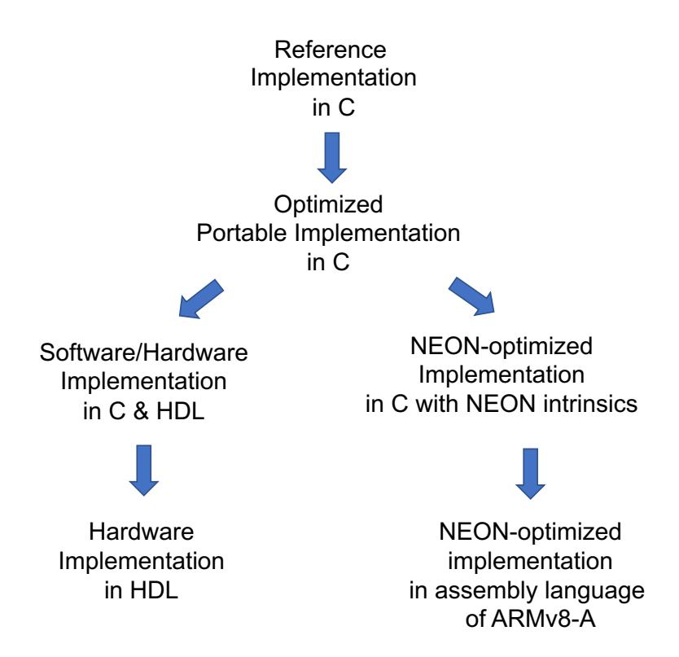

**Figure 14:** Types of optimized implementations.

<span id="page-50-1"></span>**Table 27:** Comparison between Software Implementations using NEON instructions and Software-Hardware co-designs.

| Algorithm      |         | -Ref<br>Decaps. |         | Neon<br>Decaps. | SW-<br>Encaps. |         |       | Neon<br>Decaps. |       | W-HW<br>Decaps. | Neon/S<br>Encaps. |                    |
|----------------|---------|-----------------|---------|-----------------|----------------|---------|-------|-----------------|-------|-----------------|-------------------|--------------------|
|                | $\mu s$ | $\mu s$         | $\mu s$ | $\mu s$         | $\mu s$        | $\mu s$ | Ratio | Ratio           | Ratio | Ratio           | Ratio             | Ratio              |
| NewHope-1024   | 723.5   | 891.2           | 338.3   | 363.6           | 21.3           | 24.9    | 2.1   | 2.5             | 34.0  | 35.8            | 15.92             | $\overline{14.61}$ |
| ntruhrss701    | 3,060.0 | 8,896.0         | 207.0   | 311.0           | 68.3           | 135.6   | 14.8  | 28.6            | 44.8  | 65.6            | 3.03              | 2.29               |
| ntruhps2048677 | 3,134.0 | 8,281.0         | 483.0   | 256.0           | 41.2           | 95.3    | 6.5   | 32.3            | 76.0  | 86.9            | 11.72             | 2.68               |
| ntruhps4096821 | 4,504.0 | 12,125.0        | 598.0   | 327.0           | 48.4           | 107.1   | 7.5   | 37.0            | 93.0  | 113.2           | 12.35             | 3.05               |
| LightŜaber     | 503.1   | 629.4           | 141.8   | 151.0           | 49.0           | 52.5    | 3.5   | 4.1             | 10.3  | 12.0            | 2.89              | 2.87               |
| Saber          | 965.3   | 1158.4          | 235.4   | 250.8           | 56.9           | 64.7    | 4.1   | 4.6             | 16.9  | 17.9            | 4.13              | 3.87               |
| FireSaber      | 1573.9  | 1835.6          | 349.9   | 374.3           | 65.2           | 77.1    | 4.5   | 4.9             | 24.1  | 23.8            | 5.36              | 4.85               |

On the selected platform, Zynq UltraScale+, a reference implementation of a PQC scheme in C can be optimized using several approaches shown in Fig. 14. First, basic optimizations may be still possible in C without affecting the portability of the code. From here, two divergent paths are worth investigating. First, Optimized Portable Implementation in C can be turned into a Software/Hardware Implementation in C and HDL, using the methodology described in this paper in Sections 4.3, 4.4, 4.6, 4.7. After all C functions are moved to hardware, this implementation becomes a pure hardware implementation in HDL. 

{51}------------------------------------------------

An alternative path is based on the use of SIMD instructions of ARMv8-a, referred to as NEON instructions. These instructions can be called from C using the so-called intrinsics. NEON intrinsics are function calls that the compiler replaces with an appropriate NEON instruction or a sequence of NEON instructions. Intrinsics provide almost as much control as writing assembly language but leave the allocation of registers to the compiler [\[6\]](#page-57-11). Operations that cannot take advantage of vector instructions are left in C. This path can be further extended into pure assembly language code. This code may consist of hand-coded NEON assembly language instructions, as well as remaining (so-called scalar) assembly language instructions of ARMv8-a.

We have developed NEON-optimized implementations in C with NEON intrinsics for 4 investigated KEMs, representing 3 Round 2 PQC candidates, namely NewHope, NTRU-HPS, NTRU-HRSS, and Saber. Our starting point consisted of optimized implementations of these algorithms, targeting Intel and AMD processors, using AVX2 (Advanced Vector Extensions 2). In Table [27,](#page-50-1) we compare the performance of NEON-optimized software implementations (based on intrinsics) with the performance of our software/hardware implementations.

Our software/hardware implementations appear to be superior for all investigated candidates and parameter sets. Compared to the software implementation based on NEON intrinsics, the execution times for NewHope-1024 are over 14.5 times smaller in software/hardware. For NTRU-HPS software/hardware implementation is about 8 times faster for encapsulation and 3.5-4.0 times faster for decapsulation. Saber has the ratios approximately the same for encapsulation and decapsulation. However, the advantage of software/hardware increases with the increase in the security level. Finally, NTRU-HRSS has the smallest ratios in the range of 1.8-1.9.

Multiple conference papers have been devoted to the NEON-based implementation of a single public-key cryptosystem [\[15,](#page-57-12) [65,](#page-61-10) [66,](#page-61-11) [10,](#page-57-13) [51,](#page-60-13) [69,](#page-61-12) [67\]](#page-61-13). These papers demonstrate that developing optimized implementations based on NEON intrinsics, hand-coded NEON assembly language code, and hand-coded ARMv8-A RISC assembly language code is at least as complex and labor intensive as the development of optimized software/hardware implementations.

The advantages of NEON-based implementations include a) software-only paradigm - no need for expertise in hardware and knowledge of HDLs, b) NEON vector instructions run at a higher clock frequency than an FPGA-based hardware accelerator, c) using the NEON co-processor involves minimal (if any) transfer overhead, d) the NEON co-processor can be potentially reused for non-cryptographic operations, such as signal and image processing. The primary advantages of the software/hardware implementations are: a) Programmable logic is much more powerful and less restrictive than the NEON co-processor in terms of the number and type of operations that can be executed in parallel. As a result, a higher overall speed-up is accomplished. b) Hardware written in HDL is likely to be more portable than software written in the assembly language of a particular processor. In particular, our software/hardware implementations can be ported to any other modern SoC FPGA, assuming that the amount of the required hardware resources does not exceed the capabilities of the programmable logic of a given SoC device.

# **6 Comparison with performance of the AVX2-optimized software implementations**

In Table [28,](#page-52-0) we compare the performance of our software/hardware implementations, running on Zynq UltraScale+, with the performance of the best software implementations available to date, running on Intel Xeon E3-1220 v3 (3.1 GHz).

When comparing these implementations, one needs to keep in mind that the software

{52}------------------------------------------------

<span id="page-52-0"></span>Table 28: Comparison of the GMU software/hardware implementations, running on Zynq UltraScale+, with the software implementations in supercop-20200525 running on Intel Xeon E3-1220 v3 (3100 MHz)

| Algorithm                    | median<br>cycles        | SW<br>(us)          | SW/HW<br>(us)       | Ratio                                       |
|------------------------------|-------------------------|---------------------|---------------------|---------------------------------------------|
|                              | Encaps                  | . ,                 | (us)                |                                             |
|                              | Level                   |                     |                     |                                             |
| ntruhrss701                  | 26116                   | 8.4                 | 68.3                | 0.12                                        |
| ntruhps 2048677              | 35352                   | 11.4                | 41.2                | 0.28                                        |
| kyber512                     | 44404                   | 14.3                | 15.2                | 0.94                                        |
| sntrup653                    | 46620                   | 15.0                | 48.5                | 0.31                                        |
| lightsaber2                  | 67568                   | 21.8 $22.4$         | 49.0                | 0.44                                        |
| ntrulpr653<br>lac128         | 69400<br>82684          | $\frac{22.4}{26.7}$ | 51.6<br>15.9        | 0.43<br><b>1.67</b>                         |
| r5nd1kem0d                   | 89500                   | 28.9                | 16.7                | 1.73                                        |
| newhope512cca                | 109040                  | 35.2                | 15.0                | 2.34                                        |
| r5nd1kem5d                   | 122492                  | 39.5                | 13.8                | 2.85                                        |
| frodokem640shake             | 4529184                 | 1,461.0             | 1,223.0             | 1.19                                        |
|                              | Lev                     | el 3                |                     |                                             |
| ntruhps4096821               | 43100                   | 13.9                | 48.4                | 0.29                                        |
| sntrup761                    | 48780                   | 15.7                | 55.5                | 0.28                                        |
| ntrulpr761                   | 72372                   | 23.3                | 59.6                | 0.39                                        |
| kyber768                     | 74040                   | 23.9                | 17.9                | 1.34                                        |
| saber2<br>lac192             | $\frac{115948}{158628}$ | $37.4 \\ 51.2$      | $ 56.9 \\ 21.4 $    | 0.66<br><b>2.39</b>                         |
| r5nd3kem5d                   | 198028 $209572$         | 67.6                | $\frac{21.4}{19.2}$ | $\begin{array}{c} 2.39 \\ 3.52 \end{array}$ |
| r5nd3kem0d                   | 317244                  | 102.3               | 21.9                | $\begin{array}{c} 3.32 \\ 4.67 \end{array}$ |
| frodokem976shake             | 9467152                 | 3,053.9             | 1,642.5             | 1.86                                        |
|                              | Level                   | 4 & 5               |                     |                                             |
| sntrup857                    | 60668                   | 19.6                | 63.4                | 0.31                                        |
| ntrulpr857                   | 91416                   | 29.5                | 67.3                | 0.44                                        |
| kyber1024                    | 103936                  | 33.5                | 22.1                | 1.52                                        |
| firesaber2                   | 175844                  | 56.7                | 65.2                | 0.87                                        |
| lac256                       | 188244                  | 60.7                | 23.8                | 2.55                                        |
| newhope1024cca<br>r5nd5kem5d | 201772 $368004$         | 65.1 $118.7$        | $21.3 \\ 26.0$      | $3.06 \\ 4.57$                              |
| r5nd5kem0d                   | 392492                  | 126.6               | $\frac{20.0}{29.2}$ | 4.34                                        |
| frodokem1344shake            | 16379980                | 5,283.9             | 2,186.2             | 2.42                                        |
|                              | Decaps                  | ulation             |                     |                                             |
|                              | Level                   | 1 & 2               |                     |                                             |
| kyber512                     | 37600                   | 12.1                | 17.1                | 0.71                                        |
| r5nd1kem0d                   | 43000                   | 13.9                | 19.3                | 0.72                                        |
| sntrup653                    | 59324                   | 19.1                | 66.9                | 0.29                                        |
| ntruhps2048677               | 62004                   | 20.0                | 95.3                | 0.21                                        |
| r5nd1kem5d<br>ntruhrss701    | 63624 $63632$           | $20.5 \\ 20.5$      | 15.7 $135.6$        | 1.31<br>0.15                                |
| lightsaber2                  | 69508                   | $\frac{20.5}{22.4}$ | 52.5                | 0.13 $0.43$                                 |
| ntrulpr653                   | 82732                   | 26.7                | 70.9                | 0.49                                        |
| lac128                       | 105388                  | 34.0                | 17.1                | 1.99                                        |
| newhope 512cca               | 109728                  | 35.4                | 16.1                | 2.19                                        |
| frodokem640shake             | 4494652                 | 1,449.9             | 1,321.3             | 1.10                                        |
|                              | Lev                     | el 3                |                     |                                             |
| sntrup761                    | 59120                   | 19.1                | 78.9                | 0.24                                        |
| kyber768                     | 63916                   | 20.6                | 20.1                | 1.03                                        |
| ntruhps4096821               | 79448                   | 25.6                | 107.1               | 0.24                                        |
| ntrulpr761                   | 85908                   | 27.7                | 84.1                | 0.33                                        |
| r5nd3kem5d<br>saber2         | $117028 \\ 118848$      | $37.8 \\ 38.3$      | $22.8 \\ 64.7$      | 1.65<br>0.59                                |
| r5nd3kem0d                   | 118848 $156692$         | 38.3<br>50.5        | $\frac{64.7}{27.0}$ | 0.59<br><b>1.87</b>                         |
| lac192                       | 243008                  | 78.4                | 27.0 $23.7$         | 3.30                                        |
| frodokem976shake             | 9380108                 | 3,025.8             | 1,866.2             | 1.62                                        |
|                              | Level                   | 4 & 5               |                     |                                             |
| sntrup857                    | 80904                   | 26.1                | 86.8                | 0.30                                        |
| kyber1024                    | 91628                   | 29.6                | 24.7                | 1.20                                        |
| ntrulpr857                   | 112116                  | 36.2                | 97.5                | 0.37                                        |
| firesaber2                   | 182136                  | 58.8                | 77.1                | 0.76                                        |
| r5nd5kem0d                   | 193228                  | 62.3                | 35.9                | 1.73                                        |
| newhope1024cca<br>r5nd5kem5d | $206248 \\ 209136$      | $66.5 \\ 67.5$      | $24.8 \\ 31.7$      | $2.68 \\ 2.13$                              |
| lac256                       | 377784                  | 121.9               | 26.9                | $\begin{array}{c} 2.13 \\ 4.54 \end{array}$ |
| frodokem1344shake            | 16312844                | 5,262.2             | 3,119.9             | 1.69                                        |
|                              |                         | -,                  | 5,110.0             | 55                                          |

{53}------------------------------------------------

portions of our implementations are written in portable C and run on a much less powerful processor, ARM Cortex-A53, at the frequency of 1.2 GHz. Hardware portions run in the programmable logic of Zynq UltraScale+, at a frequency specific to each algorithm, listed in Table [23,](#page-42-0) varying between 200 MHz for NTRU-HPS and NTRU-HRSS, through 322 MHz for Saber, until 490 MHz for NewHope. Even the frequency of NewHope is over 6 times smaller than the frequency of Intel Xeon. Additionally, all compared software implementations are optimized using AVX2 instructions, which let them take advantage of the parallelism present in each algorithm.

Under these circumstances, it is no surprise that Zynq UltraScale+ can outperform Intel Xeon only when its software/hardware implementation is fully optimized by moving all operations other than randombytes() to programmable logic. Such implementations of Kyber, LAC, NewHope, and Round5, outperform the best software implementations for both encapsulation and decapsulation. For encapsulation, the speed-ups vary from 1.34 for Kyber at level 3 to 4.67 for Round5 without error correction for level 3. For decapsulation, the speed-ups vary from 1.03 for Kyber at level 3 to 4.54 for LAC at level 5. The only exceptions are: Kyber at level 1, which reaches only the ratio of 0.94 for encapsulation, and 0.71 for decapsulation, and Round5 without error correction, which reaches only the ratio of 0.72 for level 1.

Somewhat surprisingly, also our software/hardware implementation of FrodoKEM outperforms the best software implementation, even though the percentage of operations offloaded to hardware in FrodoKEM is the smallest among all implemented KEMs, as shown in Figs. [9](#page-41-0) and [10.](#page-41-1)

# **7 Conclusions**

In this paper, we first reviewed the previous work on hardware and software/hardware implementations of Round 2 PQC schemes. Out of 26 candidates, six - NewHope, CRYSTALS-Kyber, FrodoKEM, Saber, Round5, and SIKE - received the highest coverage in terms of the number of implementations and related publications. All of them have both high-speed and lightweight implementations reported. Candidates with the Register-Transfer Level (RTL) high-speed implementations and no lightweight implementations include LAC, Classic McEliece, Picnic, and Rainbow. The publications on BIKE focused on key generation and decoding but did not report results for the entire KEM or PKE. Candidates with at least one software/hardware lightweight implementation but no RTL high-speed implementations include LEDAcrypt, CRYSTALS-DILITHIUM, and qTESLA. The coverage of the following candidates was limited to High-Level Synthesis implementations: SPHINCS+ and MQDSS. We are not aware of any publications on hardware or software/hardware implementations of Three Bears, HQC, NTS-KEM (before the merger with Classic McEliece), ROLLO, RQC, FALCON, GeMSS, and LUOV. With a few exceptions, the majority of lightweight implementations were software/hardware implementations based on RISC-V. The lattice-based family received by far the most extensive coverage. The following candidates from other families were shown competitive to lattice-based cryptography in terms of speed: for encryption and key exchange: Classic McEliece, for digital signatures Picnic and Rainbow. However, all of them were investigated primarily from the point of view of high-speed implementations.

In terms of the comparison of the lattice-based schemes, the previous publications were somewhat inconclusive. The largest differences were demonstrated in studies targeting ASIC implementations. These studies indicated the significant advantage of Kyber and NewHope over LAC and FrodoKEM, in terms of both the execution times of encapsulation and decapsulation, as well as power consumption and energy usage. However, the advantage over LAC could have been caused by devoting more effort and silicon area to the implementation of NTT (which benefits only NewHope and Kyber) vs. the implementation of vector

{54}------------------------------------------------

arithmetic, units used to speed up LAC. The benchmarking of lattice-based signature schemes was limited to CRYSTALS-DILITHIUM and qTESLA. The conclusions were complicated by the withdrawal of heuristic parameters of qTESLA by the submitters on Aug. 20, 2019, and very limited coverage of the remaining parameter sets.

Due to the timing constraints, in our study, we decided to focus on 12 CCA-secure Key Encapsulation Mechanisms (KEMs) representing 8 out of 9 lattice-based key exchange schemes (all except Three Bears). Taking into account that even for this subset of candidates, the development of full RTL implementations appeared to be beyond the capabilities of a single group, we investigated the use of two techniques to speed up the development process: software/hardware co-design and High-Level Synthesis. A hybrid of these two approaches, with some modifications to the traditional HLS methodology, appeared to give quite promising results. However, we eventually devoted most of our effort to software/hardware co-design based on the merger of the RTL HDL code and optimized C code.

Unlike other groups, we applied software/hardware co-design to high-speed rather than lightweight implementations, which led to the choice of Xilinx Zynq UltraScale+, a state-ofthe-art SoC FPGA family, as our primary platform. The differentiating factor is that this platform includes a hardwired ARM Cortex-A53 processor operating at the frequency of 1.2 GHz and a significant amount of programmable logic supporting hardware accelerators operating at the clock frequencies up to 500 MHz. Still, our designs remained almost completely portable due to leaving the software portion in C and modeling hardware portion in hardware description languages, such as VHDL, Verilog, and Chisel.

The detailed design methodology is described in this paper, and the corresponding code required to build a generic benchmarking platform, suitable for performing timing measurements of hardware and software/hardware co-designs is available for other groups to adopt. It is also our intention to make our implementations of PQC candidates open-source after the corresponding publications are accepted to peer-reviewed conferences or journals.

Our software/hardware co-design approach was successfully applied to all 12 mentioned above KEMs. For each KEM, multiple parameters sets, typically corresponding to three security levels, were supported. In order to determine FPGA resources required for each parameter set individually, the choice between parameter sets is performed during logic synthesis rather than at the run time.

For all algorithms other than FrodoKEM, the percentage of the original execution time in software taken by operations offloaded to hardware exceeded 97.4% for decapsulation and 96.9% for encapsulation. For FrodoKEM operations taking at least 94% of the execution time in software were offloaded to hardware. Significant speed-ups ranging between 7.6 and 111.1 were obtained versus a portable implementation in C, running on ARM Cortex-A53. More importantly, even when four KEMs representing three candidates - NewHope, NTRU, and Saber - were optimized in software by using NEON intrinsics, corresponding to special SIMD instructions of ARM, our sofware/hardware implementations maintained the lead by a factor varying between 1.81 for encapsulation in NTRU-HRSS up to 16.27 for encapsulation in NewHope. Finally, as an ultimate test, our implementations were compared with the software implementations optimized using AVX2 vector instructions, running on Intel Xeon E3-1220 v3, with the frequency 3.1 GHz. For each security level, between 4 and 6 software/hardware implementations, running on Zynq UltraScale+ with the 1.2 GHz ARM core were superior than the corresponding AVX2 implementations.

For each candidate, an attempt was made to offload as many as possible operations to hardware. For 50% of investigated KEMs, this percentage reached 100%. Thus, the corresponding implementations could be treated as hardware implementations, assuming that a random seed (of the size of 16, 24, or 32 bytes) was transferred to the hardware module during encapsulation. KEMs implemented using this approach included Kyber, LAC (v3a and v3b), NewHope, and Round5 (with and without error-correcting code). 

{55}------------------------------------------------

Their code was benchmarked using Artix-7 and Virtex-7 FPGAs.

In terms of both the execution times and resource utilization, Round5 with an errorcorrecting code (R5ND\_5d) outperformed Round5 without an error-correcting code (R5ND\_0d). Similarly, LAC-v3b appeared superior over LAC-v3a in terms of both speed and use of FPGA resources. Then, when the best representatives of four candidates - Kyber, LAC, NewHope, and Round5 - were compared, the following conclusions could be drawn. The execution times of these candidates were extremely close to one another. For encapsulation, the execution times were within 10% from one another at the security level 5, within 22% at the security level 3, and within 32% at the security level 1. For decapsulation, the largest differences were 26% at level 5, 22% at level 3, and 48% at level 1. In multiple instances, just a change of an FPGA family from low-cost Artix-7 to high-performance Virtex-7 caused a significant change in the rankings, even though the HDL code remained exactly the same. As a result, we must conclude that the differences among these candidates in terms of speed are too small to give preference to any particular candidate. These results contradict one of the earlier reports placing LAC well behind NewHope and Kyber.

In terms of resource utilization, a small advantage belongs to NewHope and Kyber. Both of them use fewer LUTs and flip-flops than LAC and Round5, and their use of DSP units and BRAMs, although slightly higher, is very moderate. Additionally, both NewHope and Kyber use almost the same amount of resources independently of the security level. In the case of both LAC and Round5, resource usage increases sharply with the increase in security level. The former property appears to be an advantage for applications requiring support for the highest or all security levels. In particular, the k-in-1 designs, which support all *k* security levels and allow modifying them at run time, typically have only slightly higher resource utilization than that for the maximum security level. Thus, the flat dependence of the resource utilization on the security level implies a potential for very cost-effective k-in-1 designs. At the same time, this potential should still be confirmed through complete designs.

Independently of our own results, the results reported in [\[63\]](#page-61-0) and summarized in Table [8](#page-17-0) indicate that Saber–when implemented entirely in hardware–can reach the same performance level as the KEMs ranked on the first six positions in our study. It may also require fewer resources than at least Round5. With its resource utilization almost independent of the security level, it naturally allows 2-in-1 and 3-in-1 designs, supporting multiple security levels with a relatively small overhead in terms of speed and resource usage as compared to the implementation for the lowest security level. Similarly, estimates reported in [\[32\]](#page-59-13) indicate that the performance of ThreeBears is likely to be very similar to that of Kyber and NewHope.

For the remaining 5 KEMs, representing FrodoKEM, NTRU, and NTRU Prime, the conclusions could be drawn only by comparing their software/hardware implementations and contrasting them with the corresponding software/hardware implementations of Kyber, LAC, NewHope, and Round5. In this case, all KEMs were implemented in Zynq UltraScale+. Hardware accelerators were assumed to be preloaded with appropriate public and private keys. Encapsulation started from generating 16-32 random bytes in software and passing these bytes to the hardware accelerator. Decapsulation started by sending the ciphertext to the hardware accelerator. Both operations ended when the shared secret was available in the memory of the processor core. Our evaluation revealed that FrodoKEM was by at least an order of magnitude slower than the remaining investigated KEMs. Ranking of the remaining candidates in hardware could not be determined conclusively based on their software/hardware co-design rankings. Software/hardware co-designs of Saber, NTRU-HRSS, and NTRU-HPS in particular, and somewhat less likely of Streamlined NTRU Prime and NTRU LPRime, could be possibly still significantly improved by offloading more operations to hardware, up to the level of bypassing at least one of the first six

{56}------------------------------------------------

candidates in the ranking.

This pitfall of software/hardware co-designs was identified early on during the benchmarking process. It could have been overcome only if candidates were significantly different from the point of view of their hardware efficiency. Such large differences were not identified in the case of the mentioned above five lattice-based KEMs. Consequently, the only way to overcome this inherent weakness of the software/hardware methodology, when applied to this particular set of candidates, is to move all (or almost all) remaining operations of these algorithms to hardware. Doing that is, however, impractical at this point due to the timeline imposed by NIST.

At the same time, taking into account that moving more operations of these KEMs to hardware can only increase the resource usage of the corresponding hardware accelerators, it is still fair to compare their resource utilization with those of Kyber and NewHope. For NTRU-HPS and NTRU-HRSS, the concern is a large number of DSP units, exceeding 700 for NTRU-HRSS and 800 for NTRU-HPS at the security level 3. For Streamlined NTRU Prime and NTRU LPRime, the only concern is a relatively large number of LUTs, clearly exceeding that of LAC-v3b and approaching or exceeding that of Round5 with an error-correcting code (R5ND\_5d).

Still, it is up to NIST and the cryptographic community to decide whether such relatively small differences in the hardware efficiency of lattice-based candidates should play any role in the Round 3 down-selection process.

# **8 Future Work**

Future work will depend on the number and type of candidates qualified for Round 3. Based on the lessons learned from Round 2, the following adjustments may be advisable:

- More focus on hardware implementations vs. software/hardware implementations. Software/hardware implementations may still be helpful for lightweight implementations with a clear resource utilization threshold. In these implementations, moving more operations to hardware may be prohibited by exceeding the resource budget.
- More focus on comparisons across families, rather than within the same family. Round 2 designs illustrate substantial similarities between candidates belonging to the same family but give a hint of more profound differences among representatives of different families.
- More hardware platforms to focus on. The larger the spectrum of platforms, the higher certainty that the reported rankings are not artifacts of a particular platform and will carry over to future generations of integrated circuits. For FPGAs and SoC FPGAs, benchmarking should target families of at least two major vendors, Xilinx and Intel. For ASIC implementations, different standard-cell libraries should be considered. ASIC studies are particularly challenging, as they are more timeconsuming and costlier. However, they are indispensable as they may lead to different conclusions than those obtained from FPGA investigations.
- More work on optimized software implementations targeting vector instructions of embedded processors, such as RISC-V and ARM (including NEON instructions).
- Investigation of lightweight implementations protected against side-channel and fault attacks should be conducted by multiple groups, serving interchangeably as attackers and defenders.
- Trade-offs among speed, area, power, energy, and resistance against side channel attacks should be thoroughly studied, especially for lightweight implementations.

{57}------------------------------------------------

# **References**

- <span id="page-57-5"></span>[1] Erdem Alkim et al. *ISA Extensions for Finite Field Arithmetic - Accelerating Kyber and NewHope on RISC-V*. Cryptology ePrint Archive 2020/049. Jan. 2020.
- <span id="page-57-15"></span>[2] Erdem Alkim et al. *NewHope - Algorithm Specifications and Supporting Documentation Version 1.1*. Tech. rep. Apr. 2020.
- <span id="page-57-7"></span>[3] Michał Andrzejczak. "The Low-Area FPGA Design for the Post-Quantum Cryptography Proposal Round5". In: *2019 Federated Conference on Computer Science and Information Systems*. Vol. 18. Leipzig, Germany, Sept. 2019, pp. 213–219. doi: [10/ggbsbd](https://doi.org/10/ggbsbd).
- <span id="page-57-6"></span>[4] Michal Andrzejczak, Farnoud Farahmand, and Kris Gaj. "Full Hardware Implementation of the Post-Quantum Public-Key Cryptography Scheme Round5". In: *2019 International Conference on ReConFigurable Computing and FPGAs (ReCon-Fig)*. Cancun, Mexico: IEEE, Dec. 2019, pp. 1–2. isbn: 978-1-72811-957-1. doi: [10.1109/ReConFig48160.2019.8994765](https://doi.org/10.1109/ReConFig48160.2019.8994765).
- <span id="page-57-9"></span>[5] Nicolas Aragon et al. *BIKE: Bit Flipping Key Encapsulation: Submission for Round 3 Consideration*. Tech. rep. May 2020.
- <span id="page-57-11"></span>[6] ARM. *Neon Intrinsics Reference*. [https://developer.arm.com/architectures/](https://developer.arm.com/architectures/instruction-sets/simd-isas/neon/intrinsics) [instruction-sets/simd-isas/neon/intrinsics](https://developer.arm.com/architectures/instruction-sets/simd-isas/neon/intrinsics). 2020.
- <span id="page-57-10"></span>[7] ARM. *Neon Programmer's Guide for Armv8-A*. [https://developer.arm.com/](https://developer.arm.com/architectures/instruction-sets/simd-isas/neon/neon-programmers-guide-for-armv8-a) [architectures/instruction-sets/simd-isas/neon/neon-programmers-guide](https://developer.arm.com/architectures/instruction-sets/simd-isas/neon/neon-programmers-guide-for-armv8-a)[for-armv8-a](https://developer.arm.com/architectures/instruction-sets/simd-isas/neon/neon-programmers-guide-for-armv8-a). 2020.
- <span id="page-57-14"></span>[8] Roberto Avanzi et al. *CRYSTALS-KYBER: Algorithm Specifications And Supporting Documentation (Version 2.0)*. Tech. rep. Apr. 2019.
- <span id="page-57-8"></span>[9] Reza Azarderakhsh et al. "Key Compression for Isogeny-Based Cryptosystems". In: *Proceedings of the 3rd ACM International Workshop on ASIA Public-Key Cryptography - AsiaPKC '16*. Xi'an, China: ACM Press, 2016, pp. 1–10. isbn: 978-1-4503-4286-5. doi: [10/ggbsbz](https://doi.org/10/ggbsbz).
- <span id="page-57-13"></span>[10] Reza Azarderakhsh et al. *NEON PQCryto: Fast and Parallel Ring-LWE Encryption on ARM NEON Architecture*. Cryptology ePrint Archive 2015/1081. Nov. 2015.
- <span id="page-57-0"></span>[11] Brian Baldwin et al. "FPGA Implementations of the Round Two SHA-3 Candidates". In: *2010 International Conference on Field Programmable Logic and Applications, FPL 2010*. Milan, Italy, Aug. 2010, pp. 400–407. isbn: 978-1-4244-7842-2. doi: [10/bmn2zv](https://doi.org/10/bmn2zv).
- <span id="page-57-3"></span>[12] Utsav Banerjee, Tenzin S. Ukyab, and Anantha P. Chandrakasan. "Sapphire: A Configurable Crypto-Processor for Post-Quantum Lattice-Based Protocols". In: *IACR Transactions on Cryptographic Hardware and Embedded Systems* 2019.4 (Aug. 2019). doi: [10.13154/tches.v2019.i4.17-61](https://doi.org/10.13154/tches.v2019.i4.17-61).
- <span id="page-57-4"></span>[13] Utsav Banerjee, Tenzin S. Ukyab, and Anantha P. Chandrakasan. *Sapphire: A Configurable Crypto-Processor for Post-Quantum Lattice-Based Protocols (Extended Version)*. Cryptology ePrint Archive 2019/1140. Sept. 2020.
- <span id="page-57-2"></span>[14] Kanad Basu et al. *NIST Post-Quantum Cryptography- A Hardware Evaluation Study*. Cryptology ePrint Archive 2019/047. May 2019.
- <span id="page-57-12"></span>[15] Daniel J Bernstein and Peter Schwabe. "NEON Crypto". In: *Cryptographic Hardware and Embedded Systems - CHES 2012*. Vol. 7428. LNCS. Leuven, Belgium, Sept. 2012, pp. 320–339. doi: [10.1007/978-3-642-33027-8\\_19](https://doi.org/10.1007/978-3-642-33027-8_19).
- <span id="page-57-1"></span>[16] *CAESAR: Competition for Authenticated Encryption: Security, Applicability, and Robustness - Web Page*. https://competitions.cr.yp.to/caesar.html. 2019.

{58}------------------------------------------------

- <span id="page-58-0"></span>[17] Cryptographic Engineering Research Group (CERG) at George Mason University. Hardware Benchmarking of CAESAR Candidates. https://cryptography.gmu.edu/athena/index.php?id=CAESAR. 2019.
- <span id="page-58-7"></span>[18] Viet B Dang et al. "Implementing and Benchmarking Three Lattice-Based Post-Quantum Cryptography Algorithms Using Software/Hardware Codesign". In: 2019 International Conference on Field Programmable Technology, FPT 2019. Tianjin, China: IEEE, Dec. 9-13, 2019, pp. 206–214. DOI: 10.1109/ICFPT47387.2019.00032.
- <span id="page-58-9"></span>[19] Rami Elkhatib, Reza Azarderakhsh, and Mehran Mozaffari-Kermani. *Efficient and Fast Hardware Architectures for SIKE Round 2 on FPGA*. Cryptology ePrint Archive 2020/611. May 2020.
- <span id="page-58-5"></span>[20] Farnoud Farahmand. Benchmarking Setup for Software/Hardware Implementations of PQC Schemes. Sept. 2019.
- <span id="page-58-4"></span>[21] Farnoud Farahmand et al. "Evaluating the Potential for Hardware Acceleration of Four NTRU-Based Key Encapsulation Mechanisms Using Software/Hardware Codesign". In: 10th International Conference on Post-Quantum Cryptography, PQCrypto 2019. LNCS. Chongqing, China: Springer, May 2019.
- <span id="page-58-1"></span>[22] Farnoud Farahmand et al. "Minerva: Automated Hardware Optimization Tool". In: 2017 International Conference on ReConFigurable Computing and FPGAs, ReConFig 2017. Cancun: IEEE, Dec. 2017, pp. 1–8.
- <span id="page-58-12"></span>[23] Farnoud Farahmand et al. "Software/Hardware Codesign of the Post Quantum Cryptography Algorithm NTRUEncrypt Using High-Level Synthesis and Register-Transfer Level Design Methodologies". In: 29th International Conference on Field Programmable Logic and Applications, FPL 2019. Barcelona, Spain: IEEE, Sept. 2019, pp. 225–231. ISBN: 978-1-72814-884-7. DOI: 10.1109/FPL.2019.00042.
- <span id="page-58-10"></span>[24] Ahmed Ferozpuri and Kris Gaj. "High-Speed FPGA Implementation of the NIST Round 1 Rainbow Signature Scheme". In: 2018 International Conference on ReCon-Figurable Computing and FPGAs (ReConFig). Cancun, Mexico: IEEE, Dec. 2018, pp. 1–8. ISBN: 978-1-72811-968-7. DOI: 10/ggbsdm.
- <span id="page-58-11"></span>[25] Ahmed Ferozpuri et al. *Hardware API for Post-Quantum Public Key Cryptosystems*. GMU Report. Fairfax, VA: George Mason University, Apr. 2018.
- <span id="page-58-6"></span>[26] Tim Fritzmann, Georg Sigl, and Johanna Sepúlveda. RISQ-V: Tightly Coupled RISC-V Accelerators for Post-Quantum Cryptography. Cryptology ePrint Archive 2020/446. Apr. 2020.
- <span id="page-58-8"></span>[27] Tim Fritzmann et al. "Towards Reliable and Secure Post-Quantum Co-Processors Based on RISC-V". In: 2019 Design, Automation Test in Europe Conference Exhibition (DATE). Mar. 2019, pp. 1148–1153. DOI: 10.23919/DATE.2019.8715173.
- <span id="page-58-3"></span>[28] Kris Gaj. "Challenges and Rewards of Implementing and Benchmarking Post-Quantum Cryptography in Hardware". In: 2018 Great Lakes Symposium on VLSI, GLSVLSI 2018. Chicago, IL, USA: ACM Press, 2018, pp. 359–364. ISBN: 978-1-4503-5724-1. DOI: 10/ggbscs.
- <span id="page-58-2"></span>[29] Kris Gaj, Ekawat Homsirikamol, and Marcin Rogawski. "Fair and Comprehensive Methodology for Comparing Hardware Performance of Fourteen Round Two SHA-3 Candidates Using FPGAs". In: *Cryptographic Hardware and Embedded Systems, CHES 2010.* Vol. 6225. LNCS. Santa Barbara, CA, Aug. 2010, pp. 264–278. ISBN: 978-3-642-15030-2 978-3-642-15031-9. DOI: 10.1007/978-3-642-15031-9\_18.

{59}------------------------------------------------

- <span id="page-59-5"></span>[30] Kris Gaj et al. "ATHENa - Automated Tool for Hardware Evaluation: Toward Fair and Comprehensive Benchmarking of Cryptographic Hardware Using FPGAs". In: 2010 International Conference on Field Programmable Logic and Applications, FPL 2010. Milan, Italy: IEEE, Aug. 2010, pp. 414–421. ISBN: 978-1-4244-7842-2. DOI: 10/d2bzw2.
- <span id="page-59-0"></span>[31] Kris Gaj et al. Comprehensive Evaluation of High-Speed and Medium-Speed Implementations of Five SHA-3 Finalists Using Xilinx and Altera FPGAs. Cryptology ePrint Archive 2012/368. 2012.
- <span id="page-59-13"></span>[32] Mike Hamburg. ThreeBears Estimates on ASIC. June 2020.
- <span id="page-59-3"></span>[33] E. Homsirikamol et al. Implementer's Guide to Hardware Implementations Compliant with the CAESAR Hardware API. GMU Report. Fairfax, VA: GMU, 2016.
- <span id="page-59-6"></span>[34] Ekawat Homsirikamol and Kris Gaj. "Hardware Benchmarking of Cryptographic Algorithms Using High-Level Synthesis Tools: The SHA-3 Contest Case Study". In: *Applied Reconfigurable Computing - ARC 2015*. Vol. 9040. LNCS. Cham: Springer International Publishing, 2015, pp. 217–228. ISBN: 978-3-319-16213-3 978-3-319-16214-0. DOI: 10.1007/978-3-319-16214-0\_18.
- <span id="page-59-7"></span>[35] Ekawat Homsirikamol and Kris Gaj. "Toward a New HLS-Based Methodology for FPGA Benchmarking of Candidates in Cryptographic Competitions: The CAESAR Contest Case Study". In: 2017 International Conference on Field Programmable Technology, FPT 2017. Melbourne, Australia: IEEE, Dec. 2017, pp. 120–127. ISBN: 978-1-5386-2656-6. DOI: 10/ggbsf4.
- <span id="page-59-4"></span>[36] Ekawat Homsirikamol, Panasayya Yalla, and Farnoud Farahmand. Development Package for Hardware Implementations Compliant with the CAESAR Hardware API. https://cryptography.gmu.edu/athena/index.php?id=CAESAR. 2016.
- <span id="page-59-2"></span>[37] Ekawat Homsirikamol et al. *CAESAR Hardware API*. Cryptology ePrint Archive 2016/626. 2016.
- <span id="page-59-8"></span>[38] James Howe. "Optimised Lattice-Based Key Encapsulation in Hardware". In: Second NIST Post-Quantum Cryptography Standardization Conference 2019. Aug. 2019, p. 13.
- <span id="page-59-11"></span>[39] Jingwei Hu et al. "Lightweight Key Encapsulation Using LDPC Codes on FPGAs". In: *IEEE Trans. Comput.* 69.3 (Mar. 2020). ISSN: 0018-9340, 1557-9956, 2326-3814. DOI: 10.1109/TC.2019.2948323.
- <span id="page-59-10"></span>[40] Jingwei Hu et al. "Optimized Polynomial Multiplier Over Commutative Rings on FPGAs: A Case Study on BIKE". In: 2019 International Conference on Field-Programmable Technology (ICFPT). Tianjin, China: IEEE, Dec. 2019, pp. 231–234. ISBN: 978-1-72812-943-3. DOI: 10.1109/ICFPT47387.2019.00035.
- <span id="page-59-9"></span>[41] Arpan Jati et al. SPQCop: Side-Channel Protected Post-Quantum Cryptoprocessor. Cryptology ePrint Archive 2019/765. June 2019.
- <span id="page-59-12"></span>[42] Daniel Kales et al. "Efficient FPGA Implementations of LowMC and Picnic". In: *The Cryptographers' Track at the RSA Conference 2020, CT-RSA 2020.* San Francisco: Springer, Feb. 2020.
- <span id="page-59-14"></span>[43] Matthias J. Kannwischer et al. Pqm4 - Post-Quantum Crypto Library for the  $\{ARM\}$   $\{Cortex$ - $M4\}$ . https://github.com/mupq/pqm4. 2019.
- <span id="page-59-1"></span>[44] Jens-Peter Kaps et al. "Lightweight Implementations of SHA-3 Candidates on FPGAs". In: 12th International Conference on Cryptology in India, Indocrypt 2011. Vol. 7107. LNCS. Chennai, India, Dec. 2011, pp. 270–289. ISBN: 978-3-642-25577-9 978-3-642-25578-6. DOI: 10.1007/978-3-642-25578-6\_20.

{60}------------------------------------------------

- <span id="page-60-0"></span>[45] Miroslav Knezevic et al. "Fair and Consistent Hardware Evaluation of Fourteen Round Two SHA-3 Candidates". In: *IEEE Transactions on Very Large Scale Integration* (VLSI) Systems 20.5 (May 2012), pp. 827–840. ISSN: 1063-8210, 1557-9999. DOI: 10/ctjzhr.
- <span id="page-60-7"></span>[46] B. Koziel, R. Azarderakhsh, and M. M. Kermani. "A High-Performance and Scalable Hardware Architecture for Isogeny-Based Cryptography". In: *IEEE Transactions on Computers* 67.11 (Nov. 2018), pp. 1594–1609. ISSN: 0018-9340. DOI: 10/gff4vv.
- <span id="page-60-5"></span>[47] Brian Koziel et al. "NEON-SIDH: Efficient Implementation of Supersingular Isogeny Diffie-Hellman Key Exchange Protocol on ARM". In: *Cryptology and Network Security*. Ed. by Sara Foresti and Giuseppe Persiano. Vol. 10052. Cham: Springer International Publishing, 2016, pp. 88–103. ISBN: 978-3-319-48964-3 978-3-319-48965-0. DOI: 10.1007/978-3-319-48965-0\_6.
- <span id="page-60-6"></span>[48] Brian Koziel et al. "Post-Quantum Cryptography on FPGA Based on Isogenies on Elliptic Curves". In: *IEEE Transactions on Circuits and Systems I: Regular Papers* 64.1 (Jan. 2017), pp. 86–99. ISSN: 1549-8328, 1558-0806. DOI: 10/gd89pp.
- <span id="page-60-3"></span>[49] Brian Koziel et al. "SIKE'd Up: Fast Hardware Architectures for Supersingular Isogeny Key Encapsulation". en. In: *IEEE Transactions on Circuits and Systems I: Regular Papers* (May 2020), pp. 1–13. ISSN: 1549-8328, 1558-0806. DOI: 10.1109/TCSI.2020.2992747.
- <span id="page-60-8"></span>[50] Weiqiang Liu et al. "High Performance Modular Multiplication for SIDH". In: *IEEE Trans. Comput.-Aided Des. Integr. Circuits Syst.* (2019), pp. 1–1. ISSN: 0278-0070, 1937-4151. DOI: 10.1109/TCAD.2019.2960330.
- <span id="page-60-13"></span>[51] Patrick Longa. Four QNEON: Faster Elliptic Curve Scalar Multiplications on ARM Processors. Cryptology ePrint Archive 2016/645. July 2016.
- <span id="page-60-14"></span>[52] Xianhui Lu et al. LAC: Practical Ring-LWE Based Public-Key Encryption with Byte-Level Modulus. Cryptology ePrint Archive 2018/1009. Dec. 2019.
- <span id="page-60-4"></span>[53] Pedro Maat C. Massolino et al. "A Compact and Scalable Hardware/Software Co-Design of SIKE". In: *IACR Transactions on Cryptographic Hardware and Embedded Systems* (Mar. 2020), pp. 245–271. ISSN: 2569-2925. DOI: 10.13154/tches.v2020.i2.245-271.
- <span id="page-60-2"></span>[54] Jose Maria Bermudo Mera et al. Compact Domain-Specific Co-Processor for Accelerating Module Lattice-Based Key Encapsulation Mechanism. Cryptology ePrint Archive 2020/321. Mar. 2020, p. 15.
- <span id="page-60-10"></span>[55] Richard Newell. Survey of Notable Security-Enhancing Activities in the RISC-V Universe. 17th International Workshop on Cryptographic Architectures Embedded in Logic Devices, CryptArchi 2019. Pruhonice, Czech Republic, June 2019.
- <span id="page-60-12"></span>[56] Duc Tri Nguyen, Viet B. Dang, and Kris Gaj. "A High-Level Synthesis Approach to the Software/Hardware Codesign of NTT-Based Post-Quantum Cryptography Algorithms". In: 2019 International Conference on Field-Programmable Technology (ICFPT). Tianjin, China: IEEE, Dec. 2019, pp. 371–374. ISBN: 978-1-72812-943-3. DOI: 10.1109/ICFPT47387.2019.00070.
- <span id="page-60-1"></span>[57] Duc Tri Nguyen, Viet B Dang, and Kris Gaj. "High-Level Synthesis in Implementing and Benchmarking Number Theoretic Transform in Lattice-Based Post-Quantum Cryptography Using Software/Hardware Codesign". In: 16th International Symposium on Applied Reconfigurable Computing, ARC 2020. Apr. 2020.
- <span id="page-60-11"></span>[58] NIST. *PQC - API Notes.* 2017.
- <span id="page-60-9"></span>[59] David Patterson and Andrew Waterman. The RISC-V Reader: An Open Architecture Atlas. Book version: 0.0.1. Strawberry Canyon LLC, Oct. 2017.

{61}------------------------------------------------

- <span id="page-61-1"></span>[60] Andrew H Reinders et al. Efficient BIKE Hardware Design with Constant-Time Decoder. Cryptology ePrint Archive 2020/117. Feb. 2020.
- <span id="page-61-2"></span>[61] Jan Richter-Brockmann and Tim Güneysu. Folding BIKE: Scalable Hardware Implementation for Reconfigurable Devices. Cryptology ePrint Archive 2020/897. July 2020.
- <span id="page-61-6"></span>[62] Vincent Rijmen, Antoon Bosselaers, and Paulo Barreto. Optimized ANSI C Code for the Rijndael Cipher (Now AES), Rijndael-Alg-Fst.c, v3.0. Dec. 2000.
- <span id="page-61-0"></span>[63] Sujoy Sinha Roy and Andrea Basso. High-Speed Instruction-Set Coprocessor for Lattice-Based Key Encapsulation Mechanism: Saber in Hardware. Cryptology ePrint Archive 2020/434. Apr. 2020.
- <span id="page-61-7"></span>[64] Markku-Juhani O. Saarinen. *Pqcbench*. https://github.com/mjosaarinen/pqcbench. 2019.
- <span id="page-61-10"></span>[65] Hwajeong Seo et al. "Montgomery Modular Multiplication on ARM-NEON Revisited". In: International Conference on Information Security and Cryptology - ICISC 2014. Vol. 8949. LNCS. Cham: Springer International Publishing, 2014, pp. 328–342. ISBN: 978-3-319-15942-3 978-3-319-15943-0. DOI: 10.1007/978-3-319-15943-0.
- <span id="page-61-11"></span>[66] Hwajeong Seo et al. Parallel Implementation of Number Theoretic Transform. Cryptology ePrint Archive 2015/1024. Oct. 2015.
- <span id="page-61-13"></span>[67] Hwajeong Seo et al. SIDH on ARM: Faster Modular Multiplications for Faster Post-Quantum Supersingular Isogeny Key Exchange. Cryptology ePrint Archive 2018/700. July 2018.
- <span id="page-61-8"></span>[68] Douglas Stebila and Michele Mosca. Liboqs - Master Branch. https://github.com/open-quantum-safe/liboqs. 2019.
- <span id="page-61-12"></span>[69] Silvan Streit and Fabrizio De Santis. "Post-Quantum Key Exchange on ARMv8-A: A New Hope for NEON Made Simple". In: *IEEE Transactions on Computers* 67.11 (Nov. 2018), pp. 1651–1662. ISSN: 0018-9340, 1557-9956, 2326-3814. DOI: 10/gff3sc.
- <span id="page-61-14"></span>[70] FrodoKEM Submission Team. Round 2 Submissions - FrodoKEM Candidate Submission Package. https://csrc.nist.gov/Projects/Post-Quantum-Cryptography/Round-2-Submissions. Apr. 2019.
- <span id="page-61-15"></span>[71] NTRU Prime Submission Team. Round 2 Submissions - NTRU Prime Candidate Submission Package. https://csrc.nist.gov/Projects/Post-Quantum-Cryptog raphy/Round-2-Submissions. Apr. 2019.
- <span id="page-61-5"></span>[72] NTRU Submission Team. Round 2 Submissions - NTRU Candidate Submission Package. Apr. 2019.
- <span id="page-61-9"></span>[73] Round5 Submission Team. Round 2 Submissions - Round5 Candidate Submission Package. https://csrc.nist.gov/Projects/Post-Quantum-Cryptography/Round-2-Submissions. Apr. 2019.
- <span id="page-61-16"></span>[74] Saber Submission Team. Round 2 Submissions - Saber Candidate Submission Package. Apr. 2019.
- <span id="page-61-3"></span>[75] Wen Wang, Jakub Szefer, and Ruben Niederhagen. "FPGA-Based Niederreiter Cryptosystem Using Binary Goppa Codes". In: 9th International Conference on Post-Quantum Cryptography, PQCrypto 2018. Ed. by Tanja Lange and Rainer Steinwandt. Vol. 10786. LNCS. Fort Lauderdale, Florida: Springer International Publishing, Apr. 2018, pp. 77–98. ISBN: 978-3-319-79062-6 978-3-319-79063-3. DOI: 10.1007/978-3-319-79063-3\_4.
- <span id="page-61-4"></span>[76] Wen Wang et al. Parameterized Hardware Accelerators for Lattice-Based Cryptography and Their Application to the HW/SW Co-Design of qTESLA. Cryptology ePrint Archive 2020/054. Apr. 2020.

{62}------------------------------------------------

- <span id="page-62-0"></span>[77] Wen Wang et al. "XMSS and Embedded Systems - XMSS Hardware Accelerators for RISC-V". In: *Selected Areas in Cryptography – SAC 2019*. Vol. 11959. LNCS. Waterloo, Ontario, Canada: Springer, 2019, pp. 523–550.
- <span id="page-62-3"></span>[78] Andrew Waterman and Krste Asanovic. *The RISC-V Instruction Set Manual . Volume I: Unprivileged ISA v2.2*. Tech. rep. 20190608-Base-Ratified. June 2019, p. 236.
- <span id="page-62-4"></span>[79] Andrew Waterman and Krste Asanovic. *The RISC-V Instruction Set Manual, Volume II: Privileged Architecture, v1.12*. Tech. rep. June 2019, p. 113.
- <span id="page-62-1"></span>[80] Guozhu Xin et al. "VPQC: A Domain-Specific Vector Processor for Post-Quantum Cryptography Based on RISC-V Architecture". In: *IEEE Transactions on Circuits and Systems I: Regular Papers* 67.8 (Aug. 2020), pp. 1–13. issn: 1558-0806. doi: [10.1109/TCSI.2020.2983185](https://doi.org/10.1109/TCSI.2020.2983185).
- <span id="page-62-2"></span>[81] Neng Zhang et al. "Highly Efficient Architecture of NewHope-NIST on FPGA Using Low-Complexity NTT/INTT". In: *IACR Transactions on Cryptographic Hardware and Embedded Systems* (Mar. 2020), pp. 49–72. issn: 2569-2925. doi: [10.13154/](https://doi.org/10.13154/tches.v2020.i2.49-72) [tches.v2020.i2.49-72](https://doi.org/10.13154/tches.v2020.i2.49-72).

{63}------------------------------------------------

# A Results of Profiling

**Table 29:** Results of profiling FrodoKEM

<span id="page-63-0"></span>

| Function                                                     | Time             | Time         | Function                                                                                                                                                                                                                                                                                                                                                                                                                                                                                                                                                                                                                                                                                                                                                                                                                                                                                                                                                                                                                                                                                                                                                                                                                                                                                                                                                                                                                                                                                                                                                                                                                                                                                                                                                                                                                                                                                                                                                                                                                                                                                                                       | Time      | Time   |  |  |
|--------------------------------------------------------------|------------------|--------------|--------------------------------------------------------------------------------------------------------------------------------------------------------------------------------------------------------------------------------------------------------------------------------------------------------------------------------------------------------------------------------------------------------------------------------------------------------------------------------------------------------------------------------------------------------------------------------------------------------------------------------------------------------------------------------------------------------------------------------------------------------------------------------------------------------------------------------------------------------------------------------------------------------------------------------------------------------------------------------------------------------------------------------------------------------------------------------------------------------------------------------------------------------------------------------------------------------------------------------------------------------------------------------------------------------------------------------------------------------------------------------------------------------------------------------------------------------------------------------------------------------------------------------------------------------------------------------------------------------------------------------------------------------------------------------------------------------------------------------------------------------------------------------------------------------------------------------------------------------------------------------------------------------------------------------------------------------------------------------------------------------------------------------------------------------------------------------------------------------------------------------|-----------|--------|--|--|
|                                                              | [us]             | [%]          |                                                                                                                                                                                                                                                                                                                                                                                                                                                                                                                                                                                                                                                                                                                                                                                                                                                                                                                                                                                                                                                                                                                                                                                                                                                                                                                                                                                                                                                                                                                                                                                                                                                                                                                                                                                                                                                                                                                                                                                                                                                                                                                                | [us]      | [%]    |  |  |
| Software Software/Hardware FrodoKEM1344 - Encapsulation      |                  |              |                                                                                                                                                                                                                                                                                                                                                                                                                                                                                                                                                                                                                                                                                                                                                                                                                                                                                                                                                                                                                                                                                                                                                                                                                                                                                                                                                                                                                                                                                                                                                                                                                                                                                                                                                                                                                                                                                                                                                                                                                                                                                                                                |           |        |  |  |
| 1 ( ) 1 1 1                                                  |                  |              |                                                                                                                                                                                                                                                                                                                                                                                                                                                                                                                                                                                                                                                                                                                                                                                                                                                                                                                                                                                                                                                                                                                                                                                                                                                                                                                                                                                                                                                                                                                                                                                                                                                                                                                                                                                                                                                                                                                                                                                                                                                                                                                                |           |        |  |  |
| 1. frodo_mul_add_sa_plus_e                                   | 58,577.48        | 94.36        | 1.1 frodo_mul_add_sa_plus_e                                                                                                                                                                                                                                                                                                                                                                                                                                                                                                                                                                                                                                                                                                                                                                                                                                                                                                                                                                                                                                                                                                                                                                                                                                                                                                                                                                                                                                                                                                                                                                                                                                                                                                                                                                                                                                                                                                                                                                                                                                                                                                    |           |        |  |  |
| 2. Shake128 and frodo_sample_n x3                            | 1,416.27         | 2.28         | 1.2 Shake128 and frodo_sample_n                                                                                                                                                                                                                                                                                                                                                                                                                                                                                                                                                                                                                                                                                                                                                                                                                                                                                                                                                                                                                                                                                                                                                                                                                                                                                                                                                                                                                                                                                                                                                                                                                                                                                                                                                                                                                                                                                                                                                                                                                                                                                                | 1,328.39  | 60.76  |  |  |
| 3. frodo_mul_add_sb_plus_e                                   | 654.64<br>569.60 | 1.05         | 1.3 frodo_mul_add_sb_plus_e<br>1.4 Shake256                                                                                                                                                                                                                                                                                                                                                                                                                                                                                                                                                                                                                                                                                                                                                                                                                                                                                                                                                                                                                                                                                                                                                                                                                                                                                                                                                                                                                                                                                                                                                                                                                                                                                                                                                                                                                                                                                                                                                                                                                                                                                    | ,         |        |  |  |
| 4. Shake256                                                  |                  | 0.92         | I and the second second second second second second second second second second second second second second second second second second second second second second second second second second second second second second second second second second second second second second second second second second second second second second second second second second second second second second second second second second second second second second second second second second second second second second second second second second second second second second second second second second second second second second second second second second second second second second second second second second second second second second second second second second second second second second second second second second second second second second second second second second second second second second second second second second second second second second second second second second second second second second second second second second second second second second second second second second second second second second second second second second second second second second second second second second second second second second second second second second second second second second second second second second second second second second second second second second second second second second second second second second second second second second second second second second second second second second second second second second second second second second second second second second second second second second second second second second second second second second second second second second second second second second second second second second second second second second second second second second second second second second second second second second second second second second second second second second second second second second second second second second second second second second second second second second second | 206.00    | 17.67  |  |  |
| 5. frodo_pack                                                | 386.22           | 0.62         | 2. frodo_pack                                                                                                                                                                                                                                                                                                                                                                                                                                                                                                                                                                                                                                                                                                                                                                                                                                                                                                                                                                                                                                                                                                                                                                                                                                                                                                                                                                                                                                                                                                                                                                                                                                                                                                                                                                                                                                                                                                                                                                                                                                                                                                                  | 386.22    | 17.67  |  |  |
| 6. frodo_unpack Others                                       | 276.00           | 0.44         | 3. frodo_unpack Others                                                                                                                                                                                                                                                                                                                                                                                                                                                                                                                                                                                                                                                                                                                                                                                                                                                                                                                                                                                                                                                                                                                                                                                                                                                                                                                                                                                                                                                                                                                                                                                                                                                                                                                                                                                                                                                                                                                                                                                                                                                                                                         | 276.00    | 12.62  |  |  |
|                                                              | 195.62           | 0.32         |                                                                                                                                                                                                                                                                                                                                                                                                                                                                                                                                                                                                                                                                                                                                                                                                                                                                                                                                                                                                                                                                                                                                                                                                                                                                                                                                                                                                                                                                                                                                                                                                                                                                                                                                                                                                                                                                                                                                                                                                                                                                                                                                | 195.62    | 8.95   |  |  |
| Total                                                        | 62,075.83        | 100.00       | Total                                                                                                                                                                                                                                                                                                                                                                                                                                                                                                                                                                                                                                                                                                                                                                                                                                                                                                                                                                                                                                                                                                                                                                                                                                                                                                                                                                                                                                                                                                                                                                                                                                                                                                                                                                                                                                                                                                                                                                                                                                                                                                                          | 2,186.23  | 100.00 |  |  |
| 1 ()                                                         | FrodoKE          |              |                                                                                                                                                                                                                                                                                                                                                                                                                                                                                                                                                                                                                                                                                                                                                                                                                                                                                                                                                                                                                                                                                                                                                                                                                                                                                                                                                                                                                                                                                                                                                                                                                                                                                                                                                                                                                                                                                                                                                                                                                                                                                                                                |           |        |  |  |
| 1. frodo_mul_add_sa_plus_e                                   | 58,754.02        | 94.19        | 1.1 frodo_mul_add_sa_plus_e                                                                                                                                                                                                                                                                                                                                                                                                                                                                                                                                                                                                                                                                                                                                                                                                                                                                                                                                                                                                                                                                                                                                                                                                                                                                                                                                                                                                                                                                                                                                                                                                                                                                                                                                                                                                                                                                                                                                                                                                                                                                                                    |           |        |  |  |
| 2. Shake128 and frodo_sample_n x3                            | 883.14           | 1.42         | 1.2 Shake128 and frodo_sample_n                                                                                                                                                                                                                                                                                                                                                                                                                                                                                                                                                                                                                                                                                                                                                                                                                                                                                                                                                                                                                                                                                                                                                                                                                                                                                                                                                                                                                                                                                                                                                                                                                                                                                                                                                                                                                                                                                                                                                                                                                                                                                                | 1,316.52  | 42.20  |  |  |
| 3. frodo_unpack x3                                           | 765.56           | 1.23         | 1.3 frodo_mul_add_sb_plus_e                                                                                                                                                                                                                                                                                                                                                                                                                                                                                                                                                                                                                                                                                                                                                                                                                                                                                                                                                                                                                                                                                                                                                                                                                                                                                                                                                                                                                                                                                                                                                                                                                                                                                                                                                                                                                                                                                                                                                                                                                                                                                                    | ,         |        |  |  |
| 4. frodo_mul_add_sb_plus_e                                   | 649.68           | 1.04         | 1.4 Shake256                                                                                                                                                                                                                                                                                                                                                                                                                                                                                                                                                                                                                                                                                                                                                                                                                                                                                                                                                                                                                                                                                                                                                                                                                                                                                                                                                                                                                                                                                                                                                                                                                                                                                                                                                                                                                                                                                                                                                                                                                                                                                                                   | FOF TO    | 04-74  |  |  |
| 5. frodo_mul_bs                                              | 507.08           | 0.81         | 2. frodo_unpack x3                                                                                                                                                                                                                                                                                                                                                                                                                                                                                                                                                                                                                                                                                                                                                                                                                                                                                                                                                                                                                                                                                                                                                                                                                                                                                                                                                                                                                                                                                                                                                                                                                                                                                                                                                                                                                                                                                                                                                                                                                                                                                                             | 765.56    | 24.54  |  |  |
| 6. Shake256                                                  | 286.64           | 0.46         | 3. frodo_mul_bs                                                                                                                                                                                                                                                                                                                                                                                                                                                                                                                                                                                                                                                                                                                                                                                                                                                                                                                                                                                                                                                                                                                                                                                                                                                                                                                                                                                                                                                                                                                                                                                                                                                                                                                                                                                                                                                                                                                                                                                                                                                                                                                | 507.08    | 16.25  |  |  |
| Others                                                       | 530.74           | 0.85         | Others                                                                                                                                                                                                                                                                                                                                                                                                                                                                                                                                                                                                                                                                                                                                                                                                                                                                                                                                                                                                                                                                                                                                                                                                                                                                                                                                                                                                                                                                                                                                                                                                                                                                                                                                                                                                                                                                                                                                                                                                                                                                                                                         | 530.74    | 17.01  |  |  |
| Total                                                        | 62,376.86        | 100.00       | Total                                                                                                                                                                                                                                                                                                                                                                                                                                                                                                                                                                                                                                                                                                                                                                                                                                                                                                                                                                                                                                                                                                                                                                                                                                                                                                                                                                                                                                                                                                                                                                                                                                                                                                                                                                                                                                                                                                                                                                                                                                                                                                                          | 3,119.90  | 100.00 |  |  |
|                                                              |                  |              | Encapsulation                                                                                                                                                                                                                                                                                                                                                                                                                                                                                                                                                                                                                                                                                                                                                                                                                                                                                                                                                                                                                                                                                                                                                                                                                                                                                                                                                                                                                                                                                                                                                                                                                                                                                                                                                                                                                                                                                                                                                                                                                                                                                                                  |           |        |  |  |
| 1. frodo_mul_add_sa_plus_e                                   | 31,430.38        | 90.82        | 1.1 frodo_mul_add_sa_plus_e                                                                                                                                                                                                                                                                                                                                                                                                                                                                                                                                                                                                                                                                                                                                                                                                                                                                                                                                                                                                                                                                                                                                                                                                                                                                                                                                                                                                                                                                                                                                                                                                                                                                                                                                                                                                                                                                                                                                                                                                                                                                                                    |           |        |  |  |
| 2. Shake128 and frodo_sample_n x3                            | 1,410.18         | 4.07         | 1.2 Shake128 and frodo_sample_n                                                                                                                                                                                                                                                                                                                                                                                                                                                                                                                                                                                                                                                                                                                                                                                                                                                                                                                                                                                                                                                                                                                                                                                                                                                                                                                                                                                                                                                                                                                                                                                                                                                                                                                                                                                                                                                                                                                                                                                                                                                                                                | 760.74    | 46.32  |  |  |
| 3. frodo_mul_add_sb_plus_e                                   | 472.16           | 1.36         | 1.3 frodo_mul_add_sb_plus_e                                                                                                                                                                                                                                                                                                                                                                                                                                                                                                                                                                                                                                                                                                                                                                                                                                                                                                                                                                                                                                                                                                                                                                                                                                                                                                                                                                                                                                                                                                                                                                                                                                                                                                                                                                                                                                                                                                                                                                                                                                                                                                    | 100.11    | 10.02  |  |  |
| 4. Shake256                                                  | 414.11           | 1.20         | 1.4 Shake256                                                                                                                                                                                                                                                                                                                                                                                                                                                                                                                                                                                                                                                                                                                                                                                                                                                                                                                                                                                                                                                                                                                                                                                                                                                                                                                                                                                                                                                                                                                                                                                                                                                                                                                                                                                                                                                                                                                                                                                                                                                                                                                   |           |        |  |  |
| 5. frodo_pack                                                | 357.58           | 1.03         | 2. frodo_pack                                                                                                                                                                                                                                                                                                                                                                                                                                                                                                                                                                                                                                                                                                                                                                                                                                                                                                                                                                                                                                                                                                                                                                                                                                                                                                                                                                                                                                                                                                                                                                                                                                                                                                                                                                                                                                                                                                                                                                                                                                                                                                                  | 357.58    | 21.77  |  |  |
| 6. frodo_unpack                                              | 297.73           | 0.86         | 3. frodo_unpack                                                                                                                                                                                                                                                                                                                                                                                                                                                                                                                                                                                                                                                                                                                                                                                                                                                                                                                                                                                                                                                                                                                                                                                                                                                                                                                                                                                                                                                                                                                                                                                                                                                                                                                                                                                                                                                                                                                                                                                                                                                                                                                | 297.73    | 18.13  |  |  |
| Others                                                       | 226.40           | 0.65         | Others                                                                                                                                                                                                                                                                                                                                                                                                                                                                                                                                                                                                                                                                                                                                                                                                                                                                                                                                                                                                                                                                                                                                                                                                                                                                                                                                                                                                                                                                                                                                                                                                                                                                                                                                                                                                                                                                                                                                                                                                                                                                                                                         | 226.40    | 13.78  |  |  |
| Total                                                        | 34,608.54        | 100.00       | Total                                                                                                                                                                                                                                                                                                                                                                                                                                                                                                                                                                                                                                                                                                                                                                                                                                                                                                                                                                                                                                                                                                                                                                                                                                                                                                                                                                                                                                                                                                                                                                                                                                                                                                                                                                                                                                                                                                                                                                                                                                                                                                                          | 1,642.45  | 100.00 |  |  |
|                                                              | FrodoKE          | M976 -       | Decapsulation                                                                                                                                                                                                                                                                                                                                                                                                                                                                                                                                                                                                                                                                                                                                                                                                                                                                                                                                                                                                                                                                                                                                                                                                                                                                                                                                                                                                                                                                                                                                                                                                                                                                                                                                                                                                                                                                                                                                                                                                                                                                                                                  |           |        |  |  |
| 1. frodo_mul_add_sa_plus_e                                   | 31,441.14        | 90.74        | 1.1 frodo_mul_add_sa_plus_e                                                                                                                                                                                                                                                                                                                                                                                                                                                                                                                                                                                                                                                                                                                                                                                                                                                                                                                                                                                                                                                                                                                                                                                                                                                                                                                                                                                                                                                                                                                                                                                                                                                                                                                                                                                                                                                                                                                                                                                                                                                                                                    |           |        |  |  |
| 2. Shake128 and frodo_sample_n x3                            | 1,410.86         | 4.07         | 1.2 Shake128 and frodo_sample_n                                                                                                                                                                                                                                                                                                                                                                                                                                                                                                                                                                                                                                                                                                                                                                                                                                                                                                                                                                                                                                                                                                                                                                                                                                                                                                                                                                                                                                                                                                                                                                                                                                                                                                                                                                                                                                                                                                                                                                                                                                                                                                | 749.76    | 40.18  |  |  |
| 3. frodo_unpack x3                                           | 594.63           | 1.72         | 1.3 frodo_mul_add_sb_plus_e                                                                                                                                                                                                                                                                                                                                                                                                                                                                                                                                                                                                                                                                                                                                                                                                                                                                                                                                                                                                                                                                                                                                                                                                                                                                                                                                                                                                                                                                                                                                                                                                                                                                                                                                                                                                                                                                                                                                                                                                                                                                                                    | 149.70    | 40.18  |  |  |
| 4. frodo_mul_add_sb_plus_e                                   | 471.29           | 1.36         | 1.4 Shake256                                                                                                                                                                                                                                                                                                                                                                                                                                                                                                                                                                                                                                                                                                                                                                                                                                                                                                                                                                                                                                                                                                                                                                                                                                                                                                                                                                                                                                                                                                                                                                                                                                                                                                                                                                                                                                                                                                                                                                                                                                                                                                                   |           |        |  |  |
| 5. frodo_mul_bs                                              | 368.32           | 1.06         | 2. frodo_unpack x3                                                                                                                                                                                                                                                                                                                                                                                                                                                                                                                                                                                                                                                                                                                                                                                                                                                                                                                                                                                                                                                                                                                                                                                                                                                                                                                                                                                                                                                                                                                                                                                                                                                                                                                                                                                                                                                                                                                                                                                                                                                                                                             | 594.63    | 31.86  |  |  |
| 6. Shake256                                                  | 208.83           | 0.60         | 3. frodo_mul_bs                                                                                                                                                                                                                                                                                                                                                                                                                                                                                                                                                                                                                                                                                                                                                                                                                                                                                                                                                                                                                                                                                                                                                                                                                                                                                                                                                                                                                                                                                                                                                                                                                                                                                                                                                                                                                                                                                                                                                                                                                                                                                                                | 368.32    | 19.74  |  |  |
| Others                                                       | 153.51           | 0.44         | Others                                                                                                                                                                                                                                                                                                                                                                                                                                                                                                                                                                                                                                                                                                                                                                                                                                                                                                                                                                                                                                                                                                                                                                                                                                                                                                                                                                                                                                                                                                                                                                                                                                                                                                                                                                                                                                                                                                                                                                                                                                                                                                                         | 153.51    | 8.23   |  |  |
| Total                                                        | 34,648.58        | 100.00       | Total                                                                                                                                                                                                                                                                                                                                                                                                                                                                                                                                                                                                                                                                                                                                                                                                                                                                                                                                                                                                                                                                                                                                                                                                                                                                                                                                                                                                                                                                                                                                                                                                                                                                                                                                                                                                                                                                                                                                                                                                                                                                                                                          | 1,866.22  | 100.00 |  |  |
|                                                              |                  |              | Encapsulation                                                                                                                                                                                                                                                                                                                                                                                                                                                                                                                                                                                                                                                                                                                                                                                                                                                                                                                                                                                                                                                                                                                                                                                                                                                                                                                                                                                                                                                                                                                                                                                                                                                                                                                                                                                                                                                                                                                                                                                                                                                                                                                  | , , , = = |        |  |  |
| 1. frodo mul add sa plus e                                   | 13,794.27        | 85.19        | 1.1 frodo mul add sa plus e                                                                                                                                                                                                                                                                                                                                                                                                                                                                                                                                                                                                                                                                                                                                                                                                                                                                                                                                                                                                                                                                                                                                                                                                                                                                                                                                                                                                                                                                                                                                                                                                                                                                                                                                                                                                                                                                                                                                                                                                                                                                                                    |           |        |  |  |
| 2. Shake128 and frodo_sample_n x3                            | 1,002.40         | 6.19         | 1.2 Shake128 and frodo sample n                                                                                                                                                                                                                                                                                                                                                                                                                                                                                                                                                                                                                                                                                                                                                                                                                                                                                                                                                                                                                                                                                                                                                                                                                                                                                                                                                                                                                                                                                                                                                                                                                                                                                                                                                                                                                                                                                                                                                                                                                                                                                                |           | 25     |  |  |
| 3. frodo mul add sb plus e                                   | 309.68           | 1.91         | 1.3 frodo_mul_add_sb_plus_e                                                                                                                                                                                                                                                                                                                                                                                                                                                                                                                                                                                                                                                                                                                                                                                                                                                                                                                                                                                                                                                                                                                                                                                                                                                                                                                                                                                                                                                                                                                                                                                                                                                                                                                                                                                                                                                                                                                                                                                                                                                                                                    | 352.52    | 28.82  |  |  |
| 4. Shake256                                                  | 215.55           | 1.33         | 1.4 Shake256                                                                                                                                                                                                                                                                                                                                                                                                                                                                                                                                                                                                                                                                                                                                                                                                                                                                                                                                                                                                                                                                                                                                                                                                                                                                                                                                                                                                                                                                                                                                                                                                                                                                                                                                                                                                                                                                                                                                                                                                                                                                                                                   |           |        |  |  |
| 5. frodo_pack                                                | 291.83           | 1.80         | 2. frodo_pack                                                                                                                                                                                                                                                                                                                                                                                                                                                                                                                                                                                                                                                                                                                                                                                                                                                                                                                                                                                                                                                                                                                                                                                                                                                                                                                                                                                                                                                                                                                                                                                                                                                                                                                                                                                                                                                                                                                                                                                                                                                                                                                  | 291.83    | 23.86  |  |  |
| 6. frodo unpack                                              | 277.26           | 1.71         | 3. frodo_unpack                                                                                                                                                                                                                                                                                                                                                                                                                                                                                                                                                                                                                                                                                                                                                                                                                                                                                                                                                                                                                                                                                                                                                                                                                                                                                                                                                                                                                                                                                                                                                                                                                                                                                                                                                                                                                                                                                                                                                                                                                                                                                                                | 277.26    | 22.67  |  |  |
| Others                                                       | 301.38           | 1.86         | Others                                                                                                                                                                                                                                                                                                                                                                                                                                                                                                                                                                                                                                                                                                                                                                                                                                                                                                                                                                                                                                                                                                                                                                                                                                                                                                                                                                                                                                                                                                                                                                                                                                                                                                                                                                                                                                                                                                                                                                                                                                                                                                                         | 301.38    | 24.64  |  |  |
| Total                                                        | 16,192.37        | 100.00       | Total                                                                                                                                                                                                                                                                                                                                                                                                                                                                                                                                                                                                                                                                                                                                                                                                                                                                                                                                                                                                                                                                                                                                                                                                                                                                                                                                                                                                                                                                                                                                                                                                                                                                                                                                                                                                                                                                                                                                                                                                                                                                                                                          | 1,222.99  | 100.00 |  |  |
| 10001                                                        |                  |              | Decapsulation                                                                                                                                                                                                                                                                                                                                                                                                                                                                                                                                                                                                                                                                                                                                                                                                                                                                                                                                                                                                                                                                                                                                                                                                                                                                                                                                                                                                                                                                                                                                                                                                                                                                                                                                                                                                                                                                                                                                                                                                                                                                                                                  | 1,444.33  | 100.00 |  |  |
| 1 frede mul add as plus a                                    | 13,793.01        | 85.18        | 1.1 frodo_mul_add_sa_plus_e                                                                                                                                                                                                                                                                                                                                                                                                                                                                                                                                                                                                                                                                                                                                                                                                                                                                                                                                                                                                                                                                                                                                                                                                                                                                                                                                                                                                                                                                                                                                                                                                                                                                                                                                                                                                                                                                                                                                                                                                                                                                                                    |           |        |  |  |
| 1. frodo_mul_add_sa_plus_e 2. Shake128 and frodo_sample_n x3 | 1,002.85         | 6.19         | 1.1 frodo_mui_add_sa_pius_e<br>1.2 Shake128 and frodo_sample_n                                                                                                                                                                                                                                                                                                                                                                                                                                                                                                                                                                                                                                                                                                                                                                                                                                                                                                                                                                                                                                                                                                                                                                                                                                                                                                                                                                                                                                                                                                                                                                                                                                                                                                                                                                                                                                                                                                                                                                                                                                                                 |           |        |  |  |
| 3. frodo unpack x3                                           | · ·              |              |                                                                                                                                                                                                                                                                                                                                                                                                                                                                                                                                                                                                                                                                                                                                                                                                                                                                                                                                                                                                                                                                                                                                                                                                                                                                                                                                                                                                                                                                                                                                                                                                                                                                                                                                                                                                                                                                                                                                                                                                                                                                                                                                | 342.95    | 25.95  |  |  |
| 3. rrodo_unpack x3 4. frodo_mul_add_sb_plus_e                | 548.74<br>309.21 | 3.39<br>1.91 | 1.3 frodo_mul_add_sb_plus_e<br>1.4 Shake256                                                                                                                                                                                                                                                                                                                                                                                                                                                                                                                                                                                                                                                                                                                                                                                                                                                                                                                                                                                                                                                                                                                                                                                                                                                                                                                                                                                                                                                                                                                                                                                                                                                                                                                                                                                                                                                                                                                                                                                                                                                                                    |           |        |  |  |
|                                                              |                  |              |                                                                                                                                                                                                                                                                                                                                                                                                                                                                                                                                                                                                                                                                                                                                                                                                                                                                                                                                                                                                                                                                                                                                                                                                                                                                                                                                                                                                                                                                                                                                                                                                                                                                                                                                                                                                                                                                                                                                                                                                                                                                                                                                | E 10 71   | /1 50  |  |  |
| 5. frodo_mul_bs                                              | 242.40           | 1.50         | 2. frodo_unpack x3                                                                                                                                                                                                                                                                                                                                                                                                                                                                                                                                                                                                                                                                                                                                                                                                                                                                                                                                                                                                                                                                                                                                                                                                                                                                                                                                                                                                                                                                                                                                                                                                                                                                                                                                                                                                                                                                                                                                                                                                                                                                                                             | 548.74    | 41.53  |  |  |
| 6. Shake256                                                  | 108.93           | 0.67         | 3. frodo_mul_bs                                                                                                                                                                                                                                                                                                                                                                                                                                                                                                                                                                                                                                                                                                                                                                                                                                                                                                                                                                                                                                                                                                                                                                                                                                                                                                                                                                                                                                                                                                                                                                                                                                                                                                                                                                                                                                                                                                                                                                                                                                                                                                                | 242.40    | 18.35  |  |  |
| Others                                                       | 187.23           | 1.16         | Others                                                                                                                                                                                                                                                                                                                                                                                                                                                                                                                                                                                                                                                                                                                                                                                                                                                                                                                                                                                                                                                                                                                                                                                                                                                                                                                                                                                                                                                                                                                                                                                                                                                                                                                                                                                                                                                                                                                                                                                                                                                                                                                         | 187.23    | 14.17  |  |  |
| Total                                                        | 16,192.37        | 100.00       | Total                                                                                                                                                                                                                                                                                                                                                                                                                                                                                                                                                                                                                                                                                                                                                                                                                                                                                                                                                                                                                                                                                                                                                                                                                                                                                                                                                                                                                                                                                                                                                                                                                                                                                                                                                                                                                                                                                                                                                                                                                                                                                                                          | 1,321.32  | 100.00 |  |  |

{64}------------------------------------------------

**Table 30:** Results of profiling Kyber

<span id="page-64-0"></span>

| Function                           | Time    | Time   | Function                      | Time                    | Time          |  |  |
|------------------------------------|---------|--------|-------------------------------|-------------------------|---------------|--|--|
| runction                           | [us]    | [%]    | runction                      | [us]                    | [%]           |  |  |
| Softwa                             | ardware | !      |                               |                         |               |  |  |
| Kyber CCA-KEM 1024 - Encapsulation |         |        |                               |                         |               |  |  |
| 1. indcpa_enc                      | 736.7   | 93.55  | 1.1. indcpa_enc               | 20.5                    | 93.18         |  |  |
| 2. hash                            | 49.3    | 6.26   | 1.2. hash                     | 20.0                    | <b>33.1</b> 0 |  |  |
| 3. randombytes                     | 1.5     | 0.19   | 2. randombytes                | 1.5                     | 6.82          |  |  |
| Total                              | 787.5   | 100.00 | Total                         | 22.0                    | 100.00        |  |  |
| Kyb                                | oer CCA | -KEM   | 1024 - Decapsulation          | $\overline{\mathbf{n}}$ |               |  |  |
| 1. indcpa_enc                      | 734.2   | 76.99  | 1.1 indcpa_enc                |                         |               |  |  |
| 2. indcpa_dec                      | 191.7   | 20.10  | $1.2 \; \mathrm{indcpa\_dec}$ | 24.7                    | 100.00        |  |  |
| 3. hash & verify                   | 27.7    | 2.90   | 1.3 hash & verify             |                         |               |  |  |
| Total                              | 953.7   | 100.00 | Total                         | 24.7                    | 100.00        |  |  |
| Ky                                 | ber CCA | 4-KEM  | 768 - Encapsulation           | <u> </u>                |               |  |  |
| 1. indcpa_enc                      | 496.3   | 92.48  | 1.1. indcpa_enc               | 16.3                    | 91.58         |  |  |
| 2. hash                            | 38.9    | 7.24   | 1.2. hash                     | 10.5                    | 91.00         |  |  |
| 3. randombytes                     | 1.5     | 0.28   | 2. randombytes                | 1.5                     | 8.42          |  |  |
| Total                              | 536.7   | 100.00 | Total                         | 17.8                    | 100.00        |  |  |
| Ky                                 | ber CC  | A-KEM  | 768 - Decapsulation           |                         |               |  |  |
| 1. indcpa_enc                      | 493.2   | 73.60  | 1.1 indcpa_enc                |                         |               |  |  |
| 2. indcpa_dec                      | 154.6   | 23.07  | $1.2 \; \mathrm{indcpa\_dec}$ | 20.1                    | 100.00        |  |  |
| 3. hash & verify                   | 22.3    | 3.33   | 1.3 hash & verify             |                         |               |  |  |
| Total                              | 670.1   | 100.00 | Total                         | 20.1                    | 100.00        |  |  |
| Ky                                 | ber CC  | A-KEM  | 512 - Encapsulation           | <u> </u>                |               |  |  |
| 1. indcpa_enc                      | 302.8   | 91.19  | 1.1. indcpa_enc               | 197                     | 00.10         |  |  |
| 2. hash                            | 27.8    | 8.36   | 1.2. hash                     | 13.7                    | 90.10         |  |  |
| 3. randombytes                     | 1.5     | 0.45   | 2. randombytes                | 1.5                     | 9.90          |  |  |
| Total                              | 332.0   | 100.00 | Total                         | 15.2                    | 100.00        |  |  |
| Kyber CCA-KEM 512 - Decapsulation  |         |        |                               |                         |               |  |  |
| 1. indcpa_enc                      | 298.5   | 68.93  | 1.1 indcpa_enc                |                         |               |  |  |
| 2. indcpa_dec                      | 117.9   | 27.22  | $1.2~{\rm indcpa\_dec}$       | 17.1                    | 100.00        |  |  |
| 3. hash & verify                   | 16.7    | 3.85   | 1.3 hash & verify             |                         |               |  |  |
| Total                              | 433.0   | 100.00 | Total                         | 17.1                    | 100.00        |  |  |

{65}------------------------------------------------

**Table 31:** Results of profiling LAC-v3a

<span id="page-65-0"></span>

| Function                    | Time [us] | $\begin{array}{c} \begin{array}{c} \begin{array}{c} \begin{array}{c} \begin{array}{c} \begin{array}{c} \begin{array}{c} \begin{array}{c} \begin{array}{c} \begin{array}{c} \begin{array}{c} \begin{array}{c} \begin{array}{c} \begin{array}{c} \begin{array}{c} \begin{array}{c} \begin{array}{c} \begin{array}{c} \begin{array}{c} \begin{array}{c} \begin{array}{c} \begin{array}{c} \begin{array}{c} \begin{array}{c} \begin{array}{c} \begin{array}{c} \begin{array}{c} \begin{array}{c} \begin{array}{c} \begin{array}{c} \begin{array}{c} \begin{array}{c} \begin{array}{c} \begin{array}{c} \begin{array}{c} \begin{array}{c} \begin{array}{c} \begin{array}{c} \begin{array}{c} \begin{array}{c} \begin{array}{c} \begin{array}{c} \begin{array}{c} \begin{array}{c} \begin{array}{c} \begin{array}{c} \begin{array}{c} \begin{array}{c} \begin{array}{c} \begin{array}{c} \begin{array}{c} \begin{array}{c} \begin{array}{c} \begin{array}{c} \begin{array}{c} \begin{array}{c} \begin{array}{c} \begin{array}{c} \begin{array}{c} \begin{array}{c} \begin{array}{c} \begin{array}{c} \begin{array}{c} \begin{array}{c} \begin{array}{c} \begin{array}{c} \begin{array}{c} \begin{array}{c} \begin{array}{c} \begin{array}{c} \begin{array}{c} \begin{array}{c} \begin{array}{c} \begin{array}{c} \begin{array}{c} \begin{array}{c} \begin{array}{c} \begin{array}{c} \begin{array}{c} \begin{array}{c} \begin{array}{c} \begin{array}{c} \begin{array}{c} \begin{array}{c} \begin{array}{c} \begin{array}{c} \begin{array}{c} \begin{array}{c} \begin{array}{c} \begin{array}{c} \begin{array}{c} \begin{array}{c} \begin{array}{c} \begin{array}{c} \begin{array}{c} \begin{array}{c} \begin{array}{c} \begin{array}{c} \begin{array}{c} \begin{array}{c} \begin{array}{c} \begin{array}{c} \begin{array}{c} \begin{array}{c} \begin{array}{c} \begin{array}{c} \begin{array}{c} \begin{array}{c} \begin{array}{c} \begin{array}{c} \begin{array}{c} \begin{array}{c} \begin{array}{c} \begin{array}{c} \begin{array}{c} \begin{array}{c} \begin{array}{c} \begin{array}{c} \begin{array}{c} \begin{array}{c} \begin{array}{c} \begin{array}{c} \begin{array}{c} \begin{array}{c} \egin{array}{c} \egin{array}{c} \egin{array}{c} \egin{array}$ | Function                  | Time<br>[us]   | <b>Time</b> [%] |  |  |  |
|-----------------------------|-----------|------------------------------------------------------------------------------------------------------------------------------------------------------------------------------------------------------------------------------------------------------------------------------------------------------------------------------------------------------------------------------------------------------------------------------------------------------------------------------------------------------------------------------------------------------------------------------------------------------------------------------------------------------------------------------------------------------------------------------------------------------------------------------------------------------------------------------------------------------------------------------------------------------------------------------------------------------------------------------------------------------------------------------------------------------------------------------------------------------------------------------------------------------------------------------------------------------------------------------------------------------------------------------------------------------------------------------------------------------------------------------------------------------------------------------------------------------------------------------------------------------------------------------------------------------------------------------------------------------------------------------------------------------------------------------------------------------------------------------------------------------------------------------------------------------------------------------------------------------------------------------------------------------------------------------------------------------------------------------------------------------------------------------------------------------------------------------------------------------------------------------------------------------------------------------------------------------------------------------------------------------------|---------------------------|----------------|-----------------|--|--|--|
| Software                    |           |                                                                                                                                                                                                                                                                                                                                                                                                                                                                                                                                                                                                                                                                                                                                                                                                                                                                                                                                                                                                                                                                                                                                                                                                                                                                                                                                                                                                                                                                                                                                                                                                                                                                                                                                                                                                                                                                                                                                                                                                                                                                                                                                                                                                                                                            | Software/Hardware         |                |                 |  |  |  |
| LAC-v3a-256 - Encapsulation |           |                                                                                                                                                                                                                                                                                                                                                                                                                                                                                                                                                                                                                                                                                                                                                                                                                                                                                                                                                                                                                                                                                                                                                                                                                                                                                                                                                                                                                                                                                                                                                                                                                                                                                                                                                                                                                                                                                                                                                                                                                                                                                                                                                                                                                                                            |                           |                |                 |  |  |  |
| 1. pke_enc_seed             | 901.0     | 99.42                                                                                                                                                                                                                                                                                                                                                                                                                                                                                                                                                                                                                                                                                                                                                                                                                                                                                                                                                                                                                                                                                                                                                                                                                                                                                                                                                                                                                                                                                                                                                                                                                                                                                                                                                                                                                                                                                                                                                                                                                                                                                                                                                                                                                                                      | 1.1 pke_enc_seed          |                |                 |  |  |  |
| 2. hash_to_k                | 2.3       | 0.26                                                                                                                                                                                                                                                                                                                                                                                                                                                                                                                                                                                                                                                                                                                                                                                                                                                                                                                                                                                                                                                                                                                                                                                                                                                                                                                                                                                                                                                                                                                                                                                                                                                                                                                                                                                                                                                                                                                                                                                                                                                                                                                                                                                                                                                       | 1.2 hash_to_k             | 22.3           | 93.69           |  |  |  |
| 3. random_bytes             | 1.5       | 0.17                                                                                                                                                                                                                                                                                                                                                                                                                                                                                                                                                                                                                                                                                                                                                                                                                                                                                                                                                                                                                                                                                                                                                                                                                                                                                                                                                                                                                                                                                                                                                                                                                                                                                                                                                                                                                                                                                                                                                                                                                                                                                                                                                                                                                                                       | 1.3 Others                |                |                 |  |  |  |
| Others                      | 1.4       | 0.16                                                                                                                                                                                                                                                                                                                                                                                                                                                                                                                                                                                                                                                                                                                                                                                                                                                                                                                                                                                                                                                                                                                                                                                                                                                                                                                                                                                                                                                                                                                                                                                                                                                                                                                                                                                                                                                                                                                                                                                                                                                                                                                                                                                                                                                       | 2. random_bytes           | 1.5            | 6.31            |  |  |  |
| Total                       | 906.3     | 100.00                                                                                                                                                                                                                                                                                                                                                                                                                                                                                                                                                                                                                                                                                                                                                                                                                                                                                                                                                                                                                                                                                                                                                                                                                                                                                                                                                                                                                                                                                                                                                                                                                                                                                                                                                                                                                                                                                                                                                                                                                                                                                                                                                                                                                                                     | Total                     | 23.8           | 100.00          |  |  |  |
|                             | LAC-      | v3a-256 -                                                                                                                                                                                                                                                                                                                                                                                                                                                                                                                                                                                                                                                                                                                                                                                                                                                                                                                                                                                                                                                                                                                                                                                                                                                                                                                                                                                                                                                                                                                                                                                                                                                                                                                                                                                                                                                                                                                                                                                                                                                                                                                                                                                                                                                  | Decapsulation             |                |                 |  |  |  |
| 1. pke_enc_seed             | 901.1     | 65.37                                                                                                                                                                                                                                                                                                                                                                                                                                                                                                                                                                                                                                                                                                                                                                                                                                                                                                                                                                                                                                                                                                                                                                                                                                                                                                                                                                                                                                                                                                                                                                                                                                                                                                                                                                                                                                                                                                                                                                                                                                                                                                                                                                                                                                                      | 1.1 pke_enc_seed          |                |                 |  |  |  |
| 2. pke_dec                  | 472.4     |                                                                                                                                                                                                                                                                                                                                                                                                                                                                                                                                                                                                                                                                                                                                                                                                                                                                                                                                                                                                                                                                                                                                                                                                                                                                                                                                                                                                                                                                                                                                                                                                                                                                                                                                                                                                                                                                                                                                                                                                                                                                                                                                                                                                                                                            | 1 -                       | 26.0           | 100.00          |  |  |  |
| 3. hash_to_k                | 2.3       | 0.17                                                                                                                                                                                                                                                                                                                                                                                                                                                                                                                                                                                                                                                                                                                                                                                                                                                                                                                                                                                                                                                                                                                                                                                                                                                                                                                                                                                                                                                                                                                                                                                                                                                                                                                                                                                                                                                                                                                                                                                                                                                                                                                                                                                                                                                       | 1.3 hash_to_k             | 26.9           | 100.00          |  |  |  |
| Others                      | 2.6       | 0.19                                                                                                                                                                                                                                                                                                                                                                                                                                                                                                                                                                                                                                                                                                                                                                                                                                                                                                                                                                                                                                                                                                                                                                                                                                                                                                                                                                                                                                                                                                                                                                                                                                                                                                                                                                                                                                                                                                                                                                                                                                                                                                                                                                                                                                                       | 1.4 Others                |                |                 |  |  |  |
| Total                       | 1,378.4   | 100.00                                                                                                                                                                                                                                                                                                                                                                                                                                                                                                                                                                                                                                                                                                                                                                                                                                                                                                                                                                                                                                                                                                                                                                                                                                                                                                                                                                                                                                                                                                                                                                                                                                                                                                                                                                                                                                                                                                                                                                                                                                                                                                                                                                                                                                                     | Total                     | 26.9           | 100.00          |  |  |  |
|                             | LAC-      | v3a-192 -                                                                                                                                                                                                                                                                                                                                                                                                                                                                                                                                                                                                                                                                                                                                                                                                                                                                                                                                                                                                                                                                                                                                                                                                                                                                                                                                                                                                                                                                                                                                                                                                                                                                                                                                                                                                                                                                                                                                                                                                                                                                                                                                                                                                                                                  | Encapsulation             |                | •               |  |  |  |
| 1. pke_enc_seed             | 558.5     | 99.06                                                                                                                                                                                                                                                                                                                                                                                                                                                                                                                                                                                                                                                                                                                                                                                                                                                                                                                                                                                                                                                                                                                                                                                                                                                                                                                                                                                                                                                                                                                                                                                                                                                                                                                                                                                                                                                                                                                                                                                                                                                                                                                                                                                                                                                      | 1.1 pke_enc_seed          |                |                 |  |  |  |
| 2. hash_to_k                | 2.3       | 0.41                                                                                                                                                                                                                                                                                                                                                                                                                                                                                                                                                                                                                                                                                                                                                                                                                                                                                                                                                                                                                                                                                                                                                                                                                                                                                                                                                                                                                                                                                                                                                                                                                                                                                                                                                                                                                                                                                                                                                                                                                                                                                                                                                                                                                                                       | 4                         | 19.9           | 92.99           |  |  |  |
| 3. random_bytes             | 1.5       | 0.27                                                                                                                                                                                                                                                                                                                                                                                                                                                                                                                                                                                                                                                                                                                                                                                                                                                                                                                                                                                                                                                                                                                                                                                                                                                                                                                                                                                                                                                                                                                                                                                                                                                                                                                                                                                                                                                                                                                                                                                                                                                                                                                                                                                                                                                       | 1.3 Others                |                |                 |  |  |  |
| Others                      | 1.5       | 0.26                                                                                                                                                                                                                                                                                                                                                                                                                                                                                                                                                                                                                                                                                                                                                                                                                                                                                                                                                                                                                                                                                                                                                                                                                                                                                                                                                                                                                                                                                                                                                                                                                                                                                                                                                                                                                                                                                                                                                                                                                                                                                                                                                                                                                                                       | 2. random_bytes           | 1.5            | 7.01            |  |  |  |
| Total                       | 563.8     | 100.00                                                                                                                                                                                                                                                                                                                                                                                                                                                                                                                                                                                                                                                                                                                                                                                                                                                                                                                                                                                                                                                                                                                                                                                                                                                                                                                                                                                                                                                                                                                                                                                                                                                                                                                                                                                                                                                                                                                                                                                                                                                                                                                                                                                                                                                     | Total                     | 21.4           | 100.00          |  |  |  |
|                             | LAC-      | v3a-192 -                                                                                                                                                                                                                                                                                                                                                                                                                                                                                                                                                                                                                                                                                                                                                                                                                                                                                                                                                                                                                                                                                                                                                                                                                                                                                                                                                                                                                                                                                                                                                                                                                                                                                                                                                                                                                                                                                                                                                                                                                                                                                                                                                                                                                                                  | Decapsulation             | l              |                 |  |  |  |
| 1. pke_enc_seed             | 558.7     | 71.44                                                                                                                                                                                                                                                                                                                                                                                                                                                                                                                                                                                                                                                                                                                                                                                                                                                                                                                                                                                                                                                                                                                                                                                                                                                                                                                                                                                                                                                                                                                                                                                                                                                                                                                                                                                                                                                                                                                                                                                                                                                                                                                                                                                                                                                      | 1.1 pke_enc_seed          |                |                 |  |  |  |
| 2. pke_dec                  | 218.6     | 27.95                                                                                                                                                                                                                                                                                                                                                                                                                                                                                                                                                                                                                                                                                                                                                                                                                                                                                                                                                                                                                                                                                                                                                                                                                                                                                                                                                                                                                                                                                                                                                                                                                                                                                                                                                                                                                                                                                                                                                                                                                                                                                                                                                                                                                                                      | $1.2~\rm pke\_dec$        | 00.7           | 100.00          |  |  |  |
| 3. hash_to_k                | 2.3       | 0.30                                                                                                                                                                                                                                                                                                                                                                                                                                                                                                                                                                                                                                                                                                                                                                                                                                                                                                                                                                                                                                                                                                                                                                                                                                                                                                                                                                                                                                                                                                                                                                                                                                                                                                                                                                                                                                                                                                                                                                                                                                                                                                                                                                                                                                                       | 1.3 hash_to_k             | $\boxed{23.7}$ | 100.00          |  |  |  |
| Others                      | 2.5       | 0.31                                                                                                                                                                                                                                                                                                                                                                                                                                                                                                                                                                                                                                                                                                                                                                                                                                                                                                                                                                                                                                                                                                                                                                                                                                                                                                                                                                                                                                                                                                                                                                                                                                                                                                                                                                                                                                                                                                                                                                                                                                                                                                                                                                                                                                                       | 1.4 Others                |                |                 |  |  |  |
| Total                       | 782.1     | 100.00%                                                                                                                                                                                                                                                                                                                                                                                                                                                                                                                                                                                                                                                                                                                                                                                                                                                                                                                                                                                                                                                                                                                                                                                                                                                                                                                                                                                                                                                                                                                                                                                                                                                                                                                                                                                                                                                                                                                                                                                                                                                                                                                                                                                                                                                    | Total                     | 23.7           | 100.00          |  |  |  |
|                             | LAC-      | v3a-128 -                                                                                                                                                                                                                                                                                                                                                                                                                                                                                                                                                                                                                                                                                                                                                                                                                                                                                                                                                                                                                                                                                                                                                                                                                                                                                                                                                                                                                                                                                                                                                                                                                                                                                                                                                                                                                                                                                                                                                                                                                                                                                                                                                                                                                                                  | Encapsulation             | 1              | 1               |  |  |  |
| 1. pke_enc_seed             | 328.6     | 98.73                                                                                                                                                                                                                                                                                                                                                                                                                                                                                                                                                                                                                                                                                                                                                                                                                                                                                                                                                                                                                                                                                                                                                                                                                                                                                                                                                                                                                                                                                                                                                                                                                                                                                                                                                                                                                                                                                                                                                                                                                                                                                                                                                                                                                                                      | 1.1 pke_enc_seed          |                |                 |  |  |  |
| 2. hash_to_k                | 2.3       | 0.69                                                                                                                                                                                                                                                                                                                                                                                                                                                                                                                                                                                                                                                                                                                                                                                                                                                                                                                                                                                                                                                                                                                                                                                                                                                                                                                                                                                                                                                                                                                                                                                                                                                                                                                                                                                                                                                                                                                                                                                                                                                                                                                                                                                                                                                       | $1.2 \text{ hash\_to\_k}$ | 14.9           | 93.73           |  |  |  |
| 3. random_bytes             | 1.0       | 0.30                                                                                                                                                                                                                                                                                                                                                                                                                                                                                                                                                                                                                                                                                                                                                                                                                                                                                                                                                                                                                                                                                                                                                                                                                                                                                                                                                                                                                                                                                                                                                                                                                                                                                                                                                                                                                                                                                                                                                                                                                                                                                                                                                                                                                                                       | 1.3 Others                |                |                 |  |  |  |
| Others                      | 0.9       | 0.27                                                                                                                                                                                                                                                                                                                                                                                                                                                                                                                                                                                                                                                                                                                                                                                                                                                                                                                                                                                                                                                                                                                                                                                                                                                                                                                                                                                                                                                                                                                                                                                                                                                                                                                                                                                                                                                                                                                                                                                                                                                                                                                                                                                                                                                       | 2. random_bytes           | 1.0            | 6.27            |  |  |  |
| Total                       | 332.8     | 100.00                                                                                                                                                                                                                                                                                                                                                                                                                                                                                                                                                                                                                                                                                                                                                                                                                                                                                                                                                                                                                                                                                                                                                                                                                                                                                                                                                                                                                                                                                                                                                                                                                                                                                                                                                                                                                                                                                                                                                                                                                                                                                                                                                                                                                                                     | Total                     | 15.9           | 100.00          |  |  |  |
| LAC-v3a-128 - Decapsulation |           |                                                                                                                                                                                                                                                                                                                                                                                                                                                                                                                                                                                                                                                                                                                                                                                                                                                                                                                                                                                                                                                                                                                                                                                                                                                                                                                                                                                                                                                                                                                                                                                                                                                                                                                                                                                                                                                                                                                                                                                                                                                                                                                                                                                                                                                            |                           |                |                 |  |  |  |
| 1. pke_enc_seed             | 328.5     | 71.01                                                                                                                                                                                                                                                                                                                                                                                                                                                                                                                                                                                                                                                                                                                                                                                                                                                                                                                                                                                                                                                                                                                                                                                                                                                                                                                                                                                                                                                                                                                                                                                                                                                                                                                                                                                                                                                                                                                                                                                                                                                                                                                                                                                                                                                      | 1.1 pke_enc_seed          |                |                 |  |  |  |
| 2. pke_dec                  | 130.3     | 28.17                                                                                                                                                                                                                                                                                                                                                                                                                                                                                                                                                                                                                                                                                                                                                                                                                                                                                                                                                                                                                                                                                                                                                                                                                                                                                                                                                                                                                                                                                                                                                                                                                                                                                                                                                                                                                                                                                                                                                                                                                                                                                                                                                                                                                                                      | $1.2~\rm pke\_dec$        | 1 17 1         | 100.00          |  |  |  |
| 3. hash_to_k                | 2.3       | 0.50                                                                                                                                                                                                                                                                                                                                                                                                                                                                                                                                                                                                                                                                                                                                                                                                                                                                                                                                                                                                                                                                                                                                                                                                                                                                                                                                                                                                                                                                                                                                                                                                                                                                                                                                                                                                                                                                                                                                                                                                                                                                                                                                                                                                                                                       | 1.3 hash_to_k             | 17.1           | 100.00          |  |  |  |
| Others                      | 1.5       | 0.32                                                                                                                                                                                                                                                                                                                                                                                                                                                                                                                                                                                                                                                                                                                                                                                                                                                                                                                                                                                                                                                                                                                                                                                                                                                                                                                                                                                                                                                                                                                                                                                                                                                                                                                                                                                                                                                                                                                                                                                                                                                                                                                                                                                                                                                       | 1.4 Others                |                |                 |  |  |  |
| Total                       | 462.6     | 100.00                                                                                                                                                                                                                                                                                                                                                                                                                                                                                                                                                                                                                                                                                                                                                                                                                                                                                                                                                                                                                                                                                                                                                                                                                                                                                                                                                                                                                                                                                                                                                                                                                                                                                                                                                                                                                                                                                                                                                                                                                                                                                                                                                                                                                                                     | Total                     | 17.1           | 100.00          |  |  |  |

{66}------------------------------------------------

**Table 32:** Results of profiling LAC-v3b

<span id="page-66-0"></span>

| Function                    | Time    | Time              | T                  | Time        | Time                                   |  |  |
|-----------------------------|---------|-------------------|--------------------|-------------|----------------------------------------|--|--|
|                             | [us]    | [%]               | Function           | [us]        | [%]                                    |  |  |
| Software                    |         | Software/Hardware |                    |             |                                        |  |  |
| LAC-v3b-256 - Encapsulation |         |                   |                    |             |                                        |  |  |
| 1. pke_enc_seed             | 861.8   | 99.05             | 1.1 pke_enc_seed   |             |                                        |  |  |
| 2. hash_to_k                | 2.3     | 0.27              | 1.2 hash_to_k      | 19.6        | 92.88                                  |  |  |
| 3. random_bytes             | 1.5     | 0.17              | 1.3 Others         |             |                                        |  |  |
| Others                      | 4.4     | 0.51              | 2. random_bytes    | 1.5         | 7.12                                   |  |  |
| Total                       | 870.0   | 100.00            | Total              | 21.1        | 100.00                                 |  |  |
|                             | LAC-v   | 3b-256 -          | Decapsulation      |             |                                        |  |  |
| 1. pke_enc_seed             | 861.6   | 64.69             | 1.1 pke_enc_seed   |             |                                        |  |  |
| 2. pke_dec                  | 463.3   | 34.78             | $1.2~\rm pke\_dec$ | 24.1        | 100.00                                 |  |  |
| 3. hash_to_k                | 2.3     | 0.17              | 1.3 hash_to_k      | <i>∠</i> .1 | 100.00                                 |  |  |
| Others                      | 4.7     | 0.35              | 1.4 Others         |             |                                        |  |  |
| Total                       | 1,331.9 | 100.00            | Total              | 24.1        | 100.00                                 |  |  |
|                             | LAC-v   | 3b-192 -          | Encapsulation      |             |                                        |  |  |
| 1. pke_enc_seed             | 522.7   | 98.54             | 1.1 pke_enc_seed   |             |                                        |  |  |
| 2. hash_to_k                | 2.3     | 0.44              | 1.2 hash_to_k      | 16.8        | 91.82                                  |  |  |
| 3. random_bytes             | 1.5     | 0.28              | 1.3 Others         |             |                                        |  |  |
| Others                      | 3.9     | 0.74              | 2. random_bytes    | 1.5         | 8.18                                   |  |  |
| Total                       | 530.4   | 100.00            | Total              | 18.3        | 100.00                                 |  |  |
|                             | LAC-v   | 3b-192 -          | Decapsulation      |             |                                        |  |  |
| 1. pke_enc_seed             | 522.8   | 70.59             | 1.1 pke_enc_seed   |             |                                        |  |  |
| 2. pke_dec                  | 211.2   | 28.51             | $1.2~\rm pke\_dec$ | 20.6        | $\begin{vmatrix} 100.00 \end{vmatrix}$ |  |  |
| 3. hash_to_k                | 2.3     | 0.31              | 1.3 hash_to_k      | 20.0        | 100.00                                 |  |  |
| Others                      | 4.4     | 0.59              | 1.4 Others         |             |                                        |  |  |
| Total                       | 740.7   | 100.00            | Total              | 20.6        | 100.00                                 |  |  |
|                             | LAC-v   | 3b-128 -          | Encapsulation      |             |                                        |  |  |
| 1. pke_enc_seed             | 309.4   | 98.34             | 1.1 pke_enc_seed   |             |                                        |  |  |
| 2. hash_to_k                | 2.3     | 0.73              | 1.2 hash_to_k      | 13.4        | 93.07                                  |  |  |
| 3. random_bytes             | 1.0     | 0.32              | 1.3 Others         |             |                                        |  |  |
| Others                      | 1.9     | 0.61              | 2. random_bytes    | 1.0         | 6.93                                   |  |  |
| Total                       | 314.6   | 100.00            | Total              | 14.4        | 100.00                                 |  |  |
| LAC-v3b-128 - Decapsulation |         |                   |                    |             |                                        |  |  |
| 1. pke_enc_seed             | 309.3   | 70.25             | 1.1 pke_enc_seed   |             |                                        |  |  |
| 2. pke_dec                  | 126.3   | 28.69             | $1.2~\rm pke\_dec$ | 155         | 100.00                                 |  |  |
| 3. hash_to_k                | 2.3     | 0.52              | 1.3 hash_to_k      | 15.5        | 100.00                                 |  |  |
| Others                      | 2.3     | 0.53              | 1.4 Others         |             |                                        |  |  |
| Total                       | 440.2   | 100.00            | Total              | 15.5        | 100.00                                 |  |  |

{67}------------------------------------------------

**Table 33:** Results of profiling NewHope

<span id="page-67-0"></span>

| Function                            | Time<br>[us]          | $\begin{array}{c} \textbf{Time} \\ [\%] \end{array}$ | Function                | Time<br>[us]                         | Time [%] |  |  |
|-------------------------------------|-----------------------|------------------------------------------------------|-------------------------|--------------------------------------|----------|--|--|
| Software                            |                       |                                                      | Software/Hardware       |                                      |          |  |  |
|                                     |                       | CA-KEN                                               | I 1024 - Encapsulation  |                                      |          |  |  |
| 1. cpapke_enc                       | $\frac{668.3}{668.3}$ | 91.33                                                | 1.1. cpapke_enc         |                                      |          |  |  |
| 2. hash                             | 62.0                  | 8.47                                                 | 1.2. hash               | 19.7                                 | 92.92    |  |  |
| 3. randombytes                      | 1.5                   | 0.20                                                 | 2. randombytes          | 1.5                                  | 7.08     |  |  |
| Total                               | 731.7                 | 100.00                                               | Total                   | 21.2                                 | 100.00   |  |  |
|                                     |                       |                                                      | I 1024 - Decapsulati    |                                      |          |  |  |
| 1. cpapke_enc                       | 660.7                 |                                                      | 1.1 cpapke enc          |                                      |          |  |  |
| 2. cpapke_dec                       | 193.9                 | 21.72                                                | 1.2 cpapke_dec          | 24.8                                 | 100.00   |  |  |
| 3. hash & verify                    | 38.2                  | 4.27                                                 | 1.3 hash & verify       |                                      |          |  |  |
| Total                               | 892.7                 | 100.00                                               | Total                   | 24.8                                 | 100.00   |  |  |
| Newl                                | Hope Co               | CA-KEN                                               | I 512 - Encapsulation   | on                                   |          |  |  |
| 1. cpapke_enc                       | 316.9                 | 89.60                                                | 1.1. cpapke_enc         | 13.5                                 | 90.09    |  |  |
| 2. hash                             | 35.3                  | 9.97                                                 | 1.2. hash               | $\begin{vmatrix} 15.0 \end{vmatrix}$ | 89.98    |  |  |
| 3. randombytes                      | 1.5                   | 0.42                                                 | 2. randombytes          | 1.5                                  | 10.02    |  |  |
| Total                               | 353.6                 | 100.00                                               | Total                   | 15.0                                 | 100.00   |  |  |
| NewHope CCA-KEM 512 - Decapsulation |                       |                                                      |                         |                                      |          |  |  |
| 1. cpapke_enc                       | 311.8                 | 72.92                                                | 1.1 cpapke_enc          |                                      |          |  |  |
| 2. cpapke_dec                       | 93.3                  | 21.82                                                | $1.2~{\rm cpapke\_dec}$ | 16.1                                 | 100.00   |  |  |
| 3. hash & verify                    | 22.5                  | 5.26                                                 | 1.3 hash & verify       |                                      |          |  |  |
| Total                               | 427.5                 | 100.00                                               | Total                   | 16.1                                 | 100.00   |  |  |

{68}------------------------------------------------

**Table 34:** Results from profiling NTRU

<span id="page-68-0"></span>

| Function                        | Time [us] | <b>Time</b> [%] | Function                               | Time [us] | <b>Time</b> [%] |  |  |  |
|---------------------------------|-----------|-----------------|----------------------------------------|-----------|-----------------|--|--|--|
| Software                        |           |                 | Software/Hard                          |           |                 |  |  |  |
| NTRU HPS 4096821- Encapsulation |           |                 |                                        |           |                 |  |  |  |
| 1. poly_Rq_mul                  | 3,954.9   | 92.29           | 1.1 poly_Rq_mul                        |           |                 |  |  |  |
| 2. owcpa_samplemsg              | 251.4     | 5.87            | $1.2~{\rm owcpa\_samplemsg}$           | 29.8      | 63.77           |  |  |  |
| 3. shake256                     | 54.3      | 1.27            | $1.3 \mathrm{\ shake } 256$            | 29.8      | 03.77           |  |  |  |
| 4. sha3_256                     | 7.6       | 0.18            | 1.4 sha3_256                           |           |                 |  |  |  |
| Others                          | 16.9      | 0.39            | Others                                 | 16.9      | 36.23           |  |  |  |
| Total                           | 4,285.1   | 100.00          | Total                                  | 46.7      | 100.00          |  |  |  |
| NT                              | RU HPS    | 4096821         | - Decapsulation                        |           |                 |  |  |  |
| 1. poly_S3_mul                  | 3,972.1   | 33.15           | 1.1 poly_Rq_mul                        |           |                 |  |  |  |
| 2. poly_Sq_mul                  | 3,960.3   | 33.05           | 1.2 poly_S3_mul                        | 37.4      | 34.92           |  |  |  |
| 3. poly_Rq_mul                  | 3,955.4   | 33.01           | 1.3 poly_Sq_mul                        | 91.4      | 94.34           |  |  |  |
| 4. poly_S3_frombytes x2         | 31.1      | 0.26            | 1.4 sha3_256 x2                        |           |                 |  |  |  |
| 5. sha3_256 x2                  | 24.2      | 0.20            | 2. poly_S3_frombytes x2                | 31.1      | 29.01           |  |  |  |
| Others                          | 38.6      | 0.32            | Others                                 | 38.6      | 36.07           |  |  |  |
| Total                           | 11,981.7  | 100.00          | Total                                  | 107.1     | 100.00          |  |  |  |
| NT                              |           |                 | - Encapsulation                        |           |                 |  |  |  |
| 1. poly_Rq_mul                  | 2,692.6   | 90.92           | 2.1 poly_Rq_mul                        |           |                 |  |  |  |
| 2. owcpa_samplemsg              | 199.8     | 6.75            | $\boxed{2.2 \text{ owcpa\_samplemsg}}$ | 26.0      | 62.44           |  |  |  |
| 3. shake256                     | 45.9      | 1.55            | 2.3 shake256                           | 20.0      | 02.44           |  |  |  |
| 4. sha3_256                     | 7.5       | 0.25            | 2.4 sha3_256                           |           |                 |  |  |  |
| Others                          | 15.6      | 0.53            | Others                                 | 15.6      | 37.56           |  |  |  |
| Total                           | 2,961.5   | 100.00          | Total                                  | 41.6      | 100.00          |  |  |  |
|                                 |           |                 | - Decapsulation                        |           |                 |  |  |  |
| 1. poly_S3_mul                  | 2,706.8   | 33.11           | - v — -                                |           |                 |  |  |  |
| 2. poly_Sq_mul                  | 2,693.2   | 32.94           | <u> </u>                               | 34.1      | 35.77           |  |  |  |
| 3. poly_Rq_mul                  | 2,693.1   | 32.94           | 1.3 poly_Sq_mul                        | 07.1      | 30.11           |  |  |  |
| 4. poly_S3_frombytes x2         | 25.9      | 0.32            | 1.4 sha3_256 x2                        |           |                 |  |  |  |
| 5. sha3_256                     | 20.6      | 0.25            | 2. poly_S3_frombytes x2                | 25.9      | 27.14           |  |  |  |
| Others                          | 35.3      | 0.43            | Others                                 | 35.3      | 37.10           |  |  |  |
| Total                           | 8,174.9   | 100.00          | Total                                  | 95.3      | 100.00          |  |  |  |
|                                 |           |                 | ncapsulation                           |           |                 |  |  |  |
| 1. poly_Rq_mul                  | 2,886.1   | 97.36           | 1. poly_lift                           | 27.9      | 42.74           |  |  |  |
| 2. shake256                     | 24.2      | 0.82            | 2.1 poly_Rq_mul                        |           |                 |  |  |  |
| 3. poly_lift                    | 27.9      | 0.94            | 2.2 owcpa_samplemsg                    | 22.3      | 34.12           |  |  |  |
| 4.sha3_256                      | 7.6       | 0.26            | 2.3 shake256                           | 22.0      | 0-1.1 <i>2</i>  |  |  |  |
| 5. owcpa_samplemsg              | 3.5       | 0.12            | 2.3 sha3_256                           |           |                 |  |  |  |
| Others                          | 15.1      | 0.51            | Others                                 | 15.1      | 23.14           |  |  |  |
| Total                           | 2,964.5   | 100.00          | Total                                  | 65.3      | 100.00          |  |  |  |
| NTRU-HRSS - Decapsulation       |           |                 |                                        |           |                 |  |  |  |
| 1. poly_S3_mul                  | 2,900.8   | 33.00           | 1.1 poly_Rq_mul                        |           |                 |  |  |  |
| 2. poly_Sq_mul                  | 2,890.7   | 32.89           | 1.2 poly_S3_mul                        | 46.4      | 34.17           |  |  |  |
| 3. poly_Rq_mul                  | 2,886.6   | 32.84           | 1.3 poly_Sq_mul                        | 70.4      | 97.11           |  |  |  |
| 4. poly_lift                    | 27.2      | 0.31            | 1.4 sha3_256                           |           |                 |  |  |  |
| 5. sha3_256                     | 22.3      | 0.25            | 2. poly_lift                           | 27.2      | 20.05           |  |  |  |
| Others                          | 62.1      | 0.71            | Others                                 | 62.1      | 45.78           |  |  |  |
| Total                           | 8,789.8   | 100.00          | Total                                  | 135.6     | 100.00          |  |  |  |

{69}------------------------------------------------

 Table 35: Results of profiling NTRULPRime

<span id="page-69-0"></span>

| Function                       | Time    | Time    | Function                                                    | Time                 | Time   |
|--------------------------------|---------|---------|-------------------------------------------------------------|----------------------|--------|
| Function                       | [us]    | [%]     | Function                                                    | [us]                 | [%]    |
| Software                       |         |         | Software/Hardware                                           |                      |        |
|                                | NTRULI  |         | 7 - Encapsulation                                           |                      |        |
| 1. Rq_mult_small x2            | 1,448.9 | 70.32   | 1.1 Short_fromlist                                          |                      |        |
| 2. Short_fromlist              | 261.6   | 12.69   | 1.2 Expand x2                                               |                      |        |
| 3. Expand x2                   | 245.4   | 11.91   | 1.3 Hash X4                                                 | 69.6                 | 70.97  |
| 4. Hash x4                     | 60.7    | 2.95    | 1.4 Rq_mult_small x2                                        | 05.0                 | 10.51  |
| 5. crypto_decode_857x1723      | 28.5    | 1.38    | 1.5.crypto_encode_857x1723round                             |                      |        |
| 6. crypto_encode_857x1723round | 4.7     | 0.23    | 1.6 Others                                                  |                      |        |
| Others                         | 10.9    | 0.53    | 2. crypto_decode_857x1723                                   | 28.5                 | 29.03  |
| Total                          | 2,060.5 | 100.00  | Total                                                       | 98.0                 | 100.00 |
|                                |         |         | 7 - Decapsulation                                           |                      |        |
| 1. Rq_mult_small x3            | 2,173.5 | 78.00   | 1.1 Short_fromlist                                          |                      |        |
| 2. Short_fromlist              | 261.4   | 9.38    | 1.2 expand x2                                               |                      |        |
| 3. expand x2                   | 246.5   | 8.85    | 1.3 Rq_mult_small x3                                        | 47.3                 | 48.52  |
| 4. crypto_decode_857x1723 x2   | 50.2    | 1.80    | 1.4 Hash x3                                                 |                      |        |
| 5. Hash x3                     | 34.0    | 1.22    | 1.6 crypto_encode_857x1723round                             |                      |        |
| 6. crypto_encode_857x1723round | 4.8     | 0.17    | 1.7 Others                                                  |                      |        |
| Others                         | 16.3    | 0.58    | 2. crypto_decode_857x1723 x2                                | 50.2                 | 51.48  |
| Total                          | 2,786.6 | 100.00  | Total                                                       | 97.5                 | 100.00 |
|                                |         |         | 1 - Encapsulation                                           |                      |        |
| 1. Rq_mult_small x2            | 1,169.5 | 68.62   | 1.1 Short_fromlist                                          |                      |        |
| 2. Short_fromlist              | 226.2   | 13.27   | 1.2 Expand x2                                               |                      |        |
| 3. Expand x2                   | 214.8   | 12.60   | 1.3 Hash X4                                                 | 66.0                 | 67.07  |
| 4. Hash X4                     | 54.4    | 3.19    | 1.4 Rq_mult_small x2                                        | 00.0                 | 31.01  |
| 5. crypto_decode_761x1531      | 25.7    | 1.51    | 1.5 crypto_encode_761x1531round                             |                      |        |
| 6. crypto_encode_761x1531round | 4.2     | 0.25    | 1.6 Others                                                  |                      |        |
| Others                         | 9.5     | 0.56    | 2. crypto_decode_761x1531                                   | 32.4                 | 32.93  |
| Total                          | 1,704.4 | 100.00  | Total                                                       | 98.4                 | 100.00 |
|                                |         |         | 1 - Decapsulation                                           |                      |        |
| 1. Rq_mult_small x3            | 1,753.6 | 76.60   | 1.1 Short_fromlist                                          |                      |        |
| 2. Short_fromlist              | 225.9   | 9.87    | 1.2 expand x2                                               |                      |        |
| 3. Expand x2                   | 214.9   | 9.39    | 1.3 Rq_mult_small x3                                        | 71.4                 | 54.20  |
| 3. crypto_decode_761x1531 x2   | 45.4    | 1.98    | 1.4 Hash x3                                                 | 11.4                 | 04.20  |
| 4. Hash x3                     | 31.0    | 1.35    | 1.5 crypto_encode_761x1531round                             |                      |        |
| 5. crypto_encode_761x1531round | 4.3     | 0.19    | 1.6 Others                                                  |                      |        |
| Others                         | 14.2    | 0.62    | 2. crypto_decode_761x1531 x2                                | 60.3                 | 45.80  |
| Total                          | 2,289.4 | 100.00  | Total                                                       | 131.7                | 100.00 |
|                                | NTRULI  | Prime65 | 3 - Encapsulation                                           |                      |        |
| 1. Rq_mult_small x2            | 934.0   | 67.19   | 1.1 Short_fromlist                                          |                      |        |
| 2. Short_fromlist              | 190.0   | 13.67   | 1.2 Expand x2                                               |                      |        |
| 3. Expand x2                   | 183.6   | 13.21   | 1.3 Rq_mult_small x2                                        | E0.6                 | 67.00  |
| 4. Hash x4                     | 48.2    | 3.46    | 1.4 Hash x4                                                 | 58.6                 | 67.90  |
| 5. crypto_decode_653x1541      | 22.7    | 1.64    | 1.5 crypto_encode_653x1541round                             |                      |        |
| 6. crypto_encode_653x1541round | 3.6     | 0.26    | 1.6 Others                                                  |                      |        |
| Others                         | 8.1     | 0.58    | 2. crypto_decode_653x1541                                   | 27.7                 | 32.10  |
| Total                          | 1,390.2 | 100.00  | Total                                                       | 86.3                 | 100.00 |
|                                | · '     |         | 3 - Decapsulation                                           |                      |        |
| 1. Rq_mult_small x3            | 1,400.9 | 75.50   | 1.1 Short_fromlist                                          |                      |        |
| 2. Short fromlist              | 187.9   | 10.13   | 1.2 Expand x2                                               |                      |        |
| 3. Expand x2                   | 183.7   | 9.90    | 1.3 Rq_mult_small x3                                        |                      |        |
| 4. crypto_decode_653x1541 x2   | 38.8    | 2.09    | 1.4 Hash x3                                                 | 64.2                 | 55.60  |
| 5. Hash x3                     | 27.6    | 1.49    | $1.5 \text{ crypto\_encode\_} 653 \times 1541 \text{round}$ |                      |        |
| 6. crypto_encode_653x1541round | 3.7     | 0.20    | 1.6 Others                                                  |                      |        |
| Others                         | 12.9    | 0.20    | 2. crypto_decode_653x1541 x2                                | 51.3                 | 44.40  |
| Total                          | 1,855.5 | 100.00  | Total                                                       | $\frac{51.5}{115.5}$ | 100.00 |
| 10041                          | 1,000.0 | 100.00  | TOTAL                                                       | 110.0                | 100.00 |

{70}------------------------------------------------

 Table 36: Results of profiling Streamlined NTRU Prime

<span id="page-70-0"></span>

| Function              | Time<br>[us]        | <b>Time</b> [%]      | Function                          | Time [us] | <b>Time</b> [%] |
|-----------------------|---------------------|----------------------|-----------------------------------|-----------|-----------------|
| Software              | 1 . 1               | 1 . 1                | Software/Hardy                    |           | , . J           |
|                       | mlinedN             | TRUPri               | me857 - Encapsulation             |           |                 |
| 1. Rq_mult_small      | 724.5               | 63.36                | 1.1 crypto_sort_uint32            |           |                 |
| 2. crypto_sort_uint32 | 259.7               | 22.71                | 1.2 Hash x5                       |           |                 |
| 3. Hash x5            | 71.9                | 6.29                 | $1.3 \; \mathrm{Rq\_mult\_small}$ | 60.1      | 62.95           |
| 4. Rq_decode          | 30.4                | 2.66                 | 1.4 Round_and_encode              |           |                 |
| 5. Round_and_encode   | 8.2                 | 0.72                 | 1.5 Others                        |           |                 |
| Others                | 48.8                | 4.27                 | 2. Rq_decode                      | 35.4      | 37.05           |
| Total                 | 1,143.5             | 100.00               | Total                             | 95.5      | 100.00          |
| Strea                 | $\frac{1}{2}$       | <br>                 | me857 - Decapsulation             |           |                 |
| 1. R3_mult            | 1,019.4             | 39.43                | 1.1 Hash x4                       |           |                 |
| 2. Rq_mult_small x2   | 1,448.9             | 56.05                | 1.2 Rq_mult_small x2              | F 7 0     | 40.00           |
| 3. Hash x4            | 42.1                | 1.63                 | 1.3 R3_mult                       | 57.3      | 48.39           |
| 4. Rq_decode          | 27.9                | 1.08                 | 1.4 Others                        |           |                 |
| 5. Rounded_decode     | 28.1                | 1.09                 | 2. Rq_decode                      | 33.0      | 27.90           |
| Others                | 18.9                | 0.73                 | 3. Rounded_decode                 | 28.1      | 23.71           |
| Total                 | 2,585.2             | 100.00               | Total                             | 118.4     | 100.00          |
|                       |                     |                      | me761 - Encapsulation             | I         | 1               |
| 1. Rq_mult_small      | 584.6               | 61.65                | 1.1 crypto_sort_uint32            |           |                 |
| 2. crypto_sort_uint32 | 223.8               | 23.61                | 1.2 Hash x5                       |           |                 |
| 3. Hash x5            | 62.5                | 6.59                 | 1.3 Rq_mult_small                 | 56.3      | 63.97           |
| 4. Rq_decode          | 27.0                | 2.85                 | 1.4. Round_and_encode             |           |                 |
| 5. Round_and_encode   | 7.7                 | 0.81                 | 1.5 Others                        |           |                 |
| Others                | 42.7                | 4.50                 | 2. Rq_decode                      | 31.7      | 36.03           |
| Total                 | 948.2               |                      | Total                             | 88.0      | 100.00          |
|                       |                     |                      | me761- Decapsulation              | I .       | I               |
| 1. R3 mult            | 816.2               | 39.06                | 1.1 Hash x4                       |           |                 |
| 2. Rq_mult_small x2   | 1,169.4             | 55.96                | 1.2 Rq_mult_small x2              | F0.0      | F0.05           |
| 3. Hash x4            | 35.8                | 1.72                 | 1.3 R3_mult                       | 53.3      | 59.35           |
| 4. Rq_decode          | 24.5                | 1.17                 | 1.4 Others                        |           |                 |
| 5. Rounded_decode     | 25.8                | 1.24                 | 2. Rq_decode                      | 32.3      | 35.97           |
| Others                | 17.8                | 0.85                 | 3. Rounded_decode                 | 4.2       | 4.68            |
| Total                 | 2,089.6             | 100.00               | Total                             | 89.8      | 100.00          |
|                       | l '                 |                      | me653 - Encapsulation             | 1 2330    | 1               |
| 1. Rq_mult_small      | 467.0               | 60.19                | 1.1 crypto_sort_uint32            |           |                 |
| 2. crypto_sort_uint32 | 185.5               | 23.90                | 1.2 Hash x5                       |           |                 |
| 3. Hash x5            | 54.8                | 7.06                 | 1.3 Rq_mult_small                 | 52.3      | 65.60           |
| 4. Rq_decode          | 24.2                | 3.11                 | 1.4 Round_and_encode              |           |                 |
| 5. Round_and_encode   | 6.4                 | 0.82                 | 1.5 Others                        |           |                 |
| Others                | 38.2                | 4.92                 | 2. Rq_decode                      | 27.4      | 34.40           |
| Total                 | 775.9               | 100.00               | Total                             | 79.7      | 100.00          |
|                       |                     |                      | me653- Decapsulation              | 10.1      |                 |
| 1. R3 mult            | 617.3               | 37.58                | 1.1 Hash x4                       |           |                 |
| 2. Rq_mult_small x2   | 933.7               | 56.85                | 1.2 Rq_mult_small x2              |           |                 |
| 3. Hash x4            | 35.7                | $\frac{30.33}{2.17}$ | 1.3 R3_mult                       | 51.0      | 63.88           |
| 4. Rq_decode          | 21.0                | 1.28                 | 1.4 Others                        |           |                 |
| 5. Rounded decode     | $\frac{21.0}{22.4}$ | 1.37                 | 2. Rq_decode                      | 25.2      | 31.61           |
| Others                | 12.4                | 0.76                 | 3. Rounded_decode                 | 3.6       | 4.51            |
| Total                 | 1,642.5             | 100.00               | Total                             | 79.8      | 100.00          |
| TOtal                 | 1,042.3             | 100.00               | Total                             | 19.8      | 100.00          |

{71}------------------------------------------------

**Table 37:** Results of profiling Round5

<span id="page-71-0"></span>

| Function                               | Time                 | Time                                                                                                                      | Function                                         | Time        | Time     |
|----------------------------------------|----------------------|---------------------------------------------------------------------------------------------------------------------------|--------------------------------------------------|-------------|----------|
|                                        | [us]                 | [%]                                                                                                                       |                                                  | [us]        | [%]      |
| Software                               |                      |                                                                                                                           | Software/Hardw                                   | are         |          |
| R5N                                    |                      |                                                                                                                           | M_0d - Encapsulation                             |             | Ι        |
| 1. r5_cpa_pke_encrypt 2. hash          | 290.8<br>44.2        | 86.42                                                                                                                     | 1.1. r5_cpa_pke_encrypt<br>  1.2. hash           | 30.1        | 95.20    |
| 2. nash 3. randombytes                 | $\frac{44.2}{1.5}$   | 0.45                                                                                                                      | 2. randombytes                                   | 1.5         | 4.80     |
| Total                                  | $\frac{1.5}{336.5}$  | 100.00                                                                                                                    | Z. randombytes Total                             | 31.6        | 100.00   |
| R5N                                    |                      |                                                                                                                           | $M_0$ d - Decapsulation                          | 01.0        | 100.00   |
| 1. r5_cpa_pke_encrypt                  | 287.1                | 69.05                                                                                                                     | 1.1 r5_cpa_pke_encrypt                           |             |          |
| 2. r5_cpa_pke_decrypt                  | 83.6                 | 20.11                                                                                                                     | 1.2 r5_cpa_pke_decrypt                           | 36.8        | 100.00   |
| 3. hash & verify                       | 45.1                 | 10.84                                                                                                                     | 1.3 hash & verify                                |             |          |
| Total                                  | 415.8                | 100.00                                                                                                                    | Total                                            | 36.8        | 100.00   |
| R5N                                    |                      |                                                                                                                           | $\rm M\_0d$ - Encapsulation                      |             |          |
| 1. r5_cpa_pke_encrypt                  | 211.4                | 86.27                                                                                                                     | 1.1. r5_cpa_pke_encrypt                          | 22.6        | 95.72    |
| 2. hash                                | 32.6                 | 13.32                                                                                                                     | 1.2. hash                                        |             |          |
| 3. randombytes                         | 1.0                  | 0.41                                                                                                                      | 2. randombytes                                   | 1.0         | 4.28     |
| Total                                  | 245.0                | 100.00                                                                                                                    | Total                                            | 23.6        | 100.00   |
|                                        |                      |                                                                                                                           | M_0d - Decapsulation                             | <u> </u>    | <u> </u> |
| 1. r5_cpa_pke_encrypt                  | $\frac{208.2}{67.5}$ | 67.27                                                                                                                     | 1.1 r5_cpa_pke_encrypt<br>1.2 r5_cpa_pke_decrypt | 27.6        | 100.00   |
| 2. r5_cpa_pke_decrypt 3. hash & verify | 33.9                 | 10.94                                                                                                                     | 1.2 r5_cpa_pke_decrypt<br>1.3 hash & verify      | 21.0        | 100.00   |
| Total                                  | 309.5                | 10.94                                                                                                                     | Total                                            | 27.6        | 100.00   |
| R5N                                    |                      |                                                                                                                           | $M\_0d$ - Encapsulation                          | 21.0        | 100.00   |
| 1. r5_cpa_pke_encrypt                  | 133.9                | 86.69                                                                                                                     | 1.1. r5_cpa_pke_encrypt                          |             |          |
| 2. hash                                | 19.6                 | 12.67                                                                                                                     | 1.2. hash                                        | 16.9        | 94.46    |
| 3. randombytes                         | 1.0                  | 0.64                                                                                                                      | 2. randombytes                                   | 1.0         | 5.54     |
| Total                                  | 154.5                | 100.00                                                                                                                    | Total                                            | 17.9        | 100.00   |
| R5N                                    | D_CC                 | A_1KE                                                                                                                     | M_0d - Decapsulation                             |             | 1        |
| 1. r5_cpa_pke_encrypt                  | 130.3                | 67.61                                                                                                                     | 1.1 r5_cpa_pke_encrypt                           |             |          |
| 2. r5_cpa_pke_decrypt                  | 41.7                 | 21.62                                                                                                                     | 1.2 r5_cpa_pke_decrypt                           | 19.7        | 100.00   |
| 3. hash & verify                       | 20.8                 | 10.77                                                                                                                     | 1.3 hash & verify                                |             |          |
| Total                                  | 192.7                | 100.00                                                                                                                    | Total                                            | 19.7        | 100.00   |
|                                        | D_CC                 |                                                                                                                           | M_5d - Encapsulation                             | T           | Π        |
| 1. r5_cpa_pke_encrypt                  | 372.0                | 91.87                                                                                                                     | 1.1. r5_cpa_pke_encrypt                          | 26.4        | 94.55    |
| 2. hash                                | 31.4                 | 7.76                                                                                                                      | 1.2. hash                                        |             |          |
| 3. randombytes Total                   | 1.5                  | 0.38                                                                                                                      | 2. randombytes Total                             | 1.5<br>27.9 | 5.45     |
|                                        | 1 404.9<br>D_CC      |                                                                                                                           | $M_{5d} - Decapsulation$                         | 27.9        | 100.00   |
| 1. r5_cpa_pke_encrypt                  | 372.0                | 69.24                                                                                                                     | 1.1 r5_cpa_pke_encrypt                           |             |          |
| 2. r5_cpa_pke_decrypt                  | 132.3                | 24.63                                                                                                                     | 1.1 r5_cpa_pke_encrypt<br>1.2 r5_cpa_pke_decrypt | 32.5        | 100.00   |
| 3. hash & verify                       | 32.9                 | $\frac{24.03}{6.12}$                                                                                                      | 1.3 hash & verify                                | 92.9        | 100.00   |
| Total                                  | 537.2                | 100.00                                                                                                                    | Total                                            | 32.5        | 100.00   |
|                                        |                      |                                                                                                                           | $M_{2}$ 5d - Encapsulation                       | 1           | 1 - 3.30 |
| 1. r5_cpa_pke_encrypt                  | 214.3                | 88.83                                                                                                                     | 1.1. r5_cpa_pke_encrypt                          | 10.0        | 05.04    |
| 2. hash                                | 25.9                 | 10.75                                                                                                                     | 1.2. hash                                        | 19.3        | 95.04    |
| 3. randombytes                         | 1.0                  | 0.42                                                                                                                      | 2. randombytes                                   | 1.0         | 4.96     |
| Total                                  | 241.3                | 100.00                                                                                                                    | Total                                            | 20.4        | 100.00   |
|                                        | D_CC                 |                                                                                                                           | $M\_5d$ - Decapsulation                          |             |          |
| 1. r5_cpa_pke_encrypt                  | 214.2                | 67.19                                                                                                                     | 1.1 r5_cpa_pke_encrypt                           | _           |          |
| 2. r5_cpa_pke_decrypt                  | 78.5                 | 24.63                                                                                                                     | 1.2 r5_cpa_pke_decrypt                           | 23.3        | 100.00   |
| 3. hash & verify                       | 26.1                 | 8.18                                                                                                                      | 1.3 hash & verify                                | 22.2        | 100.00   |
| Total                                  | 318.8                | 100.00                                                                                                                    | Total                                            | 23.3        | 100.00   |
|                                        | D_CC                 |                                                                                                                           | M_5d - Encapsulation                             |             | <u> </u> |
| 1. r5_cpa_pke_encrypt                  | 111.7                | 88.59                                                                                                                     | 1.1. r5_cpa_pke_encrypt                          | 13.5        | 93.15    |
| 2. hash                                | 13.4                 | 10.62                                                                                                                     | 1.2. hash                                        | 1 0         | 6.85     |
| 3. randombytes Total                   | $\frac{1.0}{126.1}$  | 0.79                                                                                                                      | 2. randombytes Total                             | 1.0         | 100.00   |
|                                        |                      |                                                                                                                           | $M_{5d} - Decapsulation$                         | 14.4        | 100.00   |
| 1. r5_cpa_pke_encrypt                  | 111.8                | $\begin{array}{ c c c c }\hline 4 & 1 & \mathbf{K} & \mathbf{E} & \mathbf{I} \\\hline & 64.72 & & & \\\hline \end{array}$ | 1.1 r5 cpa pke encrypt                           |             |          |
| 2. r5_cpa_pke_decrypt                  | $\frac{111.8}{46.7}$ | 27.06                                                                                                                     | 1.1 r5_cpa_pke_encrypt<br>1.2 r5_cpa_pke_decrypt | 16.0        | 100.00   |
| 3. hash & verify                       | 14.2                 | 8.22                                                                                                                      | 1.3 hash & verify                                | 10.0        | 100.00   |
| Total                                  | 172.7                | 100.00                                                                                                                    | Total                                            | 16.0        | 100.00   |
| 20001                                  | 114.1                | 100.00                                                                                                                    | 10001                                            | 10.0        | 100.00   |

{72}------------------------------------------------

**Table 38:** Results of profiling for Saber

<span id="page-72-0"></span>

| Function               | Time [us] | <b>Time</b> [%]           | Function                        | Time<br>[us] | <b>Time</b> [%]  |
|------------------------|-----------|---------------------------|---------------------------------|--------------|------------------|
| Softw                  |           | [/0]                      | Software/Ha                     |              | [70]             |
| Softw                  |           | Saber - E                 | ncapsulation                    | uware        |                  |
| 1. MatrixVectorMul     | 815.84    | 69.08%                    | 1.1 MatrixVectorMul             |              |                  |
| 2. InnerProduct        | 204.44    | 17.31%                    |                                 |              |                  |
| 3. GenMatrix           | 92.93     | 7.87%                     |                                 | 55.09        | 84.43%           |
| 4. Hash                | 45.10     | 3.82%                     |                                 | 00.00        | 01.1970          |
| 5. GenSecret           | 12.50     | 1.06%                     | 1.5 GenSecret                   |              |                  |
| Others                 | 10.16     | 0.86%                     | Others                          | 10.16        | 15.57%           |
| Total                  | 1,180.97  | 100.00%                   | Total                           | 65.25        | 100.00%          |
| 10041                  |           |                           | Decapsulation                   | 00.20        | 100.0070         |
| 1. MatrixVectorMul     | 816.34    | 59.31%                    | 1.1 MatrixVectorMul             |              |                  |
| 2. InnerProduct x2     | 408.14    | $\frac{39.51\%}{29.65\%}$ |                                 |              |                  |
| 3. GenMatrix           | 92.99     | $\frac{29.03\%}{6.76\%}$  |                                 | 55.14        | 71.55%           |
| 4. Hash                | 24.49     | 1.78%                     | 1.4 Hash                        | 30.14        | 11.00/0          |
| 5. GenSecret           | 12.53     | 0.91%                     | 1.5 GenSecret                   |              |                  |
| Others                 | 21.92     | $\frac{0.91\%}{1.59\%}$   | Others                          | 21.92        | 28.45%           |
| Total                  | 1,376.41  | 100.00%                   | Total                           | 77.06        | 100.00%          |
| 10001                  | ,         |                           | capsulation                     | 11.00        | 100.00/0         |
| 1. MatrixVectorMul     | 458.94    | 63.55%                    | _                               |              |                  |
| 2. InnerProduct        | 153.19    | 21.21%                    |                                 |              |                  |
| 3. GenMatrix           | 53.29     | 7.38%                     |                                 | 49.15        | 86.36%           |
| 4. Hash                | 37.98     | 5.26%                     |                                 | 49.10        | 00.00/0          |
| 5. GenSecret           | 10.97     | $\frac{5.20\%}{1.52\%}$   | 1.5 GenSecret                   |              |                  |
| Others                 | 7.76      | $\frac{1.32\%}{1.07\%}$   | Others                          | 7.76         | 13.64%           |
| Total                  | 722.13    | 1.07%                     | Total                           |              | 13.04% $100.00%$ |
| Total                  |           |                           |                                 | 90.91        | 100.00%          |
| 1 Mothir Voot and In-1 |           |                           | capsulation 1.1 MatrixVectorMul |              |                  |
| 1. MatrixVectorMul     | 458.98    | 52.93%                    |                                 |              |                  |
| 2. InnerProduct x2     | 306.52    | 35.35%                    |                                 | 10 15        | 71 1707          |
| 3. GenMatrix           | 53.29     | 6.15%                     |                                 | 48.15        | 74.47%           |
| 4. Hash                | 20.87     | 2.41%                     | 1.4 Hash                        |              |                  |
| 5. GenSecret           | 11.00     | 1.27%                     | 1.5 GenSecret                   | 10 71        | 05 F007          |
| Others                 | 16.51     | 1.90%                     | Others                          | 16.51        | 25.53%           |
| Total                  | 867.17    | 100.00%                   | Total                           | 64.66        | 100.00%          |
| 4 76 / 1 4 77 . 77 .   |           |                           | Encapsulation                   | T            | <u> </u>         |
| 1. MatrixVectorMul     | 203.70    | 54.55%                    |                                 |              |                  |
| 2. InnerProduct        | 102.26    | 27.38%                    |                                 | 40.00        | 00.4004          |
| 3. GenMatrix           | 23.67     | 6.34%                     |                                 | 43.36        | 88.49%           |
| 4. Hash                | 27.31     | 7.31%                     | 1                               |              |                  |
| 5. GenSecret           | 10.86     | 2.91%                     | 1.5 GenSecret                   |              |                  |
| Others                 | 5.64      | 1.51%                     | Others                          | 5.64         | 11.51%           |
| Total                  | 373.44    | 100.00%                   | Total                           | 49.00        | 100.00%          |
|                        |           |                           | Decapsulation                   |              |                  |
| 1. MatrixVectorMul     | 204.43    | 43.44%                    |                                 |              |                  |
| 2. InnerProduct x2     | 204.80    | 43.52%                    |                                 |              |                  |
| 3. GenMatrix           | 23.67     | 5.03%                     | 1.3 GenMatrix                   | 41.27        | 78.55%           |
| 4. Hash                | 15.55     | 3.30%                     |                                 |              |                  |
| 5. GenSecret           | 10.83     | 2.30%                     | 1.5 GenSecret                   |              |                  |
| Others                 |           |                           |                                 |              |                  |
|                        | 11.27     | 2.40%                     | Others                          | 11.27        | 21.45%           |

{73}------------------------------------------------

# **B Pseudocode of Implemented Algorithms**

Below we show the pseudocode of all implemented KEMs, with parts offloaded to hardware marked with the gray background.

### **B.1 FrodoKEM**

```
Algorithm 1 Pseudocode of FrodoKEM.Encaps [70]
Input: Public key pk = seedA ||b ∈ {0, 1}
                                         lenseedA
                                                 +D.n.n¯
                                                       .
Output: Ciphertext c1||c2 ∈ {0, 1}
                                   (m¯ .n+m¯ .n¯)D and shared secret SS∈ {0, 1}
                                                                           lenss
                                                                               .
 1: Choose a uniformly random key µ ← s U({0, 1}
                                                   lenµ )
 2: Compute pkh ← SHAKE(pk, lenpkh)
 3: Generate pseudorandom values seedSE ||k ← SHAKE (pkh||µ, lenseedSE + lenk)
 4: Generate pseudorandom bit string (r
                                        (0), r(1), ..., r(2m¯ n+mn−1))) ←
   SHAKE(0x96||seedSE, 2m¯ n + mn.lenx)
 5: Sample error matrix S' ← Frodo.SampleMatrix((r
                                                     (0), r(1), ..., r(m¯ n−1))), m¯ , n, Tx)
 6: Sample error matrix E' ← Frodo.SampleMatrix((r
                                                      (m¯ n)
                                                          , r(m¯ n+1), ..., r(2m¯ n−1))), m¯ , n, Tx)
 7: Generate A ← Frodo.Gen(seedA)
 8: Compute B' ←S'A+ E'
 9: Compute c1 ← Frodo.Pack(B')
10: Sample error matrix E" ← Frodo.SampleMatrix((r
                                                    (2m¯ n)
                                                         , r(2m¯ n+1), ..., r(2m¯ n+mn−1))), m¯ , n¯, Tx)
11: Compute B ← Frodo.Unpack(b,n, n¯)
12: Compute V ←S'B+ E"
13: Compute C ←V + Frodo.Encode(µ)
14: Compute c2 ← Frodo.Pack(C)
15: Compute ss ← SHAKE(c1||c2||k, kenss)
16: return ciphertext (c1||c2 and shared secret ss
```

{74}------------------------------------------------

### Algorithm 2 Pseudocode of FrodoKEM.Decaps [70] Input: Ciphertext $\mathbf{c}_1||\mathbf{c}_2 \in \{0,1\}^{\bar{m}.n+\bar{m}.\bar{n}}$ , secret key $sk' = (s||seed_A||\mathbf{b},\mathbf{S},\mathbf{pkh}) \in$ $\{0,1\}^{len_s+len_{seed_A}+D.n.\bar{n}} \times Z_q^{n\times\bar{n}} \times \{0,1\}^{len_{pkh}}.$ Output: Shared secret $\mathbf{ss} \in \{0,1\}^{len_{ss}}$ . 1: $\mathbf{B}' \leftarrow \text{Frodo.Unpack}(c_1)$ 2: $\mathbf{C} \leftarrow \text{Frodo.Unpack}(c_2)$ 3: Compute $\mathbf{M} \leftarrow \mathbf{C} - \mathbf{B}'\mathbf{S}$ 4: Compute $\mu' \leftarrow \text{Frodo.Decode}(\mathbf{M})$ 5: Parse $pk \leftarrow seed_A \mid\mid \mathbf{b}$ 6: Generate pseudorandom values $seed_{SE}' || k' \leftarrow SHAKE (\mathbf{pkh} || \mu', len_{seed_{SE}} + len_k)$ 7: Generate pseudorandom bit string $(r^{(0)}, r^{(1)}, ..., r^{(2\bar{m}n + \overline{m}n - 1)})) \leftarrow$ SHAKE $(0x96||seed'_{se}, 2\bar{m}n + \overline{m}n.len_x)$ 8: Sample error matrix $\mathbf{S}' \leftarrow \text{Frodo.SampleMatrix}((r^{(0)}, r^{(1)}, ..., r^{(\bar{m}n-1)})), \bar{m}, n, T_x)$ 9: Sample error matrix $\mathbf{E}' \leftarrow \text{Frodo.SampleMatrix}((r^{(\bar{m}n)}, r^{(\bar{m}n+1)}, ..., r^{(2\bar{m}n-1)})), \bar{m}, n, T_x)$ 10: Generate $\mathbf{A} \leftarrow \text{Frodo.Gen}(seed_A)$ 11: Compute $B'' \leftarrow S'A + E'$ 12: Sample error matrix $\mathbf{E}'' \leftarrow \text{Frodo.SampleMatrix}((r^{(2\bar{m}n)}, r^{(2\bar{m}n+1)}, ..., r^{(2\bar{m}n+\bar{m}n-1)})), \bar{m}, \bar{n}, T_x)$ 13: Compute $\mathbf{B} \leftarrow \text{Frodo.Unpack}(\mathbf{b}, \mathbf{n}, \bar{n})$ 14: Compute $V \leftarrow S'B + E''$ 15: Compute $\mathbf{C'} \leftarrow \mathbf{V} + \text{Frodo.Encode}(\mu')$ 16: **if** B' || C = B'' || C' then 17: **return** shared secret $ss \leftarrow SHAKE (c_1||c_2||k', len_{ss})$ 18: **else**

#### **B.2** LAC

19: 20: **end if** 

### Algorithm 3 LAC-CCA Key Generation [52]

**return** shared secret  $ss \leftarrow SHAKE (c_1||c_2||s, len_{ss})$ 

```
Input: Random seed
Output: pk = (seed_{\vec{a}}, \vec{b}), sk = (\vec{s}, pk)
```

```
1: (seed_{\vec{a}}, seed_{\vec{e}}, seed_{\vec{e}}) \leftarrow \mathsf{GenSeed}(seed)
2: \vec{a} \leftarrow \mathsf{UniformSampl}(seed_{\vec{a}}) \in R_q
3: \vec{s} \leftarrow \mathsf{CBDSampl}(seed_{\vec{s}})
4: \vec{e} \leftarrow \mathsf{CBDSampl}(seed_{\vec{e}})
5: \vec{b} \leftarrow \vec{a}\vec{s} + \vec{e} \in R_q
6: pk = (seed_{\vec{a}}, \vec{b})
7: sk = (\vec{s}, pk = (seed_{\vec{a}}, \vec{b}))
```

{75}------------------------------------------------

### **Algorithm 4** LAC-CCA Encapsulation [52]

Input:  $pk = (seed_{\vec{a}}, \vec{b})$ , message  $\vec{m}$ 

**Output:** A ciphertext  $\vec{c}$  and a session key  $\vec{ss}$ 

```
1: seed \leftarrow GenSeed(\vec{m}, pk)

2: seeds \leftarrow GenSeed(seed)

3: \vec{a} \leftarrow UniformSampl(seed_{\vec{a}}) \in R_q

4: (\vec{r}, \vec{e}_1, \vec{e}_2) \leftarrow CBDSampl(seeds)

5: \vec{c}_1 \leftarrow \vec{a}\vec{r} + \vec{e}_1 \in R_q

6: \vec{m}' \leftarrow BCH.Enc(\vec{m}) \in \{0, 1\}^{l_v}

7: \vec{m}'' \leftarrow D2.Enc(\vec{m}') \in \mathbb{Z}_q^{l_v}

8: \vec{c}_2 \leftarrow Compress((\vec{b}\vec{r})_{l_v} + \vec{e}_2 + \vec{m}'')

9: \vec{c} \leftarrow (\vec{c}_1, \vec{c}_2)

10: \vec{ss} \leftarrow Hash(\vec{m}, \vec{c})
```

#### Algorithm 5 LAC-CCA Decapsulation [52]

```
Input: sk = (\vec{s}, pk = (seed_{\vec{a}}, \vec{b})), \vec{c} = (\vec{c}_1, \vec{c}_2)
Output: A session key \vec{ss}
```

```
1: \vec{u} \leftarrow \vec{c}_1 \vec{s} \in R_q
  2: \vec{m}'' \leftarrow \mathsf{Decompress}(\vec{c}_2) - (\vec{u})_{l_v} \in \mathbb{Z}_q^{l_v}
3: \vec{m}' \leftarrow \mathsf{D2.Dec}(\vec{m}'') \in \{0,1\}^{l_v}
   4: \vec{m} \leftarrow \mathsf{BCH}.\mathsf{Dec}(\vec{m}')
  5: seed \leftarrow \mathsf{GenSeed}(\vec{m}, pk)
  6: seeds \leftarrow \mathsf{GenSeed}(seed)
   7: \vec{a} \leftarrow \mathsf{UniformSampl}(seed_{\vec{a}}) \in R_q
  8: (\vec{r}, \vec{e}_1, \vec{e}_2) \leftarrow \mathsf{CBDSampl}(seeds)
  9: \vec{c_1} \leftarrow \vec{ar} + \vec{e_1} \in R_q
10: \underline{\vec{m}'} \leftarrow \mathsf{BCH}.\mathsf{Enc}(\vec{m}) \in \{0,1\}^{l_v}
11: \underline{\underline{\vec{m}''}} \leftarrow \mathsf{D2}.\mathsf{Enc}(\underline{\vec{m}'}) \in \mathbb{Z}_q^{l_v}
12: \vec{c}_2 \leftarrow \mathsf{Compress}((\vec{b}\vec{r})_{l_v} + \vec{e}_2 + \underline{\vec{m}}'')
13: \underline{\vec{c}} \leftarrow (\underline{\vec{c}}_1, \underline{\vec{c}}_2)
14: if \vec{c} = \underline{\vec{c}} then
                   \vec{ss} \leftarrow \mathsf{Hash}(\vec{m}, \vec{c})
15:
16: else
                    \vec{ss} \leftarrow \mathsf{Hash}(\mathsf{Hash}(sk), \vec{c})
17:
18: end if
```

{76}------------------------------------------------

## B.3 Kyber

```
Algorithm 6 Pseudocode of Kyber.CCAKEM.Enc(pk) [8]
Input: Public key pk \in \mathcal{B}^{12.k.n/8+32}
Output: Ciphertext c \in \mathcal{B}^{d_u.k.n/8+d_v.n/8}
Output: Shared key K \in \mathcal{B}^*
 1: m \leftarrow \mathcal{B}^{32}
 2: m \leftarrow H(m)
 3: (\bar{K}, r) := G(m||H(pk))
 4: c := \text{Kyber.CPAPKE.Enc}(pk, m, r)
 5: K := KDF(\bar{K}||H(c))
 6: return (c, K)
Algorithm 7 Pseudocode of Kyber.CCAKEM.Dec(c, sk) [8]
```

```
Input: Ciphertext c \in \mathcal{B}^{d_u.k.n/8+d_v.n/8}
Input: Secret key sk \in \mathcal{B}^{24.k.n/8+96}
Output: Shared key K \in \mathcal{B}^*
 1: pk := sk + 12.k.n/8
 2: h := sk + 24.k.n/8 + 32 \in \mathcal{B}^{32}
 3: z := sk + 24.k.n/8 + 64
 4: m' := \text{Kyber.CPAPKE.Dec}(s, (u, v))
 5: (\bar{K}', r') := G(m'||h|)
 6: c' := \text{Kyber.CPAPKE.Enc}(pk, m', r')
 7: if c = c' then
        return K := KDF(\bar{K}'||H(c))
 8:
 9: else
        return K := KDF(z||H(c))
10:
11: end if
12: \mathbf{return}\ K
```

{77}------------------------------------------------

### **Algorithm 8** Pseudocode of Kyber.CPAPKE.Enc(*pk, m, r*): encryption [\[8\]](#page-57-14)

```
Input: Public key pk ∈ B12.k.n/8+32
Input: Message m ∈ B32
Input: Random coins r ∈ B32
Output: Ciphertext c ∈ Bdu.k.n/8+dv.n/8
 1: N := 0
 2: ˆt := Decode12(pk)
 3: ρ := pk + 12.k.n/8
 4: for i from 0 to k − 1 do
 5: for j from 0 to k − 1 do
 6: Aˆ
           T
             [i][j] := Parse(XOF(ρ, i, j))
 7: end for
 8: end for
 9: for i from 0 to k − 1 do
10: r[i] := CBDη(PRF(r, N))
11: N := N + 1
12: end for
13: for i from 0 to k − 1 do
14: e1[i] := CBDη(PRF(r, N))
15: N := N + 1
16: end for
17: e2 := CBDη(PRF(r, N))
18: ˆ := r NTT(r)
19: u := NTT−1
               (Aˆ
                  T
                    ◦ ˆ) + r e1
20: v := NTT−1
               (ˆt
                 T
                   ◦ ˆ) + r e2 + Decompressq
                                           (Decode1(m), 1)
21: c1 := Encodedu (Compressq
                              (u, du))
22: c2 := Encodedv
                  (Compressq
                              (v, dv))
23: return c = (c1||c2)
```

### **Algorithm 9** Pseudocode of Kyber.CPAPKE.Dec(*sk, c*): decryption [\[8\]](#page-57-14)

```
Input: Secret key sk ∈ B12.k.n/8
Input: Ciphertext c ∈ Bdu.k.n/8+dv.n/8
Output: Message m ∈ B32
 1: u := Decompressq
                     (Decodedu (c), du)
 2: v := Decompressq
                     (Decodedv
                               (c + du.k.n/8), dv)
 3: ˆ := s Decode12(sk)
 4: m := Encode1(Compressq
                             (v − NTT−1
                                         (ˆs
                                           T
                                             ◦ NTT(u)), 1))
 5: return m
```

{78}------------------------------------------------

#### **B.4** NewHope

### Algorithm 10 Pseudocode of NewHope-CCA-KEM Encapsulation [2]

```
1: function NewHope-CCA-KEM.Encaps(pk)
        coin \stackrel{\$}{\leftarrow} \{0, \dots, 255\}^{32}
2:
        \mu \leftarrow \text{SHAE}256(32, coin) \in \{0, \dots, 255\}^{32}
3:
        K||coin'||d \leftarrow \text{SHAE256}(96, \mu||\text{SHAE256}(32, pk)) \in \{0, \dots, 255\}^{32+32+32}
4:
        c \leftarrow \text{NewHope-CPA-PKE.Encrypt}(pk, \mu, coins')
5:
        ss \leftarrow \text{SHAKE256}(32, K||\text{SHAKE256}(32, c||d))
6:
        return (\bar{c} = c || d, ss)
7:
```

### Algorithm 11 Pseudocode of NewHope-CCA-KEM Decapsulation [2]

```
1: function NewHope-CCA-KEM.Decaps(\bar{c}, sk)
          c||d \leftarrow \bar{c} \in \{0, \dots, 255\}^{3n/8 + 7n/4 + 32}
 2:
          sk||pk||h|s \leftarrow \bar{sk} \in \{0, \dots, 255\}^{7n/4 + 7n/4 + 32 + 32 + 32}
 3:
         \mu' \leftarrow \text{CPA.Decrypt}(c, sk)
 4:
         K'||coin''||d' \leftarrow \text{SHAKE256}(96, \mu'||h) \in \{0, \dots, 255\}^{32+32+32}
 5:
         if c = \text{NewHope-CPA-PKE.Encrypt}(pk, \mu', coin'') and d = d' then
 6:
              fail \leftarrow 0
 7:
         else
 8:
              fail \leftarrow 1
 9:
          K \leftarrow K'
10:
11:
          K \leftarrow s
          return (ss = SHAKE256(32, K_{fail}||SHAKE256(32, c||d)))
12:
```

### Algorithm 12 Pseudocode of NewHope-CPA-PKE Encryption [2]

```
1: function NewHope-CPA-PKE.Encrypt(pk \in \{0, ..., 255\}^{7n/4+32}, \mu \in \{0, ..., 255\}^{32},
 2: coin \in \{0, \dots, 255\}^{32})
            (\hat{b}, publicseed) \leftarrow \text{DecodePk}(pk)
 3:
            \hat{a} \leftarrow \text{GenA}(publicseed)
  4:
            s' \leftarrow \text{BitRev}(\text{Sample}(coin, 0))
  5:
 6:
            e' \leftarrow \text{BitRev}(\text{Sample}(coin, 1))
            e'' \leftarrow \text{Sample}(coin, 2)
  7:
            \hat{t} \leftarrow \text{NTT}(s')
  8:
            \hat{u} \leftarrow \hat{a} \circ \hat{t} + \text{NTT}(e')
 9:
            v \leftarrow \text{Encode}(\mu)
10:
            v' \leftarrow \text{NTT}^{-1}(\hat{b} \circ \hat{t}) + e'' + v
11:
            h \leftarrow \text{Compress}(v')
12:
            return c = \text{EncodeC}(\hat{u}, h)
13:
```

{79}------------------------------------------------

### **Algorithm 13** Pseudocode of NewHope-CPA-PKE Decryption [\[2\]](#page-57-15)

```
1: function NewHope-CPA-PKE.Decrypt(c ∈ {0, . . . , 255}
                                                           7n/4+3n/8
                                                                    , sk ∈ {0, . . . , 255}
                                                                                     7n/4
                                                                                         )
2: (uˆ, h) ← DecodeC(c)
3: ˆs ← DecodePoly(sk)
4: v
       ′ ← Decompress(h)
5: µ = Decode(v
                   ′ − NTT−1
                             (uˆ ◦ ˆ)) s
6: return µ
```

## **B.5 NTRU-HPS and NTRU-HRSS**

```
Algorithm 14 Pseudocode of NTRU KEM Encapsulate(h) [72]
```

```
1: coins ←$ {0, 1}
                  256
2: (r, m) ← Sample_rm (coins)
3: c ← Encrypt (h,(r, m))
4: k ← H1(r, m)
5: return (c, k)
```

## **Algorithm 15** Pseudocode of NTRU KEM Decapsulate((*f, fp, hq, s*)*, c*) [\[72\]](#page-61-5)

```
1: (r, m, f ail) ← Decrypt((f, fp, hq), c)
2: k1 ← H1(r, M)
3: k2 ← H2(s, c)
4: if f ail = 0 then
5: return k1
6: else
7: return K2
8: end if
```

{80}------------------------------------------------

### **Algorithm 16** Pseudocode of NTRU DPKE Encrypt(*h,*(*r, m*))) [\[72\]](#page-61-5)

```
1: m′ ← Lift(m)
2: c ← (r · h + m′
                 ) mod (q, Φ1Φn)
3: return c
```

### **Algorithm 17** Pseudocode of NTRU DPKE Decrypt((*f, fp, hp*)*, c*) [\[72\]](#page-61-5)

```
1: if c ̸= 0 (mod (q, Φ1)) then
 2: return (0, 0, 1)
 3: end if
 4: a ← (c · f) mod (q, Φ1Φn)
 5: m ← (a · fp) mod (3, Φn)
 6: m′ ← Lift (m)
 7: r ← ((c − m′
                ) · hq) mod (q, Φn)
 8: if (r, m) ∈ Lr × Lm then
 9: return (r, m, 0)
10: else
11: return (0, 0, 1)
12: end if
```

### **B.6 Streamlined NTRU Prime and NTRULPRime**

**Algorithm 18** Pseudocode of Encapsulation in Streamlined NTRU Prime and NTRUL-PRime [\[71\]](#page-61-15)

```
Input: K ∈ PublicKeys.
```

7: **Return** (*C,* HashSession(1*, r, C*)).

**Output:** Ciphertexts′ × SessionKeys′ = Ciphertexts × Confirm × SessionKeys′ *.*

```
1: Decode K, obtaining K ∈ PublicKeys.
2: Generate a uniform random r ∈ Inputs.
3: Encode r as a string r ∈ Inputs.
4: Compute c = Encrypt(r, K) ∈ Ciphertexts.
5: Encode c as a string c ∈ Ciphertexts.
6: Compute C = (c, HashConfirm(r, K)) ∈ Ciphertexts × Confirm
```

{81}------------------------------------------------

**Algorithm 19** Pseudocode of Decapsulation in Streamlined NTRU Prime and NTRUL-PRime [71]

**Input:**  $C = (\underline{c}, \gamma) \in \underline{\mathsf{Ciphertexts}} \times \mathsf{Confirm} \ \mathrm{and} \ (\underline{k}, \underline{K}, \rho) \in \underline{\mathsf{SecretKeys}} \times \underline{\mathsf{PublicKeys}} \times \underline{\mathsf{Inputs}}$  **Output:** SessionKeys

- 1: Decode  $\underline{c}$ , obtaining  $c \in \mathsf{Ciphertexts}$ .
- 2: Decode  $\underline{k}$ , obtaining  $k \in \mathsf{SecretKeys}$ .
- 3: Compute  $r' = \mathsf{Decrypt}(c, k) \in \mathsf{Inputs}$ .
- 4: Encode r' as a string  $\underline{r'} \in \mathsf{Inputs}$ .
- 5: Compute  $c' = \mathsf{Encrypt}(r', K) \in \mathsf{Ciphertexts}$ .
- 6: Encode c' as a string  $\underline{c'} \in \mathsf{Ciphertexts}$ .
- 7: Compute  $C' = (\underline{c'}, \mathsf{HashConfirm}(\underline{r'}, \underline{K})) \in \mathsf{Ciphertexts} \times \mathsf{Confirm}$
- 8: If C' = C then return  $\mathsf{HashSession}(1,\underline{r},C)$ . Otherwise return  $\mathsf{HashSession}(0,\rho,C)$ . (The choice between these two outputs is secret information.)

### Algorithm 20 Pseudocode of Encryption in Streamlined NTRU Prime [71]

**Input:**  $r \in \text{Inputs and } K = h \in \text{PublicKeys.}$ 

**Output:**  $c \in \mathsf{Ciphertexts}$ .

- 1: Compute  $hr \in \mathcal{R}/q$ .
- 2: Return c = Round(hr).

### Algorithm 21 Pseudocode of Decryption in Streamlined NTRU Prime [71]

Input:  $c \in \text{Ciphertexts and } k = (f, v) \in \text{Short} \times \mathcal{R}/3$ .

Output:  $r' \in Inputs$ .

- 1: Compute  $3fc \in \mathcal{L}/q$ .
- 2: View each coefficient of  $3fc \in \mathcal{R}/q$  as an integer between -(q-1)/2 and (q-1)/2, and then reduce modulo 3, obtaining a polynomial  $e \in \mathcal{R}/3$ .
- 3: Multiply by  $v \in \mathcal{R}/3$ .
- 4: Lift  $ev \in \mathcal{R}/3$  to a small polynomial  $r' \in \mathcal{R}$ .
- 5: Return r' if r' has weight w. Otherwise output (1, 1, ..., 1, 0, 0, ..., 0).

#### Algorithm 22 Pseudocode of Encryption in NTRU LPRime Expand [71]

**Input:**  $r \in \text{Inputs and } K = (S, A) \in \text{Seeds} \times \text{Rounded}$ .

**Output:**  $c \in \mathsf{Ciphertexts}$ .

- 1: Compute  $G = \mathsf{Generator}(S)$ .
- 2: Generate a uniform random  $b \in \mathsf{HashShort}(r)$ .
- 3: Compute bG in  $\mathcal{R}/q$ .
- 4: Compute bA in  $\mathcal{R}/q$ .
- 5: Compute  $T = (T_0, T_1, ..., T_{I-1}) \in (\mathbb{Z}/\tau)^I$  as follows:  $T_j = \mathsf{Top}((bA)_j + r_j(q-1)/2)$ .
- 6: Return  $c = (Round(bG), T) \in Ciphertexts$ .

### Algorithm 23 Pseudocode of Decryption in NTRU LPRime Expand [71]

**Input:**  $c = (B, T) \in \mathsf{Rounded} \times (\mathbb{Z}/\tau)^I$  and  $k = a \in \mathsf{SecretKeys}$ . **Output:**  $r' \in \mathsf{Inputs}$ .

- 1: Compute aB in  $\mathcal{R}/q$ .
- 2: Compute  $(r'_0, r'_1, ..., r'_{I-1}) \in \{0, 1\}$  as follows. View  $\text{Right}(T_j) (aB)_j + 4w + 1 \in (\mathbb{Z}/q)$  as an integer between -(q-1)/2 and (q-1)/2. Then  $r'_j$  is the sign bit of this integer: 1 if the integer is negative, otherwise 0.
- 3: Return  $r' = (r'_0, r'_1, ..., r'_{I-1}) \in Inputs$

{82}------------------------------------------------

#### **B.7** Round5

**Output:**  $k \in \{0, 1\}^k$ 

```
Algorithm 24 Pseudocode of r5_cca_kem_encapsulate(pk) [73]
Parameters: Integers p, t, q, n, d, \bar{m}, \bar{n}, \mu, b, k, f, \tau; \xi \in \{\Phi_{n+1}(x), x^{n+1} - 1\}
Input: pk \in \{0,1\}^k \times R_{n,p}^{d/n \times \bar{n}}

Output: ct = (\tilde{U}, v, g) \in R_{n,p}^{\bar{m} \times d/n} \times Z_t^{\mu} \times \{0,1\}^k, k \in \{0,1\}^k
  1: \overline{m \xleftarrow{\$} \{0,1\}^k}
  2: (L, g, \rho) = G(m||pk|)
  3: (\tilde{U}, v) = r5\_cpa\_pke\_encrypt(pk, m, \rho)
 4: ct = (\tilde{U}, v, g)
  5: k = H(L||ct)
  6: return (ct, k)
Algorithm 25 Pseudocode of r5 cca kem decapsulate(ct,sk) [73]
Parameters: Integers p, t, q, n, d, \bar{m}, \bar{n}, \mu, b, k, f, \tau; \xi \in \{\Phi_{n+1}(x), x^{n+1} - 1\}

Input: ct = (\tilde{U}, v, g) \in R_{n,p}^{\bar{m} \times d/n} \times Z_t^{\mu} \times \{0, 1\}^k, sk = (sk_{CPA-PKE,y,pk}) \in \{0, 1\}^k \times \{0, 1\}^k \times \{0, 1\}^k
(\{0,1\}^k \times R_{n,p}^{d/\tilde{n} \times \tilde{n}})
```

```
1: m' = r5\_cpa\_pke\_decrypt(sk_{CPA-PKE,(\tilde{U},v))}
2: (L', g', \rho') = G(m'||pk)
3: (\tilde{U}', v') = r5\_cpa\_pke\_encrypt(pk, m', \rho')
4: ct' = (\tilde{U}', v', g')
5: if (ct = ct') then
6: return k = H(L'||ct)
7: else
    return k = H(y||ct)
8:
9: end if
```

{83}------------------------------------------------

## Algorithm 26 Pseudocode of r5\_cpa\_pke\_encrypt(pk) [73]

```
Parameters: Integers p, t, q, n, d, \bar{m}, \bar{n}, \mu, b, k, f, \tau; \xi \in \{\Phi_{n+1}(x), x^{n+1} - 1\}
```

Input:  $pk = (\sigma, B) \in \{0, 1\}^k \times R_{n,p}^{d/n \times \bar{n}}, m, \rho \in \{0, 1\}^k$ Output:  $ct = (\tilde{U}, v) \in R_{n,p}^{\bar{m} \times d/n} \times Z_t^{\mu}$ 

```
1: A = f_{d.n}^{(\tau)}(c)
2: R = f_R(\rho)
3: U = R_{q \to p, h_2}(\langle A^T R \rangle_{\Phi_{n+1}})
4: \tilde{U} = U^T
5: v = \langle R_{p \to t, h_2}(Sample_{\mu}(\langle B^T R \rangle_{\xi})) \rangle_{+}
6: ct = (\tilde{U}, v)
7: return ct
```

#### **Algorithm 27** Pseudocode of r5 cpa pke decrypt(sk,ct) |73|

Parameters: Integers  $\overline{p,t,q,n,d,\bar{m},\bar{n},\mu,b,k,f,\tau;\xi\in\{\Phi_{n+1}(x),x^{n+1}-1\}}$ 

Input:  $sk \in \{0,1\}^k, ct = (\tilde{U},v) \in R_{n,p}^{\bar{m} \times d/n} \times Z_t^{\mu}$ Output:  $\hat{m} \in \{0,1\}^k$ 

```
1: v_p = \frac{p}{t}b
2: S = f_s^L(sk)
3: U = \tilde{U}^T
4: y = R_{p \to b, h_3}(v_p - Sample_{\mu}((S^T(U + h_4J))_{\xi}))
5: return \hat{m}
```

#### **B.8** Saber

#### **Algorithm 28** Pseudocode of Saber.KEM.Encaps $(pk = (seed_A, b))$ |74|

```
1: m \leftarrow u(\{0,1\}^{256})
2: (\hat{K}, r) = g(F(pk), m)
3: c = \text{Saber.PKE.Enc}(pk, m; r)
4: K = H(K, c)
5: return (c, K)
```

{84}------------------------------------------------

```
Algorithm 29 Pseudocode of Saber.KEM.Decaps (sk = (s, z, pkh), pk = (seed_A, b), c)
|74|
```

```
1: m' = \text{Saber.PKE.Dec}(s, c)
2: (\hat{K}, r') = g(pkh, m')
3: c' = \text{Saber.PKE.Enc}(pk, m'; r')
4: if c = ct' then
     return K = H(K', c)
5:
6: else
     return K = H(z, c)
7:
8: end if
```

#### **Algorithm 30** Pseudocode of Saber.PKE.Enc $(pk = (seed_A, b), m \in R_2; r)$ [74]

```
1: A = gen(seed_A) \in R_q^{l \times l}
 2: (\hat{K}, r') = g(pkh, m')
 3: if r is not specified then
        r = u(\{0, 1\}^{256})
 4:
 5: end if
 6: s' = \beta_{\mu}(R_q^{l \times l}; r)
 7: b' = ((As' + h) \mod q) >> (\epsilon_q - \epsilon_p) \in \mathbb{R}_p^{l \times l}
8: v' = b^T(s' \mod p) \in R_p

9: c_m = (v' + h_1 - 2^{\epsilon_p - 1} m m o d p) >> (\epsilon_q - \epsilon_T) \in R_T
10: return c := (c_m, b')
```

#### **Algorithm 31** Pseudocode of Saber.PKE.Dec $(sk = s, c = (c_m, b'))$ [74]

```
1: v = b'^T(s \bmod p) \in R_p
2: m' = ((v - 2^{\epsilon_p} - \epsilon_T c_m + h_2) \mod p) >> (\epsilon_p - 1) \in R_2
3: return m'
```

#### Speed-ups Compared to the Best Portable Implementa-C tions in C

In Table 39, for each investigated KEM and each major operation (Encapsulation and Decapsulation), we list the total execution time in software (for the optimized portable software implementations in C running on ARM Cortex-A53 of Zynq UltraScale+ MPSoC), the total execution time in software and hardware (after offloading the most time-consuming operations to hardware), and the obtained speed-up. The ARM processor runs at 1.2 GHz, DMA for the communication between the processor and the hardware accelerator at 200 MHz, and the hardware accelerators at the maximum frequencies, specific for the RTL implementations of each algorithm, listed in Table 23. All execution times were obtained through experimental measurements using the setup shown in Fig. 1. The speed-up for the software part offloaded to hardware itself is given in the column Accel. Speed-up. This speed-up is a ratio of the execution time of the accelerated portion in software (column Accel. SW [ms]) and the execution time of the accelerated portion in hardware, including all overheads (column Accel. HW [ms]). The last column indicates how big percentage of the software-only execution time was taken by an accelerated portion of the program. Links to the underlying software implementations are summarized in Table 22.

{85}------------------------------------------------

**Table 39:** Speed-ups Compared to the Best Portable Implementations in C

<span id="page-85-0"></span>

| ${\bf Algorithm}$                                                                                                                                                                                                                                                                                                                                                                                                                                                                                                                                                                                                                                                                                                                                                                                                                                                                                                                                                                                                                                                                                                                                                                                                                                                                                                                                                                                                                                                                                                                                                                                                                                                                                                                                                                                                                                                                                                                                                                                                                                                                                                              | Parameter Set                                                                                                                                                                                                                                                                                                                                                                                                                                                                                                                                                                                          | Total<br>SW                                                                                                                                                                                                 | Total<br>SW/HW                                                                                                                                                                                                                         | Total<br>Speed-                                                                                                                                                                                     | Accel.<br>SW                                                                                                                                                                                                                                 | Accel<br>HW                                                                                                                                                                                                          | Accel.<br>Speed-                                                                                                                                                                                               | SW par<br>Sped u<br>by                                                                                                                                                                                                                                                                                                                                                                                                                                                                                                                                                                                                                                                                                                                                                                                                                                                                                                                                                                                                                                                                                                                                                                                                                                                                                                                                                                                                                                                                                                                                                                                                                                                                                                                                                                                                                                                                                                                                                                                                                                                                                                        |
|--------------------------------------------------------------------------------------------------------------------------------------------------------------------------------------------------------------------------------------------------------------------------------------------------------------------------------------------------------------------------------------------------------------------------------------------------------------------------------------------------------------------------------------------------------------------------------------------------------------------------------------------------------------------------------------------------------------------------------------------------------------------------------------------------------------------------------------------------------------------------------------------------------------------------------------------------------------------------------------------------------------------------------------------------------------------------------------------------------------------------------------------------------------------------------------------------------------------------------------------------------------------------------------------------------------------------------------------------------------------------------------------------------------------------------------------------------------------------------------------------------------------------------------------------------------------------------------------------------------------------------------------------------------------------------------------------------------------------------------------------------------------------------------------------------------------------------------------------------------------------------------------------------------------------------------------------------------------------------------------------------------------------------------------------------------------------------------------------------------------------------|--------------------------------------------------------------------------------------------------------------------------------------------------------------------------------------------------------------------------------------------------------------------------------------------------------------------------------------------------------------------------------------------------------------------------------------------------------------------------------------------------------------------------------------------------------------------------------------------------------|-------------------------------------------------------------------------------------------------------------------------------------------------------------------------------------------------------------|----------------------------------------------------------------------------------------------------------------------------------------------------------------------------------------------------------------------------------------|-----------------------------------------------------------------------------------------------------------------------------------------------------------------------------------------------------|----------------------------------------------------------------------------------------------------------------------------------------------------------------------------------------------------------------------------------------------|----------------------------------------------------------------------------------------------------------------------------------------------------------------------------------------------------------------------|----------------------------------------------------------------------------------------------------------------------------------------------------------------------------------------------------------------|-------------------------------------------------------------------------------------------------------------------------------------------------------------------------------------------------------------------------------------------------------------------------------------------------------------------------------------------------------------------------------------------------------------------------------------------------------------------------------------------------------------------------------------------------------------------------------------------------------------------------------------------------------------------------------------------------------------------------------------------------------------------------------------------------------------------------------------------------------------------------------------------------------------------------------------------------------------------------------------------------------------------------------------------------------------------------------------------------------------------------------------------------------------------------------------------------------------------------------------------------------------------------------------------------------------------------------------------------------------------------------------------------------------------------------------------------------------------------------------------------------------------------------------------------------------------------------------------------------------------------------------------------------------------------------------------------------------------------------------------------------------------------------------------------------------------------------------------------------------------------------------------------------------------------------------------------------------------------------------------------------------------------------------------------------------------------------------------------------------------------------|
|                                                                                                                                                                                                                                                                                                                                                                                                                                                                                                                                                                                                                                                                                                                                                                                                                                                                                                                                                                                                                                                                                                                                                                                                                                                                                                                                                                                                                                                                                                                                                                                                                                                                                                                                                                                                                                                                                                                                                                                                                                                                                                                                |                                                                                                                                                                                                                                                                                                                                                                                                                                                                                                                                                                                                        | [ms]                                                                                                                                                                                                        | [ms]                                                                                                                                                                                                                                   | up                                                                                                                                                                                                  | [ms]                                                                                                                                                                                                                                         | [ms]                                                                                                                                                                                                                 | up                                                                                                                                                                                                             | HW [%                                                                                                                                                                                                                                                                                                                                                                                                                                                                                                                                                                                                                                                                                                                                                                                                                                                                                                                                                                                                                                                                                                                                                                                                                                                                                                                                                                                                                                                                                                                                                                                                                                                                                                                                                                                                                                                                                                                                                                                                                                                                                                                         |
|                                                                                                                                                                                                                                                                                                                                                                                                                                                                                                                                                                                                                                                                                                                                                                                                                                                                                                                                                                                                                                                                                                                                                                                                                                                                                                                                                                                                                                                                                                                                                                                                                                                                                                                                                                                                                                                                                                                                                                                                                                                                                                                                | - I 040                                                                                                                                                                                                                                                                                                                                                                                                                                                                                                                                                                                                |                                                                                                                                                                                                             | ncapsulation                                                                                                                                                                                                                           |                                                                                                                                                                                                     | 15 000                                                                                                                                                                                                                                       | 0.050                                                                                                                                                                                                                | 40.5                                                                                                                                                                                                           | 0.1.6                                                                                                                                                                                                                                                                                                                                                                                                                                                                                                                                                                                                                                                                                                                                                                                                                                                                                                                                                                                                                                                                                                                                                                                                                                                                                                                                                                                                                                                                                                                                                                                                                                                                                                                                                                                                                                                                                                                                                                                                                                                                                                                         |
| FrodoKEM                                                                                                                                                                                                                                                                                                                                                                                                                                                                                                                                                                                                                                                                                                                                                                                                                                                                                                                                                                                                                                                                                                                                                                                                                                                                                                                                                                                                                                                                                                                                                                                                                                                                                                                                                                                                                                                                                                                                                                                                                                                                                                                       | Frodo-640                                                                                                                                                                                                                                                                                                                                                                                                                                                                                                                                                                                              | 16.192                                                                                                                                                                                                      | 1.223                                                                                                                                                                                                                                  | 13.2                                                                                                                                                                                                | 15.322                                                                                                                                                                                                                                       | 0.353                                                                                                                                                                                                                | 43.5                                                                                                                                                                                                           | 94.6                                                                                                                                                                                                                                                                                                                                                                                                                                                                                                                                                                                                                                                                                                                                                                                                                                                                                                                                                                                                                                                                                                                                                                                                                                                                                                                                                                                                                                                                                                                                                                                                                                                                                                                                                                                                                                                                                                                                                                                                                                                                                                                          |
| FrodoKEM                                                                                                                                                                                                                                                                                                                                                                                                                                                                                                                                                                                                                                                                                                                                                                                                                                                                                                                                                                                                                                                                                                                                                                                                                                                                                                                                                                                                                                                                                                                                                                                                                                                                                                                                                                                                                                                                                                                                                                                                                                                                                                                       | Frodo-976                                                                                                                                                                                                                                                                                                                                                                                                                                                                                                                                                                                              | 34.609                                                                                                                                                                                                      | 1.642                                                                                                                                                                                                                                  | 21.1                                                                                                                                                                                                | 33.727                                                                                                                                                                                                                                       | 0.761                                                                                                                                                                                                                | 44.3                                                                                                                                                                                                           | 97.4                                                                                                                                                                                                                                                                                                                                                                                                                                                                                                                                                                                                                                                                                                                                                                                                                                                                                                                                                                                                                                                                                                                                                                                                                                                                                                                                                                                                                                                                                                                                                                                                                                                                                                                                                                                                                                                                                                                                                                                                                                                                                                                          |
| FrodoKEM                                                                                                                                                                                                                                                                                                                                                                                                                                                                                                                                                                                                                                                                                                                                                                                                                                                                                                                                                                                                                                                                                                                                                                                                                                                                                                                                                                                                                                                                                                                                                                                                                                                                                                                                                                                                                                                                                                                                                                                                                                                                                                                       | Frodo-1344                                                                                                                                                                                                                                                                                                                                                                                                                                                                                                                                                                                             | 62.076                                                                                                                                                                                                      | 2.186                                                                                                                                                                                                                                  | 28.4                                                                                                                                                                                                | 61.218                                                                                                                                                                                                                                       | 1.328                                                                                                                                                                                                                | 46.1                                                                                                                                                                                                           | 98.6                                                                                                                                                                                                                                                                                                                                                                                                                                                                                                                                                                                                                                                                                                                                                                                                                                                                                                                                                                                                                                                                                                                                                                                                                                                                                                                                                                                                                                                                                                                                                                                                                                                                                                                                                                                                                                                                                                                                                                                                                                                                                                                          |
| Kyber                                                                                                                                                                                                                                                                                                                                                                                                                                                                                                                                                                                                                                                                                                                                                                                                                                                                                                                                                                                                                                                                                                                                                                                                                                                                                                                                                                                                                                                                                                                                                                                                                                                                                                                                                                                                                                                                                                                                                                                                                                                                                                                          | Kyber_512                                                                                                                                                                                                                                                                                                                                                                                                                                                                                                                                                                                              | 0.327                                                                                                                                                                                                       | 0.015                                                                                                                                                                                                                                  | 21.5                                                                                                                                                                                                | 0.326                                                                                                                                                                                                                                        | 0.014                                                                                                                                                                                                                | 23.9                                                                                                                                                                                                           | 99.5                                                                                                                                                                                                                                                                                                                                                                                                                                                                                                                                                                                                                                                                                                                                                                                                                                                                                                                                                                                                                                                                                                                                                                                                                                                                                                                                                                                                                                                                                                                                                                                                                                                                                                                                                                                                                                                                                                                                                                                                                                                                                                                          |
| Kyber                                                                                                                                                                                                                                                                                                                                                                                                                                                                                                                                                                                                                                                                                                                                                                                                                                                                                                                                                                                                                                                                                                                                                                                                                                                                                                                                                                                                                                                                                                                                                                                                                                                                                                                                                                                                                                                                                                                                                                                                                                                                                                                          | Kyber_768                                                                                                                                                                                                                                                                                                                                                                                                                                                                                                                                                                                              | 0.533                                                                                                                                                                                                       | 0.018                                                                                                                                                                                                                                  | 29.8                                                                                                                                                                                                | 0.531                                                                                                                                                                                                                                        | 0.016                                                                                                                                                                                                                | 32.5                                                                                                                                                                                                           | 99.7                                                                                                                                                                                                                                                                                                                                                                                                                                                                                                                                                                                                                                                                                                                                                                                                                                                                                                                                                                                                                                                                                                                                                                                                                                                                                                                                                                                                                                                                                                                                                                                                                                                                                                                                                                                                                                                                                                                                                                                                                                                                                                                          |
| Kyber                                                                                                                                                                                                                                                                                                                                                                                                                                                                                                                                                                                                                                                                                                                                                                                                                                                                                                                                                                                                                                                                                                                                                                                                                                                                                                                                                                                                                                                                                                                                                                                                                                                                                                                                                                                                                                                                                                                                                                                                                                                                                                                          | Kyber_1024                                                                                                                                                                                                                                                                                                                                                                                                                                                                                                                                                                                             | 0.784                                                                                                                                                                                                       | 0.022                                                                                                                                                                                                                                  | 35.5                                                                                                                                                                                                | 0.783                                                                                                                                                                                                                                        | 0.021                                                                                                                                                                                                                | 38.2                                                                                                                                                                                                           | 99.8                                                                                                                                                                                                                                                                                                                                                                                                                                                                                                                                                                                                                                                                                                                                                                                                                                                                                                                                                                                                                                                                                                                                                                                                                                                                                                                                                                                                                                                                                                                                                                                                                                                                                                                                                                                                                                                                                                                                                                                                                                                                                                                          |
| LAC-v3a                                                                                                                                                                                                                                                                                                                                                                                                                                                                                                                                                                                                                                                                                                                                                                                                                                                                                                                                                                                                                                                                                                                                                                                                                                                                                                                                                                                                                                                                                                                                                                                                                                                                                                                                                                                                                                                                                                                                                                                                                                                                                                                        | LAC-128-v3a                                                                                                                                                                                                                                                                                                                                                                                                                                                                                                                                                                                            | 0.333                                                                                                                                                                                                       | 0.016                                                                                                                                                                                                                                  | 22.0                                                                                                                                                                                                | 0.332                                                                                                                                                                                                                                        | 0.015                                                                                                                                                                                                                | 22.2                                                                                                                                                                                                           | 99.7                                                                                                                                                                                                                                                                                                                                                                                                                                                                                                                                                                                                                                                                                                                                                                                                                                                                                                                                                                                                                                                                                                                                                                                                                                                                                                                                                                                                                                                                                                                                                                                                                                                                                                                                                                                                                                                                                                                                                                                                                                                                                                                          |
| LAC-v3a                                                                                                                                                                                                                                                                                                                                                                                                                                                                                                                                                                                                                                                                                                                                                                                                                                                                                                                                                                                                                                                                                                                                                                                                                                                                                                                                                                                                                                                                                                                                                                                                                                                                                                                                                                                                                                                                                                                                                                                                                                                                                                                        | LAC-192-v3a                                                                                                                                                                                                                                                                                                                                                                                                                                                                                                                                                                                            | 0.564                                                                                                                                                                                                       | 0.021                                                                                                                                                                                                                                  | 28.0                                                                                                                                                                                                | 0.562                                                                                                                                                                                                                                        | 0.020                                                                                                                                                                                                                | 28.3                                                                                                                                                                                                           | 99.7                                                                                                                                                                                                                                                                                                                                                                                                                                                                                                                                                                                                                                                                                                                                                                                                                                                                                                                                                                                                                                                                                                                                                                                                                                                                                                                                                                                                                                                                                                                                                                                                                                                                                                                                                                                                                                                                                                                                                                                                                                                                                                                          |
| LAC-v3a                                                                                                                                                                                                                                                                                                                                                                                                                                                                                                                                                                                                                                                                                                                                                                                                                                                                                                                                                                                                                                                                                                                                                                                                                                                                                                                                                                                                                                                                                                                                                                                                                                                                                                                                                                                                                                                                                                                                                                                                                                                                                                                        | LAC-256-v3a                                                                                                                                                                                                                                                                                                                                                                                                                                                                                                                                                                                            | 0.906                                                                                                                                                                                                       | 0.024                                                                                                                                                                                                                                  | 41.0                                                                                                                                                                                                | 0.905                                                                                                                                                                                                                                        | 0.022                                                                                                                                                                                                                | 40.6                                                                                                                                                                                                           | 99.8                                                                                                                                                                                                                                                                                                                                                                                                                                                                                                                                                                                                                                                                                                                                                                                                                                                                                                                                                                                                                                                                                                                                                                                                                                                                                                                                                                                                                                                                                                                                                                                                                                                                                                                                                                                                                                                                                                                                                                                                                                                                                                                          |
| LAC-v3b                                                                                                                                                                                                                                                                                                                                                                                                                                                                                                                                                                                                                                                                                                                                                                                                                                                                                                                                                                                                                                                                                                                                                                                                                                                                                                                                                                                                                                                                                                                                                                                                                                                                                                                                                                                                                                                                                                                                                                                                                                                                                                                        | LAC-128-v3b                                                                                                                                                                                                                                                                                                                                                                                                                                                                                                                                                                                            | 0.315                                                                                                                                                                                                       | 0.014                                                                                                                                                                                                                                  | 23.0                                                                                                                                                                                                | 0.314                                                                                                                                                                                                                                        | 0.013                                                                                                                                                                                                                | 23.4                                                                                                                                                                                                           | 99.6                                                                                                                                                                                                                                                                                                                                                                                                                                                                                                                                                                                                                                                                                                                                                                                                                                                                                                                                                                                                                                                                                                                                                                                                                                                                                                                                                                                                                                                                                                                                                                                                                                                                                                                                                                                                                                                                                                                                                                                                                                                                                                                          |
| LAC-v3b                                                                                                                                                                                                                                                                                                                                                                                                                                                                                                                                                                                                                                                                                                                                                                                                                                                                                                                                                                                                                                                                                                                                                                                                                                                                                                                                                                                                                                                                                                                                                                                                                                                                                                                                                                                                                                                                                                                                                                                                                                                                                                                        | LAC-192-v3b                                                                                                                                                                                                                                                                                                                                                                                                                                                                                                                                                                                            | 0.530                                                                                                                                                                                                       | 0.018                                                                                                                                                                                                                                  | 31.0                                                                                                                                                                                                | 0.529                                                                                                                                                                                                                                        | 0.017                                                                                                                                                                                                                | 31.4                                                                                                                                                                                                           | 99.7                                                                                                                                                                                                                                                                                                                                                                                                                                                                                                                                                                                                                                                                                                                                                                                                                                                                                                                                                                                                                                                                                                                                                                                                                                                                                                                                                                                                                                                                                                                                                                                                                                                                                                                                                                                                                                                                                                                                                                                                                                                                                                                          |
| LAC-v3b                                                                                                                                                                                                                                                                                                                                                                                                                                                                                                                                                                                                                                                                                                                                                                                                                                                                                                                                                                                                                                                                                                                                                                                                                                                                                                                                                                                                                                                                                                                                                                                                                                                                                                                                                                                                                                                                                                                                                                                                                                                                                                                        | LAC-256-v3b                                                                                                                                                                                                                                                                                                                                                                                                                                                                                                                                                                                            | 0.870                                                                                                                                                                                                       | 0.021                                                                                                                                                                                                                                  | 44.0                                                                                                                                                                                                | 0.868                                                                                                                                                                                                                                        | 0.020                                                                                                                                                                                                                | 44.4                                                                                                                                                                                                           | 99.8                                                                                                                                                                                                                                                                                                                                                                                                                                                                                                                                                                                                                                                                                                                                                                                                                                                                                                                                                                                                                                                                                                                                                                                                                                                                                                                                                                                                                                                                                                                                                                                                                                                                                                                                                                                                                                                                                                                                                                                                                                                                                                                          |
| NewHope                                                                                                                                                                                                                                                                                                                                                                                                                                                                                                                                                                                                                                                                                                                                                                                                                                                                                                                                                                                                                                                                                                                                                                                                                                                                                                                                                                                                                                                                                                                                                                                                                                                                                                                                                                                                                                                                                                                                                                                                                                                                                                                        | NewHope_512                                                                                                                                                                                                                                                                                                                                                                                                                                                                                                                                                                                            | 0.348                                                                                                                                                                                                       | 0.015                                                                                                                                                                                                                                  | 23.1                                                                                                                                                                                                | 0.346                                                                                                                                                                                                                                        | 0.013                                                                                                                                                                                                                | 25.7                                                                                                                                                                                                           | 99.5                                                                                                                                                                                                                                                                                                                                                                                                                                                                                                                                                                                                                                                                                                                                                                                                                                                                                                                                                                                                                                                                                                                                                                                                                                                                                                                                                                                                                                                                                                                                                                                                                                                                                                                                                                                                                                                                                                                                                                                                                                                                                                                          |
| NewHope                                                                                                                                                                                                                                                                                                                                                                                                                                                                                                                                                                                                                                                                                                                                                                                                                                                                                                                                                                                                                                                                                                                                                                                                                                                                                                                                                                                                                                                                                                                                                                                                                                                                                                                                                                                                                                                                                                                                                                                                                                                                                                                        | NewHope_1024                                                                                                                                                                                                                                                                                                                                                                                                                                                                                                                                                                                           | 0.723                                                                                                                                                                                                       | 0.021                                                                                                                                                                                                                                  | 34.0                                                                                                                                                                                                | 0.722                                                                                                                                                                                                                                        | 0.020                                                                                                                                                                                                                | 36.7                                                                                                                                                                                                           | 99.7                                                                                                                                                                                                                                                                                                                                                                                                                                                                                                                                                                                                                                                                                                                                                                                                                                                                                                                                                                                                                                                                                                                                                                                                                                                                                                                                                                                                                                                                                                                                                                                                                                                                                                                                                                                                                                                                                                                                                                                                                                                                                                                          |
| Round5                                                                                                                                                                                                                                                                                                                                                                                                                                                                                                                                                                                                                                                                                                                                                                                                                                                                                                                                                                                                                                                                                                                                                                                                                                                                                                                                                                                                                                                                                                                                                                                                                                                                                                                                                                                                                                                                                                                                                                                                                                                                                                                         | R5ND-CCA1KEM0d                                                                                                                                                                                                                                                                                                                                                                                                                                                                                                                                                                                         | 0.155                                                                                                                                                                                                       | 0.018                                                                                                                                                                                                                                  | 8.6                                                                                                                                                                                                 | 0.154                                                                                                                                                                                                                                        | 0.017                                                                                                                                                                                                                | 9.1                                                                                                                                                                                                            | 99.3                                                                                                                                                                                                                                                                                                                                                                                                                                                                                                                                                                                                                                                                                                                                                                                                                                                                                                                                                                                                                                                                                                                                                                                                                                                                                                                                                                                                                                                                                                                                                                                                                                                                                                                                                                                                                                                                                                                                                                                                                                                                                                                          |
| Round5                                                                                                                                                                                                                                                                                                                                                                                                                                                                                                                                                                                                                                                                                                                                                                                                                                                                                                                                                                                                                                                                                                                                                                                                                                                                                                                                                                                                                                                                                                                                                                                                                                                                                                                                                                                                                                                                                                                                                                                                                                                                                                                         | R5ND-CCA3KEM0d                                                                                                                                                                                                                                                                                                                                                                                                                                                                                                                                                                                         | 0.245                                                                                                                                                                                                       | 0.024                                                                                                                                                                                                                                  | 10.4                                                                                                                                                                                                | 0.244                                                                                                                                                                                                                                        | 0.023                                                                                                                                                                                                                | 10.8                                                                                                                                                                                                           | 99.5                                                                                                                                                                                                                                                                                                                                                                                                                                                                                                                                                                                                                                                                                                                                                                                                                                                                                                                                                                                                                                                                                                                                                                                                                                                                                                                                                                                                                                                                                                                                                                                                                                                                                                                                                                                                                                                                                                                                                                                                                                                                                                                          |
| Round5                                                                                                                                                                                                                                                                                                                                                                                                                                                                                                                                                                                                                                                                                                                                                                                                                                                                                                                                                                                                                                                                                                                                                                                                                                                                                                                                                                                                                                                                                                                                                                                                                                                                                                                                                                                                                                                                                                                                                                                                                                                                                                                         | R5ND-CCA5KEM0d                                                                                                                                                                                                                                                                                                                                                                                                                                                                                                                                                                                         | 0.337                                                                                                                                                                                                       | 0.032                                                                                                                                                                                                                                  | 10.6                                                                                                                                                                                                | 0.335                                                                                                                                                                                                                                        | 0.030                                                                                                                                                                                                                | 11.1                                                                                                                                                                                                           | 99.5                                                                                                                                                                                                                                                                                                                                                                                                                                                                                                                                                                                                                                                                                                                                                                                                                                                                                                                                                                                                                                                                                                                                                                                                                                                                                                                                                                                                                                                                                                                                                                                                                                                                                                                                                                                                                                                                                                                                                                                                                                                                                                                          |
| Round5                                                                                                                                                                                                                                                                                                                                                                                                                                                                                                                                                                                                                                                                                                                                                                                                                                                                                                                                                                                                                                                                                                                                                                                                                                                                                                                                                                                                                                                                                                                                                                                                                                                                                                                                                                                                                                                                                                                                                                                                                                                                                                                         | R5ND_CCA1KEM5d                                                                                                                                                                                                                                                                                                                                                                                                                                                                                                                                                                                         | 0.126                                                                                                                                                                                                       | 0.014                                                                                                                                                                                                                                  | 8.7                                                                                                                                                                                                 | 0.125                                                                                                                                                                                                                                        | 0.013                                                                                                                                                                                                                | 9.3                                                                                                                                                                                                            | 99.2                                                                                                                                                                                                                                                                                                                                                                                                                                                                                                                                                                                                                                                                                                                                                                                                                                                                                                                                                                                                                                                                                                                                                                                                                                                                                                                                                                                                                                                                                                                                                                                                                                                                                                                                                                                                                                                                                                                                                                                                                                                                                                                          |
| Round5                                                                                                                                                                                                                                                                                                                                                                                                                                                                                                                                                                                                                                                                                                                                                                                                                                                                                                                                                                                                                                                                                                                                                                                                                                                                                                                                                                                                                                                                                                                                                                                                                                                                                                                                                                                                                                                                                                                                                                                                                                                                                                                         | R5ND_CCA3KEM5d                                                                                                                                                                                                                                                                                                                                                                                                                                                                                                                                                                                         | 0.241                                                                                                                                                                                                       | 0.020                                                                                                                                                                                                                                  | 11.9                                                                                                                                                                                                | 0.240                                                                                                                                                                                                                                        | 0.019                                                                                                                                                                                                                | 12.4                                                                                                                                                                                                           | 99.5                                                                                                                                                                                                                                                                                                                                                                                                                                                                                                                                                                                                                                                                                                                                                                                                                                                                                                                                                                                                                                                                                                                                                                                                                                                                                                                                                                                                                                                                                                                                                                                                                                                                                                                                                                                                                                                                                                                                                                                                                                                                                                                          |
| Round5                                                                                                                                                                                                                                                                                                                                                                                                                                                                                                                                                                                                                                                                                                                                                                                                                                                                                                                                                                                                                                                                                                                                                                                                                                                                                                                                                                                                                                                                                                                                                                                                                                                                                                                                                                                                                                                                                                                                                                                                                                                                                                                         | $R5ND\_CCA5KEM5d$                                                                                                                                                                                                                                                                                                                                                                                                                                                                                                                                                                                      | 0.405                                                                                                                                                                                                       | 0.028                                                                                                                                                                                                                                  | 14.5                                                                                                                                                                                                | 0.403                                                                                                                                                                                                                                        | 0.026                                                                                                                                                                                                                | 15.3                                                                                                                                                                                                           | 99.6                                                                                                                                                                                                                                                                                                                                                                                                                                                                                                                                                                                                                                                                                                                                                                                                                                                                                                                                                                                                                                                                                                                                                                                                                                                                                                                                                                                                                                                                                                                                                                                                                                                                                                                                                                                                                                                                                                                                                                                                                                                                                                                          |
| Saber                                                                                                                                                                                                                                                                                                                                                                                                                                                                                                                                                                                                                                                                                                                                                                                                                                                                                                                                                                                                                                                                                                                                                                                                                                                                                                                                                                                                                                                                                                                                                                                                                                                                                                                                                                                                                                                                                                                                                                                                                                                                                                                          | LightSaber-KEM                                                                                                                                                                                                                                                                                                                                                                                                                                                                                                                                                                                         | 0.373                                                                                                                                                                                                       | 0.049                                                                                                                                                                                                                                  | 7.6                                                                                                                                                                                                 | 0.368                                                                                                                                                                                                                                        | 0.043                                                                                                                                                                                                                | 8.5                                                                                                                                                                                                            | 98.4                                                                                                                                                                                                                                                                                                                                                                                                                                                                                                                                                                                                                                                                                                                                                                                                                                                                                                                                                                                                                                                                                                                                                                                                                                                                                                                                                                                                                                                                                                                                                                                                                                                                                                                                                                                                                                                                                                                                                                                                                                                                                                                          |
| Saber                                                                                                                                                                                                                                                                                                                                                                                                                                                                                                                                                                                                                                                                                                                                                                                                                                                                                                                                                                                                                                                                                                                                                                                                                                                                                                                                                                                                                                                                                                                                                                                                                                                                                                                                                                                                                                                                                                                                                                                                                                                                                                                          | Saber-KEM                                                                                                                                                                                                                                                                                                                                                                                                                                                                                                                                                                                              | 0.722                                                                                                                                                                                                       | 0.057                                                                                                                                                                                                                                  | 12.7                                                                                                                                                                                                | 0.714                                                                                                                                                                                                                                        | 0.049                                                                                                                                                                                                                | 14.5                                                                                                                                                                                                           | 98.9                                                                                                                                                                                                                                                                                                                                                                                                                                                                                                                                                                                                                                                                                                                                                                                                                                                                                                                                                                                                                                                                                                                                                                                                                                                                                                                                                                                                                                                                                                                                                                                                                                                                                                                                                                                                                                                                                                                                                                                                                                                                                                                          |
| Saber                                                                                                                                                                                                                                                                                                                                                                                                                                                                                                                                                                                                                                                                                                                                                                                                                                                                                                                                                                                                                                                                                                                                                                                                                                                                                                                                                                                                                                                                                                                                                                                                                                                                                                                                                                                                                                                                                                                                                                                                                                                                                                                          | FireSaber-KEM                                                                                                                                                                                                                                                                                                                                                                                                                                                                                                                                                                                          | 1.181                                                                                                                                                                                                       | 0.065                                                                                                                                                                                                                                  | 18.1                                                                                                                                                                                                | 1.171                                                                                                                                                                                                                                        | 0.055                                                                                                                                                                                                                | 21.3                                                                                                                                                                                                           | 99.1                                                                                                                                                                                                                                                                                                                                                                                                                                                                                                                                                                                                                                                                                                                                                                                                                                                                                                                                                                                                                                                                                                                                                                                                                                                                                                                                                                                                                                                                                                                                                                                                                                                                                                                                                                                                                                                                                                                                                                                                                                                                                                                          |
| NTRU LPRime                                                                                                                                                                                                                                                                                                                                                                                                                                                                                                                                                                                                                                                                                                                                                                                                                                                                                                                                                                                                                                                                                                                                                                                                                                                                                                                                                                                                                                                                                                                                                                                                                                                                                                                                                                                                                                                                                                                                                                                                                                                                                                                    | kem/ntrulpr653                                                                                                                                                                                                                                                                                                                                                                                                                                                                                                                                                                                         | 1.390                                                                                                                                                                                                       | 0.052                                                                                                                                                                                                                                  | 26.9                                                                                                                                                                                                | 1.367                                                                                                                                                                                                                                        | 0.029                                                                                                                                                                                                                | 47.4                                                                                                                                                                                                           | 98.3                                                                                                                                                                                                                                                                                                                                                                                                                                                                                                                                                                                                                                                                                                                                                                                                                                                                                                                                                                                                                                                                                                                                                                                                                                                                                                                                                                                                                                                                                                                                                                                                                                                                                                                                                                                                                                                                                                                                                                                                                                                                                                                          |
| NTRU LPRime                                                                                                                                                                                                                                                                                                                                                                                                                                                                                                                                                                                                                                                                                                                                                                                                                                                                                                                                                                                                                                                                                                                                                                                                                                                                                                                                                                                                                                                                                                                                                                                                                                                                                                                                                                                                                                                                                                                                                                                                                                                                                                                    | kem/ntrulpr761                                                                                                                                                                                                                                                                                                                                                                                                                                                                                                                                                                                         | 1.704                                                                                                                                                                                                       | 0.060                                                                                                                                                                                                                                  | 28.6                                                                                                                                                                                                | 1.679                                                                                                                                                                                                                                        | 0.034                                                                                                                                                                                                                | 49.6                                                                                                                                                                                                           | 98.4                                                                                                                                                                                                                                                                                                                                                                                                                                                                                                                                                                                                                                                                                                                                                                                                                                                                                                                                                                                                                                                                                                                                                                                                                                                                                                                                                                                                                                                                                                                                                                                                                                                                                                                                                                                                                                                                                                                                                                                                                                                                                                                          |
| NTRU LPRime                                                                                                                                                                                                                                                                                                                                                                                                                                                                                                                                                                                                                                                                                                                                                                                                                                                                                                                                                                                                                                                                                                                                                                                                                                                                                                                                                                                                                                                                                                                                                                                                                                                                                                                                                                                                                                                                                                                                                                                                                                                                                                                    | kem/ntrulpr857                                                                                                                                                                                                                                                                                                                                                                                                                                                                                                                                                                                         | 2.061                                                                                                                                                                                                       | 0.067                                                                                                                                                                                                                                  | 30.6                                                                                                                                                                                                | 2.032                                                                                                                                                                                                                                        | 0.039                                                                                                                                                                                                                | 52.3                                                                                                                                                                                                           | 98.0                                                                                                                                                                                                                                                                                                                                                                                                                                                                                                                                                                                                                                                                                                                                                                                                                                                                                                                                                                                                                                                                                                                                                                                                                                                                                                                                                                                                                                                                                                                                                                                                                                                                                                                                                                                                                                                                                                                                                                                                                                                                                                                          |
| NTRU-HPS                                                                                                                                                                                                                                                                                                                                                                                                                                                                                                                                                                                                                                                                                                                                                                                                                                                                                                                                                                                                                                                                                                                                                                                                                                                                                                                                                                                                                                                                                                                                                                                                                                                                                                                                                                                                                                                                                                                                                                                                                                                                                                                       | ntruhps2048677                                                                                                                                                                                                                                                                                                                                                                                                                                                                                                                                                                                         | 2.961                                                                                                                                                                                                       | 0.041                                                                                                                                                                                                                                  | 71.9                                                                                                                                                                                                | 2.946                                                                                                                                                                                                                                        | 0.035 $0.026$                                                                                                                                                                                                        | 115.2                                                                                                                                                                                                          | 99.4                                                                                                                                                                                                                                                                                                                                                                                                                                                                                                                                                                                                                                                                                                                                                                                                                                                                                                                                                                                                                                                                                                                                                                                                                                                                                                                                                                                                                                                                                                                                                                                                                                                                                                                                                                                                                                                                                                                                                                                                                                                                                                                          |
| NTRU-HPS                                                                                                                                                                                                                                                                                                                                                                                                                                                                                                                                                                                                                                                                                                                                                                                                                                                                                                                                                                                                                                                                                                                                                                                                                                                                                                                                                                                                                                                                                                                                                                                                                                                                                                                                                                                                                                                                                                                                                                                                                                                                                                                       | ntruhps4096821                                                                                                                                                                                                                                                                                                                                                                                                                                                                                                                                                                                         | 4.285                                                                                                                                                                                                       | 0.041                                                                                                                                                                                                                                  | 88.5                                                                                                                                                                                                | 4.268                                                                                                                                                                                                                                        | 0.020 $0.032$                                                                                                                                                                                                        | 135.4                                                                                                                                                                                                          | 99.0                                                                                                                                                                                                                                                                                                                                                                                                                                                                                                                                                                                                                                                                                                                                                                                                                                                                                                                                                                                                                                                                                                                                                                                                                                                                                                                                                                                                                                                                                                                                                                                                                                                                                                                                                                                                                                                                                                                                                                                                                                                                                                                          |
| NTRU-HRSS                                                                                                                                                                                                                                                                                                                                                                                                                                                                                                                                                                                                                                                                                                                                                                                                                                                                                                                                                                                                                                                                                                                                                                                                                                                                                                                                                                                                                                                                                                                                                                                                                                                                                                                                                                                                                                                                                                                                                                                                                                                                                                                      | ntruhrss701                                                                                                                                                                                                                                                                                                                                                                                                                                                                                                                                                                                            | $\frac{4.265}{2.964}$                                                                                                                                                                                       | 0.048 $0.068$                                                                                                                                                                                                                          | 43.4                                                                                                                                                                                                | $\frac{4.208}{2.921}$                                                                                                                                                                                                                        | 0.032 $0.025$                                                                                                                                                                                                        | 135.4 $115.4$                                                                                                                                                                                                  | 99.6<br>98.5                                                                                                                                                                                                                                                                                                                                                                                                                                                                                                                                                                                                                                                                                                                                                                                                                                                                                                                                                                                                                                                                                                                                                                                                                                                                                                                                                                                                                                                                                                                                                                                                                                                                                                                                                                                                                                                                                                                                                                                                                                                                                                                  |
| Str NTRU Prime                                                                                                                                                                                                                                                                                                                                                                                                                                                                                                                                                                                                                                                                                                                                                                                                                                                                                                                                                                                                                                                                                                                                                                                                                                                                                                                                                                                                                                                                                                                                                                                                                                                                                                                                                                                                                                                                                                                                                                                                                                                                                                                 | kem/sntrup653                                                                                                                                                                                                                                                                                                                                                                                                                                                                                                                                                                                          | 0.776                                                                                                                                                                                                       | 0.008 $0.049$                                                                                                                                                                                                                          | $\frac{45.4}{16.0}$                                                                                                                                                                                 | 0.752                                                                                                                                                                                                                                        | 0.025 $0.024$                                                                                                                                                                                                        | 30.9                                                                                                                                                                                                           | 96.8<br>96.8                                                                                                                                                                                                                                                                                                                                                                                                                                                                                                                                                                                                                                                                                                                                                                                                                                                                                                                                                                                                                                                                                                                                                                                                                                                                                                                                                                                                                                                                                                                                                                                                                                                                                                                                                                                                                                                                                                                                                                                                                                                                                                                  |
| Str NTRU Prime                                                                                                                                                                                                                                                                                                                                                                                                                                                                                                                                                                                                                                                                                                                                                                                                                                                                                                                                                                                                                                                                                                                                                                                                                                                                                                                                                                                                                                                                                                                                                                                                                                                                                                                                                                                                                                                                                                                                                                                                                                                                                                                 | -                                                                                                                                                                                                                                                                                                                                                                                                                                                                                                                                                                                                      | 0.776 $0.948$                                                                                                                                                                                               | 0.049 $0.056$                                                                                                                                                                                                                          |                                                                                                                                                                                                     |                                                                                                                                                                                                                                              | 0.024 $0.029$                                                                                                                                                                                                        |                                                                                                                                                                                                                |                                                                                                                                                                                                                                                                                                                                                                                                                                                                                                                                                                                                                                                                                                                                                                                                                                                                                                                                                                                                                                                                                                                                                                                                                                                                                                                                                                                                                                                                                                                                                                                                                                                                                                                                                                                                                                                                                                                                                                                                                                                                                                                               |
| Str NTRU Prime<br>Str NTRU Prime                                                                                                                                                                                                                                                                                                                                                                                                                                                                                                                                                                                                                                                                                                                                                                                                                                                                                                                                                                                                                                                                                                                                                                                                                                                                                                                                                                                                                                                                                                                                                                                                                                                                                                                                                                                                                                                                                                                                                                                                                                                                                               | kem/sntrup761                                                                                                                                                                                                                                                                                                                                                                                                                                                                                                                                                                                          |                                                                                                                                                                                                             | 0.056 $0.063$                                                                                                                                                                                                                          | 17.1                                                                                                                                                                                                | 0.921                                                                                                                                                                                                                                        |                                                                                                                                                                                                                      | $32.3 \\ 33.7$                                                                                                                                                                                                 | 97.1                                                                                                                                                                                                                                                                                                                                                                                                                                                                                                                                                                                                                                                                                                                                                                                                                                                                                                                                                                                                                                                                                                                                                                                                                                                                                                                                                                                                                                                                                                                                                                                                                                                                                                                                                                                                                                                                                                                                                                                                                                                                                                                          |
| on MINO Prime                                                                                                                                                                                                                                                                                                                                                                                                                                                                                                                                                                                                                                                                                                                                                                                                                                                                                                                                                                                                                                                                                                                                                                                                                                                                                                                                                                                                                                                                                                                                                                                                                                                                                                                                                                                                                                                                                                                                                                                                                                                                                                                  | kem/sntrup857                                                                                                                                                                                                                                                                                                                                                                                                                                                                                                                                                                                          | 1.143<br><b>D</b> e                                                                                                                                                                                         | ecapsulation                                                                                                                                                                                                                           | 18.0                                                                                                                                                                                                | 1.113                                                                                                                                                                                                                                        | 0.033                                                                                                                                                                                                                | 33.7                                                                                                                                                                                                           | 97.3                                                                                                                                                                                                                                                                                                                                                                                                                                                                                                                                                                                                                                                                                                                                                                                                                                                                                                                                                                                                                                                                                                                                                                                                                                                                                                                                                                                                                                                                                                                                                                                                                                                                                                                                                                                                                                                                                                                                                                                                                                                                                                                          |
| FrodoKEM                                                                                                                                                                                                                                                                                                                                                                                                                                                                                                                                                                                                                                                                                                                                                                                                                                                                                                                                                                                                                                                                                                                                                                                                                                                                                                                                                                                                                                                                                                                                                                                                                                                                                                                                                                                                                                                                                                                                                                                                                                                                                                                       | Frodo-640                                                                                                                                                                                                                                                                                                                                                                                                                                                                                                                                                                                              | 16.192                                                                                                                                                                                                      | 1.321                                                                                                                                                                                                                                  | 12.3                                                                                                                                                                                                | 15.214                                                                                                                                                                                                                                       | 0.343                                                                                                                                                                                                                | 44.4                                                                                                                                                                                                           | 93.9                                                                                                                                                                                                                                                                                                                                                                                                                                                                                                                                                                                                                                                                                                                                                                                                                                                                                                                                                                                                                                                                                                                                                                                                                                                                                                                                                                                                                                                                                                                                                                                                                                                                                                                                                                                                                                                                                                                                                                                                                                                                                                                          |
| FrodoKEM                                                                                                                                                                                                                                                                                                                                                                                                                                                                                                                                                                                                                                                                                                                                                                                                                                                                                                                                                                                                                                                                                                                                                                                                                                                                                                                                                                                                                                                                                                                                                                                                                                                                                                                                                                                                                                                                                                                                                                                                                                                                                                                       | Frodo-976                                                                                                                                                                                                                                                                                                                                                                                                                                                                                                                                                                                              | 34.649                                                                                                                                                                                                      | 1.866                                                                                                                                                                                                                                  | 18.6                                                                                                                                                                                                | 33.532                                                                                                                                                                                                                                       | 0.750                                                                                                                                                                                                                | 44.7                                                                                                                                                                                                           | 96.                                                                                                                                                                                                                                                                                                                                                                                                                                                                                                                                                                                                                                                                                                                                                                                                                                                                                                                                                                                                                                                                                                                                                                                                                                                                                                                                                                                                                                                                                                                                                                                                                                                                                                                                                                                                                                                                                                                                                                                                                                                                                                                           |
| FrodoKEM                                                                                                                                                                                                                                                                                                                                                                                                                                                                                                                                                                                                                                                                                                                                                                                                                                                                                                                                                                                                                                                                                                                                                                                                                                                                                                                                                                                                                                                                                                                                                                                                                                                                                                                                                                                                                                                                                                                                                                                                                                                                                                                       | Frodo-1344                                                                                                                                                                                                                                                                                                                                                                                                                                                                                                                                                                                             | 62.377                                                                                                                                                                                                      | 3.120                                                                                                                                                                                                                                  | 20.0                                                                                                                                                                                                | 60.573                                                                                                                                                                                                                                       | 1.317                                                                                                                                                                                                                | 46.0                                                                                                                                                                                                           | 97.1                                                                                                                                                                                                                                                                                                                                                                                                                                                                                                                                                                                                                                                                                                                                                                                                                                                                                                                                                                                                                                                                                                                                                                                                                                                                                                                                                                                                                                                                                                                                                                                                                                                                                                                                                                                                                                                                                                                                                                                                                                                                                                                          |
| Kyber                                                                                                                                                                                                                                                                                                                                                                                                                                                                                                                                                                                                                                                                                                                                                                                                                                                                                                                                                                                                                                                                                                                                                                                                                                                                                                                                                                                                                                                                                                                                                                                                                                                                                                                                                                                                                                                                                                                                                                                                                                                                                                                          |                                                                                                                                                                                                                                                                                                                                                                                                                                                                                                                                                                                                        | 0.428                                                                                                                                                                                                       |                                                                                                                                                                                                                                        |                                                                                                                                                                                                     | 0.428                                                                                                                                                                                                                                        | 0.017                                                                                                                                                                                                                | 25.1                                                                                                                                                                                                           |                                                                                                                                                                                                                                                                                                                                                                                                                                                                                                                                                                                                                                                                                                                                                                                                                                                                                                                                                                                                                                                                                                                                                                                                                                                                                                                                                                                                                                                                                                                                                                                                                                                                                                                                                                                                                                                                                                                                                                                                                                                                                                                               |
|                                                                                                                                                                                                                                                                                                                                                                                                                                                                                                                                                                                                                                                                                                                                                                                                                                                                                                                                                                                                                                                                                                                                                                                                                                                                                                                                                                                                                                                                                                                                                                                                                                                                                                                                                                                                                                                                                                                                                                                                                                                                                                                                | Kyber 512                                                                                                                                                                                                                                                                                                                                                                                                                                                                                                                                                                                              | 114/0                                                                                                                                                                                                       | 0.017                                                                                                                                                                                                                                  | 25.1                                                                                                                                                                                                | 0.470                                                                                                                                                                                                                                        |                                                                                                                                                                                                                      | 2.0 1                                                                                                                                                                                                          | 11111                                                                                                                                                                                                                                                                                                                                                                                                                                                                                                                                                                                                                                                                                                                                                                                                                                                                                                                                                                                                                                                                                                                                                                                                                                                                                                                                                                                                                                                                                                                                                                                                                                                                                                                                                                                                                                                                                                                                                                                                                                                                                                                         |
| =                                                                                                                                                                                                                                                                                                                                                                                                                                                                                                                                                                                                                                                                                                                                                                                                                                                                                                                                                                                                                                                                                                                                                                                                                                                                                                                                                                                                                                                                                                                                                                                                                                                                                                                                                                                                                                                                                                                                                                                                                                                                                                                              | Kyber_512<br>Kyber_768                                                                                                                                                                                                                                                                                                                                                                                                                                                                                                                                                                                 |                                                                                                                                                                                                             | 0.017                                                                                                                                                                                                                                  | 25.1<br>33.2                                                                                                                                                                                        |                                                                                                                                                                                                                                              |                                                                                                                                                                                                                      |                                                                                                                                                                                                                |                                                                                                                                                                                                                                                                                                                                                                                                                                                                                                                                                                                                                                                                                                                                                                                                                                                                                                                                                                                                                                                                                                                                                                                                                                                                                                                                                                                                                                                                                                                                                                                                                                                                                                                                                                                                                                                                                                                                                                                                                                                                                                                               |
| Kyber                                                                                                                                                                                                                                                                                                                                                                                                                                                                                                                                                                                                                                                                                                                                                                                                                                                                                                                                                                                                                                                                                                                                                                                                                                                                                                                                                                                                                                                                                                                                                                                                                                                                                                                                                                                                                                                                                                                                                                                                                                                                                                                          | Kyber_768                                                                                                                                                                                                                                                                                                                                                                                                                                                                                                                                                                                              | 0.666                                                                                                                                                                                                       | 0.020                                                                                                                                                                                                                                  | 33.2                                                                                                                                                                                                | 0.666                                                                                                                                                                                                                                        | 0.020                                                                                                                                                                                                                | 33.2                                                                                                                                                                                                           | 100.0                                                                                                                                                                                                                                                                                                                                                                                                                                                                                                                                                                                                                                                                                                                                                                                                                                                                                                                                                                                                                                                                                                                                                                                                                                                                                                                                                                                                                                                                                                                                                                                                                                                                                                                                                                                                                                                                                                                                                                                                                                                                                                                         |
| Kyber<br>Kyber                                                                                                                                                                                                                                                                                                                                                                                                                                                                                                                                                                                                                                                                                                                                                                                                                                                                                                                                                                                                                                                                                                                                                                                                                                                                                                                                                                                                                                                                                                                                                                                                                                                                                                                                                                                                                                                                                                                                                                                                                                                                                                                 | Kyber_768<br>Kyber_1024                                                                                                                                                                                                                                                                                                                                                                                                                                                                                                                                                                                | $0.666 \\ 0.950$                                                                                                                                                                                            | $0.020 \\ 0.025$                                                                                                                                                                                                                       | $33.2 \\ 38.5$                                                                                                                                                                                      | $0.666 \\ 0.950$                                                                                                                                                                                                                             | $0.020 \\ 0.025$                                                                                                                                                                                                     | $33.2 \\ 38.5$                                                                                                                                                                                                 | 100.0<br>100.0                                                                                                                                                                                                                                                                                                                                                                                                                                                                                                                                                                                                                                                                                                                                                                                                                                                                                                                                                                                                                                                                                                                                                                                                                                                                                                                                                                                                                                                                                                                                                                                                                                                                                                                                                                                                                                                                                                                                                                                                                                                                                                                |
| Kyber<br>Kyber<br>LAC-v3a                                                                                                                                                                                                                                                                                                                                                                                                                                                                                                                                                                                                                                                                                                                                                                                                                                                                                                                                                                                                                                                                                                                                                                                                                                                                                                                                                                                                                                                                                                                                                                                                                                                                                                                                                                                                                                                                                                                                                                                                                                                                                                      | Kyber_768<br>Kyber_1024<br>LAC-128-v3a                                                                                                                                                                                                                                                                                                                                                                                                                                                                                                                                                                 | 0.666 $0.950$ $0.463$                                                                                                                                                                                       | $0.020 \\ 0.025 \\ 0.017$                                                                                                                                                                                                              | 33.2<br>38.5<br>27.1                                                                                                                                                                                | 0.666 $0.950$ $0.463$                                                                                                                                                                                                                        | 0.020 $0.025$ $0.017$                                                                                                                                                                                                | 33.2<br>38.5<br>27.1                                                                                                                                                                                           | 100.0<br>100.0<br>100.0                                                                                                                                                                                                                                                                                                                                                                                                                                                                                                                                                                                                                                                                                                                                                                                                                                                                                                                                                                                                                                                                                                                                                                                                                                                                                                                                                                                                                                                                                                                                                                                                                                                                                                                                                                                                                                                                                                                                                                                                                                                                                                       |
| Kyber<br>Kyber<br>LAC-v3a<br>LAC-v3a                                                                                                                                                                                                                                                                                                                                                                                                                                                                                                                                                                                                                                                                                                                                                                                                                                                                                                                                                                                                                                                                                                                                                                                                                                                                                                                                                                                                                                                                                                                                                                                                                                                                                                                                                                                                                                                                                                                                                                                                                                                                                           | Kyber_768<br>Kyber_1024<br>LAC-128-v3a<br>LAC-192-v3a                                                                                                                                                                                                                                                                                                                                                                                                                                                                                                                                                  | 0.666<br>0.950<br>0.463<br>0.782                                                                                                                                                                            | 0.020 $0.025$ $0.017$ $0.024$                                                                                                                                                                                                          | 33.2<br>38.5<br>27.1<br>32.9                                                                                                                                                                        | 0.666<br>0.950<br>0.463<br>0.782                                                                                                                                                                                                             | 0.020 $0.025$ $0.017$ $0.024$                                                                                                                                                                                        | 33.2<br>38.5<br>27.1<br>32.9                                                                                                                                                                                   | 100.0<br>100.0<br>100.0<br>100.0                                                                                                                                                                                                                                                                                                                                                                                                                                                                                                                                                                                                                                                                                                                                                                                                                                                                                                                                                                                                                                                                                                                                                                                                                                                                                                                                                                                                                                                                                                                                                                                                                                                                                                                                                                                                                                                                                                                                                                                                                                                                                              |
| Kyber<br>Kyber<br>LAC-v3a<br>LAC-v3a<br>LAC-v3a                                                                                                                                                                                                                                                                                                                                                                                                                                                                                                                                                                                                                                                                                                                                                                                                                                                                                                                                                                                                                                                                                                                                                                                                                                                                                                                                                                                                                                                                                                                                                                                                                                                                                                                                                                                                                                                                                                                                                                                                                                                                                | Kyber_768<br>Kyber_1024<br>LAC-128-v3a<br>LAC-192-v3a<br>LAC-256-v3a                                                                                                                                                                                                                                                                                                                                                                                                                                                                                                                                   | 0.666<br>0.950<br>0.463<br>0.782<br>1.378                                                                                                                                                                   | 0.020<br>0.025<br>0.017<br>0.024<br>0.027                                                                                                                                                                                              | 33.2<br>38.5<br>27.1<br>32.9<br>51.3                                                                                                                                                                | 0.666<br>0.950<br>0.463<br>0.782<br>1.378                                                                                                                                                                                                    | 0.020<br>0.025<br>0.017<br>0.024<br>0.027                                                                                                                                                                            | 33.2<br>38.5<br>27.1<br>32.9<br>51.3                                                                                                                                                                           | 100.0<br>100.0<br>100.0<br>100.0                                                                                                                                                                                                                                                                                                                                                                                                                                                                                                                                                                                                                                                                                                                                                                                                                                                                                                                                                                                                                                                                                                                                                                                                                                                                                                                                                                                                                                                                                                                                                                                                                                                                                                                                                                                                                                                                                                                                                                                                                                                                                              |
| Kyber<br>Kyber<br>LAC-v3a<br>LAC-v3a<br>LAC-v3a<br>LAC-v3b                                                                                                                                                                                                                                                                                                                                                                                                                                                                                                                                                                                                                                                                                                                                                                                                                                                                                                                                                                                                                                                                                                                                                                                                                                                                                                                                                                                                                                                                                                                                                                                                                                                                                                                                                                                                                                                                                                                                                                                                                                                                     | Kyber_768<br>Kyber_1024<br>LAC-128-v3a<br>LAC-192-v3a<br>LAC-256-v3a<br>LAC-128-v3b                                                                                                                                                                                                                                                                                                                                                                                                                                                                                                                    | 0.666<br>0.950<br>0.463<br>0.782<br>1.378<br>0.440                                                                                                                                                          | 0.020<br>0.025<br>0.017<br>0.024<br>0.027<br>0.015                                                                                                                                                                                     | 33.2<br>38.5<br>27.1<br>32.9<br>51.3<br>28.4                                                                                                                                                        | 0.666<br>0.950<br>0.463<br>0.782<br>1.378<br>0.440                                                                                                                                                                                           | 0.020<br>0.025<br>0.017<br>0.024<br>0.027<br>0.015                                                                                                                                                                   | 33.2<br>38.5<br>27.1<br>32.9<br>51.3<br>28.4                                                                                                                                                                   | 100.0<br>100.0<br>100.0<br>100.0<br>100.0                                                                                                                                                                                                                                                                                                                                                                                                                                                                                                                                                                                                                                                                                                                                                                                                                                                                                                                                                                                                                                                                                                                                                                                                                                                                                                                                                                                                                                                                                                                                                                                                                                                                                                                                                                                                                                                                                                                                                                                                                                                                                     |
| Kyber<br>Kyber<br>LAC-v3a<br>LAC-v3a<br>LAC-v3b<br>LAC-v3b                                                                                                                                                                                                                                                                                                                                                                                                                                                                                                                                                                                                                                                                                                                                                                                                                                                                                                                                                                                                                                                                                                                                                                                                                                                                                                                                                                                                                                                                                                                                                                                                                                                                                                                                                                                                                                                                                                                                                                                                                                                                     | Kyber_768<br>Kyber_1024<br>LAC-128-v3a<br>LAC-192-v3a<br>LAC-256-v3a<br>LAC-128-v3b<br>LAC-192-v3b                                                                                                                                                                                                                                                                                                                                                                                                                                                                                                     | 0.666<br>0.950<br>0.463<br>0.782<br>1.378<br>0.440<br>0.741                                                                                                                                                 | 0.020<br>0.025<br>0.017<br>0.024<br>0.027<br>0.015<br>0.021                                                                                                                                                                            | 33.2<br>38.5<br>27.1<br>32.9<br>51.3<br>28.4<br>36.0                                                                                                                                                | 0.666<br>0.950<br>0.463<br>0.782<br>1.378<br>0.440<br>0.741                                                                                                                                                                                  | 0.020<br>0.025<br>0.017<br>0.024<br>0.027<br>0.015<br>0.021                                                                                                                                                          | 33.2<br>38.5<br>27.1<br>32.9<br>51.3<br>28.4<br>36.0                                                                                                                                                           | 100.0<br>100.0<br>100.0<br>100.0<br>100.0<br>100.0                                                                                                                                                                                                                                                                                                                                                                                                                                                                                                                                                                                                                                                                                                                                                                                                                                                                                                                                                                                                                                                                                                                                                                                                                                                                                                                                                                                                                                                                                                                                                                                                                                                                                                                                                                                                                                                                                                                                                                                                                                                                            |
| Kyber<br>Kyber<br>LAC-v3a<br>LAC-v3a<br>LAC-v3b<br>LAC-v3b                                                                                                                                                                                                                                                                                                                                                                                                                                                                                                                                                                                                                                                                                                                                                                                                                                                                                                                                                                                                                                                                                                                                                                                                                                                                                                                                                                                                                                                                                                                                                                                                                                                                                                                                                                                                                                                                                                                                                                                                                                                                     | Kyber_768<br>Kyber_1024<br>LAC-128-v3a<br>LAC-192-v3a<br>LAC-256-v3a<br>LAC-128-v3b                                                                                                                                                                                                                                                                                                                                                                                                                                                                                                                    | 0.666<br>0.950<br>0.463<br>0.782<br>1.378<br>0.440<br>0.741<br>1.332                                                                                                                                        | 0.020<br>0.025<br>0.017<br>0.024<br>0.027<br>0.015<br>0.021<br>0.024                                                                                                                                                                   | 33.2<br>38.5<br>27.1<br>32.9<br>51.3<br>28.4<br>36.0<br>55.2                                                                                                                                        | 0.666<br>0.950<br>0.463<br>0.782<br>1.378<br>0.440<br>0.741<br>1.332                                                                                                                                                                         | 0.020<br>0.025<br>0.017<br>0.024<br>0.027<br>0.015                                                                                                                                                                   | 33.2<br>38.5<br>27.1<br>32.9<br>51.3<br>28.4<br>36.0<br>55.2                                                                                                                                                   | 100.0<br>100.0<br>100.0<br>100.0<br>100.0<br>100.0                                                                                                                                                                                                                                                                                                                                                                                                                                                                                                                                                                                                                                                                                                                                                                                                                                                                                                                                                                                                                                                                                                                                                                                                                                                                                                                                                                                                                                                                                                                                                                                                                                                                                                                                                                                                                                                                                                                                                                                                                                                                            |
| Kyber<br>Kyber<br>LAC-v3a<br>LAC-v3a<br>LAC-v3b<br>LAC-v3b<br>LAC-v3b                                                                                                                                                                                                                                                                                                                                                                                                                                                                                                                                                                                                                                                                                                                                                                                                                                                                                                                                                                                                                                                                                                                                                                                                                                                                                                                                                                                                                                                                                                                                                                                                                                                                                                                                                                                                                                                                                                                                                                                                                                                          | Kyber_768<br>Kyber_1024<br>LAC-128-v3a<br>LAC-192-v3a<br>LAC-256-v3a<br>LAC-128-v3b<br>LAC-192-v3b                                                                                                                                                                                                                                                                                                                                                                                                                                                                                                     | 0.666<br>0.950<br>0.463<br>0.782<br>1.378<br>0.440<br>0.741                                                                                                                                                 | 0.020<br>0.025<br>0.017<br>0.024<br>0.027<br>0.015<br>0.021                                                                                                                                                                            | 33.2<br>38.5<br>27.1<br>32.9<br>51.3<br>28.4<br>36.0                                                                                                                                                | 0.666<br>0.950<br>0.463<br>0.782<br>1.378<br>0.440<br>0.741                                                                                                                                                                                  | 0.020<br>0.025<br>0.017<br>0.024<br>0.027<br>0.015<br>0.021                                                                                                                                                          | 33.2<br>38.5<br>27.1<br>32.9<br>51.3<br>28.4<br>36.0                                                                                                                                                           | 100.0<br>100.0<br>100.0<br>100.0<br>100.0<br>100.0                                                                                                                                                                                                                                                                                                                                                                                                                                                                                                                                                                                                                                                                                                                                                                                                                                                                                                                                                                                                                                                                                                                                                                                                                                                                                                                                                                                                                                                                                                                                                                                                                                                                                                                                                                                                                                                                                                                                                                                                                                                                            |
| Kyber<br>Kyber<br>LAC-v3a<br>LAC-v3a<br>LAC-v3b<br>LAC-v3b<br>LAC-v3b<br>NewHope                                                                                                                                                                                                                                                                                                                                                                                                                                                                                                                                                                                                                                                                                                                                                                                                                                                                                                                                                                                                                                                                                                                                                                                                                                                                                                                                                                                                                                                                                                                                                                                                                                                                                                                                                                                                                                                                                                                                                                                                                                               | Kyber_768<br>Kyber_1024<br>LAC-128-v3a<br>LAC-192-v3a<br>LAC-256-v3a<br>LAC-128-v3b<br>LAC-192-v3b<br>LAC-256-v3b                                                                                                                                                                                                                                                                                                                                                                                                                                                                                      | 0.666<br>0.950<br>0.463<br>0.782<br>1.378<br>0.440<br>0.741<br>1.332                                                                                                                                        | 0.020<br>0.025<br>0.017<br>0.024<br>0.027<br>0.015<br>0.021<br>0.024                                                                                                                                                                   | 33.2<br>38.5<br>27.1<br>32.9<br>51.3<br>28.4<br>36.0<br>55.2                                                                                                                                        | 0.666<br>0.950<br>0.463<br>0.782<br>1.378<br>0.440<br>0.741<br>1.332                                                                                                                                                                         | 0.020<br>0.025<br>0.017<br>0.024<br>0.027<br>0.015<br>0.021<br>0.024                                                                                                                                                 | 33.2<br>38.5<br>27.1<br>32.9<br>51.3<br>28.4<br>36.0<br>55.2                                                                                                                                                   | 100.0<br>100.0<br>100.0<br>100.0<br>100.0<br>100.0<br>100.0                                                                                                                                                                                                                                                                                                                                                                                                                                                                                                                                                                                                                                                                                                                                                                                                                                                                                                                                                                                                                                                                                                                                                                                                                                                                                                                                                                                                                                                                                                                                                                                                                                                                                                                                                                                                                                                                                                                                                                                                                                                                   |
| Kyber<br>Kyber<br>LAC-v3a<br>LAC-v3a                                                                                                                                                                                                                                                                                                                                                                                                                                                                                                                                                                                                                                                                                                                                                                                                                                                                                                                                                                                                                                                                                                                                                                                                                                                                                                                                                                                                                                                                                                                                                                                                                                                                                                                                                                                                                                                                                                                                                                                                                                                                                           | Kyber_768<br>Kyber_1024<br>LAC-128-v3a<br>LAC-192-v3a<br>LAC-256-v3b<br>LAC-192-v3b<br>LAC-256-v3b<br>NewHope_512                                                                                                                                                                                                                                                                                                                                                                                                                                                                                      | 0.666<br>0.950<br>0.463<br>0.782<br>1.378<br>0.440<br>0.741<br>1.332<br>0.426                                                                                                                               | $\begin{array}{c} 0.020 \\ 0.025 \\ 0.017 \\ 0.024 \\ 0.027 \\ 0.015 \\ 0.021 \\ 0.024 \\ 0.016 \end{array}$                                                                                                                           | 33.2<br>38.5<br>27.1<br>32.9<br>51.3<br>28.4<br>36.0<br>55.2<br>26.4                                                                                                                                | 0.666<br>0.950<br>0.463<br>0.782<br>1.378<br>0.440<br>0.741<br>1.332<br>0.426                                                                                                                                                                | 0.020<br>0.025<br>0.017<br>0.024<br>0.027<br>0.015<br>0.021<br>0.024<br>0.016                                                                                                                                        | 33.2<br>38.5<br>27.1<br>32.9<br>51.3<br>28.4<br>36.0<br>55.2<br>26.4                                                                                                                                           | 100.0<br>100.0<br>100.0<br>100.0<br>100.0<br>100.0<br>100.0<br>100.0                                                                                                                                                                                                                                                                                                                                                                                                                                                                                                                                                                                                                                                                                                                                                                                                                                                                                                                                                                                                                                                                                                                                                                                                                                                                                                                                                                                                                                                                                                                                                                                                                                                                                                                                                                                                                                                                                                                                                                                                                                                          |
| Kyber Kyber LAC-v3a LAC-v3a LAC-v3b LAC-v3b LAC-v3b NewHope Round5                                                                                                                                                                                                                                                                                                                                                                                                                                                                                                                                                                                                                                                                                                                                                                                                                                                                                                                                                                                                                                                                                                                                                                                                                                                                                                                                                                                                                                                                                                                                                                                                                                                                                                                                                                                                                                                                                                                                                                                                                                                             | Kyber_768<br>Kyber_1024<br>LAC-128-v3a<br>LAC-192-v3a<br>LAC-256-v3a<br>LAC-128-v3b<br>LAC-192-v3b<br>LAC-256-v3b<br>NewHope_512<br>NewHope_1024                                                                                                                                                                                                                                                                                                                                                                                                                                                       | 0.666<br>0.950<br>0.463<br>0.782<br>1.378<br>0.440<br>0.741<br>1.332<br>0.426<br>0.891                                                                                                                      | $\begin{array}{c} 0.020 \\ 0.025 \\ 0.017 \\ 0.024 \\ 0.027 \\ 0.015 \\ 0.021 \\ 0.024 \\ 0.016 \\ 0.025 \end{array}$                                                                                                                  | 33.2<br>38.5<br>27.1<br>32.9<br>51.3<br>28.4<br>36.0<br>55.2<br>26.4<br>35.9                                                                                                                        | 0.666<br>0.950<br>0.463<br>0.782<br>1.378<br>0.440<br>0.741<br>1.332<br>0.426<br>0.891                                                                                                                                                       | 0.020<br>0.025<br>0.017<br>0.024<br>0.027<br>0.015<br>0.021<br>0.024<br>0.016<br>0.025                                                                                                                               | 33.2<br>38.5<br>27.1<br>32.9<br>51.3<br>28.4<br>36.0<br>55.2<br>26.4<br>35.9                                                                                                                                   | 100.0<br>100.0<br>100.0<br>100.0<br>100.0<br>100.0<br>100.0<br>100.0                                                                                                                                                                                                                                                                                                                                                                                                                                                                                                                                                                                                                                                                                                                                                                                                                                                                                                                                                                                                                                                                                                                                                                                                                                                                                                                                                                                                                                                                                                                                                                                                                                                                                                                                                                                                                                                                                                                                                                                                                                                          |
| Kyber Kyber LAC-v3a LAC-v3a LAC-v3b LAC-v3b LAC-v3b NewHope NewHope Round5 Round5                                                                                                                                                                                                                                                                                                                                                                                                                                                                                                                                                                                                                                                                                                                                                                                                                                                                                                                                                                                                                                                                                                                                                                                                                                                                                                                                                                                                                                                                                                                                                                                                                                                                                                                                                                                                                                                                                                                                                                                                                                              | Kyber_768 Kyber_1024 LAC-128-v3a LAC-192-v3a LAC-256-v3a LAC-128-v3b LAC-192-v3b LAC-192-v3b NewHope_512 NewHope_1024 R5ND_CCA1KEM0d R5ND_CCA3KEM0d                                                                                                                                                                                                                                                                                                                                                                                                                                                    | 0.666<br>0.950<br>0.463<br>0.782<br>1.378<br>0.440<br>0.741<br>1.332<br>0.426<br>0.891<br>0.193<br>0.309                                                                                                    | 0.020<br>0.025<br>0.017<br>0.024<br>0.027<br>0.015<br>0.021<br>0.024<br>0.016<br>0.025<br>0.020<br>0.028                                                                                                                               | 33.2<br>38.5<br>27.1<br>32.9<br>51.3<br>28.4<br>36.0<br>55.2<br>26.4<br>35.9<br>9.8<br>11.2                                                                                                         | 0.666<br>0.950<br>0.463<br>0.782<br>1.378<br>0.440<br>0.741<br>1.332<br>0.426<br>0.891<br>0.19273<br>0.30946                                                                                                                                 | 0.020<br>0.025<br>0.017<br>0.024<br>0.027<br>0.015<br>0.021<br>0.024<br>0.016<br>0.025<br>0.020<br>0.028                                                                                                             | 33.2<br>38.5<br>27.1<br>32.9<br>51.3<br>28.4<br>36.0<br>55.2<br>26.4<br>35.9<br>9.8<br>11.2                                                                                                                    | 100.0<br>100.0<br>100.0<br>100.0<br>100.0<br>100.0<br>100.0<br>100.0<br>100.0                                                                                                                                                                                                                                                                                                                                                                                                                                                                                                                                                                                                                                                                                                                                                                                                                                                                                                                                                                                                                                                                                                                                                                                                                                                                                                                                                                                                                                                                                                                                                                                                                                                                                                                                                                                                                                                                                                                                                                                                                                                 |
| Kyber Kyber LAC-v3a LAC-v3a LAC-v3b LAC-v3b LAC-v3b NewHope NewHope Round5 Round5                                                                                                                                                                                                                                                                                                                                                                                                                                                                                                                                                                                                                                                                                                                                                                                                                                                                                                                                                                                                                                                                                                                                                                                                                                                                                                                                                                                                                                                                                                                                                                                                                                                                                                                                                                                                                                                                                                                                                                                                                                              | Kyber_768 Kyber_1024 LAC-128-v3a LAC-192-v3a LAC-256-v3a LAC-128-v3b LAC-192-v3b LAC-256-v3b NewHope_512 NewHope_1024 R5ND_CCA1KEM0d R5ND_CCA5KEM0d                                                                                                                                                                                                                                                                                                                                                                                                                                                    | 0.666<br>0.950<br>0.463<br>0.782<br>1.378<br>0.440<br>0.741<br>1.332<br>0.426<br>0.891<br>0.193<br>0.309<br>0.416                                                                                           | 0.020<br>0.025<br>0.017<br>0.024<br>0.027<br>0.015<br>0.021<br>0.024<br>0.016<br>0.025<br>0.020<br>0.028                                                                                                                               | 33.2<br>38.5<br>27.1<br>32.9<br>51.3<br>28.4<br>36.0<br>55.2<br>26.4<br>35.9<br>9.8<br>11.2<br>11.3                                                                                                 | $\begin{array}{c} 0.666 \\ 0.950 \\ 0.463 \\ 0.782 \\ 1.378 \\ 0.440 \\ 0.741 \\ 1.332 \\ 0.426 \\ 0.891 \\ 0.19273 \\ 0.30946 \\ 0.4158 \end{array}$                                                                                        | 0.020<br>0.025<br>0.017<br>0.024<br>0.027<br>0.015<br>0.021<br>0.024<br>0.016<br>0.025<br>0.020<br>0.028<br>0.037                                                                                                    | 33.2<br>38.5<br>27.1<br>32.9<br>51.3<br>28.4<br>36.0<br>55.2<br>26.4<br>35.9<br>9.8<br>11.2<br>11.3                                                                                                            | 100.0<br>100.0<br>100.0<br>100.0<br>100.0<br>100.0<br>100.0<br>100.0<br>100.0<br>100.0                                                                                                                                                                                                                                                                                                                                                                                                                                                                                                                                                                                                                                                                                                                                                                                                                                                                                                                                                                                                                                                                                                                                                                                                                                                                                                                                                                                                                                                                                                                                                                                                                                                                                                                                                                                                                                                                                                                                                                                                                                        |
| Kyber Kyber LAC-v3a LAC-v3a LAC-v3b LAC-v3b LAC-v3b NewHope NewHope Round5 Round5 Round5                                                                                                                                                                                                                                                                                                                                                                                                                                                                                                                                                                                                                                                                                                                                                                                                                                                                                                                                                                                                                                                                                                                                                                                                                                                                                                                                                                                                                                                                                                                                                                                                                                                                                                                                                                                                                                                                                                                                                                                                                                       | Kyber_768 Kyber_1024 LAC-128-v3a LAC-192-v3a LAC-256-v3a LAC-128-v3b LAC-192-v3b LAC-256-v3b NewHope_512 NewHope_1024 R5ND_CCA1KEM0d R5ND_CCA5KEM0d R5ND_CCA1KEM0d R5ND_CCA1KEM0d                                                                                                                                                                                                                                                                                                                                                                                                                      | 0.666<br>0.950<br>0.463<br>0.782<br>1.378<br>0.440<br>0.741<br>1.332<br>0.426<br>0.891<br>0.193<br>0.309<br>0.416<br>0.173                                                                                  | 0.020<br>0.025<br>0.017<br>0.024<br>0.027<br>0.015<br>0.021<br>0.024<br>0.016<br>0.025<br>0.020<br>0.028<br>0.037<br>0.016                                                                                                             | 33.2<br>38.5<br>27.1<br>32.9<br>51.3<br>28.4<br>36.0<br>55.2<br>26.4<br>35.9<br>9.8<br>11.2<br>11.3<br>10.8                                                                                         | $\begin{array}{c} 0.666 \\ 0.950 \\ 0.463 \\ 0.782 \\ 1.378 \\ 0.440 \\ 0.741 \\ 1.332 \\ 0.426 \\ 0.891 \\ 0.19273 \\ 0.30946 \\ 0.4158 \\ 0.17267 \end{array}$                                                                             | 0.020<br>0.025<br>0.017<br>0.024<br>0.027<br>0.015<br>0.021<br>0.024<br>0.016<br>0.025<br>0.020<br>0.028<br>0.037<br>0.016                                                                                           | 33.2<br>38.5<br>27.1<br>32.9<br>51.3<br>28.4<br>36.0<br>55.2<br>26.4<br>35.9<br>9.8<br>11.2<br>11.3<br>10.8                                                                                                    | 100.0<br>100.0<br>100.0<br>100.0<br>100.0<br>100.0<br>100.0<br>100.0<br>100.0<br>100.0                                                                                                                                                                                                                                                                                                                                                                                                                                                                                                                                                                                                                                                                                                                                                                                                                                                                                                                                                                                                                                                                                                                                                                                                                                                                                                                                                                                                                                                                                                                                                                                                                                                                                                                                                                                                                                                                                                                                                                                                                                        |
| Kyber Kyber LAC-v3a LAC-v3a LAC-v3b LAC-v3b LAC-v3b NewHope NewHope Round5 Round5 Round5 Round5 Round5                                                                                                                                                                                                                                                                                                                                                                                                                                                                                                                                                                                                                                                                                                                                                                                                                                                                                                                                                                                                                                                                                                                                                                                                                                                                                                                                                                                                                                                                                                                                                                                                                                                                                                                                                                                                                                                                                                                                                                                                                         | Kyber_768 Kyber_1024 LAC-128-v3a LAC-192-v3a LAC-256-v3a LAC-128-v3b LAC-192-v3b LAC-256-v3b NewHope_512 NewHope_1024 R5ND_CCA1KEM0d R5ND_CCA3KEM0d R5ND_CCA5KEM0d R5ND_CCA1KEM5d R5ND_CCA3KEM5d                                                                                                                                                                                                                                                                                                                                                                                                       | 0.666<br>0.950<br>0.463<br>0.782<br>1.378<br>0.440<br>0.741<br>1.332<br>0.426<br>0.891<br>0.193<br>0.309<br>0.416<br>0.173<br>0.319                                                                         | 0.020<br>0.025<br>0.017<br>0.024<br>0.027<br>0.015<br>0.021<br>0.024<br>0.016<br>0.025<br>0.020<br>0.028<br>0.037<br>0.016<br>0.023                                                                                                    | 33.2<br>38.5<br>27.1<br>32.9<br>51.3<br>28.4<br>36.0<br>55.2<br>26.4<br>35.9<br>9.8<br>11.2<br>11.3<br>10.8<br>13.7                                                                                 | $\begin{array}{c} 0.666 \\ 0.950 \\ 0.463 \\ 0.782 \\ 1.378 \\ 0.440 \\ 0.741 \\ 1.332 \\ 0.426 \\ 0.891 \\ 0.19273 \\ 0.30946 \\ 0.4158 \\ 0.17267 \\ 0.31877 \end{array}$                                                                  | 0.020<br>0.025<br>0.017<br>0.024<br>0.027<br>0.015<br>0.021<br>0.024<br>0.016<br>0.025<br>0.020<br>0.028<br>0.037<br>0.016<br>0.023                                                                                  | 33.2<br>38.5<br>27.1<br>32.9<br>51.3<br>28.4<br>36.0<br>55.2<br>26.4<br>35.9<br>9.8<br>11.2<br>11.3<br>10.8<br>13.7                                                                                            | 100.0<br>100.0<br>100.0<br>100.0<br>100.0<br>100.0<br>100.0<br>100.0<br>100.0<br>100.0<br>100.0                                                                                                                                                                                                                                                                                                                                                                                                                                                                                                                                                                                                                                                                                                                                                                                                                                                                                                                                                                                                                                                                                                                                                                                                                                                                                                                                                                                                                                                                                                                                                                                                                                                                                                                                                                                                                                                                                                                                                                                                                               |
| Kyber Kyber Kyber LAC-v3a LAC-v3a LAC-v3b LAC-v3b LAC-v3b NewHope Round5 Round5 Round5 Round5 Round5 Round5 Round5                                                                                                                                                                                                                                                                                                                                                                                                                                                                                                                                                                                                                                                                                                                                                                                                                                                                                                                                                                                                                                                                                                                                                                                                                                                                                                                                                                                                                                                                                                                                                                                                                                                                                                                                                                                                                                                                                                                                                                                                             | Kyber_768 Kyber_1024 LAC-128-v3a LAC-192-v3a LAC-256-v3a LAC-128-v3b LAC-192-v3b LAC-256-v3b NewHope_512 NewHope_1024 R5ND_CCA1KEM0d R5ND_CCA3KEM0d R5ND_CCA5KEM0d R5ND_CCA1KEM5d R5ND_CCA3KEM5d R5ND_CCA3KEM5d                                                                                                                                                                                                                                                                                                                                                                                        | 0.666<br>0.950<br>0.463<br>0.782<br>1.378<br>0.440<br>0.741<br>1.332<br>0.426<br>0.891<br>0.193<br>0.309<br>0.416<br>0.173<br>0.319<br>0.537                                                                | 0.020<br>0.025<br>0.017<br>0.024<br>0.027<br>0.015<br>0.021<br>0.024<br>0.016<br>0.025<br>0.020<br>0.028<br>0.037<br>0.016<br>0.023<br>0.033                                                                                           | 33.2<br>38.5<br>27.1<br>32.9<br>51.3<br>28.4<br>36.0<br>55.2<br>26.4<br>35.9<br>9.8<br>11.2<br>11.3<br>10.8<br>13.7<br>16.5                                                                         | $\begin{array}{c} 0.666 \\ 0.950 \\ 0.463 \\ 0.782 \\ 1.378 \\ 0.440 \\ 0.741 \\ 1.332 \\ 0.426 \\ 0.891 \\ 0.19273 \\ 0.30946 \\ 0.4158 \\ 0.17267 \\ 0.31877 \\ 0.53721 \end{array}$                                                       | 0.020<br>0.025<br>0.017<br>0.024<br>0.027<br>0.015<br>0.021<br>0.024<br>0.016<br>0.025<br>0.020<br>0.028<br>0.037<br>0.016<br>0.023<br>0.033                                                                         | 33.2<br>38.5<br>27.1<br>32.9<br>51.3<br>28.4<br>36.0<br>55.2<br>26.4<br>35.9<br>9.8<br>11.2<br>11.3<br>10.8<br>13.7<br>16.5                                                                                    | 100.0<br>100.0<br>100.0<br>100.0<br>100.0<br>100.0<br>100.0<br>100.0<br>100.0<br>100.0<br>100.0<br>100.0                                                                                                                                                                                                                                                                                                                                                                                                                                                                                                                                                                                                                                                                                                                                                                                                                                                                                                                                                                                                                                                                                                                                                                                                                                                                                                                                                                                                                                                                                                                                                                                                                                                                                                                                                                                                                                                                                                                                                                                                                      |
| Kyber Kyber LAC-v3a LAC-v3a LAC-v3a LAC-v3b LAC-v3b LAC-v3b NewHope NewHope Round5 Round5 Round5 Round5 Round5 Round5 Round5 Round5                                                                                                                                                                                                                                                                                                                                                                                                                                                                                                                                                                                                                                                                                                                                                                                                                                                                                                                                                                                                                                                                                                                                                                                                                                                                                                                                                                                                                                                                                                                                                                                                                                                                                                                                                                                                                                                                                                                                                                                            | Kyber_768 Kyber_1024 LAC-128-v3a LAC-192-v3a LAC-256-v3a LAC-128-v3b LAC-192-v3b LAC-256-v3b NewHope_512 NewHope_1024 R5ND_CCA1KEM0d R5ND_CCA3KEM0d R5ND_CCA5KEM0d R5ND_CCA1KEM5d R5ND_CCA3KEM5d R5ND_CCA5KEM5d LightSaber-KEM                                                                                                                                                                                                                                                                                                                                                                         | 0.666<br>0.950<br>0.463<br>0.782<br>1.378<br>0.440<br>0.741<br>1.332<br>0.426<br>0.891<br>0.193<br>0.309<br>0.416<br>0.173<br>0.319<br>0.537<br>0.471                                                       | 0.020<br>0.025<br>0.017<br>0.024<br>0.027<br>0.015<br>0.021<br>0.024<br>0.016<br>0.025<br>0.020<br>0.028<br>0.037<br>0.016<br>0.023<br>0.033<br>0.033                                                                                  | 33.2<br>38.5<br>27.1<br>32.9<br>51.3<br>28.4<br>36.0<br>55.2<br>26.4<br>35.9<br>9.8<br>11.2<br>11.3<br>10.8<br>13.7<br>16.5<br>9.0                                                                  | $\begin{array}{c} 0.666 \\ 0.950 \\ 0.463 \\ 0.782 \\ 1.378 \\ 0.440 \\ 0.741 \\ 1.332 \\ 0.426 \\ 0.891 \\ 0.19273 \\ 0.30946 \\ 0.4158 \\ 0.17267 \\ 0.31877 \\ 0.53721 \\ 0.459 \end{array}$                                              | 0.020<br>0.025<br>0.017<br>0.024<br>0.027<br>0.015<br>0.021<br>0.024<br>0.016<br>0.025<br>0.020<br>0.028<br>0.037<br>0.016<br>0.023<br>0.033<br>0.041                                                                | 33.2<br>38.5<br>27.1<br>32.9<br>51.3<br>28.4<br>36.0<br>55.2<br>26.4<br>35.9<br>9.8<br>11.2<br>11.3<br>10.8<br>13.7<br>16.5<br>11.1                                                                            | 100.0<br>100.0<br>100.0<br>100.0<br>100.0<br>100.0<br>100.0<br>100.0<br>100.0<br>100.0<br>100.0<br>100.0<br>100.0<br>100.0                                                                                                                                                                                                                                                                                                                                                                                                                                                                                                                                                                                                                                                                                                                                                                                                                                                                                                                                                                                                                                                                                                                                                                                                                                                                                                                                                                                                                                                                                                                                                                                                                                                                                                                                                                                                                                                                                                                                                                                                    |
| Kyber Kyber LAC-v3a LAC-v3a LAC-v3b LAC-v3b LAC-v3b NewHope NewHope Round5 Round5 Round5 Round5 Round5 Round5 Round5 Round5 Round5 Round5                                                                                                                                                                                                                                                                                                                                                                                                                                                                                                                                                                                                                                                                                                                                                                                                                                                                                                                                                                                                                                                                                                                                                                                                                                                                                                                                                                                                                                                                                                                                                                                                                                                                                                                                                                                                                                                                                                                                                                                      | Kyber_768 Kyber_1024 LAC-128-v3a LAC-192-v3a LAC-256-v3a LAC-128-v3b LAC-192-v3b LAC-256-v3b NewHope_512 NewHope_1024 R5ND_CCA1KEM0d R5ND_CCA3KEM0d R5ND_CCA5KEM0d R5ND_CCA1KEM5d R5ND_CCA3KEM5d R5ND_CCA5KEM5d R5ND_CCA5KEM5d LightSaber-KEM Saber-KEM                                                                                                                                                                                                                                                                                                                                                | 0.666<br>0.950<br>0.463<br>0.782<br>1.378<br>0.440<br>0.741<br>1.332<br>0.426<br>0.891<br>0.193<br>0.309<br>0.416<br>0.173<br>0.319<br>0.537<br>0.471<br>0.867                                              | 0.020<br>0.025<br>0.017<br>0.024<br>0.027<br>0.015<br>0.021<br>0.024<br>0.016<br>0.025<br>0.020<br>0.028<br>0.037<br>0.016<br>0.023<br>0.033<br>0.053<br>0.065                                                                         | 33.2<br>38.5<br>27.1<br>32.9<br>51.3<br>28.4<br>36.0<br>55.2<br>26.4<br>35.9<br>9.8<br>11.2<br>11.3<br>10.8<br>13.7<br>16.5<br>9.0<br>13.4                                                          | $\begin{array}{c} 0.666 \\ 0.950 \\ 0.463 \\ 0.782 \\ 1.378 \\ 0.440 \\ 0.741 \\ 1.332 \\ 0.426 \\ 0.891 \\ 0.19273 \\ 0.30946 \\ 0.4158 \\ 0.17267 \\ 0.31877 \\ 0.53721 \\ 0.459 \\ 0.851 \end{array}$                                     | 0.020<br>0.025<br>0.017<br>0.024<br>0.027<br>0.015<br>0.021<br>0.024<br>0.016<br>0.025<br>0.028<br>0.037<br>0.016<br>0.023<br>0.033<br>0.041<br>0.048                                                                | 33.2<br>38.5<br>27.1<br>32.9<br>51.3<br>28.4<br>36.0<br>55.2<br>26.4<br>35.9<br>9.8<br>11.2<br>11.3<br>10.8<br>13.7<br>16.5<br>11.1<br>17.7                                                                    | 100.0<br>100.0<br>100.0<br>100.0<br>100.0<br>100.0<br>100.0<br>100.0<br>100.0<br>100.0<br>100.0<br>97.0                                                                                                                                                                                                                                                                                                                                                                                                                                                                                                                                                                                                                                                                                                                                                                                                                                                                                                                                                                                                                                                                                                                                                                                                                                                                                                                                                                                                                                                                                                                                                                                                                                                                                                                                                                                                                                                                                                                                                                                                                       |
| Kyber Kyber LAC-v3a LAC-v3a LAC-v3b LAC-v3b LAC-v3b NewHope NewHope Round5 Round5 Round5 Round5 Round5 Round5 Round5 Round5 Round5 Round5                                                                                                                                                                                                                                                                                                                                                                                                                                                                                                                                                                                                                                                                                                                                                                                                                                                                                                                                                                                                                                                                                                                                                                                                                                                                                                                                                                                                                                                                                                                                                                                                                                                                                                                                                                                                                                                                                                                                                                                      | Kyber_768 Kyber_1024 LAC-128-v3a LAC-192-v3a LAC-256-v3a LAC-128-v3b LAC-192-v3b LAC-256-v3b NewHope_512 NewHope_1024 R5ND_CCA1KEM0d R5ND_CCA3KEM0d R5ND_CCA5KEM0d R5ND_CCA1KEM5d R5ND_CCA3KEM5d R5ND_CCA5KEM5d LightSaber-KEM Saber-KEM FireSaber-KEM                                                                                                                                                                                                                                                                                                                                                 | 0.666<br>0.950<br>0.463<br>0.782<br>1.378<br>0.440<br>0.741<br>1.332<br>0.426<br>0.891<br>0.193<br>0.309<br>0.416<br>0.173<br>0.319<br>0.537<br>0.471<br>0.867<br>1.376                                     | 0.020<br>0.025<br>0.017<br>0.024<br>0.027<br>0.015<br>0.021<br>0.024<br>0.016<br>0.025<br>0.020<br>0.028<br>0.037<br>0.016<br>0.023<br>0.033<br>0.053<br>0.065<br>0.077                                                                | 33.2<br>38.5<br>27.1<br>32.9<br>51.3<br>28.4<br>36.0<br>55.2<br>26.4<br>35.9<br>9.8<br>11.2<br>11.3<br>10.8<br>13.7<br>16.5<br>9.0<br>13.4<br>17.9                                                  | $\begin{array}{c} 0.666 \\ 0.950 \\ 0.463 \\ 0.782 \\ 1.378 \\ 0.440 \\ 0.741 \\ 1.332 \\ 0.426 \\ 0.891 \\ 0.19273 \\ 0.30946 \\ 0.4158 \\ 0.17267 \\ 0.31877 \\ 0.53721 \\ 0.459 \\ 0.851 \\ 1.354 \end{array}$                            | 0.020<br>0.025<br>0.017<br>0.024<br>0.027<br>0.015<br>0.021<br>0.024<br>0.016<br>0.025<br>0.020<br>0.028<br>0.037<br>0.016<br>0.023<br>0.033<br>0.041<br>0.048<br>0.055                                              | 33.2<br>38.5<br>27.1<br>32.9<br>51.3<br>28.4<br>36.0<br>55.2<br>26.4<br>35.9<br>9.8<br>11.2<br>11.3<br>10.8<br>13.7<br>16.5<br>11.1<br>17.7<br>24.6                                                            | 100.6<br>100.6<br>100.6<br>100.6<br>100.6<br>100.6<br>100.6<br>100.6<br>100.6<br>100.6<br>100.6<br>100.6<br>97.6<br>98.2                                                                                                                                                                                                                                                                                                                                                                                                                                                                                                                                                                                                                                                                                                                                                                                                                                                                                                                                                                                                                                                                                                                                                                                                                                                                                                                                                                                                                                                                                                                                                                                                                                                                                                                                                                                                                                                                                                                                                                                                      |
| Kyber Kyber Kyber LAC-v3a LAC-v3a LAC-v3b LAC-v3b LAC-v3b NewHope NewHope Round5 Round5 Round5 Round5 Round5 Round5 Round5 Round5 Round5 Round5 Round5 Round5 Round5 Round5 Round5                                                                                                                                                                                                                                                                                                                                                                                                                                                                                                                                                                                                                                                                                                                                                                                                                                                                                                                                                                                                                                                                                                                                                                                                                                                                                                                                                                                                                                                                                                                                                                                                                                                                                                                                                                                                                                                                                                                                             | Kyber_768 Kyber_1024 LAC-128-v3a LAC-192-v3a LAC-256-v3a LAC-128-v3b LAC-192-v3b LAC-192-v3b NewHope_512 NewHope_1024 R5ND_CCA1KEM0d R5ND_CCA3KEM0d R5ND_CCA3KEM0d R5ND_CCA1KEM5d R5ND_CCA3KEM5d R5ND_CCA3KEM5d R5ND_CCA5KEM5d R5ND_CCA5KEM5d R5ND_CCA5KEM5d R5ND_CCA5KEM5d R5ND_CCA5KEM5d R5ND_CCA5KEM5d R5ND_CCA5KEM5d R5ND_CCA5KEM5d R5ND_CCA5KEM5d R5ND_CCA5KEM5d R5ND_CCA5KEM5d R5ND_CCA5KEM5d R5ND_CCA5KEM5d R5ND_CCA5KEM5d R5ND_CCA5KEM5d R5ND_CCA5KEM5d R5ND_CCA5KEM5d R5ND_CCA5KEM5d R5ND_CCA5KEM5d R5ND_CCA5KEM5d R5ND_CCA5KEM5d R5ND_CCA5KEM5d R5ND_CCA5KEM5d R5ND_CCA5KEM5d R5ND_CCA5KEM5d | 0.666<br>0.950<br>0.463<br>0.782<br>1.378<br>0.440<br>0.741<br>1.332<br>0.426<br>0.891<br>0.193<br>0.309<br>0.416<br>0.173<br>0.319<br>0.537<br>0.471<br>0.867<br>1.376<br>1.856                            | 0.020<br>0.025<br>0.017<br>0.024<br>0.027<br>0.015<br>0.021<br>0.024<br>0.016<br>0.025<br>0.020<br>0.028<br>0.037<br>0.016<br>0.023<br>0.033<br>0.033<br>0.065<br>0.077                                                                | 33.2<br>38.5<br>27.1<br>32.9<br>51.3<br>28.4<br>36.0<br>55.2<br>26.4<br>35.9<br>9.8<br>11.2<br>11.3<br>10.8<br>13.7<br>16.5<br>9.0<br>13.4<br>17.9<br>26.2                                          | 0.666 $0.950$ $0.463$ $0.782$ $1.378$ $0.440$ $0.741$ $1.332$ $0.426$ $0.891$ $0.19273$ $0.30946$ $0.4158$ $0.17267$ $0.31877$ $0.53721$ $0.459$ $0.851$ $1.354$ $1.817$                                                                     | 0.020<br>0.025<br>0.017<br>0.024<br>0.027<br>0.015<br>0.021<br>0.024<br>0.016<br>0.025<br>0.020<br>0.028<br>0.037<br>0.016<br>0.023<br>0.033<br>0.041<br>0.048<br>0.055<br>0.032                                     | 33.2<br>38.5<br>27.1<br>32.9<br>51.3<br>28.4<br>36.0<br>55.2<br>26.4<br>35.9<br>9.8<br>11.2<br>11.3<br>10.8<br>13.7<br>16.5<br>11.1<br>17.7<br>24.6<br>56.7                                                    | 100.0 100.0 100.0 100.0 100.0 100.0 100.0 100.0 100.0 100.0 100.0 100.0 100.0 100.0 100.0 100.0 100.0 100.0 100.0 100.0 100.0 100.0 100.0 100.0 100.0 100.0 100.0 100.0 100.0 100.0 100.0 100.0 100.0 100.0 100.0 100.0 100.0                                                                                                                                                                                                                                                                                                                                                                                                                                                                                                                                                                                                                                                                                                                                                                                                                                                                                                                                                                                                                                                                                                                                                                                                                                                                                                                                                                                                                                                                                                                                                                                                                                                                                                                                                                                                                                                                                                 |
| Kyber Kyber LAC-v3a LAC-v3a LAC-v3a LAC-v3b LAC-v3b LAC-v3b NewHope NewHope Round5 Round5 Round5 Round5 Round5 Round5 Round5 Round5 Round5 Round5 Round5 Round5 Round5 Round5 Round5 Round5 Round5 Round5 Round5 Round5 Round5 Round5 Round5 Round5 Round5 Round5 Round5 Round5 Round5 Round5 Round5 Round5 Round5 Round5 Round5 Round5 Round5 Round5 Round5 Round5 Round5 Round5 Round5 Round5 Round5 Round5 Round5 Round5 Round5                                                                                                                                                                                                                                                                                                                                                                                                                                                                                                                                                                                                                                                                                                                                                                                                                                                                                                                                                                                                                                                                                                                                                                                                                                                                                                                                                                                                                                                                                                                                                                                                                                                                                             | Kyber_768 Kyber_1024 LAC-128-v3a LAC-192-v3a LAC-256-v3a LAC-128-v3b LAC-192-v3b LAC-256-v3b NewHope_512 NewHope_1024 R5ND_CCA1KEM0d R5ND_CCA3KEM0d R5ND_CCA5KEM0d R5ND_CCA5KEM5d R5ND_CCA5KEM5d R5ND_CCA5KEM5d R5ND_CCA5KEM5d R5ND_CCA5KEM5d R5ND_CCA5KEM5d R5ND_CCA5KEM5d R5ND_CCA5KEM5d R5ND_CCA5KEM5d R5ND_CCA5KEM5d R5ND_CCA5KEM5d R5ND_CCA5KEM5d R5ND_CCA5KEM5d R5ND_CCA5KEM5d R5ND_CCA5KEM5d R5ND_CCA5KEM5d LightSaber-KEM Saber-KEM FireSaber-KEM                                                                                                                                              | 0.666<br>0.950<br>0.463<br>0.782<br>1.378<br>0.440<br>0.741<br>1.332<br>0.426<br>0.891<br>0.193<br>0.309<br>0.416<br>0.173<br>0.319<br>0.537<br>0.471<br>0.867<br>1.376<br>1.856<br>2.289                   | 0.020<br>0.025<br>0.017<br>0.024<br>0.027<br>0.015<br>0.021<br>0.024<br>0.016<br>0.025<br>0.020<br>0.028<br>0.037<br>0.016<br>0.023<br>0.033<br>0.053<br>0.065<br>0.077                                                                | 33.2<br>38.5<br>27.1<br>32.9<br>51.3<br>28.4<br>36.0<br>55.2<br>26.4<br>35.9<br>9.8<br>11.2<br>11.3<br>10.8<br>13.7<br>16.5<br>9.0<br>13.4<br>17.9<br>26.2<br>27.2                                  | $\begin{array}{c} 0.666 \\ 0.950 \\ 0.463 \\ 0.782 \\ 1.378 \\ 0.440 \\ 0.741 \\ 1.332 \\ 0.426 \\ 0.891 \\ 0.19273 \\ 0.30946 \\ 0.4158 \\ 0.17267 \\ 0.31877 \\ 0.53721 \\ 0.459 \\ 0.851 \\ 1.354 \\ 1.817 \\ 2.244 \end{array}$          | 0.020<br>0.025<br>0.017<br>0.024<br>0.027<br>0.015<br>0.021<br>0.024<br>0.016<br>0.025<br>0.020<br>0.028<br>0.037<br>0.016<br>0.023<br>0.033<br>0.041<br>0.048<br>0.055<br>0.032<br>0.039                            | 33.2<br>38.5<br>27.1<br>32.9<br>51.3<br>28.4<br>36.0<br>55.2<br>26.4<br>35.9<br>9.8<br>11.2<br>11.3<br>10.8<br>13.7<br>16.5<br>11.1<br>17.7<br>24.6<br>56.7<br>58.1                                            | 100.6<br>100.6<br>100.6<br>100.6<br>100.6<br>100.6<br>100.6<br>100.6<br>100.6<br>100.6<br>100.6<br>100.6<br>97.6<br>98.2<br>97.9                                                                                                                                                                                                                                                                                                                                                                                                                                                                                                                                                                                                                                                                                                                                                                                                                                                                                                                                                                                                                                                                                                                                                                                                                                                                                                                                                                                                                                                                                                                                                                                                                                                                                                                                                                                                                                                                                                                                                                                              |
| Kyber Kyber LAC-v3a LAC-v3a LAC-v3b LAC-v3b LAC-v3b NewHope NewHope Round5 Round5 Round5 Round5 Round5 Round5 Round5 Round5 Round5 Round5 Round5 Round5 Round5 Round5 Round5 Round5 Round5 Round5 Round5 Round5 Round5 Round5 Round5 Round5 Round5 Round5 Round5 Round5 Round5 Round5 Round5 Round5 Round5 Round5 Round5 Round5 Round5 Round5 Round5 Round5 Round5 Round5 Round5 Round5 Round5 Round5 Round5 Round5 Round5 Round5 Round5 Round5 Round5 Round5 Round5 Round5 Round5 Round5 Round5 Round5 Round5 Round5 Round5 Round5 Round5 Round5 Round5 Round5 Round5 Round5 Round5 Round5 Round5 Round5 Round5 Round5 Round5 Round5 Round5 Round5 Round5 Round5 Round5 Round5 Round5 Round5 Round5 Round5 Round5 Round5 Round5 Round5 Round5 Round5 Round5 Round5 Round5 Round5 Round5 Round5 Round5 Round5 Round5 Round5 Round5 Round5 Round5 Round5 Round5 Round5 Round5 Round5 Round5 Round5 Round5 Round5 Round5 Round5 Round5 Round5 Round5 Round5 Round5 Round5 Round5 Round5 Round5 Round5 Round5 Round5 Round5 Round5 Round5 Round5 Round5 Round5 Round5 Round5 Round5 Round5 Round5 Round5 Round5 Round5 Round5 Round5 Round5 Round5 Round5 Round5 Round5 Round5 Round5 Round5 Round5 Round5 Round5 Round5 Round5 Round5 Round5 Round5 Round5 Round5 Round5 Round5 Round5 Round5 Round5 Round5 Round5 Round5 Round5 Round5 Round5 Round5 Round5 Round5 Round5 Round5 Round5 Round5 Round5 Round5 Round5 Round5 Round5 Round5 Round5 Round5 Round5 Round5 Round5 Round5 Round5 Round5 Round5 Round5 Round5 Round5 Round5 Round5 Round5 Round5 Round5 Round5 Round5 Round5 Round5 Round5 Round5 Round5 Round5 Round5 Round5 Round5 Round5 Round5 Round5 Round5 Round5 Round5 Round5 Round5 Round5 Round5 Round5 Round5 Round5 Round5 Round5 Round5 Round5 Round5 Round5 Round5 Round8 Round8 Round8 Round8 Round8 Round8 Round8 Round8 Round8 Round8 Round8 Round8 Round8 Round8 Round8 Round8 Round8 Round8 Round8 Round8 Round8 Round8 Round8 Round8 Round8 Round8 Round8 Round8 Round8 Round8 Round8 Round8 Round8 Round8 Round8 Round8 Round8 Round8 Round8 Round8 Round8 Round8 Round8 Round8 Round8 Round8 Roun | Kyber_768 Kyber_1024 LAC-128-v3a LAC-192-v3a LAC-256-v3a LAC-128-v3b LAC-192-v3b LAC-256-v3b NewHope_512 NewHope_1024 R5ND_CCA1KEM0d R5ND_CCA3KEM0d R5ND_CCA5KEM0d R5ND_CCA1KEM5d R5ND_CCA3KEM5d R5ND_CCA5KEM5d LightSaber-KEM Saber-KEM FireSaber-KEM kem/ntrulpr653 kem/ntrulpr761 kem/ntrulpr857                                                                                                                                                                                                                                                                                                    | 0.666<br>0.950<br>0.463<br>0.782<br>1.378<br>0.440<br>0.741<br>1.332<br>0.426<br>0.891<br>0.193<br>0.309<br>0.416<br>0.173<br>0.319<br>0.537<br>0.471<br>0.867<br>1.376<br>1.856<br>2.289<br>2.787          | 0.020<br>0.025<br>0.017<br>0.024<br>0.027<br>0.015<br>0.021<br>0.024<br>0.016<br>0.025<br>0.020<br>0.028<br>0.037<br>0.016<br>0.023<br>0.033<br>0.053<br>0.065<br>0.077<br>0.071<br>0.084<br>0.098                                     | 33.2<br>38.5<br>27.1<br>32.9<br>51.3<br>28.4<br>36.0<br>55.2<br>26.4<br>35.9<br>9.8<br>11.2<br>11.3<br>10.8<br>13.7<br>16.5<br>9.0<br>13.4<br>17.9<br>26.2<br>27.2<br>28.6                          | $\begin{array}{c} 0.666 \\ 0.950 \\ 0.463 \\ 0.782 \\ 1.378 \\ 0.440 \\ 0.741 \\ 1.332 \\ 0.426 \\ 0.891 \\ 0.19273 \\ 0.30946 \\ 0.4158 \\ 0.17267 \\ 0.31877 \\ 0.53721 \\ 0.459 \\ 0.851 \\ 1.354 \\ 1.817 \\ 2.244 \\ 2.736 \end{array}$ | 0.020<br>0.025<br>0.017<br>0.024<br>0.027<br>0.015<br>0.021<br>0.024<br>0.016<br>0.025<br>0.020<br>0.028<br>0.037<br>0.016<br>0.023<br>0.033<br>0.041<br>0.048<br>0.055<br>0.032<br>0.039<br>0.047                   | 33.2<br>38.5<br>27.1<br>32.9<br>51.3<br>28.4<br>36.0<br>55.2<br>26.4<br>35.9<br>9.8<br>11.2<br>11.3<br>10.8<br>13.7<br>16.5<br>11.1<br>17.7<br>24.6<br>56.7<br>58.1<br>57.8                                    | 100.6<br>100.6<br>100.6<br>100.6<br>100.6<br>100.6<br>100.6<br>100.6<br>100.6<br>100.6<br>100.6<br>97.6<br>98.2<br>97.9<br>98.6                                                                                                                                                                                                                                                                                                                                                                                                                                                                                                                                                                                                                                                                                                                                                                                                                                                                                                                                                                                                                                                                                                                                                                                                                                                                                                                                                                                                                                                                                                                                                                                                                                                                                                                                                                                                                                                                                                                                                                                               |
| Kyber Kyber LAC-v3a LAC-v3a LAC-v3b LAC-v3b LAC-v3b NewHope NewHope Round5 Round5 Round5 Round5 Round5 Round5 Round5 Round5 Round5 Round5 Round5 Round5 Round5 Round5 Round5 Round5 Round5 Round5 Round5 Round5 Round5 Round5 Round5 Round5 Round5 Round5 Round5 Round5 Round5 Round5 Round5 Round5 Round5 Round5 Round5 Round5 Round5 Round5 Round5 Round5 Round5 Round5 Round5 Round5 Round5 Round5 Round5 Round5 Round5 Round5 Round5 Round5 Round5 Round5 Round5 Round5 Round5 Round5 Round5 Round5 Round5 Round5 Round5 Round5 Round5 Round5 Round5 Round5 Round5 Round5 Round5 Round5 Round5 Round5 Round5 Round5 Round5 Round5 Round5 Round5 Round5 Round5 Round5 Round5 Round5 Round5 Round5 Round5 Round5 Round5 Round5 Round5 Round5 Round5 Round5 Round5 Round5 Round5 Round5 Round5 Round5 Round5 Round5 Round5 Round5 Round5 Round5 Round5 Round5 Round5 Round5 Round5 Round5 Round5 Round5 Round5 Round5 Round5 Round5 Round5 Round5 Round5 Round5 Round5 Round5 Round5 Round5 Round5 Round5 Round5 Round5 Round5 Round5 Round5 Round5 Round5 Round5 Round5 Round5 Round5 Round5 Round5 Round5 Round5 Round5 Round5 Round5 Round5 Round5 Round5 Round5 Round5 Round5 Round5 Round5 Round5 Round5 Round5 Round5 Round5 Round5 Round5 Round5 Round5 Round5 Round5 Round5 Round5 Round5 Round5 Round5 Round5 Round5 Round5 Round5 Round5 Round5 Round5 Round5 Round5 Round5 Round5 Round5 Round5 Round5 Round5 Round5 Round5 Round5 Round5 Round5 Round5 Round5 Round5 Round5 Round5 Round5 Round5 Round5 Round5 Round5 Round5 Round5 Round5 Round5 Round5 Round5 Round5 Round5 Round5 Round5 Round5 Round5 Round5 Round5 Round5 Round5 Round5 Round5 Round5 Round5 Round5 Round5 Round5 Round5 Round5 Round5 Round5 Round5 Round5 Round5 Round5 Round5 Round5 Round5 Round5 Round8 Round8 Round8 Round8 Round8 Round8 Round8 Round8 Round8 Round8 Round8 Round8 Round8 Round8 Round8 Round8 Round8 Round8 Round8 Round8 Round8 Round8 Round8 Round8 Round8 Round8 Round8 Round8 Round8 Round8 Round8 Round8 Round8 Round8 Round8 Round8 Round8 Round8 Round8 Round8 Round8 Round8 Round8 Round8 Round8 Round8 Roun | Kyber_768 Kyber_1024 LAC-128-v3a LAC-192-v3a LAC-256-v3a LAC-128-v3b LAC-192-v3b LAC-256-v3b NewHope_512 NewHope_1024 R5ND_CCA1KEM0d R5ND_CCA3KEM0d R5ND_CCA5KEM0d R5ND_CCA5KEM5d R5ND_CCA5KEM5d R5ND_CCA5KEM5d R5ND_CCA5KEM5d R5ND_CCA5KEM5d R5ND_CCA5KEM5d R5ND_CCA5KEM5d R5ND_CCA5KEM5d R5ND_CCA5KEM5d R5ND_CCA5KEM5d R5ND_CCA5KEM5d R5ND_CCA5KEM5d R5ND_CCA5KEM5d R5ND_CCA5KEM5d R5ND_CCA5KEM5d R5ND_CCA5KEM5d LightSaber-KEM Saber-KEM FireSaber-KEM                                                                                                                                              | 0.666<br>0.950<br>0.463<br>0.782<br>1.378<br>0.440<br>0.741<br>1.332<br>0.426<br>0.891<br>0.193<br>0.309<br>0.416<br>0.173<br>0.319<br>0.537<br>0.471<br>0.867<br>1.376<br>1.856<br>2.289                   | 0.020<br>0.025<br>0.017<br>0.024<br>0.027<br>0.015<br>0.021<br>0.024<br>0.016<br>0.025<br>0.020<br>0.028<br>0.037<br>0.016<br>0.023<br>0.033<br>0.053<br>0.065<br>0.077                                                                | 33.2<br>38.5<br>27.1<br>32.9<br>51.3<br>28.4<br>36.0<br>55.2<br>26.4<br>35.9<br>9.8<br>11.2<br>11.3<br>10.8<br>13.7<br>16.5<br>9.0<br>13.4<br>17.9<br>26.2<br>27.2                                  | $\begin{array}{c} 0.666 \\ 0.950 \\ 0.463 \\ 0.782 \\ 1.378 \\ 0.440 \\ 0.741 \\ 1.332 \\ 0.426 \\ 0.891 \\ 0.19273 \\ 0.30946 \\ 0.4158 \\ 0.17267 \\ 0.31877 \\ 0.53721 \\ 0.459 \\ 0.851 \\ 1.354 \\ 1.817 \\ 2.244 \end{array}$          | 0.020<br>0.025<br>0.017<br>0.024<br>0.027<br>0.015<br>0.021<br>0.024<br>0.016<br>0.025<br>0.020<br>0.028<br>0.037<br>0.016<br>0.023<br>0.033<br>0.041<br>0.048<br>0.055<br>0.032<br>0.039                            | 33.2<br>38.5<br>27.1<br>32.9<br>51.3<br>28.4<br>36.0<br>55.2<br>26.4<br>35.9<br>9.8<br>11.2<br>11.3<br>10.8<br>13.7<br>16.5<br>11.1<br>17.7<br>24.6<br>56.7<br>58.1                                            | 100.6<br>100.6<br>100.6<br>100.6<br>100.6<br>100.6<br>100.6<br>100.6<br>100.6<br>100.6<br>100.6<br>97.6<br>98.2<br>97.9<br>98.6                                                                                                                                                                                                                                                                                                                                                                                                                                                                                                                                                                                                                                                                                                                                                                                                                                                                                                                                                                                                                                                                                                                                                                                                                                                                                                                                                                                                                                                                                                                                                                                                                                                                                                                                                                                                                                                                                                                                                                                               |
| Kyber Kyber LAC-v3a LAC-v3a LAC-v3b LAC-v3b LAC-v3b NewHope NewHope Round5 Round5 Round5 Round5 Round5 Round5 Round5 Round5 Round5 Round5 Round5 Round5 Round5 Round5 Round5 Round5 Round5 Round5 Round5 Round5 Round5 Round5 Round5 Round5 Round5 Round5 Round5 Round5 Round5 Round5 Round5 Round5 Round5 Round5 Round5 Round5 Round5 Round5 Round5 Round5 Round5 Round5 Round5 Round5 Round5 Round5 Round5 Round5 Round5 Round5 Round5 Round5 Round5 Round5 Round5 Round5 Round5 Round5 Round5 Round5 Round5 Round5 Round5 Round5 Round5 Round5 Round5 Round5 Round5 Round5 Round5 Round5 Round5 Round5 Round5 Round5 Round5 Round5 Round5 Round5 Round5 Round5 Round5 Round5 Round5 Round5 Round5 Round5 Round5 Round5 Round5 Round5 Round5 Round5 Round5 Round5 Round5 Round5 Round5 Round5 Round5 Round5 Round5 Round5 Round5 Round5 Round5 Round5 Round5 Round5 Round5 Round5 Round5 Round5 Round5 Round5 Round5 Round5 Round5 Round5 Round5 Round5 Round5 Round5 Round5 Round5 Round5 Round5 Round5 Round5 Round5 Round5 Round5 Round5 Round5 Round5 Round5 Round5 Round5 Round5 Round5 Round5 Round5 Round5 Round5 Round5 Round5 Round5 Round5 Round5 Round5 Round5 Round5 Round5 Round5 Round5 Round5 Round5 Round5 Round5 Round5 Round5 Round5 Round5 Round5 Round5 Round5 Round5 Round5 Round5 Round5 Round5 Round5 Round5 Round5 Round5 Round5 Round5 Round5 Round5 Round5 Round5 Round5 Round5 Round5 Round5 Round5 Round5 Round5 Round5 Round5 Round5 Round5 Round5 Round5 Round5 Round5 Round5 Round5 Round5 Round5 Round5 Round5 Round5 Round5 Round5 Round5 Round5 Round5 Round5 Round5 Round5 Round5 Round5 Round5 Round5 Round5 Round5 Round5 Round5 Round5 Round5 Round5 Round5 Round5 Round5 Round5 Round5 Round5 Round5 Round5 Round5 Round5 Round5 Round5 Round5 Round5 Round5 Round5 Round5 Round5 Round5 Round5 Round5 Round5 Round5 Round5 Round5 Round5 Round5 Round5 Round5 Round5 Round5 Round5 Round5 Round5 Round5 Round5 Round5 Round5 Round5 Round5 Round5 Round5 Round5 Round5 Round5 Round5 Round5 Round5 Round5 Round5 Round5 Round5 Round5 Round5 Round5 Round5 Round5 Round5 Round5 Roun | Kyber_768 Kyber_1024 LAC-128-v3a LAC-192-v3a LAC-256-v3a LAC-128-v3b LAC-192-v3b LAC-256-v3b NewHope_512 NewHope_1024 R5ND_CCA1KEM0d R5ND_CCA3KEM0d R5ND_CCA5KEM0d R5ND_CCA1KEM5d R5ND_CCA3KEM5d R5ND_CCA5KEM5d LightSaber-KEM Saber-KEM FireSaber-KEM kem/ntrulpr653 kem/ntrulpr761 kem/ntrulpr857                                                                                                                                                                                                                                                                                                    | 0.666<br>0.950<br>0.463<br>0.782<br>1.378<br>0.440<br>0.741<br>1.332<br>0.426<br>0.891<br>0.193<br>0.309<br>0.416<br>0.173<br>0.319<br>0.537<br>0.471<br>0.867<br>1.376<br>1.856<br>2.289<br>2.787          | 0.020<br>0.025<br>0.017<br>0.024<br>0.027<br>0.015<br>0.021<br>0.024<br>0.016<br>0.025<br>0.020<br>0.028<br>0.037<br>0.016<br>0.023<br>0.033<br>0.053<br>0.065<br>0.077<br>0.071<br>0.084<br>0.098                                     | 33.2<br>38.5<br>27.1<br>32.9<br>51.3<br>28.4<br>36.0<br>55.2<br>26.4<br>35.9<br>9.8<br>11.2<br>11.3<br>10.8<br>13.7<br>16.5<br>9.0<br>13.4<br>17.9<br>26.2<br>27.2<br>28.6                          | $\begin{array}{c} 0.666 \\ 0.950 \\ 0.463 \\ 0.782 \\ 1.378 \\ 0.440 \\ 0.741 \\ 1.332 \\ 0.426 \\ 0.891 \\ 0.19273 \\ 0.30946 \\ 0.4158 \\ 0.17267 \\ 0.31877 \\ 0.53721 \\ 0.459 \\ 0.851 \\ 1.354 \\ 1.817 \\ 2.244 \\ 2.736 \end{array}$ | 0.020<br>0.025<br>0.017<br>0.024<br>0.027<br>0.015<br>0.021<br>0.024<br>0.016<br>0.025<br>0.020<br>0.028<br>0.037<br>0.016<br>0.023<br>0.033<br>0.041<br>0.048<br>0.055<br>0.032<br>0.039<br>0.047                   | 33.2<br>38.5<br>27.1<br>32.9<br>51.3<br>28.4<br>36.0<br>55.2<br>26.4<br>35.9<br>9.8<br>11.2<br>11.3<br>10.8<br>13.7<br>16.5<br>11.1<br>17.7<br>24.6<br>56.7<br>58.1<br>57.8                                    | 100.6<br>100.6<br>100.6<br>100.6<br>100.6<br>100.6<br>100.6<br>100.6<br>100.6<br>100.6<br>100.6<br>100.6<br>97.6<br>98.2<br>97.9<br>98.2<br>98.2                                                                                                                                                                                                                                                                                                                                                                                                                                                                                                                                                                                                                                                                                                                                                                                                                                                                                                                                                                                                                                                                                                                                                                                                                                                                                                                                                                                                                                                                                                                                                                                                                                                                                                                                                                                                                                                                                                                                                                              |
| Kyber Kyber LAC-v3a LAC-v3a LAC-v3b LAC-v3b LAC-v3b NewHope NewHope Round5 Round5                                                                                                                                                                                                                                                                                                                                                                                                                                                                                                                                                                                                                                                                                                                                                                                                                                                                                                                                                                                                                                                                                                                                                                                                                                                                                                                                                                                                                                                                                                                                                                                                                                                                                                                                                                                                                                                                                                                                                                                                                                              | Kyber_768 Kyber_1024 LAC-128-v3a LAC-192-v3a LAC-256-v3a LAC-128-v3b LAC-192-v3b LAC-256-v3b NewHope_512 NewHope_1024 R5ND_CCA1KEM0d R5ND_CCA3KEM0d R5ND_CCA5KEM0d R5ND_CCA1KEM5d R5ND_CCA5KEM5d LightSaber-KEM Saber-KEM FireSaber-KEM kem/ntrulpr653 kem/ntrulpr761 kem/ntrulpr857 ntruhps2048677                                                                                                                                                                                                                                                                                                    | 0.666<br>0.950<br>0.463<br>0.782<br>1.378<br>0.440<br>0.741<br>1.332<br>0.426<br>0.891<br>0.193<br>0.309<br>0.416<br>0.173<br>0.319<br>0.537<br>0.471<br>0.867<br>1.376<br>1.856<br>2.289<br>2.787<br>8.175 | 0.020<br>0.025<br>0.017<br>0.024<br>0.027<br>0.015<br>0.021<br>0.024<br>0.016<br>0.025<br>0.020<br>0.028<br>0.037<br>0.016<br>0.023<br>0.033<br>0.053<br>0.065<br>0.077<br>0.071<br>0.084<br>0.098                                     | 33.2<br>38.5<br>27.1<br>32.9<br>51.3<br>28.4<br>36.0<br>55.2<br>26.4<br>35.9<br>9.8<br>11.2<br>11.3<br>10.8<br>13.7<br>16.5<br>9.0<br>13.4<br>17.9<br>26.2<br>27.2<br>28.6<br>85.8                  | 0.666 $0.950$ $0.463$ $0.782$ $1.378$ $0.440$ $0.741$ $1.332$ $0.426$ $0.891$ $0.19273$ $0.30946$ $0.4158$ $0.17267$ $0.31877$ $0.53721$ $0.459$ $0.851$ $1.354$ $1.817$ $2.244$ $2.736$ $8.114$                                             | 0.020<br>0.025<br>0.017<br>0.024<br>0.027<br>0.015<br>0.021<br>0.024<br>0.016<br>0.025<br>0.020<br>0.028<br>0.037<br>0.016<br>0.023<br>0.033<br>0.041<br>0.048<br>0.055<br>0.032<br>0.039<br>0.047<br>0.034          | 33.2<br>38.5<br>27.1<br>32.9<br>51.3<br>28.4<br>36.0<br>55.2<br>26.4<br>35.9<br>9.8<br>11.2<br>11.3<br>10.8<br>13.7<br>16.5<br>11.1<br>17.7<br>24.6<br>56.7<br>58.1<br>57.8<br>238.0                           | 100.6<br>100.6<br>100.6<br>100.6<br>100.6<br>100.6<br>100.6<br>100.6<br>100.6<br>100.6<br>100.6<br>100.6<br>97.6<br>98.5<br>98.5<br>98.5<br>99.5                                                                                                                                                                                                                                                                                                                                                                                                                                                                                                                                                                                                                                                                                                                                                                                                                                                                                                                                                                                                                                                                                                                                                                                                                                                                                                                                                                                                                                                                                                                                                                                                                                                                                                                                                                                                                                                                                                                                                                              |
| Kyber Kyber LAC-v3a LAC-v3a LAC-v3a LAC-v3b LAC-v3b LAC-v3b NewHope NewHope Round5 Round5 Round5 Round5 Round5 Round5 Round5 Round5 Round5 Round5 Round5 Round5 Round5 Round5 Round5 Round5 Round5 Round5 Round5 Round5 Round5 Round5 Round5 Round5 Round5 Round5 Round5 Round5 Round5 Round5 Round5 Round5 Round5 Round5 Round5 Round5 Round5 Round5 Round5 Round5 Round5 Round5 Round5 Round5 Round5 Round5 Round5 Round5 Round5 Round5 Round5 Round5 Round5 Round5 Round5 Round5 Round5 Round5 Round5 Round5 Round5 Round5 Round5 Round5 Round5 Round5 Round5 Round5 Round5 Round5 Round5 Round5 Round5 Round5 Round5 Round5 Round5 Round5 Round5 Round5 Round5 Round5 Round5 Round5 Round5 Round5 Round5 Round5 Round5 Round5 Round5 Round5 Round5 Round5 Round5 Round5 Round5 Round5 Round5 Round5 Round5 Round5 Round5 Round5 Round5 Round5 Round5 Round5 Round5 Round5 Round5 Round5 Round5 Round5 Round5 Round5 Round5 Round5 Round5 Round5 Round5 Round5 Round5 Round5 Round5 Round5 Round5 Round5 Round5 Round5 Round5 Round5 Round5 Round5 Round5 Round5 Round5 Round5 Round5 Round5 Round5 Round5 Round5 Round5 Round5 Round5 Round5 Round5 Round5 Round5 Round5 Round5 Round5 Round5 Round5 Round5 Round5 Round5 Round5 Round5 Round5 Round5 Round5 Round5 Round5 Round5 Round5 Round5 Round5 Round5 Round5 Round5 Round5 Round5 Round5 Round5 Round5 Round5 Round5 Round5 Round5 Round5 Round5 Round5 Round5 Round5 Round5 Round5 Round5 Round5 Round5 Round5 Round5 Round5 Round5 Round5 Round5 Round5 Round5 Round5 Round5 Round5 Round5 Round5 Round5 Round5 Round5 Round5 Round5 Round5 Round5 Round5 Round5 Round5 Round5 Round5 Round5 Round5 Round5 Round5 Round5 Round5 Round5 Round5 Round5 Round5 Round5 Round5 Round5 Round5 Round5 Round5 Round5 Round5 Round5 Round5 Round5 Round5 Round5 Round5 Round5 Round5 Round5 Round5 Round5 Round5 Round5 Round5 Round5 Round5 Round5 Round5 Round5 Round5 Round5 Round5 Round5 Round5 Round5 Round5 Round5 Round5 Round5 Round5 Round5 Round5 Round5 Round5 Round5 Round5 Round5 Round5 Round5 Round5 Round5 Round5 Round5 Round5 Round5 Round5 Round5 Rou | Kyber_768 Kyber_1024 LAC-128-v3a LAC-192-v3a LAC-256-v3a LAC-192-v3b LAC-192-v3b LAC-256-v3b NewHope_512 NewHope_1024 R5ND_CCA1KEM0d R5ND_CCA3KEM0d R5ND_CCA5KEM0d R5ND_CCA5KEM5d R5ND_CCA5KEM5d R5ND_CCA5KEM5d R5ND_CCA5KEM5d R5ND_CCA5KEM5d R5ND_CCA5KEM5d R5ND_CCA5KEM5d LightSaber-KEM Saber-KEM FireSaber-KEM kem/ntrulpr653 kem/ntrulpr653 kem/ntrulpr761 kem/ntrulpr857 ntruhps2048677 ntruhps4096821 ntruhrss701                                                                                                                                                                               | 0.666 0.950 0.463 0.782 1.378 0.440 0.741 1.332 0.426 0.891 0.193 0.309 0.416 0.173 0.319 0.537 0.471 0.867 1.376 1.856 2.289 2.787 8.175 11.982 8.790                                                      | 0.020<br>0.025<br>0.017<br>0.024<br>0.027<br>0.015<br>0.021<br>0.024<br>0.016<br>0.025<br>0.020<br>0.028<br>0.037<br>0.016<br>0.023<br>0.033<br>0.053<br>0.065<br>0.077<br>0.071<br>0.084<br>0.098<br>0.095<br>0.107<br>0.136          | 33.2<br>38.5<br>27.1<br>32.9<br>51.3<br>28.4<br>36.0<br>55.2<br>26.4<br>35.9<br>9.8<br>11.2<br>11.3<br>10.8<br>13.7<br>16.5<br>9.0<br>13.4<br>17.9<br>26.2<br>27.2<br>28.6<br>85.8<br>111.9<br>64.8 | 0.666 $0.950$ $0.463$ $0.782$ $1.378$ $0.440$ $0.741$ $1.332$ $0.426$ $0.891$ $0.19273$ $0.30946$ $0.4158$ $0.17267$ $0.31877$ $0.53721$ $0.459$ $0.851$ $1.354$ $1.817$ $2.244$ $2.736$ $8.114$ $11.912$ $8.700$                            | 0.020<br>0.025<br>0.017<br>0.024<br>0.027<br>0.015<br>0.021<br>0.024<br>0.016<br>0.025<br>0.028<br>0.037<br>0.016<br>0.023<br>0.033<br>0.041<br>0.048<br>0.055<br>0.032<br>0.039<br>0.047<br>0.034<br>0.037<br>0.046 | 33.2<br>38.5<br>27.1<br>32.9<br>51.3<br>28.4<br>36.0<br>55.2<br>26.4<br>35.9<br>9.8<br>11.2<br>11.3<br>10.8<br>13.7<br>16.5<br>11.1<br>17.7<br>24.6<br>56.7<br>58.1<br>57.8<br>238.0<br>318.6<br>187.7         | 100.6<br>100.6<br>100.6<br>100.6<br>100.6<br>100.6<br>100.6<br>100.6<br>100.6<br>100.6<br>100.6<br>100.6<br>97.6<br>98.5<br>98.5<br>99.5<br>99.5                                                                                                                                                                                                                                                                                                                                                                                                                                                                                                                                                                                                                                                                                                                                                                                                                                                                                                                                                                                                                                                                                                                                                                                                                                                                                                                                                                                                                                                                                                                                                                                                                                                                                                                                                                                                                                                                                                                                                                              |
| Kyber Kyber Kyber LAC-v3a LAC-v3a LAC-v3b LAC-v3b LAC-v3b NewHope NewHope Round5 Round5 Round5 Round5 Round5 Round5 Round5 Round5 Round5 Round5 Round5 Round5 Round5 Round5 Round5 Round5 Round5 Round5 Round5 Round5 Round5 Round5 Round5 Round5 Round5 Round5 Round5 Round5 Round5 Round5 Round5 Round5 Round5 Round5 Round5 Round5 Round5 Round5 Round5 Round5 Round5 Round5 Round5 Round5 Round5 Round5 Round5 Round5 Round5 Round5 Round5 Round5 Round5 Round5 Round5 Round5 Round5 Round5 Round5 Round5 Round5 Round5 Round5 Round5 Round5 Round5 Round5 Round5 Round5 Round5 Round5 Round5 Round5 Round5 Round5 Round5 Round5 Round5 Round5 Round5 Round5 Round5 Round5 Round5 Round5 Round5 Round5 Round5 Round5 Round5 Round5 Round5 Round5 Round5 Round5 Round5 Round5 Round5 Round5 Round5 Round5 Round5 Round5 Round5 Round5 Round5 Round5 Round5 Round5 Round5 Round5 Round5 Round5 Round5 Round5 Round5 Round5 Round5 Round5 Round5 Round5 Round5 Round5 Round5 Round5 Round5 Round5 Round5 Round5 Round5 Round5 Round5 Round5 Round5 Round5 Round5 Round5 Round5 Round5 Round5 Round5 Round5 Round5 Round5 Round5 Round5 Round5 Round5 Round5 Round5 Round5 Round5 Round5 Round5 Round5 Round5 Round5 Round5 Round5 Round5 Round5 Round5 Round5 Round5 Round5 Round5 Round5 Round5 Round5 Round5 Round5 Round5 Round5 Round5 Round5 Round5 Round5 Round5 Round5 Round5 Round5 Round5 Round5 Round5 Round5 Round5 Round5 Round5 Round5 Round5 Round5 Round5 Round5 Round5 Round5 Round5 Round5 Round5 Round5 Round5 Round5 Round5 Round5 Round5 Round5 Round5 Round5 Round5 Round5 Round5 Round5 Round5 Round5 Round5 Round5 Round5 Round5 Round5 Round5 Round5 Round5 Round5 Round5 Round5 Round5 Round5 Round5 Round5 Round5 Round5 Round5 Round5 Round5 Round5 Round5 Round5 Round5 Round5 Round5 Round5 Round5 Round5 Round5 Round5 Round5 Round5 Round5 Round5 Round5 Round5 Round5 Round5 Round5 Round5 Round5 Round5 Round5 Round5 Round5 Round5 Round5 Round5 Round5 Round5 Round5 Round5 Round5 Round5 Round5 Round5 Round5 Round5 Round5 Round5 Round5 Round5 Round5 Round5 Round5 Round5 Round5 Round | Kyber_768 Kyber_1024 LAC-128-v3a LAC-192-v3a LAC-256-v3a LAC-192-v3b LAC-192-v3b LAC-256-v3b NewHope_512 NewHope_1024 R5ND_CCA1KEM0d R5ND_CCA3KEM0d R5ND_CCA5KEM0d R5ND_CCA5KEM5d R5ND_CCA5KEM5d R5ND_CCA5KEM5d LightSaber-KEM Saber-KEM FireSaber-KEM kem/ntrulpr653 kem/ntrulpr653 kem/ntrulpr857 ntruhps2048677 ntruhps4096821 ntruhrss701 kem/sntrup653                                                                                                                                                                                                                                            | 0.666 0.950 0.463 0.782 1.378 0.440 0.741 1.332 0.426 0.891 0.193 0.309 0.416 0.173 0.319 0.537 0.471 0.867 1.376 1.856 2.289 2.787 8.175 11.982                                                            | 0.020<br>0.025<br>0.017<br>0.024<br>0.027<br>0.015<br>0.021<br>0.024<br>0.016<br>0.025<br>0.020<br>0.028<br>0.037<br>0.016<br>0.023<br>0.033<br>0.053<br>0.065<br>0.077<br>0.071<br>0.084<br>0.098<br>0.095<br>0.107<br>0.136<br>0.067 | 33.2<br>38.5<br>27.1<br>32.9<br>51.3<br>28.4<br>36.0<br>55.2<br>26.4<br>35.9<br>9.8<br>11.2<br>11.3<br>10.8<br>13.7<br>16.5<br>9.0<br>13.4<br>17.9<br>26.2<br>27.2<br>28.6<br>85.8<br>111.9         | 0.666 0.950 0.463 0.782 1.378 0.440 0.741 1.332 0.426 0.891 0.19273 0.30946 0.4158 0.17267 0.31877 0.53721 0.459 0.851 1.354 1.817 2.244 2.736 8.114 11.912 8.700 1.599                                                                      | 0.020<br>0.025<br>0.017<br>0.024<br>0.027<br>0.015<br>0.021<br>0.024<br>0.016<br>0.025<br>0.028<br>0.037<br>0.016<br>0.023<br>0.033<br>0.041<br>0.048<br>0.055<br>0.032<br>0.039<br>0.047<br>0.034<br>0.037          | 33.2<br>38.5<br>27.1<br>32.9<br>51.3<br>28.4<br>36.0<br>55.2<br>26.4<br>35.9<br>9.8<br>11.2<br>11.3<br>10.8<br>13.7<br>16.5<br>11.1<br>17.7<br>24.6<br>56.7<br>58.1<br>57.8<br>238.0<br>318.6<br>187.7<br>68.2 | 100.6 100.6 100.6 100.6 100.6 100.6 100.6 100.6 100.6 100.6 100.6 100.6 100.6 100.6 100.6 100.6 100.6 100.6 100.6 100.6 100.6 100.6 100.6 100.6 100.6 100.6 100.6 100.6 100.6 100.6 100.6 100.6 100.6 100.6 100.6 100.6 100.6 100.6 100.6 100.6 100.6 100.6 100.6 100.6 100.6 100.6 100.6 100.6 100.6 100.6 100.6 100.6 100.6 100.6 100.6 100.6 100.6 100.6 100.6 100.6 100.6 100.6 100.6 100.6 100.6 100.6 100.6 100.6 100.6 100.6 100.6 100.6 100.6 100.6 100.6 100.6 100.6 100.6 100.6 100.6 100.6 100.6 100.6 100.6 100.6 100.6 100.6 100.6 100.6 100.6 100.6 100.6 100.6 100.6 100.6 100.6 100.6 100.6 100.6 100.6 100.6 100.6 100.6 100.6 100.6 100.6 100.6 100.6 100.6 100.6 100.6 100.6 100.6 100.6 100.6 100.6 100.6 100.6 100.6 100.6 100.6 100.6 100.6 100.6 100.6 100.6 100.6 100.6 100.6 100.6 100.6 100.6 100.6 100.6 100.6 100.6 100.6 100.6 100.6 100.6 100.6 100.6 100.6 100.6 100.6 100.6 100.6 100.6 100.6 100.6 100.6 100.6 100.6 100.6 100.6 100.6 100.6 100.6 100.6 100.6 100.6 100.6 100.6 100.6 100.6 100.6 100.6 100.6 100.6 100.6 100.6 100.6 100.6 100.6 100.6 100.6 100.6 100.6 100.6 100.6 100.6 100.6 100.6 100.6 100.6 100.6 100.6 100.6 100.6 100.6 100.6 100.6 100.6 100.6 100.6 100.6 100.6 100.6 100.6 100.6 100.6 100.6 100.6 100.6 100.6 100.6 100.6 100.6 100.6 100.6 100.6 100.6 100.6 100.6 100.6 100.6 100.6 100.6 100.6 100.6 100.6 100.6 100.6 100.6 100.6 100.6 100.6 100.6 100.6 100.6 100.6 100.6 100.6 100.6 100.6 100.6 100.6 100.6 100.6 100.6 100.6 100.6 100.6 100.6 100.6 100.6 100.6 100.6 100.6 100.6 100.6 100.6 100.6 100.6 100.6 100.6 100.6 100.6 100.6 100.6 100.6 100.6 100.6 100.6 100.6 100.6 100.6 100.6 100.6 100.6 100.6 100.6 100.6 100.6 100.6 100.6 100.6 100.6 100.6 100.6 100.6 100.6 100.6 100.6 100.6 100.6 100.6 100.6 100.6 100.6 100.6 100.6 100.6 100.6 100.6 100.6 100.6 100.6 100.6 100.6 100.6 100.6 100.6 100.6 100.6 100.6 100.6 100.6 100.6 100.6 100.6 100.6 100.6 100.6 100.6 100.6 100.6 100.6 100.6 100.6 100.6 100.6 100.6 100.6 100.6 100.6 100.6 100.6 100.6 100.6 100.6 100.6 100.6 100.6 100.6 100.6 100.6 100.6 100.6 100.6 100.6 |