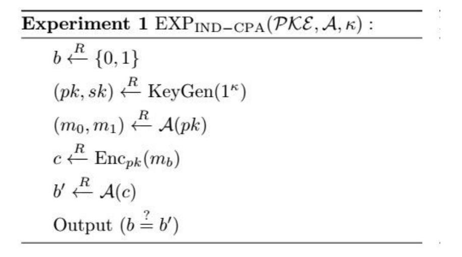

{0}------------------------------------------------

# A Generalization of Paillier's Public-Key System With Fast Decryption

### YING GUO1, ZHENFU CAO2 (MEMBER, IEEE), AND XIAOLEI DONG.2

Department of Computer Science and Engineering, Shanghai Jiao Tong University, Shanghai, 200240 China(e-mail: sjtuguoying@126.com)

2Shanghai Key Laboratory of Trustworthy Computing, East China Normal University, Shanghai, 200062, China(e-mail: zfcao@sei.ecnu.edu.cn)

Corresponding author: Zhenfu Cao(e-mail: zfcao@sei.ecnu.edu.cn).

\* ABSTRACT Paillier's scheme is a homomorphic public key encryption scheme which is widely used in practical. For instance, Paillier's scheme can be used in the data aggregation in smart grid. Damgård and Jurik generalized Paillier's scheme to reduce the ciphertext expansion factor. However, the decryption scheme of Damgård and Jurik's scheme is more complicated than Paillier's original scheme. In this paper, we propose a new generalization of Paillier's scheme and all the Paillier's schemes to our knowledge are special cases of our scheme. We propose a very simple decryption algorithm which is more efficient than other generalization algorithms. We prove that our generalized Paillier's scheme is IND-CPA secure. Our generalized Paillier's scheme can be used in smart grid instead of Paillier's scheme for higher flexibility.

INDEX TERMS Paillier's scheme, IND-CPA secure, discrete logarithm problem, ciphertext expansion factor

### I. INTRODUCTION

UBLIC key cryptosystem (PKC) is one of the most fundamental cryptographic primitives. In 1982, Goldwasser and Micali introduced probabilistic public key cryptosystem and proposed the first probabilistic public key cryptosystem [1], which is IND-CPA secure under the Quadratic Residuosity(QR) assumption. The message is encrypted bit by bit in Goldwasser and Micali's scheme, so the ciphertext expansion factor which is defined to be the length of ciphertext divided by the length of message is quite large. Paillier proposed a public key encryption scheme [2] in 1999. In Paillier's scheme, the message space is  $Z_n$  and the ciphertext space is  $Z_{n^2}^{*}$  where n = PQ is an RSA modulus. Paillier's scheme has low ciphertext expansion factor and it allows efficient encryption and decryption, so it is widely used in practical [3]–[5]. Paillier's scheme is IND-CPA secure under Decisional Composite Residuosity Assumption(DCRA).

Paillier's scheme is homomorphic, which means  $\operatorname{Enc}_{pk}(m_1)\operatorname{Enc}_{pk}(m_2) = \operatorname{Enc}_{pk}(m_1 + m_2)$  such that it is used in many applications [6]–[12]. For instance, Paillier's scheme can be used in the data aggregation in smart grid [9]-[12]. Users' data are encrypted by Paillier's scheme and the ciphertexts are sent to the gateway(GW). GM aggregates the encrypted data without decrypting them using homomorphic property and then sends the aggregated encrypted data to control center(CC). CC can decrypt the sum of all the users' data but it can not decrypt the data for a particular user. At the end of a period of time(e.g. a month), GM aggregates the encrypted data for each user and sends it to CC. CC can decrypt the sum of data for each user over the entire billing

cycle but it can not decrypt the data for a particular time. This guarantees the privacy of individual user.

There are several works researched on Paillier's scheme proposing some new schemes [13]–[19]. Damgård and Jurik [18] proposed a generalization of Paillier's scheme, replacing the message space  $Z_n$  by  $Z_{n^s}$  and the ciphertext space  $Z_{n^2}^*$ by  $Z_{n^{s+1}}^*$ . It contains Paillier's scheme as a special case by setting s = 1. The encryption scheme is the same as Paillier's scheme but the decryption scheme is more complicated. In decryption scheme, they use binomial expansion and mathematical induction to extract the message part by part. The number of multiplications for decryption is  $O(s\kappa + s^2)$  where  $\kappa$  is the security parameter. It is of a quadratic order of complexity in s. Damgård and Jurik's scheme is IND-CPA secure under DCRA, so it is as secure as Paillier's scheme. It reduces the expansion factor from 2 for Paillier's scheme to almost 1.

Low decryption efficiency is the main problem of Damgård and Jurik's scheme. In 2008, Obi, Ali and Stipidis proposed a new decryption method for this scheme [19]. The number of multiplications for decryption is  $O(s + \kappa)$ , so the decryption is of a complexity, linear in s. The decryption method is more efficient than Damgård and Jurik's scheme.

In this paper, we give a new generalisation of Paillier's scheme. In our scheme, we use  $N = P^a Q^b$  instead of  $N=P^aQ^a$  so that it is more general. The ciphertext space is  $Z_N^*$  and the message space is  $Z_k$ , where  $k = P^{a-1}Q^{b-1}$ . All the Paillier's schemes to our knowledge are special cases of our scheme. For example, Okamoto and Uchiyama's scheme [13] is a special case of our scheme by setting a = 2, b = 1.

1

{1}------------------------------------------------

Paillier's scheme [2] is a special case of our scheme using a = b = 2. Damgård and Jurik's scheme [18] is also a special case of our scheme with a = b = s + 1,  $s \ge 1$ . Notice that if  $a \neq b$ , we can not public k. It is because if we public k, then we can compute P and Q using k and N. We public l in this case, where l is the length of k. When we encrypt a message, we choose m, |m| < l to ensure that m < k. We public K instead of k in our scheme. If a = b, then K = k, else K = N. In our decryption scheme, we compute  $m \mod P^{a-1}$  and  $m \operatorname{mod} Q^{b-1}$  respectively, then we compute  $m \operatorname{mod} k$  using Chinese Remainder Theorem(CRT). The main idea of our decryption algorithm is transforming the ciphertext into a discrete logarithm problem in a special case which we can solve it effectively(see Theorem 1). Theorem 1 is the most impotent tool of our work and we give an efficient algorithm to solve the discrete logarithm problem in a special case. The number of multiplications for decryption of our scheme is  $O(\kappa)$  which is independent of a and b, so our decryption scheme is more efficient than Damgård and Jurik's scheme and Obi's scheme(see Table 1). We prove that our generalized Paillier's scheme is IND-CPA secure under k-subgroup assumption and our scheme is as secure as Paillier's scheme.

**TABLE 1.** Comparison of efficiency with equal security parameter  $\kappa$ 

| Scheme                                   | Damgård and Jurik's scheme | Obi's scheme | Our General Scheme |
|------------------------------------------|-------------------------------|-----------------|--------------------------|
| number of multiplications for decryption | $O(a\kappa + a^2)$            | $O(a+\kappa)$   | $O(\kappa)$              |

Our generalized Paillier's scheme is homomorphic so it can be used in smart grid instead of Paillier's scheme. Compared to Paillier's scheme, our generalized Paillier's scheme has higher flexibility. For instance, when we want to save the storage of the ciphertext, we can use  $N=P^2Q$  instead of  $N=P^2Q^2$ . When we want to reduce the expansion factor, we can use  $N=P^aQ^b$  with large a and b. Notice that our decryption scheme is as fast as Paillier's scheme even if we use large a and b. Our generalized Paillier's scheme provides us with more choices on parameters.

### **II. PRELIMINARIES**

**Notations.** Let's see some notations we used in this paper.  $\lfloor x \rfloor$  denotes the largest integer less than or equal to x and  $\langle x \rangle_N$  demotes  $x \bmod N$ . We denote by  $\varphi(N)$  Euler's totient function taken on N and by  $\operatorname{ord}_N(x)$  the order of x in the group  $Z_N^*$ . Assume A and B are two sets, we let the set  $A \backslash B = \{x | x \in A, x \not\in B\}$  and  $x \xleftarrow{R} A$  means randomly choose an element x from the set A. |x| denotes the length of thee binary string x and |A| denotes the number of elements of the set A.

A. PUBLIC KEY ENCRYPTION AND IND-CPA SECURITY A public key encryption scheme  $\mathcal{PKE}$  consists of the following three algorithms: **KeyGen**, **Enc** and **Dec**.

**KeyGen**( $1^{\kappa}$ ): The KeyGen algorithm takes the security parameter  $1^{\kappa}$  as input and outputs a public key pk and secret key sk.

 $\mathbf{Enc}_{pk}(m)$ : The encryption algorithm takes a message m from the message space M and a public key pk as input and outputs a ciphertext c.

 $\mathbf{Dec}_{sk}(c)$ : The decryption algorithm takes a ciphertext c and secret key sk as input, and outputs  $x \in M \cup \{\bot\}$ .

**Correctness:** For correctness, we require that for all security parameters  $\kappa$ ,  $(pk, sk) \stackrel{R}{\leftarrow} \text{KeyGen}(1^{\kappa})$  and messages  $m \in M$ ,  $\text{Dec}_{sk}(\text{Enc}_{pk}(m)) = m$ .

**Definition 1** (IND-CPA Security). A public key encryption scheme  $\mathcal{PKE} = (KeyGen, Enc, Dec)$  is said to be IND-CPA secure if for all security parameters  $\kappa$  and probabilistic polynomial time adversaries  $\mathcal{A}$ ,  $Adv_{\mathcal{A},\mathcal{PKE}}^{\mathrm{IND-CPA}}(\kappa)$  is negligible in  $\kappa$ .

$$Adv_{\mathcal{A},\mathcal{PKE}}^{\mathrm{IND-CPA}}(\kappa) = \left| \Pr[\mathrm{EXP_{IND-CPA}}(\mathcal{PKE},\mathcal{A},\kappa) = 1] - \frac{1}{2} \right|$$

is the advantage of  $\mathcal{A}$  and  $\mathrm{EXP_{IND-CPA}}(\mathcal{PKE},\mathcal{A},\kappa)$  is defined in Figure 1.

FIGURE 1. IND-CPA Security Experiment

#### B. PAILLIER'S SCHEME

We introduce Paillier's scheme and its security assumption in this section.

**KeyGen(1** $\kappa$ ): On input the security parameter  $\kappa$ , choose two large primes P,Q and compute  $N=P^2Q^2$  and k=PQ, where  $|P|=|Q|=\kappa$ . Randomly choose  $y\in Z_N^*$  such that k divides  $\operatorname{ord}_N(y)$ . Let  $\lambda=\operatorname{lcm}(P-1,Q-1)$ . The public key pk is (N,y,k), and the secret key sk is  $\kappa$ .

 $\operatorname{Enc}_{pk}(m)$ : On input the message  $m \in Z_k$ , randomly choose  $x \in Z_k^*$  and compute the ciphertext  $c = y^m x^k \operatorname{mod} N$ .

 $\mathbf{Dec}_{sk}(c)$ : On input the ciphertext  $c \in Z_N^*$ , compute  $m = \frac{L(c^{\lambda} \mod N)}{L(y^{\lambda} \mod N)} \mod k$ , where L(x) = (x-1)/k.

Paillier's scheme is IND-CPA secure under Decisional Composite Residuosity Assumption. DCRA is equivalent to (N,k) residuosity assumption, and (N,k) residuosity assumption is defined as follows.

{2}------------------------------------------------

**Definition 2** ((N,k)) Residuosity Assumption). Assume N and k are positive integers. We define  $R(N,k)=\{y|y=x^k \bmod N, x \in Z_N^*\}$  as the set of  $k^{\text{th}}$ -power residues modulo N. Let D(N,k,x) be a distinguisher to decide whether  $x \in R(N,k)$  or  $x \in Z_N^* \backslash R(N,k)$ . (N,k) residuosity assumption asserts that the function  $Adv_D(\kappa)$ , defined as the distance

$$|\Pr[D(N, k, x) = 1 | x \stackrel{R}{\leftarrow} Z_N^* \backslash R(N, k)] - \Pr[D(N, k, x) = 1 | x \stackrel{R}{\leftarrow} R(N, k)]|$$

is negligible in  $\kappa$  for any probabilistic polynomial time D.

### C. (C, Y, K, N) DISCRETE LOGARITHM PROBLEM

We give the definition of (c, y, k, N) discrete logarithm problem here and we show how to solve it in Section III. We also give two basic lemmas here, which can help us to prove Theorem 1. We believe that experts are familiar with Lemma 1, so we omit the proof. We just give a brief proof of Lemma 2.

**Definition 3** ((c, y, k, N)) discrete logarithm problem). Assume N is a positive integer, y is an element in  $Z_N^*$  of order k. (c, y, k, N) discrete logarithm problem is computing m from (c, y, N, k), where  $c \equiv y^m \mod N$ .

**Lemma 1.** If G is a cyclic group of order n, let  $S_d = \{x | x \in G, \operatorname{ord}(x) = d, d | n\}$ , then  $|S_d| = \varphi(d)$ .

**Lemma 2.** Assume  $N=p_1^{s_1}p_2^{s_2}\cdots p_t^{s_t}$  and  $k=p_1^{k_1}p_2^{k_2}\cdots p_t^{k_t}$ , where  $\forall 1\leqslant i,j\leqslant t,\ s_i\geqslant 1,\ 0\leqslant k_i< s_i,\ p_i$  are diffident odd primes and  $\gcd(p_i,p_j-1)=1$ . If  $x\in Z_N^*$  and  $\operatorname{ord}_N(x)=k$ , then  $\operatorname{ord}_{p_i^{s_i}}(x)=p_i^{k_i}$  where  $1\leqslant i\leqslant t$ .

*Proof.* Assume  $x \in Z_N^*$  and  $\operatorname{ord}_N(x) = k$ , then we have  $x^k \equiv 1 \mod N$  and we get the following equation.

$$x^k \equiv 1 \bmod p_i^{s_i}, \ 1 \leqslant i \leqslant t. \tag{1}$$

Let  $d_i = \operatorname{ord}_{p_i^{s_i}}(x)$ , then we have  $d_i$  divides k from

Equation (1). Let 
$$d_i = \prod_{i=1}^t p_i^{r_i}$$
 where  $0 \leqslant r_i \leqslant k_i$ . Since

the order of an element divides the order of the group, this implies immediately that  $d_i$  divides  $\varphi(p_i^{s_i})$ . Clearly,

$$\prod_{i=1}^{t} p_i^{r_i} | (p_i - 1) p_i^{s_i - 1}.$$

Since  $p_i$  is coprime to  $p_j$  and  $p_i$  is coprime to  $p_j-1$ , we can notice that  $d_i=p_i^{r_i}$ . Since  $x^{d_i}\equiv 1 \bmod p_i^{s_i}$ , then we have

$$x^{d_1 d_2 \cdots d_t} \equiv 1 \mod p_i^{s_i}$$
.

We claim that  $k_i$  is less than or equal to  $r_i$ , and it follows because  $\prod_{i=1}^t p_i^{k_i}$  divides  $\prod_{i=1}^t p_i^{r_i}$ . Since we define  $r_i$  to be less than or equal to  $k_i$ , then we prove that  $r_i = k_i$  and  $d_i = p_i^{k_i}$ .

#### III. OUR GENERALIZED PAILLIER'S SCHEME

Before we present our generalized Paillier's scheme, we give an efficient algorithm SDLP(c, y, k, N) to solve the (c, y, k, N) discrete logarithm problem in a special case. This algorithm is used in our decryption scheme. Then we propose our scheme and prove that it is IND-CPA secure under k-subgroup assumption.

## A. ALGORITHM FOR (C, Y, K, N) DISCRETE LOGARITHM PROBLEM

We introduce Theorem 1 to show how to solve a specific (c, y, k, N) discrete logarithm problem effectively. Now we give a lemma which is used in our proof of Theorem 1.

**Lemma 3.** If  $N = p^a$ ,  $k = p^b$ , where  $a \ge 2$ ,  $1 \le b \le \lfloor \frac{a}{2} \rfloor$  and p is an odd prime, then (c, y, k, N) discrete logarithm problem can be solved effectively.

*Proof.* Compute  $v = N/k = p^{a-b}$  and let

$$S = \{x | x \equiv 1 \bmod v, \ x \in Z_N^*\}.$$

Clearly, there are k elements in the set S. Let

$$S' = \{x | x^k \equiv 1 \mod N, x \in Z_N^*\}.$$

We want to prove that S = S'. Let

$$S_d = \{x | \text{ord}_N(x) = d, x \in Z_N^*, d|k\},\$$

so  $S' = \bigcup_{d|k} S_d$ . Due to Lemma 1, we see

$$|S'| = \sum_{d|k} |S_d| = \sum_{d|k} \varphi(d) = k.$$

For every element x in the set S, x can be written as tv+1, where t is an integer less than k. Since  $b \leq \lfloor \frac{a}{2} \rfloor$ , then  $k^2$  divides N and N divides  $v^2$ . By definition of x,

$$x^k = (tv+1)^k \equiv tvk + 1 \equiv 1 \operatorname{mod} N.$$
 (2)

We can notice that x is in the set S' from Equation (2). Then we prove that S = S'.

In (c, y, k, N) discrete logarithm problem, the order of y is k, so y is in the set S' and y is in the set S. We define the function L() by

$$L(x) = \frac{x-1}{v}, \ x \in S.$$

Assume y = tv + 1 and 0 < t < k, since

$$c = y^m \equiv mtv + 1 \bmod N,$$

then clearly we have

$$L(y) = t$$
,  $L(c) = mt \mod k$ .

Let  $q = \gcd(t, k)$  and we have

$$y^{\frac{k}{g}} = (tv+1)^{\frac{k}{g}} \equiv 1 \operatorname{mod} N. \tag{3}$$

{3}------------------------------------------------

Due to Equation (3), we see that the order of y divides  $\frac{k}{g}$ , i.e., k divides  $\frac{k}{g}$ . So the greatest common divisor of t and k is 1 and

$$m = \frac{L(c)}{L(y)} \bmod k.$$

**Theorem 1.** If 
$$N = \prod_{i=1}^{t} p_i^{s_i}, k = \prod_{i=1}^{t} p_i^{s_i-1}, \forall 1 \leqslant i, j \leqslant i$$

 $t, s_i \geqslant 1, k > 1, \gcd(p_i, p_j - 1) \stackrel{i=1}{=} 1, p_i$  are diffident odd primes, then (c, y, k, N) discrete logarithm problem can be solved effectively.

*Proof.* Since  $p_i$  are diffident odd primes, for all i from 1 to t and  $s_i > 1$ , if we can compute  $\langle m \rangle_{p_i^{s_i-1}}$ , then we can compute  $\langle m \rangle_k$  using Chinese Remainder Theorem(CRT). We now show how to compute  $\langle m \rangle_{p_i^{s_i-1}}$ . By definition,

$$c = y^m \bmod p_i^{s_i}. (4)$$

The order of y in the group  $Z_N^*$  is k and we proved that the order of y in the group  $Z_{p_i^{s_i}}^*$  is  $p_i^{s_i-1}$  in Lemme 2. Computing  $\langle m \rangle_{p_i^{s_i-1}}$  from Equation (4) is a  $(c \mod p_i^{s_i}, y, p_i^{s_i-1}, p_i^{s_i})$  discrete logarithm problem. Compute  $a = \lfloor \frac{s_i}{2} \rfloor$  and we can compute  $\langle m \rangle_{p_i^{s_i}-1}$  in two cases.

**Case 1:** If  $s_i = 2$ , then  $p_i^{2(s_i-1)}$  divides  $p_i^{s_i}$ , then we can compute  $\langle m \rangle_{p_i^{s_i-1}}$  directly using Lemma 3.

Case 2: If  $s_i > 2$ , then  $\langle m \rangle_{p_i^{s_i-1}}$  can be written as  $m_1 + m_2 p_i^a$ , where  $0 \leqslant m_1 < p_i^a$ ,  $0 \leqslant m_2 < p_i^{s_i-1-a}$ . Then we get the following equation

$$c^{p_i^{s_i-1-a}} \equiv (y^{p_i^{s_i-1-a}})^{m_1+m_2p_i^a} \equiv (y^{p_i^{s_i-1-a}})^{m_1} \bmod p_i^{s_i}.$$
 (5)

Since the order of y in the group  $Z_{p_i^{s_i}}^*$  is  $p_i^{s_i-1}$ , then the order of  $y^{p_i^{s_i-1-a}}$  in the group  $Z_{p_i^{s_i}}^*$  is  $p_i^a$ . Computing  $m_1$  from Equation (5) is a  $(c^{p_i^{s_i-1-a}} \mod p_i^{s_i}, y^{p_i^{s_i-1-a}}, p_i^a, p_i^{s_i})$  discrete logarithm problem. Since  $p_i^{2a}$  divides  $p_i^{s_i}$ , so we can compute  $m_1$  using Lemma 3. Due to Equation (4), we have

$$cy^{-m_1} \equiv (y^{p_i^a})^{m_2} \bmod p_i^{s_i}.$$
 (6)

We see the order of  $y^{p_i^a}$  in the group  $Z_{p_i^{s_i}}^*$  is  $p_i^{s_i-1-a}$ . Computing  $m_2$  from Equation (6) is a  $(cy^{-m_1} \bmod p_i^{s_i}, y^{p_i^a}, p_i^{s_i-1-a}, p_i^{s_i})$  discrete logarithm problem. Since  $p_i^{2(s_i-1-a)}$  divides  $p_i^{s_i}$ , so we can compute  $m_2$  using Lemma 3. Then we compute

$$\langle m \rangle_{p_i^{s_i-1}} = m_1 + m_2 p_i^a. \qquad \Box$$

This theorem leads to Algorithm 1 to solve the (c,y,k,N) discrete logarithm problem. In Algorithm 1,  $\operatorname{CRT}(m_1,p_1,m_2,p_2,\dots m_t,p_t)$  means computing  $\langle m \rangle_{p_1p_2\dots p_t}$ , such that  $m \equiv m_1 \bmod p_i$  for all i from 1 to t and  $p_i > 1$ . We use the this algorithm in our decryption scheme.

### **Algorithm 1** SDLP(c, y, k, N)

**Input:** Integer  $c \in \mathbb{Z}_N^*$ , base y, order k and modulus N, where  $\operatorname{ord}_N(y) =$  $k, N = \prod_{i=1}^{\tau} p_i^{s_i}, k = \prod_{i=1}^{\tau} p_i^{s_i-1}, \forall 1 \leqslant i, j \leqslant t, s_i \geqslant 1, k > 1$ 1,  $\gcd(p_i, p_j - 1) = 1$ ,  $p_i$  are diffident odd primes. **Output:**  $m \in Z_k$  such that  $c \equiv y^m (mod N)$ . 1: **for** *i* from 1 to *t* **do** if  $s_i = 1$  then 2:  $m_i = 0;$ 3: else if  $s_i = 2$  then 4:  $c_i \leftarrow c \operatorname{mod} p_i^2;$ 5:  $m_i \leftarrow \frac{(c_i-1)/p_i}{(y-1)/p_i} \bmod p_i;$ 6: 7: eise  $a \leftarrow \lfloor \frac{s_i}{2} \rfloor;$   $c_1 \leftarrow c^{p_i^{s_i-1-a}} \mod p_i^{s_i};$   $y_1 \leftarrow y^{p_i^{s_i-1-a}} \mod p_i^{s_i};$   $m_1 \leftarrow \frac{(c_i-1)/p_i^{s_i-a}}{(y_i-1)/p_i^{s_i-a}} \mod p_i^{a};$   $c_2 \leftarrow cy^{-m_1} \mod p_i^{s_i};$   $m_1 \leftarrow \frac{(c_i-1)/p_i^{s_i-a}}{(y_i-1)/p_i^{s_i-a}} \mod p_i^{s_i};$ 8: 9: 10: 11: 12:  $y_2 \leftarrow y^{p_i^a} \bmod p_i^{s_i}$ 13:  $m_{2} \leftarrow \frac{(c_{2}-1)/p_{i}^{a+1}}{(y_{2}-1)/p_{i}^{a+1}} \bmod p_{i}^{s_{i}-1-a};$   $m_{i} \leftarrow m_{1} + m_{2}p_{i}^{a};$ 14: 15: 16: end if 17: **end for** 18:  $m \leftarrow \text{CRT}(m_1, p_1^{s_1-1}, \dots m_t, p_i^{s_t-1});$ 19: Output *m*;

### B. OUR GENERALIZED PAILLIER'S SCHEME

We are now ready to describe our generalized Paillier's scheme. Our scheme consists of the following three algorithms: **KeyGen**, **Enc** and **Dec**.

KeyGen(1 $\kappa$ ): On input the security parameter  $\kappa$ , we choose two large primes P and Q such that  $|P| = |Q| = \kappa$ , and both P-1 and Q-1 contain at least one large prime factor. We also choose two natural numbers a and b such that  $a \ge 2$  or  $b \ge 2$ . Compute  $N = P^aQ^b$  and  $k = P^{a-1}Q^{b-1}$ . If a = b, we set K = k, otherwise we set K = N and k = k and k = k and k = k and k = k and k = k and k = k and k = k and k = k and k = k and k = k and k = k and k = k and k = k and k = k and k = k and k = k and k = k and k = k and k = k and k = k and k = k and k = k and k = k and k = k and k = k and k = k and k = k and k = k and k = k and k = k and k = k and k = k and k = k and k = k and k = k and k = k and k = k and k = k and k = k and k = k and k = k and k = k and k = k and k = k and k = k and k = k and k = k and k = k and k = k and k = k and k = k and k = k and k = k and k = k and k = k and k = k and k = k and k = k and k = k and k = k and k = k and k = k and k = k and k = k and k = k and k = k and k = k and k = k and k = k and k = k and k = k and k = k and k = k and k = k and k = k and k = k and k = k and k = k and k = k and k = k and k = k and k = k and k = k and k = k and k = k and k = k and k = k and k = k and k = k and k = k and k = k and k = k and k = k and k = k and k = k and k = k and k = k and k = k and k = k and k = k and k = k and k = k and k = k and k = k and k = k and k = k and k = k and k = k and k = k and k = k and k = k and k = k and k = k and k = k and k = k and k = k and k = k and k = k and k = k and k = k and k = k and k = k and k = k and k = k and k = k and k = k and k = k and k = k and k = k and k = k and k = k and k = k and k = k and k = k and k = k and k = k and k = k and k = k and k = k and k = k and

 $\mathbf{Enc}_{pk}(m)$ : If K = N, the message space  $M = \{0, 1\}^{l-1}$ , otherwise  $M = \{m \mid m < K\}$ . Compute the ciphertext  $c = y^m x^K \mod N, \ m \in M, \ x \in \mathbb{Z}_N^*$ .

 $\mathbf{Dec}_{sk}(c)$ : Compute  $c' = c^{\lambda} \mod N$  and  $y' = y^{\lambda} \mod N$ . Then we compute  $m = \mathrm{SDLP}(c', y', k, N)$ .

Correctness: Since  $c = y^m x^K \mod N$ , then

$$c^{\lambda} \equiv y^{m\lambda} x^{K\lambda} \bmod N. \tag{7}$$

We know that  $x^{K\lambda} \equiv 1 \mod N$ , then we can remove the random number x from Equation (7) and get the equation

$$c' \equiv y'^m \bmod N. \tag{8}$$

Since k divides  $\operatorname{ord}_N(y)$ , then we have  $\operatorname{ord}_N(y')$  is k. Thus Equation (8) is a (c', y', k, N) discrete logarithm prob-

{4}------------------------------------------------

lem and we can solve it using Algorithm 1. So  $m = \mathrm{SDLP}(c', y', k, N)$ .

# C. SECURITY OF OUR GENERALIZED PAILLIER'S SCHEME

In this section we define k-subgroup assumption and prove that k-subgroup assumption is equivalent to (N,k) residuosity assumption. Then we prove our scheme is IND-CPA secure under k-subgroup assumption. Paillier's scheme is IND-CPA secure under DCRA which is equivalent to (N,k) residuosity assumption, so our generalized Paillier's scheme is as secure as Paillier's scheme. We use k-subgroup assumption instead of (N,k) residuosity assumption because we can not public k when  $a \neq b$ . The relation  $P_2 \Rightarrow P_1$  (resp.  $P_1 \Leftrightarrow P_2$ ) denotes that the problem  $P_1$  is polynomially reducible (resp. equivalent) to the problem  $P_2$ .

**Definition 4** (k-subgroup Assumption). Let  $\mathcal{PKE} = (KeyGen, Enc,Dec)$  denotes our generalized Paillier's scheme. k-subgroup assumption asserts that  $Adv_{\mathcal{A},\mathcal{PKE}}^{k-\mathrm{subgroup}}(\kappa)$  is negligible in  $\kappa$  for all security parameters  $\kappa$  and probabilistic polynomial time adversaries  $\mathcal{A}$ , where

$$Adv_{\mathcal{A}, \mathcal{PKE}}^{k-\text{subgroup}(\kappa)} = \left| \Pr[\text{EXP}_{k-\text{subgroup}}(\mathcal{PKE}, \mathcal{A}, \kappa) = 1] - \frac{1}{2} \right|$$

is the advantage of A and  $EXP_{k-subgroup}(\mathcal{PKE}, A, \kappa)$  is defined in Figure 2.

Experiment 2 EXPk-subgroup( $\mathcal{PKE}, \mathcal{A}, \kappa$ ):  $b \overset{R}{\leftarrow} \{0,1\}$   $(pk, sk) \overset{R}{\leftarrow} \text{KeyGen}(1^{\kappa})$   $m_0 \leftarrow 0, m_1 \leftarrow 1$   $c \overset{R}{\leftarrow} \text{Enc}_{pk}(m_b)$   $b' \overset{R}{\leftarrow} \mathcal{A}(c)$ Output  $(b \overset{?}{=} b')$ 

FIGURE 2. k-subgroup Assumption Experiment

**Theorem 2.** k-subgroup assumption  $\Leftrightarrow (N, k)$  residuosity assumption.

*Proof.* (1) k-subgroup assumption  $\Rightarrow$  (N,k) residuosity assumption.

Let D be a distinguisher that can tell apart R(N,k) and  $Z_N^* \backslash R(N,k)$  with non-negligible advantage  $\varepsilon$ . We show that D implies a k-subgroup distinguisher D' with advantage  $\varepsilon$ .

D' takes (pk,c) as input. Its task is to decide whether  $c \in \operatorname{Enc}_{pk}(0)$  or  $c \in \operatorname{Enc}_{pk}(1)$ . D' feeds D with (N,c). D gets (N,c) and decides whether  $c \in R(N,k)$  or  $c \in Z_N^* \backslash R(N,k)$ . When the distinguisher D halts, D' outputs whatever D outputs. If  $c \in \operatorname{Enc}_{pk}(0)$ , then  $c \in R(N,k)$ . If  $c \in \operatorname{Enc}_{pk}(1)$ , then  $c \in Z_N^* \backslash R(N,k)$ . Clearly, we have

$$Adv_{D'}(\kappa) \geqslant Adv_D(\kappa) = \varepsilon.$$

It contradicts with k-subgroup assumption. Therefore,

k-subgroup assumption  $\Rightarrow (N, k)$  residuosity assumption.

(2) (N,k) residuosity assumption  $\Rightarrow k$ -subgroup assumption.

Let D be a distinguisher that can tell apart  $\operatorname{Enc}_{pk}(0)$  and  $\operatorname{Enc}_{pk}(1)$  with non-negligible advantage  $\varepsilon$ . We show that D implies a (N,k) residuosity distinguisher D' with advantage  $\varepsilon$ .

D' takes (N,x) as input. Its task is to decide whether  $x \in R(N,k)$  or  $x \in Z_N^* \backslash R(N,k)$ . D' takes the role of challenger in the k-subgroup assumption experiment of D. D feeds D' with pk = (N,y,l,K) and D' randomly chooses a bit  $b \in \{0,1\}$  and computes a challenge ciphertext  $c = y^b x^r \mod N$ ,  $r \xleftarrow{R} Z_N$ . D' feeds D with c. D needs to decide whether  $c \in \operatorname{Enc}_{pk}(0)$  or  $c \in \operatorname{Enc}_{pk}(1)$ . When the distinguisher D halts, D' outputs whatever D outputs. If  $x \in R(N,k)$ ,  $c \in \operatorname{Enc}_{pk}(b)$ . If  $x \in Z_N^* \backslash R(N,k)$ ,  $Adv_D(\kappa) = 0$ . Clearly, we see

$$Adv_{D'}(\kappa) \geqslant Adv_D(\kappa) = \varepsilon.$$

It contradicts with (N,k) residuosity assumption. Therefore, (N,k) residuosity assumption  $\Rightarrow k$ -subgroup assumption.

Then we prove that k-subgroup assumption is equivalent to (N, k) residuosity assumption.

**Theorem 3.** Our generalized Paillier's scheme is IND-CPA secure under k-subgroup assumption.

Proof. Let D be a k-subgroup distinguisher. D takes (pk,c) as input and its task is to decide whether  $c \in \operatorname{Enc}_{pk}(0)$  or  $c \in \operatorname{Enc}_{pk}(1)$ . Let  $\mathcal{A}$  is a PPT IND-CPA adversary for our generalized Paillier's scheme. D takes the role of the challenger of IND-CPA game for our scheme. D receives  $m_0$  and  $m_1$  from  $\mathcal{A}$  and computes  $c_1 = c^{m_1 - m_0} \operatorname{mod} N$ ,  $c_2 = c_1 y^{m_0} \operatorname{mod} N$ ,  $c_3 = c_2 x^K \operatorname{mod} N$ ,  $x \in \mathbb{Z}_N^*$ . D feeds  $\mathcal{A}$  with  $c_3$  and gets the output b of  $\mathcal{A}$ . D outputs b. If  $c \in \operatorname{Enc}_{pk}(0)$ ,  $c_3 \in \operatorname{Enc}_{pk}(m_0)$ . If  $c \in \operatorname{Enc}_{pk}(1)$ ,  $c_3 \in \operatorname{Enc}_{pk}(m_1)$ .

Assume that our generalized Paillier's scheme is not IND-CPA secure, i.e.,  $\mathcal{A}$  can distinguish  $\operatorname{Enc}_{pk}(m_0)$  and  $\operatorname{Enc}_{pk}(m_1)$  with non-negligible advantage  $\varepsilon$ . Then D can distinguish  $\operatorname{Enc}_{pk}(0)$  and  $\operatorname{Enc}_{pk}(1)$  with advantage  $\varepsilon$ , which contradicts with k-subgroup assumption. So we prove that our generalized Paillier's scheme is IND-CPA secure under k-subgroup assumption.

### **IV. CONCLUSIONS**

In this paper, we propose a generalization of Paillier's scheme and all the Paillier's schemes to our knowledge are special cases of our scheme. In our scheme,  $N=P^aQ^b$  and  $k=P^{a-1}Q^{b-1}$ , so the ciphertext expansion  $r=\frac{a+b}{a+b-2}$  which is smaller than Paillier's scheme when a>2 and b>2. The number of multiplications for decryption of Damgård and Jurik's scheme, Obi's scheme and our scheme are  $O(a\kappa+a^2)$ ,  $O(a+\kappa)$  and  $O(\kappa)$  respectively, where

{5}------------------------------------------------

κ is the security parameter. The speed of our decryption algorithm is independent of a, so our decryption scheme is more efficient than other generalization algorithms. Our generalized Paillier's scheme is IND-CPA secure under ksubgroup assumption and it is as secure as Paillier's scheme. Our generalized Paillier's scheme can be used in the data aggregation in smart grid for its homomorphic property. Compared to Paillier's scheme, our generalized Paillier's scheme provides us with more choices on parameters.

### **REFERENCES**

- [1] S.Goldwasser and S.Micali, "Probabilistic Encryption," *Journal of Computer System Science*, vol.28, no.2, pp.270-299, 1984.
- [2] P.Paillier, "Public-key cryptosystems based on composite degree residuosity classes," *Proceedings of EuroCrypt 99, Springer Verlag LNCS series*, vol.1592, pp.223–238, 1999.
- [3] T.Onodera and K.Tanaka, "Shufle for Paillier's Encryption Scheme," *Ieice Transactions on Fundamentals of Electronics Communications Computer Sciences*, vol.E84-A, no.5, pp.1234-1243, 2005.
- [4] P.Y.A. Ryan, "Prêt à Voter with Paillier encryption," *Mathematical Computer Modelling*, vol.48, no.9-10, pp.1646-1662, 2008.
- [5] P.Y.Ting and C.H.Hseu, "A secure threshold Paillier proxy signature scheme," *Journal of Zhejiang University-Science C(Computer Electronics)*, no.03, pp.206-213, 2010.
- [6] Z.Chen, M.Du, Y.Yang et al., "Homomorphic Cloud Computing Scheme Based on RSA and Paillier," *Computer Engineering*, vol.39, no.7, pp.35- 39, 2013.
- [7] D.Catalano, A.Marcedone, O.Puglisi, "Authenticating Computation on Groups: New Homomorphic Primitives and Applications," *ASIACRYPT 2014*, pp.193-212, 2014.
- [8] Y.Li, H.Li, G.Xu et al., "EPPS: Efficient Privacy-Preserving Scheme in Distributed Deep Learning," *IEEE Global Communications Conference (GLOBECOM)*, 2020.
- [9] R.Lu, X.Liang, X.Li et al., "EPPA: An Efficient and Privacy-Preserving Aggregation Scheme for Secure Smart Grid Communications," *IEEE Transactions on Parallel Distributed Systems*, vol.23, no.9, pp.621-1631, 2012.
- [10] F.Borges and M.Muhlhauser, "EPPP4SMS: Efficient Privacy-Preserving Protocol for Smart Metering Systems and Its Simulation Using Real-World Data," *IEEE Transactions on Smart Grid*, vol.5, no.6, pp.701-2708, 2014.
- [11] M.A.Mustafa, N.Zhang, G.Kalogridis et al., "A Decentralized Efficient Privacy-Preserving and Selective Aggregation Scheme in Advanced Metering Infrastructure," *IEEE Access*, vol.3, pp.2828-2846, 2016.
- [12] Z.Guan, Y.Zhang, L.Zhu et al., "EFFECT:an efficient flexible privacypreserving data aggregation scheme with authentication in smart grid,". *SCIENCE CHINA Information Sciences*, vol.62, no.003, pp.27-40, 2019.
- [13] T.Okamoto and S.Uchiyama, "A new public-key cryptosystem as secure as factoring," *Technical Report of Ice Isec*, vol.97, no.4, pp.308-318, 1998.
- [14] K.SchmidtSamoa and T.Takagi, "Paillier's Cryptosystem Modulo p 2q and its Applications to Trapdoor Commitment Scheme," *Lecture Notes in Computer Science*, vol.14, no.7, pp.699-703, 2001.
- [15] D.Catalano, R.Gennaro, N.Howgrave-Graham et al., "Paillier's cryptosystem revisited," *Proc.8th ACM Conf.Computer and Communications Security*, pp.206-214, 2001.
- [16] Z.Cao and L.Liu, "The Paillier's Cryptosystem and Some Variants Revisited," *International Journal of Network Security*, vol.19, no.1, pp.89-96, 2017.
- [17] I.Damg˚ard, M.Jurik, J.B.Nielsen, "A generalization of Paillier's publickey system with applications to electronic voting," *International Journal of Information Security*, vol.9, no.6, pp.371-385, 2003.
- [18] B.Ivan, Damg˚ard, M.Jurik, "A Generalisation, a Simplification and Some Applications of Paillier's Probabilistic Public-Key System," *Lecture Notes in Computer Science*, vol.7, no.45, 2001.
- [19] O.O.Obi, F.H.Ali, E.Stipidis, "Explicit expression for decryption in a generalisation of the Paillier scheme," *Iet Information Security*, vol.1, no.4, pp.163-166, 2008.