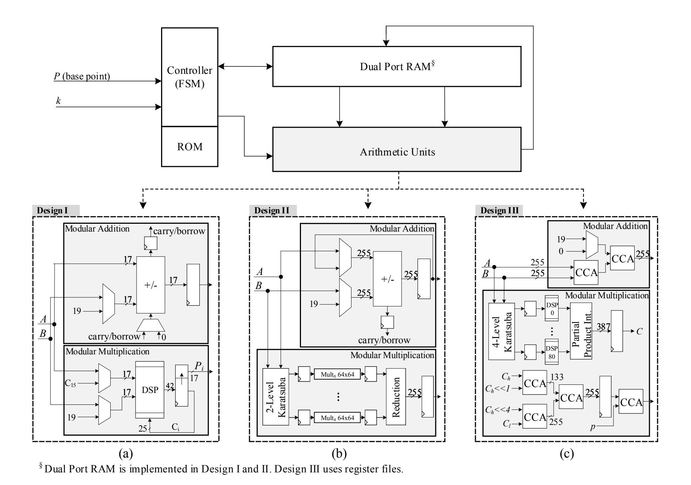
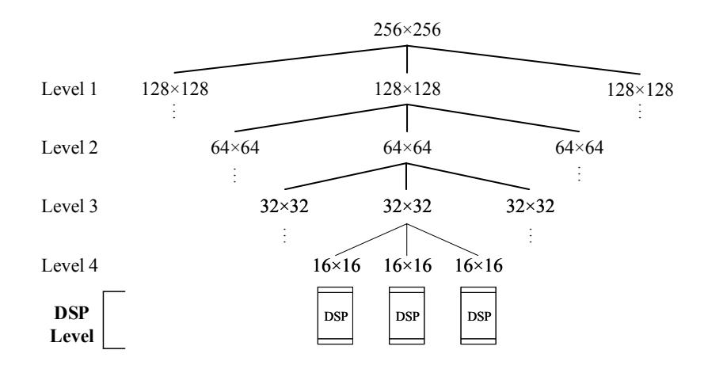
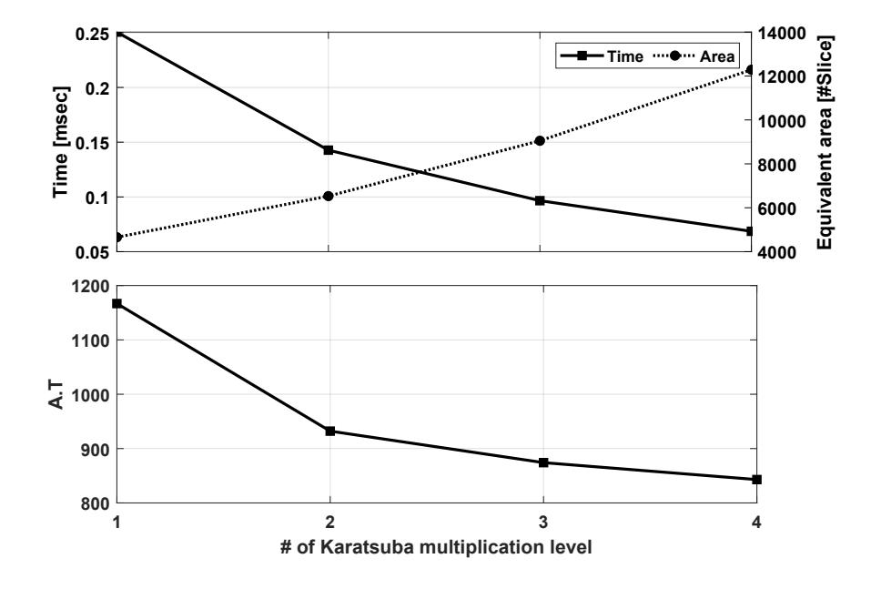
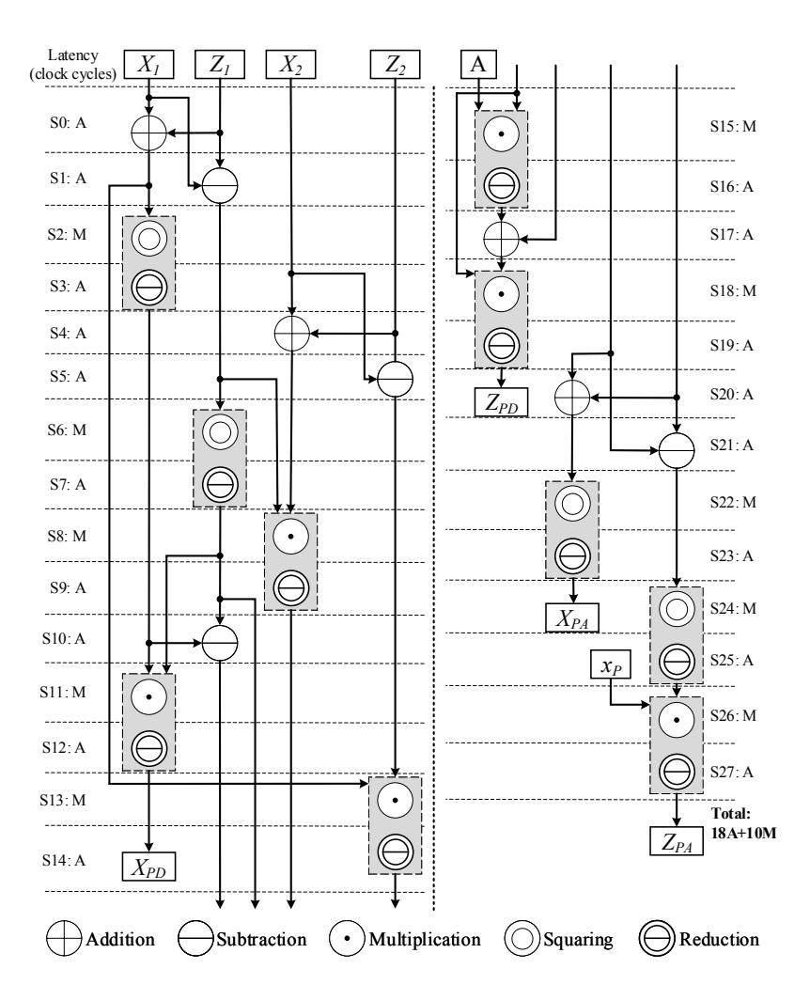
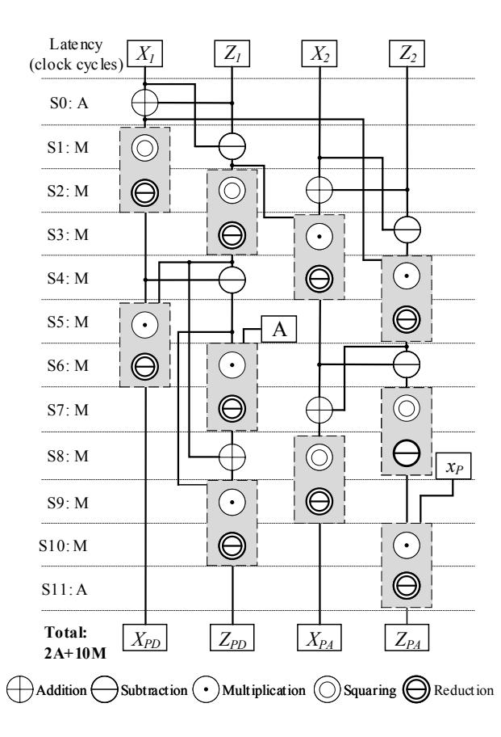
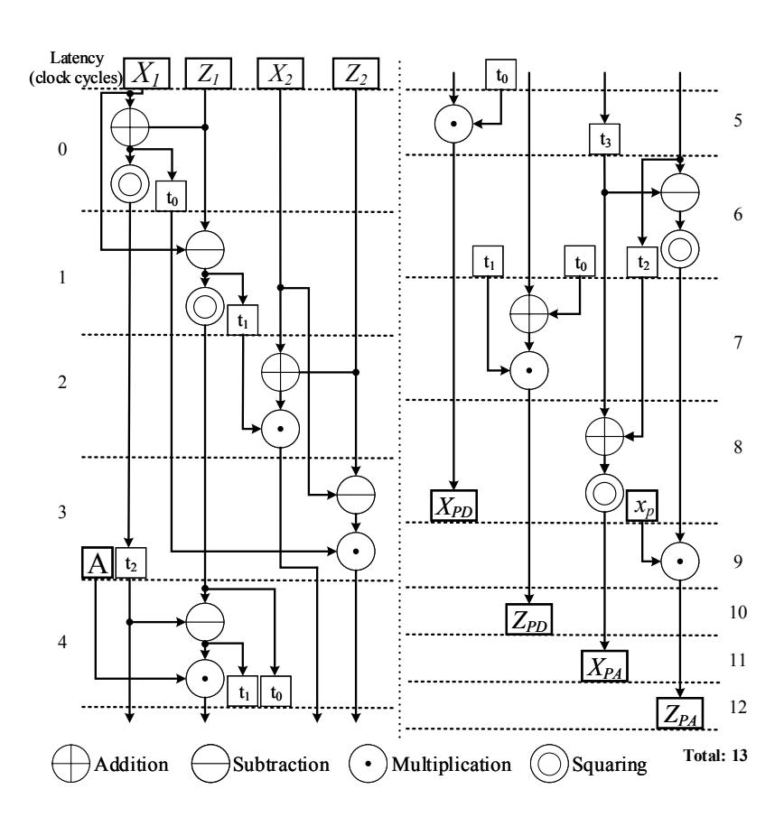
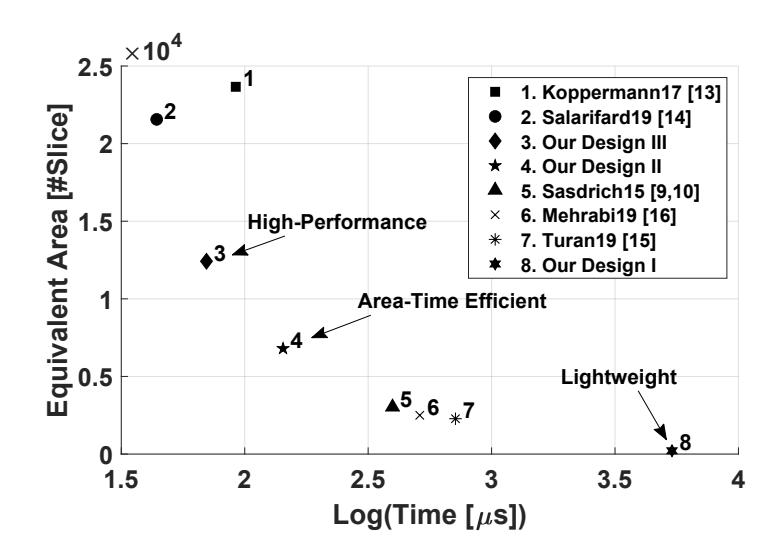

{0}------------------------------------------------

# Fast, Small, and Area-Time Efficient Architectures for Key-Exchange on Curve25519

Mojtaba Bisheh Niasar

Rami El Khatib

Reza Azarderakhsh

Mehran Mozaffari-Kermani

CEECS Department *Florida Atlantic University* Boca Raton, FL mbishehniasa2019@fau.edu

CEECS Department *Florida Atlantic University* Boca Raton, FL relkhatib2015@fau.edu

CEECS Department *Florida Atlantic University* Boca Raton, FL razarderakhsh@fau.edu

Dept. of CSE. *University of South Florida* Tampa, FL mehran2@usf.edu

*Abstract*—This paper demonstrates fast and compact implementations of Elliptic Curve Cryptography (ECC) for efficient key agreement over *Curve25519*. *Curve25519* has been recently adopted as a key exchange method for several applications and included in the National Institute of Standards and Technology (NIST) recommendations for public key cryptography. This paper presents three different performance level designs including lightweight, area-time efficient, and high-performance architectures. Lightweight hardware implementations are used for several Internet of Things (IoT) applications due to their resources being at premium. Our lightweight architecture utilizes 90% less resources compared to the best previous work while it is still more optimized in term of A · T (area×time). For efficient implementation from either time or utilized resources, our area-time efficient architecture can establish almost 7,000 key sessions per second which is 64% faster than the previous works. The area-time efficient architecture uses well scheduled interleaved multiplication combined with a reduction algorithm. Additionally, we offer a fast architecture for high performance applications based on the 4-level Karatsuba method and Carry-Compact Addition (CCA). Our high-performance architecture also outperforms previous work in terms of A · T. The results show 9% and 29% improvement in A · T and A<sup>d</sup> · T (DSP\_count×time), respectively. All architectures are variablebase-point implemented on the Xilinx Zynq-7020 FPGA family where performance and implementation metrics are reported and compared. Finally, various side-channel attack countermeasures are embedded in the proposed architectures.

*Index Terms*—Curve25519, elliptic curve Diffie-Hellman (ECDH), field-programmable gate array (FPGA), point multiplication.

# I. INTRODUCTION

Since the initial recommendation and standardization of Elliptic Curve Cryptography (ECC) in [1], [2] and [3], there has been significant progress towards security and performance of computations in various levels of elliptic curves including finite field arithmetic, curve level arithmetic, and protocol level computations [4]. Due to a concern from the community regarding the generation of potential weaknesses of the original curves defined and recommended by National Institute of Standards and Technology (NIST) in [1], organizations shifted their attention to a newly developed family of elliptic curves based on Montgomery curves (mainly *Curve25519*) with some attractive properties [5]. Recently, *Curve25519* became the most popular scheme for elliptic curve Diffie-Hellman (ECDH) Key-Exchange which in late 2019 has been recently recommended by IETF RFC 7748 [6], RFC 8032 [7], and NIST 800-186 [8]. *Curve25519* is a 255-bit elliptic curve offering approximately 128-bit classical security. In comparison to the older versions of NIST recommended curves for ECDH for prime fields, *Curve25519* is the obvious winner as it is fast and secure with uniform computations, and no weaknesses known as of today. *Curve25519* has been employed in for several applications with software implementations and integration with SSL/TLS libraries. However, its usage in hardware and small device applications is not widely spread yet. For instance, Microchip Inc. recently developed an IoT device with ECC-based authentication and key exchange schemes over Google cloud based on NIST-P256 curve which originally was recommended by NIST back in 1999 [1]. In comparison to NIST-P256, *Curve25519* is smaller and faster and even more secure against known side-channel attacks including timing and cache attacks. Microsoft recently introduced their first IoT device called Azure Sphere which does not include *Curve25519* for public key cryptography. One reason could be the fact that due to interoperability, *Curve25519* was not included in early NIST recommendation and governments sectors were not allowed to use it. The other factor could be related to the migration to a new elliptic curve which takes several years to happen.

In this paper, we would like to investigate the performance of *Curve25519* in hardware for various performance levels so that IoT and embedded device manufacturing companies could adopt *Curve25519* as the mainstream for key exchange mechanism. More specifically three different architectures are provided to address wide range of applications including: (i) implementations on low-end devices with small foot prints, (ii) implementations on medium-end devices with silicon area and speed trade-offs, and (iii) implementations on high-end devices with fast computations. We prototype our implementations on Xilinx FPGAs and report computation times and occupied silicon areas for comparison to the prior work available in the literature. Our implementations for all mentioned three performance level implementations outperform the counterparts available in the open literature.

{1}------------------------------------------------

Prior work: The first hardware implementation of *Curve25519* appeared in [9] by Sasdrich and Güneysu which performs the point multiplication in 397 µs and operates in 200 MHz. The focus in this work is on lightweight applications. Same authors in [10] added sidechannel resistance in their earlier design to provide security against physical attacks. Moreover, more improvement in architecture security is done in [11] with adequate assessment from leakage point of view. In [12], [13], Kopperman *et al.* proposed high performance implementations and the reported total time for point multiplication on *Curve25519* is 92 µs operating at 115 MHz. Salarifard *et al.* [14], also presented an optimized version targeting high performance applications which is considered as the fastest design with 44 µs computation time operating at 87 MHz. Turan *et al.* [15] proposed lightweight design with the total time of 714 µs at 105 MHz. Mehrabi and Doche [16] presented an optimized lightweight architecture which does not employ any DSPs and operates in 137.5 MHz with total time of 512 µs.

The main contributions of this paper are summarized below:

- We propose three different hardware architectures for three performance levels of computing point multiplication over *Curve25519.*
- Efficient scheduling mechanism are proposed to compute one step of Montgomery ladder which improves the achieved time and area in comparison with those presented in previous.
- We develop optimized field arithmetic unit for both addition and multiplication. Our adder is based on Carry-Compact Addition (CCA) which allows choosing different parameters for area-time efficiency. Also, we investigated four different levels of Karatsuba multiplication for fast implementations of field multiplication.
- Our proposed architectures are implemented on a Xilinx FPGA family and show that our results outperform the counterparts available in the literature.

The rest of the paper is organized as follows. In Section II, we discuss the preliminaries of ECC based on *Curve25519*. In Section III, our proposed algorithms and architectures are discussed. In Section IV, details of FPGA implementations are provided. We discuss our results and compare to the counterparts in Section V. Finally, we conclude the paper in Section VI.

## II. PRELIMINARIES

In this section, some relevant mathematical background are provided. Then, side-channel analysis attack protection will be described.

*A. Field Arithmetic and ECDH Key Exchange*

The elements of Galois Field GF(p) are defined as {0, 1, . . . , p − 1} which is a finite field. *Curve25519* over GF(p) is defined by E : y <sup>2</sup> = (x <sup>3</sup> + 48666x <sup>2</sup> + x) mod p where p = 2<sup>255</sup> − 19.

*Curve25519* can be used for accelerating ECDH Key-Exchange *X25519* [17] and provides efficient modular arithmetic operations including modular addition, subtraction, multiplication and inversion over GF(p) using pseudo Mersenne prime reduction algorithm [18]. According to Fermat's Little Theorem (FLT), modular inversion over GF(p) is computed by a <sup>−</sup><sup>1</sup> ≡ a p−2 . In [5], authors proposed an addition chain method using 254 squarings and 11 multiplications to compute a p−2 .

ECDH key exchange protocol computes a shared secret key over *Curve25519* between two parties using a set of public parameters. Hence, they can communicate securely by generated shared secret key, through, for instance, the current symmetric-key cryptography standard, i.e., Advanced Encryption Standard (AES).

## *B. Scalar Multiplication and Montgomery Ladder*

Scalar multiplication Q = k · P is computed efficiently for public base point P ∈ E and secret key k employing Montgomery ladder point multiplication algorithm.

In order to achieve efficient and resistant implementations of point addition (PA) and point doubling (PD) the Montgomery ladder, introduced by Peter L. Montgomery [19], is implemented. In each iteration of Montgomery ladder point multiplication shown in Algorithm 1, one PA and one PD are performed in constant execution time. This algorithm needs only x-coordinate of base point P to compute k·P. Therefore, y-coordinate can be eliminated during computations when performed in projective coordinates. In the first stage of this algorithm, a map from affine to projective coordinates is executed such that (xp, yp) = (X/Z, Y /Z). Suppose P = (x<sup>P</sup> , y<sup>P</sup> ) is given as the base point. Then, (1) to (4) describe PA and PD in each iteration of Montgomery ladder where P<sup>1</sup> = (X1, Z1) and P<sup>2</sup> = (X2, Z2):

$$X_{PD} = (X_1 - Z_1)^2 (X_1 + Z_1)^2$$
 (1)

$$Z_{PD} = X_1 Z_1 (X_1^2 + 121666 X_1 Z_1 + Z_1^2)$$
 (2)

$$X_{PA} = 4(X_1 X_2 - Z_1 Z_2)^2 (3)$$

$$Z_{PA} = 4x_p(X_1Z_2 - Z_1X_2)^2 (4)$$

Operations in Montgomery ladder require field addition, subtraction and multiplication. After all Montgomery ladder iterations are done, field inversion is computed via FLT to map from projective to affine coordinates in the last stage.

# *C. Side-Channel Protection*

Several considerations should be taken into account for protecting cryptographic implementations against side-channel analysis attacks (SCA). Using Montgomery ladder algorithm makes the scalar multiplication resistant against timing and simple power analysis attacks (SPA). Furthermore, authors in [20] introduced some countermeasures in order to implement resistant architectures against differential power analysis attacks (DPA). These approaches including point randomization, scalar blinding and memory address scrambling are implemented in research works presented in [10], [11].

• In point randomization, the base point P = (X, Z) at the beginning of Montgomery ladder algorithm is projected by using a random value λ ∈ Z<sup>2</sup> <sup>255</sup> \ {0} such that P<sup>r</sup> = (λ · X, λ · Z). However, the scalar multiplication output

{2}------------------------------------------------

#### **Algorithm 1** Montgomery Ladder Point Multiplication [19]

```
Input: x_P s.t. P = (x_P, y_P) and scalar k = (k_{254}, k_{253}, \dots, k_0)_2
Output: x_Q s.t. Q = k.P = (x_Q, y_Q)
1: X_1 \leftarrow x_p, Z_1 \leftarrow 1, X_2 \leftarrow 1, Z_2 \leftarrow 0, X_{1-2} \leftarrow x_p
2: for i=254 downto 0 do
3: if k_i = 1 then
      (X_1, X_2) \leftarrow (X_2, X_1)
4:
      (Z_1, Z_2) \leftarrow (Z_2, Z_1)
5:
6: end if
7: T_1 \leftarrow X_1 + Z_1
8: T_2 \leftarrow X_1 - Z_1
9: T_3 \leftarrow X_2 + Z_2
10: T_4 \leftarrow X_2 - Z_2
11: T_5 \leftarrow T_1 \times T_1
12: T_6 \leftarrow T_2 \times T_2
13: T_7 \leftarrow T_2 \times T_3
14: T_8 \leftarrow T_1 \times T_4
15: T_9 \leftarrow T_5 \times T_6
16: T_{10} \leftarrow T_6 - T_5
17: T_{11} \leftarrow T_7 + T_8
18: T_{12} \leftarrow T_7 - T_8
19: T_{13} \leftarrow T_{10} \times 121666
20: T_{14} \leftarrow T_{11} \times T_{11}
21: T_{15} \leftarrow T_{12} \times T_{12}
22: T_{16} \leftarrow T_6 + T_{13}
23: T_{17} \leftarrow T_{16} \times T_{10}
24: T_{18} \leftarrow T_{15} \times X_{1-2}
25: (X_1, Z_1) \leftarrow (T_9, T_{17}), (X_2, Z_2) \leftarrow (T_{14}, T_{18})
26: end for
27: Z_1 \leftarrow Z_1^{-1}
28: x_Q \leftarrow X_1 \times Z_1
29: return x_Q
```

is not changed due to the fact that  $x_p = \frac{X}{Z} = \frac{\lambda \cdot X}{\lambda \cdot Z} \mod p$ .

- Scalar blinding changes the second term in scalar multiplication which is the secret key k. Multiple of group order #E can be added to k in order to provide data dependency between swap function in Montgomery ladder and corresponding bit in k. Let r be a random value, blinded scalar is computed by  $k_r = k + r \times \#E$ .
- Memory address scrambling prevents data leakage based on accessing specific location in memory. If memory addresses are revealed for attackers in each execution, key bits will be known. Therefore, memory addresses should be generated randomly in each execution. This feature can be achieved using a linear feedback shift register (LFSR) for generating a random address and a random value as a seed for the LFSR.

#### III. PROPOSED ALGORITHM AND ARCHITECTURE

In this section, three different architectures are proposed for different performance levels including lightweight, area-time efficient, and high-performance designs.

#### A. Design I: Lightweight Architecture

Fig. 1 shows the top level architecture for our proposed lightweight point multiplication scheme. It consists of Controller, ROM, Dual Port RAM and Arithmetic Unit. Arithmetic unit consists of Modular Addition and Modular Multiplication illustrated in Fig. 1-(a). In this architecture, a controller is

connected to modular arithmetic units. On the other hand, controller has an interface with ROM which gives the instruction code for each cycle. During each cycle, controller sets required addresses for arithmetic units considering corresponding bit of chosen scalar k and the instruction code.

ROM size is  $560 \times 15$ -bit implemented by a 18Kb Block-RAM. ROM includes control commands and three data addresses for arithmetic units. Furthermore, a RAM is considered for decreasing resources as much as possible in order to save intermediate data. A 255-bit data is stored by  $15 \times 17$ -bit words in RAM. Thus, all computations are performed sequentially and work with 17-bit data in each iteration due to the DSP block input size.

- 1) Modular Addition/Subtraction: Addition/Subtraction is computed between two 17-bit numbers in each iteration while the carry/borrow is propagated to the next digit. Although loading inputs and storing the results from/to RAM take some iterations, the architecture is designed carefully in parallel to compute in 30 iterations. In the last iteration, the carry/borrow is reported to controller to set a flag. After computing addition/subtraction, reduction computation is performed in constant time. This computation needs adding/subtracting the previous result with 19 which takes another 30 iterations to store in another address. Finally, the mentioned flag indicates RAM address for the correct result.
- 2) Modular Multiplication: Modular multiplication is designed based on product scanning approach. According to this method, 15 multiplications are performed for each 17-bit product digit. Product scanning approach is completely explained in [15] utilizing 15 parallel DSPs. In the lightweight architecture, only 1 DSP unit is implemented which performs multiplications sequentially. Computation for each product digit can have maximum 42 bits, so 25 bits should be propagated to next digit as carry. It can be shown by  $C_{i+1} \times 2^{17} + P_i$ , where  $C_i$  and  $P_i$  are carry and product digits in  $i^{th}$  iteration, respectively. However,  $C_{15}$  should be considered for reduction.

The most efficient reduction method for Curve25519 is pseudo Mersenne prime algorithm. In this method, modulo  $p=2^{255}-19$  is computed by the product of  $19\times C_{15}$ . After computing  $19\times C_{15}$ , we cascade a modular multiplication with modular addition to perform the reduction stage. Eventually, performing a modular addition between  $19\times C_{15}$  and  $P_{14}\times 2^{14\times 17}+\ldots+P_0$  leads to modular multiplication result.

#### B. Design II: Area-Time Efficient Architecture

The presented area-time efficient architecture considers a trade-off between recourse utilization and required time in comparison with fast and small architectures. In this architecture shown in Fig. 1-(b), modular multiplication is implemented by 2-level Karatsuba multiplication. One of the most important features for efficient architecture is utilization ratio determined by:

$$Utilization Ratio \% = \frac{Utilization Time}{Total Time} \times 100$$
 (5)

{3}------------------------------------------------



Figure 1. The proposed architectures for different performance levels: Top level architecture: (a) The arithmetic units architecture in the proposed lightweight design, (b) The arithmetic units architecture in the proposed area-time efficient design, and (c) The arithmetic units architecture in the proposed high-performance design.

In the area-time efficient architecture, we maximize utilization ratio for arithmetic units by concurrent computations and pipelined multiplications.

- 1) Modular Addition/Subtraction: This unit is implemented by two addition/subtraction operations. The first operation computes  $C = A \pm B$  in one cycle and sets carry/borrow flag. The second operation takes the value C and computes  $C' = C \pm 19$  during next cycle. The carry/borrow flag determines the correct output between C and C' which should be stored into RAM. Therefore, modular addition/subtraction can be performed in 4 cycles including computations and RAM communication. Modular addition/subtraction is performed in parallel with modular multiplication. Thus, its latency is absorbed by multiplication cycles to increase utilization ratio.
- 2) Modular Multiplication: Multiplication is executed by combination of Karatsuba and combo methods. Centerpiece of the multiplication unit is 64-bit by 64-bit combo multiplier using 4 DSP components. To improve the delay of combo multiplier, the first and last embedded pipeline stages of DSP are used. 2-level Karatsuba multiplications are applied on 255-bit inputs to convert them to 9 partial multiplications. Then, partial multiplications are computed in parallel by combo multipliers in 8 cycles. In order to design high-throughput schemes, multiplication and reduction stages are interleaved employing pipeline architecture. Thus, modular multiplication

latency is only 8 cycles after the first multiplication.

#### C. Design III: High-Performance Architecture

The most important component of arithmetic unit is modular multiplication. This unit is performed in both Montgomery ladder and FLT computations, and its performance roughly determines that of the entire architecture. It consists of a multiplication algorithm followed by a reduction stage. There are several multiplication algorithms which can be considered for the area or time optimization (e.g., Schoolbook or Toom-3 methods). For ECC computation over prime field, Karatsuba multiplication [21] has suitable efficiency in comparison with other methods [12], [22].

Different levels of Karatsuba can be applied on 256-bit by 256-bit multiplication shown in Fig. 2. Using more than 4-level Karatsuba reduces utilization of DSP resources due to DSP specifications which takes 25-bit by 18-bit signed numbers as inputs. Therefore, 1 to 4 levels of Karatsuba are considered for modular multiplication. Although increasing the levels of Karatsuba reduces required latency for multiplication, it expands addition tree which limits maximum operation frequency and raises area utilization. As a result, we should consider the compromise between latency, frequency and resource utilization. Fig. 3 presents total required time, resource utilization and  $A \cdot T$  (area×time) to compute a point multiplication based on different applied levels of Karatsuba

{4}------------------------------------------------



Figure 2. Karatsuba multiplication breakdown for 256-bit by 256-bit multiplication.



Figure 3. Different levels of Karatsuba multiplication performance: (a) Time and equivalent area for a point multiplication using 1 to 4-level of Karatsuba multiplication scheme, and (b) Implementations performance in terms of  $A \cdot T$ .

multiplication. According to this figure, 4-level Karatsuba results in minimum latency and utilized almost 2 times more resources compared to 2-level Karatsuba. Eventually, 4-level Karatsuba has the best performance in terms of  $A \cdot T$  compared to other implementations.

The proposed high-performance architecture is illustrated in Fig. 1-(c). This architecture includes a Controller, ROM, Modular Addition and Modular Multiplication. Controller takes instruction code corresponding to each cycle from ROM to compute  $Q = k \cdot P$ . In order to reduce loading and storing cycles, register files are used instead of RAM in this design. Thus, all required addresses are read in one cycle from ROM to speed up the computations.

1) Modular Addition/Subtraction: This unit is implemented based on Carry-Compact Addition (CCA) scheme introduced in [23]. Our developed adder can significantly reduce the critical path in an FPGA target by choosing different parameters for area and time efficiency in order to combine carry-look ahead and parallel prefix adders. Two main parameters in designed CCA are L and H for level of carry chain and hierarchy level, respectively. For computing modulo p, two addition units are cascaded and both are 255-bit. The first unit performs C = A + B, and the second unit performs the reduction  $C \mod p$ . L = 30 and H = 2 are found experimentally for our target FPGA, which causes the minimum critical path.



Figure 4. Design I data dependency diagram for one step Montgomery ladder execution over *Curve25519*.

2) Modular Multiplication: In proposed high-performance architecture interleaved multiplication is designed for maximizing the performance. All partial multiplication steps are performed in one cycle using 4-level Karatsuba multiplication, while 81 DSP components work in parallel. Using modulo  $2p = 2^{256} - 38$  in intermediate steps for the fast reduction,  $C = A \times B$  with 387-bit is achieved from consecutive Karatsuba multiplication.

Reduction computation follows multiplications using modulo  $p = 2^{255} - 19$  at the end of computation using developed CCA. Reduction is applied on C as follows:

$$C_l \leftarrow C(254\dots 0) \tag{6}$$

$$C_h \leftarrow C(386\dots 255) \tag{7}$$

$$t_0 \leftarrow (C_h + (C_h << 1)) + (C_l + (C_h << 4))$$
 (8)

$$t_1 \leftarrow t_0 - p \tag{9}$$

Additionally, we employ several registers between stages to design high-throughput architecture. Therefore, low latency modular multiplication is performed in 3 clock cycles.

#### IV. FPGA IMPLEMENTATIONS

In this section, scheduling, latency, implementation considerations and SCA protection methods are discussed. In all designs, we implement modular inversion with 265 modular multiplications performed after point multiplication.

#### A. Design I: Lightweight Implementation

Fig. 4 demonstrates lightweight architecture data dependency for executing Montgomery ladder. As described in Section III-A, reduction is implemented by modular addition which follows multiplication. Modular addition and modular

{5}------------------------------------------------



Figure 5. Design II data dependency diagram for one step Montgomery ladder execution over *Curve25519.*

multiplication required cycles are 61 and 277 clock cycles, respectively.

## *B. Design II: Area-Time Efficient Implementation*

Fig. 5 shows Montgomery ladder scheduling for areatime efficient architecture. The latency of modular addition/subtraction, multiplication and reduction are 4, 8 and 4 clock cycles, respectively. As detailed in Section III-B, modular addition and reduction latencies are absorbed by modular multiplication due to interleaved architecture. Additionally, multiplier is kept busy most of the time to maximize the utilization ratio which can be calculated by <sup>80</sup> <sup>88</sup> × 100 ' 91%.

# *C. Design III: High-Performance Implementation*

Montgomery ladder scheduling for fast architecture is illustrated in Fig. 6. According to this figure, PA and PD are executed in only 13 cycles using carry-compact addition and 4-level consecutive Karatsuba multiplication. Modular multiplication requires 3 clock cycles, while it is interleaved by the pipeline strategy described in Section III-C.

The critical path of the circuit is almost 17 ns. According to (8), an addition tree is implemented using one 256-bit CCA and two parallel CCAs which have 133-bit and 255 bit width. CCA implementation causes 11.3% improvement in comparison with regular addition due to its low latency architecture.

## *D. Side-Channel Protected Implementation*

Various side-channel attack countermeasures are embedded in proposed architectures. 387-bit fresh random value (255 bits for λ, 129 bits for r and 3 bits for address randomization) are required for SCA resistant scheme. Since designing the random number generator is not in scope of this study, we assume it is delivered externally. Point randomization is achieved by using (λ · x<sup>P</sup> , λ) as a randomized projective coordinate where X<sup>P</sup> = λ · x<sup>P</sup> and Z<sup>P</sup> = λ. This approach dose not change



Figure 6. Design III data dependency diagram for one step Montgomery ladder execution over *Curve25519.*

area utilization, since the proposed architectures are variablebase-point implemented and accept different base points for every operation.

In [11], authors proposed that at least half of bit size #E for r is required in order to prevent advanced SCA [24]. Addition between k and r×#E generates a 384-bit scalar which causes executing 384 Montgomery ladder steps instead of 255 steps. Therefore, applying scalar blinding increases latency. Similar to [10], we suppose blinded scalar is provided externally.

Memory address scrambling as the third strategy does not have significant overhead for Design I and Design II, because just the LFSR is added to them. In Design III, the register files are expanded to provide 2<sup>3</sup> times larger space compared to the required memory.

# V. IMPLEMENTATION RESULTS AND COMPARISON

Our proposed point multiplication architectures for lightweight, area-time efficient, and high-performance designs are synthesized with Xilinx Vivado 2019.2 on a Xilinx Zynq-7020 FPGA device. All given results are obtained after place-and-route (PAR). We report the area and time specifications for our proposed work and compare to the counterparts in Table I. As one can see, the results are compared in terms of A · T and A<sup>d</sup> · T, where A, A<sup>d</sup> and T are required area, DSP block, and time, respectively. To have a fair comparison, we also employ an equivalent area utilization to provide a baseline comparison. To investigate the equivalent slice number corresponding, the Vivado synthesis tool configuration has been changed to use only LUT instead of DSP. Therefore, we recognized one DSP is almost equivalent to 100 occupied Slices.

Results for Design I: The lightweight architecture requires only few resources on our target device, i.e., 110 (0.8%) of the Slices, 1 (0.5%) of DSP block and 1 (0.7%) BlockRAM. It occupies 90% less resources compared to [9], [10]. According

{6}------------------------------------------------

Table I FPGA IMPLEMENTATION RESULTS FOR DIFFERENT PERFORMANCE LEVEL ARCHITECTURES

| Work                             | Platform  | Area   |        |        |      |       |              | Time          |                      | $A \cdot T$   | $A_d \cdot T$                     |
|----------------------------------|-----------|--------|--------|--------|------|-------|--------------|---------------|----------------------|---------------|-----------------------------------|
|                                  |           | LUTs   | FFs    | Slices | DSPs | BRAMs | Latency [cc] | Freq<br>[MHz] | Total time $[\mu s]$ | $(10^{-3})$   | $A_d \cdot I$ (10 <sup>-3</sup> ) |
| Lightweight Architecture         |           |        |        |        |      |       |              |               |                      |               |                                   |
| [9], [10]                        | XC7Z020   | 2,783  | 3,592  | 1,029  | 20   | 2     | 79,400       | 200           | 397                  | 1,203 (6.1%)  | 7.9 (31.6%)                       |
| [15]                             | Zynq SoC  | 2,707  | 962    | 775    | 15   | 0     | 75,000       | 105           | 714                  | 1,624 (30.4%) | 10.7 (49.5%)                      |
| [16]                             | Zynq 7000 | 7,380  | 3,141  | ~      | 0    | 0     | 70,370       | 137.5         | 512                  | 1,511 (25.2%) | ~                                 |
| $[25]^{\dagger}$ Mont.           | XC7Z020   | 1,069  | 1,894  | 565    | 16   | 7     | 58,967       | 190           | 310                  | 671           | 5.0                               |
| Our Design I                     | XC7Z020   | 290    | 277    | 110    | 1    | 1     | 1,076,251    | 200           | 5381                 | 1,130         | 5.4                               |
| Area-Time Efficient Architecture |           |        |        |        |      |       |              |               |                      |               |                                   |
| [9], [10]                        | XC7Z020   | 2,783  | 3,592  | 1,029  | 20   | 2     | 79,400       | 200           | 397                  | 1,203 (22.4%) | 7.9 (35.4%)                       |
| [16]                             | Zynq 7000 | 7,380  | 3,141  | ~      | 0    | 0     | 70,370       | 137.5         | 512                  | 1,511 (38.2%) | ~                                 |
| $[25]^{\dagger}$ End.            | XC7Z020   | 4,217  | 4,413  | 1,691  | 27   | 10    | 29,739       | 190           | 157                  | 689           | 4.2                               |
| Our Design II                    | XC7Z020   | 7,364  | 3,995  | 2,951  | 36   | 5.5   | 27,973       | 196           | 143                  | 934           | 5.1                               |
| High-Performance Architecture    |           |        |        |        |      |       |              |               |                      |               |                                   |
| [14]                             | XC7Z020   | 12,989 | 2,705  | 3,362  | 182  | 0     | 3,858        | 87            | 44                   | 948 (9.3%)    | 8.0 (28.8%)                       |
| [12]                             | Zynq 7030 | 26,483 | 21,107 | 8,639  | 260  | 0     | 13,639       | 115           | 118                  | 4,087 (79%)   | 30.7 (81.4%)                      |
| [13]                             | Zynq 7030 | 17,939 | 21,077 | 6,161  | 175  | 0     | 10,465       | 115           | 92                   | 2,177 (60.5%) | 16.1 (64.6%)                      |
| Our Design III                   | XC7Z020   | 14,337 | 4,107  | 4,237  | 81   | 0.5   | 4,117        | 60            | 70                   | 860           | <b>5.7</b>                        |

†These designs use Four © Curve.

Table II FPGA IMPLEMENTATION RESUTLS FOR SIDE-CHANNEL PROTECTED ARCHITECTURES

| Work           | Platform | Area   |       |        |      |       | Time      |       |                    | $A \cdot T$ | $A_d \cdot T$ |
|----------------|----------|--------|-------|--------|------|-------|-----------|-------|--------------------|-------------|---------------|
|                |          | LUTs   | FFs   | Slices | DSPs | BRAMs | Latency   | Freq  | Total time         | $A \cdot I$ |               |
|                |          |        |       |        |      |       | [cc]      | [MHz] | $[\mu \mathrm{s}]$ | $(10^{-3})$ | $(10^{-3})$   |
| [11]           | XC7Z020  | 2,077  | 4,223 | 1,006  | 20   | 2     | 11,4980   | 200   | 575                | 1,728       | 11.5          |
| [14]           | XC7Z020  | 23,709 | 9,837 | 5,928  | 170  | 0     | 5,289     | 81    | 65                 | 1,490       | 11            |
| Our Design I   | XC7Z020  | 344    | 401   | 160    | 1    | 1     | 1,692,412 | 200   | 8,462              | 2,200       | 8.5           |
| Our Design II  | XC7Z020  | 7,462  | 4,188 | 3,018  | 36   | 5.5   | 42,464    | 196   | 217                | 1,434       | 7.8           |
| Our Design III | XC7Z020  | 24,817 | 9,285 | 6,183  | 81   | 0.5   | 6,178     | 60    | 103                | 1,471       | 8.3           |

to our Design I in Fig. 4, one step Montgomery ladder is performed in  $18A + 10M = 18 \times 61 + 10 \times 277 = 3,868$  clock cycles. As shown 255 Montgomery ladder computations followed by 265 modular multiplications are executed in 1,076,251 clock cycles to compute a point multiplication. This lightweight architecture computes more than 185 key sessions per second. We observe that  $A \cdot T$  is 1,130 which shows 6.1%, 30.4% and 25.2% improvement compared to [9], [10], [15] and [16], respectively. Moreover, the lightweight architecture reduces 31.6% and 49.5%  $A_d \cdot T$  in comparison to [9], [10] and [15], respectively.

Results for Design II: Our proposed area-time efficient architecture requires 143  $\mu$ s for computing a point multiplication. Design II needs 2A+10M=88 cycles for performing Montgomery ladder shown in Fig. 5. Each iteration of inversion needs to execute a multiplication and reduction procedure which take  $(8+4)\times 265=3,180$  clock cycles. Considering required cycles for handling the units and loading and storing in RAM, its latency is 27,973 clock cycles to compute a point multiplication. This design uses silicon area more than lightweight architecture and less than high-performance design, i.e., 2,951 Slices, 36 DSPs, and 5.5 BlockRAMs. Additionally, its latency is 38 times less than the proposed lightweight design and 6.8 times more than the high-performance architecture. Thus, this design can

be considered for some applications which needs a trade-off between area and time. According to Table I, the area-time efficient architecture shows 22.4% and 38.2% decrease in  $A \cdot T$  compared with [9], [10] and [16], respectively. Also, it is almost 64% faster than [9], [10] occupying only 16 more DSPs.

Results for Design III: Our proposed high-performance design employs 4-level consecutive Karatsuba multipliers utilizing 4,237 Slices, 81 DSPs and 0.5 BlockRAM, and its total latency is equal to 4,117 clock cycles which can be calculated by  $13 \times 255 + 3 \times 265 = 4,110$  plus 7 clock cycles for initialization/handling the units. The circuit maximum operation frequency is dropped to 60 MHz due to addition tree circuit. However, a session key can be computed in 70  $\mu$ s. This architecture has 9.3% improvement in terms of  $A \cdot T$  metrics in comparison to [14]. Furthermore, the critical resource in FPGA is DSP component which has significant effect on performance. In [14], 182 DSPs are utilized which are 82.7% of total resources. Our proposed design saves 55.5% DSPs compared to [14], and its performance is 28.8% more efficient in terms of  $A_d \cdot T$  metric.

Between different architectures for providing 128-bit security level, the work in [25] shows better performance employing Four $\mathbb{Q}$  curve. These architectures use simpler arithmetic in  $\mathbb{F}_{p^2}$  over Mersenne prime. However, Four $\mathbb{Q}$  curve has not

{7}------------------------------------------------



Figure 7. FPGA implementation performance in terms of  $A \cdot T$  for different architectures.

been investigated for side-channel analysis and has not been standardized/recommended for standardization by NIST.

All reported implementations over Curve25519 are illustrated in Fig. 7 for better visualization and comparison. According to this figure, there are different optimization goals based on application. Our lightweight architecture is close to x-axis where area-constraints are considered, while the proposed high-performance design is so nearby to y-axis where time-constraints have more priority. Meanwhile, the area-time efficient architecture is placed between them. As one can see from Fig. 7, the proposed implementations are all superior in their respective use case.

We also added side-channel resistant considerations to the proposed architectures, and the results are reported in Table II. According to this table, our proposed architectures outperform the designs in [11] and [14].

# VI. CONCLUSION

In this paper, we offer three hardware design strategies for recently proposed elliptic curve Curve25519 implemented on Xilinx Zynq-7020 FPGA. In these designs, one scalar point multiplication is computed in 5.4 ms, 143  $\mu s$  and 70  $\mu s$  for lightweight, area-time efficient and high-performance architectures, respectively. Additionally, the required resources for these architectures are less than the one in previous work.

The proposed architectures improve point multiplication over Curve25519 in terms of  $A \cdot T$  and  $A_d \cdot T$  employing pipelined architecture, low latency CCA and interleaved multiplication. Additionally, efficient scheduling for parallel computation is designed to high performance. Various sidechannel attack countermeasures are embedded in proposed architectures.

#### **ACKNOWLEDGMENT**

The authors would like to thank the reviewers for their comments. This work is supported in parts by NSF CNS-1801341 and W911NF-17-1-0311.

#### REFERENCES

- [1] U.S. Department of Commerce/National Institute of Standards and Technology, "Digital signature standard (DSS)," *Federal Information Processing Standards Publication*, pp. 24–70, 2000.
- [2] D. McGrew, K. Igoe, and M. Salter, "Fundamental elliptic curve cryptography algorithms," *Internet Engineering Task Force (IETF)*, 2011.

- [3] C. Research, "Sec 1: Elliptic curve cryptography," *Standards for Efficient Cryptography*, 2000.
- [4] C. McIvor, M. McLoone, and J. V. McCanny, "Hardware elliptic curve cryptographic processor over GF(p)," *IEEE Trans. on Circuits and Systems*, vol. 53-I, no. 9, pp. 1946–1957, 2006.
- [5] D. J. Bernstein, "Curve25519: New diffie-hellman speed records," in *Public Key Cryptography PKC 2006, 9th International Conference on Theory and Practice of Public-Key Cryptography, Proceedings* (M. Yung, Y. Dodis, A. Kiayias, and T. Malkin, eds.), pp. 207–228, 2006, New York, NY, USA.
- [6] A. Langley, M. Hamburg, and S. Turner, "Elliptic curves for security," *Internet Engineering Task Force (IETF)*, 2016.
- [7] S. Josefsson and I. Liusvaara, "Edwards-curve digital signature algorithm (eddsa)," *Internet Engineering Task Force (IETF)*, 2017.
- [8] L. Chen, D. Moody, A. Regenscheid, and K. Randall, "Recommendations for discrete logarithm-based cryptography: Elliptic curve domain parameters," *Computer Security, Draft NIST Special Publication, National Institute of Standards and Technology*, vol. 800-186, 2019.
- [9] P. Sasdrich and T. Güneysu, "Efficient elliptic-curve cryptography using curve25519 on reconfigurable devices," in *Reconfigurable Computing:* Architectures, Tools, and Applications 10th International Symposium, ARC 2014, Proceedings (D. Goehringer, M. D. Santambrogio, J. M. P. Cardoso, and K. Bertels, eds.), pp. 25–36, 2014, Vilamoura, Portugal.
- [10] P. Sasdrich and T. Güneysu, "Implementing curve25519 for side-channel-protected elliptic curve cryptography," *ACM Transactions on Reconfigurable Technology and Systems*, vol. 9, no. 1, pp. 3:1–3:15, 2015.
- [11] P. Sasdrich and T. Güneysu, "Exploring RFC 7748 for hardware implementation: Curve25519 and curve448 with side-channel protection," *J. Hardware and Systems Security*, vol. 2, no. 4, pp. 297–313, 2018.
- [12] P. Koppermann, F. D. Santis, J. Heyszl, and G. Sigl, "X25519 hardware implementation for low-latency applications," in *2016 Euromicro Conference on Digital System Design, DSD 2016* (P. Kitsos, ed.), pp. 99–106, 2016, Limassol, Cyprus.
- [13] P. Koppermann, F. D. Santis, J. Heyszl, and G. Sigl, "Low-latency X25519 hardware implementation: breaking the 100 microseconds barrier," *Microprocessors and Microsystems Embedded Hardware Design*, vol. 52, pp. 491–497, 2017.
- [14] R. Salarifard and S. B. Sarmadi, "An efficient low-latency point-multiplication over curve25519," *IEEE Trans. on Circuits and Systems*, vol. 66-I, no. 10, pp. 3854–3862, 2019.
- [15] F. Turan and I. Verbauwhede, "Compact and flexible FPGA implementation of ed25519 and X25519," *ACM Trans. Embedded Comput. Syst.*, vol. 18, no. 3, pp. 24:1–24:21, 2019.
- [16] M. A. Mehrabi and C. Doche, "Low-cost, low-power FPGA implementation of ED25519 and CURVE25519 point multiplication," *Information*, vol. 10, no. 9, p. 285, 2019.
- [17] D. J. Bernstein, "25519 naming," posting to the cfrg mailing list, pp. 243–264, 2014.
- [18] 2017 IEEE International Symposium on Hardware Oriented Security and Trust, HOST 2017, McLean, VA, USA, May 1-5, 2017, IEEE Computer Society, 2017.
- [19] P. L. Montgomery, "Speeding the pollard and elliptic curve methods of factorization," *Mathematics of Computation*, vol. 48, pp. 243–264, 1987.
- [20] J. Coron, "Resistance against differential power analysis for elliptic curve cryptosystems," in *Cryptographic Hardware and Embedded Systems*, *CHES*'99, pp. 292–302, 1999, Worcester, MA, USA.
- [21] A. Karatsuba and Y. Ofman, "Multiplication of multidigit numbers on automata," *Soviet physics doklady*, vol. 7, p. 595, 1963.
- [22] S. Ali and M. Cenk, "Faster residue multiplication modulo 521-bit mersenne prime and an application to ECC," *IEEE Trans. on Circuits and Systems*, vol. 65-I, no. 8, pp. 2477–2490, 2018.
- [23] T. B. Preußer, M. Zabel, and R. G. Spallek, "Accelerating computations on FPGA carry chains by operand compaction," in *20th IEEE Symposium on Computer Arithmetic, ARITH 2011* (E. Antelo, D. Hough, and P. Ienne, eds.), pp. 95–102, 2011, Tübingen, Germany.
- [24] W. Schindler and A. Wiemers, "Efficient side-channel attacks on scalar blinding on elliptic curves with special structure," *NIST Workshop on ECC standards*, 2015.
- [25] K. Järvinen, A. Miele, R. Azarderakhsh, and P. Longa, "FourQ on FPGA: new hardware speed records for elliptic curve cryptography over large prime characteristic fields," in *Cryptographic Hardware and Embedded Systems CHES 2016 18th International Conference*, pp. 517–537, 2016, Santa Barbara, CA, USA.