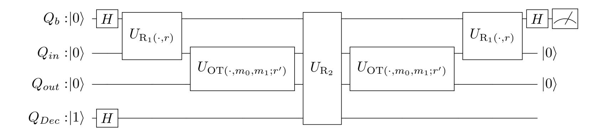
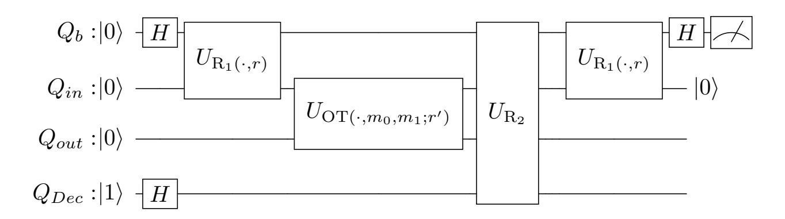
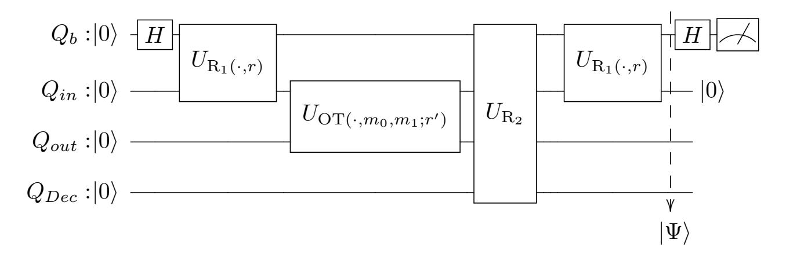
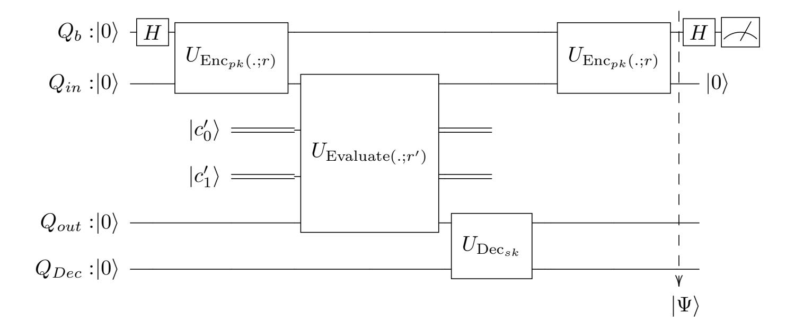

{0}------------------------------------------------

# Superposition Attack on OT Protocols

Ehsan Ebrahimi\*1 , C´eline Chevalier2 , Marc Kaplan3 , and Michele Minelli4

FSTM, SnT, University of Luxembourg CRED, Universit´e Panth´eon-Assas, Paris II, France VeriQloud, Montrouge, France R&D Center Europe Brussels Laboratory, Sony, Belgium

February 2, 2021

#### Abstract

In this note, we study the security of oblivious transfer protocols in the presence of adversarial superposition queries. We define a security notion for the sender against a corrupted receiver that makes a superposition query. We present an oblivious transfer protocol that is secure against a quantum receiver restricted to a classical query but it is insecure when the receiver makes a quantum query.

Keywords. Oblivious Transfer; Post-Quantum Security; Superposition Attack

# 1 Introduction

The oblivious transfer (OT) [\[Rab05\]](#page-21-0) is a fundamental cryptographic primitive which allows a receiver to obtain one out of two inputs held by a sender, while the receiver learns nothing on the other input and the sender learns nothing at all (in particular, the input that the receiver receives). Later [\[Cr´e87\]](#page-19-0) showed that one-out-of-two OT is equivalent to the more generic case of one-out-of-n OT, where the sender holds n inputs and the receiver receives one of them. The importance of oblivious transfer is exemplified by a result by Goldreich, Micali, and Wigderson [\[GMW87\]](#page-20-0), where they prove that OT is MPC-complete, meaning that it can be used as a building block to securely evaluate any polynomial-time computable function without any additional primitive. Studying the security of this primitive becomes then of paramount importance, especially in light of

\*Corresponding author's email: ehsan.ebrahimi@uni.lu. Some part of work has been done at Ecole Normale Sup´erieure, Paris, France. ´

Work done while affiliated to ENS, CNRS, INRIA, and PSL Research University, Paris, France

{1}------------------------------------------------

the advent of quantum computers, that numerous computer scientists and experts consider as imminent. When talking about attacks mounted through a quantum computer, there is usually some ambiguity in the terminology and its meaning. When an assumption is deemed "quantum resistant" or "postquantum" it means that the underlying problem is supposed to be hard to solve even for a quantum computer. However, building protocols that rely on quantum resistant assumptions might not be sufficient to claim that the protocol itself cannot be broken with a quantum computer. The security essentially and crucially depends on the adversarial model that we consider. One way to look at the problem is imagining that the communication channels that connect the parties involved in the protocol are purely classical, meaning that they can transport only classical information. Indeed, in this case it seems that instantiating the protocol from quantum resistant problems is sufficient to obtain the desired proof of security.

However, in a line of works started in 2010, Kuwakado and Morii [\[KM10\]](#page-20-1) put forward a new and more general adversarial scenario. In this model, all the communication channels controlled by the malicious parties support the transmission of quantum information while the honest parties uses classical constructions and communication. They show that 3-round Feistel cipher is distinguishable from a random permutation when the adversary has quantum access to the primitive. Subsequently, there have been extensive research works to consider this model to define the security definition for the classical cryptographic constructions and prove the security with the respected definition: quantum secure pseudo-random functions [\[Zha12,](#page-21-1) [Zha16\]](#page-21-2), encryption schemes [\[BZ13b,](#page-18-0) [GHS16,](#page-20-2) [MS16,](#page-20-3) [ATTU16,](#page-18-1) [CEV20,](#page-19-1) [CETU20\]](#page-19-2), message authentication codes and signature schemes [\[BZ13a,](#page-18-2) [AMRS18\]](#page-18-3), hash functions [\[Zha15,](#page-21-3) [Unr16\]](#page-21-4), multi-party computation protocols [\[DFNS13\]](#page-19-3), and etc.

Security in this general model is harder to achieve, as the adversary is no longer limited to attacking the protocol and the underlying problems with a quantum computer, but can also send messages in superposition and try to take advantage of this in order to extract information from the protocol's transcripts. For instance in [\[KM10\]](#page-20-1), the authors use Simon's algorithm [\[Sim97\]](#page-21-5) to recover the hidden (for a classical adversary) periodicity in 3-round Feistel cipher. Similarly, the Simon's algorithm has been used in [\[KM12,](#page-20-4) [KLLN16\]](#page-20-5) to break the security of the Even-Mansour construction and some message authentication codes.

In this paper, we study the security of the OT protocols in the presence of superposition queries. The motivation to consider this general model to prove the security of OT protocols can be similar to the reasons presented in the previous works [\[DFNS13,](#page-19-3) [ATTU16\]](#page-18-1) that consider this general model: 1) A classical OT protocol can be used as a part of a quantum protocol that actively uses quantum communication. So obviously the OT protocol may be run in superposition. 2) To prove the security of some of classical protocols against a quantum adversary, intermediate games in the security proof may actually contain honest parties that will run in superposition (for instance the security of zero-knowledge proof systems against a quantum adversary [\[Unr12,](#page-21-6) [Wat09\]](#page-21-7)). So to prove the security of such a systems, we may need to prove the security of 

{2}------------------------------------------------

cryptographic constructions in the presence of adversarial superposition queries. 3) The miniaturization of classical devices that may reach a quantum scale and therefore a classical protocol will have some quantum effects, etc.

## 1.1 Related Previous Works

Unconditionally secure quantum OT protocols. In [\[Lo98,](#page-20-6) [SSS15\]](#page-21-8), the authors show that an unconditionally secure oblivious transfer protocol is not achievable even using quantum systems. This is in contrast to the key distribution task that is achievable with the unconditional security using quantum communication and systems [\[BB84\]](#page-18-4). Therefore, the alternative is to design an OT protocol that is computationally secure and obviously in the light of an adversary with the quantum computing power, the computational assumption needs to be quantum secure.

Computationally secure OT protocols against a quantum adversary. Usually, the security of OT protocols will be proven in an Universal Composability (UC) [\[Can01\]](#page-19-4) style security model in which a real protocol will be compared with an ideal protocol. The real protocol is secure if there exists a simulator that is interacting with the ideal protocol and it successfully mimics the behaviour of the adversary. The first translation of the UC framework to the quantum setting appears in [\[Unr10\]](#page-21-9) by Unruh. Later in [\[LKHB17\]](#page-20-7), the authors prove the security of the oblivious transfer protocol presented in [\[PVW08\]](#page-21-10) in the Unruh's model. However, we emphasize that in the Unruh's model, the adversary is not allowed to make superposition queries to the protocol and the ideal functionality measures the inputs of the adversary in the computational basis. Considering that the adversary can make the superposition queries the UC style security model need to be revisited. In [\[DFNS13\]](#page-19-3), the authors address this problem. However, they show that simulation based security is not possible for the model that gives more power to the adversary. In more details, they show that the simulation is impossible in the model with supplied response registers by the adversary. They achieve positive result by restricting the adversary. Even considering a restricted adversary, they show that any protocol secure in this model is "non-trivial" that means the protocol cannot be proven secure by running the classical simulator in superposition and the simulator has to be "more quantum".

## 1.2 Concurrent and Independent Work

In a concurrent and independent work, Liu et al. study the security of onetime memories (OTM) (the hardware version of oblivious transfer) against a quantum adversary with superposition access to the memory. They propose a protocol consists of 2λ one-time memories. In a nutshell, their protocols works as follows. For two bits m0, m1, the sender chooses 4 uniformly random strings X0, X1, Y0, Y1 ∈ {0, 1} λ such that the inner product of X0, Y0 and X1, Y1 module 2 are equal to m0 and m1, respectively. Let Xb = (xb,1, · · · , xb,λ) and 

{3}------------------------------------------------

 $Y_b = (y_{b,1}, \dots, y_{b,\lambda})$ . The receiver queries  $2\lambda$  OTMs with inputs  $(x_{0,i}, x_{1,i})$  and  $(y_{0,i}, y_{1,i})$  for  $i = 1, \dots, \lambda$  to obtain  $m_b$ . They show that this protocol emulates the classical ideal functionality even if the adversary has quantum access to the protocol. Achieving the superposition security in the UC framework (with the classical ideal functionality) comes with an overhead on the number of queries invoked by the receiver, namely  $2\lambda$  queries. In this paper, we show that their indistinguishability bound is tight. In other words, we construct an adversary such that for any simulator that has access to the classical ideal functionality the trace distance between the output of the adversary in the real world and the simulated world is  $1/2^{\lambda+1}$ .

#### 1.3 Our Contribution

In this paper, we study the security of (2-round) OT protocols in the presence of adversarial superposition queries. We choose a different approach from [DFNS13] to study the security of OT protocols against superposition queries. We define an indistinguishability based security notion against adversarial superposition queries. We present separation examples for a quantum receiver making classical queries versus quantum queries. In addition to the indistinguishability based security definition, we propose a UC-style security definition, however, we leave further investigation of this security definition for the future work.

Problem with UC-style security model. Ideally, we may want to modify a UC-style security model to guarantee the security against adversarial superposition queries (as in [DFNS13]). This means that a real world protocol may be executed in superposition by the adversary. So in order to define an UC-style security definition, we need to consider an ideal protocol that will be run in superposition too (in other words, the ideal functionality will not measure the quantum queries of corrupted parties as in [Unr10]). Now, we will encounter obstacles to define an ideal OT protocol secure against superposition queries. To illustrate this, let assume an one-out-of-two (1-2) bit OT protocol. An ideal functionality  $\mathcal{F}_{m_0,m_1}^{OT}$  for 1-2 bit OT protocol can be define as Algorithm 1 [CLOS02]. We naively run this ideal functionality in superposition considering

#  $\overline{ \textbf{Algorithm 1} : \text{Functionality } \mathcal{F}_{m_0,m_1}^{cOT} }$

- 1: Upon receiving messages bits  $m_0, m_1$  from the sender, store the messages.
- 2: Upon receiving a message bit b from the receiver, send  $m_b$  to the receiver (if the messages  $m_0, m_1$  are stored) and halt.

a corrupted receiver. A corrupted receiver can send a superposition of its inputs

&lt;sup>1In [LSZ20], the authors have proposed a protocol such that the superposition access to the protocol can be simulated by a simulator that has access to the classical ideal functionality, however, the protocol needs  $O(\lambda)$  of communications between the sender and the receiver (to transfer one bit) versus O(1) communications in the most of OT protocols.

{4}------------------------------------------------

using a quantum input register  $Q_{in}$  (for instance the state  $\frac{1}{\sqrt{2}}(|0\rangle + |1\rangle)_{Q_{in}}$ ) to the ideal functionality. The ideal functionality needs to answer with a superposition of outputs using a quantum register  $Q_{out}$  ( $\frac{1}{\sqrt{2}}(|m_0\rangle + |m_1\rangle)_{Q_{out}}$  if  $Q_{out}$  is initiated with 0 by the ideal functionality). At this stage, a corrupted receiver can posses a superposition of this form:

$$|\Psi\rangle := \frac{1}{\sqrt{2}}(|0\rangle_{Q_{in}}|m_0\rangle_{Q_{out}} + |1\rangle_{Q_{in}}|m_1\rangle_{Q_{out}}).$$

When  $m_0 = m_1$ , this state  $|\Psi\rangle$  can be written as

$$\frac{1}{\sqrt{2}}(|0\rangle + |1\rangle)_{Q_{in}} \otimes |m_0\rangle_{Q_{out}}.$$

Therefore, a measurement in the  $\{|+\rangle, |-\rangle\}$  basis on  $Q_{in}$  register will return  $|+\rangle$  with probability 1. But when  $m_0 \neq m_1$ , this measurement returns  $|+\rangle$  or  $|-\rangle$  with probability  $\frac{1}{2}$ . The corrupted receiver  $\mathcal{A}$  returns the inputs are the same (b=1) if he observes  $|+\rangle$ . Otherwise, it returns the inputs are different (b=0). We calculate the probability of ouputing the parity of inputs below.

$$\Pr[b = [m_0 = m_1] : b \leftarrow \mathcal{A}] = \frac{1}{2} \Pr[b = [m_0 = m_1] : b \leftarrow \mathcal{A} | m_0 = m_1]$$
$$+ \frac{1}{2} \Pr[b = [m_0 = m_1] : b \leftarrow \mathcal{A} | m_0 \neq m_1]$$
$$= \frac{1}{2} + \frac{1}{4}.$$

Therefore, overall, the corrupted receiver can guess if the inputs of the sender are the same or not with probability  $\frac{3}{4}$ . The situation becomes more troublesome if the output register will also be provided by the corrupted receiver. In this case the receiver can execute the Deutsch–Jozsa algorithm [DJ92] to recover if  $m_0 = m_1$  or  $m_0 \neq m_1$  with probability 1. Obviously, this implementation of the ideal OT functionality leaks the parity of the sender's inputs to a corrupted receiver.

In contrast, we observe that in the real world, a corrupted receiver may not be able to produce such a superposition state as  $|\Psi\rangle$ . This is due to the fact that an implementation of a superposition query to a real protocol may produce some auxiliary registers that remain entangled with the input register  $Q_{in}$  even when  $m_0 = m_1$ . So the attack sketched above will not work in this case.

So, we may encounter a situation that a real classical OT protocol remains secure against adversarial superposition queries, but, as discussed above the (classical) ideal OT functionality will be insecure against superposition queries. In this paper we propose an indistinguishability based security definition. In addition, we propose an UC-style security definition by modifying the ideal functionality to accept superposition queries.

Our definition and result. To define an indistinguishability based security definition, first, we need to discuss which party in an OT protocol may be able

{5}------------------------------------------------

to break the security of the protocol with a superposition query. Note that an OT protocol is a two party protocol in which the receiver queries the sender and the sender replies to the receiver's query. Then, the receiver extracts the targeted input from the sender's answer. Therefore, there is no direct query from the sender to the receiver. So if we consider a malicious sender and a honest receiver, since the receiver's query is classical all the communication will be classical. However, if we consider a malicious receiver and a honest sender, since the receiver's query can be in superposition, then the answer of the sender is in superposition too. So a malicious quantum receiver may be able to extract some information about the inputs of the sender from the superposition state. Therefore, we consider the security of the sender against a quantum receiver that makes a superposition query in this paper. Considering an 1-2 bit OT protocol, in our security definition the sender chooses two random bits as inputs. The quantum receiver makes a quantum query to the sender and outputs a bit at the end. We say that the oblivious protocol is secure if the quantum polynomial-time receiver can guess the parity of the sender's inputs with at most a probability negligibly bigger than  $\frac{1}{2}$ .

In subsection 3.2, we implement a superposition query to a real OT protocol. We observe that a quantum implementation of the functionality applied by the sender will produce some ancillary registers that remain entangled with other registers. For this reason, the attack sketched above (using Deutsch–Jozsa algorithm) may not work for a real protocol. Later in subsection 3.4, we examine the security of an OT protocol based on fully homomorphic public-key encryption scheme (FHE) in this model. The security analysis supports our claim that the ancillary registers may prevent the attack to go through in the real case. The protocol can be instantiated with a lattice based public key encryption scheme that is fully homomorphic.

On the negative side, we attack the protocol proposed in [LSZ20] when the parameter  $\lambda=1$ . This protocol is secure against a quantum receiver restricted to a classical query but it is insecure when the receiver makes a quantum query (See subsubsection 3.3.2.). In subsection 3.4, we observe that the OT protocol based on a fully homomorphic public-key encryption scheme (sketched above) can be quantum insecure if the FHE scheme fulfils an extra requirement. In other words, we show that conditioned on an extra requirement for the FHE scheme the OT protocol is secure when the receiver makes a classical query, but, it is insecure when the receiver makes a quantum query. We emphasize that this extra condition on the FHE scheme may tamper the security of the receiver against a malicious sender, however, it remains a separation example for a quantum query versus a classical query made by a malicious receiver (assuming that the sender is honest).

#### 1.4 Organization of The Paper

In section 2, we present some preliminaries and notations that are needed in this paper. Next, in section 3, we present our result. This section consists of a security definition for the sender against a malicious quantum receiver that 

{6}------------------------------------------------

is permitted to make a superposition query (see subsection 3.1). It consists of a discussion subsection on how a malicious receiver with a superposition access can break the security of an OT protocol. In the positive side, we show that a superposition query to an OT protocol may cause some ancillary registers that are entangled with the input register and therefore they will prevent the attack to go through. In the negative side, we present some cases that the attack is successful. Later in subsection 3.4, we present an OT protocol based on a fully homomorphic encryption scheme that is vulnerable when the receiver makes a superposition query. But is is secure against a malicious receiver restricted to a classical query. We finish our paper with a section on conclusion and open problems, section 4.

## 2 Preliminaries

**Notation.** We say a function f from the natural numbers to the real numbers is negligible if for any positive polynomial P there exists a positive integer N such that for any input  $n \geq N$ ,  $|f(n)| \leq \frac{1}{P(n)}$ . We use " $neg(\lambda)$ " to show a negligible function in the security parameter  $\lambda$ . The notation [n] depicts the set  $\{1, 2, \dots, n\}$ . For two bits  $m_0, m_1$ , the notation  $[m_0 = m_1]$  indicates the parity of two bits. For two distributions  $D_1$  and  $D_2$  defined over the finite set X, the statistical distance between them is define as

$$\Delta(D_1, D_2) = \frac{1}{2} \sum_{x \in X} |\Pr[D_1 = x] - \Pr[D_2 = x]|.$$

We say two distributions are statistically close if the statistical distance between them is a negligible function in the security parameter.

Quantum computation. We briefly recall some basic of quantum information and computation needed for our paper below. Interested reader can refer to [NC16] for more information. For two vectors  $|\Psi\rangle = (\psi_1, \psi_2, \dots, \psi_n)$  and  $|\Phi\rangle = (\phi_1, \phi_2, \dots, \phi_n)$  in  $\mathbb{C}^n$ , the inner product is defined as  $\langle \Psi, \Phi \rangle = \sum_i \psi_i^* \phi_i$  where  $\psi_i^*$  is the complex conjugate of  $\psi_i$ . Norm of  $|\Phi\rangle$  is defined as  $||\Phi\rangle|| = \sqrt{\langle \Phi, \Phi\rangle}$ . The n-dimensional Hilbert space  $\mathcal{H}$  is the complex vector space  $\mathbb{C}^n$  with the inner product defined above. A quantum system is a Hilbert space  $\mathcal{H}$  and a quantum state  $|\psi\rangle$  is a vector  $|\psi\rangle$  in  $\mathcal{H}$  with norm 1. An unitary operation over  $\mathcal{H}$  is a transformation U such that  $UU^{\dagger} = U^{\dagger}U = \mathbb{I}$  where  $U^{\dagger}$  is the Hermitian transpose of U and  $\mathbb{I}$  is the identity operator over  $\mathcal{H}$ . The computational basis for  $\mathcal{H}$  consists of n vectors  $|b_i\rangle$  of length n with 1 in the position i and 0 elsewhere. With this basis, the unitary CNOT is defined as

CNOT: 
$$|m_1, m_2\rangle \rightarrow |m_1, m_1 \oplus m_2\rangle$$
,

where  $m_1, m_2$  are bit strings. The Hadamard unitary is defined as

$$\mathrm{H}:|b\rangle \rightarrow \frac{1}{\sqrt{2}}(\left|\bar{b}\right\rangle + (-1)^b|b\rangle),$$

{7}------------------------------------------------

where  $b \in \{0,1\}$ . An orthogonal projection  $\mathbf{P}$  over  $\mathcal{H}$  is a linear transformation such that  $\mathbf{P}^2 = \mathbf{P} = \mathbf{P}^{\dagger}$ . A measurement on a Hilbert space is defined with a family of orthogonal projectors that are pairwise orthogonal. An example of measurement is the computational basis measurement in which any projection is defined by a basis vector. The output of computational measurement on state  $|\Psi\rangle$  is i with the probability  $||\langle b_i, \Psi \rangle||^2$  and the post measurement state is  $|b_i\rangle$ . For two quantum systems  $\mathcal{H}_1$  and  $\mathcal{H}_2$ , the composition of them is defined by the tensor product and it is  $\mathcal{H}_1 \otimes \mathcal{H}_2$ . For two unitary  $U_1$  and  $U_2$  defined over  $\mathcal{H}_1$  and  $\mathcal{H}_2$  respectively,  $(U_1 \otimes U_2)(\mathcal{H}_1 \otimes \mathcal{H}_2) = U_1(\mathcal{H}_1) \otimes U_2(\mathcal{H}_2)$ . If a system is in the state  $|\Psi_i\rangle$  with the probability  $p_i$ , we interpret this with a quantum ensemble  $E = \{(|\Psi_i\rangle, p_i)\}_i$ . Different outputs of a quantum algorithm can be represented as a quantum ensemble. The density operator corresponding with the ensemble E is  $\rho = \sum_i p_i |\Psi_i\rangle \langle \Psi_i|$  where  $|\Psi_i\rangle \langle \Psi_i|$  is the operator acting as  $|\Psi_i\rangle \langle \Psi_i| : |\Phi\rangle \to \langle \Psi_i, \Phi\rangle |\Psi_i\rangle$ .

Any classical function  $f: X \to Y$  can be implemented as a unitary operator  $U_f$  in a quantum computer where  $U_f: |x,y\rangle \to |x,y \oplus f(x)\rangle$ . Note that it is clear that  $U_f^{\dagger} = U_f$ . A quantum adversary has "standard oracle access" to a classical function f if it can query the unitary  $U_f$ . When only the input register will be provided by the adversary and the output register is initiated with 0 by the oracle, we say the adversary has "embedding oracle access" to the function. That is, the adversary has oracle access to the unitary that maps  $|x,0\rangle \to |x,f(x)\rangle$  [CETU20].

Two rounds 1-2 oblivious transfer protocol. A two rounds 1-2 oblivious transfer is a two party protocol between a sender and a receiver:

- The receiver on input a bit b chooses a randomness r and sends  $R_1(b;r)$  to the sender.
- The sender on inputs  $m_0, m_1$  computes  $OT(R_1(b; r), m_0, m_1; r')$  for a randomness r' and sends it to the receiver.
- The receiver applies a function  $R_2$  to  $OT(R_1(b;r), m_0, m_1; r')$  to extract  $m_b$ .

Informally, the sender's security will be satisfied if the input  $m_{\bar{b}}$  remains secret to the receiver after execution of the protocol. The receiver's security will be achieved if the sender dose not learn the input of the receiver (the bit b).

Fully homomorphic public-key encryption scheme [Gen09]. A fully homomorphic public-key encryption scheme consists of four polynomial-time algorithms KeyGen, Enc, Dec, Evaluate, as follows:

- On input of the security parameter, the randomized algorithm KeyGen returns a pair of keys (pk, sk).
- The encryption algorithm Enc is a randomized algorithm that on inputs pk and a message m, chooses a randomness r and returns the ciphertext  $c := \operatorname{Enc}_{pk}(m;r)$ .

{8}------------------------------------------------

- The decryption algorithm is (possibly randomized) algorithm that on input sk and the ciphertext c := Encpk(m) returns m (with high probability if the decryption is randomized). For an invalid ciphertext, the decryption returns ⊥.
- The Evaluate algorithm is an (possibly randomized) algorithm that on input any (pk, sk) generated by KeyGen, for any circuit C and any ciphertexts ci := Encpk(mi ; ri) for i ∈ [n], returns a ciphertext

$$\alpha = \text{Evaluate}_{pk}(C, c_i, \cdots, c_n)$$

such that Decsk(α) = C(m1, · · · , mn).

Definition 1. We say a fully homomorphic encryption scheme is "circuitprivate" if for any (pk, sk) generated by KeyGen, any circuit C and any ciphertexts ci := Encpk(mi ; ri) for i ∈ [n], the two distribution Encpk(C(m1, · · · , mn)) and Evaluatepk(C, ci , · · · , cn) are statistically close.

# 3 Our Result

In this section, we define a security definition that takes into consideration adversarial superposition queries made by a malicious receiver. Then, we present a discussion about how general OT protocols may be vulnerable to such queries and what will be a possible solution to avoid such attacks. Later, we implement the superposition query to an actual protocol and verify when the protocol will be broken in the sense of our definition.

## 3.1 Security Definition

We define the security notion for an honest sender against a malicious receiver. We assume that the sender's database contains two bit entries, i.e., m0, m1 ∈ {0, 1}. To capture the sender's security, we define the security definition through the following game. We say an 1-2 bit OT protocol is computationally secure against a malicious quantum receiver if any polynomial-time adversary wins the following game with the probability at most 1 2 + negl(λ).

Game 1. OTbit 2 -MR: (MR stands for malicious receiver)

Sender's input: Two bits m0, m1.

Challenge query: The adversary sends two quantum registers Qin, Qout to the challenger. The challenger applies UOT(·,m0,m1;r 0) to quantum registers Qin, Qout and send both registers to the adversary.

Guess: The adversary outputs a bit δ and wins if δ = [m0 = m1].

Definition 2. We say an 1-2 bit OT protocol is computationally secure against a malicious quantum receiver if any polynomial-time quantum adversary wins the Game [1](#page-8-2) with the probability at most 1 2 + negl(λ).

{9}------------------------------------------------

Restricted to an adversary that is only allowed to make a classical query, the definition captures the sender's security because the adversary can recover the bit  $m_b$  from  $OT(R_1(b), m_0, m_1; r')$  by the correctness property of the OT protocol. Then learning if the unrecovered bit is the same as the recovered bit or not should be negligibly close to  $\frac{1}{2}$ . For completeness, we present the security definition restricted to a classical query below.

## Game 2. $OT_2^{bit}$ -MR-Classical Query:

Sender's input: Two bits  $m_0, m_1$ .

**Challenge query:** The adversary makes a query to the challenger, let say  $R_1(b;r)$ . The challenger chooses a randomness r' and sends  $OT(R_1(b;r), m_0, m_1; r')$  to the adversary.

**Guess:** The adversary outputs a bit  $\delta$  and wins if  $\delta = [m_0 = m_1]$ .

**Definition 3.** We say an 1-2 bit OT protocol is computationally secure against a malicious quantum receiver restricted to a classical query if any polynomial-time quantum adversary wins the Game 2 with the probability at most  $\frac{1}{2} + negl(\lambda)$ .

#### 3.2 Attack Implementation

In this section, we implement a superposition query to an OT protocol. Note that the purpose of this section is to illustrate the ideas used in the superposition attacks on some specific OT protocols in later sections. This section also explains the challenges that appear when we want to implement such an attack on more general OT protocols and it opens a direction to design a secure OT protocol in the presence of adversarial superposition queries. Based on discussions in this section, we propose an modified ideal functionality that can be run in superposition and resist to DJ attack. First, we explain why DJ algorithm may not successfully attack all OT protocols.

Why DJ algorithm may fail to attack an OT protocol. Recall that any boolean function  $f: X \to Y$  can be implemented efficiently as a unitary operator  $U_f: |x\rangle|y\rangle \to |x\rangle|y \oplus f(x)\rangle$  using quantum gates [NC16]. Let  $R_1$  be a randomized function that is applied by the receiver on its input. Then, the  $U_{R_1}$  is an unitary operation applied by the receiver that maps

$$|b\rangle|y\rangle \rightarrow |b\rangle|y \oplus R_1(b;r)\rangle.$$

The  $U_{\text{OT}}$  is an unitary operation applied by the sender that maps

$$|\mathbf{R}_1(b;r)\rangle|y\rangle \rightarrow |\mathbf{R}_1(b;r)\rangle|y\oplus \mathrm{OT}(\mathbf{R}_1(b;r),m_0,m_1;r')\rangle,$$

where  $m_0$  and  $m_1$  are sender's inputs. Let  $R_2$  is a function applied by the receiver to extract  $m_b$  from  $OT(R_1(b;r), m_0, m_1; r')$ . Then,  $U_{R_2}$  maps

$$|b\rangle|\mathbf{R}_1(b;r)\rangle|\mathbf{OT}(\mathbf{R}_1(b;r),m_0,m_1;r')\rangle|y\rangle$$

to

$$|b\rangle|\mathbf{R}_1(b;r)\rangle|\mathbf{OT}(\mathbf{R}_1(b;r),m_0,m_1;r')\rangle|y\oplus m_b\rangle.$$

{10}------------------------------------------------

Figure 2: The register Qout has been returned to |0i at the end of circuit. But using two queries to OT protocol.

Note that R2 ◦ OT ◦ R1 is a function from {0, 1} to {0, 1} that is constant when m0 = m1 and it is balanced when m0 6= m1. Now one may think that a malicious receiver can use the Deutsch-Jozsa (DJ) algorithm [\[DJ92\]](#page-19-6) to decide if the function is constant or balanced with the probability 1 and break the security in the sense of Definition [2.](#page-8-3) But this might not work for all OT protocols. The reason is that the function OT will be applied by the sender and may produce some garbage in an ancillary register. These garbage information cannot be undone by the malicious receiver and therefore it may interfere the analysis of the DJ algorithm. We illustrate this by implementing the DJ algorithm on an OT protocol in Figure [1.](#page-10-0) In the circuit, the register Qout contains some unknown information from the receiver point of view and will interfere the analysis of the DJ algorithm.

Figure 1: Implementation of DJ algorithm to general OT protocols. The register Qout may be entangled to Qb and results in the failure of DJ attack.

One can undo the register Qout by a second application of OT function as depicted in Figure [2.](#page-10-1) But since m0, m1 and the randomness r 0 are not known to the receiver, this second application also has to be applied by the sender. Therefore, we will end up making two quantum queries to the sender that is trivially useless.

Some cases that (a variant of) DJ algorithm works. Even though the attack may not work for all OT protocols, there might be some cases that one superposition access will break the security of oblivious transfers. For instance,

{11}------------------------------------------------

Figure 3: A variant of DJ algorithm in which  $Q_{\text{Dec}}$  starts with  $|0\rangle$ . This may be used to attack some OT protocols.

if the unitary operator  $U_{R_2 \circ OT}$  can be applied by the receiver, then the attack will work. We present such a scenario in the subsubsection 3.3.1 using the obfuscated program of OT.

Also, we can use a variant of the DJ algorithm to attack an OT protocol that satisfies the following:

• 
$$OT(R_1(0;r), m_0, m_1; r') = OT(R_1(1;r), m_0, m_1; r')$$
 when  $m_0 = m_1$ .

In the subsection 3.4, we design an OT protocol that satisfies the property above. We draw the circuit to attack such an OT protocol in Figure 3. We compute and analyse the output of the circuit. The output of the circuit right before applying the Hadamard operator is:

$$|\Psi\rangle = \frac{1}{\sqrt{2}} (|0\rangle_{Q_b} |0\rangle_{Q_{in}} |\text{OT}(\mathbf{R}_1(0;r), m_0, m_1; r')\rangle_{Q_{out}} |m_0\rangle_{Q_{Dec}} + |1\rangle_{Q_b} |0\rangle_{Q_{in}} |\text{OT}(\mathbf{R}_1(1;r), m_0, m_1; r')\rangle_{Q_{out}} |m_1\rangle_{Q_{Dec}}).$$

When  $m_0 = m_1$ . We can write the state  $|\Psi\rangle$  as follows where we use only  $m_0$  in the state.

$$|\Psi\rangle = \frac{1}{\sqrt{2}}(|0\rangle + |1\rangle)_{Q_b}) \otimes |0\rangle_{Q_{in}}|OT(R_1(0;r), m_0, m_1; r')\rangle_{Q_{out}}|m_0\rangle_{Q_{Dec}}.$$

Therefore, after applying the Hadamard operator, the state will be in  $|0\rangle$  and the measurement will return 0 with the probability 1.

When  $m_0 \neq m_1$ . In this case, we cannot write  $|\Psi\rangle$  as above and the register  $Q_b$  remains entangled with  $Q_{Dec}$ . So the measurement returns 0 with the probability  $\frac{1}{2}$  and it returns 1 with the probability  $\frac{1}{2}$ .

Overall probability of success. Therefore, overall, the attack breaks the security notion in the sense of Definition 2 with the probability  $\frac{3}{4}$ .

Another case that the attack works is when the function  $R_2$  is linear. In this case the quantum implementation of  $R_2$  does not need the ancillary register  $Q_{\text{Dec}}$  and the circuit in Figure 3 without the last wire will attack the protocol.

{12}------------------------------------------------

**Remark.** Note that in the attack depicted in Figure 3, the output register  $Q_{out}$  starts with zero. Therefore, the attack works even when the malicious receiver has embedding oracle access to the sender that is a weaker oracle access compare to the standard oracle access. This shows that even measuring the output register by the sender will not help to prevent the superposition attack.

#### 3.3 Separation Examples

#### 3.3.1 Superposition Attack on Obfuscated OT.

Here we show that when the malicious quantum receiver possesses the obfuscated program of  $OT(\cdot, m_0, m_1; r')$  where  $m_0, m_1$  are the sender's input it can break the security of OT protocol. Let the program obfuscated in a way that it will not run anymore after one execution (then it is classically secure.). In this case, the receiver can implement the OT protocol on a quantum device and run it on quantum inputs. The attack uses the Deutsch-Jozsa quantum algorithm [DJ92, CEMM98] that distinguishes a constant function from a balanced function by one quantum access to the function. In details, if a function  $f:\{0,1\}^n\to\{0,1\}$  is promised to be either a constant function (it outputs 0) or 1 for all inputs) or a balanced function (half of the inputs maps to 0 and the other half maps to 1), then Deutsch-Jozsa algorithm finds if the function is constant or balanced with the probability 1 and using only one quantum query to  $U_f$ . We illustrate how the Deutsch-Jozsa quantum algorithm can be used to break the  $OT_2^{bit}$ -MR security (Definition 2) of the obfuscated oblivious transfer protocols. Roughly speaking,  $R_2 \circ OT \circ R_1$  is a function from  $\{0,1\}$  to  $\{0,1\}$ that is constant when  $m_0 = m_1$  and it is balanced when  $m_0 \neq m_1$ . Therefore, one superposition query to  $U_{R_2 \circ OT \circ R_1}$  can break  $OT_2^{bit}$ -MR security with the probability 1. We draw the circuit to attack in the following that is exactly the DJ algorithm.

$$Q_{in}: |0\rangle$$
 —  $H$  —  $U_{\mathrm{R}_2 \circ \mathrm{OT} \circ \mathrm{R}_1}$  —  $Q_{Dec}: |1\rangle$  —  $H$ 

#### 3.3.2 Liu-Sahai-Zhandry protocol [LSZ20].

For two bits  $m_0, m_1$ , the sender chooses 4 uniformly random strings  $X_0, X_1, Y_0, Y_1 \in \{0, 1\}^{\lambda}$  such that the inner product of  $X_0, Y_0$  and  $X_1, Y_1$  module 2 are equal to  $m_0$  and  $m_1$ , respectively. Let  $X_b = (x_{b,1}, \dots, x_{b,\lambda})$  and  $Y_b = (y_{b,1}, \dots, y_{b,\lambda})$ . The receiver queries  $2\lambda$  OTMs with inputs  $(x_{0,i}, x_{1,i})$  and  $(y_{0,i}, y_{1,i})$  for  $i = 1, \dots, \lambda$  to obtain  $m_b$ . The authors show that if the sender gives both  $Y_0$  and  $Y_1$  to the receiver, the protocol remains a classically secure one-time memory. We present the functionality after this modification below and it is the same as Functionality 4 in [LSZ20].

{13}------------------------------------------------

#### **Algorithm 2**: Functionality $\mathcal{F}_{m_0,m_1}$

- 1: Create: Upon inputs  $(m_0, m_1)$ ,
  - 1. The sender chooses 4 uniformly random strings  $X_0, X_1, Y_0, Y_1 \in \{0,1\}^{\lambda}$  such that the inner product of  $X_0$ ,  $Y_0$  and  $X_1$ ,  $Y_1$  module 2 are equal to  $m_0$  and  $m_1$ , respectively.
  - 2. The sender prepares a table  $\{t_j\}$  initiated with zero indicating if j-th query has been queried or not.
- 2: Execute: Upon receiving a quantum query and classical input j,
  - 1. The sender checks if  $t_j = 0$ . If it is not, the sender does nothing and return the state back to the receiver.
  - 2. Otherwise, the sender applies unitary  $U_{x_{0,j,x_{1,j}}}|b,c\rangle \to |b,c\oplus x_{b,j}\rangle$  and sends back the state along with classical values of  $(y_{0,j},y_{1,j})$  to the receiver. Then it sets  $t_j=1$  and deletes  $x_{0,j},x_{1,j},y_{0,j},y_{1,j}$  from the memory.

A malicious quantum receiver  $\mathcal{A}$  can invoke DJ algorithm to obtain the parity of bits  $(x_{0,j},x_{1,j})$  with the probability 1. Then using the vectors  $Y_0, Y_1$  determines the parity of inputs  $m_0, m_1$  with the probability  $1/2 + 1/2^{\lambda+1}$ . In the following, we show that when  $Y_0 = Y_1$ , the adversary can determine the parity of  $m_0$  and  $m_1$  correctly. Otherwise, the adversary returns a random bit as an output. Note that  $m_b = \sum_{j=1}^{\lambda} x_{b,j} y_{b,j}$ . Therefore, when  $Y_0 = Y_1$ , we can factor out  $y_{b,j}$  in the sum of  $m_0 + m_1$ :

$$m_0 + m_1 = \sum_{j=1}^{\lambda} y_{b,j} (x_{0,j} + x_{1,j}) \mod 2.$$

Since the adversary knows  $x_{0,j} + x_{1,j}$  using DJ algorithm, he can obtain the parity of inputs with the probability 1 in this case. If there exists a  $j \in [\lambda]$  such that  $y_{0,j} \neq y_{1,j}$  one of  $x_{0,1}$  or  $x_{1,j}$  in the sum above remains uniformly random from the adversary's point of view. Therefore, the adversary has to return a random guess in this case and the success probability is 1/2. We calculate the overall probability of success:

$$\Pr[m_0 + m_1 = b : b \leftarrow \mathcal{A}] = \Pr[Y_0 = Y_1] + \frac{1}{2} \Pr[Y_0 \neq Y_1]$$
$$= \frac{1}{2^{\lambda}} + \frac{1}{2} (1 - \frac{1}{2^{\lambda}})$$
$$= \frac{1}{2} + \frac{1}{2^{\lambda+1}}.$$

Note that the protocol above is a classically secure OT protocol even when  $\lambda = 1$  [LSZ20]. However, a quantum adversary can return the parity of inputs with the

{14}------------------------------------------------

probability 3/4. So this is a separation example for a classical receiver versus a quantum receiver with the superposition access (considering Definition 2).

In Lemma 5 in [LSZ20], it has been shown that there exists an efficient simulator Sim such that for every adversary  $\mathcal{A}$  the trace distance between the final density matrix of  $\mathcal{A}$  in the real case (showed by  $\mathcal{A} \iff \mathcal{F}_{m_0,m_1}$ ) and the final density matrix of  $\mathcal{A}$  in the simulated case where the simulator has access to the ideal OT functionality (showed by  $\operatorname{Sim}(\mathcal{A}) \iff \mathcal{F}_{m_0,m_1}^{OT}$ ) is strictly less than  $2^{-\Omega(\lambda)}$ :

$$T\left((\mathcal{A} \iff \mathcal{F}_{m_0,m_1}), (\operatorname{Sim}(\mathcal{A}) \iff \mathcal{F}_{m_0,m_1}^{OT})\right) < 2^{-\Omega(\lambda)}.$$

We use the attack presented above to show that the security bound in [LSZ20] is tight2.

**Theorem 1.** There exists an efficient quantum adversary such that for any efficient simulator Sim:

$$T\left((\mathcal{A} \iff \mathcal{F}_{m_0,m_1}), (\operatorname{Sim}(\mathcal{A}) \iff \mathcal{F}_{m_0,m_1}^{OT})\right) = 2^{-(\lambda+1)}.$$

Proof of Theorem 2. Let  $\mathcal{A}$  be the adversary presented above that returns the parity of inputs  $m_0, m_1$ . As calculated above,  $\mathcal{A}$  returns the parity of inputs correctly (let say it returns the state  $|1\rangle$  in this case) with probability  $\frac{1}{2} + \frac{1}{2^{\lambda+1}}$ . Then the quantum ensemble corresponding to this adversary in the real case is:

$$\left\{ \left( |1\rangle, \left( \frac{1}{2} + \frac{1}{2^{\lambda+1}} \right) \right), \left( |0\rangle, \left( \frac{1}{2} - \frac{1}{2^{\lambda+1}} \right) \right) \right\}.$$

In the simulated case, the success probability of the adversary is 1/2 since the simulator has access to the classical ideal functionality  $\mathcal{F}_{m_0,m_1}^{OT}$ . Therefore, the quantum ensemble corresponding to this adversary in the simulated case is:

$$\left\{\left(|1\rangle,\frac{1}{2}\right),\left(|0\rangle,\frac{1}{2}\right)\right\}.$$

A simple calculation shows that the trace distance between the density operators corresponding to these ensembles is  $2^{-(\lambda+1)}$ .

### 3.4 Superposition Attack on an OT Protocol?

In this section, we present an OT protocol that is secure against a quantum adversary that is only allowed to make a classical query. Then, we implement a quantum query to the sender and discuss when the protocol will be insecure against an adversarial superposition query made by the receiver. We present an OT protocol based on a fully homomorphic lattice-based encryption scheme below.

&lt;sup>2We slightly contradict their result since their bound is strictly less than  $2^{-\Omega(\lambda)}$ , but, we show that there exists an adversary such that for any simulator the trace distance is  $2^{-(\lambda+1)}$ .

{15}------------------------------------------------

**Protocol 1.** Let  $\mathcal{E} = (\text{KeyGen, Enc, Dec})$  be a fully homomorphic public-key encryption scheme. Let F be a circuit that on input  $(b, m_0, m_1)$  returns  $(1 - b)m_0 + bm_1$ . We define an OT protocol as follows.

- The receiver on input  $b \in \{0,1\}$  runs KeyGen to generate a pair of keys (pk, sk). Then it chooses a randomness r and sends pk and  $c_b = \operatorname{Enc}_{pk}(b; r)$  to the sender.
- The sender chooses  $r_0, r_1$  uniformly at random and computes  $c'_0 = \operatorname{Enc}_{pk}(m_0; r_0)$  and  $c'_1 = \operatorname{Enc}_{pk}(m_1; r_1)$ . Then it computes  $c_{final} = \operatorname{Evaluate}_{pk}(F, c_b, c'_0, c'_1; r')$  and sends it to the receiver.
- The receiver decrypts  $c_{final}$  using the secret key sk to obtain  $m_b$ .

Note that a malicious receiver can send an invalid ciphertext  $c_b$  in first round of the protocol and this may fail the Evaluatepk function. We show the security when the receiver follows the protocol instructions in the first round.

**Theorem 2.** On the existence of a fully homomorphic public-key encryption scheme that is circuit-private, the Protocol 1 is secure against a quantum polynomial-time honest-but-carious receiver restricted to a classical query. (In the sense of Definition 3).

Proof of Theorem 2. Evaluatepk $(F, c_b, c'_0, c'_1)$  is statistically close to  $\operatorname{Enc}_{pk}(F(b, m_0, m_1))$  that is  $\operatorname{Enc}_{pk}(m_b)$  because the public-key encryption is circuit-private. Therefore,  $c_{final}$  is statistically close to  $\operatorname{Enc}_{pk}(m_b)$ . This finishes the proof because  $\operatorname{Enc}_{pk}(m_b)$  is independent of the bit  $m_{\bar{b}}$ .

**Remark.** Note that the protocol above can be proven secure against a malicious sender if the FHE scheme is IND-CPA secure. However, we consider a malicious receiver in this paper and skip the formal proof for the security of a honest receiver against a malicious sender.

**Instantiation.** We can instantiate this protocol with a lattice-based public-key encryption scheme that is fully homomorphic and it is circuit-private [Gen09, BPMW16].

#### 3.4.1 Superposition Implementation.

Below, we implement a quantum query to the Protocol 1 in Figure 4. Then we compute the output of the circuit and discuss in which condition the protocol will be broken with this attack. Note that in the circuit below  $c'_0$  and  $c'_1$  are classical values that the sender computes by encrypting its inputs. In other words,  $c'_0 = \operatorname{Enc}_{pk}(m_0; r_0)$  and  $c'_1 = \operatorname{Enc}_{pk}(m_1; r_1)$ . Note that  $c_0$  and  $c_1$  will not pass to the sender. The registers  $Q_b$ ,  $Q_{in}$ ,  $Q_{out}$  and  $Q_{Dec}$  are quantum registers provided by the receiver and all are initiated by 0. If the measurement returns 0, then the adversary outputs that the inputs of the sender are the same. Otherwise, it outputs that the inputs are different.

{16}------------------------------------------------

Figure 4: Implementing DJ attack to Protocol 1.

The output of the circuit right before the application of the Hadamard operator is:

$$|\Psi\rangle = \frac{1}{\sqrt{2}}(|0\rangle_{Q_b}|0\rangle_{Q_{in}}|\text{Evaluate}_{pk}(F, c_0, c'_0, c'_1; r')\rangle_{Q_{out}}|m_0\rangle + |1\rangle_{Q_b}|0\rangle_{Q_{in}}|\text{Evaluate}_{pk}(F, c_1, c'_0, c'_1; r')\rangle_{Q_{out}}|m_1\rangle).$$

Note that for a FHE scheme that is circuit private, Evaluatepk $(F, c_0, c'_0, c'_1; r')$  is statistically close to  $\operatorname{Enc}_{pk}(m_0)$  and Evaluatepk $(F, c_1, c'_0, c'_1; r')$  is statistically close to  $\operatorname{Enc}_{pk}(m_0)$ . Therefore, the state  $|\Psi'\rangle$  written below (using some randomness  $R_0$  and  $R_1$ ) is indistinguishable from  $|\Psi\rangle$ .

$$|\Psi'\rangle = \frac{1}{\sqrt{2}} (|0\rangle_{Q_{in}} |\text{Enc}_{pk}(m_0; R_0)\rangle_{Q_{out}} |m_0\rangle + |1\rangle_{Q_b} |0\rangle_{Q_{in}} |\text{Enc}_{pk}(m_1; R_1)\rangle_{Q_{out}} |m_1\rangle).$$

**Unsuccessful attack.** Note that if  $R_0 \neq R_1$ , the measurement will return 0 with the probability 1/2 in both cases of  $m_0 = m_1$  and  $m_0 \neq m_1$ .

Condition for a successful attack. If there exists a randomness R such that when  $m_0 = m_1$ , the value  $\operatorname{Evaluate}_{pk}(F, c_0, c'_0, c'_1; r')$  is statistically close to  $\operatorname{Enc}_{pk}(m_0; R)$  and  $\operatorname{Evaluate}_{pk}(F, c_1, c'_0, c'_1; r')$  is statistically close to  $\operatorname{Enc}_{pk}(m_1; R)$ ,  $^3$  we can write  $|\Psi'\rangle$  as follows where we use  $m_0$  instead of  $m_1$ .

$$\frac{1}{\sqrt{2}}(|0\rangle + |1\rangle)_{Q_b}|0\rangle_{Q_{in}}|\operatorname{Enc}_{pk}(m_0;R)\rangle_{Q_{out}}|m_0\rangle.$$

&lt;sup>3We are not aware of a FHE scheme that fulfils this requirement. Also, this extra requirement for the FHE scheme might tamper the security of the receiver against a malicious sender, but, it still remains a separation example for a superposition query versus a classical query made by a malicious receiver.

{17}------------------------------------------------

Now, the state after applying the Hadamard operator is

$$|0\rangle_{Q_b}|\mathrm{Enc}_{pk}(m_0;R)\rangle_{Q_{out}}|m_0\rangle,$$

and therefore the measurement returns 0 with the probability 1. On the other hands, when  $m_0 \neq m_1$ , we cannot write  $|\Psi\rangle$  as  $\frac{1}{\sqrt{2}}(|0\rangle + |1\rangle)_{Q_b} \otimes |\phi\rangle$  for some state  $|\phi\rangle$ . In other words, the register  $Q_b$  is entangled with other registers and therefore, the measurement returns 0 or 1 with the probability  $\frac{1}{2}$ . Overall, the adversary can break the security in the sense of Definition 2 with the probability  $\frac{3}{4}$ .

#### 3.5 UC-style Security Definition

In this section, we propose an ideal functionality that receives superposition queries and it resists to DJ attack. We follow the ideas developed in subsection 3.2 that an OT protocol that its quantum implementation requires an ancillary register that is entangled with the input register will resist to the superposition DJ attack. We have embed this idea directly to the ideal functionality in Algorithm 3. We emphasize that the definition needs further investigation to be more justified. Informally, We say an OT protocol is secure against su-

## **Algorithm 3**: Functionality $\mathcal{F}_{m_0,m_1}^{qOT}$

- 1: Upon receiving messages bits  $m_0, m_1$  from the sender, store the messages.
- 2: Create: On inputs  $(m_0, m_1)$ , choose two uniformly random strings  $X_0, X_1 \in \{0, 1\}^n$ , and an ancillary register  $Q_{anc}$  initiated with  $|0\rangle$ .
- 3: Execute: Upon receiving a quantum query with registers  $Q_{in}, Q_{out}$ , apply the unitary  $U_{m'_0,m'_1}|b\rangle_{Q_{in}}|c\rangle_{Q_{out}}|0\rangle_{Q_{anc}} \to |b,c0\oplus m'_b\rangle$  where  $m'_b$  is obtained by appending  $X_b$  to  $m_b$ . Then it sends all three quantum registers to the receiver.

perposition queries if for any (polynomial for computational security) quantum receiver  $\mathcal{A}$ , there exists an efficient simulator such that the trace distance between the density matrix of  $\mathcal{A}$  in the real case ( $\mathcal{A} \iff OT_{m_0,m_1}$ ) and the density matrix in the ideal case ( $\mathcal{A} \iff \mathcal{F}_{m_0,m_1}^{qOT}$ ) is at most neg(n).

It is easy to see that if an OT protocol securely emulates  $\mathcal{F}_{m_0,m_1}^{qOT}$  for an adversary restricted to a classical query, then it securely emulates  $\mathcal{F}_{m_0,m_1}^{cOT}$  (Algorithm 1). In a nutshell, the simulator can chooses a random strings X. Upon receiving the classical query, it forwards it to  $\mathcal{F}_{m_0,m_1}^{cOT}$ . After receiving the answer  $m_b$ , it appends X to  $m_b$  and sends the result to the adversary.

# 4 Conclusion and Open Problems

In this paper, we initiate to study the security of OT protocols in a scenario when a malicious receiver can make a quantum query to the sender. We define a 

{18}------------------------------------------------

security notion in this model. We observe that a superposition query to an ideal OT functionality will break the security of the protocol, in contrast, a real OT protocol may resist to such an attack. This is due to some ancillary registers that will appear on the quantum implementation of an OT functionality.

We verify the quantum security of 2-round 1-2 bit OT protocols in the sense of an indistinguishability based definition proposed in this paper. We present OT protocols that are secure against an quantum receiver restricted to the classical query, but, insecure when the receiver can make a superposition query. In addition, we propose a UC-style security definition considering the scenario when a malicious receiver can make a superposition query. We leave further investigation of our UC-style security definition along with verifying the security of OT protocols with more rounds as a future work.

# References

- [AMRS18] Gorjan Alagic, Christian Majenz, Alexander Russell, and Fang Song. Quantum-secure message authentication via blindunforgeability. IACR Cryptology ePrint Archive, 2018:1150, 2018.
- [ATTU16] Mayuresh Vivekanand Anand, Ehsan Ebrahimi Targhi, Gelo Noel Tabia, and Dominique Unruh. Post-quantum security of the cbc, cfb, ofb, ctr, and XTS modes of operation. In Tsuyoshi Takagi, editor, Post-Quantum Cryptography - 7th International Workshop, PQCrypto 2016, Fukuoka, Japan, February 24-26, 2016, Proceedings, volume 9606 of Lecture Notes in Computer Science, pages 44–63. Springer, 2016.
- [BB84] C. H. Bennett and G. Brassard. Quantum cryptography: Public key distribution and coin tossing. In Proceedings of IEEE International Conference on Computers, Systems, and Signal Processing, page 175, India, 1984.
- [BPMW16] Florian Bourse, Rafa¨el Del Pino, Michele Minelli, and Hoeteck Wee. FHE circuit privacy almost for free. In Matthew Robshaw and Jonathan Katz, editors, Advances in Cryptology - CRYPTO 2016 - 36th Annual International Cryptology Conference, Santa Barbara, CA, USA, August 14-18, 2016, Proceedings, Part II, volume 9815 of Lecture Notes in Computer Science, pages 62–89. Springer, 2016.
- [BZ13a] Dan Boneh and Mark Zhandry. Quantum-secure message authentication codes. 7881:592–608, 2013.
- [BZ13b] Dan Boneh and Mark Zhandry. Secure signatures and chosen ciphertext security in a quantum computing world. In Ran Canetti and Juan A. Garay, editors, Advances in Cryptology - CRYPTO 2013 - 33rd Annual Cryptology Conference, Santa Barbara, CA,

{19}------------------------------------------------

- USA, August 18-22, 2013. Proceedings, Part II, volume 8043 of Lecture Notes in Computer Science, pages 361–379. Springer, 2013.
- [Can01] Ran Canetti. Universally composable security: A new paradigm for cryptographic protocols. In 42nd Annual Symposium on Foundations of Computer Science, FOCS 2001, 14-17 October 2001, Las Vegas, Nevada, USA, pages 136–145. IEEE Computer Society, 2001.
- [CEMM98] Richard Cleve, Artur Ekert, Chiara Macchiavello, and Michele Mosca. Quantum algorithms revisited. In Proceedings of the Royal Society of London A, volume 454, page 339–354, 1998.
- [CETU20] Tore Vincent Carstens, Ehsan Ebrahimi, Gelo Noel Tabia, and Dominique Unruh. On quantum indistinguishability under chosen plaintext attack. IACR Cryptol. ePrint Arch., 2020:596, 2020.
- [CEV20] C´eline Chevalier, Ehsan Ebrahimi, and Quoc Huy Vu. On the security notions for encryption in a quantum world. IACR Cryptology ePrint Archive, 2020:237, 2020.
- [CLOS02] Ran Canetti, Yehuda Lindell, Rafail Ostrovsky, and Amit Sahai. Universally composable two-party and multi-party secure computation. In John H. Reif, editor, Proceedings on 34th Annual ACM Symposium on Theory of Computing, May 19-21, 2002, Montr´eal, Qu´ebec, Canada, pages 494–503. ACM, 2002.
- [Cr´e87] Claude Cr´epeau. Equivalence between two flavours of oblivious transfers. In Carl Pomerance, editor, Advances in Cryptology - CRYPTO '87, A Conference on the Theory and Applications of Cryptographic Techniques, Santa Barbara, California, USA, August 16-20, 1987, Proceedings, volume 293 of Lecture Notes in Computer Science, pages 350–354. Springer, 1987.
- [DFNS13] Ivan Damg˚ard, Jakob Funder, Jesper Buus Nielsen, and Louis Salvail. Superposition attacks on cryptographic protocols. In Carles Padr´o, editor, Information Theoretic Security - 7th International Conference, ICITS 2013, Singapore, November 28-30, 2013, Proceedings, volume 8317 of Lecture Notes in Computer Science, pages 142–161. Springer, 2013.
- [DJ92] David Deutsch and Richard Jozsat. Rapid solution of problems by quantum computation. In Proceedings of the Royal Society of London A, volume 439, pages 553–558, 1992.
- [Gen09] Craig Gentry. Fully homomorphic encryption using ideal lattices. In Michael Mitzenmacher, editor, Proceedings of the 41st Annual ACM Symposium on Theory of Computing, STOC 2009, Bethesda, MD, USA, May 31 - June 2, 2009, pages 169–178. ACM, 2009.

{20}------------------------------------------------

- [GHS16] Tommaso Gagliardoni, Andreas H¨ulsing, and Christian Schaffner. Semantic security and indistinguishability in the quantum world. 9816:60–89, 2016.
- [GMW87] Oded Goldreich, Silvio Micali, and Avi Wigderson. How to play any mental game or A completeness theorem for protocols with honest majority. In Alfred V. Aho, editor, Proceedings of the 19th Annual ACM Symposium on Theory of Computing, 1987, New York, New York, USA, pages 218–229. ACM, 1987.
- [KLLN16] Marc Kaplan, Ga¨etan Leurent, Anthony Leverrier, and Mar´ıa Naya-Plasencia. Breaking symmetric cryptosystems using quantum period finding. In Matthew Robshaw and Jonathan Katz, editors, Advances in Cryptology - CRYPTO 2016 - 36th Annual International Cryptology Conference, Santa Barbara, CA, USA, August 14-18, 2016, Proceedings, Part II, volume 9815 of Lecture Notes in Computer Science, pages 207–237. Springer, 2016.
- [KM10] Hidenori Kuwakado and Masakatu Morii. Quantum distinguisher between the 3-round feistel cipher and the random permutation. In IEEE International Symposium on Information Theory, ISIT 2010, June 13-18, 2010, Austin, Texas, USA, Proceedings, pages 2682–2685. IEEE, 2010.
- [KM12] Hidenori Kuwakado and Masakatu Morii. Security on the quantumtype even-mansour cipher. In Proceedings of the International Symposium on Information Theory and its Applications, ISITA 2012, Honolulu, HI, USA, October 28-31, 2012, pages 312–316. IEEE, 2012.
- [LKHB17] Momeng Liu, Juliane Kr¨amer, Yu-pu Hu, and Johannes A. Buchmann. Quantum security analysis of a lattice-based oblivious transfer protocol. Frontiers Inf. Technol. Electron. Eng., 18(9):1348– 1369, 2017.
- [Lo98] Hoi-Kwong Lo. Insecurity of quantum computations. IACR Cryptol. ePrint Arch., 1998:22, 1998.
- [LSZ20] Qipeng Liu, Amit Sahai, and Mark Zhandry. Quantum immune one-time memories. IACR Cryptol. ePrint Arch., 2020:871, 2020.
- [MS16] Shahram Mossayebi and R¨udiger Schack. Concrete security against adversaries with quantum superposition access to encryption and decryption oracles. CoRR, abs/1609.03780, 2016.
- [NC16] Michael A. Nielsen and Isaac L. Chuang. Quantum Computation and Quantum Information (10th Anniversary edition). Cambridge University Press, 2016.

{21}------------------------------------------------

- [PVW08] Chris Peikert, Vinod Vaikuntanathan, and Brent Waters. A framework for efficient and composable oblivious transfer. In David A. Wagner, editor, Advances in Cryptology - CRYPTO 2008, 28th Annual International Cryptology Conference, Santa Barbara, CA, USA, August 17-21, 2008. Proceedings, volume 5157 of Lecture Notes in Computer Science, pages 554–571. Springer, 2008.
- [Rab05] Michael O. Rabin. How to exchange secrets with oblivious transfer. IACR Cryptol. ePrint Arch., 2005:187, 2005.
- [Sim97] Daniel R. Simon. On the power of quantum computation. SIAM J. Comput., 26(5):1474–1483, October 1997.
- [SSS15] Louis Salvail, Christian Schaffner, and Miroslava Sot´akov´a. Quantifying the leakage of quantum protocols for classical two-party cryptography. CoRR, abs/1501.01549, 2015.
- [Unr10] Dominique Unruh. Universally composable quantum multi-party computation. In Henri Gilbert, editor, Advances in Cryptology - EUROCRYPT 2010, 29th Annual International Conference on the Theory and Applications of Cryptographic Techniques, Monaco / French Riviera, May 30 - June 3, 2010. Proceedings, volume 6110 of Lecture Notes in Computer Science, pages 486–505. Springer, 2010.
- [Unr12] Dominique Unruh. Quantum proofs of knowledge. In David Pointcheval and Thomas Johansson, editors, Advances in Cryptology - EUROCRYPT 2012 - 31st Annual International Conference on the Theory and Applications of Cryptographic Techniques, Cambridge, UK, April 15-19, 2012. Proceedings, volume 7237 of Lecture Notes in Computer Science, pages 135–152. Springer, 2012.
- [Unr16] Dominique Unruh. Computationally binding quantum commitments. 9666:497–527, 2016.
- [Wat09] John Watrous. Zero-knowledge against quantum attacks. SIAM J. Comput., 39(1):25–58, 2009.
- [Zha12] Mark Zhandry. How to construct quantum random functions. In 53rd Annual IEEE Symposium on Foundations of Computer Science, FOCS 2012, New Brunswick, NJ, USA, October 20-23, 2012, pages 679–687. IEEE Computer Society, 2012.
- [Zha15] Mark Zhandry. A note on the quantum collision and set equality problems. Quantum Information & Computation, 15(7&8):557–567, 2015.
- [Zha16] Mark Zhandry. A note on quantum-secure prps. IACR Cryptology ePrint Archive, 2016:1076, 2016.