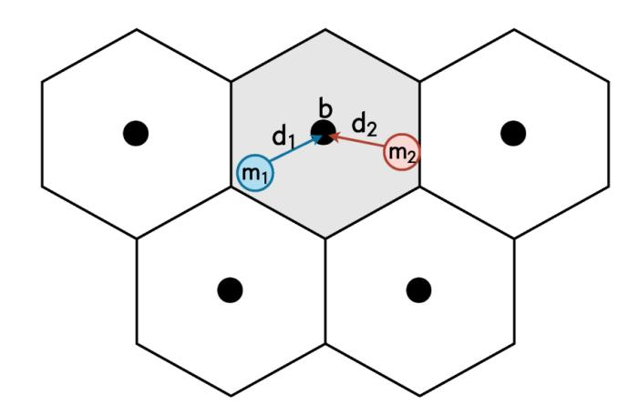
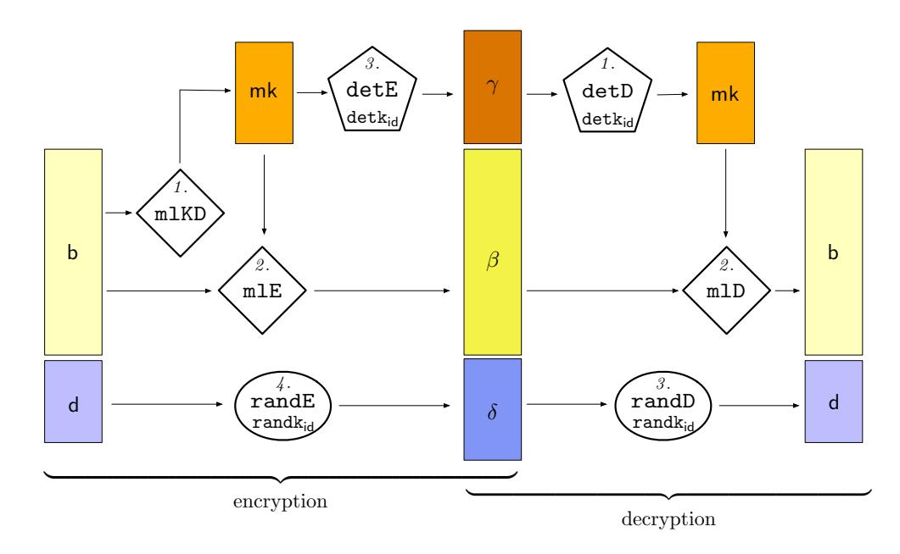
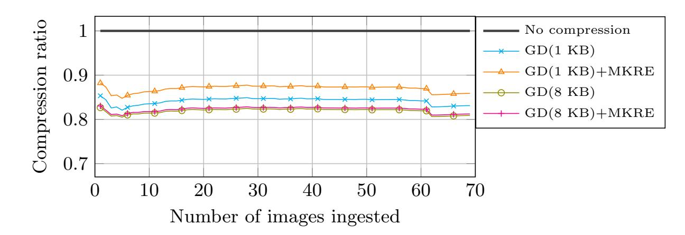
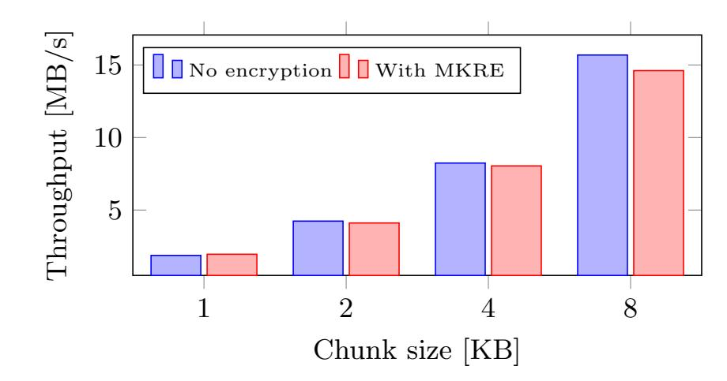

{0}------------------------------------------------

# Secure Generalized Deduplication via Multi-Key Revealing Encryption

Daniel E. Lucani<sup>1</sup> , Lars Nielsen<sup>1</sup> , Claudio Orlandi<sup>1</sup> , Elena Pagnin<sup>2</sup> , and Rasmus Vestergaard<sup>1</sup>

> <sup>1</sup> Aarhus University, Aarhus, Denmark {daniel.lucani, lani, rv}@eng.au.dk, orlandi@cs.au.dk <sup>2</sup> Lund University, Lund, Sweden elena.pagnin@eit.lth.se

Abstract. Cloud Storage Providers (CSPs) offer solutions to relieve users from locally storing vast amounts of data, including personal and sensitive ones. While users may desire to retain some privacy on the data they outsource, CSPs are interested in reducing the total storage space by employing compression techniques such as deduplication. We propose a new cryptographic primitive that simultaneously realizes both requirements: Multi-Key Revealing Encryption (MKRE). The goal of MKRE is to disclose the result of a pre-defined function over multiple ciphertexts, even if the ciphertexts were generated using different keys, while revealing nothing else about the data. We present a formal model and a security definition for MKRE and provide a construction of MKRE for generalized deduplication that only uses symmetric key primitives in a black-box way. Our construction allows (a) cloud providers to reduce the storage space by using generalized deduplication to compress encrypted data across users, and (b) each user to maintain a certain privacy level for the outsourced information. Our scheme can be proven secure in the random oracle model (and we argue that this is a necessary evil). We develop a proof-of-concept implementation of our solution. For a test data set, our MKRE construction achieves secure generalized deduplication with a compression ratio of 87% for 1KB file chunks and 82.2% for 8KB chunks. Finally, our experiments show that, compared to generalized deduplication setup with un-encrypted files, adding privacy via MKRE introduces a compression overhead of less than 3% and reduces the storage throughput by at most 6.9%.

Keywords: Private Cloud Storage · Secure Deduplication · Revealing Encryption

## 1 Introduction

Cloud Storage Providers (CSPs) are offering vast amounts of storage at a low cost to users who desire to outsource their data storage. In order to provide this service at a low cost, CSPs employ compression techniques to reduce their storage cost. In particular, data deduplication has become a popular technique for 

{1}------------------------------------------------

compression of data across files generated by users of the system. For example, if two users upload the same file to the server, only one copy is stored, which both users are allowed to retrieve. Deduplication is often carried out across file chunks (parts), which increases the potential to reduce the storage footprint of the system, as two files that are different as a whole may have significant portions that are equal, e.g., when different versions of the same file are stored.

Generalized deduplication [\[31\]](#page-19-0) is a recent generalization of this principle. By enabling deduplication of data chunks that are similar, rather than identical, this method can achieve a better compression than classic deduplication techniques. As a conceptual and oversimplified example of generalized deduplication, consider two users that hold identical pictures of the Eiffel tower, except for a different person in the foreground. If the CSP could see the two plaintext files, it could easily identify the two pictures as "almost identical", and store the background only once, reducing the overall storage space required. As a great number of people take pictures of the Eiffel tower, we could imagine that many users might upload similar images to the CSP, which would allow the data to be compressed more than is possible when only exact copies of files are deduplicated.

In order to compress the data it stores, the CSP will need to access it to identify where (generalized) deduplication can be used. A na¨ıve implementation would allow CSPs to directly access all uploaded files in cleartext to determine how the data can be compressed. Such a solution will unfortunately undermine the privacy of the data, reducing the types of files that the CSP should be trusted with. A privacy-conscious user could patch this weakness by encrypting their data under a private key before uploading it, but using semantically secure encryption schemes would prevent the CSP from performing any meaningful deduplication. Therefore, previous work has established encryption schemes with relaxed security guarantees that can enable the server to identify when two files are identical and thus enable secure deduplication over encrypted data (see, e.g., convergent [\[13\]](#page-18-0) or message-locked [\[6\]](#page-18-1) encryption).

In this paper, we propose an encryption scheme that allows the server to identify when encrypted data corresponds to similar, rather than identical, data. In particular, using such an encryption scheme, CSPs can apply generalized deduplication directly on the encrypted data. Albeit the server learns whether two ciphertexts correspond to similar plaintexts or not, nothing else is revealed about the original plaintext data. This provides another opportunity for protecting sensitive information while enabling storage compression techniques.

Overview of contributions. Our first contribution is a definitional model that generalizes the notion of Revealing Encryption[1](#page-1-0) (RE) [\[15,](#page-18-2)[23\]](#page-19-1) to the multi-user setting, thus the name Multi-Key Revealing Encryption (MKRE). In a nutshell, a RE scheme is parametrized by some function f, and, given two ciphertexts c1, c<sup>2</sup> obtained by encrypting x1, x<sup>2</sup> respectively (under the same key), there

<span id="page-1-0"></span><sup>1</sup> The term "Revealing Encryption" was first introduced in an oral presentation by Adam O'Neill.

{2}------------------------------------------------

exist some public evaluation function g such that g(c1, c2) = f(x1, x2).[2](#page-2-0) MKRE extends this to the case where the data is encrypted with different, potentially independent keys.[3](#page-2-1)

In this paper, we are mostly interested with the case where the function f computes whether x1, x<sup>2</sup> are "similar" or not, as this is the function required for secure generalized deduplication. Note that MKRE for this f can also be seen as a natural generalization of message-locked encryption (and indeed messagelocked encryption is a crucial component of our solution) and therefore we share the same issues in providing a meaningful and intellegible security definition. In a nutshell, in message-locked encryption a message is encrypted using the message itself as the key. Thus, any user encrypting the same message will produce the same ciphertext, allowing to check equality (and therefore perform deduplication) across encryptions performed by different users. Defining security for message-locked encryption is however quite tricky: The problem is that we cannot prevent the adversary from encrypting messages locally and compare them with the output of the challenge oracle, and we encountered similar challenges when attempting to define security for MKRE. Previous work in message-locked encryption solved this issue by parameterizing the security definition via a message distribution. We find those definitions to be quite complex to parse and therefore quite unfriendly to the practioneers who should decide whether such a primitive provides the right level of security for their applications. As our work is motivated by real-world interest in secure deduplication, we decided to provide what we see as a simpler alternative, which instead relies on idealized primitives: In our definition the adversary can only perform encryptions interacting with the challenger or the random oracle. Looking ahead, this will allow the reduction to "know everything that the adversary knows" and therefore we do not need to worry about trivial attacks. Intuitively, our definition guarantees that the adversary learns nothing about the content of a ciphertext, unless it ever requests an encryption of a "close" message, in which case it is allowed to learn this fact and nothing else. As a downside, our definition implies that our construction must use idealized primitives (e.g., random oracles).

We provide a generic construction of MKRE for our use case from a blackbox combination of message-locked, deterministic, and randomized encryption schemes. Furthermore, we show a concrete instantiation based solely on hash functions and prove its security in the random oracle model, which we have argued is a necessary evil given our security definition. In a nutshell, our technique splits files into two parts: one that we consider less sensitive and deduplicationfriendly (e.g., the background with the Eiffel tower) and one more sensitive, on which no public clustering is desired (e.g., the person in the foreground). Then a form of deterministic encryption is applied to the former part of the data (e.g., the image backgrounds) while semantically secure encryption is applied

<span id="page-2-0"></span><sup>2</sup> Revealing encryption can be seen as a special case of functional encryption where a single decryption key is published together with the public parameters when the system is initialized.

<span id="page-2-1"></span><sup>3</sup> Similarly, MKRE can be seen as a special case of multi-input functional encryption.

{3}------------------------------------------------

to "fully" protect the other, more sensitive part (e.g., the image foregrounds), which thus cannot be deduplicated. While, in retrospect, our construction is really simple, we find it very fascinating that it is at all possible to perform any kind of meaningful computation across ciphertexts encrypted independently by different users using independent keys, and we leave as a major open problem whether there exist "simple" MKRE schemes for other natural, useful functions.

Our findings are supported by a software implementation that allows us to characterize the trade-off among added security, processing speed of the system, and overall compression performance. Our experiments show that our construction is only negligibly less efficient than generalized deduplication applied to the plaintexts directly, while achieving a greater privacy level: Adding MKRE to generalized deduplication reduces the overall system storage throughput by no more than 6.9%, and the compression capabilities by at most 3%.[4](#page-3-0)

Limitations. As any revealing encryption scheme, MKRE for generalized deduplication reveals some specific information about the uploaded data to the CSP. This leakage is unavoidable: if one wishes to deduplicate similar data, then deduplicated chunks must come from similar files. This means that a malicious CSP can see how many ciphertexts of the same user are deduplicated and learn the statistical distribution of the deduplications. Frequency analysis on deduplication reveals the distribution of messages which obviously impacts the security of the system. This cannot be mitigated while targeting high-compression deduplication and thus falls outside the scope of this work.

## 2 Related work

The conflicting interests of CSPs employing deduplication and privacy-concerned users have been studied from many angles. A generic framework that explains the various constraints and allows for comparison of secure deduplication strategies is presented in [\[8\]](#page-18-3).

To enable privacy-aware server-side deduplication, the most common approach is to force users with the same plaintext to arrive at the same ciphertext. The first work of this nature was convergent encryption [\[13\]](#page-18-0), followed by the more general Message-Locked Encryption (MLE) scheme in [\[6\]](#page-18-1), where a hash of the plaintext is used as the encryption key. Some recent developments seek to optimize MLE, e.g., for deduplication of file chunks rather than the entire files and enable efficient updates to the stored data [\[34\]](#page-19-2). Other proposals use an oblivious PRF against a key-server to determine the file-derived keys [\[5\]](#page-18-4), or have clients determine the keys in a distributed manner using a PAKE-based protocol [\[21](#page-19-3)[,22\]](#page-19-4). All of these schemes reveal that deduplicated ciphertexts correspond to identical data. In contrast, our scheme only reveals that deduplicated ciphertexts correspond to similar data. Deduplication of similar data is also dealt with

<span id="page-3-0"></span><sup>4</sup> In this work, we perform generalized deduplication based on Hamming codes, however, the principles we develop are general and can be easily transferred to any transformation function.

{4}------------------------------------------------

in [\[19\]](#page-19-5), albeit quite differently. They have a highly specific use case in mind and remove perceptually similar images by comparing a 'perceptual hash' calculated over the plaintext images, which can lead to duplicate detection under modifications such as resizing, compression, or flipping. Thus, their compression is lossy, not every image can be retrieved as it was uploaded, but something "similar" might be returned. On the contrary, our method is lossless and everything can be retrieved exactly as it was uploaded. Further, what is considered similar in our method is more general, as the notion of similarity is tied to the chosen transformation function for generalized deduplication.

We view our privacy-aware server-side deduplication scheme as a generalization to the multi-user setting of the notion of Revealing Encryption (RE) [\[15\]](#page-18-2). Our approach also shares similarities with Predicate Encryption (PE) [\[17\]](#page-18-5), Searchable Encryption (SE) [\[12\]](#page-18-6), Multi-Input Functional Encryption (MIFE) [\[14\]](#page-18-7), ad-hoc MIFE [\[1\]](#page-18-8) and Multi-Client FE (MCFE) [\[11,](#page-18-9)[20\]](#page-19-6). At a very abstract level, all these primitives share a common goal, i.e., to allow to encrypt data in such a way that it is possible to perform computation on a set of ciphertexts. However, they do so by exploiting different mechanisms and assumptions, and allow for different degrees of freedom in choosing which function f should be computed and which users should be able to compute the function. In PE, SE, and (MK)RE the function f is determined a priori; the different flavors of functional encryption allow f to be chosen adaptively. In contrast to other primitives, the function computed by (MK)RE is public and can be evaluated on set of ciphertexts without the need of a secret key (or secret state). Notably, in functional encryption f is linked to the decryption algorithm, and thus it is intrinsically a secret-key operation. This is a core difference to the RE setting. Moreover, in (MK)RE data are encrypted using a secret key, which is different from what happens in all other settings.[5](#page-4-0)

As the names suggest MIFE, MCFE and MKRE are the only primitives that consider multi-user settings. Unfortunately, it is known that MIFE and MCFE for generic functionalities can only be realized using "heavy tools", such as obfuscation and multi linear maps [\[14\]](#page-18-7), and is therefore not currently of practical interest. Recent work has thus favored concrete and efficient realizations for more restricted functionalities that rely on less demanding assumptions, e.g., MCFE for inner product in the random oracle model from DDH [\[11\]](#page-18-9) and MCFE for linear functions in the standard model from LWE [\[20\]](#page-19-6). Following this philosophy, our aim is to build MKRE from "minimalist tools", i.e., hash functions, and instantiate a scheme with immediate practical applications.

## 3 Preliminaries

Notation. For n, n1, n<sup>2</sup> ∈ N, let [n<sup>1</sup> : n2] be the set {n1, n<sup>1</sup> + 1, . . . , n2} and [n] be the set [1 : n]. For x ∈ Z, let |x| denote the absolute value of x. Let x ←\$ S

<span id="page-4-0"></span><sup>5</sup> With the exception of SE for which there exist realization both in the asymmetric [\[3\]](#page-18-10) and in the symmetric settings [\[28\]](#page-19-7).

{5}------------------------------------------------



Fig. 1. Visualizing generalized deduplication. Similar chunks map to the same base, but different deviations

<span id="page-5-0"></span>denote that x is sampled uniform random from the set S. We denote the security parameter of cryptographic primitives as λ.

#### 3.1 Generalized deduplication

A typical deduplication strategy is to segment files into chunks and look for chunks that appear more than once in the file or that match a chunk from previously stored files [\[33\]](#page-19-8). We will use the terms "file" and "chunk" interchangeably, since they both denote the object to be deduplicated, albeit at different granularities. In many settings, this works well. However, deduplication is traditionally limited by the fact that it requires chunks to be identical. Thus, even if just one bit differs between two chunks, they are stored independently.

Generalized deduplication can alleviate this issue [\[25](#page-19-9)[,31\]](#page-19-0) by allowing a systematic deduplication of near-identical chunks. The idea is to employ a transformation function φ which takes as input an n-bit chunk m and decomposes it into a k-bit base, b, and an l-bit deviation, d. Concretely, φ : {0, 1} <sup>n</sup> → {0, 1} <sup>k</sup>×{0, 1} l with φ(m) = (b, d), and there exists a function φ −1 : {0, 1} <sup>k</sup> × {0, 1} <sup>l</sup> → {0, 1} n that reconstructs a data chunk from a given base and a deviation, i.e., for any chunk m ∈ {0, 1} <sup>n</sup> it holds that φ −1 (φ(m)) = m. Fig. [1](#page-5-0) visualizes the partition induced by φ on the chunk space: two similar chunks, m<sup>1</sup> and m2, are mapped to the same base b, with different deviations (d<sup>1</sup> 6= d2). For usability, we require k > l, meaning that the base contains most of the chunk's information and the deviation is small. In our example of portrait pictures with the Eiffel tower, the background image corresponds to the (common) base, while the person's figure is the (file-dependent) deviation. The bases can then be deduplicated, so that each base is stored only once. Finally, the deviation is stored alongside a reference to the base, which ensures that each file can be reconstructed without any loss of information. Classic deduplication can be obtained by letting the transformation function be the identity function, so bases are the original chunks and the deviation is empty.

We follow the approach of [\[25,](#page-19-9)[31\]](#page-19-0) and set φ to be a Hamming code [\[16\]](#page-18-11). In this case, the transformation function "decodes" the chunk m to obtain its base b, and then the deviation d is derived by finding the difference between the original 

{6}------------------------------------------------

chunk and the encoding of its base. As an example, for 4 KB chunks the onebit error-correction capability of the Hamming means that 32768 different, but similar, chunks will have the same base. In general, generalized deduplication can thus match more bases than classic deduplication, as shown theoretically in [\[31\]](#page-19-0) and achieve a better compression, as evaluated experimentally in [\[25,](#page-19-9)[30,](#page-19-10)[32\]](#page-19-11).

### 3.2 Revealing encryption (RE)

The first ingredient in RE schemes is an authorized function f from a set of inputs M<sup>n</sup> to a set of output values V. Formally, f : M<sup>n</sup> → V. Examples of authorized functions are f = max{· · · } and f = deduplicate(·, ·) (see Definition [7\)](#page-11-0). Revealing encryption schemes are built around the chosen authorized function and are defined as follows.[6](#page-6-0)

Definition 1 (Revealing encryption (RE) [\[15\]](#page-18-2)). Let f : M<sup>n</sup> → V be an nary authorized function. An RE scheme for the function f is a tuple of algorithms RE<sup>f</sup> = (Setup, Enc, Reveal) defined as follows:

Setup(1<sup>λ</sup> ): on input security parameter λ (in unary), this randomized algorithm outputs a secret key sk and some public parameters pp. pp are input to all the following algorithms even when not explicitly written.

Enc(sk, m): on input the secret key sk and a message m ∈ M, this randomized algorithm outputs a ciphertext c.

Reveal(c1, . . . , cn): on input the public parameters pp and n ciphertexts this deterministic algorithm outputs a value v ∈ V.

Revealing correctness essentially states that the output of Reveal evaluated on a set of ciphertexts should equal the output of the authorized function f evaluated on the corresponding set of plaintexts. Security is defined using a leakage function that sizes what the adversary learns from evaluating Reveal on any collection of n ciphertexts.

Definition 2 (Leakage function and optimal RE<sup>f</sup> ). A function L : M<sup>∗</sup> → {0, 1} ∗ is a leakage function for a revealing encryption scheme RE<sup>f</sup> if, given any tuple of input values, L outputs the information leaked by RE<sup>f</sup> when running Reveal on any possible size-n subset of the corresponding ciphertexts. A RE<sup>f</sup> is said to be optimal if it leaks precisely what is required by the functionality, that is:

$$L(\mathsf{m}_1,\ldots,\mathsf{m}_q) = \{ f(\mathsf{m}_i\,;\,i\in S),\,S\subseteq [q],|S|=n \}.$$

Further details on RE and its security notion can be found in [\[10,](#page-18-12)[15\]](#page-18-2).

<span id="page-6-0"></span><sup>6</sup> To improve readability and have an homogeneous language when extending RE to multiple users (MKRE), we use Reveal instead of Eval in [\[15\]](#page-18-2). Also, in Section [4](#page-7-0) we will split the algorithm Setup from [\[15\]](#page-18-2) into a global set up procedure, called Setup, and a user-dependent KeyGen.

{7}------------------------------------------------

## <span id="page-7-0"></span>4 Multi-key revealing encryption

We now introduce Multi-Key Revealing Encryption (MKRE), a cryptographic primitive that extends revealing encryption to handle functions evaluated on data encrypted using distinct secret keys. In addition to the standard algorithms of RE, MKRE includes KeyGen, needed to extract user specific key material from the common parameters, and Dec, that allows users to efficiently retrieve their data. After presenting the MKRE framework, we provide detailed discussions of our security notions in Section [4.1](#page-8-0) and of the need for random oracles to tolerate user corruption in Section [4.2.](#page-11-1)

Definition 3 (Multi-key revealing encryption (MKRE)). Let f : M<sup>n</sup> → V be an n-ary authorized function. A multi-key revealing encryption scheme for the function f is a tuple of algorithms MKRE<sup>f</sup> = (Setup,KeyGen, Enc, Reveal, Dec) defined as follows:

Setup(1<sup>λ</sup> ): this randomized algorithm outputs a master public key mpk containing at least a description of the function f The mpk serves as public parameters and is implicitly input to all subsequent algorithms.

KeyGen(): this randomized algorithm outputs a user secret key sk .

Enc(sk, m): on input a secret key sk and a message m ∈ M, this randomized algorithm outputs a ciphertext c.

Reveal(c1, . . . , cn): on input the master public key mpk and n ciphertexts this deterministic algorithm outputs v ∈ V.

Dec(sk, c): on input a secret key sk and a ciphertext c, this deterministic algorithm returns a plaintext m.

We depart from the convention of omitting the decryption algorithm in RE schemes. This is motivated by the fact that in many practical cases, e.g., cloud storage, it is essential for users to be able to recover the plaintext data at a later point in time. We define two notions of correctness: one for the public revealing method and one for the secret decryption.

<span id="page-7-1"></span>Definition 4 (MKRE<sup>f</sup> revealing correctness). A MKRE scheme MKRE<sup>f</sup> satisfies revealing correctness if, for any n-tuple of messages m1, . . . , m<sup>n</sup> ∈ M<sup>n</sup>, for any n-tuple of keys sk1, . . . ,sk<sup>n</sup> generated by KeyGen, and for any c<sup>i</sup> ← Enc(sk<sup>i</sup> , mi) with i ∈ [n], it holds that

Reveal 
$$(\mathsf{c}_1,\ldots,\mathsf{c}_n)=f\left(\mathsf{m}_1,\ldots,\mathsf{m}_n\right)$$

with all but negligible probability. Note that the n ciphertexts may be encrypted under up to n different secret keys.

Definition 5 (MKRE<sup>f</sup> decryption correctness). A MKRE scheme MKRE<sup>f</sup> satisfies decryption correctness if for any message m ∈ M and for any secret key sk generated by KeyGen it holds that

$$Dec(sk, Enc(sk, m)) = m.$$

{8}------------------------------------------------

<span id="page-8-1"></span>Next, we define security using the real versus ideal world paradigm.

**Definition 6** (MKRE<sub>f</sub> security). Let  $\lambda$  be a security parameter, f a revealing function, MKRE<sub>f</sub> a multi-key revealing encryption scheme for f with associated leakage function L. Consider the experiments  $\mathsf{REAL}^{\mathsf{MKRE}_f}_{\mathcal{A}}(\lambda)$  and  $\mathsf{IDEAL}^{\mathsf{MKRE}_f}_{\mathcal{A},\mathcal{S},L}(\lambda)$ depicted below, where C denotes the corruption oracle, RO the random oracle,  $\mathcal{E}$  the encryption oracle, and prepending an  $\mathcal{S}$  denotes a simulated oracle.

$$\begin{aligned} & \mathsf{REAL}^{\mathsf{MKRE}_f}_{\mathcal{A}}(\lambda) \\ & \mathsf{mpk} \leftarrow \mathsf{Setup}(1^{\lambda}) \\ & b \leftarrow \mathcal{A}^{\mathcal{C}(\cdot),\mathcal{RO}(\cdot),\mathcal{E}(\cdot)}(\mathsf{mpk}) \end{aligned}$$

$$\begin{array}{c|c} \operatorname{REAL}^{\operatorname{MKRE}_f}_{\mathcal{A}}(\lambda) & \operatorname{IDEAL}^{\operatorname{MKRE}_f}_{\mathcal{A},\mathcal{S},L}(\lambda) \\ \operatorname{mpk} \leftarrow \operatorname{Setup}(1^{\lambda}) & \operatorname{mpk} \leftarrow \operatorname{Setup}(1^{\lambda}) \\ b \leftarrow \mathcal{A}^{\mathcal{C}(\cdot),\mathcal{RO}(\cdot),\mathcal{E}(\cdot)}(\operatorname{mpk}) & b \leftarrow \mathcal{A}^{\mathcal{SC}(\cdot),\mathcal{SRO}(\cdot),\mathcal{SE}(\cdot)}(\operatorname{mpk}) \end{array}$$

We say that MKRE<sub>f</sub> is a secure MKRE scheme with respect to L if, for all adversaries A that make at most  $q = poly(\lambda)$  queries, there exists a simulator  ${\cal S}$  such that the output distributions of the two experiments described above are computationally indistinguishable, i.e.:

$$\mathsf{REAL}^{\mathsf{MKRE}_f}_{\mathcal{A}}(\lambda) \sim_c \mathsf{IDEAL}^{\mathsf{MKRE}_f}_{\mathcal{A},\mathcal{S},L}(\lambda)$$

We assume that oracles and simulators are stateful. Thus, whenever we query a new message, its leakage can be assumed to be the output of the reveal function evaluated against every previously queried message. To keep track of relevant information contained in the state, we use the following dictionaries:

 $\mathcal{D}_{\mathsf{id}}$ : Set of pairs (identity-identifier, user secret key),

 $\mathcal{D}_{\mathsf{corr}}: Set\ of\ identity\text{-}identifiers\ corresponding\ to\ corrupted\ users,$ 

 $\mathcal{D}_{ro}$ : Set of (input, output) pairs generated by queries to the random oracle,

 $\mathcal{D}_{\mathsf{enc}}: Set\ of\ tuples\ (identity\text{-}identifier,\ message,\ ciphertext)\ generated\ by$ encryption queries.

They are all empty at the beginning of the  $MKRE_f$  security game and are populated as shown in Fig. 2.

#### <span id="page-8-0"></span>Discussion of our definitions 4.1

We now compare our security definitions for MKRE with the corresponding notions in RE. We first highlight the similarities, then motivate our changes.

Similarities. In the ideal world, the  $MKRE_f$  simulated encryption oracle has to produce ciphertexts having access only to the natural leakage inherent in the revealing encryption scheme and without seeing the actual query. The structure of our simulator for MKRE is similar to the RE simulator [15]: In order to generate a ciphertext for a queried message m, S is not given m; instead it has access to the leakage produced by m against all the previously encrypted messages (L(M))in Fig. 2). This exploits the revealing feature natural to RE schemes and does not disclose more than what the simulator can learn by applying the public Reveal procedure to the ciphertexts. We remark that giving  $\mathcal{S}$  access to L(M) is crucial to ensure that real world ciphertexts only reveal the desired information about the plaintexts and nothing else.

{9}------------------------------------------------

```
KG(id)
1 : if (id, ·) ∈ D/ id
2 : skid ← KeyGen()
3 : Did ← Did ∪ (id,skid)
4 : return skid : (id,skid) ∈ Did
C(id)
1 : Dcorr ← Dcorr ∪ id
2 : return KG(id)
RO(x)
1 : if (x, ·) ∈ D/ ro
2 : h ←$
             {0, 1}
                  N
3 : Dro ← Dro ∪ (x, h)
4 : return h : (x, h) ∈ Dro
E(id, m)
1 : c ← EncRO(·)
                   (KG(id), m)
2 : Denc ← Denc ∪ (id, m, c)
3 : return c
                                     SC(id)
                                      1 : Dcorr ← Dcorr ∪ id
                                      2 : D
                                             (id)
                                             enc ← {(id0
                                                        , m, c) ∈ Denc : id0 = id}
                                      3 : skid ← S(mpk, id, D
                                                               (id)
                                                               enc ))
                                      4 : return skid
                                     SRO(x)
                                      1 : m˜ ← S(mpk, x)
                                      2 : M ← M ∪ {m˜ }
                                      3 : h ← S(mpk, L(M))
                                      4 : return h
                                     SE(id, m)
                                      1 : if id ∈ Dcorr
                                      2 : return ⊥
                                      3 : M ← M ∪ {m}
                                      4 : c ← S(mpk, id, L(M))
                                      5 : Denc ← Denc ∪ (id, m, c)
                                      6 : return c
```

<span id="page-9-7"></span><span id="page-9-6"></span><span id="page-9-2"></span><span id="page-9-0"></span>Fig. 2. Real vs ideal world: KG (key generation subroutine, A cannot query directly), C (corruption oracle), SC (simulated corruption oracle), RO (random oracle), SRO (simulated random oracle), E (encryption oracle), SE (simulated encryption oracle). In line [3](#page-9-1) of SRO and in line [4](#page-9-2) of SE, L(M) = L(m1, m2, . . . , mn) denotes the leakage produced from all messages encrypted so far, including the new message (m˜ or m).

Minor additions. Our system involves multiple users, and we let the adversary A corrupt some and learn their secret keys. Our SE rejects encryption queries for corrupted users. This limitation is done solely to simplify the model and does not restrict the adversary, who can encrypt messages for corrupted parties without interacting with the encryption oracle. (Yet, A needs to query the random oracle, as we discuss in the next paragraph.)

Major changes. In our security definition for MKRE, both the adversary and the encryption oracle have access to the random oracle. This is a drastic change from current RE models and has been done to enable a formal handling of schemes that adopt deterministic cryptographic primitives (handy in contexts like the one of generalized deduplication we are interested in). Concretely, we propose a new way to deal with the issues faced in several previous works when trying to formally model deterministic encryption and related notions. The thorny 

{10}------------------------------------------------

point in the model is that MKRE cannot satisfy semantic security, essentially for the same reason as deterministic encryption. Intuitively, the adversary can encrypt all possible messages "locally" (i.e., without interacting with oracles) and then compare the list of ciphertexts with the output of the encryption oracle (resp. computing Reveal in MKRE) to distinguish between the real and the ideal worlds. In all previous work of which we are aware, this problem is circumvented by introducing assumptions on the distribution of the messages. For instance, [\[6\]](#page-18-1) and subsequent works [\[5,](#page-18-4)[18\]](#page-18-13) rely on the notion of confidentiality for unpredictable messages only (privacy under chosen-distribution attack [\[4\]](#page-18-14)). There, instead of letting A query the encryption oracle directly with a chosen message m, the common paradigm is to make A output a distribution (on the message space) with large enough entropy. The encryption oracle receives the adversary's distribution and samples messages accordingly. We recognize that this is a meaningful way to deal with the problem, however, we find the resulting definitions to be artificial, less intuitive and cumbersome to work with.

This motivates us to put forth a different approach that follows the "intuitive" security guarantees provided by deterministic encryption (and related notions). Concretely, we refer to the guarantee that a ciphertext c discloses no information about the plaintext it encloses, unless the adversary has already seen c. In the standard model, since the adversary can perform encryptions locally, without informing any oracle, it is not possible to meaningfully reason about which messages A has encrypted or not. In contrast, in the random oracle model, the adversary must interact with some oracle (and thus, the simulator) to perform encryptions. Intuitively, the random oracle model makes it possible to "extract" from the adversary the set of messages that A is encrypting "locally". In MKRE, at every random oracle query we allow the simulator to guess what A is doing and extract information from it. Concretely, at every random oracle query, S can use x, the input to RO, to guess a message m˜ , which it adds to the set of simulated messages M and can get the leakage for. We believe that this approach gives the simulator a "more fair" task than what is required by previous models, e.g., [\[6\]](#page-18-1). In particular, our model lets the simulator learn the same information the adversary can derive locally by computing f (the authorized function) on messages encrypted both locally and via the encryption oracle.

We stress that without the extra leakage during random oracle queries (line [3](#page-9-1) in SRO), the definition could not be instantiated due to the following trivial attack. First, the adversary makes one query, m1, to the encryption oracle and receives c1. Then, A computes "local" encryptions of other message m<sup>i</sup> for i ∈ [2, n] such that f(m1, . . . , mn) = v for a random value v ∈ V in the range of f. In the real world, the ciphertexts satisfy Reveal(c1, . . . , cn) = v. In the ideal world (without SRO leakage), instead, the simulator gets no leakage, since the encryption oracle is queried only once. When simulating the random oracle, S has no access to the global leakage L(m1, . . . , mn) = v. As a result, no simulator can guarantee that the "locally encrypted" ciphertexts will match the random value v, so the adversary distinguishes the two worlds with non-negligible probability 1 − 1/|V|.

{11}------------------------------------------------

#### <span id="page-11-1"></span>4.2 On the need for random oracles to tolerate corruptions

Any secure MKRE construction that tolerates corruption of users must rely on adaptive primitives such as non-committing encryption [9]. To give an intuition of why this is the case, consider the following trivial attack. First, the adversary asks for encryptions of many random messages  $m_i$  for the same identity id\*. Then  $\mathcal{A}$  corrupts id\*. In the real world, the secret key for id\* is chosen at the beginning of the game, thus each ciphertext  $c_i$  received by A is indeed an encryption of  $m_i$ under the same  $sk_{id}$ . On the other hand, in the ideal world the simulator does not have access to the random messages during the encryption queries, and therefore returns ciphertexts that are independent of the  $m_i$ . Only upon corruption the simulator learns what message  $m_i$  each ciphertext should decrypt to (line 3 in  $\mathcal{SC}$ ). At this moment,  $\mathcal{S}$  has to come up with one secret key that "explains" all of the previously generated ciphertexts (i.e., such that  $Dec(sk_{id^*}, c_i) = m_i$ ). Due to the incompressibility of random data, such a secret key must be at least as long as the number of encrypted messages. This means that in the standard model there exists no secure construction of an MKRE scheme that tolerates user corruption and has fixed sized key. Thus, efficient MKRE schemes exist only in the random oracle model. This incompressibility issue is known for encryption schemes with adaptive properties, e.g., |2,7,24|.

#### <span id="page-11-2"></span>5 MKRE for generalized deduplication of private data

In this section, we show how to instantiate MKRE for generalized deduplication of private data. In Section 5.1 we propose a high-level compiler that combines well-established cryptographic primitives in a black-box way into an MKRE scheme for generalized deduplication. In Section 5.2 we describe how to instantiate our compiler and its building blocks using solely random oracles. This concrete construction is simulatable secure in the model introduced in Section 4. Due to space limitations, we defer to the Appendix B a discussion on how to generically turn our compiler (and thus our explicit construction) from the ad-hoc setting, where each user generates keys independently, to a centralized setting. The latter setting provides an additional layer of security against nosy servers and may be useful in systems that employ a key distribution center.

Setup assumptions. Throughout this section we assume that the function for generalized deduplication  $\phi$  is given and known to all parties involved in the scheme (in our experiments  $\phi$  is a Hamming code, see Section 6 for further details). In detail, we require  $\phi$  to be a function that maps a chunk  $\mathbf{m} \in \{0,1\}^n$  into a base and a deviation:

$$\phi(\mathsf{m}) = (\phi_1(\mathsf{m}), \phi_2(\mathsf{m})) = (\mathsf{b}, \mathsf{d}) \in \{0, 1\}^k \times \{0, 1\}^l.$$

<span id="page-11-0"></span>For recovery purposes,  $\phi$  needs to be invertible, *i.e.*, there exists a function  $\phi^{-1}$ :  $\{0,1\}^k \times \{0,1\}^l \to \{0,1\}^n$  such that  $\phi^{-1}(\phi(\mathsf{m})) = \mathsf{m}$  for any chunk  $\mathsf{m} \in \{0,1\}^n$ . Finally, in our use case the size of bases is larger than the security parameter, i.e.,  $k > \lambda$ . We are interested in the following authorized function.

{12}------------------------------------------------

Definition 7 (Authorized function for generalized deduplication). We define the authorized (revealing) function for generalized deduplication as  $f = \text{deduplicate} : \{0,1\}^n \times \{0,1\}^n \to \{0,1\} \text{ where}$ 

$$f(\mathsf{m}_1,\mathsf{m}_2) = \mathtt{deduplicate}(\mathsf{m}_1,\mathsf{m}_2) = \begin{cases} 1 \text{ if } \phi_1(\mathsf{m}_1) = \phi_1(\mathsf{m}_2) \\ 0 \text{ otherwise} \end{cases}$$

We note that f returns 1 (deduplication is possible) only on similar chunks, *i.e.*, chunks with the same base b, independently of the deviations.

#### <span id="page-12-0"></span>5.1 Our MKRE compiler

Our MKRE compiler for generalized deduplication of private data uses three building blocks: a message-locked encryption scheme, a deterministic secret key encryption scheme, and a randomized secret key encryption scheme. The authorized function is f = deduplicate (see Definition 7).

<span id="page-12-1"></span>**Definition 8 (An MKRE compiler for generalized deduplication).** Let  $f: \{0,1\}^n \times \{0,1\}^n \to \{0,1\}$  be the authorized function for generalized deduplication from Definition 7. Our MKRE scheme for generalized deduplication is defined by the following algorithms:

Setup( $1^{\lambda}$ ): Set up a message-locked encryption scheme  $ML = (\mathtt{mlSetup}, \mathtt{mlKD}, \mathtt{mlE}, \mathtt{mlD})$ , a secret-key deterministic encryption scheme  $DetE = (\mathtt{detKG}, \mathtt{detE}, \mathtt{detD})$ , and a randomized (secret key) encryption scheme  $RandE = (\mathtt{randKG}, \mathtt{randE}, \mathtt{randD})$ . Publish as  $\mathtt{mpk}$  all public parameters of the schemes.

 $\mathsf{KeyGen}() \colon \mathit{Run} \, \mathsf{detk}_{\mathsf{id}} \leftarrow \mathsf{detKG}() \, \mathit{and} \, \mathsf{randkey}_{\mathsf{id}} \leftarrow \mathsf{randKG}(). \, \mathit{Let} \, \mathsf{sk}_{\mathsf{id}} \leftarrow (\mathsf{detk}_{\mathsf{id}}, \mathsf{randkey}_{\mathsf{id}}) \\ \mathit{and} \, \mathit{return} \, \, \mathsf{sk}_{\mathsf{id}}.$ 

Enc( $sk_{id}$ , m): Parse the secret key as ( $detk_{id}$ , randkey<sub>id</sub>) and apply the generalized deduplication transformation to the data record m to obtain its base and deviation:  $\phi(m) = (b, d)$ . Perform the following steps:

1.  $mk \leftarrow mlKD(b)$ , (generate a base-derived key using ML),

2.  $\beta \leftarrow \mathtt{mlE}(\mathtt{mk}, b)$ , (ML encrypt the base using the base-derived key),

3.  $\gamma \leftarrow \text{detE}_{\text{detk}_{id}}(mk)$ , (encrypt the base-derived key using DetE),

4.  $\delta \leftarrow \text{randE}_{\text{randkey}_{id}}(d)$ , (encrypt deviation using RandE). Return the ciphertext  $\mathbf{c} = (\beta, \gamma, \delta)$ .

Reveal( $c_1, c_2$ ): Parse  $c_i = (\beta_i, \gamma_i, \delta_i)$  for  $i \in \{1, 2\}$ . If the first ciphertext components are equal, i.e.,  $\beta_1 = \beta_2$ , output 1, otherwise, output 0.

Dec( $\mathsf{sk}_{\mathsf{id}}$ ,  $\mathsf{c}$ ): Parse the secret key  $\mathsf{sk}_{\mathsf{id}}$  as ( $\mathsf{detk}_{\mathsf{id}}$ ,  $\mathsf{randkey}_{\mathsf{id}}$ ) and the ciphertext  $\mathsf{c}$  as  $(\beta, \gamma, \delta)$ . Perform the following steps:

1.  $\mathsf{mk} \leftarrow \mathsf{detD}_{\mathsf{detk}_{\mathsf{id}}}(\gamma)$ , (DetE decrypt the base-derived key);

2.  $b \leftarrow mlD(mk; \beta)$ , (Recover the base using ML);

3.  $d \leftarrow \text{randD}_{\text{randkey}_{id}}(\delta)$ , (RandE decrypt the deviation) Return the plaintext record  $\mathbf{m} = \phi^{-1}(\mathbf{b}, \mathbf{d})$ .

Fig. 3 visualizes the workflow of the algorithms in our high-level MKRE scheme of Definition 8. Next, we show the correctness of the Reveal and the Dec procedures. Security is proven after we describe a concrete instantiation of the building blocks using a random oracle in Section 5.2.

{13}------------------------------------------------



<span id="page-13-0"></span>**Fig. 3.** Visual representation of the workflow of our MKRE construction for generalized deduplication (notation according to Definition 8).

Revealing correctness. Following Definition 4 for the revealing function f of Definition 7, we now prove that, for any pair of messages  $\mathsf{m}_1$ ,  $\mathsf{m}_2 \in \{0,1\}^n$  and for any pair of keys  $\mathsf{sk}_1, \mathsf{sk}_2$  (potentially belonging to different users), the output of Reveal evaluated on the ciphertexts  $\mathsf{c}_i \leftarrow \mathsf{Enc}(\mathsf{sk}_i, \mathsf{m}_i), \ i \in [2]$  equals the output of the authorized function from Definition 7. In detail, we show that  $\mathsf{Pr}[\mathsf{Reveal}(\mathsf{c}_1, \mathsf{c}_2) = f(\mathsf{m}_1, \mathsf{m}_2)] \geq 1 - \mathsf{negl}(\lambda)$ , where the probability is taken over the choice of keys and the random coins of the algorithms. The functions are defined as:

$$\begin{aligned} \text{Reveal}(\mathsf{c}_1,\mathsf{c}_2) &= \begin{cases} 1 \text{ if } \beta_1 = \beta_2, \text{ where } \mathsf{c}_i = (\beta_i,\gamma_i,\delta_i) \\ 0 \text{ otherwise} \end{cases} \\ f(\mathsf{m}_1,\mathsf{m}_2) &= \begin{cases} 1 \text{ if } \phi_1(\mathsf{m}_1) = \phi_1(\mathsf{m}_2), \text{ i.e. } \mathsf{b}_1 = \mathsf{b}_2 \\ 0 \text{ otherwise} \end{cases} \end{aligned}$$

We distinguish two cases according to the output of f.

 $\underline{f(\mathsf{m}_1,\mathsf{m}_2)=0}$ . By definition of f, the event  $f(\mathsf{m}_1,\mathsf{m}_2)=0$  corresponds to the event  $\mathsf{b}_1\neq \mathsf{b}_2$  (recall that  $\phi_1(\mathsf{m}_i)=\mathsf{b}_i$ ). We prove that Reveal outputs 0 as well (with all but negligible probability). This holds since the  $\beta$  component of a ciphertext is generated deterministically from  $\mathsf{b}_i$ , and by assumption  $\mathsf{b}_1\neq \mathsf{b}_2$ . In detail,  $\beta_i=\mathtt{mlE}(\mathsf{mk}_i,\mathsf{b}_i)$ . Now since  $\mathsf{b}_1\neq \mathsf{b}_2$ , it holds that  $\mathtt{mlKD}(\mathsf{b}_1)\to \mathtt{mk}_1\neq \mathtt{mk}_2\leftarrow\mathtt{mlKD}(\mathsf{b}_2)$  with all but negligible probability. Likewise,  $\mathtt{mlE}(\mathsf{mk}_1;\mathsf{b}_1)\to \beta_1\neq \beta_2\leftarrow\mathtt{mlE}(\mathsf{mk}_2;\mathsf{b}_2)$  also holds with overwhelming probability.

 $\underline{f}(\mathsf{m}_1,\mathsf{m}_2)=1$ . By definition of f, the event  $f(\mathsf{m}_1,\mathsf{m}_2)=1$  corresponds to the event  $\mathsf{b}_1=\mathsf{b}_2$ . We prove that in this case Reveal always outputs 1 as well. From the assumption that  $\mathsf{b}_1=\mathsf{b}_2$ , it follows that  $\mathtt{mlKD}(\mathsf{b}_1)=\mathtt{mlKD}(\mathsf{b}_2)=:\mathtt{mk}$ , i.e., the two chunks lead to the same message-locked key. In addition, given that message-locked encryption is deterministic, it holds that  $\mathtt{mlE}(\mathtt{mk};\mathsf{b}_1)=\beta_1=\mathtt{mlE}(\mathtt{mk};\mathsf{b}_2)=\beta_2=:\beta$ .

{14}------------------------------------------------

Decryption correctness. Decryption correctness naturally follows from the correctness of the primitives employed as building blocks.

#### <span id="page-14-0"></span>5.2 Our MKRE instantiation with random oracles

We now describe how to implement the components of our MKRE construction of Definition 8 in the random oracle model.

Setup & Key Generation. The Setup procedure outputs a description of four hash functions  $H_1, H_2, H_3$ , and  $H_4$  in mpk. Essentially, we use one hash function per encryption step, each modeled as a random oracle:  $H_1: \{0,1\}^k \to \{0,1\}^\lambda$ ;  $H_2: \{0,1\}^\lambda \to \{0,1\}^k$ ;  $H_3: \{0,1\}^\lambda \times \{0,1\}^k \to \{0,1\}^k$ ;  $H_4: \{0,1\}^\lambda \times \{0,1\}^\lambda \to \{0,1\}^l$ . All four hash functions can be instantiated with a single random oracle by prepending the index to the input. A user's secret key is one random string  $\mathsf{sk}_{\mathsf{id}} = \mathsf{detk}_{\mathsf{id}} = \mathsf{randkey}_{\mathsf{id}} \overset{\$}{\leftarrow} \{0,1\}^\lambda$ .

Message-locked encryption. This primitive is instantiated using the two hash functions  $H_1$  and  $H_2$ . The base-derived key is generated as

$$mk \leftarrow mlKD(b) := H_1(b).$$

The message-locked encryption of b is then computed as

$$\beta \leftarrow \mathtt{mlE}(\mathsf{mk},\mathsf{b}) := H_2(\mathsf{mk}) \oplus \mathsf{b}.$$

Finally, the ciphertext  $\beta$  can be decrypted with mk as

$$b \leftarrow mlD(mk; \beta) := H_2(mk) \oplus \beta.$$

Deterministic encryption. This primitive is instantiated using  $H_3$ . Recall that in the random oracle  $\mathsf{detk}_{\mathsf{id}} = \mathsf{sk}_{\mathsf{id}} \in \{0,1\}^{\lambda}$ . To implement deterministic encryption of the message-locked key  $\mathsf{mk}$  in the random oracle model (which cannot be inverted), we must depart slightly from the abstract construction in the previous section and use the encryption of the base  $\beta$  "as IV":

$$\gamma \leftarrow \mathtt{detE}_{\mathtt{detk}_{\mathsf{id}}}(\mathsf{mk}) := H_3(\mathsf{sk}_{\mathsf{id}}, \beta) \oplus \mathsf{mk}.$$

The decryption of a deterministic ciphertext  $\gamma$  (using the "random IV"  $\beta$ ) is performed as

$$\mathsf{mk} \leftarrow \mathsf{detD}_{\mathsf{detk}_{\mathsf{id}}}(\mathsf{mk}) := H_3(\mathsf{sk}_{\mathsf{id}}, \beta) \oplus \gamma.$$

Randomized encryption. This primitive is instantiated using  $H_4$ . Recall that in the random oracle randkey<sub>id</sub> =  $\mathsf{sk}_{\mathsf{id}} \in \{0,1\}^{\lambda}$ . The randomized encryption is peformed as:

$$\delta \leftarrow \mathtt{randE}_{\mathtt{randkey}_{\mathsf{id}}}(\mathsf{d}) := (\delta_1, \delta_2),$$

where  $\delta_1 \stackrel{\$}{\leftarrow} \{0,1\}^{\lambda}$  and  $\delta_2 := (H_4(\mathsf{sk}_{\mathsf{id}}, \delta_1) \oplus \mathsf{d})$ . The randomized decryption is performed as:

$$\mathsf{d} \leftarrow \mathtt{randD}_{\mathtt{randkey}_{\mathsf{id}}}(\delta) := H_4(\mathsf{sk}_{\mathsf{id}}, \delta_1) \oplus \delta_2.$$

{15}------------------------------------------------

Analysis of construction. Correctness of the above algorithms can be easily verified by inspection. We can now prove the security of our scheme.

<span id="page-15-1"></span>Theorem 1. The MKRE construction of Section [5.2](#page-14-0) is simulation secure in our framework (Definition [6\)](#page-8-1) in the random oracle model.

Due to space constraints, we only provide a brief overview of the core parts of the proof, which is how to deal with random oracle and corruption queries. The full proof is given in Appendix [A.](#page-20-0) In the case of queries to H1, our model lets the simulator S learn the adversary's queries to the oracle. If H1(x) has not yet been initialized, the simulator has the chance to make a guess, m˜ , for the chunk corresponding to the query (step [1](#page-9-4) in SRO, see Fig. [2\)](#page-9-0). Concretely, S asks for m˜ = φ −1 (x, 0), and therefore S learns whether any file with the same base has been queried to SE previously (thanks to leakage received in step [3,](#page-9-1) see Fig. [2\)](#page-9-0). The simulator uses the leakage to identify the list of ciphertexts "matching" the queried base x and can set its answer consistently. In case of corruption queries, S needs to produce a secret key which explains all of the previously produced encryptions for the corrupted identity. To do so, S receives the list of such ciphertexts and the corresponding plaintexts (line [2](#page-9-5) of SC in Fig. [2\)](#page-9-0). Then S can pick a random key skid ←\$ {0, 1} λ , and for all (m, c) ∈ D(id) enc , it can program the random oracles to match the expected output. In case H<sup>3</sup> or H<sup>4</sup> were initialized before the corruption query was made the simulator fails in this task and aborts, but this happens with negligible probability.

## <span id="page-15-0"></span>6 Proof-of-concept Implementation and Evaluation

Having obtained an understanding of the security of our MKRE scheme in the random oracle model, it is interesting to evaluate its practical merits. To do this, we developed a proof-of-concept implementation of the instantiation presented in Section [5.2.](#page-14-0) Our implementation follows the software architecture of Nielsen et al. [\[25\]](#page-19-9) and adopts the Hamming code also used in [\[31\]](#page-19-0) as an example of a generalized deduplication transformation. We run our experiments with parameter l ∈ {13, 14, 15, 16} for the Hamming code. A Hamming code has a codeword length of n = 2<sup>l</sup> − 1 bits and a message length of k = 2<sup>l</sup> − l − 1 bits. To ensure that the data chunks always align with the data's byte boundaries, we use data chunks of 2<sup>l</sup> = n + 1 bits. The transformation function φ then operates as follows. The first n bits are decoded using the Hamming code, providing the k bit base. Then, the last bit and the l-bit syndrome of the Hamming code (representing the location of a single bit difference between the reencoded base and the original chunk) are concatenated to form a deviation of l + 1 bits. As a result, our experiments with generalized deduplication transformation based on the Hamming code will ingest chunks with a size between 1 KB and 8 KB.

To instantiate the cryptographic primitives, we use the OpenSSL library [\[29\]](#page-19-13). In particular, we chose AES-128-CTR and HMAC-SHA-1 for encryption and hashing, respectively. This choice is somewhat arbitrary, and another choice may be made as desired. We use HMAC-SHA-1 to derive the message-locked keys

{16}------------------------------------------------



<span id="page-16-0"></span>**Fig. 4.** Compression ratio, as images are stored on the server using generalized deduplication. Each image has a size of approximately 50 MB.

from bases. Deterministic encryption (and thus the message-locked encryption) is implemented by using an all-zero IV in AES. Randomized encryption utilizes a randomly chosen IV for AES, which is concatenated with the ciphertext. While this choice of algorithms is not equivalent to the random oracle model, we assume that this provides a "good enough" approximation to the random oracle behavior. This choice of algorithms allows us to implement an efficient practical solution. Our evaluation is run on a publicly available dataset of images provided by Plant Labs Inc. [27] consisting of 69 high-resolution .tiff images of approximately 50 MB each. As a result, our experiments deal with 3.5 GB of data. We compare the overall performance of applying MKRE for privacy-aware deduplication across users with the unsecured case of storing the unencrypted files directly on the server. The experiments are run on a Backblaze Storage Pod 6.0 with a 3.7 GHz Intel Xeon E5-1620 v2 Quad-Core CPU.

The first point of comparison is compression ratio =  $\frac{\text{compressed size}}{\text{original size}}$ . . A compression ratio of 1 indicates that no compression is achieved, *i.e.*, that the compressed version takes up 100% of the original size. A low compression ratio is clearly desired. Fig. 4 compares the compression ratios achieved with encrypted and unencrypted generalized deduplication, using chunks of 1 KB and 8 KB. We remark that in [25], it was shown that, for the same data set, ZFS, a state-ofthe-art file system utilizing classic deduplication [26], achieved negligible compression. Our experiments show that, as expected, the compression ratio of the encrypted version follows the unencrypted ratio closely. The only difference is that some overhead must be stored for the encrypted version, e.g., from padding and IVs. In particular, we see that for 1 KB chunks the overhead is more significant, increasing the average compression ratio from 84% to 87%. On the other hand, the overhead has smaller impact on the ratio when the chunks are longer, as seen for 8 KB chunks, where the average increase is just from 81.8%to 82.2%. This validates that it indeed is possible to achieve similar compression levels when operating on encrypted data, as desired.

A second, equally important, point is the impact on system throughput. This is shown on Fig. 5. Obviously, adding an encryption step can only decrease the system throughput. In our experiments, the drop in throughput is larger for

{17}------------------------------------------------



<span id="page-17-0"></span>Fig. 5. System-level throughput of our proof-of-concept implementation storing files with generalized deduplication and MKRE.

larger chunks. Indeed, there is actually no significant difference in throughput when chunks are 1 KB. The worst case is seen for 8 KB chunks, where the throughput drops 6.9%. We note that although our system is not thoroughly optimized, throughputs on the order of 2−16 MB/s is observed. This is promising, as with some optimization a throughput on the order of 100s of MB/s should be achievable. Such a throughput will allow our method to be deployed in real-time cloud systems, where the bottleneck then is the read/write speeds of the hard drives or SSDs.

## 7 Conclusions

In this work we tackled the challenge of providing private and space-efficient storage solutions for data outsourced by different users. Our solutions combine generalized deduplication techniques with a new cryptographic primitive called Multi-Key Revealing Encryption. As a result, our ciphertexts can be publicly clustered, i.e., any third party can determine whether any two ciphertexts (potentially generated by different users) are "close" or not. This allows us to deduplicate similar files, thus compressing the encrypted data across users. We tested a practical implementation of our proposal on a real world dataset. These experiments show that, for a range of common deduplication chunk sizes, our privacy-aware solution achieves a compression ratio that is only 3% worse (in the worst case) than the one provided by generalized deduplication on unencrypted data, and the maximum loss in throughput is 6.9%.

We leave the investigation of other applications which benefit from MKRE as an interesting direction for future research.

Acknowledgements This work was partially financed by: the SCALE-IoT project (Grant No. DFF-7026-00042B) and FoCC (Grant No. DFF-6108-00169) granted by the Danish Council for Independent Research; the AUFF Starting Grant AUFF-2017-FLS-7-1; Aarhus University's DIGIT Centre; the strategic research area ELLIIT; the Concordium Blockhain Research Center, Aarhus University, Denmark; the European Research Council (ERC) under the European 

{18}------------------------------------------------

Unions's Horizon 2020 research and innovation programme under grant agreement No 803096 (SPEC).

## References

- <span id="page-18-8"></span>1. Agrawal, S., Clear, M., Frieder, O., Garg, S., O'Neill, A., Thaler, J.: Ad hoc multiinput functional encryption (2019), <https://eprint.iacr.org/2019/356>
- <span id="page-18-16"></span>2. Agrawal, S., Gorbunov, S., Vaikuntanathan, V., Wee, H.: Functional encryption: New perspectives and lower bounds. In: CRYPTO 2013. pp. 500–518 (2013)
- <span id="page-18-10"></span>3. Bellare, M., Boldyreva, A., O'Neill, A.: Deterministic and efficiently searchable encryption. In: Annual International Cryptology Conference. pp. 535–552. Springer (2007)
- <span id="page-18-14"></span>4. Bellare, M., Brakerski, Z., Naor, M., Ristenpart, T., Segev, G., Shacham, H., Yilek, S.: Hedged public-key encryption: How to protect against bad randomness. In: ASIACRYPT 2009. pp. 232–249. Springer (2009)
- <span id="page-18-4"></span>5. Bellare, M., Keelveedhi, S., Ristenpart, T.: DupLESS: Server-Aided Encryption for Deduplicated Storage. USENIX Security Symposium pp. 179–194 (2013)
- <span id="page-18-1"></span>6. Bellare, Mihir; S, Keelveedhi; T, R.: Message-Locked Encryption and Secure Deduplication. EUROCRYPT (2013)
- <span id="page-18-17"></span>7. Bendlin, R., Nielsen, J.B., Nordholt, P.S., Orlandi, C.: Lower and upper bounds for deniable public-key encryption. In: ASIACRYPT 2011. pp. 125–142 (2011)
- <span id="page-18-3"></span>8. Boyd, C., Davies, G.T., Gjøsteen, K., Raddum, H., Toorani, M.: Security Notions for Cloud Storage and Deduplication. In: ProvSec. pp. 347–365. Springer (2018)
- <span id="page-18-15"></span>9. Canetti, R., Feige, U., Goldreich, O., Naor, M.: Adaptively secure multi-party computation. In: ACM STOC. pp. 639–648 (1996)
- <span id="page-18-12"></span>10. Chenette, N., Lewi, K., Weis, S.A., Wu, D.J.: Practical order-revealing encryption with limited leakage. In: Fast Software Encryption 2016. pp. 474–493 (2016)
- <span id="page-18-9"></span>11. Chotard, J., Sans, E.D., Gay, R., Phan, D.H., Pointcheval, D.: Decentralized multiclient functional encryption for inner product. In: International Conference on the Theory and Application of Cryptology and Information Security. pp. 703–732. Springer (2018)
- <span id="page-18-6"></span>12. Curtmola, R., Garay, J.A., Kamara, S., Ostrovsky, R.: Searchable symmetric encryption: Improved definitions and efficient constructions. Journal of Computer Security 19(5), 895–934 (2011)
- <span id="page-18-0"></span>13. Douceur, J.R., Adya, A., Bolosky, W.J., Simon, D., Theimer, M., Simon, P.: Reclaiming space from duplicate files in a serverless distributed file system. ICDCS 2002 pp. 617–624 (2002)
- <span id="page-18-7"></span>14. Goldwasser, S., Gordon, S.D., Goyal, V., Jain, A., Katz, J., Liu, F., Sahai, A., Shi, E., Zhou, H.: Multi-input functional encryption. In: EUROCRYPT 2014. pp. 578–602 (2014)
- <span id="page-18-2"></span>15. Haagh, H., Ji, Y., Li, C., Orlandi, C., Song, Y.: Revealing encryption for partial ordering. In: IMA International Conference on Cryptography and Coding. pp. 3– 22. Springer (2017)
- <span id="page-18-11"></span>16. Hamming, R.W.: Error detecting and error correcting codes. The Bell System Technical Journal 29(2), 147–160 (apr 1950)
- <span id="page-18-5"></span>17. Katz, J., Sahai, A., Waters, B.: Predicate encryption supporting disjunctions, polynomial equations, and inner products. vol. 26, pp. 191–224. Springer (2013)
- <span id="page-18-13"></span>18. Li, J., Chen, X., Li, M., Li, J., Lee, P.P., Lou, W.: Secure deduplication with efficient and reliable convergent key management. IEEE Transactions on Parallel and Distributed Systems 25(6), 1615–1625 (2013)

{19}------------------------------------------------

- <span id="page-19-5"></span>19. Li, X., Li, J., Huang, F.: A secure cloud storage system supporting privacypreserving fuzzy deduplication. Soft Computing (2016)
- <span id="page-19-6"></span>20. Libert, B., T¸ it¸iu, R.: Multi-client functional encryption for linear functions in the standard model from lwe. In: International Conference on the Theory and Application of Cryptology and Information Security. pp. 520–551. Springer (2019)
- <span id="page-19-3"></span>21. Liu, J., Asokan, N., Pinkas, B.: Secure Deduplication of Encrypted Data without Additional Independent Servers. In: ACM CCS. pp. 874–885 (2015)
- <span id="page-19-4"></span>22. Liu, J., Duan, L., Li, Y., Asokan, N.: Secure deduplication of encrypted data: Refined model and new constructions. In: CT-RSA 2018. Springer (2018)
- <span id="page-19-1"></span>23. Michalevsky, Y., Joye, M.: Decentralized policy-hiding ABE with receiver privacy. In: L´opez, J., Zhou, J., Soriano, M. (eds.) Computer Security - 23rd European Symposium on Research in Computer Security, ESORICS 2018, Barcelona, Spain, September 3-7, 2018, Proceedings, Part II. Lecture Notes in Computer Science, vol. 11099, pp. 548–567. Springer (2018)
- <span id="page-19-12"></span>24. Nielsen, J.B.: Separating random oracle proofs from complexity theoretic proofs: The non-committing encryption case. In: CRYPTO 2002. pp. 111–126 (2002)
- <span id="page-19-9"></span>25. Nielsen, L., Vestergaard, R., Yazdani, N., Talasila, P., Lucani, D.E., Sipos, M.: Alexandria: A Proof-of-concept Implementation and Evaluation of Generalised Data Deduplication. In: IEEE GLOBECOM Workshop on Advances in Edge Computing (2019)
- <span id="page-19-15"></span>26. Oracle: What Is ZFS? [https://docs.oracle.com/cd/E23823](https://docs.oracle.com/cd/E23823_01/html/819-5461/zfsover-2.html) 01/html/819-5461/ [zfsover-2.html](https://docs.oracle.com/cd/E23823_01/html/819-5461/zfsover-2.html) (2019), visited: 23/10-2019
- <span id="page-19-14"></span>27. Planet Labs Inc: Download samples of our, high resolution imagery, for monitoring, tasking and large area mapping. [https://info.planet.com/](https://info.planet.com/download-free-high-resolution-skysat-image-samples/) [download-free-high-resolution-skysat-image-samples/](https://info.planet.com/download-free-high-resolution-skysat-image-samples/) (2019), visited: 17/06-2019
- <span id="page-19-7"></span>28. Stefanov, E., Papamanthou, C., Shi, E.: Practical dynamic searchable encryption with small leakage. In: NDSS. vol. 71, pp. 72–75 (2014)
- <span id="page-19-13"></span>29. The OpenSSL Project: OpenSSL: The open source toolkit for SSL/TLS. [www.](www.openssl.org) [openssl.org,](www.openssl.org) visited: 23/09-2019
- <span id="page-19-10"></span>30. Vestergaard, R., Lucani, D.E., Zhang, Q.: A Randomly Accessible Lossless Compression Scheme for Time-Series Data. In: IEEE INFOCOM (2020)
- <span id="page-19-0"></span>31. Vestergaard, R., Zhang, Q., Lucani, D.E.: Generalized Deduplication: Bounds, Convergence, and Asymptotic Properties. In: IEEE GLOBECOM (2019)
- <span id="page-19-11"></span>32. Vestergaard, R., Zhang, Q., Lucani, D.E.: Lossless Compression of Time Series Data with Generalized Deduplication. In: IEEE GLOBECOM (2019)
- <span id="page-19-8"></span>33. Xia, W., Jiang, H., Feng, D., Douglis, F., Shilane, P., Hua, Y., Fu, M., Zhang, Y., Zhou, Y.: A Comprehensive Study of the Past, Present, and Future of Data Deduplication. Proceedings of the IEEE 104(9), 1681–1710 (2016)
- <span id="page-19-2"></span>34. Zhao, Y., Chow, S.S.M.: Updatable Block-Level Message-Locked Encryption. IEEE Transactions on Dependable and Secure Computing (2019)

{20}------------------------------------------------

# Appendix

## <span id="page-20-0"></span>A Proof of Theorem [1](#page-15-1)

Proof. We begin by observing that since our simulator S is stateful, there is no reason for L(M) to return all the pairwise leakage every time. Therefore, wlog, we make the simplifying assumption that L(M) returns the leakage of the last message inserted in M against every other message already present in M. The simulator deals with queries to the oracles in the following ways.

Random Oracle Queries SRO(x). Dealing with random oracle queries is perhaps the most important part of our simulation strategy, since this is where the simulator learns the messages that the adversary "encrypts locally" and has to produce consistent replies to the different oracle queries. Note that we only use the power of adding messages to the leakage set when replying to queries to H1. In particular, the simulator answers to the different queries in the following way:

Queries to H<sup>1</sup> (Used in our construction to generate base-dependent key, the input x refers to a general base b): If H1(x) was already defined the simulator returns a value that is consistent with the previous answers. Otherwise, H1(x) has not yet been initalizated. In this case, the simulator first generates a guess message m˜ using the input x as the base b = x, e.g., m˜ = φ −1 (b, 0) (step [1](#page-9-4) in SRO, Fig. [2\)](#page-9-0). Then, S learns whether any message with the same base b has been queried before to SE (thanks to leakage received in step [3,](#page-9-1) Fig. [2\)](#page-9-0). If L(M) is empty, the simulator has no additional information to initialize H1(x) and thus returns a random value h ←\$ {0, 1} λ . Otherwise, L(M) is not empty, the simulator uses the leakage to identify the list of ciphertexts "matching" b, and randomly selects one c = (β, γ, δ) from this list. The simulator computes the value y = β ⊕ b and checks whether the oracle H<sup>2</sup> ever output y. If so, S programs H<sup>1</sup> to return the preimage of y under H2, i.e., it sets H1(x) = h for a h ∈ {0, 1} λ satisfying H2(h) = y. In case the oracle H<sup>2</sup> has not yet output the value y, S picks a random h and programs H2(h) = y.

Queries to H<sup>2</sup> (Used in construction to encrypt base, the input x is a basedependent key mk): If H2(x) was already defined the simulator just provides a consistent answer, otherwise: if x 6= H1(b) for all previous queries to the random oracle H1, pick a random value h, program H2(x) = h and return h. If x is a previous output of H<sup>1</sup> e.g, if x = mk for some base b, lookup the encryption β corresponding b and program the output of H2(x) = β ⊕ b.

Queries to H<sup>3</sup> (Used in construction to encrypt base-dependent key): If H3(x) was already defined the simulator just provides a consistent answer, otherwise it returns a random h and programs H3(x) = h.

Queries to H<sup>4</sup> (Used in construction to encrypt deviation): If H4(x) was already defined the simulator just provides a consistent answer, otherwise return a random h and program H4(x) = h.

{21}------------------------------------------------

Corruption queries SC(id). On this type of queries the simulator gets as input the set D (id) enc that contains all of the message-ciphertexts pairs generated so far by the encryption oracle as replies to the adversary's queries for identity id. The simulator needs to produce a secret key skid which explains all ciphertexts c (which the simulator produced previously) as encryptions of the corresponding messages m. To do so, S picks a random key skid ←\$ {0, 1} λ . Then, for all (m, c) ∈ D (id) enc , the simulator parses c = (β, γ, δ) and φ(m) = (b, d). Finally S programs the random oracles as follows (repeating the steps for all (m, c) ∈ D(id) enc :

- 1. If H1(b) is undefined, S picks random mk ←\$ {0, 1} <sup>λ</sup> and sets H1(b) = mk; otherwise it sets mk = H1(b).
- 2. If H2(mk) is undefined, the simulator programs H2(mk) = β ⊕ b.
- <span id="page-21-0"></span>3. If H3(skid, β) is currently undefined, S programs it to H3(skid, β) = mk ⊕ γ; otherwise the simulator aborts –this happens when H3(skid, β) had been initializated previous to this corruption query.
- <span id="page-21-1"></span>4. If H4(skid, δ1) is currently undefined S programs H4(skid, δ1) = d ⊕ δ2, otherwise –in case H4(skid, δ1) is already instantiated– the simulator aborts.

Note that the simulator may abort in step [3](#page-21-0) and [4](#page-21-1) only, and this happens uniquely if H<sup>4</sup> or H<sup>3</sup> were initialized before the corruption query. We argue that this S aborts only with negligible probability. In detail, in Step [3](#page-21-0) the simulator aborts only if H3(skid, β) was defined prior to this corruption query (the same user might have encrypted multiple messages with the same b which would result in multiple, consistent definitions of the oracle on this point). Since skid is chosen at random for each corruption query, the probability that the adversary queries H<sup>3</sup> with precisely the value (skid, β), without knowing the random string skid ∈ {0, 1} λ , is negligible. A similar reasoning applies to H<sup>4</sup> in step [4:](#page-21-1) the probability that H<sup>3</sup> was already defined on any input of the form (skid, ·) is negligible. Thus, S only aborts if there are two distinct ciphertexts in D (id) enc with the same δ1, which happens with negligbile probability because (as described below in the simulation of encryption queries), the value δ<sup>1</sup> is chosen uniformly at random and has length equal to the security parameter. Note also that, by construction of the simulator, if H<sup>2</sup> is already defined before the simulator runs step 5 on input mk, then the output of H<sup>2</sup> had already been defined to the exact same value. Therefore, by construction, if the simulation does not abort the ciphertexts now decrypt to the right message under the user key skid, and the view of the adversary is therefore identical in the real and ideal world.

Encryption queries SE(id, m). We start by observing the properties of the output of the encryption oracle in the real world. Given any two encryption queries (id, m) and (id<sup>0</sup> , m<sup>0</sup> ) the outputs c = (β, γ, δ) and c = (β 0 , γ<sup>0</sup> , δ0 ) have the following distributions (unless δ<sup>1</sup> = δ 0 <sup>1</sup> which only happens with negligible probability in the security parameter):

<span id="page-21-2"></span>1. random and independent if φ1(m) 6= φ1(m2) (in particular, this implies the bases be different);

{22}------------------------------------------------

- <span id="page-22-1"></span>2. random and independent under the constraint  $\beta = \beta'$  if  $\phi_1(\mathbf{m}) = \phi_1(\mathbf{m}_2)$  and  $\mathsf{id} \neq \mathsf{id}'$ ;
- <span id="page-22-2"></span>3. random and independent under the constraint  $\beta = \beta'$  and  $\gamma = \gamma'$  if  $\phi_1(m) = \phi_1(m_2)$  and id = id';

Our aim is to construct a simulator that produces ciphertexts satisfying the same distribution, ignoring the case of repeating  $\delta_1$ 's (which happens with negligible probability), thus achieving an indistinguishable view. Recall that  $\mathcal{S}$  does not have access to the message m during encryption queries. However,  $\mathcal{S}$  is allowed access to the leakage revealed by the ciphertexts themselves, i.e., the output of the leakage function L(M) where M is the set of all messages which have been previously queried as part of encryption oracle queries, plus the messages "guessed" by the simulator when the adversary queries the random oracle. Remember that, for simplicity, our model prevents the adversary from querying the encryption oracle on corrupted identities (the oracle returns  $\bot$ , steps 1 and 2 in Fig. 2). Concretely, the simulator does the following. In any case, it picks a uniformly random  $\delta_1 \stackrel{\$}{\leftarrow} \{0,1\}^{\lambda}$ .

Then, if L(M) is empty, S draws  $\beta \stackrel{\$}{\leftarrow} \{0,1\}^k$  and  $\gamma \stackrel{\$}{\leftarrow} \{0,1\}^{\lambda}$  at random. This happens if there were no previous encryptions with the same b. This perfectly simulates the distribution in case 1, since all of the entries of the ciphertexts are distributed at random and independently.

Otherwise, the simulator learns from L(M) one (or more) previous ciphertexts that "match" the current query. Now, let  $\mathbf{c}' = (\beta', \gamma', \delta')$  be one of these ciphertexts, and let  $\mathrm{id}' \in \mathrm{ID}$  and  $\mathrm{m}'$  denote the identity and message corresponding to that query (recall that  $(\mathrm{id}', \mathrm{m}', \mathrm{c}') \in \mathcal{D}_{\mathsf{enc}}$ ). This means that the queried message and  $\mathrm{m}'$  share the same base and therefore the simulator can set  $\beta = \beta'$ . In addition, if  $\mathrm{id} \neq \mathrm{id}'$ ,  $\mathcal{S}$  picks a random  $\gamma \xleftarrow{\$} \{0,1\}^{\lambda}$ , perfectly simulating the distribution in case 2.

Otherwise, id = id', the messages are equal and so are the base-derived keys (and their ciphertext). Thus, S sets  $\gamma = \gamma'$ , fitting the expected distribution in case 3.

To sum up, we have presented a simulator that always replies with outputs distributed "in the same way" as the answers returned by the real world oracles. Thus, we proved the indistinguishability of its output from an execution of the "real" algorithms. This concludes the proof.

## <span id="page-22-0"></span>B Turning our MKRE constructions into centralized ones

Our instantiations of MKRE for generalized deduplication presented in Section 5 follow an ad-hoc approach were users of the system can generate their secret keys independently one from another. However, since the way we encrypt the base b into  $\beta$  is deterministic and public (no secret keys are involved in this step), our constructions are vulnerable to dictionary attacks. In detail, the server could encrypt data until "hitting" a ciphertext that corresponds to a target file. Once the match is found, the server learns the plaintext corresponding to the base of

{23}------------------------------------------------

ciphertexts stored under the target deduplication string. While this attack does not directly imply that the server can efficiently break the confidentiality of the data uploaded by honest users, and it is in fact mitigated by random oracle queries in our construction, it constitutes a possible secrecy threat against the base points used for deduplication. While na¨ıvely re-encrypting β under a userspecific secret key would solve the privacy issue, it destroys the deduplication capabilities (since the same β will be encrypted to different values by different users).

One way of addressing this problem could be to use a centralized approach, where users receive their secret keys from a key distribution authority. The idea is to deliver keys that are made of two parts: a global master secret key msk and user-dependent key material (denoted with the subscript id). The user-dependent key material is the same as in the original, ad-hoc constructions (Definition [8](#page-12-1) and Section [5.2\)](#page-14-0). The master secret key msk (shared among users) is then used to wrap an additional (deterministic) encryption layer around the ciphertext β, to obtain β 0 . In this way, since all users encrypt with the same msk and the encryption scheme is deterministic, equal bases will be sent to the same ciphertext[7](#page-23-0) β 0 . This obviously preserves the deduplication functionality on encrypted data and provides an extra layer of security against an adversary who has no access to msk. Concretely, this centralized approach rules out guessing attacks from nosy servers so long the latter does not collude with a user. If msk is revealed to the adversary, the security of the centralized solution falls back to the security of the ad-hoc scheme.

<span id="page-23-0"></span><sup>7</sup> β 0 is a ciphertext of the ciphertext β, thus a deterministic encryption of a deterministic encryption of b.