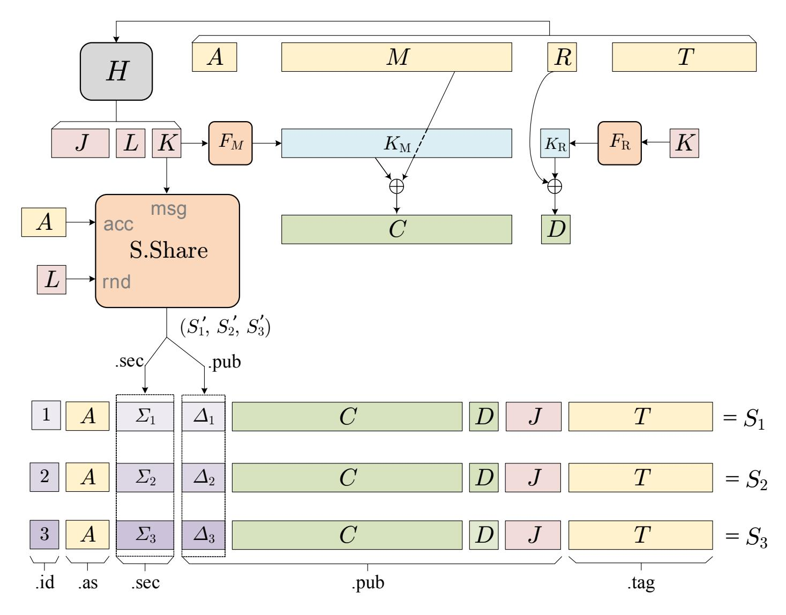
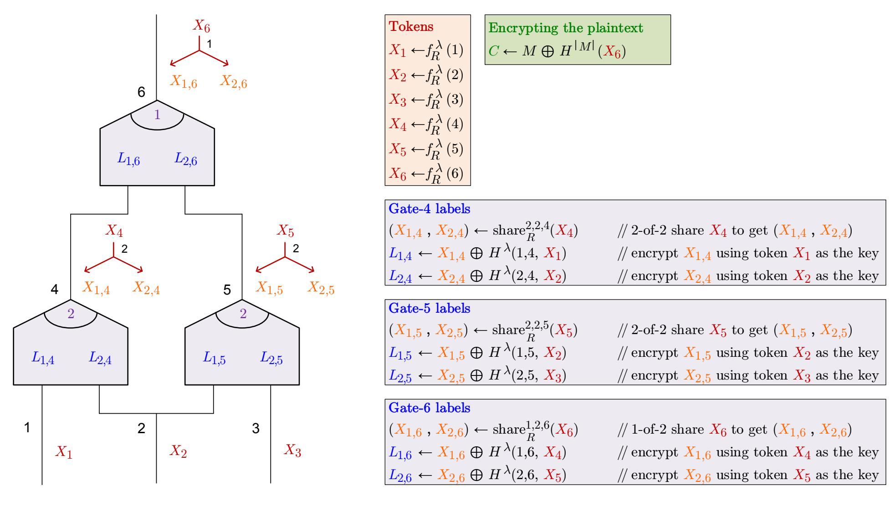

{0}------------------------------------------------

# Reimagining Secret Sharing: Creating a Safer and More Versatile Primitive by Adding Authenticity, Correcting Errors, and Reducing Randomness Requirements

Mihir Bellare<sup>1</sup> , Wei Dai<sup>1</sup> , and Phillip Rogaway<sup>2</sup>

<sup>1</sup> Department of Computer Science & Engineering, University of California, San Diego, USA <sup>2</sup> Department of Computer Science, University of California, Davis, USA

Abstract. Aiming to strengthen classical secret-sharing to make it a more directly useful primitive for human end-users, we develop definitions, theorems, and efficient constructions for what we call adept secret-sharing. Our primary concerns are the properties we call privacy, authenticity, and error correction. Privacy strengthens the classical requirement by ensuring maximal confidentiality even if the dealer does not employ fresh, uniformly random coins with each sharing. That might happen either intentionally to enable reproducible secret-sharing—or unintentionally, when an entropy source fails. Authenticity is a shareholder's guarantee that a secret recovered using his or her share will coincide with the value the dealer committed to at the time the secret was shared. Error correction is the guarantee that recovery of a secret will succeed, also identifying the valid shares, exactly when there is a unique explanation as to which shares implicate what secret. These concerns arise organically from a desire to create general-purpose libraries and apps for secret sharing that can withstand both strong adversaries and routine operational errors.

Keywords: adept secret-sharing · computational secret-sharing · cryptographic definitions · secret sharing

# 1 Introduction

Overview. This paper strengthens classical secret-sharing [\[17,](#page-18-0)[40\]](#page-19-0) to obtain a primitive we call adept secretsharing (ADSS). Our initial reason for developing ADSS was to address use cases involving journalists and whistleblowers. We were motivated by a conversation with journalist Laurent Richard [\[36,](#page-18-1)[22\]](#page-18-2), by the Snowden revelations [\[24\]](#page-18-3), and by the development of Sunder [\[39\]](#page-19-1). We recognized that unadorned Shamir secret-sharing [\[40\]](#page-19-0) wouldn't do; for example, garbage would be recovered if a share got accidentally corrupted, and a strong adversary could force recovery of whatever secret it wanted by adjusting a single share. We set out to develop a primitive that would guarantee more. It would need to be versatile, easy to understand, and support efficient and provably secure realizations.

Our approach is definitionally focused. Modern cryptography has taught that stronger definitions lead to conforming schemes that are easier to correctly use, so less prone to misuse. Our definitions are motivated by use cases, although no one use case fully motivates all of our demands. This is customary. By way of analogy, no application we know requires the full strength of IND-CCA public-key encryption [\[34\]](#page-18-4), yet this has become the accepted definitional target because it implies other properties, such as nonmalleability [\[19\]](#page-18-5), that are useful in numerous settings. We strive to create definitions that can play the same role for secret sharing that IND-CCA plays for public-key encryption.

Sample use case. To start to appreciate why new definitions are needed, let us consider a realistic but fictitious use case. German journalist D is visiting New York when a source hands him a thumb drive of shocking, classified files. D transfers the archive to his laptop, encrypts it with a strong passphrase, and destroys the thumb drive. D now wants to return to Berlin with these materials, but fears he will be detained, or worse, before he can publish. D mustn't have the sensitive plaintext on him at border crossings, where phone and laptop contents may be copied by authorities.

To ensure that the material gets out no matter what, D decides to give the encrypted archive and a share of its decryption key to colleagues A, B, and C. He intends that any two parties can reconstruct the archive. D decides it would be safest to meet A at the Newark airport, B at the Icelandair lounge where D will transit, and to send C her materials over Signal.

To begin, D needs to generate a share c of his passphrase for C. But the way secret-sharing schemes generate shares is probabilistic: fresh coins are chosen with each sharing. So it would seem that D will need to retain A's share a until he meets A in Newark, and must retain B's share b all the way to Iceland. But this is no good, for

{1}------------------------------------------------

|      | Auth A share held by a user can recover, if anything, only the one secret committed to at the time of the sharing,      |  |  |
|------|-------------------------------------------------------------------------------------------------------------------------|--|--|
|      | regardless of what other shareholders contribute.                                                                       |  |  |
|      | Errx Recovery will reconstruct the secret and identify the valid shares if and only if there's a unique plausible expla |  |  |
|      | nation for what shares implicate what secret.                                                                           |  |  |
| Priv | Unauthorized sets of shares reveal the least possible amount of information given the combined entropy of the           |  |  |
|      | secret and the provided coins.                                                                                          |  |  |

<span id="page-1-0"></span>Fig. 1. Properties of ADSS. When uniform coins are used for sharing, the Priv notion captures the complexitytheoretic formalization of the classical secret-sharing goal; otherwise, it asks for more. Authenticity and error correction concern attacks on the reconstruction of secrets—attacks that get participants to reconstruct the wrong secret, or no secret at all.

keeping a and b on the laptop along with the encrypted achieve is equivalent to keeping the archive as plaintext. A better choice might be to retain the coins that generated the shares, using them, and the passphrase, to regenerate a or b only when they are needed. But it is unclear what security properties secret sharing will have if an attacker learns retained coins. With Shamir secret-sharing, acquiring them (e.g., by confiscating the device) along with any one share (say c) enables reconstruction of the secret. In any case, D needs to use off-the-shelf tools, which, quite correctly, do not support the retention of coins used for share generation.

The scenario motivates reproducible secret-sharing: the ability to recompute a share, or a vector of shares, as long as you still have the secret.

Continuing our example, we must report that, soon after his arrival, D mysteriously vanished in Berlin. Meanwhile, A fell ill with COVID-19. Parties B and C nervously converge in Iceland. Unfortunately, C's smartphone had already been hacked by a state intelligence agency, her share c quietly replaced by ˜c. When B and C reconstruct the passphrase and use it to decrypt, the plaintext looks fine—parties B and C don't know that anything is wrong—but the archive is less important than they anticipated. It is not the original one. This is possible, at least in principle, because, with classical secret-sharing, if someone can control a single share, they may be able to control the secret that is recovered, even without knowing other shares. Nothing in the classical secret-sharing definition excludes this. This possibility motivates another non-standard aim: authenticity. It guarantees that recovery using a share either fails or recovers the secret originally associated to it. Schemes like Shamir's achieve nothing like this.

Finally, as an alternative continuation of our story, party A, now recovered, meets up with B and C in Iceland. Party C's share is still wrong. When A, B, and C contribute their shares a, b, c˜ for recovery, a classical secret-sharing scheme (like Shamir's) will recover something—but something wrong. This time, the recovered archive looks like random bits. The shareholders know that something went wrong, but they don't know what. If they had the insight to try recovery again without using C's share ˜c they would recover the correct secret. But they don't know to do this. How much nicer it would be if the recovery algorithm itself would have said: "look, share ˜c was bad, but shares a and b were fine, and implicate the following passphrase." A scheme like that enjoys error correction. Our formalization strengthens robustness [\[31,](#page-18-6)[15\]](#page-18-7), which would actually be sufficient for this example (but not, say, for 2-of-4 secret sharing).

We use the labels Auth (authenticity), Errx (error correction), and Priv (privacy) for our main goals (the last of these encompassing reproducibility). Fig. [1](#page-1-0) provides a single-sentence description of each. Fig. [2](#page-2-0) summarizes definitional choices and their rationale more broadly. As that figure makes clear, we have taken clues from multiple directions—not just use cases—as to what characteristics an ADSS scheme should enjoy.

Enhanced syntax. ADSS begins with an enriched syntax, over which the security notions above can be defined. Let us start by taking a look at the new syntax.

Unlike a classical secret-sharing scheme, the sharing algorithm of an ADSS scheme is deterministic, surfacing an input R that captures the provided coins. This enables reproducibility (described above) and hedging (described later). The sharing algorithm also takes in a description of an access structure—the specification of which sets of shareholders are authorized—rather than being specific to one. This enables runtime selection of the access structure and for the access structure itself to be authenticated being crucial for security. Finally, the sharing algorithm now takes in a string of associated data (AD), analogous to that seen in schemes for authenticated encryption. Moving on, the recovery algorithm of an ADSS scheme no longer operates on vectors of shares, but on sets of shares [\[2\]](#page-17-0). This better models the coming together of human participants who have only their shares. And the algorithm not only returns the original secret, but also identifies which shares were deemed to be valid. This allows a shareholder to reject a recovered secret if she has confidence in her own share

{2}------------------------------------------------

| Characteristic                                                               | Reasons                                                                                                                                                                          |
|------------------------------------------------------------------------------|----------------------------------------------------------------------------------------------------------------------------------------------------------------------------------|
| The sharing algorithm is deter<br>ministic<br>but<br>surfaces<br>an<br>input | Some settings require reproducibility: the ability of a dealer to recompute a share.<br>I<br>Eg, a dealer may distribute shares of a passphrase to different shareholders at mul |
| R via which the caller can pro                                               | tiple points in time. I<br>Or she may need to replace the share of a shareholder who has                                                                                         |
| vide "coins." (In contrast, classical                                        | lost access to it. I<br>The analogous move from internal coins to coins provided across                                                                                          |
| secret-sharing is probabilistic.)                                            | the interface was pivotal for authenticated encryption (AE). I<br>Without surfacing R<br>one can't investigate the impact of different choices for it.                           |
| The coins R provided to the shar                                             | I<br>Failures in random-number generators are common. They arise from implementa                                                                                                 |
| ing algorithm might not be uni                                               | tion errors or the inaccessibility of good randomness. I<br>Install-time randomness or                                                                                           |
| form. They might be fixed. They                                              | maintaining state may be more feasible than per-sharing randomness. I<br>Hedged and                                                                                              |
| might depend on persistent state.                                            | deterministic encryption have proven to be useful. I<br>Deterministic signature schemes                                                                                          |
|                                                                              | avoid security vulnerabilities that probabilistic signatures schemes are susceptible to.                                                                                         |
| A string of associated data (AD)                                             | I<br>The AD might encode information like: time of deal or conditions under which                                                                                                |
| can be bound to a sharing.                                                   | recovery may take place. I<br>The inclusion of AD in AE has been very useful for<br>applications.                                                                                |
| An encoding of the intended ac                                               | I<br>General-purpose libraries and user-facing tools need to support a variety of ac                                                                                             |
| cess structure is provided as an in                                          | cess structures. A caller might not know which it needs until runtime. I<br>Without                                                                                              |
| put to the sharing algorithm. It is                                          | authenticating the access structure itself simple attacks are possible.                                                                                                          |
| authenticated.                                                               |                                                                                                                                                                                  |
| Recovery operates on set-valued                                              | I<br>When a group of human shareholder get together for a reconstruction ceremony                                                                                                |
| inputs, not the vector-valued in                                             | there may be no side-information to order them. I<br>Without side information there                                                                                              |
| puts of classical secret-sharing.                                            | is no way to know even the number of shareholders needed to reconstruct.                                                                                                         |
| Definitions envision shares being                                            | I<br>Real-world adversaries aren't restricted to crossing-out shares from known share                                                                                            |
| arbitrarily changed or created.                                              | holders, but can modify shares and create shares for new, alleged shareholders.                                                                                                  |
| An incorrect secret should never                                             | I<br>Honest parties deserve to know if recovery was impossible. I<br>Parties may be unable                                                                                       |
| be returned: either one should get                                           | at reconstruction time to assess if a recovered message "makes sense". And "making                                                                                               |
| back the original message or an in                                           | sense" is not evidence of authenticity, anyway (a common misunderstanding in en                                                                                                  |
| dication of failure.                                                         | cryption). I<br>Authenticity implies nonmalleability. Malleable schemes would allow an                                                                                           |
|                                                                              | adversary to adjust an unknown secret to one that better suits it.                                                                                                               |
| Shares can have a designated non                                             | I<br>Secrets can be extremely long, which implies that some shares will be. Having to                                                                                            |
| secret ("public") portion.                                                   | store less privately can reduce the burden of custody. I<br>It is desirable to be able to                                                                                        |
|                                                                              | store shares (at least the private part) in an HSM (hardware security module).                                                                                                   |
| If shares get corrupted then the re                                          | I<br>Shares can get corrupted for inconsequential reasons, like the accidental mixup                                                                                             |
| covery process must fix the prob                                             | of shares from different sharings. I<br>Robust secret-sharing is already recognized as                                                                                           |
| lem if there's an unambiguous ex                                             | useful, but was formalized in a way that neither demands recovery from recoverable                                                                                               |
| planation as to what went wrong.                                             | errors nor forbids the recovery of junk when there is no authorized set of shareholders.                                                                                         |
| On recovery, particular shares can                                           | I<br>If a shareholder reconstructs, she likely trust her own share. I<br>If some shares were                                                                                     |
| be marked as trusted, or a known                                             | signed by a trusted dealer, we can insist on using them. I<br>The recovering party might                                                                                         |
| access structure can be provided.                                            | have side information on what access structure was used. I<br>An adversary can try to                                                                                            |
|                                                                              | thwart recovery by adding a single share asserting a 1-of-1 access structure.                                                                                                    |
|                                                                              |                                                                                                                                                                                  |

<span id="page-2-0"></span>Fig. 2. Some ADSS definitional choices and their rationale. Considerations shaping our definitions include use cases, philosophical arguments, and reasoning by analogy. Simplicity and strength were key desiderata.

but it was not deemed valid. As for the shares themselves, the access structure and AD must be encoded in each, to ensure that no side information needs be known by the recovering party. And shares can have separate secret and non-secret parts, so that shareholders need only keep the first in private storage. This enables the sharing of arbitrarily long secrets even when shareholders are only able to privately store a limited amount. The syntactic changes just sketched may seem low-level but are fundamental in enabling the capabilities we seek.

Enhanced security. A journalist could certainly share her documents using Shamir secret-sharing [\[40\]](#page-19-0). This provides privacy. But as our extended example illustrates, the adversary may have other goals in mind, like disrupting recovery, either by making it fail or by making shareholders recover something other than that which the dealer shared. The adversary can attempt to achieve this goal by infiltrating a shareholder's system (something nation-state adversaries are good at) and changing her share. It can create entirely new shareholders that show-up for reconstruction. We want to defend against such attacks to the maximal extent possible. To do so, we develop Auth and Errx.

{3}------------------------------------------------

Authenticity (Auth), which we alternatively term binding, ensures that when a user is given a share S, there is at most one secret M for which it might be a share. The share is effectively a commitment to that secret. A shareholder can thus regard her share as a locked box containing some well-defined secret that she does not yet know. (We do allow that if the dealer was dishonest then nothing might be in that box.) In short, authenticity concretizes the basic intuition that a share is associated to some one particular thing.

Error correction (Errx) ensures that if some shares from a sharing of a secret get corrupted, or new shares are added, but there remains a single nontrivial explanation as to what the secret must have been before the shares got messed up, then the recovery process must identify that one correct secret. It must also indicate which shares implicate it. Recovery must fail if there is no authorized subset of shares, or if there are two or more explanations for what got corrupted. In short, an Errx-secure scheme must fix what is fixable, and must indicate if shares irreparably messed up.

Auth and Errx are different from verifiable secret-sharing (VSS) [18]. VSS requires a reliable broadcast channel, which may not be available; Auth and Errx do not. Errx is related to but different from robustness [31,15], which aims to guarantee message recovery despite the presence of some bad shares shuffled in among an authorized collection of good ones. Errx formalizes different intuition: that recovery does the best job possible with whatever is presented. For this reason, Errx is achievable for any access structure, while robustness is achievable for threshold schemes with honest majority, but little more. Errx demands that nothing be recovered when there is no authorized subset of shares, will robustness requires nothing. All of that said, Errx security does imply robustness whenever the latter can be achieved. Auth and Errx have little in common with repairable threshold schemes [25,32], which allow a party to reconstruct a missing share by interacting with fellow shareholders. In scenarios we care about, shareholders may not have the ability to interact with one another prior to recovery. See Section A for fuller comparisons with VSS, robustness, and repairability.

Enhanced usability. Our ADSS schemes employ hedging [5], using the anticipated unpredictability of the secret itself, together with the entropy in the provided coins, to provide as much privacy as possible. This means that privacy is maintained, to the extent possible, in settings where high-quality randomness is unavailable or was inadequately harvested. At the same time, the approach provides for reproducibility, enabling the dealer, if it so arranges, to re-share a secret M and get the same shares as before. Other ADSS elements that enhance usability include: the ability to handle AD, having the recover algorithm operate on sets instead of vectors of shares; and the capacity to deal with enormous secrets, as we now discuss.

PROTOCOLS AND PROOFS. We construct simple, efficient, and provably secure ADSS schemes for arbitrary access structures. Our schemes can be used for splitting anything from a PIN code to a huge archive of files (the Panama papers were 2.6 terabytes [26]). In sharing out a large archive one needn't encrypt it and then share out the key; the user can regard the archive itself as the secret, which is conceptually and operationally simpler.

Our constructions begin with a scheme \$1 that satisfies our ADSS syntax but only achieves Priv-security with uniformly random coins—what we call *classical* privacy, or Priv\$. The scheme only works for threshold access structures. It is basically just Shamir's scheme [40], but adapted to our syntax. Scheme \$2 still achieves only Priv\$ privacy, but can handle any access structure, now presented as a circuit of threshold gates. Despite the classical aim, we could find no full exposition or proof on how to carry out secret sharing for arbitrary access structures; our paper fills this gap.

Our main construction is the transformation AX that converts a secret-sharing scheme  $\mathbb{S}$  that achieves only classical (Priv\$) privacy to a scheme  $\mathbb{SS} = AX[\mathbb{S}]$  that achieves Priv and Auth security. This can then be composed with a further transformation, EX, to achieve Errx security. Rather roughly, AX starts by symmetrically encrypting the secret M to the ciphertext C, which is put in the public portion of each share. The key K for this encryption is determined by applying a hash function to all inputs the sharing algorithm gets. The hash function is here used as a randomness extractor [33]. The lower-level secret-sharing scheme  $\mathbb{S}$  shares out K using randomness that is again extracted from the inputs to  $\mathbb{SS}$ . When speculative values are recovered, a correctness check is done to see if re-sharing M with the recovered randomness R gives rise to a superset of the shares received. Schemes  $\mathbb{SS}1$  and  $\mathbb{SS}2$  are the result of applying AX and then EX to  $\mathbb{S}1$  and  $\mathbb{S}2$ . They are the concrete ADSS schemes that we propose.

DISCUSSION. Kacsmar, Komlo, Kerschbaum, and Goldberg [29] also address gaps between the formulation and use of secret sharing. Their motivations are similar to ours: closing the theory/practice gulf in this domain. They employ the idea of *ceremonies* [20] and design a proactive VSS scheme [27] to achieve goals that they call *integrity* and *availability*. Our work is more formal, and, in carrying it out, we have insisted on retaining

{4}------------------------------------------------

the fundamental elements of the classical model: ADSS abides no broadcast channels, no interaction among shareholders, no preprocessing, no PKI (public-key infrastructure), and no algorithms but Share and Recover.

Secret sharing can be viewed as a flavor of encryption [15]: sharing corresponds to encryption; recovery corresponds to decryption. From this vantage, the move from classical to adept secret-sharing mirrors the move from semantically secure to authenticated encryption [11,13,30], as well as the move from probabilistic to deterministic [4,8] and hedged [5] public-key encryption. We shift the focus from eavesdropping to interference, and from perfect to possibly absent or deficient randomness. We trade internal randomness for an externally supplied input [38]. We add in AD [37]. Of course there are spots where the analogy breaks down: secret sharing involves no keys, while access structures were outside the ambit of encryption prior to ABE [23]. Still, the analogy explains many aspects of our work.

Reproducibility comes at the price of diminished privacy for low-entropy secrets. But we never mandate reproducibility; we merely enable it. If the dealer uses random coins shes gets classical privacy; if she wires in a constant, she gets best possible privacy for a deterministic scheme. Similar tradeoffs are present for deterministic and searchable public-key encryption [4] and for format-preserving encryption [12]. In addition, the strengthening of secret sharing that begins by surfacing the coins includes other benefits, like hedging.

The value of new definitions is always somewhat speculative. Our definitional choices have been guided by uses cases, by analogies, and by conversations with developers, journalists, whistleblowers, and cryptographers. But only time will tell if we have identified the secret-sharing aims that can precipitate a flourishing.

### 2 Preliminaries

NOTATION. Fig. 3 summarizes the most frequently used notation in this paper. The table may serve as a reference or overview of things to come.

ACCESS STRUCTURES. We need a way to specify which parties are authorized to reconstruct the secret. Number parties 1, 2, ..., n. We then define an access structure  $\mathcal{A}$  as a set of sets of positive numbers. It must be finite, nonempty, and exclude the empty set. Define  $n(\mathcal{A})$ , the number of parties in  $\mathcal{A}$ , as the least n such that  $U \subseteq [1..n]$  for all  $U \in \mathcal{A}$ . We say that  $U \subseteq [1..n(\mathcal{A})]$  is authorized if  $U \in \mathcal{A}$  and unauthorized if  $U \notin \mathcal{A}$ . We require access structures be monotone, which means that an authorized set stays authorized if you add in parties: if  $U \in \mathcal{A}$  and  $U \subseteq V \subseteq [1..n(\mathcal{A})]$  then  $V \in \mathcal{A}$ .

An example access structures is the 2-out-of-3 one  $\mathcal{A}_{2,3} = \{\{1,2\},\{1,3\},\{2,3\},\{1,2,3\}\}\}$ . More generally, for  $1 \leq t \leq n$  the threshold access-structure  $\mathcal{A}_{n,t}$  is  $\{U \subseteq [1..n] : |U| \geq t\}$ . A secret-sharing scheme for such access structures is called a threshold scheme. A simple non-threshold access-structure is  $\mathcal{A}_{12\vee 13} = \{\{1,2\},\{1,3\},\{1,2,3\}\}$ : party 1 and either party 2 or 3.

CLASSICAL SECRET-SHARING. Let us briefly review the *classical* notion of a secret-sharing scheme—what a scheme like Shamir's targets [17,40]. One can formalize a classical secret-sharing scheme as a pair of algorithms  $\mathbb{S} = (Share, Recover)$  along with an associated access structure  $\mathcal{A}$ , as follows:

Share The sharing algorithm Share probabilistically maps a message  $M \in \mathsf{Msg}$  to a vector (or list) of  $n = \mathsf{n}(\mathcal{A})$  shares, each of them a string:  $\mathbf{S} \leftarrow Share(M)$ .

Recover The recovery algorithm Recover is a deterministic algorithm that takes in an n-vector of values, n = n(A), each being either a string or the special symbol  $\Diamond$ , which is used to indicate that the share is missing. It returns a string  $M \leftarrow Recover(S)$ .

If  $\mathbf{S} = (S_1, \dots, S_n)$  is an *n*-vector of strings and  $U \subseteq [1..n]$ , let  $\mathbf{S}_U$  be the *n*-vector with *i*th component  $S_i$  if  $i \in U$ , and  $\Diamond$  otherwise. So  $\mathbf{S}_U$  is  $\mathbf{S}$  with  $\Diamond$ -symbols shuffled in at positions outside of U. Then we require the following: if  $\mathbf{S} \leftarrow Share(M)$  and  $U \in \mathcal{A}$  then  $Recover(\mathbf{S}_U) = M$ . In words: you can recover the secret from an authorized subvector of shares.

For any  $M, M' \in \mathsf{Msg}$  and any  $U \notin \mathcal{A}$ , we can regard  $(Share(M))_U$  as a distribution on vectors of shares, the underlying randomness that of Share. The security notion for a classical secret-sharing scheme can then be formalized by asking that distributions  $(Share(M))_U$  and  $(Share(M'))_U$  be identical. In words: unauthorized subvectors of shares reveal nothing about the secret. If desired, this condition can be relaxed to computational indistinguishability or formalized in other ways [31,15].

{5}------------------------------------------------

| (0.43)                                                        |                                                                                                            |
|---------------------------------------------------------------|------------------------------------------------------------------------------------------------------------|
| $\{0,1\}^*$                                                   | Set of all strings over $\{0,1\}$                                                                          |
| $\{0,1\}^{**}$                                                | Set of all vectors (= lists) of strings                                                                    |
| $\langle \cdots \rangle$                                      | A string encoding of what's in the brackets                                                                |
| <u> </u>                                                      | Indicates invalidity: no secret can be recovered                                                           |
| [1n]                                                          | Integers between 1 and $n$ inclusive                                                                       |
| $a \leftarrow X$                                              | Sample, then assign. Uniform distribution if $X$ is a set                                                  |
| A                                                             | A string that names an access structure via an access-structure naming function                            |
| $ \mathcal{A} $                                               | An access structure: a set of subsets of $[1n(A)]$                                                         |
| A                                                             | An adversary                                                                                               |
| Acc                                                           | Access-structure naming function                                                                           |
| Access                                                        | Set of strings that name access structures                                                                 |
|                                                               | $\mathbb{A}$ 's advantage (a real number) in breaking Auth-security of $\mathbb{S}$                        |
| $\mathbf{Adv}^{\mathrm{errx}}_{\mathbb{S}}(\mathbb{A})$       | $\mathbb{A}$ 's advantage (a real number) in breaking Errx-security of $\mathbb{S}$                        |
| $\big  \mathbf{Adv}^{\mathrm{priv}}_{\mathbb{S}}(\mathbb{A})$ | A's advantage (a real number) in breaking Priv-security of S                                               |
| AS                                                            | The set of all possible access structures                                                                  |
| Auth                                                          | Main authenticity property we formalize                                                                    |
| AX                                                            | Transform to get Auth + Priv from Priv\$                                                                   |
| $\varepsilon$                                                 | The empty string                                                                                           |
| Errx                                                          | The error-correction property we formalize                                                                 |
| EX                                                            | Transform to get Errx security                                                                             |
| Known                                                         | Set of things the recovering party might be sure of                                                        |
| H                                                             | Hash function vectors, modeled as a random oracle. Superscript is output length                            |
| M                                                             | A secret shared out in a secret-sharing scheme                                                             |
| M                                                             | Length of the string $M$ (in bits)                                                                         |
| Msg                                                           | The set of possible secrets (messages)                                                                     |
| $\mathrm{ln}(\mathcal{A})$                                    | Number of parties in the access structure $\mathcal{A}$                                                    |
| $\mathcal{P}(X)$                                              | Set of all finite subsets of the set $X$ (finite power set)                                                |
| Priv                                                          | The new privacy property we formalize                                                                      |
| Priv\$                                                        | Classical privacy property. Weaker than Priv                                                               |
| R                                                             | Randomness / coins given to Share. Might not be uniform                                                    |
| Rand                                                          | All possible coins (randomness)                                                                            |
| S                                                             | A share. String-valued and have several parts                                                              |
| S                                                             | A vector of shares, $\mathbf{S} = (S_1, \dots, S_n)$                                                       |
| $\big  \boldsymbol{S}[i]$                                     | The $i$ -th entry of vector $\boldsymbol{S} = (\boldsymbol{S}[1], \dots \boldsymbol{S}[ \boldsymbol{S} ])$ |
| S                                                             | A set of shares, $S = \{S_1, \dots, S_t\}$                                                                 |
| S                                                             | Generic ADSS scheme $S = (Acc, Share, Recover)$                                                            |
| S.as                                                          | Access structure associated to share $S$                                                                   |
| S.id                                                          | Identity of party associated to share $S$                                                                  |
| S.pub                                                         | Non-secret part of share $S$                                                                               |
| S.sec                                                         | Secret part of share $S$                                                                                   |
| S.tag                                                         | Tag (AD) part of share $S$                                                                                 |
| S1                                                            | Shamir-like SS scheme. Works for threshold access structures. Achieves Priv\$                              |
| $\mathbb{S}2$                                                 | Yao-like SS scheme. Works for any access structure. Achieves Priv\$                                        |
| Recover                                                       | Algorithm that recovers a secret                                                                           |
| Share                                                         | Algorithm that shares a secret                                                                             |
| Share                                                         | All possible shares (which are strings)                                                                    |
| Share*                                                        | All possible vectors of shares                                                                             |
| Shares                                                        | All possible sets of shares                                                                                |
| T                                                             | Tag (associated data) (a string). Authenticated during sharing                                             |
| Tag                                                           | The set of all possible tags (AD values)                                                                   |
| $ \mathcal{V} $                                               | Maximal set of valid shares, $\mathcal{V} \subseteq \mathcal{S}$                                           |
|                                                               | 1                                                                                                          |

<span id="page-5-0"></span>Fig. 3. Frequently used notation. Note that font styles for a given letter or word are routinely differentiated.

{6}------------------------------------------------

### 3 Syntax

CHANGES. We enrich the syntax of a classical secret-sharing scheme in multiple directions. First, the access structure  $\mathcal{A}$  won't be fixed, but, instead, the party who shares a secret, the *dealer*, will be able to specify the access structure it wants. A string A will denote the desired access structure, a function Acc specifying its interpretation. For example, the string "2,3" might denote the threshold access-structure  $\mathcal{A}_{2,3}$ . Second, our sharing algorithm Share will have still more inputs. Beyond the access structure and the secret, the dealer will provide *coins* and *associated data*. With coins now an explicit input, the algorithm will be deterministic. Finally, the recovery algorithm Recover will output more: not only will it return the recovered secret, but also the shares that were used. Alternatively, it may recover nothing, outputting a special I-can't-recover-anything symbol. We now make all of this precise.

FORMAL DEFINITION. We define a scheme for *adept secret-sharing* (ADSS) as a triple of deterministic functions  $\mathbb{S} = (Acc, Share, Recover)$ , as follows.

Acc: The access-structure naming function

Acc: Access 
$$\rightarrow AS$$

associates an access structure  $\mathcal{A} = \operatorname{Acc}(A)$  with each string  $A \in \operatorname{Access}$ . Here  $\operatorname{Access} = \{0,1\}^*$  (Kleene star) is the set of all binary strings, while  $\mathcal{AS}$  is the set of all possible access structures. Note that there may be multiple ways to name an access structure under  $\operatorname{Acc}$ : distinct strings A and A' such that  $\operatorname{Acc}(A) = \operatorname{Acc}(A')$ . Also, some access structures might be impossible to name using  $\operatorname{Acc}$ : for some  $\mathcal{A} \in \mathcal{AS}$  there might be no  $A \in \operatorname{Access}$  with  $\operatorname{Acc}(A) = \mathcal{A}$ . For example, a secret-sharing scheme designed for threshold access structures won't be able to request  $\{\{1,2\},\{1,3\},\{1,2,3\}\}$  (i.e., "1 and (2 or 3)").

Share: The sharing algorithm

Share: Access 
$$\times$$
 Msg  $\times$  Rand  $\times$  Tag  $\rightarrow$  Share\*

takes in a description  $A \in \mathsf{Access}$  of an access structure, a message (or secret)  $M \in \mathsf{Msg}$ , some coins  $R \in \mathsf{Rand}$ , and a tag (or associated data)  $T \in \mathsf{Tag}$ . It outputs a vector of shares. Here  $\mathsf{Msg}$ ,  $\mathsf{Access}$ ,  $\mathsf{Rand}$ ,  $\mathsf{Tag}$ ,  $\mathsf{Share} \subseteq \{0,1\}^*$  are binary strings. We require that  $M \in \mathsf{Msg}$  implies  $\{0,1\}^{|M|} \subseteq \mathsf{Msg}$  and  $R \in \mathsf{Rand}$  implies  $\{0,1\}^{|R|} \subseteq \mathsf{Rand}$ . The sharing algorithm must generate the appropriate number of shares for the specified access structure:  $|\mathsf{Share}(A,M,R,T)| = \mathsf{n}(\mathsf{Acc}(A))$  for all  $A \in \mathsf{Access}$ ,  $M \in \mathsf{Msg}$ ,  $R \in \mathsf{Rand}$ , and  $T \in \mathsf{Tag}$ : By  $|\cdot|$  we denote the length, cardinality, or number of components for string, set, or vector.

Recover: The message-recovery algorithm

```
Recover: Shares \rightarrow Msg \times Shares \cup \{\bot\}
```

maps a set of shares  $S \in \text{Shares} = \mathcal{P}(\text{Share})$  to a message  $M \in \text{Msg}$  and a set of valid shares  $\mathcal{V} \subseteq S$ . Alternatively, the algorithm can decline to produce such a pair and return  $\bot$  instead. By  $\mathcal{P}(X)$  we mean the finite power set of X, the set of all finite subsets of X. (The traditional power set of an infinite set such as  $\text{Share} = \{0,1\}^*$  includes infinite subsets. We don't want that, as one provide Recover, like any algorithm, a finite set of strings.) Note that Share returns a list of shares while Recover takes in a set of shares.

PARTS OF A SHARE. We establish the convention that each share  $S \in \mathsf{Share}$  is actually the encoding of five strings,  $S = \langle S.\mathsf{id}, S.\mathsf{as}, S.\mathsf{sec}, S.\mathsf{pub}, S.\mathsf{tag} \rangle$ . We call the parts of a share its *identity*, access structure, secret portion, public portion, and AD. We extend the .sec and .pub operators to vectors, defining  $S.\mathsf{sec} = (S_1.\mathsf{sec}, \ldots, S_n.\mathsf{sec})$  and  $S.\mathsf{pub} = (S_1.\mathsf{pub}, \ldots, S_n.\mathsf{pub})$  when  $S = (S_1, \ldots, S_n)$ . We extend the .id operator to sets, defining  $S.\mathsf{id} = \{S.\mathsf{id}: S \in S\}$ . We extend the .as operator to sets, so that  $S.\mathsf{as} = A$  if  $S.\mathsf{as} = A$  for all  $S \in S$ , and  $S.\mathsf{as} = A$  otherwise. We insist that  $S = \mathsf{Share}(A, M, R, T) = (S_1, \ldots, S_n)$  implies that  $S_i.\mathsf{tag} = T$  and  $S_i.\mathsf{as} = A$  and  $S_i.\mathsf{id} = i$  for all  $S \in S$  is an extended and  $S_i.\mathsf{id} = i$  for all  $S \in S$  is an extended and  $S_i.\mathsf{id} = i$  for all  $S \in S$  is an extended and  $S_i.\mathsf{id} = i$  for all  $S \in S$  is an extended and  $S_i.\mathsf{id} = i$  for all  $S \in S$  is an extended and  $S_i.\mathsf{id} = i$  for all  $S \in S$  is an extended and  $S_i.\mathsf{id} = i$  for all  $S \in S$  is an extended and  $S_i.\mathsf{id} = i$  for all  $S \in S$  is an extended and  $S_i.\mathsf{id} = i$  for all  $S \in S$  is an extended and  $S_i.\mathsf{id} = i$  for all  $S \in S$  is an extended and  $S_i.\mathsf{id} = i$  for all  $S \in S$  is an extended an extended and  $S_i.\mathsf{id} = i$  for all  $S \in S$  is an extended an extended and  $S \in S$  is an extended and  $S \in S$  is an extended an extended and  $S \in S$  is an extended an extended and  $S \in S$  is an extended an extended and  $S \in S$  is an extended an extended an extended an extended and  $S \in S$  is an extended an extended an extended an extended an extended an extended an extended an extended an extended an extended an extended an extended an extended an extended an extended an extended an extended an extended an extended an extended an extended an extended an extended an extended an extended an extended an extended an extended an extended an extended an extended an extended an extended an extended an extended an extende

RANDOM ORACLES. We allow the Share and Recover algorithms of an ADSS scheme may call an oracle Hash that realizes a function  $H \in \Omega$ , with  $\Omega$ , the set of all functions  $H: \mathbb{N} \times \{0,1\}^{**} \to \{0,1\}^*$  such that  $|H(\ell, \mathbf{X})| = \ell$ . By  $\{0,1\}^{**} = (\{0,1\}^*)^*$  we denotes the space of vectors of strings. We can explicitly indicate the presence of the oracle or hash function that Share and Recover may access by writing it as a superscript.

BASIC CORRECTNESS. An ADSS scheme  $\mathbb{S} = (\text{Acc}, \text{Share}, \text{Recover})$  enjoys basic correctness if for all  $A \in \text{Access}$ ,  $M \in \text{Msg}$ ,  $R \in \text{Rand}$ ,  $T \in \text{Tag}$ ,  $H \in \Omega$ ,  $S \leftarrow \text{Share}^H(A, M, R, T)$ , and  $U \subseteq [1..n(\text{Acc}(A))]$ ,

{7}------------------------------------------------

- if U ∈ Acc(A) then RecoverH(S[U]) = (M,S[U]) , while
- if U 6∈ Acc(A) then RecoverH(S[U]) = ⊥ .

Here S[U] = {S[i]: i ∈ U} is the set of shares from parties U. In words: applying Recover to a subset of shares obtained by sharing out M gives M if the subset is authorized and ⊥ if it is not. We henceforth require that all ADSS schemes satisfy basic correctness.

Notation. We write S.Acc, S.Share, and S.Recover for the components of S. In the same way, we write S.Access, S.Msg, S.Rand, and S.Tag.

Discussion. Once the decision has been reached to provide the access structure to Share it is tempting to just say that it's encoded as a string hAi and leave it at that. But more care needs to be taken because what access structures can be named, and how compactly, are central concerns of secret sharing. This is what motivates making Acc a first-class component of an ADSS scheme.

Let us give some examples of access-structure naming functions Acc. For threshold schemes, a string hn, ti encoding numbers n and t could name An,t. It would be equally permissible, but less compact and convenient, to have Acc expect a string listing authorized sets, like "{{1,2},{1,3},{2,3},{1,2,3}}''. For a representation that is compact and expressive, the string A could encode a Boolean circuit of threshold gates having a single output wire and input wires 1, . . . , n. We'd say that U ∈ Acc(A) if the circuit named by A evaluates to true when its n inputs indicate if a party is present (that bit is 1) or absent (it is 0).

Having Recover take in a set instead of a vector relieves shareholders of having to know their "position" in line. It also opens the door to authenticity notions where multiple parties can impersonate some shareholder.

While the AD of an ADSS scheme is analogous to that of an authenticated-encryption (AE) scheme, there are important differences. Our AD values are not assumed to be known by the party recovering a secret; an AE scheme's AD value is. This follows the philosophical view that for secret sharing one should not require the receiver to know anything beyond what is in the shares.

The "public" portion of a share need not be public; we only mean that it is not a secret. The secret/public distinction matters most when the message being shared is long. We anticipate that most or all of the public portion of shares would be the same across all shares. When this is true, the public potion of shares might be kept in some highly available repository, rather than stored with each share.

Extensions to the syntax of Recover are described in Section [6,](#page-11-0) where we allow a priori information K ∈ Known to be input to Recover, and allow coins R ∈ Rand to be output by Recover.

A paper on VSS by Bai, Damg˚ard, Orlandi, and Xia [\[2\]](#page-17-0) employed some related syntactic choice. In particular, their Share algorithm takes in an access structure, assumed to be described by a circuit. But it is not authenticated, returned during recovery, or guaranteed to be dropped into shares. The "public share" S<sup>0</sup> that their Share algorithm outputs resembles the public portion of a share from our own treatment. But the former was actually used to formalize a broadcast channel, which is not present in our model.

# 4 Privacy

The idea. One way to formalize privacy for a classical secret-sharing scheme captures this idea: if an adversary obtains an unauthorized set of shares, this will tell it nothing about the message beyond that which it already knows [\[15\]](#page-18-7). Achieving this requires fresh, high-entropy coins with each sharing. In their absence, all bets are off. Our formulation generalizes this idea, following the idea of hedging [\[5\]](#page-17-1), so that the guarantee above continues to hold, to the maximum extent possible, even when the coins are not good. We ask that if an adversary obtains an unauthorized set of shares, this will tell it nothing about the message M as long as the (M, R) pair was drawn from a set too large for the adversary to exhaust. Intuitively, this is the best possible, because if the adversary could exhaust this set then it could violate privacy by running the sharing algorithm on each candidate (M, R) to see which results are consistent with the shares it has seen.

What is the benefit of all of this? First, it enables reproducible secret-sharing with meaningful privacy guarantees. For example, the random input R might be chosen at software-installation time, then supplemented by a counter with each sharing. Share regeneration is now possible, but even if the adversary does get hold of the device containing R, privacy will be preserved as long as M itself is unpredictable and the adversary obtains only an unauthorized set of shares. For a classical secret-sharing scheme like Shamir's that wouldn't be true. A related benefit is for the sharing algorithm to work as well as possible in the presence of imperfect randomness. A cryptographic technique becomes safer to use when you can prove that it does not catastrophically fail when the randomness isn't perfect.

{8}------------------------------------------------

```
Game G_{\mathbb{S},\mathbb{I}}^{\operatorname{priv}}(\mathbb{A})

20 procedure MAIN

21 c \leftarrow \{0,1\}; \ H \leftarrow \Omega

22 q \leftarrow 0; \ (St, \mathbf{B}) \leftarrow \mathbb{I}^{\operatorname{DEAL}}

23 if (\exists j : \mathbf{B}[j] \in \operatorname{Acc}(\mathbf{A}[j])) then return false

24 c' \leftarrow \mathbb{A}^H(St, \mathbf{S}_1[\mathbf{B}[1]], \ldots, \mathbf{S}_q[\mathbf{B}[q]], \mathbf{P})

25 return (c = c')

26 procedure \operatorname{Deal}(A, M_0, M_1, R, T)

27 q \leftarrow q + 1; \ \mathbf{A}[q] \leftarrow A

28 \mathbf{S}_q \leftarrow \mathbb{S}.\operatorname{Share}^H(A, M_c, R, T); \ \mathbf{P}[q] \leftarrow \mathbf{S}_q.\operatorname{pub}

29 return
```

```
Game G^{\text{pred}}_{\mathbb{I}}(\mathbb{P})

30 procedure Main

31 q \leftarrow 0; (St, \mathbf{B}) \leftarrow \mathbb{I}^{\text{DEAL}}

32 (M, R) \leftarrow \mathbb{P}(\mathbf{A}, \mathbf{B}, \mathbf{T}, \mathbf{L}, St)

33 return ((M, R) \in D)

34 procedure Deal(A, M_0, M_1, R, T)

35 D \leftarrow D \cup \{(M_0, R), (M_1, R)\}; \ q \leftarrow q + 1

36 \mathbf{A}[q] \leftarrow A; \ \mathbf{R}[q] \leftarrow R; \ \mathbf{T}[q] \leftarrow T; \ \mathbf{L}[q] \leftarrow |M_0|

37 return
```

<span id="page-8-0"></span>**Fig. 4. Defining privacy. Top:** Game for measuring Priv security of an ADSS scheme  $\mathbb{S}$  relative to an input generator  $\mathbb{I}$  and an adversary  $\mathbb{A}$ . **Bottom:** Game for measuring the predictability of inputs selected by the input generator  $\mathbb{I}$ .

DEFINITION. Fix an adept secret-sharing scheme  $\mathbb{S}$ , an algorithm  $\mathbb{I}$  called the *input-selector*, and an adversary  $\mathbb{A}$  called the *privacy adversary*. Consider the  $G_{\mathbb{S},\mathbb{I}}^{\text{priv}}(\mathbb{A})$  game of Fig. 4. The Priv advantage of  $\mathbb{A}$  relative to  $\mathbb{I}$  is defined by

$$\mathbf{Adv}^{\mathrm{priv}}_{\mathbb{S},\mathbb{I}}(\mathbb{A}) = 2\Pr[G^{\mathrm{priv}}_{\mathbb{S},\mathbb{I}}(\mathbb{A})] - 1.$$

We first explain the broad elements of the game, and then its fine points. The game picks a challenge bit c at random. The input-selector represents the dealer. It has a Deal oracle via which it provides a pair of message  $M_0, M_1 \in \mathbb{S}$ . Msg that are required to be of the same length. It also provides an access-structure description  $A \in \mathbb{S}$ . Access and a tag  $T \in \mathbb{S}$ . Tag. More unusually, it provides a string  $R \in \mathbb{S}$ . Rand that will be the randomness used by S.Share. The randomness is chosen by the input-selector, not the game. In response to a query  $(A, M_0, M_1, T, R)$ , oracle Deal creates a vector  $S_i$  of shares by running S.Share, the message being either  $M_0$  or  $M_1$  depending on the challenge bit c. The access structure and AD, and also the randomness, are taken from the query. The oracle may be called as often as the input-selector likes, but with the following non-repetition condition: if  $(A_1, M_{1,0}, M_{1,1}, R_1, T_1), \ldots, (A_q, M_{q,0}, M_{q,1}, R_q, T_q)$  are the queries made, then the tuples  $(A_1, M_{1,0}, R_1, T_1), \dots, (A_q, M_{q,0}, R_q, T_q)$  are all distinct, and also the tuples  $(A_1, M_{1,1}, R_1, T_1), \dots, (A_q, M_{q,0}, R_q, T_q)$  $M_{q,1}, R_q, T_q$ ) are all distinct. So for both c = 0 and c = 1, the inputs provided to Share will be distinct. This is necessary because, otherwise, Share being deterministic, an adversary could trivially discover the challenge bit c. The number of calls made is recorded in the variable q. As per line 29, nothing is returned to the adversary in response to a DEAL query. This ensures that the inputs to DEAL are chosen non-adaptively, a choice we will discuss later. The output of I consists of state information St, to be passed to its accomplice A, and a q-vector **B** whose j-th component  $B[j] \subseteq [1..n(Acc(A[j]))]$ , for each  $j \in [1..q]$ , is a set of parties that the input-selector is corrupting, meaning I is requesting the corresponding set of shares  $S_i[B[j]]$  be provided to A. If a set B[j]returned by I is authorized, the game immediately returns false. Otherwise, the privacy adversary is executed on input of the state information St from  $\mathbb{I}$  and the sets of shares  $S_1[B[1]], \ldots, S_q[B[q]]$  of the corrupted parties, as well as the public parts of all shares dealt. It also gets the random oracle H, which was denied to  $\mathbb{I}$ . The privacy adversary returns its guess c' for the challenge bit c and wins (the game returns true) if this guess is correct.

Priv security is achievable only when the  $(M_0, R)$ ,  $(M_1, R)$  pairs in the DEAL queries of  $\mathbb{I}$  are unpredictable, as we now formalize, following [4,8,5]. Game  $G^{\text{pred}}_{\mathbb{I}}(\mathbb{P})$  of Fig. 4 measures the predictability of an input-selector  $\mathbb{I}$  via another adversary  $\mathbb{P}$  called a *predictor*. The input-selector  $\mathbb{I}$  is executed with its DEAL oracle, the latter now simply recording the adversary queries: no secret sharing is done, and nothing is returned to the adversary. The predictor wins if it can predict (output) some secret-randomness pair that was returned by the adversary. Its input is that which we allow secret sharing to leak to the second stage: the access structures, tags, message lengths, which parties are corrupted, and the state returned by  $\mathbb{A}$  in its first stage. The privacy-adversary  $\mathbb{A}$  is

{9}------------------------------------------------

not relevant here; unpredictability is a metric on the input-selector alone. We let

$$\mathbf{Adv}^{\mathrm{pred}}_{\mathbb{I}}(\mathbb{P}) = \Pr[G^{\mathrm{pred}}_{\mathbb{I}}(\mathbb{P})] \quad \mathrm{and} \quad \mathbf{pred}(\mathbb{I}) = \max_{\mathbb{P}} \left\{ \mathbf{Adv}^{\mathrm{pred}}_{\mathbb{I}}(\mathbb{P}) \right\} \ .$$

The notation reflects that  $\mathbb{I}$  is the object whose security (in the sense of unpredictability) is being measured and  $\mathbb{P}$  is the adversary. The max is over all predictor adversaries  $\mathbb{P}$ , regardless of their running time or the number of H queries they make. Thus  $\mathbf{pred}(\mathbb{I})$  measures the information-theoretic guessing probability. The min-entropy of  $\mathbb{I}$  could be defined as the negative log of this probability, but we do not need this.

RECOVERING CLASSICAL PRIVACY. Classical privacy corresponds to Priv security restricted to a class of input-selectors denoted  $\mathbb{I}^{\text{priv}\$}$ . An input-selector  $\mathbb{I}$  is in this class if there is an input-selector  $\mathbb{I}_1$  and an integer r such that  $\mathbb{I}$  is defined as follows: it lets  $(St, \mathbf{B}) \leftarrow \mathbb{I}_1^{\text{DEAL}^*}$  and returns  $(St, \mathbf{B})$ . Here DEAL\* is a subroutine defined by  $\mathbb{I}$  as follows: On input a query  $(A, M_0, M_1, R, T)$  made by  $\mathbb{I}_1$ , input-selector  $\mathbb{I}$  picks  $R^* \leftarrow \{0, 1\}^r$ , queries its own DEAL oracle with  $(A, M_0, M_1, R^*, T)$ , and returns. For such an input-selector, we drop the non-repeating requirement; we expect that r is large, in which case non-repetition holds with high probability. For emphasis, we can in this case write  $\mathbf{Adv}_{\mathbb{S},\mathbb{I}}^{\text{priv}\$}(\mathbb{A})$  in place of  $\mathbf{Adv}_{\mathbb{S},\mathbb{I}}^{\text{priv}}(\mathbb{A})$ . Note that  $\mathbf{pred}(\mathbb{I}) \leq q \cdot 2^{-r}$  where q is the number of DEAL queries of  $\mathbb{I}$ .

DISCUSSION. In an asymptotic-security setting, where all advantages are functions of a security parameter, we would say that  $\mathbb{I}$  is unpredictable if  $\mathbf{pred}(\mathbb{I})$  is negligible. Then we would say that  $\mathbb{S}$  is Priv-secure if  $\mathbf{Adv}^{priv}_{\mathbb{S},\mathbb{I}}(\mathbb{A})$  is negligible for every polynomial-time, unpredictable  $\mathbb{I}$  and every polynomial-time  $\mathbb{A}$ . In our concrete-security setting, we will informally use the terms in italics above with the understanding that polynomial-time means "efficient" and negligible means "small." Results will make this precise via concrete bounds on advantage. For example, Theorem 2 upper-bounds  $\mathbf{Adv}^{priv}_{\mathbb{SS},\mathbb{II}}(\mathbb{AA})$  as a function of  $\mathbf{pred}(\mathbb{II})$ , so that if the latter is small ( $\mathbb{II}$  is unpredictable) then the former is too ( $\mathbb{SS}$  is Priv-secure). Unpredictability is necessary for Priv security in the same way that it is necessary for the privacy of deterministic public-key encryption [4].

Denying  $\mathbb{I}$  access to the hash function H is necessary to achieve Priv for the same reason that messages in deterministic public-key encryption cannot depend on the public key [4] and in message-locked encryption cannot depend on the parameters [10]. From a usage perspective, this models dealers (users) picking the inputs to  $\mathbb{S}$ . Share independently of H, which is what we expect real users to do. This is analogous to the argument that users of deterministic public-key encryption will not usually encrypt messages that depend on the public key of the recipient [4]. For both deterministic public-key encryption and message-locked encryption, allowing messages to depend on the public key or parameters (respectively) has been considered [1,35,7]. Doing the same here is an open question.

Our formalizations capture non-adaptive privacy, meaning that secrets (as well as the access structure, set of corrupted parties and the randomness) are not chosen as a function of the shares the adversary sees of previously shared secrets. This is in general necessary for Priv. In the case that the randomness is true and independent across sharing, stronger privacy (adaptive and with  $\mathbb{I}$  allowed access to Hash) is possible and in fact achieved by our schemes. But we prefer the simplicity of a single definition to pursuing this because in usage, inputs to  $\mathbb{S}$ . Share are chosen by users who are unlikely to pick them adaptively or in a way depending on H.

USAGE SCENARIOS AND THEIR PRIVACY. Different choices of randomness, made by a combination of user and scheme choices, are captured by different classes of input-selectors. We discuss a few.

The  $\mathbb{S}$ . Share interface of an implementation could give the caller options with regard to R, effectively asking: do you want to pick the coins, or do you want the implementation to? If the user selects the latter, the implementation could pick R uniformly random from a large space for each invocation of Share. This would be captured as the class of input-selectors that pick R in this way, and, for that class, achieving the definition confers the standard indistinguishability-style privacy. However, it precludes reproducibility. A user desiring the latter could select the option of itself providing R, and then has various choices of how to do so. It may omit it altogether, setting R to the empty string, corresponding to an  $\mathbb{I}$  that does the same, so that privacy is provided as long as the message alone is unpredictable, as is possible if it is a good passphrase. To strengthen privacy in the case the message may lack entropy, the user could maintain a separate, long-term, high quality password, always using this in the role of R. Finally, the input-selector could choose such a long-lived R, but then append a counter. All of these possibilities are modeled as different choices of  $\mathbb{I}$ .

{10}------------------------------------------------

```
 \begin{array}{|c|c|c|c|}\hline \text{Game $G^{\operatorname{auth0}}_{\mathbb{S}}(\mathbb{A})$} & & & & & & & \\\hline \text{Game $G^{\operatorname{auth0}}_{\mathbb{S}}(\mathbb{A})$} \\ \text{40} & & & & & & \\\hline \text{41} & & & & & \\\hline \text{41} & & & & & \\\hline \text{41} & & & & & \\\hline \text{42} & & & & & \\\hline \text{42} & & & & \\\hline \text{5} & & & & \\\hline \text{5} & & & & \\\hline \text{51} & & & & \\\hline \text{51} & & & & \\\hline \text{51} & & & & \\\hline \text{52} & & & & \\\hline \text{51} & & & & \\\hline \text{52} & & & & \\\hline \text{52} & & & \\\hline \text{53} & & & & \\\hline \text{52} & & & \\\hline \text{53} & & & \\\hline \text{53} & & & \\\hline \text{54} & & & \\\hline \text{70} & & & \\\hline \text{54} & & & \\\hline \text{70} & & & \\\hline \text{54} & & & \\\hline \text{70} & & & \\\hline \text{54} & & & \\\hline \text{70} & & & \\\hline \text{54} & & & \\\hline \text{70} & & & \\\hline \text{54} & & & \\\hline \text{70} & & & \\\hline \text{54} & & & \\\hline \text{70} & & & \\\hline \text{54} & & & \\\hline \text{70} & & & \\\hline \text{54} & & & \\\hline \text{70} & & & \\\hline \text{54} & & & \\\hline \text{70} & & & \\\hline \text{54} & & & \\\hline \text{70} & & & \\\hline \text{54} & & & \\\hline \text{70} & & & \\\hline \text{70} & & & \\\hline \text{70} & & & \\\hline \text{70} & & & \\\hline \text{70} & & & \\\hline \text{70} & & & \\\hline \text{70} & & & \\\hline \text{70} & & & \\\hline \text{70} & & & \\\hline \text{70} & & & \\\hline \text{70} & & & \\\hline \text{70} & & & \\\hline \text{70} & & & \\\hline \text{70} & & & \\\hline \text{70} & & & \\\hline \text{70} & & & \\\hline \text{70} & & & \\\hline \text{70} & & & \\\hline \text{70} & & & \\\hline \text{70} & & & \\\hline \text{70} & & & \\\hline \text{70} & & & \\\hline \text{70} & & & \\\hline \text{70} & & & \\\hline \text{70} & & & \\\hline \text{70} & & & \\\hline \text{70} & & & \\\hline \text{70} & & & \\\hline \text{70} & & & \\\hline \text{70} & & & \\\hline \text{70} & & & \\\hline \text{70} & & & \\\hline \text{70} & & & \\\hline \text{70} & & & \\\hline \text{70} & & & \\\hline \text{70} & & & \\\hline \text{70} & & & \\\hline \text{70} & & & \\\hline \text{70} & & & \\\hline \text{70} & & & \\\hline \text{70} & & & \\\hline \text{70} & & & \\\hline \text{70} & & & \\\hline \text{70} & & & \\\hline \text{70} & & & \\\hline \text{70} & & & \\\hline \text{70} & & & \\\hline \text{70} & & & \\\hline \text{70} & & & \\\hline \text{70} & & & \\\hline \text{70} & & & \\\hline \text{70} & & & \\\hline \text{70} & & & \\\hline \text{70} & & & \\\hline \text{70} & & & \\\hline \text{70} & & & \\\hline \text{70} & & & \\\hline \text{70} & & & \\\hline \text{70} & & & \\\hline \text{70} & & & \\\hline \text{70} & & & \\\hline \text{70} & & & \\\hline \text{70} & & & \\\hline \text{70} & & & \\\hline \text{70} & & & \\\hline \text{70} & & & \\\hline \text{70} & & & \\\hline \text{70} & & & \\\hline \text{70} & & & \\\hline \text{70} & & & \\\hline \text{70} & & & \\\hline \text{70} & & & \\\hline \text{70} & & & \\\hline \text{70} & & & \\\hline \text{70} & & & \\\hline \text{70} & & & \\\hline \text{70} & & & \\\hline \text{70} & & & \\\hline \text{70} & & & \\\hline \text{70} & & & \\\hline \text{70} & & & \\\hline \text{70} & & & \\\hline \text{70} & & & \\\hline \text{70} & & & \\\hline \text{70} &
```

<span id="page-10-0"></span>Fig. 5. Defining authenticity. Games Auth0 and Auth capture security of  $\mathbb{S}$  against adversary  $\mathbb{A}$ . If  $\bot$  is ever parsed into components (eg, at line 45), each is  $\bot$ .

### 5 Authenticity

Authenticity captures the immutability of what is shared: if a dealer shares out M, then nothing else can be recovered, even if some shares are changed. One could call the desired aim a binding property—one of the goals of a commitment scheme.

We give two notions of authenticity, Auth0 and Auth. The former assumes an honest dealer. For the use cases we have considered, it is sufficient. The Auth notion is simpler and implies Auth0. It does not assume an honest dealer. We take Auth as our main definitional target, but retain Auth0 to clarify the key security aim that Auth ensures.

THE AUTHO GOAL. Our first notion for authenticity, Autho, says that if you receive a share from an honest dealer, contribute it to Recover, and a secret is recovered using your share, then that secret must be what the dealer originally shared. In brief, a valid share is a commitment to the secret that was shared at that time. This holds no matter what other parties do.

The definition of Auth0 employs the game  $G_{\mathbb{S}}^{\text{auth0}}(\mathbb{A})$  defined in Fig. 5. An adversary  $\mathbb{A}$  attacking Auth0 security runs a first stage to pick (A, M, T). The sharing algorithm is then run on these values, along with uniformly random coins R, to produce a vector of shares S. The adversary, given S (and whatever state she wants to retain from her first stage of execution, St), must now find a set of shares S' that has some share S in common with those in S. It wins if recovering a secret from S' results in some message M' distinct from M and employing the share S. Formally, we define  $Adv_{\mathbb{S}}^{\text{auth0}}(\mathbb{A}) = \Pr[G_{\mathbb{S}}^{\text{auth0}}(\mathbb{A})]$  as the probability that the specified game returns true. Note that the game depends on the selection of a random oracle H, which we let  $\mathbb{A}$  query. Note that the common share S of our English exposition is not explicit in the game, but is an arbitrary element of  $\mathcal{V} \cap \mathcal{V}'$ . Recall that the second argument  $(M, \mathcal{V})$  returned by a call to Recover is the set of shares deemed valid.

THE AUTH GOAL. There is a natural way to strengthen and simplify Auth0. A game that does so is again defined in Fig. 5. Rather than insisting that shares arise from honestly sharing out a secret, we let the adversary name two sets of shares, S and S', in whatever way it likes. Recovery is then performed on both sets of shares. The adversary wins if the two sets of shares have at least one share S in common, that share is used in recovery operations, but the messages recovered differ. Note that strings are recovered if the adversary wins (that is,  $M \neq \bot \neq M'$ ), because  $\mathcal{V} \neq \bot \neq \mathcal{V}'$ . We let  $\mathbf{Adv}^{\mathrm{auth}}_{\mathbb{S}}(\mathbb{A}) = \Pr[\mathbf{G}^{\mathrm{auth}}_{\mathbb{S}}(\mathbb{A})]$  be the probability that the game returns true.

Auth implies is stronger than Auth0, as the adversary certainly has the *option* of creating S by sharing out some (A, M, T) of its choice.

We can summarize the difference between Auth0 and Auth by saying that, in the former, a good share commits the dealer to at most one M, while in the latter, any share, good or bogus, commits to at most one M. Auth0 speaks to what a party can believe if it gets a share from an honest dealer; Auth speaks to what can be believed if the share is of unknown provenance.

We prefer Auth to Auth0 because it is simpler and stronger. For applications the extra strength would usually be irrelevant: in our motivating use cases, legitimate shareholders are assumed to hold valid shares.

We comment that having Recover identify which shares are good is important to making the authenticity guarantee meaningful. In particular, a party holding a share S it believes to be valid and who recovers a

{11}------------------------------------------------

message M should only accept M as the underlying secret if her share S was identified as one of the good shares.

### <span id="page-11-0"></span>6 Error Correction

INFORMAL DESCRIPTION. Basic correctness demands that Recover(S) return (M, S) when S is an authorized subset of some sharing of M. But what should Recover do when S is not an authorized subset of any sharing of M? One possibility is to have it return  $\bot$ , thereby signaling that something is wrong. One might call such a scheme error-detecting.

Error-detection comes with a liability: it enables the adversary to thwart message recovery by changing a single share. There is no attempt to fix any problem. *Error correction* (Errx) goes to the opposite extreme: we seek to recover from errors whenever we can.

Error correction can be regarded as an exercise in explanation seeking. The Recover algorithm is presented with a set of shares. If there is a unique explanation for how they arose, we demand that Recover find this explanation. Given shares S, the explanation will say: "Here is the message M that was previously shared out to give a subset  $V \neq \emptyset$  of the shares S. The remaining shares from S are all bad." If there is no unique explanation like this, then an Errx-secure scheme must say so. Note that we disregard the degenerate explanation in which all shares are bad. That explanation is always a possibility, so an uninteresting one.

In this section we formalize Errx security. In Section 7.3 we show how to achieve Errx security, while in Appendix A.2 we compare it to *robustness* [31,15].

ENRICHING THE SYNTAX. For ADSS schemes that target error correction we enrich the syntax for the Recover algorithm in two directions.

First, we allow known information to be identified in Recover's input. This information  $K \in \mathsf{Known} = \mathsf{Access} \cup \mathsf{Shares}$  is either an access structure  $K = A \in \mathsf{Access}$  that the recovering party somehow knows to be the operative one, or it is the subset  $K \in \mathsf{Shares}$  of the shares S given to Recover know to be valid.

Second, we demand that the recovery process identify not only the message M and the valid shares  $\mathcal{V} \subseteq \mathcal{S}$  but also the randomness R that was used in the sharing.

Formally, we will say that an *enriched* ADSS scheme  $\Pi = (\text{Acc}, \text{Share}, \text{Recover})$  has Acc and Share as before but the message-recovery algorithm Recover: Known  $\times$  Shares  $\to$  Msg  $\times$  Rand  $\times$  Shares  $\cup \{\bot\}$  gets the indicated domain and range. We demand that Recover respects the known information: if  $A \in \text{Access} \cap \text{Known}$  and Recover(A, S) = (M, R, V) then V. as  $A \in A$ ; and if  $A \in A$ ; and if  $A \in A$ ; and Recover $A \in A$ ; and Recover $A \in A$ ; and Recover $A \in A$ ; and Recover $A \in A$ ; and Recover $A \in A$ ; and Recover $A \in A$ ; and Recover $A \in A$ ; and Recover $A \in A$ ; and Recover $A \in A$ ; and Recover $A \in A$ ; and Recover $A \in A$ ; and Recover $A \in A$ ; and Recover $A \in A$ ; and Recover $A \in A$ ; and Recover $A \in A$ ; and Recover $A \in A$ ; and Recover $A \in A$ ; and Recover $A \in A$ ; and Recover $A \in A$ ; and Recover $A \in A$ ; and Recover $A \in A$ ; and Recover $A \in A$ ; and Recover $A \in A$ ; and Recover $A \in A$ ; and Recover $A \in A$ ; and Recover $A \in A$ ; and Recover $A \in A$ ; and Recover $A \in A$ ; and Recover $A \in A$ ; and Recover $A \in A$ ; and Recover $A \in A$ ; and Recover $A \in A$ ; and Recover $A \in A$ ; and Recover $A \in A$ ; and Recover $A \in A$ ; and Recover $A \in A$ ; and Recover $A \in A$ ; and Recover $A \in A$ ; and Recover $A \in A$ ; and Recover $A \in A$ ; and Recover $A \in A$ ; and Recover $A \in A$ ; and Recover $A \in A$ ; and Recover $A \in A$ ; and Recover $A \in A$ ; and Recover $A \in A$ ; and Recover $A \in A$ ; and Recover $A \in A$ ; and Recover $A \in A$ ; are Recover.

As before, if Recover(K, S) = (M, R, V) then  $V \subseteq S$  and all shares from V have the same .as component and the same .tag component. As for the return value R, we now describe our expectations.

FULL CORRECTNESS. For  $\Pi = (\text{Acc}, \text{Share}, \text{Recover})$  an enriched ADSS scheme, we adjust basic correctness to demand that the identified coins are right: for all  $A \in \text{Access}$ ,  $H \in \Omega$ ,  $I \subseteq [1..n(\text{Acc}(A))]$ ,  $M \in \text{Msg}$ ,  $R \in \text{Rand}$ ,  $T \in \text{Tag}$ ,  $S \leftarrow \text{Share}^H(A, M, R, T)$ , S = S[I], and  $K \in \{A\} \cup \mathcal{P}(S)$  (where  $\mathcal{P}(S)$  is all subsets of the components of S): (1) if  $I \in \text{Acc}(A)$  then  $\text{Recover}^H(K, S) = (M, R, S)$ , and (2) if  $I \notin \text{Acc}(A)$  then  $\text{Recover}^H(K, S) = \bot$ . If all you are worried about is vanishing shares then Recover returns the right thing.

The following validity requirement for an enriched ADSS scheme  $\Pi = (\text{Acc}, \text{Share}, \text{Recover})$  can be considered a converse to basic correctness: when  $\text{Recover}(K, \mathcal{S}) = (M, R, \mathcal{V})$  and  $\mathbf{S} = \text{Share}(\mathcal{V}.\text{as}, M, R, \mathcal{V}.\text{tag})$  then  $\mathcal{V}$  is an authorized subset of  $\mathbf{S}$ , meaning that  $\mathcal{V} = \mathbf{S}[G]$  for some  $G \in \text{Acc}(A)$ ,  $A = \mathcal{V}.\text{as}$ . Informally,  $\text{Recover}(\mathcal{S})$  does not lie by identifying an  $(M, R, \mathcal{V})$  that doesn't work. Such lying would be pointless, as the party recovering can verify that  $\mathcal{V}$  is an authorized subset of  $\text{Share}(\mathcal{V}.\text{as}, M, R, \mathcal{V}.\text{tag})$ . An enriched ADSS scheme is fully correct if it satisfies basic correctness and validity. When we speak of an ADSS scheme achieving Errx security, we always assume it is fully correct.

ADJUSTING AUTH. Enriching ADSS syntax is irrelevant for Priv security because that notion does not depend on the Recover algorithm. On the other hand, the Auth security notion, previously defined by the game of Fig. 5, needs a slight adjustment. The code of that game is replaced with:

```
50 H \leftarrow \Omega

51' (K, S, K', S') \leftarrow \mathbb{A}^H

52' (M, R, \mathcal{V}) \leftarrow \mathbb{S}.\text{Recover}^H(K, S)

53' (M', R', \mathcal{V}') \leftarrow \mathbb{S}.\text{Recover}^H(K', S')

54 return \mathcal{V} \cap \mathcal{V}' \neq \emptyset and M \neq M'
```

{12}------------------------------------------------

```
Game G_{\mathbb{S}}^{errx}(\mathbb{A})
70 H \twoheadleftarrow \Omega ; (K, \mathcal{S}) \twoheadleftarrow \mathbb{A}^H
71 return S.Recover<sup>H</sup>(K, S) \neq UniqueExplanation<sup>H</sup>(K, S)
      procedure Unique
Explanation ^{H}(K,\mathcal{S})
72
      if \exists (A, M, R, \mathcal{V}) \in \text{Explanations}^H(K, \mathcal{S}) such that
73
          (\hat{A}, \hat{M}, \hat{R}, \hat{\mathcal{V}}) \in \text{Explanations}^H(K, \mathcal{S}) \Rightarrow (A = \hat{A} \land M = \hat{M} \land R = \hat{R} \land \mathcal{V} \supseteq \hat{\mathcal{V}})
74
       then return this (necessarily unique) (M, R, \mathcal{V})
75
      else return\bot
76
     procedure Explanations<sup>H</sup>(K, S)
77
78 return \{(\mathcal{V}.as, M, R, \mathcal{V}): \hat{\mathcal{S}} \subseteq \mathcal{S}, (M, R, \mathcal{V}) = \mathbb{S}.Recover^H(K, \hat{\mathcal{S}})\}
```

<span id="page-12-0"></span>Fig. 6. Defining error correction. We define an adversary  $\mathbb{A}$ 's errx-advantage for  $\mathbb{S} = (Acc, Share, Recover)$  as the probability it wins the specified game.

The above continues to capture that a share commits to single underlying secret. By changing the " $M \neq M'$  (line 54) to " $(M, R) \neq (M', R')$ " we would capture the idea that a share commits to a secret and coins. Our main construction achieves this stronger variant as well.

Errx security of an ADSS scheme  $\Pi$ . See Fig. 6. We then define  $\mathbf{Adv}^{\mathrm{errx}}_{\mathbb{S}}(\mathbb{A}) = \Pr[G^{\mathrm{errx}}_{\mathbb{S}}(\mathbb{A})]$  as the probability that the adversary wins the error-correction game. An ADSS scheme  $\mathbb{S}$  has perfect error correction if it never fails to correct a correctable error:  $\mathbf{Adv}^{\mathrm{errx}}_{\mathbb{S}}(\mathbb{A}) = 0$  for any  $\mathbb{A}$ .

The error-correction game is structured in a way to directly reflect the intended intuition. The adversary wins if it forces Recover to recover something *wrong*—something other than the unique explanation, when there is one, for the provided shares. We carry out the thought experiment of looking at all plausible explanations for the shares, and see if one is unique. At the lowest level, at lines 78–7A, the plausible explanations are indicated by the Recover procedure itself.

ALTERNATIVE ERRX DEFINITION. There is an equivalent way to define Errx security: one defines the plausible explanations for a set of shares according to the Share procedure instead of the Recover procedures. Specifically, lines 77–78 of Fig. 6 can be replaced by the following:

```
78' procedure Explanations<sup>H</sup>(K, S)

79' if K \in \text{Access then return}

7A' \{(K, M, R, \mathcal{V}) : G \in \text{Acc}(K), R \in \text{Rand}, T \in \text{Tag}, \mathbf{S} = \text{Share}^H(K, M, R, T), \mathcal{V} = \mathbf{S}[G] \subseteq \mathcal{S}\}

7B' else return

7C' \{(A, M, R, \mathcal{V}) : A \in \text{Access}, G \in \text{Acc}(A), R \in \text{Rand}, T \in \text{Tag}, \mathbf{S} = \text{Share}^H(A, M, R, T), \mathcal{V} = \mathbf{S}[G] \subseteq \mathcal{S}, K \subseteq \mathcal{V}\}
```

No other changes are made. We justify the equivalence of the definitions in Appendix C.2.

DISCUSSION. We defined ADSS in such a way that the reconstructing party is not required to know the operative access structure; rather, it recovers this from the valid shares. This choice interacts badly with use of an expressive access-structure naming function. Suppose, for example, that Acc supports the 1-out-of-1 threshold scheme. Then an adversary can replace a single share S from a deal S with a share  $S_1$  for a message  $M_1$ , the share asserting the 1-out-of-1 access structure. Message recovery will either be thwarted by the presence of this one bogus share (when  $S \setminus \{S\}$  is qualified), or  $(M_1, \{S_1\})$  will be recovered (when  $S \setminus \{S\}$  is not qualified). Neither outcome is good.

The underlying problem is a failure to distinguish between the access structures that a secret-sharing scheme can handle and those that a reconstructing party might regard as reasonable. Once that distinction is drawn, one can consider it an important but out-of-model step that the recovering party discards any share asserting an access structure it deems unreasonable. A simple special is when the receiver knows what the right access structure is. It can provide this side information to Recover.

A well-known variant of secret sharing [41] envisages that a shareholder who trusts her own share S is performing recovery. In such a case, explanations from Recover that do not include this share should be regarded as implausible. More generally, we have enriched Recover so that any subset of shares can be designated as trusted. Only explanations that include all trusted shares are considered valid. Note that marking any share

{13}------------------------------------------------

as trusted establishes a known access-structure, too. Both make it harder for an adversary to obstruct message recovery.

One way for the receiving party to obtain assurance that a given share is trusted is for the share to be digitally signed by the dealer and for the reconstructing party to know the dealer's public key. Such a model for secret sharing meaningfully disadvantages the adversary, but takes us outside our basic model.

Coin recovery. Our enriched syntax demands that Recover, when presented the set of shares S, return not only M and V but also the coins R that were used in the sharing of M and gave rise to  $V \subseteq S$ . Why?

The returned coins serve as a certificate that the the valid shares really could arise from a legal sharing of the message M. Beyond this, a unique explanation  $(M, R, \mathcal{V})$  for the set of shares  $\mathcal{S}$  becomes a demonstration that, for an honest dealer, it was a single sharing of M that gave rise to shares  $\mathcal{V}$ . In effect, returning R and absorbing it into the Errx definition makes the definition stronger, ensuring that it was *one* sharing from which we are seeing shares. It eliminates degeneracies about what Recover should do when, for example, two shares of a 2-out-of-4 secret-sharing are combined with two shares from a different 2-out-of-4 secret-sharing for the same message. Such possibilities returning  $\bot$  (as we think they should) would thwart claims that Errx security imply robustness; they would make it untrue. We find that to be undesirable: error-correction intuitively *should* imply robustness (once side conditions are added so that robustness becomes achievable), but with other definitional choices we explored that do not surface R, such a claim is untrue.

### 7 Constructions

This section provides schemes and transformations for achieving ADSS. We start with a version of Shamir's secret-sharing scheme, S1. It achieves classical privacy, Priv\$, and works for threshold access structures. We then provide the main construction of this paper: the transformation AX. It turns an ADSS scheme S achieving only Priv\$ security into an ADSS scheme S = AX[S] that achieves Priv and Auth security. Finally, transformation EX adds in Errx security. Proofs for our constructions are in Appendix C.

Transformations AX and EX leave unchanged the access structure of the scheme they are applied to, so  $\mathbb{SS}1 = \mathrm{EX} \circ \mathrm{AX} \circ \mathbb{S}1$  is the the concrete ADSS scheme we put forward for threshold access structures. To handle arbitrary access structures all that is needed is to start with a base-level scheme that works for arbitrary access structures. We give such a scheme,  $\mathbb{S}2$ , in Appendix B. The access structures is presented as a circuit of threshold gates. Scheme  $\mathbb{SS}2 = \mathrm{EX} \circ \mathrm{AX} \circ \mathbb{S}2$  is our suggestion for an ADSS scheme on arbitrary access structures.

We discuss the efficiency of our schemes at the end of this section.

#### 7.1 Base-level scheme S1

We begin by describing Shamir secret-sharing [40], but with a few minor twists: scheme  $\mathbb{S}1$  operates over the field  $\mathbb{F}$  with  $2^{\beta}$  points and is extended blockwise; the polynomial coefficients are determined by a pseudorandom generator (PRG) based on a pseudorandom function (PRF); and, in keeping with our syntax, a description of the (threshold) access structure is an input to Share. Concretely, Fig. 7 defines secret-sharing scheme  $\mathbb{S}1 = \mathbb{S}1[\beta, f]$  where

- (1)  $\beta \geq 2$  is the *blocklength*. In practice, one would likely select  $\beta = 8$ , corresponding to the partitioning of a plaintext into bytes; and
- (2)  $f: \{0,1\}^{\kappa} \times \mathbb{N} \times \{0,1\}^{**} \to \{0,1\}^{*}$  formalizes how the entropy source  $R \in \{0,1\}^{\kappa}$  is used to create the internal randomness. We require  $|f_{R}^{\ell}(\boldsymbol{x})| = \ell$  (the first two arguments of f written as a subscript then superscript).

The set \$\mathbb{S}1\$. Access contains all  $\langle k,n \rangle$  (a string that encodes k and n) where  $1 \leq k \leq n < 2^{\beta}$ . The access-structure naming function \$\mathbb{S}1\$. Acc maps each  $\langle k,n \rangle \in \mathbb{S}1$ . Access to the set  $\mathcal{A}_{k,n} = \{U \in [1..n] : |U| \geq k\}$ . The message space of \$\mathbb{S}1\$ is \$\mathsf{Msg} = \mathsf{B}^\*\$ where \$\mathsf{B} = \{0,1\}^{\beta}\$. The randomness space is \$\mathsf{Rand} = \{0,1\}^{\kappa}\$. The scheme uses the finite field \$\mathbb{F}\$ having  $2^{\beta}$  points, which must be more than the maximum number of parties. We fix some canonical representation of field points as \$\beta\$-bit strings. We interchangeably regard \$\beta\$-bit strings, numbers in  $[0..2^{\beta} - 1]$ , and points in \$\mathbb{F}\$. For lines 106 and 111 recall that the fourth and fifth components of a share  $S_i$  represent the public portion  $S_i$ . pub and the tag  $S_i$ . tag. Both are  $\varepsilon$  since scheme \$\mathbb{S}1\$ doesn't support tags and doesn't mark any portion of a share as public.

The security of  $\mathbb{S}1$  relies on the PRF security of f, which is defined in Appendix C.1. We give the following proposition, which states that if f is a secure PRF, then  $\mathbb{S}1[\beta, f]$  is Priv\$ secure. Recall the latter is Priv

{14}------------------------------------------------

```
procedure \mathbb{S}1.\mathrm{Share}(A, M, R, T)
100 \langle k, n \rangle \leftarrow A
101 M_1 || \cdots || M_m \leftarrow M \text{ where } |M_1| = \cdots = |M_m| = \beta
102 for (i,j) \in [1..(k-1)] \times [1..m] do R_{j,i} \leftarrow f_R^{\beta}(i,j)
103 for i \in [1..n] do
           for j \in [1..m] do
104
              B_{i,j} \leftarrow M_j + R_{j,1} \cdot i + R_{j,2} \cdot i^2 + \dots + R_{j,k-1} \cdot i^{k-1}
105
           S_i \leftarrow \langle i, \langle k, n \rangle, B_{i,1} \cdots B_{i,m}, \varepsilon, \varepsilon \rangle
106
107 return (S_1,\ldots,S_n)
procedure $1.Recover($)
110 t \leftarrow |S|; \{S_1, \dots, S_t\} \leftarrow S
111 for i \in [1..t] do \langle \iota_i, \langle k_i, n_i \rangle, B_{i,1} \cdots B_{i,m_i}, \varepsilon, \varepsilon \rangle \leftarrow S_i
112 (k, n, m) \leftarrow (k_1, n_1, m_1)
113 if t < k then return \perp
114 for j \in [1..m] do
           \varphi_j(x) \leftarrow \text{Interpolate}_{\beta}(\{(\iota_1, B_{1,j}), \dots, (\iota_k, B_{k,j})\})
115
           M_j \leftarrow \varphi_j(0)
116
117 return (M_1 \cdots M_m, S)
```

<span id="page-14-1"></span>Fig. 7. Secret-sharing scheme  $\mathbb{S}1$ . Scheme  $\mathbb{S}1 = \mathbb{S}1[\beta, f]$  depends on the number  $\beta$  and a PRF  $f: \{0,1\}^{\kappa} \times \mathbb{N} \times \{0,1\}^{**} \to \{0,1\}^{*}$  satisfying  $|f_{R}^{\ell}(\cdot)| = \ell$ . The message space is  $\mathsf{Msg} = (\{0,1\}^{\beta})^{*}$ , the entropy space is  $\mathsf{Rand} = \{0,1\}^{\kappa}$ , the AD space is  $\mathsf{Tag} = \{\varepsilon\}$ . The set  $\mathsf{Access} = \{\langle k, n \rangle : 1 \le k \le n\}$  and  $\mathsf{Acc}(A) = \mathcal{A}_{A}$ . Lines 105, 115, 116 do arithmetic in  $\mathbb{F}$ . Procedure Interpolate  $\beta$  takes a set of points in  $\mathbb{F}^{2}$  and returns the unique minimal-degree polynomial over  $\mathbb{F}$  that passes through them. If a value cannot be parsed as indicated, the routine returns  $\bot$ .

<span id="page-14-2"></span>restricted to input-selectors in the class I<sup>priv\$</sup>, namely those who pick the coins in their Deal queries uniformly and independently of anything else.

**Proposition 1.** Let  $\mathbb{S}1 = \mathbb{S}1[\beta, f]$  with  $\beta \geq 2$  and  $f: \{0,1\}^{\kappa} \times \mathbb{N} \times \{0,1\}^{**} \to \{0,1\}^{*}$ . Then  $\mathbb{S}1$  satisfies Priv\$. Concretely, given input-selector  $\mathbb{I} \in \mathbb{I}^{\text{priv}\$}$  and given Priv-adversary  $\mathbb{A}$  we build a PRF-adversary  $\mathbb{B}$  such that  $\mathbf{Adv}^{\text{priv}\$}_{\mathbb{S}1.\mathbb{I}}(\mathbb{A}) \leq \mathbf{Adv}^{\text{prif}}_f(\mathbb{B})$ . Adversary  $\mathbb{B}$  is efficient when  $\mathbb{I}$  and  $\mathbb{A}$  are.

#### 7.2 Main construction AX

The AX transformation turns a Priv\$-secure secret-sharing scheme \$\mathbb{S}\$ into a secret-sharing scheme \$\mathbb{S}\$ that augments this with Priv- and Auth-security. \$\mathbb{S}\$ uses the enriched ADSS syntax but does not yet target error correction; that will come next. The AX transformation also expands the message space—scheme \$\mathbb{S}\$ can share messages of any length, while \$\mathbb{S}\$ might only be able to share short ones. AX also handles associated-data, which scheme \$\mathbb{S}\$ hares is not required to support. The access structures that can be handled by \$\mathbb{S}\$ are exactly those that can be handled by \$\mathbb{S}\$ hare. Besides the secret-sharing scheme \$\mathbb{S}\$ the transformation will use PRF and a random-oracle-modeled hash-function. The former can be built from the latter, but we leave them separate because we anticipate, for example, an AES-based construction for the PRF and a SHA256-based construction for the hash.

The AX transformation is given in Fig. 8. It specifies SS. Share and SS. Recover for SS = AX[S, f]. Access-structure naming function SS. Acc is S. Acc.

<span id="page-14-0"></span>**Theorem 2.** Let  $\mathbb{SS} = AX[\mathbb{S}, f]$  where  $\mathbb{S}$  is an ADSS scheme with message space  $\mathbb{S}.Msg \supseteq \{0,1\}^{\kappa}$ , tag space  $\mathbb{S}.Tag = \{\varepsilon\}$ , and entropy space  $\mathbb{S}.Rand = \{0,1\}^{\kappa}$ , and where  $f: \{0,1\}^{\kappa} \times \mathbb{N} \times \{0,1\}^{**} \to \{0,1\}^{*}$ . Then:

1. If  $\mathbb{S}$  is Priv\$-secure then  $\mathbb{S}\mathbb{S}$  is Priv-secure. Given an input-selector  $\mathbb{II}$  making  $q_{\mathbb{D}}$  calls to Deal and adversary  $\mathbb{AA}$  (attacking the Priv security of  $\mathbb{SS}$ ) making q queries to Hash, we build input-selector  $\mathbb{I} \in \mathbb{I}^{\text{priv}\$}$  and adversaries  $\mathbb{A}$  and  $\mathbb{B}$  s.t.

<span id="page-14-3"></span>
$$\mathbf{Adv}_{\mathbb{SS}}^{\mathrm{priv}}(\mathbb{AA}) \le 2 \left( q_{\mathrm{D}} + q \right) \mathbf{pred}(\mathbb{AA}) + 4 \left( \mathbf{Adv}_{\mathbb{S}}^{\mathrm{priv}\$}(\mathbb{A}) + 4 \mathbf{Adv}_{f}^{\mathrm{prf}}(\mathbb{B}) \right) . \tag{1}$$

Adversaries  $\mathbb{A}, \mathbb{B}$  are about as efficient as  $\mathbb{AA}$ .

{15}------------------------------------------------



```
procedure SS.Recover (K, S)
procedure SS.Share ^{\text{Hash}}(A, M, R, T)
300 J \parallel K \parallel L \leftarrow H^{4\kappa}(A, M, R, T) where |J| = 2\kappa and |K| = |L| = \kappa
                                                                                                                                          310 t \leftarrow |S|; \{S_1, \dots, S_t\} \leftarrow S
301 C \leftarrow M \oplus f_K^{|M|}(\varepsilon); D \leftarrow R \oplus f_K^{\kappa}(0); n \leftarrow \operatorname{n}(\mathbb{S}.\operatorname{Acc}(A))
                                                                                                                                           311 for i \in [1..t] do
302 (S'_1, \ldots, S'_n) \leftarrow \mathbb{S}.\mathrm{Share}^h(A, K, L, \varepsilon)
                                                                                                                                                       \langle j_i, A_i, \Sigma_i, P_i, T_i \rangle \leftarrow S_i
                                                                                                                                           312
303 for i \in [1..n] do
                                                                                                                                                       \langle \Delta_i, C_i, D_i, J_i \rangle \leftarrow P_i
                                                                                                                                           313
            \Sigma_i \leftarrow S_i'.\text{sec}; \ \Delta_i \leftarrow S_i'.\text{pub}
                                                                                                                                                     S_i' \leftarrow \langle j_i, A_i, \Sigma_i, \Delta_i, \varepsilon \rangle
                                                                                                                                           314
304
                                                                                                                                          315 S' \leftarrow \{S_i' \colon i \in [1..t]\}
305 for i \in [1..n] do
                                                                                                                                           316 (K, \mathcal{G}) \leftarrow \mathbb{S}.\text{Recover}^h(\mathcal{S}')
           P_i \leftarrow \langle \Delta_i, C, D, J \rangle
306
                                                                                                                                          317 \langle \cdot, A, \cdot, \langle \cdot, C, D, J \rangle, T \rangle \leftarrow S_1
318 M \leftarrow C \oplus f_K^{|C|}(\varepsilon); R \leftarrow D \oplus f_K^{\kappa}(0)
            S_i \leftarrow \langle i, A, \Sigma_i, P_i, T \rangle
307
308 return (S_1, \ldots, S_n)
                                                                                                                                          319 if H^{4\kappa}(A, M, R, T)[1..3\kappa] = J||K|
procedure h^{\ell}(\boldsymbol{x})
                                                                                                                                                       and S.id \in S.Acc(A)
                                                                                                                                           31A
320 return \operatorname{Hash}(\ell, 0 \parallel \boldsymbol{x})
                                                                                                                                                       and S \subseteq SS.Share^{Hash}(A, M, R, T)
                                                                                                                                           31B
procedure H^{\ell}(x)
                                                                                                                                           31c then return (M, R, S) else return \bot
330 return \operatorname{Hash}(\ell, 1 \parallel \boldsymbol{x})
```

<span id="page-15-0"></span>Fig. 8. The AX transform  $\mathbb{SS} = \mathrm{AX}[\mathbb{S}, f]$ . The construction depends on a Priv\$-secure  $\mathbb{S}$  and a PRF  $f: \{0, 1\}^{\kappa} \times \mathbb{N} \to \{0, 1\}^{**} \to \{0, 1\}^{*}$ . Top: Illustration of sharing. PRGs  $F_M(K) = f_K^{|M|}(\varepsilon)$  and  $F_R(K) = f_K^{\kappa}(0)$  are defined from f. The message K is shared by  $\mathbb{S}$  using access structure A and coins L. Hash function H is defined from the random oracle Hash. Bottom: Definition of the scheme. It is Priv and Auth secure, in the random-oracle model, when  $\mathbb{S}$  is Priv\$-secure and f is a PRF.

{16}------------------------------------------------

```
procedure SS.Recover(K, S)

80 let S_1, \ldots, S_w \in \mathcal{P}(S) include all K-plausible sets of shares, S_i \supseteq S_j \Rightarrow i \leq j

81 for i \leftarrow 1 to w do if (M, R, V) \leftarrow \mathbb{S}.Recover(K, S_i) and V = S_i then goto 84

82 return \bot

83 \{S'_1, \ldots, S'_u\} \leftarrow \{S_{i+1}, \ldots, S_w\} \setminus \mathcal{P}(V)

84 for i \leftarrow 1 to u do if (M', R', V') \leftarrow \mathbb{S}.Recover(K, S'_i) and V' \not\subseteq V then return \bot

85 return (M, R, V)
```

<span id="page-16-1"></span>Fig. 9. The EX construction. The method turns a coin-recovering secret-sharing scheme  $\mathbb{S}$  into a coin-recovering secret-sharing scheme  $\mathbb{S} = \mathrm{EX}[\mathbb{S}]$  with the Errx property. We let  $\mathbb{SS}.\mathrm{Acc} = \mathbb{S}.\mathrm{Acc}$  and  $\mathbb{SS}.\mathrm{Share} = \mathbb{S}.\mathrm{Share}$ .

**2.** SS is Auth-secure. For any A making  $q_H$  queries to Hash, we have

$$\mathbf{Adv}^{\mathrm{auth}}_{\mathbb{SS}}(\mathbb{A}) \leq (q_{\mathrm{H}} + 1)(q_{\mathrm{H}} + 2) \cdot 2^{-(2\kappa + 1)}$$
.

A more explicit theorem statement would quantify the resources of the constructed adversaries. In this case, adversary  $\mathbb{A}$  makes  $q_{\mathbb{D}}$  queries to DEAL and q queries to Hash, while  $\mathbb{B}$  makes  $q_{\mathbb{D}}$  queries to New and 2 queries per instance to Fn. The running times of  $\mathbb{A}$  and  $\mathbb{B}$  are about the same as that of  $\mathbb{A}$ . For brevity we omit such details in this and other result statements. They can be gleaned from the proofs.

#### <span id="page-16-0"></span>7.3 Error correction with EX

Fig. 9 defines a transformation EX that turns an enriched ADSS scheme S into an error-correcting scheme SS. EX avoids making any changes to Share, putting all the work in Recover.

For line 80, a set of shares S' is said to be K-plausible if all the shares in S' name the same access-structure encoding A, and A = K if K names an access structure; the shares name distinct identities in [1..n(Acc(A))]; these parties are authorized according to Acc(A); the shares all have the same tag T; and the shares include all those in K if K is a set of shares. Further scheme-dependent criteria can be added without harming the correctness of EX as long as one omits no element of  $\mathcal{P}(S)$  that could arise in a valid sharing that respects the known information K. As an example, if Share happens to place the same word J in each share of a deal then the definition of K-plausible sets can further include the constraint that all shares have the same J-value. Line 81 looks for a first explanation  $S_i$  for S such that the identified set of valid shares V is equal to  $S_i$ . If we fail to find one, we fail at line 82. Otherwise we seek at line 84 a second explanation for S. If we find one, we again fail, but now because there are two explanations for S. At line 83 we prune the plausible second explanations to only include those that are not a subset of the first.

<span id="page-16-2"></span>**Theorem 3.** Let  $\mathbb{S}$  be any enriched ADSS scheme with full correctness, and let  $\mathbb{SS} = \mathbb{E}X[\mathbb{S}]$ . Then:

- 1. If  $\mathbb{S}$  is Auth-secure then so is  $\mathbb{SS}$ . Concretely, given adversary  $\mathbb{AA}$  (for attacking the Auth security of  $\mathbb{SS}$ ), we construct adversary  $\mathbb{A}$  with complexity similar to  $\mathbb{AA}$  (for attacking the Auth security of  $\mathbb{S}$ ) such that  $\mathbf{Adv}^{\mathrm{auth}}_{\mathbb{SS}}(\mathbb{AA}) \leq \mathbf{Adv}^{\mathrm{auth}}_{\mathbb{S}}(\mathbb{A})$ .
- **2.** SS is perfectly Errx-secure. Concretely, for any adversary  $\mathbb{A}$ ,  $\mathbf{Adv}^{\mathrm{errx}}_{\mathbb{SS}}(\mathbb{A}) = 0$ .

#### 7.4 Efficiency of the constructions

We apply AX and then EX to \$1 to obtain a threshold scheme \$\mathbb{S}1\$, or AX and then EX to \$2 to obtain a scheme \$\mathbb{S}2\$ for any access structure. These schemes are highly efficient: sharing an m-byte message M will take O(m) time and, more concretely, about the amount of time to symmetrically encrypt and hash M. This assumes a fixed number of shareholders n, a fixed access-structure encoding A, a fixed tag T, and fixed scheme parameters. Concretely, to share M one will need to apply a hash function like SHA-256 to a string that's  $|A| + |T| + \kappa$  bits longer than M (likely  $\kappa \in \{128, 256\}$ ); run a blockcipher like AES in counter mode to generate a pad  $\kappa$  bits longer than |M|; and run a sharing under \$\mathbb{S}1/\mathbb{S}2\$. That last part is fast because the message being shared is just the  $\kappa$ -bit string K. For \$\mathbb{S}2\$ one needs time linear in the number of threshold gates in the circuit described by A. Practical access structures will have no more than a few gates.

Message recovery for  $AX \circ S1$  or  $AX \circ S2$  takes about the same time as sharing, but once EX is added the recovery process can be slow: exponential in the number of shares n presented to Recover. In the worst case,

{17}------------------------------------------------

the recovery algorithm, given S = {S1, . . . , Sn}, might inspect as many as 2<sup>n</sup> subsets of S. Still, in practical contexts the number n is likely to be so small that 2<sup>n</sup> is still small. Beyond this, we have designed EX so that exponential-time recovery can only arise when there are adversarial edits to shares, not just omissions. In the setting where shares are either valid or absent, Recover will run in essentially the same time as Share.

# 8 Conclusions and Open Problems

Classical secret-sharing envisages an adversary that does no more than erase some users' shares. Its only aim is to learn what it shouldn't know. Real adversaries aren't so restrained. In response, one can reduce expectations or increase guarantees. We've done the latter.

An unresolved technical problem is how to achieve Errx security with efficient worst-case message-recovery time. Many constructions are plausible. For example, one could add n hash values to each of the n shares, a check-value for each share on each share, using these to partition shares into plausible subsets. Or one could add to each share a dealer-generated digital signature. We suspect that techniques like these can work, and can also make for a simpler Recover than that of EX.

We have not implemented our ADSS schemes. We hope to soon see implementations by others, both as a callable library and as an end-user tool. Ultimately, ADSS implementations should conform to a standards document, such as an RFC. In this way, techniques for adept secret-sharing may become as fixed as those for, say, authenticated encryption.

Our formulation of ADSS has shares leak metadata such as the share number and the operative access structure. Definitions and schemes for metadata-concealing ADSS should be possible.

Underlying our work has been a belief that secret sharing has been underutilized. Secret sharing is not just a tool for doing other things; it is also an aim directly tied to a human aspiration. Shamir wrote in 1979 [\[40\]](#page-19-0) that "Threshold schemes are ideally suited to applications in which a group of mutually suspicious individuals with conflicting interests must cooperate." Such cooperation is needed now more than ever.

### Acknowledgments

A meeting with J. Alex Halderman and Laurent Richard led to this project. A later meeting with staff at the Freedom of the Press Foundation helped clarify our goals, especially authenticity.

Thanks to John Chan, Jake Craige, Fred Jacobson, Romain Ruetschi, and Conor Schaefer for useful feedback. Thanks to the PoPETs referees for their excellent comments and suggestions.

Bellare and Dai were supported by NSF CNS 1717640, Rogaway by NSF CNS 1717542.

# References

- <span id="page-17-4"></span>1. M. Abadi, D. Boneh, I. Mironov, A. Raghunathan, and G. Segev. Message-locked encryption for lock-dependent messages. In R. Canetti and J. A. Garay, editors, CRYPTO 2013, Part I, volume 8042 of LNCS, pages 374–391. Springer, Heidelberg, Aug. 2013.
- <span id="page-17-0"></span>2. G. Bai, I. Damg˚ard, C. Orlandi, and Y. Xia. Non-interactive verifiable secret sharing for monotone circuits. In D. Pointcheval, A. Nitaj, and T. Rachidi, editors, AFRICACRYPT 16, volume 9646 of LNCS, pages 225–244. Springer, Heidelberg, Apr. 2016.
- <span id="page-17-6"></span>3. A. Beimel. Secret-sharing schemes: A survey. In Y. M. Chee, Z. Guo, S. Ling, F. Shao, Y. Tang, H. Wang, and C. Xing, editors, Coding and Cryptology, pages 11–46, Berlin, Heidelberg, 2011. Springer Berlin Heidelberg.
- <span id="page-17-2"></span>4. M. Bellare, A. Boldyreva, and A. O'Neill. Deterministic and efficiently searchable encryption. In A. Menezes, editor, CRYPTO 2007, volume 4622 of LNCS, pages 535–552. Springer, Heidelberg, Aug. 2007.
- <span id="page-17-1"></span>5. M. Bellare, Z. Brakerski, M. Naor, T. Ristenpart, G. Segev, H. Shacham, and S. Yilek. Hedged public-key encryption: How to protect against bad randomness. In M. Matsui, editor, ASIACRYPT 2009, volume 5912 of LNCS, pages 232–249. Springer, Heidelberg, Dec. 2009.
- <span id="page-17-7"></span>6. M. Bellare, R. Canetti, and H. Krawczyk. Pseudorandom functions revisited: The cascade construction and its concrete security. In 37th FOCS, pages 514–523. IEEE Computer Society Press, Oct. 1996.
- <span id="page-17-5"></span>7. M. Bellare, W. Dai, and L. Li. The local forking lemma and its application to deterministic encryption. In S. D. Galbraith and S. Moriai, editors, ASIACRYPT 2019, Part III, volume 11923 of LNCS, pages 607–636. Springer, Heidelberg, Dec. 2019.
- <span id="page-17-3"></span>8. M. Bellare, M. Fischlin, A. O'Neill, and T. Ristenpart. Deterministic encryption: Definitional equivalences and constructions without random oracles. In D. Wagner, editor, CRYPTO 2008, volume 5157 of LNCS, pages 360–378. Springer, Heidelberg, Aug. 2008.

{18}------------------------------------------------

- <span id="page-18-27"></span>9. M. Bellare, V. T. Hoang, and P. Rogaway. Foundations of garbled circuits. In T. Yu, G. Danezis, and V. D. Gligor, editors, ACM CCS 2012, pages 784–796. ACM Press, Oct. 2012.
- <span id="page-18-22"></span>10. M. Bellare, S. Keelveedhi, and T. Ristenpart. Message-locked encryption and secure deduplication. In T. Johansson and P. Q. Nguyen, editors, EUROCRYPT 2013, volume 7881 of LNCS, pages 296–312. Springer, Heidelberg, May 2013.
- <span id="page-18-16"></span>11. M. Bellare and C. Namprempre. Authenticated encryption: Relations among notions and analysis of the generic composition paradigm. In T. Okamoto, editor, ASIACRYPT 2000, volume 1976 of LNCS, pages 531–545. Springer, Heidelberg, Dec. 2000.
- <span id="page-18-21"></span>12. M. Bellare, T. Ristenpart, P. Rogaway, and T. Stegers. Format-preserving encryption. In M. J. Jacobson Jr., V. Rijmen, and R. Safavi-Naini, editors, SAC 2009, volume 5867 of LNCS, pages 295–312. Springer, Heidelberg, Aug. 2009.
- <span id="page-18-17"></span>13. M. Bellare and P. Rogaway. Encode-then-encipher encryption: How to exploit nonces or redundancy in plaintexts for efficient cryptography. In T. Okamoto, editor, ASIACRYPT 2000, volume 1976 of LNCS, pages 317–330. Springer, Heidelberg, Dec. 2000.
- <span id="page-18-28"></span>14. M. Bellare and P. Rogaway. The security of triple encryption and a framework for code-based game-playing proofs. In S. Vaudenay, editor, EUROCRYPT 2006, volume 4004 of LNCS, pages 409–426. Springer, Heidelberg, May / June 2006.
- <span id="page-18-7"></span>15. M. Bellare and P. Rogaway. Robust computational secret sharing and a unified account of classical secret-sharing goals. In P. Ning, S. De Capitani di Vimercati, and P. F. Syverson, editors, ACM CCS 2007, pages 172–184. ACM Press, Oct. 2007.
- <span id="page-18-26"></span>16. J. C. Benaloh and J. Leichter. Generalized secret sharing and monotone functions. In S. Goldwasser, editor, CRYPTO'88, volume 403 of LNCS, pages 27–35. Springer, Heidelberg, Aug. 1990.
- <span id="page-18-0"></span>17. G. R. Blakley. Safeguarding cryptographic keys. Proceedings of AFIPS 1979 National Computer Conference, 48:313– 317, 1979.
- <span id="page-18-8"></span>18. B. Chor, S. Goldwasser, S. Micali, and B. Awerbuch. Verifiable secret sharing and achieving simultaneity in the presence of faults (extended abstract). In 26th FOCS, pages 383–395. IEEE Computer Society Press, Oct. 1985.
- <span id="page-18-5"></span>19. D. Dolev, C. Dwork, and M. Naor. Nonmalleable cryptography. SIAM Journal on Computing, 30(2):391–437, 2000.
- <span id="page-18-14"></span>20. C. Ellison. Ceremony design and analysis. Cryptology ePrint Archive, Report 2007/399, 2007. [http://eprint.](http://eprint.iacr.org/2007/399) [iacr.org/2007/399](http://eprint.iacr.org/2007/399).
- <span id="page-18-24"></span>21. P. Feldman. A practical scheme for non-interactive verifiable secret sharing. In 28th FOCS, pages 427–437. IEEE Computer Society Press, Oct. 1987.
- <span id="page-18-2"></span>22. Freedom Voices Network. Forbidden stories, webpage, visited 2019.09.19.
- <span id="page-18-20"></span>23. V. Goyal, O. Pandey, A. Sahai, and B. Waters. Attribute-based encryption for fine-grained access control of encrypted data. In A. Juels, R. N. Wright, and S. De Capitani di Vimercati, editors, ACM CCS 2006, pages 89–98. ACM Press, Oct. / Nov. 2006. Available as Cryptology ePrint Archive Report 2006/309.
- <span id="page-18-3"></span>24. G. Greenwald. No Place to Hide. Metropolitan Books, 2014.
- <span id="page-18-9"></span>25. X. Guang, J. Lu, and F. Fu. Repairable threshold secret sharing schemes. CoRR, abs/1410.7190, 2014.
- <span id="page-18-11"></span>26. L. Harding. What are the Panama papers? A guide to history's biggest data leak. The Guardian, 04 2016. https://goo.gl/rXUNdj.
- <span id="page-18-15"></span>27. A. Herzberg, S. Jarecki, H. Krawczyk, and M. Yung. Proactive secret sharing or: How to cope with perpetual leakage. In D. Coppersmith, editor, CRYPTO'95, volume 963 of LNCS, pages 339–352. Springer, Heidelberg, Aug. 1995.
- <span id="page-18-25"></span>28. Z. Jafargholi, C. Kamath, K. Klein, I. Komargodski, K. Pietrzak, and D. Wichs. Be adaptive, avoid overcommitting. In J. Katz and H. Shacham, editors, CRYPTO 2017, Part I, volume 10401 of LNCS, pages 133–163. Springer, Heidelberg, Aug. 2017.
- <span id="page-18-13"></span>29. B. Kacsmar, C. Komlo, F. Kerschbaum, and I. Goldberg. Mind the gap: Ceremonies for applied secret sharing. PoPETs, 2020(2):497–415, 2020.
- <span id="page-18-18"></span>30. J. Katz and M. Yung. Unforgeable encryption and chosen ciphertext secure modes of operation. In B. Schneier, editor, FSE 2000, volume 1978 of LNCS, pages 284–299. Springer, Heidelberg, Apr. 2001.
- <span id="page-18-6"></span>31. H. Krawczyk. Secret sharing made short. In D. R. Stinson, editor, CRYPTO'93, volume 773 of LNCS, pages 136–146. Springer, Heidelberg, Aug. 1994.
- <span id="page-18-10"></span>32. T. M. Laing and D. R. Stinson. A survey and refinement of repairable threshold schemes. J. Mathematical Cryptology, 12(1):57–81, 2018.
- <span id="page-18-12"></span>33. N. Nisan and D. Zuckerman. Randomness is linear in space. J. Comput. Syst. Sci., 52(1):43–52, 1996.
- <span id="page-18-4"></span>34. C. Rackoff and D. R. Simon. Non-interactive zero-knowledge proof of knowledge and chosen ciphertext attack. In J. Feigenbaum, editor, CRYPTO'91, volume 576 of LNCS, pages 433–444. Springer, Heidelberg, Aug. 1992.
- <span id="page-18-23"></span>35. A. Raghunathan, G. Segev, and S. P. Vadhan. Deterministic public-key encryption for adaptively chosen plaintext distributions. In T. Johansson and P. Q. Nguyen, editors, EUROCRYPT 2013, volume 7881 of LNCS, pages 93–110. Springer, Heidelberg, May 2013.
- <span id="page-18-1"></span>36. L. Richard. A warning to the corrupt: if you kill a journalist, another will take their place. The Guardian, April 2016. https://goo.gl/U868Ye.
- <span id="page-18-19"></span>37. P. Rogaway. Authenticated-encryption with associated-data. In V. Atluri, editor, ACM CCS 2002, pages 98–107. ACM Press, Nov. 2002.

{19}------------------------------------------------

- <span id="page-19-3"></span>38. P. Rogaway, M. Bellare, J. Black, and T. Krovetz. OCB: A block-cipher mode of operation for efficient authenticated encryption. In M. K. Reiter and P. Samarati, editors, *ACM CCS 2001*, pages 196–205. ACM Press, Nov. 2001.
- <span id="page-19-1"></span>39. C. Schaefer. Meet Sunder, a new way to share secrets, May 2018. webpage, visited 2019-02-09.
- <span id="page-19-0"></span>40. A. Shamir. How to share a secret. Communications of the Association for Computing Machinery, 22(11):612–613, Nov. 1979.
- <span id="page-19-4"></span>41. M. Tompa and H. Woll. How to share a secret with cheaters. In A. M. Odlyzko, editor, *CRYPTO'86*, volume 263 of *LNCS*, pages 261–265. Springer, Heidelberg, Aug. 1987.
- <span id="page-19-5"></span>42. V. Vinod, A. Narayanan, K. Srinathan, C. P. Rangan, and K. Kim. On the power of computational secret sharing. In T. Johansson and S. Maitra, editors, *INDOCRYPT 2003*, volume 2904 of *LNCS*, pages 162–176. Springer, Heidelberg, Dec. 2003.

### <span id="page-19-2"></span>A Relations

Our Auth security goal for ADSS may seem similar to the verifiable secret-sharing (VSS) goal to the first formulated by Chor, Goldwasser, Micali, and Awerbuch (CGMA85) [18]. In this section we contrast these goals. Then we contrast Auth with robustness [31,15] and, finally, with repairability [25,32].

#### A.1 Comparison with VSS

VSS arose in the context of multiparty computation (MPC), where each party would, in a first phase, share out its secret, and later, in a second phase, compute on these shares. For the second phase to work, it was important that, at the end of the first phase, honest parties could be sure that, for each dealer, there existed a single value such that, if, at some later stage, an authorized subset of honest parties attempted recovery, they would recover this unique value.

The original VSS method of CGMA85 [18] involved interaction among the shareholders. Feldman was the first to describe a non-interactive scheme for VSS [21]. Each shareholder performs a local verification step, applying a verification algorithm specified by the scheme to its own share and some public quantity broadcast by the dealer. The result informs a party if its share is valid. This local validity was required to ensure the global unique recoverability property.

Thus two points of difference with ADSS that emerge from the above are: (1) the presence, in a VSS setting, of the verification algorithm; and (2) the presence, in the model for VSS, of a broadcast channel. ADSS does not have a verification algorithm and does not anticipate a broadcast model. Formally, for different definitions D of ours like Auth or Errx, questions like "does VSS imply D, or does D imply VSS" do not make formal sense, as the goals involve different syntax and models.

Rather than end the comparison on this unsatisfactory note, we treat VSS in the ADSS context. We extend the syntax and model to include a verification algorithm and a broadcast channel. With a formal definition of VSS in place, we show that a VSS-secure scheme *is* Auth-secure. That is, VSS is effectively a stronger demand than Auth.

However, achieving VSS instead of Auth seems to involve more work: known VSS schemes are substantially less efficient than the Auth-secure schemes we propose. Worse, VSS needs what is, in our context, the untenable assumption of a broadcast channel: for our motivating use cases, this isn't present.

FORMALIZING VSS. To enable a formal comparison of Auth and VSS we must provide VSS with an ADSS-like syntax. We say that a scheme for verifiable-ADSS is a four-tuple of deterministic algorithms  $\mathbb{VS} = (Acc, Share, Recover, Verify)$ . We require that  $\mathbb{S} = (Acc, Share, Recover)$  is an ADSS scheme, called the ADSS scheme induced by  $\mathbb{VS}$ . The new algorithm

Verify: Share 
$$\rightarrow \{0, 1\}$$

will tell a shareholder whether or not its share S is valid. Basic correctness for  $\mathbb{VS}$  is that of its induced ADSS scheme together with the requirement that  $\mathbf{S} = \operatorname{Share}^H(A, M, R, T)$  implies that  $\operatorname{Verify}^H(\mathbf{S}[i]) = 1$  for all i. We may speak of Priv, Auth security of  $\mathbb{VS}$ , by which we simply mean those of its induced ADSS scheme.

The new requirement is VSS-security. Consider the  $G_{VS}^{vss}(\mathbb{A})$  game on the left of Fig. 10. The VSS advantage of  $\mathbb{A}$  is defined by

$$\mathbf{Adv}^{\mathrm{vss}}_{\mathbb{VS}}(\mathbb{A}) = \Pr[G^{\mathrm{vss}}_{\mathbb{VS}}(\mathbb{A})].$$

In the game, the adversary at line 81 returns an access structure description A and two sets S, S' of shares. Line 82 enforces the broadcast constraint that the public portions of all shares are the same. Line 83 says that

{20}------------------------------------------------

```
Game G_{\mathbb{VS}}^{\text{vss}}(\mathbb{A})

80 H \leftarrow \Omega; (A, A', \mathbb{S}, \mathbb{S}') \leftarrow \mathbb{A}^H

81 if (\exists S, S' \in \mathbb{S} \cup \mathbb{S}' : S.\text{pub} \neq S'.\text{pub}) then return false

82 if (\exists S \in \mathbb{S} \cup \mathbb{S}' : \mathbb{VS}.\text{Verify}(S) = 0) then return false

83 if (\$.\text{id} \notin \mathbb{VS}.\text{Acc}(A) or \mathbb{S}'.\text{id} \notin \mathbb{VS}.\text{Acc}(A'))

84 then return false

85 Y \leftarrow \mathbb{VS}.\text{Recover}^H(\mathbb{S}); Y' \leftarrow \mathbb{VS}.\text{Recover}^H(\mathbb{S}')

86 if (Y = \bot \text{ or } Y' = \bot) then return true

87 (M, \mathbb{V}) \leftarrow Y; (M', \mathbb{V}') \leftarrow Y'

88 return (M \neq M')
```

<span id="page-20-1"></span>Fig. 10. Game defining VSS security of a broadcast-model VSS scheme VS = (Acc, Share, Recover, Verify)

all shares have passed verification. Line 84 says that the parties underlying both sets of shares are authorized. With these constraints, security (the adversary does not win) requires that the two sets of shares recover to a common, non- $\perp$  value.

VSS IMPLIES AUTH. Let VS = (Acc, Share, Recover, Verify) be a verifiable-ADSS scheme. Define

```
procedure Recover'(S)
if (\exists S \in S : Verify(S) = 0) then return \bot Y \leftarrow Recover(S); return Y
```

The following says that ADSS scheme S' = (Acc, Share, Recover') satisfies Auth.

**Proposition 4.** Let  $\mathbb{VS} = (Acc, Share, Recover, Verify)$  be a verifiable-ADSS scheme and let ADSS scheme  $\mathbb{S}'$  = (Acc, Share, Recover') be defined as above. Given adversary  $\mathbb{A}_{auth}$  we build adversary  $\mathbb{A}_{vss}$ , about as efficient as  $\mathbb{A}_{auth}$ , such that  $\mathbf{Adv}^{auth}_{\mathbb{S}'}(\mathbb{A}_{auth}) \leq \mathbf{Adv}^{vss}_{\mathbb{VS}}(\mathbb{A}_{vss})$ .

*Proof.* We define  $\mathbb{A}_{vss}$  as follows:

```
Adversary \mathbb{A}^{H}_{\text{vss}}

(S, S') \leftarrow \mathbb{A}^{H}_{\text{auth}}

Y \leftarrow \text{Recover}'(S); Y' \leftarrow \text{Recover}'(S')
\nif (Y = \bot \text{ or } Y' = \bot) then return \bot

A \leftarrow S.\text{as}; A' \leftarrow S'.\text{as}; (M, V) \leftarrow Y; (M', V') \leftarrow Y'

return (A, A', S, S')
```

Our syntax demands Recover(S) return  $\bot$  unless the public parts of all  $S \in S$  are the same and likewise for S'. If  $\mathbb{A}_{\text{auth}}$  wins in game  $G_{\mathbb{S}'}^{\text{auth}}(\mathbb{A}_{\text{auth}})$  then  $Y \neq \bot$  and  $Y' \neq \bot$ . Since additionally  $S \cap S' \neq \emptyset$ , we get that all shares in  $S \cup S'$  have the same public part, ensuring that line 82 of game  $G_{\mathbb{V}S}^{\text{vss}}(\mathbb{A}_{\text{vss}})$  does not return false. The definition of Recover' tells us that line 83 also does not return false. Our syntax demands that if Recover(S) returns the non- $\bot$  value  $(M, \mathcal{V})$  then access structures S.as = A of all  $S \in S$  are the same and additionally S.id  $\in \text{Acc}(A)$ , and likewise for S'. So line 84 also does not return false. Now if  $\mathbb{A}_{\text{auth}}$  wins we have  $Y, Y' \neq \bot$  and  $M \neq M'$ , so  $\mathbb{A}_{\text{vss}}$  wins.

#### <span id="page-20-0"></span>A.2 Comparison with robustness

Robustness was introduced in [31] and formalized in [15]. We start by adapting the notion of the latter to ADSS. We consider the game of Fig. 11 and let  $\mathbf{Adv}^{\text{rob}}_{\mathbb{S}}(\mathbb{A}) = \Pr[G^{\text{rob}}_{\mathbb{S}}(\mathbb{A})]$  be the advantage of an adversary  $\mathbb{A}$  in this game. The game picks R at random. The adversary runs in two phases. In the first, it returns A, M, T and state information St. The game then creates  $\mathbf{S} \leftarrow \mathbb{S}.\text{Share}^H(A, M, R, T)$ . In its second stage, given St, the adversary can adaptively corrupt parties, one by one, obtaining their shares, as long as the set G of uncorrupted parties remains authorized and the set B of bad (corrupted) parties remains unauthorized. Finally the adversary outputs a set B of shares for the corrupted parties. We require that, for any identity, there is at most one share in B with that identity. The game requires that the set of identities across all the shares in B be precisely the

{21}------------------------------------------------

```
Game G_{\mathbb{S}}^{\text{rob}}(\mathbb{A})

90 H \leftarrow \Omega; R \leftarrow \mathbb{S}.\text{Rand}; (A, M, T, St) \leftarrow \mathbb{A}^{H}(\varepsilon)

91 S \leftarrow \mathbb{S}.\text{Share}^{H}(A, M, R, T); n \leftarrow |S|; G \leftarrow [1..n]

92 \mathcal{B} \leftarrow \mathbb{A}^{H,\text{Corrupt}}(St)

93 if (\mathcal{B}.\text{id} \neq B \text{ or } \mathcal{B}.\text{as } \neq A) then return false

94 \mathcal{S} \leftarrow S[G] \cup \mathcal{B}; Y' \leftarrow \mathbb{S}.\text{Recover}^{H}(\mathcal{S})

95 if Y' \neq \bot then (M', \mathcal{V}) \leftarrow Y'

96 return (Y' = \bot \text{ or } M' \neq M)

97 procedure \text{Corrupt}(i)

98 if (G \setminus \{i\} \not\in \text{Acc}(A)) then return \bot

99 if (B \cup \{i\} \in \text{Acc}(A)) then return \bot

94 B \leftarrow B \cup \{i\}; G \leftarrow G \setminus \{i\}; return S[i]
```

<span id="page-21-0"></span>Fig. 11. Defining robustness of ADSS scheme S. Adapted from the secret-sharing definitions of [15,31].

set of corrupted parties, and that all these shares name access structure A. The adversary wins if the message M' returned by SS.Recover, on  $S = S[G] \cup B$ , is different from M, meaning either some other string or  $\bot$ .

The following says that Errx implies this Rob notion, meaning if an enriched ADSS scheme has the former, then the ADSS scheme it induces (this means the scheme in which Recover no long returns coins and other algorithms are unchanged) automatically has the latter. Errx is thus stronger than Rob. We can also give examples to show it is *strictly* stronger.

<span id="page-21-1"></span>**Proposition 5.** Let  $\mathbb{S}' = (\operatorname{Acc}, \operatorname{Share}, \operatorname{Recover}')$  be an enriched ADSS scheme satisfying full correctness. Define  $\operatorname{Recover}(\mathbb{S})$  to let  $(M, R, \mathcal{V}) \leftarrow \operatorname{Recover}'(\emptyset, \mathbb{S})$  and return  $(M, \mathcal{V})$ , and now let  $\mathbb{S}$  be the ADSS scheme  $(\operatorname{Acc}, \operatorname{Recover}, \operatorname{Share})$ . Given adversary  $\mathbb{A}_{\operatorname{rob}}$  we build adversary  $\mathbb{A}_{\operatorname{errx}}$  such that  $\operatorname{Adv}_{\mathbb{S}}^{\operatorname{rob}}(\mathbb{A}_{\operatorname{rob}}) \leq \operatorname{Adv}_{\mathbb{S}'}^{\operatorname{errx}}(\mathbb{A}_{\operatorname{errx}})$ . The running time of  $\mathbb{A}_{\operatorname{errx}}$  is about that of  $\mathbb{A}_{\operatorname{rob}}$ .

*Proof* (Proposition 5). We assume line 93 does not return false and define adversary  $\mathbb{A}_{\text{errx}}^H$  as follows:

```
Adversary \mathbb{A}^{H}_{\operatorname{errx}}

R \leftarrow \mathbb{S}.\operatorname{Rand}; (A, M, T, St) \leftarrow \mathbb{A}^{H}_{\operatorname{rob}}(\varepsilon)

S \leftarrow \mathbb{S}.\operatorname{Share}^{H}(A, M, R, T); n \leftarrow |S|; G \leftarrow [1..n]

\mathcal{B} \leftarrow \mathbb{A}^{H,\operatorname{CORRUPTSIM}}_{\operatorname{rob}}(St); \mathcal{S} \leftarrow S[G] \cup \mathcal{B}

return (\emptyset, \mathcal{S})

procedure \operatorname{CORRUPTSIM}(i)
\nif (G \setminus \{i\} \not\in \operatorname{Acc}(A)) then return \bot
\nif (B \cup \{i\} \in \operatorname{Acc}(A)) then return \bot

B \leftarrow B \cup \{i\}; G \leftarrow G \setminus \{i\}; return S[i]
```

This adversary runs  $\mathbb{A}_{\text{rob}}$ , simulating the latter's CORRUPT oracle. It returns the set of shares that game  $G_{\mathbb{S}}^{\text{rob}}(\mathbb{A}_{\text{rob}})$  would pass to Recover, with the known information set to  $\emptyset$ . Let  $Y' \leftarrow \text{Recover}'(\mathcal{S})$  and if  $Y' \neq \bot$  then parse it as  $(M', R', \mathcal{V}') \leftarrow Y'$ . Suppose  $\mathbb{A}_{\text{rob}}$  wins in game  $G_{\mathbb{S}}^{\text{rob}}(\mathbb{A}_{\text{rob}})$ . This means either  $Y' = \bot$  or  $M' \neq M$ . We want to show  $\mathbb{A}_{\text{errx}}$  wins in game  $G_{\mathbb{S}'}^{\text{errx}}(\mathbb{A}_{\text{errx}})$ . This means we must show that  $Y' \neq \text{UniqueExplanation}(\emptyset, \mathcal{S})$ . This is true because all members of Explanations  $H(A, \mathcal{S})$  have the form  $H(A, M, R, \mathcal{V})$  for some  $\mathcal{V}$ .

Robustness of an ADSS scheme does *not* imply that it has our Auth property. For example, in a robust 2-of-3 threshold scheme, if a share S[1] for M is combined with shares S[2] and S[3] for another secret M', then all parties, including the first, must recover M', and party 1 is provided no indication that M' is not the secret that was used to create S[1]. In the same situation, an auth scheme would return  $\bot$ , so that party 1 is not given a secret inconsistent with her share. In fact, Auth implies non-robustness, and robustness permits that a party can recover anything that an adversary chooses if it controls the remaining shares.

{22}------------------------------------------------

### A.3 Comparison with repairability

Repairable threshold schemes [\[25,](#page-18-9)[32\]](#page-18-10) allow a party to reconstruct a missing share by interacting with fellow shareholders. In our applications, we do not anticipate that shareholders have any desire or ability to interact with one another prior to recovery. They might not even know who other shareholders are, or how to reach them. We anticipate that if a party has lost her share, or thinks it may no longer be accurate, she can ask the dealer to regenerate it. If reproducibility was targeted, the dealer can give the party the same share as before. Without reproducibility, the dealer would need to re-share the secret, which means it must contact all other shareholders and get them to replace their shares.

# <span id="page-22-0"></span>B Base-Level Scheme S2

We describe an alternative to S1 that supports arbitrary access structures instead of just threshold ones. The access structure is represented by a circuit of threshold gates, a compact way to describe any access structure. That threshold gates are rich enough to represent any access structure follows from the fact that AND and OR gates are threshold gates, these two gates are already enough to represent any monotone Boolean function, and access structures must be monotone.

We name our scheme S2. It combines the folklore idea of Yao's secret-sharing scheme [\[3,](#page-17-6)[42,](#page-19-5)[28\]](#page-18-25) with Benalohand-Leichter's scheme for monotone formulas [\[16\]](#page-18-26). The reason we call Yao's scheme "folklore" is because there is no written description of it by him. Rather, he sketched the idea in one or more talks, including one in 1989 [\[2,](#page-17-0) p. 228].

The reason for attending to non-threshold access structures is that natural ones do arise. They tend to be simple—things like "2 and (1 or 3)", meaning that one requires the participation of shareholder-2 and either the participation of shareholder 1 or 3.

Threshold circuits. The top of Fig. [12](#page-23-0) depicts a threshold circuit C = (n, q, in,th) with n = 3 inputs and q = 3 gates. The input wires are numbered 1, 2, 3. The gates, and the wires coming out of them, are numbered 4, 5, 6. Wire 6 is the output wire. The drawing shows connectivity that could be described by a function in from gates to sets of wires where in(4) = {1, 2}, in(5) = {2, 3}, and in(6) = {4, 5}. The threshold value for gates 4 and 5 (written near its apex) is 2, th(4) = th(5) = 2, so these are 2-out-of-2 gates, meaning two-input AND gates. The threshold value of gate 6 is 1, th(6) = 1, so this is a two-input OR gate. The circuit computes the boolean function x1x<sup>2</sup> ∨ x2x<sup>3</sup> = x2(x<sup>1</sup> ⊕ x3) over bits x1, x2, x<sup>3</sup> and thereby encodes the access structure A = {{1, 2}, {2, 3}, {1, 2, 3}}.

Proceeding more formally, we follow a minimalist formalization for garbled circuits [\[9\]](#page-18-27), saying that a threshold circuit (that is, a circuit of threshold gates) is a 4-tuple C = (n, q, in,th). The values n ≥ 2 and q ≥ 1 represent the number of input wires and the number of gates, respectively. We number input wires Inp = [1..n], gates Gates = [n + 1..n + q], and all wires Wires = [1..n + q]. We identify a gate with the wire coming out of it. The output wire for the entire circuit is wire n + q. Function in: Gates → P(Wires) identifies the inputs to each gate, |in(g)| ≥ 2. We will alternatively regard in(g) as a numerically ordered list (e.g., in(4) = (1, 2) rather than in(4) = {1, 2}). Function th: Gates → N is the threshold value of each gate (how many of the inputs must be 1 for the output to be). We require that for all g ∈ Gates, ∅ 6= in(g) ⊆ [1..g − 1] (so no cycles) and 1 ≤ th(g) ≤ |in(g)|.

For k ∈ [1..n] and X ∈ {0, 1} n let THk(X) be 1 if X has k or more 1-bits, and 0 otherwise. For X ∈ {0, 1} n and I ⊆ [1..n], let X[I] be the |I|-bit substring of X that includes only the bits at positions in I (indexing starting at 1). For a threshold circuit C = (n, q, in,th) and X ∈ {0, 1} n , define C(X) = Eval(C, X) by

```
procedure Eval(C, X)
(n, q, in,th) ← C
for g ← n + 1 to n + q do
   X[g] ← THth(g) (X[in(g)])
return X[n + q]
```

For compactness, the code above extends the n-bit string X to n + q bits, using the additional q bits to record the values flowing on non-input wires.

A threshold circuit C = (n, q, in,th) names an n-party access structure A = Acc(hCi) that contains G ⊆ [1..n] exactly when C(G) = 1, where G is the n-bit string with G[i] = 1 when i ∈ G and G[i] = 0 when i 6∈ G.

{23}------------------------------------------------



```
procedure \mathbb{S}2.\mathrm{Share}^H(\mathfrak{C},M,R,\overline{T})
                                                                                                        procedure \mathbb{S}2.Recover<sup>H</sup>(\mathbb{S})
                                                                                                        220 \{S_1,\ldots,S_t\}\leftarrow S;\ X_1,X_2,\ldots\leftarrow \bot
200 \langle n, q, in, th \rangle \leftarrow \mathcal{C}
                                                                                                        221 for i \in [1..t] do \langle \iota_i, \mathfrak{C}, X_{\iota_i}, \widetilde{\mathfrak{C}}, \varepsilon \rangle \leftarrow S_i
201 for i \in [1..n+q] do X_i \leftarrow f_R^{\lambda}(i)
                                                                                                        222 \langle n, q, in, th \rangle \leftarrow \mathcal{C}; \langle C, L \rangle \leftarrow \widetilde{\mathcal{C}}
202 for g \in [n+1..n+q] do
                                                                                                        223 \langle L_{i,q}: g \in [n+1..n+q], i \in [1..|in(g)|] \rangle \leftarrow L
           (\iota_1,\ldots,\iota_n)\leftarrow \operatorname{in}(g);\ k\leftarrow\operatorname{th}(g)
203
           (X_{1,g},\cdots,X_{\eta,g}) \leftarrow \operatorname{share}_{R}^{k,\eta,g}(X_g)
                                                                                                        224 for q \leftarrow n+1 to n+q do
204
            for i \in [1..\eta] do L_{i,g} \leftarrow X_{i,g} \oplus H^{\lambda}(i,g,X_{\iota_i})
                                                                                                                 (\iota_1,\ldots,\iota_\eta) \leftarrow \operatorname{in}(g); \ k \leftarrow \operatorname{th}(g)
205
                                                                                                        225
                                                                                                                 for i \leftarrow 1 to \eta do X_{i,g} \leftarrow L_{i,g} \oplus H^{\lambda}(i,g,X_{\iota_i})
      L \leftarrow \langle L_{i,g}: g \in [n+1..n+q], i \in [1..|in(g)] \rangle
206
                                                                                                        226
        C \leftarrow H^{|M|}(X_{n+q}) \oplus M; \ \widetilde{\mathfrak{C}} \leftarrow \langle C, L \rangle
                                                                                                                    X_g \leftarrow \operatorname{recover}_R^{k,\eta,g}(X_{1,g},\ldots,X_{\eta,g})
207
                                                                                                        227
       for i \in [1..n] do S_i \leftarrow \langle i, \mathcal{C}, X_i, \mathcal{C}, \varepsilon \rangle
                                                                                                        228 if X_{n+q} = \bot then return \bot
208
                                                                                                        229 return (H^{|C|}(X_{n+q}) \oplus C, S)
209 return (S_1, ..., S_n)
                                                                                                        procedure recover<sub>R</sub><sup>k,\eta,g</sup> (S_1,\ldots,S_n)
procedure share _{R}^{k,\eta,g}(M)
                                                                                                        230 \mathcal{P} \leftarrow \{(i, S_i) \colon i \in [1..\eta], S_i \neq \bot\}
210 M_1 \| \cdots \| M_m \leftarrow M \text{ where } |M_1| = \cdots = |M_m| = \beta
211 for (i,j) \in [1..j-1] \times [1..m] do a_{i,j} \leftarrow f_R^{\beta}(g,i,j)
212 for j \leftarrow 1 to m do \varphi_j(x) = M_j + \sum_{i=1}^{k-1} a_{i,j} \cdot x^i
                                                                                                        231 if |P| < k then return \perp
                                                                                                        232 m \leftarrow \text{bytelength (relative to } \beta) \text{ of 2nd components of } \mathcal{P}
213 for i \leftarrow 1 to \eta do S_i \leftarrow \varphi_1(i) \parallel \cdots \parallel \varphi_m(i)
                                                                                                        for j \in [1..m] let \mathcal{P}_j be \mathcal{P} with 2nd components just byte j
214 return (S_1, ..., S_{\eta})
                                                                                                        234 for j \leftarrow 1 to m do \varphi_j(x) \leftarrow \text{Interpolate}_{\beta}(\mathcal{P}_i)
                                                                                                        236 return \varphi_1(0)\cdots\varphi_m(0)
```

<span id="page-23-0"></span>Fig. 12. Secret-sharing scheme S2 for achieving classical privacy and accommodating any access structure. On reconstruction, shares are either unchanged or absent.  $S2 = S2[\beta, f, \lambda]$  depends on  $\beta, \lambda, \mu \in \mathbb{N}$  and  $f: \{0,1\}^{\kappa} \times \mathbb{N} \times \{0,1\}^{**} \to \{0,1\}^{*}$  satisfying  $|f_{R}^{\ell}(\cdot)| = \ell$ . Hash function  $H^{\ell}(x)$  returns  $\ell$  uniform bits. The access structure is described by a circuit  $\mathcal{C} = \langle n, q, in, th \rangle$  of threshold gates each having fewer than  $2^{\beta}$  inputs. Sharing depends on random bits  $R \in \{0,1\}^{\kappa}$ . No tag T is supported. **Top:** Illustration of sharing with an access structure having AND gates 4 and 5, and OR gate 6. Each wire i is associated with a  $\lambda$ -bit token  $X_i$ . The boxed text describes how the dealer computes randomizer U, tokens  $X_i$ , ciphertext C, and the  $L_{i,j}$  labels. The share for party i has a  $X_i$  for its secret part and a public part that includes C, U, and all the  $L_{i,j}$  labels. **Bottom:** Definition of the scheme. Arithmetic at line 213 is in the finite field with  $2^{\beta}$  points. Procedure Interpolate is as before. Procedures share and recover use arguments and local variables M and  $S_i$  distinct from the caller's variables by those names.

{24}------------------------------------------------

BASE-LEVEL SCHEME S2. We begin with an informal description, using the example at the top of Fig. 12. Consider the task you face in reconstructing a secret M. You obtain from shares the circuit shown in the figure—everything drawn in black—and the gate labels  $L_{i,j}$  written in blue. You also extract from each share the strings we call C and U. All these things are public. The secret part of the share  $S_i$  from party i is the  $\lambda$ -bit token we denote  $X_i$ . For input wires, you either have the token (if party i provided a share) or you do not, whence one can regard  $X_i = \bot$ . You now propagate tokens up the circuit, getting tokens or  $\bot$ -values for each gate, in numerical order. For each gate, if you have the threshold number of tokens for incoming wires then you will be able to propagate your tokens across the gate, getting a token for the output wire of the gate. If you don't have a threshold number of tokens for the gate, then the outgoing token is  $\bot$ . At line 226, we take the convention that if  $X_{i,i} = \bot$  for some i, then  $X_{i,j} = \bot$ . Continuing in this way, you obtain a token for the output wire exactly when you held input tokens for an authorized set of users. If you obtain an output token, you use it decrypt the ciphertext C that accompanies the circuit. The result is the recovered secret.

How do you propagate a threshold number of tokens from the input wires of a gate to its output wire? The gate label for each gate functions as a ciphertext which gets decrypted using a the corresponding token as the key. The decryption also depends on U and the gate number. The plaintext that results is a *share* of the token for the wire coming out of the gate. The recovered shares are combined using polynomial interpolation (Shamir's method) to recover the needed token. That's all there is to it. The top-right of Fig. 12 shows the sharing process, while what we just described the recovery process.

More formally now, scheme  $\mathbb{S}2 = \mathbb{S}2[\beta, f, \lambda]$  is parameterized by a block length  $\beta$  (likely 8), a PRF  $f: \{0, 1\}^{\kappa} \times \{0, 1\}^{**} \to \{0, 1\}^{*}$  satisfying  $|f_{R}^{\ell}(\boldsymbol{x})| = \ell$  for all  $\boldsymbol{x}$ , and integer  $\lambda$  (the length of gate-labels). The scheme depends on a hash function  $H: \{0, 1\}^{\mathbb{N}} \times \{0, 1\}^{**} \to \{0, 1\}^{*}$ , given as an oracle and satisfying  $|H(\ell, \boldsymbol{x})| = \ell$ . We write  $H^{\ell}(\boldsymbol{x})$  for  $H(\ell, \boldsymbol{x})$ . The message space for  $\mathbb{S}2$  is  $\mathbb{S}\mathbb{S}.\mathsf{Msg} = \{0, 1\}^{*}$  and the coins are  $\mathsf{Rand} = \{0, 1\}^{\kappa}$ .

Strings in \$2.Access encode threshold circuits (n, q, in, th) where  $|in(j)| < 2^{\beta}$  for  $j \in [n + 1..n + q]$ . Each circuit  $\mathcal{C}$  encoded by a string in \$2.Access represents the access structure \$2.Acc( $\langle \mathcal{C} \rangle$ ) as described above. The sharing and recovery algorithms of \$2 are given in Fig. 12. It is not hard to check the basic correctness of \$2[\beta, f, \lambda]\$, which we do in Appendix C.3.

We move on to show that  $\mathbb{S}2[\beta, f, \lambda]$  satisfies Priv\$ security if f is a secure PRF. In particular, we give the following theorem, which relates the Priv\$ advantage of a given adversary  $\mathbb{A}$  to the PRF advantage of a related PRF adversary plus "small terms" given that  $\lambda$  are sufficiently large. The proof of the following is in Appendix C.5.

<span id="page-24-2"></span>**Theorem 6.** Let  $\mathbb{S}2 = \mathbb{S}2[\beta, f, \lambda]$  for valid parameters  $\beta$ , f,  $\lambda$ . Then  $\mathbb{S}2$  satisfies Priv\$. Concretely, given input-selector  $\mathbb{I} \in \mathbb{I}^{\text{priv}\$}$  making  $q_D$  Deal queries, whose access structures has overall gate count of at most g, and given Priv-adversary  $\mathbb{A}$  making  $q_H$  queries to H, we construct a PRF adversary  $\mathbb{B}$  such that

<span id="page-24-3"></span>
$$\mathbf{Adv}_{\mathbb{S}2,\mathbb{I}}^{\mathrm{priv\$}}(\mathbb{A}) \leq \mathbf{Adv}_{f}^{\mathrm{prf}}(\mathbb{B}) + \frac{g(g-1) + 2q_{\mathrm{H}}}{2^{\lambda+1}} . \tag{2}$$

Adversary  $\mathbb{B}$  is efficient when  $\mathbb{I}$  and  $\mathbb{A}$  are.

Use of a random-oracle-modeled hash function in S2 is only for convenience: the encryption at lines 205 and 207 could also have been done with a standard-model tool, like the same PRF f.

### <span id="page-24-0"></span>C Proofs

#### <span id="page-24-1"></span>C.1 PRF security definition

Before providing any proofs we define PRF-advantage, adapting a multiuser variant from Bellare, Canetti, and Krawczyk [6], which lets the adversary simultaneously attack any number of independently keyed instances, the adaption being that their formalization was for fixed-output-length (FOL) PRFs, while we are using variable-output-length (VOL) PRFs. When that number of instances is at most q, the advantage degrades by a multiplicative factor of q relative to the usual, single instance case. That result is in the reference above for the FOL case, but it is easy to check that it also holds in the VOL case.

Let  $f: \mathcal{K} \times \mathbb{N} \times \mathcal{X} \to \{0, 1\}^*$  be a function. Consider the game  $G_f^{\text{prf}}$  given in Fig. 13. We define the (multi-user) PRF-advantage of adversary  $\mathbb{A}$  attacking f as  $\mathbf{Adv}_f^{\text{prf}}(\mathbb{A}) = 2\Pr[G_f^{\text{prf}}(\mathbb{A})] - 1$ .

{25}------------------------------------------------

```
 \frac{\operatorname{Game} \ \operatorname{G}^{\operatorname{prf}}_{f}(\mathbb{A})}{b \twoheadleftarrow \{0,1\}; \ q \hookleftarrow 0; \ b' \twoheadleftarrow \mathbb{A}^{\operatorname{New},\operatorname{Fn}}; \ \operatorname{return} \ (b = b') }  
 \mathbf{procedure} \ \operatorname{New}() 
 q \hookleftarrow q + 1; \ K_q \twoheadleftarrow \mathcal{K} 
 \mathbf{procedure} \ \operatorname{Fn}(i,\ell,\boldsymbol{X}) 
 \text{if} \ i \not\in [1..q] \ \text{then return} \ \bot 
 \text{if} \ b = 1 \ \text{then return} \ f_{K_i}^{\ell}(\boldsymbol{X}) 
 \text{if} \ T[i,\ell,\boldsymbol{X}] \ \text{then return} \ T[i,\ell,\boldsymbol{X}] 
 \operatorname{return} \ T[i,\ell,\boldsymbol{X}] \ \twoheadleftarrow \{0,1\}^{\ell}
```

<span id="page-25-2"></span>**Fig. 13.** Security game capturing the PRF security of  $f: \{0,1\}^{\kappa} \times \mathbb{N} \times \mathcal{X} \to \{0,1\}^{*}$ .

#### <span id="page-25-0"></span>C.2 Equivalence of Errx notions

We claim that the two definitions of Errx given in Section 6 are equivalent. To see this, we fix a hash function  $H \in \Omega$ , as well as some  $K \in \mathsf{Known}$  and  $S \in \mathsf{Shares}$ . Let  $E_1 = \mathsf{Explanations}^H(K,S)$  be the set returned by the algorithm given in lines 78–7A. Let  $E_2 = \mathsf{Explanations}^H(K,S)$  be the set returned by the alternate algorithm. First, suppose  $K \in \mathsf{Access}$ . Let  $(K, M, R, \mathcal{V}) \in E_2$ , which means that there exists some  $T \in \mathsf{Tag}$ ,  $G \in \mathsf{Acc}(K)$ , such that for  $S \leftarrow \mathsf{Share}^H(K,M,R,T)$ , we have that  $\mathcal{V} = S[G]$  and  $\mathcal{S} \subseteq S$  (viewing S as a set). Consider  $\mathsf{Recover}^H(K,\mathcal{V})$ , by full correctness, we will get back  $(M,R,\mathcal{V})$ . Furthermore,  $\mathcal{V}$ .as = K since honestly dealt shares should have the same access structure. This means that  $(K,M,R,\mathcal{V}) \in E_1$ . On the other hand, let  $(\mathcal{V}.\mathsf{as},M,R,\mathcal{V}) \in E_1$ , which means that  $(M,R,\mathcal{V}) = \mathsf{Recover}^H(K,\mathcal{S}')$  for some  $S' \subseteq S$ . By the validity requirement,  $\mathcal{V}$  is authorized, meaning  $\mathcal{V} = S[G]$  for  $S = \mathsf{Share}^H(\mathcal{V}.\mathsf{as},M,R,\mathcal{V}.\mathsf{tag})$ , and some  $G \in \mathsf{Acc}(K)$ . This means that  $(\mathcal{V}.\mathsf{as},M,R,\mathcal{V}) \in E_1$ . Second, suppose  $K \in \mathsf{Shares}$ . Let  $(A,M,R,\mathcal{V}) \in E_2$ , which means that for some  $T \in \mathsf{Tag}$  and  $G \in \mathsf{Acc}(A)$ ,  $\mathcal{S} \subseteq S = \mathsf{Share}^H(A,M,R,T)$  and  $K \subseteq \mathcal{V} = S[G]$ . By full correctness,  $\mathsf{Recover}^H(K,\mathcal{V})$  must return  $(M,R,\mathcal{V})$ . Furthermore,  $\mathcal{V}.\mathsf{as} = A$ . Hence  $(A,M,R,\mathcal{V}) \in E_2$ . On the other hand, let  $(\mathcal{V}.\mathsf{as},M,R,\mathcal{V}) \in E_1$ , which means that  $(M,R,\mathcal{V}) = \mathsf{Recover}^H(K,\mathcal{S}')$  for some  $\mathcal{S}' \subseteq S$ . By the validity condition,  $\mathcal{V}$  must be an authorized subset of  $S = \mathsf{Share}^H(\mathcal{V}.\mathsf{as},M,R,\mathcal{V}.\mathsf{tag})$ , meaning  $\mathcal{V} = S[G]$  for some  $G \in \mathsf{Acc}(\mathcal{V}.\mathsf{as})$ . By requirements of Recover, we know that  $K \subseteq \mathcal{V} \subseteq S'$ . Hence  $(\mathcal{V}.\mathsf{as},M,R,\mathcal{V}) \in E_2$ . We conclude that  $E_1 = E_2$ .

### <span id="page-25-1"></span>C.3 Correctness of the constructions

BASIC CORRECTNESS OF  $\mathbb{S}1[\beta, f]$ . We show  $\mathbb{S}1$  satisfies basic correctness. Let  $\langle k, n \rangle \in \mathbb{S}1$ .Access,  $M \in \mathsf{Msg}$ ,  $R \in \{0, 1\}^{\kappa}$ , and  $\mathbf{S} \leftarrow \mathbb{S}1$ .Share $(\langle k, n \rangle, M, R, \epsilon)$ . Let  $G \subseteq \mathcal{P}([1..n])$ . If  $G \in \mathrm{Acc}(\langle k, n \rangle)$  then  $|G| \geq k$ , which means that line 113 will not return  $\bot$  in  $\mathbb{S}1$ .Recover( $\mathbf{S}[G]$ ) and the recovery will succeed (since 113 is the only place in  $\mathbb{S}1$ .Recover that can fail for a properly formatted set of shares). On the other hand, if  $G \notin \mathrm{Acc}(\langle k, n \rangle)$  then |G| < k, which means that line 113 will return  $\bot$  in  $\mathbb{S}1$ .Recover( $\mathbf{S}[G]$ ).

BASIC CORRECTNESS OF  $\mathbb{S}2[\beta, f, \lambda]$ . We check that  $\mathbb{S}1$  satisfies basic correctness. Let  $\mathbb{C} = \langle n, q, in, th \rangle \in \mathbb{S}2$ . Access,  $M \in \mathbb{S}2$ . Messsage,  $R \in \{0,1\}^{\kappa}$ ,  $H \in \Omega$ , and  $\mathbf{S} \leftarrow \mathbb{S}2$ . Share  $H(\mathbb{C}, M, R, \epsilon)$ . Let  $G \subseteq \mathcal{P}([1..n])$ . We claim that if the check of line 21D holds for a gate  $g \in [n+1..n+q]$  then the  $X_g$  recovered is the same as the  $X_g$  sampled in the original sharing; furthermore, if the check of line 21D does not hold for gate g, then  $X_g = \bot$ . This can be checked by induction on  $g \in [n+1..n+q]$  and we omit the details. Let  $s_G$  be a string of length n such that  $s_G[i] = 1$  if  $i \in G$  and 0 otherwise. If  $G \in Acc(\mathbb{C})$  then  $\mathbb{C}(s_G) = 1$  by definition. Note that this means line 21D will succeed for g = n + q when we run  $\mathbb{S}2$ . Recover  $H(\mathbf{S}[G])$ , which means that  $X_{n+q} \neq \bot$  and in turn M will be recovered correctly. On the other hand, suppose  $G \notin Acc(\mathbb{C})$ , then  $\mathbb{C}(s_G) = 0$ . Note that this means line 21D will fail for g = n + q in  $\mathbb{S}2$ . Recover  $H(\mathbf{S}[G])$ , resulting in  $X_{n+q} = \bot$ . Hence  $\mathbb{S}2$ . Recover  $H(\mathbf{S}[G])$  will return  $\bot$  at line 21J.

Full correctness of  $\mathbb{SS} = \mathrm{AX}[\mathbb{S}, f]$ . We first check that  $\mathbb{SS}$  satisfies basic correctness if  $\mathbb{S}$  does. Let  $A \in \mathbb{SS}$ . Access,  $M \in \mathbb{SS}$ . Messsage,  $R \in \{0,1\}^{\kappa}$ ,  $H \in \Omega$ , and  $\mathbf{S} \leftarrow \mathbb{S2}$ . Share  $H(\mathbb{C}, M, R, \epsilon)$ . Let  $G \subseteq \mathcal{P}([1..n(\mathrm{Acc}(A))])$ . Consider  $\mathbb{SS}$ . Recover  $H(\mathbf{S}[G])$ . If  $G \in \mathrm{Acc}(A)$ , we note that by the basic correctness of  $\mathbb{S}$ , the correct  $(K, \mathcal{G})$  can be recovered at line 316 and in turn the correct M and R. This means that the check at 319 will also succeed and the (A, M) returned by  $\mathbb{SS}$ . Recover  $H(\mathbf{S}[G])$  is correct. On the other hand, suppose  $G \notin \mathrm{Acc}(A)$ . Then

{26}------------------------------------------------

```
 \begin{array}{c} \overline{\operatorname{Game}\,G_0,G_1\;\operatorname{and}\,G_2}\\ c \twoheadleftarrow \{0,1\};\; \alpha \longleftarrow 0\\ (St,\boldsymbol{B}) \twoheadleftarrow \mathbb{P}^{\operatorname{Deal.}}\\ \text{ if }\; (\exists j:\boldsymbol{B}[j] \in \operatorname{Acc}(\boldsymbol{A}[j])\;) \; \text{ then return false}\\ c' \twoheadleftarrow \mathbb{A}(St,\boldsymbol{S_1}[\boldsymbol{B}[1]],\ldots \boldsymbol{S}_{\alpha}[\boldsymbol{B}[\alpha]],\boldsymbol{P})\\ \text{return }\; (c=c')\\
```

<span id="page-26-0"></span>**Fig. 14.** Game  $G_0$ ,  $G_1$ ,  $G_2$  used in the proof of Proposition 1.

```
\mathbb{R}^{\mathrm{New},\mathrm{Fn}}
c \leftarrow \{0,1\}; \ \alpha \leftarrow 0
(St, \boldsymbol{B}) \leftarrow \mathbb{I}^{\text{Deal}}
if (\exists j : \boldsymbol{B}[j] \in Acc(\boldsymbol{A}[j])) then return false
c' \leftarrow \mathbb{A}(St, \mathbf{S}_1[\mathbf{B}[1]], \dots \mathbf{S}_{\alpha}[\mathbf{B}[\alpha]], \mathbf{P})
return (c = c')
procedure Deal(A, M_0, M_1, R, T)
M \leftarrow M_c; \ \alpha \leftarrow \alpha + 1; \ \text{New}(); \ \langle k, n \rangle \leftarrow A
M_1 \| \cdots \| M_m \leftarrow \mathbf{M} \text{ where } |M_1| = \cdots = |M_m| = \beta
for (i, j) \in [1..(k-1)] \times [1..m] do
   R_{j,i} \leftarrow \operatorname{Fn}(\alpha,\beta,(i,j))
for i \in [1..n] do
    for j \in [1..m] do
        B_{i,j} \leftarrow M_j + R_{j,1} \cdot i + R_{j,2} \cdot i^2 + \dots + R_{j,k-1} \cdot i^{k-1}
    S_i \leftarrow \langle i, \langle k, n \rangle, B_{i,1} \cdots B_{i,m}, \varepsilon, \varepsilon \rangle
\boldsymbol{S}_{\alpha} \leftarrow (S_1, \dots, S_n); \ \boldsymbol{P}[\alpha] \leftarrow \boldsymbol{S}_{\alpha}.\text{pub}; \ \text{return}
```

<span id="page-26-1"></span>**Fig. 15.** PRF-adversary  $\mathbb{B}$  used in the proof of Proposition 1.

by the basic correctness of  $\mathbb{S}$ ,  $\mathbb{SS}$ .Recover<sup>H</sup>(S[G]) will return  $\bot$  at line 313. We move on to check the validity condition. Fix some  $H \in \Omega$ , K, and  $S \in \mathsf{Shares}$ . Suppose  $(M, R, \mathcal{V}) \leftarrow \mathbb{SS}$ .Recover<sup>H</sup>(K, S). Then by construction (specifically line 31B), we know that  $\mathcal{V} = S$  indeed came from an honest sharing of M and R.

FULL CORRECTNESS OF  $\mathbb{SS} = \mathrm{EX}[\mathbb{S}]$ . Fix some scheme  $\mathbb{S}$ ,  $H \in \Omega$ ,  $A \in \mathsf{Access}$ ,  $M \in \mathbb{SS}.\mathsf{Msg}$ ,  $R \in \mathsf{Rand}$ , and  $T \in \mathsf{Tag}$ . Let  $\mathbb{S} = \mathbb{S}.\mathsf{Share}^H(A, M, R, T)$  and  $K \in \{A\} \cup \mathcal{P}(\mathbb{S})$ . If  $G \in \mathsf{Acc}(A)$  then full correctness of  $\mathbb{S}$  implies that  $\mathbb{S}.\mathsf{Recover}^H(K, \mathbb{S}[G]) = (M, R, \mathbb{S}[G])$  (line 82terminates with i = 1). If  $G \notin \mathsf{Acc}(A)$  then by monotonicity, we know that for any  $\mathbb{S}' \subseteq \mathbb{S}[G]$ ,  $\mathbb{S}.\mathsf{Recover}^H(K, \mathbb{S}') = \bot$ . This means that  $\mathbb{SS}.\mathsf{Recover}^H(K, \mathbb{S}[G]) = \bot$  ( $\bot$  must be returned at line 82). Validity condition is inherited because both scheme share the same sharing algorithm and that  $\mathbb{SS}.\mathsf{Recover}^H(K, \mathbb{S})$  only returns  $\mathbb{S}.\mathsf{Recover}(K, \mathbb{S}')$  for some  $\mathbb{S}' \subseteq \mathbb{S}$ .

{27}------------------------------------------------

### C.4 Proof of Proposition 1

Besides the use of the PRF f, scheme  $\mathbb{S}1$  is essentially Shamir's scheme [40]. The shares of Shamir's scheme can be perfectly *simulated* as long as no more shares than the threshold is given out. Implementing this intuition, let us consider games  $G_0$  and  $G_1$  given in Fig. 14. Note that  $G_0$  is the same as  $G_{\mathbb{S}1,\mathbb{I}}^{\text{priv}}(\mathbb{A})$ . Thus,

<span id="page-27-1"></span>
$$\mathbf{Adv}_{\mathbb{S} \, \mathbb{I}}^{\mathrm{priv}\$}(\mathbb{A}) = 2 \cdot \Pr[G_0] - 1 \,. \tag{3}$$

Since S1 does not use on any random-oracle-modeled hash function, we omit writing H and giving it to the adversary  $\mathbb{A}$ . We emphasize that since  $\mathbb{I} \in \mathbb{I}^{\text{priv}\$}$ , R is sampled uniformly at random for each DEAL query regardless of the R value in the input. Coefficients  $R_{i,j}$  are derived using f (with a uniformly random and independent seeds, R) in  $G_0$  but are randomly sampled in  $G_1$ . It is standard to check that

<span id="page-27-2"></span>
$$\Pr[G_0] = \Pr[G_1] + \mathbf{Adv}_f^{\mathrm{prf}}(\mathbb{B}) , \qquad (4)$$

where  $\mathbb{B}$  is the PRF-adversary given in Fig. 15. Consider the game  $G_2$  given in Fig. 14. The values of  $B_{i,j}$  are randomly sampled in  $G_2$ . We claim that

<span id="page-27-3"></span>
$$\Pr[G_1] = \Pr[G_2] . \tag{5}$$

This is because for any random degree k polynomial over  $\mathbb{F}$ , any k-1 distinct points are uniformly distributed. Note the both games return false if the adversary attempts to obtain more shares (points) than the threshold k. Finally, since the information given to  $\mathbb{A}$  does not depend on the bit c in game  $G_2$ , we have that

<span id="page-27-4"></span>
$$\Pr[G_2] = \frac{1}{2} . \tag{6}$$

Putting (3), (4), (5) and (6) together concludes the proof.

#### <span id="page-27-0"></span>C.5 Proof of Theorem 6

Equation (2) holds trivially if  $g \geq 2^{\lambda}$ , so we restrict to the case where  $g < 2^{\lambda}$ . Let  $\mathbb{A}$  be an adversary and consider the game  $G_{\mathbb{S}2,\mathbb{I}}^{\mathrm{priv}}(\mathbb{A})$ , where  $\mathbb{I} \in \mathbb{I}^{\mathrm{priv}\$}$ . Recall that this is the class of input-selectors that select coins R independently and uniformly at random for each DEAL query. Consider the games  $G_0$ ,  $G_1$  and  $G_2$  given in Fig. 16. In contrast to  $G_{\mathbb{S}2[\beta,f,\lambda],\mathbb{I}}^{\mathrm{priv}}(\mathbb{A})$ , we lazily sample H for each query via the procedure HASH given in game  $G_0$  (which is the same one used for  $G_1$  and  $G_2$ ). Game  $G_0$  is equivalent to  $G_{\mathbb{S}2[\beta,f,\lambda],\mathbb{I}}^{\mathrm{priv}}(\mathbb{A})$ . Hence

<span id="page-27-5"></span>
$$\Pr[G_{\mathbb{S}^{2}[\beta,f,\lambda],\mathbb{I}}^{\mathrm{priv}}(\mathbb{A})] = \Pr[G_{0}]. \tag{7}$$

We claim that

$$\Pr[G_0] = \Pr[G_1] + \mathbf{Adv}_f^{\mathrm{prf}}(\mathbb{B}), \qquad (8)$$

where  $\mathbb{B}$  is given on the left column of Fig. 18. This is because games  $G_0$  and  $G_1$  differ only in how  $X_i$  is defined, this being PRF-derived in  $G_0$  and uniformly sampled in  $G_1$ . (Note that the PRF keys are the R-values sampled by  $\mathbb{I}$ , which are independently and uniformly random.) It is standard to build the PRF adversary whose PRF advantage bounds the closeness of these two games. We note that  $G_1$  and  $G_2$  are identical-until-bad. By the Fundamental Lemma of Game Playing [14] and the standard birthday argument,

$$\Pr[G_1] - \Pr[G_2] \le \Pr[G_1 \text{ sets bad}] = \frac{g(g-1)}{2^{\lambda+1}}. \tag{9}$$

Next, we shall rewrite the code of DEAL so that the labels L do not contain information about bit c. Concretely, consider  $H_0$  given in Fig. 17. The label  $L_{i,j}^{(\alpha)}$  are randomly sampled in  $H_0$ . Note that game  $H_0$  "programs" the hash function given to A to behave consistently with the  $L_{i,j}^{(\alpha)}$ . Furthermore, in game  $H_0$ , we compute whether each wire is known to the adversary and store this information inside variable s. Specifically,  $s_{\alpha}[g] = 1$  if and only if the adversary can compute the label for wire g in the  $\alpha$ -th sharing from the set of corrupt shares. Game  $H_0$  is constructed to behave identically to  $G_2$ , and

$$\Pr[G_2] = \Pr[H_0]. \tag{10}$$

{28}------------------------------------------------

```
Game G_0, G_1 and G_2
c \leftarrow \{0, 1\}; \ \alpha \leftarrow 0; \ (St, \boldsymbol{B}) \leftarrow \mathbb{I}^{\text{Deal}}
if (\exists j : \boldsymbol{B}[j] \in Acc(\boldsymbol{A}[j])) then return false
c' \leftarrow \mathbb{A}^{\operatorname{Hash}}(St, \boldsymbol{S}^{(1)}[\boldsymbol{B}[1]], \dots, \boldsymbol{S}^{(\alpha)}[\boldsymbol{B}[\alpha]], \boldsymbol{P})
return (c'=c)
procedure Deal(A, M_0, M_1, R, T)
\alpha \leftarrow \alpha + 1; \quad \boldsymbol{A}[\alpha] \leftarrow \mathcal{A}; \quad M_0^{(\alpha)} \leftarrow M_0; \quad M_1^{(\alpha)} \leftarrow M_1
R_{\alpha} \leftarrow R \twoheadleftarrow \{0,1\}^{\kappa}; \ (n_{\alpha}, q_{\alpha}, in_{\alpha}, th_{\alpha}) \leftarrow \mathcal{A}
for i \in [1..n+q] do
   X_i \leftarrow \{0,1\}^{\lambda}; \quad \underline{\underline{G_0}}: X_i \leftarrow f_R^{\lambda}(i)
If X_i \in \mathcal{X} then
\mathsf{bad} \leftarrow \mathsf{true}; \quad \underline{\underline{G_2}}: X_i \leftarrow \{0,1\}^{\lambda} - \mathcal{X}
\mathcal{X} \leftarrow \mathcal{X} \cup \{X_i\}
for g \in [n + 1..n + q] do
     (\iota_1,\ldots,\iota_\eta) \leftarrow \operatorname{in}(g); \ k \leftarrow \operatorname{th}(g)
   (X_{1,g},\cdots,X_{\eta,g}) \leftarrow \operatorname{share}_{R}^{k,\eta,g}(X_{g})
   For i \in [1..\eta] do L_{i,g} \leftarrow X_{i,g} \oplus H^{\lambda}(i,g,X_{\iota_i})
L \leftarrow \langle L_{i,g}: g \in [n+1..n+q], i \in in(g) \rangle
C \leftarrow H^{|M|}(X_{n+q}) \oplus M_c; \ \widetilde{\mathbb{C}} \leftarrow \langle L, C \rangle
for i \in [1..n] do S_i \leftarrow \langle i, \mathcal{A}, X_i, \widetilde{\mathcal{C}}, \varepsilon \rangle
\mathbf{S}^{(\alpha)} \leftarrow (S_1, \dots, S_n) \; ; \; \mathbf{P}[\alpha] \leftarrow \mathbf{S}^{(\alpha)}.\mathrm{pub}; \; \mathrm{return}
procedure \operatorname{Hash}^{\ell}(x)
if not T[x,\ell] then T[x,\ell] \leftarrow \{0,1\}^{\ell}
return T[x,\ell]
```

<span id="page-28-0"></span>**Fig. 16.** Games  $G_0$ ,  $G_1$ ,  $G_2$  used in the proof of Theorem 6. Algorithm share is defined in Fig. 12.

Next, let us consider games  $H_1$  given in Fig. 17. Game  $H_1$  no longer programs Hash to return the correct value when the corresponding gate is not corrupt (unknown to the adversary via corrupt shares). Since  $H_0$  and  $H_1$  are identical-until-bad,

$$\Pr[H_0] - \Pr[H_1] \le \Pr[H_1 \text{ sets bad}]. \tag{11}$$

We shall bound  $Pr[H_1]$  and  $Pr[H_1]$  sets bad]. First, bit c is only used when computing the value Z for the output gates in HASH, and in  $H_1$ , HASH is not programmed to output Z when the gate is not corrupt (which must be true for all output gates). Hence  $H_1$  does not leak any information about bit c, and

$$\Pr[H_2] = \frac{1}{2} \ .$$
 (12)

Next, consider  $H_2$ , which differ from  $H_1$  only in the value of  $X_{i,g}^{(\alpha)}$  for  $g \in [(n^{(\alpha)} + 1)..(n^{(\alpha)} + q^{(\alpha)})]$  such that  $\mathbf{s}_{\iota}[g] = 0$  (gate g is not corrupt). Similar to the proof of Proposition 1, we can substitute the values of  $X_{i,g}^{(\alpha)}$  to uniform random ones. So,

$$\Pr[H_1 \text{ sets bad}] = \Pr[H_2 \text{ sets bad}]. \tag{13}$$

Also, no information about  $X_g^{(\alpha)}$  is given if  $\mathbf{s}_{\alpha}[g] = 0$ . Hence for each Hash query there is at most  $2^{-\lambda}$  probability of setting bad. Using a union bound over  $q_{\rm H}$  queries to Hash, we have

<span id="page-28-1"></span>
$$\Pr[H_2 \text{ sets bad}] \le \frac{q_H}{2^{\lambda}} \ .$$
 (14)

Finally, Equation (2) is derived by combining Equations (7–14) and the definition of  $\mathbf{Adv}_{\mathbb{S}^2[\beta,f,\lambda],\mathbb{I}}^{\mathrm{priv}\$}(\mathbb{A})$ :

$$\mathbf{Adv}^{\mathrm{priv\$}}_{\mathbb{S}2[\beta,f,\lambda],\mathbb{I}}(\mathbb{A}) = 2\Pr[G^{\mathrm{priv}}_{\mathbb{S}2[\beta,f,\lambda],\mathbb{I}}(\mathbb{A})] - 1 \ .$$

{29}------------------------------------------------

```
Game H_0, H_1 and H_2
c \leftarrow \{0,1\}; \ \alpha \leftarrow 0; \ (St, \boldsymbol{B}) \leftarrow \mathbb{I}^{\text{Deal}}
for j \leftarrow 1, \ldots, \alpha do
     for \iota \in [1..n_j] do \mathbf{s}_j[\iota] \leftarrow (\iota \in \boldsymbol{B}[j])
     for g \leftarrow n_j + 1 to n_j + q_j do
         \mathbf{s}_{j}[g] \leftarrow \mathrm{TH}_{th^{(j)}(g),|\dot{i}n^{(j)}(g)|}(\mathbf{s}_{j}[\dot{i}n^{(j)}[g]])
         (\iota_1,\ldots,\iota_\eta) \leftarrow \operatorname{in}^{(j)}(g); \ k \leftarrow \operatorname{th}^{(j)}(g)
         (X_{1,g}^{(j)}, \cdots, X_{\eta,g}^{(j)}) \leftarrow \operatorname{share}_{R^{(j)}}^{k,\eta,g}(X_g^{(j)})
          For i \in [1..\eta] do
               \underline{\underline{\mathbf{H}_2}}: if \mathbf{s}_j[g] = 0 then X_{i,g}^{(\alpha)} \leftarrow \{0,1\}^{\lambda}
              L_{i,g} \leftarrow X_{i,g} \oplus H^{\lambda}(i,g,X_{\iota_i})
if (\exists \alpha : \mathbf{s}_{\alpha}[n^{(\alpha)} + q^{(\alpha)}] = 1) then return false
c' \leftarrow \mathbb{A}^H(\boldsymbol{S}^{(1)}[\boldsymbol{B}[1]], \dots, \boldsymbol{S}^{(\alpha)}[\boldsymbol{B}[\alpha]], P^{(1)}, \dots, P^{(\alpha)})
return (c'=c)
procedure Deal(A, M_0, M_1, R)
\alpha \leftarrow \alpha + 1; \ \mathbf{A}[\alpha] \leftarrow \mathcal{A}; \ R^{(\alpha)} \leftarrow R \leftarrow \{0, 1\}^{\kappa}
M_0^{(\alpha)} \leftarrow M_0; \ M_1^{(\alpha)} \twoheadleftarrow M_1
(n^{(\alpha)}, q^{(\alpha)}, in^{(\alpha)}, th^{(\alpha)}) \leftarrow \mathcal{A}
for i \in [1..n^{(\alpha)} + q^{(\alpha)}] do
     X_i^{(\alpha)} \leftarrow \{0,1\}^{\lambda} - \mathcal{X}; \ V[X_i^{(\alpha)}] \leftarrow \alpha; \ \mathcal{X} \leftarrow \mathcal{X} \cup \{X\}
L^{(\alpha)} \leftarrow \langle L_{i,g} \leftarrow \{0,1\}^{\lambda}: g \in [n^{(\alpha)} + 1..n^{(\alpha)} + q^{(\alpha)}], i \in in^{(\alpha)}(g) \rangle
C^{(\alpha)} \leftarrow \{0,1\}^{|M|}; \ \widetilde{\widetilde{\mathbb{C}}} \leftarrow \langle L^{(\alpha)}, C^{(\alpha)} \rangle
for i \in [1..n] do S_i \leftarrow \langle i, \mathcal{A}, X_i^{(\alpha)}, \widetilde{\mathcal{C}}, \varepsilon \rangle
\mathbf{S}^{(\alpha)} \leftarrow (S_1, \dots, S_n) \; ; \; P^{(\alpha)} \leftarrow \mathbf{S}^{(\alpha)}. \text{pub}; \; \text{return}
procedure \operatorname{Hash}^{\ell}(x)
j \leftarrow \bot; if not T[x,\ell] then T[x,\ell] \leftarrow \{0,1\}^{\ell}
if (i, g, X) \leftarrow x and j \leftarrow V[X] then
     Z \leftarrow X_{i,g}^{(j)} \oplus L_{i,g}^{(j)}; \ (\iota_1, \dots, \iota_\eta) \leftarrow \operatorname{in}^{(j)}(g) \ ; \ \kappa \leftarrow \iota_i
if X \leftarrow x and j \leftarrow V[X] then \kappa \leftarrow n^{(j)} + q^{(j)}; Z \leftarrow M_c^{(j)} \oplus C^{(j)}
if (\ell = |Z|) and (X = X_{\kappa}^{(j)}) then
     if (\mathbf{s}_j[\kappa] = 0) then
         bad \leftarrow true; \underline{H_0}: T[x, \ell] \leftarrow Z
     else T[x,\ell] \leftarrow \overline{Z}
return T[x,\ell]
```

<span id="page-29-0"></span>**Fig. 17.** Games  $H_0$ ,  $H_1$ ,  $H_2$  used in the proof of Theorem 6. Algorithm Share is defined in Fig. 12.

### C.6 Proof of Theorem 2

For part 1, consider the games  $G_0$  and  $G_1$  given in Fig. 19. For simplicity, we will consider oracles h and H separately. Our game sequence will modify the code for H while keeping the code for h unchanged. In addition, we will give adversary access to both H and h, instead of Hash. Game  $G_0$  is  $G_{SS,II}^{priv}(AA)$  with a lazily sampled H (via procedure Hash) and the sharing algorithm of SS inlined inside the DEAL oracle. Queries to Hash in  $G_0$  are programmed to be consistent with queries to DEAL (note that Hash queries happen after all DEAL queries are made). The only difference between game  $G_1$  and game  $G_0$  is that Hash is not programmed to be consistent with DEAL by omitting the boxed code. By construction,  $G_0$  and  $G_1$  are identical-until-bad. Hence

<span id="page-29-1"></span>
$$\frac{1}{2} + \frac{1}{2} \mathbf{A} \mathbf{d} \mathbf{v}_{SS,II}^{priv}(\mathbb{AA}) = \Pr[G_0]$$

$$= \Pr[G_1] + (\Pr[G_0] - \Pr[G_1])$$

$$\leq \Pr[G_1] + \Pr[G_1 \text{ sets bad }], \qquad (15)$$

{30}------------------------------------------------

```
Adversary \mathbb{B}
c \leftarrow \{0,1\}; \ \alpha \leftarrow 0; \ (St, \boldsymbol{B}) \leftarrow \mathbb{A}^{\text{Deal}}
if (\exists j : \boldsymbol{B}[j] \in Acc(\boldsymbol{A}[j])) then return false
c' \leftarrow \mathbb{A}^{\text{Hash}, \text{Deal}}(St, \boldsymbol{S}^{(1)}[\boldsymbol{B}[1]], \dots, \boldsymbol{S}^{(\alpha)}[\boldsymbol{B}[\alpha]], P^{(1)}, \dots, P^{(\alpha)})
return (c'=c)
procedure Deal(A, M_0, M_1, R, T)
New(); \alpha \leftarrow \alpha + 1
A[\alpha] \leftarrow \mathcal{A}; \ M_{\alpha}^0 \leftarrow M_0; \ M_{\alpha}^1 \twoheadleftarrow M_1
(n_{\alpha}, q_{\alpha}, in_{\alpha}, th_{\alpha}) \leftarrow \mathcal{A}
for i \in [1..n + q] do X_i \leftarrow \operatorname{Fn}(\alpha, \lambda, i)
for g \in [n + 1..n + q] do
    (\iota_1,\ldots,\iota_\eta) \leftarrow \operatorname{in}(g); \ k' \leftarrow \operatorname{th}(g)
   (X_{1,g},\cdots,X_{\eta,g}) \leftarrow \operatorname{share}_R^{k,\eta,g}(X_g)
   For i \in [1..\eta] do L_{i,g} \leftarrow X_{i,g} \oplus H^{\lambda}(i,g,X_{\iota_i})
L \leftarrow \langle L_{i,g}: g \in [n+1..n+q], i \in in(g) \rangle
C \leftarrow H^{|M|}(X_{n+q}) \oplus M_c; \ \widetilde{\mathfrak{C}} \leftarrow \langle L, C \rangle
for i \in [1..n] do S_i \leftarrow \langle i, \mathcal{A}, X_i, \widetilde{\mathcal{C}}, \varepsilon \rangle
\mathbf{S}^{(\alpha)} \leftarrow (S_1, \dots, S_n) \; ; \; P^{(\alpha)} \leftarrow \mathbf{S}^{(\alpha)}. \text{pub}; \; \text{return}
procedure \operatorname{Hash}^{\ell}(x)
if not T[x,\ell] then T[x,\ell] \leftarrow \{0,1\}^{\ell}
return T|x,\ell|
```

<span id="page-30-0"></span>**Fig. 18.** PRF-adversary  $\mathbb{B}$  used in the proof of Theorem 6. Algorithm Share is defined in Fig. 12.

where the inequality is by the Fundamental Lemma of Game Playing [14]. We move on to bound  $Pr[G_1]$  and  $Pr[G_1]$  sets bad]. Consider game  $G_2$  and game  $G_3$  given in Fig. 19. Game  $G_2$  differs from  $G_1$  only by the value of Z given to SS.Share. Game  $G_3$  differs from  $G_2$  only in uniform sampling of ciphertext C and D. We build input selector I (which is in class  $I^{priv}$ ) as well as Priv adversaries  $A_0$  and  $A_1$  (all given in Fig. 20) such that

<span id="page-30-1"></span>
$$\Pr[G_1] = \Pr[G_2] + \mathbf{Adv}_{S,\mathbb{I}}^{\text{priv}\$}(\mathbb{A}_0)$$
(16)

and

<span id="page-30-2"></span>
$$Pr[G_1 \text{ sets bad}] = Pr[G_2 \text{ sets bad}] + \mathbf{Adv}_{S,\mathbb{I}}^{priv\$}(\mathbb{A}_1). \tag{17}$$

To check the above, notice that the only difference between  $G_1$  and  $G_2$  is the input message to Share. Hence, we can utilize the Priv\$ game for the underlying scheme S to bridge the different between  $G_1$  and  $G_2$ . Furthermore, adversary  $A_0$  is built to simulate and return the return value of either game  $G_1$  or game  $G_2$ , while  $A_1$  is built to simulate and return the flag bad. This justifies (16) and (17). Since A behaves as  $A_d$  based on a randomly chosen bit d,

$$2 \cdot \mathbf{Adv}_{\mathbb{S},\mathbb{I}}^{\text{priv}\$}(\mathbb{A}) = \mathbf{Adv}_{\mathbb{S},\mathbb{I}}^{\text{priv}\$}(\mathbb{A}_0) + \mathbf{Adv}_{\mathbb{S},\mathbb{I}}^{\text{priv}\$}(\mathbb{A}_1) . \tag{18}$$

We proceed to bound  $Pr[G_2]$  and  $Pr[G_2]$  sets bad]. We build PRF adversaries  $\mathbb{B}_0$  and  $\mathbb{B}_1$  (given in the left panel of Fig. 21) such that

$$\Pr[G_2] = \Pr[G_3] + \mathbf{Adv}_f^{\mathrm{prf}}(\mathbb{B}_0)$$
(19)

and

$$\Pr[G_2 \text{ sets bad}] = \Pr[G_3 \text{ sets bad}] + \mathbf{Adv}_f^{\mathrm{prf}}(\mathbb{B}_1). \tag{20}$$

The above is true because the only different between game  $G_2$  and game  $G_3$  is how values of C and D are derived (game  $G_2$  uses f while game  $G_3$  samples them uniformly at random). Since  $\mathbb{B}$  behaves as  $\mathbb{B}_d$  based on a randomly chosen bit d,

$$2 \cdot \mathbf{Adv}_f^{\mathrm{prf}}(\mathbb{B}) = \mathbf{Adv}_f^{\mathrm{prf}}(\mathbb{B}_0) + \mathbf{Adv}_f^{\mathrm{prf}}(\mathbb{B}_1) . \tag{21}$$

Finally, we claim that

<span id="page-30-3"></span>
$$\Pr[G_3] = \frac{1}{2} \tag{22}$$

{31}------------------------------------------------

```
Game Gx //x ∈ {0, 1, 2, 3}
c  {0, 1}; i ← 0; (St, B) ← IIDeal
if ( ∃ j : B[j] ∈ Acc(A[j]) ) then return false
c
 0  AAH,h(St, S
                  0
                  1[B[1]], . . . , S
                                0
                                i
                                 [B[i]], P1, . . . , Pi)
return (c = c
             0
              )
procedure Deal(A, M0, M1, R, T)
i ← i + 1; A[i] ← A
Ji ← {0, 1}
           2κ
              ; Ki ← {0, 1}
                            κ
                              ; Li  {0, 1}
                                            κ
Xi ← hA, Mc, R, Ti
C ← M ⊕ f
            |M|
            K (ε); D ← R ⊕ f
                                κ
                                K(0)
G3: C  {0, 1}
                |M|
                   ; D  {0, 1}
                                 κ
Z ← Ki; G2, G3: Z  {0, 1}
                               κ
Si ← Shareh
             (A, Z, Li, T)
for j ← 1, . . . , |S| do
  S
   0
   i
    [j] ← hSi[j].id, A, Si[j].sec,hC, D, Ji, Si[j].pubi, Ti
Pi ← S
       0
       i
        .pub
return
procedure H`
                (X)
if (∃j ≤ i : X = Xj and ` = 4κ) then
  bad ← true; G0: T[X] ← JjkKjkLj
if T`[X] = ⊥ then T`[X]  {0, 1}
                                   `
return T`[X]
procedure h
              `
               (X)
if T
   0
   `
    [X] = ⊥ then T
                     0
                     `
                      [X]  {0, 1}
                                   `
return T
         0
        `
         [X]
```

<span id="page-31-0"></span>Fig. 19. Games G0, G1, G2, and G<sup>3</sup> for proof of part 1 of Theorem [2.](#page-14-0) The boxed code are only executed by the game(s) indicated.

```
Adversary I
             Deal
i ← 0; b  {0, 1}; (St, B)  IIDealSim
X ← (X1, . . . , Xi); C ← (C1, . . . , Ci, D1, . . . , Di)
St0 ← (St, X, C, J, T )
return (St0
            , B)
subroutine DealSim(A, M0, M1, R, T)
i ← i + 1
T [i] ← T; J[i]  {0, 1}

Ki  {0, 1}
             κ
               ; Li  {0, 1}
                              κ
Ci ← Mb ⊕ f
              |M|
              Ki
                 (ε); Di ← R ⊕ f
                                    κ
                                    Ki
                                       (0)
Z  {0, 1}
            κ
return Deal(A, Ki, Z, Li, T)
                                                              Adversary A
                                                                            h
                                                                            x(St0
                                                                                 , S1, . . . , Si, . . .)
                                                              //x ∈ {0, 1, ε}
                                                              d  {0, 1}; (St, X, C, J, T ) ← St0
                                                              for i ← 1, . . . , |T | do
                                                                for j ← 1, . . . , |Si| do
                                                                  S
                                                                    0
                                                                    i
                                                                     [j] ← hSi[j].id, Si[j].sec,
                                                                             hCi, Di, Ji, Si[j].pubi, Ti
                                                                Pi ← S
                                                                        0
                                                                        i
                                                                         .pub
                                                              b
                                                               0  AAH,h(St, S
                                                                                 0
                                                                                 1, . . . , S
                                                                                         0
                                                                                         i
                                                                                          , P1, . . . , Pi)
                                                              A0: return (b = b
                                                                                 0
                                                                                 )
                                                              A1: return bad
                                                              A: if d then (b = b
                                                                                  0
                                                                                   ) else return bad
                                                              subroutine H`
                                                                               (X)
                                                              if (∃j ≤ qd : X = Xj ) then bad ← true
                                                              if T`[X] = ⊥ then T`[X]  {0, 1}
                                                                                                   `
                                                              return T`[X]
```

<span id="page-31-1"></span>Fig. 20. Left: input-selector I. Right: Adversaries A0, A<sup>1</sup> and A for proof of part 1 of Theorem [2.](#page-14-0)

and

<span id="page-31-2"></span>
$$\Pr[G_3 \text{ sets bad}] \le (q_D + q) \cdot \mathbf{pred}(\mathbb{II}) . \tag{23}$$

{32}------------------------------------------------

```
\overline{\text{Adversary }} \mathbb{B}_x^{\text{New,Fn}} \quad /\!/ x \in \{0, 1, \varepsilon\}
                                                                                                                               Adversary \mathbb{P}(\boldsymbol{A},\boldsymbol{B},\boldsymbol{T},\boldsymbol{L},St)
d \leftarrow \{0,1\}; \ c \leftarrow \{0,1\}; \ (St, \boldsymbol{B}) \leftarrow \mathbb{II}^{\text{Deal}}
                                                                                                                               for i \leftarrow 1, \ldots, |\mathbf{A}| do
                                                                                                                                   A \leftarrow \boldsymbol{A}[i]; \ T \leftarrow \boldsymbol{T}[i]; \ J_i \leftarrow \{0,1\}^{\kappa}
If (\exists j : \boldsymbol{B}[j] \in Acc(\boldsymbol{A}[j])) then
                                                                                                                                   C \leftarrow \{0,1\}^{|M|}; D \leftarrow \{0,1\}^{\kappa}
   return false
c' \leftarrow \mathbb{AA}^{H,h}(St, \mathbf{S}'_1[\mathbf{B}[1]], \ldots,
                                                                                                                                   Z \leftarrow \{0,1\}^{\kappa}
                                                                                                                                   S_i \leftarrow \mathsf{Share}^h(A, Z, L_i, T)
                    S_i'[B[i]], P_1, \ldots, P_i)
                                                                                                                                   for j \leftarrow 1, \ldots, |S_i| do
\mathbb{B}_0: return (c=c')
                                                                                                                                       S'_i[j] \leftarrow \langle S_i[j].id, A, S_i[j].sec,
\mathbb{B}_1: return bad
\underline{\mathbb{B}}: if d then (c=c') else return bad
                                                                                                                                               \langle C, D, J_i, \mathbf{S}_i[j]. \text{pub} \rangle, T \rangle
                                                                                                                               \mathbb{AA}^{H,h}(St, \mathbf{S}_1[\mathbf{B}[1]], \dots, \mathbf{S}_{|\mathbf{A}|}[\mathbf{B}[|\mathbf{A}|]]
subroutine Deal(A, M_0, M_1, R, T)
                                                                                                                                               P_1,\ldots,P_{|\mathbf{A}|}
New(); i \leftarrow i + 1; \boldsymbol{A}[i] \leftarrow A
                                                                                                                               p \leftarrow [q]
J_i \leftarrow \{0,1\}^{j}; K_i \leftarrow \{0,1\}^{\kappa}; L_i \leftarrow \{0,1\}^{\kappa}
                                                                                                                               return (M_p, R_p)
X_i \leftarrow \langle A, M_c, R, T \rangle; \ R_i \leftarrow R
C_i \leftarrow M_c \oplus \operatorname{Fn}_i^{|M_c|}(\varepsilon)
                                                                                                                               subroutine H^{\ell}(X)
D_i \leftarrow R \oplus \operatorname{Fn}^{\kappa}(0); \ Z \twoheadleftarrow \{0,1\}^{\kappa}
                                                                                                                               q \leftarrow q + 1; \ \langle A, M_q, R_q, T \rangle \leftarrow X
S_i \leftarrow \mathbb{S}.\mathrm{Share}^h(A, Z, L_i, T)
                                                                                                                               if not T_{\ell}[X] then T_{\ell}[X] \leftarrow \{0,1\}^{\ell}
for j \leftarrow 1, \ldots, |S_i| do
                                                                                                                               return T_{\ell}[X]
    S_i'[j] \leftarrow \langle S_i[j].id, A, S_i[j].sec,
                                                                                                                               procedure h^{\ell}(X)
                        \langle C_i, D_i, J_i, S_i[j]. \text{pub} \rangle, T \rangle
                                                                                                                               if T'_{\ell}[X] = \bot then T'_{\ell}[X] \leftarrow \{0,1\}^{\ell}
P_i \leftarrow \boldsymbol{S}_i'.pub
                                                                                                                               return T'_{\ell}[X]
return
subroutine H^{\ell}(X)
if (\exists j \leq q_d : X = X_j) then bad \leftarrow true
if T_{\ell}[X] = \bot then T_{\ell}[X] \leftarrow \{0,1\}^{\ell}
return T_{\ell}[X]
procedure h^{\ell}(X)
if T'_{\ell}[X] = \bot then T'_{\ell}[X] \leftarrow \{0, 1\}^{\ell}
return T'_{\ell}[X]
```

<span id="page-32-0"></span>**Fig. 21.** Adversaries for part 1 of Theorem 2. **Left:** adversaries  $\mathbb{B}_0$ ,  $\mathbb{B}_1$ , and  $\mathbb{B}$ . **Right:** Predictor  $\mathbb{P}$ .

Equation (22) is by the fact that no information about bit c is leaked to either the input selector nor the adversary. Equation (23) is justified as follows. Consider  $\mathbb{P}$  given in the right panel of Fig. 21, which makes at most  $q_{\mathbb{D}} + q$  queries to Hash. Predictor  $\mathbb{P}$  randomly selects and (M, R) from one of the Hash queries to return as the its guess. If  $G_3$  sets bad, then it must be that some query X to Hash matches some  $X_j$  during the execution of  $\mathbb{AA}$ . We lastly need to check that the inputs and oracle for  $\mathbb{AA}$  is simulated correctly for  $\mathbb{AA}$  by  $\mathbb{P}$ —this is possible because in  $G_3$ , variables C, D and Z are all uniformly random and can be simulated by  $\mathbb{P}$ . This justifies Equation (23). Finally, Equation (1) is obtained by combining Equations (15–23).

For part 2, consider the game  $G_{SS}^{auth}(A)$ , modified as per our Section 6 discussion on adjusting Auth, to allow for Recover also returning coins. Let  $(M, R, \mathcal{V})$  and  $(M', R', \mathcal{V}')$  be the variables defined on line 52' and 53'. If  $\mathcal{V} \cap \mathcal{V}' \neq \bot$  and  $(M, R) \neq (M', R')$  it must be that there is a collision among the J-values in the two different sharings—that is, a collision on the first  $2\kappa$ -bits in the output of H. This is because line 31B ensures that the  $J_i$  values are the same across all shares. Overall, there are at most  $q_H + 2$  queries to H (since Recover calls H exactly once). Hence the game outputs true with probability at most  $(q_H + 1)(q_H + 2)2^{-2\kappa}$ .

#### C.7 Proof of Theorem 3

For part 1, consider the adversary  $\mathbb{A}$  (constructed from  $\mathbb{A}\mathbb{A}$ ) and games  $G_0$ ,  $G_1$  given in Fig. 22. Adversary  $\mathbb{A}$  runs  $\mathbb{A}\mathbb{A}$  to obtain inputs that it forwards to  $\mathbb{S}\mathbb{S}$ .Recover, and returns only the valid sets of shares  $\mathcal{V}_{\mathbb{S}\mathbb{S}}$ ,  $\mathcal{V}'_{\mathbb{S}\mathbb{S}}$  returned by  $\mathbb{S}\mathbb{S}$ .Recover. By construction  $G_0 = G^{\text{auth}}_{\mathbb{S}\mathbb{S}}(\mathbb{A}\mathbb{A})$  and  $G_1 = G^{\text{auth}}_{\mathbb{S}}(\mathbb{A})$ . By construction of EX (in particular line 82 in Fig. 9) and the full correctness of  $\mathbb{S}\mathbb{S}$ , we know that if neither of the two runs of  $\mathbb{S}\mathbb{S}$ .Recover returns  $\mathbb{A}$  then it must be that  $\mathcal{V}_{\mathbb{S}\mathbb{S}} = \mathcal{V}_{\mathbb{S}}$ ,  $\mathcal{V}'_{\mathbb{S}\mathbb{S}} = \mathcal{V}'_{\mathbb{S}}$ ,  $M_{\mathbb{S}\mathbb{S}} = M_{\mathbb{S}}$ , and  $M'_{\mathbb{S}\mathbb{S}} = M'_{\mathbb{S}}$ . Hence

$$\mathbf{Adv}_{\mathbb{SS}}^{\text{auth}}(\mathbb{AA}) = \Pr[G_0] \le \Pr[G_1] = \mathbf{Adv}_{\mathbb{S}}^{\text{auth}}(\mathbb{A}) , \qquad (24)$$

{33}------------------------------------------------

```
 \begin{array}{c|c} \underline{\operatorname{Adversary}} \, \mathbb{A}^{H} \\ \hline (K, \mathbb{S}, K', \mathbb{S}') \twoheadleftarrow \mathbb{A}\mathbb{A}^{H} \\ \hline (M_{\mathbb{S}\mathbb{S}}, R, \mathcal{V}_{\mathbb{S}\mathbb{S}}) \leftarrow \mathbb{SS}. \operatorname{Recover}^{H}(K, \mathbb{S}) \\ \hline (M'_{\mathbb{S}\mathbb{S}}, R', \mathcal{V}'_{\mathbb{S}\mathbb{S}}) \leftarrow \mathbb{SS}. \operatorname{Recover}^{H}(K', \mathbb{S}') \\ \operatorname{Return} \, (\mathcal{V}_{\mathbb{S}\mathbb{S}}, \mathcal{V}'_{\mathbb{S}\mathbb{S}}) \\ \hline (M_{\mathbb{S}\mathbb{S}}, R, \mathcal{V}_{\mathbb{S}\mathbb{S}}) \leftarrow \mathbb{SS}. \operatorname{Recover}^{H}(K', \mathbb{S}') \\ \hline (M_{\mathbb{S}\mathbb{S}}, R, \mathcal{V}_{\mathbb{S}\mathbb{S}}) \leftarrow \mathbb{SS}. \operatorname{Recover}^{H}(K, \mathbb{S}) \\ \hline (M'_{\mathbb{S}\mathbb{S}}, R', \mathcal{V}'_{\mathbb{S}\mathbb{S}}) \leftarrow \mathbb{SS}. \operatorname{Recover}^{H}(K', \mathbb{S}') \\ \hline (M'_{\mathbb{S}}, \mathcal{V}_{\mathbb{S}}) \leftarrow \mathbb{S}. \operatorname{Recover}^{H}(\mathcal{V}_{\mathbb{S}\mathbb{S}}) \\ \hline (M'_{\mathbb{S}}, \mathcal{V}'_{\mathbb{S}}) \leftarrow \mathbb{S}. \operatorname{Recover}^{H}(\mathcal{V}_{\mathbb{S}\mathbb{S}}) \\ \hline (M'_{\mathbb{S}}, \mathcal{V}'_{\mathbb{S}}) \leftarrow \mathbb{S}. \operatorname{Recover}^{H}(\mathcal{V}_{\mathbb{S}\mathbb{S}}) \\ \hline (M'_{\mathbb{S}}, \mathcal{V}'_{\mathbb{S}}) \leftarrow \mathbb{S}. \operatorname{Recover}^{H}(\mathcal{V}_{\mathbb{S}\mathbb{S}}) \\ \hline (M'_{\mathbb{S}}, \mathcal{V}'_{\mathbb{S}}) \leftarrow \mathbb{S}. \operatorname{Recover}^{H}(\mathcal{V}_{\mathbb{S}\mathbb{S}}) \\ \hline (M'_{\mathbb{S}}, \mathcal{V}'_{\mathbb{S}}) \leftarrow \mathbb{S}. \operatorname{Recover}^{H}(\mathcal{V}_{\mathbb{S}\mathbb{S}}) \\ \hline (M'_{\mathbb{S}}, \mathcal{V}'_{\mathbb{S}}) \leftarrow \mathbb{S}. \operatorname{Recover}^{H}(\mathcal{V}_{\mathbb{S}\mathbb{S}}) \\ \hline (M'_{\mathbb{S}}, \mathcal{V}'_{\mathbb{S}}) \leftarrow \mathbb{S}. \operatorname{Recover}^{H}(\mathcal{V}_{\mathbb{S}\mathbb{S}}) \\ \hline (M'_{\mathbb{S}}, \mathcal{V}'_{\mathbb{S}}) \leftarrow \mathbb{S}. \operatorname{Recover}^{H}(\mathcal{V}_{\mathbb{S}\mathbb{S}}) \\ \hline (M'_{\mathbb{S}}, \mathcal{V}'_{\mathbb{S}}) \leftarrow \mathbb{S}. \operatorname{Recover}^{H}(\mathcal{V}_{\mathbb{S}}) \\ \hline (M'_{\mathbb{S}}, \mathcal{V}'_{\mathbb{S}}) \leftarrow \mathbb{S}. \operatorname{Recover}^{H}(\mathcal{V}_{\mathbb{S}}) \\ \hline (M'_{\mathbb{S}}, \mathcal{V}'_{\mathbb{S}}) \leftarrow \mathbb{S}. \operatorname{Recover}^{H}(\mathcal{V}_{\mathbb{S}}) \\ \hline (M'_{\mathbb{S}}, \mathcal{V}'_{\mathbb{S}}) \leftarrow \mathbb{S}. \operatorname{Recover}^{H}(\mathcal{V}_{\mathbb{S}}) \\ \hline (M'_{\mathbb{S}}, \mathcal{V}'_{\mathbb{S}}) \leftarrow \mathbb{S}. \operatorname{Recover}^{H}(\mathcal{V}_{\mathbb{S}}) \\ \hline (M'_{\mathbb{S}}, \mathcal{V}'_{\mathbb{S}}) \leftarrow \mathbb{S}. \operatorname{Recover}^{H}(\mathcal{V}_{\mathbb{S}}) \\ \hline (M'_{\mathbb{S}}, \mathcal{V}'_{\mathbb{S}}) \leftarrow \mathbb{S}. \operatorname{Recover}^{H}(\mathcal{V}_{\mathbb{S}}) \\ \hline (M'_{\mathbb{S}}, \mathcal{V}'_{\mathbb{S}}) \leftarrow \mathbb{S}. \operatorname{Recover}^{H}(\mathcal{V}_{\mathbb{S}}) \\ \hline (M'_{\mathbb{S}}, \mathcal{V}'_{\mathbb{S}}) \leftarrow \mathbb{S}. \operatorname{Recover}^{H}(\mathcal{V}_{\mathbb{S}}) \\ \hline (M'_{\mathbb{S}}, \mathcal{V}'_{\mathbb{S}}) \leftarrow \mathbb{S}. \\ \hline (M'_{\mathbb{S}}, \mathcal{V}'_{\mathbb{S}}) \leftarrow \mathbb{S}. \\ \hline (M'_{\mathbb{S}}, \mathcal{V}'_{\mathbb{S}}) \leftarrow \mathbb{S}. \\ \hline (M'_{\mathbb{S}}, \mathcal{V}'_{\mathbb{S}}) \leftarrow \mathbb{S}. \\ \hline (M'_{\mathbb{S}}, \mathcal{V}'_{\mathbb{S}}) \leftarrow \mathbb{S}. \\ \hline (M'_{\mathbb{S}}, \mathcal{V}'_{\mathbb{S}}) \leftarrow \mathbb{S}. \\ \hline (M'_{\mathbb{S}}, \mathcal{V}'_{\mathbb{S}}) \leftarrow \mathbb{S}. \\ \hline (M'_{\mathbb{S}}, \mathcal{V}'_{\mathbb{S}}) \leftarrow \mathbb{S}. \\ \\ \hline (M'_{\mathbb{S}}, \mathcal{
```

<span id="page-33-0"></span>**Fig. 22.** Adversary  $\mathbb{A}$  (left) and games  $G_0$  and  $G_1$  (right) used in the proof of Theorem 3.

which concludes the proof for part 1.

For part 2, fix some  $H \in \Omega$ . We claim that for any (K, S),

<span id="page-33-1"></span>
$$SS.Recover^{H}(K,S) = UniqueExplanation^{H}(K,S).$$
(25)

Before we show this we first point out some facts about SS.Recover and S.Recover. First, if S.Recover<sup>H</sup>(K, S) = (M, R, S) then SS.Recover<sup>H</sup>(K, S) = (M, R, S) (take  $S_1 = S$  at the for loop at line 81). Second, we note that if SS.Recover<sup>H</sup> $(K, S) \neq \bot$  then it must be that S.Recover<sup>H</sup> $(K, S') \neq \bot$  for some  $S' \subseteq S$ . Now to show (25), consider the set  $E = \text{Explanations}^H(K, S)$  and consider the following cases.

Case 1:  $E = \emptyset$ . First, we necessarily have

UniqueExplanation<sup>Hash</sup>
$$(K, S) = \bot$$

by the definition of UniqueExplanation. Second, SS.Recover<sup>H</sup>(K, S) is also  $\bot$  since there does not exists  $S_i \subseteq S$  that makes S.Recover<sup>H</sup> $(K, S_i)$  return non- $\bot$ .

Case 2a:  $E \neq \emptyset$ , UniqueExplanation<sup>H</sup> $(K, \mathcal{S}) = \bot$ . We will show that  $\mathbb{SS}$ .Recover<sup>H</sup> $(K, \mathcal{S}) = \bot$ . Let  $\mathcal{S}_1, \ldots, \mathcal{S}_w$  be the K-plausible shares defined on line 80 of  $\mathbb{SS}$ .Recover<sup>H</sup> $(K, \mathcal{S})$ . Let  $\mathcal{S}_i$  be the first share (smallest i) for which  $(M, R, \mathcal{V}) \leftarrow \mathbb{S}$ .Recover<sup>H</sup> $(K, \mathcal{S}_i)$  and  $\mathcal{S}_i = \mathcal{V}$  is true. Note that  $\mathbb{SS}$ .Recover $(K, \mathcal{S}_i)$  must also return  $(M, R, \mathcal{V})$ . Hence  $\mathcal{S}_i \in \text{Explanations}^H(K, \mathcal{S})$ . We claim that there must exist some j > i such that  $\mathcal{S}_j \in \text{Explanations}^H(K, \mathcal{S})$  and  $\mathcal{S}_j \not\subseteq \mathcal{S}_i$ . This is the by the fact that UniqueExplanation<sup>H</sup> $(K, \mathcal{S})$  returns  $\bot$ . To see this, suppose for contradiction that for all j > i such that  $\mathcal{S}_j \in \text{Explanations}^H(K, \mathcal{S})$ ,  $\mathcal{S}_j \subseteq \mathcal{S}_i$ . Then since the list of K-plausible shares were exhaustive,  $\mathcal{S}_i$  must have made the if statement at line 73–74 true, which contradicts the assumption for case 2a. The existence of such  $\mathcal{S}_j$  means that for  $(M_j, R_j, \mathcal{V}_j) \leftarrow \mathbb{SS}$ .Recover<sup>H</sup> $(K, \mathcal{S}_j)$ ,  $\mathcal{V}_j \not\subseteq \mathcal{V}_i$ . Lastly, there exists some  $k \geq j$  such that  $\mathcal{S}_k = \mathcal{V}_j$ . Furthermore, we have that for  $(M_k, R_k, \mathcal{V}_k) \leftarrow \mathbb{S}$ .Recover<sup>H</sup> $(K, \mathcal{S}_k)$ ,  $\mathcal{V}_k \not\subseteq \mathcal{V}_i$ . This means that  $\mathbb{SS}$ .Recover<sup>H</sup> $(K, \mathcal{S})$  returns  $\bot$  at line 86.

Case 2b:  $E \neq \emptyset$ , UniqueExplanation<sup>H</sup> $(K, S) \neq \bot$ . We will show that  $\mathbb{SS}$ .Recover<sup>H</sup> $(K, S) \neq \bot$ . Let  $S_0 \subseteq S$  be a set of shares whose recovery  $(M, R, V) \leftarrow \mathbb{SS}$ .Recover<sup>H</sup>(K, S) makes the if-statement true at line 73 of UniqueExplanation<sup>H</sup>(K, S). Let  $S_1, \ldots, S_w$  be the K-plausible shares defined on line 80 of  $\mathbb{SS}$ .Recover<sup>H</sup>(K, S). Now consider the sequence of K-plausible shares resulting from  $S_0 \subseteq S$  (this is a subsequence of  $S_1, \ldots, S_w$ ), say  $S'_1, \ldots, S'_v$ . Suppose  $S'_1 = S_j$  for some  $j \geq 1$  (there is a unique j that satisfy this). We claim that for any 0 < i < j either  $\mathbb{S}$ .Recover<sup>H</sup> $(K, S_i) = \bot$  or for  $(\cdot, \cdot, V_i) \leftarrow S_i$ ,  $V_i \neq S_i$ . This means that during the run of  $\mathbb{SS}$ .Recover<sup>H</sup>(K, S), the for-loop at line 82 ends with i = j. Seeking a contradiction, suppose  $\mathbb{S}$ .Recover<sup>H</sup> $(K, S_i) \neq \bot$  and for  $(\cdot, \cdot, V_i) \leftarrow \mathbb{S}$ .Recover<sup>H</sup> $(K, S_i)$ ,  $V_i = S_i$ . We know that  $S_i \in \mathbb{S}$  Explanations<sup>H</sup>(K, S). Hence  $S_i = V_i \subseteq V_j$ . This means that  $S_i \in \mathbb{S}$  which contradicts the assumption that  $S_i \in \mathbb{S}$  and  $S_i \in \mathbb{S}$  such that  $S_i \in \mathbb{S}$  such that  $S_i \in \mathbb{S}$  such that  $S_i \in \mathbb{S}$  such that  $S_i \in \mathbb{S}$  such that  $S_i \in \mathbb{S}$  such that  $S_i \in \mathbb{S}$  such that  $S_i \in \mathbb{S}$  such that  $S_i \in \mathbb{S}$  such that  $S_i \in \mathbb{S}$  such that  $S_i \in \mathbb{S}$  such that  $S_i \in \mathbb{S}$  such that  $S_i \in \mathbb{S}$  such that  $S_i \in \mathbb{S}$  such that  $S_i \in \mathbb{S}$  such that  $S_i \in \mathbb{S}$  such that  $S_i \in \mathbb{S}$  such that  $S_i \in \mathbb{S}$  such that  $S_i \in \mathbb{S}$  such that  $S_i \in \mathbb{S}$  such that  $S_i \in \mathbb{S}$  such that  $S_i \in \mathbb{S}$  such that  $S_i \in \mathbb{S}$  such that  $S_i \in \mathbb{S}$  such that  $S_i \in \mathbb{S}$  such that  $S_i \in \mathbb{S}$  such that  $S_i \in \mathbb{S}$  such that  $S_i \in \mathbb{S}$  such that  $S_i \in \mathbb{S}$  such that  $S_i \in \mathbb{S}$  such that  $S_i \in \mathbb{S}$  such that  $S_i \in \mathbb{S}$  such that  $S_i \in \mathbb{S}$  such that  $S_i \in \mathbb{S}$  such that  $S_i \in \mathbb{S}$  such that  $S_i \in \mathbb{S}$  such that  $S_i \in \mathbb{S}$  such that  $S_i \in \mathbb{S}$  such that  $S_i \in \mathbb{S}$  such that  $S_i \in \mathbb{S}$  such that  $S_i \in \mathbb{S}$  such that  $S_i \in \mathbb{S}$  such