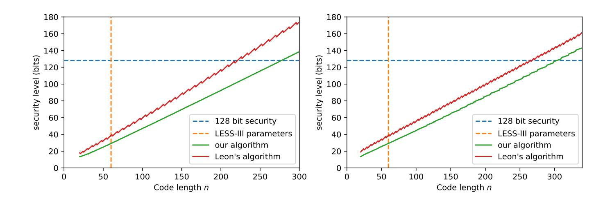
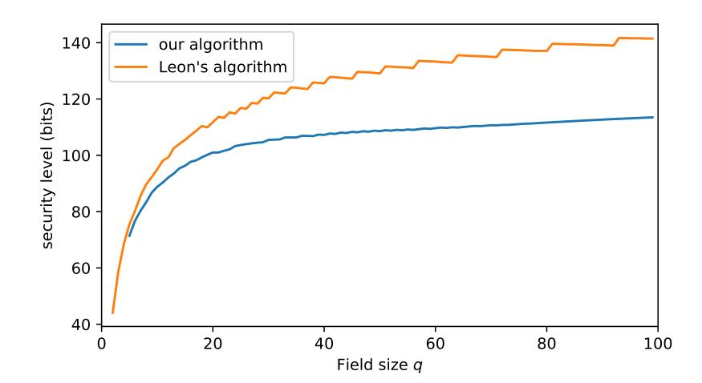
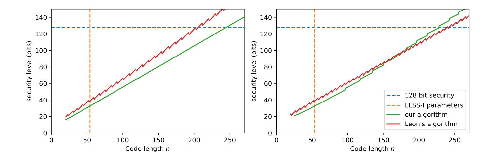
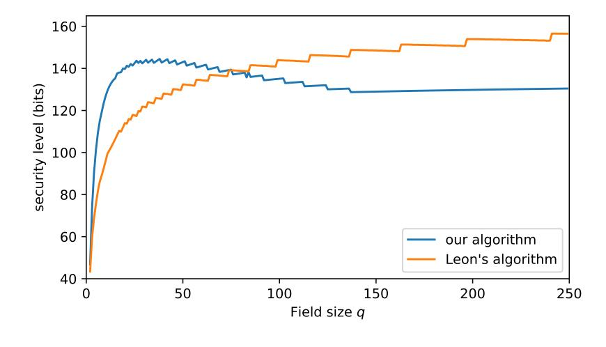

{0}------------------------------------------------

# Not enough LESS: An improved algorithm for solving Code Equivalence Problems over $\mathbb{F}_q$

Ward Beullens1

imec-COSIC, KU Leuven ward.beullens@esat.kuleuven.be

**Abstract.** Recently, a new code based signature scheme, called LESS, was proposed with three concrete instantiations, each aiming to provide 128 bits of classical security [3]. Two instantiations (LESS-I and LESS-II) are based on the conjectured hardness of the linear code equivalence problem, while a third instantiation, LESS-III, is based on the conjectured hardness of the permutation code equivalence problem for weakly self-dual codes. We give an improved algorithm for solving both these problems over sufficiently large finite fields. Our implementation breaks LESS-I and LESS-III in approximately 25 seconds and 2 seconds respectively on a laptop. Since the field size for LESS-II is relatively small ( $\mathbb{F}_7$ ) our algorithm does not improve on existing methods. Nonetheless, we estimate that LESS-II can be broken with approximately  $2^{44}$  row operations.

**Keywords:** permutation code equivalence problem, linear code equivalence problem, code-based cryptography, post-quantum cryptography

## 1 Introduction

Two q-ary linear codes  $C_1$  and  $C_2$  of length n and dimension k are called permutation equivalent if there exists a permutation  $\pi \in S_n$  such that  $\pi(C_1) = C_2$ . Similarly, if there exists a monomial permutation  $\mu \in M_n = (\mathbb{F}_q^{\times})^n \ltimes S_n$  such that  $\mu(C_1) = C_2$  the codes are said to be linearly equivalent (a monomial permutation acts on vectors in  $\mathbb{F}_q^n$  by permuting the entries and also multiplying each entry with a unit of  $\mathbb{F}_q$ ). The problem of finding  $\pi \in S_n$  (or  $\mu \in M_n$ ) given

This work was supported by CyberSecurity Research Flanders with reference number VR20192203 and the Research Council KU Leuven grants C14/18/067 and STG/17/019. Ward Beullens is funded by an FWO fellowship.

{1}------------------------------------------------

equivalent C1 and C2 is called the permutation equivalence problem (or linear equivalence problem respectively)[1](#page-1-0) .

Definition 1 (Permutation Code Equivalence Problem). Given generator matrices of two permutation equivalent codes C1 and C2, find a permutation π ∈ Sn such that C2 = π(C1).

Definition 2 (Linear Code Equivalence Problem). Given generator matrices of two linearly equivalent codes C1 and C2, find a monomial permutation µ ∈ Mn such that C2 = µ(C1).

The hardness of the permutation equivalence problem is relevant for the security of the McEliece and Girault post-quantum cryptosystems [\[10,](#page-16-1) [7\]](#page-16-2). More recently, Biasse, Micheli, Persichetti, and Santini proposed a new code-based signature scheme whose security only relies on the hardness of the linear code equivalence problem or permutation code equivalence problem. The public key consists of generator matrices for two equivalent codes C1 and C2, and a signature is a zero-knowledge proof of knowledge of an equivalence µ ∈ Mn (or π ∈ Sn) such that µ(C1) = C2 (or π(C1) = C2 respectively). In the case of permutation equivalence, the codes C1 and C2 are chosen to be weakly self-dual, because otherwise π can be recovered in polynomial time [\[12\]](#page-16-3).

| Parameter set | n   | k  | p  | equivalence |
|---------------|-----|----|----|-------------|
| LESS-I        | 54  | 27 | 53 | Linear      |
| LESS-II       | 106 | 45 | 7  | Linear      |
| LESS-III      | 60  | 25 | 31 | Permutation |

Table 1. Proposed parameter sets for the LESS signature scheme.

## 1.1 Previous work

We will briefly go over some of the algorithms that have been proposed for the permutation and linear code equivalence problems below. The state of the art for the permutation code equivalence problem is that random instances can be solved in polynomial time with the Support Splitting Algorithm (SSA), but that instances with codes that have large hulls require a runtime that is exponential in the dimension of the hull. Weakly self-dual codes (these are codes C such that

1 There also exists a more general notion of equivalence called semi-linear equivalence. Our methods generalize to semi-linear equivalences, but since this is not relevant for the security of LESS, we do not elaborate on this.

{2}------------------------------------------------

 $\mathcal{C} \subset \mathcal{C}^{\perp}$ ) have hulls of maximal dimension  $\dim(\mathcal{H}(\mathcal{C})) = \dim(\mathcal{C})$  and are believed to be the hardest instances of the permutation equivalence problem. The state of the art for the linear code equivalence problem is that instances over  $\mathbb{F}_q$  with  $q \leq 4$  can be solved in polynomial time with the SSA algorithm via a reduction to the permutation equivalence problem, but for q > 4 this reduction results in codes with a large hull, which means the SSA algorithm is not efficient. Hence, the linear code equivalence problem is conjectured to be hard on average for q > 4 [13].

**Leon's Algorithm.** Leon's algorithm |9| for finding linear and permutation equivalences relies on the observation that applying a permutation or a monomial permutation does not change the hamming weight of a codeword. Therefore, if we compute the sets  $X_1$  and  $X_2$  of all the minimal-weight codewords of  $\mathcal{C}_1$ and  $\mathcal{C}_2$  respectively, then it must be that  $X_2 = \pi(X_1)$  or  $X_2 = \mu(X_1)$  in the case of permutation equivalence or linear equivalence respectively. Leon gives an algorithm to compute a  $\mu \in M_n$  that satisfies  $X_2 = \mu(X_1)$  with a time complexity that is polynomial in  $|X_1|$ . Usually, the sets  $X_1$  and  $X_2$  have "enough structure", such that if  $\mu$  satisfies  $X_2 = \mu(X_1)$ , then also  $\mathcal{C}_2 = \mu(\mathcal{C}_1)$  with non-negligible probability. If this is not the case, then one can also consider larger sets  $X'_1$  and  $X_2'$  that contain all the codewords in  $\mathcal{C}_1$  and  $\mathcal{C}_2$  respectively whose weight is one more than the minimal weight. Since the sets  $X_1$  and  $X_2$  are usually small, the complexity of the algorithm is dominated by the complexity of computing  $X_1$ and  $X_2$ . Feulner gives an algorithm that computes a canonical representative of an equivalence class of codes. The complexity of this algorithm is close to that of Leon's algorithm [6].

**Support Splitting Algorithm.** The support splitting algorithm of Sendrier [12] defines the concept of a signature. A signature is a property of a position in a code that is invariant for permutations. More precicely, it is a function S that takes a code C and a position  $i \in \{1, \dots, n\}$  as input and outputs an element of an output space P, such that for any permutation  $\pi \in S_n$  we have

$$\mathcal{S}(\mathcal{C}, i) = \mathcal{S}(\pi(\mathcal{C}), \pi(i))$$
.

We say that a signature is totally discriminant for C if  $i \neq j$  implies that  $S(C,i) \neq S(C,j)$ . If a signature S is efficiently computable and totally discriminant for a code  $C_1$ , then one can easily solve the permutation equivalence problem by computing  $S(C_1,i)$  and  $S(C_2,i)$  for all  $i \in \{1,\dots,n\}$  and comparing the outputs. Even if the signature is not totally discriminant, a sufficiently discriminant signature can still be used to solve the permutation equivalence Problem by iteratively refining the signature.

The support splitting algorithm uses the concept of the hull of a code to construct an efficiently computable signature. The hull of a code C is the inter-

{3}------------------------------------------------

section of the code with its dual[2](#page-3-0) : H(C) = C ∩ C⊥. This concept is very useful in the context of the permutation equivalence problem because taking the hull commutes with applying a permutation

$$\mathcal{H}(\pi(\mathcal{C})) = \pi(\mathcal{C}) \cap \pi(\mathcal{C})^{\perp} = \pi(\mathcal{C} \cap \mathcal{C}^{\perp}) = \pi(\mathcal{H}(\mathcal{C})).$$

The Support Splitting Algorithm defines a signature as S(C, i) := W(H(Ci)), where Ci is the code C punctured at position i, and W(C) denotes the weight enumerator polynomial of the code C. While this signature is typically not fully discriminant, it is still discriminant enough to efficiently solve the permutation equivalence Problem for random matrices. However, a limitation of the SSA algorithm is that computing the enumerator of the hull is not efficient when the hull of C is large. For random codes this is not a problem because typically the hull is small.

Algebraic approach. The code equivalence problems can be solved algebraically, by expressing the condition π(C1) = C2 or µ(C1) = C2 as a system of polynomial equations, and trying to solve this system with Gr¨obner basis methods [\[11\]](#page-16-7). Similar to the SSA algorithm, this solves the permutation code equivalence problem for random instances in polynomial time, but the complexity is exponential in the dimension of the hull. The approach also works for the linear code equivalence problem, but it is only efficient for q ≤ 4.

## 1.2 Our contributions

In this paper, we propose an improvement on Leon's algorithm for code equivalence that works best over sufficiently large finite fields. If x ∈ C1 and y = π(x) ∈ C2, then the multiset of entries of x matches the multiset of entries of y. Our algorithm is based on the observation that if the size of the finite field is large enough then the implication also holds in the other direction with large probability: If x ∈ C1 and y ∈ C2 are low-weight codewords with the same multiset of entries, then with large probability π(x) = y. Our algorithm does a collision search to find a small number of such pairs (x, y = π(x)), from which one can easily recover π. We also give a generalization of this idea that works for the linear equivalence problem.

We implemented our algorithm and used it to break the LESS signature scheme. In the LESS-I and LESS-III parameter sets the finite field is large enough for our algorithm to improve on Leons's algorithm. We show that we can recover a LESS-I or LESS-III secret key in only 45 seconds or 2 seconds respectively. We

2 This is not the case for monomial permutations, which is why the SSA can not be directly applied to find linear equivalences.

{4}------------------------------------------------

estimate that recovering the secret key is also possible in practice with Leon's algorithm, but it would be significantly more costly. LESS-II works over  $\mathbb{F}_7$ , which is too small for our algorithm to improve on Leon's algorithm: We estimate that our algorithm requires approximately  $2^{50.4}$  row operations, while Leon's algorithm would take only  $2^{43.9}$  row operations.

## 2 Preliminaries

## 2.1 Notation.

For a q-ary linear code  $\mathcal{C}$  of length n and dimension k we say a matrix  $\mathbf{G} \in \mathbb{F}_q^{k \times n}$  is a generator matrix for  $\mathcal{C}$  if  $\mathcal{C} = \langle \mathbf{G} \rangle$ , where  $\langle \mathbf{G} \rangle$  denotes the span of the rows of  $\mathbf{G}$ . Similarly, we say that a matrix  $\mathbf{H} \in \mathbb{F}_q^{(n-k) \times n}$  is a parity check matrix for  $\mathcal{C}$  if  $\mathcal{C}^{\perp} = \langle H \rangle$ , where  $\mathcal{C}^{\perp} = \{ \mathbf{x} \in \mathbb{F}_q^n \mid \mathbf{x} \cdot \mathbf{y} = 0 \, \forall \mathbf{y} \in \mathcal{C} \}$  is the dual code of  $\mathcal{C}$ . For a vector  $\mathbf{x} \in \mathbb{F}_q^n$  we denote by  $wt(\mathbf{x})$  the Hamming weight of  $\mathbf{x}$ , which counts the number of non-zero entries of  $\mathbf{x}$ . We denote by  $B_n(w)$  the Hamming ball with radius w, i.e. the set of vectors in  $\mathbf{x} \in \mathbb{F}_q^n$  with  $wt(x) \leq w$ . For a permutation  $\pi \in S_n$  and a vector  $\mathbf{x}$  of length n, we write  $\pi(\mathbf{x})$  for the vector obtained by permuting the entries of  $\mathbf{x}$  with the permutation  $\pi$ , that is we have  $(\pi(\mathbf{x}))_i = \mathbf{x}_{\pi(i)}$  for all  $i \in \{1, \dots, n\}$ . For a monomial permutation  $\mu = (\nu, \pi) \in M_n = (\mathbb{F}_q^{\times})^n \ltimes S_n$  and a vector  $\mathbf{x} \in \mathbb{F}_q^n$ , we write  $\mu(\mathbf{x})$  to denote the vector obtained by applying  $\mu$  to the entries of  $\mathbf{x}$ . Concretely, we have  $(\mu(x))_i = \nu_i \cdot \mathbf{x}_{\pi(i)}$  for all  $i \in \{1, \dots, n\}$ . For a code  $\mathcal{C}$  and  $\pi \in S_n$  (or  $\mu \in M_n$ ), we denote by  $\pi(\mathcal{C})$  (or  $\mu(\mathcal{C})$ ) the code that consist of permutations (or monomial permutations respectively) of codewords in  $\mathcal{C}$ .

#### 2.2 Information set decoding.

The algorithms in this paper will make use of information set decoding to find sparse vectors in q-ary linear codes. In particular, we will use the Lee-Brickell algorithm with parameter p=2. To find low-weight codewords in a code  $\mathcal{C}=\langle \mathbf{M} \rangle$  the algorithm repeatedly computes the echelon form of M with respect to a random choice of k pivot columns. Then, the algorithm inspects all the linear combinations of p=2 rows of the matrix. Given the echelon form of the matrix, we are guaranteed that all these linear combinations have weight at most n-k+2, but if we are lucky enough we will find codewords that are even more sparse. We repeat this until a sufficiently sparse codeword is found.

{5}------------------------------------------------

Complexity of the algorithm. The complexity of the algorithm depends on the length n and the dimension k of the code, target weight w, and whether we want to find a single codeword, all the codewords, or a large number N of codewords.

First, suppose there is a distinguished codeword  $\mathbf{x} \in \mathcal{C}$  with weight w that we want to find. For a random choice of pivot columns, the Lee-Brickell algorithm will output  $\mathbf{x}$  if the support of  $\mathbf{x}$  intersects the set of pivot columns (also known as the information set) in exactly 2 positions. The probability that this happens is

$$P_{\infty}(n,k,w) := \frac{\binom{n-k}{w-2}\binom{k}{2}}{\binom{n}{w}}.$$

Therefore, since the cost of each iteration is  $k^2$  row operations for the Gaussian elimination and  $\binom{k}{2}q$  row operations to iterate over all the linear combinations of 2 rows (up to multiplication by a constant), the algorithm will find  $\mathbf{x}$  after approximately

$$C_{\infty}(n, k, w) = \left(k^2 + \binom{k}{2}q\right) P(n, k, w)^{-1} = O\left(\frac{q\binom{n}{w}}{\binom{n-k}{w-2}}\right)$$

row operations.

Heuristically, for random codes we expect the support of the different codewords to behave as if they are "independent", so if there exist (q-1)N codewords of weight w (i.e. N different codewords up to multiplication by a scalar), then we expect the probability that one iteration of the Lee-Brickell algorithm succeeds to be

$$P_1(n, k, w) = 1 - (1 - P_{\infty}(n, k, w))^N$$
.

Thus, if N is small enough, we have  $P_1(n, k, w) \approx NP_{\infty}(n, k, w)$ , and the complexity of finding is a single weight-w codeword is  $C_1(n, k, w) \approx C_{\infty}(n, k, w)/N$ .

Finally, if the goal is to find L out of the N distinct weight-w codewords (up to multiplication by a scalar), the cost of finding the first codeword is  $C_1 = C_{\infty}(n, k, w)/N$ , the cost of finding the second codeword is  $C_{\infty}(n, k, w)/(N-1)$ , the cost of finding the third codeword is  $C_{\infty}(n, k, w)/(N-2)$  and so on. Summing up these costs, we get that the cost of finding L distinct codewords is

$$C_L(n, k, w) \approx C_{\infty}(n, k, w) \cdot \left(\sum_{i=0}^{L-1} \frac{1}{N-i}\right).$$

Therefore, is  $L \ll N$ , we can estimate  $C_L \approx C_\infty L/N$ , and if the goal is to find all the codewords, we get  $C_N \approx C_\infty \ln(N)$ , where  $\ln$  denotes the natural logarithm, because  $\sum_{i=1}^N 1/i \approx \ln(N)$ .

{6}------------------------------------------------

# 3 New algorithm for Permutation Equivalences over $\mathbb{F}_q$

In this section, we introduce an algorithm for the permutation equivalence Problem over sufficiently large fields  $\mathbb{F}_q$  (which is the case of the LESS-III parameter set). The complexity of the algorithm is independent of the size of the hull of the equivalent codes. Therefore, our algorithm can be used to find equivalences when the hull is so large that using the SSA algorithm becomes infeasible. The complexity of the algorithm is better than Leon's algorithm when the size of the finite field is sufficiently large.

Main idea. Leon's algorithm computes the sets  $X_1 = \mathcal{C}_1 \cap B_n(w_{min})$  and  $X_2 = \mathcal{C}_2 \cap B_n(w_{min})$ , where  $w_{min}$  is the minimal weight of codewords in  $\mathcal{C}_1$  and solves the Code equivalence problem by looking for  $\pi \in S_n$  such that  $\pi(X_1) = X_2$ . An easy observation is that permuting a codeword  $\mathbf{x}$  does not only preserve its Hamming weight, but also the multiset of entries of  $\mathbf{x}$ . Therefore, if there is an element  $\mathbf{x} \in X_1$  with a unique multiset, then one can immediately see to which vector  $\mathbf{y} = \pi(\mathbf{x}) \in X_2$  it gets mapped. If  $\mathbb{F}_q$  is sufficiently large, then with large probability a lot of the multisets of the vectors in  $X_1$  will be unique, and therefore we get a large number of pairs of vectors of the form  $(\mathbf{x}, \pi(\mathbf{x}))$ . Heuristically, given  $\Omega(\log(n))$  of these pairs is sufficient to recover  $\pi$ .

The bottleneck of Leon's algorithm is computing  $X_1 = \mathcal{C}_1 \cap B_n(w_{min})$  and  $X_2 = \mathcal{C}_2 \cap B_n(w_{min})$ , so if we want to improve the complexity of the attack we need to avoid computing all of  $X_1$  and  $X_2$ . If the multisets of the codewords in  $X_1$  are distinct then this is possibe: If we compute only  $\Theta(\sqrt{|X_1|\log n})$  elements of  $X_1$  and  $X_2$ , then we expect to find  $\Theta(\log n)$  pairs  $(\mathbf{x}, \pi(\mathbf{x}))$ , which suffices to recover  $\pi$ . This speeds up the procedure by a factor  $\Theta(\sqrt{|X_1|/n})$ , which is only small factor. We can improve this further by considering larger sets  $X_1' = \mathcal{C}_1 \cap B_n(w)$  and  $X_2' = \mathcal{C}_2 \cap B_n(w)$  for a weight w that is not minimal. In the most favorable case where the multisets of the vectors in  $X_i'$  are still unique for w = n - k + 1, then we can sample from  $X_1'$  and  $X_2'$  in polynomial time using gaussian elimination, and we get an algorithm that runs in time  $\tilde{O}\left(\sqrt{\binom{n}{k-1}}\right)$ , where  $\tilde{O}$  is like the usual big-O notation but ignoring polynomial factors.

## Description of the algorithm. The algorithm works as follows:

- 1. Let w be maximal subject to  $\frac{n!}{(n-w)!}q^{-n+k} < \frac{1}{4\log n}$  and  $w \le n-k+1$ .
- 2. Repeatedly use information set decoding to generate a lists L that contains  $\sqrt{|B_n(w)| \cdot q^{-n+k-1} \cdot 2 \log n}$  pairs of the form  $(\mathbf{x}, \mathsf{lex}(\mathbf{x}))$ , where  $\mathbf{x} \in \mathcal{C}_1 \cap B_n(w)$  and where  $\mathsf{lex}(\mathbf{x})$  is the lexicographically first element of the set  $\{\pi(\alpha \mathbf{x}) | \pi \in S_n, \alpha \in \mathbb{F}_q^{\times}\}$ .

{7}------------------------------------------------

- 3. Initialize an empty list P and repeatedly use Information Set Decoding to generate  $\mathbf{y} \in \mathcal{C}_2 \cap B_n(w)$ . If there is a pair  $(\mathbf{x}, \mathsf{lex}(\mathbf{x}))$  in L such that  $\mathsf{lex}(\mathbf{x}) = \mathsf{lex}(\mathbf{y})$ , then append  $(\mathbf{x}, \mathbf{y})$  to P. Continue until P has  $2\log(n)$  elements.
- 4. Use a backtracking algorithm to iterate over all permutations  $\pi$  that satisfy  $\langle \pi(\mathbf{x}) \rangle = \langle \mathbf{y} \rangle$  for all  $(\mathbf{x}, \mathbf{y}) \in P$  until a permutation is found that satisfies  $\pi(C_1) = C_2$ .

Heuristic analysis of the algorithm. Heuristically, we expect that for  $\mathbf{x} \in \mathcal{C}_1 \cap B_n(w)$  the probability that there exists  $\mathbf{x}' \in \mathcal{C}_1 \cap B_n(w)$  such that  $\langle \mathbf{x}' \rangle \neq \langle \mathbf{x} \rangle$  and  $\mathsf{lex}(\mathbf{x}) = \mathsf{lex}(\mathbf{x}')$  to be bounded by  $\frac{n!}{(n-w)!}q^{-n+k}$ , because there are at most  $\frac{n!}{(n-w)!}$  values of  $\mathbf{x}'$  (up to multiplication by a unit) for which  $\mathsf{lex}(\mathbf{x}') = \mathsf{lex}(\mathbf{x})$ , (namely all the permutations  $\mathbf{x}$ ), and each of these vectors is expected to be in  $\mathcal{C}_1$  with probability  $q^{-(n-k)}$ . In step 1 of the algorithm we choose w such that the probability estimate that  $\mathbf{x}$  is part of such a collision in  $\mathsf{lex}$  is at most  $1/(4\log n)$ .

Since  $\pi(\mathcal{C}_1 \cap B_n(w)) = \mathcal{C}_2 \cap B_n(w)$  we also have  $\operatorname{lex}(\mathcal{C}_1 \cap B_n(w)) = \operatorname{lex}(\mathcal{C}_2 \cap B_n(w))$  and heuristically the size of this set is close to  $|\mathcal{C}_1 \cap B_n(w)|/(q-1) \approx |B_n(w)|/q^{n-k+1}$  since lex is almost (q-1)-to-one. Therefore, it takes roughly  $|B_n(w)| 2 \log n/q^{n-k+1} |L|$  iterations of step 3 until  $2 \log n$  pairs  $(\mathbf{x}, \mathbf{y})$  with  $\operatorname{lex}(\mathbf{x}) = \operatorname{lex}(y)$  are found. We chose the list size  $|L| = \sqrt{|B_n(w)| 2 \log n/q^{n-k+1}}$  so that the work in step 2 and step 3 is balanced.

The last part of the algorithm assumes that for each pair  $(\mathbf{x}, \mathbf{y})$  found in step 3 we have  $\langle \pi(\mathbf{x}) \rangle = \langle \mathbf{y} \rangle$ . This can only fail with probability bounded by  $1/4 \log n$ , because this implies that  $\pi(\mathbf{x})$  and  $\mathbf{y} \in \mathcal{C}_2 \cap B_n(w)$  form a collision for lex. Summing over all the  $2 \log n$  pairs we get that the probability that  $\langle \pi(\mathbf{x}) \rangle = \langle \mathbf{y} \rangle$  holds for all the pairs in P is at least 1/2. If this is the case then there are typically very few permutations  $\sigma$  (most of the time only one) that satisfy  $\langle \sigma(\mathbf{x}) \rangle = \langle \mathbf{y} \rangle$  and the true code equivalence  $\pi$  must be one of them.

The complexity of the attack is dominated by the cost of the ISD algorithm to find |L| weight-w codewords in  $C_1$  and  $C_2$  in step 2 and 3, which is

$$2 \cdot C_{|L|}(n,k,w)$$

In our implementation we have used the Lee-Brickell algrithm [8] with p=2 to instantiate the ISD oracle3. In this case, the number of row-operations used by the ISD algorithm can be approximated (see section 2.2) as

$$2 \cdot C_{|L|}(n,k,w) \approx C_{\infty} \frac{|L|}{|\mathcal{C}_1 \cap B_n(w)|/(q-1)} = O\left(\frac{\binom{n}{w}\sqrt{\log n}}{\binom{n-k}{w-2}\cdot\sqrt{|B_n(w)|q^{-n+k}}}\right)$$

&lt;sup>3 One can also use more advanced ISD algorithms such as Stern's algorithm [14], but since we will be working with relatively large the finite fields we found that this does not offer a big speedup. To simplify the analysis and the implementation we have chosen for the Lee-Brickell algorithm.

{8}------------------------------------------------

The algorithm in practice. An implementation of our algorithm in C is made publicly available at

[www.github.com/WardBeullens/LESS\\_Attack](www.github.com/WardBeullens/LESS_Attack).

We used this implementation to break the LESS-III parameter set. The public key of a LESS-III signature consist of two permutation equivalent codes C1 and C2 of length n = 60 and dimension k = 25 over F31. The codes are chosen to be weakly self-dual. From experiments, we see that the weakly self-dual property does not seem to affect the complexity or the success rate of our attack.

For these parameters, the maximal value of w that satisfies n! (n−w)! q −n+k < 1 4 log n is w = 30, so we use the Lee-Brickell algorithm to find codewords in C1 and C2 with Hamming weight at most 30. The list size is p |Bn(w)| · q−n+k−1 · 2 log n ≈ 25000. With these parameter choices, the algorithm runs in about 2 seconds on a laptop with an Intel i5-8400H CPU at 2.50GHz. The rate at which pairs are found closely matched the heuristic analysis of the previous section: The analysis suggests that we should have to do approximately 214.7 Gaussian eliminations, while the average number of Gaussian eliminations measured in our experiments is 214.6 . However, we find that the heuristic lower bound of 1/2 for the success probability is not tight: The algorithm terminates successfully in all of the executions. This is because in our heuristic analysis we used n!/(n−w)! as an upper bound for the number of permutations of a vector x of weight w. This upper bound is only achieved if all the entries of x are distinct. For a random vector x the number of permutations is much smaller, which explains why the observed probability of a bad collision is much lower than our heuristic upper bound.

Remark 3. If we use the algorithm for longer codes the list L will quickly be so large that it would be very costly to store the entire list in memory. To avoid this we can define 2 functions F1 and F2 that take a random seed as input, run an ISD algorithm to find a weight w codeword x in C1 or C2 respectively and output lex(x). Then we can use a memoryless claw-finding algorithm such as the Van Oorschot-Wiener algorithm [\[16\]](#page-16-10) to find inputs a, b such that F1(a) = F2(b). This makes the memory complexity of the algorithm polynomial, at essentially no cost in time complexity. Since memory is not an issue for attacking the LESS parameters we did not implement this approach.

Comparison with Leon's algorithm and new parameters for LESS. We expect recovering a LESS-III secret key with Leon's algorithm would require 2 24.5 iterations of the Lee-Brickell algorithm, significantly more than the 214.6 iterations that our algorithm requires. Figure [1](#page-9-0) shows how the complexity of our attack and Leon's attack scales with increasing code length n. The left graph shows the situation where the field size q and the dimension k increases linearly with the code length, while the graph on the right shows the case where q = 31 is

{9}------------------------------------------------

fixed. In both cases, our algorithm outperforms Leon's algorithm, but since our algorithm can exploit the large field size, the gap is larger in the first case. The sawtooth-like behavior of the complexity of Leon's algorithm is related to the number of vectors of minimal weight, which oscillates up and down. We see that in order to achieve 128 bits of security (i.e. an attack needs  $2^{128}$  row operations) we can use a q-ary code of length n=280, dimension k=117 and q=149. Alternatively, if we keep q=31 fixed, we could use a code of length n=305 and dimension k = 127. This would result in an average signature size of 18.8 KB or 21.1 KB respectively. This is almost a factor 5 larger than the current signature size of  $3.8~\mathrm{KB}^{4}$ . The public key size would increase from  $0.53~\mathrm{KB}^{5}$  to  $16.8~\mathrm{KB}$  or 13.8 KB for the q = 149 or q = 31 parameter set respectively, an increase of more than a factor 25. The fact that our algorithm performs better in comparison to Leon's algorithm for larger finite fields is illustrated in fig. 2, where we plot the complexity of both algorithms for n = 250, k = 104 and for various field sizes. A python script attack\_cost.py for estimating the complexity of our attack is available in the GitHub repository.

**Fig. 1.** Complexity of Leon's algorithm and our algorithm for finding permutation equivalences in function of the code Length. In the left graph the field size scales linearly with the code length, in the right graph the field size q = 31 is fixed. In both cases the rate of the code is fixed at k/n = 5/12.

&lt;sup>4 The LESS paper claims 7.8 KB. but 4 KB of the signature consists of commitments that can be recomputed by the verifier, so this does not need to be included in the signature size.

&lt;sup>5 The LESS paper claims 0.9 KB public keys, but the generator matrix can be put in normal form, which reduces the size from  $k \times n$  field elements to  $k \times (n-k)$  field elements.

{10}------------------------------------------------

**Fig. 2.** Complexity of Leon's algorithm and our algorithm for finding permutation equivalences in function of the finite field size for random linear codes of length n = 250 and dimension k = 104.

# 4 New algorithm for Linear Equivalences over $\mathbb{F}_q$

In this section, we generalize the algorithm from the previous section to the linear equivalence Problem. The main obstacle we need to overcome is that it does not seem possible given sparse vectors  $\mathbf{x} \in \mathcal{C}_1$  and  $\mathbf{y} \in \mathcal{C}_2$  to verify if  $\mu(\mathbf{x}) = \mathbf{y}$ , where  $\mu \in M_n$  is the monomial transformation such that  $\mu(\mathcal{C}_1) = \mathcal{C}_2$ . In the permutation equivalence setting, we could guess that if the multiset of entries of  $\mathbf{x}$  equals the multiset of entries of  $\mathbf{y}$  then  $\pi(\mathbf{x}) = \mathbf{y}$ . If the size of the finite field was large enough, then this was correct with large probability. This strategy does not work in the linear equivalence setting, because monomial permutations do not preserve the multiset of entries. In fact, monomial transformations do not preserve anything beyond the hamming weight of a vector, because for any two codewords  $\mathbf{x}$  and  $\mathbf{y}$  with the same weight there exists  $\mu \in M_n$  such that  $\mu(\mathbf{x}) = \mathbf{y}$ .

Main Idea. To overcome this problem, be will replace sparse vectors by 2-dimensional subspaces with small support. Let

$$X_1(w) = \{V \subset \mathcal{C}_1 | \dim(V) = 2 \text{ and } |\operatorname{Supp}(V)| \le w\}$$

be the set of 2 dimensional linear subspaces of  $C_1$  with support of size at most w and similarly we let  $X_2(w)$  be the set of 2-spaces in  $C_2$  with support of size w. If  $\mu \in M_n$  is a monomial permutation such that  $\mu(C_1) = C_2$ , then for all  $V \in X_1(w)$  we have  $\mu(V) \in X_2$ . Analogously with the algorithm from the previous section, we will sample 2-spaces from  $X_1(w)$  and from  $X_2(w)$  in the hope of finding spaces  $V \in X_1(w)$  and  $U \in X_2(w)$  such that  $\mu(V) = W$ . Then, after finding  $\Omega(\log(n))$  such pairs we expect to be able to recover the equivalence  $\mu$ . To detect if  $\mu(V) = W$  we define lex(V) to be the lexicographically first basis of a 2-space

{11}------------------------------------------------

in the  $M_n$ -orbit of V. Clearly, if  $\mu(V) = W$ , then the  $M_n$ -orbits of V and W will be the same and hence lex(V) = lex(W). Moreover, since the dimension of V and W is only 2, it is feasible to compute lex(V) and lex(W) efficiently.

Computing  $\mathbf{lex}(V)$ . To compute  $\mathbf{lex}(V)$  we can simply consider all the bases  $\mathbf{x}, \mathbf{y}$  that generate V (there are  $(q^2-1)(q^2-q)$  of them) and for each of them find the monomial transformation  $\mu$  such that  $\mu(\mathbf{x}), \mu(\mathbf{y})$  comes first lexicographically, and then take the permuted basis that comes first out of these  $(q^2-1)(q^2-q)$  options. Given a basis  $\mathbf{x}, \mathbf{y}$ , finding the lexicographically first value of  $\mu(\mathbf{x}), \mu(\mathbf{y})$  is relatively straightforward: First make sure that  $\mu(\mathbf{x})$  is minimal, and then use the remaining degrees of freedom to minimize  $\mu(\mathbf{y})$ . The minimal  $\mu(\mathbf{x})$  consists of  $n-wt(\mathbf{x})$  zeroes followed by  $wt(\mathbf{x})$  ones, which is achieved by multiplying the non-zero entries of  $\mathbf{x}$  (and the corresponding entries of  $\mathbf{y}$ ) by their inverse and permuting  $\mathbf{x}$  such that all the ones are in the back. The remaining degrees of freedom of  $\mu$  can be used to make the first  $n-wt((\mathbf{x})$  entries of  $\mu(\mathbf{y})$  consist of a number of zeros followed by a number of ones and to sort the remaining entries of  $\mu(y)$  in ascending order.

A basis  $\mathbf{x}, \mathbf{y}$  for V can only lead to the lexicographicallt first  $\mu(\mathbf{x}, \mu(\mathbf{y}))$  if the hamming weight of  $\mathbf{x}$  is minimal among all the vectors in V. Therefore, we only need to consider bases  $\mathbf{x}, \mathbf{y}$  where the hamming weight of  $\mathbf{x}$  is minimal. When the first basis vector is fixed, choosing the second basis vector and minimizing the basis, can be on average done with a constant number row operations, so the average cost of the algorithm is q + 1 + O(N) = O(q) row operations, where the q + 1 operations stem from finding the minimal weight vectors in V, and N is the number of such vectors.

Example 4. The following is an example what lex(V) could look like:

$$V = \left\langle \begin{pmatrix} 19 & 3 & 21 & 36 & 17 & 44 & 0 & 47 & 34 & 19 & 48 & 3 & 0 & 47 & 0 & 38 & 27 & 8 & 49 & 18 & 8 & 0 & 0 & 31 & 26 & 52 & 7 & 30 & 37 & 47 \\ 35 & 24 & 13 & 0 & 50 & 40 & 0 & 52 & 6 & 19 & 37 & 28 & 0 & 13 & 0 & 49 & 34 & 20 & 24 & 30 & 24 & 45 & 0 & 39 & 42 & 0 & 18 & 17 & 28 & 36 \end{pmatrix} \right\rangle$$

$$\mathsf{lex}(V) = \begin{pmatrix} 0 & 0 & 0 & 0 & 0 & 0 & 1 & 1 & 1 & 1 &$$

**Description of the algorithm.** The algorithm works as follows:

- 1. Let w be maximal subject to  $\frac{n!}{(n-w)!}q^{w-1+2k-2n} < \frac{1}{4\log n}$  and  $w \le n-k+2$ .
- 2. Repeatedly use information set decoding to generate a lists L that contains  $\sqrt{\binom{n}{w} \cdot q^{2(-n+k+w-2)} \cdot 2 \log n}$  pairs of the form (V, lex(V)), where  $V \in X_1(w)$ .

{12}------------------------------------------------

- 3. Initialize an empty list P and repeatedly use Information Set Decoding to generate  $W \in X_2$ . If there is a pair (V, lex(V)) in L such that lex(V) = lex(W), then append (V, W) to P. Continue until P has  $2\log(n)$  elements.
- 4. Use a backtracking algorithm to iterate over all monomial permutations  $\mu$  that satisfy  $\mu(V) = W$  for all  $(V, W) \in P$  until a monomial permutation is found that satisfies  $\mu(C_1) = C_2$ .

Heuristic analysis of the algorithm. The heuristic analysis of this algorithm is very similar to that of our permutation equivalence algorithm. This time the size of a  $M_2$ -orbit of a 2-space V with  $|\operatorname{Supp}(V)| \leq w$  is bounded by  $\frac{n!}{(n-w)!}(q-1)^{w-1}$  and a random 2-space has probability of  $\frac{(q^k-1)(q^k-q)}{(q^n-1)(q^n-q)} \approx q^{2(k-n)}$  of being a subspace of  $\mathcal{C}_1$ . So as long as we pick w such that  $\frac{n!}{(n-w)!}q^{w-1+2k-2n} < \frac{1}{4\log n}$  we expect the probability that one of (V,W) the pairs that we found are such that  $|\operatorname{ex}(V)| = |\operatorname{ex}(W)|$  but  $\mu(V) \neq W$  is bounded by 1/2. The size of  $X_1(w)$  and  $|X_2(w)|$  is expected to be at most  $\binom{n}{w}\frac{(q^w-1)(q^w-q)}{(q^2-1)(q^2-q)}q^{-2(n-k)} \approx \binom{n}{w}q^{2(w-2-n+k)}$ , because for each of the  $\binom{n}{w}$  supports S of size w, there are  $\frac{(q^w-1)(q^w-q)}{(q^2-1)(q^2-q)}$  2-spaces whose support is included in S, and we expect one out  $q^2(n-k)$  of them to lie in  $\mathcal{C}_1$ . Therefore, if we set the list size to  $\sqrt{\binom{n}{w}\cdot q^{2(-n+k+w-2)}\cdot 2\log n}$  then we expect the third step of the algorithm to terminate after roughly |L| iterations. (We are counting the subspaces V with  $|\operatorname{Supp}(V)| < w$  multiple times, so  $X_1(w)$  is slightly smaller than our estimate. This is not a problem, because it means that the third step will terminate slightly sooner than our analysis suggests.)

The complexity of the algorithm consists of the ISD effort to sample |L| elements from  $X_1(w)$  and  $X_2(w)$  respectively, and the costs of computing lex. We have to compute lex an expected number of 2|L| times; once for each of the 2-spaces in the list L and once for each 2-space found in step 3. Since the number of row operations per lex is O(q), the total cost of computing lex is O(q|L|). To sample the 2-spaces we use as adaptation of the Lee-Brickell algorithm: We repeatedly put a generator matrix of  $C_1$  in echelon form with respect to a random choice of pivot columns, and then we look at the span of any 2 out of k rows of the new matrix. Given the echelon form of the matrix, the support of these 2-spaces has size at most n - k + 2, and if we are lucky the size of the support will be smaller than or equal to w. The complexity of this algorithm is very similar to that of the standard Lee-Brickell algorithm for finding codewords (see section 2.2).

For a 2-space  $V \in X_1(w)$ , the Lee-Brickell algorithm will find V if the random choice of pivots intersects  $\operatorname{Supp}(V)$  in 2 positions, which happens with probability  $P_{\infty}(n,k,w) = \binom{n-k}{w-2} \binom{k}{2} / \binom{n}{w}$ . The cost per iteration is  $O(k^2 + \binom{k}{2}) = O(k^2)$  row operations for the Gaussian elimination and for enumerating the 2-spaces, so the expected number of row operations until we find |L| elements in  $X_1(w)$ 

{13}------------------------------------------------

and  $X_2(w)$  is

$$O\left(\frac{k^2\binom{n}{w}|L|}{\binom{n-k}{w-2}\binom{k}{2}|X_1(w)|}\right) \approx O\left(\frac{\sqrt{\binom{n}{w}\cdot\log n}}{\binom{n-k}{w-2}}q^{-w+2+n-k}\right).$$

## 4.1 The algorithm in practice.

We have implemented the algorithm and applied it to the LESS-I parameter set. The public key of a LESS-I signature consist of two linearly equivalent codes  $C_1$  and  $C_2$  chosen uniformly at random of length n = 54 and dimension k = 27 over  $\mathbb{F}_{53}$ .

The largest value of w satisfying  $\frac{n!}{(n-w)!}q^{w-1+2k-2n} < \frac{1}{4\log n}$  is w=28, so we use the Lee-Brickell algorithm to generate  $\sqrt{\binom{n}{w}} \cdot q^{2(-n+k+w-2)} \cdot 2\log n \approx 2800000$  subspaces of  $\mathcal{C}_1$  and  $\mathcal{C}_2$  with support of size at most 28. From our implementation we see that this takes on average about  $2^{20.6}$  Gaussian eliminations, which matches the heuristic analysis of the previous section very well. The attack takes in total about  $2^{30.9}$  row operations, which amounts to about 25 seconds on a laptop with an Intel i5-8400H CPU at 2.50GHz. Approximately 12 seconds are spent computing the spaces V, the remaining time is spent computing lex(V).

Remark 5. Similar to the Permutation equivalence case, it is possible to use a memoryless collision search algorithm to remove the large memory cost of the attack at essentially no runtime cost.

Comparison with Leon's algorithm and new parameters for LESS. We expect Leon's algorithm (using the Lee-Brickell algorithm to instantiate the ISD oracle) to require  $2^{38.3}$  row operations, which is significantly more than the  $2^{30.9}$ operations that our algorithm requires. Figure 3 shows the complexity of our algorithm and Leon's algorithm for increasing code length. If the size of the finite field increases linearly with the code length, then the gap between our algorithm and Leon's algorithm increases exponentially. In contrast, if the field size is fixed, then Leon's algorithm will eventually outperform our algorithm. Figure 4 shows that our algorithm exploits the large field size so well, that in some regimes increasing the field size hurts security. Therefore, when picking parameters for LESS, it is best not to pick a field size that is too big. To achieve 128 bits of security against our algorithm and Leon's algorithm one could use linearly equivalent codes of length 250 and dimension 125 over  $\mathbb{F}_{53}$ . This results in a signature size of 28.4 KB, more than 3 times the original LESS-I signature size of 8.4 KB. The public key size would be 11.4 KB, more than 22 times the original public key size of 0.5 KB. We found that for the LESS-II parameter set, the finite field  $\mathbb{F}_7$  is too small for our algoritm to improve over Leon's algoritm, which we estimate would take about  $2^{44}$  row operations.

{14}------------------------------------------------

**Fig. 3.** Complexity of Leon's algorithm and our algorithm for finding linear equivalences in function of the code Length. In the left graph the field size scales linearly with the code length, in the right graph the field size q = 53 is fixed. In both cases the rate of the code is fixed at k/n = 1/2.

**Fig. 4.** Estimated complexity of Leon's algorithm and our algorithm for finding linear equivalences in function of the finite field size for random weakly self-dual codes of length n = 250 and dimension k = 125.

{15}------------------------------------------------

## 5 Conclusion

We have introduced a new algorithm for finding permutation equivalences and linear equivalences between codes that improves upon Leon's algorithm for sufficiently large field sizes. Leon's algorithm requires computing the set of all the codewords of minimal length, in contrast, to find permutation equivalences our algorithm only requires to compute a small (square root) fraction of the codewords that have a certain (non-minimal) weight. To find linear equivalences we compute a small fraction of the 2-dimensional subspaces of the code with small (but not minimal) support. We implement the algorithm and use it to break the recently proposed LESS system. We show that the LESS-I and LESS-III parameter sets can be broken in only 25 seconds and 2 seconds respectively. We propose larger parameters that resist our attack and Leon's original attack that come at the cost of at least a factor 3 increase in signature size and a factor 22 increase in key size. We compare the new parameters of LESS to some other code-based signature schemes in table [2.](#page-15-0) Despite the significant increase in signature size and key size, LESS still has smaller signatures than other zeroknowledge based signatures in the Hamming metric, such as Stern's protocol [\[15\]](#page-16-11), Veron's protocol [\[17\]](#page-16-12) and the CVE scheme [\[4\]](#page-16-13). For example, we estimate that with some straightforward optimizations, the Fiat-Shamir transformed version of CVE identification protocol has a signature size of 38 KB at 128 bits of security. However, the smaller signature size of LESS comes at the cost of larger public keys. Compared to cRVDC [\[2\]](#page-16-14), a recent zero-knowledge-based proposal using the rank metric, the signature size of LESS is very similar, but the LESS public keys are much larger. Compared to the Durandal scheme [\[1\]](#page-15-1), LESS has a similar public key size, but larger signatures. Finally, compared to WAVE [\[5\]](#page-16-15) LESS has much smaller public keys, but also much larger signatures.

|            | CVE [15] | cRVDC [2] | Durandal [1] | Wave [5] | LESS-I LESS-III |
|------------|----------|-----------|--------------|----------|--------------------|
| Metric     | Hamming  | Rank      | Rank         | Hamming  | Hamming            |
| Type       | FS       | FS        | FS w/ abort  | Trapdoor | FS                 |
| Public Key | 104 B    | 152 B     | 15 KB        | 3.2 MB   | 11 KB 17 KB     |
| Signature  | 38 KB    | 22 KB     | 4.0 KB       | 1.6 KB   | 28 KB 19 KB     |

Table 2. Comparison of the new LESS parameters with some other code-based signature schemes.

## References

[1] Nicolas Aragon, Olivier Blazy, Philippe Gaborit, Adrien Hauteville, and Gilles Z´emor. Durandal: A rank metric based signature scheme. In Yuval Ishai and

{16}------------------------------------------------

- Vincent Rijmen, editors, EUROCRYPT 2019, Part III, volume 11478 of LNCS, pages 728–758. Springer, Heidelberg, May 2019.
- [2] Emanuele Bellini, Florian Caullery, Philippe Gaborit, Marc Manzano, and Victor Mateu. Improved veron identification and signature schemes in the rank metric. In 2019 IEEE International Symposium on Information Theory (ISIT), pages 1872–1876. IEEE, 2019.
- [3] Jean-Francois Biasse, Giacomo Micheli, Edoardo Persichetti, and Paolo Santini. Less is more: Code-based signatures without syndromes. Cryptology ePrint Archive, Report 2020/594, 2020. <https://eprint.iacr.org/2020/594>.
- [4] Pierre-Louis Cayrel, Pascal V´eron, and Sidi Mohamed El Yousfi Alaoui. A zeroknowledge identification scheme based on the q-ary syndrome decoding problem. In Alex Biryukov, Guang Gong, and Douglas R. Stinson, editors, SAC 2010, volume 6544 of LNCS, pages 171–186. Springer, Heidelberg, August 2011.
- [5] Thomas Debris-Alazard, Nicolas Sendrier, and Jean-Pierre Tillich. Wave: A new family of trapdoor one-way preimage sampleable functions based on codes. In Steven D. Galbraith and Shiho Moriai, editors, ASIACRYPT 2019, Part I, volume 11921 of LNCS, pages 21–51. Springer, Heidelberg, December 2019.
- [6] Thomas Feulner. The automorphism groups of linear codes and canonical representatives of their semilinear isometry classes. Adv. in Math. of Comm., 3(4):363– 383, 2009.
- [7] Marc Girault. A (non-practical) three-pass identification protocol using coding theory. In Jennifer Seberry and Josef Pieprzyk, editors, AUSCRYPT'90, volume 453 of LNCS, pages 265–272. Springer, Heidelberg, January 1990.
- [8] Pil Joong Lee and Ernest F. Brickell. An observation on the security of McEliece's public-key cryptosystem. In C. G. G¨unther, editor, EUROCRYPT'88, volume 330 of LNCS, pages 275–280. Springer, Heidelberg, May 1988.
- [9] Jeffrey Leon. Computing automorphism groups of error-correcting codes. IEEE Transactions on Information Theory, 28(3):496–511, 1982.
- [10] Robert J McEliece. A public-key cryptosystem based on algebraic coding theory. Jet Propulsion Laboratory DSN Progress Report 42–44, 1978.
- [11] Mohamed Ahmed Saeed. Algebraic Approach for Code Equivalence. PhD thesis, Normandie Universit´e; University of Khartoum, 2017.
- [12] Nicolas Sendrier. Finding the permutation between equivalent linear codes: The support splitting algorithm. IEEE Transactions on Information Theory, 46(4):1193–1203, 2000.
- [13] Nicolas Sendrier and Dimitris E. Simos. The hardness of code equivalence over and its application to code-based cryptography. In Philippe Gaborit, editor, Post-Quantum Cryptography - 5th International Workshop, PQCrypto 2013, pages 203– 216. Springer, Heidelberg, June 2013.
- [14] Jacques Stern. A method for finding codewords of small weight. In International Colloquium on Coding Theory and Applications, pages 106–113. Springer, 1988.
- [15] Jacques Stern. A new identification scheme based on syndrome decoding. In Douglas R. Stinson, editor, CRYPTO'93, volume 773 of LNCS, pages 13–21. Springer, Heidelberg, August 1994.
- [16] Paul C. van Oorschot and Michael J. Wiener. Parallel collision search with cryptanalytic applications. Journal of Cryptology, 12(1):1–28, January 1999.
- [17] Pascal V´eron. Improved identification schemes based on error-correcting codes. Applicable Algebra in Engineering, Communication and Computing, 8(1):57–69, 1997.