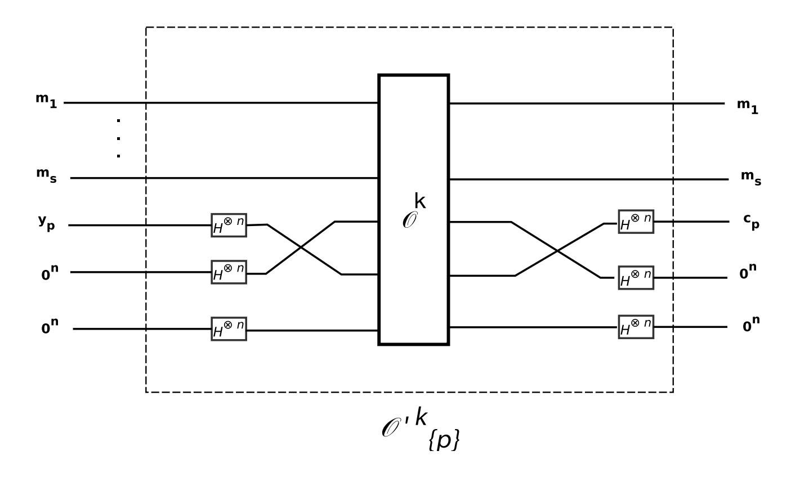
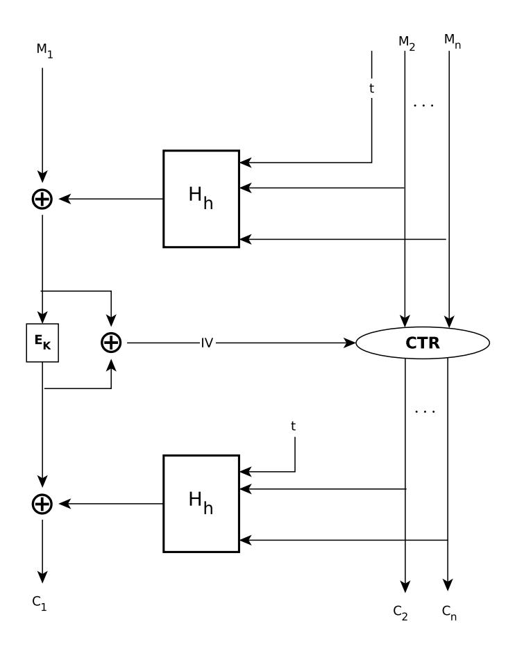
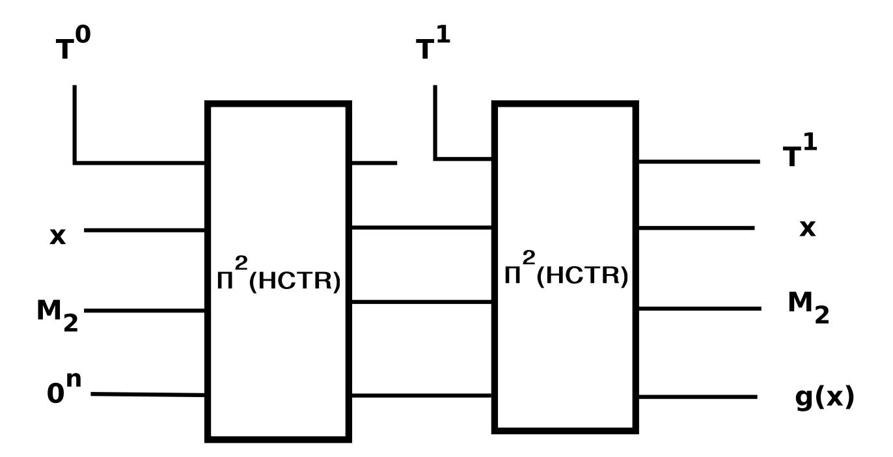
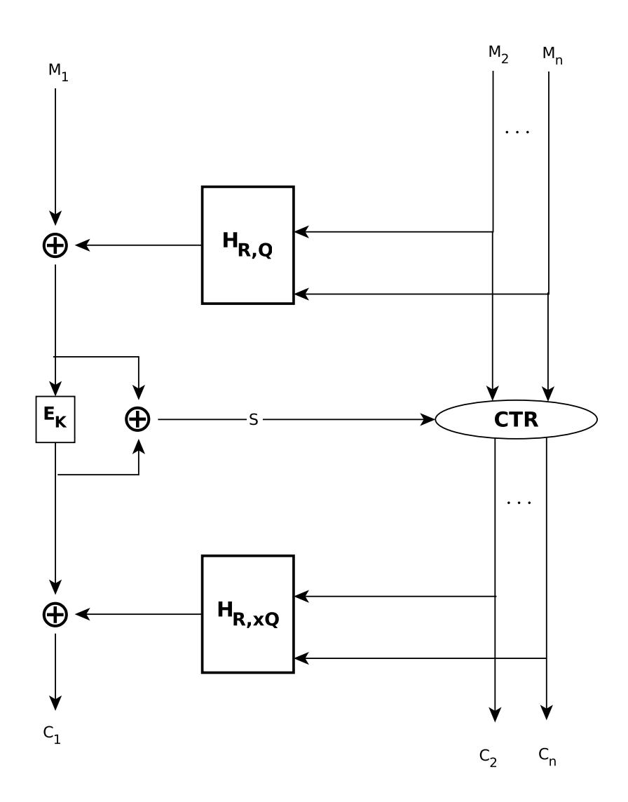
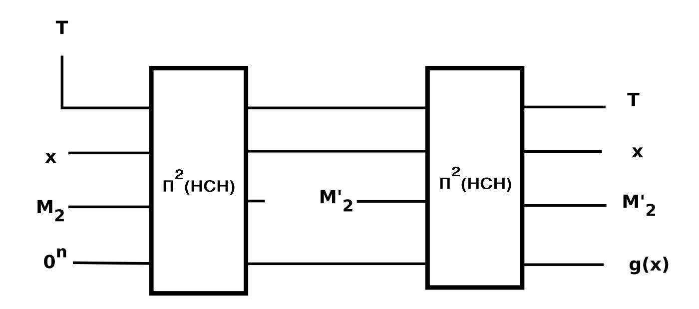

{0}------------------------------------------------

# Quantum Attacks on HCTR and its Variants

Mostafizar Rahman<sup>1</sup> · Goutam Paul<sup>1</sup>

Abstract Recently, in Asiacrypt 2019, Bonnetain et al. have shown attacks by quantum adversaries on FX construction and Even-Mansour Cipher without using superposition queries to the encryption oracle. In this work, we use a similar approach to mount new attacks on HCTR and HCH construction. In addition, we mount attacks on HCTR, Tweakable-HCTR and HCH using the superposition queries to the encryption oracle using strategies proposed by Leander and May in Asiacrypt 2017 and Kaplan et al. in Crypto 2016.

Keywords Grover's Search Algorithm · HCTR · HCH · Simon's Algorithm · Symmetric Key Cryptography · Tweakable-HCTR

## 1 Introduction

The polynomial-time solvability of integer factorization problem and discrete logarithm problem introduced by Shor's algorithm [16] causes a major threat to public key cryptographic primitives against quantum adversaries. In the case of symmetric key schemes, for a long time, the Grover's algorithm [7] has been considered to provide the best attack by speeding up the exhaustive search of the private key by a quadratic factor. Thus, doubling the key-length resists such attacks by upgrading the quantum security of the schemes to that of the classical ones. Leveraging on the power of Simon's algorithm [17], chosen plaintext attack on 3-round Feistel [13] and the quantum attack on Even-Mansour cipher [14] by Kuwakado and Mori has opened up a new direction for cryptanalysis of symmetric key schemes in the quantum setting.

One of the major questions in the analysis of quantum attacks is what should be the adversarial model. In this regard, there are mainly two types of adversarial models, mainly Q1 and Q2 models, which are used extensively in the literature for mounting quantum attacks on cryptographic schemes [1, 5, 2, 12, 10, 6]. In the Q1 model, the attacker is allowed to make classical queries to the

M. Rahman

E-mail: mrahman454@gmail.com

G. Paul

E-mail: goutam.paul@isical.ac.in

1

Cryptology and Security Research Unit (CSRU) Indian Statistical Institute, Kolkata 700108, India 

{1}------------------------------------------------

encryption oracle but has access to a quantum computer for making offline computations. In the Q2 model, in addition of having an access to a quantum computer, the attacker is allowed to make superposition queries to the oracle. In Q2 model, Kaplan et al. have shown attacks on mode of operation for authentication and authenticated encryption by using the Simon's algorithm [11]. Leander and May have shown how to combine Grover's algorithm with Simon's algorithm to mount attacks on FX construction [15]. These attacks are also based on quantum superposition queries to the quantum oracle. Recently, Bonnetain et al. have given attacks on several schemes without making superposition queries to the oracle [1].

Our Contributions. The attacks presented in this paper have considered both Q1 and Q2 models. The procedures proposed by Leander and May [15] are used to combine Grover's search algorithm with Simon's algorithm for mounting attacks in Q1 model. The methods proposed in [1] are also used to mount attacks without making superposition queries to the oracle. These results are combined to mount quantum attacks on HCTR [18] and HCH [3]. Attacks in Q2 model are mounted for HCTR, Tweakable-HCTR and HCH by following the approaches proposed by Kaplan et al. [11]. All the attacks are presented with their corresponding complexities.

The rest of the paper is organized as follows. Initially, a preliminary discussion on necessary quantum algorithms and their impact on cryptography is presented. Then the method of truncating outputs of quantum oracles is described in Section 3. In Section 4, our attacks on various schemes are described. First, attacks on HCTR in both Q<sup>1</sup> and Q<sup>2</sup> model are proposed. Then attacks on HCT R ^ are illustrated upon considering only <sup>Q</sup><sup>2</sup> model. Finally, attacks on HCH in <sup>Q</sup><sup>1</sup> and Q2 model are discussed. Then the paper is summarized furnishing with concluding remarks.

## 2 Preliminaries

Here, some quantum algorithms and how they have been used in cryptanalysis are discussed. First, a brief description about Simon's algorithm is given and how it was applied in [11] is discussed. Next, Grover's search algorithm is briefly mentioned. Finally, the results in [15] and [1] are illustrated upon.

## 2.1 Simon's Algorithm

In discussion of Simon's algorithm [17], first of all, the problem that it solves needs to be defined. The problem is popularly known as Simon's Problem.

```
Problem 1: Simon's Problem: Given a boolean function f: {0, 1}
                                                                     n 7→ {0, 1}
                                                                               n and the
promise that there exists s ∈{0, 1}
                                  n (Simon's promise) such that for any (x, y) ∈{0, 1}
                                                                                       n,
[f(x) = f(y)] ⇐⇒ [x ⊕ y ∈ {0
                               n, s}]; the goal is to find s.
```

Classically, this problem can be solved in Θ(2n/<sup>2</sup> ). Using Simon's algorithm this problem can be solved in O(n) quantum complexity. The steps of Simon's algorithm are given in Algorithm 1.

Simon's Algorithm in Cryptography. In cryptographic applications, it is not the case that always Simon's algorithm can be applied directly. The reason is that sometimes the function that needs to be analyzed has some partial period apart from having a full period. Kaplan et al.. have also shown the application of Simon's algorithm under such constraints. This particularly handles the

{2}------------------------------------------------

## Algorithm 1: Simon's Algorithm

<sup>1</sup> Let's consider a unitary map U<sup>f</sup> given by |x, yi 7→ |x, y ⊕ f(x)i. Two registers are initialized with n-qubit state |0i each. Hadamard transform H⊗<sup>n</sup> is applied to the first register to obtain quantum superposition

$$\frac{1}{\sqrt{2^n}} \sum_{x \in \{0,1\}^n} |x\rangle |0\rangle.$$

<sup>2</sup> f is queried to U<sup>f</sup> using these two registers to obtain

$$\frac{1}{\sqrt{2^n}} \sum_{x \in \{0,1\}^n} |x\rangle |f(x)\rangle.$$

<sup>3</sup> The second register is measured. Measuring the value in the second register collapses the value in both the registers. If value in the second register is f(z), then state in the first register should be a superposition state due to Simon's promise. The state in first register is

$$\frac{1}{\sqrt{2}}(|z\rangle + |z \oplus s\rangle).$$

<sup>4</sup> On first register, Hadamard transform H⊗<sup>n</sup> is again applied to obtain

$$\frac{1}{\sqrt{2}} \frac{1}{\sqrt{2^n}} \sum_{y \in \{0,1\}^n} (-1)^{y \cdot z} (1 + (-1)^{y \cdot s}) |y\rangle.$$

- <sup>5</sup> Measuring the first register collapses it to a random vector y such that y.s = 0. The y vectors with y.s = 1 have 0 amplitude; so, the first register never collapses to such values.
- <sup>6</sup> Steps 1 to 4 are repeated O(n) times which produce n − 1 random vectors orthogonal to s. These can be solved to retrieve the value of s.

conditions where ∃t such that f(x) = f(x ⊕ t), t /∈ {0, s}. They have used (f, s) for computing the success probability of the Simon's algorithm based on rate of collision, where

$$\epsilon(f,s) = \max_{t \in \{0,1\}^n \setminus \{0,s\}} Pr_x[f(x) = f(x \oplus t)].$$

The following theorems in [11] handles the conditions when Simon's promise does not hold precisely.

Theorem 1 (Simon's Algorithm with Approximate Promise). [11] If (f, s) ≤ p<sup>0</sup> ≤ 1, then with probability at least 1 − 2 1+p<sup>0</sup> 2 c n Simon's algorithm returns s at the expense of cn queries,.

If there is no bound on (f, s), then it is not possible to recover s always. But we can find a t such that P rx[f(x) = f(x ⊕ t)] is very high. The following theorem dictates that.

Theorem 2 (Simon's Algorithm without Promise). [11] After the execution of cn steps of Simon's algorithm, if t is orthogonal to all vectors u<sup>i</sup> returned by each step of the algorithm, then P rx[f(x) = f(x ⊕ t)] >= p<sup>0</sup> with probability at least 1 − 2 1+p<sup>0</sup> 2 c n .

In both cases, if c ≥ 3 (1−p0) then the probabilities become high.

## 2.2 Grover's Search Algorithm

Consider an unordered set X with N elements. To perform a search on this set, classically it would take O(N) time. While using a quantum computer, Grover's algorithm [7] searches an 

{3}------------------------------------------------

element in X in O( √ N) time. It is a quadratic speed up over the classical brute force search, i.e., a 128-bit keyspace search can be performed in 2<sup>64</sup> iterations.

### 2.3 Simon's Algorithm with Asymmetric Queries

Leander et al. have combined Grover's search algorithm with Simon's algorithm to recover keys for FX construction [15]. This combination of algorithms for finding a period has huge impact on cryptographic schemes and Bonnetain et al. have formally defined the problem as Asymmetric Search of a Period [1].

Problem 2: Asymmetric Search of a Period [1]: Consider a family of functions F indexed by {0, 1} <sup>m</sup>, denoted by F(i, ·) = fi(·) and a function g; they are defined as

$$F: \{0,1\}^m \times \{0,1\}^n \to \{0,1\}^l$$
$$g: \{0,1\}^n \to \{0,1\}^l$$

The problem is to find an i<sup>0</sup> and a s such that ∀x ∈ {0, 1} <sup>n</sup>, fi<sup>0</sup> (x) ⊕ g(x) = fi<sup>0</sup> (x ⊕ s) ⊕ g(x ⊕ s) for a certain s, under the following assumptions,

- Quantum oracle access to F is given.
- In Q1 model, classical oracle access to g is given whereas in Q2 setting g is accessed as quantum oracle.
- There is exactly one i ∈ {0, 1} <sup>m</sup> such that f<sup>i</sup> ⊕ g has a hidden period.

Bonnetain et al. have observed that while testing whether f<sup>i</sup> ⊕ g have period or not; the function g always remains same. Leveraging on that the number of queries to g is reduced and the superposition |ψgi = Ncn P <sup>x</sup>∈{0,1}<sup>n</sup> |xi |g(x)i is used several times. In Q2 model, g is queried using superposition queries; whereas in Q1 only classical queries are allowed to make to g. From |ψgi, |ψfi⊕gi = Ncn P <sup>x</sup>∈{0,1}<sup>n</sup> |xi |fi(x) ⊕ g(x)i is formed by making quantum superposition queries to f<sup>i</sup> .

In our work, we have used the existing techniques in [1] to attack encryption schemes. A brief overview of all algorithms and their corresponding complexities introduced in [1] to solve the problem of Asymmetric Search of a Period is given here (For details, refer to [1]).

- Alg-PolyQ2- Solves the problem of Asymmetric Search of a Period in Q2 model. It is allowed to make quantum superposition queries to g for online computations.
- Alg-ExpQ1- Solves the problem of Asymmetric Search of a Period in Q1 model. It is allowed to make classical queries to g for online computations.

During offline computations both Alg-PolyQ2 and Alg-ExpQ1 find an i using Grover's search algorithm, such that for that fixed i, fi⊕g has a period. Note that, both algorithms never returns the actual period of f<sup>i</sup> ⊕ g. For finding the period, Simon's algorithm is applied on f<sup>i</sup> ⊕ g. In Q1 model, for finding period Simon's algorithm is applied by making classical queries to the oracle. In regard to this Alg-SimQ1 has been defined in [1].

Cost Estimation. The attacks, presented in this work, make use of Alg-ExpQ1 and Alg-SimQ1. The following two propositions (proposed in [1]) are regarding the cost estimation when these algorithms are applied to mount attacks.

{4}------------------------------------------------

**Proposition 1** (Proposition 3 in [1]) Let c be a sufficiently large constant, m is in O(n) and  $g \oplus f_{i_0}$  has a period for a good  $i_0$ . Assume that

$$\max_{t \in \{0,1\}^n \setminus \{0^n\}, i \in \{0,1\}^n \setminus \{i_0\}, x \in \{0,1\}^n} Pr[(f_i \oplus g)(x \oplus t) = (f_i \oplus g)(x)] \le \frac{1}{2}$$
(1)

holds. Then a good  $i \in \{0,1\}^m$  with probability  $\Theta(1)$  is found by Alg-ExpQ1 by making classical and quantum queries to g and F respectively. The number of classical and quantum queries are  $O(2^n)$  and  $O(n2^{m/2})$  respectively. If for evaluating F once  $T_F$  is the required time, then Alg-ExpQ1 executes the offline computations in time  $O((n^3 + nT_F)2^{m/2})$ . Note that, in offline computation the time required for preparing the state  $|\psi_g\rangle$  is not included.

**Proposition 2** (Proposition 4 in [1]) Suppose that,  $f_{i_0} \oplus g$  has a period  $s \neq 0$  and satisfies

$$\max_{t \neq \{s,0^n\}} Pr_x[(f_i \oplus g)(x \oplus t) = (f_i \oplus g)(x)] \le \frac{1}{2}.$$
 (2)

Then Alg-SimQ1 makes  $O(2^n)$  classical queries to g and cn queries to  $f_{i_0}$  and returns the period s with a probability at least  $1-2^n.(3/4)^{cn}$ . If  $T_f$  is the required time for evaluating  $f_{i_0}$  once, then the offline computation of Alg-SimQ1 runs in time  $O(n^3 + nT_f)$ .

For performing attacks in Q1 model, to form  $|\psi_g\rangle$  whole codebook of g should be queried. In order to reduce the number of queries to g, a trade-off between online classical queries to g (Data complexity) and offline quantum computations (Time complexity) exists. In the rest of the paper, number of online classical queries is denoted by D and number of offline computations is denoted by T.

#### 3 Output Truncation of Quantum Oracles

In the attack on 3-round Feistel cipher, Kuwakado and Morii [13] use the right half of the output from the quantum oracle to mount distinguishing attacks. In [11], it is mentioned that the output in the left half and the right half are entangled, but SIMON algorithm requires a completely unentangled input. In [9,8], it is shown how to truncate the right half of the output from the complete output when a quantum oracle is queried.

The attacks presented in this paper are on the modes of operation of block ciphers. Essentially, a part of the ciphertexts are exploited to mount attacks. The truncation technique mentioned in [9,8] can be employed to take a part of the ciphertext. Let  $E_k$  encrypts  $m_1||\cdots||m_s$  to  $c_1||\cdots||c_s|$  where  $m_i$ 's,  $c_i$ 's are n-bit messages and  $y_1||\cdots||y_s|$  are ancilla qubits. Then the corresponding quantum oracle  $\mathcal{O}^k$  can be represented as

$$\mathcal{O}^{k}: |m_{1}\rangle \cdots |m_{s}\rangle |y_{1}\rangle \cdots |y_{s}\rangle$$

$$\longmapsto |m_{1}\rangle \cdots |m_{s}\rangle |y_{1} \oplus \mathcal{O}^{k}(m_{1}, \cdots, m_{s})\rangle \cdots |y_{s} \oplus \mathcal{O}^{k}(m_{1}, \cdots, m_{s})\rangle.$$

Suppose, the p-th ciphertext  $c_p$  needs to be considered for further operation. Therefore, we want to simulate an

$$\mathcal{O}_{\{p\}}^{k}: |m_{1}\rangle \cdots |m_{s}\rangle |y_{p}\rangle \longmapsto |m_{1}\rangle \cdots |m_{s}\rangle |y_{p} \oplus \mathcal{O}^{k}(m_{1}, \cdots, m_{s})\rangle.$$

$$(3)$$

{5}------------------------------------------------

This is similar to the simulation of the oracle

$$\mathcal{O}_{\{p\}}^{\prime k}: |m_1\rangle \cdots |m_s\rangle |y_p\rangle \overbrace{|0^n\rangle \cdots |0^n\rangle}^{(s-1) \text{ times}}$$

$$\longmapsto |m_1\rangle \cdots |m_s\rangle |y_p \oplus \mathcal{O}^k(m_1, \cdots, m_s)\rangle \overbrace{|0^n\rangle \cdots |0^n\rangle}^{(s-1) \text{ times}}.$$

$$(4)$$

Let  $H^{\otimes n}$  is an n-bit Hadamard gate and  $|+\rangle:=H^{\otimes n}(0^n)$ . Considering  $y_1, \dots, y_{p-1}, y_{p+1}, \dots, y_s=0^n$  and applying Hadamard on them, the oracle representation in (3) can be rewritten as

$$\mathcal{O}^{k}: |m_{1}\rangle \cdots |m_{s}\rangle |+\rangle \cdots |y_{p}\rangle \cdots |+\rangle$$

$$\longmapsto |m_{1}\rangle \cdots |m_{s}\rangle |+\rangle \cdots |y_{p} \oplus \mathcal{O}^{k}(m_{1}, \cdots, m_{s})\rangle \cdots |+\rangle.$$

Let swap(p) be a function that swaps (s+1)-th output with (s+p)-th. Now, the oracle  $\mathcal{O}_{\{p\}}^{\prime k}$  can be defined as

$$(I_{ns+(p-1)n}\otimes H^{\otimes n}\otimes I_{(s-p)n})\cdot \texttt{swap(p)}\cdot \mathcal{O}^k\cdot \texttt{swap(p)}\cdot \ (I_{ns+(p-1)n}\otimes H^{\otimes n}\otimes I_{(s-p)n}).$$

It can be verified that  $\mathcal{O}_{\{p\}}^{\prime k}$  can be applied to truncate p-th ciphertext block when a quantum access to  $\mathcal{O}^k$  is given. Figure 1 shows how  $\mathcal{O}_{\{p\}}^{\prime k}$  is constructed from  $\mathcal{O}^k$ .



Fig. 1: Construction of  $\mathcal{O}_{\{p\}}^{\prime k}$  from  $\mathcal{O}^k$ 

{6}------------------------------------------------

#### 4 Our Attacks

Based on the previous theoretical explanations, it is possible to mount attacks on HCTR, Tweakable-HCTR( $\widehat{HCTR}$ ) and HCH constructions in Q1 and Q2 model. The attacks on HCTR has been discussed extensively. The remaining two attacks are quite similar with the attack on HCTR, and thus they have been briefly described. HCTR can encrypt a n-block message  $(M_1||M_2||\cdots M_n)$  to produce  $(C_1||C_2||\cdots C_n)$ . For mounting attack, the second ciphertext block  $C_2$  has been used. Instead of  $C_2$ , any  $C_i(2 \le i \le n)$  can be used in order to perform the attack. Similar strategies has been followed for  $\widehat{HCTR}$  and HCH.

## 4.1 Attack on HCTR

Our first attack is on HCTR or Hash-Counter which is a tweakable enciphering scheme proposed by Wang, Feng and Wu [18]. It is a strong tweakable pseudorandom permutation and hash-encipher-hash based construction where the middle layer uses counter mode. It is a length preserving tweakable enciphering scheme which supports input with arbitrary variable length. Fig. 2 shows the HCTR construction. HCTR uses a block cipher  $E:\{0,1\}^m \times \{0,1\}^n \to \{0,1\}^n$  and a universal hash function  $H=\{H_h:\{0,1\}^* \to \{0,1\}^n|h\in\{0,1\}^n\}$ . Let  $M_1||M_2||\cdots||M_r$  is encrypted by  $\text{HCTR}[E,H]:\{0,1\}^{m+n}\times\{0,1\}^t\times\{0,1\}^{\geq n}\to\{0,1\}^{\geq n}$  to obtain  $C_1||C_2||\cdots||C_r$ , then

$$C_1||C_2||\cdots||C_r = \mathsf{HCTR}_K^T(M_1||M_2||\cdots||M_r),$$

where  $T \in \{0,1\}^t$  is a tweak and  $K \in \{0,1\}^m$  is the key of underlying block cipher. To consider only the *i*-th ciphertext block, we introduce the operator  $\Pi^i$ . Note that, as all the blocks in ciphertexts are entangled; it is not trivial to truncate the *i*-th ciphertext block. In this regard, the method described in Section 3 can be followed for truncating a specific block of cipher.

In the original construction, the tweak length is fixed and can be zero. In the following attacks, the tweak length is considered non-zero and each message block is n-bit. The attack is performed using two message blocks, which can be easily extended for arbitrary number of message blocks. Consider, HCTR is used to encrypt a message  $M_1||M_2$  using a tweak t to obtain  $C_1||C_2$  and K is the key of the underlying block cipher. Then,

$$C_1||C_2 = HCTR_K^T(M_1||M_2),$$
 (5)

$$IV = H_h(T||M_2) \oplus M_1 \oplus E_K(H_h(T||M_2) \oplus M_1), \tag{6}$$

$$C_2 = E_K(IV \oplus 1) \oplus M_2, \tag{7}$$

$$C_1 = E_K(H_h(T||M_2)) \oplus H_h(T||C_2).$$
 (8)

Attack in Q2 Model. In Q2 model, quantum superposition queries can be made to HCTR oracle.  $x||M_2$  is queried with tweak  $T_0$ ,  $T_1$  and output  $C_2$  is used to construct g(x).

$$g(x) = \Pi^{2} \Big( \mathsf{HCTR}^{T_{0}}(x||M_{2}) \Big) \oplus \Pi^{2} \Big( \mathsf{HCTR}^{T_{1}}(x||M_{2}) \Big)$$

$$= E_{K} \Big( H_{h}(T_{0}||M_{2}) \oplus x \oplus E_{K} \Big( H_{h}(T_{0}||M_{2}) \oplus x \Big) \oplus 1 \Big) \oplus$$

$$E_{K} \Big( H_{h}(T_{1}||M_{2}) \oplus x \oplus E_{K} \Big( H_{h}(T_{1}||M_{2}) \oplus x \Big) \oplus 1 \Big)$$

$$(9)$$

{7}------------------------------------------------

Clearly, g(x) is a periodic function with period  $H_h(T_0||M_2) \oplus H_h(T_1||M_2)$  and it can be recovered by applying Simon's algorithm on g(x) by making O(n) queries. Therefore,  $g(x) = g(x \oplus H_h(T_0||M_2) \oplus H_h(T_1||M_2))$ . So,  $\Pi^2 \Big( \mathsf{HCTR}^{T_0}(x||M_2) \Big) \oplus \Pi^2 \Big( \mathsf{HCTR}^{T_1}(x||M_2) \Big) \oplus \Pi^2 \Big( \mathsf{HCTR}^{T_1}(x \oplus s||M_2) \Big) = 0$ , where  $s = H_h(T_0||M_2) \oplus H_h(T_1||M_2)$ . Figure 3 shows how the simon function g(x) is constructed.  $Pi^2(HCTR)$  returns the second ciphertext block for the corresponding message blocks that are queried to the oracle. Note that, in Section 3 it is discussed that given a quantum oracle access to  $\mathsf{HCTR}$ ,  $Pi^2(HCTR)$  can be constructed.

Attack in Q1 Model. In the Q1 model, a quantum superposition state is formed from classical oracle queries. While mounting such kind of attacks, the enciphering scheme needed to be reduced to Problem 2.3. g(x) can be classically queried (online) to obtain  $|\psi_g\rangle$  and then  $f_i \oplus g$  can be tested offline whether periodic or not using Simon's and Grover's search algorithm. As mentioned in [1], instead of querying the whole classical codebook, the advantage of algebraic structures has been taken into account while mounting the attack.

Attack Description. Like previous attack, here also two message blocks have been considered. The last message block and last (n-u) bits of first message block are kept constant. The queries to the oracle is of the form  $(x||0^{n-u})||M_2$ , where  $x||0^{n-u}$  and  $M_2$  are the first and second message block respectively and  $0 \le u \le n$ . For constructing a periodic function, the second ciphertext block  $C_2$  is considered. The value of  $M_2$  is fixed and by varying the value of x,  $2^u$  classical queries are made to HCTR oracle to form  $|\psi_g\rangle$ . Define  $F:\{0,1\}^{m+n-u}\times\{0,1\}^u$  by  $F(i||j,x)=f_{i||j}(x)=E_i(x||j\oplus E_i(x||j\oplus 1))$  ( $i\in\{0,1\}^m$  and  $j\in\{0,1\}^{n-u}$ ) and  $g:\{0,1\}^u\to\{0,1\}^n$  by  $g(x)=\Pi^2\big(\mathsf{HCTR}_K^T((x||0^{n-u})||M_2)\big)$ . Then,



Fig. 2: Construction of HCTR

{8}------------------------------------------------



Fig. 3: Simon function for HCTR. In the figure, Π<sup>2</sup> (HCT R) truncates the ciphertext block C<sup>2</sup> and it is constructed by following the approach in Section 3. Note that, input and output lines corresponding to C<sup>1</sup> are not shown.

$$g(x) = \Pi^{2} \left( \mathsf{HCTR}_{K}^{T}((x||0^{n-u})||M_{2}) \right)$$

$$= E_{K} \left( H_{h}(T||M_{2}) \oplus (x||0^{n-u}) \oplus E_{K} \left( H_{h}(T||M_{2}) \oplus (x||0^{n-u}) \right) \oplus 1 \right).$$
(10)

Let first u bits of Hh(T||M2) is denoted by l (1) and last n − u bits are denoted by l (2). Then g(x) can be rewritten as

$$g(x) = E_K \Big( (l^{(1)}||l^{(2)}) \oplus (x||0^{n-u}) \oplus E_K \Big( (l^{(1)}||l^{(2)}) \oplus (x||0^{n-u}) \oplus 1 \Big) \Big)$$

$$= E_K \Big( (l^{(1)} \oplus x)||l^{(2)} \oplus E_K \Big( (l^{(1)} \oplus x)||l^{(2)} \oplus 1 \Big) \Big).$$
(11)

the function F(i||j, x) ⊕ g(x). It has a hidden period l (1) for F(K||l (2), x) ⊕ g(x). The attack steps are listed below.

- 1. Alg-ExpQ1 is run for F and g to recover K and l (2) .
- 2. Alg-SimQ1 is run on fK||<sup>l</sup> (2) ⊕ g to recover l (1) .

Note that, by the above approach key of the underlying block cipher can be recovered. Although, it is unable to recover hash key h, but using l (1) and l (2) , Hh(T||M2) can be constructed. The attack can be extended for arbitrary number of message blocks.

Analysis. The analysis of the attack is similar with the analysis of the attack on Even-Mansour cipher in [1]. First, it is assumed that the size of keyspace of the underlying block cipher is in O(n). In the attack, if u is kept too small, although too few queries are required to construct |ψgi, but the cost of Grover's search increases significantly. Under the constraints that u is not too small and E is a secure block cipher, we can assume that

$$\max_{t \in \{0,1\}^u \setminus \{0^u\}, x \leftarrow \{0,1\}^u} Pr_x[(f_{i||j} \oplus g)(x \oplus t) = (f_{i||j} \oplus g)(x)] \le \frac{1}{2}$$
(12)

{9}------------------------------------------------

holds for  $(i||j) \neq (K||l^{(2)})$ . By virtue of this, Proposition 1 and 2 holds for Alg-ExpQ1 and Alg-SimQ1 respectively. Overall, the key of underlying block cipher and  $l^{(1)}||l^{(2)}$  is recovered by following this attack using  $D = O(2^u)$  classical queries to  $\mathsf{HCTR}_K^T$  and performing  $T = O(n^3 2^{\frac{m+n-u}{2}})$  offline computations. Here, it is also assumed that one evaluation of F is in O(1) which makes  $T_F = O(1)$ . The trade-off  $DT^2 = n^3 2^{m+n}$  is applied; data and time complexity balances at  $D = O(2^{\frac{m+n}{3}})$  and  $T = O(n^3 2^{\frac{m+n}{3}})$ . As mentioned in [1], by construction of Alg-ExpQ1 and Alg-SimQ1 our attack uses qubits in the order of polynomial and negligible classical bits. Note that, generic attacks takes  $O(2^{\frac{m}{2}})$  time. So, this attack is better than generic attacks when  $n^3 2^{\frac{m+n}{3}} < 2^{\frac{m}{2}} \implies m > 6 \log_2(n^3 2^{\frac{n}{3}})$ .

#### 4.2 Attack on Tweakable-HCTR

Tweakable-HCTR or HCTR was proposed by Dutta and Nandi [4] which is a variant of HCTR where each block cipher call is replaced by tweakable block cipher (TBC). Another major difference between HCTR and HCTR is the use of tweak. In HCTR instead of using the tweak in upper and lower hash functions, it is used in an independent keyed (n+t)-bit hash function  $H'_L$ . The output of  $H'_L$  is divided into two parts: n-bit  $H_1$  which is masked with the input and the output of leftmost TBC and t-bit  $H_2$  which acts as tweak for the underlying TBC. Underlying TBC  $\widetilde{E}: \{0,1\}^m \times \{0,1\}^t \times \{0,1\}^n \to \{0,1\}^n$  is denoted by  $\widetilde{E}_K^{H_2}$  where K is m-bit key and  $H_2$  is t-bit tweak. Let  $M_1||M_2||\cdots||M_r$  is encrypted by HCTR to obtain  $C_1||C_2||\cdots||C_r$ , then  $C_1||C_2||\cdots||C_r = HCTR_K^T(M_1||M_2||\cdots||M_r)$ , where  $T \in \{0,1\}^*$  is a tweak and  $K \in \{0,1\}^m$  is the key of underlying block cipher.

The Q1 and Q2 attacks for  $\widetilde{HCTR}$  are quite similar with the attacks on HCTR. For the sake of simplicity, only corresponding periodic functions are mentioned here. Consider the encryption of two n-bit message blocks. Then

$$IV = \widetilde{E}_K^{H_2} \left( H_{K_h}(M_2) \oplus M_1 \oplus H_1 \right) \oplus H_{K_h}(M_2) \oplus M_1 \oplus H_1, \tag{13}$$

$$C_2 = \widetilde{E}_K^{H_2}(IV \oplus 1) \oplus M_2. \tag{14}$$

Attack in Q2 Model. Consider the function g(x) constructed from second ciphertext block and  $H_L'(T) = (H_1, H_2)$ .

$$g(x) = \Pi^{2} \left( \widetilde{\mathsf{HCTR}}_{K}^{T}(x||M_{2}) \right) \oplus \Pi^{2} \left( \widetilde{\mathsf{HCTR}}_{K}^{T}(x||M_{2}') \right)$$

$$= \widetilde{E}_{K}^{H_{2}} \left( \widetilde{E}_{K}^{H_{2}} \left( H_{K_{h}}(M_{2}) \oplus x \oplus H_{1} \right) \oplus H_{K_{h}}(M_{2}) \oplus x \oplus H_{1} \right) \oplus$$

$$\widetilde{E}_{K}^{H_{2}} \left( \widetilde{E}_{K}^{H_{2}} \left( H_{K_{h}}(M_{2}') \oplus x \oplus H_{1} \right) \oplus H_{K_{h}}(M_{2}') \oplus x \oplus H_{1} \right) \oplus M_{2} \oplus M_{2}'$$

$$(15)$$

Clearly, g(x) is a periodic function with period  $H_{K_h}(M_2) \oplus H_{K_h}(M'_2)$ . Applying Simon's algorithm on g(x) recovers the period in O(n) queries.

## 4.3 Attack on HCH

Another variant of HCTR is HCH or Hash-Counter-Hash, proposed by Chakraborty and Sarkar which is based on hash-encrypt-hash paradigm [3]. In HCH, tweak T is not directly used by the polynomial hash; instead it is encrypted twice to obtain R and Q which are used with the hash

{10}------------------------------------------------

function H (In HCH, the hash function is denoted by  $H_{R,Q}$ ). Figure 4 shows the construction of HCH. In the attacks presented, as generation of R and Q is not used, the fact that for a fixed T, R and Q remains fixed is considered. In the counter-mode, instead of IV, S is used for initialization which is obtained by encrypting the input and output of leftmost block cipher. If  $M_1||M_2||\cdots||M_r$  ( $|M_i|=n$ ) is encrypted using HCH to obtain  $C_1||C_2||\cdots||C_r$  ( $|C_i|=n$ ), then  $C_1||C_2||\cdots||C_r=\mathrm{HCH}_K^T(M_1||M_2||\cdots||M_r)$ , where K is the key of underlying block cipher  $E:\{0,1\}^m\times\{0,1\}^n$  denoted by  $E_K(.)$  and T is the tweak. Our attack is based on the second ciphertext block, which is given as

$$C_2 = E_K(S) \oplus M_2 \tag{16}$$

where

$$S = E_K \Big( E_K \big( H_{R,Q}(M_2) \oplus M_1 \big) \oplus H_{R,Q}(M_2) \oplus M_1 \Big). \tag{17}$$

In the following attacks, only the periodic functions are mentioned as the attacks are almost same as the attacks on HCTR.



Fig. 4: Construction of HCH

{11}------------------------------------------------

Attack in Q2 Model. Consider the function g(x) constructed from second ciphertext block.

$$g(x) = \Pi^{2} \left( HCH_{K}^{T}(x||M_{2}) \right) \oplus \Pi^{2} \left( HCH_{K}^{T}(x||M_{2}') \right)$$

$$= E_{K} \left( E_{K} \left( E_{K} \left( H_{R,Q}(M_{2}) \oplus x \right) \oplus H_{R,Q}(M_{2}) \oplus x \right) \right) \oplus$$

$$E_{K} \left( E_{K} \left( E_{K} \left( H_{R,Q}(M_{2}') \oplus x \right) \oplus H_{R,Q}(M_{2}') \oplus x \right) \right) \oplus M_{2} \oplus M_{2}'$$

$$(18)$$

Note that,  $g(x \oplus H_{R,Q}(M_2) \oplus H_{R,Q}(M_2')) = g(x)$ . So, period is  $H_{R,Q}(M_2) \oplus H_{R,Q}(M_2')$ . Applying Simon's algorithm on g(x) recovers the period in O(n) queries. Figure 5 shows the process of generating g(x).



Fig. 5: Simon function for HCH. In the figure,  $\Pi^2(HCH)$  truncates the ciphertext block  $C_2$ .

Attack in Q1 Model. Let u be a integer and  $0 \le u \le n$ . Define  $F : \{0,1\}^{m+n-u} \times \{0,1\}^u \to \{0,1\}^n$  by

$$F(i||j,x) = f_{i||j}(x) = E_i \left( E_i \left( E_i \left( x||j \right) \oplus x||j \right) \right)$$
(19)

and  $g: \{0,1\}^u \to \{0,1\}^n$  by  $g(x) = \Pi^2 \Big( \mathsf{HCH}_K^T \big( (x||0^{n-u})||M_2 \big) \Big)$ . Then

$$g(x) = E_K \Big( E_K \Big( E_K \Big( H_{R,Q}(M_2) \oplus (x||0^{n-u}) \Big) \oplus H_{R,Q}(M_2) \oplus (x||0^{n-u}) \Big) \Big) \oplus M_2.$$

Let first u bits of  $H_{R,Q}(M_2)$  be  $l^{(1)}$  and last (n-u) bits be  $l^{(2)}$ . Then

$$g(x) = E_K \left( E_K \left( |I^{(1)}| |I^{(2)} \oplus (x||0^{n-u}) \right) \oplus |I^{(1)}| |I^{(2)} \oplus (x||0^{n-u}) \right) \right) \oplus M_2$$
$$= E_K \left( E_K \left( |I^{(1)} \oplus x| |I^{(2)} \oplus x| |I^{(2)} \oplus x| |I^{(2)} \oplus x| |I^{(2)} \oplus x| |I^{(2)} \oplus x| |I^{(2)} \oplus x| |I^{(2)} \oplus x| |I^{(2)} \oplus x| |I^{(2)} \oplus x| |I^{(2)} \oplus x| |I^{(2)} \oplus x| |I^{(2)} \oplus x| |I^{(2)} \oplus x| |I^{(2)} \oplus x| |I^{(2)} \oplus x| |I^{(2)} \oplus x| |I^{(2)} \oplus x| |I^{(2)} \oplus x| |I^{(2)} \oplus x| |I^{(2)} \oplus x| |I^{(2)} \oplus x| |I^{(2)} \oplus x| |I^{(2)} \oplus x| |I^{(2)} \oplus x| |I^{(2)} \oplus x| |I^{(2)} \oplus x| |I^{(2)} \oplus x| |I^{(2)} \oplus x| |I^{(2)} \oplus x| |I^{(2)} \oplus x| |I^{(2)} \oplus x| |I^{(2)} \oplus x| |I^{(2)} \oplus x| |I^{(2)} \oplus x| |I^{(2)} \oplus x| |I^{(2)} \oplus x| |I^{(2)} \oplus x| |I^{(2)} \oplus x| |I^{(2)} \oplus x| |I^{(2)} \oplus x| |I^{(2)} \oplus x| |I^{(2)} \oplus x| |I^{(2)} \oplus x| |I^{(2)} \oplus x| |I^{(2)} \oplus x| |I^{(2)} \oplus x| |I^{(2)} \oplus x| |I^{(2)} \oplus x| |I^{(2)} \oplus x| |I^{(2)} \oplus x| |I^{(2)} \oplus x| |I^{(2)} \oplus x| |I^{(2)} \oplus x| |I^{(2)} \oplus x| |I^{(2)} \oplus x| |I^{(2)} \oplus x| |I^{(2)} \oplus x| |I^{(2)} \oplus x| |I^{(2)} \oplus x| |I^{(2)} \oplus x| |I^{(2)} \oplus x| |I^{(2)} \oplus x| |I^{(2)} \oplus x| |I^{(2)} \oplus x| |I^{(2)} \oplus x| |I^{(2)} \oplus x| |I^{(2)} \oplus x| |I^{(2)} \oplus x| |I^{(2)} \oplus x| |I^{(2)} \oplus x| |I^{(2)} \oplus x| |I^{(2)} \oplus x| |I^{(2)} \oplus x| |I^{(2)} \oplus x| |I^{(2)} \oplus x| |I^{(2)} \oplus x| |I^{(2)} \oplus x| |I^{(2)} \oplus x| |I^{(2)} \oplus x| |I^{(2)} \oplus x| |I^{(2)} \oplus x| |I^{(2)} \oplus x| |I^{(2)} \oplus x| |I^{(2)} \oplus x| |I^{(2)} \oplus x| |I^{(2)} \oplus x| |I^{(2)} \oplus x| |I^{(2)} \oplus x| |I^{(2)} \oplus x| |I^{(2)} \oplus x| |I^{(2)} \oplus x| |I^{(2)} \oplus x| |I^{(2)} \oplus x| |I^{(2)} \oplus x| |I^{(2)} \oplus x| |I^{(2)} \oplus x| |I^{(2)} \oplus x| |I^{(2)} \oplus x| |I^{(2)} \oplus x| |I^{(2)} \oplus x| |I^{(2)} \oplus x| |I^{(2)} \oplus x| |I^{(2)} \oplus x| |I^{(2)} \oplus x| |I^{(2)} \oplus x| |I^{(2)} \oplus x| |I^{(2)} \oplus x| |I^{(2)} \oplus x| |I^{(2)} \oplus x| |I^{(2)} \oplus x| |I^{(2)} \oplus x| |I^{(2)} \oplus x| |I^{(2)} \oplus x| |I^{(2)} \oplus x| |I^{(2)} \oplus x| |I^{(2)} \oplus x| |I^{(2)} \oplus x| |I^{(2)} \oplus x| |I^{(2)} \oplus x| |I^{(2)} \oplus x| |I^{(2)} \oplus x| |I^{(2)} \oplus x| |I^{(2)} \oplus x| |I^{(2)} \oplus x| |I^{(2)} \oplus x| |I^{(2)} \oplus x| |I^{(2)} \oplus x| |I^{(2)} \oplus x| |I^{(2)} \oplus x| |I^{(2)} \oplus x| |I^{(2)} \oplus x| |I^{(2)} \oplus x| |I^{(2)} \oplus x| |I^{(2)} \oplus x| |I^{(2)} \oplus x| |I^{(2)} \oplus x| |I^$$

Consider the function  $f_{i||j}(x) \oplus g(x)$ . The function  $f_{K||l^{(2)}} \oplus g(x)$  is periodic with period  $l^{(1)}$ .

{12}------------------------------------------------

The analysis of this attack is similar with the analysis of the attack on HCTR and hence the details are omitted. The data and time complexity of this attack is O(2 <sup>m</sup>+<sup>n</sup> <sup>3</sup> ) and O(n 32 m+n <sup>3</sup> ) respectively.

## 5 Conclusion

In this paper, we analyzed the HCTR, Tweakable-HCTR and HCH in quantum adversarial model. The work presented here developes upon the previous works in [11, 1, 15]. All our attacks have made use of encryption oracle only. This arises a question whether the availability of decryption oracle can make a significant benefit in terms of the complexity of mounting such attacks.

## References

- 1. Bonnetain, X., Hosoyamada, A., Naya-Plasencia, M., Sasaki, Y., Schrottenloher, A.: Quantum Attacks Without Superposition Queries: The Offline Simon's Algorithm. In: S.D. Galbraith, S. Moriai (eds.) Advances in Cryptology - ASIACRYPT 2019 - 25th International Conference on the Theory and Application of Cryptology and Information Security, Kobe, Japan, December 8-12, 2019, Proceedings, Part I, Lecture Notes in Computer Science, vol. 11921, pp. 552–583. Springer (2019)
- 2. Bonnetain, X., Naya-Plasencia, M., Schrottenloher, A.: Quantum Security Analysis of AES. IACR Trans. Symmetric Cryptol. 2019(2), 55–93 (2019)
- 3. Chakraborty, D., Sarkar, P.: HCH: A New Tweakable Enciphering Scheme Using the Hash-Encrypt-Hash Approach. In: R. Barua, T. Lange (eds.) Progress in Cryptology - INDOCRYPT 2006, pp. 287–302. Springer Berlin Heidelberg, Berlin, Heidelberg (2006)
- 4. Dutta, A., Nandi, M.: Tweakable HCTR: A BBB Secure Tweakable Enciphering Scheme. In: D. Chakraborty, T. Iwata (eds.) Progress in Cryptology – INDOCRYPT 2018, pp. 47–69. Springer International Publishing, Cham (2018)
- 5. Gagliardoni, T.: Quantum Security of Cryptographic Primitives. CoRR abs/1705.02417 (2017). http: //arxiv.org/abs/1705.02417
- 6. Ghosh, S., Sarkar, P.: Breaking Tweakable Enciphering Schemes using Simon's Algorithm. Cryptology ePrint Archive, Report 2019/724 (2019). https://eprint.iacr.org/2019/724
- 7. Grover, L.K.: A Fast Quantum Mechanical Algorithm for Database Search. In: Proceedings of the Twentyeighth Annual ACM Symposium on Theory of Computing, STOC '96, pp. 212–219. ACM, New York, NY, USA (1996)
- 8. Hosoyamada, A., Sasaki, Y.: Quantum Demiric-Seluk Meet-in-the-Middle Attacks: Applications to 6-Round Generic Feistel Constructions. Cryptology ePrint Archive, Report 2017/1229 (2017). https://eprint.iacr. org/2017/1229
- 9. Hosoyamada A., S.Y.: Quantum Demiric-Seluk Meet-in-the-Middle Attacks: Applications to 6-Round Generic Feistel Constructions. In: Catalano D., De Prisco R. (eds) Security and Cryptography for Networks. SCN 2018. Lecture Notes in Computer Science, vol 11035. Springer, Cham 2018 (2018)
- 10. Ito, G., Hosoyamada, A., Matsumoto, R., Sasaki, Y., Iwata, T.: Quantum Chosen-Ciphertext Attacks against Feistel Ciphers. Cryptology ePrint Archive, Report 2018/1193 (2018). https://eprint.iacr.org/2018/1193
- 11. Kaplan, M., Leurent, G., Leverrier, A., Naya-Plasencia, M.: Breaking Symmetric Cryptosystems Using Quantum Period Finding. In: M. Robshaw, J. Katz (eds.) Advances in Cryptology – CRYPTO 2016, pp. 207–237. Springer Berlin Heidelberg, Berlin, Heidelberg (2016)
- 12. Kaplan, M., Leurent, G., Leverrier, A., Naya-Plasencia, M.: Quantum Differential and Linear Cryptanalysis. IACR Trans. Symmetric Cryptol. 2016(1), 71–94 (2016)
- 13. Kuwakado, H., Morii, M.: Quantum distinguisher between the 3-round Feistel cipher and the random permutation. 2010 IEEE International Symposium on Information Theory pp. 2682–2685 (2010)
- 14. Kuwakado, H., Morii, M.: Security on the quantum-type Even-Mansour cipher. In: 2012 International Symposium on Information Theory and its Applications, pp. 312–316 (2012)
- 15. Leander, G., May, A.: Grover Meets Simon Quantumly Attacking the FX-construction. In: T. Takagi, T. Peyrin (eds.) Advances in Cryptology – ASIACRYPT 2017, pp. 161–178. Springer International Publishing, Cham (2017)
- 16. Shor, P.W.: Polynomial-Time Algorithms for Prime Factorization and Discrete Logarithms on a Quantum Computer. SIAM J. Comput. 26(5), 1484–1509 (1997)
- 17. Simon, D.R.: On the Power of Quantum Computation. SIAM J. Comput. 26(5), 1474–1483 (1997)
- 18. Wang, P., Feng, D., Wu, W.: HCTR: A Variable-Input-Length Enciphering Mode. In: D. Feng, D. Lin, M. Yung (eds.) Information Security and Cryptology, pp. 175–188. Springer Berlin Heidelberg, Berlin, Heidelberg (2005)