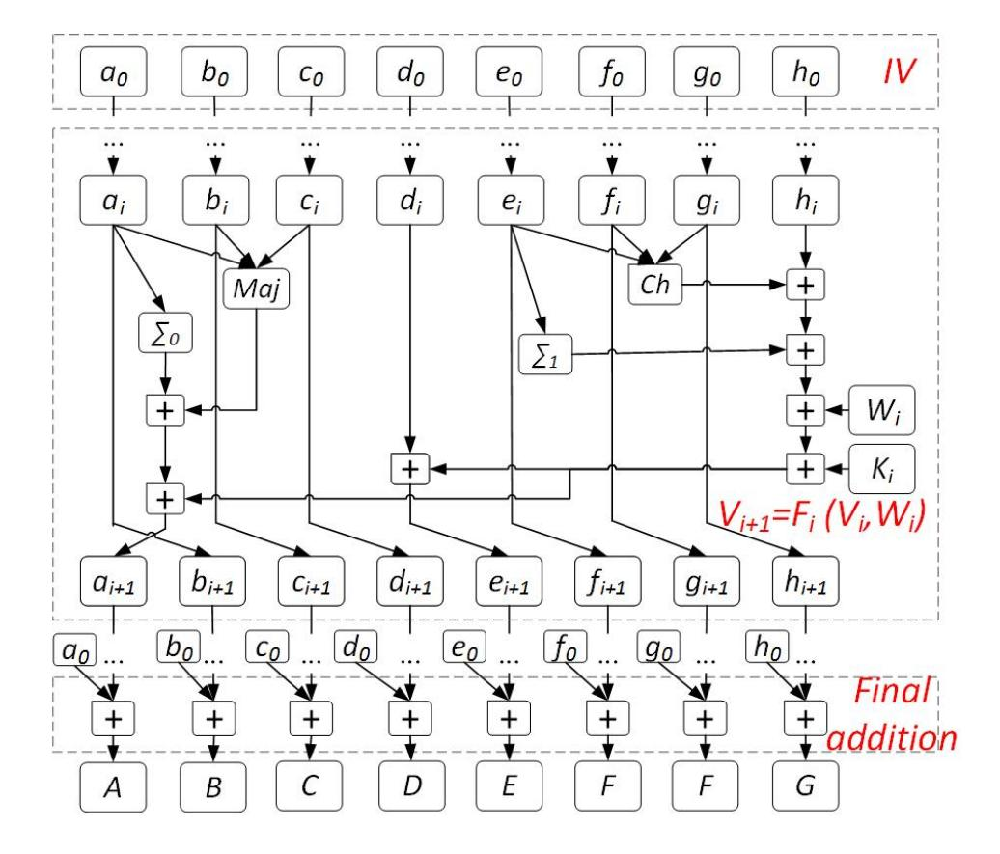
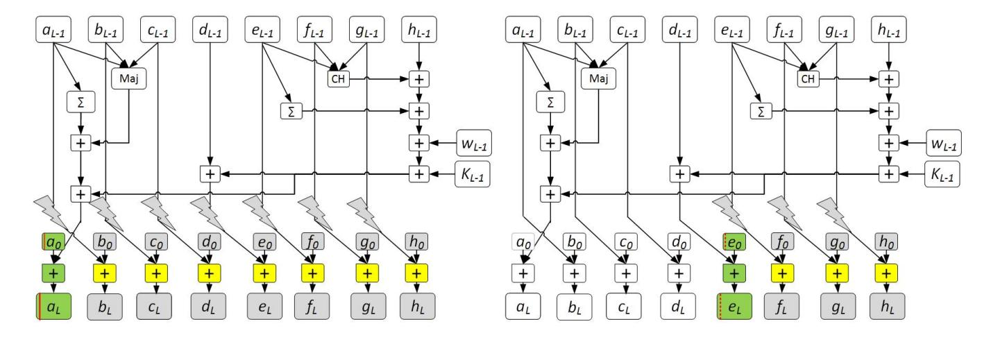

{0}------------------------------------------------

# **Lattice-based Fault Attacks on Deterministic Signature Schemes of ECDSA and EdDSA**

Weiqiong Cao1*,*2 , Hongsong Shi2() , Hua Chen1 , Jiazhe Chen2 , Limin Fan1 , and Wenling Wu1

1 Trusted Computing and Information Assurance Laboratory, Institute of Software, Chinese Academy of Sciences, South Fourth Street 4#, ZhongGuanCun, Beijing 100190, China

*{*caoweiqiong,chenhua*}*@iscas.ac.cn

2 China Information Technology Security Evaluation Center. Building 1, yard 8, Shangdi West Road, Haidian District, Beijing 100085, China *{*caoweqion,hsshi*}*@163.com

**Abstract.** The deterministic ECDSA and EdDSA signature schemes have found plenty of applications since their publication, e.g., block chain and Internet of Thing, and have been stated in RFC 6979 and RFC 8032 by IETF respectively. Their theoretical security can be guaranteed within certain well-defined models, and since no randomness is required by the algorithms anymore their practical risks from the flaw of random number generators are mitigated. However, the situation is not really optimistic, since it has been gradually found that delicately designed fault attacks can threaten the practical security of the schemes.

In this paper, based on the random fault models of intermediate values during signature generation, we propose a lattice-based fault analysis method to the deterministic ECDSA and EdDSA algorithms. By virtue of the algebraic structures of the deterministic algorithms, we show that, when providing with some faulty signatures and an associated correct signature of the same input message, some instances of SVP or CVP problems in some lattice can be constructed to recover the signing key. The allowed faulty bits in the method are close to the size of the signing key, and obviously bigger than that allowed by the existing differential fault attacks. In addition, the lattice-based approach supports more alternative targets of fault injection, which further improves its applicability when comparing with the existing approaches.

We perform some experiments to demonstrate the effectiveness of the key recovery method. In particular, for deterministic ECDSA/EdDSA algorithm with 256-bit signing key, the key can be recovered efficiently with significant probability even if the targets are affected by 250/247 faulty bits. However, this is impractical for the existing enumerating approaches.

**Keywords:** Side channel attack *·* Fault attack *·* Lattice-based attack *·* Deterministic ECDSA *·* EdDSA

{1}------------------------------------------------

# **1 Introduction**

As a fundamental building block of modern cryptography, digital signature has been widely used in practice. For its efficiency and standardization in FIPS 186 and ANSI X9.62, ECDSA has found various applications since its publication. In spite of the fact that the theoretical security of ECDSA has not been proven finally, it is still believed to be secure and connected with some hard problems in mathematics. However, side channel attacks on various implementations of ECDSA have been continuously discovered during the last decades. Some of the attacks, for example, are induced by the deficiency of the ephemeral random numbers (denoted *nonce* hereinafter) required by the scheme. If the nonce has a few bits leaked or repeated, some lattice-based approaches [\[12](#page-21-0)[,16](#page-21-1),[23\]](#page-22-0) can be employed to extract the private key by BDD [[19\]](#page-21-2). This has been demonstrated several times in real IT products with ECDSA implementations [[2](#page-20-0),[6,](#page-21-3)[7,](#page-21-4)[14](#page-21-5)[,21](#page-21-6)]. Hence, an intuition to improve the security of ECDSA is to remove the randomness requirement from the algorithm. This gave birth to a study of *deterministic signature schemes*. In particular, deterministic ECDSA and EdDSA have received plenty of attention in the research of applied cryptography since recent years. They were respectively standardized in RFC 6979 and RFC 8032 and realized in cryptographic libraries of OpenSSH, Tor, TLS, etc. The deterministic version of ECDSA derives the nonce just from the private key and the input message by means of cryptographic hash or HMAC primitive. In this way, no randomness is required on the implementation platform, and it seems the threat from physical attacks is mitigated.

But the situation is not improved too much, since some new flaws in deterministic signature algorithms have been gradually identified when considering differential fault attacks (DFA) [\[5](#page-21-7)[,27](#page-22-1),[28,](#page-22-2)[29](#page-22-3)]. DFAs have been proven to be valid for different types of cryptographic schemes [[8](#page-21-8)[,9](#page-21-9)] in the literature. Generally, a D-FA adversary manages to disturb the signature generation procedure (by means of voltage glitches, laser or electro-magnetic injection and so on [[17](#page-21-10)]) and make the platform output faulty results, and then exploits them to do key recovery.

The first DFA introduced in [[5\]](#page-21-7) shows that if a fault is injected to produce a faulty signature (*r ′ , s′* ) during the calculation of the scalar multiplication of deterministic ECDSA or EdDSA, then by the help of the correct signature (*r, s*) from the same signing key *d* and input message *m*, the key *d* can be recovered by solving some linear equations. Although the approach puts no limitation on the number of allowed faulty bits, it is limited by the possible locations (or rather *targets*) of fault injection (mainly targeting the scalar multiplication). As a relaxation, another approach was introduced in [[5](#page-21-7)], which assumes only limited bits of the target (e.g., the nonce *k*) would be randomly affected by each fault (hereafter called storage fault). Denote the faulty value by *k ′* = *k* + *ε*2 *l* , with limited *ε* and known *l* to the adversary. Then by constructing a differential distinguisher, the signing key *d* in deterministic ECDSA can be recovered efficiently by enumerating *ε*. Both of the approaches have been improved later, especially by those in [\[27](#page-22-1)[,28](#page-22-2),[29\]](#page-22-3), where different fault injection methods and targets are exploited and experimented on different hardware platforms. A recent extension 

{2}------------------------------------------------

was presented in [\[1](#page-20-1)], where more targets of fault injection have been identified and analyzed.

From a common point of view, for the storage fault, the signing key of deterministic schemes can be recovered theoretically by adjusting fault injection actions and enumerating the possible faults. The efficiency of the existing attacks [\[1](#page-20-1),[5,](#page-21-7)[27](#page-22-1)[,28](#page-22-2)] is obviously constrained by the enumeration complexity, thus they are feasible only if the fault injection is controlled and limited bits of the targets are affected. Another limitation of the existing attacks lies in the optional types of targets that can be used for fault injection. Generally, the more targets the attack supports, the more possibility of attack paths it has, and thus the more difficult the attack is to be resisted. In fact, the targets that were considered in the existing attacks are constrained. For example, the first attack in [[5\]](#page-21-7) only supports two targets (*i.e.*, the scalar multiplication *kG* and the nonce *k* when calculating *s* during the signature generation), and although some more targets were considered later in [[1\]](#page-20-1), it is still far away from covering all the possible attack paths.

A promising solution is to develop lattice-based approaches. It is noticed that lattice-based fault attacks were used in analyzing plain (EC)DSA and qD-SA. Targets of fault injection in [[10,](#page-21-11)[21](#page-21-6)[,26](#page-22-4),[30\]](#page-22-5) are usually the nonce itself or the scalar multiplication (with a nonce as the scalar). For those attacks to be effective, the nonce in the plain signature is supposed to be a random number. Hence it is generally thought that deterministic ECDSA is immune to them because of the deterministic nonce generation approach. This conception was later disproved by [[15\]](#page-21-12), where a lattice-based attack was devised to compromise deterministic signatures. The attack is specific to lattice-based cryptography, and the lattice constructed for the attack is also specific to the signature scheme. Although it casts a new light on the study of lattice-based fault attacks on more deterministic signature schemes, it is still not known whether the method is effective to deterministic ECDSA or EdDSA (since they have different algebraic structures).

In this paper, we show lattice-based fault attacks can also be applied to deterministic ECDSA and EdDSA schemes. We consider the attacks in a random fault model where a continuous bits block of fault targets is disturbed randomly. Under this model, a corresponding lattice-based key recovery method is proposed. Essentially, by virtue of the special algebraic structures of the signature generation algorithms, the method reduces the key recovery problem to the shortest/closest problems in some lattice, with the instances of the problems being constructed from the collected faulty signatures. Since the problems can be solved within some scale, the signing key can be recovered subsequently (provided that the faulty signatures are valid as per some criteria).

In comparison, some advantages of our lattice-based method over the existing approaches [[1,](#page-20-1)[5,](#page-21-7)[27](#page-22-1)[,28](#page-22-2)] makes it more practical. This is summarized as follows.

**–** The proposed method allows more choices of target for fault injection. A target of fault injection is denoted by the notation of the interested intermediate and the timing of using it in computation. Since a general representation 

{3}------------------------------------------------

method of fault is adopted to remove the discrepancies of various targets, a number of possible targets are allowed by our attacks, which relatively covers more possibilities than existing approaches. See Section 3.1 for detail. There are 13 and 8 fault targets for deterministic ECDSA and EdDSA respectively, even including the hash functions and the private key itself.

The proposed method can tolerate more faulty bits. The proposed lattice method is not to enumerate all the faulty patterns, but rather to solve the instances of lattice problems. This makes the tolerable faulty bits can be close to the size of the signing key. For instance, the case of faulty bits up to 250(for 256-bit deterministic ECDSA)/247(for ed25519) has been validated in experiments efficiently. As discussed above, this is infeasible for existing approaches. See Section 5 for detail.

The remainder of this paper is organized as follows: Section 2 describes the specification of deterministic ECDSA and EdDSA, and refers some results about lattices. Section 3 introduces the fault model and lists all the fault targets. Section 4 illustrates three representative lattice-based attacks based on the described model. Section 5 describes the experimental facets of the validity of the lattice-based key recovery method. The discussion about the corresponding countermeasures is given in Section 6. More attacks with other fault targets are presented in Appendix A.

### 2 Preliminaries

#### 2.1 Notations

We denote the finite field of prime order q by  $\mathbb{F}_q$ , the field of real numbers by  $\mathbb{R}$ , and the additive group of integer modulo n by  $\mathbb{Z}_n$ . Bold lowercase letters such as  $\boldsymbol{v}$  denote vectors, while bold uppercase letters such as  $\mathbf{M}$  denote matrix. The

norm of vector  $\mathbf{v} = (v_1, \dots, v_N) \in \mathbb{R}^N$  is denoted by  $\|\mathbf{v}\| = \sqrt{\sum_{i=1}^N v_i^2}$ , while the multiplication of  $\mathbf{v}$  and  $\mathbf{M}$  is denoted by  $\mathbf{v}\mathbf{M}$ .

### 2.2 The deterministic signature algorithms

We recap the deterministic signature generation algorithms below by abstracting from some less important details in the specifications of RFC 6979 and RFC 8032 respectively. As shown in Algorithms 1 and 2, the analysis focuses on Step 6 of Algorithm 1 and Step 4 of Algorithm 2 during the signature generations, where the order n is a prime. Moreover, in EdDSA signature, the two b-bit subkeys  $d_0$  and  $d_1$  are derived by the hash function  $H(d) = (h_0, h_1, ..., h_{2b-1})$ , where d is the private key,  $d_0 = 2^{b-2} + \sum_{i=3}^{b-3} 2^i h_i$  and  $d_1 = (h_b, ..., h_{2b-1})$ . The public key P satisfies  $P = d_0G$ . The hash functions employed in deterministic ECDSA are generally SHA-1 and SHA-2(e.g., SHA-256 and SHA-512), which all belong

{4}------------------------------------------------

to the structure of message digest. For EdDSA, the default hash function(i.e., *H*(*.*)) is SHA-512. In addition, there still exist other hash functions belonging to the sponge structure, such as SHAKE256(SHA-3) for Ed448. For the sake of simplicity, we just consider the compression function of SHA-2. As shown in Figure [1,](#page-5-0) input *IV* and a group of message(which is extended into *L Wi*s), execute *L*-round compressions and output the final result of compression plus *IV* as the hash value or the next group of *IV* .

#### **Algorithm 1** Signature generation of deterministic ECDSA

**Require:** The definition of a specific elliptic curve E(F*q*), a base point *G* of the curve with order *n*, message *m*, private key *d*.

**Ensure:** Signature pair (*r, s*).

- 1: *e* = *H* (*m*), where *H* is a cryptographic hash function;
- 2: Generate *k* = *F*(*d, e*) mod *n*, where *F*(*d, e*) denotes the HMAC DRBG function with *d* as its input;
- 3: *Q*(*x*1*, y*1) = *kG*;
- 4: *r* = *x*1 mod *n*;
- 5: **if** *r* = 0 **then** goto step 2;
- 6: *s* = *k −*1 (*e* + *dr*) mod *n*;
- 7: **if** *s* = 0 **then** goto step 2;
- 8: **return** (*r, s*)

#### **Algorithm 2** Signature generation of EdDSA

**Require:** The definition of a specific elliptic curve E(F*q*), a base point *G* of the curve with order *n*, message *m*, private key (*d*0*, d*1), and public key *P*(*P* = *d*0*G*).

**Ensure:** Signature pair (*R, s*).

- 1: *k* = *H*(*d*1*, m*) mod *n*, where *H* is SHA-512 by default;
- 2: *R*(*x*1*, y*1) = *kG*;
- 3: *r* = *H*(*R, P, m*) mod *n*;
- 4: *s* = *k* + *rd*0 mod *n*;
- 5: **return** (*R, s*)

#### **2.3 Problems in some lattice**

Since the proposed attacks on deterministic signature schemes are related to the construction and computation of some problems in some lattice, we give a basic introduction on the relevant conceptions and results.

In a nutshell, a *lattice* is a discrete subgroup of R *m*, generally represented as a spanned vector space of linearly independent row vectors *b*1*, b*2*, . . . , bN ∈* R *m*

{5}------------------------------------------------

**Fig. 1.** Compression function of SHA2

of matrix **M** *∈* R *N×m*, in the form of

$$\mathcal{L} = \mathcal{L}(\boldsymbol{b}_1, \boldsymbol{b}_2, ..., \boldsymbol{b}_N) = \{ \boldsymbol{z} = \sum_{i=1}^{N} x_i \cdot \boldsymbol{b}_i | x_i \in \mathbb{Z} \}.$$
 (1)

The vectors *bi*s are called a basis of *L*, and *N* is the dimension of *L*. If *m* = *N*, then *L* is full rank. Moreover, if *bi* belongs to Z *m* for any *i* = 1*, ..., N*, *L* is called an integer lattice. In this way, it is straightforward to find that for every *z ∈ L*, there must exist *x* = *{x*1*, ..., xN } ∈* Z *N* such that *z* = *x***M**.

In lattice, a few well-known problems have been studied, such as the *shortest vector problem*(SVP) and *closest vector problem*(CVP), which are believed to be hard in computation theoretically.

**SVP**: given a basis *bi*s of *L*, find a nonzero vector *v ∈ L* such that

$$||v|| = \lambda_1(\mathcal{L}), \tag{2}$$

where *λ*1(*L*) means the length of the shortest vector in *L*.

**CVP**: given a basis *bi*s of *L* and a target vector *u ∈* R *m*, find a nonzero vector *v ∈ L* such that

$$\|\boldsymbol{v} - \boldsymbol{u}\| = \lambda \left( \mathcal{L}, \boldsymbol{u} \right), \tag{3}$$

where *λ* (*L,u*) is the closest distance from vector *u* to lattice *L*.

Generally, the best algorithms for solving SVP and CVP are LLL algorithm [\[18](#page-21-13)] or BKZ algorithm [\[33](#page-22-6),[31,](#page-22-7)[32\]](#page-22-8) to find their approximate solutions, i.e., solve approximate SVP and CVP. For an *N*-dimensional approximate SVP, a short lattice vector can be output when the approximate factor is large enough. The approximate factor of the LLL algorithm is given from Lemma [1.](#page-5-1)

{6}------------------------------------------------

**Lemma 1.** *[\[20,](#page-21-14)[18\]](#page-21-13) Given an integer basis B of N-dimensional lattice L, there exists a polynomial time algorithm to find a nonzero lattice vector x satisfying*

$$\|\boldsymbol{x}\| \leq (2/\sqrt{3})^N \lambda_1 (\mathcal{L}).$$

Hence, the exact SVP and CVP can be approximated within an exponetial factor in polynomial time.

For random lattices with dimension *N*, Gaussian heuristic [\[22](#page-21-15)] expected the shortest length could be defined to be

$$\sigma(\mathcal{L}) = \sqrt{\frac{N}{2\pi e}} \text{vol}(\mathcal{L})^{1/N},$$

where vol denotes the volume or determinant of *L*.

Actually, the exact shortest vector of *N*-dimensional random lattices is much easier to be found along with the increment of the gap between the shortest length and *σ*(*L*). If it is much shorter than *σ*(*L*), it shall be founded in polynomial time by using LLL and related algorithms. Heuristically, as introduced in [[26\]](#page-22-4), assuming the lattice *L* behaves like a random lattice, if there exists a lattice vector whose distance from the target is much shorter than *σ*(*L*), this lattice vector is expected to be the closest vector from the target. Accordingly, this special instance of CVP usually could be solved by Babai algorithm [\[4](#page-21-16)] or embedding-based SVP [[25\]](#page-22-9).

# **3 Adversarial model**

In regard to fault attacks on signature schemes, the adversary is allowed to query and at the same time disturb the signing procedure to collect the correct or faulty signatures (in the *fault injection phase*), then employs the collected signatures to recover the private key (in the *key recovery phase*). The difference between various fault attacks lies in the approaches used for both fault injection and key recovery. The following describes the adversarial model for these two phases.

#### **3.1 Fault injection model**

During the fault injection phase, we assume the adversary is capable of inducing *transient* faults to some specific intermediates in computation. That is, during the invocation of signature generation, faults can be injected to the data when it is transmitted over the physical circuit (such as buses), or stored in the memory cells or CPU registers. Then, after the invocation, the computation device will restore to a normal state and the faults will not be passed on to the next invocation. In this way, the computation may be temporarily tampered to produce available faulty results for the adversary.

The fault model assumes that a random fault is induced to a specific intermediate *v ∈* Z*n* and thereby there are (at most) *w* bits of *v* disturbed randomly, which is formalized as an addition with a (bounded) random value *ε ∈* Z in the 

{7}------------------------------------------------

form of *v* + *ε*2 *l* mod *n*, where *−*2 *w < ε <* 2 *w*, *l* is a random integer in interval [0*, lv − w*] and *lv* is the maximum bit length of *v* (which is usually equal to the bit length of *n*). That means, there are continuous *w* bits of *v* (starting from *l*-th bit) disturbed randomly. It is noted that we do not use modulo-2 addition as in [\[13](#page-21-17)] (e.g., *v ⊕ β*2 *l* mod *n* and *β* is a *w*-bit random number) but rather the equivalent group addition in Z*n* to represent the effect of a fault to an intermediate. In addition, although it is hard to determine the concrete bit index *l* of the faulty starting location and number *w* of the faulty bits for each faulty signature generation, we can conservatively estimate the maximum number *w* of faulty bits starting from highest or least significant bit to determine *l* for all the faulty signature generations. For example, if we estimate there are at most *w* continuous faulty bits starting from the highest (or least) significant bit of *v*, then *l* = *lv − w* (or *l* = 0). Hence, in the following analysis, *w* is the pre-set maximum number of faulty bits and *l*(= *lv − w* or 0) is known.

To facilitate the description, the specific intermediates which may suffer from faults are called (potential) *targets* of fault injection in this paper. All the potential targets that can be exploited by the proposed attacks are listed in Table [1,](#page-8-0) in which there are 13 and 8 targets for deterministic ECDSA and EdDSA respectively. It is noted that a target is determined by two factors, i.e., *the notation of the variant* (corresponding to the intermediate), and *the timing for fault injection*. For example, the two items "*k* before the calculation of scalar multiplication *kG*" and "*k* during the calculation of *s*" are recognized as two different targets in this paper. In comparison, although some of the identified targets in Table [1](#page-8-0) have also been considered in [\[1](#page-20-1)], not all of them can be exploited to do key recovery in their method, especially when the target is affected by lots of faulty bits.

On the other hand, different targets may be equivalent if considering the final effect of fault injection. For example, the targets on hash function in deterministic ECDSA: "registers before outputting the hash value *F*(*d, e*)", "last modular additions before outputting the hash value *F*(*d, e*)" and "hash value *F*(*d, e*) during the reduction of *k*" are equivalent to the target "*k* before the calculation of *kG*", since the fault injection to the four targets will produce a same type of faulty *k* to construct the same key recovery model. Therefore, we define '*k* before the calculation of *kG*" as the *representative* target of the four targets, and indicate it in **bold** type in the table. Similarly, other representative targets are also indicated in Table [1](#page-8-0) in the same way. In addition, it is noted that all the hash functions in the targets refer to SHA-2 hash function (see Section [2.2\)](#page-3-0).

In each of the proposed attack, the adversary is required to pre-determine at most one target and then fix the choice throughout the signature queries. Note that we don't consider the possibility that more than one target is chosen in a query, since the key recovery model doesn't support this case. Hence, there is no guarantee that the key can be recovered successfully. A set of faulty signatures are called *valid* if they are computed with the same message as input and the same equivalent target for fault injection.

{8}------------------------------------------------

**Table 1.** The fault targets and solved problem in our attacks on deterministic ECDSA and EdDSA.

| Algorithm     | Target of fault injection                              | Related problem      |  |  |
|---------------|--------------------------------------------------------|----------------------|--|--|
|               | r during the calculation of $s$                        | SVP                  |  |  |
| Deterministic | $k^{-1}$ during the calculation of $s$                 | SVP                  |  |  |
| ECDSA         | k during the calculation of $s$                        | SVP                  |  |  |
|               | d during the calculation of $s$                        | SVP                  |  |  |
|               | e during the calculation of $s$                        |                      |  |  |
|               | -Registers before outputting hash value $H(m)$         | SVP                  |  |  |
|               | -Last modular additions before outputting $H(m)$       |                      |  |  |
|               | rd during the calculation of $s$                       | SVP                  |  |  |
|               | e + rd during the calculation of $s$                   | SVP                  |  |  |
|               |                                                        |                      |  |  |
|               | -Registers before outputting hash value $F(d, e)$      | $\operatorname{CVP}$ |  |  |
|               | -Last modular additions before outputting $F(d,e)$     | CVF                  |  |  |
|               | -Hash value $F(d, e)$ during the reduction of $k$      |                      |  |  |
|               | r during the calculation of $s$                        |                      |  |  |
|               | -Registers before outputting hash value $H(R, P, m)$   | $_{\rm SVP}$         |  |  |
|               | -Last modular additions before outputting $H(R, P, m)$ | SVI                  |  |  |
| EdDSA         | -Hash value $H(R, P, m)$ during the reduction of $r$   |                      |  |  |
|               | k before the calculation of $kG$                       |                      |  |  |
|               | -Registers before outputting hash value $H(d_1, m)$    | CVP                  |  |  |
|               | -Last modular additions before outputting $H(d_1, m)$  |                      |  |  |
|               | -Hash value $H(d_1, m)$ during the reduction of k      |                      |  |  |

It is noted that, since the paper aims to examine the conception that some deterministic signature schemes may be threatened by lattice-based fault attacks, we don't consider the so-called instruction skipping attacks (where the execution flow is disturbed such that some instructions are skipped without being executed) and persistent faults (i.e., permanently modifying data in the memory), although the model may be somehow extended to cover these cases.

#### 3.2 Key recovery by solving problems in some lattice

When enough faulty results are collected, the adversary manages to recover the signing key. This section is devoted to describe the fundamental idea behind the attacks, the instantiation is left to be described in Section 4.

Intuitively, the proposed attacks in this paper exploit some special algebraic structures of the signature generation algorithm of deterministic ECDSA and EdDSA, which are discovered by the following observations.

We found the lattice-based attacks on plain (EC)DSA [12] have demonstrated that when there are small partial bits fixed between the random nonces, for instance, the nonces  $k_i$  and  $k_j$  for any i and j ( $i \neq j$ ) satisfy  $k_i = c2^l + b_i$  and  $k_j = c2^l + b_j$  (where  $b_i \neq b_j$  and c is the fixed bits of the nonces), an instance of CVP in some lattice can be constructed to recover the private key. Heuristically, although our fault models (there are many partial bits disturbed randomly) are

{9}------------------------------------------------

different from that in [12], the same type of faulty nonces (consisting of fixed partial bits and random partial bits) can be derived and thereby the similar instance of CVP can be constructed to recover the private key. Moreover, our fault models are more feasible than that in [12], since many of the bits can be changed randomly except several fixed bits. Furthermore, due to the particularity of deterministic signature, our attack not only targets the nonce to construct an instance of CVP, but also targets the signature result r, the hash value e, the private key and so on to construct some instances of SVP (see Table 1). The following universal representation of faults and key recovery can be extracted from all the fault models (i.e.,  $v+\varepsilon 2^l \mod n$ ), targets in Table 1 and the algebraic structures (i.e., step 6 in Algorithm 1 and step 4 in Algorithm 2).

a) Representation of faults. Firstly, due to the special structure of the deterministic ECDSA and EdDSA, when gathering a correct signature and N-1 faulty results for a common message, the adversary can construct one of the following two relations (corresponding to SVP and CVP) for the random faulty values  $\{\varepsilon_i\}_{i=1}^{N-1} \in \mathbb{Z}$  (corresponding to the faulty signatures):

$$\varepsilon_i = A_i D + h_i n, \tag{4}$$

$$\varepsilon_i = A_i D + h_i n - B_i \tag{5}$$

with  $-2^w < \varepsilon_i < 2^w < n$ , where  $A_i, B_i, w, n$  are known values (with prime n being the order of base point G), and  $D, \varepsilon_i, h_i$  are unknown values.

In detail,  $D \in \mathbb{Z}_n$  is a function of the private key, the input message and some known variables. Then it is important to notice that when the input message is known, D is reversible and subsequently the key can be recovered. This is true when the input message is not affected by the injected faults, and by the fact that the input message is chosen and known to the adversary before the attack. Thus the goal of the proposed attacks is translated to recover D.

b) Key recovery using lattice. Based on the above observation, we can construct a lattice  $\mathcal{L}$  with a basis being the row vectors of a matrix  $\mathbf{M}$  as

$$\mathbf{M} = \begin{pmatrix} n & 0 & \cdots & 0 \\ 0 & \ddots & & \vdots \\ \vdots & n & 0 \\ A_1 \cdots & A_{N-1} & 2^w/n \end{pmatrix}.$$

It is noted that, under the random models of faults injection,  $\mathcal{L}$  behaves like a random lattice. Then, a target vector  $\boldsymbol{v} \in \mathcal{L}$  can be constructed from the coordinate vector  $\boldsymbol{x} = (h_1, \dots, h_{N-1}, D) \in \mathbb{Z}^N$  as

$$v = xM = (A_1D + h_1n, \dots, A_{N-1}D + h_{N-1}n, D2^w/n).$$

The given volume of  $\mathcal{L}$  meets  $\operatorname{vol}(\mathcal{L}) = \det(\mathbf{M}) = n^{N-2}2^w$ , where  $\det(\mathbf{M})$  denotes the determinant of  $\mathbf{M}$ . Under the condition of  $|\varepsilon_i| < 2^w$ , supposing  $f = \lceil \log n \rceil$ ,  $w < f - \log \sqrt{2\pi e}$  and  $N \gg 1 + \frac{f + \log \sqrt{2\pi e}}{f - w - \log \sqrt{2\pi e}}$ , one of the following relations will hold:

{10}------------------------------------------------

(i) when the faulty value is represented by equation (4), we have

$$\|\boldsymbol{v}\| < \sqrt{N}2^w \ll \sqrt{\frac{N}{2\pi e}} \operatorname{vol}(\mathcal{L})^{\frac{1}{N}};$$
 (6)

(ii) when the faulty value is represented by equation (5), then for vector  $\mathbf{u} = (B_1, \dots, B_{N-1}, 0) \in \mathbb{Z}^N \notin \mathcal{L}$ , we have

$$\|\boldsymbol{v} - \boldsymbol{u}\| < \sqrt{N}2^w \ll \sqrt{\frac{N}{2\pi e}} \operatorname{vol}(\mathcal{L})^{\frac{1}{N}}.$$
 (7)

Then, heuristically we expect that the vector  $\boldsymbol{v}$  in inequalities (6) is the shortest vector in  $\mathcal{L}$  and the  $\boldsymbol{v}$  in inequalities (7) is the closest vector to  $\boldsymbol{u}$  in  $\mathcal{L}$  as introduced in [26]. By the discussion in Section 2.3, when N is bounded, vector  $\boldsymbol{v}$  can be found efficiently by solving the SVP or CVP with LLL or other related algorithm, and then the value of D can be recovered, which immediately leaks the private key d in deterministic ECDSA or  $d_0$  in EdDSA. To have a complete view about the proposed attacks, Table 1 relates the targets with the relevant problems in some lattice.

# 4 Concrete lattice-based fault attacks on deterministic ECDSA and EdDSA algorithms

In this section, we instantiate the idea of the attacks discussed in Section 3. The key point is to show that equations (4) and (5) can be constructed when concrete targets are selected. Then, the lattice-based approach described in Section 3.2 can be followed to do key recovery. Since most of the attacks presented in this paper are of similar structure in description, to simplify presentation, only three representative attacks are described in this section, while other attacks, with targets shown in Table 1, are gathered in Appendix A.

#### 4.1 Fault attacks with target r during the calculation of s

Suppose the adversary decides to inject a fault against r before using it to calculate s. Then after getting a correct signature for a message m (chosen by the adversary in advance), the adversary manages to get N-1 faulty signatures with the same message m as input, and r as the target of fault injection.

#### 4.1.1 Attacks on deterministic ECDSA

#### Step 1: inject fault to r during the calculation of s

During the calculation of s, if injected with a fault, r can be represented as  $r_i = r + \varepsilon_i 2^{l_i}$  for i = 1, ..., N - 1, where  $\varepsilon_i$  is a random number satisfying  $-2^w < \varepsilon_i < 2^w < n$  (by the random fault model) and the known  $l_i \in \mathbb{N}$  satisfies

{11}------------------------------------------------

 $l_i = f - w$  or 0 (see Section 3.1,  $f = \lceil \log n \rceil$ ). The correct signature  $(r, s_0)$  and N - 1 faulty results  $(r_i, s_i)$  for the same input message m can be represented as

$$\begin{cases} s_0 = k^{-1} (e + rd) \mod n \\ s_i = k^{-1} (e + (r + \varepsilon_i 2^{l_i}) d) \mod n \text{ (for } i = 1, ..., N - 1). \end{cases}$$
(8)

#### Step 2: recover the private key d by solving SVP

After reduction, equation (8) can be transformed as

$$\varepsilon_i = (s_i - s_0) \, 2^{-l_i} d^{-1} k \mod n. \tag{9}$$

Let  $A_i = (s_i - s_0)2^{-l_i} \mod n$  and  $D = d^{-1}k \mod n$ . There must exist  $h_i \in \mathbb{Z}$  for i = 1, ..., N-1 such that

$$\varepsilon_i = A_i D + h_i n, \tag{10}$$

where D is a fixed value due to the same input message m for all the signature queries.

It is clear that equation (10) is exactly equation (4). Then following the strategy described in Section 3.2, if  $w < f - \log \sqrt{2\pi e}$  and  $N \gg 1 + \frac{f + \log \sqrt{2\pi e}}{f - w - \log \sqrt{2\pi e}}$  ( $N \approx 1 + \frac{f + \log \sqrt{2\pi e}}{f - w - \log \sqrt{2\pi e}}$  in practice), D can be recovered by solving SVP and subsequently the private key d can be recovered by virtue of the equation

$$d = (Ds_0 - r)^{-1}e \bmod n.$$

#### 4.1.2 Attacks on EdDSA

Before we proceed, it should be noted that the existing DFAs against Ed-DSA [1,5,27,28,29] do not recover the private key d, but rather recover the sub-keys  $d_0$  or  $d_1$ . This is still a real risk to the security of EdDSA since knowing a partial key  $d_0$  or  $d_1$  suffices to forge signatures [28].

Just like in the case of deterministic ECDSA, if the target r during the calculation of s is chosen, the correct and faulty signatures can be expressed as

$$\begin{cases} s_0 = k + rd_0 \mod n \\ s_i = k + (r + \varepsilon_i 2^{l_i}) d_0 \mod n \ (i = 1, ..., N - 1). \end{cases}$$
 (11)

After reduction, there must exist  $h_i \in \mathbb{Z}$  for i = 1, ..., N-1 such that equation (11) can be transformed as

$$\varepsilon_i = A_i D + h_i n, \tag{12}$$

where  $A_i = (s_i - s_0)2^{-l_i} \mod n$ , and  $D = d_0^{-1} \mod n$ .

Equation (12) is exactly equation (4). Analogously, by applying the general strategy described in Section 3.2, D can be found by solving SVP and subsequently the signing key  $d_0$  can be obtained.

{12}------------------------------------------------

#### 4.2 Fault attacks with target k before the calculation of kG

Suppose the adversary decides to inject a fault to k before using it to calculate kG. Then after getting a correct signature for a message m (chosen by the adversary also), the adversary can manage to get N-1 faulty signatures with the same message m as input, and k as the target.

#### 4.2.1 Attacks on deterministic ECDSA

#### Step 1: inject fault to k before the calculation of kG

When k is injected with a fault, we have  $k_i = k + \varepsilon_i 2^{l_i}$  for i = 1, ..., N - 1, where  $\varepsilon_i$  satisfying  $-2^w < \varepsilon_i < 2^w$  is a random number and  $l_i = f - w$  or 0 (see Section 3.1). The correct signature  $(r_0, s_0)$  and N - 1 faulty ones  $(r_i, s_i)$  for the same message m can be represented as

$$\begin{cases} k = s_0^{-1} (e + r_0 d) \mod n \\ k + \varepsilon_i 2^{l_i} = s_i^{-1} (e + r_i d) \mod n (i = 1, ..., N - 1). \end{cases}$$
(13)

### Step 2: recover the private key d by solving CVP

After reduction, equation (13) can be transformed as

$$\varepsilon_i = \left(s_i^{-1}r_i - s_0^{-1}r_0\right) 2^{-l_i} d - \left(s_0^{-1} - s_i^{-1}\right) 2^{-l_i} e \bmod n. \tag{14}$$

Let  $A_i = (s_i^{-1}r_i - s_0^{-1}r_0) 2^{-l_i} \mod n$ ,  $B_i = (s_0^{-1} - s_i^{-1}) 2^{-l_i} e \mod n$  and  $D = d \mod n$ . Then there must exist  $h_i \in \mathbb{Z}$  for i = 1, ..., N - 1 such that

$$\varepsilon_i = A_i D + h_i n - B_i. \tag{15}$$

Equation (15) is exactly equation (5). Analogously, by applying the general strategy described in Section 3.2, if  $w < f - \log \sqrt{2\pi e}$  and  $N \gg 1 + \frac{f + \log \sqrt{2\pi e}}{f - w - \log \sqrt{2\pi e}}$ , D, i.e., the private key d can be obtained in polynomial time in N.

#### 4.2.2 Attacks on EdDSA

Just like in the case of deterministic ECDSA, if the target k before the calculation of kG is chosen, the correct and faulty signatures can be expressed as

$$\begin{cases} s_0 = k + r_0 d_0 \mod n \\ s_i = k + \varepsilon_i 2^{l_i} + r_i d_0 \mod n (i = 1, ..., N - 1). \end{cases}$$
 (16)

After reduction, there must exist  $h_i \in \mathbb{Z}$  for i = 1, ..., N-1 such that equation (16) can be transformed as

$$\varepsilon_i = A_i D + h_i n - B_i, \tag{17}$$

where  $A_i = (r_0 - r_i)2^{-l_i} \mod n$ ,  $D = d_0 \mod n$  and  $B_i = (s_0 - s_i)2^{-l_i} \mod n$ . Equation (17) is exactly equation (5). Analogously, by applying the strategy described in Section 3.2,  $d_0$  can be obtained in polynomial time in N.

{13}------------------------------------------------

#### 4.3 Fault attacks with the targets during the calculation of k

As described in Section 4.2, if injecting a fault into the target "k before the calculation of kG" to obtain some faulty  $k_i$ s satisfying  $k_i = k + \varepsilon_i 2^{l_i} (-2^w < \varepsilon_i < 2^w, w < f - \log \sqrt{2\pi e}$  and i = 1, ..., N-1), then equation (5) can be constructed to recover the private key in deterministic ECDSA or EdDSA. As in Table 1, besides the target "k before the calculation of kG", we found some other fault targets during the calculation of k also can generate the same type of faulty  $k_i$ s, including "registers before outputting hash value F(d,e) (or  $H(d_1,m)$ )", "last modular additions before outputting hash value F(d,e) (or  $H(d_1,m)$ )" and "hash value F(d,e) (or  $H(d_1,m)$ ) during the reduction of k".

The following will introduce the three targets and the fault models whose final purpose is to generate some faulty signatures satisfying  $k_i = k + \varepsilon_i 2^{l_i} (-2^w < \varepsilon_i < 2^w \text{ and } w < f - \log \sqrt{2\pi e})$ . For simplicity, we just consider the case when  $l_i = 0$  for i = 1, ..., N - 1 (i.e., the continuous w bits of k starting from the least significant bit are disturbed randomly) and the hash function is SHA-2, to which the other cases are similar.

#### 4.3.1 Hash Function Generating k

Although different SHA2-based derived functions are employed for generating k in deterministic ECDSA and EdDSA (for example, HMAC\_DRBG\_SHA256 F(d,e) is utilized in deterministic ECDSA and hash algorithm SHA512  $H(d_1,m)$  is utilized in EdDSA by default), they all have the similar final computational steps before outputting the hash value to generate k (as shown Figure 1). As shown in Figures 2 and 3, after the L-round compression, the modular additions  $(\text{mod } 2^t, t \text{ is bit length of register})$  of the registers  $(a_{L-1}, \ldots, g_{L-1}) \in [0, 2^t)$  and  $(a_0, \ldots, h_0) \in [0, 2^t)$  are calculated and the results are assigned to the registers  $(a_L, \ldots, h_L) \in [0, 2^t)$  as the hash value. Hence, once a fault is injected into these registers, the calculation of the additions or the hash value during the following reduction, k will be affected by the fault.

**Fig. 2.** Fault targets in the hash function **Fig. 3.** Fault targets in the hash function of determinsic ECDSA of EdDSA

{14}------------------------------------------------

| Table 2. The targe | ts of fault injection | on during the | calculation of $k$ . |
|--------------------|-----------------------|---------------|----------------------|
|                    |                       |               |                      |

| target                   | algorithm           | concrete location of fault injection                  |  |  |  |  |
|--------------------------|---------------------|-------------------------------------------------------|--|--|--|--|
| registers before         | deterministic ECDSA | (partial bits of $a_0, a_L$ ), $(b_0,, h_0)$ ,        |  |  |  |  |
| registers before         | deterministic ECD5A | $(b_L,,h_L), (a_{L-1},,g_{L-1})$                      |  |  |  |  |
| outputting hash values   | EdDSA               | (partial bits of $e_0$ , $e_L$ ), $(f_0, g_0, h_0)$ , |  |  |  |  |
| outputting hash values   | Eudosa              | $(f_L, g_L, h_L), (e_{L-1}, f_{L-1}, g_{L-1})$        |  |  |  |  |
| modular additions before | deterministic ECDSA | all the modulo- $2^t$ additions                       |  |  |  |  |
| outputting hash values   | EdDSA               | $\text{modulo-}2^t$ additions in the right hal        |  |  |  |  |
| hash value during        | deterministic ECDSA | the value of $F(d, e)$                                |  |  |  |  |
| the reduction of $k$     | EdDSA               | the value of $H(d_1, m)$                              |  |  |  |  |

Table 2 gives an overview of all the fault targets before outputting the hash value and during the reduction of k for deterministic ECDSA and EdDSA respectively. The following sections will describe the detailed attack process with the targets in Table 2.

# 4.3.2 Fault Attacks with Target: Registers before Outputting Hash Value

#### Attacks on deterministic ECDSA

For the HMAC\_DRBG\_SHA256 during signature generation of deterministic ECDSA, the final output registers  $(a_L, \ldots, h_L)$  can be reduced into a big number  $k = T2^{8t} + a_L2^{7t} + \ldots + g_L2^t + h_L \mod n$ , where T is the concatenation of the previous u-times HMAC values, i.e.,  $T = HMAC_0||HMAC_1||\ldots||HMAC_{u-1}|$  (T = 0 in 256-bit deterministic ECDSA), and t is the bit length of register.

As shown in Figure 2, assuming that all or arbitrary one of the registers  $(a_0, \ldots, h_0)$ ,  $(a_{L-1}, \ldots, g_{L-1})$  before the last additions and  $(a_L, \ldots, h_L)$  before outputting the hash value are affected with a fault, the consequent k can be represented as  $k_i = T2^{8t} + (a_L2^{7t} + b_L2^{6t} + \ldots + g_L2^t + h_L + \varepsilon_i) \mod n$  for  $i = 1, \ldots, N-1$ , with a random faulty value  $\varepsilon_i$  satisfying  $-2^w < \varepsilon_i < 2^w$  and  $w < f - \log \sqrt{2\pi e} \le 8t - \log \sqrt{2\pi e}$  (8t = f for 256-bit deterministic ECDSA). That is,  $k_i$ , which is derived from the faulty hash value and is to participate in the next calculation of kG, is equal to  $k + \varepsilon_i \mod n$ .

Similar to the key recovery with target "k before the calculation of kG", equation (5) can be constructed. Then following the general strategy described in Section 3.2, the private key d can be recovered by solving the instance of CVP in lattice.

Note that in 256-bit deterministic ECDSA, to make sure  $w < f - \log \sqrt{2\pi e}$ , the register  $h_{L-1}$  can not be viewed as target, and as listed in Table 2, more than  $\lceil \log \sqrt{2\pi e} \rceil$  most significant bits of the registers  $a_0$  and  $a_L$  can not be disturbed when a fault is injected into them. Except this, all the fault injections against the other registers are arbitrary and uncontrolled.

#### Attacks on EdDSA

In the hash algorithm SHA512  $H(d_1, m)$  of EdDSA, the final output 512-bit registers  $(a_L, \ldots, h_L)$  as the hash value must be reduced into the nonce

{15}------------------------------------------------

 $k = a_L 2^{7t} + \ldots + g_L 2^t + h_L \mod n$ , where t as the bit length of register equals to 64 in SHA512. For 256-bit EdDSA, e.g., Ed25519, the modular reduction will reduce the 512-bit hash value into a 253-bit nonce k. Hence, in order to obtain available faulty signatures, fault injection here will take the four registers in the right half as the targets.

As shown in Figure 3, when all or arbitrary one of the registers  $(e_0, \ldots, h_0)$ ,  $(e_{L-1}, \ldots, g_{L-1})$  before the last additions and  $(e_L, \ldots, h_L)$  before outputting hash value are injected with a fault, the consequent k can be represented as  $k_i = a_L 2^{7t} + \ldots + d_L 2^{4t} + (e_L 2^{3t} + \ldots + h_L + \varepsilon_i) \mod n$  for  $i = 1, \ldots, N-1$ , with a random faulty value  $\varepsilon_i$  satisfying  $-2^w < \varepsilon_i < 2^w$  and  $w < f - \log \sqrt{2\pi e} \le 4t - \log \sqrt{2\pi e}$  ( $f \approx 4t$  for 256-bit EdDSA). That is,  $k_i = k + \varepsilon_i \mod n$ . Similar to the key recovery with target "k before the calculation of kG", equation (5) can be constructed. Then according to the general strategy described in Section 3.2, the private key  $d_0$  can be recovered by solving the instance of CVP in lattice.

Note that in 256-bit EdDSA, to make sure  $w < f - \log \sqrt{2\pi e}$ , only the right half of the registers are viewed as targets, and as listed in Table 2, at least  $4t - f + \lceil \log \sqrt{2\pi e} \rceil$  most significant bits of the registers  $e_0$  and  $e_L$  can not be disturbed when a fault is injected into them. Except this, the fault injection to the remaining three registers is arbitrary and uncontrolled. In addition, if the registers in the left half are disturbed, then  $k_i = k + \varepsilon_i 2^{4t} \mod n$ . Similarly, we also can construct an instance of CVP in lattice to recover the private key.

# 4.3.3 Fault Attacks with Target: Last Modular Additions before Outputting Hash Value

As described in Section 4.3.1 and 4.3.2, if the last modulo- $2^t$  additions are disturbed by a fault to generate a group of faulty hash value  $\{a_L, ..., h_L\}$ , then the nonce k derived by the hash value has w bits disturbed, by which equation (5) can be constructed to recover the private key d.

For 256-bit deterministic ECDSA, as shown in Figure 2, all or arbitrary one of the last modulo- $2^t$  additions could be affected with a fault. Moreover, it is noted that the fault injection towards the first addition on the left must ensure more than  $\lceil \log \sqrt{2\pi e} \rceil$  most significant bits of  $a_L$  undisturbed.

Similarly, for 256-bit EdDSA, as shown in Figure 3, all or arbitrary one of the last modulo- $2^t$  additions in the right half could be affected with a fault. Moreover, the fault injection towards the first addition in the right half must ensure more than  $4t - f + \lceil \log \sqrt{2\pi e} \rceil$  most significant bits of  $e_L$  undisturbed. In addition, similarly, if the additions in the left half are disturbed, we also can construct an instance of CVP in lattice to recover the key.

# 4.3.4 Fault Attacks with Target: Hash Value during the Reduction of k

After calculating the last modular additions in the hash function, the final registers are combined into a big number E(E = F(d, e)) in deterministic ECDSA or  $E = H(d_1, m)$  in EdDSA), and E must be reduced into nonce k, That is,

{16}------------------------------------------------

*k* = *E* mod *n*. Assuming that a fault is injected into *E* during the reduction, the reduction *k* = *E* mod *n* is changed into *ki* = *E*+*εi*2 *li* mod *n* for *i* = 1*, . . . , N −*1. Hence, as long as the random number *εi* satisfying *−*2 *w < εi <* 2 *w* and *w < f −* log *√* 2*πe*, equation ([5\)](#page-9-1) can be constructed. Thereby, the private key can be recovered by solving an instance of CVP in lattice.

To sum up, the three fault targets above during the calculation of *k* are equivalent to the *representative* target "*k* before the calculation of *kG*", and thereby equation [\(5](#page-9-1)) can be constructed to recover the private key *d* in deterministic ECDSA and *d*0 in EdDSA. The other attacks targeting the hash functions generating *e* and *r* have the similar procedures, which are specified in Appendix [A.5](#page-25-0) and [A.6](#page-26-0).

# **5 Experiment and complexity discussion**

The validity of the proposed attacks lies in two aspects, namely, the validity of fault injection and the validity of key recovery. Section [3](#page-6-1) presents the conditions and allowed adversarial actions for fault injection, and it is reasonable to believe that suitable faults can be induced during the signature generation process since our adversarial model is not completely new compared with the models in [\[13](#page-21-17)[,27](#page-22-1),[28,](#page-22-2)[29](#page-22-3)]. Thus, we do not conduct concrete experiments to demonstrate the applicability of these fault injections. On the other hand, experiments are performed to check the validity of lattice-based key recovery algorithms. This is helpful to understand the relations between the allowed faulty bits(*w*), the required number of faulty signatures (*N*), and the success rate (*γ*) of the presented key recovery.

The experiments are conducted in a computer with 2.4GHz CPU, 8GB memory and Windows7 OS. The BKZ algorithm with block size of 20 implemented in NTL library [[34\]](#page-22-11) is employed to solve the instances of SVP/CVP. The experimental results for 256-bit deterministic ECDSA(based on NIST P-256) and EdDSA(based on curve25519, i.e., Ed25519) under some specific elliptic curve parameterized, are listed in Table [3](#page-16-1) and Table [4](#page-17-0) respectively.

**Table 3.** Success rate when attacking 256-bit deterministic ECDSA (*f* = 256)

| target of fault injection                                     |  |                     |   |   |   | w = 250 w = 245 w = 192 w = 160 w = 128 |   |     |   |     |
|---------------------------------------------------------------|--|---------------------|---|---|---|-----------------------------------------|---|-----|---|-----|
|                                                               |  | γ                   | N | γ | N | γ                                       | N | γ   | N | γ   |
| r during the calculation of s                                 |  | 80 100% 29 100% 6   |   |   |   | 96%                                     | 4 | 85% | 3 | 70% |
| −1 during the calculation of k                             |  | s 80 100% 29 100% 6 |   |   |   | 96%                                     | 4 | 89% | 3 | 65% |
| k during the calculation of s                                 |  | 80 100% 29 100% 6   |   |   |   | 97%                                     | 4 | 87% | 3 | 82% |
| e, rd, e + rd during the calculation of s                  |  | 80 100% 27 100% 6   |   |   |   | 97%                                     | 4 | 87% | 3 | 67% |
| d during the calculation of s                                 |  | 80 100% 26 100% 6   |   |   |   | 95%                                     | 4 | 85% | 3 | 67% |
| k before the calculation of kG 80 74% 30 100% 6 100% 4 100% 3 |  |                     |   |   |   |                                         |   |     |   | 55% |

{17}------------------------------------------------

**Table 4.** Success rate when attacking 256-bit EdDSA(f = 253)

| target of fault injection        |     | = 247 | w  | = 245 | w | = 192    | w   | = 160 | w | = 128    |
|----------------------------------|-----|-------|----|-------|---|----------|-----|-------|---|----------|
|                                  | N   | ,     |    | '     |   | $\gamma$ |     | 1     |   | $\gamma$ |
| r during the calculation of $s$  |     |       | l  |       |   |          | l . |       | l |          |
| k before the calculation of $kG$ | 110 | 13%   | 29 | 100%  | 6 | 100%     | 4   | 100%  | 3 | 12%      |

Before proceeding to describe the experiment results some points should be clarified. First, to simplify the experiments, we only conduct key recovery experiments for representative targets (defined in Section 3.1). Similarly, due to the similarity of key recovery for targets e, rd, e + rd during the calculation of s, we just conduct key recovery experiments with the target e.

Then, for each experiment of key recovery, we use a pseudo-random generator to generate the input message m and N-1 groups of w-bit random numbers  $\beta_i$ s. For simplicity, the chosen target v is set to be  $v \oplus \beta_i$  for  $i=1,\ldots,N-1$ , which is equivalent to  $v+\varepsilon_i \mod n$  (where  $l_i=0$  and  $\varepsilon_i$  is also random with bound  $-2^w < \varepsilon_i < 2^w$ ). Then the simulated faulty signatures are used to do key recovery. If the signing key can be recovered finally, the experiment is marked successful, otherwise failed. A such-designed experiment could fail because the short (or close) vector derived by LLL algorithm could be not the shortest (or closest) one if the selected N is not big enough, or the constructed lattice basis is not nice due to the oversize w and so on. For simplicity, we record the success rate of the experiments as  $\gamma = \frac{\text{number of successful experiments}}{\text{total number of experiments}}$ . In addition, when  $l_i \neq 0$ , e.g.,  $l_i = f - w$ , the experiments are similar and will not be detailed here.

Third, for each selected fault target (corresponding to each row of Table 3 and Table 4), we illustrate the validity of attacks in five groups, each of them corresponding to a specific value of parameter (w, N). Note that when n is fixed, the range of w and N can be determined from the relations  $w < f - \log \sqrt{2\pi e}$  and  $N \gg 1 + \frac{f + \log \sqrt{2\pi e}}{f - w - \log \sqrt{2\pi e}}$  respectively. Hence, when  $f = \lceil \log n \rceil = 256$  (or f = 253 in Ed25519), the tolerant bound of w can be up to 253(or 250) in theory. Then, for each pair (w, N), a number of experiments are conducted to validate the effectiveness of key recovery.

Regarding the experiment number of each case, when  $w \leq 245$ , we conduct 1000 experiments to derive each success rate  $\gamma$ ; when w = 250 or 247, only 100 experiments is conducted since our experiment platform cannot afford the significant computational cost of BKZ algorithm. The maximal w in our experiments is considered as 250(or 247), which is slightly less than the tolerable bound(i.e., 253 or 250) in theory. It is hopeful that if some other improved lattice reduction algorithms, such as BKZ 2.0 [11] with some optimum parameters, are utilized in the experiments, the theoretical bounds (i.e., 253 and 250) could be achieved. Moreover, as the previous lattice reduction, the needed N is approximate to  $1 + \frac{f + \log \sqrt{2\pi e}}{f - w - \log \sqrt{2\pi e}}$  in experiments, which is obviously better than the N needed in theory. In addition, the success rate  $\gamma$  is tightly related to the parameters w and N. When w is set to be closed to 245, 30 and 45 faulty signatures suf-

{18}------------------------------------------------

fice to recover the key with absolute success rate for deterministic ECDSA and Ed25519 respectively. However, when w is significantly less than the bound, a few faulty signatures suffice to recover the key. For example, when w=128, 1 correct signature and 2 faulty signatures suffice to recover the key with success rate over 12% in experimental time  $2 \sim 3 \text{ms}$  (with block size of 20). As a comparison (without considering the number of fault injections), it is impractical for the existing DFAs [1,5,27,28] to break the deterministic signature when  $w \geq 64$ , since exponential complexity  $O(2^w)$  is required to enumerate the faulty patterns. In addition, as introduced in Section 3.1, since w is unknown and required to preset in practice, a conservative way is to set w as the (practical) maximum tolerable bound such that the key recovery can succeed.

Table 5. Comparison of attack complexity on 256-bit deterministic ECDSA or EdDSA

| Scheme                                   | Our attacks                              | Previous DFAs [1,5,27,28] |
|------------------------------------------|------------------------------------------|---------------------------|
| tolerable bound of faulty bits (in $w$ ) | 250 or 247                               | $\approx 64$              |
| asymptotic time complexity               | $O(N^5(N + \log A)\log A)^{\frac{1}{2}}$ | $O(2^w)$                  |
| time cost in experiments $(w = 128)$     | $2 \sim 3 \text{ ms } (N=3)$             | impractical               |

\*  $N \approx 1 + \frac{f + \log \sqrt{2\pi e}}{f - w - \log \sqrt{2\pi e}}$ 

To have a more complete view about the computational complexity of the proposed key recovery algorithms, we compare them with the existing attacks in Table 5. In our experiments, the block size of BKZ algorithm is set as 20, and thus the LLL-based reduction with asymptotic complexity  $O(N^5(N + \log A) \log A)$  [24] consumes the main time, where A is the maximum length in the original lattice vectors. When N is chosen as a polynomial of (f, w) (where f is a fixed value in a concrete algorithm), the computational complexity is thus polynomial in w, which is obviously less than the exponential complexity required by the existing approaches [1,5,27,28].

As a conclusion, our approach has obvious advantages over the mentioned existing approaches in terms of the tolerance of faulty bits (characterized by w) and time complexity, which also means the proposed attacks are of higher applicability when comparing with those approaches.

#### 6 Countermeasures

In this section, we discuss the effectiveness of some possible countermeasures.

-Randomization. As introduced above, the proposed attacks take advantage of the fact that k is determined by the input message and the private key, and remains unchanged during the process of signature queries. Intuitively the condition can be removed by reintroducing randomness to the derivation of k. This is the exact idea of hedged signature schemes, where the input message,

{19}------------------------------------------------

secret key and a nonce are input to generate the per-signature random *k*. The security of hedged signature schemes against fault attacks has recently been proven under some limited models [\[3](#page-20-2)]. This strategy can theoretically defeat our attacks but it remains unclear whether it can be used to resist all fault attacks.

-**Data integrity protection**. Integrity protection is a natural choice for fault attacks resistance. It is a fact that the security of data transmission and storage can be consolidated by adopting error detection (or correction) code in the circuit level. However, limited by the computing power and cost factors, it is usually impossible to adopt strong integrity protection in the smart card like products. Thus the usually implemented Parity check and Cyclic Redundancy Code will leave rooms for fault injection. Namely, though they can be used to resist our attacks to some extent, more considerations are required to validate the real effectiveness of the mechanism. In addition, though the strategy that checking whether the input and output points are on the original elliptic curve can be used to resist the attacks in [[1](#page-20-1)], our attacks are still effective in this case.

-**Signature verification before outputting**. Note the signature result of the two targeted deterministic algorithms is the form of (*r, s*). If *k* is tampered before the the calculation of *kG*, the result (*r, s*) is derived by the faulty *k*. Hence, verifying the signature before outputting cannot detect the fault. This means the attack selecting *k* before the calculation of *kG* as the *representative* target can survive, but the other proposed attacks can be prevented.

-**Consistency check of repeated computations**. In this strategy, the signature calculation on an input message is repeated for two or more times, and the signature result will be output only when all the computation results are consistent. This can be effective to resist all the proposed attacks since there is no guarantee that the fault induced each time will be the same under the random fault model. But this countermeasure may not be efficient, since in this case two scalar multiplications have to be computed, which is unaffordable for some devices (such as IoT devices) whose computing power is very limited.

-**Infective computation**. This strategy is graceful in that the adversary in this case cannot distinguish whether the faulty signature is valid or not, thus the key recovery can be defeated. We propose two infective countermeasures to resist the proposed attacks to a considerable extent, where the hash function is SHA-2(Figure [1\)](#page-5-0) by default.

- (i) For EdDSA, the *final* 8*-round compressions* in the hash function *H*(*d*1*, m*) generating *k* are calculated twice to obtain two identical nonces *k*1 and *k*2, and *the final* 8*-round compressions* in the hash function *H*(*R, P, m*) generating *r* are calculated twice to obtain two identical *r*1 and *r*2; moreover, a random infective factor *β* is introduced, which has the same bit length with *k*, and is regenerated per signature. Then compute *s* = (1 + *β*)(*k*1 + *d*0*r*1) *− β*(*k*2 + *d*0*r*2) mod *n*.
- (ii)For deterministic ECDSA, the *final* 8*-round compressions* in the hash function *F*(*d, e*) generating *k* are calculated twice to obtain two identical nonces *k*1 and *k*2. The *final* 8*-round compressions* in the hash function *H*(*m*) generating *e* are calculated twice to obtain two identical *e*1 and *e*2. The *reduction*(i.e., *r* = *x*1 mod *n*) generating *r* is calculated twice to obtain two identical *r*1 and *r*2. The

{20}------------------------------------------------

private key d defined as  $d_1$  and  $d_2$  is invoked twice during the calculation of s, respectively. Then compute  $s = (1+\beta)k_1^{-1}(e_1+d_1r_1)-\beta k_2^{-1}(e_2+d_2r_2) \bmod n$ .

# 7 Conclusion

We present a new fault analysis method to deterministic ECDSA and EdDSA. In the new model, the faulty intermediate can be characterized as an addition of the original intermediate with a random value of left-shifted l bits. The range of the random value is determined by and close to the size of the signing key. This makes the method much more practical than the existing enumerating approaches [1,5,27,28] in terms of tolerance of faulty bits.

The advantage is guaranteed by the lattice-based key recovery method. By noticing the algebraic structures of the deterministic algorithms, we show that, when providing with some faulty signatures and an associated correct signature of the same input message, some instances of lattice problems can be constructed to recover the signing key. Moreover, the lattice-based approach supports much more alternative targets of fault injection than the existing approaches, which further improves the applicability of the approach.

Experiments are performed to validate the effectiveness of the key recovery method. It is demonstrated that, for 256-bit deterministic ECDSA and EdDSA, the signing key can be recovered efficiently with high probability even if the intermediates are affected by 250 and 247 faulty bits respectively. This is, however, impractical for the existing faulty pattern enumerating approaches to achieve the same objective.

#### Acknowledgments.

We thank the anonymous reviewers for their careful reading and insightful comments. This work is supported by the National Natural Science Foundation of China (No.62172395) and the National Key Research and Development Program of China (No.U1936209).

## References

- 1. Ambrose, C., Bos, J.W., Fay, B., Joye, M., Lochter, M., Murray, B.: Differential attacks on deterministic signatures. In: Cryptographers Track at the RSA Conference. pp. 339–353. Springer (2018)
- 2. Aranha, D.F., Novaes, F.R., Takahashi, A., Tibouchi, M., Yarom, Y.: Ladderleak: Breaking ECDSA with less than one bit of nonce leakage. In: Proceedings of the 2020 ACM SIGSAC Conference on Computer and Communications Security. pp. 225–242 (2020)
- 3. Aranha, D.F., Orlandi, C., Takahashi, A., Zaverucha, G.: Security of Hedged Fiat—Shamir Signatures under Fault Attacks. In: Annual International Conference on the Theory and Applications of Cryptographic Techniques. pp. 644–674. Springer (2020)

{21}------------------------------------------------

- 4. Babai, L.: On Lov´aszlattice reduction and the nearest lattice point problem. Combinatorica **6**(1), 1–13 (1986)
- 5. Barenghi, A., Pelosi, G.: A note on fault attacks against deterministic signature schemes. In: International Workshop on Security. pp. 182–192 (2016)
- 6. Belgarric, P., Fouque, P.A., Macario-Rat, G., Tibouchi, M.: Side-channel analysis of Weierstrass and Koblitz curve ECDSA on Android smartphones. In: Cryptographers Track at the RSA Conference. pp. 236–252. Springer (2016)
- 7. Benger, N., Van de Pol, J., Smart, N.P., Yarom, Y.: ooh aah... just a little bit: A small amount of side channel can go a long way. In: International Workshop on Cryptographic Hardware and Embedded Systems. pp. 75–92. Springer (2014)
- 8. Biehl, I., Meyer, B., M¨uller, V.: Differential fault attacks on elliptic curve cryptosystems. In: Annual International Cryptology Conference. pp. 131–146. Springer (2000)
- 9. Boneh, D., DeMillo, R.A., Lipton, R.J.: On the importance of checking cryptographic protocols for faults. In: International conference on the theory and applications of cryptographic techniques. pp. 37–51. Springer (1997)
- 10. Cao, W., Feng, J., Chen, H., Zhu, S., Wu, W., Han, X., Zheng, X.: Two lattice-based differential fault attacks against ECDSA with wNAF algorithm. In: International Conference on Information Security and Cryptology. pp. 297–313 (2015)
- 11. Chen, Y., Nguyen, P.Q.: BKZ 2.0: Better Lattice Security Estimates. In: Lee, D.H., Wang, X. (eds.) ASIACRYPT 2011. LNCS, vol. 7073, pp. 1–20. Springer (2011)
- 12. Faug´ere, J.C., Goyet, C., Renault, G.: Attacking (EC) DSA given only an implicit hint. In: International Conference on Selected Areas in Cryptography. pp. 252–274. Springer (2012)
- 13. Fischlin, M., G¨unther, F.: Modeling memory faults in signature and authenticated encryption schemes. In: Cryptographers Track at the RSA Conference. pp. 56–84. Springer (2020)
- 14. Genkin, D., Pachmanov, L., Pipman, I., Tromer, E., Yarom, Y.: ECDSA key extraction from mobile devices via nonintrusive physical side channels. In: Proceedings of the 2016 ACM SIGSAC Conference on Computer and Communications Security. pp. 1626–1638 (2016)
- 15. Groot Bruinderink, L., Pessl, P.: Differential fault attacks on deterministic lattice signatures. In: IACR Transactions on Cryptographic Hardware and Embedded Systems (2018). pp. 21–43 (2018)
- 16. Howgrave-Graham, N.A., Smart, N.P.: Lattice attacks on digital signature schemes. Designs, Codes and Cryptography **23**(3), 283–290 (2001)
- 17. Karaklaji´c, D., Schmidt, J.M., Verbauwhede, I.: Hardware designer's guide to fault attacks. IEEE Transactions on Very Large Scale Integration (VLSI) Systems **21**(12), 2295–2306 (2013)
- 18. Lenstra, A.K., Lenstra, H.W., Lov´asz, L.: Factoring polynomials with rational coefficients. Mathematische Annalen **261**(4), 515–534 (1982)
- 19. Liu, M., Nguyen, P.Q.: Solving BDD by Enumeration: An Update. In: Topics in Cryptology – CT-RSA 2013. pp. 293–309. Springer Berlin Heidelberg, Berlin, Heidelberg (2013)
- 20. Micciancio, D., Goldwasser, S.: Complexity of lattice problems: a cryptographic perspective, vol. 671. Springer (2002)
- 21. Naccache, D., Nguyˆen, P.Q., Tunstall, M., Whelan, C.: Experimenting with Faults, Lattices and the DSA. In: International Workshop on Public Key Cryptography. pp. 16–28. Springer (2005)
- 22. Nguyen, P.Q.: Hermite's Constant and Lattice Algorithms, pp. 19–69. Springer Berlin Heidelberg, Berlin, Heidelberg (2010)

{22}------------------------------------------------

- 23. Nguyen, P.Q., Shparlinski, I.E.: The insecurity of the elliptic curve digital signature algorithm with partially known nonces. Designs, codes and cryptography **30**(2), 201–217 (2003)
- 24. Nguyˆen, P.Q., Stehl´e, D.: Floating-point LLL revisited. In: Annual International Conference on the Theory and Applications of Cryptographic Techniques. pp. 215– 233. Springer (2005)
- 25. Nguyen, P.Q., Stern, J.: Lattice reduction in cryptology: An update. Lecture Notes in Computer Science **1838**, 85–112 (2000)
- 26. Nguyen, P.Q., Tibouchi, M.: Lattice-based fault attacks on signatures. In: Fault Analysis in Cryptography, pp. 201–220. Springer (2012)
- 27. Poddebniak, D., Somorovsky, J., Schinzel, S., Lochter, M., R¨osler, P.: Attacking deterministic signature schemes using fault attacks. In: IEEE European Symposium on Security and Privacy (Euro S&P). pp. 338–352. IEEE (2018)
- 28. Romailler, Y., Pelissier, S.: Practical Fault Attack against the Ed25519 and EdDSA Signature Schemes. In: Workshop on Fault Diagnosis and Tolerance in Cryptography(FDTC). pp. 17–24 (2017)
- 29. Samwel, N., Batina, L.: Practical Fault Injection on Deterministic Signatures: The Case of EdDSA. In: International Conference on Cryptology in Africa. pp. 306–321 (2018)
- 30. Schmidt, J.M., Medwed, M.: A fault attack on ECDSA. In: Workshop on Fault Diagnosis and Tolerance in Cryptography (FDTC). pp. 93–99. IEEE (2009)
- 31. Schnorr, C.P., Euchner, M.: Lattice basis reduction: improved practical algorithms and solving subset sum problems. Mathematical programming **66**(1-3), 181–199 (1994)
- 32. Schnorr, C.P., H¨orner, H.H.: Attacking the chor-rivest cryptosystem by improved lattice reduction. In: Advances in Cryptology Eurocrypt 1995. pp. 1–12. Springer (1995)
- 33. Schnorr, C.: A hierarchy of polynomial time lattice basis reduction algorithms. Theoretical Computer Science **53**(2), 201 – 224 (1987)
- 34. Shoup, V.: Number Theory C++ Library (NTL) version 9.6.4. [http://www.shoup.](http://www.shoup.net/ntl/) [net/ntl/](http://www.shoup.net/ntl/) (2016)

# **A Appendix**

This appendix will introduce the attacks with the remaining targets listed in Table [1](#page-8-0) to deterministic ECDSA and EdDSA, including the attacks with targets *k*, *k −*1 , *e*, *rd*, *e* + *rd* and *d* during the calculation of *s* and the attacks taking the hash functions generating *e* and *r* as fault targets.

### **A.1 Fault attacks with target** *k* **during the calculation of** *s* **to deterministic ECDSA**

Suppose the adversary decides to inject a fault to *k* before using it during the calculation of *s*. Then after getting a correct signature for a message *m* (chosen by the adversary in advance), the adversary can try to get *N −*1 faulty signatures with the same message *m* as input, and *k* as the target.

**Step 1: inject fault to** *k* **during the calculation of** *s*

{23}------------------------------------------------

When k is injected with a fault, we have  $k_i = k + \varepsilon_i 2^{l_i}$  for i = 1, ..., N - 1, where  $\varepsilon_i$  satisfying  $-2^w < \varepsilon_i < 2^w < n$  is a random number and  $l_i = f - w$  or 0 (see Section 3.1). The correct signature  $(r, s_0)$  and N - 1 faulty ones  $(r, s_i)$  for the same input message m can be represented as

$$\begin{cases} k = s_0^{-1} (e + rd) \bmod n \\ k + \varepsilon_i 2^{l_i} = s_i^{-1} (e + rd) \bmod n (i = 1, ..., N - 1) \end{cases}$$
 (18)

#### Step 2: recover the private key d by solving SVP

After reduction, equation (18) can be transformed as

$$\varepsilon_i = (s_i^{-1} - s_0^{-1}) 2^{-l_i} (e + rd) \bmod n.$$
 (19)

Let  $A_i = (s_i^{-1} - s_0^{-1})2^{-l_i} \mod n$  and  $D = e + rd \mod n$ . There must exist  $h_i \in \mathbb{Z}$  for i = 1, ..., N - 1 such that

$$\varepsilon_i = A_i D + h_i n, \tag{20}$$

where D is a fixed value due to the same input message m for all the signature queries.

Equation (20) is exactly equation (4). Then following the general strategy described in Section 3.2, if  $w < f - \log \sqrt{2\pi e}$  and  $N \gg 1 + \frac{f + \log \sqrt{2\pi e}}{f - w - \log \sqrt{2\pi e}}$ , D can be found by solving an instance of SVP and subsequently the private key d can be recovered by virtue of the equation

$$d = r^{-1}(D - e) \bmod n.$$

# A.2 Fault attacks with target $k^{-1} \mod n$ during the calculation of s to deterministic ECDSA

Suppose the adversary decides to inject a fault to  $k^{-1} \mod n$  (after being generated by modular inversion of k) before using it during the calculation of s. Then after getting a correct signature for a message m, the adversary can try to get N-1 faulty signatures with the same message m as input, and  $k^{-1}$  as the target.

## Step 1: inject fault to $k^{-1} \mod n$ during the calculation of s

When  $k^{-1} \mod n$  derived by k is injected with a fault, we have  $k_i^{-1} = k^{-1} + \varepsilon_i 2^{l_i} \mod n$  for i = 1, ..., N-1, where  $\varepsilon_i$  satisfying  $-2^w < \varepsilon_i < 2^w$  is a random number, w is a preset value and  $l_i = f - w$  or 0 (see Section 3.1). The correct signature  $(r, s_0)$  and N-1 groups of faulty  $(r, s_i)$  for the same input message m can be represented as

$$\begin{cases} s_0 = k^{-1} (e + rd) \bmod n \\ s_i = (k^{-1} + \varepsilon_i 2^{l_i}) (e + rd) \bmod n (i = 1, ..., N - 1). \end{cases}$$
 (21)

#### Step 2: recover the private key d by solving SVP

After reduction, equation (21) can be transformed as

$$\varepsilon_i = (e + rd)^{-1} (s_i - s_0) 2^{-l_i} \mod n.$$
 (22)

{24}------------------------------------------------

Let  $A_i = (s_i - s_0)2^{-l_i} \mod n$  and  $D = (e + rd)^{-1} \mod n$ . There must exist  $h_i \in \mathbb{Z}$  for i = 1, ..., N - 1 such that

$$\varepsilon_i = A_i D + h_i n, \tag{23}$$

where D is a fixed value due to the same input message m for all the signature queries.

Equation (23) is exactly equation (4). Then following the general strategy described in Section 3.2, if  $w < f - \log \sqrt{2\pi e}$  and  $N \gg 1 + \frac{f + \log \sqrt{2\pi e}}{f - w - \log \sqrt{2\pi e}}$ , D can be found by solving an instance of SVP and subsequently the private key d can be recovered by virtue of the equation

$$d = r^{-1}(D^{-1} - e) \bmod n.$$

# A.3 Fault attacks with target d during the calculation of s to deterministic ECDSA

Suppose the adversary decides to inject a fault to d before using it during the calculation of s. Then after getting a correct signature for a message m, the adversary can try to get N-1 faulty signatures with the same message m as input, and d as the target.

# Step 1: inject fault to d during the calculation of s

When d is injected with a fault, we have  $d_i = d + \varepsilon_i 2^{l_i}$  for i = 1, ..., N - 1, where  $\varepsilon_i$  satisfying  $-2^w < \varepsilon_i < 2^w$  is a random number, w is a preset value and  $l_i = f - w$  or 0 (see Section 3.1). The correct signature  $(r, s_0)$  and N - 1 groups of faulty  $(r, s_i)$  for the same input message m can be represented as

$$\begin{cases} s_0 = k^{-1} (e + rd) \mod n \\ s_i = k^{-1} (e + r(d + \varepsilon_i 2^{l_i})) \mod n (i = 1, ..., N - 1). \end{cases}$$
 (24)

#### Step 2: recover the private key d by solving SVP

After reduction, equation (24) can be transformed as

$$\varepsilon_i = (s_i - s_0) \, 2^{-l_i} r^{-1} k \bmod n. \tag{25}$$

Let  $A_i = (s_i - s_0) r^{-1} 2^{-l_i} \mod n$  and  $D = k \mod n$ . There must exist  $h_i \in \mathbb{Z}$  for i = 1, ..., N-1 such that

$$\varepsilon_i = A_i D + h_i n, \tag{26}$$

where D is a fixed value due to the same input message m for all the signature queries.

Equation (26) is exactly equation (4). Then following the general strategy described in Section 3.2, if  $w < f - \log \sqrt{2\pi e}$  and  $N \gg 1 + \frac{f + \log \sqrt{2\pi e}}{f - w - \log \sqrt{2\pi e}}$ , D can be found by solving an instance of SVP and subsequently the private key d can be recovered by virtue of the equation

$$d = r^{-1} \left( Ds_0 - e \right) \bmod n.$$

{25}------------------------------------------------

# A.4 Fault attacks with targets e, rd and e + rd during the calculation of s to deterministic ECDSA

If the targets e, rd and e + rd targets are disturbed by fault injection, a same model of key recovery can be constructed. Therefore, for simplicity, we define mv as any one of the three targets, that is, mv could be e, rd or e + rd. Suppose the adversary decides to inject a fault to mv before using it during the calculation of s. Then after getting a correct signature for a message m, the adversary can try to get N-1 faulty signatures with the same message m as input, and mv as the target.

#### Step 1: inject fault to mv during the calculation of s

When mv is injected with a fault, we have  $mv_i = mv + \varepsilon_i 2^{l_i}$  for i = 1, ..., N-1, where  $\varepsilon_i$  satisfying  $-2^w < \varepsilon_i < 2^w$  is a random number, w is a preset value and  $l_i = f - w$  or 0 (see Section 3.1). The correct signature  $(r, s_0)$  and N-1 faulty ones  $(r, s_i)$  for the same input message m can be represented as

$$\begin{cases} s_0 = k^{-1} (e + rd) \mod n \\ s_i = k^{-1} (e + rd + \varepsilon_i 2^{l_i}) \mod n (i = 1, ..., N - 1). \end{cases}$$
 (27)

#### Step 2: recover the private key d by solving SVP

After reduction, equation (27) can be transformed as

$$\varepsilon_i = (s_i - s_0) \, 2^{-l_i} k \bmod n. \tag{28}$$

Let  $A_i = (s_i - s_0) \, 2^{-l_i} \mod n$  and  $D = k \mod n$ . There must exist  $h_i \in \mathbb{Z}$  for i = 1, ..., N-1 such that

$$\varepsilon_i = A_i D + h_i n, \tag{29}$$

where D is a fixed value due to the same input message m for all the signature queries.

Equation (29) is exactly equation (4). Then following the general strategy described in Section 3.2, if  $w < f - \log \sqrt{2\pi e}$  and  $N \gg 1 + \frac{f + \log \sqrt{2\pi e}}{f - w - \log \sqrt{2\pi e}}$ , D can be found by solving an instance of SVP. Naturally, as mentioned above, the private key d can be recovered by virtue of D.

# A.5 Fault attacks with targets during the calculation of e to deterministic ECDSA

As introduced in Appendix A.4, if injecting a fault into e before using it during the calculation of s to obtain some valid  $e_i$ s satisfying  $e_i = e + \varepsilon_i 2^{l_i}$  ( $-2^w < \varepsilon_i < 2^w$  and  $l_i = f - w$  or 0), then equation (4) can be constructed to recover the private key in deterministic ECDSA.

Similarly, besides directly injecting fault into the target "e during the calculation of s", there still exist two other fault targets during the calculation of e which can generate some valid faulty  $e_i$ s for key recovery, including "registers before outputting the hash value H(m)" and "last modular additions before

{26}------------------------------------------------

outputting the hash value *H*(*m*)". The models of fault injection with these two targets are similar to the ones introduced in Sections [4.3.2](#page-14-1) and [4.3.3](#page-15-0), and thereby equation ([4](#page-9-0)) which is similar to that with target "*e* during the calculation of *s*", can be constructed to recover the private key in deterministic ECDSA.

#### **A.6 Fault attacks with targets during the calculation of** *r* **to EdDSA**

As introduced in Section [4.1.2,](#page-11-4) if injecting a fault into *r* before using it during the calculation of *s* to obtain some valid *ri*s satisfying *ri* = *r*+*εi*2 *li* (*−*2 *w < εi <* 2 *w*, *w < f −* log *√* 2*πe* and *li* + *w ≤ f*), equation ([4\)](#page-9-0) can be constructed to recover the private key in EdDSA.

Similarly, besides directly injecting fault into the target "*r* during the calculation of *s*", there still exist another three fault targets during the calculation of *r* which can generate some valid faulty *ri*s for key recovery, including "registers before outputting hash value *H*(*R, P, m*)", "last modular additions before outputting hash value *H*(*R, P, m*)" and "hash value *H*(*R, P, m*) during the reduction of *r*". The models of fault injection with these three targets are similar to the ones in Sections [4.3.2](#page-14-1), [4.3.3](#page-15-0) and [4.3.4](#page-15-1), and thereby equation [\(4](#page-9-0)) which is similar to that with target "*r* during the calculation of *s*", can be constructed to recover the private key in EdDSA.