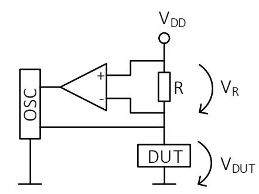
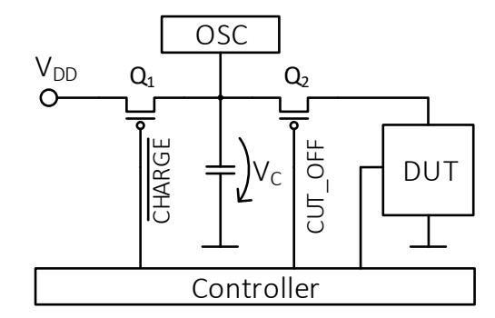
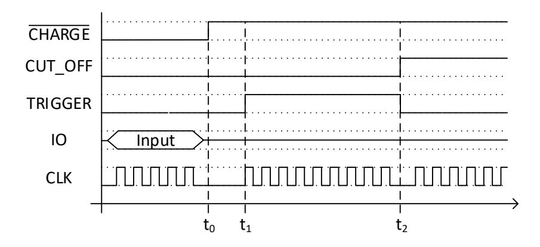
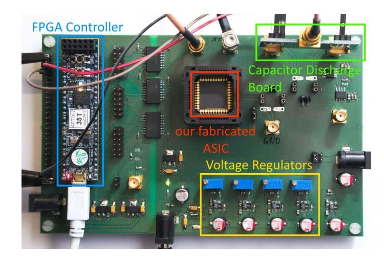
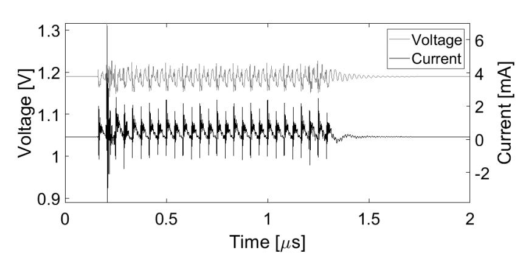
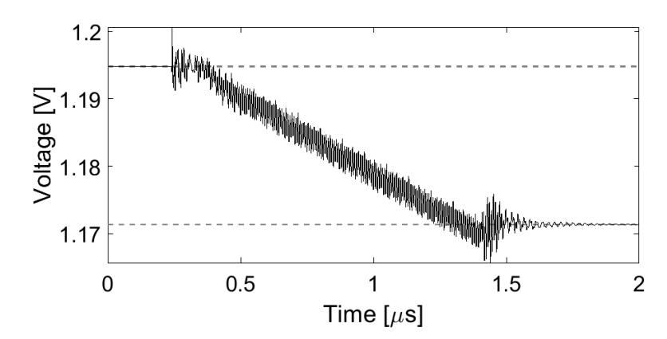
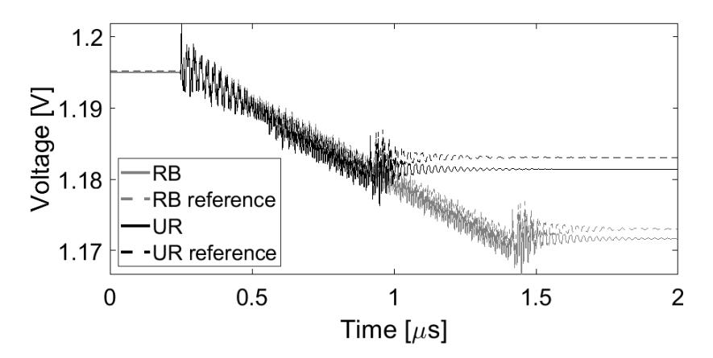
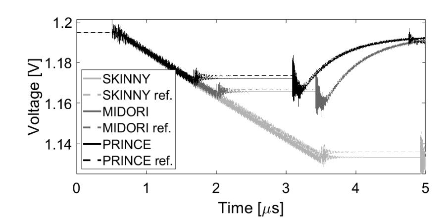

{0}------------------------------------------------

# Lightweight Ciphers on a 65 nm ASIC A Comparative Study on Energy Consumption

Bastian Richter

*Ruhr University Bochum Horst Gortz Institute for IT Security ¨* Bochum, Germany bastian.richter@rub.de

Amir Moradi

*Ruhr University Bochum Horst Gortz Institute for IT Security ¨* Bochum, Germany amir.moradi@rub.de

*Abstract*—Low energy consumption is an important factor in today's technologies as many devices run on a battery and there are new applications which require long runtimes with very small batteries. As many of these devices are connected to some kind of network, they require encryption/decryption to securely transmit data. Hence, the energy consumption of the cipher is an important factor for the battery life. We evaluate the energy consumption of lightweight ciphers implemented on a custom 65 nm ASIC. Since the energies to measure are very small, we first introduce, compare and evaluate two techniques to precisely measure the energy consumption of a real cryptographic core. In our comparative investigations, using the PRINCE block cipher we examine the effect of the design architecture (roundbased versus unrolled) on the amount of energy consumption. In addition to considering other effects (like fixed key versus random key), we compare round-based implementations of different block ciphers (PRINCE, MIDORI and SKINNY) under similar settings providing first such practical investigations.

*Index Terms*—cryptographic implementation, energy consumption, lightweight cipher, ASIC

#### I. INTRODUCTION

The progression of the Internet of Things is also increasing the need for security functionality and thus encryption in small and constrained devices. To serve this need, the research area of lightweight cryptography began to develop dedicated ciphers. One of the first applications targeted were very small ASIC platforms like low-end RFID tags. Accordingly, the first goal was minimizing the chip area, i.e., the gate equivalents (GE), of the implemented ciphers. There were multiple cipher designs with this goal, e.g., mCrypton [1], DESL/DESXL [2], KATAN [3], LED [4], and PRESENT [5]. The latter for example significantly reduced the size of a round-based implementation to 1570 GE in comparison to AES with 3400 GE.

In addition to low area, there are other design goals targeted by ciphers. For example, PRINCE [6] is designed for lowlatency in an unrolled architecture, i.e., all rounds are instantiated and executed in one clock cycle, which is specifically targeting applications like memory encryption. SKINNY [7] in contrast tries to offer a balanced performance in software

The work described in this paper has been supported in part by the German Research Foundation (DFG) under Germany's Excellence Strategy - EXC 2092 CASA - 390781972, and through the project 393207943 "Security for Internet of Things with Low Energy and Low Power Consumption (GreenSec)".

and hardware while using s-boxes efficient for a threshold implementation to protect against side-channel attacks.

Another very important aspect is the power and energy consumption of a circuit. Here, power and energy have different importance for certain applications. While an RFID tag can only be supplied with limited power by the field, the total energy consumed is less important as it is supplied externally by the reader. However, for battery-operated devices, which only include a small battery or have to work on one charge for years (e.g., credit cards with integrated e-paper display for temporary CVVs), energy is the limiting factor while a short power peak can be easily supplied by the battery.

There is only one cipher which is specifically optimized to exhibit a low energy consumption. MIDORI's authors [8] tried to minimize unnecessary switching activity caused by signals propagating through the circuit with different delays leading to glitches. In comparison, the authors of PRINCE only assumed that low latency also provides low energy consumption based on [9].

The balance between power and energy is influenced by the architecture in which the cipher is implemented. Here, serialized, round-based and unrolled are common types which are considered in multiple publications [9]–[11] comparing the energy/power consumption of lightweight ciphers and their architectures by simulation. Batina et al. [11] compared serialized, i.e., byte/nibble-wise implementations with only one s-box, with round-based implementations, i.e., one round is fully implemented and executed in one clock cycle. They conclude that round-based implementations are more energyefficient, although serialized cores demand the least power. This result highlights that low-power designs do not imply low-energy, as an implementation with a high number of clock cycles might introduce additional switching activity and thus consumes more energy. Additionally, Banik et al. [9] found that there are optimal number of combined rounds for different ciphers for which the implementation is most energy-efficient.

However, when considering the effects causing dynamic leakage in CMOS circuits, the question arises whether the previous state of the circuit has an influence and was considered in the simulations. This is especially important for the key-related part of the cipher. In a typical use case, the key either does not change at all or at least multiple blocks are encrypted/decrypted with the same key. This results in reduced or 

{1}------------------------------------------------

no switching activity in the key schedule and the gates directly influenced by the key. Particularly, unrolled implementations benefit from a constant key since the switching activity highly depends on the propagation of signals.

All previously mentioned papers are based on post-synthesis simulations. Contrary, in this paper we do not deal with simulations but measure the energy consumption of different implementations of ciphers PRINCE, SKINNY and MIDORI on an ASIC manufactured in a 65 nm technology. This involves some engineering challenges to measure the very small signals which contain very high frequency components due to the small technology size. We first examine a round-based and an unrolled implementation of PRINCE with regard to their energy consumption. Afterwards, we compare round-based implementations of PRINCE, SKINNY and MIDORI. Both comparisons are performed with a fixed as well as random keys to examine the influence of different application scenarios.

#### II. BACKGROUND

# *A. Energy and Power Consumption of Cipher Architectures*

As already mentioned in Sec. I, the architecture of a cipher implementation has an influence on its energy and power consumption. Here, especially serialized and roundbased implementations have different behavior than unrolled circuits.

This is mainly caused by the depth of the circuit which is usually either one round or all rounds. As the dynamic power consumption depends on the switching activities, glitches are a major source of energy consumption. These are caused by gate inputs not arriving simultaneously and thus causing multiple switching at the gate output. This effect increases with the depth of the circuit as the timing differences add up and changes propagate through the circuit causing an avalanchelike effect of increasing switching activity to the end of the circuit. Unrolled implementations compose a very deep circuit and thus are very susceptible to glitching.

At the same time, unrolled implementations can have an advantage if parts of the input do not change. In practice, this would be typical in applications which use a constant key to encrypt multiple plaintext blocks. Dynamic energy consumption only occurs if the input changes. Thus, the part only depending on the key, e.g., the key schedule, but also parts which are partially affected by the key, e.g., key addition, consume a limited amount of power as they have limited switching activity. Also, at the beginning of the cipher there might be parts which do not switch or switch less due to less glitching if parts of the plaintext do not change. This is especially relevant if the cipher is used in a mode of operation which encrypts a counter, e.g., Counter Mode (CTR) and Galois Counter Mode (GCM). Because the state register in a round-based implementation gets updated after each round, the circuit's input changes every time and it does not benefit from this advantage.

Further, the architecture is important for the distribution of the power consumption. A round-based implementation evaluates a smaller circuit per clock cycle, thus the instantaneous power consumption is low but it occurs r (number of rounds) times. In contrast, an unrolled implementation incorporates an approximately r times larger circuit switching within a single clock cycle which causes a single short and high peak in its power consumption signal.

### III. MEASUREMENT METHODS

# *A. V-I-t Measurement*

From an electrical engineering point of view the intuitive approach is to measure the voltage V and the current I to get the power P. By integrating P over time the total energy can be calculated.

$$E = \int_{t} P(t) dt = \int_{t} V(t) \cdot I(t) dt$$

The corresponding measurement setup is depicted in Figure 1. To measure the current I to the device under test (DUT), the voltage drop VR over a shunt resistor R is measured. With I = VR/R we can calculate the current for a known resistor. With a second channel of the oscilloscope the voltage VDUT at the DUT is measured, to acquire the actual voltage the device is running on. This is required as VDUT might fluctuate under load due to the voltage drop over the resistor and slow compensation of the voltage regulator.

This setup is similar to measurement setups used for sidechannel analysis measurements and thus might already be available to the developer of a cryptographic device.

Fig. 1: Schematic of V -I-t measurement.

An advantage of this setup is its high resolution in the time domain which enables isolation of the actual cryptographic core from influence of the IO activity. However, the time resolution is also the downside of this method, as its accuracy is limited by the bandwidth of the setup and sampling frequency of the oscilloscope. The dynamic power consumption of ASICs build in modern technology nodes consists of very short peaks at the clock edges. As this is caused by the short propagation delays, it cannot be overcome by lowering the clock frequency of the DUT. In general, this method has high requirements for the measurement equipment. A differential probe (ideally with integrated amplifier) is needed to precisely measure the voltage over the resistor (VR in Fig. 1). Also, the oscilloscope needs a high bandwidth and a high sampling frequency. Additionally, a wide range for the offset voltage is required to utilize the full range of the channel in the VDUT measurement, as the variation is very small in comparison to the constant offset (close to VDD) and needs to be performed with DC coupling. Hence, a sophisticated oscilloscope is required.

{2}------------------------------------------------

#### B. Capacitor Discharge Measurement

Since the voltage over a capacitor depends on its charge and thus on the stored energy, it is possible to obtain the consumed energy by measuring the drop of the voltage over the capacitor. The energy stored in a capacitor is given by  $E=\frac{1}{2}CV^2$ , so we can calculate the Energy  $\Delta E$  consumed during the encryption by

$$\Delta E = E_{start} - E_{end} = \frac{1}{2}C(V_{start}^2 - V_{end}^2).$$

An exemplary circuit for this measurement is depicted in Figure 2 which utilizes two P-MOSFETs to control the charging of the capacitor and to isolate it for measurement. For this method an adapted controller is required which can supply additional signals synchronized to the DUT.

Fig. 2: Schematic of capacitor discharge measurement.

At the beginning, signals  $\overline{\text{CHARGE}}$  and  $\overline{\text{CUT}}$  are low which results in the capacitor being charged and the DUT directly supplied with  $V_{DD}$ . After transmitting all inputs needed ( $t_0$  in Fig. 3), the clock is halted and  $\overline{\text{CHARGE}}$  goes high, so that  $Q_1$  is not conducting anymore. The power to the DUT is now supplied only by the capacitor. The encryption is started after a short delay to make sure  $Q_1$  has switched off completely, by starting the clock again ( $t_1$  in Fig. 3). After the encryption finished, the clock is stopped again and  $\overline{\text{CUT}}$  goes high ( $t_2$  in Fig. 3) resulting in  $Q_2$  disconnecting the DUT from the capacitor. This enables the oscilloscope to measure the voltage over the capacitor without any influence through further discharge by the DUT.

Fig. 3: Timing diagram for charge and measurement control.

This method enables a measurement of the used energy without being limited by the bandwidth of the measurement equipment. However, it does not provide any resolution in the time domain and a specialized controller is needed to synchronize the measurement to exclude the influence of I/O activity. Still, it can implemented for every target which provides clock control and a trigger.

#### IV. SETUP

The target of our evaluation is a prototype ASIC produced in a 65 nm technology containing 54 cryptographic cores of different ciphers and countermeasures. The cores are clock gated so only the currently active core and the general control logic of the ASIC is supplied with a clock signal. Its core and I/O power supplies are separated into different I/O domains to reduce the influence of the I/O signals on the measurements. Still, we set the I/Os to a common state for all measurements to exclude any corresponding effect.

The ASIC is mounted on a measurement board which hosts a Xilinx ARTIX-7 FPGA for control and communication. The different power domains for the ASIC are supplied by separate voltage regulators to minimize their mutual influence. The core power supply path is split to allow inserting either a measurement resistor or the capacitor circuit described in Section III-B via SMA connectors.

The target is clocked at 12 MHz and measured at a sampling rate of 1 GS/s (capacitor discharge) or 2 GS/s (V-I-t) with a 12bit Teledyne LeCroy Waverunner HRO 66Zi.

Fig. 4: Board for interfacing and measurement of the ASIC.

#### A. Measurements

To compare V-I-t (Sec. III-A) and capacitor discharge (Sec. III-B) measurements, we measured a round-based implementation of PRINCE with both methods.

Fig. 5: Mean of 10,000 measurements of round-based PRINCE with V-I-t method.

1) V-I-t: The plot in Figure 5 shows the mean of 10,000 measurements done with the V-I-t method, i.e. measurements of supply voltage and current, of a round-based PRINCE with a sampling rate of  $2 \, \mathrm{GS/s}$ . To measure the current, the voltage drop over the precision  $1 \, \Omega$  resistor was measured

{3}------------------------------------------------

with a LeCroy AP033 Active Differential Probe with 500 MHz bandwidth, while the supply voltage was directly connected to the oscilloscope with an SMA-BNC coaxial cable. The clock was paused before and after the execution, and the single cycles of the running clock are clearly discernible in the measurement. The fluctuation of the voltage are mainly caused by voltage drops over the measurement resistor and by the limited bandwidth of the voltage regulator which cannot compensate fast enough to the sunk current. It is noticeable that the current signal (black) contains higher frequencies than the voltage (grey) signal. It even contains peaks consisting of only single sample points which hints at being undersampled. This underlines the bandwidth/sampling rate problem when performing the energy measurements with the V-I-t method. The resulting power can then be calculated by multiplying the current and voltage measurements.

Fig. 6: Mean of 50,000 measurements with the capacitor discharge method.

*2) Capacitor Discharge:* In comparison, Figure 6 shows the mean of 10,000 measurements with the capacitor discharge method. The voltage of the capacitor does not change at the beginning, as CHARGE is low and the ASIC connected to the power supply. It is then disconnected (CHARGE high) at 0.2 µs and the ASIC with the activated clock draws energy from the capacitor reducing its voltage. At 1.4 µs right after termination of encryption the power supply is cut off (CUT\_OFF high) and the charge of the capacitor stays constant to be measured. To calculate the dissipated energy we take the mean of 100 points at the beginning and at the end of the measurement as the start and end voltage of the capacitor which are marked by the grey, dashed lines in the plot. As we only use the voltage sampled at these two periods, we are not limited by the bandwidth.

Our setup consists of two Vishay Si1013R P-MOSFETs directly controlled by FPGA I/Os with two parallel 100 nF ceramic capacitors in between with a total measured capacitance of 206 nF. In contrast to the general measurement procedure in Section III-B, we reactivated the power supply to the ASIC after 1.5 µs which is enough to get a low noise measurement of the capacitor charge but at the same time fast enough to keep the internal state of the ASIC alive. This enables us to read back the ciphertext and also to perform measurements which rely on the previous state (discussed in the next section).

Due to the bandwidth/sampling frequency restrictions of the V-I-t method, we chose to perform the measurements for the following sections with the capacitor discharge method.

#### *B. Energy Reference*

An ASIC consists of multiple components which all add a certain amount to the total energy consumption. As we only want to measure the energy consumption caused by the cryptographic core, we have to somehow subtract the energy consumed by the other parts.

Our ASIC has a very basic architecture for testing cryptographic cores which only consist of a simple 4-bit I/O interface to the configuration and data registers which then select and control the core, and PRNGs for generation of random numbers. As the cryptographic cores we consider in this paper are very small in comparison to the whole ASIC, which contains 54 cores, a significant amount of energy is consumed by other components of the ASIC. Here, the clock tree is a major energy sink which has a high energy consumption due to the high capacitance of the long wires. Although the cores are clock-gated, the clock tree distributing to the control logic and the PRNGs is still active. In order to achieve the reference measurement and cancel out the influence of the clock tree, I/O and the control logic, we measured a baseline by not selecting a core (i.e., selecting a non-existent core) and otherwise interfacing the core in the same way as running an encryption.

Another aspect, which necessitates having a reference measurement, is that different ciphers have various numbers of rounds and thus clock cycles. Considering the energy overhead of the other parts of the ASIC, this would automatically result in a higher measured value for ciphers with more rounds. An alternative would be to measure the same number of clock cycles for each cipher. However, this would also result in wrong results because the internal controller would already begin to load the ciphertext from the encryption core, which would cause a high power consumption.

Additionally, to exclude influence of previous states of the controller as well as environmental factors, we did not perform independent measurement runs for different ciphers and references, but performed them interleaved in a random order during a single measurement run, i.e, for each challenge sent the addressed core or reference is randomly chosen. The cores themselves are not reseted in between and keep their state as they are only clock gated and not power-gated.

# V. RESULTS

## *A. Unrolled vs. Round-Based*

Our first comparison is the energy consumption of roundbased versus unrolled implementations. As PRINCE is intended as low-latency cipher, an unrolled implementation is advisable for many applications like memory encryption. However, unrolled implementations have a high area requirement and need high power due to the high number of simultaneously switching gates, so a round-based implementation might better fit for some other applications.

To evaluate the influence of the key, we followed two scenarios for each of unrolled and round-based PRINCE cores randomly interleaved with their corresponding reference measurements. In the first scenario, we randomly selected a 

{4}------------------------------------------------

new key for each encryption call, while we supplied the target core with an arbitrary selected fixed key for all encryptions in the second scenario. For each of those scenarios we collected 100,000 measurements from each of the unrolled and roundbased cores, meaning around 50,000 measurements for each of the encryption calls and reference measurements.

Fig. 7: Mean capacitor discharge measurements for unrolled and round-based PRINCE implementations.

Figure 7 shows the mean signals (of 50,000 measurements each) for the unrolled and round-based architectures (solid lines) and their corresponding reference measurements (dashed lines). It shows the high difference in the total power consumption caused by different number of clock cycles. This highlights the importance of the reference measurements since the energy consumed by the encryption core is only 4.8 % of the total energy consumption of the ASIC for the round-based, random key case.

Because the measurements also include the energy consumption of the FSM controlling the cipher, the measurement of the unrolled cipher does not only consist of one long clock cycle but 5 cycles while the FSM waits for the unrolled encryption. This might lead to a small error in the measurement but considering the size of the counter used in the FSM it should be very small in comparison to the cipher. Note that the overhead of the additional cycles is canceled out by the reference measurements.

Based on our measurements, the unrolled implementation of PRINCE (347.4 pJ) needs 26.8 % more energy than the round-based implementation (273.9 pJ) when examined in the random-key scenario. However, the results significantly change if the measurements are performed with a fixed key. This might be a more realistic scenario for many applications of lowlatency ciphers like memory encryption where a part of the memory is encrypted with the same key. In such a fixed-key scenario the unrolled implementation only consumes 213.1 pJ which is 26.1 % less than the round-based implementation with 288.4 pJ. This highlights the influence of a changing key on the total switching activity of an unrolled implementation, even for a cipher with almost no key scheduling like PRINCE.

The round-based implementation consumes basically the same energy in both random- and fixed-key scenarios, while the unrolled core needs 40 % less energy in the fixedkey case. The key-related circuit has a non-negligible influence on the power consumption. The key we selected (0x2b7e151628aed2a6abf7158809cf4f3c) seems to have an influence higher than average. We further noticed that the energy consumption of the unrolled core decreases by 60 % (compared to the random-key scenario) when the key is fixed to 0x00...00 as well as to 0xFF...FF. At the same time these two measurements confirm that the static leakage dependent on the key only has a very low influence as the energy consumption of the 00 and the FF key only differ by less than 1 pJ.

In a third scenario we further evaluated the influence of the plaintext on the energy consumption. A block cipher running in, e.g., CTR or GCM mode will have fewer changes in the plaintext than a cipher in other modes which directly encrypt the plaintext with the block cipher. For this scenario, we fixed the key to the same as in the previous experiment and also fixed the first 4 byte of the plaintext to a constant IV and chose the last 4 bytes to contain a counter which is individually incremented for the two cores. The results show that the energy is further reduced for the unrolled core by 8.2 % compared to the fixed key measurement. The round-based core's energy is not affected and consumes basically the same.

TABLE I: Absolute and relative (to round based, random key) energy consumption of unrolled and round-based PRINCE for random key and fixed key with random plaintext and CTR mode plaintext with fixed key.

| key    | plaintext |              | round based       | unrolled          |
|--------|-----------|--------------|-------------------|-------------------|
| random | random    | abs. rel. | 273.9 pJ 1.000 | 347.4 pJ 1.268 |
| fixed  | random    | abs. rel. | 288.4 pJ 1.053 | 213.1 pJ 0.778 |
| fixed  | CTR mode  | abs. rel. | 290.7 pJ 1.061 | 195.6 pJ 0.714 |

## *B. Round-Based Ciphers*

We proceed with examining three different lightweight ciphers implemented as round-based architectures. Similar to the previous section we measured 50,000 encryptions for each core and its corresponding reference (for each randomand fixed-key scenario), which results in a total of 300,000 measurements.

Fig. 8: Mean measurements of the capacitor discharge for 3 ciphers and idle state for random keys.

With 198.5 pJ MIDORI consumes the least energy of the three ciphers, which confirms its design specifications 

{5}------------------------------------------------

optimized for this purpose. The design optimizations seem to also compensate for the overhead of 4 additional clock cycles caused by the 4 more rounds in comparison to PRINCE (285.8 pJ). SKINNY with its 32 rounds on the other hand consumes about twice as much energy (193.9 %) as PRINCE and nearly three times as much as MIDORI (296.5 %).

In this experiment, we have arbitrarily selected a key for the fixed-key scenario, which led to slightly higher energy consumption compared to the random-key case (10 % for both MIDORI and SKINNY). We noticed much lower energy consumption if some parts of the key are identical (repeating key in Table II). Since MIDORI uses two alternating sub keys, these similar parts in the sub keys lead to no change on the corresponding nibbles in consecutive clock cycles, hence lower energy consumption. This can be noticed in the randomkey scenario as random keys should have on average some identical nibbles leading to less energy consumption than the conservative fixed key.

TABLE II: Absolute and relative (to random key PRINCE) energy consumption of round-based cipher implementations.

|        | random key |       | fixed key |       | repeating key |       |
|--------|------------|-------|-----------|-------|---------------|-------|
|        | abs.       | rel.  | abs.      | rel.  | abs.          | rel.  |
| PRINCE | 273.9 pJ   | 1.000 | 288.4 pJ  | 1.053 | 158.1 pJ      | 0.577 |
| SKINNY | 531.3 pJ   | 1.939 | 588.6 pJ  | 2.148 | 226.4 pJ      | 0.826 |
| MIDORI | 179.0 pJ   | 0.654 | 198.5 pJ  | 0.725 | 40.2 pJ       | 0.147 |

#### VI. CONCLUSION

Here, for the first time in literature we present practical results of measuring energy consumptions of different ciphers implemented in different architectures on a 65 nm ASIC prototype.

Our results on the influence of fixed vs. random key on round-based and unrolled implementations indicate that an unrolled implementation is a better choice in terms of energy consumption if the short power spike can be supplied. Which is especially interesting as unrolled implementations are often used in low-latency applications like memory encryption which makes use of a fixed key for a part of the memory (like a sector). The energy consumption of the unrolled cipher core is further reduced when run in a counter mode with only small changes in the plaintext. This effect is valid only if the state of the circuit is preserved until the next encryption which is a reasonable case when dealing with real hardware but also should be considered when performing simulations.

In our comparative experiment of the three lightweight ciphers implemented in a round based fashion, MIDORI confirmed its low-energy design goal. PRINCE with its 27 % higher energy consumption is still a good option, especially when the application can benefit from its low latency (here a low number of rounds). SKINNY on the other hand cannot be recommended for low-energy hardware implementations, as it consumes two or three times more energy than its two competitors. In general, this work highlights the importance of considering the previous state of the circuit and the data dependency when performing energy and power measurements or simulations of ciphers.

## *A. Future Work*

For future work, an advanced measurement setup, e.g., utilizing current mirrors [12], might reduce the influence of the setup on the DUT and enable more precise measurements. Another interesting architecture to investigate in terms of energy consumption is a pipelined, unrolled implementation which we were not able to examine because it is not implemented on our test chip, but might lead to another improvement if evaluated targeting an energy per encrypted block ratio. Also, partially unrolled architectures, as shown by Banik et el. [9], can be an interesting trade-off and might be interesting to evaluate in real silicon.

#### ACKNOWLEDGMENT

The authors would like to thank Thorben Moos for designing the ASIC and answering our questions on its implementation details.

# REFERENCES

- [1] C. H. Lim and T. Korkishko, "mCrypton A Lightweight Block Cipher for Security of Low-Cost RFID Tags and Sensors," in *WISA*, ser. Lecture Notes in Computer Science, vol. 3786. Springer, 2005, pp. 243–258.
- [2] A. Poschmann, G. Leander, K. Schramm, and C. Paar, "A family of light-weight block ciphers based on DES suited for RFID applications," in *Workshop on RFID Security–RFIDSec*, vol. 6, 2006.
- [3] C. De Canniere, O. Dunkelman, and M. Knezevi ˇ c, "KATAN and ´ KTANTAN—a family of small and efficient hardware-oriented block ciphers," in *International Workshop on Cryptographic Hardware and Embedded Systems*. Springer, 2009, pp. 272–288.
- [4] Jian Guo and Thomas Peyrin and Axel Poschmann and Matthew J. B. Robshaw, "The LED block cipher," in *CHES*, ser. Lecture Notes in Computer Science, vol. 6917. Springer, 2011, pp. 326–341.
- [5] A. Bogdanov, L. R. Knudsen, G. Leander, C. Paar, A. Poschmann, M. J. B. Robshaw, Y. Seurin, and C. Vikkelsoe, "PRESENT: an ultralightweight block cipher," in *CHES*, ser. Lecture Notes in Computer Science, vol. 4727. Springer, 2007, pp. 450–466.
- [6] J. Borghoff, A. Canteaut, T. Guneysu, E. B. Kavun, M. Knezevic, L. R. ¨ Knudsen, G. Leander, V. Nikov, C. Paar, C. Rechberger, P. Rombouts, S. S. Thomsen, and T. Yalc¸in, "PRINCE - A low-latency block cipher for pervasive computing applications - extended abstract," in *ASIACRYPT*, ser. Lecture Notes in Computer Science, vol. 7658. Springer, 2012, pp. 208–225.
- [7] C. Beierle, J. Jean, S. Kolbl, G. Leander, A. Moradi, T. Peyrin, Y. Sasaki, ¨ P. Sasdrich, and S. M. Sim, "The SKINNY Family of Block Ciphers and Its Low-Latency Variant MANTIS," in *CRYPTO (2)*, ser. Lecture Notes in Computer Science, vol. 9815. Springer, 2016, pp. 123–153.
- [8] S. Banik, A. Bogdanov, T. Isobe, K. Shibutani, H. Hiwatari, T. Akishita, and F. Regazzoni, "Midori: A Block Cipher for Low Energy," in *ASIACRYPT (2)*, ser. Lecture Notes in Computer Science, vol. 9453. Springer, 2015, pp. 411–436.
- [9] S. Banik, A. Bogdanov, and F. Regazzoni, "Exploring energy efficiency of lightweight block ciphers," in *International Conference on Selected Areas in Cryptography*. Springer, 2015, pp. 178–194.
- [10] S. Kerckhof, F. Durvaux, C. Hocquet, D. Bol, and F.-X. Standaert, "Towards green cryptography: a comparison of lightweight ciphers from the energy viewpoint," in *International Workshop on Cryptographic Hardware and Embedded Systems*. Springer, 2012, pp. 390–407.
- [11] L. Batina, A. Das, B. Ege, E. B. Kavun, N. Mentens, C. Paar, I. Verbauwhede, and T. Yalc¸ın, "Dietary recommendations for lightweight block ciphers: power, energy and area analysis of recently developed architectures," in *International Workshop on Radio Frequency Identification: Security and Privacy Issues*. Springer, 2013, pp. 103–112.
- [12] V. Konstantakos, A. Chatzigeorgiou, S. Nikolaidis, and T. Laopoulos, "Energy consumption estimation in embedded systems," *IEEE Transactions on instrumentation and measurement*, vol. 57, no. 4, pp. 797–804, 2008.