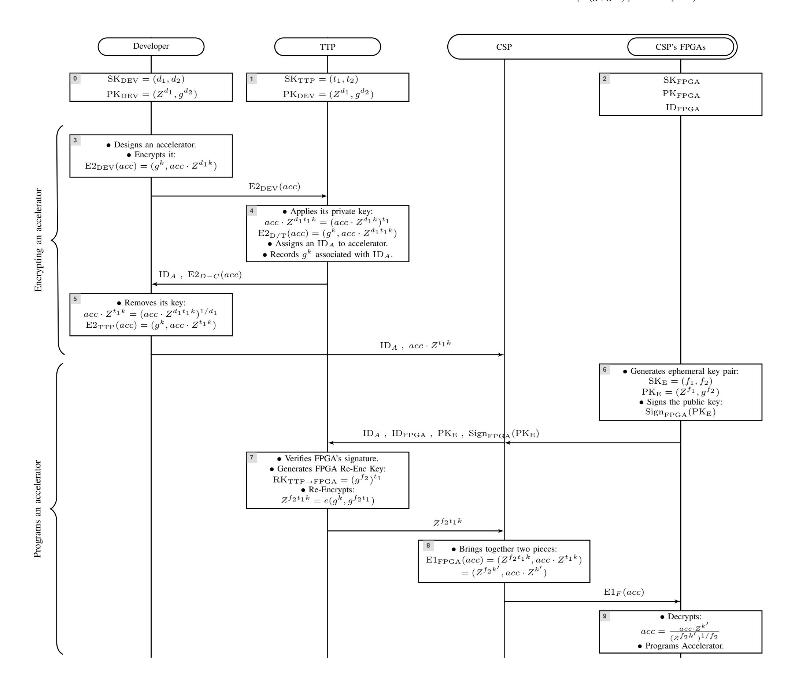

{0}------------------------------------------------

# Proxy Re-Encryption for Accelerator Confidentiality in FPGA-Accelerated Cloud

Furkan Turan, and Ingrid Verbauwhede imec-COSIC - KU Leuven, Belgium

firstname.lastname@esat.kuleuven.be

*Abstract*—FPGAs offer many-fold acceleration to various application domains, and have become a part of cloud-based computation. However, their cloud-use introduce Cloud Service Providers (CSPs) as trusted parties, who can access the hardware designs in plaintext. Therefore, the intellectual property of hardware designers is not protected against a dishonest cloud. In this paper, we propose a scheme for the confidentiality of accelerators on cloud, without limiting CSP to maintain their resources freely. Our proposed scheme is based on Proxy Re-Encryption (PRE) which allows the developers to upload their accelerators to the CSPs under encryption. The CSPs cannot decrypt them; however, alter the encryption that allows the target FPGAs they pick to decrypt. In addition, our scheme allows metering the use of accelerators.

# I. INTRODUCTION

The appearance of FPGAs on cloud became popular starting 2016, which is the year Amazon introduced EC2 F1 instances, and Intel announced Xeon+FPGA platforms. In the following years, various other companies also introduced their FPGA acceleration to user applications, including Microsoft, OVH Cloud, Alibaba, Huawei, Baidu. Some of them cooperate with Xilinx, while others prefer Intel FPGAs. Their use of FPGAs also differ. Amazon offers the FPGAs as user-programmable resources. The users can either develop their own accelerators, or use one from the accelerator marketplace. The marketplace is open to developers to upload their accelerators, and earn money if their accelerators are purchased. In contrast, Microsoft Azure offers pre-designed accelerators to users for various applications, such as machine learning.

The FPGAs have long been offered with an *encrypted bitstream* feature, which guarantees the confidentiality of the hardware design. In addition, it prevents the designs from piracy, allowing only the picked target FPGA to decrypt and program the design. However, this feature is not suitable for cloud-use because of two major reasons. First, the encryption key should be provisioned on the FPGA by the hardware developer who wishes to protect his design. It even requires physical access to the FPGAs. Secondly, the developer needs to know the target FPGA, so that he can encrypt the accelerators using the key of that specific FPGA. However, the FPGAs are owned by the CSPs in the case of FPGA-accelerated cloud. In addition, a different FPGA could be given to users at each run in the cloud. Therefore, provisioning the keys and picking the FPGAs are the responsibilities of the CSPs.

Programming a remote-FPGA has been a concern even before the FPGA-accelerated cloud. For example, it could allow developers to sell only their designs, without delivering them with an FPGA. More complicated demands involve creating a marketplace for IP cores, which are re-useable hardware blocks, constituting parts of a design. There has been related work, as will be given in detail in Section [II.](#page-0-0) Unfortunately, the two limitations have forced these work to make unrealistic assumptions, such as the creation of a Trusted Third Party (TTP) who will receive the FPGAs from vendors, and program secret keys into them. Alternatively, some introduced the TTP as an absolutely trusted entity. In such work, they receive the accelerators in plaintext, and grant access to users by encrypting them to the users' FPGAs.

In this paper, we propose a scheme that solves the impracticability of previous work, and improves their trust models. Our scheme enables the developers to upload their accelerators to CSPs under encryption. The CSP is an untrusted entity, so it cannot decrypt. However, it can alter the encryption, enabling its FPGAs to decrypt. In this respect, the CSP cannot individually handle the alteration, but consults to a TTP. This interaction also allows the TTP to meter use of the accelerators. The responsibilities of the TTP are kept low. Neither it shares a secret with the FPGAs or with another entity, nor it gains plaintext access to the accelerators.

The outline of this paper is as follows. Section [II](#page-0-0) gives a summary of related works for the secure remote FPGA programming problem, and their limitations. Section [III](#page-1-0) introduces the basics of PRE, as our proposed scheme relies on it. Section [IV](#page-3-0) describes the proposed scheme and underlying trust model in detail. Section [V](#page-3-1) provides a discussion on the implementation requirements, and potential future work.

# II. RELATED WORK

Various researchers proposed schemes that enable developers to deliver their design under encryption to FPGAs at a remote field, or FPGAs on the cloud. Some of them considered metering their use for licensing purposes. Significant examples are cited below, together with an explanation of their shortcomings for the FPGA accelerated cloud.

Eguro et al. aims at trusted computing on cloud with FPGAs [\[1\]](#page-4-0). It proposes a Public Key Infrastructure (PKI) implemented on the FPGAs, so that developers can establish a key to the FPGA, and deliver their bitstream encrypted. The PKI relies on unique keys provided to each FPGA by a TTP before the FPGAs are deployed on the cloud. There are various deficiencies of this scheme. It requires the presence of FPGAs 

{1}------------------------------------------------

at the field of the TTP for key provisioning. Also, it requests the active participation of developers for programming the FPGA with their accelerator. However, a goal in the FPGA-accelerated cloud is to offer users accelerators developed by third-party developers. Another disadvantage is that, the scheme ties encrypted bitstreams to a specific FPGA, disallowing the CSP to program them on other FPGAs, if the bitstreams are not encrypted for the other FPGAs as well. In summary, this scheme does not scale.

Fasten [2] also mistrusts the CSPs when using their FPGAs, and offers bitstreams encryption relying on unique FPGA keys. Specifically, it is based on Physically Unclonable Function (PUF) based key generation feature of Microsemi FPGAs [3]. It proposes that a trusted FPGA vendor maintains a public database for the FPGAs' public keys, associated with their unique identifier. When a user is given access to an FPGA on the cloud, he uses the FPGA identifier for learning the corresponding public key from the vendor's database. Similar to the above described scheme, Fasten encrypts the bitstreams to a specific FPGA, with the active participation of their developer.

There are various other works [4], [5], [6] in literature, which rely on similar PKI with variances on how the keys are assigned to FPGAs, or how the developers establish a secure channel to them. In summary, they require encrypting the accelerators for a specific FPGA, omit that the accelerator developers might differ from the accelerator users on the cloud, and restrict the CSPs' abilities to manage their own resources.

The above described schemes could be extended by making the developers encrypt their accelerators for all the FPGAs of the CSP, and hand over all the ciphertext at once. That would allow the CSP to program the accelerator to any FPGA, when a user wishes to instantiate it. However, if the CSP wishes to put more FPGAs into service, it first needs to contact the accelerator developers, so that their accelerators could be used on the new FPGAs. That is obviously not a practical solution. Alternatively, all the FPGAs of the CSP could share the same public-private key pair. In that case, an available ciphertext could be used in all FPGAs easily. Making multiple devices share the same private key, of course, is not a well-received practice. For example, at the cost of exploiting one FPGA, the CSP can decrypt any ciphertext.

#### III. PROXY RE-ENCRYPTION

Proxy Re-Encryption (PRE) is an augmented public key encryption scheme, which enables modifications on the encrypted message [X]. It is proposed often for data re-encryption or forwarding of encrypted emails. We prefer to explain its use with the email forwarding example, as follows. Let Alice and Bob receive encrypted emails. Anyone can send them an encrypted email using their public key, but only they can decrypt the emails with the corresponding private key. Suppose, Alice prefers forwarding her emails to Bob, when she is on vacation. However, Bob cannot decrypt them without Alice's private key, which she must not share with anyone. PRE offers a solution to this problem. It gives the email server a function to re-encrypt Alice's emails to Bob. Alice enables this function

by providing the server a so called re-encryption key, derived from the keys of her own and Bob's. After the re-encryption, Bob receives Alice's emails encrypted with his own public key, so he uses his private key to decrypt them. Neither Bob, nor the server learns Alice's private key. Furthermore, the server cannot get access to Alice's emails in plaintext.

Our proposed confidential FPGA bitstream solution relies on AFGH PRE [7]. The following paragraphs describe its basics in an easy-to-understand fashion. For mathematical details, the original paper should be investigated.

**System Parameters.** The scheme relies on two groups  $G_1$  and  $G_2$ , and there is a bilinear map between them such as  $e:G_1\times G_1\to G_2$ . That means, there is a map function e, receiving two elements from  $G_1$ , and maps them to an element in  $G_2$ . The elements in  $G_1$  are based on a random generator g, such as  $g^1,g^2\ldots g^x$ . Note that, the arithmetic operations in the group are field arithmetic. The map function e receives two elements in  $G_1$  and maps them to  $G_2$ , such as e(g,g)=Z. For example,  $g^x$  and  $g^y\in G_1$  are mapped to  $e(g^x,g^y)=Z^{xy}\in G_2$ . In addition, a scalar multiplication of the  $G_1$  elements is equivalent to an exponentiation of the corresponding  $G_2$  element. For example,  $e(ag^x,bg^y)=Z^{axby}$ . The groups  $G_1$ ,  $G_2$ , the random generator g, and the map function e are the public parameters of the scheme, known by all the participants.

**Security.** These parameters are defined for security relying on the following mathematical problems. First, it is hard to find the exponent e from the given group elements g and  $g^e$ . Secondly, for the bilinear mapping function  $e(ag,bg) = e(g,g)^{ab} = Z^{ab}$ , it is infeasible to find the scalars a and b, knowing g and  $Z^{ab}$ .

The achieved security level relies also on the cryptographic primitives used to implement the scheme. Essentially, a pairing-friendly elliptic curve construction is needed for the underlying bilinear group mapping. For example, BLS12-381 curve [8] could achieve 128-bit security level with a 381-bit modulus.

**Keys.** The scheme assigns everyone with public and private key pair. The key pairs of Alice and Bob are:

$$\operatorname{sk}_A = (a_1, a_2) , \operatorname{pk}_A = (Z^{a_1}, g^{a_2})$$

$$sk_B = (b_1, b_2) , pk_B = (Z^{b_1}, g^{b_2})$$

The private key consists of two arbitrary scalars, and the corresponding public keys are created from the private key. A re-encryption key from Alice to Bob is:

$$\operatorname{rk}_{\mathbf{A} \to \mathbf{B}} = g^{a_1 b_2}$$

Alice derives this key with her private key  $sk_A$  and Bob's public key  $pk_B$ .

Encryption and Decryption Functions. The scheme supports two encryption functions, namely *level-2* and *level-1*, and a re-encryption function is able to transform the output from level-2 to level-1. Since there are two levels, re-encryption can only be applied once. Messages to Alice uses the level-2

{2}------------------------------------------------

encryption function. First a random number k is picked, then the plaintext message pt is encrypted into ciphertext as:

$$ct_{A2} = E2(pt) = (g^k, ptZ^{a_1k})$$

The level-1 encryption could also be used, if Alice does not want the re-encryption of ciphertext. The corresponding encryption function is:

$$ct_{A1} = E1(pt) = (Z^{a_1k}, ptZ^k)$$

The proxy uses the re-encryption function for transforming Alice's level-2 ciphertext  $ct_{A2}$  into Bob's Level-1 ciphertext  $ct_{B1}$ . It uses the map function e and re-encryption key  $\mathrm{rk}_{\mathrm{A}\to\mathrm{B}}$ .

It calculates:

$$ct_{B1} = \text{RE}(ct_{A2}) = (e(g^k, ga_1b_2), ptZ^{a_1k})$$
  
=  $(Z^{a_1b_2k}, ptZ^{a_1k})$   
=  $(Z^{b_2k'}, ptZ^{k'})$ 

Note that, the calculated ciphertext is the level-1 encryption of the plaintext, encrypted with Bob's public key  $pk_B$ . Now, Bob can decrypt  $ct_{B1}$  using his secret key  $sk_B$ . He calculates:

$$pt = D1(ct_{B1}) = \frac{ptZ^{k'}}{(Z^{b_2k'})^{-b_2}}$$

Similarly, if Alice wishes to decrypt her  $ct_{A2}$ , she calculates:

$$pt = D2(ct_{A2}) = \frac{ptZ^{a_1k}}{(e(g,g^k))^{a_1}} = \frac{ptZ^{a_1k}}{(Z^k)^{a_1}}$$

Fig. 1. The details of our proposed bitstream encryption scheme is shown with the cryptographic keys, encryption/decryption operations, and the messages transferred between the entities.

{3}------------------------------------------------

# IV. PROPOSED SCHEME

We propose an FPGA bitstream encryption scheme that is based on the AFGH PRE. The scheme enables a developer to send the bitstream of its accelerator to CSPs under encryption. The CSPs are the proxies, who cannot decrypt the bitstream, but re-encrypt them for the target FPGA. Picking the target FPGA is the consideration of the CSP, so that they can freely manage their own resources. As a result, the developer cannot create the corresponding re-encryption key, as s/he does not know the target in advance. To solve this problem, a TTP is introduced, which participates in both the re-encryption key generation, and proxy re-encryption. Besides, that allows the TTP to be aware of each accelerator instantiation, allowing to the establishment of a metering service. Our scheme is introduced in Figure [1,](#page-2-0) which shows in a message sequence chart the knowledge and calculations of each entity, and the interactions between them. In addition, comments are provided on the figure for detailed explanations.

The first three boxes on Figure [1](#page-2-0) shows the pre-knowledge of the involved entities. The developers, TTP and FPGAs have a key pair. The TTP knows the public key of developers, but their own public key is not used, so ignored in the figure. The TTP does not share any secret with another entity. The FPGA's public key is verifiable by making FPGA sign a given input message. For that purpose, a basic Public Key Infrastructure (PKI) could be applied, an example of which is already available on the Microsemi FPGAs [\[3\]](#page-4-2).

In the steps 3-5, the developer and TTP interact to encrypt the bitstream. At step 3, the developer encrypts the bitstream. At step 4, the TTP extends the ciphertext with its secret key, and creates E2D/T(acc), which is the bitstream encrypted with the keys of both the developer and TTP. Hence, neither can decrypt it alone. At step 5, the developer removes its secret key from the ciphertext, and obtains the bitstream encrypted with TTP's key. As it is performed at the locality of the developer, the TTP cannot get plaintext access to the bitstream. The corresponding ciphertext (g k , acc × Z t1k ) consists of two pieces. The first piece is the generator g k , which is already known to the TTP at step 4. The TTP assigns to it a unique accelerator identifier, IDA. The second piece is acc × Z t1k , and it is given to the CSP together with the IDA, at step 5. For the decryption, the CSP has to know the generator g k , the private key of TTP, and the FPGA's public key. He does not know the first two, so he cannot perform the decryption.

In the steps 6-9, the CSP programs an accelerator to one of its FPGAs. These steps are repeated for each accelerator programming request. The process is initiated in the step 6. The FPGA randomly generates a new ephemeral key pair for each programming request, and signs it with its permanent key. The CSP forwards the public key received from FPGA to TTP, together with the IDA of the requested accelerator and the IDFPGA of the corresponding FPGA. These IDs enable the TTP to keep track of the accelerators' usage statistics. In step 7, the TTP generates corresponding re-encryption key RKTTP→FPGA, and applies the re-encryption to the generator

g k of the corresponding accelerator. In step 8, the CSP receives the re-encrypted generator, and forwards it to the FPGA. In step 9, the FPGA decrypts and programs the bitstream.

In our scheme the CSP is untrusted. As a result, it is not given any keys or responsibility of performing cryptographic operations. Besides, the messages it observes are not enough to calculate another entity's key, or access the bitstream in plaintext. However, the CSP can ask from the TTP to reencrypt for a counterfeit FPGA. For that purpose, it can create an arbitrary ephemeral key pair (SKE,PKE), and send the corresponding PKE to the TTP as if it belongs to an FPGA. If the TTP is fooled to re-encrypt the design for that key, the CSP can use the SKE to decrypt the ciphertext, and steal the corresponding bitstream. To prevent such an attack, TTP's verification of FPGA's signature in step 7 is essential in the proposed scheme.

# V. DISCUSSION AND CONCLUSION

The proposed scheme makes the use of encrypted bitstream possible on cloud, without limiting the abilities of CSPs to manage their own resources. In addition, it gives the developers an ability to track the use of their accelerators, through the TTP. Although a TTP is preferred on the scheme, it is given a role without unrealistic assumptions or responsibilities.

An extension could focus on encrypted netlists, instead of bitstreams. That offers advantages to CSPs for post-processing the design, e.g. with placement constraints, or Design Rule Checking (DRC). Such an extension, requires the development software to receive the netlist encrypted, decrypt it on CSP's computer, and process it without giving the CSPs access to it. In fact, that is possible with IEEE P1735 [\[9\]](#page-4-8), which is already supported by most development tools. Our proposed scheme could be integrated with it such that, the development tool is made a part of the TTP, executing the step 4 on Figure [1](#page-2-0) on CSP's computer for the post-processing with the CSP given constraints and DRC rules.

The implementation of this scheme requires FPGA manufacturers to consider the security future of FPGAs on cloud, and first implement the PKI scheme for the FPGAs. For instance, a variation of Intel's device identification scheme EPID [\[10\]](#page-4-9) could be used also for FPGAs. In addition, to support our PRE based proposal a random key pair generation and the corresponding decryption hardware should be available as an extension or replacement of the security hardware on the FPGAs. Unfortunately, it is not implementable with the user programmable parts of the FPGA. Therefore, we created a software implementation of the proposed scheme for verification purposes. It is based on the RELIC toolkit [\[11\]](#page-4-10), and will be shared open-source.

# ACKNOWLEDGMENT

This work was supported in part by the KU Leuven Research Council through C16/15/058, the ERC Advanced Grant 695305 Cathedral, and the German Research Foundation (DFG) as part of the Transregional Collaborative Research Centre 'Invasive Computing' (SFB/TR 89).

{4}------------------------------------------------

# REFERENCES

- [1] K. Eguro and R. Venkatesan, "Fpgas for trusted cloud computing," in *22nd International Conference on Field Programmable Logic and Applications (FPL), Oslo, Norway, August 29-31, 2012*, 2012, pp. 63–70.
- [2] B. Hong, H. Kim, M. Kim, T. Suh, L. Xu, and W. Shi, "FASTEN: an fpga-based secure system for big data processing," *IEEE Design & Test*, vol. 35, no. 1, pp. 30–38, 2018.
- [3] "Using sram puf system service in smartfusion2," Microsemi, 3 2016, AC434.
- [4] R. Maes, D. Schellekens, and I. Verbauwhede, "A pay-per-use licensing scheme for hardware IP cores in recent sram-based fpgas," *IEEE Trans. Information Forensics and Security*, vol. 7, no. 1, pp. 98–108, 2012.
- [5] L. Zhang and C. Chang, "A pragmatic per-device licensing scheme for hardware IP cores on sram-based fpgas," *IEEE Trans. Information Forensics and Security*, vol. 9, no. 11, pp. 1893–1905, 2014.
- [6] K. Kepa, F. Morgan, K. Kosciuszkiewicz, and T. Surmacz, "Serecon: A secure dynamic partial reconfiguration controller," in *IEEE Computer Society Annual Symposium on VLSI, ISVLSI 2008, 7-9 April 2008, Montpellier, France*, 2008, pp. 292–297.
- [7] G. Ateniese, K. Fu, M. Green, and S. Hohenberger, "Improved proxy re-encryption schemes with applications to secure distributed storage," *ACM Transactions on Information and System Security (TISSEC)*, vol. 9, no. 1, pp. 1–30, 2006.
- [8] P. S. L. M. Barreto, B. Lynn, and M. Scott, "Constructing elliptic curves with prescribed embedding degrees," in *Security in Communication Networks*, S. Cimato, G. Persiano, and C. Galdi, Eds., 2003, pp. 257– 267.
- [9] "Ieee recommended practice for encryption and management of electronic design intellectual property (ip)," *IEEE Std 1735-2014 (Incorporates IEEE Std 1735-2014/Cor 1-2015)*, Sep. 2015.
- [10] E. Brickell and J. Li, "Enhanced privacy id: a direct anonymous attestation scheme with enhanced revocation capabilities," in *Proceedings of the 2007 ACM Workshop on Privacy in the Electronic Society, WPES 2007, Alexandria, VA, USA, October 29, 2007*, 2007, pp. 21–30.
- [11] D. F. Aranha and C. P. L. Gouvea, "RELIC is an Efficient LIbrary for ˆ Cryptography," [https://github.com/relic-toolkit/relic.](https://github.com/relic-toolkit/relic)