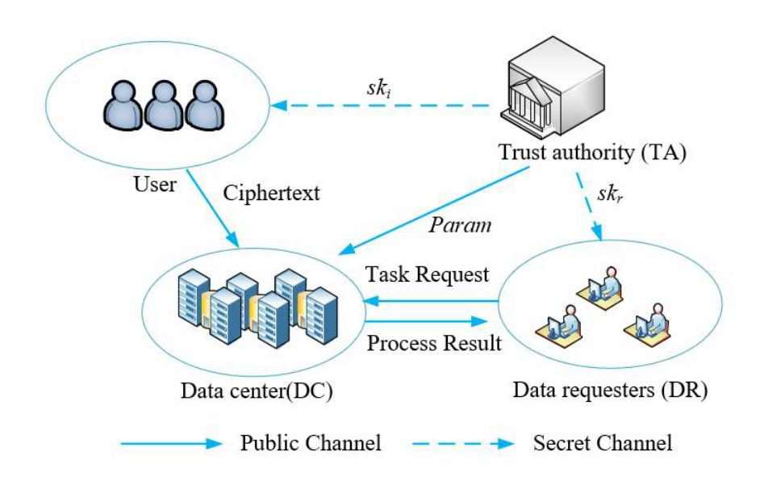
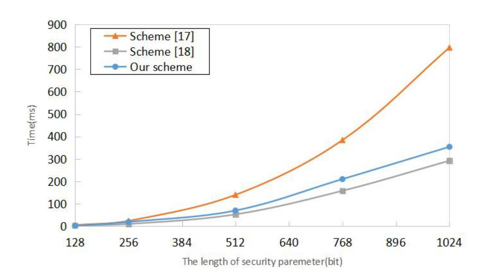

{0}------------------------------------------------

# **Toward Comparable Homomorphic Encryption for Crowd-sensing Network**

Daxin Huang, Qingqing Gan, Xiaoming Wang*∗* Chengpeng Huang, and Yijian Lin

Department of Computer Science, Jinan University, Guangzhou, 510632 China, knightdax@163.com, gan qingqing@foxmail.com, twxm@jnu.edu.cn 524826025@qq.com, 657808804@qq.com Corresponding author: Xiaoming Wang

**Abstract.** As a popular paradigm, crowd-sensing network emerges to achieve sensory data collection and task allocation to mobile users. On one hand these sensory data could be private and sensitive, and on the other hand, data transmission separately could incur heavy communication overhead. Fortunately, the technique of homomorphic encryption (HE) allows the addictive and/or multiplicative operations over the encrypted data as well as privacy protection. Therefore, several data aggregation schemes based on HE are proposed for crowd-sensing network. However, most of the existing schemes do not support ciphertext comparison efficiently, thus data center cannot process ciphertexts with flexibility. To address this challenge, we propose a comparable homomorphic encryption (CompHE) scheme based on Lagrange's interpolation theorem, which enables ciphertext comparison between multiple users in crowdsensing network. Based on the Partial Discrete Logarithm and Decisional Diffie-Hellman assumption, the proposed CompHE scheme is provably secure in the random oracle model. Performance analysis confirms that the proposed scheme have improved the computational efficiency compared with existing schemes.

**Keywords:** homomorphic encryption, ciphertext comparison, provable security, crowd-sensing network

## **1 Introduction**

With the development of wireless sensor network, more and more mobile devices (such as smart phones, smart glasses, wearable devices) are able to be equipped with sensors. In order to collect the data sensing by distributed sensors from a crowd, crowd-sensing network has become popular in recent years. As a new type of sensing mode, crowd-sensing network allows data requesters to assign tasks for complex sensory data collection to a large number of volunteering users, so that users can collaborate to complete the tasks. Compared with the traditional sensor network, crowd-sensing network can achieve tasks with more flexible and resource-saving, since data sensing is distributed to multiple mobile devices [25].

{1}------------------------------------------------

However, data collection and transmission in crowd-sensing network may incur some security issues. Some malicious attackers or third-party service provider may obtain the sensitive sensory data for benefit, which will expose the users' privacy. In order to protect data privacy during data transmission, data encryption technology is one of the most commonly used methods in the crowd-sensing network, such as schemes [2,7,23,28,34,36]. To reduce the communication overhead, many schemes (e.g., [12, 31]) have been proposed based on homomorphic encryption thus can supporting data aggregation. Although these schemes can achieve privacy-preserving and encrypted data processing with the support of some basic operations, such as ciphertext addition, subtraction and multiplication and so on, but they cannot meet the requirement of data comparison operation in the ciphertext form. However, comparison operation over encrypted data enables the data center to process the collected data from users, such as ciphertext sorting, seeking the top-k value and data segmentation statistics. Thus comparison operations over ciphertexts among multiple users are a quite essential property for the crowd-sensing network.

To support data comparison, order-preserving encryption [1,21] and order-revealing encryption [4,6,16,26] have been proposed. The former one can obtain the data order by comparing their ciphertexts directly since the order is preserved after encryption, while the latter one requires a comparing algorithm to reveal the order from the ciphertexts. However, the above schemes only focus on ciphertext comparison and cannot support data homomorphism and data aggregation.

Recently, there are some schemes can achieve both ciphertext comparison and data homomorphism, such as [8, 14, 37]. However, these schemes suffer from low efficiency with heavy computational overhead [8, 14] or security issues [37]. To the best of our knowledge, there exists very few related schemes in the literature focusing on efficient and privacy-preserving data comparison for the crowd-sensing network. Hence, it is necessary to study privacy-preserving and efficient encrypted data processing scheme with ciphertext comparison in the crowd-sensing network.

#### 1.1 Contributions

The main contributions of this paper can be summarized as follows.

- (1) Based on Bresson et al.'s scheme [3], combined with Lagrange's interpolation theorem, we construct a privacy-preserving scheme in the crowd-sensing network, called comparable homomorphic encryption (CompHE). The proposed scheme can not only achieve homomorphic encryption, but also support ciphertext comparison.
- (2) The semantic security of the scheme is proved under the assumption of Partial Discrete Logarithm (PDL) and the Decisional Diffie-Hellman (DDH) assumption over  $Z_{N^2}^*$ .
- (3) Compared with the existing homomorphic encryption schemes, the proposed scheme has considerable efficiency on computation and communication overhead.

{2}------------------------------------------------

## **1.2 Related Works**

Privacy-preserving techniques for the crowd-sensing network have been a hot topic in recent years. Focusing on data privacy protection in mobile sensing, Wang et al. [27] introduced a framework called *ARTSense*. Based on such a framework, two privacy-preserving solutions were proposed to maintain reputation and trust in mobile sensing. In [30], a privacy protection mechanism was built in the crowd-sensing network based on the combination of dynamic trust management with the distribution of key. Soon afterwards, Xiong et al. [31] proposed a privacy-preserving scheme for crowd-sensing network relied on data encryption and game theory. Then based on additive homomorphic encryption, a secure and efficient data aggregation scheme was constructed to reduce communication overhead. Subsequently, several privacy-preserving solutions are proposed in the crowd-sensing network, such as [18,29]. Recently, some other researches over crowd-sensing network include task allocation [10,17,32], incentive mechanism [13, 15, 33] and so on.

Bresson et al. [3] designed a homomorphic encryption with support for add operations, but their scheme cannot achieve ciphertext comparison. Then Kerschbaum et al. [14] constructed a comparable encryption scheme based on addictive homomorphic technique. But this scheme requires all users participating in the comparison operation and thus incurs large computation and communication cost. Later, Chatterjee et al. [5] proposed an improved fully homomorphic encryption scheme supporting ciphertext comparison operation, which can achieve data ranking and data aggregation in ciphertext environment. However, their scheme cannot suit for large-scale data because of the high computational cost in fully homomorphic encryption. In [9], a short comparable encryption scheme was put forward by comparing ciphertext to obtain the relationship of plaintext with privacy-preserving property. However, the process in ciphertext comparison involves large amounts of tags, which brings heavy computation and storage overhead. Afterwards, Ding et al. [8] built a secure encrypted data processing framework supporting for homomorphism and data comparison operation. However, their scheme involves heavy computational overhead during comparison procedure. Based on scheme [3], Zheng et al. [37] proposed a new scheme to achieve ciphertext comparison by collaborating two servers. Although their scheme can be efficient on both the computation and communication sides, two semi-trusted servers are introduced and supposed not collude with each other in this scheme. However, such an assumption is too strong since collusion attacks often happen in real life.

## **1.3 Organization**

The remainder of this paper is organized as follows. Section II presents some concepts related in this paper and then Section III describes the framework of CompHE. Thereafter, a concrete construction of CompHE is proposed in Section IV. Security analysis and performance analysis are discussed in Section V and Section VI. Finally, Section VII concludes the paper.

{3}------------------------------------------------

## 2 Preliminaries

In this section, we first review some background knowledge, such as Lagrange's interpolation theorem, complexity assumptions and homomorphic encryption. Then we briefly review Bresson et al.'s scheme and analyze their scheme can satisfy addictive homomorphic property.

## 2.1 Lagrange's Interpolation Theorem

For a polynomial function  $f(x) = a_0 + a_1x + ... + a_{n-1}x^{n-1}$  with order (n-1), if we choose n different points as  $(x_1, y_1), (x_2, y_2), ..., (x_n, y_n)$ , then it can construct a unique Lagrange's polynomial function L(x) satisfies

$$L(x) = \sum_{i=0}^{k-1} y_i \prod_{j=0, j \neq i}^{k-1} \frac{x - x_j}{x_i - x_j}$$

and f(x) = L(x) holds, then we call L(x) as Lagrange's interpolation [20].

## 2.2 Complexity Assumptions

Suppose G be a cyclic group with prime order ord(G) and generator g. Let p, q be two big primes and N = pq. The complexity assumptions are defined as follows.

**Definition 1.** Partial Discrete Logarithm (PDL) Assumption Over  $Z_{N^2}^*$  [19]: Given a triple  $(N, g, g^{\alpha} \mod N^2)$  where  $\alpha$  is a random value from [1, ord(G)], any probabilistic polynomial-time (PPT) algorithm has only negligible probability in computing  $\alpha$ .

**Definition 2.** Decisional Diffie-Hellman (DDH) Assumption Over  $Z_{N^2}^*$  [3]: Given a triple  $(N, g, g^{\alpha}, g^{\beta}) \in G$  where  $\alpha, \beta$  are a random value from [1, ord(G)], any PPT algorithm has only negligible probability in computing  $g^{\alpha\beta}$ .

## 2.3 Homomorphic Encryption

The concept of homomorphic encryption (HE) was first introduced in [22] by which the operations on ciphertexts equal to that on plaintexts. It can be classified as three types: addictive HE [3], multiplicative HE [22] and fully HE [11].

- Addictive HE: If there exists an efficient algorithm for  $\forall m_1, m_2 \in M$ , and the equation  $E(m_1 + m_2) = E(m_1) + E(m_2)$  is satisfied, then the algorithm can be called as addictive HE algorithm.

{4}------------------------------------------------

#### 2.4 Brief Introduction to Bresson et al.'s Scheme

Bresson et al. proposed a homomorphic encryption scheme called DT-PKC scheme. Here we only give a brief introduction of their scheme, more details can be seen in [3].

- 1. Setup( $1^{\lambda}$ )  $\rightarrow$  (sp): take a security parameter  $1^{\lambda}$  as input, choose two big primes p, q with length k, set N = pq and g be the generator of the group G with order (p-1)(q-1)/2. It outputs public parameters sp = (p, q, N, g).
- 2. KeyGen $(sp) \to (pk, sk)$ : take sp as input, randomly pick  $\theta$ , compute  $h = g^{\theta} \mod N^2$ . It outputs the public key pk = h and secret key  $sk = \theta$ .
- 3.  $\operatorname{Enc}(pk, m) \to C$ : take as inputs the public key pk and the message m, select a random number r. It outputs the ciphertext  $[m]_{pk} = (C_1, C_2)$  as  $C_1 = h^r (1 + mN) \mod N^2, C_2 = g^r \mod N^2$ .
- 4.  $\text{Dec}([m]_{pk}, sk) \to M$ : take as inputs the ciphertext  $[m]_{pk}$  and the secret key sk. It outputs the message  $m = \frac{(C_1/(C_2^{sk})-1) \bmod N^2}{N}$ .

Given  $m_1, m_2 \in Z_N$  encrypted under the same pk, we have the additive homomorphic property as  $[m_1]_{pk} \cdot [m_2]_{pk} = \{h^{r_1+r_2} (1 + (m_1 + m_2)N) \mod N^2, g^{r_1+r_2} \mod N^2\} = [m_1 + m_2]_{pk}$ .

## 3 Framework Definition

This section introduces the framework of the proposed comparable homomorphic encryption (CompHE) scheme, including the system model, lemma definition, formal definition and security model.

## 3.1 System Model

For crowd-sensing network, the architecture of the CompHE scheme contains four entities, which is demonstrated in Fig. 1.

- Trust authority (TA): as a fully-trust authority, it performs the system initialization and secret key distribution.
- Data center (DC): has substantial computational power. It executes the data calculation, such as data aggregation or data comparison. It is semi-trusted, which means it will perform the operation honestly but also curious about the information gathered from users.
- Data request (DR): is responsible to assign task request for data collection. It can usually be government organization, hospital and so on.
- User: is responsible to collect data and upload the gathering date to DC after encryption. It may exist malicious users who will try to collude with DC to require other users's data.

{5}------------------------------------------------

Fig. 1. System model.

#### 3.2 Lemma Definition

**Lemma 1.** Suppose  $M_1, M_2$  be two positive integers and N be a large positive integer. Let  $M = (M_1 - M_2) \mod N^2$ , if  $0 < M < N^2/2$  holds, then  $M_1 > M_2$ ; else if  $N^2/2 < M < N^2$  holds, then  $M_1 < M_2$ .

**Proof.** As we know, the property of modular operation determines that no matter what the relationship of  $M_1, M_2$  is, the mod of their difference as

$$M = (M_1 - M_2) \bmod N^2. (1)$$

will always be positive integer. If  $M_1 = M_2$ , the modular result M = 0. Therefore, we only consider the case where  $M_1 \neq M_2$ . In order to determine the relationship between  $M_1$  and  $M_2$ , we set  $|M_1 - M_2| < N^2/2$ . Since N is a large positive integer, the above range can satisfy the requirement in practice. Now we consider the following two cases.

Case 1: If  $0 < (M_1 - M_2) < N^2/2$ , then  $0 < (M_1 - M_2) < N^2/2 < N^2$ . The Eq.1 is equivalent to

$$M = (M_1 - M_2). (2)$$

For  $0 < (M_1 - M_2) < N^2/2$ , that is to say,  $M_1 > M_2$ . Therefore, from Eq.2 and the condition  $0 < (M_1 - M_2) < N^2/2$ , we obtain  $0 < M < N^2/2$ .

Case 2: If  $-N^2/2 < M_1 - M_2 < 0$ , then  $N^2/2 < (M_1 - M_2 + N^2) < N^2$ . The Eq.1 is equivalent to

$$M = (M_1 - M_2 + N^2). (3)$$

For  $-N^2/2 < M_1 - M_2 < 0$ , that is to say,  $M_1 < M_2$ . Therefore, from Eq.3 and the condition  $N^2/2 < (M_1 - M_2 + N^2) < N^2$ , we obtain  $N^2/2 < M < N^2$ .

To conclude, for  $M = (M_1 - M_2) \mod N^2$ , we have

$$\begin{cases} M_1 > M_2, \ 0 < (M_1 - M_2) < N^2/2. \\ M_1 < M_2, \ N^2/2 < (M_1 - M_2) < N^2. \end{cases}$$

{6}------------------------------------------------

#### 3.3 Formal Definition

A CompHE scheme consists of five probabilistic polynomial-time (PPT) algorithms: Setup, Encrypt, Compare, Add, Decrypt.

- 1. Setup( $1^{\lambda}$ , t)  $\rightarrow$  (params, pk, sk): run by TA and take a security parameter  $1^{\lambda}$  and the number of users t as input, and output public parameters params, the public key pk and the secret key sk. We omit public parameters params in the following description.
- 2. Encrypt $(pk, m) \to C$ : run by the user and take as inputs the public key pk and the message m, and output the ciphertext C.
- 3. Compare  $(C_A, C_B) \to b$ : involve an interaction between DC and user, take as inputs two ciphertexts  $C_A, C_B$ , and output a bit  $b \in \{0, 1\}$  as the comparison result.
- 4.  $Add(C_i, C_j) \to C_{sum}$ : run by DC and take as inputs  $C_i, C_j$ , and output an aggregate result  $C_{sum}$ .
- 5.  $\mathsf{Decrypt}(C, sk) \to M$ : run by DR and take as inputs the ciphertext C and the secret key sk, and output the message m.

#### 3.4 Security Model

In the communication process, all the ciphertext comparison algorithms incur information leakage such as the relationship between the ciphertexts reveals the relationship of underlying plaintexts. To find a tradeoff between security and efficiency, it is quite essential to construct ciphertext comparison algorithms with as less leakage as possible. Therefore, we define the security of the proposed scheme based on the leakage function [6, 16]. Assume  $\Pi = (\text{Setup}, \text{Encrypt}, \text{Compare}, \text{Add}, \text{Locrypt})$ . Suppose  $\mathcal{A}$  be a PPT adversary and  $\mathcal{S}$  be a simulator, we define  $\mathcal{L}$ -semantic security of the CompHE scheme by the two experiments, detailed as follows [35].

- REAL $_{\mathcal{A}}^{\Pi}(\lambda)$ :  $\mathcal{A}$  selects the security parameter  $1^{\lambda}$  and the number of users t, the experiment runs Setup $(1^{\lambda}, t)$  to generate public parameters params, the public key pk and sends (params, pk) to  $\mathcal{A}$ .  $\mathcal{A}$  adaptively queries the comparison on  $(C_A, C_B)$ , the experiment invokes Compare $(C_A, C_B)$  and returns the comparison result to  $\mathcal{A}$ . Finally,  $\mathcal{A}$  outputs a bit  $b \in \{0, 1\}$ .
- IDEAL $_{\mathcal{A},\mathcal{S}}^{\hat{\Pi}}(\lambda)$ :  $\mathcal{A}$  selects the security parameter  $1^{\lambda}$  and the number of users t, the experiment runs  $\mathcal{S}(\mathcal{L}_{\mathtt{Setup}}(1^{\lambda},t))$  to generate public parameters params, the public key pk and sends (params,pk) to  $\mathcal{A}$ .  $\mathcal{A}$  adaptively queries the comparison on  $(C_A,C_B)$ , the experiment invokes  $\mathcal{S}(\mathcal{L}_{\mathtt{Compare}}(C_A,C_B))$  and returns the comparison result to  $\mathcal{A}$ . Finally,  $\mathcal{A}$  outputs a bit  $b \in \{0,1\}$ .

**Definition 3.** ( $\mathcal{L}$ -Semantic Security) If for any PPT adversary  $\mathcal{A}$ , there exists an efficient simulator  $\mathcal{S}$  satisfies

$$|\Pr\left[\operatorname{REAL}_{\mathcal{A}}^{\Pi}(\lambda) = 1\right] - \Pr\left[\operatorname{IDEAL}_{\mathcal{A},\mathcal{S}}^{\Pi}(\lambda) = 1\right]| \le negl(\lambda)$$

Then the CompHE scheme  $\Pi$  is  $\mathcal{L}$ -Semantic secure.

{7}------------------------------------------------

## 4 The Proposed Comparable Homomorphic Encryption in the Crowd-sensing Network

A formal description of our proposed CompHE for the crowd-sensing network is elaborated in this section. Then we analyze the correctness of the proposed scheme.

#### 4.1 Main Construction

The proposed CompHE scheme contains five algorithms: Setup, Encrypt, Compare, Add, Decrypt. And the construction is based on Lagrange's interpolation theorem and DT-PKC scheme [3], detailed as follows.

- 1. Setup $(1^{\lambda}, t) \rightarrow (params, pk, sk)$ :
  - TA inputs the security parameter  $1^{\lambda}$ , generates  $\lambda bit$  prime number p,q, and computes N = pq. Then TA chooses a group with order (p-1)(q-1)/2 and generator g. TA selects a random number  $s \in Z_{N^2}^*$ ,  $a_i \in Z_{N^2}^*$  ( $i = 1, 2, \dots, n-1$ ) and constructs a polynomial function f(x) with order (n-1) as follows.

$$f(x) = s + a_1 x + \dots + a_{n-1} x^{n-1}.$$

TA sets  $pk_r = g^s \mod N^2$  as DR's public key and Then sends  $sk_r = s$  to DR via secret channel.

- Input the number of users t, choose (n-2+t) points from f(x). Assume the first t points as the users' ID set  $\{x_i\}_{i\in\{1,\dots,t\}}$ , the remaining points as the set  $\{w_i\}_{i\in\{1,\dots,n-2\}}$ . TA generates the public parameters params as

$$params = \{N, g, \{x_i\}_{i \in \{1, \dots, t\}}, \{w_i\}_{i \in \{1, \dots, n-2\}}\}$$

and master secret key

$$msk = \{s, p, q, f(x)\}.$$

- TA calculates  $R_i = g^{f(w_i) \prod_{\substack{k=1 \ k \neq i}}^{n-2} \frac{-w_k}{w_i w_k}}$  and sends the set  $\{R_i\}_{i \in \{1, \dots, n-2\}}$  to DC.
- For a user  $U_i$ , TA chooses a value  $x_i$  from the set  $\{x_i\}_{i\in\{1,\dots,t\}}$  and computes  $f(x_i)$ . Note that every user will get a different value from TA. Finally, TA sends  $sk_i = (x_i, \Delta_i)$  to the user  $U_i$  via a secret channel. Here, we have

$$\Delta_i = f(x_i) \cdot \prod_{k=1}^{n-2} \frac{-w_k}{x_i - w_k}$$

2.  $Encrypt(pk_r, m) \rightarrow C$ :

{8}------------------------------------------------

- User  $U_i$  encrypts data and upload to DC.  $U_i$  first picks a random number  $r_i \in Z_N^*$ , then calculates  $C_i = (C_{i,1}, C_{i,2})$ 

$$C_{i} = \left\{ \begin{array}{c} C_{i,1} = pk_{r}^{r_{i}} (1 + m_{i}N) \bmod N^{2} \\ C_{i,2} = g^{r_{i}} \bmod N^{2} \end{array} \right\}$$

where  $pk_r = g^s \mod N^2$  is DR's public key. Finally,  $U_i$  sends  $(x_i, C_i)$  to DC.

- 3.  $\mathsf{Compare}(C_A, C_B) \to b$ :
  - When requiring to compare  $C_A$  from  $U_A$  and  $C_B$  from  $U_B$ , DC first computes

$$\bar{C} = C_{A,1}/C_{B,1}$$

$$inf = \prod_{i=1}^{n-2} R_i^{\frac{-x_A}{w_i - x_A} \cdot \frac{-x_B}{w_i - x_B}} \bmod N^2$$

Finally, DC sends comparison request  $Inf_B = \{inf, x_B, g^{r_B}, \omega_B = 1\}$  to  $U_A$ . Similarly, DC sends  $Inf_A = \{inf, x_A, g^{r_A}, \omega_A = -1\}$  to  $U_A$ . Note that  $\omega_A$  and  $\omega_B$  are used as a flag to distinguish the subtractor and the minuend.

– User  $U_B$  receives the comparison request  $Inf_B$ , and chooses a random value  $k_B$  satisfies

$$k_B \in \left(0, \frac{N}{\sqrt{2\left(N^{\frac{5}{4}} + 1\right)}}\right)$$

to blind the difference. Then  $U_B$  computes  $req_B$  as

$$req_B = k_B^{\omega_B} g^{r_B \cdot \Delta_B \cdot \left(\frac{-x_A}{x_B - x_A}\right)} \cdot (inf)^{r_B} \cdot (g^{r_A})^{-\Delta_B \cdot \left(\frac{-x_A}{x_B - x_A}\right)}$$

Finally,  $U_B$  sends  $req_B$  to DC. In the similar way, User  $U_A$  also chooses  $k_A$  with the same range of  $k_B$  and generates  $req_A$  as

$$req_A = k_A^{\omega_A} g^{r_A \cdot \Delta_A \cdot \left(\frac{-x_B}{x_A - x_B}\right)} \cdot (inf)^{r_A} \cdot (g^{r_B})^{-\Delta_A \cdot \left(\frac{-x_B}{x_A - x_B}\right)}$$

- When receiving  $req_A$  and  $req_B$ , DC will compare the two ciphertexts  $C_A$  and  $C_B$  and obtain the result by computing

$$M = \bar{C} \cdot (req_A)^{-1} \cdot req_B = k_A k_B (1 + (m_A - m_B) N) \bmod N^2.$$
 (4)

Based on Lemma 1, if

$$|k_A k_B (1 + (m_A - m_B) N)| < \frac{N^2}{2}.$$
 (5)

Since  $m_i \in \left[0, N^{\frac{1}{4}}\right]$ , then the range for  $(m_A - m_B)$ 

$$(m_A - m_B) \in \left[ -N^{\frac{1}{4}}, N^{\frac{1}{4}} \right].$$

{9}------------------------------------------------

When solving Eq.5, we get

$$k_A k_B \le \frac{N^2}{2\left(N^{\frac{5}{4}} + 1\right)} \le \frac{N^2}{2\left(N^{\frac{5}{4}} - 1\right)}.$$

Finally, we have

$$k_A k_B \le \frac{N^2}{2\left(N^{\frac{5}{4}} + 1\right)}.$$

As  $k_A, k_B$  be positive integers, it satisfies

$$0 < k_A, k_B < \frac{N}{\sqrt{2\left(N^{\frac{5}{4}} + 1\right)}}.$$

This is consistency with the range of  $k_A, k_B$ . Therefore, for

$$k_A, k_B \in \left(0, \frac{N}{\sqrt{2\left(N^{\frac{5}{4}} + 1\right)}}\right)$$

 $(m_A - m_B) \in \left[ -N^{\frac{1}{4}}, N^{\frac{1}{4}} \right]$ 

we have the following conclusion:

$$\begin{cases} m_A \ge m_B, \ 0 < M < N^2/2. \\ m_A < m_B, \ N^2/2 < M < N^2. \end{cases}$$

To sum up, if  $0 < M < N^2/2$ , the algorithm will output 1; else if  $N^2/2 < M < N^2$ , output 0.

4.  $Add(C_i, C_j) \to C_{sum}$ : when receiving  $C_i$  and  $C_j$ , DC executes the homomorphic add operation as  $C_{sum} = (C_{sum,1}, C_{sum,2}) = (C_{i,1}C_{j,1}, C_{i,2}C_{j,2})$ .

$$C_{sum} = \begin{cases} C_{sum,1} = g^{s(r_i + r_j)} \left( 1 + (m_i + m_j) \right) N \mod N^2 \\ C_{sum,2} = g^{r_i + r_j} \mod N^2 \end{cases}$$

DC sends  $C_{sum}$  to DR.

,

5.  $\mathsf{Decrypt}(C, sk_r) \to M$ : After obtaining the aggregate ciphertext  $C_{sum}$ , DR uses  $sk_r = s$  to decrypt and get the aggregate message M as

$$M = \left(\frac{C_{sum,1}}{C_{sum,2}^s} - 1\right)/N. \tag{6}$$

{10}------------------------------------------------

#### 4.2 Correctness Analysis

The correctness analysis includes two aspects: the correctness of the Decrypt and Compare. On one hand, the correctness of Decrypt can ensure using the corresponding secret key, DC can recover the correct plaintext from the ciphertext, shown by Eq.5. Since we adopt DT-PKC as the encryption method, the correctness of Decrypt can be deduced to the correctness of DT-PKC scheme [3]. Therefore, we have omitted here. On the other hand, the correctness of the Compare can guarantee the correct relationship between two plaintexts by execute comparison operation over their ciphertexts, shown by Eq.4. Hence, the correctness of Eq.4 can be analyzed as follows.

$$M = \bar{C} \cdot (req_A)^{-1} \cdot req_B$$

Since (we omit  $mod N^2$  here)

$$\bar{C} = g^{s(r_A - r_B)} \left( 1 + (m_A - m_B) N \right)$$

$$req_A = k_A^{\omega_A} g^{r_A \cdot \Delta_A \cdot \left( \frac{-x_B}{x_A - x_B} \right)} \cdot (inf)^{r_A} \cdot (g^{r_B})^{-\Delta_A \cdot \left( \frac{-x_B}{x_A - x_B} \right)}$$

$$req_B = k_B^{\omega_B} g^{r_B \cdot \Delta_B \cdot \left( \frac{-x_A}{x_B - x_A} \right)} \cdot (inf)^{r_B} \cdot (g^{r_A})^{-\Delta_B \cdot \left( \frac{-x_A}{x_B - x_A} \right)}$$

$$\Delta_i = f(x_i) \cdot \prod_{k=1}^{n-2} \frac{-w_K}{x_i - w_K}$$

Let  $\nabla = \sum_{i=1}^{n-2} f(w_i) \cdot \prod_{k=1, k \neq i}^{n-2} \frac{-w_k}{w_i - w_k} \cdot \frac{-x_A}{w_i - w_A} \cdot \frac{-x_B}{w_i - x_B}$ , then we have

$$inf = \prod_{i=1}^{n-2} R_i^{\frac{-x_A}{w_i - x_A} \cdot \frac{-x_B}{w_i - x_B}} = g^{\nabla}.$$

So we get

$$(req_{A})^{-1} \cdot req_{B} = k_{A}k_{B}g^{(r_{B}-r_{A})\cdot\Delta_{A}\cdot\left(\frac{-x_{B}}{x_{A}-x_{B}}\right)}(inf)^{(r_{B}-r_{A})\cdot\beta_{B}\cdot\left(\frac{-x_{A}}{x_{B}-x_{A}}\right)}$$

$$\cdot g^{(r_{B}-r_{A})\cdot\Delta_{B}\cdot\left(\frac{-x_{A}}{x_{B}-x_{A}}\right)}$$

$$= k_{A}k_{B}g^{(r_{B}-r_{A})\cdot\left(\Delta_{A}\cdot\left(\frac{-x_{B}}{x_{A}-x_{B}}\right)+\nabla+\Delta_{B}\cdot\left(\frac{-x_{A}}{x_{B}-x_{A}}\right)\right)}$$

$$= k_{A}k_{B}g^{(r_{B}-r_{A})s}$$

Finally, we can obtain

$$\begin{split} M &= \bar{C} \cdot (req_A)^{-1} \cdot req_B \\ &= k_A k_B g^{s(r_A - r_B)} \left( 1 + (m_A - m_B) \, N \right) \cdot g^{s(r_B - r_A)} \bmod N^2 \\ &= k_A k_B \left( 1 + (m_A - m_B) \, N \right) \bmod N^2 \end{split}$$

Thus, the correctness of the proposed scheme has been proved.

{11}------------------------------------------------

## 5 Security Proof and Analysis

For this section, we give the security proof for the proposed CompHE scheme based on the security model in Secion III.D. And then security analysis is presented to show the proposed scheme can resist attacks and maintain privacy.

## 5.1 Security proof

Based on the model in Section II. D, we will prove that the probability for a PPT adversary  $\mathcal{A}$  to break the semantic security of the CompHE scheme is negligible. Inspired by [24,35], the proposed scheme introduces a parameter called ciphertext comparison history ch(m). Note that ch(m) records all the comparison queries, containing inf, req and comparison result. Now we prove the security of the proposed scheme by the following theorem.

**Theorem 1.** If the PDL and DDH problem over  $Z_{N^2}^*$  are hard, and the leakage function  $\mathcal{L} = (\mathcal{L}_{Setup}, \mathcal{L}_{Encrypt}, \mathcal{L}_{Compare}, \mathcal{L}_{Add}, \mathcal{L}_{Decrypt})$  is defined as

$$\left\{ \begin{aligned} \mathcal{L}_{\mathit{Setup}} = & \perp, \mathcal{L}_{\mathit{Encrypt}} = & \perp, \mathcal{L}_{\mathit{Compare}} = ch(m) \ \mathcal{L}_{\mathit{Add}} = & \perp, \mathcal{L}_{\mathit{Decrypt}} = & \perp \end{aligned} \right.$$

Then the proposed CompHE is  $\mathcal{L}$ -semantic secure.

Proof. In order to prove **Theorem 1**, we try to construct several indistinguishable games. Specifically, the first game is the real world game  $\text{REAL}_{\mathcal{A}}^{CompHE}(\lambda)$  and the second game can be deduced to the PDL problem over  $Z_{N^2}^*$ . In the third game, the security is deduced to the semantic security of DT-PKC scheme, while in the fourth game, the security is based on the random number chosen in the CompHE scheme. Finally, the last game comes to the ideal world game  $\text{IDEAL}_{\mathcal{A},\mathcal{S}}^{CompHE}(\lambda)$ . By analyzing the indistinguishable distribution between each games, we can obtain an efficient simulator  $\mathcal{S}$ . Hence, we have  $\text{IDEAL}_{\mathcal{A},\mathcal{S}}^{CompHE}(\lambda)$  executed by  $\mathcal{S}$  cannot be distinguished from  $\text{REAL}_{\mathcal{A}}^{CompHE}(\lambda)$  and the security proof can get through. The detailed process is shown as follows.

Game  $G_0$ : this game is defined as the real world game REALACompHE( $\lambda$ ), so we have

$$\Pr\left[\operatorname{REAL}_{\mathcal{A}}^{CompHE}(\lambda) = 1\right] = \Pr\left[G_0 = 1\right]$$

Game  $G_1$ : this game is almost the same as  $G_0$ , except the generation method of inf. To be specific, during the ciphertext request process in  $G_0$ , inf can be obtained as

$$inf = \prod_{i=1}^{n-2} R_i^{\frac{-x_A}{w_i - x_A} \cdot \frac{-x_B}{w_i - x_B}} \bmod N^2.$$

However, we introduce a table  $T_{inf}$  to store the entry  $(x_A, x_B, inf)$  in  $G_1$ . In Compare algorithm, when inf is required to be returned, the experiment will first check whether  $T_{inf}$  contains the entry  $(x_A, x_B, inf)$  or not. If does, inf will be returned directly; otherwise, a group element inf will be randomly chosen

{12}------------------------------------------------

from G as the returned result and store  $(x_A, x_B, inf)$  into  $T_{inf}$ . Since the PDL problem over  $Z_{N^2}^*$  is hard to be solved, we can define an efficient adversary  $\mathcal{B}_1$  so that

$$\Pr[G_1 = 1] - \Pr[G_0 = 1] \le Adv_{G,\mathcal{B}_1}^{PDL}(\lambda)$$

Game  $G_2$ : this game is similar to  $G_2$ , except the generation method for ciphertext. To be exact, the real message  $m_i$  is encrypted in  $G_1$  while a string  $0^{\lambda}$  is encrypted instead in  $G_2$ . Therefore, the form of the ciphertext in  $G_2$  is shown as follows.

$$C_{i} = \left\{ \begin{array}{c} C_{i,1} = g^{sr_{i}} \left( 1 + 0^{\lambda} N \right) \bmod N^{2} \\ C_{i,2} = g^{r_{i}} \bmod N^{2} \end{array} \right\}$$

The above ciphertext is output by the encryption algorithm in DT-PKC [3]. Since DT-PKC is proved to be semantic security (SS) based on the DDH assumption over  $Z_{N^2}^*$ . Suppose  $ploy(\lambda)$  denote the times of encryption, there exists an efficient adversary  $\mathcal{B}_2$  such that

$$\Pr\left[G_2 = 1\right] - \Pr\left[G_1 = 1\right] \le ploy(\lambda) \cdot Adv_{DT-PKC,\mathcal{B}_2}^{SS}(\lambda)$$

Game  $G_3$ : this game is quite identical to the previous game  $G_2$ , except that the generation of req. In  $G_2$ , req is obtained by

$$req_A = k_A^{\omega_A} g^{r_A \cdot \Delta_A \cdot \left(\frac{-x_B}{x_A - x_B}\right)} \cdot (inf)^{r_A} \cdot (g^{r_B})^{-\Delta_A \cdot \left(\frac{-x_B}{x_A - x_B}\right)}$$

$$req_B = k_B^{\omega_B} g^{r_B \cdot \Delta_B \cdot \left(\frac{-x_A}{x_B - x_A}\right)} \cdot (inf)^{r_B} \cdot (g^{r_A})^{-\Delta_B \cdot \left(\frac{-x_A}{x_B - x_A}\right)}$$

By calculating

$$M = \bar{C} \cdot (req_A)^{-1} \cdot req_B = k_A k_B (1 + (m_A - m_B) N) \mod N^2$$

we can get the comparison result from the range of M.

However, we introduce a global counter cnt to record the times of comparison in  $G_3$ . Note that cnt is defined in Setup and initialize as 0, then it will increase by 1 in Compare. Furthermore, req is randomly selected from group G and M is randomly chosen from  $Z_{N^2}^*$ . Since  $k_A, k_B$  are random value, the game  $G_3$  and  $G_2$  is indistinguishable, that is

$$\Pr[G_3 = 1] = \Pr[G_2 = 1]$$

Simulator S: simulator S has only slightly difference from  $G_3$  at the input of Compare. To be exact, simulator S obtains the ciphertext comparison history ch(m) from  $\mathcal{L}_{Compare}$ , as the input of Compare algorithm. Since the above operation will not change the distribution of the whole algorithm, the simulator S is indistinguishable from  $G_3$  as

$$\Pr\left[\text{IDEAL}_{\mathcal{A},\mathcal{S}}^{CompHE}(\lambda) = 1\right] = \Pr\left[G_3 = 1\right]$$

Combining  $G_0, G_1, G_2, G_3$  and S, we can have the following conclusion:

$$\Pr\left[\operatorname{REAL}_{\mathcal{A}}^{CompHE}(\lambda) = 1\right] - \Pr\left[\operatorname{IDEAL}_{\mathcal{A},\mathcal{S}}^{CompHE}(\lambda) = 1\right]$$

$$\leq Adv_{G,\mathcal{B}_{1}}^{PDL}(\lambda) + ploy(\lambda) \cdot Adv_{DT-PKC,\mathcal{B}_{2}}^{SS}(\lambda)$$

{13}------------------------------------------------

That is to say,

$$\Pr\left[\operatorname{REAL}_{\mathcal{A}}^{CompHE}(\lambda) = 1\right] - \Pr\left[\operatorname{IDEAL}_{\mathcal{A},\mathcal{S}}^{CompHE}(\lambda) = 1\right] \leq negl(\lambda)$$

Therefore, we have completed the proof of **Theorem 1**.

### 5.2 Security Analysis

Besides security proof, we will analyze the security of the CompHE scheme from two aspects: collusion attacks resistance and privacy protection on ciphertext difference.

1. Collusion attacks resistance. In the proposed CompHE scheme, we define a polynomial function  $f(x) = s + a_1x + \cdots + a_{n-1}x^{n-1}$ . choose (n-2+t) points from f(x). Assume the first t points as the users' ID set  $\{x_i\}_{i\in\{1,\dots,t\}}$ , the remaining points as the set  $\{w_i\}_{i\in\{1,\dots,n-2\}}$ . TA calculates and sends the set  $\{R_i\}_{i\in\{1,\dots,n-2\}}$  to DC, where

$$R_i = q^{f(w_i) \prod_{\substack{k=1 \ k \neq i}}^{n-2} \frac{-w_k}{w_i - w_k}}$$

Based on the Lagrange's interpolation theorem, it requires n points from f(x) to recover the secret parameter s = f(0). Since we define n > t, where t denotes the number of uesrs, users' collusion attack cannot recover f(x). Therefore, our scheme can resist users' collusion attack.

When DC receives  $\{R_i\}_{i\in\{1,\dots,n-2\}}$ ,  $f(w_i)$  is embedded at the exponent. Since the PDL problem over  $Z_{N^2}^*$  is hard to solve, DC cannot obtain  $f(w_i)$ . Based on this, DC cannot collude with users to get s = f(0). Hence, the proposed scheme can resist collusion attack from DC and users.

To sum up, the proposed scheme can resist collusion attack from users and collusion attack from DC and users.

2. **Privacy protection on ciphertext difference.** The proposed scheme can determine the relationship of ciphertexts, as well as not leaking the ciphertext difference. This is achieved by the blindness in ciphertext difference. Specifically, DC obtains the comparison result

$$M = k_A k_B (1 + (m_A - m_B) N) \mod N^2$$

where the random value  $k_A, k_B$  satisfies

$$0 < k_A k_B \le \frac{N^2}{2\left(N^{\frac{5}{4}} + 1\right)}.$$

That is to say, we can define  $k_A k_B$  as a random value from the pseudorandom function  $F_q$  where

$$q = \frac{N^2}{2\left(N^{\frac{5}{4}} + 1\right)}.$$

{14}------------------------------------------------

Table 1. Functionality Comparison with related schemes

| Schemes     | Data    | Homomorphic | Ciphertext | Collusion  |
|-------------|---------|-------------|------------|------------|
| Schemes     | privacy | encryption  | comparison | resistance |
| Scheme [3]  |         |             | ×          |            |
| Scheme [8]  |         |             |            |            |
| Scheme [37] |         |             |            | _          |
| CompHE      |         |             |            |            |

As it can be seen that  $k_A k_B$  is random, M cannot be distinguished thus  $(m_A - m_B)$  is not revealed to DC. Therefore, the proposed CompHE scheme can realize the ciphertext comparison and the privacy of ciphertext difference.

## 6 Performance Analysis

In this section, we analyze the performance of our proposed CompHE scheme from two aspects: making comparison with several existing schemes, and showing experimental results.

## 6.1 Theoretical Analysis

First, we make functionality comparison with schemes [3,8,37] including whether enables data privacy, homomorphic encryption, ciphertext comparison and collusion resistance. The result is shown in Table 1.

As can be seen from Table 1, schemes [3,8,37] and our scheme all can protect data privacy and enable homomorphic encryption. However, the scheme [3] cannot support ciphertext comparison operation. Although the scheme [37] allows to compare ciphertext, their scheme introduces two servers and assumes there is no collusion between two semi-trust servers. To be specific, the secret key is divided into two parts and distributed to two servers, and the comparison is achieved by cooperation between both servers. In reality, two servers may collude with each other to recover the secret so we cannot define this scheme can resist against collusion attack. Hence, our proposed CompHE scheme and scheme [8] are superior to schemes [3,37] on the functionality aspect.

Then we compare the proposed scheme with schemes [8,37] in terms of the computation, communication overhead. Specifically, the comparison contains the computational cost for the Encrypt, Compare algorithm, the communication cost during the comparison process, as shown in Table 2. Note that  $T_{exp}$  denotes the time cost for an exponentiation operation in  $Z_{N^2}^*$ . Since the time cost for the add and multiplication operation in  $Z_{N^2}^*$  can be very low, we have neglected here.

From Table 2, the computation cost for Encrypt in all schemes are the same, requiring 2 exponentiation operations to perform data encryption. This is because all the three schemes adopt DT-PKC scheme for data encryption. Here we only consider that each user encrypt and upload the data once. For the Compare

{15}------------------------------------------------

**Table 2.** Computation, communication overhead comparison with related schemes

| Schemes     | Compi      | ıtation    | Communication |  |
|-------------|------------|------------|---------------|--|
| Schemes     | Encrypt    | Compare    | Communication |  |
| Scheme [8]  | $2T_{exp}$ | $8T_{exp}$ | 12L(n)        |  |
| Scheme [37] | $2T_{exp}$ | $3T_{exp}$ | 2L(n)         |  |
| CompHE      | $2T_{exp}$ | $4T_{exp}$ | 6L(n)         |  |

algorithm, the computation overhead includes all the operations by DC and users. Note that inf in the CompHE scheme can be pre-calculated and stored at the DC side before an comparison request happens. Therefore, scheme [8] costs 8 exponentiation operations and scheme [37] incurs 3 exponentiation operations, while the proposed CompHE scheme has the computation cost between both schemes for one comparison operation.

Since all of the three schemes have the same cost for the encrypted data transmission, we only consider the communication cost for the ciphertext comparison process in Table 2. Note the communication includes the interaction between DC and users. Suppose  $Z_{N^2}^*$  be L(n)-bit integer group. In our proposed scheme, the ciphertext comparison process requires that DC sends Inf to user  $U_A$  and  $U_B$ , then  $req_A$  and  $req_B$  are returned to DC respectively. Therefore, the total communication cost during ciphertext comparison are 6L(n) bits. For the scheme [8], the communication overhead are 12L(n) bits. While the ciphertext comparison process in the scheme [37] needs two servers to interact with each other. Specifically, server A sends  $(c_1, c_2)$  to server B and then the latter calculates and returns the result, thus the total communication cost are 2L(n) bits.

Above all, our CompHE scheme makes a tradeoff between the security and the efficiency in comparison with schemes [8, 37].

#### 6.2 Experimental Evaluation

To show the efficiency of our CompHE scheme, we conduct an experiment comparing with existing works. The experiment is implemented under 64-bit Windows-7 operating system with an Intel Core i3 CPU @1.80 Hz and 6.00 GB RAM. We complete the programming in JAVA and record the average time of ciphertext comparison phase in the proposed CompHE scheme and schemes [8,37]. Note that for consistency in parameters, we choose to encrypt the same message in these three schemes. The experiment results are illustrated in Fig. 2.

From Fig. 2, we can see that the average time for the Compare algorithm in scheme [8] is larger than that in our CompHE scheme and scheme [37]. While with the increase in the length of security parameter, scheme [37] tends to be more efficient in ciphertext comparison. However, scheme [37] does not consider the the collusion attacks resistance of two servers. Therefore, our CompHE scheme has found a balance between security and efficiency.

{16}------------------------------------------------

Fig. 2. Time cost for the ciphertext comparison.

## 7 Conclusion

In this paper, we introduced the framework of comparable homomorphic encryption (CompHE), enabling comparison operation over ciphertexts. Thereafter, we constructed a novel CompHE scheme for crowd-sensing network, achieving data comparison with lightweight computation overhead on DC and user side. Based on the PDL and DDH over  $Z_{N^2}^*$  assumption, the proposed CompHE scheme was proved to be semantic secure against malicious attackers. Security analysis shows the CompHE scheme can resist collusion attacks and protect the privacy of the difference on ciphertext. Performance analysis showed our CompHE scheme with considerable efficiency comparing with related schemes.

## References

- 1. Abdalla, M., Bellare, M., Catalano, D., Kiltz, E., Kohno, T., Lange, T., Malone-Lee, J., Neven, G., Paillier, P., Shi, H.: Searchable encryption revisited: Consistency properties, relation to anonymous ibe, and extensions. In: Annual International Cryptology Conference. pp. 205–222. Springer (2005)
- 2. Alamer, A., Basudan, S.: An efficient truthfulness privacy-preserving tendering framework for vehicular fog computing. Engineering Applications of Artificial Intelligence 91, 103583 (2020)
- 3. Bresson, E., Catalano, D., Pointcheval, D.: A simple public-key cryptosystem with a double trapdoor decryption mechanism and its applications. In: International Conference on the Theory and Application of Cryptology and Information Security. pp. 37–54. Springer (2003)
- 4. Cash, D., Liu, F.H., ONeill, A., Zhandry, M., Zhang, C.: Parameter-hiding order revealing encryption. In: International Conference on the Theory and Application of Cryptology and Information Security. pp. 181–210. Springer (2018)
- 5. Chatterjee, A., Kaushal, M., Sengupta, I.: Accelerating sorting of fully homomorphic encrypted data. In: International Conference on Cryptology in India. pp. 262–273. Springer (2013)

{17}------------------------------------------------

- 6. Chenette, N., Lewi, K., Weis, S.A., Wu, D.J.: Practical order-revealing encryption with limited leakage. In: International Conference on Fast Software Encryption. pp. 474–493. Springer (2016)
- 7. Dai, M., Su, Z., Xu, Q.: Location privacy preservation scheme based incentive for crowd-sensing networks. In: 2019 IEEE/CIC International Conference on Communications in China (ICCC). pp. 695–699. IEEE (2019)
- 8. Ding, W., Yan, Z., Deng, R.H.: Encrypted data processing with homomorphic re-encryption. Information Sciences 409, 35–55 (2017)
- 9. Furukawa, J.: Short comparable encryption. In: International Conference on Cryptology and Network Security. pp. 337–352. Springer (2014)
- 10. Gao, X., Huang, H., Liu, C., Wu, F., Chen, G.: Quality inference based task assignment in mobile crowdsensing. IEEE Transactions on Knowledge and Data Engineering (2020)
- 11. Gentry, C.: Fully homomorphic encryption using ideal lattices. In: Proceedings of the forty-first annual ACM symposium on Theory of computing. pp. 169–178 (2009)
- 12. Guan, Z., Zhang, Y., Wu, L., Wu, J., Li, J., Ma, Y., Hu, J.: Appa: An anonymous and privacy preserving data aggregation scheme for fog-enhanced iot. Journal of Network and Computer Applications 125, 82–92 (2019)
- 13. Jiang, N., Xu, D., Zhou, J., Yan, H., Wan, T., Zheng, J.: Toward optimal participant decisions with voting-based incentive model for crowd sensing. Information Sciences 512, 1–17 (2020)
- 14. Kerschbaum, F., Biswas, D., de Hoogh, S.: Performance comparison of secure comparison protocols. In: 2009 20th International Workshop on Database and Expert Systems Application. pp. 133–136. IEEE (2009)
- 15. Li, G., Cai, J.: An online incentive mechanism for crowdsensing with random task arrivals. IEEE Internet of Things Journal 7(4), 2982–2995 (2020)
- 16. Li, Y., Wang, H., Zhao, Y.: Delegatable order-revealing encryption. In: Proceedings of the 2019 ACM Asia Conference on Computer and Communications Security. pp. 134–147 (2019)
- 17. Nakayama, Y.: Network-side task allocation for mobile crowdsensing. In: 2020 IEEE 17th Annual Consumer Communications & Networking Conference (CC-NC). pp. 1–6. IEEE (2020)
- 18. Noshad, Z., Javaid, A., Zahid, M., Ali, I., Javaid, N., et al.: A blockchain based incentive mechanism for crowd sensing network. In: International Conference on P2P, Parallel, Grid, Cloud and Internet Computing. pp. 568–578. Springer (2019)
- 19. Paillier, P.: Public-key cryptosystems based on composite degree residuosity classes. In: International conference on the theory and applications of cryptographic techniques. pp. 223–238. Springer (1999)
- 20. Pang, L.J., Wang, Y.M.: A new (t, n) multi-secret sharing scheme based on shamirs secret sharing. Applied Mathematics and Computation 167(2), 840–848 (2005)
- 21. Popa, R.A., Li, F.H., Zeldovich, N.: An ideal-security protocol for order-preserving encoding. In: 2013 IEEE Symposium on Security and Privacy. pp. 463–477. IEEE (2013)
- 22. Rivest, R.L., Shamir, A., Adleman, L.: A method for obtaining digital signatures and public-key cryptosystems. Communications of the ACM 21(2), 120–126 (1978)
- 23. Sun, G., Sun, S., Sun, J., Yu, H., Du, X., Guizani, M.: Security and privacy preservation in fog-based crowd sensing on the internet of vehicles. Journal of Network and Computer Applications 134, 89–99 (2019)

{18}------------------------------------------------

- 24. Sun, S.F., Liu, J.K., Sakzad, A., Steinfeld, R., Yuen, T.H.: An efficient noninteractive multi-client searchable encryption with support for boolean queries. In: European symposium on research in computer security. pp. 154–172. Springer (2016)
- 25. Wang, L., Zhang, D., Yan, Z., Xiong, H., Xie, B.: effsense: A novel mobile crowdsensing framework for energy-efficient and cost-effective data uploading. IEEE Transactions on Systems, Man, and Cybernetics: Systems 45(12), 1549–1563 (2015)
- 26. Wang, X., Zhao, Y.: Order-revealing encryption: file-injection attack and forward security. In: European Symposium on Research in Computer Security. pp. 101–121. Springer (2018)
- 27. Wang, X.O., Cheng, W., Mohapatra, P., Abdelzaher, T.: Enabling reputation and trust in privacy-preserving mobile sensing. IEEE Transactions on Mobile Computing 13(12), 2777–2790 (2013)
- 28. Wang, Z., Huang, D.: Privacy-preserving mobile crowd sensing in ad hoc networks. Ad Hoc Networks 73, 14–26 (2018)
- 29. Wei, X., Yan, Y., Jiang, W., Shen, J., Qiu, X.: A blockchain based mobile crowdsensing market. China Communications 16(6), 31–41 (2019)
- 30. Wu, D., Si, S., Wu, S., Wang, R.: Dynamic trust relationships aware data privacy protection in mobile crowd-sensing. IEEE Internet of Things Journal 5(4), 2958– 2970 (2017)
- 31. Xiong, J., Ma, R., Chen, L., Tian, Y., Li, Q., Liu, X., Yao, Z.: A personalized privacy protection framework for mobile crowdsensing in iiot. IEEE Transactions on Industrial Informatics (2019)
- 32. Yu, Z., Zhu, W., Guo, L., Guo, W., Yu, Z.: Task allocation for crowdsensing based on submodular optimisation. International Journal of Ad Hoc and Ubiquitous Computing 33(1), 48–61 (2020)
- 33. Zhan, Y., Xia, Y., Zhang, J., Li, T., Wang, Y.: An incentive mechanism design for mobile crowdsensing with demand uncertainties. Information Sciences (2020)
- 34. Zhang, W., Li, G.: An efficient and secure data transmission mechanism for internet of vehicles considering privacy protection in fog computing environment. IEEE Access 8, 64461–64474 (2020)
- 35. Zhang, Z., Wang, J., Wang, Y., Su, Y., Chen, X.: Towards efficient verifiable forward secure searchable symmetric encryption. In: European Symposium on Research in Computer Security. pp. 304–321. Springer (2019)
- 36. Zhao, B., Tang, S., Liu, X., Zhang, X.: Pace: privacy-preserving and quality-aware incentive mechanism for mobile crowdsensing. IEEE Transactions on Mobile Computing (2020)
- 37. Zheng, Y., Lu, R., Yang, X., Shao, J.: Achieving efficient and privacy-preserving top-k query over vertically distributed data sources. In: ICC 2019-2019 IEEE International Conference on Communications (ICC). pp. 1–6. IEEE (2019)