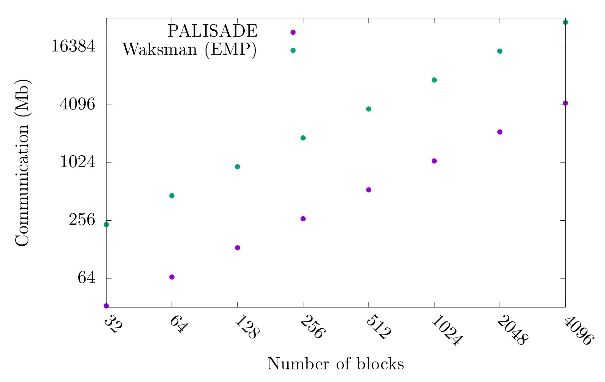
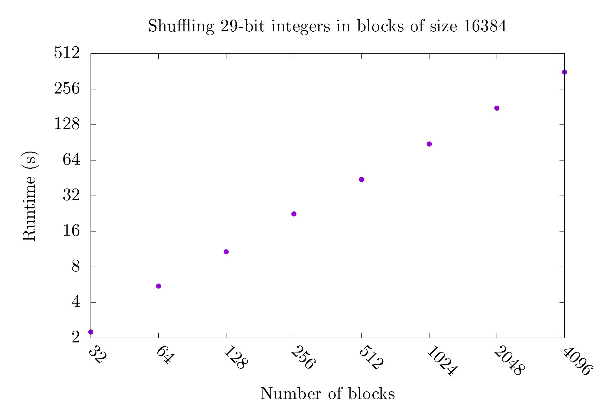

{0}------------------------------------------------

# Secure merge with $O(n \log \log n)$ secure operations\*

Brett Hemenway Falk<sup>†</sup>

Rafail Ostrovsky<sup>‡</sup>

October 6, 2020

#### **Abstract**

Data-oblivious algorithms are a key component of many secure computation protocols.

In this work, we show that advances in secure multiparty shuffling algorithms can be used to increase the efficiency of several key cryptographic tools.

The key observation is that many secure computation protocols rely heavily on secure shuffles. The best data-oblivious shuffling algorithms require  $O(n \log n)$ , operations, but in the two-party or multiparty setting, secure shuffling can be achieved with only O(n) communication.

Leveraging the efficiency of secure multiparty shuffling, we give novel algorithms that improve the efficiency of securely sorting sparse lists, secure stable compaction, and securely merging two sorted lists.

Securely sorting private lists is a key component of many larger secure computation protocols. The best data-oblivious sorting algorithms for sorting a list of n elements require  $O(n \log n)$  comparisons. Using black-box access to a linear-communication secure shuffle, we give a secure algorithm for sorting a list of length n with  $t \ll n$  nonzero elements with communication  $O(t \log^2 n + n)$ , which beats the best oblivious algorithms when the number of nonzero elements, t, satisfies  $t < n/\log^2 n$ .

Secure compaction is the problem of removing dummy elements from a list, and is essentially equivalent to sorting on 1-bit keys. The best oblivious compaction algorithms run in O(n)-time, but they are unstable, i.e., the order of the remaining elements is not preserved. Using black-box access to a linear-communication secure shuffle, we give a stable compaction algorithm with only O(n) communication.

Our main result is a novel secure merge protocol. The best previous algorithms for securely merging two sorted lists into a sorted whole required  $O(n \log n)$  secure operations. Using blackbox access to an O(n)-communication secure shuffle, we give the first secure merge algorithm that requires only  $O(n \log \log n)$  communication. Our algorithm takes as input n secret-shared values, and outputs a secret-sharing of the sorted list.

All our algorithms are generic, i.e., they can be implemented using generic secure computations techniques and make black-box access to a secure shuffle. Our techniques extend naturally to the multiparty situation (with a constant number of parties) as well as to handle malicious adversaries without changing the asymptotic efficiency.

These algorithm have applications to securely computing database joins and order statistics on private data as well as multiparty Oblivious RAM protocols.

<sup>\*</sup>Patent pending

<sup>†</sup>fbrett@cis.upenn.edu

Work done while consulting for Stealth Software Technologies, Inc.

<sup>&</sup>lt;sup>‡</sup>rafail@cs.ucla.edu

Work done while consulting for Stealth Software Technologies, Inc.

{1}------------------------------------------------

# 1 Introduction

Secure sorting protocols allow two (or more) participants to privately sort a list of n encrypted or secret-shared [\[Sha79\]](#page-25-0) values without revealing any data about the underlying values to any of the participants. Secure sorting is an important building block for many more complex secure multiparty computations (MPCs), including Private Set Intersection (PSI) [\[HEK12\]](#page-24-0), secure database joins [\[LP18,](#page-25-1) [BEE](#page-23-0)+17, [VSG](#page-25-2)+19], secure de-duplication and securely computing order statistics as well as Oblivious RAMs [\[Ost90,](#page-25-3) [GO96\]](#page-24-1).

Secure sorting algorithms, and secure computations in general, must have control flows that are input-independent, and most secure sorting algorithms are built by instantiating a data-oblivious sorting algorithm using a generic secure computation framework (e.g. garbled circuits [\[Yao82,](#page-26-0) [Yao86\]](#page-26-1), GMW [\[GMW87\]](#page-24-2), BGW [\[BOGW88\]](#page-23-1)). This method is particularly appealing because it is composable – the sorted list can be computed as secret shares, and used in a further (secure) computations.

Most existing secure sorting algorithms make use of sorting networks. Sorting networks are inherently data oblivious because the sequence of comparisons in a sorting network is fixed and thus independent of the input values. The AKS sorting network [\[AKS83\]](#page-23-2) requires O(n log n) comparators to sort n elements. The AKS network matches the lower bound on the number of comparisons needed for any (not necessarily data independent) comparison-based sorting algorithm. Unfortunately, the constants hidden by the big-O notation are extremely large, and the AKS sorting network is never efficient enough for practical applications [\[AHBB11\]](#page-23-3). In practice, some variant of Batcher's sort [\[Bat68\]](#page-23-4) is often used[1](#page-1-0) . The MPC compilers Obliv-c [\[ZE15\]](#page-26-2), ABY [\[DSZ15\]](#page-24-3) and EMPtoolkit [\[WMK16\]](#page-25-4) provide Batcher's bitonic sort. Batcher's sorting network requires O(n log<sup>2</sup> n) comparisons, but the hidden constant is approximately 1/2, and the network itself is simple enough to be easily implementable.

Although Batcher's sorting network is fairly simple and widely used, the most efficient oblivious sorting algorithms make use of the shuffle-then-sort paradigm [\[HKI](#page-25-5)+12, [HICT14\]](#page-25-6) which makes use of the key observation that many traditional sorting algorithms (e.g. quicksort, mergesort, radixsort) can be made oblivious by obliviously shuffling the inputs before running the sorting algorithm. Since oblivious shuffling and (non-oblivious) sorting can be done in O(n log n)-time these oblivious sorting algorithms run in O(n log n) (but unlike AKS the hidden constants are small).

Although the shuffle-then-sort paradigm is extremely powerful, improvements in shuffling (below O(n log n)) are unlikely to improve these protocols because of the O(n log n) lower-bound on comparison-based sorting.

In the context of secure multiparty computation, however, sorting can often be reduced to the simpler problem of merging two sorted lists into a single sorted whole. Each participant in the computation, sorts their list locally, before beginning the computation, and the secure computation itself need only implement a data-oblivious merge.

Merging is an easier problem than sorting, and even in the insecure setting it is known that any comparison-based sorting method requires O(n log n) comparisons, whereas (non-oblivious) lineartime merging algorithms are straightforward. Unfortunately, no data-oblivious merge algorithms are known with complexity better than simply performing a data-oblivious sort, and the best merging networks require O(n log n) comparisons.

Our main result is a secure multiparty merge algorithm, for merging two (or more) sorted lists (into a single, sorted whole) that requires only O(n log log n) secure operations. This is the first

<span id="page-1-0"></span><sup>1</sup>For example, hierarchical ORAM [\[Ost90,](#page-25-3) [GO96\]](#page-24-1) uses Batcher's sort.

{2}------------------------------------------------

secure multiparty merge algorithm requiring fewer than O(n log n) secure operations. The crucial building block of our algorithm is a linear-communication secure multiparty shuffle. Although no single-party, comparison-based shuffle exists using O(n) comparisons, such shuffles exist in the twoparty and multiparty setting (see Section [3\)](#page-5-0), and this allows us to avoid the O(n log n) lower bound for comparison-based merging networks that exists in the single-party setting.

Our secure multiparty merge algorithm makes use of several novel data-oblivious algorithms whose efficiency can be improved through the use of a linear-communication secure multiparty shuffle.

These include

- Securely sorting with large payloads: In Section [4](#page-7-0) we show how to securely sort t elements (with payloads of size w) using O(tlog t + tw) communication. Previous sorting algorithms required O(tw log(tw)) communication.
- Securely sorting sparse lists: In Section [5](#page-10-0) we show how to securely sort a list of size n with only t nonzero elements in O(tlog<sup>2</sup> n + n) communication. This beats na¨ıvely sorting the entire list whenever t < n/ log<sup>2</sup> n.
- Secure stable compaction: In Section [6.1](#page-12-0) we show how to securely compact a list (i.e., extract nonzero elements) in linear time, while preserving the order of the extracted elements. Previous linear-time oblivious compaction algorithms (e.g. [\[AKL](#page-23-5)+18]) are unstable i.e., they do not preserve the order of the extracted values.
- Secure merge: In Section [7](#page-12-1) we give our main algorithm for securely merging two lists with O(n log log n) communication complexity. Previous works all required O(n log n) complexity.

All the results above crucially rely on a linear-communication secure multiparty shuffle. Outside of the shuffle, all the algorithms are simple, deterministic and data-oblivious and thus can be implemented using any secure multiparty computation protocol.

In the two-party setting, we give a protocol for a linear-communication secure shuffle using any additively homomorphic public-key encryption algorithm with constant ciphertext expansion (Section [3.3\)](#page-7-1). In the multiparty setting, a linear-communication secure shuffle can be built from any one-way function [\[LWZ11\]](#page-25-7).

By making black-box use of a secure shuffle, our protocols can easily extend to different security models. If the shuffle is secure against malicious adversaries, then the entire protocol can achieve malicious security simply by instantiating the surrounding (data oblivious) algorithm with an MPC protocol that supports malicious security. One benefit of this is that our protocols can be made secure against malicious adversaries without changing the asymptotic communication complexity. Similarly, as two-party and multi-party linear-communication shuffles exist, all our algorithms can run in the two-party or multi-party settings simply by instantiating the surrounding protocol with a two-party or multi-party secure computation protocol (e.g. Garbled Circuits or GMW).

# 2 Preliminaries

### 2.1 Secure multiparty computation

Secure multiparty computation (MPC) protocols allow a group of participants to securely compute arbitrary functions of their joint inputs, without revealing their private inputs to each other or any external party. Secure computation has been widely studied in both theory and practice.

{3}------------------------------------------------

Different MPC protocols provide security in different settings, depending on parameters like the number of participants (e.g. two-party or multiparty), the amount of collusion (e.g. honest majority vs. dishonest majority), and whether the participants are semi-honest, covert [\[CO99,](#page-24-4) [AL07\]](#page-23-6) or malicious.

In this work, we focus on creating data-oblivious algorithms that can be easily implemented using a variety of MPC protocols.

### 2.2 Oblivious algorithms

Secure and oblivious algorithms have been widely studied, it is instructive to differentiate between three types of data oblivious algorithms [\[MZ14\]](#page-25-8).

- 1. Deterministically data independent: In these algorithms, the control flow is deterministic and dependent only on public data. Most sorting networks are deterministically data independent.
- 2. Data independent: In these algorithms, the control flow is determined completely by the public data as well as additional (data-independent) randomness.
- 3. Data oblivious: In these algorithms, data can be "declassified" during the computation, and the control flow can depend on public data, as well as an previously declassified data. To ensure privacy, we require that the distribution of all declassified data (and the point at which it was declassified) is independent of the secret (input) data. The sorting algorithms of [\[HKI](#page-25-5)+12] are data oblivious, as are many ORAM constructions [\[Ost90,](#page-25-3) [GO96\]](#page-24-1).

All three of these types of algorithms can be easily implemented using generic MPC protocols.

### 2.3 Secure sorting

One common technique for secure sorting is to implement a sorting network under a generic MPC protocol. Since the sequence of comparisons in a sorting network is data-independent, if each comparison is done securely, the entire sorting procedure is secure.

In practice, many secure sorting algorithms are built on Batcher's sorting network [\[Bat68\]](#page-23-4). Batcher sorting networks require O(n log<sup>2</sup> n) comparisons to sort n entries, and is straightforward to implement, and is provided by MPC compilers like EMP-toolkit [\[WMK16\]](#page-25-4) and Obliv-c [\[ZE15\]](#page-26-2). In the two-party setting, when each individual's list is pre-sorted, then the final round of the Batcher sort can be omitted, and Batcher's Bitonic sort provides an efficient merge algorithm with O(n log n) complexity. The AKS sorting network [\[AKS83\]](#page-23-2) and its improvements [\[Pat90,](#page-25-9) [Sei09\]](#page-25-10) are asymptotically better than a Batcher's, and requires only O(n log n) comparisons, but the hidden constants are enormous and the AKS network is not efficient for practical applications [\[AHBB11\]](#page-23-3).

Zig-zag sort [\[Goo14\]](#page-24-5) is a deterministic data-independent sorting method, requiring O(n log n) comparisons, but the hidden constants are much smaller than those in AKS. Unfortunately, Zig-zag sort has a depth of O(n log n) (instead of O log<sup>2</sup> n for Batcher's sorting network), and this high depth makes it less appealing for some applications.

A randomized version of the Shellsort algorithm can be made data-oblivious, and gives an O(n log n) randomized algorithm that can be made either Monte Carlo or Las Vegas [\[Goo10\]](#page-24-6).

In a 2-party computation, when both parties hold their data in the clear, each party can locally sort his or her data, and then apply Batcher's bitonic sorting network to merge the two sorted lists. This results in an algorithm that runs in O(n log n) time (with small constants). This trick was 

{4}------------------------------------------------

used, for instance, in private set intersection [\[HEK12\]](#page-24-0). Unfortunately, this trick does not apply when the two halves of the list cannot be pre-sorted, e.g. when the list is the (secret-shared) output of a prior computation.

Although sorting networks of size O(n log n) with a small hidden constant are unknown, secure sorting can be achieved in O(n log n) time (with a small constant) by combining secure shuffles and a generic sorting algorithm [\[HKI](#page-25-5)+12]. The core idea is that if the underlying data are randomly shuffled, then the sequence of comparisons in any sorting algorithm (e.g. mergesort, quicksort) are independent of the underlying data.

More concretely, to securely sort a list, can first securely shuffle their lists, then apply an O(n log n) sorting algorithm (e.g. merge sort) to their shuffled list. Each comparison in the sorting algorithm will be computed under MPC, but the result of the comparison is then revealed, and the players can order the (secret) data based on the output of this public comparison. The Waksman permutation network [\[Wak68\]](#page-25-11) requires O(n log n) swaps, to implement a shuffle, so the entire shufflethen-sort procedure only requires O(n log n) operations (with small constants). This idea has been implemented using the Sharemind platform [\[BLT14\]](#page-23-7) and to build efficient mix-nets [\[AKTZ17\]](#page-23-8). These protocols are not data-independent (since the exact sequence of comparisons depends on the underlying data), but instead they are data-oblivious which is sufficient for security.

Building on this shuffle-then-sort paradigm, oblivious radix sort [\[HICT14\]](#page-25-6) requires O(n log n) communication, but only a constant number of rounds, and is efficient in both theory and practice. This was later improved (in the multiparty setting) [\[CHI](#page-23-9)+] by incorporating the linear-time multiparty shuffle algorithm of [\[LWZ11\]](#page-25-7) we review this shuffle in Section [3.2.](#page-5-1)

See [\[Ebb15\]](#page-24-7) for a survey of data-oblivious sorting methods.

Sorting provides a method for computing all the order statistics of the joint list. If, however, only a single order statistic (e.g. the kth largest element) is needed, there more efficient secure protocols that only require O(log n) secure comparisons to compute the kth order statistic [\[AMP10\]](#page-23-10). The protocols of [\[AMP10\]](#page-23-10) reveal the order statistics in the clear, and it is not clear how to modify them to reveal only secret shares of the relevant order statistic, Thus they are not applicable in scenarios where computing order statistics is merely the first step in a larger secure computation. Another way of viewing this distinction is that the algorithms presented in [\[AMP10\]](#page-23-10) are not dataoblivious – the sequence of comparisons depends on the output – but since the output is revealed by the protocol the entire sequence of comparisons could be simulated by a simulator who only sees the protocol's output.

Merging two sorted lists is potentially easier than sorting, and when data-obliviousness is not needed merging can be done in linear-time using a single-scan over each list. In the deterministic data independent setting, Batcher's merging networks are known to be optimal when one list is small [\[AM03\]](#page-23-11). In the (probabilistic) data independent setting, [\[LMS97\]](#page-25-12) gives a randomized variant of Batcher's odd-even mergesort using O(n log n) comparisons (with hidden constant less than one).

The main contribution of this work is to provide a new, secure merge algorithm that only requires O(n log log n) secure operations (with small constants). Our construction avoids the lower bound of [\[LMS97\]](#page-25-12) by using an efficient secure shuffle (see Section [3\)](#page-5-0) that is not comparison-based. Our construction immediately yields efficient, secure algorithms for sorting and obliviously computing order statistics in both the two-party and multiparty settings, and these constructions can easily be made secure against malicious adversaries using standard techniques.

{5}------------------------------------------------

# <span id="page-5-0"></span>3 Shuffling secret shares

### 3.1 O(n log(n))-oblivious shuffles

Secure shuffles can be done in O(n log n)-time using a Waksman permutation network [\[Wak68,](#page-25-11) [BD99\]](#page-23-12). Waksman permutation networks are built using "controlled-swap-gates" which take two inputs and a "control bit" that determines whether to swap the two inputs. Although the Waksman network guarantees that every permutation can be realized through a choice of control bits, a uniformly random choice of control bits does not result in a uniformly random permutation [\[BD99\]](#page-23-12). On the other hand, given a permutation, the specific control bits required to realize this permutation can be calculated efficiently.

Waksman networks can be used to facilitate a secure m-party shuffle by simply having each player separately input their control bits and performing m (sequential) shuffles. The resulting shuffle will be random as long as one player was honest, and the entire cost of the protocol is O(mn log n), which is acceptable for a constant number of players, m.

Asymptotically efficient oblivious shuffles can also be performed using more complex ORAMbased techniques [\[AKL](#page-23-5)+18, [DO20\]](#page-24-8), but these are not nearly as efficient as Waksman shuffles in practice.

### <span id="page-5-1"></span>3.2 Multiparty secure shuffles

In the multiparty computation setting with m > 2 players, and corruption threshold t, the same effect can be achieved using a linear secret sharing scheme. In this section, we review the secure multiparty shuffle of [\[LWZ11\]](#page-25-7). A similar, multiparty secure shuffle was used for efficient multiparty ORAM [\[CKN](#page-24-9)+18]. An overview of the multiparty shuffle is given in Figure [1.](#page-6-0)

Since the permutation, σ (C) is hidden from players outside C, and every coalition of size t is outside some subset, the final permutation (which is the composition of all the permutations σ (C) ) is hidden from all players [\[LWZ11,](#page-25-7) Section 4.3].

As noted in [\[LWZ11\]](#page-25-7), simply sharing the (public) permutation among members of C requires O(n log n) communication. If, however, the players share a pseudorandom permutation, this communication cost is essentially eliminated and the total communication complexity becomes O(n) as claimed. This can also be made secure against malicious adversaries, while retaining its O(n) communication complexity [\[LWZ11,](#page-25-7) Section 4.4].

Lemma 1 (Multiparty secure shuffle [\[LWZ11\]](#page-25-7)). If there exists a Pseudorandom permutation (PRP) with λ-bit keys, then for any m ≥ 3 and any t < m−1, then then there is an m-party secure shuffling protocol that remains secure against t corrupted players, that can shuffle vectors of length m, where each player's communication is

$$\binom{m}{m-t}n(m-t) + \binom{m-1}{m-t-1}(nm+\lambda).$$

In particular, if the number of players, m, is constant, the total communication per player is linear in the database size, n.

Although the communication complexity of this re-sharing based protocol is linear in the database size, n, repeating the resharing procedure for every subset of size t makes the overall communication exponential in the number of players, m. Thus it only retains asymptotic efficiency for small (constant) m. From an asymptotic standpoint, this is not a restriction, because if m is super-constant, simply secret-sharing the input data among all the participants requires ω(n) communication per party, so we can't hope to get O(n) communication whenever m = ω(1).

{6}------------------------------------------------

#### MultiPartyShuffle

<span id="page-6-0"></span>Input: m parties hold secret shares of a vector ~v of length n. Let t < m − 1 be the desired corruption threshold.

Output: Secret shares of the shuffled vector ~v.

- 1. For every subset, C, of m − t players, the protocol does the following:
  - (a) The players re-share the secret shares of ~v to members of C.
  - (b) The members of C reconstruct shares of ~v from the shares of shares of ~v using the linearity of the secret sharing scheme.
  - (c) The members of C choose a (pseudorandom) permutation σ (C) : [n] → [n], known to all members of C.
  - (d) The members of C shuffle the shares of ~v according to this public permutation.
  - (e) The members of C re-share the shares of σ (C) (~v) to the entire group of players.
  - (f) The players reconstruct shares of σ (C) (~v) from the shares of shares of σ (C) (~v) using the linearity of the secret sharing scheme.

Figure 1: The secure m-party shuffle of [\[LWZ11\]](#page-25-7). This shuffle provides security against semi-honest adversaries when the corruption threshold is t < m − 1.

{7}------------------------------------------------

#### <span id="page-7-1"></span>3.3 2-party secure shuffles

In this section, we give a simple two-party shuffle that relies on an additively homomorphic cryptosystem. If the cryptosystem has constant ciphertext expansion, then the resulting shuffle requires only O(n) communication. This is essentially the two-party variant of the linear-communication multiparty shuffle [LWZ11] described in Section 3.2. A similar 2-party shuffle was described in [GHJR15]. It is worth noting, however, that using a lattice-based scheme with ciphertext packing, this can be made extremely efficient in practice.

To demonstrate the practical efficiency of this scheme, we implemented it using the PALISADE [CRPR19] FHE library, to show that it is dramatically more communication efficient than a simple Waksman shuffle (implemented in EMP [WMK16]). We chose to implement our scheme using lattice-based FHE because ciphertext packing makes these schemes extremely efficient (in terms of ciphertext expansion, and the cost of additively homomorphic operations) when used to encrypt blocks of data. See Appendix A for details.

**Lemma 2** (2-Party secure shuffle). If PKE is an additively homomorphic, semantically secure cryptosystem with constant ciphertext expansion, then the shuffle TwoPartyShuffle outlined in Figure 2 is secure against passive adversaries, and requires O(n) communication.

The proof of security is straightforward, but for completeness we provide it in Appendix 9.

Two-party shuffles of this type can be made secure against malicious adversaries, while retaining their asymptotic efficiency. See, for example, [Gro10, BG12], for efficient, special-purpose Zero-Knowledge proofs of shuffles of homomorphic encryptions.

The linear-communication multiparty secure shuffle in Section 3.2 has been used to create extremely efficient sorting algorithms in the multiparty setting [CHI<sup>+</sup>]. Using our linear-communication secure 2-party shuffle, TwoPartyShuffle described in Figure 2, the shuffle-then-sort construction of [CHI<sup>+</sup>] can be extended to the 2-party setting.

# <span id="page-7-0"></span>4 Securely sorting with large payloads

In this section, we give a simple, linear-communication algorithm for sorting keys with large payloads that makes black-box use of a linear-communication secure shuffle. In other words, we have a collection of *blocks* data (payloads), each block must be put into the position determined by its key, but the position of elements *within* each block remains unchanged.

This algorithm crucially relies on a linear-communication shuffle (Section 3).

Oblivious sorting algorithms [HKI<sup>+</sup>12] and sorting networks [AKS83] can sort n elements using  $O(n \log n)$  comparisons. Now, imagine that instead of n elements, we have n/w blocks, each of size w, and the n/w blocks need to be (obliviously) sorted based on n/w (short) keys. In the insecure setting, this requires  $O(n/w \log(n/w))$  comparisons. In the secure setting, using an existing oblivious sorting algorithm, requires  $O(n/w \log(n/w))$  secure comparisons. Unfortunately, obliviously swapping two blocks (based on the result of the secure comparison) requires O(w) controlled swap gates. Thus the entire process requires  $O(n \log(n/w))$  secure operations.

Note that since a secure comparison of  $\lambda$ -bit keys requires  $\lambda$  secure AND gates to implement as a circuit, whereas a controlled-swap gate only requires one, sorting n elements (based on  $\lambda$ -bit keys) requires  $O(n\lambda \log n)$  secure AND gates, whereas sorting n/w blocks, requires  $O\left(n\left(\frac{\lambda}{w}+1\right)\log\left(n/w\right)\right)$  secure AND gates, so sorting on blocks is actually somewhat faster (although still not linear-time).

Given a linear-time secure shuffle, the problem of sorting with large payloads can be reduced to the problem of sorting with small payloads as follows. Each key and its corresponding payload ("block") are tagged with a random tag. Then the keys are sorted together with their (short) tags,

{8}------------------------------------------------

#### TwoPartyShuffle

<span id="page-8-0"></span>Input: Alice and Bob hold secret shares of vector ~v. Let ~v<sup>a</sup> and ~v<sup>b</sup> denote the shares. Assume that the secret sharing is additive over a group G, i.e., ~v<sup>a</sup> [i]+~v<sup>b</sup> [i] = ~v[i] where arithmetic is done over G.

Output: Additive secret shares of the shuffled vector ~v.

- 1. Alice generates a key for an additively homomorphic PKE. pk<sup>a</sup> \$ ← Gen. Suppose PKE is additively homomorphic over a group, G.
- 2. Bob generates a key for an additively homomorphic PKE. pk<sup>b</sup> \$ ← Gen.
- 3. For each block i = 1, . . . , n, Alice encrypts her share vector ~v<sup>a</sup> [i], setting c a [i] = Enc(pk<sup>a</sup> , ~v<sup>a</sup> [i]). Alice sends these ciphertexts to Bob.
- 4. For each block i = 1, . . . , n, Bob encrypts his share vector ~v<sup>b</sup> [i]. c b [i] = Enc(pk<sup>b</sup> , ~v<sup>b</sup> [i]).
- 5. Bob locally shuffles the 2n ciphertexts, keeping both (encrypted) shares of each element together.
- 6. Bob re-randomizes the ciphertexts and the shares and sends them to Alice.
- 7. Alice locally shuffles the 2n ciphertexts, keeping both (encrypted) shares of each element together.
- 8. Alice re-randomizes the ciphertexts and the plaintext shares.
- 9. Alice sends Bob his encrypted ciphertexts.
- 10. Bob decrypts his shares.

Figure 2: A 2-party shuffle based on additively homomorphic encryption, secure against semi-honest adversaries.

{9}------------------------------------------------

#### LargePayloadSort

<span id="page-9-0"></span>**Input:** A secret-shared vector  $[\![\vec{x}]\!]$  of keys with  $|\vec{x}| = n/w$ . A secret-shared vector of payloads,  $[\![\vec{y}]\!]$  with  $\vec{y} \in (\{0,1\}^w)^{n/w}$  of payloads. The vector  $\vec{y}$  is viewed as n/w payloads, each of size w.

**Output:** Sorted lists  $[\![\vec{x}]\!]$  and  $[\![\vec{y}]\!]$ , sorted by  $\vec{x}$ .

- 1. For i = 1, ..., n/w, generate a random "tag,"  $[r_i]$ , with  $r_i \in \{0, 1\}^{\lambda}$  ( $r_i$  is the tag associated to  $x_i$  and block  $y_i$ ).
- 2. Shuffle the list  $(([x_1], [y_1], [r_1]), \dots, ([x_{n/w}], [y_{n/w}], [r_{n/w}]))$ .

$$\begin{split} (([\![\tilde{x}_1]\!], [\![\tilde{y}_1]\!], [\![\tilde{r}_1]\!]), \dots, ([\![\tilde{x}_{n/w}]\!], [\![\tilde{y}_{n/w}]\!], [\![\tilde{r}_{n/w}]\!])) \\ &= \mathsf{SHUFFLE}\left((([\![x_1]\!], [\![y_1]\!], [\![r_1]\!]), \dots, ([\![x_{n/w}]\!], [\![y_{n/w}]\!], [\![r_{n/w}]\!]))\right) \end{split}$$

3. Sort the (shuffled) list  $((\tilde{x}_1, \tilde{r}_1), \dots, (\tilde{x}_{n/w}, \tilde{r}_{n/w}))$ , based on their keys  $\vec{x}$ .

$$(([\![\bar{x}_1]\!], [\![\bar{r}_1]\!]), \dots, ([\![\bar{x}_{n/w}]\!], [\![\bar{r}_{n/w}]\!])) = \mathsf{SORT}\left((([\![\tilde{x}_1]\!], [\![\tilde{r}_1]\!]), \dots, ([\![\tilde{x}_{n/w}]\!], [\![\tilde{r}_{n/w}]\!]))\right)$$

- 4. Reveal the tags  $(\tilde{r}_1, \ldots, \tilde{r}_{n/w})$ , and  $(\bar{r}_1, \ldots, \bar{r}_{n/w})$ .
- 5. Move  $((\tilde{r}_1, [\![\tilde{y}_1]\!]), \ldots, (\tilde{r}_{n/w}, [\![\tilde{y}_{n/w}]\!]))$  so that the  $\tilde{r}_i$  are in the same order as  $\bar{r}_i$ . Let  $([\![\bar{y}_1]\!], \ldots, [\![\bar{y}_{n/w}]\!])$  denote this ordered list.
- 6. Return  $([\![\bar{x}_1]\!], \dots, [\![\bar{x}_{n/w}]\!])$  and  $([\![\bar{y}_1]\!], \dots, [\![\bar{y}_{n/w}]\!])$ .

Figure 3: Securely sorting keys with large payloads.

and the (sorted) tags are revealed. The blocks are shuffled together with their tags, and the tags are revealed. Finally, the blocks are moved into the ordering given by the tags. The key observation is that shuffle ensures that this final data-movement is independent of the underlying data. The full algorithm is given by LargePayloadSort in Figure 3.

**Lemma 3** (Securely sorting with large payloads). The sorting algorithm, LargePayloadSort, outlined in Figure 3 can be instantiated using  $O(n/w \log(n/w) + n)$  communication, and is (t, m)-secure against semi-honest adversaries if m = 2, or t < m - 1.

*Proof.* First, note that the probability that  $r_i$  collides with another  $r_j$  is at most  $\frac{n}{w2^{\lambda}}$ , so a union bound shows that with probability at least  $1 - \frac{n^2}{w^22^{\lambda}}$ , all the  $r_i$  will be distinct. Note that if the  $r_i$  are *not* distinct, correctness may fail, but privacy will still be preserved.

If we choose  $t = \omega(\log n)$ , then  $\frac{n^2}{w^2 2^{\lambda}}$  will be negligible, and for the rest of the argument, we assume we are in the case where all the  $r_i$  are distinct.

First, note that the vectors  $\vec{x}$  and  $\vec{y}$  can be tagged using a single linear pass (requiring  $O(n\lambda/w)$  secure operations). Sorting the vector  $\vec{x}$  requires  $O(n/w \log(n/w))$  operations, using a standard

{10}------------------------------------------------

oblivious sorting algorithm (e.g. [HKI<sup>+</sup>12]). The shuffling algorithm runs in time O(n), and the final step of moving the data can be done in linear time, since it does not need to be done obliviously.

To see that this protocol is secure, note that each player's view consists of the  $\{r_i\}$  associated with the sorted  $\vec{x}$ , and the  $\{r_i\}$  associated with the shuffled  $\vec{y}$ . These distributions can be simulated as follows: the simulator chooses n/w  $r_i$  uniformly from  $\{0,1\}^{\lambda}$ . The simulator reveals  $\{r_i\}$  as associated with  $\vec{x}$ , then the simulator shuffles the  $\{r_i\}$  and reveals the shuffled set as associated with  $\vec{y}$ . Since the protocol chooses the  $\{r_i\}$  uniformly, their distribution is unchanged after sorting them based on  $\vec{x}$ . Since the shuffle is secure, the  $\{r_i\}$  associated with the shuffled  $\vec{y}$  are simply a random permutation of the  $\{r_i\}$  associated with  $\vec{x}$ .

### <span id="page-10-0"></span>5 Sorting sparse lists

The algorithm LargePayloadSort provides a simple method for sorting *sparse* lists in linear time. The idea is to simply divide the list into blocks. Then in linear time, we can count the number of nonzero elements in each block. Using LargePayloadSort, we can sort the blocks based on the number of nonzero elements. If the list is sparse enough (relative to the blocksize), we can be sure that only a small fraction of blocks have nonzero entries. These blocks will appear first (after sorting blocks based on the number of nonzero entries), thus it only remains to sort these "top" blocks (using on  $\mathcal{O}(n \log n)$ -sorting algorithm). The complete algorithm is outlined in Figure 4.

**Lemma 4.** If  $\vec{V}$  is a list of length n with t nonzero entries, then  $\vec{V}$  can be securely sorted in  $O\left(t\log^2(n)+n\right)$  time, which is linear in n when  $t < n/\log^2(n)$ .

*Proof.* The algorithm, SparseSort is provided in Figure 4.

First, we note that this algorithm is correct. Since  $\vec{V}$  has at most t nonzero elements, at most t blocks of  $\vec{B}$  contain nonzero elements. Thus after sorting  $\vec{B}$  (Step 3) all the nonzero elements are in the top t blocks, and after sorting the top t blocks (Step 5) the entire list is sorted.

Next, we analyze the running time. Step 2 requires a linear pass over the list, and requires O(n) time and communication. Step 3 calls LargePayloadSort which requires  $O(n/w \log(n/w) + n)$  communication. Step 5 requires sorting a list of length tw which can be done in time  $O(tw \log(tw))$ . If  $w = \log(n)$ , then Step 3 runs in time O(n), and Step 5 runs in time  $O(t \log^2(n)) = O(n)$ .

# <span id="page-10-1"></span>6 Oblivious Compaction

In this section, we review the notion of oblivious compaction. The goal of compaction is to remove a set of marked element from a list. Given a secret shared list, where each element is tagged with secret share of 0 or 1, an oblivious compaction procedure removes all elements tagged with a 0, and returns the new (secret shared) list containing only those elements tagged with a 1.

The first oblivious compaction algorithm was probabilistic and ran in  $O(n \log \log \lambda)$  time with failure probability that was negligible as a function of  $\lambda$  [LMS97]. Follow-up works [MZ14, LSX19] also gave probabilistic algorithms for solving the problem of oblivious compaction with running time  $O(n \log \log n)$ . The works of [LSX19] also solved the "partition problem" where the goal is simply to sort the list, so that the elements tagged with "0" occur before those tagged with "1". Any solution to the partition problem immediately yields a solution to the compaction problem, but a solution to the partition problem does not leak the size of the compacted list. In [AKL<sup>+</sup>18], they provided the first deterministic O(n)-time algorithm for compacting a secret-shared list.

{11}------------------------------------------------

### SparseSort

<span id="page-11-0"></span>Input: A secret-shared list, <sup>J</sup>V~ <sup>K</sup>, of length <sup>n</sup>. An upper bound, t < n, on the number of nonzero elements of W~ . A blocksize, w = O(polylog n).

Output: Secret shares of the sorted list <sup>J</sup>V~ <sup>K</sup>.

1. Break V~ into blocks: Let <sup>J</sup>B~ <sup>K</sup> denote a secret-shared vector of length n/w, where

$$\vec{B}_i = [V_{iw+1}, \dots, V_{(i+1)w}]$$

is the ith block of V~ .

- <span id="page-11-3"></span>2. Count entries in blocks: For i = 1, . . . , n/w
  - Set <sup>J</sup>Ci<sup>K</sup> <sup>=</sup> <sup>J</sup>0<sup>K</sup>
  - For j = 1, . . . , w – If <sup>V</sup>(i−1)w+<sup>j</sup> <sup>6</sup>= 0 then <sup>J</sup>Ci<sup>K</sup> <sup>=</sup> <sup>J</sup>C<sup>i</sup> + 1K.
- <span id="page-11-1"></span>3. Sort blocks:

$$\left(\left(\llbracket\bar{C}_1\rrbracket, \llbracket\bar{B}_1\rrbracket\right), \dots, \left(\llbracket\bar{C}_{n/w}\rrbracket, \llbracket\bar{B}_{n/w}\rrbracket\right)\right) = \mathsf{LargePayloadSort}\left(\left(\llbracket C_1\rrbracket, \llbracket B_1\rrbracket\right), \dots, \left(\llbracket C_{n/w}\rrbracket, \llbracket B_{n/w}\rrbracket\right)\right)$$

4. Merge blocks: Merge the blocks B¯ i into a list of n individual elements, let W<sup>i</sup> denote the ith element in this list, i.e.,

$$([W_1], \dots, [W_n]) = ([\bar{B}_1], \dots, [\bar{B}_{n/w}]).$$

<span id="page-11-2"></span>5. Sort top blocks:

$$(\llbracket \bar{W}_1 \rrbracket, \dots, \llbracket \bar{W}_{tw} \rrbracket) = \mathsf{SORT}(\llbracket W_1 \rrbracket, \dots, \llbracket W_{tw} \rrbracket)$$

6. Return: JW¯ <sup>1</sup>K, . . . , <sup>J</sup>W¯ twK, <sup>J</sup>Wtw+1K, . . . , <sup>J</sup>Wn<sup>K</sup>

Figure 4: Securely sorting a sparse list of length n with t nonzero entries using O(tlog<sup>2</sup> (n) + n) communication.

{12}------------------------------------------------

The compaction algorithms of [\[LMS97,](#page-25-12) [AKL](#page-23-5)+18, [DO20\]](#page-24-8) use expander graphs, and while they are asymptotically efficient, the hidden constants in the big-O are large,[2](#page-12-2) and the algorithms are likely to be inefficient for lists of reasonable size. The compaction algorithms of [\[MZ14\]](#page-25-8) and [\[LSX19\]](#page-25-13) are data independent and run in time O(n log log n), (with reasonable constants) and thus are suitable for our purposes. In Appendix [B,](#page-31-0) we review the [\[MZ14\]](#page-25-8) algorithm and give a tight analysis of its error probability and running time.

When the list is sparse (i.e., it has O(n/ polylog(n)) nonzero elements), the problem of compaction is much simpler, and in Section [C](#page-34-0) we give a simple algorithm for compacting sparse lists.

A sorting algorithm is called stable if the order of elements with equal keys is retained. In general, 0-1 principle [\[BB11\]](#page-23-14) for sorting networks tells us that any deterministic data independent stable compaction algorithm is in fact a sorting algorithm. Thus the lower bounds on the size of comparison-based sorting algorithms tell us that any deterministic, comparison-based compaction algorithm with o(n log n) complexity must be unstable.

In Section [6.1,](#page-12-0) we show that, given black-box access to a linear-communication shuffle, stable compaction with complexity O(n) is achievable. This does not violate the sorting lower bounds since the underlying shuffle is a multiparty protocol.

### <span id="page-12-0"></span>6.1 Stable compaction

Using the a linear-communication secure shuffle (see Section [3\)](#page-5-0), we give a simple, linear-time stable compaction algorithm. Our stable compaction algorithm takes three arguments, a public bound, t, a secret-shared vector of "tags," ~s, and a secret shared vector of "payloads," ~x.

$$\llbracket \vec{y} \rrbracket = \mathsf{StableCompaction}\left(t, \llbracket \vec{s} \rrbracket, \llbracket \vec{x} \rrbracket\right).$$

Lemma 5 (Stable compaction). Algorithm, StableCompaction, outlined in Figure [5](#page-13-0) is stable, secure against passive adversaries, and requires O(n) communication.

Proof. It is straightforward to see that if the shuffle can be done with linear time and communication, the entire protocol can be done with linear time and communication.

To see that the protocol is secure, we construct a simulator that simulates the players' views. First, note that, essentially, the players' views consist of the revealed vector ~y. Consider the following simulator, S. On inputs n, t, the simulator, S, generates a vector ~z such that z<sup>i</sup> = i for i = 1, . . . , n − t, and z<sup>i</sup> = 0 for i > n − t. Then S shuffles ~z, and outputs the shuffled vector ~y. It is straightforward to check that this has the same distribution as in the real protocol.

# <span id="page-12-1"></span>7 Securely merging private lists

### 7.1 Construction overview

In this section, we describe our novel data-oblivious merge algorithm. Our algorithm requires an O(n)-time algorithm for shuffling secret shares (see Section [3\)](#page-5-0), an oblivious sorting algorithm, SORT that runs in time sort(·) (e.g. [\[AKS83,](#page-23-2) [Goo14,](#page-24-5) [HKI](#page-25-5)+12, [HICT14\]](#page-25-6)), and an oblivious stable compaction algorithm (see Section [6\)](#page-10-1)

The rest of the operations are standard operations (e.g. equality test, comparison) that can be easily implemented in any secure computation framework.

<span id="page-12-2"></span><sup>2</sup>The smallest constant being ∼ 16, 000 in [\[DO20\]](#page-24-8).

{13}------------------------------------------------

#### StableCompaction

<span id="page-13-0"></span>**Input:** Secret shares of a vector  $\llbracket \vec{s} \rrbracket$  of length n of "tags". Secret shares of a vector  $\llbracket \vec{x} \rrbracket$  of length n of "payloads". An integer t < n, such that the number of nonzero elements in  $\vec{s}$  is t. Note that in *compaction* the value t is publicly known.

**Output:** Secret shares of a list of length n consisting of the t nonzero elements in  $\vec{x}$ , followed by the n-t "dummy" elements.

- 1. Using a linear pass, tag each element with it's true location, or 0 for the dummy elements.
  - Initialize  $\llbracket c \rrbracket = 1$ .
  - Initialize  $\llbracket d \rrbracket = t + 1$ .
  - For i = 1, ..., n,
    - If  $[s_i] = [\![\bot]\!]$ , set  $[\![y_i]\!] = [\![d]\!]$ , and set  $[\![d]\!] = [\![d+1]\!]$ .
    - If  $[s_i] \neq [\![\bot]\!]$ , set  $[\![y_i]\!] = c$ , and set  $[\![c]\!] = [\![c+1]\!]$ .
- 2. Shuffle the vector  $\vec{x}$  together with the tags  $\vec{y}$ , using a linear-communication secure shuffle (see Section 3).

$$(([\![\tilde{x}_1]\!], [\![\tilde{y}_1]\!]), \dots ([\![\tilde{x}_n]\!], [\![\tilde{y}_n]\!])) = \mathsf{SHUFFLE}(([\![x_1]\!], [\![y_1]\!]), \dots ([\![x_n]\!], [\![y_n]\!]))$$

- 3. Reveal the tags  $\tilde{y}$ .
- 4. For i = 1, ..., n, move  $\llbracket \tilde{x}_i \rrbracket$  to location,  $y_i$ , *i.e.*, set  $\llbracket \bar{x}_{y_i} \rrbracket = \llbracket \tilde{x}_i \rrbracket$ .
- 5. The first t elements of  $[\![\bar{x}]\!]$  are the "true" values and the last n-t entries are the "dummy" elements.

Figure 5: Stable compaction.

{14}------------------------------------------------

In section [7.2](#page-14-0) we provide the details of the construction. In section [8.2,](#page-19-1) we analyze the runtime of our construction for different instantiations of SORT.

At a high-level, the merging algorithm proceeds as follows:

- The input is two (locally) sorted lists, which are then concatenated.
- The players divide the list into blocks of size w = O(polylog(n)), and sort these blocks based on their first element using LargePayloadSort. (For efficiency, this step requires the linear-time shuffle).
- At this point, because the initial lists were sorted, most elements are "close" to their true location in the list. In fact, we can concretely bound the number of "strays" (i.e., the number of elements that may be far from their true location).
- After extracting the strays, every wth element is declared to be a pivot for some parameter w = O(polylog n).
- The players obliviously extract these strays, and match them to their "true" pivots. Since the number of strays and pivots is not too large, this can be done in linear time using the sparse sorting algorithm SparseSort (described in Figure [4\)](#page-11-0).
- The players reinsert the strays next to their true pivot. To avoid revealing the number of strays associated with each pivot, the number of strays associated to each pivot must be padded with "dummy" elements.
- The players use our novel, linear-time stable compaction algorithm to remove the dummy elements that were inserted with the strays.
- The players sort using polylog(N)-sized sliding windows again. At this point, all the elements will be in sorted order, but there will be many dummy elements.

The details of this construction are described in Section [7.2.](#page-14-0)

### <span id="page-14-0"></span>7.2 An O(n log log n)-time oblivious merge

In this section, we provide the details of our oblivious-merge algorithm.

- 1. Public parameters: A length, n ∈ Z. A blocksize w ∈ Z, such that w | n (we will set w = O(polylog(n))). A parameter δ, with 0 < δ < 1.
- <span id="page-14-2"></span>2. Inputs: Sorted, secret-shared lists (Ja1K, . . . , <sup>J</sup>a`K), and (Jb1K, . . . , <sup>J</sup>bn−`K).
- 3. Creating pivot tags: For every pivot, assign a random identifier r, as follows

$$([[r_1]], \dots, [[r_{n/w}]]) = \mathsf{SHUFFLE}([[1]], \dots, [[n/w]]).$$

The identifier r<sup>i</sup> will be assigned to pivot i in the next step.

Runtime: O (n/w)

<span id="page-14-1"></span>4. Sorting based on pivots: This step uses LargePayloadSort to sort blocks of size w based on their leading entry as follows. Define B<sup>i</sup> to be the ith block of size w,

$$B_i \stackrel{\mathrm{def}}{=} \left( v_{(i-1)w+1} \dots, v_{i \cdot w+1} \right),\,$$

{15}------------------------------------------------

and define  $p_i \stackrel{\text{def}}{=} v_{(i-1)w+1}$  for  $i = 1, \dots, n/w$  to be the leading element of each block.

$$\left( \llbracket \tilde{p} \rrbracket, \left( \left( \llbracket \tilde{r}_1 \rrbracket, \llbracket \tilde{B}_1 \rrbracket \right), \ldots, \left( \llbracket \tilde{r}_{n/w} \rrbracket, \llbracket \tilde{B}_{n/w} \rrbracket \right) \right) \right) = \mathsf{LargePayloadSort} \left( \llbracket \tilde{p} \rrbracket, \left( \left( \llbracket r_1 \rrbracket, \llbracket B_1 \rrbracket \right), \ldots, \left( \llbracket r_{n/w} \rrbracket, \llbracket B_{n/w} \rrbracket \right) \right) \right).$$

At this point, the blocks of the vector  $\vec{v}$  are sorted according to the leading element in each block,

$$(v_1,\ldots,v_n)\stackrel{\mathrm{def}}{=} \tilde{B}_1\cdots\tilde{B}_{n/w}.$$

Runtime:  $O(n/w \log(n/w) + n)$ 

<span id="page-15-0"></span>5. Revealing pivot Tags: For i = 1, ..., n/w, reveal  $\tilde{r}_i$ . Note that since each pivot,  $p_i$ , was assigned a random tag  $r_i$  (which remains hidden), revealing  $\{\tilde{r}_i\}$ , which are sorted based on the  $p_i$  reveals no information about the set  $\{p_i\}$ .

Runtime: O(n/w)

6. **Tagging:** Using a linear pass, tag each element with its initial index, *i.e.*, the *i*th element in the list is tagged with a (secret-shared) value *i*. For i = 1, ..., n set  $[e_i] = [i]$ . Note that since the tags are publicly known, this step can be done without communication. **Runtime:** O(n)

<span id="page-15-3"></span>7. Sorting sliding windows: Fix a threshold,  $\delta > 0$  (the exact value of  $\delta$  is calculated in Lemma 7). Sort the list  $[\![\vec{v}]\!]$  together with the tags  $\vec{e}$ , based on windows of size  $4\delta^{-1}w$  as follows: For  $i = 1, \ldots, n/(2\delta^{-1}w) - 1$ ,

$$\begin{split} & \left( \left( \left[ \left[ v_{2(i-1)\delta^{-1}w+1} \right], \left[ e_{2(i-1)\delta^{-1}w+1} \right] \right), \dots, \left( \left[ \left[ v_{2(i+1)\delta^{-1}w} \right], \left[ e_{2(i+1)\delta^{-1}w} \right] \right) \right) \\ & = \mathsf{SORT} \left( \left( \left[ \left[ v_{2(i-1)\delta^{-1}w+1} \right], \left[ e_{2(i-1)\delta^{-1}w+1} \right] \right), \dots, \left( \left[ \left[ v_{2(i+1)\delta^{-1}w} \right], \left[ e_{2(i+1)\delta^{-1}w} \right] \right) \right) \end{split}$$

Runtime:  $O\left(\left(n/\left(2\delta^{-1}w\right)\right)\operatorname{sort}\left(4\delta^{-1}w\right)\right)$ 

<span id="page-15-1"></span>8. **Identifying "strays"** For each element in  $\vec{v}$ , if its initial index (stored in its tag e) differs from its current position by more than  $\delta^{-1}w$ , then mark the element with a (secret-shared tag "stray").

For i = 1, ..., n,

$$[s_i] = \begin{cases} [1] & \text{if } |e_i - i| > \delta^{-1}w \\ [0] & \text{otherwise.} \end{cases}$$

and

$$\llbracket v_i \rrbracket = \begin{cases} \llbracket \bot \rrbracket \text{ if } |e_i - i| > \delta^{-1}w \\ \llbracket v_i \rrbracket \text{ otherwise.} \end{cases}$$

Runtime: O(n)

<span id="page-15-2"></span>9. Extracting strays At this point, each stray is tagged with the (secret-shared) tag ( $[s_i] = [1]$ ) and we can extract these strays using a compaction algorithm.

$$(\llbracket z_1 \rrbracket, \dots, \llbracket z_{\mathfrak{b}} \rrbracket) = \mathsf{StableCompaction} (\llbracket \vec{s} \rrbracket, \llbracket \vec{v} \rrbracket).$$

For an appropriate choice of parameters,  $\delta$ , w, Lemma 6 shows that the number of strays will be less than  $\mathfrak{b}$ .

Runtime: O(n)

{16}------------------------------------------------

<span id="page-16-0"></span>10. Sorting pivots and strays: Sort pivots together with strays, using SORT. There are n/w pivots, and the list of strays has  $\mathfrak{b}$  elements, so this list has  $\mathfrak{b} + n/w$  elements. Pivot i,  $\tilde{p}_i$  is tagged with its tag, r (from Step 4), and each stray is tagged with 0.

$$\left((\llbracket z_1 \rrbracket, \llbracket \rho_1 \rrbracket), \ldots, (\llbracket z_{\mathfrak{b}+n/w} \rrbracket, \llbracket \rho_{\mathfrak{b}+n/w} \rrbracket)\right) = \mathsf{SORT}\left(((\llbracket z_1 \rrbracket, \llbracket 0 \rrbracket), \ldots, (\llbracket z_{\mathfrak{b}} \rrbracket, \llbracket 0 \rrbracket)) \mid \mid \left((\llbracket \tilde{p}_1 \rrbracket, \llbracket \tilde{r}_1 \rrbracket), \ldots, (\llbracket \tilde{p}_{n/w} \rrbracket, \llbracket \tilde{r}_{n/w} \rrbracket)\right) = \mathsf{SORT}\left(((\llbracket z_1 \rrbracket, \llbracket 0 \rrbracket), \ldots, (\llbracket z_{\mathfrak{b}} \rrbracket, \llbracket 0 \rrbracket)) \mid \mid ((\llbracket \tilde{p}_1 \rrbracket, \llbracket \tilde{r}_1 \rrbracket), \ldots, (\llbracket \tilde{p}_{n/w} \rrbracket, \llbracket \tilde{r}_{n/w} \rrbracket)\right)$$

Runtime:  $sort(\mathfrak{b} + n/w)$ 

- 11. Adding pivot IDs to strays After step 10, the players hold a (sorted) list,  $[\![\vec{z}]\!]$ , of pivots and strays, and a list of "tags"  $[\![\vec{p}]\!]$ , where pivot  $p_i$  is tagged with  $r_i$  and each stray is tagged with 0. Both lists are of length  $\mathfrak{b} + n/w$ . In this step, they will tag each stray in this list with its corresponding pivot ID as follows. Initialize  $[\![c]\!] = [\![\tilde{\rho}_1]\!]$ . For  $i = 1, \ldots, \mathfrak{b} + n/w$ .
  - (a) If  $\rho_i \neq 0$  (*i.e.*,  $z_i$  is a pivot), then  $[\![c]\!] = [\![\rho_i]\!], [\![\rho_i]\!] = [\![0]\!].$
  - (b) If  $\rho_i = 0$  (i.e.,  $z_i$  is not a pivot), then  $\llbracket \rho_i \rrbracket = \llbracket c \rrbracket$ .

At the end of this process, each of the strays is tagged with a (secret-shared) ID of the nearest pivot above it. To make this step oblivious, the conditional can be implemented with a simple mux. **Runtime:**  $O(\mathfrak{b} + n/w)$ 

- <span id="page-16-1"></span>12. Counting number of strays associated to each pivot: Initialize  $[\![c]\!] = [\![0]\!]$ . Define the share vector  $[\![\vec{s}]\!]$  as follows. For  $i = \mathfrak{b} + n/w, \ldots, 1$ 
  - (a) If  $\rho_i \neq 0$  (i.e.,  $z_i$  is not a pivot), then set  $\llbracket c \rrbracket = \llbracket c+1 \rrbracket$ , and  $\llbracket s_i \rrbracket = \llbracket 0 \rrbracket$ .
  - (b) If  $\rho_i = 0$  (*i.e.*,  $z_i$  is a pivot), then set  $[s_i] = [c]$ , [c] = [0].

At the end of this process, if  $z_i$  is a pivot, then  $s_i$  stores the number of strays associated with that pivot.

Runtime: O(n)

<span id="page-16-2"></span>13. Removing pivots from stray list: Using the sparse compaction algorithm SparseCompaction (described in Figure 8), extract a list of  $\mathfrak{b}$  strays, together with their tags (recall the "tag"  $\rho_i$  gives the pivot ID  $r_j$  of the nearest pivot preceding the *i*th stray). Note that this compaction does not need to be stable.

$$(((\llbracket z_1 \rrbracket, \llbracket \rho_1 \rrbracket), \ldots, (\llbracket z_{\mathfrak{b}} \rrbracket, \llbracket \rho_{\mathfrak{b}} \rrbracket)) = \mathsf{SparseCompaction}\left(\mathfrak{b}, \llbracket \vec{\rho} \rrbracket, ((\llbracket z_1 \rrbracket, \llbracket \rho_1 \rrbracket), \ldots, (\llbracket z_{\mathfrak{b}+n/w} \rrbracket, \llbracket \rho_{\mathfrak{b}+n/w} \rrbracket)\right)$$

Runtime:  $O\left(\mathfrak{b}\log^2(n)\right)$ 

14. **Extracting pivot counts:** After Step 12 the  $\vec{s}$  is a vector of length  $\mathfrak{b} + n/w$  containing the number of strays associated with each of the n/w pivots, and 0s in the locations corresponding to strays. Set

$$[\![\vec{s}]\!] = \mathsf{StableCompaction}\left(n/w, [\![\vec{s}]\!], [\![\vec{s}]\!]\right).$$

At this point,  $\vec{s}$  is a vector of length n/w, and for i = 1, ..., n/w,  $s_i$  is the number of strays associated with pivot i.

Runtime:  $O(\mathfrak{b} + n/w)$ 

<span id="page-16-3"></span>15. Padding lists of strays: Although the total number of strays,  $\mathfrak{b}$ , is known, revealing the number of strays associated with each pivot would leak information. Thus the number of strays associated with each pivot must be padded to a uniform size. Note that every wth element in the *sorted* inputs  $[\vec{a}]$  and  $[\vec{b}]$  was defined to be a pivot, thus if the list were completely sorted, there could be at most 2(w-1) elements between any two adjacent pivots.

{17}------------------------------------------------

(a) For i = 1, ..., n/w, for j = 1, ..., w,

$$B_{(i-1)\cdot w+j} = \begin{cases} (1, (\perp, r_i)) & \text{if } j \leq \llbracket s_i \rrbracket \\ (0, (\perp, r_i)) & \text{otherwise.} \end{cases}$$

The elements tagged with 1 are the "dummy" elements. Note that among all the  $B_i$ , there are at most  $\mathfrak{b}$  elements tagged with a 0. The elements tagged with a 0 will be removed in the next step.

(b) Using the algorithm SparseSort (described in Figure 4), sort the  $B_i$ .

$$\begin{split} & \left( \left( [\![\tilde{B}_{1,1}]\!], \left( [\![\tilde{B}_{1,2}]\!], [\![\tilde{B}_{1,3}]\!] \right) \right), \ldots, \left( [\![\tilde{B}_{2n(w-1)/w,1}]\!], \left( [\![\tilde{B}_{2n(w-1)/w,2}]\!], [\![\tilde{B}_{2n(w-1)/w,3}]\!] \right) \right) \right) \\ & = \mathsf{SparseSort} \left( ([\![B_{1,1}]\!], ([\![B_{1,2}]\!], [\![B_{1,3}]\!])), \ldots, \left( [\![B_{2n(w-1)/w,1}]\!], \left( [\![B_{2n(w-1)/w,2}]\!], [\![B_{2n(w-1)/w,3}]\!] \right) \right) \right) \end{split}$$

(c) We remove the first components,  $\tilde{B}_{i,1}$ , and set

$$\begin{aligned}
& \left( \left( \left[ \left[ C_{1,1} \right], \left[ \left[ C_{1,2} \right] \right], \dots, \left( \left[ \left[ C_{2(w-1)n/w - \mathfrak{b}, 1} \right], \left[ \left[ C_{2(w-1)n/w - \mathfrak{b}, 2} \right] \right] \right) \right) \\
&= \left( \left( \left[ \tilde{B}_{1,2} \right], \left[ \tilde{B}_{1,3} \right] \right), \dots, \left( \left[ \tilde{B}_{2n(w-1)/w - \mathfrak{b}, 2} \right], \left[ \tilde{B}_{2n(w-1)/w - \mathfrak{b}, 3} \right] \right) \right)
\end{aligned}$$

Runtime: O(n)

<span id="page-17-0"></span>16. **Merging strays and pads** Concatenate the list of  $\mathfrak{b}$  strays, ( $[\![\vec{z}]\!], [\![\vec{\rho}]\!]$ ) (from Step 13) along with the  $2(w-1)n/w - \mathfrak{b}$  pads  $[\![\vec{C}]\!]$  from the previous step. Shuffle this list, keeping the associated tags, then, reveal the tags and move strays and pads to the positions given by their tags. This is accomplished as follows.

(a)  $\left(\left(\left[\tilde{C}_{1,1}\right],\left[\tilde{C}_{1,2}\right]\right),\ldots,\left(\left[\tilde{C}_{(2w-1)n/w,1}\right],\left[\tilde{C}_{(2w-1)n/w,2}\right]\right)\right) = \mathsf{SHUFFLE}\left(\left(\left[\vec{z}\right],\left[\vec{\rho}\right]\right)|\left[\left[\vec{C}\right]\right)$ 

- (b) For each element in this shuffled list, reveal the associated tag,  $\tilde{C}_{i,2}$ . Note that by Step 15 exactly 2(w-1) (secret-shared) elements will have each tag.
- (c) For each i, move the block  $\tilde{C}_{i,1}$  of size 2(w-1) to the location where  $\tilde{C}_{i,2} = \tilde{r}_j$  (revealed in Step 5). At the end of Step 8,  $[v_1], \ldots, [v_n]$  was the list of elements with the strays set to  $\bot$ . To accomplish this, define the function  $f(\tilde{r}_j) \stackrel{\text{def}}{=} j$  for  $j = 1, \ldots, n/w$ , for the public  $\tilde{r}_j$  (revealed in Step 5).

for 
$$i = 0, ..., n/w - 1$$
 do

Define  $d_i = 1$ .

for  $j = 1, ..., w$  do

 $\text{set } [\![\tilde{v}_{i(3w-1)+j}]\!] = [\![v_{iw+j}]\!].$ 
\nend for
\nend for

for  $i = 1, ..., (2w-1)$  do

Let  $j = f(\tilde{C}_{i,2}).$ 

Set  $[\![\tilde{v}_{(j-1)(3w-1)+w+d_j}]\!] = [\![\tilde{C}_{i,1}]\!].$ 

Set  $d_j = d_j + 1.$ 
\nend for

Runtime: O(n)

{18}------------------------------------------------

<span id="page-18-2"></span>17. Compacting: Now, we need to remove the 2(w − 1)n/w dummy elements. We cannot use an off-the-shelf compaction algorithm [\[MZ14,](#page-25-8) [AKL](#page-23-5)+18, [LSX19\]](#page-25-13) because these algorithms are not stable, Instead, we use the stable compaction algorithm StableCompaction (described in Figure [5\)](#page-13-0).

For 
$$i = 1, \ldots, (3w - 1)n/w$$
, if  $\llbracket \tilde{v}_i \rrbracket = \llbracket \bot \rrbracket$ , then set  $\llbracket z_i \rrbracket = \llbracket 0 \rrbracket$ , otherwise set  $\llbracket z_i \rrbracket = \llbracket 1 \rrbracket$ 

$$[\![\vec{v}]\!] = \mathsf{StableCompaction}\left(n, [\![\vec{z}]\!], [\![\vec{v}]\!]\right).$$

Runtime: O(n)

<span id="page-18-1"></span>18. Sorting sliding windows At this point, the players have a (secret-shared) list, <sup>J</sup>~v˜K, consisting of n elements, and all elements are in approximately their correct positions. In this step, sort overlapping blocks of size 4 δ <sup>−</sup><sup>1</sup> + 4 w + 2 using a secure sorting algorithm SORT.

For 
$$i = 1, ..., \left\lceil \frac{n}{2(\delta^{-1} + 4)w + 2} \right\rceil$$
, set

$$\left( \left[ \tilde{v}_{(i-1)2((\delta^{-1}+4)w+2)+1} \right], \dots, \left[ \tilde{v}_{(i+1)2((\delta^{-1}+4)w+2)+1} \right] \right) = \mathsf{SORT} \left( \left[ \tilde{v}_{(i-1)2((\delta^{-1}+4)w+2)+1} \right], \dots, \left[ \tilde{v}_{(i+1)2((\delta^{-1}+4)w+2)+1} \right] \right)$$

At this point all the elements will be sorted.

Runtime: 
$$O\left(\left\lceil \frac{n}{2(\delta^{-1}+4)w+2}\right\rceil \operatorname{sort}\left(4\left(\left(\delta^{-1}+4\right)w+2\right)\right)\right)$$

<span id="page-18-3"></span>19. Return: The sorted, secret shared list, <sup>J</sup>~v˜K.

# 8 Runtime

### 8.1 Bounding the number of strays

In order to analyze the running time of our algorithm, we need to bound the number of "strays" that appear in Step [8.](#page-15-1)

<span id="page-18-0"></span>Lemma 6 (Bounding the number of strays). Suppose a list, L, is created as follows

- 1. L is composed of two sorted sublist L = ~a||~b with |~a| = `, and | ~b| = n − `. We assume w | ` and w | n − `.
- 2. Break the sorted list ~a into blocks of size w. Call the first element ( i.e., the smallest element) in each block a "pivot."
- 3. Break the sorted list ~b into blocks of size w. Call the first element ( i.e., the smallest element) in each block a "pivot."
- 4. Alice and Bob sort their joint list of blocks based on their pivots.

We call an element a "stray" if it is more than tw positions above its "true" position ( i.e., its position in the fully sorted list of Alice and Bob's entries). Then there at most <sup>n</sup> t strays.

Proof. Call the elements with indices [iw + 1, . . . ,(i + 1)w] in L a "block." Let B<sup>i</sup> denote the ith block for i = 1, . . . , n/w. Notice that

1. The elements within each block are sorted i.e., L[iw + j] ≤ L[iw + k] for each 0 ≤ j ≤ k ≤ w and all i.

{19}------------------------------------------------

- 2. The lead elements in each block are sorted i.e.,  $L[iw] \leq L[jw]$  for  $i \leq j$ .
- 3. Each element is less than or equal to all pivots above it i.e.,  $L[iw+j] \leq L[kw]$  for all j < w, k > i.
- 4. All entries provided by a single party are in sorted order.

With these facts, notice that the only way an element's index in L can be greater than its true position is if it was in a block where the preceding block was provided by the other party. Similarly, for an element to be more than tw from its true position, it must be in a block preceded by t consecutive blocks provided by the other party. If we label blocks provided by Alice with an a, and blocks provided by Bob with a b, then in order for w elements to be more than tw out position, we need a sequence of  $\underbrace{a, \dots, a}_{t}, b$  or  $\underbrace{b, \dots, b}_{t}, a$ . There can only be  $\frac{n}{tw}$  such sequences, so at most  $\frac{n}{t}$  elements can be strays.

#### <span id="page-19-1"></span>8.2 Running time

In this section, we examine the running time of our construction.

Our algorithm requires a data-oblivious sorting routine, SORT. Sorting networks like Batcher's and the AKS network are deterministic data-independent sorting algorithms. Batcher's sorting network requires  $O(n \log^2(n))$  comparisons to securely sort n elements, and the AKS sorting network [AKS83] uses only  $O(n \log(n))$  comparisons, the hidden constants are so large that it only begins to beat Batcher's sort for  $n > 10^{52}$  [AHBB11] and is hence impractical.

The work of [HKI<sup>+</sup>12, HICT14] provide a data-oblivious sorting routines that requires  $O(n \log n)$  comparisons (with small constants) by combining a permutation network, and (public) sorting algorithm. To the best of our knowledge, this is the fastest data-oblivious sort in practice, and has optimal asymptotic guarantees.

Throughout the rest of the analysis, we assume that the subroutine SORT is a data-oblivious sorting algorithm that runs in time  $sort(n) = O(n \log(n))$ .

<span id="page-19-2"></span>**Lemma 7.** The merging algorithm in described in Section 7.2 requires  $O(n \log \log(n))$  secure operations.

Proof. Lemma 6 tells us that the maximum number of strays,  $\mathfrak{b}$ , is  $\delta n$ . In order for Step 15 to run in linear time, we set  $\delta = O\left(\log^{-2}(n)\right)$ . Note, however, that if we use the asymptotically efficient linear-time compaction algorithm from [AKL<sup>+</sup>18], we can choose a larger value for  $\delta$ , (i.e.,  $\delta = O(1)$ ). With this choice of  $\delta$ , the runtime is dominated by Steps 10 and 18. Step 10 takes time  $\operatorname{sort}(\mathfrak{b} + n/w)$ . Setting  $t = \delta^{-1}$ , Lemma 6 gives  $\mathfrak{b} = \delta n$ , so  $\mathfrak{b} + n/w = O\left(n/w\right)$ . Since  $\operatorname{sort}(n) = O(n\log(n))$  operations, setting  $w = O\left(\log^2(n)\right)$ , step 10 takes O(n) secure operations. Step 18 takes  $O\left(\left\lceil \frac{n}{2(\delta^{-1}+4)w+2}\right\rceil\right]$  sort  $\left(4\left(\left(\delta^{-1}+4\right)w+2\right)\right)$ . With our choices of  $\delta = O\left(\log^{-2}(n)\right)$ , and  $w = O\left(\log^2(n)\right)$ ,  $\left\lceil \frac{n}{2(\delta^{-1}+4)w+2}\right\rceil = O\left(n\log^{-4}(n)\right)$ , and  $4\left(\left(\delta^{-1}+4\right)w+2\right) = O\left(\log^4(n)\right)$ . Since  $\operatorname{sort}(n) = O(n\log(n))$  operations, Step 18 takes time  $O(n\log\log(n))$ .

### <span id="page-19-0"></span>9 Obliviousness

In this section, we show that the algorithm given in Section 7 is data oblivious.

{20}------------------------------------------------

**Lemma 8** (Obliviousness). The merge algorithm given in Section 7 is data oblivious.

*Proof.* Showing data-obliviousness requires showing

- 1. All values that affect the control flow are independent of the inputs
- 2. The value, and time of revelation of all revealed values are independent of the inputs

It is straightforward to check that all revealed values are uniformly and independently chosen, and that the time of their revelation is deterministic (and hence input-independent).

Data are revealed at Steps 4 and 16. At Step 4, the pivot-IDs that are revealed are uniformly random and independent of the input. The pivot locations are deterministic (every wth element).

At Step 16, the same number of pivot IDs of each type are revealed (2w-1) because of the padding, and their locations are data-independent because of the secure shuffle.

Thus the entire algorithm is data-oblivious as long as the secure shuffle is data oblivious.  $\Box$ 

With the exception of an asymptotically efficient secure shuffling algorithm, all the steps of our sorting algorithm can be implemented with generic secure computation techniques, and hence can easily be made secure against malicious parties or extended to the multiparty setting.

Note that three steps require the asymptotically efficient secure shuffle. These are Steps 4 ("Sorting based on pivots"), 16 ("Merging strays and pads") and 17 ("Compacting").

In Section 3 we give standard algorithms for instantiating a two-party data-oblivious shuffle (using additively homomorphic encryption) and a multi-party data-oblivious shuffle (using one-way functions).

### 10 Correctness

**Lemma 9** (Correctness of the merge). If the input lists  $[\![\vec{a}]\!]$  and  $[\![\vec{b}]\!]$  in Step 2 are locally sorted, then the output list  $[\![\vec{v}]\!]$  in Step 19 is globally sorted.

*Proof.* • At the end of Step 2, the two parts of the list  $\vec{v}$ ,  $(v_1, \ldots, v_\ell)$  and  $(v_{\ell+1}, \ldots, v_n)$  are locally sorted.

- At the end of Step 4 blocks of size w are sorted according to their leading (smallest) elements. Note that if these blocks were non-overlapping  $(i.e., v_{iw} < v_{iw+1} \text{ for } i = 1, ..., n/w 1)$ , the entire list would already be sorted at this point. In general, however, there may be considerable overlap in the blocks provided from the  $\vec{a}$  and those from  $\vec{b}$ .
- At the end of Step 8, Lemma 11 tells us that all elements that are more than  $\delta^{-1}w$  from their true (final) location will be tagged as "stray."
- Corollary 1 shows that after Step 8, no pivot will be tagged as "stray," so no strays will be extracted in Step 9, and thus concatenating the lists of pivots and strays in Step 10 will not introduce any duplications.
- At the beginning of Step 18, Lemma 11 shows that every non-stray will be within  $\delta^{-1}w$  of its true location. Lemma 10 shows that at the end of Step 4, every pivot is within w of its true location. By Step 16, every stray is within 3w + 2 of its true pivot (based on the pivot's location after Step 4. Thus at the beginning of 18, every stray is within 4w + 2 of its true location. Putting this together, every element is within  $(\delta^{-1} + 4)w + 2$  of its true location. Since the sorting windows are chosen so that every element is sorted along with all elements

{21}------------------------------------------------

within a distance of  $(\delta^{-1} + 4)w + 2$  on either side, at the end of Step 18 all the elements are sorted.

<span id="page-21-2"></span>**Lemma 10.** Let  $v_{(i-1)w+1}$  denote the *i*th pivot at the end of Step 4. The true index,  $j^*$ , of  $v_{(i-1)w+1}$  (in the completely sorted list) satisfies

$$(i-2)w < j^* < (i-1)w + 1$$

*Proof.* At the end of Step 4 the pivots are all in sorted order relative to one another, and all the blocks between the pivots are locally sorted.

First, notice that if (i-1)w+1 < j < w, the  $v_j \ge v_{(i-1)w+1}$ , since the *i*th block is locally sorted. Next, notice that if  $(i-1)w+1 \le j$ , then

<span id="page-21-3"></span>
$$v_{(i-1)w+1} \le v_{\left(\left\lceil \frac{j}{w}\right\rceil - 1\right)w+1} \le v_j \tag{1}$$

where the first inequality holds because the pivots are sorted, and the second inequality holds because  $v_j$  is in the  $\left\lceil \frac{j}{w} \right\rceil$ th block which is locally sorted. Thus the true index  $j^*$  of  $v_{(i-1)w+1}$  satisfies  $j^* \leq (i-1)w+1$ .

To see the other side of Equation 1, recall that the list  $\vec{v}$  was composed of blocks from two sources  $\vec{a}$ , and  $\vec{b}$  which were locally sorted. Without loss of generality, assume block i came from source  $\vec{a}$ . Now, consider the i'th block for i' < i. If the i'th block came from the same source as the ith block  $(\vec{a})$ , then since the original lists  $\vec{a}$  was sorted, all elements of the i'th block are less than or equal to  $v_{(i-1)w+1}$ . If the i'th block came from the other source,  $\vec{b}$ , then the elements  $v_{(i'-1)w+2}, \ldots, v_{i'\cdot w}$  could be out of order relative to  $v_{(i-1)w+1}$ . On the other hand, if there exists an i'' with i' < i'' < i, with i'' also from the source  $\vec{b}$ , then since  $\vec{b}$  was locally sorted, all elements of the i'th block are less than or equal to those of the i''th block, in particular, they are less than or equal to the i''th pivot which is less than or equal to the ith pivot  $v_{(i-1)w+1}$ . Thus only one block from  $\vec{b}$  can be out of order relative to  $v_{(i-1)w+1}$ . Thus at most w-1 elements  $v_j$  with j < (i-1)w+1 can satisfy  $v_j > v_{(i-1)w+1}$ .

<span id="page-21-1"></span>Corollary 1. In Step 8, no pivot will be tagged as a "stray."

*Proof.* In Step 8, an element will be tagged as a stray if it is more than  $\delta^{-1}w$  from its true location. Lemma 10 shows that a pivot is at most w from its true location, and thus can move at most w positions when we sort on sliding windows in Step 7.

<span id="page-21-0"></span>**Lemma 11.** After Step 8 every element that was more than  $\delta^{-1}w$  from its true location before Step 7 will be tagged as a "stray."

*Proof.* To show this, it suffices to show that at the beginning of Step 7, if an element is more than  $\delta^{-1}w$  from its true location (in the globally sorted list) then it will move at least  $\delta^{-1}w$  during the sorting procedure of Step 7.

First, note that (as in the proof of Lemma 6) the only way an element can be more than  $\delta^{-1}w$  from its true position is if  $\lfloor \delta^{-1} \rfloor$  blocks were provided by the other party. By the choice of sliding windows, every element will be sorted within a window containing at least  $\delta^{-1}w$  elements on either side of it. Thus any element that is directly preceded or followed by  $\delta^{-1}w$  "out-of-order" elements will move at least  $\delta^{-1}w$  and thus be tagged as a stray.

{22}------------------------------------------------

# 11 Extensions

Our secure-merge algorithm outlined in Section [7](#page-12-1) is "MPC-friendly," and aside from the O(n) time shuffle (discussed in Section [3\)](#page-5-0), the entire algorithm can be naturally represented as an O(n log log n)-sized circuit. For this reason, it is straightforward to adapt our algorithm to provide security against malicious adversaries, or more than two input parties by replacing the shuffle with an appropriately modified shuffle.

Although there are MPC-friendly shuffles (e.g. based on the Waksman permutation network [\[Wak68\]](#page-25-11)) we cannot use these, as their communication complexity is too large (O(n log n)).

Malicious adversaries: To adapt the construction in Section [7](#page-12-1) to provide malicious security, it suffices to provide a maliciously-secure O(n)-time shuffle, and implement the rest of the protocol using an MPC protocol that provides malicious security, e.g. [\[WRK17,](#page-25-14) [GOS20\]](#page-24-13). There is an extensive literature on efficient, verifiable shuffles from homomorphic encryption (see e.g. [\[Gro10,](#page-24-12) [BG12\]](#page-23-13)), and these general techniques can be used to make the 2-party shuffle outlined in Section [3](#page-5-0) secure against malicious adversaries without affecting its asymptotic communication complexity.

When there are more than two parties, there secret-sharing based shuffles that provide security against malicious adversaries and retain the linear communication complexity [\[LWZ11\]](#page-25-7).

More than two parties: Our protocol can also be modified in a straightforward manner to support more than two parties. First, notice that since our protocol is a merge protocol, merging multiple lists can be handled recursively, i.e., by defining MultiMerge(A, B, C) def = Merge(Merge(A, B), C), and so on.

As noted above, with the exception of the shuffle, the entire protocol can be written as an O(n log log n)-sized circuit, and thus can be implemented using an MPC protocol providing security against malicious adversaries (e.g. [\[WRK17,](#page-25-14) [GOS20\]](#page-24-13)). Modifying our protocol to support multiple parties then boils down to replacing the two-party shuffle with a multiparty shuffle such as the one described in [\[LWZ11\]](#page-25-7).

# 12 Conclusion

In this work, we presented the first O(n log log n) protocol for a data-oblivious merge. This immediately yields two-party and multi-party secure computation protocols for securely sorting that require only O(n log log n) secure operations.

Our protocol requires a linear-time oblivious shuffle, however, and although such shuffles exist in the two-party setting (based on additively homomorphic encryption) and the multi-party setting (based on one-way functions) it is an interesting open question whether these assumptions can be relaxed or removed.

{23}------------------------------------------------

# References

- <span id="page-23-3"></span>[AHBB11] S.W. Al-Haj Baddar and K.E. Batcher. The AKS sorting network. In Designing sorting networks. 2011.
- <span id="page-23-5"></span>[AKL+18] Gilad Asharov, Ilan Komargodski, Wei-Kai Lin, Kartik Nayak, and Elaine Shi. OptORAMa: Optimal oblivious RAM. IACR Cryptology ePrint Archive, 2018:892, 2018.
- <span id="page-23-2"></span>[AKS83] M. Ajtai, J. Koml´os, and E. Szemer´edi. Sorting in c log(n) steps. Combinatorica, 3:1–19, 1983.
- <span id="page-23-8"></span>[AKTZ17] Nikolaos Alexopoulos, Aggelos Kiayias, Riivo Talviste, and Thomas Zacharias. MCMix: Anonymous messaging via secure multiparty computation. In 26th USENIX Security Symposium USENIX Security 17), pages 1217–1234, 2017.
- <span id="page-23-6"></span>[AL07] Yonatan Aumann and Yehuda Lindell. Security against covert adversaries: Efficient protocols for realistic adversaries. In Theory of Cryptography Conference, pages 137– 156. Springer, 2007.
- <span id="page-23-11"></span>[AM03] Kazuyuki Amano and Akira Maruoka. On optimal merging networks. In International Symposium on Mathematical Foundations of Computer Science, pages 152–161. Springer, 2003.
- <span id="page-23-10"></span>[AMP10] Gagan Aggarwal, Nina Mishra, and Benny Pinkas. Secure computation of the median (and other elements of specified ranks). Journal of cryptology, 23(3):373–401, 2010.
- <span id="page-23-4"></span>[Bat68] Kenneth E. Batcher. Sorting networks and their applications. In Proceedings of the April 30–May 2, 1968, spring joint computer conference, pages 307–314. ACM, 1968.
- <span id="page-23-14"></span>[BB11] Sherenaz W Al-Haj Baddar and Kenneth E Batcher. The 0/1-principle. In Designing Sorting Networks, pages 19–25. Springer, 2011.
- <span id="page-23-12"></span>[BD99] Bruno Beauquier and Eric Darrot. On arbitrary waksman networks and their vulnerability. Technical Report 3788, INRIA, 1999.
- <span id="page-23-0"></span>[BEE+17] Johes Bater, Gregory Elliott, Craig Eggen, Satyender Goel, Abel Kho, and Jennie Rogers. SMCQL: secure querying for federated databases. Proceedings of the VLDB Endowment, 10(6):673–684, 2017.
- <span id="page-23-13"></span>[BG12] Stephanie Bayer and Jens Groth. Efficient zero-knowledge argument for correctness of a shuffle. In Annual International Conference on the Theory and Applications of Cryptographic Techniques, pages 263–280. Springer, 2012.
- <span id="page-23-7"></span>[BLT14] Dan Bogdanov, Sven Laur, and Riivo Talviste. A practical analysis of oblivious sorting algorithms for secure multi-party computation. In Nordic Conference on Secure IT Systems, pages 59–74. Springer, 2014.
- <span id="page-23-1"></span>[BOGW88] Michael Ben-Or, Shafi Goldwasser, and Avi Wigderson. Completeness theorems for non-cryptographic fault-tolerant distributed computation. In STOC, pages 1–10, New York, NY, USA, 1988. ACM.
- <span id="page-23-9"></span>[CHI+] Koji Chida, Koki Hamada, Dai Ikarashi, Ryo Kikuchi, Naoto Kiribuchi, and Benny Pinkas. An efficient secure three-party sorting protocol with an honest majority. IACR ePrint 2019/695, 2019.

{24}------------------------------------------------

- <span id="page-24-9"></span>[CKN+18] T-H Hubert Chan, Jonathan Katz, Kartik Nayak, Antigoni Polychroniadou, and Elaine Shi. More is less: Perfectly secure oblivious algorithms in the multi-server setting. In International Conference on the Theory and Application of Cryptology and Information Security, pages 158–188. Springer, 2018.
- <span id="page-24-4"></span>[CO99] Ran Canetti and Rafail Ostrovsky. Secure computation with honest-looking parties (extended abstract) what if nobody is truly honest? In Proceedings of the thirty-first annual ACM symposium on Theory of computing, pages 255–264, 1999.
- <span id="page-24-11"></span>[CRPR19] David B. Cousins, Gerard Ryan, Yuriy Polyakov, and Kurt Rohloff. PALISADE. https://gitlab.com/palisade, 2019.
- <span id="page-24-8"></span>[DO20] Sam Dittmer and Rafail Ostrovsky. Oblivious tight compaction in o(n) time with smaller constant. IACR ePrint 2020/377, 2020.
- <span id="page-24-3"></span>[DSZ15] Daniel Demmler, Thomas Schneider, and Michael Zohner. Aby-a framework for efficient mixed-protocol secure two-party computation. In NDSS, 2015.
- <span id="page-24-7"></span>[Ebb15] Kris Vestergaard Ebbesen. On the practicality of data-oblivious sorting. Master's thesis, Aarhus university, 2015.
- <span id="page-24-10"></span>[GHJR15] Craig Gentry, Shai Halevi, Charanjit Jutla, and Mariana Raykova. Private database access with he-over-oram architecture. In International Conference on Applied Cryptography and Network Security, pages 172–191. Springer, 2015.
- <span id="page-24-2"></span>[GMW87] Oded Goldreich, Silvio Micali, and Avi Wigderson. How to play any mental game. In STOC, pages 218–229, 1987.
- <span id="page-24-1"></span>[GO96] Oded Goldreich and Rafail Ostrovsky. Software protection and simulation on oblivious RAMs. Journal of the ACM (JACM), 43(3):431–473, 1996.
- <span id="page-24-6"></span>[Goo10] Michael T Goodrich. Randomized shellsort: A simple oblivious sorting algorithm. In Proceedings of the twenty-first annual ACM-SIAM symposium on Discrete Algorithms, pages 1262–1277. Society for Industrial and Applied Mathematics, 2010.
- <span id="page-24-14"></span>[Goo11] Michael T Goodrich. Data-oblivious external-memory algorithms for the compaction, selection, and sorting of outsourced data. In Proceedings of the twenty-third annual ACM symposium on Parallelism in algorithms and architectures, pages 379–388. ACM, 2011.
- <span id="page-24-5"></span>[Goo14] Michael T Goodrich. Zig-zag sort: A simple deterministic data-oblivious sorting algorithm running in o(nlogn) time. In Proceedings of the forty-sixth annual ACM symposium on Theory of computing, pages 684–693. ACM, 2014.
- <span id="page-24-13"></span>[GOS20] Vipul Goyal, Rafail Ostrovsky, and Yifan Song. FATHOM: Fast honest-majority MPC. IACR ePrint 2020/xxx, 2020.
- <span id="page-24-12"></span>[Gro10] Jens Groth. A verifiable secret shuffle of homomorphic encryptions. Journal of Cryptology, 23(4):546–579, 2010.
- <span id="page-24-0"></span>[HEK12] Yan Huang, David Evans, and Jonathan Katz. Private set intersection: Are garbled circuits better than custom protocols? In NDSS, 2012.

{25}------------------------------------------------

- <span id="page-25-6"></span>[HICT14] Koki Hamada, Dai Ikarashi, Koji Chida, and Katsumi Takahashi. Oblivious radix sort: An efficient sorting algorithm for practical secure multi-party computation. IACR Cryptology ePrint Archive, 2014:121, 2014.
- <span id="page-25-5"></span>[HKI+12] Koki Hamada, Ryo Kikuchi, Dai Ikarashi, Koji Chida, and Katsumi Takahashi. Practically efficient multi-party sorting protocols from comparison sort algorithms. In International Conference on Information Security and Cryptology, pages 202–216. Springer, 2012.
- <span id="page-25-12"></span>[LMS97] Tom Leighton, Yuan Ma, and Torsten Suel. On probabilistic networks for selection, merging, and sorting. Theory of Computing Systems, 30(6):559–582, 1997.
- <span id="page-25-1"></span>[LP18] Peeter Laud and Alisa Pankova. Privacy-preserving record linkage in large databases using secure multiparty computation. BMC medical genomics, 11(4):84, 2018.
- <span id="page-25-13"></span>[LSX19] Wei-Kai Lin, Elaine Shi, and Tiancheng Xie. Can we overcome the n log n barrier for oblivious sorting? In Proceedings of the Thirtieth Annual ACM-SIAM Symposium on Discrete Algorithms, pages 2419–2438. Society for Industrial and Applied Mathematics, 2019.
- <span id="page-25-7"></span>[LWZ11] Sven Laur, Jan Willemson, and Bingsheng Zhang. Round-efficient oblivious database manipulation. In International Conference on Information Security, pages 262–277. Springer, 2011.
- <span id="page-25-8"></span>[MZ14] John C Mitchell and Joe Zimmerman. Data-oblivious data structures. In 31st International Symposium on Theoretical Aspects of Computer Science (STACS 2014). Schloss Dagstuhl-Leibniz-Zentrum fuer Informatik, 2014.
- <span id="page-25-3"></span>[Ost90] Rafail Ostrovsky. Efficient computation on oblivious RAMs. In STOC, pages 514–523, 1990.
- <span id="page-25-9"></span>[Pat90] Michael S Paterson. Improved sorting networks with o(logn) depth. Algorithmica, 5(1-4):75–92, 1990.
- <span id="page-25-10"></span>[Sei09] Joel Seiferas. Sorting networks of logarithmic depth, further simplified. Algorithmica, 53(3):374–384, 2009.
- <span id="page-25-0"></span>[Sha79] Adi Shamir. How to share a secret. Communications of the ACM, 22(11):612–613, 1979.
- <span id="page-25-2"></span>[VSG+19] Nikolaj Volgushev, Malte Schwarzkopf, Ben Getchell, Mayank Varia, Andrei Lapets, and Azer Bestavros. Conclave: secure multi-party computation on big data. In EuroSys, page 3. ACM, 2019.
- <span id="page-25-11"></span>[Wak68] Abraham Waksman. A permutation network. Journal of the ACM (JACM), 15(1):159– 163, 1968.
- <span id="page-25-4"></span>[WMK16] Xiao Wang, Alex J Malozemoff, and Jonathan Katz. EMP-toolkit: Efficient multiparty computation toolkit. https://github.com/emp-toolkit/emp-sh2pc, 2016.
- <span id="page-25-14"></span>[WRK17] Xiao Wang, Samuel Ranellucci, and Jonathan Katz. Global-scale secure multiparty computation. In Proceedings of the 2017 ACM SIGSAC Conference on Computer and Communications Security, pages 39–56. ACM, 2017.

{26}------------------------------------------------

- <span id="page-26-0"></span>[Yao82] Andrew Yao. Protocols for Secure Computations (Extended Abstract). In FOCS '82, pages 160–164, 1982.
- <span id="page-26-1"></span>[Yao86] Andrew Yao. How to Generate and Exchange Secrets. In FOCS '86, pages 162–167, 1986.
- <span id="page-26-2"></span>[ZE15] Samee Zahur and David Evans. Obliv-c: A language for extensible data-oblivious computation. IACR Cryptology ePrint Archive 2015/1153, 2015.

{27}------------------------------------------------

# Appendix

{28}------------------------------------------------

# <span id="page-28-0"></span>A Shuffling times

Our secure sorting algorithm requires an efficient method for secure shuffling with payloads. We give a simple, linear-time algorithm for this in Figure [2](#page-8-0) based on additively homomorphic encryption. To demonstrate the practical performance of this shuffle, we implemented and benchmarked it using the PALISADE FHE library [\[CRPR19\]](#page-24-11).

We used PALISADE version 1.6, with the "BFVrns" cryptosystem with a security level set to "HEstd 128 classic." This scheme uses the plaintext modulus 536903681, which can encode plaintexts of length 29 bits. In this scheme, each ciphertext can be "packed" with 16384 plaintexts, so each ciphertext holds 29 · 16384 = 475136 plaintext bits. Each ciphertext required 1053480 bytes to store, so the ciphertext expansion with these parameters is approximately 17.7.

We benchmarked the running time and communication cost of this scheme, and the results are presented in Figure [6.](#page-29-0)

For comparison, we also implement the Waksman permutation network [\[Wak68\]](#page-25-11) using the semihonest 2pc provided by EMP [\[WMK16\]](#page-25-4). The Waksman permutation network has complexity O(n log n), where n is the number of bits being shuffled, rather than the number of blocks. Because a uniform setting of control bits in the Waksman network does not yield a uniform permutation, in practice, the Waksman network would usually be run twice (where each player inputs control bits for one of the shuffles). These benchmarks only show a single run of Waksman network.

{29}------------------------------------------------

# Shuing 29-bit integers in blocks of size 16384

<span id="page-29-0"></span>

Figure 6: The communication cost of the FHE-based secure shuffling protocol in Section [3.](#page-5-0) Note that both the x and y axes are on a log scale, and in such a scale, the function y = x log x, will appear as y = x + log x, which is why the O(n log n) Waksman shuffle appears linear.

{30}------------------------------------------------



Figure 7: The running time of the FHE-based secure shuffling protocol . Both parties were run on the same machine, so networking costs were minimized.

{31}------------------------------------------------

## <span id="page-31-0"></span>B The [MZ14] compaction algorithm

In this section, we review a data independent compaction algorithm described in [MZ14, Theorem 14]. The algorithm runs in  $O(n \log \log n)$  time, and works by recursively peeling off 1/6th of the remaining elements (depending on whether the majority of the remaining elements are zero or one).

Algorithm 3 describes a simple randomized procedure that takes an array,  $\vec{v}$ , of length n with the promise that at least n/2 of the elements in  $\vec{v}$  are 0. Algorithm 3 reorganizes  $\vec{v}$  such that the first n/6 elements of  $\vec{v}$  are 0 with high probability. The algorithm makes use of a deterministic  $O(n \log(n))$  partitioning algorithm, partition, e.g. that of [Goo11] that requires exactly  $n \log(n)$  comparisons.

The full algorithm is described in Algorithm 2.

<span id="page-31-2"></span>**Algorithm 1** The [MZ14] data-independent partitioning algorithm that runs in  $O(n \log \log n)$  time.

```
Private input: A list \vec{v} \in \{0,1\}^n

Initialize a_0 = 0

for i = 0, ..., n-1 do \Rightarrow Count the number of 1s in \vec{v}
\nend for

return \mathsf{MZ}(\vec{v}, a_0)
```

<span id="page-31-1"></span>**Algorithm 2** The [MZ14] data-independent partitioning algorithm that runs in  $O(n \log \log n)$  time.

```
Private input: A list \vec{v} \in \{0, 1\}^n
 Private input: a, the number of 1's in \vec{v}
if n < 4s then
     \mathbf{return} partition(\vec{v})
end if
 Initialize flipped = 0
if a > n/2 then
                                                                                                  \triangleright If majority ones, flip the bits of \vec{v}
      flipped = 1
end if
 \vec{v} = \mathsf{flipped} \cdot (\vec{v} \oplus 1^n) + (1 - \mathsf{flipped}) \cdot \vec{v}
                                                                                                         \triangleright If flipped = 1, invert bits of \vec{v}
                                                                                                     \triangleright First n/6 bits are now 0 w.h.p.
 \vec{v} = \mathsf{MZInner}(\vec{v}, a)
 Define \vec{v}_l = (v[0], \dots, v[|n/6|])
                                                                                                             \Rightarrow \vec{i}q is sorted portion of list
 Define \vec{v}_r = (v[\lfloor n/6 \rfloor + 1], \dots, v[n-1])
                                                                                                         \triangleright \vec{v}_r is unsorted portion of list
 a = \mathsf{flipped} \cdot (n - a) + (1 - \mathsf{flipped}) \cdot a
                                                                                                        \triangleright Number of 1s remaining in \vec{v}_r
 \vec{v}_r = \mathsf{MZ}(\vec{v}_r, a)
                                                                                                                                           ▶ Recurse
 \vec{v}_u = \vec{v}_l || \vec{v}_r
 \vec{v}_f = \text{reverse} \left( 1^n \oplus \vec{v}_u \right)
                                                                                                                ▶ Flip bits and reverse list
return flipped \cdot \vec{v}_f + (1 - \text{flipped}) \cdot \vec{v}_u
```

**Lemma 12** (Algorithm 1 correctness). The probability that Algorithm 1 fails to correctly compact a list is  $\frac{6n-20s}{3s}e^{-2\left(\frac{1}{2}-\left(\frac{3}{4}\right)^c\right)^2s}$ 

{32}------------------------------------------------

<span id="page-32-0"></span>**Algorithm 3** The inner step of the [MZ14] algorithm that moves n'/6 elements of type 0 to the beginning of the list.

```
Input: A list \vec{v} \in \{0,1\}^{n'} with the promise that \mathsf{majority}(\vec{v}) = 0
for i from 0 to n'/3 - 1 do
                                                                                        \triangleright Boost probability that \vec{v}[i] = 0
    for j from 0 to c-1 do
          r \stackrel{\$}{\leftarrow} [n'/3, n'-1]
         if \vec{v}[r] = 0 then
               swap(\vec{v}[i], \vec{v}[r])
         end if
                                                                           ▶ At this point, \Pr[\vec{v}[i] = 0] > 1 - (\frac{1}{2})^{c+1}
    end for
end for
for i from 0 to n'/(3s) - 1 do
     \mathsf{partition}(\vec{v}[i \cdot s, \dots, (i+1) \cdot s - 1])
                                                                                                       \triangleright Sort blocks of size s
    for j from 0 to s/2 do
          \mathsf{swap}(\vec{v}[i\cdot s/2+j], \vec{v}[(2\cdot i)\cdot s/2+j]) \ \triangleright  Move first half of each block to the beginning of
the list
    end for
end for
```

A straightforward calculation shows that for c = 6, setting  $s = \log(n)^2$ , gives a failure probability of less than  $2^{-40}$  for all  $n > 2^{12}$ .

*Proof.* At each iteration through the loop, the size of the remaining list drops by a factor of  $\frac{5}{6}$ . The loop terminates when the list size reaches 4s. If we let t denote the number of iteration of the algorithm, we have  $4s = \left(\frac{5}{6}\right)^t n$ , which means

$$t = \frac{\log\left(\frac{n}{4s}\right)}{\log\frac{6}{5}}$$

and  $\left(\frac{5}{6}\right)^t = \frac{4s}{n}$ . First, notice that

$$\sum_{i=0}^{t} \left(\frac{5}{6}\right)^{i} = \left(\frac{1 - \left(\frac{5}{6}\right)^{t+1}}{1 - \frac{5}{6}}\right)$$

$$= 6\left(1 - \frac{5}{6} \cdot \left(\frac{5}{6}\right)^{t}\right)$$

$$= 6\left(1 - \frac{5}{6} \cdot \frac{4s}{n}\right)$$

$$= \frac{6n - 20s}{n}.$$

A given block of size s will fail if it has more than  $\frac{s}{2}$  zeros. The right half is guaranteed to have at least  $\frac{n'}{2} - \frac{n'}{3} = \frac{n'}{6}$  zeros, so at least  $\frac{1}{4}$  of the elements on the right hand side are zero. For a given  $a_i$ , after making c attempted swaps, the probability that  $a_i$  is zero is at least  $1 - \left(\frac{3}{4}\right)^c$ . Thus by the Hoeffding bound, the probability that a given block fails is at most

$$e^{-2\left(\frac{1}{2} - \left(\frac{3}{4}\right)^c\right)^2 s}$$

{33}------------------------------------------------

Taking a union bound over the  $\frac{n'}{3s}$  blocks of size s, and then summing over the n', we have the total failure probability is bounded by

$$\frac{n}{3s}e^{-2\left(\frac{1}{2}-\left(\frac{3}{4}\right)^c\right)^2s}$$

Lemma 13 (Algorithm 1 runtime). Algorithm 1 obliviously compacts a list using

$$\frac{6n-14s}{3}\log s + \frac{6n-20s}{3}\cdot(c+6)$$

comparisons.

*Proof.* Algorithm 1 uses n comparisons to compute a before calling Algorithm 2.

Each iteration of the loop (Algorithm 3) requires  $\frac{n'}{3s}$  calls to partition (on sets of size s). At iteration  $i, n' = \left(\frac{5}{6}\right)^i n$ , which gives

$$\frac{n}{3s} \sum_{i=0}^{t} \left(\frac{5}{6}\right)^{i} = \frac{6n - 20s}{3s}.$$

So there are a total of  $\frac{6n-20s}{3s}$  calls to partition of size s.

At each iteration of the loop (Algorithm 3) there are also  $\frac{n' \cdot c}{3}$  controlled swaps.

Thus the total number of controlled swaps in is

$$\frac{n \cdot c}{3} \sum_{i=0}^{t} \left(\frac{5}{6}\right)^{i} = \frac{6n - 20s}{3} \cdot c$$

At every call to Algorithm 2 there are  $2n + \log(n)$  swaps. Finally, there is one call to partition of size 4s.

Thus total runtime is

$$6n - 20s \cdot \left(\frac{1}{3s} \mathsf{partitionTime}(s) + \frac{c}{3} \frac{6n - 20s}{3} + 2\right) + \mathsf{partitionTime}(4s)$$

Where  $\mathsf{partitionTime}(n)$  denotes the number of swaps needed to partition a set of size s. There are many options for the partition algorithm used here. In our implementation, we use the simple, deterministic, data independent partitioning algorithm from [Goo11], which requires  $n \log n$  controlled swaps.

Thus the total number of comparisons is

$$\frac{6n - 14s}{3} \log s + \frac{6n - 20s}{3} \cdot (c + 6).$$

As noted above, setting c = 6, and  $s = \log^2 n$  gives a failure probability below  $2^{-40}$ , for all  $n > 2^{12}$ , so with these parameters, the overall number of comparisons is

$$4n\log\log n + 14n$$
.

The deterministic data independent partitioning algorithm from [Goo11] runs in time requires exactly  $n \log n$ , secure comparisons, so the [MZ14] compaction algorithm will start to beat the deterministic [Goo11] solution when  $4n \log \log n < n \log n$ , i.e., when  $n > 2^{16}$ .

{34}------------------------------------------------

#### SparseCompaction

<span id="page-34-1"></span>Public parameters: An integer, n, and a bound t < n.

Input: A secret-shared list, <sup>J</sup>~xK, of length <sup>n</sup>, each element of <sup>J</sup>~x<sup>K</sup> is tagged with a (secretshared) tag <sup>J</sup>yi<sup>K</sup> with <sup>y</sup><sup>i</sup> ∈ {0, <sup>1</sup>}. The guarantee is that at most <sup>t</sup> tags are 1.

Output: A secret shared list, <sup>J</sup> ~w<sup>K</sup> of length <sup>t</sup> containing all the nonzero elements of ~x.

1. Sorting: Use the sparse sorting algorithm, SparseSort to sort the n elements of V~ based on their tags.

$$(([\![\bar{x}_1]\!], [\![\bar{y}_1]\!]), \dots, ([\![\bar{x}_n]\!], [\![\bar{y}_n]\!])) = \mathsf{SparseSort}(([\![x_1]\!], [\![y_1]\!]), \dots, (\bar{x}_n, \bar{y}_n))$$

2. Extraction: Return the top <sup>t</sup> elements of the sorted list (Jx¯1K, . . . , <sup>J</sup>x¯tK).

Figure 8: Sparse compaction.

# <span id="page-34-0"></span>C Sparse compaction

The sparse sorting algorithm of Figure [4](#page-11-0) can also be used for extracting a small number of nonzero values from a list. The resulting sparse compaction algorithm takes three arguments, a public bound, t, a secret-shared vector of "tags," ~s, and a secret shared vector of "payloads," ~x.

$$\llbracket \vec{y} \rrbracket = \mathsf{SparseCompaction}\left(t, \llbracket \vec{s} \rrbracket, \llbracket \vec{x} \rrbracket\right).$$

We outline our sparse compaction algorithm in Figure [8.](#page-34-1)

Corollary 2 (Sparse compaction). Given a secret-shared list of length n with at most t nonzero elements, the non-zero elements can be extracted in O tlog<sup>2</sup> (n) + n time using the algorithm given in Figure [8.](#page-34-1)

{35}------------------------------------------------

### D Security proofs

**Lemma 14** (Secure shuffling). If PKE = (Gen, Enc, Dec) is a CPA-secure additively-homomorphic cryptosystem, over the group  $\mathbb{G}$ , and the scheme is rerandomizable, then secure shuffling algorithm in Figure 2 securely implements a 2-party shuffle in the honest-but-curious setting.

*Proof.* First, we note that if Alice or Bob, generates a random permutation, the resulting permutation will be random. Second, note that since Alice and Bob are honest-but-curious, at every step the ciphertexts they provide correctly encode some ordering of the secret shares.

Consider a series of Bob's views. Let  $\mathsf{view}_0^b$  denote Bob's view in the real protocol. Let  $\mathsf{view}_1^b$  be the protocol where, instead of encrypting her shares under  $\mathsf{pk}^a$ , Alice encrypts the 0 vector. The semantic security of PKE ensures that  $\mathsf{view}_0^b$  and  $\mathsf{view}_1^b$  are indistinguishable. Let  $\mathsf{view}_2^b$  be the protocol where, instead of shuffling the pairs of ciphertexts, Alice simply re-randomizes Bob's shares (through the homomorphic encryption). Since the encryption is re-randomizable, and the plaintext shares are re-randomized over the group  $\mathbb{G}$ , both the ciphertexts and the decrypted plaintexts are indistinguishable from in  $\mathsf{view}_1^b$ . Thus, Alice's security is preserved.

The proof of security from Bob's side is essentially identical.