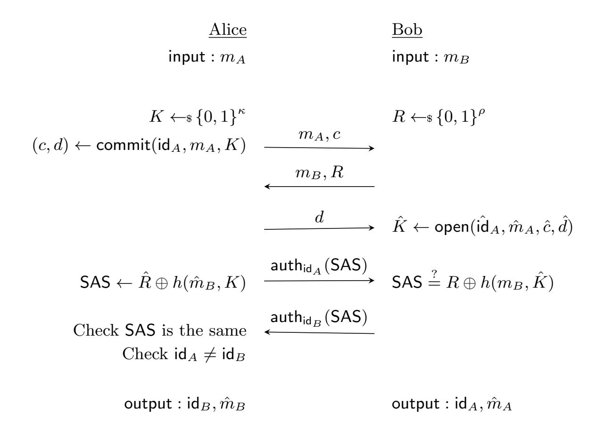

{0}------------------------------------------------

# Security Analysis of Olvid's SAS-based Trust Establishment Protocol

Michel Abdalla1,2

1 DIENS, Ecole normale sup´erieure, CNRS, PSL University, Paris, France ´ [michel.abdalla@ens.fr](mailto:michel.abdalla@ens.fr) 2 INRIA, Paris, France

Abstract. In this report, we analyze the security of the trust establishment protocol used in the Olvid messaging protocol. The latter relies on the PV-SAS-MCA message cross-authentication protocol by Pasini an Vaudenay based on short authenticated strings (SAS). In order to make the implementation portable across different platforms, Olvid proposed particular instantiations of the underlying primitives used in PV-SAS-MCA in addition to some other minor modifications. Here, we show that these changes have no impact on the security of the scheme. More precisely, we formally prove that the trust establishment protocol used in Olvid is a secure message crossauthentication protocol. The proof of security is in the random-oracle model and relies on the security of the underlying pseudorandom generator. It also assumes users know each other and have an authentic channel between them.

| 1 | Introduction                                          | 1 |
|---|-------------------------------------------------------|---|
| 2 | Preliminaries                                         | 2 |
| 3 | SAS-based MCA protocol                                | 3 |
| 4 | Olvid's SAS-based MCA protocol                        | 3 |
|   | 4.1 Instantiations                                 | 4 |
|   | 4.2 Changes to the Security Analysis of PV-SAS-MCA | 5 |
|   | 4.3 Security Proof                                 | 5 |
| 5 | Conclusion                                            | 7 |

## 1 Introduction

Message cross-authentication (MCA) protocols allow users to identify each other and to simultaneously exchange messages in an authenticated manner. In [\[Vau05\]](#page-7-0), Vaudenay proposed a variant of the above notion in which one assumes the existence of an extra channel which can authenticate short strings. The new notion allows for the construction of efficient authentication protocols based on short authenticated strings (SAS) and is known as SAS-based authentication.

Olvid[3](#page-0-1) is a secure instant messaging application which, contrary to other applications like WhatsApp or Signal, does not impose its users to trust a central directory of users for the key distribution. Instead, Olvid offers multiple trust establishment protocols relying on the natural relationship between users so as to retain the same "security level" in the digital world as in real life. The absence of a central directory has two main advantages: (1) users do not need to disclose any personal information to the server, and (2) the key distribution is completely decentralized without any need for a trusted third party.

3 <https://olvid.io/>

{1}------------------------------------------------

In this report, we analyze the security of the first trust establishment protocol used in Olvid, which assumes users know each other and have an authentic channel between them (e.g, phone calls, face-to-face meetings, voice chats). This protocol uses the SAS-based message cross-authentication (MCA) protocol PV-SAS-MCA by Pasini and Vaudenay [\[PV06,](#page-7-1)[Pas09\]](#page-7-2). In Olvid, the SAS-based MCA protocol is used to allow users not only to identify each other but also to exchange their public keys in authenticated manner.

In the remainder of this report, we analyze the security of the particular instantiation of the PV-SAS-MCA protocol used in Olvid and show that it meets the security requirements listed in the security theorem for PV-SAS-MCA in [\[PV06,](#page-7-1)[Pas09\]](#page-7-2). For completeness, we also provide a formal security proof that shows that the trust establishment protocol used by Olvid is a secure message cross-authentication protocol.

Organization. Section [2](#page-1-0) recalls some basic notation used in this report and the cryptographic primitives used in the PV-SAS-MCA protocol. Section [3](#page-2-0) recalls the description of the PV-SAS-MCA protocol by Pasini and Vaudenay [\[PV06,](#page-7-1)[Pas09\]](#page-7-2). Section [4](#page-2-1) describes the variant of the PV-SAS-MCA protocol used by Olvid together with a detailed security analysis. Finally, Section [5](#page-6-0) concludes this report.

## 2 Preliminaries

Notation. We write x ← y for the action of assigning the value y to the variable x. We write x1, . . . , xn ←\$ X for sampling x1, . . . , xn from a finite set X uniformly at random. If A is a probabilistic algorithm we write y1, . . . , yn ← \$ A(x1, . . . , xn) for the action of running A on inputs x1, . . . , xn with independently chosen coins, and assigning the result to y1, . . . , yn. PPT as usual abbreviates probabilistic polynomial-time.

Commitment Schemes. A keyed tag-based commitment scheme is defined by a triple of PPT algorithms (setup, commit, open). Via (Kp, Ks) ←\$ setup(1λ ), the setup algorithm generates a publicsecret key pair (Kp, Ks). For any message m, tag t, and public key Kp, the commitment algorithm outputs a pair (c, d) corresponding to the commit and decommit values via (c, d) ←\$ commit(Kp, t, m). Given (c, d) and a tag t, the original message can be recovered using the opening algorithm open via m ← open(Kp, t, c, d). As noted in [\[Pas09\]](#page-7-2), Kp may be empty.

For the security of the SAS-based message cross-authentication protocol used in Olvid and described in Section [3,](#page-2-0) the commitment scheme needs to satisfy the following properties:

- Completeness: For any key pair (Kp, Ks) ←\$ setup(1λ ), any message m, any tag t, and any (c, d) ←\$ commit(Kp, t, m), we have m = open(Kp, t, c, d).
- Perfectly Hiding: For any key pair (Kp, Ks) ←\$ setup(1λ ), any tag t, any values m0, m1, any random bit b, and any (c, d) ←\$ commit(Kp, t, mb), c gives no information on b.
- Computationally Binding: For any key pair (Kp, Ks) ←\$ setup(1λ ), it is hard to find (m, t, c, d0, d1) such that mb ← open(Kp, t, c, db) 6= ⊥ for b = 0, 1 and m0 6= m1.
- Equivocable: There exist algorithms simcommit and equivocate capable of generating fake commitments that can opened to arbitrary values. That is, given the secret key Ks and tag t, (c, ξ) ←\$ simcommit(Ks, t) yields a fake commit value c and an additional information value ξ. Then, given t, Ks, and the output (c, ξ) of simcommit(Ks, t), equivocate(Ks, c, ξ, m) can output a decommit value d such that m = open(Kp, c, d) for any message m.

Message Cross-Authentication. Message Cross-Authentication (MCA) protocols allow users to exchange messages in an authenticated manner and are often used to exchange public keys.

Definition 2.1 (Message Cross-Authentication [\[Pas09\]](#page-7-2)). A Message Cross-Authentication (MCA) protocol between Alice and Bob starts with inputs mA and mB and ends with outputs ( ˆidB, mˆ B) and ( ˆidA, mˆ A), respectively.

{2}------------------------------------------------

- An honest run should lead to ( ˆidA, mˆ A) = (idA, mA) and ( ˆidB, mˆ B) = (idB, mB).
- An adversary is successful if some instance of an uncorrupted node ended with a pair (m, id), but no instance of the node of identity id was launched with input m.

## 3 SAS-based MCA protocol

The PV-SAS-MCA protocol by Pasini and Vaudenay [\[PV06,](#page-7-1)[Pas09\]](#page-7-2) is recalled in Fig. [1](#page-2-2) and works as follows. First, users Alice and Bob initiate the protocol with their respective inputs mA and mB and then each picks a random key, denoted by K and R. Next, Alice computes a commitment c of her key K and sends both mA and c to Bob, who replies with mB and R. After receiving mB and R, Alice reveals her hidden key K by sending the decommitment value d to Bob. Finally, both Alice and Bob authenticate the string SAS = R ⊕ h(mB, K) using the extra authenticated channel, where h is an almost strongly universal hash function.

Fig. 1. The SAS-based MCA protocol PV-SAS-MCA [\[PV06,](#page-7-1)[Pas09\]](#page-7-2).

As stated in [\[Pas09,](#page-7-2) Section 8.4], the SAS-based MCA protocol PV-SAS-MCA directly authenticates mB through the SAS and indirectly authenticates mA via the direct authentication of K and the tagged commitment scheme, which binds mA to K. Moreover, as discussed in [\[Pas09\]](#page-7-2), h can be instantiated as h(x, K) = trunc(hash(K, x)) with a collision-resistant hash function hash such as SHA-256 [\[SHA04\]](#page-7-3) and trunc is a function that truncates its output to the leading bits.

## 4 Olvid's SAS-based MCA protocol

The SAS-based MCA protocol used in Olvid is described in Fig. [2](#page-3-1) and differs slightly from the PV-SAS-MCA protocol in Fig. [1.](#page-2-2) In particular, the values mA and mB being exchanged are public keys associated with Alice and Bob, respectively. In addition to this, there are a few other notable changes to the original protocol:

– Bob now sends mB to Alice at the beginning of the protocol;

{3}------------------------------------------------

- Every message from Alice to Bob is encrypted under Bob's public key mB;
- With the exception of the first message, every message from Bob to Alice is encrypted under Alice's public key mA;
- The function h is instantiated with a hash function H, modeled as a random oracle in the security analysis;
- The random value R is computed as H(kB, c) where H is the SHA-256 hash function [\[SHA04\]](#page-7-3) and kB is a secret key held by Bob; and
- The SAS value is computed as SAS = prng(R ⊕ H( ˆmB, K)).

$$\begin{array}{cccccccccccccccccccccccccccccccccccc$$

Fig. 2. Olvid's SAS-based MCA protocol. The notation {a}m indicates the public-key encryption of the plaintext a using m as the public key.

## 4.1 Instantiations

Equivocable Commitments. In order to instantiate the commitment scheme in PV-SAS-MCA protocol in Fig. [1,](#page-2-2) Olvid uses the following random-oracle-based commitment scheme given in [\[Pas09,](#page-7-2) Section 3.5.9.2].

Let `c, `e, and `h be three integers and let H be a hash function from {0, 1} `h+`e to {0, 1} `c modeled as a random oracle. The equivocable commitment works as follows:

- setup: There is no setup algorithm. Hence, Kp = Ks = ε.
- commit(t, m): Sample e ←\$ {0, 1} `e , set c = H(t, m, e) and d = (m, e), and output (c, d).
- open(t, c, d): Parse d as (m, e), check that c = H(t, m, e). If true, return m, else return ⊥.

As noted in [\[Pas09,](#page-7-2) Section 3.5.9.2], one can easily build the simcommit and equivocate algorithms using the fact that H is modeled as a random oracle.

As shown in [\[Pas09\]](#page-7-2), the commitment scheme above is perfectly hiding and statistically binding, In Olvid, the hash function H is instantiated with SHA-256 [\[SHA04\]](#page-7-3).

{4}------------------------------------------------

SAS Computation. The implementation of the SAS differs from the original protocol in [\[Pas09\]](#page-7-2) as follows:

– The SAS computation outputs a random 8-digit numbers, where the first and last 4 digits are displayed to Alice and Bob, respectively. To complete the authentication, both parties must type the 4 digits associated with the other party.

Pseudorandom Number Generator. Olvid instantiates the PRNG using the NIST SP 800-90A [\[BK15\]](#page-7-4).

#### 4.2 Changes to the Security Analysis of PV-SAS-MCA

Despite the numerous modifications, the proof of security for the PV-SAS-MCA protocol in [\[Pas09\]](#page-7-2) also applies to the Olvid SAS-based MCA protocol described in Fig. [2.](#page-3-1) In the following, we describe the main changes to the proof.

Encryption of protocol messages. In Fig. [2,](#page-3-1) with the exception of the very first message from Bob to Alice, all messages are encrypted using the ECIES encryption scheme [\[ABR01\]](#page-7-5) under the public-key of the recipient. Since the security of the PV-SAS-MCA protocol in [\[Pas09\]](#page-7-2) does not require privacy for the messages being exchanged and given that the public-key encryption scheme is perfectly binding, this change has no impact on the security of Olvid's protocol. In particular, the security analysis of Olvid's protocol makes no assumption about the security of the underlying public-key encryption scheme and simply assumes that these messages are sent in the clear.

Computation of R. Unlike in the PV-SAS-MCA protocol where R is chosen uniformly at random in each session, the random value R in Olvid's version of the protocol is computed as H(kB,mB , c) where H is the SHA256 hash function [\[SHA04\]](#page-7-3), kB,mB is a secret key held by Bob which is chosen uniformly at random for each different message mB, and c is Alice's commitment. Since the commitment scheme being used is statistically binding and H is a random oracle, this has no impact on the security of the protocol given that each execution of protocol between Alice and Bob yields a random and uniformly distributed R value.

PRNG used in the SAS computation. In the PV-SAS-MCA protocol, the short authenticated string used for the SAS authentication is equal to R ⊕ H(mB, K). In Olvid's protocol, the value R ⊕ H(mB, K) is used to derive the short authenticated string via a PRNG function prng. Since the security analysis of the PV-SAS-MCA protocol shows that the string R ⊕ H(mB, K) is random and uniformly distributed, the same is true for prng(R ⊕ H(mB, K)) due to the security of the PRNG function prng. As a result, the probability that an adversary can impersonate either Alice or Bob on a given interaction is 1/104 .

Bob's first message. Unlike the PV-SAS-MCA protocol, Bob now sends message mB to Alice at the beginning of the protocol. Since mB is directly authenticated through the SAS authentication and given that the value R computed by Bob remains random and uniformly distributed even when Alice chooses its first flow message as a function of mB, this change has no impact on the security of the protocol.

Universal hash function. In the PV-SAS-MCA protocol, the function h is assumed to be an almost strongly universal hash function. In Olvid's protocol, the function h is is simply instantiated with the SHA-256 hash function, which we assume behaves as a random oracle.

#### 4.3 Security Proof

As indicated in Section [4.2,](#page-4-0) the modifications made to the PV-SAS-MCA protocol do not affect the security of the scheme. To prove this formally, we prove the security of the Olvid SAS-based MCA protocol described in Fig. [2](#page-3-1) against one-shot adversaries, in which adversaries can launch at most one instance of each party. As shown by Vaudenay [\[Vau05\]](#page-7-0), this result already implies security with respect to adversaries that can launch polynomially many instances of each party.

{5}------------------------------------------------

Security model. As indicated in [Vau05], adversaries are assumed to have full control of the communication network, except for the authenticated channel. in particular, adversaries are allowed to launch new instances of a protocol party (via queries to a launch oracle) or to send messages to protocol instances (via queries to a send oracle). The adversary is also allowed to specify the input of a party when querying the launch oracle.

- launch(n, r, x) denotes a query to the launch oracle where n is a node of the network, r is the role of this node, and x is the input. It outputs a unique instance tag  $\pi_n^i$ .
- $send(\pi_n, m)$  denotes a query to the send oracle through which the adversary can send a message m to an instance  $\pi_n$ . It outputs a message m' that is meant to be sent to the other protocol party.

In a SAS-based MCA protocol, there are two parties, called Alice and Bob. On Alice's side, the protocol input is  $(m_A, id_A)$  and its output is  $(\hat{m}_B, id_B)$ . On Bob's side, the protocol input is  $(m_B, id_B)$  and its output is  $(\hat{m}_A, id_A)$ . Finally, the adversary is considered successful in attacking the authentication protocol if there exists at least one instance of Alice (resp. Bob) that terminates and outputs  $(\hat{m}_B, id_B)$  (resp.  $(\hat{m}_A, id_A)$ ) such that no instance of Bob (resp. Alice) exists with input  $(m_B, id_B) = (\hat{m}_B, id_B)$  (resp.  $(m_A, id_A) = (\hat{m}_A, id_A)$ ).

**Security theorem.** As the following theorem shows, Olvid's SAS-based MCA protocol is secure against one-shot adversaries, if H is modeled as a random oracle, prng is a secure pseudorandom generator, and the underlying commitment scheme is the one described in Section 4.1. The proof is based on the proof of security for the original SAS-based MCA protocol PV-SAS-MCA [PV06, Pas09].

**Theorem 4.1.** Let H be a random oracle, let commit be the random-oracle-based commitment scheme in Section 4.1, and let prng be a secure pseudorandom generator. Then any one-shot adversary against the Olvid's SAS-based MCA protocol is successful with probability negligibly close to  $1/10^4$ .

*Proof.* We prove the security of Olvid's SAS-based MCA protocol using a sequence of games, starting with the original protocol and ending with a protocol in which the success probability of the adversary is 0.

**Game**  $G_1$ . This is the initial security game, so we have:

$$\mathsf{Adv}^{O\mathrm{LVID}\text{-}\mathrm{SAS}}_{\mathcal{A}}(\,) = \Pr[\,\mathsf{G}_1 \Rightarrow \mathsf{T}\,]$$

**Game**  $G_2$ . In this game, we change the simulation of the protocol so that Bob chooses the value R uniformly at random in the range of H.

Since H is a random oracle, the advantage of the adversary remains the same unless it finds a collision on the output of the random oracle, which is negligible for any polynomial number of queries to the latter. As a result,  $|\Pr[\mathsf{G}_2 \Rightarrow \mathsf{T}] - \Pr[\mathsf{G}_1 \Rightarrow \mathsf{T}]|$  is negligible.

**Game**  $G_3$ . In this game, we extract the value K committed in  $\hat{c}$  and abort if extraction fails.

Since the random-oracle-based commitment scheme described in Section 4.1 is statistically binding, the probability of aborting is negligible, This is due to the fact that an adversary can only break the binding property if it finds a collision in the random oracle used by the commitment scheme, which is negligible for any polynomial number of queries to the latter. Hence,  $|\Pr[\mathsf{G}_3 \Rightarrow \mathsf{T}] - \Pr[\mathsf{G}_2 \Rightarrow \mathsf{T}]|$  is negligible.

**Game** G4. If the two instances created by the one-shot adversary are Alice's instances, then the seed used by the pseudorandom generator prng of Alice's instance that terminates last is chosen at random.

Let  $K^{(i)}$ ,  $\hat{m}_B^{(i)}$ ,  $\hat{R}^{(i)}$  be the values seen or chosen by Alice's instance  $i \in \{1, 2\}$ , where the index 2 indicates the instance that terminates last. Since the commitment scheme is perfectly hiding, the value  $K^{(2)}$  is uniformly distributed and independent from the rest. As a result, the adversary can

{6}------------------------------------------------

only detect this change if  $\hat{R}^{(1)} \oplus \mathsf{H}(\hat{m}_B^{(1)}, K^{(1)}) = \hat{R}^{(2)} \oplus \mathsf{H}(\hat{m}_B^{(2)}, K^{(2)})$ , which happens with negligible probability. Hence, it follows that  $|\Pr[\mathsf{G}_4 \Rightarrow \mathsf{T}] - \Pr[\mathsf{G}_3 \Rightarrow \mathsf{T}]|$  is negligible.

**Game**  $G_5$ . If the two instances created by the one-shot adversary are Bob's instances, then the seed used by the pseudorandom generator prng of the instance of Bob that sends its R value last is chosen at random.

Let  $\hat{K}^{(i)}, m_B^{(i)}, R^{(i)}$  be the values seen or chosen by instance  $i \in \{1, 2\}$  of Bob, where the index 2 indicates the instance that sends its R value last. Since the value  $R^{(2)}$  is uniformly distributed and independent from the rest, the adversary can only detect this change if  $R^{(1)} \oplus \mathsf{H}(m_B^{(1)}, \hat{K}^{(1)}) = R^{(2)} \oplus \mathsf{H}(m_B^{(2)}, \hat{K}^{(2)})$ , which happens with negligible probability. Thus,  $|\Pr[\mathsf{G}_5 \Rightarrow \mathsf{T}] - \Pr[\mathsf{G}_4 \Rightarrow \mathsf{T}]|$  is negligible.

In Games  $G_6$ – $G_8$ , we consider the cases in which the one-shot adversary creates one instance of Alice and one of Bob. Without loss of generality, we will assume that Bob's instance terminates last since the other cases can be dealt with in a similar way.

**Game**  $G_6$ . If the one-shot adversary creates one instance of Alice and one of Bob *and* Alice's instance's terminates before Bob's instance sends its R value, then the seed used by the pseudorandom generator prng of Bob's instance is chosen at random.

Since the value R is uniformly distributed and independent from the rest, the adversary can only detect this change if  $\hat{R} \oplus \mathsf{H}(\hat{m}_B, K) = R \oplus \mathsf{H}(m_B, \hat{K})$ , which happens with negligible probability. Thus,  $|\Pr[\mathsf{G}_6 \Rightarrow \mathsf{T}] - \Pr[\mathsf{G}_5 \Rightarrow \mathsf{T}]|$  is negligible.

**Game**  $G_7$ . If the one-shot adversary creates one instance of Alice and one of Bob and Alice's instance does not terminate before Bob's instance sends its R value and  $\hat{c} \neq c$ , then the seed used by the pseudorandom generator prng of Alice's instance is chosen at random.

Since the value K remains hidden until Alice's instance sends the decommitment value d, its value is uniformly distributed and independent from the other values used in the seed computation of both instances. As a result, the probability that the adversary can only detect the change in the game is negligible. Hence,  $|\Pr[\mathsf{G}_7 \Rightarrow \mathsf{T}] - \Pr[\mathsf{G}_6 \Rightarrow \mathsf{T}]|$  is negligible.

**Game**  $G_8$ . If the one-shot adversary creates one instance of Alice and one of Bob and Alice's instance does not terminate before Bob's instance sends its R value and  $\hat{c} = c$ , then the seed used by the pseudorandom generator prng of Alice's instance is chosen at random.

Since the commitment scheme is statistically binding, it follows that  $\hat{m}_A = m_A$ . Hence, we can assume that  $\hat{m}_B \neq m_B$  as otherwise the adversary would not be considered successful. Moreover, as in Game  $\mathsf{G}_7$ , the value K remains hidden until Alice's instance sends the decommitment value d and its value is uniformly distributed and independent from the other values used in the seed computation of both instances. As a result, the probability that the adversary can only detect the change in the game is negligible. Hence,  $|\Pr[\mathsf{G}_8 \Rightarrow \mathsf{T}] - \Pr[\mathsf{G}_7 \Rightarrow \mathsf{T}]|$  is negligible.

**Game**  $G_9$ . In this game, the output of the pseudorandom generator prng is replaced with a random string whenever its seed is chosen uniformly at random.

Since it is straightforward to convert any adversary that detects this change into one that breaks the security of the pseudorandom generator prng, it follows that  $|\Pr[\mathsf{G}_9 \Rightarrow \mathsf{T}] - \Pr[\mathsf{G}_8 \Rightarrow \mathsf{T}]|$  is negligible.

Finally, the claim in Theorem 4.1 follows by noticing that, for every instance in Game  $G_9$ , at least one of the values used for the SAS comparison is chosen uniformly at random.

## 5 Conclusion

As the analysis in Section 4 formally shows, the trust establishment protocol used by Olvid is a secure message cross-authentication protocol. The analysis assumes users know each other and have an authentic channel between them (e.g, phone calls, face-to-face meetings, voice chats). The security proof is in the random-oracle model and relies on the security of the underlying pseudorandom generator, which has been instantiated according to NIST SP 800-90A [BK15].

{7}------------------------------------------------

## References

- ABR01. M. Abdalla, M. Bellare, and P. Rogaway. The oracle Diffie-Hellman assumptions and an analysis of DHIES. In CT-RSA 2001, LNCS 2020, pages 143–158. Springer, Heidelberg, April 2001.
- BK15. E. Barker and J. Kelsey. Recommendation for random number generation using deterministic random bit generators. National Institute of Standards and Technology, NIST Special Publication 800- 90A Revision 1, U.S. Department of Commerce, June 2015. [http://nvlpubs.nist.gov/nistpubs/](http://nvlpubs.nist.gov/nistpubs/SpecialPublications/NIST.SP.800-90Ar1.pdf) [SpecialPublications/NIST.SP.800-90Ar1.pdf](http://nvlpubs.nist.gov/nistpubs/SpecialPublications/NIST.SP.800-90Ar1.pdf).
- Pas09. S. Pasini. Secure Communication using Authenticated Channels. PhD Thesis, Ecole polytechnique ´ f´ed´erale de Lausanne, 2009.
- PV06. S. Pasini and S. Vaudenay. SAS-based authenticated key agreement. In PKC 2006, LNCS 3958, pages 395–409. Springer, Heidelberg, April 2006.
- SHA04. Secure hash standard. National Institute of Standards and Technology, NIST FIPS PUB 180-2, U.S. Department of Commerce, February 2004.
- Vau05. S. Vaudenay. Secure communications over insecure channels based on short authenticated strings. In CRYPTO 2005, LNCS 3621, pages 309–326. Springer, Heidelberg, August 2005.