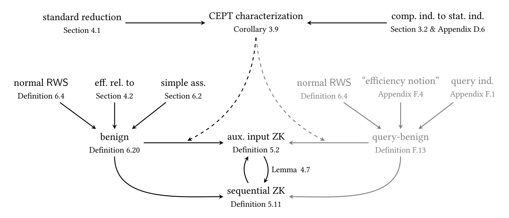

{0}------------------------------------------------

# **On (expected polynomial) runtime in cryptography**

Michael Klooß*<sup>∗</sup>*

A common definition of black-box zero-knowledge considers*strict polynomial time* (PPT) adversaries but *expected polynomial time* (EPT) simulation. This is necessary for constant round black-box zero-knowledge in the plain model, and the asymmetry between simulator and adversary an accepted consequence. Consideration of EPT adversaries naturally leads to *designated* adversaries, i.e. adversaries which are only required to be efficient in the protocol they are designed to attack. They were first examined in Feige's thesis [Fei90], where obstructions to proving security are shown. Prior work on (designated) EPT adversaries by Katz and Lindell (TCC'05) requires superpolynomial hardness assumptions, whereas the work of Goldreich (TCC'07) postulates "nice" behaviour under rewinding.

In this work, we start from scratch and revisit the definition of *efficient* algorith[ms. W](#page-49-0)e argue that the standard runtime classes, PPT and EPT, behave "unnatural" from a cryptographic perspective. Namely, algorithms can have indistinguishable runtime distributions, yet one is considered efficient while the other is not. Hence, classical runtime classes are not "closed under indistinguishability", which causes problems. Relaxations of PPT which are "closed" are (well-)known and used.

We propose *computationally* expected polynomial time (CEPT), the class of runtimes which are (computationally) indistinguishable from EPT, which is "closed". We analyze CEPT in the setting of *uniform complexity* (following Goldreich (JC'93)) with *designated adversaries*, and provide easy-to-check criteria for zero-knowledge protocols with blackbox simulation in the plain model which show that many (all known?) such protocols handle designated CEPT adversaries in CEPT.

## **1. Introduction**

<span id="page-0-1"></span>Interactive proof systems allow a prover P to convince a verifier V of the "truth" of a statement *x*, i.e. that *x ∈* L for some language L. Soundness of the protocol ensures that if the verifier accepts, then *x ∈* L with high probability. *Zero-knowledge* proof systems allow P to convince V of *x ∈* L *without revealing anything else*. The definition of zero-knowledge relies on the (more general) simulation paradigm: It stipulates that, for every (malicious) verifier V *∗* , there is a simulator Sim which, given only the inputs *x, aux* of V *∗* , can produce a *simulated* output (or *view*<sup>1</sup> ) *out* = Sim(*x, aux*), which is indistinguishable from the output outV*<sup>∗</sup> h*P(*x, w*)*,*V *∗* (*x, aux*)*i* of a real interaction. Thus, anything V *∗* learns in the interaction, it could simulate itself — *if* Sim *and* V *∗ lie in the same complexity class*.

Let us write *X*/*Y* (zero-knowledge) for adversary complexity *X* an[d](#page-0-0) simulator complexity *Y* . The two widespread notions of zero-knowledge are PPT/PPT and PPT/EPT.The former satisfies the "promise

*<sup>∗</sup>* Karlsruhe Institute of Technology, michael.klooss@kit.edu

<span id="page-0-0"></span><sup>1</sup>We use view and output synonymously in the introduction.

{1}------------------------------------------------

of zero-knowledge", but comes at a price. Barak and Lindell [BL04] show that it is impossible to construct *constant* round proof systems with *black-box* simulation and negligible soundness error in the plain model. Since *constant round black-box* zero-knowledge is attractive for many reasons, the relaxation of PPT/EPT zero-knowledge is common. However, this asymmetry breaks the "promise of zero-knowledge". The adversary *cannot* execute Sim, hence it cannot simulate the interaction. More concretely, this setting does not compose well. If we incorporate an EPT simulator into a (previously PPT) adversary, the new adversary is EPT. This common approach — constructing simulators for more complex systems from simulators of building blocks — therefore fails due to the asymmetry.

To remedy the asymmetry, we need to handle EPT adversaries. There are several sensible definitions of EPT adversaries, but the arguably most natural choice are *designated* EPT adversaries. That is, adversaries which only need to be *EPT when interacting with the protocol they are designed to attack*. Feige [Fei90] first considered this setting, and demonstrates significant technical obstacles against achieving security in the presence of such attacks.

The problems of EPT (and designated adversaries) are not limited to zero-knowledge, and extend to the simulation paradigm, e.g. multi-party computation.

**Preliminary conventions.** Throughout,  $\kappa$  denotes the security parameter. We generally consider objects which are families (of objects) parameterized by  $\kappa$ , but often leave the dependency implicit. We abbreviate *systems of (interactive) machines (or algorithms)* by *system*. A system is *closed*, if it only expects  $\kappa$  as input, and produces some output. For example, a prover  $\mathscr P$  does not constitute a closed system, nor does the interaction  $\langle \mathscr P, \mathscr V \rangle$ , since it still lacks the inputs to  $\mathscr P$  and  $\mathscr V$ . Our primary setting is *uniform complexity* [Gol93], where inputs to an (otherwise closed) system are generated efficiently by so-called *input generators*. Interaction of algorithms A, B is denoted  $\langle A, B \rangle$ , the time spent in A is denoted time<sub>A</sub>( $\langle A, B \rangle$ ), and similarly for time spent in B or A + B. Oracle access to  $\mathscr O$  is written  $\mathsf A^{\mathscr O}$ .

## 1.1. Obstacles

<span id="page-1-0"></span>We first recall some obstacles regarding expected runtime and designated adversaries which we have to keep in mind. For more discussions and details, we refer to the excellent introductions of [KL08; Gol10] and to [Fei90, Section 3].

**Runtime squaring.** Consider (a family of) random variables  $T_{\kappa}$  over  $\mathbb{N}$ , where  $\mathbb{P}(T_{\kappa}=2^{\kappa})=2^{-\kappa}$  and T is 0 otherwise. Then  $T_{\kappa}$  has polynomially bounded expectation  $\mathbb{E}(T_{\kappa})=1$ , but  $\mathbb{E}(T_{\kappa}^2)=2^{\kappa}$ . That is  $S_{\kappa}=T_{\kappa}^2$  is *not* expected polynomial time anymore. This behaviour not only prevents machine model independence of EPT as an efficiency notion, but also the non-black-box simulation technique of Barak [Bar01] (which suffers from a quadratic growth in runtime).

**Composition and rewinding.** Consider an oracle algorithm  $A^{\Theta}$  with access to a PPT oracle  $\Theta$ . Then to check if the total time  $time_{A+\Theta}(A^{\Theta})$  is PPT, we can count an oracle call as a single step. Moreover, it makes no difference if A has "straightline" or "rewinding" access to  $\Theta$ . For EPT, even a standalone definition of " $\Theta$  is EPT" is non-trivial and possibly fragile. For example, there are oracles, where any PPT A with "straightline" access to  $\Theta$  results in an EPT interaction, yet access "with rewinding" to  $\Theta$  allows an explosion of expected runtime. See [KL08] for a concrete example.

**Designated EPT adversaries.** For a **designated adversary**  $\mathcal{A}$  against zero-knowledge of a proof system  $(\mathcal{P}, \mathcal{V})$ , we require (only) that  $\mathcal{A}$  is *efficient when interacting with that protocol*. Since a zero-knowledge simulator *deviates* from the real protocol, the runtime guarantees of  $\mathcal{A}$  are void.

{2}------------------------------------------------

## 1.2. Motivation: Reproving zero-knowledge of graph 3-colouring

The constant-round black-box zero-knowledge proof of Goldreich and Kahan [GK96] is our running example for demonstrating problems and developing our approach.

<span id="page-2-4"></span>Recall that (non-interactive) commitment schemes allow a committer to commit to a value in a way which is *hiding* and *binding*, i.e. the commitment does not reveal the value to the receiver, yet it can be unveiled to at most one value. A commitment scheme consists of algorithms (Gen, Com, VfyOpen). The *commitment key* is generated via  $ck \leftarrow Gen(\kappa)$ . For details, see Appendix B.1.

#### 1.2.1. The constant round protocol of Goldreich-Kahan

<span id="page-2-5"></span>The protocol of [GK96] uses two different commitments,  $\mathsf{Com}^{(\mathsf{H})}$  is perfectly hiding,  $\mathsf{Com}^{(\mathsf{B})}$  is perfectly binding. The idea of protocol  $\mathsf{G3C}_{\mathsf{GK}}$  is a parallel, N-fold, repetition of the standard zero-knowledge proof for  $\mathsf{G3C}$ , with the twist that the verifier commits to all of its challenges beforehand. Let G = (V, E) be the graph and let  $\psi$  be a 3-colouring of G. The prover is given  $(G, \psi)$  and the verifier G.

- **(P0)**  $\mathscr{P}$  sends  $\operatorname{ck}_{\operatorname{hide}} \leftarrow \operatorname{Gen}^{(H)}(\kappa)$ . ( $\operatorname{ck}_{\operatorname{bind}} \leftarrow \operatorname{Gen}^{(B)}(\kappa)$  is deterministic.)
- **(V0)** V picks  $N = \kappa \cdot \text{card}(E)$  challenge edges  $e_i \leftarrow E$ , and commits to them using  $\text{Com}^{(H)}$ .
- **(P1)**  $\mathscr{P}$  picks randomized colourings for each of the N parallel repetitions of the standard graph 3-colouring proof system, and sends the  $\mathsf{Com}^{(\mathsf{B})}$ -committed randomized node colours to  $\mathscr{V}$ .
- <span id="page-2-1"></span>**(V1)** V opens all commitments (to  $e_i$ ).
- <span id="page-2-2"></span>**(P2)**  $\mathscr{P}$  aborts if any opening is invalid. Otherwise,  $\mathscr{P}$  proceeds in the parallel repetition using these challenges, i.e. in the *i*-th repetition  $\mathscr{P}$  opens the committed colours for  $e_i$ .
- <span id="page-2-0"></span>**(V2)** V aborts iff any opening is invalid, any edge not correctly coloured, or if  $ck_{hide}$  is "bad".

<span id="page-2-3"></span>The soundness of this protocol follows from  $\mathsf{Com}^{(\mathsf{H})}$  being statistically hiding. Therefore, each of the N parallel repetitions is essentially an independent repetition of the usual graph 3-colouring proof. For  $N = \kappa \cdot \mathsf{card}(E)$  parallel rounds, the probability to successfully cheat is negligible (in  $\kappa$ ), see [GK96].

#### 1.2.2. Proving zero-knowledge: A (failed?) attempt

<span id="page-2-6"></span>Now, we prove black-box zero-knowledge for *designated adversaries*. That is, we describe a simulator which uses the adversary  $V^*$  only as a black-box, which can be queried and rewound to a (previous) state. We proceed in three game hops, gradually replacing the view of a real interaction with a simulated view. Successive games are constructed so that their change in output (which is a purported view) is indistinguishable.

- $\mathsf{G}_0$  This is the real G3C protocol. The output is the real view.
- $\mathsf{G}_1$  The prover rewinds a verifier which completes (V1) successfully (i.e. sends *valid* openings on the first try) to (V0) and repeats (P1) until a second run where  $\mathcal V$  validly opens all commitments. The output is the view of this second successful run. The prover uses fresh randomness in each reiteration of (P1) (whereas the black-box has fixed randomness).
- G<sub>2</sub> If the two openings in (V1) differ, return ambig, indicating ambiguity of the commitment. Otherwise, proceed unchanged.
- $\mathsf{G}_3$  The initial commitments (in (P1)) to a 3-colouring are replaced with commitments to 0. These commitments are never opened. In successive iterations, the commitments to a 3-colouring are replaced by commitments to a pseudo-colouring. These commitments, when opened, simulate a valid 3-colouring at the challenge edges  $e_i$ .

Evidently, Game  $G_3$  outputs a purported view independent of the witness. Thus, the simulator is defined as in  $G_3$ : In a first try, it commits to garbage instead of a 3-colouring in (P1), in order to obtain the verifier's challenge (in (V1)). If the verifier does not successfully open the commitments (in (V1)), Sim aborts (as an honest prover would) and outputs the respective view. Otherwise, Sim rewinds the

{3}------------------------------------------------

verifier to Step 2 and sends a pseudo-colouring (w.r.t. the previously revealed challenge) instead. Sim retries until the verifier successfully unveils (in (V1)) again. (If the verifier opens to a different challenge, return view = ambig.)

Now, we sketch a security proof for Sim. We argue by game hopping.

 $G_0$  to  $G_1$ . The expected number of rewinds is at most 1. Namely, if  $\mathcal{V}^*$  opens in (V1) with probability  $\varepsilon$ , then an expected number of  $\frac{1}{\varepsilon}$  rewinds are required. Consequently, the expected runtime is polynomial (and  $G_1$  is EPT). The output distribution of the games is identical.

 $G_1$  to  $G_2$ . It is easy to obtain an adversary against the binding property of  $Com^{(H)}$  which succeeds with the same probability that  $G_2$  outputs ambig. Thus, this probability is negligible.

 $\mathsf{G}_2$  to  $\mathsf{G}_3$ . Embedding a (multi-)hiding game for  $\mathsf{Com}^{(B)}$  in this step is straightforward. Namely, using the left-or-right indistinguishability formulation, where the commitment oracle either commits the first or second challenge message. Thus, by security of the commitment scheme,  $\mathsf{G}_2$  and  $\mathsf{G}_3$  are indistinguishable.<sup>2</sup>

**A closer look.** The above proof is clear and simple. But the described simulator is not EPT! While  $G_2$  and  $G_3$  are (computationally) indistinguishable, the transition *does not necessarily preserve expected polynomial runtime* [Fei90; KL08]. Feige [Fei90] points out a simple attack, where  $V^*$  brute-forces the commitments with some tiny probability p, and runs for a very long time if the contents are not valid 3-colourings. This is EPT in the real protocol, but our simulator as well as the simulator in [GK96] do not handle  $V^*$  in EPT. The problem lies with *designated* adversaries as following example shows.

Example 1.1. Let  $V^*$  sample in step (V0) a garbage commitment c to zeroes, just like Sim. Now  $V^*$  unveils e in (V1) if and only if it receives c. (c is a "proof of simulation".) The honest prover always aborts in (P2) because  $V^*$  will never unveil. But if Sim queried c as its garbage commitment, the simulation runs forever, because  $V^*$  unveils only for this c, which is not a pseudo-colouring.

<span id="page-3-2"></span>As described,  $V^*$  is a priori PPT, and indeed, the simulator in [GK96] uses a "normalization technique" which prevents this attack. However, exploiting *designated* PPT,  $V^*$  may instead run for a very long time, when it receives c.

**Obstructions to simple fixes.** Let us recall a few simple, but insufficient fixes. A first idea is to *truncate* the execution of  $\mathcal{A}$  at some point. For PPT adversaries, this may seem viable. However, there are EPT adversaries, or more concretely runtime distributions, where *any strict polynomial truncation* affects the output in the real protocol *noticeably*. So we cannot expect that such a truncation works well for Sim. See [Fei90, Section 3] for a more convincing argument against truncation.

Being unable to truncate, we could enforce better behaviour on the adversary. Intuitively, it seems enough to require that  $V^*$  runs in expected polynomial time *in any interaction* [KL08; Gol10]. However, even this is not enough. Katz and Lindell [KL08] exploit the soundness error of the proof system to construct an adversary which runs in expected polynomial time in any interaction, but still makes the expected runtime of the simulator superpolynomial. The problem is that these runtime guarantees are void in the presence of *rewinding*.

Modifications of these fixes work, but at a price: Katz and Lindell [KL08] use *superpolynomial* truncation and need to assume *superpolynomial* hardness. Goldreich [Gol10] *restricts* to algorithms (hence adversaries) which behave well under rewinding. We discuss these in Section 1.5. Our price are proof techniques, which become more technical and, perhaps, more limited.

**Our fix: There is no problem.** Our starting point is *the conviction* that the given "proof" should *evidently* establish the security of the scheme for any *cryptographically sensible* notion of runtime. If

<sup>&</sup>lt;sup>2</sup>We rely on security of binding and hiding against *expected time* adversaries, which easily follows from PPT-security.

<span id="page-3-1"></span><span id="page-3-0"></span><sup>&</sup>lt;sup>3</sup>Even there, the situation is far from easy. In a UC setting with an *a posteriori* efficiency notion (and designated adversaries), Hofheinz, Unruh, and Müller-Quade show in [HUM13, Section 9] that (pathological) functionalities can make simulation in PPT is impossible (if one wants security under composition for just a single instance).

{4}------------------------------------------------

one could *distinguish* the runtime of G<sup>2</sup> and G3, then this would break the hiding property of the commitment scheme. Thus, the *runtimes are indistinguishable*. Following, in computational spirit, Leibniz' "identity of indiscernibles", we declare runtimes which are *indistinguishable from efficient* by efficient distinguishers as *efficient per definition*. With this, the proof works and the simulator, while not expected polynomial time, is *computationally expected polynomial time* (CEPT), which means its runtime distribution is indistinguishable from EPT.

We glossed over a crucial detail: We solved the problem with the very strategy we claim to fix different runtime classes for Sim and V *∗* ! Fortunately, Sim also handles CEPT adversaries in CEPT.

## **1.3. Contribution**

<span id="page-4-3"></span>Our main contribution is the reexamination of the notion of runtime in cryptography. We offer a novel, and arguably natural, alternative solution for a problem that was never fully resolved. Our contribution is therefore primarily of explorational and definitional nature. More concretely:

- We define CEPT, a small relaxation of EPT with a convenient characterization.
- To the best of our knowledge, this is the first work which embraces *uniform*<sup>4</sup> complexity, *expected* time, and *designated* adversaries.
- We develop general tools for this setting, most importantly, a hybrid lemma.
- Easy-to-check criteria show that many (all known?) black-box zero-know[le](#page-4-0)dge arguments from standard assumptions in the plain model<sup>5</sup> have CEPT simulators which handle designated CEPT adversaries. Consequently, security against designated adversaries is natural. For example, the proof systems [GMW86; GK96; Lin13; Ros04; KP01; PTV14] satisfy our criteria.
- We impose no (non-essential) restriction[s](#page-4-1) on the adversary, nor do we need additional (hardness) assumptions.
- We sketch the application of our techniques to secure function evaluation (SFE), and demonstrate that auxiliary i[nput secu](#page-49-5)[rity im](#page-49-4)[plies m](#page-50-1)[odular](#page-50-2) [seque](#page-50-3)[ntial co](#page-50-4)mposition.

All of this comes at a price. Our notions and proofs are not complicated, yet somewhat technical. This is, in part, because of a posteriori runtime and uniform complexity. Still, we argue that we have demonstrated the viability of our new notion of efficiency, at least for zero-knowledge.

**A complexity theoretic perspective.** This work is only concerned with the complexity class of feasible *attacks*, and does not assume or impose complexity requirements on protocols. Due to designated adversaries, the complexity class of adversaries is (implicitly) defined per protocol, similar to [KL08]. We bootstrap feasibility from complexity classes for (standalone) sampling algorithms, i.e. algorithms with no inputs except *κ*. Hence a (designated) adversary is feasible if the *completed system* of protocol and adversary (including input generation) is CEPT (or more generally, in some complexity c[lass o](#page-50-0)f feasible sampling algorithms).

The complexity class of simulators is relative to the adversary, and thus depends both on the protocol and the ideal functionality. Namely, feasibility of a simulator Sim means that if an adversary A is feasible (w.r.t. the protocol), then "Sim(A)" is feasible (w.r.t. the ideal functionality).

**Comments on our approach.** The uniform complexity setting drives complexity, yet is necessary, since a notion of time that depends on non-uniformity is rather pathological. Losing the power of non-uniformity (and strictness of PPT) requires many small adjustments to definitions.<sup>6</sup> Moreover,

<sup>4</sup>Our results are applicable to a minor generalization of the non-uniform setting as well, namely non-uniformly generated input *distributions*, see Appendix E.1.2.

<sup>5</sup> Unfortunately, problems might arise with superpolynomial hardness assumptions, see Section 8.

<span id="page-4-2"></span><span id="page-4-1"></span><span id="page-4-0"></span><sup>6</sup> For example, we need a stateful distinguisher for modular sequential security, whereas non-uniformly, stat[e](#page-4-2) and even randomness can be trivially removed by coin-fixing, demonstrating the equivalence of many variations, whose equivalence in the uniform setting not clear. [Thus,](#page-73-0) our definition of auxiliary input zero-knowledge deviates slightly from [Gol93].

{5}------------------------------------------------

annoying technical problems with efficiency arise inadvertently, depending on formalizations of games and models. As in prior work, we mostly ignore them, but do point them out and propose solutions. They are easily fixed by adding "laziness", "indirection", or "caching".

An important point raised by a reviewer of TCC'20 is the "danger of zero-knowledge being trivialized" by "expanding the class of attacks", and a case for "moving towards knowledge tightness" (with which we fully agree). Many variations of zero-knowledge, from weak distributional [Dwo+03; CLP15] to precise [MP06; DG12], exist. We argue that our notion is very close to the "standard" notion with EPT simulation, but allows designated (C)EPT adversaries. Indeed, it seems to gravitate towards "knowledge tightness" [Gol10], as seen by runtime explosion examples due to expectation.

#### 1.4. Technical overview and results

<span id="page-5-1"></span>We give an overview of our techniques, definitions, and results. Recall that we only consider runtimes for closed systems (which receive only  $\kappa$  as input and produce some output). W.r.t. uniform complexity and designated adversaries, i.e. adversaries which only need to be efficient in the real protocol [Fei90], closed systems are the default situation anyway. A runtime class  $\mathcal{T}$  is a set of runtime distributions. A runtime (distribution) is a family  $(T_{\kappa})_{\kappa}$  of distributions  $T_{\kappa}$  over  $\mathbb{N}_0$ . We use runtime and runtime distribution synonymously. Computational  $\mathcal{T}$ -time indistinguishability of oracles and distributions is defined in the obvious way (c.f. Section 2.6). For statistical  $\mathcal{T}$ -query indistinguishability, we count only queries as steps, and require  $\mathcal{T}$ -time w.r.t. this. (In our setting, unbounded queries often imply perfect indistinguishability, which is too strong.)

#### 1.4.1. The basic tools

<span id="page-5-2"></span>Statistical vs. computational indistinguishability. The (folklore) equivalence of statistical and computational indistinguishability for distributions with "small" support is a simple, but central, tool. For polynomial time, "small" support means polynomial support, say  $\{0,\ldots,\mathsf{poly}_1(\kappa)\}$  since we consider runtime distributions. Assuming non-uniform advice, the advice is large enough to encode the optimal decisions, achieving statistical distance as distinguishing advantage. This extends to "polynomially-tailed" runtime distributions T. There, by assumption, for any  $\mathsf{poly}_0$  there is a  $\mathsf{poly}_1$  such that  $\mathbb{P}(T_\kappa > \mathsf{poly}_1(\kappa)) \leq \frac{1}{\mathsf{poly}_0(\kappa)}$ , Hence, we can reduce to strict polynomial support by truncating at  $\mathsf{poly}_1$ , sacrificing  $1/\mathsf{poly}_0$  in statistical distance. The Markov bound shows that expected polynomial time is polynomially tailed. Removing non-uniformity is possible with repeated sampling, e.g. by approximating the distribution.

**Standard reduction.** Another simple, yet central, tool is the *standard cutoff argument* (Section 4.1). It is the core tool to obtain *efficiency from indistinguishability*.

**Lemma 1.2** (Standard reduction to PPT). Let  $\mathcal{D}$  be a distinguisher for two oracles  $\mathcal{O}_0$ ,  $\mathcal{O}_1$  (which may sample distributions, or model an IND-CPA game, or ...). Suppose  $\mathcal{D}$  has advantage at least  $\varepsilon \geq \frac{1}{\mathsf{poly}_{adv}}$  (infinitely often). Suppose furthermore that  $\mathcal{D}^{\mathcal{O}_0}$  is CEPT with expected time  $\mathsf{poly}_0$ . Then there is an a priori PPT distinguisher  $\mathcal{A}$  with advantage at least  $\frac{\varepsilon}{4}$  (infinitely often).

<span id="page-5-0"></span>We stress that we require no runtime guarantees for  $\mathcal{D}^{\mathbb{O}_1}$  — it may never halt for all we know. For a proof sketch, define  $N=4\mathsf{poly}_0\cdot\mathsf{poly}_{\mathsf{adv}}$  and let  $\mathcal{A}$  be the runtime cutoff of  $\mathcal{D}$  at N. The outputs of  $\mathcal{A}^{\mathbb{O}_0}$  and  $\mathcal{D}^{\mathbb{O}_0}$  are  $\frac{\varepsilon}{4}$  close. For  $\mathcal{A}^{\mathbb{O}_1}$  and  $\mathcal{D}^{\mathbb{O}_1}$  this may be false. However, if  $\mathcal{D}^{\mathbb{O}_1}$  exceeds N steps with probability higher than  $\frac{2\varepsilon}{4}$ , then the runtime is a distinguishing statistic with advantage  $\frac{\varepsilon}{4}$ . Thus, we can assume the outputs of  $\mathcal{A}^{\mathbb{O}_1}$  and  $\mathcal{D}^{\mathbb{O}_1}$  are  $\frac{2\varepsilon}{4}$  close. Now, a short calculation shows that  $\mathcal{A}$  has advantage at least  $\frac{\varepsilon}{4}$ . Namely,  $\Delta(\mathcal{A}^{\mathbb{O}_1},\mathcal{A}^{\mathbb{O}_0}) \geq \Delta(\mathcal{D}^{\mathbb{O}_1},\mathcal{D}^{\mathbb{O}_0}) - \Delta(\mathcal{A}^{\mathbb{O}_1},\mathcal{D}^{\mathbb{O}_1}) - \Delta(\mathcal{D}^{\mathbb{O}_0},\mathcal{A}^{\mathbb{O}_0})$ .

{6}------------------------------------------------

### **1.4.2. Computationally expected polynomial time**

We define the runtime classes PPT (resp. EPT), as usual, i.e. (*Tκ*)*<sup>κ</sup> ∈* PPT *⇐⇒ ∃*poly: P(*T<sup>κ</sup> ≤* poly(*κ*)) = 1 (resp. (*Tκ*)*<sup>κ</sup> ∈* EPT *⇐⇒ ∃*poly: E(*Tκ*) *≤* poly(*κ*)).

<span id="page-6-5"></span>*Definition* 1.3 (Simplified<sup>7</sup> Definition 3.5)*.* A runtime *S*, i.e. a family of random variables *S<sup>κ</sup>* with values in N0, is **computationally expected polynomial time (CEPT)**, if there exists a runtime *T* which is (perfectly) expected polynomial time (i.e. EPT), such that any a priori PPT distinguisher has negligible distinguishing advantag[e](#page-6-0) for the distributions *T* and *S*. The class of CEPT runtime distributions is denoted CEPT. **Computationally s[tric](#page-19-0)t polynomial time (CPPT)** is defined analogously.

**Characterizing CEPT.** At a first glimpse, CEPT looks hard to handle. Fortunately, this is a mirage. We have following characterization of CEPT.

**Proposition 1.4** (Simplified<sup>7</sup> Corollary 3.9)**.** *Let T be a runtime. The following are equivalent:*

- *(0) T is in* CEPT*.*
- <span id="page-6-2"></span>*(1) ∃S ∈* EPT *which is* computationally *PPT-indistinguishable from T.*
- *(2) ∃S ∈* EPT *s.t. T an[d](#page-6-0) S are stati[stica](#page-21-0)lly indistinguishable (given polynomially many samples).*
- *(3) There is a set of good events* G*<sup>κ</sup> with* P(G*κ*) *≥* 1*−ε*(*κ*)*such that* E(*Tκ|*G*κ*) = *t<sup>κ</sup> (for the conditional expectation), where ε is negligible and t is polynomial.*

<span id="page-6-3"></span><span id="page-6-1"></span>Let *T* be a runtime. Item (3) defines **virtually expected time** (*t, ε*) with *virtual expectation t* and *virtuality ε*. Thus, the characterization says that computational, statistical and virtual EPT coincide.

Proposition 1.4 follows essentially from the statistical-to-computational reduction and a variant of Lemma 1.2. Thanks to this characterization, working with CEPT is feasible. One uses item (1) to justify that indistinguishability tran[siti](#page-6-1)ons preserve CEPT. And one relies on item (3) to simplify to the case of EPT, usuall[y in](#page-6-2) unconditional transitions, such as efficiency of rewinding.

**An int[rins](#page-5-0)ic characterization.** The full Corollary 3.9 not only reveals that CEPT is "w[ell-b](#page-6-3)ehaved". It also shows that the runtime class CEPT is "closed under indistinguishabili[ty"](#page-6-1): Any runtime *S* which is CEPT-indistinguishable from some *T ∈* CEPT lies in CEPT. This intrinsic property sets it apart from EPT. (Indeed, CEPT is the closure of EPT.) PPT and CPPT behave analogously.

<span id="page-6-4"></span>*Example* 1.5*.* Let A be an algorithm which outputs 4[2 in](#page-21-0) exactly 10<sup>10</sup> steps, and let A *0* act identical to A, except with probability 2 *−κ* , in which case it runs 2 2*κ* steps. Then A *0* is neither PPT nor EPT. Yet, A and A *0* are indistinguishable even given *timed* black-box access. That is, observing both output and runtime of the black-box, it is not possible to tell A and A *0* apart. Thus, it is rather unexpected that A *0* is considered inefficient. For many properties, e.g. correctness or soundness, statistical relaxations from "perfect" exist. CPPT and CEPT should be viewed as such relaxations for efficiency.

**Working with CEPT.** Applying the characterization of CEPT to a whole system *h*P*,*V *∗ i*, the good event G may induce arbitrary stochastic dependencies on (internal) random coins of the parties. This is inconvenient. We are interested only in one party, namely V *∗* . Moreover, in a simulation, there is no P anymore and the probability space changed, hence there is no event G. To account for this, we observe that only the messages V *∗* receives from P are relevant for V *∗* 's behaviour, not P's internal randomness. We formulate a convenience lemma (Lemma 3.12) for handling this. Roughly Lemma 3.12 states that for interacting algorithms *h*A*,* B*i*, there is a modification B *0* (which need not be efficiently computable), which immediately aborts "bad executions" by sending timeout. If the closed system *h*A*,* B*i* is CEPT, i.e. timeA+B(*h*A*,* B*i*) is CEPT, the probability for timeout is negligible. Then, by construction, timeB*′*(*h*A*,* B *0 i*) will be EPT. This makes B *0* [into a](#page-22-0) convenient tool to track the evolu[tion](#page-22-0)

<span id="page-6-0"></span><sup>7</sup> Formally, "triple-oracle" instead of "standard" indistinguishability is used. Assuming non-uniform advice, or runtimes *T, S* which are induced by algorithms, the simplified definition is equivalent to the actual one.

{7}------------------------------------------------

of runtime and virtuality under actions such as rewinding. By using B *<sup>0</sup>* only via oracle-access, its possible inefficiency poses no problems. After the (runtime) analysis, oracle-access to B *0* is replaced with B again. Importantly, B *0* is just a means to reason about changes in runtime when applying rewinding to B. One can also reason without introducing B *0* , by using the analysis in Lemma 3.12 directly.

#### **1.4.3. Definitions and tools for zero-knowledge**

<span id="page-7-2"></span>For uniform auxiliary input zero-knowledge, the input (*x, w, aux,state*) *←* I(*κ*) is efficiently generated by an *input generator* I. A designated adversary (I*,*V *∗* ) consists of input generation, malicious verifier, and distinguisher, but we leave I often implicit. The distinguisher receives *out* and *state*, the latter is needed for modular sequential composition.<sup>8</sup> Here, *out* = outV*<sup>∗</sup> h*P(*x, w*)*,*V *∗* (*x, aux*)*i* or *out* = outSimSim(code(V *∗* )*, x, aux*), where (*x, w, aux,state*) is sampled by I(*κ*). As a shorthand, for the system which lets I sample inputs and passes them as above, we write *h*P*,*V*i*I. From designated CEPT adversaries, we require that timeI+P+V*∗*+D((*st[a](#page-7-0)te,* outV*∗*P(*x, w*)*,*V *∗* (*x, aux*))) is CEPT.

**Concrete example.** Recall that in Section 1.2, we showed zero-knowledge of the graph 3-colouring protocol G3CGK of Goldreich and Kahan [GK96] as follows:

*Step 1:* Introduce all rewinding steps as in G1. Here, virtually expected runtime and virtuality at most doubles. To see this, one can use Lemma 3.12 to "replace" V *<sup>∗</sup>* with an modified V *<sup>0</sup>* which yields an EPT execution and outputs timeout for "ba[d" q](#page-2-4)ueries. Since Game G<sup>1</sup> at most doubles the probability that some query *query* is asked, bad quer[ies are](#page-49-4) only twice as likely, i.e. virtuality at most doubles. It is easy to see that the virtually expected runtime also (at most) doubles.

*Step 2:* Apply indistinguishability transi[tions](#page-22-0), which reduce to hiding resp. binding properties of the commitment. From this, we obtain both good output quality and efficiency of Sim. Concretely, indistinguishability and efficiency follow by an application of the standard reduction (to PPT).

We abstract this strategy to cover a large class of zero-knowledge proofs.<sup>9</sup> Intuitively, we apply the ideas of [Gol10] ("normality") and [KL08] ("query indistinguishability"), but separate the unconditional part (namely, that rewinding preserves efficiency), and the computational part (namely, that simulated queries preserve efficiency).<sup>10</sup>

**Abstrac[ting S](#page-49-2)tep 1 (Rewinding [strate](#page-50-0)gies).** A**rewinding strategy** RWS has black-box rewinding (bb-rw) access to a maliciou[s v](#page-7-1)erifier V *∗* , and abstracts a simulator's rewinding behaviour. Unlike the simulator, RWS has access to the witness. For RWS to be **normal**, we impose three requirements.

Firstly, a normal rewinding strategy outputs an adversarial view which is *distributed (almost) as in the real execution*. Secondly, there is some poly so that

$$\mathbb{E}(\mathsf{time}_{\mathsf{RWS} + \mathcal{V}^*}(\mathsf{RWS}^{\mathcal{V}^*})) \leq \mathsf{poly}(\kappa) \cdot \mathbb{E}(\mathsf{time}_{\mathscr{P} + \mathcal{V}^*}(\langle \mathscr{P}, \mathcal{V}^* \rangle))$$

for any adversary V *∗* . We call this (polynomial) **runtime tightness** of RWS. <sup>11</sup> Thirdly, RWS has (polynomial) **probability tightness**, which is defined as follows: Let prrws(*query*) be the probability that RWS asks V *∗* a query *query*. Let prreal(*query*) be the probability that the prover P asks *query*. Then RWS has probability tightness poly if for all queries *query*

$$\mathsf{pr}_{\mathsf{rws}}(\mathit{query}) \leq \mathsf{poly}(\kappa) \cdot \mathsf{pr}_{\mathsf{real}}(\mathit{query}).$$

Intuitively, runtime tightness ensures that RWS preserves EPT, whereas probability tightness bounds the growth of virtuality. Indeed, the virtuality *δ* in *h*P*,*V *∗ i* increases to at most poly *· δ* in RWS<sup>V</sup> *∗* . This

<sup>8</sup>While [Gol93] passes no extra *state*, only sequential *repetition* is proven there.

<sup>9</sup> Strictly speaking, we concentrate on zero-knowledge *arguments*, since we need efficient provers.

<sup>10</sup>We significantly deviate from [KL08] to obtain simpler reductions. See Appendix F for an approach similar to [KL08].

<span id="page-7-1"></span><span id="page-7-0"></span><sup>11</sup>Up to minor technical details, polynomial runtime tightness of RWS coincides with "normality" of Sim in [Gol10, Def. 6].

{8}------------------------------------------------

follows because the probability for a "bad" query (a timeout of the modified V' from Lemma 3.12) in RWS<sup> $V^*$ </sup> is at most poly-fold higher than in  $\langle \mathcal{P}, V^* \rangle$ .

**Lemma 1.6** (Informal Lemma 6.5). Let RWS be a normal rewinding strategy for  $(\mathcal{P}, \mathcal{V})$  with runtime and probability tightness poly. Let  $(\mathcal{I}, \mathcal{V}^*)$  be an adversary. If  $\langle \mathcal{P}, \mathcal{V}^* \rangle_{\mathcal{I}}$  is CEPT with virtually expected time  $(t, \varepsilon)$ , then RWS $(\mathcal{V}^*)$  composed with  $\mathcal{I}$  is CEPT with virtually expected time (poly  $\cdot t$ , poly  $\cdot \varepsilon$ ).

(Weak) relative efficiency. We generalize the guarantees of rewinding strategies to relative efficiency of (oracle) algorithms. An oracle algorithm B is efficient relative to A with runtime tightness (poly<sub>time</sub>, poly<sub>virt</sub>) if for all oracles  $\Theta$ : If time<sub>A+ $\Theta$ </sub>(A $^{\Theta}$ ) is virtually expected  $(t, \varepsilon)$ -time, then time<sub>B+ $\Theta$ </sub>(B $^{\Theta}$ ) is virtually expected (poly<sub>time</sub>  $\cdot t$ , poly<sub>virt</sub>  $\cdot \varepsilon$ )-time.

We call B weakly efficient relative to A, if whenever time<sub>A+ $\bigcirc$ </sub>(A $^{\bigcirc}$ ) is efficient (e.g. CEPT), then time<sub>B+ $\bigcirc$ </sub>(B $^{\bigcirc}$ ) is efficient (e.g. CEPT).

**Abstracting Step 2 (Simple assumptions).** A "simple" assumption is a pair of efficiently computable oracles  $C_0$  and  $C_1$ , and the assumption that  $C_0 \stackrel{c}{\approx} C_1$ , i.e.  $C_0$  and  $C_1$  cannot be distinguished in PPT.<sup>12</sup> For example, hiding resp. binding for commitment schemes are simple assumptions.

In Step 2, we reduce the indistinguishability of RWS<sup> $V^*$ </sup> and Sim<sup> $V^*$ </sup> to a simple assumption. That is, there is some algorithm R such that RWS<sup> $V^*$ </sup>  $\equiv$  R<sup> $C_0$ </sup>( $V^*$ ), and R<sup> $C_1$ </sup>( $V^*$ )  $\equiv$  Sim<sup> $V^*$ </sup>. Moreover, we assume that R<sup> $C_0$ </sup>( $V^*$ ) is efficient relative to RWS<sup> $V^*$ </sup>, and Sim<sup> $V^*$ </sup> is efficient relative to R<sup> $C_1$ </sup>( $V^*$ ).

**Putting it together (Benign simulators).** Black-box simulators whose security proof follows the above outline are called **benign**. See Fig. 1 for an overview of properties and their relation.



Figure 1: A rough overview of dependencies of core results and definitions. The greyed out approach follows [KL08] more closely. The top line is used everywhere implicitly.

**Lemma 1.7** (Informal Lemma 6.23). *Argument systems with* benign *simulators are* auxiliary-input zero-knowledge *against CEPT adversaries*.

*Proof summary.* The proof strategy above can be summarized symbolically:

$$\mathsf{out}_{\mathcal{V}^*}\langle \mathcal{P}, \mathcal{V}^* \rangle \equiv \mathsf{RWS}(\mathcal{V}^*) \equiv \mathsf{R}^{\mathcal{C}_0}(\mathcal{V}^*) \stackrel{c}{\approx} \mathsf{R}^{\mathcal{C}_1}(\mathcal{V}^*) \equiv \mathsf{Sim}(\mathcal{V}^*).$$

<span id="page-8-0"></span><sup>&</sup>lt;sup>12</sup>Technically, our definition of "simple assumption" corresponds to falsifiable assumptions [Nao03] in the sense of [GW10]. We deliberately do not call them falsifiable, since our proof techniques should extend to a larger class of assumptions, which includes non-falsifiable assumptions.

{9}------------------------------------------------

More precisely, consider a CEPT adversary  $(\mathcal{I}, \mathcal{V}^*)$ . By normality of RWS,  $\operatorname{out}_{\mathcal{V}^*}\langle \mathcal{P}, \mathcal{V}^*\rangle$  and RWS $(\mathcal{V}^*)$  have (almost) identical output distributions, and RWS $(\mathcal{V}^*)$  is CEPT. By relative efficiency,  $\operatorname{R}^{\mathcal{C}_0}(\mathcal{V}^*)$  is CEPT if RWS $^{\mathcal{V}^*}$  is CEPT. Since  $\mathcal{C}_0 \stackrel{c}{\approx} \mathcal{C}_1$ , by a standard reduction, if  $\operatorname{R}^{\mathcal{C}_0}(\mathcal{V}^*)$  is CEPT, so is  $\operatorname{R}^{\mathcal{C}_1}(\mathcal{V}^*)$ , and their outputs are indistinguishable. Finally, since  $\operatorname{Sim}^{\mathcal{V}^*}$  is efficient relative to  $\operatorname{R}^{\mathcal{C}_1}(\mathcal{V}^*)$ , also  $\operatorname{Sim}^{\mathcal{V}^*}$  is CEPT. All in all,  $\operatorname{Sim}^{\mathcal{V}^*}$  is efficient and produces indistinguishable outputs.

Benign simulators are common, e.g. the classic, constant round, and concurrent zero-knowledge protocols in [GMW86; GK96; Lin13; Ros04; KP01; PTV14] satisfy this property.

#### 1.4.4. Sequential composition and hybrid arguments

It turns out, that the sequential composition theorem and the hybrid argument in general are non-trivial in the setting of a posteriori efficiency.

<span id="page-9-3"></span>**Intermezzo: Tightness bounds.** The use of relative efficiency with polynomial tightnesss bounds is not strictly necessary. Nevertheless, it offers "more quantifiable" security and is easier to handle. For example, benign simulators are easily seen to "compose sequentially" because, (1) normal RWS and relative efficiency compose sequentially, and (2) "simple" assumptions satisfy indistinguishability under "repeated trials". Together, this translates to sequential composition of benign simulation. Hence, argument systems with *benign* simulators are *sequential zero-knowledge* against CEPT adversaries. Unfortunately, the general case is much more involved.

**The hybrid lemma.** To keep things tidy, we consider an abstract hybrid argument, which applies to zero-knowledge simulation and much more. Due to a posteriori efficiency, the lemma is both non-trivial to prove and non-trivial to state.

**Lemma 1.8** (Lemma 4.7). Let  $\mathcal{O}_0$  and  $\mathcal{O}_1$  be two oracles and suppose that  $\mathcal{O}_1$  is weakly efficient relative to  $\mathcal{O}_0$  and  $\mathcal{O}_0 \stackrel{c}{\approx} \mathcal{O}_1$ . Denote by  $\operatorname{rep}(\mathcal{O}_0)$  and  $\operatorname{rep}(\mathcal{O}_1)$  oracles which give repeated access to independent instances of  $\mathcal{O}_b$ . Then  $\operatorname{rep}(\mathcal{O}_1)$  is weakly efficient relative to  $\operatorname{rep}(\mathcal{O}_0)$  and  $\operatorname{rep}(\mathcal{O}_0) \stackrel{c}{\approx} \operatorname{rep}(\mathcal{O}_1)$ .

<span id="page-9-0"></span>Lemma 1.8 hides much of the complexity caused by a posteriori efficiency, and is often a suitable black-box drop-in for the hybrid argument. We sketch how to adapt the usual hybrid reduction. In our setting,  $\operatorname{rep}(\mathcal{O}_b)$  gives access to arbitrarily many independent instances of  $\mathcal{O}_b$ . The usual hybrids  $\mathsf{H}_i$  use  $\mathcal{O}_1$  for the first i instances, and switch to  $\mathcal{O}_1$  for all other instances. W.l.o.g., only  $q = \operatorname{poly}(\kappa)$  many  $\mathcal{O}$ -instances are accessed by  $\mathcal{D}$ . The hybrid distinguisher  $\mathcal{D}'$  guesses an index  $i^* \leftarrow \{0, \dots, q-1\}$ , and simulates a hybrid  $\mathsf{H}_{i+b}$  embedding its challenge oracle  $\mathcal{O}_b^*$ .

If  $\mathcal{D}$  has advantage  $\varepsilon$ , then the hybrid distinguisher  $\mathcal{D}'$  has advantage  $\varepsilon/q$ . In the classic PPT setting, we assume that  $\mathcal{O}_0$  and  $\mathcal{O}_1$  are classical PPT, and hence find that  $\mathcal{D}'$  is PPT and therefore efficient. In an a posteriori setting, the efficiency of  $\mathcal{D}'$  is a bigger hurdle. We make the minimal assumptions, that  $\operatorname{time}_{\mathcal{D}+\operatorname{rep}(\mathcal{O}_0)}(\mathcal{D}^{\operatorname{rep}(\mathcal{O}_0)})$  is efficient and that  $\mathcal{O}_1$  is efficient relative to  $\mathcal{O}_0$ . Hence, we do not trivially know whether  $\operatorname{time}_{\mathcal{D}+\operatorname{rep}(\mathcal{O}_1)}(\mathcal{D}^{\operatorname{rep}(\mathcal{O}_1)})$  or the hybrid distinguisher  $\mathcal{D}'$ , which has to emulate many oracle instances, is efficient. Indeed, a naive argument would invoke weak relative efficiency q times. In the case of PPT, this would mean q-many polynomial bounds. But, for all we know, these could have the form  $2^i\operatorname{poly}(\kappa)$  in the i-th invocation, leading to an inefficient simulation.

The core problem is therefore to avoid a superconstant application of relative efficiency. <sup>14</sup> Essentially this problem was encountered by Hofheinz, Unruh, and Müller-Quade [HUM13] in the setting of universal composability and a posteriori PPT. They provide a nifty solution, namely to *randomize* 

<sup>&</sup>lt;sup>13</sup>The hybrid proof technique requires the hybrid distinguisher to emulate all but one oracle instance, and for this we need weak relative efficiency.

<span id="page-9-2"></span><span id="page-9-1"></span><sup>&</sup>lt;sup>14</sup>For reference, even for a priori PPT sequential composition for zero-knowledge, one must avoid a superconstant invocation of the existence of simulators. There, the solution is to consider a "universal" adversary and its "universal" simulator.

{10}------------------------------------------------

the oracle indexing. This ensures that, in each hybrid, every emulation of  $\mathcal{O}_0$  (resp.  $\mathcal{O}_1$ ) has identical runtime distribution  $T_0$  (resp.  $T_1$ ). This is gives a uniform bound on runtime changes. Now, we show how to extend the proof of [HUM13], which is limited to CPPT.

We prove the hybrid argument in game hops, starting from the real protocol  $G_1$ . In  $G_2$ , we replace one oracle instance of  $\mathcal{O}_0$  by  $\mathcal{O}_1$  (at a random point). In  $G_3$ , every instance of  $\mathcal{O}_0$  but one is replaced by  $\mathcal{O}_1$ . In  $G_4$ , only  $\mathcal{O}_1$  is used. Since  $\mathcal{O}_1$  is weakly efficient relative to  $\mathcal{O}_0$  and  $\mathcal{O}_0 \stackrel{c}{\approx} \mathcal{O}_1$ , the transitions from  $G_1$  to  $G_2$  (resp.  $G_3$  to  $G_4$ ) preserve efficiency and are indistinguishable. The step from  $G_2$  to  $G_3$  is the crux. Note that we have at least one  $\mathcal{O}_0$  (resp.  $\mathcal{O}_1$ ) instance in either game. Take any one and denote the time spent in that instance by  $T_0$  (resp.  $T_1$ ). Since we randomized the instances, the distribution of  $T_0$  (resp.  $T_1$ ) does not depend on the concrete instance. Importantly, even in the hybrid reduction, there is an instance which can be used to compute  $T_0$  (resp.  $T_1$ ). Moreover, the total time spent in computing instances of  $\mathcal{O}_0$  and  $\mathcal{O}_1$  is "dominated" by  $q \cdot T_0 + q \cdot T_1$ . Thus, it suffices to prove that  $S = T' + T_0 + T_1$  is CEPT, where T' is the time spent outside emulation of instances of  $\mathcal{O}_0$  and  $\mathcal{O}_1$ . (Note that S, T',  $T_0$ ,  $T_1$  depend on the hybrid  $H_\ell$ , where  $\ell \in \{1, \ldots, q-1\}$ , we suppressed this dependency.) Now, we have two properties:

- $S_{\ell}$  is CEPT if and only if time( $H_{\ell}$ ) is CEPT for the  $\ell$ -th hybrid  $H_{\ell}$ .
- The reduction can compute and output  $S_{\ell}$ .

Thus, it suffices that  $S_1$  and  $S_{q-1}$  are indistinguishable, since we know that  $S_1$  is CEPT. Curiously, we now reduced efficiency to indistinguishability. To prove indistinguishability, we can truncate the reduction (or rather, the hybrids) to strict PPT as in the standard reduction. Thus, we obtain  $S_1 \stackrel{c}{\approx} S_q$ . The hybrid lemma follows. The actual reasoning of this last step is a bit lengthier, but follows [HUM13] quite closely: We truncate each oracle separately to maintain symmetry of timeout probabilities. Unfortunately, the reduction does not give the usual telescoping sum, since the challenge oracle cannot be truncated. Due to symmetry, the error is "dominated" by observed timeouts. Hence, it suffices to find a (uniform) bound for the timeout probabilities over all  $H_\ell$ . Our reasoning for this is mildly more complex than [HUM13], since we do not have negligible bounds for timeouts, but only polynomial tail bounds, and we make a weaker assumption on efficiency of  $\mathcal{O}_0$  and  $\mathcal{O}_1$ .

**Modular sequential composition.** With Lemma 1.8 at hand, it is straightforward to prove that auxiliary input zero-knowledge composes sequentially. In fact, it is possible to prove a modular sequential composition theorem similar to [KL08]. (In [KL08], the subprotocols must have simulators which are EPT *in any interaction*. In our setting, there is no such restriction and the straightforward proof works. The bulk of the complexity is absorbed by the hybrid lemma.)

### 1.5. Related work

<span id="page-10-0"></span>We are aware of three (lines of) related works w.r.t. EPT: The results by Katz and Lindell [KL08] and those of Goldreich [Gol10], both focused on cryptography. And the relaxation of EPT for average-case complexity by Levin [Lev86]. A general difference of our approach is, that we treat the security parameter separate from input sizes, whereas [KL08; Gol10] assume  $\kappa = |x|$ . With respect to a posteriori runtime, [HUM13] is a close analogue, although for PPT and in the UC setting.

**Comparison with [KL08].** Katz and Lindell [KL08] tackle the problem of expected polynomial time by using a *superpolynomial runtime cutoff*. They show that this cutoff guarantees a (strict) EPT adversary. However, for the superpolynomial cutoff, they need to fix one superpolynomial function  $\alpha$  and have to assume security of primitives w.r.t. (strict)  $\alpha$ -time adversaries. Squinting hard enough, their

<sup>&</sup>lt;sup>15</sup>To be exact, dominated with slack q:  $\mathbb{P}(\mathsf{time}_{\Theta_0 + \Theta_1}(\mathsf{H}_\ell) > t) \leq q \cdot \mathbb{P}(q(T_{\ell,0} + T_{\ell,1}) > t)$ .

<sup>&</sup>lt;sup>16</sup>The CEPT characterization (Corollary 3.10) does not strictly apply here, but a simple variation does.

<span id="page-10-2"></span><span id="page-10-1"></span><sup>&</sup>lt;sup>17</sup>For completeness, we show how to mirror this weakened security in Appendix E.4.3.

{11}------------------------------------------------

approach is dual to ours. Instead of assuming superpolynomial security and doing a cutoff, we "ignore negligible events" in runtime statistics, thus doing a "cutoff in the probability space". Moreover, we require no *fixed* bound.

Interestingly, their first result [KL08, Theorem 5] holds for "adversaries which are EPT w.r.t. the real protocol". Their notion is minimally weaker than ours, as it requires efficiency of the adversary *for all inputs* instead of a sequence of input distributions. <sup>18</sup> [KL08, Section 3.5] claims that other scenarios, e.g. sequential composition, fall within [KL08, Theorem 5]. Their *modular* sequential composition theorem, however, requires that subprotocol simulators are "expected polynomial time *in any interaction*", which is *not* implied by [KL08, Theorem 5].

**Comparison with [Gol10].** Goldreich [Gol10] strengthens the notion of expected polynomial time to obtain a complexity class which is stand-alone and suitable for rewinding based proofs. He requires *expected polynomial time w.r.t. any reset attack*, hence restricts to "nice" adversaries. With this, normal (in the sense of [Gol10]) black-box simulators run in expected polynomial time, essentially by assumption. This way of dealing with designated adversaries is far from the spirit of our work.

Comparison with [Lev86]. The relaxation of expected polynomial time adopted by Levin [Lev86] and variations [Gol11b; Gol10; BT06] are very strong. Let T be a runtime distribution. One definition requires that for some poly and  $\gamma>0$ ,  $\mathbb{P}(T_\kappa>C)\leq \frac{\text{poly}(\kappa)}{C^\gamma}$  for all  $\kappa$  and all  $C\geq 0$ . Equivalently,  $\mathbb{E}(T_\kappa^\gamma)$  is polynomially bounded (in  $\kappa$ ) for some  $\gamma>0$ . Allowing negligible "errors" relaxes the notion further. This definition fixes the composition problems of expected polynomial time. But arguably, it stretches what is considered efficient far beyond what one may be willing to accept. Indeed, runtimes whose expectation is "very infinite" are considered efficient. The goals of average case complexity theory and cryptography do not align here. We stress that our approach, while relaxing expected polynomial time, is far from being so generous, see Section 1.6.1. (For completeness, we note that we are not aware of work on designated adversaries in this setting.)

**Related work on CPPT.** The notion of CPPT is (in different forms) used and well-known. For example, Boneh and Shoup [BS20] rely on such a notion. This sidesteps technical problems, such as sampling uniformly from  $\{0, 1, 2\}$  with binary coins. With a focus on complexity theory, Goldreich [Gol11a] defines *typical efficiency* similar to CPPT. As the relaxations for strict bounds is very straightforward, we suspect more works using CPPT variations for a variety of reasons.

**Comparison with [HUM13].** Hofheinz, Unruh, and Müller-Quade [HUM13] define *PPT with overwhelming probability (w.o.p.)*, i.e. CPPT, and consider a posteriori efficiency. They work in the setting of universal composability (UC), and their main focus is an overall sensible notion of runtime, which does not artificially restrict evidently efficient *functionalities*, such as databases or bulletin boards. Their notion of efficiency is similar to our setting with CPPT. In fact, we use their techniques for the hybrid argument. Since [HUM13] defines and assumes *protocol efficiency*, which we deliberately neglect, there are some differences. Reinterpreting [HUM13], their approach is based on: "If *for all* (stand-alone) efficient  $\mathcal{D}$  the machine  $\mathcal{D}^{\mathcal{O}_0}$  is efficient, then *for all* (stand-alone) efficient, then the machine  $\mathcal{D}^{\mathcal{O}_1}$  is efficient." The stronger (protocol) efficiency requirements are harder to justify in our setting. (Even classical PPT  $\mathcal{O}_0$  can be "inefficient" for *expected* poly-size inputs. E.g., disallowing quadratic time protocols seems harsh.)

<sup>&</sup>lt;sup>18</sup>Their definitions are a consequence of their non-uniform security definition and complexity setting. The proof of [KL08, Theorem 5] never changes adversarial inputs, so there is no obstruction to handling designated adversaries in our sense.

Setting c=2 and  $\gamma=3$  in Remark 1.9 yields a runtime T with  $\mathbb{E}(T)=\sum_{n=1}^{\infty}n$ , which is still considered efficient. (The limit  $-\frac{1}{12}$  is not applicable here.)

<span id="page-11-1"></span><span id="page-11-0"></span>Think of  $\widetilde{\mathcal{D}}$  as the environment,  $\mathcal{O}_0$  as the protocol, and  $\mathcal{O}_1$  as the simulator.

{12}------------------------------------------------

**More related work.** Halevi and Micali [HM98] define a notion of efficiency for extractors in proofs of knowledge, which closely resembles our notion of normal rewinding strategies. Precise zero-knowledge [MP06; Pas06] requires that simulation and real execution time are closely related. Due to Feige's "attack" (or Example 1.1), this does not seem to help with designated EPT adversaries.

#### 1.6. Separations

<span id="page-12-2"></span>We briefly provide separations between some runtime notions. Here, we focus only on efficiency of adversaries, and *ignore* requirements imposed on protocol efficiency, since we deliberately neglected those. We consider *basic runtime classes* (i.e. runtimes of sampling algorithms) and how they are *lifted to interactive algorithms*.

Both [KL08, Definition 1] and [HUM13, Definitions 1 and 2] use an "a posteriori" lifting. The former lifts EPT, the latter lifts CPPT; both allow designated adversaries and are similar to our setting. "A priori" liftings, such as [Gol10, Definitions 1–4] are far more restrictive (on adversaries), effectively disallowing designated adversaries.

Regarding the underlying runtime classes, the works [KL08; Gol10] deal with (perfect) EPT, negligible deviations are not allowed. The notion of PPT w.o.p. from [HUM13] and CPPT coincide. To separate PPT, EPT, CPPT, CEPT, and Levin's relaxations, we first recall fat-tailed distributions.

Remark 1.9 (Fat-tailed distributions). The sum  $\sum_n n^{-c}$  is finite if and only if c>1. Thus, we obtain a random variable X with  $\mathbb{P}(X=n) \propto n^{-c}$ . For  $\gamma>0$  we have  $\mathbb{E}(X^\gamma) \propto \sum_n n^{-c+\gamma}$ . If  $c-\gamma \leq 1$ , then  $\mathbb{E}(X^\gamma) = \infty$ . Moreover,  $\mathbb{P}(X \geq k) \geq k^{-c}$ , i.e. X has **fat tails**. In particular, for c=3,  $\mathbb{E}(X) < \infty$  but  $\mathbb{E}(X^2) = \sum_n n^{-1} = \infty$ , and  $\mathbb{P}(X \geq \mathsf{poly}) \geq \frac{1}{\mathsf{poly}^3}$  for any poly.

<span id="page-12-1"></span>Allowing a negligible deviation clearly separates perfect runtime distributions from their computational counterparts. Clearly, PPT is strictly contained in EPT. The separation of CPPT and CEPT follows from fat-tailed distributions. In Section 1.6.1 below, we separate CEPT from Levin's relaxations of EPT, denoted  $\mathcal{L}\mathcal{T}$ , and Vadhan's relaxation of  $\mathcal{L}\mathcal{T}$ , denoted  $\mathcal{V}\mathcal{T}$ , which allows negligible deviation. In the following diagram, *strict* inclusions are denoted by arrows.

$$\begin{array}{cccc} \mathscr{PPI} & \longrightarrow & \mathscr{EPI} & \longrightarrow & \mathscr{LI} \\ \downarrow & & \downarrow & & \downarrow \\ \mathscr{CPPI} & \longrightarrow & \mathscr{CEPI} & \longrightarrow & \mathscr{VI} \end{array}$$

#### 1.6.1. Levin's relaxation and CEPT

<span id="page-12-0"></span>We noted in Remark 1.9, that  $\sum_{n=1}^{\infty} n^{-c} < \infty$  for c > 1 gives rise to a distribution  $Z_c$  over  $\mathbb N$  via normalizing the sum. Let  $X = Z_2^3$ . Then  $\mathbb E(X) = \sum_{n=1}^{\infty} n = \infty$ . Since  $Z_2$  is fat-tailed, so is X. Let  $Y_k = X|_{(\cdot \geq k) \mapsto 0}$ . It follows immediately that  $\mathbb E(Y_k) = \mathbb E(X|_{(\cdot \geq k) \mapsto 0}) \geq \frac{1}{2} k^{2/3}$  for any  $k \in \mathbb N$ . Thus, for any superpolynomial cutoff K, we find  $\mathbb E(Y_K) \geq \frac{1}{2} K^{2/3}$  is superpolynomial, and as a consequence, there is no superpolynomial cutoff which makes X EPT. (We interpret X (and  $Y_K$ ) as a constant family of runtimes, i.e.  $X_k = X$  for all  $\kappa$ .)

Formally, CEPT uses  $\nu$ -quantile cutoffs (i.e. we may condition on an event G of overwhelming probability  $1-\nu$  that minimizes  $\mathbb{E}(T\mid G)$ ). For X, any  $\nu$ -quantile cutoff for negligible  $\nu$  induces some bound k which maximizes  $\mathbb{P}(T\leq k)\geq \nu$ . If k were polynomial, then (due to "fat tails")  $\nu$  must also be polynomial. Hence, k must be superpolynomial, and consequently there is no negligible quantile cutoff which makes X EPT. All in all, the runtime distribution X is allowed by Levin's relaxation, but is not CEPT.

{13}------------------------------------------------

### 1.7. Structure of the paper

<span id="page-13-2"></span>In Section 2, we clarify preliminaries, such as (non-)standard (notational) conventions, shorthands and terminology, and some basic concepts and results. In Section 3, we define CEPT and prove the characterization as well as generalizations and convenience lemmas. In Section 4, introduce the standard reduction, relative efficiency and the hybrid lemma. In Section 5, we apply CEPT to zero-knowledge. We define (uniform complexity auxiliary input) zero-knowledge, and consider the example of  $G3C_{GK}$  in detail. Then, we define sequential zero-knowledge and prove that it is implied by auxiliary input zero-knowledge. In Section 6, we define rewinding strategies, simple assumptions, and benign simulation, Moreover, we give a simple proof that benign simulators are (sequential) zero-knowledge. In Section 7, we sketch the application of CEPT to (uniform complexity) multiparty computation. In Section 8, we conclude and highlight some open questions.

In Appendix A, we give a detailed discussion on the effect of machine models and their (in)compatibility with expected time. Appendix B contains supplementary definitions for commitment schemes. The remaining appendices contain further material and discussion. Appendix C contains some simple but useful results and reminders for our general discussion of runtime classes. Appendix D treats runtime more abstractly. It justifies the notion of "closed runtime classes" formally and demonstrates how most of our results extend to algebra-tailed runtime class. In Appendix E, we discuss asides for each chapter, and more. These provide clarifications, justify decisions, technical details, effects of variations in definitions, give (simple) examples, and so on. Finally, for completeness, we show in Appendix F that our approach is applicable even if we follow the work of Katz and Lindell [KL08] much more closely, although at the expense of more convoluted proofs.

See page 94 for the table of contents.

## 2. Preliminaries

In this section, we state some basic definitions and (non-)standard conventions.

#### <span id="page-13-0"></span>2.1. Notation and basic definitions

<span id="page-13-3"></span>We denote the security parameter by  $\kappa$ ; it is often suppressed. Similarly, we often speak of an object X, instead of a family of objects  $(X_\kappa)_\kappa$  parameterized by  $\kappa$ . We always assume binary encoding of data, unless explicitly specified otherwise. We write  $X \sim Y$  if a random variable X is distributed as Y. For random variables X,Y over a set A We write  $X|_{a\mapsto b}$  (resp.  $X|_{S\mapsto b}$ , resp.  $X|_{\operatorname{pred}\mapsto b}$ ) for the random variable where a (resp. any a satisfying  $a\in S$  resp.  $\operatorname{pred}(a)=1$ ) is mapped to b, and everything else unchanged, e.g.  $X|_{L\mapsto 0}$  or  $X|_{S\mapsto 0}$  or  $X|_{S\mapsto 0}$ .

For a countable set  $\mathcal S$  and a function  $\overline{\phi}\colon \mathcal S\to\mathbb R$ , let  $\|\phi\|_p\coloneqq (\sum_{x\in\mathcal S}|\phi(x)^p|)^{1/p}$  be the p-norms for  $p\in [1,\dots,\infty]$ . (Recall that  $\|\phi\|_\infty\coloneqq \sup_{x\in\mathcal S}|\phi(x)|$ .) We define statistical distances  $\Delta_p(\rho,\sigma)\coloneqq \frac12\|\rho-\sigma\|_p$  of distributions  $\rho,\sigma\colon \mathcal S\to [0,1]$ . Recall that  $\Delta_1(\rho,\sigma)=\sup_{X\subseteq\Omega}|\rho(X)-\sigma(X)|$ . We refer to the variational distance  $\Delta(\cdot,\cdot)\coloneqq \Delta_1(\cdot,\cdot)$  as the **statistical distance**.

We call  $\mathsf{D}_{\mathsf{rat}}(\rho/\sigma) \coloneqq \sup_x \frac{\rho(x)}{\sigma(x)}$  (where  $\frac{0}{0} \coloneqq 0$ ) the **sup-ratio** of  $\rho$  over  $\sigma$ ;  $\rho$  and  $\sigma$  may be arbitrary non-negative functions.

With poly, polylog, and negl we denote polynomial, polylogarithmic and negligible functions (in  $\kappa$ ) respectively. Usually, we (implicitly) assume that poly, polylog, and negl are *monontone*. A function negl is (polynomially) negligible if  $\lim_{\kappa\to\infty}\operatorname{poly}(\kappa)\operatorname{negl}(\kappa)=0$  for every polynomial poly. In many definitions, we assume the existence of a negligible bound negl on some advantage  $\varepsilon=\varepsilon(\kappa)$ . We generally use "strict pointwise  $\leq$ " for bounds, e.g.  $\varepsilon\leq$  negl denotes  $\forall\kappa\colon\varepsilon(\kappa)\leq\operatorname{negl}(\kappa)$ . We avoid

<span id="page-13-1"></span>In classical efficiency settings, unary encoded data is primarily used to model efficiency restrictions implicitly. We model these explicitly, and, due to a posteriori, efficiency depends only on  $\kappa$  anyway. It is irrelevant if  $\kappa$  is passed as binary or unary to the machines, hence we use binary encodings unless otherwise specified.

{14}------------------------------------------------

"eventually  $\leq$ ", denoted  $\varepsilon \leq_{\text{ev}}$  negl (defined via  $\exists C \forall \kappa > C \colon \varepsilon(\kappa) \leq \text{negl}(\kappa)$ ). If  $\varepsilon \leq_{\text{ev}}$  negl, then  $\max\{\varepsilon(\kappa), \text{negl}(\kappa)\} =: \nu(\kappa)$  is negligible and  $\varepsilon \leq \nu$ , hence this makes no difference in most situations. However, " $\leq$ " behaves "more intuitively" than " $\leq_{\text{ev}}$ " in some sense. <sup>22</sup>

### 2.2. Systems, algorithms, interaction and machine models

More detailed discussion of (unexplained) terms in this section are in Appendix A.

<span id="page-14-4"></span>**Machine models.** We fix some admissible machine model, which in particular implies that emulating a system of interacting machines has small overhead. The reader may assume a RAM model without much loss. In particular, polylogarithmic (emulation) overhead is acceptable in our setting, see. Appendix A.4. Another irksome technicality are non-halting computations. One may follow [Gol10], and assume all algorithms halt after a finite number  $n(\kappa)$  of steps. Instead, we deal with non-halting executions explicitly. For this, we define the symbol nohalt as the "output" of such a computation, and assume that any system which receives nohalt also outputs nohalt, if not specified otherwise.

**Systems, algorithms and oracles.** We always consider (induced) systems, which offer interfaces for (message-based) communication.<sup>24</sup> Input and output are modelled as interfaces as well. The security parameter  $\kappa$  is an implicit input interface of (almost) every system; a system is closed if its only interfaces are for  $\kappa$  and output, i.e. it is a "sampling algorithm" (which takes  $\kappa$  and samples some output). A system is a "mathematical" object, which defines (probabilistic) behaviour of the offered interfaces. An algorithm is given by *code*, a *finite*<sup>25</sup> string describing the behaviour and interfaces, and has a notion of runtime and randomness interface (e.g. random tape) which are imparted on it by the machine model. Oracles or parties are, unless stated otherwise, algorithms, which are only used via their interface. To emphasize availability of a certain oracle to some algorithm, we speak of **oracle** algorithms. A timed oracle offers an extended interface to its caller, which allows to bound the maximum time spent in an invocation (and return timeout if the allotted time is exceeded), and also returns the elapsed time of any invocation. Oracles also serve as a means to make subroutine calls explicit. A timeful oracle (or system) comes with some notion of purported elapsed runtime. For consistency, the purported elapsed runtime is always at least the answer length of an invocation, and this is usually also the runtime notion of interest. Timeful oracles (or systems) are used as convenience abstractions to specify and analyze unconditional properties. Timed timeful are defined in the obvious way.

**Interaction.** It will always be clear from the context how interfaces are used or connected. Interactivity is implicit, and implied by open interfaces. Let  $A_1$ ,  $A_2$  be a algorithms (or more generally, systems). For connecting  $A_1$  and  $A_2$ , i.e. interaction, with (fixed) inputs x, y, z, we write  $\langle A_1(x, z), A_2(y, z) \rangle$ . The result is another algorithm (or system), where we write  $\operatorname{out}_{A_i}\langle A_1, A_2 \rangle$  for the output (interface) of  $A_i$  for i=1,2. We write  $A^{\odot}$  for an algorithm (or system) A, with access to an oracle  $\Theta$  (where  $\Theta$  may be a subroutine, e.g. a commitment scheme). This notation emphasizes, that the output of the system is that of A. Otherwise, the system is equivalent to  $\langle A, \Theta \rangle$ , or even  $\Theta^A$ . We view interaction, oracle, and subroutine calls as essentially identical and use the notation interchangeably if no confusion arises.

When infinitely many functions are considered,  $\leq$  and  $\leq_{\mathrm{ev}}$  behave differently. For  $\leq_{\mathrm{ev}}$ , any countable set of negligible functions is  $\leq_{\mathrm{ev}}$ -dominated by some negl, c.f. [Bel02]. This is false for  $\leq$ . Indeed,  $\leq_{\mathrm{ev}}$  behaves unintuitive. Consider a sum of a growing number (in  $\kappa$ ) of negligible functions  $\nu_i$ . It is well-known that  $\mu(\kappa) \coloneqq \sum_{i=1}^{\kappa} \nu_i(\kappa)$  need not be negligible, even if all  $\nu_i$  are negligible. But if all  $\nu_i$  are "strictly dominated" by some  $\nu$ , i.e.  $\nu_i \leq \nu$ , then  $\mu(\kappa) \leq \kappa \nu(\kappa)$  hence  $\mu$  is negligible. However, if all  $\nu_i$  are only "eventually dominated", i.e.  $\nu_i \leq_{\mathrm{ev}} \nu$ , then the standard counterexample ( $\nu_i(j) = 1$  if i = j and 0 else) shows that  $\mu$  need not be negligible. Concretely,  $\nu = 0$  eventually dominates all  $\nu_i$ , yet  $\mu(n) = 1 > 0 = n\nu(n)$ . Due to this behaviour, we avoid " $\leq_{\mathrm{ev}}$ ".

<span id="page-14-0"></span><sup>&</sup>lt;sup>23</sup>More precisely, CEPT is robust w.r.t. polylogarithmic overhead, due to virtuality. For robustness of EPT, an additional strict a priori runtime bound is needed, e.g.  $2^{\mathsf{poly}(\kappa)}$  works.

<sup>&</sup>lt;sup>24</sup>We use an ad-hoc definition of system. A compatible, precise notion was recently (concurrently) introduced in [LM20].

<span id="page-14-3"></span><span id="page-14-2"></span><span id="page-14-1"></span><sup>&</sup>lt;sup>25</sup>Non-uniform notions deviate here and allow infinite descriptions.

{15}------------------------------------------------

**Black-box rewinding (bb-rw) access** to an algorithm A (or timeful system) means access to an oracle bbrw(A) emulating A with fresh but fixed randomness, which allows to feed A messages and rewind it to any visited state. For notational simplicity, we treat bbrw(A) like a NextMsg<sup>A</sup> function, which upon a query *query* = (*m*1*, . . . , mn*) returns the result of A when given *m<sup>i</sup>* as its *i*-th message. The query (*m*1*, . . . , mn*) is viewed as a *logical handle* (*m*1*, . . . , mn−*1) to a previously visited state, and a message *m<sup>n</sup>* to A when in that state. Implementations of bbrw(A) use *short* handles, say a counter. A **timed** bb-rw oracle truncates and returns the elapsed runtime of its emulated program. By abuse of notation, we often write B <sup>A</sup> instead of B bbrw(A) if it is clear that B has bb-rw access to A.

*Remark* 2.1 (Efficient implementations)*.* Access to NextMsg<sup>A</sup> and bbrw(A) is "*logically equivalent*", yet, the efficiency characteristics differ vastly. For expected time, this is a critical point. We encounter such issues also in other situations, and will offer a brief warning but proceed with the usual notation. Using more efficient "logically equivalent" implementations solves such problems. See Appendix A.3.

## **2.3. Input generation: Conventions and shorthands**

<span id="page-15-1"></span>In *non*-uniform complexity settings, it is possible to quantify over all inputs to a protocol [univ](#page-53-0)ersally. In uniform complexity settings [Gol93], these inputs must be *efficiently samplable*. For this, we use efficient algorithm, usually denoted I, called the **input generator**. For non-uniform security, I is nonuninform, i.e. has tape-like access to an (unbounded) non-uniform advice string *advcκ*. This deviates from standard definitions [Gol01] slightly by allowing input *distributions*.

*Notation* 2.2 (Shorthand expressi[ons for](#page-50-11) composing systems)*.* Let P*,*V *<sup>∗</sup>* be two (interacting) parties and let I be an input generator. We use the shorthand notation *h*P*,*V *∗ i*<sup>I</sup> for the system resp. interaction of *h*P*,*V*i* completed with I[, wh](#page-49-12)ere it is either clear how to connect the interfaces or it is explicitly described. We also say: "Let outV*<sup>∗</sup> h*P(*x, w*)*,*V *∗* (*x, aux*)*i*, where (*x, w, aux*) *←* I(*κ*)."

What we mean by this is: Consider the system obtained by composing I, P and V *∗* as indicated, that is, the system which first runs I to obtain (*x, w, aux*), then passes (*x, w*) to P as input, and passes (*x, aux*) to V *∗* , and then runs P and V *∗* (i.e. letting them interact). Of this composed system, take and return the output of V *∗* .

Note that we do *not* mean to quantify over all inputs (*x, w, aux*) which I may produce, except if made explicit, e.g. by stating "*for all* (*x, w, aux*) *←* I" or more precisely "*for all* (*x, w, aux*) *∈* supp(I)". Since we almost exclusively consider closed systems, and fixed inputs make little sense in a uniform asymptotic setting, no confusion should arise.

## **2.4. Preliminary remarks on runtime**

An abstract treatment of runtime is in Appendix D, and meant for the inclined reader only. This section contains all essential definitions for Section 3 and later sections, which only deal with polynomial times, namely PPT, EPT, CPPT and CEPT.

<span id="page-15-2"></span>For an oracle algorithm A, we write timeA(A <sup>O</sup>) for the time spent in A (called **oracle-excluded time**), timeO(A <sup>O</sup>)for the time spent in O, and timeA+O([A](#page-63-0) <sup>O</sup>)for the time spent in both (called **oracle-included time**). This notation extends naturally to [in](#page-18-0)teraction and composite systems built from interacting machines. Note that *T* = timeA(A <sup>O</sup>) is a *random variable*, or more precisely, a sequence of random variables *T<sup>κ</sup>* parameterized by *κ*. We assume that that runtimes sum up, i.e. timeA(A <sup>O</sup>)+timeO(A <sup>O</sup>) = timeA+O(A <sup>O</sup>), *as dependent random variables*.

*Definition* 2.3*.* A **runtime (distribution)** *T* is a family of random variables (resp. distributions) over N<sup>0</sup> parameterized by the security parameter *κ*. We (only) view a runtime as a random variable *T<sup>κ</sup>* : Ω*<sup>κ</sup> →* N0, when stochastic dependency is relevant.

*Definition* 2.4*.* A **runtime class** T is a set of runtime distributions.<sup>26</sup> An algorithm A is T**-time** if timeA(A) *∈* T.

<span id="page-15-0"></span><sup>26</sup>For our general treatment of runtimes, we use a more restrictive definition, c.f. Appendix D.3.

{16}------------------------------------------------

*Example* 2.5*.* The runtime classes PPT and EPT of strict polynomial time (PPT) and expected polynomial time (EPT) are defined in the obvious way, i.e.: *T ∈* PPT (resp. *T ∈* EPT) if there exists a polynomial poly such that P(*T<sup>κ</sup> >* poly(*κ*)) = 0 (resp. E(*Tκ*) *≤* poly(*κ*)).

Our central tool for dealing with expected time is truncation. Also recall that timed oracles abstract the ability to truncate executions.

*Definition* 2.6 (Runtime truncation)*.* Let A be an algorithm. We define A *<sup>≤</sup><sup>N</sup>* as the algorithm which executes A up to *N* steps, and then returns A's output. If A did not finish in time, A *<sup>≤</sup><sup>N</sup>* returns timeout.

**A priori time, a posteriori time, and designated adversaries.** In any closed system, every component has an associated random variable, describing the time spent in it. We only consider such runtimes (most often, the total runtime). Hence, efficiency depends only on *κ*, since closed systems have no (other) input. In particular, we do not assign a stand-alone notions of efficiency or runtime to a non-closed system, e.g. an algorithm A which still needs inputs (or oracle access, or communication partners). The exception to the rule are *a priori PPT* (resp. *a priori EPT*) algorithms A, for which there is a bound poly such that timeA(*. . .*) *≤* poly (resp. E(timeA(*. . .*)) *≤* poly) for any choice of inputs, oracles, and communication partners.<sup>27</sup>

*A posteriori efficiency* of algorithms (or systems) considers them in a complete context, i.e. as part of a closed system. Let A be an algorithm and E be an environment such that *h*E*,* A*i* is a closed system. For **a posteriori** time, there are two sensi[ble](#page-16-0) definitions: We can call A a posteriori PPT (resp. EPT, …) w.r.t. E, if timeA(*h*E*,* A*i*) is PPT (resp. EPT, …), or if timeE+A(*h*E*,* A*i*) is PPT (resp. EPT, …). We generally use the latter, but are always explicit about it. Applied to security notions, we get **designated adversaries**, which need only be *efficient for the protocol they are designed to attack*, see [Fei90] or [KL08; Gol10].

## **2.5. Probability theory**

<span id="page-16-1"></span>By Dists(*X*) we denote the space of probability distributions on *X*. The un[derlyi](#page-49-0)ng p[robab](#page-50-0)i[lity sp](#page-49-2)ace for random variables is usually denoted by Ω, the associated *σ*-algebra is always left implicit. We neglect measurability questions because they do not pose any problems and are merely trivial technical overhead, see Appendix E.8 for a brief discussion.

We allow product extension of Ω to suit our needs, say extending to Ω *<sup>0</sup>* = Ω *×* Σ with Bernoulli distribution Ber( 1 3 ) on Σ = *{*0*,* 1*}*. Random variables over Ω are lifted implicitly and we again write Ω instead of Ω *0* . Let N<sup>0</sup> *∪ {∞,* timeout*}* be totally ordered via *n < ∞ <* timeout for all *n ∈* N0. For *X* : Ω *→* R, if P(*X > c*) *[<](#page-84-0)* tail(*c*), we call tail a **tail bound**. For families *X<sup>κ</sup>* : Ω *→* R, we sometimes sloppily call *t<sup>κ</sup>* a *tail bound* for *c<sup>κ</sup>* if P(*X<sup>κ</sup> > cκ*) *< tκ*. We denote the cumulative density function (CDF) of *X* by CDF*X*(*c*) = P(*X ≤ c*) and let CDF*X*( *·* ) := 1 *−* CDF*X*( *·* ) = P(*X > ·*).

For convenience, we use a relaxation of stochastic domination.

*Definition* 2.7 (Domination with slack)*.* Let *X, Y* : Ω *→* S be random variables and S be a totally ordered set (usually S = R *∪ {*timeout*}*). Let *L ≥* 1. We say *Y* **dominates** *X* **with slack** *L* (in distribution), if CDF*<sup>X</sup> ≤ L ·* CDF*<sup>Y</sup>* , that is, if

$$\forall c \in \mathcal{S}: \quad \mathbb{P}(X > c) \leq L \cdot \mathbb{P}(Y > c).$$

We denote this by *X d ≤<sup>L</sup> Y* . If *L* = 1, we write *X d ≤ Y* . We use the same notation for families of random variables, i.e. we write *X d ≤ Y* and mean *X<sup>κ</sup> d ≤ Y<sup>κ</sup>* for all *κ*.

Instead of truncating runtimes in the domain, we often "truncate" in the probability space.

<span id="page-16-0"></span><sup>27</sup>By definition, a priori PPT is the essentially same as a priori PPT in any interaction of [KL08; Gol10], but in our setting where only the security parameter grants runtime. Note that "classical" PPT algorithms are not a priori PPT in our sense, since their runtime bound depends on the input size, while ours are fixed by *κ* alone. We can mitigate this discrepancy by size-guarding (see Appendix E.4.3).

{17}------------------------------------------------

Definition 2.8 ( $\nu$ -quantile cutoff). Let T be a distribution on  $\mathbb{N}_0 \cup \{\infty\}$  and  $\nu > 0$ . Suppose that  $\mathbb{P}(T = \infty) \leq \nu$ . The (exact)  $\nu$ -quantile (cutoff)  $T^{\nu}$  is following distribution on  $\mathbb{N}_0 \cup \text{timeout}$ . Let  $\mathsf{CDF}_T(\cdot) \colon \mathbb{N}_0 \cup \{\infty\} \to [0,1]$  be the CDF of T. Then  $\mathsf{CDF}_{T^{\nu}}(\cdot) \colon \mathbb{N}_0 \cup \text{timeout} \to [0,1]$  is defined by  $\mathsf{CDF}_{T^{\nu}}(n) = \min\{1 - \nu, \mathsf{CDF}_T(n)\}$  for  $n \in \mathbb{N}$ , and  $\mathsf{CDF}_{T^{\nu}}(\infty) = \lim_{n \to \infty} \min\{1 - \nu, \mathsf{CDF}_T(n)\}$ , hence  $\mathbb{P}(T^{\nu} = \infty) = 0$ , and  $\mathsf{CDF}_{T^{\nu}}(\text{timeout}) = 1$ ,

An exact  $\nu$ -quantile cutoff for a random variable  $T\colon\Omega\to\mathbb{N}_0\cup\{\infty\}$  can be constructed by: First pick  $N=\inf\{n\mid\mathbb{P}(T>n)\leq\nu\}$ . If  $\mathbb{P}(T>N)=:\nu'$  equals  $\nu$ , let  $T^\nu:=T|_{.>N\mapsto\mathtt{timeout}}$ . Else, pick a (measurable) subset of  $A=\{\omega\in\Omega\mid T(\omega)=N\}$  of probability  $\nu-\nu'$ , and let  $T^\nu:=T|_{A\mapsto\mathtt{timeout}}$ . If necessary, modify  $\Omega$ . So we assume w.l.o.g. that there is such a set of events. An approximate  $\nu$ -quantile cutoff with error  $\delta$  is an exact  $\nu'$ -quantile cutoff, where  $\nu\leq\nu'\leq\nu+\delta$ .

In case of discrete distributions, one can find a unique maximal (measurable) subset A (e.g. minimal by lexicographic order), and a unique atomic event which may have to be split between N and timeout. By modifying  $\Omega$  to  $\Omega \times \{0,1\}^n$ , an approximate cutoff with error at most to  $2^{-n}$  is possible. Using  $\Omega \times \text{Ber}(\nu - \nu')$ , exact cutoffs are possible.

Remark 2.9 (Equal-unless). If  $X,Y:\Omega\to\mathcal{S}$  are random variables and coincide (as functions), except for an event  $\mathcal{E}\subseteq\Omega$ , then X and Y are **(pointwise) equal unless**  $\mathcal{E}$ . Typically,  $\mathcal{E}=\{\omega\mid Y(\omega)=\mathsf{bad}\}$  (for some symbol bad), and we say X equals Y unless bad happens. We also say X and Y coincide unless (or agree except) if bad happens. The definition naturally extends to oracles and systems.

Remark 2.10 (Truncation of values vs. quantiles). Consider random variables X,Y over  $\mathbb R$  with  $X \stackrel{d}{\leq}_L Y$  (for some  $L \geq 1$ ). As seen in Lemma C.7, quantile-truncation preserves domination even if we additionally condition on  $\neg$ timeout. Truncating in the domain does *not* preserve domination if we additionally condition on  $\neg$ timeout. For example, over  $\{1,2,3,4\}$  consider the probability vectors  $p_X = (\beta,0,1-\beta,0)$  and  $p_Y = (0,\alpha,0,1-\alpha)$ . Truncating X,Y at 3 and conditioning on  $\neg$ timeout yields X',Y' with  $p_{X'} = p_X$  and  $p_{Y'} = (0,1,0)$ , and thus  $X' \nleq_L Y'$ , even for L=1.

## 2.6. Indistinguishability and oracle-related notions

We define (oracle-)indistinguishability, repeated trials, and query sequences.

#### <span id="page-17-1"></span>2.6.1. Oracle-indistinguishability

<span id="page-17-2"></span>The (in)distinguishability of oracles (or systems) is a folklore abstraction. "Bit-guessing" experiments, such as indistinguishability of distributions, and more generally game-based security notions can be straightforwardly rephrased as an oracle pair, see Appendix E.1.3. Depending on the oracles (or systems) and their interfaces, distinguishing can encompass (adversarial) input generation, protocol runs, and more. For example, an oracle may present an IND-CPA game for public key encryption, or it may present the distinguisher with a concurrent zero-knowledge setting.

Definition 2.11 (Oracle-indistinguishability). Let  $\mathcal{O}_0$  and  $\mathcal{O}_1$  be (not necessarily computable) oracles with identical interfaces. A distinguisher  $\mathcal{D}$  is a system which connects to all interfaces or  $\mathcal{O}_0$ ,  $\mathcal{O}_1$ , resulting in a closed system  $\mathcal{D}^{\mathcal{O}_b}$ . The (standard) distinguishing advantage of  $\mathcal{D}$  is defined by

$$Adv_{\mathcal{O},\mathcal{O}_0,\mathcal{O}_1}^{dist}(\kappa) = |\mathbb{P}(\mathcal{D}^{\mathcal{O}_1}(\kappa) = 1) - \mathbb{P}(\mathcal{D}^{\mathcal{O}_0}(\kappa) = 1)|.$$

By abuse of notation, we sometimes abbreviate  $Adv_{\mathcal{D},\mathcal{O}_0,\mathcal{O}_1}^{dist}$  by  $Adv_{\mathcal{D},\mathcal{O}}^{dist}$ .

Let  $\mathcal{T}$  be a runtime class. Then  $\mathcal{O}_0$  and  $\mathcal{O}_1$  are computationally (standard) indistinguishable in  $\mathcal{T}$ time, written  $\mathcal{O}_0 \stackrel{c}{\approx}_{\mathcal{T}} \mathcal{O}_1$  if for any  $\mathcal{T}$ -time distinguisher  $\mathcal{D}$  with time $_{\mathcal{D}}(\mathcal{D}^{\mathcal{O}_b(\kappa)}(\kappa)) \in \mathcal{T}$  (for b = 0, 1)<sup>29</sup>

<sup>&</sup>lt;sup>28</sup>It is straightforward to deal with general  $\nu \geq 0$ . But distributions S over  $\mathbb{N}_0 \cup \{\infty\} \cup \mathtt{timeout}$  with  $\mathbb{P}(S = \infty) > 0$  are not particularly useful for us.

<span id="page-17-0"></span><sup>&</sup>lt;sup>29</sup>This is equivalent to being efficient in the respective distinguishing experiment.

{18}------------------------------------------------

there is some negligible negl such that Advdist <sup>D</sup>*,*O(*κ*) *≤* negl. We define **statistical** T-query indistinguishability by counting only oracle-queries as runtime.

Perfect indistinguishability is special, and we reserve the notation "*≡*" for it.

*Definition* 2.12*.* Oracles O0, O<sup>1</sup> (or systems, or algorithms), for which all (unbounded) distinguishers have advantage 0 are called **perfectly indistinguishable**. We also write O<sup>0</sup> *≡* O<sup>1</sup> to emphasize this.

*Remark* 2.13 (Indistinguishability of distributions)*.* Indistinguishability of distributions *X* and *Y* (under repeated samples) is defined in the natural compatible way, namely via oracles O*<sup>X</sup>* and O*<sup>Y</sup>* which output a single (a fresh) sample of *X* resp. *Y* (for each query).

#### **2.6.2. Repeated trials**

It is useful to make repeated oracle access explicit.

<span id="page-18-2"></span>*Definition* 2.14 (Repeated oracle access)*.* Let O be an oracle. We denote by rep(O) an oracle which offers repeated access to *independent instances* of O. For example, rep(O) may implement this by expecting message tuples (*i, m*) of oracle index *i* and query *m*, and a special message which starts a new independent copy of O, increasing the maximal admissible index *i* by 1. We denote by rep*<sup>q</sup>* (O) an oracle which limits access to a total of at most *q* instances of O. (Effectively, the admissible indices are 1*, . . . , q*. Also observe that rep(O) = rep*∞*(O).)

*Definition* 2.15 (Indistinguishability under repeated trials)*.* Let O<sup>0</sup> and O<sup>1</sup> be two oracles. We say O<sup>0</sup> and O<sup>1</sup> are T**-time computationally indistinguishable under** *q* **(repeated) trials**, if rep*<sup>q</sup>* (O0) and rep*<sup>q</sup>* (O1) are T-time computationally indistinguishable. We say O<sup>0</sup> and O<sup>1</sup> are T**-time indistinguishable under (unbounded many) repeated trials**, if they are T-time indistinguishable for *q* = *∞* repeated trials. The definition for T**-query statistically indistinguishable** is analogous.

#### <span id="page-18-1"></span>**2.6.3. Query-sequences**

<span id="page-18-3"></span>We use following definition and notation for the sequence of queries made by an algorithm to its oracle. *Definition* 2.16 (Query-sequence)*.* Let A <sup>O</sup> be an oracle algorithm. The **query-sequence** qseqO(A <sup>O</sup>(*x*)) is the (distribution of the) sequence of queries made by A to O. We view qseqO(A <sup>O</sup>(*x*)) as an oracle, which grants lazy (tape-like) access to the queries.

## **3. Computationally expected polynomial time**

<span id="page-18-0"></span>In this section, we define computationally expected polynomial time (CEPT), briefly recap the general results of Appendix D for polynomial runtime classes, and have a first glimpse of the behaviour of CEPT. The inclined reader may wish to continue with Appendix D instead; it deals with runtime classes in more generality.

## **3.1. A brief reca[p](#page-63-0)**

#### **3.1.1. Virtually expected time**

<span id="page-18-4"></span>We are interested in properties, which need only hold with overwhelming probability. We formalize this for the expectation of non-negative random variables as follows.

<span id="page-18-5"></span>*Definition* 3.1 (Virtual expectation)*.* Let *X* : Ω *→* R*≥*<sup>0</sup> *∪ {∞}* Let *ε >* 0. We say *X* has *ε***-virtual expectation (bounded by)** *t* if

$$\exists \mathcal{G} \subseteq \Omega \colon \mathbb{P}(\mathcal{G}) \ge 1 - \varepsilon \ \land \ \mathbb{E}(X \mid \mathcal{G}) \le t$$

{19}------------------------------------------------

We extend this to families by requiring it to hold component-wise. Moreover, we say a runtime T is  $\varepsilon$ -**virtually** t-**time** if T has  $\varepsilon$ -virtual expectation bounded by t. We abbreviate this as **virtually expected**  $(t, \varepsilon)$ -**time** and call  $\varepsilon$  the **virtuality** of time  $(t, \varepsilon)$ .

Virtual properties have a "probably approximately" flavour. They are closely related to " $\varepsilon$ -smooth properties", such as  $\varepsilon$ -smooth min-entropy, which smudge over statistically close random variables (instead of conditioning). Virtual properties must behave well under restriction (up to a certain extent).

**Lemma 3.2.** Let  $X: \Omega \to \mathbb{R}_{\geq 0}$  be a random variable and  $\mathbb{E}(X) = t$ . Then any restriction of X to an event G of measure  $1 - \varepsilon$  implies  $\mathbb{E}(X \mid G) \leq (1 - \varepsilon)^{-1}t$ .

<span id="page-19-3"></span>The upshot of Lemma 3.2 is that, if we condition on an *overwhelming* (in fact, noticeable) event  $\mathcal{G}$ , polynomially bounded expectation is preserved. Also, consecutive restrictions of  $\Omega$  are unproblematic.

#### 3.1.2. Triple-oracle indistinguishability

Using *triple-oracle indistinguishability*, instead of standard indistinguishability, for (runtime) distributions abstracts technical details and prevents technical problems. Recall that we always use *binary* encodings, and this includes runtime oracles (even though unary encodings work there without change).

<span id="page-19-4"></span>Definition 3.3. A triple-oracle distinguisher  $\mathcal{D}$  for distributions  $X_0, X_1$ , receives access to three oracles  $\mathcal{O}_0$ ,  $\mathcal{O}_1$  resp.  $\mathcal{O}_b^*$ , which sample according to some distributions  $X_0, X_1$ , resp.  $X_b$ . The distinguishing advantage is  $\operatorname{Adv}_{\mathcal{D},\mathcal{O}_0,\mathcal{O}_1}^{3\text{-dist}} = |\mathbb{P}(\mathcal{D}^{\mathcal{O}_0,\mathcal{O}_1,\mathcal{O}_1^*}(\kappa)) - \mathbb{P}(\mathcal{D}^{\mathcal{O}_0,\mathcal{O}_1,\mathcal{O}_0^*}(\kappa))|$ .

Two runtime distributions T, S are computationally  $\mathcal{T}$ -time triple-oracle indistinguishable, denoted by  $T \overset{c}{\approx}_{\mathcal{T}} S$ , if any  $\mathcal{T}$ -time distinguisher has advantage o(1). If  $\mathcal{T}$  contains  $\mathscr{PPT}$ , then (by amplification) any distinguisher has negligible advantage. For statistical triple-oracle indistinguishability, we only count oracle queries as steps (and often explicitly speak of statistical  $\mathcal{T}$ -query distinguishers)<sup>31</sup> and write  $T\overset{s}{\approx}_{\mathcal{T}} S$ .

A runtime class  $\mathcal{T}$  is **computationally closed** if for all runtimes S, if there exists some  $T \in \mathcal{T}$  such that  $T \overset{c}{\approx}_{\mathcal{T}} S$ , then  $S \in \mathcal{T}$ . **Statistically closed** is defined analogously.

In the definition, we sketched our approach for general runtime classes (namely requiring o(1) advantage bound, see Appendix D). This definition applies to runtime classes from other algebras, such as polylog or quasi-polynomial time, and implicitly uses the notion of negligible function for these algebras. The use of tail bounds as our proof technique seems limited to the setting, where "advantage" and "time" algebras coincide. From now on, we specialize to the polynomial setting, where amplification enforces negligible advantage.

Triple-oracle distinguishing should be interpreted as distinguishing with repeated samples, plus sampling access to the distributions  $X_0, X_1$ . It allows for quite modular reductions, as we see now.

*Remark* 3.4 (Standard and triple-oracle indistinguishability). To clearly distinguish triple-oracle and "normal" indistinguishability, we call the latter *standard* when in doubt. We use (and defined) triple-oracle indistinguishability only for (runtime) distributions, not for general oracles.

## 3.2. Characterizing CEPT

<span id="page-19-1"></span>We begin with the fundamental definition of this section.

<sup>&</sup>lt;sup>30</sup>We borrowed the terminology of virtual properties from group theory.

<span id="page-19-2"></span><span id="page-19-0"></span><sup>&</sup>lt;sup>31</sup>We *never* consider unbounded queries for statistical triple-oracle distinguishing, as this trivially coincides with perfect indistinguishability.

{20}------------------------------------------------

Definition 3.5 (CEPT and CPPT). The runtime class  $\mathcal{CEPT}$  of computationally expected polynomial time contains all runtimes which are (triple-oracle)  $\mathcal{PPT}$ -time indistinguishable from expected polynomial time. In other words: A runtime T is CEPT if there is an EPT  $\widetilde{T}$ , such that T and  $\widetilde{T}$  are triple-oracle  $\mathcal{PPT}$ -time indistinguishable, i.e.  $T \overset{c}{\approx} \widetilde{T}$ .

Computationally (strict) probabilistic polynomial time is defined analogously and denoted  $\mathcal{CPPT}$ .

Now, we turn towards the characterization of CEPT. We start with a few simple lemmata. Their central technique is to approximate probability distributions with suitable precision, and then use this information for distinguishing.

**Lemma 3.6.** Suppose S and T are runtimes and  $T \in CE\mathcal{P}T$ . Then statistical  $CE\mathcal{P}T$ -query and computational  $CE\mathcal{P}T$ -time triple-oracle indistinguishability coincide, i.e.  $S \overset{c}{\approx}_{\mathcal{PPT}} T \iff S \overset{s}{\approx}_{\mathcal{PPT}} T$ . Moreover, a priori PPT distinguishers are sufficient.

<span id="page-20-1"></span>Proof sketch. It is clear that statistical indistinguishability implies computational indistinguishability. Thus, we concentrate on the converse. For  $T \in \mathcal{CEPT}$  there exists, by definition, some  $\widetilde{T} \in \mathcal{EPT}$  such that  $T \overset{c}{\approx} \widetilde{T}$  (triple-oracle computational indistinguishability). Hence, for any (efficiently computable)  $N = N(\kappa)$ , we have  $|\mathbb{P}(T > N) - \mathbb{P}(\widetilde{T} > N)| \leq \text{negl}$ .

We show that T and  $\widetilde{T}$  are statistically triple-oracle indistinguishable as well. Assume the statistical distance  $\Delta(T,\widetilde{T})$  is at least  $\delta=\frac{1}{\mathsf{poly}_0}$  infinitely often. Note that  $\mathbb{P}(\widetilde{T}>N)\leq \frac{\mathsf{poly}_1}{N}$ , where  $\mathbb{E}(\widetilde{T})\leq \mathsf{poly}_1$ . Thus, by truncating  $T,\widetilde{T}$  after, say  $N=4\mathsf{poly}_0\mathsf{poly}_1$ , we know that  $T^{\leq N}$  and  $\widetilde{T}^{\leq N}$  are distributions with polynomial support in  $\{0,\ldots,N\}$  and non-negligible statistical distance  $\frac{\delta}{4}$  infinitely often. Since we have (repeated) sample access to  $T,\widetilde{T}$  and the challenge runtime, we can approximate the probability distributions (by the empirical probabilities) up to any  $\frac{1}{\mathsf{poly}}$  precision in polynomial time, see Appendix C.4. Consequently, we can construct a (computational) PPT distinguisher if T and  $\widetilde{T}$  are not statistically  $\mathscr{PPT}$ -query indistinguishable.

The described statistical-to-computational distinguisher works for T and S as well. Let  $\delta = \Delta(T,S)$ . Since  $T \in \mathcal{CEPT}$ , there is a suitable tail bound N with  $\Delta(T,T^{\leq N}) \leq \frac{\delta}{4}$ . It is easy to see that  $\Delta(T^{\leq N},S^{\leq N}) \geq \frac{\delta}{4}$ . If  $\delta \geq \frac{1}{\mathsf{poly}}$  infinitely often, then there is a suitable polynomial N, such  $\Delta(T^{\leq N},S^{\leq N}) \geq \frac{\delta}{4}$  infinitely often. Thus, we are in the same setting as before, and can distinguish by approximation. Lastly, note that the distinguisher we constructed is a priori PPT.  $\square$ 

The proof of Lemma 3.6 also shows closedness of CEPT.

**Corollary 3.7.** Let T,S be two runtimes and  $T \in \mathcal{CEPT}$ . Then  $S \stackrel{c/s}{\approx}_{\mathscr{PPT}} T \iff S \stackrel{c/s}{\approx}_{\mathscr{CEPT}} T$ , i.e. statistical  $\mathscr{PPT}$ -query and computational  $\mathscr{PPT}$ -time triple-oracle indistinguishability coincide.

<span id="page-20-2"></span>Thus, we have shown that all relations  $\stackrel{m}{\approx}_{\mathcal{I}}$  for  $m \in \{c, s\}$ ,  $\mathcal{I} \in \{\mathcal{PPI}, \mathcal{CEPI}\}$  coincide. For concrete applications, we want to use standard indistinguishability instead of triple-oracle indistinguishability whenever possible.

**Lemma 3.8.** Let T and S be runtimes induced by algorithms A, B, and suppose  $T \in \mathcal{CEPT}$ . Then triple-oracle and standard  $\mathcal{PPT}$ -time indistinguishability coincide, i.e.  $S \stackrel{c/s}{\approx}_{\mathcal{PPT}} T \iff S \stackrel{c/s}{\approx}_{\mathcal{PPT}} T$ .

<span id="page-20-3"></span>Proof sketch. Suppose T and S are triple-oracle distinguishable with advantage at least  $\delta = \frac{1}{\mathsf{poly}_0}$  infinitely often. The distinguisher  $\mathcal{D}'$  from the proof of Lemma 3.6 is a priori PPT with advantage  $\frac{\delta}{4}$  infinitely often. Moreover,  $\mathcal{D}'$  truncates all samples at polynomial N, i.e.  $\mathcal{D}$  actually distinguishes  $T^{\leq N}$  and  $S^{\leq N}$ . These truncated runtime distributions can be sampled via emulation in strict polynomial

<span id="page-20-0"></span>Intuitively, either timeout accumulates a difference in probability of  $\frac{\delta}{4}$ , or a difference of  $\frac{\delta}{4}$  in probability is present on  $\{0,\ldots,N\}$ , see Corollary C.5.

{21}------------------------------------------------

time. By sampling via emulation and a hybrid argument, we find an a priori PPT distinguisher  $\mathcal{D}$  with advantage at least  $\frac{\delta}{4N}$  infinitely often.

We stress that to efficiently distinguish two induced runtimes, it is sufficient that *one* of the two algorithms is efficient.<sup>33</sup>

Putting things together yields following convenient characterization of CEPT and CPPT:

**Corollary 3.9** (Characterization of CEPT). *Let T be a runtime. The following conditions are equivalent:* 

- (0) T is in  $C\mathcal{EPI}$ .
- (1) T is  $\mathcal{PPT}$ -time triple-oracle computationally indistinguishable from some  $\widetilde{T} \in \mathcal{EPT}$ .
- <span id="page-21-0"></span>(2) T is  $\mathcal{PPT}$ -query triple-oracle statistically indistinguishable from some  $\widetilde{T} \in \mathcal{EPT}$ .
- (3) T is virtually expected polynomial time. Explicitly: There is a negligible function negl, an event G with  $\mathbb{P}(G) \geq 1$  negl, and a polynomial poly, such that  $\mathbb{E}(T_{\kappa} \mid G) \leq \text{poly}(\kappa)$ .

<span id="page-21-3"></span><span id="page-21-2"></span><span id="page-21-1"></span>Furthermore,  $T \in \mathcal{CEPT}$  satisfies the following tail bound

$$\mathbb{P}(T_{\kappa} > N) \leq \frac{\mathsf{poly}(\kappa)}{N} + \mathsf{negl}(\kappa)$$

for poly and negl as in (3). Consequently, CEPT distinguishers are not more powerful than PPT distinguishers. In particular, CEPT is a closed runtime class. (In fact, it is the closure of EPT.)

For induced runtimes  $T = \mathsf{time}_{\mathsf{A}}(\mathsf{A})$ ,  $S = \mathsf{time}_{\mathsf{B}}(\mathsf{B})$ , where  $T \in \mathcal{CEPT}$ , and S is arbitrary, computational  $\mathcal{CEPT}$ -time (resp. statistical  $\mathcal{CEPT}$ -query) triple-oracle indistinguishability and standard computational (resp. statistical) indistinguishability coincide.

The analogous characterization and properties hold for CPPT.

The essence of Corollary 3.9 is the equivalence of items (1) and (3). The former is easy to prove, as it is follows by reductions to indistinguishability assumptions. The latter is easy to use, as it guarantees that, after ignoring a negligible set of bad events, one can work with perfect EPT.

Proof sketch of Corollary 3.9. Equivalence of items (1) and (2) follows from Lemma 3.6. Now, we show that (2) implies (3). For our triple-oracle notion, being statistically indistinguishable implies being statistically close, as one can see by approximating the probability distribution, as in Lemma 3.6. Say the statistical distance is  $\delta$ . Let  $T^{\nu}$  be the respective  $\nu$ -quantile of T. Clearly,  $T^{\varepsilon}|_{\mathtt{timeout}\mapsto 0}$  minimizes the value of  $\mathbb{E}(S)$  under the constraint that S is a non-negative random variable with  $\Delta(T,S) \leq \varepsilon$ . By assumption, there is some  $\delta$ -close EPT S. Hence, we have  $\mathbb{E}(T^{\delta}|_{\mathtt{timeout}\mapsto 0}) \leq \mathsf{poly}$ . Consequently  $\mathbb{E}(T^{\delta}|_{\mathtt{Timeout}\mapsto 0}) \leq \mathsf{poly}$ , and the claim follows.

The converse is trivial: If  $\mathbb{E}(T | \mathcal{G}) \leq \text{poly for an event } \mathcal{G}$  of overwhelming probability 1 - negl, then  $\widetilde{T} = T|_{\mathcal{G} \mapsto 0}$  is evidently EPT and has statistical distance at most negl. This finishes the equivalence of items (1), (2) and (3).

To see the tail bound, note that for  $T \in \mathcal{CEPT}$  there is a "good" runtime  $\widetilde{T} \in \mathcal{EPT}$  with  $\Delta(T,\widetilde{T}) \leq$  negl. Thus, the tail bound follows immediately from Markov's bound (Lemma C.2) applied to  $\widetilde{T}$  and statistical distance of negl. That PPT distinguisher suffice and  $\mathcal{CEPT}$  is closed was already shown in 3.7, but follows easily from the tail bound.

Finally, for induced runtimes, Lemma 3.8 demonstrates the equivalence of triple-oracle and standard distinguishing.  $\hfill\Box$ 

As noted before, non-uniform advice can replace sampling access. For non-uniform distinguishers, triple-oracle and standard indistinguishability coincide. In fact, all the above results follow almost trivially by using the optimal decision table of a distinguisher for  $T^{\leq N}$  and  $S^{\leq N}$  as advice.

Applications require a further corollary which, though unmotivated, best fits here.

<span id="page-21-4"></span><sup>&</sup>lt;sup>33</sup>If neither runtime is efficient, we are in a setting where the truncation argument does not work. Indeed, strings can be encoded as numbers, hence runtimes. Thus, this is indistinguishability of general distributions.

{22}------------------------------------------------

Corollary 3.10. Let A, B be two algorithms which output a number in  $\mathbb{N}_0$ . Let A, B denote the output distribution and let  $T = \mathsf{time}_{\mathsf{A}}(\mathsf{A})$ ,  $S = \mathsf{time}_{\mathsf{B}}(\mathsf{B})$ . Suppose  $T \overset{d}{\leq_L} q \cdot A$  and  $S \overset{d}{\leq_L} q \cdot B$  and let  $L = L(\kappa)$  and  $q = q(\kappa)$  polynomial in  $\kappa$ . Suppose furthermore  $A \in \mathcal{CEPT}$  (and hence  $T \in \mathcal{CEPT}$ ).

If  $A \stackrel{c}{\approx} B$  then  $S \in CEPT$ . In particular,  $A \in CEPT \iff B \in CEPT$  and statistical and computational (standard and triple-oracle) indistinguishability coincide. The claims generalize to oracle algorithms w.r.t.  $T = time_A(A^{O_A})$ ,  $S = time_B(B^{O_B})$ .

The corollary says that, if we measure (and output) a statistic which bounds the runtime (up to polynomial slack), then indistinguishability of that statistic implies preservation of efficiency. This is a core step for the hybrid argument. We stress that the claim is non-trivial, as equivalence of standard and triple-oracle indistinguishability was only proven for *induced* runtimes. Nevertheless, after "rescaling" the tail bound from N to  $N \cdot q \cdot L$ , the argument is quite analogous to Lemma 3.8.

Proof sketch. By assumption,  $A \in \mathcal{CEPT}$ , and therefore  $T \in \mathcal{CEPT}$  (by Lemma C.7). By the tail bound for CEPT (see Corollary 3.9), for any polynomial  $\delta = 1/\mathsf{poly}$ , there exists a polynomial N with  $\mathbb{P}(A > N) < \delta$ . Usually, we would choose such an N for suitable small  $\delta$  and truncate A and B at N, and argue with a standard cutoff argument. However, we cannot truncate A (resp. B) w.r.t. A (resp. B), since these are not the runtimes, and the standard cutoff argument does not apply. Nevertheless, we have a relation between T (resp. S) and A (resp. B) which we can use. So instead, we truncate at K, where  $\mathbb{P}(A > K) < \frac{\delta}{qL}$ . Then

$$\overline{\mathsf{CDF}}_T(K) \leq Lq \cdot \overline{\mathsf{CDF}}_A(K) \leq Lq \frac{\delta}{qL} = \delta.$$

Note that  $\frac{\delta}{qL}$  is again polynomial. Thus, we can approximate the distribution of A up to precision  $\delta$  by using  $A^{\leq K}$ .

The first inequality also works with S and B, but as in the standard cutoff argument, we do not know if  $\overline{\mathsf{CDF}}_A(K) \leq \frac{\delta}{qL}$ . Suppose  $\Delta(A,B) > \varepsilon = 1/\mathsf{poly}$  infinitely often. Take  $\delta = \varepsilon/4$  and fix the respective cutoff K from above. Then  $|\mathbb{P}(B>K) - \mathbb{P}(A>K)| \leq \varepsilon/4$  as this yields a distinguisher (and we assume  $A \stackrel{c}{\approx} B$ ). Hence,  $\Delta(A,A') \leq \varepsilon/4$ , and  $\Delta(B,B') \leq \varepsilon/4$ . Thus, we can sample approximations A' (resp. B') of A (resp. B) via  $A^{\leq K}$  (resp.  $B^{\leq K}$ ) which are  $\varepsilon/4$  statistically close. With this, we can retrace the steps of the CEPT characterization, in particular Lemma 3.8, to prove equivalence of triple-oracle and standard indistinguishability. (That is, we approximate the distribution of A, B, and compute from this a decision table for the challenge sample. With non-uniform advice, we can again skip this just the advice contains the optimal decisions.)

### 3.3. From CEPT to EPT

The characterization of CEPT ensures that, conditioning on "good" events yields a strict EPT algorithm. For interacting parties, this is not yet very useful, because it "entangles" their probability spaces.

<span id="page-22-1"></span>*Example* 3.11. Let  $\langle \mathcal{P}, \mathcal{V} \rangle$  be an interactive protocol. Suppose  $\mathcal{P}$  sends a random message  $r \in R$ . Suppose  $\mathcal{V}$  picks a random number  $s \in R$ , and if r = s, it loops forever. Otherwise the protocol finishes. Now, the bad event is  $\{(r,r) \mid r \in R\}$  (or some superset).

<span id="page-22-0"></span>This "entanglement" of probability spaces prevents one core separation, namely the random coins of honest and adversarial parties. Fortunately, they can be "disentangled" as far as possible. Namely, only the (distribution of) *messages* of (honest) parties are of relevance, but no internal coin tosses. This essentially follows from the fact, that the interacting systems have "independent" randomness spaces, and the interaction is mediated solely by messages between the systems.

{23}------------------------------------------------

**Lemma 3.12** (Timeout oracles). Let A be an interactive algorithm and  $\Theta$  be a (probablistic) timeful oracle. Suppose  $\operatorname{time}_{\Theta}(\langle A, \Theta \rangle)$  is CEPT with virtual runtime  $(t, \varepsilon)$ . Then there exists an oracle  $\Theta'$ , modelled as a timeful oracle, such that:  $\Theta$  and  $\Theta'$  behave identically except when  $\Theta'$  sends timeout (and halts) to signal bad executions. If A aborts upon receiving timeout, then<sup>34</sup>  $\operatorname{time}_{\Theta}(\langle A, \Theta' \rangle)$  is EPT with expected runtime t + O(1) (with small hidden constant).<sup>35</sup> The probability for a timeout message in  $\langle A, \Theta' \rangle$  is  $\varepsilon$ .<sup>36</sup>

We stress that  $\Theta'$  is a *timeful* oracle. While the construction shows that  $\Theta'$  is computable from timed bb-rw access to  $\Theta$ , it is generally far from efficiently computable. The usage of Lemma 3.12 is roughly as follows: Replace  $\Theta$  with the timeful  $\Theta'$ . Now, the runtime problems are is easier to analyse, since we have guaranteed EPT runtime. In the analysis, track the effects on runtime and timeout messages of  $\Theta'$ . Finally, replace  $\Theta'$  with  $\Theta$  again, noting that only if timeout occurs, there is a difference. Of course, such arguments can be made directly, without introducing  $\Theta'$  at all. However, the explicit modification simplifies the presentation.

The construction of  $\mathcal{O}'$  is straightforward, one defines  $\mathcal{O}'$  by a runtime truncation at N, i.e.  $\mathcal{O}'$  acts exactly as  $\mathcal{O}$  until the total elapsed time exceeds N. Then,  $\mathcal{O}'$  aborts with timeout. Exact  $\nu$ -quantile cutoffs are achieved by extension of  $\Omega_{\mathcal{O}}$ , as usual.

Proof of Lemma 3.12. A runtime truncation of  $\mathbb O$  at N is defined in the obvious way, i.e.  $\mathbb O^{\leq N}$  returns timeout if, after an invocation, the purported elapsed runtime exceeds N. An exact  $\nu$ -quantile cutoff is constructed as usual, i.e. let N be the minimal such that

$$\nu' := \mathbb{P}(\langle A, \mathcal{O}^{\leq N} \rangle \text{ has timeout}) \leq \nu.$$

If this is an equality, let  $\mathbb{O}^{\nu}$  be defined as  $\mathbb{O}^{\leq N}$ . Else, extend  $\Omega_{\mathbb{O}}$  via  $b \sim \text{Ber}(\nu - \nu')$ , so that there is an exact cutoff if one truncates at time t for t > N and for t = N if additionally b = 1.

Let 
$$T_{\mathcal{O}} = \mathsf{time}_{\mathcal{O}}(\langle \mathsf{A}, \mathcal{O} \rangle)$$
. Then

$$T^{\nu}_{\mathcal{O}} = \mathsf{time}_{\mathcal{O}}(\langle \mathsf{A}, \mathcal{O}^{\nu} \rangle),$$

assuming the execution of  $\langle A, \mathcal{O}^{\nu} \rangle$  stops with timeout (and the purported runtime is  $N=N(\nu)$ .) In other words, truncating the runtime distributions and truncating the oracle have the "same" effect.

Our timeout oracle  $\Theta'$  is defined as the  $\nu$ -quantile truncated oracle, except that  $\Theta'$  additionally pays a small constant time overhead for sending timeout. (Recall that due to consistency reasons, sending messages sets lower bounds for purported runtime for timeful oracles.) Note that  $\mathbb{P}(\langle A, \Theta^{\leq N} \rangle \text{ has timeout}) = \nu$  by construction. Moreover

$$\mathsf{time}_{\mathbb{O}}(\langle \mathsf{A}, \mathbb{O}' \rangle) \leq \mathsf{time}_{\mathbb{O}}(\langle \mathsf{A}, \mathbb{O}^{\nu} \rangle) + O(1),$$

hence the claims follow (as in Corollary 3.9).

In our setting, we usually deal with "multi-oracle" adversaries. For example, zero-knowledge needs input generation  $\mathcal G$  and a malicious verifier  $\mathcal V^*$  (and a distinguisher  $\mathcal D$  which of lesser concern). Clearly, we can view  $\mathcal G$  and  $\mathcal V^*$  as a single oracle (or party), by merging everything except the prover  $\mathcal G$  into one entity. The new entity first runs  $\mathcal G$  to produce inputs, and then continues as  $\mathcal V^*$ . For completeness, this is discussed more explicitly in Appendix E.2.2

## 4. Towards applications

<span id="page-23-0"></span>In this section, we gather the basic tools to deal with a posteriori efficiency. While we focus on CEPT, it will again be evident that our techniques work for "algebra-tailed" runtime classes, and the results generalize to any such class (where the algebra for negligible functions coincides with the algebra for runtime), see Appendix D for the definitions.

<sup>&</sup>lt;sup>34</sup>More formally, one should *lift* A to an algorithm which aborts upon receiving timeout, since timeout is a special symbol which A cannot receive/interpret.

<sup>&</sup>lt;sup>35</sup>The constant O(1) merely accounts for  $\Theta'$  and outputting timeout.

<span id="page-23-3"></span><span id="page-23-2"></span><span id="page-23-1"></span><sup>&</sup>lt;sup>36</sup>The probability space may be enlarged to achieve an exact cutoff, see Section 2.5.

{24}------------------------------------------------

### 4.1. Standard reductions and truncation techniques

In this section, we give some semi-abstract reduction and truncation techniques, which are the workhorse for dealing with designated CEPT adversaries.

<span id="page-24-2"></span><span id="page-24-0"></span>**Lemma 4.1** (Reduction to a priori runtime). Let  $\mathcal{O}_0$  and  $\mathcal{O}_1$  be two oracles. Suppose  $\mathcal{D}$  is a distinguisher with advantage  $\varepsilon \coloneqq \operatorname{Adv}_{\mathcal{D},\mathcal{O}_0,\mathcal{O}_1}^{dist}$ . Let  $T_0 = \operatorname{time}_{\mathcal{D}}(\mathcal{D}^{\mathcal{O}_0})$  and let  $\nu_0 \in [0,1]$  be some negligible function. Suppose there is a tail bound  $t_0$  for  $T_0$  with  $\mathbb{P}(T_0 > t_0) \leq \frac{1}{4}\varepsilon + \nu$ . Then there is a (standard) distinguisher  $\mathcal{A}$  with runtime strictly bounded by  $t = t_0$  (up to emulation overhead), and advantage at least  $\frac{\varepsilon}{4} - \nu_0$  infinitely often. More concretely,  $\mathcal{A}$  is a runtime truncation of  $\mathcal{D}$  after t steps with tiny overhead.

The only reason for stating Lemma 4.1 in the asymptotic setting is convenience. We also note that instead of runtime, any "runtime-like" statistic, e.g. the number of oracle queries, can be used.

*Proof sketch.* Let  $\mathcal{A}$  run  $b \leftarrow \mathcal{D}^{\leq t_0}$  and output b, except if  $b = \mathtt{timeout}$ , where  $\mathcal{A}$  returns a random bit instead. The outputs of  $\mathcal{D}^{\mathcal{O}_0}$  and  $\mathcal{A}^{\mathcal{O}_0}$  have statistical distance at most  $\frac{1}{4}\varepsilon + \nu_0$  by assumption on the tail bound  $t_0$ .

Suppose the output of  $\mathcal{A}^{\mathcal{O}_1}$  has statistical distance  $\delta$  of  $\mathcal{D}^{\mathcal{O}_1}$ . If  $\delta > \frac{2\varepsilon}{4}$ , then necessarily, the probability that  $\mathcal{A}^{\mathcal{O}_1}$  exceeds  $t_0$  steps is greater than  $\frac{2\varepsilon}{4}$ . Thus, this runtime statistic can be used as a distinguishing property, with advantage at least  $\frac{\varepsilon}{4} - \nu_0$  (infinitely often). (The distinguisher  $\mathcal{A}'$  obtained from this returns 1 on timeout and 0 otherwise.)

Now suppose  $\delta \leq \frac{2\varepsilon}{4}$ . Then the advantage of  $\mathcal{A}$  is at least  $\frac{\varepsilon}{4} - \nu_0$  (by statistical distance of the outputs). The promised runtime bounds for  $\mathcal{A}$  and  $\mathcal{A}'$  follow immediately.

Plugging in the tail bounds for CEPT, we get the following.

Corollary 4.2 (Standard reduction to PPT). Let  $\mathcal{O}_0$  and  $\mathcal{O}_1$  be two oracles. Suppose  $\mathcal{D}$  a distinguisher with advantage  $\operatorname{Adv}_{\mathcal{D},\mathcal{O}_0,\mathcal{O}_1}^{dist}$  at least  $\varepsilon \coloneqq \frac{1}{\mathsf{poly}}$  infinitely often, and  $\operatorname{time}_{\mathcal{D}}(\mathcal{D}^{\mathcal{O}_0}) \in \mathcal{CEPI}$ . Then there is an a priori PPT (standard) distinguisher  $\mathcal{A}$  with advantage at least  $\frac{\varepsilon}{4}$  – negl infinitely often.

<span id="page-24-3"></span>Note that  $\mathcal{D}$  need only be efficient for  $\mathcal{O}_0$ , and that the constructed  $\mathcal{A}$  has roughly the same runtime distribution as  $\mathcal{D}$ .

*Remark* 4.3 (Standard cutoff argument). The strategy in the proof of Lemma 4.1 and Corollary 4.2 is the *standard cutoff argument*. It works with minor variations in many situations.

Notation 4.4. We often sloppily write  $\stackrel{c}{\approx}$  instead of  $\stackrel{c}{\approx}_{\mathcal{I}}$  when specifying indistinguishability. Corollary 4.2 justifies this (for the runtime classes of interest).

#### 4.2. Relative efficiency

By considering a posteriori runtime and designated adversaries, we lack a notion of "absolute" efficiency of an algorithm (or timeful system). Instead, we rely on a relative notion of efficiency, which is a definitional cornerstone in our setting.

<span id="page-24-1"></span>*Definition* 4.5 (Weak relative efficiency). Let A and B be two (interactive) algorithms (or timeful systems) with identical interfaces. We say that B is **weakly** ( $\mathcal{T}$ ,  $\mathcal{S}$ )-**efficient relative to** A *w.r.t.* (*implicit*) *runtime classes*  $\mathcal{T}$ ,  $\mathcal{S}$ , if for all distinguishing environments  $\mathcal{E}$  (which yield closed systems  $\langle \mathcal{E}, A \rangle$ ,  $\langle \mathcal{E}, B \rangle$ )

$$\mathsf{time}_{\mathcal{E}+\mathsf{A}}(\langle \mathcal{E},\mathsf{A} \rangle) \in \mathcal{T} \implies \mathsf{time}_{\mathcal{E}+\mathsf{A}}(\langle \mathcal{E},\mathsf{B} \rangle) \in \mathcal{S}$$

<span id="page-24-4"></span>We say B is weakly efficient relative to A w.r.t. an (implicit) runtime class  $\mathcal{T}$ , if it is weakly  $(\mathcal{T}, \mathcal{T})$ -\nefficient relative to A.

{25}------------------------------------------------

Efficiency relative to a "base" algorithm is the notion of efficiency we need in security definitions and reductions. Indeed, if an adversary is not efficient in the real protocol, the simulator (or reduction) need not be efficient either. However, whenever the adversary is efficient, so should the simulation (or reduction) be.<sup>37</sup> A stronger, unconditional form of relative efficiency is the following. In the following, the runtime classes  $\mathcal{T}$  and  $\mathcal{S}$  are from  $\{\mathcal{PPT}, \mathcal{EPT}, \mathcal{CPPT}, \mathcal{CEPT}\}$ , and they decide whether strict or expected time is measured. This allows us to specify cases  $\mathcal{T} = \mathcal{S} = \mathcal{PPT}, (\mathcal{T}, \mathcal{S}) = (\mathcal{PPT}, \mathcal{EPT})$ , and  $\mathcal{T} = \mathcal{S} = \mathcal{EPT}$ , as well as variations with virtuality succinctly.

Definition 4.6 (Tight relative efficiency). Let A, B be as in Definition 4.5. We say that B is  $(\mathcal{T}, \mathcal{S})$ -\nefficient relative to A with runtime tightness (poly<sub>time</sub>, poly<sub>virt</sub>), if: For all *timeful* environments  $\mathcal{E}$ , if
time<sub>A</sub>( $\langle \mathcal{E}, A \rangle$ ) is virtually strict/expected  $(t_0, \varepsilon_0)$ -time, then time<sub>B</sub>( $\langle \mathcal{E}, B \rangle$ ) is virtually strict/expected  $(t_1, \varepsilon_1)$ -time, with  $t_1(\kappa) \leq \mathsf{poly}_{\mathsf{time}}(\kappa)t_0(\kappa)$  with  $\varepsilon_1(\kappa) \leq \mathsf{poly}_{\mathsf{virt}}(\kappa)\varepsilon_0(\kappa)$  (for all  $\kappa$ ).

## 4.3. Hybrid lemma

<span id="page-25-3"></span>The formulation and proof of the hybrid lemma is more involved than for a priori definitions of runtime. To state it, we require relative efficiency. To prove it, we use the random embedding trick from [HUM13] to allow us to get a measure of runtime, which is closely related to the runtime of the full hybrid, even though the time spent in the challenge oracle is inaccessible to a reduction.

<span id="page-25-0"></span>**Lemma** 4.7 (Hybrid-Lemma for CEPT). Suppose that  $\mathcal{O}_1$  is weakly efficient relative to  $\mathcal{O}_0$  and that  $\mathcal{O}_0 \stackrel{c}{\approx} \mathcal{O}_1$ . Suppose that  $\mathcal{O}$  is an algorithm with oracle-access to  $\operatorname{rep}(\mathcal{O}_b)$ , and  $\operatorname{time}_{\mathcal{O}+\operatorname{rep}(\mathcal{O}_0)}(\mathcal{O}^{\operatorname{rep}(\mathcal{O}_0)}) \in \mathcal{CEPT}$ . Then  $\operatorname{time}_{\mathcal{O}+\operatorname{rep}(\mathcal{O}_1)}(\mathcal{O}^{\operatorname{rep}(\mathcal{O}_1)}) \in \mathcal{CEPT}$  and the distinguishing advantage is

$$\mathrm{Adv}^{\mathit{dist}}_{\mathcal{D}, \mathcal{O}_0, \mathcal{O}_1} = |\mathbb{P}(\mathcal{D}^{\mathsf{rep}(\mathcal{O}_0)} = 1) - \mathbb{P}(\mathcal{D}^{\mathsf{rep}(\mathcal{O}_1)} = 1)| \leq \mathsf{negl}.$$

In other words,  $\operatorname{rep}(\mathcal{O}_1)$  is weakly efficient relative to  $\operatorname{rep}(\mathcal{O}_0)$ , and  $\operatorname{rep}(\mathcal{O}_0) \stackrel{c}{\approx} \operatorname{rep}(\mathcal{O}_1)$ .

For a detailed sketch of the proof and the intuition, we refer back to Section 1.4.4.

*Proof.* We split the proof into several steps. We first show, that proving the claim for q-fold repeated access, for arbitrary but fixed polynomial  $q(\kappa)$ , is enough.

Claim 4.8. Suppose the hybrid lemma holds for  $\operatorname{rep}_q(\mathbb{O}_0)$  and  $\operatorname{rep}_q(\mathbb{O}_1)$  for any polynomial q. That is, for any distinguisher  $\mathbb{D}$  with  $\operatorname{time}_{\mathbb{D}+\operatorname{rep}_q(\mathbb{O}_0)}(\mathbb{D}^{\operatorname{rep}_q(\mathbb{O}_0)}) \in \mathcal{CEPT}$ , we have that  $\operatorname{time}_{\mathbb{D}+\operatorname{rep}_q(\mathbb{O}_1)}(\mathbb{D}^{\operatorname{rep}_q(\mathbb{O}_1)}) \in \mathcal{CEPT}$  and advantage  $\operatorname{Adv}_{\mathbb{D},\mathbb{O}_0,\mathbb{O}_1}^{\operatorname{dist}} = |\mathbb{P}(\mathbb{D}^{\operatorname{rep}_q(\mathbb{O}_0)} = 1) - \mathbb{P}(\mathbb{D}^{\operatorname{rep}_q(\mathbb{O}_1)} = 1)| \leq \operatorname{negl}$ . Then the hybrid lemma holds.

<span id="page-25-2"></span>Proof of Claim 4.8. Suppose  $\mathcal{D}$  is a distinguisher with  $\operatorname{time}_{\mathcal{D}+\operatorname{rep}(\mathcal{O}_0)}(\mathcal{D}^{\operatorname{rep}(\mathcal{O}_0)})\in\mathcal{C}\mathcal{E}\mathcal{P}\mathcal{T}$  and nonnegligible advantage. Let the advantage exceed  $\varepsilon=1/\operatorname{poly}$  infinitely often. The number of  $Q_0$  of  $\mathcal{O}_0$ -instances generated in  $\mathcal{D}^{\operatorname{rep}(\mathcal{O}_0)}$  is certainly CEPT. Let  $Q_1$  denote the number of  $\mathcal{O}_1$ -instances generated in  $\mathcal{D}^{\operatorname{rep}(\mathcal{O}_1)}$ . Treating these statistics as "runtime", the standard truncation argument (Corollary 4.2), ensures that there is a PPT distinguisher  $\mathcal{A}$  which makes a strictly polynomial number q of queries and has advantage at least  $\varepsilon/4$  – negl infinitely often. Clearly,  $\mathcal{A}^{\operatorname{rep}(\mathcal{O}_0)}$  has runtime bounded by  $\mathcal{D}^{\operatorname{rep}(\mathcal{O}_0)}$  (up to emulation overhead), hence remains efficient. Consequently, we have reduced to the setting where at most q queries are made for some polynomial q which depends on  $\mathcal{D}$ .

From now on, we assume that  $\mathcal{D}$  generates at most q oracle instances, for some polynomial q. We proceed in game hops, starting with  $\mathcal{D}^{\mathsf{rep}(\mathcal{O}_0)}$  and finishing with  $\mathcal{D}^{\mathsf{rep}(\mathcal{O}_1)}$  For each hop, we have to ensure indistinguishable output bits and preservation of efficiency.

<span id="page-25-1"></span><sup>&</sup>lt;sup>37</sup>Strictly speaking, a simulator depends on the adversary, and Definition 4.5 should be applied "pointwise", i.e. for every adversary, the simulator should be efficient relative to the simulator. For completeness, we give a generalized definition in Appendix E.3.3.

{26}------------------------------------------------

- Game  $G_0$  is simply the execution of  $\mathcal{D}^{\mathsf{rep}(\mathfrak{S}_0)}$ .
- In Game  $G_1$  we pick a random permutation  $\pi \colon \{1,\ldots,q\} \to \{1,\ldots,q\}$  and reroute the access to the oracles: If  $\mathscr{D}$  queries for the i-th oracle, it is routed to the  $\pi(i)$ -th oracle. More precisely, in  $G_0$  the adversary  $\mathscr{D}$  has access to  $\vec{\mathcal{O}} = (\mathcal{O}_0^1,\ldots,\mathcal{O}_0^q)$ , whereas in  $G_1$  it has access to a random permutation  $\vec{\mathcal{O}}^{\pi} = (\mathcal{O}_0^{\pi(1)},\ldots,\mathcal{O}_0^{\pi(q)})$ . Clearly,  $G_0$  and  $G_1$  are perfectly indistinguishable and have almost identical runtime (up to bookkeeping). The key change is, that all  $\mathcal{O}^i$  now have identical runtime distributions.
- In Game  $G_2$ , we replace the  $\mathcal{O}_0^1$  with  $\mathcal{O}_1^1$ , that is we consider  $\vec{\mathcal{O}} = (\mathcal{O}_1^1, \mathcal{O}_0^2, \dots, \mathcal{O}_0^q)$ . Indistinguishability (of outputs) of  $G_2$  follows directly from the standard reduction, whereas efficiency of  $G_2$  follows from  $\mathcal{O}_1$  being weakly efficient relative to  $\mathcal{O}_0$ . Note that the runtime of  $G_2$  may differ significantly from that of  $G_1$ .
- In Game  $G_3$ , we have  $\vec{\Theta} = (\Theta_1^1, \dots, \Theta_1^{q-1}, \Theta_0^q)$ . That is, all but one oracle instance is of  $\Theta_1$ -type. Proving that  $G_3$  is CEPT is the key point in this argument. Indistinguishability of  $G_2$  and  $G_3$  follows easily. We postpone the proof to Claim 4.9, and finish up first.
- In Game  $G_4$ , we use  $\vec{\mathcal{O}} = (\mathcal{O}_1^1, \dots, \mathcal{O}_1^{q-1}, \mathcal{O}_1^q)$ , that is, we switched completely to  $\mathcal{O}_1$  for every instance. Efficiency and output indistinguishability follow as from  $G_1$  to  $G_2$ .
- In Game  $G_5$ , we remove the random permutation  $\pi$ . Thus,  $G_5$  is  $\mathcal{D}^{\mathsf{rep}(\mathfrak{O}_1)}$ , as claimed.  $\square$

Claim 4.9. If  $G_2$  is CEPT, so is  $G_3$ . Moreover, their outputs are indistinguishable.

We will prove Claim 4.9 by establishing a relatively precise grasp on the runtime.

<span id="page-26-0"></span>*Proof.* Recall that we have to switch the oracle setup from  $(\mathcal{O}_1^1,\mathcal{O}_0^2,\ldots,\mathcal{O}_0^q)$  to  $(\mathcal{O}_1^1,\ldots,\mathcal{O}_1^{q-1},\mathcal{O}_0^q)$ . The core difficulty is the efficiency in the latter case. Following the trick of [HUM13], we randomized the oracle order for  $\mathcal{D}$  using a random permutation  $\pi$ . This spreads the runtime of  $\mathcal{O}_1^1$  and  $\mathcal{O}_0^q$  evenly over all possible positions, and this property is at the heart of the reduction.

Let  $H_\ell$  denote the game with oracle setup  $\vec{\Theta} = (\Theta_1^1, \dots, \Theta_1^\ell, \Theta_0^{\ell+1}, \dots, \Theta_0^q)$ . By construction,  $H_1$  equals  $G_2$  and  $H_{q-1}$  equals  $G_3$ . Thus, it suffices to prove indistinguishability of  $H_1$  and  $H_{q-1}$ .

Clearly, hybrids  $\mathsf{H}_\ell$  and  $\mathsf{H}_{\ell+1}$  (for  $\ell=1,\ldots,q-2$ ) are related by a direct reduction to  $\mathfrak{O}_0\stackrel{c}{\approx} \mathfrak{O}_1$ . The hybrid reduction R embeds the challenge oracle  $\mathfrak{O}_b^*$  in position  $\ell+1$ , picking  $\ell\leftarrow\{1,\ldots,q-2\}$  uniformly. Denote by  $R_\ell$  the reduction with fixed choice  $\ell$ . By construction,  $R_\ell^{\mathfrak{O}_b^*}=\mathsf{H}_{\ell+b}$ . Note that  $\mathscr{D}$  has randomly permuted access, so the challenge oracle is embedded uniformly from  $\mathscr{D}$ 's view.

One main complication is, that  $R_{\ell}^{\mathbb{O}^*}$  cannot keep runtime statistics of  $\mathbb{O}^*$ . Yet, we need enough control over the runtime to guarantee efficiency of R and  $H_{q-1}$ . By randomizing the order of the oracle instances (from the view of  $\mathcal{D}$ ), we can exploit the strong symmetry of the local runtimes of instances. Let us now take a close look at these runtimes. To keep notation in check, we fix a hybrid  $H_{\ell}$ , and notationally suppress the dependency of most variables on  $\ell$ .

- Let  $T_{\ell} = \mathsf{time}(\mathsf{H}_{\ell})$  be the total runtime of  $\mathsf{H}_{\ell}$  (as a random variable). Recall that it is understood that  $\mathsf{H}_{\ell}$  emulates all oracles  $\mathfrak{O}^1, \ldots, \mathfrak{O}^q$ .
- Let  $T^{\mathcal{O},j}$  denote the time  $\mathsf{H}_{\ell}$  spends in  $\mathcal{O}^{j}$ .
- Let  $T^{\mathcal{D}}$  denote the time  $H_{\ell}$  spends outside  $\mathbb{O}^j$  (mostly emulating  $\mathbb{D}$ ).
- We have  $T_{\ell} = T^{\mathcal{D}} + \sum_{j=1}^{q} T^{\mathcal{O},j}$  as random variables by definition.

By the symmetry introduced by the random permutation  $\pi$ , the distributions of the  $T^{\mathcal{O},j}$  for the same type of oracle coincide. That is,  $T^{\mathcal{O},i} \stackrel{d}{\equiv} T^{\mathcal{O},j}$  for all  $(i,j) \in \{1,\ldots,\ell\}$  for  $\mathcal{O}_1$ -type instances, and likewise with  $(i,j) \in \{\ell+1,\ldots,q\}$  for all  $\mathcal{O}_0$ -type instances.

Claim 4.10. Let  $S_{\ell} = T^{\mathfrak{D}} + T^{\mathfrak{O},1} + T^{\mathfrak{O},q}$ . Then we have

$$\overline{\mathsf{CDF}}_{T_{\ell}}(\,\cdot\,) \le (q+1)\overline{\mathsf{CDF}}_{(q+1)S_{\ell}}(\,\cdot\,) \quad \textit{that is} \quad T_{\ell} \stackrel{d}{\le}_{(q+1)} (q+1) \cdot S_{\ell}. \tag{4.1}$$

<span id="page-26-1"></span><sup>&</sup>lt;sup>38</sup>Note that all hybrids have  $\mathbb{O}_1^1$  and  $\mathbb{O}_0^q$  fixed. Thus there q-1 hybrids and q-2 hybrid transitions.

{27}------------------------------------------------

*Proof.* Using the definition and symmetries, we argue that

$$\begin{split} \overline{\mathsf{CDF}}_{T_{\ell}}(t) &= \mathbb{P}(T^{\mathcal{D}} + \sum_{i=1}^{\ell} T^{\mathcal{O},i} + \sum_{j=\ell+1}^{q} T^{\mathcal{O},j} > t) \\ &\leq \mathbb{P}(T^{\mathcal{D}} > \frac{1}{q+1}t) + \mathbb{P}(\sum_{i=1}^{\ell} T^{\mathcal{O},i} > \frac{\ell}{q+1}t) + \mathbb{P}(\sum_{j=\ell+1}^{q} T^{\mathcal{O},j} > \frac{q-\ell}{q+1}t) \\ &\leq \mathbb{P}(T^{\mathcal{D}} > \frac{1}{q+1}t) + \sum_{i=1}^{\ell} \mathbb{P}(T^{\mathcal{O},i} > \frac{1}{q+1}t) + \sum_{j=\ell+1}^{q} \mathbb{P}(T^{\mathcal{O},j} > \frac{1}{q+1}t) \\ &= \mathbb{P}((q+1) \cdot T^{\mathcal{D}} > t) + \ell \cdot \mathbb{P}((q+1) \cdot T^{\mathcal{O},1} > t) + (q-\ell) \cdot \mathbb{P}((q+1) \cdot T^{\mathcal{O},q} > t) \\ &\leq (q+1) \cdot \mathbb{P}((q+1) \cdot S_{\ell} > t). \end{split}$$

The first two inequalities use that for any sum  $\sum_{i=1}^n \lambda_i X_i > x$  with  $\lambda_i \geq 0$  and  $\sum_{i=1}^n \lambda_i = 1$ , there exists some i such that  $X_i > \lambda_i x$ . The next (in)equalities follow from symmetries and simplifications. The final inequality holds, because by construction,  $S_\ell$  dominates  $T^{\mathcal{D}}$ ,  $T^{\mathcal{O},1}$  and  $T^{\mathcal{O},q}$ . Also, we bound  $1, \ell$  and  $q - \ell$  by q + 1. Thus the claim follows.

Note that  $S_\ell$  can be computed, even in a reduction between hybrids, since  $\mathbb{O}^1$  and  $\mathbb{O}^q$  are fixed and there is never a challenge-embedding there. This is crucial. Using Eq. (4.1), the generalized CEPT characterization, Corollary 3.10, is applicable. Therefore, it suffices to prove that  $S_1 \stackrel{c}{\approx} S_{q-1}$ , and Corollary 3.10 ensures that  $T_{q-1}$  is CEPT if  $T_1$  is CEPT This is our next step. (In a sense, we have now reduced efficiency to indistinguishability.)

Claim 4.11. For  $S_{\ell}$  defined as above, we have  $S_1 \stackrel{c}{\approx} S_{q-1}$ .

<span id="page-27-0"></span>To prove  $S_1 \stackrel{c}{\approx} S_{q-1}$ , we modify the hybrids  $H_\ell$  to also output this quantity. That is, the hybrid  $H_\ell$  outputs the runtime  $S_\ell$  and output of  $\mathcal{D}$ , obtained by emulating  $\mathcal{D}$  given access to  $\vec{\mathcal{O}}^{\pi}$  with  $\vec{\mathcal{O}} = (\mathcal{O}_1^1, \dots, \mathcal{O}_1^\ell, \mathcal{O}_0^{\ell+1}, \dots, \mathcal{O}_0^q)$  for  $\ell = 1, \dots, q-1$ . For now, we focus solely on the output  $S_\ell$ .

Recall that R denotes the hybrid reduction, which embeds its challenge-oracle  $\mathbb{O}^*$  into  $\mathbb{O}^{i^*}$  for  $i^* = i+1$ , where  $i \leftarrow \{1, \ldots, q-2\}$ ), and simulates the remaining oracles. Recall, that  $R_i$  denotes reduction R with fixed choice i. Hence,  $R_{\ell}^{\mathbb{O}_b^*}$  simulates  $\mathsf{H}_{\ell+b}$ .

If  $R^{\mathcal{O}_0}$  were efficient, this would almost finish the proof. However, we do not yet know whether  $R^{\mathcal{O}_0}$  is efficient. Since we only need to prove  $S_1$  and  $S_{q-1}$  indistinguishable, we truncate the hybrids and the reduction. We then need to prove that the truncations are close to the originals, i.e. the probability for timeout is (arbitrarily polynomially) small. We define:

- $[H_\ell]$  is the hybrid which imposes a strict time bound of  $t_{\max}$  (to be chosen later) on each oracle emulation (i.e. each  $\mathbb{O}^i$ ) individually as well as the emulation of  $\mathcal{D}$ . If a bound is exceed,  $[H_\ell]$  aborts with timeout. (That is,  $[H_\ell]$  aborts if  $T^{\mathcal{D}} > t_{\max}$  or  $T^{\mathbb{O},i} > t_{\max}$  for any  $i = 1, \ldots, q$ .)
- $[R]_{\ell}$  is defined analogously to  $[H_{\ell}]$ . Note that [R] cannot truncate its challenge oracle  $\mathcal{O}^*$ .
- $[\mathfrak{O}]$  (resp.  $[\mathfrak{D}]$ ) denotes same cutoff at  $t_{\text{max}}$  applied to an oracle (resp.  $\mathfrak{D}$ ).

By definition

$$[\mathsf{H}_\ell] = [R]_{\ell-1}^{[\mathcal{O}_1]} = [R]_\ell^{[\mathcal{O}_0]}$$

if the expressions are defined. The technical problem, is that we can only compute  $[R]_{\ell}^{\mathbb{O}^*}$ , but not  $[R]_{\ell}^{[\mathbb{O}^*]}$ . Yet, the latter is necessary in the usual telescoping sum. To quantify the introduced error, we define:

•  $h_{\ell} \coloneqq \mathbb{P}([\mathsf{H}_{\ell}] = \mathsf{timeout})$ , the timeout probability of  $[\mathsf{H}_{\ell}]$ .

{28}------------------------------------------------

•  $r_\ell^b \coloneqq \mathbb{P}([R]_\ell^{\mathcal{O}_b} = \mathtt{timeout})$ , the timeout probability of  $[R]_\ell^{\mathcal{O}_b}$ . Note that the challenge oracle  $\mathcal{O}_b$  cannot time out.

Claim 4.12. For all  $\delta = 1/\text{poly}$ , there exists a polynomial  $t_{\text{max}}$  such that for all  $\ell = 1, \ldots q-1$ 

$$h_{\ell} \leq \delta$$
 and  $|h_{\ell} - r_{\ell-1}^1| \leq \delta$  and  $|h_{\ell} - r_{\ell}^0| \leq \delta$ .

<span id="page-28-1"></span>Similar to before, and as in [HUM13], it is easy to use the symmetry of timeouts to show 39

$$r_{\ell-1}^1 \le h_{\ell} \le \frac{\ell}{\ell-1} \cdot r_{\ell-1}^1 \tag{4.2}$$

<span id="page-28-3"></span><span id="page-28-2"></span>
$$r_{\ell}^{0} \le h_{\ell} \le \frac{q - \ell}{q - \ell - 1} \cdot r_{\ell}^{0} \tag{4.3}$$

for all  $\ell = 1, \ldots, q - 2$ . This implies

$$h_{\ell} \le \frac{\ell}{\ell - 1} r_{\ell - 1}^1 = \frac{\ell}{\ell - 1} r_{\ell - 1}^0 + \frac{\ell}{\ell - 1} (r_{\ell - 1}^1 - r_{\ell - 1}^0) \le \frac{\ell}{\ell - 1} h_{\ell - 1} + \frac{\ell}{\ell - 1} \rho_{\ell - 1}$$

where we let  $\rho_i = r_i^1 - r_i^0$ . Inductively we find<sup>40</sup>

$$h_{\ell} \le \ell \cdot h_1 + \sum_{i=1}^{\ell-1} \frac{\ell}{i} \rho_i \tag{4.4}$$

Recall that we can make  $h_1$  arbitrarily polynomially small by picking  $t_{\max}$  large enough. Now, we want to prove that  $h_\ell$  is also small for all  $\ell$ . Hence we are looking for a (small) upper bound on  $\sum_{i=1}^{\ell-1} \frac{\ell}{i} \rho_i$ .

If all  $\rho_i$  were positive, we could just guess a good i and use a completely standard hybrid argument, but we do not know this. In [HUM13], non-uniform advice is used, namely the index  $i^*$  which maximizes  $|\rho_{i^*}|$ . It is easy to see that  $[R]_{i^*}$  is a distinguisher with advantage  $|\rho_{i^*}|$ , hence  $|\rho_{i^*}|$  is negligible and consequently  $|\sum_{i=1}^{\ell-1} \frac{\ell}{i} \rho_i| \leq q \cdot |\rho_{i^*}|$  is also negligible. It is also noted in [HUM13], that one can approximate  $\ell^*$  using  $[R]^{\Theta_b}$  to obtain a uniform distinguisher. In [HUM13],  $[R]^{\Theta_0}$  is efficient by assumption, which makes approximation of  $i^*$  straightforward. In our setting, efficiency of  $[R]^{\Theta_0}$  does not hold by assumption. Thus, we need to argue differently.

We approximate a good index  $i^*$ , where  $\rho_{i^*}$  is large by using the following inequality

$$\rho_{\ell-1}^{-} := \frac{\ell-1}{\ell} h_{\ell} - h_{\ell-1} \le \rho_{\ell-1} = r_{\ell-1}^{1} - r_{\ell}^{0} \tag{4.5}$$

where we used Eqs. (4.2) and (4.3). Observe that  $Ber(h_i)$  can be sampled in  $time([H_i]) \leq (q+1) \cdot t_{max}$  (up to emulation overhead), since  $h_i = \mathbb{P}([H_i] = \mathtt{timeout})$ . Hence, we can approximate  $h_i$  (and hence  $\rho_i^-$ ) via sampling to arbitrary polynomial precision. By induction, we find

$$h_{\ell} = \ell \cdot h_1 + \sum_{i=1}^{\ell-1} \frac{\ell}{i} \rho_i^- \tag{4.6}$$

which is an equality by definition. Note that if  $\max_{i=1}^{q-2} \rho_i^- \le \nu$  for some negligible  $\nu$ , we get  $h_\ell \le \ell h_1 + \ell^2 \nu$ . This is sufficient for our purposes. We stress that we do not consider absolute values here, as we only need an upper bound for the timeout probability.<sup>41</sup>

This is the reason we applied timeouts to each oracle individually, instead of to the whole game  $H_{\ell}$ . The latter may not exhibit this symmetry.

 $<sup>^{40}</sup>$  In a standard hybrid argument, we would have  $\sum_i \rho_i = r_1^0 - r_{\ell-1}^1$  instead of a weighted sum.

<span id="page-28-0"></span>One can similarly define  $\rho_{\ell}^+ \coloneqq h_{\ell+1} - \frac{q-\ell-1}{q-\ell} h_{\ell} \ge \rho_{\ell}$  and consider  $\min_{i=2}^{q-1} \rho_i^-$ . Hence there is a negl such that  $|\rho_{\ell}| \le \text{negl}$  for all  $\ell$ . We do not need this.

{29}------------------------------------------------

We argue by contradiction. Suppose  $\max_{i=1}^{q-2} \rho_i^- > 1/\text{poly}$  infinitely often. Then, as noted, we can approximate  $\rho_i^-$  up to any polynomial precision, and in particular we can sample a "good"  $i^*$  which satisfies  $\rho_{i^*} \geq \rho_{i^*}^- \geq \frac{1}{2\text{poly}(\kappa)}$  with overwhelming probability. Thus, this yields a distinguisher for  $\mathcal{O}_0$  and  $\mathcal{O}_1$ , which is efficient for any choice of polynomial cutoff bound  $t_{\text{max}}$  and has advantage  $\geq \frac{1}{2\text{poly}}$  negl infinitely often. (Namely, first approximate  $i^*$  and then run  $[R]_{i^*}^{\mathcal{O}^*}$ . The choice of  $i^*$  is "good" with overwhelming probability, so we get an advantage of at least  $\frac{1}{2\text{poly}(\kappa)}$  negl infinitely often.) This finally proves that

$$\forall t_{\max} = \text{poly } \exists \nu = \text{negl } \forall \ell = 2, \dots, q-1 \colon h_{\ell} \leq \ell h_1 + \ell^2 \nu.$$

In particular, for almost all  $\kappa$ ,  $h_\ell \leq qh_1 + q^2\nu$ . Since  $\mathsf{H}_1$  is CEPT, for any poly there is a  $t_{\max}$  such that  $h_1 \leq 1/\mathsf{poly}$ . Let  $\delta = 1/\mathsf{poly}$  for some poly. Pick  $t_{\max}$  such that  $h_1 \leq \frac{\delta}{2q}$ . Then  $h_\ell \leq \delta/2 + q^2\nu \leq \delta$  for almost all  $\kappa$ . This proves the first part of Claim 4.12. From Eqs. (4.2) and (4.3) we also find

$$|h_{\ell} - r_{\ell}^{0}| \le \frac{1}{q - \ell - 1} h_{\ell} \quad \text{and} \quad |h_{\ell} - r_{\ell - 1}^{1}| \le \frac{1}{\ell - 1} h_{\ell}.$$

This completes the proof of Claim 4.12. Claim 4.11 now follows from Lemma 4.13 below. More concretely, it follows that  $H_1 \stackrel{c}{\approx} H_{q-1}$ , which implies  $S_1 \stackrel{c}{\approx} S_{q-1}$  (since we augmented the output of  $H_\ell$  by  $S_\ell$ ), and, by Corollary 3.10,  $H_{q-1}$  is CEPT (since  $H_1$  is CEPT). This finishes the proof of Claim 4.9.

The following lemma uses notation similar to the above, but does not follow the indexing. This simplifies the presentation, as we can go from 0 to q instead of 1 to q-1.

**Lemma 4.13** (Approximable hybrid lemma). Let  $\mathcal{O}_0$ ,  $\mathcal{O}_1$  be oracles, let  $H_0, \ldots, H_q$  be hybrid games (for polynomial q) and let R be an algorithm. We call R a hybrid reduction for H, if it is of the following form:

- <span id="page-29-6"></span>• R is an oracle algorithm which in the beginning chooses a random integer  $i^* \in \{0, \dots, q-1\}$ .
- Denoting by  $R_i$  the algorithm with fixed choice  $i^* = i$ , we have  $R_i^{\mathcal{O}_b} \equiv \mathsf{H}_{i+b}$ , where we mean equivalence as systems.<sup>43</sup>

We say R is a time-approximable hybrid reduction, if for any choice  $\delta = \frac{1}{\mathsf{poly}_s}$ :

- (1) There exist "truncated" a priori PPT hybrids  $[H_{\ell}]$  for  $i=0,\ldots,q$ , which may return timeout.
- (2)  $H_{\ell}$  and  $[H_{\ell}]$  are equal until timeout and  $\mathbb{P}([H_{\ell}] = \mathtt{timeout}) \leq \delta$ .
- (3) There exists a "truncated" a priori PPT reduction algorithm [R] with  $\Delta([\mathsf{H}_\ell], [R]_\ell^{\mathbb{O}_0}) \leq \delta$  and  $\Delta([\mathsf{H}_{\ell+1}], [R]_\ell^{\mathbb{O}_1}) \leq \delta$  (for almost all  $\kappa$ ).

<span id="page-29-4"></span><span id="page-29-3"></span><span id="page-29-2"></span>If R is a time-approximable hybrid reduction for H, then  $R_0^{\mathcal{O}_0} \equiv H_1 \stackrel{c}{\approx} H_q \equiv R_{q-1}^{\mathcal{O}_1}$ . More precisely, for every a priori PPT distinguisher  $\mathcal{D}$  and for every  $\delta = \frac{1}{\mathsf{poly}_\delta}$  there exists an adversary  $\mathcal{A}$  such that  $\mathrm{Adv}_{H_0,H_q,\mathcal{D}}^{dist} \leq q \cdot \mathrm{Adv}_{\mathcal{O}_0,\mathcal{O}_1,\mathcal{A}}^{dist} + (2q+2)\delta$  (for almost all  $\kappa$ ).

One can replace item (3) with

(4) For any  $\delta = \frac{1}{\mathsf{poly}_{\delta}}$  there exists a "truncated" a priori PPT reduction algorithm [R], such that  $\Delta(R_{\ell}^{\mathbb{O}_0}, [R]_{\ell}^{\mathbb{O}_0}) \leq \delta$  for all  $\ell$ .

<span id="page-29-5"></span>In this case, we get  $\mathrm{Adv}_{\mathsf{H}_0,\mathsf{H}_q,\mathcal{D}}^{\mathit{dist}} \leq q \cdot \mathrm{Adv}_{\mathcal{O}_0,\mathcal{O}_1,\mathcal{A}}^{\mathit{dist}} + (4q+4)\delta$  (for almost all  $\kappa$ ).

<sup>&</sup>lt;sup>42</sup>We can use the same approximation of distributions as for CEPT, see also Appendix C.4.

<span id="page-29-1"></span><span id="page-29-0"></span><sup>&</sup>lt;sup>43</sup>We assume that  $H_{\ell}$  is a closed system. But this actually unnecessary, if we allow distinguishing environments.

{30}------------------------------------------------

Note that Claim 4.11 establishes items (1), (2) and (4) in the respective setting. Hence, Lemma 4.13 is applicable.

One can easily generalize Lemma 4.13 beyond runtime truncation. Truncation and timeout ("time-approximation") is just the special case of approximation we are most interested in.

*Proof.* We can assume w.l.o.g. that  $H_{\ell}$  outputs a bit, since we can integrate a distinguisher (which is w.l.o.g. a priori PPT) into H. Thus, the distinguisher advantage is now simply  $\Delta(H_0, H_q)$ . Consider some  $\delta = \frac{1}{\mathsf{poly}_{\delta}}$  and let  $[H_{\ell}]$  and  $[R]_{\ell}$  as in the statement. By the triangle inequality and item (2), we get

$$\Delta(\mathsf{H}_0,\mathsf{H}_q) \le \Delta([\mathsf{H}_0],[\mathsf{H}_q]) + 2\delta.$$

Moreover, we have for almost all  $\kappa$ 

$$\begin{split} \Delta([\mathsf{H}_{0}],[\mathsf{H}_{q}]) &= \left| \sum_{\ell=0}^{q-1} \mathbb{P}([\mathsf{H}_{\ell}] = 1) - \mathbb{P}([\mathsf{H}_{\ell+1}] = 1) \right| \\ &= \left| \sum_{\ell=0}^{q-1} \mathbb{P}([\mathsf{H}_{\ell}] = 1) - \mathbb{P}([R]_{\ell}^{\mathcal{O}_{0}} = 1) + \mathbb{P}([R]_{\ell}^{\mathcal{O}_{1}} = 1) \right| \\ &- \mathbb{P}([\mathsf{H}_{\ell+1}] = 1) + \mathbb{P}([R]_{\ell}^{\mathcal{O}_{0}} = 1) - \mathbb{P}([R]_{\ell}^{\mathcal{O}_{1}} = 1) \right| \\ &\leq \sum_{\ell=0}^{q-1} |\mathbb{P}([\mathsf{H}_{\ell}] = 1) - \mathbb{P}([R]_{\ell}^{\mathcal{O}_{0}} = 1)| \\ &+ \sum_{\ell=0}^{q-1} |\mathbb{P}([R]_{\ell}^{\mathcal{O}_{1}} = 1) - \mathbb{P}([\mathsf{H}_{\ell+1}] = 1)| \\ &+ |\sum_{\ell=0}^{q-1} \mathbb{P}([R]_{\ell}^{\mathcal{O}_{0}} = 1) - \mathbb{P}([R]_{\ell}^{\mathcal{O}_{1}} = 1)| \\ &\leq q\delta + q\delta + q \cdot \operatorname{Adv}_{\mathcal{O}_{0},\mathcal{O}_{1},\mathcal{F}}^{\operatorname{dist}}(\kappa) \end{split}$$

where the inequality follows from item (3) and the "hybrid reduction" adversary  $\mathcal{A}$  which runs  $d \leftarrow [R]^{\mathbb{O}^*}$  and if  $d \neq \mathtt{timeout}$  outputs d, else 1. Taken together, we find for almost all  $\kappa$ 

$$\Delta(\mathsf{H}_0,\mathsf{H}_q) \leq q \cdot \mathrm{Adv}^{\mathrm{dist}}_{\mathcal{O}_0,\mathcal{O}_1,\mathcal{A}}(\kappa) + (2q+2)\delta.$$

Since  $\mathcal{O}_0 \stackrel{c}{\approx} \mathcal{O}_1$ ,  $\operatorname{Adv}_{\mathcal{O}_0,\mathcal{O}_1,\mathcal{A}}^{\operatorname{dist}}(\kappa)$  is negligible. Now, let  $\varepsilon = 1/\operatorname{poly}$  some prescribed polynomial bound. Since q is polynomial and  $\delta$  is chosen after q, one can choose  $\delta^{-1} \geq (4q+4)\varepsilon^{-1}$ , which is still polynomial and ensures that  $(2q+2)\delta \leq \frac{1}{2}\varepsilon$ . Hence,  $\Delta(\mathsf{H}_0,\mathsf{H}_q) = \frac{1}{2}\varepsilon + q \cdot \operatorname{negl} < \varepsilon$  (for almost all  $\kappa$ ). Thus,  $\Delta(\mathsf{H}_0,\mathsf{H}_q)$  is smaller than any polynomial  $\varepsilon$ . Consequently,  $\Delta(\mathsf{H}_0,\mathsf{H}_q)$  is negligible, and the first part of the claim follows.

For the second part, note that from items (2) and (4) we find

$$\Delta([\mathsf{H}_{\ell+b}], [R]_{\ell}^{\mathcal{O}_b}) \le \Delta([\mathsf{H}_{\ell+b}], \mathsf{H}_{\ell}) + \Delta(\mathsf{H}_{\ell+b}, R_{\ell}^{\mathcal{O}_b}) + \Delta(R_{\ell}^{\mathcal{O}_b}, [R]_{\ell}^{\mathcal{O}_b}).$$

By assumption  $\Delta(\mathsf{H}_{\ell+b},R_{\ell}^{\mathcal{O}_b})=0$ . Thus, if  $\Delta([\mathsf{H}_{\ell}],\mathsf{H}_{\ell})\leq \delta/2$  and  $\Delta(R_{\ell}^{\mathcal{O}_b},[R]_{\ell}^{\mathcal{O}_b})\leq \delta/2$  for all  $\ell$  and  $b\in\{0,1\}$ , then  $\Delta([\mathsf{H}_{\ell}],[R]_{\ell}^{\mathcal{O}_b})\leq \delta$  and hence item (3) is satisfied. The claim now follows by using  $\delta'=\delta/2$  as choice of  $\delta$  for  $[\mathsf{H}_{\ell}]$  and  $[R]_{\ell}$  in items (2) and (4).

## 5. Application to zero-knowledge arguments

<span id="page-30-1"></span><span id="page-30-0"></span>Our flavour of zero-knowledge follows Goldreich's treatment of uniform complexity [Gol93], combined with Feige's designated adversaries [Fei90]. We only define efficient proof systems for NP-languages.

{31}------------------------------------------------

Definition 5.1 (Interactive arguments). Let  $\mathcal{R}$  be an NP-relation with corresponding language  $\mathcal{L}$ . An **argument (system) for**  $\mathcal{L}$  consists of two interactive algorithms  $(\mathcal{P}, \mathcal{V})$  such that:

**Efficiency:** There is a polynomial poly so that for all  $(\kappa, x, w)$  the runtime time $_{\mathscr{P}+\mathscr{V}}(\langle \mathscr{P}(x, w), \mathscr{V}(x) \rangle)$  is bounded by  $\mathsf{poly}(\kappa, |x|)$ .

Completeness:  $\forall \kappa, (x, w) \in \mathcal{R} : \mathsf{out}_{\mathcal{V}} \langle \mathcal{P}(x, w), \mathcal{V}(x) \rangle = 1.$ 

Definition 5.1 essentially assumes "classic" PPT algorithms, but it will be evident that our techniques do not require this. We do not define soundness, but note that computational soundness is easily handled via truncation to a PPT adversary. The terms proof and argument systems are often used interchangeably (and we also do this). Strictly speaking, *proof* systems require unconditional soundness and allow unbounded provers. All our exemplary proof systems [GMW86; GK96; Lin13; Ros04; KP01; PTV14] have efficient provers, hence are also argument systems.

#### 5.1. Zero-knowledge

<span id="page-31-1"></span><span id="page-31-0"></span>Definition 5.2. Let  $\mathcal{T}, \mathcal{S} \in \{\mathcal{PPT}, \mathcal{CPPT}, \mathcal{EPT}, \mathcal{CEPT}\}$ . Let  $(\mathcal{P}, \mathcal{V})$  be an argument system. A **universal simulator** Sim takes as input  $(\operatorname{code}(\mathcal{V}^*), x, \operatorname{aux})$  and simulates  $\mathcal{V}^*$ 's output. Let  $(\mathcal{I}, \mathcal{V}^*, \mathcal{D})$  be an adversary. We define the real and ideal executions as

$$\mathsf{Real}_{\mathcal{G},\mathcal{V}^*}(\kappa) \coloneqq (\mathit{state}, \mathsf{out}_{\mathcal{V}^*} \langle \mathcal{P}(x,w), \mathcal{V}^*(x,\mathit{aux}) \rangle)$$
 and 
$$\mathsf{Ideal}_{\mathcal{G},\mathsf{Sim}(\mathsf{code}(\mathcal{V}^*))}(\kappa) \coloneqq (\mathit{state}, \mathsf{Sim}(\mathsf{code}(\mathcal{V}^*), x, \mathit{aux}))$$

where  $(x, w, aux, state) \leftarrow \mathcal{G}$  and  $(x, w) \in \mathcal{R}$ , else Real and Ideal return a failure symbol, say  $\bot$ . We omit the input  $code(\mathcal{V}^*)$  to Sim, if it is clear from the context. The advantage of  $(\mathcal{G}, \mathcal{V}^*, \mathcal{D})$  is

$$\mathrm{Adv}^{\mathrm{zk}}_{\mathcal{G},\mathcal{V}^*,\mathcal{D}}(\kappa) \coloneqq |\mathbb{P}(\mathcal{D}(\mathsf{Real}_{\mathcal{G},\mathcal{V}^*}(\kappa)) = 1) - \mathbb{P}(\mathcal{D}(\mathsf{Ideal}_{\mathcal{G},\mathsf{Sim}}(\kappa)) = 1)|.$$

A (designated) adversary  $(\mathcal{I}, \mathcal{V}^*, \mathcal{D})$  is  $\mathcal{T}$ -time if  $\mathsf{time}_{\mathcal{I}+\mathcal{P}+\mathcal{V}^*+\mathcal{D}}(\mathcal{D}(\mathsf{Real}_{\mathcal{I},\mathcal{V}^*})) \in \mathcal{T}$ .

The argument is (uniform) (auxiliary input) zero-knowledge against  $\mathcal{T}$ -time adversaries w.r.t.  $\mathcal{S}$ -time Sim, if for any  $\mathcal{T}$ -time adversary  $(\mathcal{I}, \mathcal{V}^*, \mathcal{D})$ :

- $\mathsf{time}_{\mathcal{G}+\mathsf{Sim}+\mathcal{D}}(\mathcal{D}(\mathsf{Ideal}_{\mathcal{G},\mathsf{Sim}})) \in \mathcal{S}$ . The runtime of Sim includes whatever time is spent to emulate  $\mathcal{V}^*$ . In a (generalized) sense, Sim is weakly  $(\mathcal{T},\mathcal{S})$ -efficient relative to  $\mathcal{G}$ , see Definition E.12.
- $\mathrm{Adv}^{\mathrm{zk}}_{g,\mathcal{V}^*,\mathcal{D}}(\kappa)$  is negligible

Some more remarks are in order.

Remark 5.3. In the uniform complexity setting, existential and universal simulation are equivalent. The adversary  $V_{\text{univ}}$ , which executes aux as its code, is universal, see Appendix E.4.4.

Remark 5.4 (Reductions to PPT). One may expect that, by a standard reduction to PPT, w.l.o.g.  $\mathcal{I}$  and  $\mathcal{D}$  are a priori PPT. This is true when verifying the output *quality* of Sim. However, it is false when verifying the *efficiency* of Sim. The cause are *expected* poly-size inputs. See also Example E.26.

Remark 5.5 (Efficiency of the simulation). Definition 5.2 only ensures that Sim is weakly efficient relative to  $\mathcal{P}$ , i.e. we have no tightness bounds. Relative efficiency with tightness bounds is an unconditional property, and hence not possible if zero-knowledge holds only computationally.

In the definition, using  $\mathsf{time}_{\mathsf{Sim}}(\mathcal{D}(\mathsf{Ideal}_{g,\mathsf{Sim}})) \in \mathcal{S}$  instead of  $\mathsf{time}_{g+\mathsf{Sim}+\mathcal{D}}(\mathcal{D}(\mathsf{Ideal}_{g,\mathsf{Sim}})) \in \mathcal{S}$  is equivalent, since  $\mathcal{G}$  is not influenced, and  $\mathcal{D}$  is w.l.o.g. a priori PPT.

Definition 5.2 can be extended to proof systems with unbounded provers, but technical artefacts can arise, see Remark E.21.

{32}------------------------------------------------

Remark 5.6 ("Environmental" distinguishing: Why  $\mathcal G$  outputs state). In Definition 5.2, we allow  $\mathcal G$  to output state, effectively making  $(\mathcal G,\mathcal G)$  into a stateful distinguishing "environment". Viewing Sim and  $\mathcal G$  as oracles, this corresponds to oracle indistinguishability. Without this, the security does not obviously help when used as a subprotocol, since a protocol is effectively a (stateful) distinguishing environment. Definition 5.2 is discussed in-depth in Appendix E.4.1. Here, we only note that in the non-uniform classical PPT setting, it coincides with the standard definition.

*Remark* 5.7. We seldom mention non-uniform zero-knowledge formulations in the rest of this work. Our definitions, constructions and proofs make timed bb-rw use of the adversary, and therefore apply in the non-uniform setting without change.

## 5.2. Application to graph 3-colouring

<span id="page-32-7"></span>To exemplify the setting, the technical challenges, and our techniques, we use the constant-round zero-knowledge proof of Goldreich and Kahan [GK96] as a worked example. We only prove zero-knowledge, as completeness and soundness are unconditional. Formal definitions of commitment schemes are in Appendix B.1. We assume *left-or-right (LR) oracles* in the hiding experiment for commitment schemes. Intuitively, we assume a built-in hybrid argument. (Security against CEPT adversaries follows from security against PPT adversaries by a simple truncation argument.)

#### 5.2.1. The protocol

We recall  $G3C_{GK}$  from Section 1.2. It requires two different commitments schemes;  $Com^{(H)}$  is perfectly hiding,  $Com^{(B)}$  is perfectly binding. See [GK96] for the exact requirements. We assume non-interactive commitments for simplicity.

- <span id="page-32-0"></span>**(P0)**  $\mathscr{P}$  sends  $\operatorname{ck}_{\operatorname{hide}} \leftarrow \operatorname{Gen}^{(H)}(\kappa)$ . ( $\operatorname{ck}_{\operatorname{bind}} \leftarrow \operatorname{Gen}^{(B)}(\kappa)$  is deterministic.)
- **(V0)** V randomly picks challenge edges  $e_i \leftarrow E$  for  $i = 1, ..., N = \kappa \cdot \mathsf{card}(E)$ , commits to them as  $c_i^e = \mathsf{Com}^{(\mathsf{H})}(\mathsf{ck}_{\mathsf{hide}}, e_i)$ , and sends all  $c_i^e$ .
- **(P1)**  $\mathscr P$  picks randomized colourings  $\psi_i$  for all  $i=1,\ldots,N$  and commits to all node colours for all graphs in (sets of) commitments  $\{\{c_{i,j}^\psi\}_{j\in V}\}_{i=1,\ldots,N}$  using  $\mathsf{Com}^{(\mathsf{B})}$ .  $\mathscr P$  sends all  $c_{i,j}^\psi$  to  $\mathscr V$ .
- <span id="page-32-4"></span>**(V1)** V opens the commitments  $c_i^e$  to  $e_i$  for all i.
- <span id="page-32-3"></span>**(P2)**  $\mathscr{P}$  aborts if any opening is invalid ( $e_i \notin E$ ). Otherwise, for all iterations  $i = 1, \ldots, n$ ,  $\mathscr{P}$  opens the commitments  $c_{i,a}^{\psi}$ ,  $c_{i,b}^{\psi}$  for the colours of the nodes of edge  $e_i = (a,b)$  in repetition i.
- <span id="page-32-2"></span>(V2) V aborts iff any opening is invalid, any edge not correctly coloured, or if  $ck_{hide}$  is bad.

Checking  $ck_{hide}$  only at the end of the weakens the requirements on VfyCK. In [GK96], it receives the setup randomness as additional input. But this is irrelevant for zero-knowledge.

#### 5.2.2. Proof of zero-knowledge

Our goal is to show the following lemma.

<span id="page-32-6"></span><span id="page-32-1"></span>**Lemma 5.8.** Suppose  $\mathsf{Com}^{(H)}$  and  $\mathsf{Com}^{(B)}$  are a priori PPT algorithms. Then protocol  $\mathsf{G3C}_{\mathsf{GK}}$  in Section 5.2.1 is zero-knowledge against CEPT adversaries with a bb-rw CEPT simulator. Let  $(\mathcal{G}, \mathcal{V}^*)$  be a CEPT adversary and suppose  $T := \mathsf{time}_{\mathcal{G}+\mathcal{V}^*}(\mathsf{Real}_{\mathcal{G},\mathcal{V}^*})$  is  $(t,\varepsilon)$ -time. Then  $\mathsf{Sim}$  handles  $(\mathcal{G},\mathcal{V}^*)$  in virtually expected time  $(t',2\varepsilon+\varepsilon')$ . Here  $\varepsilon'$  stems from an advantage against the hiding property of  $\mathsf{Com}^{(B)}$ , hence  $\varepsilon'$  negligible. If the time to compute a commitment depends only on the message length, then t' is roughly 2t.

<span id="page-32-5"></span>Our proof differs from that in [GK96] on two accounts: First, we do not use the runtime normalization procedure in [GK96]. This is because a negligible deviation from EPT is absorbed into the CEPT virtuality, namely  $\varepsilon'$ . Second, we handle designated CEPT adversaries. In particular, the runtime classes of simulator and adversary coincide. We first prove the result for *perfect* EPT adversaries.

{33}------------------------------------------------

*Proof sketch.* We proceed in game hops. The initial game being  $Real_{g,\mathcal{V}^*}$  and the final game being  $Ideal_{g,Sim}$ . We consider (timed) bb-rw simulation.

**Game**  $G_0$  is the real protocol. The output is the verifier's output and *state* (from  $\mathcal{I}$ ). From now on, we ignore the *state* output, since no game hop affects it.

Game  $G_1$ : If the verifier opens the commitments in (V1) correctly, the game repeatedly rewinds it to (P1) using fresh prover randomness, until it obtains a second run where  $V^*$  unveils the commitments correctly (in (V1)). The output is  $V^*$ 's output at the end of this second successful run. If the verifier failed in the first run, the protocol proceeds as usual. The outputs of  $G_1$  and  $G_0$  are identically distributed. It can be shown that this modification preserves (perfect) EPT of the overall game, i.e.  $G_1$  is perfect EPT. More precisely, the (virtually) expected time is about 2t (plus emulation overhead). To see this, use that each iteration executes  $\mathscr P$ 's code with fresh randomness (whereas the bb-rw  $V^*$  has fixed randomness), and therefore, then number of rewinds is geometrically distributed. Since  $1+p\sum_{i=1}^{\infty} i\cdot p(1-p)^{i-1}=2$  is the expected number of iterations, assuming probability p that  $V^*$  opens the commitment in step (V0), we see that the (average) number of iterations is 2, hence runtime doubles at most.

Game  $G_2$ : We assume that both (valid) openings of  $\mathcal{V}^*$ 's commitments in (P1) open to the same value. Otherwise,  $G_2$  outputs ambig, indicating equivocation of the commitment. This modification hardly affects the runtime, so it is still bounded roughly by 2t. The probability for ambig is negligible, since one can (trivially) reduce to an adversary against the binding property of  $\mathsf{Com}^{(B)}$ . That is, there is an adversary  $\mathscr B$  such that  $|\mathbb P(\mathscr D(\mathsf{out}(\mathsf G_2))) - \mathbb P(\mathscr D(\mathsf{out}(\mathsf G_1)))| = \mathsf{Adv}^{\mathsf{bind}}_{\mathsf{Com}^{(B)}}(\mathscr B)$ .

In Game  $G_3$ , the initial commitments (in (P1)) to 3-colourings are replaced with commitments to 0. These commitments are never opened. Thus, we can reduce distinguishing Games 2 and 3 to breaking the hiding property of  $\mathsf{Com}^{(B)}$  modelled as left-or-right indistinguishability. More precisely, the reduction constructs real resp. all-zero colourings, and uses the  $\mathit{LR-challenge}$  commitment oracle  $\mathcal{O}_b$  which receives two messages  $(m_0, m_1)$  and commits to  $m_b$ . Use  $m_0$  to commit to the real colouring ( $\mathit{left}$ ), whereas  $m_1$  is the all-zero colouring ( $\mathit{right}$ ). The modification of  $G_2$  to "oracle committing" yields an EPT Game  $G_{2'}$  (instantiated with  $\mathcal{O}_0$ ). The modification of  $G_3$  to  $G_{3'}$  (with  $\mathcal{O}_1$ ) is CEPT. This follows immediately from the standard reduction, because  $\mathsf{Games}\ \mathsf{G}_{2'}$  and  $\mathsf{G}_{3'}$  differ only in their oracle, and the case of  $\mathcal{O}_0$  is EPT. More precisely, the standard reduction applied to  $\mathcal{O}_0$  and  $\mathcal{O}_1$  yields an adversary  $\mathcal{B}$  such that  $|\mathbb{P}(\mathcal{O}(\mathsf{out}(\mathsf{G}_2))) - \mathbb{P}(\mathcal{O}(\mathsf{out}(\mathsf{G}_1)))| \geq \frac{1}{4}\,\mathsf{Adv}_{\mathsf{Com}^{(B)}}^{\mathsf{hide}}(\mathcal{B})$  infinitely often, assuming  $\mathcal{B}$  has non-negligible advantage.

Consequently, Game  $G_{3'}$  is efficient with (oracle) runtime  $T_{3'} \stackrel{c}{\approx} T_{2'}$ , and the output distributions of Games  $G_{2'}$  and  $G_{3'}$  are indistinguishable. Finally, note that Game  $G_3$  and  $G_{3'}$  only differ by (not) using oracle calls. Incorporating these oracles does not affect CEPT (as  $O_1$  is an *a priori* PPT oracle). Thus,  $G_3$  is efficient (i.e. CEPT) as well. Assuming the time to compute a commitment depends only on the message length, a precise analysis shows, that the (virtually) expected time is affected negligibly (up to machine model artefacts).

In Game  $G_4$ , the commitments in the reiterations of (P1) are replaced by commitments to a pseudo-colouring, that is, at the challenge edge, two random different colours are picked, and all other colours are set to 0. If  $V^*$  equivocates, the game outputs ambig. The argument for efficiency and indistinguishability of outputs is analogous to the step from Game  $G_2$  to Game  $G_3$ . It reduces all replacements to the hiding property in a single step. This is possible since our definition of hiding is left-or-right oracle indistinguishability with an arbitrary number of challenge commitments. As before, a precise analysis shows that the (virtually) expected time is affected negligibly.

All in all, if  $G_0$  runs in (virtually) expected time t, then  $G_4$  runs in expected time  $\approx 2t$ , ignoring the overhead introduced by bb-rw emulation, etc. Moreover, the output is indistinguishable, i.e. overall  $|\mathbb{P}(\mathcal{D}(\mathsf{out}(\mathsf{G}_4))) - \mathbb{P}(\mathcal{D}(\mathsf{out}(\mathsf{G}_0)))| \leq \mathsf{negl}$ .

The simulator is defined as in  $G_4$ : It makes a first test-run with an all-zeroes colouring. If the verifier does not open its challenge, Sim aborts (like the real prover). Otherwise, it rewinds  $V^*$  (and uses

{34}------------------------------------------------

pseudo-colourings) until  $V^*$  opens the challenge commitment again, and outputs the verifier's final output of this run (or ambig). (To prevent non-halting executions, we may abort after, e.g.,  $2^{2\kappa}$  steps. But this is not necessary for our results.)

We point out some important parts: First, in Game  $G_1$ , rewinding and its preservation of EPT is unconditional. That is, rewinding is separated from the computational steps happening after it. Second, since the simulator's time per iteration is roughly that of the prover, the total simulation time is CEPT (and roughly virtually expected 2t). Third, with size-guarded security (Appendix E.4.3), we could have argued efficiency much simpler and coarser. It would suffice if the runtime per rewind is polynomial in the input size (not counting  $V^*$ ).

There is only one obstacle to extend our result to CEPT adversaries. It is not obvious, whether the introduction of rewinding in  $G_1$  preserves CEPT. Fortunately, this is quite simple to see: The probability that a certain commitment is sent in (P1) increases, since the verifier is rewound and many commitments may be tried. However, the probability only increases by a factor of 2. Thus, "bad" queries are only twice as likely as before.

More concretely, using Lemma 3.12, we obtain a  $\mathcal{G}'$  and  $\mathcal{G}'$  which output timeout in case of "bad" queries. By the above claim, the probability for timeout at most doubles. Thus, the virtuality of  $\mathsf{G}_1$  is at most twice that of  $\mathsf{G}_0$ , (and the virtually expected runtime is roughly doubled as well). Hence,  $\mathsf{G}_1$  is CEPT. We show this in more detail in the following proof.

*Proof sketch of Lemma 5.8.*  $G_0$  to  $G_1$ : Fix the first message  $\operatorname{ck}_{\text{hide}}$  of  $\mathcal{P}$  to  $\operatorname{bbrw}(\mathcal{V}^*)$  and the randomness of  $\mathcal{V}^*$  (which is fixed since we consider a bb-rw oracle). Let  $p_b(c)$  be the probability, that in protocol step (P1)  $G_b$  sends  $c = \{\{c_{i,j}^{\psi}\}_{j \in V}\}_{i=1,\dots,N}$  to  $\operatorname{bbrw}(\mathcal{V}^*)$  at least once. (For  $G_0$ , also at most once. But rewinding in  $G_1$  increases the chances.) Let  $\gamma_i$  denote the i-th query sent in step (P1) (or  $\bot$  if none was sent), let the random variable I denote the total number of queries. Then

$$p_{1}(c) = \mathbb{P}(\exists j \leq i : \gamma_{j} = c \land I \leq j) \leq \sum_{i=1}^{\infty} \mathbb{P}(I \geq i \land \gamma_{i} = c)$$
$$= \sum_{i=1}^{\infty} \mathbb{P}(I \geq i) \mathbb{P}(\gamma_{i} = c \mid I \geq i) \leq \sum_{i=1}^{\infty} \mathbb{P}(I \leq i) \cdot p_{0}(c) = \mathbb{E}(I) \cdot p_{0}(c).$$

In the penultimate equality, we use that, for any fixed i,  $\gamma_i$  is a fresh random commitment (or never sampled, if I < i). As argued before,  $\mathbb{E}(I) = 2$ , hence  $p_1(c) \le 2p_0(c)$ . Thus, the probability  $p_1(c)$  for  $\mathsf{G}_1$  to issue query c is at most twice that of  $\mathsf{G}_0$ . Evidently, the derivation still holds for a variable first message, i.e. the full (logical) query  $query = (\mathsf{ck}_{\mathsf{hide}}, c)$ . Next, we conclude from this, that the virtuality at most doubles.

By an application of Lemma 3.12, we can assume a perfect EPT  $\mathcal{V}'$  derived from  $\mathcal{V}^*$ , i.e. time $_{\mathcal{V}'}(\mathsf{G}_0)$  is EPT. We can then use  $\mathcal{V}'$  the transition of from Game  $\mathsf{G}_0$  to  $\mathsf{G}_1$ . Recall that  $\mathcal{V}^*$  and  $\mathcal{V}'$  are equal until timeout by construction.

Denote by  $\mathsf{G}_0'$  the modification of  $\mathsf{G}_0$  which uses  $\mathcal{V}'$  instead of  $\mathcal{V}^*$ , and let  $\mathsf{G}_0'$  immediately output timeout if  $\mathcal{V}'$  does. Then  $\mathsf{time}_{\mathcal{V}'}(\mathsf{G}_0')$  is EPT by construction, and essentially equals the virtual expected time of  $\mathsf{time}_{\mathcal{V}^*}(\mathsf{G}_0)$ . The statistical difference  $\Delta(\mathsf{G}_0,\mathsf{G}_0')$  is exactly the probability that  $\mathcal{V}'$  outputs timeout. Let  $\mathsf{G}_1'$  be defined analogously to  $\mathsf{G}_0'$ .

Let timeout(query) be 1 if query causes a timeout and 0 otherwise. Then

$$\begin{split} \mathbb{P}_{\mathsf{G}_1'}(\texttt{timeout}) &= \sum_{\textit{query}} \texttt{timeout}(\textit{query}) \cdot p_1(\textit{query}) \\ &\leq 2 \sum_{\textit{query}} \texttt{timeout}(\textit{query}) \cdot p_0(\textit{query}) = 2 \cdot \mathbb{P}_{\mathsf{G}_0'}(\texttt{timeout}). \end{split}$$

Since the probability for timeout bounds the virtuality if we use  $V^*$  instead of V', this shows that  $G_1$  is CEPT, with virtuality  $2\varepsilon$ . If  $G_0$  always halts, the outputs of  $G_1$  and  $G_0$  are identically distributed. In

{35}------------------------------------------------

general, the statistical difference is (at most)  $2 \cdot \mathbb{P}(\mathsf{G}_0 = \mathtt{nohalt})$ ; this follows as for virtuality, which must encompass the probability of non-halting executions. Conditioned on halting executions, the distributions  $\mathsf{G}_0$  and  $\mathsf{G}_1$  are identical. The transition to  $\mathsf{G}_2$  now relies on the standard reduction, all other steps of Lemma 5.9 apply literally.

We abstract the above proof strategy in Section 6, to cover a large class of proof systems.

*Remark* 5.10. The simulator in [GK96] is also a CEPT simulator. For a proof, proceed as in Lemma 5.9. The advantage of [GK96] is, that the simulator handles adversaries which are *a priori PPT*, as well as *EPT w.r.t. any reset attack* [Gol10], without introducing any "virtuality", i.e. the simulation is EPT. On the other hand, it increases virtuality by a larger factor.

## 5.3. Sequential composition of zero-knowledge

The formulation of sequential security is not merely sequential *repetition*, but considers adaptive choices of inputs. With this, our notion and proof is very close to modular sequential composition for SFE.

#### 5.3.1. Security definition

To model adaptive inputs, we replace the input generator  $\mathcal{G}$  by an "environment"  $\mathcal{E}$ . This "environment"  $\mathcal{E}$  provides all inputs for the protocol, but does not participate in the protocol execution itself, it only learns the participants final outputs. This definition of sequential composition allows adaptive sequential executions.

Informally, our definition of sequential zero-knowledge can be summarized as follows: Instead of indistinguishability of  $\langle \mathcal{P}, \mathcal{V}^* \rangle$  and  $\mathsf{Sim}(\mathcal{V}^*)$ , we assume indistinguishability of  $\mathsf{rep}(\langle \mathcal{P}, \mathcal{V}^* \rangle)$  and  $\mathsf{rep}(\mathsf{Sim}(\mathcal{V}^*))$ , i.e. indistinguishability under repeated trials (Definition 2.15).

Definition 5.11 (Sequential zero-knowledge). Let  $\mathcal{T}, \mathcal{S} \in \{\mathcal{PPT}, \mathcal{CPPT}, \mathcal{EPT}, \mathcal{CEPT}\}$ . Let  $(\mathcal{P}, \mathcal{V})$  be an argument system. A **universal simulator** Sim takes as input  $(x, \operatorname{code}(\mathcal{V}^*), aux)$  and simulates  $\mathcal{V}^*$ 's output. Let  $(\mathcal{E}, \mathcal{V}^*, \mathcal{D})$  be an adversarial environment  $\mathcal{E}$  and an adversarial verifier  $\mathcal{V}^*$  and a distinguisher  $\mathcal{D}$ . The environment is given access one of two oracles  $\mathcal{O}_{\mathcal{P}}$ ,  $\mathcal{O}_{\mathsf{Sim}}$ , which take as input (x, w, aux) and

```
• \mathcal{O}_{\mathscr{P}}(x,w,\mathit{aux}) returns \mathsf{out}_{\mathscr{V}^*}\langle\mathscr{P}(x,w),\mathscr{V}^*(\mathit{aux})\rangle. (\mathcal{O}_{\mathscr{P}} \cong \mathsf{rep}(\langle\mathscr{P}(\cdot),\cdot\rangle))
• \mathcal{O}_{\mathsf{Sim}}(x,w,\mathit{aux}) returns \mathsf{Sim}(x,\mathsf{code}(\mathscr{V}^*),\mathit{aux}). (\mathcal{O}_{\mathsf{Sim}} \cong \mathsf{rep}(\mathsf{Sim}(\cdot)))
```

We assume that both oracles reject (say with  $\bot$ ) if  $(x, w) \notin \mathcal{R}$ . We consider two executions, a real and an ideal one, defined by:

$$\mathsf{Real}_{\mathcal{E},\mathcal{V}^*}(\kappa) \coloneqq \mathsf{out}_{\mathcal{E}}\langle \mathcal{E}, \mathsf{rep}(\mathcal{O}_{\mathcal{P}}) \rangle$$
 and 
$$\mathsf{Ideal}_{\mathcal{G},\mathsf{Sim}}(\kappa) \coloneqq \mathsf{out}_{\mathcal{E}}\langle \mathcal{E}, \mathsf{rep}(\mathcal{O}_{\mathsf{Sim}}) \rangle$$

We define  $\operatorname{Real}_{\mathcal{E},\mathcal{V}^*}(\kappa)$  to be the execution of  $(\mathcal{E},\mathcal{V}^*)$  with  $\mathcal{O}_{\mathcal{P}}$ , and  $\operatorname{Ideal}_{\mathcal{E},\operatorname{Sim}}(\kappa)$  the execution with  $\mathcal{O}_{\operatorname{Sim}}$ . The distinguishing advantage of  $(\mathcal{E},\mathcal{V}^*,\mathcal{D})$  is

$$\mathrm{Adv}^{\mathrm{zk}}_{\mathcal{E},\mathcal{V}^*,\mathcal{D}}(\kappa) \coloneqq |\mathbb{P}(\mathcal{D}(\mathsf{Real}_{\mathcal{E},\mathcal{V}^*}(\kappa)) = 1) - \mathbb{P}(\mathcal{D}(\mathsf{Ideal}_{\mathcal{E},\mathsf{Sim}}(\kappa)) = 1)|.$$

A (designated) adversary  $(\mathcal{E}, \mathcal{V}^*, \mathcal{D})$  is  $\mathcal{T}$ -time if  $\mathsf{time}_{\mathcal{E} + \mathcal{P} + \mathcal{V}^* + \mathcal{D}}(\mathcal{D}(\mathsf{Real}_{\mathcal{E}, \mathcal{V}^*})) \in \mathcal{T}$ .

The argument system is **(uniform) sequential zero-knowledge** against  $\mathcal{T}$ -time adversaries w.r.t.  $\mathcal{S}$ -time Sim, if for any  $\mathcal{T}$ -time adversary  $(\mathcal{E}, \mathcal{V}^*)$ :

- $\mathsf{time}_{\mathcal{E}+\mathsf{Sim}+\mathcal{D}}(\mathcal{D}(\mathsf{Ideal}_{\mathcal{E},\mathsf{Sim}})) \in \mathcal{S}$ , that is,  $\mathsf{rep}(\mathcal{O}_{\mathsf{Sim}(\mathsf{code}(\mathcal{A}))})$  is weakly  $(\mathcal{T},\mathcal{S})$ -efficient relative to  $\mathsf{rep}(\mathcal{O}_{\langle \mathcal{P},\mathcal{V}^* \rangle})$ .
- $\mathrm{Adv}^{\mathrm{zk}}_{\mathcal{E},\mathcal{V}^*,\mathcal{D}}(\kappa)$  is negligible

{36}------------------------------------------------

We also say that protocols with sequential zero-knowledge simulators *compose sequentially*. We dropped the input generator  $\mathcal{G}$ , since its complexity class is the same as that of the environment  $\mathcal{E}$ , For clarity, we did not "include"  $\mathcal{D}$  in  $\mathcal{E}$ , although the resulting definition would be equivalent.

A few remarks are in order. One could fix the universal adversary  $V_{univ}$  (which executes a given program) as  $V^*$  in Definition 5.11. For compatibility with Definition 5.2, we allow any  $V^*$ .

*Remark* 5.12. Sequential zero-knowledge where  $\mathcal{E}$  is restricted to a single query is equivalent to auxiliary input zero-knowledge. This is easily seen since Definition 5.2 allows  $\mathcal{G}$  to pass *state* to  $\mathcal{D}$ .

Caution 5.13. Taken literally, Definition 5.11 is unsuitable for expected time. Inefficiencies similar to the setting of bb-rw oracles arise. However, as with rewinding strategies, we use the usual convenient notation. We leave implicit, that an efficient implementation which is logically equivalent is easily derived. In Definition 5.11, passing the state of  $V^*$  via aux runs into these problems. For simplicity, assume aux is shared memory between  $\mathcal{E}$  and  $V^*$ .

#### 5.3.2. Sequential composition lemma

We are now ready to state and prove the sequential composition lemma for zero-knowledge.

**Lemma 5.14** (Sequential composition lemma). Let  $(\mathcal{P}, \mathcal{V})$  be an argument system. Suppose Sim is a simulator for auxiliary input zero-knowledge (which handles CEPT adversaries in CEPT). Then  $(\mathcal{P}, \mathcal{V})$  is sequential zero-knowledge (with the same simulator Sim which also handles CEPT adversaries against sequential zero-knowledge in CEPT).

The proof is an almost trivial consequence of the hybrid lemma.

*Proof.* Let  $(\mathcal{E}, \mathcal{V}^*, \mathcal{D})$  be a CEPT adversary. Let  $\mathcal{O}_{\mathcal{D}}(x, w, aux)$  and  $\mathcal{O}_{\mathsf{Sim}}(x, w, aux)$  be as in Definition 5.11. By definition,

$$\mathsf{Real}_{\mathcal{E},\mathcal{V}^*}(\kappa) = \mathsf{out}_{\mathcal{E}}\langle \mathcal{E}, \mathsf{rep}(\mathcal{O}_{\mathcal{P}}) \rangle \qquad \text{and} \qquad \mathsf{Ideal}_{\mathcal{G},\mathsf{Sim}}(\kappa) = \mathsf{out}_{\mathcal{E}}\langle \mathcal{E}, \mathsf{rep}(\mathcal{O}_{\mathsf{Sim}}) \rangle$$

Define a distinguisher  $\mathcal{A}$  for  $\operatorname{rep}(\mathcal{O}_{\mathcal{G}})$  and  $\operatorname{rep}(\mathcal{O}_{\operatorname{Sim}})$  as  $\mathcal{O}(\operatorname{out}_{\mathcal{E}}\langle\mathcal{E},\operatorname{rep}(\mathcal{O})\rangle)$ . Now, we are in the usual setting of oracle (in)distinguishability. Since Sim is an auxiliary input zero-knowledge simulator for  $(\mathcal{P},\mathcal{V})$ , we have that  $\mathcal{O}_{\operatorname{Sim}}$  is weakly efficient relative to  $\mathcal{O}_{\mathcal{P}}$  and that  $\mathcal{O}_{\mathcal{P}} \overset{c}{\approx} \mathcal{O}_{\operatorname{Sim}}$ . Thus, the hybrid lemma for CEPT, Lemma 4.7, is applicable. Hence  $\operatorname{rep}(\mathcal{O}_{\mathcal{P}})$  is weakly relative efficient to  $\operatorname{rep}(\mathcal{O}_{\operatorname{Sim}})$  and  $\operatorname{rep}(\mathcal{O}_{\mathcal{P}}) \overset{c}{\approx} \operatorname{rep}(\mathcal{O}_{\operatorname{Sim}})$ . This concludes the proof.

## 6. Benign simulation

<span id="page-36-0"></span>In this section, we define benign simulation. This abstracts the proof strategy for  $G3C_{GK}$  in Section 5.2. Namely, we define *rewinding strategies* to abstract the rewinding step, and we define "simple assumption" to abstract the left-right hiding and binding property of the commitment. Put together, we define benign simulators as simulators which have a proof of security analogous to the one of  $G3C_{GK}$ .

## 6.1. Rewinding strategies

Rewinding strategies encapsulate the rewinding schedule of a simulator. Unlike simulators, their properties are unconditional.

<span id="page-36-2"></span><span id="page-36-1"></span><sup>&</sup>lt;sup>44</sup>The problem is that passing around state is extremely wasteful, and involves copying the state to and from message interfaces. Generally speaking, almost anything, which does not go over a "real" network, should not be passed by copying. This can be solved in any number of ways. E.g. allow shared memory/tapes between machines, or introduce an additional interactive machine which represents that shared tape, and pass around (interface) access to memory/machine, and so on. It should be evident that it is easy but tedious to formalize this.

{37}------------------------------------------------

Reminder (Black-box queries). By abuse of notation, we typically write  $A^{\mathbb{O}}$  instead of  $A^{\text{bbrw}(\mathbb{O})}$ , if it is understood that A has bb-rw access to  $\mathbb{O}$ . Our presentation treats  $\text{bbrw}(\mathbb{O})$  as a NextMsg oracle, but it is understood that a *logical* query  $(m_1, \ldots, m_{\ell})$  is implemented efficiently by a *short* handle to the state of  $\text{bb-rw}(\mathbb{O})$  after processing  $(m_1, \ldots, m_{\ell-1})$ , and the message  $m_{\ell}$  in that state.

#### 6.1.1. Definitions

Our definition of rewinding strategies is specialized for zero-knowledge, but it generalizes to other settings easily.

<span id="page-37-5"></span>Definition 6.1. A **rewinding strategy** RWS for a proof system  $(\mathcal{P}, \mathcal{V})$  is an oracle algorithm with timed bb-rw access to the (malicious deterministic) verifier  $\mathcal{V}^*$ . The output of RWS is a state of bbrw $(\mathcal{O})$  (or an abort message), which we denote by the (logical) query leading to it.

<span id="page-37-1"></span>A rewinding strategy RWS has **runtime tightness** poly, if the following holds: Let be  $(\mathcal{I}, \mathcal{V}^*)$  any adversary (modelled as a timeful oracle). Let  $T \coloneqq \mathsf{time}_{\mathcal{I}+\mathcal{V}^*}(\langle \mathcal{I}, \mathcal{V}^* \rangle_{\mathcal{I}})$ , and let  $S \coloneqq \mathsf{time}_{\mathsf{RWS}+\mathcal{V}^*}(\mathsf{RWS}^{\mathcal{V}^*(x,\mathit{aux})}(x,w))$  with input distribution  $\mathcal{I}$ . Then  $\mathbb{E}(S) \leq \mathsf{poly} \cdot \mathbb{E}(T)$  for all  $(\mathcal{I}, \mathcal{V}^*)$ .

Equivalently, for deterministic timeful  $\mathcal{I}$ , i.e. any sequence  $(x_{\kappa}, w_{\kappa}, aux_{\kappa}) \in \mathcal{R}$  and any deterministic timeful  $\mathcal{V}^*$ , the analogous claim holds.

The notion of *runtime tightness* of RWS is strong and unconditional. Up to minor technical details, it is equivalent to the notion of "normal machine" implicit in [Gol10, Definition 6]. The equivalence of using probabilistic and deterministic adversaries follows easily: Certainly, probabilistic covers deterministic. For the converse, one uses the tightness bound poly and linearity of expectation.

Remark 6.2 (Preservation of EPT). It is clear that a rewinding strategy RWS with polynomial runtime tightness **preserves EPT**, i.e. in the setting of Definition 6.1, if  $time_{\mathcal{P}+\mathcal{V}^*}(\langle \mathcal{P}, \mathcal{V}^* \rangle_{\mathcal{G}}) \in \mathcal{EPT}$ , then  $time_{RWS+\mathcal{V}^*}(RWS^{\mathcal{V}^*(x,aux)}) \in \mathcal{EPT}$ .

Before we tackle preservation of CEPT, we introduce more parameters of rewinding strategies.

<span id="page-37-4"></span>Definition 6.3 (Properties of rewinding strategies.). Let  $(\mathcal{P},\mathcal{V})$  be a proof system and RWS a rewinding strategy. Let  $\mathcal{LQ}$  be the set of all possible (logical) queries. Suppose  $\mathcal{V}^*$  is some (malicious) deterministic verifier (as a timeful oracle). Let  $\kappa$ , (x,w), aux be inputs. Let  $query \in \mathcal{LQ}$  be a (logical) query to bbrw $(\mathcal{V}^*)$ . Let  $\operatorname{pr}_{\operatorname{real}}(query)$  be the probability that, in a real interaction  $\langle \mathcal{P}(x,w), \mathcal{V}^*(x,aux) \rangle$ , the prover queries query, that is  $^{46}$ 

$$\mathsf{pr}_{\mathrm{real}}(\mathit{query}) = \mathbb{P}(\mathit{query} \in \mathsf{qseq}_{\mathscr{P}}(\langle \mathscr{P}(x,w), \mathscr{V}^*(x,\mathit{aux}) \rangle)).$$

Let  $\operatorname{pr}_{\operatorname{rws}}(\operatorname{\it query})$  be the probability, that  $\operatorname{RWS}^{\mathcal{V}^*}(x,w)$  queries  $\operatorname{\it query}$ , that is

$$\mathsf{pr}_{\mathsf{rws}}(\mathit{query}) = \mathbb{P}(\mathit{query} \in \mathsf{qseq}_{\mathsf{RWS}}(\mathsf{RWS}^{\mathcal{V}^*(x,\mathit{aux})}(x,w))).$$

We say a rewinding strategy RWS has **probability tightness**  $poly_{pr}(\kappa)$  if

$$\mathsf{pr}_{\mathsf{rws}}(\mathit{query}) \leq \mathsf{poly}_{\mathsf{pr}}(\kappa) \cdot \mathsf{pr}_{\mathsf{real}}(\mathit{query})$$

for all queries  $query \in \mathcal{LQ}$ . (In other words:  $\mathsf{D_{rat}}(\mathsf{pr}_{\mathsf{rws}}/\mathsf{pr}_{\mathsf{real}}) \leq \mathsf{poly}_{\mathsf{pr}}$ .)

The output skew of RWS for an execution with  $(\mathcal{G}, \mathcal{V}^*)$  (where  $(x, w, aux) \leftarrow \mathcal{G}(\kappa)$ ) is similarly defined by the ratio  $\mathsf{D}_{\mathsf{rat}}(Y/X)$  of the output distributions, Y of RWS and X of  $\mathcal{P}$  running with  $\mathcal{V}^*$  on input sampled by  $\mathcal{G}^{\mathsf{A7}}$  We say RWS has **output skew**  $\delta = \delta(\kappa)$ , if for every (deterministic)  $(\mathcal{G}, \mathcal{V}^*)$ 

<sup>&</sup>lt;sup>45</sup>We define that  $\infty \leq \infty$ .

<sup>&</sup>lt;sup>46</sup>By abuse of notation, we write  $\mathsf{qseq}_{\mathscr{D}}(\langle \mathscr{D}(x,w), \mathscr{V}^*(x,aux)\rangle)$  for the sequence of logical queries to  $\mathsf{NextMsg}_{\mathscr{V}^*}$ , i.e.  $\mathsf{bbrw}(\mathscr{V}^*)$ . Formally,  $\mathsf{qseq}_{\mathscr{D}}(\ldots)$  is the sequence of message sent by  $\mathscr{D}$ , (and  $\mathscr{D}$  does not treat  $\mathscr{V}^*$  as  $\mathsf{bbrw}(\mathscr{V}^*)$ ). So actually, we consider the sequence of  $\mathsf{prefixes}$  of  $\mathsf{qseq}_{\mathscr{D}}(\ldots)$ , which correspond to the logical queries to  $\mathsf{bbrw}(\mathscr{V}^*)$  which result in the same execution as  $\langle \mathscr{D}, \mathscr{V} \rangle$ .

<span id="page-37-3"></span><span id="page-37-2"></span><span id="page-37-0"></span><sup>&</sup>lt;sup>47</sup>More correctly, X and Y are the distributions of the state of the timed bb-rw  $V^*$ .

{38}------------------------------------------------

which halts (with probability 1), the output skew for  $(\mathcal{I}, \mathcal{V}^*)$  is at most  $1 + \delta(\kappa)$ . We say RWS has **perfect output (distribution)** if for all  $(\mathcal{I}, \mathcal{V}^*)$  which always halt with probability 1 the output of RWS is distributed identically (that is,  $\delta = 0$ ) to the real execution.

We note that the properties in Definition 6.3 are unconditional. Also, non-halting executions can affect the output distribution, as they will be encountered by RWS with higher probability than in the real execution, increasing the probability that RWS "outputs" nohalt. In any situation where *statistical* properties are good enough, one can assume that all algorithms halt (e.g. by truncation or modifying the machine model).

Finally, we define our notion of normality. The definition is similar to Goldreich's definition of normality in [Gol10].<sup>48</sup>

*Definition* 6.4 (Normal RWS). A rewinding strategy RWS is **normal** if it has polynomial runtime tightness, polynomial probability tightness, and perfect output distribution.

Perfect output distribution is vital for later use of RWS (as a part of security proofs). Negligible output skew would suffice, but natural rewinding strategies seem to satisfy perfect output skew, so we require that for simplicity.

#### 6.1.2. Basic results

Now, we state our main result for normal rewinding strategies.

<span id="page-38-3"></span>**Lemma 6.5** (Normal rewinding strategies preserve CEPT). Let RWS be a normal rewinding strategy for  $(\mathcal{P}, \mathcal{V})$ . Let  $(\mathcal{I}, \mathcal{V}^*)$  be a CEPT adversary for zero-knowledge, that is  $\dim_{\mathcal{I}+\mathcal{P}+\mathcal{V}^*}(\langle \mathcal{P}, \mathcal{V}^* \rangle_{\mathcal{I}}) \in \mathcal{CEPT}$ . Then  $\dim_{\mathcal{I}+\mathsf{RWS}+\mathcal{V}^*}(\mathsf{RWS}^{\mathcal{V}^*(x,aux)}(x,w)) \in \mathcal{CEPT}$ , where  $(x,w,aux,state) \leftarrow \mathcal{I}(\kappa)$ .

<span id="page-38-0"></span>More precisely, suppose  $\operatorname{poly_{time}}$  is a runtime tightness and  $\operatorname{poly_{virt}}$  a probability tightness of RWS (against EPT adversaries). If  $\operatorname{time}_{\mathscr{O}+\mathscr{V}^*}(\langle \mathscr{O},\mathscr{V}^*\rangle_{\mathscr{G}})$  is virtually  $(t,\varepsilon)$ -time, then  $\operatorname{time}_{\mathsf{RWS}+\mathscr{V}^*}(\mathsf{RWS}^{\mathscr{V}^*})$  is virtually ( $\operatorname{poly_{time}} \cdot t, \operatorname{poly_{virt}} \cdot \varepsilon$ )-time. In other words, RWS is efficient relative to  $\langle \mathscr{O}, \cdot \rangle$  with runtime tightness ( $\operatorname{poly_{time}}$ ,  $\operatorname{poly_{virt}}$ ).

The proof exploits that "bad queries", which result in overly long runs of  $\langle \mathcal{P}, \mathcal{V}^* \rangle_{\mathcal{G}}$  happen at most polynomially more often with RWS, due to normality. Since bad queries happen with probability  $\varepsilon$ , the claim follows. A detailed proof follows.

*Proof.* By Lemma 3.12, we know that there is a modification  $\mathcal{V}'$  of  $\mathcal{V}^*$  such that  $\mathsf{time}_{\mathcal{V}'}(\langle \mathcal{P}, \mathcal{V}' \rangle_g)$  is EPT, where  $\mathcal{V}'$  is a timeful oracle which aborts bad executions with timeout. By normality, also  $\mathsf{time}_{\mathcal{V}'}(\mathsf{RWS}^{\mathcal{V}'})$  is EPT. We call a (logical) query  $query = (m_1, \ldots, m_n)$  to  $\mathcal{V}'$  which returns timeout a timeout query. The probability that such a timeout query happens in a real execution with  $\mathcal{P}$  is at most  $\varepsilon$  (by construction).

The only case where RWS encounters a difference between  $(\mathcal{G}, \mathcal{V}^*)$  and  $(\mathcal{G}, \mathcal{V}')$  is if RWS asks a timeout query, i.e. if  $\mathcal{V}'$  returns timeout. By normality of RWS, the probability of asking a timeout query is only polynomially higher than the probability that  $\mathcal{P}$  asks a timeout query. The latter is at most  $\varepsilon$ , hence the former is bounded by  $\mathsf{poly}_{\mathsf{virt}} \cdot \varepsilon$ . Thus, the runtime  $\mathsf{time}_{\mathsf{RWS} + \mathcal{V}^*}(\mathsf{RWS}^{\mathcal{V}^*})$  is CEPT with virtually expected time  $(\mathsf{poly}_{\mathsf{time}} t, \mathsf{poly}_{\mathsf{virt}} \varepsilon)$ . The claim for the total runtime follows analogously.  $\square$ 

We note that runtime tightness already implies probability tightness (see Remark E.30). However, the implied bounds are far from optimal. Following lemma is a simple way to get a tight(er) bound on probability tightness.

<span id="page-38-2"></span><span id="page-38-1"></span><sup>&</sup>lt;sup>48</sup>Goldreich remarks [Gol10, Footnote 24] that his notion of normality *of a simulator* is probably satisfied if the runtime analysis is *unconditional*. We separate the analysis into rewinding strategies and indistinguishability transitions, since our notion of runtime and efficiency of simulators is *not unconditional*. Disregarding this, the notions essentially coincide.

{39}------------------------------------------------

**Lemma 6.6.** Let RWS be a rewinding strategy for  $(\mathcal{P}, \mathcal{V})$ , and let  $(\mathcal{I}, \mathcal{V}^*)$  be a timeful adversary. Let  $\mathcal{Q}_i \subseteq \mathsf{qseq}_{\mathsf{RWS}}(\mathsf{RWS}^{\mathcal{V}^*})$  be the list of queries of length i from RWS to  $\mathsf{bbrw}(\mathcal{V}^*)$ ; that is  $\mathcal{Q}_i$  consists of queries  $(m_1, \ldots, m_i)$ . Let  $Q_i = \mathsf{card}(\mathcal{Q}_i)$ . Note that  $\mathcal{Q}_i$  and  $Q_i$  are random variables. Let  $Q = \sum_{i=0}^{\infty} Q_i$  be the total number of queries. Suppose that for all adversaries,  $\mathbb{E}(Q_i) \leq M_i$  for some  $M_i$ .

Let  $\operatorname{pr}_{\operatorname{rws}}(\operatorname{query})$  resp.  $\operatorname{pr}_{\operatorname{real}}(\operatorname{query})$  be the probability that RWS resp.  $\mathscr P$  queries query, as in Definition 6.3. Write  $\mathfrak Q_i[j]$  for the j-th query in  $\mathfrak Q_i$ . Suppose that for all i and all logical queries query of length i

$$\forall j \in \mathbb{N}_0$$
:  $\mathbb{P}(query = \mathcal{Q}_i[j] \mid Q_i \geq j) \leq \mathsf{pr}_{real}(query),$ 

where the probability is over the randomness of RWS and  $\mathcal{P}$ . Then

$$\operatorname{pr}_{\operatorname{rws}}(query) \leq M_i \cdot \operatorname{pr}_{\operatorname{real}}(query).$$

In particular, the probability tightness of RWS is bounded by  $M = \max_i M_i$ .

The basic idea behind Lemma 6.6 is that for any (i-1)-length history  $m' = (m_1, \ldots, m_{i-1})$ , the probability that the prover queries  $m_i$  (conditioned on m') is identical to the probability that RWS queries  $m_i$  "conditioned on m'". The "conditioning RWS on m'" part needs a suitable definition. In special cases, e.g. "tree-based" rewinding strategies, this can be done hands on. Lemma 6.6 gives a general formalization of this idea (without needing to condition on some m').

It is often (almost) trivial to verify the conditions of Lemma 6.6. Moreover, we are not aware of (natural) rewinding strategies which do not satisfy normality, even outside the context of zero-knowledge.

*Proof of Lemma 6.6.* The proof is almost trivial. Consider the setting and notation of Lemma 6.6. Let query be a logical query of length i. We have

$$\mathbb{P}(\exists j \colon \mathit{query} = \mathcal{Q}_i[j]) \ \leq \ \sum_{j=0}^{\infty} \mathbb{P}(\mathit{query} = \mathcal{Q}_i[j]) \ = \ \sum_{j=0}^{\infty} \mathbb{P}(\mathit{query} = \mathcal{Q}_i[j] \mid Q_i \geq j) \, \mathbb{P}(Q_i \geq j),$$

by a union bound, and we have

$$\sum_{j=0}^{\infty} \mathbb{P}(\textit{query} = \mathcal{Q}_i[j] \mid Q_i \geq j) \, \mathbb{P}(Q_i \geq j) \ = \ \sum_{j=0}^{\infty} \mathsf{pr}_{\text{real}}(\textit{query}) \, \mathbb{P}(Q_i \geq j) \ \leq \ \mathsf{pr}_{\text{real}}(\textit{query}) \cdot \mathbb{E}(Q_i).$$

by assumption (and by 
$$\mathbb{E}(Q_i) = \sum_{j=0}^{\infty} \mathbb{P}(Q_i \geq j)$$
).

The criterion in Lemma 6.6 is "global" and not "local", making it somewhat inconvenient. Instead of applying Lemma 6.6, it is often simple(r) to derive more precise bounds and directly prove normality.

Remark 6.7 (Partial RWS). A typical proof strategy for normality is to view RWS as a composition of (partial) strategies. For example, many rewinding strategies are "tree-based" and each layer corresponds to a (partial) rewinding strategy, which calls lower layers as substrategies. This approach lends itself to a simple and precise analysis of runtime tightness, probability tightness and "query tightness". For example, if calls to substrategies not skewed, probability tightness behaves multiplicatively. Checking normality like this relies on "local" properties, which by composition yield the "global" properties.

Remark 6.8. Halevi and Micali [HM98] define "valid distributions" [of transcripts] for extraction in the context of proofs of knowledge. Their definition requires that a polynomial number of total executions are made (with the extractor in the role of the verifier), and each execution has a transcript (i.e. queries) which is distributed like for an honest verifier. Separate runs may be stochastically dependent. Lemma 6.6 deals with partial transcripts, expected polynomially many executions, and probability tightness (not runtime), but is otherwise similar to [HM98].

{40}------------------------------------------------

#### 6.1.3. Examples of normal rewinding strategies

We give some examples for rewinding strategies which are normal. Most claims follows easily from their original efficiency analysis.

<span id="page-40-2"></span>*Example* 6.9 (The classic cut-and-choose protocols). The classic protocols for graph 3-colouring, graph hamiltonicity, as well as graph-(non)-isomorphpism [GMW86; Blu86] use normal rewinding strategies.

*Example* 6.10 (Constant round zero-knowledge). Our motivating example [GK96], the simplification of Rosen [Ros04], and the proof of knowledge of Lindell [Lin13] have normal rewinding strategies.

*Example* 6.11 (Concurrent zero-knowledge). The concurrent zero-knowledge proof systems of Kilian and Petrank [KP01] and its variation [PTV14] also rely on normal rewinding strategies. Indeed, their strategy is strictly PPT (in oracle-excluded time).

*Example* 6.12 (Blum coin-toss). The simulator for the coin-toss protocol [Blu81; Lin17] also gives rise to normal rewinding strategies. It is strictly PPT (in oracle-excluded time).

#### 6.2. Simple assumptions and repeated trials

To obtain nice results, we want nice "base assumptions" to reduce security to. We call these "simple assumptions". For simplicity, we do not allow (shared) setups, such as a common random string, and are very restrictive w.r.t. the runtime of such oracles.

<span id="page-40-3"></span>Definition 6.13 (PPTpa). A timeful oracle  $\Theta$  is a priori PPT per activation (PPTpa), if there is a polynomial poly such that every invocation of  $\Theta$  has runtime bounded by  $poly(\kappa)$ .

The property we need from a priori PPTpa is that, if a distinguisher yields an inefficient system, then the oracle is never to blame, i.e. even excluding its runtime, the system is inefficient. There are less strict efficiency notions which satisfy this as well.

Definition 6.14 (Simple assumption). Let  $C_0$  and  $C_1$  be two oracles, induced by algorithms which are a priori PPT per activation. The assumption that  $C_0$  and  $C_1$  are indistinguishable (w.r.t. PPT adversaries) called a **simple assumption**. We also say  $C_0$  and  $C_1$  form a simple assumption.

*Example* 6.15. Many assumptions are simple, for example one-way functions, trap-door one-way permutations, pseudorandom functions, hiding and binding properties of commitments, IND-CPA and IND-CCA security of public key encryption, and so on. Counterexamples are 1-more assumptions, e.g. the one-more RSA assumption. Knowledge assumptions are also not simple. Note that assumptions which can be reduced to simple assumptions need not be simple, e.g. soundness of (non-extractable) proof systems.

By definition, simple assumptions are essentially falsifiable assumptions [Nao03] as defined by Gentry and Wichs [GW10]. However, the (invisible) intent of simple assumptions is that they have a simple notion of repeated trials, and behave well in this setting. Since our primary setting is the plain model, simple assumptions are natural, but we stress that our techniques work for a much broader class of game-based assumptions, including non-falsifiable assumptions.<sup>49</sup>

Simple assumptions are secure under repeated trials against PPT (or CEPT) adversaries.

**Lemma 6.16** (Hybrid lemma for simple assumptions). Let  $C_0$  and  $C_1$  be two oracles forming a simple assumption, and let  $q=q(\kappa)$  where  $q=\infty$  is allowed. Suppose  $\mathfrak D$  is a CEPT distinguisher for q-repeated trials, with  $|\operatorname{Adv}_{\mathfrak D,\operatorname{rep}_q(C_0),\operatorname{rep}_q(C_1)}^{dist}| \geq \varepsilon = 1/\operatorname{poly}$  infinitely often. Suppose  $\operatorname{time}_{\mathfrak D}(\mathfrak D^{\operatorname{rep}_q(C_0)})$  is bounded by  $(t_0,\nu_0)$ . Let  $M(\kappa) \geq \min(q(\kappa),4\varepsilon^{-1}t_0)$  be an (efficiently computable) polynomial upper bound. Then there is an a priori PPT distinguisher  $\mathcal A$  with advantage at least  $\frac{1}{M}(\frac{\varepsilon}{4}-\nu_0)$  infinitely often.

<span id="page-40-1"></span><span id="page-40-0"></span><sup>&</sup>lt;sup>49</sup>Typical 1-more assumptions have a meaningful notion of security under repeated trials as well, but Definition 2.14 is too coarse to capture this, as it postulates independent instances. For example, given two 1-more-dlog oracles for a deterministic group generator, it is easy to win in one of the 1-more dlog instances; but by correlating the repeated oracles, one can also embed a 1-more-dlog challenge.

{41}------------------------------------------------

This immediately yields:

**Corollary 6.17.** Let  $C_0$  and  $C_1$  form a simple assumption, in particular,  $C_0 \stackrel{c}{\approx} C_1$ . Then  $\operatorname{rep}(C_0)$  and  $\operatorname{rep}(C_1)$  form a simple assumption, in particular,  $\operatorname{rep}(C_0) \stackrel{c}{\approx} \operatorname{rep}(C_1)$ .

<span id="page-41-1"></span>*Proof of Lemma 6.16.* First apply Corollary 4.2 to get an a priori PPT distinguisher  $\mathcal{A}'$ . Note that we treat distinguishing under repeated trials as distinguishing  $\mathcal{O}_0^* = \operatorname{rep}(\mathcal{C}_0)$  and  $\mathcal{O}_1^* = \operatorname{rep}(\mathcal{C}_1)$ . Thus, we end up with advantage  $\frac{\varepsilon}{4} - \nu_0$  and runtime bound roughly  $4\varepsilon^{-1}t_0$ , where  $(t_0, \nu_0)$  is virtually expected time of  $\mathcal{D}$  as in Lemma 4.1. In particular,  $\mathcal{A}'$  can make at most  $M(\kappa)$  queries.

Now, we rely on the efficient implementation of  $C_0$ ,  $C_1$  to implement the hybrid distinguisher. The claim follows from the (standard a priori) PPT) hybrid lemma.

## 6.3. Benign simulators

Our definition of a benign simulator abstracts the proof strategy for  $G3C_{GK}$ . Before we give the definition, we demonstrate the idea.

<span id="page-41-2"></span>*Example* 6.18 (Structure of the security reduction for  $G3C_{GK}$ ). Consider the protocol  $G3C_{GK}$  in Section 5.2.1 and the security proof in Section 5.2.2. Let  $(\mathcal{G}, \mathcal{V}^*, \mathcal{D})$  be an adversary. Since the simulator cannot depend on  $\mathcal{G}$  and  $\mathcal{D}$ , they are of no importance in the following. Indeed, they should be viewed as one entity, the "distinguisher", whereas  $\mathcal{V}^*$  is the actual "attacker". Below, we omit the inputs x, w, aux.

<span id="page-41-0"></span>Let  $A_0 = A_0(\mathcal{V}^*)$  denote the algorithm  $\text{out}_{\mathcal{V}^*} \langle \mathcal{P}, \mathcal{V}^* \rangle$ . Let  $\widetilde{A}_0 = \widetilde{A}_0(\mathcal{V}^*)$  denote the algorithm which introduces all rewindings, as in Section 5.2.2,  $G_1$ . Moreover,  $\widetilde{A}_0$  makes any commitment computations into explicit calls to subroutines. (Let us call this *boxing*, and the act of "forgetting" subroutine calls *unboxing*.)

We note the following: For any  $V^*$ ,  $A_0 \equiv \widetilde{A}_1$  (i.e. they are perfectly indistinguishable), and if  $A_0$  is efficient, then so is  $\widetilde{A}_0$ . More concretely: For every  $\mathcal{G}, \mathcal{D}$ , if the completed system for  $A_0$  is CEPT (i.e. with inputs sampled by  $\mathcal{G}$  and with  $\mathcal{D}$  applied to the output of  $A_0$ ), so is the completed system for  $\widetilde{A}_0$ . Similarly, let  $A_1 \coloneqq \mathsf{Sim}(V^*)$  and let  $\widetilde{A}_1 = \widetilde{A}_1(V^*)$  be the simulator with boxed calls to Com. Clearly, for any  $V^*$ ,  $\widetilde{A}_1 \equiv A_1$ , and if  $\widetilde{A}_1$  is efficient (i.e. CEPT), so is  $A_1$ .

Consider the two indistinguishable oracles  $\mathcal{O}_0$ ,  $\mathcal{O}_1$ , which represent the (repeated) binding and hiding experiments in the security proof, squeezed into one oracle. It is straightforward to define an (oracle) algorithm  $R = R(\mathcal{V}^*)$ , which encapsulates the reduction given in the games following  $G_1$  in Section 5.2.2, such that for R, it holds that  $\widetilde{A}_0 \equiv R^{\mathcal{O}_0}$  and  $R^{\mathcal{O}_1} \equiv \widetilde{A}_1$ . Moreover,  $R^{\mathcal{O}_0}$  is efficient if  $\widetilde{A}_0$  is. Furthermore, since  $\mathcal{O}_0$  and  $\mathcal{O}_1$  are indistinguishable, if  $R^{\mathcal{O}_0}$  is CEPT, so is  $R^{\mathcal{O}_1}$ . (This step relies on CEPT and fails for EPT.)

Consequently,  $Sim(\mathcal{V}^*)$  is CEPT whenever  $\langle \mathcal{P}, \mathcal{V}^* \rangle$  is CEPT, and  $Sim(\mathcal{V}^*)$  and  $\langle \mathcal{P}, \mathcal{V}^* \rangle$  are computationally indistinguishable. Pictorially, the security proof worked as follows:

$$\mathsf{A}_0 \xrightarrow{\equiv} \widetilde{\mathsf{A}}_1 \xrightarrow{\equiv} \mathsf{R}^{\bigcirc_0} \overset{c}{\approx} \mathsf{R}^{\bigcirc_1} \xrightarrow{\equiv} \widetilde{\mathsf{A}}_1 \xrightarrow{\equiv} \mathsf{A}_1,$$

where A  $\stackrel{\equiv}{\longrightarrow}$  B denotes that A and B are perfectly indistinguishable and that if B is efficient (given  $\mathcal{V}^*$ ), so is A. More precisely, we have

$$\langle \mathcal{P}, \cdot \rangle \xrightarrow{\equiv} \mathsf{RWS}(\cdot) \xrightarrow{\equiv} \mathsf{R}^{\mathbb{O}_0}(\cdot) \overset{c}{\approx} \mathsf{R}^{\mathbb{O}_1}(\cdot) \xrightarrow{\equiv} \widetilde{\mathsf{Sim}}(\cdot) \xrightarrow{\equiv} \mathsf{Sim}(\cdot),$$

where we made explicit, that this construction is functional in the adversary (the missing argument denoted "·"). We also note that the intermediate steps  $(\widetilde{A}_0, \widetilde{A}_1, \text{resp. RWS}, \widetilde{\text{Sim}})$  can be omitted.

As a first step, we have define what a "reduction" is. Simple "reductions" are just connections of two interactive algorithms (which depend on  $\mathcal{A}$ ) by an indistinguishability assumption. The name "reduction" is debatable, and the definition very restrictive, but sufficient for our purposes.

{42}------------------------------------------------

Definition 6.19 (Simple reductions). A **simple reduction** under an (implicit) simple assumption  $(C_0, C_1)$  is an oracle algorithm R which expects expects access to an oracle  $C_b$  and  $code(\mathcal{A})$  as input. Given  $\mathcal{O}$  and  $code(\mathcal{A})$ ,  $R^{\mathcal{O}_b}(\mathcal{A})$  implements (an interactive) algorithm.

Our definition of benign simulation requires a security proof as sketched in Example 6.18, and is basically an abstract formalization of that proof strategy. For completeness, we give a more traditional approach in Appendix F, which relies on indistinguishability of queries similar to [KL08]. We view both approaches as complementary: Our definition of benign simulation is *easily applicable* to typical protocols (and all of our examples), whereas the query-indistinguishability condition is something one can arguably expect from almost any simulator, which *broadens* the class of simulators which handle CEPT adversaries in CEPT. In any case, a bb-rw simulation with a normal rewinding strategy is assumed.

Definition 6.20 (Benign simulation). Let  $(\mathcal{P}, \mathcal{V})$  be an argument system. Let Sim be a *(timed) bb-rw* simulator with associated rewinding strategy RWS and associated simple reduction R under simple assumption  $(C_0, C_1)$ . Moreover, the reduction  $R^{C_b}(\mathcal{V}^*)$  has the interface of RWS, i.e. it expects  $(\operatorname{code}(\mathcal{V}^*), x, w, aux)$ . Suppose that, for any adversary  $\mathcal{V}^*$ :

- <span id="page-42-0"></span>(1) RWS is a *normal* rewinding strategy.
- (2)  $\mathsf{RWS}^{\mathcal{V}^*} \equiv \mathsf{R}^{\mathcal{C}_0}(\mathcal{V}^*)$  and  $\mathsf{R}^{\mathcal{C}_0}(\mathcal{V}^*)$  is efficient relative to  $\mathsf{RWS}^{\mathcal{V}^*}$  with polynomial runtime tightness.
- (3)  $R^{C_1}(\mathcal{V}^*) \equiv Sim(\mathcal{V}^*)$  and  $Sim(\mathcal{V}^*)$  is efficient relative to  $R^{C_1}(\mathcal{V}^*)$  with polynomial runtime tightness.
- (4)  $C_0$  and  $C_1$  form a simple assumption, and are indistinguishable, i.e.  $C_0 \stackrel{c}{\approx} C_1$ .

Then Sim is **benign** (under the assumption  $C_0 \stackrel{c}{\approx} C_1$ ).

#### 6.3.1. Iterated benign reductions

Our definition of benign allows only *one* "reduction step" using  $C_0 \stackrel{c}{\approx} C_1$ . Many security proofs can be squeezed into this setting. However, a simple relaxation is useful.

<span id="page-42-3"></span>Definition 6.21 (Iterated benign). In the setting of Definition 6.20, we call Sim **iterated benign**, if there is a *constant* k and a sequence of "intermediate simulators"  $\mathsf{Sim}_0, \ldots, \mathsf{Sim}_k$ , which expect as input  $(\mathsf{code}(\mathcal{A}), x, w, \mathit{aux})$  so that

- <span id="page-42-1"></span>(1)  $\operatorname{\mathsf{Sim}}_0 \equiv \langle \mathcal{P}, \cdot \rangle$  and  $\operatorname{\mathsf{Sim}}_k \equiv \operatorname{\mathsf{Sim}}$  (where  $\operatorname{\mathsf{Sim}}_k$  ignores w).
- (2)  $\mathsf{Sim}_i$  and  $\mathsf{Sim}_{i+1}$  are related by a benign reduction (as in Definition 6.20, with oracles  $C_{i,b}$ ,  $i=1,\ldots,k,\,b=0,1$ .).

We stress that iterated benign only allows a *constant* number of "hops". The reason is that runtime may double for each hop, so superconstantly many "hops" *could* make the runtime explode. Thus, hybrid arguments must be put into the (simple) assumptions. Also note that RWS can be absorbed into R, and the relative efficiency requirement. While we the (possible) use of RWS explicit in Definition 6.20, we left it implicit in Definition 6.21.

### 6.3.2. Examples of (iterated) benign simulators

All of our examples can be easily expressed via (iterated) benign simulators. We stress that hybrid arguments must be incorporated into the (simple) assumptions  $C_{i,0} \stackrel{c}{\approx} C_{i,1}$ .

<span id="page-42-4"></span><span id="page-42-2"></span>*Example* 6.22. The classic, the constant round, and the concurrent zero-knowledge protocol examples [GMW86; Blu86; GK96; Ros04; Lin13; KP01; PTV14] from Section 6.1.3 have benign simulation.

{43}------------------------------------------------

#### **6.3.3. Zero-knowledge and benign simulation**

We only give results for benign simulation. Extending these to iterated benign is straightforward and left to the reader.

<span id="page-43-3"></span>**Lemma 6.23.** *Suppose* (P*,*V) *is an argument system. Let* Sim *be a benign simulator. Then* Sim *is a zeroknowledge simulator which handles CEPT adversaries (in CEPT).*

<span id="page-43-0"></span>*Proof.* Suppose (I*,*V *∗ ,* D) is an adversary which is CEPT in the real protocol. For brevity, whenever we call an (interactive) algorithm CEPT in the following, we mean that (if necessary) the inputs are generated by I (and D is applied to the output).

Suppose for simplicity that it halts with probability 1. Then the output of a normal rewinding strategy RWS is distributed like the real protocol output.<sup>50</sup> By normality, RWS is CEPT. By relative efficiency, RC<sup>0</sup> (V *∗* ) is CEPT. Also, by assumption, the "reduction" RC<sup>0</sup> (V *∗* ) behaves (as a system) exactly like RWS. By indistinguishability of C<sup>0</sup> and C1, the standard reduction shows that RC<sup>1</sup> (V *∗* ) is CEPT and the output of RC<sup>1</sup> (V *∗* ) is (computationally) indi[sti](#page-43-1)nguishable from RC<sup>0</sup> (V *∗* ) (and hence the real protocol). By relative efficiency of Sim, Sim(V *∗* ) is CEPT (with environment I*,* D). Since RC<sup>1</sup> (V *∗* ) is behaves (as a system) exactly as Sim(V *∗* ), the output of Sim(V *∗* ) and *h*P*,*V *∗ i* is indistinguishable. Thus Sim handles CEPT adversaries in CEPT.

By Lemma 6.23, all of our examples in Example 6.22 are not only secure against a priori PPT adversaries, but have CEPT simulation against *designated CEPT* adversaries.

*Remark* 6.24 (More precise runtime bounds)*.* We saw for G3CGK, that the runtime of the simulator Sim and the rewi[nding](#page-43-0) strategy RWS are *very closely [relat](#page-42-2)ed*. For this, we used "boxing" and "unboxing" (and that commitment computations only depend on message lengths). Such a close relation of runtime is typical, since in most security proofs only rewinding and bookkeeping introduces (significant) changes in the runtime. Hence, our extendability results are relatively *crude feasibility results*, assuring that zero-knowledge extends to CEPT adversaries.

## **6.4. Sequential zero-knowledge from benign simulation**

<span id="page-43-4"></span>To prove sequential that sequential zero-knowledge follows from auxiliary input zero-knowledge, we had to rely on the hybrid argument, which hides a lot of complexity. For benign simulation, it is easy to prove that it composes sequentially. Conceptually this follows from:

- Using that rewinding strategies "compose sequentially".
- Using that relative efficiency *with runtime tightness* "composes sequentially".
- Using that simple assumptions "compose sequentially", which is a very fancy way to say that we rely on "repeated trials".
- Hence, benign "composes sequentially".

*Remark* 6.25 (Lifting normality and relative efficiency)*.* For brevity's sake, we do not explicitly lift rewinding strategies and relative efficiency to the sequential composition setting, i.e. we do not explicitly define what "composes sequentially" means in that setting. It is straightforward to define by using an (environmental) adversary and replacing access to the objects O0, O<sup>1</sup> of interest (e.g. RWS and *h*P*, ·i* for normality) by repeated access, i.e. rep(O0), rep(O1). We note that the tightness parameters are unaffected (since the notions were already "perfect").

**Lemma 6.26** (Sequential zero-knowledge from benign simulation)**.** *Let* (P*,*V) *be an argument system. Suppose* Sim *is a benign simulator (for auxiliary input zero-knowledge). Then* (P*,*V) *is sequential zeroknowledge.*

<span id="page-43-2"></span><span id="page-43-1"></span><sup>50</sup>If *⟨*P*,* V *∗ ⟩*<sup>I</sup> halts with probability 1 *− ν*, then the output (including nohalt) has statistical distance at most polyvirt *· ν*. Since *ν* is bounded by the virtuality of *⟨*P*,* V *∗ ⟩*<sup>I</sup> anyway, the rest of the proof works without change.

{44}------------------------------------------------

*Proof sketch.* Let  $(\mathcal{E}, \mathcal{V}^*)$  be the adversary trying to distinguish  $\mathcal{O}_{\mathcal{P}}$  and  $\mathcal{O}_{\mathsf{Sim}}$ . Let RWS be the normal rewinding strategy of Sim. Let R be reduction and  $\mathcal{C}_0$ ,  $\mathcal{C}_1$  be the simple assumption.

Step 1 (Sequential composition of RWS): Let  $\text{poly}_{\mathsf{time}}$  and  $\text{poly}_{\mathsf{virt}}$  be the runtime and probability tightness of RWS. Let  $\mathcal{O}_{\mathcal{P}} \cong \mathsf{rep}(\langle \mathcal{P}, \mathcal{V}^* \rangle)$  and let  $\mathcal{O}_{\mathsf{RWS}} \cong \mathsf{rep}(\mathsf{RWS}^{\mathcal{V}^*})$ . Suppose for simplicity that  $(\mathcal{E}, \mathcal{V}^*)$  always halts. Then we know that for *any input*, the state of  $\mathcal{V}^*$  after RWS is identically distributed to the state after interaction with  $\mathcal{P}$  (by normality). Hence, replacing  $\mathcal{O}_{\mathcal{P}}$  with  $\mathcal{O}_{\mathsf{RWS}}$  only affects the runtime. Now, we lift Lemma 6.5 to the sequential setting.

Define  $T_{\mathsf{RWS},i}$  resp.  $T_{\mathscr{D},i}$  as the time spent in the *i*-th invocation of  $\mathcal{O}_{\mathsf{RWS}}$  resp.  $\mathcal{O}_{\mathscr{D}}$ . Note that

$$\begin{split} \mathbb{E}(\mathsf{time}_{\mathsf{RWS}+\mathcal{V}^*}(\langle \mathcal{E}, \mathcal{O}_{\mathsf{RWS}} \rangle)) &= \sum_{i} \mathbb{E}(T_{\mathsf{RWS},i}) \\ &\leq \mathsf{poly}_{\mathsf{time}} \cdot \sum_{i} \mathbb{E}(T_{\mathcal{P},i}) \\ &= \mathsf{poly}_{\mathsf{time}} \cdot \mathbb{E}(\mathsf{time}_{\mathcal{P}+\mathcal{V}^*}(\langle \mathcal{E}, \mathcal{O}_{\mathcal{P}} \rangle)) \end{split}$$

where normality is applied for each i.

Suppose  $(\mathcal{E}', \mathcal{V}')$  are timeout-modifications according to Lemma 3.12. By probability tightness, the probability that the *i*-th iteration of RWS runs into a timeout event is at most poly<sub>virt</sub>-fold the probability for  $\mathscr{P}$  to run into a timeout event. Consequently, the virtuality is increased by at most a factor of poly<sub>virt</sub>.

All in all, we have shown that  $\mathcal{O}_{\mathsf{RWS}}$  is a "sequential rewinding strategy" with runtime tightness  $\mathsf{poly}_{\mathsf{time}}$ , probability tightness  $\mathsf{poly}_{\mathsf{virt}}$ , and perfect output distribution;<sup>51</sup> and we lifted Lemma 6.5.

Step 2 (Relative efficiency composes sequentially): Let  $\mathcal{O}_{\mathbf{R}^{\mathcal{C}_b}} \cong \operatorname{rep}(\mathbf{R}^{\mathcal{C}_b}(\mathcal{V}^*))$  for  $b \in \{0,1\}$ , and let  $\mathcal{O}_{\mathsf{Sim}} \cong \operatorname{rep}(\mathsf{Sim}(\mathcal{V}^*))$ . Suppose  $\mathsf{Sim}$  is efficient relative to  $\mathbf{R}^{\mathcal{C}_1}$  with runtime tightness ( $\mathsf{poly}_{\mathsf{time}}$ ,  $\mathsf{poly}_{\mathsf{virt}}$ ). Then the oracle  $\mathcal{O}_{\mathsf{Sim}}$  is efficient relative to  $\mathcal{O}_{\mathsf{R}^{\mathcal{C}_1}}$  with runtime tightness  $\mathsf{poly}$ . Namely, for any  $(\mathcal{E}, \mathcal{V}^*)$ ,

$$\begin{split} \mathbb{E}(\mathsf{time}_{\mathsf{Sim}+\mathcal{V}^*}(\langle \mathcal{E}, \mathcal{O}_{\mathsf{Sim}} \rangle)) &= \sum_{i} \mathbb{E}(T_{\mathsf{Sim},i}) \\ &\leq \mathsf{poly}_{\mathsf{time}} \sum_{i} \mathbb{E}(T_{\mathsf{R}^{\mathcal{C}_1},i}) \\ &= \mathsf{poly}_{\mathsf{time}} \cdot \mathbb{E}(\mathsf{time}_{\mathsf{R}^{\mathcal{C}_1}}(\langle \mathcal{E}, \mathcal{O}_{\mathcal{P}} \rangle)) \end{split}$$

where  $T_{\mathsf{Sim},i}$  resp.  $T_{\mathsf{R}^{e_1}}$  denotes the time for the i-th invocation of the respective oracle. This again follows by comparing i-th invocations, and using that output distributions are identical by assumption. And as for RWS, we can lift the runtime guarantees to the sequential setting, including virtualities. That is, if the virtually expected time is  $(t,\varepsilon)$  with  $\mathcal{O}_{\mathsf{R}^{e_1}}$ , then it is  $(\mathsf{poly}_{\mathsf{time}} \cdot t, \mathsf{poly}_{\mathsf{virt}} \cdot \varepsilon)$  with  $\mathcal{O}_{\mathsf{Sim}}$ . The same holds for  $\mathcal{O}_{\mathsf{RWS}}$  and  $\mathcal{O}_{\mathsf{R}^{e_0}}$ .

Step 3 (Indistinguishability of  $\mathcal{O}_{R^{e_0}}$  and  $\mathcal{O}_{R^{e_1}}$ ): It is obvious that indistinguishability of  $\mathcal{O}_{R^{e_0}}$  and  $\mathcal{O}_{R^{e_1}}$  reduces to indistinguishability of  $\mathcal{C}_0$  and  $\mathcal{C}_1$  under repeated trials. (Each invocation of  $\mathcal{O}_{R^{e_0}}$  (resp.  $\mathcal{O}_{R^{e_1}}$ ) is another trial.) By Corollary 6.17, simple assumptions are indistinguishable under repeated trials. (It is vital that  $R^{e_0}$  is CEPT. That follows from Steps 1 and 2.)

Step 4 (Benign composes sequentially): From Steps 1 to 3, it follows immediately that benign "composes sequentially". More concretely, it follows that  $(\mathcal{E}, \mathcal{V}^*)$  cannot distinguish  $\mathcal{O}_{\mathscr{P}}$  and  $\mathcal{O}_{\mathsf{Sim}}$ , and in particular, an execution with  $\mathcal{O}_{\mathsf{Sim}}$  is again CEPT.

<span id="page-44-0"></span><sup>&</sup>lt;sup>51</sup>If the probability for non-halting executions is not 0, the easiest way is to argue by truncating after say  $2^{\kappa}$  steps and using statistical closeness to  $(\mathcal{E}, \mathcal{V}^*)$ . But a closer inspection shows that any poly<sub>time</sub> is fine since  $\infty \leq \infty$ . For poly<sub>virt</sub> a closer inspection shows that it does not change either. This is unsurprising since virtuality must at least remove non-halting executions anyway.

{45}------------------------------------------------

## 7. Sketched application to SFE

<span id="page-45-0"></span>We very briefly recall security definitions for SFE, but assume basic familiarity with the topic. Again, we adopt a uniform complexity setting with universal simulation. As with zero-knowledge, we therefore need an "environmental" adversary.

## 7.1. Definitions

Let n be a constant in  $\kappa$  and consider n interacting parties. In the setting of SFE, n parties wish to jointly compute a (probabilistic) functionality  $f: (\{0,1\}^*)^n \to (\{0,1\}^*)^n$  implemented by the algorithm f. We demand that f is a priori PPT in  $\kappa$ . The parties input  $x_1, \ldots, x_n$  and, at the end of the protocol, output  $y_1, \ldots, y_n$ . A **protocol**  $\pi$  consists of algorithms  $(\pi_1, \ldots, \pi_n)$ , such that each party i executes  $\pi_i(x_i)$ . We assume the parties have *secure channels* for communication, i.e. an eavesdropping adversary only learns message lengths and communications proceeds in rounds.

We call a party **corrupted**, if it is controlled by the adversary. We restrict to **static corruption**, that is, for execution of a protocol  $\pi$  the subset  $I \subseteq \{1, \ldots, n\}$  of the corrupted parties is fixed from the start (and does not (adaptively) grow).

To shorten our exposition, we start with the **hybrid model**, and treat the real model as a special case. In the f-hybrid model, we assume (repeated) access to an ideal functionality f. A protocol  $\pi$  may use f, and we sometimes write  $\pi^f$  to emphasize this. Let  $\pi^f$  be a protocol implementing a functionality g in the f-hybrid model. Let  $\mathcal{A}$  be an adversary corrupting the set  $I\subseteq\{1,\ldots,n\}$  of parties Let  $\vec{x}=(x_1,\ldots,x_n), \ \vec{r}=(r_1,\ldots,r_n,r_{\mathcal{A}},r')$  denote the inputs and randomness of the parties. Here r' denotes the randomness used in ideal functionalities. By aux we denote the auxiliary input of  $\mathcal{A}$ . The adversary's input will be  $\{x_i\}_{i\in I}$ , aux and I. The computation of  $\pi$  proceeds in rounds. The parties can also query an instance of the functionality f. In the end, all parties return outputs  $y_i$ , and the adversary outputs  $y_{\mathcal{A}}$ ; we write  $\vec{y}=(y_1,\ldots,y_n,y_{\mathcal{A}})$  for all outputs.

We denote by  $\mathsf{Hybrid}_{\pi,\mathcal{A}}^f(\kappa,\vec{x},\mathit{aux},I;\vec{r})$  the output  $\vec{y}$  of the execution of the protocol  $\pi^f$  where adversary  $\mathcal{A}$  controls the parties in I and the inputs to all parties is  $\vec{x}$  (and randomness  $\vec{r}$ ). Since the parties have access to f, we call this the f-hybrid model.

In the **real model**, Real<sub> $\pi,\mathcal{A}$ </sub> ( $\kappa,\vec{x},aux,I;\vec{r}$ ), denotes the output of a real execution. This is defined as in the hybrid model, except that there is no hybrid functionality (i.e. f is the null-functionality).

We denote by  $\mathsf{Ideal}_{g,\mathsf{Sim}}(\kappa,\{x_i\}_{i\in I},\mathsf{code}(\mathcal{A}),\mathit{aux},I;\vec{r})$  the output  $\vec{y}=(y_1,\ldots,y_n,y_{\mathsf{Sim}})$  of an execution in the **ideal model** with functionality g and ideal adversary  $\mathsf{Sim}$ , called (universal) simulator. Here, the honest parties hand their inputs to g and output what they receive from g; inputs for corrupted parties may be provided by  $\mathsf{Sim}$ . The simulator is given  $\{x_i\}_{i\in I}$ ,  $\mathit{aux},I$ , and  $\mathsf{code}(\mathcal{A})$  as input. (As usual, we often omit  $\mathsf{code}(\mathcal{A})$  when it is clear from the context; it is only required for universal simulation.<sup>53</sup>)

We extend the definition of Hybrid, Real and Ideal to adaptive sequential composition, where an "environment"  $\mathscr E$  provides inputs to executions of Hybrid, Real or Ideal (which choose fresh randomness). We denote this by  $\operatorname{Hybrid}_{\pi,\mathcal A}^f(\kappa,\mathscr E)$ , or  $\operatorname{Real}_{\pi,\mathcal A}(\kappa,\mathscr E)$ , or  $\operatorname{Ideal}_{g,\operatorname{Sim}}(\kappa,\mathscr E)$ . After each execution,  $\mathscr E$  learns all outputs, and can (adaptively) choose inputs for further executions. More formally,  $\mathscr E$  is given access to either  $\mathscr O_{\pi,\mathcal A}$  or  $\mathscr O_{g,\operatorname{Sim}}$ , which take as inputs  $(\vec x, code, aux, I)$  and output  $\vec y$  (which includes  $y_{\mathcal A}$ ), i.e.  $\mathscr O_{\pi,\mathcal A}(\vec x, aux, I) = \operatorname{Real}_{\pi,\mathcal A}(\vec x, aux, I)$  and  $\mathscr O_{g,\operatorname{Sim}}(\vec x, aux, I) = \operatorname{Ideal}_{g,\operatorname{Sim},I}(\vec x, aux, I)$ . (We omitted code, since it is always  $\operatorname{code}(\mathcal A)$ .) Note that  $\mathscr E$  can adaptively choose the set I of corrupted parties as well.

Definition 7.1. Let  $\pi$  be a protocol for g in the f-hybrid model. We say an adversary  $(\mathcal{E}, \mathcal{A})$  is  $\mathcal{T}$ -time (e.g. CEPT), if time(Hybrid $_{\pi,\mathcal{A}}^f(\kappa,\mathcal{E})$ ) is  $\mathcal{T}$ -time, where  $(\vec{y}, \textit{aux}, \textit{state}) \leftarrow \mathcal{G}$ . (We stress that the time to compute f is included here.)

<span id="page-45-3"></span>Typically the  $\pi_i$  are a priori PPT, but as with zero-knowledge, we do not rely on this to specify and prove security.

<span id="page-45-2"></span><span id="page-45-1"></span><sup>&</sup>lt;sup>53</sup>In our setting, universal and existential simulation coincide, just like for zero-knowledge.

{46}------------------------------------------------

The protocol  $\pi$  is said to **sequentially** t-**securely** compute g against  $\mathcal{T}$ -time adversaries, if there exists a (universal) ideal adversary Sim, for any  $\mathcal{T}$ -time adversary  $(\mathcal{E}, \mathcal{A})$ , where  $\mathcal{E}$  only corrupts subset of size at most t, we have

•  $\operatorname{Real}_{\pi,\mathcal{A}}^f(\kappa,\mathcal{E}) \stackrel{c}{\approx} \operatorname{Ideal}_{g,\operatorname{Sim}}(\kappa,\mathcal{E});$ •  $\operatorname{time}(\operatorname{Ideal}_{g,\operatorname{Sim}}(\kappa,\mathcal{E}))$  is  $\mathcal{T}$ -time (e.g. CEPT);

**Auxiliary input** *t***-security** is defined by restricting  $\mathcal{E}$  to one query only; in this case, we usually write  $\mathcal{I}$  instead of  $\mathcal{E}$ .

**Lemma** 7.2. Auxiliary input t-security and sequential t-security are equivalent.

*Proof sketch.* This is a straightforward application of the hybrid lemma.

Note that there is no hybrid functionality f in the ideal world. The simulator must provide the hybrid functionalities. In particular, it is essential that f itself is efficient. Also note that we require that Sim is universal in both  $\mathcal A$  and I. This does not strengthen the security in our setting, but simplifies discussions. Some more remarks are in order.

*Remark* 7.3. We note that neither our results nor our definitions require black-box simulation. This is unlike [KL08]. However, the overhead of non-black-box simulation seems to preclude its use — at least the technique of [Bar01].

*Remark* 7.4. The notion of benign simulation can be extended to simulators for SFE.

Remark 7.5 (Zero-knowledge as an ideal functionality). The ideal zero-knowledge functionality takes as input (x, w) and outputs x to the verifier if  $(w, x) \in \mathcal{R}$ , else  $\bot$ . The protocol G3C<sub>GK</sub> is not (proven) t-secure as an ideal zero-knowledge functionality, because it does not seem to be a proof of knowledge, i.e. the witness cannot be extracted. Lindell [Lin13] describes a 5-move protocol, which is a zero-knowledge proof of knowledge, hence realizes the ideal zero-knowledge functionality. Its simulator handles CEPT adversaries in CEPT. (The simulation is benign.)

Remark 7.6 (Proofs of knowledge). Communication efficient (zero-knowledge) proofs of knowledge often a superlinear overhead for extraction in the witness size. This can break compatibility with CEPT completely, for example if extraction has a quadratic overhead in the witness size, then fat-tailed input distributions lead to inefficient extraction. Again, the problem is *expected* size input, and can be mitigated to some extent by size-guarding.

#### 7.2. Modular sequential composition

<span id="page-46-3"></span>In the following, we denote substituting an (ideal) subprotocol f by a (real) subprotocol  $\rho$  in  $\pi^f$  as  $\pi^\rho$ . Similarly we write  $\pi^{f_1,\dots,f_m}$  resp.  $\pi^{\rho_1,\dots,\rho_m}$  for substituting in multiple protocols. We need to assume that  $\pi$  proceeds in rounds, making only one subprotocol call per round. Moreover, all (honest) parties always call the same subprotocol. <sup>55</sup>

We can now state our adaption of [KL08, Theorem 12]. Unlike [KL08, Theorem 12], we assume the protocols are secure against CEPT adversaries (in our sense).

<span id="page-46-2"></span>**Theorem** 7.7. Let  $f_1, ..., f_m$  and g be ideal n-party functionalities. Let  $\pi$  be an n-party protocol that t-securely computes g against CEPT adversaries in the  $(f_1, ..., f_m)$ -hybrid model. Suppose that  $\pi$  makes no more than one call to an ideal functionality in each round, that is, the functionalities  $f_i$  are used strictly sequentially. Let  $\rho_1, ..., \rho_m$  be n-party protocols so that  $\rho_i$  t-securely compute  $f_i$  against CEPT adversaries (in the real model). Then  $\pi^{\rho_1, ..., \rho_m}$  t-securely computes g against CEPT adversaries (in the real model).

We require constant n, so separate simulators (for the constantly many  $I \subseteq \{1, ..., n\}$ ) can be merged into one. Due to the a posteriori efficiency setting, existential simulators are universal anyway, as for zero-knowledge.

<span id="page-46-1"></span><span id="page-46-0"></span><sup>&</sup>lt;sup>55</sup>See [Can00] for details the restrictions imposed on  $\pi$ .

{47}------------------------------------------------

The proof of Theorem 7.7 is straightforward — it is essentially as in [Can00]. That is:

(1) We construct from  $(\mathcal{I}, \mathcal{A})$  the obvious adversary  $(\mathcal{E}_{\rho}, \mathcal{A}_{\rho})$  against sequential t-security of  $\rho$ . By assumption, we can replace  $\mathcal{A}_{\rho}$  with  $\mathsf{Sim}_{\rho}$  (and  $\rho$  with f). The execution remains efficient and the output is indistinguishable, i.e.

$$\mathsf{Real}_{\rho,\mathcal{A}_{\rho}}(\kappa,\mathcal{E}_{\rho}) \overset{c}{\approx} \mathsf{Ideal}_{\rho,\mathsf{Sim}_{\rho}}^{f}(\kappa,\mathcal{E}_{\rho})$$

Thus,  $\pi^{\rho}$  was effectively replaced by  $\pi^{f}$ .

(2) Now, we construct an adversary  $(\mathcal{I}, \mathcal{A}_{\pi})$  against t-security of  $\pi$  in the f-hybrid model. By assumption, we can replace  $\mathcal{A}_{\pi}$  with  $\mathsf{Sim}_{\pi}$  (and  $\pi$  with g). Again, the execution remains efficient and the output is indistinguishable, i.e.

$$\mathsf{Hybrid}_{\pi,\mathcal{A}_{\pi}}^{f}(\kappa,\mathcal{G}) \overset{c}{\approx} \mathsf{Ideal}_{g,\mathsf{Sim}_{\pi}}(\kappa,\mathcal{G})$$

This concludes the proof.

Note that we can avoid the requirement of [KL08], that the simulator for  $\rho$  is efficient *in any interaction*. Weak relative efficiency of simulation is sufficient. The hybrid lemma takes care of the all the hairy details. <sup>56</sup>

Now, we sketch the proof in more detail. For brevity's sake, we will not repeat that t-security against CEPT adversaries is considered in every statement of "X securely computes Y". We note that, by assumption on  $\pi^{f_1,\dots,f_m}$ , the real protocol  $\pi^{\rho_1,\dots,\rho_m}$  does not interleave executions. That is, only one instance of a subprotocol  $\rho_i$  is executed at a time.

*Proof sketch.* First, we simplify the situation by considering only one hybrid functionality f and protocol  $\rho$ . Since m is a constant, it will be evident that the proof easily extends, e.g. by going through m hybrid models.

Before we continue, we clarify and revert an important notational difference: We used the notation  $rep(\Theta)$  for *repeated* access to independent instance of  $\Theta$ . In SFE/MPC, it is common that  $\pi^{\rho}$  resp.  $\pi^{g}$  denotes that  $\pi$  has *repeated* access to independent instances of  $\rho$  resp. g.

As noted before Definition 7.1, we view security as oracle indistinguishability. As with zero-knowledge, the hybrid lemma shows that  $\operatorname{rep}(\mathcal{O}_{\rho,\mathcal{A}_{\rho}})$  is weakly efficient relative to  $\operatorname{rep}(\mathcal{O}_{f,\mathsf{Sim}_{\rho}})$  and  $\operatorname{rep}(\mathcal{O}_{\rho,\mathcal{A}_{\rho}}) \stackrel{c}{\approx} \operatorname{rep}(\mathcal{O}_{f,\mathsf{Sim}_{\rho}})$ . That is, the analogue of sequential t-security (for a single protocol  $\rho$ ) holds.

We argue in games. Game  $G_0$  is the real execution  $\pi^{\rho}$ , that is  $Real_{\pi,\mathcal{A}}(\kappa,\mathcal{G})$ .

In Game  $G_1$ , we prepare to replace all instances  $\rho$  by f. For this, we interpret the calling "environment" of  $\rho$  as  $\mathcal{E}_{\rho}$ . That is,  $\mathcal{E}_{\rho}$  executes  $\pi$  using access to rep $(\mathcal{O}_{\rho,\mathcal{A}_{\rho}})$ . The adversary  $\mathcal{A}$  is now split and executed partially by  $\mathcal{E}_{\rho}$  and  $\mathcal{A}_{\rho}$ . Here  $\mathcal{E}_{\rho}$  simulates the everything (the game, honest parties and  $\mathcal{A}$ ) outside the subprotocol calls to  $\rho$ , whereas  $\mathcal{A}_{\rho}$  emulates  $\mathcal{A}$  (only) the subprotocol calls (and receives the state of  $\mathcal{A}$  via aux). Here, it is essential that the calls are sequential. The changes from  $G_0$  to  $G_1$  are conceptual. Everything is efficient if (and only if) it was efficient before and the output is identically distributed.

In Game  $G_2$ , we replace  $\mathcal{O}_{\rho,\mathcal{A}_{\rho}}$  by  $\mathcal{O}_{f,\mathsf{Sim}_{\rho}}$ . As noted before, the hybrid lemma implies that

$$\mathsf{G}_1 \equiv \mathsf{Real}_{\rho,\mathcal{A}_\rho}(\mathcal{E}_\rho) \equiv \mathcal{E}_\rho^{\mathsf{rep}(\mathcal{O}_{\rho,\mathcal{A}_\rho})} \overset{c}{\approx} \mathcal{E}_\rho^{\mathsf{rep}(\mathcal{O}_{f,\mathsf{Sim}_\rho})} \equiv \mathsf{Ideal}_{f,\mathsf{Sim}_\rho}(\mathcal{E}_\rho) \equiv \mathsf{G}_2$$

and both executions are efficient. Thus, we have substituted  $\rho$  by f in  $\pi$ . Now, we are effectively in the f-hybrid model.

Game  $G_3$  undoes the changes of  $G_1$ , i.e. we revert to  $\mathcal{E} \cong \mathcal{G}$  and  $\pi$ , but now, we have  $\pi^{\mathsf{rep}(f)}$  instead of  $\pi^{\mathsf{rep}(\rho)}$ . We call the resulting "network" adversary  $\mathcal{A}_{\pi}$ . This change is conceptual and does not affect output or efficiency.

<span id="page-47-0"></span><sup>&</sup>lt;sup>56</sup>It is unsurprising that the proof of the modular sequential composition theorem in [KL08], is more complex, since it effectively *is* the hybrid argument.

{48}------------------------------------------------

In Game  $G_4$ , we replace  $\pi^{\mathsf{rep}(f)}$  (resp.  $\mathcal{A}_{\pi}$ ) by g (resp.  $\mathsf{Sim}_{\pi}$ ). Since  $\pi$  t-securely computes g in the f-hybrid model, we find

$$\mathsf{G}_3 \equiv \mathsf{Hybrid}_{\pi,\mathcal{A}_\pi}^f(\mathcal{G}) \equiv \mathcal{E}_\pi^{\mathcal{O}_{\pi,\mathcal{A}_\pi}} \overset{c}{\approx} \mathcal{E}_\pi^{\mathcal{O}_{g,\mathsf{Sim}_\pi}} \equiv \mathsf{Ideal}_{g,\mathsf{Sim}_\pi}(\mathcal{E}_\pi) \equiv \mathsf{G}_4$$

and  $G_4$  is efficient if  $G_4$  is. Thus  $\mathsf{Ideal}_{g,\mathsf{Sim}_\pi}(\mathcal{E}_\pi)$  CEPT.

The construction of the simulator Sim for  $\pi^{\rho}$  follows from the above. That is, Sim runs  $\operatorname{Sim}_{\rho}$  for  $\mathcal{A}_{\rho}$  in subprotocol calls to  $\rho$  and  $\operatorname{Sim}_{\pi}$  for  $\pi$ .

## 8. Conclusion and open problems

<span id="page-48-0"></span>At the example of zero-knowledge and a sketched application to SFE, we demonstrated that the notion of computationally expected polynomial time is a useful and viable alternative to EPT. We also gave a "philosophical" motivation why EPT should be enlarged to CEPT, namely distinguishing-closedness. However, we leave open many minor and major questions and directions.

**Beyond negligible advantage.** The most important question may well be the *(in)compatibility of CPPT/CEPT and superpolynomial hardness assumptions*. Concretely, consider a one-way function where we assume that no PPT adversary can invert with probability better than  $O(2^{-\kappa/2})$ . W.r.t. CPPT/CEPT, such assumptions cannot exist, since with probability  $O(2^{-\kappa/4})$ , a CPPT/CEPT adversary may brute-force a preimage.

It is a critical question, whether this is a fundamental problem, or just another technical artefact. If CPPT/CEPT is incompatible with subexponential hardness assumptions, then protocols which rely on such are very likely incompatible with CPPT

**Quantifiability, tightness, constructivity.** For a more quantifiable notion of security, we need to better tackle the question of *tightness* of reductions, simulations, etc. The interpretation and treatment of the virtuality error for a good notion of tightness is non-trivial. Moreover, constructivity of security reductions is an interesting and important question, as we used the existence of (in general not computable) polynomial bounds in many places. In Appendices E.3.1 and E.3.2, we explore these questions very briefly.

**Efficiency artefacts.** In several situations, expected polynomial size inputs and messages resulted in rather strong requirements and fickle behaviour. Size-guards (Appendix E.4.3) are a mitigation. A more natural alternative is to investigate the efficiency class of *expected time strict space (EPT/SPS)* machines.

**More abstract questions.** Our "general" treatment of runtime provides the central results only for algebra-tailed runtime classes. Indeed, we even lack a definition of well-behaved runtime classes, for which we can expect such results to hold. Such a definition and extensions, as well as incorporating different advantage classes, are open. This may also lead to insights regarding superpolynomial hardness and CEPT, or vice versa.

**Acknowledgements.** I am grateful to Alexander Koch and Jörn Müller-Quade for feedback on an entirely different approach on EPT, and to Dennis Hofheinz for essentially breaking said approach. I also extend my gratitude to the reviewers of CRYPTO'20/21, and to Akin Ünal and Marcel Tiepelt, whose suggestions helped to improve the overall presentation. Special thanks go to the reviewers of TCC'20 and Dakshita Khurana for great feedback, which eventually resulted in the addition of the hybrid lemma.

{49}------------------------------------------------

## **References**

- [Bar01] Boaz Barak. "How to Go Beyond the Black-Box Simulation Barrier". In: *42nd Annual Symposium on Foundations of Computer Science, FOCS 2001, 14-17 October 2001, Las Vegas, Nevada, USA*. IEEE Computer Society, 2001, pp. 106–115. doi: 10.1109/SFCS.2001.959885. uRl: https://doi. org/10.1109/SFCS.2001.959885.
- <span id="page-49-3"></span>[Bel02] Mihir Bellare. "A Note on Negligible Functions". In: *J. Cryptology* 15.4 (2002), pp. 271–284.
- [BG11] Mihir Bellare and Oded Goldreich. "On Pro[babilistic versus Deterministic Pro](https://doi.org/10.1109/SFCS.2001.959885)versi[n the Definition](https://doi.org/10.1109/SFCS.2001.959885) [of Proofs of Knowledge". In:](https://doi.org/10.1109/SFCS.2001.959885) *Studies in Complexity and Cryptography*. Vol. 6650. Lecture Notes in Computer Science. Springer, 2011, pp. 114–123.
- <span id="page-49-11"></span>[BL04] Boaz Barak and Yehuda Lindell. "Strict Polynomial-Time in Simulation and Extraction". In: *SIAM J. Comput.* 33.4 (2004), pp. 738–818.
- [Blu81] Manuel Blum. "Coin Flipping by Telephone". In: *CRYPTO*. U. C. Santa Barbara, Dept. of Elec. and Computer Eng., ECE Report No 82-04, 1981, pp. 11–15.
- <span id="page-49-1"></span>[Blu86] Manuel Blum. "How to prove a theorem so no one else can claim it". In: *Proceedings of the International Congress of Mathematicians*. Vol. 1. 1986, p. 2.
- [BS20] Dan Boneh and Victor Shoup. *A Graduate Course in Applied Cryptography*. Version 0.5. 2020. uRl: https://toc.cryptobook.us/.
- <span id="page-49-13"></span><span id="page-49-9"></span>[BT06] Andrej Bogdanov and Luca Trevisan. "Average-Case Complexity". In: *Foundations and Trends in Theoretical Computer Science* 2.1 (2006). doi: 10.1561/0400000004. uRl: https://doi.org/10. 1561/0400000004.
- <span id="page-49-8"></span>[Can00] [Ran Canetti. "Security and Compo](https://toc.cryptobook.us/)sition of Multiparty Cryptographic Protocols". In: *J. Cryptol.* 13.1 (2000), pp. 143–202.
- [Cha+14] [Siu-on Chan, Ilias D](https://doi.org/10.1561/0400000004)iakonikolas, Paul Valian[t, and Gregory Valiant. "](https://doi.org/10.1561/0400000004)Opti[mal Algorithms for Test](https://doi.org/10.1561/0400000004)ing Closeness of Discrete Distributions". In: *SODA*. SIAM, 2014, pp. 1193–1203.
- [CLP15] Kai-Min Chung, Edward Lui, and Rafael Pass. "From Weak to Strong Zero-Knowledge and Applications". In: *TCC (1)*. Vol. 9014. Lecture Notes in Computer Science. Springer, 2015, pp. 66–92.
- <span id="page-49-14"></span>[DG12] Ning Ding and Dawu Gu. "On Constant-Round Precise Zero-Knowledge". In: *ICICS*. Vol. 7618. Lecture Notes in Computer Science. Springer, 2012, pp. 178–190.
- <span id="page-49-7"></span><span id="page-49-6"></span>[Dwo+03] Cynthia Dwork, Moni Naor, Omer Reingold, and Larry J. Stockmeyer. "Magic Functions". In: *J. ACM* 50.6 (2003), pp. 852–921. doi: 10.1145/950620.950623. uRl: https://doi.org/10. 1145/950620.950623.
- <span id="page-49-15"></span>[Fei90] Uriel Feige. "Alternative models for zero-knowledge interactive proofs". PhD thesis. Weizmann Institute of Science, 1990.
- [GK96] [Oded Goldreich and Ar](https://doi.org/10.1145/950620.950623)iel Kahan. "H[ow to Construct Constant-Ro](https://doi.org/10.1145/950620.950623)und [Zero-Knowledge Proof Sys](https://doi.org/10.1145/950620.950623)tems for NP". In: *J. Cryptology* 9.3 (1996), pp. 167–190.
- <span id="page-49-4"></span><span id="page-49-0"></span>[GM98] Oded Goldreich and Bernd Meyer. "Computational Indistinguishability: Algorithms vs. Circuits". In: *Theor. Comput. Sci.* 191.1-2 (1998), pp. 215–218. doi: 10.1016/S0304-3975(97)00162-X. uRl: https://doi.org/10.1016/S0304-3975(97)00162-X.
- [GMW86] Oded Goldreich, Silvio Micali, and Avi Wigderson. "Proofs that Yield Nothing But their Validity and a Methodology of Cryptographic Protocol Design (Ext[ended Abstract\)". In:](https://doi.org/10.1016/S0304-3975(97)00162-X) *FOCS*. IEEE Computer Society, 1986, pp. 174–187.
- <span id="page-49-5"></span>[Gol01] Oded Goldreich. *[The Foundations of Cryptography - Volum](https://doi.org/10.1016/S0304-3975(97)00162-X)e 1: Basic Techniques*. Cambridge University Press, 2001. isbn: 0-521-79172-3. doi: 10.1017/CBO9780511546891. uRl: http://www. wisdom.weizmann.ac.il/\%7Eoded/foc-vol1.html.
- <span id="page-49-12"></span>[Gol10] Oded Goldreich. "On Expected Probabilistic Polynomial-Time Adversaries: A Suggestion for Restricted Definitions and Their Benefits". In: *J. Cryptology* 23.1 (2010), pp. 1–36.
- <span id="page-49-10"></span><span id="page-49-2"></span>[Gol11a] [Oded Goldreich. "Average Case Complexity, Revisited". In](http://www.wisdom.weizmann.ac.il/\%7Eoded/foc-vol1.html): *[Studies in Complexit](https://doi.org/10.1017/CBO9780511546891)y and [Cryptography](http://www.wisdom.weizmann.ac.il/\%7Eoded/foc-vol1.html)*. Vol. 6650. Lecture Notes in Computer Science. Springer, 2011, pp. 422–450.

{50}------------------------------------------------

- [Gol11b] Oded Goldreich. "Notes on Levin's Theory of Average-Case Complexity". In: *Studies in Complexity and Cryptography*. Vol. 6650. Lecture Notes in Computer Science. Springer, 2011, pp. 233–247.
- <span id="page-50-8"></span>[Gol93] Oded Goldreich. "A Uniform-Complexity Treatment of Encryption and Zero-Knowledge". In: *J. Cryptology* 6.1 (1993), pp. 21–53. doi: 10.1007/BF02620230. uRl: https://doi.org/10.1007/ BF02620230.
- <span id="page-50-11"></span>[GS98] Oded Goldreich and Madhu Sudan. "Computational Indistinguishability: A Sample Hierarchy". In: *Proceedings of the 13th Annual IEEE Conference on Computational Complexity, Buffalo, New York, USA, June 15-18, 1998*. IEEE Compute[r Society, 1998, pp. 24–3](https://doi.org/10.1007/BF02620230)3. doi: [10.1109/CCC.1998.694588](https://doi.org/10.1007/BF02620230). uRl: [https:/](https://doi.org/10.1007/BF02620230)/doi.org/10.1109/CCC.1998.694588.
- [GW10] Craig Gentry and Daniel Wichs. "Separating Succinct Non-Interactive Arguments From All Falsifiable Assumptions". In: *IACR Cryptol. ePrint Arch.* 2010 (2010), p. 610.
- [HM98] Shai [Halevi and Silvio Micali. "More on Proofs of Know](https://doi.org/10.1109/CCC.1998.694588)ledge". In: *I[ACR Cryptol. ePrint Arch.](https://doi.org/10.1109/CCC.1998.694588)* 1998 (1998), p. 15. uRl: http://eprint.iacr.org/1998/015.
- <span id="page-50-13"></span><span id="page-50-9"></span>[HUM13] Dennis Hofheinz, Dominique Unruh, and Jörn Müller-Quade. "Polynomial Runtime and Composability". In: *J. Cryptology* 26.3 (2013), pp. 375–441. doi: 10.1007/s00145- 012- 9127- 4. uRl: https://doi.org/10.1007/s00145-012-9127-4.
- <span id="page-50-6"></span>[KL08] Jonathan Katz an[d Yehuda Lindell. "Handling Expected Pol](http://eprint.iacr.org/1998/015)ynomial-Time Strategies in Simulation-Based Security Proofs". In: *J. Cryptology* 21.3 (2008), pp. 303–349.
- <span id="page-50-0"></span>[KM13] [Neal Koblitz and Alfred Menezes. "Another look at no](https://doi.org/10.1007/s00145-012-9127-4)n-uniformity". In: *[Groups Complexity](https://doi.org/10.1007/s00145-012-9127-4) Cryptology* 5.2 (2013), pp. 117–139. doi: 10.1515/gcc- 2013- 0008. uRl: https://doi.org/10. 1515/gcc-2013-0008.
- <span id="page-50-15"></span>[KP01] Joe Kilian and Erez Petrank. "Concurrent and resettable zero-knowledge in poly-loalgorithm rounds". In: *STOC*. ACM, 2001, pp. 560–569.
- [Lev86] [Leonid A. Levin. "Avera](https://doi.org/10.1515/gcc-2013-0008)ge Case Co[mplete Problems". In:](https://doi.org/10.1515/gcc-2013-0008) *SIAM J. Comput.* [15.1 \(1986\), pp. 285–286.](https://doi.org/10.1515/gcc-2013-0008)
- <span id="page-50-3"></span>[Lin13] Yehuda Lindell. "A Note on Constant-Round Zero-Knowledge Proofs of Knowledge". In: *J. Cryptol.* 26.4 (2013), pp. 638–654.
- <span id="page-50-7"></span>[Lin17] Yehuda Lindell. "How to Simulate It - A Tutorial on the Simulation Proof Technique". In: *Tutorials on the Foundations of Cryptography*. Springer International Publishing, 2017, pp. 277–346.
- <span id="page-50-1"></span>[LM20] David Lanzenberger and Ueli Maurer. "Coupling of Random Systems". In: *IACR Cryptol. ePrint Arch.* 2020 (2020), p. 1187.
- <span id="page-50-14"></span>[Mey94] Bernd Meyer. "Constructive Separation of Classes of Indistinguishable Ensembles". In: *Proceedings of the Ninth Annual Structure in Complexity Theory Conference, Amsterdam, The Netherlands, June 28 - July 1, 1994*. IEEE Computer Society, 1994, pp. 198–204. doi: 10.1109/SCT.1994.315804. uRl: https://doi.org/10.1109/SCT.1994.315804.
- [MP06] Silvio Micali and Rafael Pass. "Local zero knowledge". In: *STOC*. ACM, 2006, pp. 306–315.
- [Nao03] Moni Naor. "On Cryptographic Assumptions and Challenges". In: *CRYPTO*[. Vol. 2729. Lecture Notes](https://doi.org/10.1109/SCT.1994.315804) in C[omputer Science. Springer, 2003, pp. 96–109.](https://doi.org/10.1109/SCT.1994.315804)
- <span id="page-50-5"></span>[Pas06] Rafael Pass. "A precise computational approach to knowledge". PhD thesis. Massachusetts Institute of Technology, Cambridge, MA, USA, 2006.
- <span id="page-50-12"></span>[PTV14] Rafael Pass, Wei-Lung Dustin Tseng, and Muthuramakrishnan Venkitasubramaniam. "Concurrent Zero Knowledge, Revisited". In: *J. Cryptology* 27.1 (2014), pp. 45–66.
- <span id="page-50-10"></span><span id="page-50-4"></span><span id="page-50-2"></span>[Ros04] Alon Rosen. "A Note on Constant-Round Zero-Knowledge Proofs for NP". In: *TCC*. Vol. 2951. Lecture Notes in Computer Science. Springer, 2004, pp. 191–202.

{51}------------------------------------------------

## **A. Machine models**

<span id="page-51-0"></span>We do not want to go into much detail about the machine model, and will essentially assume that it is admissible. Admissibility carries certain explicit semi-formal requirements. As our machine model, we have some RAM-like model in mind. Indeed, "concrete efficiency" is relatively important when dealing with *expected* time. Recall that there are (runtime) distributions *T* over N<sup>0</sup> with E(*T*) *< ∞* but E(*T* 2 ) = *∞*. Thus, we require that certain operations can be carried out efficiently (e.g. with logarithmic overhead). Importantly, we require efficient arithmetic and the abilitiy to use standard efficient construction, such as arrays or more sophisticated *data structures*, which allow efficient computation in a RAM model (or *multi-tape* Turing machine). We also require *efficient emulation* of (efficient) programs, oracles, or interactive systems in the sense that "emulating" an execution does not affect the runtime too much. Moreover, emulation allows to truncate, suspend, resume, rewind, or similarly affect executions based on efficiently computable events (such as the number of steps emulated, or messages received).

*Remark* A.1 (Non-Halting)*.* Non-halting computations are an irksome technical artefact. To deal with them explicitly, we define the symbol nohalt as the "output" of such a computation, and assume that any system which receives nohalt also outputs nohalt, if not specified otherwise. Alternatively, one can follow [Gol10] and assume all algorithms halt after a finite number *n*(*κ*) of steps. This introduces (arbitrarily) small deviations for "perfectness", e.g. it is again impossible to sample from Ber(1/3).

## **A.1. Syst[ems,](#page-49-2) oracles, algorithms**

<span id="page-51-2"></span>Before considering machine models and specific properties, we sketch the high level abstractions. We view algorithms and oracles as systems, which offer (communication) interfaces. Interfaces allow to receive and/or send messages. For example, the input (resp. output) interface typically receives (resp. sends) exactly one message, the input (resp. output). To model "laziness", one may view the interface less strictly, and allow the input (resp. output) interface to read symbol for symbol. Thus, a calling algorithm need not provide the full input (resp. output) at once. This is relevant in our setting, where input (resp. output) lengths are not a priori bounded.

We do not formalize the means of interfacing precisely, but argue in a hand-wavy manner. (In our case, with many competing definitions of machine and communication models, we believe it is better to be explicitly imprecise, than importing a lot of unnecessary details.)

We work with three related notions: *Systems*, *oracles*, and *algorithms*. A **deterministic system** is defined by its interfaces and "input-output behaviour" only, i.e. it is a "mathematical object". A **(probabilistic) system** is a random variable *S*, such that any realization of *S* is a deterministic system.<sup>57</sup> A system has no notion of "runtime", or "random tape". By connecting interfaces, systems may interact. This forms a new system. Any system has an implicit input, the security parameter. A system is **closed** if the only input is its security parameter, and it offers only an output interface.

An **algorithm** is given by *code* (perhaps non-uniformly) and bound to a *machine model*. The [co](#page-51-1)de and machine model describe its behaviour as a system, and impart it with a notion of runtime and "random tape". (Randomness need not be modelled by a random tape.)

By **oracle** or **party**, we denote systems or algorithms to which only interface access is used. For example, black-box rewinding access (bb-rw) to an adversary means access to an oracle (with an underlying algorithm in this case). If not indicated otherwise, an oracle O is an algorithm (to which only interface access is provided).

In our setting, a convenient abstraction are **timed** oracles, which allow execution for an a priori *bounded time*, and which *report the elapsed time* to the caller when answering a query (or report

<span id="page-51-1"></span><sup>57</sup>Our definition of system is ad-hoc. A compatible, precise notion was recently (concurrently) introduced in [LM20]. We allow two probabilistic to behave identically, whereas in [LM20] equivalence classes are considered (and what we call system is called "probabilistic discrete system"). We prefer to work with concrete representatives, as having a concrete probability space at hand significantly simplifies definitions and reasoning, though it is not strictly necessary.

{52}------------------------------------------------

timeout, if it did not complete in time). See Appendix A.3 for a more precise specification. Timed bbrw simulators can make use of this to truncate overlong executions, and this corresponds to *extended black-box access* in [KL08].

Another useful abstraction, mostly for convenience in the setting of a posteriori efficiency, are **timeful** oracles (or timeful systems). **Timeful** oracles are sys[tems](#page-53-0), which provide a *purported elapsed runtime* to the machine model. Importantly, timeful oracles are not bound by complexity notions or machine models, except sati[sfying](#page-50-0) consistency restrictions, e.g. their purported runtime must be long enough to have written the answer to the interface. Hardness assumptions, such as timelock puzzles are void against timeful oracles. Thus, they are a means to formalize unconditional runtime guarantees for algorithms with oracle-access, e.g. bb-rw simulators, but also serve as a convenient abstraction, e.g. for Lemma 3.12. A timeful oracle also yields a timed oracle in the obvious way.

## **A.2. Abstract machine model operations and interaction**

From a[n abs](#page-22-0)tract point of view, we want a machine model with following properties:<sup>58</sup>

<span id="page-52-2"></span>**Efficient arithmetic** which does not thwart our results.

**Efficient data structures** such as arrays (i.e. random access), or something morall[y e](#page-52-0)quivalent.

**Abstract subroutines** such as oracle calls, or a message sending function.

**Abstract access to subroutine results.** This is non-trivial, in particular if subroutines need not be efficient. Thus, even for a RAM-model, accessing the result of an oracle needs some tape-like access method.<sup>59</sup>

**Interactive machines** which communicate and are activated in some sensible way.

**Efficient emulation** ensures that one can efficiently execute code and emulate many interacting algorithms with [litt](#page-52-1)le overhead.

**A notion of runtime** which is *local*, i.e. one can separate between time spent within some machine, subroutine, or oracles, and account accordingly.

Let us formalize our wishes a bit. Concerning arithmetic and data structures, we want typical algorithms to be efficient. In particular, distinguishing distributions by sampling often enough and computing the empirical distribution should be "efficient" in the sample size *n*, see Appendix C.4. For data structures, we may have to deal with excessively large inputs, thus, we may need suitable encodings, e.g. a tuple should allow access to any of its components efficiently, even with tape-like access. For example, representing (*x, y*) by concatenation only works if *x* is guaranteed to be short, bu[t is i](#page-62-0)nefficient if *x* is very long. Interleaving always works for tuples of constant dimension.

Now, we formalize the locality of runtime. Let A <sup>O</sup>1*,...,*O*<sup>N</sup>* be an oracle machine (with access to *N* oracles). We require that

$$\mathsf{time}_{\mathsf{A}+\mathcal{O}_1+\mathcal{O}_2+\dots}(\mathsf{A}^{\mathcal{O}_1,\dots,\mathcal{O}_N}) = \mathsf{time}_{\mathsf{A}}(\mathsf{A}^{\mathcal{O}_1,\dots,\mathcal{O}_N}) + \mathsf{time}_{\mathcal{O}_1}(\mathsf{A}^{\mathcal{O}_1,\dots,\mathcal{O}_N}) + \mathsf{time}_{\mathcal{O}_2}(\mathsf{A}^{\mathcal{O}_1,\dots,\mathcal{O}_N}) + \dots \tag{A.1}$$

though "morally equivalent" relaxation suffice for most results. (Note that our algorithm takes no input. In case of randomized algorithms, the runtimes for A, O1, …O*<sup>N</sup>* are *not* stochastically independent.)

Finally, a sensible machine model guarantees efficient emulation. Namely, iftimeA+O1+O2+*...*(A <sup>O</sup>1*,...,*O*<sup>N</sup>* ) is efficient so is the runtime of the algorithm B which *emulates* the execution of all oracles. In other words, converting an (interacting) system of machines into a single machine B by emulating all parties (or oracles) *preserve efficiency*. Furthermore, emulation should efficiently allow to gather (and act upon)

<sup>58</sup>Another requirement, which is natural enough that we did not prominently require it, is that to send message of length *n*, some time is required. We assume *n* steps for length *n* as a lower bound.

<span id="page-52-1"></span><span id="page-52-0"></span><sup>59</sup>The problem here is: If the result of an oracle is *huge*, any access may exhaust the alloted runtime. This is nonsense (and completely breaks our results). For that reason, some (trivial, efficient) encoding for such unbounded objects are necessary, e.g. bitwise tape-like. Concretely, our runtime oracles might output gigantic runtimes, which a runtime distinguisher need not completely read to discern them from polynomial time.

{53}------------------------------------------------

execution statistics, most importantly the elapsed runtime of the emulated code, and the possibility to truncate an oracle emulation after a number of steps. Emulation should behave just like one expects from a virtual machine, in particular, be possible step-for-step.

Note that preservation of efficiency depends on the machine model and the notion of efficiency itself. For example, if emulation has a logarithmic overhead, then linear time is not preserved under emulation, but quasi-linear time may be. Emulation overhead which is linear (or better sublinear) in the number of emulated steps is a very convenient property of a machine model. We write emuovhd*κ,N* (*k*) for the time steps required to emulate *k* steps (of a *N* machine/oracle system in some implicit machine model). Usually, the security parameter *κ* and number of oracles *N* are suppressed.

**The communication model.** We will assume an communication model where messages of arbitrary size can be sent, and parties have incoming messages queues. These do not count towards their space, and they do not pay runtime for receiving a message, only for reading it. Tape-like access to messages seems most natural, so we assume that. For technical reasons, one may wish provide the possibility of dropping (i.e. skipping) a (partially read) message. This allows a party to ignore large messages, keeping its runtime in check. Another possibility is to use fixed size messages (packages), and make the transfer of longer messages an "explicit" protocol. With this approach, our simplified view of "inputs as messages" is broken. This surfaces a technical detail, namely that reading from tapes and interacting with an interface which provides the same information is essentially the same, but technically different. By suitably restricting adversaries and algorithms, or introducing "unidirectional channels" (e.g. dummy transmitter parties) for passing inputs (after termination), this can be reconciled.

There are also different strategies for dealing with messages from super-constantly many parties, e.g. one tape-like message queue for all, one message queue per party, etc. Since our focus is (essentially) a two-party setting, we leave technical details, problems, solutions and their relations to the reader.

**Non-uniformity.** For non-uniform machines, we propose an advice interface just like the randomness interface.<sup>60</sup> That is, the advice string has infinite length. This seems to be the most natural choice from a machine-model perspective. Complexity classes can then restrict access further, e.g. to expected or strict polynomial size advice. Note that non-uniformity comes with its own more or less subtle anomal[ies](#page-53-1), see e.g. [KM13].

## **A.3. Timed black-box emulation with rewinding access**

We define *(timed) black-b[ox emu](#page-50-15)lation* similar to [KL08], which differs from standard black-box emulation essentially by making the "runtime/instruction counter" part of the visible black-box interface and by allowing runtime truncation.

<span id="page-53-0"></span>*Definition* A.2 (Timed black-box emulation with [rewin](#page-50-0)ding access (bb-rw))*.* A **black-box emulation** oracle O gives oracle access to a "virtual machine" running some (once and for all) specified program/code. The code may involve multiple (abstracted) parties. Unless otherwise specified, O behaves *deterministically* in the sense that the randomness of the emulated programs is sampled and fixed prior to interaction.<sup>61</sup> We do *not* let the caller choose the randomness.

The black-box interface depends on the specific type.

• **Fully** black-box emulators take an input message *m* and return their program's answer *a*.

<sup>60</sup>The advice interface should follow the same restrictions as the "random tape' (see Remark A.6), in particular it should not provide memory to not conflate advice complexity with space complexity.

<span id="page-53-1"></span><sup>61</sup>When such an oracle is implemented, the "random tape" (or the respective notion in the machine model) is sampled (and fixed) lazily, just like a random oracle.

{54}------------------------------------------------

- Timed black-box emulators take a pair (m,t), where t is a maximum time bound, and return a pair (a,s), where s is the number of steps emulated. If s would exceed the alloted time t, the emulation is aborted and timeout is returned. A time bound of  $t=\infty$  is allowed. (Execution may be resumed after timeout.)
- Black-box emulation with rewinding access (bb-rw) allows the state of the emulated program to be stored and loaded. While, a state is identified by its partial transcript of (previous) queries, other means of identification, such as handles, are used to ensure efficiency. Loading, storing, and deleting program states is done by special types of messages.<sup>62</sup>

Note that we distinguished black-box oracles with rewinding access from "normal" oracles. The reason is that the "next-message" approach usually used to implement black-box access is not efficient enough with expected time.

Example A.3 (Runtime squaring for NextMsg). Consider following interaction  $\langle \mathsf{A}(n),\mathsf{B}\rangle$ : First A sends n to B. Then A pings B n times, each times B returns a secret, which A uses in the next ping. Obviously, this interaction runs in time O(n). Consider a distributions N of inputs n on  $\mathbb N$  with the property that  $\mathbb E(N)<\infty$  but  $\mathbb E(N^2)=\infty$ . Then emulation with next-message-function NextMsg is not efficient. The reason is that NextMsg always (re)computes from scratch, which needs about  $\sum_{i=1}^n i \approx \frac{1}{2}n^2$  steps.

Fortunately, most problems like this arise from repeated computations (or repeated copying) being expensive, and are solved by making recomputing (or copying) superfluous. Computations can be cached, as done in bb-rw implementations. Copying can be reduced by sharing memory access, or passing around access to a machine or interface which implements such a shared memory access.

Remark A.4 (Cached UID NextMsg access). Caching (all) visited states and using short unique identifiers (UID) for visited states (instead of resending the history of messages leading to a state), yields a NextMsg-like function which is a suitable bb-rw oracle implementation (in all situations we have tried). Cached state and short UIDs prevent the quadratic computational overhead, but require *expected* polynomial space. Judiciously caching only important states is typically possible, so that usually strict polynomial space solutions exist.

Keeping track of identifiers and the rewinding tree can be done with efficient data structures. (Polylogarithmic overhead is admissible by Corollary A.8.)

*Remark* A.5. For admissible models, emulation of algorithms allows (efficient) runtime cutoffs. Cloning a machine's state, and resuming from a given state should also be (efficiently) possible. (Or we may add it as an new assumption.)

*Remark* A.6 (Space overhead). We have only considered *time* overhead of emulation. This is justified, as it bounds the space/memory overhead. However, memory overhead is an interesting quantity on its own. For example, one might argue that *expected poly-time* (*EPT*), but *strict poly-space* (*SPS*), is a "more natural" class of feasible computation than expected poly-time and expected poly-space.<sup>63</sup>

<span id="page-54-1"></span>While SPS seems to prevent many technical artefacts, it unveils certain others. Depending on the implementation of the randomness interface (e.g. input, read-only tape, coin-toss, ...) emulation and bb-rw oracle implementations may not be SPS, because space and randomness complexity are mixed. If read-only access to an (infinite) random tape is given, then emulating two such tapes by "splitting" one works well. If randomness is a coin-toss interface, which upon invocation returns a fresh random bit, then emulation still works. However, to implement a bb-rw oracle  $\mathsf{bbrw}(\mathfrak{S})$ , which gives access to  $\mathfrak{S}$  with *fixed* randomness, requires to remember all used randomness. This can require expected polynomial space.

How this can be resolved elegantly is an interesting question. One could rely on derandomization, e.g. with an (a priori PPT) pseudorandom function, to simulate a long enough random string with small

<sup>&</sup>lt;sup>62</sup>Note that all of the code and interfaces which are in our control, e.g. the interface of the black-box are assumed to be nice and well-typed.

<span id="page-54-0"></span><sup>&</sup>lt;sup>63</sup>Of course, the actual complexity class of interest allows EPT-SPS violation with negligible probability.

{55}------------------------------------------------

space. Alternatively, one could try to work with probabilistic bb-rw oracles, which, when rewound to a state use fresh randomness for new queries, i.e. the same query may yield different answers. Our problem with deterministic versus probabilistic access seems related to [BG11].

Similar to randomness, non-uniform (infinite) advice may need to be saved by a bb-rw implementation, leading to space overhead. Again, it depends on the concrete modelling.

## **A.4. (Probably) Admissible machine models**

To the best of our knowledge, RAM models, and also multi-tape Turing machines, are admissible if one works with polynomial time or larger runtime classes.<sup>64</sup> Following trivial lemma is useful to see that efficient emulation is not hard to achieve, even for *expected* time.

<span id="page-55-1"></span>**Lemma A.7.** *Let f* : N<sup>0</sup> *→* N<sup>0</sup> *be any (monotone) strictly increasing function with (monotone) increasing left-inverse g, i.e. g◦f* = id *(but not necessarily f ◦g* = id*[\).](#page-55-2) Suppose T is a runtime and smaller than f, i.e.* P(*T<sup>κ</sup> > f*(*κ*)) = 0 *(for all κ). Let h be another monotone function. Then* E(*h*(*g*(*Tκ*))*Tκ*) *≤ h*(*κ*)E(*Tκ*)*.*

<span id="page-55-3"></span>*Proof.* Use 
$$h(g(T_{\kappa})) \leq h(g(f(\kappa))) \leq h(\kappa)$$
.

**Corollary A.8.** *Let* poly *be any monotone polynomial, and* E(*Tκ*) *≤ t*(*κ*) *for a polynomial bound t, and T ≤* 2 *κ . Then* E(poly(log(*Tκ*))*Tκ*) *is polynomially bounded (namely by ≤* poly(*κ*)*t*(*κ*)*).*

*Proof.* Use Lemma A.7 with 
$$f(\kappa) = 2^{\kappa}$$
,  $g(\kappa) = \log_2(\kappa)$ . and  $h = \text{poly}$ ,

<span id="page-55-4"></span>Note that *T<sup>κ</sup> ≤* 2 *κ* is easily achieved via a runtime cutoff after 2 *κ* steps.<sup>65</sup> This induces a statistically negligible change in the output of any expected polynomial time algorithm.<sup>66</sup> Thus, we see that polylogarithmic m[ultip](#page-55-3)licative overhead in emulation is not a problem for expected polynomial time computations. By taking a smaller superpolynomial bound, e.g. *f*(*κ*) = *κ* log(*κ*) , we get we a bit more freedom in the emulation overhead.

*Remark* A.9 (Interaction of Corollary A.8 and virtuality)*.* CEPT and CPPT ignore negligible events, because they can be hidden in the virtuality. So, Corollary A.8 may always be applied after conditioning on the event *{T<sup>κ</sup> ≤* 2 *<sup>κ</sup>}*, i.e. after using the "virtuality slack". Consequently, polylog overhead is not a problem for CEPT.

We end our discussion of machine [mode](#page-55-4)ls by taking a [clos](#page-55-4)er look two exemplary machine models.

*Example* A.10 (Single-tape Turing machines are not admissible)*.* Consider single-tape Turing machine as the model of computation. It is easy to construct an *interactive* algorithm for computing whether a string is a palindrome which runs in *linear* time (in the length of the input string). However, it is well-known that single-tape Turing machines need quadratic time to recognize this language. Thus, the emulation overhead is (at least) quadratic. Hence, it is single-tape Turing machines are not an admissible model of computation.

*Example* A.11 (RAM models)*.* Various RAM models seem appropriate for our cause. A model of computation in which the RAM's word size grows with the "problem size" seems particularly well-suited for cryptography; indeed security parameter *κ* is a natural measure for the "problem size".

## **B. Supplementary definitions**

<span id="page-55-0"></span>This section contains supplementary definitions which are commonplace (in many variations).

<sup>64</sup>We have not carried out formal proofs.

<sup>65</sup>Technically, we have to do an earlier cutoff, since emulation and cutoff also consume runtime. But this is a minor issue.

<span id="page-55-2"></span><sup>66</sup>Unfortunately, such a truncation can affect *perfect* properties, such as perfect correctness, leading to technical artefacts.

{56}------------------------------------------------

## **B.1. Commitment schemes**

A commitment scheme allows a committer to commit to some value. The receiver does not learn that value until it is unveiled (the commitment is opened). Moreover, the commitment can be opened to at most one value, ensuring that the committer cannot change the value.

<span id="page-56-0"></span>Formally, a commitment scheme is a two-phase protocol. For simplicity, we assume non-interactive commitments. Moreover, our commitment schemes consist of *a priori* PPT algorithms and have message space M*<sup>κ</sup>* = *{*0*,* 1*} κ* .

*Definition* B.1*.* A **(non-interactive) commitment scheme** Com **(with setup)** with message space M*<sup>κ</sup>* = *{*0*,* 1*} κ* consists of following a priori PPT algorithms.

- Gen(*κ*; *r*) returns a commitment key ck.
- VfyCK(ck) verifies well-formedness of ck and accepts or rejects.
- Com(ck*, m*; *r*) returns a pair (*c, d*) of commitment and decommitment for message *m* and randomness *r*.
- VfyOpen(ck*, c, m, d*) accepts or rejects an opening of a commitment *c* to message *m* and decommitment *d*.

A commitment scheme must be perfectly correct, that is *∀*ck *←* Gen(*κ*): VfyCK(ck) = acc and *∀*ck *←* Gen(*κ*)*, m ∈* M*κ,* (*c, d*) *←* Com(ck): VfyOpen(ck*, c, m, d*) = acc.

In the following, let T *∈ {*PPT*,* EPT*,*CPPT*,*CEPT*}*. (The results and definition can be adapted to any suitable, e.g. algebra-tailed runtime class.)

*Definition* B.2 (Binding)*.* Let Com be a (non-interactive) commitment scheme and let A be an adversary in following game BindCom*,*A.

- Run ck *←* Gen(*κ*). The adversary returns (*c, m*0*, d*0*, m*1*, d*1) *←* A(*κ,* ck).
- Return win iff VfyOpen(ck*, c, mb, db*) = acc for *b* = 0*,* 1 and *m*<sup>0</sup> *6*= *m*1.

Let Advbind Com*,*A(*κ*) = P(BindCom*,*A(*κ*) = win). Then Com is computationally (resp. statistically, resp. perfectly) **binding** for T-time (resp. -time-query, resp. unbounded) adversaries, if for any such adversary A we have Advbind Com*,*A(*κ*) *≤* negl (resp. "*≤* negl", resp. "= 0").

By T-time adversary, we mean the total time of game is T-time. Since the commitment scheme's algorithms are a priori PPT time, efficiency of the game boils down to efficiency of A.

*Definition* B.3 (Multi-Hiding LR-version)*.* Let Com be a (non-interactive) commitment scheme and let A be an adversary in following game HideCom*,*A.

- Run (ck*,state*) *←* A(*κ*).
- If VfyCK(ck) = rej, return lose. Else run *b <sup>0</sup> ←* AO*<sup>b</sup>* (*state,* ck), where O*b*(*m*0*, m*1) checks if *m*0*, m*<sup>1</sup> *∈* M*<sup>κ</sup>* and<sup>67</sup> returns *c<sup>b</sup>* = Com(ck*, mb*). Note that the adversary may repeatedly query O*b*.
- Return win if *b* = *b 0* else lose

Let Advhide Com*,*A(*κ*) = *|*2 P([B](#page-56-1)indCom*,*A(*κ*) = win) *−* 1*|*. Then Com is computationally (resp. statistically, resp. perfectly) **hiding** for any T-time (resp. -time-query, resp. unbounded) adversary, if for any such A we have Advbind Com*,*A(*κ*) *≤* negl (resp. "*≤* negl", resp. "= 0").

Finally, we note that CEPT adversaries are "no better" than a priori PPT adversaries.

**Lemma B.4.** *Suppose* Com *is computationally (resp. statistically, resp. perfectly) hiding (resp. binding) against a priori PPT adversaries. Then it also is against CEPT adversaries.*

<span id="page-56-1"></span><sup>67</sup>The message length is always *κ* in this case.

{57}------------------------------------------------

*Proof sketch.* Use that Com consists of a priori PPT algorithms and a standard truncation to a priori PPT to obtain an adversary  $\mathcal{A}'$  with advantage at least half the advantage of  $\mathcal{A}$  infinitely often.  $\square$ 

Remark B.5. The graph 3-colouring protocol  $G3C_{GK}$  of Goldreich and Kahan [GK96] relies on a weaker "a posteriori hiding" property for the statistically hiding commitment scheme. Here, VfyCK may depend on secrets, e.g. the randomness of Gen, allowing more candidates schemes. The verification secrets are only revealed after the binding property is not needed anymore.

Concretely, in [GK96], the verifier commits to challenges, which must be statistically hidden during the protocol. However, it suffices that the verifier is ensured of this statistical hiding property at the end of the protocol. Thus, the change to VfyCK is possible there.

## C. \* Technical lemmata

<span id="page-57-0"></span>In this section, we gather some lemmata for various purposes. Appendix C.2 contain some simple facts on statistical distance. In Appendix C.3, some cryptographic results concerning distinguishing and general hybrid arguments are given. And Appendix C.4 contains naive closeness tests.

#### C.1. Tail bounds

Tail bounds for distributions are the core tool for (runtime) cutoffs. For example, they allow to estimate how much the adversarial advantage suffers if we truncate.

<span id="page-57-2"></span>Definition C.1 (Tail bounds). Let X be some distribution on  $\mathbb{R}_{\geq 0}$ . We call a (right-)continuous decreasing function tail:  $\mathbb{R}_{\geq 0} \to \mathbb{R}_{\geq 0}$  a **tail bound of** X if  $\forall x \in \mathbb{R}_{\geq 0}$ :  $\mathbb{P}(X > n) \leq \mathsf{tail}(n)$ .

Moreover, we write  $\mathsf{tail}^{\dagger} \colon \mathbb{R}_{\geq 0} \to \mathbb{R}_{\geq 0} \cup \{\infty\}$  for  $\mathsf{tail}^{\dagger}(\alpha) = \inf\{n \mid \mathsf{tail}(n) \leq \alpha\}$ , which satisfies  $\mathsf{tail}(\mathsf{tail}^{\dagger}(\alpha)) \leq \alpha$ . More generally, we call an upper bound bnd of some sequence  $(x_n)_n$  a tail bound, i.e.  $x_n \leq \mathsf{bnd}(n)$  for all n.

Tail bounds generalize to distributions over  $\mathbb{R}_{>0} \cup \{\infty, \mathtt{timeout}\}$ , etc.

The optimal tail bound is  $\mathsf{tail}(n) = 1 - \mathsf{CDF}_X(n)$ , where  $\mathsf{CDF}_X$  is the cumulative distribution function of X. We use  $\mathsf{tail}^\dagger(\alpha)$  to conveniently denote the minimal  $n_\alpha$  with  $\mathsf{tail}(n_\alpha) \leq \alpha$ , which exists due to continuity of  $\mathsf{tail}$ .

For *strict* runtimes, e.g. strict polynomial time, the time bound is an admissible tail bound. More generally, we recall following lemma:

**Lemma** C.2 (Markov bound). Let X be a distribution on  $\mathbb{R}_0$  and suppose  $\mathbb{E}(X) \leq t$ . Then  $\mathsf{tail}(n) = \frac{1}{n}t$  is an admissible tail bound and  $\mathsf{tail}^{\dagger}(\alpha) = \frac{1}{\alpha}t$ . For  $\|X\|_p = (\mathbb{E}(X^p))^{1/p} \leq t$  with  $p \geq 1$ , we have  $\mathsf{tail}(n) = (\frac{t}{n})^p$ , and hence  $\mathsf{tail}(n) \leq \frac{t}{n}$  if  $n \geq t$ .

<span id="page-57-1"></span>For simple corollaries concerning runtime truncation and bounds, see Appendix C.3.

## C.2. Simple facts

In this section, we state some simple facts. Most are used with, or about, random variables, conditional variables, and the behaviour of statistical distance.

#### <span id="page-57-3"></span>C.2.1. Statistical distance

Following lemma is useful to bound statistical distances of products of densities.

<span id="page-57-4"></span>**Lemma C.3.** Let  $p_i, q_i \in [0, 1]$  for i = 1, ..., n. Then

$$\left| \prod_{i=1}^{n} p_i - \prod_{i=1}^{n} q_i \right| \le \sum_{i=1}^{n} |p_i - q_i|.$$

{58}------------------------------------------------

In particular,  $\Delta(X \times Y, X' \times Y') \leq \Delta(X, Y) + \Delta(X', Y')$  for random variables X, Y, X', Y' (not necessarily independent).

More precisely, let  $p_{(1,...,k)} \coloneqq \prod_{i=1}^k p_i$ , and let  $q_{(k,...)} \coloneqq \prod_{i=k}^n q_i$ , and let  $\delta_i \coloneqq |p_i - q_i|$  then

$$\left| \prod_{i=1}^{n} p_i - \prod_{i=1}^{n} q_i \right| \le \sum_{i=1}^{n} p_{(1,\dots,i-1)} \delta_i q_{(i+1,\dots)}.$$

Assuming the products are finite, this continues to hold for  $n = \infty$ .

*Proof.* This follows from a straightforward induction (using  $|p_i|, |q_i| \leq 1$ ) to simplify. The claim regarding statistical distance follows by an application of the inequality under the integral.

Next, we note how conditional distributions and statistical distance are connected.

Remark C.4. Let X be random variable and let Y independently distributed like X conditioned on some event of probability  $\varepsilon$ . Then  $\Delta(X,Y)=\varepsilon$ .

(This follows easily since Y has the density  $\mathbb{P}(\mathcal{E})^{-1}\mathbb{1}_{\mathcal{E}}$  as density w.r.t. X, where  $\mathbb{1}_{\mathcal{E}}$  hence  $2\Delta(X,Y)=\|\mathbb{1}-\mathbb{P}(\mathcal{E})^{-1}\mathbb{1}_{\mathcal{E}}\|_1=\mathbb{P}(\mathcal{E})+\mathbb{P}(\mathcal{E})=2\varepsilon$ .)

Following is a simple result of CDFs.

Corollary C.5. Let X and Y be two random variables over  $\mathbb{N}_0 \cup \{\infty\}$  and let  $N \in \mathbb{N}_0$ . Suppose X (resp. Y) are truncated to  $X^{\leq N}$  (resp.  $Y^{\leq N}$ ) (i.e. they output timeout if they exceed N). Then

$$\Delta(X,Y) - \mathbb{P}(X > N) \le \Delta(X^{\le N}, Y^{\le N}) \le \Delta(X,Y).$$

<span id="page-58-1"></span>*Proof.* We show  $\Delta(X,Y) - \Delta(X^{\leq N},Y^{\leq N}) \geq \mathbb{P}(X>N)$ . The left-hand side is  $\sum_{k=n}^{\infty} |p_X(k)-p_Y(k)| - |\sum_{k=n}^{\infty} p_X(k)-p_Y(k)|$ . This can be interpreted as  $\ell_1$ -norms and the claim follows by general inequalities, see Lemma C.6.

**Lemma** C.6. Let x, y be be two elements in a normed vector space and suppose  $||y|| \leq \varepsilon$ . Then

$$|||x - y|| - |||x|| - ||y|||| \le 2||y|| \le 2\varepsilon$$

The inequality is tight (y = -x).

*Proof.* We consider two cases. Suppose  $||x|| \leq ||y||$ . Then we find

$$||x - y|| - ||x|| - ||y||| = ||x - y|| - ||x|| + ||y|| \le ||x - y - x|| + ||y|| = 2||y||.$$

For the case  $||y|| \le ||x||$  we find by symmetry (of |a-b|) that

$$||y - x|| - ||y|| - ||x||| \le 2||y|| \le 2\varepsilon.$$

This finishes the proof.

#### C.2.2. Domination (with slack)

We give some simple properties of domination (with slack).

<span id="page-58-2"></span>**Lemma** C.7 (Properties of domination). Let  $\mathbb{R}' = \mathbb{R} \cup \{\infty, \mathtt{timeout}\}$ . Let  $X, Y \colon \Omega \to \mathbb{R}'$  be random variables and suppose  $X \overset{d}{\leq_L} Y$  for  $L \geq 1$ . Then:

- <span id="page-58-0"></span>(1) For any monotonely increasing continuous function  $f: \mathbb{R}' \to \mathbb{R}'$ , we have  $f(X) \stackrel{d}{\leq}_L f(Y)$ .
- (2) In particular, for  $X, Y: \Omega \to \mathbb{R}'$ , we have  $X^{\leq t} \stackrel{d}{\leq}_L Y^{\leq t}$ .

{59}------------------------------------------------

- (3) For any  $\nu \in [0,1]$ , we have  $X^{\nu} \stackrel{d}{\leq_L} Y^{\nu}$ . Moreover, even conditioned on  $\neg$ timeout, the respective X',Y' satisfy  $X' \stackrel{d}{<_L} Y'$
- (4) If  $X, Y \geq 0$ ,  $||X||_p \leq L||Y||_p$  for  $p \in [1, \infty]$ .
- (5) For  $i=1,\ldots,n$  let  $X_i,Y_i\colon\Omega\to\mathbb{R}'$  with  $X_i\overset{d}{\leq_L}Y_i$  and  $\lambda_i>1$  with  $\sum_{i=1}^n\lambda_i=1$ . Then  $\sum_{i=1}^nX_i\overset{d}{\leq_M}\sum_{i=1}^n\lambda_i^{-1}Y_i$ . In particular,  $\sum_{i=1}^nX_i\overset{d}{\leq_L}n\sum_{i=1}^nY_i$ .

<span id="page-59-1"></span>*Proof.* Let f be as claimed. Let  $g_+$  be defined as  $g_+(y) = \inf f^{-1}(\{z \mid y \leq z\})$  and let  $g_-$  be defined as  $g_+(y) = \sup f^{-1}(\{z \mid z \leq y\})$ ) Then  $g_-(f(x)) \leq x \leq g_+(f(x))$  by definition, and  $g_\pm$  are monotone. Since f is right-continuous,  $f(x) \leq y \iff x \leq g_+(y)$ . Consequently, for all  $c \in \mathbb{R}'$ 

$$\mathbb{P}(f(X) > c) = 1 - \mathbb{P}(f(X) \le c) = 1 - \mathbb{P}(X \le g_{+}(c)) = \mathbb{P}(X > g_{+}(c)).$$

Now, we find for all  $c \in \mathbb{R}'$ 

$$\mathbb{P}(f(X) > c) = \mathbb{P}(X > g_{+}(c)) \le L \,\mathbb{P}(Y > g_{+}(c)) = L \,\mathbb{P}(f(Y) > c),$$

which proves the first claim. The second follows immediately by setting f appropriately. The last claim, directly follows in simple cases (namely if quantile-truncation coincides with truncation at some c). In general, we use that

$$\mathbb{P}(X > c) \le L \, \mathbb{P}(Y > c) \iff \mathbb{P}(Y \le c) \le \frac{L - 1}{L} \, \mathbb{P}(X > c)$$

and the definition of quantile cutoff

$$\mathbb{P}(X^{\nu} \le c) = \max\{1, \mathbb{P}(X \le c)\}.$$

Conditioning on  $\neg$ timeout simply means using  $\max\{1, \frac{1}{1-\nu} \mathbb{P}(X \leq c)\}$  as the new CDF. In both cases, the claim easily follows.

For the norm inequality, let  $F=\mathsf{CDF}_X(\,\cdot\,)$ ,  $G=\mathsf{CDF}_Y(\,\cdot\,)$  and note that  $1-F\leq L(1-G)$  by assumption. Also recall that  $\|X\|_1=\mathbb{E}(X)=\int_0^\infty 1-F(x)\mathrm{d}x$  for any distribution  $X\geq 0$ . We assume  $p<\infty$ , and leave  $p=\infty$  to the reader. Thus,  $\|X\|_p^p=\|X^p\|_1^p=\int_0^\infty 1-F(x^{1/p})\mathrm{d}x$ . Finally  $\int_0^\infty 1-F(x^{1/p})\mathrm{d}x\leq \int_0^\infty L(1-G(x^{1/p}))\mathrm{d}x=L^p\|Y\|_p^p$ .

For item (5), note that  $\sum_i X_i > t$  implies that there exists some i such that  $X_i > \lambda_i t$ . Thus

$$\mathbb{P}(\sum_{i} X_{i} > t) \leq \sum_{i} \mathbb{P}(X_{i} > \lambda_{i}t) \leq \sum_{i} L \mathbb{P}(Y_{i} > \lambda_{i}t) \leq L \sum_{i} \mathbb{P}(\lambda_{i}^{-1}Y_{i} > t)$$

and the claim follows.

#### C.3. Useful lemmata

<span id="page-59-0"></span>In this section, we give some simple lemmata, which are useful tools for moving back and forth between strict and expected time. The results given in this section are not asymptotic, and given for simple objects. Nevertheless, it is straightforward to show that all constructions can be directly applied in the asymptotic setting.

#### **C.3.1.** Runtime truncations

We give generic variants of runtime truncation lemmata.

<span id="page-59-3"></span><span id="page-59-2"></span>**Corollary C.8.** Suppose A is some algorithm. Suppose A(x) takes an expected number of  $t_x$  steps on input x. Then the output distribution of  $A(x)^{\leq N}$ , has statistical distance at most  $\frac{t_x}{N}$  from A(x).

{60}------------------------------------------------

Corollary C.8 bounds the quality loss when converting expected to strict time algorithms. For example, if A is a distinguisher with advantage  $\varepsilon$ , and  $t_x \leq t$  for all inputs, then truncating runtime after  $2\varepsilon^{-1}t$  steps yields a distinguisher with advantage  $\frac{1}{2}\varepsilon$ . If t = poly and  $\varepsilon \geq 1/\text{poly}$ , then this transforms an *expected* polynomial time distinguisher into a *strict* polynomial time distinguisher.

Corollary C.9 (Non-asymptotic generic "standard reduction"). Suppose  $\mathcal{D}^{\mathbb{O}}$  is a distinguisher with advantage  $\varepsilon$  for timed oracles  $\Theta_0$ ,  $\Theta_1$ . Let  $T_0 = \operatorname{time}_{\mathcal{D}+\mathbb{O}}(\mathcal{D}^{\Theta_0})$ , and let  $N = \operatorname{tail}_{T_0}^{\dagger}(\frac{\varepsilon}{4})$ . Then there is an  $\mathcal{A}$  with runtime  $S_b = \operatorname{time}_{\mathcal{D}+\mathbb{O}}(\mathcal{A}^{\Theta_b})$  for b = 0, 1 bounded roughly by N (plus overhead for computing N and emulating  $\mathcal{D}$ ), and  $\mathcal{A}$  distinguishes  $\Theta_0$  and  $\Theta_1$  with advantage  $\frac{\varepsilon}{4}$ .

<span id="page-60-0"></span>More precisely,  $\mathcal A$  truncates the total time of  $\mathcal D+\mathcal O$  to at most N steps, hence the runtime distribution of  $\mathcal A$  is close to that of  $\mathcal D+\mathcal O$ . Moreover, there are two possible candidates for  $\mathcal A$ : One outputs the output of  $\mathcal D$ , and a random guess in case of timeout. The other outputs 1 in case of timeout and 0 else. At least one of these algorithms has advantage  $\frac{\varepsilon}{4}$ .

We note again, that only the runtime with  $\mathcal{O}_0$  and its tail bound are of importance for the runtime cutoff. Also, one can trade-off runtime for advantage, e.g. by truncating at  $N=\mathsf{tail}_{T_0}^\dagger(\frac{\varepsilon}{\mathsf{poly}})$ . This cutoff argument and its variations play the role of the standard reduction to PPT (Corollary 4.2) in the general setting. We point out, that runtime is not the only (complexity) measure of interest which can be used in Corollary C.9. Besides elapsed runtime of  $\mathcal{D} + \mathcal{O}$ , the elapsed runtime of only  $\mathcal{D}$ , consumed memory, number of queries, query length, etc., are possible measures to which Corollary C.9 generalizes straightforwardly.

*Proof sketch.* Distinguisher  $\mathcal{A}$  emulates  $\mathcal{D}$  and truncates  $\mathcal{D}$ 's and  $\mathcal{O}$ 's combined steps to N. That is,  $\mathcal{A}$  keeps track of the steps  $t_{\mathcal{D}}$  and  $t_{\mathcal{O}}$  and relies on  $\mathcal{O}$  being a *timed* oracle to allow it a time bound of  $N-t_{\mathcal{O}}-t_{\mathcal{D}}$  when invoked. Note that  $\mathcal{A}$  emulates an priori number bounded number of N steps. Truncating  $\mathcal{D}^{\mathcal{O}_0}$  after N steps w.r.t. oracle-included steps ensures that the output of  $\mathcal{D}^{\mathcal{O}_0}$  has statistical distance at most  $\frac{\varepsilon}{\mathcal{A}}$ .

Suppose the output of  $\mathcal{A}^{\mathcal{O}_1}$  has statistical distance  $\delta$  of  $\mathcal{D}^{\mathcal{O}_1}$ . If  $\delta \geq \frac{2\varepsilon}{4}$ . then necessarily, the probability that  $T_1 = \text{time}_{\mathcal{D}+\mathcal{O}}(\mathcal{D}^{\mathcal{O}_1})$  exceeds N steps is larger than  $\frac{2\varepsilon}{4}$ . Thus, this runtime statistic can be used as a distinguishing property, with advantage at least  $\frac{\varepsilon}{4}$  infinitely often. (Concretely,  $\mathcal{A}$  returns 1 if N steps are exceeded and 0 otherwise.)

Now suppose the probability that  $T_1 = \text{time}_{\mathcal{D} + \mathcal{O}}(\mathcal{D}^{\mathcal{O}_1})$  exceeds N steps is less than  $\frac{2\varepsilon}{4}$ . Let  $\mathcal{A}$  guesses randomly in case of timeout. Then possible loss in advantage is bounded by  $\frac{\varepsilon}{4} + \frac{2\varepsilon}{4} = \frac{3\varepsilon}{4}$ . This leaves an advantage of  $\frac{\varepsilon}{4}$  and the claim follows.

Importantly, the construction of the two distinguisher candidates is uniform, and translates to the asymptotic setting. One of them has infinitely often advantage at least  $\frac{\varepsilon}{4}$ .

#### C.3.2. Hybrid lemmata

Hybrid arguments and therefore the hybrid lemma are omnipresent in cryptography. Unfortunately, the standard hybrid lemma for strict polynomial time does not hold without change.

<span id="page-60-2"></span>Example C.10 (Expected polynomial rounds). The need to deal with a priori infinitely many hybrids arises naturally from expected polynomial interaction: We have  $\sum_{i\geq 1} 2^{-i} = 1$ , so repeating some protocol (step) with probability  $\frac{1}{2}$  implies an expected constant number of repetitions. But replacing each call by a simulation requires an infinite number of hybrid steps. Evidently, after replacing the first  $\kappa$  protocols by simulations, the remainder can be replaced in a single step, because more than  $\kappa$  repetitions are necessary only with probability  $2^{-\kappa}$ .

<span id="page-60-1"></span>We state in general the truncation approach from Example C.10.

{61}------------------------------------------------

**Corollary C.11** (Hybrid lemma). Let  $\mathbb{O}^0, \mathbb{O}^1, \ldots, \mathbb{O}^\infty$  be oracles. Let  $\mathbb{Z}_0, \mathbb{Z}_1$  be two more oracles, and let Z be an algorithm as follows: Z takes as input an integer  $i \in \mathbb{N}$ . Moreover,  $Z(i, \mathbb{Z}_b)$  is implements an oracle which behaves exactly like  $\mathbb{O}^{i+b}$ .

Let  $\mathcal{D}$  be a distinguisher for  $\mathbb{O}^0$  and  $\mathbb{O}^1$  with advantage  $\varepsilon$ , that is

$$|\mathbb{P}(\mathcal{D}^{\mathbb{O}^0} = 1) - \mathbb{P}(\mathcal{D}^{\mathbb{O}^\infty} = 1)| \ge \varepsilon$$

and suppose that we have a (tail) bound bnd with

$$|\mathbb{P}(\mathcal{D}^{\mathcal{O}^i} = 1) - \mathbb{P}(\mathcal{D}^{\mathcal{O}^\infty} = 1)| \le \mathsf{bnd}(i).$$

Then for every  $\alpha \leq \varepsilon$  there is a distinguisher  $\mathcal{D}'$  which distinguishes  $\mathcal{Z}_0$  and  $\mathcal{Z}_1$  with advantage<sup>68</sup>

$$\varepsilon' = \frac{\varepsilon - \alpha}{N_{\alpha}}$$
 where  $N_{\alpha} \coloneqq \mathsf{bnd}^{\dagger}(\alpha)$ .

More concretely,  $\mathcal{D}'$  picks a random  $i \leftarrow \{0, N_{\alpha} - 1\}$ , runs  $\mathcal{D}$  on  $\mathsf{Z}(i, \mathcal{Z}_b)$  and returns  $\mathcal{D}$ 's guess bit as its own. Thus, the runtime distribution of  $\mathcal{D}'$  is closely related to that of  $\mathcal{D}$  and  $\mathsf{Z}$ .

*Proof of Corollary C.11.* We reduce the proof to the standard hybrid lemma. Note that it suffices to apply the standard hybrid lemma (with a finite number of steps) to  $\mathbb{O}^0, \ldots, \mathbb{O}^{N_\alpha}$ . Because, by the very definition  $N_\alpha$  we know that  $|\mathbb{P}(\mathcal{D}^{\mathbb{O}^0} = 1) - \mathbb{P}(\mathcal{D}^{\mathbb{O}^{N_\alpha}} = 1)| \ge \varepsilon - \alpha = \varepsilon'$ . Now, the standard hybrid lemma yields our distinguisher and advantage.

Our statement of the hybrid lemma differs from the standard one in minor points.  $^{69}$  It allows an a priori infinite number of hybrids. And it postulates a bound bnd on the closeness of the i-th and final hybrid. Typically bnd bounds the statistical distance of the i-th and final hybrid and is derived as a tail bound, e.g. Markov bound (Lemma C.2) on runtime or number of oracle queries.

While one may hope for an "expected number of hybrids" loss, this is impossible in general, since an adversary could focus its advantage on the "tail hybrids". Any black-box-like reduction is unlikely to achieve better bounds.

Example C.12 (Optimality of the (truncated) hybrid argument). Consider following (non-adaptive) distinguishing game: The adversary sends a number n to the challenger. The challenger prepares n truly random  $r_i$  or n pseudo-random  $r_i = \mathsf{PRG}(s_i)$ , and the adversary must distinguish. Consider an adversary with distribution N of n, so that  $\mathbb{E}(N) \leq 3$ . The hope, that the hybrid argument may only lose a factor of 3 in advantage, is false. One the one hand, it may be that all the advantage of an adversary is in the tail of the distribution. Without a (non-obvious) way to reach the (distribution of) state, there is no other way than to run the adversary long enough. This affects any black-box reductions. A pathological adversary may furthermore distribute its advantage evenly over the hybrids as well, e.g. by first picking the number q of queries, and then breaking the i-th embedding with probability  $\frac{1}{q}$ . Consequently, improving on the hybrid lemma seems close to impossible. Better reductions have to make use of more information.

As is well known and for completeness demonstrated in Example C.12, the tails of distributions are a limiting factor for (hybrid) reductions. Nevertheless, Corollary C.11 is useful and generally good enough, though it may have poor tightness properties.

<sup>&</sup>lt;sup>68</sup>We note that  $N_{\alpha} = \infty$  is possible, in which case  $\varepsilon' = 0$ .

<span id="page-61-0"></span><sup>&</sup>lt;sup>69</sup> Sometimes, the hybrid lemma is stated in a weaker form, merely ensuring the existence of an index i where distinguishing hybrids i and i+1 has advantage  $\geq \varepsilon/m$ . This does not naively extended to the asymptotic setting. Assuming that for all i,  $\mathbb{O}^i \stackrel{c}{\approx} \mathbb{O}^{i+1}$  (asymptotically) does not imply  $\mathbb{O}^0 \stackrel{c}{\approx} \mathbb{O}^\infty$  (asymptotically). Trivial counterexamples exist. Hence, the reduction to a (single) fixed indistinguishability assumption is essential for asymptotic usage of Corollary C.11.

{62}------------------------------------------------

## C.4. Testing closeness of distributions

Given two distributions, we need a way to efficiently test how close they are. Again, we give a non-asymptotic lemma. But we note that in the cryptographic setting, we will tell apart (families of) distributions which are statistically far (in the asymptotic sense).

<span id="page-62-0"></span>*Problem* C.13 (Closeness promise problem). Let X, Y be distributions (typically on  $\{1, \ldots, n\}$ ). The **closeness promise problem** (with parameter  $\varepsilon > 0$ ) is the following: Decide whether  $X \stackrel{d}{\equiv} Y$  or  $\Delta(X,Y) > \varepsilon$ . A tester A is an algorithm which, given sample (oracle) access to X and Y outputs a verdict (i.e. a bit) whether X = Y or not. The error of a tester is (at most)  $\delta$ , if

$$\mathbb{P}(\mathcal{D}^{X,X'} = \mathtt{same}) \geq 1 - \delta \quad \text{and} \quad \mathbb{P}(\mathcal{D}^{X,Y} = \mathtt{different}) \geq 1 - \delta$$

We speak of *testing* instead of *distinguishing* since it is a slightly stronger notion. A distinguisher may guess randomly if  $X \stackrel{d}{\equiv} Y$ , but always decide  $X \neq Y$  correctly, but a tester may not. In particular, a tester with error  $\delta$  has distinguishing advantage  $1-2\delta$ .

**Lemma C.14.** Let X, Y be distributions with support contained in on  $\{1, \ldots, m\}$  and consider the closeness promise problem. Let  $\varepsilon, \delta \in (0,1]$ . Then there is an algorithm A which solves the closeness promise problem with error  $\delta$  and requires

$$N = \lceil 6m\varepsilon^{-2}\log(2\delta^{-1}) \rceil$$

<span id="page-62-1"></span>samples (of both X and Y). Moreover, A is makes a linear number of arithmetic operations (in N).

The result generalizes to any X, Y with support contained in  $\mathcal{S}$ , where  $\mathrm{card}(\mathcal{S})=m$ , since only comparison operations for elements are needed.

We note that better closeness testing algorithms are known, namely in [Cha+14] an *optimal* closeness tester is given. That tester has linear runtime in the number of samples N as well.

Proof of Lemma C.14. Our tester simply uses the Kolmogorov–Smirnov test. That is, compute the empirical CDF  $F_X$  and  $F_Y$  (with N samples each) and test whether  $\|F_X - F_Y\|_{\infty} < \varepsilon$ . By applying a Chernoff bound argument in case  $X \not\equiv Y$ , and using the sharp Dvoretzky–Kiefer–Wolfowitz inequality by Massart in case  $X \equiv Y$ , we arrive at the claimed result. (Our constants are chosen so that we obtain  $(\varepsilon/3, \delta/2)$  approximations of the true CDF's. By a standard argument using the triangle inequality, one obtains our claims.)

As with the hybrid lemma, we have to deal with distributions with infinite support. Using tail bounds, we stretch Lemma C.14 to this case.

<span id="page-62-2"></span>Corollary C.15. Let X, Y be distributions on  $\mathbb{N}_0$  and consider the closeness promise problem. Let  $\varepsilon, \delta \in (0,1]$  and let  $\mathsf{tail}_X(\cdot)$  be a tail bound for X. Suppose  $\varepsilon' = \varepsilon - \alpha$ , where  $\alpha > 0$ , let  $m' = \mathsf{tail}_X^{\dagger}(\alpha)$ . Then there is an algorithm A which solves the closeness promise problem with error  $\delta$  and requires

$$N' = \lceil 6(m'+1)\varepsilon'^{-2}\log(2\delta^{-1})\rceil$$

samples (of both X and Y). Moreover, A is only requires a linear number of arithmetic operations (in N').

We note that  $\mathbb{N}_0 \cup \{\infty\}$  (and the like) are also domains for which Corollary C.15 holds. It should also be evident, that this generalizes, as long as we can approximate X and Y suitably precise over a suitably small domain. Hence tail bounds are just a special case, and replacing X, Y by suitable close X', Y' works as well.

{63}------------------------------------------------

*Proof.* The algorithm simply maps the distributions X, Y to new distributions by mapping any sample s to  $\max\{s, m\}$ . This changes the statistical distance by at most  $\mathsf{tail}_X(m)$ , see Corollary C.5. Now, apply Lemma C.14.

Following remark, while a triviality, points out one core tool of this work.

Important Remark C.16 (Statistical and computational indistinguishability coincide for "small" support). From Lemma C.14 and Corollary C.15, we already observe the following: Asymptotically, any pair of (families of) distributions X, Y, where one, say X, has (essentially) polynomial sized support  $\{0, \ldots, \mathsf{poly}(\kappa)\}$  are computationally triple-oracle indistinguishable under repeated sampling in polynomial time, if and only if, they are statistically triple-oracle indistinguishable under repeated sampling.

Remark C.17. Merely considering the domain, independently of X is a very rough point of view. After all, X could be concentrated on a tiny subset of  $\{0, \ldots, n\}$ . In particular, relying on  $\text{supp}(X) \subseteq \mathbb{N}_0$  and using a total ordering and tail bounds, is not at all necessary. We consider a more sensitive closeness testing lemma a useful tool for more precise analysis. But the coarse (non-optimal) results stated here are good enough for our purposes.

## D. \* General runtime definitions

<span id="page-63-0"></span>This section is (only) for the inclined reader. It contains our "general" treatment of runtime classes, that is, our framework and the many definitions necessary to talk about runtime classes and their properties. Unfortunately, we fall short of going beyond algebra-tailed runtime classes, hence by and large, nothing of essence is covered that is not already visible for polynomial time, PPT, EPT and CEPT.

#### D.1. Preliminaries: Bound algebras

Most of our arguments work for runtime classes related to bound algebras, for example, the algebra of polynomials.

<span id="page-63-3"></span>*Definition* D.1 (Bound algebras). A **bound algebra**  $\mathcal{B}$  is a subset of  $\mathbb{R}^{\mathbb{N}_0}_{\geq 0}$ , i.e. a subset of sequences in  $\mathbb{R}_{\geq 0}$ , which satisfies:

- $\mathcal{B}$  is the subset of non-negative sequences of a subalgebra of  $\mathbb{R}^{\mathbb{N}_0}$ . In particular, it is closed under multiplication and it contains the constant 0 and constant 1 sequences.<sup>71</sup>
- $\mathcal{B}$  is closed under domination, i.e.  $(x_{\kappa})_{\kappa} \in \mathcal{B}$ , then so is any  $(y_{\kappa})_{\kappa}$  with  $y_{\kappa} \leq x_{\kappa}$  (for all  $\kappa$ ).
- $\mathcal{B}$  is "asymptotically monotone": If  $(x_{\kappa})_{\kappa} \in \mathcal{B}$ , then so is  $(y_{\kappa})_{\kappa}$  with  $y_{\kappa} \coloneqq \max_{i=1}^{\kappa} x_i$ .

A subset  $\mathcal{G} \subseteq \mathcal{B}$  is generates  $\mathcal{B}$  if for any  $(x_{\kappa}) \in \mathcal{B}$  there is a  $(y_{\kappa}) \in \mathcal{G}$  with  $(x_{\kappa}) \leq (y_{\kappa})$ . The set  $\mathsf{Negl}_{\mathcal{B}}$  of  $\mathcal{B}$ -negligible functions, is defined as  $\mathsf{Negl}_{\mathcal{B}} = \{f \mid \limsup_{\kappa \to \infty} |f(\kappa)\mathsf{bnd}(\kappa)| = 0\}$ .

When we work with bounds we often implicitly assume they are monotone.

Example D.2. Suitable function algebras, e.g. polynomials, or polylogarithmic functions, or  $f(\kappa) = n^{\mathsf{polylog}(\kappa)}$ , etc., induce a bound algebra. Importantly, there typically are monotone generating subsets (of countable size), e.g.  $\{(c\kappa^c) \mid c \in \mathbb{N}_0\}$ , which generate  $\mathcal{B}$ .

<sup>&</sup>lt;sup>70</sup>Note that this mapping does not need to "read" all of s (given e.g. tape-access starting from the least significant bit). In particular, in suitable machine models, we do not run into problems where some values s are gigantic and could not be read without compromising efficiency.

<span id="page-63-2"></span><span id="page-63-1"></span><sup>&</sup>lt;sup>71</sup>The associated subalgebra of  $\mathcal{B}$  is unique.

{64}------------------------------------------------

## **D.2. Runtime distributions**

<span id="page-64-2"></span>Our definitions of (polynomial) runtime are such that an algorithm's (or protocol's) runtime is bounded *in the security parameter κ alone*. The input space of an algorithm is (a family) X*κ*. <sup>72</sup> Often, our algorithms have no (explicit) input, but receive implicit input via oracles, e.g. when distinguishing distributions given sampling access. In any case, we focus on "a posteriori" runtime, i.e. consider runtime timeA(A(*x*)) where *x ←* X for some input *distribution* (that is A(X) is a s[ys](#page-64-0)tem *without* inputs).

*Caution* D.3*.* Recall that we generally suppress mentioning dependencies on the security parameter, i.e. we typically write A(*x*) instead of A(*κ, x*) if *κ*. The security parameter is (implicit) "input" to every algorithm. In fact, usually, A is given no inputs (but *κ*). Similarly, runtime obviously depends on the machine model even though we do not mention this.

*Definition* D.4 (Runtime distribution)*.* A *(input-free)* **runtime (distribution)** *T* is a family (*Tκ*)*<sup>κ</sup>* of distributions *T<sup>κ</sup> ∈* Dists(N<sup>0</sup> *∪ {∞}*) parameterized by *κ*; more precisely, it is a map *T* : N<sup>0</sup> *→* Dists(N<sup>0</sup> *∪ {∞}*) from security parameter to probability distributions over N<sup>0</sup> *∪ {∞}*. A runtime *T* is **induced** by an algorithm A if *T<sup>κ</sup>* = timeA(A(*κ*)). We typically suppress *κ* and simply write *T* = timeA(A).

We allow the symbol timeout in a runtime distribution *T* (formally changing to Dists(N0*∪{*timeout*}*)).<sup>73</sup>

*Remark* D.5*.* Runtime (distributions) with input, or *input-dependent* runtimes are functions mapping input *x ∈* X*<sup>κ</sup>* to a runtime distribution, that is *T<sup>κ</sup>* : X*<sup>κ</sup> →* Dists(N<sup>0</sup> *∪ {∞}*) for all *κ*. It is **induced** by A if *Tκ*(*x*) = time(A(*κ, x*)). The definition of input-dependent runtime (as a random variable) is similar.

For now, we only consider the input-free setting, i.e. X = *{⋆}*. Input is implicitly made available via oracle access.

*Caution* D.6*.* In this and future sections, we conflate *runtimes* (random variables) *runtime distributions*. The reason is, that we almost always care only about the runtime distribution, except in cases where we "split" up the runtime of an algorithm into a sum of stochastically dependent runtimes (e.g. of A and O).

## **D.3. Runtime classes**

<span id="page-64-3"></span>To talk about "efficient" computation, we need to say which runtime distributions we consider "efficient". The set of all "efficient" runtimes then forms the respective runtime class. Exemplary runtime classes are PPT and EPT. We refine Definition 2.4 here, to only include sets of runtimes which have some basic properties.

*Definition* D.7*.* A **runtime class** T is a set of *input-free* runtime distributions so that:

**Constants:** The constant 0 and constant 1 runti[me](#page-15-0) are in T.

**Closed under domination:** that is, if *T ∈ T* and *S ≤ T* then *S ∈* T. 74

**Closed under addition,** i.e. T + T *⊆* T, where *T* + *S* is viewed as a sum of distributions.

An (oracle) algorithm A runs in T**-time** if time(A) *∈* T.

Closure under domination says that no "inefficient" algorithm (i.e. r[un](#page-64-1)time outside T) can be made efficient by doing *more* steps. Additive closure roughly ensures that independent execution of any constant number of efficient algorithms is efficient. The definition of runtime class is most likely incomplete. We just give enough properties so that our results hold. Sensible runtime classes should offer more guarantees, but we have not identified the "right" properties, see Appendix E.9 for more.

<sup>72</sup>Recall a well-known problem: The input space may not be (efficiently) recognizable. Thus, an algorithm may be fed with malformed input (or oracles/interaction). In general, this voids any runtime guarantees. Thus, for protocols, we want strong runtime guarantees, which are not restricted do well-formed input.

<sup>73</sup>We could also allow *∞* there, but generally timeouts stop overlong executions.

<span id="page-64-1"></span><span id="page-64-0"></span><sup>74</sup>More precisely, *S ≤ T* iff for all *κ* we have *S<sup>κ</sup> ≤ Tκ*, i.e. *T<sup>κ</sup>* dominates *S<sup>κ</sup>* in distribution.

{65}------------------------------------------------

*Example* D.8. We give some exemplary polynomial runtime classes.

**Strict polynomial time:** The runtime class  $\mathcal{PPT}$  contains (by definition) all runtimes T for which there exists a polynomial poly such that  $T \leq \text{poly}$ .

**Expected polynomial time:** The runtime class  $\mathcal{EPT}$  contains (by definition) all runtimes T for which there exists a polynomial poly such that  $\mathbb{E}(T) \leq \mathsf{poly}$ , i.e.  $\mathbb{E}(T_{\kappa}) \leq \mathsf{poly}(\kappa)$  for all  $\kappa$ .

**Polynomial**  $\|\cdot\|_q$ -time: By polynomially bounding  $\|T\|_q$  (for  $q \in [1, \infty]$ ), we generalize both strict  $(q = \infty)$  and expected time (q = 1). For example q = 2 implies polynomially bounded variation (and expectation).

**Quasi-linear time:** If we require  $T_{\kappa} \leq \kappa \cdot \mathsf{polylog}(\kappa)$  we obtain quasi-linear runtime. This class only satisfies weak composition properties, and is not covered by our results.

Now, we generalize polynomial time bounds to algebra bounds. For that, we need following definition.

Definition D.9. We say that a runtime class  $\mathcal{T}$  is **weakly compatible** with a bound algebra  $\mathcal{B}$ , if for any  $\mathsf{bnd}_0 \in \mathcal{B}$ , there is a  $\mathsf{bnd}_1 \in \mathcal{B}$  so that  $\mathsf{bnd}_1$  can be computed in  $\mathcal{T}$ -time. More concretely,  $\mathsf{bnd}_1(\kappa)$  can be computed in time  $T_{\kappa}$  for  $T \in \mathcal{T}$ .

We call  $\mathcal{T}$  (strongly) compatible with  $\mathcal{B}$  if additionally strict  $\mathcal{B}$ -time (see Definition D.10 below) is contained in  $\mathcal{T}$ .

Compatibility ensures that  $\mathcal T$  and  $\mathcal B$  behave well in reduction arguments. (Strong) Compatibility is simpler to work with than weak compatibility, since for example  $\mathscr{PPT}$  is weakly compatible with  $\mathcal B=2^{O(\kappa)}$ , but does evidently not contain all strict  $\mathcal B$  algorithms.

Definition D.10 (Bound algebras and runtime classes). Instead of polynomials, some (suitable) algebra  $\mathcal B$  may be used for time bounds, e.g.  $n^{\mathsf{polylog}(n)}$ , see Definition D.1. By definition, we always require that the defined runtime class  $\mathcal T$  is *compatible* with the bound algebra  $\mathcal B$ .

<span id="page-65-0"></span>**Algebra-bounded**  $\|\cdot\|_q$ -time: We write  $\mathsf{RTC}_q(\mathcal{B})$  for the runtime class containing all runtimes T with  $\|T_\kappa\|_q \leq \mathsf{bnd}(\kappa)$  for some  $\mathsf{bnd} \in \mathcal{B}$ .

**Algebra-tailed time:** We generalize algebra-bounded time as follows: A runtime class  $\mathcal{T}$  is  $\mathcal{B}$ -tailed, for a bound algebra  $\mathcal{B}$ , if: For every  $T \in \mathcal{T}$ , for every  $\operatorname{bnd}_{\operatorname{tail}} \in \mathcal{B}$ , there is a  $\operatorname{bnd}_T \in \mathcal{B}$ , such that  $\mathbb{P}(T_{\kappa} > \operatorname{bnd}_T(\kappa)) \leq \frac{1}{\operatorname{bnd}_{\operatorname{tail}}(\kappa)}$  for all  $\kappa$ .

We also refer to algebra-bounded times via strict (or expected)  $\mathcal{B}$ -time.

By Lemma C.2, any algebra-bounded runtime class is also algebra-tailed. Namely pick  $\operatorname{bnd}_T = t \cdot \operatorname{bnd}_{\operatorname{tail}} \geq \operatorname{tail}^\dagger(\frac{1}{\operatorname{bnd}_{\operatorname{tail}}})$ , where  $t = \|T\|_q$ . Also, Levin's relexation of EPT is polynomially-tailed.

We will focus on algebra-tailed runtime classes and runtime classes we derived from them. Dealing with more general runtime classes is an interesting open problem, see Appendix E.9.

Lastly, we define "abstract" runtime cutoffs.

Definition D.11 (Runtime truncation). Let T be a runtime. We define the **runtime cutoff** or **runtime truncation**  $T^{\leq N}$  of T after N steps as the distribution (or random variable) given by  $T|_{(\cdot, N) \mapsto \mathtt{timeout}}$ , i.e. by mapping any k > N to  $\mathtt{timeout}$  (and the identity mapping otherwise). Runtime truncation is assumed to be an *efficient* oracle-transformation in any suitable machine model. 76

*Remark* D.12. We stress that an efficient implementation of runtime cutoffs is vital for any results making use of them. We also note that this means that the *truncation bounds themselves must be efficiently computable*. This is ensured by the compatibility requirement in Definition D.10.

<sup>&</sup>lt;sup>75</sup>Recall that asymptotics, should be part of  $\mathcal{B}$ , so we use for all  $\kappa$  (and not for almost all).

<span id="page-65-2"></span><span id="page-65-1"></span>This means that applying runtime cutoff to a *runtime oracle* is efficient. For example, given tape access to bit-encoded oracle results, we can read the minimal number of bits necessary to recognize t > N and then return timeout.

{66}------------------------------------------------

## D.4. $\mathcal{T}$ -time triple-oracle indistinguishability

<span id="page-66-4"></span>There are several notions of indistinguishability of distributions  $X_0, X_1$  w.r.t. to  $\mathcal{T}$ -time algorithms. We choose indistinguishability under repeated sampling with additional sampling access to  $X_0$  and  $X_1$ . The decision to give oracle sampling access the distributions  $X_0$  and  $X_1$ , as well as the challenge distribution  $Z \stackrel{d}{\equiv} X_b$  mirrors the fact that an algorithm can be (independently) executed many times, and should still remain efficient. In particular, if  $X_0 = \text{time}(A_0)$  is the runtime distribution of an efficient algorithm, and  $X_1 = \text{time}(A_1)$  is inefficient, then  $X_1$  is not efficiently samplable by emulating  $A_1$ . To simplify, we assume sampling access to both  $X_0$  and  $X_1$ . Recall that we assume access to binary encodings of runtime.

Another simplification is that we require *constant* distinguishing advantage. By standard amplification techniques, this is equivalent to non- $\mathcal{B}$ -negligible success for algebra-tailed runtime classes.

<span id="page-66-3"></span>Definition D.13 (Triple-oracle distinguishing). Let  $\mathcal{O}_0$  and  $\mathcal{O}_1$  be sampling oracles for distributions  $X_0$ ,  $X_1$  (i.e. oracles which return a fresh sample distributed as  $X_b$  when queried). Consider the distinguishing experiment  $\operatorname{Exp}_{\mathcal{A},\mathcal{O}_0,\mathcal{O}_1}^{3-\operatorname{dist}}$ .

$$\begin{aligned} & \textbf{Experiment Exp}_{\mathcal{A}, \mathcal{O}_0, \mathcal{O}_1}^{3\text{-dist}}(\kappa) \\ & b \leftarrow \{0, 1\} \\ & \textbf{Instantiate an independent } \mathcal{O}^* \coloneqq \mathcal{O}_b \\ & b' \leftarrow \mathcal{A}^{\mathcal{O}_0, \mathcal{O}_1, \mathcal{O}^*}(\kappa) \\ & \textbf{return } b' \stackrel{?}{=} b \end{aligned}$$

The distinguishing advantage of an algorithm  $\mathcal D$  is defined as

$$\begin{aligned} \operatorname{Adv}_{\mathcal{D},\mathcal{O}_{0},\mathcal{O}_{1}}^{\operatorname{3-dist}}(\kappa) &\coloneqq & 2\operatorname{\mathbb{P}}(\operatorname{Exp}_{\mathcal{A},\mathcal{O}_{0},\mathcal{O}_{1}}^{\operatorname{3-dist}}(\kappa) = 1) \\ &= & |\operatorname{\mathbb{P}}(\mathcal{D}^{\mathcal{O}_{0},\mathcal{O}_{1},\mathcal{O}_{1}^{*}}(\kappa) = 1) - \operatorname{\mathbb{P}}(\mathcal{D}^{\mathcal{O}_{0},\mathcal{O}_{1},\mathcal{O}_{0}^{*}}(\kappa) = 1)|, \end{aligned}$$

where  $\mathcal{O}_b^* = \mathcal{O}_b$ , but independent. (The second equality only holds if  $\mathcal{D}$  always returns a bit.) The randomness is taken over the algorithms and oracles randomness.

A distinguisher  $\mathscr{D}$  is  $\mathscr{T}$ -time, if  $\mathsf{time}_{\mathscr{D}}(\mathsf{Exp}_{\mathscr{A}, \mathcal{O}_0, \mathcal{O}_1}^{3-\mathsf{dist}}) \in \mathscr{T}^{.79}$  We call  $\mathscr{O}_0$  and  $\mathscr{O}_1$  ( $\mathscr{T}$ -time) computationally (triple-oracle) indistinguishable, written  $\mathscr{O}_0 \overset{c}{\approx}_{\mathscr{T}} \mathscr{O}_1$ , if for all  $\mathscr{T}$ -time distinguishers  $\mathscr{D}$ ,

$$\operatorname{Adv}_{\mathcal{D},\mathcal{O}}^{3\operatorname{-dist}}(\kappa) \in o(1).$$

that is, any distinguisher has asymptotically vanishing advantage. Put differently, a computational distinguisher must have constant advantage c>0 (for infinitely many  $\kappa$ ). We define  $\mathcal{T}$ -query statistical indistinguishability as  $\mathcal{T}$ -time indistinguishability, where we only count a query to an oracle as a step (costing unit time).

We use Definition D.13 only for (runtime) distributions, and not general oracle-indistinguishability. Remark D.14 (Why no general advantage classes?). For algebra-tailed runtime classes, using non-constant advantage, parally non @ nogligible advantage, also works (due to amplification). We could

stant advantage, namely non-\$\mathcal{B}\$-negligible advantage, also works (due to amplification). We could define general "advantage classes", such as subexponentially negligible, polynomially negligible, or

Our notion behaves nicely in almost any aspect, and agrees with standard notions if  $X_0$  and  $X_1$  are efficiently samplable (by a standard hybrid argument). We can amplify distinguishing advantage (as usual) and are guaranteed that *statistically indistinguishable distributions are statistically close*. Neither of this holds for the usual notions of one-sample or k-sample distinguishing, see for example [Mey94; GM98; GS98].

<span id="page-66-0"></span><sup>&</sup>lt;sup>78</sup>A unary encoding would work as well, since we always reduce (a a priori strict time) distinguishers which use a strictly truncated version of the time. This truncated time can be read efficiently in both unary an binary.

<span id="page-66-2"></span><span id="page-66-1"></span><sup>&</sup>lt;sup>79</sup>Equivalently, time<sub> $\mathfrak{D}$ </sub> ( $\mathfrak{D}^{\mathfrak{O}_0,\mathfrak{O}_1,\mathfrak{O}_b}$ )  $\in \mathcal{T}$  for b=0,1.

{67}------------------------------------------------

 $1-\frac{1}{\kappa}$ . One reason not to do this is our focus on indistinguishability of runtimes, not in general distributions. We crucially rely on tail bounds and triple-oracle indistinguishability, which leads to (maybe unnecessary) limitation. In the "low advantage regime", e.g. subexponential advantage, it seems that the arguments based tail bounds do not carry over. In the "high advantage regime", e.g. advantage of at most 1-1/poly, the use of triple-oracle (in particular repeated samples) makes possible results uninteresting and useless (due to amplification to  $1-\exp(\kappa)$ ).

Alternative proof techniques, which do not rely on (repeated) sample access and tail bounds as their central tool are required. It is likely, that the approach(es) in Appendices E.3.1 and E.3.2 could be extended. This is out of scope for this work.

Since it is a useful point of view, we slightly generalize distinguishing. Namely, instead of directly outputting a verdict, one may output some processed information, which is fed into another distinguisher (perhaps repeatedly).

*Remark* D.15 (Generalized distinguisher). Let us call a distinguisher, which outputs not only 0 or 1, but different or additional information, a *generalized distinguisher*. Clearly, if two distributions are (computationally) indistinguishable, then the output of any generalized distinguisher is also (computationally) indistinguishable.

The upshot of this deliberation is that *any efficiently computable statistic* of an execution of a distinguisher  $\mathcal{D}$  must be *indistinguishable*. Otherwise, there is a distinguisher  $\mathcal{D}'$  which emulates  $\mathcal{D}$  and uses that statistic to attack indistinguishability. In particular, *runtime* is such a statistic, and the number of oracle queries is another.

Now, we apply the notion of  $\mathcal{T}$ -time triple-oracle indistinguishability to runtimes.

Definition D.16. Suppose  $\mathcal{T}$  is a (input-free) runtime class. Let T resp. S be (arbitrary) runtimes and suppose  $\mathcal{O}_0$  resp.  $\mathcal{O}_1$  sample T resp. S. We call T and S (computationally)  $\mathcal{T}$ -time (triple-oracle) indistinguishable if the respective distributions are (computationally)  $\mathcal{T}$ -time triple-oracle indistinguishable. We also write  $T \overset{c}{\approx}_{\mathcal{T}} S$ . The definition of statistically  $\mathcal{T}$ -query (triple-oracle) indistinguishable runtimes is analogous, written  $T \overset{s}{\approx}_{\mathcal{T}} S$ .

In the following, we always mean *triple-oracle* indistinguishable, if not otherwise specified. We come back to standard indistinguishability only in Appendix D.7

## D.5. Closed runtime classes

Now, we come to a central definition, which applies the principle that  $\mathcal{T}$ -time indistinguishable objects should be considered "identical" for all cryptographic intents and purposes to  $\mathcal{T}$ -time itself.

<span id="page-67-0"></span>Definition D.17 ( $\mathcal{T}$ -closed). Suppose  $\mathcal{T}$  and  $\mathcal{S}$  are runtime classes. We call  $\mathcal{S}$  **computationally** (resp. statistically)  $\mathcal{T}$ -closed if following holds: For all runtimes S, if there is a runtime  $\widetilde{S} \in \mathcal{T}$  and  $S \overset{c}{\approx}_{\mathcal{S}} \widetilde{S}$  (resp.  $S \overset{s}{\approx}_{\mathcal{S}} \widetilde{S}$ ), then  $S \in \mathcal{S}$ .

We call a runtime class  $\mathcal{T}$  computationally (resp. statistically) **closed**, if it is  $\mathcal{T}$ -closed.

Example 1.5 demonstrates that neither  $\mathcal{PPT}$  nor  $\mathcal{EPT}$  is a closed runtime class. Before we define the closure of a runtime class, we give some helpful definitions.

Definition D.18 (Generating set). Let  $\mathcal U$  be a set of runtimes. We say  $\mathcal U$  generates  $\mathcal T$  if  $\mathcal U\subseteq \mathcal T$  and for any runtime class  $\mathcal T'$  containing  $\mathcal U$ , we have  $\mathcal T\subseteq \mathcal T'$ . Equivalently,  $T\in \mathcal T\iff\exists S\in \mathcal U\colon T\le S$ . Equivalently,  $\mathcal T$  is the minimal runtime class containing  $\mathcal U.^{80}$ 

This shows that indistinguishability w.r.t. any generating subset  $\mathcal{U}\subseteq\mathcal{T}$  or w.r.t.  $\mathcal{T}$  coincides. For example, for  $\mathscr{PPT}$ , the set  $\{\mathsf{poly}(\kappa)=n\kappa^n\mid n\in\mathbb{N}\}$  is generating, since every runtime is dominated by a runtime in this set.

<sup>&</sup>lt;sup>80</sup>It is easy to see that an arbitrary intersection of runtime classes is again a runtime class. Hence, the generated runtime class of  $\mathcal{U}$  is the intersection of all runtime classes containing  $\mathcal{U}$ , in particular, it exists and is unique.

{68}------------------------------------------------

*Remark* D.19. We can translate generating sets to the setting of bound algebras. Indeed, in Definition D.10, we require a generating set of efficiently computable bounds.

The perhaps most important relation between sets of runtimes is the following.

Definition D.20 (D-dense). A subset of runtimes  $\mathcal{U} \subseteq \mathcal{T}$  is called **computationally** (resp. **statistically**) **distinguishing-dense** (short **d-dense**) in runtime class  $\mathcal{T}$  if for any pair of distributions X, Y (over  $\mathbb{N}_0 \cup \{\infty\}$ ) we have

$$X \overset{c/s}{\approx}_{\mathcal{I}} Y \implies X \overset{c/s}{\approx}_{\mathcal{U}} Y$$

w.r.t. triple-oracle indistinguishability. In other words, if  $\mathcal{T}$  can distinguish two distributions, so can  $\mathcal{U}$ . A weakening of d-dense is **runtime d-dense**, where X must be in  $\mathcal{T}$ .

We note that d-density of  $\mathcal{U} \subseteq \mathcal{T}$  is much different from being generating. For example,  $\mathscr{PPT} \subseteq \mathscr{EPT}$  is d-dense, since any (successful) *expected* polynomial time distinguisher can be transformed into a (still successful) *strict* polynomial time distinguisher, see Corollary C.8.

**Lemma D.21.** Let  $\mathcal{T} \subseteq \mathcal{S}$  be runtime classes. Suppose that  $\mathcal{S}$  is computationally  $\mathcal{T}$ -closed and that  $\mathcal{T}$  is computationally (runtime) d-dense in  $\mathcal{S}$ . Then  $\mathcal{S}$  is computationally closed. The same holds in the statistical case.

<span id="page-68-2"></span>*Proof.* Let  $\widetilde{T} \in \mathcal{S}$  and let T be some runtime. Suppose  $\widetilde{T} \overset{c}{\approx}_{\mathcal{S}} T$ . Then  $\widetilde{T} \overset{c}{\approx}_{\mathcal{T}} T$ , since  $\mathcal{T}$  is runtime d-dense in  $\mathcal{S}$  and  $\widetilde{T} \in \mathcal{S}$ . Then  $T \in \mathcal{S}$ , since  $\mathcal{S}$  is computationally  $\mathcal{T}$ -closed. The statistical case follows analogously.

We now give a (constructive) definition of the closure of a runtime class.

Definition D.22 (Closure). Let  $\mathcal{T}$  and  $\mathcal{S}$  be a runtime classes. We define the computational  $\mathcal{S}$ -closure  $\mathrm{Cls}_{\mathcal{S}}^c(\mathcal{T})$  of  $\mathcal{T}$  as

$$\mathrm{Cls}_{\mathcal{S}}^c(\mathcal{T}) \coloneqq \{S \colon \mathbb{N}_0 \to \mathsf{Dists}(\mathbb{N}_0 \cup \{\infty\}) \mid \exists T \in \mathcal{T} \colon S \overset{c}{\approx}_{\mathcal{S}} T \}.$$

<span id="page-68-0"></span>The statistical  $\mathcal{S}$ -closure  $\mathrm{Cls}_{\mathcal{S}}^S(\mathcal{T})$  is defined analogously. The **closure**  $\overline{\mathcal{T}}$  of  $\mathcal{T}$  is  $\mathrm{Cls}_{\mathcal{T}}^{c/s}(\mathcal{T})$  (whether computational or statistical will be clear from the context).

An abstract notion of closure (e.g. minimal closed runtime class containing  $\mathcal{T}$ ) and its equivalence with Definition D.22 would be a good justification for our definition. However, we do not even know whether we have a proper definition of runtime classes which could support such a result, see Appendix E.9.

**Lemma D.23** (Closures are closed). The closure  $\overline{\mathcal{T}}$  of a runtime class  $\mathcal{T}$  is closed. (This holds in the computational and the statistical case.)

<span id="page-68-3"></span>Proof. Consider a runtime  $T \in \overline{\mathcal{T}}$  and some arbitrary runtime S and suppose that  $T \overset{c}{\approx}_{\overline{\mathcal{T}}} S$ . To show that  $\overline{\mathcal{T}}$  is closed, we need  $S \in \overline{\mathcal{T}}$ . Since  $\mathcal{T} \subseteq \overline{\mathcal{T}}$ , we have  $T \overset{c}{\approx}_{\mathcal{T}} S$ . By definition of  $\overline{\mathcal{T}}$ , there is some  $\widetilde{T} \in \mathcal{T}$  such that  $\widetilde{T} \overset{c}{\approx}_{\mathcal{T}} T$ . Now, we have  $\widetilde{T} \overset{c}{\approx}_{\mathcal{T}} T \overset{c}{\approx}_{\mathcal{T}} S$ . This implies  $S \in \overline{\mathcal{T}}$  by definition of  $\overline{\mathcal{T}}$ . This proves the claim. The statistical case follows analogously.

We would like a stronger result. We state this in following conjecture, which has little support for general runtime classes.

*Conjecture* D.24 (Closures are small). For any "benign" runtime class  $\mathcal{T}$ ,  $\mathcal{T}$  is runtime d-dense in  $\overline{\mathcal{T}}$ .

<span id="page-68-1"></span><sup>&</sup>lt;sup>81</sup>Triple-oracle indistinguishability is transitive for any *constant* number of hops.

{69}------------------------------------------------

We expect that runtime classes where Conjecture D.24 fails behave rather strangely. While we do not know what "benign" runtime classes are or how to prove Conjecture D.24 in general, it is simple for algebra-tailed runtime classes.

**Lemma D.25**. Let  $\mathcal{B}$  be a bound algebra and  $\mathcal{T}$  be  $\mathcal{B}$ -tailed. Then, strict  $\mathcal{B}$ -time is d-dense in  $\overline{\mathcal{T}}$ . (This holds in the computational and statistical case.)

<span id="page-69-1"></span>*Proof sketch.* Suppose  $\mathscr{D}$  is a  $\overline{\mathcal{T}}$ -time distinguisher of distributions X and Y with advantage  $\geq \varepsilon$  (for infinitely many  $\kappa$  and constant  $\varepsilon$ ). Let  $T = \mathsf{time}(\mathscr{D})$ . We know that  $T \overset{c}{\approx}_{\mathcal{T}} \widetilde{T}$  for some  $\widetilde{T} \in \mathcal{T}$ . Thus, for any  $\mathcal{T}$ -computable bound bnd, we have  $|\mathbb{P}(T_{\kappa} \leq \mathsf{bnd}(\kappa)) - \mathbb{P}(\widetilde{T}_{\kappa} \leq \mathsf{bnd}(\kappa))| \leq o(1)$ . Otherwise T and  $\widetilde{T}$  would be  $\mathcal{T}$ -time distinguishable.

Since  $\mathcal{T}$  is  $\mathcal{B}$ -tailed, there exist an (efficiently computable) bound  $\mathsf{bnd}(\kappa) \geq \mathsf{tail}_{\widetilde{T}_{\kappa}}^{\dagger}(\frac{2}{3}\varepsilon)$ . Consequently,  $\mathcal{D}^{\leq \mathsf{bnd}}$  is strict  $\mathcal{B}$ -time, hence  $\mathcal{T}$ -time, and retains a distinguishing advantage of  $\frac{2}{3}\varepsilon - o(1)$  (infinitely often), which is at least  $\frac{1}{2}\varepsilon$  infinitely often.

We note an interesting step in the argument: The connection to  $\mathscr{D}$ 's runtime T is indirect, since we rely on  $\widetilde{T}$  instead. We only needed suitable bounds for *truncation*. Indeed, runtime truncation seems to be the central (and only) tool at our disposal, and someway or another, it is what our proofs rely on.  $Remark \ D.26$  (Efficiency of truncations). Note that  $time_{\mathscr{D}}(\mathscr{D}^{\leq bnd}) \leq time_{\mathscr{D}}(\mathscr{D})$  (up to emulation overhead), that is, the truncation is "as efficient as"  $\mathscr{D}$ , and only loses advantage/output quality.

Remark D.27 (Non-negligible advantage). Lemma D.25 immediately extends to advantage  $\varepsilon=1/\mathsf{bnd}(\kappa)$  (for infinitely many  $\kappa$ ). Just replace o(1) by  $\mathsf{negl}_{\mathcal{B}}$  and note that  $\mathsf{tail}_{\widetilde{T}_\kappa}^\dagger(\alpha\frac{1}{\mathsf{bnd}(\kappa)}) \in \mathcal{B}$  for any constant  $\alpha>0$  and  $\mathsf{bnd}\in\mathcal{B}$ . This direct "conversion" to the usual setting of non-negligible advantage typically works for our results concerning algebra-tailed runtime classes.

Following lemma is useful to check if some runtime class  $\mathcal{S}$  is the closure of  $\mathcal{T}$ .

**Lemma D.28** (Closures are minimal). Let  $\mathcal{T} \subseteq \mathcal{S} \subseteq \overline{\mathcal{T}}$  be runtime classes. Suppose that  $\mathcal{S}$  is  $\mathcal{T}$ -closed and  $\mathcal{T}$  is d-dense in  $\mathcal{S}$ . Then  $\mathcal{S} = \overline{\mathcal{T}}$ . (This holds in the computational and statistical case.)

<span id="page-69-2"></span>*Proof.* Similar to Lemmas D.21 and D.23. (Any element in 
$$\overline{\mathcal{I}}$$
 also lies  $\mathcal{S}$ .)

Let us consider a simple concrete example.

*Example* D.29 (CPPT). We denote the closure of  $\mathscr{PPT}$  as  $\overline{\mathscr{PPT}}$  or  $\mathscr{CPPT}$  and call it **computationally probabilistic polynomial time** (CPPT). In Appendix D.6, we find that statistical and computational closure coincide, hence "CPPT = SPPT". By definition,  $\mathscr{CPPT}$  is

$$\mathcal{CPPT} = \{T \mid \exists \mathsf{poly}, \mathsf{negl} \colon \mathbb{P}(T_{\kappa} \geq \mathsf{poly}(\kappa)) \leq \mathsf{negl}(\kappa)\}.$$

In other words, CPPT relaxes PPT by allowing a negligible amount of superpolynomial executions. Now, we check that  $\mathcal{CPPT} = \overline{\mathcal{PPT}}$ . Clearly,  $\mathcal{CPPT}$  contains  $\mathcal{PPT}$ . It is easy to see that,  $\mathcal{PPT}$  is d-dense in  $\mathcal{CPPT}$  and  $\mathcal{CPPT}$  is  $\mathcal{PPT}$ -closed. Since also  $\mathcal{CPPT} \subseteq \overline{\mathcal{PPT}}$ , we find equality from Lemma D.21 and Lemma D.28.

## D.6. Equivalence of runtime-indistinguishability for algebra-tailed runtime classes

<span id="page-69-3"></span><span id="page-69-0"></span>In this section, we establish that for an algebra-tailed runtime class  $\mathcal{I}$ , statistical and computational  $\mathcal{I}$ -time indistinguishability coincide of runtime distributions. We give two such lemmata. The first one is simple and illustrates underlying reasons using strict algebra-bounded runtime classes. The second one extends this to algebra-tailed runtime classes. Both lemmata seem inherently limited to runtime classes containing a large enough "strict" subclass.

{70}------------------------------------------------

**Lemma D.30.** Let  $\mathcal{B}$  be a bound algebra and  $\mathcal{T} = \mathsf{RTC}_{\infty}(\mathcal{B})$  be the corresponding strict runtime class. Let  $T \in \mathcal{T}$  and let S be some runtime. Then  $T \overset{s}{\approx}_{\mathcal{T}} S$  implies  $T \overset{c}{\approx}_{\mathcal{T}} S$ . More generally, if X and Y are distributions supported on a set S with cardinality  $\mathsf{card}(S)$  in  $\mathcal{B}$ , then statistical and computational indistinguishability coincide. The (efficient) distinguisher is as in Lemma C.14 with parameters so that it runs in strict  $\mathcal{B}$ -time.

Let X be a distribution or a random variable. For convenience, we write  $X^{\{k\}}$  for the k-fold product distribution of *stochastically independent* products. That is,  $(x_1, \ldots, x_k) \leftarrow X^{\{k\}}$  is distributed as  $x_i \leftarrow X$  for k independent samples  $x_i$ .

*Proof.* Note that computational distinguishability implies statistical distinguishability. To prove the converse, we invoke Lemma C.14. Let  $\mathsf{bnd}_0 \in \mathcal{B}$  bound the support size of the distributions  $X, Y.^{82}$ 

The key point is: If  $X \not\approx_{\mathcal{T}} Y$ , then the statistical distance is lower-bounded by  $1/\mathsf{bnd}_{\mathsf{stat}}$  for some efficiently computable  $\mathsf{bnd}_{\mathsf{stat}} \in \mathcal{B}$ . Otherwise  $\Delta(X^{\mathsf{bnd}}, Y^{\mathsf{bnd}}) \leq \mathsf{bnd} \cdot \Delta(X, Y) \in o(1)$  for all bnd, and hence  $X^{\mathsf{bnd}}$ ,  $Y^{\mathsf{bnd}}$  are statistically close, for any (statistical) distinguisher. A contradiction to triple-oracle distinguishability.

We invoke Lemma C.14 with  $n = \mathsf{bnd}_0$ ,  $\varepsilon = \frac{1}{2\mathsf{bnd}_{\mathsf{stat}}}$ , and  $\delta$  small enough, say  $\delta = 1/8$ . We obtain a distinguisher  $\mathcal{D}$  with runtime roughly  $24\mathsf{bnd}_0(\kappa)\mathsf{bnd}_{\mathsf{stat}}(\kappa)^2$  plus the overhead for evaluating  $\mathsf{bnd}_0(\kappa)$ ,  $\mathsf{bnd}_{\mathsf{stat}}(\kappa)$ . Thus,  $\mathcal{D}$  is efficient.

As we have seen, the equivalence between statistical and computational indistinguishability of runtimes follows because the support of a runtime distribution is "small", compared to the allotted runtime for distinguishers. This, of course, is by definition of runtime resp. "small".

Now, we generalize Lemma D.30 just like we generalized Lemma C.14 to Corollary C.15.

**Corollary D.31**. Let  $\mathcal{B}$  be a bound algebra and let  $\mathcal{T}$  be a  $\mathcal{B}$ -tailed runtime class. Let X, Y be distributions over  $\mathbb{N}_0 \cup \{\infty\}$  and suppose that X is  $\mathcal{B}$ -tailed, i.e. we have a tail bound tail X such that

$$\forall \, \mathsf{bnd} \in \mathcal{B} \colon \, \mathsf{tail}_{X_\kappa}^\dagger(\frac{1}{\mathsf{bnd}(\kappa)}) \in \mathcal{B}.$$

<span id="page-70-1"></span>Then  $X \overset{s}{\approx}_{\mathcal{T}} Y$  implies  $X \overset{c}{\approx}_{\mathcal{T}} Y$ . In particular, any runtime distribution  $X = T \in \mathcal{T}$  is  $\mathcal{B}$ -tailed by assumption. The (efficient) distinguisher is as in Corollary C.15 with parameters so that it runs in strict  $\mathcal{B}$ -time. In particular,  $\mathsf{RTC}_{\infty}(\mathcal{B})$  is d-dense is in  $\mathsf{RTC}_q(\mathcal{B})$ .

*Proof.* Step 1: We recall Corollary C.15 in our situation: Suppose  $\Delta(X_{\kappa}, Y_{\kappa}) \geq \varepsilon(\kappa)$ , and let  $\delta > 0$ , and  $\alpha \in [0, \varepsilon]$ . Then there is a distinguisher with advantage at least  $1 - 2\delta$ , which requires

$$N = \lceil 6N_{\alpha}(\varepsilon - \alpha)^{-2} \log(2\delta^{-1}) \rceil$$

samples, where  $N_{\alpha} \coloneqq \mathsf{tail}_{X}^{\dagger}(\alpha)$  and has runtime quasi-linear in N (in admissible machine models).

Step 2: Arguing that the statistical distance  $\Delta(X,Y)$  is lower-bounded by 1/bnd infinitely often, is not as trivial as in Lemma D.30. Indeed, we rely on the general hybrid lemma (Corollary C.11) and hence on tail bounds. Suppose the statistical distinguisher has advantage  $\geq c$  (infinitely often for constant c). By a standard hybrid argument, Corollary C.11, we find a distinguisher which accesses the challenge oracle only once, and has advantage at least

$$\frac{c-\beta}{N_\beta} \quad \text{where} \quad N_\beta \coloneqq \mathsf{tail}_{\mathcal{D}_\mathsf{stat}}^\dagger(\beta) \quad \text{for any } \beta \in [0,c].$$

Consequently,  $\Delta(X,Y) \geq \frac{c-\beta}{N_{\beta}}$  for any choice of  $\beta$ . (Note that  $\varepsilon$  and  $N_{\beta}$  vary in  $\kappa$ .)

<span id="page-70-0"></span><sup>&</sup>lt;sup>82</sup>To be precise, it is lower-bounded only for infinitely many  $\kappa$ .

{71}------------------------------------------------

Step 3: Putting Steps 1 and 2 together by (arbitrarily) choosing  $\beta=c/2$  we find  $\varepsilon=\frac{c}{2N_{\beta}}$ . and  $\alpha=\varepsilon/2$  we find

$$N = \lceil 6N_{\alpha}(\frac{1}{2}\varepsilon)^{-2}\log(2\delta^{-1}) \rceil = \lceil 24N_{\alpha}N_{\beta}^{2}\log(2\delta^{-1}) \rceil.$$

Our constructed distinguisher  $\mathcal{D}$  needs N samples and has advantage at least  $1-2\delta$  for infinitely many  $\kappa$ . Now,  $N_{\alpha}= \mathsf{tail}_X^{\dagger}(\alpha) \in \mathcal{B}$  by assumption that X is  $\mathcal{B}$ -tailed. Also,  $N_{\beta}= \mathsf{tail}_{\mathcal{D}}^{\dagger}(\beta) \in \mathcal{B}$  for any constant  $\beta$ , since  $\mathcal{D}_{\mathsf{stat}}$  is statistical  $\mathcal{T}$ -time, hence the number of oracle-queries is  $\mathcal{B}$ -tailed. Consequently,  $N_{\alpha}N_{\beta}^2 \in \mathcal{B}$ , and we find that  $N \in \mathcal{B}$  for any suitable (e.g. constant) advantage  $1-2\delta$ . We obtain a strict  $\mathcal{B}$ -time distinguisher as promised.

As in Remark D.27, one can directly generalize to non-negligible advantage.

**Corollary D.32**. The result of Corollary D.31 extends to the closure  $\overline{\mathcal{T}}$  of any (suitable)  $\mathcal{B}$ -time class  $\mathcal{T}$ . Moreover, it extends to any runtime class in which  $\mathcal{T}$  is d-dense.

### D.7. From oracles to emulation and standard indistinguishability

In this section, we abstract properties of runtimes *induced* by algorithms in what we call *continuously samplable*. For such runtimes, we show the equivalence of standard indistinguishability and triple-oracle indistinguishability, which was as introduced for specially runtimes.

<span id="page-71-0"></span>Up until now, we treated runtimes as distributions which are samplable via oracle access. This helped keep our options limited and the presentation clean. For applications, we deal with *induced* runtimes of algorithms, and we pay a *non-constant* price for sampling them. To sample the runtime of an algorithm, we *emulate* it. Fortunately, such induced runtimes have a very useful intrinsic property: They are continuously samplable in following sense. To know whether a concrete realization of T is larger than k, we have to emulate at most k steps. If emulation is efficient, and T is efficient, we can therefore sample efficiently. Similarly, if our runtime cutoff bnd is early enough to make  $T^{\leq \text{bnd}}$  efficient, then our sampling of  $T^{\leq \text{bnd}}$  is efficient. We abstract the central property in the following definition.

Definition D.33 (Continuously samplable). A runtime T is **continuously samplable** with overhead function  $\mathsf{sampovhd}(k) = \mathsf{sampovhd}_\kappa(k)$ , which quantifies the time for sampling T up to time  $k \in \mathbb{N}_0 \cup \{\infty\}$ ; that is:  $T^{\leq k}$  can be sampled in  $\mathsf{sampovhd}(k)$  steps for all k. More concretely, there is a subroutine  $\mathsf{Sample}_T(\kappa,k)$  with output distributed as  $T^{\leq k}$  and runtime (strictly) bounded by  $\mathsf{sampovhd}(k)$ .

We will not specify the overhead sampovhd (k) and assume it to be "small enough" (e.g.  $O(k \operatorname{polylog}(k))$ ). <sup>83</sup> In particular, for runtimes induced by algorithms, sample and emulation overhead essentially coincide if one samples by emulation. Hence emulation overhead must be small enough to work with the runtime class in question.

Notice that continuous samplability is not tied to any runtime classes per se. In particular, it does not imply efficient samplability without further assumptions.

*Example* D.34. Any runtime which is induced by an algorithm is continuously samplable. Including runtimes of inefficient algorithms.

Now, we show that for two *continuously samplable* runtimes T, S, where  $T \in \mathcal{T}$  (i.e. T is efficient), oracle- $\mathcal{T}$ -time (in)distinguishable and oracle-included  $\mathcal{T}$ -time (in)distinguishable coincide. This, finally, lets us relate the triple-oracle indistinguishability and standard indistinguishability (under repeated sampling).

<span id="page-71-1"></span><sup>&</sup>lt;sup>83</sup>For PPT, sampovhd( $\operatorname{poly}_1(\kappa)$ )  $\leq \operatorname{poly}_2(\kappa)$  would be good enough. For EPT, emulation requirements are stricter, since runtime may explode under squaring. Interestingly, we reduce only to, and only require, strict algebra-bounded times. Thus, the results in this section do not run into problems with expectation.

{72}------------------------------------------------

**Lemma D.35**. Suppose that  $\mathcal{B}$  is a bound algebra and  $\mathcal{T}$  is  $\mathcal{B}$ -tailed. Suppose that  $T \in \mathcal{T}$ . Let S be any runtime. Furthermore, suppose that  $\mathcal{D}$  is a  $\mathcal{T}$ -time (triple-oracle) distinguisher with advantage  $\geq c$  (infinitely often).

Then there is a distinguisher  $\mathcal{A}$  with advantage  $\geq \frac{c}{4}$  (infinitely often) and (a priori) strict oracle-included  $\mathcal{B}$ -time. More concretely,  $\operatorname{time}_{\mathcal{A}}(\mathcal{A}^{\mathcal{O}_0,\mathcal{O}_1,\mathcal{O}^*}) \leq \operatorname{time}_{\mathcal{D}}(\mathcal{D}^{\mathcal{O}_0,\mathcal{O}_1,\mathcal{O}^*})$  up to overhead for emulation and computing the strict bound  $\operatorname{bnd}(\kappa)$ .

Suppose  $\mathcal{A}$  is a distinguisher with runtime strictly bounded by bnd and oracle queries strictly bounded by bnd<sub>query</sub> Suppose T and S are continuously samplable. Then there is an  $\mathcal{A}'$  which emulates  $\mathcal{O}_0$  and  $\mathcal{O}_1$  up to bnd<sub>trunc</sub>  $\in \mathcal{B}$  "steps", i.e. emulating  $T^{\leq \text{bnd}_{trunc}}$ ,  $S^{\leq \text{bnd}_{trunc}}$ . By construction,  $\mathcal{A}$  is strict  $\mathcal{B}$ -time with runtime bound roughly bnd + 16bnd<sub>query</sub>  $\cdot$  bnd<sub>trunc</sub> (up to overheads) and advantage at least  $\frac{c}{16 \text{bnd}_{query}}$  (infinitely often).

It is vital that  $T \in \mathcal{T}$ , and hence *efficiently* continuously samplable.

*Proof.* This first part of the claim is proven analogously to the "standard reduction to PPT", Corollary C.9. More concretely: Suppose  $\mathcal{O}^* = \mathcal{O}_0$  and consider  $\mathcal{D}$ . Since  $c \in \mathcal{B}$ , there exists for some efficiently computable bnd  $\in \mathcal{B}$  because  $\mathcal{T}$  is  $\mathcal{B}$ -tailed. The truncation  $\mathcal{A}$  of  $\mathcal{D}$  has output with statistical distance at most  $\frac{1}{4}c$  (infinitely often). For  $\mathcal{O}^* = \mathcal{O}_1$ , we either obtain a statistical distance of  $\frac{1}{2}c$ , or a distinguishing of  $\mathcal{O}_0$  and  $\mathcal{O}_1$  which uses the runtime statistic  $\mathbb{P}(S > \mathsf{bnd}) > \frac{1}{2}c$  of  $\mathcal{D}$  as distinguishing statistic, just as in Corollary C.9. In any case, we obtain  $\mathcal{A}$  as claimed.

The second part of the claim follows by definition of continuously samplable and efficiency of T. Namely, let  $\operatorname{bnd}_{\operatorname{trunc}}$  so that  $\mathbb{P}(T>\operatorname{bnd}_{\operatorname{trunc}})\leq \frac{c}{16\operatorname{bnd}_{\operatorname{query}}}$ , where  $\operatorname{bnd}$  and  $\operatorname{bnd}_{\operatorname{query}}$  are strict bounds for runtime and number of queries of  $\mathcal{A}$ . Since  $\mathcal{T}$  is  $\mathcal{B}$ -tailed and  $T\in\mathcal{T}$ , an efficiently computable  $\operatorname{bnd}_{\operatorname{trunc}}\in\mathcal{B}$  exists. Suppose that  $\mathbb{P}(S>\operatorname{bnd}_{\operatorname{trunc}})\leq \frac{c}{8\operatorname{bnd}_{\operatorname{query}}}$ . Otherwise, using this distinguishing statistic yields  $\mathcal{A}'$  with advantage  $\frac{c}{16\operatorname{bnd}_{\operatorname{query}}}$  Now let  $\mathcal{A}'$  run  $\mathcal{A}$  with the each oracle call to  $\mathcal{O}_b$  emulating up to  $\operatorname{bnd}_{\operatorname{trunc}}$  "steps" via continuous sampling. The probability that an oracle call returns timeout is bounded by  $\operatorname{bnd} \cdot \frac{c}{8\operatorname{bnd}_{\operatorname{query}}} = \frac{c}{8}$ . In that case,  $\mathcal{A}'$  returns a random guess. Thus,  $\mathcal{A}'$  has advantage  $\frac{c}{8}$ 

Lemma D.35 reduces triple-oracle distinguishing to distinguishing w.r.t. repeated samples. It has no requirements on the advantage c of the distinguisher  $\mathcal D$  and preserves the number of challenge queries in  $\mathcal A$  and  $\mathcal A'$ . Thus, we can first use a hybrid argument in the triple-oracle setting, reducing to a single challenge query. Then apply Lemma D.35. This finally yields the equivalence we wanted.

**Corollary D.36** (Equivalence of triple-oracle and standard indistinguishability). Let  $\mathcal{B}$  be a bound algebra and  $\mathcal{T}$  be  $\mathcal{B}$ -tailed. Let  $T \in \mathcal{T}$  and let S be an arbitrary runtime. Then T and S are triple-oracle distinguishable with non- $\mathcal{B}$ -negligible advantage, if and only if T and S are standard distinguishable with non- $\mathcal{B}$ -negligible advantage. (There is  $\mathcal{B}$ -factor of loss involved in the reduction.)

Finally, we stress that Corollary D.36 is a very loose reduction.

## E. \* Technical asides

#### E.1. Section 2

#### <span id="page-72-0"></span>E.1.1. General comments

<span id="page-72-1"></span>*Remark* E.1 (Unary or binary encodings of runtime). The use of unary encodings in cryptography is more of a compatibility "hack" than a necessity. On the on hand, it is often a convenient "hack". On the other hand, one has to keep in mind this implicit restriction, and for *statistical* indistinguishability a distinction between binary or unary data is superfluous.

{73}------------------------------------------------

If runtimes were enocded in unary, rather than binary, this would implicity restrict access to a prefix (i.e. a cutoff) which can be efficiently computed. This does not affect our results at all, since our distinguishers and proofs rely on exactly that. Nevertheless, we use binary encoded runtimes and explicit runtime restrictions.

Remark E.2 (Non-uniformity and efficiency). Non-uniform (in)security can affect whether an algorithm is considered efficient or not: Suppose there exists an *unkeyed* collision-resistant hash function. An algorithm's runtime might explode when given colliding inputs. Thus, in the uniform setting, the probability for runtime explosion is negligible, but with non-uniform advice, collisions are trivial. Hence efficiency and security depend on (non-)uniformity. On the other hand, since our results and proofs make only timed black-box use of (adversarial) algorithms, they work in both computational models (with suitable adaptions).

*Remark* E.3 (A priori CPPT). For PPT (and CPPT), the distinction of *a priori PPT* and (a posteriori) PPT is often insignificant. For example, any CPPT algorithm A with virtual runtime bound poly can be truncated to poly steps, giving a (statistically) indistinguishable a priori PPT algorithm A'. Thus, we can usually assume *a priori* PPT for PPT adversaries.

#### **E.1.2.** Non-uniform security

<span id="page-73-0"></span>Our proposed notion of non-uniform security is still *probabilistic*. More concretely, we propose in Appendix A to give a probabilistic machine tape-like access to an infinite non-uniform advice string. Usually, non-uniform adversaries are modelled as a priori polynomial time *deterministic* algorithms with advice, or equivalently, polynomial size circuit families. For indistinguishability notions, allowing probabilistic algorithms is typically irrelevant: By standard reductions, a priori PPT adversaries suffice, and so does a priori polynomially bounded advice. By coin-fixing, i.e. fixing the optimal advice and optimal adversarial randomness, one achieves a deterministic a priori non-uniform polynomial time adversary with advantage which is lower-bounded by that of the original (probabilistic) adversary.

*Example* E.4. For oracle-distinguishing, we saw in Corollary 4.2, that CEPT distinguishers are no better than a priori PPT distinguishers. For an a priori PPT distinguisher  $\mathcal{D}$ , it is easy to see that fixing optimal coins yields a deterministic distinguisher  $\mathcal{D}'$  with advantage lower-bounded by the advantage of  $\mathcal{D}$ .

Unfortunately, technical details regarding *preservation of efficiency* still enforce the use of input *distributions*. More concretely, by runtime squaring, there are simulators which are efficient for any input distribution with *strictly* polynomial input size, but become inefficient for distributions with *expected* polynomial input size. see Example E.26. Thus, an equivalence with the standard setting of non-uniform security is only guaranteed if security with size-guarding is considered, see Appendix E.4.3. While size-guarded security is a natural notion, imposing it when it is not needed is wasteful.

#### **E.1.3.** Oracle indistinguishability and games

<span id="page-73-1"></span>We recall a (folklore) conversion between game-based notions and oracle-indistinguishability. Many cryptographic assumption can be cast as (efficient or inefficient) games, in which an adversary interacts with a *challenger*  $\mathcal{C}$  (specifying the *experiment* or *game*), and at the end of the interaction, the challenger outputs a verdict win/lose (or 1/0). A hardness assumption is an upper bound for  $\mathbb{P}(\mathsf{out}_{\mathcal{C}}\langle\mathcal{A},\mathcal{C}\rangle = \mathsf{win})$ , e.g. negl for one-wayness or  $\frac{1}{2} + \mathsf{negl}$  for IND-CPA, where negl depends on  $\mathcal{A}$ .

It is generically possible to recast such games as oracle-indistinguishability assumptions: Let  $\mathcal{O}_b$  for b=0,1 be defined as follows. The oracle acts as the game, until the verdict is output. If the verdict is win, then  $\mathcal{O}_b$  sends b to the adversary. If the verdict is lose, then  $\mathcal{O}_b$  sends b instead. A straightforward calculation shows

$$\mathbb{P}(\mathsf{out}_\mathcal{C}\langle\mathcal{A},\mathcal{C}\rangle = \mathsf{win}) = \mathbb{P}(\mathcal{D}^{\mathcal{O}_1} = 1) - \mathbb{P}(\mathcal{D}^{\mathcal{O}_0} = 1)$$

{74}------------------------------------------------

where  $\mathcal{D}$  is derived from  $\mathcal{A}$  by emulating  $\mathcal{A}$  until the verdict, and then outputting b (if  $\mathcal{A}$  won) or guessing randomly (if  $\bot$  was received). Conversely, given  $\mathcal{D}$ , one defines  $\mathcal{A}$  by acting like  $\mathcal{D}$  (until the experiment ends). Since information-theoretically,  $\mathcal{D}$  obtains learns about b only when it wins the game,  $\mathcal{A}$ 's success probability is at least that of  $\mathcal{D}$ . Applying the reverse conversion yields an  $\mathcal{D}'$  with advantage equal the probability that  $\mathcal{A}$  wins. In other words, both formalizations are equivalent (in any setting that allows the conversion, which encompasses any sensible setting).

The reverse transformation transforms oracle-indistinguishability into a "bit-guessing" experiment. Since the success probability in the experiment is compared to  $\frac{1}{2}$ , the *advantage* is defined by twice the success probability (so as to coincide with the distinguishing advantage).

## E.2. Section 3

#### E.2.1. More on CEPT

<span id="page-74-3"></span><span id="page-74-2"></span>Remark E.5 (Non-uniform advice). Observe that the proofs in this section used efficient approximation of (suitably close truncated) distributions as their central tool. This can be effectively trivialized by assuming non-uniform advice, which allows exponentially precise approximations of the truncated distributions, or even simpler, encoding the optimal distinguishing decision for each of the possible samples. Thus, non-uniform advice can replace sampling access, and triple-oracle and standard indistinguishability of runtime coincide (if at least one runtime is efficient).

Remark E.6 (Generalizations). The results in this section relied effectively on tail bounds and very natural properties of runtime classes (e.g., if  $T \in \mathcal{T}$  and  $S \stackrel{d}{\leq} T$ , then  $S \in \mathcal{T}$ ), and . They extend to any setting, where existence of suitable tail bounds is guaranteed. In Appendix D, we discuss this more formally, and define *algebra-tailed* runtime classes, to which the results extend in a suitable manner.

We also note that, as already seen in Corollary 3.10, it is not necessary that runtime are induced by algorithms, just that they can be approximated up to any polynomial precision in polynomial time. This can be viewed as the central requirement in other proofs and results as well, but it is tedious to formulate and seems only useful in special occasions, e.g., Lemma 4.13.

#### **E.2.2.** More on timeout oracles

We continue the discussion of Section 3.3 with a specific application to sequential composition.

<span id="page-74-0"></span>**Lemma E.7** (Sequential timeout oracles). Let A be an interactive algorithm and  $\mathbb{O}_1$ ,  $\mathbb{O}_2$  be a (probablistic) timeful oracles. Suppose  $\mathbb{O}$  is the sequential composition of  $\mathbb{O}_1$  and  $\mathbb{O}_2$ . That is,  $\mathbb{O}$  first runs  $\mathbb{O}_1$ . At some point,  $\mathbb{O}_1$  terminates with input y for  $\mathbb{O}_2$ , which is passed to  $\mathbb{O}_2$  as initial input. Now,  $\mathbb{O}$  continues to run  $\mathbb{O}_2(y)$ . The results of Lemma 3.12 hold for  $\mathbb{O}$ , where  $\Omega_{\mathbb{O}} = \Omega_{\mathbb{O}_1} \times \Omega_{\mathbb{O}_2}$ .

<span id="page-74-1"></span>Moreover the probability  $\varepsilon$  for timeout decomposes as follows: Let event  $\mathcal{E}_{\texttt{timeout},1}$  be the event for timeout while running  $\mathcal{O}_1$ . Let event  $\mathcal{E}_{\texttt{timeout},2}(y,t_1)$  be the event for timeout while running  $\mathcal{O}_2$  where  $\mathcal{O}_1$  took  $t_1$  steps to output y. Let Y and  $T_1$  be the random variables for the output and number of steps of  $\mathcal{O}_1$ . Let  $\varepsilon_1 = \mathbb{P}(\mathcal{E}_{\texttt{timeout},1})$  and let  $\varepsilon_2(y,t_1) = \mathbb{P}(\mathcal{E}_{\texttt{timeout},2}(y,t_1) \mid (Y,T_1)=(y,t))$ . Then

$$\begin{split} \varepsilon &= \mathbb{P}(\mathcal{E}_{\texttt{timeout}}) \\ &= \mathbb{P}(\mathcal{E}_{\texttt{timeout},1}) + \sum_{(y,t_1)} \mathbb{P}(\mathcal{E}_{\texttt{timeout},2}(y,t_1) \wedge (Y,T_1) = (y,t_1)) \\ &= \varepsilon_1 + \sum_{(y,t_1)} \varepsilon_2(y,t_1) \, \mathbb{P}((Y,T_1) = (y,t_1)) \end{split}$$

Lemma E.7 follows essentially from Lemma 3.12 and the fact that the runtimes of  $\Theta_1$  and  $\Theta_2$  sum to that of  $\Theta$ . For the decomposition, one argues as in the proof of Lemma 3.12, and uses that knowledge of  $(y, t_1)$  is good enough for the truncation construction, i.e.  $\Theta_2'$  only needs to know the elapsed time in  $\Theta_1'$  to "continue" the truncation by incorporating the steps of  $\Theta_1'$ . The proof is left to the reader.

{75}------------------------------------------------

Remark E.8. In the setting of Lemma E.7, it is also possible to "separate"  $\mathcal{O}_1$  and  $\mathcal{O}_2$  instead of treating them as one entity. That is, one can modify them separately, without telling  $\mathcal{O}_2$  the runtime  $t_1$  spent in  $\mathcal{O}_1$ . (Implicit access to  $t_1$  is the only additional knowledge used in Lemma E.7.) Concretely, assuming total virtuality  $\varepsilon$ , one can apply Lemma 3.12 for an  $\varepsilon$ -quantile cutoff to  $T_1 = \text{time}_{\mathcal{O}_1}(\mathsf{A}^{\mathcal{O}_1,\mathcal{O}_2})$  to obtain  $\mathcal{O}'_1$ , and then to  $T_2 = \text{time}_{\mathcal{O}_2}(\mathsf{A}^{\mathcal{O}'_1,\mathcal{O}_2})$  to obtain  $\mathcal{O}'_2$ . (For this, note that the virtualities of  $T_1$  and  $T_2$  are certainly bounded by  $\varepsilon$ .) Together,  $(\mathcal{O}'_1,\mathcal{O}'_2)$  have overall timeout probability of (at most)  $2\varepsilon$  and the expected runtime is t + O(1). Unfortunately, the timeout probability of this construction is larger than  $\varepsilon$ . Except, if y fixes  $t_1$ , i.e. if there is a function f such that  $f(y) = t_1$ , then  $\mathcal{O}'_1$  and  $\mathcal{O}'_2$  are "separated" by construction (also in Lemma E.7).

#### E.3. Section 4

#### **E.3.1.** Precision-tightness tradeoff

<span id="page-75-3"></span><span id="page-75-0"></span>Most of our results, are very precise in handling the runtime of algorithms, approximating them, and often show that the *distribution* of the runtime only changes negligibly. For example, we proceeded like this in Lemmas 3.6, 3.8, 4.1 and 4.7 and Corollaries 3.9 and 3.10. However, this precision is often unnecessary. Yet, for the sake of simplicity and self-containedness, we always reduced to polynomial support by truncation, and we used a very naive closeness test (see Remark E.9 below).

Observe that approximation becomes more expensive (and less tight), the larger the *support* of the distribution is. To improve the state of affairs, one can "coarsen" the time-steps in consideration. Concretely, let  $f(x) = 2^{\lceil \log_2(x) \rceil}$ , that is, f(x) rounds x to the next power of 2 (and  $0 \mapsto 0$ ). Let X by some positive-valued random variable X (e.g. a runtime). Then we have:

- $\mathbb{E}(X) \leq \mathbb{E}(f(X)) \leq 2 \cdot \mathbb{E}(X)$ , since  $x \leq f(x) < 2x$ .
- $\operatorname{card}(\operatorname{supp}(f(X))) \leq \log_2(\operatorname{card}(\operatorname{supp}(X)))$

In particular, consider an EPT or CEPT runtime T, and assume that  $T_{\kappa} \leq 2^{\kappa}$ . Then  $\operatorname{card}(\operatorname{supp}(f(T))) \leq \kappa$ , whereas  $\operatorname{card}(\operatorname{supp}(T^{\leq \operatorname{poly}})) = \operatorname{poly}(\kappa)$ , for any polynomial poly. Thus, the coarser f(T) is, the more efficient approximation (and closeness testing) becomes. However, precision is lost in the time-domain. Generally, this is irrelevant, since efficiency is not affected at all by this uncertainty.

<span id="page-75-2"></span>*Remark* E.9 (Closeness testing). Our analysis was not geared towards optimal tightness and precision to begin with. And, for simplicity, we actually never made explicit, that we often merely require *closeness tests* for distributions (see Appendix C.4 for a reminder). We used a naive approximation of distributions as our closeness test, but there are much better alternatives. However, even for the (optimal) closeness tester of [Cha+14], its precision depends on the size of the support. Hence, using [Cha+14] further improves in tightness, is overall is still very loose.

#### **E.3.2.** Constructive reductions

While we prove all of our results in a uniform complexity setting, hence avoid non-uniformity, almost none of our proofs are constructive. In fact, almost all reductions depend on polyomial bounds, which exist but are not computable in general. We will use following rough notion of constructive reductions.

<span id="page-75-1"></span>*Remark* E.10 (Constructive reduction). A reduction is *constructive*, if there is a (universal) efficient algorithm, which is given the code of an adversary, and produces (the code of) an adversary against some underlying assumption.

For simple results, such as the standard truncation argument, one can give constructive proofs in restricted cases. We sketch how these can be obtained.

Remark E.11. A weakening of the standard reduction (Lemma 4.1 and Corollary 4.2) can be proven constructively. We sketch how to transform the distinguisher  $\mathcal{D}$  into a distinguisher  $\mathcal{A}$  (where  $\mathcal{D}$ ,  $\mathcal{O}_0$ ,  $\mathcal{O}_1$  are as the standard reduction). For the constructive  $\mathcal{D}$ , we have to merge the two distinguishers  $\mathcal{A}_1$ 

{76}------------------------------------------------

(which uses timeout) and  $\mathcal{A}_2$  (which uses the output of  $\mathcal{D}$ ). One problem is, that the use of "unsigned" advantage (i.e. absolute values instead of the (signed) differences) does not work well constructively, since we cannot "know" the signs. Thus, we use standard sign-correction techniques. Consider some distinguisher  $\mathcal{B}$ . To sign-correct, the reduction runs  $\mathcal{B}^{\mathcal{O}_0}$  and  $\mathcal{B}^{\mathcal{O}_1}$ , emulating  $\mathcal{O}_0$  and  $\mathcal{O}_1$ , to get output (and runtime statistics). Using this, one corrects the output of  $\mathcal{B}^{\mathcal{O}^*}$ , so that  $\mathbb{P}(\mathcal{B}^{\mathcal{O}_b} = b) \geq \frac{1}{2}$  for b = 0, 1. This gives us a first restriction: We require that emulating  $\mathcal{B}^{\mathcal{O}_b}$  is efficient for  $\mathcal{O}_0$  and  $\mathcal{O}_1$ . In particular,  $\mathcal{O}_0$  and  $\mathcal{O}_1$  will have to be efficient in some sense.

Consider some efficiently samplable runtime distribution S (to be chosen later). Our distinguisher  $\mathcal A$  works as follows:

- Pick  $s \leftarrow S$ .
- Set  $\mathcal{B} := \mathcal{D}^{\leq s}$ .
- Emulate  $\mathcal{B}^{\mathcal{O}_b}$  to obtain runtimes  $t_b$  and outputs  $out_b$  for b=0,1. (We assume  $out \in \{0,1\}$ .)
- Emulate  $\mathcal{B}^{\mathbb{O}^*}$  and obtain  $(t^*, out^*)$  and output a guess as follows:
  - If  $t_b = \mathtt{timeout} \neq t_{1-b}$ : If  $t^* = \mathtt{timeout}$  return b, else return 1-b.
  - If  $t_0, t_1 \neq \texttt{timeout}$  and  $out_0 \neq out_1$ : Return  $out^* \oplus (out_0 \oplus out_1 \oplus 1)$ .
  - Else: Return 0.

By construction,  $\mathcal{A}$  is a merge of a distinguisher based on timeout probabilites and a distinguisher based on the output of  $\mathcal{D}$ . Both are sign-corrected, so the advantages actually add up (and don't cancel out). To guarantee non-negligible advantage, when  $\mathcal{D}$  has non-negligible advantage, we must ensure that the truncation  $\mathcal{B}$  of  $\mathcal{D}$  at s gives  $\mathcal{B}$  enough runtime with polynomial probability. For this, one can use any distribution S which is EPT and has fat tails, e.g. the distribution obtained from normalizing  $\sum_{n=1}^{\infty} n^{-3}$ . However, for  $\mathcal{A}$  to be efficient overall, we additionally require the time spent to emulate  $\mathcal{O}_0$  and  $\mathcal{O}_1$  does not make  $\mathcal{A}$  inefficient (for the varying  $s \leftarrow S$ ). One possibility is to restrict to a priori PPT  $\mathcal{O}_0$ ,  $\mathcal{O}_1$ , but less strict choices are possible. All in all, this yields a weaker, less tight, more restricted, but constructive, form of the standard reduction.

#### **E.3.3.** Relative efficiency for mappings of systems

<span id="page-76-3"></span>The definition of weak relative efficiently (Definition 4.5) does not strictly capture our actual application. Indeed, a simulator takes as *input* an adversary, i.e. a system/oracle (or an algorithm/code), and *acts* as (or *outputs*) a new system. Hence, (the existence of) a simulator is actually a mapping from admissible adversaries to simulators. This is quite obvious for universal (resp. bb-rw) simulation, where the code (resp. bb-rw access) are clear "inputs". Since the simulator is independent of the input generation or the distinguisher, i.e. of the "distinguishing environment", it is also evident that  $\mathsf{Sim}(\mathsf{code}(\mathcal{V}^*))$  has an input and output interface. The input is (x, w, aux), the output is the output of  $\mathcal{V}^*$ . While  $\mathsf{Sim}$  discards w, it is necessary so that  $\mathsf{Sim}(\mathcal{V}^*)$  and  $\langle \mathcal{P}, \mathcal{V}^* \rangle$  offer the same interface to the environment. We sketch a general definition of the above.

Definition E.12. A mapping of systems (or algorithms) to systems (or algorithms) is a function  $F: C_I \to D_J$  with maps system (or algorithms) with interface I to systems (or algorithms) with interface J.

<span id="page-76-0"></span>With this, we can define when a mapping G is weakly efficient relative to a mapping F. This generalizes Definition 4.5, which can be recovered from the constant mappings F = A, G = B.

Definition E.13. Let F, G:  $C_I \to D_J$  be mappings. We say G is weakly  $(\mathcal{T}, \mathcal{S})$ -efficient relative to F w.r.t. (implicit) runtime classes  $\mathcal{T}$ ,  $\mathcal{S}$ , if for all distinguishing environments  $\mathcal{E}$ ,

$$\forall \mathcal{A} \in C_I \colon \quad \mathsf{time}_{\mathcal{E} + F(\mathcal{A})}(\langle \mathcal{E}, F(\mathcal{A}) \rangle) \in \mathcal{T} \implies \mathsf{time}_{\mathcal{E} + G(\mathcal{A})}(\langle \mathcal{E}, G(\mathcal{A}) \rangle) \in \mathcal{S}$$

<span id="page-76-2"></span><span id="page-76-1"></span><sup>&</sup>lt;sup>84</sup>As seen with the runtime squaring problem and expected polynomial size inputs, relatively stringent requirements on  $\mathcal{O}_0$ ,  $\mathcal{O}_1$  (or size-guarding, c.f. Appendix E.4.5) seem necessary in general.

{77}------------------------------------------------

Unfortunately, Definition E.13 is not strong enough to be used in reductions, which is why we reserved the specification "*weakly*" for Definitions 4.5 and E.13 (More precisely, we cannot prove or refute that it is (not) strong enough.) Therefore, we rely on following strengthening, where, the runtime classes T and S are from *{*[PPT](#page-76-2)*,* EPT*,*CPPT*,*CEPT*}*, and they decide whether strict or expected time is measured.<sup>85</sup>

*Definition* E.14*.* Let F, G, etc. be as in Definition [E.](#page-24-4)13. [We s](#page-76-2)ay that G is **(**T*,*S**)-efficient relative** to F with **runtime tightness** (polytime*,* polyvirt), if: For *all timeful* environments E and all A *∈ C<sup>I</sup>* , if timeF(A) (*h*E*,* F(A[\)](#page-77-1)*i*) is virtually strict/expected (*t*0*, ε*0)-time, then timeF(A) (*h*E*,*G(A)*i*) is virtually strict/expected (*t*1*, ε*1)-time, with *t*1(*κ*) *≤* polytime(*κ*)*t*0(*κ*) with *ε*1(*κ*) *≤* polyvirt(*κ*)*ε*0(*κ*) (for all *κ*).

<span id="page-77-2"></span>We stress that Definition E.14 is unconditional [w.r.t. t](#page-76-2)he environment, i.e. uses timeful environments, and that the tightness bounds depend *only on κ*. Mixing strict and expected time (i.e. *k·k<sup>∞</sup>* and *k·k*1) in Definition E.14 is possible and useful. For example when strict PPT protocols and adversaries are handled by EPT simulators.

(Weak) Relative efficienc[y is t](#page-77-2)ransitive in the obvious sense. Lastly, we mention that there are obvious variations of relative efficiency, e.g. relative efficiency w.r.t. environments in a class E of admissible environment[s with](#page-77-2) restriction beyond runtime.

## **E.4. Section 5**

In this section, we discuss some technical asides. It should be skipped on a first reading.

#### <span id="page-77-3"></span>**E.4.1. Definiti[on](#page-30-0)al choices**

<span id="page-77-0"></span>*Remark* E.15 (The adversary's view)*.* We did not use the *view* of the adversary to define zero-knowledge for a reason. The usual definition of a view consists of input, randomness, and received messages. This conflates different complexities, e.g. randomness and space, and thus prevents *strict polynomial space simulation*, which may be of interest. For example, the simulator for G3CGK uses expected polynomial randomness and space, even if V *∗* requires only strict polynomial space (since bbrw(V *∗* ) chooses and fixes (i.e. remembers) the random coins) A slightly "improved" simulation requires only strict polynomial space. For more discussion on interaction of (bb-rw) emulation with strict versus expected space and randomness complexity, see Remark A.6.

*Remark* E.16*.* By a standard reduction to PPT (Corollary 4.2), we can assume that D is a priori PPT in Definition 5.2. A formulation of zero-knowledge via indistinguishable ensembles,

```
{(x, aux, out,state)|(x, w, aux,state) ← I(κ); out ← outV∗ hP(w),V
                                                                       ∗
                                                                        (aux)i(x)}κ
c
≈ {(x, aux, out,state)|(x, w, aux,state) ← I(κ); out ← Sim(code(V
                                                                    ∗
                                                                     ), x, aux)}κ
```

is then equivalent to Definition 5.2.

*Remark* E.17*.* There are other formulations of zero-knowledge, which can be obtained by swapping the order of the quantifiers. To recover the "usual notions" (that is universal quantification over the inputs), I should be instantiate[d by](#page-31-0) a non-uniform machine which regurgitates its advice.

**(Timed) Black-box simulator:** Timed bb-rw access to V *∗* . Most common form of simulation. **Universal simulator:** *∃*Sim*∀*V *<sup>∗</sup>∀*I*∀*D. Typical form of non-black-box simulation, e.g. in [Bar01]. **Existential simulator:** *∀*V *<sup>∗</sup>∃*Sim*∀*I*∀*D. Typical definition of zero-knowledge, e.g. in [Gol01].

We see in Appendix E.4.4 below that existential simulation and universal simulation are equivalent for *auxiliary input* zero-knowledge for *a posteriori time*.

There are also less common, weaker notions, such as *distributional simulation* (roughly "*∀*[V](#page-49-12) *[∗](#page-49-3)∀*I*∃*Sim*∀*D"), *weak simulation* (ro[ughly](#page-80-0) "*∀*V *<sup>∗</sup>∀*D*∃*Sim*∀*I"), *weak distributional simulation* (roughly "*∀*V *<sup>∗</sup>∀*D*∀*I*∃*Sim"),

<span id="page-77-1"></span><sup>85</sup>This generalizes to other norms besides *∥ · ∥*<sup>1</sup> and *∥ · ∥<sup>∞</sup>* as measures of efficiency.

{78}------------------------------------------------

see [Dwo+03; CLP15]. Likewise, there are stronger notions, such as precise zero-knowledge [MP06; DG12] where simulation and real execution must have similar runtime per execution. We have not pursued an adaption to CEPT for these notions.

Remark E.18 (Non-uniform zero-knowledge). When considering non-uniformity, there are different options. In any case,  $\mathcal{G}$  and  $\mathcal{D}$  (equivalently  $\mathcal{E}$ ) should be non-uniform. Now,  $\mathcal{V}^*$  can be uniform or non-uniform. For Sim, there are two similar options. One is to insists on uniform simulation, in the sense that the advice Sim is given the same as the advice of  $\mathcal{V}^*$ . The other is to allow an existential non-uniform Sim, whose advice may arbitrarily depend on  $\mathcal{V}^*$  and  $advc_{\mathcal{V}^*}$ . Goldreich [Gol01] calls the latter a "fully non-uniform" formulation of zero-knowledge, and argues that the former is preferable. These choices do not affect our results based on black-box simulation. However, the existence of a universal  $\mathcal{V}_{\text{univ}}$  is unclear, if  $\mathcal{V}^*$  has access to non-uniform advice.

*Remark* E.19 (Effects of "(non-)environmental" distinguishing). Let us consider the effect of "non-environmental" environments  $(\mathcal{I}, \mathcal{A}, \mathcal{D})$ , i.e. quantification over  $\mathcal{I}$  which output no state (i.e  $state = \bot$  always). In this case case, Sim has the same information that is available to  $\mathcal{D}$ , whereas in Definition 5.2  $\mathcal{I}$  can pass information to  $\mathcal{D}$  directly.

Since a bb-rw simulator has no access to aux, aux can be used to pass "direct" messages to  $\mathcal{D}$ , thus both notions coincide in this case. It seems plausible, that simulators which do not "reverse-engineer"  $\mathcal{V}^*$  and aux and are "non-environmentally" secure are also "environmentally" secure, i.e. we know of no counterexamples even for non-black-box simulators. Intuitively,  $\mathcal{E}$  and  $\mathcal{D}$  may share a "key" (e.g. as non-uniform advice or hardwired), and use a one-time pad to "encrypt" messages which are passed from  $\mathcal{E}$  to  $\mathcal{D}$ . It is easy to see that, if Sim is not secure, then there is a (sequence of) "keys", such that the advantage of a suitable non-environmental  $(\mathcal{E}',\mathcal{D})$  is at least that of  $\mathcal{E}$  (infinitely often), if the "key" is long enough to one-time pad "encrypt" the state of  $\mathcal{E}$  passed between input generation and distinguishing. (Summing the advantage over hardwired or non-uniform key k for  $(\mathcal{E}'_k,\mathcal{D}_k)$  over all possible  $\operatorname{poly}(\kappa)$ -bit keys, weighted by  $2^{-\operatorname{poly}(\kappa)}$  is exactly the advantage of  $\mathcal{E}$ . The claim follows.) Thus, in a uniform model, constant size messages can be passed to  $\mathcal{D}$  without affecting security, and in a non-uniform model, polynomial size messages can be passed.

Remark E.20 ("Environmental" distinguishing and non-uniformity). The additional output state of  $\mathcal G$  in Definition 5.2 essentially makes  $(\mathcal G,\mathcal D)$  into a stateful distinguishing "environment". This is a visible difference from the direct translation of non-uniform zero-knowledge and [Gol93]

In a non-uniform CEPT setting, Definition 5.2 does coincide with the standard definition, if  $\mathcal{G}$  and  $\mathcal{D}$  have non-uniform advice. To see this, observe that we can assume that successful  $\mathcal{G}$  and  $\mathcal{D}$  are a priori PPT, and by coin-fixing (i.e. fixing the optimal coins for  $\mathcal{G}$  and  $\mathcal{D}$  in the advice), they are deterministic. Now, *state* can simply be included in the non-uniform advice of  $\mathcal{D}$  as well. Hence, in this non-uniform PPT setting, the notions are equivalent.

More generally, if a successful  $\mathcal{G}$  only chooses (x, aux) of strictly polynomially bounded size, then there is an optimal choice and adaptions of the coin-fixing argument work. By Example E.26, we know that for covering simulation efficiency, we cannot restrict to such strictly polynomially bounded (x, w, aux, state). Perhaps, this can be salvaged this somewhat. However, we find such "non-uniformity hacks" very unsatisfactory (even if they work). They result in "less robust" definitions (which is the reason we had to adapt the definitions in the first place).

Remark E.21 (Simulation tightness and inefficient provers). In Definition 5.2, we compare the runtime of a simulator with the runtime of  $\mathcal{V}^*$  and  $\mathcal{P}$ . We do so, because efficiency (and tightness) of a simulation should be related to efficiency of the real execution.<sup>86</sup> Alternatively, we could compare  $\lim_{\mathcal{V}^* + \mathcal{P}} (\ldots)$  and  $\lim_{S_{im}(\ldots)}$ . This is equivalent, if the completed system with  $\mathcal{I}$ ,  $\mathcal{D}$  was efficient.<sup>87</sup>

<sup>&</sup>lt;sup>86</sup>This entails some technical artefacts, e.g. a prover may be badly behaved for invalid inputs, e.g. not halting. The complexity class for "good protocols" should be robust and prevent such behaviour.

<span id="page-78-1"></span><span id="page-78-0"></span>However, time  $_{\mathcal{V}^*+\mathscr{P}}(\ldots)$  and time  $_{\mathsf{Sim}}(\ldots)$  are more suitable for analyzing the tightness of simulation, which we did not define (since we do not have a perfectly convincing definition).

{79}------------------------------------------------

By viewing P as timeful and setting its runtime to the length of messages sent by it (which is the minimal consistent choice for time), Definition 5.2 extends to inefficient provers. However, technical artefacts occur, e.g. if a simulation must run in quadratic time, then inputs which are *expected* polynomial size, can cause runtime explosions, and therefore the proof system is not zero-knowledge. If such problems occur, they can usually be circumvent[ed b](#page-31-0)y resorted to size-guarded security, which ensures that inputs are strictly polynomially bounded.<sup>88</sup>

*Remark* E.22 (Precomputation and different complexity classes)*.* Non-uniform advice is often motivated as a means to strengthen attacks and allow arbitrary (even uncomputable) "precomputation". However, the practical meaning of non-unifo[rm](#page-79-1)ity is questionable [KM13]. Fortunately, precomputation neatly fits into our model by using different complexity classes for input generators (and possibly distinguishers or environments). This can be applied to our definitions of (sequential) zero-knowledge, but was omitted for the sake simplicity.

#### **E.4.2. Motivating sequential zero-knowledge**

<span id="page-79-3"></span>Often, e.g. in [Gol93], only sequential repetition is considered for zero-knowledge. That is, the same pair (*x, w*) *∈* R is used in multiple rounds of the interactive argument. The (stateful) adversary V *∗* engages in these multiple rounds until it produces some output. To obtain zero-knowledge for such a sequential repetition, the core property is the *auxiliary input*. Construct from V *∗* a new V *<sup>0</sup>* which simply execut[es the c](#page-50-11)ode of V *<sup>∗</sup>* on *aux*. (More precisely, *aux* encodes either a state of V *<sup>∗</sup>* or, in the first invocation of V *0* , it is the actual auxiliary input for V *∗* .) Thus, each protocol now runs with the same adversary V *0* , but different auxiliary inputs. Applying auxiliary input zero-knowledge and a hybrid argument, one sees that each interaction can be simulated.

In our setting, the universal adversary Vuniv could be used directly (due to a posteriori time). Specifying and proving security of sequential repetition for *varying* statements is also possible along these lines. However, for *adaptive choices* of varying statements, it's not clear how to allow it with a "single" adversary V *∗* . If V *<sup>∗</sup>* provides (*x, w*) then simulation becomes meaningless. Thus, we introduce an "environment", which models the use of the protocol. The environment E can make repeated calls to the protocol and choose the inputs (for both parties) and an adversary V *∗* . Then E obtains the output of V *∗* (since P has no output). Finally, E produces some output. The "environment" does not participate in the computation. It is essentially a distinguisher for sequential real or ideal protocol executions.

*Remark* E.23*.* The weaker notion of sequential repetition, as sketched above, follows from auxiliary input zero-knowledge, even if the "environmental" I is not allowed not output *state*, e.g. if always *state* = *⊥*. This is in line with [Gol93], and uses that everything the adversary "knows" the simulator "knows". However, for two (or more) adaptive statements, the "environment" has "knowledge" which the simulator has not. In the classical definition (with classical PPT), the power of non-uniformity still allows to prove sequential com[positio](#page-50-11)n. The non-uniform advice of I and D effectively establishes the "shared *state*" between I and D.

#### **E.4.3. Size-guards and size-guarded security**

<span id="page-79-0"></span>In our definition of zero-knowledge, due to fat tailed input distributions, a simulator is allowed almost no runtime overhead in *|x|* compared with P, i.e. if a prover is linear-time in *|x|* the simulator must also be. In [KL08; Gol10], the simplification *κ* = *|x|* is used, which alleviates this issue somewhat. We mirror that by explicitly *size-guarding* a protocol. This means that prover (and verifier) reject inputs which exceed the length of a (polynomial) size-guard gd(*κ*). Size-guards "decouple" efficiency of simulator and prover w.r.t. *|x|*, simplify efficiency arguments, but slightly weaken security.

*Definition* E.[24 \(Si](#page-50-0)z[e-guar](#page-49-2)ded zero-knowledge)*.* We define **(uniform) zero-knowledge w.r.t. (input) size-guarded** security as follows: For any (monotone) polynomial bound gd (called **size-guard**), the

<span id="page-79-2"></span><span id="page-79-1"></span><sup>88</sup>An alternative "fix" is to prevent too efficient verifiers, e.g. using timelock puzzles.

{80}------------------------------------------------

derived protocol, where prover and verifier abort with gderr on inputs (x, w) if  $|x| > gd(\kappa)$ , is zero-knowledge (in the above sense).

The definition of **non-uniform** (size-guarded) zero-knowledge is analogous to the above, but  $\mathcal{G}(\kappa)$  has access to an advice via an additional input interface.

Definition E.25. We define (non-)uniform sequential zero-knowledge w.r.t. (input) size-guarded security (see Definition E.24) as follows: For any polynomial size-guard gd, the derived protocol, where prover and verifier abort with gderr on inputs (x, w) where  $|x| > \operatorname{gd}(\kappa)$ , is sequential zero-knowledge (in the above sense).

The use of (input) size-guarded security is meant to address certain situations, which we may want to consider secure, but cannot due to runtime artefacts.

Example E.26. Namely, suppose the simulator has quadratic runtime in the instance size |x|, whereas the prover's runtime is linear. Then, a problematic fat-tailed input distribution renders simulation inefficient. Consequently, without size-guarding, simulation must be "tight" in |x|. One technical artefact, partially mitigated by size-guards, is that very efficient provers make simulation harder. That is, by making a prover slower, e.g. adding a quadratic overhead, simulation becomes easier.

<span id="page-80-1"></span>These problems may be of practical relevance: Given succinct argument systems, extraction comes with an overhead which is often superlinear. Such argument systems can be incompatible with CEPT under adversarial input distributions.

There are other means than size-guarding for solving the above problem. For example, one may quantify only over admissible adversaries. Indeed, adversaries which only send strictly polynomial size inputs are equivalent to size-guarded security.

See Appendix E.4.5 for more on size-guards.

#### **E.4.4.** The universal adversary $V_{univ}$

<span id="page-80-0"></span>The **universal adversary**  $V_{univ}$  is basically a virtual machine emulating some adversary, i.e. the input to  $V_{univ}$  is of the form (code, state, aux), and  $V_{univ}$  continues execution of the code code in state state. The universal adversary  $V_{univ}$  contains the core hardness of simulation. An **existential** simulator is a simulator which may depend arbitrarily  $V^*$ . The universal adversary shows that this arbitrary "existential" dependency on  $V^*$  does not weaken the notion of zero-knowledge. Thus, in Definition 5.2, we do not give up any power.

**Lemma E.27** (Equivalence of existential and universal simulation). Let  $(\mathcal{P}, \mathcal{V})$  be an interactive argument system. If this argument system is zero-knowledge against  $\mathcal{T}$ -time designated adversaries w.r.t. to  $\mathcal{S}$ -time existential simulation, then it is zero-knowledge w.r.t. the universal simulator  $\mathsf{Sim}$  defined as follows.

<span id="page-80-2"></span>Let  $V_{univ}$  be the universal adversary and  $Sim_{univ}$  be the existential simulator for  $V_{univ}$ . Here, Sim is defined by  $Sim(code(V^*), x, aux)$  emulating  $Sim_{univ}(code(V_{univ}), x, (code(V^*), state, aux))$ , where state is the initial state of  $V^*$ .

*Proof.* First we define  $\mathcal{G}_{\mathcal{V}^*}$ , which samples  $(x,w,aux)\leftarrow\mathcal{G}$ , and returns  $(x,w,(\mathsf{code}(\mathcal{V}^*)), state, aux)$ , where state is the initial state of  $\mathcal{V}^*$ . Recall that for  $(\mathcal{G},\mathcal{V}^*)$ , the simulator  $\mathsf{Sim}(\mathsf{code}(\mathcal{V}^*),x,aux)$  runs  $\mathsf{Sim}_{\mathsf{univ}}(\mathsf{code}(\mathcal{V}_{\mathsf{univ}}),x,(\mathsf{code}(\mathcal{V}^*),state,aux))$ , which corresponds to  $(\mathcal{G}_{\mathcal{V}^*},\mathcal{V}_{\mathsf{univ}})$ . Moreover the real executions  $\mathsf{Real}_{\mathcal{G},\mathcal{V}^*}$ , and  $\mathsf{Real}_{\mathcal{G}_{\mathcal{V}^*},\mathcal{V}_{\mathsf{univ}}}$  are identical. Thus

$$\mathsf{Ideal}_{\mathcal{G},\mathsf{Sim}(\mathcal{V}^*)} \stackrel{d}{\equiv} \mathsf{Ideal}_{\mathcal{G}_{\mathcal{V}^*},\mathsf{Sim}_{\mathsf{univ}}} \stackrel{c}{\approx} \mathsf{Real}_{\mathcal{G}_{\mathcal{V}^*},\mathcal{V}_{\mathsf{univ}}} \stackrel{d}{\equiv} \mathsf{Real}_{\mathcal{G},\mathcal{V}^*}.$$

The upshot of the proof is, that an existential simulator cannot truly leverage its arbitrary dependency on  $\mathcal{V}^*$ . All the hardness of  $\mathcal{V}^*$  might be in the *auxiliary input*, which Sim cannot depend upon. Lemma E.27 extends to the non-uniform setting and to size-guarding.

{81}------------------------------------------------

Caution E.28. We crucially relied on our a posteriori runtime notion. For other notions of runtime, Lemma E.27 may not hold! For example, if we assume a priori PPT algorithms, then  $\mathcal{V}_{\text{univ}}$  cannot emulate every adversary  $\mathcal{V}^*$ , since  $\mathcal{V}_{\text{univ}}$  must not exceed poly steps, for some fixed poly, whereas  $\mathcal{V}^*$  may run (much) longer, say poly+1 steps. (There is a family  $\mathcal{V}_{\text{univ}}^n$  with runtime bounds poly $_n(\kappa) = n\kappa^n$ , so a morally equivalent result does hold.)

#### E.4.5. Size-guards

<span id="page-81-0"></span>We recall the need for size-guards, discuss two approaches to generalizing size-guarding, and mention complexity classes for which size-guarding is superfluous, Then, we identify some problems with size-guards, which may complicate their use. For we generality, consider a generic real-ideal setting, and use zero-knowledge as an example. It is easy to see that both proposed notions of size-guarding are efficient transformations (in any sensible machine model).<sup>89</sup>

**A case for size-guards.** Recall that adversarial input *distributions*, which exploit expected polynomial size via fat-tailed distributions, may yield simulators which are not CEPT, because the have a, say quadratic, dependency on input length, whereas the real protocol (e.g. the prover) has a linear dependency, see Example E.26. Bounding input length, or even message length, which honest parties accept hardly affects the usefulness of a protocol. Indeed, these bounds are fixed *a posteriori*, i.e. after the full system is built from its parts. We have no good example for a setting, where there is no suitable polynomial bound one the input (or message) length of honest parties. So we expect that such a posteriori restrictions do not affect real applications.

**Size-guarding inputs.** The most natural approach to size-guarding is arguably to size-guard inputs to ideal functionalities, i.e. messages sent to the interface of real protocol or their ideal equivalent. Size-guarding a functionality yields a new functionality, which aborts upon receiving inputs which exceed the length allowed by the size-guard. (Adversarial parties should be allowed to ignore size-guard restrictions. Also, other parties should be notified of such an abort.) As explained above, we know no good example where a functionality cannot be replaced in such a way.

This simplistic sketch of size-guarding may be ill-defined, and lead to problems, as in pointed out in a later paragraph.

**Size-guarding communication.** Instead of size-guarding only inputs, one may want to size-guard all communication of honest parties. This may also be viewed as size-guarding all interfaces and the communication channel. (We should not impose size-guards on adversarial communication, as there is no justification for limiting their communication.) This kind of size-guarding is formally stronger, but we expect that for most (all?) interesting protocols, it is equivalent with size-guarding inputs. However, size-guarding communication affects everything, not just functionalities. Thus, we find the more local notion of size-guarding inputs preferable, and less likely to lead to unpleasant surprises.

**Strict polynomial space.** An algorithm A has a priori *strict (probabilistic) polynomial space* (SPS) (in analogy to PPT) if there exists a polynomial  $poly(\kappa)$  which bounds maximal used space/memory. We count outgoing (but not incoming) message queues as part of an algorithms space/memory. With this, any size-guard larger than poly does not affect the behaviour of A at all. Thus, for a priori SPS adversaries, size-guarded security and normal security are equivalent.

For "classical" SPS, the space of A may depend on the input size, i.e.  $poly(\kappa, |x|)$ . All protocols of interest satisfy SPS. We find (classical, a posteriori and a priori) EPT SPS algorithms an appealing

<span id="page-81-1"></span><sup>&</sup>lt;sup>89</sup>The effect of size-guarding on runtime is minor. If a lazy size-guard implementation is used, instead of eagerly checking the size, then up to emulation overhead, the runtime doubles at most. (Eager implementations may blow up runtime if the time for writing the message is not accounted for, e.g. because of huge messages from (inefficient) oracles.)

{82}------------------------------------------------

complexity class. Of course, the "negligible slack" of CEPT and CPPT is motivated for and applies to this setting as well. Unfortunately, deterministic bb-rw oracles for EPT adversaries are not compatible with SPS, hence our simulators are not PPT either. This can likely be fixed, see Remark A.6.

**Composability and definitional issues.** One major drawback of size-guarded security, is that it *changes the ideal functionality*. This may break properties, such as correctness, of protocols using such subprotocols. As mentioned before, size-guards should be chosen after a system is co[mpos](#page-54-1)ed, so that such problems do not occur. Since a protocol may call a subprotocol with squared input length, for composition, one needs to keep track of size-guards, and be aware that they may not be identical for all protocols. That is, a protocol which is built from subprotocols imposes different size-guards on the subprotocols than the size-guard which was imposed on itself.

Another problem of size-guards is, that it may be convenient or relevant to have different or more fine-grained size-guards for different interfaces. E.g. for zero-knowledge, we left the witness unguarded. A more flexible approach than merely limiting the input length may be useful in a larger setting.

**An alternative to size-guards.** The problems noted above seem to disappear if instead of size-guarding inputs and changing protocol behaviour, one restricts to "admissible adversaries", as mentioned in Example E.26. The drawback is that now, one needs to specify admissibility variations for all notions, e.g. rewinding strategies, relative efficiency, and so on. We also caution that, similar problems as for size-guards may appear, just hidden deeper in security proofs.

## **E.5. Se[ctio](#page-80-1)n 6**

<span id="page-82-1"></span>A simulator Sim is **benign under size-guarding**, if it is benign (Definition 6.20) whenever a polynomial size-guard is imposed on the protocol. Analogous claims for Lemmas 6.23 and 6.26 hold w.r.t. sizeguarded zero-k[now](#page-36-0)ledge.

#### **E.5.1. Connection between runtime and probability tightness**

Following example illustrates, that normality is not automatic.

<span id="page-82-2"></span>*Example* E.29 (Bad RWS)*.* Consider a proof system with a (useless) preamble, where the prover sends a random string *s ← {*0*,* 1*} κ* , the verifier acknowledges it, and the actual protocol begins. A rewinding strategy RWS could send 0 *κ* as its first query, and then rewind. Against classical PPT adversaries, this is no problem at all. However, this essentially notifies the adversary of being in a simulation. Indeed, the probability tightness of RWS is 2 *κ* . Similarly, a rewinding strategy RWS, which "prefers" to output lexicographically smaller transcripts, typically has (very) noticeable output skew.

For EPT adversaries, runtime tightness implies probability tightness asymptotically.

<span id="page-82-0"></span>*Remark* E.30 (Necessity of probability tightness)*.* Let RWS be a rewinding strategy for (P*,*V). Let V *<sup>∗</sup>* be a deterministic malicious verifier. Suppose there is a (sequence of) logical queries *query* = *query*(*κ*) such that prrws(*query*) *>* 1 negl *·* prreal(*query*) infinitely often. By modifying V *∗* to run an extra 1 prreal(*query*) steps if queried with *query*, we obtain a new deterministic verifier V *∗∗* whose expected runtime increases by 1. But RWS incurs a superpolynomial runtime growth, as it cannot see the "trap". Thus, runtime tightness implies probability tightness.

The "attack idea" on RWS in Remark E.30 may also be viewed as an indication that almost(?) all rewinding strategies in the literature are normal. More generally, even an a priori PPT adversary can exploit a large probability tightness and give "bad" answers in such cases. So, even for a priori PPT adversaries which cannot cause runtime explosion, there is no incentive to have large probability tightness, because it is unclear how that [could](#page-82-0) be usefully exploited.

{83}------------------------------------------------

*Remark* E.31 (Probability tightness does not imply runtime tightness due to stupid reasons)*.* Let RWS be some normal rewinding strategy. Construct RWS*<sup>0</sup>* from RWS by running for 2 *κ* steps and then emulate RWS. Clearly, RWS*<sup>0</sup>* and RWS are equivalent systems, but runtime tightness of RWS*<sup>0</sup>* is exponential.

Nevertheless, for typical classes of well-behaved protocols and rewinding strategies, runtime tightness, "query tightness", and probability tightness are closely related.

## **E.6.** *⋆* **Absolute notions of relative efficiency**

<span id="page-83-1"></span>In Section 4.2, we work with "relative notions of (relative) efficiency", that is, we compare the performance of two algorithms. A scrapped approach used "absolute notions of relative efficiency", which have no comparison point. Absolute relative efficiency ensures, that whenever the communication partner of A is efficient, so is A. In other words, it allow us to "blame" a party for running too long. While this [is e](#page-24-1)asier to describe than relative efficiency, the need to be absolute makes the notion brittle, as we see at the end of this section.

We use the name *absolute relative efficiency* mostly due to a lack of a better name.

*Definition* E.32 (Weak absolute relative efficiency)*.* Let T be a runtime class and A be an algorithm. ThenAis **weakly absolutely relatively efficient (ar-eff)** (w.r.t. T) if: For any timeful oracle O, timeO(*h*A*,* O*i*) *∈* T implies timeA+O(*h*A*,* O*i*) *∈* T.

*Definition* E.33 (Absolute relative efficiency)*.* Let A be an algorithm and O an oracle. Then A is **absolutely relatively efficient (ar-eff)** w.r.t. *k · k<sup>q</sup>* with **rel-eff ratio** polyarr(*κ*) if: For any timeful oracle O, we have *k*timeA+O(*h*A*,* O*i*)*k<sup>q</sup> ≤* polyarr(*κ*) *· k*timeO(*h*A*,* O*i*)*kq*.

If *q* is not specified, we mean *q* = *∞*, i.e. ar-eff w.r.t. to strict time. To *q* = 1, we say ar-eff **w.r.t. expectation**.

Importantly, the notion of (weak) absolute relative efficiency is *unconditional and amortized* since O is timeful and can abort at any time. In particular, if an algorithm is *PPT (resp. EPT) per activation*, it is (weakly) ar-eff.

As a rule of thumb, the *non-adversarial parties* (e.g. challengers) should be ar-eff, so that runtime problems can be traced back to the adversary. With this, one can exploit runtime explosions to break hardness assumptions.

*Remark* E.34 (Relation to EPT in any interaction)*.* At fist glance, ar-eff (w.r.t. expectation) seems to be closely related to *EPT in any interaction (EPTiai)* [KL08; Gol10]. However, EPTiai has a different flavour. It is a property imposed on the (ideal) adversary, so that a simulator's runtime does not explode. Katz and Lindell state in[KL08, Sec. 4.2] that they could not show that the simulator obtained by modular sequential composition again satisfies EPTiai. This "prevents" further composition of this type. Conversely, ar-eff is a property imposed "honest [parti](#page-50-0)[es", e.g.](#page-49-2) challenger in a security game.

*Example* E.35 (G3C is not ar-eff)*.* [The](#page-50-0) prover, verifier and simulator for G3CGK (Section 1.2) are areff under size-guarding, but *not* unguarded, assuming *|*(*V, E*)*| ≈* card(*V* ) + card(*E*). The problem is that the P makes *κ ·* card(*E*) *·* card(*V* ) commitments, whereas the verifier only makes card(*E*) commitments. The factor card(*V* ) is not bounded by poly(*κ*), thus, there is no polyarr whi[ch d](#page-2-4)epends only on *κ* and the prover is not ar-eff. 90

<span id="page-83-0"></span>This problem is mitigated by size-guards. For a variation of G3CGK with graph hamiltonicity, this problem would not occur as *κ* parallel repetitions suffice, independent of *G*. (Modulo technical complications.)

<sup>90</sup>This can be seen as a technical artefact from not counting the commitments sent by the prover towards the runtime of the verifier. An honest verifier would read the commitments, hence requiring roughly the same amount of "computation" as the prover. A dishonest or timeful verifier is not bound by that. If we would count incoming messages towards the runtime of the oracle, stupid problems like "message length doubling attacks" could appear. By sending a message *m*, A gets polyarr(*κ*)*· |m|* more time from O. If O discards messages which are too long, then O can remain efficient, whereas A increases its runtime exponentially. Arguably, we do not want to view such an A as efficient in any sense.

{84}------------------------------------------------

All in all, Example E.35 demonstrates how brittle unguarded ar-eff is. We see that not even the prover of  $G3C_{GK}$  satisfies ar-eff without size-guards. This is the core reason to replace ar-eff with the arguably more complex notion of "efficiency relative to" another algorithm.

## **E.7.** $\star$ The necessity of $\|\cdot\|_1$

<span id="page-84-1"></span>One may hope that there is a notion more stringent than expected time, which still allows rewinding-based arguments of 3-move proofs of knowledge (based on special soundness), or 5-move zero-knowledge such as [GK96], with black-box proofs of security. For example, one might hope for  $\|\cdot\|_2$  instead of  $\|\cdot\|_1$ , i.e. expected polynomial time and variation. Unfortunately, it is unlikely that a satisfying solution exists, at least along this line of arguments, unless one allows a larger (constant) number of rounds.

Concretely, consider the setting of 3-move proofs of knowledge. There, one can assume an adversary which plays honestly, but aborts with probability  $1-p\in[0,1]$ . Suppose the 3-move proof of knowledge is special sound and has large challenge space, so that it the soundness error is negligible. Consider the typical extractor for special soundness: If the adversarial prover convinces the verifier, it rewinds and uses honestly sampled challenges until the adversary produces a second convincing answer. With overwhelming probability, the first and second challenge are distinct, and by special soundness a witness can be computed.

It is evident that the number of rewinds for this extractor follows a geometric distribution. Indeed, with probability p, the first challenge is answered convincingly, in which case the extractor needs  $R \sim \mathsf{Geo}(p)$  rewinds to obtains a second convincing answer. Then the expectation of R is

$$||R||_1 = (1-p) \cdot 0 + p \frac{1-p}{p} \le 1.$$

If we consider  $||R||_2$ , then we find the

$$||R||_2^2 \ge p \frac{1-p}{p^2} \ge \frac{1}{p}.$$

Thus, if p negligible, the  $\|R\|_2$  is superpolynomial. A first attempt is to exploit virtuality: If p is negligible, then in fact,  $R^2$  is virtually expected polynomial. Conversely, if p is bounded below by  $\frac{1}{\text{poly}}$ , then  $R^2$  is expected polynomial. However, things fall apart if  $p = p(\kappa)$  is not negligible, yet not bounded below by any polynomial. For this, define  $p(\kappa)$  as follows:  $p(\kappa) = \kappa^{-2^{f(\kappa)}}$ , where  $f(\kappa) = 1$  for all  $2 \nmid \kappa$ ,  $f(\kappa) = 2$  for all  $2 \mid \kappa \wedge 4 \nmid \kappa$ ,  $f(\kappa) = 3$  for all  $4 \mid \kappa \wedge 8 \nmid \kappa$ , and so on. (Let f(0) = 0.) That is,

$$(f(\kappa))_{\kappa} = (0, 1, 2, 1, 3, 1, 2, 1, 4, 1, 2, \ldots)$$

Thus, p contains infinitely many terms of  $\kappa^{-2^c}$  for any  $c \in \mathbb{N}$ . It is easy to see that p is not negligible. However, for any polynomial poly, we have  $p < \frac{1}{\mathsf{poly}}$  infinitely often, i.e. p is not polynomially bounded away from 0. Thus,  $\|R\|_2 > \mathsf{poly}$  infinitely often. In other words, there is no polynomial which bounds  $\|R\|_2$ . Allowing negligible virtuality does not help either. Thus, this choice of p results in an adversary which cannot be extracted in virtually expected polynomial  $\|\cdot\|_2$ -time.

Repetitions can be used to "bring down exponents", and hence, for any  $q \in \mathbb{N}$ , there should exist a (constant) number C of repetitions (and modified extractors) such that  $||R||_q < \text{poly}$ , namely C = q. This may be interpreted as an intermediate result between proofs of knowledge with EPT extraction (i.e. q = 1), and "strong proofs of knowledge" with PPT extraction (i.e.  $q = \infty$ ). We also refer to [Pas06] where this is discussed in the context of precise zero knowledge proofs (of knowledge).

#### **E.8.** ★ Measurability

<span id="page-84-0"></span>In this section, we discuss questions of measurability, which we ignored elsewhere. Since all of our constructions are simple and make no use of the axiom of choice, there is little reason to doubt that all

{85}------------------------------------------------

are measurable. Admittedly, we have not formally verified this for every construction, and merely spotchecked some. We do note that some properties, e.g. "uniqueness" of events, were used in simplified explanations. They are not used in actual constructions.

**Stochastic processes and timeful systems.** The evolution of a computation or interaction for closed systems should be viewed as a stochastic process. The random variables of interest are the exchanged messages, and the purported elapsed time,<sup>91</sup> namely the sequence of random variables (*Z*0*, Z*1*, . . .*) describing the progress of the computation. Concretely, *Z<sup>i</sup>* consists of (*m*0*, t*0*, . . . , m<sup>i</sup> , ti*), which is transcript up to the *i*-th message exchange, plus the elapsed runtime *t<sup>j</sup>* for computing *m<sup>j</sup>* . One may augment this with other (purported) values,s[uc](#page-85-1)h as memory usage, etc. Obviously, we also require proj1*,...,j* (*Zi*) = *Z<sup>j</sup>* for all *i < j* in N0. (And this implies *σ*(*Zi*) *⊆ σ*(*Zi*+1) for the *σ*-algebras.) The image of *Z<sup>i</sup>* lies is in a countable space, which we equip with the discrete *σ*-algebra. The sample space of process *Z*(*i, ω*) = *Zi*(*ω*) is given the induced *σ*-algebra, but is not countable anymore. (Recall that the *σ*-algebra on N*<sup>∞</sup>* is constructed from the finite steps N *k* , *k ∈* N.)

We have ignored inputs and non-closed systems, but these are easily defined as*functions*, which take a sequence of input messages and return output messages. (Technically, these may be partial functions, since some input sequences may correspond to impossible executions. E.g. inputs for a system which halted.) Letting two such systems A, B interact by connecting interfaces yields a new system, defined in the obvious way. The resulting system *h*A*,* B*i* has an associated random process (which lives in the product space of the random processes associated with A, B.)

**An alternative description.** One may alternatively describe the random process of individual systems via "conditional transition probabilities", roughly, *pi*(*⃗y*) = P(*Z<sup>i</sup>* = *⃗y | Zi−*<sup>1</sup> = proj1*,...,i−*<sup>1</sup> (*⃗y*)). This approach always specifies independent processes. Dependency is (only) introduced by interaction. While this would probably be sufficient, "extending" the probability space (as we did to achieve exact *ν*-quantile cutoffs) is not immediately possible. One can introduce some "irrelevant action", e.g. a zeroth message, which has the desired distribution. We find this to be just as inconvenient as working with underlying probability spaces explicitly. Moreover, for systems induced by algorithms and machine models, the underlying probability space is usually explicit anyway.

**Algorithms and machine models.** Unlike (timeful) systems, algorithms and machine models have an "explicit randomness-providing interface". Thus, the underlying probability space for such systems is simple to describe, usually *{*0*,* 1*}* <sup>N</sup> with "uniform" distribution (i.e. the "limit" of *{*0*,* 1*} k* , *k ∈* N, with uniform distribution). Standard definitions of machine models (via transition functions) then evidently imply that any algorithm yields systems which are very well behaved, in particular every typical function of interest is measurable (e.g. messages, runtime, memory trace, …).

**Measurability of our constructions.** Most constructions merely relied on runtime statistics, and can be defined on the process *Z<sup>i</sup>* by (a consistent family of) measurable functions (for each *i*). Indeed, if the domain of *Z<sup>i</sup>* has the discrete *σ*-algebra, any function is measurable. Since these statistics are measurable by assumption, and our functions are measurable as well, we therefore find that our constructions are measurable. (More concretely, they are measurable for every *i*, and hence the resulting process is measurable.)

## **E.9.** *⋆* **Musings on runtime classes**

Instead of dealing with runtime *distributions* only, a runtime class could deal with *random variables*. For this, fix some (family of) universal probabilistic space(s) Ω*<sup>κ</sup>* and redefine runtime classes as follows:

<span id="page-85-1"></span><span id="page-85-0"></span><sup>91</sup>In particular, a *timeful* system must have measurable purported runtime.

{86}------------------------------------------------

*Definition* E.36*.* A runtime class T is a set of (families of) random variables *T* : Ω *→* N<sup>0</sup> *∪ {∞}* with following property:<sup>92</sup> If *T* and *S* have the same distribution, then either both or none lie in T. In other words, membership in T only depends on the distribution.

Only the distribution matters for membership. But operations, such as sums, of distributions and random variables d[iff](#page-86-0)er — random variables are closer to "practical" usage of runtime, e.g. simulation with 3-fold overhead or sums of dependent runtimes.

Given such a "better" definition, we want to impose additional constraints on what should be considered a *runtime* class. We derive these from properties of bound algebras.

*Example* E.37*.* A "good" runtime class T should satisfy following properties:

**Constants:** The constant 0 and constant 1 runtime are in T. 93

**Closed under domination:** For any *T ∈* T, all its dominated runtimes *S* are contained in T as well, i.e. *∀S ∀T ∈* T: *S d ≤ T* =*⇒ S ∈* T. Recall that *S d ≤ T* is defined pointwise w.r.t. *κ*, i.e. *∀κ*: *S<sup>κ</sup> d ≤ Tκ*, and recall that *X ≤ Y* means *Y* domina[tes](#page-86-1) *X* (in distribution).

**Closed under addition:** For any *T, S ∈* T, also *T* + *S ∈* T. Note that this is the sum of *random variables*, not distributions.

**Asymptotically monotone:** Let *T ∈* T and let *S<sup>κ</sup>* := max*{T*1*, . . . , Tκ}*. Then *S ∈* T. This statement is of nonsensical if Ω*<sup>i</sup> 6*= Ω*<sup>j</sup>* . Therefore, it is a statement about distributions.

*Remark* E.38*.* The closedness under domination says that no "inefficient" algorithm (i.e. runtime outside T) can be made efficient by doing *more* steps. Closedness under addition is a (weak) abstraction for saying that (finite) sequential composition of T-time algorithms is again a T-time algorithm. It also models that constant multiples of a runtime remain efficient. In particular, any constant runtime lies in T. Asymptotic monotonicity should ensure that increasing *κ* only increases admitted runtimes, e.g. efficiency of constant runtimes can be tested for *κ* = 1.

*Remark* E.39 (Weak composition)*.* We lack a generalization of "composability" of runtimes, which mirrors "oracle composition" in a weak form. For bound algebras, this was multiplicative closedness. There is the obvious candidate of letting *T ∗ S* be the product of random variables. This is most likely not what we need. Instead, considering a *T*-fold sum of independently drawn *S*'s is more plausible (but non-commutative). Such a "**weak composition**" models "independent sampling access" for a runtime distribution, which seems sufficient in our triple-oracle distinguishing setting.<sup>94</sup>

<span id="page-86-3"></span>*Remark* E.40*.* The item on "asymptotic monotonicity" is the most questionable one, and we are not sure if it is the right point of view. Many alternative approaches exist. One advantage of our choice is, that it is easy to see that arbitrary intersections of good runtime classes a[re a](#page-86-2)gain "good" runtime classes. This is a first step for analysing whether the intersections of all closed "good" runtime classes is again closed, and whether it is equal to our definition of closure.

A nice property of bound algebras, which we did not add to Example E.37, is the existence of a countable "monotone generating sets". We do not know whether or not this is a good addition. Unlike sequences in N0, sequences of distributions behave very differently. In particular, since domination of distributions is not a total order.

<sup>92</sup>Perhaps even further, a runtime class should be a function, mapping a probability space Ω to a runtime class T(Ω) with suitable compatibility rules.

<sup>93</sup>We are not certain whether or not this property is absolutely necessary. However, the class of expected *O*(1/*κ*) time is both strange and behaves badly. For example, inverting the output (which takes a constant number of steps) cannot be done. Arguably, such pathological behaviour is best avoided.

<span id="page-86-2"></span><span id="page-86-1"></span><span id="page-86-0"></span><sup>94</sup>Using (effectively) a *distribution S* here, but not in closedness under addition seems questionable. Allowing dependent *S* instances may be possible, but combining it with dependent *T* leads to disaster (since abstract EPT explosion examples can now be modelled). Perhaps, closedness under addition should be weakened, and is therefore not necessary at all (because it is subsumed by "weak composition")? At least for the abstract theory, this may be a valid choice. In fact, that decision would allow to define runtime classes as sets of distributions again.

{87}------------------------------------------------

Another interesting question is that of a canonical d-dense subclass in  $\mathcal{T}$ , or a lack thereof. A very large canonical subclass is that of finite runtimes (i.e. where  $\mathbb{P}(T_{\kappa} \leq N_{\kappa}) = 1$ ). But is there a general analogon to d-density of  $\mathsf{RTC}_{\infty}(\mathcal{B})$  for  $\mathcal{B}$ -tailed runtime classes? If  $\mathcal{T}$  satisfies strong guarantees, we have a plausible candidate.

Example E.41 (A candidate for  $\mathsf{RTC}_\infty(\mathcal{T})$ ). In the proof of Corollary D.31, it was central to consider  $\mathsf{tail}_{T_\kappa}^\dagger(\alpha)$ . This leads us to our candidate definition of  $\mathsf{RTC}_\infty(\mathcal{T})$  as  $\mathcal{T}_{\mathsf{tail}} \subseteq \mathcal{T}$ . The runtime class  $\mathcal{T}_{\mathsf{tail}}$  is generated by  $\mathsf{tail}_{T_\kappa}^\dagger(\alpha)$  for every constant  $\alpha>0$  and every  $T\in\mathcal{T}$ . Moreover, assuming "weak composability" then  $\mathcal{T}_{\mathsf{tail}}$  actually defines a bounds algebra. The proof of Corollary D.31 also requires "weak composability" (in the sense of Remark E.39), and further properties such as "smallness" of runtimes.

Interestingly,  $\mathcal{T}_{tail}$  equals strict  $\mathsf{RTC}_\infty(\mathcal{B})$  for  $\mathcal{B}$ -tailed runtime classes. The definition of  $\mathcal{T}_{tail}$  also gives rise to a bound algebra  $\mathcal{B}_{tail}$ . This gives some hope that, perhaps, our restricted treatment of algebra-tailed runtime classes was not too restrictive after all. Indeed, if we could show that  $\mathcal{T}$  is  $\mathcal{B}_{tail}$ -tailed, we're done. This property is closely related to the "smallness" condition in Corollary D.31, and to "equivalence of statistical and computational indistinguishability". Indeed, the relation of these three properties appears to be of central importance. Characterizing the "equivalence of statistical and computational indistinguishability" for general runtime classes would be a core tool for working with them. For example, can quasi-linear time be distinguished from non-quasi-linear time in quasi-linear time? Is "weak composability" really necessary, or is it just a convenient property?

To summarize, we gave some best guesses for candidate definitions and properties for "good" runtime classes. But we lack suitable theoretical evidence towards the usefulness of their "good" nature. Indeed, there are many open questions of abstract interest, for which we have no answers.

## F. \* Extendability from indistinguishable queries

<span id="page-87-0"></span>Our definition of benign simulators relies on structure of the proof of security for (PPT) simulation, and, although it covers many examples, is therefore somewhat limited. In this section, we give a different approach to benign simulation. Intuitively, we require that an "eavesdropping" environment cannot distinguish the bb-rw interaction of a rewinding strategy or a simulator with  $V^*$ . This corresponds to the properties of query-indistinguishability and zero-knowledge.

The upside of this approach is its apparent greater generality. The downside is, that using query-in-distinguishability is more technical, and requires a separate treatment of efficiency and indistinguishability. Perhaps a better, general approach exists — yet we know none.

## F.1. Query-sequences indistinguishability

Our notion of "indistinguishable queries" for simulators is similar in spirit to [KL08].

<span id="page-87-3"></span><span id="page-87-2"></span>Definition F.1 (Query-indistinguishability). Let A and B be oracle algorithms. The distinguishing advantage  $\mathrm{Adv}^{\mathrm{qseq}}_{(\mathcal{I},\mathcal{O},\mathcal{D}),\mathsf{A},\mathsf{B}}(\kappa)$  for queries *including output* of A, B by an adversary  $(\mathcal{I},\mathcal{O},\mathcal{D})$  is defined as the distinguishing advantage  $\mathrm{Adv}^{\mathrm{dist}}_{\mathcal{D},X,Y}(\kappa)$  for the distributions

$$\begin{split} X &\coloneqq \{(x,y,r,\mathsf{A}^{\circlearrowleft(y;r)}(x;r_\mathsf{A}),\mathsf{qseq}_{\circlearrowleft}(\mathsf{A}^{\circlearrowleft(y;r)}(x;r_\mathsf{A}))) \,|\, (x,y) \leftarrow \mathcal{G}(\kappa)\}_{\kappa} \\ Y &\coloneqq \{(x,y,r,\mathsf{B}^{\circlearrowleft(y;r)}(x;r_\mathsf{B}),\mathsf{qseq}_{\circlearrowleft}(\mathsf{B}^{\circlearrowleft(y;r)}(x;r_\mathsf{B}))) \,|\, (x,y) \leftarrow \mathcal{G}(\kappa)\}_{\kappa} \end{split}$$

Here r denotes the *accessed* randomness of  $\Theta$ . We make explicit the randomness  $r_{A}$  and  $r_{B}$  only to make it evident, that the output and query sequence refer to the same run.)

<span id="page-87-1"></span><sup>&</sup>lt;sup>95</sup>Typical machine models offer an infinite pool of (independent) randomness, e.g. a random tape. Thus, we "restrict" to accessed randomness.

{88}------------------------------------------------

We say that A and B satisfy ( $\mathcal{T}$ -time) query-indistinguishability (Q-IND), if for all adversaries  $(\mathcal{I}, \mathcal{O}, \mathcal{D})$  such that  $\mathsf{time}_{\mathcal{I}+\mathcal{O}+\mathcal{D}}(\mathsf{A}^{\mathcal{O}}) \in \mathcal{I}$  and  $\mathsf{time}_{\mathcal{I}+\mathcal{O}+\mathcal{D}}(\mathsf{B}^{\mathcal{O}}) \in \mathcal{I}$  the advantage  $\mathsf{Adv}^{\mathsf{qseq}}_{(\mathcal{I},\mathcal{O},\mathcal{D}),\mathsf{A},\mathsf{B}}(\kappa)$  is negligible.

*Size-guarded* query-indistinguishability is defined by size-guarding A and B (as non-adversarial parties), i.e. A and B reject inputs of length larger than their size-guard.

Definition F.1 requires *jointly* indistinguishable *queries* and *outputs*. This may not be strictly necessary, but greatly simplifies sequential composition of Q-IND. All bb-rw zero-knowledge simulators we are aware of satisfy this joint indistinguishability. Indeed, typically the last query induces the (purported) view of the adversary.

We stress that the distinguisher  $\mathcal{D}$  learns the oracle randomness. This allows  $\mathcal{D}$  to replay the execution of  $\mathcal{O}$ , recover the complete transcript of the execution, and compute the runtime spent in  $\mathcal{O}$ .

Remark F.2. For CEPT and CPPT, it suffices in Definition F.1 to require that  $T = \text{time}_{\mathcal{G} + \mathcal{O} + \mathcal{D}}(\mathsf{A}^{\mathcal{O}}) \in \mathcal{T}$ . If  $\text{time}_{\mathcal{G} + \mathcal{O} + \mathcal{D}}(\mathsf{B}^{\mathcal{O}}) \notin \mathcal{T}$ , then this is a distinguishing statistic. Indeed, by a standard reduction to PPT, any distinguisher  $(\mathcal{G}, \mathcal{O}, \mathcal{D})$  with advantage at least  $\varepsilon = \text{poly}^{-1}$  (infinitely often) can be truncated to an *a priori* PPT distinguisher with advantage  $\frac{\varepsilon}{4}$  (infinitely often). (Just interpret  $\mathcal{D}' = (\mathcal{G}, \mathcal{O}, \mathcal{D})$  as interacting with oracles A or B, and apply Corollary 4.2.)

<span id="page-88-0"></span>Remark F.3 ("Universal" adversary, environments, sequential security). Using a universal machine for  $\mathcal{O}$  (and even  $\mathcal{O}$ ) gives a universal adversary similar to zero-knowledge. Moreover, one can rephrase Definition F.1 in terms of an "environment"  $\mathcal{E}$  which encompasses  $\mathcal{I}$  and  $\mathcal{O}$ ;  $\mathcal{E}$  sends inputs (x,y), and then gets access to randomness, output and query sequence. A sequential security version of Q-IND is defined by this approach, following the definition of sequential zero-knowledge (i.e.  $\mathcal{E}$  is given adaptive repeated trials).

<span id="page-88-3"></span>As in Remark F.2, we may assume  $\mathcal{E}$  is a priori PPT. Also, (one-guess) "environmental" security is equivalent to Definition F.1, because the state of  $\mathcal{E}$  can be encoded as part of y.

#### F.2. Adapting the result of Katz-Lindell

<span id="page-88-4"></span>As a warm-up, we adapt the result of Katz and Lindell [KL08]. For that, we rely on bb-rw simulators which are EPT for *any* adversary (not counting the adversary's steps). In other words, we rely on simulators which are normal in the sense of Goldreich [Gol10]. That covers most simulators in the literature, but not our naive simulator for  $G3C_{GK}$ . Moreover, the definition is not compatible with expected polynomial input sizes, and thus restricted to size-guarded security. (For size-guards, see Appendices E.4 and E.4.3) After this motivation, we generalize the result to our setting.

Definition F.4 (Goldreich-normal [Gol10]). A bb-rw simulator is **normal in the sense of Goldreich**, short **Goldreich-normal**, if for any (not necessarily computable) timeful  $V^*$  and any input (x, w, aux) (with  $(x, w) \in \mathcal{R}$ ) there is a polynomial poly such that  $\mathbb{E}(\mathsf{time}_{\mathsf{Sim}}(\mathsf{Sim}(x, V^*(aux)))) \leq \mathsf{poly}_{\mathsf{Sim}}(|x|)$ ,

There is no requirement of  $x \in \mathcal{L}$  in [Gol10, Definition 6]. Since zero-knowledge only quantifies over such statements, we have adapted the definition to fit.

**Lemma F.5** (Auxiliary input zero-knowledge). Let  $(\mathcal{P}, \mathcal{V})$  be an argument system. Let Sim be a (timed) bb-rw simulator with associated rewinding strategy RWS. Suppose that RWS is normal, Sim is Goldreichnormal, RWS and Sim have indistinguishable queries, and Sim handles PPT adversaries in EPT.

<span id="page-88-2"></span>Then Sim handles CEPT adversaries in CEPT under size-guarding, and  $(\mathcal{P}, \mathcal{V})$  is size-guarded zero-knowledge.

*Proof sketch.* By a standard reduction, the output quality of Sim can be tested by an a priori PPT adversary. By assumption, such output is indistinguishable from the real protocol. Thus, we only need to ensure efficiency of Sim under size-guarding.

<span id="page-88-1"></span>These problems do no surface in [KL08; Gol10] since they define  $\kappa = |x|$ .

{89}------------------------------------------------

Due to size-guarding, we can assume that I outputs *x* with *|x| ≤* poly<sup>I</sup> (*κ*). Therefore, by assumption, Sim is *a priori* EPT with bound polySim(poly<sup>I</sup> (*κ*)), *excluding* the time spent in the bb-rw oracle V *∗* . Thus, it is sufficient to bound *S*V*<sup>∗</sup>* = timeV*<sup>∗</sup>* (Sim(*x,*V *∗* (*aux*))), where (*x, w, aux*) *←* I. By normality of RWS and query-indistinguishability, recomputing the time spent in V *<sup>∗</sup>* by emulation (using inputs, queries and randomness) is possible in CEPT for any CEPT adversary. Consequently, by query-indistinguishability, switching from RWS to Sim results in an indistinguishable distribution of *t*. Hence, *S*V*<sup>∗</sup>* is CEPT and the claim follows.

We also demonstrate that sequential composition, i.e. sequential zero-knowledge, holds for this type of simulator.

**Lemma F.6** (Sequential zero-knowledge)**.** *Let* (P*,*V) *be a size-guarded zero-knowledge argument, with a simulator satisfying the conditions in Lemma F.5. Then* (P*,*V) *is sequential size-guarded zero-knowledge.*

<span id="page-89-0"></span>*Proof sketch.* Again, the main question is efficiency. Namely, if there is a distinguishing adversary for zero-knowledge, then there is an a priori PPT adversary. This contradicts our assumptions, because "classical" sequential composition against a [prio](#page-88-2)ri PPT adversaries holds.

To prove efficiency, we prove, essentially, that query-indistinguishability composes sequentially. As in Lemma F.5, this then implies that OSim is efficient because ORWS is.

Suppose the contrary, i.e. suppose query-indistinguishability does not hold for Sim. By Remarks F.2 and F.3, we know that there is an a priori PPT distinguisher (E*,*V *∗* ) breaking "sequential query-indistinguishability". We leave the definition of sequential Q-IND, sketched in Remark F.3, to the reader.

Since Si[m](#page-88-2) is Goldreich-normal, OSim = rep(Sim(*·*)) handles PPT adversaries in EPT. (This is "classical" sequential composition.) Sequential Q-IND of Sim and RWS for PPT distinguishers reduces, [by](#page-88-0) a h[ybrid](#page-88-3) argument, to standard Q-IND. The hybrid distinguisher is efficient, because Sim is Goldreichnormal (and RWS normal). Consequently, Sim and RWS cannot be Q-IND. A co[ntr](#page-88-3)adiction. Hence, sequential Q-IND holds for RWS and Sim. In particular, rep(Sim) satisfies all conditions in Lemma F.5 lifted to the sequential setting, and the proof lifts as well.

This warm-up demonstrates two things: First, with size-guarding, many arguments get simplified and reduce to standard a priori PPT arguments. Second, the main difficulty for relaxations will [be](#page-88-2) to demonstrate efficiency. By the nature of CEPT, efficiency and indistinguishability are somewhat entangled. We use unconditional guarantees, similar to Goldreich-normal in the above, to partially disentangle that.

Proving a "full-fledged" CEPT simulation, i.e. getting rid of size-guarding and weakening Goldreich-normal is surprisingly cumbersome. We do so by introducing two properties. The first property, *runtime estimators*, allows us to link together the runtime of RWS and Sim, *assuming Q-IND holds*. The second property ensures efficiency if one truncates after polynomially many queries. This replaces Goldreich-normal, and enables the hybrid argument which shows that Q-IND must hold under sequential composition. Taken together, we find that the runtime of Sim cannot be too far from RWS, and thus Sim is efficient whenever RWS is. This generalizes the proof of Lemma F.6.

## **F.3. Runtime estimation**

<span id="page-89-1"></span>In the following, we give a definition of a "runtime estimator", which allo[ws](#page-89-0) to lower- and upper-bound the expected runtime of an algorithm depending on oracle queries, or more precisely, on the information available to a Q-IND adversary. The algorithms of interest are RWS and Sim. Typically, their runtime is closely related, since both emulate the honest prover (with minor modifications). Consequently, their runtime per activation is easy to lower- and upper-bound (if the prover's runtime per activation is).

*Definition* F.7 (Runtime estimation)*.* Let *θ* : N<sup>0</sup> *× D ×* Ω*<sup>θ</sup> →* N0, be a probabilistic algorithm with randomness space Ω*θ*, and where *D* is the input space of a query distinguisher (as in Definition F.1). 

{90}------------------------------------------------

Let A be an algorithm and  $\Theta$  some oracle. Let  $z \in D$  and recall that z = (x, y, r, out, qs), where x (resp. y) is input to A (resp.  $\Theta$ ), r is the oracle randomness, out is the output of  $A^{\Theta(y;r)}(x)$ , and qs is the sequence of queries. Define

- $t_{\theta}(\kappa, z) := \mathbb{E}(\mathsf{time}_{\theta}(\theta(\kappa, z)))$ , the expected runtime of  $\theta$  given z.
- $t_{\mathsf{A}}(\kappa,z) \coloneqq \mathbb{E}(\mathsf{time}_{\mathsf{A}}(\mathsf{A}^{\circlearrowleft(y;r)}(x)) \mid \mathsf{A}^{\circlearrowleft(y;r)}(x) = \mathit{out} \land \mathsf{qseq}_{\circlearrowleft}(\mathsf{A}^{\circlearrowleft(y;r)}(x)) = \mathit{qs})$ , the expected runtime of A conditioned on z.
- $t_{A+\Theta}(\kappa, z)$  like  $t_A$ , but using time<sub>A+\Omega</sub>(...).

We say that  $\theta$  is a **runtime estimator** if it satisfies **efficiency**, i.e. there exists some  $\mathsf{poly}(\kappa)$  such that for all  $z \in D$  and all  $\kappa$ :  $t_{\theta}(\kappa, z) \leq \mathsf{poly}(\kappa) \cdot t_{\mathsf{A}+\mathcal{O}}(\kappa, z)$ . Moreover,  $\theta$  is a **lower bound estimator** if there exists some poly such that  $\mathbb{E}(\theta(\kappa, z)) \leq \mathsf{poly}(\kappa) \cdot t_{\mathsf{A}}(\kappa, z)$  for all  $z \in D$  and  $\kappa \in \mathbb{N}_0$ . Analogously,  $\theta$  is a **upper bound estimator** if there exists some poly such that  $t_{\mathsf{A}}(\kappa, z) \leq \mathsf{poly}(\kappa) \cdot \mathbb{E}(\theta(\kappa, z))$  for all  $z \in D$  and  $z \in D$  and  $z \in \mathbb{N}_0$ .

Note that estimators are "unconditional" constructions; we quantify over all  $z \in D$ .

Remark F.8 (Sketched application of runtime estimators). Consider a simulator Sim and its rewinding strategy RWS. If  $T = \mathsf{time}_{\mathsf{RWS}}(\mathsf{RWS}^{\mathcal{V}^*})$  is CEPT, then the (output of the) runtime estimate  $\theta$  is CEPT if it lower-bounds T. If  $\theta$  upper-bounds  $S = \mathsf{time}_{\mathsf{Sim}}(\mathsf{RWS}^{\mathcal{V}^*})$ , then S is CEPT if (the output of)  $\theta$  is. Since  $\theta$  only depends on the information available to a Q-IND adversary, assuming RWS and Sim are Q-IND, the runtime bound provided by  $\theta$  only changes negligibly, hence if T is CEPT, so is S. This provides a central link between the runtime RWS and Sim.

Remark F.9 (Convenience of size-guards). Arguing via runtime estimates requires that the algorithms runtime per activation behave somewhat regularly (which is fortunately typical). Most convenient are "essentially constant-time" algorithms (where runtime only depends on query/message length). With size-guards this is usually immediate, as every round has an a priori polynomial upper bound for the (expected) number of steps taken, both in RWS and Sim (not counting the black-box  $V^*$ ). Hence  $\theta$  is as simple as the total number of queries. Without size-guards, the behaviour is more fickle.

#### F.4. Efficiency from query-truncation

<span id="page-90-0"></span>We already saw in Lemmas F.5 and F.6 that Q-IND ensures that the time spent in  $V^*$  only changes negligibly between RWS and Sim. However, we cannot reuse the arguments to show that Q-IND composes sequentially. The problem lies within efficiency of the hybrid distinguisher. As seen in Lemma F.6, once we obtain an a priori setting, this problem "disappears". Hence this is our solution. We define what it means to be "Goldreich-normal for any polynomial query cutoff" of the interaction. Intuitively, it means that any "polynomial prefix" of the interaction is Goldreich-normal.

Definition F.10. Let A be an oracle-algorithm. Let  $\mathsf{B}^{\mathfrak{S}}(x,q)$  be the oracle-algorithm which emulates  $\mathsf{A}^{\mathfrak{S}}(x)$  until the q-th query of A to  $\mathfrak{S}$ . After that, B returns timeout (otherwise B returns whatever A returns). We say A is Goldreich-normal for any polynomial query cutoff (and input space  $\mathcal{X}_{\kappa}$ ), if for any polynomial poly<sub>0</sub> there is a polynomial poly<sub>1</sub>, such that for any oracle  $\mathfrak{S}$ , and any inputs  $(x,y) \in \mathcal{X}_{\kappa}$   $\mathbb{E}(\mathsf{time}_{\mathsf{B}}(\mathsf{B}^{\mathfrak{S}(y)}(x,\mathsf{poly}_{0}(\kappa)))) \leq \mathsf{poly}_{1}(|x|,\kappa)$ . In other words,  $\mathsf{B}(\cdot,\mathsf{poly}_{0})$  is Goldreichnormal for any  $\mathsf{poly}_{0}$ . For zero-knowledge, the input space is  $\mathcal{R} \times \{0,1\}^{*}$ .

*Example* F.11. Our rewinding strategy and simulator of  $G3C_{GK}$  are Goldreich-normal for any polynomial query cutoff. Indeed, they are even PPT for any polynomial query cutoff. As a matter of fact, we cannot point out any (natural) bb-rw simulator which does not satisfy this property.

*Remark* F.12 (Goldreich-normal for any polynomial query cutoff does not imply efficiency). Similarly to size-guarding, restricting to a polynomial number of queries makes simulations efficient which would otherwise not be. For example, a simulator which is a a priori PPT per activation, but never halts, is Goldreich-normal for any polynomial query cutoff.

{91}------------------------------------------------

## **F.5. Query-benign simulators**

Now, we bring together our definitions to define an alternative of benign, which we call query-benign. *Definition* F.13 (Query-benign simulator)*.* Let (P*,*V) be an argument system. Let Sim be a *(timed) bb-rw* simulator with **associated rewinding strategy** RWS. Then Sim is **query-benign** if

- (1) RWS is a *normal* and has a runtime estimator *θ*;
- (2) for all a priori PPT adversaries (I*,*V *∗* ), RWS and Sim satisfy Q-IND;
- (3) Sim is Goldreich-normal for any polynomial query cutoff.

**Query-benign under size-guard** gd is as usual (i.e. by query-benign w.r.t. the size-guarded prover).

<span id="page-91-0"></span>Recall that Q-IND (i.e. condition item (2)) implies that RWS and Sim have indistinguishable outputs by definition, i.e Q-IND implies zero-knowledge. In (2) we use a priori PPT adversaries, since the security is equivalent to CEPT anyway.

Now, we put our definitions to use. [Sinc](#page-91-0)e our arguments are very close to Lemma F.6, we directly show sequential zero-knowledge.

**Lemma F.14** (Query-benign implies sequential zero-knowledge)**.** *Suppose* (P*,*V)*is an argument system. Let* Sim *be a query-benign simulator. Then* (P*,*V)*is sequential zero-knowledge. In particu[lar,](#page-89-0)* Sim *handles CEPT adversaries in CEPT. The analogous claim holds under size-guarding.*

Our proof is only a sketch and somewhat hand-wavy. in particular, we leave sequential security definitions, like "sequential Q-IND" and "sequential runtime estimators", and many straightforward arguments to the reader.

*Proof sketch.* As usual, the proof consists of two parts. First, we prove that using Sim instead of P is still CEPT. Then, by standard arguments, zero-knowledge follows. For simplicity, we argue assuming the real execution halts with probability 1.

**Step 1 (Replacing** RWS**):** As in Lemma 6.26, using rep(RWS(*·*)) instead of rep(*h*P*, ·i*) in the sequential zero-knowledge experiment is still CEPT and the output distribution is unchanged.<sup>97</sup>

**Step 2 (Goldreich-normal for any polynomial query cutoff composes sequentially):** It is straightforward to verify that if an algorithm B is Goldreich-normal for any polynomial query cutoff, so is its "repetition" rep(B). For this compare, the [pol](#page-43-2)y-query truncation of rep(B) with rep(B0), where B<sup>0</sup> is the poly-query truncation of B. Since B<sup>0</sup> is Goldreich-normal, so is rep(B0). Consequ[ent](#page-91-1)ly, rep(B) is Goldreich-normal for any polynomial truncation.

**Step 3 (Q-IND holds for** rep(RWS) **and** rep(Sim)**):** Now, consider the "sequential Q-IND" experiment, i.e. consider Q-IND of rep(RWS) and rep(Sim). More concretely, the distinguishing environment E that can repeatedly invoke RWS<sup>V</sup> *∗* resp. Sim<sup>V</sup> *∗* , and obtains the output of an invocation, including the query sequence and randomness of (that invocation of) V *∗* , as noted in Remark F.3. Note that E can adaptively choose inputs to RWS resp. Sim and V *∗* .

W.l.o.g., we may assume that E is a priori PPT, say E makes at most poly<sup>E</sup> steps. Moreover, we may assume that E *linearly reads* the outputs of each invocation. In particular, E cannot skip (parts) of the outputs, and read only the final queries.<sup>98</sup> Importantly, E only reads a strict polynomial pre[fix](#page-88-3) of the full (sequential) query sequence.

If we replace Sim by a truncation Sim0, which stops after poly<sup>E</sup> queries, we know that Sim<sup>0</sup> is EPT with expected runtime bounded b[y s](#page-91-2)ome polySim<sup>0</sup> (due to Sim being Goldreich-normal for any polynomial query truncation, see also Step 2).

<sup>97</sup>In case of non-halting executions, argue as in Lemma 6.23.

<span id="page-91-2"></span><span id="page-91-1"></span><sup>98</sup>This is a technical requirement. Depending on the machine model, E may have random access to the output. That would make our later argument incomplete. To see that we can assume that E completely reads the outputs, just use the output length as a distinguishing statistic. That is, if there is a PPT distinguisher E which skips parts of the output, then the variation which reads *all of the output* is still C[EPT](#page-43-0) for RWS. By standard truncation arguments, an a priori PPT truncation of E *′* retains non-negligible advantage. And E *′* is a distinguisher of the kind we are interested in.

{92}------------------------------------------------

By construction, from the perspective of  $\mathcal{E}$ ,  $\text{rep}(\text{Sim}_0)$  and rep(Sim) behave identically. Indeed, since  $\mathcal{E}$  only reads at most a prefix of length  $\text{poly}_{\mathcal{E}}$  of the (total) query sequence,  $\mathcal{E}$  never encounters the difference of  $\text{Sim}_0$  and Sim. For symmetry, let RWS<sub>0</sub> be defined analogously to  $\text{Sim}_0$ . (Formally, we could use RWS, since there are no efficiency problems with RWS.)

Now, we can use that  $Sim_0$  is Goldreich-normal, to show via a hybrid argument as in Lemma F.6 that if  $\mathcal{E}$  can distinguish RWS<sub>0</sub> and  $Sim_0$  for "sequential Q-IND", there is a Q-IND distinguisher  $\mathcal{D}$  for RWS<sub>0</sub> and  $Sim_0$ . And hence, there is a Q-IND distinguisher for RWS and Sim (since the constructed hybrid distinguisher  $\mathcal{D}$  also sees no difference between  $Sim_0$  and Sim (resp. RWS<sub>0</sub> and RWS)). Thus, "sequential Q-IND" holds.

Step 4 (Sim is CEPT if RWS is): Now we make use of the runtime estimator  $\theta$ . More precisely, we extend  $\theta$  to the sequential setting by applying the underlying  $\theta$  for each invocation separately, and taking the sum of the estimates. It is easy to see that this preserves efficiency, lower-bounding and upper-bounding.

Let  $(\mathcal{E}, \mathcal{V}^*)$  be a CEPT adversary. Since  $\operatorname{time}_{\mathsf{RWS}}(\langle \mathcal{E}, \mathsf{rep}(\mathsf{RWS}^{\mathcal{V}^*}) \rangle)$  is CEPT, so is  $\theta$  (by lower-bounding of  $\mathsf{RWS}^{\mathcal{V}^*}$ ). Since  $\theta(z_{\mathsf{RWS}})$  is CEPT for  $z_{\mathsf{RWS}} = \mathsf{qseq}_{\mathcal{V}^*}(\mathsf{rep}(\mathsf{RWS}^{\mathcal{V}^*}))$  and since  $z_{\mathsf{RWS}}$  and  $z_{\mathsf{Sim}} = \mathsf{qseq}_{\mathcal{V}^*}(\mathsf{rep}(\mathsf{Sim}^{\mathcal{V}^*}))$  are indistinguishable w.r.t.  $\mathcal{E}$  (by "sequential Q-IND"), also  $\theta(z_{\mathsf{Sim}})$  is CEPT. Since  $\theta$  upper-bounds the runtime of  $\operatorname{time}_{\mathsf{Sim}}(\langle \mathcal{E}, \mathsf{rep}(\mathsf{Sim}^{\mathcal{V}^*}) \rangle)$ ,  $\operatorname{time}_{\mathsf{Sim}}(\langle \mathcal{E}, \mathsf{rep}(\mathsf{Sim}^{\mathcal{V}^*}) \rangle)$  is CEPT.

Finally, since the time spent in  $V^*$  can be easily reconstructed from z (by emulating the execution),  $\mathsf{time}_{V^*}(\langle \mathcal{E}, \mathsf{rep}(\mathsf{RWS}^{V^*}) \rangle) \stackrel{c}{\approx} \mathsf{time}_{V^*}(\langle \mathcal{E}, \mathsf{rep}(\mathsf{Sim}^{V^*}) \rangle)$  due to Q-IND.

All in all, replacing  $\operatorname{rep}(\langle \mathcal{P}, \cdot \rangle)$  with  $\operatorname{rep}(\operatorname{Sim}(\cdot))$  preserves CEPT.

**Step 5 (Output quality)**: Our definition of Q-IND included the outputs, so zero-knowledge follows.

The proof sketch should be interpreted as follows: Step 3 shows that Q-IND for A and B composes sequentially if B is Goldreich-normal for any polynomial query cutoff. (It uses Step 2, although somewhat indirectly.) Step 4 shows that runtime estimators compose sequentially. Taken together, query-benign composes sequentially. Lastly, (sequential) query-benign implies (sequential) zero-knowledge.

We remark that to prove Q-IND, for all of our examples, one essentially proves benigness as well.

{93}------------------------------------------------

## **Contents**

<span id="page-93-0"></span>

|    |      | Contents                                                       |  |  |  |  |  |
|----|------|----------------------------------------------------------------|--|--|--|--|--|
| 1. |      | Introduction                                                   |  |  |  |  |  |
|    | 1.1. | Obstacles<br>                                                  |  |  |  |  |  |
|    | 1.2. | Motivation: Reproving zero-knowledge of graph 3-colouring<br>  |  |  |  |  |  |
|    |      | 1.2.1.<br>The constant round protocol of Goldreich–Kahan<br>   |  |  |  |  |  |
|    |      | 1.2.2.<br>Proving zero-knowledge: A (failed?) attempt<br>      |  |  |  |  |  |
|    | 1.3. | Contribution<br>                                               |  |  |  |  |  |
|    | 1.4. | Technical overview and results<br>                             |  |  |  |  |  |
|    |      | 1.4.1.<br>The basic tools<br>                                  |  |  |  |  |  |
|    |      | 1.4.2.<br>Computationally expected polynomial time<br>         |  |  |  |  |  |
|    |      | 1.4.3.<br>Definitions and tools for zero-knowledge<br>         |  |  |  |  |  |
|    |      | 1.4.4.<br>Sequential composition and hybrid arguments<br>      |  |  |  |  |  |
|    | 1.5. | Related work<br>                                               |  |  |  |  |  |
|    | 1.6. | Separations<br>                                                |  |  |  |  |  |
|    |      | 1.6.1.<br>Levin's relaxation and<br>CEPT<br>                   |  |  |  |  |  |
|    | 1.7. | Structure of the paper<br>                                     |  |  |  |  |  |
| 2. |      | Preliminaries                                                  |  |  |  |  |  |
|    | 2.1. | Notation and basic definitions<br>                             |  |  |  |  |  |
|    | 2.2. | Systems, algorithms, interaction and machine models<br>        |  |  |  |  |  |
|    | 2.3. | Input generation: Conventions and shorthands<br>               |  |  |  |  |  |
|    | 2.4. | Preliminary remarks on runtime<br>                             |  |  |  |  |  |
|    | 2.5. | Probability theory<br>                                         |  |  |  |  |  |
|    | 2.6. | Indistinguishability and oracle-related notions<br>            |  |  |  |  |  |
|    |      | 2.6.1.<br>Oracle-indistinguishability<br>                      |  |  |  |  |  |
|    |      | 2.6.2.<br>Repeated trials<br><br>2.6.3.<br>Query-sequences<br> |  |  |  |  |  |
|    |      |                                                                |  |  |  |  |  |
| 3. |      | Computationally expected polynomial time                       |  |  |  |  |  |
|    | 3.1. | A brief recap<br>                                              |  |  |  |  |  |
|    |      | 3.1.1.<br>Virtually expected time<br>                          |  |  |  |  |  |
|    |      | 3.1.2.<br>Triple-oracle indistinguishability<br>               |  |  |  |  |  |
|    | 3.2. | Characterizing<br>CEPT<br>                                     |  |  |  |  |  |
|    | 3.3. | From<br>CEPT<br>to<br>EPT<br>                                  |  |  |  |  |  |
| 4. |      | Towards applications                                           |  |  |  |  |  |
|    | 4.1. | Standard reductions and truncation techniques<br>              |  |  |  |  |  |
|    | 4.2. | Relative efficiency<br>                                        |  |  |  |  |  |
|    | 4.3. | Hybrid lemma<br>                                               |  |  |  |  |  |
| 5. |      | Application to zero-knowledge arguments                        |  |  |  |  |  |
|    | 5.1. | Zero-knowledge<br>                                             |  |  |  |  |  |
|    | 5.2. | Application to graph 3-colouring<br>                           |  |  |  |  |  |
|    |      | 5.2.1.<br>The protocol<br>                                     |  |  |  |  |  |
|    |      | 5.2.2.<br>Proof of zero-knowledge<br>                          |  |  |  |  |  |
|    | 5.3. | Sequential composition of zero-knowledge<br>                   |  |  |  |  |  |
|    |      | 5.3.1.<br>Security definition<br>                              |  |  |  |  |  |
|    |      |                                                                |  |  |  |  |  |

{94}------------------------------------------------

| 6. |              | Benign simulation                                                                                            |  |  |  |  |
|----|--------------|--------------------------------------------------------------------------------------------------------------|--|--|--|--|
|    | 6.1.         | Rewinding strategies<br>                                                                                     |  |  |  |  |
|    |              | 6.1.1.<br>Definitions<br>                                                                                    |  |  |  |  |
|    |              | 6.1.2.<br>Basic results<br>                                                                                  |  |  |  |  |
|    |              | 6.1.3.<br>Examples of normal rewinding strategies<br>                                                        |  |  |  |  |
|    | 6.2.         | Simple assumptions and repeated trials<br>                                                                   |  |  |  |  |
|    | 6.3.         | Benign simulators<br>                                                                                        |  |  |  |  |
|    |              | 6.3.1.<br>Iterated benign reductions<br>                                                                     |  |  |  |  |
|    |              | 6.3.2.<br>Examples of (iterated) benign simulators<br><br>6.3.3.<br>Zero-knowledge and benign simulation<br> |  |  |  |  |
|    | 6.4.         | Sequential zero-knowledge from benign simulation<br>                                                         |  |  |  |  |
|    |              |                                                                                                              |  |  |  |  |
| 7. | 7.1.         | Sketched application to SFE<br>Definitions<br>                                                               |  |  |  |  |
|    | 7.2.         | Modular sequential composition<br>                                                                           |  |  |  |  |
| 8. |              | Conclusion and open problems                                                                                 |  |  |  |  |
|    |              |                                                                                                              |  |  |  |  |
|    |              | A. Machine models                                                                                            |  |  |  |  |
|    | A.1.         | Systems, oracles, algorithms<br>                                                                             |  |  |  |  |
|    | A.2.         | Abstract machine model operations and interaction<br>                                                        |  |  |  |  |
|    | A.3.<br>A.4. | Timed black-box emulation with rewinding access<br><br>(Probably) Admissible machine models<br>              |  |  |  |  |
|    |              |                                                                                                              |  |  |  |  |
|    |              |                                                                                                              |  |  |  |  |
|    | B.1.         | B. Supplementary definitions<br>Commitment schemes<br>                                                       |  |  |  |  |
|    |              |                                                                                                              |  |  |  |  |
| C. | ⋆            | Technical lemmata                                                                                            |  |  |  |  |
|    | C.1.         | Tail bounds<br>                                                                                              |  |  |  |  |
|    | C.2.         | Simple facts<br>                                                                                             |  |  |  |  |
|    |              | C.2.1.<br>Statistical distance<br>                                                                           |  |  |  |  |
|    |              | C.2.2.<br>Domination (with slack)<br>                                                                        |  |  |  |  |
|    | C.3.         | Useful lemmata<br>                                                                                           |  |  |  |  |
|    |              | C.3.1.<br>Runtime truncations<br><br>C.3.2.<br>Hybrid lemmata<br>                                            |  |  |  |  |
|    | C.4.         | Testing closeness of distributions<br>                                                                       |  |  |  |  |
|    |              |                                                                                                              |  |  |  |  |
| D. | ⋆            | General runtime definitions                                                                                  |  |  |  |  |
|    | D.1.<br>D.2. | Preliminaries: Bound algebras<br><br>Runtime distributions<br>                                               |  |  |  |  |
|    | D.3.         | Runtime classes<br>                                                                                          |  |  |  |  |
|    | D.4.         | T-time triple-oracle indistinguishability<br>                                                                |  |  |  |  |
|    | D.5.         | Closed runtime classes<br>                                                                                   |  |  |  |  |
|    | D.6.         | Equivalence of runtime-indistinguishability for algebra-tailed runtime classes<br>                           |  |  |  |  |
|    | D.7.         | From oracles to emulation and standard indistinguishability<br>                                              |  |  |  |  |
| E. | ⋆            | Technical asides                                                                                             |  |  |  |  |
|    | E.1.         | Section 2<br>                                                                                                |  |  |  |  |
|    |              | E.1.1.<br>General comments<br><br>E.1.2.<br>Non-uniform security<br>                                         |  |  |  |  |

{95}------------------------------------------------

|    | E.2.         | Section 3<br>                                                                         |  |
|----|--------------|---------------------------------------------------------------------------------------|--|
|    |              | E.2.1.<br>More on<br>CEPT<br>                                                         |  |
|    |              | E.2.2.<br>More on timeout oracles<br>                                                 |  |
|    | E.3.         | Section 4<br>                                                                         |  |
|    |              | E.3.1.<br>Precision-tightness tradeoff<br>                                            |  |
|    |              | E.3.2.<br>Constructive reductions<br>                                                 |  |
|    |              | E.3.3.<br>Relative efficiency for mappings of systems<br>                             |  |
|    | E.4.         | Section 5<br>                                                                         |  |
|    |              | E.4.1.<br>Definitional choices<br>                                                    |  |
|    |              | E.4.2.<br>Motivating sequential zero-knowledge<br>                                    |  |
|    |              | E.4.3.<br>Size-guards and size-guarded security<br>                                   |  |
|    |              | E.4.4.<br>The universal adversary<br><br>Vuniv                                        |  |
|    |              | E.4.5.<br>Size-guards<br>                                                             |  |
|    | E.5.         | Section 6<br>                                                                         |  |
|    |              | E.5.1.<br>Connection between runtime and probability tightness<br>                    |  |
|    | E.6.<br>E.7. | ⋆<br>Absolute notions of relative efficiency<br><br>⋆<br>The necessity of<br>k·k1<br> |  |
|    | E.8.         | ⋆<br>Measurability<br>                                                                |  |
|    | E.9.         | ⋆<br>Musings on runtime classes<br>                                                   |  |
| F. | ⋆            | Extendability from indistinguishable queries                                          |  |
|    | F.1.         | Query-sequences indistinguishability<br>                                              |  |
|    | F.2.         | Adapting the result of Katz–Lindell<br>                                               |  |
|    | F.3.         | Runtime estimation<br>                                                                |  |
|    | F.4.<br>F.5. | Efficiency from query-truncation<br><br>Query-benign simulators<br>                   |  |