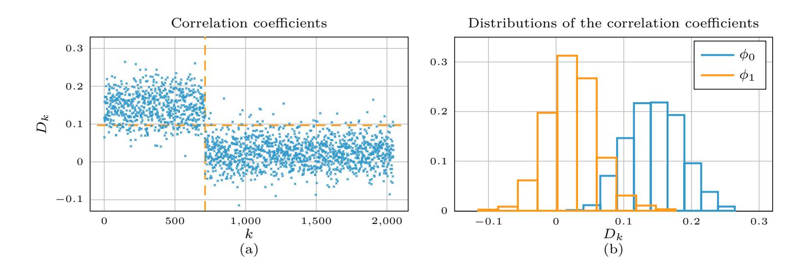
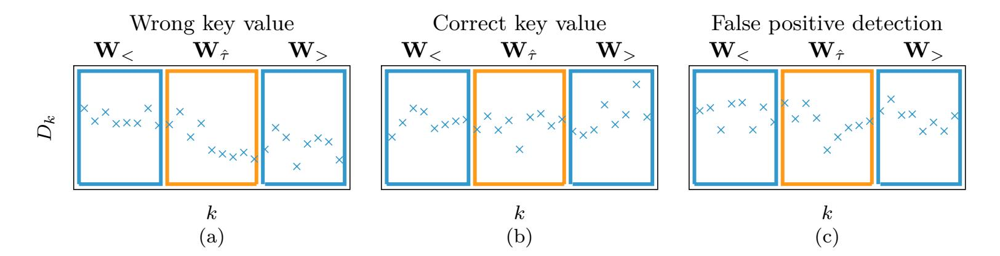
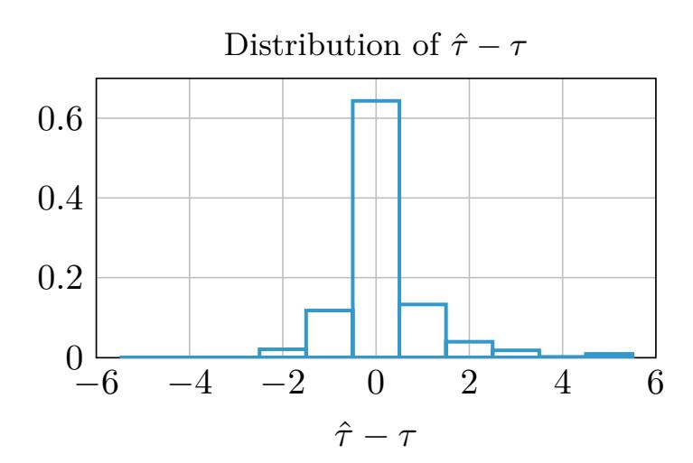
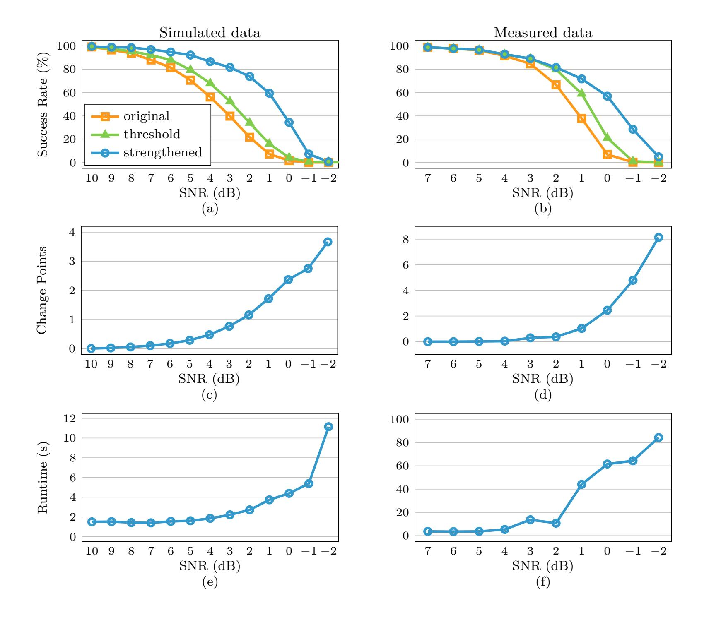
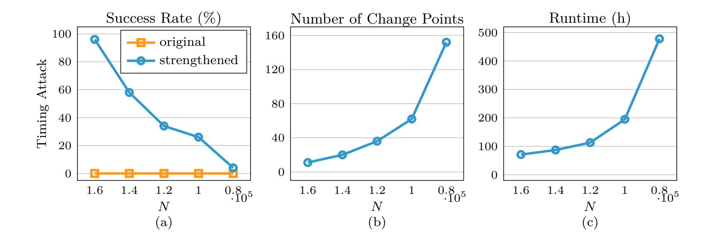

{0}------------------------------------------------

# **Strengthening Sequential Side-Channel Attacks Through Change Detection**

Luca Frittoli<sup>1</sup> , Matteo Bocchi<sup>2</sup> , Silvia Mella<sup>2</sup> , Diego Carrera<sup>2</sup> , Beatrice Rossi<sup>2</sup> , Pasqualina Fragneto<sup>2</sup> , Ruggero Susella<sup>2</sup> and Giacomo Boracchi<sup>1</sup>

> <sup>1</sup> Politecnico di Milano, Milan, Italy [firstname.lastname@polimi.it](mailto:firstname.lastname@polimi.it) <sup>2</sup> STMicroelectronics, Agrate Brianza, Italy [firstname.lastname@st.com](mailto:firstname.lastname@st.com)

**Abstract.** The sequential structure of some side-channel attacks makes them subject to error propagation, i.e. when an error occurs during the recovery of some part of a secret key, all the following guesses might as well be chosen randomly. We propose a methodology that strengthens sequential attacks by automatically identifying and correcting errors. The core ingredient of our methodology is a change-detection test that monitors the distribution of the distinguisher values used to reconstruct the secret key. Our methodology includes an error-correction procedure that can cope both with false positives of the change-detection test, and inaccuracies of the estimated location of the wrong key guess. The proposed methodology is general and can be included in several attacks. As meaningful examples, we conduct two different side-channel attacks against RSA-2048: an horizontal power-analysis attack based on correlation and a vertical timing attack. Our experiments show that, in all the considered cases, strengthened attacks outperforms their original counterparts and alternative solutions that are based on thresholds. In particular, strengthened attacks achieve high success rates even when the side-channel measurements are noisy or limited in number, without prohibitively increasing the computing time.

**Keywords:** side-channel attacks · error detection · error correction · change detection · sequential monitoring.

# **1 Introduction**

Side-Channel Analysis (SCA) is a class of cryptographic attacks that exploit the physical information leaked by a target device during the execution of a cryptographic algorithm, and retrieve the secret key by means of specific statistical tools. Examples of data analyzed by SCA are timing [\[Koc96\]](#page-19-0), power consumption [\[KJJ99\]](#page-19-1) and electro-magnetic radiation [\[GMO01\]](#page-19-2). Since its introduction in 1996 [\[Koc96\]](#page-19-0), SCA has become a major threat, as any statistical dependence between physical leakages and secret information might weaken cryptosystems that are considered mathematically secure.

In this work we consider sequential attacks (Section [3\)](#page-3-0), namely side-channel attacks made of consecutive steps, each targeting a small portion of the secret key, where key guesses are based on a *distinguisher* [\[BJPW13\]](#page-19-3). The distinguisher is a statistic of the side-channel data that is used to assess all the possible values of a portion of the secret key, and identify the most likely. When a portion of the key is wrongly recovered, e.g. due to noise in the power measurements, the intermediate results predicted in the following steps do not correspond anymore to those that were actually involved in the computations. As an illustrative example, we consider the Horizontal Correlation Power Analysis (H-CPA) attack [\[CFG](#page-19-4)<sup>+</sup>10], where the distinguisher is the correlation between the power consumption

Licensed under [Creative Commons License CC-BY 4.0.](http://creativecommons.org/licenses/by/4.0/) Received: 2020-01-15 Accepted: 2019-03-15 Published: 2020-06-19

{1}------------------------------------------------

<span id="page-1-0"></span>

**Figure 1:** (a) The distinguisher values (correlation coefficients) of the key bits chosen by an unsuccessful H-CPA attack. The vertical dashed line indicates an error occurred at step *τ* = 713, causing a change of distribution. The horizontal dashed line indicates the optimal threshold separating the distinguisher values before and after *τ* , as discussed in Section [6.3.](#page-15-0) (b) Two histograms representing the empirical distribution of the distinguisher before (blue) and after (orange) *τ* = 713: the two distributions are significantly different.

and the Hamming weights of intermediate results of specific operations. After the first error, the correlation between the predicted Hamming weights and the power consumption will not allow to recover the remaining key bits. Indeed, as shown in Fig. [1\(](#page-1-0)a), after the first error, the Hamming weights of the predicted operands are not correlated to the power consumption. In general, at the end of an attack, the recovered key can be verified by checking a digital signature, but when the attack fails this procedure does not show the positions of the wrong guesses.

In this work, we propose a methodology to strengthen existing sequential attacks. In particular, we leverage the fact that sequential attacks propagate[1](#page-1-1) the first error as a change in the distribution of distinguisher values (as shown in Fig. [1\)](#page-1-0). Our intuition is to use sound statistical monitoring schemes, namely change-detection tests [\[BN](#page-19-5)<sup>+</sup>93, [RTA11\]](#page-20-0), to design error detection and correction procedures that can substantially increase the success rate of existing attacks. Previous attempts in the literature (discussed in Section [2\)](#page-2-0) have either tackled this problem for specific attacks, or by rather heuristic schemes based on thresholds [\[DKL](#page-19-6)<sup>+</sup>98, [CWT13,](#page-19-7) [LFK18\]](#page-19-8). Our methodology is instead very general, and based on sound statistical tools. In practice, our strengthened attacks can both detect and locate wrong key guesses, and automatically fix them through a correction procedure. Most remarkably, errors are detected and corrected online, i.e. during the key recovery. As a result, our strengthened attacks achieve higher success rates than their original counterparts, and outperform threshold-based solutions to improve attacks.

The proposed methodology is viable for attacks that are theoretically possible, but achieve low success rates due to noisy or scarce side-channel measurements. In particular, our methodology strengthens existing attacks, but does not make them robust against additional countermeasures. Remarkably, the computational overhead of our methodology is rather small, thanks to a greedy error correction procedure that can substantially speed-up the most computational demanding phase.

Here are our main contributions:

• We propose an automatic error detection and correction method, which analyzes the sequence of distinguisher values with a change-detection test to identify and correct the first error (Section [4\)](#page-4-0). Our methodology can be integrated into any sequential attack, and can handle inaccurate estimates of the error location and also

<span id="page-1-1"></span><sup>1</sup>This property was also referred to as *error-detection property* [\[Koc96\]](#page-19-0), as it can be used to determine the position of the first error.

{2}------------------------------------------------

false positive detections of the change-detection test.

• We develop two side-channel attacks against the RSA-2048 exponentiation [\[RSA78\]](#page-20-1) (Section [5\)](#page-10-0) to show how our general methodology can be applied in two completely different attacks. The first is a Horizontal Correlation Power Analysis (H-CPA) attack [\[CFG](#page-19-4)<sup>+</sup>10, [BJPW13\]](#page-19-3), and the second a vertical Timing Attack [\[DKL](#page-19-6)<sup>+</sup>98, [QKS01\]](#page-20-2).

In our experiments (Section [6\)](#page-14-0) we test our strengthened H-CPA attack both on simulated and measured power traces, to which we artificially add Gaussian noise to test our solution at different SNR values. Strengthened attacks achieve significantly higher success rates than the original H-CPA attack, being able to recover entire secret keys when the SNR is low, and substantially outperforming error-detection techniques based on thresholds [\[DKL](#page-19-6)<sup>+</sup>98, [CWT13,](#page-19-7) [LFK18\]](#page-19-8), which constitute the most popular kind of solutions to detect and correct errors in sequential attacks. Similarly, we test a strengthened Timing Attack using real timing measurements. Also in this case, our methodology substantially improves the success rate, and significantly reduces the amount of measurements required to make the attack successful. Indeed, the Timing Attack is impossible to carry out without correction when using such a few timing measurements.

Our results highlight the potential weaknesses of systems that are traditionally considered secure due to the low success rate of sequential attacks: indeed, existing attacks can be easily strengthened by our methodology. Strengthened attacks are significantly more robust to noise in the side-channel data or might require a smaller number of measurements, and can be performed in a reasonable computational time. As a result, devices using unprotected implementations might be less secure than expected, and might require additional countermeasures such as key and message blinding.

# <span id="page-2-0"></span>**2 Related Work**

Error detection in side-channel attacks was first discussed in [\[Koc96\]](#page-19-0). The author presents a Timing Attack against modular exponentiation that is subject to error propagation: after any incorrect key guess, the distinguisher does not allow to find the correct key values anymore. A sketch of an error-correction procedure based on this observation is provided in [\[Koc96\]](#page-19-0), though no implementation details nor experimental results are given.

Quisquater et al. [\[QKS01\]](#page-20-2) present a Timing Attack against RSA-512 that is subject to error propagation. The authors propose an error-detection strategy based on the fact that, after the first error, the attack is more likely to predict key-bits valued 0, while in the key the distribution of the bit values is uniform. Hence, after each guess, a statistical test is used to determine whether the distribution of the latest recovered key bit values is uniform or not. When that is not the case, an error is reported and a correction procedure is activated. The same authors extend their work in [\[SKQ01,](#page-20-3) [Sch05\]](#page-20-4), introducing strategies to improve some *divide and conquer attacks*, i.e. attacks recovering a portion of key at a time. In particular, [\[SKQ01\]](#page-20-3) suggests that in the considered attacks it is possible to assess the correctness of the initial portion of the recovered key, and provides error-detection methods for those attacks. In [\[Sch05\]](#page-20-4), Schindler combines the error-detection techniques proposed in [\[SKQ01\]](#page-20-3) and other strategies to improve the Timing Attack presented in [\[QKS01\]](#page-20-2). The main drawback of these methods [\[QKS01,](#page-20-2) [SKQ01,](#page-20-3) [Sch05\]](#page-20-4) is the lack of generality. Indeed, each attack is presented together with a specific error-detection strategy that applies only to that attack. In contrast, our methodology is very general and can be easily ported to any sequential attack.

Dhem et al. [\[DKL](#page-19-6)<sup>+</sup>98], Chen et al. [\[CWT13\]](#page-19-7) and Luo et al. [\[LFK18\]](#page-19-8) propose Timing Attacks targeting, respectively, RSA-512, RSA-CRT and a GPU implementation of RSA, all subject to error propagation. The error-detection methods provided in [\[DKL](#page-19-6)<sup>+</sup>98,

{3}------------------------------------------------

```
Algorithm 1 Target algorithm (decryption function)
```

```
Input: ciphertext c, secret key d
Output: original message m
1: O_1 is initialized
2: for k = 1 : K do
3: O_{k+1} \leftarrow \text{operations}(d[k], O_k, c)
4: end for
5: return m \leftarrow O_{K+1}
```

```
Algorithm 2 Sequential attack
```

```
Input: target algorithm, ciphertext c, side channel \{\mathbf{L}_k\}_{k=1}^K, distinguisher \mathcal{D}

Output: estimated secret key \hat{d}

1: \hat{O}_1 is initialized as in Algorithm 1

2: for k=1:K do

3: \hat{d}[k] \leftarrow \arg\max_{\mathbf{x} \in \mathbf{X}} \mathcal{D}(\mathbf{x}, \hat{O}_k, \mathbf{L}_k)

4: \hat{O}_{k+1} \leftarrow \operatorname{operations}(\hat{d}[k], \hat{O}_k, c)

5: end for

6: return \hat{d} \leftarrow (\hat{d}[1], \dots, \hat{d}[K])
```

CWT13, LFK18 leverage the fact that, as long as the partial key guesses are correct, the distinguishers corresponding to the correct key values and those of the wrong key values follow different distributions. However, after an error the distinguisher values follow the same distribution both for correct and wrong key guesses. For this reason, the authors monitor the distinguishers and/or the difference between the distinguishers of the two candidate bit values, and detect an error when that quantity is "low" (i.e. below a threshold) for a certain number of consecutive steps of the attack. Although these error-detection methods can in principle be applied also to other attacks, they require the attacker to set a threshold to decide whether the distinguisher or their difference is "high" or "low". This threshold might be difficult to set a priori, and typically relies on heuristics that do not allow to control the false positive rate. Moreover, a single false positive (or false negative) might affect the correction. In contrast, the change-detection test we employ can operate on any distribution of the distinguisher values, and allows to control the probability of finding a false positive by means of the Average Run Length. In Section 6, we show that these theoretical advantages result in a more effective scheme for correcting errors, since our strengthened attacks achieve much higher success rates than alternative threshold-based techniques.

# <span id="page-3-0"></span>3 Background and Problem Formulation

In this section we define *sequential attacks*, a class of side-channel attacks that are subject to error propagation and to which our error-detection methodology can be applied. Here we also provide a formal definition of the addressed error-detection and correction problems.

### <span id="page-3-3"></span>3.1 Sequential Attacks

Among side-channel attacks we consider the class of sequential attacks. A sequential attack recovers a portion of the secret key at a time, by reconstructing the intermediate steps of the target algorithm. In particular, the attacker computes the possible intermediate results of each step, which depend on a portion of the secret key. Then, the attacker leverages a distinguisher based on the side-channel data to select the most likely. As a consequence, the attacker can find the most likely value of the portion of secret key involved in each step. Note that, to compute these intermediate results, the attacker needs to know the implementation of the target cryptosystem, as well as its input.

Let us consider the prototype of a decryption function illustrated by Algorithm 1 as the target of a sequential attack. The k-th step of the decryption typically combines a portion d[k] of the key (one or a few bits), the output  $O_k$  of the previous step and sometimes the ciphertext c to compute the next output  $O_{k+1} = \text{operations}(d[k], O_k, c)$ , where operations denotes the set of instructions executed in each step of the algorithm.

{4}------------------------------------------------

It is assumed that  $O_1$  is initialized to some fixed value (which depends on the algorithm), and that the algorithm has K steps in total.

During the k-th step of a sequential attack (Algorithm 2), the attacker reconstructs d[k] by evaluating a distinguisher function  $\mathcal{D}(\mathbf{x}, \widehat{O}_k, \mathbf{L}_k)$ , which takes as input a possible key value  $\mathbf{x}$ , a prediction of the output  $O_k$ , denoted by  $\widehat{O}_k$  and the side-channel data  $\mathbf{L}_k$ . The distinguisher is expected to take high values when  $\mathbf{x}$  coincides with the true key value d[k], and low values otherwise. The distinguisher plays a fundamental role in a sequential attack, since the attacker selects  $\widehat{d}[k]$  by simply maximizing  $\mathcal{D}$  (line 3) over all the possible key values  $\mathbf{x} \in \mathbf{X}$ :

<span id="page-4-1"></span>
$$\hat{d}[k] = \arg\max_{\mathbf{x} \in \mathbf{X}} \mathcal{D}(\mathbf{x}, \widehat{O}_k, \mathbf{L}_k). \tag{1}$$

The output of the k-th step is predicted from the guessed key (line 4), and the whole procedure is repeated in the following steps.

Because of their structure, sequential attacks are subject to error propagation. When the maximization of the distinguisher function leads to a wrong key guess, also the predicted output is not correct. Hence, all the key portions reconstructed after the error are like random, since based on a wrong prediction. As a consequence, the key cannot be recovered. An error occurs every time the distinguisher is maximized by a wrong key value rather than the correct one, e.g. due to noise in the side-channel measurements.

#### 3.2 Problem Formulation

To strengthen sequential side-channel attacks we need to solve two major problems:

• Error Detection: estimating the first attacking step where the recovered key portion obtained from (1) is different from the actual one. We denote by  $\tau$  the location of the first error, which is formally defined as

<span id="page-4-2"></span>
$$\tau = \min\{k : \hat{d}[k] \neq d[k]\}. \tag{2}$$

Error detection consists in determining that an error has occurred, and providing an estimate  $\hat{\tau}$  of its location. Error detection should be preferably performed *online*, i.e. during the execution of the attack.

• Error Correction: correcting the first error using the estimated location  $\hat{\tau}$ . Note that each detection might not correspond to a wrong key guess, being just a false positive of the error-detection algorithm. Moreover, the estimated error location  $\hat{\tau}$  might not be accurate. Hence, errors cannot be simply corrected by changing the decision made at the step identified by the error-detection procedure.

# <span id="page-4-0"></span>4 Proposed Solution

Here we present our error detection and correction methodology to strengthen a generic sequential attack (Algorithm 3). The core ingredient of our error-detection procedure is a change-detection test (CDT) [BN<sup>+</sup>93] that we execute at each step of the attack (line 7) to monitor a sequence of distinguisher values. The CDT analyzes the sequence  $\mathbf{D} = \{D_k\}_k$  of distinguisher values defined as:

<span id="page-4-3"></span>
$$D_k = \max_{\mathbf{x} \in \mathbf{X}} \mathcal{D}(\mathbf{x}, \widehat{O}_k, \mathbf{L}_k) = \mathcal{D}(\hat{d}[k], \widehat{O}_k, \mathbf{L}_k), \tag{3}$$

which contains all the distinguisher values corresponding to the key guesses made by the attack. The outputs of the CDT indicate whether the sequence  $\mathbf{D}$  contains a distribution change, and in this case the estimated location of the change point  $\hat{\tau}$ . This estimate

{5}------------------------------------------------

<span id="page-5-0"></span>

**Figure 2:** Examples of distinguisher values contained in the windows **W***<sup>τ</sup>*ˆ, **W***<*, **W***<sup>&</sup>gt;* and the rationale behind our correction procedure. In (a) the key value tested in **W***<sup>τ</sup>*<sup>ˆ</sup> is wrong, thus **W***<sup>&</sup>lt;* and **W***<sup>&</sup>gt;* have different distributions. In (b), the tested key value is correct, thus **W***<sup>&</sup>lt;* and **W***<sup>&</sup>gt;* follow the same distribution. In (c), *τ*ˆ is a false positive detection, thus the distributions of **W***<sup>&</sup>lt;* and **W***<sup>&</sup>gt;* coincide, but this is different around the detection, i.e. in **W***<sup>τ</sup>*ˆ. This latter illustration indicates why it is necessary not to include **W***<sup>τ</sup>*<sup>ˆ</sup> in the error correction, and also to remove this window from **D** when the monitoring restarts.

is typically rather close to the first error *τ* occurred during the attack, but it does not necessarily correspond to *τ* , as we show in Section [4.3.](#page-9-0) The CDT monitors the sequence **D** in an *online* manner, detecting distribution changes while the attack proceeds (lines [1-4\)](#page-6-0) and **D** is being acquired (lines [5-6\)](#page-6-0).

Every time we detect a change during the attack, we activate our error-correction procedure (lines [8-18\)](#page-6-0). This consists in a brute-force search over all the possible values of the secret key in a reasonably small window **W***τ*ˆ, which is centered around the estimated change point *τ*ˆ. Our idea is to use a statistical test to determine whether any of the tested combinations can correct the potential error. In particular, the statistical test assesses whether the distinguisher in a window **W***<*, cropped before the brute-force window **W***τ*ˆ, and in a window **W***>*, opened after **W***τ*ˆ, follow the same distribution (see Fig. [2\)](#page-5-0). In fact, assuming that **W***<sup>&</sup>lt;* have been computed from the correct key guesses, the statistical test would identify the correct key around *τ*ˆ as the one yielding the same distribution in **W***>*. It is important to remark that, to deal with false positives of the CDT, the window **W***τ*<sup>ˆ</sup> should not to be considered during the correction procedure, nor in the following steps of the attack (line [17\)](#page-6-0). In fact, the detection at *τ*ˆ suggests that – in case of a false positive – the distribution of **W***<sup>τ</sup>* is non-stationary even when the key is correctly guessed (see Fig. [2\(](#page-5-0)c)). Note that our methodology is very general, thus it can be applied to any sequential attack, as defined in Section [3.1.](#page-3-3)

In what follows we provide a detailed description of the error-detection (Section [4.1\)](#page-5-1) and correction (Section [4.2\)](#page-7-0) procedures to strengthen sequential attacks. Finally, we discuss more in detail the assumptions on which our methodology is based (Section [4.3\)](#page-9-0).

### <span id="page-5-1"></span>**4.1 Error Detection Through CDT**

The underlying assumption of our monitoring solution is that the distinguisher values {*Dk*}*k<τ* corresponding to correct key values { ˆ*d*[*k*]}*k<τ* are i.i.d. realizations drawn from an unknown distribution *φ*0, namely *D<sup>k</sup>* ∼ *φ*0. In contrast, distinguisher values corresponding to wrong key values are drawn from a different distribution *φ*1, which is also unknown. Due to error propagation, after the first error at *τ* , both the distinguisher values of the correct and wrong key values follow the distribution *φ*<sup>1</sup> 6= *φ*0. In particular, we expect that

<span id="page-5-2"></span>
$$D_k \sim \begin{cases} \phi_0 & k < \tau \\ \phi_1 & k \ge \tau \end{cases} \tag{4}$$

{6}------------------------------------------------

#### <span id="page-6-0"></span>Algorithm 3 Strengthened sequential attack

```
Input: target algorithm, ciphertext c, side channel \{\mathbf{L}_k\}_{k=1}^K, distinguisher \mathcal{D}, set of
      possible window lengths S
Output: estimated secret key d
  1: O_1 is initialized as in Algorithm 1
  2: for k = 1, ..., K do
           \hat{d}[k] \leftarrow \arg\max_{\mathbf{x} \in \mathbf{X}} \mathcal{D}(\mathbf{x}, \widehat{O}_k, \mathbf{L}_k) // Algorithm 2, line 3
  3:
           \widehat{O}_{k+1} \leftarrow \text{operations}(\widehat{d}[k], \widehat{O}_k, c) // Algorithm 2, line 4
  4:
           D_k \leftarrow \max_{\mathbf{x} \in \mathbf{X}} \mathcal{D}(\mathbf{x}, \widehat{O}_k, \mathbf{L}_k) // save the distinguisher value D_k
  5:
            \mathbf{D} \leftarrow (\mathbf{D}, D_k) // append D_k to the sequence \mathbf{D}
  6:
            change_detected, \hat{\tau} \leftarrow \text{CDT}(\mathbf{D}) // error detection
  7:
           if change_detected // error correction then
  8:
                 align \hat{\tau} and k
  9:
                 for each w \in \mathbf{S} do
10:
                      succ\_correction, \mathbf{x}_{best} \leftarrow correction(\hat{\tau}, w, \mathbf{D}) // Algorithm 4
11:
                       if succ_correction then
12:
                            break
13:
                       end if
14:
                 end for
15:
                 (\hat{d}[\hat{\tau} - u], \dots, \hat{d}[\hat{\tau} + u]) \leftarrow \mathbf{x}_{\text{best}}, \quad k \leftarrow \hat{\tau} + u + 1
16:
                 \mathbf{D} \leftarrow \mathbf{D} \setminus (D_{\hat{\tau}-u}, \dots, D_{\hat{\tau}+u})
17:
            end if
18:
19: end for
20: return \hat{d} \leftarrow (\hat{d}[1], \dots, \hat{d}[K])
```

Our assumption seems to be validated by the observed behaviour of the correlation coefficients in the H-CPA attack [CFG<sup>+</sup>10], which decrease suddenly after the first error, as shown in Fig. 1. We further discuss this aspect in Section 4.3.

To automatically determine whether the distribution in  $\mathbf{D}$  has changed or not and, in the former case, to estimate the exact location of the first wrong guess in the secret key, we monitor the sequence  $\mathbf{D}$  with a change-detection test based on a Change Point Model (CPM) formulation [RTA11]. CPMs are statistical tests designed to identify a *change point* in a sequence, namely a location  $\tau$  as in (4). In our case a change point corresponds to the location of the first wrong guess, thus CPMs are the best tools to monitor sequential attacks. Since a change point might occur anywhere in the monitored sequence, the null hypothesis  $(H_0)$  of CPM is that all the elements follow the same distribution, while the alternative hypothesis  $(H_1)$  is that the sequence contains a change point  $\tau$ :

$$H_0: D_k \sim \phi_0 \ \forall k, \qquad H_1: \ \exists \ \tau: D_k \sim \begin{cases} \phi_0 & k < \tau \\ \phi_1 & k \ge \tau \end{cases}$$
 (5)

The CPM is based on a test statistic S specifically designed to compare two sets of observations and assess "how different" they are. In CPM, each tentative change point t < k is tested by splitting the sequence  $\mathbf{D} = \{D_1, \ldots, D_k\}$  in two sets  $\mathbf{A}_t = \{D_1, \ldots, D_{t-1}\}$  and  $\mathbf{B}_t = \{D_t, \ldots, D_k\}$ , and computing the test statistic  $S_{t,k} = S(\mathbf{A}_t, \mathbf{B}_t)$ . When the maximum of the test statistic  $S_{\max,k} = \max_t S_{t,k}$  exceeds a specific threshold  $h_k$ , a change point is reported at the location  $\hat{\tau}$  maximizing S:

$$\hat{\tau} = \arg\max_{t} \mathcal{S}_{t,k}. \tag{6}$$

Several statistics can be used to compare the two sets, depending on the kind of change that can be expected in the monitored sequence. Examples of statistics used in CPM 

{7}------------------------------------------------

are the Mann-Whitney [MW47], Hotelling [H<sup>+</sup>51], Mood [M<sup>+</sup>54] and Lepage [Lep71] test statistics. The thresholds  $\{h_k\}_k$  are set to control the Average Run Length (ARL<sub>0</sub>), that is the expected value of the time at which the CPM reports a false positive detection, i.e.  $ARL_0 = \mathbb{E}_{\phi_0}[\hat{k}]$ . Here  $\hat{k}$  indicates the detection time, i.e.  $\hat{k} = \min\{k : \mathcal{S}_{\max,k} > h_k\}$ . This parameter can adjust the sensitivity with respect to false positives: increasing the ARL<sub>0</sub> reduces the frequency at which false positives occur, at the cost of a higher detection delay. In all our experiments we set  $ARL_0 = 50,000$ .

To apply our error-detection method, we first execute the same operations performed during each step of the sequential attack (Algorithm 3, lines 1-4), then append the distinguisher values of the guessed key portions to the sequence  $\mathbf{D}$  (lines 5-6) and finally monitor  $\mathbf{D}$  with the CPM (line 7). The CPM is executed *online*, i.e. adding a new observation after each step, until a change point is found (or until the end of the attack).

Here, we use the Lepage statistic [Lep71], that is meant to identify both changes in scale and location [RTA11], as we expect that a wrong guess might affect any of these. A fundamental advantage of the Lepage statistic is that, like other rank-based statistics, it does not depend on  $\phi_0$  and  $\phi_1$ , thus the thresholds  $\{h_k\}_k$  can be easily pre-computed through Monte Carlo simulations [RTA11], to achieve the desired ARL<sub>0</sub>.

Typically, the online CPM requires a few samples after the change point to gather enough statistical evidence for a detection, thus detections occur at  $\hat{k} > \hat{\tau}$ . Hence, when a wrong guess introduces a distribution change of the monitored sequence  $\mathbf{D}$ , all the computations performed in the steps between the estimated change point  $\hat{\tau}$  and the detection time  $\hat{k}$  are pointless due to error propagation. This makes detection promptness a very important aspect in attacks that are computationally expensive.

Note that adopting a change-detection test over  $\mathbf{D}$  is different from using the monitoring schemes based on thresholds described in Section 2, which estimate  $\tau$  as the first index where the sequence  $\mathbf{D}$  goes below a fixed threshold. Indeed, these methods disregard whether the detection is due to a persistent change in the distribution of  $\mathbf{D}$  (induced by a wrong key guess), or rather by a correct guess yielding an outlier (e.g. a spurious distinguisher value). Moreover, using a CPM allows us to control the false positives by means of the ARL<sub>0</sub>.

#### <span id="page-7-0"></span>4.2 Error Correction

After detecting a change point  $\hat{\tau}$ , we activate our error-correction method (Algorithm 3, line 11), which is detailed in Algorithm 4. The aim of this procedure is to correct the error that might have occurred at  $\hat{\tau}$  or at a nearby index. More formally, we expect the detected change point  $\hat{\tau}$  to be either:

- the location of the first error  $\hat{\tau} = \tau$  as defined in (2),
- a correct but inaccurate detection, i.e.  $\hat{\tau}$  is close to  $\tau$ ,
- a false positive, i.e. a change point was detected but no error occurred.

Our error-correction procedure implements a brute-force search over a reasonably small window<sup>2</sup>  $\mathbf{W}_{\hat{\tau}} = \{\hat{\tau} - u, \dots, \hat{\tau} + u\}$ , having size w = 2u + 1 and centered at the detected change point  $\hat{\tau}$ . We denote by  $\mathbf{X}^w$  the set of all the admissible key values over  $\mathbf{W}_{\hat{\tau}}$ .

During the brute-force search over  $\mathbf{W}_{\hat{\tau}}$ , we test each possible value  $\mathbf{x} \in \mathbf{X}^w$  as follows: first, we compute the outputs of the operations executed over  $\mathbf{W}_{\hat{\tau}}$ , using  $\mathbf{x}$  (lines 2-3). Then, the attack continues after step  $\hat{\tau} + u + 1$  (line 4) for a few steps to fill the window  $\mathbf{W}_{>}$ . When  $\mathbf{x}$  corresponds to the correct key, and there are no wrong guesses for a few steps, samples in  $\mathbf{W}_{>}$  are expected to follow the distribution  $\phi_0$ , as shown in Fig. 2(b).

<span id="page-7-1"></span><sup>&</sup>lt;sup>2</sup>Here we present a symmetric window to simplify the notation. However,  $\mathbf{W}_{\hat{\tau}}$  might also be asymmetric, e.g. when considering an even window size w.

{8}------------------------------------------------

#### <span id="page-8-0"></span>Algorithm 4 Correction procedure

```
Input: target algorithm, ciphertext c, side channel \{\mathbf{L}_k\}_{k=1}^K, distinguisher \mathcal{D}, change
      point \hat{\tau}, \mathbf{W}_{\hat{\tau}} with size w = 2u + 1, distinguisher sequence \mathbf{D}, predicted output \widehat{O}_{\hat{\tau}-u}
Output: correction goodness (succ_correction), best estimated key \mathbf{x}_{\text{best}} over \mathbf{W}_{\hat{\tau}}
  1: for \mathbf{x} \in \mathbf{X}^w do
           set (\hat{d}^{\mathbf{x}}[\hat{\tau} - u], \dots, \hat{d}^{\mathbf{x}}[\hat{\tau} + u]) = \mathbf{x} // initialization
  2:
           compute \widehat{O}_{\hat{\tau}-u+1}^{\mathbf{x}}, \dots, \widehat{O}_{\hat{\tau}+u+1}^{\mathbf{x}} using operations // as in Algorithm 2, line 4
  3:
           restart the attack from step k = \hat{\tau} + u + 1
  4:
           select the two windows \mathbf{W}_{<} \leftarrow \{D_k\}_{k < \hat{\tau} - u}, \quad \mathbf{W}_{>} \leftarrow \{D_k^{\mathbf{x}}\}_{k > \hat{\tau} + u}
  5:
           run the statistical test \mathcal{S}(\mathbf{W}_{<},\mathbf{W}_{>})
  6:
           if the test yields enough statistical evidence then
  7:
  8:
                 return true, x
           end if
  9:
10: end for
11: return false, the x maximizing the statistic in line 6
```

A very practical way to assess this hypothesis is to test whether the distribution in  $\mathbf{W}_{>}$  is the same as that in  $\mathbf{W}_{<}$ , which refers to the steps before  $\mathbf{W}_{\hat{\tau}}$  (line 6). In fact, when  $\mathbf{x}$  is wrong, the distinguisher values in  $\mathbf{W}_{>}$  should follow a different distribution  $\phi_1$  due to error propagation, (see Fig. 2(a)). The choice of the hypothesis test and the sizes of the windows  $\mathbf{W}_{<}$ ,  $\mathbf{W}_{>}$  (which we have not defined on purpose) depend on several factors, such as specific characteristics of the attack and its computational cost. In Section 5 we provide two detailed examples of correction procedures for two different attacks.

Due to the stochastic nature of the monitored sequence, the CPM might detect a change point in  $\mathbf{D}$  even when all the key guesses are correct. This might be due, for instance, to consecutive distinguisher values that are outliers, as shown in Fig. 2(c). The correction procedure has to cope with this very important problem: if  $\hat{\tau}$  was a false positive of the CPM, the test might find that the windows  $\mathbf{W}_{>}$ ,  $\mathbf{W}_{<}$  follow different distributions even when the correct key value has been identified by the brute-force search. This is the reason why the correction procedure does not include  $\mathbf{W}_{\hat{\tau}}$  in the windows  $\mathbf{W}_{<}$ ,  $\mathbf{W}_{>}$ . Similarly, we remove the whole window  $\mathbf{W}_{\hat{\tau}}$  from  $\mathbf{D}$  in the following steps of the attack (Algorithm 3, line 17). Since we exclude the analyzed brute-force windows from  $\mathbf{D}$ , the indexes of the monitored sequence  $\mathbf{D}$  are not aligned with the attacking steps. For this reason we need to adjust the detected change points (Algorithm 3, line 9) by a suitable shift.

The size of the brute-force window determines a trade-off between effectiveness and efficiency: larger brute-force windows allow us to handle detected change points  $\hat{\tau}$  that are far from the first error location, improving the correction performance. On the other hand, larger brute-force windows mean that an exponentially larger number of admissible values  $\mathbf{x} \in \mathbf{X}^w$  need to be tested, increasing the computational complexity and the runtime. To reduce the average computation time while keeping the effectiveness of our correction procedure, we have developed a greedy strategy (Algorithm 3, lines 10-15) that performs the brute-force search over increasingly larger windows, until the test yields a strong statistical evidence that the correction was successful (Algorithm 3, line 12). When such evidence is found (Algorithm 4, lines 7-8), we select the corresponding value  $\mathbf{x}$  as the correct one, stop the brute-force search and restart the attack. For instance, the correction might stop when the p-value of the statistical test exceeds a certain threshold. When none of the possible values  $\mathbf{x} \in \mathbf{X}^w$  is selected, we repeat the search over a larger window. This strategy reduces on average the time required by our correction procedure, which is very important when the considered attack is computationally expensive. Indeed, in most cases the change point  $\hat{\tau}$  estimated by CPM is very close to the location of the first error  $\tau$ , thus performing the brute-force search over a small window should be enough to correct

{9}------------------------------------------------

<span id="page-9-1"></span>

**Figure 3:** Histogram representing the empirical distribution of the difference between the detected change points *τ*ˆ and the corresponding first error locations *τ* (excluding false positive detections), computed over 2,000 H-CPA attacks on simulated data (see Section [5.1\)](#page-10-1).

the wrong guess. The window size (and consequently the computational cost) is increased only in the rare cases where the detected change point is far from the first error.

### <span id="page-9-0"></span>**4.3 Discussion**

Here we discuss some of the assumptions on which our methodology is based, and how our error detection and correction methods can cope with violations of these hypotheses.

**Distribution of the distinguisher** A key assumption of our error-detection method (Section [4.1\)](#page-5-1) is that the distinguisher values corresponding to the correct guesses are i.i.d. realizations of a random variable, which seems reasonable from our observations (Fig. [1\)](#page-1-0). However, this is not guaranteed in practice, and violations of this assumption might lead to a higher number of false positive detections than expected, which we experience in our experiments. However, our correction procedure (Section [4.2\)](#page-7-0) can deal with false positives, thus our methodology works even when this hypothesis is violated.

It is also possible that some sequential attacks provide remarkably non-stationary distributions, or even multiple distinguisher sequences, which apparently cannot be handled by our error-detection procedure. Here we show that the proposed methodology can be applied also in a variety of these cases:

- when the sequence **D** exhibits a trend, e.g. an increase over time, **D** can be preprocessed to remove the trend by means of specific statistical tools [\[ABR11,](#page-18-0) [RTA11\]](#page-20-0). Then, our error detection procedure can be applied.
- It might happen that the distinguisher in **D** follows different distributions depending on the value of the correct key value, hence the distribution *φ*<sup>0</sup> becomes multimodal. Since the CPM can handle data following any distribution [\[RTA11\]](#page-20-0), our error detection method should work as is.
- When multiple pieces of hardware or multiple side channel data are analyzed at the same time, there might be several distinguisher sequences at play. In this case, our error detection procedure should be modified to monitor all these sequences in parallel, and to flag a potential error as soon as the CPM finds a change in at least one of the sequences, as in [\[FRK19\]](#page-19-13).

**Location of the detected change points** A fundamental assumption of our errorcorrection procedure is that detected change points *τ*ˆ, excluding false positive detections, are close to the first error locations *τ* . In case of an inaccurate detection, the estimate *τ*ˆ provided by the CPM might be either a few samples before or after the actual first error location *τ* , as we observe empirically (see Fig. [3\)](#page-9-1). For this reason, in our correction

{10}------------------------------------------------

<span id="page-10-2"></span>**Algorithm 5** Square and multiply always exponentiation (left-to-right)

```
Input: ciphertext c, key d, modulus n
Output: m = c
              d mod n
 1: R ← 1
 2: for k = 1 : K do
 3: R ← R2 mod n
 4: if d[k] = 1 then
 5: R ← R · c mod n
 6: else
 7: aux ← R · c mod n
 8: end if
 9: end for
10: return m ← R
```

<span id="page-10-3"></span>**Algorithm 6** Multiply and square exponentiation (right-to-left)

```
Input: ciphertext c, key d, modulus n
Output: m = c
              d mod n
 1: R ← 1, Q ← c
 2: for k = 1 : K do
 3: if d[k] = 1 then
 4: R ← R · Q mod n
 5: else
 6: aux ← R · Q mod n
 7: end if
 8: Q ← Q2 mod n
 9: end for
10: return m ← R
```

procedure we consider windows containing samples from both sides of *τ*ˆ. The empirical distribution of the difference *τ*ˆ−*τ* represented in Fig. [3](#page-9-1) can be used to define the maximum window size, and confirms the validity of our greedy strategy. Indeed, it is convenient to perform the brute-force search over increasingly larger windows, since in most cases a small window is sufficient, and only in rare cases it is necessary to search larger windows.

# <span id="page-10-0"></span>**5 Two Strengthened Sequential Attacks**

We applied our error detection and correction methods to strengthen two sequential SCAs targeting the RSA-2048 exponentiation [\[RSA78\]](#page-20-1). The first one is a Horizontal Correlation Power Analysis (H-CPA) attack [\[CFG](#page-19-4)<sup>+</sup>10], while the second is a vertical Timing Attack [\[DKL](#page-19-6)<sup>+</sup>98]. We tested the H-CPA attack on a hardware implementation of the square and multiply always exponentiation (Algorithm [5\)](#page-10-2) based on a schoolbook multiplication with an underlying 64-bit multiplier, and on a software implementation of the multiply and square exponentiation (Algorithm [6\)](#page-10-3) based on Montgomery multiplication [\[Mon85\]](#page-19-14) with an underlying 32-bit multiplier. As a target for the Timing attack, we chose a software implementation of the sliding window exponentiation with window size 4 (Algorithm [7\)](#page-12-0) based on Montgomery multiplication. Since Algorithms [5,](#page-10-2)[7](#page-12-0) parse the private key *d left-toright*, i.e starting from the most significant bit, in those algorithms we denote by *d*[*k*] the bit processed at the *k*-th step of the algorithm rather than the *k*-th least significant bit of *d*, to be consistent with Algorithm [2.](#page-3-2)

### <span id="page-10-1"></span>**5.1 Horizontal Correlation Power Analysis Attack**

This horizontal attack was introduced by Clavier [\[CFG](#page-19-4)<sup>+</sup>10] and formalised by Bauer [\[BJPW13\]](#page-19-3). The peculiarity of the *horizontal modus operandi*, proposed by Walter [\[Wal01\]](#page-20-5), is the use of side-channel data referring to a single execution of the target algorithm. Horizontal attacks are thus very practical, as they require a single execution of the target algorithm and, most importantly, they are intrinsically robust against key blinding.

The H-CPA attack exploits as distinguisher function D the correlation between an array **L***<sup>k</sup>* containing the power consumption measured when specific operations are performed, and the array **H***<sup>k</sup>* containing the Hamming weights of the input and/or output of those operations [\[BCO04\]](#page-18-1). Note that we refer to arrays to avoid confusion with the sequences monitored by the CPM: indeed, different arrays **L***k,* **H***<sup>k</sup>* are used in each step *k* of the attack. To fill the array **L***k*, the attacker needs to perform a pre-processing phase to locate

{11}------------------------------------------------

| step $k$                             |               | step $k+1$                                          |
|--------------------------------------|---------------|-----------------------------------------------------|
| $R_k \leftarrow (R_k)^2 \bmod n$     | if $d[k] = 1$ | $  1_{k+1}(1) \setminus 1_{k+1}(1) \cdot 0   1_{k}$ |
| $P_k \leftarrow R_k \cdot c \bmod n$ | if $d[k] = 0$ |                                                     |

<span id="page-11-0"></span>**Table 1:** The input to the operations computed in step k+1 depending on d[k].

and extract all the relevant power consumption samples from a single power trace, which requires to know exactly the target algorithm and its implementation. This pre-processing phase might be extremely difficult also when the target implementation is known, because the traces might be jittering and/or the operations within the multiplication algorithm might not produce a visible structure in the power consumption.

In what follows, we describe how to apply the H-CPA attack by [CFG<sup>+</sup>10] on the square and multiply always exponentiation (Algorithm 5) and how strengthen it with our error detection and correction methodology. In particular, the attacked operations are the products of the square and multiply always exponentiation (Algorithm 5, lines 5,7), whose factors depend on the secret key. The side-channel data  $\mathbf{L}_k$  used at the k-th step of the attack consist of the power consumption samples extracted from the (k+1)-th product.

At the k-th step, the attacker computes the possible values of the result variable R, which depend on d[k]: when d[k] = 0,  $R = R_k$ , i.e. the output of the square (line 3) and, when d[k] = 1,  $R = P_k$ , i.e. the output of the product (line 5), which define the pair  $\hat{O}_k = (R_k, P_k)$ . Then, the attacker simulates, for each value of d[k], the square and the product performed at step k + 1 of Algorithm 5, as shown in Table 1, and computes the Hamming weights of the 64-bit digits of the first operand for each simulated product. These are saved in two arrays  $\mathbf{H}_k^0$ ,  $\mathbf{H}_k^1$ , associated with the two possible values  $\mathbf{x} \in \{0, 1\}$  of d[k]. Then, the attacker evaluates as distinguisher the Pearson correlation coefficient, denoted by  $\varrho$ , between each array  $\mathbf{H}_k^{\mathbf{x}}$  and the array  $\mathbf{L}_k$  containing the side-channel data:

$$\mathcal{D}(\mathbf{x}, \widehat{O}_k, \mathbf{L}_k) = \varrho(\mathbf{H}_k^{\mathbf{x}}, \mathbf{L}_k). \tag{7}$$

According to (1),  $\hat{d}[k]$  is chosen as the bit value associated to the highest correlation (Algorithm 3, line 3). At step k + 1, the whole procedure is repeated using the outputs  $\hat{O}_{k+1} = (R_{k+1}(\hat{d}[k]), P_{k+1}(\hat{d}[k]))$  predicted at step k (Table 1), as in Algorithm 3, line 4. When applying our proposed methodology in this attack, the sequence  $\mathbf{D} = \{D_k\}_k$  from (3) is analyzed by the CPM (Algorithm 3, line 7). The correction procedure (Algorithm 4) starts with a symmetric brute-force window  $\mathbf{W}_{\hat{\tau}}$  of size w = 3, which is increased symmetrically by two whenever none of the possible combinations  $\mathbf{x} \in \mathbf{X}^w$  is chosen as the correct one, up to a maximum window size w = 9.

The correction procedure considers windows  $\mathbf{W}_{<}$ ,  $\mathbf{W}_{>}$  of size 30 (Algorithm 4, line 5) and compares the two windows by means of the Mann-Whitney test statistic. The Mann-Whitney statistic is designed to detect changes in the median value of a distribution, which is the most evident effect we observe on the distribution of the distinguisher when an error occurs during H-CPA attacks (Fig. 1). When the p-value obtained by the Mann-Whitney test is larger than a fixed threshold  $\alpha$ , we assume that there is not enough statistical evidence to claim that the elements of  $\mathbf{W}_{<}$  and  $\mathbf{W}_{>}$  have different distributions, thus  $\mathbf{x}$  can be chosen as the correct key. Hence, we stop the brute-force search (Algorithm 4, line 7). In case at the end of the brute-force search over the largest window none of the key values  $\mathbf{x} \in \mathbf{X}^w$  yields a sufficiently large p-value, the value with the largest p-value is selected as the correct one (Algorithm 4, line 11). As an early stopping criterion, in our experiments we set an extremely low value of  $\alpha$ , namely  $\alpha = 10^{-7}$ . Even though unusual in hypothesis tests, we have observed that wrong key values yield p-values that are orders of magnitude smaller than the correct ones.

{12}------------------------------------------------

<span id="page-12-0"></span>**Algorithm 7** Sliding window exponentiation

```
Input: ciphertext c, key d, modulus n
Output: m = c
              d mod n
 1: for j = 0 : 7 do
 2: Q[j] ← (j + 8) · c mod n
 3: end for
 4: R ← 1
 5: for k = 1 : K do
 6: if d[k] = 1 then
 7: R ← R16 mod n
 8: xyz ← (d[k + 1], d[k + 2], d[k + 3])
 9: R ← R · Q[xyz] mod n
10: k ← k + 3
11: else
12: R ← R2 mod n
13: end if
14: end for
15: return m ← R
```

```
Algorithm 8 Montgomery multiplication
Input: operands a, b, Montgomery parame-
   ter r, modulus n, n
                      0
                       s.t. r·r
                              −1−n·n
                                      0 = 1
                     −1
```

```
Output: p = a · b · r
 1: t ← a · b
 2: u ← (t + (t · n
                  0 mod r) · n)/r
 3: if u ≥ n then
 4: u ← u − n
 5: end if
 6: return p ← u
```

Note that computing the Mann-Whitney test statistic is more efficient than repeating the online CPM for each combination, but requires to carry out the attack for at least 30 steps for each combination, to gather enough distinguisher values to achieve a statistically significant outcome of the Mann-Whitney test. Performing 30 steps of the attack for each combination tested during the brute-force search is possible because the H-CPA attack is not computationally demanding.

When the power consumption samples in the arrays **L***<sup>k</sup>* are subject to measurement noise, the correlation with the Hamming weights of the operands that were actually involved in the computations is lower. Hence, considering lower SNR values, the distinguisher becomes less effective and more errors occur during the attack, as we show in our experiments.

For the sake of simplicity, here we have only described the H-CPA attack targeting the square and multiply always exponentiation (Algorithm [5\)](#page-10-2), which can be easily adapted to the multiply and square exponentiation routine (Algorithm [6\)](#page-10-3) by changing the pipeline illustrated by Table [1](#page-11-0) according to the operations performed by Algorithm [6.](#page-10-3) The error detection and correction procedure is exactly the same.

Note that our strengthened H-CPA attack requires the same pre-processing and hypotheses (in particular, the knowledge of the message and of the multiplication algorithm) as the original attack [\[CFG](#page-19-4)<sup>+</sup>10]. Hence, it cannot overcome additional countermeasures such as message blinding. The aim of our error detection and correction methodology is to improve the success rate of the H-CPA attack when the noise in the power measurements prevents the key recovery.

### <span id="page-12-2"></span>**5.2 Timing Attack**

Timing Attacks were introduced by Kocher in [\[Koc96\]](#page-19-0), where the execution time was first used as side-channel information to recover the secret key of a cryptosystem. Here we describe a Timing Attack against the RSA cryptosystem inspired by [\[DKL](#page-19-6)<sup>+</sup>98], in which the authors broke a 512-bit modular exponentiation using a set of execution times. Since this attack analyzes side-channel data gathered from multiple executions of the target algorithm, it belongs to the class of *vertical* attacks.

The attack exploits the variable-time Montgomery modular multiplication (Algorithm [8\)](#page-12-1)

{13}------------------------------------------------

used as multiplication/squaring algorithm inside the sliding window exponentiation (Algorithm 7). The main loop of the Montgomery multiplication creates a temporary result that might be greater than the modulus, depending on the secret key. A conditional subtraction is executed when that is the case (Algorithm 8, line 4), which increases the overall running time. Therefore, a powerful distinguisher in this case is the difference between the execution times of different exponentiations.

The attacker selects a set of ciphertexts  $\{c^i\}_{i=1}^N$ , computes the modular exponentiation with the secret key on the target device, and measures as side-channel data the set of execution times  $\{T^i\}_{i=1}^N$  corresponding to the selected ciphertexts. The attacker also needs an oracle function that, given the ciphertext, an intermediate result and a hypothetical part of the secret key, simulates the exponentiation algorithm and determines whether, at a particular step, the subtraction (Algorithm 8, line 4) has been computed or not. We denote this function by oracle. Since the running time might be influenced also by other factors, these attacks usually employ a large number of timing measurements to make the differences due to the conditional subtractions statistically evident. Hence, the effectiveness of the distinguisher grows with the considered number of measurements N.

The attack repeats the same structure of Algorithm 7, where the bits of the secret key are processed either singularly (when d[k] = 0) or in chunks of 4 (when d[k] = 1). When d[k] = 0, a square is computed (Algorithm 7, line 12) and the next 4 operations are certainly squares because a subsequent 1-valued bit in d would yield 4 squares (line 7). An extra square is computed for each 0-valued bit in between, so there are at least five consecutive squares. Therefore, to determine whether d[k] = 0, the attacker computes the five squares and uses the oracle to decide whether the final subtraction has been executed at the end of the 5-th square, for each ciphertext in  $\{c^i\}_{i=1}^N$ . In contrast, when d[k] = 1, only four squares (and a multiplication) are computed (lines 7, 9). Therefore, the attacker computes the four squares and a product for each possible combination of (d[k+1], d[k+2], d[k+3]), and uses the oracle to decide whether the final subtraction has been executed at the end of the multiplication<sup>3</sup>, for each ciphertext in  $\{c^i\}_{i=1}^N$ . For each admissible value  $\mathbf{x} \in \{0, 8, \dots, 15\}$ , of d[k] or of the chunk (d[k], d[k+1], d[k+2], d[k+3]), the output of the oracle is used to divide the execution times into two sets  $\mathbf{U}_k^{\mathbf{x}}, \mathbf{V}_k^{\mathbf{x}}$ , depending on whether the subtraction is computed in the last operation or not:

$$\mathbf{U}_k^{\mathbf{x}} = \{ T^i : \mathtt{oracle}(\mathbf{x}, \widehat{O}_k^i, c^i) = \mathtt{true} \}, \ \mathbf{V}_k^{\mathbf{x}} = \{ T^i : \mathtt{oracle}(\mathbf{x}, \widehat{O}_k^i, c^i) = \mathtt{false} \}. \tag{8}$$

The distinguisher is the difference between the averages of the two sets, denoted by  $\Delta$ :

$$\mathcal{D}(\mathbf{x}, \widehat{O}_k, \mathbf{L}_k) = \Delta(\mathbf{U}_k^{\mathbf{x}}, \mathbf{V}_k^{\mathbf{x}}). \tag{9}$$

Note that the side-channel data  $\mathbf{L}_k$  is the same for each step k, and coincides with the whole set  $\{T^i\}_{i=1}^N$ . As in (1), the value of  $\hat{d}[k]$  (or of  $(\hat{d}[k], \hat{d}[k+1], \hat{d}[k+2], \hat{d}[k+3])$ ) is chosen by maximizing  $\Delta$ , because the averages of the two sets are expected to be significantly different for the correct guess  $\mathbf{x}$ . Indeed, the exponentiations corresponding to the times in  $\mathbf{U}_k^{\mathbf{x}}$  compute, on average, one more subtraction than the ones corresponding to the times in  $\mathbf{V}_k^{\mathbf{x}}$ . In contrast, the information provided by the oracle in case of a wrong guess does not correspond to what happens in the actual computations, so the difference of the averages of the two sets is not significant. Before starting a new step, if  $\hat{d}[k] = 1$ , k is incremented by 3 (other than the implicit increment by 1 of the for loop), as in Algorithm 7 (line 10).

When applying our error detection and correction methodology to this Timing Attack, we analyze the distinguisher sequence  $\mathbf{D} = \{\Delta_k\}$  with the online CPM (Algorithm 3, line 7). When a change point is detected at  $\hat{\tau}$ , the correction procedure (Algorithm 4) starts with the smallest possible brute-force window  $\mathbf{W}_{\hat{\tau}} = \{\hat{\tau}\}$ . When the correction

<span id="page-13-0"></span><sup>&</sup>lt;sup>3</sup>Actually, the oracle checks for the subtraction at the end of the first square after the multiplication (which is computed in any case) because it has been observed that multiplications by constant values (i.e. the elements of Q) produce worse results [DKL<sup>+</sup>98].

{14}------------------------------------------------

procedure is not considered successful, the window size is increased by 1 (alternatively, once to the left and once to the right), up to a maximum window w = 3, which means that not all the searched brute-force windows are symmetric.

The correction procedure defines  $\mathbf{W}_{<}$  as the whole sequence  $\mathbf{D}$  obtained before  $\mathbf{W}_{\hat{\tau}}$ , while  $\mathbf{W}_{>}$  is an open window, including a new sample at each step. The two windows are compared by monitoring their concatenation  $(\mathbf{W}_{<}, \mathbf{W}_{>})$  with the same CPM used for error detection. When the CPM finds a new change point that is larger than  $\hat{\tau}$ , we assume that there is enough statistical evidence to claim that the elements of  $\mathbf{D}$  follow the same distribution before and after the window, thus we stop the brute-force search (Algorithm 4, line 7). The correction procedure is then repeated on the new change point. When no change point is detected, the attack is considered successful.

Note that the same statistical test employed by the correction procedure on the H-CPA attack cannot be used for the Timing Attack due to its computational cost. In fact, we have observed that monitoring ( $\mathbf{W}_{<}, \mathbf{W}_{>}$ ) online with the CPM is much more convenient than performing 30 attacking steps and then computing the Mann-Whitney test statistic for each key value tested during the brute-force search.

### <span id="page-14-0"></span>6 Experiments

Here we describe the datasets used to test our strengthened attacks, define the figures of merit, and show that the proposed methodology can substantially improve the success rate of the considered attacks. In particular, our methodology makes the H-CPA attack more robust to noise in the power traces, and makes the Timing Attack effective with fewer timing measurements than its original counterpart. We also show that our methodology performs substantially better than the error-detection method based on thresholds proposed in [DKL<sup>+</sup>98, CWT13, LFK18] when applied to the H-CPA attack.

#### 6.1 Dataset Description

Power consumption (H-CPA attack) The power traces are noisy signals, whose elements can be modeled as

$$L = p + \eta, \tag{10}$$

where p is the signal (i.e. the power consumption) and  $\eta \sim \mathcal{N}(0, \sigma)$  is Gaussian noise with standard deviation  $\sigma$ . The power of the signal with respect to the noise is usually measured using the signal-to-noise ratio (SNR), which is defined as  $10 \log_{10}(\mathbb{E}[p^2]/\sigma^2)$ , where  $\mathbb{E}[p^2]$  is the expected value of the squared signal. Since we obtain the power traces for our experiments in ideal conditions, they are virtually noiseless. For this reason, we estimate  $\mathbb{E}[p^2]$  as the average of the squared elements of the power trace, and we simulate the Gaussian noise, adjusting the standard deviation  $\sigma$  to achieve the desired SNR.

In our experiments we consider two different datasets:

• Simulated dataset We simulated the power consumption of two RSA-2048 exponentiations computed with the square and multiply always algorithm (Algorithm 5) based on a hardware implementation of the schoolbook multiplication (with an underlying 64-bit multiplier). To simulate the two power traces, we started from a register-transfer level (RTL) description of the algorithm, and performed a logic synthesis in 40nm at 100MHz (using Synopsys Design Compiler) to obtain a gate-level description. We simulated the power consumption by Synopsys PrimeTime using the maximum allowed resolution (100ps), returning 100 samples per clock cycle. We simulated measurement noise by artificially adding zero-mean Gaussian noise to the whole traces, in order to achieve different SNR values. We tested our attack on 250 noisy versions of each power trace at each SNR value.

{15}------------------------------------------------

• Measured dataset We acquired the power consumption of ten RSA-2048 exponentiations using a ChipWhisperer<sup>®</sup>-Pro (CW-1200) mounting, as target microcontroller, an ARM<sup>®</sup> Cortex<sup>®</sup>-M4 CPU. The exponentiation was computed with a software multiply-and-square-algorithm (Algorithm 6) based on Montgomery multiplication [Mon85] and leveraging the CPU 32-bit multiplier. We estimated that measurement noise yields SNR = 24, so we artificially added zero-mean Gaussian noise to the whole traces in order to achieve lower (and more realistic) values for the SNR, as on the simulated dataset. We tested our attack 50 times on each power trace and for each considered SNR value.

Timing measurements (Timing Attack) The dataset consists in different sets of ciphertexts  $\{c^i\}_{i=1}^N$  (with  $N=80,000,\ 100,000,\ 120,000,\ 140,000,\ 160,000)$  fed to an RSA-2048 exponentiation (always using the same private key), along with their respective timing measurements  $\{T^i\}_{i=1}^N$ . Each timing measurement refers to the whole computation of the software sliding window exponentiation, from its call to its return, on a Cortex<sup>®</sup>-M7 microcontroller. The more measurements are analyzed, the more effective the attack is, so in this attack N plays the same role the SNR plays in the H-CPA attack.

#### 6.2 Figures of Merit

We employ the following figures of merit to evaluate the effectiveness of our error detection and correction methodology in the two considered sequential attacks:

- The *success rate* measures the effectiveness of an attack as the proportion of successful key recoveries over the total number of independent attempts.
- The average number of detected change points measures the number of detections of the strengthened attack (either errors and false positives), computed only on successful attacks. This number indicates how often the correction procedure has been successfully activated.
- The average runtime measures the time required to carry out a successful attack equipped with our error detection and correction procedure. In our experiments on the H-CPA Attack we used an AMD Ryzen<sup>TM</sup> Threadripper<sup>TM</sup> 1950X CPU @ 3.4 GHz, while for the Timing Attack we used an Intel<sup>®</sup> Xeon<sup>TM</sup> E5-2697A v4 CPU @ 2.6 GHz, both with a x86 64 architecture.

#### <span id="page-15-0"></span>6.3 Tested Methods

We compare our strengthened attacks against their original counterparts and a variant that adopts an error-detection method based on thresholds inspired by [DKL<sup>+</sup>98, CWT13, LFK18]. This latter comparison was done only for the H-CPA attack. Here are the details of the three methods we considered.

**Original attacks** These are the original H-CPA attack [CFG<sup>+</sup>10] and Timing Attack [DKL<sup>+</sup>98]. These attacks are not equipped with any error detection/correction techniques.

Threshold-based error detection We compare our methodology with a popular method based on thresholds presented in several works [DKL<sup>+</sup>98, CWT13, LFK18], as this approach represents the most widespread solution to detect and correct errors in sequential attacks. This change detector is rather heuristic, as it monitors the sequence  $\mathbf{D}$  by means of a fixed threshold  $\Gamma$ , and detects an error as soon as  $D_k < \Gamma$ . The correction simply consists in flipping the guess made at the first step where  $D_k < \Gamma$ . To deal with the large number of false positives provided by such a simple scheme, error correction is performed only when the distinguisher remains smaller than the threshold for a fixed number of steps.

{16}------------------------------------------------

Following [\[CWT13\]](#page-19-7), we employ a minimum number of 10 steps. Since no method was described in [\[DKL](#page-19-6)<sup>+</sup>98, [CWT13,](#page-19-7) [LFK18\]](#page-19-8) to compute the threshold Γ, we consider the situation where the attacker can compute an optimal threshold to separate the distinguisher values before and after the first error. In the the H-CPA attack, this optimal threshold is computed as the optimal separation between two Gaussian distributions (distinguisher values before and after a wrong key guess). While this is certainly not guaranteed in general, in this case preliminary tests show that the Gaussian distribution seems to fit the distinguisher values.

**Strengthened attacks** These are the H-CPA attack and Timing Attack strengthened by our error detection and correction methodology, which are described in Section [5.1](#page-10-1) and Section [5.2](#page-12-2) respectively.

### **6.4 Results**

**H-CPA (simulated dataset)** As shown in Fig. [4\(](#page-17-0)a), our methodology can successfully improve the H-CPA attack on simulated power traces. In particular, our solution achieves substantially higher success rates than the original counterpart and the attack equipped with the threshold-based error-detection method. This is particularly true when the SNR is low. For instance, when SNR = 1, the original attack succeeds only 7*.*2% of the times, the attack equipped with the threshold-based error-detection succeeds 16% of the times, while our strengthened attack achieves 59*.*4% success rate. In all the attacks the success rate decreases with the SNR, but our error detection and correction method guarantees a slower decay. Fig. [4\(](#page-17-0)c, e) show that a lower SNR causes a larger number of errors, and this in turns increases the runtime, due to the larger number of times the correction procedure is activated. These figures also suggest that the computational cost of our strengthened attack is rather small.

**H-CPA (measured dataset)** The results on measured power traces are in line with those obtained over the simulated dataset: Fig. [4\(](#page-17-0)b) shows that our strengthened attack outperforms the two alternatives, especially when the SNR is low. For instance, when SNR = 0, the success rate of the original attack is 6*.*9%, the attack equipped with the threshold-based error-detection technique succeeds 21% of the times, while our strengthened attack succeeds 56*.*9% of the times. Again, the success rates of the three attacks decrease with the SNR, but decay more slowly for our strengthened attack. Also in this case, at lower SNRs, the number of errors increases (Fig. [4\(](#page-17-0)d)) and the runtime accordingly increases since the correction procedure has to be executed more often (Fig. [4\(](#page-17-0)f)). We remark that the results of the H-CPA attack on the measured and simulated datasets obtained with the same SNR values cannot be directly compared, since measured and synthetic traces might provide different correlation levels with the Hamming weights due to the different implementations (hardware/software) of the RSA. For this reason, the two experimental settings show different success rates, numbers of change points and, consequently, runtimes, even though the tested attack is substantially the same.

**Timing Attack** The success rate of the strengthened Timing Attack confirms the effectiveness of the proposed solution: Figure [5\(](#page-18-2)a) shows that our strengthened attack is much more successful than the original counterpart, achieving 96% when *N* = 160,000. In contrast, the original attack was not able to recover the entire secret key for any considered value of *N*. As expected, the success rate tends to decrease with the number of timing measurements, as this plays a similar role as the SNR in the H-CPA. Fig. [5\(](#page-18-2)b) shows that, in line with the H-CPA attack, the number of change points grows when the number of traces decreases. Fig. [5\(](#page-18-2)c) also shows that the overall runtime rapidly increases when reducing the value of *N*. This is due to the large number of activations of the correction procedure that are required when few measurements are used (see Fig. [5\(](#page-18-2)b)).

We did not consider an experimental setting in which the original Timing Attack against RSA-2048 can succeed, as that would require an impractically large amount of timing

{17}------------------------------------------------

<span id="page-17-0"></span>

**Figure 4:** (a, b) Success rate of the basic H-CPA attack (without correction), corrected by the error-detection method based on thresholds [\[CWT13\]](#page-19-7), and strengthened by the proposed methodology. (c, d) Average number of change points detected by our methodology. (e, f) Average runtime of the successful attacks with our error detection and correction methodology. All these quantities are presented as a function of the SNR of the input power traces, which have been tuned by adding white Gaussian noise. Fig. [4\(](#page-17-0)a, c, e) show the results obtained by the H-CPA attack on simulated data, while Fig. [4\(](#page-17-0)b, d, f) show the results of the attack on the dataset measured by means of ChipWhisperer <sup>R</sup> .

measurements. As a comparison, we tested the original Timing Attack on RSA-1024, and we found out that more than *N* = 370*,* 000 traces were required to succeed. Since we observed that the number of traces required to reconstruct a secret key grows with the length of the key, a 2048-bit key would need an even higher number of timing measurements. Thanks to our error detection and correction methodology, the strengthened attack achieves high success rates even with a limited number of measurements.

# **7 Conclusions**

In this work we introduce a general methodology to detect and correct wrong guesses in sequential side-channel attacks. Our solution employs an online change-detection test to monitor the distinguisher values and detect distribution changes caused by wrong guesses.

{18}------------------------------------------------

<span id="page-18-2"></span>

**Figure 5:** (a) Success rate of the original timing attack and of the attack strengthened by the proposed methodology. (b) Average number of change points detected. (c) Average runtime of the successful strengthened attacks. All these quantities are presented as a function of the number *N* of execution time measurements, analyzed by the attack.

Our correction procedure leverages a brute-force search around the estimated location of the distribution change, and a statistical test to select the correct key value. Our methodology is very general and can be applied to any sequential side-channel attack. As meaningful examples, we tested it on a horizontal power-analysis attack and a vertical timing attack against RSA-2048.

Our experiments indicate that our methodology can significantly strengthen the considered attacks, increasing the robustness with respect to noise in H-CPA attacks, and reducing the number of measurements required by the Timing Attack. The only general alternative to our solution monitors the distinguisher values by simple thresholds, and provides marginal improvements over the original attack. This finding confirms that combining the right statistical tools is a winning strategy, and that alternative and heuristic solutions based on thresholds can not successfully cope with false positive detections or inaccurate estimates of the first error location. We finally remark that our methodology does not resolve intrinsic limitations of the attack to be strengthened. Moreover, this study indicates that viable countermeasures (e.g. message blinding for the H-CPA) should be employed even when the device is deemed as safe due to the noise or the large number of side-channel data required.

# **Acknowledgements**

We warmly thank Alessandro Barenghi and Gerardo Pelosi for the insightful feedback and fruitful discussions.

# **References**

- <span id="page-18-0"></span>[ABR11] Cesare Alippi, Giacomo Boracchi, and Manuel Roveri. A hierarchical, nonparametric, sequential change-detection test. In *The 2011 International Joint Conference on Neural Networks*, pages 2889–2896. IEEE, 2011.
- <span id="page-18-1"></span>[BCO04] Eric Brier, Christophe Clavier, and Francis Olivier. Correlation power analysis with a leakage model. In *International Workshop on Cryptographic Hardware and Embedded Systems*, pages 16–29. Springer, 2004.

{19}------------------------------------------------

- <span id="page-19-3"></span>[BJPW13] Aurélie Bauer, Eliane Jaulmes, Emmanuel Prouff, and Justine Wild. Horizontal and vertical side-channel attacks against secure rsa implementations. In *Cryptographers' Track at the RSA Conference*, pages 1–17. Springer, 2013.
- <span id="page-19-5"></span>[BN<sup>+</sup>93] Michèle Basseville, Igor V. Nikiforov, et al. *Detection of abrupt changes: theory and application*, volume 104. Prentice Hall Englewood Cliffs, 1993.
- <span id="page-19-4"></span>[CFG<sup>+</sup>10] Christophe Clavier, Benoit Feix, Georges Gagnerot, Mylène Roussellet, and Vincent Verneuil. Horizontal correlation analysis on exponentiation. In *International Conference on Information and Communications Security*, pages 46–61. Springer, 2010.
- <span id="page-19-7"></span>[CWT13] CaiSen Chen, Tao Wang, and Junjian Tian. Improving timing attack on rsa-crt via error detection and correction strategy. *Information Sciences*, 232:464–474, 2013.
- <span id="page-19-6"></span>[DKL<sup>+</sup>98] Jean-Francois Dhem, Francois Koeune, Philippe-Alexandre Leroux, Patrick Mestré, Jean-Jacques Quisquater, and Jean-Louis Willems. A practical implementation of the timing attack. In *International Conference on Smart Card Research and Advanced Applications*, pages 167–182. Springer, 1998.
- <span id="page-19-13"></span>[FRK19] William J. Faithfull, Juan J. Rodríguez, and Ludmila I. Kuncheva. Combining univariate approaches for ensemble change detection in multivariate data. *Information Fusion*, 45:202–214, 2019.
- <span id="page-19-2"></span>[GMO01] Karine Gandolfi, Christophe Mourtel, and Francis Olivier. Electromagnetic analysis: concrete results. In *International Workshop on Cryptographic Hardware and Embedded Systems*, pages 251–261. Springer, 2001.
- <span id="page-19-10"></span>[H<sup>+</sup>51] Harold Hotelling et al. A generalized t test and measure of multivariate dispersion. In *Proceedings of the second Berkeley symposium on mathematical statistics and probability*. The Regents of the University of California, 1951.
- <span id="page-19-1"></span>[KJJ99] Paul C. Kocher, Joshua Jaffe, and Benjamin Jun. Differential power analysis. In *Annual International Cryptology Conference*, pages 388–397. Springer, 1999.
- <span id="page-19-0"></span>[Koc96] Paul C. Kocher. Timing attacks on implementations of diffie-hellman, rsa, dss, and other systems. In *Annual International Cryptology Conference*, pages 104–113. Springer, 1996.
- <span id="page-19-12"></span>[Lep71] Yves Lepage. A combination of wilcoxon's and ansari-bradley's statistics. *Biometrika*, 58(1):213–217, 1971.
- <span id="page-19-8"></span>[LFK18] Chao Luo, Yunsi Fei, and David Kaeli. Gpu acceleration of rsa is vulnerable to side-channel timing attacks. In *Proceedings of the International Conference on Computer-Aided Design*, pages 113–120. ACM, 2018.
- <span id="page-19-11"></span>[M<sup>+</sup>54] Alexander M. Mood et al. On the asymptotic efficiency of certain nonparametric two-sample tests. *The Annals of Mathematical Statistics*, 25(3):514–522, 1954.
- <span id="page-19-14"></span>[Mon85] Peter L. Montgomery. Modular multiplication without trial division. *Mathematics of computation*, 44(170):519–521, 1985.
- <span id="page-19-9"></span>[MW47] Henry B. Mann and Donald R. Whitney. On a test of whether one of two random variables is stochastically larger than the other. *The annals of mathematical statistics*, pages 50–60, 1947.

{20}------------------------------------------------

- <span id="page-20-2"></span>[QKS01] Jean-Jacques Quisquater, François Koeune, and Werner Schindler. Unleashing the full power of timing attack. In *Universite Catholique de Louvain–Crypto Group, 2001. 120, 130 BIBLIOGRAPHY 159*. Citeseer, 2001.
- <span id="page-20-1"></span>[RSA78] Ronald L. Rivest, Adi Shamir, and Leonard Adleman. A method for obtaining digital signatures and public-key cryptosystems. *Communications of the ACM*, 21(2):120–126, 1978.
- <span id="page-20-0"></span>[RTA11] Gordon J. Ross, Dimitris K. Tasoulis, and Niall M. Adams. Nonparametric monitoring of data streams for changes in location and scale. *Technometrics*, 53(4):379–389, 2011.
- <span id="page-20-4"></span>[Sch05] Werner Schindler. On the optimization of side-channel attacks by advanced stochastic methods. In *International Workshop on Public Key Cryptography*, pages 85–103. Springer, 2005.
- <span id="page-20-3"></span>[SKQ01] Werner Schindler, François Koeune, and Jean-Jacques Quisquater. Improving divide and conquer attacks against cryptosystems by better error detection/correction strategies. In *IMA International Conference on Cryptography and Coding*, pages 245–267. Springer, 2001.
- <span id="page-20-5"></span>[Wal01] Colin D. Walter. Sliding windows succumbs to big mac attack. In *International Workshop on Cryptographic Hardware and Embedded Systems*, pages 286–299. Springer, 2001.