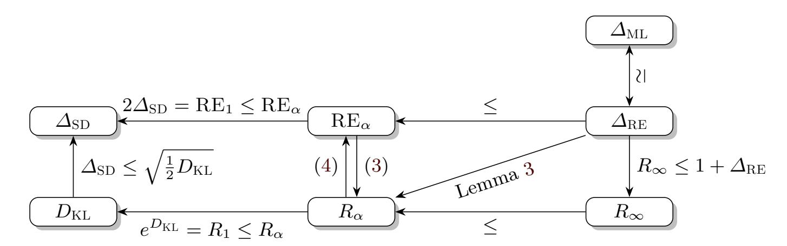

{0}------------------------------------------------

# **Cryptographic Divergences: New Techniques and New Applications**

Marc Abboud1*<sup>⋆</sup>* and Thomas Prest<sup>2</sup>

<sup>1</sup> École Normale Supérieure marc.abboud@ens.fr <sup>2</sup> PQShield thomas.prest@pqshield.com

**Abstract** In the recent years, some security proofs in cryptography have known significant improvements by replacing the statistical distance with alternative divergences. We continue this line of research, both at a theoretical and practical level. On the theory side, we propose a new cryptographic divergence with quirky properties. On the practical side, we propose new applications of alternative divergences: circuit-private FHE and prime number generators. More precisely, we provide the first formal security proof of the prime number generator PRIMEINC [\[9](#page-18-0)], and improve by an order of magnitude the efficiency of a prime number generator by Fouque and Tibouchi [\[17,](#page-19-0)[18](#page-19-1)] and the *washing machine* technique by Ducas and Stehlé [[16\]](#page-19-2) for circuit-private FHE.

# **1 Introduction**

Cryptographic divergences play an essential role in cryptography. Most of the time, they provide rigorous theoretical tools to prove that the concrete instantiation of a cryptosystem is as secure as an idealized description. Typically, the idealized scheme will rely on an ideal distribution *Q*, whereas its instantiation will rely on a distribution *P*. If Div(*P*; *Q*) is small for some divergence Div, then one can predict the security of the concrete cryptosystem based on the security of the ideal one. Similarly, cryptographic divergences can help to connect a cryptosystem to a hard problem.

The statistical distance is by far the most prevalent cryptographic divergence. It is simple and versatile, making it the swiss army knife of cryptography. However, these last years have seen a number of works using alternative divergences. A compelling example is the Rényi divergence, which use has been spearheaded by lattice-based cryptography to improve security reductions [\[28](#page-19-3)[,31](#page-19-4),[3,](#page-18-1)[7,](#page-18-2)[41](#page-20-0)[,4](#page-18-3)]. When the number of queries is limited and in the presence of a search problem, it can provide significant gains. Another example is the Kullback-Leibler divergence, which has been used at a more foundational level: recent works have

*<sup>⋆</sup>* Most of this work was done while Marc Abboud was an intern at PQShield.

{1}------------------------------------------------

leveraged it to (re-)define fundamental notions such as the advantage of an adversary [34] or computational entropies [1], simplifying proofs or resolving paradoxes in the process $^1$ .

#### <span id="page-1-4"></span>1.1 Our Contributions

In this work, we continue the exploration of alternative divergences to improve security proofs. This is done at two levels: by providing new theoretical tools, and by finding new applications to specialized divergences.

A New Cryptographic Divergence. Our first contribution is to propose a parametric divergence called  $RE_{\alpha}$  divergence ( $RE_{\alpha}$  stands for relative error of order  $\alpha$ ). We believe it is interesting for theoretic and practical reasons. On the theory side, it connects several divergences: it is a continuous trade-off between the statistical distance and the relative error, and enjoys desirable properties of both divergences. It is also (non-tightly) equivalent to the Rényi divergence. On the practical side, it satisfies an unusual amplification property with cryptographic applications. Relations between divergences is given in Figure 1.

<span id="page-1-1"></span>

Figure 1: Relations between cryptographic divergences: max-log distance  $\Delta_{\rm ML}$ , statistical distance  $\Delta_{\rm SD}$ , RE $_{\alpha}$  divergence, relative error  $\Delta_{\rm RE}$ , Kullback-Leibler divergence  $D_{\rm KL}$ , Rényi divergence  $R_{\alpha}$ .

New Applications: Proof Outline. As new applications of our new techniques and of existing ones, we provide improved analyses for circuit-private FHE and prime number generators. Our proofs follow this blueprint – already implicit in [41]:

- <span id="page-1-2"></span>(a) Bound the relative error  $\Delta_{RE}(\mathcal{R}||\mathcal{I})$  between a real distribution  $\mathcal{R}$  and ideal distribution  $\mathcal{I}$ ;
- <span id="page-1-3"></span>(b) Deduce the Rényi divergence  $R_{\alpha}(\mathcal{R}||\mathcal{I})$  between  $\mathcal{R}$  and  $\mathcal{I}$ ;

<span id="page-1-0"></span><sup>&</sup>lt;sup>1</sup> [34] use the mutual information for its redefinition. The mutual information between two random variables X, Y is the KL divergence between the their joint and product distributions:  $MI(X;Y) = D_{KL}((X,Y);X\times Y)$ .

{2}------------------------------------------------

<span id="page-2-0"></span>(c) Conclude that an adversary making *Q* queries to *I* and trying to solve a search problem does not increase his advantage by more than *O*(1) when replacing *I* by *R*.

Our proofs follow either the logical structure (*[a](#page-1-2)*) *⇒* (*[b](#page-1-3)*) *⇒* (*[c](#page-2-0)*), or (*[b](#page-1-3)*) *⇒* (*[c](#page-2-0)*). The justification for (*[a](#page-1-2)*) *⇒* (*[b](#page-1-3)*) is given by Lemma [3](#page-6-0), and the one for (*[b](#page-1-3)*) *⇒* (*[c](#page-2-0)*) by Lemma [4](#page-7-0). We emphasize that using the Rényi divergence instead of the statistical distance does not mean we prove something weaker or different; both divergences are merely tools in proofs strategies, and we compare our improved analyses with existing ones in the exact same setting (search problem, *Q* queries).

**Applications** We provide two applications of our techniques: circuit privacy for FHE and prime number generators. As is now customary when using the Rényi divergence (and this is also true for the RE*<sup>α</sup>* divergence), two conditions are required to fully exploit the Rényi divergence:

- **–** The number of queries Q should be much lower than 2 *λ* , where *λ* denotes the security level. In practice 128 *≤ λ ≤* 256. On the other hand NIST's call for post-quantum cryptography standards suppose Q *≤* 2 <sup>64</sup>, and we may assume even lower bounds for computation- and bandwidth-heavy primitives such as FHE. Finally, when generating a single public key, the number of queries to the key generation algorithm is as small as 1 (in the single-target setting).
- **–** The underlying problem should be a search problem. One of our applications targets RSA-based signatures, where this is obviously the case. We also believe that most practical usecases of circuit-private FHEs can be described in a satisfying way with a search problem.

In particular, we do not claim improved analyses for unlimited queries or decision problems. Unfortunately, in our practical usecases, the RE*<sup>α</sup>* divergence (with *α < ∞*) does not give better results than using the relative error but we have identified theoretical situations where *∆*RE can't be used directly (see Section [5.1](#page-14-0)).

**Application to Prime Number Generators.** The ability to securely generate prime numbers is essential for RSA-based cryptosystems. However, if prime numbers are sampled from a weak distribution, it can lead to a variety of attacks. The most common ones are *GCD attacks*, where an attacker collects RSA public keys *N<sup>i</sup>* = *p<sup>i</sup> · q<sup>i</sup>* with low collision entropy and extracts private keys (*p<sup>i</sup> , qi*) by computing GCDs. This multi-target attack has plagued the last decade, with several papers [\[25](#page-19-5)[,29](#page-19-6),[5\]](#page-18-5) compromising a total of more than 1 million keypairs. Primes sampled from highly structured distributions may also be vulnerable, as demonstrated by Coppersmith's attack [[11](#page-18-6)[,10](#page-18-7)] and its follow-up ROCA [\[39](#page-20-2)].

To mitigate attacks, several algorithms have been proposed to securely generate prime numbers. One obviously desirable property is to sample from a distribution with high collision entropy, lest the generated primes be vulnerable to GCD attacks. However, we note that having a high collision entropy does 

{3}------------------------------------------------

not preclude Coppersmith's attack, so it is not a necessary and sufficient condition for security. To offer stronger security guarantees, some prime numbers generators sample statistically close to the uniform distribution over primes in  $[2^d; 2^{d+1}]$ .<sup>2</sup> Some schemes [26,50] based on the strong RSA assumption explicitly require this. In this work, we focus on two prime number generators and provide substantially improved security proofs for them.

The PRIMEINC generator. A prominent generator is PRIMEINC, proposed by Brandt and Damgård [9]. Due to its simplicity and entropy efficiency, it is commonly used; see the PyCrypto<sup>3</sup> and OpenSSL<sup>4</sup> libraries. Despite its longevity and prevalence, PRIMEINC's concrete security had remained an open question. Circumstantial arguments were presented, leaning either towards weak security guarantees [9,36] or suggesting potential weaknesses [17,18], but no definite answer had been presented.

We clarify the situation by providing formal arguments which guarantee PRIMEINC's security in clearly defined scenarii or against common attacks. Our work for PRIMEINC uses only the Rényi divergence. More precisely, we show that:

- In the single-target setting, any scheme that is secure with the uniform distribution  $\mathcal{U}$  (over primes in  $[2^d; 2^{d+1}]$ ) remains secure when replacing  $\mathcal{U}$  by the output distribution  $\mathcal{P}$  of PRIMEINC, as long as there are O(1) calls to  $\mathcal{P}$ ; this covers for example RSA key generation. This argument is tight (only O(1) bits of security are lost) and fully generic.
- In the multi-target setting, PRIMEINC has enough collision entropy to be secure against GCD attacks.

The Fouque-Tibouchi generator. Fouque and Tibouchi [17,18] proposed prime number generators with an appealing feature; the statistical distance between their output distribution  $\mathcal{P}$  and the uniform distribution  $\mathcal{U}$  (over primes in an [2;x]) is upper bounded by  $\log(x) \cdot x^{-\epsilon/4}$ , where  $\epsilon$  is an input parameter, and it can therefore be proven arbitrarily close to 0 by increasing  $\epsilon$ . These generators are provably secure. However, the entropy consumption is linear in  $\epsilon$ : thus there is a trade-off between statistical closeness to  $\mathcal{U}$  and the entropy consumption. A standard statistical distance argument would mandate  $\epsilon \geq \frac{4\lambda \log \log x}{\log x}$ , where  $\lambda$  is the security level.

We provide a Rényi divergence-based security argument that only mandates  $\epsilon \geq \frac{2\log(\lambda Q)\log\log x}{\log x}$ , where Q is the number of queries to the generator. The entropy gain is significant when Q is much smaller than  $2^{\lambda}$ , which is always the case in real applications. For practical usecases, we gain an order of magnitude in entropy consumption. Our proof uses the  $RE_{\alpha}$  divergence for the computations.

<span id="page-3-0"></span><sup>&</sup>lt;sup>2</sup> Typically, additional requirements are mandated, such as (p+1) and (p-1) having a large prime factor; but these can be added on top of the sampling procedure.

<span id="page-3-2"></span><span id="page-3-1"></span><sup>3</sup> https://github.com/dlitz/pycrypto/blob/master/lib/Crypto/Util/number.py
4 https://github.com/openssl/openssl/blob/master/crypto/bn/bn prime.c

{4}------------------------------------------------

**Application to Circuite-Private FHE.** (Fully) homomorphic encryption – or (F)HE – allows to securely evaluate circuits on encrypted data. Following Gentry's breakthrough [[21](#page-19-8)], it has known an exponential growth in the last decade, and is now being advertised as a product by companies (Duality, Inpher, Zama) and standardized.

Circuit privacy is an increasingly relevant security notion for FHE. The setting is the following: a client *C* sends a (fully homomorphic) ciphertext *c* = Enc(*m*) to a server *S*, which then homomorphically computes *c ′* = Enc(*f*(*m*)) for some function *f*, and sends it back to *C*. A standard security requirement is that *S* doesn't learn anything about *m* or *f*(*m*). Conversely, circuit privacy requires that *C* doesn't learn anything about the circuit *f* in the process. Circuit privacy is useful when *f* is a secret intellectual property of *S*; without circuit privacy, a user might learn *f* and set up his own server. The lack of circuit privacy can be a strong deterrent for a company wishing to provide its services on encrypted data.

Today's most efficient method to realize circuit privacy in a generic way is the *washing machine* technique by Ducas and Stehlé [\[16](#page-19-2)].[5](#page-4-0) In a nutshell, it first bootstraps the ciphertext, then injects entropy. One iteration of this *bootstrapthen-inject-entropy* process is called a *cycle*. [\[16](#page-19-2)] prove that their technique ensure circuit privacy if *Θ*(*λ*) cycles are sequentially applied to the ciphertext, where *λ* is the security level. However, despite recent improvements, bootstrapping remains an expensive operation. Thus circuit privacy can be a computational bottleneck.

We provide an improved analysis of Ducas and Stehlé's washing machine technique. We reduce the number of cycles by a factor essentially <sup>2</sup>*<sup>λ</sup>* log *Q* , where *Q* is the total number of (evaluation of *f*) queries made to the server. For realistic parameters, our new analysis improves the one of [[16\]](#page-19-2) by an order of magnitude. At a technical level, our proof leverages our proxy amplification property.

## **1.2 Related Works**

These last years have seen a surge of papers using other divergences than the statistical distance in the cryptographic literature. For example, the Hellinger distance has been used to study key-alternating ciphers [[46](#page-21-1)], the *χ* <sup>2</sup> divergence to study a few symmetric-key constructions [[14](#page-18-8)], and the max-log distance [[34\]](#page-20-1) in the context of lattice-based cryptography.

The Kullback-Leibler divergence has been used to improve parameters in lattice-based cryptography [[40,](#page-20-4)[15](#page-19-9)], to redefine the advantage [[35\]](#page-20-5), to unify computational entropy notions [\[1](#page-18-4)], and indirectly (via the mutual information) in side-channel analysis [\[23](#page-19-10)].

The Rényi divergence has several applications in lattice-based cryptography [\[28](#page-19-3)[,31](#page-19-4),[3,](#page-18-1)[47](#page-21-2)[,7](#page-18-2)[,41](#page-20-0),[4\]](#page-18-3). Differential privacy [[37,](#page-20-6)[32\]](#page-20-7) and leakage-resilient cryptography [[42\]](#page-20-8) have also benefitted from its use.

<span id="page-4-0"></span><sup>5</sup> The work of [\[8\]](#page-18-9) requires no bootstrapping, but only applies to GSW-based schemes and is restricted to NC<sup>1</sup> .

{5}------------------------------------------------

Acknowledgements. The authors are indebted to Takahiro Matsuda and Shuichi Katsumata for their insightful discussions and for pointing out a flaw in an earlier version of the paper. Thomas Prest is supported by the Innovate UK Research Grant 104423 (PQ Cybersecurity).

### 2 Preliminaries

Asymptotic notations. For asymptotics, we use Laudau's notation. For two real functions  $f, g : \mathbb{R}^+ \to \mathbb{R}$ , we note f = O(g) if there exists a constant C such that  $|f| \leq C \cdot |g|$ . Similarly, we note f = o(g) if  $f = \epsilon \cdot g$  for some function  $\epsilon$  such that  $\epsilon(x) \xrightarrow[x \to \infty]{} 0$ . We note f = O(g) if f = O(g) and g = O(f). If f and g have several variables, we note  $f = O_x(g)$  to specify that the assertion holds for the variable x (and similarly for the other notations). We will also use the notation  $f \ll_x g$  for  $f = O_x(g)$  when the articles we cite use it.

Integers (modulo n).  $\mathbb{Z}$  denotes the set of integers. Let n be an integer,  $\mathbb{Z}_n$  will denote the set of integers mod n and  $\mathbb{Z}_n^{\times}$  will denote the group of invertible elements of  $\mathbb{Z}_n$ . Euler's totient function is  $\varphi(n) = |\mathbb{Z}_n^{\times}|$ .

#### 2.1 f-Divergences

f-divergences were first introduced by Csiszar [13], Morimoto [38] and Ali-Sirvey [2]. They provide a wide class of divergences between distributions, and encompass several divergences used in cryptography.

**Definition 1** (f-Divergences). Let  $f : \mathbb{R} \to \mathbb{R}$  be a convex function such that f(1) = 0. Let  $\mathcal{P}, \mathcal{Q}$  be two distributions over a countable space X such that  $\operatorname{Supp} \mathcal{P} \subset \operatorname{Supp} \mathcal{Q}$ . The f-divergence between  $\mathcal{P}$  and  $\mathcal{Q}$  is:

$$\operatorname{Div}_{f}(\mathcal{P}; \mathcal{Q}) := \mathbb{E}_{\mathcal{Q}} \left[ f \left( \frac{\mathcal{P}}{\mathcal{Q}} \right) \right] = \sum_{x \in \operatorname{Supp} \mathcal{Q}} \mathcal{Q}(x) f \left( \frac{\mathcal{P}(x)}{\mathcal{Q}(x)} \right)$$

Special cases of f-divergences are the following:

- Statistical distance:  $\Delta_{SD}(\mathcal{P}; \mathcal{Q}) = Div_f(\mathcal{P}; \mathcal{Q}) \text{ for } f: x \mapsto \frac{1}{2}|x-1|;$
- Kullback-Leibler divergence:  $D_{\mathrm{KL}}(\mathcal{P};\mathcal{Q}) = \mathrm{Div}_f(\mathcal{P};\mathcal{Q})$  for  $f: x \mapsto x \ln(x)$ ;
- $-\chi^2$  divergence:  $\chi^2(\mathcal{P};\mathcal{Q}) = \operatorname{Div}_f(\mathcal{P};\mathcal{Q})$  for  $f: x \mapsto (x-1)^2$ ;

We note that *all* f-divergences satisfy a few cryptographically useful properties such as the data processing inequality, probability preservation properties and joint convexity (see resp. Lemma 1, Corollary 2 and Corollary 3 of [22]). We state them here.

<span id="page-5-0"></span>Lemma 1 (Data-processing inequality, Lemma 1 [22]). Let  $\mathcal{P}, \mathcal{Q}$  be two distributions over a space X and let T be a random function over X. Denote by  $\mathcal{P}^T, \mathcal{Q}^T$  the composition of respectively  $\mathcal{P}$  and  $\mathcal{Q}$  with T, then

$$\operatorname{Div}_f(\mathcal{P}^T; \mathcal{Q}^T) \leq \operatorname{Div}_f(\mathcal{P}; \mathcal{Q}).$$

{6}------------------------------------------------

Corollary 1 (Joint convexity of  $Div_f$ , Corollary 2 [22]). All f-divergences are jointly convex, i.e, for all distributions  $\mathcal{P}_1, \mathcal{P}_2, \mathcal{Q}_1, \mathcal{Q}_2$  over a space X and for all  $\lambda \in [0,1]$ , one has

$$\operatorname{Div}_f((1-\lambda)\mathcal{P}_1 + \lambda \mathcal{P}_2; (1-\lambda)\mathcal{Q}_1 + \lambda \mathcal{Q}_2) \le (1-\lambda)\operatorname{Div}_f(\mathcal{P}_1, \mathcal{Q}_1) + \lambda\operatorname{Div}_f(\mathcal{P}_2, \mathcal{Q}_2).$$

Two divergences that are not f-divergences are also used in cryptography. If Supp  $\mathcal{P} = \text{Supp } \mathcal{Q} = \Omega$ , we define the following divergences:

- Relative error:  $\Delta_{RE}(\mathcal{P}; \mathcal{Q}) = \max_{\Omega} \left| \frac{\mathcal{P}}{\mathcal{Q}} 1 \right|;$  Max-log distance:  $\Delta_{ML}(\mathcal{P}; \mathcal{Q}) \max_{\Omega} \left| \ln \mathcal{P} \ln \mathcal{Q} \right|;$

Around 0, both divergences are equivalent [34]:  $\Delta_{RE}(\mathcal{P}; \mathcal{Q}) \sim \Delta_{ML}(\mathcal{P}; \mathcal{Q})$ .

#### 2.2 Rényi Divergences and Rényi Entropies

In this section, we recall the definitions of Rényi divergences and entropies.

**Definition 2** (Rényi divergence). Let  $\mathcal{P}, \mathcal{Q}$  be two discrete distributions over a space X such that Supp  $\mathcal{P} \subset \text{Supp } \mathcal{Q}$ . The Rényi divergence of order  $\alpha$  is:

$$R_{\alpha}(\mathcal{P}; \mathcal{Q}) := \begin{cases} \left( \sum_{x \in \text{Supp } \mathcal{Q}} \frac{\mathcal{P}(x)^{\alpha}}{\mathcal{Q}(x)^{\alpha - 1}} \right)^{\frac{1}{\alpha - 1}} & \text{if } 1 < \alpha < \infty \\ \max_{x \in \text{Supp } \mathcal{Q}} \frac{\mathcal{P}(x)}{\mathcal{Q}(x)} & \text{if } \alpha = \infty \\ e^{D_{\text{KL}}(\mathcal{P}; \mathcal{Q})} & \text{if } \alpha = 1 \end{cases}$$

Note that  $R_{\alpha}$  is not an f-divergence. However,  $R_{\alpha}^{\alpha-1}-1$  is an f-divergence for  $f: x \mapsto x^{\alpha} - 1$ , which allows it to indirectly benefit from f-divergence properties. We recall some properties.

**Lemma 2** ([49,3]). For two distributions  $\mathcal{P}$ ,  $\mathcal{Q}$  and two families of distributions  $(\mathcal{P}_i)_i, (\mathcal{Q}_i)_i, \text{ the R\'enyi divergence verifies these properties:}$ 

- Monotonicity.  $\alpha \geq 1 \mapsto R_{\alpha}(\mathcal{P}; \mathcal{Q})$  is a continuous non-decreasing function.
- Data processing inequality. For any (randomized) function f, one has  $R_{\alpha}(f(\mathcal{P}); f(\mathcal{Q})) \leq R_{\alpha}(\mathcal{P}; \mathcal{Q}).$
- Multiplicativity.  $R_{\alpha}(\prod_{i} \mathcal{P}_{i}; \prod_{i} \mathcal{Q}_{i}) = \prod_{i} R_{\alpha}(\mathcal{P}_{i}; \mathcal{Q}_{i}).$
- Probability preservation. For any event  $E \subseteq \text{Supp}(\mathcal{Q})$  and  $\alpha \in (1, +\infty)$ ,

<span id="page-6-1"></span>
$$Q(E) \ge \mathcal{P}(E)^{\frac{\alpha}{\alpha - 1}} / R_{\alpha}(\mathcal{P}; \mathcal{Q}),$$
 (1)

<span id="page-6-2"></span>
$$Q(E) \ge \mathcal{P}(E)/R_{\infty}(\mathcal{P}; \mathcal{Q}).$$
 (2)

The following lemma bounds the Rényi divergence from the relative error  $\Delta_{\mathrm{RE}}$ .

<span id="page-6-0"></span>**Lemma 3** ([41]). Let  $\mathcal{P}, \mathcal{Q}$  be two distributions of same support such that  $\Delta_{\rm RE}(\mathcal{P};\mathcal{Q}) \leq \delta$ . Then, for  $a \in (1,+\infty)$ :

$$R_a(\mathcal{P}; \mathcal{Q}) \le \left(1 + \frac{a(a-1)\delta^2}{2(1-\delta)^{a+1}}\right)^{\frac{1}{a-1}} \underset{\delta \to 0}{\sim} 1 + \frac{a\delta^2}{2}$$

{7}------------------------------------------------

We give a second lemma; it is already used implicitly in [[41\]](#page-20-0), but we make it formal here as it is repeatedly used in our security arguments. In particular, given Lemma [4](#page-7-0) initial conditions, no more than 1 + log<sup>2</sup> 3 *≤* 3 bits of security are lost when switching from *I* to *P*.

<span id="page-7-0"></span>**Lemma 4.** *Let A be an adversary performing Q queries to a distribution I and solving a search problem S I with probability at most* 2 *−λ , where λ >* 1*. If one replaces I with a distribution P such that Rλ*(*P*; *I*) *≤* 1 + 1*/Q, then the probability that A solves S P is no more than* 2 *−*(*λ−*1) *· e.*

*Proof.* Let *E* be the event of *A* solving *S*. Applying ([1\)](#page-6-1), then the multiplicativity of the Rényi divergence, and finally the inequality (1 + *x/n*) *<sup>n</sup> ≤ e <sup>x</sup>* yields:

$$\mathcal{P}(E)^{\lambda/(\lambda-1)} \leq \mathcal{I}(E) \cdot R_{\lambda}(\mathcal{P}^Q; \mathcal{I}^Q) \leq 2^{-\lambda} \cdot R_{\lambda}(\mathcal{P}; \mathcal{I})^Q \leq 2^{-\lambda} \cdot e.$$

Therefore 
$$\mathcal{P}(E) \leq 2^{-(\lambda-1)} \cdot e^{(\lambda-1)/\lambda} \leq 2^{-(\lambda-1)} \cdot e$$
.

Rényi divergences have entropy measure counterparts, called Rényi entropies or *α*-entropies. These have countless cryptographic applications [[45\]](#page-20-10).

**Definition 3 (Rényi entropy).** *Let α ∈* [1*,* +*∞*] *and X be a discrete distribution. The α-entropy (or Rényi entropy) of X is:*

$$H_{\alpha}(X) = \begin{cases} -\sum_{x} \mathbb{P}[X = x] \log_{2} \mathbb{P}[X = x] & \text{if } a = 1\\ \frac{1}{1 - \alpha} \log_{2} \left(\sum_{x} \mathbb{P}[X = x]^{\alpha}\right) & \text{if } 1 < a < \infty\\ -\max_{x} \log_{2} \mathbb{P}[X = x] & \text{if } a = \infty \end{cases}$$

*H*<sup>1</sup> *is also called Shannon's entropy, H*<sup>2</sup> *the collision entropy and H<sup>∞</sup> the minentropy. If we note U the uniform distribution over any superset of* Supp(*X*)*, then all the Rényi entropies of U are equal: Hα*(*U*) = log<sup>2</sup> *|*Supp(*X*)*| for any α ∈* [1*,* +*∞*]*. Note that Rényi divergences and entropies are closely related:*

$$\log_2 R_{\alpha}(X; U) = H_{\alpha}(U) - H_{\alpha}(X).$$

# <span id="page-7-1"></span>**3 Theoretical Results**

In this section, we present our theoretical results. We introduce a new cryptographic divergence; this parametric divergence seems deeply connected to several existing divergences, and possesses an unusual amplification property.

{8}------------------------------------------------

### 3.1 A Parametric Divergence with Peculiar Properties

We now introduce a new divergence, which we note  $RE_{\alpha}$  (for relative error) as it can be seen as a trade-off between the statistical distance  $\Delta_{SD}$  and the relative error  $\Delta_{RE}$ . This trade-off is parametrized by a scalar  $\alpha \in [1, \infty]$ , and allows  $RE_{\alpha}$  to be defined in situations where  $\Delta_{RE}$  is not, all the while sharing with  $\Delta_{RE}$  and  $\Delta_{SD}$  a new desirable cryptographic properties.

**Definition 4** (RE $_{\alpha}$  divergence). Let  $\mathcal{P}, \mathcal{Q}$  be two distributions over a countable space X such that Supp  $\mathcal{P} \subset$  Supp  $\mathcal{Q}$ . One defines the RE $_{\alpha}$ -divergence as:

$$RE_{\alpha}(\mathcal{P}; \mathcal{Q}) := \begin{cases} \left( \sum_{x \in Supp \mathcal{Q}} \mathcal{Q}(x) \left| \frac{\mathcal{P}(x)}{\mathcal{Q}(x)} - 1 \right|^{\alpha} \right)^{\frac{1}{\alpha}} & \text{if } \alpha \ge 1 \\ \Delta_{RE}(\mathcal{P}; \mathcal{Q}) = \max_{x \in Supp \mathcal{Q}} \left| \frac{\mathcal{P}(x)}{\mathcal{Q}(x)} - 1 \right| & \text{if } \alpha = \infty \end{cases}$$

The RE $_{\alpha}$  divergence generalizes several known metrics. RE $_{1}$  is twice the statistical distance  $\Delta_{\rm SD}$ . In addition, RE $_{\infty}$  is exactly the relative error  $\Delta_{\rm RE}$ . Finally, RE $_{\alpha}^{\alpha}=\chi^{\alpha}$  is an f-divergence for  $f(x)=|x-1|^{\alpha}$ . The  $\chi^{\alpha}$  divergence was first studied by Vajda [48], and  $\chi^{2}$  (sometimes called Pearson Chi-square divergence) has recently been used in a cryptographic context [14].

Proposition 1 provides a few properties of  $RE_{\alpha}$ . Items 1 and 2 describe the behavior of  $RE_{\alpha}$  when  $\alpha$  varies, and underline our point that  $RE_{\alpha}$  is a continuous trade-off between  $\Delta_{SD}$  and  $\Delta_{RE}$ . Items 3 and 4 show (with a tightness loss) that  $RE_{\alpha}$  and the Rényi divergence  $R_{\alpha}$  are equivalent. Finally, Items 5 to 8 give cryptographically useful inequalities.

<span id="page-8-2"></span>**Proposition 1.** Let  $\mathcal{P}, \mathcal{Q}$  be two distributions over a countable space X, such that  $\text{Supp } \mathcal{P} \subset \text{Supp } \mathcal{Q}$ . The following properties hold:

- <span id="page-8-3"></span>1. Monotonicity.  $\alpha \geq 1 \mapsto RE_{\alpha}(\mathcal{P}; \mathcal{Q})$  is a continuous non-decreasing function.
- <span id="page-8-4"></span>2. Upper bound from  $\Delta_{SD}$  and  $\Delta_{RE}$ . It holds that:

$$\operatorname{RE}_{\alpha}(\mathcal{P};\mathcal{Q}) \leq \Delta_{\operatorname{SD}}^{1/\alpha}(\mathcal{P};\mathcal{Q}) \cdot \Delta_{\operatorname{RE}}^{1-1/\alpha}(\mathcal{P};\mathcal{Q}).$$

<span id="page-8-5"></span>3. Upper bound on Rényi divergence. It holds that:

<span id="page-8-0"></span>
$$R_{\alpha}(\mathcal{P}; \mathcal{Q}) \le (1 + \text{RE}_{\alpha}(\mathcal{P}; \mathcal{Q}))^{\frac{\alpha}{\alpha - 1}}.$$
 (3)

<span id="page-8-6"></span>4. Lower bound on Rényi divergence. If  $\alpha$  is an even integer, then:

<span id="page-8-1"></span>
$$\operatorname{RE}_{\alpha}(\mathcal{P}; \mathcal{Q}) \le 2^{1-1/\alpha} \left( R_{\alpha}(\mathcal{P}; \mathcal{Q})^{\alpha-1} - 1 \right)^{1/\alpha}.$$
 (4)

<span id="page-8-7"></span>5. Multiplicative probability preservation. For any event  $E \subset X$ :

$$\mathcal{P}(E) \leq \mathcal{Q}(E)^{\frac{a-1}{a}} (1 + RE_{\alpha}(\mathcal{P}; \mathcal{Q})).$$

{9}------------------------------------------------

*6. Additive probability preservation. Let f* : *X →* R *be a function and p, q >* 1 *be such that* 1*/p* + 1*/q* = 1*. It holds that:*

$$|\mathbb{E}[f(\mathcal{P})] - \mathbb{E}[f(\mathcal{Q})]| \le \mathrm{RE}_p(\mathcal{P}; \mathcal{Q}) \cdot \mathbb{E}[|f(\mathcal{Q})|^q]^{1/q}.$$

*In particular, for any event E:*

$$|\mathcal{P}(E) - \mathcal{Q}(E)| \le \mathrm{RE}_{\alpha}(\mathcal{P}; \mathcal{Q}) \cdot \mathcal{Q}(E)^{1-1/\alpha}.$$

*7. Weak triangle inequality For distributions P, R, Q such that* Supp*P ⊂* Supp *R ⊂* Supp *Q:*

$$\Delta_{\mathrm{RE}}(\mathcal{P},\mathcal{Q}) \leq \Delta_{\mathrm{RE}}(\mathcal{P},\mathcal{R}) + \Delta_{\mathrm{RE}}(\mathcal{R},\mathcal{Q}) + \Delta_{\mathrm{RE}}(\mathcal{P},\mathcal{R}) \cdot \Delta_{\mathrm{RE}}(\mathcal{R},\mathcal{Q})$$

<span id="page-9-0"></span>*8. Data processing inequality. For any randomized function g, it holds that:*

$$RE_{\alpha}(g(\mathcal{P}), g(\mathcal{Q})) \leq RE_{\alpha}(\mathcal{P}, \mathcal{Q}).$$

Most of the properties in Proposition [1](#page-8-2) are proven in a rather straightforward manner by using either convexity, Minkowski's inequality or generic properties of *f*-divergences. This is no coincidence as the RE*<sup>α</sup>* divergence is directly connected to an *f*-divergence, and can also be interpreted as an *L<sup>α</sup>* norm. The detailed proofs are given in Appendix [D](#page-23-0).

Interestingly, the RE*<sup>α</sup>* divergence does not have a native multiplicative property but the security analysis scales with the number of queries if we combine it with the Rényi divergence. However, the RE*<sup>α</sup>* divergence benefits from native properties that the Rényi divergence does not have, such as an additive probability preservation property. This indicates that these divergences are complementary to some extent: depending on the situation, one may be preferable to the other.

One last property allows the RE*<sup>α</sup>* divergence to stand out. It was known for the statistical distance but seems not to be known for other divergences. We call it *proxy amplification* and it will be discussed in Section [5,](#page-14-1) but for now we move on to applications of the results of this section to prime number generators.

# **4 Security proofs for Prime number generators**

We now improve the security proofs for two known prime number generators: PRIMEINC [[9\]](#page-18-0) and Fouque-Tibouchi generator [[18\]](#page-19-1). What we mean by security is that the output distribution of the algorithm should be as close as possible from the random one. For the first one, we show a bound on the Rényi divergence between the output distribution of the algorithm and the random distribution. For the second, we improve the results shown in [[18\]](#page-19-1) and show a bound on the RE*<sup>α</sup>* divergence between the output distribution and the random one. We then show how those proofs show security against known attacks towards prime number generators.

{10}------------------------------------------------

# <span id="page-10-0"></span>**Algorithm 1** PRIMEINC(x, s)

```
Require: Parameters x, s
                                                 Algorithm 2 Fouque and Ti-
Ensure: a prime number between x/2
                                                 bouchi's prime number generator
    and x
1: Sample odd p uniformly in [x/2; x] Require: x, \epsilon, q \propto x^{1-\epsilon}
                                                 Ensure: A prime number p \in [2; x]
 2: for i = 1 to s do
                                                  1: Sample a \stackrel{\$}{\leftarrow} (\mathbb{Z}/q\mathbb{Z})^*
       if p is prime then
 3:
                                                  2: repeat
 4:
           return p
                                                        Sample t \stackrel{\$}{\leftarrow} \left\{0, ..., \left\lfloor \frac{x-a}{q} \right\rfloor \right\}
 5:
       else
                                                  4: until p = a + tq is prime
 6:
           p \leftarrow p + 2
                                                   5: return p
 7:
       end if
 8: end for
 9: return "failure"
```

#### 4.1 Provable Security of the Prime Number Generator PRIMEINC

This section and Section 4.2 study prime number generators. The motivation for studying them is given in Section 1.1. We first describe the simplest variant of PRIMEINC in Algorithm 1.6

Previous Analyses. Let  $\mathcal{P}$  denote the output of PRIMEINC, and  $\mathcal{U}$  the uniform distribution over primes in [x/2; x]. It was shown in [9] (resp. [18]) that under the prime r-tuple conjecture:

<span id="page-10-3"></span><span id="page-10-2"></span>
$$\frac{H_1(\mathcal{P})}{H_1(\mathcal{U})} \underset{x \to \infty}{\sim} 1 \tag{5}$$

$$\Delta_{\text{SD}}(\mathcal{P};\mathcal{U}) \ge 0.86 + o(1) \tag{6}$$

In fact, we show in Appendix B a faster proof of (5) than the one from [9]. On one hand, (5) seems to offer some security guarantees. However, Skórski [45, Corollary 4] showed that even when Shannon's entropy  $H_1(\mathcal{P})$  is close to its trivial upper bound  $\log_2 |\operatorname{Supp}(\mathcal{P})|$ , the collision entropy  $H_2(\mathcal{P})$  might still be low. Hence, (5) does not even preclude simple attacks such as common factors attacks [25,30] on RSA. On the other hand, (6) is clearly a negative result.

New Analysis. We now provide an improved security analysis. We first bound the Rényi divergence between the output of PRIMEINC and the uniform distribution. We then show that in common usecases, PRIMEINC may be safely used without compromising security. We first recall the prime r-tuple conjecture, which is instrumental in the proofs of [9,18] and in ours.

<span id="page-10-1"></span><sup>&</sup>lt;sup>6</sup> Security-efficiency trade-offs have been presented in [9], and OpenSSL implements a variant of PRIMEINC.

{11}------------------------------------------------

Conjecture 1 (Hardy-Littlewood's prime r-tuple conjecture [24]).

Let  $d = (d_1, ..., d_r)$  be a r-tuple of integers. Denote by  $\pi_d(x)$  the number of integers  $n \leq x$  such that for all  $i, n + d_i$  is a prime number. It holds that:

$$\pi_d(x) \sim_{x \to \infty} S_d \cdot \frac{x}{\log(x)^r},$$

where  $S_d = \prod_{p \text{ prime}} \left(\frac{p}{p-1}\right)^r \frac{p-\nu_d(p)}{p-1}$ , and  $\nu_d(p)$  is the number of distinct residue classes modulo p of the tuple d.

The following statement holds under the prime r-tuple conjecture.

<span id="page-11-1"></span>**Theorem 1 (Theorem 1, [20]).** Let x, k be integers. Then the number of integers n such that there are exactly k primes in  $[n, n + \lambda \log x]$  is  $\simeq x \frac{e^{-\lambda} \lambda^k}{k!}$  when  $x \to \infty$ .

In particular, if d(n) denotes the distance of n to the next larger prime, then the probability that  $d(n) > \lambda \log x$  is  $e^{-\lambda}$ .

Theorem 2 is the main result of this section and implies that this algorithm is asymptotically secure by computing the Rényi divergence between its output distribution and the uniform distribution over a superset of its support.

<span id="page-11-0"></span>**Theorem 2 (Security of PRIMEINC).** Let  $\mathcal{P}$  be the output distribution of PRIMEINC with  $s = c \log x$  and c > 0, and  $\mathcal{U}$  be the uniform distribution over the prime numbers between x/2 and x. Under the prime r-tuple conjecture:

<span id="page-11-3"></span>
$$R_{\infty}(\mathcal{P};\mathcal{U}) \le 2c(1 + o_{c,x}(1)). \tag{7}$$

Equivalently, for all  $\alpha \geq 2$ ,

<span id="page-11-4"></span>
$$H_{\alpha}(\mathcal{P}) \ge H_{\alpha}(\mathcal{U}) - \log(2c) + o_{c,x}(1).$$
 (8)

The proof of Theorem 2 can be found in Appendix A. The proof computes an upper bound on the output probability of every prime and use Theorem 1 to conclude.

Practical Implications I. Theorem 2 implies that for a constant number of calls to a prime number generator, a scheme secure with a uniform generator (ideal case) remains secure when using PRIMEINC instead (real case). One application is key generation for RSA signatures [44]. In the single-target setting, there are two calls to the prime number generator. Combining (2) with (7), any adversary breaking the real cryptosystem with probability  $\epsilon$  will break the ideal cryptosystem with probability at least  $\epsilon/(2c+1+o_{c,x}(1))^2$ ; therefore at most  $\approx 2 \cdot \log_2(1+2c)$  bits of security are lost.

<span id="page-11-2"></span>This is true without loss of generality; even if more primes are generated and rejected if they fail some requirements (e.g. being safe primes), the adversary only has access to the product of exactly two outputs of the generator (p and q).

{12}------------------------------------------------

Practical Implications II. Even for a large number of queries, Theorem 2 provide security guarantees against some specific attacks. For example, taking  $\alpha = 2$  in (8) gives a lower bound of  $n - \log(2c) + o_{c,x}(1)$  on the collision entropy of PRIMEINC. As long as  $n \geq \lambda + \log(2c) + o_{c,x}(1)$  (which is always the case in practice), this is more than enough to argue resistance against common factors attacks [25,30].

#### <span id="page-12-0"></span>4.2 Provable Security of the Fouque-Tibouchi Generator

We now study a prime number generator proposed by Fouque and Tibouchi in [17,18]. Fouque and Tibouchi actually propose several algorithms, which provide trade-offs between simplicity and the number-theoretic conjectures they base their security on: the Friedlander-Granville-Montgomery conjecture, the generalized Riemann hypothesis or full unconditionality.

We only study the simplest variant of Fouque and Tibouchi's algorithms, and leave other variants for future work. The idea of this variant is to sample a random number, and then resample only its most significant bits until a prime number is found. It is described in Algorithm 2.

 $Previous\ Analysis.$  In [18], it is shown under Conjecture 2 that:

<span id="page-12-3"></span>
$$\Delta_{\rm SD}(\mathcal{P}; \mathcal{U}) \ll \frac{\log x}{x^{\epsilon/4}}.$$
(9)

In addition, the average entropy consumption of Algorithm 2 is:

<span id="page-12-4"></span>
$$(\epsilon + o(1)) \cdot \frac{\varphi(q)}{q} \cdot \frac{(\log x)^2}{\log 2}.$$
 (10)

The statistical distance requires  $\Delta_{SD}(\mathcal{P};\mathcal{U}) \leq 2^{-\lambda}$  in order to provide  $\lambda$  bits of security. As noted by [18], taking q to be a primordial (a product of small distinct primes) allows to reduce entropy consumption by a factor  $O(\log \log q)$ .

The Friedlander-Granville-Montgomery conjecture studies the quantity:

$$\pi(x, q, a) := \operatorname{Card} \{ p \le x \text{ prime } | p \equiv a \mod q \}.$$

The prime number theorem establishes that  $\pi(x,q,a) \sim \frac{x}{\varphi(q)\log(x)}$  when a,q are fixed. The Friedlander-Granville-Montgomery conjecture gives a bound on the error given by this estimate.

Conjecture 2. [Friedlander-Granville-Montgomery [19]] For q < x, (a, q) = 1 and all  $\epsilon > 0$ , one has:

<span id="page-12-1"></span>
$$\left| \pi(x,q,a) - \frac{\pi(x)}{\varphi(q)} \right| \ll_{\epsilon} \left( \frac{x}{q} \right)^{1/2} x^{\epsilon/4}.$$

<span id="page-12-2"></span><sup>&</sup>lt;sup>8</sup> As stated in the preliminaries, this section will use Vinogradov's notation, which is common in number theory:  $(f \ll_s g) \Leftrightarrow (f =_s O(g))$ .

{13}------------------------------------------------

Since  $q \sim x^{1-\epsilon}$ , it holds that  $\left(\frac{x}{q}\right)^{1/2} x^{\epsilon/4} \sim x^{3\epsilon/4}$ , which is negligible compared to the ratio  $\pi(x)/\varphi(q) \gg x^{\epsilon}/\log(x)$ . Thus this conjecture implies:

$$\pi(x, q, a) = \frac{\pi(x)}{\varphi(q)} (1 + o_x(1)) = \frac{x}{\varphi(q) \cdot \log x} (1 + o_x(1)).$$

Theorem 3 is the main result of this section. It bounds the relative error and the  $\text{RE}_{\alpha}$  divergence between the output distribution of the Fouque-Tibouchi generator and the uniform distribution over a superset of its support. Our result is a generalization of Fouque-Tibouchi's result as we show that the relative error of any order decreases with the same exponential rate  $\epsilon/4$ .

<span id="page-13-0"></span>Theorem 3 (Security of the Fouque-Tibouchi generator). Denote by  $\mathcal{P}$  the output distribution of Algorithm 2 and by  $\mathcal{U}$  the uniform distribution over [2; x]. Under the Friedlander-Granville-Montgomery conjecture:

$$\Delta_{\text{RE}}(\mathcal{P}; \mathcal{U}_{|\text{Supp }\mathcal{P}}) \ll \frac{\log x}{x^{\epsilon/4}} \quad and \quad \mathbb{P}[\text{Supp }\mathcal{P}^c] \leq \frac{\log(x)^2}{x}.$$
(11)

<span id="page-13-1"></span>
$$\forall \alpha \in (1, \infty), \operatorname{RE}_{\alpha}(\mathcal{P}; \mathcal{U}) \ll_{\alpha} \frac{\log x}{x^{\epsilon/4}} + \left(\frac{\log x}{x^2}\right)^{1/\alpha}.$$
 (12)

The proof can be found in Appendix C. It makes use of the Friedlander-Granville-Montgomery conjecture and of other classical arithmetical results.

We now make explicit the implications of Theorem 3. Since the Fouque-Tibouchi generator is more provable security-oriented than PRIMEINC, it is unsurprising that Theorem 3 is intrinsically stronger than Theorem 2 and that we can assert security for more usecases than with PRIMEINC. Compared to [17,18], our analysis divides the entropy requirement by an order of magnitude.

Practical Implications I. We study the generic security of RSA signature schemes in a multi-target setting. As an concrete example, consider a company producing a hardware security module (HSM); this HSM targets a bit-security  $\lambda=128$ . At most  $2^{31}$  copies of it are produced, hence at most  $2^{32}$  queries to the prime number generator are made. For RSA signatures, NIST and ENISA recommend RSA-3072. If HSMs generate RSA private keys with Algorithm 2, this translates to  $x=2^{1536}$ .

A statistical distance argument requires – via (9) – that  $\frac{\log x}{x^{\epsilon/4}} \leq 2^{-\lambda}$ , which here is satisfied for  $\epsilon \geq \frac{4\lambda \log \log x}{\log x} \approx 0.36$ . Using a Rényi-based argument instead, we combine Lemmas 3 and 4 with (11); this gives the milder requirement  $\lambda Q \frac{(\log x)^2}{2x^{\epsilon/2}} \leq 1$ , which is satisfied for  $\epsilon \geq \frac{2\log(\lambda Q)\log\log x}{\log x} \approx 0.076$ . Since entropy consumption is essentially linear in  $\epsilon$ , our new analysis provides a gain of a factor roughly 5. In practice, we take a primordial  $q = \prod_{\{p \leq 1049, p \text{ prime}\}} p$  as suggested by [18]. As per (10), this gives an entropy consumption of less than 20 000 uniform bits for generating two prime numbers.

{14}------------------------------------------------

Practical Implications II. We now study signature schemes based on the strong RSA assumption: this includes but is not limited to derivatives of Cramer-Shoup signatures [12]. As in the previous example, we consider 128 bits of security, hence RSA-3072. Some of these schemes only require collision resistance of the prime number generator, in which case it is sufficient to use PRIMEINC since Theorem 2 showed that its collision entropy is high.

Other schemes [26,50] only specify that the output of the generator should be statistically close to the uniform distribution over primes in an interval, in which case it is more prudent to use Fouque and Tibouchi's generator. Suppose that a user is queried at most  $2^{64}$  signatures. As before, an statistical distance analysis gives  $\epsilon \gtrsim 0.36$ , whereas our Rényi-based analysis gives  $\epsilon \gtrsim 0.12$ . The entropy consumption is divided by 3.

# <span id="page-14-1"></span>5 Proxy-Amplification and Application to Circuit-Private FHE

In this section, we come back to the  $RE_{\alpha}$  divergence. We showed some standard properties in Section 3 and now we focus on a quite unique property that we call proxy amplification. In our opinion, this property justifies the definition of our new divergence as other divergences do not enjoy a similar property – to the best of our knowledge. We then apply this property to circuit-privacy on fully-homomorphic encryption in the fashion of [16].

## <span id="page-14-0"></span>5.1 Proxy Amplification

Proxy amplification is a unique property of the  $RE_{\alpha}$  divergence. It generalizes an amplification property of the statistical distance [16, Lemma 2.3]. A major twist is that our property allows the  $RE_{\alpha}$  divergence to "borrow" the amplification of the statistical distance:  $RE_{\alpha}$  will be made increasingly small even if it is > 1, as long as  $\Delta_{SD} < 1$ . For this reason, we call it proxy amplification.

<span id="page-14-2"></span>**Proposition 2 (Proxy amplification).** Let X be a finite space,  $f: X \to X$  be a randomized function and  $\alpha \in [1; +\infty]$ . Suppose that for all  $x \in X$ , Supp f(x) = X and that there exists  $\delta > 0$  such that:

$$\forall a, b \in X$$
,  $\text{RE}_{\alpha}(f(a); f(b)) < \delta$ .

Then, for all integer  $k \geq 1$ :

$$RE_{\alpha}(f^{k}(a); f^{k}(b)) \leq 2 \cdot \delta \cdot \Delta_{SD}(f(a); f(b))^{k-1}$$
$$\leq \delta^{k}/2^{k-2}.$$

The proof consists of using both convexity techniques and Minskowski's inequality along with the amplification property, already known for the statistical distance. It can be found in Appendix E. This property was already known in

{15}------------------------------------------------

the particular case of the statistical distance *∆*SD [\[16](#page-19-2), Lemma 2.3]. This generalization is useful when the relative error is too big or infinite, which is for example the case for shifted Gaussian distributions. Indeed, denote by *D*Z*,σ,c* the Gaussian distribution of center *x* and standard deviation *σ* over Z. Then, in the case of the relative error:

$$\forall x \neq y, \Delta_{RE}(D_{\mathbb{Z},\sigma,x}; D_{\mathbb{Z},\sigma,y}) = \infty.$$

On the other hand, RE*α*(*D*Z*,σ,x, D*Z*,σ,y*) = *e Θx,y,σ* (*α*) . Therefore, RE*<sup>α</sup>* lies in a sweet spot between the statistical distance *∆*SD and the relative error *∆*RE. On one hand, *∆*SD enjoys an amplification property, but not a multiplicative probability preservation. On the other hand, *∆*RE enjoys both, but may not be finite. Finally, RE*<sup>α</sup>* enjoys all three properties at once. Obviously in the case of Gaussian distribution, a tailcut would be fine for security proofs but this shows that from a theoretical point of view there are pathological cases with the relative error.

## **5.2 Circuit-Private FHE: Setting the Washing Machine in Economy Mode**

We recall that the motivation for circuit privacy in FHE schemes is given in Section [1.1.](#page-1-4) In the following section, we show how to get improved circuit privacy guarantees using a new analysis.

*The Ducas-Stehlé Strategy.* Circuit privacy is guaranteed if the output distribution of the ciphertext *c ′* does not depend on the circuit *f*. We briefly describe the "*washing machine*" strategy introduced by Ducas and Stehlé [[16\]](#page-19-2) to achieve it, and refer to [[16](#page-19-2)] for a complete exposition. Ducas and Stehlé realize circuit privacy by applying a randomized function Wash = Rerand *◦*Refresh that scrambles the ciphertext *c ′* . Here, Refresh is the bootstrapping operation, which reduces the ciphertext noise down to some level. On the other hand, Rerand injects entropy in the ciphertext, see [\(13](#page-16-0)). [[16\]](#page-19-2) shows that applying Wash many times makes the output distribution increasingly independent of the original ciphertext, and compares this to a washing machine which repeats a cycle several times to "clean up" the ciphertext.

*New Security Analysis.* The security analysis in [\[16](#page-19-2)] leverages an amplification property of the statistical distance. It guarantees *λ* bits of security if Wash is applied *O*(*λ*) times. However, bootstrapping (Refresh) is extremely expensive, and it is desirable to perform it as rarely as possible. In this section, we provide a new security analysis based on the amplification property of the RE*<sup>α</sup>* divergence (Proposition [2](#page-14-2)). It allows us to claim that Wash needs only to be applied *O*(log<sup>2</sup> Q) times, where Q is the number of (homomorphically encrypted) queries to *f* and the constants in *O*(*·*) are equivalent. Since one can expect log<sup>2</sup> Q to be much smaller than *λ*, this entails much lighter requirements on the number of cycles, hence a more practical protocol.

{16}------------------------------------------------

For brevity we only revisit [16, Section 4.1], but we expect our improvements to be applicable to other examples in [16], as well as newer schemes such as [27]. Suppose one wants to encrypt one bit  $\mu \in \{0,1\}$  under a private key  $\mathbf{s} \in \mathbb{Z}_q^n$  with modulus q and error rate less than  $\eta$ . The set of LWE ciphertexts decrypting to  $\mu$  is:

$$LWE_{\mathbf{s}}^{q}(\mu, \eta) = \left\{ \left( \mathbf{a}, \langle \mathbf{a}, \mathbf{s} \rangle + \mu \cdot \left| \frac{q}{2} \right| + e \right) \in \mathbb{Z}_{q}^{n+1} \mid \mathbf{a} \in \mathbb{Z}_{q}^{n}, |e| < \eta q \right\}.$$

Correct decryption is ensured provided that  $\eta < 1/4$ . We now describe the Rerand function. Assume that the public key contains  $\ell = O(n \log q)$  encryptions of 0:

$$\forall i \leq \ell, r_i = (\mathbf{a}_i, \langle \mathbf{a}_i, \mathbf{s} \rangle + e_i) \in \mathrm{LWE}_{\mathbf{s}}^q(\eta, 0).$$

For  $c \in LWE_{\mathbf{s}}^q(\eta, \mu)$ , define:

<span id="page-16-1"></span><span id="page-16-0"></span>
$$Rerand(pk, c) = c + \sum_{i} \epsilon_{i} r_{i} + (\mathbf{0}, err), \tag{13}$$

where the  $\epsilon_i$ 's are sampled uniformly in  $\{0, \pm 1\}$  and  $err \in \mathbb{Z}_q$  is sampled from the discrete Gaussian  $D_{\mathbb{Z},\sigma,0} =: D_{\sigma}$ . We note that in [16], err is instead sampled uniformly over [-B, B] with a B suitable for correctness of decryption. In our case, the relative error precludes the use of this distribution as the support of Rerand(pk,c) should not depend on c. Therefore, every ciphertext should have a non-zero probability of appearance. We will set parameters that ensure that a bad ciphertext almost never (i.e with exponentially low probability) appears. To do so, we use Proposition 3.

**Proposition 3.** For all 
$$k \in \mathbb{N}$$
, it holds that  $\mathbb{P}[|t| > k\sigma; t \hookleftarrow D_{\sigma}] \leq 2e^{-\frac{k^2}{2}}$ .

Next, Theorem 4 is the main result of this section and provides parameters that guarantee that Ducas and Stehlé's protocol is circuit-private. We bound the relative error between the output distributions of Rerand applied on two different ciphertexts. The theorem transfers directly to the function Wash = Rerand  $\circ$  Refresh, as Refresh is deterministic and therefore has no impact on our analysis. This will subsequently allow to apply our amplification theorem on Wash, followed by a Rényi divergence argument.

<span id="page-16-2"></span>**Theorem 4.** Given parameters  $\eta, n, q, s, \ell$ . Let Q be the number of queries and k be the number of calls to the washing machine. If

<span id="page-16-3"></span>
$$k > \frac{\frac{\log Q}{2}}{\log\left(\frac{1/\eta}{4(\ell+1)}\right) - \log(8\lambda)},\tag{14}$$

then there exists a standard deviation  $\sigma > 0$  such that:

- 1. The probability of Rerand outputting a bad ciphertext is  $< 2^{-\lambda}$ .
- 2. In the event that Rerand always output a good ciphertext, one has

$$\forall c_1, c_2 \in \mathrm{LWE}^q_{\mathbf{s}}(\eta, \mu), \quad \Delta_{\mathrm{RE}}(\mathsf{Rerand}(pk, c_1); \mathsf{Rerand}(pk, c_2)) \leq Q^{-1/2k}.$$

{17}------------------------------------------------

The proof can be found in Appendix F. The outline goes like this. We find a T > 0 such that the probability of outputting an err of size  $> T\sigma$  is lower than  $2^{-\lambda}$  using Proposition 3. The correctness of decryption forces the condition

$$(l+1)\eta q + T\sigma < q/4.$$

This gives an upper bound M on  $\sigma$ . For security, we require that the relative error  $\Delta_{\text{RE}}(\mathsf{Rerand}(pk,c);\mathsf{Rerand}(pk,c'))$  for two ciphertextst c,c' is lower than  $Q^{-1/2k}$  in order to use the amplification property<sup>9</sup> and Lemma 4. This will give a lower bound m on  $\sigma$ . To find a suitable  $\sigma$ , one only needs  $m \leq M$  and this gives the lower bound on k given in (14). Note that doing the same analysis with the statistical distance leads to  $k > \frac{\lambda}{\log(\frac{1/\eta}{4(\ell+1)})}$ .

Remark 1. Security is immediate via using Proposition 2 with taking X to be the space  $\mathrm{LWE}^q_{\mathbf{s}}(\mu,\eta) = \left\{ (\mathbf{a},\langle \mathbf{a},\mathbf{s}\rangle + \mu \cdot \lfloor \frac{q}{2} \rfloor + e \in \mathbf{Z}^{n+1}_q \mid |e| < \eta q \right\}$ , and for the random function f to be Wash (conditioned on the correctness of decryption). More precisely, we use the relative error by tailcutting the event where Wash outputs a bad ciphertext.

Practical Implications. Consider a cloud service proposing homomorphic evaluation of a proprietary function f over encrypted data. An adversarial user  $\mathcal{A}$  tries to learn f or replicate it to some extent.

To apply a Rényi-based argument, we need to formalize the problem that  $\mathcal{A}$  tackles as a search problem. This is the most delicate part of our analysis and really depends on the application: in the special case where the function f solves a search problem, then one may simply say that the problem  $\mathcal{A}$  tries to solve is to find a function f' which solves the same problem on a non-negligible fraction of the inputs. All usecases may not be formalized by a search problem, but we believe that most practical ones can.

If the conditions of Theorem 4 hold, then k applications of Wash will provide a relative error  $\Delta_{RE} \leq 1/\sqrt{Q}$ . We now apply the proof blueprint  $(a) \Rightarrow (b) \Rightarrow (c)$  outlined in Section 1.1. Combining Theorem 4 with Lemma 3 and applying (1) with  $\alpha = \Theta(\lambda)$ , one can claim that  $O(\log \lambda)$  bits of security are lost.<sup>10</sup>

Applied on the washing machine technique of Ducas and Stehlé, our new analysis allows to reduce the number of cycles by  $\frac{2\lambda}{\log Q}$  for the same asymptotic bit security. For  $\lambda=256$  and  $Q=2^{64}$ , this is an order of magnitude. Given that bootstrapping often is a computational bottleneck, this can potentially make the whole protocol faster by an order of magnitude.

<span id="page-17-0"></span><sup>&</sup>lt;sup>9</sup> One would find it odd that we are not using the *proxy amplification* property here but the computations we made showed that it wouldn't give here a significantly better result than the *amplification property* for this application, so we chose not to complexify the computations done in the proof.

<span id="page-17-1"></span>Alternatively, one can replace Q by  $\lambda Q$  in Theorem 4 and use Lemma 4; this results in a loss of O(1) bits of security and has a negligible effect on the parameters.

{18}------------------------------------------------

## **References**

- <span id="page-18-4"></span>1. Rohit Agrawal, Yi-Hsiu Chen, Thibaut Horel, and Salil P. Vadhan. Unifying computational entropies via kullback-leibler divergence. In Alexandra Boldyreva and Daniele Micciancio, editors, *CRYPTO 2019, Part II*, volume 11693 of *LNCS*, pages 831–858. Springer, Heidelberg, August 2019.
- <span id="page-18-11"></span>2. S. M. Ali and S. D. Silvey. A general class of coefficients of divergence of one distribution from another. *Journal of the Royal Statistical Society. Series B (Methodological)*, 28(1):131–142, 1966.
- <span id="page-18-1"></span>3. Shi Bai, Adeline Langlois, Tancrède Lepoint, Damien Stehlé, and Ron Steinfeld. Improved security proofs in lattice-based cryptography: Using the Rényi divergence rather than the statistical distance. In Tetsu Iwata and Jung Hee Cheon, editors, *ASIACRYPT 2015, Part I*, volume 9452 of *LNCS*, pages 3–24. Springer, Heidelberg, November / December 2015.
- <span id="page-18-3"></span>4. Shi Bai, Tancrède Lepoint, Adeline Roux-Langlois, Amin Sakzad, Damien Stehlé, and Ron Steinfeld. Improved security proofs in lattice-based cryptography: Using the Rényi divergence rather than the statistical distance. *Journal of Cryptology*, 31(2):610–640, April 2018.
- <span id="page-18-5"></span>5. Daniel J. Bernstein, Yun-An Chang, Chen-Mou Cheng, Li-Ping Chou, Nadia Heninger, Tanja Lange, and Nicko van Someren. Factoring RSA keys from certified smart cards: Coppersmith in the wild. In Kazue Sako and Palash Sarkar, editors, *ASIACRYPT 2013, Part II*, volume 8270 of *LNCS*, pages 341–360. Springer, Heidelberg, December 2013.
- <span id="page-18-13"></span>6. Olivier Binette. A note on reverse pinsker inequalities. *IEEE Trans. Information Theory*, 65(7):4094–4096, 2019.
- <span id="page-18-2"></span>7. Andrej Bogdanov, Siyao Guo, Daniel Masny, Silas Richelson, and Alon Rosen. On the hardness of learning with rounding over small modulus. In Eyal Kushilevitz and Tal Malkin, editors, *TCC 2016-A, Part I*, volume 9562 of *LNCS*, pages 209–224. Springer, Heidelberg, January 2016.
- <span id="page-18-9"></span>8. Florian Bourse, Rafaël del Pino, Michele Minelli, and Hoeteck Wee. FHE circuit privacy almost for free. In Matthew Robshaw and Jonathan Katz, editors, *CRYPTO 2016, Part II*, volume 9815 of *LNCS*, pages 62–89. Springer, Heidelberg, August 2016.
- <span id="page-18-0"></span>9. Jørgen Brandt and Ivan Damgård. On generation of probable primes by incremental search. In Ernest F. Brickell, editor, *CRYPTO'92*, volume 740 of *LNCS*, pages 358–370. Springer, Heidelberg, August 1993.
- <span id="page-18-7"></span>10. Don Coppersmith. Finding a small root of a bivariate integer equation; factoring with high bits known. In Maurer [\[33\]](#page-20-12), pages 178–189.
- <span id="page-18-6"></span>11. Don Coppersmith. Finding a small root of a univariate modular equation. In Maurer [[33\]](#page-20-12), pages 155–165.
- <span id="page-18-12"></span>12. Ronald Cramer and Victor Shoup. Signature schemes based on the strong RSA assumption. In Juzar Motiwalla and Gene Tsudik, editors, *ACM CCS 99*, pages 46–51. ACM Press, November 1999.
- <span id="page-18-10"></span>13. Imre Csiszár. Eine informationstheoretische ungleichung und ihre anwendung auf den beweis der ergodizitat von markoffschen ketten. *Magyar. Tud. Akad. Mat. Kutató Int. Közl*, 8:85–108, 1963.
- <span id="page-18-8"></span>14. Wei Dai, Viet Tung Hoang, and Stefano Tessaro. Information-theoretic indistinguishability via the chi-squared method. In Jonathan Katz and Hovav Shacham, editors, *CRYPTO 2017, Part III*, volume 10403 of *LNCS*, pages 497–523. Springer, Heidelberg, August 2017.

{19}------------------------------------------------

- <span id="page-19-9"></span>15. Léo Ducas, Vadim Lyubashevsky, and Thomas Prest. Efficient identity-based encryption over NTRU lattices. In Palash Sarkar and Tetsu Iwata, editors, *ASI-ACRYPT 2014, Part II*, volume 8874 of *LNCS*, pages 22–41. Springer, Heidelberg, December 2014.
- <span id="page-19-2"></span>16. Léo Ducas and Damien Stehlé. Sanitization of FHE ciphertexts. In Marc Fischlin and Jean-Sébastien Coron, editors, *EUROCRYPT 2016, Part I*, volume 9665 of *LNCS*, pages 294–310. Springer, Heidelberg, May 2016.
- <span id="page-19-0"></span>17. Pierre-Alain Fouque and Mehdi Tibouchi. Close to uniform prime number generation with fewer random bits. In Javier Esparza, Pierre Fraigniaud, Thore Husfeldt, and Elias Koutsoupias, editors, *ICALP 2014, Part I*, volume 8572 of *LNCS*, pages 991–1002. Springer, Heidelberg, July 2014.
- <span id="page-19-1"></span>18. Pierre-Alain Fouque and Mehdi Tibouchi. Close to uniform prime number generation with fewer random bits. *IEEE Trans. Information Theory*, 65(2):1307–1317, 2019.
- <span id="page-19-15"></span>19. John Friedlander and Andrew Granville. Limitations to the equi-distribution of primes i. *Annals of Mathematics*, 129(2):363–382, 1989.
- <span id="page-19-14"></span>20. P. X. Gallagher. On the distribution of primes in short intervals. *Mathematika*, 23(1):49, 1976.
- <span id="page-19-8"></span>21. Craig Gentry. Fully homomorphic encryption using ideal lattices. In Michael Mitzenmacher, editor, *41st ACM STOC*, pages 169–178. ACM Press, May / June 2009.
- <span id="page-19-11"></span>22. Sebastien Gerchinovitz, Pierre Ménard, and Gilles Stoltz. Fano's inequality for random variables, 2017. <https://arxiv.org/abs/1702.05985>.
- <span id="page-19-10"></span>23. Benedikt Gierlichs, Lejla Batina, Pim Tuyls, and Bart Preneel. Mutual information analysis. In Elisabeth Oswald and Pankaj Rohatgi, editors, *CHES 2008*, volume 5154 of *LNCS*, pages 426–442. Springer, Heidelberg, August 2008.
- <span id="page-19-13"></span>24. G. H. Hardy and J. E. Littlewood. Some problems of partitio numerorum; iii: On the expression of a number as a sum of primes. *Acta Math.*, 44:1–70, 1923.
- <span id="page-19-5"></span>25. Nadia Heninger, Zakir Durumeric, Eric Wustrow, and J. Alex Halderman. Mining your ps and qs: Detection of widespread weak keys in network devices. In Tadayoshi Kohno, editor, *USENIX Security 2012*, pages 205–220. USENIX Association, August 2012.
- <span id="page-19-7"></span>26. Dennis Hofheinz, Tibor Jager, and Eike Kiltz. Short signatures from weaker assumptions. In Dong Hoon Lee and Xiaoyun Wang, editors, *ASIACRYPT 2011*, volume 7073 of *LNCS*, pages 647–666. Springer, Heidelberg, December 2011.
- <span id="page-19-16"></span>27. Antoine Joux. Fully homomorphic encryption modulo fermat numbers. Cryptology ePrint Archive, Report 2019/187, 2019. <https://eprint.iacr.org/2019/187>.
- <span id="page-19-3"></span>28. Adeline Langlois, Damien Stehlé, and Ron Steinfeld. GGHLite: More efficient multilinear maps from ideal lattices. In Phong Q. Nguyen and Elisabeth Oswald, editors, *EUROCRYPT 2014*, volume 8441 of *LNCS*, pages 239–256. Springer, Heidelberg, May 2014.
- <span id="page-19-6"></span>29. Arjen K. Lenstra, James P. Hughes, Maxime Augier, Joppe W. Bos, Thorsten Kleinjung, and Christophe Wachter. Public keys. In Reihaneh Safavi-Naini and Ran Canetti, editors, *CRYPTO 2012*, volume 7417 of *LNCS*, pages 626–642. Springer, Heidelberg, August 2012.
- <span id="page-19-12"></span>30. Arjen K. Lenstra, James P. Hughes, Maxime Augier, Joppe W. Bos, Thorsten Kleinjung, and Christophe Wachter. Ron was wrong, whit is right. Cryptology ePrint Archive, Report 2012/064, 2012. <http://eprint.iacr.org/2012/064>.
- <span id="page-19-4"></span>31. San Ling, Duong Hieu Phan, Damien Stehlé, and Ron Steinfeld. Hardness of k-LWE and applications in traitor tracing. In Juan A. Garay and Rosario Gennaro,

{20}------------------------------------------------

- editors, *CRYPTO 2014, Part I*, volume 8616 of *LNCS*, pages 315–334. Springer, Heidelberg, August 2014.
- <span id="page-20-7"></span>32. Takahiro Matsuda, Kenta Takahashi, Takao Murakami, and Goichiro Hanaoka. Improved security evaluation techniques for imperfect randomness from arbitrary distributions. In Dongdai Lin and Kazue Sako, editors, *PKC 2019, Part I*, volume 11442 of *LNCS*, pages 549–580. Springer, Heidelberg, April 2019.
- <span id="page-20-12"></span>33. Ueli M. Maurer, editor. *EUROCRYPT'96*, volume 1070 of *LNCS*. Springer, Heidelberg, May 1996.
- <span id="page-20-1"></span>34. Daniele Micciancio and Michael Walter. Gaussian sampling over the integers: Efficient, generic, constant-time. In Jonathan Katz and Hovav Shacham, editors, *CRYPTO 2017, Part II*, volume 10402 of *LNCS*, pages 455–485. Springer, Heidelberg, August 2017.
- <span id="page-20-5"></span>35. Daniele Micciancio and Michael Walter. On the bit security of cryptographic primitives. In Jesper Buus Nielsen and Vincent Rijmen, editors, *EUROCRYPT 2018, Part I*, volume 10820 of *LNCS*, pages 3–28. Springer, Heidelberg, April / May 2018.
- <span id="page-20-3"></span>36. Preda Mihailescu. Fast generation of provable primes using search in arithmetic progressions. In Yvo Desmedt, editor, *CRYPTO'94*, volume 839 of *LNCS*, pages 282–293. Springer, Heidelberg, August 1994.
- <span id="page-20-6"></span>37. Ilya Mironov. Renyi differential privacy. Proceedings of 30th IEEE Computer Security Foundations Symposium, 2017. <http://arxiv.org/abs/1702.07476>.
- <span id="page-20-9"></span>38. Tetsuzo Morimoto. Markov processes and the h-theorem. *Journal of the Physical Society of Japan*, 18(3):328–331, 1963.
- <span id="page-20-2"></span>39. Matús Nemec, Marek Sýs, Petr Svenda, Dusan Klinec, and Vashek Matyas. The return of coppersmith's attack: Practical factorization of widely used RSA moduli. In Bhavani M. Thuraisingham, David Evans, Tal Malkin, and Dongyan Xu, editors, *ACM CCS 2017*, pages 1631–1648. ACM Press, October / November 2017.
- <span id="page-20-4"></span>40. Thomas Pöppelmann, Léo Ducas, and Tim Güneysu. Enhanced lattice-based signatures on reconfigurable hardware. In Lejla Batina and Matthew Robshaw, editors, *CHES 2014*, volume 8731 of *LNCS*, pages 353–370. Springer, Heidelberg, September 2014.
- <span id="page-20-0"></span>41. Thomas Prest. Sharper bounds in lattice-based cryptography using the Rényi divergence. In Tsuyoshi Takagi and Thomas Peyrin, editors, *ASIACRYPT 2017, Part I*, volume 10624 of *LNCS*, pages 347–374. Springer, Heidelberg, December 2017.
- <span id="page-20-8"></span>42. Thomas Prest, Dahmun Goudarzi, Ange Martinelli, and Alain Passelègue. Unifying leakage models on a Rényi day. In Alexandra Boldyreva and Daniele Micciancio, editors, *CRYPTO 2019, Part I*, volume 11692 of *LNCS*, pages 683–712. Springer, Heidelberg, August 2019.
- <span id="page-20-13"></span>43. Oded Regev. On lattices, learning with errors, random linear codes, and cryptography. In Harold N. Gabow and Ronald Fagin, editors, *37th ACM STOC*, pages 84–93. ACM Press, May 2005.
- <span id="page-20-11"></span>44. Ronald L. Rivest, Adi Shamir, and Leonard M. Adleman. A method for obtaining digital signatures and public-key cryptosystems. *Communications of the Association for Computing Machinery*, 21(2):120–126, 1978.
- <span id="page-20-10"></span>45. Maciej Skórski. Shannon entropy versus Renyi entropy from a cryptographic viewpoint. In Jens Groth, editor, *15th IMA International Conference on Cryptography and Coding*, volume 9496 of *LNCS*, pages 257–274. Springer, Heidelberg, December 2015.

{21}------------------------------------------------

- <span id="page-21-1"></span>46. John Steinberger. Improved security bounds for key-alternating ciphers via hellinger distance. Cryptology ePrint Archive, Report 2012/481, 2012. [http:](http://eprint.iacr.org/2012/481) [//eprint.iacr.org/2012/481](http://eprint.iacr.org/2012/481).
- <span id="page-21-2"></span>47. Katsuyuki Takashima and Atsushi Takayasu. Tighter security for efficient lattice cryptography via the Rényi divergence of optimized orders. In Man Ho Au and Atsuko Miyaji, editors, *ProvSec 2015*, volume 9451 of *LNCS*, pages 412–431. Springer, Heidelberg, November 2015.
- <span id="page-21-4"></span>48. Igor Vajda. *χα*-divergence and generalized fisher information. In *Transactions of the Sixth Prague Conference on Information Theory, Statistical Decision Functions and Random Processes*, page 223. Academia, 1973.
- <span id="page-21-3"></span>49. Tim van Erven and Peter Harremoës. Rényi divergence and kullback-leibler divergence. *IEEE Trans. Information Theory*, 60(7):3797–3820, 2014.
- <span id="page-21-0"></span>50. Shota Yamada, Goichiro Hanaoka, and Noboru Kunihiro. Two-dimensional representation of cover free families and its applications: Short signatures and more. In Orr Dunkelman, editor, *CT-RSA 2012*, volume 7178 of *LNCS*, pages 260–277. Springer, Heidelberg, February / March 2012.

{22}------------------------------------------------

## <span id="page-22-1"></span>A Proof of Theorem 2

Proof. Denote by N the number of integers between x/2 and x that do not lead to failure, an integer  $n_0 \in [x/2, x]$  does not lead to failure if it is odd and  $d(n) < 2c \log x$ , by Theorem 1 one has  $N \simeq \frac{x}{4}(1 - e^{-2c})$ . For a prime p denote by d(p) its distance to the first prime lower than him. Then, the algorithm will output p if and only if  $n_0 \in [p - d(p), p]$  if  $d(p) \leq 2c \log x$  and if and only if  $n_0 \in [p - 2c \log x, p]$  otherwise. Therefore, the probability  $\mathcal{P}(p)$  that the algorithm outputs p is

$$\mathcal{P}(p) = \begin{cases} \frac{d(p)}{2N}, & \text{if } d(p) \le 2c \log x. \\ \frac{2c \log x}{2N}, & \text{if } d(p) > 2c \log x. \end{cases}$$

Either way, one has  $\mathcal{P}(p) \leq \frac{c \log x}{N}$ . We now compute the Renyi divergence between  $\mathcal{P}$  and  $\mathcal{U}$ .

$$\frac{\mathcal{P}(p)}{\mathcal{U}(p)} \le \frac{(\pi(x) - \pi(\frac{x}{2}))c\log x}{N} \le \frac{2c}{1 - e^{-2c}}(1 + o_x(1)).$$

The inequality on the entropies comes from the relation  $H_{\alpha}(\mathcal{P}) - H_{\alpha}(\mathcal{U}) = -\log_2 R_{\alpha}(\mathcal{P};\mathcal{U}).$ 

# <span id="page-22-0"></span>B Proof of quasi-optimal entropy of the output distribution of PRIMEINC

Proof. Let c > 0 and  $\mathcal{P}$  be the output distribution of PRIMEINC with  $s = c \log x$  for a given integer x. Let N be the number of integers in  $\llbracket x/2, x \rrbracket$  that do not lead to failure. As in appendix A, for all prime  $p \in \llbracket x/2, x \rrbracket$ , one has  $\mathcal{P}(x) \leq \frac{c \log x}{N}$  and  $N \simeq \frac{x}{4}(1 - e^{-2c})$ . Now,  $H_1(\mathcal{U}) \simeq \log\left(\frac{x}{2 \log x}\right)$  and  $\frac{H_1(\mathcal{P})}{H_1(\mathcal{U})} \leq 1$  because the map  $x > 0 \mapsto \log \frac{1}{x}$  is convex. We bound  $H_1(\mathcal{P})$  from below, the summations are over p prime.

$$H_1(\mathcal{P}) = \sum_{p \in [\![x/2,x]\!]} \mathcal{P}(p) \log \frac{1}{\mathcal{P}(p)}$$

$$\geq \log \left(\frac{N}{c \log x}\right)$$

$$\geq \left(\log \left(\frac{x}{2 \log x}\right) - \log 2c\right) (1 + o_x(1)).$$

Dividing by  $H_1(\mathcal{U})$ , one gets

$$1 \ge \frac{H_1(\mathcal{P})}{H_1(\mathcal{U})} \ge \left(1 - \frac{\log 2c}{\log\left(\frac{x}{2\log x}\right)}\right) (1 + o_x(1)).$$

And this concludes the proof.

{23}------------------------------------------------

## <span id="page-23-1"></span>C Proof of Theorem 3

*Proof.* We prove both items separately:

1. If p is a prime such that p = a + tq, then:

$$\mathbb{P}[\mathcal{P} = p] = \frac{1}{\varphi(q)\pi(x, q, a)}.$$

Therefore:

$$\frac{|\mathbb{P}[\mathcal{P} = p] - \mathbb{P}[\mathcal{U} = p]|}{\mathbb{P}[\mathcal{U} = p]} = \frac{1}{\pi(x, q, a)} \left| \frac{\pi(x)}{\varphi(q)} - \pi(x, q, a) \right| \\ \ll \frac{\log x}{x^{\epsilon}} x^{3\epsilon/4} (1 + o_x(1)) \ll \log x \cdot x^{-\epsilon/4}.$$

If p is a prime divisor of q then  $\mathbb{P}[X=p]=0$  and thus  $\frac{|\mathbb{P}[\mathcal{P}=p]-\mathbb{P}[\mathcal{U}=p]|}{\mathbb{P}[\mathcal{U}=p]}=1$ , however there are  $w(q) \leq \log x$  such prime numbers and their probability of appearance is  $w(q)/\pi(x) \leq \frac{\log^2(x)}{x}$ , which bounds  $\mathbb{P}[\operatorname{Supp} \mathcal{P}^c]$ . This concludes the proof.

2. We compute now the  $RE_{\alpha}$  divergence between the two distributions.

$$\operatorname{RE}_{\alpha}(\mathcal{P};\mathcal{U}) = \left( \sum_{a \in (\mathbf{Z}/q\mathbf{Z})^*} \sum_{a+tq \leq x, \text{ prime}} \frac{\left| \frac{1}{\varphi(q)\pi(x,q,a)} - \frac{1}{\pi(x)} \right|^{\alpha}}{\frac{1}{\pi(x)^{\alpha-1}}} + \sum_{p|q,p \text{ prime}} \frac{1}{\pi(x)} \right)^{1/\alpha} \\
= \left( \sum_{a \in (\mathbf{Z}/q\mathbf{Z})^*} \frac{1}{\pi(x)\pi(x,q,a)^{\alpha-1}} \left| \frac{\pi(x)}{\varphi(q)} - \pi(x,q,a) \right|^{\alpha} + \frac{w(q)}{\pi(x)} \right)^{1/\alpha} \\
\ll \left( \frac{\varphi(q)^{\alpha}}{\pi(x)^{\alpha}} x^{3\alpha\epsilon/4} + \frac{\log(x)}{\pi(x)} \right)^{1/\alpha}$$

Since for all  $x, y \ge 0, (x+y)^{1/\alpha} \le x^{1/\alpha} + y^{1/\alpha}$ , one has

$$\ll_{\alpha} \frac{\varphi(q)x^{3\epsilon/4}}{\pi(x)} + \left(\frac{\log(x)^2}{x}\right)^{1/\alpha} \ll_{\alpha} \frac{\log(x)}{x^{\epsilon/4}} + \left(\frac{\log(x)^2}{x}\right)^{1/\alpha}.$$

This concludes the proof.

# <span id="page-23-0"></span>D Proof of Proposition 1

*Proof.* We prove each item separately.

{24}------------------------------------------------

1. This is done using concavity and Jensen's inequality. Take  $\beta > \alpha > 0$ , then the map  $x > 0 \mapsto x^{\alpha/\beta}$  is concave. Therefore:

$$RE_{\alpha}(\mathcal{P}; \mathcal{Q}) = \left( \sum_{x \in X} \mathcal{Q}(x) \left[ \left| \frac{\mathcal{P}(x) - \mathcal{Q}(x)}{\mathcal{Q}(x)} \right|^{\beta} \right]^{\alpha/\beta} \right)^{1/\alpha}$$

$$\leq \left( \left[ \sum_{x \in X} \mathcal{Q}(x) \left| \frac{\mathcal{P}(x) - \mathcal{Q}(x)}{\mathcal{Q}(x)} \right|^{\beta} \right]^{\alpha/\beta} \right)^{1/\alpha} = RE_{\beta}(\mathcal{P}; \mathcal{Q}).$$

- 2. The result is an immediate application of [6, Theorem 1].
- 3. We recall Minkowski's inequality:

$$\forall p \ge 1, \left(\sum_{k} |x_k + y_k|^p\right)^{1/p} \le \left(\sum_{k} x_k^p\right)^{1/p} + \left(\sum_{k} y_k^p\right)^{1/p}.$$

We now prove Item 3:

<span id="page-24-0"></span>
$$R_{\alpha}(\mathcal{P}; \mathcal{Q}) = \left(\sum_{x} \mathcal{Q}(x) \left(\frac{\mathcal{P}(x)}{\mathcal{Q}(x)}\right)^{\alpha}\right)^{1/\alpha - 1}$$

$$\leq \left[\left\{\sum_{x} \left(\mathcal{Q}(x)^{1/\alpha} \left|\frac{\mathcal{P}(x)}{\mathcal{Q}(x)} - 1\right| + \mathcal{Q}(x)^{1/\alpha}\right)^{\alpha}\right\}^{1/\alpha}\right]^{\frac{\alpha}{\alpha - 1}}$$

$$\leq \left[\left(\sum_{x} \mathcal{Q}(x) \left|\frac{\mathcal{P}(x)}{\mathcal{Q}(x)} - 1\right|^{\alpha}\right)^{1/\alpha} + \left(\sum_{x} \mathcal{Q}(x)\right)^{1/\alpha}\right]^{\frac{\alpha}{\alpha - 1}}$$

$$\leq \left(1 + \operatorname{RE}_{\alpha}(\mathcal{P}; \mathcal{Q})\right)^{\frac{\alpha}{\alpha - 1}}$$

$$(15)$$

Minkowski's inequality is used in (15).

{25}------------------------------------------------

4. Remember that  $\alpha$  is even here. Therefore, for all  $x, y \in \mathbb{R}, |x+y|^{\alpha} = (x+y)^{\alpha} = \sum_{k=0}^{\alpha} {\alpha \choose k} x^k y^{\alpha-k}$ . Using this, we get

$$\operatorname{RE}_{\alpha}(\mathcal{P}; \mathcal{Q}) = \left( \sum_{x \in \operatorname{Supp} \mathcal{Q}} \mathcal{Q}(x) \left| \frac{\mathcal{P}(x)}{\mathcal{Q}(x)} - 1 \right|^{\alpha} \right)^{1/\alpha} \\
= \left( \sum_{x} \mathcal{Q}(x) \sum_{k=0}^{\alpha} {\alpha \choose k} \left( \frac{\mathcal{P}(x)}{\mathcal{Q}(x)} \right)^{k} (-1)^{\alpha - k} \right)^{1/\alpha} \\
= \left( \sum_{k=0, k \text{ even}}^{\alpha} {\alpha \choose k} \underbrace{R_{k}(\mathcal{P}; \mathcal{Q})^{k-1}}_{\leq R_{\alpha}(\mathcal{P}; \mathcal{Q})^{\alpha - 1}} - \sum_{k=0, k \text{ odd}}^{\alpha} {\alpha \choose k} \underbrace{R_{k}(\mathcal{P}; \mathcal{Q})^{k-1}}_{\geq 1} \right)^{1/\alpha} \\
\leq \left( R_{\alpha}(\mathcal{P}; \mathcal{Q})^{\alpha - 1} \underbrace{\sum_{k=0, k \text{ even}}^{\alpha} {\alpha \choose k}}_{=2^{\alpha - 1}} - \underbrace{\sum_{k=0, k \text{ odd}}^{\alpha} {\alpha \choose k}}_{=2^{\alpha - 1}} \right)^{1/\alpha} \\
= 2^{1 - 1/\alpha} \left( R_{\alpha}(\mathcal{P}; \mathcal{Q})^{\alpha - 1} - 1 \right)^{1/\alpha}$$

- 5. This is a direct corollary of (1) and Item 3.
- 6. Again, we use Minkowski's inequality:

$$\begin{aligned} |\mathbb{E}[f(\mathcal{P})] - \mathbb{E}[f(\mathcal{Q})]| &= \left| \sum_{x \in X} f(x) \cdot |\mathcal{P}(x) - \mathcal{Q}(x)| \right| \\ &\leq \sum_{x \in X} |f(x)| \cdot |\mathcal{Q}(x)|^{1/q} \frac{|\mathcal{P}(x) - \mathcal{Q}(x)|}{|\mathcal{Q}(x)|^{1/q}} \\ &\leq \left( \sum_{x \in X} \mathcal{Q}(x) |f(x)|^q \right)^{1/q} \cdot \left( \sum_{x \in X} \frac{|\mathcal{P}(x) - \mathcal{Q}(x)|^p}{\mathcal{Q}(x)^{p-1}} \right)^{1/p} \\ &= \mathrm{RE}_p(\mathcal{P}; \mathcal{Q}) \cdot \mathbb{E}[|f(\mathcal{Q})|^q]^{1/q}. \end{aligned}$$

7. This is a simple use of the triangle inequality. Let  $x \in X$ ,

$$\begin{aligned} \left| \frac{\mathcal{P}(x)}{\mathcal{Q}(x)} - 1 \right| &= \left| \frac{\mathcal{P}(x)}{\mathcal{R}(x)} \cdot \frac{\mathcal{R}(x)}{\mathcal{Q}(x)} - 1 \right| \\ &= \left| \left( \frac{\mathcal{P}(x)}{\mathcal{R}(x)} - 1 \right) \left( \frac{\mathcal{R}(x)}{\mathcal{Q}(x)} - 1 \right) + \left( \frac{\mathcal{P}(x)}{\mathcal{R}(x)} - 1 \right) + \left( \frac{\mathcal{R}(x)}{\mathcal{Q}(x)} - 1 \right) \right| \\ &\leq \Delta_{RE}(\mathcal{P}; \mathcal{R}) + \Delta_{RE}(\mathcal{R}; \mathcal{Q}) + \Delta_{RE}(\mathcal{P}; \mathcal{R}) \cdot \Delta_{RE}(\mathcal{R}; \mathcal{Q}) \end{aligned}$$

8.  $RE_{\alpha}^{\alpha}$  is an f-divergence for  $f(x) = |x-1|^{\alpha}$ . The data processing inequality is true for all f-divergences by Lemma 1, hence the result follows.

{26}------------------------------------------------

## <span id="page-26-0"></span>E Proof of Proposion 2

*Proof.* We first prove this for  $\alpha < \infty$ . We use the notation  $[f(t) = c] := \mathbb{P}[f(t) = c]$ . We prove this by induction on k. This is true for k = 1, suppose the proposition to be true for an integer k and take  $a, b \in X$ , then

$$RE_{\alpha}(f^{k+1}(a); f^{k+1}(b)) = \left(\sum_{x \in X} \frac{\left| [f^{k+1}(a) = x] - [f^{k+1}(b) = x] \right|^{\alpha}}{[f^{k+1}(b) = x]^{\alpha - 1}} \right)^{1/\alpha}$$
$$= \left(\sum_{x \in X} \frac{\left| [f^{k+1}(a) = x] - [f^{k+1}(b) = x] \right|^{\alpha}}{\left(\sum_{z \in X} [f^{k}(b) = z] [f(z) = x] \right)^{\alpha - 1}} \right)^{1/\alpha}$$

Since  $\alpha \geq 1$ , the map  $x > 0 \mapsto x^{-(\alpha-1)}$  is convex, therefore:

$$RE_{\alpha}(f^{k+1}(a); f^{k+1}(b)) \le \left(\sum_{x,z \in X} [f^{k}(b) = z] \frac{\left| [f^{k+1}(a) = x] - [f^{k+1}(b) = x] \right|^{\alpha}}{([f(z) = x])^{\alpha - 1}} \right)^{1/\alpha}$$
(16)

We now bound the numerators in (16):

<span id="page-26-2"></span><span id="page-26-1"></span>
$$|[f^{k+1}(a) = x] - [f^{k+1}(b) = x]|$$

$$= \left| \sum_{y \in X} [f^k(a) = y][f(y) = x] - [f^k(b) = y][f(y) = x] \right|$$
(17)

<span id="page-26-3"></span>
$$= \left| \sum_{y \in X} ([f^k(a) = y] - [f^k(b) = y])([f(y) = x] - [f(z) = x]) \right|$$
 (18)

<span id="page-26-4"></span>
$$\leq \sum_{y \in X} \left| [f^k(a) = y] - [f^k(b) = y] \right| \left| [f(y) = x] - [f(z) = x] \right| \tag{19}$$

{27}------------------------------------------------

Since  $\sum_{y \in X} ([f^k(a) = y] - [f^k(b) = y])[f(z) = x] = 0$ , (17) and (18) are equal. Combining (16) and (19) yields (all the summations are over X):

$$RE_{\alpha}(f^{k+1}(a); f^{k+1}(b))$$

$$\leq \left(\sum_{x,z} [f^{k}(b) = z] \frac{\left(\sum_{y} \left| [f^{k}(a) = y] - [f^{k}(b) = y] \right| \left| [f(y) = x] - [f(z) = x] \right|\right)^{\alpha}}{([f(z) = x])^{\alpha - 1}} \right)^{1/\alpha} \\
\leq \sum_{x,z} \left(\sum_{x,z} [f^{k}(b) = z] \frac{\left(\left| [f^{k}(a) = y] - [f^{k}(b) = y] \right| \left| [f(y) = x] - [f(z) = x] \right|\right)^{\alpha}}{([f(z) = x])^{\alpha - 1}} \right)^{1/\alpha}$$

$$\leq \sum_{y} \left( \sum_{z} [f^{k}(b) = z] \cdot \operatorname{RE}_{\alpha}(f(y); f(z))^{\alpha} \cdot \left| [f^{k}(a) = y] - [f^{k}(b) = y] \right|^{\alpha} \right)^{1/\alpha} \\
\leq \delta \sum_{y} \left| [f^{k}(a) = y] - [f^{k}(b) = y] \right| = \delta \cdot 2 \cdot \Delta_{SD}(f^{k}(a); f^{k}(b))$$

<span id="page-27-2"></span><span id="page-27-1"></span>(22)

Finally, we use the amplification property with  $\Delta_{\text{SD}}$ , hence  $\Delta_{\text{SD}}(f^k(a), f^k(b)) \leq \Delta_{\text{SD}}(f(a), f(b))^k$  (see [16]) and that  $\Delta_{\text{SD}} = \frac{1}{2}\text{RE}_1$  to get

$$RE_{\alpha}(f^{k+1}(a); f^{k+1}(b)) \le \delta^{k+1}/2^{k-1}$$

Equation (20) is a sum of the form  $\left(\sum_{x,z}\left|\sum_{y}g_{y}(x,z)\right|^{\alpha}\right)^{1/\alpha}=\left\|\sum_{y}g_{y}\right\|_{\alpha}$ , where  $\|\cdot\|_{\alpha}$  denotes the  $L_{\alpha}$  norm. By Minkowski's inequality, it is upper bounded by:

$$\sum_{y} \left( \sum_{x,z} |f_y(x,z)|^{\alpha} \right)^{1/\alpha} = \sum_{y} ||f_y||_{\alpha},$$

giving (21). The result follows. By a continuity argument, it also follows for  $\alpha = \infty$ .

# <span id="page-27-0"></span>F Proof of Theorem 4

Proof. Denote  $c' = c + \sum \epsilon_i r_i = (\mathbf{a}', \langle \mathbf{a}', \mathbf{s} \rangle + \mu \lfloor q/2 \rfloor + e')$ . By the leftover hash lemma [43, Section 5], the distribution of  $\mathbf{a}'$  is exponentially close to the uniform distribution. So the only leakage coming from c' is from e' and one has  $|e'| < (\ell+1)\eta q$ . Let  $\lambda$  denote the level of security required, then one wants to find T such that  $\mathbb{P}[|t| > T\sigma; t \leftrightarrow D_{\sigma}] < 2^{-\lambda}$ . Using the inequality from Proposition 3, we take  $T = \sqrt{2\lambda}$ .

This means that with probability  $> 1 - 2^{-\lambda}$ , Rerand $(pk,c) = (\mathbf{a}, \langle \mathbf{a}, \mathbf{s} \rangle + \mu \lfloor q/2 \rfloor + e)$  will have an error such that  $|e| < (\ell+1)\eta q + T\sigma$ . Therefore, correctness of decryption is ensured if:

<span id="page-27-3"></span>
$$(l+1)\eta q + T\sigma < q/4. \tag{23}$$

{28}------------------------------------------------

Let us compute the relative error in the setup where Rerand always gives a good ciphertext. Let  $x, y \in [-(\ell+1)\eta q, (\ell+1)\eta q]$ .

$$\Delta_{\text{RE}}(D_{\mathbb{Z};\sigma,x}, D_{\mathbb{Z},\sigma,y}) = \max_{|t| < (\ell+1)\eta q + T\sigma} \left| \frac{\mathbb{P}[D_{\mathbb{Z},\sigma,x} = t]}{\mathbb{P}[D_{\mathbb{Z},\sigma,y} = t]} - 1 \right|$$

$$= \max \left| e^{\frac{(t-y)^2}{\sigma^2} - \frac{(t-x)^2}{\sigma^2}} - 1 \right|$$

$$= \max \left| e^{\frac{(2t-(x+y))}{\sigma} \frac{y-x}{\sigma}} - 1 \right|$$

$$\leq \max \left( e^{\frac{2(\ell+1)\eta q \cdot (4(\ell+1)\eta q + 2T\sigma)}{\sigma^2}} - 1, 1 - e^{-\frac{2(\ell+1)\eta q \cdot (4(\ell+1)\eta q + 2T\sigma)}{\sigma^2}} \right)$$

For the sake of clarity, we note  $\beta = 2(\ell+1)\eta q$  and  $u = \frac{\beta(2\beta+2T\sigma)}{\sigma^2}$ . It holds that:

$$\Delta_{\text{RE}}(D_{\mathbb{Z},\sigma,x};D_{\mathbb{Z},\sigma,y}) \le \max(e^u - 1, 1 - e^{-u}).$$

Our goal is have  $\Delta_{RE} \leq Q^{-1/2k}$  with k the number of iterations and Q being the number of queries. It holds that:

$$e^{u} - 1 \le Q^{-1/2k} \Rightarrow u \le \log(1 + Q^{-1/2k})$$
  
 $1 - e^{-u} \le Q^{-1/2k} \Rightarrow u \le u_{\text{max}},$ 

Where  $u_{\text{max}} = \log\left(\frac{1}{1 - Q^{-1/2k}}\right) \ge \log(1 + Q^{-1/2k})$ . This yields:

$$\sigma^2 - \frac{2T\beta}{u_{\text{max}}}\sigma - 2\frac{\beta^2}{u_{\text{max}}} \ge 0 \tag{24}$$

Solving this polynomial inequality of degree 2 gives:

<span id="page-28-0"></span>
$$\sigma \ge \frac{T\beta}{u_{\text{max}}} \left( 1 + \sqrt{1 + \frac{2u_{\text{max}}}{T^2}} \right) \sim 2T\beta Q^{1/2k} \tag{25}$$

Combining (23) and (25) one has:

$$2T\beta Q^{1/2k} < \sigma < \frac{q}{4T} \left( 1 - \frac{\beta}{2q} \right)$$

Therefore, the left-hand side should be smaller than the right-hand side and this will give us the minimum amount of iterations needed, i.e a bound on k. We replace  $\beta = 2(\ell+1)\eta q$  to get

$$Q^{1/2k} < \frac{1 - 2(\ell + 1)\eta}{16T^2(\ell + 1)\eta} \sim \frac{1}{16T^2(\ell + 1)\eta}$$

$$\Rightarrow k > \frac{\frac{\log Q}{2}}{\log\left(\frac{1/\eta}{16T^2(\ell + 1)}\right)}$$

{29}------------------------------------------------

Finally, we replace  $T = \sqrt{2\lambda}$  to get

$$k > \frac{\frac{\log Q}{2}}{\log\left(\frac{1/\eta}{32\lambda(\ell+1)}\right)} = \frac{\frac{\log Q}{2}}{\log\left(\frac{1/\eta}{4(\ell+1)}\right) - \log(8\lambda)}$$