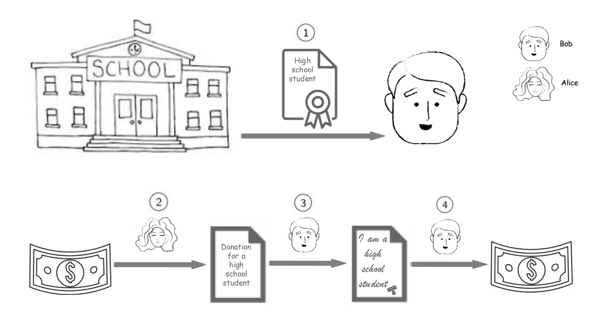
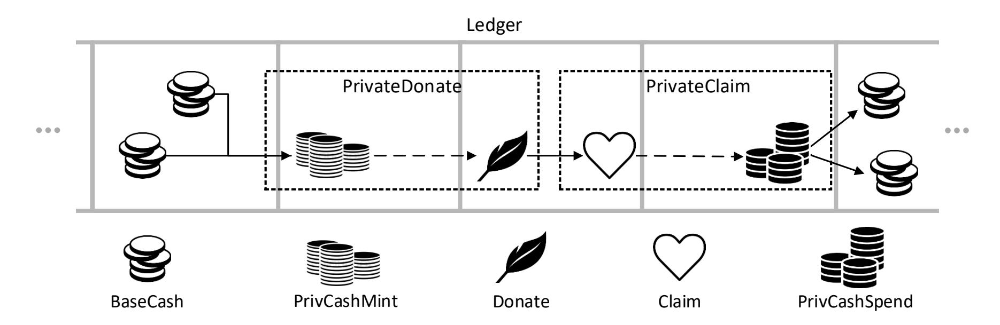
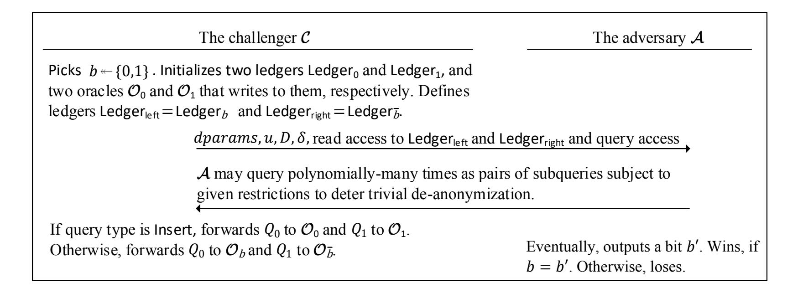
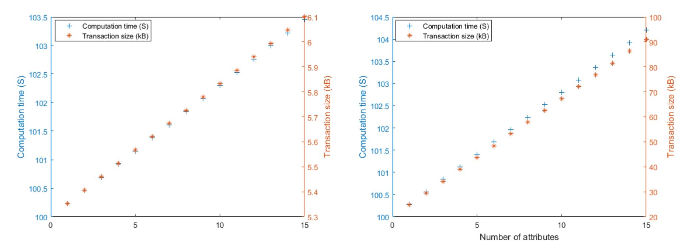

{0}------------------------------------------------

# Anonymous, Attribute Based, Decentralized, Secure, and Fair e-Donation

Osman Bi¸cer Ko¸c University obicer17@ku.edu.tr

Alptekin K¨up¸c¨u Ko¸c University akupcu@ku.edu.tr

July 1, 2020

#### Abstract

E-cash and cryptocurrency schemes have been a focus of applied cryptography for a long time. However, we acknowledge the continuing need for a cryptographic protocol that provides global scale, decentralized, secure, and fair delivery of donations. Such a protocol would replace central trusted entities (e.g., charity organizations) and guarantee the privacy of the involved parties (i.e., donors and recipients of the donations). In this work, we target this online donation problem and propose a practical solution for it. First, we propose a novel decentralized e-donation framework, along with its operational components and security definitions. Our framework relies on a public ledger that can be realized via a distributed blockchain. Second, we instantiate our e-donation framework with a practical scheme employing privacy-preserving cryptocurrencies and attribute-based signatures. Third, we provide implementation results showing that our operations have feasible computation and communication costs. Finally, we prove the security of our e-donation scheme via formal reductions to the security of the underlying primitives.

Keywords: anonymous donation, attribute based signature, blockchain, anonymous credentials.

### 1 Introduction

Since the first secure e-cash scheme was proposed by Chaum [1], digital currencies have been a center of attention in applied cryptography. One development of practical importance has been the invention of Bitcoin [2], which combines the ideas of conventional e-cash, proof of work [3], distributed systems, and game theory for a decentralized electronic payment scheme. The emergence of Bitcoin has not only contributed to state-of-the-art cryptocurrency schemes, but also brought to attention the blockchain, which is a decentralized and unalterable public ledger. Informally, a public ledger is an append-only bulletin board, where new data can be added only if it satisfies a predetermined criterion. The proposed Bitcoin and blockchain mechanism depends on only proof of work (PoW) [3] instead of requiring a trusted third party for maintenance. PoW can be briefly described as a race among blockchain miners for computing brute-force solutions to a cryptographic puzzle with ever-changing parameters. Recent blockchain and Bitcoin research has focused on novel applications [4, 5, 6, 7, 8, 9, 10, 11], improved security [12, 13, 14, 15], and enhanced privacy [16, 17]. In this paper, we focus on the novel problem of anonymous decentralized online donations as a public ledger application.

{1}------------------------------------------------



Figure (1) The flow of the online donation scheme that we propose. 1 Bob obtains his attribute token from an attribute authority. 2 Alice publishes the donation and the attribute policy on a publicly seen medium. She might go offline afterwards. 3 Upon seeing the donation, Bob claims the donation by showing the proof of his conformity to the attribute policy that he generated via the attribute token. 4 Bob then spends the donation amount, according to his wish.

The context that we consider is similar to the "helping a stranger" described in CAF 2018 World Giving Index [18]. There, international charity organizations (ICO) match the donor and recipients based on the former's attribute choices. The size of the charity organizations is usually underestimated. In fact, they have a grand sector of its own with numbers as high as more than 180,000 organizations only in United Kingdom [19] and more than 2 out of 3 people donate in countries like Indonesia, Australia, New Zealand, America, Ireland, United Kingdom [18]. We acknowledge this high demand for charity, and differentiate our work from this traditional setting by being decentralized, i.e., by eliminating ICOs to carry out the donation process. Our work enables donors to choose recipients based on their attributes in one compact system, providing fairness<sup>1</sup> of donation distributions by allowing each recipient to obtain a limited amount in each time period.

In an online donation scheme, a donor (Alice) chooses a recipient (Bob) based on his attributes without meeting him in person. Alice picks an attribute policy (e.g., the recipient should be "a high school student" AND "a person whose family's monthly income is lower than \$750 per month"), and publishes it in a publicly visible venue (the Ledger) along with the donation amount. She might go offline afterwards. Assume that Bob meets this criteria, and has obtained attribute tokens from the authorities (e.g., student certificate from his school, and low

<sup>1</sup>For a further discussion on fairness, see Section 7.

{2}------------------------------------------------

|            | donor   | recipient | fair dis- | decentra- | always- | secu- | scala- | accoun-  | revoca |
|------------|---------|-----------|-----------|-----------|---------|-------|--------|----------|--------|
|            | privacy | privacy   | tribution | lization  | on      | rity  | bility | tability | bility |
| ICO        | X*      | X*        | X*        |           | X*      | X*    | X*     | X*       | X*     |
| NCC        |         |           |           | X         | X       | X     | X      | X        |        |
| ACC        | X       | X         |           | X         | X       | X     | X      | X        |        |
| PSC        | X       | X         |           | X         | X       | X     | X      | X        |        |
| Our scheme | X       | X         | X         | X         | X       | X     | X      | X        | X      |

Table (1) Comparison of traditional international charity organizations (ICO), the nonanonymous cryptocurrency (NCC) schemes (e.g., Bitcoin [2] and Ethereum [20]), the anonymous cryptocurrency (ACC) schemes (e.g., Monero [21], Zerocoin [16], and Zerocash [17]), the private smart contract (PSC) schemes (e.g., Hawk [22], Arbitrum [23], Zether [24], ZEXE [25], and Enigma [26]) and our e-donation scheme (see Section 4 in terms of adequacy of e-donation requirements. Xdenotes satisfaction of a requirement. By X\*, we refer the facts that the traditional ICOs can only provide donor and recipient privacy in a limited way, as they do learn the identities of the parties (but they may choose to hide this information when trusted); and that fair distribution of donations in these schemes is limited, as recipients can obtain donations from various ICOs; and that their security, being always-on, scalability, accountability, and revocability depend on the honesty of a single organization for all these tasks to be carried out.

income certificate from the ministry). Upon seeing this donation on the Ledger, Bob proves his conformity to this attribute policy via the obtained attribute tokens to claim the donation. Figure 1 shows the flow of the online donation scheme. The identities of all the parties involved remain anonymous and their actions remain unlinkable during the whole process. Further, the protocol ensures that Bob will not be able to claim more donations (even if he satisfies their policies) than a publicly set amount from the system in a time period for fairness to the other people. The system also ensures that someone (who does not meet the attribute policy that Alice picked), cannot claim any money from her donation. We list the aspects that an e-donation scheme needs to satisfy as follows:

- donor privacy: it should prevent the leakage of Alice's identity and linkage between multiple donations by her.
- recipient privacy: it should prevent linking between donations that Bob has received and leakage about his identity.
- fair distribution of donations: it should not allow Bob to receive more than a publicly determined amount of donation from the system in a given time period for fairness to other potential recipients.
- decentralization: it should not require trusted third parties (e.g., charity organizations) for the donation process.<sup>2</sup>
- always-on: it should not require Alice and Bob to remain and interact online, in particular, it should allow Alice to go offline after sending her donation money and the recipient

<sup>2</sup>We observe that trusted authorities are inevitable for checking recipient attributes (e.g., being a student), but they are not required for monetary transactions or for each donation (they are used only for issuing attributes per user not per transaction).

{3}------------------------------------------------

attribute policy.

- security: it should protect the overall balance of the involved parties.

- scalability: it should be supporting multiple attribute authorities for issuing attributes to multiple recipients and multiple donors, and Bob should be able to receive a donation from any geographical location as long as he satisfy its policy.
- accountability: donations should be binding such that Bob should indeed receive a donation if he proves his conformity to the associated policy.<sup>3</sup>
- revocability: it should allow revocation of attributes or users.

We note that some of these aspects may not be necessary in all cases. For example, some donors may choose not to be anonymous or may like to see the recipients of their donations. In our solution, we choose to provide the most capable and privacy-preserving solution that we could, and some aspects of our solution is presented in a modular way such that they can be removed for obtaining a more efficient but less capable solution. Table 1 provides a comparison of various possible solutions with respect to our e-donation requirements. We highlight that the traditional ICOs can only provide donor and recipient privacy in a limited way as they do learn the identities of the parties. Also, fair distribution of donations in this scheme is limited, as recipients may obtain donations from various ICOs. Furthermore, their security, being alwayson, scalability, accountability, and revocability depend on the honesty of a single organization for all these tasks to be carried out. The motivation behind our proposed profile relies on the report of [19], showing that the donor behavior tends to be simplistic with few attribute choices in recipients and caring more about fast delivery and ease of the donation process than finding the best fitting recipient.

System Model. In our framework, in each state or region there is a top level authority identity provider (e.g., Census Bureau or State Authority) that user interacts when he joins the system to generate his user token. Thus, upon joining the system, each user has an identity attribute (e.g., national identity number or social security number). This is required for preventing Sybil attacks [27]. There are also attribute authorities for issuing attributes of users. An attribute authority can provide tokens for various attributes, and an attribute can be issued by more than one authority. We highlight that the system should prevent different users from combining their attributes. For a further discussion on possible authority architecture improvements, see Section 7.

We trust identity providers and attribute authorities (e.g., school districts) for honest issuing of user and attribute tokens by checking identities and eligibility of the users for attributes (e.g., high school student). The only malicious actions that authorities can take are issuing tokens to the undeserving users and revealing the identity of the users that applied to them for tokens, which can happen in any donation system. Yet, none of the authorities can donate or claim on behalf of a user, nor can they carry out the whole donation process as an ICO. They do not have monetary transaction abilities, and are not involved in each donation; rather, they are required only once per person while obtaining the attribute. Even the authorities collectively cannot identify a user from her transactions. Other than those potential malicious actions, no

<sup>3</sup>Without this property, the scheme would allow an unethical opportunity of data collection via fake donations, without the attacker losing any money.

{4}------------------------------------------------



Figure (2) The flow of transactions in our e-donation scheme. The PrivCashMint and Donate transactions are made by the donor (together called PrivateDonate), while the Claim and PrivCashSpend transactions are made by the recipient of the donation (together called PrivateClaim). The BaseCash tuples referenced by the PrivCashMint transaction (leftmost ones) belong to the donor, whereas the output of the PrivCashSpend transaction belongs to the final payee(s). The straight arrows represent direct referencing of the transaction (linkable), while the dashed arrows represent the use of the outputs (unlinkable). We note that the block boxes are placed arbitrarily.

authority can deduce a user's secret key or sign on behalf her. Besides, even the authorities cannot identify a user from her signature.

Failed Approaches. One might imagine a trivial online solution to the secure donation problem as follows. First, the donor publishes the attribute policy that she prefers the recipient to conform to. Next, a potential recipient and the donor together run an anonymous credential protocol (e.g., [28]), where the recipient proves his eligibility to the donor. Then, the donor directly pays the donation money to the recipient using an anonymous e-cash scheme to preserve privacy. However, although this scheme seems applicable, it can hardly satisfy some of the above-mentioned requirements, namely, online decentralization (due to the need for a trusted third party in the e-cash scheme), scalability (since it is not easy for every donor to always have secure access to all valid authority certificates and potential recipients), revocability (again, since secure access to all revocation lists or keys may be hard for every donor), and accountability (since once the recipient proves his conformity, the donor can still choose not to send the e-cash). Moreover, this trivial solution requires the recipients and the donors to remain online and to interact directly, not allowing decentralization in its full sense as described above. Lastly, in such a setting, enforcing fair distribution seems impossible. In our solution, we employ a distributed ledger together with proper novel cryptographic tools to deal with these issues, and provide the first definition and instantiation for the anonymous fair e-donation paradigm.

The anonymous decentralized e-cash schemes [16, 17] cannot be directly applied for the edonation purpose, as they do not provide a mechanism for anonymous attribute-based money transfer between donors and recipients who are non-privy to each other. Also, it is non-trivial to directly combine these with the existing anonymous attribute proving techniques (e.g., anonymous credentials [28, 29, 30, 31, 32, 33, 34]), attribute based signatures [35, 36, 37, 38, 39, 40], group signatures [41, 42, 43, 44, 45, 46, 47]), while satisfying the above-mentioned requirements.

{5}------------------------------------------------

We note that even letting ICOs use anonymous cryptocurrencies (e.g., Zerocash [17]) does not help with all of our e-donation requirements. While such a trivial scheme may increase donor and recipient privacy, it can hardly distribute donations fairly. Further, the above-mentioned shortcomings of ICOs still prevail.

An existing private smart contract scheme (e.g., Hawk [22], Arbitrum [23], Zether [24], ZEXE [25], and Enigma [26]) would also not solve the online donation problem itself, since it does not achieve fair distribution of donations. We show that combining a decentralized e-cash scheme or a private contract scheme with an attribute based signature scheme (e.g, VABS of [48]) would achieve e-donation.

Overview of Our Techniques. In this work, we employ a public ledger for decentralization and accountability. We highlight that according to the flowchart presented by NIST [49, Fig. 6], the use of blockchain in our application is appropriate. We highlight that although e-donation fits better to blockchain-based ledger applications, there is no limitation for using it with conventional e-cash schemes, as we abstract out the ledger implementation. The ledger can be maintained by a trusted party (e.g., the issuer of the e-cash), and all its security guarantees still hold.

Our scheme is based on three cryptographic building blocks: an underlying BaseCash scheme (i.e., our abstraction of decentralized e-cash such as Bitcoin [2]) that provides the amount of donations, an anonymized PrivCash scheme (i.e., our abstraction of decentralized anonymous e-cash such as Zerocash [17]) and an attribute-based signature scheme called VABS [48] that provides usage limitation, revocability, and decentralization features. PrivCash scheme basically has two operations, PrivCashMint for minting PrivCash (e.g., in Zerocash a Mint operation for converting the amounts in t-addresses into the ones z-addresses) and PrivCashSpend for spending minted PrivCash (e.g., in Zerocash a Pour operation by converting the amounts in z-addresses into the ones in t-addresses). A PrivateDonate transaction made by the donor consists of two main actions: one for minting some PrivCash (i.e., PrivCashMint) and one for sending it to some attribute policy (i.e., Donate) as a spending transaction. Similarly, a PrivateClaim transaction made by the recipient consists of two main actions: one for claiming a previous donation (i.e., Claim) signed with a VABS for proving attribute policy conformity and one for spending it to a separate payee (i.e., PrivCashSpend). Once the donor makes a donation to an attribute policy, the donation is fixed on the Ledger as a PrivateDonate transaction tuple, and the donor no longer needs to be involved in its delivery. The donations on the Ledger are delivered in a first-come-first-served basis. Any qualified recipient (adhering to the attribute policy) can claim a donation with a PrivateClaim transaction tuple, as long as the donation (partially) remains unclaimed on the Ledger. Furthermore, for fair distribution of the donations, we limit the total amount of donations that a recipient can claim in a given time period. Figure 2 shows the flow of transactions in our e-donation scheme.

Our Contributions. We list the overall contributions of this paper as follows:

- 1. In Section 3, we propose a novel, secure, and decentralized e-donation framework. Our generic framework is ledger-based, therefore, it can be realized on top of a distributed blockchain. We scrupulously define the component algorithms and transaction tuples of the framework. We further provide formal game-based definitions for its security properties, (1) unforgeability and balance, (2) fair distribution of donations, (3) donation and recipient privacy.
- 2. In Section 4, we instantiate our e-donation framework with a practical and provably se-

{6}------------------------------------------------

cure scheme. Our scheme is based on two cryptographic building blocks: an anonymized PrivCash scheme (i.e., our abstraction for decentralized anonymous e-cash such as Zerocash [17]) and a recent attribute-based signature scheme called VABS [48]. In Appendix A, we formally prove that our proposed scheme satisfies the security requirements of the e-donation framework, if the underlying building blocks are secure.

3. In Section 6, we provide efficiency information for our e-donation scheme, showing that our operations have reasonable computation and communication costs (i.e., for many cases, donating takes less than 1.7 min and 6 kB, while receiving donations takes around 1.7 min and less than 90 kB).

# 2 Preliminaries

Notation.Throughout this paper,

- a B denotes that a gets a value from the set B sampled uniformly at random,
- a ← B denotes that a gets the output of a probabilistic polynomial time algorithm (PPT) B,
- a := b denotes that a gets the value of b,
- A(a) → b denotes that A is a PPT taking as input a and outputting b (A may output values non-deterministically), and
- A{B1(b1), B2(b2)} → (c1),(c2) denotes that B<sup>1</sup> and B<sup>2</sup> are two parties executing the protocol A on their inputs b<sup>1</sup> and b2, respectively, and A outputs c<sup>1</sup> and c<sup>2</sup> to parties B<sup>1</sup> and B2, respectively (A may output values non-deterministically to both parties).

Ideal Public Ledger. We now briefly describe an ideal public ledger functionality based on the public ledger functionality definition of [8]. Any party can securely read the current LedgerC, while only the Ledger writer is allowed to write on it by appending some data. Any transaction<sup>4</sup> handed to the Ledger writer is written to the Ledger, if it satisfies a validation function f, i.e., a commonly determined polynomial time function taking as input a transaction, and outputting either 1 (satisfied) or 0 (unsatisfied).

Two commonly known realizations of the Ledger functionality are via a blockchain or via a trusted party. In [14] and [15], the authors show that the Bitcoin protocol provides the requirements of a public ledger, based on the assumptions that the number of miners are constant, and that the majority of the hashing power belongs to the honest miners. However, existing blockchains, in practice, have issues such as connectivity problems or Eclipse attacks on the peer-to-peer network of blockchain. Therefore, when realizing the Ledger functionality as a blockchain, such issues should be considered. Further, blockchains do not offer network layer anonymity themselves as required by the Ledger functionality, but this can be provided via an additional resource such as using the TOR network [50].

BaseCash scheme. Our e-donation framework requires an underlying BaseCash scheme that functions as the value of the donations. A BaseCash is a tuple (v, p), where v is a value determining the amount and p is a public key of the owner who also has a related secret key

<sup>4</sup>We use the term "transaction" to refer to any information string that conforms to some predefined rules.

{7}------------------------------------------------

s. We note that each BaseCash tuple has a unique reference number r given by the Ledger writer when it is written on the Ledger. In Zerocash, BaseCash corresponds to Bitcoin or a coin belonging to t-addresses in Zerocash [17]. Yet, we do not separate these tuples and refer both as BaseCash. We note that BaseCash may have setup, transaction generation, and verification algorithms, but are abstracted out for simplicity. The key generation algorithm for (s, p) is part of a digital signature scheme that is assumed to satisfy existential unfor- geability under an adaptive chosen-message attack [51].

PrivCash scheme. Based on the decentralized e-cash definitions of Zerocash [17], we now describe a generic decentralized anonymous payment scheme PrivCash, which we utilize for donor and recipient privacy in our e-donation scheme. Yet, our description is simplified as including three types of operations PrivCashKeyGen, PrivCashMint, and PrivCashSpend. Also, it differs from the one in [17] by inclusion of a unit BaseCash amount u of each transaction (we require this for fair distribution of donations in our e-donation scheme) and exclusion of details (e.g., Merkle root inputs to spending operations) that are not generalizable. We note that similar ideas exist in [16] or other "mixing" based currencies [52, 53, 54, 55]. At the start of the PrivCash scheme execution, the Ledger writer runs the setup algorithm, obtains and publishes the global setup parameters pparams. The operations PrivCashKeyGen, PrivCashMint, and PrivCashSpend of the PrivCash scheme are defined as follows.

PrivCashKeyGen(pparams) → (s, p): This is executed by a user for generating the user's private/public key pair (s, p). The user can publish the public key p, but needs to keep s as secret.

PrivCashMint(r, s,s, p, LedgerC, pparams) → (c,

TXPrivCashMint): This is executed by a user (with at least u amount of BaseCash referenced as r with the corresponding secret key s) for hiding the coins that will be spent. It takes as input the user's private/public key pair (s, p), the current ledger LedgerC, and the setup parameters pparams. The algorithm outputs the minted PrivCash c and a transaction TXPrivCashMint. The user sends the output TXPrivCashMint to the Ledger writer and keep c as secret spending information.

PrivCashSpend(c,s, p, info, p, LedgerC, pparams) → TXPrivCashSpend: This is executed by a user for spending her private coin. It takes as input a previously minted PrivCash c, the user's private/public key pair (s, p), a public information info the receiver BaseCash public key p, the current ledger LedgerC, and the setup parameters pparams. The user sends the output TXPrivCashSpend (including info as plaintext) to the Ledger writer. As a result, u amount of PrivCash is deducted from the user's balance and added to the recipient's one as BaseCash.

Each transaction TX<sup>X</sup> also has a corresponding verification algorithm (X.Vrfy) so that the Ledger writer can verify that they are structured correctly. The Ledger writer also keeps a serial number database to prevent double-spending. We note that each PrivCashSpend transaction has a unique reference number r given by the Ledger writer when it is written on the Ledger, whereas a PrivCashMint transaction is only referenced implicitly (by spending the minted coin by it). We also note that in case Zerocash is used as PrivCash, PrivCashKeyGen, PrivCashMint and PrivCashSpend correspond to their CreateAddress, Mint, and Pour with the following slight modifications for generality, respectively. s of PrivCashMint is used for signing the output transaction of Mint for verification with the related public key in BaseCash. PrivCashSpend is adjusted so that the output address is BaseCash public key, and p<sup>1</sup> and info of PrivCashSpend are written to info part of the Pour transaction. We assume that BaseCash tuples and PrivCash transactions existing on a single Ledger for simplicity, yet in reality they may be on separate ledgers (e.g., Bit-

{8}------------------------------------------------

coin and Zerocash). We assume that PrivCash satisfies correctness, balance and non-malleability (see Appendix B), and ledger indistinguishability (see Appendix C).

Attribute-based Signature (ABS) scheme. For our e-donation construction we need a scheme that enables non-interactive proving of suitability to an attribute policy while keeping the signer's identity anonymous (i.e., other than what the attribute policy reveals). Attributebased signatures (ABS) are the generic tools that allows this. However, since we want fair distribution of donations, our design requires the number of signatures that a signer can generate in a time period to be limited. Therefore, most of the existing ABS schemes do not provide all features for our target in one package (see Section 5 for further discussion). Fortunately, a recent proposal VABS [48] provides a versatile attribute-based signature definition and construction. The versatility comes from additional features on top of standard ABS solutions: they provide decentralization, usage limitation, revocation, threshold traceability, and authority hiding. We utilize the anonymity, signature unforgeability, and signature soundness definitions in VABS [48] for our security proofs, and provide those definitions in Appendix D for completeness. We omit the traceability related definitions, as the design of [48] is modular.

The system model of [48] requires a top level authority (i.e., an identity provider ) in each state or region for each user to interact before joining the system. Via this interaction, the user generates an identity token that will be used while obtaining each of her other attribute tokens for attribute authorities. The identity token is also used in each of her signatures. Therefore, this would protect against Sybil attacks or collusion. We acknowledge that this requires a central authority, but we only trust this authority, for issuing only one distinct identity token for each user.

The setup operation takes place once in the system setup to obtain the parameters vparams, and can be executed as an algorithm or as a multi-party protocol. VABS.IdPJoin and VABS.AuthJoin operations are for the identity providers and attribute authorities to join the system. Similarly, the VABS.UserJoin operation enables a user to enter the system via interacting with an identity provider to generate her identity token. To obtain their attribute tokens, users should run VABS.AttrIssue with the attribute authorities. VABS.Sign and VABS.Verify algorithms are to sign documents while only revealing attributes and verify the given VABSs, respectively. During verification, n-times periodic usage limitation can be enforced. Moreover, VABS.UserRevoke and VABS.AttrRevoke operations are provided for revocation of users and their attributes by entitled authorities. Here we provide the shortened descriptions of VABS.Sign and VABS.Verify in [48]. We omit the definitions of others and refer the reader to [48] for further details related to them, as their use in our e-donation scheme is straightforward.

VABS.Sign(m, S, β, Σβ, IAP, t, J, vparams) → σ: Being executed by a user, it takes as input a message m, a secret key S, an attribute policy β, an attribute token set Σ<sup>β</sup> that proves that the owner of S conforms to the attribute policy β, the public key set IAP of the identity providers and authorities, the time period indicator t, a signature counter J, and the global setup parameters params. The output of the algorithm is a VABS σ on m. Upon execution, the user increments the counter J for verification of his next signatures.

VABS.Verify(m, σ, β, IAP, t, SDB, vparams) → b: Executed by a verifier, it takes as input a message m, a VABS σ, an attribute policy β, the public key set IAP of the identity providers and authorities, the time period indicator t, the current signature database SDB, and the global setup parameters vparams. The output of the algorithm is a bit b defined as 1, if verification succeeds. Otherwise, it is defined as 0. If the algorithm output is 1, the signature database is updated by the addition of σ (i.e., SDB := SDB||σ).

{9}------------------------------------------------

### 3 E-Donation Framework

In this section, we define the properties and security notions of an e-donation scheme, along with the games related to them. Our framework requires a Ledger scheme (as described in Section 2) that can be instantiated by a trusted third party or a distributed system, and is publicly available for read access. No one can directly write on the Ledger except for the honest Ledger writer. The Ledger is characterized as permanent, i.e., whatever is written on it remains unalterable afterwards. The e-donation framework is built on top of a BaseCash scheme that makes donations worthy.

### 3.1 Operations

We define the e-donation operations, GlobalSetup, IdPJoin, AuthJoin, UserJoin, RecipJoin, AttrGen, PrivateDonate, and PrivateClaim, as follows.

GlobalSetup(1<sup>λ</sup> ) → (dparams): This operation is run by the Ledger writer at the start of the protocol. It takes as input a unary security parameter 1<sup>λ</sup> , and outputs global setup parameters dparams. The Ledger writer may also update dparams using this operation. We note that if the Ledger writer is a distributed system (as in blockchain), this operation might run as a multi-party protocol where all involved parties have the same input 1<sup>λ</sup> , and obtain dparams at the end.

IdPJoin(dparams) → (is, ip): This operation is run by an identity provider for generation of its private/public key pair (is, ip).

AuthJoin(dparams) → (as, ap): This operation is run by an attribute authority for generation of its private/public key pair (as, ap).

UserJoin(dparams) → (s, p): This operation is run by a user (a donor or a recipient) for generation of its private/public key pair s, p.

RecipJoin{User(uid, ip),Identity Provider(uid, is, ip)} → (S),(⊥): This operation is a twoparty protocol between a user (a potential recipient) and an identity provider for generating the user's secret key S that will be used receiving donations. The identity provider has a secret key is, and both parties know the user identity uid and the identity provider public key ip. The algorithm outputs to the user the secret key S that is tied to uid.

AttrGen{User(uid, S, ap, ω), Attribute Authority(uid, as, ap, ω)} → (σω),(⊥): This operation is a two-party protocol between a user and an attribute authority for issuing the attribute token to the user. The user has a secret S obtained from RecipJoin, the authority has a secret key as, and both parties know the user identity uid, the authority public key ap, and the attribute ω that the user wishes to get approved upon. The algorithm outputs to the user the attribute token σ<sup>ω</sup> that proves the conformity of the user with secret key S to the attribute ω.

PrivateDonate(r, s,s, p, β, dparams, LedgerC) → (TXDonate,1, . . . , TXDonate,k): This operation is run by a donor for casting the donation to an attribute policy. It takes as input some BaseCash r with a total of at least a unit amount donation<sup>5</sup> u with the corresponding secret key s, the donor's private/public key pair (s, p), an attribute policy β about the recipient, and the system parameters dparams. The algorithm outputs a tuple (TXDonate,1, . . . , TXDonate,k) of k transactions. At least one of these transactions publishes β. We call the transaction

<sup>5</sup>We set the unit donation amount for achieving fair distribution of donations (see Section 3.2) via VABS [48]. Yet, for further improvements it can be removed. We allow the reference to have total amount more than u for possible donation fees charged by the Ledger writer.

{10}------------------------------------------------

tuple (TXDonate,1, . . . , TXDonate,k) belonging to the same PrivateDonate operation as a transaction TXPrivateDonate. We note that the amount u is deducted from the donor's balance, and is added to the claimable amounts with the policy β as a result.

PrivateClaim(r, S, Σβ, IAP,s, p, p, dparams, LedgerC) → (TXClaim,1, . . . , TXClaim,h): This operation is run by a recipient for claiming an unclaimed donation. It takes as input a reference previous TXDonate,<sup>k</sup> transaction r on the current LedgerC, the recipient's secret key S for receiving donations, an attribute token set Σ<sup>β</sup> for proving conformity to β of the referenced TXDonate,<sup>k</sup> issued by attribute authorities, the set IAP of identity provider and attribute authority public keys, the recipient's key pair (s, p), the BaseCash public key p of the payee<sup>6</sup> , and the system parameters dparams. The algorithm outputs a tuple (TXClaim,1, . . . , TXClaim,h) of h transactions. At least one of these transactions publishes p. We call the transaction tuple (TXClaim,1, . . . , TXClaim,h) belonging to the same PrivateClaim operation as a transaction TXPrivateClaim. We note that the amount u is deducted from the claimable amounts with β, and is added to the payee's balance as a result.

Each transaction also has a corresponding verification algorithm, and is written to the Ledger after the Ledger writer verifies it. The public outputs of IdPJoin and AuthJoin can be written to Ledger for authenticity. We enforce each PrivateDonate and each PrivateClaim to have the same unit amount u determined by the Ledger writer (as a public system parameter, for fair distribution of donations). This issue will become clearer when we present our construction. We note that some e-donation constructions may not support revocation. Therefore, we do not formalize the related operations, yet in our e-donation construction we achieve revocation via use of VABS implicitly. Also, we note that both k and h would ideally, be set as 1 for better efficiency. Yet, currently this causes issues in privacy, which will be clearer in the privacy definition in Section 3.2.

### 3.2 Security Definitions

In this section, we provide the security requirements in an e-donation scheme Π = (Ledger, BaseCash, GlobalSetup, IdPJoin, AuthJoin,UserJoin, RecipJoin, AttrGen, PrivateDonate, PrivateClaim). We provide our unforgeability and balance game building on top of the conventional existential unforgeability games, the Balance of [16], and the TR-NM game of [17] (see Appendix C). We propose a fair distribution of donations definition, which we prepared building upon the soundness of n-times unlinkable scheme of [29], applying that to e-donation. Our privacy notions for donation and recipient privacy follows similar ideas to the transaction privacy in the decentralized anonymous e-cash scheme [17].

Unforgeability and Balance. The unforgeability and balance property of an e-donation scheme ensures that each donation has a valid donor who owns some BaseCash with enough amount, and that the recipient of a donation conforms to the attribute policy chosen by the donor. Our following definition implies that any forging or imbalance attempt within an edonation scheme will be detected with one minus negligible probability. In fact, we cover four different possibilities of dishonest attempts (i.e., posting TXPrivateDonate using another party's BaseCash, posting imbalanced TXPrivateDonate (or modification of one generated by an honest

<sup>6</sup>The payee is not the recipient of the e-donation, but one to whom the recipient pays the e-donation. PrivateClaim operation not only ensures the privacy of the recipient but also hides the final payee of a donation, who may be the same as or different from the recipient.

{11}------------------------------------------------

user as a forged donation to a different attribute policy<sup>7</sup>), posting  $\mathsf{TX}_{\mathsf{PrivateClaim}}$  that references  $\mathsf{TX}_{\mathsf{Donate},2}$  for a user that does not satisfy the related attribute policy, and posting imbalanced  $\mathsf{TX}_{\mathsf{PrivateClaim}}$ ) (or modification of one generated by an honest user as a forged claim to a different payee<sup>7</sup>) by an active adversary. Here, we combine these four attacking possibilities in a single definition, since their definitions would be overlapping if we had defined them separately. Formally, for an e-donation protocol  $\Pi$ , a PPT adversary  $\mathcal{A}$ , a challenger  $\mathcal{C}$  who also controls the Ledger writer, and a security parameter  $\lambda$ , consider the following unforgeability experiment  $\mathsf{eDonForge}_{\mathcal{A},\Pi}^{u,n,\delta}(\lambda)$ :

1. C gives to A the security parameter  $1^{\lambda}$ , the system parameters dparams obtained by running GlobalSetup $(1^{\lambda})$ , and read access to all Ledger content. A is also given the unit donation amount  $u \in poly(\lambda)$ , the total donation amount  $D = n \cdot u$  that can be received by a recipient in a given time period where  $n \in poly(\lambda)$ , and the duration  $\delta$  of a time period<sup>8</sup>. Time period counter t is initialized as t := 1, and is started.

#### 2. At any step,

- (a)  $\mathcal{A}$  is allowed to generate identity providers and attribute authorities and issue secret keys and attributes from those authorities.  $\mathcal{A}$  shares authority public keys with  $\mathcal{C}$  so that it would be able to verify the transactions. Similarly,  $\mathcal{A}$  can ask  $\mathcal{C}$  to generate authorities by IdPJoin and AuthJoin operations, respectively. In this case,  $\mathcal{C}$  shares authority public keys with  $\mathcal{A}$ , and provides RecipJoin and AttrGen oracle access to  $\mathcal{A}$ .
- (b)  $\mathcal{A}$  can generate users by running UserJoin and run RecipJoin with any identity provider to upgrade any of those users to a recipient. Also,  $\mathcal{A}$  can generate polynomially-many different transaction tuples of  $\mathsf{TX}_{\mathsf{PrivateDonate}}$  or  $\mathsf{TX}_{\mathsf{PrivateClaim}}$  or BaseCash employing users under its control, and give the tuples to  $\mathcal{C}$  for writing to the Ledger. Similarly,  $\mathcal{A}$  can ask  $\mathcal{C}$  to generate users by UserJoin and to upgrade any user to a recipient by RecipJoin with any identity provider. In this case their public keys are given to  $\mathcal{A}$ . In this case their public keys are given to  $\mathcal{A}$ . A can also ask  $\mathcal{C}$  to generate transactions for users under  $\mathcal{C}$ 's control and write them to the Ledger. In any case, only the transactions verified by the verification algorithm are written to the Ledger.
- 3. C generates BaseCash tuples  $(v_1, p_1), \ldots, (v_\ell, p_\ell)$  where  $\ell \in poly(\lambda)$  with  $\mathcal{A}$ 's request, writes them to the Ledger, and keeps the related secret keys  $s_1, \ldots, s_\ell$  private.
- 4.  $\mathcal{A}$  eventually returns an attribute  $\omega$  (that was not queried to AttrGen oracles) to  $\mathcal{C}$ . We note that  $\omega$  can only be verified by the (honest) authority public keys generated by the challenger. If  $\mathcal{A}$  queries an attribute authority oracle for  $\omega$ , the attribute is issued but is immediately revoked. If the scheme does not support revocation, definition simply says that such an attribute assignment request will be denied.
- 5.  $\mathcal{A}$  eventually returns (at least) one of the following: (1) a transaction tuple  $\mathsf{TX}_{\mathsf{PrivateDonate}}$  whose references include a subset of the  $\{(v_1, p_1), \ldots, (v_\ell, p_\ell)\}$  (as if a malicious user is spending some honest user's coins), (2) a transaction tuple  $\mathsf{TX}_{\mathsf{PrivateDonate}}$  without the deduction of the amount u from the donor's balance, or without the addition of u to the

<sup>&</sup>lt;sup>7</sup>This is important in case of Blockchain use for Ledger instantiation for security against malicious network participants.

<sup>&</sup>lt;sup>8</sup>We define  $\delta$  as a quantized value, i.e., a multiple of computation steps of  $\mathcal{A}$ .

{12}------------------------------------------------

balance of unclaimed donations with the same policy, or with the alteration of the balance of another party or of unclaimed donations with another policy, or that can replace an existing transaction tuple TX'<sub>PrivateDonate</sub> with a different policy on the Ledger generated by a user under C's control (and the verification algorithm verifies all the transactions on the Ledger upto and including  $\mathsf{TX}_{\mathsf{Donate},k}$ ) (3) a transaction tuple  $\mathsf{TX}_{\mathsf{PrivateClaim}}$  that references a  $\mathsf{TX}_{\mathsf{Donate},2}$  with a policy  $\beta \wedge \omega$  for any  $\beta$  (as if claiming a donation without satisfying the attribute), (4) a transaction tuple TX<sub>PrivateClaim</sub> that has a final payee that receives more amount than u without the deduction of the amount u from the donations with the same policy  $\beta$  that are unclaimed, or without the addition of u to the payee's balance, or with the alteration of the balance of any other party or of unclaimed donations with another policy, or that can replace an existing transaction tuple TX'<sub>PrivateClaim</sub> on the Ledger with a different payee generated by a user under  $\mathcal{C}$ 's control (and the verification algorithm verifies all the transactions on the Ledger upto and including  $\mathsf{TX}_{\mathsf{Claim},\mathsf{k}}$ ).  $\mathcal{A}$  sends the generated tuples to  $\mathcal{C}$ . The output of the game is defined as 1 (i.e.,  $\mathcal{A}$  wins), if any such transaction tuple is written to the Ledger. Otherwise, the output of the game is defined as 0 (i.e.,  $\mathcal{A}$  loses).

**Definition 1** (Unforgeability and Balance). An e-donation scheme  $\Pi$  is unforgeable and balanced, if  $\forall u, n, \delta \in poly(\lambda)$ , for every PPT adversary  $\mathcal{A}$ , there exists a negligible function  $\mathbf{n}(\cdot)$  such that

$$\mathsf{Pr}[\mathsf{eDonForge}^{u,n,\delta}_{\mathcal{A},\Pi}(\lambda) = 1] < \mathsf{n}(\lambda)$$

Fair Distribution of Donations. By fairness in donation distribution, we refer to the objective that none of the recipients would be allowed to claim too many donations even if she satisfies their policies. To achieve this, we limit the total donation amount that can be received by a recipient within a time interval. Our definition ensures that any adversarial attempt within an e-donation scheme for obtaining more than the allowed amount within a time period will be detected with one minus negligible probability. For an e-donation protocol  $\Pi$ , a PPT adversary  $\mathcal{A}$ , a challenger  $\mathcal{C}$  who also controls the Ledger writer, and a security parameter  $\lambda$ , consider the following fair distribution of donation experiment FairDist $_{\mathcal{A},\Pi}^{u,n,\delta}(\lambda)$ :

1. C gives to A the security parameter  $1^{\lambda}$ , the system parameters dparams obtained by running  $\mathsf{GlobalSetup}(1^{\lambda})$ , and read access to all Ledger content. A is also given the unit donation amount  $u \in poly(\lambda)$ , the total donation amount  $D = n \cdot u$  that can be received by a recipient in a given time period where  $n \in poly(\lambda)$ , and the duration  $\delta$  of a time period. Time period counter t is initialized as t := 1, and is started.

#### 2. At any step,

- (a)  $\mathcal{A}$  is allowed to generate identity providers and attribute authorities and issue secret keys and attributes from those authorities.  $\mathcal{A}$  shares authority public keys with  $\mathcal{C}$  so that it would be able to verify the transactions. Similarly,  $\mathcal{A}$  can ask  $\mathcal{C}$  to generate authorities by IdPJoin and AuthJoin operations, respectively. In this case,  $\mathcal{C}$  shares authority public keys with  $\mathcal{A}$  and provides RecipJoin and AttrGen oracle access to  $\mathcal{A}$ .
- (b)  $\mathcal{A}$  can generate users by running UserJoin and run RecipJoin with any identity provider to upgrade any of those users to a recipient. Also,  $\mathcal{A}$  can generate polynomially-many different transaction tuples of  $\mathsf{TX}_{\mathsf{PrivateDonate}}$  or  $\mathsf{TX}_{\mathsf{PrivateClaim}}$  or BaseCash employing users under its control, and give the tuples to  $\mathcal{C}$  for writing to the Ledger. Similarly,  $\mathcal{A}$  can ask  $\mathcal{C}$  to generate users by UserJoin and to upgrade any user to a recipient by

{13}------------------------------------------------



Figure (3) A high level description of the Privacy $_{\mathcal{A},\Pi}^{u,n,\delta}(\lambda)$  game.

RecipJoin with any identity provider. In this case their public keys are given to  $\mathcal{A}$ . In this case their public keys are given to  $\mathcal{A}$ .  $\mathcal{A}$  can also ask  $\mathcal{C}$  to generate transactions for users under  $\mathcal{C}$ 's control and write them to the Ledger. In any case, only the transactions verified by the verification algorithm are written to the Ledger.

3.  $\mathcal{A}$  eventually returns to  $\mathcal{C}$  a transaction tuple for  $\mathsf{TX}_{\mathsf{PrivateClaim},\mathcal{A}}$  whose recipient with secret key  $\mathsf{S}$  has claimed at least D amount in the current time period. The output of the game is defined as 1 (i.e.,  $\mathcal{A}$  wins), if the transaction tuple is written to the Ledger. Otherwise, the output of the game is defined as 0 (i.e.,  $\mathcal{A}$  loses).

**Definition 2** (Fair Distribution of Donations). An e-donation scheme  $\Pi$  provides fair distribution of donations, if  $\forall u, n, \delta \in poly(\lambda)$ , for every PPT adversary  $\mathcal{A}$ , there exists a negligible function  $\mathbf{n}(\cdot)$  such that

$$\Pr[\mathsf{FairDist}^{u,n,\delta}_{\mathcal{A},\Pi}(\lambda) = 1] \leq \mathsf{n}(\lambda)$$

**Donation and Recipient Privacy.** Our privacy notion includes hiding the identities of the donor and recipient of a donation and its final payee. We note that payee privacy is also very important for ensuring the privacy of a recipient, as the payee is likely to be recipient himself or someone with a relationship to him.

To cover the above-mentioned privacy issues, we propose a strong privacy definition similar to the ledger indistinguishability of [17]. Formally, for an e-donation protocol  $\Pi$ , a PPT adversary  $\mathcal{A}$ , a challenger  $\mathcal{C}$  who also controls the Ledger writer, and a security parameter  $\lambda$ , consider the following donation and recipient privacyexperiment  $\mathsf{Privacy}_{\mathcal{A},\Pi}^{u,n,\delta}(\lambda)$ :

- 1. C gives to A the security parameter  $1^{\lambda}$ , the system parameters dparams obtained by running  $\mathsf{GlobalSetup}(1^{\lambda})$ . A is also given the unit donation amount  $u \in poly(\lambda)$ , the total donation amount  $D = n \cdot u$  that can be received by a recipient in a given time period where  $n \in poly(\lambda)$ , and the duration  $\delta$  of a time period. Time period counter t is initialized as t := 1, and is started.
- 2. At any step,
  - (a)  $\mathcal{A}$  is allowed to generate identity providers and attribute authorities and issue secret keys and attributes from those authorities.  $\mathcal{A}$  shares authority public keys with  $\mathcal{C}$  so

{14}------------------------------------------------

- that it would be able to verify the transactions. Similarly, A can ask C to generate authorities by IdPJoin and AuthJoin operations, respectively. In this case, C shares authority public keys with A and provides RecipJoin and AttrGen oracle access to A.
- (b) A can generate users by running UserJoin and run RecipJoin with any identity provider to upgrade any user to a recipient. Similarly, A can ask C to generate users by UserJoin and to upgrade any user to a recipient by RecipJoin with any identity provider. In this case their public keys are given to A.
- 3. C picks a bit b {0, 1}. It also initializes two ledger writer oracles O<sup>0</sup> and O<sup>1</sup> which writes to ledgers Ledger<sup>0</sup> and Ledger<sup>1</sup> , respectively.
- 4. A is read access to the ledgers Ledgerleft and Ledgerright, where Ledgerleft := Ledger<sup>b</sup> and Ledgerright := Ledger¯<sup>b</sup> .
- 5. A sends its queries to C. Each query Q must be in the form of a pair of subqueries (Q0, Q1). C forwards one of them to O<sup>0</sup> and the other one to O1. Allowed types of subqueries are BaseCash, (Donate, i) for i ∈ (1, . . . , k), (Claim, i) for i ∈ (1, . . . , h), and Insert. Insert queries are for the BaseCash tuples and transactions generated by the users under A's control, while the other ones are for those under C's control. The format of and the oracle's consequent action for each type should be as follows.
  - (BaseCash, v, p): v is the amount and p is the public key of the owner. If p is among the public keys of the users under C's control the oracle generates a BaseCash = (v, p).
  - (PrivateDonate, r, p, β): r is the referenced BaseCash, p is the public key of a user, and β is an attribute policy. If no previous transaction has referenced r, p is among the users under C's control generated by UserJoin, and β is a validly structured attribute policy, the oracle assigns a unique donate identifier qid<sup>D</sup> to the query, gives qid<sup>D</sup> to A, and records the query and its qidD.
  - (Donate, i, qidD) for i ∈ (1, . . . , k): qid<sup>D</sup> is the referenced PrivateDonate query. If no previous transaction TXDonate,<sup>i</sup> referencing qid<sup>D</sup> is written on the oracle's Ledger, the oracle generates a TXDonate,<sup>i</sup> transaction by executing the related transaction generation algorithm using the inputs of the related PrivateDonate query.
  - (PrivateClaim, r, p, p): r is the referenced TXDonate,k, p is the public key of a user, and p is the public key of the payee. If no previous transaction has referenced r, p is among the users under C's control generated by UserJoin, and p is a validly structured public key, the oracle assigns a unique claim identifier qid<sup>C</sup> to the query, gives qid<sup>C</sup> to A, and records the query and its qidC.
  - (Claim, i, qidC) for i ∈ (1, . . . , h): qid<sup>C</sup> is the referenced PrivateClaim query. If no previous transaction TXClaim,<sup>i</sup> referencing qid<sup>C</sup> is written on the oracle's Ledger, the oracle generates a TXClaim,<sup>i</sup> transaction by executing the related transaction generation algorithm using the inputs of the related PrivateClaim query.
  - (Insert,TX/BaseCash) where TX is any type of transaction among TXDonate,<sup>i</sup> for i ∈ (1, . . . , k) and TXClaim,<sup>i</sup> for i ∈ (1, . . . , h). If the query input includes BaseCash or the verification algorithm verifies the transaction, the oracle accepts.

Insert type of queries are for directly writing to the ledgers. Therefore, in this case, the subqueries Q<sup>0</sup> and Q<sup>1</sup> are forwarded to O<sup>b</sup> and O¯<sup>b</sup> by C, respectively. Other queries are for

{15}------------------------------------------------

generation of the corresponding transactions. Therefore, in this case, C forwards Q<sup>0</sup> to O<sup>0</sup> and Q<sup>1</sup> to O1. We require the following restrictions (defined similarly to public consistency of [17]) for each query Q = (Q0, Q1) to deter trivial de-anonymization.

- Q<sup>0</sup> and Q<sup>1</sup> must be of the same type.
- If both oracles generate transactions as a result, each oracle writes the generated transaction to the corresponding ledger. Otherwise, both transactions are dropped.
- If both oracles accept as a result of Insert, each oracle writes the accepted BaseCash to the corresponding ledger. Otherwise, both transactions are dropped.
- If the type is Donate, i for i ∈ (1, . . . , k), there exists two cases. If the attribute policies are being published with the resulting transactions, the policies in both referenced PrivateDonate queries by qidD,<sup>0</sup> (belonging to Q0) and qidD,<sup>1</sup> (belonging to Q1) must be the same. Otherwise, the referenced Basecash r and the related public key p in both referenced PrivateDonate queries by qidD,<sup>0</sup> and qidD,<sup>1</sup> must be the same.
- If the type is Claim, i for i ∈ (1, . . . , h), there exists two cases. If the payee public keys are being published with the resulting transactions, the public keys in both referenced PrivateClaim queries by qidC,<sup>0</sup> (belonging to Q0) and qidC,<sup>1</sup> (belonging to Q1) must be the same. Otherwise, the referenced Donate, k r in both referenced PrivateDonate queries by qidC,<sup>0</sup> and qidC,<sup>1</sup> must be the same.
- 6. Eventually, A outputs a bit b 0 . If b = b 0 , the output of the game is defined as 1 (i.e., A wins). Otherwise, the output of the game is defined as 0 (i.e., A loses).

Definition 3 (Donation and Recipient Privacy). An e-donation scheme Π provides donation and recipient privacy, if ∀u, n, δ ∈ poly(λ), for every PPT adversary A, there exists a negligible function n(·) such that

$$\Pr[\mathsf{Privacy}_{\mathcal{A},\mathsf{\Pi}}^{u,n,\delta}(\lambda) = 1] < \frac{1}{2} + \mathsf{n}(\lambda)$$

Figure 3 provides a high level description of this game.

Remark 1. Consider schemes with k = 1 or h = 1. Regarding PrivateDonate, the resulting transactions need to include the referenced BaseCash and the attribute policy β. Having them together in one transaction directly shows whose BaseCash is donated to a particular policy. Regarding PrivateClaim, the resulting transactions need to include the referenced TXDonate,<sup>k</sup> and the public key p of the payee. Having them together in one transaction would directly show which claimed donation (along with the published attribute policy) is spent to a particular payee. Therefore, in our construction, we achieve security with k = 2 and h = 2, by splitting the PrivateDonate and PrivateClaim transactions into two steps, disassociating the referenced BaseCash from the attribute policy, and disassociating the referenced donation from the payee, respectively.

### 4 Our e-Donation Scheme

In this section, we propose the first e-donation scheme Π = (Ledger, GlobalSetup, BaseCash, IdPJoin, AuthJoin,UserJoin, RecipJoin, AttrGen, PrivateDonate, PrivateClaim) that achieves the security requirements of the generic e-donation framework, namely unforgeability and balance, fair distribution of donations, and donation and recipient privacy. Our scheme also provides

{16}------------------------------------------------

#### Algorithm 1: PrivateDonate executed by donors

Send TXDonate,<sup>2</sup> to the Ledger

```
input: some BaseCash r on the current LedgerC with a total amount of at least u, the
related secret key s to the BaseCash, the donor's private/public key pair (s, p), an
attribute policy β, and the global setup parameters dparams = (vparams, pparams, s,˙ p˙)
output: a tuple TXPrivateDonate = (TXDonate,1,TXDonate,2)
(c,TXDonate,1) ← PrivCashMint(r, s,s, p, LedgerC, pparams)
Send TXDonate,1 to the Ledger
TXDonate,2 ← PrivCashSpend(c,s, p, β, p,˙ LedgerC, pparams)
```

multi-authority attribute issuing for recipients. We do not propose or enforce a specific choice of the Ledger instantiation, i.e., it can be a decentralized blockchain that utilizes any consensus methodology (such as proof-of-work, proof-of-stake, or Byzantine agreement, or a combination of multiple ledgers<sup>9</sup> ). Our PrivateDonate and PrivateClaim instantiation utilizes as building blocks a VABS scheme defined as in [48] and a PrivCash scheme such as Zerocash [17]. We highlight the necessity of the VABS scheme, because it is the only known ABS scheme that enables both anonymous attribute policy proving and limiting the number of signatures that a signer can generate in a time period (see Section 5 for further discussion). In what follows, we describe our e-donation scheme proposal in detail.

In GlobalSetup of our e-donation scheme, the setup operations of the BaseCash, PrivCash, and VABS schemes are executed by the Ledger writer. It also generates a BaseCash private/public key pair ( ˙s, p˙) for indicating e-donation operations and completness. The Ledger writer then sets dparams := (vparams, pparams, s,˙ p˙). In our proposed scheme IdPJoin and AuthJoin operations are obtained by authorities via execution of VABS.IdPJoin and VABS.AuthJoin operations, respectively. Likewise, UserJoin is obtained by users via execution of PrivCashKeyGen. Further, for RecipJoin and AttrGen, the user and the authority simply run the VABS.UserJoin and VABS.AttrIssue operations, respectively. It should be noted that the VABS scheme of [48] also requires each user to run VABS.UserJoin with an identity provider, before obtaining her attribute signatures, when they first join the system.

Algorithms 1 and 2 present our PrivateDonate and PrivateClaim operations run by a donor and a recipient respectively. A PrivateDonate transaction employs PrivCashMint and PrivCashSpend transactions to maintain unlinkability, while adding the attribute policy. A PrivateClaim transaction utilizes again PrivCashMint and PrivCashSpend transactions to maintain unlinkability, and a VABS.Sign operation to prove adherence to the attribute policy. We note that the resulting TXDonate,1, TXDonate,2, TXClaim,1, and TXClaim,<sup>2</sup> transactions in Algorithms 1 and 2 correspond to PrivCashMint, Donate, Claim, and PrivCashSpend transactions given in Overview of Our Techniques in Section 1.

For verification of TXDonate,1, TXDonate,2, TXClaim,1, and TXClaim,<sup>2</sup> transactions, the Ledger writer runs Algorithm 3. SDB is a database on a dedicated portion of the Ledger. The Ledger

<sup>9</sup>BaseCash and PrivCash schemes, in practice, might have separate ledgers (e.g., Bitcoin and Zerocash). Here, we treat the whole system as written on a single ledger for simplicity. In case Zerocash is used for implementation, e-donation operations might be written on the ledger of Zerocash with a modification on its Ledger writer (e.g., miners' code for verifying VABS).

{17}------------------------------------------------

### Algorithm 2: PrivateClaim executed by recipients

```
input: a previous unclaimed transaction TXPrivCashMint referenced with r on the current
LedgerC, the recipient's secret key S for receiving donations, a set of authority signatures
Σβ for proving conformity to the attribute policy β, the recipient's key pair (s, p), the
BaseCash public key p of the payee, the set IAP of identity provider and attribute
authority public keys, the global setup parameters dparams = (vparams, pparams, s,˙ p˙),
and a PrivateClaim counter J
output: a tuple TXPrivateClaim = (TXClaim,1,TXClaim,2)
Obtain the attribute policy β from donation r
Obtain the time period t from LedgerC
(c,TXClaim,1
           0) ← PrivCashMint(r, s,˙ s, p, LedgerC, pparams)
σ ← VABS.Sign(TXClaim,1
                         0, S, β, Σβ, IAP, t, J, vparams)
Send TXClaim,1 := (TXClaim,1
                            0, σ) to the Ledger
```

TXClaim,<sup>2</sup> ← PrivCashSpend(c,s, p, ∗, p, LedgerC, pparams) Send TXClaim,<sup>2</sup> to the Ledger

writer keeps there the VABSs obtained from each Claim transaction.We highlight that some portion (e.g., SDB can also be used) of the Ledger is dedicated to storing the identity provider and attribute authority public keys to ensure their authenticity via a public key infrastructure as in [11, 56, 57]. This would be useful as the VABS scheme [48] also allows an authority to join the system at anytime via a valid certificate that demonstrates its qualification. Furthermore, the Ledger writer can dismiss an authority from issuing some (or all) attributes by excluding its public key from verification.

Theorem 1. If the underlying PrivCash satisfies the PrivCash balance and non-malleability (see Appendix B), and the ledger indistinguishability [17] (see Appendix C) properties, the digital signature scheme utilized for signing PrivCashMint is existentially unforgeable under an adaptive chosen-message attack [51], and the underlying VABS protocol satisfies anonymity, signature unforgeability, and signature soundness all defined in [48] (see Appendix D); then our e-donation scheme is secure (i.e., it provides unforgeability and balance, fair distribution of donations, and donation and recipient privacy).

Proof Intuition. We reduce (1) the unforgeability and balance of our e-donation scheme to the balance and non-malleability of the underlying PrivCash, existential unforgeability of the digital signature scheme under an adaptive chosen-message attack, signature unforgeability and dynamic revocation of the underlying VABS, (2) the fair distribution of donations in our e-donation scheme to the signature soundness of the underlying VABS, (3) the donation and recipient privacy of our e-donation scheme to the ledger indistinguishability [17] of the underlying PrivCash and the anonymity of underlying VABS. Full security proofs are in the Appendix.

### 5 Related Work

Blockchain and Cryptocurrencies. Inspired by Bitcoin [2], many blockchain based cryptocurrencies (e.g., Ethereum [20], Litecoin [58]) are proposed and implemented. For blockchain

{18}------------------------------------------------

#### Algorithm 3: Verification by the Ledger writer

```
input: the current LedgerC and the global setup parameters dparams = (vparams,
pparams, s,˙ p˙)
output: updated LedgerC
On receiving a TXDonate,1 transaction:
  if PrivCashMint.Vrfy(TXDonate,1) = 1 then
    LedgerC := LedgerC||TXDonate,1
On receiving a TXDonate,2 transaction:
  if PrivCashSpend.Vrfy(TXDonate,2) = 1 then
    LedgerC := LedgerC||TXDonate,2
On receiving a TXClaim,1 transaction:
  Parse (TXClaim,1
                  0, σ) := TXClaim,1
  if PrivCashMint.Vrfy(TXClaim,1
                                0) = 1 and
  VABS.Verify(TXClaim,1
                        0, σ, β, IAP, t, SDB, vparams) = 1 then
    LedgerC := LedgerC||TXClaim,1
    SDB := SDB||σ
On receiving a TXClaim,2 transaction:
  if PrivCashSpend.Vrfy(TXClaim,2) = 1 then
    LedgerC := LedgerC||TXClaim,2
```

or Ledger instantiation, different consensus protocols (such as proof of work [3], proof of stake [59], proof of validation [60], or Byzantine fault tolerance [61]) would also be used. Furthermore, blockchain is not the only known decentralization method in cryptocurrencies, e.g., IOTA [62] using "The Tangle" (based on a directed acyclic graph), Phantom [63] and Spectre [64] using "blockDAG" (i.e., a directed acyclic graph of blocks). One may employ all these different techniques for Ledger instantiation.

Transaction Privacy. For PrivCash instantiation, many Bitcoin-like solutions depending only on pseudonyms for user privacy and not preventing linkability between transactions are not usable. Zerocash [17] can be utilized to instantiate PrivCash. For utilization of Zerocoin [16] as a PrivCash scheme, it needs to be shown to be or further improved for satisfying the balance and transaction malleability (see Appendix B), and ledger indistinguishability of (see Appendix C). Further, mixing based schemes (e.g., CryptoNote [52], Mixcoin [53], CoinShuffle [54], Coin-Party [55]) also provide transaction privacy. Nevertheless, an analysis [65] on Monero [21] (i.e., a CryptoNote based cryptocurrency) shows that these type of cryptocurrencies are vulnerable to "chain-reaction analysis". To completely avoid these type of attacks, the anonymized transactions in these protocols should use all of the previously blinded coins during mixing, which decreases their efficiency due to zero-knowledge proofs. Also, without this, these schemes do not satisfy the L-IND definition (in Appendix C) that we expect PrivCash to satisfy. Private smart contract schemes (e.g., Hawk [22], Arbitrum [23], Zether [24], ZEXE [25], and Enigma [26]) enable smart contract computations on private data. There exists no restriction for their utilization as PrivCash basis.

Limited Times Anonymous Attribute Policy Authentication. Our e-donation scheme essentially requires a non-interactive anonymous, multi-authority, and revocable at-

{19}------------------------------------------------



(a) Computation time and transaction size of PrivateDonate (b) Computation time and transaction size of PrivateClaim

Figure (4) Computation time and total transaction size estimates for (a) PrivateDonate and (b) PrivateClaim transactions based on the number of referenced BaseCash tuples and the number of attributes in the referenced policy, respectively.

tribute policy signature protocol, where the number of signatures in a period can be limited. We briefly mention the candidate solutions in the literature. A line of work that can be useful is anonymous credential schemes [28, 29, 30, 66, 31, 32, 33, 34] that can be utilized for proving conformation to some attribute policy while keeping the anonymity. However, they cannot be trivially modified for directly providing all requirements of the e-donation at once (e.g., fair distribution of donations among recipients). Group signature schemes [41, 42, 43, 44, 45, 46, 47] may seem as a reasonable place to start. Some group signature schemes allow revocability [46, 47]. On the other hand, again, the use of keys in those schemes cannot be easily bounded by a fixed value n. Attribute based signature (ABS) schemes [35, 36, 37, 38, 39, 40, 67, 48] are non-interactive signature solutions for anonymous attribute policy proving. They provide binary attribute policy authentication (including Boolean relations). In particular, the existing multi-authority and decentralized ABS schemes of [36, 37, 38, 67, 48] might be modified to achieve periodic n-times usability and revocability.

Gitcoin<sup>10</sup> . Gitcoin is a system to fund open-source software projects via cryptocurrencies (e.g., Ethereum [20]). It allows a developer to join the system by showing only her skills, while all parties remain anonymous. Although the flow of Gitcoin is similar to e-donation, apart from targeted audience (developers vs. general), their operational differences are as follows: (1) The former requires a centrally managed issue advertisement and accountability system while in the latter, the whole system achieve these in a decentralized way. (2) For skills, the former does not require proofs from authorities, while the latter require these proofs for attributes. (3) In the former, there exists no fairness in distribution of salaries, while the latter ensures fair distribution of donations. Although the matters (2) and (3) with Gitcoin can be resolved via updates, the matter (1) with it (i.e., system being centralized) would not be trivially improved.

<sup>10</sup>https://medium.com/gitcoin

{20}------------------------------------------------

### 6 Efficiency

We conclude with the efficiency analysis of our solution based on the state-of-the-art PrivCash scheme Zerocash Sapling [68] and the VABS scheme [48].

Test Setup. We have run our tests using the given implementation of [69] for "Output" and "Spend" transactions described in [68]. We note that the former directly corresponds to PrivCashMint, while the latter corresponds to PrivCashSpend. For our Claim operation, we have tested a prototype code for Sign and Verify algorithms of [48] via the given implemented primitives in the Cashlib cryptographic library [70, 71]. We have run our test on a machine with Intel(R) Core(TM) i7-7600U CPU @ 2.80GHz 2.90 - dualcore and 8GB RAM. The RSA and discrete logarithm moduli are set as 2048 bits, and SHA-256 is used as the random oracle. Our tests are repeated 10 times and results are averaged. The results are combined to obtain an overall cost output for our PrivateDonate and PrivateClaim operations.

Cost of PrivateDonate. Figure 4a provides cost estimates for PrivateDonate operations with varying number of BaseCash tuples referenced (on which the cost linearly depends). We highlight that PrivateDonate operation is efficient enough in large majority of practical cases, since according to statistics of Nonprofits Source11, the average monthly online donation of United States of America citizens is \$52 in 2017, corresponding to 2 Zerocashes referenced as of March 2020, taking around 1.7 min and 5.4 kB. We note that the overhead is mainly due to costly operations in Zerocash.

Cost of PrivateClaim. Figure 4b provides cost estimates for PrivateClaim operations with varying number of attributes to be proven (on which the cost linearly depends). Indeed, while the attribute-based signature cost scales linearly with the number of attributes, we do not see this behavior in computation cost clearly, since VABS takes a few hundred milliseconds while Zerocash takes more than a hundred seconds. We highlight that the PrivateClaim operation is efficient enough in large majority of practical cases, since the donor behaviour tends to be simplistic with usually less than 5 attributes [19], taking around 1.7 min and 45 kB. The overhead in size compared to PrivateDonate is due to the included VABS.

### 7 Conclusion and Future Work

In this work, we proposed a novel e-donation framework, where donors donate to recipients by only selecting them via their attributes without meeting in person. Our framework requires unforgeability and balance, fair distribution of donations, and donation and recipient privacy. Then, we constructed the first e-donation scheme that provably satisfies the requirements of the framework. We now propose some future directions for improvement of the e-donation framework and protocol.

Fairness. Our notion, fair distribution of donations, is based on equality of receivable donations by each user. Our work leaves improved definitions of fairness (e.g., adjustments based on location) as future work. We acknowledge that complete achievement of fairness requires replacing all ICOs with an e-donation system. This is unlikely to occur all at once in the near future and likely to require a gradual transition period.

Attribute Authorities. In this work, as a design choice, we do not distribute the task of issuing an attribute (e.g., threshold issuing) among multiple authorities due to the trade-off of

<sup>11</sup>https://nonprofitssource.com/online-giving-statistics/

{21}------------------------------------------------

the added benefit vs. requiring a user to have multiple interactions for each attribute (resulting in lower efficiency), and to reveal his identity to multiple authorities (increasing the risk of identity disclosure). We leave as future work design of e-donation frameworks and schemes that do not rely on single authorities, yet still achieve fine efficiency and privacy features.

Efficiency. The efficiency of our e-donation scheme is mainly affected by the underlying PrivCash and VABS schemes. Besides efficiency gains from relaxations of the framework requirements, improvements on both computation time and bandwidth use in both primitives will directly improve the efficiency of our scheme. Moreover, it may be possible to design a more efficient e-donation protocol that is independent of these building blocks.

### Acknowledgements

We acknowledge the support of TUB¨ ˙ITAK (the Scientific and Technological Research Council of Turkey) project number 119E088. We also thank Markulf Kohlweiss for very insightful comments and helpful discussion.

# References

- [1] D. Chaum, "Blind signatures for untraceable payments," in CRYPTO '82, 1983.
- [2] S. Nakamoto, "Bitcoin: A peer-to-peer electronic cash system," 2008. http://bitcoin. org/bitcoin.pdf.
- [3] C. Dwork and M. Naor, "Pricing via processing or combatting junk mail," in CRYPTO '92, 1993.
- [4] R. Kumaresan and I. Bentov, "How to use bitcoin to incentivize correct computations," in ACM CCS '14, 2014.
- [5] I. Bentov and R. Kumaresan, "How to use bitcoin to design fair protocols," in CRYPTO '14, 2014.
- [6] R. Kumaresan, V. Vaikuntanathan, and P. N. Vasudevan, "Improvements to secure computation with penalties," in ACM CCS '16, 2016.
- [7] M. Andrychowicz, S. Dziembowski, D. Malinowski, and L. Mazurek, "Secure multiparty computations on bitcoin," Commun. ACM, vol. 59, Mar. 2016.
- [8] A. Kiayias, H. Zhou, and V. Zikas, "Fair and robust multi-party computation using a global transaction ledger," in EUROCRYPT '16, 2016.
- [9] N. Roby, "Application of blockchain technology in online voting," 2017. https: //www.rsaconference.com/writable/files/About/application\\_of\\_blockchain\ \_technology\\_in\\_online\\_voting.pdf.
- [10] E.-O. Blass and F. Kerschbaum, "Strain: A secure auction for blockchains," 2017. https://eprint.iacr.org/2017/1044.

{22}------------------------------------------------

[11] L. Axon and M. Goldsmith, "Pb-pki: A privacy-aware blockchain-based pki," in SECRYPT ICETE '17, 2017.

- [12] I. Eyal and E. G. Sirer, "Majority is not enough: Bitcoin mining is vulnerable," Commun. ACM, vol. 61, June 2018.
- [13] A. Kiayias, E. Koutsoupias, M. Kyropoulou, and Y. Tselekounis, "Blockchain mining games," in ACM EC '16, 2016.
- [14] J. A. Garay, A. Kiayias, and N. Leonardos, "The bitcoin backbone protocol: Analysis and applications," in EUROCRYPT '15, 2015.
- [15] J. A. Garay, A. Kiayias, and N. Leonardos, "The bitcoin backbone protocol with chains of variable difficulty," in CRYPTO '17, 2017.
- [16] I. Miers, C. Garman, M. Green, and A. D. Rubin, "Zerocoin: Anonymous distributed ecash from bitcoin," in IEEE SP '13, 2013. http://zerocash-project.org/media/pdf/ zerocash-extended-20140518.pdf.
- [17] E. B. Sasson, A. Chiesa, C. Garman, M. Green, I. Miers, E. Tromer, and M. Virza, "Zerocash: Decentralized anonymous payments from bitcoin," in IEEE SP '14, 2014.
- [18] C. . W. G. Index 2018. https://www.cafonline.org/docs/default-source/ about-us-publications/caf\_wgi2018\_report\_webnopw\_2379a\_261018.pdf?sfvrsn= c28e9140\_4.
- [19] B. Breeze, "How donors choose charities: The role of personal taste and experiences in giving decisions," Voluntary Sector Review, vol. 4, pp. 165–183, 07 2013. https://www.kent.ac.uk/sspssr/philanthropy/documents/How\%20Donors\ %20Choose\%20Charities\%2018\%20June\%202010.pdf.
- [20] V. Buterin, "Ethereum white paper: A next-generation smart contract and decentralized application platform," 2013.
- [21] https://www.getmonero.org/, 2014. Accessed: 2020-01-15.
- [22] A. Kosba, A. Miller, E. Shi, Z. Wen, and C. Papamanthou, "Hawk: The blockchain model of cryptography and privacy-preserving smart contracts," in IEEE SP, May 2016.
- [23] H. Kalodner, S. Goldfeder, X. Chen, S. M. Weinberg, and E. W. Felten, "Arbitrum: Scalable, private smart contracts," in USENIX, SEC'18, 2018.
- [24] B. B¨unz, S. Agrawal, M. Zamani, and D. Boneh, "Zether: Towards privacy in a smart contract world." Cryptology ePrint Archive, Report 2019/191, 2019.
- [25] S. Bowe, A. Chiesa, M. Green, I. Miers, P. Mishra, and H. Wu, "Zexe: Enabling decentralized private computation," in IEEE SP, (Los Alamitos, CA, USA), IEEE Computer Society, may 2020.
- [26] "Enigma web site." https://enigma.co/, 2019. Accessed: 2020-03-05.
- [27] F. R. Schreiberr, Sybil. Warner Books, 1973.

{23}------------------------------------------------

[28] J. Camenisch and A. Lysyanskaya, "A signature scheme with efficient protocols," in Security in Communication Networks, Springer Berlin Heidelberg, 2003.

- [29] J. Camenisch, S. Hohenberger, M. Kohlweiss, A. Lysyanskaya, and M. Meyerovich, "How to win the clonewars: Efficient periodic n-times anonymous authentication," in ACM CCS '06, 2006.
- [30] J. Camenisch and T. Groß, "Efficient attributes for anonymous credentials," ACM Trans. Inf. Syst. Secur., vol. 15, Mar. 2012.
- [31] C. Garman, M. Green, and I. Miers, "Decentralized anonymous credentials," in NDSS '14, 01 2014.
- [32] W. Lueks, G. Alp´ar, J.-H. Hoepman, and P. Vullers, "Fast revocation of attribute-based credentials for both users and verifiers," in ICT Systems Security and Privacy Protection, 2015.
- [33] D. Derler, C. Hanser, and D. Slamanig, "A new approach to efficient revocable attributebased anonymous credentials," in IMACC '15, 2015.
- [34] J. Camenisch, M. Drijvers, and J. Hajny, "Scalable revocation scheme for anonymous credentials based on n-times unlinkable proofs," in ACM WPES '16, 2016.
- [35] H. K. Maji, M. Prabhakaran, and M. Rosulek, "Attribute-based signatures," in CT-RSA '11, 2011.
- [36] D. Cao, B. Zhao, X. Wang, and J. Su, "Flexible multi-authority attribute-based signature schemes for expressive policy," Mob. Inf. Syst., vol. 8, July 2012.
- [37] T. Okamoto and K. Takashima, "Decentralized attribute-based signatures," in PKC '13, 2013.
- [38] A. El Kaafarani, E. Ghadafi, and D. Khader, "Decentralized traceable attribute-based signatures," in CT-RSA '14, 2014.
- [39] B. Hampiholi, G. Alp´ar, F. v. d. Broek, and B. Jacobs, "Towards practical attribute-based signatures," in Security, Privacy, and Applied Cryptography Engineering, 2015.
- [40] M. Urquidi, D. Khader, J. Lancrenon, and L. Chen, "Attribute-based signatures with controllable linkability," in Trusted Systems, 2016.
- [41] J. Camenisch and J. Groth, "Group signatures: Better efficiency and new theoretical aspects," in Security in Communication Networks, 2005.
- [42] M. Bellare, H. Shi, and C. Zhang, "Foundations of group signatures: The case of dynamic groups," in CT-RSA '05, 2005.
- [43] G. Yang, S. Tang, and L. Yang, "A novel group signature scheme based on mpkc," in ISPEC '11, 2011.
- [44] D. Slamanig, R. Spreitzer, and T. Unterluggauer, "Adding controllable linkability to pairing-based group signatures for free," in Information Security, 2014.

{24}------------------------------------------------

[45] J. Hwang, L. Chen, H. Cho, and D. Nyang, "Short dynamic group signature scheme supporting controllable linkability," in IEEE TIFS, vol. 10, 06 2015.

- [46] M. Nisansala, S. Perera, and T. Koshiba, "Fully secure lattice-based group signatures with verifier-local revocation," in IEEE, AINA '17, 5 2017.
- [47] K. Emura, T. Hayashi, and A. Ishida, "Group signatures with time-bound keys revisited: A new model and an efficient construction," in ASIA CCS '17, 2017.
- [48] O. Bi¸cer and A. K¨up¸c¨u, "Versatile abs: Usage limited, revocable, threshold traceable, authority hiding, decentralized attribute based signatures," 2019. https://eprint.iacr.org/2019/203.
- [49] D. Yaga, P. Mell, N. Roby, and K. Scarfone, "Blockchain Technology Overview," tech. rep., NIST, Oct. 2018. https://nvlpubs.nist.gov/nistpubs/ir/2018/NIST.IR.8202.pdf.
- [50] P. Syverson, R. Dingledine, and N. Mathewson, "Tor: The second generation onion router," in Usenix Security, 2004.
- [51] J. Katz and Y. Lindell, Introduction to Modern Cryptography. Chapman & Hall/CRC, 2nd ed., 2007.
- [52] N. v. Saberhagen, "Cryptonote v 2.0, https://cryptonote.org/whitepaper.pdf," 2013.
- [53] J. Bonneau, A. Narayanan, A. Miller, J. Clark, J. Kroll, and E. Felten, "Mixcoin: Anonymity for bitcoin with accountable mixes," in FC '14, 2014.
- [54] T. Ruffing, P. Moreno-Sanchez, and A. Kate, "Coinshuffle: Practical decentralized coin mixing for bitcoin," in ESORICS '14, 2014.
- [55] J. H. Ziegeldorf, F. Grossmann, M. Henze, N. Inden, and K. Wehrle, "Coinparty: Secure multi-party mixing of bitcoins," in ACM CODASPY '15, 2015.
- [56] A. Yakubov, W. M. Shbair, A. Wallbom, D. Sanda, and R. State, "A blockchain-based pki management framework," IEEE/IFIP NOMS '18, 2018.
- [57] M. Y. Kubilay, M. S. Kiraz, and H. A. Mantar, "Certledger: A new PKI model with certificate transparency based on blockchain," arXiv preprint arXiv:1806.03914, 2018. http://arxiv.org/abs/1806.03914.
- [58] https://litecoin.org/, 2011. Accessed: 2020-01-15.
- [59] S. King and S. Nadal, "Ppcoin: Peer-to-peer crypto-currency with proof-of-stake," 2012.
- [60] Y. Hassanzadeh-Nazarabadi, A. K¨up¸c¨u, and O. ¨ Ozkasap, "Lightchain: A dht-based ¨ blockchain for resource constrained environments," arXiv preprint arXiv:1904.00375, 2019.
- [61] L. Lamport, R. Shostak, and M. Pease, "The byzantine generals problem," ACM Trans. Program. Lang. Syst., vol. 4, July 1982.
- [62] S. Popov, "The tangle," 2017. http://www.iota.org/IOTA Whitepaper.pdf.

{25}------------------------------------------------

[63] Y. Sompolinsky and A. Zohar, "Phantom , ghostdag : Two scalable blockdag protocols," 2018.

- [64] Y. Sompolinsky, Y. Lewenberg, and A. Zohar, "Spectre : Serialization of proof-of-work events : Confirming transactions via recursive elections," 2017.
- [65] M. M¨oser, K. Soska, E. Heilman, K. Lee, H. Heffan, S. Srivastava, K. Hogan, J. Hennessey, A. Miller, A. Narayanan, and N. Christin, "An empirical analysis of traceability in the monero blockchain," PoPETs, 2018.
- [66] M. H. Au, W. Susilo, Y. Mu, and S. S. M. Chow, "Constant-size dynamic k-times anonymous authentication," IEEE Systems Journal, vol. 7, no. 2, pp. 249–261, 2013.
- [67] C.-C. Drˇagan, D. Gardham, and M. Manulis, "Hierarchical attribute-based signatures," in CNS '18, 2018.
- [68] D. Hopwood, S. Bowe, T. Hornby, and N. Wilcox, "Zcash protocol specification." https: //raw.githubusercontent.com/zcash/zips/master/protocol/protocol.pdf, 2020.
- [69] E. C. Company, "Zcash "sapling" cryptography." https://github.com/ zcash-hackworks/sapling-crypto, 2018. Accessed: 2020-02-28.
- [70] https://github.com/brownie/cashlib, 2010. Accessed: 2020-02-15.
- [71] S. Meiklejohn, C. C. Erway, A. K¨up¸c¨u, T. Hinkle, and A. Lysyanskaya, "Zkpdl: A languagebased system for efficient zero-knowledge proofs and electronic cash," USENIX Security '10, 2010.
- [72] F. Tram`er, D. Boneh, and K. G. Paterson, "Remote side-channel attacks on anonymous transactions." Cryptology ePrint Archive, Report 2020/220, 2020.

# A Security Proof of Our Scheme

We now show that our e-donation scheme satisfies the security requirements of our e-donation framework, and prove Theorem 1 by providing partial proofs for each of unforgeability and balance, fair distribution of donations, and donation and recipient privacy definitions given in the generic e-donation framework in Section 3 via formal reductions to the security assumptions on the underlying primitives.

### A.1 Proof of Unforgeability and Balance

Lemma 1. If the underlying PrivCash satisfies the balance and non-malleability property (see Appendix B), the digital signature scheme utilized for signing PrivCashMint is existentially unforgeable under an adaptive chosen-message attack [51], and the underlying VABS protocol satisfies signature unforgeability defined in [48] (see Appendix D); then our e-donation scheme is unforgeable and balanced.

Proof. Applying the definition of unforgeability and balance to our scheme, the adversary can win by generating one of the following transactions:

{26}------------------------------------------------

- a  $\mathsf{TX}_{\mathsf{Donate},1}$  whose references include at least one of the transactions  $(v_1, p_1), \ldots, (v_\ell, p_\ell)$  of honest users (corresponding to the winning condition (1)),

- a  $\mathsf{TX}_{\mathsf{Donate},2}$  that spends a  $\mathsf{PrivCash}$  other than an unspent one of the donor of the related  $\mathsf{TX}_{\mathsf{Donate},1}$ , or that can replace an existing transaction  $\mathsf{TX'}_{\mathsf{Donate},2}$  with a different policy on the Ledger generated by a user under  $\mathcal{C}$ 's control (and the verification algorithm verifies all the transactions on the Ledger upto and including  $\mathsf{TX}_{\mathsf{Donate},2}$ ) (corresponding to the winning condition (2), since the amount of the minted  $\mathsf{PrivCash}$  by  $\mathsf{TX}_{\mathsf{Donate},1}$  cannot exceed the total amount of its referenced  $\mathsf{BaseCash}$  due to the scanning check by the Ledger writer and the output only adds to the donations with the related  $\beta$ ),
- a  $\mathsf{TX}_{\mathsf{Claim},1}$  that references a  $\mathsf{TX}_{\mathsf{Donate},2}$  with policy  $\beta \wedge \omega$  (corresponding to the winning condition (3)),
- a  $\mathsf{TX}_{\mathsf{Claim},2}$  that spends a  $\mathsf{PrivCash}$  other than an unspent one of the recipient of the related  $\mathsf{TX}_{\mathsf{Claim},1}$ , or that can replace an existing transaction tuple  $\mathsf{TX'}_{\mathsf{Claim},2}$  on the Ledger generated by a user under  $\mathcal{C}$ 's control such that  $\mathsf{TX'}_{\mathsf{Claim},2} \neq \mathsf{TX}_{\mathsf{PrivateDonate}}$  (and the verification algorithm verifies all the transactions on the Ledger upto and including  $\mathsf{TX}_{\mathsf{Donate},k}$ ) (corresponding to the winning condition (4), since the amount of the minted  $\mathsf{PrivCash}$  by  $\mathsf{TX}_{\mathsf{Claim},1}$  cannot exceed the total amount of its referenced  $\mathsf{TX}_{\mathsf{Donat2},2}$  due to the scanning check by the Ledger writer and the output only adds to the balance of the payee p).

If a PPT adversary  $\hat{\mathcal{A}}$  wins the game eDonForge with non-negligible probability, we can utilize it to construct a PPT algorithm  $\hat{\mathcal{B}}$  who wins the signature existential unforgeability game (Sigforge in [51]) or the BalanceTNM game or the VABSForge game with non-negligible advantage. In eDonForge,  $\hat{\mathcal{A}}$  plays the role of  $\mathcal{A}$ , and  $\hat{\mathcal{B}}$  plays the role of  $\mathcal{C}$ . In Sig-forge, BalanceTNM, and VABSForge games,  $\hat{\mathcal{B}}$  plays the role of  $\mathcal{A}$ . We denote the honest challengers of them as  $\hat{\mathcal{C}}_f$ ,  $\hat{\mathcal{C}}_b$ , and  $\hat{\mathcal{C}}_a$ , respectively.

- 1. In Sig-forge, using the security parameter  $1^{\lambda}$ ,  $\hat{C}_f$  generates a key pair (p, s). It then gives  $1^{\lambda}$ , p, and access to signing oracle with s to  $\hat{\mathcal{B}}$ .
- 2. In BalanceTNM,  $\hat{\mathcal{B}}$  receives  $1^{\lambda}$  (assumed to be the same as in Step 1 above), the unit donation amount u, pparams, and query access to  $\mathcal{O}$ , from  $\hat{\mathcal{C}}_b$ .
- 3. In VABSForge,  $\hat{\mathcal{B}}$  receives  $1^{\lambda}$  (assumed to be the same as in Step 1 above), n,  $\delta$ , vparams (Step 1 of VABSForge).
- 4. In eDonForge,  $\hat{\mathcal{B}}$  generates  $(\dot{s},\dot{p})$  gives to  $\hat{\mathcal{A}}$  the values  $1^{\lambda}$ ,  $dparams := (vparams, pparams, \dot{s},\dot{p})$ , and read access to all Ledger content.  $\hat{\mathcal{B}}$  gives  $u, D := n \cdot u$ , and  $\delta$  to  $\hat{\mathcal{A}}$  (Step 1 of eDonForge).
- 5. In eDonForge,  $\hat{\mathcal{B}}$  follows Step 2 of the game with  $\hat{\mathcal{A}}$  in the exact same way as an honest  $\mathcal{C}$  would do, except for the following: Whenever  $\hat{\mathcal{A}}$  requests from  $\hat{\mathcal{B}}$  an identity provider or attribute authority oracle generation, in VABSForge,  $\hat{\mathcal{B}}$  requests an authority from  $\hat{\mathcal{C}}_a$ .  $\hat{\mathcal{B}}$  obtains the public key of the authority from  $\hat{\mathcal{C}}_a$ , and gives it to  $\hat{\mathcal{A}}$  as response. Further, if  $\hat{\mathcal{A}}$  request him to generate users,  $\hat{\mathcal{A}}$  queries  $\hat{\mathcal{C}}_b$  with PrivCashKeyGen, and forwards the output to  $\hat{\mathcal{A}}$ . Whenever  $\hat{\mathcal{A}}$  queries AttrGen or RecipJoin oracle,  $\hat{\mathcal{B}}$  queries the related authority in VABSForge (Step 2 of VABSForge).  $\hat{\mathcal{B}}$  obtains the output, and returns it back to  $\hat{\mathcal{A}}$ . We

{27}------------------------------------------------

note that  $\hat{\mathcal{B}}$  keeps a table that matches each user public key generated by PrivCashKeyGen query in BalanceTNM and the secret key generated by  $\hat{\mathcal{B}}$  for RecipJoin. For generation of BaseCash by the users under  $\hat{\mathcal{B}}$ 's control,  $\hat{\mathcal{B}}$  generates them itself, and queries  $\mathcal{O}$  with Insert of BaseCash. For generation of  $\mathsf{TX}_{\mathsf{Donate},1}$ ,  $\mathsf{TX}_{\mathsf{Donate},2}$ , and  $\mathsf{TX}_{\mathsf{Claim},2}$  by the users under  $\hat{\mathcal{B}}$ 's control,  $\hat{\mathcal{B}}$  straightforwardly queries  $\mathcal{O}$  with types PrivCashMint, PrivCashSpend (with  $\dot{p}$ ), and PrivCashSpend, respectively. It then writes the transactions generated on the Ledger of BalanceTNM to the Ledger of eDonForge. Regarding generation of  $\mathsf{TX}_{\mathsf{Claim},1}$ , first  $\hat{\mathcal{B}}$  queries  $\mathcal{O}$  with PrivCashMint (with ...s), and obtains the resulting transaction as  $\mathsf{TX}_{\mathsf{PrivCashMint}}$ .  $\hat{\mathcal{B}}$  then generates VABS  $\sigma'$  on  $\mathsf{TX}_{\mathsf{PrivCashMint}}$ , and writes the resulting transaction ( $\mathsf{TX}_{\mathsf{PrivCashMint},2}$ , and  $\mathsf{TX}_{\mathsf{Claim},2}$  generated by  $\hat{\mathcal{A}}$  are inserted (i.e., via Insert queries) to the Ledger of BalanceTNM as BaseCash PrivCashMint, PrivCashSpend, and PrivCashSpend, respectively. Regarding Insert with  $\mathsf{TX}_{\mathsf{Claim},1}$ , first  $\hat{\mathcal{B}}$  drops VABS, and then queries  $\mathcal{O}$  for Insert of the resulting transaction (Step 1 of BalanceTNM).

- 6. In eDonForge,  $\hat{\mathcal{B}}$  generates some BaseCash tuples  $(v_1, p), (v_2, p_2), \dots, (v_\ell, p_\ell)$  with  $\hat{\mathcal{A}}$ 's request, and writes them to the Ledger, while keeping the secret keys private (Step 3 of eDonForge).
- 7. In eDonForge,  $\hat{\mathcal{A}}$  returns  $\omega$  to  $\hat{\mathcal{B}}$  (Step 4 of eDonForge).
- 8. In VABSForge,  $\hat{\mathcal{B}}$  gives  $\omega$  to  $\hat{\mathcal{C}}_a$  (Step 3 of VABSForge).
- 9. Step 4 of VABSForge is conducted by  $\hat{\mathcal{B}}$  by forwarding messages between  $\hat{\mathcal{C}}_a$  and  $\hat{\mathcal{A}}$ .
- 10. In eDonForge,  $\hat{A}$  eventually outputs a transaction  $\mathsf{TX}_{\mathsf{Donate},1}$  whose references include a subset of  $\{(v_1,p),(v_2,p_2)\dots,(v_\ell,p_\ell)\}$ , or a transaction  $\mathsf{TX}_{\mathsf{Donate},2}$ , or a transaction  $\mathsf{TX}_{\mathsf{Claim},1}$  that references a  $\mathsf{TX}_{\mathsf{Donate},2}$  with policy  $\beta \wedge \omega$ , or a transaction  $\mathsf{TX}_{\mathsf{Claim},2}$ .  $\hat{\mathcal{A}}$  sends this transaction to  $\hat{\mathcal{B}}$  (Step 5 of eDonForge).
  - (a) If this transaction is a  $\mathsf{TX}_{\mathsf{Donate},1}$ , assuming that it particularly references  $(v_1,p)$ , in  $\mathsf{Sig}$ -forge,  $\hat{\mathcal{B}}$  parses  $\mathsf{TX}_{\mathsf{Donate},1}$  for the digital signature  $\sigma$  and the signed transcript  $(\mathsf{TX}_{\mathsf{Donate},1'})$ , possible as  $\mathsf{TX}_{\mathsf{Donate},1}$  is obtained via a plain  $\mathsf{PrivCashMint}$  operation.
  - (b) If this transaction is a  $\mathsf{TX}_{\mathsf{Donate},2}$  or  $\mathsf{TX}_{\mathsf{Claim},2}$ , it is output as the transaction  $\mathsf{TX'}_{\mathsf{PrivCashSpend}}$  in  $\mathsf{BalanceTNM}$  (Step 2 of  $\mathsf{BalanceTNM}$ ).
  - (c) If this transaction is a  $\mathsf{TX}_{\mathsf{Claim},1}$ , in  $\mathsf{VABSForge}$ ,  $\hat{\mathcal{B}}$  parses  $(\mathsf{TX}_{\mathsf{Claim},1'},\sigma') := \mathsf{TX}_{\mathsf{Claim},1}$  and outputs  $(\mathsf{TX}_{\mathsf{Claim},1'},\beta \wedge \omega,\sigma')$  (Step 5 of  $\mathsf{VABSForge}$ ).

Regarding the case (a), the output of the game Sig-forge is exactly the same as that of eDonForge. Namely,  $\hat{\mathcal{B}}$  wins Sig-forge with non-negligible advantage, if  $\hat{\mathcal{A}}$  wins eDonForge with non-negligible advantage.

Regarding the case (b), if  $\hat{\mathcal{A}}$  can win eDonForge with non-negligible probability, then it succeeds in casting an imbalanced  $\mathsf{TX}_{\mathsf{Donate},2}$  or  $\mathsf{TX}_{\mathsf{Claim},2}$  whose amount exceeds the balance of BaseCash tuples referenced, or in forging an existing one of its type. The output of the game BalanceTNM is exactly the same as that of eDonForge. Namely,  $\hat{\mathcal{B}}$  wins BalanceTNM with non-negligible advantage, if  $\hat{\mathcal{A}}$  wins eDonForge with non-negligible advantage.

Regarding the case (c), due to direct referencing and check by the Ledger writer,  $\hat{A}$  cannot generate an invalid Claim whose amount exceeds u. The only way for  $\hat{A}$  to win eDonForge

{28}------------------------------------------------

with non-negligible probability is claiming a  $\mathsf{TX}_{\mathsf{Donate},2}$  without having the policy requirement. The output of the game  $\mathsf{VABSForge}$  is exactly the same as that of  $\mathsf{eDonForge}$ . Namely,  $\hat{\mathcal{B}}$  wins  $\mathsf{VABSForge}$  with non-negligible advantage, if  $\hat{\mathcal{A}}$  wins  $\mathsf{eDonForge}$  with non-negligible advantage.

All in all, if  $\hat{A}$  wins eDonForge with non-negligible advantage, then  $\hat{B}$  wins Sig-forge, or BalanceTNM, or VABSForge with non-negligible advantage, concluding the proof.

#### A.2 Proof of Fair Distribution of Donations

**Lemma 2.** If the underlying VABS protocol satisfies signature soundness defined in [48] (see Appendix D), then our e-donation scheme provides fair distribution of donations.

*Proof.* We now reduce the fair distribution of donations in our e-donation scheme to the signature soundness of the underlying VABS. If a PPT adversary  $\hat{\mathcal{A}}$  wins the game FairDist with non-negligible advantage, then we can utilize  $\hat{\mathcal{A}}$  to construct a PPT algorithm  $\hat{\mathcal{B}}$  who wins the game VABSSound with non-negligible advantage. In the FairDist game,  $\hat{\mathcal{A}}$  and  $\hat{\mathcal{B}}$  play the roles of  $\mathcal{A}$  and  $\mathcal{C}$ , respectively.  $\hat{\mathcal{B}}$  also plays the role of  $\mathcal{A}$  against the honest challenger  $\hat{\mathcal{C}}$  in VABSSound.

- 1. In VABSSound,  $\hat{\mathcal{B}}$  receives  $1^{\lambda}$ , n,  $\delta$ , and vparams from  $\hat{\mathcal{C}}$  (Step 1 of VABSSound).
- 2. In FairDist,  $\hat{\mathcal{B}}$  itself picks an arbitrary  $u \in poly(\lambda)$  and generates pparams and  $(\dot{s}, \dot{p})$  using  $1^{\lambda}$ .  $\hat{\mathcal{B}}$  gives to  $\hat{\mathcal{A}}$  the values  $1^{\lambda}$ ,  $D := n \cdot u$ ,  $\delta$ ,  $dparams := (vparams, pparams, <math>\dot{s}, \dot{p})$ , and read access to all Ledger content (Step 1 of FairDist).
- 3. In FairDist,  $\hat{\mathcal{B}}$  follows Step 2 of the game with  $\hat{\mathcal{A}}$  in the exact same way as an honest  $\mathcal{C}$  would do, except for the following: Whenever  $\hat{\mathcal{A}}$  requests from  $\hat{\mathcal{B}}$  an attribute authority oracle generation, in VABSSound,  $\hat{\mathcal{B}}$  requests an attribute authority from  $\hat{\mathcal{C}}$ .  $\hat{\mathcal{B}}$  obtains the public key of the authority from  $\hat{\mathcal{C}}$ , and gives it to  $\hat{\mathcal{A}}$  as response. Similarly, whenever  $\hat{\mathcal{A}}$  queries AttrGen oracle,  $\hat{\mathcal{B}}$  queries the related authority in VABSSound (Step 2 of VABSSound).  $\hat{\mathcal{B}}$  obtains the output, and returns it back to  $\hat{\mathcal{A}}$ .
- 4. In FairDist, if  $\hat{A}$  wins (i.e.,  $\hat{A}$  comes up with a transaction tuple for PrivateClaim<sub> $\hat{A}$ </sub> whose recipient with secret key s has claimed at least D amount in the current time period, and the transaction tuple is verified for being written to the Ledger),  $\hat{B}$  parses each  $\mathsf{TX}_{\mathsf{Claim},1} = (r,c,\sigma)$  transaction that is written to the Ledger as (r,c) and VABS  $\sigma$  (Step 3 of FairDist).
- 5. In VABSSound,  $\hat{\mathcal{B}}$  gives the message (r,c) and VABS  $\sigma$  pairs to  $\hat{\mathcal{C}}$  for verification (Step 3 of VABSSound).

If  $\hat{A}$  can win FairDist with non-negligible probability, then it succeeds in minting (via  $\mathsf{TX}_{\mathsf{Claim},1}$  transactions) more than  $n \cdot u$  amount  $\mathsf{PrivCash}$  for a specific user (i.e., signing more than n messages with the same s that gets verified). The output of the game  $\mathsf{VABSSound}$  is exactly the same as that of  $\mathsf{FairDist}$ , since  $\mathsf{Verify}$  algorithm run on the message and  $\mathsf{ABS}$  pairs of those  $\mathsf{TX}_{\mathsf{Claim},1}$ s outputs 1. Namely,  $\hat{\mathcal{B}}$  wins  $\mathsf{VABSSound}$  with non-negligible advantage if  $\hat{\mathcal{A}}$  wins  $\mathsf{FairDist}$  with non-negligible advantage.

{29}------------------------------------------------

### A.3 Proof of Donation and Recipient Privacy

**Lemma 3.** If the underlying PrivCash satisfies the ledger indistinguishability of [17], and the underlying VABS protocol satisfies anonymity defined in [48] (see Appendix D); then our edonation scheme provides donation and recipient identity privacy.

*Proof.* We utilize the following deductions from the Lemma 3. Its contrapositive:

If our e-donation scheme does not provide donation and recipient privacy; then the underlying PrivCash does not satisfy the ledger indistinguishability of [17], or the underlying VABS protocol does not satisfy anonymity defined in [48] (see Appendix D).

From the above form of Lemma 3, we can obtain:

If our e-donation scheme does not provide donation and recipient privacy, and the underlying VABS protocol satisfies anonymity defined in [48] (see Appendix D); then the underlying PrivCash does not satisfy the ledger indistinguishability of [17].

Assuming that the underlying VABS satisfies anonymity of [48], we now reduce the donation and recipient privacy of our e-donation scheme to the ledger indistinguishability of the underlying PrivCash. If a PPT adversary  $\hat{\mathcal{A}}$  wins the donation and recipient privacy game Privacy with non-negligible advantage, then we can utilize  $\hat{\mathcal{A}}$  to construct a PPT algorithm  $\hat{\mathcal{B}}$  that wins ledger indistinguishability game L-IND with non-negligible advantage. In the game Privacy,  $\hat{\mathcal{A}}$  and  $\hat{\mathcal{B}}$  play the roles of  $\mathcal{A}$  and  $\mathcal{C}$ , respectively. In the L-IND game,  $\hat{\mathcal{B}}$  plays the role of  $\mathcal{A}$  against an honest challenger  $\hat{\mathcal{C}}$ .

- 1. In L-IND, Steps 1, 2, and 3 of the game are followed between  $\hat{\mathcal{B}}$  and  $\hat{\mathcal{C}}$ .
- 2. In Privacy,  $\hat{\mathcal{B}}$  gives to  $\hat{\mathcal{A}}$  1 $^{\lambda}$  that is obtained in L-IND.  $\hat{\mathcal{B}}$  runs the setup operation of VABS to generate vparams and generates  $(\dot{s},\dot{p})$ . Then,  $\hat{\mathcal{B}}$  sets  $dparams = (vparams, pparams, \dot{s},\dot{p})$  and gives dparams to  $\hat{\mathcal{A}}$ .  $\hat{\mathcal{A}}$  is also given the unit donation amount u obtained in L-IND, the total donation amount  $D = n \cdot u$  that can be received by a recipient in a given time period where  $n \in poly(\lambda)$ , and the duration  $\delta$  of a time period. Time period counter t is initialized as t := 1, and is started (Step 1 of Privacy).
- 3. In Privacy,  $\hat{\mathcal{B}}$  generates all the authorities and runs their oracles itself. Regarding UserJoin for the users under  $\hat{\mathcal{B}}$ 's control  $\hat{\mathcal{B}}$  queries both  $Q_0$  and  $Q_1$  as PrivCashKeyGen in L-IND. Regarding RecipJoin for the users under  $\hat{\mathcal{B}}$ 's control,  $\hat{\mathcal{B}}$  generates the recipient secret key S itself.  $\hat{\mathcal{B}}$  keeps a table that matches each user public key generated by PrivCashKeyGen query in L-IND and the secret key generated by  $\hat{\mathcal{B}}$  for RecipJoin (Step 2 of Privacy).
- 4. In Privacy,  $\hat{\mathcal{B}}$  sets Ledger<sub>left</sub> and Ledger<sub>right</sub> essentially as Ledger<sub>left</sub> and Ledger<sub>right</sub> of L-IND (Step 3 of Privacy).
- 5.  $\hat{\mathcal{B}}$  forward Donate, 1, Donate, 2, and Claim, 2 queries in Privacy as PrivCashMint, PrivCashSpend (with  $\dot{p}$ ), and PrivCashSpend queries to  $\hat{\mathcal{C}}$  in L-IND without changing the order of  $(Q_0,Q_1)$ , respectively.  $\hat{\mathcal{B}}$  then writes to Ledger<sub>left</sub> and Ledger<sub>right</sub> in Privacy the resulting transaction on Ledger<sub>left</sub> and Ledger<sub>right</sub> in L-IND, respectively. Regarding BaseCash queries for the users under  $\hat{\mathcal{B}}$ 's control,  $\hat{\mathcal{B}}$  generates them itself, and queries in L-IND with Insert of BaseCash without changing the order of  $(Q_0,Q_1)$ . Regarding Claim, 1 queries, first  $\hat{\mathcal{B}}$  queries them in L-IND as PrivCashMint with  $\dot{s}$  without changing the order of  $(Q_0,Q_1)$ .  $\hat{\mathcal{B}}$  obtains the resulting transactions TX<sub>PrivCashMint,left</sub> and TX<sub>PrivCashMint,right</sub> in L-IND.

{30}------------------------------------------------

 $\hat{\mathcal{B}}$  then generates VABSs  $\sigma'_{\text{left}}$  and  $\sigma'_{\text{right}}$  on  $\mathsf{TX}_{\mathsf{PrivCashMint},\mathsf{left}}$  and  $\mathsf{TX}_{\mathsf{PrivCashMint},\mathsf{right}}$ , and writes the resulting transactions  $\mathsf{TX}_{\mathsf{Claim},\mathsf{left}} := (\mathsf{TX}_{\mathsf{PrivCashMint},\mathsf{left}}, \sigma'_{\mathsf{left}})$  and  $\mathsf{TX}_{\mathsf{Claim},\mathsf{left}} := (\mathsf{TX}_{\mathsf{PrivCashMint},\mathsf{right}}, \sigma'_{\mathsf{left}})$  to the Ledger<sub>left</sub> and Ledger<sub>right</sub> of Privacy. The transactions BaseCash,  $\mathsf{TX}_{\mathsf{Donate},1}$ ,  $\mathsf{TX}_{\mathsf{Donate},2}$ , and  $\mathsf{TX}_{\mathsf{Claim},2}$  inserted (i.e., via Insert queries) by  $\hat{\mathcal{A}}$  to the Ledger of Privacy are inserted to the Ledger of L-IND as BaseCash PrivCashMint, PrivCashSpend, and PrivCashSpend, respectively. Regarding Insert with  $\mathsf{TX}_{\mathsf{Claim},1}$ s, first  $\hat{\mathcal{B}}$  drops VABSs, and then queries for Insert of the resulting transactions in L-IND without changing the order of  $(Q_0,Q_1)$  (Step 4 of Privacy).

6.  $\hat{\mathcal{B}}$  eventually outputs in Privacy the bit that  $\hat{\mathcal{A}}$  eventually outputs in Privacy.

In the above scenario,  $\hat{\mathcal{B}}$  does not directly pick a bit, but implicitly sets it as the bit that is picked by  $\hat{\mathcal{C}}$ . We highlight that Ledger<sub>left</sub> and Ledger<sub>right</sub> of Privacy and those of L-IND given here are only different in terms of VABSs of the transactions  $\mathsf{TX}_{\mathsf{Claim},2}$ . As the underlying VABS scheme is assumed to satisfy anonymity of [48], if  $\hat{\mathcal{A}}$  wins the game Privacy, then  $\hat{\mathcal{B}}$  wins the game L-IND. If  $\hat{\mathcal{A}}$  wins the game Privacy with 1/2 plus non-negligible probability, then  $\hat{\mathcal{B}}$  wins the game L-IND with 1/2 plus non-negligible probability. We note that in case the underlying Privacy scheme is assumed to satisfy L-IND, it is trivial to utilize an adversary obtaining non-negligible advantage in Privacy in construction of one obtaining that in VABSAnonym.

We note that our security definitions and construction do not model timing attacks (e.g., the ones in [72] for de-anonymization), as in Zerocoin [16] and Zerocash [17]. Although a full solution to such side channel attacks is out of scope of this paper, one needs to ensure to have resolved them before deployment of e-donation.

## B Balance and Non-Malleability of PrivCash

The definition we provide here combines the "balance" definition of [16] (we also make this adaptive) and the "transaction non-malleability" definition of [17]. Also it is simplified, as we require a fixed unit amount u for each transaction and by omitting Receive operation (for generality, as Receive does not result in a transaction on the Ledger) and nested PrivCash spending (i.e., the output of Pour cannot be some PrivCash but some BaseCash). Given a PPT adversary  $\mathcal{A}$ , a challenger  $\mathcal{C}$ , a PrivCash scheme, and a security parameter  $\lambda$ , consider the following BalanceTNM game:

- 1.  $\mathcal{A}$  is given  $1^{\lambda}$ , the unit donation amount u, read access to the Ledger, and the global setup parameters pparams.  $\mathcal{A}$  is also given query access to a Ledger writer oracle  $\mathcal{O}$  for which the allowed query types by  $\mathcal{A}$  and the oracle's consequent actions are as follows:
  - PrivCashKeyGen:  $\mathcal{O}$  generates a user with private/public key pair s, p by running the algorithm PrivCashKeyGen. It gives p to  $\mathcal{A}$  and keeps s private.
  - (PrivCashMint, r, s, p): r is the referenced BaseCash, s is the related private key to the referenced BaseCash, and p is the public key of a user under  $\mathcal{C}$ 's control generated by PrivCashKeyGen. If r is unspent,  $\mathcal{O}$  generates a  $\mathsf{TX}_{\mathsf{PrivCashMint}}$  transaction referencing r.
  - (PrivCashSpend, r, p): r is a reference to the related  $\mathsf{TX}_{\mathsf{PrivCashMint}}$  and p is the public key of the recipient. If no previous transaction has referenced r,  $\mathcal{O}$  generates a  $\mathsf{TX}_{\mathsf{PrivCashSpend}}$  transaction referencing r spent to the recipient p.

{31}------------------------------------------------

• (Insert, TX/BaseCash) where TX is any type of transaction among  $TX_{PrivCashMint}$  and  $TX_{PrivCashSpend}$ . If the query input includes BaseCash or the verification algorithm verifies the transaction,  $\mathcal{O}$  accepts.

 $\mathcal{O}$  generates transactions as a result of  $\mathcal{A}$ 's BaseCash, PrivCashMint, and PrivCashSpend type of queries and writes them to the Ledger. If the type of a query is Insert and the result of  $\mathcal{O}$ 's action is accept, the related BaseCash or transaction is written to the Ledger.

2. Eventually,  $\mathcal{A}$  returns to  $\mathcal{C}$  a transaction  $\mathsf{TX'}_{\mathsf{PrivCashSpend}}$ .  $\mathcal{A}$  wins (i.e., the game output is defined as 1), if one of the following two conditions holds: (1) the verification algorithm verifies  $\mathsf{TX'}_{\mathsf{PrivCashSpend}}$  with the current  $\mathsf{Ledger}_{\mathsf{C}}$  and the union of  $\mathsf{TX'}_{\mathsf{PrivCashSpend}}$  and inserted  $\mathsf{TX}_{\mathsf{PrivCashSpend}}$  transactions (via Insert queries) on the  $\mathsf{Ledger}$  exceeds the total amount of inserted  $\mathsf{TX}_{\mathsf{PrivCashMint}}$  transactions (via Insert queries) on the  $\mathsf{Ledger}$ , or (2)  $\mathsf{TX'}_{\mathsf{PrivCashSpend}}$  spends a previously spent  $\mathsf{PrivCash}$  of a user under  $\mathcal{C}$ 's control by a transaction  $\mathsf{TX''}_{\mathsf{PrivCashSpend}}$  such that  $\mathsf{TX''}_{\mathsf{PrivCashSpend}} \neq \mathsf{TX'}_{\mathsf{PrivCashSpend}}$ , and the verification algorithm verifies  $\mathsf{TX'}_{\mathsf{PrivCashSpend}}$  with the portion of  $\mathsf{Ledger}$  preceding  $\mathsf{TX'}_{\mathsf{PrivCashSpend}}$ .

**Definition 4** (Balance and Non-Malleability). A PrivCash scheme satisfies the balance and non-malleability property, for all PPT adversaries  $\mathcal{A}$ , there exists a negligible function  $\mathbf{n}(\cdot)$  such that

$$Pr[BalanceTNM = 1] < n(\lambda)$$

For the sake of simplicity, our e-donation proof utilize the definition given here.

### C Ledger Indistinguishability of PrivCash

Regarding ledger indistinguishability, we use the game of [17]. Yet, we have simplified the definition of [17], since some features (e.g., Receive, and nested Pour operations, and referencing multiple coins in spending) come by Zerocash are not generalizable to other decentralized anonymous e-cash schemes, and are not utilized in our definitions. Yet, the complete Zerocash scheme satisfies our core security proofs as well. Given a PrivCash scheme, a challenger C, a PPT adversary A, and a security parameter  $\lambda$ , consider the following L-IND game:

- 1. C picks a bit  $b \leftarrow \{0,1\}$ . It also initializes two ledger writer oracles  $\mathcal{O}_0$  and  $\mathcal{O}_1$  which writes to ledgers  $\mathsf{Ledger}_0$  and  $\mathsf{Ledger}_1$ , respectively.
- 2.  $\mathcal{A}$  is given  $1^{\lambda}$ , the global setup parameters pparams, and the unit PrivCash amount  $u \in poly(\lambda)$ .  $\mathcal{A}$  is also given read access to the ledgers  $\mathsf{Ledger}_{\mathsf{left}}$  and  $\mathsf{Ledger}_{\mathsf{right}}$ , where  $\mathsf{Ledger}_{\mathsf{left}} := \mathsf{Ledger}_b$  and  $\mathsf{Ledger}_{\mathsf{right}} := \mathsf{Ledger}_{\bar{b}}$ .
- 3.  $\mathcal{A}$  sends its queries to  $\mathcal{C}$ . Each query Q must be in the form of a pair of subqueries  $(Q_0, Q_1)$ .  $\mathcal{C}$  forwards one of them to  $\mathcal{O}_0$  and the other one to  $\mathcal{O}_1$ . Allowed query types by  $\mathcal{A}$  and the forwarded oracle  $\mathcal{O}$ 's consequent actions are as follows:
  - PrivCashKeyGen:  $\mathcal{O}$  generates a user with private/public key pair s, p by running the algorithm PrivCashKeyGen. It gives p to  $\mathcal{A}$  and keeps s private.
  - (PrivCashMint, r, s, p): r is the referenced BaseCash, s is the related private key to the referenced BaseCash, and p is the public key of a user under  $\mathcal{C}$ 's control generated by PrivCashKeyGen. If r is unspent,  $\mathcal{O}$  generates a  $\mathsf{TX}_{\mathsf{PrivCashMint}}$  transaction referencing r.

{32}------------------------------------------------

• (PrivCashSpend, r, p): r is a reference to the related TXPrivCashMint and p is the public key of the recipient. If no previous transaction has referenced r, O generates a TXPrivCashSpend transaction referencing r spent to the recipient p.

• (Insert,TX/BaseCash) where TX is any type of transaction among TXPrivCashMint and TXPrivCashSpend. If the query input includes BaseCash or the verification algorithm verifies the transaction, O accepts.

Insert type of queries are for directly writing to the ledgers. Therefore, in this case, the subqueries Q<sup>0</sup> and Q<sup>1</sup> are forwarded to O<sup>b</sup> and O¯<sup>b</sup> by C, respectively. Other queries are for generation of the corresponding transactions. Therefore, in this case, C forwards Q<sup>0</sup> to O<sup>0</sup> and Q<sup>1</sup> to O1. We require the following public consistency restrictions of [17]) for each query Q = (Q0, Q1) to deter trivial de-anonymization.

- Q<sup>0</sup> and Q<sup>1</sup> must be of the same type.
- If both oracles generate transactions as a result, each oracle writes the generated transaction to the corresponding ledger. Otherwise, both transactions are dropped.
- If both oracles accept as a result of Insert, each oracle writes the accepted transaction or BaseCash to the corresponding ledger. Otherwise, both transactions are dropped.
- If the type is PrivCashMint, the reference r and the public key p must be the same in Q<sup>0</sup> and Q1.
- If the type is PrivCashSpend, the the recipient p and the public information info must be the same in Q<sup>0</sup> and Q1.
- 4. Eventually, A outputs a bit b 0 . A wins (i.e., the game output is defined as 1), if b = b 0 . Otherwise, the A loses (i.e., the game output is defined as 0).

Definition 5 (Ledger Indistinguishability). A PrivCash scheme satisfies the ledger indistinguishability property, if for all PPT adversaries A, there exists a negligible function n(·) such that

$$\Pr[\mathsf{L\text{-}IND} = 1] < \frac{1}{2} + \mathsf{n}(\lambda)$$

For the sake of simplicity, our e-donation proof utilize the definition given here.

# D Security Definitions of VABS

We provide the anonymity, signature unforgeability, and signature soundness definitions of [48] for completeness.

Given a VABS scheme Π, a PPT adversary A, a challenger C, a unary security parameter 1<sup>λ</sup> , and a limit n for a time period duration δ, anonymity of a user is defined using the following anonymity game VABSAnonymΠ,A(λ):

- 1. C runs the setup operation and obtains the global setup parameters vparams. C then gives 1<sup>λ</sup> , n, δ, and vparams to A. The time period counter t is initialized as t := 1, and is started.
- 2. At any step, A can generate polynomially-many authority keys, but is required to give the public keys to C. A can also ask C to generate authorities. Then, C would honestly

{33}------------------------------------------------

generate them, and share their public keys with A. A can generate polynomially-many users under its control or can ask C to generate honest users, and has the ability to run for those users VABS.UserJoin or VABS.AttrIssue with any authority. A can demand revocation of any user or any attribute belonging to any user. A can adaptively request C to sign any message as any user under its control with any attribute policy that the user satisfies. If A outputs any string to C other than what is explicitly written in protocol steps as expected from A, then C just ignores it.

- 3. C generates two secret keys S<sup>0</sup> and S1. C runs VABS.UserJoin and VABS.AttrIssue for s<sup>0</sup> and s<sup>1</sup> with authorities of A's choice.
- 4. A is given access to the signature oracles of both users: VABS.Sign( ˜m, S0, β, ˜ ∗) and VABS.Sign( ˜m, S1, β, ˜ ∗); where the message ˜m and the attribute policy β˜) are chosen by A as part of its queries. Each oracle stops responding to further queries during that time period when the number of queries reach n − 1.
- 5. A gives C an attribute policy β. A gives two messages m<sup>0</sup> and m<sup>1</sup> to C.
- 6. C picks a random bit b. C signs both messages as s<sup>b</sup> by running σ<sup>0</sup> ← VABS.Sign(m0, sb, β, ∗) and σ<sup>1</sup> ← VABS.Sign(m1, s¯<sup>b</sup> , β, ∗). C then gives σ<sup>0</sup> and σ<sup>1</sup> to A.
- 7. A eventually returns a bit b 0 . The output of the game is defined as 1 (i.e., A wins), if b = b 0 . Otherwise, the output of the game is defined as 0 (i.e., A loses).

Definition 6 (Anonymity). A VABS scheme Π provides anonymity, if ∀n, δ ∈ poly(λ), for each PPT adversary A, there exists a negligible function n(·) such that

$$\Pr[\mathsf{VABSAnonym}_{\mathcal{A},\Pi}(\lambda) = 1] \leq \frac{1}{2} + \mathsf{n}(\lambda)$$

Given a VABS scheme Π, a PPT adversary A, a challenger C, a unary security parameter 1 λ , and a limit n for a time period duration δ, signature unforgeability is defined using the following VABSForgeA,Π(λ) game:

- 1. C runs the setup operation and obtains the global setup parameters vparams. C then gives 1<sup>λ</sup> , n, δ, and vparams to A. The time period counter t is initialized as t := 1, and is started.
- 2. At any step, A can generate polynomially-many authority keys, but is required to give the public keys to C. A can also ask C to generate authorities. Then, C would honestly generate them, and share their public keys with A. A can generate polynomially-many users under its control or can ask C to generate honest users, and has the ability to run for those users VABS.UserJoin or VABS.AttrIssue with any authority. A can demand revocation of any user or any attribute belonging to any user. A can adaptively request C to sign any message as any user under its control with any attribute policy that the user satisfies. If A outputs any string to C other than what is explicitly written in protocol steps as expected from A, then C just ignores it.
- 3. A returns an attribute ω to C. ω must not be queried before as VABS.AttrIssue to the authorities under C's control for users under A's control.

{34}------------------------------------------------

4. The game restricts A in that A's queries to an attribute authority oracle as VABS.AttrIssue with ω for users under A's control, the attribute is issued but is immediately revoked.

5. A eventually generates a message m (not queried for signing to the users under C's control for an attribute policy β∧ω) and a VABS σ, where A may choose any policy β. The output of the game is defined as 1 (i.e., A wins), if VABS.Verify(m, σ, β ∧ ω, . . .) = 1. Otherwise, the output of the game is defined as 0 (i.e., A loses).

Definition 7 (Signature Unforgeability). A VABS scheme Π provides signature unforgeability, if ∀n, δ ∈ poly(λ), for each PPT adversary A, there exists a negligible function n(·) such that

$$\Pr[\mathsf{VABSForge}_{\mathcal{A},\Pi}(\lambda) = 1] \leq \mathsf{n}(\lambda)$$

Given a VABS scheme Π, a PPT adversary A, a challenger C, a unary security parameter 1<sup>λ</sup> , and a limit n for a time period duration δ, soundness is defined using the following soundness game VABSSoundA,Π(λ):

- 1. C runs the setup operation and obtains the global setup parameters vparams. C then gives 1<sup>λ</sup> , n, δ, and vparams to A. The time period counter t is initialized as t := 1, and is started.
- 2. At any step, A can generate polynomially-many authority keys, but is required to give the public keys to C. A can also ask C to generate authorities. Then, C would honestly generate them, and share their public keys with A. A can generate polynomially-many users under its control or can ask C to generate honest users, and has the ability to run for those users VABS.UserJoin or VABS.AttrIssue with any authority. A can demand revocation of any user or any attribute belonging to any user. A can adaptively request C to sign any message as any user under its control with any attribute policy that the user satisfies. If A outputs any string to C other than what is explicitly written in protocol steps as expected from A, then C just ignores it.
- 3. The output of the game is defined as 1 (i.e., A wins), if A generates at least n+ 1 message and VABS pairs within some time period for the same user s such that honest executions of the VABS.Verify algorithm on at least n + 1 of those pairs within the same time period output 1. Otherwise, the output of the game is defined as 0 (i.e., A loses).

Definition 8 (Soundness). A VABS scheme Π provides soundness, if ∀n, δ ∈ poly(λ), for each PPT adversary A, there exists a negligible function n(·) such that

$$\Pr[\mathsf{VABSSound}_{\mathcal{A},\Pi}(\lambda) = 1] \le \mathsf{n}(\lambda)$$