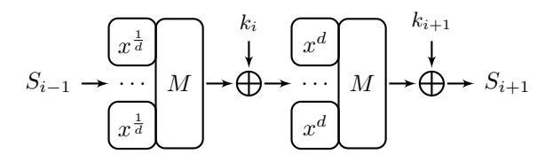
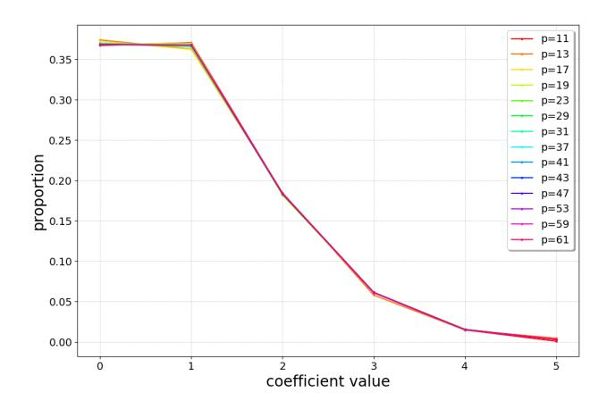
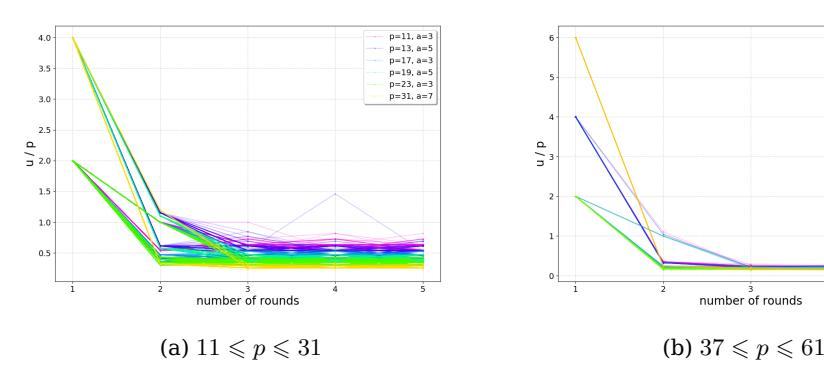
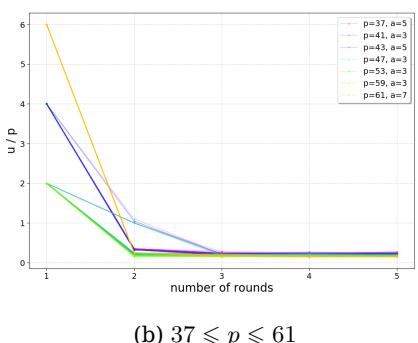
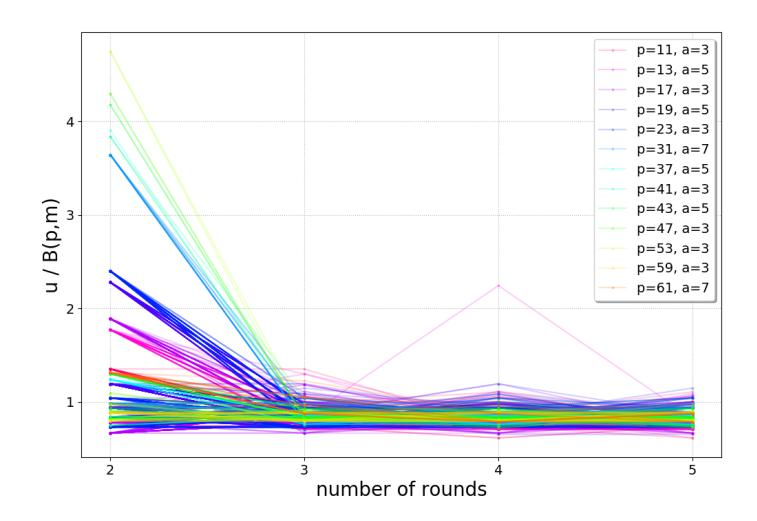
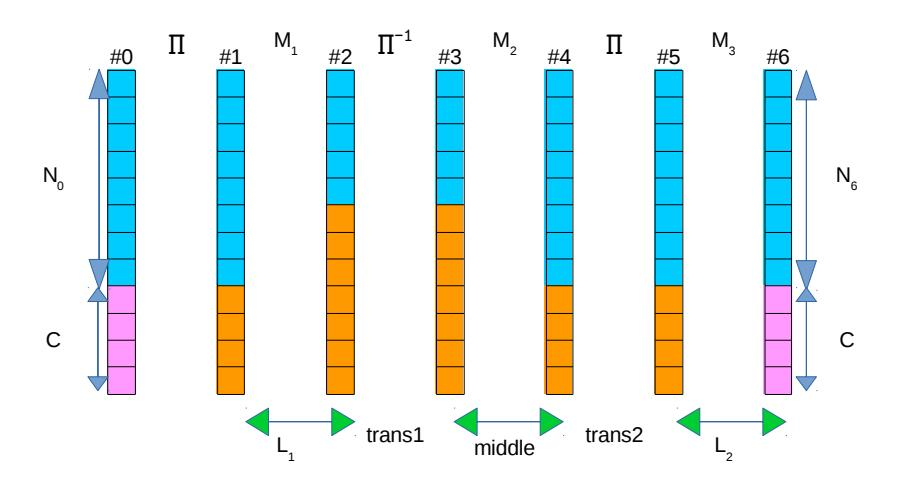
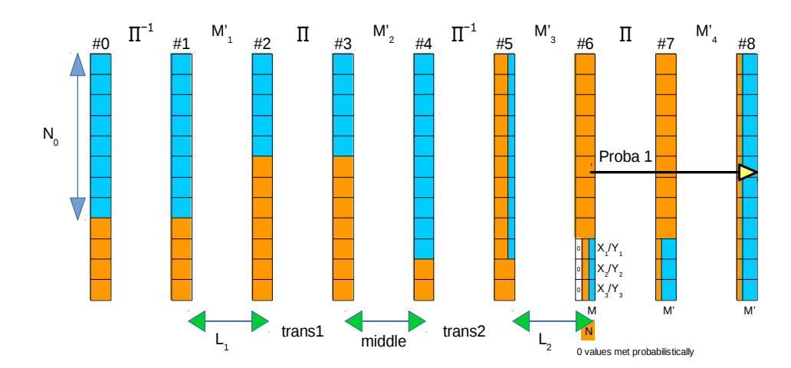

# **On the security of the Rescue hash function**

Tim Beyne<sup>1</sup> , Anne Canteaut<sup>2</sup> , Gregor Leander3*,*<sup>4</sup> , María Naya-Plasencia<sup>2</sup> , Léo Perrin<sup>2</sup> and Friedrich Wiemer<sup>4</sup> (ed.)

> <sup>1</sup> Cosic KU Leuven, Leuven, Belgium 2 INRIA, Paris, France <sup>3</sup> HGI, Ruhr-Universität Bochum, Bochum, Germany 4 cryptosolutions, Essen, Germany

**Abstract.** In this report, we cryptanalyse the Rescue hash function. In particular, we look at linear and differential cryptanalysis of Rescue, how multiplicative subgroups are propagated by the round function and at rebound attacks. Overall, we do not find any direct threat to the security of Rescue.

**Keywords:** Rescue · Algebraic optimised · Linear Cryptanalysis · Differential Cryptanalysis · Multiplicative Subgroups · Rebound Attacks

**Acknowledgements:** This work was supported by StarkWare Industries and the Ethereum Foundation.

# **Contents**

| 1 | Summary of the results                                  | 3  |
|---|---------------------------------------------------------|----|
|   | 1.1<br>Steps vs Rounds                                  | 4  |
| 2 | The Rescue hash function                                | 4  |
| 3 | Linear Cryptanalysis                                    | 4  |
|   | 3.1<br>Upper Bounds for Linear Trails<br>               | 5  |
|   | 3.2<br>Upper Bounds for Four Rounds<br>                 | 6  |
| 4 | Differential Cryptanalysis                              | 9  |
|   | 4.1<br>Two-round differentials                          | 10 |
|   | 4.2<br>Four-round differentials and weak round-keys<br> | 14 |
|   | 4.3<br>More Experimental Results<br>                    | 18 |
| 5 | Multiplicative Subgroups Analysis                       | 22 |
|   | 5.1<br>The Setup<br>                                    | 23 |
|   | 5.2<br>The Effect of the Round Operations               | 23 |
|   | 5.3<br>Diagonal Subgroups<br>                           | 25 |
| 6 | Rebound attacks for finding collisions                  | 26 |
|   | 6.1<br>Example collision attack on 3 rounds             | 26 |
|   | 6.2<br>Extension to 4 rounds<br>                        | 28 |
|   | 6.3<br>Conclusion                                       | 30 |
| A | Appendix                                                | 32 |

# <span id="page-2-0"></span>**1 Summary of the results**

This report is the result of a joint effort to analyze the security of Rescue. We considered several attack vectors and did not find attacks that pose a direct risk to the current design. Time was limited and we cannot exclude that other attack vectors or variants of the ones we considered lead to a full break of Rescue. In more detail, we considered the following attacks.

**Linear Cryptanalysis** We adapt the notion of linear cryptanalysis to the case of odd characteristic using the notion of additive characters on F*p*. Building upon this we can show that single linear trails do not pose a threat to Rescue. Furthermore, we investigate the effect of trail clustering. As for almost any cipher, we are not able to settle this completely. However, our investigations do not point at any weakness for Rescue.

**Differential Cryptanalysis** Generalization of differential cryptanalysis to the case of odd characteristic is, compared to linear characteristic, trivially done. Consequently, it is not surprising that important properties can be transferred as well. In particular, the maximal expected differential probability (MEDP) can be bounded. We thus confirm that averaging over independent round keys, differential cryptanalysis does not seem to pose a threat to Rescue. However, in the case of a fixed key, we experimentally observe the existence of a few keys that exhibit a significantly larger probability of differentials than expected from a random permutation. We can explain this behaviour only partially. One reason is that using the S-box layer and its inverse in turns leads to a large uniformity for two rounds. Thus, we can explain why some keys lead to a higher than expected differential uniformity, but there remain keys with a similar property that we do not fully understand. Again, it seems highly unlikely that this poses a threat for Rescue with the chosen parameters.

**Multiplicative Subgroups** Motivated by the lack of additive structure and the Sboxes being homomorphisms in F ∗ *p* , we next focus on attacks exploiting multiplicative structures. In particular, we investigate how certain multiplicative subgroups (and their cosets) are mapped by parts of the round functions. While the S-box and the linear layer exhibit strong non-random properties, we argue that those are destroyed with high probability by the key (or constant) addition.

The main result in this part of the analysis is that the round constants for Rescue could be chosen in a way that allows to easily break the cipher with the given keyscheduling for any number of rounds. The main reason here is that Rescue reuses the round function in the key-scheduling. Again, for non-maliciously chosen parameters, this is not going to happen with an overwhelming probability.

**Rebound Attacks** One of the most successful attacks against hash functions are rebound attacks. Those attacks use the freedom of the attacker in a non-keyed setting to efficiently generate pairs following a (truncated) differential characteristic and thus often cover a larger number of rounds compared to usual differential attacks. In the case of Rescue our investigations indicate that there is a rather large security margin against those attacks.

<span id="page-3-3"></span>

Figure 1: Two rounds of Rescue.

#### <span id="page-3-0"></span>1.1 Steps vs Rounds

Finally, please note that in this report, we stick to the common way of counting rounds as the number of S-box layer applications (including following linear layer and key addition). Thus, what is called a step in [1] is here called a round.

## <span id="page-3-1"></span>2 The Rescue hash function

We quickly recall the design specification of Rescue from [1] to settle a common ground for notations. Let p be an odd prime, we denote the finite field with p elements by  $\mathbb{F}_p$ . Further, let g be a generator of the multiplicative group  $\mathbb{F}_p^*$  and for any  $\alpha \in \mathbb{F}_p^*$ ,  $\langle \alpha \rangle$  is the multiplicative subgroup of  $\mathbb{F}_p^*$  generated by  $\alpha$ .

Rescue operates on a state which is represented as an element of  $\mathbb{F}_p^m$ . In other words, the state is represented by m words in  $\mathbb{F}_p$ . The state is transformed by an S-box layer followed by a linear layer and a key addition, see also Fig. 1. In what follows, we stick to the common way of counting rounds as the number of S-box layer applications (including following linear layer and key addition).

The S-box layer is not identical for all rounds, but rather two S-box layers are alternated, where the second is the inverse of the first. The S-box is a power permutation, i.e. for the smallest prime d that is coprime to p-1:

$$S(x) \coloneqq x^{\frac{1}{d}} ,$$

and  $S^{-1}$  accordingly. The linear layer multiplies the state by a (randomly generated Cauchy) MDS matrix  $M \in \mathbb{F}_p^{m \times m}$ . The key schedule for deriving the round keys reuses this round function; each round key  $k_i$  is the state after the ith application of the round function. During the key schedule, the "round key" addition is substituted by a round constant addition, where the round constants  $\mathrm{rc}_i$  are pseudo randomly chosen.

Overall, Rescue iterates  $r=\min{\{20,4\lceil\log_2(p)/4\rceil\}}$  rounds. Suggested parameters for Rescue are:

| Parameter Name | $n = \log_2 p$ | m  | r  |
|----------------|----------------|----|----|
| Rescue128a     | 125            | 4  | 32 |
| Rescue128b     | 253            | 12 | 44 |
| Rescue128c     | 125            | 12 | 20 |
| Rescue128d     | 61             | 12 | 20 |
| Rescue128e     | 253            | 11 | 20 |

# <span id="page-3-2"></span>3 Linear Cryptanalysis

A natural generalization of linear cryptanalysis to  $\mathbb{F}_p^m$  is to consider the probability distribution of linear combinations  $u^\top x$  of the state x. As discussed in [3, Chapter

3], this distribution can be associated with a p-dimensional subspace of the vector space of functions  $\mathbb{F}_p^m \to \mathbb{C}$ . A basis for this subspace is given by the functions  $x \mapsto \chi(u^T x)$  where  $\chi$  is an additive character of  $\mathbb{F}_p$ . In this section, we consider the "one-dimensional" approximations obtained from these basis functions, but not their combined effect. With this simplification, we obtain (up to minor differences) the generalization of linear cryptanalysis over  $\mathbb{F}_p$  proposed in [2].

In the following, let  $\chi$  denote an additive character of  $\mathbb{F}_p$ . Further, let d be an integer coprime to p-1. This section is structured into two parts:

- 1. Section 3.1 shows that (for p large enough) two rounds of Rescue have no linear trails with correlation significantly higher than  $p^{-m/2}$ .
- 2. Section 3.2 provides upper bounds on the correlation of linear approximations over four rounds of Rescue. Our results depend on the dimension of a certain affine variety for which we currently do not have good theoretical bounds. However, the bound can be made effective for small values of m by means of Gröbner basis computations (even for large p).

### <span id="page-4-0"></span>3.1 Upper Bounds for Linear Trails

We first show that every linear trail over two rounds has correlation less than  $p^{-m/2}$  if p is sufficiently large. As in the characteristic two case, the MDS-property of the linear layer ensures that absolute correlations of two-round approximations are bounded by  $|c|^{m+1}$ , where c is the correlation of the best non-trivial linear approximation of  $x\mapsto x^d$ .

The correlation of a linear approximation over a single S-box is given by

$$\frac{1}{p} \sum_{x \in \mathbb{F}_p} \chi(ux - vx^d) = \frac{1}{p} \sum_{x \in \mathbb{F}_p} \chi(x^d - uv^{-1/d}x) .$$

Consequently, it suffices to compute the exponential sums

$$\sum_{x \in \mathbb{F}_p} \chi(x^d + wx) \ .$$

Note that, as opposed to the characteristic two case, computing the exact correlation of a linear approximation over  $x\mapsto x^d$  appears to be nontrivial. Hence, we shall consider only upper bounds on the correlation. We use the following classical result due to Weil [16].

<span id="page-4-1"></span>**Proposition 1** (Weil [16]). Let  $\chi$  be an additive character of  $\mathbb{F}_p$  and f a non-constant univariate polynomial of degree d over  $\mathbb{F}_p$ . It holds that

$$\left| \sum_{x \in \mathbb{F}_p} \chi(f(x)) \right| \leqslant (d-1) p^{d/2}.$$

For d=3, Proposition 1 yields the bound  $|c|\leqslant (d-1)\sqrt{p}$ . Consequently, the correlation of an r-round trail is bounded by

$$\left(\frac{d-1}{\sqrt{p}}\right)^{r(m+1)} \leqslant p^{-m/2} ,$$

where the inequality holds for  $r \geqslant \frac{1}{4} \log_{d-1} p / (\log_{d-1} p - 2)$ .

### <span id="page-5-0"></span>3.2 Upper Bounds for Four Rounds

The result from the previous section shows that there are no usable linear trails. However, since iterating the Rescue round function gives a function of the form  $S \circ A \circ S^{-1} \circ A'$  with A and A' affine maps, it is natural to wonder if clustering of linear trails can result in strong linear approximations over iterations of the round function. To this end, we will give upper bounds on the correlation of arbitrary approximations over  $F = S \circ A \circ S^{-1}$ . We start from the straightforward observation that the correlation of a two-round approximation with masks (u,v) is given by

$$\frac{1}{p^m} \sum_{x \in \mathbb{F}_p^m} \chi(u^\top x - v^\top F(x)) = \frac{1}{p^m} \sum_{x \in \mathbb{F}_p^m} \chi(u^\top S(x) - v^\top (S \circ A)(x)).$$

Let A(x) = Mx + c with  $M \in \mathbb{F}_p^{m \times m}$  and

$$V = \left\{ \left( \begin{smallmatrix} x \\ Mx \end{smallmatrix} \right) \mid x \in \mathbb{F}_p^m \right\}.$$

In the particular case of Rescue, V is the vector space of codewords of the MDS-code generated by  $(\operatorname{Id},M)$ . Computing the correlation then amounts to computing the exponential sum

$$\sum_{z \in \alpha + V} \chi(\sum_{i=1}^t w_i \, z_i^d),$$

where t=2m,  $\alpha=(0,c)$  and w=(u,-v). Alternatively, if we let  $f(z)=\sum_{i=1}^t w_i z_i^d$  and L(x)=(x,Mx), then the exponential sum above can be rewritten as

$$\sum_{x \in \mathbb{F}_p^m} \chi(f(L(x) + \alpha)).$$

Since the correlation of two-round linear trails is bounded by  $\mathcal{O}(p^{-(m+1)})$ , we intuitively expect that "generically" this sum should be bounded by  $\mathcal{O}(p^{m/2})$ . Indeed, it does not make sense to expect a lower upper bound, as the variance of the correlation for a random permutation is  $p^{-m/2}$ .

A first step towards bounding the exponential sum is provided by the following theorem of Deligne [9, Theorem 8.4] – although it is not sufficiently powerful for our application.

**Proposition 2** (Deligne [9]). Let g be a degree d polynomial in n variables on  $\mathbb{F}_p$  with maximal homogeneous part h. Suppose d is coprime to p and the projective hypersurface defined by h in  $\mathbb{P}_p^{n-1}$  is non-singular. For any additive character  $\chi$  of  $\mathbb{F}_p$ , it holds that

$$\Big|\sum_{x\in\mathbb{F}_p^n}\chi(g(x))\Big|\leqslant (d-1)^np^{n/2}.$$

Note that, since f is homogeneous, the maximal homogeneous part of  $f(L(x)+\alpha)$  is simply f(L(x)). To see why Deligne's result can not be sufficient for our purposes, consider a linear layer which is neither MDS nor near-MDS. The intuition provided by linear trails then suggests a bound  $\mathcal{O}(p^{m/2-N})$  for  $N\leqslant m$  active S-boxes. Indeed, Deligne's theorem does not directly apply because the hypersurface defined by  $f\circ L$  is singular. It will be shown that, even when L is MDS, this condition can not be ensured for all choices of the mask. Hence, a more general result – which takes into account the dimension of the singular set – is desired. We thank Wouter Castryck for pointing us to the following theorem of Katz [12, Theorem 4]. We state a simplified version of the theorem that does not use scheme-theoretic language.

**Proposition 3** (Katz [12]). Let g be a degree d polynomial in n variables on  $\mathbb{F}_p$  with maximal homogeneous part h. Suppose d is coprime to p and the singular set of the projective hypersurface defined by h in  $\mathbb{F}_p^{n-1}$  has dimension  $\delta$ . For any additive character  $\chi$  of  $\mathbb{F}_p$ , it holds that

$$\left| \sum_{x \in \mathbb{F}_p^n} \chi(g(x)) \right| \leqslant C \, q^{(n+\delta+1)/2},$$

where  $C = (4d + 5)^n$ .

Follow-up work by Rojas Léon [15] provides a generalization and shows that C may be taken as  $C=3(d+1)^n$ . To apply Katz's result, the remaining work is to determine the dimension  $\delta$ . Note that  $\delta+1$  is the dimension of the singular locus of the affine algebraic set defined by  $f\circ L$ . Since the gradient of the latter function is  $L^\top[(\nabla f)\circ L]$ , it suffices to determine the dimension of the algebraic set defined by  $L^\top[(\nabla f)\circ L]=0$ . If an upper bound on this dimension is available, we deduce the following result.

**Proposition 4.** Let  $F = S \circ A \circ S^{-1}$ ,  $\sigma(x) = \sum_{i=1}^m S(x)_i$  and denote the linear part of the affine map A by M. Let L(x) = (x, Mx) and, for any masks  $u, v \in \mathbb{F}_p^m$ , let  $D = \operatorname{diag}(u_1, \ldots, u_m, -v_1, \ldots, -v_m)$ . Furthermore, let

$$\mathbb{V} = \left\{ x \in \overline{\mathbb{F}}_p^m \mid L^\top D\left[ (\nabla \sigma) \circ L \right](x) = 0 \right\}.$$

If dim  $\mathbb{V} \leq \ell$ , then for any additive character  $\chi$  of  $\mathbb{F}_n$ ,

$$\left| \frac{1}{p^m} \sum_{x \in \mathbb{F}_p} \chi(u^\top x - v^\top F(x)) \right| \leqslant C p^{(\ell - m)/2} ,$$

where  $C = (d-1)^m$  for  $\ell = 0$  and  $C = 3(d+1)^m$  if  $\ell \geqslant 1$ .

It can be expected that  $\dim \mathbb{V}=0$  for "most" masks. However, identifying the exceptional cases analytically appears to be quite difficult. Hence, we take a computational approach. Our goal is to compute, for all masks u and v, the dimension of the affine algebraic set  $\mathbb{V}$  defined by

$$u_i z_i^{d-1} - \sum_{j=1}^m M_{j,i} v_j z_{j+m}^{d-1} = 0 \quad \text{for } i = 1, \dots, m$$
$$z_i - \sum_{j=1}^m M_{i,j}^{-1} z_{j+m} = 0 \quad \text{for } i = 1, \dots, m.$$

Indeed, note that the row space of  $(I-M^{-1})$  is orthogonal to the image of L. Since d and m are small, it is feasible to compute a Gröbner basis (and hence  $\dim \mathbb{V}$ ) of the above system for any specific choice of u and v. In order to deal with u and v as "parameters", we can instead consider the above system of equations over the fraction field  $K = \mathbb{F}_p(u_1,\ldots,u_m,v_1,\ldots,v_m)$ . It can be shown that for most specializations of the parameters  $u_1,\ldots,u_m$  and  $v_1,\ldots,v_m$ , the Gröbner basis with respect to K specializes to a Gröbner basis with respect to K [4]. An alternative approach, which allows for a easier identification of the special cases, is to compute a Gröbner basis with respect to a term ordering such that  $z_i \succ u_j$  and  $z_i \succ v_j$  for all  $0 \le i, j \le m$ . We illustrate this approach with an example.

<span id="page-6-0"></span><sup>&</sup>lt;sup>1</sup> For convenience, we overload the notation L and use it for both the matrix and the linear map.

**Example with m=2.** Take m=2, p=41 and let

$$L = \begin{pmatrix} 24 & 15 \\ 15 & 37 \end{pmatrix}.$$

We compute a Gröbner basis G with respect to the lexicographic monomial order  $z_1 \succ \ldots \succ z_4 \succ u_1 \succ \ldots \succ u_m \succ v_1 \succ \ldots \succ v_m$ . We obtain the following sequence of polynomials G:

$$\begin{split} z_1 - 17z_3 + 8z_4 \\ z_2 + 8z_3 + 20z_4 \\ (u_1 - 12v_1) \, z_3^2 - 13u_1z_3z_4 + (-19u_1 + 13v_2)z_4^2 \\ (u_2 - 6v_2) \, z_3^2 + 5u_2z_3z_4 + (-4u_2 + 18v_2)z_4^2 \\ f_1(u,v) \, z_3z_4^2 + f_2(u,v)z_4^3 \\ f_3(u,v) \, z_3z_4^3 + f_4(u,v)z_4^2 \\ f_5(u,v) \, z_3z_4 + f_6(u,v)z_4^2 \\ f_7(u,v) \, z_4^3 \; . \end{split}$$

It is easy to see that, if  $f_7(u,v) \neq 0$ , then  $\dim \mathbb{V} = 0$  unless  $u_1 = u_2 = v_1 = v_2 = 0$ . Indeed, the equations  $u_1 - 12v_1 = 0$  and  $u_2 - 6v_2 = 0$  are linearly independent. In fact, we clearly have  $\mathbb{V} = \{0\}$  in this case. Since  $f_7(u,v) = 0$  defines a quartic hypersurface in  $\overline{\mathbb{F}}_p^4$ , it contains at most  $4p^3$  rational points (by Bézout's theorem). It follows that  $\dim \mathbb{V} = 0$  for all but a fraction of at most 4/p masks.

If  $f_7(u,v)=0$ , we observe that  $z_4$  becomes a free variable and  $\dim \mathbb{V}\geqslant 1$ . However, since  $u_1-12v_1=0$  and  $u_2-6v_2=0$  are linearly independent, the dimension cannot exceed one either. In conclusion,

$$\left. \frac{1}{p^2} \left| \sum_{x \in \mathbb{F}_p^2} \chi(u^\top x - v^\top F(x)) \right| \leqslant \begin{cases} 4/p & \text{if } f_7(u, v) \neq 0 \\ 48/\sqrt{p} & \text{otherwise.} \end{cases}$$

For p=41, the  $48/\sqrt{p}$  bound is of course trivial. However, the constant 48 does not depend on the field size and the analysis (as well as the bound above) seems to carry over to larger primes – in any case, it is feasible to compute the Gröbner basis explicitly even for large primes. Note that, experimentally, we did not find any approximations violating the upper bound 4/p – even if  $f_7(u,v)=0$ , and for arbitrary round constants. This suggests that further improvements to the upper bound may be possible.

**Example with** m=3**.** Take m=3, p=1511 and let

$$L = \begin{pmatrix} 1424 & 1061 & 209 \\ 1061 & 109 & 1187 \\ 209 & 1187 & 1089 \end{pmatrix}.$$

In the previous example, a lexicographic term order was used. This is convenient, but much more costly to compute than a Gröbner with respect to a total-degree order. Fortunately, any block order respecting  $z_i \succ u_j, v_j$  suffices for the purpose of computing the dimension of  $\mathbb V$ . For this particular example, such a Gröbner basis is easily computed, but consists of a rather large number of polynomials. We will consider only a subset of the Gröbner basis that will be sufficient to show that  $\dim \mathbb V = 0$  for all but a fraction of at most  $12/p + 25/p^3$  masks.

The Gröbner basis contains a polynomial *f*1(*u, v*)*z* 4 6 . Hence, if *f*1(*u, v*) 6= 0, then *z*<sup>6</sup> = 0. Note that *f*<sup>1</sup> is of degree twelve and hence the corresponding hypersurface contains at most 12*p* <sup>5</sup> points in F 6 *p* . We additionally have the following polynomials:

$$\begin{split} &f_2(u,v)z_5^2 + [\ldots]z_4z_6 + [\ldots]z_5z_6 + [\ldots]z_6^2 \\ &f_3(u,v)z_5^3 + [\ldots]z_4z_5z_6 + [\ldots]z_5^2z_6 + [\ldots]z_4z_6^2 + [\ldots]z_5z_6^2 + [\ldots]z_6^3 \\ &f_4(u,v)z_5^3 + [\ldots]z_4z_5z_6 + [\ldots]z_5^2z_6 + [\ldots]z_4z_6^2 + [\ldots]z_5z_6^2 + [\ldots]z_6^3 \\ &f_5(u,v)z_5^3 + [\ldots]z_4z_5z_6 + [\ldots]z_5^2z_6 + [\ldots]z_4z_6^2 + [\ldots]z_5z_6^2 + [\ldots]z_6^3 \end{split}$$

In the above, "[*. . .*]" represents polynomials in *u* and *v*. For *z*<sup>6</sup> = 0, it holds that *z*<sup>5</sup> = 0 unless *f*2(*u, v*) = *f*3(*u, v*) = *f*4(*u, v*) = *f*5(*u, v*) = 0. It can be checked that *f*2*, f*3*, f*<sup>4</sup> and *f*<sup>5</sup> define an affine algebraic set of dimension three and degree 24. Hence, at most 24*p* <sup>3</sup> masks *u, v* ∈ F 3 *p* satisfy this condition. For *z*<sup>5</sup> = *z*<sup>6</sup> = 0, we consider the following polynomials in the Gröbner basis:

$$(u_3 - 224v_1)z_4^2 + [\ldots]z_4z_5 + [\ldots]z_5^2 + [\ldots]z_4z_6 + [\ldots]z_5z_6 + [\ldots]z_6^2$$

$$(u_2 + 599v_1)z_4^2 + [\ldots]z_4z_5 + [\ldots]z_5^2 + [\ldots]z_4z_6 + [\ldots]z_5z_6 + [\ldots]z_6^2$$

$$(u_1 + 7v_1)z_4^2 + [\ldots]z_4z_5 + [\ldots]z_5^2 + [\ldots]z_4z_6 + [\ldots]z_5z_6 + [\ldots]z_6^2$$

Hence, *z*<sup>4</sup> = 0 unless all three coefficients of *z*<sup>4</sup> above vanish, which happens for at most *p* <sup>3</sup> masks. Finally, when *z*<sup>4</sup> = *z*<sup>5</sup> = *z*6, we use the linearly independent polyonomials

$$z_1 - 300z_4 + 553z_5 - 344z_6$$


$$z_2 - 553z_4 + 111z_5 + 715z_6$$


$$z_3 - 344z_4 + 715z_5 + 695z_6$$

In summary, dim V = 0 except for a fraction of at most

$$\frac{12}{p} + \left(1 - \frac{12}{p}\right) \left[\frac{24}{p^3} + \left(1 - \frac{24}{p^3}\right) \frac{1}{p^3}\right] \leq \frac{12}{p} + \frac{25}{p^3}$$

masks. When dim V = 0, the absolute correlations are upper bounded by 8*/p*3*/*<sup>2</sup> . For the remaining cases, a similar (but more elaborate) approach can be used to determine the possible values of dim V and the corresponding upper bounds on the correlations. Note that we did not find any masks violating the upper bound 8*/p*3*/*<sup>2</sup> .

# <span id="page-8-0"></span>**4 Differential Cryptanalysis**

In this section we describe our attempts to attack Rescue using differential cryptanalysis. We start by two-round differentials, averaged over all round keys, before investigating special choices of keys that, even for more rounds, lead to a differential uniformity that is larger than expected. We add experimental observations to our theoretical analysis. In order to be able to judge the experimental behaviour, we also built heuristic models for the expected behaviour for functions in odd characteristics.

**Notations.** For differential cryptanalysis, we are interested in the number of solutions for the equation

$$\Delta_{\alpha}F(x) := F(x) - F(x + \alpha) = \beta$$
,

where *F* is the (key-dependent) function under scrutiny. The Difference Distribution Table (DDT) captures these numbers:

$$\mathrm{DDT}_F[\alpha, \beta] \coloneqq |\{x \mid \Delta_{\alpha} F(x) = \beta\}|.$$

The overall resistance of *F* against differential cryptanalysis is measured by its differential uniformity, that is the maximum entry in the DDT (excluding the trivial maximum):

$$\delta(F) := \max_{\alpha \neq 0, \beta} \mathrm{DDT}_F[\alpha, \beta] .$$

# <span id="page-9-0"></span>**4.1 Two-round differentials**

The aim of this section is to understand how the study of two-round differentials [\[8,](#page-30-8) [5\]](#page-30-9) on the AES can be transfered to Rescue.

## **4.1.1 Two-round MEDP**

A first result is that the classical upper bound on the MEDP from [\[11\]](#page-30-10) and [\[7,](#page-30-11) Section B.2] can be adapted to fields of any characteristic and to the case where the two S-box layers are different (but here with the same differential uniformity).

This result, applied to the case of Rescue over F*<sup>p</sup>* leads to the following.

<span id="page-9-1"></span>**Proposition 5.** The MEDP of two rounds of Rescue operating on F *m <sup>p</sup>* with an S-box layer with differential uniformity *δ*(*S*) and an MDS linear layer satisfies

$$\mathsf{MEDP}_2 \leqslant \left(\frac{\delta(S)}{p}\right)^m\,.$$

In the specific case of Rescue, the S-box has differential uniformity 2, which leads to

$$\mathsf{MEDP}_2 \leqslant \left(\frac{2}{p}\right)^m$$
 .

However, the MEDP is the highest probability of a differential, among all differentials averaged over the round key (or round constant). This may be very different from the maximal differential probability with a fixed key.

We can try to compute the probability of the differentials of minimal weight, as in [\[5\]](#page-30-9). However, the same technique based on linear algebra does not work at all, since the values satisfying a differential for the S-box do not form an F*p*-linear space here, while they form an F2-linear space in characteristic 2. Instead we look at fixed-key differentials experimentally next.

### **4.1.2 Differential unformity distributions for two rounds and toy sizes**

The MDS matrices used here are given in Table [1,](#page-10-0) the distributions of the differential uniformity, see Table [2,](#page-11-0) are discussed in the following paragraphs.

*p* **= 11 and** *m* **= 3.** The two-round MEDP is equal to 7*.*36 × 11−<sup>3</sup> , which is close to the upper bound of Proposition [5.](#page-9-1) However, for all values of the key, the differential uniformity is higher than the *p <sup>m</sup>* MEDP, as shown in the top part of Table [2.](#page-11-0)

The highest differential uniformity (41) is obtained for the all-zero key, for which some simple symmetries affect the result. For instance, in this case,

$$E(\lambda x_0, \dots, \lambda x_{m-1}) = \lambda E(x_0, \dots, x_{m-1}), \quad \forall \lambda \in \mathbb{F}_p^*$$

It follows that,

$$E(x+a) - E(x) = E(a)$$

has at least *p* solutions: 0, *a*, and all inputs (*λa*0*, . . . , λam*−1).

*p* **= 17 and** *m* **= 3.** The differential uniformities obtained for the different values of the key are given in the middle part of Table [2.](#page-11-0) Again the two-round MEDP is very close to the upper bound: it equals 7*.*59 × 17<sup>−</sup><sup>3</sup> .

Again, the highest value of the differential uniformity is obtained for the all-zero key only. And the differential uniformity is always higher that the MEDP × *p m*.

*p* **= 41 and** *m* **= 2.** The distribution for the differential uniformity when the round key varies is given in the bottom part of Table [2.](#page-11-0)

## **4.1.3 Analysis of some minimal-weight differentials**

We now focus on the case where the S-box is defined by *d* = 3. The following proposition shows that, for any MDS matrix, there always exist round keys such that two rounds have differential uniformity at least *p*. It is based on the analysis of the number of inputs satisfying some differentials of minimal weight.

**Proposition 6.** Let *M* denote the MDS matrix and (*K*0*, . . . , Km*−1) ∈ F *m p* the round key. For all round-keys such that (*K*0*, . . . , Km*−1) or

$$M^{-1} \begin{pmatrix} K_0 \\ \dots \\ K_{m-1} \end{pmatrix}$$

has weight at most (*m* − 1), the function corresponding to two rounds of Rescue has differential uniformity at least *p*.

Moreover, for all round-keys such that both (*K*0*, . . . , Km*−1) and

$$M^{-1} \begin{pmatrix} K_0 \\ \dots \\ K_{m-1} \end{pmatrix}$$

have weight *m*, all differentials of weight (*m* + 1) such that either the input difference or the difference after the second S-box layer has weight 1 are satisfied for at most 2 *<sup>m</sup>*+2 inputs.

Proof. Let us consider two rounds of Rescue without the last linear layer, which does not influence the differential uniformity. Let us first focus on differentials such that the input difference has weight 1. The case of an output difference with weight 1 is similar by using that the inverse of the two rounds (without the last linear layer)

<span id="page-10-0"></span>Table 1: MDS matrices for some toy parameters used to compute the differential uniformity distributions over two rounds.

$$(p,m) \qquad (11,3) \qquad (17,3) \qquad (41,2)$$

$$M \qquad \begin{pmatrix} 7 & 3 & 10 \\ 2 & 6 & 7 \\ 1 & 7 & 4 \end{pmatrix} \qquad \begin{pmatrix} 6 & 1 & 7 \\ 13 & 9 & 3 \\ 11 & 10 & 16 \end{pmatrix} \qquad \begin{pmatrix} 24 & 15 \\ 15 & 37 \end{pmatrix}$$

| δ     | 10   | 11   | 21  | 30  | 41 |
|-------|------|------|-----|-----|----|
| #keys | 190  | 330  | 780 | 30  | 1  |
| δ     | 13   | 17   | 33  | 35  | 37 |
| #keys | 1680 | 2400 | 816 | 16  | 1  |
| δ     | 8    | 9    | 10  | 41  |    |
| #keys | 320  | 1120 | 80  | 161 |    |

<span id="page-11-0"></span>Table 2: Differential uniformity for Rescue with *p* = 11 and *m* = 3 (top), *p* = 17 and *m* = 3 (middle), and *p* = 41 and *m* = 2 (bottom) for all possible values of the round key.

with matrix *M* and key *K* is equal to the encryption function with matrix *M*<sup>−</sup><sup>1</sup> and key *M*<sup>−</sup><sup>1</sup>*K*.

Also, without loss of generality, we will assume that the active element in the input difference is the last one, i. e., the input difference has the form (0*, . . . ,* 0*, α*), *α* ∈ F*p*. Let (*β*0*, . . . , βm*−1) denote the output difference. Obviously, the difference after the first S-box layer has the form (0*, . . . ,* 0*, λ*), and the difference after the linear layer is (*a*0*,m*−1*λ, . . . , am*−1*,m*−1*λ*) where *ai,j* denote the entries of *M*, 0 6 *i, j < m*. We then consider an input satisfying this differential and denote by (*c*0*, . . . , cm*−2*, z*) its image after the first S-box layer. Then, this value satisfies the differential if and only if there exists *λ* ∈ F ∗ *p* such that

$$(z+\lambda)^3 - z^3 = \alpha$$

$$(a_{0,m-1}z + a_{0,m-1}\lambda + \gamma_0)^3 - (a_{0,m-1}z + \gamma_0)^3 = \beta_0$$

$$(a_{1,m-1}z + a_{1,m-1}\lambda + \gamma_1)^3 - (a_{1,m-1}z + \gamma_1)^3 = \beta_1$$

$$\cdots$$

$$(a_{m-1,m-1}z + a_{m-1,m-1}\lambda + \gamma_{m-1})^3 - (a_{m-1,m-1}z + \gamma_{m-1})^3 = \beta_{m-1}$$

where *γ<sup>i</sup>* = P*t*−<sup>2</sup> *<sup>j</sup>*=0 *ai,j c<sup>j</sup>* + *K<sup>i</sup>* . Each equation corresponding to an S-box in the second S-box layer can then be rewritten as

$$(z + \lambda + \gamma_i')^3 - (z + \gamma_i')^3 = \beta_i'$$

where

$$\beta_i' = \beta_i (a_{i,m-1})^{-3} \quad \text{and} \quad \gamma_i' = a_{i,m-1}^{-1} \left( \sum_{j=0}^{m-2} a_{i,j} c_j + K_i \right) \; .$$

We now need to count the number of tuples (*c*0*, . . . , cm*−2*, z, λ*) satisfying this system of (*m* + 1) non-trivial equations.

• A first particular case is when all *γ* 0 *<sup>i</sup>* = 0, which means that the left-hand terms of all these equations are the same. Then, the system has solutions only if the right-hand terms are equal, i. e.

$$\alpha = \beta_0' = \ldots = \beta_{t-1}'.$$

In this case, all the *p* pairs (*z, λ*) such that (*z* + *λ*) <sup>3</sup> − *z* <sup>3</sup> = *α* satisfy the system. The fact that all *γ* 0 *<sup>i</sup>* = 0 is equivalent to

$$K_i = -\sum_{j=0}^{m-2} a_{i,j} c_j , \quad \forall 0 \leqslant i < m$$

or equivalently

$$\begin{pmatrix} K_0 \\ \dots \\ K_{t-1} \end{pmatrix} = -M \begin{pmatrix} c_0 \\ \dots \\ c_{t-2} \\ 0 \end{pmatrix}$$

This condition means that *M*<sup>−</sup><sup>1</sup>*K* has a zero in its last position. And for each such key, (*c*0*, . . . , cm*−2) is uniquely determined, which means that the differential is satisfied by exactly *p* inputs.

• Let us now assume that *γ* 0 *i* 6= 0 for at least one integer 0 6 *i < m*. Then *z* and *λ* are solutions of the two equations

$$3\lambda z^2 + 3\lambda^2 z + \lambda^3 = \alpha$$
$$3\lambda (z + \gamma_i')^2 + 3\lambda^2 (z + \gamma_i') + \lambda^3 = \beta_i'.$$

The difference between the second equation and the first one corresponds to

<span id="page-12-1"></span>
$$6\gamma_i'\lambda z = \beta_i' - \alpha - 3\lambda^2 \gamma_i' - 3\lambda(\gamma_i')^2 \tag{1}$$

that is

<span id="page-12-0"></span>
$$z = \frac{\beta_i' - \alpha}{6\gamma_i'\lambda} - \frac{1}{2}\lambda - \frac{1}{2}\gamma_i'. \tag{2}$$

By replacing *z* by this value in the first equation of the system, we get

$$\left( \frac{\beta_i' - \alpha}{6\gamma_i' \lambda} + \frac{1}{2}\lambda - \frac{1}{2}\gamma_i' \right)^3 - \left( \frac{\beta_i' - \alpha}{6\gamma_i \lambda} - \frac{1}{2}\lambda - \frac{1}{2}\gamma_i' \right)^3 = \alpha .$$

By expanding this relation, we get

$$\frac{1}{4}\lambda^3 + \frac{3(\gamma_i')^2}{4} + \frac{\beta_i' - \alpha}{2} + \frac{(\beta_i' - \alpha)^2}{12(\gamma_i')^2\lambda} = \alpha$$

which is an equation of degree 4 in *λ* and has then at most 4 solutions. For each such solution *λ*, the corresponding value of *z* is uniquely determined by Eq. [\(2\)](#page-12-0). Now, for each (*λ, z*), the nonzero *γ* 0 *<sup>j</sup>* has to satisfy a quadratic equation of the form Eq. [\(1\)](#page-12-1), implying that it can take at most two values. For each (*λ, z*), there are then a total of at most 2 *<sup>m</sup>* values of (*γ* 0 0 *, . . . , γ*<sup>0</sup> *m*−1 ), leading to the same number of values for (*c*0*, . . . , cm*−2). Therefore, the total number of values satisfying the differential is at most 2 *m*+2 .

Now, by changing the position of the active S-box within the first S-box layer, we get that the differential has *p* solutions when the *M*<sup>−</sup><sup>1</sup>*K* has weight strictly less than *m*. When exchanging the role of the input and output differences, the same condition applies to *M*(*M*<sup>−</sup><sup>1</sup>*K*) = *K*.

Listing [1](#page-31-1) gives SageMath code to check this property for a given set of round constants and a given MDS matrix. It is worth observing that the existence of round keys for which two rounds have differential uniformity *p* comes from the fact that the two S-box layers use two S-boxes which are the inverse of each other. When the second S-box layer also uses *x* 1*/*3 , it seems that the highest differential uniformity is always lower than *p*. For instance, for *p* = 41 and *m* = 2, it is at most equal to 10.

| δ  | 6    | 7     | 8     | 9    | 10  | 11   | 12 | 17 | 18 | 19   | 20   | 21 |
|----|------|-------|-------|------|-----|------|----|----|----|------|------|----|
| nb | 2748 | 51217 | 25458 | 3736 | 303 | 36   | 3  | 1  | 0  | 2    | 16   | 1  |
| %  | 3.3  | 61.3  | 30.5  | 4.5  | 0.4 | 0.04 | _  | _  | _  | _    | 0.02 | _  |
| nb | 2519 | 50199 | 26167 | 4139 | 405 | 54   | 3  | 0  | 1  | 33   | 1    | 0  |
| %  | 3    | 60.1  | 31.3  | 4.9  | 0.5 | 0.06 | _  | _  | _  | 0.04 | _    | _  |

<span id="page-13-1"></span>Table 3: Distributions of differential uniformity for four rounds, p=17, m=2, and all keys starting with  $K_0=(7,8)$  (top) and  $K_0=(3,8)$  (bottom). The gray colored columns denote differential uniformities greater than or equal to p.

## <span id="page-13-0"></span>4.2 Four-round differentials and weak round-keys

In the following, we consider several rounds with independent round-keys (i. e., we do not use the key-schedule defined for the Rescue block cipher or the round-constant generation process used in the StarkWare challenges to generate the round-keys).

Simulation results for m=2 show that there is a small proportion of round keys for which the differential uniformity of four rounds exceeds p. For instance, for p=17, m=2 and the MDS matrix

$$\left(\begin{array}{cc} 16 & 12 \\ 6 & 11 \end{array}\right),\,$$

we performed an exhaustive search for all keys  $(K_1,K_2)$  used in the second and third rounds, for two fixed values of the first-round key  $K_0$ , namely  $K_0=(7,8)$  and  $K_0=(3,8)$ . We then find the distributions for the differential uniformity of the four-round function given in Table 3.

The differential uniformity of the four-round function then seems to follow the expected distribution and takes its value in the range [6-11], except for a small proportion of keys for which it is much higher than expected. Similar results are obtained for p=41, where we obtain a few keys for which the differential uniformity exceeds 41.

We then try to understand whether this fact is due to the use of weak MDS matrices, or whether weak round keys exist for any choice of the MDS matrix.

We here exhibit round-key sequences for which four rounds have always differential uniformity at least p. Such round keys exist for any choice of the MDS layer and independently of the exponent chosen for the power permutation used in the S-box. This property originates from the fact that the S-box is a monomial permutation.

In the following, we denote by  $G_{r,d}$  the function corresponding to r rounds of encryption without the last linear layer, where the S-box used in the first S-box layer is  $x^d$ . We first show that the multiplication of all inputs by  $\lambda \in \mathbb{F}_p$  may be preserved by two rounds of encryption when the key does not have weight m.

<span id="page-13-2"></span>**Proposition 7.** (Two-round multiplicative property) Let  $G_{2,d}$  be two rounds of Rescue operating on  $\mathbb{F}_p^m$  and let  $(K_0,\ldots,K_{m-1})$  denote the round-key. Let  $\alpha\in\mathbb{F}_p^m$  and S denote the support of

$$M\begin{pmatrix} \alpha_0^d \\ \dots \\ \alpha_{m-1}^d \end{pmatrix}$$
.

Then, for any key such that  $K_i = 0$  for all  $i \in S$ , there exists  $\beta \in \mathbb{F}_p^m$  with  $\mathsf{Supp}(\beta) = S$  such that, for all  $\lambda \in \mathbb{F}_p$ ,

$$G_{2,d}(\lambda \alpha_0, \dots, \lambda \alpha_{m-1}) - G(0, \dots, 0) = (\lambda \beta_0, \dots, \lambda \beta_{m-1})$$
.

*Proof.* Let  $(y_0, \ldots, y_{m-1})$  denote the image of  $(\lambda \alpha_0, \ldots, \lambda \alpha_{m-1})$  after the key addition. We have that

$$y_i = \lambda^d \sum_{j=0}^{m-1} a_{i,j} \alpha_j^d + K_i, \quad \forall 0 \leqslant i < m.$$

If  $i \notin S$ ,  $\sum_{j=0}^{m-1} a_{i,j} \alpha_j^d = 0$  by definition of S. Then,  $y_i = K_i$ . If  $i \in S$ ,  $K_i = 0$ , implying that  $y_i = \lambda^d \delta_i$  for some constant  $\delta_i$ . It follows that  $z = G_{2,d}(\lambda \alpha_0, \ldots, \lambda \alpha_{m-1})$  satisfies

$$z_i = \begin{cases} K_i^{1/d} & \text{if } i \notin S \\ \lambda \delta_i^{1/d} & \text{if } i \in S \end{cases}.$$

Let  $\beta_i = \delta_i^{1/d}$  for  $i \in S$  and  $\beta_i = 0$  for  $i \notin S$ . Then, we have that

$$G_{2,d}(\lambda \alpha_0, \dots, \lambda \alpha_{m-1}) - G(0, \dots, 0) = (\lambda \beta_0, \dots, \lambda \beta_{m-1})$$
.

It is worth noticing that the proposition proves the property only for keys of weight strictly less than m, and that a non-trivial value  $\alpha$  can be found for any such key. As an easy corollary (which does not help for the 4-round property), we observe that such a multiplicative property may propagate over three rounds.

**Corollary 1.** (Three-round multiplicative property) Let  $G_{3,d}$  be three rounds of Rescue operating on  $\mathbb{F}_p^m$  and let  $K_r = (K_{r,0}, \ldots, K_{r,m-1})$  denote the key at round r. Let  $\alpha \in \mathbb{F}_p^m$  and S denote the support of

$$M\begin{pmatrix} \alpha_0^d \\ \dots \\ \alpha_{m-1}^d \end{pmatrix}$$
.

Then, for any  $K_0$  such that  $K_{0,i}=0$  for all  $i\in S$ , there exist  $K_1$  and  $\beta\in\mathbb{F}_p^m$  such that, for all  $\lambda\in\mathbb{F}_p$ ,

$$G_{3,d}(\lambda \alpha) = \lambda^d \beta$$
.

*Proof.* Let  $(x_0,\ldots,x_{m-1})$  denote the image of  $(\lambda\alpha_0,\ldots,\lambda\alpha_{m-1})$  under  $G_{2,d}$ . Then, as proved in the previous proposition, there exists  $\delta\in\mathbb{F}_p^m$  such that

$$x_i = \begin{cases} K_{0,i}^{1/d} & \text{if } i \notin S \\ \lambda \delta_i & \text{if } i \in S \end{cases}$$

for some constants  $\delta_i, i \in S$ . Let  $(z_0, \dots, z_{m-1})$  denote the corresponding value after the addition of  $K_1$ . Then

$$z_i = \lambda \sum_{j \in S} a_{i,j} \delta_j + \sum_{j \notin S} a_{i,j} K_{0,j}^{1/d} + K_{1,i}$$
.

Then, for the round key  $K_1$  defined by

$$K_{1,i} = -\sum_{j \notin S} a_{i,j} K_{0,j}^{1/d} ,$$

we have that, for any i,  $z_i = \lambda \gamma_i$  for some constant  $\gamma_i$ . It follows that the i-th coordinate of  $G_{3,d}(\lambda \alpha_0, \ldots, \lambda \alpha_{m-1})$  equals  $\lambda^d \gamma_i^d$ .

<span id="page-14-0"></span>Now, we focus on another multiplicative property over three rounds, resulting from Proposition 7 which can be used for exhibiting 4-round differentials.

**Lemma 1.** Let  $G_{3,d}$  be three rounds of Rescue operating on  $\mathbb{F}_p^m$  and let  $K_r = (K_{r,0},\ldots,K_{r,m-1})$  denote the key at round r. Let  $\alpha \in \mathbb{F}_p^m$  and S denote the support of

$$M\begin{pmatrix} \alpha_0^d \\ \dots \\ \alpha_{m-1}^d \end{pmatrix} .$$

Then, for any  $K_0$  such that  $K_{0,i}=0$  for all  $i\in S$  and for any  $\lambda_0\in\mathbb{F}_p$  there exist  $K_1$  and  $\beta\in\mathbb{F}_p^m$  such that, for all  $\lambda\in\mathbb{F}_p$ ,

$$G_{3,d}(\lambda\alpha) - G_{3,d}(0,\ldots,0) = \left[ (\lambda + \lambda_0)^d - \lambda_0^d \right] \beta$$
.

*Proof.* We denote by z the image of  $\lambda \alpha$  after the addition of the second round-key  $K_1$ . As observed in the previous proof,

$$z_i = \lambda \sum_{j \in S} a_{i,j} \delta_j + \sum_{j \notin S} a_{i,j} K_{0,j}^{1/d} + K_{1,i}$$
.

Then, by choosing

$$K_{1,i} = \lambda_0 \sum_{j \in S} a_{i,j} \delta_j - \sum_{j \notin S} a_{i,j} K_{0,j}^{1/d}, \quad \forall i$$

we get

$$z_i = (\lambda + \lambda_0) \sum_{j \in S} a_{i,j} \delta_j .$$

It follows that the *i*-th coordinate of  $G_{3,d}(\lambda \alpha)$  is

$$(\lambda + \lambda_0)^d \left( \sum_{j \in S} a_{i,j} \delta_j \right)^d .$$

Then, the *i*-coordinate of  $G_{3,d}(\lambda \alpha) - G(0,\ldots,0)$  is

$$((\lambda + \lambda_0)^d - \lambda_0^d)\beta_i$$
 with  $\beta_i = \left(\sum_{j \in S} a_{i,j}\delta_j\right)^d$ .

Now, for obtaining a differential satisfied for p inputs when the keys satisfy the conditions exhibited in Lemma 1, we only have to exhibit a difference  $\delta \in \mathbb{F}_p^m$  and a set of inputs of the form  $(x_0 + \mu \delta, \mu \in \mathbb{F}_p)$  which are transformed after a single round into values of the form  $\{(\mu^{1/d} - \mu_0^{1/d})\alpha, \mu \in \mathbb{F}_p\}$  for some  $\alpha \in \mathbb{F}_p^m$  and some  $\mu_0 \in \mathbb{F}_p$ .

<span id="page-15-0"></span>**Proposition 8.** (Four-round multiplicative property) Let  $G_{4,1/d}$  be four rounds of Rescue operating on  $\mathbb{F}_p^m$  and let  $K_r$  denote the key at round r.

Then, for any  $K_0$ , there is at least one  $(K_1,K_2)$  such that there exist  $x\in\mathbb{F}_p^m$ ,  $\delta\in\mathbb{F}_p^m$  with  $\mathrm{wt}(\delta)=1$  and  $\beta\in\mathbb{F}_p^m$  for which

$$G_{4.1/d}(x + \mu \delta) - G_{4.1/d}(x) = \mu \beta$$
.

It follows that, for these keys, the differential  $(\delta, \beta)$  is satisfied by at least p inputs, namely all  $x + \mu \delta, \mu \in \mathbb{F}_p$ .

*Proof.* Let  $\delta \in \mathbb{F}_p^m$  of weight 1 and  $\ell$  denote the nonzero position of  $\delta$ . Let  $x \in \mathbb{F}_p^m$  such that  $x_{\ell} = 0$ . We denote by y the image of  $x + \mu \delta$  after the first round. Then we have

$$y_i = \sum_{j \neq \ell} a_{i,j} x_j^{1/d} + a_{i,\ell} \mu^{1/d} \delta_{\ell}^{1/d} + K_{0,i}$$
.

If we choose x,  $\mu_0$  and  $\delta_\ell$  such that

$$\begin{pmatrix} x_0^{1/d} \\ x_1^{1/d} \\ \dots \\ \mu_0^{1/d} \delta_\ell^{1/d} \\ x_{m-1}^{1/d} \end{pmatrix} = -M^{-1} \begin{pmatrix} K_{0,0} \\ K_{0,1} \\ \dots \\ K_{0,m-2} \\ K_{0,m-1} \end{pmatrix} ,$$

we obtain that, for all i,  $0 \le i < m$ ,

$$y_i = a_{i,\ell} \delta_{\ell}^{1/d} \lambda$$
 where  $\lambda = (\mu^{1/d} - \mu_0^{1/d})$ .

Then, for these choices of x,  $\delta$  and  $\mu_0$ , we have that the image of  $(x + \mu \delta)$  for  $\mu \in \mathbb{F}_p$  by

the first round can be written as  $(\mu^{1/d} - \mu_0^{1/d})\alpha$  for  $\alpha = (a_{0,\ell}\delta_\ell^{1/d}, \dots, a_{m-1,\ell}\delta_\ell^{1/d})$ . From Lemma 1 applied with  $\lambda_0 = \mu_0^{1/d}$ , we deduce that, if  $K_1$  vanishes on the support of

$$M\begin{pmatrix} \alpha_0^d \\ \dots \\ \alpha_{m-1}^d \end{pmatrix}$$
,

there exist  $K_2$  and  $\beta$  such that, for all  $\mu \in \mathbb{F}_p$ ,

$$G_{4,1/d}(x + \mu \delta) = G_{3,d}(\lambda \alpha)$$

=  $G_{3,d}(0, \dots, 0) + [(\lambda + \lambda_0)^d - \lambda_0^d] \beta$
=  $G_{3,d}(0, \dots, 0) + [\mu - \mu_0] \beta$ .

Using that  $G_{4,1/d}(x) = G_{3,d}(0,\ldots,0) - \mu_0\beta$ , we deduce that

$$G_{4.1/d}(x + \mu \delta) - G_{4.1/d}(x) = \mu \beta$$
.

Moreover, it follows that, for any  $\mu \in \mathbb{F}_n$ ,

$$G_{4,1/d}(x + (\mu + 1)\delta) - G_{4,1/d}(x + \mu\delta) = G_{4,1/d}(x) + (\mu + 1)\beta - G_{4,1/d}(x) - \mu\beta$$
$$= \beta,$$

implying that the equation

$$G_{4,1/d}(X+\delta) - G_{4,1/d}(X) = \beta$$

has at least p solutions.

We now explicitly exhibit a set of keys for which a differential as exhibited in Proposition 8 exists.

**Corollary 2.** Let  $M^{[d]}$  denote the matrix whose entries at Position (i, j) correspond to  $a_{i,j}^d$ . Let  $K_1 \in \mathbb{F}_p^m$  such that  $K_1$  vanishes on the support of a column of  $(MM^{[d]})$ . Then, for all  $K_0 \in \mathbb{F}_p^m$ , there exists  $K_2 \in \mathbb{F}_p^m$  such that  $G_{4,1/d}$  with round keys  $(K_0,K_1,K_2)$ has differential uniformity at least p.

Proof. From the proof of the previous proposition, we know that there exists *K*<sup>2</sup> such that a differential with input difference *δ* is satisfied for at least *p* values as soon as *K*<sup>1</sup> vanished on the support of

$$M\begin{pmatrix} \alpha_0^d \\ \dots \\ \alpha_{m-1}^d \end{pmatrix} ,$$

where *α* = (*a*0*,`δ* 1*/d ` , . . . , am*−1*,`δ* 1*/d `* ) and {*`*} = Supp(*δ*). The support of this vector then corresponds to the support of

$$M\begin{pmatrix} a_{0,\ell}^d \\ \dots \\ a_{m-1,\ell}^d \end{pmatrix}$$

which is the column of Index *`* of the matrix *MM*[*d*] .

Then, the fact that the property holds only when *K*<sup>1</sup> is the all-zero key or for some other keys depends on the choice of *M*. For instance, for *p* = 41, *t* = 2 and

$$M=\begin{pmatrix} 24 & 15 \\ 15 & 37 \end{pmatrix}$$
 , we have that  $MM^{[3]}=\begin{pmatrix} 35 & 8 \\ 12 & 0 \end{pmatrix}$  .

This implies that there are some nonzero *K*<sup>1</sup> for which 4 rounds of Rescue have differential uniformity at least *p*.

For the matrix generated as in the StarkWare challenge, i. e.

$$M=\begin{pmatrix} 35 & 27 \\ 5 & 10 \end{pmatrix}$$
 , we have  $MM^{[3]}=\begin{pmatrix} 16 & 4 \\ 6 & 11 \end{pmatrix}$  ,

which means that the previous results only apply when *K*<sup>1</sup> = 0.

An important point is that experiments show that there exist some other keys with a similar behavior than those exhibited in the previous corollary. For instance, in our simulation with *p* = 17, *MM*[3] has no zero entry, which implies that the keys we exhibited are such that *K*<sup>1</sup> = 0, while we observe a similar behavior for other keys.

# <span id="page-17-0"></span>**4.3 More Experimental Results**

In order to experimentally assess the security of Rescue, we will compute the differential uniformity of multiple instances of the block cipher as implemented by its authors.[2](#page-17-1) An advantage of a study of the block cipher is that it allows more freedom in the choice of the round constants (those being replaced by the key) while ensuring that those are generated in an a priori cryptographically sound way.

Our aims are then as follows:

- 1. analyse whether the behaviours identified in above part of the section can occur with a strong round constant derivation procedure (as provided by the key schedule of the Rescue block cipher), and
- 2. analyse the number of rounds needed to reach the differential uniformity of a random permutation operating on the same set.

<span id="page-17-1"></span><sup>2</sup>[https://github.com/KULeuven-COSIC/Marvellous/blob/master/instance\\_generator.sage](https://github.com/KULeuven-COSIC/Marvellous/blob/master/instance_generator.sage)

The implementation of the Rescue block cipher takes both the prime *p* and the number *m* of S-boxes as parameters. It thus provides a good proxy to investigate the properties of many small-scale Rescue variants. Our only modification to the original source code are:

- the removal of the assertion ensuring a sufficient security level, and
- a modification of the main encryption loop to allow us to choose the number of steps rather than the number of rounds.

We first establish a "base-line" of what should be expected from a random permutation in Section [4.3.1](#page-18-0) using theoretical arguments that we confirm experimentally. Then, we present our experimental results on small-scale and round-reduced Rescue in Section [4.3.2.](#page-19-0) In particular, we confirm that the undesirable effects presented above, while very unlikely, can unfortunately be compatible with an a priori sound round constant derivation procedure.

### <span id="page-18-0"></span>**4.3.1 On the Differential Uniformity of Random Permutations**

The distribution of the coefficients in the DDT of a permutation defined in F *n* 2 is well known, it has for instance been studied in [\[14,](#page-30-12) [6\]](#page-30-13). Each coefficient in the DDT can be approximated by a random variable, all of them being independent and identically distributed. They follow a Poisson distribution with parameter 2 <sup>−</sup><sup>1</sup> and the expected value of the maximum coefficient is 2*n*.

However, due to their much rarer relevance, differences defined in arbitrary groups different from (F *n* 2 *,* +) have received less attention. To the best of our knowledge, the only paper that deals with such quantities is [\[10\]](#page-30-14). While its authors consider differentials for the modular addition, they unfortunately focus on Z*/*2 *<sup>n</sup>*Z, which is not the type of ring we consider. Nevertheless, their main result is that the DDT coefficients of a permutation in such a ring act like independent and identically distributed random variables that follow a Poisson distribution with parameter 1.

The following proposition shows that the situation is the same in the case of F*<sup>p</sup>* = Z*/p*Z.

**Proposition 9.** Let *F* be <sup>a</sup> permutation on (F*p*) *<sup>m</sup>* picked uniformly at random from the corresponding set, where *p* is prime. The DDT coefficients of *F* that correspond to non-zero input differences can all be accurately modeled as (*p <sup>m</sup>* − 1)<sup>2</sup>*/*2 independent and identically distributed variables following <sup>a</sup> Poisson distribution with parameter 1.

Proof. This proposition follows simply from modeling ∆*aF* as a random function of (F*p*) *<sup>m</sup>* and from remarking that ∆*aF*(*x*) = −∆−*aF*(*x* + *a*), meaning that entries (*a, b*) and (−*a,* −*b*) are the same.

A consequence of this proposition is that the maximum coefficient of the DDT is the maximum out of about (*p <sup>m</sup>* − 1)<sup>2</sup>*/*2 Poisson variables. We thus conjecture that the bound established in [\[10\]](#page-30-14) is easily adapted in (F*p*) *<sup>m</sup>* as follows.

<span id="page-18-1"></span>**Conjecture 1.** The probability that the differential uniformity of <sup>a</sup> permutation of (F*p*) *<sup>m</sup>* is upper bounded by

$$B(p,m) = \frac{2\log\left(\frac{(p^m - 1)^2}{2}\right)}{\log\left(\log\left(\frac{(p^m - 1)^2}{2}\right)\right)}$$

converges to <sup>1</sup> as *p* increases, where log is the Naperian logarithm.

This conjecture is all the more plausible in light of the experimental results we present below.

<span id="page-19-1"></span>**Poisson Distribution.** To verify that the Poisson distribution is indeed the one followed by the coefficients of the DDT of a random permutation, we have computed the differential spectra of multiple permutations picked uniformly at random for *m* = 2 and for various values of *p*. The result is given in Fig. [2.](#page-19-1)



Figure 2: Distribution of the DDT coefficients of some permutations picked uniformly at random.

As we can see, even for small values of *p*, the coefficients do behave like independent and identically distributed random variables following a Poisson distribution with parameter 1.

**Distribution of the differential uniformity.** We have generated 100 permutations of (F*p*) <sup>2</sup> where *p* takes each prime value between 2 <sup>3</sup> and 2 <sup>5</sup> − 1, and 20 for each prime between 2 <sup>5</sup> and 2 <sup>6</sup> − 1. The results are given in Table [4,](#page-20-0) where the bound from Conjecture [1](#page-18-1) is also given. As we can see, the bound holds for all but a small number of instances. In fact there is no exception in our set for the highest value of *p* considered, namely *p* = 31. Furthermore, it seems like this bound is a good approximation for the expected value of the differential uniformity: the differential uniformity is indeed under it, but not far.

#### <span id="page-19-0"></span>**4.3.2 Experimental Results on Many Instances of Rescue**

In order to compare Rescue instances, we generated several instances and computed their differential uniformity. For *p <* 31, we have considered all possible values for the master key. For 31 6 *p* 6 61, the computation time was too high and we instead investigated 20 different master keys for each. For each instances considered, we computed the differential uniformity for 1 through 5 rounds. In each graph, to each instances corresponds a partially transparent line whose color corresponds to *p*. This allows us to track how the differential uniformity evolves through the rounds.

First, Fig. [3](#page-20-1) presents the differential uniformity as a function of the number of rounds. For clarity, *p <* 32 and *p >* 32 are on two different graphs.

| # permutations with a given u |   |    |    |    |    |    |    |    |         |
|-------------------------------|---|----|----|----|----|----|----|----|---------|
| p                             | 5 | 6  | 7  | 8  | 9  | 10 | 11 | 12 | B(p, 2) |
| 11                            | 1 | 50 | 42 | 6  | 1  | –  | –  | –  | 8.13    |
| 13                            | – | 36 | 50 | 10 | 4  | –  | –  | –  | 8.47    |
| 17                            | – | 3  | 56 | 34 | 6  | 1  | –  | –  | 9.00    |
| 19                            | – | –  | 55 | 40 | 3  | 2  | –  | –  | 9.21    |
| 23                            | – | –  | 27 | 59 | 13 | 1  | –  | –  | 9.58    |
| 29                            | – | –  | 4  | 57 | 38 | 1  | –  | 1  | 10.03   |
| 31                            | – | –  | –  | 61 | 35 | 4  | –  | –  | 10.16   |

<span id="page-20-0"></span>Table 4: The differential uniformity of random permutations of (F*p*) 2 .

<span id="page-20-1"></span>



<span id="page-20-2"></span>Figure 3: The evolution of the differential uniformity of several Rescue instances through their rounds, divided by *p*.

As we can see, the value of the exponent *d* has a significant influence on the value of the differential uniformity for the first round which can sometimes still be observed in the second one. Furthermore, there are many instances for which the ratio *u/p* is at least equal to 1 at the end of the second round, which is coherent with the results presented above.

Three more observations can be made from Fig. [3a.](#page-20-2)

- First, the ratio *u/p* in the last rounds (4 and 5) decreases with *p*. This is coherent with Conjecture [1](#page-18-1) which states that the differential uniformity increases slower than log(*p <sup>m</sup>*).
- Second, for *p* = 11, there is an instance for which the differential uniformity does not change and remains equal to *p* during rounds 2 and 3. While this could be a side effect of the small value *p*, the fact that the values obtained are exactly equal to *p* is intriguing.
- Finally, we have found one instance for *p* = 13 for which the differential uniformity decreases as expected for the first 3 rounds but then increases substantially at the 4th to reach a value just under 1*.*5*p*. This highlights that the behaviour identified above is unfortunately compatible with a strong round constant generation. Still, such an event remains very unlikely as we have only found one such instance, and for one of the smallest values of *p*.

To better put into perspective this instance, we have plotted the differential uni-

<span id="page-21-1"></span>

Figure 4: The evolution of the differential uniformity of several Rescue instances through their rounds, divided by *B*(*p, m*).

formity of all our instances in the same graph in Fig. [4.](#page-21-1) In order to remove the contribution of *p* and *m* from each result, we have divided *u* by *B*(*p, m*), where *B* is the bound from Conjecture [1.](#page-18-1) Finally, we have removed the first round from this picture.

As we can see, the differential uniformity at rounds 4 and 5 narrows down around a single value as *p* increases. It is good news: it means that 4 rounds are sufficient to break down all differential distinguishers in the majority of the cases. On the other hand, this pictures highlights the oddity of the behaviour of the lone instance for *p* = 13 that increases its differential uniformity at round 4.

Remark 1. Our analysis in this section has relied on the key schedule of the Rescue block cipher to give us a larger data set while retaining a sound round constant generation – that is in fact endorsed by the designers of Rescue. Along with the rest of this report, it highlights the importance of having a strong round constant derivation method.

We note that the generation method for the round constants of the hash function could allow related-cipher attacks: if Rescue is superseded by Rescue2 at some point in the future then these hash function would share some round constants at different positions. We would then recommend enforcing some separation between the name and the index, e.g. by hashing Rescue\_0 and Rescue2\_0 to obtain the first round constant of Rescue and of a hypothetical updated design Rescue2.

# <span id="page-21-0"></span>**5 Multiplicative Subgroups Analysis**

The idea of this analysis, or attack vector, is to trace how cosets of multiplicative subgroups get mapped to other cosets through the encryption process. This can be seen as a multiplicative variant of linear cryptanalysis in the case of a subgroup of codimension 2. We first describe the idea and fix the notation. Next, we investigate how those multiplicative structures are affected by the separate parts of the round function, i. e. the linear layer, the S-box, and the key-addition. Finally, we focus on the most interesting case of what we call a diagonal subgroup, a structure closely related to one-dimensional subspaces. We show that it is in principle possible to maliciously choose round constants that would lead to a significant non-random behaviour for any key even using the heavy key-scheduling of Rescue.

# <span id="page-22-0"></span>5.1 The Setup

Let  $U \subseteq \mathbb{F}_p^*$  be a multiplicative subgroup of  $\mathbb{F}_p^*$  of order  $q \mid p-1$ . The cosets of U are U, gU,  $g^2U$ , ...,  $g^{s-1}U$ , where  $s = \frac{p-1}{q}$  and g is a generator of  $\mathbb{F}_p^*$ . We extend such a subgroup of  $U \subseteq \mathbb{F}_p^*$  to

$$U^{\otimes m} = U \times \dots \times U \subseteq \left(\mathbb{F}_p^*\right)^m$$

by the component wise multiplication. Cosets of  $U^{\otimes m}$  are specified as  $\alpha U^{\otimes m}$  with  $\alpha \in \left(\mathbb{F}_{p}^{*}\right)^{m}$  and

$$\alpha U^{\otimes m} = \alpha_1 U \times \alpha_2 U \times \cdots \times \alpha_m U .$$

We define, for a function  $F:\mathbb{F}_p^m \to \mathbb{F}_p^m$ , the counters

$$c_F(\alpha, \beta) = |\{x \in \alpha U^{\otimes m} \mid F(x) \in \beta U^{\otimes m}\}|$$

which correspond, up to scaling, to the probability of an element in  $\alpha U^{\otimes m}$  being mapped to the coset  $\beta U^{\otimes m}$  by F. We arrange all those counters in a transition matrix

$$M_F = (c_F(\alpha, \beta))_{\alpha, \beta}$$

For a function that is composed of two (or more) parts, one can try to approximate the transition matrix  $M_{F_2 \circ F_1}$  by multiplying the (scaled) matrices of  $F_1$  and  $F_2$ , that is we could assume

$$\frac{1}{|U|}M_{F_2 \circ F_1} \approx \frac{1}{|U|}M_{F_2} \times \frac{1}{|U|}M_{F_1}$$

under some standard randomization assumptions.

With this in mind, we start to elaborate on the transitions matrices for the parts of the round function of Rescue. As we will see, in particular the constant addition results in a very balanced matrix, most notably in the case s=2, i. e. the case of squares and non-squares, this matrix is, up to a constant, uniform.

### <span id="page-22-1"></span>5.2 The Effect of the Round Operations

#### 5.2.1 S-box Layer

The S-box  $S: \mathbb{F}_p \to \mathbb{F}_p$  is a permutation of the form  $x \mapsto x^d$ . As the S-box layer  $S^{\otimes m}$  does not mix the separate words, we get

$$c_{S^{\otimes m}}(\alpha,\beta) = \prod_{i} c_{S}(\alpha_{i},\beta_{i})$$

Moreover, as  $S(\alpha_i U) = \alpha_i^d U^d = \alpha_i^d U$ , it holds that

$$c_{S^{\otimes m}}(\alpha,\beta) = \begin{cases} |U|^m & \text{if } \beta \in \alpha^d U^{\otimes m} \\ 0 & \text{otherwise} \end{cases}$$

Thus, the S-box layer only permutes the cosets. In other words, the probability that an input from a specific coset  $\alpha U$  is mapped by the S-box to another specific coset  $\beta U$  is either one or zero. This is the main reason why studying this transition is not completely hopeless.

#### **5.2.2** Constant addition by k

Similar to above, given a constant  $k \in \mathbb{F}_p^m$  denote by

$$c_k(\alpha, \beta) := |\{x \in \alpha U^{\otimes m} \mid x + k \in \beta U^{\otimes m}\}|,$$

the transition from one coset to another when adding k to each element. Again, as the addition is defined word wise as well, we get

$$c_k(\alpha, \beta) = \prod_i c_{k_i}(\alpha_i, \beta_i)$$

and for this reason focus on the case m=1 for now.

Given  $\alpha_1, \beta_1 \in \mathbb{F}_p$  the counter

$$c_k(\alpha_1, \beta_1)$$

corresponds, up to a factor of  $s^2$  to the number of solutions

$$(x,y) \in (\mathbb{F}_p^*)^2$$

for the equation

<span id="page-23-0"></span>
$$\alpha_1 x^s + k = \beta_1 y^s \ . \tag{3}$$

Dividing this by k (in the case  $k \neq 0$ ) we see that

$$c_k(\alpha_1, \beta_1) = c_1\left(\frac{\alpha_1}{k}, \frac{\beta_1}{k}\right)$$

thus addition by any non-zero constant behaves like addition by  $1\ \mathrm{up}$  to a permutations of the cosets.

Further, the number of solutions to Eq. (3), or rather the counters  $c_k$ , is also known as the *cyclotomic number of order* s.

For s=2, that is the case of U being the squares in  $\mathbb{F}_p$  and gU the non-squares, the cyclotomic numbers are known and depend on if -1 is a square or not. In the first case,  $-1 \in U$  resp.  $\frac{p-1}{2}$  is even,

$$c_k(\alpha,\beta) = \begin{cases} \frac{p-5}{4} & \text{if } \alpha,k \in U \\ \frac{p-1}{4} & \text{otherwise} \end{cases},$$

and in the second case,  $-1 \in gU$  resp.  $\frac{p-1}{2}$  is odd,

$$c_k(\alpha,\beta) = \begin{cases} \frac{p+1}{4} & \text{if } \alpha \in gU \text{ and } k \in U \\ \frac{p-3}{4} & \text{otherwise} \end{cases}.$$

For s>2 we are not aware of any exact results and it seems only classical estimates on the number of solutions are available. In particular it holds that the number N of solutions of Eq. (3) fulfills

$$|N - (p+1)| \leqslant 2s^2 \sqrt{p} \,, \tag{4}$$

where we ignore the at most s points at infinity for simplicity. Furthermore, ignoring minor terms, this implies that

$$\left| c_k(\alpha, \beta) - \frac{|U|}{s} \right| \leqslant 2\sqrt{p} \ .$$

Thus, for large subgroups of magnitude p, this implies a rather uniform distribution of the counters. For small subgroups, however, of size  $\sqrt{p}$  and less, this bound turns completely trivial. Limited experiments showed that the actual values behave better than the bound suggests. However, improving this bounds seems to be a rather difficult task.

#### 5.2.3 Matrix Multiplication

First experimental results show that multiplying with a matrix results in rather uniform matrices. However, it is obvious that the numbers are far from random and in particular, all counters have a remarkable common factor, as the next proposition shows.

**Proposition 10.** With the notation from above, let

$$L: \mathbb{F}_p \to \mathbb{F}_p$$

be a linear mapping, then

$$|U| \mid c_L(\alpha, \beta)$$
,

that is all transition counters are divisible by the size of U.

*Proof.* Consider an element  $x \in \alpha U^{\otimes m}$  such that  $L(x) \in \beta U^{\otimes m}$ . Furthermore, let a be an arbitrary element in U. Then

$$ax \in a\alpha U^{\otimes m} = \alpha U^{\otimes m}$$

as  $a \in U$  and

$$L(ax) = aL(x) \in a\beta U^{\otimes m} = \beta U^{\otimes m}$$

as all those elements are disjoint, elements contributions to  $c_L(\alpha, \beta)$  always come in bundles of |U| elements.

# <span id="page-24-0"></span>5.3 Diagonal Subgroups

The last observation on the matrix multiplication also motivates to consider a different set of subgroups and their cosets. Namely for a subgroup  $U \subseteq \mathbb{F}_p^*$  we define

$$\mathcal{D}(U) := \{(a, \dots, a) \mid a \in U\} \subseteq (\mathbb{F}_p^*)^m.$$

Those spaces can be thought of diagonals, hence the notation  $\mathcal{D}$ . This is not only a multiplicative group but also, up to the all-zero vector, a one-dimensional subspace. Different to the direct product of subgroups considered before, those diagonal subgroups and their cosets behave nicely for both the linear layer and the S-boxes. Indeed, for both cases, the transition matrices are permutation matrices. Again, the key-addition destroys this behaviour with very high probability in general. However, using the close relation to a one-dimensional subspace, it is possible to design weak variants by maliciously choosing the constants. Let us consider the easiest case of  $U = \mathbb{F}_p^*$  entirely. Let us fix an arbitrary vector  $\alpha \in (\mathbb{F}_p^*)^m$  and constants  $k = \alpha$ . Then the coset of  $\mathcal{D}(\mathbb{F}_p^*)$  given by

$$\alpha \mathcal{D}(\mathbb{F}_n^*) = \{\alpha_1 a, \alpha_2 a, \dots, \alpha_m a\}$$

is mapped to itself by adding the key as for  $a \in \mathbb{F}_p^*$  we have

$$a\alpha + k = a\alpha + \alpha = (a+1)\alpha$$
.

Then the S-box layer (or its inverse respectively) and the linear layer are going to map this to  $\mathcal{D}(\mathbb{F}_p^*)$  with

$$\beta = L(\alpha_1^d, \dots, \alpha_m^d) .$$

If now the round constants for the second round are chosen as  $\beta$  this continues for the second round. More general, choosing round constants/keys of the form

$$k^{(i+1)} = L\left(S\left(k^{(i)}\right)\right)$$

leads to this diagonal subgroup being mapped to a fixed coset. Interestingly, this is very close, up to the round constants, to the actual key schedule. Thus, this can be reformulated as the existence of round constants such that there exists a key-independent function  $f: \mathbb{F}_p^* \to \mathbb{F}_p^*$

$$E_k(ak) = f(a)E_k(k),$$

for all  $a \in \mathbb{F}_p$ , all keys  $k \in (\mathbb{F}_p^*)$ , a rather intriguing and unusual property.

Luckily, it can be argued that almost any other choice of constants seems to be destroying this property very quickly and results in a very uniform distribution with just one key addition.

# <span id="page-25-0"></span>6 Rebound attacks for finding collisions

Rebound attacks are a common tool used for studying the security of hash functions. This technique introduced in [13], with many follow-up works published in the last few years, can allow to efficiently find solutions for a certain differential path by merging partial middle solutions, that are enforced by first choosing differences and next filling in the values that make the difference transitions possible.

The differential paths considered in these kinds of attacks are often truncated and need to verify two obvious conditions for being interesting: 1) having a good probability of having associated solutions and 2) can be solved with a rebound-like technique in less time than it would cost finding the input/output properties with queries. They are often used for finding collisions, (semi-) free start collisions or distinguishers.

In this section, we first propose a semi-free start collision on 3 rounds of the permutation, that will serve as an example of the techniques on Rescue. Next, we discuss how could this be extended to reach 1 more round generating an output near-collision (or partial collision), though not in the wanted part of the output. For this, we would have to take into account some properties of the S-box S. Finally, we discuss how could these analyses be applied for generic parameters and we provide a bound for the highest number of rounds that could be reached in each case.

### <span id="page-25-1"></span>6.1 Example collision attack on 3 rounds

We describe here how to build a semi-free start collision (a collision where the value of the capacity is chosen, and the difference is introduced in the message part, that is a collision on the permutation that does not consider differences in the capacity) with a cost of  $2^{n/2}$  versus  $2^{2n}$ , which would be the generic cost of generating a collision on 4n bits (from an initial state with 4n bits without difference, due to birthday distinguishers).

For illustrating our example we consider the following parameters m=12, n=125 and a capacity c=4. The number of active words in the state at round #i is denoted by  $N_i$ . We know that if i is even,  $N_i=N_{i+1}$ , as S does not change it. If i is odd, we can right  $N_i+N_{i+1}\geqslant (m+1)$  as the considered matrix is MDS. We will consider the path represented in Fig. 5. The number of expected solutions for such a path is

$$2^{mn}2^{N_0n}2^{-(m-N_2)n}2^{-(m-N_4)n}2^{-(m-N_6)n} = 2^{(N_0+N_2+N_4+N_6-2m)n}$$

We consider the biggest  $N_0$  and  $N_6$  that still allow generating collisions on the capacity part, as this will allow reducing the complexity:  $N_0 = N_6 = m - c = 8$ . We

consider the minimal value for  $N_2+N_4=N_3+N_4$ , that is m+1, as this allows to have enough solutions while it reduces the cost of the middle merging phases and provides a more efficient procedure (it is trivial that the less determined parts in the partial solutions, the cheaper it will be to find an overall solution). The minimal value for each is  $m-N_0+1=5$ , and for the sake of simplicity, in the figure, we have chosen  $N_2=5$  and  $N_4=8$ , that are compatible with the values of  $N_0$  and  $N_6$ . This gives a number of solutions of  $2^{(N_0+N_2+N_4+N_6-2m)n}=2^{(m+1-2c)n}=2^{5n}$ .

<span id="page-26-0"></span>

Figure 5: 3-round collision path.  $M_i$  represents the matrix plus constant addition of round i

Let us point out that the number of possible differences for the middle transition through  $M_2$  is  $2^{(N_3-m+N_4)n}=2^n$ . As there are  $2^{5n}$  overall solutions, we can expect for each fixed middle difference in  $N_3$  and  $N_4$  that  $2^{4n}$  associated values will give a good solution.

Before explaining the procedure for obtaining a solution in  $2^{n/2}$ , we have to build a list  $L_1$  containing  $2^x$  good differences verifying the differential path through  $M_1$  (where x is bounded by n, as was the case for the middle differences). We do the same with a list  $L_2$ , containing  $2^y$  good differences verifying the path through  $M_3$ . Here y is bounded by  $2^{4n}$ .

The procedure is then the following:

- 1. Choose a fixed difference for the middle part for states #3 and #4.
- 2. For each of the  $2^x$  elements in  $L_1$ , check if transition 1 between the difference in #2 and the difference in #3 is possible through  $S^{-1}$ . This happens with a probability of about  $2^{-N_2}$ , and when it occurs, there are on average  $2^{N_2}$  values that make it possible. We keep in  $L_1$  the differences that can verify transition 1, as well as all the possible values making this transition possible. That is good differences verifying the path from #2 to #4, plus the good values in #3 that make transition 1 possible. While  $x > N_2$ , the size of the final list will also be around  $2^x = 2^{x-N_2+N_2}$ .
- 3. We do the same with each of the  $2^y$  elements in  $L_2$ , transforming  $L_2$  into a list of differences and values that verify the truncated differences from state #3 to

state #6 and with associated values in #4 that allow for a correct transition 2. While *y > N*5, the final size of *L*<sup>2</sup> will still be on average of size 2 *y* .

4. The probability of having a good match between the elements in *L*<sup>1</sup> and the elements in *L*<sup>2</sup> that represents a possible correct full state is 2 (*m*−*N*3−*N*4)*<sup>n</sup>* = 2<sup>−</sup>*n*. This match can be efficiently found between both lists as it is represented by a linear equation between the values in #3 and the values in #4. If 2 *<sup>x</sup>*+*<sup>y</sup>* = 2*<sup>n</sup>*, we will find with good probability a match that represents a solution for the whole path.

The cost of this procedure is 2 *<sup>x</sup>* + 2*<sup>y</sup>* . If we choose 2 *<sup>x</sup>* = 2*<sup>y</sup>* = 2*n/*<sup>2</sup> *,* we obtain an optimal overall cost of 2 *n/*2 .

This collision attack can be trivially extended into a distinguisher on 4 rounds with the same complexity by adding one round in the end. The difference at state #8 would belong to a subspace of size 2 (*m*−4)*n*, which would have a complexity of 2 <sup>2</sup>*<sup>n</sup>* for a random permutation.

# <span id="page-27-0"></span>**6.2 Extension to 4 rounds**

The first question is: can we extend this one further round generating a collision without exploiting additional properties of the S-box? We first discuss how this does not seem possible.

The next question is: which kind of properties could be exploited to extend it? We propose a property that, with a different MDS matrix, would allow extending the previous collision attack one round into a different type of near collision, and we discuss how this cannot be extended to further rounds without any new ideas.

## **6.2.1 Limit of the previous attack**

The probability of finding a match in the middle once the differences were fixed in the previous example was 2 <sup>−</sup>*n*, the number of S-boxes transitions determined in transition 1 plus the ones in transition 2 is 5 + 8 = 13, and so the probability of these transitions to be compatible is of 2 *<sup>n</sup>*(12−13) = 2−*n*. This probability is directly associated with the final complexity, as it determines the number of combinations of partial solutions that we have to generate.

If we add one more round to the previous path we obtain that the number of solutions will be:

$$2^{mn}2^{N_0n}2^{-(m-N_2)n}2^{-(m-N_4)n}2^{-(m-N_6)n}2^{-(m-N_8)n} = 2^{(N_0+N_2+N_4+N_6+N_8-3m)n}.$$

The relations that have to be verified here are: *N<sup>i</sup>* + *N<sup>i</sup>*+2 > *m* + 1. If, as in the previous section, we try to keep the number of active S-boxes to the minimum to have an efficient procedure of finding solutions, we would have 2 <sup>−</sup>2*<sup>n</sup>* solutions, less than 1. For being able to expect more than one solution, we have to increase the number of active S-boxes, and this will reduce the probability of the matching in the middle. We need to have at least *N*<sup>0</sup> + *N*<sup>2</sup> + *N*<sup>4</sup> + *N*<sup>6</sup> = 2*m* + 4 while keeping *N*<sup>8</sup> = *N*<sup>0</sup> = *m* − *c*. All the combinations are going to be equivalent. For the sake of simplicity let us consider *N*<sup>6</sup> = *c* + 1, *N*<sup>4</sup> = *m* − *c* and *N*<sup>2</sup> = *c* + 3. In this case, if we consider the middle in the same place as the previous section, between states #3 and #4, the matching in the middle probability would become 2 <sup>−</sup>3*<sup>n</sup>* (instead of 2 <sup>−</sup>*n*), and we would have an additional probability of satisfying the correct values for the third transition, with 2 *<sup>c</sup>*+1 word values already fixed, of 2 <sup>−</sup>(*c*+1)*n*. Finding solutions for this path then will

always have a worse complexity than the complexity of the generic attack, given by the birthday bound that costs 2 *c/*2*n*. [3](#page-28-0)

To find options for extending the rebound analysis by one round we studied exploiting an outbound part for the final round that ensured a property being verified without needing to fix the full values of the related S-boxes in #6. This could be done in part with the following property of *S* when considering a weaker matrix that partially conserves truncated paths within the words, as it is the case of the AES matrix.

### **6.2.2 Property of the S-box** *S*

If we consider two values, *X* and *Y* , with a ∆ = *X* − *Y* such that its most significant non-zero bit is at position *M*. Both *X* and *Y* also have their *n* − *N* most significant bits to zero (it is obvious that *N > M*). In this case, *S*(*X*) − *S*(*Y* ) has the (*n* − 2*N* − *M*) most significant bits to 0.

Let us see now how, if the MDS matrix maintains this sort of property, as is the case of the MDS matrix used in AES, the last round could be added for a near-collision attack.

### **6.2.3 Exploiting the property and limits**

Let us recall here that in this part we consider a weaker matrix than the one proposed in Rescue.

In Fig. [6](#page-29-1) we represent an idea of how the previous property could be used to build a partial collision on one more round, that is 4 rounds. Even though the collision is not in the capacity now, but on the *n*<sup>0</sup> most significant bits of the *m* words at the output of the permutations, if complexity is smaller than that of obtaining this for a random permutation, the property of colliding in a large part of the state (when starting with an input with also a big part with no difference, otherwise it would be trivial) is stronger than other distinguishers and might be easier to exploit in further attacks.

The order of *S* and *S* <sup>−</sup><sup>1</sup> has been altered in our example, as the aim would be to have a probability one for the differential transition from #6 to #8.

This partial collision can not be extended by one round into a distinguisher as we did in the previous section, as the output difference would enter now all the S-boxes of the next round.

The number of solutions (computed from #6, as it is easier) of such a path would be:

$$2^{(m-N_6)n+N_6(N+M)-(m-N_5)M-(m-N_3)n-(m-N_1)n}$$

$$=2^{M(N_5+N_6)+N_6N+n(N_1+N_3)-n(N_6+m)-mM}$$

The minimal value of *N*<sup>5</sup> + *N*<sup>6</sup> and of *N*<sup>1</sup> + *N*<sup>3</sup> is *m* + 1, which as we saw in the previous section it is interesting for having a better probability in the middle, so the number of solutions is bounded by:

$$2^{M(m+1)+N_6N+n(m+1)-n(N_6+m)-mM} \geqslant 2^{M+n+N_6(N-n)}$$

Depending on the value of *N*6, we obtain a relation for *M* and *N* that will allow having enough solutions on the path with better middle probability: So while *M* +

<span id="page-28-0"></span><sup>3</sup>without mentioning the difficulty of finding solutions for the path without fixing a difference to an arbitrary value, that is harder when the number of solutions is small.

<span id="page-29-1"></span>

Figure 6: 4-round distinguisher path.  $M_i'$  represents the modified matrix plus constant addition of round i. The order of S and  $S^{-1}$  has been altered in order to be able to exploit the property. The active parts of the words are colored in blue

 $N_6N>n(N_6-1)$  we can always expect solutions (to have the final property verified we need N< n/2 and M< n-2N).

If we did not use this property but instead fix the differences and values in #7 and compute backwards to #6, this would imply fewer solutions, as N would be equal to 0, and a higher cost of the final solution, as the size of the values to meet probabilistically in #6 would be bigger: instead of  $N_6(n-N)$ , it would be  $N_6n$ .

As can be seen in Fig. 6, the size of the output collision is M'm=(n-2N-M)m due to the property from S. From the generic birthday complexity, we will have a partial collision attack if the cost of our attack is smaller than  $\min\{2^{nc/2},2^{(n-2N-M)m}\}$ . We could adapt the previous procedure to build an attack in 4 rounds of this setting, and improve the list merging phases for ensuring at least the value of one chunk of zeros final the final merge. The complexity in all the cases is going to be very close to the generic attack.

Even in configurations where this attack might work, we see no way of extending it even one more round.

#### <span id="page-29-0"></span>6.3 Conclusion

The best collision attacks we could find on Rescue reach 3 rounds with a complexity of  $2^{n/2}$ . We proposed a potential extension of the attack by one round for a modified MDS matrix and an inverted order of the S-box layers. This extension is based on a property of the S-box. The matrix property needed for potentially extending the 3-round collision attack into a 4-round one is not satisfied by the matrices proposed for Rescue.

Based on our present understanding, it does not seem probable that any such attacks could reach 5 rounds. Thus, the security margin with respect to rebound-type attacks seems really big.

# **References**

- <span id="page-30-0"></span>[1] Abdelrahaman Aly et al. Design of Symmetric-Key Primitives for Advanced Cryptographic Protocols. Cryptology ePrint Archive, Report 2019/426. [https:](https://eprint.iacr.org/2019/426) [//eprint.iacr.org/2019/426](https://eprint.iacr.org/2019/426). 2019.
- <span id="page-30-2"></span>[2] Thomas Baigneres, Jacques Stern, and Serge Vaudenay. "Linear cryptanalysis of non binary ciphers". In: International Workshop on Selected Areas in Cryptography. Springer. 2007, pp. 184–211.
- <span id="page-30-1"></span>[3] Tim Beyne. "Linear Cryptanalysis in the Weak Key Model". KU Leuven, 2019.
- <span id="page-30-7"></span>[4] David Cox, John Little, and Donal OShea. Ideals, varieties, and algorithms: an introduction to computational algebraic geometry and commutative algebra. Springer Science & Business Media, 2013.
- <span id="page-30-9"></span>[5] Joan Daemen and Vincent Rijmen. "Plateau characteristics". In: IET Information Security 1.1 (2007), pp. 11–17.
- <span id="page-30-13"></span>[6] Joan Daemen and Vincent Rijmen. Probability distributions of Correlation and Differentials in Block Ciphers. Cryptology ePrint Archive, Report 2005/212. <http://eprint.iacr.org/2005/212>. 2005.
- <span id="page-30-11"></span>[7] Joan Daemen and Vincent Rijmen. The Design of Rijndael: AES - The Advanced Encryption Standard. Information Security and Cryptography. Springer, 2002.
- <span id="page-30-8"></span>[8] Joan Daemen and Vincent Rijmen. "Understanding Two-Round Differentials in AES". In: SCN 06. Ed. by Roberto De Prisco and Moti Yung. Vol. 4116. LNCS. Springer, Heidelberg, Sept. 2006, pp. 78–94. doi: [10.1007/11832072\\_6](https://doi.org/10.1007/11832072_6).
- <span id="page-30-4"></span>[9] Pierre Deligne. "La conjecture de Weil : I". In: Publications Mathématiques de l'IHÉS 43 (1974), pp. 273–307. url: <http://eudml.org/doc/103930>.
- <span id="page-30-14"></span>[10] Philip Hawkes and Luke O'Connor. "XOR and Non-XOR Differential Probabilities". In: EUROCRYPT'99. Ed. by Jacques Stern. Vol. 1592. LNCS. Springer, Heidelberg, May 1999, pp. 272–285. doi: [10.1007/3-540-48910-X\\_19](https://doi.org/10.1007/3-540-48910-X_19).
- <span id="page-30-10"></span>[11] Seokhie Hong et al. "Provable Security against Differential and Linear Cryptanalysis for the SPN Structure". In: FSE 2000. Ed. by Bruce Schneier. Vol. 1978. LNCS. Springer, Heidelberg, Apr. 2001, pp. 273–283. doi: [10.1007/3-540-](https://doi.org/10.1007/3-540-44706-7_19) [44706-7\\_19](https://doi.org/10.1007/3-540-44706-7_19).
- <span id="page-30-5"></span>[12] Nicholas M Katz. "Estimates for singular exponential sums". In: International Mathematics Research Notices 1999.16 (1999), pp. 875–899.
- <span id="page-30-15"></span>[13] Florian Mendel et al. "The Rebound Attack: Cryptanalysis of Reduced Whirlpool and Grøstl". In: FSE 2009. Ed. by Orr Dunkelman. Vol. 5665. LNCS. Springer, Heidelberg, Feb. 2009, pp. 260–276. doi: [10.1007/978-3-642-03317-9\\_16](https://doi.org/10.1007/978-3-642-03317-9_16).
- <span id="page-30-12"></span>[14] Luke O'Connor. "On the Distribution of Characteristics in Bijective Mappings". In: EUROCRYPT'93. Ed. by Tor Helleseth. Vol. 765. LNCS. Springer, Heidelberg, May 1994, pp. 360–370. doi: [10.1007/3-540-48285-7\\_31](https://doi.org/10.1007/3-540-48285-7_31).
- <span id="page-30-6"></span>[15] Antonio Rojas León. "General Estimates for Exponential Sums". PhD thesis. Princeton University, 2004.
- <span id="page-30-3"></span>[16] André Weil. "On some exponential sums". In: Proceedings of the National Academy of Sciences of the United States of America 34.5 (1948), p. 204.

# <span id="page-31-0"></span>**A Appendix**

**return** True

```
Listing 1: "Check Round Constants"
1 load ( " rescue_constants . py" )
3
4 def check_round_constants ( rcs=ROUND_CONSTANTS, mds=MDS_MATRIX, p=PRIME) :
5 """
6 check minimal−weight d i f feren t ia l s
7
8 returns true , i f no rc in rcs f u l f i l l s (wt( rc ) < m AND wt(MDS^−1 rc ) < m) ,
9 i . e . the condition for two rounds of Rescue having d i f f e r en t ia l uniformity
10 of at least p
11
12 INPUT:
13
14 − rcs : l i s t of l i s t of integer ; should contain ( r+1) round constants ,
15 where each round constant i s a l i s t of m integers /GF(p) elements
16 − mds: MDS matrix used for the l inear layer . Either a l i s t of l i s t s ,
17 or a SageMath matrix object of dimension m x m.
18 − p : the prime
19 """
20 mds = matrix (GF(p ) , mds)
21 m = len( rcs [0 ] )
22
23 for i , rc in enumerate( rcs ) :
24 rc = vector (GF(p ) , rc )
25 wt_rc = len( rc . coe f f ic ien t s ( ) )
26 wt_mdsrc = len ( (mds. inverse ( ) * rc ) . coe f f ic ien t s ( ) )
27 i f (wt_rc < m) or (wt_mdsrc < m) :
28 print ( " rc_%d = %s fa i led check : " % ( i , rc ) )
29 print ( "wt( rc_%d) = %d" % ( i , wt_rc ) )
30 print ( "wt(MDS^−1 * rc_%d) = %d" % ( i , wt_mdsrc ) )
31 return False
```