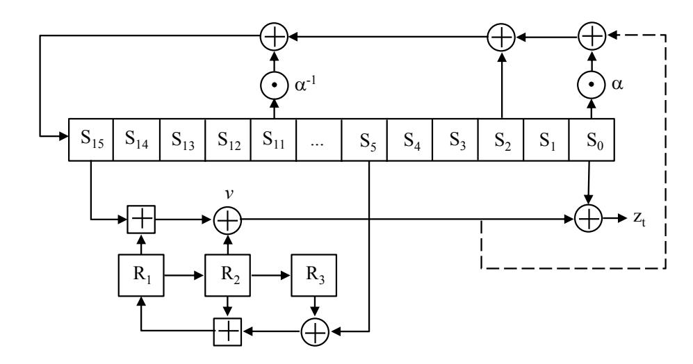

{0}------------------------------------------------

# Interconnect-Aware Bitstream Modification

Michail Moraitis Elena Dubrova Department of Electronics, Royal Institute of Technology (KTH) Electrum 229, 196 40 Stockholm, Sweden {micmor,dubrova}@kth.se

*Abstract*—Bitstream reverse engineering is traditionally associated with Intellectual Property (IP) theft. Another, less known, threat deriving from that is bitstream modification attacks. It has been shown that the secret key can be extracted from FPGA implementations of cryptographic algorithms by injecting faults directly into the bitstream. Such bitstream modification attacks rely on changing the content of Look Up Tables (LUTs). Therefore, related countermeasures aim to make the task of identifying a LUT more difficult (e.g. by masking its content). However, recent advances in FPGA reverse engineering revealed information on how interconnects are encoded in the bitstream of Xilinx 7 series FPGAs. In this paper, we show that this knowledge can be used to break or weaken existing countermeasures, as well as improve existing attacks. Furthermore, a straightforward attack that re-routes the key to an output pin becomes possible. We demonstrate our claims on an FPGA implementation of SNOW 3G stream cipher. The presented results show that there is an urgent need for stronger bitstream protection methods.

*Index Terms*—Physical security, SNOW 3G, Stream cipher, Reverse engineering, Bitstream modification, Routing bitstream format

# I. INTRODUCTION

Field-Programmable Gate Arrays (FPGAs) are used in many applications, including data centers, automotive, aerospace, defense, medical, wired and wireless communications. Many of these applications require cryptographic protection of data. This brings the need for evaluating the physical security of FPGA implementations of cryptographic algorithms.

One of the most popular types of physical attacks on FPGAs is the *reverse engineering* of the bitstream. Reverse engineering enables copying designs which cost millions of dollars to develop [1]. The first line of defense against that is the hidden and proprietary nature of the bitstream formats. Unfortunately though, it is just a matter of time until these formats are revealed.

In the past, several reverse engineering tools have been created for older Xilinx FPGA families [2]–[6] and a full Verilogto-bitstream flow has been developed for Lattice iCE40 [7]. In 2018, information about the bitstream format of LUTs in the latest Xilinx 7 series FPGAs has been presented in [8], [9]. As for today, SymbiFlow's project X-Ray is close to fully revealing the bitstream format of Xilinx 7 series.

Another feature that FPGA vendors offer to protect IPs is the bitstream encryption. In the latest FPGA series, bitstream encryption is accompanied by a Hash-based Message Authentication Code (HMAC)-based authentication. Unfortunately, this mechanism has been proven insufficient as well. It has been shown that the encryption can be broken through a side-channel attack [10], [11], through an optical probing attack [12], or a thermal laser stimulation attack [13]. The latest addition is the Starbleed vulnerability [14] that allows an attacker to use the FPGA as a decryption oracle.

To summarize, currently available methods do not seem to be sufficient to protect FPGA implementations against bitstream reverse-engineering. Apart from the IP theft, another threat deriving from bitstream reverse engineering is bitstream modification attacks.

Previous Work. In several works [15]–[17] it has been shown that direct bitstream manipulation is feasible in practice. Swierczynski et al. modified LUTs implementing the AES S-box in bitstream level to weaken the AES algorithm [18], [19]. In [20], [21] LUTs implementing specific gates in stream cipher implementations are modified resulting in a reversible keystream.

Our Contributions. Previous bitstream modification attacks relied on changing the content of selected LUTs in the bitsteram. In this paper, we show how knowledge about the encoding of interconnects in the bitstream can aid bitstream modification attacks. The main contributions of our papers are:

- We show how current countermeasures against bitstream modification attacks can be weakened or outright broken.
- We improve previous bitstream modification attacks that rely on finding and changing the content of LUTs.
- We demonstrate a straightforward yet potentially powerful attack based on re-routing the key to an output pin through interconnect manipulation.

Our analysis refers to Xilinx 7 series FPGAs.

Paper Outline. The paper is organized as follows. Section II gives a brief description of the basic elements of a Xilinx 7 series FPGA. Section III explains how the bitstream is structured. Section IV explains how the results from the bitstream format reverse-engineering efforts of Project X-Ray [9] are documented. Section VI presents existing countermeasures against bitstream modification attacks and shows how to work against them. Section VII demonstrates how interconnect knowledge can improve the existing attacks as well as propose a new attacking approach. Section VIII concludes the paper.

#### II. BASIC FPGA COMPONENTS

In this section we briefly describe the Xilinx 7 series FPGAs architecture in order to make the reader familiar with the terminology in the paper. A bottom-up approach is used.

{1}------------------------------------------------

#### *A. BEL*

Basic Elements (BELs) are the smallest components in the FPGA fabric. The most common ones are flip flops(FFs), Look-Up Tables (LUTs), multiplexers (MUXes) and dedicated fast carry logic units. There are two types of BELs, *Logic BELs* (e.g. a LUT) and *Routing BELs* (e.g. a MUX).

### *B. Site*

A set of BELs forms a site. A Slice is a specific type of site that has 4 LUTs with 6 inputs and 2 outputs, 8 FFs, 3 MUXes and one carry logic unit. There are two types of slices, the sliceL and sliceM. Their difference is that LUTs in sliceMs support the following two additional modes of operation. They can be configured to implement a 32-bit shift register logic without using any FFs. They can also be combined to create distributed RAMs (often called LUT RAMs) of various sizes.

### *C. Tile*

Tiles are sets of sites. Tiles are the building blocks of FPGAs in the sense that at an abstract level of view, an FPGA is a grid of Tiles. Tiles are accompanied by an x and y value indicating their coordinates in the chip. There are different types of Tiles, some of them are described below.

- *1) CLB Tiles:* Configurable logic block (CLB) Tiles are a set of either two sliceLs or one sliceL and one sliceM. The slices are placed vertically on the Tile. Thus, when addressing a slice inside a CLB the term of top and bottom slice is used. SliceMs are always the bottom slice. CLB Tiles are also categorized as right and left depending on their location.
- *2) DSP Tiles:* Digital signal processing unit (DSP) Tiles are used to perform complex/computationally heavy operations like multiplication in a fast and lightweight manner.
- *3) BRAM Tiles:* Block RAM (BRAM) Tiles are used to store data. Each BRAM can store up to 36 Kbits of data and also offers the option to be configured as two BRAMs of up to 18 Kbits each.
- *4) Interconnect Tiles:* Their purpose is to establish the routing connections between the rest of the Tiles. Interconnect Tiles are also referred to as switchboxes. There are left and right interconnect Tiles corresponding to left and right CLB Tiles that are tied to them.

## *D. Clocking Resources [22]*

The global clock spine is located in the leftmost and rightmost part of the chip and it provides 32 global clock lines. Clock regions are located either on the left or right of the global clock spine. They have a height of 50 units split in half by a horizontal clock row (HROW). Tiles inside a clock region are organized in columns. CLB Tiles have a height of 1 while BRAM and DSP Tiles have a height of 5. Thus a clock region's CLB column has 50 CLBs while BRAM and DSP columns have 10 BRAM and DSP Tiles respectively. Each HROW has 12 horizontal clock lines so it can support up to 12 global clocks. In 7 series, depending on the device size, the number of clock regions vary from 1 to 24. The highest level of abstraction is the distinction between two halves. The top half contains the right global clock spine with its associated clock regions and the bottom half the left global clock spine with its associated clock regions.

# *E. PIP*

Programmable Interconnect Points (PIPs) are the connecting points between wires. By enabling or disabling PIPs the corresponding connections are established or removed. In relation to the bitstream, there are two types of PIPs. The first type are PIPs that don't appear in the bitstream. Project X-Ray calls those PIPs *fake*. An example of such PIPs are the ones inside a CLB. Those PIPs have 1:1 connections that are always active. PIPs that do appear in the bitstream have to be set to enable a connection. Those PIPs are referred to as regular PIPs. Interconnect Tiles consist exclusively of PIPs but other types of Tiles can also have PIPs as part of them.

## III. BITSTREAM FORMAT

The bitstream is a binary file that has all the information needed to configure an FPGA device with a specific design. The configuration happens in a set of stages indicated by the configuration state machine. The format of the bitstream depends on the FPGA architecture it targets and is proprietary. In this paper by reverse engineering we mean the process of understanding this format to uncover the underlying information about the design. What is presented here serves the purpose of making the reader familiar with the necessary concepts to understand the rest of the paper.

We focus on the format of Xilinx bitstreams for the 7 series FPGAs created by Vivado. There, the data are organized into words consisting of 32 bits in big-endian order and presented as hex symbols.

The bitstream starts with a header that has some general information like the version of the tool that was used to create it, the date and time of its creation and the name of the FPGA device it targets. The header is ignored by the configuration state machine of the device. The end of the header is indicated by the appearance of 0xAA995566 which is called synchronization word and alerts the device that a configuration sequence is about to commence. Every word after the synchronization one is forming configuration packets. Configuration packets can be of three different types depending on their first word that acts as a header. T ype 0, used when a filling with zeros is performed between rows. T ype 1 packets are used to read or write a number of words. The number of words is specified in their header along with an address number. Finally, T ype 2 serves the purpose of expanding the word number of a T ype 1 packet by 27 bits. A T ype 2 packet has to be preceded by a T ype 1 since it contains no address in its header. The addresses in the packet headers map into a set of registers called configuration registers. Two of the most important configuration registers used during the programming of an FPGA are the frame address register (FAR) and frame data input register (FDRI). Frames are the basic structure of configuration data consisting of 101 words. The data written on FAR register is addresses

{2}------------------------------------------------

TABLE I FRAME ADDRESS REGISTER FORMAT [23]

| Reserved   | Bus                                                                                                                                                                                                               | half    | row        | column    | minor    |
|------------|-------------------------------------------------------------------------------------------------------------------------------------------------------------------------------------------------------------------|---------|------------|-----------|----------|
| bit[31:26] | bit[25:23]                                                                                                                                                                                                        | bit[22] | bit[21:17] | bit[16:7] | bit[6:0] |
| Reserved:  | The highest bits are reserved for future purposes. Those bits are<br>currently set to 0.                                                                                                                          |         |            |           |          |
| Bus:       | The bus bits have 4 possible values with the last two never appearing<br>under normal circumstances<br>(000) for CLB,IO,CLK<br>(001) for BRAM content<br>(010) for CFG CLB<br>(011) not used in normal bitstreams |         |            |           |          |
| half :     | One bit used to select the upper half rows when its value is 0 or bottom<br>half rows when its value is 1.                                                                                                        |         |            |           |          |
| row :      | These bits are used to address the selected row with their index<br>increment starting point being the middle.                                                                                                    |         |            |           |          |
| column :   | These bits are used to address the selected column with their index<br>incrementing from left to right.                                                                                                           |         |            |           |          |
| minor :    | These bits specify the selected frame.                                                                                                                                                                            |         |            |           |          |

that act as starting points for the next frame read or write. The data written on the FDRI register configure frames at the address given by the FAR register.

*Addressing:* The configuration sequence will configure the various components of the FPGA needed to implement the design described in the bitstream. This happens in the form of setting the initial values for each element. Those initial values include the initialization of memories, the definition of the truth tables of LUTs, the activation of the required interconnects, etc. To do that, each element has to be uniquely addressed to get the proper values. Addressing requires descending in the FPGA hierarchy until a specific programable element is defined. This is expressed through the FAR register. FAR register's format is presented in Table I.

# IV. BITSTREAM DOCUMENTATION

SymbiFlow's project X-Ray [9] has created an extensive database documenting how configuration data is presented in the bitstream. In this section we show how key components for bitstream modification attacks are documented.

#### *A. Segments*

A segment is defined as the sum of bitstream bits referring to a CLB and its associated Interconnect Tile. The segments that interest us consists of 72 words partitioned into groups of two and distributed into 36 frames consecutive frames starting from a given address called base address. An *offset* value is also given to identify which two words of a frame refer to the given segment. So, one frame contains data of 50 CLB segments. To define a segment in general one needs to know the base address, the number of frames it spans, the offset, and the amount of words in each frame. The term segment is introduced by Project X-Ray and the documentation is based around it.

## *B. CLB fake PIPS*

As we mentioned earlier PIPs are responsible for routing. Inside a slice the routing is done through MUXes. Inputs and outputs from both slices of a CLB are led to 1:1 always active PIPs (fake) and from there they are led to the corresponding Interconnect Tile. Table II shows the format of the documented

#### TABLE II PIP DATABASE FORMAT

| < T ile type >.< destination >.< source >.< activation method > |                                                    |  |  |  |  |
|-----------------------------------------------------------------|----------------------------------------------------|--|--|--|--|
| < T ile type >                                                  |                                                    |  |  |  |  |
| CLB Tile                                                        | CLB< x1 > < x2 >                                   |  |  |  |  |
| Interconnect Tile                                               | INT < x2 >                                         |  |  |  |  |
| x1 =                                                            | LL for a CLB with two sliceLs                      |  |  |  |  |
|                                                                 | M for CLB with one sliceL and one sliceM           |  |  |  |  |
| x2 =                                                            | L for a left CLB/Interconnect Tile                 |  |  |  |  |
|                                                                 | R for a right CLB/Interconnect Tile                |  |  |  |  |
| < activation method >                                           |                                                    |  |  |  |  |
|                                                                 | default: PIP connections with default values       |  |  |  |  |
| Fake PIP                                                        | always: PIP is always activated                    |  |  |  |  |
|                                                                 | hint: two logic slice outputs drive the same value |  |  |  |  |
| Regular PIP                                                     | < addresses of bits that have to be set/cleared >  |  |  |  |  |
| address format:                                                 | < s >< minor address ><br>< bit number >           |  |  |  |  |
| s =                                                             | ! if the bit has to be cleared                     |  |  |  |  |
|                                                                 | Null if the bit has to be set                      |  |  |  |  |

PIPs. In listing 1 we have an example of a fake and a regular PIP from the prject X-Ray database.

#### *C. Interconnect Tile regular PIPs*

Most of the interconnect Tile PIPs are regular ones. Each activated regular PIP will appear in the bitstream as a combination of specific bits set to 1 or 0 as shown in listing 1.

```
1 Fake P IP
2 CLBLL L . CLBLL L A1 . CLBLL IMUX6 alw a y s
3 R e al P IP
4 INT L . IMUX L6 . BYP BOUNCE2 21 49 ! 2 2 49 ! 2 3 49 ! 2 4 49 25 49
5 CLB MUX
6 CLBLL L . SLICEL X0 .AFFMUX.CY ! 3 0 01 ! 3 0 03 30 00 30 02
```

Listing 1. Database examples

### *D. CLB BELs*

- *1) MUXes:* The internal routing in CLB slices is taken care of by MUXes. In listing 1, an example of how to make the AF FMUX connect the output O6 of LUTA (in the lower slice of CLBLL L) is shown. The format is the same as the one for PIPs shown in Table II.
- *2) LUT initialization:* The format of initialization values of LUTs is described in [8]. The same information can be obtained from the database in the form of the exact position of the bits referring to each CLB's LUTs in the bitstream.

#### V. ATTACK MODEL

We assume the following attack model:

*Access Level:* The attacker has physical access to the target device.

*Bitstream Access:* The attacker has access to the bitstream of the target device. The bitstream can be acquired by probing the configuration bus during power-up, or reading the bitstream from the non-volatile memory which stores it. Encrypted bitstreams, can be decrypted by one of the methods cited in Section I.

*Configuration Interfaces Access:* The attacker has access to JTAG or SelectMAP interface so he can load bitstreams.

*Key Storage:* The key used by the cryptographic algorithm implemented by the device under attack is stored on chip/board. *Target Devices:* Xilinx 7 series FPGAs.

{3}------------------------------------------------

#### VI. COUNTERMEASURES

In this section we show how the knowledge of the encoding interconnects have in the bitstream can be used to weaken or break existing countermeasures.

#### A. Camouflaging

Camouflaging is a technique that masks LUTs by manipulating their truth tables. By doing that, finding a given LUT in the bitstream becomes considerably harder. In scenarios where an attacker's physical access to the FPGA target is limited, camouflaging makes a successful attack near impossible. Several works revolve around that idea [21], [24]–[26]. Here we focus on the approach presented in [21] because it has zero overhead, is the easiest to implement but also is the easiest to break if one knows the interconnect bitstream format.

The 6-input LUTs of Xilinx 7 series FPGAs are represented in the bitstream by a truth table in the form of a 64 bit initialization vector. This truth table corresponds to the physical inputs used in the LUT. If not all six inputs are used from the logic implemented, some of the input combinations described will never occur. Every unused input is assigned to the value 1 by default. To do camouflaging, don't care entries of the truth table (corresponding to the input combinations which never occur) are used. Obviously, changing these entries does not impact LUT's functionality. However, from the attacker's point of view, camouflaged LUTs seem to implement different functions than the ones they actually do, thus he is unable to correctly identify his targets. In its essence, camouflaging is re-purposing of a watermarking technique [27]. Instead of aiming to confuse an attacker, watermarking's goal is to insert non-functional initialization values that serve as a signature, proving the ownership of an IP.

Note that camouflaging relies on the fact that the attacker does not know which LUT inputs are used and which are not. If this information is available camouflaging can be easily removed, as we show next.

- a) Approach 1: Suppose the unused LUT inputs are assigned the default value (constant-1) during camouflaging. Since default connections are considered fake PIPs, they do not appear in the bitstream. Every used input creates corresponding PIP activations with *IMUX* source wires in the bitstream. So all information required to remove camouflaging can be derived by e.g. recalculating the *n*-variable truth table where *n* is the number of used inputs and expanding it to a 6-variable format. This procedure can be automated and repeated for every LUT. If a LUT is not camouflaged, its content will not change. No overhead is introduced by this approach.
- arbitrarily assigned with either a constant 1 or constant 0 value. The easiest and most efficient way to create a constant 0 value is to connect those inputs to the local *GND\_WIRE*. *GND\_WIRE* can be accessed through the *GFAN0* and *GFAN1* wires which in turn can be connected to an *IMUX* wire. Checking for the existence of those PIPs is again easy and the procedure of removing camouflaging is the same as in Approach 1. Some extra wiring is introduced by this approach.

The success of camouflaging depends on how well the constant values can be hidden. Stronger countermeasures do that by either adding more hardware and/or spending significantly more effort to create customized solutions [24]–[26]. However, given sufficient time, no constant can be effectively hidden.

#### B. Dummy LUTs

A countermeasure that works well in combination with camouflaging is *dummy LUT* addition [21], [28]. This countermeasure assigns some initialization values to the empty LUTs in a design. By initializing empty LUTs to the same functions as target LUTs, the number of false positives returned by the search procedure is increased. It was reported to require on board testing to identify dummy LUTs (by checking if the output is affected when changing the LUT's content to const-0 and const-1 values) [21]. Obviously, knowledge of interconnects makes dummy LUT detection trivial since none of their inputs appear connected in the bitstream.

#### C. Technology mapping using smaller LUTs

A countermeasure shown to be effective for some designs is to force technology mappers to use smaller LUTs [18], [20]. FPGA technology mapping algorithms tend to pack into a LUT as many nodes as possible in order to reduce the depth of the resulting *k*-LUT cover. In most cases, that leads to LUTs with unique initialization vectors making it easy for an adversary to spot them in the bitstream. In this countermeasure, one has to identify possible target LUTs, analyze possible ways to decompose them and select the one that create the most identical LUTs.

Major factors affecting the efficiency of the countermeasure:

- 1) The number of LUTs with the same truth table.
- 2) The number of LUTs, M, which need to be modified simultaneously. These LUTs are chosen out from N possible candidates.

The first factor is self-evident since a larger number of possible candidates makes it more difficult to detect the correct ones. Still, it increases the complexity of the attack only linearly with the number of candidates. The second factor increases the difficulty of the attack by  $O\binom{N}{M}$  which is more substantial.

Using knowledge about the interconnects, this countermeasure can be bypassed as follows:

- 1) Search for possible complex expressions for target LUTs. If this doesn't return the expected results, go to step 2.
- 2) Search for possible expressions for small LUTs. Suppose that N candidates are found.
- 3) For each of N candidate LUTs L, find immediate predecessors and successors of L. If the resulting expressions match the target function (or a big part of it), then L has a high chance of being the target LUT.

#### VII. BITSTREAM MODIFICATION ATTACKS

In this section, we first show how current bitstream modification attacks can benefit from interconnect knowledge. Then, we present a new attack that re-routes the key to an output pin 

{4}------------------------------------------------

through interconnect manipulation. Finally, we demonstrate the latter attack on the example of a SNOW 3G FPGA implementation kindly provided by the authors of SNOW 3G.

We group bitstream modification attacks into two types: *LUT-based* and *interconnect-based*. The groups take their names from the elements modified in the associated attack.

#### A. LUT-based

To the best of our knowledge, all previous bitstream modification attacks are LUT-based. The general idea is to modify the logic in an implementation of a cipher in a way that weakens the generated ciphertext/keystream. Then, cryptanalysis can be applied to recover the secret key from the weakened ciphertext/keystream.

Performing such an attack bares two main challenges. The first is to find a type of modification that makes the key recovery possible. To do that, the attacker has to know the targeted cryptographic algorithm in detail as well as understand digital logic design and technology mapping. Assuming an educated attacker, the second challenge is finding the point of attack in a given implementation. Below we present some typical problems the attacker may face and show how he can overcome them by using interconnect knowledge.

1) Elimination of false positives: To find the initialization vector of a 6-LUT implementing a target Boolean function f in the bitstream, one has to derive the 64-bit truth table F of f, map F into the bitstream format,  $\xi(F)$ , and then search for  $\xi(F)$  in the bitstream. Since the order of LUT's inputs is unknown, all possible 6! = 720 input orders have to be considered. For complex Boolean functions, the combination  $\xi(F)$  has a high probability to occur once, or a few times, in the bitstream. However, for functions with sparse initialization vectors, many false detections may occur.

For example, in SNOW 3G attack presented at [20], one of the target functions is  $f=(a_1\oplus a_2\oplus a_3)a_4a_5\overline{a}_6$ . The truth table F of this function contains only four 1s. This leads to 81 detections of  $\xi(F)$  in the bitstream instead of the expected 32 (SNOW 3G is 32-bit oriented cipher). The authors eliminated the 49 false positives using the fact that the LUTs implementing f feed primary outputs. However, such an approach will not work for LUTs located deeper in the design.

Knowing the exact bit locations of LUT initialization vectors along with their associated PIPs makes false positive elimination easy.

2) Distinguishing between inputs of symmetric functions: Another typical problem is distinguishing between inputs of a symmetric function. For example, in the SNOW 3G function mentioned above, the inputs  $a_1, a_2, a_3$  of an XOR have to be distinguished. To do that, the authors of [20] make additional bitstream modifications to generate a key-independent keystream and then analyze it.

The knowledge of interconnect encoding makes it possible to distinguish between inputs by tracking their sources through the observation of the related PIP activations in the bitstream.

3) Handling dual output LUTs: Dual output LUTs that use both their outputs are more difficult to find. The bits of the



Fig. 1. SNOW 3G block diagram. During the initialization, the dashed line is connected. During the keystrem generation, the dashed line is not connected.

truth tables of the 2 functions implemented in the LUT,  $F_1$  and  $F_2$  are scrambled when encoded in the bitstream format. So, to search for a specific half of the initialization vector  $\xi(F_1||F_2)$ , where "||" is concatenation, one has to search for all the permutations of the desired function into single bit position patterns corresponding to one half and then repeat the process for the pattern of the other half.

We propose the following simpler alternative: For every LUT, first check if the corresponding OUTMUX or FFMUX is using the O5 input. Then, verify if input A6 is unconnected since a dual output LUT has to have A6 input stuck at constant 1. At this point, the existence of a two output LUT is confirmed. Undoing the LUT obfuscation gives us the actual truth table  $F_1||F_2|$  from which the initialization vectors for the two different expressions can be obtained.

Repeating these steps for every LUT in a design gives us a list of all functions implemented by dual output LUTs. From this list one can find the desired expressions without caring about the LUT bitstream format and without having to deal with false positives.

#### B. Interconnection-based

If we can modify the interconnects in a bitstream implementing a cryptogrphic algorithm, we can find all LUTs responsible for handling the secret key and re-route their outputs to an I/O pin of the board. In this way, we can extract the key during the execution of an algorithm. In this section, we demonstrate the feasibility of such an attack on the example of SNOW 3G stream cipher.

The block diagram of SNOW 3G is shown in Fig. 1. During initialization, the LFSR registers S4, S5, S6, S7 are loaded with a combination of the key and IV. During keystream generation, the LFSR shifts and updates its state. This means that there has to be LUTs implementing some kind of multiplexer logic to chose between shifting and loading initial values. Our goal is to first find those LUTs and then distinguish our targets which are the ones feeding the aforementioned registers. We do that by taking the following steps.

1) For every MUX in the list, check the fanout of the LFSR stage that it feeds. This is easily done by looking at the PIP activations in the CLB's switchbox.

{5}------------------------------------------------

- 2) If the fanout is 1, it leads to one of the listed MUXes.
- 3) If the fanout is larger than 1, then the LFSR stage is one of S0, S2, S5, S11, S15 shown in Fig. 1. Trace their output nets to find which one leads to a MUX of the list.

The above procedure allows us to identify the target MUXes as well as their relative order. If the key is stored in the bitstream, it is either stored in a LUT or in a BRAM. If it is stored in logic LUTs, the value appears as a constant in our target MUXes, so finding these MUXes is equivalent to finding the key. If it is stored in BRAM or LUTRAM, then, we can trace the source of the MUX input that corresponds to each key bit. This leads to a BRAM/LUT that we can reverse engineer and read its content. If the key is stored externally, we trace the element that gives the key input to the MUX and increase the fanout of this element by one by activating the necessary PIPs to create a path from the key bit source to a free output pin. Alternatively we can disconnect a used output and connect it to the key bit. The 128-bit key can be recovered with at most 128 modifications and algorithm executions.

In our experiments we used the Artix-7 (XC7A35T) FPGA mounted on the Basys3 board from Digilent [29]. Our implementation uses the LED connected to *U16*. We traced the activated PIPs in the bitstream until we reached the register which is driving the LED (*AFF* of the bottom slice of *CLBM R X30Y20* Tile). We then deactivated these PIPs. When the key is fed into the FPGA, it is stored in registers. By iteratively routing each bit register to U16, loading the bitstream into the FPGA, and executing the algorithm, we are able to read all key bits from the LED one-by-one. In listing 2 we show PIPs that have to be manipulated to read the 32nd key bit. This key bit is stored in the register *B5FF* of the bottom slice of the *CLBLL L X4Y25* Tile.

```
1 D e a c t i v a t e
2 INT L X0Y3 . IMUX L34 . SR1BEG S0 17 21 ! 2 2 21 23 21 24 21 25 21
3 INT L . X0Y3 . SR1BEG S0 .WL1END3 11 63 13 63
4 INT R X1Y4 .WL1BEG N3 . SS6END0 08 13 12 13
5 INT R X1Y10 . SS6BEG0 . SS6END0 02 14 07 15
6 INT R X1Y16 . SS6BEG0 . SW6END0 02 14 04 15
7 INT R X3Y20 . SW6BEG0 . LOGIC OUTS4 02 13 04 14
8 A c t i v a t e
9 INT L X0Y3 . IMUX L34 .WL1END1 16 21 22 21 ! 2 3 21 24 21 25 21
10 INT L X2Y3 .WL1BEG2 . SS6END3 08 61 12 61
11 INT L X2Y9 . SS6BEG3 . SS6END3 02 62 07 63
12 INT L X2Y15 . SS6BEG3 . SW6END3 02 62 04 63
13 INT L X4Y19 . SW6BEG3 . SS6END3 03 61 06 60
14 INT L X4Y25 . SS6BEG3 . LOGIC OUTS L21 06 62 07 63
15 INT R X1Y3 .WL1BEG1 .WL1END2 11 45 13 45
```

Listing 2. Example of outputing key bit 32

# VIII. CONCLUSION

In this paper, we demonstrated that the recently acquired knowledge on the interconnect encoding in the bitstream of Xilinx 7 series FPGAs helps weakening current countermeasures, strengthens existing attacks and enables new attacks. This knowledge makes netlist recovery from a bitstream possible. Furthermore, netlist analysis tools such as HAL [30] can potentially further assist in attacks. This shows that there is an immediate need for stronger bitstream protection schemes.

#### REFERENCES

- [1] P. Trott, "Preventing overbuilding and cloning of electronic systems secure production programming." Microsemi Corporation Report, 2015.
- [2] J.-B. Note and E. Rannaud, "From the bitstream to the netlist.," in ´ *FPGA*, vol. 8, pp. 264–264, 2008.
- [3] Z. Ding *et al.*, "Deriving an NCD file from an FPGA bitstream: Methodology, architecture and evaluation," *Microprocessors and Microsystems*, vol. 37, no. 3, pp. 299–312, 2013.
- [4] T. Zhang *et al.*, "A comprehensive FPGA RE Tool-Chain: From Bitstream to RTL code," *IEEE Access*, vol. 7, pp. 38379–38389, 2019.
- [5] F. Benz *et al.*, "Bil: A tool-chain for bitstream reverse-engineering," in *22nd Int. Conf. on Field Prog. Logic and App.*, pp. 735–738, 2012.
- [6] J. Yoon *et al.*, "A bitstream reverse engineering tool for FPGA hardware trojan detection," in *Proc. of the 2018 ACM SIGSAC Conf. on Computer and Communications Security*, pp. 2318–2320, ACM, 2018.
- [7] C. Wolf and M. Lasser, "Project IceStorm." www.clifford.at/icestorm/.
- [8] M. Jeong *et al.*, "Extract LUT logics from a downloaded bitstream data in FPGA," in *2018 IEEE Int. Symp. on Circuits and Systems*, pp. 1–5.
- [9] SymbiFlow, "Project X-Ray." https://prjxray.readthedocs.io/en/latest/.
- [10] A. Moradi *et al.*, "Side-channel attacks on the bitstream encryption mechanism of Altera Stratix II: facilitating black-box analysis using software reverse-engineering," in *Proc. of the ACM/SIGDA Int. Symp. on FPGAs*, pp. 91–100, 2013.
- [11] A. Moradi and T. Schneider, "Improved side-channel analysis attacks on Xilinx bitstream encryption of 5, 6, and 7 series," in *Int. Wksh on Const. Side-Channel Analysis and Secure Design*, pp. 71–87, 2016.
- [12] S. Tajik *et al.*, "On the power of optical contactless probing: Attacking bitstream encryption of FPGAs," in *Proc. of the 2017 ACM SIGSAC Conf. on Computer and Communications Security*, pp. 1661–1674, 2017.
- [13] H. Lohrke *et al.*, "Key extraction using thermal laser stimulation," *IACR Trans. on Crypto Hardware and Embedded Systems*, pp. 573–595, 2018.
- [14] M. Ender *et al.*, "The unpatchable silicon: A full break of the bitstream encryption of xilinx 7-series FPGAs," in *29th USENIX Security Symposium (USENIX Security 20)*, Aug. 2020.
- [15] M. Alderighi *et al.*, "A fault injection tool for SRAM-based FPGAs," in *9th IEEE On-Line Testing Symp., 2003. IOLTS 2003.*, pp. 129–133.
- [16] R. S. Chakraborty *et al.*, "Hardware Trojan insertion by direct modification of FPGA configuration bitstream," *IEEE Design & Test*, vol. 30, no. 2, pp. 45–54, 2013.
- [17] P. Swierczynski *et al.*, "Bitstream fault injections (BiFI) automated fault attacks against SRAM-based FPGAs," *IEEE Trans. on Computers*, vol. 76, pp. 1–1, 2018.
- [18] P. Swierczynski *et al.*, "FPGA trojans through detecting and weakening of cryptographic primitives," *IEEE Trans. on Computer-Aided Design of Integrated Circuits and Systems*, vol. 34, pp. 1236–1249, Aug 2015.
- [19] P. Swierczynski *et al.*, "Interdiction in practice—hardware trojan against a high-security USB flash drive," *Journal of Cryptographic Engineering*, vol. 7, pp. 199–211, Sep 2017.
- [20] M. Moraitis and E. Dubrova, "Bitstream modification attack on SNOW 3G," in *Proc. of the 2020 Design, Automation & Test in Europe Conf.*
- [21] K. Ngo *et al.*, "Bitstream modification of trivium." Cryptology ePrint Archive, Report 2020/597, 2020. https://eprint.iacr.org/2020/597.
- [22] Xilinx, "UG472: 7 series FPGAs clocking resources," July. 2018.
- [23] Xilinx, "UG470: 7 series FPGAs configuration," Aug. 2018.
- [24] V. Sergeichikand and A. Ivaniuk, "Implementation of opaque predicates for FPGA designs hardware obfuscation," *Journal of Information, Control and Management Systems*, vol. 12, no. 2, 2014.
- [25] R. Karam *et al.*, "Robust bitstream protection in FPGA-based systems through low-overhead obfuscation," in *2016 Int. Conf. on ReConFigurable Computing and FPGAs (ReConFig)*, pp. 1–8, IEEE, 2016.
- [26] M. Hoffmann and C. Paar, "Stealthy opaque predicates in hardware– obfuscating constant expressions at negligible overhead," *arXiv preprint arXiv:1910.00949*, 2019.
- [27] M. Schmid *et al.*, "Netlist-level IP protection by watermarking for LUTbased FPGAs," in *2008 Int. Conf. on Field-Prog. Tech.*, pp. 209–216.
- [28] B. Khaleghi *et al.*, "FPGA-based protection scheme against hardware trojan horse insertion using dummy logic," *IEEE Embedded Systems Letters*, vol. 7, no. 2, pp. 46–50, 2015.
- [29] Digilent, "Basys 3 Artix-7 FPGA trainer board." store.digilentinc.com/ basys-3-artix-7-fpga-trainer-board-recommended-for-introductory-users/.
- [30] S. Wallat *et al.*, "Highway to HAL: open-sourcing the first extendable gate-level netlist reverse engineering framework," in *Proc. of the 16th ACM Int. Conf. on Computing Frontiers*, pp. 392–397, 2019.