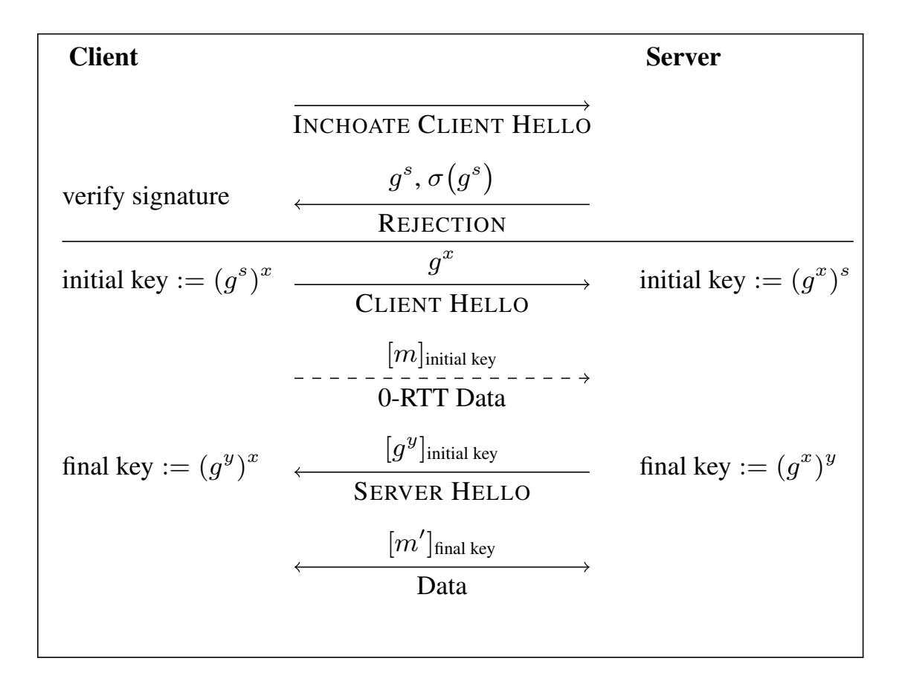
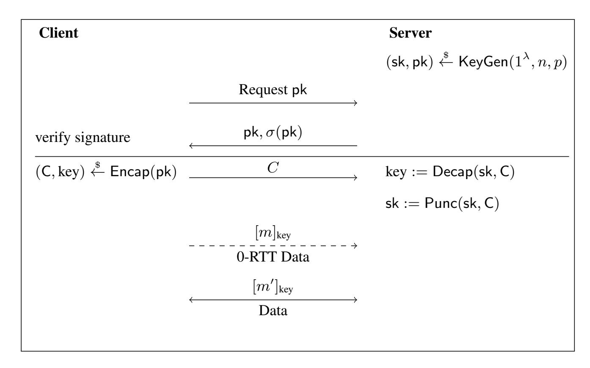
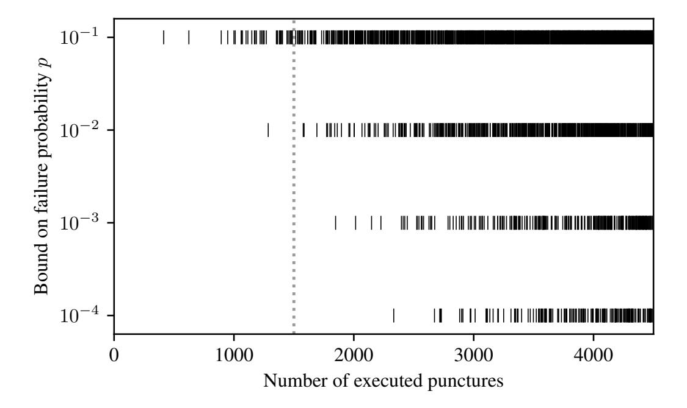
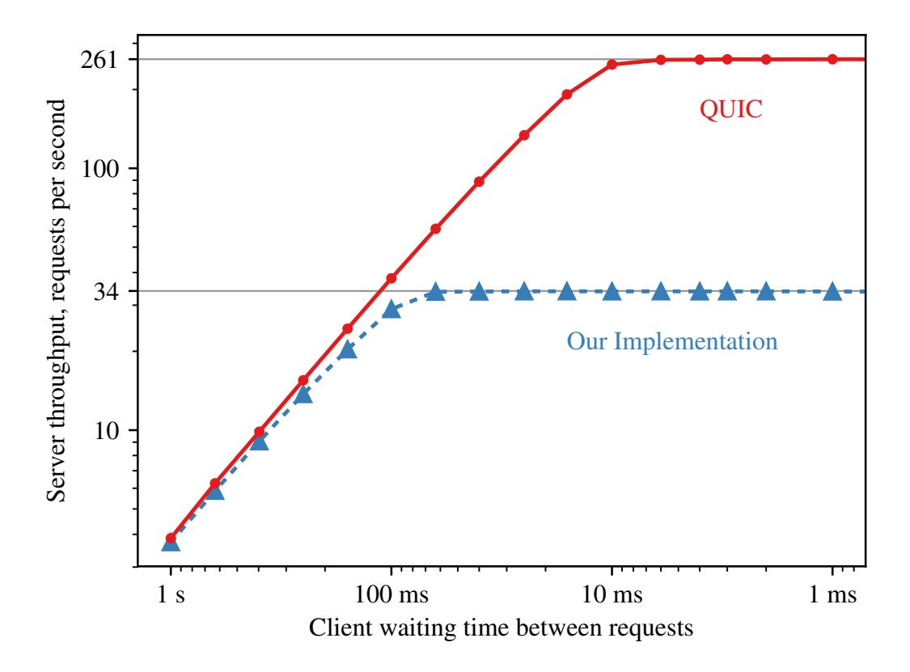
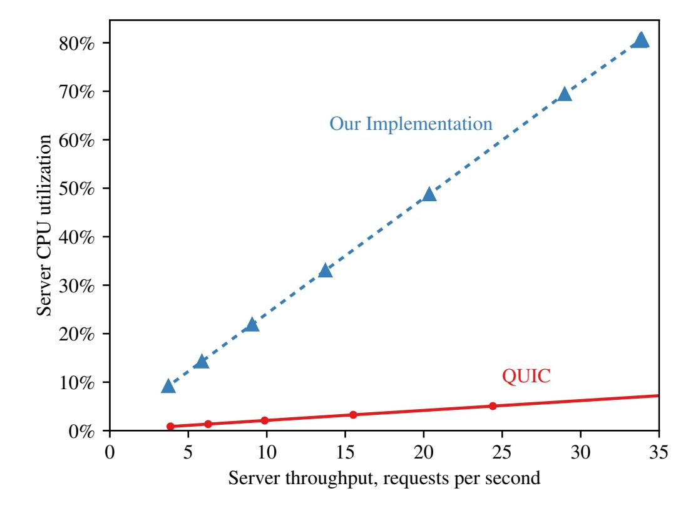
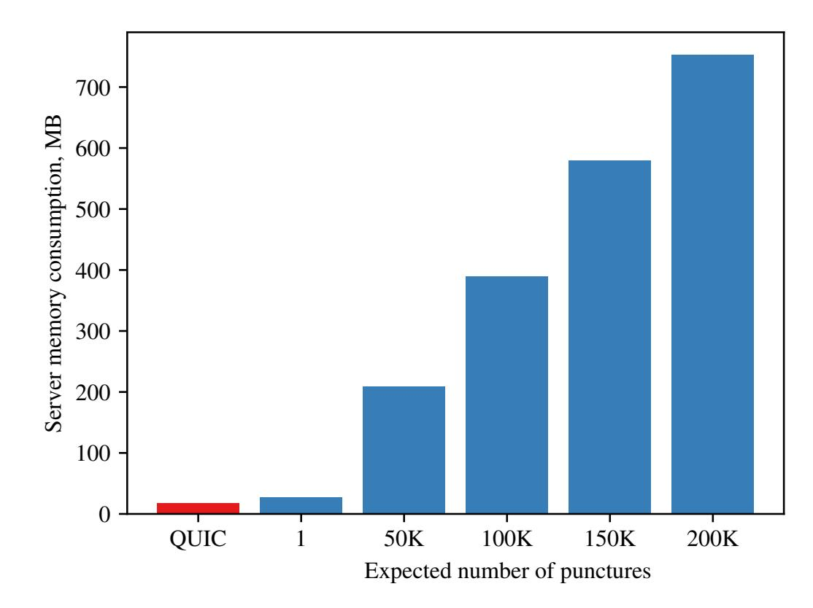

{0}------------------------------------------------

# Forward-Secure 0-RTT Goes Live: Implementation and Performance Analysis in QUIC

Fynn Dallmeier2 , Jan P. Drees1 , Kai Gellert1 , Tobias Handirk1 , Tibor Jager1 , Jonas Klauke2 , Simon Nachtigall2 , Timo Renzelmann2 , and Rudi Wolf2

> 1 University of Wuppertal, {jan.drees, kai.gellert, tobias.handirk, tibor.jager}@uni-wuppertal.de 2 Paderborn University

Abstract. Modern cryptographic protocols, such as TLS 1.3 and QUIC, can send cryptographically protected data in "zero round-trip times (0-RTT)", that is, without the need for a prior interactive handshake. Such protocols meet the demand for communication with minimal latency, but those currently deployed in practice achieve only rather weak security properties, as they may not achieve forward security for the first transmitted payload message and require additional countermeasures against replay attacks.

Recently, 0-RTT protocols with full forward security and replay resilience have been proposed in the academic literature. These are based on *puncturable encryption*, which uses rather heavy building blocks, such as cryptographic pairings. Some constructions were claimed to have practical efficiency, but it is unclear how they compare concretely to protocols deployed in practice, and we currently do not have any benchmark results that new protocols can be compared with.

We provide the first concrete performance analysis of a modern 0-RTT protocol with full forward security, by integrating the Bloom Filter Encryption scheme of Derler *et al.* (EUROCRYPT 2018) in the Chromium QUIC implementation and comparing it to Google's original QUIC protocol. We find that for reasonable deployment parameters, the server CPU load increases approximately by a factor of eight and the memory consumption on the server increases significantly, but stays below 400 MB even for medium-scale deployments that handle up to 50K connections per day. The difference of the size of handshake messages is small enough that transmission time on the network is identical, and therefore not significant.

We conclude that while current 0-RTT protocols with full forward security come with significant computational overhead, their use in practice is feasible, and may be used in applications where the increased CPU and memory load can be tolerated in exchange for full forward security and replay resilience on the cryptographic protocol level. Our results serve as a first benchmark that can be used to assess the efficiency of 0-RTT protocols potentially developed in the future.

This is the full version of a paper that appeared at CANS 2020 – 19th International Conference on Cryptology and Network Security. Supported by the German Research Foundation (DFG), project JA 2445/2-1 and the European Research Council (ERC) under the European Union's Horizon 2020 research and innovation programme, grant agreement 802823. Part of this work was completed while the authors were employed at Paderborn University.

{1}------------------------------------------------

# 1 Introduction

*0-RTT Protocols.* Considerable effort has gone into reducing latency at the various networking layers, with the aim of reducing end-to-end latencies. This includes HTTP/2 [\[5\]](#page-19-0) based on Google's SPDY protocol [\[6\]](#page-19-1), TCP Fast Open [\[12\]](#page-19-2) and µTP [\[28\]](#page-20-0), as well as the move towards decentralized content delivery networks or peer-to-peer communication. Still, classical cryptographic key agreement protocols, such as TLS 1.2, require at least one round-trip time (RTT) to establish a key, plus an additional RTT to establish the underlying TCP session. In order to overcome this, 0-RTT protocols have been developed and incorporated in transport layer standards. This is motivated by improved user experience, which degrades with increased latency between user actions (such as requesting a web page) and the result (the web page being displayed), as well as the demand for fast session establishment in applications with extreme latency requirements, such as real-time control of industrial systems over 5G networks, for instance. Studies showed that for large Internet companies, such as Google or Amazon, additional delays have tangible impact on revenue [\[9](#page-19-3)[,23\]](#page-20-1). Google has approached this latency issue with their QUIC protocol [\[11\]](#page-19-4), which includes a 0-RTT key exchange protocol.

*Security of 0-RTT Protocols.* Fundamentally, a key exchange mechanism is designed to establish a common authenticated secret key between communication partners. One classical security requirement is *replay resilience*, which essentially means that an adversary should not be able to replay cryptographically protected messages in a way that tricks the receiver into processing the replayed message again, which in turn may cause a duplicated execution of a command, for example.

Another fundamental requirement is *forward security*, which is a standard security property expected from modern cryptographic protocols. Consider a case where a server is compromised and secret key material is leaked. Forward security essentially means that an adversary that has recorded previous sessions is not able to retroactively decrypt the data exchanged earlier. Hence, forward security ensures that the disclosure of a secret key does not compromise the confidentiality of earlier communication.

Both replay resilience and forward security are difficult to achieve with 0-RTT key exchange protocols. The fundamental challenge is the missing interactivity between the client and the server, as the client needs to be able to encrypt data without getting any new information (e.g., a Diffie–Hellman share with fresh randomness) from the server. For a comprehensive discussion on forward security in non-interactive settings, we refer the reader to [\[8\]](#page-19-5).

*The QUIC Protocol.* When considering latency in the networking stack, it is apparent that the minimization of the overall number of necessary round-trips must consider multiple layers. Google has introduced SPDY, which has been standardized as HTTP/2 since, to address the application layer on the world wide web. It remains to consider the transport layer connection establishment and the cryptographic handshake. Traditionally, each of these would take at least 1 RTT for the handshake process. The QUIC protocol was developed by Google to address both at once. In order to avoid the latency incurred by a TCP handshake, QUIC is based on the lighter UDP protocol. This makes it necessary for QUIC to define additional protocol operations on top of UDP 

{2}------------------------------------------------

to retain some of the guarantees needed for reliable operation of higher layers, such as improved congestion control, multiplexing without head-of-line blocking, forward error correction and connection migration [\[27\]](#page-20-2).

QUIC implements a custom cryptographic protocol, based on the Diffie-Hellman key exchange, see Section [2.1](#page-5-0) for a detailed protocol description. Essentially, the very first connection of a client to a server over QUIC still requires a 1-RTT cryptographic handshake. During this handshake, a SERVER CONFIGURATION message is sent from the server to the client. This message contains a medium-lived (typically two days) Diffie-Hellman share g s of the server, which is digitally signed with the server's longterm signature key, as well as information about supported cryptographic algorithms and their parameters.

On subsequent connections the SERVER CONFIGURATION data can then be used to perform a 0-RTT key exchange. To this end, the client selects supported parameters and a Diffie-Hellman share g x , which yields an initial session key g xs that can then be used immediately to encrypt the payload data m sent from the client to the server as c = Enc(g xs, m). Note that the server re-uses the same ephemeral randomness g s for all sessions within the lifetime of the SERVER CONFIGURATION message. Hence, an attacker that obtains s is able to compute the key of all sessions within this time period. Therefore only a weak form of forward security is achieved, which holds only *after* the corresponding SERVER CONFIGURATION message has expired [\[24\]](#page-20-3).

Furthermore, it is well-known that neither Google's QUIC [\[11\]](#page-19-4), nor the protocol version standardized by the IETF [\[21\]](#page-20-4), protect against replay attacks. An attacker can replay a 0-RTT message (g x , Enc(g xs, m)) to the server over and over again. Without additional application-layer countermeasures, this would trick the server into repeatedly processing the payload message m.

*Preventing Replay Attacks via Idempotent Requests.* Due to this lack of security against replay attacks, the TLS 1.3 standard [\[26\]](#page-20-5) suggests to enable 0-RTT only for so-called *idempotent requests*, which essentially have the same effect on the server state, regardless whether they are served once or several times, and hence should not be vulnerable to replay attacks. One could argue that QUIC should only be used with such idempotent requests, too. However, Colm MacCarthaigh [ ´ [25\]](#page-20-6) describes several convincing arguments that idempotency is not sufficient to protect against replay attacks, and even idempotent requests may be used by an attacker, e.g., to leak information about an encrypted message. A simple example was also described in [\[14,](#page-19-6)[15\]](#page-19-7). Furthermore, we believe that a cryptographic protocol should not rely on application-layer countermeasures to prevent replay attacks.

*Puncturable Key Encapsulation.* 0-RTT protocols with full forward security and replay resilience therefore follow a different approach than TLS 1.3 and QUIC, by using *puncturable key encapsulation*. This approach was introduced in [\[20\]](#page-20-7), following [\[19\]](#page-19-8), and is also used in the more efficient Bloom Filter key encapsulation schemes from [\[14](#page-19-6)[,15\]](#page-19-7) considered in this paper. A 0-RTT protocol essentially consists of a *puncturable* key encapsulation mechanism (KEM), which is used to transport a random session key from the client to the server. After the server receives the ciphertext C encapsulating the session key, it decrypts the ciphertext with the corresponding secret key, and then imme-

{3}------------------------------------------------

#### 4 Dallmeier *et al.*

diately "punctures" the secret key. A punctured key cannot be used to decrypt C. Even given the punctured key, the key encapsulated in C is indistinguishable from random. It is furthermore possible to repeatedly puncture a secret key with respect to different ciphertexts, which makes the 0-RTT protocol usable for multiple sessions.

*Our Contributions.* We implemented the Bloom Filter key encapsulation mechanism based on identity-based broadcast encryption (IBBE) introduced in [\[15\]](#page-19-7), instantiated with the IBBE scheme by Delerablee [ ´ [13\]](#page-19-9). We optimized the implementation with regard to speed, utilizing parallelization and pre-computations where possible, and integrated the scheme into the QUIC protocol implementation of Chromium [\[2\]](#page-19-10). Our repository can be found at <https://gitlab.com/buw-itsc/fs0rtt>.

We analyzed the computational performance of the new protocol, comparing it to Google's implementation of the QUIC key exchange in Chromium. Specifically, we measured server and client memory consumption, handshake duration, size of the exchanged messages, maximum server throughput and server CPU load. This yields the first benchmark result for recent 0-RTT protocols with full forward security and replay resilience.

*Results.* We find that for reasonable deployment parameters (and despite the use of computationally heavy building blocks, such as pairings), the server CPU load increases approximately by a factor of eight, while the number of handshakes the server is able to process per second is reduced by the same factor. The memory consumption on the server increases significantly, but stays below 400 MB even for medium-scale deployments that handle up to 50K connections per day. The size of the first 1-RTT handshake increases by 18 percent and the following 0-RTT handshakes decreases by 13 percent when compared to the QUIC protocol. The increase of the first message is small enough that transmission time on the network is identical, and therefore not significant. As to handshake duration, the 0-RTT (resp. 1-RTT) handshake takes approximately eight times (resp. 1.6 times) longer in comparison to the respective QUIC handshakes.

The increased computation time of the 0-RTT handshake is still lower than that of a full 1-RTT handshake in the QUIC protocol. This means that even when the improvements provided by the reduced number of round trips, which will vary depending on network speed and latency, is not taken into account, the forward-secure 0-RTT mode is still preferable over 1-RTT from a latency perspective.

*Our Choice of Protocols.* The only current real-world implementations of 0-RTT protocols are QUIC, implemented in the Chromium browser and the web server implementations of LiteSpeed and Nginx[1](#page-3-0) as well as the 0-RTT mode of TLS 1.3. QUIC runs on top of the UDP transport layer protocol, which does not require a handshake and therefore truly achieves 0-RTT session establishment. However, UDP provides only an unreliable best-effort channel, therefore QUIC additionally implements transport-layer algorithms that deal with package loss, perform package re-transmission, and implement congestion control. In contrast, TLS 1.3 runs on top of the TCP protocol, which

1 See [https://w3techs.com/technologies/segmentation/ce-quic/web\\_](https://w3techs.com/technologies/segmentation/ce-quic/web_server) [server](https://w3techs.com/technologies/segmentation/ce-quic/web_server).

{4}------------------------------------------------

provides a reliable channel and congestion control, but requires an initial handshake and therefore adds another RTT latency.

Our objective is to provide the first benchmark of the *real-world* performance of a forward-secure 0-RTT protocol. Therefore it makes sense to consider a protocol implementation that runs on top of UDP, as otherwise the latency incurred by the TCP handshake would blur the measurements and yield less clear results. Furthermore, we want to consider a real-world setting where algorithms to deal with packet loss in UDP are implemented, but we want to avoid that the particular choice of these algorithms or the performance of their implementation impacts our measurements. Hence, in order to obtain an as-meaningful-as-possible comparison, our new implementation should use exactly the same transport layer protocol stack and additional transport layer algorithms as the protocol we compare with.

Therefore we chose to base our implementation on QUIC, where we replace only the cryptographic core with a forward-secure 0-RTT protocol, but re-use all other functionality without any modification. This provides the most clear results and the most objective comparison of the performance impact of the modified cryptographic core of the protocol.

Furthermore, we chose to use a Bloom Filter KEM as the basis, as it allows for significantly more efficient puncturing (by several orders of magnitude) than the treebased constructions from [\[19](#page-19-8)[,20\]](#page-20-7). While one could ask for a comparison to other Bloom Filter KEMs, we claim that these will yield less efficient protocols and thus are out of scope of our work. Our objective is not to compare the performance of different (theoretical) 0-RTT protocol instantiations, but to assess how a modern forward-secure 0-RTT protocol compares to the protocols currently used in practice.

*Related Work.* To our best knowledge, this is the first work that experimentally assesses the computational performance and resource requirements of 0-RTT protocols with full forward security. The QUIC protocol was introduced in [\[27\]](#page-20-2) and formally analyzed by Lychev *et al.* [\[24\]](#page-20-3). The idea of puncturable encryption was introduced in [\[19\]](#page-19-8), the idea of using it to construct fully forward-secure 0-RTT protocols in [\[20\]](#page-20-7). Bloom Filter Encryption was introduced as a more efficient variant in [\[14,](#page-19-6)[15\]](#page-19-7). Lauer *et al.* [\[22\]](#page-20-8) used Bloom filter encryption to construct a single-pass circuit construction protocol with full forward security, which resembles a multi-hop 0-RTT protocol. However, it was not implemented and, to the best of our knowledge, no experimental performance assessments of 0-RTT-like protocols with full forward security have been made so far. Aviram *et al.* [\[4\]](#page-19-11) have developed techniques to overcome the lack of forward security and replay resilience in 0-RTT session resumption protocols, such as the 0-RTT mode in TLS 1.3. Their techniques allow an efficient solution to this problem by utilizing only private-key primitives. These techniques, however, consider a different setting, which is based on a shared symmetric key between a client and a server, and requires secure storage on the client. In contrast, we consider "real" 0-RTT protocols where only public information (the server's public key) is stored on the client.

We remark that, similar to our approach, the UDP-based transport layer of QUIC is currently in the process of being standardized with TLS 1.3 as cryptographic core [\[29\]](#page-20-9) (replacing the original QUIC key exchange protocol). However, note that TLS 1.3 only deploys a 0-RTT session resumption protocol that relies on key material, which has 

{5}------------------------------------------------

been established in a previous session. This 0-RTT mode is therefore incomparable to our 0-RTT key exchange where we only rely on publicly available information.

# 2 Protocol Design

In the following, we summarize the basic functionality of the handshake protocol in QUIC and explain why it does not provide forward security and replay resilience for 0- RTT data. Then we introduce Bloom filter encryption and discuss our parameter choice. Finally, we outline the handshake we implemented.

## 2.1 QUIC Handhsake Protocol

The QUIC protocol uses symmetric encryption to ensure the confidentiality of the data exchanged between client and server. The necessary session key is derived using a modified Diffie–Hellman (DH) key exchange. Figure [1](#page-5-1) shows the message flow for this key exchange.

Fig. 1. Simplified QUIC handshake protocol. σ(·) denotes a signature, computed with the server's long-lived signing key. If the server's g s is known, only the part below the horizontal divider is executed.

Upon the start of a server, a SERVER CONFIGURATION is generated. This SERVER CONFIGURATION contains a DH share g s with a freshly sampled exponent s and an expiration date. A fresh SERVER CONFIGURATION is generated periodically, typically every two days.

{6}------------------------------------------------

Initially, a client does not possess any information about the SERVER CONFIGURATION. Therefore, it initiates a 1-RTT connection using an INCHOATE CLIENT HELLO. The server responds with its SERVER CONFIGURATION and a signature on the SERVER CONFIGURATION in a REJECTION. The client stores the SERVER CONFIGURATION for upcoming 0-RTT connections if the signature is valid. Note that the same SERVER CONFIGURATION of a server is shared among *all* clients during its lifetime. In case the client uses an out-of-date SERVER CONFIGURATION, it reinitiates a 1-RTT connection by sending an INCHOATE CLIENT HELLO to receive a new one.

If the client is in possession of a SERVER CONFIGURATION, it initiates a 0-RTT connection. To this end, the client establishes an initial key  $g^{sx}$  using the DH share  $g^s$  contained in the SERVER CONFIGURATION and its own freshly sampled exponent x. The initial key is used to encrypt and send 0-RTT data alongside with the client's DH share  $g^x$  to the server in a CLIENT HELLO. When the server extracts the client's DH share from the CLIENT HELLO, it can also compute the initial key to decrypt the encrypted 0-RTT data.

Because of the semi-static nature of the SERVER CONFIGURATION, the initial key derived from it is not forward-secure. To address this issue, a final key  $g^{xy}$  is derived from a DH share  $g^y$  with a freshly generated server exponent y. The server's new DH share is embedded in a SERVER HELLO directed to the client. The client can derive the final key from the server's new DH share and use it for all further communication. Note that the final key does provide forward security.

#### 2.2 Bloom Filter Key Encapsulation Mechanisms

In this section we give a brief intuition on the main building block of our protocol. The implemented protocol is based on a puncturable key encapsulation mechanism (PKEM). A PKEM is closely related to a standard key encapsulation mechanism. In addition to the standard KeyGen, Encap and Decap algorithms for key generation, encapsulation and decapsulation, respectively, there is a Punc algorithm for puncturing in a PKEM. Given a secret key sk and a ciphertext C this algorithm outputs a modified secret key sk'. This modified secret key sk' has the property that it cannot be used to decapsulate C again. Therefore, by repeatedly calling the Punc algorithm, the set of ciphertexts which cannot be decapsulated, can be extended successively. Due to the practical inefficiency of known PKEM constructions, we base our protocol on a special variant called *Bloom filter key encapsulation mechanism* (BFKEM) [15]. A BFKEM introduces a correctness error in order to achieve highly efficient puncturing when compared to other known PKEM constructions. However, this error can be made arbitrarily small.

**Definition 1** (**BFKEM**). A Bloom filter key encapsulation scheme BFKEM with key space K is a tuple BFKEM = (KeyGen, Encap, Punc, Decap) of PPT algorithms:

BFKEM.KeyGen  $(1^{\lambda}, n, p)$ . On input of a security parameter  $\lambda$ , a number of expected punctures n and a bound p on the failure probability of decapsulate outputs a secret key and a public key (sk, pk) (where K is implicitly defined by pk).

BFKEM.Encap(pk). *On input of a public key* pk *outputs a ciphertext* C *and a symmet-ric key* K.

{7}------------------------------------------------

BFKEM.Punc(sk, C). *On input of a secret key* sk *and ciphertext* C *outputs a modified secret key* sk0 *.*

BFKEM.Decap(sk, C). *On input of a secret key* sk *and ciphertext* C *outputs a symmetric key* K *or* ⊥ *if decapsulation fails.*

For the formal correctness and security definitions, we refer the reader to [\[15\]](#page-19-7).

Previous works [\[15](#page-19-7)[,20\]](#page-20-7) showed that a puncturable KEM can be used to construct 0-RTT protocols with full forward security, by using the Punc algorithm. A client sends a KEM ciphertext to the server. The server receives the ciphertext, decrypts it, and then calls Punc. After puncturing, it is impossible to decapsulate that ciphertext again, even given the punctured secret key. Thus, even if the server is compromised at some point in time, a previous KEM ciphertext can not be decrypted by the adversary.

*Parametrization of BFKEM.* A BFKEM needs two parameters for instantiation. By choosing these parameters according to the application at hand, the secret key size as well as the failure probability of Decap can be controlled. The first parameter is the expected number of invocations of the Punc algorithm n over the lifetime of the public key. The second parameter is the desired bound p on the failure probability of decapsulate which holds while fewer than n punctures have been executed.

A secret key of a BFKEM typically consists of a large array of subkeys. The optimal size m for this array can be derived from the parameters n and p. More precisely, it is given by m = −n ln p/(ln 2)2 [\[15\]](#page-19-7). Thus, apart from choosing the lifetime according to the application, instantiation of a BFKEM is essentially a trade-off between the failure probability and the secret key size.

## 2.3 The Implemented Handshake Protocol

The implemented handshake protocol is based on the generic 0-RTT protocol of Gunther ¨ *et al.* [\[20\]](#page-20-7). In the following, we describe a simplified version of this protocol using the aforementioned BFKEM. A visualization of this protocol is shown in Figure [2.](#page-8-0)

Upon a server's initialization, it uses the KeyGen algorithm to generate a BFKEM key pair (sk, pk). Since the client initially does not possess any information about the server's key material, it needs to initiate a 1-RTT connection. When a client connects for the first time, the server transmits its BFKEM public key as well as a signature of the public key to the client. Once the client receives this message, it verifies the signature of the server's public key and stores it for further processing if the signature is valid. The client can reuse the previously stored public key in subsequent connections to the same server. If the server's public key has been replaced, the client needs to repeat the above steps.

The client proceeds with a 0-RTT connection. First, the client invokes the encapsulation algorithm to generate both a session key and a ciphertext. The session key is used to encrypt the 0-RTT data. Afterwards, the ciphertext and the encrypted 0-RTT data are sent to the server. Upon receiving the ciphertext, the server invokes the decapsulation algorithm to retrieve the session key. The server executes the puncturing algorithm to puncture its secret key before decrypting the encrypted 0-RTT data with the session key. Henceforth, the session key can be used for further communication.

{8}------------------------------------------------

Fig. 2. Simplified version of the implemented handshake protocol. σ(·) denotes a signature, computed with the server's long-lived signing key. If the server's pk is known, only the part below the horizontal divider is executed

### 2.4 Instantiation of the BFKEM

In [\[14\]](#page-19-6) four different BFKEM constructions were presented. We have decided to use the one based on identity-based broadcast encryption (IBBE). In contrast to the other three, this one is able to achieve constant size ciphertexts while keeping public and secret keys reasonably small. As suggested in [\[14\]](#page-19-6) we instantiated the IBBE scheme with the construction presented by Delerablee [ ´ [13\]](#page-19-9). The ciphertexts in her scheme are constant size and thus the BFKEM achieves constant size ciphertexts as well. Additionally, the delegated secret keys in the scheme by Delerablee consist only of a single group ´ element. As the secret key in the construction of BFKEM based on IBBE consists of a large array of secret keys from the IBBE scheme, the secret key of the BFKEM benefits from the small secret keys from Delerablee's scheme. ´

## 2.5 Failure Probability and Key Exhaustion of BFKEMs

In contrast to classical key encapsulation schemes, in a BFKEM the decapsulate algorithm has a probability of failure. A failure is intended for ciphertexts on which the secret key was already punctured, as this is the tool to achieve forward security. However, decapsulate may also fail on input of a ciphertext on which the secret key was not yet previously punctured.

In Figure [3](#page-9-0) we simulated a BFKEM for different values of the desired failure probability p while fixing the number of expected punctures n over the lifetime of the public key. For each simulation, we consecutively generate a fresh ciphertext, decapsulate this ciphertext, and then puncture the secret key on that same ciphertext. We do this until 

{9}------------------------------------------------

we are well above the threshold n. Each decapsulation failure is indicated by a vertical black line in the figure. For this simulation we fixed n to an exemplary value of 1500, however different values for n will result in a similar behaviour. It can be observed that after n punctures the bound p on the failure probability does not hold any more. Thus, exceeding the expected number of punctures invalidates the guarantee on the failure probability of decapsulate. However, the bound p can be made arbitrarily small, and p can be made large by a suitable choice of Bloom filter parameters. We explain our choice of parameters below.

**Fig. 3.** Trend of decapsulation failures over number of executed punctures. Consecutive decapsulations of fresh ciphertexts and punctures of the secret key were simulated in a BFKEM for different values of the bound p on the failure probability valid until n punctures have been executed. Expected number of punctures over public key lifetime is fixed to n=1500, which is indicated in the figure by the dotted line. A decapsulation failure is marked by a vertical black line.

## 3 Security

A security model to formally analyze a 0-RTT key exchange was introduced by Günther *et al.* [20, Def. 11]. The authors additionally give a generic construction based on PKEM to build a 0-RTT key exchange with replay resilience and server-only authentication [20, Def. 12]. To account for the non-negligible correctness error of BFKEM the correctness property of that model was slightly adjusted in [15], however the authors argue that the generic construction can be instantiated with BFKEM without any changes.

The protocol we implemented as described in Section 2.3 resembles the generic 0-RTT protocol of Günther *et al.* [20] instantiated with a BFKEM as suggested in [15] and the maximum number of timesteps fixed to  $\tau_{max} = 1$ . The only difference is that the protocol from [20] assumes that a client knows the server's public key before starting a

{10}------------------------------------------------

session. However, in practice this is not the case when a client connects to a server for the first time. For that reason, we assume the existence of a public key infrastructure which is used to transmit the server's public key to the client in an authenticated manner.

Gunther ¨ *et al.* prove their generic 0-RTT protocol secure in their aforementioned security model under the assumption that the underlying BFKEM provides IND-CCA security [\[20,](#page-20-7) Thm. 2]. Derler *et al.* prove that their construction of BFKEM based on IBBE is IND-CCA-secure (resp. IND-CPA) if the underlying IBBE scheme is IND-sID-CCA-secure (resp. IND-sID-CPA) [\[14,](#page-19-6) Thm. 5]. Delerablee proves her con- ´ struction of an IBBE scheme to be IND-sID-CPA-secure [\[13,](#page-19-9) Thm. 1], however, this is not sufficient for the protocol from [\[20\]](#page-20-7). Therefore, in order to achieve IND-CCA security for the BFKEM, Derler *et al.* [\[14\]](#page-19-6) suggest to apply the Fujisaki-Okamoto transformation [\[16\]](#page-19-12) to the BFKEM if the underlying IBBE scheme only providesIND-sID-CPA security. This transformation requires to encapsulate again within the decapsulate algorithm and thus adds significant computational overhead to decapsulation. In order to improve efficiency, we instead applied the transformation by Canetti, Halevi and Katz [\[10\]](#page-19-13) (CHK transformation) to achieve IND-sID-CCA for the scheme by Delerablee as sug- ´ gested in [\[13\]](#page-19-9). For a formal security proof of this modified CHK transformation, we refer the reader to [\[17\]](#page-19-14).

During encapsulation, this requires the client to generate a fresh key pair of a sEUF-1-CMA-secure one-time signature scheme as well as to sign the ciphertext. The server then additionally has to verify this signature during decapsulation. Hence, the overhead added by this transformation depends on the used signature scheme. We instantiate it with the Boneh-Lynn-Shacham signature scheme [\[7\]](#page-19-15) which is known to be EUF-CMA-secure and provides short signatures. Since there is exactly one valid signature for every public key and message pair this also guarantees sEUF-CMA (and thus sEUF-1-CMA) security.

# 4 Implementation

Our implementation is based on QUIC version 43. To be precise, we used the most upto-date revision present on the Chromium Projects master branch [\[2\]](#page-19-10) when we began implementing our changes, which was commit 2d376507075d on 31st of May 2018. We verified that our modifications are still applicable in the current version of QUIC as all changes since then have been of cosmetic nature only and did not change how the handshake is executed.

*Goal of our Implementation.* Our goal is to implement the protocol described in Section [2.3](#page-7-0) into a real-world application. As our major design decision we agreed on implementing this protocol without removing the possibility to perform the QUIC handshake. As a consequence, benchmarking results are better to compare.

*Modifying the QUIC Protocol.* In the following, we traverse the message flow of the QUIC protocol while pointing out which parts we have modified.

– Initially, the server has to set up its keys for key exchange with the clients. In QUIC, the server generates the SERVER CONFIGURATION with the public DH share. In

{11}------------------------------------------------

- our implementation, the server instead uses the KeyGen algorithm to generate a BFKEM key pair (sk, pk). Note that the Bloom filter key material is (similar to QUIC's SERVER CONFIGURATION) *medium-lived*. [2](#page-11-0)
- Upon a client's first connection to a server, both parties agree on a common protocol version consisting of the handshake protocol and the transport protocol version. To negotiate on the newly implemented protocol, we added an entry to the supported handshake protocols in the QUIC implementation.
- If a server receives an INCHOATE CLIENT HELLO, it responds with a REJECTION. Instead of a DH share included in the SERVER CONFIGURATION, now the server's BFKEM public key is embedded within this message. We removed the SERVER CONFIGURATION, since we do not use a DH key exchange for our implementation.
- Additionally, QUIC offers two algorithms to sign and verify a SERVER CONFIG-URATION: ECDSA-SHA256 and RSA-PSS-SHA256. We reused this functionality to sign the server's public key instead of the SERVER CONFIGURATION. Note that the signing keys of the server are *long-lived*.
- Once a client receives a server's public key it verifies its signature. Then a key as well as a ciphertext are computed by using the Encap algorithm. This key is used as a premaster secret, which is given to QUIC's key derivation function. A freshly generated client nonce is included as salt. The derivation function uses HMAC with SHA-256 to generate two pairs of session keys and initialization vectors. Consequently, we do not need to manually set any session key or initialization vector. Analogous to the server, the client does not send an additional DH share in its CLIENT HELLO. Instead of the DH share, the ciphertext is included in the CLIENT HELLO. The client nonce is also added to the CLIENT HELLO such that both parties use the same salt.
- When a server receives a CLIENT HELLO, the Decap and Punc algorithms are executed using the received ciphertext. The key computed by the Decap algorithm is passed to QUIC's key derivation as a premaster secret and the received client nonce is added as salt. In contrast to the QUIC protocol, the server does not send an additional DH share in the SERVER HELLO to establish a forward-secure key. This step can be omitted since the key exchanged by the proposed protocol already provides forward security.
- By default, QUIC provides two authenticated encryption with associated data algorithms: Galois Counter Mode with AES128 and Poly1305 with ChaCha20. Since we did not alter the key derivation function, but only changed its input, both of these algorithms can be chosen.

*Handshake Protocol Errors.* There are cases in which the normal flow of the handshake can be interrupted. For instance, a client may initiate a 0-RTT connection using an outof-date server public key or the Decap algorithm may fail, leaving the server unable to extract the received key. In any of the above events, the server responds by sending a REJECTION containing an appropriate rejection reason to the client. These failures replace corresponding errors occurring with QUIC's DH key exchange. Any other errors

2 The server may choose any lifetime for the Bloom filter key material by parametrizing the Bloom filter accordingly. We provide a concrete paramtrization for our anaylsis in Section [5.1.](#page-12-0)

{12}------------------------------------------------

or rejection reasons remain untouched. The client restarts the 0-RTT connection based on an up-to-date server public key.

*Cryptographic Primitives.* We implemented the IBBE scheme by Delerablee in the C ´ programming language using the RELIC toolkit [\[3\]](#page-19-16) for arithmetic operations in bilinear groups including pairings. Building upon that, we implemented the BFKEM described in Section [2.4](#page-8-1) in C++. We optimized both implementations for speed, using multi-threading and precomputation tables where applicable. Additionally, our implementation offers optional point compression for the IBBE secret keys where we only store one coordinate of an elliptic curve point. This cuts memory requirements for each IBBE secret key in half while slowing down the decapsulation algorithm as the discarded coordinate must be recomputed. To reduce the size of transmitted data, we apply point compression to both public key and ciphertext as well.

# 5 Analysis

In this section, we analyze the efficiency of our implementation. To do so, we first describe a measurement setup as well as metrics and methodologies used to conduct performance tests. Building upon that, we evaluate the efficiency of our implementation by comparing its performance to QUIC.

### 5.1 Measurement Setup

*Scenario.* We consider the following scenario in our analysis: Several clients connect to a single web server several times. All of them are running the modified QUIC implementation using the BFKEM described in Section [4.](#page-10-0) For the key generation on server side we need to parametrize the BFKEM. We parametrized the BFKEM such that over a public key lifetime of two days one request per second can be served while guaranteeing a bound on the failure probability for decapsulate of p = 0.001. The two days were chosen as this is the lifetime currently used for the SERVER CONFIGURATION of Google's QUIC servers. Additionally, we disabled point compression for the secret key[3](#page-12-1) .

*Testbed.* We execute all performance tests on a networked client-server environment consisting of three desktop machines, connected via Gigabit Ethernet on a single switch, without additional latency emulation between machines.[4](#page-12-2) One machine is used as a server, the other ones as clients. For a large part of our measurements we perform stress testing on the server side, i.e. we need to be able to exhaust the computational resources of the server. To exhaust the server, several clients need to send their requests to the

3 Enabling point compression leads to a decrease of 19 percent in memory consumption on server side while increasing the computational load per decapsulation by roughly 6 percent.

4 All machines are located within the same room. Hence, the resulting network latency is significantly lower compared to real-world latencies between clients and servers, especially compared to the required computation time of the implemented protocol. Overall, the network latency does not influence our results and is thus neglected in the following sections.

{13}------------------------------------------------

server simultaneously, whereby the exact number of required clients depends on the performance of both the server and the client machines.

In the resulting setup, we use an Intel Core 2 Duo E6600 @ 2.40 GHz with 4 GB RAM as a server and two Intel Core i5-6600 CPU @ 3.30 GHz with 16 GB RAM to host *several client instances in parallel*. Since we noticed high fluctuations in results when running a large number of distributed dedicated client machines simultaneously, we purposely decided to run the server on a *low-performance* machine, while the clients are running on *high-performance* machines. This makes it possible to reduce the number of clients that are required to exhaust the server, resulting in much less coordination needed between clients and less fluctuations in results. All machines run Debian 9.8 (stretch). We utilize the QUIC test server and test client applications included in the Chromium sources. Because their native capabilities did not meet our requirements for testing, we extended the test client by the following features:

- 1. The client is able to perform multiple sequential requests within one and the same execution of the performance test. This allows us to perform 1-RTT handshakes as well as 0-RTT handshakes. Further, we eliminated any additional overhead that comes with starting and terminating the client application over and over again.
- 2. The client is able to wait a given amount of time between sequential requests. The waiting time starts as soon as the previous request has completed.
- 3. The client is able to run for a given amount of time. Within this time span, requests are performed. When the timer expires, any ongoing request is finished and the client terminates. The number of requests that could be completed within the time span is counted at client termination.

### 5.2 Metrics and Methodology

For a performance comparison between our implementation and QUIC we conduct measurements on throughput, computational cost and memory consumption. We further analyze different handshake properties in more detail.

- Throughput. Throughput is measured in requests per second. We run two clients in parallel on each machine, i.e. in total four clients are used to generate the requests. All clients perform requests over a runtime of 30 seconds. After 30 seconds, we inspect how many requests could be completed within this time span and reduce the result to one second. In order to obtain server-sided throughput limits, we vary the client-generated load by altering the waiting time between requests. Thus we are able to achieve different levels of offered load without changing the number of clients. We alter the waiting time in the range of 0 ms (no wait between requests) to 1000 ms (one second wait after each completed request). Note that since we are using four clients in parallel, within the frame of one waiting time a total amount of four requests is sent to the server.
- Computational cost. Computational costs are quantified in two ways. Firstly, we re-enact our throughput experiment, but additionally measure the server CPU utilization. To obtain measurement data on CPU utilization, we use the Linux performance monitoring tool *pidstat* [\[18\]](#page-19-17). We attach pidstat to the server process as

{14}------------------------------------------------

soon as the clients start making requests and stop monitoring once all clients have finished. Secondly, we measure the CPU instructions per request. To measure the instruction count we utilize the Linux performance analyzing tool *perf* [\[1\]](#page-18-0). More precisely, we use the perf *stat* subcommand, which gives detailed information about the process that has been executed under perf's supervision. Instructions per request are calculated as an average over 1000 requests.

– Memory consumption. We measure server-sided memory consumption. Again, we utilize pidstat to sample current memory consumption at a rate of one hertz. We track memory from server startup until it reaches a steady state, i.e. the server's memory does not increase any further and the server is ready to receive requests. From all samples we pick the maximum memory consumption.

In addition to the aforementioned metrics, we furthermore analyze the handshake regarding duration and size.

- Handshake time. We measure the time that is needed to complete a handshake. Time measurement begins when the client starts building the CLIENT HELLO and ends when the SERVER HELLO is fully processed. We use QUIC logging functions to obtain the corresponding timestamps. The QUIC logs provide timestamps in the precision of one microsecond. We measure both 1-RTT and 0-RTT handshake times.
- Handshake size. We measure the bytes per handshake. The size of the handshake is calculated as the sum of all handshake message sizes. Values for message sizes are obtained from debug logs of the client and server application. Again, we measure both 1-RTT and 0-RTT handshake sizes.

In order to minimize any additional transmission and computational costs, we only transmit a small file of 100 bytes size with each request. To mitigate any bias resulting from transient noise either on network or on operating system level, all experiment results are averaged over ten repetitions.

### 5.3 Performance Comparison with QUIC

We compare our implementation with the original QUIC implementation. A summary of this is available in Table [1.](#page-15-0)

*Throughput.* A throughput comparison between our implementation and QUIC is shown in Figure [4.](#page-16-0) In our test setup, we achieve a maximum throughput of 34 requests per second for our implementation and 261 requests per second for QUIC. When only a small amount of requests is sent by the clients, achievable throughput between our implementation and QUIC behaves similarly. In this phase, the server can process all requests directly without delay. Only one request has to be processed at any time.

The higher the client-generated load, the more requests have to be handled in parallel. This has two effects: First, the processing time for each request increases, thus the achieved throughput on the server side diverges from the offered load of the clients. Second, when the server is computationally exhausted, the achieved throughput reaches

{15}------------------------------------------------

| Handshake                           | QUIC            | Our Implementation in QUIC |
|-------------------------------------|-----------------|----------------------------|
| Forward Security                    | After 2 days    | Always                     |
| Replay Resilience                   | No              | Yes                        |
| Bytes per Handshake                 | 1-RTT: 4027     | 1-RTT: 4755                |
|                                     | 0-RTT: 1358     | 0-RTT: 1188                |
| Server CPU instructions per Request | 13.57M          | 104.82M                    |
| Server memory usage                 | 17.16 MB        | 658.28 MB                  |
| Handshake duration                  | 1-RTT: 74.22 ms | 1-RTT: 116.71 ms           |
|                                     | 0-RTT: 4.32 ms  | 0-RTT: 36.59 ms            |

Table 1. High-level comparison of Google's QUIC implementation and our modified version utilizing the implemented BFKEM (failure probability p = 0.001, expected number of punctures n = 602 · 24 · 2 = 172800).

a stable state. At this point, any additional requests sent by the clients do not lead to an increase in throughput on the server side. Since our implementation is considerably more computationally heavy, the server reaches its exhaustion level about eight times earlier compared to QUIC, resulting in an eight times lower throughput limit.

*Computational Cost.* In Figure [5,](#page-17-0) CPU utilization of our implementation and QUIC is shown in comparison. We plot the CPU utilization as a function of the server throughput in the interval of 0 to 35 requests per second. In general, the CPU utilization increases linearly with the server throughput.

As expected from the increase in computations in our implementation, we experience a much higher CPU utilization for a given throughput in comparison to QUIC. For the lowest throughput of four requests per second we notice a CPU utilization of approximately ten percent for our implementation and less than one percent for QUIC. At the upper bound, we achieve a maximum of approximately 80 percent for our implementation and 50 percent for QUIC. Note that we run the server on a dual core machine in our experiments. Due to our multi-threading optimized implementation of the cryptographic primitives, we gain a higher CPU utilization at the server's exhaustion limit. However, an ideal utilization of 100 percent is not achieved.

Having a look at the definite server CPU instructions executed per request, we can confirm a correlation between throughput limit and computational demands. As stated above, in our implementation we approximately achieve an eighth of the maximal throughput of QUIC. The same relation holds for the executed CPU instructions per request, i.e. for our implementation, approximately eight times more instructions have to be executed for each request. Measurements on executed instructions are given in Table [1.](#page-15-0)

*Memory Consumption.* In our test scenario, the server's memory consumption reaches its maximum at 658 MB, resulting in almost 40 times higher memory requirements as compared to QUIC. In our implementation, server side memory consumption is heavily influenced by the secret key size, which in turn depends on the choice of the BFKEM parameters.

{16}------------------------------------------------

Fig. 4. Achievable server throughput for a given client-generated load. The measurement of our implementation is compared with the original QUIC implementation.

Figure [6](#page-18-1) shows the server's memory consumption for a different number of expected punctures n over the lifetime of the public key and a fixed bound on the failure probability p = 0.001. The memory consumption then scales linearly with n as a larger secret key array size m is required to guarantee the chosen bound on the failure probability. Note that the measurements have been done with the implementation described in Section [4,](#page-10-0) i.e. we are using the BFKEM based on the IBBE scheme by Delerablee [ ´ [13\]](#page-19-9). Therefore, the concrete measured values may differ when using another scheme than the one by Delerablee for instantiation. However, the scaling is independent from the ´ scheme used for instantiation and is always linear.

*Handshake Analysis.* We compare size and duration of 1-RTT and 0-RTT handshakes. In general, we notice an increase of 18 percent in size for 1-RTT handshakes and a decrease of 13 percent in size for 0-RTT handshakes when comparing our implementation to QUIC. Differences in handshake sizes are emerging from two handshake messages: the REJECTION and the SERVER HELLO. The REJECTION message increased by 898 bytes, primarily caused by replacing the SERVER CONFIGURATION with the server's BFKEM public key. At the same time, the SERVER HELLO in our implementation is reduced by 170 bytes due to removed information such as the DH share.

Measurements of the handshake duration correlate with the results of computational costs as described above. Due to the large increase in computational demands, both 1- RTT and 0-RTT handshakes require more time to be completed. Most notably in 0-RTT handshakes, added computations for encapsulation and decapsulation have remarkable impact on the resulting handshake duration. As a consequence, a 0-RTT handshake in our implementation takes approximately eight times longer as compared to QUIC. For

{17}------------------------------------------------

**Fig. 5.** Server CPU utilization for a given throughput. The measurement of our implementation is compared with the original QUIC implementation. Note that we plot in the range from 0 to 35 requests per second, which encloses the throughput limit of our implementation.

a 1-RTT handshake, a large proportion of the overall duration is expended on signature verification. The duration of a 1-RTT handshake of our implementation therefore only differs by a factor of 1.6 in relation to QUIC.

Definite measurements on handshake size and duration are given in Table 1.

## 6 Conclusion

We have compared the 0-RTT key exchange implemented in QUIC with our implementation of a fully forward-secure 0-RTT key exchange. Despite the use of computationally heavy building blocks, such as pairings, the server CPU load increased only approximately 8 times, with a corresponding reduction in the achievable number of handshakes per second. The sizes of the handshake messages differ only by a few hundred bytes. These differences are not observable5 on the wire, which means that transmission times on the network are not affected by our changes. While the size of the secret key on the server side is significant, as it may grow to hundreds of megabytes and more, depending on the desired lifetime of the key and the acceptable failure probability of the key exchange, we think this is tolerable for modern server deployments with moderate resources.

The takeaways for protocol design depend on the design goal. Replay resilience and forward security may be considered worth the reduction in performance. Most impor-

&lt;sup>5 Inspection in Wireshark revealed that messages are padded to occupy the full MTU size, canceling out small size differences.

{18}------------------------------------------------

**Fig. 6.** Server memory consumption for different expected number n of punctures over the lifetime of the public key and fixed bound on the failure probability p=0.001 with point compression disabled. The linear increase of memory consumption in n is due to the larger secret key array size m required to guarantee the chosen bound on the failure probability. The memory consumption of the QUIC server is shown for reference.

tantly, the increased computation time of the 0-RTT handshake is still lower than that of a full 1-RTT handshake in the QUIC protocol. This means that even when the improvements by the reduced number of round trips, which will vary depending on network speed and latency, are not taken into account, the forward-secure 0-RTT mode is still preferable over 1-RTT from a latency perspective, as it reduces latency by roughly 50 percent.

Our analysis has shown that with currently available mechanisms, forward-secure 0-RTT handshake protocols can be considered practical. The performance of such a key exchange in real-world applications is worse than that of non-forward-secure 0-RTT protocols, but despite the measured increased computation times and computation load, it remains a viable alternative. Certainly, further improvements will be necessary if such protocols are supposed to gain widespread adoption.

Since puncturable encryption is a relatively novel area of research, we hope to see further constructions that might mitigate some drawbacks. Our work provides a benchmark that new constructions can be compared with. A possible approach may be to construct more efficient puncturable encryption schemes, which immediately yield a more efficient 0-RTT key exchange.

# References

 $1. \ perf: Linux\ profiling\ with\ performance\ counters.\ \verb|https://perf.wiki.kernel.org/|$ 

{19}------------------------------------------------

- [index.php/Main\\_Page](https://perf.wiki.kernel.org/index.php/Main_Page)
- 2. The Chromium Projects, <https://www.chromium.org/>
- 3. Aranha, D.F., Gouvea, C.P.L.: RELIC is an Efficient LIbrary for Cryptography. ˆ [https:](https://github.com/relic-toolkit/relic) [//github.com/relic-toolkit/relic](https://github.com/relic-toolkit/relic)
- 4. Aviram, N., Gellert, K., Jager, T.: Session resumption protocols and efficient forward security for TLS 1.3 0-RTT. In: Ishai, Y., Rijmen, V. (eds.) Advances in Cryptology – EU-ROCRYPT 2019, Part II. Lecture Notes in Computer Science, vol. 11477, pp. 117–150. Springer, Heidelberg, Germany, Darmstadt, Germany (May 19–23, 2019)
- 5. Belshe, M., Peon, R., Thomson, M.: Hypertext Transfer Protocol Version 2 (HTTP/2). RFC 7540, IETF (May 2015), <http://tools.ietf.org/rfc/rfc7540.txt>
- 6. Belshe, M., Peon, R.: SPDY Protocol - Draft 3.1. Tech. rep., Google (2013), [https://](https://www.chromium.org/spdy/spdy-protocol/spdy-protocol-draft3-1) [www.chromium.org/spdy/spdy-protocol/spdy-protocol-draft3-1](https://www.chromium.org/spdy/spdy-protocol/spdy-protocol-draft3-1)
- 7. Boneh, D., Lynn, B., Shacham, H.: Short signatures from the Weil pairing. In: Boyd, C. (ed.) Advances in Cryptology – ASIACRYPT 2001. Lecture Notes in Computer Science, vol. 2248, pp. 514–532. Springer, Heidelberg, Germany, Gold Coast, Australia (Dec 9–13, 2001)
- 8. Boyd, C., Gellert, K.: A Modern View on Forward Security. The Computer Journal (08 2020), <https://doi.org/10.1093/comjnl/bxaa104>
- 9. Brutlag, J.: Speed matters (2009), [https://ai.googleblog.com/2009/06/](https://ai.googleblog.com/2009/06/speed-matters.html) [speed-matters.html](https://ai.googleblog.com/2009/06/speed-matters.html)
- 10. Canetti, R., Halevi, S., Katz, J.: Chosen-ciphertext security from identity-based encryption. In: Cachin, C., Camenisch, J. (eds.) Advances in Cryptology – EUROCRYPT 2004. Lecture Notes in Computer Science, vol. 3027, pp. 207–222. Springer, Heidelberg, Germany, Interlaken, Switzerland (May 2–6, 2004)
- 11. Chang, W.T., Langley, A.: QUIC crypto (2014), [https://docs.google.com/](https://docs.google.com/document/d/1g5nIXAIkN_Y-7XJW5K45IblHd_L2f5LTaDUDwvZ5L6g) [document/d/1g5nIXAIkN\\_Y-7XJW5K45IblHd\\_L2f5LTaDUDwvZ5L6g](https://docs.google.com/document/d/1g5nIXAIkN_Y-7XJW5K45IblHd_L2f5LTaDUDwvZ5L6g)
- 12. Cheng, Y., Chu, J., Radhakrishnan, S., Jain, A.: TCP Fast Open. RFC 7413, IETF (Dec 2014), <http://tools.ietf.org/rfc/rfc7413.txt>
- 13. Delerablee, C.: Identity-based broadcast encryption with constant size ciphertexts and private ´ keys. In: Kurosawa, K. (ed.) Advances in Cryptology – ASIACRYPT 2007. Lecture Notes in Computer Science, vol. 4833, pp. 200–215. Springer, Heidelberg, Germany, Kuching, Malaysia (Dec 2–6, 2007)
- 14. Derler, D., Gellert, K., Jager, T., Slamanig, D., Striecks, C.: Bloom filter encryption and applications to efficient forward-secret 0-RTT key exchange. Cryptology ePrint Archive, Report 2018/199 (2018), <https://eprint.iacr.org/2018/199>
- 15. Derler, D., Jager, T., Slamanig, D., Striecks, C.: Bloom filter encryption and applications to efficient forward-secret 0-RTT key exchange. In: Nielsen, J.B., Rijmen, V. (eds.) Advances in Cryptology – EUROCRYPT 2018, Part III. Lecture Notes in Computer Science, vol. 10822, pp. 425–455. Springer, Heidelberg, Germany, Tel Aviv, Israel (Apr 29 – May 3, 2018)
- 16. Fujisaki, E., Okamoto, T.: Secure integration of asymmetric and symmetric encryption schemes. In: Wiener, M.J. (ed.) Advances in Cryptology – CRYPTO'99. Lecture Notes in Computer Science, vol. 1666, pp. 537–554. Springer, Heidelberg, Germany, Santa Barbara, CA, USA (Aug 15–19, 1999)
- 17. Gellert, K.: Construction and security analysis of 0-RTT protocols. Ph.D. thesis, University of Wuppertal, Germany (2020), <https://doi.org/10.25926/eg6a-6059>
- 18. Godard, S.: Performance monitoring tools for Linux. [https://github.com/](https://github.com/sysstat/sysstat) [sysstat/sysstat](https://github.com/sysstat/sysstat)
- 19. Green, M.D., Miers, I.: Forward secure asynchronous messaging from puncturable encryption. In: 2015 IEEE Symposium on Security and Privacy. pp. 305–320. IEEE Computer Society Press, San Jose, CA, USA (May 17–21, 2015)

{20}------------------------------------------------

- 20. Gunther, F., Hale, B., Jager, T., Lauer, S.: 0-RTT key exchange with full forward secrecy. In: ¨ Coron, J.S., Nielsen, J.B. (eds.) Advances in Cryptology – EUROCRYPT 2017, Part III. Lecture Notes in Computer Science, vol. 10212, pp. 519–548. Springer, Heidelberg, Germany, Paris, France (Apr 30 – May 4, 2017)
- 21. Iyengar, J., Thomson, M.: QUIC: A UDP-Based Multiplexed and Secure Transport. Draft draft-ietf-quic-transport-18, IETF (Jan 2019), [http://tools.ietf.org/id/](http://tools.ietf.org/id/draft-ietf-quic-transport-18.txt) [draft-ietf-quic-transport-18.txt](http://tools.ietf.org/id/draft-ietf-quic-transport-18.txt)
- 22. Lauer, S., Gellert, K., Merget, R., Handirk, T., Schwenk, J.: T0rtt: Non-interactive immediate forward-secret single-pass circuit construction. Proceedings on Privacy Enhancing Technologies 2020(2), 336 – 357 (2020), [https://content.sciendo.com/view/](https://content.sciendo.com/view/journals/popets/2020/2/article-p336.xml) [journals/popets/2020/2/article-p336.xml](https://content.sciendo.com/view/journals/popets/2020/2/article-p336.xml)
- 23. Linden, G.: Marissa Mayer at Web 2.0 (2006), [https://glinden.blogspot.com/](https://glinden.blogspot.com/2006/11/marissa-mayer-at-web-20.html) [2006/11/marissa-mayer-at-web-20.html](https://glinden.blogspot.com/2006/11/marissa-mayer-at-web-20.html)
- 24. Lychev, R., Jero, S., Boldyreva, A., Nita-Rotaru, C.: How secure and quick is QUIC? Provable security and performance analyses. In: 2015 IEEE Symposium on Security and Privacy. pp. 214–231. IEEE Computer Society Press, San Jose, CA, USA (May 17–21, 2015)
- 25. MacCarthaigh, C.: Security Review of TLS 1.3 0-RTT. [https://github.com/](https://github.com/tlswg/tls13-spec/issues/1001) [tlswg/tls13-spec/issues/1001](https://github.com/tlswg/tls13-spec/issues/1001), accessed: 2018-07-29
- 26. Rescorla, E.: The Transport Layer Security (TLS) Protocol Version 1.3. RFC 8446 (2018), <https://rfc-editor.org/rfc/rfc8446.txt>
- 27. Roskind, J.: Quick UDP internet connections: Multiplexed stream transport over UDP (2012), [https://docs.google.com/document/d/1RNHkx\\_](https://docs.google.com/document/d/1RNHkx_VvKWyWg6Lr8SZ-saqsQx7rFV-ev2jRFUoVD34/edit) [VvKWyWg6Lr8SZ-saqsQx7rFV-ev2jRFUoVD34/edit](https://docs.google.com/document/d/1RNHkx_VvKWyWg6Lr8SZ-saqsQx7rFV-ev2jRFUoVD34/edit)
- 28. Strigeus, L., Hazel, G., Shalunov, S., Norberg, A., Cohen, B.: uTorrent Transport Protocol. Tech. Rep. BEP29, BitTorrent.org (2009), [http://www.bittorrent.org/beps/](http://www.bittorrent.org/beps/bep_0029.html) [bep\\_0029.html](http://www.bittorrent.org/beps/bep_0029.html)
- 29. Thomson, M., Turner, S.: Using TLS to Secure QUIC. Internet-Draft draft-ietf-quic-tls-29, Internet Engineering Task Force (Jun 2020), [https://datatracker.ietf.org/](https://datatracker.ietf.org/doc/html/draft-ietf-quic-tls-29) [doc/html/draft-ietf-quic-tls-29](https://datatracker.ietf.org/doc/html/draft-ietf-quic-tls-29), work in Progress