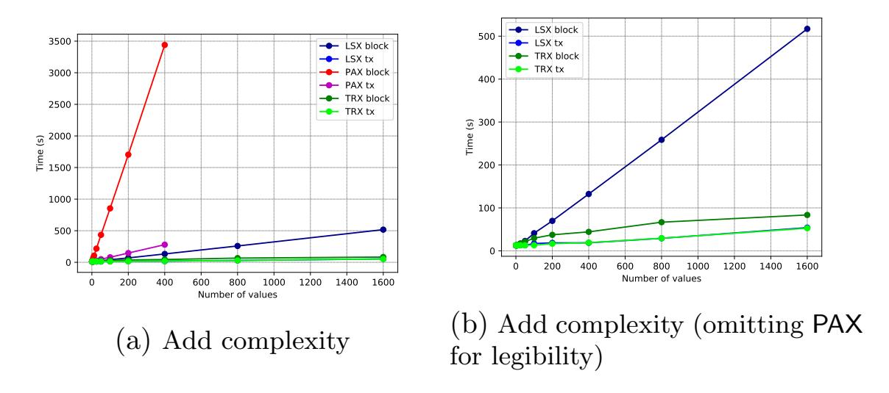
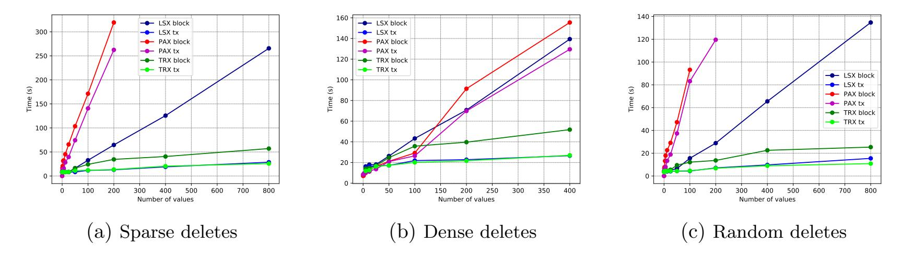
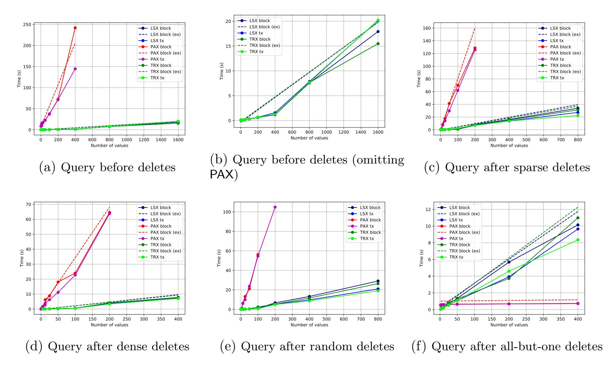

{0}------------------------------------------------

# Encrypted Blockchain Databases

Daniel Adkins<sup>∗</sup> Brown University Archita Agarwal† Brown University Seny Kamara‡ Brown University Tarik Moataz § Aroki Systems

#### Abstract

Blockchain databases are storage systems that combine properties of blockchains and databases like decentralization, tamper-proofness, low query latency and support for complex queries. Blockchain databases are an emerging and important class of blockchain technology that is critical to the development of non-trivial smart contracts, distributed applications and decentralized marketplaces.

In this work, we consider the problem of designing end-to-end encrypted blockchain databases to support the development of decentralized applications that need to store and query sensitive data. In particular, we show how to design what we call blockchain encrypted multi-maps (EMM) which can be used to instantiate various kinds of NoSQL blockchain databases like key-value stores or document databases. We propose three blockchain EMM constructions, each of which achieves different tradeoffs between query, add and delete efficiency. All of our constructions are legacy-friendly in the sense that they can be implemented on top of any existing blockchain. This is particularly challenging since blockchains do not support data deletion.

We implemented our schemes on the Algorand blockchain and evaluated their concrete efficiency empirically. Our experiments show that they are practical.

## <span id="page-0-0"></span>1 Introduction

Blockchains are decentralized tamper-proof append-only data stores. Since their introduction by Nakamoto in the context of crypto-currencies [\[37\]](#page-30-0), blockchains have received a lot of attention from research and industry due to their potential use tamper-proof distributed storage platforms. An emerging and important class of blockchain technologies are blockchain databases. These are blockchain-like in the sense that they are decentralized and tamper-proof but database-like in the sense that they store complex data types, provide (relatively) low latency, and support complex queries. Blockchain databases are a crucial technology for the development of non-trivial smart contracts, distributed applications and marketplaces. Examples of commercial and research blockchain databases include Bigchain DB [\[35\]](#page-30-1), Bluzelle [\[4\]](#page-28-0) and [\[38\]](#page-30-2).

As blockchain databases gain wider adoption, concerns over the confidentiality of the data they manage will increase. Already, several projects aim to use blockchains to store sensitive data like electronic healthcare and financial records, legal documents (e.g., wills) and customer data. But the decentralized nature of blockchains—where data is highly replicated and stored on untrusted nodes—makes it a particularly poor solution for storing sensitive data.

<sup>∗</sup> daniel\_adkins@brown.edu

<sup>†</sup> archita\_agarwal@brown.edu

<sup>‡</sup> seny@brown.edu

<sup>§</sup> tarik@aroki.com

{1}------------------------------------------------

Encrypted blockchain DBs. In this work, we consider the problem of end-to-end encrypted blockchain databases. With such a system, a client can encrypt its database before storing it on the blockchain. To query it, the client uses its secret key and executes a query protocol with the blockchain. Encrypted blockchain DBs are a form of encrypted database as studied in the encrypted search literature. In theory they could be designed using various cryptographic primitives each of which achieve different tradeoffs between query efficiency, storage overhead, communication complexity, leakage and query expressiveness.

Encrypted multi-maps. A multi-map (MM) is a data structure that stores label/tuple pairs and supports get and put operations. Gets take as input a label and return the associated tuple and puts take as input a label/tuple pair and stores it. Multi-maps are generalization of dictionaries which only store label/value pairs. MMs capture the functionalities of important data structures like inverted indices but can also be used to represent NoSQL databases like key-value stores (e.g., DynamoDB) and document stores (e.g., MongoDB). An encrypted multi-map (EMM) is an end-to-end encrypted multi-map data structure that supports puts and gets over encrypted data. EMMs have have received a lot of attention in the encrypted search literature because they enable sub-linear search on encrypted data [\[24\]](#page-29-0), encrypted graph databases [\[23\]](#page-29-1) and encrypted relational databases [\[29\]](#page-29-2). We note that an encrypted NoSQL blockchain database can be trivially constructed from a decentralized/blockchain EMM since both key-value stores and document databases can be represented as dictionaries. Because of this, in this work, we focus on the problem of designing of blockchain EMMs.

Custom vs. legacy-friendly designs. There are two approaches one could take to design a blockchain EMM. The first is to build a custom system from the ground up. The advantage of this approach is that the blockchain and the encrypted search techniques can be co-designed to optimize performance. Another approach is to design a solution that is legacy-friendly in the sense that it can be used on top of pre-existing blockchains. The advantage of this approach is that the resulting system can benefit from the underlying blockchain's network in terms of size and adoption. The disadvantage of this approach is that it introduces several technical challenges.

Challenges. The first challenge is simply to find a way to store the encrypted database on a blockchain. Most existing blockchains were designed to store financial transactions or the state of smart contracts but not databases and the data structures that support them. The second challenge is in achieving dynamism; that is, adding, deleting and editing data. One of the core properties of blockchains is that they are tamper-proof which makes database deletion operations particularly difficult. The third challenge is to achieve efficiency both with respect to queries and updates.

### 1.1 Our Contributions

In this work, we show how to design practical legacy-friendly encrypted blockchain databases. We make several contributions.

Append-only data stores. Our blockchain EMM constructions can work on any blockchain. To achieve this level of generality, we use a simple abstraction called an append-only data store (ADS) that captures the properties and functionality of blockchains that we need. At a high level, an ADS stores address/entry pairs but where the address is determined by the structure—as opposed to a dictionary where the label is chosen. ADSs are append-only so they only support get and 

{2}------------------------------------------------

put operations. By designing EMMs based on ADSs we ensure that our constructions can be implemented and used on any blockchain. An alternative approach would be to store an entire EMM as the state of a smart contract and to implement the query and update operations as a smart contract. There are two limitations to this approach. First, it is not general-purpose since: (1) many blockchains do not support smart contracts; and (2) many smart contract platforms do not maintain state across transactions. The second limitation is that it is expensive since smart contract platforms require payment not only for storing data and code but also for executing code (and the more complex the code is, the higher the cost). Our approach, on the other hand, is general and lower cost since we can store ADS entries in transactions as opposed to smart contracts <sup>1</sup> and don't need to execute any code on the blockchain.

A list-based construction. Our first construction, LSX, stores every element of a multi-map in the ADS but super-imposes a virtual linked list for each tuple. Given a tuple  $(v_1, \ldots, v_n)$  associated to a label  $\ell$ , the values are first stored in blocks  $(B^{(1)}, \ldots, B^{(m)})$ . Block  $B^{(i)}$  is then concatenated with the address of  $B^{(i-1)}$ , encrypted and stored in the ADS. The address of  $B^{(m)}$  is then stored locally by the client. To query the EMM on a label  $\ell$ , the client recovers the address of the tail block and queries the ADS for it. This results in the client learning  $B^{(n)}$  and the address of  $B^{(n-1)}$  which can now be queried; and so on and so forth. To achieve dynamism, the scheme uses lazy deletion: all the added and deleted values are marked as added or deleted and deletion is only performed at query time by removing the values marked as deleted from the output. This scheme has several shortcomings including query complexity that is linear in the number of deleted items and a put operation that requires a linear number of rounds (in the size of the tuple). The latter is particularly costly when the ADS is instantiated with a blockchain because the latency of a round is equivalent to the time it takes for a transaction to stabilize, which can be very high.

Like any encrypted search solution, our schemes achieve tradeoffs between efficiency and leakage. We formally analyze the security of our constructions and prove that they achieve standard leakage profiles. More precisely, LSX's query leakage reveals if and when the queried label has been edited in the past. Its add and delete leakages, on the other hand, reveal only the size of the tuple, which implies that LSX is forward-private [46, 19].

A tree-based construction. Our second construction, TRX, improves on LSX's round complexity for puts. It does this by super-imposing a binary tree instead of a list. Roughly speaking, given blocks  $(B^{(1)}, \ldots, B^{(m)})$ , each block is concatenated with the addresses of a left and a right block. These blocks can be any two blocks that have been previously stored but not linked to. For dynamism, the scheme also uses lazy deletes. The advantage of this scheme is that put operations now require only a logarithmic number of rounds since all the blocks at a given tree depth can be inserted into the ADS in parallel (since their children have already been inserted and their addresses are now known). TRX achieves the same leakage profile as LSX.

A patched construction. Our third construction, PAX, improves on the asymptotic query complexity of LSX. It does this by super-imposing additional (virtual) structures on the ADS. The first are what we refer to as *patches*. These are address pairs that allow the query algorithm to skip values that are deleted. To guarantee correctness and to achieve optimal query complexity, these patches have to be used and managed very carefully. We achieve this by super-imposing a binary

<span id="page-2-0"></span><sup>&</sup>lt;sup>1</sup> On Ethereum, it costs around 2,200 gas to store a 32 bytes in a transaction whereas it costs around 20,000 gas to store it in a smart contract.

{3}------------------------------------------------

search tree on the patches themselves that allows us to find patches quickly and introduce a set of techniques to manage this patch tree.

PAX's leakage profile is slightly worse than LSX's and TRX's. Its query leakage reveals if and when an addition was made to the label and its add leakage reveals only the size of the tuple. In particular, this means PAX's adds are forward private. Its deletions, however, are not and they reveal if and when the label was added to, and if and when the tuple values were added in the past. Another limitation of PAX is that it does not support packing so, even though its asymptotic query complexity is optimal, its concrete efficiency is only moderate (as our experiments reveal). Nonetheless, we believe that PAX is an interesting construction due to the techniques it introduces and its asymptotic optimality. Furthermore, if it can be extended to handle packing it would be very efficient in practice.

Blockchain instantiations of ADSs. We show how to use the Ethereum and Algorand blockchains to instantiate an ADS. At a high-level, we store a value v by creating a transaction that stores v and sending it to the blockchain so that it gets mined into a block. In the context of blockchains, the address of a value can be instantiated in one of two ways: (1) as a transaction hash, which the client can compute before the block is mined; or (2) as the block number (along with a transaction hash) which the client can only use after the transaction has been mined and the block is stable. Using transaction hashes as addresses is more efficient but, in some cases, infeasible because some nodes might not support transaction lookups by hash. Because of this, we also study how choosing one instantiation over the other effects the efficiency of our schemes.

Empirical evaluation. We implemented our schemes on the Algorand testnet and evaluated them under a variety of different settings. We varied the sizes of the multi-maps and the querying and deletion patterns. We instantiated the ADS addresses using transaction hashes and block numbers. At a high level, we found that TRX performs better than LSX when addresses are instantiated with block numbers. However, if transaction hashes are used, we found no difference between the two. We also found that, as expected, for workloads with a lot of delete operations, PAX outperforms the other schemes. For other workloads, however, PAX performs worse than the other schemes due to its inability to pack multiple values in a single transaction. [2](#page-3-0)

## 2 Related Work

Blockchain databases. Recently, database and blockchain technologies have mutually influenced each other. Some databases have adopted blockchain features such as decentralization, tamper-resistance and auditability [\[39,](#page-30-4) [8,](#page-28-1) [5,](#page-28-2) [35,](#page-30-1) [9,](#page-28-3) [44\]](#page-30-5), while some blockchains have adopted database features like low latency and expressive queries [\[27,](#page-29-4) [13,](#page-28-4) [25,](#page-29-5) [48,](#page-31-0) [47,](#page-31-1) [16,](#page-28-5) [32\]](#page-29-6). The latter, (i.e., blockchain DBs) work by either storing data in traditional database and using blockchains for book-keeping purposes [\[48,](#page-31-0) [47,](#page-31-1) [16,](#page-28-5) [32\]](#page-29-6); or by introducing an additional database layer on top of an existing blockchain [\[27,](#page-29-4) [13,](#page-28-4) [25\]](#page-29-5).

Privacy in blockchains. Blockchains are being designed for a variety of uses and domains such as government, health and IoT [\[18,](#page-29-7) [14,](#page-28-6) [49,](#page-31-2) [43\]](#page-30-6). Since many blockchains are public and store sensitive data, privacy has always been a concern. This has led to the adoption of various cryptographic

<span id="page-3-0"></span><sup>2</sup>We implemented our schemes for the Ethereum testnet as well but could not run any experiments due to what we believe is an DDoS or anti-spam mechanism. We contacted the Ethereum foundation about it but never heard back. We expect, however, to see similar trends as our results from the Algorand testnet.

{4}------------------------------------------------

techniques like zero-knowledge proofs, [\[36,](#page-30-7) [45\]](#page-30-8), secure multi-party computation [\[47,](#page-31-1) [30,](#page-29-8) [2\]](#page-27-0), secret sharing [\[15,](#page-28-7) [2\]](#page-27-0), encryption [\[33,](#page-30-9) [13,](#page-28-4) [31\]](#page-29-9), commitment schemes [\[20,](#page-29-10) [1,](#page-27-1) [34\]](#page-30-10) and access controls [\[13,](#page-28-4) [40,](#page-30-11) [41\]](#page-30-12) to blockchains. We refer the readers to [\[42,](#page-30-13) [50\]](#page-31-3) for a comprehensive survey.

Recently, Benhamouda et al. [\[17\]](#page-28-8) considered the problem of storing and using a secret on blockchain. We note the goal of our work is different from theirs but complimentary. In this work, we are concerned with storing and querying a database of sensitive information whereas in [\[17\]](#page-28-8) the goal is to store and use a secret like an encryption or a signing key. The two approaches could be combined as follows. Suppose we had two blockchains bc<sup>1</sup> and bc2. Our blockchain EMMs could be used to store and manage a database on bc<sup>1</sup> while the techniques from [\[17\]](#page-28-8) could be used to store the blockchain EMM's secret key on bc<sup>2</sup> and to execute the query, add and delete operations.

Verifiable SSE via blockchains. Blockchains have also been used in the context of encrypted search. Several works [\[22,](#page-29-11) [21,](#page-29-12) [28,](#page-29-13) [51\]](#page-31-4) propose to use blockchains to desgin verifiable searchable symmetric encryption (VSSE) schemes. A VSSE scheme is a searchable encryption scheme where the client can verify the correctness of the query results. Traditional VSSE constructions rely on cryptographic primitives like message authentication codes (MAC) and digital signatures. These works replace the server by a smart contract and rely on the consensus mechanism of the latter to provide a guarantee of correctness.

## 3 Preliminaries

Notation. The set of all binary strings of length n is denoted as {0, 1} n , and the set of all finite binary strings as {0, 1} ∗ . [n] is the set of integers {1, . . . , n}, and 2[n] is the corresponding power set. We write x ← χ to represent an element x being sampled from a distribution χ, and x \$ ← X to represent an element x being sampled uniformly at random from a set X. The output x of an algorithm A is denoted by x ← A.

Dictionaries & multi-maps. A dictionary structure DX of capacity n holds a collection of n label/value pairs {(`<sup>i</sup> , vi)}i≤<sup>n</sup> and supports get and put operations. We write v<sup>i</sup> := DX[`<sup>i</sup> ] to denote getting the value associated with label `<sup>i</sup> and DX[`<sup>i</sup> ] := v<sup>i</sup> to denote the operation of associating the value v<sup>i</sup> in DX with label `<sup>i</sup> . A multi-map structure MM with capacity n is a collection of n label/tuple pairs {(`<sup>i</sup> , vi)}i≤<sup>n</sup> that supports get and put operations. Similar to dictionaries, we write v<sup>i</sup> := MM[`<sup>i</sup> ] to denote getting the tuple associated with label `<sup>i</sup> and MM[`<sup>i</sup> ] := v<sup>i</sup> to denote operation of associating the tuple v<sup>i</sup> to label `<sup>i</sup> .

Append-only data stores. An append-only data store ADS is a special case of a dictionary data structure in which every inserted label/value pair cannot be removed without impacting the integrity of the entire structure. That is, the structure can insert new label/value pairs, but the existing ones are immutable and cannot be modified. We provide below a formal description of this data structure.

Definition 3.1 (Append-only data store). An append-only data store ΣADS = (Init, Get, Put) consists of three algorithms that work as follows:

• ADS ← Init(λ) is an algorithm that takes as input a public parameter λ, and outputs an empty append-only data store ADS.

{5}------------------------------------------------

- v ← Get(ADS, r) is an algorithm that takes as input an append-only data store ADS and an address r and outputs a response v that corresponds to the value stored at address r.
- (ADS<sup>0</sup> , r) ← Put(ADS, v) is an algorithm that takes as input an append-only data store ADS and a value v, and outputs an address r and an updated append-only data store ADS<sup>0</sup> .

ADS[r] denotes the value stored at location r and addr(v) to denote the address at which v is stored in ADS.

Basic cryptographic primitives. A private-key encryption scheme is a set of three polynomialtime algorithms SKE = (Gen, Enc, Dec) such that Gen is a probabilistic algorithm that takes a security parameter k and returns a secret key K; Enc is a probabilistic algorithm takes a key K and a message m and returns a ciphertext c; Dec is a deterministic algorithm that takes a key K and a ciphertext c and returns m if K was the key under which c was produced. Informally, a private-key encryption scheme is secure against chosen-plaintext attacks (CPA) if the ciphertexts it outputs do not reveal any partial information about the plaintext even to an adversary that can adaptively query an encryption oracle. We say a scheme is random-ciphertext-secure against chosen-plaintext attacks (RCPA) if the ciphertexts it outputs are computationally indistinguishable from random even to an adversary that can adaptively query an encryption oracle.[3](#page-5-0)

## 4 Structured Encryption

Structured encryption (STE) schemes [\[23\]](#page-29-1) encrypt data structures in such a way that they can support operations on encrypted data. STE schemes can be distinguished depending on the type of operations they support. This includes non-interactive and interactive schemes where the former require only a single message while the latter require several rounds for queries and updates. STE schemes can also be static or dynamic where the former do not support update operations whereas the latter do. STE schemes can also be response-revealing or response-hiding, where the former reveal the response to queries whereas the latter do not. We formally define an interactive dynamic response-hiding STE as follows:

Definition 4.1 (Dynamic response-hiding STE). A dynamic response hiding STE scheme ΣEDS = (Init, Query, Resolve, Edit+, Edit−) consists of four protocols that work as follows:

- (st, K; EDS) ← InitC,S(1<sup>k</sup> ; ⊥) is a probabilistic protocol between the client C and the server S. The client inputs the security parameter k while the server inputs nothing. The client receives an empty state st, a key K, while the server receives an empty encrypted data structure EDS.
- (st<sup>0</sup> , r; ⊥) ← QueryC,S(st, K, `; EDS) is a (probabilistic) protocol between the client C and the server S. The client inputs the state st, the key K and the label `, while the server inputs the encrypted data structure EDS. The client receives a response r and the server receives nothing.
- (st<sup>0</sup> ; EDS<sup>0</sup> ) ← Edit<sup>+</sup> <sup>C</sup>,S(st, K, `, v; EDS): is a (probabilistic) protocol between the client C and the server S. The client inputs its state st, the key K, a label `, and a value tuple v, while the server inputs the encrypted data structure EDS. As output, the client receives an updated state st<sup>0</sup> and the server receives an updated state EDS<sup>0</sup> .

<span id="page-5-0"></span><sup>3</sup>RCPA-secure encryption can be instantiated practically using either the standard PRF-based private-key encryption scheme or, e.g., AES in counter mode.

{6}------------------------------------------------

•  $(st'; \mathsf{EDS'}) \leftarrow \mathsf{Edit}^-_{\mathbf{C},\mathbf{S}}(st,K,\ell,\mathbf{v};\mathsf{EDS})$ : is a (probabilistic) protocol between the client  $\mathbf{C}$  and the server  $\mathbf{S}$ . The client inputs its state st, the key K, a label  $\ell$  and a value tuple  $\mathbf{v}$ , while the server inputs the encrypted data structure  $\mathsf{EDS}$ . As output, the client receives an updated state st' and the server receives an updated state  $\mathsf{EDS'}$ .

We say that a dynamic response hiding STE scheme  $\Sigma_{\mathsf{EDS}}$  is correct if for all  $k \in \mathbb{N}$ , for all  $(st_0, K, \mathsf{EDS}_0)$  output by  $\mathsf{Init}(1^k; \bot)$ , for all sequences of  $m = \mathsf{poly}(k)$  operations  $\mathsf{op}_1, \ldots, \mathsf{op}_m$ , for all  $i \in [m]$ , if  $\mathsf{op}_i$  is a query  $q_i$ ,  $\mathsf{Query}(st_{i-1}, K, \ell; \mathsf{EDS}_{i-1})$  returns the correct response with all but negligible probability; where  $st_{i-1}$  is the output of the  $\mathsf{Edit}^+$ ,  $\mathsf{Edit}^-$  or  $\mathsf{Query}$  protocols, while  $\mathsf{EDS}_{i-1}$  is either the output of the last update  $\rho < i$  if it exists, or the output of the  $\mathsf{Init}$  protocol otherwise.

#### 4.1 Security

The standard notion of security for STE guarantees that: (1) an encrypted data structure reveals no information about its underlying data structure beyond the init leakage  $\mathcal{L}_{I}$ ; (2) that the query protocol reveals no information about the data structure and the queries beyond the query leakage  $\mathcal{L}_{Q}$ ; and that (3) the Edit<sup>+</sup> and Edit<sup>-</sup> protocols reveal no information about the data structure and the updates beyond the edit leakage  $\mathcal{L}_{E^+}/\mathcal{L}_{E^-}$ . If this holds for adaptively chosen operations then the scheme is said to be adaptively secure.

**Definition 4.2** (Adaptive security of STE [24, 23]). Let  $\Sigma_{\mathsf{EDS}} = (\mathsf{Init}, \mathsf{Query}, \mathsf{Resolve}, \mathsf{Edit}^+, \mathsf{Edit}^-)$  be a dynamic STE scheme and consider the following probabilistic experiments where  $\mathcal{A}$  is a stateful adversary,  $\mathcal{S}$  is a stateful simulator,  $\mathcal{L}_{\mathsf{I}}$ ,  $\mathcal{L}_{\mathsf{Q}}$ ,  $\mathcal{L}_{\mathsf{E}^+}$  and  $\mathcal{L}_{\mathsf{E}^-}$  are leakage profiles and  $z \in \{0,1\}^*$ :

Real<sub> $\Sigma$ , $\mathcal{A}(k)$ : given z the adversary  $\mathcal{A}$  receives an empty encrypted data structure EDS from the challenger, where  $(st, K; \mathsf{EDS}) \leftarrow \mathsf{Init}(1^k; \bot)$ . The adversary then adaptively chooses a polynomial number of operations  $\mathsf{op}_1, \ldots, \mathsf{op}_m$  such that  $\mathsf{op}_i$  is either a query or an update. For all  $i \in [m]$ , if  $\mathsf{op}_i$  is a query  $q_i = \ell$ , the adversary and the challenger execute the protocol Query, and the challenger receives an updated state  $\mathsf{st}'$  and a response  $\mathsf{e}$  while the adversary receives nothing, where  $(\mathsf{st}', \mathsf{e}; \bot) \leftarrow \mathsf{Query}(\mathsf{st}, K, \ell; \mathsf{EDS})$ . If  $\mathsf{op}_i$  is an update of the form  $u_i = (\mathsf{Edit}^+, \ell, \mathbf{v})$ , the adversary and the challenger execute the protocol  $\mathsf{Edit}^+$ , and the challenger receives an updated state  $\mathsf{st}'$ , while the adversary receives an updated encrypted data structure  $\mathsf{EDS}'$ , where  $(\mathsf{st}'; \mathsf{EDS}') \leftarrow \mathsf{Edit}^+(\mathsf{st}, K, \ell, \mathbf{v}; \mathsf{EDS})$ . On the other hand, if  $\mathsf{op}_i$  is an update of the form  $u_i = (\mathsf{Edit}^-, \ell, \mathbf{v})$ , the adversary and the challenger execute the protocol  $\mathsf{Edit}^-$ , and the challenger receives an updated state  $\mathsf{st}'$ , while the adversary receives an updated encrypted data structure  $\mathsf{EDS}'$ , where  $(\mathsf{st}'; \mathsf{EDS}') \leftarrow \mathsf{Edit}^-(\mathsf{st}, K, \ell; \mathsf{EDS})$ . Finally,  $\mathcal A$  outputs a bit b that is output by the experiment.</sub>

Ideal<sub> $\Sigma,A,S$ </sub>(k): given z and leakage  $\mathcal{L}_I(\mathsf{DS})$  (where  $\mathsf{DS} = \bot$ ) from the challenger, the simulator S returns an empty encrypted data structure  $\mathsf{EDS}$  to A. The adversary then adaptively chooses a polynomial number of operations  $\mathsf{op}_1,\ldots,\mathsf{op}_m$  such that  $\mathsf{op}_i$  is either a query or an update. For all  $i \in [m]$ , if  $\mathsf{op}_i = \ell$ , the simulator receives the query leakage  $\mathcal{L}_Q(\mathsf{DS},\ell)$  and executes Query with the adversary. The adversary receives nothing as output. If  $\mathsf{op}_i = (\mathsf{Edit}^+,\ell,\mathbf{v})$ , the simulator receives the add leakage  $\mathcal{L}_{\mathsf{E}^+}(\mathsf{DS},\ell,\mathbf{v})$  and executes  $\mathsf{Edit}^+$  with the adversary. The adversary receives an updated encrypted data structure  $\mathsf{EDS}'$  as output. If, on the other hand,  $\mathsf{op}_i = (\mathsf{Edit}^-,\ell,\mathbf{v})$ , the simulator receives the delete leakage  $\mathcal{L}_{\mathsf{E}^-}(\mathsf{DS},\ell,\mathbf{v})$  and executes  $\mathsf{Edit}^-$  with the adversary. The adversary receives an updated encrypted data structure  $\mathsf{EDS}'$  as output. Finally,  $\mathcal{A}$  outputs a bit b that is output by the experiment.

{7}------------------------------------------------

We say that  $\Sigma_{\mathsf{EDS}}$  is adaptively  $(\mathcal{L}_{\mathsf{I}}, \mathcal{L}_{\mathsf{Q}}, \mathcal{L}_{\mathsf{E}^+}, \mathcal{L}_{\mathsf{E}^-})$ -secure if there exists a PPT simulator  $\mathcal{S}$  such that for all PPT adversaries  $\mathcal{A}$ , for all  $z \in \{0,1\}^*$ ,

$$|\Pr\left[\mathbf{Real}_{\Sigma_{\mathsf{EDS}},\mathcal{A}}(k)=1\right] - \Pr\left[\mathbf{Ideal}_{\Sigma_{\mathsf{EDS}},\mathcal{A},\mathcal{S}}(k)=1\right]| \leq \mathsf{negl}(k).$$

### 5 LSX: A List-Based Scheme

In this section, we describe our first construction LSX. This is a multi-map encryption scheme that makes use of an append-only data store. There are two main technical challenges that occur when designing such a scheme. The first is handling delete operations since ADS's do not have the ability to modify or delete entries. The second is supporting the insertion of variable-length tuples efficiently. To solve these issues, we use three techniques: (1) linking, where we super-impose a linked list structure on top of the underlying ADS; (2) lazy deletion, where items are only marked for deletion at delete time and removed from the output at query time; and (3) packing, where we store multiple tuple values in one ADS entry.

Overview. At a high-level our scheme works as follows. Given a label/tuple pair that needs to be added or deleted, the client encrypts and stores the tuple values into the ADS maintained by the server. But, to differentiate between added and deleted values, it first concatenates a flag to each value: ADD for added values and DEL for deleted values. At query time, the client reads all the values and outputs the ones that were added but not deleted.

**Linking.** Recall that in order to retrieve a value from an append-only data store ADS, one needs to know the address at which it is stored and this address cannot be computed or known a-priori by the client. To support search, a naive approach would be to require the client to store the addresses of all the values that it ever stored in the data store; which is obviously very space inefficient. To improve this, the client will super-impose in the ADS a virtual linked list over the values associated to a label  $\ell$  and store locally only the address of the tail of the list. More precisely, it works as follows: for each label  $\ell$ , and each value in  $\ell$ 's tuple, the client concatenates to the value the address of the previous value that was stored in ADS. It then stores the address of the last value in the tuple. Overall, the client only needs to keep a state that is linear in the number of labels in the multi-map. Notice that it is possible to achieve constant size state by super-imposing a single list over the values of all labels but we dismissed this approach since the query time would be linear in the number of values of all labels.

**Packing.** Depending on how big the tuple values are, it is possible to pack multiple values in one entry of the data store. This trivially makes the construction more efficient since queries will require a fewer number of interactions with the ADS. Let  $\lambda$  be a data-store-specific parameter that denotes the maximum number of bits that can be stored in an entry of the ADS. The client then packs the maximum number of values in what we call a *value-block* such that the total size of the value-block (including the flag and the address) is at most  $\lambda$ . It then stores the value-block as an entry of the data store.

#### 5.1 Details

The LSX scheme makes a black-box use of a private key encryption scheme SKE = (Gen, Enc, Dec) and an append-only data store  $\Sigma_{ADS} = (Init, Get, Put)$ . LSX is described in detail in Figure 1 and we provide below a high level overview on how it works.

{8}------------------------------------------------

Init. During initialization, given a security parameter 1<sup>k</sup> as input, the client generates an encryption key K and initializes a dictionary DX, while the server initializes its append-only data store ADS using ΣADS.Init(1<sup>k</sup> , ⊥). The client uses dictionary DX to store addresses of the values it stores in ADS. More precisely, ADS[`] is the address of the last value stored in ADS associated with label `.

Edit+. To add a tuple v to an (exisiting) label `, the client chops v into value-blocks B(1), . . . B(t) , such that the size (in bits) of each encrypted value-block appended with an address and an ADD flag is at most λ. It then does the following for each i ∈ [t]: it first encrypts (B(i) || ADD || r i−1 ), where r (i−1) is the address of the previous block stored in ADS(i−1) for `, [4](#page-8-0) and then stores the encrypted value e in ADS(i−1) and computes new address r (i) where (r i , ADS(i) ) ← ΣADS.Put(ADS(i−1), e). The client finally updates DX[`] = r (|v|) , so that it can correctly extend the chain on next Edit+/Edit<sup>−</sup> operation.

Edit−. Deletion is same as addition with the difference that value-blocks are now concatenated with DEL flag instead of ADD flag.

Query. To compute MM[`], the client sends to the server the address r = DX[`], which the server uses to retrieve and return e = ADS[r]. The client then decrypts e to recover a value block B, a flag flag and an address r 0 . If flag = ADD, it adds B to a set V or else it adds it to Vd. It then sets r = r <sup>0</sup> and checks if r = ⊥. If r = ⊥, it has retrieved all the values that were ever added/deleted to/from `, and if not, it repeats. Finally, it outputs the set of values in V \ Vd, which intuitively represent the values that were added but not yet deleted.

Security. We now describe the leakage profile of the LSX scheme. The initialization leakage is equal to

$$\mathcal{L}_{\mathsf{I}}(\perp) = \perp.$$

The query leakage is equal to

$$\mathcal{L}_{\mathsf{Q}}(\mathsf{MM},\ell) = \mathsf{ueq}(\ell),$$

where ueq(`) is the update equality pattern which reveals if and when the label ` edit had occurred. More formally, it is defined as a bit string of length equal to the number of operations performed until now where the i th bit is set to 1 if the i th operation was an Edit+/Edit<sup>−</sup> on `, and 0 otherwise.

The add/delete leakage is equal

$$\mathcal{L}_{\mathsf{E}^+}(\mathsf{MM},(\mathsf{Edit}^+,\ell,\mathbf{v})) = \mathcal{L}_{\mathsf{E}^-}(\mathsf{MM},(\mathsf{Edit}^-,\ell,\mathbf{v})) = |\mathbf{v}|,$$

where |v| denotes the number of values being added/deleted from the multi-map.

Theorem 5.1. If SKE is RCPA secure, then LSX is a (L<sup>I</sup> ,LQ,LE<sup>+</sup> ,LE<sup>−</sup> )-secure multi-map encryption scheme.

Proof. Consider the simulator S that works as follows. It simulates the adversary A and first generates a symmetric key K ← SKE.Gen(1<sup>k</sup> ).

<span id="page-8-0"></span><sup>4</sup>Note that the first added value of any label ` is concatenated with ⊥ in order to be able to identify the end of a label's chain.

{9}------------------------------------------------

```
Let \lambda \geq 0 be a public parameter, let SKE = (Gen, Enc, Dec) be a private-key encryption scheme and
\Sigma_{\mathsf{ADS}} = (\mathsf{Init}, \mathsf{Get}, \mathsf{Put}) be an append-only data store. Consider the dynamic encrypted multi-map \mathsf{LSX} = \mathsf{Init}
(Init, Query, Edit<sup>+</sup>, Edit<sup>-</sup>) defined as follows:
• \operatorname{Init}(1^k; \bot):
      1. C generates K \leftarrow \mathsf{SKE}.\mathsf{Gen}(1^k);
      2. C initializes an empty dictionary DX;
      3. S initializes an empty append-only data store ADS \leftarrow \Sigma_{ADS}.Init(\lambda);
      4. C outputs a state st = DX and a key K, whereas S outputs ADS.
• Edit^+(st, K, \ell, \mathbf{v}; ADS):
      1. C parses st as DX and sets ADS to ADS<sup>(0)</sup>;
      2. C sets r^{(0)} \leftarrow \mathsf{DX}[\ell];
      3. C chops v into maximal sized value-blocks B^{(1)}, \ldots, B^{(t)} such that for each i \in
                                                                                                                                           |t|,
          |\mathsf{SKE}.\mathsf{Enc}_K(B^{(i)} \mid\mid r^{(0)} \mid\mid \mathsf{ADD})| \leq \lambda;
      4. for each i \in [t]:
           (a) C computes e \leftarrow \mathsf{SKE}.\mathsf{Enc}_K(B^{(i)} \mid\mid r^{(i-1)} \mid\mid \mathsf{ADD});
           (b) \mathbf{C} sends e to the server \mathbf{S};
           (c) S computes (ADS^{(i)}, r^{(i)}) \leftarrow \Sigma_{ADS}.Put(ADS^{(i-1)}, e);
           (d) S returns r^{(i)} to C;
      5. C sets \mathsf{DX}[\ell] = r^{(t)}.
• Edit^-(st, K, \ell, \mathbf{v}; ADS):
      1. It is the same as Edit<sup>+</sup>, except that at line 3a, C concatenates the DEL flag instead of ADD flag.
• Query(st, K, \ell; ADS):
      1. C parses st as DX;
      2. C sets r = \mathsf{DX}[\ell] and initializes two empty sets V and V_d;
      3. while r \neq \bot,
```

(a)  $\mathbf{C}$  sends r to  $\mathbf{S}$ ;

- (b) **S** computes  $e \leftarrow \Sigma_{\mathsf{ADS}}.\mathsf{Get}(\mathsf{ADS},r)$  and sends e to **C**;
- (c) C computes  $(B \mid\mid r'\mid\mid \mathsf{flag}) \leftarrow \mathsf{SKE}.\mathsf{Dec}_K(e);$
- (d) if flag = ADD, C appends B to V;
- (e) otherwise if flag = DEL, C appends B to  $V_d$ ;
- (f) C sets r = r'.
- 4. C outputs  $V \setminus V_d$ .

Figure 1: The LSX scheme.

• Simulating Edit<sup>+</sup>: On receiving  $\mathcal{L}_{\mathsf{E}^+}(\mathsf{MM},\ell,\mathbf{v}) = |\mathbf{v}|, \mathcal{S} \text{ sets } r^{(0)} = \bot, \text{ creates a vector } \overline{\mathbf{v}} \text{ with }$ random  $|\mathbf{v}|$  values, chops  $\overline{\mathbf{v}}$  into maximal sized value-blocks  $\overline{B}^{(1)}, \dots, \overline{B}^{(t)}$  such that for each  $j \in [t], |\mathsf{SKE}.\mathsf{Enc}(\overline{B}^{(j)} \mid\mid r^{(0)} \mid\mid \mathsf{ADD})| \leq \lambda, \text{ and repeats the following } t \text{ times, i.e. for } i \in [t],$ it generates  $e_i \leftarrow \mathsf{SKE}.\mathsf{Enc}_K(\overline{B}^{(i)} \mid\mid r^{(i-1)} \mid\mid \mathsf{ADD})$ , sends  $e_i$  to  $\mathcal{A}$ , waits for  $\mathcal{A}$  to return a new  $r^{(i)}$  and then it repeats. It also associates and stores  $r^{(t)}$  with current time.

{10}------------------------------------------------

- Simulating Edit<sup>-</sup>: It is exactly same as simulation of Edit<sup>+</sup>.
- Simulating Query: Given  $\mathcal{L}_{Q}(\mathsf{MM},\ell) = \mathsf{ueq}(\ell)$ ,  $\mathcal{S}$  first sorts the update times in descending order and stores the sorted times in tuple  $\mathbf{u}$ . For each  $u \in \mathbf{u}$ , it then uses the address r associated with u, sends r to  $\mathcal{A}$ , waits for  $\mathcal{A}$  to return e, decrypts e to compute next r and repeats until  $r = \bot$ .

It remains to show that for all PPT adversaries  $\mathcal{A}$ , the probability that  $\mathbf{Real}(k)$  outputs 1 is negligibly close to the probability that  $\mathbf{Ideal}(k)$  outputs 1. This can be done with the following sequence of games:

 $\mathsf{Game}_0$ : is the same as a  $\mathbf{Real}_{\mathcal{A},\mathcal{Z}}(k)$  experiment.

 $\mathsf{Game}_1$ : is the same as  $\mathsf{Game}_0$  except that the encryptions of  $(B \mid\mid r \mid\mid \mathsf{flag})$  during  $\mathsf{Edit}^+$  and  $\mathsf{Edit}^-$  are replaced by encryptions of  $(\overline{B} \mid\mid r \mid\mid \mathsf{flag})$ , where  $\overline{B}$  is created by chopping a vector  $\overline{\mathbf{v}}$  of random values.

Game<sub>2</sub>: is the same as Game<sub>1</sub> except for the following. On an Edit<sup>+</sup> or Edit<sup>-</sup>, we initialize  $r^{(0)}$  to  $\bot$  instead of initializing it to  $\mathsf{DX}[\ell]$ . We also associate and store  $r^{(t)}$  with the current time. Then, on a query, we sort the update times of  $\ell$ , and use the addresses associated with the sorted update times to query the server.

Note that  $\mathsf{Game}_0$  and  $\mathsf{Game}_1$  are indistinguishable because otherwise the encryption scheme is not RCPA secure – on  $\mathsf{Edit}^+$  and  $\mathsf{Edit}^-$ , the vector  $\mathbf{v}$  of  $\mathsf{Game}_0$  is replaced with a random vector  $\overline{\mathbf{v}}$  in  $\mathsf{Game}_1$ .  $\mathsf{Game}_1$  and  $\mathsf{Game}_2$  are also indistinguishable because the encryption is RCPA secure – on  $\mathsf{Edit}^+$  and  $\mathsf{Edit}^-$ ,  $r^{(0)}$  of  $\mathsf{Game}_1$  is replaced with  $\bot$  in  $\mathsf{Game}_2$ . The Query protocol remains the same from the adversary's perspective as it receives the same set of r values as it would in  $\mathsf{Game}_1$ . Proof concludes by noticing that  $\mathsf{Game}_2$  is  $\mathsf{Ideal}(k)$  experiment.

Efficiency. We evaluate our scheme (as well as the next two schemes) based on three parameters: (1) time complexity, time, which is the amount of work done by the server; (2) round complexity for reads, rounds, which is the number of communication rounds that take place between the client and the server for reads; and (3) round complexity for writes, rounds, which is the number of communication rounds that take place between the client and the server for writes. We evaluate the round complexity of our schemes separately for reads and writes because when the underlying ADS is instantiated with a blockchain, writes can take much longer than reads. When the ADS is a blockchain, we sometimes use the term stabilization complexity, which we denote stbl, to refer to the round complexity of writes. This is because the time it takes to write a value/transaction to a blockchain depends on the time it takes the transaction to become stable. We summarize in Table 1 the time and stabilization complexities of LSX along with our two protocols described in the subsequent sections, and we give a detailed analysis below.

• Query. Since the query protocol requires reading all the value-blocks that were ever added or deleted from  $\ell$ , its time complexity time is  $O(|\mathbf{u}|)$ , where  $\mathbf{u}$  is the sequence of all update operations. The round complexity for reads rounds<sub>r</sub> is O(u) where  $u = \sum_{i=1}^{|\mathbf{u}|} |\mathbf{v}_i|/\lambda$ , where  $\mathbf{v}_i$  is the tuple to the *i*th update operation in  $\mathbf{u}$ . This holds as the the address of the value-block  $B^{(i)}$  cannot be computed until the value-block  $B^{(i+1)}$  is read. Note that since nothing is written to the server during query time, the stabilization complexity stbl is not relevant.

{11}------------------------------------------------

<span id="page-11-0"></span>

|     | Edit+(`,<br>vi) |                | Query(`)        |                 | Edit−(`,<br>vi)                                |                   |                        |
|-----|-----------------|----------------|-----------------|-----------------|------------------------------------------------|-------------------|------------------------|
|     | time            | roundsw        | time            | roundsr         | time                                           | roundsr           | roundsw                |
| LSX | O( vi )         | O( vi /λ)      | O( ui )         | O(ui)           | O( vi )                                        | -                 | O( vi /λ)              |
| TRX | O( vi )         | O(log( vi /λ)) | O( ui )         | O(ti)           | O( vi )                                        | -                 | O(log( vi /λ))         |
| PAX | O( vi )         | O( vi )        | O( MMi<br>[`] ) | O( MMi<br>[`] ) | O( MMi−1<br>[`] +<br> vi  log( MMi−1<br>[`] )) | O( MMi−1<br>[`] ) | O(log( MMi−1<br>[`] )) |

Table 1: We denote by time the time complexity, by rounds<sup>r</sup> the round complexity for reads, and by rounds<sup>w</sup> the round complexity for writes. We denote by λ > 0 the packing parameter. The efficiency complexities are calculated for the ith add/delete operation. The sequence of updates u<sup>i</sup> is composed of i add/delete operations. We denote by u<sup>i</sup> = P<sup>|</sup>ui<sup>|</sup> <sup>j</sup>=1 |v<sup>j</sup> |/λ and by t<sup>i</sup> = P<sup>|</sup>ui<sup>|</sup> <sup>j</sup>=1 log(|v<sup>j</sup> |/λ)).

• Edit<sup>+</sup> and Edit−. Since |v| values are written in total, the time complexity is equal to O(|v|) independently of the packing factor. The stabilization complexity, however, i O(|v|/λ) since the value-block B(i) cannot be written unless B(i−1) has been written. Since nothing is read from the server, rounds<sup>r</sup> is not relevant.

# 6 TRX: Improving Stabilization Complexity

The round complexity of LSX for writes is linear in the length of the inserted or deleted tuple which means that its stabilization complexity when instantiated over a blockchain is also linear. More precisely, will be O(|v|/λ), where v is the tuple to be added and λ is the size of an entry in the underlying ADS. As we will see in our evaluation section, from a practical standpoint this leads to a non-trivial bottleneck for latency. To address this we propose a new scheme, TRX, with write round complexity O(log(|v|/λ)) and the same time complexity and client storage as LSX.

Overview. Recall that the Edit<sup>+</sup> and Edit<sup>−</sup> protocols in LSX append to each value-block the address of the previous value-block stored in the ADS. This means that a value-block cannot be stored until the address of the previous value-block is available or, in the context of a blockchain, stable. Since both Edit<sup>+</sup> and Edit<sup>−</sup> protocols link |v|/λ value-blocks linearly, the client must wait for |v|/λ value-blocks in total to become stable. Therefore, the write round complexity is O(|v|/λ). In TRX, we modify the way the value-blocks are organized with the goal of reducing the number of addresses needed before storing a value-blocks. Instead of using a linked list, we super-impose a complete binary tree which allows us to parallelize the insertions of multiple value-blocks. This approach helps reduce the number of rounds required for writes and, in the context of blockchains, decrease the stabilization complexity to be logarithmic instead of linear in the size of the tuple.

The tree structure. The TRX scheme super-imposes a complete binary tree structure over the value-blocks of v so that all the nodes on a level can be inserted in parallel. This is possible since storing a value-block only requires knowing the address of its parent. To do this, TRX concatenates two addresses, lp and rp, to every value-block B of the tuple. Here, lp and rp are the addresses of other value-blocks that were stored before B, i.e., that are at a lower level in the tree. lp represents the address of B's left child and rp the address of its right child.

Note that the tree structure is only created for value-blocks that belong to the same update operation. A valid question is how one could link value-blocks added across multiple Edit operations. For this, we simply link the roots of the trees together in a linear fashion similar to the LSX scheme.

{12}------------------------------------------------

#### 6.1 Details

The TRX scheme makes black-box use of a private key encryption scheme SKE = (Gen, Enc, Dec) and an append-only data store  $\Sigma_{ADS} = (Init, Get, Put)$ . TRX is described in detail in Figure 2 and we provide a high level overview of how it works below.

**Init.** The initialization protocol is similar to the one of LSX.

Edit<sup>+</sup>. To add the tuple  ${\bf v}$  to a label  $\ell$ , the client first creates its value-blocks  $B^{(1)},\ldots,B^{(t)}$ . For each  $B^{(i)}$ , the client then sets its lp to be the address of  $B^{(2i)}$  and its rp to be the address of  $B^{(2i+1)}$ . The value-blocks on the last level of the logical tree have their lp and rp set to  $\bot$ . More precisely value-blocks  $B^{(\lceil (t/2)+1)\rceil}$  to  $B^{(t)}$  have their lp and rp set to  $\bot$ . Notice that this creates a tree structure among the value-blocks of  ${\bf v}$ . The client starts by storing value-blocks of  ${\bf v}$  in reverse order so that when it stores  $B^{(i)}$ , the addresses of  $B^{(2i)}$  and  $B^{(2i+1)}$  have already been obtained. As before, it appends an ADD flag, encrypts  $(B^{(i)} || || p || || rp || || ADD)$ , and sends the encryption  $e^{(i)}$  to the server. The server stores  $e^{(i)}$  and returns the address  $r^{(i)}$  back to the client. In order to link different tree structures belonging to the same label  $\ell$ , the client also appends the address of the root of the last tree to the value-block stored at the root of the current tree. More precisely, the client also concatenates  ${\sf DX}[\ell]$  to  $(B^{(1)} || || p || rp || ADD)$  before encryption, refer to line 5b in Figure 2. Finally, the client updates  ${\sf DX}[\ell]$  with the address of the root of the current tree.

**Edit**<sup>-</sup>. This protocol is the same as Edit<sup>+</sup> with the difference that value-blocks are now concatenated with a DEL flag instead of an ADD flag.

Query. The Query protocol is similar to the protocol of LSX with the difference that the client now traverses multiple trees. It sends to the server  $r_{\text{root}} = \mathsf{DX}[\ell]$  which is the root of the last tree stored in ADS. When the server returns  $e = \mathsf{ADS}[r_{\text{root}}]$ , the client decrypts it to retrieve the address  $r'_{\text{root}}$  of the root of the next tree and the addresses of the two child nodes. It puts the addresses of the children on a stack S and uses the stack to do a depth-first search on the tree to retrieve all the value-blocks stored in that tree; refer to line 2h to 2(h)vi in Figure 2. As in LSX, if the retrieved value-block has an ADD flag, the client adds the value-block to a set V If not, the client adds it a set  $V_d$ . Finally it outputs  $V \setminus V_d$ .

**Security.** Since the only difference between TRX and LSX is how they represent the values logically in ADS (LSX represents them as a list whereas TRX represents them as list of trees) their leakage profiles as and their security proofs are the same. We therefore simply state the security theorem without giving its proof.

**Theorem 6.1.** If SKE is RCPA-secure, then TRX is  $(\mathcal{L}_{I}, \mathcal{L}_{Q}, \mathcal{L}_{E^{+}}, \mathcal{L}_{E^{-}})$ -secure multi-map encryption scheme.

**Efficiency.** The efficiency of LSX is summarized in Table 1. We give a detailed analysis below.

• Edit<sup>+</sup> and Edit<sup>-</sup>. Since  $|\mathbf{v}|$  values are written in total, the time complexity time is  $O(|\mathbf{v}|)$ , independently of the packing factor  $\lambda$ . However, the stabilization complexity stbl is equal to  $O(\log(|\mathbf{v}|/\lambda))$  because all value-blocks at the same level of the logical tree can be written in parallel.

{13}------------------------------------------------

<span id="page-13-0"></span>Let λ ≥ 0 be a public parameter, let SKE = (Gen, Enc, Dec) be a private-key encryption scheme and ΣADS = (Init, Get, Put) be an append-only data store. Consider the dynamic encrypted multi-map LSX = (Init, Query, Edit+, Edit−) defined as follows:

- Init(1<sup>k</sup> ; ⊥) : same as Init protocol in Figure [1.](#page-9-0)
- Edit+(st, K, `, v; ADS) :
  - 1. C parses st as DX and sets ADS as ADS(0) ;
  - 2. C chops v into maximal sized value-blocks B(1), . . . , B(t) such that for each j ∈ [t], |SKE.EncK(B(j) || r (0) || r (0) || ADD)| ≤ λ;
  - 3. C creates a new vector r of size (2t + 1) where r (i) denotes the address of B(i) ;
  - 4. C initializes all r (i) in r to ⊥;
  - 5. for each i from t to 1,
    - (a) C sets lp = r (2i) and rp = r (2i+1);
    - (b) if i = 1, C computes and sends to S

$$e^{(i)} \leftarrow \mathsf{SKE}.\mathsf{Enc}_K(B^{(i)} \mid\mid \mathsf{Ip} \mid\mid \mathsf{rp} \mid\mid \mathsf{DX}[\ell] \mid\mid \mathsf{ADD});$$

<span id="page-13-4"></span><span id="page-13-1"></span>(c) otherwise if i 6= 1, C computes and sends to S

$$e^{(i)} \leftarrow \mathsf{SKE}.\mathsf{Enc}_K(B^{(i)} \mid\mid \mathsf{Ip} \mid\mid \mathsf{rp} \mid\mid \mathsf{ADD});$$

- (d) S computes (ADS(i) , r(i) ) ← ΣADS.Put(ADS(i−1) , e(i) );
- (e) S returns r (i) to C who updates r;
- 6. C sets DX[`] = r (1) .
- Edit<sup>−</sup>(st, K, `, v; ADS) :
  - 1. It is the same as Edit+, except that at lines [5b](#page-13-1) and [5c,](#page-13-4) C concatenates the DEL flag instead of the ADD flag.
- <span id="page-13-3"></span><span id="page-13-2"></span>• Query(st, K, `; ADS) :
  - 1. C parses st as DX and sets rroot = DX[`];
  - 2. while rroot 6= ⊥,
    - (a) C sends rroot to S;
    - (b) S computes and sends e ← ΣADS.Get(ADS, rroot) to C;
    - (c) C computes (B || lp || rp || r 0 root || flag) ← SKE.DecK(e);
    - (d) if flag = ADD, then C appends B to V ;
    - (e) otherwise if flag = DEL, then C appends B to Vd;
    - (f) C sets rroot = r 0 root;
    - (g) C initializes a stack S and pushes lp and rp in it;
    - (h) while S is not empty,
      - i. C sends r ← S.pop() to S;
      - ii. S computes and sends e ← ΣADS.Get(ADS, r) to C;
      - iii. C computes (B || lp || rp || flag) ← SKE.DecK(e)
      - iv. if flag = ADD, then C appends B to V ;
      - v. otherwise if flag = DEL, then C appends B to Vd;
      - vi. C computes S.push(lp) and S.push(rp) if they are not equal to ⊥;
  - 3. C outputs V \ Vd.

{14}------------------------------------------------

• Query. Since the query protocol requires reading all the value-blocks that were ever added or deleted from `, its time complexity time is O(|u|), where u is the sequence of all update operations. The round complexity for reads is equal to t = P|u<sup>|</sup> <sup>i</sup>=1 log(|v<sup>i</sup> |/λ), where v<sup>i</sup> is the tuple of the ith update operation. Note that this holds true as all value-blocks at the same level can be read in parallel. Moreover, since nothing is written to the server during query time, the stabilization complexity stbl is not relevant.

# 7 PAX: Improving Query Efficiency

Both LSX and TRX have time complexities that are linear in the number of updates |u| ever made to a label `; including the delete operations. This is because both schemes use lazy deletion with no rebuilds protocol as is the case for [\[26,](#page-29-14) [12\]](#page-28-9). As an example, if after |u| updates the client deletes all but one value of a tuple, the client and server still need to do a linear amount of work in the number of updates. In this section, we describe a new scheme, PAX, that achieves optimal time complexity at the cost of making delete operations slightly more expensive. PAX is based on a novel technique we call patching.

Overview. Like LSX, PAX stores added values in a single list. Unlike LSX, however, it does not use packing. Generalizing PAX to work support packing is left as open problem. At a high level, when a delete operation is executed, a set of patches are created and stored in the ADS. A patch is a pair of addresses s and d that will help traverse the lists without reading the deleted values. Now, a query operation will use the set of patches to skip over the deleted values and only read the required values. It is important to note, however, that to achieve time optimality, the number of patches has to be smaller than the number of values left. Achieving this is non-trivial, however, and requires us to organize the patches themselves in a tree structure.

#### 7.1 Overview of Patching

A patch is a pair of addresses s and d, denoted (s → d), where s is the starting address and d the destination address. We first explain how delete operations trigger the creation of patches and then how the query operations use them. As a first step, assume that the client stores all the patches locally in a dictionary DXPT. In this case, a patch (s → p) is stored as DXPT[s] = p. We later explain how, instead of storing them locally, they can be stored in the ADS.

Patch creation. Each value v stored in the ADS has an implicit predecessor address and an implicit successor address. More formally, the predecessor is the address of the value that was added before v and is not yet deleted while the successor is the address of the value that was added after v and is not yet deleted. When v is deleted, a patch (succ(v) → pred(v)) is created, where succ(v) is the address of v's successor and pred(v) is the address of v's predecessor.

Querying using patches. Querying with patching works as follows. Upon querying ADS[succ(v)], the client recovers addr(v) and is then supposed to query the ADS for v. With patching, however, it can check its local dictionary DXPT to see if a patch succ(v) → pred(v) exists. If so, it can skip querying the ADS on addr(v) and directly jump to querying on pred(v). Intuitively, a patch succ(v) → pred(v) provides a way to retrieve pred(v) without reading addr(v).

{15}------------------------------------------------

Storing patches. Of course, storing patches locally would require too much client storage. In fact, as we will see, the number of patches needed in the worst-case is size of the entire encrypted multi-map. Fortunately, we can overcome this by storing the patches in the ADS. The patches will themselves need to be linked (so that we can find them) but, unlike the tuple values, they will be linked using a tree structure (the reason will be explained below). To create a tree structure, we concatenate two addresses Ip and rp to every patch  $p = (s \to d)$ , where Ip and rp are addresses of other patches that were stored before p. Ip is the address of the left child and rp the address of the right child. The keys of the binary search tree are the starting address of the patches, i.e., the order of the patches is determined by their starting addresses s. We refer to this tree as the patch tree. As is done for the linked list structures, the client stores the address of the patch at the root of the tree.

**Storing a new patch.** When we store a new patch  $P = (s \to p)$  in the data store, we need to make sure that we maintain the virtual binary search tree. This can be done using the following steps:

• (patch creation). Since P is a new patch, it is going to be a leaf in the tree. The client first concatenates to P its two child pointers  $lp = \bot$  and  $rp = \bot$ , i.e., it has the following form

$$P = \left( (s \to p) \mid\mid \bot \mid\mid \bot \right).$$

It then sends P to the server who stores it in ADS and returns its address  $r_P$  to the client.

• (patch position). To find the patch's insertion location in the tree, the client sends to the server the address of the root of the patch tree. The server reads and returns the patch  $P_{\text{root}} = (s_{\text{root}} \to P_{\text{root}}) \mid \mid \mathsf{lp_{root}} \mid \mid \mathsf{rp_{root}}$ . The client then checks if  $s < s_{\text{root}}$ . If so, it sends  $\mathsf{lp_{root}}$  to the server otherwise it sends  $\mathsf{rp_{root}}$ . The client continues this process until it retrieves a patch

$$P_{\mathsf{parent}} = (s_{\mathsf{parent}} \to p_{\mathsf{parent}}) \mid\mid \mathsf{lp}_{\mathsf{parent}} \mid\mid \mathsf{rp}_{\mathsf{parent}}$$

where P needs to be inserted.

• (path modification). At this point, the normal binary search tree insertion operation just involves changing one of the two addresses  $|p_{parent}|$  or  $p_{parent}$  to the address  $p_{parent}$  of the parent  $p_{parent}$ . However, since  $p_{parent}$  is stored in an append-only data store,  $p_{parent}$  cannot be changed. The client, therefore, creates a new node  $p_{parent}'$ , sets the patch content in  $p_{parent}'$  to be the same as the patch content in  $p_{parent}'$ , changes one of the addresses  $p_{parent}'$  or  $p_{parent}'$  to the server who stores it in ADS and returns an address  $p_{parent}'$ . Unfortunately this requires an address in parent of  $p_{parent}'$  to be changed to  $p_{parent}'$ , which cannot be done since it is stored in append-only data store. So a new node for the parent of  $p_{parent}'$  is created. This process propagates up to the root and every node on the path from  $p_{parent}'$  to the root is replaced by a new node. When the server returns the address of the new root node, the client updates its copy of the root address.

Also, since every addition to the patch tree triggers the creation of as many nodes as its height, we keep the tree balanced for efficiency reasons. Balancing the tree follows the same approach detailed above so we omit the details from this version of the paper.

{16}------------------------------------------------

Cleaning up a patch tree. Cleaning up the patch tree is the process of deleting some patches to achieve both time optimality and correctness. Let us start with an example to illustrate when and why a cleanup might be required. Assume that the unencrypted contents of the data store ADS are: ADS[r1] = (v<sup>1</sup> || ⊥), ADS[r2] = (v<sup>2</sup> || r1), ADS[r3] = (v<sup>3</sup> || r2), and ADS[r4] = (v<sup>4</sup> || r3). Then, when v<sup>3</sup> is deleted, a patch (r<sup>4</sup> → r2) is created. However, if v<sup>2</sup> is deleted next, the creation of a new patch (r<sup>4</sup> → r1) means we have two patches with the same starting address r4. It is therefore not clear which patch is the right one. Moreover, the number of patches in the patch tree will then be equal to the number of values deleted, which means that searching for a patch in the patch tree is as expensive as employing the lazy deletion approach. To avoid these issues, we need a way to delete old patches. In the example above, suppose we want to delete r<sup>4</sup> → r<sup>2</sup> and add r<sup>4</sup> → r1. Deletion from a patch tree is similar to an addition: we first find the node P to be deleted, replace it with the appropriate descendant node P <sup>0</sup> by replacing nodes on path from P to the root with new nodes with appropriate pointer changes.

#### 7.2 Details

The PAX scheme makes black-box use of a private key encryption scheme SKE = (Gen, Enc, Dec) and an append-only data store ΣADS = (Init, Get, Put). PAX is described in detail in Figure [3](#page-17-1) and we provide below a high level overview of how it works.

Init. The initialization of PAX is similar to the one of LSX with the difference that now the client also initializes an empty dictionary DXRoot to store the addresses of the roots of the patch trees.

Edit+. Edit<sup>+</sup> is also similar to the one of LSX but with the following differences: (1) it no longer concatenates the ADD flag to the values that it stores in ADS; (2) it no longer packs values in value-blocks; and (3) it stores the values in v in a random order in ADS.

Query. As a first step, the client reads all the patches in the patch tree using the root of the patch tree DXRoot[`]. It stores them in a local dictionary DXPT by storing a patch (s → d) as DXPT[s] = d. To compute MM[`], it sends the address r = DX[`] to the server who uses it to retrieve and return e = ADS[r]. The client decrypts e to recover a value v and an address r 0 . It adds v to a set V and checks if there exists a patch starting at r by checking if there exists an entry corresponding to r in DXPT. If so, it sets r = DXPT[r], else it sets r = r 0 . It repeats this process until r = ⊥, at which point it has retrieved all the values that are currently in MM[`]. Finally it outputs the set V .

Edit−. As first step, the client reads all the patches and stores them locally in DXPT. It then starts reading all the values stored in ADS one-by-one. While reading, it also skips over the deleted values using the downloaded patches as it does during query. The aim of this traversal is to compute patches for values that are to be deleted. Recall that a patch for a value is its successor and predecessor addresses. Therefore, during traversal, when the client reads a value v ∈ v, it stores (succ(v) → pred(v)) in a set P and addr(v) in a set C. There is a subtlety here though: the client has to be careful when creating these successor-predecessor pairs. For example, if two consecutive values are being deleted then they should share the same successor-predecessor pair. Once the client collects all the new patches in P, it needs to add all of them to the patch tree. But before it does so, it checks if there is some cleanup needed to the patch tree.

{17}------------------------------------------------

<span id="page-17-1"></span>Let SKE = (Gen, Enc, Dec) be a private-key encryption scheme and ΣADS = (Init, Get, Put) be an appendonly data store. Consider the dynamic encrypted multi-map PAX = (Init, Query, Edit+, Edit−) defined as follows:

- Init(1<sup>k</sup> ; ⊥) : Same as in Figure [1,](#page-9-0) with the difference that client also initializes an extra dictionary DXRoot.
- Edit+(st, K, `, v; ADS) :
  - 1. C parses st as (DX, DXRoot) and sets r (0) ← DX[`]
  - 2. S lets ADS(0) = ADS;
  - 3. for each i ∈ [|v|] in random order,
    - (a) C computes and sends e ← SKE.EncK(v (i) || r (i−1)) to S;
    - (b) S computes (ADS(i) , r(i) ) = ΣADS.Put(ADS(i−1) , e) and sends r (i) to C;
  - 4. C sets DX[`] = r (|v|) .
- <span id="page-17-0"></span>• Query(st, K, `; ADS) :
  - 1. C parses st as (DX, DXRoot);
  - 2. Starting from DXRoot[`], C reads all patches and stores them into a local dictionary DXPT, where patch (s → d) is stored as DXPT[s] = d;
  - 3. C sets r = DX[`];
  - 4. while r 6= ⊥,
    - (a) C sends r to S
    - (b) S computes and sends e ← ΣADS.Get(ADS, r) to C;
    - (c) C computes (v || r 0 ) ← SKE.DecK(e) and appends v to V ;
    - (d) if r ∈ DXPT, then C sets r = DXPT[r]
    - (e) otherwise if r /∈ DXPT, then C sets r = r 0 ;
  - 5. C outputs V .
- Edit<sup>−</sup>(st, K, `, v; ADS) :
  - 1. C parses st as (DX, DXRoot);
  - 2. Starting from DXRoot[`], C reads all patches and stores them into a local dictionary DXPT, where patch (s → d) is stored as DXPT[s] = d;
  - 3. Starting from DX[`], C reads all values in the chain and computes the following two sets,

$$P = \{ \mathsf{succ}(v) \to \mathsf{pred}(v) \mid v \in \mathbf{v} \} \quad C = \{ \mathsf{addr}(v) \mid v \in \mathbf{v} \};$$

- <span id="page-17-3"></span><span id="page-17-2"></span>4. for all c ∈ C,
  - (a) if there exists a patch (c → d) in DXPT, then C deletes (c → d) from ADSRoot;
- <span id="page-17-4"></span>5. for all (s → p) ∈ P:
  - (a) if there exists a patch (s → p 0 ) in DXPT, then C replaces (s → p 0 ) with (s → p) in ADSRoot;
  - (b) otherwise, C adds (s → p) in ADSRoot.

Figure 3: The PAX scheme.

{18}------------------------------------------------

Security. We now describe the leakage profile of PAX. The initialization leakage is LI(⊥) = ⊥. The query leakage is

$$\mathcal{L}_{\mathsf{Q}}(\mathsf{MM},\ell) = \mathsf{aeq}(\ell),$$

where aeq is the add equality pattern which reveals if and when additions were made to the label. The add leakage is

$$\mathcal{L}_{\mathsf{E}^+}(\mathsf{MM},\ell,\mathbf{v}) = |\mathbf{v}|,$$

where |v| is the number of values being added. The delete leakage is

$$\mathcal{L}_{\mathsf{E}^{-}}(\mathsf{MM},\ell,\mathbf{v}) = (\mathsf{aeq}(\ell), \{\mathsf{vad}(\ell,v)\}_{v \in \mathbf{v}}),$$

where aeq is the add equality pattern, and vad is the value addition pattern of all the values that are being deleted, where vad represents if and when a value was added to a label.

Theorem 7.1. If SKE is RCPA-secure, then PAX is a (L<sup>I</sup> ,LQ,LE<sup>+</sup> ,LE<sup>−</sup> )-secure multi-map encryption scheme.

Proof. Consider the simulator S that works as follows. It simulates the adversary A and first generates a symmetric key K ← SKE.Gen(1<sup>k</sup> ).

- Simulating Edit+: On receiving LE<sup>+</sup> (MM, `, v) = |v|, S sets r<sup>0</sup> = ⊥, and repeats the following |v| times: for i ∈ [|v|], it generates e<sup>i</sup> ← SKE.EncK(0|vi<sup>|</sup> || ri−1), sends e<sup>i</sup> to A, waits for A to return a new r<sup>i</sup> and then it continues. It also associates and stores r|v<sup>|</sup> with the current time t. We denote r|v<sup>|</sup> by head<sup>t</sup> . S also stores all the addresses r<sup>i</sup> in a set R<sup>t</sup> .
- Simulating Edit−: On receiving

$$\mathcal{L}_{\mathsf{E}^{-}}(\mathsf{MM},\ell,\mathbf{v}) = (\mathsf{aeq}(\ell),\{\mathsf{vad}(\ell,v)\}_{v\in\mathbf{v}}),$$

S first downloads the patch tree using the root stored in DXroot[min(aeq(`))]. Note that the simulator is only given as leakage the time vad(`, v) which is the time at which v was added. But there can be multiple values that were added at the same time as v. Therefore for each t ∈ {vad(`, v)}v∈v, S selects r<sup>t</sup> \$ ← R<sup>t</sup> , adds it to a set C and removes r<sup>t</sup> from R<sup>t</sup> . Set C intuitively represents the set of addresses to be deleted. S then computes the predecessor and successor pairs of addresses in C by using heads in {head<sup>t</sup> | t ∈ aeq(t)} and the patch tree (this is similar to how P is computed in Line [3](#page-17-2) of Figure [3\)](#page-17-1). S then follows Lines [4](#page-17-3) and [5](#page-17-4) of Figure [3](#page-17-1) to update the patch tree. Finally, it updates DXroot[min(aeq(`))] to store the new root of the patch tree.

• Simulating Query: Given LQ(MM, `) = aeq(`), S first downloads the patch tree using the root in DXroot[min(aeq(`))]. It finally traverses the list by using heads in {head<sup>t</sup> | t ∈ aeq(`)} and the patch tree.

It remains to show that for all ppt adversaries A, the probability that Real(k) outputs 1 is negligibly close to the probability that Ideal(k) outputs 1. This can be done with the following sequence of games:

Game<sup>0</sup> : is the same as a RealA,Z(k) experiment.

Game<sup>1</sup> : is the same as Game<sup>0</sup> except that the encryption of node (v || r) during Edit<sup>+</sup> and Edit<sup>−</sup> is replaced by SKE.EncK(0|v<sup>|</sup> || r).

{19}------------------------------------------------

Game<sub>2</sub>: is the same as  $\mathsf{Game}_1$  except the following. On an  $\mathsf{Edit}^+$ , we initialize  $r_0$  to  $\bot$  instead of initializing it to  $\mathsf{DX}[\ell]$ . We also set and store  $\mathsf{head}_t = r_{|\mathbf{v}|}$  where t is the current time. Then, on  $\mathsf{Query}$  and  $\mathsf{Edit}^-$ , to read the chain of values, we sort the add equality pattern  $\mathsf{aeq}$  of  $\ell$ , and use  $\mathsf{head}_t$  associated with  $t \in \mathsf{aeq}(\ell)$  to read the values from the server. Moreover, on  $\mathsf{Edit}^-$ , for all  $v \in \mathbf{v}$ , instead of deleting v, we select and delete an un-deleted random value from the set  $\mathsf{vad}(\ell, v)$ .

Note that  $\mathsf{Game}_0$  and  $\mathsf{Game}_1$  are indistinguishable because otherwise the encryption scheme is not RCPA-secure.  $\mathsf{Game}_1$  and  $\mathsf{Game}_2$  are also indistinguishable because the encryption is RCPA-secure – on  $\mathsf{Edit}^+$ ,  $r_0$  of  $\mathsf{Game}_1$  is replaced with  $\bot$  in  $\mathsf{Game}_2$ . The Query protocol remains the same from the adversary's perspective as it receives the same set of r values as it would in  $\mathsf{Game}_1$ . The  $\mathsf{Edit}^-$  protocols are also indistinguishable because the  $\mathsf{Edit}^+$  protocol adds values in random order and thus the adversary cannot distinguish whether actually  $v \in \mathbf{v}$  is getting deleted or some other value that was added at the same time as v. Proof concludes by noticing that  $\mathsf{Game}_2$  is  $\mathsf{Ideal}(k)$  experiment.

**Size of the patch tree.** To assess the efficiency of PAX, we first need to bound the size of the patch tree. We do this in the following Theorem.

<span id="page-19-0"></span>**Theorem 7.2.** If T be the patch tree of a label  $\ell$ , then  $|T| \leq |\mathsf{MM}[\ell]|$ .

*Proof.* One can see by construction that for all patches  $(s \to p)$  in T, if  $v = \mathsf{ADS}[s]$  then  $v \in \mathsf{MM}[\ell]$ . Therefore the number of patches cannot be more than  $|\mathsf{MM}[\ell]|$ , provided that multiple patches starting at s are not stored in T. On the other had, notice that for any two patches  $(s_1 \to p_1)$  and  $(s_2 \to p_2)$ ,  $s_1 \neq s_2$ . That is, given an address s, there exists a unique patch that starts at s. Therefore, the number of patches is at most  $|\mathsf{MM}[\ell]|$ .

**Efficiency.** The efficiency of PAX is summarized in Table 1. We give a detailed analysis below.

- Edit<sup>+</sup>. Since  $|\mathbf{v}|$  values are written in total, the time complexity time is  $O(|\mathbf{v}|)$ . The stabilization complexity stbl is also  $O(|\mathbf{v}|)$  because the *i*th value  $v^{(i)}$  in  $\mathbf{v}$  cannot be written unless  $v^{(i-1)}$  has been already written.
- Query. Let  $\mathsf{MM}^{(i-1)}$  be the state of the multi-map after the (i-1)th operation has been completed and let i be the current operation. Since the number of nodes in the patch tree are at most  $|\mathsf{MM}^{i-1}[\ell]|$ , refer to Theorem 7.2, it takes at most  $|\mathsf{MM}^{i-1}[\ell]|$  time to download it. Once it is downloaded, finding patches onwards has a constant time in the size of the patch tree. Since the Query protocol only reads the un-deleted values, the time complexity time is  $O(|\mathsf{MM}^{i-1}[\ell]|)$ . The rounds<sub>r</sub> is also  $O(|\mathsf{MM}^{i-1}[\ell]|)$  because the un-deleted values can only be read sequentially.
- Edit<sup>-</sup>. As explained for Query, downloading the patch structure and traversing the chain of un-deleted values to compute the new patches incurs a time and round complexity of  $O(|\mathsf{MM}^{i-1}[\ell]|)$ . There are no more reads that  $\mathsf{Edit}^-$  does, therefore rounds<sub>r</sub> is  $O(|\mathsf{MM}^{i-1}[\ell]|)$ . Since the patch tree is balanced, any addition/deletion to the tree updates constant number of logarithmic sized paths in the tree. Since there are at most  $|\mathbf{v}|$  additions/deletions made, they together account for  $O(|\mathbf{v}|\log(|\mathsf{MM}^{i-1}[\ell]|))$  time. Combining this time with the time taken

{20}------------------------------------------------

by a traversal, the time complexity is O(|MMi−<sup>1</sup> [`]|+|v| log(|MMi−<sup>1</sup> [`]|)). Even though up to |v| logarithmic sized paths in the patch tree are updated, the updates to one level of the tree can be made in parallel. Therefore, the stabilization complexitystbl is O(log(|MMi−<sup>1</sup> [`]|)).

## 8 Instantiating Append-only Data Stores with Blockchains

As discussed in Section [1,](#page-0-0) append-only data stores are an abstraction of blockchains and designing our schemes based on this abstraction means that our constructions can be used on any blockchain. The specifics of the underlying blockchain, however, have an impact on performance which we study in Section [9.](#page-22-0) Here, we show concretely how two blockchains, Ethereum and Algorand, instantiate ADSs.

Overview. At a high level, an ADS can be instantiated with a blockchain as follows. The Init protocol creates a blockchain wallet for the client with some initial funds. The wallet also has a public address and a private key associated with it. The public address is only used to buy funds for the wallet while the private key is used to sign transactions. The Put(ADS, v) protocol stores v in a transaction, signs it using the private key, and sends it to the blockchain. The address r of the value varies from one blockchain to another. For some, it is the transaction hash and for others it will be the transaction hash along with the transaction's block number after it is mined. The Get(ADS, r) protocol communicates with one or more nodes to retrieve the transaction corresponding to address r and then retrieves the value v stored in that transaction.

We now discuss some practical implications of using a transaction hash over a block number (along with a transaction hash) as the address.

#### 8.1 Instantiating Addresses

Both transaction hashes and block numbers (along with a transaction hash) are valid choices to instantiate ADS addresses. Which one should be used depends on: (1) how efficiently blockchain nodes create them at add time; and (2) how efficiently nodes can lookup transactions using them at query time.

Transaction hash. Using transaction hashes addresses can be very efficient at add time because these hashes can be computed locally by the client without needing to interact with the blockchain. Because of this, the client does not have to wait for older transactions to become stable before creating new ones. In this case, the stabilization complexity of LSX and TRX is independent of |v| which means that TRX's asymptotic advantage over LSX in terms of stabilization complexity disappears.

However, it is not always possible to use transaction hashes as addresses. In fact, due the storage overhead involved, many blockchains do not mandate that nodes support lookup by transaction hash. This is the case, for example, for Bitcoin, Ethereum, and Algorand. Of course some nodes especially third party hosted nodes—might choose to implement lookup by transaction hash but this is not mandatory.

Block number. Using the block number along with the transaction hash as the address is a safer approach that guarantees that clients will be able to retrieve their data from the blockchain EMM. Unfortunately, using block numbers leads to higher stabilization complexity since the client has to wait for transactions to be mined and to become stable before it can use the address. For 

{21}------------------------------------------------

example, in Bitcoin, block numbers are only reliable after the block has reached a certain depth in the blockchain.

### 8.2 Using Ethereum

Ethereum is a proof-of-work based public blockchain that supports smart contracts. A smart contract is a program that is stored as a special transaction and executed by the blockchain. Each contract has some memory associated with it which is the state of the contract. The state can be changed by calling the functions of the program through transactions. The states of all contracts form the state of the blockchain which can then be seen as a state transition machine, where transactions stored in the blockchain specify how the state changes.

Details. We used Ethereum's web3 API package [\[11\]](#page-28-10) to interact with the Ethereum network. In particular, we instantiate each of the ADS protocols as follows:

- Init(⊥): We use Metamask [\[7\]](#page-28-11) to create a wallet. Metamask automatically creates the public address and private key for the wallet. We then fund the wallet using the Metamask testnet faucet.
- Put(ADS, v): We create and sign transactions using web3's method call signTransaction(). signTransaction takes as input a dictionary with multiple fields (labels), one of which is called data. Traditionally, the data field is set to the bytecode of the function to be called followed by the function's arguments. However, it is also possible to provide custom input of up to 98KB. We use this field to store our values. signTransaction outputs a transaction that is signed by the private key but not yet submitted to the network. We then call web3's sendRawTransaction() method which takes as input the signed transaction and sends it to the Ethereum network. It also outputs the hash r of the transaction which we use later to retrieve the transaction.

To compute the block number, we execute the method call waitForTransactionReceipt() which takes as input a transaction hash, waits for the transaction specified by the hash to be mined, and returns the transaction's receipt. The receipt is an object which contains the block number in which the transaction is mined.

• Get(ADS, r): We call web3's getTransaction() method which takes as input the hash r of a transaction and outputs the associated transaction. We then read the data field to retrieve the value v.

To retrieve the transaction by block number, we execute the getBlock() method, which takes as input the block number and outputs the block information. The block information contains a list of transactions which we scan to find our transaction.

#### 8.3 Using Algorand

Algorand is a pure proof-of-stake public blockchain that provides high scalability and security without forking. We describe how an ADS can be implemented with Algorand. We used Algorand's algosdk [\[3\]](#page-28-12) Python package for interacting with the Algorand network.

• Init(⊥): We use the algosdk's account.generate account() method to create a wallet. generate account outputs a private key and account address for the wallet. We then fund the wallet using Algorand's testnet faucet.

{22}------------------------------------------------

- Put(ADS, v): We create a transaction using the method called transaction.PaymentTxn(). It takes as input multiple parameters, one of which is called note. We write our data in the note field, which allows for up to 1KB of data. PaymentTxn outputs an unsigned transaction which we sign using the sign() method. We then call the AlgodClient.send transaction() method which takes as input the signed transaction, sends it to the blockchain network and outputs the hash r of the transaction. To compute the block number containing the transaction with hash r, we call the AlgodClient.transaction info() method. It returns multiple pieces of the confirmed transaction information, one of which is the block number.
- Get(ADS, r): To retrieve the transaction by hash, we call the AlgodClient.transaction by id() method which takes as input the transaction hash r and outputs the corresponding transaction. We then read the note field and retrieve the value v. However, to retrieve the transaction by block number, we execute the AlgodClient.block info() method, which takes as input the block number and outputs the block information. The block information contains a list of transactions which we scan to find our transaction.

# <span id="page-22-0"></span>9 Empirical Evaluation

To evaluate and compare the efficiency of our schemes, we implemented and evaluated them empirically. All the experiments were run on a MacBook Pro 2.8 GHz Intel Core i7 with 16GB of RAM. We implemented symmetric encryption with the pycryptodome library's AES implementation using a 128-bit key

Experimental setup for Ethereum. We used Metamask [\[7\]](#page-28-11) to create a client wallet and connect it to a full node hosted by Infura [\[6\]](#page-28-13). We interact with the full node using Ethereum's web3 API package [\[11\]](#page-28-10) which is written in Python. Since running experiments on the mainnet is expensive, we did all of our experiments on Ethereum's Ropsten testnet and funded our wallet using Ropsten's faucet.

Experimental setup for Algorand. We used Algorand's algosdk [\[3\]](#page-28-12) Python package to create a client wallet and connect it to a full node hosted by Purestake [\[10\]](#page-28-14). We interact with the full node using the same algosdk package. As for the Ethereum experiments, we ran them on Algorand's testnet and funded our wallet using the testnet's faucet.

Experimental data. We generated the experimental data synthetically. We created multi-maps that hold a single randomly-generated label/tuple pair. We created a single tuple because, for all our schemes, processing one label does not affect processing of any other labels. For example, in LSX, the values associated with different labels are stored in different virtual lists so the query and update times for one label are not affected by query and update times of other labels. This is also true for TRX and PAX.

#### 9.1 Experiments

We now describe our experiments and our findings. In all the experiments for LSX and TRX, we set λ to be 1KB for both Algorand and Ethereum.[5](#page-22-1) We considered two ways to instantiate ADS

<span id="page-22-1"></span><sup>5</sup>Note that 1KB is the maximum packing factor for Algorand but not for Ethereum.

{23}------------------------------------------------

<span id="page-23-0"></span>

Figure 4: Edit<sup>+</sup> complexity for Algorand

addresses: (1) as transaction hashes; and (2) as block numbers (along with the transaction hash). Our goal was to evaluate the following characteristics of our schemes:

- (add time): time to add a label/tuple pair as a function of tuple size;
- (delete time): time to delete a label/tuple pair as a function of the tuple size. In particular, we are interested in three different delete modes: sparse, dense, and random deletes.
- (query time): time to query a label  $\ell$  as a function of its tuple size. In particular, we measure the query time before and after delete operations.

Before describing the experiments, we discuss the problem of spam filtering that we faced during our experiments.

A note on DDoS protection. During our experiments on the Algorand testnet, our put and get requests failed every few operations which meant we had to wait for a non-deterministic amount of time before re-starting the experiments. We believe this occurred because the testnet is using a form of DDoS protection mechanism. The wait time was in seconds and is included in the times we report for both queries and updates.

We found that Ethereum was also employing a DDoS protection mechanism. In this case, however, the wait times were on the order of minutes which made our experiments infeasible.

Measuring Edit<sup>+</sup>. We measure the time our schemes take to add a label/tuple pair to the multimap. For this, we create random label/tuple pairs  $(\ell, \mathbf{v})$ , with a number of values that increase from 1 to 1,500. We then execute the Edit<sup>+</sup> to store them on the blockchain.

Figure 4 shows that instantiating addresses with block numbers (along with transaction hashes) is always more expensive than with transaction hashes. This is because transaction hashes can be computed locally even before the transaction is mined while block numbers are only known after the transaction is mined and can only be used after stabilization. We also noticed that TRX is much faster than LSX when we use block numbers as addresses. This is expected since TRX has logarithmic stabilization complexity while LSX has a linear stabilization complexity. When using transaction hashes, adding a label with a tuple of 400 values takes 18.53, 18.97, and 3416.56 seconds for LSX, TRX and PAX, respectively. PAX has the worst add time since it cannot pack multiple values in a transaction.

{24}------------------------------------------------

<span id="page-24-0"></span>

Figure 5: Edit<sup>-</sup> complexity for Algorand

Measuring Edit<sup>-</sup>. To measure deletion time, we considered three different patterns. For each one, we first store a label/tuple pair  $(\ell, \mathbf{v})$  on the blockchain, then delete half of the values in the tuple. In the first mode, which we call *sparse deletes*, we delete every alternate value in  $\mathbf{v}$ . In the second mode, which we call *dense deletes*, we delete the first half of the values in  $\mathbf{v}$ . And in the third mode, which we call *random deletes*, we delete half of the values in  $\mathbf{v}$  chosen uniformly at random.

Figure 5 shows that the delete time for LSX and TRX have a similar trend across all modes. They also have a similar trend as their add times (see Figure 4). This is expected since LSX and TRX need to add values during deletion. Moreover, we also see that the time LSX and TRX take to delete values is almost the same across all three modes which shows that their performance on deletes is independent of the mode. More precisely, to delete 200 values in the sparse setting, it takes 18.31 and 21.17 seconds for LSX and TRX.

Finally, we see PAX takes longer than the other schemes for sparse deletes. This is expected since PAX spends a non-trivial amount of time creating and storing  $|\mathbf{v}|/2$  patches in the patch tree. In the case of dense deletes, however, it only creates a single patch and we observe that PAX outperforms LSX and TRX when the number of values is smaller than 50 for the case of dense deletes.

Measuring Query. To measure the time to query a label, we conducted two experiments. The first measures query time after addition whereas the second measures query time after deletion. For the first experiment, we store a label/tuple pair and then query it. The second experiment consists of four sub-experiments, where we measure the query time after a sparse delete, a dense delete, a random delete, and an *all-but-one* delete. This last mode deletes all the values in the tuple except for one.

Figure 6 shows that using block numbers as addresses slows all the schemes down slightly compared to using transaction hashes. This is because, when block numbers are used, entire blocks need to be retrieved and scanned to find the transaction. This is clearly more expensive than retrieving the transaction directly. However, we did not notice a large gap between the two since all the blocks contained only 1 or 2 transactions. Before deletions, the query time was 1.16, 1.08, 144.57 seconds for LSX, TRX and PAX, respectively. On the other hand, after dense deletes, PAX had slightly better query time of 66.19 seconds for 200 values. The query time for both LSX and TRX remains similar to the pre-deletion times. Finally, we observe that PAX outperforms the other two schemes when all the values of a tuple are deleted except for one. In this case, the query time is 0.64 seconds. This aligns with our theoretical results since the query protocol only needs to retrieve two transactions whereas it needs to retrieve hundreds of transactions in the other two schemes.

{25}------------------------------------------------

<span id="page-25-0"></span>

Figure 6: Query complexity for Algorand before and after different forms of deletes. The dashed lines plot the simulated data assuming blocks contain 10 transactions each.

**Block size.** When the address is instantiated with block numbers, it is clear that the size of a block will affect the query time. We wanted to assess this impact experimentally but could not due to the anti-DDoS measures of the testnets so we carried out a simulation. Note that measuring the query time with a block size of 1 or 2 transactions and multiplying that by x to estimate the query time with block size of x or x0 would not work because our measured query times include wait times due to the anti-DDoS measures.

To address this, we carried out a separate experiment to estimate the average processing time of a block as a function of the number of transactions, where the processing time refers to the time it takes to download and scan the block to find the transaction, including the time wait time due to the anti-DDoS measures. We inspected the block explorer of Algorand and found blocks with a number of transactions ranging from 1 to 7 (which was the largest block that we could find throughout the entire experiment). We then processed each block 1000 times and computed the average processing time. We then ran a regression on these 7 points to estimate the line

$$\gamma = 0.0006306x + 0.3003$$

which gives the average processing time  $\gamma$  as a function of the number number of transactions x.

We then computed the number of blocks needed to store a fixed number of values and multiplied that by the average processing time to get an estimate. In Figure 6, we set x to 10 and show the simulated results in dashed lines. We can see that the slope of the dotted lines is more than the original line which indicates that the query time of the schemes (when using block numbers as addresses) depend on the block size.

{26}------------------------------------------------

#### 9.2 Storage Complexity

We now estimate the storage complexity of our schemes on Ethereum and Algorand. We compute the number of transactions needed and multiply that with the space taken by each transaction. We estimate the storage cost under three scenarios: (1) before any deletes; (2) after sparse deletes; and (3) after dense deletes. We further subdivide each scenario into two: (1) separate-updates; and (2) bulk-updates. In the former, we assume all the values are added (deleted) using separate Edit<sup>+</sup> (Edit−) calls, and in the latter we assume all are added (deleted) in a single Edit<sup>+</sup> (Edit−) call. The former measures the maximum space overhead while the latter measures the minimum space overhead. We detail our results in Tables [2](#page-27-2) and [3](#page-28-15) to store 1MB and 100MB of data on Ethereum and Algorand blockchains respectively.

Notation. Let V be the initial number of label/value pairs in the multi-map. For simplicity, we assume each value is 1B long.[6](#page-26-0) . Therefore, in total, the size of the multi-map is V bytes. Further let f be the size of the fixed fields in a transaction and λ be the maximum size of the variable-sized data field in a transaction (both in bytes).

LSX. Before any deletions and if all values are added in a single transaction, LSX takes at least

$$\left\lceil \frac{V}{\lambda - r} \right\rceil \cdot \left( f + \lambda \right)$$

bytes to store a V -byte multi-map. This is because the number of transactions needed to store V bytes is at least dV /(λ − r)e and each transaction takes (f + λ) bytes of storage. If the values are added separately (i.e., in different transactions), LSX creates V separate transactions, where each transaction store an r-byte long pointer to the previous transaction and 1B long value. LSX, therefore, takes at most V (f + r + 1) bytes to store a V -byte multi-map.

Since LSX handles deletions through additions, deleting a value is equivalent to adding a value. Therefore, deleting V /2 values is equivalent to adding V /2 values to the already existing V values. Moreover, since LSX treats both sparse and dense deletes similarly, the min and max values are the same. More precisely, LSX takes in total at least

$$\left\lceil \frac{3V}{2(\lambda - r)} \right\rceil \cdot \left( f + \lambda \right)$$

bytes and at most 3V (f + r + 1)/2 bytes after both sparse and dense deletes.

TRX. The analysis is exactly the same as for LSX with the difference that we store two addresses in each transaction instead of one and therefore all r's in the expressions are replaced with 2r.

PAX. Before any deletions, PAX takes V (f + r + 1) bytes to store a V -byte multi-map. This is because PAX stores all the values in separate transactions with each transaction storing a single value and a single address. There is also no patch structure at this point.

Recall that a patch contains a left pointer, a right pointer and data of the form (s → p)klpkrp. All four quantities are addresses so patch is 4r bytes long. After sparse deletes, PAX requires

$$\frac{V}{2}(f+r+1) + \frac{V}{2}(f+4r) = \frac{V}{2}(2f+5r+1)$$

<span id="page-26-0"></span><sup>6</sup>The estimates can be trivially extended to use a different value size.

{27}------------------------------------------------

<span id="page-27-2"></span>

|              | Before deletes |       | After sparse deletes |       | After dense deletes |       |
|--------------|----------------|-------|----------------------|-------|---------------------|-------|
|              | min            | max   | min                  | max   | min                 | max   |
| Eth:<br>LSX  | 1.0            | 159.0 | 1.5                  | 238.5 | 1.5                 | 238.5 |
| Eth:<br>TRX  | 1.0            | 191.0 | 1.5                  | 286.5 | 1.5                 | 286.5 |
| Eth:<br>PAX  | 159.0          | 159.0 | 206.5                | 206.5 | 79.5                | 79.5  |
| Algo:<br>LSX | 1.25           | 237.0 | 1.87                 | 355.5 | 1.87                | 355.5 |
| Algo:<br>TRX | 1.32           | 289.0 | 1.98                 | 433.5 | 1.98                | 433.5 |
| Algo:<br>PAX | 237.0          | 237.0 | 314.5                | 314.5 | 118.5               | 118.5 |

Table 2: Storage Estimates (in MBs) for Ethereum and Algorand blockchains for storing 1 MB of data. For Ethereum: V = 1 MB, f = 126 B, λ = 98 KBs, r = 66 B. For Algorand: V = 1 MB, f = 184 B, λ = 1 KB, r = 52 B.

bytes of space. This is because there are V /2 transactions with un-deleted values, each of which is (f + r + 1) bytes long, and there are V /2 transactions for patches in the patch tree, each of which is (f + 4r) bytes long. After dense deletes PAX takes

$$\frac{V}{2}(f+r+1) + (f+4r)$$

bytes since the patch tree only contains a single patch. Since PAX does not pack multiple values in one transaction, its storage overhead is independent of whether updated are done individually or all in one transaction. Therefore, all the min and max values are the same for PAX.

Storage estimates for Ethereum and Algorand. We estimated the storage overhead for storing 1MB and 100MB of data on Ethereum and Algorand. That is, we set V = 1MB and V = 100MBs.

For Ethereum, we analysed the fields of its transactions and estimated that a transaction takes 126 bytes (excluding the variable data) so we f = 126 bytes. We also set λ = 98KB, which is the maximum amount of data that can be stored in an Ethereum transaction (since the current gas limit per Ethereum block is 4.7 million gas). Finally, we set r = 32 bytes, which is the size of a transaction hash. We did a similar analysis for Algorand and set f = 184 bytes, λ = 1 KB, and r = 52 bytes[7](#page-27-3) . The storage overhead estimates are summarised in Tables [2](#page-27-2) and [3.](#page-28-15)

As expected, in the best case LSX and TRX do much better than PAX. This is because, due to packing, they create a smaller number of transactions and can amortize some of the storage costs of transactions. Also, in the worst case, when clients make individual updates, LSX and TRX are unable to pack and hence perform approximately the same PAX. However, if deletes are dense, PAX maintains only a single patch in the patch tree, whereas both LSX and TRX maintain a long history of deleted values which makes their storage much larger.

## References

- <span id="page-27-1"></span>[1] The monero project, 2014. <https://web.getmonero.org/>.
- <span id="page-27-0"></span>[2] Wanchain, 2018. <https://www.wanchain.org/>.

<span id="page-27-3"></span><sup>7</sup>We point out that for Algorand the address is not really the hash but a transaction id which they compute by encoding the signed transaction in Base64.

{28}------------------------------------------------

<span id="page-28-15"></span>

|              | Before deletes |      | After sparse deletes |       | After dense deletes |       |
|--------------|----------------|------|----------------------|-------|---------------------|-------|
|              | min            | max  | min                  | max   | min                 | max   |
| Eth:<br>LSX  | 0.1            | 15.9 | 0.15                 | 23.85 | 0.15                | 23.85 |
| Eth:<br>TRX  | 0.1            | 19.1 | 0.15                 | 28.65 | 0.15                | 28.65 |
| Eth:<br>PAX  | 15.9           | 15.9 | 20.65                | 20.65 | 7.95                | 7.95  |
| Algo:<br>LSX | 0.12           | 23.7 | 0.19                 | 35.55 | 0.19                | 35.55 |
| Algo:<br>TRX | 0.13           | 28.9 | 0.2                  | 43.35 | 0.2                 | 43.35 |
| Algo:<br>PAX | 23.7           | 23.7 | 31.45                | 31.45 | 11.85               | 11.85 |

Table 3: For Ethereum: V = 1 MB, f = 126 B, λ = 98 KBs, r = 66 B. For Algorand: V = 1 MB, f = 184 B, λ = 1 KB, r = 52 B.

- <span id="page-28-12"></span>[3] Algorand's algosdk package, 2020. <https://github.com/algorand/py-algorand-sdk>.
- <span id="page-28-0"></span>[4] Bluzelle, 2020. URL <https://bluzelle.com/>.
- <span id="page-28-2"></span>[5] Covenantsql, 2020. <https://covenantsql.io/>.
- <span id="page-28-13"></span>[6] Infura, 2020. <https://infura.io/>.
- <span id="page-28-11"></span>[7] Metamask, 2020. <https://metamask.io/>.
- <span id="page-28-1"></span>[8] Oursql, 2020. <http://oursql.org/>.
- <span id="page-28-3"></span>[9] Provendb, 2020. <https://www.provendb.com/litepaper/>.
- <span id="page-28-14"></span>[10] Purestake, 2020. <https://www.purestake.com/>.
- <span id="page-28-10"></span>[11] Web3 documentation, 2020. URL [https://web3py.readthedocs.io/en/stable/web3.eth.](https://web3py.readthedocs.io/en/stable/web3.eth.html) [html](https://web3py.readthedocs.io/en/stable/web3.eth.html).
- <span id="page-28-9"></span>[12] Ghous Amjad, Seny Kamara, and Tarik Moataz. Breach-resistant structured encryption. In Proceedings on Privacy Enhancing Technologies (Po/PETS '19), 2019.
- <span id="page-28-4"></span>[13] Elli Androulaki, Artem Barger, Vita Bortnikov, Christian Cachin, Konstantinos Christidis, Angelo De Caro, David Enyeart, Christopher Ferris, Gennady Laventman, Yacov Manevich, et al. Hyperledger fabric: a distributed operating system for permissioned blockchains. In Proceedings of the Thirteenth EuroSys Conference, pages 1–15, 2018.
- <span id="page-28-6"></span>[14] Asaph Azaria, Ariel Ekblaw, Thiago Vieira, and Andrew Lippman. Medrec: Using blockchain for medical data access and permission management. In 2016 2nd International Conference on Open and Big Data (OBD), pages 25–30. IEEE, 2016.
- <span id="page-28-7"></span>[15] Silvia Bartolucci, Pauline Bernat, and Daniel Joseph. Sharvot: secret share-based voting on the blockchain. In Proceedings of the 1st International Workshop on Emerging Trends in Software Engineering for Blockchain, pages 30–34, 2018.
- <span id="page-28-5"></span>[16] Juan Benet. Ipfs-content addressed, versioned, p2p file system. arXiv preprint arXiv:1407.3561, 2014.
- <span id="page-28-8"></span>[17] Fabrice Benhamouda, Craig Gentry, Sergey Gorbunov, Shai Halevi, Hugo Krawczyk, Chengyu Lin, Tal Rabin, and Leonid Reyzin. Can a blockchain keep a secret? IACR Cryptol. ePrint Arch., 2020:464, 2020. URL <https://eprint.iacr.org/2020/464>.

{29}------------------------------------------------

- <span id="page-29-7"></span>[18] Christian Berger, Birgit Penzenstadler, and Olaf Dr¨ogehorn. On using blockchains for safetycritical systems. In Proceedings of the 4th International Workshop on Software Engineering for Smart Cyber-Physical Systems, pages 30–36, 2018.
- <span id="page-29-3"></span>[19] R. Bost. Sophos - forward secure searchable encryption. In ACM Conference on Computer and Communications Security (CCS '16), 20016.
- <span id="page-29-10"></span>[20] Benedikt B¨unz, Jonathan Bootle, Dan Boneh, Andrew Poelstra, Pieter Wuille, and Greg Maxwell. Bulletproofs: Short proofs for confidential transactions and more. In 2018 IEEE Symposium on Security and Privacy (SP), pages 315–334. IEEE, 2018.
- <span id="page-29-12"></span>[21] Chengjun Cai, Xingliang Yuan, and Cong Wang. Hardening distributed and encrypted keyword search via blockchain. In 2017 IEEE Symposium on Privacy-Aware Computing (PAC), pages 119–128. IEEE, 2017.
- <span id="page-29-11"></span>[22] Chengjun Cai, Xingliang Yuan, and Cong Wang. Towards trustworthy and private keyword search in encrypted decentralized storage. In 2017 IEEE International Conference on Communications (ICC), pages 1–7. IEEE, 2017.
- <span id="page-29-1"></span>[23] M. Chase and S. Kamara. Structured encryption and controlled disclosure. In Advances in Cryptology - ASIACRYPT '10, volume 6477 of Lecture Notes in Computer Science, pages 577–594. Springer, 2010.
- <span id="page-29-0"></span>[24] R. Curtmola, J. Garay, S. Kamara, and R. Ostrovsky. Searchable symmetric encryption: Improved definitions and efficient constructions. In ACM Conference on Computer and Communications Security (CCS '06), pages 79–88. ACM, 2006.
- <span id="page-29-5"></span>[25] Muhammad El-Hindi, Martin Heyden, Carsten Binnig, Ravi Ramamurthy, Arvind Arasu, and Donald Kossmann. Blockchaindb-towards a shared database on blockchains. In Proceedings of the 2019 International Conference on Management of Data, pages 1905–1908, 2019.
- <span id="page-29-14"></span>[26] Mohammad Etemad, Alptekin K¨upcc¨u, Charalampos Papamanthou, and David Evans. Efficient dynamic searchable encryption with forward privacy. PoPETs, 2018(1):5–20, 2018. doi: 10.1515/popets-2018-0002. URL <https://doi.org/10.1515/popets-2018-0002>.
- <span id="page-29-4"></span>[27] Sven Helmer, Matteo Roggia, Nabil El Ioini, and Claus Pahl. Ethernitydb–integrating database functionality into a blockchain. In European Conference on Advances in Databases and Information Systems, pages 37–44. Springer, 2018.
- <span id="page-29-13"></span>[28] Shengshan Hu, Chengjun Cai, Qian Wang, Cong Wang, Xiangyang Luo, and Kui Ren. Searching an encrypted cloud meets blockchain: A decentralized, reliable and fair realization. In IEEE INFOCOM 2018-IEEE Conference on Computer Communications, pages 792–800. IEEE, 2018.
- <span id="page-29-2"></span>[29] S. Kamara and T. Moataz. SQL on Structurally-Encrypted Data. In Asiacrypt, 2018.
- <span id="page-29-8"></span>[30] Ahmed Kosba, Andrew Miller, Elaine Shi, Zikai Wen, and Charalampos Papamanthou. Hawk: The blockchain model of cryptography and privacy-preserving smart contracts. In 2016 IEEE symposium on security and privacy (SP), pages 839–858. IEEE, 2016.
- <span id="page-29-9"></span>[31] Jae Kwon. Tendermint: Consensus without mining. Draft v. 0.6, fall, 1(11), 2014.
- <span id="page-29-6"></span>[32] Protocol Labs. Filecoin, 2020. <https://filecoin.io/>.

{30}------------------------------------------------

- <span id="page-30-9"></span>[33] Will Martino. Kadena: The first scalable, high performance private blockchain. Kadena, Okinawa, Japan, Tech. Rep, 2016.
- <span id="page-30-10"></span>[34] Gregory Maxwell and Andrew Poelstra. Borromean ring signatures. Accessed: Jun, 8:2019, 2015.
- <span id="page-30-1"></span>[35] Trent McConaghy, Rodolphe Marques, Andreas M¨uller, Dimitri De Jonghe, Troy McConaghy, Greg McMullen, Ryan Henderson, Sylvain Bellemare, and Alberto Granzotto. Bigchaindb: a scalable blockchain database. white paper, BigChainDB, 2016.
- <span id="page-30-7"></span>[36] Ian Miers, Christina Garman, Matthew Green, and Aviel D Rubin. Zerocoin: Anonymous distributed e-cash from bitcoin. In 2013 IEEE Symposium on Security and Privacy, pages 397–411. IEEE, 2013.
- <span id="page-30-0"></span>[37] Satoshi Nakamoto. Bitcoin: A peer-to-peer electronic cash system. 2008.
- <span id="page-30-2"></span>[38] Senthil Nathan, Chander Govindarajan, Adarsh Saraf, Manish Sethi, and Praveen Jayachandran. Blockchain meets database: Design and implementation of a blockchain relational database. Proc. VLDB Endow., 12(11):1539–1552, 2019. doi: 10.14778/3342263.3342632. URL <http://www.vldb.org/pvldb/vol12/p1539-nathan.pdf>.
- <span id="page-30-4"></span>[39] Senthil Nathan, Chander Govindarajan, Adarsh Saraf, Manish Sethi, and Praveen Jayachandran. Blockchain meets database: design and implementation of a blockchain relational database. Proceedings of the VLDB Endowment, 12(11):1539–1552, 2019.
- <span id="page-30-11"></span>[40] Aafaf Ouaddah, Anas Abou Elkalam, and Abdellah Ait Ouahman. Fairaccess: a new blockchain-based access control framework for the internet of things. Security and Communication Networks, 9(18):5943–5964, 2016.
- <span id="page-30-12"></span>[41] Aafaf Ouaddah, Anas Abou Elkalam, and Abdellah Ait Ouahman. Towards a novel privacypreserving access control model based on blockchain technology in iot. In Europe and MENA Cooperation Advances in Information and Communication Technologies, pages 523– 533. Springer, 2017.
- <span id="page-30-13"></span>[42] Mayank Raikwar, Danilo Gligoroski, and Katina Kralevska. Sok of used cryptography in blockchain. IEEE Access, 7:148550–148575, 2019.
- <span id="page-30-6"></span>[43] Jens-Andreas Hanssen Rensaa, Danilo Gligoroski, Katina Kralevska, Anton Hasselgren, and Arild Faxvaag. Verifymed–a blockchain platform for transparent trust in virtualized healthcare: Proof-of-concept. arXiv preprint arXiv:2005.08804, 2020.
- <span id="page-30-5"></span>[44] Manuj Subhankar Sahoo and Pallav Kumar Baruah. Hbasechaindb–a scalable blockchain framework on hadoop ecosystem. In Asian Conference on Supercomputing Frontiers, pages 18–29. Springer, 2018.
- <span id="page-30-8"></span>[45] Eli Ben Sasson, Alessandro Chiesa, Christina Garman, Matthew Green, Ian Miers, Eran Tromer, and Madars Virza. Zerocash: Decentralized anonymous payments from bitcoin. In 2014 IEEE Symposium on Security and Privacy, pages 459–474. IEEE, 2014.
- <span id="page-30-3"></span>[46] E. Stefanov, C. Papamanthou, and E. Shi. Practical dynamic searchable encryption with small leakage. In Network and Distributed System Security Symposium (NDSS '14), 2014.

{31}------------------------------------------------

- <span id="page-31-1"></span>[47] Andrew Tam. Secret with enigma: A walkthrough., 2018. [https://blog.enigma.co/](https://blog.enigma.co/secret-voting-smart-contracts-with-enigma-a-walkthrough-5bb976164753) [secret-voting-smart-contracts-with-enigma-a-walkthrough-5bb976164753](https://blog.enigma.co/secret-voting-smart-contracts-with-enigma-a-walkthrough-5bb976164753).
- <span id="page-31-0"></span>[48] Viktor Tr´on, Aron Fischer, D´aniel A Nagy, Zsolt Felf¨oldi, and Nick Johnson. Swap, swear, and swindle: Incentive system for swarm. Technical Report, Ethersphere Orange Papers 1, 2016.
- <span id="page-31-2"></span>[49] Sarah Underwood. Blockchain beyond bitcoin, 2016.
- <span id="page-31-3"></span>[50] Licheng Wang, Xiaoying Shen, Jing Li, Jun Shao, and Yixian Yang. Cryptographic primitives in blockchains. Journal of Network and Computer Applications, 127:43–58, 2019.
- <span id="page-31-4"></span>[51] Yinghui Zhang, Robert H Deng, Jiangang Shu, Kan Yang, and Dong Zheng. Tkse: Trustworthy keyword search over encrypted data with two-side verifiability via blockchain. IEEE Access, 6:31077–31087, 2018.