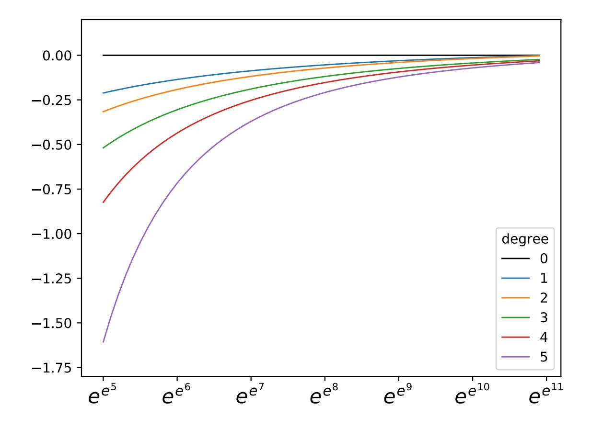
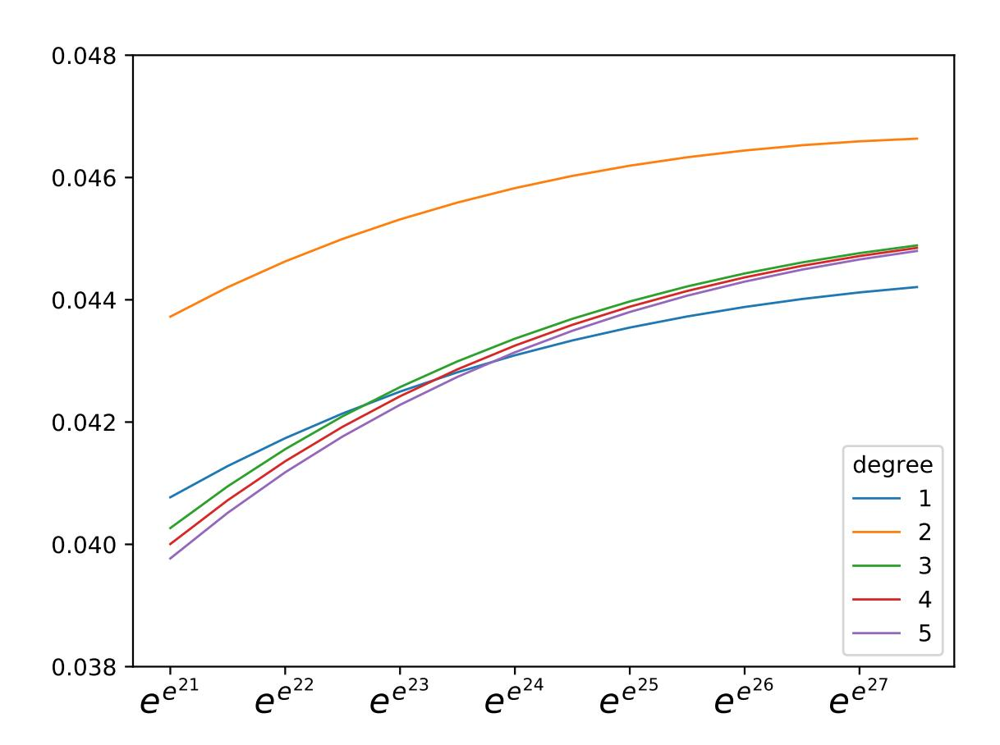
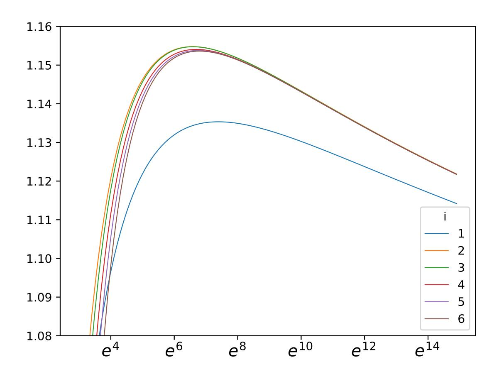

{0}------------------------------------------------

# Refined Analysis of the Asymptotic Complexity of the Number Field Sieve

Aude Le Gluher1,\*, Pierre-Jean Spaenlehauer1, Emmanuel Thomé1

1 Université de Lorraine, CNRS, Inria, LORIA, F-54000 Nancy, France

Received: | Revised: | Accepted:

**Abstract** The classical heuristic complexity of the Number Field Sieve (NFS) involves an unknown function, usually noted o(1) and called  $\xi(N)$  throughout this paper, which tends to zero as the entry N grows. The aim of this paper is to find optimal asymptotic choices of the parameters of NFS as N grows, in order to minimize its heuristic asymptotic computational cost. This amounts to minimizing a function of the parameters of NFS bound together by a non-linear constraint. We provide precise asymptotic estimates of the minimizers of this optimization problem, which yield refined formulas for the asymptotic complexity of NFS. One of the main outcomes of this analysis is that  $\xi(N)$  has a very slow rate of convergence: We prove that it is equivalent to  $4\log\log\log N/(3\log\log N)$ . Moreover,  $\xi(N)$  has an unpredictable behavior for practical estimates of the complexity. Indeed, we provide an asymptotic series expansion of  $\xi$  and numerical experiments indicate that this series starts converging only for  $N > \exp(\exp(25))$ , far beyond the practical range of NFS. This raises doubts on the relevance of NFS running time estimates that are based on setting  $\xi = 0$  in the asymptotic formula.

**Keywords:** Complexity, Asymptotic optimization, Number Field Sieve.

**2010 Mathematics Subject Classification:** 68W40 (Analysis of algorithms), 11Y05 (Factorization).

# 1 INTRODUCTION

Factoring integers and solving discrete logarithms in finite fields are two fundamental problems in computational number theory, which are core routines for a very large range of applications. Perhaps their most prominent and critical use is the fact that the security of many currently deployed cryptosystems — e.g. RSA, finite field Diffie-Hellman, ElGamal — relies directly on their computational difficulty. This explains why the development of algorithms for solving these two problems and the analysis of their complexity are central topics in computational mathematics.

To this day, the Number Field Sieve (NFS) is the most efficient method to factor integers and to compute discrete logarithms in prime finite fields. It is an active research area, and implementations of NFS have led to several record computations which give a good idea of the computational power required to factor RSA moduli up to  $2^{800}$ , or to compute discrete logarithms in prime fields of the same size [4]. Existing software can also be used to form reasonable estimates of the hardness of these problems, up to roughly 1024 bits.

Another approach to estimate the computational power needed is to use a theoretical cost analysis of NFS. The asymptotic complexity of the usual variant of NFS to factor an integer *N*, under various heuristic assumptions, is known to be

$$\exp\left(\sqrt[3]{\frac{64}{9}}(\log N)^{1/3}(\log\log N)^{2/3}(1+\xi(N))\right) \tag{1}$$

where  $\xi(N) \in o(1)$  as N grows. This asymptotic formula is obtained by solving an optimization problem, which involves a number-theoretic function related to the notion of smoothness:

**Definition 1.** Let  $x \ge 1$  and  $y \ge 1$  be two real numbers. An integer in [1, x] is y-smooth if all of its prime factors are below y. We let

$$\Psi(x, y) = \#\{integers\ in\ [1, x]\ that\ are\ y\text{-smooth}\}.$$

In particular,  $\Psi(x, y)/x$  is the probability that a uniformly random integer in [1, x] is y-smooth. For convenience, we also use the notation  $p(u, v) = \log (\Psi(e^u, e^v)/e^u)$ .

Unfortunately, the complexity given by Formula (1) is not very satisfactory. First, it relies on several heuristics, most notably on the fact that norms of random ideals in a given number field have the same smoothness probability as random integers of the same order of magnitude. A second point is that even if we consider that these assumptions hold, the complexity given by Formula (1) involves a function  $\xi$  which is never spelled out explicitly.

\*Corresponding Author: aude.le-gluher@loria.fr

{1}------------------------------------------------

This inaccuracy conflicts with the fact that for the last few decades, the widespread development of public-key cryptography has created a pressing need to answer the following question: Given some computational power C, what size of RSA modulus N should be considered so that the cost of NFS exceeds C? This is of interest, for example, to regulatory bodies, see for example [17, Sec. 7.5], [1, Sec. B.2.2], or [11, Table 3.1]. A common way to answer this is to consider the complexity formula, assume that  $\xi = 0$  since we know  $\xi(N) \in o(1)$  when N grows, and use a computational record to set a proportionality ratio. Since the 2000s, the validity of this approach has been considered differently. In [15, §2.4.4], the reader is warned that  $\xi$  should not be neglected for large extrapolations, and omitting it probably yields biased estimations. Later work gradually moved to considering  $\xi = 0$  as a totally acceptable simplification assumption, not heeding the warning. We emphasize that this method for computing key sizes is the international standard for deployed RSA-based cryptography.

The goal of this paper is to question the relevance of neglecting  $\xi$  and to give insights on what this function hides. In particular, assuming the standard heuristics for the complexity of NFS, we show (Thm. 17) that

$$\xi(N) = \frac{4\log\log\log N}{3\log\log N} + \frac{-2\log 2 + \log 3/6 - 2}{\log\log N}(1 + o(1)).$$

This asymptotic expansion of  $\xi$  can be extended to a bivariate series expansion evaluated at logloglog N/loglog N and  $1/\log\log N$ . We provide algorithms — together with publicly available implementations in SageMath — with which we were able to compute more than a hundred of terms of this asymptotic expansion. This may sound like good news for practical formula-based keysize computations, as it seems that this would provide more precise estimates. In fact, the contrary happens: We observe experimentally that values of N that would be useful for cryptography are far too small compared to the radius of convergence at infinity of the series involved in the expansion of  $\xi$ . Said otherwise, this means that the exponent in the classical formula used for estimating practical RSA key sizes is the first term of a divergent series. In order to illustrate this phenomenon, let us consider the following example functions:

$$g_0: N \mapsto \exp\left((\log N)^{1/3}(\log\log N)^{2/3}\right); \quad g: N \mapsto \exp\left(\frac{(\log N)^{1/3}(\log\log N)^{2/3}}{1 + 20/\log\log N}\right).$$

While it is true that g belongs to the class  $\exp((\log N)^{1/3}(\log\log N)^{2/3}(1+o(1)))$ , the radius of convergence of  $1/(1+x)=\sum_i (-x)^i$  is 1. This implies that if  $N\leq \exp(\exp(20))\approx 2^{699945421}$ , then equalling o(1) with 0 means estimating the exponent of the function g by evaluating the first term of a divergent series. Numerical computations show that  $g(2^{2048})\approx 2^{16}$ , while  $g_0(2^{2048})\approx 2^{61}$ , so estimating o(1) by 0 in the case  $N=2^{2048}$  yields completely erroneous results. If one were to compare "projected values" between  $N=2^{512}$  and  $N=2^{2048}$  based on the simplification o(1)=0, the corresponding calculation would yield  $g_0(2^{2048})/g_0(2^{512})\approx 2^{28}$ , compared to  $g(2^{2048})/g(2^{512})\approx 2^9$ . Carelessly neglecting the o(1) term can lead to dramatic errors in the assessment of a complexity in the class given by Formula (1), and of its growth as N varies.

The asymptotic expansion of  $\xi$  that we obtain in the complexity of NFS exhibits a behavior similar to the example function g. This raises questions on the relevance of using the asymptotic formula for estimating practical cryptographic key lengths. In particular, we obtain completely different results for the final NFS complexity depending on how many terms we consider in our series expansion of  $\xi$ , see Figure 1. This asks — at the very least — for strong justification when one chooses to set  $\xi = 0$  in the complexity formula.

Beyond NFS, the complexity of several algorithms is linked to the asymptotics of smoothness probabilities. This is the case for example of the quadratic sieve and its variants, of class group computations in number fields, or of the elliptic curve factoring method. In all of these cases, the methods of this article apply, and yield similar conclusions; NFS is just an example.

#### **ORGANIZATION OF THE PAPER**

In Section 2, we briefly describe NFS and we state the optimization problem whose minimum is the complexity. Section 3 provides a refined asymptotic expansion of Dickman–De Bruijn function at infinity, which is used to estimate the smoothness probabilities in NFS. Then Section 4 is devoted to the series expansion of the function  $\xi$ . Finally, Section 5 reports on experimental results obtained by using the refined asymptotic formulas for the complexity.

#### **IMPLEMENTATION**

The computation of the asymptotic expansion of  $\xi$  relies on three algorithms described in Section 4.3. Our implementation in SageMath of these algorithms is available at the following URL

https://gitlab.inria.fr/NFS\_asymptotic\_complexity/simulations.

{2}------------------------------------------------

At the same location, we also detail some of the unilluminating technical calculations that are omitted for brevity in the text.

#### **NOTATIONS AND CONVENTIONS**

Throughout the article,  $\log x$  denotes the natural logarithm to base e. We use the notation  $\log_m$  to denote the m-th iterate of the log function, so that  $\log_{m+1} = \log \circ \log_m$ . The notation  $u = \Theta(v)$  denotes: (u = O(v)) and v = O(u). Throughout the paper, we assume a RAM computation model, where the cost of memory accesses is neglected.

### 2 BACKGROUND ON NFS

In a nutshell, NFS defines two irreducible integer polynomials  $f_0$  and  $f_1$ , and searches for integer pairs (u, v) in a search space  $\mathcal{A}$  such that the integers  $\operatorname{Res}_x(u-vx,f_0(x))$  and  $\operatorname{Res}_x(u-vx,f_1(x))$  are smooth with respect to chosen smoothness bounds  $B_0$  and  $B_1$ , where  $\operatorname{Res}_x$  denotes the resultant with respect to x. The notations  $K_i$  for i=0,1 denote the number fields  $\mathbb{Q}[x]/f_i(x)$ . The number of smooth pairs that must be collected must be at least  $(\pi_{K_0}(B_0) + \pi_{K_1}(B_1))$ , which is the number of prime ideals with norm at most  $B_0$  and  $B_1$  in the rings of integers of  $K_0$  and  $K_1$ . A linear algebra calculation follows, and its dimension is again  $(\pi_{K_0}(B_0) + \pi_{K_1}(B_1))$ . These two steps of the algorithm are the most costly.

In order to analyze the algorithm, we consider a simplified version, which has of course little to do with computational feats that use the Number Field Sieve [4]. In particular, we consider the straightforward "base-m" polynomial selection. For a chosen degree d, we set  $m = \lceil N^{1/(d+1)} \rceil$ ,  $f_0 = x - m$ , and  $f_1$  of degree d such that  $f_1(m) = N$  and  $||f_1||_{\infty} < m$ . We have  $K_0 = \mathbb{Q}$ , and  $K_1$  is a degree d number field. Side 0 is therefore called the rational side, and side 1 is called the algebraic side. We assume that the smoothness bounds  $B_0$  and  $B_1$  can be chosen equal to the same bound B without increasing the overall asymptotic complexity. Letting  $B_0$  and  $B_1$  have distinct values would add an extra layer of technicality to the analysis, but we acknowledge that it would be interesting to investigate the general case in future work. In our simplified NFS algorithm, we pick the pairs (u, v) from a set  $\mathcal{A} = [-A, A]^2$ , for some bound A. The integers that we check for smoothness in NFS are bounded by  $M_0$  and  $M_1$ , which we define as follows

$$|\operatorname{Res}_{x}(u - vx, f_{0}(x))| \le M_{0} = (m+1)A,$$
  
and  $|\operatorname{Res}_{x}(u - vx, f_{1}(x))| \le M_{1} = (d+1)mA^{d}.$ 

It is important to point out the heuristic nature of the estimate given by Formula (1), which is related to the estimation of the probabilities of smoothness.

**Heuristic assumption 2.** In the Number Field Sieve algorithm, the probability that the two integers  $\operatorname{Res}_{x}(u-vx,f_{0})$  and  $\operatorname{Res}_{x}(u-vx,f_{1})$  are simultaneously B-smooth, as (u,v) are picked uniformly from the search space  $\mathcal{A}$ , is given by the probability that two random integers of the same size are B-smooth, which is  $\frac{\Psi(M_{0},B)}{M_{0}} \cdot \frac{\Psi(M_{1},B)}{M_{1}}$ .

This assumption is very bold, and in fact wrong in several ways. Correcting terms, which are actually used in practice, can be used to lessen the gap between  $\operatorname{Res}_x(u-vx,f_0)$  and integers of the same size [16, 2]. However, this heuristic is not that wrong asymptotically, as evidenced by [12, Eq. (1.21)]. We also note that if the number field is a random variable, positive results do exist [14].

Our goal is not to get rid of this heuristic assumption. The usual complexity analysis of NFS already uses it as a base and we will do the same to improve on the asymptotic estimate in Formula (1).

Our simplified version of NFS has three main parameters that we can tune, as functions of  $\log N$ , in order to optimize the asymptotic complexity: the degree  $d = \deg f_1$ , and the bounds A and B. The time complexity of NFS is then the sum of the time taken by the search for smooth pairs and the time taken by linear algebra. We write these as

$$C_{\text{search}} = A^2 \cdot C_{\text{test}},$$

$$C_{\text{linear algebra}} = (\pi_{K_0}(B) + \pi_{K_1}(B))^2 (1 + o(1)).$$

In the expressions above,  $C_{\text{test}}$  is the time spent per pair (u, v). Several techniques can be used to bring  $C_{\text{test}}$  to an amortized cost of O(1); sieving is the most popular, but ECM-testing also works (heuristically), and it is also possible to detect smooth values with product trees as in [3]. Furthermore, we counted a quadratic cost for linear algebra, as this can be carried out with sparse linear algebra algorithms such as [18]. We wish to minimize the cost, subject to one constraint: We need enough smooth pairs, as we mentioned in the first paragraph of this section.

$$A^2 \cdot \frac{\Psi(M_0, B)}{M_0} \cdot \frac{\Psi(M_1, B)}{M_1} \ge \pi_{K_0}(B) + \pi_{K_1}(B).$$

{3}------------------------------------------------

Of course, we can assume that this is an equality, since otherwise decreasing A would decrease the complexity. We are looking for expressions for d, A, and B that are functions of  $v = \log N$ . Let now  $a(v) = \log A(v)$  and  $b(v) = \log B(v)$ . Note that all functions are expected to tend to infinity as  $v = \log N$  tends to infinity and that  $\log(\pi_{K_0}(B(v))) = b(v)(1 + o(1))$  and  $\log(\pi_{K_1}(B(v))) = b(v)(1 + o(1))$  by Chebotarev's density theorem. We have

$$\log C_{\text{search}} = O(1) + 2a(v),$$

$$\log C_{\text{linear algebra}} = O(1) + \log \left( (\pi_{K_0}(B(v)) + \pi_{K_1}(B(v)))^2 \right)$$

$$= O(1) + 2b(v),$$

$$\log(C_{\text{search}} + C_{\text{linear algebra}}) = O(1) + \log \max(C_{\text{search}}, C_{\text{linear algebra}})$$

$$= O(1) + 2\max(b(v), a(v)).$$

Likewise, the constraint on the probabilities can be rewritten, using the notation p(u, v) from Definition 1:

$$2a(v) + \sum_{i \in \{0,1\}} p(\log M_i, b) = \log(\pi_{K_0}(B(v)) + \pi_{K_1}(B(v)))$$
$$= \log(2(1 + o(1))B(v))$$
$$= O(1) + b(v).$$

Given the inaccuracy that exists in Formula (1), we can profit from some simplifications before we formulate our optimization problem. In light of this, it is sufficient to minimize the function  $\max(a(v), b(v))$ , as this would imply a cost that would be at most within a constant factor of the optimal. Likewise, the O(1) in the constraint can be dropped. Using this latter argument, we can also take into account only the important parts of the bounds  $M_0$  and  $M_1$ , namely  $M_0$  and  $M_1$ , namely  $M_0$  and  $M_1$ , namely  $M_0$  and  $M_1$ , namely  $M_0$  and  $M_1$ , namely  $M_0$  and  $M_1$ , namely  $M_1$  and  $M_2$ . Our optimization problem is therefore rewritten as the following simplified problem, which is our main target here as well as in Section 4.

**Problem 3** (Simplified optimization problem). Find three functions,

$$a(v), b(v), d(v) : \mathbb{R}_{>0} \to \mathbb{R}_{>0}$$

which for all  $v \in \mathbb{R}_{>0}$  minimize  $\max(a(v), b(v))$  subject to the constraint

$$p(a+v/d,b) + p(da+v/d,b) + 2a - b = 0.$$
(2)

To deal with the optimization problem, the usual analysis of NFS relies on the following result.

**Proposition 4** (Canfield-Erdős-Pomerance [6] and De Bruijn [9]). Let  $\varepsilon \in ]0, 1[$ . If  $3 \le x/y \le (1 - \varepsilon)x/\log x$  then,  $as x/y \to +\infty$ :

$$p(x, y) = -(x/y) \cdot \log(x/y) \cdot (1 + o(1)).$$

Using this low-order result, the analysis is completely classical, and yields the following well-known expressions, see e.g. [5, §11]:

**Proposition 5.** Let (a, b, d) be a minimizer for Problem 3. Then

$$a(v) = (8/9)^{1/3} v^{1/3} (\log v)^{2/3} (1 + o(1)),$$
  

$$b(v) = (8/9)^{1/3} v^{1/3} (\log v)^{2/3} (1 + o(1)),$$
  

$$d(v) = (3v/\log v)^{1/3} (1 + o(1)).$$

Furthermore,

$$(a(v) + v/d(v))/b(v) = \frac{1}{2} (3v/\log v)^{1/3} (1 + o(1)),$$
  
$$(d(v)a(v) + v/d(v))/b(v) = \frac{3}{2} (3v/\log v)^{1/3} (1 + o(1)).$$

{4}------------------------------------------------

## **3 SMOOTHNESS**

In the following paragraphs we will encounter multiple times two functions, which we denote by  $X: \eta \mapsto \log_2 \eta/\log \eta$  and  $\mathcal{Y}: \eta \mapsto 1/\log \eta$ .

The notation  $\mathbb{R}[[X,Y]]$  is used for bivariate formal series with real coefficients, and for  $\mathbf{S} \in \mathbb{R}[[X,Y]]$  and  $i \in \mathbb{Z}_{\geq 0}$ , the notation  $\mathbf{S}^{(i)}$  stands for the truncation of  $\mathbf{S}$  to total degree less than or equal to i.

We introduce the following class of functions, to capture the asymptotic behavior of several functions of interest at infinity.

**Definition 6.** The class of functions C is the set of functions f defined over a neighborhood of  $+\infty$  with values in  $\mathbb{R}$  such that

$$\exists \mathbf{F} \in \mathbb{R}[[X,Y]], \ \forall n \in \mathbb{Z}_{\geq 0}, f(\eta) = \mathbf{F}^{(n)}(X,Y) + o(Y^n).$$

We say that  $\mathbf{F}$  is the series associated to f.

An important property of C that we will use intensively in Section 4 is that if  $f \in C$  and its associated series  $\mathbf{F}$  satisfies  $\mathbf{F}(0,0) \neq 0$  then 1/f stays in C. If moreover  $\mathbf{F}(0,0)$  is positive then  $\log f$  is also in C.

Definition 6 deserves several comments. First, the map from  $f \in C$  to its associated series  $\mathbf{F}$  is clearly not injective, since for example the function  $1/\eta$  is in C, and its associated series is zero. It is also important to notice that the truncation  $\mathbf{F}^{(n)}$  that appears in Definition 6 is necessary, as the *evaluation* of  $\mathbf{F}$  at a given value need not make sense: the series  $\mathbf{F}$  is only intended to capture the asymptotic behavior of the function f at infinity.

#### 3.1 SMOOTHNESS RESULTS

The precision of an asymptotic expansion of the NFS complexity is tightly connected to the precision in results regarding smoothness probabilities. Canfield, Erdős and Pomerance actually prove a better result than Proposition 4.

**Theorem 7** (Canfield, Erdős and Pomerance [6]). For all  $x \ge 1$  and for all  $u = x/y \ge 3$ , we have

$$p(x, y) \ge -u \log u \cdot p(u),$$

where 
$$p(u) = 1 + \mathcal{X}(u) - \mathcal{Y}(u) + \mathcal{X}(u)\mathcal{Y}(u) - \mathcal{Y}(u)^2 + O\left(\mathcal{X}(u)^2\mathcal{Y}(u)\right)$$
.

In fact, it turns out that Theorem 7 is at the same time too strong and too weak for our purposes. On the one hand, it is too bad that the asymptotic expansion of the right-hand side of the inequality stops at some point. On the other hand it is a really strong result since it is true for basically all x, u without any restriction. But in the NFS context, we know the magnitudes of x, u: We do not need a smoothness result that would be unconditionally true. A better approximation of the smoothness probability in a narrower range would suit us. Hildebrand proves such a result.

**Theorem 8** (Hildebrand [13]). Let  $\varepsilon > 0$ . For  $1 \le u \le \exp((\log y)^{3/5-\varepsilon})$  and  $x = y^u$ , we have

$$\frac{\Psi(x,y)}{x} = \rho(u) \left( 1 + O\left(\frac{\log(u+1)}{\log y}\right) \right),\,$$

where  $\rho$  is the Dickman–de Bruijn function.

Under the Riemann hypothesis this result even holds in a wider range [13, p. 290]. In the NFS context we are in the appropriate range to apply Theorem 8. Indeed, based on Proposition 5, we expect to use Theorem 8 in a context where  $\log y = b = \Theta(v^{1/3}(\log v)^{2/3})$  and  $u = \Theta((v/\log v)^{1/3})$ : u is polynomial in  $\log y$ , while the bound in Theorem 8 is subexponential.

Asymptotically, the result of Theorem 8 is therefore very precise. This leads us to study more precisely the expansion of  $\rho$ .

#### 3.2 ASYMPTOTIC EXPANSION OF THE DICKMAN-DE BRUIJN FUNCTION

In [10], De Bruijn proves the following formula:

$$\rho(u) \underset{u \to +\infty}{\sim} \frac{e^{\gamma}}{\sqrt{2\pi u}} \times \exp\left(-\int_0^{\xi} \frac{se^s - e^s + 1}{s} ds\right)$$

&lt;sup>1In fact (but we will not need this), it is easy to extend Borel's lemma to show that the link from C to  $\mathbf{F}$  is surjective: Any series  $\sum_{i,j} a_{i,j} X^i Y^j$ , regardless of any notion of convergence, can be realized as the asymptotic expansion of a function in C written as  $f(x) = \sum_{i,j} a_{i,j} \tau_{i+j}(x) X^i \mathcal{Y}^j$  where  $\tau_n$  is a smooth transition function from 0 to 1 whose transition point is adjusted as a function of  $\sum_{i+j=n} |a_{i,j}|$ .

{5}------------------------------------------------

for all u > 1 and  $\xi = (e^u - 1)/u$ . Let  $\eta = (e^s - 1)/s$ , so that  $s = \log(1 + s\eta)$ . By substitution we have:

$$\int_0^{\xi} \frac{se^s - e^s + 1}{s} ds = \int_1^u s d\eta.$$

Let us study the integral on the right-hand side. First, we need to know more about s.

**Proposition 9.** The function  $\eta \to s(\eta)/\log \eta$  is in C.

*Proof.* We prove by induction on n that there exists  $P_n \in \mathbb{R}[X,Y]$  such that, as  $\eta \to +\infty$ , we have  $s = \log \eta \cdot (P_n(X,\mathcal{Y}) + o(\mathcal{Y}^n))$ . First we show that  $s = (\log \eta)(1 + o(1))$  when  $\eta \to +\infty$ , which is to say  $P_0 = 1$ . Indeed  $\varphi : s \mapsto (e^s - 1)/s$  is bijective on  $\mathbb{R}_{>0}$  and strictly increasing, and so is  $\varphi^{-1}$ . Since  $\varphi(\log \eta) = (\eta - 1)/\log \eta < \eta = \varphi(s)$ , we have  $\log \eta < s$ . Let now  $\varepsilon > 0$ . When  $\eta$  is large enough, we have  $\eta^{1+\varepsilon} > (1+\varepsilon)\eta \log \eta + 1$ . This leads to  $\varphi(s) < \varphi((1+\varepsilon)\log \eta)$ , hence to  $s < (1+\varepsilon)\log \eta$  and proves the base case.

We now proceed with the induction step. Since  $s = \log(1 + s\eta)$ , we may write

$$s = \log s + \log \eta + \log(1 + 1/(s\eta))$$

$$= \log \eta \cdot (1 + \log s/\log \eta + o(1/\eta))$$

$$= \log \eta \cdot \left(1 + \mathcal{X} + \mathcal{Y} \cdot \log P_n(\mathcal{X}, \mathcal{Y}) + o(\mathcal{Y}^{n+1})\right),$$

where the last expression omits some terms that are swallowed by  $o(\mathcal{Y}^{n+1})$ . Since the constant coefficient of  $P_n$  is 1, an expansion of the inner logarithm above to n terms gives the desired result. More precisely, it is easy to verify that  $P_{n+1}$  is the truncation to total degree at most n+1 of

$$1 + X - Y \sum_{i=1}^{n} (-1)^{i} \frac{(P_{n} - 1)^{i}}{i}.$$

In fact, a more explicit version of the series associated to  $s(\eta)/\log \eta$  can be computed:

**Proposition 10.** Letting **P** denote the series associated to  $s(\eta)/\log \eta$ , we have

$$\mathbf{P}(X,Y) = 1 + X + Y \cdot \sum_{i=1}^{+\infty} \sum_{j=1}^{i} \frac{S(i,i-j+1)}{j!} X^{j} Y^{i-j}$$

where the S(i, j) are signed Stirling numbers of the first kind.

*Proof.* By [7] (see also [8, Sec. 5, Exercise 22]), the reciprocal g(y) of  $f: x \mapsto e^x/x$  has the following asymptotic series expansion at the neighborhood of  $\infty$ :

$$\log y + \log_2 y + \sum_{i=1}^{+\infty} \sum_{j=1}^{i} \frac{S(i, i-j+1)}{j!} \frac{(\log_2 y)^j}{(\log y)^i}.$$

By definition, s(y) is the reciprocal of the function  $h: x \mapsto e^x/x - 1/x$ . We will show that  $s(y) - g(y) \sim (y \log y)^{-1}$  as  $y \to +\infty$ . This will conclude our proof since it will ensure that for all  $n \in \mathbb{Z}_{\geq 0}$ ,

$$s(y) = \log y + \log_2 y + \sum_{i=1}^n \sum_{j=1}^i \frac{S(i, i-j+1)}{j!} \frac{(\log_2 y)^j}{(\log y)^i} + o\left(\frac{1}{(\log y)^n}\right)$$

as y grows.

First, using the fact that  $h(s(y)) = e^{s(y)}y^{-1} - s(y)^{-1} = y$ , we get that  $f(s(y)) - f(g(y)) = e^{s(y)}s(y)^{-1} - y = s(y)^{-1}$ . By the mean value theorem, there exists  $\theta_y$  between g(y) and s(y) such that  $s(y)^{-1} = f(s(y)) - f(g(y)) = f'(\theta_y)(s(y) - g(y))$ . Since  $s(y) = \log y + \log_2 y + o(1)$  and  $g(y) = \log y + \log_2 y + o(1)$ , we deduce that  $\theta_y = \log y + \log_2 y + o(1)$  when  $y \to +\infty$ , hence  $f'(\theta_y) \sim y$ . Consequently,  $s(y) - g(y) \sim (ys(y))^{-1} \sim (y \log y)^{-1}$ .  $\square$ 

**Proposition 11.** The series

$$\sum_{i=1}^{+\infty} \sum_{j=1}^{i} \frac{S(i, i-j+1)}{j!} \chi^{j} \mathcal{Y}^{i-j}$$

converges uniformly for  $\eta \in [176, +\infty[$ .

{6}------------------------------------------------

*Proof.* First, for all  $k \in \mathbb{Z}_{\geq 0}$  and all  $\eta > e^e$  we have  $\mathcal{Y} \leq \mathcal{X}$ , so that

$$\sum_{i=1}^{k} \sum_{j=1}^{i} \frac{s(i, i-j+1)}{j!} \mathcal{X}^{j} \mathcal{Y}^{i-j} \leq \sum_{i=1}^{k} \sum_{j=1}^{i} \frac{s(i, i-j+1)}{j!} \mathcal{X}^{i} = \sum_{i=1}^{k} c_{i} \mathcal{X}^{i}$$

where  $c_i = \sum_{j=1}^i \frac{s(i,i-j+1)}{j!}$ . Let  $a_i = i! \sum_{j=1}^i \left| \frac{s(i,i-j+1)}{j!} \right|$ . According to the asymptotic formula for the sequence A138013 of the OEIS2, we have, as  $i \to +\infty$ :

$$a_i \sim \sqrt{-1 - W(-1, -e^{-2})} \times (-W(-1, -e^{-2}))^i \times i^{i-1}/e^i$$

where W is the Lambert W function, so that

$$\frac{a_i/i!}{a_{i+1}/(i+1)!} \xrightarrow[i \to \infty]{} \frac{1}{-W(-1, -e^{-2})}.$$

This shows that the power series with coefficients  $a_i/i!$  has a finite radius of convergence equal to  $-1/W(-1, -e^{-2})$ . Since  $|c_i| \le a_i/i!$ , the power series  $\sum c_i X^i$  also has finite radius of convergence, which is at most as large as the former. Therefore the series converges uniformly for  $\frac{\log_2 \eta}{\log \eta} \le -1/W(-1, -e^{-2})$ , and this inequality is satisfied for  $\eta \ge 176$ .

We now shift gears and study the asymptotic behavior of  $\int_1^u s d\eta$  as u grows. The first step towards this goal lies in the following proposition.

**Proposition 12.** The function  $u \to \frac{1}{u \log u} \cdot \int_e^u s d\eta$  is in C, and the coefficients of its associated series  $\mathbf{Q}$  can be computed explicitly.

*Proof.* We prove that for all  $n \in \mathbb{Z}_{\geq 0}$ , there is a polynomial  $Q_n$  such that, as  $u \to +\infty$ :

$$\int_{e}^{u} s d\eta = u \log u \cdot (Q_n (X(u), \mathcal{Y}(u))) + o (\mathcal{Y}(u)^n)),$$

and that for all  $i, j \ge 0$ ,  $Q_i(X, Y) \equiv Q_j(X, Y) \mod \langle X, Y \rangle^{\min(i, j)}$ . We emphasize that our proof provides an explicit method to compute  $Q_n$ .

Let us first notice that since we are looking for an asymptotic expansion of a divergent integral as  $u \to \infty$ , up to terms that also tend to infinity, we are free to choose the lower bound of the integral.

Let  $\Delta$  be the  $\mathbb{R}$ -linear operator defined on  $\mathbb{R}[X,Y]$  by  $\Delta 1=0$ ,  $\Delta X=Y\cdot (Y-X)$ ,  $\Delta Y=-Y^2$ , and  $\Delta(UV)=U\Delta V+(\Delta U)V$ . One can check that:

$$\forall T \in \mathbb{R}[X,Y], \ \frac{\mathrm{d}}{\mathrm{d}n}T(X,\mathcal{Y}) = \frac{1}{n} \cdot (\Delta T)(X,\mathcal{Y}).$$

Notice that  $\Delta \mathbb{R}[X,Y] \subset Y \mathbb{R}[X,Y]$ .

We use the properties of  $\Delta$  to prove an intermediate result. Let T be an arbitrary bivariate polynomial in  $\mathbb{R}[X,Y]$ . Using the above notation, repeated integration by parts yields:

$$\int_{e}^{u} T(X, \mathcal{Y}) d\eta = [\eta T(X, \mathcal{Y})]_{e}^{u} - \int_{e}^{u} (\Delta T)(X, \mathcal{Y}) d\eta$$

$$= \sum_{i=0}^{n-1} (-1)^{i} [\eta \cdot (\Delta^{i} T)(X, \mathcal{Y})]_{e}^{u} + (-1)^{n} \int_{e}^{u} (\Delta^{n} T)(X, \mathcal{Y}) d\eta$$

$$= [\eta \cdot R(X, \mathcal{Y})]_{e}^{u} + \int_{e}^{u} o(\mathcal{Y}^{n-1}) d\eta$$

for  $R = \sum_{i=0}^{n-1} (-1)^i \Delta^i T \in \mathbb{R}[X, Y]$ . Note that R is a truncation of  $(1 + \Delta)^{-1} T$ .

This allows us to quickly conclude. Indeed, using Proposition 9, for all  $n \in \mathbb{Z}_{\geq 0}$ :

$$\int_{e}^{u} s d\eta = \left[ (\eta \log \eta - \eta) \mathbf{P}^{(n)}(X, \mathcal{Y}) \right]_{e}^{u} +$$

$$\int_{e}^{u} (1 - \log \eta) \Delta(\mathbf{P}^{(n)})(X, \mathcal{Y}) d\eta + \int_{e}^{u} o(\mathcal{Y}^{n-1}) d\eta.$$

&lt;sup>2https://oeis.org/A138013

{7}------------------------------------------------

Since  $(1 - \log \eta)\Delta(\mathbf{P}^{(n)})(X, \mathcal{Y})$  can be written as  $T_n(X, \mathcal{Y})$  for some  $T_n \in \mathbb{R}[X, Y]$ , the previous result shows that there exists  $R_n \in \mathbb{R}[X, Y]$  such that

$$\int_{e}^{u} s d\eta = \left[ \eta \log \eta \cdot (1 - \mathcal{Y}) \cdot \mathbf{P}^{(n)}(\mathcal{X}, \mathcal{Y}) \right]_{e}^{u} + \left[ \eta \cdot R_{n}(\mathcal{X}, \mathcal{Y}) \right]_{e}^{u} + \int_{e}^{u} o(\mathcal{Y}^{n-1}) d\eta.$$

The claimed expression, with  $Q_n = (1 - Y)\mathbf{P}^{(n)} + Y \cdot R_n$ , follows from the verification that  $\int_e^u o(1/(\log \eta)^{n-1}) d\eta = o(u/(\log u)^{n-1})$  as  $u \to +\infty$ , which is unilluminating but easy. Finally, we notice that for all  $i, j \ge 0$ ,  $R_i(X, Y) \equiv R_i(X, Y) \mod \langle X, Y \rangle^{\min(i,j)}$ , which implies that  $Q_i(X, Y) \equiv Q_i(X, Y) \mod \langle X, Y \rangle^{\min(i,j)}$ .

The series  $\mathbf{Q}$  has therefore the following expression, which makes it easy to compute  $\mathbf{Q}$  from  $\mathbf{P}$ .

$$\mathbf{Q} = (1 - Y)\mathbf{P} + Y(1 + \Delta)^{-1}(1 - Y^{-1})\Delta\mathbf{P}.$$

**Corollary 13.** We recall that **Q** is the series introduced in Proposition 12. For all  $n \in \mathbb{Z}_{\geq 0}$  we have, as  $u \to +\infty$ :

$$\rho(u) = \exp\left(-u\log u\left(\mathbf{Q}^{(n)}(\mathcal{X}(u),\mathcal{Y}(u)) + o\left(\mathcal{Y}(u)^n\right)\right)\right).$$

*Proof.* We use the equivalent of  $\rho$  introduced at the very beginning of the section. Constant offsets are absorbed in the error term that comes from the expansion of  $\int_{-\infty}^{u} s d\eta$ , and the result is a direct consequence of Proposition 12.

$$\rho(u) \underset{u \to +\infty}{\sim} \frac{e^{\gamma}}{\sqrt{2\pi u}} \times \exp\left(-\int_{1}^{u} s d\eta\right)$$

$$= \exp\left(-\int_{e}^{u} s d\eta + O(1)\right)$$

$$= \exp\left(-u \log u \cdot \left(\mathbf{Q}^{(n)}(X(u), \mathcal{Y}(u)) + o\left(\mathcal{Y}(u)^{n}\right)\right)\right).$$

**Corollary 14.** In the optimal parameter range of NFS, the asymptotic expansion of the smoothness probabilities follows from the previous result. For any  $n \in \mathbb{Z}_{\geq 0}$  we have, on both sides (rational and algebraic), as  $N \to +\infty$ :

$$\Psi(M_i, B)/B = \exp\left(-u \log u \left(\mathbf{Q}^{(n)}(X(u), \mathcal{Y}(u)) + o\left(\mathcal{Y}(u)^n\right)\right)\right),$$

where u denotes  $\log M_i/\log B$ , which is the size ratio on side  $i \in \{0, 1\}$ .

*Proof.* As we argued when justifying the use of Theorem 8, Proposition 5 tells us that the optimal parameter range of NFS leads to  $u = \Theta((v/\log v)^{1/3})$ , with  $v = \log N$  as in Section 2. It follows that  $b = \Theta(u \log u)$ , so that the right-hand side of Theorem 8 can be written as

$$\rho(u)\left(1+O\left(\frac{1}{u}\right)\right) = \rho(u)\exp\left(-u\log u \cdot O\left(\frac{1}{u^2\log u}\right)\right)$$
$$= \exp\left(-u\log u\left(\mathbf{Q}^{(n)}(\mathcal{X}(u),\mathcal{Y}(u)) + o\left(\mathcal{Y}(u)^n\right)\right)\right).$$

Put otherwise, a function within  $O\left(\frac{1}{\eta^2 \log \eta}\right)$  is always in C, and its associated series is zero.

# 3.3 COMPUTATION OF Q

Propositions 9 and 10 are completely explicit. In Proposition 12, the expression of  $\mathbf{Q}$  is straightforward to compute as well. For example, the terms of  $\mathbf{Q}$  up to degree 3, are:

$$\mathbf{Q}^{(3)}(X,Y) = 1 + X - Y + XY - Y^2 - \frac{X^2Y}{2} + 2XY^2 - 2Y^3.$$

# 4 ASYMPTOTIC EXPANSION OF $\xi$

This section is devoted to the analysis of the asymptotic behavior of the unknown function  $\xi$  involved in the heuristic complexity of NFS. To this end, we compute the asymptotic expansion of the unknown functions written o(1) in Prop. 5.

{8}------------------------------------------------

#### 4.1 EXTENSION OF THE CLASS ${\cal C}$

In order to express conveniently our results on the asymptotic expansion of the function  $\xi$ , we introduce a variant of the class C defined in Section 3.

**Definition 15.** Let  $\alpha, \beta \in \mathbb{R}$ . The class of functions  $C^{[\alpha,\beta]}$  is the set of functions f with values in  $\mathbb{R}$  such that  $v \mapsto v^{-\alpha}(\log v)^{-\beta} f(v)$  is in C.

In particular,  $C^{[0,0]} = C$ . If f is in  $C^{[\alpha,\beta]}$ , then we denote by  $\mathbf{F} \in \mathbb{R}[X,Y]$  the series associated to  $v \mapsto v^{-\alpha}(\log v)^{-\beta} f(v)$  and call it, by extension, the series associated to f. Note however that this extension deserves some caution, as the association makes sense only relative to a given  $(\alpha, \beta)$ .

The introduction of these classes  $C^{[\alpha,\beta]}$  is motivated by the fact that in the context of NFS, the function  $u \mapsto -\log \rho(u)$ , which gives the relevant smoothness probabilities, is in  $C^{[1,1]}$  (see Corollaries 13 and 14). The following proposition establishes stability properties for elements of the classes  $C^{[\alpha,\beta]}$ .

**Proposition 16.** Let  $f \in C^{[\alpha,\beta]}$  with associated series  $\mathbf{F} \in \mathbb{R}[[X,Y]]$  such that  $\alpha > 0$  and  $\mathbf{F}(0,0) > 0$ . Then

- 1.  $\log f \in C^{[0,1]}$  and its associated series is  $\alpha + \beta X/\alpha + (Y \log \mathbf{F})/\alpha$ ;
- 2.  $\mathcal{Y}(f) = (\log f)^{-1} \in C$  and its associated series is

$$Y/(\alpha + \beta X/\alpha + (Y \log \mathbf{F})/\alpha);$$

3. if  $\alpha > 0$ , then  $X(f) = \log_2 f / \log f \in C$  and its associated series is

$$(X + Y \log(\alpha + \beta X/\alpha + (Y \log \mathbf{F})/\alpha))/(\alpha + \beta X/\alpha + (Y \log \mathbf{F})/\alpha).$$

*Proof.* The result follows by direct computations.

#### 4.2 TWO NEW PROVEN TERMS FOR THE NFS COMPLEXITY

In this section we develop the functions of interest a, b, d, defined in Section 2. The end result of this section is an asymptotic expansion of the complexity of NFS with two new terms. We also introduce several reasonings that will be intensively used and automatized in Section 4.3.

**Theorem 17.** The minimizers a, b, d satisfy:

$$a = (8/9)^{1/3} v^{1/3} (\log v)^{2/3} (1 + a_{10}X(v) + a_{01}\mathcal{Y}(v) + o(\mathcal{Y}(v))),$$

$$b = (8/9)^{1/3} v^{1/3} (\log v)^{2/3} (1 + a_{10}X(v) + a_{01}\mathcal{Y}(v) + o(\mathcal{Y}(v))),$$

$$d = (3v/\log v)^{1/3} (1 + d_{10}X(v) + d_{01}\mathcal{Y}(v) + o(\mathcal{Y}(v))),$$

where 
$$a_{10} = 4/3$$
,  $a_{01} = -2 \log 2 + \log 3/6 - 2$ ,  $d_{10} = -2/3$  and  $d_{01} = \log 2 - 5 \log 3/6 + 1$ .

Before proving Thm. 17, we show that there exist functions a, b, d as in Thm. 17 which satisfy Eq. (2). They will serve as a baseline for our minimization problem. One could wonder where the constants  $a_{ij}$  and  $d_{ij}$  in the statement of Thm. 17, and also in the following lemma, come from. To obtain these constants, we used a computer algebra system to iteratively expand the constraint (2) and then we minimized the coefficients of the expansions of a, b, d by hand. In the rest of the section, we will always omit the argument  $\nu$  of the functions  $\mathcal{X}$  and  $\mathcal{Y}$ .

**Lemma 18.** There exist functions a, b, d which satisfy Eq. (2) and such that

$$a = (8/9)^{1/3} v^{1/3} (\log v)^{2/3} (1 + a_{10}X + a_{01}\mathcal{Y} + a_{20}X^2 + a_{11}X\mathcal{Y} + a_{02}\mathcal{Y}^2 + o(\mathcal{Y}^2))$$

$$b = (8/9)^{1/3} v^{1/3} (\log v)^{2/3} (1 + a_{10}X + a_{01}\mathcal{Y} + a_{20}X^2 + a_{11}X\mathcal{Y} + a_{02}\mathcal{Y}^2 + o(\mathcal{Y}^2))$$

$$d = (3v/\log v)^{1/3} (1 + d_{10}X + d_{01}\mathcal{Y} + o(\mathcal{Y})),$$

where

$$a_{10} = 4/3, \quad a_{01} = -2\log 2 + \log 3/6 - 2,$$

$$a_{20} = -4/9, \quad a_{11} = 4\log 2/3 - \log 3/9 + 4,$$

$$a_{02} = -(\log 2)^2 + (\log 2 \cdot \log 3)/6 - 7(\log 3)^2/36 - 6\log 2 + \log 3/2 - 5,$$

$$d_{10} = -2/3, \quad and \quad d_{01} = \log 2 - 5\log 3/6 + 1.$$

{9}------------------------------------------------

*Proof.* Set

$$a = (8/9)^{1/3} v^{1/3} (\log v)^{2/3} (1 + a_{10}X + a_{01}\mathcal{Y} + a_{20}X^2 + a_{11}X\mathcal{Y} + a_{02}\mathcal{Y}^2 + \widetilde{a}X^3)$$

$$b = (8/9)^{1/3} v^{1/3} (\log v)^{2/3} (1 + a_{10}X + a_{01}\mathcal{Y} + a_{20}X^2 + a_{11}X\mathcal{Y} + a_{02}\mathcal{Y}^2)$$

$$d = (3v/\log v)^{1/3} (1 + d_{10}X + d_{01}\mathcal{Y}),$$

where  $a_{10}$ ,  $a_{01}$ ,  $a_{20}$ ,  $a_{11}$ ,  $a_{02}$ ,  $d_{10}$ ,  $d_{01}$  are as in the lemma, and  $\tilde{a}$  is an unknown function of the variable  $\nu$ .

Given these expressions, we wish to rewrite Eq. (2) as a function of  $\tilde{a}$ . This is particularly tedious, but straightforward. The only needed tools are formulas in Prop. 16 over the function field  $\mathbb{R}(\tilde{a})$ . The code repository mentioned in the introduction of this article shows how the expansion can be carried out with a computer algebra system (and the same holds for other calculations in this section). We obtain that Eq. (2) with the functions set above can be rephrased as:

$$(\widetilde{a} - 32/81) = \varepsilon(\widetilde{a}, v),$$

for a continuous function  $\varepsilon$  such that for all  $t \in \mathbb{R}$ ,  $\lim_{v \to \infty} \varepsilon(t, v) = 0$ . Let now  $t_- = 31/81$  and  $t_+ = 33/81$ . Since  $\varepsilon(t_-, v)$  and  $\varepsilon(t_+, v)$  both tend to zero, we can define  $v_-$  and  $v_+$  such that

$$\forall v > v_-, (t_- - 32/81) - \varepsilon(t_-, v) < 0,$$
  
 $\forall v > v_+, (t_+ - 32/81) - \varepsilon(t_+, v) > 0.$ 

By the intermediate value theorem, we obtain that for any  $v > \max(v_-, v_+)$ , there exists  $t \in [t_-, t_+]$  such that  $(t - 32/81) = \varepsilon(t, v)$ . Let now  $\widetilde{a}$  be the function of v that returns such a number t. Then the functions a, b, and d defined above satisfy by construction the desired property.

*Proof of Theorem 17.* The roadmap of the proof is the following:

- 1. We express the constraint (2) using a sufficiently precise asymptotic expansion of the smoothness probability (given by Corollary 14) and the asymptotic expansions of a, b, d known so far. Then we prove that the o(1) involved in the asymptotic expansions of a, b, d are actually in the class  $O(X^{\lambda} \mathcal{Y}^{\mu})$  for some  $\lambda, \mu \geq 0$  (not both being zero) so that we can write these o(1) as  $C \cdot X^{\lambda} \mathcal{Y}^{\mu}$  where C is a function bounded at a neighbourhood of  $\infty$ .
- 2. We prove that C = c + o(1) where c is a constant computed along the way and restart the whole process using the more precise asymptotic expansions for a, b, d that we have just obtained in order to compute the next coefficients.

Step 1: By Proposition 5, minimizers can be written as

$$a = (8/9)^{1/3} v^{1/3} (\log v)^{2/3} (1 + \widetilde{a}),$$

$$b = (8/9)^{1/3} v^{1/3} (\log v)^{2/3} (1 + \widetilde{b}),$$

$$d = (3v/\log v)^{1/3} (1 + \widetilde{d}),$$

where  $\widetilde{a}$ ,  $\widetilde{b}$ ,  $\widetilde{d} = o(1)$ .

Direct computations and simplifications (that involve Taylor series expansions, Prop. 16, and the asymptotic expansion of the smoothness probability in Corollary 14) that take into account the fact that  $\tilde{a}$ ,  $\tilde{b}$ ,  $\tilde{d} = o(1)$  rephrase Eq. (2) as

$$\widetilde{a} = \frac{2}{3}\widetilde{b}^2 + \frac{1}{3}\widetilde{d}^2 + O(X).$$

The last equation shows that  $\widetilde{a}X^{-1}$  is bounded below by a finite constant. Moreover, Lemma 18 ensures the existence of functions  $a_0, b_0, d_0$  that can be used as substitutes for  $\widetilde{a}, \widetilde{b}, \widetilde{d}$  above, that satisfy the constraint (2), and such that  $\lim a_0X^{-1}$  exists and is finite. Since a, b, d are minimizers of Problem 3,  $\widetilde{a}X^{-1}$  is also upper bounded by  $a_0X^{-1}$ . Therefore,  $\widetilde{a} \in O(X)$ , whence the same also holds for  $\widetilde{b}^2$  and  $\widetilde{d}^2$ .

Replacing  $\widetilde{a}$ ,  $\widetilde{b}$ ,  $\widetilde{d}$  respectively by  $\overline{a}X$ ,  $\overline{b}X^{\frac{1}{2}}$ ,  $\overline{d}X^{\frac{1}{2}}$  for some functions  $\overline{a}$ ,  $\overline{b}$ ,  $\overline{d}$  bounded at a neighborhood of  $+\infty$  in Eq. (2), we obtain that

$$-\overline{a} + \frac{2}{3}\overline{b}^2 + \frac{1}{3}\overline{d}^2 + \frac{4}{3} = o(1),$$

which means in particular that  $\overline{a} \ge 4/3 + o(1)$ . By minimality of a we must also have  $\overline{a} \le 4/3 + o(1)$  so as not to contradict Lemma 18. So  $\overline{a} = 4/3 + o(1)$  and we must necessarily have  $\overline{b} = \overline{d} = o(1)$ . Therefore, we obtain

$$a = (8/9)^{1/3} v^{1/3} (\log v)^{2/3} (1 + 4X/3 + \widetilde{a}X),$$

$$b = (8/9)^{1/3} v^{1/3} (\log v)^{2/3} (1 + \widetilde{b}X^{\frac{1}{2}}),$$

$$d = (3v/\log v)^{1/3} (1 + \widetilde{d}X^{\frac{1}{2}}),$$

{10}------------------------------------------------

for some fresh functions  $\widetilde{a}$ ,  $\widetilde{b}$ ,  $\widetilde{d} = o(1)$ .

Step 2: We use the result obtained in Step 1 and the asymptotic expansion of the smoothness probability (Corollary 14) to deduce by direct computations the following equality enforced by Eq. (2):

$$\left(-\widetilde{a} + \frac{2}{3}\widetilde{b}^2 + \frac{1}{3}\widetilde{d}^2\right) \cdot X = O(\mathcal{Y}).$$

Following the same reasoning as in Step 1,  $\tilde{a}X\mathcal{Y}^{-1}$ ,  $\tilde{b}X^{\frac{1}{2}}\mathcal{Y}^{-\frac{1}{2}}$  and  $\tilde{d}X^{\frac{1}{2}}\mathcal{Y}^{-\frac{1}{2}}$  must be bounded at a neighborhood of  $+\infty$ . Replacing  $\tilde{a}$  (resp.  $\tilde{b}$ ,  $\tilde{d}$ ) by  $\bar{a}X^{-1}\mathcal{Y}$  (resp.  $\bar{b}X^{-\frac{1}{2}}\mathcal{Y}^{\frac{1}{2}}$  and  $\bar{d}X^{-\frac{1}{2}}\mathcal{Y}^{\frac{1}{2}}$ ) for some functions  $\bar{a}$ ,  $\bar{b}$ ,  $\bar{d}$  bounded at a neighborhood of  $+\infty$ , we obtain the following equality:

$$-\overline{a} + \frac{2\overline{b}^2}{3} + \frac{\overline{d}^2}{3} - 2\log 2 + \frac{\log 3}{6} - 2 = o(1).$$

By minimality and using our baseline result Lemma 18 as we did in Step 1, the equalities  $\overline{a} = -2 \log 2 + \log 3/6 - 2 + o(1)$ ,  $\overline{b} = o(1)$ , and  $\overline{d} = o(1)$  must hold, which means that:

$$a = (8/9)^{1/3} v^{1/3} (\log v)^{2/3} (1 + 4X/3 + (-2\log 2 + \log 3/6 - 2)\mathcal{Y} + \tilde{a}\mathcal{Y}),$$

$$b = (8/9)^{1/3} v^{1/3} (\log v)^{2/3} (1 + \tilde{b}\mathcal{Y}^{\frac{1}{2}}),$$

$$d = (3v/\log v)^{1/3} (1 + \tilde{d}\mathcal{Y}^{\frac{1}{2}}),$$

for some fresh functions  $\widetilde{a}$ ,  $\widetilde{b}$ ,  $\widetilde{d} = o(1)$ .

Step 3: Again we use the asymptotic expansion obtained in Step 2 to refine the asymptotic equality from Eq. (2) and obtain:

$$\left( \left( -2\log(2) + \frac{5\log(3)}{3} - 2 + o(1) \right) \widetilde{d} + \left( 8\log(2) - \frac{2\log(3)}{3} + 2 + o(1) \right) \widetilde{b} \right) \frac{\mathcal{Y}^{\frac{3}{2}}}{3} + \left( -\widetilde{a} + \frac{\widetilde{d}^{2}}{3} + \frac{2\widetilde{b}^{2}}{3} \right) \mathcal{Y} + \left( \frac{4\widetilde{d}}{9} - \frac{16\widetilde{b}}{9} \right) \mathcal{X} \mathcal{Y}^{\frac{1}{2}} = O(\mathcal{X}^{2}).$$

where o(1) are explicit expressions in  $\widetilde{a}$ ,  $\widetilde{b}$ ,  $\widetilde{d}$ , which we omit for brevity.

This can be rephrased as

$$\frac{1}{3} \underbrace{\left( \tilde{d} \mathcal{Y}^{\frac{1}{2}} + \frac{2}{3} \mathcal{X} + \left( -\log(2) + \frac{5\log(3)}{6} - 1 + o(1) \right) \mathcal{Y} \right)^{2} + }_{=\delta(\nu)}$$

$$\frac{2}{3} \underbrace{\left( \tilde{b} \mathcal{Y}^{\frac{1}{2}} - \frac{4}{3} \mathcal{X} + \left( 2\log(2) - \frac{\log(3)}{6} + \frac{1}{2} + o(1) \right) \mathcal{Y} \right)^{2} - \tilde{a} \mathcal{Y} = O(\mathcal{X}^{2}).}_{=\beta(\nu)}$$

We prove now that  $\beta(\nu) = O(X^2)$  and  $\delta(\nu) = O(X^2)$ . Assume by contradiction that this does not hold. Then  $\widetilde{a}(\nu)$  is positive asymptotically and it cannot belong to the class  $O(X^2)$ . This would contradict our upper bound for the minimum given in Lemma 18.

Consequently,  $\beta(\nu)$  and  $\delta(\nu)$  belong to  $O(X^2)$  and then so does  $\widetilde{a}\mathcal{Y}$ . This means that  $\widetilde{a} = O(X^2\mathcal{Y}^{-1})$  and  $\widetilde{b}$ ,  $\widetilde{d} = O(X\mathcal{Y}^{-\frac{1}{2}})$ . As usual we call  $\overline{a}$ ,  $\overline{b}$ ,  $\overline{d}$  the functions  $\widetilde{a}X^{-2}\mathcal{Y}$ ,  $\widetilde{b}X^{-1}\mathcal{Y}^{\frac{1}{2}}$  and  $\widetilde{d}X^{-1}\mathcal{Y}^{\frac{1}{2}}$  bounded at  $\infty$ , and we substitute in Eq. (2) to get

$$\left(-\overline{a} - \frac{4}{9}\right) + \frac{2}{3}\left(\overline{b} - \frac{4}{3}\right)^2 + \frac{1}{3}\left(\overline{d} + \frac{2}{3}\right)^2 = o(1). \tag{3}$$

Lemma 18 ensures that we must have  $\overline{a} \le -4/9 + o(1)$ , otherwise it would contradict the minimality of a. The equation above ensures that we must have  $\overline{a} \ge -4/9 + o(1)$  as well. So  $\overline{a} = -4/9 + o(1)$ , which implies that  $\overline{b} = 4/3 + o(1)$  and  $\overline{d} = -2/3 + o(1)$ . This third step of this proof gives:

$$a = (8/9)^{1/3} v^{1/3} (\log v)^{2/3} (1 + 4X/3 + (-2\log 2 + \log 3/6 - 2)\mathcal{Y} - 4X^2/9 + \tilde{a}X^2),$$

$$b = (8/9)^{1/3} v^{1/3} (\log v)^{2/3} (1 + 4X/3 + \tilde{b}X),$$

$$d = (3v/\log v)^{1/3} (1 - 2X/3 + \tilde{d}X),$$

{11}------------------------------------------------

for some fresh unknown functions  $\tilde{a}$ ,  $\tilde{b}$ ,  $\tilde{d} = o(1)$ .

Step 4: Substituting the asymptotic expansion obtained in Step 3 yields

$$\left(-\widetilde{a} + \frac{2\widetilde{b}^2}{3} + \frac{\widetilde{d}^2}{3}\right) \cdot \mathcal{X}^2 = O(\mathcal{X}\mathcal{Y}).$$

As in Step 1,  $\widetilde{a}$  must belong to  $O(X^{-1}\mathcal{Y})$  and  $\widetilde{b}$ ,  $\widetilde{d}$  to  $O(X^{-\frac{1}{2}}\mathcal{Y}^{\frac{1}{2}})$  so as not to contradict Lemma 18. Using the notations  $\overline{a}$ ,  $\overline{b}$ ,  $\overline{d}$  for the asymptotically bounded functions  $\widetilde{a}X\mathcal{Y}^{-1}$ ,  $\widetilde{b}X^{\frac{1}{2}}\mathcal{Y}^{-\frac{1}{2}}$  and  $\widetilde{d}X^{\frac{1}{2}}\mathcal{Y}^{-\frac{1}{2}}$ , we find by substitution in Eq. (2) that  $\overline{b} = o(1)$ ,  $\overline{d} = o(1)$  and  $\overline{a} = 4\log 2/3 - \log 3/9 + 4 + o(1)$ , *i.e.*,

$$a = (8/9)^{1/3} v^{1/3} (\log v)^{2/3} (1 + 4X/3 + (-2\log 2 + \log 3/6 - 2) \mathcal{Y}$$

$$-4X^{2}/9 + (4\log 2/3 - \log 3/9 + 4) \mathcal{X} \mathcal{Y} + \widetilde{a} \mathcal{X} \mathcal{Y}),$$

$$b = (8/9)^{1/3} v^{1/3} (\log v)^{2/3} (1 + 4X/3 + \widetilde{b} \mathcal{X}^{\frac{1}{2}} \mathcal{Y}^{\frac{1}{2}}),$$

$$d = (3v/\log v)^{1/3} (1 - 2X/3 + \widetilde{d} \mathcal{X}^{\frac{1}{2}} \mathcal{Y}^{\frac{1}{2}}),$$

for some fresh unknown functions  $\tilde{a}$ ,  $\tilde{b}$ ,  $\tilde{d} = o(1)$ .

Step 5: We expand the constraint for the last time and after a factorization that follows the pattern of Step 3 we get:

$$\frac{1}{3} \left( \widetilde{dX}^{\frac{1}{2}} + \left( -\log 2 + \frac{5\log 3}{6} - 1 \right) \mathcal{Y}^{\frac{1}{2}} \right)^2 \mathcal{Y} +$$

$$\frac{2}{3} \left( \widetilde{bX}^{\frac{1}{2}} + \left( 2\log 2 - \frac{\log 3}{6} + \frac{1}{2} \right) \mathcal{Y}^{\frac{1}{2}} \right)^2 \mathcal{Y} - \widetilde{aXY} = O(\mathcal{Y}^2).$$

Again, we must have  $\tilde{a} = O(X^{-1}\mathcal{Y})$  and  $\tilde{b}$ ,  $\tilde{d} = O(X^{-\frac{1}{2}}\mathcal{Y}^{\frac{1}{2}})$ , so as not to contradict Lemma 18. We also compute the associated limits for  $\tilde{b}$  and  $\tilde{d}$  by using the same method as in the previous steps: we let  $\bar{a}$ ,  $\bar{b}$ ,  $\bar{d}$  denote the bounded functions  $\tilde{a}X\mathcal{Y}^{-1}$ ,  $\tilde{b}X^{\frac{1}{2}}\mathcal{Y}^{-\frac{1}{2}}$ ,  $\tilde{d}X^{\frac{1}{2}}\mathcal{Y}^{-\frac{1}{2}}$ . Direct computations yield

$$\left[\frac{2}{3}\left(\overline{b} + 2\log 2 - \frac{\log 3}{6} + \frac{1}{2}\right)^2 - \frac{3}{2}\right] + \frac{1}{3}\left(\overline{d} + \frac{5\log 3}{6} - \log 2 - 1\right)^2 =$$

$$\left(\overline{a} - \left(-(\log 2)^2 + \frac{\log 2\log 3}{6} - \frac{7(\log 3)^2}{3}6 - 6\log 2 + \frac{\log 3}{2} - 5\right)\right) + o(1).$$

Lemma 18 ensures that  $\overline{b} \le a_{01} + o(1)$  and  $\overline{a} \le a_{02} + o(1)$ . This implies that the lefthand side of the equality is bounded below by some function in o(1) and hence  $\lim \overline{a} = a_{02}$ . Therefore we get that

$$\lim \widetilde{b} X^{\frac{1}{2}} \mathcal{Y}^{-\frac{1}{2}} = -2\log 2 + \log 3/6 - 2,$$
  
$$\lim \widetilde{d} X^{\frac{1}{2}} \mathcal{Y}^{-\frac{1}{2}} = \log 2 - 5\log 3/6 + 1,$$

which concludes the proof.

**Corollary 19.** Let  $\Phi(v) = \max(a(v), b(v))$  be the quantity minimized by Problem 3. The heuristic complexity  $C(N) = \exp(2\Phi(\log N))$  to factor an integer N with NFS satisfies:

$$\log C(N) = \sqrt[3]{\frac{64}{9}} (\log N)^{1/3} (\log_2 N)^{1/3} \left( 1 + a_{10} \frac{\log_3 N}{\log_2 N} + \frac{a_{01}}{\log_2 N} + o\left(\frac{1}{\log_2 N}\right) \right)$$

where  $a_{10} = 4/3$  and  $a_{01} = -2 \log 2 + \log 3/6 - 2$ .

A natural question to ask is whether the process used in the proof of Thm. 17 can be continued. As we will see in the next section, the answer to this question is yes.

{12}------------------------------------------------

#### 4.3 FURTHER TERMS IN THE ASYMPTOTIC EXPANSION OF THE COMPLEXITY OF NFS

In this section, we describe how the arguments of Section 4.2 can be turned into three algorithms that allow to compute more precise asymptotic expansions for the minimizers a, b, d. These three algorithms take as input the precision requested for the asymptotic expansion of the complexity and they mirror the three steps used in the proof of Theorem 17:

- Algorithm GuessTerms guesses the asymptotic expansion of the minimizers of Problem 3.
- Algorithm ProveExistence proves the existence of functions satisfying the constraint in Problem 3, and whose asymptotic expansion is the output of Algorithm GuessTerms. This establishes an upper bound for the minimum of the objective function in Problem 3.
- Algorithm ProveMinimality proves that the asymptotic expansion of the minimizers of Problem 3 must be the output of Algorithm GuessTerms.

These algorithms are used in the following way. We set a degree n > 1. The three algorithms are used to prove that  $\xi(N) = Q(X(\log N), \mathcal{Y}(\log N)) + o(\mathcal{Y}(\log N)^n)$  where Q is a bivariate polynomial of total degree n, whose coefficients are computed along the way. We emphasize that these algorithms might fail, i.e., become unable to compute or prove new terms at some point. We were unable to prove that our algorithms never fail, but experimentally they never did. And even if one of them does, the terms of the complexity computed up until the failure point are guaranteed to be correct. We also point out that all the bivariate polynomials that we consider in these algorithms have coefficients in  $\mathbb{Q}(\log 2, \log 3)$ , so they can be described exactly without having to rely on floating-point computations.

We now describe more precisely the algorithms GuessTerms, ProveExistence and ProveMinimality assuming there is no failure.

Algorithm GuessTerms assumes that a, b, d belong respectively to the classes  $C^{[1/3,2/3]}, C^{[1/3,2/3]}, C^{[1/3,-1/3]}$  and even that a = b. We call A, B, D the bivariate series associated to a, b, d. First, we expand Eq. (2) based on the asymptotic expansions of a, b and d (initialized thanks to the result of Theorem 17). Then we minimize the leading term of the asymptotic expansion of the objective function in Problem 3 under the constraint that the coefficient of the main term in the asymptotic expansion of Eq. (2) must vanish. This is done thanks to Taylor series expansions at infinity and bivariate series computations at finite precision. From this, we deduce the next coefficients of our series. The repetition of this process provides an algorithm to iteratively compute the coefficients of the series A, B, D. These series will be our candidates for the asymptotic expansion of the minimizers of Problem 3.

Algorithm ProveExistence is the counterpart of Lemma 18. It checks that there exist functions  $\alpha, \beta, \delta$  such that:

- The asymptotic expansion of  $\alpha$  is  $\alpha = \mathbf{A}^{(n+1)}(\mathcal{X}, \mathcal{Y}) + o(\mathcal{Y}^{n+1})$ ;
- The asymptotic expansion of  $\beta$  is  $\beta = \mathbf{B}^{(n+1)}(X, \mathcal{Y}) + o(\mathcal{Y}^{n+1})$ ;
- The asymptotic expansion of  $\delta$  is  $\delta = \mathbf{D}^{(n+1)/2}(\mathcal{X}, \mathcal{Y}) + o(\mathcal{Y}^{(n+1)/2});$
- The functions  $\alpha, \beta, \delta$  satisfy the constraint (2).

Algorithm ProveExistence serves the same purpose as Lemma 18: Give a baseline result that ensures the existence of functions that satisfy the constraint (2) and whose asymptotic expansions are known up to a given degree. In particular, a solution to Problem 3 must be smaller than  $\alpha, \beta, \delta$ . The algorithm works similarly to the proof of Lemma 18 by setting three functions a, b, d where a depends on an unknown function  $\widetilde{a}$ :

$$a = (8/9)^{1/3} v^{1/3} (\log v)^{2/3} (\mathbf{A}^{(n+1)}(X, \mathcal{Y}) + \widetilde{a} X^{n+2});$$
  

$$b = (8/9)^{1/3} v^{1/3} (\log v)^{2/3} \mathbf{B}^{(n+1)}(X, \mathcal{Y});$$
  

$$d = (3v/\log v)^{1/3} \mathbf{D}^{(n+1)/2}(X, \mathcal{Y}).$$

Then the algorithm checks by using Taylor series expansions that the constraint of Problem 3 instantiated with these functions can be rewritten as  $(\tilde{a} - \kappa) = \varepsilon(\tilde{a}, \nu)$  for some  $\kappa \in \mathbb{R}$  and  $\varepsilon$  a function as in the proof of Lemma 18.

Algorithm ProveMinimality is the counterpart of the proof of Theorem 17 and it follows its roadmap. We proceed iteratively with the terms of the asymptotic expansion, computing and proving the expansions of the minimizers a, b, d up to degree n. To do so, we use the current (proven) knowledge of the asymptotic expansions of a, b, d, initialized thanks to Theorem 17, and expand the constraint by computing Taylor series expansions at infinity.

To prove that the next terms of the series guessed by Algorithm GuessTerms are correct, we proceed as follows. First, we prove that the remainder of the series expansion, which has form  $o(X^{\frac{i}{2}}\mathcal{Y}^{\frac{j}{2}})$ , is in fact of the form  $o(X^{\frac{i'}{2}}\mathcal{Y}^{\frac{j'}{2}})$ , where (i', j') is strictly larger than (i, j) for the graded lexicographical ordering, so that  $O(X^{\frac{i'}{2}}\mathcal{Y}^{\frac{j'}{2}})$ 

{13}------------------------------------------------

is a proper subset of  $o(X^{\frac{i}{2}}\mathcal{Y}^{\frac{j}{2}})$ . This first step works as long as the equation derived from the constraint follows certain patterns, which are given in Proposition 20 below.

In a second step, we prove that this remainder has in fact the form  $\kappa X^{\frac{i'}{2}} \mathcal{Y}^{\frac{j'}{2}} (1 + o(1))$ , where  $\kappa$  is the corresponding coefficient in the guessed series. This verification involves an equation that is similar to Eq. (3) in the proof of Theorem 17. Again, the shape of the equation encountered is crucial to proceed.

Based on our experiments, we surmise that only three patterns occur in the first step, and that the equation encountered in the second step always matches the shape of Eq. (3). Algorithm ProveMinimality only consists in verifying that this holds.

**Proposition 20.** Let  $\widetilde{a}$ ,  $\widetilde{b}$ ,  $\widetilde{d} = o(1)$  be three functions.

• Pattern (P1): Let i > 0,  $j \ge 0$ . Assume that  $\widetilde{a}(v) \le a_0(v)$ ,  $\widetilde{b}(v) \le b_0(v)$ , where  $a_0, b_0 = O(X^{-1}\mathcal{Y})$ . Assume further that

$$\left(\frac{\widetilde{d}^2}{3} - \widetilde{a} - 2\widetilde{b}\right) X^i \mathcal{Y}^j = O(X^{i-1} \mathcal{Y}^{j+1}).$$

Then  $\widetilde{a}, \widetilde{b} = O(X^{-1}\mathcal{Y})$  and  $\widetilde{d} = O(X^{-\frac{1}{2}}\mathcal{Y}^{\frac{1}{2}})$ .

• Pattern (P2): Let i > 1 and  $\kappa \in \mathbb{R}$ . Assume that  $\widetilde{a}(v) \leq a_0(v)$ ,  $\widetilde{b}(v) \leq b_0(v)$ , where  $a_0, b_0 = O(X^{i+1}\mathcal{Y}^{-i})$ . Assume further that

$$\left(\frac{\widetilde{d}^2}{3} - \widetilde{a} - 2\widetilde{b}(1 + o(1))\right) \mathcal{Y}^i + \kappa \widetilde{d} \mathcal{X}^{\frac{i+1}{2}} \mathcal{Y}^{\frac{i}{2}}(1 + o(1)) = O(\mathcal{X}^{i+1}).$$

Then  $\widetilde{a} = O(X^{i+1}\mathcal{Y}^{-i}), \widetilde{b} \in O(X^{i+1}\mathcal{Y}^{-i}) \subset O(\mathcal{Y}^{\frac{1}{2}}), \text{ and } \widetilde{d} = O(X^{\frac{i+1}{2}}\mathcal{Y}^{-\frac{i}{2}}).$ 

• Pattern (P3): Let i > 2. Assume that  $\widetilde{a}(v) \le a_0(v)$ ,  $\widetilde{b}(v) \le b_0(v)$ , where  $a_0 = O(X^{-1}\mathcal{Y})$  and  $b_0 = O(X^{i-1}\mathcal{Y}^{-i+\frac{3}{2}})$ . Assume further that

$$\left(\frac{\widetilde{d}^2}{3} - \widetilde{a}\right) \mathcal{X}^i - 2\widetilde{b} \mathcal{Y}^{i - \frac{1}{2}} = O(\mathcal{X}^{i - 1} \mathcal{Y}).$$

Then  $\widetilde{a} = O(X^{-1}\mathcal{Y})$  and  $\widetilde{b} = O(X^{i-1}\mathcal{Y}^{-i+\frac{3}{2}})$ , and  $\widetilde{d} = O(X^{\frac{1}{2}}\mathcal{Y}^{-\frac{1}{2}})$ .

*Proof.* The proof in all three cases is very similar. We only prove Pattern (**P1**) as an example. Dividing the equality by  $X^i \mathcal{Y}^j$ , we get

$$\widetilde{a} + 2\widetilde{b} = \frac{\widetilde{d}^2}{3} + O(X^{-1}Y),$$

which shows that  $\widetilde{a} + 2\widetilde{b}$  is bounded below by a function in  $O(X^{-1}\mathcal{Y})$ . Since  $\widetilde{a} + 2\widetilde{b} \leq a_0 + 2b_0 = O(X^{-1}\mathcal{Y})$ , we deduce that  $\widetilde{a} + 2\widetilde{b} = O(X^{-1}\mathcal{Y})$ . Writing  $\overline{a}, \overline{b}$  for  $\widetilde{a}X\mathcal{Y}^{-1}, \widetilde{b}X\mathcal{Y}^{-1}$  respectively, we get that  $\overline{a} + 2\overline{b} = O(1)$ . Together with the fact that  $\overline{a}, \overline{b}$  are bounded above by  $\limsup a_0X\mathcal{Y}^{-1}$ ,  $\limsup b_0X\mathcal{Y}^{-1}$  respectively, this implies that  $\overline{a}, \overline{b} \in O(1)$ , and hence that  $\widetilde{a}, \widetilde{b} \in O(X^{-1}\mathcal{Y})$ . Hence  $\widetilde{d}^2$  must also belong to  $O(X^{-1}\mathcal{Y})$ .

In fact these three patterns do not appear at random during the proof: They appear according to the shape of the remainder  $o(X^i \mathcal{Y}^j)$  in the series expansion of a we are currently considering. When  $i \neq 0$  and  $j \neq 0$  the equation follows pattern (P1), when i = 0 it follows pattern (P2) and when j = 0 it follow pattern (P3). In particular, pattern (P3) is always encountered one step after pattern (P2) has been encountered. We want to consider that  $\widetilde{b}$  is in  $O(\mathcal{Y}^{\frac{1}{2}})$  instead of the tighter class  $O(X^{i+1}\mathcal{Y}^{-i})$  at the end of pattern (P2) precisely to ensure that the next step will yield an equation that follows pattern (P3).

The three algorithms GuessTerms, ProveExistence and ProveMinimality are used consecutively in order to compute a proven asymptotic expansion of a, b, d at a given precision n. We have implemented a function ComputeProvenExpansion which performs this process: It takes as input an integer n > 1 and — if it does not fail — it returns two bivariate polynomials  $\mathbf{A}^{(n+1)}$ ,  $\mathbf{D}^{(n+1)/2}$  of respective degrees n+1 and (n+1)/2 such that the minimizers a, b, d of Problem 3 satisfy

$$a = (8/9)^{1/3} v^{1/3} (\log v)^{2/3} (\mathbf{A}^{(n+1)}(X, \mathcal{Y}) + o(\mathcal{Y}^{n+1})),$$

$$b = (8/9)^{1/3} v^{1/3} (\log v)^{2/3} (\mathbf{A}^{(n)}(X, \mathcal{Y}) + o(\mathcal{Y}^{n})),$$

$$d = (3v/\log v)^{1/3} (\mathbf{D}^{(n+1)/2}(X, \mathcal{Y}) + o(\mathcal{Y}^{(n+1)/2})).$$

{14}------------------------------------------------

The expansion for b is proven up to a degree one less than the one for a. The underlying reasons are the same as in the proof of Theorem 17, where this behavior was first encountered.

This implies that the heuristic complexity of NFS is bounded above by

$$\exp\left[\sqrt[3]{\frac{64}{9}}(\log N)^{1/3}(\log_2 N)^{2/3}\left(\mathbf{A}^{(n)}\left(\frac{\log_3 N}{\log_2 N}, \frac{1}{\log_2 N}\right) + o\left(\frac{1}{(\log_2 N)^n}\right)\right)\right].$$

# **5 EXPERIMENTAL RESULTS**

In this section, we report on experimental results obtained with our implementation of the algorithms described in Section 4.3. Our implementation is available in the code repository mentioned in the introduction of this article.

These algorithms provide an asymptotic expansion of the heuristic complexity C(N) of NFS. More precisely, they output coefficients of a bivariate series  $\mathbf{A} \in \mathbb{Q}(\log 2, \log 3)[[X, Y]]$  such that for all  $n \geq 0$  such as our algorithms do not fail, we have:

$$\log C(N) = \sqrt[3]{\frac{64}{9}} (\log N)^{1/3} (\log_2 N)^{2/3} \left( \mathbf{A}^{(n)} \left( \frac{\log_3 N}{\log_2 N}, \frac{1}{\log_2 N} \right) + o\left( \frac{1}{(\log_2 N)^n} \right) \right).$$

Here are the first coefficients of the series  $\mathbf{A}(X,Y) = \sum_{i,j\geq 0} a_{ij} X^i Y^j$  obtained via this implementation:

$$\begin{array}{c|ccccccccccccccccccccccccccccccccccc$$

The function  $\xi$  in the introduction can be approximated asymptotically by evaluating at  $(\log_3 N/\log_2 N, 1/\log_2 N)$  the truncations of the series  $\mathbf{A}(X,Y) - 1$ . Using the algorithms in Section 4.3, we were able to compute the series  $\mathbf{A}, \mathbf{B} = \mathbf{A}$ , and  $\mathbf{D}$  up to degree 14 (more than a hundred terms). The fact that  $\mathbf{A} = \mathbf{B}$  has been verified so far backs the claim that the patterns encountered while proving minimality are always as expected. Moreover, despite the fact the algorithms ProveExistence and ProveMinimality regularly have to consider terms  $X^i \mathcal{Y}^j$  with i or j in  $\frac{1}{2}\mathbb{Z}$  in the expansions of a, b, d, the coefficients of these terms always turned out to be zero in our experiments. These remarks allow us to formulate the following conjecture:

**Conjecture 21.** The minimizers a, b, d of Problem 3 belong respectively to the classes of functions  $C^{[1/3,2/3]}$ ,  $C^{[1/3,2/3]}$ ,  $C^{[1/3,-1/3]}$ . Moreover, the series  $\mathbf{A}, \mathbf{B} \in \mathbb{R}[[X,Y]]$  associated to a, b are equal.

For  $i \ge 0$ , we let  $\xi_i(N)$  denote the function  $\mathbf{A}^{(i)}(\log_3 N/\log_2 N, 1/\log_2 N) - 1$ . In particular, for all  $i \ge 0$ , we have  $\xi(N) = \xi_i(N) + o(1/(\log_2 N)^i)$ . Figure 1 shows the behavior of  $\xi_i$  for cryptographically relevant values of N. Figure 2 focuses on the range where we observe experimentally the convergence of the truncations  $\xi_i$ .

These figures raise questions on the relevance of the traditional assumption  $\xi = 0$  for estimating the complexity of NFS in the range which is useful for cryptographic applications, *i.e.*,  $N \le 2^{20000}$ . Indeed, we only start to observe convergence for  $N > \exp(\exp(25)) \approx 2^{103881111194}$ . Let us also notice that the convergence of  $\xi$  to zero is very slow as N grows, since  $\xi(N) \sim 4\log_3 N/(3\log_2 N)$  (Theorem 17). One could think that adding more and more terms in the development of  $\xi$  would yield a more precise formula for the complexity of NFS. However, it turns out that for practical values of N, replacing  $\xi$  by  $\xi_i$  for i > 0 is possibly even worse since the asymptotic series expansion of  $\xi$  seems to diverge for  $N \le \exp(\exp(25))$ . In summary, all the asymptotic estimations for  $\xi$  that we have at our disposal, including the brutal approximation  $\xi = 0$ , say little to nothing about the behavior of the complexity of NFS in the range where the algorithm can be used.

In fact, the expansion of  $\xi$  relies on the expansion of  $\rho$ , and the latter involves a series that converges only for sufficiently large values as stated in Proposition 11. We recall that  $\rho(u) \sim \exp\left(-u \log u \left(\mathbf{Q}^{(i)}(X(u), \mathcal{Y}(u)) + o \left(\mathcal{Y}(u)^i\right)\right)\right)$  where  $\mathbf{Q}$  is defined in Proposition 12. To experimentally assess the convergence properties of  $\rho$  estimations, Figure 3 plots the functions  $u \mapsto \mathbf{Q}^{(i)}(X(u), \mathcal{Y}(u))$  in function of u for  $1 \le i \le 6$ .

{15}------------------------------------------------

Figure 1: Truncations of  $\xi$  up to total degree i for  $0 \le i \le 5$  in function of N for cryptographically relevant values of N. The abscissa axis is in log log scale.

Figure 2: Converging behavior for  $\xi_i$ . The abscissa axis is in log log scale.

{16}------------------------------------------------

Figure 3: Plot of the functions  $u \mapsto \mathbf{Q}^{(i)}(\mathcal{X}(u), \mathcal{Y}(u))$  for  $1 \le i \le 6$ , see Corollary 13.

Experimentally, we observe in Figure 3 that the asymptotic series expansion of  $\rho$  starts to converge around  $u \approx e^8$ . When assessing the complexity of NFS, we evaluate  $\rho$  for values of u that have the same order of magnitude than  $(\log N)^{1/3}$ . This is consistent with the observed convergence of the series expansion of  $\xi$  for  $N > \exp(\exp(25))$  in Figure 2 since  $\exp(25)^{1/3} \approx e^8$ .

**Conclusion.** Under a few classical hypotheses and heuristics, we proved that the function o(1) hidden in the complexity of NFS decreases as  $4\log_3 N/(3\log_2 N)$ . We have also proposed an algorithm to compute an asymptotic expansion of the function  $\xi$  on which the complexity of NFS rests. Unfortunately, replacing  $\xi$  by a truncation of its asymptotic expansion, even up to a high degree, in an attempt to have a better understanding of the NFS complexity may be irrelevant for practical uses. Indeed, it comes down to replacing a series by its first terms in a range where the series diverges. Consequently, we recommend prudence when using Formula (1) or other truncated asymptotic expansions of the heuristic complexity of NFS in order to extrapolate keysizes for cryptography. This stresses the importance of simulation tools that rely on precise numerical evaluations of  $\rho$ , or possibly on actual smoothness tests, to estimate the complexity of NFS.

# **REFERENCES**

- [1] Agence nationale de la sécurité des systèmes d'information. *Référentiel général de sécurité*, v2.03, Annexe B1. Publicly available at https://www.ssi.gouv.fr/uploads/2014/11/RGS\_v-2-0\_B1.pdf. 2014.
- [2] R. Barbulescu and A. Lachand. "Some mathematical remarks on the polynomial selection in NFS". In: *Math. Comp.* 86.303 (2017), pp. 397–418. DOI: 10.1090/mcom/3112.
- [3] D. J. Bernstein. *How to find small factors of integers*. 2002. URL: http://cr.yp.to/papers.html#sf.
- [4] F. Boudot et al. "Comparing the Difficulty of Factorization and Discrete Logarithm: A 240-Digit Experiment". In: *CRYPTO 2020*, *Part II*. Ed. by Daniele Micciancio and Thomas Ristenpart. Vol. 12171. LNCS. Springer, Heidelberg, Aug. 2020, pp. 62–91. DOI: 10.1007/978-3-030-56880-1\_3.
- [5] J. P. Buhler, A. K. Lenstra, and C. Pomerance. "Factoring integers with the number field sieve". In: *The development of the number field sieve*. Ed. by A. K. Lenstra and H. W. Lenstra, Jr. Vol. 1554. Lecture Notes in Math. Springer–Verlag, 1993, pp. 50–94. DOI: 10.1007/BFb0091539.
- [6] E. R. Canfield, P. Erds, and C. Pomerance. "On a problem of Oppenheim concerning factorisatio numerorum". In: *J. Number Theory* 17.1 (1983), pp. 1–28. DOI: 10.1016/0022-314X(83)90002-1.
- [7] L. Comtet. "Inversion de  $y^{\alpha}e^{y}$  et  $y\log^{\alpha}y$  au moyen des nombres de Stirling". In: *C. R. Hebdo. Acad. Sci. Paris Sér. A Math.* 270 (1970), pp. 1085–1088.

{17}------------------------------------------------

- [8] L. Comtet. Advanced Combinatorics: The art of finite and infinite expansions. 1974.
- [9] N. G. De Bruijn. "On the number of positive integers  $\leq x$  and free of prime factors > y". In: *Proceedings of the Koninklijke Nederlandse Akademie van Wetenschappen: Series A: Mathematical Sciences* 54.1 (1951), pp. 50–60. DOI: 10.1016/S1385-7258(51)50008-2.
- [10] N. G. De Bruijn. "The asymptotic behaviour of a function occurring in the theory of primes". In: *J. Indian Math. Soc.* (N.S.) 15 (1951), pp. 25–32. DOI: 10.18311/jims/1951/17064.
- [11] ENISA. *Algorithms, key sizes and parameters report*. European Union Agency for Network and Information Security. Report available at https://www.enisa.europa.eu/publications/algorithms-key-size-and-parameters-report-2014. 2014.
- [12] A. Granville. "Smooth numbers: Computational number theory and beyond". In: *Algorithmic Number Theory: Lattices, Number Fields, Curves and Cryptography*. Ed. by J. P. Buhler and P. Stevenhagen. Vol. 44. Math. Sci. Res. Inst. Publ. Cambridge University Press, Dec. 2008, pp. 267–323.
- [13] A. Hildebrand. "On the number of positive integers  $\leq x$  and free of prime factors > y". In: *J. Number Theory* 22.3 (1986), pp. 289–307. DOI: 10.1016/0022-314X(86)90013-2.
- [14] J. D. Lee and R. Venkatesan. "Rigorous analysis of a randomised number field sieve". In: *J. Number Theory* 187 (2018), pp. 92–159. DOI: 10.1016/j.jnt.2017.10.019.
- [15] A. K. Lenstra and E. R. Verheul. "Selecting cryptographic key sizes". In: *J. Cryptology* 14.4 (2001), pp. 255–293. DOI: 10.1007/s00145-001-0009-4.
- [16] B. A. Murphy. "Polynomial Selection for the Number Field Sieve Integer Factorisation Algorithm". PhD thesis. Australian National University, 1999. URL: http://maths-people.anu.edu.au/~brent/pd/Murphy-thesis.pdf.
- [17] National Institute of Standards and Technology and Canadian Centre for Cyber Security. *Implementation Guidance for FIPS 140-2 and the Cryptographic Module Validation Program*. Version of 2019, December 3. Available at https://csrc.nist.gov/CSRC/media/Projects/Cryptographic-Module-Validation-Program/documents/fips140-2/FIPS1402IG.pdf.
- [18] D. Wiedemann. "Solving sparse linear equations over finite fields". In: *IEEE Transactions on Information Theory* 32.1 (1986), pp. 54–62. DOI: 10.1109/TIT.1986.1057137.