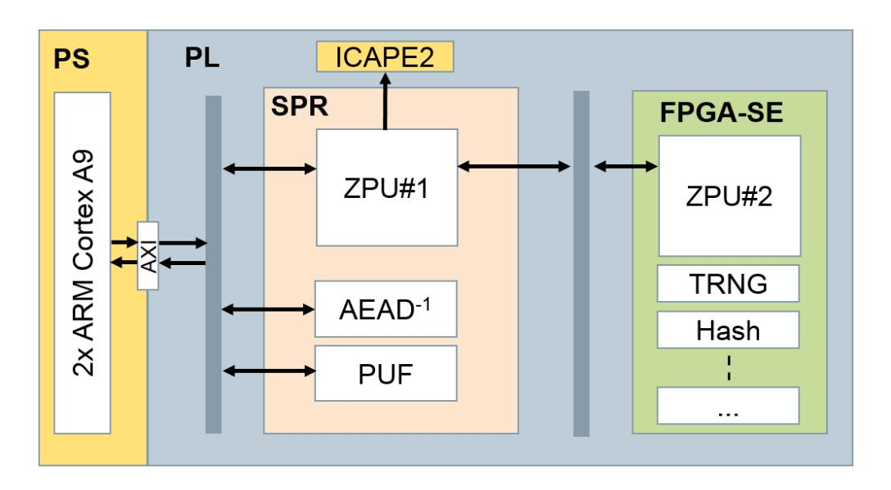

{0}------------------------------------------------

# Secure Update of FPGA-based Secure Elements using Partial Reconfiguration

Florian Unterstein1 , Tolga Sel2 , Thomas Zeschg2 , Nisha Jacob1 , Michael Tempelmeier3 , Michael Pehl3 , Fabrizio De Santis2 1*Fraunhofer Institute for Applied and Integrated Security*, 2*Siemens AG; Corporate Technology* 3*Technical University of Munich*

*Abstract*—Secure Elements (SEs) are hardware trust anchors which provide cryptographic services including secure storage of secret keys and certificates. In long-living devices certain cryptographic functions might get insecure over time, e.g. new implementation attacks or bugs are discovered, and might require to be updated. On FPGAs, partial reconfiguration (PR) offers the opportunity to overcome this issue by replacing buggy or outdated hardware on the fly. This work provides an architecture for an FPGA-based secure element that can be securely updated. The proposed mechanism uses a side-channel protected authenticated encryption with associated data (AEAD) engine for decryption and authentication of partial bitstreams, while the device unique key is generated from a Physical Unclonable Function (PUF). A proof-of-concept of the design is implemented on a Xilinx Zynq-7020 FPGA.

*Index Terms*—Secure Element, FPGA, leakage-resilient PRF, PUF, AEAD

# I. INTRODUCTION

The hardware functionality of FPGA systems is specified by a configuration file called bitstream. On SRAM-based FPGAs, the main bitstream is typically stored in external Non-Volatile-Memory (NVM) and loaded into the FPGA when the device is powered on. The hardware functionality of an FPGA can be changed anytime at boot by overwriting the content of the NVM with a new configuration file. On current FPGAs, PR allows for modification of the hardware functionality also at runtime. It dynamically updates a portion of a circuit, while the rest of the FPGA circuit remains unaltered and fully operational. For this purpose, the FPGA hardware configuration update is specified by another configuration file called partial bitstream. In this sense, FPGAs offer an advantage also for security applications: They allow for crypto agility and longterm security, i.e. update of cryptographic implementations over time is possible when new attacks are discovered. This is especially relevant for SEs used as trust anchors from which the security of a larger system is typically derived. Such SEs are frequently implemented on FPGA for security and performance reasons and consist of secure key storage and cryptographic functions for tasks like encryption, hash, random number generation, key derivation, and signatures.

*Contribution:* This work describes an architecture for a secure update of an FPGA-based SE (FPGA-SE), i.e. the SE is securely loaded and updated at runtime. The concept is based on a mechanism to perform cryptographically secure partial reconfigurations independent of the cryptographic mechanisms provided by the FPGA manufacturer. This allows for an

Fig. 1. FPGA-based SE: Hardware Architecture

extra level of security due to full control over the deployed crypto and the ability to update functionality if required. An implementation on a Xilinx Zynq-7020 shows the feasibility of the approach.

# II. TARGET PLATFORM: XILINX ZYNQ-7020 FPGAS

The Xilinx Zynq-7020 FPGA-SoC integrates a dual-core ARM Cortex-A9 based processing system (PS) and a programmable logic (PL) into a single device. The PS part includes a 256 KB on-chip RAM, external memory interfaces, and a rich set of peripherals and interfaces. The PL part includes about 4 MB BRAM, 220 DSP slices, and crypto modules. Bitstream files for the Xilinx Zynq-7020 are encrypted offline by the user, decrypted using the on-silicon AES-256- CBC core, and authenticated with on-silicon HMAC-SHA-256 core. AES-256-CBC key and HMAC-SHA-256 key are chosen by the user. The former is stored in the device's eFuse memory or in its Battery-Backed RAM (BBRAM), the latter is stored as part of the encrypted bitstream.

Independent of the bitstream encryption and authentication mechanism using symmetric cryptography, the Xilinx Zynq-7020 offers the possibility to setup a secure boot chain using asymmetric cryptography. The chain starts from the boot ROM with the signature verification of the first stage boot loader using 2048-bit RSA. The first stage bootloader contains the RSA algorithm to authenticate all further PS images and PL bitstreams, before executing or loading them.

{1}------------------------------------------------

#### III. AN UPDATABLE SECURE ELEMENT

The SE consists of two parts: a Secure Partial Reconfiguration (SPR) module and the FPGA-SE itself. The SPR module comprises a minimal set of functions for decryption and authentication of the partial bitstream and for PR. It is the only module contained in the main bitstream and is loaded at boot using the FPGA manufacturer's cryptographic algorithms. The FPGA-SE is loaded at runtime using the cryptographic mechanisms specified by the SPR. The hardware architecture of the SPR is illustrated in Figure 1 and consists of the following submodules:

- A PUF module to generate a device-specific secret key.
- A leakage-resilient AEAD module to perform authenticated decryption of partial bitstreams.
- A Soft-CPU (ZPU) for controlling all other modules, i.e. the above crypto modules and the actual PR interface (ICAPE2).

### *A. ZPU*

The Zylin Processing Unit (ZPU) is a small CPU with gcc toolchain support which is used to interpret commands and to orchestrate all cryptographic modules during secure PR in a flexible and configurable way. The ZPU controls the module for PR, which is the ICAPE2 on Xilinx Zynq-7020. Loading of a partial bitstream is done in four steps: (i) The ZPU waits for encrypted partial bitstream, initalization vector (IV) of the AEAD algorithm, AEAD tag, helper data to generate the PUF key, and a command initiating decryption. (ii) When all of input is received from the PS, helper data is provided to the PUF module which returns the key. (iii) Key, AEAD IV, AEAD tag, and encrypted partial bitstream are passed to the AEAD engine for decryption and authentication. (iv) If the encrypted partial bitstream is authentic, the decrypted partial bitstream is forwarded to the ICAPE2 module. Otherwise, the update procedure is aborted.

#### *B. Physically Unclonable Function (PUF)*

During a roll-out phase a device specific secret key is generated and embedded to the PUF. In this step, helper data is derived to later reconstruct the key from noisy PUF bits. The helper data is stored, e.g. in public memory. To reproduce the key, the roll-out is reversed: The PUF response together with the helper data is mapped to a noisy codeword which is corrected to a stable key.

A concatenation of an outer (n, k, t) = (127, 64, 10) BCH code and an inner (7, 1) Repetition code is used in our implementation. The code is selected since (i) it allows for a correction of bit error rates of up to 15% in the PUF response, down to an error probability of 10−6 in the derived key and (ii) a method for protecting the error correction against sidechannel attacks is known [1]. The selected error correction requires 1778 bit of helper data and PUF response.

The PUF is implemented as an XOR Sum-PUF [2] build from 256 ring oscillators. This type of PUF is easy to implement on FPGAs and provides a sufficient amount of response bits for our use case. Responses for the key are generated by applying a fixed set of challenges to the PUF derived from a 128 bit challenge seed that is stored with the helper data. Note that the concept does not rely on a specific PUF type or error correction. Also, the PUF key might be kept on chip in which case it can be used to encrypt a key storage [3] containing the key for bitstream decryption.

#### *C. Side-channel Hardened Authenticated Decryption*

The side-channel hardened AEAD core comprises a first stage using a leakage resilient pseudo-random function (LR-PRF) to mitigate attacks, and a second stage with AES-128-OFB for payload decryption and GMAC for payload authentication. All public inputs are processed by the hardened LR-PRF, and attackers cannot predict inputs to the AES core. Thus the attack vectors are limited to attacks on the LR-PRF and it suffices to protect this stage. For the actual decryption and authentication, standard constructions are used (AES in output-feedback mode and GMAC). We use the LR-PRF proposed in [4] in a configuration similar to the one proposed in [5]. The side-channel security of the LR-PRF is based on two principles taken from leakage resilient cryptography: limited data complexity (i.e. the number of operations with the same key, but different inputs that an attacker can observe) and algorithmic noise from parallel S-boxes [6]. Unterstein et al. demonstrated the security of this construction against stateof-the-art high precision EM attacks when implemented on Xilinx Zynq-7020 FPGA SoCs [5].

## IV. CONCLUSION

This work proposed a secure update mechanism for SEs on FPGAs. It relies on partial reconfiguration, an AEAD module for encryption and authentication and a PUF for key generation. The implementation of the concept on a Xilinx Zynq-7020 shows the feasibility of the FPGA update approach dedicated to ensure long-term security in long-living devices.

## ACKNOWLEDGMENT

This work was partly funded by the German Ministery for Education and Research through the project ALESSIO grand nos. 16KIS0629,16KIS0631,16KIS0632

#### REFERENCES

- [1] D. Merli, F. Stumpf, and G. Sigl, "Protecting PUF error correction by codeword masking," Cryptology ePrint Archive, Report 2013/334, 2013, http://eprint.iacr.org/2013/334.
- [2] M.-D. M. Yu and S. Devadas, "Recombination of physical unclonable functions," in *35th Annual GOMACTech Conference*, 2010.
- [3] N. Jacob, J. Wittmann, J. Heyszl, R. Hesselbarth, F. Wilde, M. Pehl, G. Sigl, and K. Fischer, "Securing FPGA soc configurations independent of their manufacturers," in *30th IEEE International System-on-Chip Conference, SOCC*, 2017.
- [4] F. Unterstein, J. Heyszl, F. D. Santis, R. Specht, and G. Sigl, "Highresolution EM attacks against leakage-resilient PRFs explained - and an improved construction," in *Topics in Cryptology - CT-RSA 2018 - The Cryptographers' Track*, 2018.
- [5] F. Unterstein, N. Jacob, N. Hanley, C. Gu, and J. Heyszl, "SCA secure and updatable crypto engines for FPGA soc bitstream decryption," in *Proceedings of the 3rd ACM Workshop on Attacks and Solutions in Hardware Security Workshop, ASHES@CCS*. ACM, 2019.
- [6] M. Medwed, F. Standaert, and A. Joux, "Towards super-exponential sidechannel security with efficient leakage-resilient prfs," in *Cryptographic Hardware and Embedded Systems - CHES 2012 - 14th International Workshop*, 2012.