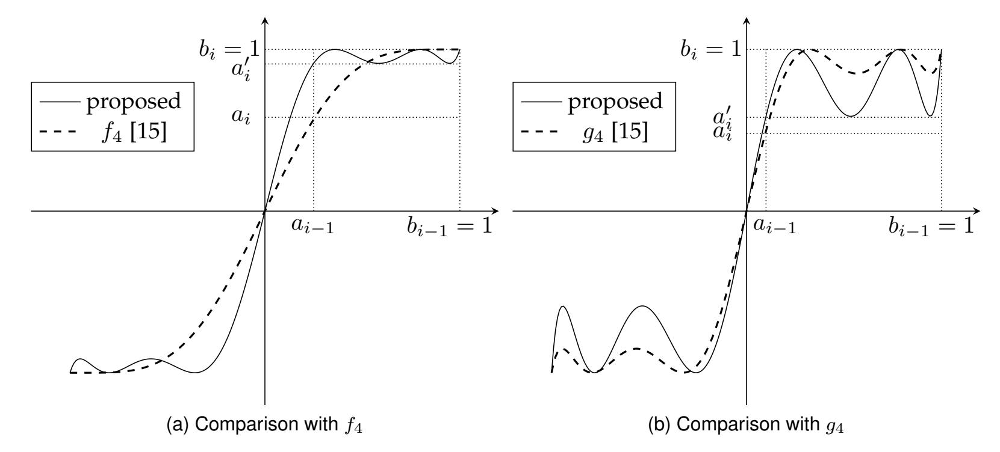
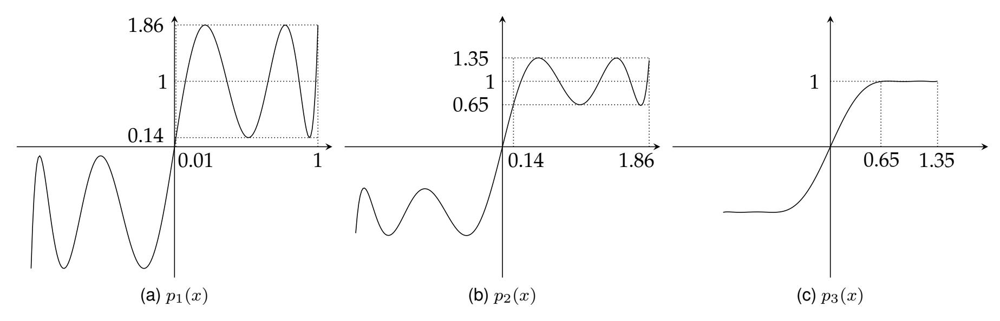
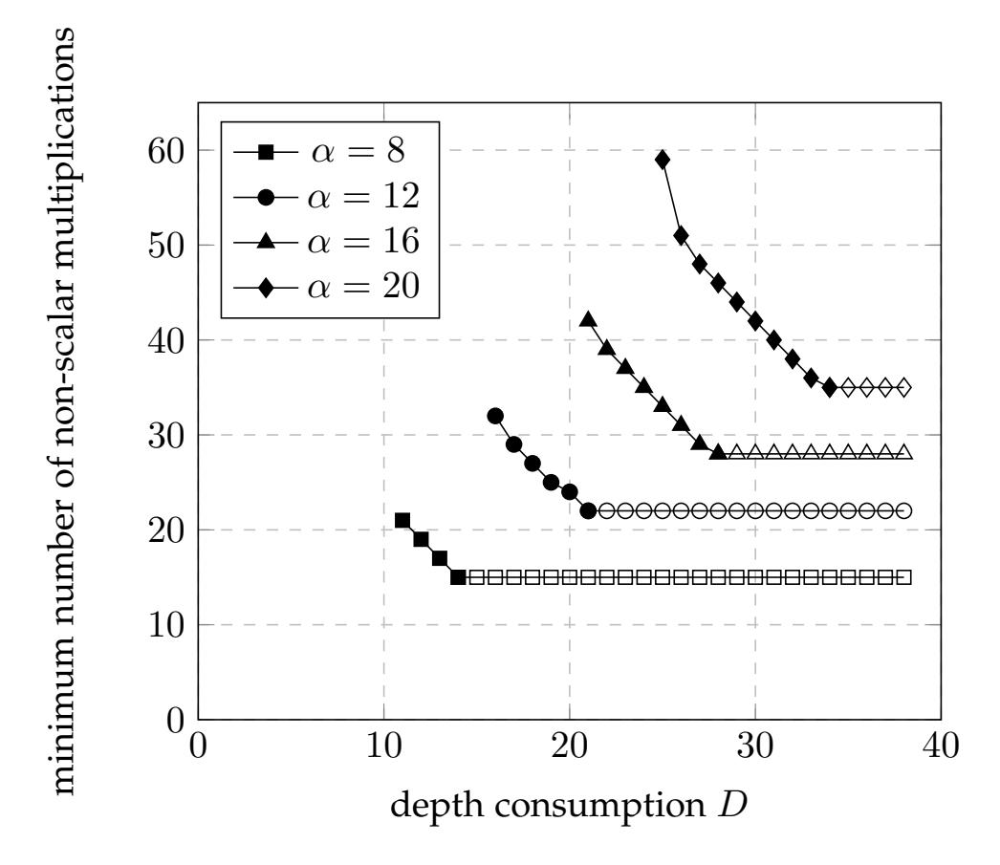
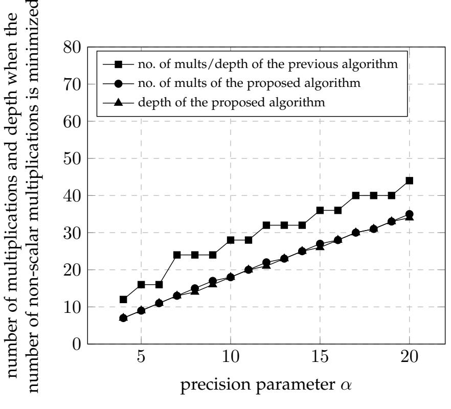
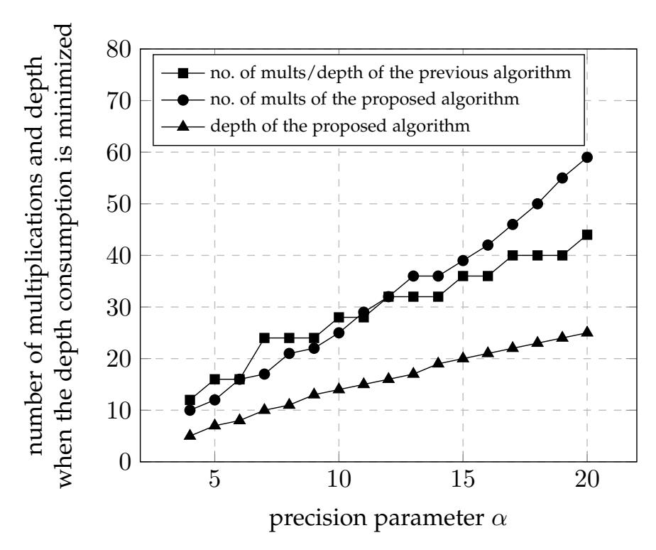
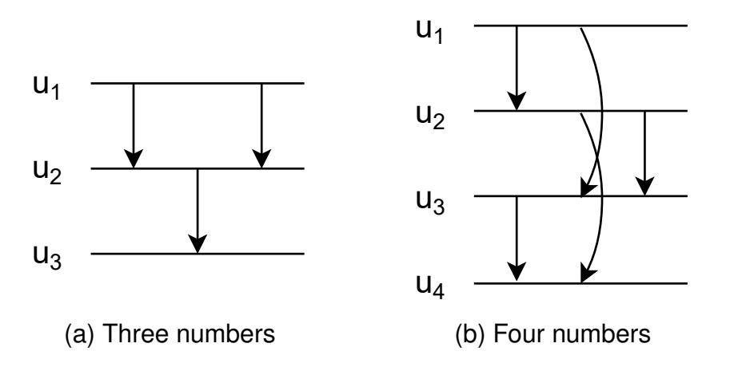

{0}------------------------------------------------

1

# Minimax Approximation of Sign Function by Composite Polynomial for Homomorphic Comparison

Eunsang Lee, Joon-Woo Lee, Jong-Seon No, Fellow, IEEE, and Young-Sik Kim, Member, IEEE

Abstract—The comparison operation for two numbers is one of the most commonly used operations in several applications, including deep learning. Several studies have been conducted to efficiently evaluate the comparison operation in homomorphic encryption schemes, termed homomorphic comparison operation. Recently, Cheon et al. (Asiacrypt 2020) proposed new comparison methods that approximate the sign function using composite polynomial in homomorphic encryption and proved that these methods have optimal asymptotic complexity. In this paper, we propose a practically optimal method that approximates the sign function by using compositions of minimax approximate polynomials. It is proved that this approximation method is optimal with respect to depth consumption and the number of non-scalar multiplications. In addition, a polynomial-time algorithm that determines the optimal compositions of minimax approximate polynomials for the proposed homomorphic comparison operation is proposed by using dynamic programming. The numerical analysis demonstrates that the proposed homomorphic comparison operation reduces running time by approximately 45% (resp. 41%) on average, compared with the previous algorithm if running time (resp. depth consumption) is to be minimized. In addition, when N is  $2^{17}$ , and the precision parameter  $\alpha$  is 20, the previous algorithm does not achieve 128-bit security, while the proposed algorithm achieves 128-bit security due to small depth consumption.

**Index Terms**—Cheon–Kim–Kim–Song scheme, fully homomorphic encryption, homomorphic comparison operation, minimax approximate polynomial, Remez algorithm, sign function.

#### 1 Introduction

HOMOMORPHIC encryption (HE) is a cryptographic algorithm that allows algebraic operations on encrypted data. Before Gentry's seminal work [1] in 2009, HE schemes were able to perform only a few specific operations on the encrypted data. Fully homomorphic encryption (FHE) is a cryptographic algorithm that was first developed in [1] and allows all algebraic operations on the encrypted data without restriction. Accordingly, FHE has attracted significant attention in various applications, and its standardization process is in progress.

FHE schemes can be classified as bitwise and word-wise. Word-wise FHE, such as Brakerski/Fan-Vercauteren [2] and Cheon-Kim-Kim-Song (CKKS) [3], allows the addition and multiplication of an encrypted array over  $\mathbb{C}$  or  $\mathbb{Z}_p$  for a positive integer p>2. All other operations in word-wise FHE should be performed using these two basic operations. By contrast, the basic operations of a bitwise FHE scheme, such as fast fully homomorphic encryption over the torus [4], are logic gates such as NAND gates. Recently, word-wise FHE has been widely used in several applications such as deep learning [5], [6].

Although word-wise FHE can support virtually all arithmetic operations on encrypted data, several applications

require non-arithmetic operations. One of the core non-arithmetic operations is the comparison operation, which is denoted as comp(u, v) and outputs 1 if u > v, 1/2 if u = v, and 0 if u < v. This comparison operation is widely used in various real-world applications including machine learning algorithms such as support-vector machines, cluster analysis, and gradient boosting [7], [8].

The max function max(u, v) is another core nonarithmetic operation, and it is particularly important in deep learning. The max pooling operation in deep learning, which is the same as the max function, is used to extract the most distinctive feature from some layers in a neural network, and prevents the model from overfitting. Several deep learning models, such as AlexNet [9], VGGNet [10], GoogleNet [11], Inception [12], and ResNet [13], use the max pooling operation. In addition, sorting algorithms with the max function are used as subroutines of various other algorithms because it is frequently required to use sorted rather than unsorted data. Thus, it is important to efficiently evaluate the max function on encrypted data, termed homomorphic max function, because this directly improves the performance of the max pooling operation in privacypreserving deep learning models and of sorting algorithms on encrypted data, termed homomorphic sorting algorithms [14].

Several studies have been conducted to efficiently implement the comparison operation on encrypted data, termed homomorphic comparison operation, and homomorphic max function. The comparison operation and max function can be easily implemented using the sign function, that is,  $comp(u, v) = \frac{1}{2}(sgn(u - v) + 1)$  and max(u, v) =

<sup>•</sup> E. Lee, J.-W. Lee, and J.-S. No are with the Department of Electrical and Computer Engineering, INMC, Seoul National University, Seoul 08826, South Korea.

E-mail: (eslee3209, joonwoo3511)@ccl.snu.ac.kr, jsno@snu.ac.kr.

<sup>•</sup> Y.-S. Kim is with the Department of Information and Communication Engineering, Chosun University, Gwangju 61452, South Korea. E-mail: iamyskim@chosun.ac.kr

{1}------------------------------------------------



Fig. 1. Comparison between the proposed minimax approximate polynomial and the previous polynomials  $f_4$  and  $g_4$  in [15].

 $\frac{(u+v)+(u-v)\operatorname{sgn}(u-v)}{2}$ , where  $\operatorname{sgn}(x)=x/|x|$  for  $x\neq 0$ , and 0, otherwise. Thus, implementing  $\operatorname{sgn}(x)$  leads directly to implementing  $\operatorname{comp}(u,v)$  and  $\operatorname{max}(u,v)$ , and we focus on implementing  $\operatorname{sgn}(x)$  in this paper.

Since  $\operatorname{sgn}(x)$  is not a polynomial, to evaluate  $\operatorname{sgn}(x)$  in FHE, which provides only addition and multiplication, it is necessary to determine and evaluate a polynomial p(x) that approximates  $\operatorname{sgn}(x)$ . Since  $\operatorname{sgn}(x)$  is discontinuous at x=0, the small neighborhood  $(-\epsilon,\epsilon)$  of zero is not considered when measuring the difference between p(x) and  $\operatorname{sgn}(x)$ . Specifically, it is required that

$$|p(x) - \operatorname{sgn}(x)| \le 2^{1-\alpha} \text{ for } x \in [-1, -\epsilon] \cup [\epsilon, 1], \quad (1)$$

which implies that  $\frac{1}{2}(p(u-v)+1)$  is an approximate value of  $\operatorname{comp}(u,v)$  within  $2^{-\alpha}$  error for  $u,v\in [0,1]$  satisfying  $|u-v|\geq \epsilon$ . Here,  $\epsilon$  and  $\alpha$  determine the input and output precisions of comparison operation, respectively. It is desirable to determine an approximate polynomial that requires less running time and depth consumption. To this end, it is desirable to reduce the polynomial degree as much as possible.

A method to approximate  $\operatorname{sgn}(x)$  using a composite polynomial was recently proposed in [15], and it was proved that this method achieves the optimal asymptotic complexity. However, the functions  $f_n$  and  $g_n$  used in [15] do not ensure approximation optimality, and thus, finding better composite polynomials that approximate  $\operatorname{sgn}(x)$  is an important study.

Let  $p=p_k\circ p_{k-1}\circ\cdots\circ p_1$  be a composite polynomial that approximates  $\operatorname{sgn}(x)$ . Since  $\operatorname{sgn}(x)$  is an odd function, it is natural to approximate  $\operatorname{sgn}(x)$  by using a composition of polynomials with odd-degree terms. Thus, we assume that  $p_1,p_2,\cdots,p_k$  are polynomials with odd-degree terms, and because of the symmetry, it suffices to consider only the case of x>0 to verify that the composite polynomial  $p=p_k\circ p_{k-1}\circ\cdots\circ p_1$  satisfies the error condition in (1). Let  $p_1([\epsilon,1])=[a_1,b_1],p_2\circ p_1([\epsilon,1])=[a_2,b_2],\cdots,p_k\circ\cdots\circ p_1([\epsilon,1])=[a_k,b_k]$ . Each component polynomial  $p_i$  can be seen as performing a task of mapping a given interval  $[a_{i-1},b_{i-1}]=p_{i-1}\circ\cdots\circ p_1([\epsilon,1])$  into a smaller interval  $[a_i,b_i]$ , and we should have  $[a_k,b_k]\in[1-2^{1-\alpha},1+2^{1-\alpha}]$ ,

which implies that the error condition in (1) is satisfied. The most challenging point in approximating  $\operatorname{sgn}(x)$  is that the interval  $[\epsilon,1]$ , whose size is nearly one, should finally be mapped to a tiny interval  $[1-2^{1-\alpha},1+2^{1-\alpha}]$ , whose size is  $2^{2-\alpha}$ , through k component polynomials. Our key observation is that finding  $\operatorname{good}$  polynomials that efficiently reduce the given intervals is the core of an efficient comparison operation implementation. Then, the natural question would be

"Given an interval  $[a_{i-1}, b_{i-1}] = p_{i-1} \circ \cdots \circ p_1([\epsilon, 1])$  and an upper bound of degree  $d_i$ , what is the best polynomial with odd-degree terms  $p_i$  of degree at most  $d_i$  that maps this interval into the smallest interval?"

#### 1.1 Our Results

#### 1.1.1 Minimax Composite Polynomial

First, for  $[a_i,b_i]=p_i([a_{i-1},b_{i-1}])$ , we consider the case when  $b_i$  should be one. Then, we note that the best polynomial of degree at most  $d_i$  that maps  $[a_{i-1},b_{i-1}]$  into the smallest interval  $[a_i,b_i]$  is the minimax approximate polynomial of degree at most  $d_i$  on  $[-b_{i-1},-a_{i-1}]\cup[a_{i-1},b_{i-1}]$  (for  $c\operatorname{sgn}(x)$  for some constant c<1 such that  $b_i=1$ ). Thus, we come up with the idea of using a composite polynomial of minimax approximate polynomials, called *minimax composite polynomial*, where each component polynomial  $p_i$  is the minimax approximate polynomial of degree at most  $d_i$  defined on  $[-b_{i-1},-a_{i-1}]\cup[a_{i-1},b_{i-1}]=p_{i-1}\circ\cdots\circ p_1([-1,-\epsilon]\cup[\epsilon,1])$ .

The two functions  $f_n$  and  $g_n$  used in [15] cause some inefficiency compared to the proposed method. First, since  $f_n$  is not the minimax approximate polynomial, it does not efficiently reduce the size of the interval compared to the minimax approximate polynomial. In addition, although  $g_n$  is the minimax approximate polynomial (for  $c \operatorname{sgn}(x)$  for some c < 1), it is the minimax approximate polynomial on a different domain from  $[-b_{i-1}, -a_{i-1}] \cup [a_{i-1}, b_{i-1}]$ , which results in some inefficiency. Fig. 1 shows that using the proposed minimax approximate polynomial on  $[-b_{i-1}, -a_{i-1}] \cup [a_{i-1}, b_{i-1}]$  reduces the size of the interval more efficiently than using  $f_n$  or  $g_n$  (that is,  $[a_i', 1] \subset [a_i, 1]$ ).

{2}------------------------------------------------



Fig. 2. The component polynomials of an example of the proposed minimax composite polynomial  $p = p_3 \circ p_2 \circ p_1$  on  $D = [-1, -0.01] \cup [0.01, 1]$  for  $\{d_1, d_2, d_3\} = \{9, 9, 9\}$ .

In this paper, the range  $[a_i,b_i]=p_i([a_{i-1},b_{i-1}])$  is actually in the form of  $[1-\tau_i,1+\tau_i]$  (centered at one) for  $i\geq 2$ , not in the form such that  $b_i=1$  as shown in Fig. 1. However, it is possible to arbitrarily change the range of a component polynomial by scaling while maintaining the performance of the homomorphic comparison operation the same. Specifically, if  $cp_i(x)$  is used instead of  $p_i(x)$  and  $p_{i+1}(x/c)$  instead of  $p_{i+1}(x)$  for some i and c>0, we can scale the range  $[a_i,b_i]=p_i\circ\cdots\circ p_1([\epsilon,1])$  by c times while maintaining the same performance of the homomorphic comparison operation because the degrees of  $p_i(x)$  and  $p_{i+1}(x)$  do not change. Thus, although minimax approximate polynomials whose range is centered at one are used in this paper, the minimax approximate polynomial in Fig. 1 is scaled so that  $b_i=1$  for comparison with  $f_n$  and  $g_n$  in [15].

Now, the formal definition of the proposed *minimax* composite polynomial is described. For a set of polynomials  $\{p_i\}_{1\leq i\leq k}$ , the composite polynomial  $p_k\circ p_{k-1}\circ\cdots\circ p_1$  is called a *minimax composite polynomial* on  $D=[-b,-a]\cup[a,b]$  if there exists  $\{d_i\}_{1\leq i\leq k}$  that satisfies the following:

- $p_1$  is the minimax approximate polynomial of degree at most  $d_1$  on D for sgn(x).
- For  $2 \le i \le k$ ,  $p_i$  is the minimax approximate polynomial of degree at most  $d_i$  on  $p_{i-1} \circ p_{i-2} \circ \cdots \circ p_1(D)$  for  $\operatorname{sgn}(x)$ .

Let  $\tau_i$  be the minimax approximation error of the minimax approximate polynomial  $p_i$  for  $1 \le i \le k$ . Here,  $\tau_i$  becomes smaller as i increases, and if  $\tau_k \le 2^{1-\alpha}$ , then  $p = p_k \circ \cdots \circ p_1$  satisfies the error condition in (1). The component polynomials of the minimax composite polynomial efficiently reduce the size of the given interval without inefficiencies caused by  $f_n$  and  $g_n$  in [15]. Fig. 2 shows the component polynomials of an example of the proposed minimax composite polynomial  $p = p_3 \circ p_2 \circ p_1$  on  $D = [-1, -0.01] \cup [0.01, 1]$  for  $\{d_1, d_2, d_3\} = \{9, 9, 9\}$ .

# 1.1.2 Finding Optimal Degrees by Using Dynamic Programming

We prove that approximating  $\operatorname{sgn}(x)$  using minimax composite polynomial is the optimal method with respect to the number of non-scalar multiplications and depth consumption. That is, we prove that for any given composite polynomial that approximates  $\operatorname{sgn}(x)$  and satisfies the error condition in (1), there exists a minimax composite

polynomial for some set of degrees  $\{d_i\}_{1 \leq i \leq k}$  that satisfies the error condition in (1) and requires a smaller or equal depth consumption and number of non-scalar multiplications than the given composite polynomial. Now, our goal is to find the optimal set of degrees for minimax composite polynomial. Specifically, for a given depth consumption D, we find the optimal set of degrees such that the minimax composite polynomial for the set of degrees requires the minimum number of non-scalar multiplications while consuming depth D.

First, we can think of brute-force searching for all numbers of compositions and the degrees of the component polynomials to find the optimal set of degrees. However, for the upper bound of the numbers of compositions  $\bar{k}$  and that of the degrees of component polynomials  $\bar{d}$ , this brute-force search requires  $O(\bar{d}^{\bar{k}})$  times, which is too much when  $\alpha$  is large. We propose a fast method to find the optimal set of degrees using dynamic programming.

Specifically, the values of  $h(m,n,\tau)$  and  $G(m,n,\tau)$  (defined in Section 3.3) are evaluated using a recursion equation (see Theorem 3), and the optimal sets of degrees are obtained using these values (see Algorithm 5). It is proved that the minimax composite polynomial for the set of degrees determined from the proposed algorithm is optimal with respect to depth consumption and the number of non-scalar multiplications.

For the upper bound of the number of non-scalar multiplications  $\bar{m}$ , that of depth consumption  $\bar{n}$ , and that of degrees of component polynomials  $\bar{d}$ , the time complexity of the proposed algorithm is  $O(\bar{m}\bar{n}\bar{d})$ . It is pretty fast when implemented, and we obtain the optimal set of degrees for input precision  $\alpha$  from 5 to 20 (see Table 2).

#### 1.1.3 Improved Performance of Homomorphic Comparison Operation

It can be seen that when the HEAAN library [3] is used, the proposed homomorphic comparison operation algorithm reduces running time by approximately 45% (resp. 41%) on average, compared with the previous algorithm CompG (referred to as NewCompG in [15]) if running time (resp. depth consumption) is to be minimized. In addition, the proposed homomorphic comparison operation algorithm reduces the ciphertext modulus bit by approximately 41% (resp. 45%) on average if running time (resp. depth con-

{3}------------------------------------------------

sumption) is to be minimized. In particular, it is noteworthy that when the precision parameter  $\alpha$  is 20, the proposed homomorphic comparison operation achieves 128-bit security due to small depth consumption while the homomorphic comparison operation in [15] does not achieve 128-bit security.

# 1.1.4 Improved Performance of Homomorphic Max Function and Homomorphic Sorting

Since we have  $\max(u,v) = \frac{(u+v)+(u-v)\operatorname{sgn}(u-v)}{2}$ ,  $\max(u,v)$  can be easily implemented using the proposed method of approximating  $\operatorname{sgn}(x)$ . As a result, the proposed homomorphic max function algorithm reduces running time by approximately 41% (resp. 35%) on average and reduces the ciphertext modulus bit by approximately 33% (resp. 45%) on average, compared with the previous algorithm MaxG (referred to as NewMaxG in [15]) if running time (resp. depth consumption) is to be minimized.

Furthermore, we implement the homomorphic sorting of three and four numbers using the proposed homomorphic max function. As a result, the homomorphic sorting algorithm using the proposed homomorphic max function algorithm is approximately two times as fast as using the previous homomorphic max function algorithm. In addition, the sorting algorithm that uses the previous homomorphic max function algorithm does not achieve 128-bit security, while the sorting algorithm that uses the proposed homomorphic max function algorithm achieves 128-bit security due to small depth consumption.

#### 1.2 Related Works

Some research has been conducted on determining polynomials that approximate sgn(x) or comp(u, v) in FHE. An analytic method to approximate the sign function using Fourier series was proposed in [16]. In [17], the sign function was approximated using the approximate equation  $\tanh(jx) = \frac{e^{jx} - e^{-jx}}{e^{jx} + e^{-jx}} \simeq \operatorname{sgn}(x)$  for large j > 0. Recently, an iterative algorithm was proposed that performs a homomorphic comparison using the equation  $\lim_{j \to \infty} \frac{u^j}{u^j + v^j} =$ comp(u,v) in [18], where the inverse operation can be performed using the Goldschmidt division algorithm [19]. However, the use of the inverse operation results in inefficient computation. More recently, in [15], the homomorphic comparison operation was approximated using composite polynomials with a smaller depth consumption and number of non-scalar multiplications than in previous methods. It was also shown that this homomorphic comparison operation has optimal asymptotic computational complexity. However, its performance can be further improved because the composite polynomials used in [15] do not optimally approximate the sign function.

#### 1.3 Outline

The remainder of this paper is organized as follows. Section 2 presents preliminaries regarding the concept of FHE, comparison operation in FHE, approximation theory, and the algorithms for minimax approximation. In Section 3, a new method for approximating the sign function using a

composition of minimax approximate polynomials is proposed, and it is proved that the proposed approximation method is optimal. In addition, a polynomial-time algorithm to obtain the optimal minimax composite polynomial for the homomorphic comparison operation is proposed using dynamic programming, and the performance achieved by the optimal minimax composite polynomial is compared with the previous algorithm when depth consumption and the number of non-scalar multiplications are minimized, respectively. In Section 4, the proposed method of approximating sign function is applied to homomorphic max function and homomorphic sorting. In Section 5, numerical results for the proposed homomorphic comparison operation, the proposed homomorphic max function, and a homomorphic sorting algorithm that uses this function are provided in the HEAAN library [3]. Finally, concluding remarks are given in Section 6.

#### 2 PRELIMINARIES

#### 2.1 Fully Homomorphic Encryption

FHE schemes are classified as bitwise and word-wise. The basic operations of the former are logic gates, whereas the basic operations of the latter are algebraic, such as addition and multiplication. In this paper, we focus only on word-wise FHE, and the term FHE refers to word-wise FHE. The definition of FHE is as follows:

**Definition 1.** An FHE scheme is a set of five polynomial-time algorithms that satisfy the following:

- KeyGen( $\lambda$ )  $\rightarrow$  (pk, sk, evk); KeyGen takes a security parameter  $\lambda$  as input, and outputs a public key pk, a secret key sk, and an evaluation key evk.
- Enc( $\mu$ , pk)  $\rightarrow$  ct; Enc takes a public key pk and a message  $\mu$  as input, and outputs a ciphertext ct of  $\mu$ .
- $Dec(ct, sk) \rightarrow \mu'$  or  $\perp$ ; Dec takes a ciphertext ct and a secret key sk as input, and outputs a message  $\mu'$ . If the decryption procedure fails, Dec outputs a special symbol  $\perp$ .
- Add(ct<sub>1</sub>, ct<sub>2</sub>, evk); Add takes ciphertexts ct<sub>1</sub> and ct<sub>2</sub> of  $\mu_1$  and  $\mu_2$ , respectively, and an evaluation key evk as input, and outputs a ciphertext ct<sub>add</sub> of  $\mu_1 + \mu_2$ .
- Mult(ct<sub>1</sub>, ct<sub>2</sub>, evk); Mult takes ciphertexts ct<sub>1</sub> and ct<sub>2</sub> of  $\mu_1$  and  $\mu_2$ , respectively, and an evaluation key evk as input, and outputs a ciphertext ct<sub>mult</sub> of  $\mu_1 \cdot \mu_2$ .

The CKKS scheme has two types of multiplication: scalar and non-scalar. The latter is the multiplication of two variables, and the former is the multiplication of a variable and a constant. Non-scalar multiplications require significantly more running time than scalar multiplications. Thus, in this paper, when the homomorphic comparison operation and homomorphic max function are considered, we focus on reducing depth consumption and the number of non-scalar rather than scalar multiplications.

# 2.2 Comparison Operation in Fully Homomorphic Encryption

FHE schemes support addition and multiplication operations on the encrypted data, but not non-arithmetic operations, such as comparison operation. Thus, the approximation of the comparison operation should be performed 

{4}------------------------------------------------

by using additions and multiplications. The comparison operation and the sign function are denoted as

$$comp(u, v) = \begin{cases} 1 & \text{if } u > v \\ 1/2 & \text{if } u = v \text{ , } sgn(x) = \begin{cases} 1 & \text{if } x > 0 \\ 0 & \text{if } x = 0 \text{ .} \end{cases} \\ 0 & \text{if } x < 0 \end{cases}$$

Our objective is to approximate comp(u, v) using additions and multiplications only. We note that comp(u, v) and sgn(x) are related as follows:

$$comp(u, v) = \frac{sgn(u - v) + 1}{2}.$$

Thus, the approximation of  $\operatorname{comp}(u,v)$  is equivalent to that of  $\operatorname{sgn}(x)$ . Therefore, we only focus on the polynomial approximation of  $\operatorname{sgn}(x)$ . Definition 2 quantifies how close a polynomial that approximates  $\operatorname{sgn}(x)$  is to  $\operatorname{sgn}(x)$ .  $\operatorname{sgn}(x)$  is discontinuous at x=0, and thus it is impossible to exactly approximate  $\operatorname{sgn}(x)$  near x=0. Definition 2 implies that the approximation error is ensured to be below  $2^{-\alpha}$  only for  $\epsilon \leq |x| \leq 1$ .

**Definition 2** ( [15]). For  $\alpha > 0$  and  $0 < \epsilon < 1$ , a polynomial p is said to be  $(\alpha, \epsilon)$ -close to  $\operatorname{sgn}(x)$  over [-1, 1] if p satisfies the following:

$$||p(x) - \operatorname{sgn}(x)||_{\infty, [-1, -\epsilon] \cup [\epsilon, 1]} \le 2^{-\alpha},$$

where  $||\cdot||_{\infty,D}$  denotes the infinity norm over the domain D.

For precision parameters,  $\alpha$  and  $\epsilon$ , a polynomial  $\tilde{p}(u,v)$  that approximates comparison operation should satisfy the following error condition:

$$|\tilde{p}(u,v) - \text{comp}(u,v)| \le 2^{-\alpha}$$
 for any  $u,v \in [0,1]$  satisfying  $|u-v| \ge \epsilon$ . (2)

Since  $\operatorname{comp}(u,v) = \frac{\operatorname{sgn}(u-v)+1}{2}$ , if a polynomial p(x) approximating  $\operatorname{sgn}(x)$  is  $(\alpha-1,\epsilon)$ -close, then  $\tilde{p}(u,v) = \frac{p(u-v)+1}{2}$  satisfies the comparison operation error condition in (2). Thus, we find  $(\alpha-1,\epsilon)$ -close composite polynomials that approximate  $\operatorname{sgn}(x)$ .

It is known that non-scalar multiplication requires a considerable running time. In addition, as bootstrapping is time-consuming, minimizing the depth consumption for the homomorphic comparison operation is also important, as it reduces bootstrapping. Thus, it is necessary to approximate  $\operatorname{sgn}(x)$  by polynomials that minimize depth consumption as well as the number of non-scalar multiplications.

#### 2.3 Approximation Theory

Herein, certain concepts from approximation theory are introduced.

**Definition 3.** Let D be a closed subset of [a,b], and let f be a continuous function on D. A polynomial p is said to be the minimax approximate polynomial of degree at most n on D for f if p minimizes  $\max_{D} ||p(x) - f(x)||_{\infty}$  among polynomials of degree at most n.

It is known that for any continuous function f on D, the minimax approximate polynomial of degree at most n on D is unique [20]. We set  $f(x) = \operatorname{sgn}(x)$  because we are

concerned with polynomials that approximate  $\operatorname{sgn}(x)$  in this paper. Moreover, we are only concerned with cases in which D is the union of two symmetric closed intervals  $[-b,-a] \cup [a,b]$ .

We refer to the definition of Haar's condition [20] for a set of functions, which deals with the generalized version of polynomial bases such as power basis or Chebyshev polynomial basis. It is well known that the power basis and Chebyshev polynomial basis satisfy Haar's condition. Thus, if an argument deals with a set of functions that satisfy Haar's condition, it naturally includes the case of power basis or Chebyshev polynomial basis.

**Definition 4** (Haar's condition and generalized polynomial [20]). A set of functions  $\{\phi_1, \phi_2, \cdots, \phi_n\}$  satisfies Haar's condition if each  $\phi_i$  is continuous and the determinant

$$D[x_1, \cdots, x_n] = \begin{vmatrix} \phi_1(x_1) & \cdots & \phi_n(x_1) \\ \vdots & \ddots & \vdots \\ \phi_1(x_n) & \cdots & \phi_n(x_n) \end{vmatrix}$$

is not zero for any n distinct points  $x_1, \dots, x_n$ . A linear combination of  $\{\phi_1, \phi_2, \dots, \phi_n\}$  is referred to as a generalized polynomial.

The following theorem and lemmas are required for some proofs in Section 3.

**Theorem 1** (Chebyshev alternation theorem [20]). Let D be a closed subset of [a,b], and let  $\{\phi_1,\phi_2,\cdots,\phi_n\}$  be a set of continuous functions on [a,b] that satisfy Haar's condition. A polynomial  $p = \sum_i c_i \phi_i$  is the minimax approximate polynomial on D for any given continuous function f on D if and only if there are n+1 elements  $x_0 < \cdots < x_n$  in D such that

$$r(x_i) = -r(x_{i-1}) = \pm \sup_{x \in D} |r(x)|, 1 \le i \le n$$
 (3)

for the error function r = f - p restricted on D.

**Remark 1.** The condition in (3) is called the equioscillation condition. Let D be  $[-b, -a] \cup [a, b]$ . As  $r(x_i) = \pm \sup_{x \in D} |r(x)|$  for  $0 \le i \le n$ , it follows that r(x) should have extreme points at  $x_i$  for  $0 \le i \le n$ . Thus,  $p'(x_i) = 0$  and  $x_i \in (-b, -a) \cup (a, b)$ , or  $x_i \in \{-b, -a, a, b\}$ .

**Lemma 1** (Generalized de La Vallee Poussin theorem [21]). Let  $\{\phi_1, \phi_2, \cdots, \phi_n\}$  be a set of continuous functions on [a, b] that satisfy Haar's condition. Let D be a closed subset of [a, b], and let f(x) be a continuous function on D. Let  $x_i, 0 \le i \le n$  be n+1 consecutive points in D. Let p(x) be a generalized polynomial such that p-f has alternately positive and negative values at  $x_i, 0 \le i \le n$ . Let  $p^*(x)$  be a minimax approximate polynomial on D for f, and let e(f) be the corresponding approximation error of  $p^*(x)$ . Then,

$$e(f) \ge \min_{i} |p(x_i) - f(x_i)|.$$

**Lemma 2** ([22]). If f(x) is an odd function, the minimax approximate polynomial of degree at most n to f(x) is also an odd function.

#### 2.4 Algorithms for Minimax Approximation

The Remez algorithm [23] in Algorithm 1 obtains the minimax approximate polynomial for a continuous function on an interval. First, it initializes reference points

{5}------------------------------------------------

 $\{x_1, \dots, x_{n+1}\}\$ , which will converge to the extreme points of the minimax approximate polynomial. Then, it determines a polynomial p(x) with basis  $\{\phi_1, ..., \phi_n\}$  that satisfies  $p(x_i) - f(x_i) = (-1)^i E, 1 \le i \le n+1 \text{ for some } E > 0;$ that is, it determines coefficients  $c_1, \dots, c_n$  that satisfy  $c_1\phi_1(x_i) + \dots + c_n\phi_n(x_i) - f(x_i) = (-1)^i E, 1 \le i \le n+1.$ These equations form a system of linear equations consisting of n+1 equations and n+1 unknowns (coefficients  $c_1, \cdots, c_n$  and E). This system is guaranteed not to be singular by Haar's condition, and thus the polynomial p(x)can be uniquely determined.

Then, we find n zeros  $z_1, \dots, z_n$  of p(x) - f(x), where  $x_i < z_i < x_{i+1}$ , and we also find n+1 extreme points  $y_1, \cdots, y_{n+1}$  of p(x) - f(x) such that  $y_i \in [z_{i-1}, z_i]$ , where  $z_0 = a$  and  $z_{n+1} = b$ . If the extreme points satisfy the equioscillation condition in (3), the Remez algorithm outputs p(x) as the minimax approximate polynomial. Otherwise, it replaces the reference points with these extreme points and proceeds with the above steps again. It was proved in [23] that this polynomial p(x) always converges to the minimax approximate polynomial.

#### **Algorithm 1:** Remez algorithm [21]

**Input:** A basis  $\{\phi_1, \dots, \phi_n\}$ , a domain [a, b], an approximation parameter  $\gamma$ , and a continuous function f on |a,b|

**Output:** The minimax approximate polynomial p for f

- 1 Choose  $x_1, \dots, x_{n+1} \in [a, b]$ , where  $x_1 < \cdots < x_{n+1};$
- 2 Find the polynomial p(x) in terms of  $\{\phi_1, \dots, \phi_n\}$ such that  $p(x_i) - f(x_i) = (-1)^i E, 1 \le i \le n + 1$  for some E;
- 3 Divide the domain |a, b| into n + 1 sections  $|z_{i-1}, z_i|, i = 1, \cdots, n+1.$  $z_1, \cdots, z_n$  are the zeros of p(x) - f(x), where  $x_i < z_i < x_{i+1}$ , and  $z_0 = a, z_{n+1} = b$ ;
- 4 Find the maximum or minimum point of p f for each section when  $p(x_i) - f(x_i)$  has a positive or negative value, respectively. These points  $y_1, \cdots, y_{n+1}$  are called extreme points;

5 
$$\epsilon_{\max} \leftarrow \max_{1 \leq i \leq n+1} |p(y_i) - f(y_i)|;$$
6  $\epsilon_{\min} \leftarrow \min_{1 \leq i \leq n+1} |p(y_i) - f(y_i)|;$ 

7 **if** 
$$(\epsilon_{\max} - \epsilon_{\min})/\epsilon_{\min} < \gamma$$
 **then**

- Return p(x); 8
- 9 else

Replace  $x_i$  with  $y_i$  for all i. Go to line 2;

11 end

Recently, Lee et al. [21] proposed the improved multiinterval Remez algorithm that determines the minimax approximate polynomial on multiple intervals and proved that this algorithm can always obtain the minimax approximate polynomial for any piecewise continuous function. In this paper, it is required to determine the minimax approximate polynomial for the sign function, and this can be obtained by the improved multi-interval Remez algorithm in Algorithm 2.

The improved multi-interval Remez algorithm is similar

Algorithm 2: Improved Multi-Interval Remez algorithm [21]

**Input:** A basis  $\{\phi_1, \dots, \phi_n\}$ , an approximation parameter  $\gamma$ , an input domain  $D = \bigcup_{i=1}^{l} [a_i, b_i] \subset \mathbb{R}$ , and a continuous function f on D

**Output:** The minimax approximate polynomial p for

- 1 Choose  $x_1, \dots, x_{n+1} \in D$ , where  $x_1 < \dots < x_{n+1}$ ;
- 2 Find the polynomial p(x) in terms of  $\{\phi_1, \dots, \phi_n\}$ such that  $p(x_i) - f(x_i) = (-1)^i E, 1 \le i \le n + 1$  for some E:
- 3 Collect all the extreme and boundary points of p-fon D such that  $\mu(x)(p(x) - f(x)) \ge |E|$  and put them in a set B;
- 4 Find n+1 extreme points  $y_1 < y_2 < \cdots < y_{n+1}$  in B that satisfy the alternating condition and maximum absolute sum condition;

```
5 \epsilon_{\max} \leftarrow \max_{1 \leq i \leq n+1} |p(y_i) - f(y_i)|;
6 \epsilon_{\min} \leftarrow \min_{1 \leq i \leq n+1} |p(y_i) - f(y_i)|;
```

6 
$$\epsilon_{\min} \leftarrow \min_{1 \leq i \leq n+1} |p(y_i) - f(y_i)|$$

- 7 if  $(\epsilon_{\rm max} \epsilon_{\rm min})/\epsilon_{\rm min} < \gamma$  then
- Return p(x); 8
- 9 else

Replace  $x_i$  with  $y_i$  for all i. Go to line 2; **10** 

11 end

to the Remez algorithm; however, unlike in the Remez algorithm, there may be more than n+1 extreme points in the improved multi-interval Remez algorithm. Thus, n + 1extreme points  $y_1, \dots, y_{n+1}$  should be chosen among all candidate extreme points.  $\mu(x)$  is a function that is required to describe how to choose the n+1 extreme points, and it is defined as

$$\mu(x) = \begin{cases} 1, & p(x) - f(x) \text{ is concave at } x \text{ on } D \\ -1, & p(x) - f(x) \text{ is convex at } x \text{ on } D \\ 0, & \text{otherwise.} \end{cases}$$

Then, the n+1 extreme points in Algorithm 2 can be selected based on the following three criteria:

- (i) Local extreme value condition. We have  $\min_i \mu(y_i)(p(y_i)$  $f(y_i) \ge E$ , where E is the value obtained when line 2 in Algorithm 2 is performed.
- (ii) Alternating condition.  $\mu(y_i) \cdot \mu(y_{i+1}) = -1$  for i = $1, \cdots, n$ .
- n+1(iii) Maximum absolute sum condition.  $\sum_{i=1}^{n} |p(y_i) - f(y_i)|$  is maximized for all candidate sets of extreme points satisfying the local extreme value and the alternating condition.

The improved multi-interval Remez algorithm operates with n basis functions  $\{\phi_1, \cdots, \phi_n\}$ . The minimax approximate polynomial p(x) is represented by the basis functions as  $p(x) = \sum_{i=1}^{n} c_i \phi_i(x)$ , and the improved multiinterval Remez algorithm determines the coefficients  $c_i$ of p(x). Although the simplest basis is a power basis,  $\{1, x, x^2, \dots, x^{n-1}\}$ , when the sign function is approximated using this basis, the magnitudes of the coefficients 

{6}------------------------------------------------

 $c_i$  are often unstable (i.e., excessively small or large values), resulting in more numerical errors. Thus, the Chebyshev polynomials are used as basis functions in this paper. The Chebyshev polynomials  $T_i$  on [-1,1] are defined by the following recursion:

$$T_0(x) = 1$$
  
 $T_1(x) = x$   
 $T_i(x) = 2xT_{i-1}(x) - T_{i-2}(x)$  for  $i \ge 2$ .

If the sign function should be approximated on a domain larger than [-1,1], then scaled Chebyshev polynomials  $\tilde{T}_i(x) = T_i(x/w)$  should be used for some w > 1 instead of  $T_i$  for all i.

# 3 APPROXIMATION OF SIGN FUNCTION BY USING OPTIMAL COMPOSITION OF MINIMAX APPROXIMATE POLYNOMIALS

# 3.1 New Approximation Method for Sign Function Using Composition of Minimax Approximate Polynomials

In [15],  $\operatorname{sgn}(x)$  was approximated using a composition of polynomials  $f_n$  on [-1,1], where  $f_n(x) = \sum_{i=0}^n \frac{1}{4^i} \binom{2i}{i} x (1-x^2)^i$ . If n and the number of compositions  $s_n$  of  $f_n$  increase, the composite polynomial  $f_n^{(s_n)}$  better approximates  $\operatorname{sgn}(x)$ . In addition, by defining and using another acceleration polynomial  $g_n$  together with  $f_n$  for composition, the efficiency of the composite polynomial was further improved with a smaller number of required compositions. However, the polynomials  $f_n$  and  $g_n$  cause some inefficiency in approximation and thus do not ensure approximation optimality.

In this paper, we construct composite polynomials using new component polynomials  $p_i$ , which are different from the polynomials  $f_n$  or  $g_n$  used in [15], and the repeated composition of each  $p_i$  is not used. As sgn(x) is an odd function, it is natural to approximate sgn(x) by using a composition of polynomials with odd-degree terms. Let  $p_k \circ p_{k-1} \circ \cdots \circ p_1$ be a composition of polynomials with odd-degree terms approximating  $\operatorname{sgn}(x)$  on  $[-1, -\epsilon] \cup [\epsilon, 1]$ . Because of the symmetry, it suffices to consider only the case of x > 0 to check that the composite polynomial  $p_k \circ p_{k-1} \circ \cdots \circ p_1$  is  $(\alpha - 1, \epsilon)$ -close. Let  $[a_0, b_0] = [\epsilon, 1]$ ,  $p_1([a_0, b_0]) = [a_1, b_1]$ ,  $p_2([a_1,b_1]) = [a_2,b_2], \cdots, p_k([a_{k-1},b_{k-1}]) = [a_k,b_k].$  We note that  $p_k \circ p_{k-1} \circ \cdots \circ p_1$  is  $(\alpha - 1, \epsilon)$ -close if and only if  $p_k \circ p_{k-1} \circ \cdots \circ p_1([\epsilon, 1]) = [a_k, b_k] \subseteq [1 - 2^{1-\alpha}, 1 + 2^{1-\alpha}].$ As  $[a_k, b_k]$  should be a very small interval, it is desirable that each  $p_i$  on the domain  $[a_{i-1}, b_{i-1}]$  reduces the range as much as possible. The key observation is that if the minimax approximate polynomials are used in the composition, the range  $|a_i, b_i|$  can be rapidly reduced as i increases. Thus, we use a composition of minimax approximate polynomials that can be obtained by the improved multi-interval Remez algorithm.

In [15], the coefficients of approximate polynomials are rounded to  $\frac{j}{2^i}$  for some integers i and j, and the multiplication by coefficients is implemented by adding a ciphertext j times and then removing i least significant bits. Thus, the depth consumption due to scalar multiplications does not need to be considered in [15]. On the other hand, we

TABLE 1 Imption and the Number of Non-

Required Depth Consumption and the Number of Non-Scalar Multiplications for Evaluating Polynomials of Degree d with Odd-Degree Terms Using the Odd Baby-Step Giant-Step Algorithm [24] and the Optimal Level Consumption Technique [25]

| polynomial | depth consumption | multiplications |
|------------|-------------------|-----------------|
| degree $d$ | dep(d)            | mult(d)         |
| 3          | 2                 | 2               |
| 5          | 3                 | 3               |
| 7          | 3                 | 5               |
| 9          | 4                 | 5               |
| 11         | 4                 | 6               |
| 13         | 4                 | 7               |
| 15         | 4                 | 8               |
| 17         | 5                 | 8               |
| 19         | 5                 | 8               |
| 21         | 5                 | 9               |
| 23         | 5                 | 9               |
| 25         | 5                 | 10              |
| 27         | 5                 | 10              |
| 29         | 5                 | 11              |
| 31         | 5                 | 12              |

implement the multiplication by coefficients using scalar multiplication in this paper, and thus, we should consider both the depth consumption due to scalar multiplications and that due to non-scalar multiplications. The approximate polynomials are evaluated with the minimum depth consumption using the odd baby-step giant-step algorithm [24] and the optimal level consumption technique [25], which consider both the depth consumption due to scalar multiplications and that due to non-scalar multiplications. For an odd integer d, the two functions, dep(d) and mult(d), denote the required depth consumption and the number of non-scalar multiplications, respectively, for evaluating a polynomial of degree d with odd-degree terms using the odd baby-step giant-step algorithm and the optimal level consumption technique. Table 1 shows the values of dep(d)and mult(d) for odd degrees d up to 31.

In this paper, the goal is to determine an  $(\alpha-1,\epsilon)$ -close polynomial p(x), and we consider a minimax composite polynomial  $p=p_k\circ p_{k-1}\cdots \circ p_1$  where  $p_1([-1,-\epsilon]\cup [\epsilon,1])=[-1-\tau_1,-1+\tau_1]\cup [1-\tau_1,1+\tau_1]$  and  $p_i([-1-\tau_{i-1},1+\tau_i],1+\tau_{i-1}]\cup [1-\tau_{i-1},1+\tau_{i-1}])=[-1-\tau_i,-1+\tau_i]\cup [1-\tau_i,1+\tau_i],$   $2\leq i\leq k$  for some  $\tau_1,\cdots,\tau_k\in (0,\infty)$ . For a concise description of Sections 3.2 and 3.3, however, it is also necessary to consider a minimax composite polynomial  $p=p_k\circ p_{k-1}\cdots\circ p_1$  where  $p_1([-1-\delta,-1+\delta]\cup [1-\delta,1+\delta])=[-1-\tau_1,-1+\tau_1]\cup [1-\tau_{i-1},1+\tau_{i-1}]=[-1-\tau_i,-1+\tau_i]\cup [1-\tau_i,1+\tau_i],$   $1\leq i\leq k$  for some  $1\leq i\leq k$  for some  $1\leq i\leq k$  for some  $1\leq i\leq k$  for some  $1\leq i\leq k$  for some  $1\leq i\leq k$  for some  $1\leq i\leq k$  for some  $1\leq i\leq k$  for some  $1\leq i\leq k$  for some  $1\leq i\leq k$  for some  $1\leq i\leq k$  for some  $1\leq i\leq k$  for some  $1\leq i\leq k$  for some  $1\leq i\leq k$  for some  $1\leq i\leq k$  for some  $1\leq i\leq k$  for some  $1\leq i\leq k$  for some  $1\leq i\leq k$  for some  $1\leq i\leq k$  for some some some some some some some some

**Definition 5** ([15]). For  $\alpha > 0$  and  $0 < \delta < 1$ , a polynomial p(x) is said to be  $(\alpha, \delta)$ -two-sided-close to  $\operatorname{sgn}(x)$  if it satisfies the following:

$$||p(x) - \operatorname{sgn}(x)||_{\infty, [-1-\delta, -1+\delta] \cup [1-\delta, 1+\delta]} \le 2^{-\alpha},$$

where  $||\cdot||_{\infty,D}$  denotes the infinity norm over the domain D.

Later, we will show that determining  $(\alpha, \delta)$ -two-sided-close composite polynomial and determining  $(\alpha, \epsilon)$ -close composite polynomial are equivalent for  $\delta = \frac{1-\epsilon}{1+\epsilon}$ . In fact,  $\delta$  is just a temporary precision parameter that is introduced

{7}------------------------------------------------

for a concise description, and when users perform the proposed algorithms in Algorithms 4, 5, 6, and 7, they should use  $\epsilon$  rather than  $\delta$ .

We define two functions MultNum and DepNum, which output the total number of non-scalar multiplications and depth consumption, respectively, required for evaluating a composite polynomial.

**Definition 6.** Let  $\{p_i\}_{1 \leq i \leq k}$  be a set of polynomials satisfying  $\deg(p_i) = d_i$ ,  $1 \leq i \leq k$ . MultNum $(\{p_i\}_{1 \leq i \leq k})$  and  $\operatorname{DepNum}(\{p_i\}_{1 \leq i \leq k})$  denote the sum of the number of non-scalar multiplications and the sum of depth consumptions, respectively, required to evaluate  $p_i$  for  $1 \leq i \leq k$  by using the Paterson–Stockmeyer algorithm. That is,

$$\begin{aligned} & \mathsf{MultNum}(\{p_i\}_{1 \leq i \leq k}) = \sum_{i=1}^k \mathsf{mult}(\deg(p_i)) \\ & \mathsf{DepNum}(\{p_i\}_{1 \leq i \leq k}) = \sum_{i=1}^k \mathsf{dep}(\deg(p_i)). \end{aligned}$$

Our objective is to determine an  $(\alpha-1,\epsilon)$ -close composite polynomial  $p_k \circ p_{k-1} \circ \cdots \circ p_1$  and minimize  $\mathsf{MultNum}(\{p_i\}_{1 \leq i \leq k})$  as well as  $\mathsf{DepNum}(\{p_i\}_{1 \leq i \leq k})$ . The following lemma implies that this is equivalent to determining an  $(\alpha-1,\delta)$ -two-sided-close composite polynomial  $\tilde{p}_k \circ \tilde{p}_{k-1} \circ \cdots \circ \tilde{p}_1$  when  $\delta = \frac{1-\epsilon}{1+\epsilon}$ .

**Lemma 3.** For a set of polynomials with odd-degree terms  $\{p_i\}_{1\leq i\leq k}$ , let  $\{\tilde{p}_i\}_{1\leq i\leq k}$  be a set of polynomials with odd-degree terms such that  $\tilde{p}_1(x)=p_1(\frac{1+\epsilon}{2}x)$  and  $\tilde{p}_i(x)=p_i(x)$ ,  $2\leq i\leq k$ . Then,  $p_k\circ p_{k-1}\circ\cdots\circ p_1$  is  $(\alpha-1,\epsilon)$ -close if and only if  $\tilde{p}_k\circ \tilde{p}_{k-1}\circ\cdots\circ \tilde{p}_1$  is  $(\alpha-1,\delta)$ -two-sided-close when  $\delta=\frac{1-\epsilon}{1+\epsilon}$ .

*Proof.* Let  $p_k \circ p_{k-1} \circ \cdots \circ p_1$  be an  $(\alpha-1,\epsilon)$ -close composition of polynomials with odd-degree terms. As  $p_k \circ p_{k-1} \circ \cdots \circ p_1(x)$  is a polynomial with odd-degree terms, it suffices to consider the case of x>0. Then,  $p_k \circ p_{k-1} \circ \cdots \circ p_1(x) \in [1-2^{-(\alpha-1)},1+2^{-(\alpha-1)}]$  for  $\epsilon \leq x \leq 1$ . Let  $x'=\frac{2}{1+\epsilon}x$ .  $\epsilon \leq x \leq 1$  corresponds to  $1-\delta \leq x' \leq 1+\delta$ . Then,  $\tilde{p}_k \circ \tilde{p}_{k-1} \circ \cdots \circ \tilde{p}_1(x') = p_k \circ p_{k-1} \circ \cdots \circ p_1(x) \in [1-2^{-(\alpha-1)},1+2^{-(\alpha-1)}]$  for  $1-\delta \leq x' \leq 1+\delta$ . Thus,  $\tilde{p}_k \circ \tilde{p}_{k-1} \circ \cdots \circ \tilde{p}_1$  is  $(\alpha-1,\delta)$ -two-sided-close.

Conversely, let  $\tilde{p}_k \circ \tilde{p}_{k-1} \circ \cdots \circ \tilde{p}_1(x') \in [1-2^{-(\alpha-1)}, 1+2^{-(\alpha-1)}]$  for  $1-\delta \leq x' \leq 1+\delta$ . Let  $x=\frac{1+\epsilon}{2}x'$ .  $1-\delta \leq x' \leq 1+\delta$  corresponds to  $\epsilon \leq x \leq 1$ . Then,  $p_k \circ p_{k-1} \circ \cdots \circ p_1(x) = \tilde{p}_k \circ \tilde{p}_{k-1} \circ \cdots \circ \tilde{p}_1(x') \in [1-2^{-(\alpha-1)}, 1+2^{-(\alpha-1)}]$  for  $\epsilon \leq x \leq 1$ , which implies that  $p_k \circ p_{k-1} \circ \cdots \circ p_1$  is  $(\alpha-1,\epsilon)$ -close. Thus, the lemma is proved.

We note that as  $deg(p_i) = deg(\tilde{p}_i), 1 \le i \le k$  in Lemma 3, we have

$$\begin{aligned} & \mathsf{MultNum}(\{p_i\}_{1 \leq i \leq k}) = \mathsf{MultNum}(\{\tilde{p}_i\}_{1 \leq i \leq k}), \\ & \mathsf{DepNum}(\{p_i\}_{1 \leq i \leq k}) = \mathsf{DepNum}(\{\tilde{p}_i\}_{1 \leq i \leq k}), \end{aligned}$$

Thus, for any  $m,n\in\mathbb{N}$ , a composition of polynomials with odd-degree terms  $p_k\circ p_{k-1}\circ\cdots\circ p_1$  is  $(\alpha-1,\epsilon)$ -close and satisfies  $\operatorname{MultNum}(\{p_i\}_{1\leq i\leq k})=m$  and  $\operatorname{DepNum}(\{p_i\}_{1\leq i\leq k})=n$  if and only if the corresponding composite polynomial  $\tilde{p}_k\circ \tilde{p}_{k-1}\circ\cdots\circ \tilde{p}_1$  is  $(\alpha-1,\delta)$ -two-sided-close and satisfies  $\operatorname{MultNum}(\{\tilde{p}_i\}_{1\leq i\leq k})=m$  and

DepNum $(\{\tilde{p}_i\}_{1\leq i\leq k})=n$  when  $\delta=\frac{1-\epsilon}{1+\epsilon}$ . That is, it can be seen that the following two algorithms are equivalent:

- (i) An algorithm that determines the  $(\alpha 1, \epsilon)$ -close composite polynomial  $p_k \circ \cdots \circ p_1$  that minimizes depth consumption and the number of non-scalar multiplications.
- (ii) An algorithm that determines the  $(\alpha-1,\delta)$ -two-sided-close composite polynomial  $\tilde{p}_k \circ \tilde{p}_{k-1} \circ \cdots \circ \tilde{p}_1$  that minimizes depth consumption and the number of non-scalar multiplications, where  $\delta = \frac{1-\epsilon}{1+\epsilon}$ .

Thus, we henceforth focus on the latter.

The *minimax composite polynomial*, which is the core of the proposed homomorphic comparison method, is now defined as follows. The principle of the proposed approximation method is to use the minimax composite polynomial to approximate the sign function.

**Definition 7.** Let  $\{p_i\}_{1 \leq i \leq k}$  be a set of polynomials. Let D be  $[-b, -a] \cup [a, b]$ .  $p_k \circ p_{k-1} \circ \cdots \circ p_1$  is called a minimax composite polynomial on D if there exists  $\{d_i\}_{1 \leq i \leq k}$  that satisfies the following:

- $p_1$  is the minimax approximate polynomial of degree at most  $d_1$  on D for sgn(x).
- For  $2 \le i \le k$ ,  $p_i$  is the minimax approximate polynomial of degree at most  $d_i$  on  $p_{i-1} \circ p_{i-2} \circ \cdots \circ p_1(D)$  for  $\operatorname{sgn}(x)$ .

We denote  $[-1-\tau,-1+\tau]\cup[1-\tau,1+\tau]$  by  $R_{\tau}$  for  $\tau>0$ . Let  $\tau_i$  be the minimax approximation error of the minimax approximate polynomial  $p_i$  for  $1\leq i\leq k$ . We note that  $p_i\circ p_{i-1}\circ\cdots\circ p_1(D)=R_{\tau_i}$  for  $1\leq i\leq k$  by Theorem 1. In fact,  $\tau_i$  decreases as i increases. It can be seen that if  $p_k\circ p_{k-1}\circ\cdots\circ p_1$  is a minimax composite polynomial on  $D=[-b,-a]\cup[a,b]$ , then  $\{p_i\}_{1\leq i\leq k}$  is a set of polynomials with odd-degree terms by Lemma 2. If  $\tau_k\leq 2^{-(\alpha-1)}$ , then the minimax composite polynomial on  $R_{\delta}$  becomes  $(\alpha-1,\delta)$ -two-sided-close. The principle is to determine the optimal set of degrees  $\{d_i\}_{1\leq i\leq k}$  such that the minimax composite polynomial on  $R_{\delta}$  for the set of degrees is optimal with respect to the depth consumption and the number of non-scalar multiplications among all  $(\alpha-1,\delta)$ -two-sided-close such polynomials.

# 3.2 Optimality of Approximation of the Sign Function by a Minimax Composite Polynomial

In this subsection, we prove that approximating  $\operatorname{sgn}(x)$  using minimax composite polynomial is the optimal method with respect to the number of non-scalar multiplications and depth consumption. That is, we prove that for any given  $(\alpha-1,\delta)$ -two-sided-close composite polynomial that approximates  $\operatorname{sgn}(x)$ , there is an  $(\alpha-1,\delta)$ -two-sided-close minimax composite polynomial for some degrees  $\{d_i\}_{1\leq i\leq k}$  that requires a smaller or equal depth consumption and number of non-scalar multiplications than those for the given composite polynomial. The following definition and lemmas are required to prove the optimality of the proposed minimax composite polynomial method.

**Definition 8.** Let  $\{p_i\}_{1 \leq i \leq k}$  be a set of polynomials.  $p_k \circ p_{k-1} \circ \cdots \circ p_1$  is called a 1-centered range composite polynomial on  $R_\delta$  if  $\{p_i\}_{1 \leq i \leq k}$  is a set of polynomials with odd-degree terms, and there exists  $\{\tau_i\}_{1 \leq i \leq k}$  such that  $p_1([1-\delta,1+\delta]) = [1-\tau_1,1+\tau_1]$  and  $p_i([1-\tau_{i-1},1+\tau_{i-1}]) = [1-\tau_i,1+\tau_i]$  for  $2 \leq i \leq k$ .

{8}------------------------------------------------

**Lemma 4.** Let  $p_1$  be the minimax approximate polynomial of degree at most d on  $[-b_1, -a_1] \cup [a_1, b_1]$  for  $\operatorname{sgn}(x)$ . Let  $p_2$  be the minimax approximate polynomial of degree at most d on  $[-b_2, -a_2] \cup [a_2, b_2]$  for  $\operatorname{sgn}(x)$ . If  $[a_2, b_2] \subseteq [a_1, b_1]$ , then the minimax approximation error  $e_2$  of  $p_2$  is less than or equal to the minimax approximation error  $e_1$  of  $p_1$ .

*Proof.* The maximum approximation error  $e_1$  when  $p_1$  approximates  $\operatorname{sgn}(x)$  on  $[-b_1, -a_1] \cup [a_1, b_1]$  is larger than or equal to the maximum approximation error  $e_1'$  when  $p_1$  approximates  $\operatorname{sgn}(x)$  on  $[-b_2, -a_2] \cup [a_2, b_2]$ . By the definition of the minimax approximate polynomial, among all polynomials that approximate  $\operatorname{sgn}(x)$  on  $[-b_2, -a_2] \cup [a_2, b_2]$  and have degree less than or equal to d,  $p_2$  has the smallest maximum approximation error. As the degree of  $p_1$  is smaller than or equal to d, we have that  $e_2 \leq e_1' \leq e_1$ , and the lemma is proved.

**Lemma 5.** Let  $\tilde{p}_k \circ \tilde{p}_{k-1} \circ \cdots \circ \tilde{p}_1$  be any  $(\alpha - 1, \delta)$ -two-sided-close 1-centered-range composite polynomial on  $R_{\delta}$ . Then, there is an  $(\alpha - 1, \delta)$ -two-sided-close minimax composite polynomial  $\hat{p}_k \circ \hat{p}_{k-1} \circ \cdots \circ \hat{p}_1$  on  $R_{\delta}$  such that  $\deg(\hat{p}_i) \leq \deg(\tilde{p}_i)$  for i,  $1 \leq i \leq k$ .

**Lemma 6.** Let  $p_k \circ p_{k-1} \circ \cdots \circ p_1$  be any  $(\alpha - 1, \delta)$ -two-sided-close composition of polynomials with odd-degree terms. Then, there is an  $(\alpha - 1, \delta)$ -two-sided-close 1-centered-range composite polynomial  $\tilde{p}_k \circ \tilde{p}_{k-1} \circ \cdots \circ \tilde{p}_1$  on  $R_\delta$  such that  $\deg(\tilde{p}_i) = \deg(p_i)$  for all  $i, 1 \leq i \leq k$ .

The proofs of Lemmas 5 and 6 can be found in Appendices A and B, respectively. The optimality of the proposed method of using a minimax composite polynomial is now proved in Theorem 2.

**Theorem 2.** Let  $p_k \circ p_{k-1} \circ \cdots \circ p_1$  be any  $(\alpha - 1, \delta)$ -two-sided-close composition of polynomials with odd-degree terms. Then, there is an  $(\alpha - 1, \delta)$ -two-sided-close minimax composite polynomial  $\hat{p}_k \circ \hat{p}_{k-1} \circ \cdots \circ \hat{p}_1$  on  $R_\delta$  such that  $\deg(\hat{p}_i) \leq \deg(p_i)$  for all  $i, 1 \leq i \leq k$ .

Proof. Let  $p_k \circ p_{k-1} \circ \cdots \circ p_1$  be any  $(\alpha - 1, \delta)$ -two-sided-close composition of polynomials with odd-degree terms. By Lemma 6, there is an  $(\alpha - 1, \delta)$ -two-sided-close 1-centered-range composite polynomial  $\tilde{p}_k \circ \tilde{p}_{k-1} \circ \cdots \circ \tilde{p}_1$  on  $R_\delta$  such that  $\deg(\tilde{p}_i) = \deg(p_i)$ ,  $1 \leq i \leq k$ . In addition, by Lemma 5, there is an  $(\alpha - 1, \delta)$ -two-sided-close minimax composite polynomial  $\hat{p}_k \circ \hat{p}_{k-1} \circ \cdots \circ \hat{p}_1$  on  $R_\delta$  such that  $\deg(\hat{p}_i) \leq \deg(\tilde{p}_i)$ ,  $1 \leq i \leq k$ . Thus, there is an  $(\alpha - 1, \delta)$ -two-sided-close minimax composite polynomial  $\hat{p}_k \circ \hat{p}_{k-1} \circ \cdots \circ \hat{p}_1$  on  $R_\delta$  such that  $\deg(\hat{p}_i) \leq \deg(p_i)$  for all  $i, 1 \leq i \leq k$ .

Remark 2. In Theorem 2, as  $\deg(\hat{p}_i) \leq \deg(p_i)$  for  $1 \leq i \leq k$ , we have  $\operatorname{MultNum}(\{\hat{p}_i\}_{1 \leq i \leq k}) \leq \operatorname{MultNum}(\{p_i\}_{1 \leq i \leq k})$  and  $\operatorname{DepNum}(\{\hat{p}_i\}_{1 \leq i \leq k}) \leq \operatorname{DepNum}(\{p_i\}_{1 \leq i \leq k})$ .

# 3.3 Achieving Polynomial-Time Algorithm for New Approximation Method by Using Dynamic Programming

From Section 3.2, it can be seen that the method of approximating sgn(x) using minimax composite polynomial is the optimal approximation method. For a given depth consumption D, degrees  $d_1, \dots, d_k$  are called *optimal* if the

minimax composite polynomial for the degrees is  $(\alpha-1,\delta)$ -two-sided-close, and requires depth consumption D and a smaller or equal number of non-scalar multiplications than any  $(\alpha-1,\delta)$ -two-sided-close composite polynomial that consumes depth D. In this section, we propose a method to find the optimal set of degrees for minimax composite polynomial.

First, we can think of a naive method to determine the optimal degrees among all sets of degrees by brute-force searching for all composition numbers k and the degrees of the component polynomials  $d_1, \cdots, d_k$ . However, for the upper bound of the composition number  $\bar{k}$  and that of degrees of component polynomials  $\bar{d}$ , this requires  $O(\bar{d}^{\bar{k}})$  times, which is too much for large  $\alpha$ . Thus, dynamic programming is used to determine the minimax composite polynomial on  $R_{\delta}$  in polynomial time and we propose a related algorithm.

Before describing the proposed algorithm that uses dynamic programming, we define  $\mathsf{MinErr}(d,\tau)$ ,  $\mathsf{InvMinErr}(d,\tau)$ ,  $h(m,n,\tau)$ , and  $G(m,n,\tau)$  as follows:

**Definition 9.** For  $d \in \mathbb{N}$  and  $\tau \in (0,1)$ ,  $\mathsf{MinErr}(d,\tau)$  is the minimax approximation error of the minimax approximate polynomial of degree at most d on  $R_{\tau}$  for  $\mathrm{sgn}(x)$ .

**Lemma 7.** For a fixed odd  $d \in \mathbb{N}$ ,  $\mathsf{MinErr}(d, \tau)$  is a strictly increasing continuous function of  $\tau$  on (0, 1).

The proof of Lemma 7 can be found in Appendix C. If the minimax approximate polynomial of degree at most d on  $R_{\tau}$  narrows the domain  $R_{\tau}$  to a range  $R'_{\tau}$ , MinErr $(d,\tau)$  outputs  $\tau'$ . As MinErr $(d,\tau)$  is a strictly increasing function of  $\tau$  on (0,1), its inverse function exists and is defined as follows:

**Definition 10.** For  $d \in \mathbb{N}$  and  $\tau \in (0,1)$ ,  $InvMinErr(d,\tau)$  is equal to a value  $\tau' \in (0,1)$  such that  $MinErr(d,\tau') = \tau$ .

The approximate value of  $InvMinErr(d,\tau)$  can be obtained by a binary search using the improved multi-interval Remez algorithm.

**Definition 11.**  $h(m,n,\tau)$  is the maximum value of  $\tau' \in (0,1)$  such that there exists a minimax composite polynomial  $p_k \circ p_{k-1} \circ \cdots \circ p_1$  on  $R_{\tau'}$  satisfying  $p_k \circ p_{k-1} \circ \cdots \circ p_1([1-\tau',1+\tau']) \subseteq [1-\tau,1+\tau]$ ,  $\mathsf{MultNum}(\{p_i\}_{1\leq i\leq k}) \leq m$ , and  $\mathsf{DepNum}(\{p_i\}_{1\leq i\leq k}) \leq n$ .

Definition 11 implies that  $h(m, n, \tau)$  outputs the maximum  $\tau' > 0$  when the range of a minimax composite polynomial on  $R'_{\tau}$  becomes smaller than  $R_{\tau}$ , with m or less non-scalar multiplications and a depth consumption of n or less. The degrees of the k component polynomials for the corresponding minimax composite polynomial  $p_k \circ p_{k-1} \circ \cdots \circ p_1$  on  $R'_{\tau}$  in Definition 11 are stored in  $G(m, n, \tau)$  as an ordered set.

If the value of  $h(m,n,\tau)$  can be computed for any  $\tau \in (0,1)$  and  $m,n \in \mathbb{N}$ , it is easy to obtain the minimum number of non-scalar multiplications and depth consumption. For example, for sufficiently large  $n_{\max}$ , the smallest i satisfying  $h(i,n_{\max},2^{1-\alpha}) \geq \delta$  is the minimum number of non-scalar multiplications. It is trivial that if  $0 \leq m \leq 1$  or  $0 \leq n \leq 1$ , then  $h(m,n,\tau) = \tau$ . However, it is not easy to obtain the value of  $h(m,n,\tau)$  for  $m \geq 2$  and  $n \geq 2$  using

{9}------------------------------------------------

the definition directly. Thus, we introduce a useful recursion for  $h(m,n,\tau)$ , which is the core of dynamic programming, and the following theorem shows that the recursion holds.

**Theorem 3.** For  $m \ge 2$  and  $n \ge 2$ , the following recursion for  $h(m, n, \tau)$  holds:

```
\begin{split} h(m,n,\tau) &= \\ \max_{\substack{1 \leq j \\ \text{mult}(2j+1) \leq m \\ \text{dep}(2j+1) \leq n}} &\text{InvMinErr}(2j+1,h(m-\text{mult}(2j+1),\\ mult(2j+1) \leq m \\ n-\text{dep}(2j+1),\tau)). \end{split}
```

The proof of Theorem 3 can be found in Appendix D. Then,  $h(m, n, \tau)$  and  $G(m, n, \tau)$  are recursively computed by Algorithm 3 using the recursion equation in Theorem 3. In the 9th line of Algorithm 3,  $\{2j+1\} \cup G(m-\mathsf{mult}(2j+1))$  $(1), n - dep(2j + 1), \tau)$  is the insertion of 2j + 1 into the ordered set  $G(m - \mathsf{mult}(2j + 1), n - \mathsf{dep}(2j + 1), \tau)$  as the first component. Here,  $m_{\text{max}}$  and  $n_{\text{max}}$  are set large enough. In this paper, only minimax approximate polynomials of degree at most 31 are used because using polynomials of higher degree may cause more numerical errors. As the analysis in Section 3.4 demonstrates that only minimax approximate polynomials of degree at most 9 are used to minimize the number of non-scalar multiplications, it appears that degrees of at most 31 are sufficient. However, when we minimize the depth consumption, the required depth consumption may be further reduced if minimax approximate polynomials of degrees larger than 31 are also used.

**Algorithm 3:** Computation of  $h(m, n, \tau)$  and  $G(m, n, \tau)$  using dynamic programming

```
Input: \tau
    Output: 2-dimensional tables h(m, n, \tau), G(m, n, \tau)
                for 0 \le m \le m_{\text{max}} and 0 \le n \le n_{\text{max}}
 1 Generate a 2-dimensional table G(m, n, \tau) for
     0 \le m \le m_{\text{max}} and 0 \le n \le n_{\text{max}}, where the
     components are all empty sets.
 2 for m \leftarrow 0 to m_{\text{max}} do
        for n \leftarrow 0 to n_{\text{max}} do
 3
             if m \le 1 or n \le 1 then
 4
                  h(m, n, \tau) \leftarrow \tau
 5
             else
 6
                            \operatorname{argmax} InvMinErr(2k+1, h(m-1))
 7
                  j \leftarrow
                               1 \le k
                         \operatorname{mult}(2k+1) \leq m
                         dep(2k+1) \le n
                    \mathsf{mult}(2k+1), n - \mathsf{dep}(2k+1), \tau)
                  h(m, n, \tau) \leftarrow \mathsf{InvMinErr}(2j + 1, h(m - 1))
 8
                    \mathsf{mult}(2j+1), n-\mathsf{dep}(2j+1), \tau)
                  G(m,n,\tau) \leftarrow \{2j+1\} \cup G(m-\mathsf{mult}(2j+1))
 9
                    (1), n - \mathsf{dep}(2j+1), \tau)
             end
10
        end
11
12 end
```

The algorithms ComputeMinDep in Algorithm 4 and ComputeMinMultDegs in Algorithm 5 are now introduced. They use the values of  $h(m, n, \tau)$  and  $G(m, n, \tau)$  obtained by Algorithm 3. First, ComputeMinDep determines

the minimum required depth consumption  $M_{\rm dep}$ . The user then chooses the depth consumption  $D(\geq M_{\rm dep})$  to use and obtain the minimum number of non-scalar multiplications  $M_{\rm mult}$  and corresponding optimal set of degrees  $M_{\rm degs}$  from ComputeMinMultDegs. Here,  $m_{\rm max}$  and  $n_{\rm max}$  should be set large enough for these two algorithms to obtain the accurate outputs, and we experimentally confirm that these algorithms obtain accurate outputs when  $m_{\rm max}=70$  and  $n_{\rm max}=40$  for  $\alpha \leq 20$ . If the algorithms fail to obtain  $M_{\rm dep}$  or  $M_{\rm mult}$  because  $m_{\rm max}$  and  $n_{\rm max}$  are not large enough, they return an error symbol  $\perp$ . The procedure to obtain the optimal minimax composite polynomial using dynamic programming is summarized as follows:

- (i)  $h(m, n, \tau)$  and  $G(m, n, \tau)$  are computed recursively using dynamic programming in Algorithm 3.
- (ii) From the values of  $h(m,n,\tau)$  and  $G(m,n,\tau)$ , and depth consumption D that user chooses,  $M_{\rm degs}$  is determined in Algorithms 5.
- (iii) The component minimax approximate polynomials  $p_i$  for  $1 \le i \le k$  are determined using the improved multi-interval Remez algorithm with  $M_{\rm degs}$ .

#### Algorithm 4: ComputeMinDep

```
Input: Precision parameters \alpha and \epsilon
   Output: Minimum depth consumption M_{\text{dep}}
 1 Obtain 2-dimensional tables h(m,n,2^{1-\alpha}) and
     G(m, n, 2^{1-\alpha}) for 0 \le m \le m_{\text{max}} and
     0 \le n \le n_{\text{max}} using Algorithm 3
 2 for i \leftarrow 0 to n_{\max} do
        if h(m_{\max}, i, 2^{1-\alpha}) \ge \delta = \frac{1-\epsilon}{1+\epsilon} then
 3
             M_{\rm dep} \leftarrow i
 4
 5
             return M_{\rm dep}
 6
        end
        if i = n_{\text{max}} then
 7
             return \perp
 8
         end
 9
10 end
```

#### Algorithm 5: ComputeMinMultDegs

```
Input: Precision parameters \alpha and \epsilon, and depth
             consumption D
    Output: Minimum number of multiplications M_{\text{mult}}
                and optimal set of degrees M_{\rm degs}
 1 Obtain 2-dimensional tables h(m, n, 2^{1-\alpha}) and
     G(m, n, 2^{1-\alpha}) for 0 \le m \le m_{\text{max}} and
     0 \le n \le n_{\text{max}} using Algorithm 3
 2 for j \leftarrow 0 to m_{\max} do
        if h(j, D, 2^{1-\alpha}) \ge \delta = \frac{1-\epsilon}{1+\epsilon} then
 3
             M_{\text{mult}} \leftarrow j
 4
             Go to line 11
 5
         end
 6
        if j = m_{\text{max}} then
 7
             return ⊥
 8
         end
 9
10 end
11 M_{\text{degs}} \leftarrow G(M_{\text{mult}}, D, 2^{1-\alpha})
                                                    // M_{\rm degs}: ordered set
12 return M_{\rm mult} and M_{\rm degs}
```

{10}------------------------------------------------

Theorem 4 shows that  $M_{\rm dep}$  obtained from Compute-MinDep is the minimum depth consumption. For  $M_{\rm mult}$  and  $M_{\rm degs}$  obtained from ComputeMinMultDegs, Theorem 5 shows that  $M_{\rm mult}$  is the minimum number of non-scalar multiplications when the depth consumption is D, and  $M_{\rm degs}$  is the corresponding optimal set of degrees.

**Theorem 4.** Let  $M_{\mathrm{dep}}$  be the output value of Algorithm 4 for inputs  $\alpha$  and  $\epsilon$ . Then,  $M_{\mathrm{dep}} \leq \mathsf{DepNum}(\{p_i\}_{1 \leq i \leq k})$  for any  $(\alpha-1,\epsilon)$ -close composition of polynomials with odd-degree terms  $p_k \circ p_{k-1} \circ \cdots \circ p_1$ .

*Proof.* Let  $p_k \circ p_{k-1} \circ \cdots \circ p_1$  be any  $(\alpha - 1, \epsilon)$ -close composition of polynomials with odd-degree terms. Let  $\mathsf{MultNum}(\{p_i\}_{1 \le i \le k}) = m \text{ and } \mathsf{DepNum}(\{p_i\}_{1 \le i \le k}) = n.$ From Lemma 3, there exists an  $(\alpha - 1, \delta)$ -two-sided-close composition of polynomials with odd-degree terms  $\tilde{p}_k \circ \cdots \circ$  $\tilde{p}_1$  such that  $\mathsf{MultNum}(\{\tilde{p}_i\}_{1\leq i\leq k}) = \mathsf{MultNum}(\{p_i\}_{1\leq i\leq k})$ and  $\mathsf{DepNum}(\{\tilde{p}_i\}_{1\leq i\leq k}) = \mathsf{DepNum}(\{p_i\}_{1\leq i\leq k})$ . In addition, from Theorem 2, there exists an  $(\alpha - 1, \delta)$ -two-sidedclose minimax composite polynomial  $\hat{p}_k \circ \hat{p}_{k-1} \circ \cdots \circ \hat{p}_1$  on  $R_{\delta}$  such that  $\mathsf{MultNum}(\{\hat{p}_i\}_{1\leq i\leq k})\leq \mathsf{MultNum}(\{\tilde{p}_i\}_{1\leq i\leq k})$ and  $\mathsf{DepNum}(\{\hat{p}_i\}_{1 \leq i \leq k}) \leq \mathsf{DepNum}(\{\tilde{p}_i\}_{1 \leq i \leq k})$ . We assume that  $n < M_{\text{dep}}$ . Then,  $\mathsf{DepNum}(\{\hat{p}_i\}_{1 \leq i \leq k}) \leq$  $\mathsf{DepNum}(\{\tilde{p}_i\}_{1 \leq i \leq k}) \leq \mathsf{DepNum}(\{p_i\}_{1 \leq i \leq k}) = n < M_{\mathrm{dep}}.$ As  $n < M_{\rm dep}$ , and  $M_{\rm dep}$  is the smallest i that satisfies  $h(m_{\max}, i, 2^{1-\alpha}) \ge \delta$ , we have  $h(m_{\max}, n, 2^{1-\alpha}) < \delta$ . Thus, there is no minimax composite polynomial  $\bar{p}_k \circ \bar{p}_{k-1} \circ \cdots \circ \bar{p}_1$ on  $R_{\delta}$  such that  $\bar{p}_k \circ \bar{p}_{k-1} \circ \cdots \circ \bar{p}_1([1-\delta,1+\delta]) \subseteq$  $[1-2^{1-\alpha},1+2^{1-\alpha}]$ , MultNum $(\{\bar{p}_i\}_{1\leq i\leq k})\leq m_{\max}$ , and  $\mathsf{DepNum}(\{\bar{p}_i\}_{1\leq i\leq k}) \leq n.$  This leads to a contradiction because  $\hat{p}_k \circ \hat{p}_{k-1} \circ \cdots \circ \hat{p}_1$  is an  $(\alpha - 1, \delta)$ -two-sidedclose minimax composite polynomial on  $R_{\delta}$  such that  $\mathsf{MultNum}(\{\hat{p}_i\}_{1 \leq i \leq k}) \leq m_{\max} \text{ and } \mathsf{DepNum}(\{\hat{p}_i\}_{1 \leq i \leq k}) \leq m_{\max}$ n.

**Theorem 5.** Let  $M_{\mathrm{mult}}$  and  $M_{\mathrm{degs}}$  be the output values of Algorithm 5 for depth consumption D, and precision parameters  $\alpha$  and  $\epsilon$ . Then,  $M_{\mathrm{mult}} \leq \mathrm{MultNum}(\{p_i\}_{1 \leq i \leq k})$  for any  $(\alpha-1,\epsilon)$ -close composition of polynomials with odd-degree terms  $p_k \circ p_{k-1} \circ \cdots \circ p_1$  satisfying  $\mathrm{DepNum}(\{p_i\}_{1 \leq i \leq k}) = D$ .

*Proof.* Let  $p_k \circ p_{k-1} \circ \cdots \circ p_1$  be any  $(\alpha - 1, \epsilon)$ -close composition of polynomials with odd-degree terms. Let  $MultNum(\{p_i\}_{1 \le i \le k}) = m \text{ and } DepNum(\{p_i\}_{1 \le i \le k}) = D.$ From Lemma 3, there exists an  $(\alpha - 1, \delta)$ -two-sided-close composition of polynomials with odd-degree terms  $\tilde{p}_k \circ \cdots \circ$  $\tilde{p}_1$  such that  $\mathsf{MultNum}(\{\tilde{p}_i\}_{1\leq i\leq k}) = \mathsf{MultNum}(\{p_i\}_{1\leq i\leq k})$ and  $\mathsf{DepNum}(\{\tilde{p}_i\}_{1\leq i\leq k}) = \mathsf{DepNum}(\{p_i\}_{1\leq i\leq k})$ . In addition, from Theorem 2, there exists an  $(\alpha - 1, \delta)$ -two-sidedclose minimax composite polynomial  $\hat{p}_k \circ \hat{p}_{k-1} \circ \cdots \circ \hat{p}_1$  on  $R_{\delta}$  such that  $\mathsf{MultNum}(\{\hat{p}_i\}_{1\leq i\leq k})\leq \mathsf{MultNum}(\{\tilde{p}_i\}_{1\leq i\leq k})$ and  $\mathsf{DepNum}(\{\hat{p}_i\}_{1 \leq i \leq k}) \leq \mathsf{DepNum}(\{\tilde{p}_i\}_{1 \leq i \leq k})$ . We assume that  $m < M_{\text{mult}}$ . Then,  $\text{MultNum}(\{\hat{p}_i\}_{1 \leq i \leq k}) \leq$  $\mathsf{MultNum}(\{\tilde{p}_i\}_{1 \leq i \leq k}) \ \leq \ \mathsf{MultNum}(\{p_i\}_{1 \leq i \leq k}) \ = \ m \ <$  $M_{\rm mult}$ . As  $m < M_{\rm mult}$ , and  $M_{\rm mult}$  is the smallest j that satisfies  $h(j, D, 2^{1-\alpha}) \geq \delta$ , we have  $h(m, D, 2^{1-\alpha}) < \delta$ . Thus, there is no minimax composite polynomial  $\bar{p}_k \circ \bar{p}_{k-1} \circ$  $\cdots \circ \bar{p}_1$  on  $R_{\delta}$  such that  $\bar{p}_k \circ \bar{p}_{k-1} \circ \cdots \circ \bar{p}_1([1-\delta,1+1])$  $\delta]) \subseteq [1 - 2^{1-\alpha}, 1 + 2^{1-\alpha}], \text{ MultNum}(\{\bar{p}_i\}_{1 \le i \le k}) \le m,$ and  $\mathsf{DepNum}(\{\bar{p}_i\}_{1 \le i \le k}) \le D$ . This leads to a contradiction because  $\hat{p}_k \circ \hat{p}_{k-1} \circ \cdots \circ \hat{p}_1$  is an  $(\alpha - 1, \delta)$ -twosided-close minimax composite polynomial on  $R_{\delta}$  such that  $\operatorname{MultNum}(\{\hat{p}_i\}_{1 \leq i \leq k}) \leq m$  and  $\operatorname{DepNum}(\{\hat{p}_i\}_{1 \leq i \leq k}) \leq D$ .

The MinimaxComp algorithm, which outputs an approximate value of  $\operatorname{comp}(u,v)$ , is now proposed in Algorithm 6. It uses the optimal set of degrees  $M_{\operatorname{degs}}$  obtained from ComputeMinMultDegs for  $\alpha,\epsilon$ , and D. Then, the error between the output of the proposed algorithm MinimaxComp and  $\operatorname{comp}(u,v)$  is bounded by  $2^{-\alpha}$  for any  $u,v\in[0,1]$  satisfying  $|u-v|\geq\epsilon$ . Here,  $\epsilon$  and  $\alpha$  are precision parameters that users of homomorphic comparison operation can choose, and they determine input precision and output precision, respectively. MinimaxErr(a,b;d) and MinimaxFunc(a,b;d) are defined for the description of MinimaxComp as follows.

**Definition 12.** For  $a,b \in \mathbb{R}$  and  $d \in \mathbb{N}$ , let  $\operatorname{MinimaxFunc}(a,b;d)$  be the minimax approximate polynomial of degree at most d on  $[-b,-a] \cup [a,b]$  for  $\operatorname{sgn}(x)$ , and  $\operatorname{MinimaxErr}(a,b;d)$  be the minimax approximation error of  $\operatorname{MinimaxFunc}(a,b;d)$ .

#### Algorithm 6: MinimaxComp

```
Input: Inputs u,v\in(0,1), precision parameters \alpha and \epsilon, and depth consumption D

Output: Approximate value of \operatorname{comp}(u,v)

1 Obtain M_{\operatorname{degs}} = \{d_1,d_2,\cdots,d_k\} from ComputeMinMultDegs for \alpha, \epsilon, and D

2 p_1 \leftarrow \operatorname{MinimaxFunc}(1-\epsilon,1;d_1)

3 \tau_1 \leftarrow \operatorname{MinimaxErr}(1-\epsilon,1;d_1)

4 for i \leftarrow 2 to k do

5 p_i \leftarrow \operatorname{MinimaxFunc}(1-\tau_{i-1},1+\tau_{i-1};d_i)

6 \tau_i \leftarrow \operatorname{MinimaxErr}(1-\tau_{i-1},1+\tau_{i-1};d_i)

7 end

8 return \frac{p_k \circ p_{k-1} \circ \cdots \circ p_1(u-v)+1}{2}
```

### 3.4 Optimal Composite Polynomials for Homomorphic Comparison and Their Performance

Herein, using dynamic programming and the algorithm ComputeMinMultDegs, the optimal set of degrees and the corresponding number of non-scalar multiplications are obtained for a given depth consumption D. Fig. 3 shows the minimum number of non-scalar multiplications of minimax composite polynomials for homomorphic comparison operation according to depth consumption D. It can be seen that there is a tradeoff between the required depth consumption and the number of non-scalar multiplications. The empty mark implies that the option does not need to be used by users because another option uses the same number of non-scalar multiplications as the option and uses smaller depth consumption than the option.

We analyze the performance for the option of minimizing the number of non-scalar multiplications and that of minimizing depth consumption among several optimal options in Fig. 3. Table 2 shows the ordered sets  $M_{\rm degs}$  that store the degrees of the optimal component minimax approximate polynomials when depth consumption and the number of non-scalar multiplications, respectively, are minimized. The minimum depth consumption

{11}------------------------------------------------



Fig. 3. The minimum number of non-scalar multiplications of minimax composite polynomials for homomorphic comparison operation according to depth consumption D.

TABLE 2 Optimal Set of Degrees  $M_{\rm degs}$  Obtained from ComputeMinMultDegs Algorithm That Stores the Degrees of the Component Minimax Approximate Polynomials When Depth Consumption and the Number of Non-Scalar Multiplications, Respectively, are Minimized

|          | ordered set of degrees of the optimal component |                          |  |  |  |  |
|----------|-------------------------------------------------|--------------------------|--|--|--|--|
| $\alpha$ | minimax approximate polynomials $M_{\rm degs}$  |                          |  |  |  |  |
|          | minimize multiplications                        | minimize depth           |  |  |  |  |
| 4        | $\{3, 3, 5\}$                                   | {27}                     |  |  |  |  |
| 5        | $\{5, 5, 5\}$                                   | $\{7,13\}$               |  |  |  |  |
| 6        | $\{3, 5, 5, 5\}$                                | $\{15, 15\}$             |  |  |  |  |
| 7        | $\{3, 3, 5, 5, 5\}$                             | $\{7, 7, 13\}$           |  |  |  |  |
| 8        | $\{3, 3, 5, 5, 9\}$                             | $\{7, 15, 15\}$          |  |  |  |  |
| 9        | $\{5, 5, 5, 5, 9\}$                             | $\{7, 7, 7, 13\}$        |  |  |  |  |
| 10       | $\{5, 5, 5, 5, 5, 5\}$                          | $\{7, 7, 13, 15\}$       |  |  |  |  |
| 11       | $\{3, 5, 5, 5, 5, 5, 5, 5\}$                    | $\{7, 15, 15, 15\}$      |  |  |  |  |
| 12       | $\{3, 5, 5, 5, 5, 5, 9\}$                       | $\{15, 15, 15, 15\}$     |  |  |  |  |
| 13       | $\{3, 5, 5, 5, 5, 5, 5, 5, 5\}$                 | $\{15, 15, 15, 31\}$     |  |  |  |  |
| 14       | $\{3, 3, 5, 5, 5, 5, 5, 5, 5, 5\}$              | $\{7, 7, 15, 15, 27\}$   |  |  |  |  |
| 15       | $\{3, 3, 5, 5, 5, 5, 5, 5, 9\}$                 | $\{7, 15, 15, 15, 27\}$  |  |  |  |  |
| 16       | $\{3, 3, 5, 5, 5, 5, 5, 5, 5, 5, 5\}$           | $\{15, 15, 15, 15, 27\}$ |  |  |  |  |
| 17       | $\{5,5,5,5,5,5,5,5,5,5\}$                       | $\{15, 15, 15, 29, 29\}$ |  |  |  |  |
| 18       | $\{3, 3, 5, 5, 5, 5, 5, 5, 5, 5, 5, 5\}$        | $\{15, 15, 29, 29, 31\}$ |  |  |  |  |
| 19       | $\{5, 5, 5, 5, 5, 5, 5, 5, 5, 5, 5, 5\}$        | $\{15, 29, 31, 31, 31\}$ |  |  |  |  |
| _20      | $\{5, 5, 5, 5, 5, 5, 5, 5, 5, 5, 9\}$           | $\{29, 31, 31, 31, 31\}$ |  |  |  |  |

and the minimum number of required non-scalar multiplications are computed using ComputeMinDep and ComputeMinMultDegs. Other options that are not shown in Table 2 can be seen in Appendix E.

For an integer n=4 and precision parameters  $\alpha$  and  $\epsilon$ , the lower bounds of depth consumption and the number of non-scalar multiplications for the previous algorithm CompG (referred to as NewCompG in [15]) are both  $4(\lceil \frac{1}{\log 0.98c_n^2} \cdot \log(2/\epsilon) \rceil + \lceil \frac{1}{\log(n+1)} \cdot \log(\alpha-2) \rceil)$ , where  $c_n = \frac{2n+1}{4^n} \binom{2n}{n}$ , which can be obtained from Lemmas 1 and 3 in [15]. This lower bound is very close to that obtained experimentally. In this paper, the performances of the previous and proposed homomorphic comparison algorithms are both analyzed when  $\epsilon = 2^{-\alpha}$ .

Fig. 4 (a) shows a comparison of the number of required non-scalar multiplications and depth consumption between the previous homomorphic comparison operation algorithm and the proposed algorithm MinimaxComp when the number of non-scalar multiplications is minimized. We note that the previous algorithm has the same number of non-scalar multiplications and depth consumption. This is because the degrees of all of the component polynomials used in [15] are nine, and the required number of non-scalar multiplications and depth consumption of polynomials of degree nine using the polynomial evaluation method in [15] are both four. It can be seen that the minimum number of the required non-scalar multiplications and the corresponding depth consumption for the proposed algorithm are reduced by approximately 30% and 31% on average, respectively, compared with the corresponding values for the previous algorithm. In this case, the proposed algorithm MinimaxComp, which uses the output  $M_{\rm degs}$  of ComputeMinMultDegs, is aimed at minimizing the number of non-scalar multiplications; however, the corresponding depth consumption is also reduced.

Fig. 4 (b) shows a comparison of the number of required non-scalar multiplications and depth consumption between the previous algorithm and the proposed homomorphic comparison algorithm MinimaxComp when depth consumption is minimized. It can be seen that the minimum depth consumption for the proposed algorithms is reduced by approximately 48% on average, and the corresponding number of non-scalar multiplications is increased by approximately 4% on average. Although the number of nonscalar multiplications for the proposed algorithm is slightly larger than that for the previous algorithm, when bootstrapping is required, the proposed algorithm would require less running time than the previous algorithm because bootstrapping, owing to the large depth consumption, requires much more running time than non-scalar multiplication operations.

# 3.5 Proposed Homomorphic Comparison Operation Using Margin

The proposed homomorphic comparison operation in Algorithm 6 satisfies the comparison operation error condition well if there are no other errors than those caused by polynomial approximation. However, if Algorithm 6 is used in approximate homomorphic encryption CKKS scheme, the difference between  $p_i \circ \cdots \circ p_1(x)$  and sgn(x) for some  $i(\leq k)$  and  $x \in [\epsilon, 1]$  can be greater than the minimax approximation error  $\tau_i$  of  $p_i$ . It means that  $p_i \circ \cdots \circ p_1(x)$  does not fall into  $[1 - \tau_i, 1 + \tau_i]$ , which is the domain of the next minimax approximate polynomial  $p_{i+1}$ , and this can lead to a failure of homomorphic comparison operation. Thus, we propose an improved algorithm, which is Algorithm 7, and the algorithm adds the use of margins to Algorithm 6 to make it resistant to errors caused by the CKKS scheme. This Algorithm 7 is used instead of Algorithm 6 in the numerical analysis in Section 5.

If the value of margin  $\eta$  becomes larger, the homomorphic comparison operation will become more resistant to errors caused by CKKS scheme. Thus, the margin  $\eta$  is set as large as possible among valid values of margin

{12}------------------------------------------------





- (a) When the number of non-scalar multiplications is minimized
- (b) When the depth consumption is minimized

Fig. 4. Comparison of the minimum number of non-scalar multiplications and depth consumption between the previous and the proposed algorithms when the number of non-scalar multiplications or the depth consumption is minimized.

# Algorithm 7: MinimaxComp (using margin) Input: Inputs $u, v \in (0, 1)$ , precision parameters $\alpha$ and $\epsilon$ , depth consumption D, and margin $\eta$ Output: Approximate value of $\operatorname{comp}(u, v)$ 1 Obtain $M_{\operatorname{degs}} = \{d_1, d_2, \cdots, d_k\}$ from ComputeMinMultDegs for $D, \alpha$ , and $\epsilon$ 2 $p_1 \leftarrow \operatorname{MinimaxFunc}(1 - \epsilon, 1; d_1)$ 3 $\tau_1 \leftarrow \operatorname{MinimaxErr}(1 - \epsilon, 1; d_1) + \eta$ 4 for $i \leftarrow 2$ to k do 5 $p_i \leftarrow \operatorname{MinimaxFunc}(1 - \tau_{i-1}, 1 + \tau_{i-1}; d_i)$ 6 $\tau_i \leftarrow \operatorname{MinimaxErr}(1 - \tau_{i-1}, 1 + \tau_{i-1}; d_i) + \eta$ 7 end 8 return $\frac{p_k \circ p_{k-1} \circ \cdots \circ p_1(u-v) + 1}{2}$

such that  $\tau_k \leq 2^{1-\alpha}$ , which implies that the homomorphic comparison operation using margin satisfies the comparison operation error condition.

#### 4 APPLICATION TO MIN/MAX AND SORTING

The max function can be used in several applications, including the max pooling operation in deep learning and sorting algorithms. It can be easily implemented using the sign function, that is,

$$\max(u, v) = \frac{(u+v) + (u-v)\operatorname{sgn}(u-v)}{2}.$$

Thus, the proposed method of determining polynomials that approximate  $\operatorname{sgn}(x)$  can also be used to determine polynomials that approximate the max function. The min function can be easily implemented by using the max function, that is,  $\min(u,v) = u + v - \max(u,v)$ .

For some polynomial p(x) that approximates  $\mathrm{sgn}(x)$ , the error between  $\frac{(u+v)+(u-v)p(u-v)}{2}$  and  $\mathrm{max}(u,v)$  should be bounded by  $2^{-\alpha}$  for any  $u,v\in[0,1]$ . Algorithm 8 is the proposed homomorphic max function that uses the optimal set of degrees  $M_{\mathrm{degs}}$  obtained from ComputeMinMultDegs. It

should be noted that the inputs of ComputeMinMultDegs to perform the proposed homomorphic max function are different from those to perform the proposed homomorphic comparison operation. First,  $\zeta \cdot 2^{-\alpha}$  for some max function factor  $\zeta > 1$  is used instead of  $\epsilon$ . This is because, for a polynomial p(x) that approximates sgn(x), the error condition of p(x) is different when used to implement the homomorphic max function and when used to implement the homomorphic comparison operation. In addition, depth consumption D-1 is used instead of depth consumption D because another depth is required to compute  $\frac{(u-v)p_k \circ p_{k-1} \circ \cdots \circ p_1(u-v) + (u+v)}{2}$  in homomorphic max function. The larger the value of  $\zeta$ , the smaller the depth consumption and the number of non-scalar multiplications that this homomorphic max function requires. We experimentally set the value of  $\zeta$  as large as possible among valid values of  $\zeta$  such that the homomorphic max function satisfies the error condition.

#### Algorithm 8: MinimaxMax (using margin)

```
Input: Inputs u,v\in(0,1), precision parameter \alpha, max function factor \zeta, depth consumption D, and margin \eta

Output: Approximate value of \max(u,v)

1 Obtain M_{\mathrm{degs}} = \{d_1,d_2,\cdots,d_k\} from ComputeMinMultDegs for D-1, \alpha, and \zeta \cdot 2^{-\alpha}

2 p_1 \leftarrow \mathrm{MinimaxFunc}(1-\epsilon,1;d_1)

3 \tau_1 \leftarrow \mathrm{MinimaxErr}(1-\epsilon,1;d_1)+\eta

4 for i\leftarrow 2 to k do

5 p_i \leftarrow \mathrm{MinimaxFunc}(1-\tau_{i-1},1+\tau_{i-1};d_i)

6 \tau_i \leftarrow \mathrm{MinimaxErr}(1-\tau_{i-1},1+\tau_{i-1};d_i)+\eta

7 end

8 return \frac{(u-v)p_k\circ p_{k-1}\circ\cdots\circ p_1(u-v)+(u+v)}{2}
```

The proposed homomorphic max function algorithm can be used for sorting. In this paper, we analyze the performance of sorting algorithms for three numbers and four numbers using the proposed homomorphic max function. Fig. 5 shows the diagrams representing these sorting algo

{13}------------------------------------------------

rithms. Each arrow, the start and end points of which are  $u_i$  and  $u_j$ , respectively, indicates the sorting of the data  $u_i$  and  $u_j$ . After the sorting,  $\max(u_i, u_j)$  and  $\min(u_i, u_j)$  are at the end and start point of the arrow, respectively.



Fig. 5. Diagrams representing sorting algorithms for three and four numbers.

#### 5 NUMERICAL RESULTS

In this section, numerical results regarding the algorithms for the proposed homomorphic comparison operation, homomorphic max function, and homomorphic sorting using the proposed homomorphic max function are presented. The performances of the proposed algorithms are evaluated and compared with those of the previous algorithms in [15]. The numerical analysis is conducted using the CKKS scheme library HEAAN [3] on a Linux PC with an Intel Core i7-10700 CPU at 2.90GHz with 8 threads.

#### 5.1 CKKS Scheme

The CKKS scheme is a representative word-wise FHE scheme that supports the evaluation of encrypted real or complex data with approximation. The ciphertext modulus of bit-length  $\ell$  is denoted by  $q_{\ell}=2^{\ell}$  for  $1\leq \ell\leq L$ , where L is the bit length of the initial ciphertext modulus. Let  $\mathcal{R} = \mathbb{Z}[X]/(X^N + 1)$  and  $\mathcal{R}_q = \mathcal{R}/q\mathcal{R}$ , where N is a power-of-two integer. Let  $\chi_{\text{key}}$ ,  $\chi_{\text{err}}$ , and  $\chi_{\text{enc}}$  be the key distribution, the error distribution, and the distribution for encryption over  $\mathcal{R}$ , respectively, and these distributions can be determined by the security analysis. We set the key distribution  $\chi_{\text{key}} = \mathcal{H}WT_N(256)$ , which samples an element in  $\mathcal{R}$  with ternary coefficients that have 256 nonzero values uniformly at random. Let  $U(\mathcal{R}_q)$  denote the uniform distribution over  $\mathcal{R}_q$ . There is a field isomorphism  $\bar{\tau}: \mathbb{R}[X]/(X^N+1) \to \mathbb{C}^{N/2}$ . This isomorphism is used for decoding, and its inverse isomorphism  $\bar{\tau}^{-1}$  is used for encoding. The CKKS scheme is described as follows:

- KeyGen: Sample  $\bar{s} \leftarrow \chi_{\mathsf{key}}, \bar{e}, \bar{e}' \leftarrow \chi_{\mathsf{err}}, \bar{a} \leftarrow U(\mathcal{R}_{q_L})$ , and  $\bar{a}' \leftarrow U(\mathcal{R}_{q_L^2})$ , and set  $\mathsf{sk} \leftarrow (1, \bar{s}), \mathsf{pk} \leftarrow (-\bar{a} \cdot \bar{s} + \bar{e}, \bar{a}) \in \mathcal{R}^2_{q_L}$ , and  $\mathsf{evk} \leftarrow (-\bar{a}' \cdot \bar{s} + \bar{e}' + q_L \cdot \bar{s}^2, \bar{a}') \in \mathcal{R}^2_{q_z^2}$ .
- $\operatorname{Enc}_{\operatorname{pk}}(\mathbf{z};\Delta)$ : For a plaintext vector  $\mathbf{z} \stackrel{{}_{1}}{=} (z_{0},\cdots,z_{N/2-1}) \in \mathbb{C}^{N/2}$  and a scaling factor  $\Delta$ , encode  $\mathbf{z}$  by  $\bar{m} \leftarrow \lfloor \Delta \cdot \bar{\tau}^{-1}(\mathbf{z}) \rceil \in \mathcal{R}$ , where  $\lfloor \cdot \rfloor$  denotes the rounding operation. Then, sample  $\bar{v} \leftarrow \chi_{\operatorname{enc}}$  and  $\bar{e}_{0},\bar{e}_{1} \leftarrow \chi_{\operatorname{err}}$ , and output the ciphertext  $\operatorname{ct} = \lceil \bar{v} \cdot \operatorname{pk} + (\bar{m} + \bar{e}_{0},\bar{e}_{1}) \rceil_{q_{L}}$ .
- $\mathsf{Dec}_{\mathsf{sk}}(\mathsf{ct}; \Delta)$ : For a ciphertext  $\mathsf{ct} = (\bar{c}_0, \bar{c}_1) \in \mathcal{R}^2_{q_\ell}$ , compute the plaintext polynomial  $\bar{m}' \leftarrow [\bar{c}_0 + \bar{c}_1 \cdot \bar{s}]_{q_\ell}$ , and output the plaintext vector  $\mathbf{z}' \leftarrow \Delta^{-1} \cdot \bar{\tau}(\bar{m}') \in \mathbb{C}^{N/2}$ .

- Add(ct, ct'): Output  $\mathsf{ct}_{\mathsf{add}} \leftarrow [\mathsf{ct} + \mathsf{ct'}]_{q_\ell}$ .
- Mult<sub>evk</sub>(ct, ct'): For ct =  $(\bar{c}_0, \bar{c}_1)$  and ct' =  $(\bar{c}'_0, \bar{c}'_1)$ , compute  $(\bar{d}_0, \bar{d}_1, \bar{d}_2) = (\bar{c}_0 \bar{c}'_0, \bar{c}_0 \bar{c}'_1 + \bar{c}'_0 \bar{c}_1, \bar{c}_1 \bar{c}'_1)$  and ct'<sub>mult</sub>  $\leftarrow [(\bar{d}_0, \bar{d}_1) + [q_L^{-1} \cdot \bar{d}_2 \cdot \text{evk}]]_{q_\ell}$ . Then, output ct<sub>mult</sub>  $\leftarrow [[\Delta^{-1} \cdot \text{ct'}_{\text{mult}}]]_{q_\ell/\Delta}$ .

It should be noted that an attack method on the CKKS scheme has recently been proposed in [26]. The CKKS scheme satisfies indistinguishability under chosen-plaintext attack (IND-CPA) security, and it is sufficient if the secret key owner does not share decryption results with people who do not own the secret key. However, in [26], it was shown that the CKKS scheme could be broken if the secret key owner shares the decryption results with others, and a stronger notion of security called IND-CPA+ was proposed. Then, an attack prevention method was proposed in [27]. This method adds a Gaussian error at the end of the decryption procedure, which allows the CKKS scheme to satisfy IND-CPA+. Procedures other than the decryption procedure do not need to be modified, and thus, the proposed homomorphic comparison operation can be used without change, even with this attack prevention method.

#### 5.2 Parameter Setting

The precision parameters,  $\epsilon$  and  $\alpha$ , determine the input and output precisions of the homomorphic comparison operation, respectively. We set  $\epsilon=2^{-\alpha}$ , implying that the input and output of the homomorphic comparison operation have the same precision bits. Unlike the homomorphic comparison operation, there is only one precision parameter  $\alpha$  which determines the output precision in the homomorphic max function. We set  $N=2^{17}$ , and the initial ciphertext modulus  $q_L$  can be set up to  $2^{1700}$  to achieve 128-bit security which is estimated by Albrecht's LWE estimator [28]. The script for security estimation can be found in [15]. We simultaneously perform homomorphic comparison operation or homomorphic max function for N/2 tuples of real numbers. Thus, the amortized running time is computed by dividing the running time by N/2.

#### 5.2.1 Scaled Values and Margins

If the power basis is used, the coefficients often become excessively small or large, and thus, the accuracy of the homomorphic comparison operation is sometimes poor. Accordingly, we use the scaled Chebyshev polynomials  $\tilde{T}_i(t) = T_i(t/w)$  for some scaled value  $w \geq 1$  as basis polynomials. The scaled Chebyshev polynomials can be evaluated using the following recursion:

$$\begin{split} \tilde{T}_0(x) &= 1 \\ \tilde{T}_1(x) &= x/w \\ \tilde{T}_{i+j}(x) &= 2\tilde{T}_i(x)\tilde{T}_j(x) - \tilde{T}_{i-j}(x) \text{ for } i \geq j \geq 1. \end{split}$$

We experimentally obtain the scaled values w and margins  $\eta$ , which is used in Algorithms 7 and 8, and the obtained values that we use are shown in Table 3.

#### 5.2.2 Initial Modulus

When we execute the homomorphic comparison operation, we set the initial modulus  $q_L$  so that the final modulus bit is  $\log \Delta + 10$  after the execution of each homomorphic

{14}------------------------------------------------

TABLE 3
Set of Scaled Values and Margins for the Proposed Homomorphic Comparison Operation and Homomorphic Max Function

|          | proposed homomorphic comparison operation MinimaxComp |               |                   |               | proposed homomorphic max function MinimaxMax |               |                   |               |
|----------|-------------------------------------------------------|---------------|-------------------|---------------|----------------------------------------------|---------------|-------------------|---------------|
| $\alpha$ | minimize running time mir                             |               | minimize d        | lepth         | minimize running time                        |               | minimize depth    |               |
|          | scaled values $w$                                     | margin $\eta$ | scaled values $w$ | margin $\eta$ | scaled values $w$                            | margin $\eta$ | scaled values $w$ | margin $\eta$ |
| 8        | {1,2,1.6}                                             | $2^{-12}$     | {1,2,1.6}         | $2^{-12}$     | {1,2,1.6}                                    | $2^{-9}$      | {1,1.6}           | $2^{-10.5}$   |
| 12       | {1,2,2,2,1.6}                                         | $2^{-15}$     | {1,2,2,1.6}       | $2^{-14}$     | {1,2,2,1.6}                                  | $2^{-13}$     | {1,2,1.7}         | $2^{-13}$     |
| 16       | {1,2,2,2,2,1.7}                                       | $2^{-18}$     | {1,2,2,2,1.6}     | $2^{-17}$     | {1,2,2,2,2,1.6}                              | $2^{-16}$     | {1,2,2,2,1.6}     | $2^{-17}$     |
| 20       | {1,2,2,2,2,2,2,1.6}                                   | $2^{-21}$     | {1,2,2,2,1.6}     | $2^{-22}$     | {1,2,2,2,2,1.6}                              | $2^{-20.5}$   | {1,2,2,2,1.6}     | $2^{-20}$     |

comparison operation as in [15]. For a composite polynomial  $p_k \circ p_{k-1} \circ \cdots \circ p_1$ , where  $\deg(p_i) = d_i$ , the depth  $\sum_{i=1}^k \operatorname{dep}(d_i)$  is consumed. In addition, additional depth consumption is required because of the required multiplication by 1/w in computing scaled Chebyshev polynomial  $\tilde{T}_1(x)$  and of the required multiplication by 1/2 in computing  $\frac{p_k \circ p_{k-1} \circ \cdots \circ p_1(u-v)+1}{2}$  in Algorithm 6. However, for a set of scaled values  $\{w_1, w_2, \cdots, w_k\}$ , if we multiply the coefficients of  $p_i$  by  $1/w_{i+1}$  for  $1 \le i \le k-1$  and those of  $p_k$  by 1/2, then no additional depth consumption is required by using these modified coefficients instead. Then, the initial modulus bit  $\log q_L$  is

$$\log q_L = \log \Delta \cdot (\mathsf{dep}(d_1) + \dots + \mathsf{dep}(d_k)) + \log \Delta + 10.$$

When we execute the homomorphic max function, the initial modulus bit is

$$\log q_L = \log \Delta \cdot (\operatorname{dep}(d_1) + \cdots + \operatorname{dep}(d_k)) + 2\log \Delta + 10,$$

which is  $\log \Delta$  bit larger than the initial modulus bit in homomorphic comparison operation because homomorphic max function requires one more depth in computing  $\frac{(u-v)p_k\circ p_{k-1}\circ\cdots\circ p_1(u-v)+(u+v)}{2}$  in Algorithm 8.

#### 5.2.3 Scaling Factor

Increasing the scaling factor  $\Delta$  increases the accuracy of the homomorphic comparison operation and homomorphic max function. The homomorphic comparison operation or homomorphic max function is said to fail for one input tuple of two real numbers u and v if the output does not satisfy the comparison operation or max function error condition. We perform the proposed homomorphic comparison operation or homomorphic max function for  $65536 \times 16 = 2^{20}$  input tuples for each  $\alpha$ , and we obtain the number of failures. Then, the failure rate is the number of failures divided by the total number of input tuples, that is,  $2^{20}$ . We set the scaling factor so that the homomorphic comparison operation or homomorphic max function does not fail in any slot, and the failure rate is said to be less than  $10^{-6}$  in this case. Table 4 shows the failure rate of the proposed homomorphic comparison algorithm MinimaxComp according to the scaling factor for various  $\alpha$  when running time and the depth consumption are minimized, respectively. We note that if the scaling factor is larger than a certain threshold value, the number of failures is zero. In this paper,  $\log \Delta$ is set to 40 when  $\alpha$  is 8, 12, or 16, and set to 44 when  $\alpha$ is 20. It is confirmed that the failure rates of homomorphic comparison operation and homomorphic max function are

TABLE 4
Failure Rate of the Proposed Algorithm MinimaxComp on HEAAN According to the Scaling Factor for Various  $\alpha$  When Running Time and the Depth Consumption Are Minimized, Respectively

|               |             |             |             | of the proposed | d algorithm Mi | nimaxComp     |               |             |  |  |
|---------------|-------------|-------------|-------------|-----------------|----------------|---------------|---------------|-------------|--|--|
| $\log \Delta$ |             | minimize r  | unning time |                 | 1              | minimize dept | h consumption | 1           |  |  |
| log $\Delta$  |             | $\alpha$    |             |                 |                |               |               |             |  |  |
|               | 8           | 12          | 16          | 20              | 8              | 12            | 16            | 20          |  |  |
| 32            | $< 10^{-6}$ | $< 10^{-6}$ | 0.004653    | 0.522744        | $< 10^{-6}$    | $< 10^{-6}$   | 0.009860      | 0.974903    |  |  |
| 34            | $< 10^{-6}$ | $< 10^{-6}$ | 0.000075    | 0.202683        | $< 10^{-6}$    | $< 10^{-6}$   | 0.000801      | 0.390946    |  |  |
| 36            | $< 10^{-6}$ | $< 10^{-6}$ | $< 10^{-6}$ | 0.125566        | $< 10^{-6}$    | $< 10^{-6}$   | 0.000004      | 0.171154    |  |  |
| 38            | $< 10^{-6}$ | $< 10^{-6}$ | $< 10^{-6}$ | 0.000921        | $< 10^{-6}$    | $< 10^{-6}$   | $< 10^{-6}$   | 0.006707    |  |  |
| 40            | $< 10^{-6}$ | $< 10^{-6}$ | $< 10^{-6}$ | 0.000019        | $< 10^{-6}$    | $< 10^{-6}$   | $< 10^{-6}$   | 0.000655    |  |  |
| 42            | $< 10^{-6}$ | $< 10^{-6}$ | $< 10^{-6}$ | $< 10^{-6}$     | $< 10^{-6}$    | $< 10^{-6}$   | $< 10^{-6}$   | 0.000020    |  |  |
| 44            | $< 10^{-6}$ | $< 10^{-6}$ | $< 10^{-6}$ | $< 10^{-6}$     | $< 10^{-6}$    | $< 10^{-6}$   | $< 10^{-6}$   | $< 10^{-6}$ |  |  |

TABLE 5
Optimal Set of Degrees for the Proposed Homomorphic Comparison Operation and Homomorphic Max Function When Running Time and the Depth Consumption Are Minimized, Respectively

|          | optimal set of degrees             |                       |                                              |                  |                  |  |  |  |  |
|----------|------------------------------------|-----------------------|----------------------------------------------|------------------|------------------|--|--|--|--|
| $\alpha$ | proposed homomorphic comparison of | peration MinimiaxComp | proposed homomorphic max function MinimaxMax |                  |                  |  |  |  |  |
|          | minimize running time              | minimize depth        | $\zeta$ minimize running ti                  |                  | minimize depth   |  |  |  |  |
| 8        | {7,15,15}                          | {7,15,15}             | 12                                           | {3,5,9}          | {7,15}           |  |  |  |  |
| 12       | {7,7,7,13,13}                      | {15,15,15,15}         | 15                                           | {5,7,7,15}       | {7,15,27}        |  |  |  |  |
| 16       | {7,7,7,13,13,27}                   | {15,15,15,15,27}      | 19                                           | {5,5,5,7,7,15}   | {7,7,7,15,15}    |  |  |  |  |
| _20      | {5,5,5,7,7,7,7,7,27}               | {29,31,31,31,31}      | 21                                           | {7,7,7,13,13,27} | {15,15,15,15,27} |  |  |  |  |

{15}------------------------------------------------

TABLE 6 Running Time (Amortized Running Time) and Ciphertext Modulus Bit Consumption of CompG (Cheon et al. [15]) and the Proposed MinimaxComp on HEAAN for Various  $\alpha$ ; an Asterisk (\*) Indicates That the Parameter Set Does Not Achieve 128-bit Security Because of the Large  $\log q_L \geq 1700$ 

| $\alpha \log \Delta$ |       | CompG (Cheon et al. [15]) |                         | proposed algorithm MinimaxComp |                         |                |                         |  |  |
|----------------------|-------|---------------------------|-------------------------|--------------------------------|-------------------------|----------------|-------------------------|--|--|
|                      | log A |                           |                         | minimize running               | g time                  | minimize depth |                         |  |  |
|                      |       | running                   | $\log(\frac{q_L}{q_f})$ | running                        | $\log(\frac{q_L}{q_f})$ | running        | $\log(\frac{q_L}{q_f})$ |  |  |
|                      |       | time                      |                         | time                           |                         | time           |                         |  |  |
| 8                    | 40    | 15 s (0.22 ms)            | 844                     | 8 s (0.12 ms)                  | 440                     | 8s (0.12 ms)   | 440                     |  |  |
| 12                   | 40    | 28 s (0.42 ms)            | 1184                    | 15 s (0.22 ms)                 | 680                     | 16s (0.24 ms)  | 640                     |  |  |
| 16                   | 40    | 45 s (0.68 ms)            | 1524                    | 24 s (0.36 ms)                 | 880                     | 25s (0.38 ms)  | 840                     |  |  |
| 20                   | 44    | 62 s* (0.94 ms)           | 1854*                   | 38 s (0.57 ms)                 | 1276                    | 43s (0.65 ms)  | 1100                    |  |  |

TABLE 7
Running Time (Amortized Running Time) and Ciphertext Modulus Bit Consumption of MaxG (Cheon et al. [15]) and the Proposed MinimaxMax on HEAAN for Various  $\alpha$ 

| $\alpha$ | $\log \Delta$ | MaxG (Cheon et al. [15]) |                         | proposed algorithm MinimaxMax |                         |                |                         |  |
|----------|---------------|--------------------------|-------------------------|-------------------------------|-------------------------|----------------|-------------------------|--|
|          |               |                          |                         | minimize running time         |                         | minimize depth |                         |  |
|          |               | running                  | $\log(\frac{q_L}{q_f})$ | running                       | $\log(\frac{q_L}{q_f})$ | running        | $\log(\frac{q_L}{q_f})$ |  |
|          |               | time                     |                         | time                          |                         | time           |                         |  |
| 8        | 40            | 8 s (0.12 ms)            | 548                     | 4 s (0.06 ms)                 | 400                     | 5s (0.07 ms)   | 320                     |  |
| 12       | 40            | 16 s (0.24 ms)           | 885                     | 10 s (0.15 ms)                | 560                     | 11s (0.16 ms)  | 520                     |  |
| 16       | 40            | 29 s (0.44 ms)           | 1225                    | 16 s (0.24 ms)                | 800                     | 17s (0.25 ms)  | 720                     |  |
| _20      | 44            | 41 s (0.62 ms)           | 1527                    | 28 s (0.42 ms)                | 1012                    | 29s (0.44 ms)  | 968                     |  |

less than  $10^{-6}$  for these scaling factors.

#### 5.2.4 Optimal Degrees

In this numerical analysis, the initial modulus is determined according to the depth consumption, and thus, not only the number of non-scalar multiplications but also depth consumption affect running time. Thus, minimizing number of non-scalar multiplications does not necessarily correspond to minimizing running time, and we perform numerical analysis when running time and the depth consumption are minimized, respectively. Table 5 shows the optimal set of degrees for the proposed homomorphic comparison operation and homomorphic max function when running time and the depth consumption are minimized, respectively.

# 5.3 Performance of the Proposed Homomorphic Comparison Algorithm MinimaxComp

We compare the performance of the proposed homomorphic comparison algorithm MinimaxComp in Algorithm 7 with that of the previous algorithm CompG [15] using the scaled values w and margins  $\eta$  in Table 3. Table 6 shows the running time (amortized running time) of CompG and the proposed algorithm MinimaxComp on HEAAN for various  $\alpha$ . It can be seen that the proposed algorithm Minimax-Comp reduces running time by approximately 45% (resp. 41%) on average, compared with the previous algorithm CompG if running time (resp. depth consumption) is to be minimized.

In addition, Table 6 shows the ciphertext modulus bit consumption of CompG and the proposed algorithm MinimaxComp on HEAAN for various  $\alpha$ . Let  $q_L$  and  $q_f$  be the moduli of the initial ciphertext and the final ciphertext, respectively, after the homomorphic comparison operation. It can be seen that the proposed algorithm MinimaxComp

reduces ciphertext modulus bit consumption by approximately 41% (resp. 45%) on average, compared with the previous algorithm CompG if running time (resp. depth consumption) is to be minimized. It should be noted that when the precision parameter  $\alpha$  is 20, the previous algorithm does not achieve 128-bit security, while the proposed algorithm achieves 128-bit security due to small depth consumption.

We note that the proposed algorithm MinimaxComp requires slightly more running time when the depth consumption is minimized than when running time is minimized. However, less ciphertext modulus bit consumption is required in the former case, resulting in less frequent bootstrapping and hence considerably reduced running time for FHE applications that use bootstrapping.

# **5.4 Performance of the Proposed Homomorphic Max** Function Algorithm MinimaxMax

We compare the performance of the proposed homomorphic max function MinimiaxMax in Algorithm 8 with that of the previous algorithm MaxG using the scaled values w and margins  $\eta$  in Table 3. Table 7 shows the running time (amortized running time) and the ciphertext modulus bit consumption of MaxG (referred to as NewMaxG in [15]) and the proposed algorithm MinimaxMax on HEAAN for various  $\alpha$ . It can be seen that when we minimize running time (resp. depth consumption), the proposed algorithm MinimaxMax reduces running time by approximately 41% (resp. 35%) on average, and reduces the ciphertext modulus bit by approximately 33% (resp. 40%) on average, compared with the previous algorithm MaxG.

# 5.5 Performance of the Homomorphic Sorting Algorithm Using MinimaxMax

We compare the performance of homomorphic sorting algorithms for three and four numbers using the proposed max

{16}------------------------------------------------

TABLE 8

Running Time (Amortized Running Time) and the Ciphertext Modulus Bit Consumption of Sorting When We Use  ${\tt MaxG}$  (Cheon et al. [15]) and the Proposed  ${\tt MinimaxMax}$  on HEAAN; an Asterisk (\*) Indicates That the Parameter Set Does Not Achieve 128-Bit Security Because of the Large  $\log q_L \geq 1700$ 

|          |                 | MaxG       | MinimaxMax<br>(minimize depth) |
|----------|-----------------|------------|--------------------------------|
| sorting  | running         | 140 s*     | 76 s                           |
| of three | time            | (2.13  ms) | (1.15 ms)                      |
| numbers  | $\log(q_L/q_f)$ | 2655*      | 1560                           |
| sorting  | running         | 252 s*     | 136 s                          |
| of four  | time            | (3.84 ms)  | (2.07 ms)                      |
| numbers  | $\log(q_L/q_f)$ | 2655*      | 1560                           |

function algorithm MinimaxMax with that achieved by using the previous algorithm MaxG, and we set  $\alpha=12$ . As in the numerical analysis of the homomorphic comparison operation and max function, we set the initial modulus  $q_L$  such that the final modulus bit is  $\log \Delta + 10$  after the execution of the sorting algorithm.

Table 8 shows the running time (amortized running time) and the ciphertext modulus bit consumption of sorting when we use MaxG (Cheon et al. [15]) and the proposed MinimaxMax on HEAAN. It can be seen that the sorting algorithm using the proposed max function algorithm MinimaxMax is approximately two times as fast as the sorting algorithm using the previous max function MaxG. In addition, ciphertext modulus bit consumption is reduced by 41%. It should be noted that the sorting algorithm that use the previous homomorphic max function algorithm does not achieve 128-bit security, while the sorting algorithm that use the proposed homomorphic max function algorithm achieves 128-bit security due to small depth consumption.

#### 6 CONCLUSION

We proposed the optimal method of approximating sgn(x)for the homomorphic comparison operation, which uses the proposed minimax composite polynomials. Its principle is to determine the optimal set of degrees such that the minimax composite polynomial for the set of degrees is optimal with respect to number of non-scalar multiplications and depth consumption among all minimax composite polynomials that satisfy the comparison operation error condition. It was proved that for any given composition of polynomials with odd-degree terms that satisfies the comparison operation error condition, there exists a minimax composite polynomial for some set of degrees that satisfies the error condition and requires a smaller or equal depth consumption and number of non-scalar multiplications than those for the given composite polynomial. As a brute-force search requires considerable running time for  $\alpha$ , we proposed polynomialtime algorithms that obtain the optimal minimax composite polynomials by using dynamic programming.

The numerical analysis demonstrated that if running time (resp. depth consumption) was to be minimized, the proposed homomorphic comparison algorithm reduced running time by approximately 45% (resp. 41%) on average, compared with the previous algorithm when the HEAAN library was used. In addition, the proposed homomorphic

max function algorithm reduced running time by approximately 41% (resp. 35%) on average, compared with the previous algorithm if running time (resp. depth consumption) was to be minimized. Finally, the homomorphic sorting algorithm using the proposed homomorphic max function algorithm was approximately two times as fast as the homomorphic sorting algorithm using the previous homomorphic max function algorithm.

# APPENDIX A PROOF OF LEMMA 5

*Proof.* As  $\tilde{p}_k \circ \tilde{p}_{k-1} \circ \cdots \circ \tilde{p}_1$  is a 1-centered-range composite polynomial on  $R_{\delta}$ , there exists  $\{\tau_i\}_{1\leq i\leq k}$  such that  $\tilde{p}_1([1 [\delta, 1 + \delta]) = [1 - \tau_1, 1 + \tau_1]$  and  $\tilde{p}_i([1 - \tau_{i-1}, 1 + \tau_{i-1})] = [1 - \tau_i, 1 + \tau_i]$  $[1-\tau_i,1+\tau_i]$  for all  $i,2\leq i\leq k$ . Then,  $\tilde{p}_k\circ\tilde{p}_{k-1}\circ\cdots\circ$  $\tilde{p}_1([1-\delta,1+\delta]) = [1-\tau_k,1+\tau_k]$ . As  $\tilde{p}_k \circ \tilde{p}_{k-1} \circ \cdots \circ \tilde{p}_1$  is  $(\alpha-1,\delta)$ -two-sided-close,  $\tau_k \leq 2^{-(\alpha-1)}$  should hold. Let  $deg(\tilde{p}_i) = d_i$  for  $1 \leq i \leq k$ . Let  $\hat{p}_1$  be the minimax approximate polynomial of degree at most  $d_1$  on  $R_{\delta}$ , and let  $\tau_1'$  be the approximation error of  $\hat{p}_1$ . Then,  $\tau_1' \leq \tau_1$ . Let  $\tau_i'$  be the approximation error of  $\hat{p}_i$ , which is the minimax approximate polynomial of degree at most  $d_i$  on  $R_{\tau'_{i-1}}$  for  $\operatorname{sgn}(x)$  for  $i, 2 \leq i \leq k$ . Then,  $\hat{p}_k \circ \hat{p}_{k-1} \circ \cdots \circ \hat{p}_1$  is a minimax composite polynomial on  $R_{\delta}$ . We prove by induction that  $\tau_i' \leq \tau_i$ ,  $2 \leq i \leq k$ . We assume that  $\tau_{i-1}' \leq \tau_{i-1}$ . Let  $\tau_i''$ be the error in the approximation of sgn(x) by the minimax approximate polynomial of degree at most  $d_i$  on  $R_{\tau_{i-1}}$ . By Lemma 4, we have  $\tau'_{i} \leq \tau''_{i}$ . As  $\tilde{p}_{i}([1 - \tau_{i-1}, 1 + \tau_{i-1}]) =$  $[1-\tau_i,1+\tau_i]$ , we have  $\tau_i'' \leq \tau_i$ . Thus,  $\tau_i' \leq \tau_i'' \leq \tau_i$ . We conclude by induction that  $\tau_i' \leq \tau_i$  for all i,  $2 \leq i \leq k$ . As  $\tau_k' \le \tau_k \le 2^{-(\alpha-1)}$ , we have that  $\hat{p}_k \circ \hat{p}_{k-1} \circ \cdots \circ \hat{p}_1$  is an  $(\alpha - 1, \delta)$ -two-sided-close minimax composite polynomial on  $R_{\delta}$  such that  $\deg(\hat{p}_i) \leq \deg(\tilde{p}_i)$  for all  $i, 1 \leq i \leq k$ . 

# APPENDIX B PROOF OF LEMMA 6

*Proof.* Let  $p_1([1-\delta,1+\delta])=[a_1,b_1], p_2([a_1,b_1])=[a_2,b_2],\cdots,p_k([a_{k-1},b_{k-1}])=[a_k,b_k].$  As  $\{p_i\}_{1\leq i\leq k}$  is a set of polynomials with odd-degree terms, we have  $p_1([-1-\delta,-1+\delta])=[-b_1,-a_1],p_2([-b_1,-a_1])=[-b_2,-a_2],\cdots,p_k([-b_{k-1},-a_{k-1}])=[-b_k,-a_k].$  As the composite polynomial is  $(\alpha-1,\delta)$ -two-sided-close, we have  $[a_k,b_k]\subseteq[1-2^{-(\alpha-1)},1+2^{-(\alpha-1)}]$  and  $0< a_i< b_i$  for  $i,1\leq i\leq k$ .

Let  $\tilde{p}_1(x) = \frac{2}{a_1 + b_1} p_1(x), \tilde{p}_i(x) = \frac{2}{a_i + b_i} p_i(\frac{a_i + b_i}{2} x), 2 \le i \le k$ . Then,  $\tilde{p}_1([1 - \delta, 1 + \delta]) = [1 - \frac{b_1 - a_1}{a_1 + b_1}, 1 + \frac{b_1 - a_1}{a_1 + b_1}]$  and  $\tilde{p}_i([1 - \frac{b_{i-1} - a_{i-1}}{a_{i-1} + b_{i-1}}, 1 + \frac{b_{i-1} - a_{i-1}}{a_{i-1} + b_{i-1}}]) = [1 - \frac{b_i - a_i}{a_i + b_i}, 1 + \frac{b_i - a_i}{a_i + b_i}], 2 \le i \le k$ , and  $\tilde{p}_k \circ \tilde{p}_{k-1} \circ \cdots \circ \tilde{p}_1$  is a 1-centeredrange composite polynomial on  $R_\delta$ . We now show that  $[1 - \frac{b_k - a_k}{a_k + b_k}, 1 + \frac{b_k - a_k}{a_k + b_k}] = [\frac{2a_k}{a_k + b_k}, \frac{2b_k}{a_k + b_k}] \subseteq [1 - 2^{-(\alpha - 1)}, 1 + 2^{-(\alpha - 1)}]$ , implying that  $\tilde{p}_k \circ \tilde{p}_{k-1} \circ \cdots \circ \tilde{p}_1$  is  $(\alpha - 1, \delta)$ -two-sided-close. If  $a_k + b_k \le 2$ , then  $1 - 2^{-(\alpha - 1)} \le a_k \le \frac{2a_k}{a_k + b_k}$  and  $\frac{2b_k}{a_k + b_k} = 2 - \frac{2a_k}{a_k + b_k} \le 2 - a_k \le 1 + 2^{-(\alpha - 1)}$ , whereas if  $a_k + b_k > 2$ , then  $\frac{2b_k}{a_k + b_k} < b_k \le 1 + 2^{-(\alpha - 1)}$  and  $\frac{2a_k}{a_k + b_k} = 2 - \frac{2b_k}{a_k + b_k} > 2 - b_k \ge 1 - 2^{-(\alpha - 1)}$ . Thus,  $\tilde{p}_k \circ \tilde{p}_{k-1} \circ \cdots \circ \tilde{p}_1$  is an  $(\alpha - 1, \delta)$ -two-sided-close 1-centered range composite polynomial on  $R_\delta$  satisfying  $\deg(\tilde{p}_i) = \deg(p_i)$  for all i,  $1 \le i \le k$ .

{17}------------------------------------------------

# APPENDIX C PROOF OF LEMMA 7

*Proof.* Let d be 2i+1. We consider the minimax approximate polynomial p(x) of degree at most 2i+1 on  $R_{\tau}$  for  $\mathrm{sgn}(x)$ . Let  $\tau'$  be the minimax approximation error of p(x) on  $R_{\tau}$ . As  $\mathrm{sgn}(x)$  is an odd function, it can be seen from Lemma 2 that the minimax approximate polynomial of degree at most 2i+1 to  $\mathrm{sgn}(x)$  is equal to the minimax approximate polynomial of degree at most 2i+2 to  $\mathrm{sgn}(x)$ . In addition, p(x) is a polynomial with odd-degree terms by Lemma 2. We now show that there exist i+2 distinct points  $x_0, x_1, \cdots, x_{i+1} \in [1-\tau, 1+\tau]$  that satisfy the following three properties:

Prop 1.  $1 - \tau = x_0 < x_1 < \dots < x_{i+1} = 1 + \tau$ . Prop 2.  $p(x_j) = 1 + (-1)^{j+1} \tau'$ ,  $0 \le j \le i+1$ .

Prop 3. p(x) is strictly increasing on  $(0, x_1)$ . For j,  $1 \le j \le i$ , p(x) is strictly increasing on  $(x_j, x_{j+1})$  when j is even, and strictly decreasing on  $(x_j, x_{j+1})$  when j is odd. In addition, p(x) is strictly increasing on  $(x_i, \infty)$  if i is even, and strictly decreasing on  $(x_i, \infty)$  if i is odd.

 $|p(x) - \operatorname{sgn}(x)|$  should have maximum values at 2i + 4distinct points in  $R_{\tau}$  by Theorem 1. However, there are at most 2i distinct points x such that p'(x) = 0. If we consider the case x > 0,  $|p(x) - \operatorname{sgn}(x)|$  should have maximum values at i+2 distinct points on  $|1-\tau,1+\tau|$ , and there are at most i distinct points x such that p'(x) = 0. If  $|p(x) - \operatorname{sgn}(x)|$  has a maximum value at  $x = \bar{x}$ , then  $p'(\bar{x}) = 0$  or  $x = \bar{x}$  is a boundary point, that is,  $\bar{x} \in \{1-\tau, 1+\tau\}$ . Thus,  $|p(x)-\operatorname{sgn}(x)|$  should have maximum values at two boundary points  $x = 1 - \tau$ and  $x = 1 + \tau$ . Let  $x_0, \dots, x_{i+1}$  be the i + 2 distinct points in  $(0,\infty)$  such that  $|p(x)-\operatorname{sgn}(x)|$  has maximum values at those points. Then,  $x_0 = 1 - \tau, x_{i+1} = 1 + \tau$ and  $p'(x_1) = p'(x_2) = \cdots = p'(x_i) = 0$ . In addition, considering p(0) = 0 and  $p(x_1) > 0$ , p(x) is strictly increasing on  $(0, x_1)$ . As  $p(x_0) < p(x_1)$ , we have that  $p(x_0) = 1 - \tau', p(x_1) = 1 + \tau', p(x_2) = 1 - \tau', \cdots$  for some  $\tau' > 0$  by Theorem 1. Moreover, it can be seen that Prop 3 is satisfied by Theorem 1. Thus, there exist i + 2points  $x_0, x_1, \dots, x_{i+1} \in (0, \infty)$  that satisfy the above three properties. We now show that  $MinErr(d, \tau)$  is a strictly increasing continuous function of  $\tau$  with domain (0,1) as follows:

#### (i) Strictly increasing:

Let  $0 < \tau_1 < \tau_2 < 1$ . Let  $p_1(x)$  and  $p_2(x)$  be the minimax approximate polynomials of degree at most 2i+1 on  $R_{\tau_1}$  and  $R_{\tau_2}$ , respectively. It is trivial that  $\mathsf{MinErr}(d,\tau_1) \leq \mathsf{MinErr}(d,\tau_2)$ . We assume that  $\mathsf{MinErr}(d,\tau_1) = \mathsf{MinErr}(d,\tau_2) = \tau'$ . Then, by the uniqueness property of the minimax approximate polynomial,  $p_1(x) = p_2(x)$ . We note that  $p_1(x)$  is the minimax approximate polynomial of degree at most 2i+1 on  $R_{\tau_1}$ . Then, it can be seen that  $0 < p_1(1-\tau_2) < p_1(1-\tau_1) = 1-\tau'$  by Prop 3. Considering  $p_1(x) = p_2(x)$ , the minimax approximation error of  $p_2(x)$  on  $R_{\tau_2}$  is larger than

 $\tau'$ . That is,  $\mathsf{MinErr}(d, \tau_1) < \mathsf{MinErr}(d, \tau_2)$ , which is a contradiction. Thus,  $\mathsf{MinErr}(d, \tau)$  is a strictly increasing function of  $\tau$ .

#### (ii) Continuous:

We now show that MinErr( $d, \tau$ ) is continuous at  $\tau = \tau_0$ , that is, for any  $\delta' > 0$ , there exists  $\epsilon' > 0$  such that  $|\tau - \tau_0| \le \epsilon' \text{ implies } |\mathsf{MinErr}(d,\tau) - \mathsf{MinErr}(d,\tau_0)| \le \delta'.$ Let p(x) be the minimax approximate polynomial of degree at most 2i + 1 on  $R_{\tau_0}$ , and let  $\tau'$  be the minimax approximation error of p(x). It suffices to consider only the case  $\delta' < \tau'$ . There exist i + 2 distinct points  $x_0, x_1, \cdots, x_{i+1} \in (0, \infty)$  that satisfy the above three properties. There exists a unique  $x \in (0, x_0)$  such that  $p(x) = 1 - \tau' - \delta'$ . Let  $\epsilon'_1$  be  $1 - \tau_0 - x$  for this unique x. In addition, there exists a unique  $x \in (x_{i+1}, \infty)$  such that  $p(x) = 1 + \tau' + \delta'$  when i is even, and unique  $x \in (x_{i+1}, \infty)$  such that  $p(x) = 1 - \tau' - \delta'$  when i is odd. Let  $\epsilon'_2$  be  $x-1-\tau_0$  for the unique x. There exists a unique  $x \in (x_0, x_1)$  such that  $p(x) = 1 - \tau' + \delta'$ . Let  $\epsilon_3'$ be  $x - 1 + \tau_0$  for this unique x. In addition, there exists a unique  $x \in (x_i, x_{i+1})$  such that  $p(x) = 1 + \tau' - \delta'$ when i is even, and unique  $x \in (x_i, x_{i+1})$  such that  $p(x) = 1 - \tau' + \delta'$ . Let  $\epsilon'_4$  be  $-x + 1 + \tau_0$  for this unique x. Let now  $\epsilon'$  be  $\min(\epsilon'_1, \epsilon'_2, \epsilon'_3, \epsilon'_4)$ . Then,  $p([1 - \tau_0 - \epsilon', 1 +$  $\tau_0 + \epsilon']) \subseteq [1 - \tau' - \delta', 1 + \tau' + \delta']$ . Thus, the minimax approximation error of the minimax approximate polynomial on  $R_{\tau_0+\epsilon'}$  is smaller than or equal to  $\tau'+\delta'$ . That is, MinErr $(d, \tau_0 + \epsilon') \le \tau' + \delta'$ . Furthermore, let  $x_0' = x_0 + \epsilon'$  $\epsilon', x_1' = x_1, \dots, x_i' = x_i, x_{i+1}' = x_{i+1} - \epsilon'$ . We consider  $2i + 4 \text{ points } -x'_{i+1}, -x'_i, \cdots, -x'_0, x'_0, \cdots, x'_i, x'_{i+1}.$  By Lemma 1, the minimax approximation error of the minimax approximate polynomial on  $R_{\tau_0-\epsilon'}$  is larger than or equal to  $\tau' - \delta'$ . That is,  $\mathsf{MinErr}(d, \tau_0 - \epsilon') \geq$  $\tau' - \delta'$ . As MinErr $(d, \tau)$  is an increasing function, if  $|\tau - \tau_0| \leq \epsilon'$ , then  $|\mathsf{MinErr}(d,\tau) - \mathsf{MinErr}(d,\tau_0)| \leq \delta'$ . Thus, MinErr( $d, \tau$ ) is continuous at  $\tau = \tau_0$ .

# APPENDIX D PROOF OF THEOREM 3

*Proof.* Let  $\tau' = h(m, n, \tau)$ . We assume that

$$\begin{split} \tau' > & \max_{\substack{1 \leq j \\ \text{mult}(2j+1) \leq m \\ \text{dep}(2j+1) \leq n}} & \text{InvMinErr}(2j+1, h(m-\text{mult}(2j+1), \\ & -\text{dep}(2j+1), \tau)). \end{split}$$

Then, there exists a minimax composite polynomial  $p_k \circ p_{k-1} \circ \cdots \circ p_1$  satisfying  $p_k \circ p_{k-1} \circ \cdots \circ p_1([1-\tau',1+\tau']) \subseteq [1-\tau,1+\tau]$ ,  $\mathsf{MultNum}(\{p_i\}_{1 \le i \le k}) \le m$ , and  $\mathsf{DepNum}(\{p_i\}_{1 \le i \le k}) \le n$ . Let  $d_1$  be the degree of  $p_1$ , and let  $p_1([1-\tau',1+\tau']) = [1-\tau_1,1+\tau_1]$ . As the minimax composite polynomial  $p_k \circ p_{k-1} \circ \cdots \circ p_2$  on  $R_{\tau_1}$  satisfies  $p_k \circ p_{k-1} \circ \cdots \circ p_2([1-\tau_1,1+\tau_1]) \subseteq [1-\tau,1+\tau]$ ,  $\mathsf{MultNum}(\{p_i\}_{2 \le i \le k}) \le p_2([1-\tau_1,1+\tau_1]) \subseteq [1-\tau,1+\tau]$ ,  $\mathsf{MultNum}(\{p_i\}_{2 \le i \le k}) \le p_2([1-\tau_1,1+\tau_1]) \subseteq [1-\tau,1+\tau]$ ,  $\mathsf{MultNum}(\{p_i\}_{2 \le i \le k}) \le p_2([1-\tau_1,1+\tau_1]) \subseteq [1-\tau,1+\tau]$ ,  $\mathsf{MultNum}(\{p_i\}_{2 \le i \le k}) \le p_2([1-\tau_1,1+\tau_1]) \subseteq [1-\tau,1+\tau]$ ,  $\mathsf{MultNum}(\{p_i\}_{2 \le i \le k}) \le p_2([1-\tau_1,1+\tau_1])$ 

{18}------------------------------------------------

 $m - \mathsf{mult}(d_1)$ , and  $\mathsf{DepNum}(\{p_i\}_{2 \leq i \leq k}) \leq n - \mathsf{dep}(d_1)$ , we have that  $\tau_1 \leq h(m - \mathsf{mult}(d_1), n - \mathsf{dep}(d_1), \tau)$ . Then,

$$\begin{split} \tau' &= \mathsf{InvMinErr}(d_1, \tau_1) \\ &\leq \mathsf{InvMinErr}(d_1, h(m - \mathsf{mult}(d_1), n - \mathsf{dep}(d_1), \tau)) \\ &\leq \max_{\substack{1 \leq j \\ \mathsf{mult}(2j+1) \leq m \\ \mathsf{dep}(2j+1) \leq n}} \mathsf{InvMinErr}(2j+1, h(m - \mathsf{mult}(2j+1), m), \end{split}$$

which leads to a contradiction.

We assume that

 $dep(2j+1) \le n$ 

$$\tau' < \max_{\substack{1 \leq j \\ \operatorname{mult}(2j+1) \leq m \\ \operatorname{dep}(2j+1) \leq n}} \operatorname{InvMinErr}(2j+1,h(m-\operatorname{mult}(2j+1),\\ n-\operatorname{dep}(2j+1),\tau)).$$
 
$$\operatorname{InvMinErr}(2i+1,h(m-\operatorname{mult}(2i+1),n-\operatorname{dep}(2i+1),\tau)) \\ = \max_{\substack{1 \leq j \\ \operatorname{mult}(2j+1) \leq m}} \operatorname{InvMinErr}(2j+1,h(m-\operatorname{mult}(2j+1),\\ mult(2j+1) \leq m}$$

for some i. Let  $\tau_1$  be  $\operatorname{InvMinErr}(2i+1,h(m-\operatorname{mult}(2i+1),n-\operatorname{dep}(2i+1),\tau))$ . Let  $\tau_2$  be  $h(m-\operatorname{mult}(2i+1),n-\operatorname{dep}(2i+1),\tau)=\operatorname{MinErr}(2i+1,\tau_1)$ . Then, there exists a minimax composite polynomial  $p_k\circ p_{k-1}\circ\cdots\circ p_2$  satisfying

 $n - \mathsf{dep}(2i + 1), \tau)$ 

$$\begin{split} p_k \circ p_{k-1} \circ \cdots \circ p_2([1-\tau_2, 1+\tau_2]) &\subseteq [1-\tau, 1+\tau] \\ \mathsf{MultNum}(\{p_i\}_{2 \leq i \leq k}) &\leq m - \mathsf{mult}(2i+1) \\ \mathsf{DepNum}(\{p_i\}_{2 \leq i < k}) &\leq n - \mathsf{dep}(2i+1). \end{split}$$

Let  $p_1$  be the minimax approximate polynomial of degree at most 2i+1 on  $[1-\operatorname{InvMinErr}(2i+1,\tau_2),1+\operatorname{InvMinErr}(2i+1,\tau_2)]$ . As  $p_1([1-\operatorname{InvMinErr}(2i+1,\tau_2),1+\operatorname{InvMinErr}(2i+1,\tau_2)])=[1-\tau_2,1+\tau_2]$ , we have that  $p_k\circ p_{k-1}\circ\cdots\circ p_1([1-\operatorname{InvMinErr}(2i+1,\tau_2),1+\operatorname{InvMinErr}(2i+1,\tau_2)])\subseteq [1-\tau,1+\tau]$ . In addition,  $\operatorname{MultNum}(p_k\circ p_{k-1}\circ\cdots\circ p_1)\leq m$  and  $\operatorname{DepNum}(p_k\circ p_{k-1}\circ\cdots\circ p_1)\leq n$ . Thus,  $\tau'=h(m,n,\tau)<\operatorname{InvMinErr}(2i+1,\tau_2)$ , which is a contradiction. Thus,

$$\tau' = \max_{\substack{1 \leq j \\ \mathsf{mult}(2j+1) \leq m \\ \mathsf{dep}(2j+1) \leq n}} \mathsf{InvMinErr}(2j+1, h(m-\mathsf{mult}(2j+1), \\ n-\mathsf{dep}(2j+1), \tau))$$

and the theorem is proved.

# APPENDIX E OPTIMAL SET OF DEGREES FOR HOMOMORPHIC COMPARISON OPERATION

{19}------------------------------------------------

| $\alpha$ | depth    | #mults   | degrees                                  | depth | #mults   | degrees                                    |
|----------|----------|----------|------------------------------------------|-------|----------|--------------------------------------------|
|          | 5        | 10       | {27}                                     | 6     | 8        | {5,7}                                      |
| 4        | 7        | 7        | {3,3,5}                                  |       |          | ( , )                                      |
|          | 7        | 12       | {7,13}                                   | 8     | 10       | {3,5,7}                                    |
| 5        | 9        | 9        | {5,5,5}                                  |       |          | C + 3                                      |
| 6        | 8        | 16       | {15,15}                                  | 9     | 14       | {3,7,13}                                   |
|          | 10       | 12       | {5,5,11}                                 | 11    | 11       | {3,5,5,5}                                  |
| 7        | 10       | 17       | {7,7,13}                                 | 11    | 15       | {3,5,7,7}                                  |
|          | 12       | 14       | {5,5,5,7}                                | 13    | 13       | {3,3,5,5,5}                                |
| 8        | 11       | 21       | {7,15,15}                                | 12    | 19       | {3,7,7,13}                                 |
| 0        | 13       | 17       | {5,5,7,11}                               | 14    | 15       | {3,3,5,5,9}                                |
| 9        | 13       | 22       | {7,7,7,13}                               | 14    | 20       | {3,5,7,7,7}                                |
| 9        | 15       | 18       | {3,5,5,5,13}                             | 16    | 17       | {5,5,5,5,9}                                |
|          | 14       | 25       | {7,7,13,15}                              | 15    | 23       | {5,7,7,7,7}                                |
| 10       | 16       | 21       | {5,5,5,7,13}                             | 17    | 20       | {3,3,5,5,5,13}                             |
|          | 18       | 18       | {5,5,5,5,5,5}                            |       |          |                                            |
|          | 15       | 29       | {7,15,15,15}                             | 16    | 26       | {5,7,7,7,15}                               |
| 11       | 17       | 24       | {3,3,5,7,7,13}                           | 18    | 23       | {3,5,5,5,7,13}                             |
|          | 19       | 21       | {5,5,5,5,11}                             | 20    | 20       | {3,5,5,5,5,5}                              |
|          | 16       | 32       | {15,15,15,15}                            | 17    | 29       | {7,7,7,13,13}                              |
| 12       | 18       | 27       | {3,5,7,7,7,13}                           | 19    | 25       | {5,5,5,5,7,15}                             |
|          | 20       | 24       | {3,5,5,5,5,7,7}                          | 21    | 22       | {3,5,5,5,5,5,9}                            |
|          | 17       | 36       | {15,15,15,31}                            | 18    | 32       | {7,7,7,13,27}                              |
| 13       | 19       | 30       | {5,7,7,7,13}                             | 20    | 28       | {5,5,5,7,13,13}                            |
|          | 21       | 26       | {3,5,5,5,5,7,13}                         | 22    | 25       | {5,5,5,5,5,13}                             |
|          | 23       | 23       | {3,5,5,5,5,5,5}                          | 20    | 22       |                                            |
|          | 19       | 36       | {7,7,15,15,27}                           | 20    | 33       | {7,7,7,7,11,13}                            |
| 14       | 21       | 31       | {3,5,5,7,7,7,15}                         | 22    | 29       | {5,5,5,5,7,7,13}                           |
|          | 23       | 28       | {3,3,5,5,5,5,7,13}                       | 24    | 26       | {3,5,5,5,5,5,5,11}                         |
|          | 25       | 25       | {3,3,5,5,5,5,5,5,5}                      | 01    | 27       |                                            |
|          | 20       | 39       | {7,15,15,15,27}                          | 21    | 36       | {7,7,7,7,11,27}                            |
| 15       | 22       | 34       | {5,5,7,7,7,7,15}                         | 23    | 32       | {3,3,5,5,7,7,7,13}                         |
|          | 24       | 30 27    | {3,5,5,5,5,5,7,15}                       | 25    | 28       | {5,5,5,5,5,5,13}                           |
|          | 26       |          | {3,3,5,5,5,5,5,5,9}                      | 22    | 20       | (777121207)                                |
|          | 21       | 42<br>37 | {15,15,15,15,27}                         | 22    | 39       | {7,7,7,13,13,27}                           |
| 16       | 23<br>25 | 33       | {5,7,7,7,7,13,13}                        | 24 26 | 35<br>31 | {3,5,5,7,7,7,7,13}                         |
|          | 25       | 29       | {5,5,5,5,5,7,7,15}                       | 28    | 28       | {3,3,5,5,5,5,5,7,13}                       |
|          | 27       | 46       | {3,5,5,5,5,5,5,5,11}<br>{15,15,15,29,29} | 23    | 42       | {3,3,5,5,5,5,5,5,5,5}<br>{7,7,13,13,15,27} |
|          | 24       | 40       | {3,7,7,7,7,7,15}                         | 25    | 38       | {5,5,7,7,7,7,7,13}                         |
| 17       | 26       | 36       | {5,5,5,5,7,7,13,13}                      | 27    | 34       | {3,5,5,5,5,5,7,7,13}                       |
| 1/       | 28       | 32       | {5,5,5,5,5,5,5,5,15}                     | 29    | 31       | {3,3,5,5,5,5,5,5,5,11}                     |
|          | 30       | 30       | {5,5,5,5,5,5,5,5,5,5}                    |       | 01       |                                            |
|          | 23       | 50       | {15,15,29,29,31}                         | 24    | 45       | {7,13,13,15,15,27}                         |
|          | 25       | 42       | {7,7,7,7,7,7,13}                         | 26    | 40       | {5,5,7,7,7,7,13,13}                        |
| 18       | 27       | 38       | {3,5,5,5,7,7,7,7,13}                     | 28    | 36       | {5,5,5,5,5,5,7,7,15}                       |
|          | 29       | 35       | {5,5,5,5,5,5,13,13}                      | 30    | 33       | {3,5,5,5,5,5,5,5,5,13}                     |
|          | 31       | 31       | {3,3,5,5,5,5,5,5,5,5,5}                  |       |          |                                            |
|          | 24       | 55       | {15,29,31,31,31}                         | 25    | 48       | {13,13,15,15,15,27}                        |
|          | 26       | 45       | {7,7,7,7,7,7,27}                         | 27    | 43       | {3,5,7,7,7,7,7,7,15}                       |
| 19       | 28       | 41       | {5,5,5,7,7,7,7,7,13}                     | 29    | 39       | {5,5,5,5,5,7,7,7,23}                       |
|          | 30       | 37       | {3,5,5,5,5,5,5,7,7,13}                   | 31    | 35       | {5,5,5,5,5,5,5,5,5,15}                     |
|          | 32       | 34       | {3,3,5,5,5,5,5,5,5,5,11}                 | 33    | 33       | {5,5,5,5,5,5,5,5,5,5,5}                    |
|          | 25       | 59       | {29,31,31,31,31}                         | 26    | 51       | {13,15,15,15,27,27}                        |
|          | 27       | 48       | {7,7,7,7,7,7,15,27}                      | 28    | 46       | {5,7,7,7,7,7,7,7,15}                       |
| 20       | 29       | 44       | {5,5,5,7,7,7,7,7,27}                     | 30    | 42       | {3,5,5,5,5,7,7,7,7,15}                     |
|          | 31       | 40       | {5,5,5,5,5,5,7,7,7,13}                   | 32    | 38       | {5,5,5,5,5,5,5,5,7,23}                     |
|          | 33       | 36       | {3,5,5,5,5,5,5,5,5,5,13}                 | 34    | 35       | {5,5,5,5,5,5,5,5,5,5,9}                    |
|          |          |          | [2,2,2,2,2,2,2,0,0,0,10,10]              |       | 1 20     | [2,2,2,2,0,0,0,0,0,0,0,0,0,0,0,0,0,0,0,0   |

{20}------------------------------------------------

#### **ACKNOWLEDGMENTS**

This work was supported by the Samsung Research Funding and Incubation Center of Samsung Electronics under Project SRFC-IT1801-08. We would like to thank anonymous reviewers for their valuable suggestions and comments that helped improve the quality of this paper.

#### **REFERENCES**

- [1] C. Gentry, "Fully homomorphic encryption using ideal lattices," in *Proc. of the Forty-First Annual ACM Symposium on Theory of Computing*, 2019, pp. 169–178.
- [2] J. Fan and F. Vercautern, "Somewhat practical fully homomorphic encryption," Cryptol. ePrint Arch., Tech. Rep. 2012/144, 2012. [Online]. Available: https://eprint.iacr.org/2012/144.
- [3] J. Cheon, A. Kim, M. Kim, and Y. Song, "Homomorphic encryption for arithmetic of approximate numbers," in *Proc. International Conference on the Theory and Application of Cryptology and Information Security*, LNCS, Berlin, Germany: Springer, 2017, pp. 409–437.
- [4] I. Chillotti, N. Gama, M. Georgieva, and M. Izabachene, "TFHE: fast fully homomorphic encryption over the torus," *Journal of Cryptology*, vol. 33, no. 1, pp. 34–91, 2020.
- [5] R. Gilad-Bachrach, N. Dowlin, K. Laine, K. Lauter, M. Naehrig, and J. Wernsing, "Cryptonets: Applying neural networks to encrypted data with high throughput and accuracy," in *Proc. International Conference on Machine Learning* , 2016, pp. 201–210.
- [6] C. Juvekar, V. Vaikuntanathan, and A. Chandrakasan, "GAZELLE: A low latency framework for secure neural network inference," in *Proc. 27th USENIX Secur. Symp. (USENIX Security)*, 2018, pp. 1651– 1669.
- [7] C. Cortes and V. Vapnik, "Support-vector networks," *Machine Learning*, vol. 20, no. 3, pp. 273–297, 1995.
- [8] J. A. Hartigan and M. A. Wong, "A k-means clustering algorithm," *Journal of the Royal Statistical Society. Series C (Applied Statistics)*, vol. 28, no. 1, pp. 100–108, 1979.
- [9] A. Krizhevsky, I. Sutskever, and G. E. Hinton, "Imagenet classification with deep convolutional neural networks," in *Advances in Neural Information Processing Systems (NIPS)*, 2012, pp. 1097–1105.
- [10] K. Simonyan and A. Zisserman, "Very deep convolutional networks for large-scale image recognition." [Online]. Available: https://arxiv.org/abs/1409.1556.
- [11] C. Szegedy, W. Liu, Y. Jia, P. Sermanet, S. Reed, D. Anguelov, D. Erhan, V. Vanhoucke, and Andrew Rabinovich, "Going deeper with convolutions," in *Proc. IEEE Conference on Computer Vision and Pattern Recognition*, 2015, pp. 1–9.
- [12] C. Szegedy, V. Vanhoucke, S. Ioffe, J. Shlens, and Z. Wojna, "Rethinking the inception architecture for computer vision," in *Proc. IEEE Conference on Computer Vision and Pattern Recognition*, 2016, pp. 2818–2826.
- [13] K. He, X. Zhang, S. Ren, and J. Sun, "Deep residual learning for image recognition," in *Proc. IEEE Conference on Computer Vision and Pattern Recognition*, 2016, pp. 770–778.
- [14] N. Emmadi, P. Gauravaram, H. Narumanchi, and H. Syed, "Updates on sorting of fully homomorphic encrypted data," in *Proc. International Conference on Cloud Computing Research and Innovation*, 2015, pp. 19–24.
- [15] J. Cheon, D. Kim, and D. Kim, "Efficient homomorphic comparison methods with optimal complexity," in *Proc. International Conference on the Theory and Application of Cryptology and Information Security (Asiacrypt 2020)*, LNCS, Berlin, Germany: Springer, 2020, pp. 221–256.
- [16] C. Boura, N. Gama, and M. Georgieva, "Chimera: a unified framework for B/FV, TFHE and HEAAN fully homomorphic encryption and predictions for deep learning," Cryptol. ePrint Arch., Tech. Rep. 2018/758, 2018. [Online]. Available: https://eprint.iacr.org/2018/758.
- [17] D. Chialva and A. Dooms, "Conditionals in homomorphic encryption and machine learning applications," Cryptol. ePrint Arch., Tech. Rep. 2018/1032, 2018. [Online]. Available: https://eprint.iacr.org/2018/1032.
- [18] J. Cheon, D. Kim, D. Kim, H. Lee, and K. Lee, "Numerical method for comparison on homomorphically encrypted numbers," in *Proc. International Conference on the Theory and Application of Cryptology and Information Security (Asiacrypt 2019)*, LNCS, Berlin, Germany: Springer, 2019, pp. 415–445.

- [19] R. E. Goldschmidt, *Applications of Division by Convergence*. PhD thesis, Massachusetts Institute of Technology, 1964.
- [20] E. W. Cheney, *Introduction to Approximation Theory*. Cambridge, UK:McGraw-Hill, 1966.
- [21] J.-W. Lee, E. Lee, Y. Lee, Y.-S. Kim, and J.-S. No, "High-precision bootstrapping of RNS-CKKS homomorphic encryption using optimal minimax polynomial approximation and inverse sine function," *International Conference on the Theory and Applications of Cryptographic Techniques (Eurocrypt 2021)*, accepted for publication.
- [22] Y. Lee, J.-W. Lee, Y.-S. Kim, and J.-S. No, "Near-optimal polynomial for modulus reduction using l2-norm for approximate homomorphic encryption," *IEEE Access*, vol. 8, pp. 144321–144330, 2020.
- [23] E. Y. Remez, "Sur la determination des polynomes d'approximation de degre donnee," *Comm. Soc. Math. Kharkov*, vol. 10, no. 196, pp. 41–63, 1934.
- [24] J.-W. Lee, E. Lee, Y. Lee, Y.-S. Kim, and J.-S. No, "Optimal minimax polynomial approximation of modular reduction for bootstrapping of approximate homomorphic encryption," Cryptol. ePrint Arch., Tech. Rep. 2020/552/20200803:084202, 2020. [Online]. Available: https://eprint.iacr.org/2020/552/20200803:084202.
- [25] J. Bossuat, C. Mouchet, J. Troncoso-Pastoriza, and J. Hubaux, "Efficient bootstrapping for approximate homomorphic encryption with non-sparse keys," *International Conference on the Theory and Applications of Cryptographic Techniques (Eurocrypt 2021)*, accepted for publication.
- [26] B. Li and D. Micciancio, "On the security of homomorphic encryption on approximate numbers," *International Conference on the Theory and Applications of Cryptographic Techniques (Eurocrypt 2021)*, accepted for publication.
- [27] J. Cheon, S. Hong, and D. Kim, "Remark on the security of CKKS scheme in practice," Cryptol. ePrint Arch., Tech. Rep. 2020/1581, 2020. [Online]. Available: https://eprint.iacr.org/2020/1581.
- [28] M. R. Albrecht, R. Player, and S. Scott, "On the concrete hardness of learning with errors," *Journal of Mathematical Cryptology*, vol. 9, no. 3, pp. 169–203, 2015.


**Eunsang Lee** (Post-Doctoral Researcher, IEEE) received the B.S. and Ph.D. degrees in electrical and computer engineering from Seoul National University, Seoul, South Korea, in 2014 and 2020, respectively. He is now a Post-Doctoral Researcher at the Institute of New Media and Communications, Seoul National University. His current research interests include homomorphic encryption and lattice-based cryptography.


**Joon-Woo Lee** (Graduate Student Member, IEEE) received the B.S. degree in electrical and computer engineering from Seoul National University, Seoul, South Korea, in 2016, where he is currently pursuing the Ph.D. degree. His current research interests include homomorphic encryption and lattice-based cryptography.

{21}------------------------------------------------


**Jong-Seon No** (Fellow, IEEE), received the B.S. and M.S.E.E. degrees in electronics engineering from Seoul National University, Seoul, South Korea, in 1981 and 1984, respectively, and the Ph.D. degree in electrical engineering from the University of Southern California, Los Angeles, CA, USA, in 1988. He was a Senior MTS with Hughes Network Systems, from 1988 to 1990. He was an Associate Professor with the Department of Electronic Engineering, Konkuk University, Seoul, from 1990 to 1999. He joined the

faculty of the Department of Electrical and Computer Engineering, Seoul National University, in 1999, where he is currently a professor. His research interests include error-correcting codes, cryptography, sequences, LDPC codes, interference alignment, and wireless communication systems. He became an IEEE Fellow through the IEEE Information Theory Society, in 2012. He became a member of the National Academy of Engineering of Korea (NAEK), in 2015, where he served as the Division Chair of Electrical, Electronic, and Information Engineering from 2019 to 2020. He was a recipient of the IEEE Information Theory Society Chapter of the Year Award, in 2007. From 1996 to 2008, he served as the Founding Chair of the Seoul Chapter of the IEEE Information Theory Society. He was the General Chair of Sequence and Their Applications 2004 (SETA 2004), Seoul. He also served as the General Co-Chair of the International Symposium on Information Theory and Its Applications 2006 (ISITA 2006) and the International Symposium on Information Theory, 2009 (ISIT 2009), Seoul. He served as the Co-Editor-in-Chief for the IEEE JOURNAL OF COMMUNICATIONS AND NETWORKS, from 2012 to 2013.


**Young-Sik Kim** (Member, IEEE) received the B.S., M.S., and Ph.D. degrees in Electrical Engineering and Computer Science from Seoul National University, in 2001, 2003, and 2007, respectively. He joined the Semiconductor Division, Samsung Electronics, where he worked in the research and development of security hardware IPs for various embedded systems, including modular exponentiation hardware accelerator (called Tornado 2MX2) for RSA and ellipticcurve cryptography in smart-card products and

mobile application processors of Samsung Electronics, until 2010. He is currently a Professor with Chosun University, Gwangju, South Korea. He is also a Submitter for two candidate algorithms (McNie and pqsigRM) in the first round for the NIST Post Quantum Cryptography Standardization. His research interests include post-quantum cryptography, IoT security, physical-layer security, data hiding, channel coding, and signal design. He is selected as one of 2025's 100 Best Technology Leaders (for Crypto-Systems) by the National Academy of Engineering of Korea.