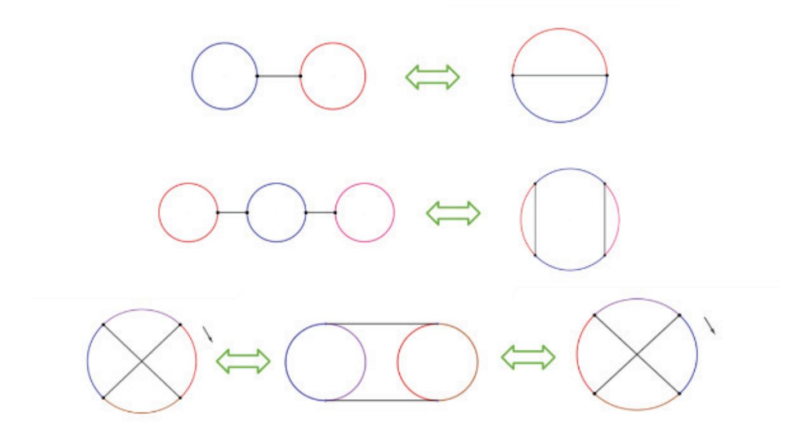

{0}------------------------------------------------

### On the Maximum Nonlinearity of De Bruijn Sequence Feedback Function ?

Congwei Zhou[0000−0002−3463−6635], Bin Hu, and Jie Guan

PLA SSF Information Engineering University, Zhengzhou, 450001, China zhoucongwei@qq.com

Abstract. The nonlinearity of Boolean function is an important cryptographic criteria in the Best Affine Attack approach. In this paper, based on the definition of nonlinearity, we propose a new design index of nonlinear feedback shift registers. Using the index and the correlative necessary conditions of de Bruijn sequence feedback function, we prove that when n ≥ 9, the maximum nonlinearity N l(f)max of arbitrary n−order de Bruijn sequence feedback function f satisfies

$$3 \cdot 2^{n-3} - (Z_n + 1) < Nl(f)_{\text{max}} \le 2^{n-1} - 2^{\frac{n-1}{2}}$$

and the nonlinearity of de Bruijn sequence feedback function, based on the spanning tree of adjacency graph of affine shift registers, has a fixed value. At the same time, this paper gives the correlation analysis and practical application of the index.

Keywords: Nonlinear feedback shift register · Nonlinearity · De Bruijn sequence · Feedback function · Adjacency graph.

#### 1 Introduction

The nonsingular feedback shift register is a kind of register which is widely used in communication and cryptographic algorithm structure. The cycle structure is a commonly expression for describing the state graph of nonsingular feedback shift registers, that is, how many cycles can the nonsingular feedback shift register generate and what is the length of each cycle? The de Bruijn sequence is a kind of nonsingular feedback shift register sequences with the maximal cycle length, that is, its cycle structure has one cycle and its cycle length is 2n. Because of its good pseudo-random property and high linear complexity, it is widely used in communication coding [4]. At present, the main methods of constructing de Bruijn sequences are "cycle joining" method and recursion method. But up to now, there is no good algorithm to generate a large number of de Bruijn sequences with good cryptography properties quickly [1, 2].

The feedback function of a n−order nonsingular feedback shift register has the following form

$$f: f(x_1, x_2, \cdots, x_n) = x_1 \oplus f_0(x_2, \cdots, x_n)$$

? This work was supported by the National Natural Science Foundation of China (Grant No. 61572516, 61802437)

{1}------------------------------------------------

Its generating state graph has no bunches, namely, the state graph is composed of cycles without common vertices [3]. Each state has the unique precursor and successor. When the feedback function of the nonsingular feedback shift register generates the de Bruijn sequence, it is called the de Bruijn sequence feedback function, whose weight wt(f0) (namely, the number of 1 in the truth table of f0 or when f0 is represented by the minor term, the number of minor terms) is expressed as the weight of the de Bruijn sequence. In 1944, K. Posthumus conjectured that the number of non-shift-equivalent de Bruijn sequences was 2 2 n−1−n. This conjecture was proved by de Bruijn in 1946 with the recursion method based on graph theory, and named from this [5]. It should be noted that the method is not constructive, and the sufficient conditions of generating de Bruijn sequence feedback function are not clear.

Turan M S. comprehensively expounds the nonlinearity of de Bruijn sequence feedback function for the first time in [6]. His paper focuses on the upper bound of its nonlinearity, the number and construction of de Bruijn sequence feedback function with nonlinearity 2, and points out that the nonlinearity can be improved by using the cross-joining technology. Wang M gives the exact number of de Bruijn sequence feedback function with nonlinearity 2 in [7], and improves the upper bound of the number distribution of de Bruijn sequence feedback function with nonlinearity Nl(f) < 2 n−2 given in [7]. It should be pointed out that the upper bound of the nonlinearity given in [6] is not compact, and the significance and the maximum value of the nonlinearity of de Bruijn sequence feedback function have not been solved yet. The purpose of this paper is to make further research on this aspect.

The work of this paper is as follows. In Section 2, we briefly introduce the related theorems of the cycle structure of nonsingular feedback shift register, the necessary conditions of de Bruijn sequence feedback function, and the basic knowledge of cycle cross-joining and adjacency graph. In Section 3, according to the definition of nonlinearity and the analysis method of NLFSR (nonlinear feedback shift register), a new design index of NLFSR is proposed, and the distribution of the index value is preliminarily analyzed. In Section 4, in combination with the design index of nonsingular feedback shift register proposed in Section 3, it is proved that the de Bruijn sequence feedback function constructed by the spanning tree of adjacency graph of affine shift registers, has a fixed nonlinearity. At the same time, the main conclusion of this paper is pointed out, that is, when n ≥ 9, the maximum nonlinearity of arbitrary n−order de Bruijn sequence feedback function is included in (3 · 2 n−3 − (Zn + 1), 2 n−1 − 2 n−1 2 ]. Compared with the upper bound of the nonlinearity of general Boolean functions, the upper bound is twice smaller. Therefore, this paper also shows that the feedback function of de Bruijn sequence does not have high nonlinearity in a certain order. In the end, we use the upper bound of the number distribution of the nonlinearity Nl(f) < 2 n−2 of de Bruijn sequence feedback function given in [7], to explain the upper bound of the theoretical number of de Bruijn sequence constructed by the adjacency graph of affine shift registers.

{2}------------------------------------------------

#### 2 Preliminaries

## 2.1 The related basic theorems of the cycle structure of nonsingular feedback shift register

The related theorems of cycle structure in this section are all from the Chapter IV of reference [9], where Theorem 2.3 and 2.4 can be generalized by Theorem 2.2.

**Theorem 2.1** [8] Let  $N_f$  denote the number of cycles in the state graph  $G_f$  of a n-order nonsingular feedback shift register with  $f(x_1, x_2, \dots, x_n)$  as the feedback function, then there must be

$$1 \le N_f \le Z_n = \frac{1}{n} \sum_{d|n} \varphi(d) 2^{\frac{n}{d}}$$

where  $\varphi$  is Euler function, and  $Z_n$  is the number of cycles in the cycle structure of pure circulating shift register.

**Theorem 2.2** [9] The feedback function f of any nonsingular feedback shift register satisfies

$$N_f \equiv wt(f_0) \pmod{2}$$

**Theorem 2.3** [9] For any nonsingular linear feedback shift register, the number of cycles in the state graph must be even.

**Theorem 2.4** [9]  $N_f$  is an odd number, if and only if the highest order term  $x_2 \cdots x_n$  appears in the polynomial representation of  $f(x_1, x_2, \cdots, x_n)$ .

# 2.2 The necessary conditions of de Bruijn sequence feedback function

When we study the necessary conditions of de Bruijn sequence feedback function

$$f: f(x_1, x_2, \cdots, x_n) = x_1 \oplus f_0(x_2, \cdots, x_n)$$

we mainly describe the necessary relations that  $f_0$  satisfies in the polynomial and minor term representation. The following necessary conditions of de Bruijn sequence feedback function are given from the polynomial and minor term representation of  $f_0$  respectively.

**Theorem 2.5** [10] Let  $f(x_1, x_2, \dots, x_n) = x_1 \oplus f_0(x_2, \dots, x_n)$  denote the de Bruijn sequence feedback function, then the polynomial of  $f_0$  has the following properties:

- 1. The number k of the monomials must be odd, and  $3 \le k \le 2^{n-1} 1$ ;
- 2. There must be the highest order term  $x_2 \cdots x_n$  and 1, but one order terms  $x_2, \cdots, x_n$  cannot all appear;
- 3. Let  $K_i$  be the number of monomials that depend on  $x_i (i = 2, \dots, n)$  in  $f_0$ , then there exists at least one even  $K_i$ .

**Theorem 2.6** [11] In the minor term representation of  $f_0$  of de Bruijn sequence feedback function, let the form of its minor term be  $x_2^{\alpha_2} x_3^{\alpha_3} \cdots x_n^{\alpha_n}$ , and its set be  $S_{f_0}$ , then it has the following properties:

1. 
$$|S_{f_0}| = wt(f_0) \equiv 1 \pmod{2}$$
;

{3}------------------------------------------------

$$Z_n^* = \frac{1}{2} Z_n - \frac{1}{2n} \sum_{2d|n} \varphi(2d) 2^{\frac{n}{2d}};$$

3. Let  $g_k$  be the number of minor terms whose superscript weight  $wt(\alpha_2, \alpha_3, \dots, \alpha_n)$ is equal to k in  $f_0$ , then for any  $k:0\leq k\leq n-1$ , there exits  $g_k\neq 0$ . In particular,  $g_{k=0} = g_{k=n-1} = 1$ .

Based on the necessary conditions of de Bruijn sequence feedback function, it is easy to give four commonly used cryptanalysis indexes on Boolean function, that is, for de Bruijn sequence feedback function f,

- (1) it satisfies the balance;
- (2) algebraic degree is n-1;

(3) [6] nonlinearity 
$$\begin{cases} Nl(f) \equiv 2 \pmod{4} \\ Nl(f) < 2^{n-1} - 2^{\frac{n-1}{2}} ; \\ Nl(f) \le 2^n - 2Z_n + 2 \end{cases}$$

(4) [12] The Siegenthaler bound gives the relationship between the algebraic degree and correlation-immunity, that is, the algebraic degree of  $t(0 \le t \le t \le t \le t \le t \le t \le t \le t \le t \le$ (n-1)-order resilient function is no more than n-t-1. Combining with (1) and (2), we can see that the de Bruijn sequence feedback function is the 0-order resilient function, that is, the correlation-immunity is 0, or called un-correlation-immunity.

Expect for the case that the upper bound of nonlinearity is not compact, other indexes are all determined values. In the third and fourth sections of this paper, we will study the nonlinearity from the perspective of cycle cross-joining and adjacency graph, so the corresponding basic knowledge is listed in the following.

#### The basic knowledge of cycle cross-joining and adjacency graph 2.3

#### 2.3.1 The cycle cross-joining

**Theorem 2.7** [13] let  $f(x_1, x_2, \dots, x_n)$  be the feedback function of arbitrary n-order nonsingular feedback shift register. And let  $\alpha = (\alpha_1, \alpha_2, \dots, \alpha_n)$  be an arbitrary state in the corresponding cycle structure and  $\alpha * = (1 \oplus \alpha_1, \alpha_2, \cdots, \alpha_n)$ is its conjugate state. Therefore,

$$f_1(x_1,x_2,\cdots,x_n)=f(x_1,x_2,\cdots,x_n)\oplus x_2^{\alpha_2}x_3^{\alpha_3}\cdots x_n^{\alpha_n}$$

is also nonsingular and there is two cases in the following

(1) if  $\alpha$  and  $\alpha$ \* belong to two cycles respectively, whose lengths are  $l_1$  and  $l_2$ in the state graph  $G_f$  of nonsingular feedback shift register with f as the feedback function, that is, the two cycles can be expressed as

$$(\alpha = s_0, s_1, \dots, s_{l_1-1}), (\alpha * = t_0, t_1, \dots, t_{l_2-1}).$$

Then the two cycles can be joined into one cycle whose length is equal to  $l_1 + l_2$ , that is, the cycle can be expressed as

$$(\alpha = s_0, t_1, \dots, t_{l_2-1}, \alpha * = t_0, s_1, \dots, s_{l_1-1}).$$

{4}------------------------------------------------

At this time the remaining cycles keep intact, then the state graph  $G_f$  of nonsingular feedback shift register with  $f_1$  as the feedback function is obtained;

(2) if  $\alpha$  and  $\alpha$ \* belong to the same cycle whose length is equal to l in the state graph  $G_f$  of nonsingular feedback shift register with f as the feedback function, and

$$\alpha = s_0, \alpha * = s_k (0 < k < l).$$

Then the cycle can be crossed into two cycles whose lengths are equal to l-k and k respectively, that is, the two cycles can be expressed as

$$(\alpha = s_0, s_{k+1}, s_{k+2}, \dots, s_{l-1}), (\alpha * = s_k, s_1, \dots, s_{k-1}).$$

At this time the remaining cycles keep intact, then the state graph  $G_{f_1}$  of nonsingular feedback shift register with  $f_1$  as the feedback function is obtained.

As the name suggests, the cycle cross-joining is to join once, and then cross once (or cross once, and then join once). According to Theorem 2.7, it has three types shown in Fig.1 [14].

Fig. 1. Three types of the cycle cross-joining

From Theorem 2.7, let  $x_2^{\alpha_2} x_3^{\alpha_3} \cdots x_n^{\alpha_n}$  be the corresponding minor term for a conjugate state pair  $(\alpha, \alpha*)$ . In [15], it is proved that any one de Bruijn sequence feedback function can be generated from another one by repeated application of the cycle cross-joining operation, that is, through the third type. In [16], it is said that in one state cycle, a pair of intersecting chords between two conjugate state pairs, namely, corresponding two minor terms, is called a **cross-join pair**.

{5}------------------------------------------------

The reference [17] shows that the maximum cycle cross-joining operation for one de Bruijn sequence feedback function translating into another one is  $2^{n-2} - 1$ . In the following, we will study the adjacency graph from generated de Bruijn sequence feedback functions, and explain the weight  $wt(f_0)$  range of de Bruijn sequence feedback function and the reason why the cycle cross-joining method can generate all de Bruijn sequence feedback functions.

#### 2.3.2 The adjacency graph

**Definition 2.1** [13] Let  $f(x_1, x_2, \dots, x_n)$  be the feedback function of arbitrary n-order nonsingular feedback shift register, whose state graph  $G_f$  has  $N_f$  cycles. Let  $\Gamma_f$  be the adjacency graph of  $G_f$ , then  $G_f$  has the cycle  $\sigma_i$  while  $\Gamma_f$  has the vertex  $g_i(1 \le i \le N_f)$ . Let  $\alpha$  and  $\alpha*$  be an arbitrary conjugate state pair in  $G_f$ . If  $\alpha$  is in the cycle  $\sigma_i$  and  $\alpha*$  is in the cycle  $\sigma_j$  respectively (i can be j), we use one line to connect the vertex  $g_i$  and  $g_j$ , and let this line denote  $(\alpha_2, \dots, \alpha_n)$ .

From Definition 2.1, we can see immediately that the number of vertices in the adjacency graph  $\Gamma_f$  of  $G_f$  is equal to  $N_f$ , and the number of lines in the adjacency graph  $\Gamma_f$  is equal to  $2^{n-1}$ . At the same time, the line  $(\alpha_2, \dots, \alpha_n)$  exactly corresponds to the minor term  $x_2^{\alpha_2} x_3^{\alpha_3} \cdots x_n^{\alpha_n}$ , thus the method of constructing de Bruijn sequence feedback function based on the spanning tree of adjacency graph is obtained immediately, namely, Lemma 2.1.

**Lemma 2.1** [13] If  $\Gamma_f$  satisfies the following two conditions:

- (1) There is a spanning tree in  $\Gamma_f$ ;
- (2) The spanning tree of  $\Gamma_f$  is composed of  $N_f 1$  in  $\Gamma_f$ , then

$$f'(x_1, x_2, \dots, x_n) = f(x_1, x_2, \dots, x_n) \oplus \sum_{i=1}^{N_f - 1} x_2^{\alpha_2^{(i)}} x_3^{\alpha_3^{(i)}} \cdots x_n^{\alpha_n^{(i)}}$$

is a de Bruijn sequence feedback function.

In this paper,  $\Gamma_f^{f'}$  is used to represent the spanning tree of  $\Gamma_f$  corresponding to the de Bruijn sequence feedback function f', then the number of lines in  $\Gamma_f^{f'}$  is equal to  $N_f - 1 = wt(f \oplus f')$ . Theorem 2.8 shows that there is a one-to-one relationship between the de Bruijn sequence feedback function with the extremal weight and the spanning tree of adjacency graph of two special feedback shift registers.

**Theorem 2.8** [13] The de Bruijn sequence feedback function with the minimum weight  $Z_n - 1$  has a one-to-one correspondence with the spanning tree in  $\Gamma_{x_1}$ , so its number is equal to the number of the spanning trees in  $\Gamma_{x_1}$ ; The de Bruijn sequence feedback function with the maximum weight  $2^{n-1} - Z_n^* + 1$  has a one-to-one correspondence with the spanning tree in  $\Gamma_{x_1 \oplus 1}$ , so its number is equal to the number of the spanning trees in  $\Gamma_{x_1 \oplus 1}$ .

The relationship between the de Bruijn sequence feedback functions with the remaining weight can be described by the following Theorem 2.9.

**Theorem 2.9** [13] Let  $f(x_1, x_2, \dots, x_n) = x_1 \oplus g(x_2, x_2, \dots, x_n) \oplus h(x_2, x_2, \dots, x_n)$  denote a n-order de Bruijn sequence feedback function, where  $f_0(x_1, x_2, \dots, x_n) = f_0(x_1, x_2, \dots, x_n)$ 

{6}------------------------------------------------

x1⊕g(x2, x2, · · · , xn) is also a de Bruijn sequence feedback function. If g(x2, x2, · · · , xn) and h(x2, x2, · · · , xn) are expressed as the minor term representation, then

- (1) The two minor terms ma, mb can be found in h(x2, x2, · · · , xn) so that x1 ⊕ g(x2, x2, · · · , xn) ⊕ ma ⊕ mb is still a de Bruijn sequence feedback function;
- (2) If there is no same minor term between g(x2, x2, · · · , xn) and h(x2, x2, · · · , xn), then

$$wt(f) = wt(g) + wt(h) = wt(f_0) + wt(h)$$
  
an even number, and it can divide all minor terms in  $h(x_2, x_2, \dots, x_n)$ 

where wt(h) is an even number, and it can divide all minor terms in h(x2, x2, · · · , xn) into wt(h)/2 pairs:

$$m_{a_1}, m_{b_1}; m_{a_2}, m_{b_2}; \cdots; m_{a_{wt(h)/2}}, m_{b_{wt(h)/2}}$$
 so that  $f_K(x_1, x_2, \cdots, x_n) = f_0(x_1, x_2, \cdots, x_n) \oplus \sum_{i=1}^K (m_{a_i} \oplus m_{b_i})$  are all de Bruijn sequence feedback functions, and  $wt(f_R) = wt(f_0) + 2K, R = 1, 2, \cdots, wt(h)/2$ .

If there are the same minor terms between g(x2, x2, · · · , xn) and h(x2, x2, · · · , xn) according to Theorem 2.9.(2), the above theorem also holds, except that the weight wt(fR) should be subtracted by twice the number of the same minor terms. In fact, Theorem 2.9 states that all de Bruijn sequence feedback functions can be generated by adding cross-join pairs to all de Bruijn sequence feedback functions with a certain weight. If there is no same minor terms in every cycle cross-joining operation, all de Bruijn sequence feedback functions with all odd number weight in the weight range can be traversed to generate, and its generated dual function is necessary to reach the maximum cycle cross-joining operation. At present, for the number distribution on the weight of de Bruijn sequence feedback function, there are only conjectures [18], and there is no substantive progress.

#### 3 A new design index of NLFSR

In this section, aiming at the definition of the nonlinearity of Boolean function and based on the analysis method of NLFSR, a new design index of NLFSR is proposed, which is also the first time to put forward a new point of view on the research significance of the nonlinearity of feedback function from the perspective of the cycle structure of NLFSR, and then the analysis of related index value is carried out.

#### 3.1 The new research significance of nonlinearity of NLFSR feedback function

In general, the nonlinearity of Boolean function can be described by the following Definition 3.1.

Definition 3.1 [19] Let f(x) be a n− elemental Boolean function, and `n be the set of all n−elemental affine functions. The nonlinearity of f(x) is defined as Nl(f) = min l∈`n d(f, l), where d(f, l) is the distance between f(x) and l(x), namely,

{7}------------------------------------------------

$$d(f,l) = |\{x \in F_2^n | f(x) \neq l(x)\}|.$$

In fact, over  $F_2$ ,  $d(f, l) = wt(f \oplus l)$ .

Of course, the nonlinearity can also be defined from the Walsh spectrum analysis of Boolean functions. Therefore, in a cryptosystem with the NLFSR component, the common way of cryptographic function analysis is to convert the feedback polynomial of NLFSR into the corresponding Boolean function (**Substitution** and **Direct method**). By discussing the properties of Boolean function, such as the Walsh spectrum distribution of Boolean function, NLFSR can be analyzed. The conclusion is as follows:

- (1) **Substitution:** Because of the limitation of resources, the analyzed order is usually replaced by the number of undetermined elements. Therefore, when a NLFSR feedback function is converted into a Boolean function, the key points of its Walsh spectrum value that affect the balance, correlation-immunity and maximum Walsh spectrum value, also affect the security of the cryptosystem;
- (2) **Direct method:** Through the NLFSR feedback function which is directly used to analyze the state graph of the driving sequences, it can filter the possible maximum linear sequences (linear complexity of the sequences) or weak keys (short cycle length). Finally, this method may need to determine the cycle structure of NLFSR.

At present, the design index directly for NLFSR does not appear. Usually when the part of (1) and (2) is just satisfied (mainly for analysis methods), the design way is to adjust the taps of NLFSR and the nonlinear part of feedback function.

In view of the second kind on direct analysis and determination of the cycle structure of NLFSR, because the cycle structure of NLFSR with large orders cannot be determined, and the cycle structure of affine shift register with large orders is solvable to a certain extent, we claim that the distance from a given NLFSR to any affine shift register is an important characterization index of the NLFSR, which can be described by the difference of each cycle in the cycle structure of NLFSR, namely. Definition 3.2.

**Definition 3.2** The distance index value  $k(k \ge 1)$  from a given NLFSR to any affine shift register, refers to that the cycle structure of any affine shift register can be obtained from the given cycle structure of NLFSR through at least k-time cycle joining or crossing.

In order to explain the rationality of the definition of distance index, it is necessary to illustrate that any NLFSR has a unique distance index value k. We note that the feedback function of all nonsingular feedback shift registers can be expressed as follows

$$f: f(x_1, x_2, \cdots, x_n) = x_1 \oplus f_0(x_2, \cdots, x_n)$$

where  $f_0(x_2, \dots, x_n)$  can be represented by minor terms such as  $x_2^{\alpha_2} x_3^{\alpha_3} \cdots x_n^{\alpha_n}$ . In fact, the superscript sign  $\alpha_2 \alpha_3 \cdots \alpha_n$  of minor term is equal to the (n-1)-elemental vector with the value 1 in the truth table of  $f_0$ . Therefore the feedback function of any nonsingular feedback shift register can be expressed as a combination of different minor terms with XOR addition. Let two different

{8}------------------------------------------------

feedback functions of nonsingular feedback shift register be f, g, whose difference sum of minor terms  $f_0 \oplus g_0$  is uniquely determined. According to Theorem 2.7, a cycle structure can realize its operation of cycle joining or crossing by adding minor terms, thus another cycle structure can be obtained from it. That is to say, for two cycle structures of the two different nonsingular feedback shift registers, when one cycle structure is converted into another though the least number of times on cycle joining or crossing, this number value is fixed, namely, it is equal to the weight  $wt(f_0 \oplus g_0)$  of their difference sum of minor terms. Then there is a fixed minimum number of times from a given cycle structure of NLFSR to each cycle structure of affine shift register, and the distance index of NLFSR refers to the least number of times among all the fixed times, so any NLFSR has a unique distance index value k. Thus the index has the uniqueness in setting. The smaller the value k is, the higher the similarity between the cycle structure of the given NLFSR and affine shift register is. This distance index is usually related to the function distance (such as nonlinearity). It is a characterization of the distance from a single state to a single state cycle based on the cycle structure of nonsingular feedback shift register, which is the reflection of the periodic property of shift register. The following Theorem 3.1 gives the relationship between the nonlinearity of Boolean function and the distance index.

**Theorem 3.1** For the feedback function of any n-order NLFSR, the distance index value from its NLFSR to any affine shift register satisfies

$$k = Nl(f)/2.$$

*Proof.* In fact, for the feedback function of any n-order NLFSR, inspired by the nonlinearity of Boolean function, its  $x_1$  is independent, and if the affine function l does not contain  $x_1$ , then  $wt(f \oplus l) = 2^{n-1}$ , so the affine function must contain  $x_1$ . Therefore, it can be assumed that  $l = x_1 \oplus l_0$ , then we have

$$x_1$$
. Therefore, it can be assumed that  $l = x_1 \oplus l_0$ , then we have  $Nl(f) = \min_{l \in \ell_n} wt(f \oplus l) = 2 \min_{l \in \ell_n} \sum_{x \in F_2^{n-1}} (f \oplus l)(x) = 2 \min_{l_0 \in \ell_{n-1}} wt(f_0 \oplus l_0)$ .

By the minor term representation, it can imply

$$f_0 \oplus l_0 = \sum_{i=1}^{Nl(f)/2} x_2^{\alpha_2^i} x_3^{\alpha_3^i} \cdots x_n^{\alpha_n^i}.$$

Thus we can obtain

$$f = l \oplus \sum_{i=1}^{Nl(f)/2} x_2^{\alpha_2^i} x_3^{\alpha_3^i} \cdots x_n^{\alpha_n^i}.$$

If there is a distance index value k less than half of the nonlinearity Nl(f)/2, the following inequality can be constructed according to Definition 3.2, namely,  $2wt(f_0 \oplus l_0) = 2k < Nl(f)$ .

This is contrary to the minimization property of Nl(f); On the contrary, if there is a distance index value k larger than half of the nonlinearity Nl(f)/2, it is contrary to the definition of distance index value. Therefore k can only be equal to Nl(f)/2. So the theorem is proved.

As mentioned above, the nonlinearity refers to the difference between states, while the distance index refers to the difference between state cycles. In the analysis of cryptosystems with NLFSR components, if each state cycle in the

{9}------------------------------------------------

cycle structure of one certain NLFSR is very similar to state cycles of some affine (linear) shift registers, there will be maximum linear sequences (linear complexity of the sequences) or weak keys (short cycle length). Therefore, NLFSRs can be equated with LFSRs in cryptanalysis, and the cryptosystem with NLFSRs can be analyzed by the fast correlation attack and algebraic attack. For example, a de Bruijn sequence is generated by adding the value 0 to one m-sequence, and the distance index value of its corresponding NLFSR is 1, which makes the generated sequence have a large linear sequence. Therefore, the distance index from a given NLFSR to any affine shift register proposed in this section is an important factor to describe its security, so any cryptosystem with NLFSR components needs to carefully consider the nonlinearity of feedback function of NLFSR.

#### 3.2 The analysis and application of distance index

In this section, we first analyze the property and number of feedback function of NLFSR with distance index value 1, then give the upper bound of the distance index according to the existing general bound and balanced bound of the nonlinearity of Boolean function, and point out that the first method on the substitution of feedback function of NLFSR has defects.

**Theorem 3.2** The number of cycles in the cycle structure of  $n(n \ge 3)$ -order NLFSR with distance index value 1, is odd, and its feedback function by the polynomial representation must contain  $x_2 \cdots x_n$ .

*Proof.* According to Theorem 2.3, the number of cycles in the state graph of non-degenerate n-order linear feedback shift register must be even, so the number of cycles in the cycle structure of n-order NLFSR with distance index value 1, is odd, no matter whether the cycles are joined or crossed. Therefore, according to Theorem 2.4, its feedback function by the polynomial representation must contain  $x_2 \cdots x_n$ , so the theorem is proved.

**Theorem 3.3** The number of  $n(n \ge 3)$ -order NLFSR with distance index value 1, is  $2^n \cdot (2^{n-1} - n)$ .

Proof. When  $n \geq 3$ , the feedback function of any affine shift register can generate the feedback function with nonlinearity 2 of NLFSR by adding the  $2^{n-1}$ -type minor term  $x_2^{\alpha_2} x_3^{\alpha_3} \cdots x_n^{\alpha_n}$ . If  $wt(\alpha_2, \alpha_3, \cdots, \alpha_n)$  or  $wt(\alpha_2, \alpha_3, \cdots, \alpha_n) = 1$ , then when the added minor term  $x_2^{\alpha_2} x_3^{\alpha_3} \cdots x_n^{\alpha_n}$  is expanded into the polynomial representation, the linear term will inevitably appear, resulting in repetition. Therefore, the number of NLFSR with distance index value 1 without repetition, is equal to the product of the type of all the feedback functions of affine shift register and the type of superscript weight  $wt(a_2, a_3, \cdots, a_n) > 1$  on the added minor term, that is,

$$2^{n} \cdot (2^{n-1} - \binom{n-1}{n-2} - \binom{n-1}{n-1}) = 2^{n} \cdot (2^{n-1} - n)$$

so the theorem is proved.

For all n-elemental Boolean functions f(x), its Nl(f) has a maximum value, which can be written as  $Nl(f)_{\text{max}}$ . Because the distance index is closely related

{10}------------------------------------------------

to the nonlinearity of Boolean function, the general bound and balance bound of the nonlinearity of Boolean function are given first.

Theorem 3.4 [20] (General bound) Let f(x) be a n−elemental Boolean function, then

- (1) when n = 3, 5, 7, Nl(f)max = 2n−1 − 2 n−1 2 ;
- (2) when n ≥ 9 and n is odd, 2n−1 − 2 n−1 2 ≤ Nl(f)max ≤ 2 n−1 − 2 b n 2 c−1 .

It is still an open problem about the nonlinearity bound of balanced function and correlation-immunity function. At present, using the fact that the nonlinearity of n−elemental Boolean function is equivalent to the covering radius of the first order reed-Muller code, the nonlinearity of balanced function is studied and some results are obtained, that is, Theorem 3.5.

Theorem 3.5 [21] (Balanced bound) Let f(x) be a n(n ≥ 3)− elemental balanced Boolean function, then the nonlinearity of f(x) satisfies

$$Nl(f)_{\max} \le \begin{cases} 2^{n-1} - 2^{\frac{n-2}{2}} - 2 & n = 2t(t \ge 2) \\ \left| 2^{n-1} - 2^{\frac{n-2}{2}} \right| & n = 2t + 1(t \ge 1) \end{cases}$$

where jj2 n−1 − 2 n−2 2 kk is the maximum even number less than or equal to 2 n−1 − 2 n−2 2 .

However, it is an open problem whether the upper bound is compact for a certain n, so we give an less compact upper bound of the distance index value, that is, Theorem 3.6.

Theorem 3.6 The maximum value kmax of distance index of any n(n ≥ 3)−order NLFSR satisfies

$$k_{\max} \le \begin{cases} 2^{n-2} - 2^{\frac{n-3}{2}} & n = 2t + 1(t \ge 1) \\ 2^{n-2} - 2^{\frac{n-2}{2}} & n = 4, 6, 8 \\ \left[ 2^{n-2} - 2^{\frac{n-2}{2}}, 2^{n-2} - 2^{\left\lfloor \frac{n-1}{2} \right\rfloor - 1} \right] & n = 2t(t \ge 5) \end{cases}$$

Proof. It is easy to prove by the balanced bound of (n − 1)−elemental Boolean function.

We can give an example to show that when n = 3, the distance index value can only be 1, because only one nonlinear term x2x3 can be added. At the same time, the reference [22] points out that when n ≥ 15, we can construct odd number elemental balanced Boolean functions such that Nl(f) ≥ 2 n−1−2 n−1 2 . In fact, it can be seen from Theorem 3.6 that when n ≥ 3, we can construct an odd number elemental balanced Boolean function such that Nl(f) = 2n−1 − 2 n−1 2 .

As described in the previous section, in practical application, some people directly analyze the nonlinearity of feedback function of NLFSR with small orders after the analyzed order is replaced by the number of undetermined elements. In fact, it is likely to lead to the increase or decrease of the nonlinearity, and then lead to the increase or decrease of the distance index value of NLFSR, resulting in the leakage of hidden information. Here is a simple example.

{11}------------------------------------------------

For example 3.1 A 10-elemental NLFSR feedback function  $f = x_1 \oplus x_2^{-1} \cdots x_9^{-1} (x_{10}^1 \oplus x_{10}^0)$ , whose distance index value is 2, by the replacement of undetermined elements, becomes a 9-elemental NLFSR feedback function  $f = y_1 + y_2^{-1} \cdots y_9^{-1}$ , whose distance index value is 1.

# 4 The upper bound of the nonlinearity of de Bruijn sequence feedback function

It can be seen from Theorem 3.6 that the upper bound of the nonlinearity of de Bruijn sequence feedback function, given in the reference [6], is exactly corresponding to the maximum value  $Nl(f) = 2^{n-1} - 2^{\frac{n-1}{2}}$  of distance index. However, for some special structure of de Bruijn sequence feedback function, its nonlinearity may be not more than  $Z_n$ . First, the estimate of  $Z_n$  can be measured by the following inequality, namely, Lemma 4.1.

**Lemma 4.1** When  $n \ge 9$ ,  $2^{n-3} > Z_n$ .

*Proof.* Because of the expansion of  $\mathbb{Z}_n$  and Euler's theorem

$$n = \sum_{d|n} \varphi(d)$$

it can be seen that this lemma needs to prove the following inequality

$$\sum_{d|n} \varphi(d) \cdot 2^{n-3} > \sum_{d|n} \varphi(d) \cdot 2^{\frac{n}{d}}$$

$$\tag{1}$$

Suppose that the factorization of n is  $1 = d_1 < d_2 < \cdots < d_k = n$ , then when  $\varphi(n) \ge 8$  and  $n \ge 9$ , we have

 $(\varphi(1) + \varphi(n)) \cdot 2^{n-3} \ge 2^n + 2^{n-3} > 2^n + 2n > 2^n + \varphi(n) \cdot 2 = \varphi(1) \cdot 2^n + \varphi(n) \cdot 2$ And when  $n \ge 9$ , for any i : 1 < i < k, there is always  $2^{n-3} > 2^{\frac{n}{d_i}}$ . Therefore, it can be seen from Euler's theorem that when  $\varphi(n) \ge 8$  and  $n \ge 9$ , the inequality

(1) is established. The following proof is the fact that when  $n \geq 30$ ,  $\varphi(n) \geq 8$ . Let the prime factorization of n be  $p_1^{s_1} p_2^{s_2} \cdots p_t^{s_t}$ . The following is discussed

Let the prime factorization of n be  $p_1^{s_1}p_2^{s_2}\cdots p_t^{s_t}$ . The following is discussed in details:

- (1) For  $n = p_1^{t_1}(t_1 \ge 1)$ , because  $\varphi(n) \ge 8$ , namely,  $n \cdot (1 1/p_1) \ge 8$ , then it can be seen that  $n \ge 16$ ;
- (2) For  $n = p_1^{t_1} p_2^{t_2} (t_1 \ge 1, t_2 \ge 1)$ , because  $\varphi(n) = n \cdot (1 1/p_1) \cdot (1 1/p_2) \ge 8$ , it can be seen that  $n \ge 24$ ;
- (3) When  $n = p_1^{t_1} p_2^{t_2} p_3^{t_3} (t_1 \ge 1, t_2 \ge 1, t_3 \ge 1), n \ge p_1 p_2 p_3$ . Because of the fact that Euler function is a multiplicative function, it can be seen that  $\varphi(n) \ge \varphi(p_1 p_2 p_3) = \varphi(p_1) \cdot \varphi(p_2) \cdot \varphi(p_3)$ .

At this time, Substitute the smallest prime group  $(p_1, p_2, p_3) = (2, 3, 5)$  into the above inequality to know that when  $n \ge 30$ ,  $\varphi(n) \ge 8$ .

And so on, when the number of prime factors of n is more than 3, it can be seen that  $\varphi(n) > 8$ . Therefore, when  $n \ge 30$ ,  $\varphi(n) \ge 8$ .

To sum up, it can be seen from the query of Euler function table that when  $n \ge 9$ , only  $\varphi(9) = 6$ ,  $\varphi(10) = 4$ ,  $\varphi(14) = 6$ ,  $\varphi(18) = 6$ , and the rest  $\varphi(n) \ge 8$ .

{12}------------------------------------------------

By Substituting n = 9, 10, 14, 18 into the inequality (1), we can see that the inequality (1) holds, so lemma is proved.

In combination with Lemma 4.1, Theorem 4.1 gives the fixed value of the nonlinearity of de Bruijn sequence feedback function, which is constructed by the spanning tree of adjacency graph of affine shift registers.

**Theorem 4.1** When  $n \geq 9$ , for all n-order de Bruijn sequence feedback functions f constructed by the spanning tree  $\Gamma_l^f$  of adjacency graph of affine shift registers l, their nonlinearity is the fixed value, namely,  $Nl(f) = 2(N_l - 1)$ .

*Proof.* According to Lemma 2.1, let the n-order de Bruijn sequence feedback function constructed by  $\Gamma_l^f$  be

$$f = x_1 \oplus l_0 \oplus \sum_{i=1}^{N_l-1} x_2^{\alpha_2^{(i)}} x_3^{\alpha_3^{(i)}} \cdots x_n^{\alpha_n^{(i)}}.$$

And we can assume that the distance index of corresponding NLFSR is  $k(k < N_l - 1)$ , then we can get

$$f = x_1 \oplus l'_0 \oplus \sum_{i=1}^k x_2^{\beta_2^{(i)}} x_3^{\beta_3^{(i)}} \cdots x_n^{\beta_n^{(i)}}.$$

Therefore, we can obtain the equality

$$l \oplus l' = \sum_{i=1}^{N_l - 1} x_2^{a_2^{(i)}} x_3^{a_3^{(i)}} \cdots x_n^{a_n^{(i)}} \oplus \sum_{i=1}^k x_2^{\beta_2^{(i)}} x_3^{\beta_3^{(i)}} \cdots x_n^{\beta_n^{(i)}}$$

$$(2)$$

Because  $wt(l_0 \oplus l'_0) = 2^{n-2}$ , and when  $n \geq 9$ , it can be obtained that  $2(Z_n - 1) < 2^{n-2}$  from Lemma 4.1, then according to Theorem 2.1, we can obtain that

$$N_l - 1 + k < 2(N_l - 1) \le 2(Z_n - 1) < 2^{n-2}.$$

Therefore, the equality (2) is not true, then the hypothesis is not true. So  $k = N_l - 1$ , and it is proved by Theorem 3.1.

Then in combination with Theorem 2.8, we can immediately get the following Corollary 4.1.

Corollary 4.1 When  $n \geq 9$ , the nonlinearity of de Bruijn sequence feedback function with the minimum weight  $Z_n - 1$  is  $2(Z_n - 1)$ , and the nonlinearity of de Bruijn sequence feedback function with the maximum weight  $2^{n-1} - Z_n^* + 1$  is  $2(Z_n^* - 1)$ .

In this section, we will combine with the necessary conditions of de Bruijn sequence feedback function and the distance index of NLFSR, then give the upper bound range of the nonlinearity of de Bruijn sequence feedback function, that is, Theorem 4.2.

**Theorem 4.2** When  $n \geq 9$ , for the arbitrary n-order de Bruijn sequence feedback function f, its maximum nonlinearity  $Nl(f)_{\text{max}}$  satisfies

$$3 \cdot 2^{n-3} - (Z_n + 1) < Nl(f)_{\max} \le 2^{n-1} - 2^{\frac{n-1}{2}}.$$

*Proof.* When  $n \geq 9$ , let  $l = x_1 + l_0$  be the feedback function of n-order nonsingular affine shift register, then according to Theorem 2.1 and 2.3, its state graph  $G_l$  has  $N_l(2 \leq N_l \leq Z_n, N_l = 2s(s \geq 1))$  cycles and  $\Gamma_l$  is the adjacency graph of  $G_l$ . At the same time, according to Lemma 2.1 and Theorem 4.1, the n-order

{13}------------------------------------------------

de Bruijn sequence feedback function is generated by directly the  $N_l - 1$ -time cycle joining in the cycle structure of affine shift register, and its nonlinearity is  $Nl(f) = 2(N_l - 1)$ . If  $l \neq x_1, x_1 \oplus 1$ , because of the weight  $wt(l_0) = 2^{n-2}$  of the feedback function  $l_0$  of affine shift register, then the de Bruijn sequence feedback function f constructed by all the spanning tree  $\Gamma_l^f$  of adjacency graph of affine shift registers has a weight range, whose weight value is odd number in

$$[2^{n-2} - N_l + 1, 2^{n-2} + N_l - 1] (2 \le N_l < Z_n, N_l = 2s(s \ge 1))$$
(3)

Next, we investigate the difference between the nonlinearity of all de Bruijn sequence feedback functions with the weight range (3). Let any two de Bruijn sequence feedback functions  $f_1, f_2(f_1 \neq f_2)$  constructed by the two spanning trees  $\Gamma_{l_1}^{f_1}, \Gamma_{l_2}^{f_2}$  respectively be equal in their weight, namely, we can assume that

trees 
$$\Gamma_{l_1}^{f_1}$$
,  $\Gamma_{l_2}^{f_2}$  respectively be equal in their weight, namely, we can assume that  $f_1 = l_1 \oplus \sum_{i_1=1}^{N_{l_1}-1} x_2^{\alpha_2^{(i_1)}} x_3^{\alpha_3^{(i_1)}} \cdots x_n^{\alpha_n^{(i_1)}}, f_2 = l_2 \oplus \sum_{i_2=1}^{N_{l_2}-1} x_2^{\alpha_2^{(i_2)}} x_3^{\alpha_3^{(i_2)}} \cdots x_n^{\alpha_n^{(i_2)}}$ 

then  $wt(f_1 \oplus x_1) = wt(f_2 \oplus x_1) = m, m \in (3)$ . It can be reasonably assumed that there is a maximum value  $Nl(f)_{\max}$  on all de Bruijn sequences feedback functions with the weight m, and at this time it is assumed that  $Nl(f)_{\max}$  corresponds to  $f_{\max}$ , which is generated by added  $\mu_1$  minor terms to  $f_1$ , or  $\mu_2$  minor terms to  $f_2$ , namely,

$$f_{\max} = l_1 \oplus \sum_{i_1=1}^{N_{l_1}-1} x_2^{\alpha_2^{(i_1)}} x_3^{\alpha_3^{(i_1)}} \cdots x_n^{\alpha_n^{(i_1)}} \oplus \sum_{j=1}^{\mu_1} x_2^{\alpha_2^{(j)}} x_3^{\alpha_3^{(j)}} \cdots x_n^{\alpha_n^{(j)}}$$

$$= l_2 \oplus \sum_{i_2=1}^{N_{l_2}-1} x_2^{\alpha_2^{(i_2)}} x_3^{\alpha_3^{(i_2)}} \cdots x_n^{\alpha_n^{(i_2)}} \oplus \sum_{t=1}^{\mu_2} x_2^{\alpha_2^{(t)}} x_3^{\alpha_3^{(t)}} \cdots x_n^{\alpha_n^{(t)}}$$

$$= l_2 \oplus \sum_{i_2=1}^{N_{l_2}-1} x_2^{\alpha_2^{(i_2)}} x_3^{\alpha_3^{(i_2)}} \cdots x_n^{\alpha_n^{(i_2)}} \oplus \sum_{t=1}^{\mu_2} x_2^{\alpha_2^{(t)}} x_3^{\alpha_3^{(t)}} \cdots x_n^{\alpha_n^{(t)}}$$

Therefore, we can obtain that

$$l_{1} \oplus l_{2} = \sum_{i_{1}=1}^{N_{l_{1}}-1} x_{2}^{\alpha_{2}^{(i_{1})}} x_{3}^{\alpha_{3}^{(i_{1})}} \cdots x_{n}^{\alpha_{n}^{(i_{1})}} \oplus \sum_{j=1}^{u_{1}} x_{2}^{\alpha_{2}^{(j)}} x_{3}^{\alpha_{3}^{(j)}} \cdots x_{n}^{\alpha_{n}^{(j)}} \oplus \sum_{i_{2}=1}^{N_{l_{2}}-1} x_{2}^{\alpha_{2}^{(i_{2})}} x_{3}^{\alpha_{3}^{(i_{2})}} \cdots x_{n}^{\alpha_{n}^{(i_{2})}} \oplus \sum_{t=1}^{u_{2}} x_{2}^{\alpha_{2}^{(t)}} x_{3}^{\alpha_{3}^{(t)}} \cdots x_{n}^{\alpha_{n}^{(t)}}$$

For  $l_1 \oplus l_2$  with the minor term representation of  $l_0$ , because its weight is  $wt(l_1 \oplus l_2) = 2^{n-2}$ , then from the fact that the number of minor terms on both sides of the above equality is equal, it can be obtained that

$$N_{l_1} - 1 + x_1 + N_{l_2} - 1 + x_2 \ge 2^{n-2}$$
.

According to Theorem 3.1, we can get

$$Nl(f)_{\text{max}} = Nl(f_1) + 2x_1 = 2(N_{l_1} - 1 + x_1) = Nl(f_2) + 2x_2 = 2(N_{l_2} - 1 + x_2).$$
  
Then we can imply that  $Nl(f)_{\text{max}} \ge 2^{n-2}$ .

Since the weight range of n-order de Bruijn sequence feedback function is  $\left[Z_n-1,2^{n-1}-Z_n^*+1\right]$ 

combining with Corollary 4.1, next, we investigate the nonlinearity of the feedback function of de Bruijn sequence, whose weight value is odd number in

$$[Z_n + 1, 2^{n-2} - N_l - 1] (2 \le N_l < Z_n, N_l = 2s(s \ge 1))$$
(4)

{14}------------------------------------------------

and

$$[2^{n-2} + N_l + 1, 2^{n-1} - Z_n^* - 1] (2 \le N_l < Z_n, N_l = 2s(s \ge 1))$$
(5)

According to Theorem 2.9, the de Bruijn sequence feedback function with the weight range (4) can always be generated by adding minor terms to the de Bruijn sequence feedback function with the minimum weight  $Z_n - 1$  or the weight range (3); The de Bruijn sequence feedback function with the weight range (5) can always be generated by adding minor terms to the de Bruijn sequence feedback function with the maximum weight  $2^{n-1} - Z_n^* + 1$  or the weight range (3).

Therefore, it can be reasonably assumed that there is a maximum value  $Nl(g)_{\text{max}}$  on all de Bruijn sequences feedback functions g with the weight range (4), and at this time it is assumed that g can be generated by added  $y_1$  minor terms to the de Bruijn sequence feedback function with the minimum weight  $Z_n - 1$ , or  $y_2$  minor terms to the de Bruijn sequence feedback function with the weight range (3). Then according to Corollary 4.1 and the above analysis of maximum nonlinearity  $Nl(f)_{\text{max}}$  in the weight range (3), we can get

$$Nl(g)_{\max} = 2(Z_n - 1) + 2y_1 = Nl(f)_{\max} + 2y_2.$$

And the sum  $y_1 + y_2$  of the number of added minor terms is equal to the length

$$2^{n-2} - N_l - 1 - (Z_n - 1)$$

of the weight range (4). Therefore, we can obtain that

$$Nl(g)_{\text{max}} = Nl(f)_{\text{max}}/2 + (2^{n-2} - N_l - 1) \ge 3 \cdot 2^{n-3} - (N_l + 1).$$

Because  $N_l < Z_n$ , we can imply that

$$Nl(g)_{\text{max}} > 3 \cdot 2^{n-3} - (Z_n + 1).$$

Similarly, from the analysis of the maximum value  $Nl(g)_{\text{max}}$  on the nonlinearity of de Bruijn sequence feedback function with the weight range (5), it can be implied that

$$Nl(g)_{\text{max}} > 3 \cdot 2^{n-3} - (Z_n + 1).$$

To sum up, in combination with Theorem 3.6, the theorem is proved.

The references [7,23] indicate that when  $Nl(f)<2^{n-2},$  the l in its satisfied  $Nl(f)=\min_{l\in\ell_n}wt(f+l)$ 

is unique. At the same time, The reference [7] points out that if  $Nl(f) < 2^{n-2}$ , the number t of f with the nonlinearity Nl(f) is

$$t < \left(\frac{2^{n-1}}{Nl(f)/2}\right) \cdot 2^n.$$

Thus when  $n \geq 9$ , according to Theorem 4.1, the upper bound of the theoretical number of all de Bruijn sequence feedback functions constructed by the spanning tree of adjacency graph of affine shift registers, should be

$$2^n \cdot \sum_{i=1}^{Z_n/2} \begin{pmatrix} 2^{n-1} \\ 2i - 1 \end{pmatrix}$$

At present, the methods of constructed de Bruijn sequence feedback function based on the spanning tree of adjacency graph of affine shift registers are detailed in [24–26]. In fact, the number of de Bruijn sequence feedback functions with the fixed value of nonlinearity is considerable according to the upper bound of the theoretical number. However, when its order is large, the difference between the

{15}------------------------------------------------

fixed value and the maximum value of nonlinearity is so far. From the significance of distance index of NLFSR, it can be seen that the de Bruijn sequence feedback function constructed based on the spanning tree of adjacency graph of affine shift registers does not have good cryptographic properties. Therefore, it is necessary to study the construction of de Bruijn sequence feedback function with maximum nonlinearity satisfying the upper bound range.

#### 5 Conclusion

In this paper, the problem on de Bruijn sequence feedback function with maximum nonlinearity is studied, and the upper bound range of its nonlinearity is improved again. At the same time, the relationship between the distance index of NLFSR and the nonlinearity of Boolean function is pointed out, as well as its analysis and application in cryptosystem. The next research direction of this paper is to construct the de Bruijn sequence feedback function with the nonlinearity satisfying the upper bound range and study its number distribution. Meanwhile, the number distribution of distance index of NLFSR is also a problem and worthy of study.

#### 6 Appendix

#### The supplement of Theorem 4.2 proof

In the process of proving Theorem 4.2, we directly give when l 6= x1, x1 ⊕ 1, its state graph Gl has Nl(2 < Nl ≤ Zn, Nl = 2s(s ≥ 1)) cycles. In fact, because of the weight wt(l0) = 2n−2 of the feedback function l0 of affine shift register, according to Theorem 2.2, we can conclude that Nl = 2s(s ≥ 1). The following proof is the fact that l 6= x1, Nl < Zn.

According to the reference [3], the feedback function of all nonsingular n−order linear feedback shift registers corresponds to a n−degree polynomial over F2 such that f(0) = 1, by the isomorphic mapping of cyclic left shift. Firstly, the state graph Gx1 of pure circulating shift register is given by

$$\sum_{d|n} M(d)[d]$$

where • [∗] means that the number of cycles is •, whose cycle length is ∗, and

$$M(d) = \frac{1}{d} \sum_{d'|d} \mu(d') 2^{\frac{d}{d'}}$$

where µ is M¨obius function. Using the M¨obius transform theorem, we can get

$$N_{x_1} = \sum_{d|n} M(d) = Z_n.$$

Therefore, the above proposition is converted to prove that the number of cycles in the state graph of all n−order linear feedback shift registers is less than Zn. According to the classification of f, it can be divided into the following situations.

(1) When f is an irreducible polynomial with degree n, its cycle structure is expressed as

$$G_{f \to l} = 1[1] + \frac{2^n - 1}{p(f)}[p(f)] [27]$$

{16}------------------------------------------------

where the period of f is expressed as p(f). Because p(f) > n, except for the cycle formed by the all zero state, the cycle lengths of the remaining cycles are all greater than n, while the cycle lengths of pure circulating shift register are not more than n. Thus  $\frac{2^n-1}{p(f)} < Z_n - 1$ .

- (2) When  $f = g^e, e > 1$  such that g is an irreducible polynomial with degree less than n. If  $p(g) \ge n$ , as shown in (1), the number of cycles is less than  $Z_n$ ; Then p(g) < n. We can assume that the degree of g is  $n_g$ , such that  $2^{n_g} 1 < n, n_g \cdot e = n$ , and based on the reference [28], its corresponding cycle structure is expressed as
- $G_{f\to l} = 1[1] + \frac{2^{n_g} 1}{p(g)}[p(g)] + \sum_{i=1}^{m-1} \frac{2^{n_g \cdot 2^i} 2^{n_g \cdot 2^{i-1}}}{2^i \cdot p(g)}[2^i \cdot p(g)] + \frac{2^{n_g \cdot e} 2^{n_g \cdot 2^{m-1}}}{2^m \cdot p(g)}[2^m \cdot p(g)]$ where  $m = \min\{i \mid i \in \mathbb{N}, 2^i \geq e\}$ . Because  $p(g) \leq 2^{n_g} 1$ , by substituting it into the above formula, we can conclude that its number of evaluations
  - it into the above formula, we can conclude that its number of cycles is less than  $Z_n$ .
  - (3) When  $f = g \cdot h$ , let the degrees of g, h are  $n_g, n_h$  respectively, such that  $n_g + n_h = n$ . Based on the reference [29], its corresponding cycle structure is expressed as
    - $G_{f\to l}=1[1]+\frac{2^{n_g}-1}{p(g)}[p(g)]+\frac{2^{n_h}-1}{p(h)}[p(h)]+\frac{(2^{n_g}-1)\cdot(2^{n_h}-1)}{[p(g),p(h)]}[[p(g),p(h)]]$  where [p(g),p(h)] is expressed as the least common multiple of p(g),p(h). From the above, we can see that there must be a smaller than n between p(g) and p(h). If suppose that p(g)< n, in combination with  $2^{n_g}-1< n$ , we can conclude that its number of cycles is less than  $Z_n$ .
  - (4) In connection with (2) and (3), through an iterative approach, we can see that when  $f \neq x^n + 1$ , the number of cycles in the corresponding cycle structure is less than  $Z_n$ .

When the feedback function of any linear feedback shift register adds the constant 1 to become an affine function, its corresponding sequence can be generated from  $G_{f\cdot(1+x)\to l}/G_{f\to l}$  [30]. Therefore, we know that it does not change the number of non-shift-equivalent sequences, then the number of cycles does not change. To sum up, it is the right fact that  $l \neq x_1, N_l < Z_n$ .

#### References

- 1. A. Lempel.: On a homomorphism of the de Bruijn graph and its applications to the design of feedback shift registers. IEEE Transactions on Computers. **19**(12), 1204-1207 (1970)
- 2. H. Fredricksen.: A survey of full length nonlinear shift register cycle algorithms. SIAM Rev. **24**(2), 195-221 (1982)
- 3. S. W. Golomb.: Shift Register Sequences. Aegean Park Press, Laguna Hills (1981)
- 4. A. H. Chan, R. A. Games, & E. L. Key.: On the complexities of de Bruijn sequences. J. Combin. Theory Ser. A. **33**(3), 233-246 (1982)
- 5. N. G. de Bruijn.: A combinatorial problem. Proc. Kon. Ned. Akad. Wetensh.. **49**(7), 758-764 (1946)
- 6. Meltem Sönmez Turan.: On the nonlinearity of maximum-length NFSR feedbacks. Cryptography & Communications. 4(3-4), 233-243 (2012)

{17}------------------------------------------------

- 7. Wang M., Jiang Y., & Lin, D.: Further results on the nonlinearity of maximumlength NFSR feedbacks. Cryptography & Communications. 8(1), 1-6 (2016)
- 8. Mykkeltveit J.: A proof of Golomb's conjecture for the de Bruijn graph. J. Combin. Theory Ser. B. 13(1), 40-45 (1972)
- 9. S. W. Golomb.: Shift Register Sequences. Holden-Day Press, San Francisco (1967)
- 10. C¸ agdas C¸ alik, Turan M. S., & Ferruh Ozbudak.: On Feedback Functions of Maxi- ¨ mum Length Nonlinear Feedback Shift Registers. ICE Transactions on Fundamentals of Electronics Communications and Computer Sciences. 93-A(6), 1226-1231 (2010)
- 11. Wang Z., Qi W., & Chen H.: A New Necessary Condition for Feedback Functions of de Bruijn Sequences. Ice Trans Fundamentals. 97(1), 152-156 (2014)
- 12. Siegenthaler T.: Correlation-immunity of nonlinear combining functions for cryptographic applications (Corresp.). IEEE Transactions on Information Theory. 30(5), 776-780 (1984)
- 13. Wan Z., Day Z., & Liu M., et al.: Non-linear Shift Register. Science Press, Beijing (1978)
- 14. Zhou C., Guan J. & Shi T., et al.: On the number of non-singular feedback shift registers with the certain number of circles. In: Advances in Cryptology, ChinaCrypt 2018, pp.335–346. CACR, Chengdu, China (2018)
- 15. Mykkeltveit J., Szmidt J.: On cross joining de Bruijn sequences. Contemporary Mathematics. 63, 335-346 (2015)
- 16. Helleseth T., Klove T.: The number of cross-join pairs in maximum length linear sequences. IEEE Transactions on Information Theory. 37(6), 1731-1733 (1991)
- 17. GAO H.: A method and proof of finding all n-stage of M-sequences and their feedback functions. Acta Mathematicae Applicatae Sinica. 1979(4), 316-324 (1979)
- 18. Mayhew G. L.: Further results on de Brujin weight classes. Discrete Mathematics. 232(1-3), 171-173 (2001)
- 19. Carlet C., Dalai D. K., & Gupta K. C., et al.: Algebraic immunity for cryptographically significant Boolean functions: analysis and construction. IEEE Transactions on Information Theory. 52(7), 3105-3121 (2006)
- 20. Macwillans F. J., Sloane N. J. A.: The Theory of Error Correcying Codes. North-Holl and Publishing Company, Amsterdam (1978)
- 21. Seberry, J., & et al.: Nonlinearity and Propagation Characteristics of Balanced Boolean Functions. Information and Computation. 119(1), 1-13 (1995)
- 22. Sarkar P., Maitra S.: Construction of nonlinear Boolean functions with important cryptographic properties. In: Advances in Cryptology - EUROCRYPT 2000, International Conference on the Theory and Application of Cryptographic Techniques, pp.485–506. Springer, Bruges, Belgium (2000)
- 23. Wu C.: On Distribution of Boolean Functions With Nonlinearity. Australas.j.combin. 17, 51-59 (1998)
- 24. Li C., Zeng X., Helleseth T., & Li C., et al.: The properties of a class of linear FSRs and their applications to the construction of nonlinear FSRs. IEEE Transactions on Information Theory. 60(5), 3052–3061 (2014)
- 25. Li C., Zeng X., Helleseth T., & Li M.: Construction of de Bruijn sequences from LFSRs with reducible characteristic polynomials. IEEE Transactions on Information Theory. 62(1), 610-624 (2016)
- 26. Li M., Lin D.: The adjacency graphs of LFSRs with primitive-like characteristic polynomials. IEEE Transactions on Information Theory. 63(2), 1325–1335 (2017)
- 27. Hauge E. R., Helleseth T.: De Bruijn sequences, irreducible codes and cyclotomy. Discrete Mathematics. 159(13),143–154 (1996)

{18}------------------------------------------------

- 28. Storer, T.: Cyclotomy and Difference Sets, ser. Lectures in Advanced Mathematics. Markham Pub. Co., Chicago (1967)
- 29. Zierler N.: Linear Recurring Sequences. Journal of the Society for Industrial & Applied Mathematics. 7(1),31–48 (1959)
- 30. Lidl R., Niederreiter H.: Finite fields, in encyclopedia of mathematics and its applications. Addison Wesley, MA, USA (1983)