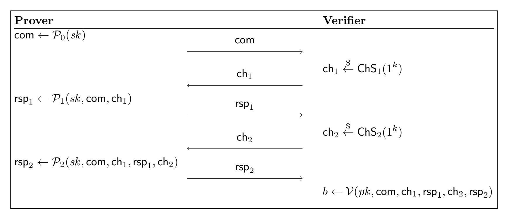
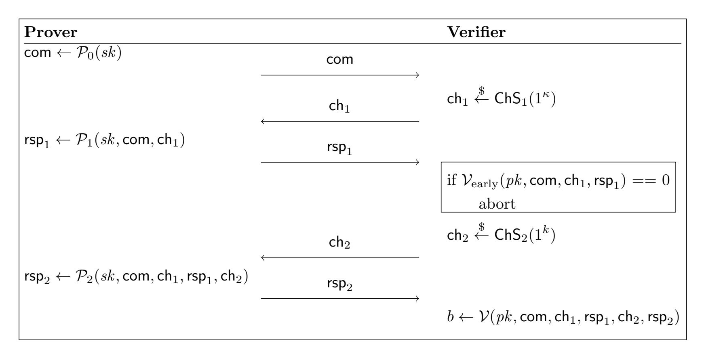

{0}------------------------------------------------

# An Attack on Some Signature Schemes Constructed From Five-Pass Identification Schemes

Daniel Kales Graz University of Technology daniel.kales@iaik.tugraz.at

Greg Zaverucha Microsoft Research gregz@microsoft.com

October 6, 2020

#### Abstract

We present a generic forgery attack on signature schemes constructed from 5 round identification schemes made non-interactive with the Fiat-Shamir transform. The attack applies to ID schemes that use parallel repetition to decrease the soundness error. The attack can be mitigated by increasing the number of parallel repetitions, and our analysis of the attack facilitates parameter selection.

We apply the attack to MQDSS, a post-quantum signature scheme relying on the hardness of the MQ-problem. Concretely, forging a signature for the L1 instance of MQDSS, which should provide 128 bits of security, can be done in ≈ 2 <sup>95</sup> operations. We verify the validity of the attack by implementing it for round-reduced versions of MQDSS, and the designers have revised their parameter choices accordingly.

We also survey other post-quantum signature algorithms and find the attack succeeds against PKP-DSS (a signature scheme based on the hardness of the permuted kernel problem) and list other schemes that may be affected. Finally, we use our analysis to choose parameters and investigate the performance of a 5-round variant of the Picnic scheme.

# 1 Introduction

Digital signatures are one of the fundamental cryptographic building blocks and are widely used for authentication of data and in protocols. Recently, advances in quantum computing have motivated new designs for digital signature schemes, having postquantum security, i.e., schemes that are implemented on classical computers but have security against attacks by quantum computers. NIST has started a standardization project for post-quantum cryptographic primitives [\[23\]](#page-21-0).

A popular approach to designing signature schemes is to start with an interactive identification (ID) scheme and use the Fiat-Shamir transformation to make it noninteractive and transform it into a signature scheme. The most well-known example of this is Schnorr's ID and signature scheme. Multiple signature schemes with conjectured post-quantum security also use this approach (e.g., Dilithium, MQDSS, Picnic, PKP-DSS, and qTESLA, among others).

{1}------------------------------------------------

However, while the Fiat-Shamir transform for 3-round (also called 3-pass) ID schemes (where a total of three messages are exchanged between the prover and verifier) is well understood, some signatures are built on identification schemes with five or more rounds. One such example is MQDSS, which builds on the 5-pass identification scheme of Sakumoto et al. [\[26\]](#page-22-0). Chen et al. [\[12\]](#page-20-0) give a construction for a Fiat-Shamir transformation for a certain class of 5-pass identification schemes, which includes the one from [\[26\]](#page-22-0), and use it to build MQDSS.

ID schemes are closely related to zero-knowledge proofs and arguments, and some of the terminology is shared; we often refer to the parties as prover and verifier, the prover's secret is called a witness, and the public key is called a statement. The soundness error of a proof protocol, denoted , is the probability that a malicious prover can get a verifier to accept without knowing the witness. For κ-bit security, we thus require < 2 −κ .

Some proof protocols have a large constant soundness error, such as = 1/2. In this case, we can hope to amplify the soundness of the protocol by repeating the protocol r times. In the best case, the effect is exponential, and r repetitions give soundness error of r . This is known to be the case for interactive protocols when the repetitions are performed sequentially. The question for parallel repetition has been a topic of study for many years.

Parallel repetition does decrease soundness error exponentially for 3-round, publiccoin protocols (i.e., protocols where the verifier has no secret key) [\[4\]](#page-20-1). For more than three rounds there are examples of non-public coin protocols where parallel repetition is not effective [\[24\]](#page-22-1), but when considering only public-coin protocols parallel repetition is effective [\[18\]](#page-21-1).

However, these positive results only apply to interactive protocols, and only hold asymptotically, so they do not give a concrete number of repetitions for κ bits of security. Intuitively, soundness for non-interactive protocols can only be worse, since the verifier's steps can be implemented by a malicious prover and run many times during a search for a cheating proof. Thus, choosing r to achieve κ-bit security for concrete non-interactive proof protocols and signature schemes is not obvious, especially so for protocols with more than three rounds. Choosing r such that <sup>r</sup> < 2 −κ seems to work for three-round protocols (we are not aware of cases where this fails), so we name this approach the r -heuristic. As we will show, the r -heuristic does not hold for five-round protocols. Instead, the secure choice of r is a function of and the challenge spaces of the protocol.

Contributions. In this paper, we give a generic attack on five-round identification schemes made non-interactive using the Fiat-Shamir transform. This shows that the r -heuristic fails for non-interactive 5-round protocols, and care must be taken when choosing r. The concrete attack complexity is influenced only by the size of the challenge spaces in the different rounds and whether the identification scheme has a property we call capability for early abort. We give general formulas for the attack complexity and show how this influences the parameter choices of different signature schemes, and discuss strategies for designers using 5-round protocols to build signatures.

As an application of our result, we show an attack on the proposed parameter sets for

{2}------------------------------------------------

MQDSSv2. We show that at the 128-bit security level, our attack finds forgeries with 2<sup>95</sup> operations. We practically verify the attack on round-reduced versions of MQDSS and discuss ways to reduce its practical complexity. The designers of MQDSS have confirmed our attack and changed their proposed instances according to our recommendations during the latest round of updates in the NIST post-quantum standardization project (MQDSSv2.1).

Even though the construction of [\[12\]](#page-20-0) has a security proof, its non-tightness allows for the attack to exist, i.e., the attack does not contradict the asymptotic security reduction, and takes exponential time. This is an example of a non-tight proof reflecting the realworld security a scheme. This is somewhat rare, and has been called the "nightmare scenario" by Menezes [\[22,](#page-21-2) §5.4] since there are many examples of non-tight proofs where security is thought to hold for the natural choice of parameters (Schnorr signatures being a prominent example). To our knowledge this is the first such example for a public-key signature scheme.

Our attack also applies to PKP-DSS [\[8\]](#page-20-2), a signature scheme based on a five-round proof protocol for the permuted kernel problem [\[27\]](#page-22-2). The latest proposed parameters for PKP-DSS have also been updated to account for our attack.

We also use our analysis to select parameters for a 5-round version of the Picnic signature scheme [\[11,](#page-20-3) [30\]](#page-22-3), and quantify the resulting performance. The designers chose to collapse the 5-round protocol to three rounds with only an informal justification, and left open the question of using five rounds. Our analysis confirms that the parameters of the underlying proof system [\[20\]](#page-21-3) would need to increase such that both the proof size and runtime is better when using the three-round variant.

### <span id="page-2-0"></span>1.1 Additional Related Work

In [\[21\]](#page-21-4), Kiltz et al. give a tight security proof for signatures based on a Fiat-Shamir transformation of a 5-pass identification scheme. For their proof, they require the underlying identification scheme to have a property called security against non-adaptive parallel impersonation key-only attacks (naPIMP-KOA). However, they do not consider the case of parallel repetition, which is needed if the soundness error of a single invocation of the identification scheme is not small enough. Although their FS transformation has slight differences to the one used in MQDSS, these differences are minor, and our attack can also be adapted to the transformation of [\[21\]](#page-21-4) in case parallel repetition is used.

Five-to-Three Round Signature Schemes The Picnic signature scheme instances based on the KKW proof system [\[20\]](#page-21-3), have a 5-round structure, arising from the choice of MPC protocol used to implement the MPC-in-the-head construction [\[19\]](#page-21-5). The protocol has a preprocessing phase used to establish correlated randomness between the parties, to be used in an online phase. In the KKW proof protocol, the first and second rounds correspond to the preprocessing and online phases (resp.). By performing the online phase for all preprocessing instances, [\[20\]](#page-21-3) carefully collapses the 5-round protocol to three rounds.

{3}------------------------------------------------

In [\[6\]](#page-20-4), Beullens generalizes KKW to design sigma protocols for the permuted kernel problem (PKP), solutions of multivariate quadratic (MQ) equation systems and the shortest integer solution (SIS) in lattices. These sigma protocols are named "sigma protocols with helper", where a trusted third party acts as a helper to set up correlated randomness in a preprocessing step. The trusted third party is then replaced by a cutand-choose approach as in [\[20\]](#page-21-3). The overall structure of these sigma protocols is also 5-round, collapsed to three.

These five-to-three schemes then beat the r -heuristic, by doing the cut-and-choose step across all parallel repetitions, effectively replacing the independent parallel repetitions with a single repetition.

In [\[3\]](#page-20-5) Baum and Nof give interactive five-round protocols for proving knowledge of a solution to the short integer solution lattice problem. Their work also generalizes [\[20\]](#page-21-3) but changes the cut-and-choose step to use the sacrificing technique. A direct application of the Fiat-Shamir transform to these protocols would need to address our attack.

There are many 5-pass identification protocols for code and lattice problems that are inspired by early three and 5-pass protocols based on syndrome decoding by Stern [\[28,](#page-22-4) [29\]](#page-22-5). Stern uses the r -heuristic when discussing the signature scheme associated with the 3-pass variant of his scheme, then presents the 5-pass variant without re-visiting the choice of r. In [\[9\]](#page-20-6) Cayrel et al. present a lattice-based threshold ring signature scheme based on 5-round identification schemes with soundness error 1/2 and 1/3, and choose the number of parallel repetitions using the r -heuristic. Some follow-up papers in this area [\[5,](#page-20-7) [14\]](#page-21-6) also use the r -heuristic.

In [\[10\]](#page-20-8) Cayrel et al. describe an interactive 5-pass identification scheme based on the q-ary syndrome decoding problem with = 1/2. Then in [\[16\]](#page-21-7), El Yousfi Alaoui et al. rely on previous analysis of the Fiat-Shamir transform for 5-pass schemes [\[2\]](#page-19-0) that does not consider parallel repetition in detail and use the r -heuristic to choose parameters and benchmark the resulting signature scheme. Similarly, Aguilar et al. [\[1\]](#page-19-1) present a new five-pass ID scheme based on the syndrome decoding, and choose parameters for the associated signature scheme using the r -heuristic, and these parameters were used in the implementation and performance comparison of Dambra et al. [\[15\]](#page-21-8). We have not done a thorough analysis of these code-based signatures to conclude which are impacted by our attack, and by how much.

# 2 Preliminaries

We give a short background on generic 5-pass ID schemes, and the MQDSS signature scheme. We keep the notation consistent with the MQDSS specification document [\[13\]](#page-21-9), and denote by \$ ← the uniform random sampling from a set.

### 2.1 Canonical (2n + 1)-Pass Identification Schemes

Canonical (2n + 1)-pass identification schemes are a class of ID schemes which follow a certain message structure. First, the prover sends an initial commitment com, then the 

{4}------------------------------------------------

two parties engage in n rounds, where the verifier sends a challenge  $\mathsf{ch}_i$  drawn from the corresponding challenge set  $\mathsf{ChS}_i$ , to which the prover responds with  $\mathsf{rsp}_i$ . We depict a 5-pass identification scheme in Figure 1. Such identification schemes can be made non-interactive using the Fiat-Shamir transformation [17], replacing the job of the verifier by calls to random functions, usually instantiated using cryptographic hash functions. We give details of this process in the caption of Figure 1.



<span id="page-4-0"></span>Figure 1: A canonical 5-pass identification scheme. To make the scheme non-interactive,  $\mathsf{ch}_1$  and  $\mathsf{ch}_2$  are computed as  $\mathsf{ch}_1 = \mathcal{H}_1(\mathsf{com})$  and  $\mathsf{ch}_2 = \mathcal{H}_2(\mathsf{com}, \mathsf{ch}_1, \mathsf{rsp}_1)$  for cryptographic hash functions  $\mathcal{H}_1$  and  $\mathcal{H}_2$ . The proof is  $\pi = (\mathsf{com}, \mathsf{rsp}_1, \mathsf{rsp}_2)$ . In a signature scheme, the message m is included in both  $H_1$  and  $H_2$  and  $\pi$  is the signature on m.

### 2.2 Fiat-Shamir Transformation for a Class of 5-Pass ID schemes

In [12], Chen et al. give a Fiat-Shamir transformation for a certain class of 5-pass identification schemes. They note that many existing 5-pass identification schemes follow a certain structure, given in Definition 2.1.

<span id="page-4-1"></span>**Definition 2.1** (q2-Identification scheme [12]). Let  $\kappa \in \mathbb{N}$  be a security parameter. A q2-Identification scheme IDS(1<sup>\kappa</sup>) is a canonical 5-pass identification scheme where for the challenge spaces  $C_1$  and  $C_2$  it holds that  $|C_1| = q$  and  $|C_2| = 2$ . Moreover the probability that the commitment com takes a given value is negligible (in  $\kappa$ ), where the probability is taken over the random choice of the input and the prover's randomness.

<span id="page-4-2"></span>**Definition 2.2** (q2-Extractor [12]). We say that a q2-Identification scheme IDS(1<sup> $\kappa$ </sup>) has a q2-extractor if there exists a PPT algorithm  $\mathcal{E}$ , the extractor, that given a public key pk and four transcripts trans<sup>(i)</sup> = (com, ch<sub>1</sub><sup>(i)</sup>, rsp<sub>1</sub><sup>(i)</sup>, ch<sub>2</sub><sup>(i)</sup>, rsp<sub>2</sub><sup>(i)</sup>),  $i \in \{1, 2, 3, 4\}$ , with

$$\mathsf{ch}_1^{(1)} = \mathsf{ch}_1^{(2)} \neq \mathsf{ch}_1^{(3)} = \mathsf{ch}_1^{(4)},$$
  $\mathsf{ch}_2^{(1)} = \mathsf{ch}_2^{(3)} \neq \mathsf{ch}_2^{(2)} = \mathsf{ch}_2^{(4)},$ 

{5}------------------------------------------------

which are valid with respect to pk, outputs a matching secret key sk for pk with non-negligible success probability (in  $\kappa$ ).

The soundness error of an identification scheme, denoted  $\epsilon$ , is the probability that the q2-extractor fails. The soundness error can be boosted by running r parallel repetitions of the scheme. Chen et al. [12] use a variant of the Fiat-Shamir transformation in Figure 1 to turn a q2-IDS into a signature scheme and provide analysis and a security proof for their Construction 1 in the random oracle model (ROM), if the q2-IDS additionally has a q2-extractor(Definition 2.2).

<span id="page-5-0"></span>Construction 1 (Fiat-Shamir transform for q2-IDS [12]). Let  $\kappa \in \mathbb{N}$  be the security parameter, IDS = (KGen,  $\mathcal{P}, \mathcal{V}$ ) a q2-Identification scheme that achieves soundness with constant soundness error  $\epsilon$ . Select r the number of (parallel) repetitions of IDS, such that  $\epsilon^r = \text{negl}(\kappa)$ , and that the challenge spaces of the composition IDS $^r, C_1^r, C_2^r$  have size exponential in  $\kappa$ . Moreover, select cryptographic hash functions  $H_1 : \{0,1\}^* \mapsto C_1^r$  and  $H_2 : \{0,1\}^* \mapsto C_2^r$ . The q2-signature scheme q2-Dss $(1^{\kappa})$  derived from IDS is the triple of algorithms (KGen, Sign, Vf) with:

- $(sk, pk) \leftarrow \mathsf{KGen}(1^{\kappa})$
- $\sigma = (\sigma_0, \sigma_1, \sigma_2) \leftarrow \mathsf{Sign}(sk, m)$  where  $\sigma_0 = \mathsf{com} \leftarrow \mathcal{P}_0^r(sk), h_1 = H_1(m, \sigma_0), \sigma_1 = \mathsf{rsp}_1 \leftarrow \mathcal{P}_1^r(sk, \sigma_0, h_1), h_2 = H_2(m, \sigma_0, h_1, \sigma_1) \text{ and } \sigma_2 = \mathsf{rsp}_2 \leftarrow \mathcal{P}_2^r(sk, \sigma_0, h_1, \sigma_1, h_2).$
- Vf $(pk, m, \sigma)$  parses  $\sigma = (\sigma_0, \sigma_1, \sigma_2)$ , computes the values  $h_1 = H_1(m, \sigma_0)$ ,  $h_2 = H_2(m, \sigma_0, h_1, \sigma_1)$  as above and outputs  $\mathcal{V}^r(pk, \sigma_0, h_1, \sigma_1, h_2, \sigma_2)$ .

<span id="page-5-1"></span>**Theorem 2.3** (EU-CMA security of q2-signature schemes [12]). Let  $\kappa \in \mathbb{N}$ , IDS(1 $^{\kappa}$ ) be a q2-IDS that is honest-verifier zero-knowledge, achieves soundness with constant soundness error  $\epsilon$  and has a q2-extractor. Then q2-Dss(1 $^{\kappa}$ ), the q2-signature scheme derived applying Construction 1 is existentially unforgeable under adaptive chosen message attacks.

The proof of Theorem 2.3 is given in [12]. However, the authors also note that the proof is non-tight due to its use of the forking lemma [25]. The number of parallel repetitions r are chosen according to the  $\epsilon^r$ -heuristic, based the soundness error of the underlying IDS, ignoring the potential loss in security that comes from the non-tightness of the proof.

# 3 Forgery Attacks on MQDSS

Chen et al. [12] give a concrete instantiation – called MQDSS – by applying Construction 1 to the 5-pass identification scheme from Sakumoto et al. [26]. MQDSS is a post-quantum signature scheme submitted to the NIST post-quantum standardization project. We first recall the details of the MQDSS signature scheme and then describe our attack.

{6}------------------------------------------------

### 3.1 Description of MQDSS

The main idea of the 5-pass identification scheme by Sakumoto et al. [\[26\]](#page-22-0) is to prove knowledge of a solution s of a multivariate quadratic equation system v = F(s). To achieve this, the secret s is split into two shares s = r<sup>0</sup> + r<sup>1</sup> and the public key v can be represented using the polar form of F as v = F(r0) + F(r1) + G(r0, r1). One of the shares of the secret (with an additional masking factor α) is then split further, so that the polar form is not dependent on both shares of the secret: αr<sup>0</sup> = t<sup>0</sup> + t<sup>1</sup> and αF(r0) = e<sup>0</sup> + e1. Due to the properties of the polar form, we arrive at the relation

$$\alpha \mathbf{v} = (\mathbf{e}_1 + \alpha \mathbf{F}(\mathbf{r}_1 + \mathbf{G}(\mathbf{t}_1, \mathbf{r}_1)) + (\mathbf{e}_0 + \mathbf{G}(\mathbf{t}_0, \mathbf{r}_1)),$$

where each of the two separate summands does not reveal any information about the secret. This is used in the identification protocol where one of these summands is revealed to the verifier and checked for consistency. For more details we refer to [\[26,](#page-22-0) Section 4].

The key generation of MQDSS samples a MQ relation v = F(s), but does so pseudorandomly from a k-bit seed sk, by using SHAKE256 as a pseudorandom generator (PRG) and using rejection sampling to sample field elements when necessary. The function XOF<sup>F</sup> generates a multivariate system from a seed, and H, H1, and H<sup>2</sup> are cryptographic hash functions. We recall the specification of the MQDSS signing algorithm (with minor simplifications compared to the original design document) in [Algorithm 1,](#page-7-0) where first, as in key generation, the secret key sk is expanded into four seeds. These seeds are used to derive the MQ relation and, in combination with a pseudorandom salt D, the shares of the secret r, t, e and the commitment randomness ρ. We can observe the 5-pass structure with the five messages σ0, ch1, σ1, ch<sup>2</sup> and σ2. We also recall the MQDSS key generation and verification in Appendix [A;](#page-23-0) for more details and an algorithmic description of all the sub-functions, we refer to the MQDSS design document [\[13\]](#page-21-9).

MQDSS versions. In August 2018, the MQDSS team updated their specification and recommended parameter sets, due to the original parameters mistakenly being selected for a higher security level. This new parameter sets were called MQDSS v1.1. Additionally, in March 2019 the MQDSS team modified the scheme to include a random string ρ of length 2κ in their commitments, resulting in MQDSS v2.0. Our attack applies to both, MQDSS v1.1 and v2.0, but in the following, we will use MQDSS v2.0 to be compatible with the most recent reference implementation. After disclosing our attack to the authors, they updated their parameter sets to resist our attack. At the time of writing, v2.1 is the most recent version of MQDSS.

### <span id="page-6-0"></span>3.2 Description of the Attack on MQDSS

The basic idea of the attack is to split the attacker work between two phases: we try to guess ch<sup>1</sup> for τ ∗ repetitions, and then move on to guess ch<sup>2</sup> for the remaining repetitions. For many 5-pass identification schemes, including the one used in MQDSS, guessing just one of the two challenges correctly allows the prover to cheat. In the non-interactive

{7}------------------------------------------------

### **Algorithm 1** Sign(sk, Msg), from [13]

```
S_{\mathbf{F}}, S_{\mathbf{s}}, S_{\rho}, S_{\mathbf{rte}} \leftarrow \mathrm{PRG}_{sk}(sk)
\mathbf{F} \leftarrow \mathrm{XOF}_{\mathbf{F}}(S_{\mathbf{F}})
\mathbf{s} \leftarrow \mathrm{PRG}_{\mathbf{s}}(S_{\mathbf{s}})
pk := (S_{\mathbf{F}}, \mathbf{F}(\mathbf{s}))
 R \leftarrow \mathcal{H}(sk||Msg)
D \leftarrow \mathcal{H}(pk||R||Msg)
\rho_0^{(1)}, \dots, \rho_0^{(r)}, \rho_1^{(1)}, \dots, \rho_0^{(r)} \leftarrow PRG_{\rho}(S_{\rho}, D)
\mathbf{r}_0^{(1)}, \dots, \mathbf{r}_0^{(r)}, \mathbf{t}_0^{(1)}, \dots, \mathbf{t}_0^{(r)}, \mathbf{e}_0^{(1)}, \dots, \mathbf{e}_0^{(r)} \leftarrow PRG_{\mathbf{rte}}(S_{\mathbf{rte}}, D)
for j \in \{1, ..., r\} do
           \mathbf{r}_1^{(j)} \leftarrow \mathbf{s} - \mathbf{r}_0^{(j)}
            \mathsf{com}_0^{(j)} \leftarrow \mathcal{H}\left(\rho_0^{(j)}, \mathbf{r}_0^{(j)}, \mathbf{t}_0^{(j)}, \mathbf{e}_0^{(j)}\right)
            \mathsf{com}_1^{(j)} \leftarrow \mathcal{H}\left(\rho_1^{(j)}, \mathbf{r}_1^{(j)}, \mathbf{G}(\mathbf{t}_0^{(j)}, \mathbf{r}_1^{(j)}) + \mathbf{e}_0^{(j)}\right)
end for
\sigma_0 \leftarrow \mathcal{H}(\mathsf{com}_0^{(1)}, \mathsf{com}_1^{(1)}, \dots, \mathsf{com}_0^{(r)}, \mathsf{com}_1^{(r)})
\mathsf{ch}_1 \leftarrow H_1(D, \sigma_0)
Parse \mathsf{ch}_1 as \mathsf{ch}_1 = \{\alpha^{(1)}, \dots, \alpha^{(r)}\}, \alpha^{(j)} \in \mathbb{F}_n
for j \in \{1, ..., r\} do
            \mathbf{t}_{1}^{(j)} \leftarrow \alpha^{(j)} \mathbf{r}_{0}^{(j)} - \mathbf{t}_{1}^{(j)}, \quad \mathbf{e}_{1}^{(j)} \leftarrow \alpha^{(j)} \mathbf{F}(\mathbf{r}_{0}^{(j)}) - \mathbf{e}_{0}^{(j)}
            \mathsf{rsp}_{\scriptscriptstyle 1}^{(j)} \leftarrow (\mathbf{t}_{\scriptscriptstyle 1}^{(j)}, \mathbf{e}_{\scriptscriptstyle 1}^{(j)})^{\scriptscriptstyle 1}
end for
\sigma_1 \leftarrow (\mathsf{rsp}_1^{(1)}, \dots, \mathsf{rsp}_1^{(r)})
 \mathsf{ch}_2 \leftarrow H_2(D, \sigma_0, \mathsf{ch}_1, \sigma_1)
Parse \operatorname{ch}_2 as \operatorname{ch}_2 = \{b^{(1)}, \dots, b^{(r)}\}, b^{(j)} \in \mathbb{F}_2
\sigma_2 \leftarrow (\mathbf{r}_{b^{(1)}}^{(1)}, \dots, \mathbf{r}_{b^{(r)}}^{(r)}, \operatorname{com}_{1-b^{(1)}}^{(1)}, \dots, \operatorname{com}_{1-b^{(r)}}^{(r)}, \rho_{b^{(1)}}^{(1)}, \dots, \rho_{b^{(r)}}^{(r)})
 return \sigma = (R, \sigma_0, \sigma_1, \sigma_2)
```

version, we leverage the fact that these phases can be repeatedly and separately attacked offline.

In [12], Chen et al. give a basic strategy for a cheating adversary, that works as follows: The cheater chooses  $\alpha^*$  as guess for  $\mathsf{ch}_1$  and uses a randomly chosen secret key  $\mathsf{s}^*$ . He follows the protocol as specified, but computes  $\mathsf{r}_1 = \mathsf{s}^* - \mathsf{r}_0$ ,  $\mathsf{t}_1 = \alpha^* \mathsf{r}_0 - \mathsf{t}_0$  and  $\mathsf{e}_1 \leftarrow \alpha^* \cdot \mathsf{F}(\mathsf{r}_0) - \mathsf{e}_0$  instead. He also computes the commitment  $(\mathsf{com}_0, \mathsf{com}_1)$  as  $\mathsf{com}_0 \leftarrow \mathcal{H}(\rho_0, \mathsf{r}_0, \mathsf{t}_0, \mathsf{e}_0)$  and  $\mathsf{com}_1 \leftarrow \mathcal{H}(\rho_1, \mathsf{r}_1, \alpha^* \cdot (\mathsf{v} - \mathsf{F}(\mathsf{r}_1)) - \mathsf{G}(\mathsf{t}_1, \mathsf{r}_1) - \alpha^* \cdot \mathsf{F}(\mathsf{r}_0) + \mathsf{e}_0)$ . If  $\mathsf{ch}_2$  is equal to 0, the recomputed check does not involve the public key  $\mathsf{v}$  and will therefore always pass. For  $\mathsf{ch}_2 = 1$ , the cheater set up the values in a way that the check will still pass if  $\mathsf{ch}_1$  was equal to  $\alpha^*$ . For our attack, it is important that a bad guess for  $\alpha^*$  (i.e.,  $\mathsf{ch}_1$ ) can be masked by a correct guess of  $\mathsf{ch}_2$ , without the verifier noticing. This fact allows us to improve the basic attack strategy by trying to guess  $\mathsf{ch}_1$  for all parallel repetitions (and subsequently fixing any bad guesses in phase 2), not only for a

{8}------------------------------------------------

### **Algorithm 2** Forge(pk, Msg)

```
Parse pk as S_{\mathbf{F}}, \mathbf{v}
\mathbf{F} \leftarrow \mathrm{XOF}_{\mathbf{F}}(S_{\mathbf{F}})
\mathbf{r}_0^{(1)}, \dots, \mathbf{r}_0^{(r)}, \mathbf{t}_0^{(1)}, \dots, \mathbf{t}_0^{(r)}, \mathbf{e}_0^{(1)}, \dots, \mathbf{e}_0^{(r)} \stackrel{\$}{\leftarrow} \mathbb{F}_q^{n \times 3r}
\alpha^* \stackrel{\$}{\leftarrow} \mathbb{F}_q
\mathbf{s}^* \stackrel{\$}{\leftarrow} \mathbb{F}_q^n
for j \in \{1, ..., r\} do
         \mathbf{r}_1^{(j)} \leftarrow \mathbf{s}^* - \mathbf{r}_0^{(j)}
         \mathbf{t}_{1}^{(j)} \leftarrow \alpha^* \cdot \mathbf{r}_{0}^{(j)} - \mathbf{t}_{0}^{(j)}
          \mathbf{e}_{1}^{(j)} \leftarrow \alpha^{*} \cdot \mathbf{F}(\mathbf{r}_{0}^{(j)}) - \mathbf{e}_{0}^{(j)}
          \rho_0^{(j)}, \rho_1^{(j)} \stackrel{\$}{\leftarrow} \{0, 1\}^{2\kappa \times 2}
          \mathsf{com}_0^{(j)} \leftarrow \mathcal{H}\left(\rho_0^{(j)}, \mathbf{r}_0^{(j)}, \mathbf{t}_0^{(j)}, \mathbf{e}_0^{(j)}\right)
          \mathsf{com}_1^{(j)} \leftarrow \mathcal{H}\left(\rho_1^{(j)}, \mathbf{r}_1^{(j)}, \alpha^* \cdot (\mathbf{v} - \mathbf{F}(\mathbf{r}_1^{(j)})) - \mathbf{G}(\mathbf{t}_1^{(j)}, \mathbf{r}_1^{(j)}) - \alpha^* \cdot \mathbf{F}(\mathbf{r}_0^{(j)}) + \mathbf{e}_0^{(j)}\right)
end for
\sigma_0 \leftarrow \mathcal{H}(\mathsf{com}_0^{(1)}, \mathsf{com}_1^{(1)}, \dots, \mathsf{com}_0^{(r)}, \mathsf{com}_1^{(r)})
repeat
          R \stackrel{\$}{\leftarrow} \{0,1\}^{2\kappa}
          D \leftarrow \mathcal{H}(pk||R||Msg)
          \mathsf{ch}_1 \leftarrow H_1(D, \sigma_0)
          Parse \mathsf{ch}_1 as \mathsf{ch}_1 = \{\alpha^{(1)}, \dots, \alpha^{(r)}\}, \alpha^{(j)} \in \mathbb{F}_q
until at least \tau^* of \alpha^{(j)} are equal to \alpha^*
repeat
          guess \stackrel{\$}{\leftarrow} \{0,1\}^r // in practice, a counter is used to ensure unique hash inputs
          for j \in \{1, ..., r\} do
                    if \alpha^{(j)} = \alpha^* then
\operatorname{rsp}_1^{(j)} \leftarrow (\mathbf{t}_1^{(j)}, \mathbf{e}_1^{(j)})
                     else if bit j of guess is 0 then
                               \mathsf{rsp}_1^{(j)} \leftarrow \left(\alpha^{(j)} \cdot \mathbf{r}_0^{(j)} - \mathbf{t}_0^{(j)}, \alpha^{(j)} \cdot \mathbf{F}(\mathbf{r}_0^{(j)}) - \mathbf{e}_0^{(j)}\right)
                     else
                               \operatorname{rsp}_1^{(j)} \leftarrow \left(\mathbf{t}_1^{(j)}, (\alpha^{(j)} - \alpha^*) \cdot (\mathbf{v} - \mathbf{F}(\mathbf{r}_1^{(j)})) + \alpha^* \cdot \mathbf{F}(\mathbf{r}_0^{(j)}) - \mathbf{e}_0^{(j)}\right)
                     end if
           end for
          \sigma_1 \leftarrow (\mathsf{rsp}_1^{(1)}, \dots, \mathsf{rsp}_1^{(r)})
          \mathsf{ch}_2 \leftarrow H_2(D, \sigma_0, \mathsf{ch}_1, \sigma_1)
until bits of ch<sub>2</sub> agree with guess in positions j where \alpha^{(j)} \neq \alpha^* \sigma_2 \leftarrow (\mathbf{r}_{b^{(1)}}^{(1)}, \dots, \mathbf{r}_{b^{(r)}}^{(r)}, \mathsf{com}_{1-b^{(1)}}^{(1)}, \dots, \mathsf{com}_{1-b^{(r)}}^{(r)}, \rho_{b^{(1)}}^{(1)}, \dots, \rho_{b^{(r)}}^{(r)})
return \sigma = (R, \sigma_0, \sigma_1, \sigma_2)
```

{9}------------------------------------------------

<span id="page-9-0"></span>

| Parameter Set         | $\kappa$ | m = n | q  | r   | $ \tau^* $ | #H        | $r_{\rm new}$ |
|-----------------------|----------|-------|----|-----|------------|-----------|---------------|
| MQDSS-toy<br>MQDSS-L1 | 38       | 48    | 31 | 40  | 11         | $2^{29}$  | 53            |
| MQDSS-L1              | 128      | 48    | 31 | 135 | 41         | $2^{95}$  | 184           |
| MQDSS-L3              | 192      | 64    | 31 | 202 | 61         | $2^{141}$ | 277           |
| MQDSS-L5              | 256      | 88    | 31 | 268 | 82         | $2^{180}$ | 370           |

Table 1: Parameter sets for MQDSS instances. r is the number of parallel repetitions in MQDSS v2.0,  $r_{\text{new}}$  is the number of repetitions required to resist our attack. (Instance for security level L5 not officially submitted to NIST).  $\tau^*$  is the optimal number of repetitions to attack in the first phase, while  $\#\mathcal{H}$  gives an estimate of the required hash function calls for a single forgery.

predetermined subset of the repetitions, increasing the success probability to guess  $\tau^*$  first round challenges correctly from  $(\frac{1}{q})^{\tau^*}$  to  $P_1(\tau^*)$  as given by Equation 1.

Our cheater now has the problem of how to efficiently generate different inputs (still passing verification) to the challenge hash functions  $H_1$  and  $H_2$ . For phase 1, this is quite easy, since the signature includes a random salt value R, which is allowed to be chosen freely by the attacker. Therefore an attacker can fix a guess of  $\alpha^*$  once, compute the first message  $\sigma_0$ , and then try different values of R until  $\tau^*$  of the first challenges agree with  $\alpha^*$ . For the second phase, we have already fixed R and can therefore not use the same strategy. However, we can modify the values sent in the second message  $\sigma_1$  in the following way. While the values of  $\mathbf{t}_1$  and  $\mathbf{e}_1$  computed as given by the cheating strategy outlined above are always correct for  $\mathbf{ch}_2 = 0$ , and fail to verify for  $\mathbf{ch}_2 = 1$ , we can also come up with different  $\mathbf{t}_1$  and  $\mathbf{e}_1$  that are correct for  $\mathbf{ch}_2 = 1$ , but fail for  $\mathbf{ch}_2 = 0$ . To achieve this we use the same  $\mathbf{t}_1$ , but compute  $\mathbf{e}_1$  such that it corrects the error in  $\mathbf{com}_1$ , specifically as

$$\mathbf{e}_1 \leftarrow (\alpha^{(j)} - \alpha^*) \cdot (\mathbf{v} - \mathbf{F}(\mathbf{r}_1)) + \alpha^* \cdot \mathbf{F}(\mathbf{r}_0) - \mathbf{e}_0$$
.

Now our attacker has two possible values to send in the second phase of each repetition, enabling him to try  $2^{r-\tau^*}$  different inputs to  $H_2$ , and with high probability one of those inputs results in the correct guess for all  $\mathsf{ch}_2$  for the remaining  $r-\tau^*$  repetitions. The full attack is given in Algorithm 2.

Alternative for Phase 2. Instead of the adversary trying all different combinations as shown above, he can also fix all but the last repetition, and just vary the responses for this last repetition in the following way. Choose a random  $\mathbf{t}_1$  and then calculate  $\mathbf{e}_1$  as  $\mathbf{e}_1 \leftarrow (\alpha^{(j)} - \alpha^*) \cdot (\mathbf{v} - \mathbf{F}(\mathbf{r}_1)) + \alpha^* \cdot \mathbf{F}(\mathbf{r}_0) + \mathbf{G}(\mathbf{t}_0, \mathbf{r}_1) - \mathbf{G}(\mathbf{t}_1, \mathbf{r}_1) - \mathbf{e}_0$ . This response is always valid for  $\mathbf{ch}_2 = 1$ . Due to choosing  $\mathbf{t}_1$  at random, we have  $q^n$  different possible hash inputs. This method allows us to fix all other repetitions but requires us to always calculate  $\mathbf{G}(\mathbf{t}_1, \mathbf{r}_1)$  instead of being able to cache the output once as we can do for the other variant. Additionally, this can be used in combination with the other strategy, especially for the case when we exhaust all  $2^{r-\tau^*}$  possible inputs to  $H_2$ , allowing us to continue the attack without having to repeat the first phase.

{10}------------------------------------------------

### <span id="page-10-1"></span>3.3 Attack Parameters and Mitigation

For the attack, we want to achieve an optimal tradeoff between the work needed for passing the first phase and the work needed for passing the second phase. If we guess τ ∗ challenges for the first phase correctly, we can answer both possible challenges for these correct guesses in the second phase, only needing to correctly guess the remaining r −τ ∗ second round challenges.

The probability of guessing at least τ first-round challenges from a challenge space of size |C1| = q correctly is given by [Equation 1:](#page-10-0)

<span id="page-10-0"></span>
$$P_1(\tau, r, q) = \Pr \begin{pmatrix} \text{guess at least } \tau \\ \text{of } r \text{ challenges} \\ \text{with size } q \end{pmatrix} = \sum_{k=\tau}^r \left(\frac{1}{q}\right)^k \left(\frac{q-1}{q}\right)^{r-k} \binom{r}{k}. \tag{1}$$

To achieve the best tradeoff in terms of attack efficiency, we want to minimize the total work for completing both phases. Therefore, the optimal number of repetitions to attack in the first phase is given by

$$\tau^* = \underset{0 \le \tau \le r}{\text{arg min}} \left\{ \frac{1}{P_1(\tau, r, q)} + 2^{r - \tau} \right\} ,$$

assuming that both phases are of equal cost. We give some discussion of the cost of the two phases in [Section 3.4.](#page-11-0) A slightly better choice of τ <sup>∗</sup> might be possible by weighting the cost of each phase, based on the concrete costs of a given attack implementation.

We give an optimal choice for τ ∗ for different instances of MQDSS in [Table 1,](#page-9-0) together with the estimated number of random oracle calls for a single forgery and the number of parallel repetitions rnew that are required so that the expected number of random oracle calls for this attack is at least 2<sup>κ</sup> . After communicating the attack to the MQDSS designers, they have updated their specification to our recommended number of repetitions in MQDSS version 2.1.

Comparison to a 3-pass version of MQDSS In [\[26\]](#page-22-0), Sakumoto et al. additionally give a 3-pass variant of their MQ-based identification scheme. Chen et al. [\[12\]](#page-20-0) motivated their choice of the 5-pass variant over the 3-pass variant by the lower resulting signature size of the 5-pass variant. However, in light of our new attacks and the resulting increase in parameters to prevent it, this conclusion is no longer as clear as it used to be. In [\[12,](#page-20-0) Appendix A], Chen et al. discuss parameters for the 3-pass scheme and come to a signature size of 54.81 KB for the L5 security level. Based on the formulas given in [\[12,](#page-20-0) [13\]](#page-21-9) the 3-pass signature size for the L1 security level would be approximately 27.7 KB, whereas the signature size for the updated parameters of the 5-pass signature is now 27.73 KB, almost exactly equal. The impact of our attack therefore arguably makes the 3-pass variant of MQDSS a more natural choice, since 3-pass schemes are more common, and their security is arguably better understood.

{11}------------------------------------------------

#### <span id="page-11-0"></span>3.4 Practical Verification

To verify the validity of the attack, we implemented it and attacked versions of MQDSS with reduced r. The code is based on the reference implementation of MQDSS<sup>1</sup> and is available at https://github.com/dkales/MQDSS-forgery. Our MQDSS-toy instance from Table 1 has the same parameters as the instance for the L1 security level, however, we reduced the number of parallel repetitions of the underlying identification scheme from 135 to 40. Since the soundness error of one instance of the identification scheme of [26] is  $\epsilon = \frac{1}{2} + \frac{1}{2q}$ , these 40 repetitions should provide about 38 bits of security based on the analysis of Construction 1 by Chen et al. The underlying  $\mathcal{MQ}$  problem instance is not modified and still provides 128-bit security against attacks on the  $\mathcal{MQ}$  problem itself.

Based on our analysis in Section 3.3, we choose the number of repetitions to attack in phase 1 to be  $\tau^* = 11$ . The estimated number of random oracle calls is approximately  $2^{29}$ , while for our experiments the average over 10 runs is  $2^{27.98}$ , all taking between 1 and 12 minutes on a standard desktop PC.

Notes on the implementation. Our implementation uses a constant amount of memory virtually independent of the security level, making the only real cost producing the inputs to the hash function and executing it, which is very suitable for hardware acceleration and parallelization. We also provide a more efficient variant of the attack using AVX2 wherever possible and using a Gray code to minimize the changes to the hash input of the second phase. We also observed that even though the first phase has two hash function calls per repetition compared to the single one for the second phase, the inputs for the second phase hash are much longer, requiring multiple calls to the Keccak permutation (about 1 permutation per 2.25 repetitions). For concrete attack efficiency, this means that attacking 1 or 2 more repetitions than given in Table 1 in the first phase is usually faster. We discuss an alternative way to create responses for the second phase in Section 3.2, which can reduce the number of calls to the Keccak permutation to one, but requires the attacker to evaluate **G** instead. Based on our experiments, the cost of **G** is about 8 times the cost of the Keccak permutation, which should still result in a faster attack in practice, especially for the larger parameter sets.

# <span id="page-11-2"></span>4 Attacks on Five Round Protocols Using the Fiat-Shamir Transform

In this section, we generalize the attack described on MQDSS in the previous section to a canonical five-round proof protocol and discuss choosing a secure number of parallel repetitions. We also give guidance to protocol designers to increase the costs of our attack, to reduce the number of parallel repetitions required for a given security level. We end the section with a brief discussion of the more general (2n+1)-round protocols.

<span id="page-11-1"></span><sup>&</sup>lt;sup>1</sup>https://github.com/joostrijneveld/MQDSS/tree/NIST

{12}------------------------------------------------

Recall the general structure of a 5-pass identification scheme from [Figure 1.](#page-4-0) In the attack on MQDSS in [Section 3.2,](#page-6-0) we observed that an attacker could mask a bad guess for the first challenge with a correct guess for the second challenge. However, this is not the case in general. Some 5-pass identification schemes have the capability for early abort. In [Figure 2,](#page-12-0) we show a slightly modified version of the canonical 5-pass identification scheme, including an additional algorithm Vearly that enables the verifier to check the message tuple (com, ch1,rsp<sup>1</sup> ) – consisting of the first three messages – for validity. Conceptually, this can also be seen as splitting the protocol into two interleaved 3-pass protocols.



<span id="page-12-0"></span>Figure 2: A 5-pass identification scheme with capability for early abort.

Even if such an algorithm Vearly is not specified explicitly for a scheme, i.e., it may be implicitly contained in V, we are interested in its theoretical existence since it would allow the verifier to detect wrong guesses for ch1, affecting the complexity of the attack.

For identification schemes where no such algorithm exists (e.g., MQDSS), we can employ the improved attack strategy of trying to guess all first-round challenges, subsequently fixing bad guesses in the second challenge. However, if Vearly exists, a malicious prover has to select the parallel repetitions to attack beforehand, increasing the complexity of the attack. Protocols that use the first challenge in a cut-and-choose construction, where the prover commits to a large set of values, and only some of them are revealed to the verifier, usually allow for the existence of such an early verification algorithm. As an example, we will cover the five-round variant of the KKW [\[20\]](#page-21-3) proof protocol in [Section 5.1.](#page-16-0)

Recall that for an identification scheme to be honest-verifier zero-knowledge (HVZK, a requirement for security of the associated Fiat-Shamir signature), there must exist a simulator S that, given pk, outputs simulated transcripts of protocol executions between P and V, which are indistinguishably distributed from real protocol executions. (For a 

{13}------------------------------------------------

formal definition, see [12, Def. 2.5].)

For our attack to apply to a canonical 5-pass ID scheme, it must satisfy a stronger type of simulation that we call *piecewise simulatability*. Informally, this means that S can be refactored (in two different ways) to output the transcript in two parts, allowing for one of the challenges to be chosen as an input. In contrast to standard simulators, which output the whole transcript on input pk, piecewise simulators are a more limited class of algorithms. However, since the simulator is always able to choose at least one of the challenges by itself, it can function without knowledge of the secret. Although piecewise simulatability is a stronger assumption, it is fulfilled by all of the schemes we investigate in this work.

**Definition 4.1.** We say that a 5-round, HVZK ID scheme is *piecewise simulatable* if there exists algorithms  $(A_1, A_2)$  and  $(B_1, B_2)$ , defined as follows:

```
\begin{array}{ll} \underline{\text{Simulator } A} \\ A_1(pk) \text{ outputs } T_1 := (\mathsf{com}, \mathsf{ch}_1, \mathsf{rsp}_1) \\ A_2(pk, T_1, \mathsf{ch}_2^*) \text{ outputs } (\mathsf{rsp}_2) \\ T := (\mathsf{com}, \mathsf{ch}_1, \mathsf{rsp}_1, \mathsf{ch}_2^*, \mathsf{rsp}_2) \\ \end{array} \begin{array}{ll} \underline{\text{Simulator } B} \\ B_1(pk) \text{ outputs } T_1 := (\mathsf{com}') \\ B_2(pk, T_1, \mathsf{ch}_1'^*) \text{ outputs } (\mathsf{rsp}_1', \mathsf{ch}_2', \mathsf{rsp}_2') \\ T' := (\mathsf{com}', \mathsf{ch}_1'^*, \mathsf{rsp}_1', \mathsf{ch}_2', \mathsf{rsp}_2') \end{array}
```

where T and T' are distributed as the output of the HVZK simulator  $\mathcal{S}(pk)$  when  $ch_2^*$  and  $ch_1^{\prime*}$  are chosen uniformly at random from  $\mathsf{ChS}_i(1^\kappa)$ .

If the ID scheme has the early abort property, then we additionally require that  $\mathcal{V}_{\mathrm{early}}(pk, T_1) = 1$  for simulator A and  $\mathcal{V}_{\mathrm{early}}(pk, (\mathsf{com'}, \mathsf{ch'_1^*}, \mathsf{rsp'_1})) = 1$  for simulator B. Note that  $A_2$  is given a  $\mathsf{ch'_2^*}$  and can choose  $\mathsf{rsp_2}$  in such a way that  $T_1$  is a prefix for a valid transcript T. Using  $B_1$  and  $B_2$ , we can also produce a valid transcript T' for a given value of  $\mathsf{ch'_1^*}$ . Together, these properties capture the ability of the attacker to cheat by guessing either one of  $\mathsf{ch_1}$  or  $\mathsf{ch_2}$  correctly. In the MQDSS example, we described the concept of "fixing bad guesses for  $\mathsf{ch_1}$ ", which is captured by the fact that in schemes without early abort, we can use the  $\mathsf{com}$  output of  $A_1$  as input to  $B_2$ , whereas in schemes with early abort, this might lead to situations where the first three messages  $(\mathsf{com}, \mathsf{ch'_1^*}, \mathsf{rsp'_1})$  of the resulting transcript do not pass  $\mathcal{V}_{\mathsf{early}}$ .

**Generic Attack** The forger is given pk as input, and uses the algorithms  $(A_1, A_2, B_1, B_2)$  to create a forgery, as follows. Let m be the message to forge; we assume it is an input to both  $H_1$  and  $H_2$ . Let  $\tau^* < r$  be the number of repetitions to guess the first challenge.

- 1. Using  $A_1$ , compute a triple of the form  $(\mathsf{com}, \mathsf{ch}_1^S, \mathsf{rsp}_1)$  for each of the r repetitions (in the case of protocols with early abort, only use  $A_1$  for  $\tau^*$  repetitions and  $B_1$  for the remaining). Then compute  $(\mathsf{ch}_1^{(1)}, \ldots, \mathsf{ch}_1^{(r)}) = H_1(\mathsf{com}^{(1)}, \ldots, \mathsf{com}^{(r)})$ . Repeat this step until  $\mathsf{ch}_1^{(i)} = \mathsf{ch}_1^S$  for  $\tau^*$  repetitions.
- 2. Fix the value of com for all repetitions so that the  $\mathsf{ch}_1$  values do not change. Let R be the set of indices of the  $\tau^*$  repetitions where  $\mathsf{ch}_1^S = \mathsf{ch}_1^{(i)}$ . For repetitions

{14}------------------------------------------------

 $i \notin R$ , compute  $(\mathsf{rsp}_1^*, \mathsf{ch}_2^S, \mathsf{rsp}_2^*)$  using  $B_2$  and set  $\mathsf{rsp}_1^* = \mathsf{rsp}_1$  (from the output of  $A_1$ ) when  $i \in R$ . Now compute

$$(\mathsf{ch}_2^{(1)},\ldots,\mathsf{ch}_2^{(r)}) = H_2(\{\mathsf{com}^{(i)}\},\{\mathsf{ch}_1^{(i)}\},\{\mathsf{rsp}_1^{*(i)}\})$$

where  $i \in \{1, ..., r\}$ . Repeat until repetitions  $i \notin R$  have  $\mathsf{ch}_2^{(i)} = \mathsf{ch}_2^S$ .

3. For  $i \in R$ , use  $A_2$  to calculate a valid response  $\mathsf{rsp}_2^*$ . Output the forgery  $(\{\mathsf{com}^{(i)}\}, \{\mathsf{rsp}_1^{*(i)}\}, \{\mathsf{rsp}_2^{*(i)}\})$  for  $i \in \{1, \ldots, r\}$ .

We highlight why this attack is only possible for non-interactive proofs. First, in the interactive setting, each try in Step 1 requires interaction with the verifier, which is slow, and may be subject to limits by the verifier. But more importantly, the repeated guesses for  $\mathsf{ch}_2$  are not possible while holding the  $\mathsf{ch}_1$  values fixed since the verifier will force the prover to restart from the very beginning: all effort to guess the  $\tau^*$   $\mathsf{ch}_1$  values correctly is lost.

#### 4.1 Cost Analysis

The analysis differs depending on whether the scheme has the early abort property. In both cases, the attack complexity is dependent on the size of the two challenge spaces  $C_1, C_2$ . Let IDS be a 5-pass identification scheme with challenge spaces  $C_1, C_2$  and  $|C_1| = q_1, |C_2| = q_2$  and let Dss be the signature scheme derived from r parallel repetitions of IDS by applying a generalized Fiat-Shamir transformation like Construction 1.

Schemes without capability for early abort. Recall the probability  $P_1(\tau, r, q)$  of guessing at least  $\tau$  of r challenges with a challenge space of size q each correctly, as given per Equation 1. The expected cost of our attack on Dss is given by

$$\mathsf{Cost}_{non-abort}(r) = \frac{1}{P_1(\tau^*, r, q_1)} + q_2^{r-\tau^*},$$

where  $\tau^*$  is the optimal number of repetitions to attack in the first challenge, given by

$$\tau^* = \operatorname*{arg\ min}_{0 < \tau < r} \frac{1}{P_1(\tau, r, q_1)} + q_2^{r-\tau},$$

minimizing the overall cost of the attack.

Schemes with capability for early abort. The cost of our attack on Dss is given by

$$\mathsf{Cost}_{abort}(r) = q_1^{\tau^*} + q_2^{r-\tau^*} \,,$$

where  $\tau^*$  is the optimal number of repetitions to attack in the first challenge, given by

$$\tau^* = \arg\min_{0 \le \tau \le r} q_1^{\tau} + q_2^{r-\tau} ,$$

{15}------------------------------------------------

again minimizing the overall cost of the attack.

Following the derivation of the attack costs, the number of parallel repetitions r of the underlying identification scheme IDS needed to achieve a security level of κ bits is given by selecting the minimum value of r such that the corresponding cost function Cost(r) ≥ 2 κ .

### 4.2 Discussion

Benefit of Early Abort. We can now quantify the security benefit of protocols with an early abort functionality in some specific examples.[2](#page-15-0) If MQDSS were instead based on a (hypothetical) proof protocol with early abort, the number of parallel repetitions required for 128-bit security would be 153, rather than 184. This is less than half of the increase from 135 (the choice of r given by the r -heuristic), motivating the design of a 5-round proof protocol for MQ with early abort; one such protocol is MUDFISH [\[6\]](#page-20-4), which does result in significantly shorter signatures. Similarly, if the five-round variant of Picnic described in [Section 5.1](#page-16-0) did not have the early abort property, the number of required online phases for 128-bit security is 50 rather than 43, increasing signature size by roughly 1.16x. Thus we find that having the early abort property is a desirable goal for designers of five-round proof protocols, if it does not add additional costs to the protocol itself.

Unbalanced Size of the Challenge Spaces. An interesting observation is the fact that if the two challenge spaces are not of equal size, the attack complexity increases, as an attacker cannot divide the work evenly between the two phases. MQDSS is an example of this, as one challenge space is of size 31 and the second one of size 2, meaning an attacker has to spend more effort guessing the first challenge. However, to get the best attack complexity, the attacker wants to spend an equal amount of work in both phases, meaning attacking fewer rounds in the first challenge than the second one. Again, the five-round variant of Picnic in [Section 5.1](#page-16-0) serves as an example. Both of its challenge spaces are of equal size, and the number of repetitions needs to be doubled to resist the attack, compared to the ≈ 1.4x more repetitions needed for MQDSS.

Security of (2n + 1)-round protocols We can also ask about similar attacks on proof protocols with more than five rounds. For example, a recently proposed signature scheme that we discuss in [Section 5.3](#page-18-0) has seven rounds, and we can fully generalize the canonical protocol to 2n + 1 rounds. Selecting the number of parallel repetitions for these protocols is also an interesting question.

However, when considering multiple abort points, analyzing such protocols seems challenging, as there are n − 1 places where early aborts are possible, and a specific protocol may have 0 ≤ m ≤ n − 1 of n − 1 abort points. One could begin by analyzing the worst-case m = 0, however, the choice of r would likely be inefficient for protocols

<span id="page-15-0"></span><sup>2</sup>Because the Cost functions do not have a nice closed form a general comparison appears to be difficult.

{16}------------------------------------------------

with m > 0. However, for some protocols, it might be possible to conceptually split them into sub-protocols that have three or five passes and analyze them individually.

### 5 Application to Other Schemes

In the area of post-quantum signatures, many recent proposals are built using 5-round protocols, made non-interactive using the Fiat-Shamir transformation. We now investigate the applicability of the attack of Section 4 on some schemes from the literature.

### <span id="page-16-0"></span>5.1 Five Round Picnic

Picnic [11] is a second-round candidate in the NIST post-quantum standardization project. It is built using a non-interactive zero-knowledge proof of knowledge, proving knowledge of a secret key of a block cipher. One variant of Picnic is based on the KKW proof system [20].

The KKW proof system is a 5-round interactive protocol based on a multi-party computation protocol with an offline preprocessing phase. In the first round, the prover commits to M executions of the offline phase of the MPC protocol and then gets challenged to open all but one of them. In the third round, the prover then uses the unopened offline phase to execute an online phase for N parties and commits to all of their states and subsequently gets challenged to open all but one of the internal states. Based on the N-1 privacy property of the MPC protocol, the protocol is zero-knowledge and has a soundness error of  $\max\{\frac{1}{M},\frac{1}{N}\}$ . However, in Picnic, the scheme is collapsed into a 3-round protocol, as described in Section 1.1. In [30], the authors discussed that the 5-round protocol could offer different performance tradeoffs, but also remarked that the soundness calculation changes since "both challenges have to be sufficiently large". In this section we apply our analysis to choose concrete parameters for the 5-round variant of Picnic, and find that the 3-round variant is indeed preferable.

Cheating strategy for the Picnic2 zero-knowledge proof. For the attack to work, a cheating signer needs to be able to cheat in either of the two phases of the zero-knowledge proof. In detail, for the KKW proof system, this means either cheating in the pre-preprocessing phase by producing invalid multiplication triples or cheating in the online phase by sending wrong messages. Both approaches allow the prover to flip the output of arbitrary AND gates in the circuit, if not detected by the verifier. A cheating prover, given a plaintext-ciphertext pair from a target public key, can therefore select a random secret key and start the encryption with the plaintext and change AND gates during the circuit evaluation until the output matches the ciphertext.

Based on the soundness error of the interactive version of 5-round Picnic ( $\max\{\frac{1}{M}, \frac{1}{N}\}$ , where M is the number of preprocessing phases and N is the number of parties in the online phase) it is optimal to set both of them to be equal. One choice used by [20] is 64, since this fits register widths for modern CPUs, allows for a performant bit-sliced implementation, and provides a good tradeoff between proof size and runtime. To achieve a

{17}------------------------------------------------

soundness error of < 2 <sup>−</sup>128, one needs τ = 22 parallel repetitions in the interactive version of the protocol. However, applying the straightforward Fiat-Shamir transformation as shown in [Construction 1](#page-5-0) enables our attack.

Since the protocol in [\[20\]](#page-21-3) is a commit-and-open style protocol, it has the property of early abort (guessing the wrong challenge in the second message cannot be hidden later on). Therefore we need to choose the repetitions to attack in each phase from the start.

The complexity of the attack on 5-round Picnic is

$$M^{\tau^*} + N^{\tau - \tau^*}, \tag{2}$$

where τ ∗ repetitions are attacked in the first challenge. The optimum number of repetitions τ ∗ to attack in the first round is given by

$$\tau^* = \operatorname*{arg\ min}_{0 \le \tau' \le \tau} M^{\tau'} + N^{\tau - \tau'}, \tag{3}$$

which is equal to ≈ τ /2, since both challenge spaces are of equal size. For the specific choice of M = N = 64, the total number of parallel repetitions required for an attack complexity of greater than 2<sup>128</sup> random oracle calls is therefore τ = 43.

In contrast to the collapsed 3-round variant, which needs 343 offline phases and the same number of online phases, this 5-round variant needs 43 · 64 = 2752 offline phases and 43 online phases. We give the performance characteristics of the 3-round (Picnic2-\*) and 5-round (Picnic2-5-\*) variants in [Table 2.](#page-18-1) Observe that even though the number of online phases that need to be simulated is lower in Picnic2-5, this is only true during signing, as during verification this number is actually higher in the 5-round variant. Furthermore, the number of offline phases and, more importantly, the hashing costs associated with this phase are much higher in the 5-round variant. Even tough we did not implement the 5-round variant, we conclude based on this evidence that the 5-round variant has slower signing and verification times. With regards to signature size, the maximum signature size for the 5-round variant is given (in the notation of [\[20\]](#page-21-3)) by

$$\tau \cdot ((\lceil \log_2(M) \rceil + \lceil \log_2(N) \rceil) \cdot \kappa + 2 \cdot |\mathcal{C}| + 3\kappa + |\mathsf{ch}_1| + |\mathsf{ch}_2|) .$$

In all cases, this leads to larger signature sizes than the three round variants, confirming the choice made in [\[20\]](#page-21-3) to collapse the protocol to three rounds.

### 5.2 PKP-Based Signature Scheme

In [\[8\]](#page-20-2), the authors proposed a digital signature scheme based on the Permuted Kernel Problem (PKP) [\[27\]](#page-22-2). Since the underlying identification scheme is a 5-pass scheme and the transformation into a signature scheme is using [Construction 1](#page-5-0) while inheriting all security proofs from the original MQDSS paper [\[12\]](#page-20-0), it is susceptible to the same attack.

In fact, a pre-print of [\[8\]](#page-20-2) originally chose the number of parallel repetitions r using the r -heuristic, however, it was later revised to account for our attack and use larger parameters. We shortly summarize the parameters of the scheme and show using the

{18}------------------------------------------------

<span id="page-18-1"></span>

| Instance        | # offline phases<br>sign (verify) | # online phases<br>sign (verify) | max. signature size [KiB] |
|-----------------|-----------------------------------|----------------------------------|---------------------------|
| Picnic2-L1-FS   | 343 (316)                         | 343 (27)                         | 13.47                     |
| Picnic2-5-L1-FS | 2752 (2709)                       | 43 (43)                          | 16.46                     |
| Picnic2-L3-FS   | 570 (531)                         | 570 (39)                         | 29.05                     |
| Picnic2-5-L3-FS | 4032 (3969)                       | 63 (63)                          | 36.17                     |
| Picnic2-L5-FS   | 803 (753)                         | 803 (50)                         | 53.45                     |
| Picnic2-5-L5-FS | 5440 (5355)                       | 85 (85)                          | 63.75                     |

Table 2: Comparison of Picnic 2 using the 3- and 5-round variants of the underlying proof system at the three NIST security levels. Picnic 2 numbers from [30].

formulae in Section 4 that the parameters as proposed in the most recent version of [8] are secure.

In PKP-DSS, the size of the first challenge is based on the size of the underlying prime field (excluding 0). Like MQDSS, the second challenge is a binary choice, and the identification scheme does not have the property of early abort. Therefore, we use the same formula as in MQDSS and arrive at 156, 228, and 289 parallel repetitions for their L1, L3, and L5 security levels, respectively. Note that the number of parallel repetitions for the L1 and L3 security levels is lower than the parameters given in [8] (157 and 229, respectively); this might be due to the authors weighting of the cost of the two phases slightly differently.

### <span id="page-18-0"></span>5.3 LegRoast

LegRoast and PorcRoast [7] are two new proposals for post-quantum secure signature schemes. Our attack is not directly applicable to these schemes, but it is interesting to see why, as they are based on 7-round proof protocols.

The schemes work by proving knowledge of the secret key of evaluations of the Legendre-PRF, in a similar fashion to Picnic, which uses LowMC as a one-way function. The Legendre-PRF is given for an odd prime p, key  $K \in \mathbb{Z}_p$  and input  $a \in \mathbb{F}_p$  as

$$\mathcal{L}_K(a) = \left\lfloor \frac{1}{2} \left( 1 - \left( \frac{K+a}{p} \right) \right) \right\rfloor \in \mathbb{Z}_2,$$

where  $(\frac{a}{p}) \in \{-1, 0, 1\}$  denotes the quadratic residuosity of  $a \mod p$ . The scheme has some more differences to Picnic signatures: since the PRF only outputs a single bit, it needs many different evaluations of the PRF to achieve the needed soundness, however this would lead to large signatures. Therefore a relaxed notion is used, where the prover proves that B of the total L evaluations are correct under his secret key. Additionally, instead of using a cut-and-choose construction for the MPC-in-the-head preprocessing step, they use a method based on sacrificing multiplication triples by Baum and Nof [3].

{19}------------------------------------------------

The prover uses a 7-pass identification scheme, where the first challenge selects the subset B of evaluations to prove, the second challenge is for the sacrificing step of the MPC protocol, and the third challenge selects one of N parties to reveal for verification. However, the challenge space of the second challenge is the size of the prime p (which in LegRoast is set to 2<sup>127</sup> − 1) and is therefore much bigger than the third challenge space (which ranges from N ∈ {16, 64, 256}). As already shown in [\[3\]](#page-20-5), this essentially means an adversary gains a negligible advantage when trying to guess the second challenge, and the overall attack complexity is not reduced by attacking this phase. The parameters of LegRoast are thus chosen in a way that rules out attacks that split the work between the first and last phase.

# 6 Conclusion

In this work, we have shown forgery attacks against a class of signature schemes built from five-pass ID schemes and the Fiat-Shamir transform, highlighting the importance of concrete parameter selection. Our analysis gives designers an accessible way to choose the number of parallel repetitions to meet a given security requirement.

An interesting conclusion for the two schemes we investigated in detail, MQDSS and Picnic, is that initially, the 5-pass variants look more attractive in terms of runtime and signature size, but once accounting for this attack, the 3-pass variant becomes more efficient. In addition to being more well analyzed, this is another reason to prefer 3-round ID schemes.

We did not investigate some of the schemes mentioned in Section [1.1,](#page-2-0) this may be interesting future work. Additionally, with some recent practical 7-round protocols being proposed [\[3,](#page-20-5) [7\]](#page-20-9), generalizing our attack beyond five rounds may also be interesting. Finally, our classification of protocols that are vulnerable to this type of attack could be improved, as the properties we used (early abort and piecewise simulatability) are non-standard. Perhaps these properties can be related to existing and more well-studied properties.

Acknowledgments. D. Kales was supported by the European Union's Horizon 2020 research and innovation programme under grant agreement n◦871473 (KRAKEN). D. Kales was additionally supported by iov42 Ltd.

# References

- <span id="page-19-1"></span>[1] Aguilar, C., Gaborit, P., Schrek, J.: A new zero-knowledge code based identification scheme with reduced communication. In: 2011 IEEE Information Theory Workshop. pp. 648–652. IEEE (2011)
- <span id="page-19-0"></span>[2] Alaoui, S.M.E.Y., Dagdelen, O., V´eron, P., Galindo, D., Cayrel, P.L.: Extended ¨ security arguments for signature schemes. In: Mitrokotsa, A., Vaudenay, S. (eds.) AFRICACRYPT 12. LNCS, vol. 7374, pp. 19–34. Springer, Heidelberg (Jul 2012)

{20}------------------------------------------------

- <span id="page-20-5"></span>[3] Baum, C., Nof, A.: Concretely-efficient zero-knowledge arguments for arithmetic circuits and their application to lattice-based cryptography. In: Kiayias, A., Kohlweiss, M., Wallden, P., Zikas, V. (eds.) PKC 2020, Part I. LNCS, vol. 12110, pp. 495–526. Springer, Heidelberg (May 2020). [https://doi.org/10.1007/978-3-030-](https://doi.org/10.1007/978-3-030-45374-9_17) [45374-9](https://doi.org/10.1007/978-3-030-45374-9_17) 17
- <span id="page-20-1"></span>[4] Bellare, M., Impagliazzo, R., Naor, M.: Does parallel repetition lower the error in computationally sound protocols? In: 38th FOCS. pp. 374–383. IEEE Computer Society Press (Oct 1997).<https://doi.org/10.1109/SFCS.1997.646126>
- <span id="page-20-7"></span>[5] Bettaieb, S., Schrek, J.: Improved lattice-based threshold ring signature scheme. In: Gaborit, P. (ed.) Post-Quantum Cryptography - 5th International Workshop, PQCrypto 2013. pp. 34–51. Springer, Heidelberg (Jun 2013). [https://doi.org/10.](https://doi.org/10.1007/978-3-642-38616-9_3) [1007/978-3-642-38616-9](https://doi.org/10.1007/978-3-642-38616-9_3) 3
- <span id="page-20-4"></span>[6] Beullens, W.: Sigma protocols for MQ, PKP and SIS, and Fishy signature schemes. In: Canteaut, A., Ishai, Y. (eds.) EUROCRYPT 2020, Part III. LNCS, vol. 12107, pp. 183–211. Springer, Heidelberg (May 2020). [https://doi.org/10.1007/978-3-030-](https://doi.org/10.1007/978-3-030-45727-3_7) [45727-3](https://doi.org/10.1007/978-3-030-45727-3_7) 7
- <span id="page-20-9"></span>[7] Beullens, W., de Saint Guilhem, C.: LegRoast: Efficient post-quantum signatures from the Legendre PRF. In: Ding, J., Tillich, J.P. (eds.) Post-Quantum Cryptography - 11th International Conference, PQCrypto 2020. pp. 130–150. Springer, Heidelberg (2020). [https://doi.org/10.1007/978-3-030-44223-1](https://doi.org/10.1007/978-3-030-44223-1_8) 8
- <span id="page-20-2"></span>[8] Beullens, W., Faug`ere, J.C., Koussa, E., Macario-Rat, G., Patarin, J., Perret, L.: PKP-based signature scheme. In: Hao, F., Ruj, S., Sen Gupta, S. (eds.) IN-DOCRYPT 2019. LNCS, vol. 11898, pp. 3–22. Springer, Heidelberg (Dec 2019). [https://doi.org/10.1007/978-3-030-35423-7](https://doi.org/10.1007/978-3-030-35423-7_1) 1
- <span id="page-20-6"></span>[9] Cayrel, P.L., Lindner, R., R¨uckert, M., Silva, R.: A lattice-based threshold ring signature scheme. In: Abdalla, M., Barreto, P.S.L.M. (eds.) LATINCRYPT 2010. LNCS, vol. 6212, pp. 255–272. Springer, Heidelberg (Aug 2010)
- <span id="page-20-8"></span>[10] Cayrel, P.L., V´eron, P., Alaoui, S.M.E.Y.: A zero-knowledge identification scheme based on the q-ary syndrome decoding problem. In: Biryukov, A., Gong, G., Stinson, D.R. (eds.) SAC 2010. LNCS, vol. 6544, pp. 171–186. Springer, Heidelberg (Aug 2011). [https://doi.org/10.1007/978-3-642-19574-7](https://doi.org/10.1007/978-3-642-19574-7_12) 12
- <span id="page-20-3"></span>[11] Chase, M., Derler, D., Goldfeder, S., Orlandi, C., Ramacher, S., Rechberger, C., Slamanig, D., Zaverucha, G.: Post-quantum zero-knowledge and signatures from symmetric-key primitives. In: Thuraisingham, B.M., Evans, D., Malkin, T., Xu, D. (eds.) ACM CCS 2017. pp. 1825–1842. ACM Press (Oct / Nov 2017). [https:](https://doi.org/10.1145/3133956.3133997) [//doi.org/10.1145/3133956.3133997](https://doi.org/10.1145/3133956.3133997)
- <span id="page-20-0"></span>[12] Chen, M.S., H¨ulsing, A., Rijneveld, J., Samardjiska, S., Schwabe, P.: From 5-pass MQ-based identification to MQ-based signatures. In: Cheon, J.H., Takagi, T. (eds.)

{21}------------------------------------------------

- ASIACRYPT 2016, Part II. LNCS, vol. 10032, pp. 135–165. Springer, Heidelberg (Dec 2016). [https://doi.org/10.1007/978-3-662-53890-6](https://doi.org/10.1007/978-3-662-53890-6_5) 5
- <span id="page-21-9"></span>[13] Chen, M.S., H¨ulsing, A., Rijneveld, J., Samardjiska, S., Schwabe, P.: MQDSS specifications (March 2019), version 2.0, Available at [mqdss.org/files/MQDSS](mqdss.org/files/MQDSS_Ver2.pdf) Ver2. [pdf](mqdss.org/files/MQDSS_Ver2.pdf)
- <span id="page-21-6"></span>[14] Chen, S., Zeng, P., Choo, K.K.R., Dong, X.: Efficient ring signature and group signature schemes based on q-ary identification protocols. The Computer Journal 61(4), 545–560 (2018)
- <span id="page-21-8"></span>[15] Dambra, A., Gaborit, P., Roussellet, M., Schrek, J., Tafforeau, N.: Improved secure implementation of code-based signature schemes on embedded devices. Cryptology ePrint Archive, Report 2014/163 (2014),<http://eprint.iacr.org/2014/163>
- <span id="page-21-7"></span>[16] El Yousfi Alaoui, S.M., Cayrel, P.L., El Bansarkhani, R., Hoffmann, G.: Codebased identification and signature schemes in software. In: Security Engineering and Intelligence Informatics. pp. 122–136. Springer (2013)
- <span id="page-21-10"></span>[17] Fiat, A., Shamir, A.: How to prove yourself: Practical solutions to identification and signature problems. In: Odlyzko, A.M. (ed.) CRYPTO'86. LNCS, vol. 263, pp. 186– 194. Springer, Heidelberg (Aug 1987). [https://doi.org/10.1007/3-540-47721-7](https://doi.org/10.1007/3-540-47721-7_12) 12
- <span id="page-21-1"></span>[18] H˚astad, J., Pass, R., Wikstr¨om, D., Pietrzak, K.: An efficient parallel repetition theorem. In: Micciancio, D. (ed.) TCC 2010. LNCS, vol. 5978, pp. 1–18. Springer, Heidelberg (Feb 2010). [https://doi.org/10.1007/978-3-642-11799-2](https://doi.org/10.1007/978-3-642-11799-2_1) 1
- <span id="page-21-5"></span>[19] Ishai, Y., Kushilevitz, E., Ostrovsky, R., Sahai, A.: Zero-knowledge from secure multiparty computation. In: Johnson, D.S., Feige, U. (eds.) 39th ACM STOC. pp. 21–30. ACM Press (Jun 2007).<https://doi.org/10.1145/1250790.1250794>
- <span id="page-21-3"></span>[20] Katz, J., Kolesnikov, V., Wang, X.: Improved non-interactive zero knowledge with applications to post-quantum signatures. In: Lie, D., Mannan, M., Backes, M., Wang, X. (eds.) ACM CCS 2018. pp. 525–537. ACM Press (Oct 2018). [https://doi.](https://doi.org/10.1145/3243734.3243805) [org/10.1145/3243734.3243805](https://doi.org/10.1145/3243734.3243805)
- <span id="page-21-4"></span>[21] Kiltz, E., Loss, J., Pan, J.: Tightly-secure signatures from five-move identification protocols. In: Takagi, T., Peyrin, T. (eds.) ASIACRYPT 2017, Part III. LNCS, vol. 10626, pp. 68–94. Springer, Heidelberg (Dec 2017). [https://doi.org/10.1007/978-3-](https://doi.org/10.1007/978-3-319-70700-6_3) [319-70700-6](https://doi.org/10.1007/978-3-319-70700-6_3) 3
- <span id="page-21-2"></span>[22] Koblitz, N., Menezes, A.: Critical perspectives on provable security: Fifteen years of "another look" papers. IACR Cryptol. ePrint Arch. 2019, 1336 (2019)
- <span id="page-21-0"></span>[23] National Institute for Standards and Technology: Post-quantum cryptography: Call for proposals (2016), [https://csrc.nist.gov/CSRC/media/Projects/Post-Quantum-](https://csrc.nist.gov/CSRC/media/Projects/Post-Quantum-Cryptography/documents/call-for-proposals-final-dec-2016.pdf)[Cryptography/documents/call-for-proposals-final-dec-2016.pdf](https://csrc.nist.gov/CSRC/media/Projects/Post-Quantum-Cryptography/documents/call-for-proposals-final-dec-2016.pdf)

{22}------------------------------------------------

- <span id="page-22-1"></span>[24] Pietrzak, K., Wikstr¨om, D.: Parallel repetition of computationally sound protocols revisited. In: Vadhan, S.P. (ed.) TCC 2007. LNCS, vol. 4392, pp. 86–102. Springer, Heidelberg (Feb 2007). [https://doi.org/10.1007/978-3-540-70936-7](https://doi.org/10.1007/978-3-540-70936-7_5) 5
- <span id="page-22-6"></span>[25] Pointcheval, D., Stern, J.: Security proofs for signature schemes. In: Maurer, U.M. (ed.) EUROCRYPT'96. LNCS, vol. 1070, pp. 387–398. Springer, Heidelberg (May 1996). [https://doi.org/10.1007/3-540-68339-9](https://doi.org/10.1007/3-540-68339-9_33) 33
- <span id="page-22-0"></span>[26] Sakumoto, K., Shirai, T., Hiwatari, H.: Public-key identification schemes based on multivariate quadratic polynomials. In: Rogaway, P. (ed.) CRYPTO 2011. LNCS, vol. 6841, pp. 706–723. Springer, Heidelberg (Aug 2011). [https://doi.org/10.1007/](https://doi.org/10.1007/978-3-642-22792-9_40) [978-3-642-22792-9](https://doi.org/10.1007/978-3-642-22792-9_40) 40
- <span id="page-22-2"></span>[27] Shamir, A.: An efficient identification scheme based on permuted kernels (extended abstract) (rump session). In: Brassard, G. (ed.) CRYPTO'89. LNCS, vol. 435, pp. 606–609. Springer, Heidelberg (Aug 1990). [https://doi.org/10.1007/0-387-34805-](https://doi.org/10.1007/0-387-34805-0_54) 0 [54](https://doi.org/10.1007/0-387-34805-0_54)
- <span id="page-22-4"></span>[28] Stern, J.: A new identification scheme based on syndrome decoding. In: Stinson, D.R. (ed.) CRYPTO'93. LNCS, vol. 773, pp. 13–21. Springer, Heidelberg (Aug 1994). [https://doi.org/10.1007/3-540-48329-2](https://doi.org/10.1007/3-540-48329-2_2) 2
- <span id="page-22-5"></span>[29] Stern, J.: A new paradigm for public key identification. IEEE Transactions on Information Theory 42(6), 1757–1768 (1996)
- <span id="page-22-3"></span>[30] The Picnic Design Team: The Picnic signature scheme design document (March 2019), version 2.0, Available at<https://microsoft.github.io/Picnic/>

{23}------------------------------------------------

### <span id="page-23-0"></span>A Detailed Description of MQDSS

We give the key generation algorithm for MQDSS in Algorithm 3 and the verification algorithm in Algorithm 4.

### **Algorithm 3** KeyGen $(1^k)$ , from [13]

```
sk \leftarrow \{0,1\}^k
S_{\mathbf{F}}, S_{\mathbf{s}}, S_{\rho}, S_{\mathbf{rte}} \leftarrow \mathrm{PRG}_{sk}(sk)
\mathbf{F} \leftarrow \mathrm{XOF}_{\mathbf{F}}(S_{\mathbf{F}})
\mathbf{s} \leftarrow \mathrm{PRG}_{\mathbf{s}}(S_{\mathbf{s}})
\mathbf{v} \leftarrow \mathbf{F}(S_{\mathbf{s}})
pk := (S_{\mathbf{F}}, \mathbf{v})
\mathbf{return} \ (pk, sk)
```

### **Algorithm 4** Verify $(pk,\sigma,Msg)$ , from [13]

```
Parse pk as S_{\mathbf{F}}, \mathbf{v}
Parse \sigma as (R, \sigma_0, \sigma_1, \sigma_2)
\mathbf{F} \leftarrow \mathrm{XOF}_{\mathbf{F}}(S_{\mathbf{F}})
D \leftarrow \mathcal{H}(pk||R||Msg)
\mathsf{ch}_1 \leftarrow H_1(D, \sigma_0)
Parse \mathsf{ch}_1 as \mathsf{ch}_1 = \{\alpha^{(1)}, \dots, \alpha^{(r)}\}, \alpha^{(j)} \in \mathbb{F}_a
\mathsf{ch}_2 \leftarrow H_2(D, \sigma_0, \mathsf{ch}_1, \sigma_1)
Parse \mathsf{ch}_2 as \mathsf{ch}_2 = \{b^{(1)}, \dots, b^{(r)}\}, b^{(j)} \in \mathbb{F}_2
Parse \sigma_1 as (\operatorname{rsp}_1^{(1)}, \dots, \operatorname{rsp}_1^{(r)})

Parse \sigma_2 as (\mathbf{r}_{b^{(1)}}^{(1)}, \dots, \mathbf{r}_{b^{(r)}}^{(r)}, \operatorname{com}_{1-b^{(1)}}^{(1)}, \dots, \operatorname{com}_{1-b^{(r)}}^{(r)}, \rho_{b^{(1)}}^{(1)}, \dots, \rho_{b^{(r)}}^{(r)})
for j \in \{1, \dots, r\} do
Parse \operatorname{rsp}_1^{(j)} as (\mathbf{t}_1^{(j)}, \mathbf{e}_1^{(j)})
          if b^{(j)} == 0 then
                     \mathsf{com}_0^{(j)} \leftarrow \mathcal{H}\left(\rho_0^{(j)}, \mathbf{r}_0^{(j)}, \alpha^{(j)} \cdot \mathbf{r}_0^{(j)} - \mathbf{t}_1^{(j)}, \alpha^{(j)} \cdot \mathbf{F}(\mathbf{r}_0^{(j)}) - \mathbf{e}_1^{(j)}\right)
           else
                    \mathsf{com}_1^{(j)} \leftarrow \mathcal{H}\left(\rho_1^{(j)}, \mathbf{r}_1^{(j)}, \alpha^{(j)} \cdot (\mathbf{v} - \mathbf{F}(\mathbf{r}_1^{(j)})) - \mathbf{G}(\mathbf{t}_1^{(j)}, \mathbf{r}_1^{(j)}) - \mathbf{e}_1^{(j)}\right)
           end if
end for
 \sigma_0' \leftarrow \mathcal{H}(\mathsf{com}_0^{(1)}, \mathsf{com}_1^{(1)}, \dots, \mathsf{com}_0^{(r)}, \mathsf{com}_1^{(r)})
 return \sigma'_0 == \sigma_0
```