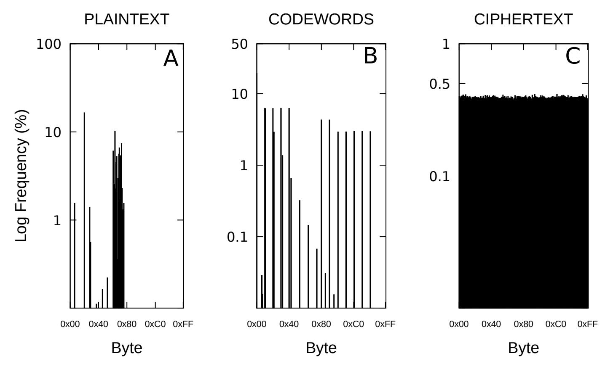

{0}------------------------------------------------

# PudgyTurtle: variable-length, keystream-dependent encoding to resist time-memory tradeoff attacks

David A August<sup>1</sup> Anne C Smith<sup>2</sup>

Abstract PudgyTurtle is a way to use keystream to encode plaintext before XOR-based (stream cipher-like) encryption. It makes stream ciphers less efficient – a typical implementation requiring about five times as much keystream and producing about twice as much ciphertext – but also more robust against time-memory-data tradeoff attacks. Pudgy-Turtle can operate alongside any keystream generator, and thus functions somewhat like an encryption mode for stream ciphers. Here, we introduce the mechanics of PudgyTurtle and discuss its design motivations.

Keywords Symmetric cryptography; stream ciphers; encryption modes; error-correcting codes; time-memory-data tradeoff;

# 1 Introduction

PudgyTurtle works alongside stream ciphers to implement a keystream-dependent, variable-length encoding step before the usual XOR-based encryption. Here, we provide an overview (Section 1) followed by a more detailed mathematical description (Section 2) and a worked example (Section 3). PudgyTurtle's underlying statistics are discussed next (Section 4), as are the effects of different parameter choices (Section 5). Next, time-memory tradeoff attacks against PudgyTurtle are considered (section 6), as are its relation to other encryption modes and error-correcting coding schemes (Section 7). Finally, a simplified C-language computer code is provided (Section 8 and Appendix). In addition to this material, more details can be found in [4].

# 1.1 Encoding and Encryption

PudgyTurtle works with 4-bit groups called nibbles. Thus, plaintext X = X1, X2, . . . , XN<sup>X</sup> , and keystream K = K1, K2, . . . are both written as sequences of nibbles, with each nibble being a concatenation of four bits, e.g.:

$$K_i = k_{4i-3} \parallel k_{4i-2} \parallel k_{4i-1} \parallel k_{4i}$$

<sup>1</sup> MGH-DACCPM, GRB-444, 55 Fruit St., Boston, MA, 02114, USA. daugust @ mgh.harvard.edu; corresponding author

<sup>2</sup> McKnight Brain Institute, University of Arizona, Tucson, AZ, 85724, USA, asmith3142@protonmail.com

{1}------------------------------------------------

To begin the PudgyTurtle process for X1, the first two keystream nibbles are concatenated to form a mask, M<sup>1</sup> = (K1kK2). Next, new keystream nibbles are successively generated starting from K<sup>3</sup> until one of them either exactly matches X<sup>1</sup> or differs from it by a single bit. Each time this does not happen, a zero-indexed failure-counter, F1, is incremented (i.e., F<sup>1</sup> = 0 means that K<sup>3</sup> matched X1; F<sup>1</sup> = 1 means that K<sup>4</sup> matched X1, and so on). The index of the matching keystream nibble is designated as t(1).

The nearness of Kt(1) to X<sup>1</sup> is then represented by a discrepancy code, D<sup>1</sup> = d(X1, Kt(1)), as explained in Section 2. A codeword is made by concatenating the failure-counter (expressed as a 5-bit value) and the discrepancy-code (a 3-bit value): C<sup>1</sup> = F1(mod 32)kD1. Finally, this codeword is encrypted by XOR'ing it with the mask, producing the first ciphertext symbol Y<sup>1</sup> = C1⊕M1.

This 'match-encode-encrypt' cycle continues for each nibble of plaintext: the second mask M<sup>2</sup> becomes (Kt(1)+1kKt(1)+2); and we then attempt to match X<sup>2</sup> to the keystream (starting with Kt(1)+3 and failure-counter F<sup>2</sup> = 0).

# 1.2 Overflow events

One problem immediately arises: what if none of the first 32 keystream nibbles match X1? Since more than five bits would be required to represent the failure-counter in this case, a codeword containing F<sup>1</sup> (mod 32) could not be unambiguously decoded. To encode these overflow events, two extra steps are taken: (i) the current codeword is prefixed by a special 8-bit symbol, 0xFF; and (ii) the current mask is extended to include the next two keystream nibbles (e.g., K<sup>35</sup> and K<sup>36</sup> in this case – the nibbles encountered after 32 failures, starting from K3). Then, attempts to match X<sup>1</sup> to the keystream continue, starting from K37. The codeword and mask are thus

$$C_1 = 0 \text{xFF} \parallel F_1 \pmod{32} \parallel D_1$$
  
 $M_1 = (K_1 \parallel K_2) \parallel (K_{35} \parallel K_{36})$ 

Just as before, Y<sup>1</sup> = C<sup>1</sup> ⊕ M1, but now ciphertext symbol Y<sup>1</sup> will be two bytes long instead of one.

This overflow procedure can even be repeated in the exceptionally rare case that no match occurs after the next 32 keystream nibbles (i.e., C<sup>1</sup> would become 0xFF k 0xFF k (F1(mod 32)kD1), and M<sup>1</sup> would become (K1kK2) k (K35kK36) k (K69kK70)). Thus, each codeword represents one nibble of plaintext and is usually one byte long, but may occasionally be a multiple of one byte.

# 1.3 Decoding and Decryption

Due to overflow events, the first ciphertext symbol, Y1, may not be the same as the first ciphertext byte. With this in mind, decryption begins by unmasking 

{2}------------------------------------------------

the first byte of Y – that is, XOR'ing it with (K1kK2). If this results in anything besides 0xFF, then the newly-unmasked byte is split into failurecounter F<sup>1</sup> (its first 5 bits) and discrepancy-code D<sup>1</sup> (its last 3 bits). Next, F<sup>1</sup> + 1 new keystream nibbles are generated in order to reach Kt(1). The plaintext nibble X<sup>1</sup> is then obtained by using the inverse discrepancy code Kt(1) ⊕ d −1 (D1), as explained in Section 2.

If, however, this unmasking produces 0xFF, then an overflow event has occurred. In this case, 32 keystream nibbles are generated and discarded, and then the next (second) byte of ciphertext is unmasked by XOR'ing it to the next two available keystream nibbles (K35kK<sup>36</sup> in this case). Assuming that this does not produce yet another 0xFF, the decoding proceeds as above, by splitting this newly unmasked byte into F<sup>1</sup> and D1. Otherwise, the overflow process (generating and discarding 32 more keystream nibbles, and using the subsequent two keystream nibbles to unmask the next ciphertext byte) can be repeated.

# 2 Mathematical description

The keystream is produced by a keystream generator (KSG), which operates on an n-bit state S. The initial state, S0, incorporates a secret key, and also may include an initialization value (IV) and/or counter. S evolves according to an update function π : {0, 1} <sup>n</sup> → {0, 1} <sup>n</sup>. An output function z : {0, 1} <sup>n</sup> → {0, 1} is applied to produce each keystream bit, k<sup>i</sup> = z(Si) = z(π(Si−1)).

Assume that during the encoding of plaintext nibble X<sup>i</sup> , the failure-counter is F<sup>i</sup> (i.e., F<sup>i</sup> + 1 keystream nibbles had to be generated until one matched X<sup>i</sup> to within a bit). The number of overflow events during this encoding is

$$o_i = \left\lfloor \frac{F_i}{32} \right\rfloor$$

where b c is the floor function. We then express the index of Kt(i) , the keystream nibble that matches X<sup>i</sup> , as

$$t(i) = t(i-1) + 2(o_i + 1) + F_i + 1$$

where t(0) := 0. That is, starting from keystream nibble Kt(i−1) that matched the previous plaintext nibble, we skip two nibbles for every byte in the current mask; then skip as many nibbles as specified by the failure-counter; and then skip one more to account for the failure-counter's zero-indexing.

Discrepancy codes are formed from a plaintext nibble and its matching keystream nibble. Letting h(u, v) represent the Hamming-distance between two 4-bit vectors u and v, then discrepancy codes are

$$D_i = d(X_i, K_{t(i)}) = \begin{cases} 0 & \text{if } h(X_i, K_{t(i)}) = 0; \\ 1 + \log_2(X_i \oplus K_{t(i)}) & \text{if } h(X_i, K_{t(i)}) = 1; \end{cases}$$

{3}------------------------------------------------

For instance, if X<sup>i</sup> ⊕ Kt(i) is 0100 in binary, then D<sup>i</sup> = 1 + log2(4) = 3. During decryption, discrepancy codes are 'inverted' – essentially a 1-bit errorcorrection process – to return the original plaintext nibble:

$$X_i = K_{t(i)} \oplus d^{-1}(D_i) = K_{t(i)} \oplus \begin{cases} 0 & \text{if } D_i = 0\\ 2^{D_i - 1} & \text{if } D_i = 1, 2, 3, \text{ or } 4 \end{cases}$$

Each plaintext symbol is one (4-bit) nibble. Because of overflow events, however, each ciphertext symbol, mask, and codeword, may be one or more bytes long. These symbols are thus properly written

$$Y_i = Y_{i,1} \parallel Y_{i,2} \parallel \dots \parallel Y_{i,o_i+1}$$
  
 $M_i = M_{i,1} \parallel M_{i,2} \parallel \dots \parallel M_{i,o_i+1}$   
 $C_i = C_{i,1} \parallel C_{i,2} \parallel \dots \parallel C_{i,o_i+1}$ 

to denote their individual bytes. Ciphertext symbols are formed by encrypting the codeword with the mask, using a byte-by-byte XOR operation:

$$Y_{i,j} = C_{i,j} \oplus M_{i,j}$$

for j = 1, 2, . . . , o<sup>i</sup> + 1. In the usual case where o<sup>i</sup> = 0, we use the shorthand

$$Y_i = C_i \oplus M_i$$

The bytes making up the codewords and masks are

$$C_{i,j} = \begin{cases} \text{OxFF} & j = 1, 2, \dots, o_i, \text{ if } o_i \ge 1; \\ F_i \pmod{32} & j = o_i + 1; \end{cases}$$

$$M_{i,j} = K_a || K_{a+1} & j = 1, 2, \dots, o_i + 1; \end{cases}$$

where a = t(i − 1) + 1 + 34(j − 1).

# 3 Example

This section presents a worked example showing the encryption and decryption of plaintext X = 0xFEDC using the keystream K = K1, K2, . . . , K<sup>64</sup> depicted in Figure 1. We emphasize that this is a terrible, non-random keystream, invented only to illustrate the PudgyTurtle process.

Encryption. The encoding and encrypting process for each plaintext nibble is described below, and summarized in Figure 2.

• Plaintext nibble X<sup>1</sup> = 0xF. The first mask is M<sup>1</sup> = (K1kK2) = 0x12. The plaintext-to-keystream matching proceeds as follows:

$$F_1=0: \quad h(X_1,K_3)=h({\tt F,4})=h(1111,0100)=3$$
  $F_1=1: \quad h(X_1,K_4)=h({\tt F,8})=h(1111,1000)=3$   $F_1=2: \quad h(X_1,K_5)=h({\tt F,E})=h(1111,1110)=1$ 

{4}------------------------------------------------

| j  | 1 | 2         | 3 | 4         | 5 | 6         | 7   | 8 |             |   |   |         |     | 9 10 11 12 13 14 15 16                          |         |     |  |
|----|---|-----------|---|-----------|---|-----------|-----|---|-------------|---|---|---------|-----|-------------------------------------------------|---------|-----|--|
| Kj | 1 | 2         | 4 | 8         | E | 2         | 4   | 8 | 1           | 2 | 4 | 8       | 1   | 2                                               | 4       | 8   |  |
|    |   | ⇑ ⇑<br>M1 |   |           | ↑ | t(1) M2,1 | ⇑ ⇑ |   |             |   |   |         |     |                                                 |         |     |  |
| j  |   |           |   |           |   |           |     |   |             |   |   |         |     | 17 18 19 20 21 22 23 24 25 26 27 28 29 30 31 32 |         |     |  |
| Kj | 1 | 2         | 4 | 8         | 1 | 2         | 4   | 8 | 1           | 2 | 4 | 8       | 1   | 2                                               | 4       | 8   |  |
| j  |   |           |   |           |   |           |     |   |             |   |   |         |     | 33 34 35 36 37 38 39 40 41 42 43 44 45 46 47 48 |         |     |  |
| Kj | 1 | 2         | 4 | 8         | 1 | 2         | 4   | 8 | 1           | 2 | E | 8       | 1   | 5                                               | 4       | 8   |  |
|    |   |           |   |           |   |           |     |   | ⇑ ⇑<br>M2,2 |   | ↑ | t(2) M3 | ⇑ ⇑ | ↑                                               | t(3) M4 | ⇑ ⇑ |  |
| j  |   |           |   |           |   |           |     |   |             |   |   |         |     | 49 50 51 52 53 54 55 56 57 58 59 60 61 62 63 64 |         |     |  |
| Kj | 0 | 1         | 2 | E         | 1 | 2         | 4   | 8 | 1           | 2 | 4 | 8       | 1   | 2                                               | 4       | 8   |  |
|    |   |           |   | ↑<br>t(4) |   |           |     |   |             |   |   |         |     |                                                 |         |     |  |

Fig. 1 Annotated keystream to illustrate PudgyTurtle. Each keystream nibble (K<sup>j</sup> ) shown underneath its index (j). This keystream is not 'secure': with few exceptions, it follows a simple pattern and is intended for explanatory purposes only. Below some of the keystream nibbles, additional descriptive information is given: M<sup>i</sup> (double-arrow) indicates which pairs of nibbles are used for each byte of the i-th mask; and t(i) shows which keystream nibble matches the i-th plaintext nibble (e.g., the first plaintext nibble matches the fifth keystream nibble, so t(1) points to K5). Since an overflow event occurs when encoding X2, the second mask contains two bytes instead of one: M<sup>2</sup> = M2,1kM2,<sup>2</sup> = (K6kK7)k(K40kK41) = 0x2481.

The first keystream nibble matching X<sup>1</sup> = 0xF to within a bit is K<sup>5</sup> = 0xE, and so failure-counter F<sup>1</sup> = 2, there is no overflow, and we confirm that t(1) = t(0) + 2(o<sup>1</sup> + 1) + F<sup>1</sup> + 1 = 0 + 2 · (0 + 1) + 2 + 1 = 5. Since K<sup>5</sup> = 1110<sup>2</sup> differs from X<sup>1</sup> = 1111<sup>2</sup> in the least-significant bit, the discrepancy code will be D<sup>1</sup> = 1 + log2(00012) = 1. Combining the failure-counter and discrepancy-code, the first codeword is therefore

$$C_1 = F_1 \pmod{32} \parallel D_1$$
  
= 2 || 1  
= 00010 || 001  
= 00010001  
= 0x11

This codeword is then encrypted (by XOR'ing with its mask) to produce the first ciphertext symbol, Y<sup>1</sup> = C<sup>1</sup> ⊕ M<sup>1</sup> = 0x11 ⊕ 0x12 = 0x03.

• Plaintext nibble X<sup>2</sup> = 0xE. After saving K<sup>6</sup> and K<sup>7</sup> (the next two keystream nibbles) as mask M<sup>2</sup> = 0x24, we discover an overflow event: X<sup>2</sup> fails to match any of the next 32 keystream nibbles. Thus, two more nibbles (K<sup>40</sup> and K41) are incorporated into the mask, and attempts to match X<sup>2</sup> con

{5}------------------------------------------------

tinue until K<sup>43</sup> = 0xE – an exact match. Thus, F<sup>2</sup> = 33, and as expected, t(2) = t(1) + 2(o<sup>2</sup> + 1) + F<sup>2</sup> + 1 = 5 + 2 · (1 + 1) + 33 + 1 = 43. Because of this overflow event, the mask M<sup>2</sup> = M2,1kM2,<sup>2</sup> is now two bytes:

$$M_{2,1} = (K_{t(1)+1} \parallel K_{t(1)+2}) = (K_6 \parallel K_7) = 0$$
x24 
$$M_{2,2} = (K_{t(1)+1+34} \parallel K_{t(1)+2+34}) = (K_{40} \parallel K_{41}) = 0$$
x81

Since the match between X<sup>2</sup> and K<sup>43</sup> is exact, its discrepancy code is D<sup>2</sup> = 0, and the second codeword is therefore

$$C_2 = 0xFF \parallel F_2 \pmod{32} \parallel D_2$$
  
=  $0xFF \parallel 33 \pmod{32} \parallel 0$   
=  $0xFF \parallel 00001_2 \parallel 000_2$   
=  $0xFF08$ 

The second ciphertext symbol is the (2-byte) value Y<sup>2</sup> = C<sup>2</sup> ⊕ M<sup>2</sup> = 0xFF08 ⊕ 0x2481 = 0xDB89

- Plaintext nibble X<sup>3</sup> = 0xD. The next two keystream nibbles become mask M<sup>3</sup> = (K44kK45) = 0x81, after which the very next keystream nibble is a match: K<sup>46</sup> = 0x5 = 0101<sup>2</sup> matches X<sup>3</sup> = 1101<sup>2</sup> all but the mostsignificant bit. Thus, F<sup>3</sup> = 0, and D<sup>3</sup> = 1 + log2(10002) = 1 + log2(8) = 4 = 1002, from which codeword C<sup>3</sup> = F3kD<sup>3</sup> = 000002k100<sup>2</sup> = 0x04 is formed. Encrypting C3, we obtain Y<sup>3</sup> = C<sup>3</sup> ⊕ M<sup>3</sup> = 0x81 ⊕ 0x04 = 0x85.
- Plaintext nibble X<sup>4</sup> = 0xC. Finally, after setting mask M<sup>4</sup> to (K47kK48) = 0x48, we find that X<sup>4</sup> = 1100<sup>2</sup> matches K<sup>52</sup> = 0xE = 1110<sup>2</sup> in all but the second bit. Thus, F<sup>4</sup> = 3 and D<sup>4</sup> = 1 + log2(00102) = 2 = 0102. The final ciphertext symbol is thus Y<sup>4</sup> = C<sup>4</sup> ⊕ M<sup>4</sup> = (F4(mod 32) k 2) ⊕ 0x48 = (000112k0102) ⊕ 0x48 = 0x1A ⊕ 0x48 = 0x52.

In this manner, the 4-nibble plaintext X = 0xFEDC becomes the 5-byte ciphertext Y = 0x03DB898552 under a hypothetical keystream which generated one overflow event.

Decryption. To decrypt, the first ciphertext byte is unmasked by the first two keystream nibbles to obtain 0x03 ⊕ (K1kK2) = 0x03 ⊕ 0x12 = 0x11 = 000100012. Since there is no overflow event (i.e., the unmasked byte is not 0xFF), it gets split into F<sup>1</sup> = 00010<sup>2</sup> = 2 (the five high-order bits) and D<sup>1</sup> = 001<sup>2</sup> = 1 (the three low-order bits). We then generate F1+1 = 3 more keystream nibbles, landing on K<sup>5</sup> = 0xE = 11102. To recover the plaintext, the inverse discrepancy code is applied to K5:

$$X_2 = K_5 \oplus d^{-1}(D_1)$$
  
=  $1110_2 \oplus 2^{1-1}$   
=  $1110_2 \oplus 0001_2$   
=  $0xF$ 

{6}------------------------------------------------

Unmasking the second ciphertext byte (0xDB) with the next mask (K6kK<sup>7</sup> = 0x24) produces 0xFF – the overflow event indicator. Thus, 32 keystream nibbles are generated and discarded, after which two more (K40kK<sup>41</sup> = 0x81) are used to unmask the next (third) ciphertext byte Y2,<sup>2</sup> ⊕ M2,<sup>2</sup> = 0x89 ⊕ 0x81 = 0x08 = 00001000<sup>2</sup> = 000012k000<sup>2</sup> = 1k0 = F2kD2. We then generate F<sup>2</sup> + 1 = 2 more keystream nibbles to reach K<sup>43</sup> = 0xE. Since the zero discrepancy-code means an exact match, the second decrypted plaintext nibble is therefore also 0xE. This decryption process continues analogously for Y<sup>3</sup> and Y4.

# 4 Statistics

PudgyTurtle's nibble-by-nibble matching process follows a geometrical distribution, where the probability of one successful match after F failures is

$$g(F,p) = (1-p)^F \times p$$

and p = 5/16 is the probability of a match between two 4-bit values X<sup>i</sup> and K<sup>j</sup> (i.e., 1/16 for an exact match plus 4/16 for a 1-bit mismatch). Letting G(x, p) denote the cumulative distribution

$$G(x,p) = \sum_{i=0}^{x} g(i,p)$$

the probability of an overflow event is p<sup>O</sup> = 1 − G(31, p) ≈ 6.2047813 × 10<sup>−</sup><sup>6</sup> . Thus, we expect an overflow event every ≈ 161166 nibbles.

| Xi | Fi | Over-<br>flow? | t(i) | Kt(i) | Xi⊕<br>Kt(i) | Di  | Ci                       | Mi   | Yi   |
|----|----|----------------|------|-------|--------------|-----|--------------------------|------|------|
| F  | 2  | No             | 5    | E     | 0001         | 001 | 00010-001<br>= 0x11      | 12   | 03   |
| E  | 33 | Yes            | 43   | E     | 0000         | 000 | FF-00001-000<br>= 0xFF08 | 2481 | DB89 |
| D  | 0  | No             | 46   | 5     | 1000         | 100 | 00000-100<br>= 0x04      | 81   | 85   |
| C  | 3  | No             | 52   | E     | 0010         | 010 | 00011-010<br>= 0x1A      | 48   | 52   |

Fig. 2 PudgyTurtle encryption example. Values used to encode and encrypt the four (hexadecimal) plaintext nibbles in Column 1 using the keystream from Figure 1. The next several columns show failure-counters F<sup>i</sup> (Column 2); whether an overflow event occurred (Column 3); and the indexes t(i) and hexadecimal values of the matching keystream nibble (Columns 4 and 5). Next, the XOR of the matching plaintext and keystream nibbles are given, along with their corresponding discrepancy codes, D<sup>i</sup> (Columns 6 and 7). Codewords, made by concatenating F<sup>i</sup> (mod 32) and Di, are shown in Column 8. These codewords are encrypted by XOR'ing them with their masks M<sup>i</sup> (Column 9) to produce the ciphertext symbols Y<sup>i</sup> (Column 10). Since Row 2 contains an overflow event (i.e., F<sup>2</sup> = 33 which is > 31), its mask, codeword, and ciphertext symbols all have two bytes instead of one.

{7}------------------------------------------------

Just like failure-counters, codeword bytes are also geometrically distributed. However, despite this underlying non-uniformity, the ciphertext still looks uniform (Figure 3), because each codeword is XOR'd to a mask.



Fig. 3 Byte frequencies with PudgyTurtle. A 250,000 byte ASCII-encoded English-language plaintext was encrypted by applying the PudgyTurtle process to keystream from a 24 stage nonlinear feedback shift register. Byte-values (X-axis) range from 0x00 to 0xFF. The frequency of occurrence of each byte (Y-axis) is expressed as a percentage, and plotted on a log-scale. Frequency distributions are shown for plaintext bytes (A), codeword bytes (B), and ciphertext bytes (C). Despite obvious structure in both the plaintext and codeword distributions, the ciphertext bytes still appear uniformly distributed.

The probabilistic nature of the encoding (plaintext-to-keystream matching) process leads to several conclusions:

- Because of overflow events, the exact ciphertext length is not known until after encryption. PudgyTurtle produces a sequence of variable-length codewords, dependent upon the keystream.
- The approximate ciphertext length is twice that of the plaintext: overflow events are uncommon, and most ciphertext symbols are therefore 1 byte – twice as long as each plaintext nibble. Thus, PudgyTurtle's ciphertext expansion factor (CEF) is ∼ 2, compared to CEF = 1 for standard streamcipher operation.
- Approximately 5.2 keystream nibbles are required to encode and encrypt each plaintext nibble: 2 for each mask, plus 3.2 on average to match the plaintext and keystream nibbles (since the mean of g(F, p) is 1/p = 16/5 = 3.2). Thus, PudgyTurtle's keystream expansion factor (KEF) is ∼ 5.2, compared to KEF = 1 for standard stream cipher operation.

{8}------------------------------------------------

• The total number of overflow events during encryption is N<sup>O</sup> = B − N<sup>X</sup> ≈ N<sup>X</sup> × pO, where B is the number of ciphertext bytes (not symbols), and N<sup>X</sup> is the number of plaintext symbols (i.e., nibbles).

# 5 Not just nibbles: different parameters

Each implementation of PudgyTurtle can be described by parameters (w, fmax, δ), where

- w the size (in bits) of the plaintext and keystream 'words' that are matched during encoding;
- fmax is the maximum number of failures before an overflow event;
- δ is the number of bits used for the discrepancy code, where δ ≥ dlog2(w + 2)e bits, d·e is the ceiling-function, and w + 2 provides enough possibilities to describe an exact match, each 1-bit mismatch, and the overflow-event.

From these parameters, we can calculate the size of each (non-overflow) codeword: c ≥ dlog<sup>2</sup> (fmax)e + δ; the probability of a successful plaintextto-keystream match: p = (w + 1)/2 <sup>w</sup>; the probability of an overflow: p<sup>O</sup> = 1 − G(fmax, p); the ciphertext expansion factor: CEF = c/w; and the the keystream expansion factor: KEF = c/w + 1/p.

So far, we have been using parameters (4, 32, 3), meaning that c = log2(32) + 3 = 8 bits; p = (4+1)/16 = 0.3125; CEF = 8/4 = 2; and KEF = 8/4 + (5/16)<sup>−</sup><sup>1</sup> = 5.2. However, many other parameter sets are possible. For instance, expanding the word-size to six bits, parameters (6, 32, 3) preserve the convenience of byte-sized codewords (c = 8) and more efficiently utilize every one of the w+2 = 8 possible 3-bit discrepancy codes. Here, p is 7/64 = 0.109375 instead of 0.3125, CEF is 8/6 = 1.33 instead of 2, and KEF is (8/6) + (64/7) ≈ 10.5 instead of 5.2 – meaning less ciphertext expansion but more keystream wastage.

Different parameter sets may produce subtle effects on CEF and KEF. Regarding CEF, as p<sup>O</sup> increases, then at some point overflows will occur often enough to make CEF significantly underestimate the actual ciphertext length. For parameters (6, 32, 3), CEF will be off by about 2.5%, since p<sup>O</sup> = 1 - G(32, 0.109375) ≈ 0.0246.

Regarding KEF, each (non-overflow) mask only needs to be c bits long, but in software or hardware implementations it may be easier to set aside a whole number of word-sized (i.e., w-bit sized) keystream chunks for the mask – even if only c of these bits are actually used. This would increase KEF to dc/we + 1/p (e.g., from 10.5 to ≈ 11.2).

# 6 Motivation

The PudgyTurtle process makes stream ciphers less efficient: the (4, 32, 3) implementation described here produces about twice as much ciphertext ('pudgy') 

{9}------------------------------------------------

and requires about five times as much keystream ('turtle'). Why tolerate this extra computational effort? The answer, summarized below, is that PudgyTurtle is better able to resist time-memory-data tradeoff (TMDTO) attacks. A more complete analysis of these attacks and their effectiveness against Pudgy-Turtle is provided in [4].

# 6.1 Time-memory-data tradeoffs

The general concept behind TMDTO attacks is that the extreme ends of 'brute-force' cryptanalysis require either an impractical amount of time (i.e., to decrypt a ciphertext under every possible key); or an impractical amount of memory (i.e., to store, in advance, every possible encryption of some known / chosen plaintext data). However, in between these extremes, practical cryptanalytic attacks are possible when the time-memory-data product satisfies certain conditions.

# 6.1.1 Stream cipher TMDTO attacks

Hellman proposed the first cryptanalytic time-memory tradeoff, which was targeted against block ciphers [14]. For stream-ciphers, Babbage [5] and Goli´c [11] independently described the so-called 'BG-attack', and Biryukov and Shamir [8] subsequently developed the 'BS-attack' incorporating some of Hellman's methodology. The goal of these two attacks is to recover a KSG state that occurred during encryption. However, stream-cipher TMDTO attacks can also be targeted against the secret key / IV combination [9, 15, 16].

Both the BG- and BS-attack begin with a 'precomputation phase', during which one (BG-attack) or several (BS-attack) two-column tables are constructed. The first column contains unique, randomly-chosen KSG-states, S<sup>i</sup> . In the BG-attack, the second column contains the prefix e(Si) of each state – defined as the first n bits of keystream generated by S<sup>i</sup> . In the BS-attack, the second column contains the end-result of t applications of a function, f, to the state: f (t) (Si). This function is composed of e and a 'chaining' function r: f(Si) = r(e(Si)). Once constructed, the table (or tables) are sorted according to their second column.

The next part of these TMDTO attacks is called the 'realtime phase'. The adversary is assumed to possess some known keystream from which D successive n-bit windows are taken for analysis. Each such keystream fragment is written K(a), where a = 1, 2, . . . , D −n+ 1 is its bit-offset within K. During the BG-attack, the table is checked for any entry in the second column that matches the current keystream fragment. If one is found, then its associated state (i.e., the first column from that row) is the solution and the attack stops; if not, then the second column is searched for K(a+ 1), and so on. During the BS-attack, the second-column of the table is searched for r(K(a)), and then for f(r(K(a))), and f (2)(r(K(a))), and so on, for up to to t applications of f. If an element in a table's second column matches any of these search-targets, then 

{10}------------------------------------------------

a process is applied to obtain the correct KSG state from the corresponding state in its first column, and the attack succeeds; if not, the attack continues with the next fragment K(a+1).

To quantify these TMDTO attacks, let  $N=2^n$  be the size of the search-space (i.e., the number of KSG states), T be the time required for the realtime phase, and M be the memory needed to store the precomputed table. The BG-attack allows cryptanalytic success with (T, M) points along the curve TM = N. For example, choosing  $T = M = \sqrt{N}$  compares favorably with brute-force, which can be thought of as extreme points (T = N, M = 1) or (T = 1, M = N). The BS-attack tradeoff of  $TM^2D^2 = N^2$  offers even more flexibility by including the amount of realtime data, D.

#### 6.1.2 TMDTO attacks and PudgyTurtle

Both the BG- and BS-attacks require fragments of known keystream, K(a), but what the adversary actually has is a sample of known plaintext, X'. For a typical binary-additive stream cipher, obtaining K(a) from X' is trivial: simply XOR n bits of ciphertext to n bits of X', starting at bit-offset a. With PudgyTurtle, however, it becomes harder to derive K from X', and thereby more costly to mount a TMDTO attack.

Both the BG- and BS-attacks can be modified to work against PudgyTurtle [4]. This involves constructing a model of how known plaintext X' could have been encoded, and then back-filling a  $tentative\ keystream$ , written as K', that is consistent with this model. The model is just a hypothetical sequence of codewords

$$C^* = \{C_1^*, C_2^*, \dots, C_{N_X}^*\}$$
  
= \{(F\_1^\* \| D\_1^\*), (F\_2^\* \| D\_2^\*), \dots, (F\_{N\_X}^\* \| D\_{N\_X}^\*)\}

where the '\*' symbol indicates modeled-values rather than 'real' quantities that would have been produced by encoding X' with the actual keystream K.

For example, a model with  $F_1^* = 1$ ,  $F_2^* = 0$ , and  $F_3^* = 3$  will produce a tentative keystream with the following structure:

| $K_1'$ | $K_2'$  | $K_3'$ | $K_4'$ | $K_5'$ | $K_6'$      | $K_7'$ | $K_8'$ | $K_9'$ | $K'_{10}$ | $K'_{11}$ | $K'_{12}$ | $K'_{13}$ |
|--------|---------|--------|--------|--------|-------------|--------|--------|--------|-----------|-----------|-----------|-----------|
|        |         |        |        |        |             |        |        |        | ?         |           |           |           |
|        | $F_1^*$ | = 1    |        |        | $F_2^* = 0$ | )      |        |        | $F_3^*$   | = 3       |           |           |

K' contains several 'known' nibbles ( $\checkmark$  symbols), whose exact values can be predicted by back-filling. For instance,  $K'_1$  and  $K'_2$  (i.e., the first mask) can be determined by XOR'ing  $C_1^*$  from the model with the first byte of ciphertext. Similarly,  $K'_4$  can be computed by inverting the effect of  $D_1^*$  from the model on the known plaintext:  $X'_1 \oplus d^{-1}(D_1^*)$ .

However, K' also contains several 'unknown' nibbles (? symbols) which would have been skipped over during the plaintext-to-keystream matching

{11}------------------------------------------------

process, and are therefore not amenable to back-filling. For example, because  $F_1^* = 1$ , the model dictates that one keystream nibble  $(K'_3)$  is skipped before  $X'_1$  successfully matches  $K'_4$ . Therefore,  $K'_3$  can not be predicted: even knowing  $C_1^*$ ,  $X'_1$  and  $Y_1$ , it could still take any of sixteen possible 4-bit values.

Each model produces one tentative keystream, some proportion of which must be tested during a TMDTO attack against PudgyTurtle. How many tentative keystreams are there? Ignoring overflow events, since  $F_i^*$  can take 32 values and  $D_i^*$  can take 5 values, there are  $32 \times 5 = 160$  different possible codewords. Thus, an  $N_X$ -nibble known plaintext could theoretically be encoded with  $160^{N_X}$  different models. In practice, since failure-counters are geometrically distributed, the number of models that realistically need to be considered is much smaller. For instance, limiting consideration to only those models with an 'average' (1/p = 3.2) number of failures reduces the size of the model-space to  $(3.2 \times 5)^{N_X} = 16^{N_X} = 2^{4N_X}$ , so a 16-byte known plaintext (i.e., a  $N_X = 32$ -codeword model) would lead to  $2^{128}$  tentative keystreams.

Besides contending with multiple keystreams, TMDTO attacks against PudgyTurtle must also deal with the problem of unknown nibbles. These unknown values mean that most 'hits' (i.e., apparent correspondences between a tentative keystream fragment and an element in the second column of the precomputed table) will be *false alarms*. The need to perform a test-decryption on each of these further increases the computational burden of a tradeoff attack.

In summary, TMDTO attacks against PudgyTurtle take longer because (a) many tentative keystreams must be tested, instead of just a single known keystream; and (b) many test-decryptions must be undertaken, instead of just one (or perhaps a few at most).

#### 7 Relationship to other systems

Since PudgyTurtle is used alongside an existing stream-cipher, it somewhat resembles an encryption 'mode', based on a simple, keystream-dependent, variable-length, error-correcting code (ECC). This section discusses similarities between PudgyTurtle, stream-cipher encryption modes, and several ECC-based cryptosystems.

#### 7.1 Encryption modes

Block-cipher modes like cipher block chaining (CBC) were originally designed to avoid producing identical ciphertext blocks when a plaintext block repeated. Even if the contents of a repeated block were to remain unknown, its pattern of occurrence could still leak information about the underlying message. Stream ciphers, however, do not suffer from this 'repeated block' problem in the same sense, and therefore stream-cipher modes are designed to achieve other goals. One goal is to improve the security of the initialization / re-synchronization process (e.g., by incorporating some of the secret key or IV into each state)

{12}------------------------------------------------

[2, 3, 12, 22]. Another goal is to provide enhanced security features, like authenticated encryption [1, 6, 7, 23]. PudgyTurtle differs from these proposals, however, in that it is keyed (not key-less); it modifies how the keystream is used, rather than how the state is initialized or re-synchronized; and it is not intended to provide any features beyond the usual one: privacy.

# 7.2 Error-correcting codes

There are many proposals for encoding the plaintext before encrypting it, from Shannon's 1949 work [24] to Hellman's extension of these ideas to cryptosystem design [13] to Mceliece's use of binary 'Goppa' ECC in a public key cryptosystem [19]. With regard to stream ciphers, Kara and Erguler propose encoding the plaintext with an ECC and then perturbing it with an external noise source during encryption [18, 17]. This external noise source can also be used for homophonic encoding in cryptosystems based on the 'Learning Parity with Noise' (LPN) problem [10], as suggested by Imai, Mihaljevi´c, Oggier, and others [20, 21]. PudgyTurtle differs from these approaches in that what gets encoded is the relative position and similarity of keystream and plaintext nibbles, not the plaintext itself. Also, unlike randomized encryption schemes, it does not require any additional noise source. Rather, the keystream itself functions somewhat like 'noise' during encoding.

# 8 Computer code

The Appendix contains an austere C-language encryption and decryption subroutine for PudgyTurtle, excerpted from a larger code (which includes input/output features and a hard-wired KSG) in the GitHub repository https:// www.github.com/ smaugust/ PudgyTurtle. This code is a simplified, nofrills implementation for research purposes only – no input validation or sanitizing is done, and no guarantees of security or efficiency are made.

# 9 Summary

This paper has briefly introduced PudgyTurtle, and offered some qualitative insight into its effects on time-memory-data tradeoff (TMDTO) attacks. A quantitative study of these attacks, and discussion of some potential limitations of PudgyTurtle, can be found in [4].

Essentially, PudgyTurtle is a way to use a stream-cipher's keystream to implement a variable-length encoding of the plaintext. Although PudgyTurtle costs space (producing ∼ 2 times as much ciphertext) and time (generating ∼ 5 times as much keystream) compared to standard stream cipher operation, it is also better able to resist TMDTO attacks. These attacks take longer because they must evaluate many 'tentative keystreams', each of which contains unknown bits. We suggest that future research topics might include investigating 

{13}------------------------------------------------

other (non-TMDTO) attacks against PudgyTurtle; improving the currentlyproposed TMDTO attacks in [4]; investigating how different parameter sets affect PudgyTurtle's efficiency and security; using a block-cipher in 'counter' (CTR) mode as PudgyTurtle's keystream generator; and developing pragmatic speedup methods.

# References

- 1. Agren M, Hell M, Johansson T, Meier W (2011) Grain-128a: A new version of Grain-128 with optional authentication. Int J Wire Mob Comput 5(1):48–59
- 2. Amin Ghafari V, Hu H (2018) Fruit-80: A secure ultra-lightweight stream cipher for constrained environments. Entropy 20(3):180
- 3. Armknecht F, Mikhalev V (2015) On lightweight stream ciphers with shorter internal states. In: Fast Software Encryption - 22nd International Workshop, FSE 2015, Istanbul, Turkey, March 8-11, 2015, Revised Selected Papers, pp 451–470
- 4. August DA, Smith AC (2020) Pudgyturtle: Using keystream to encode and encrypt. SN Computer Science 1(4):Article#226, https://doi.org/10.1007/s42979-020-00221-z
- 5. Babbage S (1995) Improved "exhaustive search" attacks on stream ciphers. In: European Convention on Security and Detection, 1995, Institution of Engineering and Technology, pp 161–166
- 6. Bellare M, Rogaway P (2000) Encode-then-encipher encryption: How to exploit nonces or redundancy in plaintexts for efficient cryptography. In: Okamoto T (ed) Advances in Cryptology – ASIACRYPT 2000. Lecture Notes in Computer Science, vol 1976, Springer-Verlag, London, UK, pp 317–330
- 7. Bernstein DJ (2007) Cycle counts for authenticated encryption. Workshop Record of SASC 2007: The State of the Art of Stream Ciphers, http://cr.yp.to/papers.html#aescycles
- 8. Biryukov A, Shamir A (2000) Cryptanalytic time/memory/data tradeoffs for stream ciphers. In: Okamoto T (ed) Advances in Cryptology – ASIACRYPT 2000, Springer Berlin Heidelberg, Berlin, Heidelberg, pp 1– 13
- 9. Dunkelman O, Keller N (2008) Treatment of the initial value in time-memory-data tradeoff attacks on stream ciphers. Inf Process Lett 107(5):133–137
- 10. Fossorier M, Mihaljevi´c M, Imai H, Cui Y, Matsuura K (2006) An algorithm for solving the LPN problem and its application to security evaluation of the HB protocols for RFID authentication. In: Barua R, Lange T (eds) Progress in Cryptology - INDOCRYPT 2006. Lecture Notes in Computer Science, vol 4329, Springer, Berlin, pp 48–62

{14}------------------------------------------------

- 11. Goli´c JD (1997) Cryptanalysis of alleged A5 stream cipher. In: Fumy W (ed) Advances in Cryptology — EUROCRYPT '97, Springer Berlin Heidelberg, Berlin, Heidelberg, pp 239–255
- 12. Hamann M, Krause M, Meier W (2017) LIZARD A lightweight stream cipher for power-constrained devices. IACR Transactions on Symmetric Cryptology 1:45–79
- 13. Hellman M (1977) An extension of the Shannon theory approach to cryptography. IEEE Trans Inf Theory 23(3):289–294
- 14. Hellman M (1980) A cryptanalytic time-memory trade-off. IEEE Trans Inf Theor 26(4):401–406
- 15. Hong J, Sarkar P (2005) New applications of time memory data tradeoffs. In: Roy B (ed) Advances in Cryptology - ASIACRYPT 2005. Lecture Notes in Computer Science, vol 3788, Springer Berlin Heidelberg, Berlin, Heidelberg, pp 353–372
- 16. Hong J, Sarkar P (2005) Rediscovery of time memory tradeoffs. Cryptology ePrint Archive, Report 2005/090, https://eprint.iacr.org/2005/090
- 17. Kara O, Erguler I (2008) A new approach to keystream based cryptosystems. In: The State of the Art of Stream Ciphers: SASC 2008. Workshop Record, pp 205–221
- 18. Kara O, Erguler I, Anarim E (2012) Proceedings of Extended Abstracts, International Conference on Applied and Computational Mathematics ICACM–2012, Ankara, Turkey: METU, pp 1–5
- 19. McEliece RJ (1978) A public-key cryptosystem based on algebraic coding theory. DSN Progress Report, Jet Propulsion Laboratory, Pasadena, CA, Jan./Feb. pp 114–116
- 20. Mihaljevic MJ, Oggier FE, Imai H (2010) Homophonic coding design for communication systems employing the encoding-encryption paradigm. CoRR abs/1012.5895, URL http://arxiv.org/abs/1012.5895
- 21. Mihaljevi´c M, Imai H (2009) An approach for stream ciphers design based on joint computing over random and secret data. Computing 85:153–168
- 22. Mikhalev V, Armknecht F, Muller C (2017) On ciphers that continually access the non-volatile key. IACR Transactions on Symmetric Cryptology 2016:52–79
- 23. Sarkar P (2011) Modes of operations for encryption and authentication using stream ciphers supporting an initialisation vector. Cryptology ePrint Archive, Report 2011/299, https://eprint.iacr.org/2011/299
- 24. Shannon C (1949) Communication theory of secrecy systems. Bell System Technical Journal 28(4):656–715

# Appendix: C-language source code

This code-block is the encryption / decryption subroutine from a larger Pudgy-Turtle implementation that can be found at https://wwww.github.com / smaugust / PudgyTurtle. The following assumptions are made:

{15}------------------------------------------------

- Plaintext and ciphertext are stored as an array of bytes, data[0], data[1], ..., data[nbytes - 1].
- The KSG operates on, and updates, a 64-bit value state, which has already been initialized using the secret key, and possibly an IV. Depending on the KSG details, not all 64 bits need to be used.
- Calling get ksg nibble(state) returns 4 bits of keystream as the loworder nibble of a byte-sized value, and updates state accordingly.

```
void pudgy_turtle(U64 *state, U8 *data, int nbytes, int decrypt_mode)
{
int i,j; //Counters
U8 lo_nibble; //low-order (1) or hi-order (0) nibble w/in a byte
U8 xbyte; //Plaintext byte
U8 xnibble; //Plaintext nibble
U8 ybyte; //Ciphertext byte
U8 knibble; //Keystream nibble
U8 mask; //Mask: 2 keystream nibbles used to encrypt/decrypt a codeword
U8 hamming; //Hammming-vector (XOR) btwn xnibble & a keystream nibble
U8 discrepancy; //Discrepancy code: 0 (exact match) or {1,2,3,4} (1-bit mismatch)
U8 fails; //Failure-counter: how many keystream nibbles do NOT match xnibble
U8 codeword; //Codeword: failure-counter [5 bits] || discrepancy-code [3 bits]
int match; //(0/1)-flag: does xnibble match keystream nibble?
//valid_hammings: "1" --> exact match or 1-bit mismatch btwn two 4-bit patterns
//Eg: hammings[4] = hammings[0100] = mismatch @ bit #2 (where rightmost = #0)
int valid_hammings[16] = {1,1,1,0,1,0,0,0,1,0,0,0,0,0,0,0};
//dcodes: discrepancy codes for ENcryption
U8 dcodes[9] = {0, 1, 2, 0, 3, 0, 0, 0, 4};
//inverse_dcodes: "inverse" discrepancy codes for DEcryption
//Eg: dcodes[inverse_dcodes[i]] = i
U8 inverse_dcodes[5] = {0, 1, 2, 4, 8};
if (! decrypt_mode) {
 //For ENcryption...
 for (i=0; i<2*nbytes; i++) { //i: Plaintext nibble index
  //Get new plaintext BYTE every other iteration
  if (i % 2 == 0) xbyte = *(U8 *) data++;
  //Strip off high- or low-order nibble from this byte
  xnibble = (i % 2 == 0) ? ((xbyte & 0xF0) >> 4) : xbyte & 0x0F;
  //Mask: concatenate the next 2 keystream nibbles
  mask = (get_ksg_nibble(state) << 4) | get_ksg_nibble(state);
  fails = 0; //Initialize failure-counter to 0
```

{16}------------------------------------------------

```
do { //Repeat this code-block until a match is found
  //Binary difference between xnibble & each keystream nibble
  hamming = xnibble ^ get_ksg_nibble(state);
  match = valid_hammings[hamming]; //0/1-flag for match failure/success
  if (! match) fails += 1; //If NO match, increment failure-counter
  if (fails == 32) {
   //OVERFLOW EVENT: 32 failures without a match
   ybyte = 0xFF ^ mask; //...Set ciphertext byte to 0xFF XOR mask,
   printf("%c", ybyte); //...Display this byte, make a new mask,
   mask = (get_ksg_nibble(state) << 4) | get_ksg_nibble(state);
   fails = 0; //...And reset failure-counter to 0
  }
 } while (! match);
 //If a keystream nibble matching xnibble HAS been found...
 discrepancy = dcodes[hamming]; //Obtain discrepancy-code
 //Construct the codeword
 codeword = fails << 3; //Upper 5 bits: failure-counter
 codeword |= discrepancy; //Lower 3 bits: discrepancy-code
 ybyte = codeword ^ mask; //ENCRYPT the codeword with the mask
 printf("%c", ybyte); //Display ciphertext byte
} //Loop through plaintext nibbles
} else {
//For DEcryption....
lo_nibble = 0; //The 1st DEcrypted nibble is the hi-order one
for (i=0; i<nbytes; i++) { //i: index of each ciphertext BYTE
 ybyte = *(U8 *) data++; //Get a new ciphertext byte
 //Create a mask from next 2 keystream nibbles
 mask = (get_ksg_nibble(state) << 4) | get_ksg_nibble(state);
 //Unmask the ciphertext byte to re-create the codeword
 codeword = ybyte ^ mask;
 if (codeword == 0xFF) {
  //If the codeword is 0xFF (overflow event), then
  //generate and discard 32 keystream nibbles
  for (j=0; j<32; j++) knibble = get_ksg_nibble(state);
```

{17}------------------------------------------------

```
} else {
    //If no overflow, split the codeword into its components:
    fails = (codeword & 0xF8) >> 3; //Failure-counter: 1-st 5 bits
    discrepancy = (codeword & 0x07); //Discrepancy-code: last 3 bits
    //Generate "fails+1" more keystream nibbles to reach
    //the one that matches the original plaintext nibble.
    for (j=0; j<=fails; j++) knibble = get_ksg_nibble(state);
    //Adjust this nibble via the inverse discrepancy code
    xnibble = knibble ^ inverse_dcodes[discrepancy];
    //Make a plaintext BYTE from each pair of decrypted nibbles
    xbyte = (lo_nibble == 0) ? xnibble << 4 : xbyte | xnibble;
    //Print decrypted BYTE if complete (every other iteration)
    if (lo_nibble == 1) printf("%c", xbyte);
    lo_nibble = !lo_nibble; //Flip lo_nibble between 0 and 1
   } //else if no overflow
  } //for (i=0; i<nbytes...
 } //If (!decrypt_mode)...
}
```