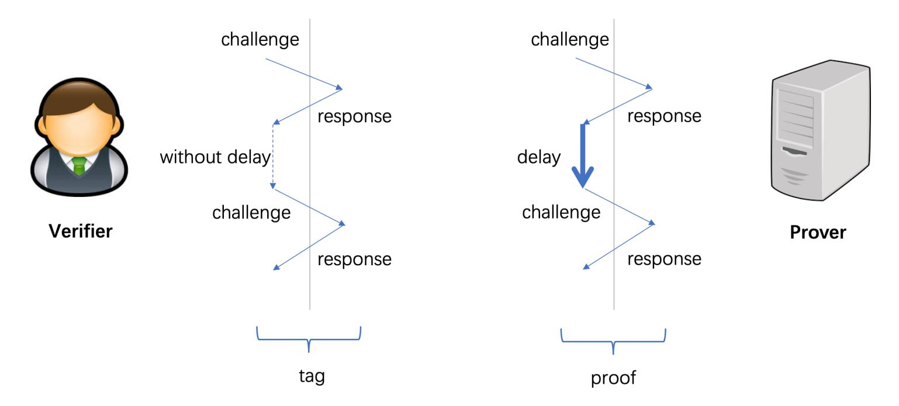
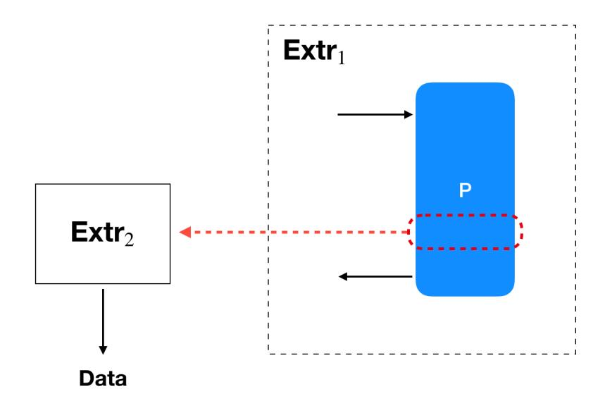
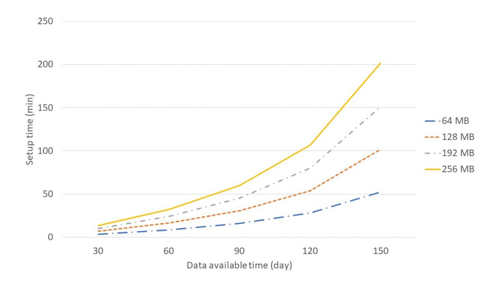
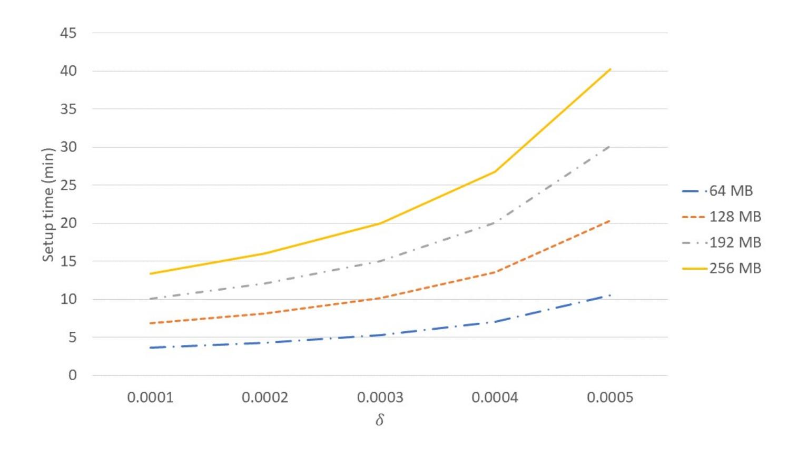
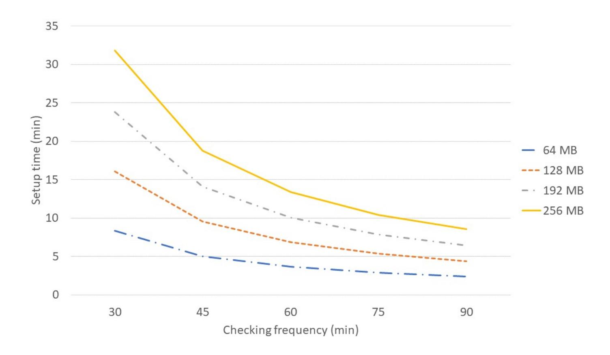

{0}------------------------------------------------

# Proof of Storage-Time: Efficiently Checking Continuous Data Availability?

Giuseppe Ateniese<sup>1</sup> , Long Chen2,<sup>3</sup> , Mohammad Etemad<sup>1</sup> , and Qiang Tang2,<sup>3</sup>

> <sup>1</sup> Stevens Institute of Technology {gatenies, metemad}@stevens.edu <sup>2</sup> New Jersey Institute of Technology {longchen, qiang}@njit.edu JDD-NJIT-ISCAS Joint Blockchain Lab

3

Abstract. A high-quality outsourced storage service is crucial for many existing applications. For example, hospitals and data centers need to guarantee the availability of their systems to perform routine daily activities. Such a system should protect users against downtime and ensure data availability over time. Continuous data availability is a critical property to measure the quality of an outsourced storage service, which implies that outsourced data is continuously available to the server during the entire storage period. We formally study the Proof of Storage-Time (PoSt), the notion initially proposed in the Filecoin whitepaper, which enables a verifier to audit the continuous data availability of an outsourced storage service. We provide a formal security model of PoSt and generic constructions that are proven secure under our definition. Moreover, our concrete instantiation can yield a PoSt protocol with an extremely efficient verification: a single hash computation to verify a proof of size around 200 bits. This makes our scheme applicable even in the decentralized storage marketplace enabled by blockchain.

Keywords: Outsourced storage · Continuous availability · Proof of storage.

# 1 Introduction

Outsourced storage has become a common practice over the years for backup, data sharing, and more. Increasingly enterprises and individuals choose to rely on a cloud service provider, for example, Amazon Simple Storage Service (S3), to store and maintain their data. If the server collapses, as several occurrences reported recently, e.g., [46, 2], there would be severe repercussions hindering business operations, causing productivity decrease, customer dissatisfaction, or even revenue reduction. The consequences are particularly dire for certain applications that need to be run 24/7 [10]. Therefore, a system that ensures consistent service availability is highly desirable for those mission- and business-critical applications.

Continuous availability, on the other hand, becomes one distinguishing feature that several major storage providers, such as DELL EMC [43] and IBM [39], readily advertise. How to provide such a property from a system perspective has been intensively studied by various researchers [19, 29, 34]. In general, continuous availability should protect users against downtime, whatever the cause, and ensures that files remain accessible to users anytime and anywhere.

Continuous data availability or possession is an enhanced storage integrity feature that is difficult to achieve. To provide a highly reliable service, cloud providers have to deal with all kinds of failures, power outages, or even attacks on their servers. They have to include more replications, devote more redundant hardware and software components, and handle complex administrative workloads. It is thus straightforward to recognize that providing continuous data availability is costly and forces cloud storage providers to adopt specialized hardware and software solutions [12]. A dishonest provider would likely offload those burdens and provide an inferior service without continuous data availability. Moreover, data owners are charged more for reliable storage [35] and may require an irrefutable guarantee that the service they are paying for is being provided correctly. An immediate question arises: how can we verify that a storage provider is indeed supplying continuous data availability, i.e., the provider is virtually always in possession of the outsourced data so that the data owner can retrieve it at any time?

<sup>?</sup> A preliminary version of this paper appeared at NDSS 2020. The authors are listed in alphabetical order.

{1}------------------------------------------------

Similar to other data availability techniques, such as proof of data possession (PDP) [8] and proof of retrievability (PoR) [31], the verification procedure should be as efficient as possible, both in terms of computation and communication. Ideally, those costs should be independent of the data size and the length of time for continuous storage.

We strive for a very light verification procedure also due to the emerging application of decentralized storage marketplaces powered by Ethereum [49] or Filecoin [40]. This new storage framework is believed to provide superior resilience and reduce costs [16]. In such a setting, data owners simply publish a smart contract that pays storage peer nodes once a succinct and valid proof of storage is received. As smart contracts use on-chain messages and can be expensive to run, it's crucial to minimize both the size and computational cost of verification.

The above discussion highlights a central question we would like to study in this article:

How can we efficiently monitor storage providers to ensure outsourced data is continuously available?

Naive attempts. Proof of data possession (PDP) [8] and proof of retrievability (PoR) [31] are cryptographic protocols that enable a client to efficiently verify whether data stored at the cloud provider is intact and available. The original PoR scheme, based on hidden sentinels, worked only for encrypted files and a limited number of challenges. PDP, based on homomorphic tags, had no such restrictions and offered public verifiability where everybody, not just the data owner, can verify the proofs. The field evolved rapidly and schemes with better efficiency [44, 9, 17, 45, 5], or advanced properties [50, 51, 20] were introduced. New PoR schemes are based on homomorphic tags and can be seen as PDP schemes coupled together with erasure coding. This extra step, while costly, guarantees retrievability of the file [7]. However, PDP/PoR protocols certify data integrity and availability only at the time a valid proof is processed. Between two proofs, there is nothing that can be guaranteed about the availability of the outsourced data. In principle, a rogue storage node could delegate storage contracts to other nodes that may offer inferior service and then recover the data in time to respond to the next challenge. It's possible to request the client to challenge the storage provider frequently, but this method is inefficient in terms of communication and computational cost for the client that must verify multiple proofs. Besides, it requires the client to be always online.

# 1.1 Our contributions

To address the problem of efficiently verifying continuous data availability, we give a formal and systematic treatment for the new notion of proof of storage-time (PoSt) (Filecoin initially proposed a similar notion called proof of spacetime [40], but the name "spacetime" now refers to an existing primitive [33] so we renamed it to avoid confusion). PoSt is a challenge-response protocol that allows the prover to convince the verifier that data is continuously available and retrievable for a range of time. Efficiency in our context means that the proof from the prover must be succinct, and the verifier does not have to be always online.

In particular, we first formally define the security properties of PoSt, i.e., what continuous availability precisely means. We then give a warm-up construction paired with a rigorous security analysis, followed up by our main construction with further efficiency improvements as well as supporting advanced properties such as "public verifiability/validation". We also demonstrate the efficiency of our protocol by implementing it for various choices of the parameters.

Formally defining PoSt. The syntax of PoSt is similar to PoR/ PDP. The verifier sends a challenge and receives a succinct response after a time T specified by the verifier. The verifier can be offline most of the time.

Providing a precise security model is intricate. We need to define the continuous availability requirement formally, i.e., the data is possessed by the prover at any time during the storage period. Intuitively, we shall upgrade the soundness definition of PDP/PoR [8, 44], which defines an extractor algorithm (similar to the classical notion of proof of knowledge) that the data can be extracted via (non-black-box) interaction with the prover. To capture continuous availability, we could define a stronger extractor algorithm that can extract the data from the prover at any point in time. But, a critical question arises: how do we ensure the extracted knowledge of data is indeed presently possessed by the prover at a specific time?

{2}------------------------------------------------

Informally, the non-black-box PoSt prover is modeled as an interactive Turing machine (ITM); thus, any knowledge/data that is presently possessed by the machine must be either preserved in the configuration (memory) at that time point or hardcoded in the transition function. This allows us to capture "continuous extractability" by requiring the extractor to operate after is provided with the configuration of the prover's ITM at any specified execution step along with the transition function.

To make our definition more general, we choose a parameter t to characterize the approximation of the above idealized "continuous extractability", i.e., the extractor is provided by a bunch of configurations that correspond to an epoch with length t instead of one single step. Of course, the smaller t is the better approximation of the continuous availability the model will be. Intuitively, this approximation mimics the trivial solution that the data is audited every epoch with length t. 4

Non-triviality of the construction. Constructing a PoSt requires special care. Simple improvements over naive attempts may still suffer from various nuisances. For example, the verifier may execute a PoR in each time slot t during the range period T. To relieve the verifier from being always online, he could send all challenges in advance. However, the prover could cheat by computing all PoR proofs rapidly and, thus, spending less time than t for each challenge. On the other hand, if all challenges are sent at the end of the period, the prover could keep data offline for most of the time and then retrieve it when required. So the main challenge is to find a protocol where the prover is challenged often (e.g., once every time slot t) without requiring the verifier to stay online and interact with the prover.

Filecoin proposed a candidate PoSt construction in their whitepaper [40]. Their idea is to let the prover generate a sequence of PDP/PoR proofs, where the challenge for each proof is derived from hashing the antecedent proof in the sequence. In this way, the verifier needs to provide only the first challenge and then can stay put offline.

While the idea is reasonable and intuitive, it does not provide the security guarantee needed for a PoSt protocol. The main issue is that the prover can run proof-of-storage protocols much faster than expected or estimated by the verifier. Once all proofs are computed, a malicious storage provider could simply put data offline until it is rechallenged. This is a severe drawback since proof-of-storage schemes can be accelerated through parallelism.

Warm-up construction. The time constraints of PoSt are quite strict and critical. One way to build a PoSt protocol that can be proven secure is to leverage the recently proposed notion of verifiable delay function (VDF). In a verifiable delay function, the evaluation of the function must be delayed by a specified amount of time (currently measured by the number of certain unit operations), but the results can be verified much more efficiently. More importantly, the delay holds even if one uses a parallel computer. With the help of a VDF, we could now compel the storage provider to generate a PDP/PoR proof in every time slot with length t.

Intuitively, we require the prover to generate the challenge for each PDP/PoR instance from the output of a VDF. Concretely, each challenge c<sup>i</sup> = H (VDF.Eval(G(pi−1))), where pi−<sup>1</sup> is the antecedent PDP/PoR proof, G(·), H(·) are properly-chosen hash functions, and VDF.Eval(·) is the VDF evaluation algorithm. The prover returns all challenge-proof pairs together with the respective VDF proofs. Recall that the execution time is divided into a specific number of slots. Then, the verifier selects a proper VDF delay time to ensure the prover calculates at least one PDP/PoR proof per time slot. If the prover is not fast enough, the PoSt will not be computed in time.

Striving for efficient verification. The intuitive protocol above is quite simple and provably secure, but it's very inefficient. The communication cost is high, and the verification procedure is computationally expensive. The homomorphic aggregation techniques originally introduced in PDP [8] are not applicable here since the sequentiality of challenges is critical to PoSt.

One of our main innovations is to come up with a different strategy. Our idea is to let the verifier reproduce the same sequence of PDP/PoR instances as the prover. Thus, rather than verifying all proofs and VDFs, the verifier must simply check that two sequences of PDP/PoR proofs are the same. The comparison can be efficiently realized through collision-resistant hash functions.

<sup>4</sup> In practice, when t is reasonably small, the cost for the storage provider to frequently move the data back and forth could be even higher than simply keeping them online. On the other hand, there should be a natural trade-off between efficiency and precision, which is expressed by the extra parameter t.

{3}------------------------------------------------

### 4 G. Ateniese et al.

However, we still must overcome two remaining challenges to make our idea practical: (1) the prover algorithm needs to be deterministic to ensure that the reproduction performed by the verifier is the same; (2) the verifier algorithm must be efficient. The first point is simple to address since we can rely on multiple and suitable PDP/PoR candidates [31, 8, 44, 45]. Controlling the computation cost of the verifier is challenging, and we make two additional observations:

- We could leverage an asymmetric VDF in the sense that there is a trapdoor that allows anyone to compute the evaluation function efficiently without any delay. These computations can be moved to the setup phase. Our construction of PoSt can be viewed as a practical application of the notion of trapdoor delay function (TDF) mentioned by Wesolowski [48].
- We could adopt a bounded-use PDP/PoR that supports only a limited number of challenges. Given the structure of our protocol, this is not a limitation and allows us to reduce costs significantly. Indeed, bounded-use proof of storage protocols can be obtained purely from symmetrickey primitives, and enjoy greater efficiency than the algebraic constructions.

We demonstrate our method in Fig. 1.



Fig. 1. Structure of our construction

Public validation. In the application of a decentralized storage marketplace as proposed by Filecoin [40], the data owner could crowdsource the storage service and leverage a smart contract that pays providers if they can produce a valid PoSt proof of continuous data availability. Therefore, we could consider the notion of public validation where a smart contract or any third party could validate PoSt proofs from public knowledge. An even stronger property, public verifiability, insists that the verifier possesses no trapdoor at all, see section 4 for details. Note that the warm-up construction introduced above provides public verifiability while its compact version, which is presented later, provides public validation.

Indeed, consider the following observation. When comparing two sequences of proofs, it's possible to check the digests (hashes) of the two sequences directly. Thus, the verifier could further hash the digest of the sequence to derive d and then make d public or embed it into the smart contract. Anyone with d can check whether h(π) = d, where h(·) is a collision-resistant hash and π is the PoSt proof. In the end, we obtain a PoSt protocol whose verification algorithm performs only a single hash computation!

An efficient instantiation. Note that in a PoSt, the prover's computational cost is intrinsic since the nature of PoSt requires the prover to access data blocks frequently. Thus, the main concern relevant to efficiency is the setup step. However, since we can use a stateless PoR from highly efficient symmetric-key primitives, the total cost of the setup procedure can also be made practical. According to our experiment results (section 7), the setup procedure for a file of size 64 MB, which is supposed to be stored for 1 month and verified every hour, will take less than 4 minutes. As a comparison, a 64MB-file setup procedure of the outsourced PoR scheme Fortress [5] would cost more than 10 minutes for both the prover and the verifier. Also, note that we did not 

{4}------------------------------------------------

perform any optimization, and the main costly component is due to hashing large files (which can be pre-computed and optimized in various ways).

Although VDFs somehow ensure that adversaries cannot evaluate the function much faster, precautions are needed when instantiating the concrete parameters for the VDF evaluations. (1) A (small) gap exists between the number of unit operations needed for an honest evaluator and that for the adversary. We resolve this by selecting parameters to guarantee that the adversary cannot finish the proof ahead of time while the honest evaluator can finish the work within a reasonable extension; (2) The calculation of unit operations could be expedited. Several organizations, including Filecoin and Ethereum, have made substantial investments in finding the fastest machine possible for these tasks. We provide more detailed discussions on these issues in Sec. 6.2.

Security analysis. Rigorously analyzing the security of PoSt turned out to be challenging. For soundness, we need to extract data via interacting with a "partial" legitimate prover, i.e., the only items the extractor gets are a subset of configurations and the code of the transition function. The main difficulty is that it seems impossible to unify the strategies of a cheating prover by only knowing that the final proof is admissible. Thus, it is complicated to recover the sequence of each computation step and provide an extractor with a universal strategy.

To address this obstacle, we leverage random oracles. Specifically, we design our PoSt s.t., for an admissible PoSt prover, all PoR challenges except the first one must be generated from the random oracle, while all other PoR proofs except the last one must be queries to the random oracle. Since the PoSt prover is evaluated, and the extractor simulates the random oracle, PoR challenges and responses can be seen by the extractor. It becomes possible for the extractor to invoke a PoR extractor and recover the data by controlling the random oracle. Our extraction strategy may be of independent interest.

### 1.2 Related works

Ateniese et al. introduced Provable Data Possession (PDP) [8] to allow a cloud provider to prove to its clients that their data is intact and available. Proof of Retrievablity (PoR) was initially proposed by Juels and Kaliskiand [31] and improved in a series of subsequent works [44, 18, 24, 47, 45, 20, 4]. PoR requires the existence of an extractor to completely recover the stored data. PDP/PoR can be extended with various advanced features, such as supporting dynamic updates [20, 45], multiple servers [21, 18, 36], or replication [4, 37, 28, 23]. For better efficiency, it's possible to outsource PoR's verification workload to a third party auditor [5]. However, the auditor must continuously challenge the storage server and "compress" and forward the responses to the data owner. Moreover, the construction in [5] requires a trusted randomness beacon to generate PoR challenges periodically.

A primitive named Proof of Space-Time has recently been proposed by Moran and Orlov [33]. Their notion is distinct from the one introduced in the Filecoin whitepaper and that we consider in this paper. In their paper, "space-time" is meant to capture the use of space as a resource over time but does not consider the availability of content. In this respect, their concept can be viewed as an extension of Proof of Space [6, 27]. Another similar notion is sustained-memory complexity [3], which requires that any algorithm evaluating a specific function must use a large amount of memory for many steps.

# 2 Preliminary

In this section, we introduce several preliminary notions.

### 2.1 Interactive Turing machine.

An interactive Turing machine (ITM) is to model interactive algorithms used in real-life computing systems. It was initially used by Goldwasser, Micali, and Rackoff [30] to model interactive proof systems. An ITM has an input tape, an output tape, a randomness tape, and k working tapes, and it changes its state step by step following the instruction described by a transition function.

We have the following definition of an ITM.

{5}------------------------------------------------

Definition 1. An interactive Turing machine (ITM) with k work tapes is a 5-tuple

$$\mathcal{T} = (\Sigma, \Omega, Q, q_{init}, F, \delta),$$

where

- Σ is a non-empty alphabet,
- Q is a set of states,
- qinit is the initiate state,
- F is the state of finial states,
- The transformation function

$$\delta: Q \times \Sigma \times \Sigma \times \Sigma^k \longrightarrow Q \times \{none, right\} \times \{none, right\} \times (\Sigma^k, \{left, none, right\}^k) \times (\{\Sigma \cup \bot\}, \{none, left\}).$$

At each step, the ITM will read one symbol from the input tape, one symbol from the random tape and k symbols from the work tapes. Then based on the current state and the transformation function δ, it will decide

- which state to change to,
- to move the header on the reading tape to right or stay,
- to move the header on the random tape to right or stay,
- to print k symbols on the work tapes,
- to move the headers on work tapes to right or left or stay,
- to print one symbol on the writing tape or give up to output,
- to move the header on the writing tape to left or stay.

It is convenient to use a transition function based on configurations to describe the execution procedure of an ITM. A configuration consists of a state, the contents of the tapes and the positions of the tape headers, denoted as (q, v1, . . . , vk, i1, . . . , ik), for a state q ∈ Q, strings on one of work tapes v<sup>j</sup> ∈ Σ<sup>∗</sup> and integers 1 ≤ i<sup>j</sup> ≤ |v<sup>j</sup> + 1| for every 1 ≤ j ≤ k. Let Q be the set of configurations. The initial configuration qinit is the configuration consisting of the initial state and k empty tapes, with the tape heads at the first position. So the transition function can be written as

$$\delta: \mathbf{Q} \times \Sigma \to \mathbf{Q} \times \{none, right\} \times \{\Sigma \cup \bot\}.$$

Consequently, the running of an ITM is sequentially changing the configurations, according to the transition function and the symbols on the input tape. More importantly, given one configuration at a specific time and the transition function, anyone can run the ITM from that point on.

# 2.2 Proof of retrievability.

Proof of retrievability [31, 44] is a proof-of-storage scheme which provides strong retrievability guarantees. The soundness of PoR requires that if a server can pass an audit then a special extractor algorithm, interacting with the server, must be able (w.h.p.) to extract the file. Our PoR syntax is adapted from [44] by Shacham and Waters, except that we specify the interaction between the prover and the verifier as a challenge-and-response procedure. Formally, a proof of retrievability scheme defines four algorithms, PoR.Kg, PoR.Store, PoR.V and PoR.P:

- PoR.Kg: Generate a public-private keypair (pk, sk).
- PoR.Store(sk, D): Taking as input a secret key sk and a file D ∈ {0, 1} ∗ , the "setup" algorithm encodes D into D<sup>∗</sup> as the file to be stored, and generates a public tag tg for further proof and verification.
- PoR.V: The verification algorithm consists of two parts: 1). PoR.Vcha, which generates a challenge c, and 2). PoR.Vvalid, which verifies the response p from the prover P corresponding to the challenge c. Specifically, PoR.Vcha(pk, sk, tg) takes the public key pk, the secret key sk and the tag tg as inputs, and generates a challenge c. PoR.Vvalid(pk, sk, tg, c, p) takes the public key pk, the secret key sk, the tag tg, the challenge c, the corresponding proof p as inputs, and outputs a bit b which is either 1 or 0 to indicate whether the verifier accepts or not.

{6}------------------------------------------------

– PoR.P(pk, tg, D<sup>∗</sup> , c): The proving algorithm takes as input the public key pk, the file tag tg output by PoR.Store, the encoded file D<sup>∗</sup> and the challenge c, and outputs a proof p after computation.

Publicly verifiable. If the verification algorithm PoR.V does not need to take the secret key sk as input, we call this PoR scheme publicly verifiable.

Stateful/stateless PoR. A PoR scheme can be either stateful [31] or stateless [44]. A PoR scheme is stateful if the number of audit interactions between the prover and verifier is bounded, and the verifier has to maintain a state to record the number of interactions. While a PoR scheme is stateless if the verifier does not need to maintain a state, and can invoke the audit procedure an unlimited (polynomial) number of times.

Correctness and soundness. A PoR scheme should satisfy both correctness and soundness. Correctness requires that the verification algorithm always accepts the proof when interacting with an honest prover. Soundness aims to model that any party who can convince the verifier must be storing that file. The formal soundness definition of PoR follows the classical notion of proof of knowledge [44]. Mainly, soundness requires that for any ITM P <sup>0</sup> generated by the adversary that implements a legitimate prover in the proof-of-retrievability protocol, there is an extractor algorithm Extr(pk, sk, tg,P 0 ) taking as input the public and private keys, the file tag tg, and the description of the ITM P 0 , that outputs the file D ∈ {0, 1} ∗ . Note that Extr is given non-black-box access to P <sup>0</sup> and can, in particular, rewind it. The logic behind this extractability definition is that the best way to guarantee the prover possesses the data is to recover it via interacting with the prover.

Unpredictability. To facilitate our PoSt construction, we define a special property for the challenge response style of PoR, named unpredictability. It ensures that the prover cannot guess a valid response before he sees the corresponding challenge. Formally, we have the following definition.

Definition 2. A challenge-response style PoR scheme is unpredictable if for any P.P.T adversary A, the following holds,

$$\Pr\left[p \leftarrow_{\$} \mathcal{A}(pk, tg, D^*) \land 1 \leftarrow \mathcal{V}_{\textit{valid}}(pk, sk, tg, c, p) \quad \middle| \ c \leftarrow_{\$} \mathcal{V}_{\textit{cha}} \right] < \textit{negl}(\lambda).$$

where PoR.V := (Vcha, Vvalid), and λ is the security parameter.

Note that unpredictability is not provided by default<sup>5</sup> , but it is achieved by most existing PoR schemes, e.g., compact PoR [44], since the prover's response has enough high entropy.

# 3 Delay Function

A delay function is a function F : X → Y that, even when using multiple processors and parallelism, cannot be evaluated in less than a prescribed time [14]; while, on the other hand, there exists an algorithm so that honest evaluators can terminate the computation in a similar amount of time. Here we introduce two variants of the delay function. One is the verifiable delay function (VDF) [14], which enables the evaluator to generate a succinct proof to show the correctness of the result. The other is the trapdoor delay function (TDF) [48], which enables the holder of the secret trapdoor to evaluate the function without delay. The formal definitions are given next.

## 3.1 Verifiable delay function

A VDF is a scheme consisting of the following three algorithms [15, 48]:

– VDF.Setup(λ, s) is a randomized algorithm that given as input the security parameter λ and a delay parameter s (measured by Turing machine steps), generates the public parameters pp. The input and output spaces, X and Y, are determined by pp. For meaningful security, the delay parameter s is restricted to be sub-exponentially sized in λ.

<sup>5</sup> A counterexample is that the prover returns all the data independently of the challenge.

{7}------------------------------------------------

- VDF.Eval(pp, x) is a randomized algorithm that given as input the public parameters pp and x ∈ X , outputs the answer y ∈ Y and a proof π.
- VDF.Verify(pp, x, y, π) is a deterministic algorithm that given as input the public parameters pp, x ∈ X , y ∈ Y, and the proof π, emits one bit 1 or 0 to denote an acceptance or a rejection.

A VDF must satisfy the following three properties [15]:

- δ-evaluation time: For all pp generated by VDF.Setup(λ, s) and all x ∈ X , the algorithm VDF.Eval(pp, x) must run in steps (1 + δ)s with poly(log(s), λ) processors.<sup>6</sup>
- Sequentiality: A parallel algorithm A, using at most poly(λ) processors, that runs in sequential steps less than s cannot compute the function. Specifically, for a random x ∈ X and pp output by VDF.Setup(λ, s), if (y, π) ← VDF.Eval(pp, x) then Pr[A(pp, x) = y] is negligible.
- Uniqueness: For an input x ∈ X , exactly one y ∈ Y will be accepted by VDF.Verify. Specifically, let A be an efficient algorithm that given pp as input, outputs (x, y, π) such that VDF.Verify(pp, x, y, π) = accept. Then Pr[VDF.Eval(pp, x)] 6= y] is negligible.

### 3.2 Trapdoor delay function

A TDF F : X → Y is a scheme consisting of the following three algorithms [48]:

- TDF.Setup (λ, s) is a randomized algorithm that takes as input a security parameter λ and a delay parameter s (measured by Turing machine steps), and outputs public parameters pp and a trapdoor tr. The delay parameter s is sub-exponential in λ.
- TDF.Eval(pp, x) takes as input x ∈ X and outputs a y ∈ Y.
- TDF.TrapEval(pp, tr, x) takes as input x and a trapdoor tr, outputs a y ∈ Y.

TDF must satisfy δ-evaluation time and sequentiality as in the case of standard VDF. Similarly, we assume 0 < δ 1 for TDF. In fact, the gap between the honest evaluator and the malicious one that is characterized by δ could be even smaller than that in VDF, because no proof needs to be generated. Besides, the following two unique requirements must be satisfied by TDF:

- Trapdoor efficiency: TDF.TrapEval must run in total steps polynomial in O(log s) and λ. Therefore TDF.TrapEval is much faster than TDF.Eval.
- Correctness: TDF.Eval and TDF.TrapEval will produce the same result on the same input.

The TDF can be easily instantiated via the RSA trapdoor as following [48]:

- TDF.Setup(λ, s): Output two objects:
  - A finite abelian group G of unknown order
  - An efficiently computable hash function H : X ← G that we model as a random oracle.

We set the public parameters pp to be pp := (G, H, s) and the trapdoor tp to be the real order d of G.

- TDF.Eval(pp, x): compute y ← H(x) 2 s ∈ G by computing T squaring in G starting with H(x), and output y
- TDF.TrapEval (pp, tr, x): Let d be the order of the group and 2<sup>s</sup> mod d = r 0 , we just need to compute y = H(x) r 0 .

For an implementation, one can choose G as the RSA group, so the trapdoor d = φ(N) where N is the RSA modulus and φ is the Euler's function.

<sup>6</sup> It has recently been shown in [25, 48] that one can convert a VDF into a tight one which can be evaluated in sequential steps s + O(1) with an honest prover using O(log(s)) processors and space. Therefore, without loss of generality, we assume 0 < δ 1 in the following sections.

{8}------------------------------------------------

# 4 Formalizing Proof of Storage-Time

Now we are ready to give a formal definition of PoSt. Recall that PoSt is a protocol that enables the verifier to audit that the data is continuously available at the server for a specific range of time. The syntax of PoSt is similar to the challenge-response style of PDP/PoR in section 2.2, except that time parameters must now be considered. How to measure time is a tricky question, and indeed, time is hard to capture by algorithms. Instead, we consider using the number of unit steps of a Turing machine (which can be seen as a mathematical abstraction of CPU clock cycles) as a measure of time similar to the time-lock puzzles [42] and the VDF [14]. In the following, the time parameters are all represented as the number of steps of the Turing machine.

The ideal version of continuous data availability is a continuous notion that makes it challenging to instantiate. A discretized approximation seems to be inevitable, and this can be accomplished by choosing an audit frequency parameter t. Hence, the large time range T can be arbitrarily divided into time segments of length t, and the prover must provide a valid proof at least once in every time slot. Obviously, a smaller t would result in a better availability guarantee.

Specifically, the key generation phase of PoSt takes as input the audit frequency parameter t, and a deposit time T which expresses the time that the data file is supposed to be stored at the server. Besides, the verifier needs to keep a timer for checking whether the final proof is received on time. For simplicity, we do not consider the communication latency. Formally, a PoSt scheme consists of the following four algorithms.

- PoSt.Kg(λ, t, T): Given the security parameter λ, the audit frequency parameter t and the data storage time T, this randomized algorithm generates a public-private key pair (pk, sk).
- PoSt.Store(sk, D): The file-storing algorithm takes as input a secret key sk and the content D ∈ {0, 1} ∗ , encodes D into D<sup>∗</sup> as the file to be stored, and computes a tag tg for further proof and verification.
- PoSt.V is the verification algorithm which has two subroutines PoSt.Vcha and PoSt.Vvalid for the challenge generation and the response validation, respectively. PoSt.Vcha(pk, sk, tg) takes as input the public key pk, the secret key sk and the tag tg, and generates a challenge c as well as setting a public timer to be 0. PoSt.Vvalid(pk, sk, tg, c, p, timer) takes as input the public key pk, the secret key sk, the tag tg, the challenge c, the corresponding response p and the time of the timer for receiving the response p, and outputs a bit b to indicate "reject" or "accept".
- PoSt.P(pk, tg, D<sup>∗</sup> , c): The randomized proving algorithm takes as input the public key pk, the file tag tg output by St, the decoded file D<sup>∗</sup> and the challenge, outputs a response p after a period of computation and sends it back to the verifier immediately after the computation is finished.<sup>7</sup>

A PoSt scheme may possess other advanced features.

Compactnesss. A PoSt scheme is compact, if the cost of the verification algorithm PoSt.V = (PoSt.Vcha, PoSt.Vvalid) is independent of the storage time T and the size of the file.

Public verifiability. Similar to PDP/PoR, if the subroutines PoSt.Vcha and PoSt.Vvalid of the verify algorithm do not need the secret key sk as input, we call this scheme publicly verifiable. It implies that continuous data possession can be verified by any third party, not only by the data owner.

Public validation. Consider the case where only PoSt.Vvalid does not require the secret key as input, while PoSt.Vcha still needs it. In this case, the response p can be publicly validated, given the challenge c. We call these PoSt schemes publicly validatable. Unlike publicly verifiable schemes, PoSt.Vcha may still take sk as input so that challenges cannot be generated publicly. Therefore, the timer for verification should be initiated by the data owner but can be seen by everyone. Although not as flexible as publicly verifiable schemes, validatable PoSt schemes are sufficient for many useful applications, including those related to decentralized storage markets, as advocated by Filecoin.

<sup>7</sup> In practice, PoSt.P is supposed to send back the final response after the storage period ends; otherwise it is impossible to detect malicious attempts such as discarding the stored data at the last moment. Therefore, either the computation of PoSt.P takes longer time than T, or an intentional delay is included in the algorithm.

{9}------------------------------------------------

8 In particular, data owners can outsource their data to any party in the network and publish a privately-generated challenge together with the parameters of the smart contract (the public key pk, the tag tg, and the initial time t1). Any party that stores the data can submit a response p in time t2, and the contract can publicly evaluate PoSt.Vvalid with pk, tg, p and t<sup>2</sup> − t<sup>1</sup> as input. The storage provider earns his reward if the output bit b equals to 1.

Stateful/Stateless PoSt. A PoSt scheme is stateful, if it supports a limited number of audits after the setup procedure and a state must be maintained. The state is updated after a challenge is used, i.e., PoSt.Vcha(pk, sk, tg, state) → (c, timer, state). The PoSt.Store algorithm is parameterized by an integer `, which indicates the maximum number of interactions. The variable state records the times that the server has been queried. In practice, a new challenge cannot be generated when the bound is reached unless the data owner retrieves all the data and relaunches the store procedure. On the contrary, the audit interaction for a stateless PoSt can be invoked an unbounded (polynomial) number of times.

Generally, a PoSt scheme should satisfy both properties of Correctness and Soundness.

### 4.1 Correctness

Correctness requires that the verification algorithm accepts the proof when interacting with a valid prover.

Definition 3. A stateless PoSt scheme is correct if for all keypairs (pk, sk) output by PoSt.Kg(λ, t, T), for all files D ∈ {0, 1} ∗ , and for all (D<sup>∗</sup> , tg) output by PoSt.Store(sk, D), the verification algorithm accepts the proof when interacting with a valid prover. Specifically, if p is the response generated by PoSt.P(pk, tg, D<sup>∗</sup> , c) on the challenge c generated by PoSt.Vcha(pk, sk, tg) and sent back to the verifier immediately after the proof computation is finished, PoSt.Vvalid(pk, sk, tg, c, p, timer) always outputs 1.

For the stateful PoSt, the correctness definition is the same, except the state is involved in PoSt.Vcha.

# 4.2 Soundness

As illustrated in the introduction, providing a suitable and rigorous definition for soundness is a challenging task. A natural choice is to upgrade the PoR soundness, which requires an extractor algorithm to extract the data while interacting with a legitimate prover. This follows the classical definition of proof of knowledge. It is not hard to imagine, in an ideal version of PoSt, to have an extractor that extracts the data possessed by a legitimate prover at any specific point within the time range T. Our strategy is to characterize the prover algorithm as an Interactive Turing Machine (ITM), which is executed to generate a proof after receiving a challenge. We intend to mimic the situation where someone runs a computer but ends at a specific time point, "freezes" its memory, and then checks the data preserved on the machine. Intuitively, the data on a computer should be either preserved in the memory (characterized as configurations) or hardcoded in the program (characterized as the transition function). Therefore, for the notion of soundness, the data should be extracted from the configuration corresponding to any specific time and the transition function. To facilitate the construction, we provide a more general definition for the above-idealized version: instead of selecting a configuration of one step, we allow the extractor to choose a bunch of configurations that correspond to a time slot with length t.

In general, the soundness experiment of PoSt consists of two procedures as in PDP/PoR, i.e., the setup game and the extraction algorithm. The setup game lets the adversary generate a prover algorithm P 0 . In the extraction algorithm, the extractor recovers the data from the generated algorithm P 0 . The setup game of PoSt is similar to that of PDP/PoR, while the extraction procedure needs to be defined specifically.

<sup>8</sup> Ideally, they would also demand the stronger public verifiability property so that PoSt could be integrated into the mining procedure.

{10}------------------------------------------------



Fig. 2. PoSt soundness model.

Setup Game The first procedure is the following setup game between an adversary A and an environment, which simulates the procedure that the adversary generates a malicious prover P 0 by getting arbitrary storage data from an honest data owner and then freely interacts with the verifier.

- Step 1. The environment generates a keypair (pk, sk) by running PoSt.Kg, and provides pk to A
- Step 2. The adversary now interacts with the environment. It can make queries to a store oracle, providing, for each query, some file D. The environment computes (D<sup>∗</sup> , tg) by invoking PoSt.Store(sk, D) and gives both D<sup>∗</sup> and tg back to A. If the PoSt is stateful, the environment initiates and maintains a verifier's state for each storage query.
- Step 3. For any D on which it previously made a store query, the adversary undertakes executions of the PoSt challenge-response interaction, by specifying the corresponding tag tg. In these protocol executions, the environment plays the part of the verifier, and the adversary plays the part of the prover. Specifically, the environment maintains a timer for each interaction. When a protocol execution completes, the adversary is provided with the output of V. These protocol executions can be arbitrarily interleaved with each other and with the store queries described in Step 2. For the stateful PoSt, the environment also updates the state as a verifier, so the adversary can only interact with the verifier a limited number of times for a specific storage.
- Step 4. Finally, the adversary outputs a challenge tag tg returned from some store query, and the description of a prover P 0 , which is an ITM defined before.

Specifically, the prover P 0 for a file D and storage time T is -admissible for a stateless PoSt if it convincingly answers an fraction of challenges, i.e., Pr[hPoSt.V(·),P 0 i = 1] ≥ . Similarly, for the stateful scheme we require that Pr[hPoSt.V(·, state),P 0 i = 1] ≥ for any state from 1 to l. The probability is over the coins of the verifier and the prover.

Extraction The second procedure is to allow the extractor to extract the data from the prover P 0 . As discussed above, we provide a generalized notion of "continuous extractability", which aims to capture that if one chooses any time period with length t during the storage time, the data is available for at least one time point in this period. Intuitively, if the interval between two data audits is larger than t, the data may not be available for this interval, and hence cannot be extracted from the corresponding bunch of configurations and the transition function. So t actually characterizes the largest interval between two data audits, and it represents the checking frequency parameter.

Specifically, we design an extract experiment which has two procedures. To guarantee that the extracted data is indeed "on the machine" during that chosen time slot, we run two procedures. The first procedure, named Extr1, is to honestly run the algorithm P <sup>0</sup> as an ITM, to get the sequence of the configurations, and to cut out a bundle of sequential ITM configurations which correspond

{11}------------------------------------------------

to a length of time t. The second procedure, named  $\mathsf{Extr}_2$ , can use this bundle of sequential ITM configurations, along with the transition function of  $\mathcal{P}'$ , to extract the data.

In our definition, the behavior of  $\mathsf{Extr}_1$  is fixed, but the strategy of  $\mathsf{Extr}_2$  is arbitrary. Moreover, the execution time of  $\mathcal{P}'$  must be longer than the deposit time T. Particularly, when given the transition function and a bunch of configurations corresponding to one time slot,  $\mathsf{Extr}_2$  may rewind a portion of the computations of  $\mathcal{P}'$  by himself. The sketch of the experiment can be seen in Fig. 2.

**Definition 4 (Soundness).** A PoSt scheme is  $\epsilon$ -sound if for every adversary  $\mathcal{A}$  which plays the setup game and outputs an  $\epsilon$ -admissible prover  $\mathcal{P}'$  for a file D as an ITM with k tapes, there is an extractor Extr which has two subroutine ITMs, Extr<sub>1</sub> and Extr<sub>2</sub>, that can perform the following tasks.

- Extr<sub>1</sub> is an ITM with k+1 working tapes. Extr<sub>1</sub>'s input is the description of  $\mathcal{P}'$ . He devotes k of his working tapes to simulate all the tapes of  $\mathcal{P}'$ . Extr<sub>1</sub> first writes an arbitrary challenge on the simulated input tape of  $\mathcal{P}'$ , then simulates every step of  $\mathcal{P}'$  following the instructions of  $\mathcal{P}'$  is transition function. After each step of  $\mathcal{P}'$ , Extr<sub>1</sub> records the current configurations of  $\mathcal{P}'$  on his extra tape before starting to simulate the next step of  $\mathcal{P}'$ . After finishing all of  $\mathcal{P}'$  steps, Extr<sub>1</sub> will randomly pick t successive configurations of  $\mathcal{P}'$  to write on his output tape together with the description of the transition function of  $\mathcal{P}'$ .
- The input of  $\mathsf{Extr}_2$  is directly obtained from the output tape of  $\mathsf{Extr}_1$ .  $\mathsf{Extr}_2$  must recover D purely from the information s returned by  $\mathsf{Extr}_1$  except a negligible probability, no matter which t successive configurations of  $\mathcal{P}'$  is chosen by  $\mathsf{Extr}_1$ . Hence the probability

$$\Pr\left(D \leftarrow_{\$} \mathsf{Extr}_2(s) | s \leftarrow_{\$} \mathsf{Extr}_1(\mathcal{P}')\right) > 1 - \mathsf{negl}(\lambda)$$

for the randomnesses of both Extr<sub>1</sub> and Extr<sub>2</sub>.

# 5 Constructions for PoSt

In this section, we provide two PoSt constructions which are proven secure in the above model. Each of them has its own advantages.

The first construction follows the structure of the ad-hoc proposal from the Filecoin white paper [40] but can be proven secure. Intuitively, it uses a VDF and random oracles to force the prover to generate PoR proofs sequentially. This scheme is stateless, which means that the *prove* procedure can be launched an unlimited number of times after *storing*. Also, this scheme is publicly verifiable; hence a third party can verify the continuous availability of data by interacting with the server. The drawback of this scheme is that the size of the final proof is linear with respect to the storage time. Given that the verification time is also linear, we consider this just a warm-up construction.

The next construction is our main one which achieves compact proofs, so its communication size is independent of the default time. Particularly, its verification algorithm is extremely efficient. Nevertheless, this construction is stateful, i.e., after a limited number of PoSt interactions, no more proofs can be generated until rerunning the storing phase. Moreover, this scheme provides public validation, but it is not publicly verifiable. This means that the verifier needs a secret key for the generation of the challenge; however, the verification of the PoSt proof does not.

#### 5.1 Basic PoSt Scheme

Next, we describe our first construction called the basic PoSt. Our main building blocks are a stateless unpredictable PoR scheme (defined in Subsection 2.2) and a VDF scheme. The main intuition is to force the PoSt prover to sequentially generate one PoR proof every once in a while during the entire storage period. To achieve this goal, we let the challenges of the next PoR be derived from the output of VDF, whose input is the previous PoR proof (see the right side of Fig. 1). Therefore, a malicious prover cannot generate all the PoR proofs at once at the beginning of the storage period, because each PoR procedure is connected to the next one in series by a delay function. Also, the prover cannot discard the data first and wait until the last moment to retrieve it and generate all the PoR proofs at once, otherwise he will risk not sending the final response in time due to the delay function.

{12}------------------------------------------------

Specifically, the following primitives will be used in the construction. A stateless publicly-verifiable PoR scheme with *unpredictability* consists of a tuple of algorithms

```
(PoR.Kg, PoR.Store, PoR.\mathcal{P}, PoR.\mathcal{V})
```

where  $PoR.\mathcal{V} = (PoR.\mathcal{V}_{cha}, PoR.\mathcal{V}_{valid})$ .  $PoR.\mathcal{V}_{cha}$  and  $PoR.\mathcal{V}_{valid}$  denote the verifier's algorithms for generating the challenge and verifying the proof, respectively.  $\mathcal{H}$  and  $\mathcal{G}$  are hash functions that can be viewed as random oracles. (VDF.Setup, VDF.Eval, VDF.Verify) are the algorithms for a verifiable delay function with  $\delta$ -evaluation time for some constant  $\delta$ . D denotes the storage file. The PoSt scheme needs a global timer which is initiated by the data owner but can be seen by everyone.

The PoSt is parameterized by the storage time T and checking frequency t. Without loss of generality, T and t are measured by the number of steps of a Turing machine (to mimic the CPU clock). Note that since the adversary may evaluate the delay function slightly faster than the honest prover, we require them to check the data more frequently than the requested frequency t. Based on T and t, PoSt scheme will choose the VDF delay time  $t' \leq t - 2\delta T$ . Precisely, we set the delay parameter of VDF as t'. Hence, the sequential steps for evaluating VDF should be larger than t' for any parallel adversary with  $\mathsf{poly}(\lambda)$  processors; on the other hand, the honest server can finish the VDF evaluation within time  $(1+\delta)t'$  (see Section 6.2 for more detailed discussions about the parameter setting). Moreover, we assume that the time cost of generating one PoR proof and evaluating one hash function is much smaller than t (thus, it can essentially be ignored), and our construction guarantees that the largest time interval between two PoRs is less than  $t' + 2\delta T \leq t$ .

The PoSt works as follows:

- PoSt.Kg( $\lambda, t, T$ ): Use PoR.Kg to generate a PoR public-private key pair (PoR.pk, PoR.sk). t' is the largest number of ITM steps such that  $t' \leq t 2\delta T$  and k = T/t' is an integer. Use VDF.Setup ( $\lambda, t'$ ) to generate the public parameter VDF.pp for VDF where the time cost is at least t'. The public key pk of PoSt is (PoR.pk, VDF.pp, T, k) and the secret key sk is PoR.sk.
- PoSt.Store(pk, sk, D): Take a secret key sk and a file  $D \in \{0, 1\}^*$  as input. Use PoR.Store to process D and output  $D^*$  and a tag tg = PoR.tg.
- PoSt  $\mathcal{V} = (PoSt.\mathcal{V}_{cha}, PoSt.\mathcal{V}_{valid})$ :
  - PoSt. $V_{cha}(pk, tg)$ : Use PoR. $V_{cha}$  to generate a challenge  $c_0$  and set its timer to 0.
  - PoSt.  $V_{\text{valid}}(pk, tg, c_0, p)$ : When the PoSt proof p is received from the prover, PoSt.  $V_{\text{valid}}$  first check the current timer T'. If the timer T' is smaller than T or larger than  $(1 + \delta)T$ , output reject, otherwise run Algorithm 2 with input p, tag tg and processed data  $D^*$  and release its output. Intuitively, the verifier needs to check all hash evaluations, all PoR proofs, and all VDF evaluations.
- PoSt. $\mathcal{P}(pk, tg, D^*, c_0)$ : Defined as Algorithm 1. Intuitively, the prover sequentially computes PoR instances where the next PoR challenge is generated from the previous PoR proofs via hash functions and VDF.

## **Algorithm 1** The PoSt prove algorithm PoSt. $\mathcal{P}$

```
Require: The initial challenge c_0, the stored data D^*, the public key pk = (\mathsf{POR}.pk, \mathsf{VDF}.pp, k, T) and the tag tg = \mathsf{PoR}.tg

Ensure: The PoSt proof p

1: for i = 0 to k - 1 do

2: v_i \leftarrow \mathsf{PoR}.\mathcal{P}\left(c_i, D^*, \mathsf{PoR}.pk, \mathsf{PoR}.tg\right) // Generate a PoR proof.

3: u_i = \mathcal{G}(v_i)

4: (d_i, \pi_i) \leftarrow \mathsf{VDF}.\mathsf{Eval}(u_i, \mathsf{VDF}.pp) // Compute VDF while generate its proof.

5: c_{i+1} = \mathcal{H}(d_i)

6: v_k \leftarrow \mathsf{PoR}.\mathcal{P}(c_k, D^*, \mathsf{PoR}.pk, \mathsf{PoR}.tg)

7: p = \left(\left\{c_i, v_i\right\}_{i=0}^k, \left\{u_i, \pi_i, d_i\right\}_{i=0}^{k-1}\right)

8: return p
```

{13}------------------------------------------------

### Algorithm 2 PoSt Verification Algorithm

```
Require: The PoSt proof p, the public key pk = (POR.pk, VDF.pp), and the tag tg = (PoR.tg, k, T)
Ensure: The verification result b
1: parse p as (\{c_i, v_i\}_{i=0}^k, \{u_i, \pi_i, d_i\}_{i=0}^{k-1})
 2: for i = 0 to k - 1 do
         if u_i \neq \mathcal{G}(v_i) then return reject
 3:
         if c_i \neq \mathcal{H}(d_i) then return reject
 4:
         if 0 \leftarrow PoR.\mathcal{V}_{\mathsf{valid}}(PoR.pk, PoR.tg, c_i, v_i) then return reject
 5:
         if 0 \leftarrow \mathsf{VDF}.\mathsf{Verify}(\mathsf{VDF}.pp, d_i, u_i, \pi_i) then return reject
 6:
 7: if 0 \leftarrow \text{PoR}.\mathcal{V}_{\text{valid}}(\text{PoR}.pk, \text{PoR}.tg, c_k, v_k) then
 8:
         return reject
 9: else
10:
          return accept
```

**Correctness.** Note that the final PoSt proof procedure includes k VDF evaluations where k = T/t'. Since we assume that the time spent evaluating one VDF (with  $\delta$ -evaluation time) is shorter than  $(1+\delta)t'$ , and the time cost for PoRs and evaluating hash is comparatively negligible, the total time for an honest prover to generate a PoSt proof is less than  $(1+\delta)T$ . Hence the correctness of our PoSt directly follows from those of the PoR and the VDF schemes.

**Soundness.** Our goal is to prove that the largest time interval between two PoRs is less than t. Therefore, for an admissible prover, any successive configurations of any time epoch with length t must contain at least one PoR. Ideally, one can use the PoR extractor to recover the data from the partial configurations and the transition function. However, one problem is that since the strategy of a malicious prover cannot be predicted, it is hard to let the extractor access each PoR's challenge and response. To solve this problem, our soundness proof fully exploits the unpredictability of the random oracle. Specifically, since an admissible prover must inevitably query the random oracle, the challenge and response for each PoR can be located via querying the random oracle  $\mathcal{G}$  and  $\mathcal{H}$  respectively, hence we can extract the data via the PoR extractor.

**Theorem 1.** PoR is a stateless PoR scheme with  $\epsilon$ -soundness and unpredictability. VDF is a VDF scheme with  $\delta$ -evaluation time. The time cost of PoR and evaluating a hash function is negligible w.r.t. t. The time cost of  $s_0$  sequential steps on the server processor is t'. If  $t' + 2\delta T < t$ , the PoSt scheme is stateless and has  $\epsilon$ -soundness.

*Proof.* Assume that an adversary  $\mathcal{A}$  outputs a cheating prover  $\mathsf{PoSt}.\mathcal{P}'$  in the setup game, which can return a valid proof  $p = \left(\{c_i, v_i\}_{i=0}^k, \{u_i, \pi_i, d_i\}_{i=0}^{k-1}\right)$  with probability  $\epsilon$ . To show the soundness of the scheme, we need to construct the extractor  $\mathsf{PoSt}.\mathsf{Extr}_2$  which can recover the data D from the successive configurations of a t length time epoch and transit function returned by  $\mathsf{PoSt}.\mathsf{Extr}_1$ , no matter which epoch is chosen by  $\mathsf{PoSt}.\mathsf{Extr}_1$ . Generally, our proof consists of two steps. In the first step, we prove that the prover will execute one  $\mathsf{PoR}$  in the epoch randomly chosen by  $\mathsf{PoSt}.\mathsf{Extr}_1$ . In the second step, we will invoke the  $\mathsf{PoR}$  extractor to recover the data from the configurations the epoch and the transition function.

For the first step, let  $T_0$  and  $T_k$  are the starting and ending time points for running PoSt. $\mathcal{P}'$ . For i from 1 to k-1, we set each time point  $T_{i+1}$  to be the first time when PoSt. $\mathcal{P}'$  queries the random oracle  $\mathcal{H}$  on  $d_i$ . Similarly, we set each time point  $R_i$  as the first time when PoSt. $\mathcal{P}'$  queries the random oracle  $\mathcal{G}$  on  $v_i$ . Then we will prove that:

```
Claim 1) T_i must precede T_{i+1},

Claim 2) the length of each time slot [T_i, T_{i+1}) is longer than t',

Claim 3) the length of each time slot [T_i, T_{i+1}) is shorter than t' + \delta T,

Claim 4) each R_i belongs to the time slot [T_i, T_{i+1}) and the time slot [T_i, R_i) is shorter than \delta T.
```

If above claims are all proved, the random time epoch with length  $t > t' + 2\delta T$  chosen by PoSt.Extr<sub>1</sub> must contain at least one interval  $[T_i, R_i)$  for some i. This is because  $T_1, \ldots, T_{k-1}$  divides the whole execution time of PoR.Extr into k slots whose lengths are all shorter than t. So any epoch with length t must contain some  $T_i$ . Since  $t > t' + 2\delta T$ , the epoch must contain either  $T_{i-1}$  or  $R_i$ ,

{14}------------------------------------------------

otherwise the length of the interval  $[T_{i-1}, R_i)$  is longer than t. So either the interval  $[T_{i-1}, R_{i-1})$  or  $[T_i, R_i)$  is contained in this epoch.

Next we prove the above claims one by one.

For Claim 1), we show that each  $d_{i-1}$  must be firstly queried to the random oracle  $\mathcal{H}$  before  $d_i$ . We prove it by contradiction. If not, PoSt. $\mathcal{P}'$  must be able to either generate the PoR challenge  $c_i$  before  $d_{i-1}$ , which violates the unpredictability of the random oracle  $\mathcal{H}$ ; or generate the PoR response  $v_i$  before  $c_i$ , which violates the unpredictability of PoR; or generate the VDF input  $u_i$  before  $v_i$ , which violates the unpredictability of the random oracle  $\mathcal{G}$ ; or generate the VDF output  $d_i$  before  $u_i$ , which violates the sequentiality of VDF.

For Claim 2), we prove that the length of each time slot  $[T_i, T_{i+1})$  is longer than t'. By the unpredictability of the random oracle, the output of the VDF  $d_i$  must be generated before the time point  $T_{i+1}$ . On the other hand, the PoR response  $v_i$  must be generated via the PoR on the challenge  $c_i$  after the time point  $T_i$ . Therefore, a VDF function must be evaluated within the time slot  $[T_i, T_{i+1})$ . By the sequentiality of VDF, the length of  $[T_i, T_{i+1})$  must be longer than t'.

For Claim 3), we prove that the length of each time slot  $[T_i, T_{i+1})$  is shorter than  $t' + \delta T$ . Let us denote the execution time of PoSt. $\mathcal{P}'$  as T'. By the correctness of the verification algorithm,  $T' < (1 + \delta)T$ . Since we have proved that the length of each time slot  $[T_i, T_{i+1})$  is longer than t', the longest slot should be shorter than  $(1 + \delta)T - (k - 1)t' = \delta T + t'$ .

For Claim 4), the thing left is to show that the PoR response  $v_i$  must have been queried to the random oracle  $\mathcal{G}$  in this time slot  $[T_i, T_{i+1})$  and the time slot  $[T_i, R_i)$  is shorter than  $\delta T$ . On the one hand, the output of the VDF  $d_i$  is queried at the time point  $T_{i+1}$ . So the input of the VDF  $u_i$  must be generated by PoSt. $\mathcal{P}'$  before the time  $T_{i+1}$  according the sequentiality of VDF. By the unpredictability of the random oracle,  $\mathcal{G}$  must be queried on input  $v_i$  before the time  $T_{i+1}$ . On the other hand, according to the unpredictability of PoR mentioned in 2.2, PoSt. $\mathcal{P}'$  can not figure out the PoR proof  $v_i$  before the time point  $T_i$  when the PoR challenge  $c_i$  is generated. Given all this,  $v_i$  must have been queried to the random oracle  $\mathcal{G}$  in time slot  $[T_i, T_{i+1})$ . Furthermore, since the maximum length of  $[T_i, T_{i+1})$  and the evaluation time of VDF is longer then t', the time slot  $[T_i, R_i)$  is shorter than  $\delta T$ .

For the second step of the proof, we show that given the bunch of configurations for  $\mathsf{PoSt}.\mathcal{P}'$  for time slot  $[T_i, R_i)$  (or  $[T_{i-1}, R_{i-1})$ ) and the code of the transition function,  $c_i$  and  $v_i$  can be easily accessed by the  $\mathsf{PoSt}.\mathsf{Extr}$ . Indeed, since both random oracles  $\mathcal{H}$  and  $\mathcal{G}$  are maintained by the extractor, a cheating  $\mathsf{PoR}$  prover  $\mathsf{PoR}.\mathcal{P}'$  can be constructed by manipulating the output of the random oracle  $\mathcal{H}$  as the  $\mathsf{PoR}$  challenge, rewinding the part of the  $\mathsf{PoSt}.\mathcal{P}'$  corresponding to time segment  $[T_i, R_i)$  (or  $[T_{i-1}, R_{i-1})$ ) and collecting the queries of the random oracle  $\mathcal{G}$  as the  $\mathsf{PoR}$  response. Since there is a  $\mathsf{PoR}$  extractor to recover the storage data from  $\mathsf{PoR}.\mathcal{P}'$ , the soundness proof of  $\mathsf{PoSt}$  completes.

#### 5.2 Compact PoSt scheme

Although the above basic PoSt already achieves the purpose of verifying the continuous availability of data, the large proof size makes it impractical for many applications, including the decentralized storage market advocated by Filecoin. One approach could be to let the prover compress all transcripts and prove the validity of each challenge and the final compressed proof using zk-SNARK as in [40]. Unfortunately, the generic method that employs zk-SNARK to prove the corresponding statement incurs a prohibitive cost (both computational and memory-wise); thus, it is practically infeasible.<sup>9</sup>

Next, we describe our compact PoSt. The structure of our construction can be seen in Fig. 1. As in our basic construction, the prover here also executes the sequential PoR schemes where each

The proof time of SNARK is proportional to the circuit size, and the memory cost grows even faster. According to the latest report [11] by Ben-Sassone et al., the time cost for generating the proof is roughly 0.1 ms multiplied by the number of circuit gates. If one wants to store the data for one month and check it every hour, the basic PoSt prover is required to compute 720 PoRs. Even if we adopt the simplest PoR, e.g., the HMAC based one [31], the storage provider still needs to compute more than 2<sup>27</sup> hashes for 64MB data, and the gates for one hash function are at least 2<sup>13</sup> according to the estimation by Bernstein [13]. Therefore, the total proof generation time, if we use SNARKs, would require more than five years. If one turns the entire prove procedure into a giant circuit, the circuit size becomes larger than 2<sup>37</sup>, and the memory cost would be about 1TB already for all HMAC-based PoRs.

{15}------------------------------------------------

next challenge is the output of the delay function, and the verifier gives only the first challenge. But instead of verifying each PoR instance, we let the verifier perform the same work as the prover during the storing phase, except that he can compute the delay function much faster thanks to the trapdoor. Therefore, the verifier only needs to check that all PoR challenges and responses from the prover are the same as the ones he computed. Hence, the final proof consists of the hash of all PoR challenges and responses, and the tag denotes the hash image of this value. Besides, challenges in our compact PoSt can only be generated by the data owner; therefore, it provides only public validity, but not public variability according to the formulation in Section 4.

Comparing with the previous construction, the communication size of our scheme is constant. But the scheme is stateful. That means that the number of challenges is bounded and the verifier must record the previous challenge history. If the bound is reached, the data owner must retrieve the data and rerun the storing procedure.

Our compact PoSt construction uses a publicly verifiable stateful or stateless PoR scheme and a TDF construction. The PoR scheme consists of a tuple of algorithms

$$(PoR.Kg, PoR.Store, PoR.\mathcal{P}, PoR.\mathcal{V}),$$

where PoR.V = (PoR.Vcha, PoR.Vvalid). Specifically, the PoR scheme should be deterministic, which means there is only one valid response to a specific challenge, and unpredictable, which means the response can not be predicted in advance before viewing the challenge. The TDF scheme with δevaluation time consists of a tuple of algorithms (TDF.Setup,TDF.Eval,TDF.TrapEval). Moreover, H, H1, H2, H<sup>3</sup> and G are hash functions which can be viewed as random oracles. D is the data to be stored. SE = (SKg, Enc, Dec) is a semantically secure symmetric-key encryption. Let l denote the bound of interaction times between the prover and verifier. The compact PoSt scheme needs a global timer which is initiated by the data owner but can be seen by everyone.

The compact PoSt is parameterized by the storage time T and the checking frequency t 0 . As before, the data is checked more frequently than the requested frequency. In the construction, the delay parameter of TDF is set as t <sup>0</sup> where t > t<sup>0</sup> + 2δT. Here T, t and t <sup>0</sup> are all measured by the unit steps of a Turing machine, which corresponds to the CPU clock. See Section 6.2 for more detailed discussions.

The compact PoSt scheme is as follows.

- cPoSt.Kg(λ, t, T): Invoke PoR.Kg(λ) to generate a PoR key pair PoR.pk and PoR.sk. Also generate a secret key SE.sk for symmetric encryption via SKg(λ). Choose t <sup>0</sup> as the largest number of ITM steps such that t <sup>0</sup> < t − 2δT and k = T /t<sup>0</sup> is an integer. Run TDF.Setup(λ, s0) to generate the TDF's public parameter TDF.pp and trapdoor TDF.tr where the time cost on the server processor is t 0 . The public key pk = (PoR.pk,TDF.pp, T, k), while the secret key sk = (PoR.sk, SE.sk, TDF.tr).
- cPoSt.Store(pk, sk, l, D): Take as input the public key pk, the secret key sk, the expected storage time T, the bounded number l and a file D ∈ {0, 1} ∗ , then run Algorithm 3 to generate the encoded file D<sup>∗</sup> and the tag tg. Intuitively, the data owner sequentially computes PoR instances where the next PoR challenge is generated from the previous PoR proof via hash functions and TDF trapdoor evaluations. Then he keeps the hash values of all the PoR challenges and responses together for further verification.
- cPoSt .V = (cPoSt.Vcha, cPoSt.Vvalid):
  - cPoSt.Vcha(pk, sk, tg, state): Keep a variable state to record the number of interactions. If state = i < l, cPoSt.Vcha uses SE.sk to decrypt the ciphertext C in the tag tg, gets the corresponding challenge c<sup>i</sup> and sends it to the prover. Meanwhile, reset the timer as 0 and increment state.
  - cPoSt.Vvalid(pk, tg, state, p): When receiving the PoSt proof p from the prover, cPoSt.Vvalid first check the current timer. If the timer is shorter than T or longer than (1 + δ)T, cPoSt.Vvalid outputs reject, otherwise cPoSt.Vvalid checks whether H3(p) = tg<sup>i</sup> for state = i. If it is true, cPoSt.Vvalid outputs accept, otherwise outputs reject.
- cPoSt.P(c0, pk, tg, D<sup>∗</sup> ): After receiving a challenge c<sup>0</sup> from the verifier, the prover runs Algorithm 4 to generate a proof p. Intuitively, the prover sequentially computes PoR instances where the next PoR challenge is generated from the previous PoR proof via hash functions and TDF evaluations without trapdoor. Then he hashes all the PoR challenges and responses to generate the final PoSt proof.

{16}------------------------------------------------

### Algorithm 3 The compact PoSt storing algorithm cPoSt.Store

```
Require: The public key pk, the secret key sk, the number l and a file D ∈ {0, 1}
                                                                                   ∗
Ensure: D
           ∗
             for storage and a tag tg
1: Parse pk = (PoR.pk, TDF.pp, T, k)
2: Parse sk = (PoR.sk, SE.sk, TDF.tr)
3: (D
      ∗
       , tg∗
           ) ← PoR.Store(PoR.pk, PoR.sk, D)// Run the PoR storing
4: for j = 1 to l do
5: c0,j ← PoR.Vcha(PoR.pk, tg∗
                                   )
6: for i = 0 to k − 1 do
7: vi,j ← PoR.P(PoR.pk, ci,j , D∗
                                        , tg∗
                                            )// Generate a PoR proof.
8: ui,j = G(vi,j )
9: di,j ← TDF.TrapEval(TDF.pp, TDF.tr, ui,j )// Use the trapdoor to evaluate TDF efficiently
10: ci+1,j = H(di,j )
11: vk,j ← PoR.P(PoR.pk, ck,j , D∗
                                     , tg∗
                                          )
12: cj = H1(c0,j , . . . , ck,j )
13: vj = H2(v0,j , . . . , vk,j )
14: tgj = H3(cj , vj )
15: C = EncSE.sk(c1, . . . , cl)
16: tg = (C, tg∗
               , tg1, . . . , tgl)
17: return D
              ∗
                and tg
```

### Algorithm 4 The compact PoSt prove algorithm cPoSt.P

```
Require: The initial challenge c0, the stored data D
                                                      ∗
                                                       and the tag tg
Ensure: The PoSt proof p
1: Parse pk = (PoR.pk, TDF.pp, k, T)
2: Parse tg = (C, tg∗
                      , tg1, . . . , tgl)
3: for i = 0 to k − 1 do
4: vi ← PoR.P(PoR.pk, ci, D∗
                                  , tg∗
                                      )// Generate a PoR proof.
5: ui = G(vi)
6: di ← TDF.Eval(TDF.pp, ui)// Evaluate TDF without trapdoor
7: ci+1 = H(di)
8: vk ← PoR.P(PoR.pk, ck, D∗
                               , tg)
9: c = H1(c0, . . . , ck)
10: v = H2(v0, . . . , vk)
11: return p = (c, v)
```

Correctness Note that the final PoSt proof procedure includes k VDF evaluations where k = T /t<sup>0</sup> . Since we assume that the time of evaluating one VDF with δ-evaluation time is shorter than (1+δ)t 0 , the total time cost for an honest prover to generate a PoSt proof is less than (1 + δ)T. Hence the correctness of our compact PoSt directly follows from that of the PoR and VDF schemes.

Soundness The proof strategy of the Compact PoSt scheme is similar to the proof in Theorem 1. In general, the verification algorithm of the compact PoSt requires the prover to compute all PoR challenges and responses and evaluate the TDFs as in the storing phase, so we can easily conclude that all the PoR responses are valid and the TDFs are evaluated as expected. Because of the unpredictability of PoR and the sequentially of TDF, the PoR proofs must be generated sequentially. Moreover, the random time epoch with length longer than t must contain at least one PoR execution, and both the input and output of the PoR can be located via random oracles G and H, respectively. Therefore, we can invoke the PoR extractor to recover the data.

Theorem 2. PoR is a PoR scheme with -soundness and unpredictability. TDF is a TDF scheme with δ-evaluation time. Assume that the time cost for TDF is at least t <sup>0</sup> and t > t<sup>0</sup> + 2δT, then the above compact PoSt scheme is stateful with l permitted challenges and has -soundness.

Proof. Assume that an adversary A outputs a cheating prover cPoSt.P 0 in the setup game. To show the soundness of the scheme, we need to construct the extractor cPoSt.Extr = (cPoSt.Extr1, cPoSt.Extr2) to recover the data D from PoSt.P 0 . In general, the verification algorithm of the compact PoSt

{17}------------------------------------------------

requires the prover to compute all PoR challenges and responses and evaluate the TDFs as in the setup phase, so we can easily conclude that all the PoR responses are valid and the TDFs are evaluated as deemed. Therefore, we can use the strategy similar to Theorem 1 to construct cPoSt.Extr.

Specifically, let T<sup>0</sup> and T<sup>k</sup> be the starting and ending time points for running PoSt.P 0 . Similar to Theorem 1, we need to set T1, . . . , Tk−<sup>1</sup> and R0, . . . , Rk−<sup>1</sup> as the points of respective queries to the random oracle H and G for PoSt.P 0 , so that:

- Claim 1) T<sup>i</sup> must precede Ti+1,
- Claim 2) the length of each time slot [T<sup>i</sup> , Ti+1) is longer than t 0 ,
- Claim 3) the length of each time slot [T<sup>i</sup> , Ti+1) is shorter than t <sup>0</sup> + δT,
- Claim 4) each R<sup>i</sup> belongs to the time slot [T<sup>i</sup> , Ti+1) and the time slot [T<sup>i</sup> , Ri) is shorter than δT.

Therefore, the random time epoch with length t > t<sup>0</sup> + 2δT chosen by PoSt.Extr<sup>1</sup> must contain at least one interval [T<sup>i</sup> , Ri) for some i. Hence a cheating PoR prover PoR.P 0 can be constructed by PoSt.Extr<sup>2</sup> since both random oracles H and G are maintained and hence able to be manipulated by the extractor. ut

# 6 Instantiations

Although we have provided a generic framework for PoSt with asymptotically compact proofs, we still need to discuss the practical instantiations of our two main building blocks: PoR and VDF(TDF).

## 6.1 An efficient PoR instantiation

When taking into account the concrete efficiency, we note that the verification phase of our compact PoSt is extremely efficient since only one evaluation of a hash function is involved. The cost of its proof phase is inherent since the server inevitably needs to keep computing the delay function. However, the cost of the setup phase affects the overall efficiency. Based on our design, the data owner needs to compute all PoRs and TDFs sequentially. Since he holds the trapdoor of the TDF, computing PoR proofs becomes the main burden when the data size is large. For instance, if the expected storage time is one month and the audit frequency is every hour, the setup phase consists of about 720 PoRs. In this case, the classic PoR based on bilinear pairings [44] or RSA group [8] are not satisfactory.

Stateful PDP/PoRs achieve higher efficiency since they can be built from symmetric-key primitives [31]. However, stateless PoR schemes only support a very limited (usually constant) number of challenges. At first glance, these schemes are not suitable for the compact PoSt; however, we observe that the limited number of challenges is due to the verification algorithm of PoR, which by our design, we never invoke in our compact PoSt construction. The prove algorithm of stateless PoRs does support a polynomial number of challenges. Accordingly, we can adopt a simple stateful PoR, as in [31], in our PoSt construction.

Let H be a HMAC and G be a hash function. The PoR scheme is as follows:

- PoR.Kg(λ): Taking as input the security parameter λ, randomly choose the secret key sk as a sequence of bit strings from {0, 1} λ , i.e., sk = (r1, . . . , rn) ∈ {0, 1} <sup>λ</sup>×<sup>n</sup>. Note that no public key is needed in this scheme.
- PoR.St(sk, D): Take as input a secret key sk = (r1, . . . , rn) and a file D ∈ {0, 1} ∗ , then compute the MAC p<sup>i</sup> = H(r<sup>i</sup> , D) w.r.t. the key r<sup>i</sup> for i = 1, . . . , n. Let t<sup>i</sup> = G(pi) and the PoR tag tg = (t1, . . . , tl).
- PoR.V = (PoR.Vcha, PoR.Vverify):
  - PoR.Vcha(sk, state) : For the state = i < n, send the random string c<sup>i</sup> = r<sup>i</sup> to the verifier.
  - PoR.Vverify(c<sup>i</sup> , tg): Given the response p<sup>i</sup> from the prover when the state is i, if t<sup>i</sup> = G(pi), output accept, otherwise reject.
- PoR.P(c<sup>i</sup> , D): Given the challenge c<sup>i</sup> , compute the MAC value p<sup>i</sup> = H(c<sup>i</sup> , D) w.r.t. the key c<sup>i</sup> .

In practice, H can be instantiated via the HMAC with SHA-3 [26]. The above scheme is a secure PoR when we model H and G as random oracles since the extractor can easily recover data from the random oracle queries. Similarly, we achieve the unpredictability of the PoR from the properties of the random oracle.

{18}------------------------------------------------

### 6.2 Instantiations of the delay function

In the described PoSt constructions, the time is measured by the number of the ITM steps, which aims to mimic the CPU clock. But for a practical system, we must set the concrete parameters for the VDF/TDFs according to the time and verification frequency. Indeed, as in computational timestamping [14] or other applications of VDFs, a reasonable estimation of the attacker's evaluation speed of the delay function is needed for PoSt. Three items should be considered: 1) choosing the proper instantiation of the delay functions, 2) setting the concrete parameters for VDF/TDF, and 3) making the estimation of the forced delay time as accurate as possible.

First of all, choosing a proper instantiation of the VDF/TDF for our PoSt needs special care. Given the time T and checking frequency t as chosen by the data owner, our PoSt constructions require the parameter  $\delta$  of the delay function to be smaller than  $\frac{t}{2T}$ ; otherwise, the key generation algorithm cannot find a suitable t'. Therefore, to achieve a small enough  $\delta$ , it is recommended to instantiate the VDF/TDF schemes as the tight ones in [25, 48], which can be evaluated in sequential steps t + O(1) with an honest prover using  $O(\log(t))$  processors and space.

Note that in our PoSt model, the storage time T, and the frequency parameter t are measured by the number of steps of the ITM. Since existing delay functions are evaluated via specific unit operations, such as modular squaring [14, 48, 38], a more practical method would be to choose the number of unit operations directly. Specifically, given the parameter  $\delta$  for the delay function, the client can choose the desired storage time  $\mathbf{T}$  and checking frequency  $\mathbf{t}$  (both measured in minutes), then choose a time  $\mathbf{t}'$  such that  $\mathbf{t}' < \mathbf{t} - 2\delta \mathbf{T}$  and  $k = \mathbf{T}/\mathbf{t}'$  is an integer. After that, the client estimates the time of each unit operation and find a number  $s_0$  such that the time spent to compute  $s_0$  unit operations is the closest to (but smaller than)  $(1 + \delta)\mathbf{t}'$ . Consequently, the honest prover can sequentially run  $s_0$  operations for one delay function and compute a valid PoSt within time  $(1 + \delta)\mathbf{T}$ . On the other hand, any malicious server would spend at least  $\mathbf{t}'$  time for one delay function, so that the largest interval between two PoRs must be less than  $\mathbf{t}$ .

Note that the adversary may still deploy some special hardware to speed up the computation of unit operations, which would violate the security guarantee. Indeed, such a concern was recognized by the community, and Ethereum/Filecoin invested significant resources in developing specialized hardware and in optimizing implementation runtimes [32, 41] to obtain the fastest implementation of the delay function. In our setting, it is more rational to focus on providing an excellent storage service than investing in an arms race with organizations that are centered on hardware manufacturing. Nevertheless, more strategies are needed when estimating concrete parameters considering this aspect.

## 7 Evaluation

Implementation. To evaluate the performance of our scheme, we implemented a prototype in C++, employing the Crypto++ library Version 8.2 [22] for cryptographic operations. The experiments were run on a MacBook Pro with 32 GB 2400MHz DDR4 memory and a 2.9 GHz Intel Core i9 CPU. Specifically, we estimate the cost for different storage times (1 to 5 months) and various file sizes (32MB to 256MB) and require the prover to check up the file according to different frequencies. All hash functions in our algorithms are instantiated with SHA-3 [26]. As for the files, we use randomly generated files of different sizes. The numbers are the averages of 5 runs.

Setup cost. The main cost of our compact PoSt is the setup algorithm, which consists of two parts. The first part is to compute the PoR in Section 2.2. The second part is to evaluate the TDF with the trapdoor. We observe that the time cost for the trapdoor evaluation is almost the same for the RSA based TDF construction [48], no matter how long the delay time is. Therefore, we estimate the cost of TDF. TrapEval by computing the modulus exponentiation in an RSA group for a random exponent. The RSA modulus used here is of size 1024 bits. The results of our experiments with four different data available time  $\mathbf{T}$  (delay function parameter  $\delta$  and checking frequency  $\mathbf{t}$ ) and varying file sizes are depicted in Fig. 3 (Fig. 4 and Fig. 5 respectively). According to the experimental results, the setup algorithm for a file of size 64 MB, which is supposed to be stored for 1 month, takes about 4 minutes.

One may observe that in Fig.3, the setup time cost increases a little bit faster than linear to the storage time. This is because t' gets smaller for larger T due to  $t' < t - 2\delta T$ , so the honest prover

{19}------------------------------------------------



Fig. 3. The compact PoSt setup times for various file sizes and different data available periods, with hourly check up policy and δ = 0.0001 of the delay function.



Fig. 4. The compact PoSt setup times for various file sizes and different δ of the delay function, with hourly check up policy and 30 days data available period.

{20}------------------------------------------------



Fig. 5. The compact PoSt setup times for various file sizes and different checking frequency, with δ = 0.0001 and 30 days data available period.

has to check the data more frequently to guarantee the same level of proved checking frequency for the adversary even for same t. This is not hard to imagine since when the storage time is longer, it is harder to achieve the same accuracy for the delay time.

Verification cost. It is easy to see that our verification only computes a hash; thus, the cost can be considered negligible. If a smart contract is instantiated by our compact PoSt, to check whether the submitted string p is the hash pre-image of the fixed value tg<sup>i</sup> only costs 36 gas (worth less than 0.0001 USD[1]) in Ethereum if the hash is instantiated via SHA-3.

Proof cost. The cost of computing delay functions is inherent for the PoSt. Besides, the prover is doing PoR proofs, whose cost can be ignored compared to the delay time.

Discussions. The setup time of our PoSt scheme may be noticeable, but there could be multiple ways to optimize the performance further. (1) Setup only needs to be done once for every storage period. Thus pre-computation can always be performed except for the first storage period. For example, consider the case where the user initially stores his files for half a year, and he would like to extend the contract for another half a year. The setup can be finished before the second storage phase begins. (2) One major factor affecting the setup times is hashing large files (used in the simple PoR scheme). An optimized approach, such as using parallel processors, would improve setup times considerably.

# 8 Conclusions

In this paper, we systematically studied the notion of Proof of Storage-time, which enables a client to efficiently verify that outsourced data is continuously retrievable from a storage provider. We proposed formal definitions and presented efficient constructions with rigorous security analyses. Our result is the first step towards studying advanced concepts of continuous data availability. Several open problems remain, including making PoSt stateless and without relying on any trapdoor, reducing setup cost, supporting proof of replication, and dynamic updates.

# Acknowledgment

The authors were supported in part by a grant from Protocol Labs/Filecoin. We thank Jeremiah Blocki and the anonymous reviewers for valuable comments. Long Chen and Qiang Tang are also supported in part by JDDigits via the JDD-NJIT-ISCAS Joint Blockchain Lab.

{21}------------------------------------------------

# References

- 1. ETH Gas Station. https://ethgasstation.info/. Accessed: January 12, 2020.
- 2. Tencent Cloud user claims \$1.6 million compensation for data loss. https://technode.com/2018/08/06/tencent-cloud-user-claims -1-6-million-compensation-for-dataloss/ . Accessed: 2019-01-31.
- 3. Jo¨el Alwen, Jeremiah Blocki, and Krzysztof Pietrzak. Sustained space complexity. In Annual International Conference on the Theory and Applications of Cryptographic Techniques, pages 99–130. Springer, 2018.
- 4. Frederik Armknecht, Ludovic Barman, Jens-Matthias Bohli, and Ghassan O Karame. Mirror: Enabling proofs of data replication and retrievability in the cloud. In USENIX Security Symposium, pages 1051– 1068, 2016.
- 5. Frederik Armknecht, Jens-Matthias Bohli, Ghassan O Karame, Zongren Liu, and Christian A Reuter. Outsourced proofs of retrievability. In Proceedings of the 2014 ACM SIGSAC Conference on Computer and Communications Security, pages 831–843. ACM, 2014.
- 6. Giuseppe Ateniese, Ilario Bonacina, Antonio Faonio, and Nicola Galesi. Proofs of space: When space is of the essence. In International Conference on Security and Cryptography for Networks, pages 538–557. Springer, 2014.
- 7. Giuseppe Ateniese, Randal Burns, Reza Curtmola, Joseph Herring, Osama Khan, Lea Kissner, Zachary Peterson, and Dawn Song. Remote data checking using provable data possession. ACM Trans. Inf. Syst. Secur., 14(1), June 2011.
- 8. Giuseppe Ateniese, Randal Burns, Reza Curtmola, Joseph Herring, Lea Kissner, Zachary Peterson, and Dawn Song. Provable data possession at untrusted stores. In CCS'07. ACM, 2007.
- 9. Giuseppe Ateniese, Roberto Di Pietro, Luigi V Mancini, and Gene Tsudik. Scalable and efficient provable data possession. In SecureComm, page 9. ACM, 2008.
- 10. Thomas Beaton. Top 10 healthcare mobile apps among hospital, health systems. https://mhealthintelligence.com/news/top-10-healthcare-mobile-apps-among-hospital-health-systems , 2017.
- 11. Eli Ben-Sasson, Alessandro Chiesa, Eran Tromer, and Madars Virza. Succinct non-interactive zero knowledge for a von neumann architecture. In 23rd {USENIX} Security Symposium ({USENIX} Security 14), pages 781–796, 2014.
- 12. David Bermingham and Joey D'Antoni. Controlling costs in the cloud for high-availability applications. http://www.dbta.com/Editorial/Trends-and-Applications/Controlling-Costs-in-the-Cloud-for-High-Availability-Applications-127914.aspx, 2019.
- 13. Daniel J Bernstein. Sha-3 interoperability.
- 14. Dan Boneh, Joseph Bonneau, Benedikt B¨unz, and Ben Fisch. Verifiable delay functions. In Annual International Cryptology Conference, pages 757–788. Springer, 2018.
- 15. Dan Boneh, Benedikt B¨unz, and Ben Fisch. A survey of two verifiable delay functions. 2018.
- 16. Adam Boudjemaa. Decentralized cloud storage is changing the face of the internet. https://hackernoon.com/decentralized-cloud-storage-how-it-will-change-the-face-of-the-internet-22-np1f2349h, 2019.
- 17. Kevin D Bowers, Ari Juels, and Alina Oprea. Hail: A high-availability and integrity layer for cloud storage. In Proceedings of the 16th ACM conference on Computer and communications security, pages 187–198. ACM, 2009.
- 18. Kevin D Bowers, Ari Juels, and Alina Oprea. Proofs of retrievability: Theory and implementation. In Proceedings of the 2009 ACM workshop on Cloud computing security, pages 43–54. ACM, 2009.
- 19. Randal Chilton Burns and Inderpal Singh Narang. Continuous availability and efficient backup for externally referenced objects, July 11 2000. US Patent 6,088,694.
- 20. David Cash, Alptekin K¨up¸c¨u, and Daniel Wichs. Dynamic proofs of retrievability via oblivious ram. Journal of Cryptology, pages 1–26, 2015.
- 21. R. Curtmola, O. Khan, R. Burns, and G. Ateniese. Mr-pdp: Multiple-replica provable data possession. In ICDCS'08, pages 411–420. IEEE, 2008.
- 22. Dai, Wei. Crypto++ Library 8.2. https://www.cryptopp.com, 2019.
- 23. Ivan Damg˚ard, Chaya Ganesh, and Claudio Orlandi. Proofs of replicated storage without timing assumptions. In Annual International Cryptology Conference, pages 355–380. Springer, 2019.
- 24. Yevgeniy Dodis, Salil Vadhan, and Daniel Wichs. Proofs of retrievability via hardness amplification. In Theory of Cryptography Conference, pages 109–127. Springer, 2009.
- 25. Nico D¨ottling, Sanjam Garg, Giulio Malavolta, and Prashant Nalini. Tight verifiable delay functions.
- 26. Morris J Dworkin. Sha-3 standard: Permutation-based hash and extendable-output functions. Technical report, 2015.
- 27. Stefan Dziembowski, Sebastian Faust, Vladimir Kolmogorov, and Krzysztof Pietrzak. Proofs of space. In Annual Cryptology Conference, pages 585–605. Springer, 2015.

{22}------------------------------------------------

- 28. Ben Fisch. Tight proofs of space and replication. In Annual International Conference on the Theory and Applications of Cryptographic Techniques, pages 324–348. Springer, 2019.
- 29. Martin Fuerderer and Ajay Gupta. High availability data replication set up using external backup and restore, March 31 2005. US Patent App. 10/850,781.
- 30. Shafi Goldwasser, Silvio Micali, and Charles Rackoff. The knowledge complexity of interactive proof systems. SIAM Journal on computing, 18(1):186–208, 1989.
- 31. Ari Juels and Burton S Kaliski Jr. PORs: Proofs of retrievability for large files. In Proceedings of the 14th ACM conference on Computer and communications security, pages 584–597. ACM, 2007.
- 32. Christine Kim. Ethereum foundation and others weigh \$ 15 million bid to build 'randomness' tech. https://www.coindesk.com/ethereum-foundation-weighs-15-million-bid-to-build-randomnesstech, 2019.
- 33. Tal Moran and Ilan Orlov. Simple proofs of space-time and rational proofs of storage. In Annual International Cryptology Conference, pages 381–409. Springer, 2019.
- 34. Harriet Morrill, Mark Beard, and David Clitherow. Achieving continuous availability of ibm systems infrastructures. IBM Systems Journal, 47(4):493–503, 2008.
- 35. NetApp. Cloud Volumes ONTAP enterprise data management solution. https://cloud.netapp.com/ontap-cloud. Accessed: 2019-09-14.
- 36. Maura B Paterson, Douglas R Stinson, and Jalaj Upadhyay. Multi-prover proof of retrievability. Journal of Mathematical Cryptology, 12(4):203–220, 2018.
- 37. Krzysztof Pietrzak. Proofs of catalytic space. In 10th Innovations in Theoretical Computer Science Conference (ITCS 2019). Schloss Dagstuhl-Leibniz-Zentrum fuer Informatik, 2018.
- 38. Krzysztof Pietrzak. Simple verifiable delay functions. IACR Cryptology ePrint Archive, 2018:627, 2018.
- 39. Bertrand Portier. Always on: Business considerations for continuous availability. http://www.redbooks.ibm.com/redpapers/pdfs/redp5090.pdf, 2014. <sup>c</sup> Copyright IBM Corp. 2014.
- 40. Protocol Labs. Filecoin: A decentralized storage network. https://filecoin.io/filecoin.pdf, 2018. Accessed: 2019-01-31.
- 41. Protocol Labs. Collaboration with the ethereum foundation on vdfs. https://filecoin.io/blog/collaboration-on-vdfs/, 2019.
- 42. Ronald L Rivest, Adi Shamir, and David A Wagner. Time-lock puzzles and timed-release crypto. 1996.
- 43. Daniel Rubino. Continuous availability. https://www.dellemc.com/en-us/glossary/continuousavailability.htm. Accessed: 2019-08-25.
- 44. Hovav Shacham and Brent Waters. Compact proofs of retrievability. In International Conference on the Theory and Application of Cryptology and Information Security, pages 90–107. Springer, 2008.
- 45. Elaine Shi, Emil Stefanov, and Charalampos Papamanthou. Practical dynamic proofs of retrievability. In Proceedings of the 2013 ACM SIGSAC conference on Computer & communications security, pages 325–336. ACM, 2013.
- 46. Jonathan Shieber. Google cloud is down, affecting numerous applications and services. https://techcrunch.com/2019/06/02/google-cloud-is-down-affecting-numerous-applicationsand-services/ , 2019.
- 47. Qian Wang, Cong Wang, Jin Li, Kui Ren, and Wenjing Lou. Enabling public verifiability and data dynamics for storage security in cloud computing. In European symposium on research in computer security, pages 355–370. Springer, 2009.
- 48. Benjamin Wesolowski. Efficient verifiable delay functions. IACR Cryptology ePrint Archive, 2018:623, 2018.
- 49. Gavin Wood et al. Ethereum: A secure decentralised generalised transaction ledger. Ethereum project yellow paper, 151(2014):1–32, 2014.
- 50. Qingji Zheng and Shouhuai Xu. Fair and dynamic proofs of retrievability. In Proceedings of the first ACM conference on Data and application security and privacy, pages 237–248. ACM, 2011.
- 51. Qingji Zheng and Shouhuai Xu. Secure and efficient proof of storage with deduplication. In Proceedings of the second ACM conference on Data and Application Security and Privacy, pages 1–12. ACM, 2012.