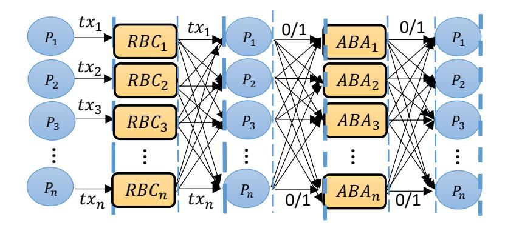
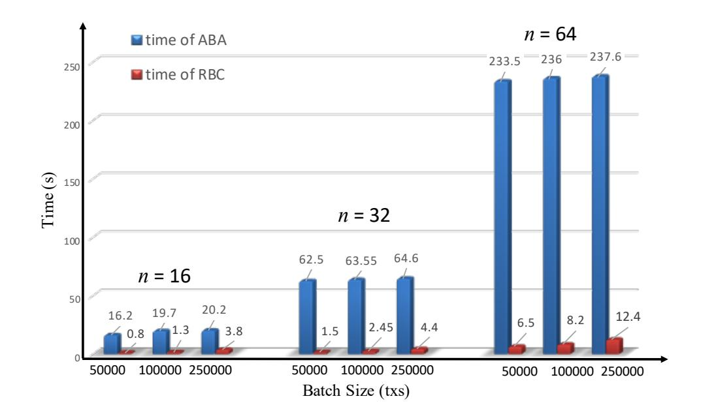
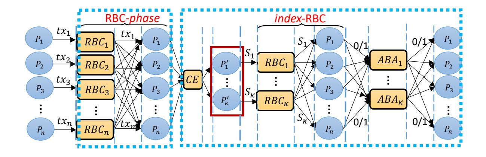
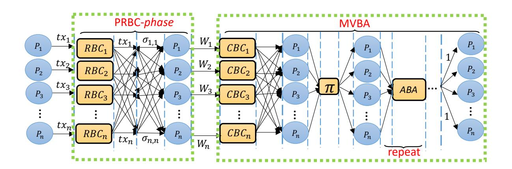
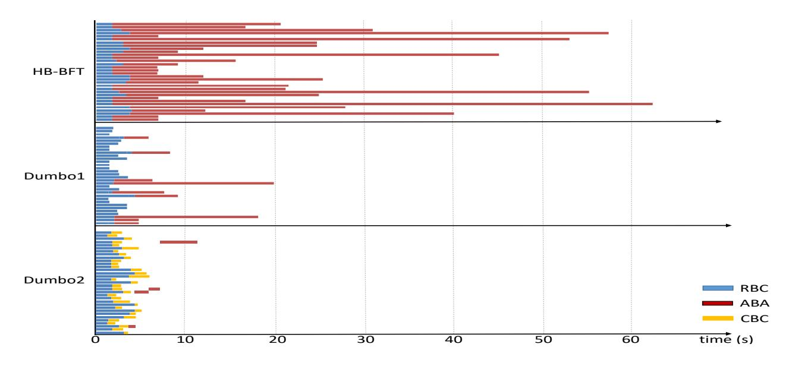
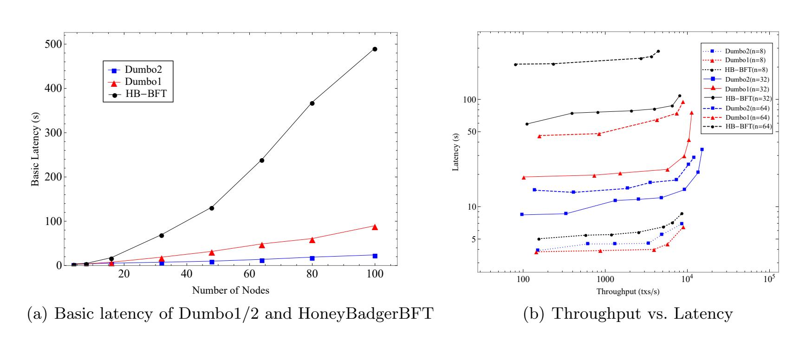
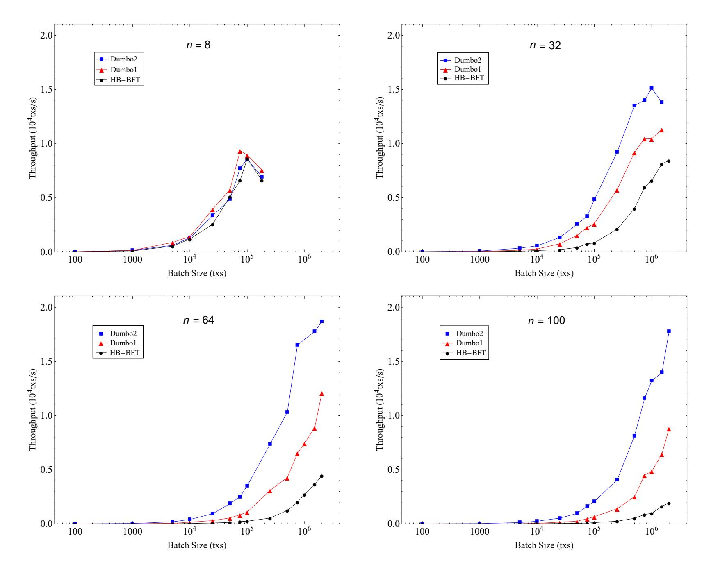

{0}------------------------------------------------

# Dumbo: Faster Asynchronous BFT Protocols?

<span id="page-0-0"></span>Bingyong Guo1,3,4,<sup>5</sup> , Zhenliang Lu2,<sup>5</sup> , Qiang Tang2,<sup>5</sup> , Jing Xu1,<sup>5</sup> , and Zhenfeng Zhang1,<sup>5</sup>

1 Institute of Software, Chinese Academy of Sciences {guobingyong, xujing, zfzhang}@tca.iscas.ac.cn <sup>2</sup>Department of Computer Science, New Jersey Institute of Technology {zl425, qiang}@njit.edu <sup>3</sup>State Key Laboratory of Cryptology <sup>4</sup>School of Computer Science and Technology, University of Chinese Academy of Sciences 5 JDD-NJIT-ISCAS Joint Blockchain Lab

Abstract. HoneyBadgerBFT, proposed by Miller et al. [\[35\]](#page-24-0) as the first practical asynchronous atomic broadcast protocol, demonstrated impressive performance. The core of HoneyBadgerBFT (HB-BFT) is to achieve batching consensus using asynchronous common subset protocol (ACS) of Ben-Or et al., constituted with n reliable broadcast protocol (RBC) to have each node propose its input, followed by n asynchronous binary agreement protocol (ABA) to make a decision for each proposed value (n is the total number of nodes).

In this paper, we propose two new atomic broadcast protocols (called Dumbo1, Dumbo2) both of which have asymptotically and practically better efficiency. In particular, the ACS of Dumbo1 only runs a small κ (independent of n) instances of ABA, while that of Dumbo2 further reduces it to constant! At the core of our techniques are two major observations: (1) reducing the number of ABA instances significantly improves efficiency; and (2) using multi-valued validated Byzantine agreement (MVBA) which was considered sub-optimal for ACS in [\[35\]](#page-24-0) in a more careful way could actually lead to a much more efficient ACS.

We implement both Dumbo1, Dumbo2 and deploy them as well as HB-BFT on 100 Amazon EC2 t2.medium instances uniformly distributed throughout 10 different regions across the globe, and run extensive experiments in the same environments. The experimental results show that our protocols achieve multi-fold improvements over HoneyBadgerBFT on both latency and throughput, especially when the system scale becomes moderately large.

Keywords: Atomic broadcast · Byzantine fault tolerance · Asynchronous.

## 1 Introduction

Byzantine fault tolerant (BFT) protocols enable a set of untrusted peers to reach consensus. As one fundamental research area in distributed computing, the problem has been extensively studied and many variants exist for different application scenarios. One main categorization of the BFT protocols is based on the timing (or network) assumptions. A synchronous BFT protocol assumes all values sent by honest peers will be delivered to the recipients within a certain period of time, which is known to everyone (including the protocol designer). While a partially synchronous BFT protocol relaxes this network requirement by allowing the time bound to be exist but unknown. An asynchronous BFT protocol relies the least on the network assumption that it does not require such a time bound to exist, just that all values will eventually be delivered.

The favored asynchronous BFT. In the earlier years, considering the deployment of BFT protocols mostly in conventional in-house scenarios that the peers are well-connected, research efforts of BFT focused on reducing (cryptographic) computations [\[5,](#page-23-0)[41\]](#page-25-0), or increasing the threshold of malicious participants the protocol can tolerate [\[21\]](#page-24-1), assuming a synchronous network. Nice works on synchronous setting continue to emerge in recent years [\[11](#page-24-2)[,1,](#page-23-1)[33\]](#page-24-3). Efforts also exist relaxing the network synchrony assumption. One notable example is the classic Practical Byzantine Fault Tolerance (PBFT) protocol [\[18\]](#page-24-4) that requires partial synchrony. However, removing the synchrony

<sup>?</sup> A preliminary version of this paper will appear at ACM CCS '20. Authors are named alphabetically, and the first two authors contributed equally.

{1}------------------------------------------------

assumption completely in practice becomes more and more desirable for both robustness and efficiency reasons.

Recently, the success of cryptocurrencies and blockchain technology in general brings much broader application scenarios to the BFT protocols, and also demonstrates the possibility of consensuses over wide-area network (WAN). The open Internet environment provides a more adversarial setting that the network latency among the peers could be time-varying. However, the synchronous (or partially synchronous) BFT can only perform in the relatively "private" network with wellconnected nodes that guarantees network delivery within certain time bound. Those protocols would fail to make progress and get stagnated if the timing assumption does not hold. Indeed, it was shown formally in recent work [\[35\]](#page-24-0) that PBFT cannot make any progress in "intermittently synchronous network", where the adversary only chooses to delay messages at certain time points. The "attack" could similarly be applied to a class of leader-based BFT protocols [\[4,](#page-23-2)[10,](#page-23-3)[20,](#page-24-5)[19,](#page-24-6)[42,](#page-25-1)[5\]](#page-23-0).

Another important reason that asynchronous protocols maybe favorable is due to efficiency, particularly a property called responsiveness. A synchronous BFT protocol, when designed, is parameterized by the assumed network latency, which is normally chosen to be large so that the actual network latency is indeed smaller thus the synchrony assumption can be ensured. As a consequence, the efficiency of most of the synchronous BFT protocols depends on the assumed network latency. While "responsiveness" instead requires the performance is only related to the actual network latency, thus it should not rely on any timing assumption and the protocol makes progress as soon as messages are delivered.

Moreover, it is well-known that asynchronous protocols simplify the engineering efforts substantially when actually building the distribute system, as no time-out mechanism will be needed. While building a system implementing a synchronous protocol, one should design all kinds of ad-hoc, error-prone time-out mechanisms.

The first practical asynchronous BFT [\[35\]](#page-24-0). Even though it is preferable or even necessary in many cases when deployed in real-world WAN, most of the previous researches on asynchronous BFT are theoretical in nature until the first practical protocol HoneyBadgerBFT was proposed in [\[35\]](#page-24-0). Previous asynchronous BFT protocols normally are inefficient, e.g., having a high (per message) communication complexity (up to O(n 2 ) or even O(n 3 ) if there are n peers) [\[26](#page-24-7)[,41,](#page-25-0)[15,](#page-24-8)[9,](#page-23-4)[17](#page-24-9)[,2\]](#page-23-5). The performance of these protocols will drop sharply when the system scales up. The elegant work of HoneyBadgerBFT [\[35\]](#page-24-0), on the other hand, made several critical observations to push asynchronous BFT towards being practical.

The first observation is that an atomic broadcast protocol which is a continuous execution of BFT protocols maintaining an ever-growing log, (or to put it another way, regular BFT protocols can be considered as a one-shot instance of it), could be built very lightly from a weaker variant called asynchronous common subset (ACS) together with a threshold encryption scheme. An ACS protocol only requires peers to agree on a subset of all their inputs and was originally proposed for different purposes [\[7\]](#page-23-6).



<span id="page-1-0"></span>Fig. 1. The structure of ACS in HoneyBadgerBFT [\[35\]](#page-24-0)

More importantly, it was observed in [\[35\]](#page-24-0) that the classic ACS protocol from Ben-Or et al. [\[9\]](#page-23-4) is much more promising for efficiency both asymptotically and practically (than another related protocol called multi-valued validated Byzantine agreement (MVBA) [\[15\]](#page-24-8), to be further explained soon), when picking the underlying building blocks carefully. The ACS protocol from [\[9,](#page-23-4)[35\]](#page-24-0) was built 

{2}------------------------------------------------

from two sub-protocols: reliable broadcast (RBC) and asynchronous binary agreement (ABA). The structure is fairly simple: each node invokes an RBC to broadcast its input value, and participates in n instances of the ABA protocol to agree on which subset of inputs to include, see Figure [1.](#page-1-0)

Experimental results show impressive performance of HoneyBadgerBFT. In a nice work BEAT [\[22\]](#page-24-10), the authors gave an extensive study about most suitable instantiations of the building blocks for HB-BFT (while keeping the protocol structure intact) when considering diverse deployment scenarios. [1](#page-0-0) We take a different path and ask the following question:

Can we redesign the ACS protocol to improve both its asymptotic and practical efficiency?

#### 1.1 Our contributions

We design two new ACS protocols, both of which improve the running time asymptotically and practically. Our experimental results demonstrate a multi-fold improvements over HoneyBadgerBFT [\[35\]](#page-24-0) when they are run back to back in the same environment on Amazon AWS. More interestingly, our two main observations (1. the number of ABA instances should be reduced; 2. MVBA would be more efficient if used carefully for ACS) that lead to our two protocols would be of independent interests. Let us elaborate in more detail below.

Dumbo1: a faster asynchronous BFT. We first go over the structure of the ACS protocol used in HB-BFT in slightly more details: first each peer broadcasts its input via an RBC instance; whenever a peer receives value from peer P<sup>i</sup> , it sets its input for the i-th ABA instance to be 1 and starts the ABA protocol. Once an honest peer has got 1 from n − f ABA instances, it will input 0 to all the remaining ABA instances which have not input yet and move on.

Identifying the major bottleneck. Due to the famous FLP impossibility [\[23\]](#page-24-11), an ABA must be a randomized protocol. This brings in the following drawback: though the expected number of "rounds" of each ABA protocol is constant, the expected number of rounds of running n concurrent ABA sessions could be significant, i.e., at least O(log n) [\[8\]](#page-23-7) More seriously, those ABA instances do not really execute in a fully concurrent fashion: as (1) not all instances start at the same time, some of the instances may start later as inputs of (the previous RBC) haven't been delivered; (2) normal node also has an efficiency degradation facing large scale concurrent execution (not enough CPU cores etc). When n gets larger, and the network is unstable, there would likely be some ABA instances that terminate very slowly. The slowest ABA instance determines the running time of the ACS of HoneyBadgerBFT.

To see the practical impact of ABA protocols on the performance, we carry out experiments of HB-BFT and do statistics about the average running time between RBC and ABA. As shown in Figure [2,](#page-3-0) it is clear that for HB-BFT, the cost of ABA is dominating [2](#page-0-0) . The pattern becomes even more significant when the scale of the system grows. This simple observation inspires us to reduce the number of ABA instances needed in the ACS protocol.

Reducing # of ABA instances. We redesign the structure of ACS, and propose Dumbo1-ACS. Different with the HoneyBadgerBFT (and also the BEAT protocols), Dumbo1-ACS only needs to run κ instead of all the n ABA instances, and achieves O(log κ) running time, where κ is a security parameter independent of n. Other complexity metrics remain the same.

In a simplified view, the first phase remains unchanged: every node broadcasts its input through an RBC instance. Then, imagine that if we have one honest node to take the role as the leader, then it can first finish n − f RBC instances and then informs all other nodes to output the deliveries of these RBC instances. To get such an honest node, we can select a small number κ of nodes as the "leaders" such that at least one of them is honest with an overwhelming probability.

<sup>1</sup> We remark here that most of the techniques of BEAT [\[22\]](#page-24-10) can be directly applied to our protocols as well, to choose more suitable instantiations of the underlying building blocks such as RBC, and further optimize the performance. Our focus is to show asymptotic and practical improvements due to protocol redesign, so we mainly compare a basic instantiation of our protocols with HoneyBadgerBFT in experiments. See more comparison in section [1.2.](#page-6-0)

<sup>2</sup> We ignored some "unnoticeable" time cost of local computations such as threshold encryption/decryption, picking an input from the buffer etc as they do not change the ratio much.

{3}------------------------------------------------

<span id="page-3-0"></span>

**Fig. 2.** Time costs of RBC and ABA in HoneyBadgerBFT, we get the running time of RBC by starting a timer when protocol starts and ending the timer when nodes get the output of RBC, averaging among multiple nodes and instances. The time of ABA is taking the maximum among all ABA instances a node needs to run.

Further care is needed as now two honest nodes may receive different values from different selected "leaders". Next, we should enable honest nodes to decide which of the  $\kappa$  selected nodes to believe. It actually becomes similar to HB-BFT that we can invoke ABA instances to confirm whose nomination of subset to include. Once some ABA instances output 1, the corresponding messages can be identified and output. Importantly, now the peers just need to agree on the  $\kappa$  (which could be much smaller than n) nodes. See pictorial illustration in Fig. 3.



<span id="page-3-1"></span>Fig. 3. The structure of Dumbo1-ACS

We would like to stress that the changes in the remaining parts are kept at minimal so that the reduction of ABA instances also yields significant practical improvements. It looks like we have a handful extra RBC instances than HB-BFT; however, we make the input of each peer in those extra (index)-RBC instances to be a tiny index-set ( $S_i$  instead of the actual data loads). An honest player inputs 1 for the *i*-th ABA if he indeed receives all messages corresponding to  $S_i$ . Moreover, the added coin-tossing protocol to select  $\kappa$  nodes is just a sub-routine of ABA protocol. So those added overhead would be unnoticeable compared to the cost of eliminated ABA instances.

To see why it works: when one honest node determines to output the values corresponding to  $S_i$ , it must be the case that the *i*-th ABA instance outputs a bit 1. The property of ABA ensures that (1) all other honest nodes will also output 1 and (2) at least one honest node inputs 1 for this ABA instance. The latter means at least one honest node indeed receives all the input values  $\{v_j\}$  corresponding to the index set  $S_i$ . Thus following the security of RBC, all other honest nodes will also receive those values eventually. While condition (1) ensures all honest nodes will actually output the same subset of values.

**Dumbo2:** an even faster asynchronous BFT. Dumbo1 now runs only  $\kappa$  concurrent ABA instances, we now ask a more ambitious question: can we push it all the way to constant?

{4}------------------------------------------------

Pushing # of ABA to minimum. HoneybadgerBFT requires n executions of ABA instances, due to the fact that each ABA instance determines only for input from one peer. Dumbo1 can reduce it as now the "committee" members are prepared with a vector of values. But still, Dumbo1 needs to run  $\kappa$  instances: the procedure after the RBC phase is very similar to the structure of HB-BFT, that picks a common subset containing the index-sets  $\{S_i\}$  as elements. Since each node will invoke/enter the i-th ABA instance once it receives  $S_i$  from the i-th committee and all values corresponding to the  $S_i$ . This causes a challenge that different nodes may enter different ABA instances, there is no "global coordinator" for those instances, thus the only viable way is to concurrently run all of them.

In principle, we still "waste"  $\kappa-1$  ABA instances. This inspires us to find a way to correctly identify only one input vector, thus leads us to re-examine the applicability of multi-value validated Byzantine agreement (MVBA), which outputs one of the inputs of n peers as long as the input satisfies some pre-defined predicate. MVBA was considered impractical for building ACS in [35]. The reason was that existing constructions suffer from a high communication complexity, i.e., the MVBA protocol in [15] has communication complexity  $\mathcal{O}(n^2|m| + \lambda n^2 + n^3)$  in expectation <sup>3</sup>, where |m| represents the size of MVBA's input values. In many cases,  $|m| > \lambda n \log n$ , thus the dominating term in the per message communication of its direct construction of ACS [15] is  $\mathcal{O}(n^2|m|) = \Omega(n^3)$  (Although [15] did not explicitly mention ACS, their atomic broadcast already contains the construction from MVBA to ACS, and the complexity remains even for the recently improved MVBA [2]) and makes the MVBA protocol impractical for building ACS.

But the above claim holds only when MVBA is directly invoked with large size inputs. If we give a closer look, we notice that if |m| is small, then the overall communication complexity of MVBA (and also the corresponding ACS [15]) is no bigger or even substantially smaller than the ACS in HoneyBadgerBFT! <sup>4</sup> See Table 1 in Sec. 6. And MVBA has the benefit of a constant number of ABA instances [15]. The key challenge is now reduced to how to invoke MVBA with small inputs to construct an ACS which may still have large inputs. This reminds us the widely used conventional wisdom of "Hybrid Encryption" in the setting of cryptography.



<span id="page-4-0"></span>Fig. 4. The structure of Dumbo2-ACS

<u>The right way of applying MVBA.</u> We present an even faster asynchronous BFT protocol via an innovative use of MVBA, we call it Dumbo2. It achieves asymptotically optimal (constant) running time, i.e., Dumbo2 only needs to run (expected) three consecutive instances of ABA, and other complexities remain the same <sup>5</sup>.

To work out the details of ACS requires further ideas. Since ACS outputs a subset of inputs, we would first prepare each peer node with a vector of inputs via RBC type of protocols. More

In a very recent work, we finally brought down this communication complexity to  $\mathcal{O}(n|m|+\lambda n^2)$  [29,30].

<sup>&</sup>lt;sup>4</sup> Similar phenomenon was also noticed in BEAT [22] that they chose a seemingly more expensive RBC in BEAT1,2, but getting a more efficient protocol for small message.

<sup>&</sup>lt;sup>5</sup> There exist theoretical works [8] that can achieve constant expected running time for n concurrent execution of ABA protocol, but at the cost of larger message and communication complexities; As pointed out in [35], if we directly adopt their technique to construct ACS, the message and communication complexities will be  $\mathcal{O}(n^4)$ , which render the ACS infeasible for practice.

{5}------------------------------------------------

importantly, instead of feeding those message vectors into the MVBA protocol, we further prepare each peer with a very *short* "indicator" (the  $W_i$  in Fig. 4) and use it as input to join the MVBA protocol. The MVBA protocol will output one such "indicator" which would be used to inform each honest peer to pick the corresponding RBC instances. The tricky part is, in an MVBA protocol, honest peers may output the input (here the short "indicator") from a malicious peer.

We resolve this by designing the "indicator" in a way that any of it serves as a warrant all honest peers would receive the corresponding messages. We formulate a new primitive called *provable reliable broadcast* (PRBC) which augments RBC and further outputs a succinct proof (even by a malicious node) that at least one honest peer has received the input. This can be realized by threshold signing on the RBC index. The ABA within MVBA only needs to be repeated (expected) three times. See Figure 4 for pictorial illustration, where  $\pi$  is a random permutation.

To see why it works: the actual inputs  $W_i$  to MVBA includes a indices set and the corresponding proofs. When one honest node outputs  $W_i$ , the proof in  $W_i$  is valid. This means the messages corresponding to the indices in  $W_i$  were all received by enough peers which include at least one honest peer. Then all other honest node will eventually receive those as well.

We remark that though Dumbo2 out-performs Dumbo1 in most of the cases, we choose to keep Dumbo1 for clarity of the presentation: the idea of using each ABA to vote whether to output the vector of each "committee" member in Dumbo1, instead of each input as in HB-BFT is simple and intuitive. Such a possibility of more effective voting could be viewed as a stepping stone to motivate the idea of voting to output only one guy's vector, which eventually leads to Dumbo2's idea of using MVBA. Also, since MVBA is still fairly complicated, in some benign cases when f is very small, Dumbo2 might not be better than Dumbo1.



<span id="page-5-0"></span>Fig. 5. Running time breakdown of Dumbo1/2 and HoneyBadgerBFT on one random node <sup>6</sup>.

Implementation and experimental evaluations. Besides the asymptotic improvements (see Table 1 in Sec. 6), we implement Dumbo1 and Dumbo2, and also test the performance of the our schemes in the practical WAN environment. We deploy Dumbo1, Dumbo2 and HoneyBadgerBFT on 100 Amazon EC2 t2.medium instances uniformly distributed from 10 different regions across the globe. For a fair comparison, we use the same language and cryptography libraries as [35], and carry out a variety of tests in the same environment. Results show that the efficiency of our schemes indeed outperforms HB-BFT by multifolds, especially when the system is sufficiently large. For example, when n = 100, Dumbo1 has a basic latency that is only 22% and Dumbo2 has only 5%

<sup>&</sup>lt;sup>6</sup> For Dumbo2 experiments, we intentionally run ABA more times to "simulate" potential adversarial network scheduler (otherwise there could be only one ABA), while the experiments of HB-BFT, Dumbo1 are done without scheduler intervention (same as before [35]). We also note that in theory, in some very rare cases, it may be possible that some RBC instance gets slow so that users have to wait after ABA instances are finished. We do not observe the case that an RBC takes longer time than the slowest ABA in the experiments. Further optimizations beyond reducing # of ABA instances for the asynchronous atomic broadcast are interesting open problems.

{6}------------------------------------------------

of that of HB-BFT. Moreover, Dumbo1 has a peak throughput 3.5× and Dumbo2 has more than 9× of that of HB-BFT. See more details about more tests in Sec. [7.](#page-16-1)

To showcase the effectiveness of our observation to reduce the number of ABA instances, we pick the result (the running time recorded of each sub protocol from a random node) from one experiment where n = 32 with 10<sup>5</sup> transactions (250 bytes each) as input, see Fig. [5.](#page-5-0) In the figure, for each protocol each line denotes the execution of a sub-protocol instance, e.g., the two bars in the first line of HB-BFT correspond to the first instances RBC<sup>1</sup> and ABA<sup>1</sup> respectively, the second line corresponds to the second instances RBC2/ABA2, and so on. The consistent broadcast (CBC) protocol in Dumbo2 is a part of MVBA, which can be regarded as a simplified version of RBC (see appendix for detailed definition).

#### <span id="page-6-0"></span>1.2 Related work

The consensus problem was firstly introduced by Shostak, Pease and Lamport [\[28\]](#page-24-14). As a fundamental problem in distributed computing, it has received extensive attention such that many different variants of the consensus problem have been studied, e.g., [\[27,](#page-24-15)[39,](#page-25-2)[18,](#page-24-4)[25\]](#page-24-16).

Classic research on asynchronous BFT focused more on understanding the theoretical limits and feasibilities. The famous FLP-impossibility [\[23\]](#page-24-11) shows that no deterministic consensus protocol can be possible in asynchronous settings as soon as one node may crash. In contrast, Ben-Or [\[7\]](#page-23-6) and Rabin [\[40\]](#page-25-3) showed how to circumvent the impossibility via randomization. Those pioneering works inspire many other classic works along the line of asynchronous binary agreement (ABA) [\[7](#page-23-6)[,13\]](#page-24-17) which consider input of each node to be just a bit. ABA protocols are known to be an important component towards building a full-fledged BFT or atomic broadcast protocol [\[15](#page-24-8)[,26,](#page-24-7)[41,](#page-25-0)[35](#page-24-0)[,22,](#page-24-10)[2,](#page-23-5)[24,](#page-24-18)[36\]](#page-24-19). We observe (and verified in experiments) that running a large number of ABA instances becomes the bottleneck for efficiency and we strive to minimize the use of it.

HoneyBadgerBFT [\[35\]](#page-24-0) is the first practical asynchronous atomic broadcast protocol that comes with two major observations: (1) a weaker problem of asynchronous common subset (ACS), originally proposed by Ben-Or et al. [\[9\]](#page-23-4) can easily be converted to an atomic broadcast without much overhead; (2) the ACS protocol constructed from reliable broadcast (RBC) and asynchronous binary agreement (ABA) with careful instantiations over-performs the previous thought of constructing it directly from a multi-valued Byzantine agreement (MVBA) [\[15\]](#page-24-8).

A few recent practical improvements of HoneyBadgerBFT come from the nice works of BEAT [\[22\]](#page-24-10) and Aleph [\[24\]](#page-24-18). In particular, the BEAT carefully examine different use cases, and make suggestions about the suitable component to choose to deploy in practice. In more detail, besides BEAT3,4 are for BFT storage only, they presented BEAT0-2 to meet different goals. The components in BEAT1 and BEAT2 are chosen in a delicate way that even though the communication complexity seems to be larger for reasonably large messages, but if the message size is small, they are actually faster, see Table [1](#page-16-0) in Sec. [6.](#page-15-0) The Aleph is trying to improve latency obtain log n factor improvement by proposing a different assumption on the transaction buffers, however, the ABA still influence the latency such that the latency still needs O(log n). One interesting technique of Aleph is to remove the trusted dealer assumption, which also may be used in our Dumbo protocols.

As we briefly mentioned earlier, our methods and BEAT are orthogonal and compatible: their work kept the structure of the HoneyBadgerBFT intact, thus have the same round complexity, but cherry-pick the best instantitaions of the underlying components; we focus on restructuring the ACS protocol, but majority of components are the same. Their techniques from BEAT0-BEAT2 can all be applied to our protocols as well. So for experiments, we focus on comparisons with HB-BFT. Combining all their techniques with ours would be interesting future work.

## 2 Models and Problem Statement

### 2.1 System model

We now describe our system model.

Setup. In particular, it involves a designated set of n nodes {Pi}i∈[n] , we use [n] to denote the integers {1, 2, . . . , n}. We consider the identities of these nodes to be public, e.g., certified by a 

{7}------------------------------------------------

PKI. We denote by  $(PK_i, SK_i)$  the public/private key pair of nodes  $P_i$ . In addition to the already-established identities, a trusted third-party also runs before the protocol to set up all involved threshold cryptosystems.

**Static corruptions.** We assume that there are f faulty nodes  $(3f + 1 \le n)$ , and consider these faulty nodes are fully controlled by the adversary [35,15]. Such adversary model means that before the start of the protocol, the adversary is allowed to choose f nodes to completely corrupt them, then the adversary can gets all the faulty nodes' initial internal states and also can let these nodes arbitrarily misbehave during the execution of the protocol.

Asynchronous network. We consider the underlying communication network consisting of asynchronous fully-meshed authenticated point-to-point (p2p) channels. In this model, between any two nodes, there is an established authenticated p2p channel. However, the adversary can fully control the value delivered over all channels, i.e., the adversary can arbitrarily delay, but the values send between honest nodes will eventually be delivered, which explicitly implies two facts: (i) the adversary can arbitrarily reorder values and (ii) the network will not drop any values from honest nodes.

#### 2.2 Design goals

**Atomic broadcast.** Our end goal is to design an atomic broadcast protocol among n nodes under the system model above. Formally, an atomic broadcast protocol satisfies the following properties with an overwhelming probability:

- Agreement. If one honest node outputs a value v, then every honest node outputs v;
- Total order. If two honest nodes output sequences of value  $\langle v_0, v_1, \dots, v_j \rangle$  and  $\langle v'_0, v'_1, \dots, v'_{j'} \rangle$ , respectively, then  $v_i = v'_i$  for  $i \leq \min(j, j')$ ;
- Censorship resilience. If a value v is input to n-f honest nodes, then it is eventually output by every honest node.

We require the three properties hold with an overwhelming probability. In short, we will adopt the same model as HoneybadgerBFT [35], i.e., atomic broadcast among n nodes against f static corruptions in an asynchronous network.

Atomic broadcast protocol proceeds in consecutive epochs, after each epoch, a new batch of transactions is output and appended to the committed log (see Appendix 8.1).

Asynchronous common subset (ACS). One nice observation from HoneyBadgerBFT [35] is an efficient and simple conversion to an atomic broadcast from a weaker variant called asynchronous common subset (ACS) together with threshold encryption. An ACS essentially let each node output a common subset of all the node inputs. Formally, it satisfies:

- Agreement. If an honest node outputs a set V, then every honest node outputs V;
- Validity. If an honest node outputs a set V, then  $|V| \ge n f$  and V contains the inputs of at least n 2f honest nodes;
- Totality. If n-f honest nodes have an input, then all honest nodes can produce an output.

Remark that there exists a simple conversion from ACS to atomic broadcast by adding threshold encryption, we refer the details in Appendix 8.1 and [35].

Complexity measures. The practicality of BFT protocols depends heavily on their computational complexity. In this paper, we consider the following three metrics:

- Message complexity: the expected total number of messages that honest nodes generate during the protocol;
- Communication complexity: the expected total bit-length of messages that honest nodes generate during the protocol;
- Time (round) complexity: the expected number of rounds of communication before the protocol terminates.

Besides, note that we always consider n = 3f + 1 throughout this paper, hence, our BFT protocol is also an optimal resilience which just considers how many nodes may be corrupted.

{8}------------------------------------------------

## <span id="page-8-0"></span>3 Preliminaries

We introduce definitions for some underlying building blocks.

Reliable broadcast (RBC) is a protocol running among a set of n nodes in which there is a node called sender whose aim is to broadcast a value to all the other nodes. More formally, an RBC protocol satisfies the following properties:

- Agreement. If any two honest nodes output v and v 0 respectively, then v = v 0 ;
- Totality. If an honest node outputs v, then all honest nodes output v;
- Validity. If the sender is honest and inputs v, then all honest nodes output v.

Consistent broadcast (CBC) is similar to RBC, but it does not provide Totality.

Asynchronous binary agreement (ABA) is a special asynchronous Byzantine agreement protocol among n nodes. In an ABA protocol, each node has a single-bit (0/1) input, and their goal is to reach an agreement on the decided bit [\[37,](#page-24-20)[16,](#page-24-21)[14\]](#page-24-22). More formally, an ABA protocol has the following guarantees:

- Agreement. If any honest node decides the bit b, then every honest node decide b;
- Termination. If all honest nodes receive input, then every honest node decides a bit;
- Validity. If any honest node decides b, then at least one honest node received b as input.

Remark: As many previous works [\[37,](#page-24-20)[14,](#page-24-22)[16,](#page-24-21)[35\]](#page-24-0), the termination property here for ABA only requires all honest node to decide (in the sense of outputting a value for further applications, while not halting the protocol). It is possible that they each decide a value, but some node still continues waiting messages in the protocol [\[35\]](#page-24-0). As in [\[35\]](#page-24-0), we use "output" and "decide" interchangeably on a bit in ABA. Please see Appendix [8.2](#page-19-0) for details of concrete constructions of RBC, CBC and ABA [7](#page-0-0) protocols.

Multi-valued Byzantine agreement (MVBA): The MVBA [\[2,](#page-23-5)[15\]](#page-24-8) allows agreement on arbitrary values instead of being restricted to binary values. The protocol has a global, polynomial-time computable predicate Q known to all nodes, which is determined by the particular application. The basic idea of the protocol is that each party proposes a (different) value that contains certain validation information as input and outputs an value which satisfies the Q as the decision value. The protocol ensures that the decision value was proposed by at least one party. Each honest node only inputs a value to MVBA that satisfies Q.

More formally, an MVBA protocol satisfies the following properties except with negligible probability:

- Termination. If every honest node P<sup>i</sup> inputs with an externally valid value v<sup>i</sup> , then every honest node outputs a value;
- External-Validity. If an honest node outputs a value v, then Q(v) = T rue;
- Agreement. All honest nodes that terminate output the same value;
- Integrity. If all nodes are honest and if some nodes output v, then some nodes proposed v.

Threshold signature scheme: Let 0 6 t 6 n, A (t, n)-non interactive threshold signature scheme is a tuple of algorithms which involves n nodes and up to t − 1 node can be corrupted, where each node have a private function SigShare, and three public functions ShareVerify, Combine and Verify (see Appendix [8.2](#page-19-0) for formal definitions). The signature schema satisfies the following properties:

- Unforgeability: No polynomial-time adversary can forge a signature that can be verified correctly (by honest parties) of any message m without querying the signature algorithm;
- Robustness: When a message m is provided as the input of the signature algorithm, eventually all honest parties can get a signature of m that can be correctly verified.

<sup>7</sup> The original HoneyBadgerBFT [\[35\]](#page-24-0) used an ABA protocol [\[37\]](#page-24-20) which requires a strong common coin that cannot be realized by the threshold coin scheme [\[16\]](#page-24-21). The revised version of HB-BFT added a fix [\[34\]](#page-24-23) of the ABA protocol (see also Alg. [7](#page-22-0) without the "amendament"). In our experiments, we adopted this revised ABA.

{9}------------------------------------------------

 $(1, \kappa, \epsilon)$ -Committee election (CE): A CE protocol is executed among n nodes (identified from 1 through n). If at least f+1 honest nodes participate, the protocol terminates with honest nodes output a  $\kappa$ -sized committee set C such that at least one of C is honest nodes. In particular, a protocol is said to be  $(1, \kappa, \epsilon)$ -committee election, if it satisfies the following properties except with negligible probability in cryptographic security parameter  $\lambda$ :

- Termination. If f + 1 honest nodes activate the protocol CE, all messages among honest nodes arrive, then all honest nodes output C;
- Agreement. Any two honest nodes output the same set C;
- Validity. If any honest node outputs C, (i)  $|C| = \kappa$ , (ii) the probability of every node  $P_i \in C$  is same, and (iii) C contains at least one honest node with at least probability  $1 \epsilon$ ;
- Unpredictability. Before invocation by one honest node, the probability of the adversary to predict the returned committee is at most  $1/\binom{n}{\kappa}$ .

Remark that a  $(1, \kappa, \epsilon)$ -CE can be constructed directly from a threshold coin-tossing (see Appendix 8.2), which can be readily derived from threshold signatures. At least one honest node is elected in C with an overwhelming probability  $1 - \epsilon - \mathsf{negl}(\lambda)$ , where  $\mathsf{negl}(\lambda)$  is a negligible function in cryptographic security parameter  $\lambda$ , and  $\epsilon$  is  $exp(-\Omega(\kappa))$  (c.f. Lemma 1 for details).

## 4 Dumbo1: A Fast Asynchronous BFT protocol

In this section, we present our first ACS, which is called Dumbo1-ACS. Applying the same conversion from ACS to atomic broadcast [35] (adding threshold encryption), we can obtain a new atomic broadcast: Dumbo1. We will focus on the ACS protocol below.

#### 4.1 Dumbo1-ACS

**High level overview.** The core of our design is to reduce the number of ABA instances needed in an ACS execution. As briefly elaborated in the Introduction, the reason that HoneyBadgerBFT (and also BEAT) needs n instances of ABA is due to the following reason: the peers need to agree what to do for each peer's input via one ABA instance. Observe that after the first RBC phase, each peer is prepared with a subset of inputs.

Instead of investing an ABA for each input, we would let a small number  $\kappa$  of "aggregators" to nominate which *subset* of inputs to output (based on what it has already received). In this way, each ABA instance is now used to let the nodes to determine whether they agree on the *i*-th nominated subset  $S_i$ . We remark again that the nomination procedure is also using RBC, however, the inputs are just indices-set  $S_i$  instead of the actual data load. Also the nominator/committee election is just one coin-tossing at best, thus the overhead is minimal compared to the saved ABA instances.

Note that  $\kappa$  instances of ABA protocol are still needed, otherwise one honest node may decide to follow  $S_i$  while the other honest node may decide to follow  $S_j$ , as each of them indeed receives the corresponding input values but ends up violating the agreement.

In slightly more detail, as illustrated in Figure 3 in Introduction, our Dumbo1-ACS includes two phases of RBC, denoted as data-RBC and index-RBC respectively. The data-RBC instances are executed by the nodes to broadcast their inputs.  $\kappa$  leaders will then be selected. The index-RBC instances are only initiated by the selected members when they have received n-f values from those data-RBC instances. Each index-RBC is used to broadcast the indexes indicating which n-f values that a selected member has already received. In the last phase, an honest node will input 1 to the i-th ABA instance if it has already received  $S_i$  (with size n-f) and all the corresponding values in the data-RBC instances.

<u>Committee election</u>. The election of those committees/nominators is standard practice, i.e., randomly choosing  $\kappa$  nodes to ensure the probability that one of them is honest with an overwhelming probability in  $\kappa$ . Usually, the probability that none of  $\kappa$  random peers to be honest is at most  $(1/3)^{\kappa}$  (see Lemma 1). In practice, we could let system designer to choose  $\kappa = min\{\kappa_0, f+1\}$  in a way that  $(1/3)^{\kappa_0} \leq \epsilon_0$  for any small  $\epsilon_0$  he likes.

{10}------------------------------------------------

Construction of Dumbo1-ACS. Now we describe the construction of our Dumbo1-ACS. The detailed process of Dumbo1-ACS is shown in Algorithm [1.](#page-10-0) As illustrated in Figure [3](#page-3-1) in Introduction, our Dumbo1-ACS includes two phases of RBC, the first phase is to broadcast value, the second phase is to broadcast indices.

The Dumbo1-ACS protocol composed of five logical phases, the detailed protocol proceeds as follows:

- Value broadcast: (line 02). All nodes P<sup>i</sup> input their value v<sup>i</sup> to RBC<sup>i</sup> protocol.
- Committee election: (line 03-03). All nodes participate CE protocols to select committee C, and take the committee member' identities into a set CMIS.
- Indices broadcast: (line 06-09). When the committee members have received n−f Value message from distinct RBC instances, then they will broadcast these indexes of n − f Value messages through RBC.
- ABA phase: (line 10-17). When one honest node has already received Index message (S<sup>j</sup> ) from committee member P<sup>j</sup> and all corresponding Value message from the RBC instances, then input 1 to the ABA<sup>j</sup> instance; if one honest node gets an output from any ABA<sup>j</sup> and j ∈ CMIS, then input 0 to other ABA instance which no input has been provided to yet.
- Output phase: (line 18-25). When a node terminates in all κ instances of ABA, for any x ∈ CMIS, if ABA<sup>x</sup> outputs 1, then the node waits Index message from RBC<sup>x</sup> and gets a set S, and further waits Value message to get v<sup>j</sup> for all j ∈ S from RBC<sup>j</sup> and finally outputs {vj}j∈S.

### Algorithm 1 The Dumbo1-ACS protocol (for party Pi) in consecutive epoch r

```
1: Let {RBCj}n refer to n instances of the reliable broadcast protocol, where Pj is the sender
   of RBCj , and ABAj refer to the ABA instance corresponding committee member Pj . Initial:
   Committee member identities set CMIS = ∅.
2: Input (Value, vi) to RBCi
                         ; B data-RBC
3: Invoke Committee Election protocol CE(r);
4: wait until Committee: {Pj1
                          , Pj2
                              , · · · , Pjκ
                                     } ← CE(r)
5: CMIS ← {j1, j2, · · · , jκ};
6: if Pi ∈ Committee then
7: wait until receiving n − f Value messages {(Value, vi1
                                                     ), (Value, vi2
                                                                ), · · · ,(Value, vin−f
                                                                                )}
   from distinct RBC instance
8: let Si = {i1, i2, · · · , in−f };
9: input (Index, Si) to RBCi
                               ; B index-RBC
10: upon receiving Index message (Index, Sj ) from committee member Pj and |Sj | = n − f do
11: if no input has been provided to ABAj then
12: wait until all (Value, vx)x∈Sj have received
13: input 1 to ABAj ;
14: upon receiving 1 from any ABAj and j ∈ CMIS do
15: for x: x ∈ {CMIS − j} do
16: if no input has been provided to ABAx then
17: input 0 to ABAx;
18: upon all κ ABA instances have completed do
19: for x: x ∈ CMIS do
20: if ABAx output 1 then
21: wait Index message: (Index, Sx) ← RBCx
22: S ← S ∪ Sx;
23: for j ∈ S do
24: wait Value message: (Value, vj ) ← RBCj
```

25: Output ∪j∈<sup>S</sup> v<sup>j</sup> .

{11}------------------------------------------------

#### 4.2 Security analysis

Dumbo1 realizes an atomic broadcast via the combination of ACS and threshold encryption. To prove the security of Dumbo1, we need to go in two steps: (1) a reduction from atomic broadcast to ACS and threshold encryption; (2) to show our new constructed Dumbo1-ACS protocol indeed satisfies the ACS properties.

The proof for Step 1 has been given in [35], for more details please refer to Appendix 8.1. Here we focus mainly on the Step 2 and prove Dumbo1-ACS satisfies all properties of ACS.

<span id="page-11-0"></span>**Lemma 1.** (Validity of CE.) If n = 3f + 1,  $\kappa \leqslant f$  and CE(id) returns a set C, then the set C containing at least one honest nodes except with  $exp(-\Omega(\kappa))$  probability.

*Proof.* Due to the pseudo-randomness, hence, the total case is  $\binom{n}{\kappa}$  of random choose  $\kappa$  nodes, and the total case is  $\binom{f}{\kappa}$  of the set C containing no honest nodes. Let p is the probability of the set C containing no honest nodes. So, we have

$$p = \frac{\binom{f}{\kappa}}{\binom{n}{\kappa}} = \frac{f!(n-\kappa)!}{(f-\kappa)!n!} \leqslant (\frac{1}{3})^{\kappa} = \exp(-\Omega(\kappa)).$$

Remark: If f is small, we can simply set  $\kappa = f + 1$ . Algorithm 4 satisfies the Termination, Agreement and Unpredictability properties of CE follows from the properties of threshold cointossing.

**Theorem 1.** With except  $exp(-\Omega(\kappa))$  probability, the Dumbo1-ACS protocol satisfies Agreement, Validity, and Totality of ACS, assuming the underlying RBC, CE and ABA protocols are secure.

*Proof. Agreement:* To prove that Dumbo1-ACS satisfies the agreement property, we show that when an honest node outputs V, then every honest node outputs V. Assume that an honest node P has a output  $V = \{v_j\}_{j \in S}$ .

The indices S must be contained in some index sets. W.l.o.g, we assume S is included only one index set  $S_k$ , (Index,  $S_k$ ) was received in some RBC (denoted as RBC<sub>k</sub>), then the node must have received 1 in the corresponding ABA instance (denoted as ABA<sub>k</sub>). Due to the *agreement* property of ABA, all honest nodes will also receive 1 in ABA<sub>k</sub>. Hence, all honest nodes will wait an Index message output from RBC<sub>k</sub>, due to *totality* and *agreement* of RBC, so all other honest nodes will receive same Index message (Index,  $S_k$ ).

On the other hand, due to the *validity* of ABA, at least one honest node P' inputs 1 to ABA<sub>k</sub>. It implies that this honest node must have received Index message (Index,  $S_k$ ) and these Value messages {Value,  $v_j$ } $_{j \in S_k}$  corresponding to the index set  $S_k$ . The *totality* and *agreement* of RBC now can ensure that all other honest nodes including P will receive {Value,  $v_j$ } for any  $j \in S_k$ .

Hence, every honest node outputs  $\{v_j\}_{j\in S_k} = \{v_j\}_{j\in S} = V$ .

Validity: To prove that Dumbo1-ACS satisfies the validity property, we show that  $|V| \ge n - f$  and V contains the input of at least n - 2f honest nodes when an honest node outputs a set V.

If an honest node  $P_i$  outputs a set  $V = \{v_j\}_{j \in S}$ , W.l.o.g, we assume S is included only one index set  $S_k$ , (Index,  $S_k$ ) was received in index-RBC<sub>k</sub>. According to the Algorithm 1, we can know ABA<sub>k</sub> return 1, due to the *validity* of ABA, at least one honest node (say P') inputs 1 to ABA<sub>k</sub>. It implies that P' must have received Index message (Index,  $S_k$ ) and all Value message {Value,  $v_j\}_{j \in S_k}$  corresponding the index set  $S_k$ , where  $|S_k| = n - f$ .

The totality and agreement of RBC now can ensure that all honest nodes including  $P_i$  will receive  $\{Value, v_j\}_{j \in S_k}$ , where  $|S_k| = n - f$ . So,  $V = \{v_j\}_{j \in S_k}$ . Hence, we have  $|V| \geqslant n - f$ . Notice that there are at most f byzantine nodes, there must be at least n - 2f inputs from honest nodes in set V.

Totality: To prove that Dumbo1-ACS satisfies the totality property, we show that all honest nodes produce an output if n - f honest nodes have an input.

Since n-f honest nodes have an input, according to the *validity* of RBC, hence, every committee member can receive n-f Value messages from distinct RBC instance. So, every committee member

{12}------------------------------------------------

can activate the second phase RBC instance. Besides, according to the CE protocols, there exists at least an honest node (say Pi) belongs to the committee.

Next, we will prove that at least one ABA instance returns 1.

Firstly, suppose all ABA instances output 0, in this case, line 14-17 will never execute, that is to say, 0 will never input to any ABA instance by honest nodes. However, according to the validity of ABA, at least one honest node inputs 0 to ABA, which induces contradiction.

Secondly, since the committee member P<sup>i</sup> can activate the second phase RBC<sup>i</sup> instance, if all honest nodes have not received 1 from any ABA all the times, in this case, all honest nodes can receive valid Index message from P<sup>i</sup> (the validity of RBC) and corresponding Value message from RBC instances (the totality of RBC), next, all honest nodes input 1 to ABA<sup>i</sup> . Again according to the validity of ABA, the ABA<sup>i</sup> will return 1 to all.

Hence, there exists at least one ABA (say ABAk) instance returning 1. Due to validity of ABA, at least one honest node (say P 0 ) inputs 1 to ABAk. It implies that such an honest node must have received Index message (Index, Sk) and all Value message {Value, vj}j∈S<sup>k</sup> corresponding the index set Sk. The totality and agreement of RBC now can ensure that all honest nodes will receive {Value, vj}j∈S<sup>k</sup> . Hence, all honest nodes can produce an output {vj}j∈S<sup>k</sup> .

## 5 Dumbo2: A Faster Asynchronous BFT protocol

In this section, we present a further improved ACS protocol Dumbo2-ACS, which reduces the number of ABA instances to constant, thus guarantees termination within a constant running time. We show a new construction of ACS using RBC and MVBA. More interestingly, our new method demonstrates an innovative use of MVBA can actually lead to more efficient ACS, which was considered less promising than using RBC and ABA in [\[35\]](#page-24-0).

#### 5.1 Dumbo2-ACS

High level overview. As discussed above, Dumbo1 improves HB-BFT in the sense that reduces the number of ABA instances to κ, but still they all need to be run. In order to minimize the usage of ABA, we need to (1) prepare each peer with a vector of inputs from enough peer nodes; (2) find a way to identify and output one of them. The former is easy that an RBC phase already achieves it. The latter inspire us to re-examine the possibility of MVBA which outputs only one input (not necessarily from an honest node, but satisfies some condition). As explained in Introduction (and also Table [1](#page-16-0) in Sec. [6\)](#page-15-0), current MVBA constructions were considered impractical for ACS due to its high communication complexity. However, if we examine all the terms in the communication complexity, the dominating term changes when message size becomes small, MVBA could even over-perform! More importantly, MVBA [\[15\]](#page-24-8) only needs to run three consecutive ABA instances in expectation.

Considering the conventional wisdom of hybrid encryption, the heavier public key encryption is only used to hide a short session key, while the actual (potentially large) message will be encrypted using symmetric key encryption using the session key. In analog to that, we similarly use indices as input to invoke MVBA. Now we have one more challenge that MVBA may output one such index-set from a dishonest node. To resolve this, we propose provable RBC that further outputs a succinct proof s.t., whoever produces such a proof, it guarantees that all honest nodes will receive the input value.

Provable reliable broadcast (PRBC). A natural way to obtain such a (succinct) proof is to get acknowledgement from enough nodes, which can be realized via threshold signing on the RBC identifier. The PRBC protocol with an identifier id, and a verify algorithm Verify is denoted PRBCid. Formally, an PRBCid protocol satisfies the following properties except a negligible probability:

- Agreement. If one honest node outputs v, another honest node outputs v 0 , then v = v 0 ;
- Totality. If any node outputs a pair (id, σ) and Verify(id, σ) = 1, then all honest nodes output a value v and (id, σ);

{13}------------------------------------------------

- Validity. If the sender is honest and inputs v, then all honest nodes output v and valid string (id, σ);
- Succinctness. The length (size) of valid string σ is independent with the length of value v.

A PRBC can be constructed from RBC and threshold signature, it is shown in Algorithm [2.](#page-13-0) The PRBC protocol can be decomposed in three logical phases, the details are as follows:

- Value broadcast phase: (line 02-04). If the node is sender, then the node P<sup>s</sup> inputs the value v<sup>s</sup> to RBC protocol.
- Output value phase: (line 05-07). If honest nodes receive a value from sender, then the nodes send a threshold share signature of id to all.
- Output signature phase: (line 08-13). If nodes received f + 1 valid threshold share signature of id, they can combine these share signature into a threshold signature σ of id, then output the σ.

Algorithm 2 The PRBCid protocol with epoch r (for party P<sup>i</sup> , where the sender is P<sup>s</sup> and id = hr, si)

```
1: Let RBCid refer to the instance of the reliable broadcast protocol, where Ps is the sender of
   RBCid; {DSs} = ∅.
2: if Pi = Ps then
3: upon receiving input value vs do
4: input {Value, vs} to RBCid;
5: upon receiving Value message {Value, v} from RBCid do
6: σis ← SigSharef+1 (ski
                             , id);
7: multicast (Done, id, σis);
8: upon receiving a Done message (Done, id, σjs) from node Pj for the first time do
9: if ShareVerifyf+1(id,(j, σjs)) =1 then
10: DSs ← DSs ∪ {j, σjs};
11: upon |DSs| = f + 1 do
12: σs ← Combinef+1(id, DSs);
13: return (Finish, id, σs).
```

Construction of Dumbo2-ACS. Now we give the construction of our Dumbo2-ACS protocol, the details of which are shown in Algorithm [3.](#page-14-0) We denoted MVBA<sup>r</sup> as MVBA protocol with identification r. As illustrated in Figure [4](#page-4-0) in Introduction, the Dumbo2-ACS includes two part: PRBC and MVBA.

We will use W = {(s1, σ1),(s2, σ2), · · · ,(sn, σn)} as the input to MVBA<sup>r</sup> for each node. In particular, s<sup>i</sup> is put in W if the corresponding σ<sup>i</sup> on s<sup>i</sup> is received. The predicate Q of the MVBA<sup>r</sup> will output 1 if at least n − f distinct i satisfy s<sup>i</sup> 6=⊥ in W, and for each (s<sup>i</sup> , σi) of W, it is a valid output of PRBC, i.e., Verifyf+1(hr, sii, σi) = 1 if s<sup>i</sup> 6=⊥. The Dumbo2-ACS protocol can be decomposed in three logical phases, the detailed protocol proceeds as follows:

- Value broadcast phase: (line 03-04). All nodes P<sup>i</sup> input their value v<sup>i</sup> to PRBC protocol, and wait for n − f distinct Finish messages.
- MVBA phase: (line 08-10). Upon receiving n−f distinct Finish messages, then invoke the MVBA protocol and wait to get an output W from MVBA.
- Output phase: (line 11-13). All honest nodes wait Value message from PRBC according to the W.

{14}------------------------------------------------

### Algorithm 3 The Dumbo2-ACS protocol (for party Pi) in consecutive epoch r

```
1: Let {PRBChr,ji}n refer to n instance of provable reliable broadcast protocol, where Pj is the
   sender of PRBChr,ji
                       , and the Q be the following predicate:
   Qr[{(s1, σ1),(s2, σ2), · · · ,(sn, σn)}] ≡ (at least n − f distinct i satisfy si 6= ⊥ and
   Verifyf+1(hr, sii, σi) = 1).
 2: Initial: W = {(s1, σ1),(s2, σ2), · · · ,(sn, σn)}, where (sj , σj ) ← (⊥, ⊥) for all 1 6 j 6 n;
   F S = 0.
 3: upon receiving input value vi do
 4: input {Value, vi} to PRBChr,ii
                                      ;
 5: upon receiving a Finish message (Finish,hr, ji, σj ) do
 6: (sj , σj ) ← (j, σj );
 7: F S = F S + 1;
 8: upon F S = n − f do
 9: propose W for the MVBAr;
10: wait the MVBAr to return W = {(¯s1, σ¯1),(¯s2, σ¯2)), · · · , (¯sn, σ¯n)}
11: Let S ⊂ [n] be the set of ¯sj 6=⊥ for 1 6 j 6 n.
12: Wait until receive vj from PRBChr,ji
                                         for all j ∈ S.
13: Finally output ∪j∈Svj .
```

#### 5.2 Security Analysis

Intuition: Similarly with the Dumbo1-ACS, when an honest node outputs a subset of values, it implies that the node has received the corresponding index subsets. Due to the termination and agreement of the MVBA, all honest nodes will receive the same index-set W.

Besides, the external-validity of MVBA ensures that the index-set W satisfies the predicate Q, which means that the input message corresponding to each index will be received by all honest nodes in the PRBC, and the size of subsets is at least n − f.

Like in Dumbo1, we also focus on the proof of Dumbo2-ACS. Note that the property of succinctness follows from proper choice of threshold signature scheme whose signature size is λ.

Lemma 2. The Algorithm [2](#page-13-0) satisfies the Agreement, Validity and Totality properties of PRBC, assuming the underlying RBC and threshold signature scheme are secure.

Proof. Agreement: If one honest node outputs v and another honest node outputs v 0 , according to the agreement property of RBC, we have v = v 0 .

Totality: If any node outputs string (id, σ) and Verifyf+1 (id, σ) = 1, it implies that at least one honest has received a value v from the sender Ps. If not, at most f share signatures on id will be generated; hence, it's impossible for any malicious node to outputs a valid threshold signature. Otherwise, it will violate the unforgeability property of threshold signature scheme. Due to totality property of RBC, all honest nodes eventually output v.

Validity: If the sender is honest and inputs v, from the validity property of RBC, all honest nodes output v. Besides, according to the Algorithm [2,](#page-13-0) after receiving a value from the sender, each honest node will multicast a share signature of id to all, so each honest node can receive at least f + 1 valid share signatures. Hence, all honest nodes can output a valid string (id, σ). ut

Theorem 2. With except negligible probability, the Dumbo2-ACS protocol satisfies the Agreement, Validity, and Totality properties of ACS, assuming the underlying PRBC and MVBA are secure.

Proof. Agreement: To prove that Dumbo2-ACS satisfies the agreement property, we need to prove that when an honest node outputs V , then every honest node outputs V .

Assume an honest node P<sup>i</sup> outputs V = {vj}j∈S. It implies that for any j ∈ S, ¯s<sup>j</sup> 6= ⊥ in W, following external-validity of MVBA, we know there is a valid proof (threshold signature) ¯σ<sup>j</sup> for s¯<sup>j</sup> . Hence, according to the totality of PRBC, all honest nodes including P<sup>i</sup> output v<sup>j</sup> . Besides, the 

{15}------------------------------------------------

agreement of MVBA ensures all honest nodes have the same S. So every honest node also outputs  $V = \{v_i\}_{i \in S}$ .

Validity: To prove that Dumbo2-ACS satisfies the validity property, we show that  $|V| \ge n - f$  and V contains at least n - 2f inputs from honest nodes when an honest node outputs a set V.

If an honest node  $P_i$  outputs a set  $V = \{v_j\}_{j \in S}$ . Due to the predicate Q of MVBA, (1) for any  $\bar{s}_i \in \overline{W}$ , there is a corresponding valid threshold signature  $\bar{\sigma}_i$  if  $\bar{s}_i \neq \bot$ , (2) at least have n - f distinct  $\bar{s}_i \neq \bot$ . Hence, according to the *totality* of PRBC,  $P_i$  outputs the data set V including n - f values.

Note that there are at most f by zantine nodes, hence, there must be at least n-2f values from honest nodes' input in set V.

Totality: To prove that Dumbo2-ACS satisfies the totality property, we show that all honest nodes produce an output if n - f honest nodes have an input.

According to the validity of PRBC: if a sender i is honest, then all honest nodes receive  $v_i$  and  $(i, \sigma_i)$ . Now that n - f honest nodes have an input, thus every honest node can receive at least n - f distinct valid pairs  $(id, \sigma_{id})$ . Hence, every honest node can receive at least n - f distinct Finish messages and define an externally valid value  $W_i$  as input to MVBA. Following agreement and termination of MVBA, all honest nodes can get the same output  $\overline{W}$  from MVBA.

Besides, the value  $\overline{W}$  satisfies the predicate Q due to the external-validity property of MVBA. Hence, for any  $\bar{s}_i \neq \bot$ , there is a corresponding valid threshold signature  $\bar{\sigma}_i$ . Let S be the set of  $\bar{s}_i \neq \bot$  for all  $1 \leq i \leq n$ . The totality of PRBC now can ensure that all honest nodes will receive  $\{v_i\}_{i \in S}$ .

### <span id="page-15-0"></span>6 Efficiency Analysis

Now let us summarize the efficiency of the Dumbo protocols. Throughout the paper, we consider |m| denotes the message size,  $\lambda$  is the security parameter for the cryptographic primitives and also denotes the size of (threshold) signature.

Efficiency of Dumbo1. Firstly, let's go through the process of the Dumbo1-ACS. According to the process of Algorithm 1, the message exchange appears in four places. First, all parties participate n concurrent RBC instances to broadcast input values to all, the second phase is all parties to participate the committee election, then the third phase is all parties to participate  $\kappa$  concurrent RBC instances to broadcast indexes message to all, the last phase is all parties to participate  $\kappa$  concurrent ABA instances to agree on whose indices to adopt. We present the following observation from [8]. Suppose  $X_1, X_2, \ldots, X_n$  be independent random variables such that for every  $1 \leq i \leq n$ ,  $Pr[X_i > j] = q^j \ (0 < q < 1)$ . If  $Y = max\{X_i\}$ , then  $EXP[Y] = \mathcal{O}(\log n)$ .

Hence, the expected time complexity of Dumbo1 is  $\mathcal{O}(\log \kappa)$  due to the  $\kappa$  ABA instances (and all other concurrent RBC instances have constant rounds in total). Message complexity is still  $\mathcal{O}(n^3)$  as the added components  $\kappa$  ( $\kappa$  is normally substantially smaller than n) more RBC instances cost no more than  $O(\kappa \cdot n^2)$ , while there are also some reductions due to smaller # of ABA instances. Regarding communication complexity, the data-RBC instances generate  $\mathcal{O}(n^2|m| + \lambda n^3 \log n)$  bits communication, while the added index-RBC instances generate only  $\mathcal{O}(n^2\lambda)$  bits communication, (ignoring the reduced part due to ABA reduction). Hence, the communication complexity of Dumbo1-ACS is still  $\mathcal{O}(n^2|m| + \lambda n^3 \log n)$  as before.

**Efficiency of Dumbo2.** Similarly, here we also go through the process of Dumbo2-ACS. From the Algorithm 3, the message exchange appears in two places. First, all parties participate n concurrent PRBC instances, the second phase an MVBA instance.

The expected time complexity of Dumbo2 is  $\mathcal{O}(1)$  due to all concurrent PRBC instances have constant rounds in total and the running time of MVBA is also constant. Message complexity still keeps same with the HoenyBadgerBFT and is  $\mathcal{O}(n^3)$ , due to it needs n PRBC instances (incur  $\mathcal{O}(n^3)$  message) and the MVBA message complexity is  $\mathcal{O}(n^2)$ . Since it needs n PRBC instances, hence, the communication complexity of the Dumbo2 was dominated by concurrent n PRBC instances and up to  $\mathcal{O}(n^2|m| + \lambda n^3 \log n)$ . In fact, the MVBA phase only generates  $\mathcal{O}(\lambda n^3)$  bit communication.

{16}------------------------------------------------

<span id="page-16-0"></span>As shown in Table [1,](#page-16-0) the table summarizes the asymptotic performance of ACS of Dumbo with ACS of several other atomic broadcast protocols in the asynchronous setting:

|                           | Complexity‡  |                                 |               |
|---------------------------|--------------|---------------------------------|---------------|
| Protocol                  | Time         | Communication                   | Message       |
| HB-BFT/BEAT0 O(log n) O(n |              | 2<br> m  + λn3<br>log n)        | 3<br>O(n<br>) |
| BEAT1/BEAT2               | O(log n)     | 3<br> m  + λn3<br>O(n<br>)      | 3<br>O(n<br>) |
| Dumbo1                    | O(log κ) O(n | 2<br> m  + λn3<br>log n)        | 3<br>O(n<br>) |
| Dumbo2                    | O(1)         | 2<br> m  + λn3<br>O(n<br>log n) | 3<br>O(n<br>) |

Table 1. Detailed performance metrics of ACS.

## <span id="page-16-1"></span>7 Experimental Evaluations

We implement Dumbo1, Dumbo2 (the full fledged atomic broadcast) and HoneyBadgerBFT, and deploy them on Amazon AWS. Note that we used same parameters and environment as HB-BFT. We carry out a serial of experiments in various settings with different system scales and input sizes. The results demonstrate that we have significant improvements on both latency and throughput over HBBFT, especially when n gets moderately large. Some example comparisons are given in Table [2](#page-16-2) collected from random nodes.

<span id="page-16-2"></span>Basic Latency (s) Throughput (tx/s) System Scale HB-BFT [\[35\]](#page-24-0) Dumbo1 Dumbo2 HB-BFT [\[35\]](#page-24-0) Dumbo1 Dumbo2 n=32 70 19 ↓ 73% 7.5 ↓ 89% 8430 11313 ↑ 34% 15121 ↑ 79% n=64 240 49 ↓ 80% 14 ↓ 94% 4453 12111 ↑ 172% 18692 ↑ 320% n=100 491 90 ↓ 78% 24 ↓ 95% 1934 8814 ↑ 356% 17767 ↑ 819%

Table 2. Improvements of latency and throughput

Implementation details. Our prototypes of Dumbo1 and Dumbo2 are implemented in Python, part of which were developed from the implementation of HoneyBadgerBFT provided by [\[35,](#page-24-0)[34\]](#page-24-23). Each node runs on a separate EC2 instance. At the beginning of the program, nodes establish communication channels with each other through unauthenticated TCP sockets. All nodes behave honestly by default. In the implementation of Dumbo1 and Dumbo2, the ABA instantiation was the "corrected" version, see [\[34\]](#page-24-23) and Alg. [7](#page-22-0) below in the section [8.2](#page-19-0) for details.

We implement Boldyreva's pairing-based threshold signature scheme [\[12\]](#page-24-24) on MNT224 curve for threshold signature (also for random-number generation, coin-tossing and committee-election). For threshold encryption, we adopt the threshold encryption scheme from Baek and Zheng [\[6\]](#page-23-8) using SS512 symmetric bilinear group. These threshold cryptography schemes were implemented with Charm [\[3\]](#page-23-9) Python wrappers for PBC library [\[31\]](#page-24-25). To implement Reed-Solomon codes, we use the zfec library [\[43\]](#page-25-4).

Evaluation. We deploy the protocols on Amazon EC2 services, run them on 100 Amazon EC2 t2.medium instances uniformly distributed from 10 different regions (Tokyo, Singapore, Mumbai, Stockholm, Paris, Frankfurt, St. Paulo, California, Virginia and Central Canada) across the globe,

<sup>‡</sup> Time means expected running time (or communication rounds). One may notice that the communication complexities here look different with that in [\[35\]](#page-24-0): here the communication and message complexity both refer to the total complexity for the whole ACS with all terms, while in [\[35\]](#page-24-0) they calculated complexity per transaction, and "ignored" the terms they considered small for large-size input.

{17}------------------------------------------------

each with two virtual CPUs and 4GB memory. We carry out several groups of tests in different system scale, varying the batch size B from 4 to  $2 \times 10^6$  transactions. We assume the size of each transaction are 250 bytes<sup>8</sup> and use the parameter n=4f. Besides, we set the error parameter  $\epsilon=10^{-8}$  to determine the size of committee, which is sufficiently small in practice to ensure error-free operation within ten years even if suppose the time is 1 second for each epoch. Note that we always try to make instances distributed geographically heterogeneous to simulate the practical WAN environment. E.g., When 8 nodes are tested, they will be located in 8 different areas. Significant delay and fluctuation therefore commonly exist in the communication channels. It is natural that if more instances are located in the same area, the efficiency of the protocols would be higher.

<span id="page-17-0"></span>

<span id="page-17-1"></span>Fig. 6. Latency

**Latency.** Similar as HB-BFT, latency is defined as the average time interval between the time the first node starts the protocol and when the (n - f)-th node gets the result. Latency is related to the process of protocol, as well as influenced by the batch size of the input. We also consider basic latency by letting each nodes propose only one transaction.

In Figure 6(a), we show the basic latency of the protocols with different system sizes n. It increases when n increases. When n is very small, the basic latency of the three protocols is almost the same. However, the latency of HB-BFT increases much faster than Dumbo1 and Dumbo2 when n gets larger. For example, when n = 100, the basic latency of HB-BFT has been up to 500 seconds while that of Dumbo1 is only about 80 seconds and Dumbo2 is only about 20 seconds. The reason lies in that when n gets larger, the latency improvement from reducing number of ABA instances becomes more and more significant.

**Throughput.** Throughput is defined as the number of transactions committed per second. We use different batch sizes to test the protocols, and shows the relationship between throughput and batch size in Figure 7.

As shown in Figure 7, the throughput of protocols get larger with the increase of batch size if the bandwidth and computing resources are sufficient. Note that the throughput reaches its peak at certain point and then may decrease if the batch size continues to grow, due to the limitation of the bandwidth or computing resources, see the result when n = 8. More importantly, when n gets larger, the advantage of Dumbo1/2 become more and more significant. For example, when batch size is  $2 \times 10^6$  and n = 100, Dumbo2 running for one minute and achieve throughput more than 17000 transactions/s, which is 9 times as much as that in HoneyBadgerBFT.

**Trade-off of latency and throughput.** Figure 6(b) shows the relationship between latency and throughput in different settings (n = 8/32/64). For all protocols, latency grows with the increase

<sup>&</sup>lt;sup>8</sup> sufficient to contain an ECDSA signature, two public keys, and a typical Bitcoin transaction

{18}------------------------------------------------



Fig. 7. Throughput of Dumbo1/2 and HoneyBadgerBFT

<span id="page-18-1"></span>of throughput, but the growth rate is obviously accelerating. Combined with our analysis of Fig. 7, this reflects that bandwidth (and other resources) are gradually consumed with the increase of system load. Another observation is when n is properly large, Dumbo1/2 can provide much higher throughput at the same cost of latency, which means Dumbo1/2 have better scalability so that are more applicable to larger systems.

### 8 Details of Subprotocols

#### <span id="page-18-0"></span>8.1 From ACS to atomic broadcast

In HoneyBadgerBFT, nodes receive "transactions" as input value and store them in their buffers. The protocol proceeds in *epochs*. At the start of each epochs, nodes choose a certain number of txs randomly from their buffer as their inputs to the atomic broadcast, and at the end of each epochs, a final set of txs for this epoch will be chosen. The final agreements are the union of all received txs decided by n ABA instance. So to improve efficiency, in HB-BFT, nodes randomly choose txs from their buffers instead of sequentially to avoid duplication. A naive attempt of atomic broadcast is sequentially invoking multiple ACS instances. the Censorship Resilience property is not satisfied. That is because the adversary knowing the inputs of all RBC instances can prevent some tx from being output controlling the network.

To avoid this, HoneyBadgerBFT adopted threshold encryption: all inputs are first encrypted before provided to the ACS; the agreement will be decrypted only after it has been output by the ACS. By this approach, the adversary has nothing to target. For the detailed description building an atomic broadcast from ACS is as follows:

{19}------------------------------------------------

Given an ACS and the already-setup (f + 1, n) threshold encryption, atomic broadcast can be trivially instantiated [35]. In specific, let each node  $P_i$  keep a buffer of values called  $\mathsf{buf}_i$ . Also let TPE.Enc, TPKE.DecShare and TPKE.Dec represent the relevant algorithms of a threshold encryption scheme, and let PK and  $SK_i$  to denote the public key and the node  $P_i$ 's private key of the above threshold encryption scheme (see [35] for the concrete definitions of the threshold encryption scheme). The main part of the algorithm at each node  $P_i$  will proceed as follows (with a consecutively increasing parameter r to denote the epoch number):

- 1. Random selection and encryption: let proposed be a random selection of  $\lfloor B/n \rfloor$  values from the first B elements of buf, then encrypt  $x := \mathsf{TPKE}.\mathsf{Enc}\;(PK, proposed).$
- 2. Agreement on ciphertexts: pass x as input to ACS; then receive  $\{v_j\}_{j\in S}$  from ACS, where S is a subset of all nodes.
- 3. Decryption: for each  $j \in S$ : let  $e_j := \mathsf{TPKE}.\mathsf{DecShare}(SK_i, v_j)$ , then multicast  $\mathsf{DEC}(r, j, i, e_j)$ , then wait to receive at least f+1 value of the form  $\mathsf{DEC}(r, j, k, e_{j,k})$ , decode  $y_j := \mathsf{TPKE}.\mathsf{Dec}(PK, \{(k, e_{j,k})\}_{f+1})$ .
- 4. Output the block: let  $\mathsf{block}_r := sort(\bigcup_{j \in S} \{y_i\})$ , where sort represents a pre-specified rules to order values, then  $\mathsf{buf} := \mathsf{buf} \mathsf{block}_r$ .

**Theorem 3.** (Adapted from [35]) The above protocol is atomic broadcast (i.e., it satisfies totality, agreement and censorship resilience except for negligible probability), conditioned on the underlying ACS and threshold encryption satisfy their definitions respectively.

#### <span id="page-19-0"></span>8.2 Instantiations of Building Blocks

Threshold signature scheme: Let  $0 \le t \le n$ , a (t, n)-non interactive threshold signature scheme is a tuple of algorithms which involves n nodes and up to t-1 node can be corrupted. The threshold signature scheme has the following algorithms:

- Key generation algorithm: SigSetup( $1^{\lambda}$ , n, t)  $\rightarrow \{mpk, PK, SK\}$ . Give a security parameter  $\lambda$  and generates a special public key mpk, a vector of public keys  $PK := (pk_1, \dots, pk_n)$ , and a vector of secret keys  $SK := (sk_1, \dots, sk_n)$ ;
- Signing algorithm: SigShare<sub>t</sub> $(sk_i, m) \to \sigma_i$ . On input a message m and a secret key share  $sk_i$ , this deterministic algorithm outputs a signature share  $\sigma_i$ ;
- Share verification algorithm: ShareVerify<sub>t</sub> $(m, (i, \sigma_i)) \to 0/1$ . Given a message m, a signature share  $\sigma_i$  and an index i, this deterministic algorithm outputs 1 or 0 depending on whether  $\sigma_i$  is a valid signature share generated by  $P_i$  or not. The correctness requirement needs that: for  $\forall m \text{ and } i \in [n]$ ,  $Pr[\mathsf{ShareVerify}_t(m, (i, \mathsf{SigShare}_t(sk_i, m))) = 1] = 1$ ;
- Combining algorithm: Combine<sub>t</sub> $(m, \{(i, \sigma_i)\}_{i \in S}) \to \sigma/\bot$ . Given a message m, and a list of pairs  $\{(i, \sigma_i)\}_{i \in S}$ , where  $S \subset [n]$  and |S| = t, this algorithm outputs either a signature  $\sigma$  for message m, or  $\bot$  when  $\{(i, \sigma_i)\}_{i \in S}$  contains ill-formed signature share  $(i, \sigma_i)$ ;
- Signature verification algorithm:  $\operatorname{Verify}_t(m,\sigma) \to 0/1$ . Given a message m and a signature  $\sigma$ , this algorithms outputs 1 or 0 depending on whether  $\sigma$  is a valid signature for m or not. The correctness requires that: for  $\forall m, S \subset [n]$  and |S| = t,  $\operatorname{Pr}[\operatorname{Verify}_t(m, \operatorname{Combine}_t(m, \{(i, \sigma_i)\}_{i \in S})) = 1 \mid \forall i \in S$ ,  $\operatorname{ShareVerify}_t(m, (i, \sigma_i)) = 1 = 1$ .

**Threshold coin-tossing:** We assume the trust third party (dealer) have an unpredictable pseudorandom generator (PRG)  $G: R \to \{1, \dots, n\}^s$ , that is know only to the dealer, which gets a string  $r \in R$  and returns a set  $\{S_1, S_2, \dots, S_s\}$  size of s, where  $1 \leq S_i \leq n$ .

At the beginning of the protocol, the dealer gives a private function  $\mathsf{CShare}_i$  to every node  $P_i$ , and two public functions:  $\mathsf{CShareVerify}$  and  $\mathsf{CToss}$ . Informally, given f+1 validated coin shares, the function  $\mathsf{CToss}$  returns a unique and pseudorandom set [2]. Formally, the following properties are satisfied except with negligible probability:

- For all  $i:1\leqslant i\leqslant n$  and for every string r, CShareVerify  $(r,i,\sigma)=true$  if and only if  $\sigma=\mathsf{CShare}_i(r);$
- If  $P_i$  is honest, then it is infeasible for the adversary to compute  $\mathsf{CShare}_i(r)$ ;

{20}------------------------------------------------

• For every string r, CToss(r, Σ) = G(r) iff |Σ| > f +1 and ∀σ ∈ Σ, ∃ a party P<sup>i</sup> s.t. CShareVerify (r, i, σ) = true.

(1, κ, )-Committee election (CE): Here we describe a committee election construction, the details of this election procedure CE is illustrated in the following Algorithm [4,](#page-20-0) the threshold coin-tossing scheme is the underlying Algorithm of CE.

### Algorithm 4 Committee election (CE): for party P<sup>i</sup>

```
1: Local variables initialization: Σ ← {}
2: upon CE(id) do
3: σi ← CSharei(id);
4: send (SHARE, id, σi) to all parties;
5: wait until |Σ| = f + 1
6: return CToss(id, Σ);
7: upon receiving (SHARE, id, Sj ) from Pj for the first time do
8: if CShareVerify(id, j, σj )=true then
9: Σ ← Σ ∪ {σj};
```

Reliable broadcast algorithm (RBC) [\[35\]](#page-24-0): The detail of process of RBC shown in Algorithm [5.](#page-20-1) We remark that in RBC, the erasure code and Merkle-tree are adopted to reduce the communication. In this article, we adopt a (n − 2f, n)-erasure code scheme in all scenarios, which tolerates the maximal adversary boundary and helps honest nodes recover the message efficient. Note that the RBC message complexity is O(n 2 ) and the communication complexity is O(n|m| + λn<sup>2</sup> log n) in expectation.

### <span id="page-20-1"></span>Algorithm 5 Reliable broadcast (RBC) for party P<sup>i</sup> with sender P<sup>s</sup>

```
1: if Pi = Psender and received input v then
 2: let {sj}j∈[n] be the blocks of (n − 2f, n)-erasure coding applied to v;
 3: let h be a Merkle tree root computed over {sj};
 4: send VAL(h, bj , sj ) := {VAL, h, bj , sj} to each party Pj , where bj is the j
                                                                               th Merkle tree
   branch;
 5: upon receiving VAL(h, bj , sj ) from Psender do
 6: multicast ECHO(h, bj , sj ) := {ECHO, h, bj , sj};
 7: upon receiving ECHO(h, bj , sj ) from Pj do
 8: check that bj is a valid Merkle branch for root h and leaf sj , otherwise discard;
 9: upon receiving valid ECHO(h, ·, ·) message from n − f distinct parties do
10: interpolate s
                     0
                     j
                       from any n − 2f leaves received;
11: recompute Merkle root h
                                 0 and if h
                                          0 6= h then abort;
12: if READY(h) := {READY, h} has not yet been sent, multicast READY(h);
13: upon receiving f + 1 matching READY(h) messages do
14: if READY has not yet been sent, multicast READY(h)
15: upon receiving 2f + 1 matching READY(h) messages do
16: wait for n − 2f ECHO messages, then decode v.
```

Consistent broadcast (CBC) [\[15\]](#page-24-8): The CBC is a weaker version of RBC that has no totality. The detail of process of CBC is illustrated in Algorithm [6.](#page-20-2) Note that the CBC message complexity is O(n) and the communication complexity is O(n(|m| + λ)) in expectation.

<span id="page-20-2"></span>Algorithm 6 Consistent broadcast algorithm (CBC) for party P<sup>i</sup> with sender P<sup>s</sup>

{21}------------------------------------------------

```
1: if Pi = Ps and received input value v then
2: multicast message (SEND, v);
3: upon receiving (ECHO, σj ) from Pj for the first time do
4: if ShareVerify2f+1(s, v,(j, σj )) = 1 then
5: DS = DS ∪ {j, σj};
6: upon |DS| = 2f + 1 do
7: σ ← Combine2f+1(s, v, DS);
8: multicast (Finish, v, σ);
9: upon receiving a SEND message (SEND, v) from Ps for the first time do
10: σi ← SigShare2f+1(ski
                           , s, v);
11: send message (ECHO, σi) to Ps;
12: upon receiving a Finish message (Finish, v, σ) from Ps for the first time do
13: if Verify2f+1(s, v, σ) = 1 then
14: output v.
```

Asynchronous binary agreement (ABA) [\[11,](#page-24-2)[37,](#page-24-20)[32](#page-24-26)[,35\]](#page-24-0): The detail of process of ABA is illustrated in Algorithm [7.](#page-22-0) Note that the running time of one ABA is O(1) in expectation, but that of n concurrent ABA is O(log n) in expectation. Besides, the ABA message complexity is O(n 2 ) and the communication complexity is O(n <sup>2</sup>λ) in expectation. Two important remarks are in place:

Termination: deciding (outputting) v.s halting. As we mentioned briefly in section [3,](#page-8-0) the termination of ABA only requires all honest parties to decide/output a bit. The instantiation in Alg. [7](#page-22-0) (without the amendment) indeed satisfies this (see more detailed analysis below). Admittedly, it is possible that some honest party decides a bit in round r, but still waits for messages in round r + 1 (while other honest nodes may exit already) in the ABA protocol. This may waste some thread when the peer concurrently runs multiple threads after he decides. However, note that, once an honest party decides a bit, actions (invoke or not) on other modules of the ACS protocol is determined already, thus the safety of the ACS still holds.

As pointed out in the elegant work of [\[32,](#page-24-26)[38,](#page-24-27)[11\]](#page-24-2), there could be a stronger termination condition that all honest parties not only decide, but also exit/halt the ABA instance. Following [\[32,](#page-24-26)[38](#page-24-27)[,11\]](#page-24-2), we also give an amendment of Alg. [7,](#page-22-0) which satisfies the stronger termination condition. Since we mainly examine the effectiveness of our ABA reduction techniques to see advantages over HB-BFT, we use the same ABA instantiation (Alg. [7\)](#page-22-0) in all those experiments (as revised HB-BFT [\[34\]](#page-24-23)). Exploring further optimizations within ABA and its practical impact would be interesting future questions.

All honest nodes deciding in Alg[.7.](#page-22-0) Algorithm [7](#page-22-0) is the fixed ABA protocol as in [\[34\]](#page-24-23). In the original HB-BFT [\[35\]](#page-24-0) (without line 11 and line 12 in Alg. [7\)](#page-22-0), it is possible for the adversary to trick some nodes to never decide. Concretely, the adversary can reconstruct the coin value before delivering certain messages, so that he can arrange the delivered messages to a party P<sup>i</sup> and makes his condition always fail in line 15, thus P<sup>i</sup> will repeat forever without deciding anything.

Now an extra round of CONF message was added, it guarantees that among honest nodes whose value S<sup>r</sup> in round r contains only one bit after line 12, then they must be the same bit (honest parties could also have {0, 1}). The bad case that some honest node has 1 and some honest node has 0 after line 12 is taken place only when both CONFr[0] and CONFr[1] was multicasted for 2f +1 times in line 11. This means at least one honest user multicasted both CONFr[0] and CONFr[1], which leads to a contradiction.

In this way, we can derive the following two key lemmas: (1) at least one honest node would decide a bit; (2) if one honest node decides v in a round r, then all honest nodes would decide the same value v in a later round r <sup>0</sup> > r. To see lemma (1): in every two rounds, there must be one honest user who has one bit as value in line 14 (if all of them have {0, 1}, then they all assign the coin value as input for next round), thus he will have 1/2 probability to decide. To see lemma (2): since one honest node decides a bit in round r, all other honest nodes either decide the same bit, or have {0, 1} as Sr, which will become a same bit (the coin value) in next round; The above analysis is similar to that in [\[11,](#page-24-2)[37](#page-24-20)[,32,](#page-24-26)[38\]](#page-24-27).

{22}------------------------------------------------

```
Algorithm 7 Asynchronous binary agreement (ABA) for party P_i:
1: Initialization: Upon receiving input b_{input}, set est_0 = b_{input}, r = 0, e = 0, decided=false,
    values_r = \emptyset for r = \{0, 1, 2, \dots\} and proceed in consecutive rounds number r for each consec-
    utive epoch:
 2: multicast Val_r(est_r) := \{Val, r, est_r\} to all;
 3: upon receiving Val_r(v) messages from f+1 nodes do
 4:
         if Val_r(v) has not been sent then
 5:
              multicast Val_r(v);
 6: upon receiving Val_r(v) messages from 2f + 1 nodes do
         values_r = values_r \cup \{v\};
 7:
 8: wait until values_r \neq \emptyset
         multicast AUX_r[\omega] := \{AUX, r, \omega\}, where \omega \in values_r;
 9:
         wait until at least n-f AUX<sub>r</sub>[x] messages have been received, such that val_r \subseteq values_r
10:
    where val_r is the set of values x carried by these n-f messages;
         \operatorname{multicast} \mathsf{CONF}_r[values_r] := \{\mathsf{CONF}, r, values_r\};
11:
         wait until at least n-f CONF<sub>r</sub>[S] messages have been received, such that S_r \subseteq values_r
12:
    where S_r = \bigcup S of set S carried by these n - f messages;
         s \leftarrow coin_r(); // \text{ see e.g., } [35,16]
13:
         if S_r = \{b\} then
14:
              if b = s\%2 then
15:
                    if decided=false then
16:
    ## once decide(b), later modules of the ACS could be invoked
                         decide(b);

17:
                         decided = true;
18:
19:
                    else
    ## if (i). decide(b) in round r; (ii). coin_{r'}\%2 = b in round r' > r
20:
                         halt;
                                                                                                         \triangleright exit
21:
              est_{r+1} \leftarrow b;
         else
22:
              est_{r+1} \leftarrow s\%2;
23:
    ## continue looping from line 2
24: r = r + 1; goto line 2;
                                                    Amendment
    ## replace line 16-20 with line 25-26
25: if FINISH(b) := \{FINISH, b\} was not yet sent then
         \operatorname{multicast} \mathsf{FINISH}(b);
26:
    ## include the following instructions before line 24
27: upon receiving f + 1 FINISH(v) from distinct nodes do
28:
         if FINISH(v) was not yet sent then
              multicast FINISH(v);
29:
30: upon receiving 2f + 1 FINISH(v) from distinct nodes do
         decide(v) and halt.
31:
```

{23}------------------------------------------------

## 9 Conclusions and Future Works

We propose two efficient asynchronous BFT protocols named Dumbo1 and Dumbo2, each of which has an asymptotically and practically better construction of ACS. The experiments on 100 AWS EC2 instances dispersed in 4 continents of the world show that our schemes outperform HoneyBadgerBFT, known as the first practical asynchronous BFT, by several times. For example Dumbo2 can even achieve throughput of tens of thousands in a system with hundreds of nodes, meanwhile the delay is within one minute.

Our core technical contributions include two methods reducing the number of randomized ABA instances. We remark that Dumbo2 deviates the design methodology of ACS as in [\[35\]](#page-24-0) and turn back to MVBA which was not considered optimal in building ACS. Our construction of Dumbo2 draws an analogy to the widely used conventional wisdom of hybrid encryption.

We remark that we haven't done any optimization, all improvements are demonstrated in a basic instantiation. There are multiple ways to further improve our protocols, e.g., applying the techniques from BEAT to choose the best instantitions. More importantly, we may further reduce the (message or communication) complexity and push the asynchronous atomic broadcast towards optimal. We leave them as interesting open problems.

## Acknowledgment

We thank anonymous reviewers for pointing out the problem in the ABA of [\[35\]](#page-24-0) and in our previous description, and various other valuable comments. We also thank Yuan Lu for fruitful discussions. The authors are all supported in part by JD Digits via the JDD-NJIT-ISCAS Joint Blockchain Lab. Qiang Tang is also supported in part by a Google Faculty Award; Zhenfeng Zhang is also supported in part by the National Key R&D Program of China (No. 2017YFB0802500); and Jing Xu is also supported by the National Natural Science Foundation of China under Grant 61572485.

## References

- <span id="page-23-1"></span>1. Abraham, I., Devadas, S., Dolev, D., Nayak, K., Ren, L.: Synchronous byzantine agreement with expected o(1) rounds, expected o(n 2 ) communication, and optimal resilience. In: International Conference on Financial Cryptography and Data Security. pp. 320–334. Springer (2019)
- <span id="page-23-5"></span>2. Abraham, I., Malkhi, D., Spiegelman, A.: Asymptotically optimal validated asynchronous byzantine agreement. In: Proceedings of the 2019 ACM Symposium on Principles of Distributed Computing. pp. 337–346 (2019)
- <span id="page-23-9"></span>3. Akinyele, J.A., Garman, C., Miers, I., Pagano, M.W., Rushanan, M., Green, M., Rubin, A.D.: Charm: a framework for rapidly prototyping cryptosystems. Journal of Cryptographic Engineering 3(2), 111–128 (2013)
- <span id="page-23-2"></span>4. Amir, Y., Coan, B., Kirsch, J., Lane, J.: Prime: Byzantine replication under attack. IEEE Transactions on Dependable and Secure Computing 8(4), 564–577 (2010)
- <span id="page-23-0"></span>5. Aublin, P.L., Mokhtar, S.B., Qu´ema, V.: Rbft: Redundant byzantine fault tolerance. In: 2013 IEEE 33rd International Conference on Distributed Computing Systems. pp. 297–306. IEEE (2013)
- <span id="page-23-8"></span>6. Baek, J., Zheng, Y.: Simple and efficient threshold cryptosystem from the gap diffie-hellman group. In: GLOBECOM'03. IEEE Global Telecommunications Conference (IEEE Cat. No. 03CH37489). vol. 3, pp. 1491–1495. IEEE (2003)
- <span id="page-23-6"></span>7. Ben-Or, M.: Another advantage of free choice (extended abstract): Completely asynchronous agreement protocols. In: Proceedings of the second annual ACM symposium on Principles of distributed computing. pp. 27–30. ACM (1983)
- <span id="page-23-7"></span>8. Ben-Or, M., El-Yaniv, R.: Resilient-optimal interactive consistency in constant time. Distributed Computing 16(4), 249–262 (2003)
- <span id="page-23-4"></span>9. Ben-Or, M., Kelmer, B., Rabin, T.: Asynchronous secure computations with optimal resilience. In: Proceedings of the thirteenth annual ACM symposium on Principles of distributed computing. pp. 183–192. ACM (1994)
- <span id="page-23-3"></span>10. Bessani, A., Sousa, J., Alchieri, E.E.: State machine replication for the masses with bft-smart. In: 2014 44th Annual IEEE/IFIP International Conference on Dependable Systems and Networks. pp. 355–362. IEEE (2014)

{24}------------------------------------------------

- <span id="page-24-2"></span>11. Blum, E., Katz, J., Loss, J.: Synchronous consensus with optimal asynchronous fallback guarantees. In: Theory of Cryptography Conference. pp. 131–150. Springer (2019)
- <span id="page-24-24"></span>12. Boldyreva, A.: Threshold signatures, multisignatures and blind signatures based on the gap-diffiehellman-group signature scheme. In: International Workshop on Public Key Cryptography. pp. 31–46. Springer (2003)
- <span id="page-24-17"></span>13. Bracha, G.: An asynchronous [(n-1)/3]-resilient consensus protocol. In: Proceedings of the third annual ACM symposium on Principles of distributed computing. pp. 154–162. ACM (1984)
- <span id="page-24-22"></span>14. Bracha, G.: Asynchronous byzantine agreement protocols. Information and Computation 75(2), 130– 143 (1987)
- <span id="page-24-8"></span>15. Cachin, C., Kursawe, K., Petzold, F., Shoup, V.: Secure and efficient asynchronous broadcast protocols. In: Annual International Cryptology Conference. pp. 524–541. Springer (2001)
- <span id="page-24-21"></span>16. Cachin, C., Kursawe, K., Shoup, V.: Random oracles in constantinople: Practical asynchronous byzantine agreement using cryptography. Journal of Cryptology 18(3), 219–246 (2005)
- <span id="page-24-9"></span>17. Cachin, C., Poritz, J.A.: Secure intrusion-tolerant replication on the internet. In: Proceedings International Conference on Dependable Systems and Networks. pp. 167–176. IEEE (2002)
- <span id="page-24-4"></span>18. Castro, M., Liskov, B., et al.: Practical byzantine fault tolerance. In: OSDI. vol. 99, pp. 173–186 (1999)
- <span id="page-24-6"></span>19. Clement, A., Wong, E.L., Alvisi, L., Dahlin, M., Marchetti, M.: Making byzantine fault tolerant systems tolerate byzantine faults. In: NSDI. vol. 9, pp. 153–168 (2009)
- <span id="page-24-5"></span>20. Cristian, F., Aghili, H., Strong, R., Dolev, D.: Atomic broadcast: From simple message diffusion to Byzantine agreement. International Business Machines Incorporated, Thomas J. Watson Research Center (1986)
- <span id="page-24-1"></span>21. Dolev, D., Fischer, M.J., Fowler, R., Lynch, N.A., Strong, H.R.: An efficient algorithm for byzantine agreement without authentication. Information and Control 52(3), 257–274 (1982)
- <span id="page-24-10"></span>22. Duan, S., Reiter, M.K., Zhang, H.: Beat: Asynchronous bft made practical. In: Proceedings of the 2018 ACM SIGSAC Conference on Computer and Communications Security. pp. 2028–2041. ACM (2018)
- <span id="page-24-11"></span>23. Fischer, M.J., Lynch, N.A., Paterson, M.S.: Impossibility of distributed consensus with one faulty process. Tech. rep., Massachusetts Inst of Tech Cambridge lab for Computer Science (1982)
- <span id="page-24-18"></span>24. Gagol, A., Le´sniak, D., Straszak, D., Swietek, M.: Aleph: Efficient atomic broadcast in asynchronous ´ networks with byzantine nodes. In: Proceedings of the 1st ACM Conference on Advances in Financial Technologies. pp. 214–228 (2019)
- <span id="page-24-16"></span>25. Garay, J.A., Kiayias, A.: Sok: A consensus taxonomy in the blockchain era. IACR Cryptology ePrint Archive 2018, 754 (2018)
- <span id="page-24-7"></span>26. Kursawe, K., Shoup, V.: Optimistic asynchronous atomic broadcast. In: International Colloquium on Automata, Languages, and Programming. pp. 204–215. Springer (2005)
- <span id="page-24-15"></span>27. Lamport, L.: The part-time parliament. ACM Transactions on Computer Systems (TOCS) 16(2), 133–169 (1998)
- <span id="page-24-14"></span>28. Lamport, L., Shostak, R., Pease, M.: The byzantine generals problem. ACM Transactions on Programming Languages and Systems (TOPLAS) 4(3), 382–401 (1982)
- <span id="page-24-12"></span>29. Lu, Y., Lu, Z., Tang, Q., Wang, G.: Dumbo-mvba: Optimal multi-valued validated asynchronous byzantine agreement, revisited. In: PODC '20: Proceedings of the 39th Symposium on Principles of Distributed Computing. pp. 129–138. ACM (2020)
- <span id="page-24-13"></span>30. Lu, Y., Lu, Z., Tang, Q., Wang, G.: Dumbo-mvba: Optimal multi-valued validated asynchronous byzantine agreement, revisited. <https://eprint.iacr.org/2020/842> (2020), full version on eprint
- <span id="page-24-25"></span>31. Lynn, B.: On the implementation of pairing-based cryptosystems. Ph.D. thesis, Stanford University Stanford, California (2007)
- <span id="page-24-26"></span>32. MacBrough, E.: Cobalt: Bft governance in open networks. arXiv preprint arXiv:1802.07240 (2018)
- <span id="page-24-3"></span>33. Malkhi, D., Nayak, K., Ren, L.: Flexible byzantine fault tolerance. arXiv preprint arXiv:1904.10067 (2019)
- <span id="page-24-23"></span>34. Miller, A.: Bug in aba protocol's use of common coin 59. [https://github.com/amiller/](https://github.com/amiller/HoneyBadgerBFT/issues/59) [HoneyBadgerBFT/issues/59](https://github.com/amiller/HoneyBadgerBFT/issues/59) (2018), online Forum
- <span id="page-24-0"></span>35. Miller, A., Xia, Y., Croman, K., Shi, E., Song, D.: The honey badger of bft protocols. In: Proceedings of the 2016 ACM SIGSAC Conference on Computer and Communications Security. pp. 31–42. ACM (2016)
- <span id="page-24-19"></span>36. Moniz, H., Neves, N.F., Correia, M., Verissimo, P.: Ritas: Services for randomized intrusion tolerance. IEEE transactions on dependable and secure computing 8(1), 122–136 (2008)
- <span id="page-24-20"></span>37. Mostefaoui, A., Moumen, H., Raynal, M.: Signature-free asynchronous byzantine consensus with t < n/3 and O(n 2 ) messages. In: Proceedings of the 2014 ACM symposium on Principles of distributed computing. pp. 2–9. ACM (2014)
- <span id="page-24-27"></span>38. Most´efaoui, A., Moumen, H., Raynal, M.: Signature-free asynchronous binary byzantine consensus with t¡ n/3, o (n2) messages, and o (1) expected time. Journal of the ACM (JACM) 62(4), 31 (2015)

{25}------------------------------------------------

- <span id="page-25-2"></span>39. Ongaro, D., Ousterhout, J.: In search of an understandable consensus algorithm. In: 2014 {USENIX} Annual Technical Conference ({USENIX} {ATC} 14). pp. 305–319 (2014)
- <span id="page-25-3"></span>40. Rabin, M.O.: Randomized byzantine generals. In: 24th Annual Symposium on Foundations of Computer Science (sfcs 1983). pp. 403–409. IEEE (1983)
- <span id="page-25-0"></span>41. Ramasamy, H.V., Cachin, C.: Parsimonious asynchronous byzantine-fault-tolerant atomic broadcast. In: International Conference On Principles Of Distributed Systems. pp. 88–102. Springer (2005)
- <span id="page-25-1"></span>42. Veronese, G.S., Correia, M., Bessani, A.N., Lung, L.C.: Spin one's wheels? byzantine fault tolerance with a spinning primary. In: 2009 28th IEEE International Symposium on Reliable Distributed Systems. pp. 135–144. IEEE (2009)
- <span id="page-25-4"></span>43. Wilcox-O'Hearn, Z.: Zfec 1.4. 0. Open source code distribution: http://pypi. python. org/pypi/zfec (2008)