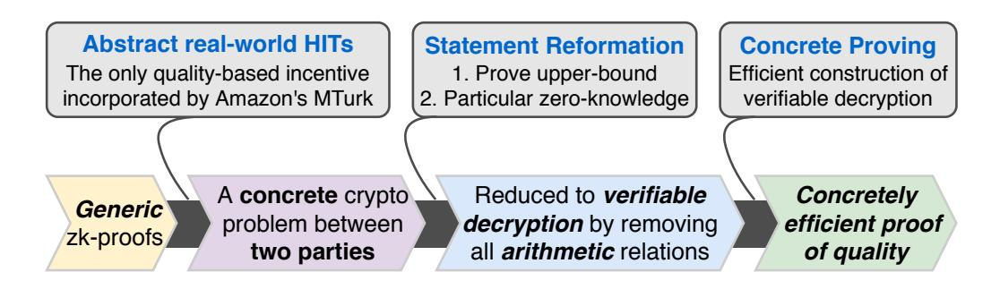
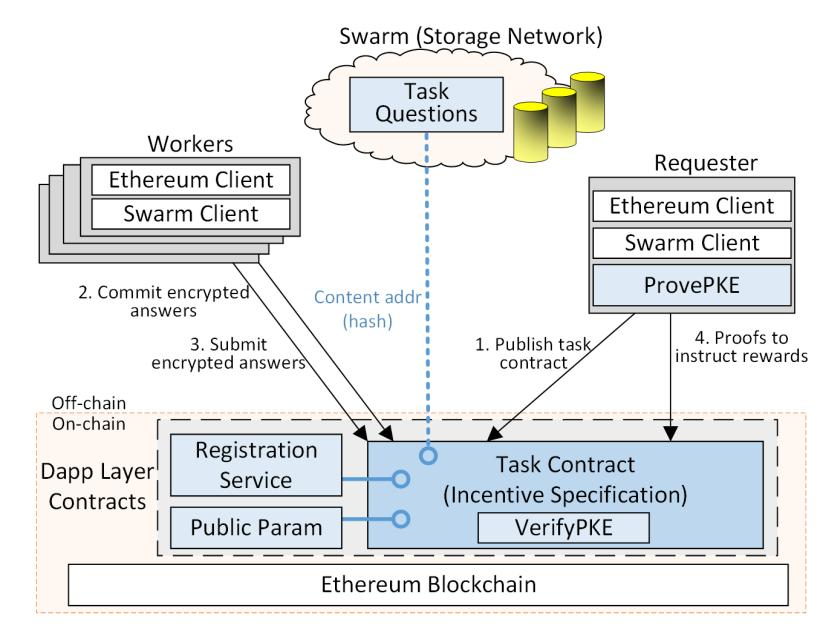

{0}------------------------------------------------

# Dragoon: Private Decentralized HITs Made Practical

Yuan Lu<sup>1</sup> , Qiang Tang1,<sup>2</sup> , Guiling Wang<sup>1</sup> <sup>1</sup>New Jersey Institute of Technology, <sup>2</sup> JDD-NJIT-ISCAS Joint Blockchain Lab Email: {yl768, qiang, gwang}@njit.edu

*Abstract*—With the rapid popularity of blockchain, decentralized human intelligence tasks (HITs) are proposed to crowdsource human knowledge without relying on vulnerable third-party platforms. However, the inherent limits of blockchain cause decentralized HITs to face a few "new" challenges. For example, the confidentiality of solicited data turns out to be the *sine qua non*, though it was an arguably dispensable property in the centralized setting. To ensure the "new" requirement of data privacy, existing decentralized HITs use generic zero-knowledge proof frameworks (e.g., SNARK), but scarcely perform well in practice, due to the inherently expensive cost of generality.

We present a *practical* decentralized protocol for HITs, which also achieves the *fairness* between requesters and workers. At the core of our contributions, we avoid the powerful yet highlycostly *generic* zk-proof tools and propose a special-purpose scheme to prove the quality of encrypted data. By various nontrivial statement reformations, proving the quality of encrypted data is reduced to efficient verifiable decryption, thus making decentralized HITs practical. Along the way, we rigorously define the ideal functionality of decentralized HITs and then prove the security due to the ideal/real paradigm.

We further instantiate our protocol to implement a system called Dragoon<sup>1</sup> , an instance of which is deployed atop Ethereum to facilitate an image annotation task used by ImageNet. Our evaluations demonstrate its practicality: the on-chain handling cost of Dragoon is even less than the handling fee of Amazon's Mechanical Turk for the same ImageNet HIT.

# I. INTRODUCTION

Crowdsourcing empowers open collaborations over the Internet. A remarkable case is to gather knowledge through human intelligence tasks (HITs). In HITs, a *requester* specifies a few questions which some *workers* can answer, such that the requester obtains answers and the workers get paid. Since HITs were firstly minted in Amazon's MTurk [1], they have been widely adopted, e.g., to build training datasets for machine learning [2–4]. In particular, ImageNet [5], an impactful deep learning benchmark, was created through thousands of HITs and laid stepping stones for the deep learning paradigm.

Nevertheless, both academia and industry [6–15] realize the broader adoption of HITs is severely impeded in practice, as a result of the serious security concerns of *free-riding* and *false-reporting*: (i) on the one hand, HITs suffer from lowquality answers, as misconducting workers or even bots would try to reap rewards without making real efforts [7, 8]; (ii) on the other hand, quite many requesters in the wild arbitrarily reject answers in order to collect data without paying [14]

This paper will appear in the 40th International Conference on Distributed Computing Systems (ICDCS 2020) with minor differences.

1 In German history, a dragoon was a lancer that was particularly light and firearmed. As an analog, Dragoon is a super lightweight and highly robust system that enables the modern freelancers to enjoy decentralized HITs.

through manipulating some real-world guidelines set forth for the requester to reject low-quality answers [9–11].

Free-riding and false-reporting become the major obstacles to the broader adoption of HITs participated by mutually distrustful users [14], and therefore raise a basic requirement of fairness in HITs, namely, the requester pays a worker, iff the worker puts forth a qualified answer. Many studies [6–12] characterize the purpose and then design proper incentives and payment policies for the needed fairness.

Notwithstanding, most traditional solutions to fairness [6– 12] fully trust in a de facto *centralized* third-party platform to enforce the payment policies for the basic fairness requirement in HITs. Unfortunately, putting trust in a single party turns out to be *vulnerable* and *elusive* in practice, as a reflection of tremendous compromises, outages and misfeasance of realworld crowdsourcing platforms [14–16]. For instance, one of the most popular crowdsourcing platform, MTurk, allows corrupted requesters to reap data without paying [14, 15]. Worse still, all well-known weaknesses of overtrusted third-parties, such as single-point failure [16] and tremendous privacy leakage [17] remain as serious vulnerabilities in the special case of crowdsourcing. Let alone the third-party platforms impose expensive handling charges. For example, MTurk charges a handling fee up to 45% of overall incentives [18].

New challenges in decentralization. Recognizing those drawbacks of centralized crowdsourcing, recent attempts [19, 20] initiated the *decentralized* crowdsourcing through the newly emerged blockchain<sup>2</sup> technology. Their aim is to "simulate" a virtual platform that is trustable to enforce the payment policies, thus removing the vulnerable centralized platforms.

However, as shown in the seminal studies on the blockchain [21, 22], decentralization through the blockchain also brings forth a few "new" security challenges, which can render the incentive mechanisms of HITs completely ineffective [19].

*Privacy as a basic requirement*. In particular, due to the transparency of blockchain [21, 22], once some answers are submitted, any malicious worker can simply copy and resubmit them to earn rewards without making any real efforts, which immediately allows free-riding and cracks the basic fairness of HITs. Namely, the transparent blockchain presents all workers a new option: running a simple automated script to "copy-and-paste" other answers submitted to the blockchain, which was infeasible in previous centralized systems. Having the new option of free-riding, rational workers might wait

<sup>2</sup>Remark that through the paper, blockchain refers to permissionless blockchain (e.g. Ethereum mainnet) that is open to any Internet node.

{1}------------------------------------------------

to copy instead of conducting any efforts. Sorta "tragedy of the commons" could occur, and eventually no one would respond with independent answers [23–26]. That said, the straightforwardly decentralized crowdsourcing could lose all basic utilities and fail to gather anything meaningful!

Therefore, to make the decentralized crowdsourcing systems function as desired, privacy becomes an *indispensable* requirement instead of an advanced bonus property.

State-of-the-art & open problem. To overcome blockchain's inherent limits, prior art [19] proposes the general outsourcethen-prove framework for *private* decentralized HITs. It enables the requester to prove the quality of answers that are encrypted to her, without revealing the actual answers. Such a proof becomes the crux to ensure privacy and simultaneously deters false-reporting and free-riding. In addition, the feasibility challenge sprouts up as the blockchain needs to verify the proof, which means the proof size and verification cost must be small enough to meet the limited on-chain resources.

For above reasons, prior work relies on some *generic* zeroknowledge proof (zk-proof) framework that is succinct in proof size and efficient for verifying, in particular SNARK<sup>3</sup> [29–31] to reduce the on-chain verification cost.

Nonetheless, generic zk-proofs such as SNARK inevitably inherit low performance for the convenience of achieving generality, causing that prior private decentralized HITs suffer from an unbearable off-chain proving cost and a still significant on-chain verifying expense:

- *Infeasible proving* (off-chain). The proving of *generic* zkproofs (e.g., SNARK) seems inherently complex, due to the burdensome NP-reduction for generality. In particular, prior study [32] reported 56 GB memory and 2 hours are needed to prove whether an encrypted answer coincides with the majority of all encrypted submissions at a very small scale, e.g., at most eleven answers. Such a performance prevents the previous protocol from being usable by any normal requesters using regular PCs.
- *Costly verification* (on-chain). Existing blockchains (e.g. Ethereum) are feasible to verify only few types of *generic* zk-proofs such as SNARK, whose verification need to compute a dozen of expensive pairings over elliptic curve [29–31]. So the on-chain verification of these zk-proofs is not only computationally costly, but also financially expensive. Currently in Ethereum, 12 pairings already spend ∼500k gas [33], and verifying a SNARK proof costs even more (about half US dollar).

Given the insufficiencies of the state-of-the-art, the following critical problem remains open:

*How to design a practical private decentralized HITs protocol for crowdsourcing human knowledge?*

<sup>3</sup>Remark that though the rise of Intel SGX becomes a seemingly enticing alternative of SNARK to go beyond many limits of blockchain by remote attestations [27], unfortunately, recent Foreshadow attacks [28] allow the adversary to forge "attestations" by stealing the attestation key hardcoded in any SGX Enclave, which seriously challenges the already heavy assumption of "trusted" hardware, and makes it even more illusive to trust SGX in practice. Our contributions. To answer the above unresolved problem, we present a *practical* private decentralized HITs protocol for the major tasks of crowdsourcing human knowledge. In sum, our core technical contributions are three-fold:

- To achieve practical private decentralized HITs, we explore various non-trivial optimizations to avoid the cumbersome generic-purpose zk-proof framework, and reduce the protocol to the specific verifiable decryption. As such, we attain concrete improvements by orders of magnitude, regarding both the proving and verification:
  - For proving, our approach is *two orders of magnitude* better than generic zk-proof.<sup>4</sup> For the same HIT, the proving in our protocol costs 50 MB memory and 10 msec, while the generic proof costs 10 GB and 2 min.
  - For verifying, our result improves upon the generic solution by *nearly an order of magnitude*. The on-chain cost of verifying a proof for the quality of an answer to 106 batched binary questions is reduced to ∼180k gas in Ethereum (much smaller than verifying SNARK proofs) and typically few US cents.
- We further implement our protocol to instantiate a *practical* private decentralized crowdsourcing system Dragoon, the handling cost of which could be even less than the existing centralized platforms such as MTurk.
  - Dragoon is launched atop Ethereum to conduct a typical HIT adopted by ImageNet [12] to solicit large-scale image annotations. To handle the task, Dragoon attains an on-chain (handling) cost ∼\$2 US dollars at the time of writing. In comparison, for the same task, the handling fee of MTurk is at least \$4 currently [18, 34].
  - Our result provides an insight that the on-chain *handling fee* (characterizing the users' financial expense) in the decentralized setting can approximate or even less than the handling fee charged by centralized platforms. This indicates the *de facto* users can financially benefit from decentralization, though it is not contradictory to the common belief [35] that decentralization is more expensive w.r.t. the overall computational cost of the system.
- Along the way, we firstly formulate the ideal functionality of decentralized HITs. The rigorous security model clearly defines what a HIT shall be and allows us to use the simulation-based paradigm to prove security against subtle adversaries in the blockchain.
  - In contrast, existing decentralized HITs [19, 32] have quite different property-based definitions on "securities", which at least makes the lack of well-defined benchmark to compare them. Even worse, many of them are "flawed", as failing to capture all respects of the subtle adversary in the blockchain; for example, they allow the corrupted requester to reap data without paying, if being given the standard ability of adversarially re-ordering message deliveries, while our approach precisely defines the security requirement against this subtle attack.

<sup>4</sup>Generic zk-proof refers zk-SNARK in our context, since the only generic zk-proof that can be feasibly supported by existing blockchains is zk-SNARK.

{2}------------------------------------------------

Challenge & our techniques. The major challenge of making *private* decentralized HITs practical is that the blockchain must learn the quality of some encrypted answers, namely, to obtain some properties of what a few ciphertext are encrypting. The state-of-the-art [19, 32] proposed to reduce the problem to generic zk-proofs, by observing the requester can decrypt the answers, and then prove the quality of answers to the blockchain. But this generic approach incurs impractical expenses inherently, because of the underlying heavyweight NP-reduction for generality.

To conquer the above challenge, we follow a different path that deviates from generic zk-proofs to explore a concretely efficient solution. At the core of our *private* decentralized HITs protocol, we design a special-purpose non-interactive proof scheme to efficiently attest the quality of encrypted answers, which removes heavyweight general-purpose zk-proofs and then avoids the inefficiency of generality.



Fig. 1. The path to realizing efficient proofs for encrypted answers' quality.

The ideas behind our efficient proving scheme are a variety of special-purpose optimizations to squeeze performance by removing needless generality, such that we reduce the problem of proving encrypted answers' quality from generic-purpose zk-proof to particular verifiable decryption. As shown in Fig 1, our core ideas are highlighted as:

- *Abstracting real-world HITs*. The first step is to well formulate an incentive mechanism widely adopted by real-world HITs, namely, the *only* one incorporated by Amazon's MTurk [10]. Some golden standard challenges (i.e., questions with known answers) [7] are mixed with other questions, so the quality of a worker is determined by her performance on the golden standards.<sup>5</sup>
  - We rigorously define the problem of proving the quality of encrypted answers for the above incentive mechanism. So proving the quality of a worker is reducible to a well-defined two-party problem: where the verifier needs to output the performance of the worker on a set of golden standard questions, given only a set of ciphertext answering these golden standards challenges.

Nevertheless, solving this two-party problem is still challenging, as it needs to compute the property of what a set of ciphertext are encrypting. The generic version of the issue falls into multi-input functional encryption [36, 37], which is well known for its hardness and has no (nearly)

- practical solution so far. We thus conduct the following optimizations to further reduce the problem.
- *Statement reformation*. The main obstacle of removing the generic-purpose zk-proof framework is the arithmetic relations (i.e., some relationship unrepresentable in the algebraic domain). So we dedicatedly reform the statement of proving the quality of encrypted answers mainly in two ways to remove all arithmetic relations.
  - First, we let the requester to prove the upper bound of each worker's quality instead of proving the exact number, which is a relaxation to the general cases, but does not abandon any utility, since this property is enough to prevent any corrupted requester from paying less than what a worker deserves in our context where the reward is an increasing function of quality. Second, we realize that given the system's public knowledge, a tiny and constant portion of each worker's answer (i.e., the part answering gold standards) is already leaked, since this little portion is simulatable by the public knowledge; thus we can explicitly reveal these "already-leaked" information.
  - The above reformations allow us to reduce the problem of proving the quality of encrypted answers to standard verifiable encryption without sacrificing securities/utilities.
- *Concretely efficient proving scheme*. Following the above optimizations, the problem eventually is reduced to verifiable encryption, which becomes representable in concrete algebraic relations. Along the way, we present a certain variant of verifiable decryption that is concretely tailored for the scenario of HITs where the plaintexts are short, and thus squeeze most performance out of it and boost private decentralized HITs practically.

# II. OTHER RELATED WORK

Besides the existing private decentralized HITs [19, 32] discussed earlier, here we briefly review some pertinent generic cryptographic frameworks and discuss their insufficiencies in the concrete context of private decentralized crowdsourcing.

Privacy-preserving blockchain. A variety of studies [22, 38, 39] consider the general framework for privacy-preserving blockchain and smart contract. The approaches are powerful in the sense of their generality, yet are expensive for concrete usecases in practice. For example, Hawk [22] leverages generic zk-proofs to keep blockchain private, but incurs expensive proving expenses. As such, it is unclear how to leverage these generic frameworks to design concretely efficient protocol for the special-purpose of crowdsourcing [19].

Fair MPC using blockchain. Decentralized crowdsourcing is a special-purpose fair MPC using blockchain. Kiayias, Zhou and Zikas [21] consider the generic version of fair MPC in the presence of blockchain, but it is unclear how to adopt their generic protocol in practice without expensively computational costs. Recently, increasing interests focus on special-purpose variants of fair MPC in aid of blockchain. For example, [40– 42] consider poker games. But these special-purpose solutions are over-tuned for distinct scenarios and are unclear how to be used for private decentralized crowdsourcing.

<sup>5</sup>This concrete incentive turns to be powerful, say it can capture most HITs in Amazon's MTurk (c.f., the official tutorial [10]) and also adopted by the impactful ImageNet [12] to create large-scale deep learning benchmark.

{3}------------------------------------------------

Multi-input functional encryption. The core problem of private decentralized crowdsourcing is to let the blockchain learn the quality of encrypted answers, which is straightforwardly reducible to multi-input functional encryption (MIFE) [36]. But MIFE relies on indistinguishability obfuscation [36] or multi-linear maps [37] that are not only far away from being practical but also still unclear how to be instantiated from the standard cryptographic assumptions.

#### III. PRELIMINARIES

Here we briefly review some relevant cryptographic notions. Following convention, we let  $\stackrel{\$}{\leftarrow}$  to denote uniformly sampling and  $\approx_c$  to denote *computationally indistinguishable*.

Cryptocurrency ledger. The cryptocurrency maintained atop the blockchain instantiates a global bookkeeping ledger (e.g. denoted by  $\mathcal{L}$ ) to deal with "coin" transfers, transparently. It can be called out by an ideal functionality (i.e., a standard model of so-called smart contract [21, 22]) as a subroutine to assist conditional payments. Formally, cryptocurrency  $\mathcal{L}$  can be seen as an ideal functionality interacting with a set of parties  $\mathcal{P} = \{\mathcal{P}_i\}$  and the adversary; it stores the balance  $b_i$  for each  $\mathcal{P}_i \in \mathcal{P}$ , and handles the following oracle queries [22, 43]:

- FreezeCoins. On input (freeze,  $\mathcal{P}_i$ , b) from an ideal functionality  $\mathcal{F}$  (i.e. a smart contract), check whether  $b_i \geq b$  and proceed as follows: if the check holds, let  $b_i = b_i b$  and  $b_{\mathcal{F}} = b_{\mathcal{F}} + b$ , send (frozen,  $\mathcal{F}, \mathcal{P}_i, b$ ) to every entity; otherwise, reply with (nofund,  $\mathcal{P}_i, b$ ).
- PayCoins. On input (pay,  $\mathcal{P}_i$ , b) from an ideal functionality  $\mathcal{F}$  (i.e. a smart contract), check whether  $b_{\mathcal{F}} \geq b$  and proceed as follows: if that is the case, let  $b_i = b_i + b$  and  $b_{\mathcal{F}} = b_{\mathcal{F}} b$ , send (paid,  $\mathcal{F}$ ,  $\mathcal{P}_i$ , b) to every entity.

Commitment. The commitment scheme is a two-phase protocol between a sender and a receiver. In the commit phase, a sender "hides" a string msg behind a string comm with using a blinding key, namely, the sender transmits comm = Commit(msg, key) to the receiver. In the reveal phase, the receiver gets key and msg as opening for comm, and executes Open(comm, msg', key') to output 0 (reject) or (1) accept. Through the paper, we consider *computational hiding* and *computational binding*. The former one requires the commitments of two strings are computationally indistinguishable. The latter one means the receiver would not accept an opening to reveal  $msg' \neq msg$ , except with negligible probability.

**Decisional Diffie-Hellman (DDH).** DDH problem is to tell that d = ab or  $d \stackrel{\$}{\leftarrow} \mathbb{Z}_p$ , given  $(g, g^a, g^b, g^d)$  where  $a, b \stackrel{\$}{\leftarrow} \mathbb{Z}_p$  and g is a generator of a cyclic group  $\mathcal G$  of order p. The DDH assumption states  $\{(g, g^a, g^b, g^d)\} \approx_c \{(g, g^a, g^b, g^{ab})\}$ . We assume DDH assumption holds along with the paper.

**Verifiable decryption.** We consider a specific verifiable public key encryption (VPKE) consisting of a tuple of algorithms (KeyGen, Enc, Dec, ProvePKE, VerifyPKE) with concrete verifiability to allow the decryptor to produce the plaintext along with a proof attesting the correct decryption [44].

In short, KeyGen can set up a pair of encryption-decryption algorithms ( $Enc_h$ ,  $Dec_k$ ), where h and k are public and private

keys respectively. We let any  $(\mathsf{Enc}_h, \mathsf{Dec}_k) \leftarrow \mathsf{KeyGen}(1^\lambda)$  to be a public key encryption scheme satisfying semantic security. For presentation simplicity, we also let  $(\mathsf{Enc}_h, \mathsf{Dec}_k)$  denote the public-secret key pair (h,k). Moreover, for any  $(h,k) \leftarrow \mathsf{KeyGen}(1^\lambda)$ , the ProvePKE $_k$  algorithm explicitly inputs the private key k and the ciphertext c, and outputs a message m with a proof  $\pi$ ; the VerifyPKE $_k$  algorithm explicitly inputs the public key k and  $(m,c,\pi)$ , and outputs 1/0 to accept/reject the statement that  $m = \mathsf{Dec}_k(c)$ . Beside, we let VPKE to satisfy the following extra properties (i.e., a specifically verifiable decryption):

- Completeness.  $\Pr[\mathsf{VerifyPKE}_h(m,c,\pi) = 1 \mid (m,\pi) \leftarrow \mathsf{ProvePKE}_k(c)] = 1$ , for  $\forall c \text{ and } (h,k) \leftarrow \mathsf{KeyGen}(1^{\lambda})$ ;
- Soundness. For any  $(h,k) \leftarrow \mathsf{KeyGen}(1^{\lambda})$  and c, any probabilistic polynomial-time (P.P.T.)  $\mathcal{A}$  cannot produce  $\pi$  fooling  $\mathsf{VerifyPKE}_h$  to accept that c is decrypted to m' if  $m' \neq \mathsf{Dec}_k(c)$ , with except negligible probability;
- Zero-knowledge. The proof  $\pi$  can be simulated by a P.P.T. simulator  $\mathcal{S}_{\mathsf{VPKE}}$ , on input only public knowledge m, h and c that indeed satisfy  $(m, c, h) \in \mathcal{L}_{\mathsf{VPKE}} := \{\vec{x} := (m, c, h) \mid m = \mathsf{Dec}_k(c) \land (h, k) \leftarrow \mathsf{KeyGen}(1^{\lambda})\}$

**Random oracle.** We treat the cryptographic hash function as a global and programmable random oracle [45] and denote the hash function with  $\mathcal{H}$  through the paper.

Simulation-based paradigm. To formalize and prove security, a real world and an ideal world can be defined and compared: (i) in the real world, there is an actual protocol  $\Pi$  among the parties, some of which can be corrupted by an adversary  $\mathcal{A}$ ; (ii) in the ideal world, an "imaginary" trusted ideal functionality  $\mathcal{F}$  replaces the protocol and interacts with honest parties and a simulator  $\mathcal{S}$ . We say that  $\Pi$  securely realizes  $\mathcal{F}$ , if for  $\forall$  P.P.T. adversary  $\mathcal{A}$  in the real-world,  $\exists$  a P.P.T. simulator  $\mathcal{S}$  in the ideal-world, s.t. the two worlds cannot be distinguished, which means: no P.P.T. distinguisher  $\mathcal{D}$  can attain non-negligible advantage to distinguish "the joint distribution over the outputs of honest parties and the adversary  $\mathcal{A}$  in the real world" from "the joint distribution over the outputs of honest parties and the simulator  $\mathcal{S}$  in the ideal world".

Moreover, we consider the static adversary who can corrupt some parties before the protocol starts. The advantage of simulation-based paradigm is that all desired behaviors of the protocol can be precisely described by the ideal functionality. Remarkably, this approach has been widely adopted to analyze decentralized protocols [21, 22, 40] to capture the subtle adversary in the blockchain.

# IV. FORMALIZATION OF DECENTRALIZED HUMAN INTELLIGENT TASKS

This section rigorously defines our security model, by giving the ideal functionality of <u>H</u>uman <u>Intelligent Tasks</u> (HITs) that captures the security/utility requirements of the state-of-the-art HITs in reality [2–15]. Our security modeling sets forth a clear security goal, that is: the HITs in the real world shall be as "secure" as the HITs in an admissible ideal world.

{4}------------------------------------------------

Reviewing the HITs in reality. Let us briefly review the HITs adopted in reality [2–15], before presenting our abstraction of their ideal functionality.

<u>Parties & process flow</u>. There are two explicit roles in a HIT, i.e., the requester and some workers.<sup>6</sup> The requester, uniquely identified by  $\mathcal{R}$ , can post a task  $\mathcal{T}$  to collect a certain amount of answers. In the task,  $\mathcal{R}$  also promises a concrete reward policy. The worker with a unique identifier  $\mathcal{W}_j$ , submits his answer  $a_j$  to expect receive the reward.

<u>Task design</u>. A HIT consists of a sequence of questions denoted by  $\mathcal{T} = (q_1, \cdots, q_N)$ , where each  $q_i$  is a multiple choice question and N is the number of questions in the task. The answer of each question must lay in a particular range  $\subset \mathbb{N} \cup 0$  pre-specified when  $\mathcal{T}$  is published.

The above HIT design is based on batched choice questions, which follows real-world practices [2–15] to remove ambiguity, thus letting workers precisely understand the task. For example, Fei-fei Li *et al.* [2, 12, 47] used the technique to create the deep learning benchmark ImageNet, and Andrew Ng *et al.* [3] suggested it for language annotations.

Answer quality. The quality of an answer is induced by a function Quality  $(a_j; sp)$ , where  $a_j = (a_{(1,j)}, \cdots, a_{(N,j)})$  is the answer submitted by worker  $\mathcal{W}_j$ , and sp is some secret parameters of requester. The output of Quality  $(\cdot)$  is denoted by  $\chi_j$ , which is said to be the quality of worker  $\mathcal{W}_j$ .

The above abstraction captures the quality-based incentive mechanism adopted by real-world HITs in Amazon's MTurk [10–13]. For example, a task  $\mathcal{T}$  consists of N questions, out of which M questions are golden-standard questions that are "secretly" mixed. The *quality* of a worker can be computed, due to her accuracy in the M golden-standard questions.

Formally, in the qualify function Quality  $(a_j; sp)$ , the parameter  $sp = (G, G_S)$ , where  $G \subsetneq [1, N]$  represents the randomly chosen indexes of the golden-standard questions, and  $G_S = \{s_i | s_i \in \text{range}\}_{i \in G}$  represents the known answers of the golden-standard questions. Following the real-world practices [10–13], the quality of an answer  $a_j = (a_{(1,j)}, \cdots, a_{(N,j)})$  is:

$$\mathsf{Quality}(\boldsymbol{a}_j,(G,G_S)) = \sum_{i \in G} [a_{(i,j)} \equiv s_i]$$

where  $[\cdot]$  is Iverson bracket to convert any logic proposition to 1 if the proposition is true and 0 otherwise.

**Defining the decentralized HITs' functionality.** Now we are ready to present our security notion of HITs in the presence of cryptocurrency. We formalize the ideal functionality of HITs (denoted by  $\mathcal{F}_{hit}$ ) in the  $\mathcal{L}$ -hybrid model as shown in Fig 2. Intuitively,  $\mathcal{F}_{hit}^{\mathcal{L}}$  abstracts a special-purpose multi-party secure

<sup>6</sup>There is an implicit registration authority (RA), who is required by real-world crowdsourcing platforms e.g. MTurk to prevent adversary forging a large number of identities (a.k.a. Sybil attackers). In practice, RAs can be instantiated by (i) the platform itself (e.g., MTurk), and (ii) the certificate authority who provides authentication service. Our solution can inherit these established RAs, and we therefore omits such the implicit RAs, with assuming all identities are granted. If the participants are interested in anonymity, anonymous-yet-accountable authentication scheme [19, 46] can be used; however, those are orthogonal techniques out scope of this paper.

# The ideal functionality of HIT $\mathcal{F}_{hit}^{\mathcal{L}}$

Given accesses to oracle  $\mathcal{L}$ , the functionality  $\mathcal{F}_{hit}^{\mathcal{L}}$  interacts with a requester  $\mathcal{R}$ , a set of workers  $\{\mathcal{W}_i\}$  and adversary  $\mathcal{S}$ .

#### \_ Phase 1: Publish Task

- Upon receiving (publish, N, B, K, range,  $\Theta, G, G_S$ ) from  $\mathcal{R}$ , leak (publishing,  $\mathcal{R}, N, B, K$ , range,  $\Theta, |G|, |G_S|$ ) to  $\mathcal{S}$ , until the beginning of next clock period, proceed with the following delayed executions:
  - send (freeze,  $\mathcal{P}_i$ ,  $\Breve{B}$ ) to  $\Line{\mathcal{L}}$ , if return (frozen,  $\Line{\mathcal{F}}_{hit}^{\Line{\mathcal{L}}}$ ,  $\Breve{B}$ ):
    - \* store N,  $\beta$ , K, Range,  $\bar{\chi}$  and sp as internal states;
    - \* initialize answers  $\leftarrow \emptyset$ , and goto next phase;

#### Phase 2: Collect Answers

- Upon receiving (answer,  $a_j$ ) from  $W_j$ , leak the message (answering,  $W_j$ ,  $|a_j|$ ) to S, till receiving (approved) from S, continue with the delayed executions down below:
  - if  $(\mathcal{W}_i, \cdot) \in$  answers, do nothing;
  - else, answers  $\leftarrow$  answers  $\cup (\mathcal{W}_j, \boldsymbol{a}_j)$ , send answers to  $\mathcal{R}$ , leak  $(\mathcal{W}_j, |\boldsymbol{a}_j|)$  to  $\mathcal{S}$ , go to phase 3 if |answers| = K.

#### \_ Phase 3: Evaluate Answers \_

- Upon entering this phase, leak all received messages to S, until the beginning of next clock period, proceed to run the following delayed executions for each  $W_j \in \{W_j \mid (W_j, \cdot) \in \text{answers}\}$ :
  - if receiving (evaluate,  $W_j$ ) from  $\mathcal{R}$ , proceed as:
    - \* check whether Quality $(a_j, (G, G_S)) \geq \Theta$ , if that is the case, send  $(pay, W_j, B/K)$  to  $\mathcal{L}$ , and leak (evaluated,  $W_i, G, G_S$ ) to all entities including  $\mathcal{S}$ ;
  - if receiving (outrange,  $W_j$ , i) from  $\mathcal{R}$ , proceed as:
    - \* if  $a_{(i,j)} \notin \text{range}$ , leak (outranged,  $\mathcal{W}_j, a_{(i,j)}$ ) to all entities, otherwise send (pay,  $\mathcal{W}_i, \beta/K$ ) to  $\mathcal{L}$ .
  - else, no message from R was received, proceed as:
    - \* if  $a_j \neq \bot$ , send (pay,  $W_j$ ,  $B \mid K$ ) to  $\mathcal{L}$ .

Fig. 2. The (stateful) ideal functionality of coin-aided HIT  $\mathcal{F}_{hit}^{\mathcal{L}}$ . The blue text shows  $\mathcal{F}_{hit}^{\mathcal{L}}$  is proceeding synchronously as the adversary can delay message deliveries up to next clock period [21, 22]; the brown text means that  $\mathcal{F}_{hit}^{\mathcal{L}}$  has to proceed asynchronously as if the adversary can arbitrarily delay messages.

computation, in which: (i) a requester recruits K workers to crowdsource some knowledge, and (ii) each worker gets a payment of B/K from the requester, if submitting an answer meeting the minimal quality standard  $\Theta$ .

In greater detail, the ideal functionality  $\mathcal{F}_{hit}$  of HITs immediately implies the following security properties:

• Fairness. Our ideal functionality captures a strong notion of fairness, that means: the worker get paid, if and only if s/he puts forth a qualified answer (instead of copying and pasting somewhere else). In greater detail, the requester specifies a sequence of N multi-choice questions, which are multi-choice questions having some options in range and contain |G| gold-standard challenges. For each worker, s/he has to (i) meet a pre-specified quality standard  $\Theta$  and (ii) submit answers in the range of options, in order to receive the pre-defined payment B/K.

 $<sup>^{7}</sup>$ We explicitly consider that |G| and range are small constant in the HITs ideal functionality. Such modeling follows real-world practices [2–15]. In particular, |range| is a small constant in practice, because it represents few options of each multi-choice question in HIT; and |G| is also a small constant, as it represents few gold-standard challenges in a HIT task.

{5}------------------------------------------------

- *Audibility of gold-standards*. The choice of golden standards is up to the requester, so it becomes a realistic worry that a malicious requester uses some bogus as the answers of golden standard questions. The ideal functionality aims to abstract the best prior art [14, 15] regarding this issue so far, that means the golden standards become public auditable once the HIT is done. This abstraction "simulates" the ad-hoc reputation systems maintained by the MTurk workers to grade the reputations of the MTurk requesters in reality [14, 15].
- *Confidentiality*. It means any worker cannot learn the advantage information during the course of protocol execution. Without the property, workers can copy and paste to free ride, so it is a minimal requirement to ensure the usefulness of decentralized HITs. Our ideal functionality naturally captures the property.

Adversary. We consider probabilistic polynomial-time adversary in the real world. It can corrupt the requester and/or some workers statically, before the real-world protocol begins. The uncorrupted parties are said to be honest. Following the standard blockchain model [21, 22], we also abstract the ability of the real-world adversary to control the communication (between the blockchain and honest parties) as: (i) it follows the synchrony assumption [22, 48], namely, we let there is a global clock [22, 48], and the adversary can delay any messages sent to the blockchain up to a-priori known time (w.l.o.g., up to the next clock); (ii) the adversary can manipulate the order of so-far-undelivered messages sent to the blockchain, which is known as the "rushing" adversary.

Expressivity of HITs' ideal functionality. The ideal functionality Fhit not only captures the elegant state-of-the-art of collecting image/language/video annotations [2–4, 11–13, 47] but also reflects the common scenario of crowdsourcing human knowledge. Consider the next example: Alice is running a small startup, and aims to provide a service to visualize the availabilities of street parkings. Unfortunately, at each moment, Alice only knows the availabilities of street parkings at quite few spots, since she cannot afford the cost of monitoring every corner around the city. The little a-priori knowledge of Alice is her "golden standards", and such information is too little to boost a useful service. So Alice can crowdsource more street parking information from a few workers, with using her few golden standards to control the quality of solicited data.

In light of the above discussion, it is fair to say that our abstraction is expressive to capture most real-world practices of crowdsourcing human knowledge (e.g. HITs in MTurk).

# V. HITS PROTOCOL AND SECURITY ANALYSIS

This section elaborates our practical protocol for decentralized HITs. We begin with an important building block for proving the quality of encrypted answers. Then we showcase the smart contract functionality Chit that interacts with the workers and the requester. Later, the detailed protocol is given in the presence of Chit. We finally prove that our protocol securely realizes the ideal functionality Fhit of HITs.

*A. Proof of quality of encrypted answer (*PoQoEA*)*

The core building block of our novel decentralized protocol is to allow the requester *efficiently prove the quality of encrypted answers*. We formally define this concrete purpose to set forth the notion of PoQoEA, and then present an efficient reduction from it to verifiable decryption (VPKE).

Defining PoQoEA. The problem we are addressing here is to prove that: an encrypted answer c<sup>j</sup> can be decrypted to obtain some a<sup>j</sup> s.t. the quality of a<sup>j</sup> is χ, without leaking anything other than c<sup>j</sup> , χ and the parameters of quality function.

To capture the problem, the state-of-the-art [19, 22] adopts the standard notion of zk-proof in order to support generic quality measurements. Different from existing solutions, we particularly tailor the notion of zk-proof to obtain a fine-tuned notion of PoQoEA for the widely adopted quality function defined in §IV. Namely, we consider Quality(· ; G, Gs) where G is the index of gold-standards and G<sup>s</sup> = {si}i∈<sup>G</sup> is the ground truth of golden standards, and aim to remove the unnecessary generality in the concrete setting.

Precisely, given the quality function Quality(· ; G, Gs) and any established public key encryption scheme (Ench, Deck) ← KeyGen(1<sup>λ</sup> ), we can define PoQoEA as a tuple of hereunder algorithms (ProveQuality<sup>k</sup> , VerifyQuality<sup>h</sup> ):

- 1) ProveQuality<sup>k</sup> (c<sup>j</sup> , χ, G, Gs) → π. Given the encrypted answer c<sup>j</sup> = (c1,j , . . . , cN,j ), the quality χ, and the golden standards (G, Gs), it outputs a proof π attesting χ is the quality of c<sup>j</sup> ; the algorithm explicitly takes the secret decryption key k as input;
- 2) VerifyQuality<sup>h</sup> (c<sup>j</sup> , χ, π, G, Gs) → 0/1. It outputs 0 (reject) or 1 (accept), according to whether π is a valid proof attesting χ is the actual quality of c<sup>j</sup> ; the algorithm explicitly takes the public encryption key h as input;

Moreover, PoQoEA shall satisfy the following properties:

- *Completeness*. PoQoEA is complete, if for any G, Gs, c<sup>j</sup> , χ and (Ench, Deck) s.t. χ = Quality(Deck(c<sup>j</sup> ); G, Gs), there is Pr[VerifyQuality<sup>h</sup> (c<sup>j</sup> , χ, π, G, Gs) = 1 | π ← ProveQuality<sup>k</sup> (c<sup>j</sup> , χ, G, Gs)] = 1;
- *"Upper-bound" soundness*. PoQoEA is upper-bound sound, if for any G, Gs, c<sup>j</sup> , χ and (Ench, Deck), for ∀ P.P.T. A, there is Pr[VerifyQuality<sup>h</sup> (c<sup>j</sup> , χ, π<sup>0</sup> , G, Gs) = 1 ∧ χ < Quality(a<sup>j</sup> ; G, Gs) ∧ a<sup>j</sup> = Deck(c<sup>j</sup> ) | π <sup>0</sup> ← A(G, Gs, χ, c<sup>j</sup> , λ, Ench, Deck)] ≤ negl(λ), where negl(λ) is a negligible function in λ; so it is computationally infeasible to produce a valid proof, if χ is not the upper bound of the quality of what c<sup>j</sup> is encrypting;
- *"Special" zero-knowledge*. Conditioned on |G| and the range of elements in G<sup>s</sup> are small constants, for any G, Gs, c<sup>j</sup> , χ and (Deck, Ench), ∃ a P.P.T. simulator S that can simulate the communication scripts of PoQoEA protocol on input only h, G, Gs, c<sup>j</sup> , and χ.

Rationale behind the finely-tuned abstraction. The notion of PoQoEA is defined to remove needless generality in the special case of HITs. Compared to the state-of-the-art notion [19], PoQoEA is more promising to be efficiently constructed, as it brings the following definitional advantages:

{6}------------------------------------------------

- We adopt "upper-bound" soundness to ensure that any probably corrupted requester cannot forge the upper bound of quality of each worker. Such the tuning stems from a basic fact that: the reward of a worker is an increasing function in quality, so the upper bound of the worker's quality at least reflects the well-deserved reward of the worker. As a result, any cheating requester has to pay at least as much as the honest requester.
- Another major difference is the relaxed *special zero-knowledge*: PoQoEA is zero-knowledge, only if |G| and range are small constants, so anything simulatable by the gold standards can be leaked. Nevertheless, the conditions are prevalent in the special context of HITs [2–15]. Recall that G represents the few golden standard questions, and range means the few options of each question in HITs, indicating that both are small constants in reality.

In sum, even though PoQoEA is seemingly over-tuned, it essentially coincides with the generic zk-proof of the quality of encrypted answers in the context of HITs.

Construction and security analysis. Here is an efficiency-driven way to constructing PoQoEA for the quality function Quality( $a_j$ ; G,  $G_s$ ) that was defined in §IV. We can reduce the problem to the standard notion of verifiable decryption. More precisely, given the established VPKE scheme (Enc<sub>h</sub>, Dec<sub>k</sub>, ProvePKE<sub>k</sub>, VerifyPKE<sub>h</sub>), PoQoEA can be constructed as illustrated in Fig 3.

```
Public knowledge \vec{x}: G, G_s = \{s_i\}_{i \in G}, \chi, \mathbf{c} = \langle c_1 \dots c_N \rangle, h
 ProveQuality(\vec{x}, k)
                                                                            VerifyQuality(\vec{x})
\pi \leftarrow \emptyset
for each i in G:
       (a_i, \pi_i) \leftarrow \mathsf{ProvePKE}_k(c)
       if a_i \neq s_i:
              \pi \leftarrow \pi \cup (i, a_i, \pi_i)
output \pi
                                                            for each (i, a_i, \pi_i) in \pi:
                                                                    if a_i \equiv s_i:
                                                                          output 0
                                                                    if \neg \mathsf{VerifyPKE}_h(a_i, c_i, \pi):
                                                                          output 0
                                                                    \chi \leftarrow \chi + 1
                                                            output 1:0? \chi \geq |G|
```

Fig. 3. The construction of PoQoEA for the quality defined in §IV.

**Lemma 1.** Given any verifiable public key encryption VPKE, the algorithm in Fig 3 satisfies the definition of PoQoEA regarding the quality function defined in §IV.

*Proof.* (sketch) The completeness is immediate from the definition of quality function, the correctness of encryption, and the completeness of VPKE. To prove the upper-bound soundness, we assume by contradiction to let an adversary break it, then the adversary can immediately break the soundness of VPKE. The special zero-knowledge is also clear: considering |G| and the range of each  $a_i$  are constants, the permutation  $\binom{|G|}{\chi}$  would be constant, indicating that there exists a P.P.T. simulator S invoking at most polynomial number of  $S_{\text{VPKE}}$  (on input  $c_i$ , h, and guessed  $a_i \in \text{range} \setminus \{s_i\}$ ) to simulate all VPKE proofs [49], thus simulating the PoQoEA proof.

# The HITs contract functionality $\mathscr{C}^{\mathcal{L}}_{hit}$

Given accesses to  $\mathcal{L}$ ,  $\mathscr{C}_{hit}$  interacts with  $\mathcal{R}$ ,  $\{\mathcal{W}_j\}$ , and  $\mathcal{A}$ .

Phase 1: Publish Task

- Upon receiving (publish, N, B, K, range,  $\Theta$ , h, comm $_{gs}$ ) from  $\mathcal{R}$ , leak the message and  $\mathcal{R}$  to  $\mathcal{A}$ , until the beginning of next clock, proceed with the delayed executions down below:
  - send (freeze,  $\mathcal{P}_i$ ,  $\Breve{B}$ ) to  $\Line{\mathcal{L}}$ , if returns (frozen,  $\Line{\mathcal{F}}_{hit}^{\Line{\mathcal{L}}}$ ,  $\Breve{B}$ ):
    - \* store N,  $\beta$ , K, range,  $\Theta$ , h and comm<sub>gs</sub>
    - \* initialize answers  $\leftarrow \emptyset$ , comms  $\leftarrow \emptyset$
    - \* send (published,  $\mathcal{R}, N, \mathcal{B}, K$ , range,  $\Theta, h$ , comm $_{gs}$ ) to all entities, and goto phase 2-a

#### Phase 2-a: Collect Answers (Commit phase)

- Upon receiving (commit, comm<sub> $c_j$ </sub>) from  $W_j$ , leak the message and  $W_j$  to A, then proceed with the following delayed executions until the beginning of next clock, with consulting A to re-order all received commit messages:
  - for each received commit message (sent from  $W_i$ ):
    - \* if  $(W_j, \cdot) \notin \text{comms}$  and  $(\cdot, \text{comm}_{c_j}) \notin \text{comms}$ :
    - · let comms  $\leftarrow$  comms  $\cup$  ( $W_i$ , comm<sub> $c_i$ </sub>)
    - $\cdot$  if |comms| = K, send (committed, comms) to all entities, and goto the reveal phase

#### Phase 2-b: Collect Answers (Reveal phase)

- Upon entering this phase, leak all received messages and their senders to A, till the next clock period, proceed as:
  - for each  $W_j \in \{W_j \mid (W_j, \cdot) \in \text{comms}\}$ :
    - \* if receiving the message (reveal,  $c_j$ , key<sub>j</sub>) from  $W_j$  such that  $\mathsf{Open}(\mathsf{comm}_{c_i}, c_j, \mathsf{key}_j) = 1$ :
      - · answers  $\leftarrow$  answers  $\cup$   $(\mathcal{W}_j, \boldsymbol{c}_j)$
    - \* else answers  $\leftarrow$  answers  $\cup$   $(\mathcal{W}_j, \perp)$
  - send (revealed, answers) to all, and goto the next phase

### Phase 3: Evaluate Answers

- Upon entering this phase, leak all received messages and their senders to A, till the next clock period, proceed as:
  - if receiving (golden,  $G, G_s$ ,  $\ker_{gs}$ ) from  $\mathcal{R}$ , such that  $\operatorname{Open}(\operatorname{comms}_{gs}, G||G_s, \ker_{gs}) = 1$ :
    - \* for each  $W_j \in \{W_j \mid (W_j, \cdot) \in \text{answers}\}$ :
      - · if receiving (outrange,  $\mathcal{W}_j, i, a_{(i,j)}, \pi_i$ ) from  $\mathcal{R}$ : send (pay,  $\mathcal{W}_j, \mathbf{B}/K$ ) to  $\mathcal{L}$ , if  $a_{(i,j)} \in$  range or VerifyPKE $_h(a_{(i,j)}, c_{(i,j)}, \pi_i) = 0$
      - · else if receiving (evaluate,  $\mathcal{W}_j, \chi_j, \pi$ ) from  $\mathcal{R}$ : send (pay,  $\mathcal{W}_j, \beta/K$ ) to  $\mathcal{L}$ , if  $\chi_j \geq \Theta$  or VerifyQuality<sub>h</sub>( $\mathbf{c}_j, \chi_j, \pi, G, G_s$ ) = 0
      - · else if  $c_j \neq \bot$ , send (pay,  $W_j$ , B/K) to  $\mathcal{L}$
  - otherwise, for each  $W_j \in \{W_j \mid (W_j, \cdot) \in \text{answers}\}$ , send  $(pay, W_j, B/K)$  to  $\mathcal{L}$

Fig. 4. The ideal functionality of the (stateful) HITs contract.

# B. HIT contract and HIT protocol

Now we are ready to present our concretely efficient decentralized protocol  $\Pi_{hit}$  for HIT. Our design centers around a smart contract  $\mathscr{C}^{\mathcal{L}}_{hit}$ , which is formally described in Fig 4. The contract  $\mathscr{C}^{\mathcal{L}}_{hit}$  is the crux to take best advantage of the rather limited abilities of blockchain to make our protocol securely realize the ideal functionality  $\mathcal{F}^{\mathcal{L}}_{hit}$ . Thus given contract  $\mathscr{C}^{\mathcal{L}}_{hit}$ , our HITs protocol  $\Pi_{hit}$  can be defined among the requester, the worker and the contract, as formally illustrated in Fig 5. Informally, our HIT protocol  $\Pi_{hit}$  proceeds as follows:

{7}------------------------------------------------

- 1) <u>Publish task</u>. The requester  $\mathcal{R}$  announces her public key h, and publishes a task  $\mathcal{T}$  of N multi-choice questions to crowdsource K answers for the task. Each question in  $\mathcal{T}$  is specified to have some options in range. The task mixes some golden standard questions, whose indexes G and ground truth  $G_s$  are committed to comm $g_s$ . Also,  $\mathcal{R}$  places  $\mathcal{B}$  as deposit to cover her budget, which promises that a worker would get a reward of  $\mathcal{B}/K$ , if submitting an answer beyond a specified quality standard  $\Theta$ .
- 2) <u>Commit answers</u>. Once the task is published, the workers can commit their answers (encrypted to the requester) in the task. To prevent against copy-and-paste attacks, duplicated commitments are rejected. The contract moves to the next phase, once *K* distinct workers commit.
- 3) <u>Reveal answers</u>. After K workers commit their answers, these workers can start to reveal their answers in form of ciphertexts encrypted to the requester. Note that the submissions of answers explicitly contain two subphases, namely, committing and revealing, which is the crux to prevent the network adversary from taking advantages by adversarially scheduling the order of submissions.
- 4) <u>Evaluate answers</u>. Eventually, the requester is supposed to instruct the blockchain to correctly pay these encrypted answers to facilitate the critical fairness. To this end, the protocol leverages our novel notion of PoQoEA. So the requester can efficiently prove to the contract to reject a certain answer, if the worker does not meet the prespecified quality standard  $\Theta$ . If an answer is out of the specified range, the requester is allowed to use verifiable encryption VPKE to reveal that to reject payment.

<u>Remark.</u>  $\mathscr{C}^{\mathcal{L}}_{hit}$  captures the essence of smart contracts [50] in reality, as it: (i) reflects the transparency of Turing-complete smart contract that is a stateful program handling pre-specified tasks publicly; (ii) captures a contract that can access the cryptocurrency ledger to honestly deal with conditional payments; (iii) models the network adversary who is consulted to schedule the delivering order of so-far-undelivered messages.

#### C. Instantiating cryptographic building blocks

For sake of completeness, we hereafter give the constructions of cryptographic building blocks. Let  $\mathcal{G} = \langle g \rangle$  be a cyclic group of prime order p, where g is a random generator of  $\mathcal{G}$ .

(Short range) verifiable decryption is based on exponential ElGamal. The private key  $k \leftarrow \mathbb{Z}_p$ , the public key  $h = g^k$ , the encryption  $\operatorname{Enc}_h(m) = (c_1, c_2) = (g^r, g^m h^r)$ , and the decryption  $\operatorname{Dec}_k((c_1, c_2)) = \log(c_2/c_1^k)$  where  $\log$  is to bruteforce the short plaintext range to obtain m; if decryption fails to output  $m \in \operatorname{range}$ , then  $c_2/c_1^k$  is returned. In addition, to efficiently augment the above  $(\operatorname{Enc}_h, \operatorname{Dec}_k)$  to be verifiable, we adopt a variant of Schnorr protocol [51] (for Diffie-Hellman tuples) with Fiat-Shamir transform in the random oracle model. In detail,

• ProvePKE<sub>k</sub>(( $c_1, c_2$ )). Run  $Dec_k((c_1, c_2))$  to obtain  $m \in range$  (or  $g^m$  if  $m \notin range$ ). Let  $x \stackrel{\$}{\leftarrow} \{0, 1\}^{\lambda}$ . Compute  $A = c_1^x$ ,  $B = g^x$ ,  $C = \mathcal{H}(A||B||g||h||c_1||c_2||g^m)$ , Z =

# The protocol of HITs $\Pi_{hit}$

 $\Pi_{hit}$  is among the requester  $\mathcal{R}$ , the workers  $\{\mathcal{W}_j\}$  and  $\mathscr{C}_{hit}$  \_\_\_\_\_\_ Phase 1: Publish Task \_\_\_\_\_

- Requester  $\mathcal{R}$ :
  - $(\mathsf{Enc}_h, \mathsf{Dec}_k) \leftarrow \mathsf{KeyGen}(1^{\lambda})$
  - Upon receiving the parameters G,  $G_s$ ,  $\Theta$ , N, range, B, K of a HIT to publish:
    - \*  $\ker_{sg} \stackrel{\$}{\leftarrow} \{0,1\}^{\lambda}$
    - \*  $\mathsf{comm}_{gs} \leftarrow \mathsf{Commit}(G||G_s, \mathsf{key}_{sg})$
    - \* send (publish, N, B, K, range,  $\Theta, h$ , comm<sub>gs</sub>) to  $\mathscr{C}_{hit}$

#### \_ Phase 2: Collect Answers \_

- Worker  $W_i$ :
  - Upon receiving (published,  $\mathcal{R}, N, \beta, K$ , range,  $\Theta, h$ , comm<sub>gs</sub>) from  $\mathscr{C}_{hit}$ :
    - \* get the answer  $\boldsymbol{a}_j = (a_{(1,j)}, \cdots, a_{(N,j)})$
    - \*  $\boldsymbol{c}_j \leftarrow (\mathsf{Enc}_h(a_{(1,j)}), \cdots, \mathsf{Enc}_h(a_{(1,N)}))$
    - \* comm $_{\boldsymbol{c}_{j}} \leftarrow \mathsf{Commit}(\boldsymbol{c}_{j}, \mathsf{key}_{j}), \text{ where } \mathsf{key}_{j} \overset{\$}{\leftarrow} \{0, 1\}^{\lambda}$
    - \* send (commit, comm $_{c_i}$ ) to  $\mathscr{C}_{hit}$
  - Upon receiving (committed, comms) from  $\mathscr{C}_{hit}$ :
    - \* if  $(\mathcal{W}_j, \cdot) \in \text{comms}$ , send (reveal,  $c_j$ , key<sub>i</sub>) to  $\mathscr{C}_{hit}$

### \_ Phase 3: Evaluate Answers

- Requester  $\mathcal{R}$ :
  - Upon receiving (revealed, answers) from  $\mathscr{C}_{hit}$ :
    - \* send (golden,  $G, G_s$ , key<sub>as</sub>) to  $\mathcal{R}$
    - \* for each  $(\mathcal{W}_j, \boldsymbol{c}_j) \in \text{answers}$ :
      - · decrypt each item in  $c_j$  to get  $a_j = (a_{(1,j)}, \cdots, a_{(N,j)})$
      - · if  $\exists a_{(i,j)} \in \boldsymbol{a}_j$  s.t.  $a_{(i,j)} \notin \text{range}$ :
        - $(a_{(i,j)}, \pi_i) \leftarrow \mathsf{ProvePKE}_k(c_{(i,j)})$
        - $\cdot$  send (outrange,  $\mathcal{W}_j, i, a_{(i,j)}, \pi_i$ ) to  $\mathscr{C}_{hit}$
      - · else if  $\chi_j = \text{Quality}(\text{Dec}(\boldsymbol{c}_j, sk_{\mathcal{R}}); G, G_s) < \Theta$ :
        - $\cdot \pi \leftarrow \mathsf{ProveQuality}_k(\mathbf{c}_j, \chi_j, G, G_s)$
        - · send (evaluate,  $\mathcal{W}_j, \chi_j, \pi$ ) to  $\mathscr{C}_{hit}$

Fig. 5. The formal description of the decentralized HITs protocol  $\Pi_{hit}$ .

- x+kC, and  $\pi=(A,B,Z)$ . If  $m\in \text{range}$ , output  $(m,\pi)$ ; else, output  $(g^m,\pi)$ .
- VerifyPKE $_h(M,(c_1,c_2),\pi)$ . Parse  $\pi=(A,B,Z)$ . If  $M\in \text{range}$ , compute  $C'=\mathcal{H}(A||B||g||h||c_1||c_2||g^M)$ , and then verify  $g^{M\cdot C'}\cdot c_1^Z\equiv A\cdot c_2^{C'}$  and  $g^Z\equiv B\cdot h^{C'}$ , output 1 if the verification passes and 0 otherwise; else if  $M\in\mathcal{G}$ , compute  $C'=\mathcal{H}(A||B||g||h||c_1||c_2||M)$  and verify  $M^{C'}\cdot c_1^Z\equiv A\cdot c_2^{C'}\wedge g^Z\equiv B\cdot h^{C'}$ , output 1 iff the verification passes and 0 otherwise.

<u>Proof of quality of encrypted answer</u> is built by invoking the above VPKE construction in a black-box manner, due to our reduction from PoQoEA to VPKE in §V-A.

<u>Commitment scheme</u> is instantiated according to the well-known efficient folklore construction in the random oracle model [45, 52]: (i) Commit(msg, key) =  $\mathcal{H}(msg||key)$ ; (ii) Open(comm, msg', key') =  $[\mathcal{H}(msg'||key') \equiv comm]$ , where  $[\cdot]$  is Iverson bracket from a proposition to 1 (true) or 0 (false).

#### D. Security analysis

**Theorem 1.** Conditioned on the hardness of DDH problem and static corruptions, the stand-alone instance of  $\Pi_{hit}$  securely realizes  $\mathcal{F}_{hit}$  in  $\mathscr{C}^{\mathcal{L}}_{hit}$ -hybrid, random oracle model.

{8}------------------------------------------------

*Proof.* (sketch) Let C denote the set of corrupted parties controlled by the adversary A, and let H denote the set of rest honest parties. For any P.P.T. adversary A in the real world, we can sketch a P.P.T. simulator S in the ideal world to interact with the ideal functionality Fhit and corrupted parties, such that S can emulate the actions of honest parties and the contract Chit. Detailedly, S proceeds as follows:

- Publish Task (Phase 1). If R ∈ C, considering that the corrupted R sends the publish message to Chit in the real world, S can trivially simulate that with interacting with Fhit. If R ∈ H, when the honest R sends the publish message to Fhit, S is informed and thus allows S to simulate the real-world scripts of *publish task*.
- Collect Answers (Phase 2). In the real world, the P.P.T. adversary A might: (i) corrupt a set of parties C up to including the requester and a set of the workers, and (ii) is also consulted to reorder the so-far-undelivered messages sent to Chit (till the next clock).

The basic strategy to emulate A is that: S invokes the adversary A to obtain how A is re-ordering the commit messages (sent from workers), let W to represent the set of workers whose commit messages are scheduled as the first K to deliver; then S delays all answer messages that are not sent from the workers in W. Then, S internally simulates the ciphertexts sent via reveal messages to open commitments. If R ∈ H, the ciphertexts can be simulated as they are indistinguishable from the uniform distribution over the ciphertext space; if R ∈ C, S is informed about all answer submissions sent from the workers, thus can internally simulate the submissions of the workers in the real world.

Moreover, if A corrupts a worker whose commit message is scheduled in the first K to deliver but does not send any the reveal message to open the commitment, the simulator S can simulate that since it can let the corrupted worker to send an answer message containing ⊥ with Fhit. In addition, it is trivial to see S can internally simulate the parties as well as Chit, when the adversary A corrupts a worker to submit duplicated commitment.

• Evaluate Answers (Phase 3). The simulation becomes clear, if considering the security requirements of commitment scheme, VPKE, and PoQoEA. If the requester R ∈ C, the simulator S invokes A to obtain all outrange and/or evaluate messages sent to Chit, and then simulates the interactions. If the requester R ∈ H, whenever R sends outrange and/or evaluate messages to Fhit, S is informed and hence is allowed to simulate the interactions between Chit and R in the real world.

## VI. Dragoon: IMPLEMENTATION & EVALUATION

To demonstrate the feasibility of our protocol, we implement it to build Dragoon, and then use the system to launch a typical image annotation task for ImangeNet [12, 47] atop Ethereum. System overview. Dragoon consists of an on-chain part and an off-chain part: the on-chain smart contract is deployed in Ethereum ropsten network; the requester client and worker clients are implemented in Python 3.6. The off-chain clients are installed in a PC that uses Ubuntu 14.04 LTS and equips Intel Xeon E3-1220V2 CPU and 16 GB main memory.

*ImageNet's HIT task*. We demonstrate our system through an ImageNet task [12, 47], which is specified as: each task is made of 106 binary questions, 100 out of which are nongold-standard questions, while the remaining 6 questions are requester's gold-standard challenges; 4 workers are allowed to participate; if a worker cannot correctly answer at least four golden standard questions, his submission will be rejected without being paid, otherwise he deserves to get the payment.

*Cryptographic modules*. The hash function is instantiated by keccak256. We choose the cyclic group G by using the G<sup>1</sup> subgroup of BN-128 elliptic curve, over which all concrete public key primitives are instantiated.

*Code availability*. The code of our prototype is available at https://github.com/njit-bc/dragoon. An experiment instance is atop Ethereum ropsten network (https://ropsten.etherscan.io/a ddress/0x5481b096c78c8e09c1bfbf694e934637f7d66698).



Fig. 6. The schematic diagram of Dragoon at a high-level.

Implementation details. Many non-trivial on- and off-chain optimizations are particularly made for practicability.

*Off-chain ends*. The requester end warps: (i) an Ethereum node to interact with the blockchain, e.g. publish task, download workers' submissions, etc; (ii) the prover of verifiable encryption to generate necessary proofs to instruct the contract to reward workers; (iii) a Swarm API to publish the detailed questions of each crowdsourcing task. Swarm [53] is an offchain storage network, where the questions of HIT is stored; in addition, to ensure integrity of HIT questions, the digest of the questions is committed in the contract, which significantly reduces on-chain cost, without violating securities.

The worker client wraps Ethereum to interact with the blockchain to read task and submit answers, and also incorporates Swarm client to allow download task questions.

*On-chain optimizations*. We cautiously perform a few nontrivial system-level optimizations to lighten the task contract: (i) we implement all public key schemes over G<sup>1</sup> subgroup of BN-128 [54], since we can use some precompiled contracts in Ethereum to do algebraic operations there cheaply [33]; (ii) it is expensive to store ciphertexts in the contract as internal 

{9}------------------------------------------------

variables, so we make the contract store their 256-bit hashes instead and let the actual ciphertexts included in the chain as emitted event logs [50].

Evaluations. We conduct intensive experiments to measure the concrete performance, and discuss the system feasibilities from the on-chain side and the off-chain side.

*Off-chain costs*. First, Dragoon enables the requester to manage only one private-public key pair throughout all her tasks, because all protocol scripts are simulatable without secret key and therefore leak nothing relevant. More importantly, the off-chain cost of proving relevant cryptographic proofs is significantly reduced by removing unnecessary generality.

TABLE I OFF-CHAIN Proving Cost OF VPKE AND PoQoEA DUE TO OUR CONCRETE CONSTRUCTIONS AND GENERIC ZK-PROOFS RESPECTIVELY.

|              | Statement to Prove | Time  | Peak Memory |
|--------------|--------------------|-------|-------------|
| Ours         | VPKE               | 3 ms  | 53 MB       |
|              | PoQoEA             | 10 ms | 53 MB       |
| Generic ZKP∗ | VPKE               | 37 s  | 3.9 GB      |
|              | PoQoEA             | 112 s | 10.3 GB     |

<sup>\*</sup> Through our evaluations, generic zk-proofs are instantiated by zk-SNARK, which is the only generic zk-proof feasibly supported by existing blockchains to our knowledge.

Table I clarifies the requester suffers from hindersome offchain burden of generating generic zk-proofs. The concrete construction removes the bottleneck of proving in generic zkproof. First, the requester can generate a proof to reject a worker's submission within only a few milliseconds, which costs nearly 2 minutes if using generic zk-proof. Second, the concretely efficient constructions also save in memory usage. For example, by generic zk-proof, rejecting a submission requires a peak memory usage of 10 GB, which is reduced to only 53 MB by concrete constructions.

*On-chain costs*. We measure the critical on-chain performance from many angles including the cost of verifying zkproofs and the on-chain gas usage of the whole protocol.

First, we compare the verifying cost of concrete and generic constructions for VPKE and PoQoEA (six golden standards) in Table II. The concrete proofs are faster, even compared to the generic zk-proof (SNARK) known for efficient verification.

TABLE II ON-CHAIN Verification Cost OF VPKE AND PoQoEA DUE TO OUR CONCRETE CONSTRUCTIONS AND GENERIC ZK-PROOFS, RESPECTIVELY.

|              | Statement to Verify | Verifying Time |
|--------------|---------------------|----------------|
| Ours†        | VPKE                | 1 ms           |
|              | PoQoEA              | 2 ms           |
| Generic ZKP‡ | VPKE                | 11 ms          |
|              | PoQoEA              | 17 ms          |

† Here the implementation of BN-128 curve is from https://github.com/scipr-lab/libff. ‡ The evaluations for generic ZKP (SNARK) are performed due to constructions from 2048-bit RSA-OAEP over Zpq instead of ElGamal over the G<sup>1</sup> subgroup of BN-128.

Moreover, the overall handling fee of running a concrete ImageNet instance is summarized in Table III. To estimate the cost of on-chain usages, we apply a gas price at 1.5 × 10<sup>−</sup><sup>9</sup> Ether per gas, and an Ether price at 115 USD per Ether, which are the safe-low price of gas [55] and the market price of Ether on March/17th/2020, respectively. Under the above exchange rate, the on-chain handling fee paid by each worker is about \$0.48, which is used to submit an answer. In addition, thanks to the efficient verification of PoQoEA, the requester can spend *few cents* to reject each low-quality answer. The overall onchain handling cost of the entire HIT is about two US dollars. In contrast, when MTurk facilitates the same ImageNet task, it charges a handling fee at least \$4 currently [18, 34].

TABLE III

ON-CHAIN Overall Handling Fees OF A CONCRETE IMAGENET TASK (TASK POLICY: 4 WORKERS; 106 QUESTIONS; 6 GOLD-STANDARDS; A SUBMISSION IS REJECTED IF FAILING IN 3 GOLD-STANDARDS)

| Handling fee of                              | Gas Usage | In USD |
|----------------------------------------------|-----------|--------|
| Publish task (by requester)                  | ∼1293 k   | \$0.22 |
| Submit answers (by worker)                   | ∼2830 k   | \$0.48 |
| Verify PoQoEA to reject an answer            | ∼180 k    | \$0.03 |
| Overall (best-case: reject no submission)    | ∼12164 k  | \$2.09 |
| Overall (worst-case: reject all submissions) | ∼12877 k  | \$2.22 |

To summarize, Dragoon is practical. Our experiment even reveals that Dragoon's on-chain handling cost can be economically cheaper than the the handling fee charged by third-party platforms such as MTurk. In addition, Dragoon is compatible with many alternative chains (e.g., Cardano, Ethereum Classic and more) other than Ethereum, as long as the blockchains are using Ethereum Virtual Machine (EVM) as the running environment of smart contracts. So our system can be deployed in these alternative chains to further reduce the handling cost.

### VII. CONCLUSION

We design a decentralized protocol to crowdsource human knowledge, which, to our knowledge, is the first system in its kind that realizes both rigorous security and high efficiency.

Open problems. It hints that the special-purpose protocols are promising to decentralize various crowdsourcing with highsecurity assurance as well as efficiency. It immediately corresponds to a few realistic problems to explore. For example, can we design a concretely efficient protocol to decentralize participatory crowd-sensing that is minimally meaningful with the needed fairness and privacy? Such the problem is challenging, since there seems no explicit requester to "prove" the quality of encrypted data anymore. Unfortunately, letting the blockchain learn encrypted data's quality (without a prover) falls into the category of (multi-input) functional encryption, which is unclear how can be solved practically till today.

Another fundamental problem is that we consider security due to conventional cryptographic notions, where corrupted parties are fully controlled by an adversary and honest parties follow the protocol independently. The model has an inherent drawback to explain why rational workers would not deviate (e.g., by colluding). To resolve the concern, an "incentivecompatible" protocol is required, so "following the protocol" is a Nash equilibrium (or its refinement) that can deter rational workers from deviating.

### ACKNOWLEDGMENT

Qiang Tang is supported in part by JD Digits via the JDD-NJIT-ISCAS Joint Blockchain Lab and a Google Faculty Award.

{10}------------------------------------------------

### REFERENCES

- [1] Mechanical Turk. [Online]. Available: https://www.mturk.com/mturk/
- [2] J. Deng, O. Russakovsky, J. Krause, M. S. Bernstein, A. Berg, and L. Fei-Fei, "Scalable multi-label annotation," in *Proc. SIGCHI CHI 2014*, pp. 3099–3102.
- [3] R. Snow, B. O'Connor, D. Jurafsky, and A. Y. Ng, "Cheap and fast but is it good?: evaluating non-expert annotations for natural language tasks," in *Proc. ACL EMNLP 2008*, pp. 254–263.
- [4] C. Vondrick, D. Patterson, and D. Ramanan, "Efficiently scaling up crowdsourced video annotation," *International Journal of Computer Vision*, vol. 101, no. 1, pp. 184–204, 2013.
- [5] O. Russakovsky, J. Deng, H. Su, J. Krause, S. Satheesh, S. Ma, Z. Huang, A. Karpathy, A. Khosla, M. Bernstein *et al.*, "Imagenet large scale visual recognition challenge," *International Journal of Computer Vision*, vol. 115, no. 3, pp. 211–252, 2015.
- [6] M. Allahbakhsh *et al.*, "Quality control in crowdsourcing systems: Issues and directions," *IEEE Internet Computing*, vol. 17, no. 2, pp. 76–81, 2013.
- [7] C. Gentry, Z. Ramzan, and S. Stubblebine, "Secure distributed human computation," in *Proc. ACM Conference on EC*, 2005, pp. 155–164.
- [8] E. Dreyfuss. A BOT panic HITs Amazon's Mechanical Turk. [Online]. Available: https://www.wired.com/story/amazon-mechanical-turk-bot-p anic/
- [9] D. Peng, F. Wu, and G. Chen, "Pay as how well you do: A quality based incentive mechanism for crowdsensing," in *Proc. ACM MobiHoc 2015*, pp. 177–186.
- [10] Tutorial: How to verify crowdsourced training data using a Known Answer Review Policy. [Online]. Available: https://blog.mturk.com/tut orial-how-to-verify-crowdsourced-training-data-using-a-known-answe r-review-policy-85596fb55ed
- [11] N. B. Shah and D. Zhou, "Double or nothing: Multiplicative incentive mechanisms for crowdsourcing," in *Proc. NIPS 2015*.
- [12] Imagenet. [Online]. Available: http://image-net.org/downloads/attribut es/README
- [13] The BOT Problem on Mturk. [Online]. Available: http://turkrequesters .blogspot.com/2018/08/the-bot-problem-on-mturk.html
- [14] L. C. Irani and M. Silberman, "Turkopticon: Interrupting worker invisibility in amazon mechanical turk," in *Proc. ACM SIGCHI CHI 2013*, pp. 611–620.
- [15] B. McInnis *et al.*, "Taking a HIT: Designing around rejection, mistrust, risk, and workers' experiences in Amazon Mechanical Turk," in *Proc. ACM SIGCHI CHI 2016*, pp. 2271–2282.
- [16] Waze Status. [Online]. Available: https://status.waze.com
- [17] H. Kelly. Apple account hack raises concern about cloud storage. [Online]. Available: http://www.cnn.com/2012/08/06/tech/mobile/iclou d-security-hack/
- [18] Mturk pricing. [Online]. Available: https://www.mturk.com/pricing
- [19] Y. Lu, Q. Tang, and G. Wang, "Zebralancer: Private and anonymous crowdsourcing system atop open blockchain," in *Proc. IEEE ICDCS 2018*, pp. 853–865.
- [20] H. Duan, Y. Zheng, Y. Du, A. Zhou, C. Wang, and M. H. Au, "Aggregating crowd wisdom via blockchain: A private, correct, and robust realization," in *Proc. IEEE PerCom 2019*.
- [21] A. Kiayias, H.-S. Zhou, and V. Zikas, "Fair and robust multi-party computation using a global transaction ledger," in *Advances in Cryptology – EUROCRYPT 2016*, pp. 705–734.
- [22] A. Kosba, A. Miller, E. Shi *et al.*, "Hawk: The blockchain model of cryptography and privacy-preserving smart contracts," in *Proc. IEEE S&P 2016*, pp. 839–858.
- [23] G. Hardin, "The tragedy of the commons," *science*, vol. 162, no. 3859, pp. 1243–1248, 1968.
- [24] N. Stewart, J. Chandler, and G. Paolacci, "Crowdsourcing samples in cognitive science," *Trends in cognitive sciences*, vol. 21, no. 10, pp. 736–748, 2017.
- [25] B. A. Huberman, D. M. Romero, and F. Wu, "Crowdsourcing, attention and productivity," *Journal of Information Science*, vol. 35, no. 6, pp. 758–765, 2009.
- [26] P. David, "Tragedy of the public knowledge'commons'? global science, intellectual property and the digital technology boomerang," *MERIT-Infonomics Research Memorandum series*, no. 003, 2001.
- [27] R. Cheng, F. Zhang, J. Kos, W. He, N. Hynes, N. Johnson, A. Juels, A. Miller, and D. Song, "Ekiden: A platform for confidentialitypreserving, trustworthy, and performant smart contracts," in *Proc. IEEE EuroS&P 2019*, pp. 185–200.

- [28] J. Van Bulck *et al.*, "Foreshadow: Extracting the keys to the Intel SGX kingdom with transient out-of-order execution," in *Proc. USENIX Security 2018*.
- [29] R. Gennaro, C. Gentry, B. Parno, and M. Raykova, "Quadratic span programs and succinct nizks without pcps," in *Advances in Cryptology – EUROCRYPT 2013*, pp. 626–645.
- [30] E. Ben-Sasson, A. Chiesa, D. Genkin *et al.*, "SNARKs for C: Verifying program executions succinctly and in zero knowledge," in *Advances in Cryptology – CRYPTO 2013*, pp. 90–108.
- [31] B. Parno, J. Howell, C. Gentry, and M. Raykova, "Pinocchio: Nearly practical verifiable computation," in *Proc. IEEE S&P 2013*, pp. 238– 252.
- [32] Y. Lu, Q. Tang, and G. Wang, "ZebraLancer: Crowdsource Knowledge atop Open Blockchain, Privately and Anonymously," 2019. [Online]. Available: https://arxiv.org/abs/1803.01256
- [33] Ethereum Improvement Proposals 1108. [Online]. Available: https: //eips.ethereum.org/EIPS/eip-1108
- [34] D. Schultz. Use Amazon Mechanical Turk with Amazon SageMaker for supervised learning. [Online]. Available: https://aws.amazon.com/b logs/machine-learning/use-amazon-mechanical-turk-with-amazon-sag emaker-for-supervised-learning/
- [35] K. Sedgwick. Decentralized apps might be the future but they're not the present. [Online]. Available: https://news.bitcoin.com/decentralized -apps-might-be-the-future-but-theyre-not-the-present/
- [36] S. Goldwasser, S. D. Gordon, V. Goyal, A. Jain, J. Katz, F.-H. Liu, A. Sahai, E. Shi, and H.-S. Zhou, "Multi-input functional encryption," in *Advances in Cryptology - EUROCRYPT 2014*, pp. 578–602.
- [37] D. Boneh, K. Lewi, M. Raykova, A. Sahai, M. Zhandry, and J. Zimmerman, "Semantically secure order-revealing encryption: Multi-input functional encryption without obfuscation," in *Advances in Cryptology – EUROCRYPT 2015*, pp. 563–594.
- [38] G. Zyskind, O. Nathan, and A. Pentland, "Enigma: Decentralized computation platform with guaranteed privacy," 2015. [Online]. Available: https://arxiv.org/abs/1506.03471
- [39] E. Cecchetti, F. Zhang, Y. Ji, A. Kosba, A. Juels, and E. Shi, "Solidus: Confidential distributed ledger transactions via pvorm," in *Proc. ACM CCS 2017*, pp. 701–717.
- [40] I. Bentov, R. Kumaresan, and A. Miller, "Instantaneous decentralized poker," in *Advances in Cryptology – ASIACRYPT 2017*, pp. 410–440.
- [41] R. Kumaresan, T. Moran, and I. Bentov, "How to use bitcoin to play decentralized poker," in *Proc. ACM CCS 2015*, pp. 195–206.
- [42] B. David, R. Dowsley, and M. Larangeira, "Kaleidoscope: An efficient poker protocol with payment distribution and penalty enforcement," in *Proc. Financial Cryptography and Data Security 2018*, pp. 500–519.
- [43] S. Dziembowski, L. Eckey, S. Faust, and D. Malinowski, "Perun: Virtual payment hubs over cryptocurrencies," in *Proc. IEEE S&P 2019*, pp. 327– 344.
- [44] J. Camenisch and V. Shoup, "Practical verifiable encryption and decryption of discrete logarithms," in *Annual International Cryptology Conference*, 2003, pp. 126–144.
- [45] J. Camenisch, M. Drijvers, T. Gagliardoni, A. Lehmann, and G. Neven, "The wonderful world of global random oracles," in *Advances in Cryptology – EUROCRYPT 2018*, pp. 280–312.
- [46] M. Z. Lee, A. M. Dunn, B. Waters, E. Witchel, and J. Katz, "Anonpass: Practical anonymous subscriptions," in *Proc. IEEE S&P 2013*, pp. 319–333.
- [47] O. Russakovsky and F.-F. Li, "Attribute learning in large-scale datasets," in *Proc. ECCV 2010*, pp. 1–14.
- [48] J. A. Garay, A. Kiayias, and N. Leonardos, "The bitcoin backbone protocol: Analysis and applications," in *Advances in Cryptology – EUROCRYPT 2015*, pp. 281–310.
- [49] Y. Lindell, "How to simulate it–a tutorial on the simulation proof technique," *Tutorials on the Foundations of Cryptography*, p. 277.
- [50] G. Wood, "Ethereum: A secure decentralised generalised transaction ledger," 2014. [Online]. Available: https://ethereum.github.io/yellowpap er/paper.pdf
- [51] C.-P. Schnorr, "Efficient identification and signatures for smart cards," in *Advances in Cryptology – CRYPTO 1989*. Springer, pp. 239–252.
- [52] S. Dziembowski, L. Eckey, and S. Faust, "Fairswap: How to fairly exchange digital goods," in *Proc. ACM CCS 2018*, pp. 967–984.
- [53] Swarm. [Online]. Available: http://swarm-guide.readthedocs.io
- [54] P. S. Barreto and M. Naehrig, "Pairing-friendly elliptic curves of prime order," in *Proc. Selected Areas in Cryptography 2005*, pp. 319–331.
- [55] ETH gas station. [Online]. Available: https://ethgasstation.info/