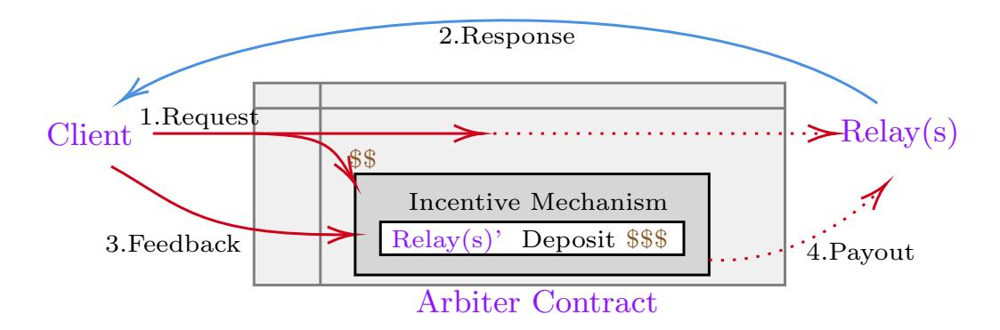
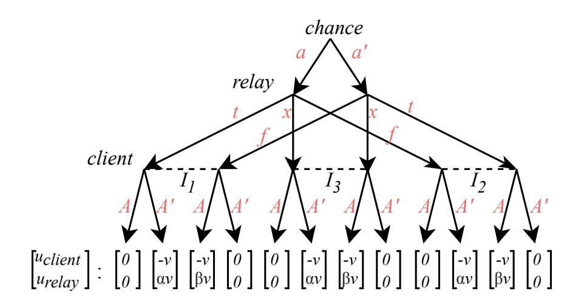
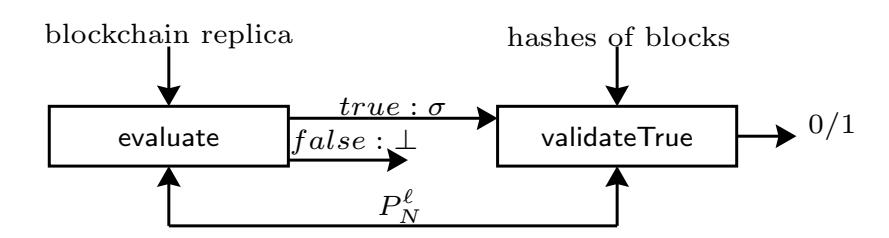
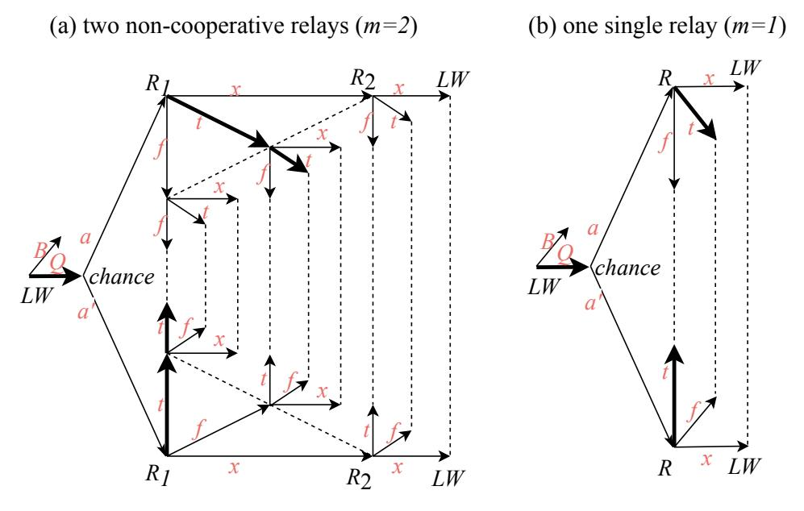
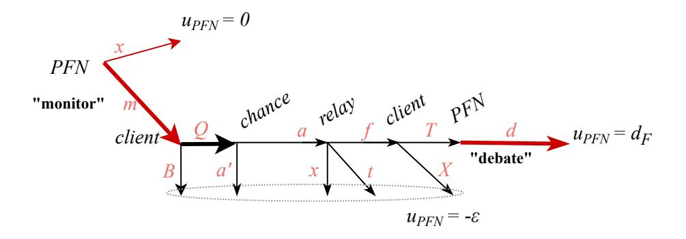

{0}------------------------------------------------

# Generic Superlight Client for Permissionless Blockchains?

Yuan Lu<sup>1</sup> , Qiang Tang1,<sup>2</sup> , and Guiling Wang<sup>1</sup>

<sup>1</sup> New Jersey Institute of Technology 2 JDD-NJIT-ISCAS Joint Blockchain Lab {yl768, qiang, gwang}@njit.edu

Abstract. We conduct a systematic study on the light-client protocol of permissionless blockchains, in the setting where full nodes and light clients are rational. In the gametheoretic model, we design a superlight-client protocol to enable a light client to employ some relaying full nodes (e.g., two or one) to read the blockchain. The protocol is "generic", i.e., it can be deployed disregarding underlying consensuses, and it is also "superlight", i.e., the computational cost of the light client to predicate the (non)existence of a transaction in the blockchain becomes a small constant. Since our protocol resolves a fundamental challenge of broadening the usage of blockchain technology, it captures a wide variety of important use-cases such as multi-chain wallets, DApp browsers and more.

Keywords: Blockchain · Light client · Game-theoretic security.

# 1 Introduction

The blockchain [\[63,](#page-26-0)[16\]](#page-24-0) can be considered as an abstracted global ledger [\[30,](#page-24-1)[52,](#page-25-0)[10\]](#page-24-2), which can be read and written by the users of higher level applications [\[16,](#page-24-0)[69,](#page-26-1)[24](#page-24-3)[,25\]](#page-24-4). However, the basic abstraction of reading the ledger [1](#page-0-0) implicitly requires the user maintain a personal full node [\[13,](#page-24-5)[38\]](#page-25-1) to execute the consensus protocol and maintain a local blockchain replica. Nevertheless, with the rapid popularity of blockchain, an increasing number of blockchain users become merely caring about the high-level applications such as cryptocurrency, instead of maintaining any personal full node [\[41\]](#page-25-2); let alone, many of them are resource-starved, say browser extensions and smartphones [\[72](#page-26-2)[,20,](#page-24-6)[73,](#page-26-3)[70\]](#page-26-4), that have too limited resources to stay on-line to stick with the consensus protocol.

Thus an urgent demand of blockchain's light clients, a.k.a., superlight clients or lightweight clients [\[15,](#page-24-7)[50,](#page-25-3)[47](#page-25-4)[,17\]](#page-24-8), rises up. Consider a quintessential scenario: Alice is the cashier of a pizza store; a customer Bob tells her B1,000 has been paid for some pizzas, via a bitcoin transaction with txid [0xa1075d](https://www.blockchain.com/btc/tx/a1075db55d416d3ca199f55b6084e2115b9345e16c5cf302fc80e9d5fbf5d48d)..., and claims the transaction is already in the blockchain; then, Alice needs to check that, by activating a lite wallet app installed in her mobile phone. That is to say, Alice, and many typical blockchain users, need a superlight client, which can stay off-line to opt out of the consensus, and can still wake up any time to "read" the records in the blockchain with high security and low computational cost.

### 1.1 Insufficiencies of existing practices

The fundamental challenge of designing the superlight client stems from a fact: the records in the blockchain are "authenticated" by the latest chain agreed across the blockchain network (a.k.a., the main-chain) [\[66,](#page-26-5)[63,](#page-26-0)[21](#page-24-9)[,37,](#page-25-5)[48\]](#page-25-6). So without running the consensus to obtain a trusted replica of the main-chain at hand, the client has to rely on some other full nodes to forward the records in the blockchain. That said, the light-client protocol therefore must deal with those probably distrustful full nodes that can forward fake blockchain readings.

<sup>?</sup> An abridged version of this paper is accepted to appear in the 25th European Symposium on Research in Computer Security (ESORICS) 2020.

<span id="page-0-0"></span><sup>1</sup> Writing in the blockchain is trivial, as one can gossip with some full nodes to diffuse its messages to the entire blockchain network (a.k.a., network diffuse functionality [\[30,](#page-24-1)[7\]](#page-24-10)). Then the blockchain's liveness ensures the inclusion of the messages [\[30\]](#page-24-1).

{1}------------------------------------------------

Some ad-hoc attempts. A few proposals attempt to prevent the client being cheated, by relying on heavyweight assumptions. For example, a few proposals [\[27,](#page-24-11)[21\]](#page-24-9) assume a diverse list of known full nodes to serve as relays to forward blockchain readings. The list is supposed to consist of some "mining" pools and a few so-called blockchain "explorers", so the client can count on the honest-majority of these known relays to read the chain. But for many real-world permissionless blockchains, this assumption is too heavy to hold with high-confidence. Say Cardano [\[1\]](#page-23-0), a top-10 blockchain by market capitalization, has quite few "explorer" websites on the run; even worse, the naive idea of recruiting "mining" pools as relays is more elusive, considering most of them would not participate without moderate incentives [\[41\]](#page-25-2). So it is unclear how to identify an honest-majority set of known relays for each permissionless blockchain in the wild. As such, these ad-hoc solutions become unreliable, considering their heavyweight assumptions are seemingly elusive in practice.

Cryptographic approaches. To design the light-client protocol against malicious relay full nodes, a few cryptographic approaches are proposed [\[15,](#page-24-7)[47,](#page-25-4)[63,](#page-26-0)[76\]](#page-26-6).

Straight use of SPV is problematic. The most straightforward way to instantiating the idea is to let the client keep track of the suffix of the main-chain, and then check the existence of transactions by verifying SPV proofs [\[63\]](#page-26-0), but the naive approach causes at least one major issue: the client has to frequently be on-line to track the growth of main-chain. Otherwise, when the client wakes up from a deep sleep, it needs to at least verify the block headers of the main-chain linearly. Such the bootstrapping can be costly, considering the main-chain is ever-growing, say the headers of Ethereum is growing at a pace of ∼ 1 GB per year. As a result, in many critical use-cases such as web browsers and/or mobile phones, the idea of straightly using SPV proofs becomes rather unrealistic.

PoW-specific results. For PoW chains, some existing superlight clients such as FlyClient and NiPoPoW [\[15,](#page-24-7)[47\]](#page-25-4) circumvent the problem of SPV proofs. These ideas notice the main-chain is essentially "authenticated" by its few suffix blocks, and then develop some PoW-specific techniques to allow the suffix blocks be proven to a client at only sublinear cost. But they come with one major limit, namely, need to verify PoWs to discover the correct suffix, and therefore cannot fit the promising class of proof-of-stake (PoS) consensuses [\[48,](#page-25-6)[21,](#page-24-9)[37\]](#page-25-5).

Superlight client for PoS still unclear. For PoS chains, it is yet unclear how to realize an actual superlight client that can go off-line to completely opt out of consensus. The major issue is lacking an efficient way to proving the suffix of PoS chains to an off-line client, as the validity of the suffix blocks relies on the signatures of stakeholders, whose validities further depend on the recent stake distributions, which further are authenticated by the blockchain itself [\[37,](#page-25-5)[21,](#page-24-9)[48,](#page-25-6)[17\]](#page-24-8). Some recent efforts [\[31,](#page-24-12)[59,](#page-25-7)[54\]](#page-25-8) allow the always-online clients to use minimal space to track the suffix of PoS chains, without maintaining the stake distributions. But for the major challenge of enabling the clients to go off-line, there only exist few fast-bootstrapping proposals for full nodes [\[56](#page-25-9)[,9\]](#page-24-13), which still require the client to download and verify a linear portion of the PoS chain to respawn, thus incurring substantial cost [\[37,](#page-25-5)[22\]](#page-24-14).

Demands of "consensus-oblivious" light client. Most existing light-client protocols are highly specialized for concrete consensuses (e.g., PoW). This not only prevents us adapting them to instantiate actual superlight clients for the PoS chains, but also hinders their easy deployment and user experience in many important use-cases in reality. A typical scenario is a multi-chain wallet, which is expected to support various cryptocurrencies atop different chains, each of which is even running a distinct consensus. Bearing that existing light-client protocols are highly specialized [\[31](#page-24-12)[,59,](#page-25-7)[54,](#page-25-8)[15](#page-24-7)[,47\]](#page-25-4), the multi-chain wallet needs to instantiate different protocols for distinct consensuses. That said, without a generic solution, the multi-chain wallet ends up to contain many independent "sub-wallets". That wallet not only is burdensome for the users, but also challenges the developers to correctly implement all sub-wallets. In contrast, if there is a generic protocol fitting all, one can simply tune some parameters at best.

Explore a generic solution in a different setting. The cryptographic setting seems to be an inherent obstacle-ridden path to the generic light-client protocol. Recall it usually needs to prove the main-chain's suffix validated by the consensus rules [\[31,](#page-24-12)[54,](#page-25-8)[15,](#page-24-7)[47\]](#page-25-4). Even if one puts forth a "consensus-oblivious" solution in the cryptographic setting, it likely has to convert all "proofs" for suffix into a generic statement of verifiable computation (VC) [\[59\]](#page-25-7), which is unclear how to be 

{2}------------------------------------------------

realized practically, considering VC itself is not fully practical yet for complicated statements (see Section [2](#page-4-0) for a thorough review on the pertinent topics).

To meet the urgent demand of the generic light-client protocol, we explicitly deviate from the cryptographic setting, and focus on the light-client problem due to the game-theoretic approach, in light of many successful studies such as rational multi-party computation [\[5,](#page-24-15)[40,](#page-25-10)[42,](#page-25-11)[39,](#page-25-12)[46,](#page-25-13)[11,](#page-24-16)[51,](#page-25-14)[29\]](#page-24-17) and rational verifiable computation [\[24,](#page-24-3)[71,](#page-26-7)[67,](#page-26-8)[53\]](#page-25-15). In the rational setting, we can hope that a consensus-independent incentive mechanism exists to assist a simple light-client protocol, so all rational protocol participants (i.e., the relay full nodes and the light client) follow the protocol for selfishness. As a result, the client can efficiently retrieve the correct information about the blockchain, and the full nodes are fairly paid.

Following that, this paper would present: a systematic treatment to the light-client problem of permissionless blockchains in the game-theoretic setting.

### 1.2 Our results

By reconsidering the light-client problem through the powerful lens of the game-theoretic setting, we design a superlight protocol to enable a light client to recruit several relay full nodes (e.g., one[2](#page-2-0) or two) to securely evaluate a general class of predicates about the blockchain.

Contributions. To summarize, our technical contributions are three-fold:

- Our light-client protocol can be bootstrapped in the rational setting, efficiently and generically. First, the protocol is superlight, in the sense that the client can go off-line and wake up any time to evaluate a general class of chain predicates at a tiny constant computationally cost; as long as the truthness or falseness of these chain predicates is reducible to few transactions' inclusion in the blockchain. Moreover, our generic protocol gets rid of the dependency on consensuses and can be deployed in nearly any permissionless blockchain (e.g., Turing-complete blockchains [\[16,](#page-24-0)[75\]](#page-26-9)) without even velvet forks [\[78\]](#page-26-10), thus supporting the promising PoS type of consensuses.
- Along the way, we conduct a systematic study to understand whether, or to what extent, our protocol for the superlight client is secure, in the rational setting (where is no always available trusted third-parties). We make non-trivial analyses of the incomplete-information extensive game induced by our light-client protocol, and conduct a comprehensive study to understand how to finely tune the incentives to achieve security in different scenarios, from the standard setting of non-cooperative full nodes to the pessimistic setting of colluding full nodes.
- Our protocol allows the rational client to evaluate (non)existence of a given transaction. As such, a rational light client can be convinced by rational full nodes that a given transaction is not in any block of the entire chain, which provides a simple way to performing non-existence "proof". In contrast, to our knowledge, relevant studies in the cryptographic setting either give up non-existence proof [\[63,](#page-26-0)[50\]](#page-25-3), or require to heavily modify the data structure of the current blockchains [\[14,](#page-24-18)[62\]](#page-25-16).

Solution in a nutshell. Assuming the light client and relay nodes are rational, we leverage the smart contract to facilitate a simple and useful incentive mechanism, such that being honest becomes their best choice, namely, for the highest utilities, (i) the relay nodes must forward the blockchain's records correctly, and (ii) the client must pay the relays honestly. From high-level, the ideas are:

- Setup. The light client and relay node(s) place their initial deposits in an "arbiter" smart contract, such that a carefully designed incentive mechanism later can leverage these deposits to facilitate rewards/punishments to deter deviations from the light-client protocol.
- Repeated queries. After setup, the client can repeatedly query the relays to forward blockchain readings (up to k times). Each query proceeds as:

<span id="page-2-0"></span><sup>2</sup> Note that the case where only one relay is recruited models a pessimistic scenario that all recruited full nodes are colluding to form a single coalition.

{3}------------------------------------------------

- 1. Request. The client firstly specifies the details of the predicate to query in the arbiter contract, which can be done since writing in the contract is trivial for the network diffuse functionality.<sup>1</sup>
- 2. Response. Once the relays see the specifications of the chain predicate in the arbiter contract, they are incentivized to evaluate the predicate and forward the ground truth to the client off-chain.
- 3. Feedback. Then the client decides an output, according to what it receives from the relays. Besides, the client shall report what it receives to the arbiter contract; otherwise, gets a fine.
- 4. Payout. Finally, the contract verifies whether the relays are honest, according to the feedback from the client, and then facilitates an incentive mechanism to reward (or punish) the relays.

Without a proper incentive mechanism, the above simple protocol is insecure to any extent as it is. So carefully designed incentives are added in the arbiter contract to ensure "following the protocol" to be a desired equilibrium, namely, the rational relays and client, would not deviate.



Fig. 1. Superlight client in the rational model (high-level).

Challenges & techniques. Though instantiating the above idea seems simple, it on the contrary is challenged by the limit of the "handicapped" arbiter contract. In particular, the arbiter contract in most blockchains (e.g., Ethereum) cannot directly verify the non-existence of transactions, though it is easy to verify any transaction's existence if being given the corresponding inclusion proof [\[8,](#page-24-19)[50\]](#page-25-3). Thus, for a chain predicate whose trueness (resp. falseness) is reducible to the existence (resp. nonexistence) of some transactions, the arbiter contract can at most verify either its trueness or its falseness, but not both sides.

In other words, considering the chain predicate as a binary T rue or F alse question, there exists a proof verifiable by the arbiter contract to attest it is T rue (or it is F alse), but not both. This enables the relays to adopt a malicious strategy: "always forward unverifiable bogus disregarding the actual ground truth", because doing so would not be caught by the contract, and thus the relays are still paid. The challenge therefore becomes how to design an incentive mechanism to deter the relays from flooding unverifiable bogus claims, given only the "handicapped" verifiability of the contract.

To circumvent the limit of the arbiter contract, we squeeze the most of its "handicapped" verifiability to finely tune the incentive mechanism, such that "flooding fake unverifiable claims" become irrational. Following that, any deviations from the protocol are further deterred, from the standard setting of non-cooperative relays to the extremely hostile case of colluding relays:

- If two non-cooperative relays (e.g., two competing mining pools in practice) can be identified and recruited, we leverage the natural tension between these two selfish relays to "audit" each other. As such, fooling the client is deterred, because a selfish relay is incentivized to report the other's (unverifiable) bogus claim, by producing a proof attesting the opposite of the fake claim.
- In the extremely adversarial scenario where any two recruited relays can form a coalition, the setting becomes rather pessimistic, as the client is essentially requesting an unknown knowledge from a single party. Nevertheless, the incentive can still be slightly tuned to function as follows:
  - 1. The first tuning does not rely on any extra assumption. The adjustment is to let the arbiter contract assign a higher payoff to a proved claim while make a lower payoff to an unprovable

{4}------------------------------------------------

claim. So the best strategy of the only relay is to forward the actual ground truth, as long as the malicious benefit attained by fooling the client is smaller than the maximal reward promised by the client.

Though this result has limited applicabilities, for example, cannot handle valuable queries, it still captures a variety of meaningful real-world use-cases, in particular, many DApp browsers, where the relay is not rather interested in cheating the client.

2. The second adjustment relies on another moderate rationality assumption, that is: at least one selfish public full node (in the entire blockchain network) can keep on monitoring the internal states of the arbiter contract at a tiny cost and will not cooperate with the recruited relay.

Thus whenever the recruited relay forwards an unprovable bogus claim to the client, our design incentivizes the selfish public full node to "audit" the relay by proving the opposite side is the actual ground truth, which deters the recruited relay from flooding unprovable bogus.

Application scenarios. Our protocol supports a wide variety of applications, as it solves a fundamental issue preventing low-capacity users using blockchain:

- Decentralized application browser. The DApp browser is a natural application scenario. For example, a lightweight browser for CryptoKitties [\[20\]](#page-24-6) can get rid of a trusted Web server. When surfing the DApp via a distrustful Web server, the users need to verify whether the content rendered by the server is correct, which can be done through our light-client protocol efficiently.
- Mobile wallet for multiple cryptocurrencies. Our protocol can be leveraged to implement a super-light mobile wallet to verify the (non)existence of cryptocurrency transactions. In particular, it can keep track of multiple coins atop different blockchains running over diverse types of consensuses.

# <span id="page-4-0"></span>2 More Pertinent Work

Here we thoroughly review the insufficiencies of relevant work.[3](#page-4-1)

Lightweight protocols for blockchains. The SPV client is the first light-client protocol for Proof-of-Work (PoW) blockchains, proposed as early as Bitcoin [\[63\]](#page-26-0). The main weakness of SPV client is that the block headers to download, verify and store increase linearly with the growth of the chain, which nowadays is > 2 GB in Ethereum. To realize super-light client for PoW, the ideas of Proofs of PoW and FlyClient [\[15\]](#page-24-7) were proposed, so the light client can store only the genesis block to verify the existence of a blockchain record at a sub-linear cost, once connecting at least one honest full node.

Though the existence of superlight protocols for PoW chains, all these schemes cannot be applied for other types of consensuses such as the proof-of-stake (PoS) [\[37,](#page-25-5)[48,](#page-25-6)[21\]](#page-24-9). A recent study on PoS sidechains [\[31\]](#page-24-12) (and a few relevant industry proposals [\[59,](#page-25-7)[54\]](#page-25-8)) presented the idea of "certificates" to cheaply convince some always on-line clients on the incremental growth of the PoS chains; however, their obvious limitation not only corresponds linear cost for the frequently off-line clients, but also renders serious vulnerability for the clients re-spawning from a "deep-sleep", because the inherent costless simulation makes the deep sleepers cannot distinguish a forged chain from the correct main chain [\[32,](#page-24-20)[21\]](#page-24-9).

Few fast-bootstrap protocols such as [\[56\]](#page-25-9) and [\[9\]](#page-24-13) exist for PoS chains, but they are concretely designed for Algorand [\[37\]](#page-25-5) and Ouroboros Praos [\[22\]](#page-24-14) respectively, let alone they are only suitable to boot full nodes and still incur substantial costs that are not affordable by resource-starved clients. Different from Vault [\[56\]](#page-25-9) and Ouroboros Genesis [\[9\]](#page-24-13), another PoS protocol Snow White [\[21\]](#page-24-9) makes a heavyweight assumption that a permissioned list of full nodes with honest-majority

<span id="page-4-1"></span><sup>3</sup> Remark that there are also many studies [\[35,](#page-25-17)[58\]](#page-25-18) focus on protecting the privacy of lightweight blockchain client. However, we are emphasizing the basic functionality of the light client instead of such the advanced property.

{5}------------------------------------------------

can be identified, such that "social consensus" of these full nodes can be leveraged to allow deep sleepers to efficiently re-spawn. In contrast to [\[21\]](#page-24-9), our design is based on a different assumption, rationality, which is less heavy and more realistic in many real-world scenarios from our point of view.

Vitalik Buterin [\[17\]](#page-24-8) proposed to avoid forks in PoS chains by incentives: a selected committee member will be punished, if she proposes two different blocks in one epoch. In this way, the light client was claimed to be supported, as the light who receives a fake block different from the correct one can send the malicious block back to the blockchain network to punish the creator of the cheating block. However, as the committees rotate periodically, it is unclear whether the protocol still works if the light client is querying about some "ancient" blocks generated before the relay node becomes a committee. A recent work [\[41\]](#page-25-2) noticed the lack of incentives due to cryptographic treatments, and proposed to use the smart contract to incorporate incentives, but it relies on the existing lightweight-client protocols as underlying primitives, and cannot function independently.

Another line of studies propose the concept of stateless client [\[18,](#page-24-21)[14](#page-24-18)[,59\]](#page-25-7). Essentially, a stateless client can validate new blocks without storing the aggregated states of the ledger (e.g., the UTXOs in Bitcoin [\[63\]](#page-26-0) or the so-called states in Ethereum [\[75,](#page-26-9)[16\]](#page-24-0)), such that the stateless client can incrementally update its local blockchain replica cheaply. Though those studies can reduce the burden of (always on-line) full nodes, they currently cannot help the frequently off-line light clients to read arbitrarily ancient records of the blockchain.

Outsourced computations. Reading from the blockchain can be viewed as a special computation taking as input the ledger, which could be supported by the general techniques of outsourcing computations. But till today, existing general techniques do not perform well.

Verifiable computation allows a prover to convince a verifier that an output is obtained through correctly computing a function [\[34\]](#page-25-19). Recent constructive development of generic verifiable computations such as SNARKs [\[12\]](#page-24-22) enables efficient verifications (for general NP-statements) with considerable cost of proving. Usually, for some heavy statements such as proving the PoWs/PoSs of a blockchain, the generic verifiable computation tools are infeasible in practice [\[15,](#page-24-7)[59\]](#page-25-7).

To reduce the high cost of generality, Coda [\[59\]](#page-25-7) proposed to use the idea of incremental proofs to allow (an always on-line) stateless client to validate blocks cheaply, but it is still unclear how to use the same idea to convince the (frequently off-line) clients without prohibitive proving cost. Some other studies [\[45,](#page-25-20)[6\]](#page-24-23) focus on allowing the resource-constrained clients to efficiently verifying the computations taking the blockchain as input, but they require the clients already have the valid chain headers, and did not tackle the major problem of light clients, i.e., how to get the correct chain of headers.

Attestation via trusted hardwares has attracted many attentions recently [\[19,](#page-24-24)[79\]](#page-26-11), and it becomes enticing to employ the trusted hardwares towards the practical light-client scheme [\[58\]](#page-25-18). However, recent Foreshadow attacks [\[74\]](#page-26-12) put SGX's attestation keys in danger of leakage, and potentially allow an adversary to forge attestations, which might fully break the remote attestation of SGX and subsequently challenge the fundamental assumption of trusted hardwares.

Outsourced computation via incentive games were discussed before [\[67,](#page-26-8)[53\]](#page-25-15). Some recent studies even consider the blockchain to facilitate games for outsourced computations [\[24,](#page-24-3)[71\]](#page-26-7). All the studies assume an implicit game mediator (e.g. the blockchain) who can speak/listen to all involving parties, including the requester, the workers and a trusted third-party (TTP). However, in our setting, we have to resolve a special issue that there is neither TTP nor mediator, since the blockchain, as a potential candidate, can neither speak to the light nor validate some special blockchain readings.

# 3 Warm-up: game-theoretic security

Usually, the game-theoretic analysis of an interactive protocol starts by defining an extensive game [\[44](#page-25-21)[,24,](#page-24-3)[65\]](#page-26-13) to model the strategies (i.e., probabilistic interactive Turing machines) of each party in the protocol. Then a utility function would assign every party a certain payoff, for each possible execution induced by the strategies of all parties. So the security of the protocol can be argued by the properties of the game, for example, its Nash equilibrium [\[42\]](#page-25-11) or other stronger equilibrium 

{6}------------------------------------------------

notions [43,44,24,65,51]. This section introduces the preliminary definitions of extensive-form game, as well as presents an over-simplified interactive "protocol" to exemplify the idea of conducting analysis through the extensive-game induced by the "protocol".

#### 3.1 Extensive-form game

Here down below are the deferred formal definitions of the finite incomplete-information extensiveform game and the sequential equilibrium.

Definition 1. Finite incomplete-information extensive-form game  $\Gamma$  is defined as a tuple of  $\langle \mathbf{N}, \mathbf{H}, P, f_c, (u_i)_{i \in \mathbf{N}} \rangle$  [64]:

- N is a finite set representing the players.
- **H** is a set of sequences that satisfies: (i)  $\emptyset \in \mathbf{H}$ ; (ii) if  $h = \langle a_1, \dots, a_K \rangle \in \mathbf{H}$ , then any prefix of h belongs to  $\mathbf{H}$ . Each member of  $\mathbf{H}$  is a history sequence. The elements of a history are called actions. A history sequence  $h = \langle a_1, \dots, a_K \rangle \in \mathbf{H}$  is terminal, iff h is not a prefix of any other histories in  $\mathbf{H}$ . Let  $\mathbf{Z}$  denote the set of terminal histories. For any non-terminal history  $h = \langle a_1, \dots, a_K \rangle \in \mathbf{H} \setminus \mathbf{Z}$ , the set of actions available after h can be defined as  $A(h) = \{a | \langle a_1, \dots, a_K, a \rangle \in \mathbf{H} \}$ .
- $P: \mathbf{H} \setminus \mathbf{Z} \to \mathbf{N} \cup \{chance\}$  is the player function to assign a player (or chance) to move at a non-terminal history h. Particularly when P(h) = chance, a special "player" called chance acts at the history h.
- $(u_i)_{i \in \mathbb{N}} : \mathbb{Z} \to \mathbb{R}^{|\mathbb{N}|}$  is the utility function that defines the utility of the players at each terminal history (e.g.,  $u_i(h)$  specifies the utility of player i at the terminal history h).
- $f_c$  is a function associating each history  $h \in \{h|P(h) = chance\}$  with a probability measure  $f_c(;h)$  on A(h), i.e.,  $f_c(a;h)$  determines the probability of the occurrence of  $a \in A(h)$  after the history h of the player "chance".
- ( $\mathbf{I}_i$ ) $_{i \in \mathbf{N}}$  is a set of partitions. Each  $\mathbf{I}_i$  is a partition for the set  $\{h|P(h)=i\}$ , and called as the information partition of player i; a member  $I_{i,j}$  of the partition  $\mathbf{I}_i$  is a set of histories, and is said to be an information set of player i. We require A(h) = A(h') if h and h' are in the same information set, and then denote the available actions of player i at an information set  $I_{i,j} \in \mathbf{I}_i$  as  $A(I_{i,j})$ .

Note that in our context, the strategy of a player is actually a probabilistic polynomial-time ITM, whose action is to produce a string feed to the protocol.

**Definition 2.** A behavioral strategy (or strategy for short) of player i (denoted by  $s_i$ ) is a collection of independent probability measures denoted by  $\{\beta_i(I_{i,j})\}_{I_{i,j}\in\mathbf{I}_i}$ , where  $\beta_i(I_{i,j})$  is a probability measure over  $A(I_{i,j})$  (i.e., the available actions of player i at his information set  $I_{i,j}$ ). We say  $\mathbf{s} = (s)_{i \in \mathbf{N}}$  is a behavior strategy profile (or strategy profile for short), if every  $s_i \in \mathbf{s}$  is a behavior strategy of player i. When  $\mathbf{s} = (\{\beta_i(I_{i,j})\}_{I_{i,j}\in\mathbf{I}_i})_{i\in\mathbf{N}}$  assigns positive probability to every action, it is called completely mixed.

**Definition 3.** An assessment  $\sigma$  in an extensive game is a pair  $(s, \mu)$ , where s is a behavioral strategy profile and  $\mu$  is a function that assigns to every information set a probability measure on the set of histories in the information set (i.e., every). We say the function  $\mu$  is a belief system.

**Definition 4.** The expected utility of a player i determined by the assessment  $\sigma = (s, \mu)$  conditioned on  $I_{i,j}$  is defined as:

$$\bar{u}_i(\boldsymbol{s}, \mu | I_{i,j}) = \sum_{h \in I_{i,j}} \mu(I_{i,j})(h) \sum_{z \in \mathbf{Z}} \rho(\boldsymbol{s} | h)(z) u_i(z)$$

{7}------------------------------------------------

where  $h = \langle a_1, \ldots, a_L \rangle \in \mathbf{H} \setminus \mathbf{Z}$ ,  $z = \langle a_1, \ldots, a_K \rangle \in \mathbf{Z}$ , and  $\rho(\boldsymbol{\sigma}|h)(z)$  denotes the distribution over terminal histories induced by the strategy profile  $\boldsymbol{s}$  conditioned on the history h being reached (for player P(h) to take an action), i.e.,

$$\rho(\boldsymbol{s}|h)(z) = \begin{cases} 0, & \text{if } h \text{ is not a prefix of } z\\ \prod_{k=L}^{K-1} \beta_{P(a_1,\dots,a_k)}(a_1,\dots,a_k)(a_{k+1}), & \text{otherwise} \end{cases}$$

**Definition 5.** We say an assessment  $\sigma = (\boldsymbol{\sigma}, \mu)$  is a  $\epsilon$ -sequential equilibrium, if it is  $\epsilon$ -sequentially rational and consistent:

- $(s, \mu)$  is  $\epsilon$ -sequentially rational if for every play  $i \in \mathbb{N}$  and his every information set  $I_{i,j} \in \mathbf{I}_i$ , the strategy  $s_i$  of player i is a best response to the others' strategies  $s_{-i}$  given his belief at  $I_{i,j}$ , i.e.,  $\bar{u}_i(s, \mu|I_{i,j}) + \epsilon \geq \bar{u}_i((s_i^*, s_{-i}), \mu|I_{i,j})$  for every strategy  $s_i^*$  of every player i at every information set  $I_{i,j} \in \mathbf{I}_i$ . Note that  $s_{-i}$  denotes the strategy profile s with its i-th element removed, and  $(s^*, s_{-i})$  denotes s with its i-th element replaced by  $s^*$ .
- $(s, \mu)$  is *consistent*, if  $\exists$  a sequence of assessments  $((s^k, \mu^k))_{k=1}^{\infty}$  converges to  $(s, \mu)$ , where  $s^k$  is completely mixed and  $\mu^k$  is derived from  $s^k$  by Bayes' rules.

#### 3.2 An interactive protocol as an extensive-form game

Consider an oversimplified "light-client protocol": Alice is a cashier of a pizza store; her client asks a full node (i.e. relay) to check a transaction's (non)existence, and simply terminates to output what is forwarded by the relay.

Strategy, action, history, and information set. Let the oversimplified "protocol" proceed in synchronous round. In each round, the parties will execute its strategy, i.e., a probabilistic polynomial-time ITM in our context, to produce and feed a string to the protocol, a.k.a., take an action. During the course of the protocol, a sequence of actions would be made, and we say it is a history by convention of the game theory literature; moreover, when a party acts, it might have learned some (incomplete) information from earlier actions taken by other parties, so the notion of information sets can be used to characterize what has and has not been learned by each party. Concretely speaking, the oversimplified "light-client protocol" can be described by the extensive-form game as shown in Fig 2, and it proceeds as:

- 1. Round 1 (chance acts). A definitional virtual party called chance sets the ground truth, namely, it determines True or False to represent whether the transaction exists (denoted by a or a' respectively). To capture the uncertainty of the ground truth, the chance acts arbitrarily.
- 2. Round 2 (relay acts). Then, the relay is activated to forward True or False to the light client, which states whether the transaction exists or not. Note the strategy chosen by the relay is an ITM that can produce arbitrary strings in this round, we need to map the strings into the admissible actions, namely, t, f and x. For definiteness, we let the string of ground truth be interpreted as the action t, the string of the opposite of ground truth be interpreted as the action t, and all other strings (including abort) be interpreted as x.
- 3. Round 3 (client acts). Finally, the client outputs True (denoted by A) or False (denoted by A') to represent whether the transaction exists or not, according to the (incomplete) information acquired from the protocol. Note the client knows how the relay acts, but cannot directly infer the action of chance. So it faces three distinct information sets  $I_1$ ,  $I_2$  and  $I_3$ , which respectively represent the client receives True, False and others in Round 2. The client cannot distinguish the histories inside each information set.

**Utility function**. After the protocol terminates, its game reaches a so-called *terminal history*. A well-defined *utility function* specifies the economic outcome of each party, for each terminal history induced by the extensive game.

In practice, the utility function is determined by some economic factors of the parties and the protocol itself [42,24]. For example, the rationale behind the utility function in Fig 2 can be

{8}------------------------------------------------



<span id="page-8-0"></span>Fig. 2. The extensive game of an oversimplified light-client "protocol". The utility function is an example to clarify the insecurity of such a trivial idea.

understood as: (i) the relay is motivated to fool the client to believe the nonexistence of an existing transaction, because this literally "censors" Alice to harm her business by a loss of \$v, which also brings a malicious benefit \$α · v to the relay; (ii) the relay also prefers to fool the client to believe the existence of a non-existing transaction, so the relay gets free pizzas valued by \$β · v, which causes Alice lose \$v (i.e., the amount supposed to be transacted to purchase pizzas), (iii) after all, the oversimplified protocol itself does not facilitate any punishment/reward, so will not affect the utility function.

### 3.3 Security via equilibrium

Putting the game structure and the utility function together, we can argue the (in)security due to the equilibria in the game. In particular, we can adopt the strong notion of sequential equilibrium for extensive games [\[43](#page-25-22)[,44,](#page-25-21)[24,](#page-24-3)[65\]](#page-26-13) to demonstrate that the rational parties would not deviate, at each stage during the execution of the protocol. As a negative lesson, the oversimplified "lightclient game" in Fig 2 is insecure in the game-theoretic setting, as the relay can unilaterally deviate to fool the client for higher utility. In contrast, if the protocol is secure in game-theoretic settings, its game shall realize desired equilibrium, such that rational parties would not diverge from the protocol for highest utilities.

# <span id="page-8-1"></span>4 Preliminaries

Blockchain addressing. A blockchain (e.g., denoted by C) is a chain of block (headers). Each block commits a list of payload (e.g., transactions). Notation-wise, we use Python bracket C[t] to address the block (header) at the height t of the chain C. For example, C[0] represents the genesis block, and C[0 : N] represents a chain consisting of N blocks (where C[0] is known as genesis). W.l.o.g., a block C[t] is defined as a tuple of (ht−1, nonce,root), where ht−<sup>1</sup> is the hash of the block C[t − 1], nonce is the valid PoX (e.g., the correct preimage in PoW, and the valid signatures in PoS), and root is Merkle tree root of payload. Through the paper, C[t].root denotes Merkle root of block C[t].

Payload & Merkle tree. Let TX<sup>t</sup> := htx1,tx2, · · · ,txni denote a sequence of transactions that is the payload of the block C[t]. Recall TX<sup>t</sup> is included by the block C[t] through Merkle tree [\[63](#page-26-0)[,75\]](#page-26-9), which is an authenticated data structure scheme of three algorithms (BuildMT, GenMTP, VrfyMTP). BuildMT inputs TX<sup>t</sup> = htx1, · · · ,txni and outputs a Merkle tree MT with root. GenMTP takes the tree MT (built for TXt) and a transaction tx ∈ TX<sup>t</sup> as input, and outputs a proof π<sup>j</sup> for the inclusion of tx in TX<sup>t</sup> at the position j. VrfyMTP inputs π<sup>j</sup> , root and tx and outputs either 1 or 0. The Merkle tree scheme satisfies: (i) Correctness. Pr[VrfyMTP(MT.root,tx, πi) = 1 | π<sup>i</sup> ← GenMTP(MT,tx), MT ← BuildMT(TX)] = 1; (ii) Security. for ∀ P.P.T. A, Pr[VrfyMTP(MT.root,tx, πi) = 1 ∧ tx 6= TX[i] | π<sup>i</sup> ← A(1<sup>λ</sup> , MT,tx), MT ← BuildMT(TX) ] ≤ negl(λ). The detailed construction of the Merkle tree scheme is deferred to Appendix [A.](#page-27-0)

{9}------------------------------------------------

Note that by nelg(·) we denote a negligible function. In addition, though the payload of a block could be quite large (e.g., hundreds of transactions in Ethereum), the size of each block header C[i] is small, for example, in Ethereum, a block (without payload) takes only few hundreds bytes.

Smart contract. Essentially, a smart contract [\[16,](#page-24-0)[75\]](#page-26-9) can be abstracted as an ideal functionality with a global ledger subroutine, so it can faithfully instruct the ledger to freeze "coins" as deposits and then correctly facilitate conditional payments [\[52](#page-25-0)[,49,](#page-25-23)[10\]](#page-24-2). This paper explicitly adopts the widely-used notations invented by Kosba et al. [\[52\]](#page-25-0) to describe the smart contract, for example:

- The contract can access the global time T, which can be seen as an equivalent notion of the height of the latest blockchain.
- The contract can access a global dictionary ledger for conditional payments.
- We slightly enhance their notations to allow the contract to access a global dictionary blockhashes. Each item blockhashes[t] is the hash of the block C[t].[4](#page-9-0)
- The contract would not send its internal states to the light client, which captures the client opts out of consensus. However, the client can send messages to the contract, due to the well abstracted network diffusion functionality.

In addition, we emphasize that the blockchain can be seen as a global ledger functionality [\[10](#page-24-2)[,49\]](#page-25-23) that allows all full nodes to maintain their local blockchain replicas consistent to the global dictionary blockhashes (within a clock period).

# 5 Problem Formulation

The light-client protocol involves a light client, some relay full nodes (e.g. one or two), and an ideal functionality (i.e. "arbiter" contract). The light client relies on the relays to "read" the chain, and the relays expect to receive correct payments.

### <span id="page-9-1"></span>5.1 Formalizing readings from the blockchain

The basic functionality of our light-client protocol is to allow the resource-starved clients to evaluate the falseness or trueness about some statements over the blockchain [\[47\]](#page-25-4). This aim is subtly broader than [\[50\]](#page-25-3), whose goal is restricted to prevent the client from deciding trueness when the statement is actually false.

Chain predicate. The paper focuses on a general class of chain predicates whose trueness (or falseness) can be induced by up to l transactions' inclusions in the chain, such as "whether the transaction with identifier txid is in the blockchain C[0 : N] or not". Formally, we focus on the chain predicate in the form of:

$$\mathsf{P}^{\ell}(\mathsf{C}[0:N]) = \begin{cases} False, \text{ otherwise} \\ True, \ \exists \mathsf{C}' \subset \mathsf{C}[0:N] \text{ s.t. } \mathsf{D}^{\ell}(\mathsf{C}') = True \end{cases}$$

or equivalently, there is Q(·) = ¬P(·):

$$\mathsf{Q}^{\ell}(\mathsf{C}[0:N]) = \begin{cases} False, \ \exists \mathsf{C}' \subset \mathsf{C}[0:N] \ \text{s.t.} \ \mathsf{D}^{\ell}(\mathsf{C}') = True \\ True, \ \text{otherwise} \end{cases}$$

<span id="page-9-0"></span><sup>4</sup> Remark that the above modeling requires the block hashes can be read by smart contracts from the blockchain's internal states (e.g. available global variables) [\[28\]](#page-24-25). In Ethereum, this currently can be realized via the proposal of Andrew Miller [\[60\]](#page-25-24) and will be incorporated due to the already-planned Ethereum enhancement EIP-210 [\[3\]](#page-23-1).

{10}------------------------------------------------

where C' is a subset of the blockchain C[0 : N], and D $^{\ell}(\cdot)$  is a computable predicate taking C' as input and is writable as:

$$\mathsf{D}^{\ell}(\mathsf{C}') = \begin{cases} True, \ \exists \ \{\mathsf{tx}_i\} \ \text{that} \ | \{\mathsf{tx}_i\} | \leq \ell \colon \\ f(\{\mathsf{tx}_i\}) = 1 \ \land \ \forall \ \mathsf{tx}_i \in \{\mathsf{tx}_i\}, \\ \exists \ \mathsf{C}[t] \in \mathsf{C}' \ \text{and} \ \mathsf{P.P.T.} \ \text{computable} \ \pi_i \ \text{s.t.} \\ \mathsf{VrfyMTP}(\mathsf{C}[t].\mathsf{root}, \mathsf{H}(\mathsf{tx}_i), \pi_i) = 1 \\ False, \ \text{otherwise} \end{cases}$$

where  $f(\{tx_i\}) = 1$  captures that  $\{tx_i\}$  satisfies a certain relationship, e.g., "the hash of each  $tx_i$  equals a specified identifier  $txid_i$ ", or "each  $tx_i$  can pass the membership test of a given bloom filter", or "the overall inflow of  $\{tx_i\}$  is greater than a given value". We let  $\mathsf{P}_N^\ell$  and  $\mathsf{Q}_N^\ell$  be short for  $\mathsf{P}^\ell(\mathsf{C}[0:N])$  and  $\mathsf{Q}^\ell(\mathsf{C}[0:N])$ , respectively.

**Examples of chain predicate.** The seemingly complicated definition of chain predicate actually has rather straightforward intuition to capture a wide range of blockchain "readings", as for any predicate under this category, either its trueness or its falseness can be succinctly attested by up to  $\ell$  transactions' inclusion in the chain. For  $\ell = 1$ , some concrete examples are:

- "A certain transaction tx is included in C[0:N]", the trueness which can be attested by tx's inclusion in the chain.
- "A set of transactions  $\{tx_j\}$  are *all* incoming transactions sent to a particular address in C[0:N]", the falseness of which can be proven, if  $\exists$  a transaction tx s.t.: (i)  $tx \notin \{tx_j\}$ , (ii) tx is sent to the certain address, and (iii) tx is included in the chain C[0:N].

Limits. A chain predicate is a binary question, whose trueness (or falseness) is reducible to the inclusion of some transactions. Nevertheless, its actual meaning depends on how to concretely specify it. Intuitively, a "meaningful" chain predicate might need certain specifications from an external party outside the system. For example, the cashier of a pizza store can specify a transaction to evaluate its (non)existence, only if the customer tells the txid.

"Handicapped" verifiability of chain predicate. W.lo.g., we will focus on the chain predicate in form of  $\mathsf{P}_N^\ell$ , namely, whose trueness is provable instead of the falseness for presentation simplicity. Such the "handicapped" verifiability can be well abstracted through a tuple of two algorithms (evaluate, validateTrue):

- evaluate( $\mathsf{P}_N^\ell$ )  $\to \sigma$  or  $\bot$ : The algorithm takes the replica of the blockchain as auxiliary input and outputs  $\sigma$  or  $\bot$ , where  $\sigma$  is a proof for  $\mathsf{P}_N^\ell = True$ , and  $\bot$  represents its falseness; note the proof  $\sigma$  here includes: a set of transactions  $\{\mathsf{tx}_i\}$ , a set of Merkle proofs  $\{\pi_i\}$ , and a set of blocks  $\mathsf{C}'$ ;
- validateTrue $(\sigma, \mathsf{P}_N^\ell) \to 0$  or 1: This algorithm takes blockhashes as auxiliary input and outputs 1 (accept) or 0 (reject) depending on whether  $\sigma$  is deemed to be a valid proof for  $\mathsf{P}_N^\ell = True$ ; note the validation parses  $\sigma$  as  $(\{\mathsf{tx}_i\}, \{\pi_i\}, \mathsf{C}')$  and verifies: (i)  $\mathsf{C}'$  is included by blockhashes[t] where  $t \leq N$ ; (ii) each  $\mathsf{tx}_i$  is committed by a block in  $\mathsf{C}'$  due to Merkle proof  $\pi_i$ ; (iii)  $f(\{\mathsf{tx}_i\}) = 1$  where  $f(\cdot)$  is the specification of the chain predicate.



The above algorithms satisfy: (i) Correctness. For any chain predicate  $\mathsf{P}_N^\ell$ , the probability  $\Pr[\mathsf{validateTrue}(\mathsf{evaluate}(\mathsf{P}_N^\ell),\,\mathsf{P}_N^\ell)=1\mid\mathsf{P}_N^\ell=true]$  is 1, and (ii) Verifiability. for any P.P.T.  $\mathcal{A}$  and  $\mathsf{P}_N^\ell$ , there is  $\Pr[\mathsf{validateTrue}(\sigma\leftarrow\mathcal{A}(\mathsf{P}^\ell),\,\mathsf{P}_N^\ell)=1\mid\mathsf{P}_N^\ell=false]\leq negl(\lambda)$ , where evaluate implicitly takes the blockchain replica as input, and validateTrue implicitly inputs blockhashes. The abstraction can also be slightly adapted for  $\mathsf{Q}_N^\ell$  whose falseness is the provable side, though

{11}------------------------------------------------

we omit that for presentation simplicity. Through the remaining of the paper, evaluate can be seen as a black-box callable by any full nodes that have the complete replica of the blockchain, and validateTrue is a subroutine that can be invoked by the smart contracts that can access the dictionary blockhashes.

### 5.2 System & adversary model

The system explicitly consists of a light client, some relay(s) and an arbiter contract. All of them are computationally bounded to perform only polynomial-time computations. The messages between them can deliver synchronously within a-priori known delay ∆T, via point-to-point channels. In details,

### The rational lightweight client LW is abstracted as:

- It is rational and selfish;
- It is computationally bounded, i.e., it can only take an action computable in probabilistic polynomial-time;
- It opts out of consensus; to capture this, we assume:
  - The client can send messages to the contract due to the network diffusion functionality [\[30,](#page-24-1)[52\]](#page-25-0);
  - The client cannot receive messages from the contract except a short setup phase, which can be done in practice because the client user can temporarily boost a personal full node by fast-bootstrapping protocols.

#### The rational full node R<sup>i</sup> is modeled as:

- It is rational. Also, the full node R<sup>i</sup> might (or might not) cooperate with another full node R<sup>j</sup> . The (non)-cooperation of them is specified as:
  - The cooperative full nodes form a coalition to maximize the total utility, as they can share all information, coordinate all actions and transfer payoffs, etc. [\[64\]](#page-26-14); essentially, we follow the conventional notion to view the cooperative relays as a single party [\[11\]](#page-24-16).
  - Non-cooperative full nodes maximize their own utilities independently in a selfish manner due to the standard non-cooperative game theory, which can be understood as that they are not allowed to choose some ITMs to communicate with each other [\[55\]](#page-25-25);
- It can only take P.P.T. computable actions at any stage of the protocol;
- The full node runs the consensus, such that:
  - It stores the complete replica of the latest blockchain;
  - It can send/receive messages to/from the smart contract;
- It can send messages to the light client via an off-chain private channel.[5](#page-11-0)

The arbiter contract Gac follows the standard abstraction of smart contracts [\[52,](#page-25-0)[49\]](#page-25-23), with a few slight extensions. First, it would not send any messages to the light client except during a short setup phase. Second, it can access a dictionary blockhashes [\[60,](#page-25-24)[3\]](#page-23-1), which contains the hashes of all blocks. The latter abstraction allows the contract to invoke validateTrue to verify the proof attesting the trueness of any predicate P ` <sup>N</sup> , in case the predicate is actually true.

# 5.3 Economic factors of our model

It is necessary to clarify the economic parameters of the rational parties to complete our gametheoretic model. We present those economic factors and argue the rationale behind them as follows:

<span id="page-11-0"></span><sup>5</sup> Such the assumption can be granted if considering the client and the relays can set up private communication channels on demand. In practice, this can be done because (i) the client can "broadcast" its network address via the blockchain [\[57\]](#page-25-26), or (ii) there is a trusted name service that tracks the network addresses of the relays.

{12}------------------------------------------------

- c: It represents how much the client spends to maintain its (personal) trusted full node during the repeatable query phase. Note c does not mean the security relies on a trusted full node and only characterizes the cost of maintaining the trusted full node. For example,  $c \to \infty$  would represent that the client cannot connect any available trusted full node, once the protocol has been set up and the client disconnects any personal full node. Note c does not characterize the cost of the relay full node to run the consensus, and is considered to argue that rational users are willing to employ our protocol instead of maintaining their own personal full nodes (or subscribing some other relaying services).
- v: The factor means the "value" attached to the chain predicate under query. If the client incorrectly evaluates the predicate, it loses v. For example, the cashier Alice is evaluating the (non)existence of a certain transaction; if Alice believes the existence of a non-existing transaction, she loses the amount to be transacted; if Alice believes the nonexistence of an existing transaction, her business is harmed by such the censorship.
- $v_i(\mathsf{P}_N^\ell,\mathsf{C}) \to [0,v_i]$ : This function characterizes the motivation of the relay  $\mathcal{R}_i$  to cheat the light client. Namely, it represents the extra (malicious) utility that the relay  $\mathcal{R}_i$  earns, if fooling the client to incorrectly evaluate the chain predicate. We explicitly let  $v_i(\mathsf{P}_N^\ell,\mathsf{C})$  to have an upper-bound  $v_i$  s.t.  $\sum_{\mathcal{R}_i} v_i \leq v$ , which means the malicious utilities acquired by all relay nodes when the light client is fooled shall not be greater than the "value" attached to the chain predicate to query.
- $\epsilon$ : When a party chooses a strategy (i.e., a P.P.T. ITM) to break underlying cryptosystems, we let  $\epsilon$  represent the expected utility of such a strategy, where  $\epsilon$  is a negligible function in cryptographic security parameter [23].
- In addition, all communications and P.P.T. computations can be done costlessly w.r.t. the economic aspect (unless otherwise specified).

#### 5.4 Security goals

The aim of the light-client protocol in the game-theoretic model is to allow a rational light client employ some rational relaying full nodes (e.g., two) to correctly evaluate a few chain predicates, and these recruited full nodes are correctly paid as pre-specified. In details, we require such the light-client protocol  $\Pi_{\mathcal{LW}}$  to satisfy the following correctness and security properties:

- <u>Correctness</u>. If all parties are honest, we require: (i) the relay nodes are correctly paid; (ii) the light client correctly evaluates some chain predicates under the category of  $P^{\ell}(\cdot)$ , regarding the chain C[0:T] (i.e. the chain at the time of evaluating). Both requirements shall hold with probability 1.
- <u>Security</u>. We adopt a strong game-theoretic security notion of <u>sequential equilibrium</u> [44,24,43] for incomplete-information extensive games. Consider an extensive-form game  $\Gamma$  that models the light-client protocol  $\Pi_{\mathcal{LW}}$ , and let  $(\mathbf{Z_{bad}}, \mathbf{Z_{good}})$  as a partition of the terminal histories  $\mathbf{Z}$  of the game  $\Gamma$ . Given a  $\epsilon$ -sequential equilibrium of  $\Gamma$  denoted by  $\sigma$ , the probability of reaching each terminal history  $z \in \mathbf{Z}$  can be induced, which can be denoted by  $\rho(\sigma, z)$ . Our security goal would require: there is a  $\epsilon$ -sequential equilibrium  $\sigma$  of  $\Gamma$  where  $\epsilon$  is at most a negligible function in cryptographic security parameter  $\lambda$ , such that under the  $\epsilon$ -equilibrium  $\sigma$ , the game  $\Gamma$  always terminates in  $\mathbf{Z_{good}}$ .

Remark. The traditional game-theory analysis captures only computationally unbounded players. But it becomes natural to consider computationally-bounded players in an interactive protocol using cryptography, so will we do through the paper. In such the setting, a strategy of a party can be a P.P.T. ITM to break the underlying cryptosystems. However, this strategy succeeds with only negligible probability. Consequently, our security goal (i.e.,  $\epsilon$ -sequential equilibrium) can be refined into a computational variant to state the rational players switch strategies, only if the gain of deviation is non-negligible.

### 6 A simple light-client protocol

We carefully design a simple light-client protocol, in which a light client  $(\mathcal{LW})$  can leverage it to employ two (or one) relays to evaluate the chain predicates  $\mathsf{P}_N^\ell$  (as defined in Section 5.1).

{13}------------------------------------------------

```
The arbiter contract Gac for m relays (m = 1 or 2)
      Init. Let state := INIT, deposits := {}, relays := {}, pubKeys := {}, ctr := 0, predicate := ∅,
            predicate.N := 0, Tend := 0
                                            Setup phase
  Create. On receiving the message (create, k, p, e, dL, dF , ∆T) from LW:
              - assert state = INIT and ledger[LW] ≥ $k · dL
              - store k, p, e, r, dL, dF , and ∆T as internal states
              - ledger[LW] := ledger[LW] − $k · dL
              - ctr := k and state := CREATED
              - send (deployed, k, p, e, dL, dF , ∆T) to all
     Join. On receiving (join, pki) from Ri for first time:
              - assert state = CREATED and ledger[Ri] ≥ $k · dF
              - ledger[Ri] := ledger[Ri] − $k · dF
              - pubKeys := pubKeys ∪ (Ri, pki)
              - state := READY, if |pubKeys| = m
                                           Queries phase
 Request. On receiving (request, P
                                    `
                                     ) from LW:
              - assert state = READY and ledger[LW] ≥ $(p + e)
              - ledger[LW] := ledger[LW] − $(p + e)
              - predicate := P
                              `
                              T //Note T is the current chain height
              - Tend := T + ∆T
              - send (quering, ctr, predicate) to each full node registered in pubKeys
              - state := QUERYING
Feedback. On receiving (feedback, responses) from LW for first time:
              - assert state = QUERYING
              - store responses for the current ctr
   Timer. Upon T ≥ Tend and state := QUERYING:
              - call Incentive(responses, predicate) subroutine
              - let ctr := ctr − 1
              - if ctr > 0 then state := READY
              - else state := EXPIRED
```

<span id="page-13-0"></span>Fig. 3. The contract Gac by pseudocode notations in [\[52\]](#page-25-0). The Incentive subroutine is decoupled from the protocol and will be presented separately in the later section.

{14}------------------------------------------------

#### 6.1 Arbiter contract & high-level of the protocol

The simple light-client protocol is centering around an arbiter smart contract  $\mathcal{G}_{ac}$  as shown in Fig 3. It begins with letting all parties place their initial deposits in the arbiter contract  $\mathcal{G}_{ac}$ . Later, the client can ask the relays to forward some readings about the blockchain, and then feeds what it receives back to the contract. As such, once the contract hears the feedback from the client, it can leverage the initial deposits to facilitate some proper incentive mechanism, in order to prevent the parties from deviating by rewards and/or punishments, which becomes the crux of our protocol.

For security in the rational setting, the incentive mechanism must be powerful enough to precisely punish misbehaviors (and reward honesty). Our main principle to realize such the powerful incentive is letting the arbiter contract to learn as much as possible regarding how the protocol is actually executed off-chain, so it can precisely punish and then deter any deviations.

Nevertheless, the contract has "handicapped" abilities. So we have to carefully design the protocol to circumvent its limits, for the convenience of designing the powerful enough incentive mechanism later.

First, the contract  $\mathcal{G}_{ac}$  does not know what the relay nodes forward to the light client off-chain. So the contract  $\mathcal{G}_{ac}$  has to rely on the client to know what the relays did. At the first glance, the client might cheat the contract, by claiming that it receives nothing from the relays or even forging the relays' messages, in order to avoid paying. To deal with the issue, we require that: (i) the relays authenticate what they forward to the client by digital signatures, so the contract later can verify whether a message was originally sent from the relays, by checking the attached signatures; (ii) the contract requires the light client to deposit an amount of e for each query, which is returned to the client, only if the client reports some forwarded blockchain readings signed by the relays.

Second, the contract has a "handicapped" verifiability, which allows it to efficiently verify a claim of  $\mathsf{P}_N^\ell = True$ , if being give a succinct proof  $\sigma$ . To leverage the property, the protocol is designed to let the relays attach the corresponding proof  $\sigma$  whenever claiming the provable trueness. Again, such the design is a simple yet still useful way to allow the contract "learn" more about the protocol execution, which later allows us to design powerful incentive mechanisms to precisely punish deviations.

#### 6.2 The light-client protocol

In the presence of the contract  $\mathcal{G}_{ac}$ , our light-client protocol can be formally described as Fig 4. To make an oversimplified summary, it first comes with a one-time setup phase, during which the relay(s) and client make initial deposits, which later can be leveraged by the incentive mechanism to fine tune the payoffs. Then, the client can work independently and request the relays to evaluate a few chain predicates up to k times, repeatedly. Since the payoffs are well adjusted, "following the protocol" becomes the rational choice of everyone in each query.

**Setup phase**. As shown in Fig 4, the user of a lightweight client  $\mathcal{LW}$  connects to a trusted full node in the setup phase, and announces an "arbiter" smart contract  $\mathcal{G}_{ac}$ . After the contract  $\mathcal{G}_{ac}$  is deployed, some relay full nodes (e.g. one or two) are recruited to join the protocol by depositing an amount of  $\$k \cdot d_F$  in the contract. The public keys of the relay(s) are also recorded by contract  $\mathcal{G}_{ac}$ .

Once the setup phase is done, each relay full node places the initial deposits  $k \cdot d_F$  and the light client deposit  $k \cdot d_L$ , which will be used to deter their deviations from the protocol. At the same time,  $\mathcal{LW}$  records the public keys of the relay(s), and then disconnects the trusted full node to work independently.

In practice, the setup can be done by using many fast bootstrap methods [68,56,47], which allows the user to efficiently launch a personal trusted full node in the PC. So the light client (e.g. a smart-phone) can connect to the PC to sync. Remark that, besides the cryptographic security parameter  $\lambda$ , the protocol is specified with some other parameters:

- k: The protocol is expired, after the client requests the relay(s) to evaluate some chain predicates for k times.
- $k \cdot d_L$ : This is the deposit placed by the client to initialize the protocol.

{15}------------------------------------------------

```
The light-client protocol ΠLW (where are m relays)
                                                   Setup phase
• Protocol for the light client LW:
        Create. On instantiating a protocol instance:
                     - decide k, p, e, dL, dF , ∆T and let ctrlw := k
                     - send (create, k, p, e, dL, dF , ∆T) to Gac
       Off-line. On receiving (initialized, pubKeys) from Gac:
                     - record pubKeys and disconnect the trusted full node
. . . . . . . . . . . . . . . . . . . . . . . . . . . . . . . . . . . . . . . . . . . . . . . . . . . . . . . . . . . . . . . . . . . . . . . . . . . . . . . . . . . . . . . . . . . . . . . . . . . . . .
• Protocol for the relay Ri:
           Join. On receiving (deployed, k, p, e, dL, dF , ∆T) from Gac:
                     - generate a key pair (ski, pki) for signature scheme
                     - send (join, pki) to Gac
                                                 Queries phase
• Protocol for the light client LW:
      Request. On receiving a message (from the higher level app) to evaluate the predicate P
                                                                                                                `
                                                                                                                 :
                     - Tfeed := T + 2∆T, and send (request, P
                                                                      `
                                                                       ) to Gac
     Evaluate. On receiving (response, ctri,resulti,sigi
                                                                ) from the relay Ri:
                     - assert T ≤ Tfeed and ctri = ctrlw
                     - assert vrfySig(hresulti, ctri,sigi
                                                          , pki) = 1
                     - responses := responses ∪ (resulti,sigi
                                                                 )
                     - if |responses| = m then
                           output b ∈ {T rue, F alse}, if responses claim b
    Feedback. Upon the global clock T = Tfeed:
                     - ctrlw := ctrlw − 1
                     - send (feedback, responses) to Gac
. . . . . . . . . . . . . . . . . . . . . . . . . . . . . . . . . . . . . . . . . . . . . . . . . . . . . . . . . . . . . . . . . . . . . . . . . . . . . . . . . . . . . . . . . . . . . . . . . . . . . .
• Protocol for the relay Ri:
     Respond. On receiving (quering, ctr, P
                                                    `
                                                    N ) from Gac:
                     - resulti := evaluate(P
                                               `
                                               N )
                     - sigi
                            := sign(hresulti, ctri, ski)
                     - send (response, ctr,resulti,sigi
                                                          ) to LW
```

<span id="page-15-0"></span>Fig. 4. The light-client protocol ΠLW among honest relay node(s) and the light client.

{16}------------------------------------------------

- $k \cdot d_F$ : The initial deposit of a full node to join the protocol as a relay node.
- p: Later in each query, the client shall place this amount to cover the well-deserved payment of the relay(s).
- e: Later in each query, the client shall place this deposit e in addition to p.

Repeatable query phase. Once the setup is done,  $\mathcal{LW}$  disconnects the trusted full node, and can ask the relay(s) to query some chain predicates repeatedly. During the queries,  $\mathcal{LW}$  can message the arbiter contract, but cannot read the internal states of  $\mathcal{G}_{ac}$ . Informally, each query proceeds as:

- 1. Request. In each query,  $\mathcal{LW}$  firstly sends a request message to the contract  $\mathcal{G}_{ac}$ , which encapsulates detailed specifications of a chain predicate  $\mathsf{P}^{\ell}(\cdot)$ , along with a deposit denoted by \$(p+e), where \$p is the promised payment and \$e is a deposit refundable only when  $\mathcal{LW}$  reports what it receives from the relays.
  - Once  $\mathcal{G}_{ac}$  receives the request message from  $\mathcal{LW}$ ,  $\mathcal{G}_{ac}$  further parameterizes the chain predicate  $\mathsf{P}^\ell$  as  $\mathsf{P}_N^\ell$ , where  $N \leftarrow T$  represents the current global time (i.e. the latest blockchain height).
- 2. Response. The the relay full node(s) can learn the predicate  $\mathsf{P}_N^\ell$  under query (whose ground truth is fixed since N is fixed and would not be flipped with the growth of the global timer T), and the settlement of the deposit \$(p+e) by reading the arbiter contract.
  - Then, the relay node can evaluate the predicate  $\mathsf{P}_N^\ell$  with using its local blockchain replica as auxiliary input. When  $\mathsf{P}_N^\ell = True$ , the relay node shall send the client a response message including a proof  $\sigma$  for trueness, which can be verified by the arbiter contract but not the light client; in case  $\mathsf{P}_N^\ell = False$ , the "honest" full node shall reply to the light client with a response message including  $\bot$ .
  - In addition, when the relay sends a response message to  $\mathcal{LW}$  off-chain,<sup>6</sup> it also authenticates the message by attaching its signature (which is also bounded to an increasing only counter to prevent replaying).
- 3. Evaluate & Feedback. Upon receiving a response message from the relay  $\mathcal{R}_i$ ,  $\mathcal{LW}$  firstly verifies that it is authenticated by a valid signature  $\operatorname{sig}_i$ . If  $\operatorname{sig}_i$  is valid,  $\mathcal{LW}$  parses the response message to check whether  $\mathcal{R}_i$  claims  $\mathsf{P}_N^\ell = True$  or  $\mathsf{P}_N^\ell = False$ . If receiving consistent response message(s) from all recruited relay(s), the light client decides this consistently claimed True/False.
  - Then the client sends a feedback message to the contract  $\mathcal{G}_{ac}$  with containing these signed response message(s).
  - Remark we do *not* assume the client follows the protocol to output and feeds back to the contract. Instead, we focus on proving "following the protocol to decide an output" is the sequential rational strategy of the client.
- 4. Payout. Upon receiving the feedback message sent from the light client, the contract  $\mathcal{G}_{ac}$  shall invoke the Incentive subroutine to facilitate some payoffs.
  - Functionality-wise, the payoff rules of the incentive subroutine would punish and/or reward the relay node(s) and the light client, such that none of them would deviate from the protocol.

Remark on correctness. It is immediate to see the correctness: when all parties are honest, the relay(s) receive the payment pre-specified due to incentive mechanism in the contract, and the client always outputs the ground truth of chain predicate.

Remark on security. The security would depend on the payoffs clauses facilitated by the incentive subroutine, which will be elaborated in later subsections as we intentionally decouple the protocol and the incentive design. Intuitively, if the incentive subroutines does nothing, there is no security to any extent; since following the protocol is not any variant of equilibrium. Thus, the incentive mechanism must be carefully designed to finely tune the payoffs, in order to make the sequential equilibrium to be following the protocol.

<span id="page-16-0"></span>Note that we assume the off-chain communication can be established on demand in the paper, which in practice can be done through a name service or "broadcasting" encrypted network addresses through the blockchain [57].

{17}------------------------------------------------

# 7 Adding incentives for security

Without a proper incentive subroutine, our simple light-client protocol is seemingly insecure to any extent, considering at least the relay nodes are well motivated to cheat the client. So this section formally treats the light-client protocol as an extensive game, and then studies on how to squeeze most out of the "handicapped" abilities of the arbiter contract to design proper incentives, such that the utility function of the game can be well adjusted to deter any party from deviating at any stage of the protocol's extensive game.

#### 7.1 Challenges of designing incentives

The main challenge of designing proper incentives to prevent the parties from deviating is the "handicapped" abilities of the arbiter contract  $\mathcal{G}_{ac}$ : there is no proof for a claim of  $\mathsf{P}_N^\ell = False$ , so  $\mathcal{G}_{ac}$  cannot directly catch a liar who claims bogus  $\mathsf{P}_N^\ell = False$ . We conquer the above issue in the rational setting, by allowing the contract  $\mathcal{G}_{ac}$  to believe unverifiable claims are correctly forwarded by rational relay(s), even if no cryptographic proofs for them. Our solution centers around the fact: if a claim of  $\mathsf{P}_N^\ell = False$  is actually fake, there shall exist a succinct cryptographic proof for  $\mathsf{P}_N^\ell = True$ , which can falsify the bogus claim of  $\mathsf{P}_N^\ell = False$ . As such, we derive the basic principles of designing proper incentives in different scenarios:

- When there are two non-cooperative relays, we create an incentive to leverage non-cooperative parties to audit each other, so sending fake  $\mathsf{P}_N^\ell = False$  become *irrational* and would not happen.
- When there is only one relay node (which models that there are no non-cooperative relays at all), we somehow try an incentive design to let the full node "audit" itself, which means: the relay would get a higher payment, as long as it presents a verifaible claim instead of an unverifiable claim. So the relay is somehow motivated to "audit" itself.

#### 7.2 "Light-client game" of the protocol

Here we present the structure of "light-client game" for the simple light-client protocol presented in the earlier section. We would showcase how the extensive game does capture (i) all polynomial-time computable strategies and (ii) the incomplete information received during the course of the protocol.



<span id="page-17-0"></span>Note: the client's last actions (i.e. feedback & output) are omitted here in the figures

**Fig. 5.** The repetition structure of the light-client game in one query: (a) two non-cooperative relays (i.e.  $\Gamma_2$ ); (b) one single relay (i.e.  $\Gamma_1$ ). The last actions of the client are not shown for presentation simplicity.

Game structure for two relays. For the case of recruiting two (non-cooperative) relays, we denote the "light-client" game as  $\Gamma_2^k$ . It has a repetition structure (i.e., a stage game  $\Gamma_2$ ) that

{18}------------------------------------------------

can be repeated up to k times as shown in Fig 5 (a), since the client can raise queries for up to k times in the protocol. More precisely, for each query, the protocol proceeds as the following incomplete-information extensive stage game  $\Gamma_2$ :

- 1. <u>Client makes a query</u>. The client moves, with two optional actions Q and B. Q denotes "sending a request message to query", and B denotes "others" (including abort). The game only proceeds when the light client acts Q.
- 2. <u>Chance chooses the truth</u>. At the history Q, the special player "chance" moves, with two possible actions a and a'.
  - Let a represent  $\mathsf{P}_N^\ell = True$ , and a' for  $\mathsf{P}_N^\ell = False$ . The occurrence of a and a' follows an arbitrary distribution  $[\rho, 1-\rho]$ . Note the action of *chance* can be observed by the relay full nodes but not the client.
- 3. <u>Relay responds</u>. At histories Q(a|a'), <sup>7</sup> the relay node  $\mathcal{R}_1$  acts, with three available actions  $\{t, f, x\}$ :
  - The action t means  $\mathcal{R}_1$  forwards the ground truth of  $\mathsf{P}_N^\ell$  to  $\mathcal{LW}$  (with attaching correct "proofs" if there are any).<sup>8</sup>
  - The action f represents that  $\mathcal{R}_1$  forwards the opposite of the ground truth of chain predicate to  $\mathcal{LW}$ .
  - $\bullet$  The action x means as others, including abort and some attempts to break the cryptographic primitives.
- 4. <u>The other relay responds</u>. At histories Q(a|a')(t|f|x), it is the turn of  $\mathcal{R}_2$  to move. Since  $\mathcal{R}_1$  and  $\mathcal{R}_2$  are non-cooperative, histories Qa(t|f|x) make of an information set of  $\mathcal{R}_2$  denoted by  $I_1$ , and similarly, Qa'(t|f|x) is another information set  $I_2$ . At either  $I_1$  or  $I_2$ ,  $\mathcal{R}_2$  has three actions  $\{t, f, x\}$ , which can be understood as same as the actions of  $\mathcal{R}_1$  at Q(a|a'), since  $\mathcal{R}_1$  and  $\mathcal{R}_2$  are exchangeable notations.
- 5. <u>Client feeds back and outputs</u>. Then the game  $\Gamma_2$  reaches one of the histories Q(a|a')(t|f|x)(t|f|x). As shown in Fig 5, the client  $\mathcal{LW}$  is facing nine information sets<sup>9</sup>:  $I_1^{\mathcal{LW}} = Q(att|a'ff)$ ,  $I_2^{\mathcal{LW}} = Q(atf|a'ft)$ ,  $I_3^{\mathcal{LW}} = Q(at|a'f)x$ ,  $I_4^{\mathcal{LW}} = Q(aft|a'tf)$ ,  $I_5^{\mathcal{LW}} = Q(aff|a'tt)$ ,  $I_6^{\mathcal{LW}} = Q(af|a't)x$ ,  $I_7^{\mathcal{LW}} = Q(axt|a'xf)$ ,  $I_8^{\mathcal{LW}} = Q(axf|a'xt)$ ,  $I_9^{\mathcal{LW}} = Q(a|a')xx$ . At these information sets, the light client shall choose a probabilistic polynomial-time ITM to: (i) send a feedback message back to the contract, and (ii) decide an output. So the available actions of the client at each information set can be interpreted as follows:
  - From  $I_1^{\mathcal{LW}}$  to  $I_5^{\mathcal{LW}}$ , the client receives two response messages from both relays in time, and it can take an action out of  $\{T, L, R, X\} \times \{A, A', O\}$ : T means to report the arbiter contract  $\mathcal{G}_{ac}$  both of the response; L (or R) represents that  $\mathcal{LW}$  reports to the contract  $\mathcal{G}_{ac}$  only one response message sent from  $\mathcal{R}_1$  (or  $\mathcal{R}_2$ ); X represents others, including abort; A means to output True; A' is to output False; O denotes to output nothing.
  - Through  $I_3^{\mathcal{LW}}$  to  $I_8^{\mathcal{LW}}$ , the client  $\mathcal{LW}$  receives only one response message from  $\mathcal{R}_1$  (or  $\mathcal{R}_2$ ), and can take an action out of  $\{T, X\} \times \{A, A', O\}$ : T means to report the contract  $\mathcal{G}_{ac}$  the only response message that it receives; X means to do others, including abort; A, A' and O have the same concrete meaning as before.
  - At  $I_9^{\mathcal{LW}}$ ,  $\mathcal{LW}$  receives nothing from the relays in time, it can take an action out of  $\{T, X\} \times \{A, A', O\}$ : T can be translated as to send the contract nothing until the contract times out, X represents others (for example, trying to crack digital signature scheme); A, A' and O still have the same meaning as before.

After all above actions are made, the protocol completes one query, and can go to the next query, as long as it is not expired or the client does not abort. So the protocol's game  $\Gamma_2^k$  (capturing all k queries) can be inductively defined by repeating the above structure up to k times.

<span id="page-18-0"></span>Remark that we are using standard regular expressions to denote the histories and information set. For example, Q(a|a') represents  $\{Qa,Qa'\}$ 

<span id="page-18-1"></span><sup>&</sup>lt;sup>8</sup> There exists another strategy to claim the truth of the predicate when the predicate is indeed true, but with invalid proof. This strategy is strictly dominated and would not be adopted at all, since it neither fools the client, nor get through the verification of contract to get any reward. We therefore omit it.

<span id="page-18-2"></span><sup>&</sup>lt;sup>9</sup> Remark that the histories Qatt and Qa'ff cannot be distinguished by the light client, because for the light client, both of them correspond that two claims of True. All the nine information sets of the light client can be translated similarly.

{19}------------------------------------------------

Game structure for one relay. For the case of recruiting only one relay to request up to k queries, we denote the protocol's "light-client" game as  $\Gamma_1^k$ . As shown in Fig 5 (b), it has a repetition structure (i.e. the stage game  $\Gamma_1$ ) similar to the game  $\Gamma_2$ , except few differences related to the information sets and available actions of the light client. In particular, when the client receives response from the only relay, it would face three information sets, namely, Q(at|a'f), Q(af|a't) and Q(ax|a'x), instead of nine in  $\Gamma_2$ . At each information set, the client always can take an action out of  $\{T, X\} \times \{A, A', O\}$ , which has the same interpretation in the game  $\Gamma_2$ . Since  $\Gamma_1$  is extremely similar to  $\Gamma_2$ , we omit such details here.

What if no incentive? If the arbiter contract facilitates no incentive, the possible execution result of the protocol can be concretely interpreted due to the economic aspects of our model as follows:

- When the client is fooled. The client loses v, and the relay  $R_i$  earns  $v_i$ . Note  $v_i$  is related to the value attached to the chain predicate under query, say the transacted amount, due to our economic model; and  $v_i$  is the malicious benefit earned by  $R_i$  if the client if fooled.
- When the client outputs the ground truth. The relay would not earn any malicious benefit, and the client would not lose any value attached to the chain predicate either.
- When the client outputs nothing. The relay would lose \$c, which means it will launch its own (personal) full node to query the chain predicate. In such case, the relay would not learn any malicious benefit.

It is clear to see that without proper incentives to tune the above outcomes, the game cannot reach a desired equilibrium to let all parties follow the protocol, because at least the relays are well motivated to cheat the client. Thus we leverage the deposits placed by the client and relay(s) to design simple yet still useful incentives in next subsections, such that we can fine tune the above outcome to realize a utility function obtaining desired equilibrium, thus achieving security.

#### 7.3 Basic incentive mechanism

The incentive subroutine takes the feedback message sent from the client as input, and then facilitates rewards/punishments accordingly. After that, the utility function of the "light-client game" is supposed to be well tuned to ensure security. Here we will present such the carefully designed incentive subroutine, and analyze the incentive makes the "light-client game" secure to what extent.

**Basic** incentive for two relays. If two non-cooperative relays can be recruited, the incentive subroutine takes the feedback message from the client as input, and then facilitates the incentives following hereunder general principles:

- It firstly verifies whether the feedback from the light client indeed encapsulates some responses that were originally sent from  $\mathcal{R}_1$  and/or  $\mathcal{R}_2$  (w.r.t. the current chain predicate under query). If feedback contains two validly signed responses, return \$e\$ to the client; If feedback contain one validly signed response, return \$e/2\$ to the client.
- If a relay claims  $\mathsf{P}_N^\ell = True$  with attaching an invalid proof  $\sigma$ , its deposit for this query (i.e.  $\$d_F$ ) is confiscated and would not receive any payment.
- When a relay sends a response message containing  $\bot$  to claim  $\mathsf{P}_N^\ell = False$ , there is no succinct proof attesting the claim. The incentive subroutine checks whether the other relay full node provides a proof attesting  $\mathsf{P}_N^\ell = True$ . If the other relay proves  $\mathsf{P}_N^\ell = True$ , the cheating relay loses its deposit this query (i.e.  $\$d_F$ ) and would not receive any payment. For the other relay that falsifies the cheating claim of  $\mathsf{P}_N^\ell = False$ , the incentive subroutine assigns it some extra bonuses (e.g. doubled payment).
- After each query, if the contract does not notice a full node is misbehaving (i.e., no fake proof for truthness or fake claim of falseness), it would pay the node p/2 as the basic reward (for the honest full node). In addition, the contract returns a portion of the client's initial deposit (i.e.  $d_L$ ). Moreover, the contract returns a portion of each relay's initial deposit (i.e.  $d_F$ ), if the incentive subroutine does not observe the relay cheats during this query.

{20}------------------------------------------------

The rationale behind the incentive design is straightforward. First, during any query, the rational light client will always report to the contract whatever the relays actually forward, since the failure of doing so always causes strictly less utility, no matter the strategy of the relay full nodes; Second, since the two relay full nodes are non-cooperative, they would be incentivized to audit each other, such that the attempt of cheating the client is deterred. To demonstrate above general reward/punishment principles of the incentive mechanism are implementable, we concretely instantiate its pseudocode that are deferred to Appendix B.1.

Basic incentive for one relay. When any two recruited relays might collude, the situation turns to be pessimistic, as the light client is now requesting an unknown information from only a single distrustful coalition. To argue security in such the pessimistic case, we consider only one relay in the protocol. To deal with the pessimistic case, we tune the incentive subroutine by incorporating the next major tuning (different from the the incentive for two relays):

- If the relay claims  $\mathsf{P}_N^\ell = False$ , its deposit is returned, but it receives a payment less than \$p, namely, \$(p-r) where  $\$r \in [0,p]$  is a parameter of the incentive.
- Other payoff rules are same to the basic incentive mechanism for two non-cooperative relays.

To demonstrate the above delicately tuned incentive is implementable, we showcase its pseudocode that is deferred to Appendix B.2.

### <span id="page-20-2"></span>7.4 Security analysis for basic incentive

Utility function. Putting the financial outcome of protocol executions together with the incentive mechanism, we can eventually derive the utility functions of game  $\Gamma_2^k$  and game  $\Gamma_1^k$ , inductively. The formal definitions of utilities are deferred to Appendix C. Given such utility functions, we can precisely analyze the light-client game  $\Gamma_2^k$  (and the game  $\Gamma_1^k$ ) to precisely understand our light-client protocol is secure to what extent.

**Security theorems of basic incentive.** For the case of two non-cooperative relays, the security can be abstracted as Theorem 1:

<span id="page-20-0"></span>**Theorem 1.** If the relays that join the protocol are non-cooperative, there exists a  $negl(\lambda)$ -sequential equilibrium of  $\Gamma_2^k$  that can ensure the game  $\Gamma_2^k$  terminates in a terminal history belonging  $\mathbf{Z_{good}} := (QattTA|Qa'ttTA')\{k\}$  (i.e. no deviation from the protocol), conditioned on  $d_F + p/2 > v_i$ ,  $d_L > (p+e)$ , and c > p. In addition, the rational client and the rational relays would collectively set up the protocol, if p > 0.

For the case of one single relay (which models cooperative relays), the security of the basic incentive mechanism can be abstracted as:

<span id="page-20-1"></span>**Theorem 2.** In the pessimistic case where is only one single relay (which models a coalition of relays), there exists a  $negl(\lambda)$ -sequential equilibrium that can ensure the game  $\Gamma_1^k$  terminates in  $\mathbf{Z_{good}} := (QatTA|Qa'tTA')\{k\}$  (i.e. no deviation from the protocol), conditioned on  $d_F + p - r > v_i$ ,  $r > v_i$ ,  $d_L > (p+e)$ , and c > p. Moreover, the rational client and the rational relay would collectively set up the protocol, if p - r > 0 and p > 0.

Interpretations of Theorem 1. The theorem reveals that: conditioned on there are two non-cooperative relays, the sufficient conditions of security are: (i) the initial deposit  $d_F$  of relay node is greater than its malicious benefit  $v_i$  that can be obtained by fooling the client; (ii) the initial deposit  $d_L$  of the client is greater than the payment p plus another small parameter e; (iii) for the light client, it. The above conclusion essentially hints us how to safely set up the light-client protocol to instantiate a cryptocurrency wallet in practice, that is: let the light client and the relays finely tune and specify their initial deposits, such that the client can query the (non)existence of any transaction, as long as the transacted amount of the transaction is not greater than the initial deposit placed by the relay nodes.

Interpretations of Theorem 2. The theorem states that: even in an extremely hostile scenario where only one single relay exists, deviations are still prevented when fooling the light client to

{21}------------------------------------------------

believe the non-existence of an existing transaction does not yield better payoff than honestly proving the existence. The statement presents a feasibility region of our protocol that at least captures many important DApps (e.g. decentralized messaging apps) in practice, namely: fooling the client is not very financially beneficial for the relay, and only brings a payoff  $v_i$  to the relay; so as long the client prefers to pay a little bit more than  $v_i$  to read a record in the blockchain, no one would deviate from the protocol.

### 7.5 Augmented incentive

This subsection further discusses the pessimistic scenario that no non-cooperative relays can be identified, by introducing an extra assumption that: at least one public full node (denoted by  $\mathcal{PFN}$ ) can monitor the internal states of the arbiter contract at a tiny cost  $\varepsilon$  w.r.t. economic factor (say zero through the paper for the convenience of analysis), and does not cooperate with the only recruited relay. This extra rationality assumption can boost an incentive mechanism to deter the relay and client from deviating from the light-client protocol. Here we present this augmented incentive design, and analyze its security guarantees.

Augmented incentive for one relay. The tuning of the incentive mechanism stems from the observation that: if there is *any* public full node that does not cooperate with the recruited relay (and monitor the internal states of the arbiter contract), it can stand out to audit a fake claim about  $P_N^{\ell} = False$  by producing a proof attesting  $P_N^{\ell} = True$ . Thus, we slightly tune the incentive subroutine (by adding few lines of pseudocode), which can be summarized as:

- When a relay forwards a response message containing  $\bot$  to claim  $\mathsf{P}_N^\ell = False$ , the incentive subroutine shall wait few clock periods (e.g., one). During the waiting time, the public full node is allowed to send a proof attesting  $\mathsf{P}_N^\ell = True$  in order to falsify a fake claim of  $\mathsf{P}_N^\ell = False$ ; in this case, the initial deposit  $d_F$  of the cheating relay is confiscated and sent to the public full node who stands out.
- Other payoff rules are same to the basic incentive mechanism, so do not involve the public full node.

We defer the formal instantiation of the above augmented incentive mechanism to Appendix B.3.

#### 7.6 Security analysis for augmented incentive

Augmented "light-client game". By the introduction of the extra incentive clause, the "light-client game"  $\Gamma_1$  is extended to the augmented light-client game  $G_1$ . As shown in Fig 6, the major differences from the original light-client game  $\Gamma_1$  are two aspects: (i) the public full node  $(\mathcal{PFN})$  can choose to monitor the arbiter contract (denoted by m) or otherwise (x) in each query, which cannot be told by the relay node due to the non-cooperation, and (ii) when the ground truth of predicate is true, if the relay cheats,  $\mathcal{PFN}$  has an action "debate" by showing the incentive mechanism a proof attesting the predicate is true, conditioned on having taken action m.

The security intuition thus becomes clear: if the recruited relay chooses a strategy to cheat with non-negligible probability, the best strategy of the public full node is to act m, which on the contrary deters the relay from cheating. In the other word, the relay at most deviate with negligible probability.

Security theorem of augmented incentive. Now, in the augmented game  $G_1$ , if the recruited relay deviates when the predicate is true with non-negligible probability, the rational  $\mathcal{PFN}$  would act m and then d, which will confiscate the initial deposit of the relay and deters it from cheating. More precisely, the security due to the augmented incentive mechanism can be summarized as:

<span id="page-21-0"></span>**Theorem 3.** Given the augmented incentive mechanism, there exists a  $negl(\lambda)$ -sequential equilibrium of the augmented light-client game  $G_1$  such that it can ensure the client and the relay would not deviate from the protocol except with negligible probability, conditioned on  $d_F > v_i$ ,  $d_L > (p+e)$ , c > p and a non-cooperative public full node that can "monitor" the arbiter contract costlessly. Also, the client and the relay would set up the protocol, if p > 0.

{22}------------------------------------------------

<span id="page-22-0"></span>

**Fig. 6.** The induced game  $G_1$ , if having a non-cooperative public full node.

**Interpretations of Theorem 3**. The economics behind the theorem can be translated similarly to Theorem 1.

#### 8 Discussions on concrete instantiation

Here we shed light on the concrete instantiation of the protocol in practice and emphasize some tips towards feasibility. Though the current permissionless blockchains (e.g., Ethereum) are suffering from many baby-age limitations (e.g., high cost of on-chain resources, low throughput, and large latency), a straight instantiation of our light-client protocol has been arguably practical.

On- and off-chain feasibility. As shown in Table 1, we instantiate the protocol atop Ethereum (with recruiting one relay and using the basic incentive mechanism, c.f., Section 7.4), and measure the costs of repeatedly evaluating five chain predicates about the (non)existence of different Ethereum transactions.

Due to the simple nature of our protocol, the off-chain cost of the light client is constant and essentially tiny, as it only needs: (i) to store two public keys, (ii) to instantiate two secure channels to connect the relay nodes (e.g. the off-chain response message is < 1KB), (iii) to verify two signatures and to compute a few hashes to few verify Merkle tree proof(s) in the worst case.

<span id="page-22-1"></span>**Table 1.** An instance of the light-client protocol (basic incentive w/ one relay) that allows the superlight client to predicate the (non)existence up to five Ether transactions.

| txid queried for          | Gas of request                        | Size of response                   | Gas of feedback                                |
|---------------------------|---------------------------------------|------------------------------------|------------------------------------------------|
| evaluating (non)existence | $(\mathcal{LW} \to \mathcal{G}_{ac})$ | $(\mathcal{R}_i \to \mathcal{LW})$ | $(\mathcal{LW} \rightarrow \mathcal{G}_{ac}$ ) |
| 0x141989127035            | 71,120 gas                            | 947 Byte                           | 199,691 gas                                    |
| 0x0661d6e95ab1            | $41{,}120~\mathrm{gas}$               | 951 Byte                           | 251,480  gas                                   |
| 0x949ae094deb0            | $41{,}120~\mathrm{gas}$               | 949 Byte                           | 257,473 gas                                    |
| 0x1e39d5b4b46d            | $41{,}120~\mathrm{gas}$               | 985 Byte                           | 339,237  gas                                   |
| 0xfe28a4dffb8e            | 41,120  gas                           | 951 Byte                           | 248,119 gas                                    |

The code of testing those cases is available at https://github.com/yylluu/rational-light-client. These five transactions under query are included by the Ethereum blockchain, and we choose them from the blocks having various sizes. For example, the transaction 0x1e39... is in a block having 263 transactions, which indicates the evaluation has captured some worst cases of reading from large blocks. In lieu of EIP-210 [3] which currently is not available in EVM, we hardcore the needed blockhashes (in the contract) to measure the actual on-chain overhead (as if EIP-210 is available).

Besides the straightforward off-chain efficiency, the on-chain cost is also low. Particularly, the client only sends two messages (i.e. request and feedback) to the contract, which typically costs mere 300k gases in the worst case as shown in Table 1. At the time of writing (Jan/13/2020), ether is \$143 each [4], and the average gas price is 10 Gwei [2], which corresponds to a cost of only \$0.43.

Latency. If the network diffuse functionality [30] can approximate the latency of global Internet [7,33], the delay of our light-client protocol will be dominated by the limitations of underlying blockchain. The reasons are: (i) many existing blockchains have limited on-chain resources, and the miners are more willing to pack the transactions having higher transaction fees [63,75,7], and (ii) messaging the contract suffers from the intrinsic delay caused by underlying consensus. For example, in Ethereum network at the time of writing, if the light client sets its transactions at the average gas price (i.e., 9 Gwei), the latency of messaging the contract on average will include: (i) 10 blocks (about two minutes) [2] for being mined, plus (ii) a few more blocks for confirmations (another a few minutes) [36]. If the client expects the protocol to proceed faster, it can set higher

{23}------------------------------------------------

gas price (e.g., 22 Gwei per gas), which causes its messages to be included after 2-3 blocks on average (i.e. about 30-45 seconds) [\[2\]](#page-23-2), though the on-chain cost increases by 144%. After all, once the underlying blockchain goes through the baby-age limitations, the protocol's latency can be further reduced to approximate the actual Internet delay.

Who are the relays? The light-client protocol can be deployed in any blockchain supporting smart contracts. The relays in the protocol can be the full nodes of the chain (e.g., the full nodes of two competing mining pools) that are seeking the economic rewards by relaying blockchain readings to the light clients, so it is reasonable to assume that they can maintain the full nodes to evaluate chain predicates nearly costlessly. Even in the extremely adversarial environment where the light client has no confidence in the non-collusion of any two full nodes, the protocol can still be finely tuned (e.g. increase the rewards) to support at least a wide range of useful low-value chain predicates.

The initial setup. We explicitly decouple the presentations of "protocol" and "incentive mechanism" to provide the next insight: the initial deposit is not necessary to be cryptocurrency as our design, and it can be any form of "collateral", such as business reputations and subscriptions; especially, if the "deposit" is publicly known off the chain, the setup phase also becomes arguably removable, as the light client has no need to rely on a personal full node to verify the correct on-chain setup of the initial deposit anymore.

The amount of initial deposits. One might worry that the amount of initial deposit, especially when considering that the needed initial deposit is linear to the number of queries to be asked. In practice, a few instantiations can avoid the deposit from being too large to be feasible. One of those is to let the light client and the relay node(s) to negotiate before (or during) the setup phase to choose a moderate number of queries to support, and then they can periodically reset the protocol, which is feasible as the light client user can afford to periodically reset her personal full node for a short term to handle the setups. Another possibility, as already mentioned, is relying on some external "collateral" (e.g., reputations and subscriptions) to replace the deposit of cryptocurrency in the protocol.

# 9 Conclusion and future outlook

We present a generic superlight client for permissionless blockchains in the game-theoretic model. Our protocol corresponds a special variant of multi-party computation in the rational setting [\[11](#page-24-16)[,40,](#page-25-10)[29,](#page-24-17)[46](#page-25-13)[,42,](#page-25-11)[5\]](#page-24-15), in particular, by adopting the smart contract to implement a concrete utility function for desired equilibrium.

This is the first work that formally discusses the light clients of permissionless blockchains in game-theoretic settings, and the area remains largely unexplored. Particularly, a few potential studies can be conducted to explore more realistic instantiations. For example, many crypto-economic protocols (e.g. PoS blockchains [\[48](#page-25-6)[,21,](#page-24-9)[37\]](#page-25-5), payment channels [\[61,](#page-25-28)[26\]](#page-24-29), blockchain-backed assets [\[77\]](#page-26-16)) already introduce many locked deposits, and it becomes enticing to explore the composability of using the same collateral in a few crypto-economic protocols without scarifying the securities of all the protocols.

# Acknowledgment

Qiang Tang is supported in part by JD Digits via the JDD-NJIT-ISCAS Joint Blockchain Lab and a Google Faculty Award.

# References

- <span id="page-23-0"></span>1. Cardano, <https://www.cardano.org/en/home/>
- <span id="page-23-2"></span>2. ETH gas station, <https://ethgasstation.info/>
- <span id="page-23-1"></span>3. Ethereum EIP-210, <https://eips.ethereum.org/EIPS/eip-210>

{24}------------------------------------------------

- <span id="page-24-27"></span>4. Ethereum Price, <https://www.coinbase.com/price/ethereum>
- <span id="page-24-15"></span>5. Abraham, I., Dolev, D., Gonen, R., Halpern, J.: Distributed computing meets game theory: robust mechanisms for rational secret sharing and multiparty computation. In: Proceedings of ACM PODC 2006. pp. 53–62
- <span id="page-24-23"></span>6. Al-Bassam, M., Sonnino, A., Buterin, V.: Fraud proofs: Maximising light client security and scaling blockchains with dishonest majorities. arXiv preprint arXiv:1809.09044 (2018)
- <span id="page-24-10"></span>7. Babaioff, M., Dobzinski, S., Oren, S., Zohar, A.: On bitcoin and red balloons. In: Proceedings of the 13th ACM conference on electronic commerce. pp. 56–73. ACM (2012)
- <span id="page-24-19"></span>8. Back, A., Corallo, M., Dashjr, L., Friedenbach, M., Maxwell, G., Miller, A., Poelstra, A., Tim´on, J., Wuille, P.: Enabling blockchain innovations with pegged sidechains (2014), [http://www.](http://www. opensciencereview. com/papers/123/enablingblockchain-innovations-with-pegged-sidechains) [opensciencereview.com/papers/123/enablingblockchain-innovations-with-pegged-sidechains](http://www. opensciencereview. com/papers/123/enablingblockchain-innovations-with-pegged-sidechains)
- <span id="page-24-13"></span>9. Badertscher, C., Gaˇzi, P., Kiayias, A., Russell, A., Zikas, V.: Ouroboros genesis: Composable proofof-stake blockchains with dynamic availability. In: Proceedings of the 2018 ACM SIGSAC Conference on Computer and Communications Security. pp. 913–930. ACM (2018)
- <span id="page-24-2"></span>10. Badertscher, C., Maurer, U., Tschudi, D., Zikas, V.: Bitcoin as a transaction ledger: A composable treatment. In: Annual International Cryptology Conference. pp. 324–356. Springer (2017)
- <span id="page-24-16"></span>11. Beimel, A., Groce, A., Katz, J., Orlov, I.: Fair computation with rational players (2011), [https://](https://eprint.iacr.org/2011/396) [eprint.iacr.org/2011/396](https://eprint.iacr.org/2011/396)
- <span id="page-24-22"></span>12. Ben-Sasson, E., Chiesa, A., Genkin, D., et al.: SNARKs for C: Verifying program executions succinctly and in zero knowledge. In: Advances in Cryptology – CRYPTO 2013, pp. 90–108
- <span id="page-24-5"></span>13. Bitcoin Core: (2019), <https://github.com/bitcoin/bitcoin>
- <span id="page-24-18"></span>14. Boneh, D., B¨unz, B., Fisch, B.: Batching techniques for accumulators with applications to iops and stateless blockchains (2019)
- <span id="page-24-7"></span>15. B¨unznz, B., Kiffer, L., Luu, L., Zamani, M.: Flyclient: Super-light clients for cryptocurrencies. In: Proc. IEEE S&P 2020
- <span id="page-24-0"></span>16. Buterin, V.: A next-generation smart contract and decentralized application platform (2014)
- <span id="page-24-8"></span>17. Buterin, V.: Light clients and proof of stake (2015), [https://blog.ethereum.org/2015/01/10/](https://blog.ethereum.org/2015/01/10/light-clients-proof-stake/) [light-clients-proof-stake/](https://blog.ethereum.org/2015/01/10/light-clients-proof-stake/)
- <span id="page-24-21"></span>18. Chepurnoy, A., Papamanthou, C., Zhang, Y.: Edrax: A cryptocurrency with stateless transaction validation (2018), <https://eprint.iacr.org/2018/968.pdf>
- <span id="page-24-24"></span>19. Costan, V., Devadas, S.: Intel sgx explained. Cryptology ePrint Archive, Report 2016/086 (2016), <https://eprint.iacr.org/2016/086>
- <span id="page-24-6"></span>20. CryptoKitties: (2018), <https://www.cryptokitties.co/>
- <span id="page-24-9"></span>21. Daian, P., Pass, R., Shi, E.: Snow White: Robustly Reconfigurable Consensus and Applications to Provably Secure Proof of Stake. In: International Conference on Financial Cryptography and Data Security (2019)
- <span id="page-24-14"></span>22. David, B., Gaˇzi, P., Kiayias, A., Russell, A.: Ouroboros praos: An adaptively-secure, semi-synchronous proof-of-stake blockchain. In: Annual International Conference on the Theory and Applications of Cryptographic Techniques. pp. 66–98. Springer (2018)
- <span id="page-24-26"></span>23. Dodis, Y., Halevi, S., Rabin, T.: A cryptographic solution to a game theoretic problem. In: Advances in Cryptology – CRYPTO 2000. pp. 112–130. Springer
- <span id="page-24-3"></span>24. Dong, C., Wang, Y., Aldweesh, A., McCorry, P., van Moorsel, A.: Betrayal, distrust, and rationality: Smart counter-collusion contracts for verifiable cloud computing. In: Proc. ACM CCS 2017. pp. 211– 227
- <span id="page-24-4"></span>25. Dziembowski, S., Eckey, L., Faust, S.: Fairswap: How to fairly exchange digital goods. In: Proc. ACM CCS 2018. pp. 967–984
- <span id="page-24-29"></span>26. Dziembowski, S., Eckey, L., Faust, S., Malinowski, D.: Perun: Virtual payment hubs over cryptocurrencies. In: 2019 IEEE Symposium on Security and Privacy (SP). pp. 327–344 (2019)
- <span id="page-24-11"></span>27. Electrum: (2011), <http://docs.electrum.org/en/latest/>
- <span id="page-24-25"></span>28. Ethereum Foundation: Solidity Global Variables (2018), [https://solidity.readthedocs.io/en/develop/](https://solidity.readthedocs.io/en/develop/units-and-global-variables.html) [units-and-global-variables.html](https://solidity.readthedocs.io/en/develop/units-and-global-variables.html)
- <span id="page-24-17"></span>29. Fuchsbauer, G., Katz, J., Naccache, D.: Efficient rational secret sharing in standard communication networks. In: Theory of Cryptography Conference. pp. 419–436. Springer (2010)
- <span id="page-24-1"></span>30. Garay, J.A., Kiayias, A., Leonardos, N.: The bitcoin backbone protocol: Analysis and applications. In: Proc. EUROCRYPT 2015. pp. 281–310. Springer (2015)
- <span id="page-24-12"></span>31. Gaˇzi, P., Kiayias, A., Zindros, D.: Proof-of-Stake Sidechains. In: Proc. IEEE S&P 2019
- <span id="page-24-20"></span>32. Gaˇzi, P., Kiayias, A., Russell, A.: Stake-bleeding attacks on proof-of-stake blockchains. In: 2018 Crypto Valley Conference on Blockchain Technology (CVCBT). pp. 85–92. IEEE (2018)
- <span id="page-24-28"></span>33. Gencer, A.E., Basu, S., Eyal, I., Van Renesse, R., Sirer, E.G.: Decentralization in bitcoin and ethereum networks. arXiv preprint arXiv:1801.03998 (2018)

{25}------------------------------------------------

- <span id="page-25-19"></span>34. Gennaro, R., Gentry, C., Parno, B.: Non-interactive verifiable computing: Outsourcing computation to untrusted workers. In: Advances in Cryptology – CRYPTO 2010, pp. 465–482
- <span id="page-25-17"></span>35. Gervais, A., Capkun, S., Karame, G.O., Gruber, D.: On the privacy provisions of bloom filters in lightweight bitcoin clients. In: Proceedings of the 30th Annual Computer Security Applications Conference. pp. 326–335. ACM (2014)
- <span id="page-25-27"></span>36. Gervais, A., Karame, G.O., W¨ust, K., Glykantzis, V., Ritzdorf, H., Capkun, S.: On the security and performance of proof of work blockchains. In: Proceedings of the 2016 ACM SIGSAC conference on computer and communications security. pp. 3–16. ACM (2016)
- <span id="page-25-5"></span>37. Gilad, Y., Hemo, R., Micali, S., Vlachos, G., Zeldovich, N.: Algorand: Scaling byzantine agreements for cryptocurrencies. In: Proceedings of the 26th Symposium on Operating Systems Principles. pp. 51–68 (2017)
- <span id="page-25-1"></span>38. Go Ethereum: (2019), <https://github.com/ethereum/go-ethereum>
- <span id="page-25-12"></span>39. Gordon, S.D., Katz, J.: Rational secret sharing, revisited. In: International Conference on Security and Cryptography for Networks. pp. 229–241 (2006)
- <span id="page-25-10"></span>40. Groce, A., Katz, J.: Fair computation with rational players. In: Annual International Conference on the Theory and Applications of Cryptographic Techniques. pp. 81–98. Springer (2012)
- <span id="page-25-2"></span>41. Gruber, D., Li, W., Karame, G.: Unifying lightweight blockchain client implementations. In: Workshop on Decentralized IoT Security and Standards (DISS) (2018)
- <span id="page-25-11"></span>42. Halpern, J., Teague, V.: Rational secret sharing and multiparty computation. In: Proc. ACM STOC 2004. pp. 623–632
- <span id="page-25-22"></span>43. Halpern, J.Y., Pass, R.: Sequential equilibrium in computational games. ACM Transactions on Economics and Computation (TEAC) 7(2), 1–19 (2019)
- <span id="page-25-21"></span>44. Halpern, J.Y., Pass, R., Seeman, L.: Computational extensive-form games. In: Proceedings of the 2016 ACM Conference on Economics and Computation. pp. 681–698. ACM (2016)
- <span id="page-25-20"></span>45. van den Hooff, J., Kaashoek, M.F., Zeldovich, N.: Versum: Verifiable computations over large public logs. In: Proc. ACM CCS 2014. pp. 1304–1316
- <span id="page-25-13"></span>46. Izmalkov, S., Micali, S., Lepinski, M.: Rational secure computation and ideal mechanism design. In: Proc. IEEE FOCS 2005. pp. 585–594
- <span id="page-25-4"></span>47. Kiayias, A., Miller, A., Zindros, D.: Non-interactive proofs of proof-of-work (2017), [https://eprint.iacr.](https://eprint.iacr.org/2017/963.pdf) [org/2017/963.pdf](https://eprint.iacr.org/2017/963.pdf)
- <span id="page-25-6"></span>48. Kiayias, A., Russell, A., David, B., Oliynykov, R.: Ouroboros: A provably secure proof-of-stake blockchain protocol. In: Advances in Cryptology – CRYPTO 2017. pp. 357–388
- <span id="page-25-23"></span>49. Kiayias, A., Zhou, H.S., Zikas, V.: Fair and robust multi-party computation using a global transaction ledger. In: Proc. EUROCRYPT 2016. pp. 705–734. Springer
- <span id="page-25-3"></span>50. Kiayias, A., Zindros, D.: Proof-of-work sidechains. In: 3rd Workshop on Trusted Smart Contracts In Association with Financial Cryptography 2019
- <span id="page-25-14"></span>51. Kol, G., Naor, M.: Games for exchanging information. In: 40th Annual ACM Symposium on Theory of Computing, STOC 2008. pp. 423–432 (2008)
- <span id="page-25-0"></span>52. Kosba, A., Miller, A., Shi, E., et al.: Hawk: The blockchain model of cryptography and privacypreserving smart contracts. In: Proc. IEEE S&P 2016. pp. 839–858
- <span id="page-25-15"></span>53. Kupcu, A.: Incentivized outsourced computation resistant to malicious contractors. IEEE Transactions on Dependable and Secure Computing 14(6), 633–649 (Nov 2017)
- <span id="page-25-8"></span>54. Kwon, J., Buchman, E.: Cosmos: A Network of Distributed Ledgers (2017), [https://github.com/](https://github.com/cosmos/cosmos/blob/master/WHITEPAPER.md) [cosmos/cosmos/blob/master/WHITEPAPER.md](https://github.com/cosmos/cosmos/blob/master/WHITEPAPER.md)
- <span id="page-25-25"></span>55. Lepinksi, M., Micali, S., Shelat, A.: Collusion-free protocols. In: Proceedings of the thirty-seventh annual ACM symposium on Theory of computing. pp. 543–552 (2005)
- <span id="page-25-9"></span>56. Leung, D., Suhl, A., Gilad, Y., Zeldovich, N.: Vault: Fast bootstrapping for cryptocurrencies. In: The Network and Distributed System Security Symposium (NDSS) 2019. Internet Society
- <span id="page-25-26"></span>57. Luu, L., Narayanan, V., Zheng, C., Baweja, K., Gilbert, S., Saxena, P.: A secure sharding protocol for open blockchains. In: Proc. ACM CCS 2016. pp. 17–30
- <span id="page-25-18"></span>58. Matetic, S., W¨ust, K., Schneider, M., Kostiainen, K., Karame, G., Capkun, S.: {BITE}: Bitcoin lightweight client privacy using trusted execution. In: 28th {USENIX} Security Symposium ({USENIX} Security 19). pp. 783–800 (2019)
- <span id="page-25-7"></span>59. Meckler1, I., Shapiro, E.: Coda: Decentralized cryptocurrency at scale, [https://cdn.codaprotocol.com/](https://cdn.codaprotocol.com/v2/static/coda-whitepaper-05-10-2018-0.pdf) [v2/static/coda-whitepaper-05-10-2018-0.pdf](https://cdn.codaprotocol.com/v2/static/coda-whitepaper-05-10-2018-0.pdf)
- <span id="page-25-24"></span>60. Miller, A.: Ethereum blockhash contract (2017), <https://github.com/amiller/ethereum-blockhashes>
- <span id="page-25-28"></span>61. Miller, A., Bentov, I., Kumaresan, R., McCorry, P.: Sprites and state channels: Payment networks that go faster than lightning. Financial Cryptography and Data Security (2019)
- <span id="page-25-16"></span>62. Miller, A.E., Hicks, M., Katz, J., Shi, E.: Authenticated data structures, generically. In: 41st Annual ACM SIGPLAN-SIGACT Symposium on Principles of Programming Languages, POPL 2014. pp. 411–423

{26}------------------------------------------------

- <span id="page-26-0"></span>63. Nakamoto, S.: Bitcoin: A peer-to-peer electronic cash system (2008)
- <span id="page-26-14"></span>64. Osborne, M., Rubinstein, A.: A Course in Game Theory (1994)
- <span id="page-26-13"></span>65. Park, S., Kwon, A., Fuchsbauer, G., Gaˇzi, P., Alwen, J., Pietrzak, K.: Spacemint: A cryptocurrency based on proofs of space. In: International Conference on Financial Cryptography and Data Security. pp. 480–499. Springer (2018)
- <span id="page-26-5"></span>66. Pass, R., Shi, E.: Rethinking large-scale consensus. In: 2017 IEEE 30th Computer Security Foundations Symposium (CSF). pp. 115–129. IEEE (2017)
- <span id="page-26-8"></span>67. Pham, V., Khouzani, M.H.R., Cid, C.: Optimal contracts for outsourced computation. In: International Conference on Decision and Game Theory for Security. pp. 79–98. Springer (2014)
- <span id="page-26-15"></span>68. Poelstra, A.: Mimblewimble (2016), <https://download.wpsoftware.net/bitcoin/wizardry/mimblewimble.pdf>
- <span id="page-26-1"></span>69. Protocol Labs: Filecoin: A Decentralized Storage Network (2017), <https://filecoin.io/filecoin.pdf>
- <span id="page-26-4"></span>70. Steemit: (2016), <https://steemit.com/>
- <span id="page-26-7"></span>71. Teutsch, J., Reitwießner, C.: A scalable verification solution for blockchains (2017), [https://people.cs.](https://people.cs.uchicago.edu/~teutsch/papers/truebit.pdf) uchicago.edu/∼[teutsch/papers/truebit.pdf](https://people.cs.uchicago.edu/~teutsch/papers/truebit.pdf)
- <span id="page-26-2"></span>72. Tomescu, A., Devadas, S.: Catena: Efficient non-equivocation via bitcoin. In: Proc. IEEE S&P 2017. pp. 393–409
- <span id="page-26-3"></span>73. Underwood, S.: Blockchain beyond bitcoin. Commun. ACM 59(11), 15–17 (Oct 2016)
- <span id="page-26-12"></span>74. Van Bulck, J., Minkin, M., Weisse, O., Genkin, D., Kasikci, B., Piessens, F., Silberstein, M., Wenisch, T.F., Yarom, Y., Strackx, R.: Foreshadow: Extracting the keys to the Intel SGX kingdom with transient out-of-order execution. In: Proceedings of the 27th USENIX Security Symposium. USENIX Association (August 2018)
- <span id="page-26-9"></span>75. Wood, G.: Ethereum: A secure decentralised generalised transaction ledger (2014), [https://ethereum.](https://ethereum.github.io/yellowpaper/paper.pdf) [github.io/yellowpaper/paper.pdf](https://ethereum.github.io/yellowpaper/paper.pdf)
- <span id="page-26-6"></span>76. Xu, L., Chen, L., Gao, Z., Xu, S., Shi, W.: Epbc: Efficient public blockchain client for lightweight users. In: Proceedings of the 1st Workshop on Scalable and Resilient Infrastructures for Distributed Ledgers. p. 1. ACM (2017)
- <span id="page-26-16"></span>77. Zamyatin, A., Harz, D., Lind, J., Panayiotou, P., Gervais, A., Knottenbelt, W.J.: XCLAIM: Trustless, Interoperable Cryptocurrency-Backed Assets. In: Proc. IEEE S&P 2019
- <span id="page-26-10"></span>78. Zamyatin, A., Stifter, N., Judmayer, A., Schindler, P., Weippl, E., Knottenbelt, W.J.: A wild velvet fork appears! inclusive blockchain protocol changes in practice. In: International Conference on Financial Cryptography and Data Security. pp. 31–42. Springer (2018)
- <span id="page-26-11"></span>79. Zhang, F., Cecchetti, E., Croman, K., Juels, A., Shi, E.: Town crier: An authenticated data feed for smart contracts. In: Proc. ACM CCS 2016. pp. 270–282

{27}------------------------------------------------

# <span id="page-27-0"></span>A Merkle Tree Algorithms

Fig [7,](#page-27-2) [8](#page-27-3) and [9](#page-27-4) are the deferred algorithms related to Merkle tree. A Merkle tree (denoted by MT) is a binary tree: (i) the i-th leaf node is labeled by H(txi), where H is a cryptographic hash function; (ii) any non-leaf node in the Merkle tree is labeled by the hash of the labels of its siblings. BuildMT(·) takes a sequence of transactions as input, and outputs a Merkle tree whose root commits these transactions. GenMTP takes a Merkle tree MT and a transaction tx as input, and can generate a Merkle tree proof π for the inclusion of tx in the tree. Finally, VrfyMTP takes H(tx), the tree root, and the Merkle proof π, and can output whether H(tx) labels a leaf of the Merkle tree MT. The security notions of Merkle tree can be found in Section [4.](#page-8-1)

```
BuildMT algorithm
BuildMT(TX = (tx1, · · · , txn)):
  • if |TX| = 1:
       – label(root) = H(tx1)
  • else:
       – lchild = BuildMT(tx1, . . . , txdn/2e)
       – rchild = BuildMT(txdn/2e+1, . . . , txn)
       – label(root) = H(label(lchild)||label(rchild))
  • return Merkle tree MT with root
```

Fig. 7. BuildMT that generates a Merkle tree with root for TX = (tx1, · · · , txn).

```
GenMTP algorithm
GenMTP(MT, tx):
  • x ← the leaf node labeled by H(tx)
  • while x 6= label(MT.root):
       – lchild ← x.parent.lchild
       – rchild ← x.parent.rchild
       – if x = lchild, bi ← 0, li = label(rchild)
       – otherwise, bi ← 1, li = label(lchild)
       – x ← x.parent
  • return π = ((li, bi))i∈[1,n]
```

<span id="page-27-3"></span>Fig. 8. GenMTP that generates a Merkle tree proof.

```
VrfyMTP algorithm
VrfyMTP(lable(root), π, H(tx)):
  • parse π as a list ((li, bi))i∈[1,n]
  • x = H(tx)
  • for i in [1, n]:
       – if bi = 0, x ← H(x||li), else x ← H(li||x)
  • if x 6= lable(root), return F alse, otherwise return T rue
```

<span id="page-27-4"></span>Fig. 9. VrfyMTP that verifies a Merkle tree proof.

# B Deferred formal description of incentive subroutines

# <span id="page-27-1"></span>B.1 Basic incentive for the protocol with two relays

Fig [10,](#page-28-0) [11](#page-28-1) and [12](#page-29-1) showcase the basic incentive mechanism for two relays is implementable, when given the validateTrue algorithm. Fig [11](#page-28-1) presents the detailed incentive clauses when the client feeds back two validly signed response messages from both recruited relays (clause 1-6). Fig [12](#page-29-1) presents how to deal with the scenario where the client only feeds back one validly signed response message from only relay (clause 7-9). In case the client feeds back nothing, every party simply gets their initial deposit back (clause 10), while the locked deposit \$(p + e) of the client (for this query) is "burnt". Note that \$r is a parameter used to deter the collusion of two relays, which could be better illustrated later by the incentive for one single relay (that models colluding relays essentially).

{28}------------------------------------------------

```
Incentive subroutine for two non-cooperative relays
Incentive(responses, P_N^{\ell}):
     if |responses| = 2 then
          parse \{(\mathsf{result}_i, \mathsf{sig}_i)\}_{i \in \{1,2\}} := \mathsf{responses}
          if \operatorname{vrfySig}(\langle \operatorname{result}_i, \operatorname{ctr} \rangle, \operatorname{sig}_i, pk_1) = 1 for each i \in [1, 2]
               call \mathsf{Payout}(\mathsf{result}_1, \mathsf{result}_2, \mathsf{P}_N^\ell) subroutine in Fig 11
                \mathsf{ledger}[\mathcal{LW}] := \mathsf{ledger}[\mathcal{LW}] + \$d_L
                return
     if |responses| = 1 then
           parse \{(\mathsf{result}_i, \mathsf{sig}_i)\} := \mathsf{responses}
           if \operatorname{vrfy}(\operatorname{result}_i||\operatorname{ctr},\operatorname{sig}_i) = 1
                call \mathsf{Payout}'(\mathsf{result}_i, \mathsf{P}_N^{\ell}) subroutine in Fig 12
                \mathsf{ledger}[\mathcal{LW}] := \mathsf{ledger}[\mathcal{LW}] + \$d_L
                return
     \mathsf{ledger}[\mathcal{R}_i] := \mathsf{ledger}[\mathcal{R}_i] + \$d_F
     \mathsf{ledger}[\mathcal{R}_{|1-i|}] := \mathsf{ledger}[\mathcal{R}_{|1-i|}] + \$d_F
     \mathsf{ledger}[\mathcal{LW}] := \mathsf{ledger}[\mathcal{LW}] + \$d_L
```

<span id="page-28-0"></span>Fig. 10. Incentive subroutine (two non-cooperative relays).

```
Payout subroutine
\mathsf{Payout}(\mathsf{result}_1, \mathsf{result}_2, \mathsf{P}_N^\ell):
    if result_1 can be parsed as \sigma_1 then
         if validateTrue(\sigma_1, \mathsf{P}_N^{\ell}) = 1 then
               if result<sub>2</sub> can be parsed as \sigma_2 then
                    if validateTrue(\sigma_2, \mathsf{P}_N^\ell) = 1 then // Clause 1
                         \mathsf{ledger}[\mathcal{R}_i] := \mathsf{ledger}[\mathcal{R}_i] + \$(\frac{p}{2} + d_F), \forall i \in \{1, 2\}
                          \mathsf{ledger}[\mathcal{LW}] := \mathsf{ledger}[\mathcal{LW}] + \$(e)
                    else // i.e., validateTrue(\sigma_2, P_N^{\ell}) = 0 // Clause 2
                         \mathsf{ledger}[\mathcal{R}_1] := \mathsf{ledger}[\mathcal{R}_1] + \$(p + \frac{3}{2}d_F)
                         \mathsf{ledger}[\mathcal{LW}] := \mathsf{ledger}[\mathcal{LW}] + \$(e + \frac{d_F}{2})
               else // i.e., result<sub>2</sub> = \perp // Clause 3
                    \mathsf{ledger}[\mathcal{R}_1] := \mathsf{ledger}[\mathcal{R}_1] + \$(p + \frac{3}{2}d_F)
                    \mathsf{ledger}[\mathcal{LW}] := \mathsf{ledger}[\mathcal{LW}] + \$(e + \frac{d_F}{2})
          else // i.e., validateTrue(\sigma_1, P_N^{\ell}) = 0
               if result<sub>2</sub> can be parsed as \sigma_2 then
                    if validateTrue(\sigma_2, \mathsf{P}_N^\ell) = 1 then // Clause 2
                         \mathsf{ledger}[\mathcal{R}_2] := \mathsf{ledger}[\mathcal{R}_2] + \$(p + \frac{3}{2}d_F)
                         \mathsf{ledger}[\mathcal{LW}] := \mathsf{ledger}[\mathcal{LW}] + \$(e + \frac{d_F}{2})
                    else // i.e., validateTrue(\sigma_2, P_N^{\ell}) = 0 // Clause 4
                          \mathsf{ledger}[\mathcal{LW}] := \mathsf{ledger}[\mathcal{LW}] + \$(p + e + 2d_F)
                else // i.e., result<sub>2</sub> = \perp // Clause 5
                    \operatorname{ledger}[\mathcal{R}_1] := \operatorname{ledger}[\mathcal{R}_1] + \$(p/2 - r + d_F)
                    \mathsf{ledger}[\mathcal{LW}] := \mathsf{ledger}[\mathcal{LW}] + \$(\frac{p}{2} + e + r + d_F)
    else // i.e., result<sub>1</sub> = \perp
          if result<sub>2</sub> can be parsed as \sigma_2 then
               if validateTrue(\sigma_2, \mathsf{P}_N^\ell) = 1 then // Clause 3
                    \mathsf{ledger}[\mathcal{R}_2] := \mathsf{ledger}[\mathcal{R}_2] + \$(p + \frac{3d_F}{2})
                    \mathsf{ledger}[\mathcal{LW}] := \mathsf{ledger}[\mathcal{LW}] + \$(e + \frac{d_F}{2})
               else // i.e., validateTrue(\sigma_2, P_N^{\ell}) = 0 // Clause 5
                    \operatorname{ledger}[\mathcal{R}_2] := \operatorname{ledger}[\mathcal{R}_2] + \$(p/2 - r + d_F)
                    \mathsf{ledger}[\mathcal{LW}] := \mathsf{ledger}[\mathcal{LW}] + \$(\frac{p}{2} + e + r + d_F)
          else // i.e., result<sub>2</sub> = \perp // Clause 6
               \mathsf{ledger}[\mathcal{R}_i] := \mathsf{ledger}[\mathcal{R}_i] + \$(\frac{p}{2} - r + d_F), \, \forall i \in \{1, 2\}
                \mathsf{ledger}[\mathcal{LW}] := \mathsf{ledger}[\mathcal{LW}] + \$(e+2r)
```

<span id="page-28-1"></span>Fig. 11. Payout subroutine called by Fig 9.

{29}------------------------------------------------

```
\begin{aligned} \mathsf{Payout'}(\mathsf{result}_i, \mathsf{P}_N^\ell) \colon \\ & \text{if } \mathsf{result}_i \text{ can be parsed as } \sigma_i \text{ then} \\ & \text{if } \mathsf{validateTrue}(\sigma_i, \mathsf{P}_N^\ell) = 1 \text{ then } // \text{ Clause } 7 \\ & \text{ledger}[\mathcal{R}_i] \coloneqq \text{ledger}[\mathcal{R}_i] + \$(p + d_F) \\ & \text{ledger}[\mathcal{R}_{|1-i|}] \coloneqq \text{ledger}[\mathcal{R}_{|1-i|}] + \$(d_F) \\ & \text{ledger}[\mathcal{LW}] \coloneqq \text{ledger}[\mathcal{LW}] + \$(\frac{e}{2}) \\ & \text{else } // \text{ i.e., } \text{ validateTrue}(\sigma_i, \mathsf{P}_N^\ell) = 0 \text{ } // \text{ Clause } 8 \\ & \text{ledger}[\mathcal{R}_{|1-i|}] \coloneqq \text{ledger}[\mathcal{R}_{|1-i|}] + \$(d_F) \\ & \text{ledger}[\mathcal{LW}] \coloneqq \text{ledger}[\mathcal{LW}] + \$(\frac{p+e}{2} + \frac{d_F}{2}) \\ & \text{else } // \text{ i.e., } \text{ result}_i = \bot \text{ } // \text{ Clause } 9 \\ & \text{ledger}[\mathcal{R}_i] \coloneqq \text{ledger}[\mathcal{R}_i] + \$(\frac{p}{2} - r + d_F) \\ & \text{ledger}[\mathcal{R}_{|1-i|}] \coloneqq \text{ledger}[\mathcal{R}_{|1-i|}] + \$(d_F) \\ & \text{ledger}[\mathcal{LW}] \coloneqq \text{ledger}[\mathcal{LW}] + \$(\frac{e}{2} + r) \end{aligned}
```

<span id="page-29-1"></span>Fig. 12. Payout' subroutine called by Fig 9.

#### <span id="page-29-0"></span>B.2 Basic incentive for the protocol with one single relay

When the protocol is participated by the light client and one single relay node (which models that the client does not believe there are non-cooperative relays), we tune the incentive to let the only relay node to audit itself by "asymmetrically" pay the proved claim of truthness and the unproved claim of falseness (with an extra protocol parameter r), and thus forwarding the correct evaluation result of the chain predicate becomes dominating. In general, the incentive mechanism for one single relay is similar to the case of two relays. Moreover, as shown earlier, the incentive parameter r can also be incorporated into the two-relay case to deter the collusion of relays. Here we describe the case of one single relay as an over-simplified modeling to capture the effect of two completely cooperative relays (that can act as a single coalition), which allows us to better illustrate the idea of using r to deter collusion.

```
Incentive subroutine for one single relay
Incentive(responses, P_N^{\ell}):
    if |responses| = 1 then
          parse \{(result_i, sig_i)\} := responses
          if \operatorname{vrfy}(\operatorname{result}_i||\operatorname{ctr},\operatorname{sig}_i) = 1
               if result<sub>i</sub> can be parsed as \sigma_i then
                    if validateTrue(\sigma_i, \mathsf{P}_N^{\ell}) = 1 then
                         \mathsf{ledger}[\mathcal{R}_i] := \mathsf{ledger}[\mathcal{R}_i] + \$(p + d_F)
                         \mathsf{ledger}[\mathcal{LW}] := \mathsf{ledger}[\mathcal{LW}] + \$e
                    else // i.e., validateTrue(\sigma_i, P_N^{\ell}) = 0
                         \mathsf{ledger}[\mathcal{LW}] := \mathsf{ledger}[\mathcal{LW}] + \$(p + e + d_F)
               else // i.e., result<sub>i</sub> = \perp
                    \mathsf{ledger}[\mathcal{R}_i] := \mathsf{ledger}[\mathcal{R}_i] + \$(p - r + d_F)
                    ledger[\mathcal{LW}] := ledger[\mathcal{LW}] + \$(e+r)
               return
     \mathsf{ledger}[\mathcal{R}_i] := \mathsf{ledger}[\mathcal{R}_i] + \$d_F
     \mathsf{ledger}[\mathcal{LW}] := \mathsf{ledger}[\mathcal{LW}] + \$d_L
```

Fig. 13. Incentive subroutine for the protocol with (one single relay).

{30}------------------------------------------------

#### <span id="page-30-1"></span>B.3 Augmented incentive for the protocol with one relay

Here is the augmented incentive mechanism for the protocol with one single relay. Different from the aforementioned idea of using "asymmetric" incentive to create "self-audition", we explicitly allow the additional public full nodes to audit the relay node in the system. To do so, the incentive subroutine has to wait for some "debating" message sent from the public full nodes (that are monitoring the internal states of the contract at a tiny cost), after it receives the feedback from the client about what the relay node does forward. If the relay node is cheating to claim a fake unprovable side, the public can generate a proof attesting that the relay was dishonest, thus allowing the contract to punish the cheating relay and reward the public node and return the payments to the light client.

```
Incentive subroutine for one single relay
Incentive(responses, P_N^{\ell}):
    if |responses| = 1 then
          parse \{(\mathsf{result}_i, \mathsf{sig}_i)\} := \mathsf{responses}
         if \operatorname{vrfy}(\operatorname{result}_i||\operatorname{ctr},\operatorname{sig}_i) = 1
              if result<sub>i</sub> can be parsed as \sigma_i then
                    if validateTrue(\sigma_i, \mathsf{P}_N^{\ell}) = 1 then
                         \operatorname{ledger}[\mathcal{R}_i] := \operatorname{ledger}[\mathcal{R}_i] + \$(p + d_F)
                         \mathsf{ledger}[\mathcal{LW}] := \mathsf{ledger}[\mathcal{LW}] + \$e
                    else // i.e., validateTrue(\sigma_i, P_N^{\ell}) = 0
                         \mathsf{ledger}[\mathcal{LW}] := \mathsf{ledger}[\mathcal{LW}] + \$(p + e + d_F)
              else // i.e., result_i = \bot
                    T_{debate} := T + \Delta T
                    debate := \mathsf{P}_N^\ell
               return
    \mathsf{ledger}[\mathcal{R}_i] := \mathsf{ledger}[\mathcal{R}_i] + \$d_F
    \mathsf{ledger}[\mathcal{LW}] := \mathsf{ledger}[\mathcal{LW}] + \$d_L
Debate. Upon receiving (debating, \mathsf{P}_N^\ell, \sigma_{pfn}) from \mathcal{PFN}:
                        assert debate \neq \emptyset and debate = \mathsf{P}_N^{\ell}
                       if validateTrue(\sigma_{pfn}, \mathsf{P}_N^\ell) = 1 then:
                             \mathsf{ledger}[\mathcal{PFN}] := \mathsf{ledger}[\mathcal{PFN}] + \$d_F
                             \mathsf{ledger}[\mathcal{LW}] := \mathsf{ledger}[\mathcal{LW}] + \$(p+e)
                             debate := \emptyset
  Timer. Upon T \geq T_{debate} and debate \neq \emptyset:
                        \mathsf{ledger}[\mathcal{R}_i] := \mathsf{ledger}[\mathcal{R}_i] + \$(d_F + p)
                        \mathsf{ledger}[\mathcal{LW}] := \mathsf{ledger}[\mathcal{LW}] + \$e
                        debate := \emptyset
```

**Fig. 14.** Augmented Incentive subroutine (a single relay) with assuming a non-colluding public full node (in the whole blockchain network).

### <span id="page-30-0"></span>C Inductive increments of utilities

Let h denote a history in  $\Gamma_2^k$  the to represent the beginning of a reachable query, at which the  $\mathcal{LW}$  moves to determine whether to abort or not, and then chance,  $\mathcal{R}_1$ ,  $\mathcal{R}_2$  and  $\mathcal{LW}$  sequentially move. Then the utilities of  $\mathcal{LW}$ ,  $\mathcal{R}_1$  and  $\mathcal{R}_2$  can be defined recursively as shown in Table 2, 3 and 4.

We make the following remarks about the recursive definition of the utilities: (i) when  $h := \emptyset$ , set  $u_{\mathcal{LW}}(h) := 0$ ,  $u_{\mathcal{R}_1}(h) := 0$ , and  $u_{\mathcal{R}_2}(h) := 0$ ; (ii)  $u_{\mathcal{LW}}(h) = u_{\mathcal{LW}}(h) + d_L$  and the utility functions depict the final outcomes of the players, when |h| = 6k (i.e. the protocol expires); (iii) when the *chance* choose a and the lightweight client outputs A', or when the *chance* choose a' and the lightweight client outputs A, the light client is fooled, which means its utility increment shall subtract v, and the utility increments of  $\mathcal{R}_1$  and  $\mathcal{R}_2$  shall add  $v_1 := v_1(\mathsf{P}_h^1,\mathsf{C})$  and  $v_2 := v_2(\mathsf{P}_h^1,\mathsf{C})$  respectively; (iv) when the light client outputs O, which means the client decides to setup its own

{31}------------------------------------------------

full node and c is subtracted from its utility increment to reflect the cost. Also note that if two non-cooperative relays  $\mathcal{R}_1$  and  $\mathcal{R}_2$  share no common conflict of cheating the light client, one more constrain is applied to ensure  $v_1(\mathsf{P}^1_h,\mathsf{C})\cdot v_2(\mathsf{P}^1_h,\mathsf{C})=0$ .

The utility functions of game  $\Gamma_1^k$  and  $G_1^k$  can be inductively defined similarly.

<span id="page-31-0"></span>**Table 2.** The recursive definition of utility function: h denotes a history in  $\Gamma_2^k$  the to represent any history at which LW moves to determine raise a query or abort the protocol "-" means an unreachable history. (To be continued in Table 3)

|                       | Histories of $LW$ | Actions of $LW$ | Utility of $LW$                                                                                         | Utility of $R_1$                                                                                                                                                                                                                                                                                                                                                                                                                                                                                                                                                                                                                                                                                                                                                                                                                                                                                                                                                                                                                                                                                                                                                                                                                                                                                                                                                                                                                                                                                                                                                                                                                                                                                                                                                                                                                                                                                                                                                                                                                                                                                                               | Utility of $R_2$                               |
|-----------------------|-------------------|-----------------|---------------------------------------------------------------------------------------------------------|--------------------------------------------------------------------------------------------------------------------------------------------------------------------------------------------------------------------------------------------------------------------------------------------------------------------------------------------------------------------------------------------------------------------------------------------------------------------------------------------------------------------------------------------------------------------------------------------------------------------------------------------------------------------------------------------------------------------------------------------------------------------------------------------------------------------------------------------------------------------------------------------------------------------------------------------------------------------------------------------------------------------------------------------------------------------------------------------------------------------------------------------------------------------------------------------------------------------------------------------------------------------------------------------------------------------------------------------------------------------------------------------------------------------------------------------------------------------------------------------------------------------------------------------------------------------------------------------------------------------------------------------------------------------------------------------------------------------------------------------------------------------------------------------------------------------------------------------------------------------------------------------------------------------------------------------------------------------------------------------------------------------------------------------------------------------------------------------------------------------------------|------------------------------------------------|
|                       |                   | TA              | $u_{LW}(h) + d_L - p$                                                                                   | $u_{R_1}(h) + p/2 + d_F$                                                                                                                                                                                                                                                                                                                                                                                                                                                                                                                                                                                                                                                                                                                                                                                                                                                                                                                                                                                                                                                                                                                                                                                                                                                                                                                                                                                                                                                                                                                                                                                                                                                                                                                                                                                                                                                                                                                                                                                                                                                                                                       | $u_{R_2}(h) + p/2 + d_F$                       |
|                       | hQatt             | LA              | $u_{LW}(h) + d_L - p - e/2$                                                                             | -                                                                                                                                                                                                                                                                                                                                                                                                                                                                                                                                                                                                                                                                                                                                                                                                                                                                                                                                                                                                                                                                                                                                                                                                                                                                                                                                                                                                                                                                                                                                                                                                                                                                                                                                                                                                                                                                                                                                                                                                                                                                                                                              |                                                |
|                       |                   | RA              | $u_{LW}(h) + d_L - p - e/2$                                                                             | -                                                                                                                                                                                                                                                                                                                                                                                                                                                                                                                                                                                                                                                                                                                                                                                                                                                                                                                                                                                                                                                                                                                                                                                                                                                                                                                                                                                                                                                                                                                                                                                                                                                                                                                                                                                                                                                                                                                                                                                                                                                                                                                              | -                                              |
| $_{LW}^{1}$           |                   | XA              | $\frac{u_{LW}(h) + d_{L} - p - e}{u_{LW}(h) + d_{L} - v + 2d_{F}}$                                      | -                                                                                                                                                                                                                                                                                                                                                                                                                                                                                                                                                                                                                                                                                                                                                                                                                                                                                                                                                                                                                                                                                                                                                                                                                                                                                                                                                                                                                                                                                                                                                                                                                                                                                                                                                                                                                                                                                                                                                                                                                                                                                                                              | -                                              |
| ı VV                  |                   | TA              |                                                                                                         | $u_{R_1}(h) + v_1$                                                                                                                                                                                                                                                                                                                                                                                                                                                                                                                                                                                                                                                                                                                                                                                                                                                                                                                                                                                                                                                                                                                                                                                                                                                                                                                                                                                                                                                                                                                                                                                                                                                                                                                                                                                                                                                                                                                                                                                                                                                                                                             | $u_{R_2}(h) + v_2$                             |
|                       | hQa'ff            | LA              | $u_{LW}(h) + d_L - v - p/2 - e/2 + d_F/2$                                                               |                                                                                                                                                                                                                                                                                                                                                                                                                                                                                                                                                                                                                                                                                                                                                                                                                                                                                                                                                                                                                                                                                                                                                                                                                                                                                                                                                                                                                                                                                                                                                                                                                                                                                                                                                                                                                                                                                                                                                                                                                                                                                                                                | -                                              |
|                       |                   | RA              | $u_{LW}(h) + d_L - v - p/2 - e/2 + d_F/2$                                                               | -                                                                                                                                                                                                                                                                                                                                                                                                                                                                                                                                                                                                                                                                                                                                                                                                                                                                                                                                                                                                                                                                                                                                                                                                                                                                                                                                                                                                                                                                                                                                                                                                                                                                                                                                                                                                                                                                                                                                                                                                                                                                                                                              | -                                              |
|                       | <u> </u>          | XA              | $u_{LW}(h) + d_L - v - p - e$                                                                           | <u>-</u>                                                                                                                                                                                                                                                                                                                                                                                                                                                                                                                                                                                                                                                                                                                                                                                                                                                                                                                                                                                                                                                                                                                                                                                                                                                                                                                                                                                                                                                                                                                                                                                                                                                                                                                                                                                                                                                                                                                                                                                                                                                                                                                       | <u>-</u>                                       |
|                       |                   | TA              | $u_{LW}(h) + d_L - p + d_F$                                                                             | $u_{R_1}(h) + p + 3d_F/2$                                                                                                                                                                                                                                                                                                                                                                                                                                                                                                                                                                                                                                                                                                                                                                                                                                                                                                                                                                                                                                                                                                                                                                                                                                                                                                                                                                                                                                                                                                                                                                                                                                                                                                                                                                                                                                                                                                                                                                                                                                                                                                      | $u_{R_2}(h)$                                   |
|                       | hQatf             | LA              | $u_{LW}(h) + d_L - p - e/2$                                                                             | -                                                                                                                                                                                                                                                                                                                                                                                                                                                                                                                                                                                                                                                                                                                                                                                                                                                                                                                                                                                                                                                                                                                                                                                                                                                                                                                                                                                                                                                                                                                                                                                                                                                                                                                                                                                                                                                                                                                                                                                                                                                                                                                              | -                                              |
|                       |                   | RA              | $u_{LW}(h) + d_L - p - e/2 + r$                                                                         | -                                                                                                                                                                                                                                                                                                                                                                                                                                                                                                                                                                                                                                                                                                                                                                                                                                                                                                                                                                                                                                                                                                                                                                                                                                                                                                                                                                                                                                                                                                                                                                                                                                                                                                                                                                                                                                                                                                                                                                                                                                                                                                                              | -                                              |
| LW                    |                   | XA              | $\frac{u_{LW}(h) + d_{L} - p - e}{u_{LW}(h) + d_{L} - v - p/2 + r + d_{F}}$                             | -                                                                                                                                                                                                                                                                                                                                                                                                                                                                                                                                                                                                                                                                                                                                                                                                                                                                                                                                                                                                                                                                                                                                                                                                                                                                                                                                                                                                                                                                                                                                                                                                                                                                                                                                                                                                                                                                                                                                                                                                                                                                                                                              | -                                              |
| ⊇ VV                  |                   | TA              |                                                                                                         | $u_{R_1}(h) + v_1$                                                                                                                                                                                                                                                                                                                                                                                                                                                                                                                                                                                                                                                                                                                                                                                                                                                                                                                                                                                                                                                                                                                                                                                                                                                                                                                                                                                                                                                                                                                                                                                                                                                                                                                                                                                                                                                                                                                                                                                                                                                                                                             | $u_{R_2}(h) + v_2 + p/2 - r + d_F$             |
|                       | hQa'ft            | LA              | $u_{LW}(h) + d_L - v - p/2 - e/2 + d_F/2$                                                               | -                                                                                                                                                                                                                                                                                                                                                                                                                                                                                                                                                                                                                                                                                                                                                                                                                                                                                                                                                                                                                                                                                                                                                                                                                                                                                                                                                                                                                                                                                                                                                                                                                                                                                                                                                                                                                                                                                                                                                                                                                                                                                                                              | -                                              |
|                       |                   | RA              | $u_{LW}(h) + d_L - v - p - e/2 + r$                                                                     | -                                                                                                                                                                                                                                                                                                                                                                                                                                                                                                                                                                                                                                                                                                                                                                                                                                                                                                                                                                                                                                                                                                                                                                                                                                                                                                                                                                                                                                                                                                                                                                                                                                                                                                                                                                                                                                                                                                                                                                                                                                                                                                                              | -                                              |
|                       | <u></u>           | XA              | $u_{LW}(h) + d_L - v - p - e$                                                                           | <u>-</u>                                                                                                                                                                                                                                                                                                                                                                                                                                                                                                                                                                                                                                                                                                                                                                                                                                                                                                                                                                                                                                                                                                                                                                                                                                                                                                                                                                                                                                                                                                                                                                                                                                                                                                                                                                                                                                                                                                                                                                                                                                                                                                                       | <u>-</u>                                       |
|                       | hQatx             | TA              | $u_{LW}(h) + d_L - p - e/2$                                                                             | $u_{R_1}(h) + p + d_F$                                                                                                                                                                                                                                                                                                                                                                                                                                                                                                                                                                                                                                                                                                                                                                                                                                                                                                                                                                                                                                                                                                                                                                                                                                                                                                                                                                                                                                                                                                                                                                                                                                                                                                                                                                                                                                                                                                                                                                                                                                                                                                         | $u_{R_2}(h) + d_F$                             |
| LW                    | " Quit            | XA              | $u_{LW}(h) + d_L - p - e$                                                                               | ±                                                                                                                                                                                                                                                                                                                                                                                                                                                                                                                                                                                                                                                                                                                                                                                                                                                                                                                                                                                                                                                                                                                                                                                                                                                                                                                                                                                                                                                                                                                                                                                                                                                                                                                                                                                                                                                                                                                                                                                                                                                                                                                              | -                                              |
| $\supset W$           | hQa'fx            | TA              | $\frac{u_{LW}(h) + d_L - p - e}{u_{LW}(h) + d_L - v - p/2 - e/2 + d_F/2}$                               | $u_{R_1}(h) + v_1$                                                                                                                                                                                                                                                                                                                                                                                                                                                                                                                                                                                                                                                                                                                                                                                                                                                                                                                                                                                                                                                                                                                                                                                                                                                                                                                                                                                                                                                                                                                                                                                                                                                                                                                                                                                                                                                                                                                                                                                                                                                                                                             | $u_{R_2}(h) + v_2 + d_F$                       |
|                       | $nQa^{-}Jx$       | XA              | $u_{LW}(h) + d_L - v - p - e$                                                                           | -                                                                                                                                                                                                                                                                                                                                                                                                                                                                                                                                                                                                                                                                                                                                                                                                                                                                                                                                                                                                                                                                                                                                                                                                                                                                                                                                                                                                                                                                                                                                                                                                                                                                                                                                                                                                                                                                                                                                                                                                                                                                                                                              |                                                |
| -                     | İ                 | TA              | $\frac{u_{LW}(h) + d_L - p + d_F/2}{u_{LW}(h) + d_L - p + d_F/2}$                                       | $u_{R_1}(h)$                                                                                                                                                                                                                                                                                                                                                                                                                                                                                                                                                                                                                                                                                                                                                                                                                                                                                                                                                                                                                                                                                                                                                                                                                                                                                                                                                                                                                                                                                                                                                                                                                                                                                                                                                                                                                                                                                                                                                                                                                                                                                                                   | $u_{R_2}(h) + p + 3d_F/2$                      |
|                       |                   | LA              | $u_{LW}(h) + u_{L} - p + u_{F}/2$ $u_{LW}(h) + d_{L} - p - e/2 + r$                                     | - <b>n</b> <sub>1</sub> (")                                                                                                                                                                                                                                                                                                                                                                                                                                                                                                                                                                                                                                                                                                                                                                                                                                                                                                                                                                                                                                                                                                                                                                                                                                                                                                                                                                                                                                                                                                                                                                                                                                                                                                                                                                                                                                                                                                                                                                                                                                                                                                    | -n <sub>2</sub> (**) + P + 3 ** F* / 2         |
|                       | hQaft             | RA              | $u_{LW}(h) + u_L - p - e/2 + r$ $u_{LW}(h) + d_L - p - e/2$                                             | _                                                                                                                                                                                                                                                                                                                                                                                                                                                                                                                                                                                                                                                                                                                                                                                                                                                                                                                                                                                                                                                                                                                                                                                                                                                                                                                                                                                                                                                                                                                                                                                                                                                                                                                                                                                                                                                                                                                                                                                                                                                                                                                              | _                                              |
| L                     |                   | XA              | $u_{LW}(h) + u_L - p - e$ $u_{LW}(h) + d_L - p - e$                                                     | -                                                                                                                                                                                                                                                                                                                                                                                                                                                                                                                                                                                                                                                                                                                                                                                                                                                                                                                                                                                                                                                                                                                                                                                                                                                                                                                                                                                                                                                                                                                                                                                                                                                                                                                                                                                                                                                                                                                                                                                                                                                                                                                              | -                                              |
| LW                    |                   | TA              | $\frac{u_{LW}(h) + u_{L}}{u_{LW}(h) + d_{L} - v - p/2 + r + d_{F}}$                                     | $u_{R_1}(h) + v_1 + p/2 - r + d_F$                                                                                                                                                                                                                                                                                                                                                                                                                                                                                                                                                                                                                                                                                                                                                                                                                                                                                                                                                                                                                                                                                                                                                                                                                                                                                                                                                                                                                                                                                                                                                                                                                                                                                                                                                                                                                                                                                                                                                                                                                                                                                             | $u_{R_2}(h) + v_2$                             |
|                       | , , , ,           | LA              | $u_{LW}(h) + d_L - v - p - e/2 + r$                                                                     | - 101 × 7 × 11 × 17 = 1 × 1 × 17 = 1 × 1 × 17 = 1 × 1 × 17 = 1 × 17 = 1 × 17 = 1 × 17 = 1 × 17 = 1 × 17 = 1 × 17 = 1 × 17 = 1 × 17 = 1 × 17 = 1 × 17 = 1 × 17 = 1 × 17 = 1 × 17 = 1 × 17 = 1 × 17 = 1 × 17 = 1 × 17 = 1 × 17 = 1 × 17 = 1 × 17 = 1 × 17 = 1 × 17 = 1 × 17 = 1 × 17 = 1 × 17 = 1 × 17 = 1 × 17 = 1 × 17 = 1 × 17 = 1 × 17 = 1 × 17 = 1 × 17 = 1 × 17 = 1 × 17 = 1 × 17 = 1 × 17 = 1 × 17 = 1 × 17 = 1 × 17 = 1 × 17 = 1 × 17 = 1 × 17 = 1 × 17 = 1 × 17 = 1 × 17 = 1 × 17 = 1 × 17 = 1 × 17 = 1 × 17 = 1 × 17 = 1 × 17 = 1 × 17 = 1 × 17 = 1 × 17 = 1 × 17 = 1 × 17 = 1 × 17 = 1 × 17 = 1 × 17 = 1 × 17 = 1 × 17 = 1 × 17 = 1 × 17 = 1 × 17 = 1 × 17 = 1 × 17 = 1 × 17 = 1 × 17 = 1 × 17 = 1 × 17 = 1 × 17 = 1 × 17 = 1 × 17 = 1 × 17 = 1 × 17 = 1 × 17 = 1 × 17 = 1 × 17 = 1 × 17 = 1 × 17 = 1 × 17 = 1 × 17 = 1 × 17 = 1 × 17 = 1 × 17 = 1 × 17 = 1 × 17 = 1 × 17 = 1 × 17 = 1 × 17 = 1 × 17 = 1 × 17 = 1 × 17 = 1 × 17 = 1 × 17 = 1 × 17 = 1 × 17 = 1 × 17 = 1 × 17 = 1 × 17 = 1 × 17 = 1 × 17 = 1 × 17 = 1 × 17 = 1 × 17 = 1 × 17 = 1 × 17 = 1 × 17 = 1 × 17 = 1 × 17 = 1 × 17 = 1 × 17 = 1 × 17 = 1 × 17 = 1 × 17 = 1 × 17 = 1 × 17 = 1 × 17 = 1 × 17 = 1 × 17 = 1 × 17 = 1 × 17 = 1 × 17 = 1 × 17 = 1 × 17 = 1 × 17 = 1 × 17 = 1 × 17 = 1 × 17 = 1 × 17 = 1 × 17 = 1 × 17 = 1 × 17 = 1 × 17 = 1 × 17 = 1 × 17 = 1 × 17 = 1 × 17 = 1 × 17 = 1 × 17 = 1 × 17 = 1 × 17 = 1 × 17 = 1 × 17 = 1 × 17 = 1 × 17 = 1 × 17 = 1 × 17 = 1 × 17 = 1 × 17 = 1 × 17 = 1 × 17 = 1 × 17 = 1 × 17 = 1 × 17 = 1 × 17 = 1 × 17 = 1 × 17 = 1 × 17 = 1 × 17 = 1 × 17 = 1 × 17 = 1 × 17 = 1 × 17 = 1 × 17 = 1 × 17 = 1 × 17 = 1 × 17 = 1 × 17 = 1 × 17 = 1 × 17 = 1 × 17 = 1 × 17 = 1 × 17 = 1 × 17 = 1 × 17 = 1 × 17 = 1 × 17 = 1 × 17 = 1 × 17 = 1 × 17 = 1 × 17 = 1 × 17 = 1 × 17 = 1 × 17 = 1 × 17 = 1 × 17 = 1 × 17 = 1 × 17 = 1 × 17 = 1 × 17 = 1 × 17 = 1 × 17 = 1 × 17 = 1 × 17 = 1 × 17 = 1 × 17 = 1 × 17 = 1 × 17 = 1 × 17 = 1 × 17 = 1 × 17 = 1 × 17 = 1 × 17 = 1 × 17 = 1 × 17 = 1 × 17 = 1 × 17 = 1 × 17 = 1 × 17 = 1 × 17 = 1 × 17 = 1 × 17 = 1 × 17 = 1 × 17 = 1 × 17 = 1 × 17 = 1 × 17 = 1 × 17 = 1 × 17 = 1 × 1 | -                                              |
|                       | hQa'tf            | RA              | $u_{LW}(h) + u_{L} - v - p - e/2 + i$<br>$u_{LW}(h) + d_{L} - v - p/2 - e/2 + d_{F}/2$                  | _                                                                                                                                                                                                                                                                                                                                                                                                                                                                                                                                                                                                                                                                                                                                                                                                                                                                                                                                                                                                                                                                                                                                                                                                                                                                                                                                                                                                                                                                                                                                                                                                                                                                                                                                                                                                                                                                                                                                                                                                                                                                                                                              | _                                              |
|                       |                   | XA              | $\begin{array}{c} u_{LW}(h) + u_L & v - p/2 & c/2 + u_{F}/2 \\ u_{LW}(h) + d_L - v - p - e \end{array}$ | -                                                                                                                                                                                                                                                                                                                                                                                                                                                                                                                                                                                                                                                                                                                                                                                                                                                                                                                                                                                                                                                                                                                                                                                                                                                                                                                                                                                                                                                                                                                                                                                                                                                                                                                                                                                                                                                                                                                                                                                                                                                                                                                              | -                                              |
|                       | <u>.</u><br>[     | TA              |                                                                                                         | $u_{P}(h) \pm m/2 + m \pm d =$                                                                                                                                                                                                                                                                                                                                                                                                                                                                                                                                                                                                                                                                                                                                                                                                                                                                                                                                                                                                                                                                                                                                                                                                                                                                                                                                                                                                                                                                                                                                                                                                                                                                                                                                                                                                                                                                                                                                                                                                                                                                                                 | $u_{R_2}(h) + p/2 - r + d_F$                   |
|                       |                   |                 | $u_{LW}(h) + d_L - p + 2r$                                                                              | $u_{R_1}(h) + p/2 - r + d_F$                                                                                                                                                                                                                                                                                                                                                                                                                                                                                                                                                                                                                                                                                                                                                                                                                                                                                                                                                                                                                                                                                                                                                                                                                                                                                                                                                                                                                                                                                                                                                                                                                                                                                                                                                                                                                                                                                                                                                                                                                                                                                                   | $^{a}R_{2}^{(n)}+p/2-r+a_{F}$                  |
|                       | hQaff             | $LA \ RA$       | $u_{LW}(h) + d_L - p - e/2 + r$                                                                         | -                                                                                                                                                                                                                                                                                                                                                                                                                                                                                                                                                                                                                                                                                                                                                                                                                                                                                                                                                                                                                                                                                                                                                                                                                                                                                                                                                                                                                                                                                                                                                                                                                                                                                                                                                                                                                                                                                                                                                                                                                                                                                                                              | -                                              |
| 5                     |                   | XA              | $u_{LW}(h) + d_L - p - e/2 + r$                                                                         | -                                                                                                                                                                                                                                                                                                                                                                                                                                                                                                                                                                                                                                                                                                                                                                                                                                                                                                                                                                                                                                                                                                                                                                                                                                                                                                                                                                                                                                                                                                                                                                                                                                                                                                                                                                                                                                                                                                                                                                                                                                                                                                                              | _                                              |
| $\stackrel{5}{L}W$    |                   | $\frac{AA}{TA}$ | $\frac{u_{LW}(h) + d_L - p - e}{u_{LW}(h) + d_L - v - p + 2r}$                                          | $\frac{1}{u_{R_1}(h) + v_1 + p/2 - r + d_F}$                                                                                                                                                                                                                                                                                                                                                                                                                                                                                                                                                                                                                                                                                                                                                                                                                                                                                                                                                                                                                                                                                                                                                                                                                                                                                                                                                                                                                                                                                                                                                                                                                                                                                                                                                                                                                                                                                                                                                                                                                                                                                   | $\frac{1}{u_{D}(h) + v_{0} + n/2 - r + d_{D}}$ |
|                       |                   | LA              | $u_{LW}(h) + u_{L} - v - p + 2r$<br>$u_{LW}(h) + d_{L} - v - p - e/2 + r$                               | $\kappa_1(n) + \epsilon_1 + \rho/2 - r + a_F$                                                                                                                                                                                                                                                                                                                                                                                                                                                                                                                                                                                                                                                                                                                                                                                                                                                                                                                                                                                                                                                                                                                                                                                                                                                                                                                                                                                                                                                                                                                                                                                                                                                                                                                                                                                                                                                                                                                                                                                                                                                                                  | $a_{R_2}(a) + a_2 + p/2 - r + a_F$             |
|                       | hQa'tt            | RA              | $u_{LW}(h) + a_L - v - p - e/2 + r$<br>$u_{LW}(h) + d_L - v - p - e/2 + r$                              | -                                                                                                                                                                                                                                                                                                                                                                                                                                                                                                                                                                                                                                                                                                                                                                                                                                                                                                                                                                                                                                                                                                                                                                                                                                                                                                                                                                                                                                                                                                                                                                                                                                                                                                                                                                                                                                                                                                                                                                                                                                                                                                                              | _                                              |
|                       |                   | XA              |                                                                                                         | _                                                                                                                                                                                                                                                                                                                                                                                                                                                                                                                                                                                                                                                                                                                                                                                                                                                                                                                                                                                                                                                                                                                                                                                                                                                                                                                                                                                                                                                                                                                                                                                                                                                                                                                                                                                                                                                                                                                                                                                                                                                                                                                              | _                                              |
|                       | <u> </u>          |                 | $u_{LW}(h) + d_L - v - p - e$                                                                           | (1) + (2) + 3                                                                                                                                                                                                                                                                                                                                                                                                                                                                                                                                                                                                                                                                                                                                                                                                                                                                                                                                                                                                                                                                                                                                                                                                                                                                                                                                                                                                                                                                                                                                                                                                                                                                                                                                                                                                                                                                                                                                                                                                                                                                                                                  | (1) + 7                                        |
|                       | hQafx             | TA              | $u_{LW}(h) + d_L - p - e/2 + r$                                                                         | $u_{R_1}(h) + p/2 - r + d_F$                                                                                                                                                                                                                                                                                                                                                                                                                                                                                                                                                                                                                                                                                                                                                                                                                                                                                                                                                                                                                                                                                                                                                                                                                                                                                                                                                                                                                                                                                                                                                                                                                                                                                                                                                                                                                                                                                                                                                                                                                                                                                                   | $u_{R_2}(h) + d_F$                             |
| $\overset{\circ}{L}W$ |                   | XA              | $\frac{u_{LW}(h) + d_L - p - e}{u_{LW}(h) + d_L - v - p - e/2 + r}$                                     | (1)                                                                                                                                                                                                                                                                                                                                                                                                                                                                                                                                                                                                                                                                                                                                                                                                                                                                                                                                                                                                                                                                                                                                                                                                                                                                                                                                                                                                                                                                                                                                                                                                                                                                                                                                                                                                                                                                                                                                                                                                                                                                                                                            | - (1)                                          |
| - * *                 | hQa'tx            | TA              |                                                                                                         | $u_{R_1}(h) + v_1 + p/2 - r + d_F$                                                                                                                                                                                                                                                                                                                                                                                                                                                                                                                                                                                                                                                                                                                                                                                                                                                                                                                                                                                                                                                                                                                                                                                                                                                                                                                                                                                                                                                                                                                                                                                                                                                                                                                                                                                                                                                                                                                                                                                                                                                                                             | $u_{R_2}(h) + v_2 + d_F$                       |
|                       | <u> </u>          | XA              | $u_{LW}(h) + d_L - v - p - e$                                                                           | <u>-</u>                                                                                                                                                                                                                                                                                                                                                                                                                                                                                                                                                                                                                                                                                                                                                                                                                                                                                                                                                                                                                                                                                                                                                                                                                                                                                                                                                                                                                                                                                                                                                                                                                                                                                                                                                                                                                                                                                                                                                                                                                                                                                                                       |                                                |
|                       | hQaxt             | TA              | $u_{LW}(h) + d_L - p - e/2$                                                                             | $u_{R_1}(h) + d_F$                                                                                                                                                                                                                                                                                                                                                                                                                                                                                                                                                                                                                                                                                                                                                                                                                                                                                                                                                                                                                                                                                                                                                                                                                                                                                                                                                                                                                                                                                                                                                                                                                                                                                                                                                                                                                                                                                                                                                                                                                                                                                                             | $u_{R_2}(h) + p + d_F$                         |
| 7                     | "Qaxt             | XA              | $u_{LW}(h) + d_L - p - e$                                                                               |                                                                                                                                                                                                                                                                                                                                                                                                                                                                                                                                                                                                                                                                                                                                                                                                                                                                                                                                                                                                                                                                                                                                                                                                                                                                                                                                                                                                                                                                                                                                                                                                                                                                                                                                                                                                                                                                                                                                                                                                                                                                                                                                | -                                              |
| LW                    | h O = / f         | TA              | $\frac{u_{LW}(h) + d_L - p - e}{u_{LW}(h) + d_L - v - p/2 - e/2 + d_F/2}$                               | $u_{R_1}(h) + v_1 + d_F$                                                                                                                                                                                                                                                                                                                                                                                                                                                                                                                                                                                                                                                                                                                                                                                                                                                                                                                                                                                                                                                                                                                                                                                                                                                                                                                                                                                                                                                                                                                                                                                                                                                                                                                                                                                                                                                                                                                                                                                                                                                                                                       | $u_{R_2}(h) + v_2$                             |
|                       | hQa'xf            | XA              |                                                                                                         | -1                                                                                                                                                                                                                                                                                                                                                                                                                                                                                                                                                                                                                                                                                                                                                                                                                                                                                                                                                                                                                                                                                                                                                                                                                                                                                                                                                                                                                                                                                                                                                                                                                                                                                                                                                                                                                                                                                                                                                                                                                                                                                                                             | - <u>-</u>                                     |
|                       |                   | TA              | $\frac{u_{LW}(h) + d_L - v - p - e}{u_{LW}(h) + d_L - p - e/2 + r}$                                     | $u_{R_1}(h) + d_F$                                                                                                                                                                                                                                                                                                                                                                                                                                                                                                                                                                                                                                                                                                                                                                                                                                                                                                                                                                                                                                                                                                                                                                                                                                                                                                                                                                                                                                                                                                                                                                                                                                                                                                                                                                                                                                                                                                                                                                                                                                                                                                             | $u_{R_2}(h) + p/2 - r + d_F$                   |
| )                     | hQaxf             |                 |                                                                                                         | $^{\alpha}R_1^{(n)} + ^{\alpha}F$                                                                                                                                                                                                                                                                                                                                                                                                                                                                                                                                                                                                                                                                                                                                                                                                                                                                                                                                                                                                                                                                                                                                                                                                                                                                                                                                                                                                                                                                                                                                                                                                                                                                                                                                                                                                                                                                                                                                                                                                                                                                                              | ${}^{\omega}R_2$ $({}^{n}) + p/2 - r + aF$     |
| LW                    | hQa'xt            | XA $TA$         | $\frac{u_{LW}(h) + d_{L} - p - e}{u_{LW}(h) + d_{L} - v - p - e/2 + r}$                                 | $\frac{-}{u_{R_1}(h) + v_1 + d_F}$                                                                                                                                                                                                                                                                                                                                                                                                                                                                                                                                                                                                                                                                                                                                                                                                                                                                                                                                                                                                                                                                                                                                                                                                                                                                                                                                                                                                                                                                                                                                                                                                                                                                                                                                                                                                                                                                                                                                                                                                                                                                                             | $\frac{-}{u_{R_2}(h) + v_2 + p/2 - r + d_F}$   |
|                       |                   |                 |                                                                                                         | $uR_1(n) + v_1 + a_F$                                                                                                                                                                                                                                                                                                                                                                                                                                                                                                                                                                                                                                                                                                                                                                                                                                                                                                                                                                                                                                                                                                                                                                                                                                                                                                                                                                                                                                                                                                                                                                                                                                                                                                                                                                                                                                                                                                                                                                                                                                                                                                          | $u_{R_2}(n) + v_2 + p/2 - r + a_F$             |
|                       |                   | XA              | $u_{LW}(h) + d_L - v - p - e$                                                                           | -                                                                                                                                                                                                                                                                                                                                                                                                                                                                                                                                                                                                                                                                                                                                                                                                                                                                                                                                                                                                                                                                                                                                                                                                                                                                                                                                                                                                                                                                                                                                                                                                                                                                                                                                                                                                                                                                                                                                                                                                                                                                                                                              |                                                |
| $I_{LW}^9$            | hQaxx             | TA              | $u_{LW}(h) + d_L - p - e$                                                                               | $u_{R_1}(h) + d_F$                                                                                                                                                                                                                                                                                                                                                                                                                                                                                                                                                                                                                                                                                                                                                                                                                                                                                                                                                                                                                                                                                                                                                                                                                                                                                                                                                                                                                                                                                                                                                                                                                                                                                                                                                                                                                                                                                                                                                                                                                                                                                                             | $u_{R_2}(h) + d_F$                             |
|                       |                   | XA              | $\frac{u_{LW}(h) + d_L - p - e}{u_{LW}(h) + d_L - v - p - e}$                                           | -                                                                                                                                                                                                                                                                                                                                                                                                                                                                                                                                                                                                                                                                                                                                                                                                                                                                                                                                                                                                                                                                                                                                                                                                                                                                                                                                                                                                                                                                                                                                                                                                                                                                                                                                                                                                                                                                                                                                                                                                                                                                                                                              | -                                              |
|                       | hQa'xx            | TA              | $u_{LW}(h) + d_L - v - p - e$                                                                           | $u_{R_1}(h) + v_1 + d_F$                                                                                                                                                                                                                                                                                                                                                                                                                                                                                                                                                                                                                                                                                                                                                                                                                                                                                                                                                                                                                                                                                                                                                                                                                                                                                                                                                                                                                                                                                                                                                                                                                                                                                                                                                                                                                                                                                                                                                                                                                                                                                                       | $u_{R_2}(h) + v_2 + d_F$                       |
|                       | n & a xx          | XA              | $u_{LW}(h) + d_L - v - p - e$                                                                           | -                                                                                                                                                                                                                                                                                                                                                                                                                                                                                                                                                                                                                                                                                                                                                                                                                                                                                                                                                                                                                                                                                                                                                                                                                                                                                                                                                                                                                                                                                                                                                                                                                                                                                                                                                                                                                                                                                                                                                                                                                                                                                                                              | -                                              |
|                       |                   | 21 21           | -L W (1) + -L - F                                                                                       |                                                                                                                                                                                                                                                                                                                                                                                                                                                                                                                                                                                                                                                                                                                                                                                                                                                                                                                                                                                                                                                                                                                                                                                                                                                                                                                                                                                                                                                                                                                                                                                                                                                                                                                                                                                                                                                                                                                                                                                                                                                                                                                                |                                                |

{32}------------------------------------------------

<span id="page-32-0"></span>**Table 3.** Continuation of Table.2: The recursive definition of utility function: h denotes a history in  $\Gamma_2^k$  the to represent any history at which LW moves to determine raise a query or abort the protocol "-" means an unreachable history.

| Info Set       | Histories      | Actions             |                                                                                |                                               |                                               |
|----------------|----------------|---------------------|--------------------------------------------------------------------------------|-----------------------------------------------|-----------------------------------------------|
| of $LW$        | of $LW$        | of $LW$             | Utility of $LW$                                                                | Utility of R <sub>1</sub>                     | Utility of R <sub>2</sub>                     |
|                |                | TA'                 | $u_{LW}(h) + d_L - v - p$                                                      | $u_{R_1}(h) + v_1 + p/2 + d_F$                | $u_{R_2}(h) + v_2 + p/2 + d_F$                |
|                | hQatt          | LA'                 | $u_{LW}(h) + d_L - v - p - e/2$                                                | -                                             | -                                             |
|                |                | RA'                 | $u_{LW}(h) + d_L - v - p - e/2$                                                | -                                             | -                                             |
| $I^1_{LW}$     |                | XA'                 | $\frac{u_{LW}(h) + d_L - v - p - e}{u_{LW}(h) + d_L + 2d_F}$                   | -                                             | -                                             |
| L VV           |                | TA'                 |                                                                                | $u_{R_1}(h)$                                  | $u_{R_2}(h)$                                  |
|                | hQa'ff         | LA'                 | $u_{LW}(h) + d_L - p/2 - e/2 + d_F/2$                                          | -                                             | -                                             |
|                |                | RA'                 | $u_{LW}(h) + d_L - p/2 - e/2 + d_F/2$                                          | -                                             | -                                             |
|                | <u> </u>       | XA'                 | $u_{LW}(h) + d_L - p - e$                                                      | (1)                                           | -                                             |
|                |                | TA'                 | $u_{LW}(h) + d_L - v - p + d_F/2$                                              | $u_{R_1}(h) + v_1 + p + 3d_F/2$               | $u_{R_2}(h) + v_2$                            |
|                | hQatf          | LA' $RA'$           | $u_{LW}(h) + d_L - v - p - e/2$                                                | -                                             | -                                             |
| 2              |                | A' $XA'$            | $u_{LW}(h) + d_L - v - p - e/2 + r$                                            | _                                             | -                                             |
| $I_{LW}^2$     |                | $\frac{AA}{TA'}$    | $\frac{u_{LW}(h) + d_L - v - p - e}{u_{LW}(h) + d_L - p/2 + r + d_F}$          | $u_{R_1}(h)$                                  | $\frac{1}{u_{R_2}(h) + p/2 - r + d_F}$        |
|                |                | LA'                 | $u_{LW}(h) + d_L - p/2 + r + d_F$ $u_{LW}(h) + d_L - p/2 - e/2 + d_F/2$        | - n <sub>1</sub> ···· /                       | - n <sub>2</sub> (/ + F/ = -/ + ~F            |
|                | hQa'ft         | RA'                 | $u_{LW}(h) + u_{L} - p/2 - e/2 + u_{F}/2$ $u_{LW}(h) + d_{L} - p - e/2 + r$    | -                                             | -                                             |
|                |                | XA'                 | $u_{LW}(h) + d_L - p - e$                                                      | -                                             | -                                             |
|                |                | TA'                 | $u_{LW}(h) + d_L - v - p - e/2$                                                | $u_{R_1}(h) + v_1 + p + d_F$                  | $u_{R_2}(h) + v_2 + d_F$                      |
| <sub>7</sub> 3 | hQatx          | XA'                 |                                                                                |                                               | - 12 ( ··· / · · · · · · · · · · · · · · · ·  |
| $I_{LW}^3$     | 1.0.7:         | TA'                 | $\frac{u_{LW}(h)+d_L-v-p-e}{u_{LW}(h)+d_L-p/2-e/2+d_F/2}$                      | $u_{R_1}(h)$                                  | $\frac{1}{u_{R_2}(h) + d_F}$                  |
|                | hQa'fx         | XA'                 | $u_{LW}(h) + d_L - p - e$                                                      |                                               | -                                             |
|                | <u> </u>       | TA'                 |                                                                                | $u_{D}(h) + v_{D}$                            | $u_{R_2}(h) + v_2 + p + 3d_F/2$               |
|                |                | LA'                 | $u_{LW}(h) + u_{L} - v - p + a_{F}/2$<br>$u_{LW}(h) + d_{L} - v - p - e/2 + r$ | $u_{R_1}(h) + v_1$                            | $a_{R_2}(n) + v_2 + p + 3a_{F/2}$             |
|                | hQaft          | RA'                 | $u_{LW}(h) + d_L - v - p - e/2 + r$<br>$u_{LW}(h) + d_L - v - p - e/2$         | -                                             | -                                             |
| <sub>7</sub> 4 |                | XA'                 | $u_{LW}(h) + d_L - v - p - e$                                                  | -                                             | -                                             |
| $I_{LW}^4$     |                | TA'                 | $\frac{u_{LW}(h) + d_{L} - v - p - e}{u_{LW}(h) + d_{L} - p/2 + r + d_{F}}$    | $u_{R_1}(h) + p/2 - r + d_F$                  | $u_{R_2}(h)$                                  |
|                | hQa'tf         | LA'                 | $u_{LW}(h) + d_L - p - e/2 + r$                                                | - I                                           | - Z · ·                                       |
|                | $nQa^{-t}f$    | RA'                 | $u_{LW}(h) + d_L - p/2 - e/2 + d_F/2$                                          | -                                             | -                                             |
| -              |                | XA'                 | $u_{LW}(h) + d_L - p - e$                                                      | <u>-</u>                                      | -                                             |
|                |                | TA'                 | $u_{LW}(h) + d_L - v - p + 2r$                                                 | $u_{R_1}(h) + v_1 + p/2 - r + d_F$            | $u_{R_2}(h) + v_2 + p/2 - r + d_F$            |
|                | hQaff          | LA'                 | $u_{LW}(h) + d_L - v - p - e/2 + r$                                            | -1 - 1                                        | - <u> </u>                                    |
|                | ,,,,,,,        | RA'                 | $u_{LW}(h) + d_L - v - p - e/2 + r$                                            | -                                             | -                                             |
| $I_{LW}^5$     |                | XA'                 | $u_{LW}(h) + d_L - v - p - e$                                                  |                                               | _                                             |
| LW             |                | TA'                 | $u_{LW}(h) + d_L - p + 2r$                                                     | $u_{R_1}(h) + p/2 - r + d_F$                  | $u_{R_2}(h) + p/2 - r + d_F$                  |
|                | hQa'tt         | LA'                 | $u_{LW}(h) + d_L - p - e/2 + r$                                                | -                                             | -                                             |
|                | -              | RA'                 | $u_{LW}(h) + d_L - p - e/2 + r$                                                | -                                             | -                                             |
|                | <u></u>        | XA'                 | $u_{LW}(h) + d_L - p - e$                                                      | -                                             | -                                             |
|                | hQafx          | TA'                 | $u_{LW}(h) + d_L - v - p - e/2 + r$                                            | $u_{R_1}(h) + v_1 + p/2 - r + d_F$            | $u_{R_2}(h) + v_2 + \overline{d_F}$           |
| $I_{LW}^6$     | n Quju         | XA'                 | $u_{LW}(h) + d_L - v - p - e$<br>$u_{LW}(h) + d_L - p - e/2 + r$               | -                                             | -                                             |
| LW             | hQa'tx         | TA'                 |                                                                                | $u_{R_1}(h) + p/2 - r + d_F$                  | $u_{R_2}(h) + d_F$                            |
|                |                | XA'                 | $u_{LW}(h) + d_L - p - e$                                                      | -                                             | -                                             |
|                | lh()art        | TA'                 | $u_{LW}(h) + d_L - v - p - e/2$                                                | $u_{R_1}(h) + v_1 + d_F$                      | $u_{R_2}(h) + v_2 + p + d_F$                  |
|                |                | XA'                 |                                                                                |                                               | -                                             |
| $I_{LW}^7$     | hQa'xf         | TA'                 | $\frac{u_{LW}(h)+d_{L}-v-p-e}{u_{LW}(h)+d_{L}-p/2-e/2+d_{F}/2}$                | $u_{R_1}(h) + d_F$                            | $u_{R_2}(h)$                                  |
|                |                | XA'                 | $u_{LW}(h) + d_L - p - e$                                                      | <u>-</u>                                      | <u>-</u>                                      |
| $I_{LW}^8$     |                | TA'                 | $\frac{u_{LW}(h) + d_L - v - p - e/2 + r}{}$                                   | $u_{R_1}(h) + v_1 + d_F$                      | $u_{R_2}(h) + v_2 + p/2 - r + d_F$            |
|                | hQaxf          | XA'                 |                                                                                | - 101 × / · · · · · · · · · · · · · · · · · · | - 102 × / · · · · · · · · · · · · · · · · · · |
|                | hOa'rt         | TA'                 | $\frac{u_{LW}(h) + d_L - v - p - e}{u_{LW}(h) + d_L - p - e/2 + r}$            | $u_{R_1}(h) + d_F$                            | $u_{R_2}(h) + p/2 - r + d_F$                  |
|                |                | XA'                 | $u_{LW}(h) + d_L - e$                                                          | - Iv1 × / · · · I                             | - 102 × 7 × 2 7 × 7 × 7 × 7 × 7 × 7 × 7 × 7   |
|                | hQaxx          | TA'                 | $\frac{u_{LW}(h) + u_{L}}{u_{LW}(h) + d_{L} - v - p - e}$                      | $u = (h) \pm u$                               | $u_{R_2}(h) + v_2$                            |
| $I_{LW}^9$     | hQaxx $hQaxx$  | XA'                 | _ ,,                                                                           | $u_{R_1}(h) + v_1$                            | $aR_2$ $(h) + v_2$                            |
|                | hQaxx $hQa'xx$ | $\frac{XA'}{TA'}$   | $u_{LW}(h) + d_L - v - p - e$                                                  | $\frac{u_{R_1}(h) + v_1}{(h)}$                | $\frac{u_{R_2}(h) + v_2}{(h)}$                |
|                | 1              |                     | $u_{LW}(h) + d_L - p - e$                                                      | $u_{R_1}(h)$                                  | $u_{R_2}(h)$                                  |
|                | hQa'xx         | $\Lambda A^{\circ}$ | $u_{LW}(h) + d_L - p - e$                                                      | $u_{R_1}(h)$                                  | $u_{R_2}(h)$                                  |
|                | h              | B                   | $u_{LW}(h)$                                                                    | -                                             | -                                             |
|                |                |                     |                                                                                |                                               |                                               |

{33}------------------------------------------------

<span id="page-33-0"></span>**Table 4.** Continuation of Table.2: The recursive definition of utility function: h denotes a history in  $\Gamma_2^k$  the to represent any history at which LW moves to determine raise a query or abort the protocol "-" means an unreachable history.

| nto Set of $LW$    | Histories of $LW$      | Actions of $LW$ | Utility of $LW$                                                      | Utility of $R_1$                       | Utility of $R_2$                                    |
|--------------------|------------------------|-----------------|----------------------------------------------------------------------|----------------------------------------|-----------------------------------------------------|
|                    |                        | TO              | $u_{LW}(h) - c - p$                                                  | $u_{R_1}(h) + p/2 + d_F$               | $u_{R_2}(h) + p/2 + d_F$                            |
|                    | hQatt                  | LO              | $u_{LW}(h) - c - p - e$                                              | -                                      | -                                                   |
|                    |                        | RO              | $u_{LW}(h) - c - p - e$                                              | -                                      | -                                                   |
| LW                 |                        | XO              | $\frac{u_{LW}(h) - c - p - e + \epsilon}{u_{LW}(h) - c + 2d_F}$      | -                                      | -                                                   |
| L VV               |                        | TO              |                                                                      | $u_{R_1}(h)$                           | $u_{R_2}(h)$                                        |
|                    | hQa'ff                 | LO              | $u_{LW}(h) - c - p/2 - e/2 + d_F/2$                                  |                                        | -                                                   |
|                    |                        | RO              | $u_{LW}(h) - c - p/2 - e/2 + d_F/2$                                  | -                                      | -                                                   |
|                    |                        | XO              | $u_{LW}(h) - c - p - e + \epsilon$                                   |                                        | -<br>                                               |
|                    |                        | TO              | $u_{LW}(h) - c - p + d_F/2$                                          | $u_{R_1}(h) + p + 3d_F/2$              | $u_{R_2}(h)$                                        |
|                    | hQatf                  | LO              | $u_{LW}(h) - c - p - e/2$                                            | -                                      | -                                                   |
| 0                  |                        | RO              | $u_{LW}(h) - c - p - e/2 + r$                                        | -                                      | -                                                   |
| LW                 |                        | $\frac{XO}{TO}$ | $\frac{u_{LW}(h) - c - p - e}{u_{LW}(h) - c - p/2 + r + d_F}$        | $u_{R_1}(h)$                           | $\frac{-}{u_{R_2}(h) + p/2 - r + d_F}$              |
|                    |                        | LO              |                                                                      | ±                                      | $aR_2(n) + p/2 - r + aF$                            |
|                    | hQa'ft                 | RO              | $u_{LW}(h) - c - p/2 - e/2 + d_F/2$<br>$u_{LW}(h) - c - p - e/2 + r$ | -                                      | -                                                   |
|                    |                        | XO              | $u_{LW}(h) - c - p - e/2 + r$ $u_{LW}(h) - c - p - e$                | _                                      | _                                                   |
|                    | 1                      | TO              | $u_{LW}(h) - c - p - e/2$                                            | a = (h) + m + d                        | a = (b) + d =                                       |
| 0                  | hQatx                  |                 | 277                                                                  | $u_{R_1}(h) + p + d_F$                 | $u_{R_2}(h) + d_F$                                  |
| $_{LW}^{3}$        |                        | XO<br>TO        | $\frac{u_{LW}(h) - c - p - e}{u_{LW}(h) - c - p/2 - e/2 + d_F/2}$    | <u> </u>                               | $\frac{-}{u_{R_2}(h) + d_F}$                        |
|                    | hQa'fx                 | XO              |                                                                      | "K <sub>1</sub> (")                    | <sup>ω</sup> κ <sub>2</sub> (''')   <sup>ω</sup> F' |
|                    | <u> </u>               |                 | $u_{LW}(h) - c - p - e$                                              | -                                      | (1)                                                 |
|                    |                        | TO              | $u_{LW}(h) - c - p + d_F/2$                                          | $u_{R_1}(h)$                           | $u_{\textstyle R_2}(h) + p + 3d_F/2$                |
|                    | hQaft                  | LO              | $u_{LW}(h) - c - p - e/2 + r$                                        | -                                      | -                                                   |
| 4                  |                        | RO              | $u_{LW}(h) - c - p - e/2$                                            | -                                      | -                                                   |
| $\overset{4}{L}W$  |                        | $\frac{XO}{TO}$ | $\frac{u_{LW}(h) - c - p - e}{u_{LW}(h) - c + p/2 + r + d_F}$        | $\frac{-}{u_{R_1}(h) + p/2 - r + d_F}$ | - (h)                                               |
|                    |                        |                 |                                                                      | $\alpha R_1 (n) + p/2 - r + a_F$       | $^{\omega}R_{2}^{(n)}$                              |
|                    | hQa'tf                 | LO $RO$         | $u_{LW}(h) - c - p - e/2 + r$<br>$u_{LW}(h) - c - p/2 - e/2 + d_F/2$ | -                                      | _                                                   |
|                    |                        | XO              | $u_{LW}(h) - c - p/2 - e/2 + u_F/2$ $u_{LW}(h) - c - p - e$          | _                                      | _                                                   |
|                    | T T                    | TO              | $u_{LW}(h) - c - p + 2r$                                             | $u_{R_1}(h) + p/2 - r + d_F$           | $u_{R}(h) \pm n/2 = n + 3$                          |
|                    |                        |                 | <b>=</b> ,,                                                          | $\alpha R_1 (n) + p/2 - r + a_F$       | $aR_2(n) + p/2 - r + a_F$                           |
|                    | hQaff                  | LO $RO$         | $u_{LW}(h) - c - p - e/2 + r$                                        | -                                      | -                                                   |
| 5                  |                        | XO              | $u_{LW}(h) - c - p - e/2 + r$<br>$u_{LW}(h) - c - p - e$             | -                                      | -                                                   |
| $\stackrel{5}{L}W$ |                        | TO              | $\frac{u_{LW}(h) - c - p - e}{u_{LW}(h) - c - p + 2r}$               | $\frac{1}{u_{R_1}(h) + p/2 - r + d_F}$ | $u_{D_{r}}(h) + p/2 - r + d_{r}$                    |
|                    | ,                      | LO              | $u_{LW}(h) - c - p + 2r$ $u_{LW}(h) - c - p - e/2 + r$               | -R1(")   P/2     WF                    | -R2 (**)   P/2       aF                             |
|                    | hQa'tt                 | RO              | $u_{LW}(h) - c - p - e/2 + r$<br>$u_{LW}(h) - c - p - e/2 + r$       | -                                      | -                                                   |
|                    |                        | XO              | $u_{LW}(h) - c - p - e/2 + r$ $u_{LW}(h) - c - p - e$                | _                                      | _                                                   |
|                    | 1                      | TO              | $\frac{u_{LW}(h) - c - p - e/2 + r}{u_{LW}(h) - c - p - e/2 + r}$    | a = (b) + m/2 = m + J                  | a = (b) + d                                         |
|                    | hQafx                  |                 | — · ·                                                                | $u_{R_1}(h) + p/2 - r + d_F$           | ${}^{a}R_{2}^{(n)} + {}^{a}F$                       |
| $\stackrel{6}{L}W$ |                        | $\frac{XO}{TO}$ | $\frac{u_{LW}(h) - c - p - e}{u_{LW}(h) - c - p - e/2 + r}$          | $\frac{-}{u_{R_1}(h) + p/2 - r + d_F}$ | - (h) + d -                                         |
|                    | hQa'tx                 |                 |                                                                      | $aR_1(n) + p/2 - r + aF$               | $^{a}R_{2}^{(n)} + ^{a}F$                           |
|                    | 1                      | XO              | $u_{LW}(h) - c - p - e$                                              | -                                      | <del>-</del>                                        |
|                    | hQaxt                  | TO              | $u_{LW}(h) - c - p - e/2$                                            | $u_{R_1}(h) + d_F$                     | $u_{R_2}(h) + p + d_F$                              |
| $_{LW}^{7}$        |                        | XO              | $\frac{u_{LW}(h) - c - p - e}{u_{LW}(h) - c - p/2 - e/2 + d_F/2}$    | -                                      | -                                                   |
| ⊥ VV               | hQa'xf                 | TO              | $u_{LW}(h) - c - p/2 - e/2 + d_F/2$                                  | $u_{R_1}(h) + d_F$                     | $u_{R_2}(h)$                                        |
|                    |                        | XO              | $u_{LW}(h) - c - p - e$                                              | -                                      | <u>-</u>                                            |
|                    | hQaxf                  | TO              | $u_{LW}(h) - c - p - e/2 + r$                                        | $u_{R_1}(h) + d_F$                     | $u_{R_2}(h) + p/2 - r + d_F$                        |
| $_{LW}^{8}$        | n Quit j               | XO              | $u_{LW}(h) - c - p - e$<br>$u_{LW}(h) - c - p - e/2 + r$             | -                                      | -                                                   |
| LW                 | hQa'xt                 | TO              | $u_{LW}(h) - c - p - e/2 + r$                                        | $u_{R_1}(h) + d_F$                     | $u_{R_2}(h) + p/2 - r + d_F$                        |
|                    | $u \Rightarrow u x t$  | XO              | $u_{LW}(h) - c - e$                                                  | -                                      | -                                                   |
| $I_{LW}^9$         | hQaxx                  | TO              | $u_{LW}(h) - c - p - e$                                              | $u_{R_1}(h)$                           | $u_{R_2}(h)$                                        |
|                    | hQaxx                  | XO              | $u_{LW}(h) - c - p - e$                                              |                                        |                                                     |
|                    | $\frac{hQaxx}{hQa'xx}$ | TO              | $u_{LW}(h) - c - p - e$ $u_{LW}(h) - c - p - e$                      | $\frac{u_{R_1}(h)}{u_{R_1}(h)}$        | $\frac{u_{R_2}(h)}{u_{R_2}(h)}$                     |
|                    | -                      |                 | —··                                                                  | $u_{R_1}(h)$                           | $u_{R_2}(h)$                                        |
|                    | hQa'xx                 | XO              | $u_{LW}(h) - c - p - e$                                              | $u_{R_1}(h)$                           | $u_{R_2}(h)$                                        |
|                    | h                      | В               | $u_{LW}(h)$                                                          | -                                      | _                                                   |

{34}------------------------------------------------

### D Proofs for security theorems

#### D.1 Proof for theorem 1

**Lemma 1.** If the client raises a query in the game  $\Gamma_2^k$ , the sequentially rational strategies of the light client  $\mathcal{LW}$  (under any belief system) will not include L, R and X (i.e., the light client will always take T to report the contract the whatever it receives from the relay nodes) in this query.

*Proof.* It is clear to see the Lemma from the recursive formulation of the utility function of  $\mathcal{LW}$ . Because no matter at any history of any information set, taking an action including L, R or X is dominated by replacing the character by T.

<span id="page-34-0"></span>**Lemma 2.** At the last query (history h) in the game  $\Gamma_2^k$ , if the client raises the last query (i.e. reaching the history hQ), when  $\mathcal{R}_1$  and  $\mathcal{R}_2$  are non-cooperative, the game terminates in hQ(attTA|a'ttTA'), conditioned on  $d_F + p/2 > v_i$ .

*Proof.* Let the history h denote any history where is the turn of the light client to choose from  $\{Q, B\}$ . If the client raises the query due to Lemma 5, it can be seen that the only reachable histories from h must have the prefix of: hQ(a|a')(t|f|x)(t|f|x)T(A|A'|O).

Say hQ(a|a')(t|f|x)(t|f|x)T(A|A'|O) terminates the game, and w.l.o.g. let  $\mathcal{R}_i$  choose to deviate from t. Due to such the strategy of  $\mathcal{R}_i$ , a belief system of  $\mathcal{R}_j$  consistent with that has to assign some non-negligible probability to the history corresponding that  $\mathcal{R}_i$  takes an action off t, so the best response of  $\mathcal{R}_j$  after h is also to take action t according to the utility definitions. Then we can reason the sequential rationality backwardly: in any information set of the full nodes, the best response of the relay full nodes is to take action t. Thus the strategy of  $\mathcal{R}_i$  consistent to  $\mathcal{R}_j$ 's strategy must act t. Note the joint strategy  $\sigma$  that  $\mathcal{R}_1$  and  $\mathcal{R}_2$  always choose the action of t and the  $\mathcal{LW}$  always chooses the strategy of T. So for the light client, its belief system consistent with the fact must assign the probability of 1 to hQatt out of the information set of  $I_1^{LW}$  and the probability of 1 to hQa'tt out of the information set of  $I_5^{LW}$ . Conditioned on such the belief, the light client must choose TA in  $I_1^{LW}$  and choose TA' in  $I_5^{LW}$ . This completes the proof for the lemma.

Deferred proof for Theorem 1:

*Proof.* At the last query in the game  $\Gamma_2^k$ , the client will raise the query (namely act Q), conditioned on  $d_L > (p+e)$ . Additionally from Lemma 2, it nearly immediately proves the Theorem 1 due to backward reduction. To prove, there is only one more step of backward reduction to see that: (i) the rational light client must raise a query through the protocol when c > p, and (ii) rational parties are incentivized to setup the protocol (as the light client avoids the cost of maintaining its own personal full node and the relay full node will get positive payments).

#### D.2 Proof for theorem 2

**Lemma 3.** If the client raises a query in the game  $\Gamma_1^k$ , the sequentially rational strategies of the light client  $\mathcal{LW}$  (under any belief system) will not include X (i.e., the light client will always take T to report the contract the whatever it receives from the relay nodes) in this query.

*Proof.* No matter at any history of any information set, taking an action including X is dominated by replacing the character by T, which is clear from the utility function.

<span id="page-34-1"></span>**Lemma 4.** At the last query (history h) in the game  $\Gamma_1^k$ , if the client raises the last query (i.e. reaching the history hQ), the game terminates in hQ(atTA|a'tTA'), conditioned on  $d_F + p - r > v_i$ ,  $r > v_i$ .

*Proof.* Let the history h denote the beginning of the last query. If the client raises the query, the game reaches hQ. Due to Lemma 5, it can be seen that the only reachable histories from h must have the prefix of: hQ(a|a')(t|f|x)T(A|A'|O). Then it is immediate to see t is dominating from the utility function. This completes the lemma.

{35}------------------------------------------------

Deferred proof for Theorem [2:](#page-20-1)

Proof. From Lemma [4,](#page-34-1) acting Q is strictly dominates B due to the utility function, at least in the last query. So the last query would include no deviation at all. It (nearly) immediately allows us prove the Theorem [2](#page-20-1) due to backward reduction from Lemma [4.](#page-34-1) To prove, there is only one more step of backward reduction to see that: (i) the rational light client must raise a query through the protocol when c > p, and (ii) rational parties are incentivized to setup the protocol (as the light client avoids the cost of maintaining its own personal full node and the relay full node will get positive payments).

### D.3 Proof for theorem [3](#page-21-0)

<span id="page-35-0"></span>Lemma 5. If the client raises a query in the augmented game G<sup>k</sup> 1 , the sequentially rational strategies of the light client LW (under any belief system) will not include X (i.e., the light client will always take T to report the contract the whatever it receives from the relay nodes) in this query.

Proof. No matter how the relay and the public full node act, taking an action including X is dominated by replacing the character by T in the augmented game G<sup>k</sup> 1 .

<span id="page-35-1"></span>Lemma 6. At the last query (history h) in the game G<sup>k</sup> 1 , if the client raises the last query (i.e. reaching the history h(m|x)Q), the relay node would not deviate off t with non-negligible probability, conditioned on d<sup>F</sup> > vi.

Proof. Let the history h denote any history where is the turn of the light client to choose from {Q, B}. If the client raises the query due to Lemma [5,](#page-35-0) it can be seen that the only reachable histories from h must have the prefix of: h(m|x)Q(a|a 0 )(t|f|x)T(A|A<sup>0</sup> |O). Given such fact, the relay would not deviate off t with non-negligible probability: (i) deviate to play x is strictly dominated; (ii) deviate to play f with negligible probability will consistently cause the public full node acts m. This completes the lemma.

Deferred proof for Theorem [3:](#page-21-0)

Proof. From Lemma [6,](#page-35-1) acting Q is strictly dominates B due to the utility function, at least in the last query. Thus we can argue due to backward reduction from the last query to the first query. It (nearly) immediately completes the proof for Theorem [3.](#page-21-0) To prove, there is only one more step of backward reduction to see rational parties are incentivized to setup the protocol (as the light client avoids the cost of maintaining its own personal full node to evaluate chain predicates and the relay full node will get positive payments).