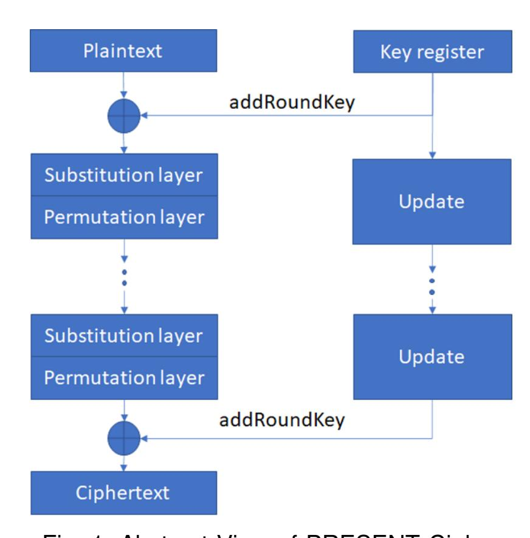
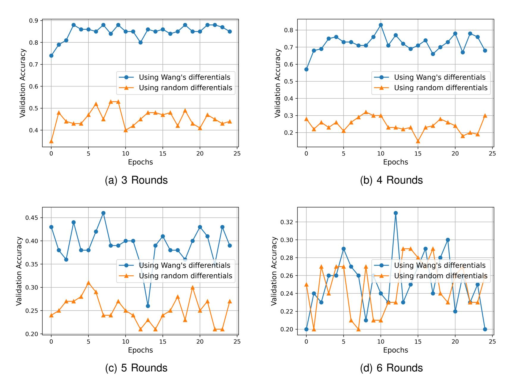
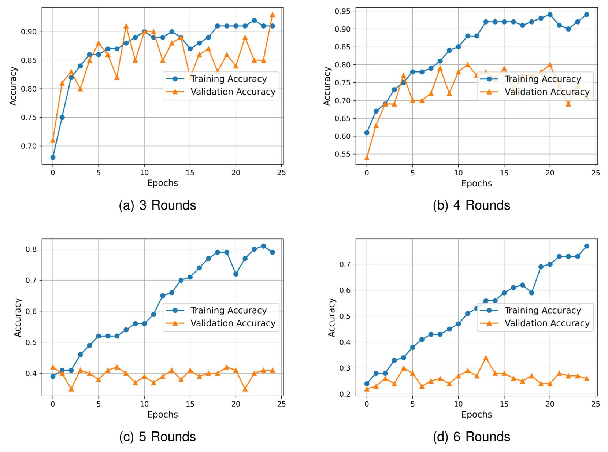

{0}------------------------------------------------

# **Deep Learning based Differential Distinguisher for Lightweight Cipher PRESENT**

**Aayush Jain**<sup>1</sup> **, Varun Kohli**<sup>2</sup> **, and Girish Mishra**<sup>3</sup>

<sup>1</sup> *Cluster Innovation Centre, University of Delhi, Delhi, India aayushjain0829@gmail.com* <sup>2</sup> *Department of Electrical and Electronics Engineering, BITS-Pilani , Pilani Campus, India varunkohli2013@gmail.com* <sup>3</sup> *Scientific Analysis Group, Defence R&D Organisation, Delhi, India gmishratech28@gmail.com*

**Abstract:** Recent years have seen a major involvement of deep learning architecture in the cryptanalysis of various lightweight ciphers. The present study is inspired by the work of Gohr and Baksi et al. in the field to develop a deep neural network-based differential distinguisher for round reduced PRESENT lightweight block cipher. We present a multi-layer perceptron network which can distinguish between 3-6 rounds of PRESENT cipher data and a randomly generated data with a significantly high probability. We also discuss the possible improvements in the original approach of the differential distinguisher presented by Baksi et al.

**Keywords:** Block Ciphers, Cryptanalysis, Deep Learning, Differential Distinguisher, PRESENT

### **1. INTRODUCTION**

Differential Cryptanalysis is a general cryptanalysis technique primarily used on block ciphers [\[1\]](#page-6-0), with some applications in stream ciphers [\[2\]](#page-6-1) and hash functions [\[3\]](#page-6-2). It is the study of how input differences affect the differences in the output. In the case of block ciphers, the technique follows the transformations of the input through the cipher network, detecting areas of non-random behavior. Such properties are exploited to recover the secret cryptographic key of the cipher. Work in differential cryptanalysis started in the late 1980s when Eli et. al. presented a novel cryptanalysis method that could be applied to various DES-like substitution and permutation cryptosystems [\[4\]](#page-6-3). Later in 1994, Don Coppersmith, a member of the original IBM-DES team discussed the efforts made by IBM to make DES immune to differential attacks [\[1\]](#page-6-0) since its inception in 1974. This technique was kept a secret by IBM and the NSA until later discussed in [\[4\]](#page-6-3). While DES was immune to them, differential attacks proved to be useful against other contemporary block ciphers at the time, such as FEAL-4 [\[5\]](#page-6-4).

The classical differential attack follows the exhaustive approach of creating a difference distribution table. In the recent work by Aron Gohr, a novel neural network-based distinguisher was proposed [\[6\]](#page-6-5), wherein a low-data, chosen-plaintext attack on round reduced Speck 32/64 gave better results than any past work done on Speck [\[7\]](#page-6-6). Their proposed attack is an all-inone approach with Markov assumption which considers all output differences for a given input difference. He also presents a key recovery attack against 11 rounds of Speck32/64, to recover the last two subkeys after 2 <sup>14</sup>.<sup>5</sup> chosen-plaintext queries with a computational complexity of 2 38 encryptions of Speck, compared to past work that achieved the complexity of 2 <sup>46</sup> for 11 rounds [\[7\]](#page-6-6).

{1}------------------------------------------------

In the line of Gohr's work on the deep learning (DL) based cryptanalysis of round reduced Speck, Baksi et al. discuss a deep learning-based approach for differential attacks on non-Markov 8-round Gimli-Hash and Gimli-Cipher [\[8\]](#page-6-7). They used multiple models including multilayer perceptron (MLP), Convolutional Neural Networks (CNN), and Long Short Term Memory (LSTM) with varied width and number of neurons. We discuss their method in-depth in a later section.

This paper mounts a similar attack on the PRESENT. Developed in 2007 by Bogdanov et al. [\[9\]](#page-6-8) at Orange Labs, France, PRESENT is a block cipher that has become the criteria to measure the security of modern lightweight ciphers. PRESENT used the S/P network and key scheduling for the 31 round encryption process. The S-box of PRESENT is a 4-bit to 4-bit mapping designed with hardware optimization in mind. Wang [\[10\]](#page-6-9) in 2008, presented his differential cryptanalysis of 16-round reduced PRESENT. His proposed differential characteristics for 14-round encryption had a probability of 2 <sup>−</sup><sup>62</sup> and that for 15-round encryption was 2 <sup>−</sup>66. Wang also searched for iterative characteristics from 2nd to 7th round which he claims to be more effective than 2-round iterative characteristics. In our research, we have used the same differentials proposed by Wang for the round reduced PRESENT for high probability differences in Baksi's differential attack algorithm on 3-6 rounds of PRESENT encryption. This gives significantly better results compared to when random input differences are selected. We also propose a multi-layer perceptron with a lesser number of hidden layers, which gives better results with lower training time.

We will discuss the lightweight cipher PRESENT, giving an overview of its encryption algorithm in Section 2 of this paper. This is followed by the discussion of the differential distinguisher algorithm including the addition of Wang's differentials in Section 3. We will then explain our deep learning model followed by the results obtained during experimentation in Section 4 and 5 respectively. Finally, We will conclude the study, giving direction for future work based on our research in Section 6.

# **2. PRESENT LIGHTWEIGHT BLOCK CIPHER**

PRESENT uses the S/P network and key scheduling algorithm for the 31 round encryption process [\[9\]](#page-6-8). Fig[-1](#page-2-0) illustrates the general working of the PRESENT cipher. It uses a 64-bit block as plain text input and 80-bit or 128-bit work as a key input. For the current study, we are only considering the 80-bit key variant.

The non-linearity in PRESENT is introduced via 4×4 S-box, which is applied 16 times in parallel. This non-linear Substitution layer is followed by a Permutation layer and the addition of round key i.e. addRoundKey to complete one iteration of PRESENT round function.

The round keys to be used in *addRoundKey* step is generated using the key scheduling algorithm of PRESENT which takes 80-bit key denoted as K = k79k78k77...k<sup>0</sup> and stores it in the register. Then this register is updated for each round using the following equations.

$$[k_{79}k_{78}...k_{1}k_{0}] = [k_{18}k_{17}...k_{20}k_{19}]$$
$$[k_{79}k_{78}k_{77}k_{76}] = S[k_{79}k_{78}k_{77}k_{76}]$$
$$[k_{19}k_{18}k_{17}k_{16}k_{15}] = [k_{19}k_{18}k_{17}k_{16}k_{15}] \bigoplus roundCounter$$

## **3. DIFFERENTIAL DISTINGUISHER**

Following the work done by Baksi et. al.[\[8\]](#page-6-7) on Machine Learning (ML) based distinguishers, we developed our own DL model based on their differential distinguisher algorithm. This section

{2}------------------------------------------------

TABLE I: Differences taken from Wang's study

<span id="page-2-1"></span>

| Input differential class | Input differentials |
|--------------------------|---------------------|
| 1                        | 0x7000000000007000  |
| 2                        | 0x0700000000000700  |
| 3                        | 0x0070000000000070  |
| 4                        | 0x0007000000000007  |

discusses the in-depth approach of their algorithm followed by the changes we made in the Deep Neural Network (DNN).

The algorithm for the deep learning based differential distinguisher is shown in Algorithm[-I.](#page-2-1) In this differential method, the attacker chooses (t ≥ 2) input differentials. The differences are selected from Wang's study [\[10\]](#page-6-9) to avoid using ones that have low probability and may give worse results. They are provided in Table[-I.](#page-2-1) This is followed by two phases, offline and online. The offline or the training phase is for making the output-input differential pairs of the train set, followed by training the DL model to learn the relationship between input and output differentials, whereas the online or testing phase involves the creation of the test and then deciphering whether the given *ORACLE* is the *CIPHER* or *RANDOM*. For t input differentials, if the training accuracy during the offline phase comes out to be ≥ 1 t , we proceed to the online phase. A testing accuracy ≥ 1 t in the online phase implies the *ORACLE* is the *CIPHER*, and otherwise, *RANDOM*.

# **4. DEEP LEARNING MODEL**

<span id="page-2-0"></span>We have implemented 4 differential distinguisher models which will, from here onwards, be denoted by M<sup>i</sup> (1 ≤ i ≤ 4). Model 1 (M1) and Model 2 (M2) are Baksi's recommended deep learning architecture for differential distinguisher [\[8\]](#page-6-7) with the only difference in the selection of input differentials. Baksi et al. recommended an MLP network with 3 hidden layers of sizes 128, 1024, and 1024 neurons respectively. Neurons in the output layer depend on the number of differential classes. Model 3 (M3) and Model 4 (M4) are our improvements over Baksi's DL architecture. We have observed in our study that taking only 2 hidden layers in the MLP network produced the



Fig. 1: Abstract View of PRESENT Cipher

{3}------------------------------------------------

<span id="page-3-0"></span>TABLE II: List of Hyper-parameters used in training of differential distinguisher models

| Hyper-Parameters  | Values   |  |  |  |
|-------------------|----------|--|--|--|
| Batch Size        | 200      |  |  |  |
| Epochs            | 25       |  |  |  |
| Encryption Rounds | 3-6      |  |  |  |
| Sample size       | 10000    |  |  |  |
| Optimizer         | Adam     |  |  |  |
| Loss function     | MSE Loss |  |  |  |
| Validation Split  | 0.3      |  |  |  |
| Learning rate     | 0.001    |  |  |  |

results in less time and better chances of avoiding data over-fitting. We have also observed that our model gives slightly better validation accuracies than the Baksi's recommended model. In  $M_3$  we are selecting the input differentials randomly and in  $M_4$ , we are using the input differentials suggested by Wang [10] in his work on differential cryptanalysis of PRESENT.

Dataset Collection: For 10,000 different key-plaintext pairs, we have selected 4 input different classes. These input differentials were either selected randomly (for  $M_1$  and  $M_3$ ) or were taken from Wang's work (for  $M_2$  and  $M_4$ ) on the differential attack on PRESENT. For every key-plaintext pair, the plaintext, and its corresponding difference pair, calculated for each input difference class, is encrypted for r-round reduced PRESENT. The obtained ciphertext pairs are operated over a XOR operation to get the output difference. This output difference, along with the input difference class, is stored in a training-dataset. The training and validation processes are based on Baksi's study. We have changed some hyper-parameters for the training and testing of the model. The details of the hyper-parameters used are given in Table-II.

#### 5. RESULTS

The results of the study are presented in Table-III in a very concise format. It is indicated by the table that the proposed improvement in Baksi's model is giving better validation accuracies for all

#### **Algorithm 1** ML based differential distinguisher

```
1: procedure Training Phase (OFFLINE)
                                                                         1: procedure Testing Phase (ONLINE)
 2:
          \delta_t \leftarrow \textit{Wang's differentials}
                                                                         2:
                                                                                  \delta_t \leftarrow \textit{Wang's differentials}
          P, K \leftarrow \mathsf{Random}
                                                                                  P, K \leftarrow \mathsf{Random}
 3:
                                                                         3:
          C \leftarrow \mathsf{CIPHER}(\mathsf{P\!,\!K})
                                                                                  C \leftarrow \mathsf{ORACLE}(\mathsf{P\!,\!K})
 4:
                                                                         4:
                                                                         5: loop:
 5: loop:
         C_i \leftarrow \mathsf{CIPHER}(P \bigoplus \delta_i, \mathsf{K})
                                                                                  C_i \leftarrow \mathsf{ORACLE}(P \bigoplus \delta_i, \mathsf{K})
 6:
                                                                         6:
 7:
          dataset(i) \leftarrow (C \bigoplus C_i, i)
                                                                         7:
                                                                                  dataset(i) \leftarrow (C \bigoplus C_i, i)
          goto loop.
                                                                                  goto loop.
 8:
                                                                         8:
 9: model:
                                                                         9: model:
          \alpha \leftarrow train(dataset)
                                                                                  \alpha' \leftarrow \textit{test(dataset)}
                                                                        10:
10:
          if \alpha > \frac{1}{t} then
                                                                                  if \alpha' = \alpha then
11:
                                                                        11:
               goto ONLINE PHASE.
                                                                                       ORACLE = CIPHER
12:
                                                                        12:
          else
                                                                                  else
                                                                        13:
13:
               Repeat from Step 3
                                                                                       ORACLE = RANDOM
                                                                        14:
14:
                                                                        15: Repeat from Step 3 if required
```

{4}------------------------------------------------

TABLE III: Comparison of different distinguishers based on the accuracy

<span id="page-4-0"></span>

| Rounds | Model 1 (M1) |            | Model 2 (M2) |            | Model 3 (M3) |            | Model 4 (M4) |            |
|--------|--------------|------------|--------------|------------|--------------|------------|--------------|------------|
|        | Training     | Validation | Training     | Validation | Training     | Validation | Training     | Validation |
| 3      | 0.94         | 0.44       | 0.91         | 0.85       | 0.82         | 0.42       | 0.91         | 0.93       |
| 4      | 0.94         | 0.3        | 0.95         | 0.68       | 0.69         | 0.28       | 0.95         | 0.75       |
| 5      | 0.89         | 0.27       | 0.94         | 0.39       | 0.67         | 0.24       | 0.80         | 0.40       |
| 6      | 0.94         | 0.26       | 0.94         | 0.2        | 0.76         | 0.21       | 0.77         | 0.26       |

<span id="page-4-1"></span>

Fig. 2: Comparative study of validation accuracy between M<sup>1</sup> and M<sup>2</sup>

the round-reduced encryptions that were in the domain. M<sup>1</sup> and M<sup>3</sup> didn't show any significant validation accuracies as expected. Both the models, when provided with Wang's differentials (M<sup>2</sup> and M4) performed significantly better than their random differentials counterparts. This study is better illustrated in Fig[-2.](#page-4-1) It shows the comparison of accuracies obtained for random input differences and Wang's differences while using Baksi's deep learning model for 3-6 rounds of PRESENT encryption. While Fig[-2a,](#page-4-1) Fig[-2b,](#page-4-1) and Fig[-2c](#page-4-1) clearly shows the better accuracies for Wang's differentials, Fig[-2d](#page-4-1) shows little difference between the two. This indicates that our proposed differential distinguisher model was only successful until the 5th-round encryption of PRESENT.

In addition to Baksi's suggested model, we developed our own MLP with one less hidden layer and parameters as mentioned in the Deep Learning Model section. M<sup>4</sup> gives better validation

{5}------------------------------------------------

<span id="page-5-0"></span>

Fig. 3: Training and Validation accuracies of M<sup>4</sup> for 3-6 rounds of PRESENT encryption.

accuracies than M<sup>1</sup> and M2, and its training and validation accuracy graphs for 3-6 rounds of PRESENT encryption are shown in Fig[-3.](#page-5-0)

# **6. CONCLUSION**

In this paper, we used Baksi et al's differential distinguisher algorithm as the base of our research. We used Wang's differentials instead of random differences and obtained significantly better results. We also used a simpler deep learning model with a lower number of hidden layers to obtain better results on round reduced PRESENT with lower training time. This differential attack works well up to 5-rounds of the PRESENT cipher. However, the complete round PRESENT cipher is immune to our proposed attack. Using regularisation techniques in the deep learning model can help overcome the observed overfitting of the deep neural networks on training data. In addition to this, our attack does not include a key retrieval method which can be developed in the future.

# **Acknowledgements**

The Authors thank the Scientific Analysis Group, DRDO, India for providing them with the opportunity to work in the field. The authors would also like to show their gratitude towards CIC, DU, India and BITS-Pilani, India for their constant encouragement.

{6}------------------------------------------------

## **References**

- <span id="page-6-0"></span>[1] D. Coppersmith, "The data encryption standard (des) and its strength against attacks," *IBM journal of research and development*, vol. 38, no. 3, pp. 243–250, 1994.
- <span id="page-6-1"></span>[2] E. Biham and O. Dunkelman, "Differential cryptanalysis of stream ciphers," Computer Science Department, Technion, Tech. Rep., 2007.
- <span id="page-6-2"></span>[3] E. Biham and A. Shamir, "Differential cryptanalysis of hash functions," in *Differential Cryptanalysis of The Data Encryption Standard*. Springer, 1993, pp. 133–148.
- <span id="page-6-3"></span>[4] ——, "Differential cryptanalysis of des-like cryptosystems," *Journal of CRYPTOLOGY*, vol. 4, no. 1, pp. 3–72, 1991.
- <span id="page-6-4"></span>[5] K. Aoki and K. Ohta, "Differential-linear cryptanalysis of feal-8," *IEICE Transactions on Fundamentals of Electronics, Communications and Computer Sciences*, vol. 79, no. 1, pp. 20–27, 1996.
- <span id="page-6-5"></span>[6] A. Gohr, "Improving attacks on round-reduced speck32/64 using deep learning," in *Annual International Cryptology Conference*. Springer, 2019, pp. 150–179.
- <span id="page-6-6"></span>[7] I. Dinur, "Improved differential cryptanalysis of round-reduced speck," in *International Conference on Selected Areas in Cryptography*. Springer, 2014, pp. 147–164.
- <span id="page-6-7"></span>[8] A. Baksi, J. Breier, X. Dong, and C. Yi, "Machine learning assisted differential distinguishers for lightweight ciphers." *IACR Cryptol. ePrint Arch.*, vol. 2020, p. 571, 2020.
- <span id="page-6-8"></span>[9] A. Bogdanov, L. R. Knudsen, G. Leander, C. Paar, A. Poschmann, M. J. Robshaw, Y. Seurin, and C. Vikkelsoe, "Present: An ultra-lightweight block cipher," in *International workshop on cryptographic hardware and embedded systems*. Springer, 2007, pp. 450–466.
- <span id="page-6-9"></span>[10] M. Wang, "Differential cryptanalysis of reduced-round present," in *International Conference on Cryptology in Africa*. Springer, 2008, pp. 40–49.